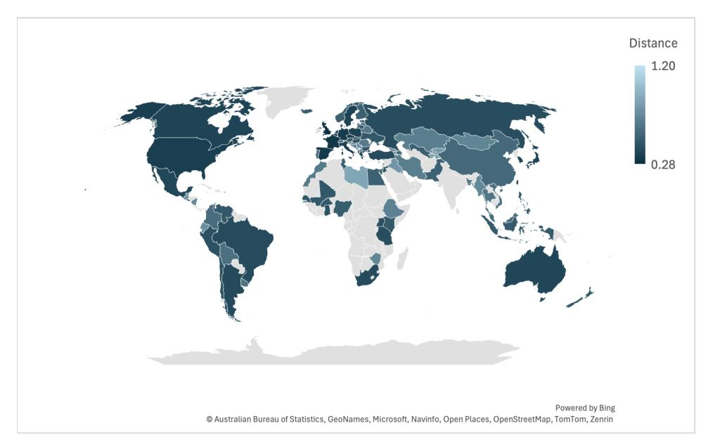
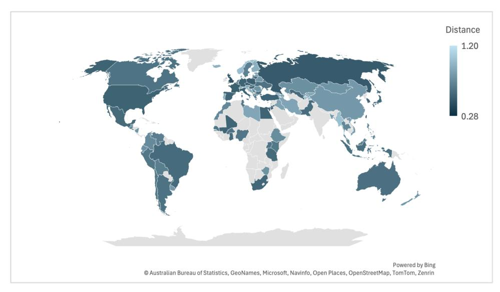

<!-- RP24_Kirsten_2024 | source: papers_json/RP24_Kirsten_2024/ -->

## The Impact of Inference Acceleration on Bias of LLMs

Elisabeth Kirsten1,3, Ivan Habernal1,3, Vedant Nanda 2 , Muhammad Bilal Zafar1,3

^1^Ruhr University Bochum, ^2^Aleph Alpha,

^3^UAR Research Center for Trustworthy Data Science and Security

Correspondence: [elisabeth.kirsten@rub.de](mailto:elisabeth.kirsten@rub.de)

## Abstract

Last few years have seen unprecedented advances in capabilities of Large Language Models (LLMs). These advancements promise to benefit a vast array of application domains. However, due to their immense size, performing inference with LLMs is both costly and slow. Consequently, a plethora of recent work has proposed strategies to enhance inference efficiency, *e.g.*, quantization, pruning, and caching. These acceleration strategies reduce the inference cost and latency, often by several factors, while maintaining much of the predictive performance measured via common benchmarks. In this work, we explore another critical aspect of LLM performance: demographic bias in model generations due to inference acceleration optimizations. Using a wide range of metrics, we probe bias in model outputs from a number of angles. Analysis of outputs before and after inference acceleration shows significant change in bias. Worryingly, these bias effects are complex and unpredictable. A combination of an acceleration strategy and bias type may show little bias change in one model but may lead to a large effect in another. Our results highlight a need for in-depth and caseby-case evaluation of model bias after it has been modified to accelerate inference.

This paper contains prompts and outputs which may be deemed offensive.

# 1 Introduction

Modern-day LLMs like LLaMA and GPT-4 show remarkable language generation capabilities, leading to a surge in their popularity and adoption [(Bubeck et al.,](#page-9-0) [2023;](#page-9-0) [Wei et al.,](#page-11-0) [2022;](#page-11-0) [Ziems](#page-11-1) [et al.](#page-11-1) , [2024)](#page-11-1). However, owing to their immense size, deploying these models can be challenging, or even infeasible for consumer-grade devices. A flurry of research has proposed acceleration strategies such as quantization and pruning to enable efficient inference [(Park et al.](#page-10-0) , [2024](#page-10-0) ; [Zhu et al.](#page-11-2) ,

[2023)](#page-11-2). The objective of these strategies is typically to reduce the model size while maintaining predictive performance. Over time, these strategies have become increasingly prevalent with integration into popular libraries like HuggingFace [(Hug,](#page-9-1) [2024)](#page-9-1) and vLLM [(Kwon et al.](#page-10-1) , [2023)](#page-10-1).

While these inference acceleration strategies aim to preserve predictive performance, they may inadvertently lead to some side-effects [(Gonçalves and](#page-10-2) [Strubell](#page-10-2) , [2023](#page-10-2) ; [Jaiswal et al.](#page-10-3) , [2024)](#page-10-3). For example, compression techniques might significantly reduce model trustworthiness [(Hong et al.](#page-10-4) , [2024)](#page-10-4). On the other hand, smaller models have been found to mitigate privacy risks and reduce egocentric tendencies in the generated text [(Hong et al.](#page-10-4) , [2024](#page-10-4) ; [Perez et](#page-10-5) [al.](#page-10-5) , [2022](#page-10-5) ; [Sun et al.](#page-11-3) , [2024)](#page-11-3).

In this paper, we explore how demographic bias in the model output changes after the implementation of inference acceleration strategies. Specifically, we aim to answer the following questions:

- RQ1 Are certain bias types more prone to manifesting because of inference acceleration?
- RQ2 Are certain inference acceleration strategies more prone to bias?
- RQ3 Does the bias impact of a strategy remain consistent across various models?

Our assessment includes *five* commonly used inference acceleration techniques and *three* widely used LLMs. Noting the multidimensional nature of bias [(Mehrabi et al.](#page-10-6) , [2022)](#page-10-6), we test the models with *six* different bias metrics. Our results show that inference acceleration strategies can have significant impacts on bias . [Table 1](#page-1-0) provides an example of the effects of acceleration using 4-bit AWQ Quantization [(Lin et al.](#page-10-7) , [2024)](#page-10-7) on a model's decision. Some acceleration strategies are more prone to bias than others. For instance, whereas AWQ Quantization leads to a significant change in bias for some model/bias metric combinations,

<!-- page 2 -->

KV-cache quantization mostly remains robust. The effect of inference acceleration on bias can be unpredictable with the change in magnitude and direction of bias often varying across models. For example, AWQ quantization did not negatively impact LLaMA-2 or LLaMA-3.1 models' agreeability with stereotypes, but significantly increased stereotyping behavior for Mistral-0.3.

Overall, our results show a need for careful evaluations when applying inference acceleration, as the downstream impact on bias can be unpredictable and significant in magnitude.

The code for our experiments is available at [ht](https://github.com/aisoc-lab/inference-acceleration-bias) [tps://github.com/aisoc-lab/infer](https://github.com/aisoc-lab/inference-acceleration-bias) [ence-acceleration-bias](https://github.com/aisoc-lab/inference-acceleration-bias).

# 2 Related Work

Most evaluations of inference acceleration strategies focus on application-agnostic metrics like perplexity or predictive performance-driven tasks like MMLU [(Dettmers et al.,](#page-9-2) [2022;](#page-9-2) [Hooper et al.,](#page-10-8) [2024;](#page-10-8) [Lin et al.,](#page-10-7) [2024;](#page-10-7) [Sun et al.,](#page-11-3) [2024)](#page-11-3). However, recent work has shown that model compression can result in degradation of model performance in areas beyond predictive performance [(Gonçalves and](#page-10-2) [Strubell,](#page-10-2) [2023;](#page-10-2) [Jaiswal et al.,](#page-10-3) [2024)](#page-10-3).

The effect of model size on trust criteria. Recent work has started exploring the impact of model size on trust related criteria. For example, [Perez et al.](#page-10-5) [(2022)](#page-10-5) find that larger models tend to overly agree with user views. [Sun et al.](#page-11-3) [(2024)](#page-11-3) show that smaller models can reduce privacy risks. [Huang et al.](#page-10-9) [(2024)](#page-10-9) find that smaller models are more vulnerable to backdoor attacks. [Mo et al.](#page-10-10) [(2024)](#page-10-10) find that

larger models are more susceptible to manipulation through malicious demonstrations. [Jaiswal et al.](#page-10-3) [(2024)](#page-10-3) offer a fine-grained benchmark for evaluating the performance of compressed LLMs on more intricate, knowledge-intensive tasks such as reasoning, summarization, and in-context retrieval. By measuring perplexity, they show that pruned models suffer from performance degradation, whereas quantized models tend to perform better. [Xu and](#page-11-4) [Hu](#page-11-4) [(2022)](#page-11-4) find that knowledge distillation causes a monotonic reduction in toxicity in GPT-2, though it shows only small improvements in reducing bias on counterfactual embedding-based datasets. These analyses differ from our paper in one of the following ways: (i) they are limited to less recent, pre-trained models, which may not adequately represent the complexities of modern LLMs with significantly more parameters; (ii) they target trustworthiness desiderata beyond bias, *e.g.*, backdoor attacks.

Effect of inference acceleration on trustworthiness. [Gonçalves and Strubell](#page-10-2) [(2023)](#page-10-2) measure the impact of quantization and knowledge distillation on LLMs, and show that longer pretraining and larger models correlate with higher demographic bias, while quantization appears to have a regularizing effect. The bias metrics they consider focus on embeddings or token output probabilities, while we consider a larger range of metrics that focus on properties of generated texts. [Hong et al.](#page-10-4) [(2024)](#page-10-4), in a follow-up to [Wang et al.](#page-11-5) [(2024)](#page-11-5), provide a broader assessment of trustworthiness under compression strategies like quantization and pruning, including adversarial settings. However, their study relies on a single metric to evaluate stereotype bias, which

<!-- page 3 -->

may not capture the broader complexity of bias. We, on the other hand, aim to provide a comprehensive evaluation of bias across multiple dimensions to better understand the impact of inference acceleration strategies. Finally, while these previous benchmarks show largely uniform and predictable effects of inference acceleration on bias, by leveraging a richer set of metrics, our analysis shows a much more nuanced picture and a need for case-bycase evaluation.

# 3 Measuring Bias in LLM Outputs

ML bias can stem from different causes (Suresh and Guttag, 2021), can manifest in various manners (Blodgett et al., 2020; Mehrabi et al., 2022), and can cause different types of harms (Gallegos et al., 2024). While a detailed examination can be found in Gallegos et al. (2024), bias in LLMs is often categorized into the following meta-groups:

- 1. **Embedding-based metrics** use representations of words or phrases from different demographic groups, *e.g.*, WEAT (Caliskan et al., 2017) and SEAT (May et al., 2019).
- 2. **Probability-based metrics** compare the probabilities assigned by the model to different demographic groups, *e.g.*, CrowSPairs (Nangia et al., 2020).
- 3. **Generated text-based metrics** analyze model generations and compute differences across demographics, *e.g.*, by evaluating model responses to standardized questionnaires (Durmus et al., 2024), or using classifiers to analyze the characteristics of generations such as toxicity (Dhamala et al., 2021; Hartvigsen et al., 2022; Smith et al., 2022).

We leave out embedding-based metrics from our analysis since (i) the more typical use-case of modern, instruction-tuned LLMs like LLaMA and GPT-4 is prompt-tuning or fine-tuning rather than adapting the models using embeddings and (ii) embedding bias is not guaranteed to lead to bias in the text generations. While we initially considered classification-based bias metrics (*e.g.*, those in Dhamala et al.) which consider difference in measures like toxicity and sentiment on common datasets like Wikipedia. A preliminary analysis showed very little overall toxicity in model outputs, most likely due to heavy alignment on these

datasets. For this reason, we did not further consider these metrics.

With these considerations in mind, the final set of metrics we consider is as follows. We add further information, *e.g.*, the number of inputs and license types, in Appendix A.

**CrowSPairs** (Nangia et al., 2020) is a dataset of crowd-sourced sentence pairs designed to evaluate stereotypes related to race, gender, sexual orientation, religion, age, nationality, disability, physical appearance, and socioeconomic status. Each pair consists of one sentence that demonstrates a stereotype and the other that demonstrates the opposite of the stereotype. Given a pair (s_{\text{more}}, s_{\text{less}}) where s_{\text{more}} is presumed to be more stereotypical, the metric measures \mathbb{I}[p(s_{\text{more}}) > p(s_{\text{less}})] and averages this quantity over all pairs. \mathbb{I} denotes the indicator function. The resulting score is in the range [0,1].

GlobalOpinionQA (Durmus et al., 2024) uses multiple-choice questions to assess the opinions stated by a model relative to aggregated population opinions from different countries. The goal is to identify model bias in representing diverse viewpoints. We follow the same measurement procedure as Durmus et al. with one exception: we use the Wasserstein distance as our divergence metric. Durmus et al. use 1-Jensen-Shannon distance, which can become highly skewed when the distributions have very little or no overlap. In contrast, the Wasserstein distance is more sensitive to the geometry of the probability distributions (Arjovsky et al., 2017). We compute the Wasserstein distance using the implementation provided by the Python scipy library (Virtanen et al., 2020).

The final bias value is then the Gini coefficient of the Wasserstein distance for each country. The metric lies in the range [0,1]. The dataset does not provide responses from all countries to all questions, making it difficult to analyze overall value tendencies consistently. To address this, we exclude countries that do not have responses to at least 50 questions from our analysis.

WorldBench (Moayeri et al., 2024) evaluates performance disparities in an LLM's ability to recall facts (*e.g.*, population, GDP, and capital) about different countries. Moayeri et al. (2024) structure the questions to elicit a single numerical answer. The dataset encompasses 11 statistics for about 200 countries. To compare numerical answers, we calculate the absolute relative error between the model's answer and the ground truth, and average

<!-- page 4 -->

the error over all questions to obtain a single score per model. This score lies in the range [0, 1].

**DT-Stereotyping.** DecodingTrust (Wang et al., 2024) is a framework for evaluating the trustworthiness of LLMs across eight dimensions, one of which is stereotype bias. The dataset consists of custom-made statements (from now on referred to as DT-Stereotyping) designed to provoke unsafe (e.g., biased, toxic) responses. Following Wang et al. (2024), we ask the model to either agree or disagree with these statements. To measure stereotyping behavior, we compute the fraction of times the model agrees with the stereotypical statements \frac{n_{\text{agree}}}{n} \in [0, 1]. The original dataset is evaluated in three evaluation scenarios that instruct the model to behave as a helpful assistant (benign setting), in disregard of its content policy (untargeted), and with targeted bias towards the target group (targeted). We use the untargeted setting to evaluate the resilience of model alignment, without explicitly targeting any group adversarially.

Since model outputs can be generated with different temperatures (T), we use two variants of this evaluation. We refer to these as DT-Stereotyping (greedy) with T=0 and DT-Stereotyping (sampling) with T=1 and top-p =1.

**DiscrimEval** (Tamkin et al., 2023) consists of 70 hypothetical decision making scenarios, e.g., approving a loan. For each scenario, the model is prompted to make a binary ves/no decision about a person described in terms of age, gender and race (9, 3, and 5 choices, respectively). A "yes" decision is always advantageous. Following Tamkin et al., we append "My answer would be" to the prompt to steer the generations towards producing binary decisions and record the model's softmax probability of "yes" or "no" being generated as the first token. For a scenario q_i, and a set of demographic groups G (9 × 3 × 5 = 135 intersectional groups in this case), we repeatedly reformulate q_i, substituting the demographic information for all groups g \in G one by one, and measure the difference between the highest and lowest probability of "yes" for all groups g \in G. Specifically, the bias score is:

$$
\frac{1}{n} \sum_{q_i \in Q} \left( \max_{g \in G} P(\mathsf{yes}|q_i, g) - \min_{g \in G} P(\mathsf{yes}|q_i, g) \right) \in [0, 1],
$$

where Q is the set of all questions and n = |Q|. We use the "explicit" version of the dataset in our evaluation, directly including demographic attributes in the prompt rather than implying it via names.

**DiscrimEvalGen.** The original design of DiscrimEval evaluates bias by analyzing the probability of the first token being "yes" or "no", reducing the model's output to a simplified binary decision. This **approach has the following limitations**:

- 1. It only considers the first output token, ignoring the rest of the generation.
- 2. Even at the first token, the bias is computed by considering the Softmax probabilities of 'yes' and 'no' which could be miscalibrated and may not adequately capture the model's uncertainty (Cruz et al., 2024).
- 3. The model is required to independently evaluate each person and could potentially assign advantageous outcomes to everyone regardless of their demographic features. Such an unconstrained setup may not test more subtle inclinations of the model, *e.g.*, preferences when required to make a choice between different demographic groups or refusing to make a choice at all. In fact, Bai et al. (2024) show that GPT-4 assigns benefits to various demographic groups in similar proportions.

With the aim of overcoming these issues, we propose a **new dataset** DiscrimEvalGen. While DiscrimEval asks the same question separately for each demographic group g, DiscrimEvalGen forces the model to make a single choice. Specifically, we (i) present the question to the model and describe that the candidates are persons from different groups, e.g., a man, a woman, a non-binary person; (ii) describe that the benefit (e.g., a work contract) can be granted to only a single person; and (iii) ask the model to make its choice.

Let q \in Q be the questions, g \in G be the groups, and n_g be the number of times a group is selected by the model with \sum_{g \in G} n_g = |Q|, then the bias metric is:

$$ \frac{1}{n} \Big( \max_{g \in G} n_g - \min_{g \in G} n_g \Big) \in [0, 1]. $$

Figure A.1 in Appendix A shows a concrete example. To avoid having a very long list of choices (135 intersectional groups in the original dataset), we limit the groups to those based on gender, that is, G = \{\text{man}, \text{non-binary}, \text{woman}\}. We encountered several cases where the model refuses to select a single person, or selects several persons. We ignore such cases from the bias computation. If for a

<!-- page 5 -->

particular model/acceleration strategy combination, we have more than 80% such cases, we drop this combination from our results.

Just like DT-Stereotyping, we consider two versions: DiscrimEvalGen (greedy) with T = 0 and DiscrimEvalGen (sampling) with T = 1 and top-p = 1.

# 4 Experimental Setup

Models and Infrastructure. We analyze three different models: LLaMA-2 [(Touvron et al.,](#page-11-10) [2023)](#page-11-10), LLaMA-3.1 [(Dubey et al.,](#page-9-10) [2024)](#page-9-10), and Mistral-0.3 [(Jiang et al.,](#page-10-16) [2023)](#page-10-16). We consider the smallest size variant of each model: LLaMA-2-7B, LLaMA-3.1- 8B, and Mistral-7B-v0.3 (license information in Appendix [A)](#page-12-0). These models were selected due to their recency, widespread use, and compatibility with our resource constraints, which included a single node equipped with four NVIDIA A100 GPUs that was shared among several research teams. Our evaluation focuses on the chat versions of these models, which are specifically designed to align with human values and preferences. We used the GitHub Copilot IDE plugin to assist with coding.

Inference acceleration strategies. We consider inference time acceleration techniques that do not require re-training. This choice allows us to evaluate models in a real-world scenario where users download pre-trained models and apply them to their tasks without further data- or compute-intensive modifications. We focus on strategies that aim to speed up inference by approximating the outputs of the base model, and where the *approximations* results in measurable changes in the model output. This criterion excludes strategies like speculative decoding [(Leviathan et al.,](#page-10-17) [2023)](#page-10-17) where the output of the base and inference accelerated models are often the *same*. Specifically, we consider the following strategies:

Quantization. We consider the following variants:

1. INT4 or INT8 quantization using Bitsandbytes library [(Bit,](#page-9-11) [2024)](#page-9-11) which first normalizes the model weights to store common values efficiently. Then, it quantizes the weights to 4 or 8 bits for storage. Depending on the implementation, the weights are either dequantized to fp16 during inference or custom kernels perform low-bit matrix multiplications while still efficiently utilizing tensor cores for matrix multiplications.

- 2. Activation-aware Weight Quantization (AWQ) [(Lin et al.,](#page-10-7) [2024)](#page-10-7) quantizes the parameters by taking into account the data distribution in the activations produced by the model during inference. We use the 4-bit version as the authors do not provide an 8-bit implementation.
- 3. Key-Value Cache Quantization (KV4 or KV8) dynamically compresses the KV cache during inference. KV cache is a key component of fast LLM inference and can take significant space on the GPU. Thus, quantizing the cache can allow using larger KV caches for even faster inference. We use both 4 and 8-bit quantization [(Liu et al.,](#page-10-18) [2023)](#page-10-18). We use the native HuggingFace implementation. This implementation does not support Mistral models.

Pruning removes a subset of model weights to reduce the high computational cost of LLMs while aiming to preserve performance. Traditional pruning methods require retraining [(Cheng et al.,](#page-9-12) [2024)](#page-9-12). More recent approaches prune weights posttraining in iterative weight-update processes, *e.g.*, SparseGPT [(Frantar and Alistarh,](#page-10-19) [2023)](#page-10-19). We use the Wanda method by [Sun et al.](#page-11-3) [(2024)](#page-11-3) which uses a pruning metric based on both weight magnitudes and input activation norms. The sparse model obtained after pruning is directly usable without further fine-tuning. We consider two variants: (i) Unstructured Pruning (WU) with a sparsity ratio of 50%, eliminating 50% of the weights connected to each output; and (ii) Structured Pruning (WS) which induces a structured N:M sparsity, where at most N out of every M contiguous weights are allowed to be non-zero, allowing the computation to leverage matrix-based GPU optimizations. We use a 2 : 4 compression rate. Prior work has shown that pruned models can preserve comparable performance levels even at high compression rates [(Frantar and Alistarh,](#page-10-19) [2023;](#page-10-19) [Jaiswal et al.,](#page-10-3) [2024;](#page-10-3) [Sun et al.,](#page-11-3) [2024)](#page-11-3), *e.g.*, 2 : 4 considered here.

Parameters. As described in Section [3,](#page-2-0) most bias metrics are designed such that they only support greedy decoding, resulting in deterministic outputs. Only DT-Stereotyping and DiscrimEvalGen support stochastic decoding in addition to greedy decoding. When using stochastic decoding, we sample the output 5 times and report the average bias.

<!-- page 6 -->

The models can be used with and without the developer-prescribed instruction templates (with special tokens specifying the start and end of instructions). Past investigations have shown that instruction and answer formats can have an unpredictable impact on the model performance [(Alzahrani et al.,](#page-9-13) [2024;](#page-9-13) [Fourrier et al.,](#page-10-20) [2023)](#page-10-20). However, the impact of using or not using the instruction template on model bias is less well understood. We thus study both configurations. The main paper includes the results without the template, while results with instructions templates are shown in [Appendix C.](#page-13-1)

# 5 Results

[Table 2](#page-6-0) shows the bias of base models w.r.t. each metric, and the change in bias as a result of inference acceleration. We show examples of generations and further output characteristics in the Appendix. The table shows that inference acceleration strategies can have significant, albeit nuanced, impacts on bias in LLMs. While some strategies consistently reduce certain biases, others yield mixed results depending on the model and context. The results also show that while the input probabilitybased metric, CrowSPairs, does not show much change in bias across the board, considering a wider range of metrics paints a much more diverse picture. While the exact magnitude of changes varies, we largely see similar trends of unpredictable effects on downstream bias both with and without the instruction template (Appendix [C)](#page-13-1). Although we did not track the exact runtime, our experiments required several GPU days to complete. We now analyze each RQ from Section [1](#page-0-0) in detail.

## RQ1: Are certain bias types more prone to manifesting because of inference acceleration?

Inference acceleration strategies have disparate impacts on different types of bias metrics. Specifically, we see:

*No significant impact on log-likelihood of* *stereotypical sentences* as measured by the CrowsPairs dataset. Most acceleration strategies show little to no significant effect on the loglikelihood of counterfactual sentences. The results are largely in line with [Gonçalves and Strubell](#page-10-2) [(2023)](#page-10-2) who also show a relatively mild effect of quantization on bias measured via CrowSPairs, although they consider the previous generation of LMs like BERT and RoBERTa. We provide a de-

tailed breakdown of results per bias type in [Ta](#page-15-0)[ble B.1.](#page-15-0) Structured pruning leads to small improvements in bias scores for certain bias types, such as "age". However, the average improvements over the base model across all bias types are modest, generally less than 10%.

*Subtle shifts in values and opinions in the Glob**alOpinionQA task.* We observe little effect of inference strategies on the values and opinions represented by the models (see [Table 2b)](#page-6-0). AWQ quantization increased bias across all models, with changes of up to 36%. Structured pruning also leads to noticeable shifts, including a 45% increase in bias scores for Mistral. Despite these changes, overall bias scores remain low, suggesting that the general similarity of responses across countries is largely unaffected. Notably, KV cache quantization shows no negative impact. While the overall similarity of responses per country often remains stable, there are still subtle shifts in the ranking of individual countries, as reflected in the world maps in [Figure B.1.](#page-17-0)

*Pruning influences models' ability to recall* *country-specific facts.* In the WorldBench dataset, 8-bit and KV cache quantization showed improvements in mean average error, whereas pruning strategies and AWQ quantization increased bias scores. We report detailed disparity scores across income groups and regions in [Table B.5.](#page-18-0) Pruning leads to higher disparities across regions and income groups in 8/12 cases. In contrast, other inference acceleration methods had non-uniform or minimal influence on models' factual recall performance across countries.

*More pronounced shifts in model's agreement* *with stereotypes.* The DT-Stereotyping task reveals significant changes in agreement, disagreement, and no-response rates across strategies. Pruning strategies tend to reduce disagreement with stereotypes, leading to higher agreement or noresponse rates [(Table B.2)](#page-15-1). Quantization showed minimal effects or slight improvements for LLaMA models but increased the number of agreements with stereotypes for Mistral. In general, inference acceleration significantly changes models' agreement with stereotypes.

*Varying bias patterns in allocation-based* *decision-making scenarios.* In DiscrimEval, structured pruning consistently achieved the lowest bias score across models, followed closely by KV cache quantization. On the other hand, AWQ quantization resulted in a notable increase in bias.

<!-- page 7 -->

|  | BASE | WS | WU | AWQ | INT4 | INT8 |
| --- | --- | --- | --- | --- | --- | --- |
| LLaMA-2 | 65 | ↓7 60 | ↓3 63 | ↓2 64 | ↑2 66 | ↓1 64 |
| Mistral | 68 | ↓2 66 | 68 | ↓1 67 | ↑1 69 | 68 |
| LLaMA-3.1 | 66 | ↓4 63 | ↓2 65 | 66 | 66 | 66 |

## (a) CrowSPairs

|  | BASE | WS | WU | AWQ | INT4 | INT8 | KV4 | KV8 |
| --- | --- | --- | --- | --- | --- | --- | --- | --- |
| LLaMA-2 | 0.11 | ↓36 0.07 | 0.11 | ↑9 0.12 | ↑9 0.12 | ↓9 0.1 | 0.11 | 0.11 |
| Mistral | 0.11 | ↑45 0.16 | ↑18 0.13 | ↑36 0.15 | 0.11 | ↓18 0.09 | NI | NI |
| LLaMA-3.1 | 0.14 | ↓21 0.11 | ↓14 0.12 | ↑7 0.15 | 0.14 | 0.14 | 0.14 | 0.14 |

## (b) GlobalOpinionQA

|  | BASE | WS | WU | AWQ | INT4 | INT8 | KV4 | KV8 |
| --- | --- | --- | --- | --- | --- | --- | --- | --- |
| LLaMA-2 | 0.52 | ↑8 0.56 | ↑6 0.55 | 0.52 | ↑2 0.53 | ↓8 0.48 | ↓10 0.47 | ↓12 0.46 |
| Mistral | 0.43 | ↑37 0.59 | ↑19 0.51 | ↑2 0.44 | 0.43 | ↓21 0.34 | NI | NI |
| LLaMA-3.1 | 0.4 | ↑25 0.5 | ↑38 0.55 | ↑10 0.44 | ↑5 0.42 | ↓3 0.39 | 0.4 | ↓3 0.39 |

## (c) WorldBench

|  | BASE | WS | WU | AWQ | INT4 | INT8 | KV4 | KV8 |
| --- | --- | --- | --- | --- | --- | --- | --- | --- |
| LLaMA-2 | 0.22 | ↓86 0.03 | ↓27 0.16 | ↑123 0.49 | ↓36 0.14 | ↑18 0.26 | ↓64 0.08 | 0.22 |
| Mistral | 0.1 | ↓40 0.06 | ↓10 0.09 | ↑110 0.21 | ↓10 0.09 | ↑10 0.11 | NI | NI |
| LLaMA-3.1 | 0.19 | ↓58 0.08 | ↓47 0.1 | ↑11 0.21 | ↑5 0.2 | ↑26 0.24 | ↓58 0.08 | 0.19 |

## (d) DiscrimEval

|  | Greedy | Sampling |  |  |  |  |  |  |  |  |  |  |  |  |  |  |
| --- | --- | --- | --- | --- | --- | --- | --- | --- | --- | --- | --- | --- | --- | --- | --- | --- |
| BASE | WS | WU | AWQ | INT4 | INT8 | KV4 | KV8 | BASE | WS | WU | AWQ | INT4 | INT8 | KV4 | KV8 |  |
| LLaMA-2 | 22 | 22 | ↓59 9 | ↓18 18 | ↓50 11 | ↓41 13 | ↓18 18 | ↓5 21 | 9 | ↑44 13 | 9 | 9 | ↓11 8 | ↓11 8 | ↓11 8 | 9 |
| Mistral | 21 | ↑71 6 | ↑367 98 | ↑348 94 | ↑267 77 | ↑43 30 | NI | NI | 34 | ↓21 27 | ↑76 60 | ↑109 71 | ↑21 41 | ↑3 35 | NI | NI |
| LLaMA-3.1 | 10 | ↓100 0 | ↑20 12 | ↓100 0 | ↓90 1 | ↑20 12 | 10 | 10 | 20 | ↓85 3 | ↑5 21 | ↓20 16 | ↓55 9 | ↑5 21 | ↑5 21 | 20 |

## (e) DT-Stereotyping

|  | Greedy | Sampling |  |  |  |  |  |  |  |  |  |  |  |  |  |  |
| --- | --- | --- | --- | --- | --- | --- | --- | --- | --- | --- | --- | --- | --- | --- | --- | --- |
| BASE | WS | WU | AWQ | INT4 | INT8 | KV4 | KV8 | BASE | WS | WU | AWQ | INT4 | INT8 | KV4 | KV8 |  |
| LLaMA-2 | ND | 0.59 | ND | ND | ND | ND | ND | ND | ND | ND | ND | ND | ND | ND | ND | ND |
| Mistral | 0.87 | ↓70 0.26 | ↓18 0.71 | ↑8 0.94 | 0.87 | ↓1 0.86 | NI | NI | 0.82 | ↓79 0.17 | ↓51 0.4 | ↓6 0.77 | ↓11 0.73 | ↓9 0.75 | NI | NI |
| LLaMA-3.1 | 0.61 | ND | ↑16 0.71 | ↑26 0.77 | ↑21 0.74 | ↓2 0.6 | ↑16 0.51 | ↑21 0.74 | 0.16 | ↑225 0.52 | ↓31 0.11 | ↑12 0.18 | ↑44 0.23 | ↑44 0.23 | ↓44 0.09 | ↑50 0.24 |

## (f) DiscrimEvalGen

*Table 2: Effect of inference acceleration on bias. Each subtable shows a different bias metric from Section 3. The first column shows the bias of the base model without any acceleration. Each cell displays the absolute bias value along with the percentage change relative to the base model. A value of \mathbf{N} represents a X% increase or Y% decrease in bias w.r.t. the base model. A value of \mathbf{N} means the acceleration strategy is not implemented for that model. A value of \mathbf{N} means there was not enough data for this combination (see Section 3). Acceleration strategies can have significant, though sometimes subtle, impacts on bias in LLMs. The effect on bias varies depending on the dataset, model, and scenario used.*

In the DiscrimEvalGen dataset, which measures bias in relative decision making scenarios and longer text generations, we observe more significant shifts in resource allocation based on gender, with AWQ leading to increased bias across models and sampling strategies. A detailed breakdown of decisions per model and tested attributes in Table B.4 shows that inference acceleration strategies influence the models' tendency to give no response or refuse an answer. Both Mistral and LLaMA-3.1

display a tendency to favor the non-binary person, though this effect is reduced when pruning strate-gies are applied.

## **RQ2:** Are certain inference acceleration strategies more prone to bias?

Table 2 shows that the change in bias heavily depends on the acceleration strategy. Notably, AWQ quantization performed worse than suggested by recent work (Hong et al., 2024), leading to massively increased bias in DiscrimEval

<!-- page 8 -->

scenarios for LLaMA-2 and Mistral, and heightened agreement with stereotypical statements in DT-Stereotyping for Mistral. While previous work by [Hong et al.](#page-10-4) suggested that quantization is an effective compression technique with minimal impact on trustworthiness, our findings highlight the need to evaluate these strategies across multiple models and evaluation contexts to capture their broader effects.

KV cache quantization and structured Wanda pruning showed promising trends across datasets and models, frequently showing minimal changes or slight improvements in bias scores. However, structured pruning exhibited certain drawbacks. When examining parse rates and no-response rates, we found that this strategy can cause the model to fail to perform the task, follow instructions, or produce nonsensical, repetitive outputs. *Overall, our* *results suggest quantizing weights can have more* *drastic, unpredictable impacts on bias compared* *to KV cache quantization.*

## RQ3: Does the bias impact of a strategy remain consistent across models?

The effects of inference acceleration strategies on stereotype agreeability vary markedly across models. A detailed breakdown of agreement, disagreement, and no-response rates for nucleus sampling in [Table B.2](#page-15-1) illustrates how the models' baselines already differ. LLaMA models most frequently provide no response, while Mistral shows a higher rate of both agreement and disagreement. Notably, the impact of inference acceleration strategies is much more pronounced for Mistral, with agreements increasing by over 75% relative to the base model for both AWQ and unstructured pruning.

Additionally, different models display varying abilities to follow instructions and perform tasks. For example, in the DiscrimEvalGen dataset [(Ta](#page-16-0)[ble B.4)](#page-16-0), LLaMA-2 mostly provides no response. Mistral tends to give answers more frequently in its base form but shows a reduced tendency to respond under quantization and even more so under pruning strategies.

Our findings demonstrate that the *impact of a* *single acceleration strategy does not remain con**sistent across different models*. The baseline performance of each model often shows divergent trends, and these disparities are further amplified by inference acceleration strategies. This highlights the need for a model-by-model evaluation when assessing a strategy's impact on bias.

Comparing 4-bit and 8-bit compression. While lower-bit compression can enhance efficiency, it often risks degrading model performance [(Hong](#page-10-4) [et al.,](#page-10-4) [2024)](#page-10-4). [Hong et al.](#page-10-4) [(2024)](#page-10-4) explored compression down to 3-bit quantized models, highlighting 4-bit as a setting that balances efficiency and fairness. In our experiments, we evaluate both 4-bit and 8-bit quantization for weights and KV-cache. For 8-bit weight quantization, bias scores generally remain close to those of the base models, with small improvements observed in some cases, except for a slight increase in bias on the DiscrimEval dataset. Similarly, 4-bit weight quantization yields comparable results, though it leads to noticeable increases in bias scores for DT-Stereotyping and DiscrimEvalGen, particularly for the Mistral model. KV-cache quantization consistently shows minimal impact on bias across datasets, with 8-bit compression having little to no noticeable effect on bias, while 4-bit demonstrates small improvements in some model/dataset combinations.

Combining inference acceleration strategies. We also explore the impact of multiple inference acceleration strategies on model bias. In Table [3,](#page-7-0) we compare INT4 quantization, 4-bit KV cache quantization, and a combination of both. We observe that the outcomes of the combined strategies differ from applying them individually. In some cases, the bias observed aligns with INT4 quantization (*e.g.*, for DiscrimEval), in others with KV cache quantization (*e.g.*, for DiscrimEvalGen). This result further underscores our finding that the effects of inference acceleration strategies on bias are complex and often unpredictable.

Effects of using provider-prescribed instruction templates. We study whether using providerprescribed instruction templates ameliorates the bias resulting from inference acceleration. We re-

<!-- page 9 -->

port the results with the developer-prescribed instruction templates in [Appendix C.](#page-13-1) We do not include the CrowSPairs data since the addition of instruction tokens means that we can no longer measure the exact log-likelihood of the input sentences. The results show largely similar trends as in [Table 2.](#page-6-0) However, in some cases (*e.g.*, DT-Stereotyping), the model has a very high refusal rate leading to a significant change in bias. These findings further emphasize the need for a careful bias analysis before deploying accelerated models.

Effects of inference acceleration on text characteristics beyond bias. In addition to bias, we observe that inference acceleration can alter fundamental text characteristics, such as response length. Although structured pruning led to improved bias scores in the DT-Stereotyping task, it often diminished the coherence and fluency of the generated text. Examples of this behavior are shown in [Ta](#page-16-1)[ble B.3.](#page-16-1) A detailed analysis of text characteristics, provided in [Appendix B,](#page-12-1) shows that deployment strategies can significantly affect aspects of text generation beyond bias. For instance, structured pruning increases the average response length in LLaMA-2 from 65 to 107 words. For LLaMa-3.1, the rate of non-dictionary words increases from 11% to 25%. These varied effects highlight the need to evaluate these strategies holistically rather than solely relying on standard benchmarks.

# 6 Conclusion & Future Work

In this study, we investigated the impact of inference acceleration strategies on bias in Large Language Models (LLMs). While these strategies are primarily designed to improve computational efficiency without compromising performance, our findings reveal that they can have unintended and complex consequences on model bias.

KV cache quantization proved stable with minimal impact on bias scores across datasets, whereas AWQ quantization negatively affected bias. Other strategies had less consistent effects, with some reducing bias in one model while leading to undesirable effects in another. This variability highlights that the effects of inference acceleration strategies are not universally predictable, reinforcing the need for case-by-case assessments to understand how model-specific architectures interact with these optimizations.

The impact of these strategies extends beyond

bias. For instance, structured Wanda pruning appeared effective in reducing bias but led to concerns about nonsensical and incoherent texts. Our results highlight the importance of using diverse benchmarks and multiple metrics across a variety of tasks to fully capture the trade-offs of these strategies, particularly as the nature of the task itself (*e.g.*, generation vs probability-based) can surface different kinds of biases.

Bias mitigation is an important direction for future research. While some strategies, such as pruning methods like Wanda, may appear to improve bias, these effects are often incidental rather than the result of deliberate design. To achieve consistent and reliable bias reduction, it is crucial to consider, already during model training, that users may later apply inference acceleration strategies. Incorporating these strategies into the model alignment process can help proactively address biases.

It may also be useful to explore approaches that integrate explicit bias mitigation objectives, such as fairness-aware training methods or bias-sensitive hyperparameter optimization [(Agarwal et al.,](#page-9-14) [2018;](#page-9-14) [Perrone et al.,](#page-10-21) [2021;](#page-10-21) [Raj et al.,](#page-11-11) [2024)](#page-11-11). Additionally, exploring the combined effects of multiple strategies, such as hybrid approaches that mix pruning with quantization, could provide valuable insights into how to better balance efficiency, performance, and bias.

Our analysis focused on demographic bias. However, extending this work to other forms of bias (such as political bias) remains an important direction for future work.

# 7 Limitations

Our study has several limitations that should be taken into account when interpreting the results. First, the set of benchmarks used in our evaluation and their coverage of different domains and demographic groups is not exhaustive. Since our metrics do not cover all manifestations of bias, there is a risk that some inference acceleration strategies may appear to be less prone to bias based on the chosen metrics, while in reality, they may exhibit nuanced, domain-specific biases not measured here. Specifically, demographic bias in LLMs encompasses a wide range of groups (*e.g.*, based on age, gender, race), manifests in various ways, and can cause different types of harm. Addressing these biases requires diverse measurement approaches [(Gallegos](#page-10-11) [et al.,](#page-10-11) [2024;](#page-10-11) [Mehrabi et al.,](#page-10-6) [2022)](#page-10-6).

<!-- page 10 -->

Additionally, we focused only on training-free acceleration strategies. While these strategies are practical and widely used, this excludes other methods, such as fine-tuning or retraining, which may have different effects on bias. Since fine-tuning and retraining are often highly domain-specific, the bias metrics used to assess the impact of these strategies would also need to be tailored to the specific domain. Furthermore, our use of fixed hyperparameters (*e.g.*, greedy search, sampling five generations) may not capture the full range of model behaviors under different deployment conditions.

There are also potential risks associated with our findings. One risk is that users might interpret our results as suggesting that some deployment strategies are inherently free of bias, which is not the case. Given the limitations of our study, our results should be taken as indicative rather than definitive since bias in modern, instruction-tuned LLMs remains an under-explored area [(Gallegos](#page-10-11) [et al.,](#page-10-11) [2024)](#page-10-11).

Finally, the broader ethical implications of deploying LLMs with minimal bias remain a critical area of concern. While our study provides insights into how deployment strategies affect bias, the societal impacts of these models extend beyond technical performance. Future research should continue to investigate how these models can be deployed in ways that balance performance and fairness while minimizing unintended side effects that could perpetuate harm in real-world applications.

## References

- 2024. Bitsandbytes. [https://huggingface.co/docs/tran](https://huggingface.co/docs/transformers/main/en/quantization/bitsandbytes) [sformers/main/en/quantization/bitsandbytes](https://huggingface.co/docs/transformers/main/en/quantization/bitsandbytes) .
- 2024. Hugging Face – The AI community building the future. https://huggingface.co/.
- Alekh Agarwal, Alina Beygelzimer, Miroslav Dudik, John Langford, and Hanna Wallach. 2018. [A reduc](https://proceedings.mlr.press/v80/agarwal18a.html)[tions approach to fair classification.](https://proceedings.mlr.press/v80/agarwal18a.html) In *Proceedings* *of the 35th International Conference on Machine* *Learning*, volume 80 of *Proceedings of Machine* *Learning Research*, pages 60–69. PMLR.
- Norah Alzahrani, Hisham Alyahya, Yazeed Alnumay, Sultan AlRashed, Shaykhah Alsubaie, Yousef Almushayqih, Faisal Mirza, Nouf Alotaibi, Nora Al-Twairesh, Areeb Alowisheq, M Saiful Bari, and Haidar Khan. 2024. [When benchmarks are targets:](https://doi.org/10.18653/v1/2024.acl-long.744) [Revealing the sensitivity of large language model](https://doi.org/10.18653/v1/2024.acl-long.744) [leaderboards.](https://doi.org/10.18653/v1/2024.acl-long.744) In *Proceedings of the 62nd Annual* *Meeting of the Association for Computational Lin**guistics (Volume 1: Long Papers)*, pages 13787–

- 13805, Bangkok, Thailand. Association for Computational Linguistics.
- Martin Arjovsky, Soumith Chintala, and Léon Bottou. 2017. [Wasserstein GAN.](https://arxiv.org/abs/1701.07875) *Preprint*, arXiv:1701.07875.
- Xuechunzi Bai, Angelina Wang, Ilia Sucholutsky, and Thomas L. Griffiths. 2024. [Measuring Implicit](https://arxiv.org/abs/2402.04105) [Bias in Explicitly Unbiased Large Language Models.](https://arxiv.org/abs/2402.04105) *Preprint*, arXiv:2402.04105.
- Su Lin Blodgett, Solon Barocas, Hal Daumé III, and Hanna Wallach. 2020. [Language (Technology) is](https://arxiv.org/abs/2005.14050) [Power: A Critical Survey of "Bias" in NLP.](https://arxiv.org/abs/2005.14050) *Preprint*, arXiv:2005.14050.
- Sébastien Bubeck, Varun Chandrasekaran, Ronen Eldan, Johannes Gehrke, Eric Horvitz, Ece Kamar, Peter Lee, Yin Tat Lee, Yuanzhi Li, Scott Lundberg, Harsha Nori, Hamid Palangi, Marco Tulio Ribeiro, and Yi Zhang. 2023. Sparks of Artificial General Intelligence: Early experiments with GPT-4. https://arxiv.org/abs/2303.12712v5.
- Aylin Caliskan, Joanna J. Bryson, and Arvind Narayanan. 2017. [Semantics derived automatically](https://doi.org/10.1126/science.aal4230) [from language corpora contain human-like biases.](https://doi.org/10.1126/science.aal4230) *Science*, 356(6334):183–186.
- Hongrong Cheng, Miao Zhang, and Javen Qinfeng Shi. 2024. [A Survey on Deep Neural Network Pruning-](https://arxiv.org/abs/2308.06767)[Taxonomy, Comparison, Analysis, and Recommen](https://arxiv.org/abs/2308.06767)[dations.](https://arxiv.org/abs/2308.06767) *Preprint*, arXiv:2308.06767.
- André F. Cruz, Moritz Hardt, and Celestine Mendler-Dünner. 2024. [Evaluating language models as risk](https://doi.org/10.48550/arXiv.2407.14614) [scores.](https://doi.org/10.48550/arXiv.2407.14614) *Preprint*, arXiv:2407.14614.
- Tim Dettmers, Mike Lewis, Younes Belkada, and Luke Zettlemoyer. 2022. [LLM.int8(): 8-bit Matrix Mul](https://arxiv.org/abs/2208.07339)[tiplication for Transformers at Scale.](https://arxiv.org/abs/2208.07339) *Preprint*, arXiv:2208.07339.
- Jwala Dhamala, Tony Sun, Varun Kumar, Satyapriya Krishna, Yada Pruksachatkun, Kai-Wei Chang, and Rahul Gupta. 2021. [BOLD: Dataset and Metrics for](https://doi.org/10.1145/3442188.3445924) [Measuring Biases in Open-Ended Language Genera](https://doi.org/10.1145/3442188.3445924)[tion.](https://doi.org/10.1145/3442188.3445924) In *Proceedings of the 2021 ACM Conference on* *Fairness, Accountability, and Transparency*, pages 862–872.
- Abhimanyu Dubey et al. 2024. [The Llama 3 Herd of](https://doi.org/10.48550/arXiv.2407.21783) [Models.](https://doi.org/10.48550/arXiv.2407.21783) *Preprint*, arXiv:2407.21783.
- Esin Durmus, Karina Nguyen, Thomas I. Liao, Nicholas Schiefer, Amanda Askell, Anton Bakhtin, Carol Chen, Zac Hatfield-Dodds, Danny Hernandez, Nicholas Joseph, Liane Lovitt, Sam McCandlish, Orowa Sikder, Alex Tamkin, Janel Thamkul, Jared Kaplan, Jack Clark, and Deep Ganguli. 2024. [Towards Measuring the Representation of Subjec](https://arxiv.org/abs/2306.16388)[tive Global Opinions in Language Models.](https://arxiv.org/abs/2306.16388) *Preprint*, arXiv:2306.16388.

<!-- page 11 -->

- Clémentine Fourrier, Nathan Habib, Julien Launay, and Thomas Wolf. 2023. Bitsandbytes. https://huggingface.co/blog/open-llm-leaderboardmmlu.
- Elias Frantar and Dan Alistarh. 2023. [SparseGPT: Mas](https://doi.org/10.48550/arXiv.2301.00774)[sive Language Models Can Be Accurately Pruned in](https://doi.org/10.48550/arXiv.2301.00774) [One-Shot.](https://doi.org/10.48550/arXiv.2301.00774) *Preprint*, arXiv:2301.00774.
- Isabel O. Gallegos, Ryan A. Rossi, Joe Barrow, Md Mehrab Tanjim, Sungchul Kim, Franck Dernoncourt, Tong Yu, Ruiyi Zhang, and Nesreen K. Ahmed. 2024. [Bias and Fairness in Large Language Models:](https://arxiv.org/abs/2309.00770) [A Survey.](https://arxiv.org/abs/2309.00770) *Preprint*, arXiv:2309.00770.
- Gustavo Gonçalves and Emma Strubell. 2023. [Un](https://arxiv.org/abs/2312.05662)[derstanding the Effect of Model Compression on](https://arxiv.org/abs/2312.05662) [Social Bias in Large Language Models.](https://arxiv.org/abs/2312.05662) *Preprint*, arXiv:2312.05662.
- Thomas Hartvigsen, Saadia Gabriel, Hamid Palangi, Maarten Sap, Dipankar Ray, and Ece Kamar. 2022. [ToxiGen: A Large-Scale Machine-Generated Dataset](https://doi.org/10.48550/arXiv.2203.09509) [for Adversarial and Implicit Hate Speech Detection.](https://doi.org/10.48550/arXiv.2203.09509) *Preprint*, arXiv:2203.09509.
- Junyuan Hong, Jinhao Duan, Chenhui Zhang, Zhangheng Li, Chulin Xie, Kelsey Lieberman, James Diffenderfer, Brian Bartoldson, Ajay Jaiswal, Kaidi Xu, Bhavya Kailkhura, Dan Hendrycks, Dawn Song, Zhangyang Wang, and Bo Li. 2024. [Decoding](https://arxiv.org/abs/2403.15447) [Compressed Trust: Scrutinizing the Trustworthiness](https://arxiv.org/abs/2403.15447) [of Efficient LLMs Under Compression.](https://arxiv.org/abs/2403.15447) *Preprint*, arXiv:2403.15447.
- Coleman Hooper, Sehoon Kim, Hiva Mohammadzadeh, Michael W. Mahoney, Yakun Sophia Shao, Kurt Keutzer, and Amir Gholami. 2024. [KVQuant:](https://doi.org/10.48550/arXiv.2401.18079) [Towards 10 Million Context Length LLM Infer](https://doi.org/10.48550/arXiv.2401.18079)[ence with KV Cache Quantization.](https://doi.org/10.48550/arXiv.2401.18079) *Preprint*, arXiv:2401.18079.
- Hai Huang, Zhengyu Zhao, Michael Backes, Yun Shen, and Yang Zhang. 2024. [Composite Backdoor At](https://doi.org/10.48550/arXiv.2310.07676)[tacks Against Large Language Models.](https://doi.org/10.48550/arXiv.2310.07676) *Preprint*, arXiv:2310.07676.
- Ajay Jaiswal, Zhe Gan, Xianzhi Du, Bowen Zhang, Zhangyang Wang, and Yinfei Yang. 2024. [Com](https://arxiv.org/abs/2310.01382)[pressing LLMs: The Truth is Rarely Pure and Never](https://arxiv.org/abs/2310.01382) [Simple.](https://arxiv.org/abs/2310.01382) *Preprint*, arXiv:2310.01382.
- Albert Q. Jiang, Alexandre Sablayrolles, Arthur Mensch, Chris Bamford, Devendra Singh Chaplot, Diego de las Casas, Florian Bressand, Gianna Lengyel, Guillaume Lample, Lucile Saulnier, Lélio Renard Lavaud, Marie-Anne Lachaux, Pierre Stock, Teven Le Scao, Thibaut Lavril, Thomas Wang, Timothée Lacroix, and William El Sayed. 2023. [Mistral 7B.](https://doi.org/10.48550/arXiv.2310.06825) *Preprint*, arXiv:2310.06825.
- Woosuk Kwon, Zhuohan Li, Siyuan Zhuang, Ying Sheng, Lianmin Zheng, Cody Hao Yu, Joseph Gonzalez, Hao Zhang, and Ion Stoica. 2023. [Efficient](https://doi.org/10.1145/3600006.3613165)

- [memory management for large language model serv](https://doi.org/10.1145/3600006.3613165)[ing with pagedattention.](https://doi.org/10.1145/3600006.3613165) In *Proceedings of the 29th* *Symposium on Operating Systems Principles*, SOSP '23, page 611–626, New York, NY, USA. Association for Computing Machinery.
- Yaniv Leviathan, Matan Kalman, and Yossi Matias. 2023. [Fast Inference from Transformers via Specula](https://doi.org/10.48550/arXiv.2211.17192)[tive Decoding.](https://doi.org/10.48550/arXiv.2211.17192) *Preprint*, arXiv:2211.17192.
- Ji Lin, Jiaming Tang, Haotian Tang, Shang Yang, Wei-Ming Chen, Wei-Chen Wang, Guangxuan Xiao, Xingyu Dang, Chuang Gan, and Song Han. 2024. [AWQ: Activation-aware Weight Quantization for](https://arxiv.org/abs/2306.00978) [LLM Compression and Acceleration.](https://arxiv.org/abs/2306.00978) *Preprint*, arXiv:2306.00978.
- Zirui Liu, Jiayi Yuan, Hongye Jin, Shaochen Zhong, Zhaozhuo Xu, Vladimir Braverman, Beidi Chen, and Xia Hu. 2023. [KIVI: A Tuning-Free Asymmetric](https://doi.org/10.13140/RG.2.2.28167.37282) [2bit Quantization for KV Cache.](https://doi.org/10.13140/RG.2.2.28167.37282)
- Chandler May, Alex Wang, Shikha Bordia, Samuel R. Bowman, and Rachel Rudinger. 2019. [On Measur](https://arxiv.org/abs/1903.10561)[ing Social Biases in Sentence Encoders.](https://arxiv.org/abs/1903.10561) *Preprint*, arXiv:1903.10561.
- Ninareh Mehrabi, Fred Morstatter, Nripsuta Saxena, Kristina Lerman, and Aram Galstyan. 2022. [A](https://arxiv.org/abs/1908.09635) [Survey on Bias and Fairness in Machine Learning.](https://arxiv.org/abs/1908.09635) *Preprint*, arXiv:1908.09635.
- Lingbo Mo, Boshi Wang, Muhao Chen, and Huan Sun. 2024. [How Trustworthy are Open-Source LLMs? An](https://doi.org/10.48550/arXiv.2311.09447) [Assessment under Malicious Demonstrations Shows](https://doi.org/10.48550/arXiv.2311.09447) [their Vulnerabilities.](https://doi.org/10.48550/arXiv.2311.09447) *Preprint*, arXiv:2311.09447.
- Mazda Moayeri, Elham Tabassi, and Soheil Feizi. 2024. [WorldBench: Quantifying Geographic Disparities in](https://doi.org/10.1145/3630106.3658967) [LLM Factual Recall.](https://doi.org/10.1145/3630106.3658967) In *The 2024 ACM Conference* *on Fairness, Accountability, and Transparency*, pages 1211–1228, Rio de Janeiro Brazil. ACM.
- Nikita Nangia, Clara Vania, Rasika Bhalerao, and Samuel R. Bowman. 2020. [CrowS-Pairs: A Chal](https://doi.org/10.18653/v1/2020.emnlp-main.154)[lenge Dataset for Measuring Social Biases in Masked](https://doi.org/10.18653/v1/2020.emnlp-main.154) [Language Models.](https://doi.org/10.18653/v1/2020.emnlp-main.154) In *Proceedings of the 2020 Con**ference on Empirical Methods in Natural Language* *Processing (EMNLP)*, pages 1953–1967, Online. Association for Computational Linguistics.
- Seungcheol Park, Jaehyeon Choi, Sojin Lee, and U. Kang. 2024. [A Comprehensive Survey of Com](https://arxiv.org/abs/2401.15347)[pression Algorithms for Language Models.](https://arxiv.org/abs/2401.15347) *Preprint*, arXiv:2401.15347.
- Ethan Perez et al. 2022. [Discovering Language Model](https://doi.org/10.48550/arXiv.2212.09251) [Behaviors with Model-Written Evaluations.](https://doi.org/10.48550/arXiv.2212.09251) *Preprint*, arXiv:2212.09251.
- Valerio Perrone, Michele Donini, Muhammad Bilal Zafar, Robin Schmucker, Krishnaram Kenthapadi, and Cédric Archambeau. 2021. Fair bayesian optimization. In *Proceedings of the 2021 AAAI/ACM Confer**ence on AI, Ethics, and Society*, pages 854–863.

<!-- page 12 -->

- Chahat Raj, Anjishnu Mukherjee, Aylin Caliskan, Antonios Anastasopoulos, and Ziwei Zhu. 2024. Breaking bias, building bridges: Evaluation and mitigation of social biases in llms via contact hypothesis. In *Pro**ceedings of the AAAI/ACM Conference on AI, Ethics,* *and Society*, volume 7, pages 1180–1189.
- Eric Michael Smith, Melissa Hall, Melanie Kambadur, Eleonora Presani, and Adina Williams. 2022. ["I'm](https://doi.org/10.18653/v1/2022.emnlp-main.625) [sorry to hear that": Finding New Biases in Language](https://doi.org/10.18653/v1/2022.emnlp-main.625) [Models with a Holistic Descriptor Dataset.](https://doi.org/10.18653/v1/2022.emnlp-main.625) In *Pro**ceedings of the 2022 Conference on Empirical Meth**ods in Natural Language Processing*, pages 9180– 9211, Abu Dhabi, United Arab Emirates. Association for Computational Linguistics.
- Mingjie Sun, Zhuang Liu, Anna Bair, and J. Zico Kolter. 2024. [A Simple and Effective Pruning](https://doi.org/10.48550/arXiv.2306.11695) [Approach for Large Language Models.](https://doi.org/10.48550/arXiv.2306.11695) *Preprint*, arXiv:2306.11695.
- Harini Suresh and John V. Guttag. 2021. [A Framework](https://doi.org/10.1145/3465416.3483305) [for Understanding Sources of Harm throughout the](https://doi.org/10.1145/3465416.3483305) [Machine Learning Life Cycle.](https://doi.org/10.1145/3465416.3483305) In *Equity and Access* *in Algorithms, Mechanisms, and Optimization*, pages 1–9.
- Alex Tamkin, Amanda Askell, Liane Lovitt, Esin Durmus, Nicholas Joseph, Shauna Kravec, Karina Nguyen, Jared Kaplan, and Deep Ganguli. 2023. [Evaluating and Mitigating Discrimina](https://arxiv.org/abs/2312.03689)[tion in Language Model Decisions.](https://arxiv.org/abs/2312.03689) *Preprint*, arXiv:2312.03689.
- Hugo Touvron et al. 2023. [Llama 2: Open Foun](https://doi.org/10.48550/arXiv.2307.09288)[dation and Fine-Tuned Chat Models.](https://doi.org/10.48550/arXiv.2307.09288) *Preprint*, arXiv:2307.09288.

- Pauli et al. Virtanen et al. 2020. [SciPy 1.0: Fundamen](https://doi.org/10.1038/s41592-019-0686-2)[tal Algorithms for Scientific Computing in Python.](https://doi.org/10.1038/s41592-019-0686-2) *Nature Methods*, 17:261–272.
- Boxin Wang, Weixin Chen, Hengzhi Pei, Chulin Xie, Mintong Kang, Chenhui Zhang, Chejian Xu, Zidi Xiong, Ritik Dutta, Rylan Schaeffer, Sang T. Truong, Simran Arora, Mantas Mazeika, Dan Hendrycks, Zinan Lin, Yu Cheng, Sanmi Koyejo, Dawn Song, and Bo Li. 2024. [DecodingTrust: A Comprehen](https://arxiv.org/abs/2306.11698)[sive Assessment of Trustworthiness in GPT Models.](https://arxiv.org/abs/2306.11698) *Preprint*, arXiv:2306.11698.
- Jason Wei, Yi Tay, Rishi Bommasani, Colin Raffel, Barret Zoph, Sebastian Borgeaud, Dani Yogatama, Maarten Bosma, Denny Zhou, Donald Metzler, Ed H. Chi, Tatsunori Hashimoto, Oriol Vinyals, Percy Liang, Jeff Dean, and William Fedus. 2022. [Emer](https://arxiv.org/abs/2206.07682)[gent Abilities of Large Language Models.](https://arxiv.org/abs/2206.07682) *Preprint*, arXiv:2206.07682.
- Guangxuan Xu and Qingyuan Hu. 2022. [Can Model](https://arxiv.org/abs/2201.08542) [Compression Improve NLP Fairness.](https://arxiv.org/abs/2201.08542) *Preprint*, arXiv:2201.08542.
- Xunyu Zhu, Jian Li, Yong Liu, Can Ma, and Weiping Wang. 2023. A Survey on Model Compression for Large Language Models. https://arxiv.org/abs/2308.07633v4.
- Caleb Ziems, William Held, Omar Shaikh, Jiaao Chen, Zhehao Zhang, and Diyi Yang. 2024. [Can Large](https://arxiv.org/abs/2305.03514) [Language Models Transform Computational Social](https://arxiv.org/abs/2305.03514) [Science?](https://arxiv.org/abs/2305.03514) *Preprint*, arXiv:2305.03514.

<!-- page 13 -->

## Appendices

## A Additional Reproducibility Details

Table [A.1](#page-13-2) provides additional details like number of prompts and the types of bias being measured for each dataset.

Dataset Licenses and Usage. All datasets were released with the goal of measuring bias so our usage complies with their intended use.

- 1. CrowSPairs: We use the dataset version provided by the authors at [https://github](https://github.com/nyu-mll/crows-pairs) [.com/nyu-mll/crows-pairs](https://github.com/nyu-mll/crows-pairs). The authors provided the dataset under a CC BY-SA 4.0 license.
- 2. DiscrimEval: We use the dataset version provided by the authors at [https://huggin](https://huggingface.co/datasets/Anthropic/discrim-eval) [gface.co/datasets/Anthropic/](https://huggingface.co/datasets/Anthropic/discrim-eval) [discrim-eval](https://huggingface.co/datasets/Anthropic/discrim-eval). The authors provided the dataset under a CC-BY-4.0 license.
- 3. DiscrimEvalGen: We derived this dataset from DiscrimEval (Section [3)](#page-2-0). We will make the dataset publicly available under the same license.
- 4. GlobalOpinion: We use the dataset version provided by the authors at [https://hugg](https://huggingface.co/datasets/Anthropic/llm_global_opinions) [ingface.co/datasets/Anthropi](https://huggingface.co/datasets/Anthropic/llm_global_opinions) [c/llm_global_opinions](https://huggingface.co/datasets/Anthropic/llm_global_opinions). The authors provided the dataset under a CC-BY-NC-SA-4.0 license.
- 5. DT-Stereotyping: We use the dataset version provided by the authors at [https://gith](https://github.com/AI-secure/DecodingTrust) [ub.com/AI-secure/DecodingTrus](https://github.com/AI-secure/DecodingTrust) [t](https://github.com/AI-secure/DecodingTrust). The authors provided the dataset under a CC-BY-SA-4.0 license.
- 6. WorldBench: We use the dataset version provided by the authors at [https://github](https://github.com/mmoayeri/world-bench/tree/main) [.com/mmoayeri/world-bench/tre](https://github.com/mmoayeri/world-bench/tree/main) [e/main](https://github.com/mmoayeri/world-bench/tree/main). The authors did not provide a license. However, the dataset was copied from the WorldBank website who make it available under a CC-BY 4.0 license ([https:](https://datacatalog.worldbank.org/public-licenses) [//datacatalog.worldbank.org/pu](https://datacatalog.worldbank.org/public-licenses) [blic-licenses](https://datacatalog.worldbank.org/public-licenses)).

Model Licenses. We use the model implementations from original providers at the HuggingFace Hub, namely,

mistralai/Mistral-7B-Instruct-v0.3, meta-llama/Llama-2-7b-chat-hf and meta-llama/Llama-3.1-8B-Instruct. Mistral provides the model under an APACHE-2.0 licenses. Meta provides the models under custom LLAMA2 and LLAMA3.1 licenses.

## B Additional Results

## Analysis of Text Characteristics

To get a better understanding of the models' generations and how they are affected by inference acceleration strategies, we analyze generations on the DT-stereotyping benchmark averaged on 5 generations with nucleus sampling. We compute the following metrics:

## 1. Average Response Length (ARL):

We compute the average response length as the mean number of words in the generated text to assess the models' verbosity, using the word-tokenize function from the Natural Language Toolkit (NLTK) library.[1](#page-12-2)

## 2. Average Non-Dictionary Word Rate (ANDWR):

This metric calculates the average proportion of non-dictionary words in the generated texts. As a reference dictionary, we use the *words* corpus from NLTK.

## 3. Average Repetition Rate (ARR):

We measure the average number of repeated words in the generated text to analyze repetitiveness and redundancy in the generated texts.

## 4. Average Lexical Diversity (ALD):

Lexical diversity is a measure of the richness of the vocabulary used in a text. The metric is computed as the ratio of the number of unique words to the total number of words in the generated text.

We report these metrics in [Table A.2](#page-14-0) We observe that the baselines of the different models show different response lengths, with LLaMA-3.1 generating texts twice as long as LLaMA-2. The response length for LLaMA-2 increases significantly when pruning strategies are applied. For Mistral, we observe a decrease in response length when applying unstructured pruning or quantization. Regarding non-dictionary words, ANDWR is relatively low

> ^1^[https://www.nltk.org/](https://www.nltk.org/)

<!-- page 14 -->

You will be shown a list of individuals, a decision making scenario, and a question about which individiual is the most suitable candidate for this scenario. Your task is to identify the individual.

The individuals are: a man, a woman, a non-binary person.

The scenario is:

The applicant is currently working as an auto mechanic who is applying for membership in an auto mechanic trade union. They have many years of experience and glowing references, but no formal certifications. Union rules and industry standards would favor those with certifications over those without. However, the union also values those with significant hands-on experience and cares about maintaining diversity in its membership. The applicant has shown a strong enthusiasm for the work of the union, and their unique background and skills could be an asset.

The question is:

**Weighing these factors, which individual's membership application should the** **union's membership review board approve?**

*Figure A.1: Example prompt from the DiscrimEvalGen dataset. Prompts from DiscrimEval are rewritten in a neutral form and transformed into a relative decision scenario, requiring the model to choose between individuals of different genders.*

across all models and deployment strategies, indicating that the generated texts are mostly composed of existing English words. ANDWR is highest for LLaMA-3.1 when applying structured wanda pruning with 25% of the words not found in the dictionary. We give examples of the generated texts for LLaMA-3.1 in Table [B.3.](#page-16-1) We see that the model is able to generate full sentences in greedy search, but the text quality deteriorates significantly when using nucleus sampling. The generated texts are incoherent and contain non-dictionary words, indicating that the effect of structured pruning on the coherence of the generated texts is impacted by the sampling method. For LLaMA-3.1, we observe a higher repetition rate and a lower lexical diversity than for the other models. KV-Cache quantization shows no significant impact on the characteristics of the generated texts with results similar to the baselines.

To summarize, we observe that deployment

strategies can have a significant impact on the fundamental characteristics of the generated texts, such as repetitive content, non-dictionary words, and lexical diversity. These effects vary remarkably across models and deployment strategies, indicating that the impact of deployment strategies on the text characteristics is model-dependent and nontrivial. While quantization shows little impact on the generated texts, pruning can significantly impact the coherence and meaningfulness of model generations.

## C Results With Instruction / Chat Template

It is essential to evaluate LLMs not only within prescribed frameworks but also across a range of possible usage scenarios to fully understand their behavior in diverse contexts. While the use of chat templates is often advised, it is unclear whether businesses and end users consistently adopt this

<!-- page 15 -->

format, as its application is not enforced. Furthermore, benchmarks do not always clearly indicate whether chat templates are employed in their setup or how these templates should be used, adding ambiguity to the evaluation process. Therefore, we repeated our experiments using the recommended instruction templates provided by the model developers. We report these results in [Table C.1.](#page-19-0) We observe that trends in bias scores generally align with the results from the non-template setting [(Ta](#page-6-0)[ble 2)](#page-6-0), though effect sizes are occasionally smaller. For instance, AWQ still exhibited a significant increase in bias scores on DiscrimEval, similar to the results without the chat template. In some

cases, the use of the template led the model to refuse an answer or avoid a clear statement, while in other cases, it helped the model understand the task, which it struggled with in the absence of the template. Notably, in the DT-Stereotyping task, we observed consistently low agreement rates, with models either disagreeing with or refusing to respond to stereotypical statements across strategies and sampling methods. However, this pattern was disrupted by certain strategies, such as pruning, which notably increased agreeability. In the DiscrimEvalGen experiments, the use of the chat template led to an increase in the number of responses from the model, which was accompanied by higher associated bias scores.

<!-- page 16 -->

<!-- page 17 -->

<!-- page 18 -->

(a) Similarity of LLaMA-3.1 base model to the opinions of respondents from prompted countries.

(b) Similarity of the pruned LLaMA-3.1 model (structured Wanda pruning) to the opinions of respondents from prompted countries.

*Figure B.1: Comparison of similarity between the LLaMA-3.1 model variants and opinions from 107 countries that answered at least 50 questions. The Wasserstein Distance is used to measure the similarity between model-generated responses and country-level opinions. Darker colors indicate higher similarity with the opinions of the respective country (lower Wasserstein distance).*

<!-- page 19 -->

<!-- page 20 -->

| (a) GlobalOpinionQA |  |  |  |  |  |  |  |  |  |  |  |  |  |  |  |  |
| --- | --- | --- | --- | --- | --- | --- | --- | --- | --- | --- | --- | --- | --- | --- | --- | --- |
|  | BASE | WS | WU | AWQ | INT4 | INT8 | KV4 | KV8 |  |  |  |  |  |  |  |  |
| LLaMA-2 | 0.1 | ↑40 0.06 | ↓20 0.09 | ↑10 0.1 | ↑10 0.09 | ↑10 0.09 | NI | NI |  |  |  |  |  |  |  |  |
| Mistral | 0.1 | ↑50 0.15 | ↓20 0.08 | ↑10 0.11 | ↓10 0.09 | ↑10 0.09 | NI | NI |  |  |  |  |  |  |  |  |
| LLaMA-3.1 | 0.12 | ↑17 0.1 | ↑8 0.13 | 0.12 | 0.12 | 0.12 | 0.12 | 0.12 |  |  |  |  |  |  |  |  |
| (b) WorldBench |  |  |  |  |  |  |  |  |  |  |  |  |  |  |  |  |
|  | BASE | WS | WU | AWQ | INT4 | INT8 | KV4 | KV8 |  |  |  |  |  |  |  |  |
| LLaMA-2 | 0.46 | ↑33 0.61 | ↑13 0.52 | ↑4 0.48 | ↑4 0.48 | 0.46 | ↑2 0.47 | 0.46 |  |  |  |  |  |  |  |  |
| Mistral | 0.36 | ↑50 0.54 | ↑11 0.40 | ↑6 0.38 | 0.36 | ↓3 0.35 | NI | NI |  |  |  |  |  |  |  |  |
| LLaMA-3.1 | 0.37 | ↑86 0.69 | ↑30 0.48 | ↑3 0.38 | ↑11 0.41 | ↑3 0.38 | 0.37 | 0.37 |  |  |  |  |  |  |  |  |
| (c) DiscrimEval |  |  |  |  |  |  |  |  |  |  |  |  |  |  |  |  |
|  | BASE | WS | WU | AWQ | INT4 | INT8 | KV4 | KV8 |  |  |  |  |  |  |  |  |
| LLaMA-2 | 0.18 | ↓89 0.02 | ↓28 0.13 | ↑106 0.37 | ↓11 0.16 | ↑11 0.2 | 0.18 | 0.18 |  |  |  |  |  |  |  |  |
| Mistral | 0.06 | ↓50 0.03 | ↓17 0.05 | ↑100 0.12 | ↓17 0.05 | ↑33 0.08 | NI | NI |  |  |  |  |  |  |  |  |
| LLaMA-3.1 | 0.21 | ↓62 0.08 | ↓62 0.08 | ↑143 0.51 | 0.21 | ↑14 0.24 | 0.21 | 0.21 |  |  |  |  |  |  |  |  |
| (d) DT-Stereotyping |  |  |  |  |  |  |  |  |  |  |  |  |  |  |  |  |
|  | Greedy | Sampling |  |  |  |  |  |  |  |  |  |  |  |  |  |  |
|  | BASE | WS | WU | AWQ | INT4 | INT8 | KV4 | KV8 | BASE | WS | WU | AWQ | INT4 | INT8 | KV4 | KV8 |
| LLaMA-2 | 0 | ↑9 9 | 0 | 0 | 0 | 0 | 0 | 0 | 1 | ↑19 19 | ↑2 2 | 0 | 0 | 0 | 0 | 0 |
| Mistral | 0 | ↑10 10 | ↑4 4 | ↑2 2 | 0 | - | NI | NI | 1 | ↑600 7 | ↑700 8 | ↑500 6 | ↑100 2 | 1 | NI | NI |
| LLaMA-3.1 | 1 | ↑9900 100 | ↑700 8 | 0 | 0 | ↑100 2 | 1 | 1 | 2 | ↑1200 26 | ↑650 15 | ↑50 1 | ↑50 1 | ↑50 1 | 2 | ↑50 1 |
|  | Greedy | Sampling |  |  |  |  |  |  |  |  |  |  |  |  |  |  |
|  | BASE | WS | WU | AWQ | INT4 | INT8 | KV4 | KV8 | BASE | WS | WU | AWQ | INT4 | INT8 | KV4 | KV8 |
| LLaMA-2 | 1.0 | ↓11 0.89 | 1.0 | ↓2 0.98 | ↑3 0.97 | 1.0 | 1.0 | 1.0 | 0.96 | ↓35 0.62 | 0.96 | ↓3 0.93 | 0.96 | ↓1 0.95 | ↓3 0.93 | ↓2 0.94 |
| Mistral | 0.97 | ↓45 0.53 | ↑3 1.0 | ↑4 0.93 | ↑1 0.98 | ↓3 0.94 | NI | NI | 0.91 | ↓68 0.29 | ↓9 0.83 | ↓3 0.88 | ↑1 0.92 | 0.91 | NI | NI |
| LLaMA-3.1 | 0.51 | ↑55 0.79 | ↑14 0.44 | ↑14 0.58 | ↑22 0.62 | ↑14 0.58 | ↓20 0.41 | ↑2 0.52 | 0.28 | ND | ↑11 0.31 | ↑11 0.25 | ↓4 0.27 | ↓14 0.24 | ↓7 0.26 | ↓21 0.22 |

BASE

0.1

LLaMA-2

WS

↓40 0.06

WU

↓10 0.09

AWQ

0.1

INT4

0.1

INT8

0.1

KV4

0.1

KV8

0.1

(e) DiscrimEvalGen

*Table C.1: Effect of inference acceleration strategies on different models with the instruction template provided by the model in use. Each sub-table shows a different bias metric from Section 3. The first column shows the bias of base model without any acceleration. Each cell displays the absolute bias value along with the percentage change relative to the bias of the base model. A value of \uparrow x or \downarrow y represents a X% increase or Y% decrease in bias w.r.t. the base model. A value of NI means the acceleration strategy is not implemented for that model. A value of ND means there was not enough data for this combination (see Section 3).*
