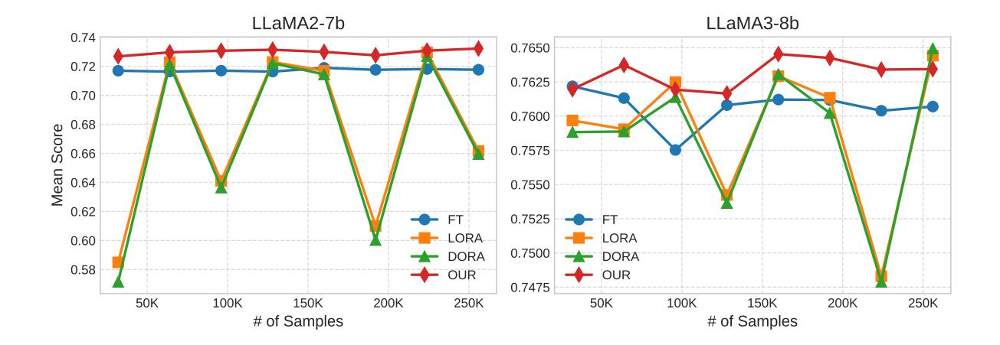
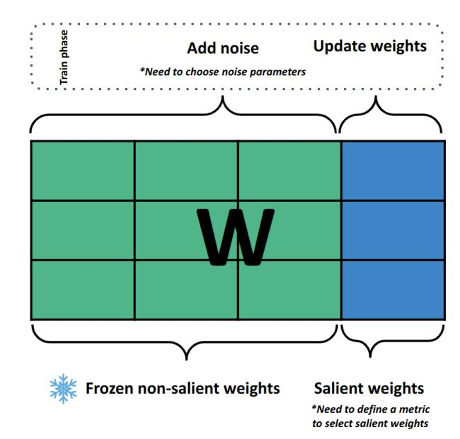
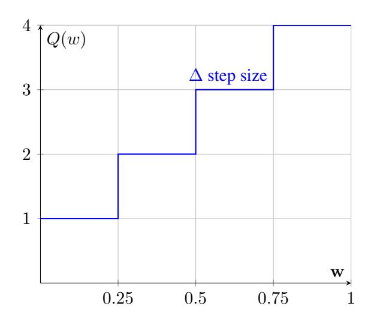
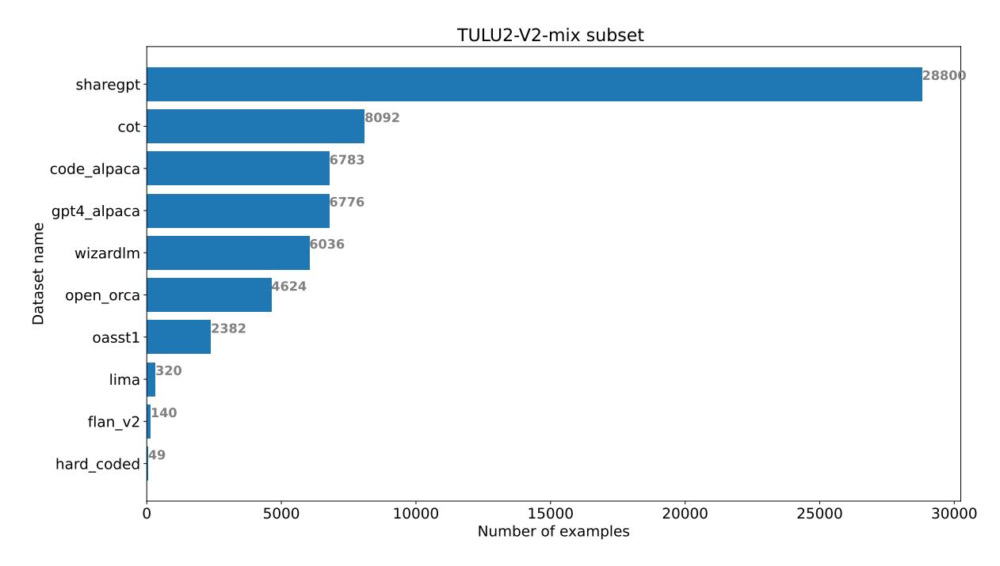

<!-- RP27_Zhelnin_2024 | source: papers_json/RP27_Zhelnin_2024/ -->

## GIFT-SW: Gaussian noise Injected Fine-Tuning of Salient Weights for LLMs

Maxim Zhelnin♣ ^1^ , Viktor Moskvoretskii♣ 1,3, Egor Shvetsov^1^ , Egor Venediktov, Mariya Krylova, Aleksandr Zuev, Evgeny Burnaev 1,2

1 Skolkovo Institute of Science and Technology ^2^ Artificial Intelligence Research Institute ^3^ HSE University

Correspondence: [m.zhelnin@skol.tech](mailto: m.zhelnin@skol.tech) ♣ indicates equal contribution.

## Abstract

Parameter Efficient Fine-Tuning (PEFT) methods have gained popularity and democratized the usage of Large Language Models (LLMs). Recent studies have shown that a small subset of weights significantly impacts performance. Based on this observation, we introduce a novel PEFT method, called Gaussian noise Injected Fine Tuning of Salient Weights (GIFT-SW). Our method updates only salient columns, while injecting Gaussian noise into non-salient ones. To identify these columns, we developed a generalized sensitivity metric that extends and unifies metrics from previous studies. Experiments with LLaMA models demonstrate that GIFT-SW outperforms full fine-tuning and modern PEFT methods under the same computational budget. Moreover, GIFT-SW offers practical advantages to recover performance of models subjected to mixed-precision quantization with keeping salient weights in full precision. Code is available in [our repository.](https://github.com/On-Point-RND/GIFT_SW)

# 1 Introduction

Modern LLMs demonstrate remarkable generalization capabilities on unseen tasks. However, finetuning remains crucial to enhance these models performance or to restore the performance after compression techniques like quantization [(Dettmers](#page-9-0) [et al.,](#page-9-0) [2024;](#page-9-0) [Moskvoretskii et al.,](#page-10-0) [2024)](#page-10-0), pruning [(Frantar and Alistarh,](#page-10-1) [2023;](#page-10-1) [Kim et al.,](#page-10-2) [2023)](#page-10-2), or tensor decomposition have been applied. Given the large scale of modern LLMs, fine-tuning all parameters can be computationally and memoryintensive. To overcome this challenge, Parameter Efficient Fine-Tuning schemes have been developed, aimed to improve model performance while using limited computational and memory resources.

To date, PEFT methods have not matched the accuracy of full fine-tuning [(Nikdan et al.,](#page-10-3) [2024)](#page-10-3),

highlighting the need for new approaches that can close this gap while still minimizing resource use. Additionally, most PEFT methods involve adding extra parameters, which increases computational demands.

To address those issues and enhance the performance of efficiently trained LLMs, we introduce a novel PEFT method, GIFT-SW. This approach focuses on updating a small subset of salient weights while injecting noise into the non-salient weights. The development of this method is grounded in observations from previous studies and the related questions they raise, which we aim to answer:

Previous research has shown that there is a small subset of salient weights which can significantly affect the effectiveness of post-training quantization (PTQ) [(Dettmers et al.,](#page-9-1) [2022,](#page-9-1) [2023;](#page-9-2) [Kim et al.,](#page-10-2) [2023)](#page-10-2) and pruning techniques [(Yin et al.,](#page-11-0) [2023;](#page-11-0) [Frantar and Alistarh,](#page-10-1) [2023;](#page-10-1) [Sun et al.,](#page-11-1) [2023)](#page-11-1). Moreover, [Gurnee et al.](#page-10-4) identified a group of "universal neurons" that are critical to a model's functionality, emphasizing the importance of selecting and updating these salient weights. *Question 1: Does* *updating a small subset of salient weights is suffi**cient to adjust the model?*

Recent studies have demonstrated that Perturbed Gradient Descent (PGD), with noise injections applied both before and after the gradient step, can stabilize convergence and help prevent overfitting [(Poole et al.,](#page-10-5) [2014;](#page-10-5) [Zhu et al.,](#page-11-2) [2018;](#page-11-2) [Jin et al.,](#page-10-6) [2021)](#page-10-6). *Question 2: Does Injecting Noise helps conver**gence?*

PGD is commonly employed to enhance model robustness by approximating the quantization process [(Shvetsov et al.,](#page-11-3) [2022;](#page-11-3) [Shin et al.,](#page-11-4) [2023;](#page-11-4) [Défos](#page-9-3)[sez et al.,](#page-9-3) [2021)](#page-9-3). This increased robustness can aid in maintaining the quality of the quantized model. *Question 3: Does injecting noise helps robust**ness?*

Selecting salient weights is a significant challenge, particularly in quantization and pruning, and

<!-- page 2 -->

*Figure 1: Mean performance of different fine-tuning approaches for LLaMA models with scaling data budget. GIFT-SW shows superior performance with nearly all data budgets, also being as stable as full fine-tuning.*

it is central to our method. In our paper, we derive a general formulation for all previously established saliency metrics and present experiments to compare their effectiveness.

The main contributions of our work can be summarized as follows:

- We introduce a novel PEFT method for pretrained and quantized LLMs, called GIFT-SW.
 It is designed to fine-tune weights in salient columns while injecting Gaussian noise into non-salient weights, which are kept frozen during training.
- We generalize sensitivity metrics for identifying salient columns in pre-trained LLMs. We compare various novel and existing instances of the proposed general form and identify a new metric, which on average outperform previously studied in the literature metrics(Xiao et al., 2023; Lee et al., 2024).
- Experiments demonstrate that GIFT-SW outperforms modern PEFT methods and full fine-tuning baselines across most zero-shot tasks.
 GIFT-SW for LLaMA models achieve comparable accuracy to the corresponding state-of-the-art TÜLU2 models, despite fine-tuning only 3% of the parameters and utilizing ten times less computational resources.
- We demonstrate that GIFT-SW is more stable with respect to a size of training set compared with low-rank adapters.

# 2 Related Work

## 2.1 Parameter efficient fine-tuning of LLM

One of the most popular method with high efficiency is LoRA (Hu et al., 2021), which trains the low-rank adapters. Recent modifications to the method aim to improve the initialization of the adapters (Liu et al., 2024) and enhance the low-rank representation of pre-trained weights by adding sparse adapters (Nikdan et al., 2024). Another improvement of the learning capacity of LoRA is given by DoRA (Liu et al., 2024), which fine-tunes magnitude and direction components of the pre-trained weights. This method achieves considerable performance across various fine-tuning tasks.

## 2.2 Salient Weights in LLMs

The identification of salient weights1 is one of the main problems in weight pruning. Recently, several approaches have been proposed to identify such weights in LLMs, including SparseGPT (Frantar and Alistarh, 2023), Wanda (Sun et al., 2023), and OWL (Yin et al., 2023).

Dettmers et al.'s (2022) demonstrated that a small subset of outliers in input activations has a substantial impact on LLM performance, highlighting the relationship between the activation outliers and the salient weights. Many subsequent Post-Training Quantization (PTQ) methods used similar or identical pruning metrics to identify these salient weights (Dettmers et al., 2023; Xiao et al., 2023; Lee et al., 2024).

> ^&^lt;sup>1In our work, we use the terms **salient weights** and weight **outliers** interchangeably.

<!-- page 3 -->

In our work, we generalize the identification metrics for salient weights by considering metrics from both the literature on pruning and quantization.

## 2.3 Structured and Non-structured Salient Weights selection

Since salient weights account for only a few percent of all the weights, a straightforward approach to preserve them would be to store unstructured salient weights in a sparse matrix. (Dettmers et al., 2023) demonstrated that this approach is computationally reasonable and leads to performance improvement. On the other hand, Xiao et al.'s (2023) revealed that outliers in activations are confined to a small fraction of weight channels, which was incorporated into SmoothQuant, where outlier columns are identified using a small calibration dataset. This concept is further developed in OUIK (Ashkboos et al., 2023), where outlier columns are retained in full precision, while other columns are quantized using GPTQ (Frantar et al., 2022). A similar procedure is used in OWQ (Lee et al., 2024), but with an OBD-based metric (LeCun et al., 1989).

Due to the lack of results in the literature on which approach brings better results, structured or unstructured salient weight selection, and motivated by computational efficiency mentioned in (Ashkboos et al., 2023), in our work we follow the second line of work with structured column-wise salient weight selection.

## 2.4 Noise Injections

In this section, we briefly describe Gaussian Noise Injections (GNI) and its benefits. Then, we show that the approximation of quantization noise and GNI are identical. Therefore, GNI can also benefit further model quantization. Therefor, to examine our third question, we sample noise relative to quantization levels, leaving other sampling options for future work.

Gaussian Noise Injections (GNI). Perturbed Gradient Descent (PGD) is a family of methods that involve adding or multiplying weights with samples from some random distribution, during an optimization procedure. Gaussian noise injection (GNI) after the gradient step helps model to escape saddle points efficiently in non-convex optimization (Jin et al., 2021). However, when Gaussian noise is injected before the gradient step, it helps model to escape from the spurious local optimum (Zhu et al., 2018).

$$ \theta_{t+1} \leftarrow \theta_t - \tau(\nabla f(\theta_t) + \xi) (1) $$

$$ \theta_{t+1} \leftarrow \theta_t - \tau(\nabla f(\theta_t + \xi)) (2) $$

$$ \xi \sim \mathcal{N}(\mu, \sigma^2) (3) $$

Moreover, practical benefits of noise injections are well documented in the literature and often can be discussed as regularization techniques (Bishop, 1995; Srivastava et al., 2014; Camuto et al., 2020), methods to prompt adversarial robustenss (Panda and Roy, 2021) and to be used for data agumentation (Moreno-Barea et al., 2018).

In our work we use GNI before evaluating the gradient. For this scenario, Orvieto et al. (2023) proposed to add noise only to one layer at training iteration to avoid variance explosion. It was empirically and theoretically demonstrated that GNI serves as a regularization. Liu et al. (2023) study fine-tuning of pre-trained Language Models with GNI. Authors propose first to learn layer-wise variance parameters for noise distributions and then to fine-tune the model by adding noise to all the weights. The obtained results showed that the approach is superior to independent layer-wise noise injections.

Quantization Noise Injections (QNI). Quantization aware training (QAT) of networks is applied to mitigate their accuracy degradation after quantization. However, uniform quantization ^2Q is a non-differentiable operation. For simplicity, it can be expressed as a composition of scaling and rounding operations, Q(\mathbf{W}) = \Delta \lfloor \frac{\mathbf{W}}{\Delta} \rfloor. In terms of QAT operation Q can be efficiently approximated with quantization noise \Omega such that \Omega = Q(\mathbf{W}) - \mathbf{W} (Défossez et al., 2021; Shvetsov et al., 2022; Shin et al., 2023). Thus, training models with QNI is exactly the same as employing PGD with GNI before evaluating the gradient.

Under some assumptions the noise \Omega induced by uniform quantization can often be modeled by an additive noise that is uniformly distributed, uncorrelated with the input signal, and has a white spectrum (Widrow et al., 1996). However in practice, the conditions are often not satisfied. Therefore employing Gaussian distribution \mathcal{N}(\mu, \sigma^2) for \Omega typically yields improved outcomes (Défossez et al., 2021; Shvetsov et al., 2022).

Although GNI is beneficial for model training there is no clear answer on how to choose noise

> ^&^lt;sup>2For the reader not familiar with uniform quantization, we discuss it in more details in Section A.

<!-- page 4 -->

parameters. [Liu et al.](#page-10-15) [(2023)](#page-10-15) determine noise parameters such that KL divergence between original and perturbed weights is minimized. [Shin et al.](#page-11-4) [(2023)](#page-11-4) identify parameters of the Gaussian distribution to resemble the weight distribution with a scale proportional to quantization step.

## 2.5 Straight Through Estimator

The most popular QAT technique incorporating quantization operation into the traning process is Straight Through Estimation (STE)[3](#page-3-0) [(Bengio](#page-9-7) [et al.,](#page-9-7) [2013;](#page-9-7) [Shang et al.,](#page-11-8) [2023)](#page-11-8), which basically reparameterizes gradients. However, [Défossez et al.'](#page-9-3)s [(2021)](#page-9-3) demonstrated that STE has some disadvantages compared with QNI[4](#page-3-1) , as STE is biased and may cause weight oscillation between quantization steps. [Shin et al.'](#page-11-4)s [(2023)](#page-11-4) demonstrated that pretraining models for the following quantization with QNI instead of STE results in better performance. More technical details are provided in Section [C.](#page-13-0)

# 3 Method

GIFT-SW consists of the following steps:

- (1) Identify a fixed number of salient columns using a chosen sensitive metric, based on a small calibration set. This number remains consistent across all layers.
- (2) Split columns of the matrices into subsets of salient columns and regular ones.
- (3) During training, add noise to the weights in non-salient columns and update weights only in the salient columns.

Thus, the method depends on two main design choices: 1) how to choose salient columns and 2) the parameters of noise injections. We cover the choice of metrics in Section [3.1.](#page-3-2) Noise injection details are provided in Section [3.2.](#page-4-0)

## 3.1 Generalizing parameter sensitivity metrics

Several approaches have been proposed recently to identify weights sensitive to quantization [(Dettmers](#page-9-2) [et al.,](#page-9-2) [2023)](#page-9-2) or pruning [(Sun et al.,](#page-11-1) [2023)](#page-11-1). We generalize them as metrics for sensitivity to perturbations, and by applying these metrics, we determine which columns are more susceptible to degradation. Therefore, we avoid adding noise to such columns and use them to fine-tune the model.

*Figure 2: GIFT-SW procedure follows Equation [2.](#page-2-1) We first sample some noise, relative to quantization levels, then, perform forward pass, and then update salient weights only. In GIFT-SW, quantization, pruning or tensor decomposition can be applied to non-salient weights and then, salient weights can be fine-tuned effectively without changing non-salient weights structure. In our experiments we select only 128 columns of salient weights, unless specified otherwise.*

The proposed sensitivity metric is written for a column j of weight matrix W as

$$ s_j = \|\mathbf{D}_j\|_{\tau} \|\mathbf{X}_j\|_{\rho}^{\gamma},\tag{4} $$

where D^j^ is a measure of weights perturbation, s^j^ denotes sensitivity of the column to perturbations, X is the input feature, and γ takes on one of the following values 1/2, 1, 2. As discussed in Section [2.4](#page-2-2) we could apply GNI as a source of perturbations, then we would compute D^j^ = W:,j +ξ. However, sampling noise ξ is not deterministic. To approximate an influence of the noise ξ we utilize perturbations caused by quantization.[5](#page-3-3) That would lead to D^j^ = W:,j − Q(W:,j ), where Q(W:,j ) corresponds to the weights subjected to uniform symmetric quantization (see Appendix [A)](#page-12-0).

The input feature X for each layer is computed using a number of random sentences from a calibration dataset. After that, sensitivity values s^j^ are estimated for individual columns. Columns with the highest values are identified as the salient columns. Some details about the calibration dataset is described in Section [4.1.](#page-4-1)

> ^3^More details on STE can be found in Section [C.](#page-13-0)

> ^4^Event though QNI and GNI are identical operations for consistency and clarity, in the case of quantization we will refer to this procedure as Quantization Noise Injections (QNI)

> ^5^Optionally, one could use weight pruning as a source of perturbations or any other.

<!-- page 5 -->

The metric given by Equation [4](#page-3-4) is closely related to those studied in the recent literature on quantization. In particular, the metric ∥X∥^∞^ is employed in QUIK [(Ashkboos et al.,](#page-9-4) [2023)](#page-9-4) and SmoothQuant [(Xiao et al.,](#page-11-5) [2023)](#page-11-5). OWQ [(Lee et al.,](#page-10-7) [2024)](#page-10-7) adopts λj∥Dj∥ 2 2 , where λ^j^ = ∥Xj∥ 2 2 is the j-th diagonal element of the Hessian matrix H for the layer quantization error. It can be seen, that the sensitivity metric used in OWQ is a modification for column quantization of the salience measure provided in OBD [(LeCun et al.,](#page-10-11) [1989)](#page-10-11) for network pruning. A metric proposed in Wanda [(Sun et al.,](#page-11-1) [2023)](#page-11-1) is element-wise variant of the metric ∥Dj∥1∥Xj∥2, which can be easily obtained from Equation [4](#page-3-4) with pruning as a source of perturbations for D^j^ .

In contrast to Wanda, we use l^∞^ norm in our general Equation [4](#page-3-4) due to the following observations, examples contained in a calibration dataset induce different values of the input feature, a use of l^2^ norm leads to averaging of the values along input channels. Therefore, the appearance of the outlier values in the input activation can be obscured by a large number of lower values. The same conclusions can be also applied to the weight error. In the case of the l^2^ norm, the error for each channel includes all deviations between the quantized and original weights. Therefore, rare considerable errors can be mitigated by a large number of small deviations.

## 3.2 Quantization Noise Injection

To improve our fine-tuning procedure with QNI, we avoid applying perturbations to sensitive weights. Therefore, after identifying columns that are sensitive to perturbations or salient during the finetuning stage, we inject quantization noise only into non-salient columns across all layers, as shown in Figure [2.](#page-3-5)

The scale parameters of the Gaussian noise are determined by the quantization step sizes, which are computed for each layer prior to the training process.

For the weight matrix W of a given layer in the model, the process of noise injection can be described as follows. During each forward pass in the training phase, we first sample elements of noise matrix Ω from standard normal distribution N (0, 1). Subsequently, the matrix Ω is scaled with the quantization step size ∆. Finally, we add scaled noise to weights of non-salient columns W[:,*non-salient*] . The operation of the noise injection ✵ is given as

$$
\mathbf{V}(\mathbf{W}) = \begin{cases} \mathbf{W}_{[:,salient]}, \\ \mathbf{W}_{[:,non\text{-}salient]} + \frac{1}{2} \operatorname{diag}(\mathbf{\Delta}) \mathbf{\Omega} \end{cases}, (5)
$$

where diag(∆) is the diagonal matrix with elements of the vector ∆.

Only weights of the salient columns W[:,*salient*] are updated during training, whereas weights of other columns W[:,*non-salient*] are frozen. We do not inject noise to salient weights since small perturbations in them can cause high model degradation.

The quantization step size ∆ is determined only for weights in non-salient columns W[:,*non-salient*] . To closer match the initial distribution of the weights, quantization scale factors including in ∆ are estimated for each row individually. For i-s row the scale factor ∆^i^ is computed as:

$$ \Delta_i = \frac{\alpha_i}{2^{b-1} - 1},\tag{6} $$

where b is the bit-width and α^i^ is the quantization parameter. As in quantization methods, smaller bitwidth b corresponds to higher quantization noise. The parameter α^i^ is estimated by optimizing weight error through linear search as discussed in Appendix [A.](#page-12-0)

Based on Equations [5](#page-4-2) and [6,](#page-4-3) the variance of the injected noise is determined by the distribution of non-salient weights across rows. We exclude salient columns from this distribution, as the salient weights may induce large quantization error and distort row-wise scale factors. This approach helps us to minimize the noise variance, which, in turn, leads to a reduction in the deviation of the nonsalient weights during training.

By sampling noise in such way we can use it for quantization pre-training experiments discussed in Section [6.3.](#page-7-0)

# 4 Experiments

In this section, we describe the experimental procedure used to test the performance of GIFT-SW compared to others.

## 4.1 Data

Following previous studies [(Nikdan et al.,](#page-10-3) [2024;](#page-10-3) [Hu et al.,](#page-10-8) [2021;](#page-10-8) [Liu et al.,](#page-10-9) [2024)](#page-10-9), we focus on the instruction tuning task. For this purpose, we use the TULU-V2-Mix as the main source of data [(Ivison](#page-10-16) [et al.,](#page-10-16) [2023)](#page-10-16), as it encompasses a wide range of instructions from different sources. This dataset has been filtered, contains a substantial amount of

<!-- page 6 -->

data without being too large, and models tuned to this set show superior performance. Additionally, we utilize the OpenOrca dataset [(Mukherjee et al.,](#page-10-17) [2023)](#page-10-17) to demonstrate that our method does not depend on a specific set of instructions.

The sensitivity metrics to find salient columns are estimated based on 512 random sentences from the Pile validation dataset [(Xiao et al.,](#page-11-5) [2023)](#page-11-5).

## 4.2 Baselines

We consider several baselines for both full precision and quantized experiments. All baselines are applied to LLaMA2-7b, LLaMA2-13b and LLaMA3-8b.

Full precision version includes the choice of baselines, following recent studies [(Liu et al.,](#page-10-9) [2024;](#page-10-9) [Nikdan et al.,](#page-10-3) [2024)](#page-10-3). We employ:

- LoRA is a widely used adapter-based method [(Hu et al.,](#page-10-8) [2021)](#page-10-8)
- DoRA is modification of LoRA outperforming all current PEFT methods [(Liu et al.,](#page-10-9) [2024)](#page-10-9)
- FT is full fine-tuning of all parameters

We do not include PEFT methods connected with prompt tuning, as they show worse performance compared to adapter-based methods [(Xu et al.,](#page-11-9) [2023)](#page-11-9).

Quantized version is presented by baselines of only weight quantization at {4, 3, 2} bit-widths:

- STE is quantization-aware fine-tuning of all parameters of a pre-trained model [(Bengio](#page-9-7) [et al.,](#page-9-7) [2013)](#page-9-7). During fine-tuning all parameters are trained, but 128 salient columns are updated in full-precision without quantization.
- QUIK + LoRA is an application of LoRA to the QUIK quantized model. Only lowrank adapters are trained, while the quantized weights and the salient weights are frozen.

QUIK is a mixed-precision quantization method, that leverages GPTQ for quantization non-salient columns, while keeping the salient weight in fullprecision [(Frantar et al.,](#page-10-10) [2022;](#page-10-10) [Ashkboos et al.,](#page-9-4) [2023)](#page-9-4). Due to the techniques, QUIK achieves the highest performance among PTQ methods, such as GTPQ [(Frantar et al.,](#page-10-10) [2022)](#page-10-10), AWQ [(Lin et al.,](#page-10-18) [2023)](#page-10-18), SmoothQuant [(Xiao et al.,](#page-11-5) [2023)](#page-11-5).

## 4.3 Evaluation and Datasets

We perform a comprehensive evaluation measuring zero-shot performance on HellaSwag [(Zellers](#page-11-10) [et al.,](#page-11-10) [2019)](#page-11-10), BoolQ [(Clark et al.,](#page-9-8) [2019)](#page-9-8), Wino-Grande [(Sakaguchi et al.,](#page-11-11) [2021)](#page-11-11), PiQA [(Tata and](#page-11-12) [Patel,](#page-11-12) [2003)](#page-11-12), ARC-easy, and ARC-challenge [(Clark](#page-9-9) [et al.,](#page-9-9) [2018)](#page-9-9) using the LM Eval Harness [(Gao et al.,](#page-10-19)

<!-- page 7 -->

[2023)](#page-10-19). The choice of baselines is similar to those in previous studies [(Egiazarian et al.,](#page-9-10) [2024;](#page-9-10) [Frantar](#page-10-10) [et al.,](#page-10-10) [2022;](#page-10-10) [van Baalen et al.,](#page-11-13) [2024)](#page-11-13).

We demonstrate average accuracy across all the datasets, detailed per-dataset comparison can be found in Section [D.](#page-13-1)

## 4.4 Compute Budget

In all experiments, the number of salient columns in the models is fixed at 128. Furthermore, we fix our training budget at 500 training iterations, unless specified otherwise. According to a recent study [(Komatsuzaki,](#page-10-20) [2019)](#page-10-20), it is more effective to train for one epoch with a larger dataset rather than multiple epochs with less data. Therefore, all 500 iterations are performed within one epoch with no instruction repetitions.

## 4.5 Training Details

The training was performed with 4 GPUs ( 40 GB each) for 500 iterations. The batch size is 128 for 7b models and 64 for 13b models. For baseline methods, the learning rate was set to 3 × 10−^5^ for LLaMA2 models and to 1 × 10−^5^ for the LLaMA3 model. We experimented with different learning rates and found these to be the most beneficial for baseline methods. We used a cosine annealing scheduler with the warmup ratio of 0.03. The LoRA and DoRA alpha and dropout values were as specified in the original papers, and the rank was set to 64 to match the number of trainable parameters in our method. Thus, the number of trainable parameters is 160M for LLaMA2-7b, 250M for LLaMA2-13b, 167M for LLaMA3-8b.

For our method, the learning rate was set to 1 × 10−^4^ for salient columns of LLaMA2 models and to 1 × 10−^5^ of the LLaMA3 model. We fixed the number of salient columns at 128, such that the number of trainable parameters is 174M for LLaMA2-7b, 272M for LLaMA2-13b, and 176M for LLaMA3-8b.

In the case of full fune-tuning with the noise injection, the learning rate was set to 3 × 10−^5^ and 1 × 10−^5^ for LLaMA2 & 3 models, correspondingly.

# 5 Results

In this section, we present the results of our computational experiments and answer the questions posed in Section [1.](#page-1-1) In short, our results are as follows:

- Q1: The results confirm that fine-tuning a subset of salient weights produces results comparable to those obtained using low-rank adapters.
- Q2: Noise injections lead to improved model performance.
- Q3: We could not confirm that models trained with noise injections are more robust to further degradation.

## 5.1 Full Precision

The average performance across evaluation benchmarks for full precision models is presented in Table [1.](#page-5-0) GIFT-SW generally shows superior metrics across most models and instruction sets. However, we observe slight underperformance in LLaMA3 on the OpenOrca subset, where full training proves superior. This issue likely stems from the choice of learning rate and schedule, which can impact the tuning of outliers.

## 5.2 Quantized Models

We present the averaged performance of models quantized with different precision (4, 3, 2) in Table [2.](#page-5-1) For 4 and 3 bits GIFT-SW achieves comparable quality with STE, however, latter one requires significantly more compute. In the 2-bit setting, GIFT-SW shows a substantial quality improvement, surpassing the second-ranked model by over 5 points.

## 5.3 Comparison with T
 
 
 ÜLU2

We compare GIFT-SW with TÜLU2 models [(Ivi](#page-10-16)[son et al.,](#page-10-16) [2023)](#page-10-16), which are LLaMA2 models finetuned using a combination of instructions and DPO [(Rafailov et al.,](#page-10-21) [2023)](#page-10-21). These models are among the top-performing LLaMA2 modifications but demand significant computational resources.

In Table [3,](#page-6-0) we show that by applying GIFT-SW with significantly lower computational budget (a smaller number of parameters and iterations) we

<!-- page 8 -->

achieve comparable results for LLaMA2-7b and outperform TÜLU2 for 13b.

## 5.4 Scaling Properties

We perform experiments to explore the performance of GIFT-SW and baselines with scaling data using LLaMA2 and LLaMA3 models. The results reported in Figure [1](#page-1-1) show that while LoRA and DoRA exhibit unstable performance with scaling data, our method and full fine-tuning are more stable. Moreover, our method consistently ranks first across nearly all data budgets.

# 6 Ablation

## 6.1 Comparison sensitivity metrics

We study sensitivity metrics with respect to different noise levels (various perturbation magnitudes), which translate into varying quantization precision. In this experiment, the non-salient weights of LLaMA2 and TÜLU2 with 7B and 13B parameters. Models are quantized with QUIK, the salient weights are not updated. We select 128 columns of salient weights.

Mean results for zero-shot tasks in Table [5](#page-8-0) show that for most precisions, the best performance is achieved with salient columns identified by Equation [4](#page-3-4) with γ = 1, ρ = ∞, τ = ∞ (second column). Columns identified by the squared l^2^ norm of the input feature (the OWQ metric) show better performance only for TÜLU2 quantized to 3 and 2 bits. Choosing salient columns solely by the input features (the QUIK metric) leads to underperformance, especially for 2 bit. Therefore, identifying salient columns sensitive to quantization noise requires considering both the weight quantization error and the maximum values of input activation.

Based on the results, we chose the bestperforming sensitivity metric with γ = 1, ρ = ∞, τ = ∞. However, the results do not reveal a clear rule for selecting the optimal sensitivity metric, as performance varies across different bitwidths and models with no discernible pattern. This

remains an area for future research.

## 6.2 Noise Injection Impact

To ablate the importance of QNI in the fullprecision setting, we measure the mean performance of LLaMA2 models with and without noise injections for both salient columns fine-tuning and full fine-tuning. In the latter case, the noise is applied to the entire weight matrix.

The results in Table [6](#page-8-1) show that QNI consistently enhances the performance of outlier finetuning. Although QNI can reduce performance when applied to the entire network, it still benefits LLaMA3-8b. Notably, outlier fine-tuning outperforms full fine-tuning, but only when QNI is used.

## 6.3 Quantization Before and After Training

From studies related to QAT, it is known that pretraining a model with noise injection enables to improve its predictive capabilities after quantization [(Défossez et al.,](#page-9-3) [2021;](#page-9-3) [Shvetsov et al.,](#page-11-3) [2022)](#page-11-3). Based on those observations, in this section we examine the performance of the quantized LLaMA2- 7b after fine-tuning full precision salient columns in several settings:

- Pre-GIFT-SW. Applying GIFT-SW prior to the quantization.
- Post-GIFT-SW. Applying GIFT-SW after the quantization.
- Salient FT. Fine-tuning salient columns after quantization with no noise injected

In the case of the pre-training, the bit-width for the model quantization corresponds to the noise level injected during the training. For the posttraining, the noise injection is always performed at 4 bit.

Table [4](#page-7-1) presents the average scores achieved by the models across evaluation benchmark. In the case of 4 bit quantization the Pre-GIFT-SW model considerable outperforms other models. But in the case of 3 and 2 bits, fine-tuning salient columns after quantization enables to achieve quantized models better generative capabilities.

It can be explained by significant deviation of the quantized weights from their original values that is induced by the extremely low-bit quantization. As a result, the interrelations between the salient weights and the quantized weights are disrupted, and the positive effect of pre-training

<!-- page 9 -->

disappears. However, post-training of the salient weight enables to form them new relations with other weights, so the model partially recovers its generative capabilities.

Also it can be observed that application of **Post-GIFT-SW** and **Salient FT** to model quantized in 3 bit gives the similar scores. But in the case of 2 bit quantization, the noise injection improves the fine-tuning of the quantized model.

# 7 Conclusion

In this paper, we introduce GIFT-SW, a parameter-efficient fine-tuning method that trains only weights in a small subset of salient columns while injecting quantization noise into the frozen weights. GIFT-SW proves to be superior to previous fine-tuning strategies in both full precision and quantized settings, requiring less compute budget. In data scaling experiments, GIFT-SW demonstrates greater stability than previous PEFT methods and outperforms both PEFT and full fine-tuning across nearly all data budgets. Our ablation studies show that QNI is beneficial but only with salient weights. Although GIFT-SW outperforms previous methods,

further research is needed to determine how to maximize its performance in quantized settings.

We generalize the criterion for selecting salient columns from previous studies and empirically compare various parameters. Our experiments show that while some criteria perform better than others, none emerge as a clear dominant choice. This significant finding underscores the need for further research to refine these criteria.

# 8 Limitations

We find the main limitations of our work as follows:

- We report results of GIFT-SW exclusively for LLaMA models. Currently, numerous opensource pre-trained LLMs with high generative capabilities are available. However, LLaMA models are the most commonly chosen for studying the efficiency of modern PEFT and quantization methods. Despite the architectural similarities among most LLMs, future experiments with different models are necessary.
- 2. For quantizing models, we use only the GPTQ method, which is widely used for mixed-precision quantization of LLMs. This method improves the performance of quantized models by aggregating quantization error into columns stored in full precision. However, GIFT-SW can be easily integrated with other methods, such as conventional RTN or QuantEase.

<!-- page 10 -->

- 3. Experiments with GIFT-SW report results for salient columns selected using the sensitivity metric [(4)](#page-3-4) with γ = 1. Our proposed metric, based on our analysis, shows high sensitivity of the salient columns to quantization in most LLaMA2 cases. However, other sensitivity metrics may yield better performance for GIFT-SW and mixed-precision quantization in different LLMs.
- 4. Noise parameters for fine-tuning the salient weights are determined using the QNI approach. However, other noise distributions may also enhance the fine-tuning process. Identifying the optimal noise distribution is beyond the scope of this paper.
- 5. In this study, we focus on developing the GIFT-SW algorithm for effective fine-tuning of LLMs, but we do not provide computationally efficient implementations of CUDA kernels for the algorithm. In the future, CUDA kernels for GIFT-SW can be developed based on the code from QUIK [(Ashkboos et al.,](#page-9-4) [2023)](#page-9-4) and OWQ [(Lee et al.,](#page-10-7) [2024)](#page-10-7).
- 6. We train GIFT-SW with only a few finetuning instruction sets, selected for their size and high benchmark results in previous studies. However, expanding the number of finetuning sets could make the experiments more comprehensive.
- 7. We evaluate our method using six distinct benchmarks inherited from various previous studies. In future research, it would be beneficial to include more benchmarks to gain additional insights.

# 9 Potential Risks

The GIFT-SW method poses risks similar to those of any PEFT method. For example, it omits explicit safety training measures, so could be applied to fine-tune LLMs for generating harmful content. Also it can be applied to tailor LLMs to tailor highly specific and potentially dangerous outputs.

# 10 Acknowledgment

The work was supported by the Analytical center under the RF Government (subsidy agreement 000000D730321P5Q0002, Grant No. 70-2021- 00145 02.11.2021).

## References

- Saleh Ashkboos, Ilia Markov, Elias Frantar, Tingxuan Zhong, Xincheng Wang, Jie Ren, Torsten Hoefler, and Dan Alistarh. 2023. Towards end-to-end 4-bit inference on generative large language models. *arXiv* *preprint arXiv:2310.09259*.
- Yoshua Bengio, Nicholas Léonard, and Aaron Courville. 2013. Estimating or propagating gradients through stochastic neurons for conditional computation. *arXiv preprint arXiv:1308.3432*.
- Chris M Bishop. 1995. Training with noise is equivalent to tikhonov regularization. *Neural computation*, 7(1):108–116.
- Alexander Camuto, Matthew Willetts, Umut Simsekli, Stephen J Roberts, and Chris C Holmes. 2020. Explicit regularisation in gaussian noise injections. *Ad**vances in Neural Information Processing Systems*, 33:16603–16614.
- Christopher Clark, Kenton Lee, Ming-Wei Chang, Tom Kwiatkowski, Michael Collins, and Kristina Toutanova. 2019. Boolq: Exploring the surprising difficulty of natural yes/no questions. *arXiv preprint* *arXiv:1905.10044*.
- Peter Clark, Isaac Cowhey, Oren Etzioni, Tushar Khot, Ashish Sabharwal, Carissa Schoenick, and Oyvind Tafjord. 2018. Think you have solved question answering? try arc, the ai2 reasoning challenge. *arXiv* *preprint arXiv:1803.05457*.
- Alexandre Défossez, Yossi Adi, and Gabriel Synnaeve. 2021. Differentiable model compression via pseudo quantization noise. *arXiv preprint* *arXiv:2104.09987*.
- Tim Dettmers, Mike Lewis, Younes Belkada, and Luke Zettlemoyer. 2022. Gpt3. int8 (): 8-bit matrix multiplication for transformers at scale. *Advances in* *Neural Information Processing Systems*, 35:30318– 30332.
- Tim Dettmers, Artidoro Pagnoni, Ari Holtzman, and Luke Zettlemoyer. 2024. Qlora: Efficient finetuning of quantized llms. *Advances in Neural Information* *Processing Systems*, 36.
- Tim Dettmers, Ruslan A Svirschevski, Vage Egiazarian, Denis Kuznedelev, Elias Frantar, Saleh Ashkboos, Alexander Borzunov, Torsten Hoefler, and Dan Alistarh. 2023. Spqr: A sparse-quantized representation for near-lossless llm weight compression. In *The* *Twelfth International Conference on Learning Repre**sentations*.
- Vage Egiazarian, Andrei Panferov, Denis Kuznedelev, Elias Frantar, Artem Babenko, and Dan Alistarh. 2024. Extreme compression of large language models via additive quantization. *arXiv preprint* *arXiv:2401.06118*.

<!-- page 11 -->

- Elias Frantar and Dan Alistarh. 2023. Sparsegpt: massive language models can be accurately pruned in oneshot. In *Proceedings of the 40th International Con**ference on Machine Learning*, pages 10323–10337.
- Elias Frantar, Saleh Ashkboos, Torsten Hoefler, and Dan Alistarh. 2022. Gptq: Accurate post-training quantization for generative pre-trained transformers. *arXiv preprint arXiv:2210.17323*.
- Leo Gao, Jonathan Tow, Baber Abbasi, Stella Biderman, Sid Black, Anthony DiPofi, Charles Foster, Laurence Golding, Jeffrey Hsu, Alain Le Noac'h, Haonan Li, Kyle McDonell, Niklas Muennighoff, Chris Ociepa, Jason Phang, Laria Reynolds, Hailey Schoelkopf, Aviya Skowron, Lintang Sutawika, Eric Tang, Anish Thite, Ben Wang, Kevin Wang, and Andy Zou. 2023. [A framework for few-shot language model](https://doi.org/10.5281/zenodo.10256836) [evaluation.](https://doi.org/10.5281/zenodo.10256836)
- Wes Gurnee, Theo Horsley, Zifan Carl Guo, Tara Rezaei Kheirkhah, Qinyi Sun, Will Hathaway, Neel Nanda, and Dimitris Bertsimas. 2024. Universal neurons in gpt2 language models. *arXiv preprint* *arXiv:2401.12181*.
- Edward J Hu, Phillip Wallis, Zeyuan Allen-Zhu, Yuanzhi Li, Shean Wang, Lu Wang, Weizhu Chen, et al. 2021. Lora: Low-rank adaptation of large language models. In *International Conference on Learn**ing Representations*.
- Hamish Ivison, Yizhong Wang, Valentina Pyatkin, Nathan Lambert, Matthew Peters, Pradeep Dasigi, Joel Jang, David Wadden, Noah A. Smith, Iz Beltagy, and Hannaneh Hajishirzi. 2023. [Camels in a](https://arxiv.org/abs/2311.10702) [changing climate: Enhancing lm adaptation with tulu](https://arxiv.org/abs/2311.10702) [2.](https://arxiv.org/abs/2311.10702) *Preprint*, arXiv:2311.10702.
- Chi Jin, Praneeth Netrapalli, Rong Ge, Sham M Kakade, and Michael I Jordan. 2021. On nonconvex optimization for machine learning: Gradients, stochasticity, and saddle points. *Journal of the ACM (JACM)*, 68(2):1–29.
- Sehoon Kim, Coleman Hooper, Amir Gholami, Zhen Dong, Xiuyu Li, Sheng Shen, Michael W Mahoney, and Kurt Keutzer. 2023. Squeezellm: Dense-and-sparse quantization. *arXiv preprint* *arXiv:2306.07629*.
- Aran Komatsuzaki. 2019. One epoch is all you need. *arXiv preprint arXiv:1906.06669*.
- Yann LeCun, John Denker, and Sara Solla. 1989. Optimal brain damage. *Advances in neural information* *processing systems*, 2.
- Changhun Lee, Jungyu Jin, Taesu Kim, Hyungjun Kim, and Eunhyeok Park. 2024. Owq: Outlier-aware weight quantization for efficient fine-tuning and inference of large language models. In *Proceedings* *of the AAAI Conference on Artificial Intelligence*, volume 38, pages 13355–13364.

- Ji Lin, Jiaming Tang, Haotian Tang, Shang Yang, Wei-Ming Chen, Wei-Chen Wang, Guangxuan Xiao, Xingyu Dang, Chuang Gan, and Song Han. 2023. Awq: Activation-aware weight quantization for llm compression and acceleration. *arXiv preprint* *arXiv:2306.00978*.
- Xiaofan Lin, Cong Zhao, and Wei Pan. 2017. Towards accurate binary convolutional neural network. *Ad**vances in neural information processing systems*, 30.
- Guangliang Liu, Zhiyu Xue, Xitong Zhang, Kristen Marie Johnson, and Rongrong Wang. 2023. Pactuning: Fine-tuning pretrained language models with pac-driven perturbed gradient descent. *arXiv preprint* *arXiv:2310.17588*.
- Shih-Yang Liu, Chien-Yi Wang, Hongxu Yin, Pavlo Molchanov, Yu-Chiang Frank Wang, Kwang-Ting Cheng, and Min-Hung Chen. 2024. Dora: Weightdecomposed low-rank adaptation. *arXiv preprint* *arXiv:2402.09353*.
- Francisco J Moreno-Barea, Fiammetta Strazzera, José M Jerez, Daniel Urda, and Leonardo Franco. 2018. Forward noise adjustment scheme for data augmentation. In *2018 IEEE symposium series on* *computational intelligence (SSCI)*, pages 728–734. IEEE.
- Viktor Moskvoretskii, Alexander Panchenko, and Irina Nikishina. 2024. [Are large language models good](https://aclanthology.org/2024.lrec-main.133) [at lexical semantics? a case of taxonomy learn](https://aclanthology.org/2024.lrec-main.133)[ing.](https://aclanthology.org/2024.lrec-main.133) In *Proceedings of the 2024 Joint International* *Conference on Computational Linguistics, Language* *Resources and Evaluation (LREC-COLING 2024)*, pages 1498–1510, Torino, Italia. ELRA and ICCL.
- Subhabrata Mukherjee, Arindam Mitra, Ganesh Jawahar, Sahaj Agarwal, Hamid Palangi, and Ahmed Awadallah. 2023. [Orca: Progressive learning from](https://arxiv.org/abs/2306.02707) [complex explanation traces of gpt-4.](https://arxiv.org/abs/2306.02707) *Preprint*, arXiv:2306.02707.
- Mahdi Nikdan, Soroush Tabesh, and Dan Alistarh. 2024. Rosa: Accurate parameter-efficient fine-tuning via robust adaptation. *arXiv preprint arXiv:2401.04679*.
- Antonio Orvieto, Anant Raj, Hans Kersting, and Francis Bach. 2023. Explicit regularization in overparametrized models via noise injection. In *Inter**national Conference on Artificial Intelligence and* *Statistics*, pages 7265–7287. PMLR.
- Priyadarshini Panda and Kaushik Roy. 2021. Implicit adversarial data augmentation and robustness with noise-based learning. *Neural Networks*, 141:120– 132.
- Ben Poole, Jascha Sohl-Dickstein, and Surya Ganguli. 2014. Analyzing noise in autoencoders and deep networks. *arXiv preprint arXiv:1406.1831*.
- Rafael Rafailov, Archit Sharma, Eric Mitchell, Stefano Ermon, Christopher D. Manning, and Chelsea Finn.

<!-- page 12 -->

- 2023. [Direct preference optimization: Your lan](https://arxiv.org/abs/2305.18290)[guage model is secretly a reward model.](https://arxiv.org/abs/2305.18290) *Preprint*, arXiv:2305.18290.
- Keisuke Sakaguchi, Ronan Le Bras, Chandra Bhagavatula, and Yejin Choi. 2021. Winogrande: An adversarial winograd schema challenge at scale. *Commu**nications of the ACM*, 64(9):99–106.
- Yuzhang Shang, Zhihang Yuan, and Zhen Dong. 2023. Pb-llm: Partially binarized large language models. In *The Twelfth International Conference on Learning* *Representations*.
- Juncheol Shin, Junhyuk So, Sein Park, Seungyeop Kang, Sungjoo Yoo, and Eunhyeok Park. 2023. Nipq: Noise proxy-based integrated pseudo-quantization. In *Proceedings of the IEEE/CVF Conference on Com**puter Vision and Pattern Recognition*, pages 3852– 3861.
- Egor Shvetsov, Dmitry Osin, Alexey Zaytsev, Ivan Koryakovskiy, Valentin Buchnev, Ilya Trofimov, and Evgeny Burnaev. 2022. Quantnas for super resolution: searching for efficient quantization-friendly architectures against quantization noise. *arXiv preprint* *arXiv:2208.14839*.
- Nitish Srivastava, Geoffrey Hinton, Alex Krizhevsky, Ilya Sutskever, and Ruslan Salakhutdinov. 2014. Dropout: a simple way to prevent neural networks from overfitting. *The journal of machine learning* *research*, 15(1):1929–1958.
- Mingjie Sun, Zhuang Liu, Anna Bair, and J Zico Kolter. 2023. A simple and effective pruning approach for large language models. In *The Twelfth International* *Conference on Learning Representations*.
- Sandeep Tata and Jignesh M Patel. 2003. Piqa: An algebra for querying protein data sets. In *15th In**ternational Conference on Scientific and Statistical* *Database Management, 2003.*, pages 141–150. IEEE.
- Mart van Baalen, Andrey Kuzmin, Markus Nagel, Peter Couperus, Cedric Bastoul, Eric Mahurin, Tijmen Blankevoort, and Paul Whatmough. 2024. Gptvq: The blessing of dimensionality for llm quantization. *arXiv preprint arXiv:2402.15319*.
- Bernard Widrow, Istvan Kollar, and Ming-Chang Liu. 1996. Statistical theory of quantization. *IEEE* *Transactions on instrumentation and measurement*, 45(2):353–361.
- Guangxuan Xiao, Ji Lin, Mickael Seznec, Hao Wu, Julien Demouth, and Song Han. 2023. Smoothquant: Accurate and efficient post-training quantization for large language models. In *International Conference* *on Machine Learning*, pages 38087–38099. PMLR.
- Lingling Xu, Haoran Xie, Si-Zhao Joe Qin, Xiaohui Tao, and Fu Lee Wang. 2023. Parameter-efficient fine-tuning methods for pretrained language models: A critical review and assessment. *arXiv preprint* *arXiv:2312.12148*.

- Lu Yin, You Wu, Zhenyu Zhang, Cheng-Yu Hsieh, Yaqing Wang, Yiling Jia, Mykola Pechenizkiy, Yi Liang, Zhangyang Wang, and Shiwei Liu. 2023. Outlier weighed layerwise sparsity (owl): A missing secret sauce for pruning llms to high sparsity. In *Con**ference on Parsimony and Learning (Recent Spotlight* *Track)*.
- Rowan Zellers, Ari Holtzman, Yonatan Bisk, Ali Farhadi, and Yejin Choi. 2019. Hellaswag: Can a machine really finish your sentence? *arXiv preprint* *arXiv:1905.07830*.
- Zhanxing Zhu, Jingfeng Wu, Bing Yu, Lei Wu, and Jinwen Ma. 2018. The anisotropic noise in stochastic gradient descent: Its behavior of escaping from sharp minima and regularization effects. *arXiv preprint* *arXiv:1803.00195*.

<!-- page 13 -->

*Figure 3: Uniform quantization step function with real valued one dimensional w and integer valued Q(w).*

## A Uniform quantization

While non-uniform quantization may lead to higher compression rates, in our work we focus on uniform quantization since it widely used in efficient PTQ methods such as GPTQ, QUIK, OWQ (Frantar et al., 2022; Ashkboos et al., 2023; Lee et al., 2024). Quantization is a mapping that converts a range of full-precision values into a discrete range of values allowing usage of integer arithmetic and reduced memory consumption. For example, Fig. 3 depicts a mapping with the quantization scale size \Delta = \frac{1}{4} of float values from the interval (0,1) into integer values.

In our work we apply uniform symmetric quantization with the row-wise quantization step size \Delta. In this case, computations of quantization, dequantization and estimation of \Delta are performed for the bit-width b as below

$$ q_{\min} = -2^{b-1}, \quad q_{\max} = 2^{b-1} - 1 (7) $$

$$
clamp(x; q_{\min}, q_{\max}) = \max(q_{\min}, \min(x, q_{\max})) 
(8)
$$

$$
\mathbf{\Delta} = (\Delta_1, \dots, \Delta_n)^{\mathrm{T}}, \quad \Delta_i = \frac{\alpha_i}{q_{\max}} (9)
$$

$$
\mathbf{W}_{i,:}^{\text{int}} = \text{clamp}\left(\left|\frac{\mathbf{W}_{i,:}}{\Delta_i}\right|; q_{\min}, q_{\max}\right) 
(10)
$$

$$
\mathbf{W} \approx Q(\mathbf{W}) = \operatorname{diag}(\mathbf{\Delta})\mathbf{W}^{\text{int}} \tag{11}
$$

where \Delta_i is the scale factor for i row \mathbf{W}_{i,:}, \mathbf{W}^{int} denotes the matrix of the quantized weights, \operatorname{diag}(\boldsymbol{\Delta}) is the diagonal matrix with elements of the vector \boldsymbol{\Delta}. For the given bit-width b, the parameter \alpha_i is found for each row by performing linear grid search over the interval [0, \max(\mathbf{W}_{i,:})], where \max(\mathbf{W}_{i,:}) is the maximum element of i row . The search is conducted to minimize layer-wise mean squared error between weights:

$$ \operatorname{argmin}_{\Delta} \|\mathbf{W} - Q(\mathbf{W})\|_{2}^{2},\tag{12} $$

## **B** Details of LLMs quantization

For only weight quantization of LLaMA and TÜLU2 models models, we apply QUIK implementation of mixed-precision GPTQ method (Ashkboos et al., 2023; Frantar et al., 2022). We isolate 128 salient columns in full-precision. Non-salient columns are subjected to uniform symmetric quantization, as discussed in Appendix A. The salient columns are identified through sensitive metrics described in Section 3.1. The Hessian matrix for the GPTQ method is computed on 128 random samples of the Wikitext-2 dataset.

<!-- page 14 -->

## C Straight Through Estimator

STE can be described in two steps:

- Obtain quantized weights Q(W) from the real-valued parameters W with some quantization function Q, which is usually is non differentiable.
- Compute gradients at quantized weights Q(W) and update real valued weights Wt+1 ← W^t^ − τ∇f(Q(W))

STE makes a particular choice of a quantization function to obtain the discrete weights from the realvalued weights. This approximation can be justified in some settings [(Lin et al.,](#page-10-22) [2017)](#page-10-22) but in general the reasons behind its effectiveness are unknown.

## D Detailed Benchmark Results

In this section we report detailed benchmark results for LLaMA 2 & 3 after training with different methods. Tables [7,](#page-13-2) [8](#page-13-3) present accuracy metrics which are achieved by the full-precision models after fine-tuning on the TÜLU-V2-mix and OpenOrca subsets. Corresponding mean values are listed in Table [1.](#page-5-0) Tables present accuracy metrics which are achieved by quantized in 4, 3, 2 bits models after fine-tuning on the TÜLU-V2-mix subset. Corresponding mean values are listed in Table [2.](#page-5-1)

<!-- page 15 -->

<!-- page 16 -->

*Figure 4: Number of examples in datasets included in TÜLU-V2-mix subset*

## E TÜLU-V2-mix subset

Figure [4](#page-15-0) shows number of examples in datasets included in the TÜLU-V2-mix subset, which is used for fine-tuning experiments presented in this paper.
