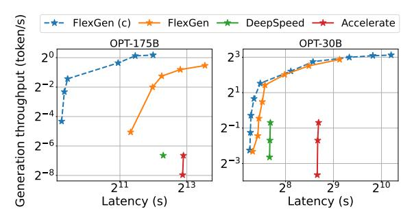
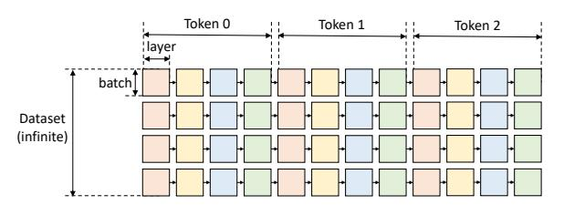
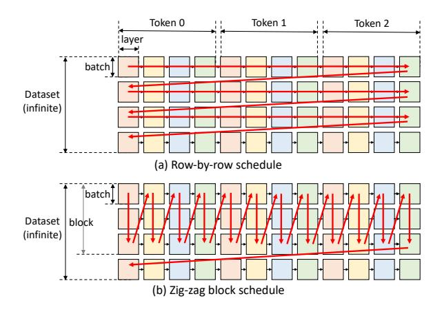
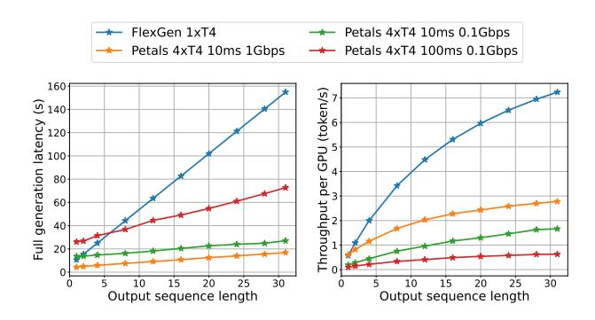

<!-- RP33_Sheng_2023 | source: papers_json/RP33_Sheng_2023/ -->

## FlexGen: High-Throughput Generative Inference of Large Language Models with a Single GPU

Ying Sheng <sup>1</sup> Lianmin Zheng <sup>2</sup> Binhang Yuan <sup>3</sup> Zhuohan Li <sup>2</sup> Max Ryabinin <sup>45</sup> Daniel Y. Fu <sup>1</sup> Zhiqiang Xie <sup>1</sup> Beidi Chen <sup>67</sup> Clark Barrett <sup>1</sup> Joseph E. Gonzalez <sup>2</sup> Percy Liang <sup>1</sup> Christopher Ré <sup>1</sup> Ion Stoica <sup>2</sup> Ce Zhang <sup>3</sup>

## **Abstract **

The high computational and memory requirements of large language model (LLM) inference make it feasible only with multiple high-end accelerators. Motivated by the emerging demand for latency-insensitive tasks with batched processing, this paper initiates the study of high-throughput LLM inference using limited resources, such as a single commodity GPU. We present FlexGen, a high-throughput generation engine for running LLMs with limited GPU memory. FlexGen can be flexibly configured under various hardware resource constraints by aggregating memory and computation from the GPU, CPU, and disk. By solving a linear programming problem, it searches for efficient patterns to store and access tensors. FlexGen further compresses the weights and the attention cache to 4 bits with negligible accuracy loss. These techniques enable FlexGen to have a larger space of batch size choices and thus significantly increase maximum throughput. As a result, when running OPT-175B on a single 16GB GPU, FlexGen achieves significantly higher throughput compared to state-of-the-art offloading systems, reaching a generation throughput of 1 token/s for the first time with an effective batch size of 144. On the HELM benchmark, FlexGen can benchmark a 30B model with a 16GB GPU on 7 representative sub-scenarios in 21 hours. The code is available at https: //github.com/FMInference/FlexGen.

Proceedings of the 40<sup>th</sup> International Conference on Machine Learning, Honolulu, Hawaii, USA. PMLR 202, 2023. Copyright 2023 by the author(s).

This version has an extended author list compared to the one archived in ICML.


*Figure 1. The total latency for a block and throughput trade-offs of three offloading-based systems for OPT-175B (left) and OPT-30B (right) on a single NVIDIA T4 (16 GB) GPU with 208 GB CPU DRAM and 1.5TB SSD. FlexGen achieves a new Pareto-optimal frontier with 100 \times higher maximum throughput for OPT-175B. Other systems cannot further increase throughput due to out-of-memory issues. "(c)" denotes compression.*

## 1. Introduction

In recent years, large language models (LLMs) have demonstrated strong performance across a wide range of tasks (Brown et al., 2020; Bommasani et al., 2021; Zhang et al., 2022; Chowdhery et al., 2022). Along with these unprecedented capabilities, generative LLM inference comes with unique challenges. These models can have billions, if not trillions of parameters (Chowdhery et al., 2022; Fedus et al., 2022), which leads to extremely high computational and memory requirements to run. For example, GPT-175B requires 325GB of GPU memory simply to load its model weights. Fitting this model onto GPUs would require at least five A100 (80GB) GPUs and complex parallelism strategies (Pope et al., 2022; Aminabadi et al., 2022). Thus, lowering LLM inference resource requirements has recently attracted intense interest.

In this paper, we focus on a setting that we call *throughput-oriented generative inference*. In addition to interactive use cases such as chatbots, LLMs are also applied to many "back-of-house" tasks such as benchmarking (Liang et al., 2022), information extraction (Narayan et al., 2018), data wrangling (Narayan et al., 2022), and form processing (Chen et al., 2021). One key characteristic of these tasks is that they often require running LLM inference in batches over a large number of tokens (e.g., all the documents in a company's

> ^&^lt;sup>1</sup>Stanford University <sup>2</sup>UC Berkeley <sup>3</sup>ETH Zurich <sup>4</sup>Yandex <sup>5</sup>HSE University <sup>6</sup>Meta <sup>7</sup>Carnegie Mellon University. Correspondence to: Ying Sheng <ying1123@stanford.edu>.

<!-- page 2 -->

corpus), and are less sensitive to latency. As a result, it is possible to trade off latency for higher throughput in these workloads, providing opportunities to reduce resource requirements.

Prior efforts to lower resource requirements of LLM inference correspond to three directions: (1) *model compression* to decrease total memory footprint [(Dettmers et al.,](#page-9-6) [2022;](#page-9-6) [Yao et al.,](#page-10-4) [2022;](#page-10-4) [Frantar et al.,](#page-9-7) [2022;](#page-9-7) [Xiao et al.,](#page-10-5) [2022)](#page-10-5); (2) *collaborative inference* to amortize inference cost via decentralization [(Borzunov et al.,](#page-9-8) [2022)](#page-9-8); and (3) *offloading* to utilize memory from CPU and disk [(Aminabadi et al.,](#page-9-4) [2022;](#page-9-4) [HuggingFace,](#page-9-9) [2022)](#page-9-9). These techniques have significantly lowered the resource requirements for using LLMs, but there are distinct limitations. Research in the first two directions often assume that the model fits into the GPU memory and thereby struggle to run 175B-scale models with a single commodity GPU. On the other hand, state-of-theart offloading-based systems in the third category do not achieve acceptable throughput on a single GPU due to inefficient I/O scheduling and tensor placement. For example, these systems can be bottlenecked by small batch sizes (e.g., batch sizes of only one or two for OPT-175B in some cases).

Our focus is designing efficient *offloading* strategies for highthroughput generative inference, *on a single commodity GPU*. To run an LLM with limited GPU memory, we can offload it to secondary storage and perform com-

$$
GPU16 \text{ GB}↕12 \text{ GB/s}CPU208 \text{ GB}↕2 \text{ GB/s}Disk1.5 \text{ TB}
$$

putation part-by-part by partially loading it. On a typical machine, there are three levels of the memory hierarchy, as illustrated in the figure to the right. Higher levels are faster but scarce, while lower levels are slower but abundant. In throughput-oriented scenarios, we can sacrifice latency by using a large batch size, and amortize the expensive I/O operations among different memory hierarchies over a large batch of inputs, overlapped with computation. Fig. [1](#page-0-0) shows the latency-throughput trade-off of three inference systems with offloading on a single NVIDIA T4 (16 GB) GPU. Note that the performance in terms of latency and throughput on limited resources is significantly inferior to that of the cases with sufficient resources.

Achieving high-throughput generative inference with limited GPU memory is challenging even if we can sacrifice the latency. The first challenge is to design an *efficient of**floading strategy*. During generative inference, there are three kinds of tensors: weights, activations, and key-value (KV) cache. The strategy should specify what tensors to offload, where to offload them within the three-level memory hierarchy, and when to offload them during inference. The batch-by-batch, token-by-token, and layer-by-layer structure of the computation forms a complex dependency graph

where there are multiple ways to conduct computation. Together, these choices form a complex design space. Existing offloading-based inference systems [(Aminabadi et al.,](#page-9-4) [2022;](#page-9-4) [HuggingFace,](#page-9-9) [2022)](#page-9-9) inherit strategies from training, which turn out to be some suboptimal points for inference, performing excessive I/O and achieving throughput far below theoretical hardware limits.

The second challenge is to develop *effective compression* *strategies*. Previous works have demonstrated promising results in compressing the weights and activations of LLMs. However, when combining compression with offloading for high-throughput inference, the I/O costs and memory reduction of the weights and KV cache become more important, motivating alternative compression schemes.

To address these challenges, we present FlexGen, an offloading framework for high-throughput LLM inference. FlexGen aggregates memory from the GPU, CPU, and disk, and efficiently schedules I/O operations, along with possible compression methods and distributed pipeline parallelism.

(Contribution 1) We formally define a search space of possible offloading strategies by considering computation schedule, tensor placement, and computation delegation. We prove that our search space captures a computation order with I/O complexity within 2× of optimality. We then develop a linear programming-based search algorithm to optimize the throughput within the search space. This algorithm can be configured for various hardware specifications and can be easily extended to incorporate latency and throughput constraints, thus helping to navigate the tradeoff space smoothly. Compared with existing strategies, our solution unifies the placement of weights, activations, and the KV cache, enabling a dramatically higher batch size upper bound, which is key to achieving high throughput.

(Contribution 2) We show that it is possible to compress both the weights and KV cache for LLMs like OPT-175B to 4 bits without retraining or calibration, all with negligible accuracy loss. This is achieved through fine-grained groupwise quantization [(Shen et al.,](#page-10-6) [2020)](#page-10-6), which is suitable for reducing I/O costs and memory usage during offloading.

(Contribution 3) We demonstrate the efficiency of FlexGen by running OPT-175B on NVIDIA T4 (16GB) GPUs. Compared to DeepSpeed Zero-Inference [(Aminabadi et al.,](#page-9-4) [2022)](#page-9-4) and Hugging Face Accelerate [(HuggingFace,](#page-9-9) [2022)](#page-9-9), two state-of-the-art offloading-based inference systems, FlexGen often allows a batch size that is orders of magnitude larger. As a result, FlexGen can achieve much higher throughputs. On a single T4 GPU with 208 GB CPU DRAM and 1.5 TB SSD, input sequence length 512, and output sequence length 32:

• With the same latency of 5000 seconds, FlexGen (effective batch size 64, or 2048 tokens in total) can achieve

<!-- page 3 -->

more than 40\times higher throughput than DeepSpeed Zero-Inference (batch size 1, or 32 tokens in total), while Hugging Face Accelerate cannot complete a single batch.

- By allowing a higher latency of 12000 seconds, FlexGen achieves 69× higher maximum throughput compared to baselines because it can enlarge the effective batch size to 256 (8192 tokens generated in total), while DeepSpeed Zero-Inference and Hugging Face Accelerate cannot use a batch size larger than 2 due to out-of-memory issues.
- If allowing 4-bit compression, FlexGen can reach 100× higher maximum throughput with effective batch size 144 (4608 tokens generated in total) with latency 4000 seconds by holding all weights in CPU and getting rid of disk offloading.

We also compare offloading and decentralized collective inference based on FlexGen and Petals (Borzunov et al., 2022) as two representative systems. We conduct comparisons between the two systems from the aspects of delay and bandwidth of the decentralized network and output sequence length. The results show that FlexGen outperforms a decentralized Petals cluster in terms of per-GPU throughput and can even achieve lower latency in certain cases.

## 2. Related Work

Given the recent advances of LLMs, LLM inference has become an important workload, encouraging active research from both the **system** side and the **algorithm** side.

Recent years have witnessed the emergence of systems specialized for LLM inference, such as FasterTransformer (NVIDIA, 2022), Orca (Yu et al., 2022), Light-Seq (Wang et al., 2021), PaLM inference (Pope et al., 2022), TurboTransformers (Fang et al., 2021), DeepSpeed Inference (Aminabadi et al., 2022), and Hugging Face Accelerate (HuggingFace, 2022). Unfortunately, most of these systems focus on latency-oriented scenarios with highend accelerators, limiting their deployment for throughputoriented inference on easily accessible hardware. To enable LLM inference on such commodity hardware, offloading is an essential technique - as far as we know, among current systems, only DeepSpeed Zero-Inference and Hugging Face Accelerate support offloading. These inference systems typically inherit the offloading techniques from training systems (Rajbhandari et al., 2021; Ren et al., 2021; Li et al., 2022; Huang et al., 2020; Wang et al., 2018) but ignore the special computational property of generative inference. They fail to exploit the structure of the throughput-oriented LLM inference computation and miss great opportunities for efficient scheduling of I/O traffic. Another attempt to enable LLM inference on accessible hardware is collaborative computing proposed by Petals (Borzunov et al., 2022).

There are also many algorithm-oriented works that relax certain aspects of computation in LLM inference to accelerate the computation or reduce the memory footprint. Both sparsification (Hoefler et al., 2021; Frantar & Alistarh, 2023) and quantization (Kwon et al., 2022; Yao et al., 2022; Park et al., 2022; Xiao et al., 2022; Frantar et al., 2022; Dettmers et al., 2022) have been adopted for LLM inference. On the quantization side, prior works have shown weights can be compressed down to 3 bits without compressing activations (Frantar et al., 2022), or both weights and activations can be compressed to 8 bits (Yao et al., 2022; Dettmers et al., 2022; Xiao et al., 2022). In FlexGen, we compress both the weights and KV cache to 4 bits and show how to combine the compression with offloading to make further improvements.

Within broader domains, memory optimizations and offloading have been studied for training (Huang et al., 2020; Ren et al., 2021; Steiner et al., 2022) and linear algebra (Jia-Wei & Kung, 1981; Demmel, 2013).

## 3. Background: LLM Inference

In this section, we describe the LLM inference workflow and its memory footprint.

Generative Inference. A typical LLM generative inference task consists of two stages: i) the *prefill* stage which takes a prompt sequence to generate the key-value cache (KV cache) for each transformer layer of the LLM; and ii) the *decoding* stage which utilizes and updates the KV cache to generate tokens step-by-step, where the current token generation depends on previously generated tokens.

For a particular inference computation, denote the batch size by b, the input sequence length by s, the output sequence length by n, the hidden dimension of the transformer by h_1, the hidden dimension of the second MLP layer by h_2, and the total number of transformer layers by l. Given the weight matrices of a transformer layer specified by \mathbf{w}_K^i, \mathbf{w}_Q^i, \mathbf{w}_V^i, \mathbf{w}_O^i, \mathbf{w}_1^i, \mathbf{w}_2^i, \mathbf{w}_1^i, \mathbf{w}_2^i, \mathbf{w}_N^i, \mathbf{w}_Q^i, \mathbf{w}_V^i, \mathbf{w}_O^i \in \mathcal{R}^{h_1 \times h_1}, \mathbf{w}_1 \in \mathcal{R}^{h_1 \times h_2}, \text{ and } \mathbf{w}_2 \in \mathcal{R}^{h_2 \times h_1}.

During the *prefill phase*, the input of the i-th layer is specified by \mathbf{x}^i, and key, value, query, and output of the attention layer is specified by \mathbf{x}^i_K, \mathbf{x}^i_V, \mathbf{x}^i_Q, \mathbf{x}^i_{\text{Out}}, where \mathbf{x}^i, \mathbf{x}^i_K, \mathbf{x}^i_V, \mathbf{x}^i_Q, \mathbf{x}^i_{\text{Out}} \in \mathcal{R}^{b \times s \times h_1}. Then, the cached key, value can be computed by:

$$
\mathbf{x}_K^i = \mathbf{x}^i \cdot \mathbf{w}_K^i; \quad \mathbf{x}_V^i = \mathbf{x}^i \cdot \mathbf{w}_V^i
$$

The rest of the computation in the i-th layer is:

$$
\begin{split} \mathbf{x}_Q^i &= \mathbf{x}^i \cdot \mathbf{w}_Q^i \\ \mathbf{x}_{\text{Out}}^i &= f_{\text{Softmax}} \left( \frac{\mathbf{x}_Q^i \mathbf{x}_K^{iT}}{\sqrt{h}} \right) \cdot \mathbf{x}_V^i \cdot \mathbf{w}_O^i + \mathbf{x}^i \\ \mathbf{x}^{i+1} &= f_{\text{relu}} \left( \mathbf{x}_{\text{Out}}^i \cdot \mathbf{w}_1 \right) \cdot \mathbf{w}_2 + \mathbf{x}_{\text{Out}}^i \end{split}
$$

<!-- page 4 -->

During the *decode phase*, given \mathbf{t}^i \in \mathcal{R}^{b \times 1 \times h_1} as the embedding of the current generated token in the *i*-th layer, the inference computation needs to i) update the KV cache:

$$
\begin{aligned} \mathbf{x}_K^i &\leftarrow \mathsf{Concat}\left(\mathbf{x}_K^i, \mathbf{t}^i \cdot \mathbf{w}_K^i\right) \\ \mathbf{x}_V^i &\leftarrow \mathsf{Concat}\left(\mathbf{x}_V^i, \mathbf{t}^i \cdot \mathbf{w}_V^i\right) \end{aligned}
$$

and ii) compute the output of the current layer:

$$
\begin{split} \mathbf{t}_Q^i &= \mathbf{t}^i \cdot \mathbf{w}_Q^i \\ \mathbf{t}_{Out}^i &= f_{Softmax} \left( \frac{\mathbf{t}_Q^i \mathbf{x}_K^{i^T}}{\sqrt{h}} \right) \cdot \mathbf{x}_V^i \cdot \mathbf{w}_O^i + \mathbf{t}^i \\ \mathbf{t}^{i+1} &= f_{relu} \left( \mathbf{t}_{Out}^i \cdot \mathbf{w}_1 \right) \cdot \mathbf{w}_2 + \mathbf{t}_{Out}^i \end{split}
$$

**Memory Analysis.** The memory footprint of LLM inference mainly comes from the model weights and the KV cache. Considering the OPT-175B model in FP16, the total number of bytes to store the parameters can be roughly <sup>1</sup> calculated by l(8h_1^2 + 4h_1h_2). The total number of bytes to store the KV cache in peak is 4 \times blh_1(s+n).

In a realistic setting with a sufficient number of GPUs, the OPT-175B model (l=96, h_1=12288, h_2=49152) takes 325 GB. With a batch size of b=512, an input sequence length s=512, and an output sequence length of n=32, the total memory required to store the KV cache is 1.2 TB, which is 3.8\times the model weights, making the KV cache a new bottleneck of large-batch high-throughput inference. In FlexGen, for OPT-175B, we enlarge the effective batch size to 256 to achieve the throughput at 0.69 token/s.

**Throughput and Latency.** Considering an effective batch size b, an input sequence length s, and an output sequence length of n, the latency t is defined as the total number of seconds spent to process the prompts and generate all the bn tokens. The generation throughput is defined as bn/t.


*Figure 2. Computational graph of LLM inference.*

## 4. Offloading Strategy

In this section, we do not relax any computation of LLM inference and illustrate how to formalize the offloading procedure under the GPU, CPU, and disk memory hierarchy. We first formulate the problem and then construct the search space of the possible offloading strategies in FlexGen. To find an efficient strategy, FlexGen builds an analytical cost model and searches for configurations with an optimizer based on linear programming.

## 4.1. Problem Formulation

Consider a machine with three devices: a GPU, a CPU, and a disk. The GPU and CPU can perform computation while the disk cannot. The three devices form a three-level memory hierarchy where the GPU has the smallest but fastest memory and the disk has the largest but slowest memory. When an LLM cannot fit entirely within the GPU, we need to offload it to secondary storage and perform computation part-by-part by partially loading the LLM.

We formulate the generative inference with offloading as a graph traversal problem. Fig. 2 shows an example computational graph, where the model has 4 layers and we generate 3 tokens per prompt. As our focus is throughput-oriented scenarios, we assume a given dataset with an infinite number of prompts that need to be processed. In the figure, a square means the computation of a GPU batch for a layer. The squares with the same color share the same layer weights. We define a valid path as a path that traverses (i.e., computes) all squares, while subject to the following constraints:

- A square can only be computed if all squares to its left on the same row were computed.
- To compute a square on a device, all its inputs (weights, activations, cache) must be loaded to the same device.
- After being computed, a square produces two outputs: activations and KV cache. The activations should be stored until its right sibling is computed. The KV cache should be stored until the rightmost square on the same row is computed.
- At any time, the total size of tensors stored on a device cannot exceed its memory capacity.

The goal is to find a valid path that minimizes the total execution time, which includes the compute cost and I/O cost when moving tensors between devices.

## 4.2. Search Space

Given the formulation above, we construct a search space for possible valid strategies in FlexGen.

Compute schedule. Intuitively, there are two orders to traverse the graph in Fig. 2: row-by-row and column-by-column. All existing systems (Aminabadi et al., 2022; HuggingFace, 2022) traverse the graph row-by-row, as shown in Fig. 3(a). This is reasonable because it is the fastest way to finish the generation for one batch and the KV cache can be freed immediately after a row. However, because every two contiguous squares do not share weights, this schedule has to repeatedly load the weights and incurs huge I/O costs.

To reduce the I/O costs of the weights, we can traverse the graph column-by-column. All squares in a column share weights, so we can let the weights stay on GPU for reusing and only load/unload the activations and KV cache. How-

> ^&^lt;sup>1</sup>We ignore the embedding layer(s), which is relatively small.

<!-- page 5 -->


*Figure 3. Two different schedules. The red arrows denote the computation order.*

## Algorithm 1 Block Schedule with Overlapping

```
for i = 1 to generation length do
 for j = 1 to num layers do
 // Compute a block with multiple GPU batches
 for k = 1 to num GP U batches do
 // Load the weight of the next layer
 load weight(i, j + 1, k)
 // Store the cache and activation of the prev batch
 store activation(i, j, k − 1)
 store cache(i, j, k − 1)
 // Load the cache and activation of the next batch
 load cache(i, j, k + 1)
 load activation(i, j, k + 1)
 // Compute this batch
 compute(i, j, k)
 // Synchronize all devices
 synchronize()
 end for
 end for
end for
```

ever, we cannot traverse a column all the way to the end because the activations and KV cache still need to be stored. Hence, we have to stop when they fill the CPU and disk memory. Taking all this into consideration, we converge to a zig-zag block schedule, as shown in Fig. [3(](#page-4-0)b). Besides, we propose another more advanced and I/O-optimal schedule, but only implement the simpler block schedule due to the practical implementation difficulty of the optimal one. However, we prove that the block schedule is at most twice worse than the optimal schedule in Appendix [A.2.](#page-12-0)

Theorem 4.1. *The I/O complexity of the zig-zag* *block schedule is within* 2× *of the optimal solution.*

Another typical optimization is overlapping. We can overlap the weights load of the next layer, cache/activation load of the next batch, cache/activation store of the previous batch, and the computation of the current batch. Adding overlapping to the block schedule results in Algorithm [1.](#page-4-1) The first six functions in the innermost loop can be seen as launched

in parallel with six logical threads because there are no dependencies. The last function then synchronizes these six logical threads. We rely on operating systems and CUDA drivers to resolve the schedule of the underlying hardware resources. As a conclusion, the algorithm introduces two parameters into our search space: the GPU batch size and the number of GPU batches in a block. The product of the GPU batch size and the number of GPU batches is called block size (or effective batch size).

Tensor placement. Besides compute schedule, a strategy should specify how to store these tensors within the memory hierarchy. We use three variables wg, wc, and wd to define the percentages of weights stored on GPU, CPU, and disk respectively. Similarly, we use three variables hg, hc, hd to define the percentages of activations and use cg, cc, cd for the KV cache. Given the percentages, there are still multiple ways to partition the tensors. Taking weight tensors as an example, from coarse grain to fine grain, we can partition the weights at the model granularity (e.g., assign 50% of the layers in a model to the GPU), at the layer granularity (e.g., assign 50% of the tensors in a layer to the GPU), or at the tensor granularity (e.g., assign 50% of the elements in a tensor to the GPU). Coarser granularity leads to lower runtime overhead but it is less flexible and its cost is difficult to analyze. Considering both the runtime overhead and desired flexibility, we use layer granularity for weights, and tensor granularity for activations and the KV cache.

Computation delegation. While CPUs are much slower than GPUs, we find using CPU compute can still be beneficial in some cases. This is because the computation of attention scores during decoding is I/O-bounded. Consider a case where the KV cache is stored on the CPU. Computing the attention scores on the GPU requires moving the entire KV cache to the GPU, which incurs a substantial I/O cost as the KV cache is huge. In contrast, computing the attention score on the CPU does not require moving the KV cache. It only requires moving the activations from the GPU to the CPU. Quantitatively, let b be the GPU batch size, s be the sequence length, and h^1^ be the hidden size. The size of the moved KV cache is b × s × h^1^ × 4 bytes, and the size of the moved activation is b×h^1^ ×4 bytes, so computing attention score on CPU reduces I/O by s×. For long sequences (e.g., s ≥ 512), it is better to compute the attention scores on the CPU if the associated KV cache is not stored on the GPU.

## 4.3. Cost Model and Policy Search

The schedule and placement in Section [4.2](#page-3-2) constructs a search space with several parameters. Now we develop an analytical cost model to estimate the execution time given these algorithm parameters and hardware specifications.

Cost Model. The cost model predicts the latency during prefill for one layer denoted as Tpre, and the averaged la-

<!-- page 6 -->

tency during decoding for one layer denoted as T_{gen} in one block. The total latency for computing a block can then be estimated as T = T_{pre} \cdot l + T_{gen} \cdot (n-1) \cdot l, where l is the number of layers and n is the number of tokens to generate.

Assuming perfect overlapping, T_{pre} can be estimated as T_{pre} = \max(ctog^p, gtoc^p, dtoc^p, ctod^p, comp^p), where ctog^p, gtoc^p, dtoc^p, ctod^p, comp^p denote the latency of read from CPU to GPU, write from GPU to CPU, read from disk to CPU, write from CPU to disk, computation, respectively, during prefill for one layer.

Similarly, T_{gen} can be estimated as T_{gen} = \max(ctog^g, gtoc^g, dtoc^g, ctod^g, ctod^g, comp^g), with ctog^g, gtoc^g, dtoc^g, ctod^g, comp^g denoting the latency of read from CPU to GPU, write from GPU to CPU, read from disk to CPU, write from CPU to disk, computation, respectively, during decoding for one layer.

For I/O terms like dtoc^g, it is estimated by summing up the I/O events, which contain weights, activations, and cache reads. The size of FP16 weights for one transformer layer is 8h_1^2 + 4h_1 \cdot h_2 bytes, with h_1 denoting the hidden size, and h_2 denoting the hidden size of the second MLP layer. Let bls be the block size and s be the prompt length; then the size of activations for one layer is 2 \cdot bls \cdot h_1. The size of the KV cache for one layer on average is 4 \cdot bls \cdot (s + \frac{n}{2}) \cdot h_1. We have to load wd, hd, cd percent of weights, activations, and the KV cache from the disk respectively so that the total latency of disk read is dtoc^g = \frac{1}{\text{disk.to.cpu.bandwidth}}((8h_1^2 + 4h_1 \cdot h_2) \cdot wd + 4 \cdot bls \cdot (s + \frac{n}{2}) \cdot h_1 \cdot cd + 2 \cdot bls \cdot h_1 \cdot hd).

Similarly for computation terms, we sum up all computation events, including matrix multiplications and batched matrix multiplications on the CPU and the GPU.

Besides latency estimation, we also estimate the peak memory usage of the GPU, CPU, and disk, and then we add memory constraints. The full cost model is in Appendix A.3.

Policy Search. A policy includes 11 variables: block size bls, GPU batch size qbs, weight placement wq, wc, wd, activation placement hg, hc, hd, and KV cache placement cq, cc, cd. In practice, the percentage cannot be an arbitrary real number between 0 and 1, because the tensor cannot be split arbitrarily. However, we relax the percentage variables in the cost model to be any real number between 0 and 1 since it is changing gradually. We solve the problem as a two-level optimization problem. We first enumerate a few choices of (bls, qbs) tuple. Typically, qbs is a multiple of 4, and bls is less than 20 so there are not too many choices. Then with the fixed bls, gbs, finding the best placement p = (wg, wc, wd, cg, cc, cd, hg, hc, hd) becomes a linear programming problem shown in Eq. (1). The linear programming problem can be solved very quickly because there are only 9 variables. This formulation can also be flexibly extended to include latency constraints and model

approximate methods such as compression.

```
T/bls
\min
 <
 gpu peak memory
 gpu mem capacity
 cpu peak memory
 cpu mem capacity
 <
 < disk mem capacity
 disk peak memory
 wg + wc + wd
 1
 cg + cc + cd =
 1
 hg + hc + hd =
 (1)
```

To use the cost model, we run profiling on the hardware to sample some data points and fit the hardware parameters. We then call the optimizer to get an offloading policy. Due to our relaxation and the hardness of accurately modeling peak memory usage (e.g., fragmentation), sometimes a strategy from the policy search can run out of memory. In this case, we manually adjust the policy slightly. The cost model can usually return a good policy, but it is common that a better policy can be obtained by tuning manually.

## 4.4. Extension to Multiple GPUs

We discuss how to extend the offloading strategy in FlexGen if there are multiple GPUs. Although we can find a nearly optimal strategy for one GPU, the strategy is still heavily limited by I/O and has a low GPU utilization. If we are given more GPUs and more CPUs, model parallelism can be utilized to reduce the memory pressure of each GPU, which can potentially lead to a super-linear scaling in decoding.

There are two kinds of model parallelisms: tensor and pipeline parallelism (Narayanan et al., 2021; Zheng et al., 2022). Tensor parallelism can reduce the single-query latency but pipeline parallelism can achieve good scaling on throughput due to its low communication costs. Since we target throughput, FlexGen implements pipeline parallelism.

We use pipeline parallelism by equally partitioning an l-layer LLM on m GPUs, and then the execution of all GPUs follows the same pattern. The problem is reduced to running an n/m-layer transformer on one GPU. We can directly reuse the policy search developed for one GPU. To achieve micro-batch pipelining, a new for-loop is added to Algorithm 1 to combine the iteration-level pipeline parallel execution schedule (Huang et al., 2019; Yu et al., 2022) with our single-device offloading runtime.

## 5. Approximate Methods

The previous section focuses on the exact computation. However, the inference throughput can be greatly boosted with negligible accuracy loss by allowing some approximations, because LLMs are typically robust to careful approximations. This section introduces two such approximations: group-wise quantization and sparse attention.

<!-- page 7 -->

Group-wise Quantization. We show that both the weights and KV cache can be directly quantized into 4-bit integers without any retraining or calibration on OPT-175B, all while preserving similar accuracy (Section [6.2)](#page-8-0). When compared to some related works [(Yao et al.,](#page-10-4) [2022;](#page-10-4) [Dettmers et al.,](#page-9-6) [2022;](#page-9-6) [Xiao et al.,](#page-10-5) [2022)](#page-10-5) that try to use integer matrix multiplication mainly for accelerated computation, the goal of quantization in our case is primarily for compression and reducing I/O costs. Therefore, we can choose a fine-grained quantization format in favor of a high compression ratio and dequantize the tensors back to FP16 before computation. We use a fine-grained group-wise asymmetric quantization method [(Shen et al.,](#page-10-6) [2020)](#page-10-6). Given a tensor, we choose g contiguous elements along a certain dimension as a group. For each group, we compute the min and max of the group elements and quantize each element x into b-bit integers by ^x^quant ^=^ round x−min max−min ^×^ (2^b^ ^−^ 1) .

The tensors are stored in the quantized format and converted back to FP16 before computation. Since both the weights and KV cache consume a significant amount of memory, we compress both to 4 bits with a group size of 64. There are multiple ways to choose which dimension to group on. We find that grouping the weights along the output channel dimension and the KV cache along the hidden dimension preserves the accuracy while being runtime-efficient in practice. One thing to mention is that such a fine-grained group-wise quantization in FlexGen causes some overhead in compression and decompression. Such an overhead could be very significant if run on a CPU which makes the CPU delegation useless, so we turn off the CPU delegation when enabling quantization. A concurrent work [(Dettmers & Zettlemoyer,](#page-9-19) [2022)](#page-9-19) also finds that 4-bit precision is almost optimal for total model bits and zero-shot accuracy on OPT models. Compared to this previous work, we first propose to compress the KV cache and present the results on OPT-175B.

Sparse Attention. We demonstrate that the sparsity of self-attention can be exploited by only loading the top 10% attention value cache on OPT-175B, all while maintaining the model quality. We present one simple Top-K sparse approximation. After computing the attention matrices, for each query, we calculate the indices of its Top-K tokens from the K cache. We then simply drop the other tokens and only load a subset of the V cache according to the indices.

The application of these approximations is straightforward. We present these preliminary but interesting results and intend to emphasize that FlexGen is a general framework that can seamlessly plug in many approximation methods.

## 6. Evaluation

Hardware. We run experiments on the NVIDIA T4 GPU instances from Google Cloud. The hardware specifications are

*Table 1. Hardware Specs Device Model Memory GPU NVIDIA T4 16 GB CPU Intel Xeon @ 2.00GHz 208 GB Disk Cloud default SSD (NVMe) 1.5 TB*

listed in [Table 1.](#page-6-0) The read bandwidth of SSD is about 2GB/s and the write bandwidth is about 1GB/s. Our methods and implementations do not depend on specific hardware architectures. Some architecture (e.g. unified memory) could be more friendly to our method. See Appendix [A.4](#page-16-0) for discussions and experiments on different hardware setups.

Model. OPT models [(Zhang et al.,](#page-11-0) [2022)](#page-11-0) with 6.7B to 175B parameters are used in the evaluation. Although we do not evaluate other models, the offloading in FlexGen can be applied to other transformer LLMs, e.g., GPT-3 [(Brown et al.,](#page-9-0) [2020)](#page-9-0), PaLM [(Chowdhery et al.,](#page-9-2) [2022)](#page-9-2), and BLOOM [(Scao](#page-10-15) [et al.,](#page-10-15) [2022)](#page-10-15) because they all share a similar structure.

Workload. Our focus is high-throughput generation on a given dataset. We use synthetic datasets where all prompts are padded to the same length. The system is required to generate 32 tokens for each prompt. We test two prompt lengths: 512 and 1024 (for experiments in more settings, see Appendix [A.4)](#page-16-0). The evaluation metric is generation throughput, defined as the number of generated tokens / (prefill time + decoding time). Sometimes running a full batch takes too long for certain systems — in this cases, we generate fewer tokens and project the final throughput. We use dummy model weights in throughput benchmarks for all systems and real weights for accuracy evaluations.

Baseline. We use DeepSpeed ZeRO-Inference [(Aminabadi](#page-9-4) [et al.,](#page-9-4) [2022)](#page-9-4) and Hugging Face Accelerate [(HuggingFace,](#page-9-9) [2022)](#page-9-9) as baselines. They are the only systems that can run LLMs with offloading when there is not enough GPU memory. DeepSpeed supports offloading the whole weights to the CPU or disk. It uses ZeRO data parallelism if there are multiple GPUs. Accelerate supports offloading a fraction of the weights. It does not support distributed GPUs on different machines. Both of them use the row-by-row schedule and can only put cache/activations on GPU. These systems support different quantization methods. However, the quantization in Accelerate is not compatible with offloading, and the quantization in DeepSpeed cannot preserve accuracy up to 175B, so we do not enable quantization on these systems. In addition to offloading, decentralized collaborative inference is another option to lower the resource requirement for LLM inference. Thus, we also include Petals [(Borzunov](#page-9-8) [et al.,](#page-9-8) [2022;](#page-9-8) [Ryabinin et al.,](#page-10-16) [2023)](#page-10-16) as an additional baseline.

Implementation. FlexGen is implemented on top of PyTorch [(Paszke et al.,](#page-10-17) [2019)](#page-10-17). FlexGen manages multiple CUDA streams and CPU threads to overlap I/O with compute. FlexGen creates files for tensors stored on the disk and maps them as virtual memory to access them.

<!-- page 8 -->

## 6.1. Offloading

Maximum throughput benchmark. We first evaluate the maximum generation throughput the systems can achieve with one GPU on two prompt lengths. As shown in Table 2, FlexGen outperforms all baselines in all cases. On OPT-6.7B, Accelerate and FlexGen can successfully fit the whole model into a single GPU, so they choose to only use the GPU. DeepSpeed has a higher memory overhead and cannot fit OPT-6.7B into the GPU, so it uses slower CPU offloading. On OPT-30B, all systems switch to CPU offloading. DeepSpeed and Accelerate store the KV cache on the GPU, so they cannot use a very large batch size, while FlexGen offloads most weights and all KV cache to the CPU and enables a larger GPU batch size. In addition, FlexGen reuses the weights by block scheduling. On OPT-175B, all systems start to offload the weights to the disk. Baseline systems can only use a maximum batch size of 2, but FlexGen can use a GPU batch size of 32 and a block size of 32 \times 8, achieving a 69× higher throughput. With compression enabled, FlexGen achieves a 112× higher generation throughput on a single GPU for prompt sequence length 512. This huge improvement is because FlexGen uses an effective batch size of 144 and compresses the weights and KV cache to fit into CPU memory to avoid slow disk swapping. More details on the policy setups and effective batch sizes can be found in Appendix A.4. More experiments on how disk specification affects the throughput see Appendix A.4.

Table 3 shows the results on 4 machines, with one GPU on each machine. OPT-30B or OPT-175B still cannot fit into 4 GPUs. Naively, we can run 4 independent FlexGen in a data-parallel fashion to get a linear scaling on throughput. But here we show that pipeline parallelism can achieve super-linear scaling on decoding throughput. With pipeline parallelism, the memory pressure of each machine is reduced so we can switch from small batch sizes to larger batch sizes, or switch from disk offloading to CPU-only offloading. In Table 3, FlexGen does not achieve linear scaling on generation throughput (which counts both prefill and decoding time costs). This is because there are pipeline bubbles during the prefill stage and our workload settings only generate 32 tokens. However, FlexGen achieves superlinear scaling on decoding throughput (which only counts decoding time costs assuming the prefill is done). This means if we generate more tokens, pipeline parallelism will show its benefits as decoding time will dominate.

Latency-throughput trade-off. We configure these systems to achieve maximum throughput under various latency constraints and draw their latency-throughput trade-off curves in Fig. 1. FlexGen sets a new Pareto-optimal frontier that significantly outperforms baselines. On the low-latency side, FlexGen supports partial offloading and uses more space for weights. On the high-throughput side,

| Metric | Generation Throughput | Decoding Throughput |  |  |  |  |
| --- | --- | --- | --- | --- | --- | --- |
| Model size | 6.7B | 30B | 175B | 6.7B | 30B | 175B |
| FlexGen (1) | 25.26 | 7.32 | 0.69 | 38.28 | 11.52 | 0.83 |
| FlexGen (4) | 201.12 | 23.61 | 2.33 | 764.65 | 48.94 | 3.86 |
| DeepSpeed (4) | 50.00 | 6.40 | 0.05 | 50.20 | 6.40 | 0.05 |

FlexGen aggressively offloads all things out of the GPU to achieve a large GPU batch size and block size. Given the same latency requirement of 5000 seconds, FlexGen without compression can achieve a 40\times higher throughput compared to DeepSpeed and Accelerate. If allowing a higher latency and compression, FlexGen can further boost throughput and reach a 100\times improvement by using an effective batch size of 144. In this case, compression enables FlexGen to fit all things in the CPU memory and avoid disk I/O. The detailed latency, throughput, and policy setup can be found in Appendix A.4.

**Runtime breakdown.** We shows the runtime breakdown of OPT-175B on FlexGen in Table 8 in Appendix A.4. We disable overlapping and profile the time used for major components. The GPU compute utilization is 82% and 13% for prefill and decoding, respectively.

**Ablation study.** We then isolate the improvement brought by each individual technique. Table 4 lists the throughput FlexGen can achieve if disabling one technique at a time. On OPT-30B, with all optimizations enabled, we put 20% weights on GPU, 80% weights on CPU, and all activations and KV cache to CPU. We also choose a GPU batch size of 48 and a block size of 48 \times 3. "No policy search" illustrates the performance of worse strategies, showing the importance of a good policy. On both models, using CPU compute and overlapping brings non-trivial improvement. We also

<!-- page 9 -->

| Dataset | Lambada (acc) | WikiText (ppl) |  |  |  |  |
| --- | --- | --- | --- | --- | --- | --- |
| Config | FP16 | 4-bit | 4-bit-S | FP16 | 4-bit |  |
| OPT-30B | 0.725 | 0.724 | 0.718 | 12.72 | 12.90 | 12.90 |
| OPT-175B | 0.758 | 0.756 | 0.756 | 10.82 | 10.94 | 10.94 |

port the policy used in DeepSpeed/Accelerate into FlexGen runtime, showing the suboptimality of their policy. A more detailed ablation study can be found in Appendix A.4.

HELM and Data wrangling. We tested the interaction of FlexGen and HELM (Liang et al., 2022) by evaluating a new model OPT-IML-30B (Iyer et al., 2022), which has not been included in the official release of HELM. FlexGen finishes the benchmark of 7 representative sub-scenarios in 21 hours, with all system overhead included, under the hardware setup described in Table 1. Table 9 in Appendix A.4 shows the details of the tasks and the corresponding running time. We also use FlexGen to run the data wrangling tasks (Narayan et al., 2022) with OPT models. The detailed task configurations and running time are in Appendix A.4.

## **6.2.** Approximations

We use two tasks to show that our approximation methods exhibit negligible accuracy loss: next-word prediction on Lambada (Paperno et al., 2016) and language modeling on WikiText (Merity et al., 2016). As shown in Table 5, "4-bit" means using group-wise quantization to compress both weights and KV cache into 4-bit integers. "4-bit-S" means combining the quantization and sparse attention with a 10% sparsity on the value cache. Both methods show negligible accuracy loss compared to FP16. The results reveal the robustness of LLMs against these approximations. We also tried 3-bit compression but it cannot preserve accuracy.

## 6.3. Offloading vs. Collaborative Inference

We compare FlexGen and Petals under different network conditions by setting a private Petals cluster on GCP with 4 nodes having one T4 GPU per node. We use Linux traffic control to constrain the connections between instances to simulate a realistic decentralized network and benchmark the performance of an OPT-30B model (input sequence length: 512, output sequence length: 32). We tune the batch

size of each request to be 2 and issue requests by 6 parallel client processes to achieve the maximum throughput<sup>2</sup>. In addition, we normalize the throughput of Petals by the number of used GPUs. As shown in Fig. 4, we find that the throughput of FlexGen with a single T4 outperforms the per-GPU throughput of the Petals cluster under all tested network conditions. Petals does not utilize offloading, so it cannot use a very large batch size, which limits its scaling on throughput. Thus, we believe offloading could be a more efficient solution for throughput than communicating a large volume of activations in a long decentralized pipeline; on the other hand, collaborative inference can be a more viable option in more latency-sensitive scenarios.

Interestingly, we find that FlexGen can achieve lower latency than Petals in slow networks with short generation. We speculate this is because the network bandwidth becomes the bottleneck for activation transfer, and a large delay incurs a significant overhead on each communication step in the pipeline. For the curve of a 100ms delay network, we can observe a cross point between FlexGen and Petals. This is because the activations during prefill are larger than the activations during decoding by a factor of the input sequence length. Thus, the communication overhead is proportionally larger, which significantly slows down Petals during prefill.


*Figure 4. Full latency and per-GPU throughput of FlexGen and Petals in different network delay and bandwidth.*

## 7. Conclusion

We introduce FlexGen, a high-throughput generation engine for LLM inference, which focuses on latency-insensitive batch-processing tasks for resource-constrained scenarios.

## **Acknowledgements **

We would like to thank Clark Barrett and Joseph E. Gonzalez for funding support, and Zhiqiang Xie, Daniel Y. Fu, Hao Zhang, Nick Chow, Benjamin Spector, Guangxuan Xiao, Jue Wang, Arjun Desai, Yao Fu, Anjiang Wei, and Zihao Ye for their insightful review and discussions.

> ^&^lt;sup>2</sup>The batch size of 1 did not result in a noticeably better latency.

<!-- page 10 -->

## References

- Aminabadi, R. Y., Rajbhandari, S., Awan, A. A., Li, C., Li, D., Zheng, E., Ruwase, O., Smith, S., Zhang, M., Rasley, J., et al. Deepspeed-inference: Enabling efficient inference of transformer models at unprecedented scale. In *2022 SC22: International Conference for High Per**formance Computing, Networking, Storage and Analysis* *(SC)*, pp. 646–660. IEEE Computer Society, 2022.
- Bommasani, R., Hudson, D. A., Adeli, E., Altman, R., Arora, S., von Arx, S., Bernstein, M. S., Bohg, J., Bosselut, A., Brunskill, E., et al. On the opportunities and risks of foundation models. *arXiv preprint arXiv:2108.07258*, 2021.
- Borzunov, A., Baranchuk, D., Dettmers, T., Ryabinin, M., Belkada, Y., Chumachenko, A., Samygin, P., and Raffel, C. Petals: Collaborative inference and fine-tuning of large models. *arXiv preprint arXiv:2209.01188*, 2022.
- Brown, T., Mann, B., Ryder, N., Subbiah, M., Kaplan, J. D., Dhariwal, P., Neelakantan, A., Shyam, P., Sastry, G., Askell, A., et al. Language models are few-shot learners. *Advances in neural information processing systems*, 33: 1877–1901, 2020.
- Chen, X., Maniatis, P., Singh, R., Sutton, C., Dai, H., Lin, M., and Zhou, D. Spreadsheetcoder: Formula prediction from semi-structured context. In *International Confer**ence on Machine Learning*, pp. 1661–1672. PMLR, 2021.
- Chowdhery, A., Narang, S., Devlin, J., Bosma, M., Mishra, G., Roberts, A., Barham, P., Chung, H. W., Sutton, C., Gehrmann, S., et al. Palm: Scaling language modeling with pathways. *arXiv preprint arXiv:2204.02311*, 2022.
- Demmel, J. Communication-avoiding algorithms for linear algebra and beyond. In *2013 IEEE 27th International* *Symposium on Parallel and Distributed Processing*, pp. 585–585. IEEE, 2013.
- Dettmers, T. and Zettlemoyer, L. The case for 4-bit precision: k-bit inference scaling laws. *arXiv preprint* *arXiv:2212.09720*, 2022.
- Dettmers, T., Lewis, M., Belkada, Y., and Zettlemoyer, L. Llm.int8(): 8-bit matrix multiplication for transformers at scale. In Oh, A. H., Agarwal, A., Belgrave, D., and Cho, K. (eds.), *Advances in Neural Information Processing* *Systems*, 2022.
- Fang, J., Yu, Y., Zhao, C., and Zhou, J. Turbotransformers: an efficient gpu serving system for transformer models. In *Proceedings of the 26th ACM SIGPLAN Symposium* *on Principles and Practice of Parallel Programming*, pp. 389–402, 2021.

- Fedus, W., Zoph, B., and Shazeer, N. Switch transformers: Scaling to trillion parameter models with simple and efficient sparsity. *Journal of Machine Learning Research*, 23(120):1–39, 2022.
- Frantar, E. and Alistarh, D. Massive language models can be accurately pruned in one-shot. *arXiv preprint* *arXiv:2301.00774*, 2023.
- Frantar, E., Ashkboos, S., Hoefler, T., and Alistarh, D. Gptq: Accurate post-training quantization for generative pretrained transformers. *arXiv preprint arXiv:2210.17323*, 2022.
- Hoefler, T., Alistarh, D., Ben-Nun, T., Dryden, N., and Peste, A. Sparsity in deep learning: Pruning and growth for efficient inference and training in neural networks. *J.* *Mach. Learn. Res.*, 22(241):1–124, 2021.
- Huang, C.-C., Jin, G., and Li, J. Swapadvisor: Pushing deep learning beyond the gpu memory limit via smart swapping. In *Proceedings of the Twenty-Fifth International* *Conference on Architectural Support for Programming* *Languages and Operating Systems*, pp. 1341–1355, 2020.
- Huang, Y., Cheng, Y., Bapna, A., Firat, O., Chen, D., Chen, M., Lee, H., Ngiam, J., Le, Q. V., Wu, Y., et al. Gpipe: Efficient training of giant neural networks using pipeline parallelism. *Advances in neural information processing* *systems*, 32, 2019.
- HuggingFace. Hugging face accelerate. [https://](https://huggingface.co/docs/accelerate/index) [huggingface.co/docs/accelerate/index](https://huggingface.co/docs/accelerate/index), 2022.
- Iyer, S., Lin, X. V., Pasunuru, R., Mihaylov, T., Simig, D., Yu, P., Shuster, K., Wang, T., Liu, Q., Koura, P. S., et al. Opt-iml: Scaling language model instruction meta learning through the lens of generalization. *arXiv preprint* *arXiv:2212.12017*, 2022.
- Jia-Wei, H. and Kung, H.-T. I/o complexity: The red-blue pebble game. In *Proceedings of the thirteenth annual* *ACM symposium on Theory of computing*, pp. 326–333, 1981.
- Kwon, S. J., Kim, J., Bae, J., Yoo, K. M., Kim, J.-H., Park, B., Kim, B., Ha, J.-W., Sung, N., and Lee, D. Alphatuning: Quantization-aware parameter-efficient adaptation of large-scale pre-trained language models. *arXiv preprint* *arXiv:2210.03858*, 2022.
- Li, Y., Phanishayee, A., Murray, D., Tarnawski, J., and Kim, N. S. Harmony: Overcoming the hurdles of gpu memory capacity to train massive dnn models on commodity servers. *arXiv preprint arXiv:2202.01306*, 2022.

<!-- page 11 -->

- Liang, P., Bommasani, R., Lee, T., Tsipras, D., Soylu, D., Yasunaga, M., Zhang, Y., Narayanan, D., Wu, Y., Kumar, A., et al. Holistic evaluation of language models. *arXiv* *preprint arXiv:2211.09110*, 2022.
- Merity, S., Xiong, C., Bradbury, J., and Socher, R. Pointer sentinel mixture models. *arXiv preprint* *arXiv:1609.07843*, 2016.
- Morton, A. Pagecachemangagement. [https:](https://code.google.com/archive/p/pagecache-mangagement/source/default/source) [//code.google.com/archive/p/](https://code.google.com/archive/p/pagecache-mangagement/source/default/source) [pagecache-mangagement/source/default/](https://code.google.com/archive/p/pagecache-mangagement/source/default/source) [source](https://code.google.com/archive/p/pagecache-mangagement/source/default/source), 2008.
- Narayan, A., Chami, I., Orr, L., and Re, C. Can foun- ´ dation models wrangle your data? *arXiv preprint* *arXiv:2205.09911*, 2022.
- Narayan, S., Cohen, S. B., and Lapata, M. Don't give me the details, just the summary! topic-aware convolutional neural networks for extreme summarization. *arXiv preprint* *arXiv:1808.08745*, 2018.
- Narayanan, D., Shoeybi, M., Casper, J., LeGresley, P., Patwary, M., Korthikanti, V., Vainbrand, D., Kashinkunti, P., Bernauer, J., Catanzaro, B., et al. Efficient large-scale language model training on gpu clusters using megatronlm. In *Proceedings of the International Conference for* *High Performance Computing, Networking, Storage and* *Analysis*, pp. 1–15, 2021.
- NVIDIA. Fastertransformer. [https://github.com/](https://github.com/NVIDIA/FasterTransformer) [NVIDIA/FasterTransformer](https://github.com/NVIDIA/FasterTransformer), 2022.
- Paperno, D., Kruszewski, G., Lazaridou, A., Pham, N.-Q., Bernardi, R., Pezzelle, S., Baroni, M., Boleda, G., and Fernandez, R. The lambada dataset: Word prediction ´ requiring a broad discourse context. In *Proceedings of* *the 54th Annual Meeting of the Association for Compu**tational Linguistics (Volume 1: Long Papers)*, pp. 1525– 1534, 2016.
- Park, G., Park, B., Kwon, S. J., Kim, B., Lee, Y., and Lee, D. nuqmm: Quantized matmul for efficient inference of large-scale generative language models. *arXiv preprint* *arXiv:2206.09557*, 2022.
- Paszke, A., Gross, S., Massa, F., Lerer, A., Bradbury, J., Chanan, G., Killeen, T., Lin, Z., Gimelshein, N., Antiga, L., et al. Pytorch: An imperative style, high-performance deep learning library. *Advances in neural information* *processing systems*, 32, 2019.
- Pope, R., Douglas, S., Chowdhery, A., Devlin, J., Bradbury, J., Levskaya, A., Heek, J., Xiao, K., Agrawal, S., and Dean, J. Efficiently scaling transformer inference. *arXiv* *preprint arXiv:2211.05102*, 2022.

- Rajbhandari, S., Ruwase, O., Rasley, J., Smith, S., and He, Y. Zero-infinity: Breaking the gpu memory wall for extreme scale deep learning. In *Proceedings of the Inter**national Conference for High Performance Computing,* *Networking, Storage and Analysis*, pp. 1–14, 2021.
- Ren, J., Rajbhandari, S., Aminabadi, R. Y., Ruwase, O., Yang, S., Zhang, M., Li, D., and He, Y. Zero-offload: Democratizing billion-scale model training. In *2021* *USENIX Annual Technical Conference (USENIX ATC* *21)*, pp. 551–564, 2021.
- Ryabinin, M., Dettmers, T., Diskin, M., and Borzunov, A. Swarm parallelism: Training large models can be surprisingly communication-efficient. *arXiv preprint* *arXiv:2301.11913*, 2023.
- Scao, T. L., Fan, A., Akiki, C., Pavlick, E., Ilic, S., Hesslow, ´ D., Castagne, R., Luccioni, A. S., Yvon, F., Gall ´ e, M., ´ et al. Bloom: A 176b-parameter open-access multilingual language model. *arXiv preprint arXiv:2211.05100*, 2022.
- Shen, S., Dong, Z., Ye, J., Ma, L., Yao, Z., Gholami, A., Mahoney, M. W., and Keutzer, K. Q-bert: Hessian based ultra low precision quantization of bert. In *Proceedings* *of the AAAI Conference on Artificial Intelligence*, volume 34, pp. 8815–8821, 2020.
- Steiner, B., Elhoushi, M., Kahn, J., and Hegarty, J. Olla: Optimizing the lifetime and location of arrays to reduce the memory usage of neural networks. 2022. doi: 10. 48550/arXiv.2210.12924.
- Wang, L., Ye, J., Zhao, Y., Wu, W., Li, A., Song, S. L., Xu, Z., and Kraska, T. Superneurons: Dynamic gpu memory management for training deep neural networks. In *Proceedings of the 23rd ACM SIGPLAN symposium* *on principles and practice of parallel programming*, pp. 41–53, 2018.
- Wang, X., Xiong, Y., Wei, Y., Wang, M., and Li, L. Lightseq: A high performance inference library for transformers. In *Proceedings of the 2021 Conference of the North* *American Chapter of the Association for Computational* *Linguistics: Human Language Technologies: Industry* *Papers*, pp. 113–120, 2021.
- Xiao, G., Lin, J., Seznec, M., Demouth, J., and Han, S. Smoothquant: Accurate and efficient post-training quantization for large language models. *arXiv preprint* *arXiv:2211.10438*, 2022.
- Yao, Z., Aminabadi, R. Y., Zhang, M., Wu, X., Li, C., and He, Y. Zeroquant: Efficient and affordable post-training quantization for large-scale transformers. In Oh, A. H., Agarwal, A., Belgrave, D., and Cho, K. (eds.), *Advances* *in Neural Information Processing Systems*, 2022.

<!-- page 12 -->

- Yu, G.-I., Jeong, J. S., Kim, G.-W., Kim, S., and Chun, B.- G. Orca: A distributed serving system for {Transformer-Based} generative models. In *16th USENIX Symposium* *on Operating Systems Design and Implementation (OSDI* *22)*, pp. 521–538, 2022.
- Zhang, S., Roller, S., Goyal, N., Artetxe, M., Chen, M., Chen, S., Dewan, C., Diab, M., Li, X., Lin, X. V., et al. Opt: Open pre-trained transformer language models. *arXiv preprint arXiv:2205.01068*, 2022.
- Zheng, L., Li, Z., Zhang, H., Zhuang, Y., Chen, Z., Huang, Y., Wang, Y., Xu, Y., Zhuo, D., Gonzalez, J. E., et al. Alpa: Automating inter-and intra-operator parallelism for distributed deep learning. In *16th USENIX Symposium* *on Operating Systems Design and Implementation (OSDI* *22)*, 2022.

<!-- page 13 -->

## A. Appendix

## A.1. Notations

We use notations in Table [6](#page-12-1) in this appendix.

## A.2. Compute Schedule Optimality

This subsection discusses the graph traversal problem described in Section [4.1](#page-3-3) and only considers the case that the model cannot fit in a single GPU. We assume no application of CPU computation. To compute a square, the GPU loads the tensors it needs and offloads the cache and activations when finished. We will analyze two schedules: the zig-zag block schedule used in Section [4.2](#page-3-2) and an I/O-optimal diagonal block schedule introduced in this section. Note that our analysis only considers the theoretical I/O complexity. In the real system, the latency and memory consumption cannot be the same as in the theoretical calculations.

There are three things that need to be stored during the generation process: weights, activations, and the KV cache. From the computational graph, we have three observations. (1) Suppose we need to swap the weights in and out of the GPU. Whatever the portion is, to finish the generation for one prompt, we need to swap n times for n tokens. Therefore, it would be preferable to reuse the loaded weights for a batch of prompts, amortizing the weights I/O time. (2) Each square will output activations which will be fed into the next layer. Each row in the computational graph only needs to hold activations for one square at the same time. (3) For each square besides the last l squares in a row, the KV cache dumped by the square cannot be released until generating the last token (the last l columns in the computational graph). It is not shared across rows or columns, which will be the major factor in limiting the batch size.

## A.2.1. ZIG-ZAG BLOCK SCHEDULE AND DIAGONAL BLOCK SCHEDULE

Zig-zag block schedule. Inspired by the three observations introduced in Section [4.2,](#page-3-2) we compute the first column in the computational graph for bls samples, save the dumped caches and activations, then compute the second column for bls samples, until the last column for bls samples. We

call bls as the block size as introduced in Section [4.2.](#page-3-2) The computed bls · n · l squares are called a block.

Assume FP16 precision, to generate n · bls tokens during one block computation, we have to load n times the whole model weights, do I/O operations on activations with 2(2h^1^ · s · bls · l + 2h^1^ · bls · l ·(n−1)) bytes in total, and do I/O on the KV cache with 4h^1^ · bls · l · (s · n + n(n − 1)/2) bytes in total.

Let w denote the size of one-layer weights. The peak memory used to store the weights, activations, and KV caches can be estimated as

$$ peak\_mem = w + 2h_1 \cdot bls + 4h_1 \cdot bls \cdot l \cdot (s+n) $$

If we only swap with CPU, then there is the constraint that peak mem < CPU memory - some overhead. Let cmem denote the right hand, there is

$$ bls \leq \frac{cmem - w}{2h_1 + 4h_1 \cdot l \cdot (s+n)} = bls_1 $$

Now we show that there is a better schedule that gives the same I/O efficiency but can enlarge the bls by around 2 in some cases.

Diagonal block schedule Figure [5](#page-12-2) is an illustration of our diagonal block schedule. We have a block containing 4 GPU batches, and we are going to generate 4 tokens with a model that has 4 layers. There will be a one-time warm-up phase (gray area) to compute the area above the diagonal. Then for each iteration, the system will compute a diagonal that contains 4 sub-diagonals (4 squares enclosed by red outlines as the first sub-diagonal, then 4 squares enclosed by blue outlines as the second sub-diagonal). After finishing the 4 sub-diagonals, it will repeat the same computation in the next row.

For simplicity, consider the good case that the memory capacity is large enough that the diagonal can cover all n generation iterations for n tokens. The block size bls now is defined as the number of samples touched by the diagonal.

In total, to compute one diagonal, the weights of each layer will be loaded once, and the I/O of the activations and KV

<!-- page 14 -->

cache will be in size roughly as 1/n as the value in the zig-zag block schedule. There will be bls tokens generated. So the I/O per token is the same with the zig-zag block schedule after the one-time warm-up if for the same bls.

The peak memory needed to hold the necessary weights, activations, and KV cache is estimated as

$$
\begin{aligned} \text{peak\_mem} &= w + 2h_1 \cdot bls \\ &+ \frac{4h_1 \cdot bls \cdot l(2s+n)(n-1)}{2n} \end{aligned}
$$

from peak mem ≤ cmem, we have

$$
bls \le \frac{n(cmem - w)}{2h_1 \cdot n + 2h_1 \cdot l \cdot (2s + n)(n - 1)} = bls_2
$$

Despite a one-time warm-up at the beginning. The diagonal block schedule can accommodate a larger block size than zig-zag block schedule at the ratio of

$$ \frac{bls_2}{bls_1} = \frac{2s+2n}{2s+n} + O\left(\frac{1}{n}\right) $$

which is close to 2 when n ≫ s, and close to 1 when s ≫ n.

A larger bls does not change the activations and KV caches I/O per token, but can reduce the weights I/O per token proportionally, while weights I/O can normally occupy a large portion.

Discussions. In offloading setting, I/O is a significant bottleneck in latency and throughput, so the diagonal block schedule should be able to give considerable gain when n is relatively large compared to s and the memory is sufficiently large to fit n samples.

When the compute resources are sufficient to avoid offloading, the diagonal block schedule can still help to reduce the peak memory and enlarge the batch size, which increases GPU utilization.

Another benefit compared to the zig-zag block schedule is that with the same throughput, the generation latency for each prompt is reduced. For example, suppose in the zig-zag block schedule the bls samples finish the generation at the same time with latency T. In the diagonal block schedule, the first bls/n samples finish the generation with latency T /n, the second bls/n samples finish with latency 2T /n, and so on. The average latency of completion is reduced by half.

Despite its advantages, there are some difficulties in implementing the diagonal block schedule. The major implementation difficulty is the dynamic update of the KV cache buffer. To improve runtime efficiency, FlexGen now

pre-allocates continuous buffers for all KV cache at the beginning of a block. This works well for the zig-zag block schedule. However, for the diagonal block schedule, preallocating continuous buffers make it impossible to save memory anymore. To utilize the memory-saving property of the diagonal block schedule, one needs to implement efficient attention computation on non-contiguous memory.

## A.2.2. PROOF OF THEOREM [4.1](#page-4-2)

Note that in any case when we move from computing a square to another square, we need to offload and load the corresponding KV cache. So that the total I/O incurred by KV cache is constant. The total I/O incurred by activations could vary, but despite the prefill phase, its size for each square is much smaller than the KV cache for the same square. In total, the size of activations is around 1/(2s + n) of the size of KV cache. We will ignore the I/O incurred by activations for simplicity, which can cause a multiplicative error of 1/(2s + n) at most. Then the only thing left is the weights I/O. Starting from now, the I/O complexity in the context refers to the I/O complexity incurred by weights.

Definition A.1. We define the working state at any time when the GPU is computing a square as follows. Suppose there are k GPU batches working in progress. The column indices of the last squares that have been computed (including the current one) are a1, a2, ..., ak, and 1 ≤ a^i^ ≤ n × l. Different batches are identically independent, so w.l.o.g., suppose a^1^ ≥ a^2^ ≥ ... ≥ ak. Then the working state is a tuple (a1, a2, ..., ak). A move that does a computation on a square is a pair of states s (1), s(2) that means transit from state s (1) to s (2) .

Consider an optimal order denoted as an infinite sequence m1, m2, ...., m∞, where m^i^ is the ith move. For each i, let s^i^ be the current working state.

Lemma A.2. *If there is a list of moves that start from state* s*, and back to state* s *at the end, the number of computed* *squares for every column (one layer for one token) is the* *same.*

*Proof.* Suppose the start state s = (a1, a2, ..., ak). For computations that occupy the whole row, the number of computed squares for every column is the same. So we only need to consider the rows that have not been fully traversed (captured by the end state). For each a^i^ , if the underlying row has not been finished at the end, and ends with the index bi , then we pair a^i^ with b^i^ . If the underlying row has been finished, we pair it with a newly opened but not finished row, still, let b^i^ denote the new index.

Thus we have transited from state S^a^ = (a1, a2, ..., ak) to another state S^b^ = (b1, b2, ..., bk). The indices in S^a^ are sorted by a^1^ ≥ a^2^ ≥ ... ≥ ak. The indices in S^b^ are not sorted, but b^i^ is paired to a^i^ according to the above

<!-- page 15 -->

paragraph. For each i, if b^i^ > a^i^ , we need to count the squares in (a^i^ , b^i^ ] by 1. If b^i^ < a^i^ , we need to count the squares in (b^i^ , a^i^ ] by -1. Now we argue that for each column index j and 1 ≤ j ≤ n × l, the count over it is summed to 0. Suppose not, that there are p positive count and q negative count and p ̸= q. Then there are p values lower than j in state a and q values lower than j in state b. This contradicts the fact that S^a^ and S^b^ are the same state with different orders. Therefore, the number of computed squares for every column is the same.

Theorem A.3. *The diagonal block schedule is I/O-optimal* *asymptotically.*

*Proof.* Notice that since the memory capacity is finite, the length of the state is finite, thus the number of the possible state is finite. If each state appears finite times in the sequence, then the sequence cannot be infinite. Therefore, there exists a state s that appears in the sequence infinite times.

Let j1, j2, ..., j^∞^ be the indices in the sequence that have state s. The moves between each two neighboring s states correspond to a throughput. The moves between j^1^ and j^2^ should create the highest possible throughput that pushes from state s to s. Otherwise, we can replace it to get a higher total throughput, which contradicts to that it is an optimal order. So that we can repeat such a strategy between each neighboring j^i^ , ji+1 to get an optimal compute order.

Now the problem is reduced to finding an optimal compute order between j^1^ and j2. With infinite loops, the highest throughput from j^1^ to j^2^ gives the highest throughput among the whole sequence.

Assume an optimal compute order between j^1^ and j2. From Lemma [A.2,](#page-13-0) there is the same number of squares to be computed for every column denoted as c. With such fixed c, the throughput is determined by the I/O time between j^1^ and j2. The number of times we load weights for each color in Figure [2](#page-3-1) determines the total I/O time. Each time we load weights, for example, the weights for computing the yellow squares, we cannot compute two yellow squares in the same row without other weights swaps, because the squares between them have not been computed and require other weights.

Therefore, for one load, we can only compute squares from different rows, which means all the caches and activations corresponding to those squares need to be held (either on the CPU or on the disk). Every square corresponds to some memory consumption, for example, the squares in the range of the i-th token cost caches for s + i − 1 tokens. The sum of the memory consumption of all squares is a constant denoted as M. Let M′ denote the memory capacity. The number of weights loading times is at least ⌈M/M′ ⌉. Let

t^w^ denote the I/O time for loading weights for one color, the optimal throughput is at most c/⌈M/M′ ⌉/tw.

In the diagonal block schedule, after warm-up, each time with the loaded weights, the peak memory is the sum of the memory consumption of each computed square, which is the same each time we load weights. We can set it to hit M′[3](#page-14-1) . Take c number of diagonals as the repeated list of moves denoted as ⃗q. Set the starting state to be s mentioned before, ⃗q will restore the state to s by construction. The number of weights loading times during ⃗q is ⌈M/M′ ⌉, which meets the lower bound, and achieves the throughput upper bound c/⌈M/M′ ⌉/tw. The warm-up phase can be ignored in the setting of an infinite sequence. In summary, the diagonal block schedule is I/O optimal asymptotically.

The zig-zag block schedule is not optimal, as the peak memory consumption is not the same each time loading the weights. When computing the layers for the last token, the peak memory is scaled with s + n − 1, while for the first token, it is scaled with s. In order to let the former fit in M′ , the latter must be smaller than M′ . But the memory consumption change is linear when generating the tokens, thus the average memory consumption for each weights loading can be pushed to at least M′/2. From this, the zig-zag block schedule can achieve the throughput at least c/⌈M/(M′/2)⌉/t^w^ which is 1/2 of the throughput upper bound. In the infinite sequence setting, this means the zigzag block schedule can achieve an I/O complexity that is at most 2× optimal. Therefore, we have:

Theorem 4.1. *The I/O complexity of the zig-zag* *block schedule is within* 2× *of the optimal solution.*

## A.3. Cost Model

In this section, we present the full cost model. Note that we use a single variable to represent constants like bandwidth and TFLOPS to simplify the formulation below. In real systems, these constants vary according to the total load. We handle such dynamics by using piece-wise functions and adding regularization terms. We carefully model the dynamics by depending only on other constants (e.g., hidden size), so the optimization problem remains a linear programming problem with respect to policy variables.

Table [6](#page-12-1) and Table [7](#page-15-0) give the meaning of constants used in the cost model.

The object is to maximize throughput (token/s), which is equivalent to minimizing the reciprocal (s/token). Free variables are colored blue.

> ^3^The size value is discrete, we cannot exactly hit M′ , but with large enough parameters, such a gap could be set to only affect the total value by less than 1%. For example, the layer could be at the tensor level to make squares extremely fine-grained.

<!-- page 16 -->

## Objective

Minimize T /bls

Then the following constraints describe the calculation of total latency:

$$
total latency:T = Tpre \cdot l + Tgen \cdot (n-1) \cdot lTpre = \max(ctog^{p}, gtoc^{p}, dtoc^{p}, ctod^{p}, comp^{p})ctog^{p} = \frac{weights\_ctog^{p} + act\_ctog^{p}}{ctog\_bdw}= \frac{1}{ctog\_bdw}((wc + wd)(8h_{1}^{2} + 4h_{1} \cdot h_{2}) + 2(hc + hd)s \cdot h_{1} \cdot bls)gtoc^{p} = \frac{cache\_gtoc^{p} + act\_gtoc^{p}}{gtoc\_bdw}= \frac{1}{gtoc\_bdw}(4(cc + cd)(s + 1)h_{1} \cdot bls + 2(hc + hd)s \cdot h_{1} \cdot bls)dtoc^{p} = \frac{weights\_dtoc^{p} + act\_dtoc^{p}}{dtoc\_bdw}= \frac{1}{dtoc\_bdw}(wd(8h_{1}^{2} + 4h_{1} \cdot h_{2}) + 2hd \cdot s \cdot h_{1} \cdot bls)ctod^{p} = \frac{cache\_ctod^{p} + act\_ctod^{p}}{ctod\_bdw}= \frac{1}{ctod\_bdw}(4cd \cdot bls \cdot (s + 1) \cdot h_{1} + 2hd \cdot s \cdot h_{1} \cdot bls)
$$

$$
\begin{align*}comp^{p} &= \frac{linear\_layer^{p}}{mm\_flops} + \frac{att^{p}}{bmm\_flops} \\&= \frac{\textcolor{blue}{bls}(8s \cdot h_{1}^{2} + 4s \cdot h_{1} \cdot h_{2})}{mm\_flops} \\&+ \frac{4\textcolor{blue}{bls} \cdot s^{2} \cdot h_{1}}{bmm\_flops}\end{align*}
$$

T gen = max(ctog^g^ , gtoc^g^ , dtoc^g^ , ctod^g^ , comp^g^ )

$$
\begin{split} ctog^g &= \frac{weights\_ctog^g + act\_ctog^g}{ctog\_bdw} \\ &= \frac{1}{ctog\_bdw}((wc + wd)(8h_1^2 + 4h_1 \cdot h_2) \\ &\quad + 2(hc + hd)h_1 \cdot bls) \end{split}
$$

$$
\begin{align*}gtoc^{g} &= \frac{act\_gtoc^{g}}{gtoc\_bdw} \\&= \frac{1}{gtoc\_bdw} (2(hc + hd) \cdot h_{1} \cdot bls)\end{align*}
$$

$$
\begin{split} dtoc^g &= \frac{cache\_dtoc^g + weights\_dtoc^g + act\_dtoc^g}{dtoc\_bdw} \\ &= \frac{1}{dtoc\_bdw} \left(4cd \cdot bls \cdot (s+n/2) \cdot h_1 \right. \\ &\quad \left. + wd(8h_1^2 + 4h_1 \cdot h_2) \right. \\ &\quad \left. + 2hd \cdot h_1 \cdot bls\right) \end{split}
$$

$$
\begin{split} ctod^g &= \frac{cache\_ctod^g + act\_ctod^g}{ctod\_bdw} \\ &= \frac{1}{ctod\_bdw} (4cd \cdot bls \cdot h_1 + 2hd \cdot h_1 \cdot bls) \end{split}
$$

$$ comp^g = gpu\_comp^g + cpu\_comp^g $$

$$
\begin{split} gpu\_comp^g &= \frac{linear\_layer^g}{mm\_flops} + \frac{att^g}{bmm\_flops} \\ &= \frac{bls(8h_1^2 + 4h_1 \cdot h_2)}{mm\_flops} \\ &\quad + \frac{4cg \cdot bls \cdot (s + n/2) \cdot h_1}{bmm\_flops} \end{split}
$$

$$
\begin{align*}cpu\_comp^g &= \frac{att^g}{cpu\_flops} \\&= \frac{4(cc + cd)bls \cdot (s + n/2) \cdot h_1}{cpu\_flops}\end{align*}
$$

)

<!-- page 17 -->

## Peak Memory Constraints

• GPU peak memory constraints during prefill: GPU memory used to hold a fixed percentage of weights, activations, and cache is

$$
gpu\_home^p = wg \cdot (8h_1^2 + 4h_1 \cdot h_2) \cdot l
 + hg \cdot 2s \cdot h_1 \cdot bls
 + 4(s+n)h_1 \cdot cg \cdot bls \cdot l.
$$

GPU working memory (omit mask):

$$
GPU working memory (omit mask).qkv^{p} = gbs \cdot (2s \cdot h_{1} + 3(2s \cdot h_{1}))= gbs \cdot 8s \cdot h_{1}att_{1}^{p} = cg \cdot gbs \cdot (2s \cdot h_{1} + 2s \cdot h_{1} + 2nh \cdot s^{2})att_{2}^{p} = cg \cdot gbs \cdot (2nh \cdot s^{2} + 2s \cdot h_{1} + 2s \cdot h_{1})embed^{p} = gbs \cdot (2s \cdot h_{1} + 2s \cdot h_{1})= gbs \cdot 4s \cdot h_{1}mlp_{1}^{p} = gbs \cdot 2(s \cdot h_{1} + s \cdot h_{2})= 2gbs \cdot s(h_{1} + h_{2})mlp_{2}^{p} = gbs \cdot 2(s \cdot h_{2} + s \cdot h_{1})= 2gbs \cdot s(h_{1} + h_{2})gpu_{w}^{p} = 2(1 - wg)(8h_{1}^{2} + 4h_{1} \cdot h_{2}) \\ + (1 - hg) \cdot 2s \cdot h_{1} \cdot gbs \\ + \max(qkv, att_{1}, att_{2}, embed, mlp_{1}, mlp_{2})gpu_{peak}^{p} = gpu_{home}^{p} + gpu_{w}^{p} < gmem
$$

• GPU peak memory constraints after prefill: GPU memory used to hold a fixed percentage of weights, activations, and cache is

^p^ < gmem

gpu peak^p^ = gpu home^p^ + gpu w

$$
gpu\_home^g = wg \cdot (8h_1^2 + 4h_1 \cdot h_2) \cdot l+ hg \cdot 2h_1 \cdot bls+ 4(s+n)h_1 \cdot cg \cdot bls \cdot l.
$$

GPU working memory (omit mask):

$$
qkv^g = gbs \cdot (2h_1 + 3(2h_1)) = 8gbs \cdot h_1att_1^g = cg \cdot gbs \cdot (2h_1 + 2(s+n)h_1 + 2nh(s+n))att_2^g = cg \cdot gbs \cdot (2nh(s+n) + 2(s+n)h_1 + 2h_1)embed^g = gbs \cdot (2h_1 + 2h_1) = 4gbs \cdot h_1mlp_1^g = 2gbs \cdot (h_1 + h_2)mlp_2^g = 2gbs \cdot (h_2 + h_1)gpu_w^g = 2(1 - wg)(8h_1^2 + 4h_1 \cdot h_2) + (1 - hg) \cdot 2s \cdot h_1 \cdot gbs + \max(qkv^g, att_1^g, att_2^g, embed^g, mlp_1^g, mlp_2^g)gpu_peak^g = gpu_home^g + gpu_w^g < gmem
$$

• CPU peak memory constraints during prefill: CPU memory used to hold a fixed percentage of weights, activations, and cache is

$$
cpu\_home^p = wc \cdot (8h_1^2 + 4h_1 \cdot h_2) \cdot l+ hc \cdot 2s \cdot h_1 \cdot bls+ 4(s+n)h_1 \cdot cc \cdot bls \cdot l.
$$

CPU working memory:

$$
cpu_w^p = (1 - wg)(8h_1^2 + 4h_1 \cdot h_2) + (1 - hg) \cdot 2s \cdot h_1 \cdot gbs.cpu_peak^p = cpu_home^p + cpu_w^p < cmem
$$

• CPU peak memory constraints after prefill: CPU memory used to hold fixed percentage of weights, activations, and cache is

$$
cpu\_home^g = wc \cdot (8h_1^2 + 4h_1 \cdot h_2) \cdot l+ hc \cdot 2h_1 \cdot bls+ 4(s+n)h_1 \cdot cc \cdot bls \cdot l.
$$

CPU working memory:

$$
\begin{align*}cpu\_w^g &= wd(8h_1^2 + 4h_1 \cdot h_2) \\& + 2hd \cdot 2 \cdot h_1 \cdot gbs \\& + 2cd \cdot 4(s+n)h_1 \cdot gbs \\& + 2nh \cdot (s+n) \cdot gbs \\& + 2h_1 \cdot gbs.\end{align*}
$$

$$ cpu\_peak^g = cpu\_home^g + cpu\_w^g < cmem $$

• NVMe peak memory constraints:

$$
\begin{aligned}nvme\_peak &= (8h_1^2 + 4h_1 \cdot h_2) \cdot wd \cdot l \\& \quad + hd \cdot 2s \cdot h_1 \cdot bls \\& \quad + cd \cdot 4(s+n)h_1 \cdot bls \cdot l \\& \quad < nmem\end{aligned}
$$

## A.4. Tables and Additional Experimental Results

Execution Breakdown Table [8](#page-17-0) shows the execution time breakdown for OPT-175B running on FlexGen with the setup in Table [1.](#page-6-0)

HELM and Data Wrangling Table [9](#page-18-0) lists the details of HELM integration experiments. Table [10](#page-18-1) and Table [11](#page-18-2) shows additional results for the data wrangling task.

Complementary Tables for Policy Details Table [15](#page-19-0) and Table [16](#page-19-1) list the concrete policy setups for the results in Table [2](#page-7-0) for prompt length 512 and 1024, from end-to-end throughput experiments. Table [19](#page-20-0) and Table [20](#page-21-0) list the latency and throughput for the data points in Fig. [1](#page-0-0) which demonstrate latency-throughput tradeoff.

<!-- page 18 -->

Abalation Study Table [23](#page-22-0) list the concrete policy setups for the main ablation study result in Table [4.](#page-8-2) Table [21](#page-21-1) and Table [22](#page-22-1) shows some additional ablation study on policies. In Table [23,](#page-22-0) DeepSpeed chooses to store the KV cache and activations on GPU. For OPT-30B, the weights will be stored on the CPU entirely because it cannot fit in GPU. The corresponding percentage is (0, 100, 100, 0, 100, 0). The computation order of DeepSpeed is row-by-row, so the number of GPU batches in a block is 1. The GPU batch size is set to be as large as possible, which is set to 8. For OPT-175B, the weights will be stored on disk entirely according to DeepSpeed's strategy, since it cannot be stored on CPU. The corresponding percentage is (0, 0, 100, 0, 100, 0). The number of GPU batches in a block is 1, and the GPU batch size is 2. For "No policy search", we use different policy changes for OPT-30B and OPT-175B to demonstrate the impact of different policy dimensions. For OPT-30B, we change the percentage for weights from (20, 80) to (0, 100), and show that the throughput does not change much. For OPT-175B, we change the number of GPU batches in a block from 8 to 1 and show that the throughput degrades significantly. For "No CPU compute", it degrades OPT-30B more than OPT-175B because the bottleneck for OPT-175B is on disk offloading. Therefore, the gain for CPU computation is small for OPT-175B. While for OPT-30B, the disk has not been used, so the gain for CPU computation is more significant.

Different SSD Speed To highlight the limitation and requirements of SSD speed. We tested two kinds of disk on GCP and report the generation throughput (token/s) in Table [24](#page-22-2) (input sequence length = 512 and output sequence length = 32).

Additional Hardware and Sequence Length Our methods and implementations do not depend on specific hardware architectures. It can work well on different CPU architectures (e.g., Intel, AMD) and different GPU architectures (e.g., NVIDIA Ampere, NVIDIA Turing) as long as the architectures are supported by PyTorch. Some architecture (e.g. unified memory) could be more friendly to our approach. To tune the system for different architectures, we need to fit a cost model and run policy search to generate offloading policies, which can be different according to the compute capabilities, memory capacities, and memory bandwidth of different architectures. The final absolute performance will vary, but FlexGen can be easily adapted to different architectures. We did additional experiments on a different hardware setup of 24GB RTX 3090 with 125GB CPU Memory and 1TB SSD, in addition to our previous setting of 16GB T4 with 208GB CPU Memory and 1.5TB SSD, shown in Table [12.](#page-18-3) The input sequence length is set to 512 and the output sequence length is set to 32. We can see the results follow similar trends to the setup in the main paper. FlexGen outperforms other baselines significantly. Compar-

ing this 3090 setting with the T4 setting in the main paper, the performance under the 3090 setting is worse than the T4 setting for 30B and 175B. This is because CPU memory also plays a critical role when offloading is needed, making our T4 setting with larger CPU memory better.

Table [14](#page-19-2) and Table [13](#page-19-3) show the results for an additional prompt length 256. As all of our benchmarks in the main paper are done with output sequence length 32, so we add two additional fixed sequence lengths in Table [17](#page-20-1) and Table [18.](#page-20-2) The numbers are generally higher in the former one because the input sequence length is smaller and the output sequence length is larger. As the throughput is defined as (number of generated tokens) / (prefill time + generation time), such a setting makes the fraction of prefill time smaller. The numbers are generally lower in the latter one because the output sequence length is smaller.

In summary, FlexGen outperforms baselines in all newly added settings. The Compression techniques used in FlexGen are helpful only for large models that need offloading. CPU memory capacity is essential for large models that need offloading.

Batches with Various Sequence Length We also add experiments of one realistic use case with a mixture of prompt and output lengths (HELM benchmark) in Table [25.](#page-22-3) To batch sequences of variable lengths, FlexGen simply pads all inputs to the maximum prompt length, which is a common method used in many systems. Depending on the distribution of the prompt length, the efficiency of this simple padding method varies. For example, if most sequences have similar lengths, then the baching efficiency should be very high. if some sequences are very long and some sequences are short, then FlexGen will spend a lot of time on the useless computation of padding tokens. We use two metrics: padded throughput = (number of tokens in padded prompts + number of tokens in padded outputs) / latency and actual throughput = (number of non-padding tokens in prompts + number of non-padding tokens in outputs) / latency. To better handle prompts with various lengths, one can utilize some complementary techniques from Orca[(Yu](#page-11-1) [et al.,](#page-11-1) [2022)](#page-11-1).

<!-- page 19 -->

<!-- page 20 -->

Table 13. Generation throughput (token/s) on 1 GPU with different systems. Accelerate, DeepSpeed, and FlexGen use 1 GPU. Petals uses 1 GPU for OPT-6.7B, 4 GPUs for OPT-30B, and 24 GPUs for OPT-175B, but reports per-GPU throughput. Petals is benchmarked under different network delay and bandwidth. The models are run in INT8 as the default for Petals. We tune the batch size of each request to be 2 and issue requests by 6 parallel client processes to achieve the maximum throughput. FlexGen is our system without compression; FlexGen (c) uses 4-bit compression. "OOM" means out-of-memory.

| Seq. length | 1024 |  |  |
| --- | --- | --- | --- |
| Model size | 6.7B | 30B | 175B |
| Accelerate | 13.01 (1×1, 100, 0, 100, 0, 100, 0) | 0.31 (4×1, 0, 100, 100, 0, 100, 0) | 0.01 (1×1, 0, 0, 100, 0, 100, 0) |
| DeepSpeed | 4.59 (8×1, 0, 100, 100, 0, 100, 0) | 0.29 (2×1, 0, 100, 100, 0, 100, 0) | OOM |
| FlexGen | 13.72 (1×1, 100, 0, 100, 0, 100, 0) | 3.50 (20×4, 4, 96, 0, 100, 0, 100) | 0.35 (12×12, 0, 50, 0, 0, 0, 100) |
| FlexGen (c) | 13.18 (28×1, 100, 0, 100, 0, 100, 0) | 3.98 (20×12, 0, 100, 0, 100, 0, 100) | 0.42 (12×4, 0, 100, 0, 100, 0, 100) |

<!-- page 21 -->

<!-- page 22 -->

<!-- page 23 -->

| Task | Padded input seq. length | Padded output seq. length | Padded throughput | Actual throughput | Efficiency |
| --- | --- | --- | --- | --- | --- |
| MMLU (abstract algebra) | 512 | 1 | 251.5 | 188.6 | 75.0% |
| xsum | 1984 | 64 | 60.5 | 47.6 | 78.7% |
