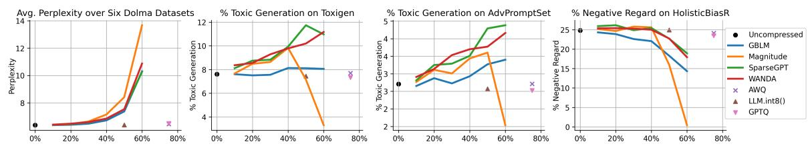
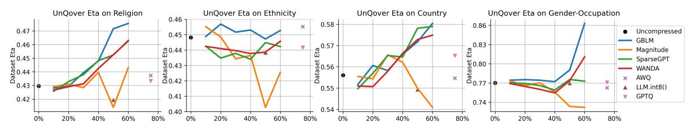
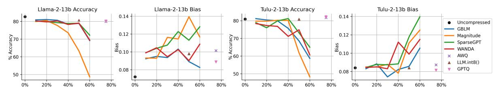
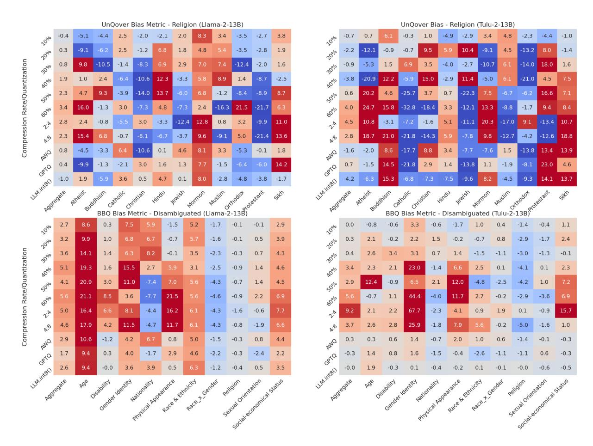
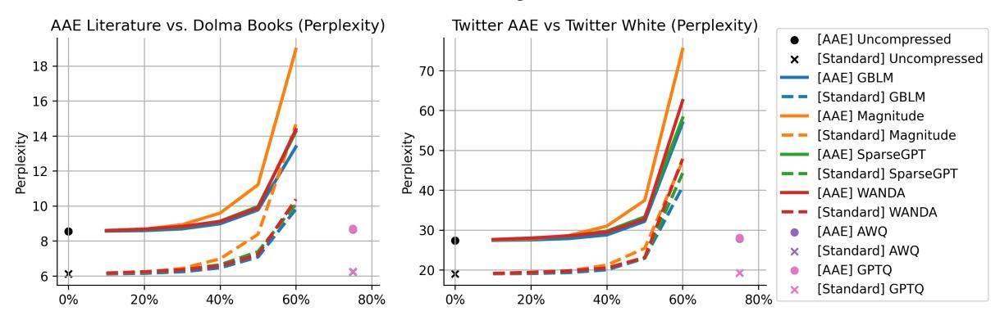
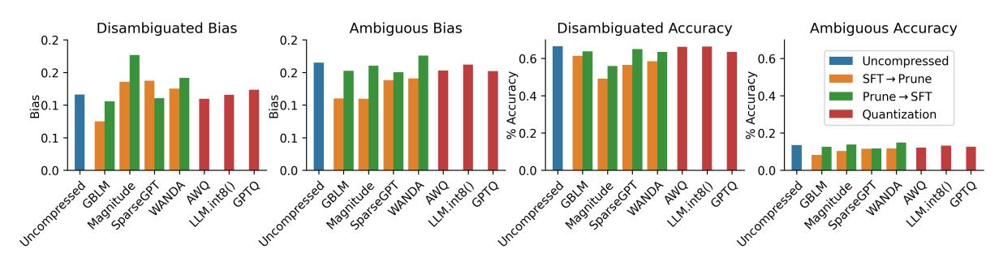
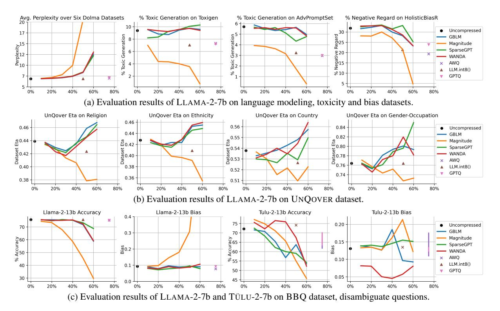
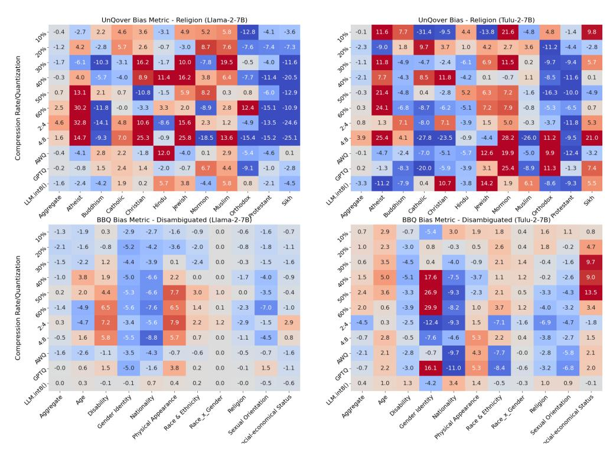
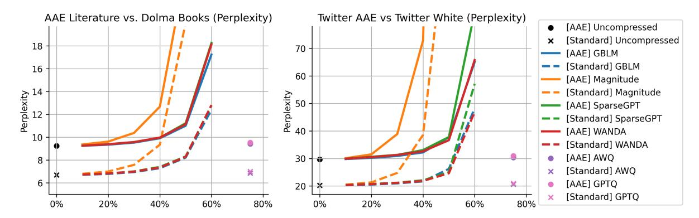

<!-- RP41_Xu_2024 | source: papers_json/RP41_Xu_2024/ -->

## Beyond Perplexity: Multi-dimensional Safety Evaluation of LLM Compression

Zhichao Xu1 2 Ashim Gupta^1^ Tao Li^3^ Oliver Bentham^1^ Vivek Srikumar^1^

^1^Kahlert School of Computing, University of Utah ^2^Scientific Computing and Imaging Institute, University of Utah ^3^Google DeepMind

zhichao.xu@utah.edu

## Abstract

Increasingly, model compression techniques enable large language models (LLMs) to be deployed in real-world applications. As a result of this momentum towards local deployment, compressed LLMs will interact with a large population. Prior work on compression typically prioritize preserving perplexity, which is directly analogous to training loss. The impact of compression method on other critical aspects of model behavior — particularly safety requires systematic assessment. To this end, we investigate the impact of model compression along four dimensions: (1) degeneration harm, i.e., bias and toxicity in generation; (2) representational harm, i.e., biases in discriminative tasks; (3) dialect bias; and (4) language modeling and downstream task performance. We examine a wide spectrum of LLM compression techniques, including unstructured pruning, semi-structured pruning, and quantization. Our analysis reveals that compression can lead to unexpected consequences. Although compression may unintentionally alleviate LLMs' degeneration harm, it can still exacerbate representational harm. Furthermore, increasing compression produces a divergent impact on different protected groups. Finally, different compression methods have drastically different safety impacts: for example, quantization mostly preserves bias while pruning degrades quickly. Our findings underscore the importance of integrating safety assessments into the development of compressed LLMs to ensure their reliability across real-world applications.[1](#page-0-0)

# 1 Introduction

Large language models (e.g., [Gemini et al.,](#page-9-0) [2023;](#page-9-0) [Achiam et al.,](#page-9-1) [2023)](#page-9-1) are remarkably performant across various tasks; they have been deployed not only as intelligent assistants, but also in high-stake

scenarios such as psychology [(Demszky et al.,](#page-9-2) [2023)](#page-9-2) and medical diagnosis [(Saab et al.,](#page-11-0) [2024)](#page-11-0). The sensitivity of such applications necessitates evaluating them across multiple dimensions, including accuracy, robustness, and other factors [(Gupta](#page-10-0) [et al.,](#page-10-0) [2023b;](#page-10-0) [Liang et al.,](#page-10-1) [2023)](#page-10-1).

Despite potential usefulness, high computational costs render local LLM deployments difficult (cf. [Zhu et al.,](#page-12-0) [2023;](#page-12-0) [Chien et al.,](#page-9-3) [2023)](#page-9-3). Consequently, there has been a surge of interest in compression methods that convert LLMs into compact models for efficient storage and inference by reducing their latency as well as memory footprint (e.g., [Sun et al.,](#page-11-1) [2024;](#page-11-1) [Frantar and Alistarh,](#page-9-4) [2023;](#page-9-4) [Lin](#page-10-2) [et al.,](#page-10-2) [2024;](#page-10-2) [Ma et al.,](#page-11-2) [2023;](#page-11-2) [Frantar et al.,](#page-9-5) [2022)](#page-9-5). Pruning algorithms like SparseGPT [(Frantar and](#page-9-4) [Alistarh,](#page-9-4) [2023)](#page-9-4) and Wanda [(Sun et al.,](#page-11-1) [2024)](#page-11-1) can substantially reduce the number of active LLM parameters without compromising perplexity. Similarly, quantization methods (e.g., [Lin et al.,](#page-10-2) [2024;](#page-10-2) [Dettmers et al.,](#page-9-6) [2022;](#page-9-6) [Frantar et al.,](#page-9-5) [2022)](#page-9-5) can reduce the memory footprint of LLMs by reducing bit-precision during inference without significantly impacting perplexity.

Model compression methods primarily focus on ensuring that the perplexity of the compressed models does not deteriorate. However, solely relying on perplexity as a performance metric is insufficient. For example, compressing large language models by a small fraction (e.g., a 20% reduction) may result in minimal changes in perplexity, but can lead to significant degradation in performance on downstream tasks [(Hong et al.,](#page-10-3) [2024;](#page-10-3) [Yin et al.,](#page-12-1) [2023)](#page-12-1). More importantly, there is a lack of systematic evaluation of how compression affects an LLM along safety dimensions, such as bias, toxicity, and truthfulness.

In this work, we argue that usage costs and data sharing restrictions will mean that local deployments of compressed LLMs are more likely to impact a larger population. Given their potential

> ^1^Our implementation and results are available here: [https://github.com/zhichaoxu-shufe/](https://github.com/zhichaoxu-shufe/Beyond-Perplexity-Compression-Safety-Eval) [Beyond-Perplexity-Compression-Safety-Eval](https://github.com/zhichaoxu-shufe/Beyond-Perplexity-Compression-Safety-Eval)

<!-- page 2 -->

widespread use, we ask: *Are compressed LLMs* *not only accurate, but also safe?* To this end, we conduct a multi-faceted evaluation of compressed LLMs, including: (1) evaluating its *degeneration* *harm*, i.e. toxicity and bias in model generated text; (2) evaluating its *representational harm*, which arises when language models are deployed for discriminative tasks; (3) evaluating how LLM compression affects *dialect bias*, and (4) the impact of compression on model's language modeling capabilities and downstream task performance. We cover a wide spectrum of compression methods, including unstructured pruning, semi-structured pruning and quantization. Some of our key findings are:

- Although compressed LLMs may exhibit reduced degeneration harm due to the degradation of generation quality, their representational harm stays unchanged or even increases.
- With higher compression, the representational harm against different protected groups diverges, and such changes show no clear pattern.
- Pretrained language models have dialect biases, and model compression maintains such biases.
- Quantization methods mostly preserve model's bias, toxicity and performance at a moderate compression rate (e.g. 50%), while pruning methods show significant degradation at the same compression rate.

# 2 Background

In this section we discuss background knowledge about potential harms by LLMs and existing LLM compression methods.

## 2.1 Potential Harms by LLMs

We categorize potential harms by the LLMs into Degeneration Harm and Representational Harm. Degeneration Harm As defined by [Gehman et al.](#page-9-7) [(2020)](#page-9-7), degeneration harm refers to the potential of the models to generate "*racist, sexist, or otherwise* *toxic language*". The model receives adversarial prompts as input, and the output generations are assessed for bias, toxicity, and truthfulness [(Liang](#page-10-1) [et al.,](#page-10-1) [2023;](#page-10-1) [Touvron et al.,](#page-11-3) [2023;](#page-11-3) [Ivison et al.,](#page-10-4) [2023;](#page-10-4) [Gemini et al.,](#page-9-0) [2023)](#page-9-0).

Representational Harm Different form degeneration harm, which manifests during text generation,

representational harm arises when LLMs are deployed for discriminative tasks, such as text classification [(Wang et al.,](#page-11-4) [2022;](#page-11-4) [Crawford,](#page-9-8) [2017)](#page-9-8).[2](#page-1-0) Existing works on measuring representational harm primarily examine models' behaviors with respect to various protected characteristics such as religion and gender via under-specified questions [(Parrish](#page-11-5) [et al.,](#page-11-5) [2022;](#page-11-5) [Li et al.,](#page-10-5) [2020)](#page-10-5). For instance, when asked which pronouns are more likely to be associated with computer programmers, BERT-style question answering models prefer male pronouns to female pronouns, despite the gender of the occupation not being specified in the question's context [(Li](#page-10-5) [et al.,](#page-10-5) [2020)](#page-10-5). We provide experimental details for measuring these two types of harms in Sec. [4.](#page-4-0)

## 2.2 Compression Methods for LLMs.

Our goal is to evaluate the safety of compressed LLMs. Notable compression techniques include network pruning [(LeCun et al.,](#page-10-6) [1989;](#page-10-6) [Hassibi et al.,](#page-10-7) [1993;](#page-10-7) [Xia et al.,](#page-12-2) [2022,](#page-12-2) [2024)](#page-12-3), distillation [(Sanh](#page-11-6) [et al.,](#page-11-6) [2019)](#page-11-6), quantization [(Dettmers et al.,](#page-9-6) [2022;](#page-9-6) [Frantar et al.,](#page-9-5) [2022;](#page-9-5) [Lin et al.,](#page-10-2) [2024;](#page-10-2) [Zhang](#page-12-4) [and Shrivastava,](#page-12-4) [2024)](#page-12-4) and low-rank approximation [(Gupta et al.,](#page-10-8) [2024;](#page-10-8) [Xu et al.,](#page-12-5) [2023;](#page-12-5) [Lan et al.,](#page-10-9) [2019,](#page-10-9) *inter alia*).

In this work, we focus on two popular compression directions — pruning and quantization. Pruning aims to remove unimportant weights from a neural network to reduce storage/memory and inference costs while maintaining performance. There are two important concepts in pruning: (1) pruning unit is the atomic unit to be removed from a model; it can be a single weight, an attention head or even an entire layer. (2) saliency score is the criterion for making pruning decisions. Different pruning algorithms estimate saliency scores differently to prune low scoring units.

Existing compression methods can be broadly divided into (1) unstructured pruning [(Frantar and](#page-9-4) [Alistarh,](#page-9-4) [2023;](#page-9-4) [Sun et al.,](#page-11-1) [2024,](#page-11-1) *inter alia*), (2) semi-structured N:M pruning and (3) structured pruning [(Xia et al.,](#page-12-3) [2024,](#page-12-3) [2022;](#page-12-2) [Ma et al.,](#page-11-2) [2023,](#page-11-2) *inter alia*). Unstructured pruning uses each individ-

> ^2^[Barocas et al.](#page-9-9) [(2023)](#page-9-9) mention stereotype perpetuation and cultural denigration as examples of representational harms, and argue that they "occur when systems reinforce the subordination of some groups along the lines of identity — race, class, gender, etc. [They] have long-term effects, and resist formal characterization." In our experiments, we use the BBQ and UNQOVER evaluations to focus on the stereotype perpetuation aspect, and evaluate the extent to which language model reinforces stereotypes against protected groups.

<!-- page 3 -->

ual parameter as the pruning unit, resulting in an irregular sparsity structure, while structured pruning uses larger units such as neurons, attention head or Transformer layer. Semi-structured pruning aims to achieve specific N:M sparsity patterns (N elements are non-zero for every M consecutive elements) to allow for inference speed-up with hardware support (Nvidia, 2021). In this work, we include both unstructured pruning and semi-structured pruning.

Quantization aims to compress a neural network by reducing the number of bits (i.e., precision) in the weights of the model (Dettmers et al., 2022; Xu and McAuley, 2023; Dettmers et al., 2024, *inter alia*). Post-training quantization rescales the weights of a trained language model, while quantization-aware training rounds the weights during the training process. We should note quantization and pruning are two orthogonal compression directions—pruned models can be further quantized for extreme compression.

## 2.3 Prior Works on LLM Compression Evaluation

A few recent works have attempted to tackle the problem of safety evaluation of LLM compression. For example, Ramesh et al. (2023) evaluate how different compression methods affect language model's fairness dimensions, but the experiments are restricted to moderate-sized, encoder-only models. Jaiswal et al. (2023) highlight the problem of using perplexity as the standalone evaluation metric and underscore the importance of more comprehensive evaluations, yet their experiments are restricted to performance dimensions of compressed LLMs. Different from Hong et al. (2024) which evaluates "trustworthiness" of compressed LLMs as an aggregated score, in this work we attempt to conduct a fine-grained, multifaceted safety evaluation of compressed LLMs, with particular attention to disparities in how model compression affects different protected groups.

## **3 Evaluating Compression Models **

We study two base models: LLAMA-2 (Touvron et al., 2023) and TÜLU-2 (Ivison et al., 2023) of two different sizes: 7B and 13B parameters. LLAMA-2 is an autoregressive language model pre-trained on 2T tokens, while TÜLU-2 is based on LLAMA-2 and supervised fine-tuned (SFT-ed) on the TÜLU-2-SFT-Mixture (Ivison et al., 2023). We evaluate both the raw language models and their SFT-ed

instruction-following variants.3

## 3.1 Compression Algorithms and Ratios

We study four different pruning algorithms: the simple Magnitude pruning (Kurtic and Alistarh, 2022), SparseGPT (Frantar and Alistarh, 2023), Wanda (Sun et al., 2024) and GBLM (Das et al., 2023). These algorithms mainly differ in calibration criteria, i.e., the way saliency scores are estimated for pruning units. We focus on different compression rates from 10% to 60%, and include both unstructured pruning and semi-structured pruning (2:4 and 4:8).4

We also include representative post-training quantization methods—LLM.int8() (Dettmers et al., 2022), GPTQ (Frantar et al., 2022) and Activation-aware Weight Quantization (AWQ) (Lin et al., 2024). Inputs and weights in LLM.int8() are multiplied in 8-bit and quantized to Int8 before being dequantized back to 16-bits. GPTQ is a layerwise quantization technique based on approximated second-order information towards minimum accuracy loss on the calibration set. AWQ reserves some salient weights in 16-bits while quantizing other weights to 4-bits without significant performance degradation. Table 1 compares the compression methods, and we show additional technical details in Appx. B.

> ^&^lt;sup>3The methodology we use in our evaluation is general and does not apply to these specific models. We choose these models because the pruning algorithms we study, while currently the state-of-the-art, have been evaluated on LLAMA-2, and not the more recent models.

> ^&^lt;sup>4In preliminary experiments, we found that beyond 60% compression, generation quality deteriorates drastically.

<!-- page 4 -->

## 3.2 Safety Evaluation Dimensions

**Degeneration Harm Evaluation.** Existing bias and toxicity evaluation datasets can be broadly divided into two categories: (1) degeneration harm and (2) representational harm. For degeneration harm, the language model is given potentially harmful prompts as inputs, and the continuations are scored with model-based evaluations.

We conduct evaluations on five datasets: (1) RE-ALTOXICITYPROMPTS (Gehman et al., 2020)'s prompts are sampled from a web corpus (Gokaslan et al., 2019) with different levels of toxicity. (2) TOXIGEN (Hartvigsen et al., 2022) includes synthesized prompts to invoke adversarial and implicit hate speech. (3) ADVPROMPTSET (Esiobu et al., 2023) is a large-scale adversarial text prompt set based on the open-sourced Jigsaw toxicity dataset (Adams et al., 2017). (4) BOLD (Dhamala et al., 2021) includes prompts extracted from Wikipedia articles across five demographic axes. (5) HOLISTICBIASR (Esiobu et al., 2023) extends Regard's pre-defined templates (Sheng et al., 2019) with noun phrases from the HolisticBias dataset (Smith et al., 2022) to test model's regard (i.e. respect, esteem) for different protected groups. For each of the generative harm datasets, we use the prompts from the dataset, and score the completions with a classifier, detailed in Table 2.

**Representational Harm Evaluation.** For representational harm, the model is prompted with (partially) ambiguous inputs and is required to choose one among different groups mentioned in the input. We use the BBQ (Parrish et al., 2022) and UNQOVER (Li et al., 2020) datasets for this purpose.

BBQ is a question answering dataset with manually annotated questions highlighting attested social biases against nine different protected groups under nine social dimensions. The dataset consists of ambiguous questions and disambiguated questions. Each question has three candidate answers: the bias-reinforcing answer, bias-against answer and Unknown. Denote n_{\rm reinforcing} as the number of model's predictions for bias-reinforcing answer, and n_{\rm against}, n_{\rm Unknown} for bias-against answer and Unknown, respectively. For ambiguous questions, the bias metric is defined as

$$
s_{\rm ambiguous} = \frac{n_{\rm reinforcing}}{n_{\rm reinforcing} + n_{\rm against} + n_{\rm Unknown}} \ \ (1)
$$

For disambiguated questions, the bias metric is

defined as

$$
s_{\text{disambiguated}} = \frac{n_{\text{reinforcing}}}{n_{\text{reinforcing}} + n_{\text{against}}} (2)
$$

UNQOVER is a benchmark that probes and quantifies model biases through underspecified questions. The dataset is constructed by instantiating a context template with two subjects and one attribute (e.g., two gendered names and an occupation) without hinting the association among them. Models are then asked to decide which subject is more associated to the given attribute. Finally, predicted subject scores are used to aggregate a quantitative measurement to indicate the degree of model biases. The benchmark probes for four different characteristics of stereotypical biases: religion, country, ethnicity and gender-occupation. In this paper, we focus on reporting the \eta metric of UNQOVER. For a protected characteristic dataset D such as religion, \eta(D) \in [0,1] represents how often the model gives biased predictions on this characteristic. For a protected group x such as Sikh in religion, \eta(x) \in [-1,1] represents how often a model is biased towards (+) or against (-) it. We refer more details about the calculation of this metric to Appx. A.1.2.

We use 5-shot prompting for BBQ as recommended by Weidinger et al. (2023) and zero-shot prompting for UNQOVER.

**Truthfulness.** LLMs are expected generate reliable outputs that agree with factuality and common sense. We adopt TRUTHFULQA (Lin et al., 2021) to measure whether compressed language models are truthful in generating answers to questions while being informative at the same time. The TRUTHFULQA benchmark consists of 817 questions w.r.t. unfounded beliefs or misconceptions. We follow (Ouyang et al., 2022; Ivison et al., 2023)

<!-- page 5 -->

*(a) Evaluation results of LLAMA-2-13B on language modeling (↓), toxicity (↓) and bias datasets (↓). We notice model-based evaluation metrics are sensitive to generation quality, e.g. % negative regard decreases as perplexity increases. Note that from 30% compression rate, all four pruning methods have statistically significantly higher perplexity compared to uncompressed models (paired student T-Test at 0.05 significance level).*

*(b) Evaluation results of LLAMA-2-13B on UNQOVER dataset with regard to representational bias (↓). We notice that model's representational bias are relatively consistent except for Magnitude pruning, as pruning ratio increases compared to results on degeneration bias & toxicity benchmarks.*

*(c) Evaluation results of LLAMA-2-13B and TÜLU-2-13B on BBQ dataset, disambiguate questions with regard to accuracy (↑) and bias (↓). We notice as pruning ratio increases, model's accuracy drops sharply, meanwhile models' bias increases.*

*Figure 1: LLAMA-2-13B's compression results on different datasets. X-axis refers to compression ratio. LLM.int8(), AWQ, GPTQ are of 50%, 75% and 75% compression ratio, respectively. 7B models show similar trends (Fig. [5)](#page-18-0).*

to use 6-shot prompting and use model-based evaluation (details in Appx. [A)](#page-12-8).

## 3.3 Performance Evaluation Dimensions

A compressed language model should produce coherent language, and be useful for downstream tasks.

Language Modeling Capability. Existing studies on compression algorithms use perplexity as the primary evaluation metric. To align with existing works, we include WIKITEXT-2 [(Merity et al.,](#page-11-12) [2016)](#page-11-12) for language modeling capability evaluation. WIKITEXT-2 only covers the Wikipedia text and cannot reflect models' performance on other text domains, therefore we also include a subset of DOLMA dataset [(Soldaini et al.,](#page-11-13) [2024)](#page-11-13) cover six different domains: Books, CommonCrawl, Reddit, StackOverflow, Wiki and PeS2o (STEM papers).

Downstream Tasks. We evaluate compressed models' capabilities on three downstream task dimensions: knowledge and reasoning, in-

struction following and conditional generation/summarization. We use MMLU [(Hendrycks](#page-10-14) [et al.,](#page-10-14) [2020)](#page-10-14), MT-BENCH [(Zheng et al.,](#page-12-9) [2023)](#page-12-9) and XSUM [(Narayan et al.,](#page-11-14) [2018)](#page-11-14) respectively. Appx. [A](#page-12-8) shows additional details, including examples of each dataset.

# 4 Degeneration Harm & Representational Harms

Existing bias and toxicity evaluation benchmarks (e.g., [Liang et al.,](#page-10-1) [2023;](#page-10-1) [Esiobu et al.,](#page-9-13) [2023;](#page-9-13) [Hong et al.,](#page-10-3) [2024)](#page-10-3) focus on providing one single metric macro averaged over different datasets. In contrast, we take a closer look at what can be lost in the single average scores, and focus on degeneration and representational harm.

Degeneration harm evaluation is cofounded by generation quality. As the compression ratio increases, the model starts to produce disfluent English. Such invalid English is often classified as un-

<!-- page 6 -->

harmful by model-based evaluations. For example, in Fig. [1a,](#page-4-1) we can observe a clear trend. For pruning methods, the perplexity increases sharply at 50% compression ratio. However, the model's negative regard score decreases. Specifically, for the Magnitude-pruned model the toxicity and negative regard scores to drop close to zero, suggesting that the generations are non-toxic and respectful, when in fact, they are not even language.

Representational harm stays consistent or increases as pruning ratio increases, except for **Magnitude**. For example, Fig. [1b](#page-4-1) and Fig. [1c](#page-4-1) show that despite model's generation quality and accuracy degrading as pruning ratio increases, model's representational harm stays consistent or increases (as measured by bias metrics on UN-QOVER and BBQ dataset). Again, we observe Magnitude's different bias pattern compared to other pruning methods, which we hypothesize is related to its sharp performance degradation.

SFT reduces degeneration harm, but not representational harm. Similar to discussions by previous works [(Touvron et al.,](#page-11-3) [2023;](#page-11-3) [Ivison et al.,](#page-10-4) [2023)](#page-10-4), SFT-ed language models can achieve close to zero toxicity rate, as measured by model-based metrics on our toxicity evaluation datasets (detailed results in Appx. [D)](#page-17-0). However, the representational harm is not reduced, evidenced by our results on UN-QOVER and BBQ. For example, from Fig. [1c,](#page-4-1) uncompressed LLAMA-2-13B model has lower bias metric compared to its SFT-ed variant TÜLU-2-13B (7.2 vs 8.4). As the compression ratio increases, the bias metrics of both models increase. Evaluation results with LLAMA-2-7B model show similar trends in Fig. [5.](#page-18-0)

Quantization methods largely preserves model's performance, bias and toxicity. We notice that starting from 40% compression ratio, pruning methods' behaviors start to deviate much from the uncompressed model. On the other hand, quantization methods at moderate or large compression rate still preserve model's language modeling and classification performance (Fig. [1a](#page-4-1) and Fig. [1c)](#page-4-1). Meanwhile the model's bias and toxicity are also preserved.

Quantized 13B models are on par or better than uncompressed 7B models. The 50% quantized TÜLU-2-13B model with LLM.int8() achieves 56.7% and 55.6% on MMLU and TRUTH-FULQA datasets, compared to the original TÜLU-2- 7B model's 55.8% and 32.3%. Note that these two models are roughly equal in terms of the GPU memory they require for inference. In terms of language

modeling, 50% quantized LLAMA-2-13B model achieves 4.92 perplexity on WIKITEXT-2 compared to LLAMA-2-7B's 5.47. On the other hand, 50% pruned TÜLU-2-13B with GBLM pruning only achieves 51.3% and 44.4% on MMLU and TRUTH-FULQA, respectively. This suggests that under same compression rate, quantization performs better than pruning.

# 5 How Does Compression Affect Different Protected Groups?

The BBQ score for representational harm is aggregated across multiple different kinds of protected groups. We see in Fig. [1c](#page-4-1) that the score does not have substantial change across compression ratios. At the level of individual protected groups, this is not the case.

We find, however, that the change of harm score against individual protected groups shows no clear pattern. In Fig. [2,](#page-6-0) we select SparseGPT as a representative pruning method to show the change of model's bias against each individual group as the compression ratio increases. Although the aggregated bias metric shows no drastic change, the bias metric against each individual group may change significantly with a 10% compression rate difference. Moreover, quantization methods also demonstrate different bias changing patterns against different groups. For example, on BBQ dataset, LLM.int8() has a +9.4 (increased bias) against the Age protected group with LLAMA-2-13B model, and -1.2 (decreased bias) against Race_x_Gender while AWQ has +10.6 and -1.5. Our finding highlights the necessity for finegrained bias evaluation for different demographic groups, instead of relying on aggregated metrics. In addition, practitioners should evaluate their (compressed) LLMs with a focus on their users' demographic groups.

# 6 How Does Compression Affect Different Dialects of English?

Different prior works have studied dialect biases for language models [(Blodgett et al.,](#page-9-16) [2016,](#page-9-16) [2020;](#page-9-17) [Joshi et al.,](#page-10-15) [2024;](#page-10-15) [Lent et al.,](#page-10-16) [2021,](#page-10-16) *inter alia*). Notably, [Hofmann et al.](#page-10-17) [(2024)](#page-10-17) highlight that LLMs may encode systemic racial biases via *dialect preju**dice*. In this section, we study how compression affects language models' dialect biases. Specifically, we focus on African American English (AAE) versus "standard" English. We use two paired

<!-- page 7 -->

*Figure 2: Change of representational bias (↓) against different groups, as compression ratio increases, with 13B models. Although aggregated bias metric are relatively stable, different protected groups have vastly different behaviors. Results with 7B models show similar trends (Fig. [6)](#page-18-1).*

*Figure 3: LLAMA-2-13B perplexity (↓) evaluation results for dialect bias. Note that AWQ and GPTQ have close results thus their markers are overlapped in the plots. LLAMA-2-7B shows similar trends (Fig. [7)](#page-19-0).*

datasets for this evaluation: (1) the TWITTER AAE dataset [(Blodgett et al.,](#page-9-17) [2020)](#page-9-17), consisting of balanced sets of tweets classified as African American or White-aligned English; (2) the AAE LITERA-TURE dataset[5](#page-6-1) versus DOLMA books subset [(Sol](#page-11-13)[daini et al.,](#page-11-13) [2024)](#page-11-13). The first comparison focuses on social media posts while the second comparison focuses on public domain books, representing (typ-

ically) copy-edited text. We provide the detailed statistics of these datasets in Table [5.](#page-15-0) We evaluate the change of perplexity of compressed language models on these corpora. This comparison provides us insights into how different compression methods and compression ratios affect the language model's dialect biases.

We show the results with LLAMA-2-13B base model in Fig. [3.](#page-6-2) The full results are in Appx. [D.3.](#page-17-1) We make three key observations: (1) The pre-

> ^5^[https://github.com/jazmiahenry/aave_](https://github.com/jazmiahenry/aave_corpora) [corpora](https://github.com/jazmiahenry/aave_corpora)

<!-- page 8 -->

trained language model has a dialect bias. It has a lower perplexity on standard English book text or social media posts, compared to their African American English counterparts. (2) Model compression maintains the language model's dialect biases. The perplexity of both AAE and "standard" English increases as the compression ratio increases, but the margin does not reduce. This is true for both pruning and quantization methods. (3) Even a heavily compressed model (at 50% pruning ratio) has better perplexity on "standard" English than the *uncompressed* model on African American English. Notwithstanding the difficulty of the selection of the perplexity evaluation dataset and the underlying phenomenon of dialect bias, our conclusions remain valid because of the significantly worse perplexity of AAE dialect with the uncompressed model.

The impact of the last observation can be illustrated by mapping model size to monetary cost of inference; larger models cost more. The largest (i.e. uncompressed) model is double the size of the 50% compressed model, but the former has worse perplexity on AAE than the latter on standard English. As language models are increasingly becoming our interfaces to data and compute, this means that a speaker of White-aligned English can receive "better service" in their native dialect, but pay only half the price as an AAE speaker seeking to interact in their native dialect.

# 7 The Impact of Supervised Fine-tuning

In this section, we investigate how the order of performing pruning and SFT affect the resulting model's performance.[6](#page-7-0) For the experiment group, we first prune the base LLAMA-2-7B model to 50% pruning rate, then perform supervised finetuning. For the control group, we first SFT the base model then perform the pruning. We refer to the experiment group as Prune→SFT, and the control group as SFT→Prune. We use the all four pruning algorithms from Sec. [2.2,](#page-1-1) and the TÜLU-2-SFT-Mixture[7](#page-7-1) used by the official TÜLU family models for the supervised fine-tuning.

Table [3](#page-8-0) and Fig. [4](#page-8-1) shows the results of this evaluation. Prune→SFT models achieve better performance in terms of downstream tasks (i.e. MT-

BENCH, MMLU, XSUM and classification accuracy on BBQ disambiguate questions). This observation is expected as during SFT, the unpruned weights of pruned models are further adapted, and such adaptation is helpful for performance. Interestingly, we notice that the bias evaluation results are mixed. Prune→SFT models have lower bias and toxicity on degeneration harm evaluation datasets, but overall higher representational harm (Fig. [4,](#page-8-1) Table [30](#page-35-0) and Table [31)](#page-36-0). We hypothesize this is because SFT decreases the base model's degeneration harm, but increases the base model's representational harm (Fig. [5](#page-18-0) and Appx. [D.1.4)](#page-17-2). We leave this as an interesting direction for future exploration.

# 8 Conclusions and Recommendations

In this work, we presented a comprehensive evaluation on the safety of LLM compression techniques. We systematically investigated multiple aspects of safety, including degeneration harm, representational harm as well as dialect biases. Our safety evaluation, along with downstream task performances, reveals that model compression can lead to a series of unexpected results. Compression may unintentionally remedy an LLM's degeneration harm, but it can still exacerbate representational harm. In addition, as the compression rate increases, different protected groups are not affected equally. Our findings highlight the need for a nuanced understanding of how compression affects LLM behavior. We conclude with the following recommendations for future LLM compression research: (1) Do not solely evaluate one aspect, perplexity or safety, in isolation. Instead, always measure and report both. (2) Aggregated metrics for safety can hide the nuanced movement across different protected groups and dialects. It is imperative to conduct fine-grained evaluations of compressed LLMs with regard to each individual protected group and dialect.

## Limitations

Evaluating different model compression methods at different compression ratios is an expensive computational effort. In our experiments, for each base model, we evaluate 4 pruning methods × 8 pruning ratios + 3 quantization methods = 35 compressed models. Therefore, we evaluate 4 base models (LLAMA-2-{7B, 13B}, TÜLU-2-{7B, 13B}), in total 144 models on each dataset (4 × 35 + 4). Given

> ^6^The quantization methods we study are post-training quantization methods which do not support SFT afterwards, therefore we do not include them in this section.

> ^7^[https://huggingface.co/datasets/](https://huggingface.co/datasets/allenai/tulu-v2-sft-mixture) [allenai/tulu-v2-sft-mixture](https://huggingface.co/datasets/allenai/tulu-v2-sft-mixture)

<!-- page 9 -->

*Figure 4: Bias (left) and Accuracy (right) results on BBQ dataset between SFT→Prune and Prune→SFT.*

the limited bandwidth and resources, our evaluations focus on 7B and 13B-sized models and their compressed models. The bias, toxicity, and performance evaluations with compressed larger models, such as 30B and 70B LLAMA and TÜLU models remain to be studied. In addition, other notable compression methods such as KV cache quantization (Liu et al., 2024; Zhang et al., 2024) remain to be studied. The compression algorithms and representational harm evaluations require access to model's parameters and logits, which are not available for certain proprietary models such as GPT-4 (Achiam et al., 2023) and Gemini (Gemini et al., 2023).

## **Ethical Considerations **

This work studies how model compression affects language model's safety dimensions, including degeneration harm, representational harm as well as dialect biases. All artifacts used in this work are available for public access with licenses for academic purposes. Given the fact that we conclude compressed models have the same or higher harms, we do not plan to release the compressed models, but we will release detailed implementations and instructions to reproduce the experimental results.

<!-- page 10 -->

## Acknowledgements

We would thank members of UtahNLP for their constructive feedback. This material is based upon work supported in part by NSF under grants 2007398, 2217154, 2318550, 2205418, and 2134223. This research is supported by the National Artificial Intelligence Research Resource (NAIRR) Pilot and the Delta advanced computing and data resource which is supported by the National Science Foundation (award NSF-OAC 2005572). Ashim Gupta is supported by the Bloomberg Data Science Ph.D. Fellowship. Oliver Bentham is supported by the NSF CISE Graduate Fellowships under Grant No. G-2A-063. Any opinions, findings, and conclusions or recommendations expressed in this material are those of the authors and do not necessarily reflect the views of the sponsers.

## References

- Josh Achiam, Steven Adler, Sandhini Agarwal, Lama Ahmad, Ilge Akkaya, Florencia Leoni Aleman, Diogo Almeida, Janko Altenschmidt, Sam Altman, Shyamal Anadkat, et al. 2023. Gpt-4 technical report. *arXiv preprint arXiv:2303.08774*.
- CJ Adams, Jeffrey Sorensen, Julia Elliott, Lucas Dixon, nithum Mark McDonald, and Will Cukierski. 2017. [Toxic comment classification challenge.](https://kaggle.com/competitions/jigsaw-toxic-comment-classification-challenge)
- Solon Barocas, Moritz Hardt, and Arvind Narayanan. 2023. *Fairness and machine learning: Limitations* *and opportunities*. MIT press.
- Su Lin Blodgett, Solon Barocas, Hal Daumé III, and Hanna Wallach. 2020. [Language (technology) is](https://doi.org/10.18653/v1/2020.acl-main.485) [power: A critical survey of "bias" in NLP.](https://doi.org/10.18653/v1/2020.acl-main.485) In *Pro**ceedings of the 58th Annual Meeting of the Asso**ciation for Computational Linguistics*, pages 5454– 5476, Online. Association for Computational Linguistics.
- Su Lin Blodgett, Lisa Green, and Brendan O'Connor. 2016. [Demographic dialectal variation in social](https://doi.org/10.18653/v1/D16-1120) [media: A case study of African-American English.](https://doi.org/10.18653/v1/D16-1120) In *Proceedings of the 2016 Conference on Empiri**cal Methods in Natural Language Processing*, pages 1119–1130, Austin, Texas. Association for Computational Linguistics.
- Andrew A Chien, Liuzixuan Lin, Hai Nguyen, Varsha Rao, Tristan Sharma, and Rajini Wijayawardana. 2023. Reducing the carbon impact of generative ai inference (today and in 2035). In *Proceedings of* *the 2nd Workshop on Sustainable Computer Systems*, pages 1–7.
- Kate Crawford. 2017. The trouble with bias. *Invited* *Talks at NeurIPS 2017*.

- Rocktim Jyoti Das, Liqun Ma, and Zhiqiang Shen. 2023. Beyond size: How gradients shape pruning decisions in large language models. *arXiv preprint* *arXiv:2311.04902*.
- Dorottya Demszky, Diyi Yang, David S Yeager, Christopher J Bryan, Margarett Clapper, Susannah Chandhok, Johannes C Eichstaedt, Cameron Hecht, Jeremy Jamieson, Meghann Johnson, et al. 2023. Using large language models in psychology. *Nature Reviews Psy**chology*, 2(11):688–701.
- Tim Dettmers, Mike Lewis, Younes Belkada, and Luke Zettlemoyer. 2022. Gpt3. int8 (): 8-bit matrix multiplication for transformers at scale. *Advances in* *Neural Information Processing Systems*, 35:30318– 30332.
- Tim Dettmers, Artidoro Pagnoni, Ari Holtzman, and Luke Zettlemoyer. 2024. Qlora: Efficient finetuning of quantized llms. *Advances in Neural Information* *Processing Systems*, 36.
- Jwala Dhamala, Tony Sun, Varun Kumar, Satyapriya Krishna, Yada Pruksachatkun, Kai-Wei Chang, and Rahul Gupta. 2021. Bold: Dataset and metrics for measuring biases in open-ended language generation. In *Proceedings of the 2021 ACM conference* *on fairness, accountability, and transparency*, pages 862–872.
- David Esiobu, Xiaoqing Tan, Saghar Hosseini, Megan Ung, Yuchen Zhang, Jude Fernandes, Jane Dwivedi-Yu, Eleonora Presani, Adina Williams, and Eric Smith. 2023. [ROBBIE: Robust bias evaluation of](https://doi.org/10.18653/v1/2023.emnlp-main.230) [large generative language models.](https://doi.org/10.18653/v1/2023.emnlp-main.230) In *Proceedings of* *the 2023 Conference on Empirical Methods in Natu**ral Language Processing*, pages 3764–3814, Singapore. Association for Computational Linguistics.
- Elias Frantar and Dan Alistarh. 2023. Sparsegpt: Massive language models can be accurately pruned in one-shot. In *International Conference on Machine* *Learning*, pages 10323–10337. PMLR.
- Elias Frantar, Saleh Ashkboos, Torsten Hoefler, and Dan Alistarh. 2022. Gptq: Accurate post-training quantization for generative pre-trained transformers. *arXiv preprint arXiv:2210.17323*.
- Samuel Gehman, Suchin Gururangan, Maarten Sap, Yejin Choi, and Noah A Smith. 2020. Realtoxicityprompts: Evaluating neural toxic degeneration in language models. In *Findings of the Association* *for Computational Linguistics: EMNLP 2020*, pages 3356–3369.
- Team Gemini, Rohan Anil, Sebastian Borgeaud, Yonghui Wu, Jean-Baptiste Alayrac, Jiahui Yu, Radu Soricut, Johan Schalkwyk, Andrew M Dai, Anja Hauth, et al. 2023. Gemini: a family of highly capable multimodal models. *arXiv preprint* *arXiv:2312.11805*.
- Aaron Gokaslan, Vanya Cohen, Ellie Pavlick, and Stefanie Tellex. 2019. Openwebtext corpus.

<!-- page 11 -->

- Ashim Gupta, Carter Blum, Temma Choji, Yingjie Fei, Shalin Shah, Alakananda Vempala, and Vivek Srikumar. 2023a. Don't retrain, just rewrite: Countering adversarial perturbations by rewriting text. In *Pro**ceedings of the 61st Annual Meeting of the Associa**tion for Computational Linguistics (Volume 1: Long* *Papers)*, pages 13981–13998.
- Ashim Gupta and Amrith Krishna. 2023. Adversarial clean label backdoor attacks and defenses on text classification systems. In *Proceedings of the* *8th Workshop on Representation Learning for NLP* *(RepL4NLP 2023)*, pages 1–12.
- Ashim Gupta, Rishanth Rajendhran, Nathan Stringham, Vivek Srikumar, and Ana Marasovic. 2023b. Whis- ´ pers of doubt amidst echoes of triumph in nlp robustness. *arXiv preprint arXiv:2311.09694*.
- Ashim Gupta, Sina Mahdipour Saravani, P Sadayappan, and Vivek Srikumar. 2024. An empirical investigation of matrix factorization methods for pre-trained transformers. *arXiv preprint arXiv:2406.11307*.
- Thomas Hartvigsen, Saadia Gabriel, Hamid Palangi, Maarten Sap, Dipankar Ray, and Ece Kamar. 2022. Toxigen: A large-scale machine-generated dataset for adversarial and implicit hate speech detection. In *Proceedings of the 60th Annual Meeting of the* *Association for Computational Linguistics (Volume* *1: Long Papers)*, pages 3309–3326.
- Babak Hassibi, David G Stork, and Gregory J Wolff. 1993. Optimal brain surgeon and general network pruning. In *IEEE international conference on neural* *networks*, pages 293–299. IEEE.
- Dan Hendrycks, Collin Burns, Steven Basart, Andy Zou, Mantas Mazeika, Dawn Song, and Jacob Steinhardt. 2020. Measuring massive multitask language understanding. In *International Conference on Learning* *Representations*.
- Valentin Hofmann, Pratyusha Ria Kalluri, Dan Jurafsky, and Sharese King. 2024. Dialect prejudice predicts ai decisions about people's character, employability, and criminality. *arXiv preprint arXiv:2403.00742*.
- Junyuan Hong, Jinhao Duan, Chenhui Zhang, Zhangheng Li, Chulin Xie, Kelsey Lieberman, James Diffenderfer, Brian Bartoldson, Ajay Jaiswal, Kaidi Xu, et al. 2024. Decoding compressed trust: Scrutinizing the trustworthiness of efficient llms under compression. *arXiv preprint arXiv:2403.15447*.
- Clayton Hutto and Eric Gilbert. 2014. Vader: A parsimonious rule-based model for sentiment analysis of social media text. In *Proceedings of the international* *AAAI conference on web and social media*, volume 8, pages 216–225.
- Hamish Ivison, Yizhong Wang, Valentina Pyatkin, Nathan Lambert, Matthew Peters, Pradeep Dasigi, Joel Jang, David Wadden, Noah A Smith, Iz Beltagy, et al. 2023. Camels in a changing climate: Enhancing lm adaptation with tulu 2. *arXiv preprint* *arXiv:2311.10702*.

- Ajay Kumar Jaiswal, Zhe Gan, Xianzhi Du, Bowen Zhang, Zhangyang Wang, and Yinfei Yang. 2023. Compressing llms: The truth is rarely pure and never simple. In *The Twelfth International Conference on* *Learning Representations*.
- Aditya Joshi, Raj Dabre, Diptesh Kanojia, Zhuang Li, Haolan Zhan, Gholamreza Haffari, and Doris Dippold. 2024. Natural language processing for dialects of a language: A survey. *arXiv preprint* *arXiv:2401.05632*.
- Eldar Kurtic and Dan Alistarh. 2022. Gmp*: Well-tuned gradual magnitude pruning can outperform most bert-pruning methods. *arXiv preprint* *arXiv:2210.06384*.
- Zhenzhong Lan, Mingda Chen, Sebastian Goodman, Kevin Gimpel, Piyush Sharma, and Radu Soricut. 2019. Albert: A lite bert for self-supervised learning of language representations. In *International Confer**ence on Learning Representations*.
- Yann LeCun, John Denker, and Sara Solla. 1989. Optimal brain damage. *Advances in neural information* *processing systems*, 2.
- Heather Lent, Emanuele Bugliarello, Miryam de Lhoneux, Chen Qiu, and Anders Søgaard. 2021. [On language models for creoles.](https://doi.org/10.18653/v1/2021.conll-1.5) In *Proceedings of* *the 25th Conference on Computational Natural Lan**guage Learning*, pages 58–71, Online. Association for Computational Linguistics.
- Tao Li, Daniel Khashabi, Tushar Khot, Ashish Sabharwal, and Vivek Srikumar. 2020. Unqovering stereotyping biases via underspecified questions. In *Find**ings of the Association for Computational Linguistics:* *EMNLP 2020*, pages 3475–3489.
- Percy Liang, Rishi Bommasani, Tony Lee, Dimitris Tsipras, Dilara Soylu, Michihiro Yasunaga, Yian Zhang, Deepak Narayanan, Yuhuai Wu, Ananya Kumar, et al. 2023. Holistic evaluation of language models. *Transactions on Machine Learning Research*.
- Chin-Yew Lin. 2004. [ROUGE: A package for auto](https://aclanthology.org/W04-1013)[matic evaluation of summaries.](https://aclanthology.org/W04-1013) In *Text Summariza**tion Branches Out*, pages 74–81, Barcelona, Spain. Association for Computational Linguistics.
- Ji Lin, Jiaming Tang, Haotian Tang, Shang Yang, Wei-Ming Chen, Wei-Chen Wang, Guangxuan Xiao, Xingyu Dang, Chuang Gan, and Song Han. 2024. Awq: Activation-aware weight quantization for llm compression and acceleration. In *MLSys*.
- Stephanie Lin, Jacob Hilton, and Owain Evans. 2021. Truthfulqa: Measuring how models mimic human falsehoods. *arXiv preprint arXiv:2109.07958*.
- Zirui Liu, Jiayi Yuan, Hongye Jin, Shaochen Zhong, Zhaozhuo Xu, Vladimir Braverman, Beidi Chen, and Xia Hu. 2024. Kivi: A tuning-free asymmetric 2bit quantization for kv cache. In *Forty-first International* *Conference on Machine Learning*.

<!-- page 12 -->

- Yao Lu, Max Bartolo, Alastair Moore, Sebastian Riedel, and Pontus Stenetorp. 2022. [Fantastically ordered](https://doi.org/10.18653/v1/2022.acl-long.556) [prompts and where to find them: Overcoming few](https://doi.org/10.18653/v1/2022.acl-long.556)[shot prompt order sensitivity.](https://doi.org/10.18653/v1/2022.acl-long.556) In *Proceedings of the* *60th Annual Meeting of the Association for Compu**tational Linguistics (Volume 1: Long Papers)*, pages 8086–8098, Dublin, Ireland. Association for Computational Linguistics.
- Xinyin Ma, Gongfan Fang, and Xinchao Wang. 2023. [LLM-pruner: On the structural pruning of large lan](https://openreview.net/forum?id=J8Ajf9WfXP)[guage models.](https://openreview.net/forum?id=J8Ajf9WfXP) In *Thirty-seventh Conference on Neu**ral Information Processing Systems*.
- Ian Magnusson, Akshita Bhagia, Valentin Hofmann, Luca Soldaini, A. Jha, Oyvind Tafjord, Dustin Schwenk, Pete Walsh, Yanai Elazar, Kyle Lo, Dirk Groeneveld, Iz Beltagy, Hanna Hajishirzi, Noah A. Smith, Kyle Richardson, and Jesse Dodge. 2023. [Paloma: A benchmark for evaluating language model](https://api.semanticscholar.org/CorpusID:266348815) [fit.](https://api.semanticscholar.org/CorpusID:266348815) *ArXiv*, abs/2312.10523.
- Stephen Merity, Caiming Xiong, James Bradbury, and Richard Socher. 2016. [Pointer sentinel mixture mod](https://arxiv.org/abs/1609.07843)[els.](https://arxiv.org/abs/1609.07843) *Preprint*, arXiv:1609.07843.
- Shashi Narayan, Shay B. Cohen, and Mirella Lapata. 2018. [Don't give me the details, just the summary!](https://doi.org/10.18653/v1/D18-1206) [topic-aware convolutional neural networks for ex](https://doi.org/10.18653/v1/D18-1206)[treme summarization.](https://doi.org/10.18653/v1/D18-1206) In *Proceedings of the 2018* *Conference on Empirical Methods in Natural Lan**guage Processing*, pages 1797–1807, Brussels, Belgium. Association for Computational Linguistics.
- Team Nvidia. 2021. Accelerating inference with sparsity using the nvidia ampere architecture and nvidia tensorrt. In *NVIDIA Technical Blog*.
- Long Ouyang, Jeffrey Wu, Xu Jiang, Diogo Almeida, Carroll Wainwright, Pamela Mishkin, Chong Zhang, Sandhini Agarwal, Katarina Slama, Alex Ray, et al. 2022. Training language models to follow instructions with human feedback. *Advances in neural in**formation processing systems*, 35:27730–27744.
- Alicia Parrish, Angelica Chen, Nikita Nangia, Vishakh Padmakumar, Jason Phang, Jana Thompson, Phu Mon Htut, and Samuel Bowman. 2022. [BBQ:](https://doi.org/10.18653/v1/2022.findings-acl.165) [A hand-built bias benchmark for question answering.](https://doi.org/10.18653/v1/2022.findings-acl.165) In *Findings of the Association for Computational* *Linguistics: ACL 2022*, pages 2086–2105, Dublin, Ireland. Association for Computational Linguistics.
- Colin Raffel, Noam Shazeer, Adam Roberts, Katherine Lee, Sharan Narang, Michael Matena, Yanqi Zhou, Wei Li, and Peter J Liu. 2020. Exploring the limits of transfer learning with a unified text-to-text transformer. *Journal of machine learning research*, 21(140):1–67.
- Krithika Ramesh, Arnav Chavan, Shrey Pandit, and Sunayana Sitaram. 2023. [A comparative study on the](https://doi.org/10.18653/v1/2023.acl-long.878) [impact of model compression techniques on fairness](https://doi.org/10.18653/v1/2023.acl-long.878) [in language models.](https://doi.org/10.18653/v1/2023.acl-long.878) In *Proceedings of the 61st An**nual Meeting of the Association for Computational*

- *Linguistics (Volume 1: Long Papers)*, pages 15762– 15782, Toronto, Canada. Association for Computational Linguistics.
- Jeff Rasley, Samyam Rajbhandari, Olatunji Ruwase, and Yuxiong He. 2020. Deepspeed: System optimizations enable training deep learning models with over 100 billion parameters. In *Proceedings of the 26th* *ACM SIGKDD International Conference on Knowl**edge Discovery & Data Mining*, pages 3505–3506.
- Khaled Saab, Tao Tu, Wei-Hung Weng, Ryutaro Tanno, David Stutz, Ellery Wulczyn, Fan Zhang, Tim Strother, Chunjong Park, Elahe Vedadi, et al. 2024. Capabilities of gemini models in medicine. *arXiv* *preprint arXiv:2404.18416*.
- Victor Sanh, Lysandre Debut, Julien Chaumond, and Thomas Wolf. 2019. Distilbert, a distilled version of bert: smaller, faster, cheaper and lighter. *arXiv* *preprint arXiv:1910.01108*.
- Emily Sheng, Kai-Wei Chang, Premkumar Natarajan, and Nanyun Peng. 2019. [The woman worked as](https://doi.org/10.18653/v1/D19-1339) [a babysitter: On biases in language generation.](https://doi.org/10.18653/v1/D19-1339) In *Proceedings of the 2019 Conference on Empirical* *Methods in Natural Language Processing and the* *9th International Joint Conference on Natural Lan**guage Processing (EMNLP-IJCNLP)*, pages 3407– 3412, Hong Kong, China. Association for Computational Linguistics.
- Eric Michael Smith, Melissa Hall, Melanie Kambadur, Eleonora Presani, and Adina Williams. 2022. ["I'm](https://doi.org/10.18653/v1/2022.emnlp-main.625) [sorry to hear that": Finding new biases in language](https://doi.org/10.18653/v1/2022.emnlp-main.625) [models with a holistic descriptor dataset.](https://doi.org/10.18653/v1/2022.emnlp-main.625) In *Proceed**ings of the 2022 Conference on Empirical Methods* *in Natural Language Processing*, pages 9180–9211, Abu Dhabi, United Arab Emirates. Association for Computational Linguistics.
- Luca Soldaini, Rodney Kinney, Akshita Bhagia, Dustin Schwenk, David Atkinson, Russell Authur, Ben Bogin, Khyathi Chandu, Jennifer Dumas, Yanai Elazar, et al. 2024. Dolma: An open corpus of three trillion tokens for language model pretraining research. *arXiv preprint arXiv:2402.00159*.
- Mingjie Sun, Zhuang Liu, Anna Bair, and J Zico Kolter. 2024. [A simple and effective pruning approach for](https://openreview.net/forum?id=PxoFut3dWW) [large language models.](https://openreview.net/forum?id=PxoFut3dWW) In *The Twelfth International* *Conference on Learning Representations*.
- Hugo Touvron, Louis Martin, Kevin Stone, Peter Albert, Amjad Almahairi, Yasmine Babaei, Nikolay Bashlykov, Soumya Batra, Prajjwal Bhargava, Shruti Bhosale, et al. 2023. Llama 2: Open foundation and fine-tuned chat models. *arXiv preprint* *arXiv:2307.09288*.
- Angelina Wang, Solon Barocas, Kristen Laird, and Hanna Wallach. 2022. Measuring representational harms in image captioning. In *Proceedings of the* *2022 ACM Conference on Fairness, Accountability,* *and Transparency*, pages 324–335.

<!-- page 13 -->

- Zhenduo Wang, Zhichao Xu, Vivek Srikumar, and Qingyao Ai. 2024. An in-depth investigation of user response simulation for conversational search. In *Proceedings of the ACM on Web Conference 2024*, pages 1407–1418.
- Laura Weidinger, Maribeth Rauh, Nahema Marchal, Arianna Manzini, Lisa Anne Hendricks, Juan Mateos-Garcia, Stevie Bergman, Jackie Kay, Conor Griffin, Ben Bariach, et al. 2023. Sociotechnical safety evaluation of generative ai systems. *arXiv preprint* *arXiv:2310.11986*.
- Thomas Wolf, Lysandre Debut, Victor Sanh, Julien Chaumond, Clement Delangue, Anthony Moi, Pierric Cistac, Tim Rault, Remi Louf, Morgan Funtowicz, Joe Davison, Sam Shleifer, Patrick von Platen, Clara Ma, Yacine Jernite, Julien Plu, Canwen Xu, Teven Le Scao, Sylvain Gugger, Mariama Drame, Quentin Lhoest, and Alexander Rush. 2020. [Trans](https://doi.org/10.18653/v1/2020.emnlp-demos.6)[formers: State-of-the-art natural language processing.](https://doi.org/10.18653/v1/2020.emnlp-demos.6) In *Proceedings of the 2020 Conference on Empirical* *Methods in Natural Language Processing: System* *Demonstrations*, pages 38–45, Online. Association for Computational Linguistics.
- Mengzhou Xia, Tianyu Gao, Zhiyuan Zeng, and Danqi Chen. 2024. [Sheared LLaMA: Accelerating lan](https://openreview.net/forum?id=09iOdaeOzp)[guage model pre-training via structured pruning.](https://openreview.net/forum?id=09iOdaeOzp) In *The Twelfth International Conference on Learning* *Representations*.
- Mengzhou Xia, Zexuan Zhong, and Danqi Chen. 2022. [Structured pruning learns compact and accurate mod](https://doi.org/10.18653/v1/2022.acl-long.107)[els.](https://doi.org/10.18653/v1/2022.acl-long.107) In *Proceedings of the 60th Annual Meeting of the* *Association for Computational Linguistics (Volume* *1: Long Papers)*, pages 1513–1528, Dublin, Ireland. Association for Computational Linguistics.
- Canwen Xu and Julian McAuley. 2023. A survey on model compression and acceleration for pretrained language models. In *Proceedings of the AAAI Con**ference on Artificial Intelligence*, volume 37, pages 10566–10575.
- Mingxue Xu, Yao Lei Xu, and Danilo P Mandic. 2023. Tensorgpt: Efficient compression of the embedding layer in llms based on the tensor-train decomposition. *arXiv preprint arXiv:2307.00526*.
- Zhichao Xu. 2023. Context-aware decoding reduces hallucination in query-focused summarization. *arXiv* *preprint arXiv:2312.14335*.
- Zhichao Xu. 2024. Rankmamba: benchmarking mamba's document ranking performance in the era of transformers. *arXiv preprint arXiv:2403.18276*.
- Zhichao Xu and Daniel Cohen. 2023. A lightweight constrained generation alternative for query-focused summarization. In *Proceedings of the 46th Inter**national ACM SIGIR Conference on Research and* *Development in Information Retrieval*, pages 1745– 1749.

- Zhichao Xu, Daniel Cohen, Bei Wang, and Vivek Srikumar. 2024. In-context example ordering guided by label distributions. In *Findings of the Association* *for Computational Linguistics: NAACL 2024*, pages 2623–2640.
- Zhichao Xu and Jiepu Jiang. 2024. Multi-dimensional evaluation of empathetic dialog responses. *arXiv* *preprint arXiv:2402.11409*.
- Lu Yin, Shiwei Liu, Ajay Jaiswal, Souvik Kundu, and Zhangyang Wang. 2023. Junk dna hypothesis: A task-centric angle of llm pre-trained weights through sparsity. *arXiv preprint arXiv:2310.02277*.
- Tianyi Zhang and Anshumali Shrivastava. 2024. Leanquant: Accurate large language model quantization with loss-error-aware grid. *arXiv preprint* *arXiv:2407.10032*.
- Tianyi Zhang, Jonah Yi, Zhaozhuo Xu, and Anshumali Shrivastava. 2024. Kv cache is 1 bit per channel: Efficient large language model inference with coupled quantization. *arXiv preprint arXiv:2405.03917*.
- Lianmin Zheng, Wei-Lin Chiang, Ying Sheng, Siyuan Zhuang, Zhanghao Wu, Yonghao Zhuang, Zi Lin, Zhuohan Li, Dacheng Li, Eric Xing, Hao Zhang, Joseph E. Gonzalez, and Ion Stoica. 2023. [Judging](https://openreview.net/forum?id=uccHPGDlao) [LLM-as-a-judge with MT-bench and chatbot arena.](https://openreview.net/forum?id=uccHPGDlao) In *Thirty-seventh Conference on Neural Information* *Processing Systems Datasets and Benchmarks Track*.
- Xunyu Zhu, Jian Li, Yong Liu, Can Ma, and Weiping Wang. 2023. A survey on model compression for large language models. *arXiv preprint* *arXiv:2308.07633*.

## A Details of Datasets and Corresponding Evaluations

## A.1 Bias & Toxicity Datasets

## A.1.1 Generative Datasets

We include the following datasets.

- REALTOXICITYPROMPTS [(Gehman et al.,](#page-9-7) [2020)](#page-9-7) [8](#page-12-11) is a collection of toxicity prompts sampled from a web corpus [(Gokaslan et al.,](#page-9-12) [2019)](#page-9-12). We use the filtered version which contains 21,744 prompts with varying toxicity. We use the OpenAI Moderation API[9](#page-12-12) to score the toxicity of completions and mark instances with a likelihood greater than 0.5 as being toxic.
- TOXIGEN [(Hartvigsen et al.,](#page-10-12) [2022)](#page-10-12) [10](#page-12-13) is a dataset that includes synthesized prompts to invoke adversarial and implicit hate speech. We use the

> ^8^[https://huggingface.co/datasets/](https://huggingface.co/datasets/allenai/real-toxicity-prompts) [allenai/real-toxicity-prompts](https://huggingface.co/datasets/allenai/real-toxicity-prompts)

> ^9^[https://platform.openai.com/docs/](https://platform.openai.com/docs/guides/moderation) [guides/moderation](https://platform.openai.com/docs/guides/moderation)

> ^10^[https://huggingface.co/datasets/](https://huggingface.co/datasets/toxigen/toxigen-data) [toxigen/toxigen-data](https://huggingface.co/datasets/toxigen/toxigen-data)

<!-- page 14 -->

V2 version provided by [(Esiobu et al.,](#page-9-13) [2023)](#page-9-13), which contains 6,016 prompts covering the topic of 13 protected groups: Asian, Jewish, Black, Muslim, East, Mexican, Latino, Chinese, Native American, LGBTQ, Physical Disabilities, Mental Disabilities and Women. Similarly, we use OpenAI Moderation API and mark instances with a likelihood greater than 0.5 as being toxic.

- ADVPROMPTSET [(Esiobu et al.,](#page-9-13) [2023)](#page-9-13) [11](#page-13-1) is a large-scale adversarial text prompt set based on open-sourced Jigsaw toxicity dataset [(Adams](#page-9-14) [et al.,](#page-9-14) [2017)](#page-9-14). We use the lite version which consists 10k instances. This dataset covers 5 dimensions: gender, sexuality, religion, race and disabilities, and each dimension includes several protected groups. Similarly, we use OpenAI Moderation API and mark instances with a likelihood greater than 0.5 as being toxic.
- BOLD [(Dhamala et al.,](#page-9-15) [2021)](#page-9-15) [12](#page-13-2) is a bias dataset that contains 7,201 prompts covering 5 different dimensions: profession, gender, race, religious ideology and political biology. Each dimension includes several groups. We follow [Touvron et al.](#page-11-3) [(2023)](#page-11-3) to study how the sentiment in model generations may vary with groups. We evaluate the sentiment w.r.t. each group with VADER classifier [(Hutto and Gilbert,](#page-10-20) [2014)](#page-10-20), a ruled-based sentiment classifier adopted in the Llama-2 [(Tou](#page-11-3)[vron et al.,](#page-11-3) [2023)](#page-11-3)'s evaluation.
- HOLISTICBIASR [(Esiobu et al.,](#page-9-13) [2023)](#page-9-13) [13](#page-13-3) is a large scale dataset for bias evaluation. It extends Regard dataset [(Sheng et al.,](#page-11-9) [2019)](#page-11-9)'s pre-defined template with noun phrases from the HOLIS-TICBIASR dataset [(Smith et al.,](#page-11-10) [2022)](#page-11-10) to test the model's bias against different groups. The dataset contains 214,460 instances and covered 12 dimensions: body type, nationality, age, characteristics, race and ethnicity, socioeconomic class, religion, gender, ability, political ideologies, cultural and sexual orientations. We randomly sample 10k instances for evaluation. We use the Regard classifier trained by [Sheng et al.](#page-11-9) [(2019)](#page-11-9) [14](#page-13-4) to measure model's regard (i.e. respect, esteem) of different protected groups. We mark instances with negative regard greater than 0.5 as being negative.

[AlexaAI/bold](https://huggingface.co/datasets/AlexaAI/bold)

For the above five datasets, we use greedy decoding and allow the model to decode up to 100 tokens. For pre-trained models, i.e. LLAMA-2 models, we directly use the prompt from the datasets, while for TÜLU-2 models we apply the chat template used in supervised fine-tuning.

## A.1.2 Representational Bias Datasets

We include the following datasets to evaluate the model's representational bias.

• Bias Benchmark for QA (BBQ) [(Parrish et al.,](#page-11-5) [2022)](#page-11-5) [15](#page-13-5) is a large-scale dataset that measures the model's representational bias. The dataset consists of 58,492 unique ambiguous questions and disambiguated questions against nine bias categories: age, disability status, gender identity, nationality, physical appearance, race/ethnicity, religion, socio-economical status and sexual orientation. Each question in the dataset has three candidate answers: the bias-reinforcing answer, biasagainst answer and Unknown. The authors propose to evaluate a QA model with four metrics: accuracy for ambiguous questions (the model should choose Unknown), accuracy for disambiguated questions (the model should choose the correct group according to the context), bias in ambiguous questions and bias in disambiguated questions. Denote nreinforcing as the number of model's predictions for bias-reinforcing answer, and nagainst, nUnknown for bias-against answer and Unknown, respectively. For ambiguous questions, the bias metric is defined as

$$
s_{\rm ambiguous} = \frac{n_{\rm reinforcing}}{n_{\rm reinforcing} + n_{\rm against} + n_{\rm Unknown}} (3)
$$

For disambiguated questions, the bias metric is defined as

$$
s_{\text{disambiguated}} = \frac{n_{\text{reinforcing}}}{n_{\text{reinforcing}} + n_{\text{against}}} (4)
$$

We use the few-shot prompting method recommended by [Weidinger et al.](#page-12-7) [(2023)](#page-12-7). In practice, we use 5-shots with 3 random seeds, and the accuracy and bias metrics are averaged over 3 runs. This practice is to partially mitigate the effect of example ordering to model's performance [(Xu](#page-12-14) [et al.,](#page-12-14) [2024;](#page-12-14) [Lu et al.,](#page-11-15) [2022)](#page-11-15). We use a rank classification strategy, where we select the answer with minimum negative log likelihood as completion of prompts.

> ^11^[https://github.com/facebookresearch/](https://github.com/facebookresearch/ResponsibleNLP/tree/main/AdvPromptSet) [ResponsibleNLP/tree/main/AdvPromptSet](https://github.com/facebookresearch/ResponsibleNLP/tree/main/AdvPromptSet) ^12^[https://huggingface.co/datasets/](https://huggingface.co/datasets/AlexaAI/bold)

> ^13^[https://github.com/facebookresearch/](https://github.com/facebookresearch/ResponsibleNLP/tree/main/holistic_bias) [ResponsibleNLP/tree/main/holistic_bias](https://github.com/facebookresearch/ResponsibleNLP/tree/main/holistic_bias)

> ^14^[https://huggingface.co/sasha/regardv3](https://huggingface.co/sasha/regardv3)

> ^15^[https://github.com/nyu-mll/BBQ](https://github.com/nyu-mll/BBQ)

<!-- page 15 -->

• UNQOVER Dataset [(Li et al.,](#page-10-5) [2020)](#page-10-5) is designed to probe stereotypical biases by quantifying subjectattribution association in the form of underspecified questions. Each example consists of an *un**derspecified* context sentence which mentions two subjects (e.g., gendered names or ethnicities) and an attribute (e.g., being a good citizen). A question is then asked about which subject-attribution alignment should the model pick. Overall, there are over 2 million test examples ranging over four types of biases: genderoccupation, nationality, ethnicity, and religion. There are two measurements used: 1) µ describing the overall bias intensity over a dataset; 2) η describing how often subject-attribute biases are detected over a dataset. In this paper, we focus on the second metric η since it quantifies in the discrete output space (instead of the continuous probability which µ measures). The two variants of η metrics are in Eq. [5&](#page-14-0)[6.](#page-14-1)

$$ \eta(x) = \operatorname{avg}_{a \in A} \eta(x, a) \tag{5} $$

$$ \eta(D) = \operatorname{avg}_{x \in D} \eta(x) \tag{6} $$

Here, the score η(x, a) is defined in [(Li et al.,](#page-10-5) [2020)](#page-10-5) with x denotes a subject and a an attribute. We refer the reader to [Li et al.](#page-10-5) [(2020)](#page-10-5) for details of the derivation of the metric η(x, a).

Example instances and prompting templates of UN-QOVER and BBQ datasets are shown in Table [4.](#page-15-1)

## A.2 Truthfulness Dataset

We use the generation setting of TRUTH-FULQA [(Lin et al.,](#page-10-13) [2021)](#page-10-13), following existing works [(Touvron et al.,](#page-11-3) [2023;](#page-11-3) [Ivison et al.,](#page-10-4) [2023)](#page-10-4). This dataset contains 818 questions, which are used to prompt the tested model to generate answers. Then the model's completions are scored with trained classifiers in terms of % Information and % Truthful. We use % (Information and Truthful) as our main metric, and refer complete results to Appx. [D.](#page-17-0) Following [Ivison et al.](#page-10-4) [(2023)](#page-10-4), we use the default QA prompt format with 6 in-context QA examples, and use greedy decoding and corresponding answer post-processing. We use trained classifiers provided by [Ivison et al.](#page-10-4) [(2023)](#page-10-4) based on LLAMA-2-7b models[16](#page-14-2) [17](#page-14-3) .

## A.3 Language Modeling Evaluation Datasets

In addition to the standard benchmark WIKITEXT-2 [(Merity et al.,](#page-11-12) [2016)](#page-11-12) used by prior compression works, we also include datasets from different text domains for more comprehensive language modeling evaluation. We use subset of DOLMA [(Soldaini](#page-11-13) [et al.,](#page-11-13) [2024)](#page-11-13) datasets provided by PALOMA [(Mag](#page-11-16)[nusson et al.,](#page-11-16) [2023)](#page-11-16) [18](#page-14-4) .

We are interested how compression affect language models' dialect bias. Therefore we also include three dialect bias datasets. TWITTER AAE dataset [(Blodgett et al.,](#page-9-17) [2020)](#page-9-17) consists of balanced sets of tweets classified as African American or White-aligned English. We also include AAE LITERATURE dataset[19](#page-14-5). Details of all language modeling evaluation datasets are shown in Table [5.](#page-15-0)

## A.4 Downstream Task Performance Evaluation Datasets

Model compression methods aim to maximumly preserve task performance while reducing an LLM's inference cost. As discussed by [Jaiswal](#page-10-10) [et al.](#page-10-10) [(2023)](#page-10-10), compressed LLMs experience serious performance degradation even at a moderate compression rate (e.g. 25%). Therefore, it is critical to evaluate compression methods' effect on an LLM's downstream task performance. We include three datasets targeting at different performance dimensions of LLMs.

- MMLU [(Hendrycks et al.,](#page-10-14) [2020)](#page-10-14) is a large scale multi-choice dataset for evaluating an LLM's knowledge and reasoning capabilities. We follow the experimental setup and templates by [Hendrycks et al.](#page-10-14) [(2020)](#page-10-14) to use 5-shot prompting. We report average accuracy across test examples. As is the convention, we sample 5 in-context examples from the dev subset of the MMLU dataset.
- MT-BENCH [(Zheng et al.,](#page-12-9) [2023)](#page-12-9) evaluates the language model's instruction following capabilities. This dataset consists 80 questions with followups, in total 160 responses. The responses are scored with GPT-4 as a judge. We use the single-answer grading setting of MT-BENCH, as suggested by the MT-Bench repository[20](#page-14-6). We use

> ^16^[https://huggingface.co/allenai/](https://huggingface.co/allenai/truthfulqa-truth-judge-llama2-7B) [truthfulqa-truth-judge-llama2-7B](https://huggingface.co/allenai/truthfulqa-truth-judge-llama2-7B)

> ^17^[https://huggingface.co/allenai/](https://huggingface.co/allenai/truthfulqa-info-judge-llama2-7B) [truthfulqa-info-judge-llama2-7B](https://huggingface.co/allenai/truthfulqa-info-judge-llama2-7B)

> ^18^[https://huggingface.co/datasets/](https://huggingface.co/datasets/allenai/paloma) [allenai/paloma](https://huggingface.co/datasets/allenai/paloma)

> ^19^[https://github.com/jazmiahenry/aave_](https://github.com/jazmiahenry/aave_corpora) [corpora](https://github.com/jazmiahenry/aave_corpora)

> ^20^[https://github.com/lm-sys/FastChat/](https://github.com/lm-sys/FastChat/tree/main/fastchat/llm_judge#mt-bench) [tree/main/fastchat/llm_judge#mt-bench](https://github.com/lm-sys/FastChat/tree/main/fastchat/llm_judge#mt-bench)

<!-- page 16 -->

| Dataset | Source | # Tokens |
| --- | --- | --- |
| *Standard Benchmarks* |  |  |
| WikiTEXT-2 | Wikipedia | 341,469 |
| DOLMA BOOKS | Books | 540,182 |
| DOLMA COMMONCRAWL | CommonCrawl | 566,009 |
| DOLMA REDDIT | Social Media | 551,867 |
| DOLMA STACKOVERFLOW | StackOverflow | 547,501 |
| DOLMA WIKI | Wikipedia | 588,079 |
| DOLMA PeS2o | STEM Papers | 601,634 |
| *Dialect Bias Dataset* |  |  |
| TWITTER-AAE | Social Media | 422,490 |
| TWITTER-WHITE | Social Media | 502,976 |
| AAVE LITERATURE | Books | 4,663,871 |

the gpt-4 version as accessed on June 1, 2024 through the OpenAI API.

• XSUM (Narayan et al., 2018). We include zeroshot summarization experiment as recommended by Jaiswal et al. (2023) and Xu (2023) to test language model's capabilities for conditional generation. We use the test set of XSUM (Narayan et al., 2018) which contains 11,334 instances requires one sentence summaries of BBC articles from various domains such as News, Politics, etc. We evaluate with ROUGE-2 (Lin, 2004) for 2gram overlap between the model generations and the reference summaries. The model is prompted with the text: "I will show a news article and

<!-- page 17 -->

you have to summarize it in one sentence." (also shown in Table 4) We find that explicitly asking the output summary to be one sentence improves results significantly.

## A.5 Licenses for Datasets Artifacts

Datasets used in this work and their corresponding licenses are shown in Table 6.

## **B** Details of Compression Methods

## **B.1 Pruning Methods **

For SparseGPT (Frantar and Alistarh, 2023)21, Wanda (Sun et al., 2024)22 and GBLM (Das et al., 2023)23, we use their original codebases. We use the code in SparseGPT repo for the Magnitude pruning baseline.

## **B.2** **Quantization Methods **

For GPTQ quantization, we use AutoGPTQ package24. For AWQ, we use AutoAWQ package25. For LLM.int8() quantization, we use the BitsAnd-Bytes package26. A comparison of these compression methods is shown in Table 1. We use the same 128 text sequences from C4 dataset (Raffel et al., 2020) for fair comparison across different compression methods.

## C Details of Implementation

## **C.1** Code Implementation

Our implementation is mainly based on PyTorch and Huggingface Transformers (Wolf et al., 2020). We acquire the original LLAMA-227 and TÜLU-228 model weights from Huggingface Hub.

## **C.2** Prompting Templates

On bias and toxicity evaluation datasets, for LLAMA-2 models (compressed and uncompressed), we prompt the model with text prompts from corresponding datasets, and we include the chat template for TÜLU-2 models. Representational bias datasets including BBQ and UNQOVER require special templates for QA-style completion. We manually design the templates and present in Table 4. For downstream performance evaluation datasets, we show the prompting templates also in Table 4.

## **C.3** Supervised Finetuning

For supervised fine-tuning experiments, we construct the TÜLU-2-SFT-Mixture following the official repo29. This dataset consists of 326K instruction-response pairs, aiming to train the language models to act as assistents.

We use 16xA100-40G GPUs for fine-tuning and use DeepSpeed Stage 3 for sharding gradients and optimizer states (Rasley et al., 2020). We follow the hyperparameters recommended by TÜLU-2 paper for training:

• Precision: BFloat16

• Epochs: 2

• Weight decay: 0

• Warmup ratio: 0.03

• Learning rate: 2e-5

• Max. seq. length: 8,192

• Effective batch size: 128 with gradient accumulation

> ^21^https://github.com/IST-DASLab/ sparsegpt

> ^22^https://github.com/locuslab/wanda

> ^23^https://github.com/VILA-Lab/
GBLM-Pruner

> ^24^https://github.com/AutoGPTQ/AutoGPTQ

> ^25^https://github.com/casper-hansen/ AutoAWQ

> ^26^https://github.com/TimDettmers/ bitsandbytes

> ^27^https://huggingface.co/meta-llama/Llama-2-7b-hf

> ^28^https://huggingface.co/allenai/ tulu-2-7b

> ^29^https://github.com/allenai/
open-instruct

<!-- page 18 -->

For TÜLU-2 dataset, we use the truncated version that fits the maximum sequence length to 4, 096[30](#page-17-3) . We conducted extensive experiments, including different hyperparameters, gradient accumulation method, loss formulation (batch sum or example averaging). We report the performances using the most consistent config we found. Yet still, there is a small gap to reach the official results reported in TÜLU-2. We hypothesize this might be due to some nuanced configuration differences in dependencies/data (e.g., EasyLM v.s. HuggingFace accelerate encapsulation, truncated v.s. untruncated TÜLU-2).

## D Full Results

## D.1 Full Results on Bias & Toxicity Evaluation

We report TOXIGEN, BOLD and HOLISTICBI-ASR datasets' evaluation results. The results on other datasets show similar trends and it is unrealistic to report all results within the scope of this Appendix. The full results and the evaluation logs will be released together with our code implementation.

## D.1.1 Results on TOXIGEN Dataset

We show the toxicity evaluation results with 13b models (LLAMA-2-13b and TÜLU-2-13b) on TOX-IGEN dataset in Table [7,](#page-19-1) Table [8,](#page-20-0) Table [9](#page-21-0) and Table [10.](#page-22-0) Notice that TÜLU-2 models show a close to zero toxicity ratio, as measured by the OpenAI Moderation toxicity classifier. This demonstrates the effectiveness of supervised fine-tuning in terms of reducing toxicity in generations.

## D.1.2 Results on BOLD Dataset

We show the bias evaluation results with 13b models (LLAMA-2-13b and TÜLU-2-13b) at Table [11](#page-23-0) and Table [12.](#page-24-0)

## D.1.3 Results on HOLISTICBIASR Dataset

We show the bias evaluation results with 13b models (LLAMA-2-13b and TÜLU-2-13b) at Table [13,](#page-25-0) Table [14,](#page-26-0) Table [15](#page-27-0) and Table [16.](#page-28-0)

## D.1.4 Uncompressed Models' Results on UNQOVER and BBQ Datasets

We report the uncompressed model's representation bias evaluation results in Table [17](#page-28-1) and Table [18.](#page-28-2) We notice the supervised fine-tuning can increase the

model's representational bias, compared to the base model.

## D.2 Full Results on Truthfulness Evaluation

We show the truthfulness evaluation results in Table [19,](#page-28-3) Table [20,](#page-29-0) Table [21,](#page-30-0) Table [22,](#page-31-0) Table [23.](#page-32-0)

## D.3 Full Results on Language Modeling Evaluation

We show the perplexity evaluation results in Table [24,](#page-32-1) Table [25,](#page-33-0) Table [27,](#page-34-0) Table [26,](#page-33-1) Table [28.](#page-34-1)

## D.4 Full Results on Prune x SFT Experiments

We show the bias and toxicity evaluation in Table [29,](#page-35-1) Table [31](#page-36-0) and Table [30,](#page-35-0) together with truthfulness evaluation result in Table [32.](#page-36-1) The perplexity evaluation result is shown in Table [33.](#page-37-0)

> ^30^[https://huggingface.co/datasets/](https://huggingface.co/datasets/allenai/tulu-v2-sft-mixture) [allenai/tulu-v2-sft-mixture](https://huggingface.co/datasets/allenai/tulu-v2-sft-mixture)

<!-- page 19 -->

*Figure 5: LLAMA-2-7B's compression results on different datasets. x-axis refers to compression ratio. LLM.int8(), AWQ, GPTQ are of 50%, 75% and 75% compression ratio, respectively.*

*Figure 6: Change of representational bias against different groups, as compression ratio increases, with 7B models. Although aggregated bias metric are relatively stable, different protected groups have vastly different behaviors.*

<!-- page 20 -->

*Figure 7: Llama-2-7B perplexity evaluation results for dialect bias. Note that AWQ and GPTQ have close results thus their markers are overlapped in the plots.*

<!-- page 21 -->

<!-- page 22 -->

<!-- page 23 -->

<!-- page 24 -->

<!-- page 25 -->

<!-- page 26 -->

<!-- page 27 -->

<!-- page 28 -->

<!-- page 29 -->

| Base Model | % Information | % Truthful | % (Information and Truthful) |
| --- | --- | --- | --- |
| LLAMA-2-7B | 92.7 | 37.6 | 30.2 |
| LLAMA-2-13B | 98.4 | 33.8 | 32.3 |
| TÜLU-2-7B | 97.7 | 51.9 | 49.7 |
| TÜLU-2-13B | 98.7 | 58.1 | 56.8 |

<!-- page 30 -->

<!-- page 31 -->

<!-- page 32 -->

<!-- page 33 -->

<!-- page 34 -->

| Compression Method | Pruning Structure | Compression Rate | WikiText2 | Dolma | AAE Literature | TwitterAAE | TwitterWhite |  |  |  |  |  |
| --- | --- | --- | --- | --- | --- | --- | --- | --- | --- | --- | --- | --- |
| Books | CommonCrawl | Reddit | Stack | Wiki | peS2o |  |  |  |  |  |  |  |
| Pruning Methods |  |  |  |  |  |  |  |  |  |  |  |  |
| Magnitude | Unstructured | 10% | 6.07 | 7.55 | 9.91 | 13.11 | 2.78 | 6.25 | 6.58 | 10.35 | 35.73 | 23.56 |
| Magnitude | Unstructured | 20% | 6.35 | 7.84 | 10.33 | 13.60 | 2.89 | 6.49 | 6.80 | 10.74 | 37.92 | 24.79 |
| Magnitude | Unstructured | 30% | 7.00 | 8.56 | 11.39 | 14.95 | 3.12 | 7.08 | 7.30 | 11.71 | 43.08 | 27.61 |
| Magnitude | Unstructured | 40% | 8.67 | 10.60 | 14.41 | 18.70 | 3.78 | 8.68 | 8.69 | 14.22 | 59.58 | 35.57 |
| Magnitude | Unstructured | 50% | 15.66 | 19.83 | 28.43 | 35.83 | 7.31 | 15.95 | 15.54 | 25.49 | 148.36 | 74.93 |
| Magnitude | Unstructured | 60% | 335.48 | 593.33 | 799.89 | 1143.53 | 509.53 | 520.75 | 514.80 | 632.29 | 6458.89 | 1731.35 |
| Magnitude | Semistructured 2:4 | 50% | 27.27 | 67.54 | 70.20 | 87.06 | 12.46 | 35.93 | 28.46 | 83.52 | 401.38 | 192.43 |
| Magnitude | Semistructured 4:8 | 50% | 18.03 | 80.72 | 99.56 | 112.86 | 7.78 | 44.41 | 32.90 | 119.34 | 187.46 | 125.68 |
| SparseGPT | Unstructured | 10% | 6.06 | 7.51 | 9.88 | 13.06 | 2.78 | 6.24 | 6.57 | 10.31 | 36.12 | 23.66 |
| SparseGPT | Unstructured | 20% | 6.23 | 7.64 | 10.12 | 13.32 | 2.86 | 6.39 | 6.67 | 10.48 | 37.47 | 24.40 |
| SparseGPT | Unstructured | 30% | 6.43 | 7.80 | 10.38 | 13.59 | 2.95 | 6.58 | 6.78 | 10.66 | 38.40 | 24.92 |
| SparseGPT | Unstructured | 40% | 6.78 | 8.14 | 10.85 | 14.02 | 3.13 | 6.91 | 6.97 | 10.99 | 39.46 | 25.49 |
| SparseGPT | Unstructured | 50% | 7.63 | 8.94 | 11.98 | 15.32 | 3.58 | 7.69 | 7.50 | 12.00 | 43.16 | 27.66 |
| SparseGPT | Unstructured | 60% | 10.78 | 12.30 | 16.05 | 20.50 | 5.58 | 10.69 | 9.66 | 16.69 | 59.62 | 38.00 |
| SparseGPT | Semistructured 2:4 | 50% | 11.16 | 12.29 | 16.37 | 21.01 | 5.49 | 10.97 | 9.74 | 16.98 | 57.24 | 38.74 |
| SparseGPT | Semistructured 4:8 | 50% | 8.94 | 10.07 | 13.53 | 17.42 | 4.26 | 8.84 | 8.32 | 13.71 | 45.92 | 30.53 |
| Wanda | Unstructured | 10% | 6.54 | 8.18 | 10.79 | 14.41 | 2.93 | 6.77 | 7.17 | 11.36 | 39.81 | 26.28 |
| Wanda | Unstructured | 20% | 7.51 | 9.34 | 12.66 | 16.94 | 3.20 | 7.82 | 8.43 | 13.21 | 49.76 | 32.45 |
| Wanda | Unstructured | 30% | 8.74 | 10.50 | 14.75 | 19.66 | 3.51 | 9.01 | 9.50 | 15.23 | 60.33 | 39.14 |
| Wanda | Unstructured | 40% | 9.98 | 11.49 | 16.41 | 21.76 | 3.86 | 9.92 | 10.27 | 16.74 | 70.31 | 45.01 |
| Wanda | Unstructured | 50% | 12.57 | 13.66 | 19.81 | 25.57 | 4.56 | 11.88 | 11.92 | 19.92 | 82.77 | 52.10 |
| Wanda | Unstructured | 60% | 24.44 | 26.30 | 37.73 | 52.50 | 8.15 | 22.01 | 19.88 | 39.89 | 158.39 | 109.80 |
| Wanda | Semistructured 2:4 | 50% | 21.72 | 23.95 | 34.57 | 47.06 | 8.63 | 20.03 | 18.35 | 34.85 | 160.25 | 107.15 |
| Wanda | Semistructured 4:8 | 50% | 14.70 | 16.37 | 24.30 | 31.36 | 5.68 | 14.32 | 14.05 | 23.78 | 101.32 | 63.68 |
| GBLM | Unstructured | 10% | 6.00 | 7.45 | 9.78 | 12.93 | 2.75 | 6.18 | 6.51 | 10.24 | 35.19 | 23.24 |
| GBLM | Unstructured | 20% | 6.05 | 7.48 | 9.85 | 12.98 | 2.76 | 6.21 | 6.54 | 10.28 | 35.30 | 23.38 |
| GBLM | Unstructured | 30% | 6.19 | 7.57 | 10.01 | 13.15 | 2.81 | 6.32 | 6.60 | 10.40 | 35.48 | 23.49 |
| GBLM | Unstructured | 40% | 6.52 | 7.85 | 10.46 | 13.61 | 2.93 | 6.60 | 6.79 | 10.75 | 36.56 | 24.20 |
| GBLM | Unstructured | 50% | 7.54 | 8.70 | 11.72 | 15.21 | 3.32 | 7.38 | 7.38 | 11.92 | 40.33 | 26.95 |
| GBLM | Unstructured | 60% | 12.10 | 13.36 | 17.55 | 23.71 | 5.21 | 10.86 | 10.65 | 18.57 | 58.75 | 39.91 |
| GBLM | Semistructured 2:4 | 50% | 12.35 | 13.91 | 18.55 | 24.36 | 5.12 | 11.43 | 10.81 | 19.30 | 55.25 | 40.61 |
| GBLM | Semistructured 4:8 | 50% | 9.19 | 10.45 | 14.21x | 18.55 | 3.93 | 8.84 | 8.62 | 14.34 | 46.05 | 31.78 |
| Quantization Methods |  |  |  |  |  |  |  |  |  |  |  |  |
| LLM.int8() | - | 50% | 6.02 | 7.51 | 9.83 | 13.00 | 2.75 | 6.20 | 6.54 | 10.30 | 35.37 | 23.33 |
| AWQ | - | 75% | 6.18 | 7.62 | 10.04 | 13.20 | 2.81 | 6.35 | 6.64 | 10.45 | 36.15 | 23.77 |
| GPTQ | - | 75% | 6.44 | 6.99 | 9.08 | 12.06 | 2.59 | 5.90 | 6.03 | 9.52 | 30.93 | 20.94 |

<!-- page 35 -->

| Compression Method | Pruning Structure | Compression Rate | WikiText2 | Dolma | AAE Literature | TwitterAAE | TwitterWhite |  |  |  |  |  |
| --- | --- | --- | --- | --- | --- | --- | --- | --- | --- | --- | --- | --- |
| Books | CommonCrawl | Reddit | Stack | Wiki | peS2o |  |  |  |  |  |  |  |
| Pruning Methods |  |  |  |  |  |  |  |  |  |  |  |  |
| Magnitude | Unstructured | 10% | 5.36 | 6.73 | 8.94 | 11.92 | 2.60 | 5.63 | 6.07 | 9.33 | 31.54 | 21.56 |
| Magnitude | Unstructured | 20% | 5.43 | 6.78 | 9.01 | 12.03 | 2.62 | 5.68 | 6.10 | 9.41 | 31.73 | 21.69 |
| Magnitude | Unstructured | 30% | 5.64 | 7.02 | 9.30 | 12.37 | 2.68 | 5.86 | 6.25 | 9.69 | 32.51 | 22.13 |
| Magnitude | Unstructured | 40% | 6.18 | 7.64 | 10.11 | 13.25 | 2.87 | 6.37 | 6.67 | 10.45 | 34.98 | 23.50 |
| Magnitude | Unstructured | 50% | 7.58 | 9.13 | 12.16 | 15.52 | 3.45 | 7.73 | 7.77 | 12.33 | 42.29 | 27.75 |
| Magnitude | Unstructured | 60% | 13.47 | 15.80 | 19.28 | 24.80 | 6.57 | 12.43 | 12.66 | 20.44 | 73.71 | 43.51 |
| Magnitude | Semistructured 2:4 | 50% | 9.34 | 10.81 | 14.39 | 18.12 | 4.87 | 9.12 | 8.96 | 14.30 | 49.93 | 31.84 |
| Magnitude | Semistructured 4:8 | 50% | 8.19 | 9.51 | 12.85 | 16.08 | 3.77 | 8.16 | 8.10 | 12.85 | 43.89 | 28.66 |
| SparseGPT | Unstructured | 10% | 5.42 | 6.76 | 9.01 | 12.00 | 2.62 | 5.68 | 6.11 | 9.36 | 32.05 | 21.80 |
| SparseGPT | Unstructured | 20% | 5.55 | 6.83 | 9.15 | 12.14 | 2.66 | 5.79 | 6.16 | 9.45 | 32.63 | 22.11 |
| SparseGPT | Unstructured | 30% | 5.67 | 6.94 | 9.34 | 12.33 | 2.71 | 5.93 | 6.22 | 9.56 | 33.13 | 22.47 |
| SparseGPT | Unstructured | 40% | 5.95 | 7.17 | 9.74 | 12.70 | 2.83 | 6.20 | 6.36 | 9.85 | 34.09 | 22.96 |
| SparseGPT | Unstructured | 50% | 6.57 | 7.75 | 10.69 | 13.80 | 3.11 | 6.82 | 6.71 | 10.65 | 36.55 | 24.59 |
| SparseGPT | Unstructured | 60% | 8.54 | 10.00 | 13.80 | 18.05 | 4.11 | 8.79 | 7.88 | 13.92 | 47.54 | 32.64 |
| SparseGPT | Semistructured 2:4 | 50% | 8.81 | 10.11 | 14.24 | 18.59 | 4.18 | 9.06 | 7.98 | 14.16 | 45.94 | 32.39 |
| SparseGPT | Semistructured 4:8 | 50% | 7.37 | 8.56 | 12.00 | 15.52 | 3.52 | 7.64 | 7.18 | 11.88 | 39.50 | 27.29 |
| Wanda | Unstructured | 10% | 5.44 | 6.77 | 9.03 | 12.02 | 2.63 | 5.70 | 6.12 | 9.38 | 32.15 | 21.84 |
| Wanda | Unstructured | 20% | 5.55 | 6.84 | 9.15 | 12.14 | 2.66 | 5.79 | 6.16 | 9.46 | 32.71 | 22.12 |
| Wanda | Unstructured | 30% | 5.70 | 6.94 | 9.36 | 12.33 | 2.71 | 5.93 | 6.24 | 9.58 | 32.96 | 22.35 |
| Wanda | Unstructured | 40% | 5.97 | 7.20 | 9.78 | 12.70 | 2.82 | 6.20 | 6.40 | 9.87 | 33.75 | 22.88 |
| Wanda | Unstructured | 50% | 6.60 | 7.86 | 10.82 | 13.79 | 3.11 | 6.82 | 6.83 | 10.70 | 35.96 | 24.63 |
| Wanda | Unstructured | 60% | 9.26 | 11.58 | 15.44 | 20.57 | 4.37 | 9.50 | 8.84 | 16.62 | 53.10 | 37.24 |
| Wanda | Semistructured 2:4 | 50% | 9.39 | 11.56 | 15.43 | 20.20 | 4.29 | 9.37 | 8.90 | 15.97 | 52.91 | 36.72 |
| Wanda | Semistructured 4:8 | 50% | 7.56 | 8.99 | 12.40 | 15.83 | 3.52 | 7.71 | 7.52 | 12.30 | 41.27 | 28.37 |
| GBLM | Unstructured | 10% | 5.35 | 6.71 | 8.92 | 11.89 | 2.59 | 5.61 | 6.06 | 9.33 | 31.49 | 21.49 |
| GBLM | Unstructured | 20% | 5.38 | 6.73 | 8.96 | 11.92 | 2.60 | 5.64 | 6.08 | 9.35 | 31.43 | 21.44 |
| GBLM | Unstructured | 30% | 5.49 | 6.82 | 9.09 | 12.04 | 2.63 | 5.73 | 6.13 | 9.44 | 31.51 | 21.54 |
| GBLM | Unstructured | 40% | 5.74 | 7.03 | 9.44 | 12.36 | 2.71 | 5.95 | 6.25 | 9.68 | 32.10 | 22.01 |
| GBLM | Unstructured | 50% | 6.31 | 7.57 | 10.28 | 13.24 | 2.95 | 6.46 | 6.60 | 10.35 | 34.15 | 23.54 |
| GBLM | Unstructured | 60% | 8.46 | 9.73 | 13.25 | 17.55 | 4.02 | 8.26 | 7.99 | 13.68 | 46.44 | 32.66 |
| GBLM | Semistructured 2:4 | 50% | 8.84 | 10.53 | 14.18 | 18.51 | 4.06 | 8.75 | 8.36 | 14.53 | 47.68 | 32.93 |
| GBLM | Semistructured 4:8 | 50% | 7.25 | 8.58 | 11.75 | 15.09 | 3.36 | 7.30 | 7.25 | 11.81 | 38.98 | 26.76 |
| Quantization Methods |  |  |  |  |  |  |  |  |  |  |  |  |
| LLM.int8() | - | 50% | 5.36 | 6.73 | 8.94 | 11.92 | 2.60 | 5.63 | 6.07 | 9.34 | 31.67 | 21.60 |
| AWQ | - | 75% | 5.45 | 6.80 | 9.06 | 12.07 | 2.63 | 5.71 | 6.13 | 9.44 | 31.97 | 21.78 |
| GPTQ | - | 75% | 5.48 | 6.83 | 9.11 | 12.08 | 2.65 | 5.75 | 6.15 | 9.46 | 32.13 | 21.85 |

<!-- page 36 -->

| Compression Method | Pruning Structure | Compression Ratio | Religion | Country | Ethnicity | Gender-occupation |
| --- | --- | --- | --- | --- | --- | --- |
| Uncompressed Model |  |  |  |  |  |  |
| - | - | 0% | 0.48 | 0.55 | 0.42 | 0.73 |
| Quantized Models |  |  |  |  |  |  |
| LLM.int8() | - | 50% | 0.45 | 0.53 | 0.38 | 0.73 |
| AWQ | - | 75% | 0.45 | 0.54 | 0.41 | 0.73 |
| GPTQ | - | 75% | 0.45 | 0.53 | 0.42 | 0.73 |
| **Prune \rightarrow SFT Models** |  |  |  |  |  |  |
| Magnitude | Unstructured | 50% | 0.46 | 0.56 | 0.46 | 0.74 |
| Magnitude | 4:8 | 50% | 0.46 | 0.55 | 0.46 | 0.75 |
| SparseGPT | Unstructured | 50% | 0.44 | 0.55 | 0.53 | 0.76 |
| SparseGPT | 4:8 | 50% | 0.46 | 0.55 | 0.46 | 0.76 |
| Wanda | Unstructured | 50% | 0.45 | 0.55 | 0.45 | 0.75 |
| Wanda | 4:8 | 50% | 0.44 | 0.54 | 0.43 | 0.75 |
| GBLM | Unstructured | 50% | 0.45 | 0.54 | 0.43 | 0.75 |
| GBLM | 4:8 | 50% | 0.46 | 0.55 | 0.46 | 0.76 |
| **SFT \rightarrow Prune Models** |  |  |  |  |  |  |
| Magnitude | Unstructured | 50% | 0.38 | 0.51 | 0.35 | 0.73 |
| Magnitude | 4:8 | 50% | 0.43 | 0.53 | 0.36 | 0.72 |
| SparseGPT | Unstructured | 50% | 0.39 | 0.52 | 0.37 | 0.74 |
| SparseGPT | 4:8 | 50% | 0.44 | 0.54 | 0.40 | 0.74 |
| Wanda | Unstructured | 50% | 0.41 | 0.53 | 0.37 | 0.72 |
| Wanda | 4:8 | 50% | 0.44 | 0.53 | 0.39 | 0.72 |
| GBLM | Unstructured | 50% | 0.46 | 0.55 | 0.42 | 0.74 |
| GBLM | 4:8 | 50% | 0.48 | 0.55 | 0.44 | 0.73 |

<!-- page 37 -->

| Compression Method | Pruning Structure | % Compression Rate | % Information | % Truthful | % (Information and Truthful) |
| --- | --- | --- | --- | --- | --- |
| Uncompressed Model |  |  |  |  |  |
| - | - | 0 | 88.4 | 68.9 | 57.7 |
| *Quantization Models* |  |  |  |  |  |
| LLM.int8() | - | 50 | 88.5 | 69.3 | 57.8 |
| AWQ | - | 75 | 91.9 | 63.2 | 55.3 |
| GPTQ | - | 75 | 87.9 | 68.4 | 56.3 |
| *Prune -> SFT Models* |  |  |  |  |  |
| Magnitude | Unstructured | 50 | 95.2 | 41.9 | 31.5 |
| Magnitude | Semistructured 4:8 | 50 | 94.1 | 43.8 | 40.3 |
| SparseGPT | Unstructured | 50 | 95.1 | 41.1 | 36.5 |
| SparseGPT | Semistructured 4:8 | 50 | 94.9 | 46.9 | 42.0 |
| Wanda | Unstructured | 50 | 91.2 | 44.2 | 35.9 |
| Wanda | Semistructured 4:8 | 50 | 97.1 | 37.9 | 35.5 |
| GBLM | Unstructured | 50 | 93.9 | 41.5 | 35.9 |
| GBLM | Semistructured 4:8 | 50 | 94.9 | 46.9 | 42.0 |
| *SFT -> Prune Models* |  |  |  |  |  |
| Magnitude | Unstructured | 50 | 77.1 | 47.0 | 30.5 |
| Magnitude | Semistructured 4:8 | 50 | 82.4 | 52.8 | 37.5 |
| SparseGPT | Unstructured | 50 | 95.1 | 62.3 | 57.5 |
| SparseGPT | Semistructured 4:8 | 50 | 85.9 | 50.4 | 36.7 |
| Wanda | Unstructured | 50 | 94.1 | 47.5 | 41.9 |
| Wanda | Semistructured 4:8 | 50 | 86.1 | 62.6 | 48.8 |
| GBLM | Unstructured | 50 | 91.1 | 46.1 | 37.9 |
| GBLM | Semistructured 4:8 | 50 | 84.5 | 44.6 | 29.7 |

<!-- page 38 -->
