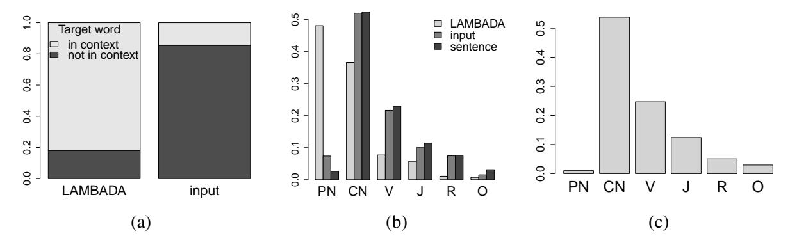

<!-- RP01_Paperno_2016 | source: papers_json/RP01_Paperno_2016/ -->

## مجموعة بيانات LAMBADA: التنبؤ بالكلمة بالاعتماد على سياق خطابي واسع^∗^

Denis Paperno, German Kruszewski, Angeliki Lazaridou, Quan Ngoc Pham ´ † , Raffaella Bernardi, Sandro Pezzelle, Marco Baroni, Gemma Boleda, Raquel Fernandez ´ ‡

CIMeC - مركز علوم العقل/الدماغ، جامعة Trento {firstname.lastname}@unitn.it, †quanpn90@gmail.com ‡ معهد المنطق واللغة والحوسبة، جامعة Amsterdam raquel.fernandez@uva.nl

## الملخص

نقدّم في هذا البحث LAMBADA، وهي مجموعة بيانات لتقييم قدرات النماذج الحاسوبية على فهم النص من خلال مهمة التنبؤ بالكلمة. تتألف LAMBADA من مقاطع سردية تشترك في خاصية أن الأشخاص قادرون على تخمين كلمتها الأخيرة إذا اطلعوا على المقطع كاملاً، ولكن ليس إذا رأوا فقط الجملة الأخيرة التي تسبق الكلمة المستهدفة. وللنجاح في LAMBADA، لا يمكن للنماذج الحاسوبية أن تعتمد ببساطة على السياق المحلي، بل يجب أن تكون قادرة على تتبع المعلومات في الخطاب الأوسع. ونُظهر أن LAMBADA تجسد طيفًا واسعًا من الظواهر اللغوية، وأنه لا أحد من عدة نماذج لغوية متطورة يحقق دقة تتجاوز 1% على هذا المعيار الجديد. ولذلك نقترح LAMBADA كمجموعة اختبار صعبة، تهدف إلى تشجيع تطوير نماذج جديدة قادرة على فهم حقيقي للسياق الواسع في النصوص اللغوية الطبيعية.

1 المقدمة

أثار التطور الحديث للشبكات العصبية القوية المدربة بأسلوب طرف-إلى-طرف لمعالجة اللغة الطبيعية (Hermann et al., 2015; Rocktaschel et al., 2016; ¨ Weston et al., 2015، وغيرهم) اهتمامًا بالمهام التي تقيس التقدم الذي تحققه في الفهم الحقيقي للغة. ويجب توخي الحذر في تقييم هذه الأنظمة، لأن فاعليتها في استخلاص التعميمات الإحصائية من المتون الكبيرة قد تؤدي إلى وهم وصولها إلى درجة أعمق من الفهم مما هي عليه فعلًا. على سبيل المثال،

نظام طرف-إلى-طرف الذي قدّمه Vinyals and Le (2015)، والمدرّب على مجموعات بيانات حوارية كبيرة، يُنتج حوارات مثل ما يلي:

(1) الإنسان: ما هي وظيفتك؟ الآلة: أنا محامٍ الإنسان: ماذا تعمل؟ الآلة: أنا طبيب

كل من الإجابتين بمفرده ملائم للسؤال المطروح. ولكن، عند أخذهما معًا، تكونان غير متماسكتين. سلوك النظام يشبه الببغاء إلى حد ما. يستطيع محليًا إنتاج أجزاء لغوية معقولة تمامًا، لكنه يفشل في أخذ معنى *سياق الخطاب الأوسع* بعين الاعتبار. ونتيجة لذلك، تركّز كثير من الجهود البحثية على تصميم أنظمة قادرة على الاحتفاظ بالمعلومات من السياق الأوسع في الذاكرة، وربما حتى تنفيذ أشكال بسيطة من الاستدلال حولها (Hermann et al., 2015; Hochreiter and Schmidhuber, 1997; Ji et al., 2015; Mikolov et al., 2015; Sordoni et al., 2015; Sukhbaatar et al., 2015; Wang and Cho, 2015، وغيرهم).

في هذه الورقة، نقدّم مجموعة بيانات LAMBADA (نمذجة اللغة موسّعة لمراعاة الجوانب الخطابية). تقترح LAMBADA مهمة تنبؤ بالكلمة، حيث يكون العنصر المستهدف *صعب التخمين* (للناطقين بالإنجليزية) عندما تكون الجملة التي يظهر فيها فقط متاحة، ولكنه يصبح *سهلًا* عند تقديم سياق أوسع. لنأخذ المثال (1) في الشكل 1. الجملة *Do you honestly think that I would want* *you to have a* *?* لها العديد من الإكمالات المحتملة، لكن السياق الواسع يشير بوضوح إلى أن الكلمة الناقصة هي *miscarriage*.

تضع LAMBADA فهم اللغة في الإطار الكلاسيكي للتنبؤ بالكلمة في نمذجة اللغة. وبذلك يمكننا استخدامها لاختبار عدة معماريات قائمة لنمذجة اللغة، بما في ذلك

> ^∗^ يتشارك Denis و German تأليف الورقة كأول مؤلف. ويتشارك Marco و Gemma و Raquel مرتبة المؤلف الكبير.

<!-- page 2 -->

أنظمة لها القدرة على الاحتفاظ بذاكرة سياقية طويلة المدى. وفي تجاربنا الأولية، لم يقترب أي من هذه النماذج حتى من بعيد إلى الأداء البشري، مما يؤكد أن LAMBADA تشكّل معيارًا تحدّيًا للأبحاث في مجال النماذج الآلية لفهم اللغة الطبيعية.

# 2 مجموعات البيانات ذات الصلة

يرتبط معيار CNN/Daily Mail (CNNDM) الذي قدّمه Hermann et al. (2015) ارتباطًا وثيقًا بـ LAMBADA. تتضمن CNNDM مجموعة كبيرة من المقالات الإلكترونية التي تُنشر مع ملخصات قصيرة لنقاطها الرئيسية. والمهمة هي تخمين الكيان المسمى الذي تم حذفه من أحد هذه الملخصات. ورغم أن البيانات لم يتم تطبيعها من قبل أشخاص، فمن غير المرجح أن يمكن تخمين الكيان المسمى الناقص من الملخص القصير وحده، وبالتالي، كما هو الحال في LAMBADA، يحتاج النموذج إلى النظر في السياق الأوسع (المقالة). تشمل الفروق بين المجموعتين أنواع النص (أخبار مقابل روايات؛ انظر القسم 3.1) وحقيقة أن العناصر الناقصة في CNNDM محصورة بالكيانات المسماة. والأهم من ذلك أن المجموعتين تتطلبان من النماذج تنفيذ أنواع مختلفة من الاستدلال على المقاطع الأوسع. فبالنسبة لـ CNNDM، يجب أن تكون النماذج قادرة على *تلخيص* المقالات لفهم الجملة التي تحتوي على الكلمة الناقصة، أما في LAMBADA فالجملة الأخيرة ليست تلخيصًا للمقطع الأوسع، بل *إكمالًا* للقصة نفسها. وبالتالي، للنجاح، يجب على النماذج فهم ما يشكّل تطورًا منطقيًا لمقطع سردي أو حوار.

ومعيار آخر ذو صلة هو CBT، الذي قدّمه Hill et al. (2016). ومثل LAMBADA، فإن CBT مجموعة من مقتطفات الكتب، تم فيها حذف كلمة واحدة عشوائيًا من الجملة الأخيرة في تسلسل من 21 جملة. وعلى الرغم من وجود اختلافات تصميمية أخرى، فإن الفرق الجوهري بين CBT و LAMBADA هو أن مقاطع CBT لم تتم تصفيتها لتكون قابلة للتخمين بشريًا في السياق الأوسع فقط. وفي الواقع، وفقًا للتحليل اللاحق لعينة من مقاطع CBT الذي قدّمه Hill وزملاؤه، فإن نسبة كبيرة من الحالات التي تمكن فيها المعلّقون من تخمين الكلمة الناقصة من السياق الأوسع، تمكنوا أيضًا من تخمينها من الجملة الأخيرة وحدها. وفي الوقت نفسه، في حوالي خمس الحالات، لم يتمكن المعلّقون من تخمين الكلمة حتى عند إعطاء السياق الأوسع. وبالتالي، فإن جزءًا صغيرًا فقط من مقاطع CBT يقيس فعلاً قدرة النموذج

على فهم السياق الأوسع، وهو الهدف الذي تركز عليه LAMBADA.

طُرحت فكرة مهمة إكمال مقتطف من كتاب أصلًا في مجموعة بيانات MSRCC (Zweig and Burges, 2011). غير أن هذه الأخيرة قصرت السياق على الجمل المفردة، دون محاولة قياس فهم المقاطع الأوسع.

بطبيعة الحال، يمكن اختبار فهم النص من خلال مهام أخرى، بما في ذلك كشف الاستلزام (Bowman et al., 2015)، والإجابة عن الأسئلة حول النص (Richardson et al., 2013; Weston et al., 2015)، وقياس التماسك بين الجمل (Yin and Schutze, 2015). وعلى الرغم من أن المهام المختلفة يمكن أن توفر رؤى تكميلية حول قدرات النماذج، نجد التنبؤ بالكلمة جذابًا بشكل خاص بسبب طبيعته (من السهل تطبيع البيانات مع أشخاص غير متخصصين) وبساطته. تحتاج النماذج فقط إلى تدريبها على التنبؤ بالكلمة الأكثر احتمالًا بالنظر إلى السياق السابق، وفقًا للنموذج التقليدي لنمذجة اللغة، وهو إعداد أبسط بكثير من ذلك المطلوب، مثلًا، لتحديد ما إذا كانت جملتان متلازمتين. علاوة على ذلك، يمكن للنماذج الوصول إلى كميات غير محدودة عمليًا من بيانات التدريب، حيث إن كل ما يلزم لتدريب نموذج لغوي هو نص خام. وعلى المستوى المنهجي الأعم، يمتلك التنبؤ بالكلمة القدرة على فحص أي جانب تقريبًا من جوانب فهم النص، بما في ذلك على سبيل المثال لا الحصر المهام التقليدية الأضيق مثل الاستلزام، أو حل الإحالة المرجعية، أو إزالة غموض معاني الكلمات.

# 3 مجموعة بيانات LAMBADA

## 3.1 جمع البيانات^1^

تتألف LAMBADA من *مقاطع* مكوّنة من *سياق* (متوسطه 4.6 جملة) و*جملة مستهدفة*. وحجم السياق هو الحد الأدنى من عدد الجمل الكاملة قبل الجملة المستهدفة بحيث تحتوي تراكميًا على 50 رمزًا على الأقل (تم اختيار هذا الحجم في دراسة استطلاعية). والمهمة هي تخمين الكلمة الأخيرة من الجملة المستهدفة (*الكلمة المستهدفة*). والقيد بأن تكون الكلمة المستهدفة هي الكلمة الأخيرة في الجملة، وإن لم يكن ضروريًا لهدف بحثنا، يجعل المهمة أكثر طبيعية للأشخاص.

تأتي بيانات LAMBADA من Book Corpus (Zhu et al., 2015). إن احتواءه على روايات غير منشورة يقلل من الفائدة المحتملة

> ^1^ يتم تقديم مزيد من التفاصيل التقنية في المواد التكميلية (SM): http://clic.cimec.unitn.it/ lambada/

<!-- page 3 -->

(1) *السياق:* "نعم، اعتقدت أنني سأفقد الطفل." "كنت خائفًا أيضًا"، قال، والصدق يغمر عينيه. "كنتَ كذلك؟" "نعم، بالطبع. لماذا تسألين أصلًا؟" "هذا الطفل لم يكن مخططًا له تحديدًا." *الجملة المستهدفة:* "هل تعتقدين بصدق أنني أريدك أن تتعرضي لـ ؟" *الكلمة المستهدفة:* miscarriage (2) *السياق:* "لماذا؟" "كنت أعتقد أنك ستجده جافًا إلى حد ما"، قالت. "لا أعرف بشأن ذلك"، قال Gabriel. "كان حرفيًا عظيمًا"، قالت Heather. "نعم كان كذلك"، قال Flannery. *الجملة المستهدفة:* "وبولندي أيضًا"، قال . *الكلمة المستهدفة:* Gabriel (3) *السياق:* كان Preston آخر شخص ارتدى تلك السلاسل، وكنت أعرف ما سأراه وأشعر به إذا انزلقت على جلدي – كراهية Reaper اللامتناهية لي. شعرت بما يكفي من ذلك الشعور بالفعل في المسرح. لم أرغب في الشعور بالمزيد. "لا تضع تلك علي"، همست. "أرجوك." *الجملة المستهدفة:* نظر Sergei إليّ، مفاجئًا برجائي المنخفض الأجش، لكنه أنزل الـ . *الكلمة المستهدفة:* chains (4) *السياق:* قاموا بضبط الآلات، وناقشوا للحظة، ثم ضربوا لحنًا حيويًا. انضم الجميع، محوّلين الفناء إلى مشهد أكثر فوضى، حيث صار الناس يرقصون في دوائر، يتأرجحون ويدورون في حلقات، وكلٌ يبتكر خطواته الخاصة. شعرت بقدميّ تطرقان، وجسمي يريد التحرك. *الجملة المستهدفة:* بصرف النظر عن الكتابة، فقد أحببت دائمًا . *الكلمة المستهدفة:* dancing (5) *السياق:* هزّ رأسه، وتراجع خطوة وأمسك يديه عاليًا وهو يحاول الابتسام دون أن يفقد سيجارة. "نعم تستطيع"، قالت Julia بصوت مطمئن. "لقد ركّزت بالفعل على صديقي. ما عليك إلا أن تنقر على المغلاق، فوق، هنا." *الجملة المستهدفة:* أومأ بخجل، ورمى سيجارته وأخذ الـ . *الكلمة المستهدفة:* camera (6) *السياق:* في راحة يدي حجر شفاف، وداخله تمثال صغير من العاج. ملاك حارس. "اعتقدت أنه إذا كنت ستخرجين في الليل وستصدمك السيارات، فمن الأفضل أن يكون لديك دعم." أنظر إليه، مذهولة. كأن هذا نوع من الإشارة. *الجملة المستهدفة:* لكن وأنا أحدّق في Harlin، وفمه منحنٍ بابتسامة واثقة، لا أهتم بـ . *الكلمة المستهدفة:* signs (7) *السياق:* كان كل من ظله المرقّط بالشمس والعشب البارد تحته راحة مرحب بها بعد المطبخ الخانق، وكنت سعيدة بأن أرتاح على لحاء الشجرة الخشن الهش وأبدأ إفطاري المكوّن من الخبز المحمص الزبداني والفاكهة الطازجة. حتى الماء كان لذيذًا، فهو نظيف وبارد جدًا. *الجملة المستهدفة:* كاد ذلك يعوّض غياب الـ . *الكلمة المستهدفة:* coffee (8) *السياق:* رفضت زوجتي السماح لي بالمجيء إلى Hong Kong عندما كان الطاعون في ذروته و–" "زوجتك يا Johanne؟ هل تزوجت أخيرًا؟" ابتسم Johanne. "حسنًا، حين يصل الرجل إلى عمري، يبدأ يحتاج إلى بعض راحة المنزل." *الجملة المستهدفة:* بعد أن توفّيت أمي العزيزة قبل عشر سنوات الآن، صرت . *الكلمة المستهدفة:* lonely (9) *السياق:* "مرة أخرى، ترك ذلك لك. ولكن، كان مصرًا في رغبته أن تظل مراسم خاصة. طلب مني التأكد، على سبيل المثال، من ألا تُعطى أي معلومات للجريدة بشأن وفاته، ولا حتى نعي." *الجملة المستهدفة:* شعرت أنه لم يرغب أن يعرف أحد، باستثناءنا نحن الثلاثة، أنه قد . *الكلمة المستهدفة:* died (10) *السياق:* لا بدّ أن بطارية راديو Logan كانت توشك على النفاد. هكذا قال لنفسه. لم يكن هناك تفسير آخر سوى أن Cygan والموظفين في البيت الأبيض قد اجتيحوا. فتحت Lizzie عينيها برفرفة. كانوا على الطريق المتجلد منذ ساعة دون حادث. *الجملة المستهدفة:* كان Jack سعيدًا بأن يتولى كل الـ . *الكلمة المستهدفة:* driving

*الشكل 1: أمثلة على مقاطع LAMBADA. الكلمات المسطّرة تبرز عندما تظهر الكلمة المستهدفة (أو لما يطابقها لغويًا) في السياق.*

<!-- page 4 -->

للمعرفة العامة بالعالم وللموارد الخارجية في هذه المهمة، على عكس أنواع النصوص الأخرى مثل بيانات الأخبار، أو نصوص Wikipedia، أو الروايات الشهيرة. ويحتوي المتن، بعد إزالة المكررات وتصفية المحتوى المحتمل أن يكون مسيئًا باستخدام قائمة كلمات مستبعدة، على 5,325 رواية و465 مليون كلمة. قسّمنا الروايات عشوائيًا إلى قسمين متساويين: قسم تدريب وقسم تطوير+اختبار. وبنينا مجموعة بيانات LAMBADA من القسم الأخير، على أساس أن النماذج التي تتعامل مع LAMBADA يجب أن تُدرّب على نص خام من قسم التدريب، الذي يتألف من 2662 رواية ويشمل أكثر من 200 مليون كلمة. ولأن الروايات مخصصة مسبقًا لأحد القسمين فقط، فإن مقاطع LAMBADA مكتفية ذاتيًا ولا يمكن حلها باستغلال المعرفة الموجودة في باقي الروايات، مثل المعلومات الأساسية حول الشخصيات المعنية أو خصائص العالم الخيالي في رواية معينة. ويُستخدم نفس أسلوب التقسيم القائم على الروايات لتقسيم بيانات LAMBADA بين التطوير والاختبار.

ولتقليل وقت وتكلفة جمع البيانات، صفّينا المقاطع التي تكون سهلة نسبيًا للنماذج اللغوية المعيارية، نظرًا لأن مثل هذه الحالات يُحتمل أن تكون قابلة للتخمين بالاعتماد على السياق المحلي وحده. واستخدمنا مزيجًا من أربعة نماذج لغوية، تم اختيارها بناءً على التوفر و/أو سهولة التدريب: شبكة عصبية متكررة (RNN) مدرّبة مسبقًا (Mikolov et al., 2011) وثلاثة نماذج مدرّبة على Book Corpus (نموذج 4-gram معياري، و RNN، ونموذج تغذية أمامية؛ انظر SM للتفاصيل، ولاحظ أن هذه تختلف عن النماذج التي قيّمناها على LAMBADA كما هو موضح في القسم 4 أدناه). وتم استبعاد أي مقطع كانت احتمالية كلمته المستهدفة ≥0.00175 وفقًا لأي من النماذج اللغوية.

ثم تم تقييم عينة عشوائية من المقاطع المتبقية بواسطة أشخاص من خلال خدمة CrowdFlower للحشد الجماهيري^2^ في ثلاث خطوات. لمقطع معيّن:

- 1. خمّن شخص واحد الكلمة المستهدفة بناءً على المقطع كاملاً (الذي يضم السياق والجملة المستهدفة)؛ إذا كان التخمين صحيحًا،
- 2. خمّن شخص ثانٍ الكلمة المستهدفة بناءً على المقطع كاملاً؛ إذا كان ذلك التخمين صحيحًا أيضًا،
- 3. حاول مزيد من الأشخاص تخمين الكلمة المستهدفة بناءً على الجملة المستهدفة فقط، حتى تُخمّن

الكلمة أو يصل عدد التخمينات الفاشلة إلى 10؛ إذا لم يتمكن أي شخص من تخمين الكلمة المستهدفة، أُضيف المقطع إلى مجموعة بيانات LAMBADA.

سُمح للأشخاص في الخطوة 3 بثلاث محاولات تخمين لكل جملة، لتعظيم فرص اكتشاف الحالات التي يمكن فيها تخمين الكلمة المستهدفة من الجملة وحدها. أُضيفت الخطوة 2 بناءً على دراسة استطلاعية أظهرت أنه، بينما كانت الخطوة 3 كافية لضمان عدم إمكانية تخمين البيانات بالسياق المحلي وحده، فإن الخطوة 1 وحدها لم تضمن أن البيانات كانت سهلة عند توفر السياق الخطابي (مخرجاتها تشمل مزيجًا من الحالات تتراوح من البديهية إلى الصعبة نسبيًا، التي خمّنها شخص في الخطوة 1 بارع أو محظوظ بشكل خاص). تأكدنا من أنه لم يكن من الممكن لنفس الشخص الحكم على نفس العنصر في كل من ظرفي المقطع والجملة (التفاصيل في SM).

في خط أنابيب الحشد الجماهيري، استُبعدت 84–86% من العناصر في الخطوة 1، وإضافيًا 6–7% في الخطوة 2، و3–5% أخرى في الخطوة 3. ولم يجتز جميع خطوات الانتقاء سوى ما يقارب واحدًا من كل 25 مثالًا مدخلًا.

دُفع للأشخاص 0.22$ لكل صفحة في الخطوتين 1 و2 (مع 10 مقاطع لكل صفحة) و0.15$ لكل صفحة في الخطوة 3 (مع 20 جملة لكل صفحة). وإجمالًا، كلّف كل عنصر في مجموعة البيانات الناتجة 1.24$ في المتوسط. وُجد أن التصاميم البديلة، مثل وضع الخطوة 3 قبل الخطوة 2 أو قبل الخطوة 1، أكثر تكلفة. كما حالت اعتبارات التكلفة دون استخدام مزيد من الأشخاص في المرحلة 1، وهو ما كان يمكن من حيث المبدأ أن يحسّن جودة التصفية في هذه الخطوة.

لاحظ أن معايير إدراج المقاطع كانت صارمة جدًا: اشترطنا أن يطابق شخصان متتاليان الكلمة الناقصة بدقة، وتأكدنا من عدم تمكّن أي شخص (من أصل عشرة) من تقديمها بناءً على السياق المحلي فقط، حتى بعد إعطائه 3 محاولات. والبديل لهذا النهج القائم على المطابقة التامة كان يمكن أن يكون تضمين مقاطع قدّم فيها أشخاص في السياق الواسع إكمالات أخرى معقولة أو مرادفة. غير أنه من الصعب جدًا، عمليًا ومنهجيًا، تحديد أي إجابات أخرى غير الأصلية تناسب المقطع جيدًا، خاصة عندما يكون الهدف هو التمييز بين العناصر القابلة للحل في سياق خطابي واسع وتلك التي يكفي فيها السياق المحلي. ومن الناحية النظرية، يمكن اختبار الاستبدال في السياق بالتعليق اليدوي من قبل عدة مقيّمين إضافيين، ولكن ذلك لن يكون ممكنًا ماليًا أو عمليًا لمجموعة بيانات بهذا الحجم (تلقّى المعلّقون البشر

> ^2^http://www.crowdflower.com

<!-- page 5 -->

أكثر من 200,000 مقطع في المرحلة 1). لهذا السبب اعتمدنا النهج الصارم القائم على إصابة-أو-إخفاق، مع الاحتفاظ فقط بالعناصر التي يمكن تحديدها بوضوح من قبل الأشخاص.

## 3.2 إحصائيات مجموعة البيانات

تتكون مجموعة بيانات LAMBADA من 10,022 مقطعًا، مقسّمة إلى 4,869 مقطع تطوير و5,153 مقطع اختبار (مستخرجة من 1,331 و1,332 رواية منفصلة، على التوالي). يتألف المقطع المتوسط من 4.6 جملة في السياق بالإضافة إلى جملة مستهدفة واحدة، بإجمالي طول 75.4 رمزًا (تطوير) / 75 رمزًا (اختبار). وقد قُدمت أمثلة على المقاطع في مجموعة البيانات في الشكل 1.

تتضمن بيانات التدريب للنماذج اللغوية التي ستُختبر على LAMBADA النص الكامل لـ 2,662 رواية (منفصلة عن تلك في تطوير+اختبار)، بإجمالي 203 مليون كلمة. لاحظ أن بيانات التدريب تتألف من نص من نفس المجال مثل مقاطع التطوير+الاختبار، بكميات كبيرة لكن دون تصفيتها بنفس الطريقة. وهذا مدفوع جزئيًا باعتبارات اقتصادية (تذكّر أن كل نقطة بيانات تكلّف 1.24$ في المتوسط)، لكن، الأهم من ذلك، أنه مبرّر بالاستخدام المقصود لـ LAMBADA كأداة لتقييم النماذج العامة الأغراض من حيث أدائها على فهم السياق الواسع (تمامًا كما يستطيع أشخاصنا التنبؤ بالكلمات الناقصة باستخدام قدراتهم الأعم على فهم النص)، وليس كمصدر لتطوير نماذج *مخصّصة* تهدف فقط إلى التنبؤ بالكلمة الأخيرة في نوع المقاطع التي تظهر في LAMBADA. ويمكن استخدام بيانات التطوير لضبط النماذج بدقة على خصائص مقاطع LAMBADA.

## 3.3 تحليل مجموعة البيانات

يشير تحليلنا لبيانات LAMBADA إلى أن الكلمة المستهدفة، لكي تكون قابلة للتنبؤ في السياق الواسع فقط، يجب أن تكون مرشّحة بقوة في الخطاب الأوسع. وفي الواقع، من النموذجي لعناصر LAMBADA أن الكلمة المستهدفة (أو لمتها) تظهر في السياق. يقارن الشكل 2(أ) عناصر LAMBADA مع عينة عشوائية من 5000 عنصر من بيانات الإدخال، أي المقاطع التي قُدمت للأشخاص في مرحلة التصفية (أخذنا العينة من جميع المقاطع التي اجتازت المصافي الآلية الموصوفة في القسم 3.1 أعلاه، بما في ذلك تلك التي وصلت إلى LAMBADA). يُظهر الشكل أنه عندما خمّن الأشخاص الكلمة (فقط) في السياق الواسع، كثيرًا ما كانت الكلمة نفسها تظهر في السياق: أكثر من 80% من مقاطع LAMBADA تتضمن الكلمة المستهدفة في

السياق، بينما في بيانات الإدخال كان هذا هو الحال في أقل من 15% من المقاطع. ومع ذلك، لتخمين الكلمة الصحيحة، يجب على الأشخاص الاستفادة من مهاراتهم اللغوية والمعرفية العامة، كما يتضح من الأمثلة التي تتضمن الكلمة المستهدفة في السياق الواردة في الشكل 1.

يُظهر الشكل 2(ب) أن معظم الكلمات المستهدفة في LAMBADA هي أسماء علم (48%)، تليها الأسماء العامة (37%)، ثم الأفعال على مسافة (7.7%). وفي الواقع، أسماء العلم ممثَّلة بشكل مفرط في LAMBADA، بينما الفئات الأخرى ممثَّلة بشكل ناقص، مقارنة بتوزيع أنواع الكلام في الإدخال. تتضافر مجموعة من العوامل في جعل أسماء العلم سهلة للأشخاص في مهمة LAMBADA. وعلى وجه الخصوص، عندما يستدعي السياق بوضوح تعبيرًا مرجعيًا، فإن قيد كون الفراغ يُملأ بكلمة واحدة يستبعد الإمكانيات الأخرى مثل العبارات الاسمية مع أدوات التعريف، وهناك أسباب للاشتباه بأن الإحالة المرجعية أسهل من ظواهر الخطاب الأخرى في مهمتنا (انظر أدناه). ومع ذلك، رغم أن الإحالة المرجعية تبدو تلعب دورًا كبيرًا، فإن 0.3% فقط من الكلمات المستهدفة هي ضمائر.

ولا تزال الأسماء العامة شائعة جدًا في LAMBADA، حيث تشكل أكثر من ثلث البيانات. ويكشف التحليل النوعي عن خليط من الظواهر. الإحالة المرجعية شائعة مرة أخرى (انظر المثال (3) في الشكل 1)، أحيانًا "كإحالة جزئية" تيسرها آليات الجسر (*shutter–camera*؛ المثال (5)) أو عبر وجود مرادف قريب (*'lose the baby'–* *miscarriage*؛ المثال (1)). غير أننا نجد أيضًا في كثير من الأحيان ظواهر أخرى، مثل استنتاج المشاركين النموذجيين في حدث ما. على سبيل المثال، إذا كان المقطع يصف شخصًا يتناول الإفطار مع أطعمة ومشروبات نموذجية (انظر المثال (7))، يستطيع الأشخاص تخمين الكلمة المستهدفة *coffee* دون أن تكون قد ذُكرت صراحة.

في المقابل، الأفعال والصفات والظروف نادرة في LAMBADA. كثير من تلك العناصر يمكن تخمينها بسياق الجملة المحلي وحده، كما يتضح من الشكل 2(ب)، الذي يُبلّغ أيضًا عن توزيع أنواع الكلام لمجموعة العناصر التي خمّنها الأشخاص بناءً على سياق الجملة المستهدفة فقط (الخطوة 3 في القسم 3.1). لاحظ نسبة أعلى من الأفعال والصفات والظروف في المجموعة الأخيرة في الشكل 2(ب). بينما يحرف سياق نهاية الجملة توزيع الإدخال لصالح الأسماء، فإن تصفية الأشخاص تُظهر تأثيرًا تفاضليًا واضحًا للأسماء مقابل أنواع الكلام الأخرى. ويكشف الفحص اليدوي أن السياق الواسع ليس ضروريًا لتخمين عناصر مثل

<!-- page 6 -->

*الشكل 2: (أ) الكلمة المستهدفة موجودة في السياق أو غير موجودة؛ (ب) توزيع أنواع الكلام للكلمة المستهدفة في LAMBADA مقابل البيانات المقدمة للأشخاص (الإدخال) والعناصر المخمَّنة بسياق الجملة فقط (PN=اسم علم، CN=اسم عام، V=فعل، J=صفة، R=ظرف، O=أخرى)؛ (ج) توزيع أنواع الكلام للكلمة المستهدفة لمقاطع LAMBADA حيث لا تكون لمة الكلمة المستهدفة في السياق (الفئات كما في (ب)).*

الأفعال المتكررة (ask, answer, call)، والصفات، والظروف من الفئة المغلقة (now, too, well)، وكذلك الظروف المتعلقة بالزمن (*quickly*, *recently*). في هذه الحالات، يكفي سياق الجملة، لذا ينتهي القليل منها في LAMBADA (وإن كان هناك بالطبع استثناءات، مثل المثال (8)، حيث الكلمة المستهدفة صفة). ويتباين هذا مع أنواع أخرى من الظروف من الفئة المفتوحة (مثل innocently, confidently)، التي يصعب عمومًا تخمينها بكل من السياق المحلي والسياق الواسع. والنسبة المنخفضة لمثل هذه الظروف وللأفعال بين العناصر المخمَّنة عمومًا تشير إلى أن تتبع الظواهر المتعلقة بالأحداث (مثل التسلسلات الشبيهة بالنصوص للأحداث) أصعب على الأشخاص من الظواهر المرجعية، على الأقل كما تم تأطيره في مهمة LAMBADA. ويلزم مزيد من البحث لاختبار هذه الفرضية.

علاوة على ذلك، نلاحظ أنه، بينما يكون الذكر الصريح في سياق الخطاب السابق حاسمًا لأسماء العلم، يمكن في الغالب تخمين الفئات الأخرى دون تقديم صريح. وهذا موضح في الشكل 2(ج)، الذي يصور توزيع أنواع الكلام لعناصر LAMBADA التي لا تكون لمة الكلمة المستهدفة فيها في السياق (بما يقابل حوالي 16% من LAMBADA إجمالًا).3 ويشير التحليل النوعي للعناصر التي تكون أهدافها أفعالًا وصفات إلى أن الكلمة المستهدفة، رغم عدم وجودها في المقطع، لا تزال يُلمح إليها بقوة بواسطة السياق.

في حوالي ثلث الحالات المفحوصة، الكلمة الناقصة "تكاد تكون موجودة". على سبيل المثال، يحتوي المقطع على كلمة بنفس الجذر ولكن بنوع كلامي مختلف (مثل *death-died* في المثال (6))، أو تعبير مرادف (كما ذُكر أعلاه لـ "miscarriage"؛ نجد نفس الظاهرة للأفعال، مثل 'deprived you of water'-dehydrated).

في حالات أخرى، يتطلب التنبؤ الصحيح استدلالًا خطابيًا أكثر تعقيدًا، بما في ذلك تخمين المشاركين النموذجيين في مشهد (كما في مثال *coffee* أعلاه)، أو الأفعال أو الأحداث التي يقترحها الخطاب بقوة (انظر المثالين (1) و(10)، حيث ذكر الطريق المتجلد يساعد في التنبؤ بالهدف *driving*)، أو الخصائص النوعية للمشاركين أو المواقف (انظر المثال (8)). وبالطبع، يحدث نفس النوع من الاستدلال الخطابي عندما تكون الكلمة المستهدفة موجودة بالفعل في السياق (راجع المثالين (3) و(4)). وجود الكلمة في السياق لا يجعل الاستدلال غير ضروري (تظل المهمة صعبة)، ولكنه ييسر الاستدلال.

كملاحظة أخيرة، ومن المثير للاهتمام أن عناصر LAMBADA تحتوي على الكلام المباشر (المقتبس) بشكل أكثر بكثير مما تحتويه عناصر الإدخال إجمالًا (71% من عناصر LAMBADA مقابل 61% من العناصر في عينة الإدخال)، انظر مثلًا المثالين (1) و(2). ويلزم مزيد من التحليل للبحث في كيفية تيسير الخطاب الحواري الأكثر للتنبؤ بالكلمة المستهدفة الأخيرة.

باختصار، تحتوي LAMBADA على عدد كبير من الظواهر التي، إلى جانب جعلها صعبة من منظور فهم النص، ذات اهتمام كبير لمجتمع اللسانيات الحاسوبية الواسع.

> ^&^lt;sup>3إن نسبة 1% الظاهرة لأسماء العلم خارج السياق المعروضة في الشكل 2(ج) ترجع إلى أخطاء في التلميد (شخصيات خيالية لم يتعرف فيها مُلمّت اللمات على رابط بين الصيغ المفردة والجمع، مثل *Wynn – Wynns*). أكد فحص يدوي أن جميع الكلمات المستهدفة من أسماء العلم في LAMBADA موجودة فعلاً في السياق.

<!-- page 7 -->

. للعودة إلى المثال (1)، حلّه يتطلب مزيجًا من المهارات اللغوية تتراوح من (المورفو)فونولوجيا (الكلمة المستهدفة المعقولة *abortion* مستبعدة بسبب أداة التنكير *a*) عبر النحو الصرفي (الفراغ يجب أن يُملأ باسم مفرد عام) إلى التداولية (فهم ما يستنتجه المشارك الذكر من كلام المشاركة الأنثى)، بالإضافة إلى مهارات الاستدلال العامة. وبالتالي، ليس من المستغرب أن LAMBADA صعبة جدًا للنماذج الحالية، كما سنبيّن لاحقًا.

# 4 تجارب النمذجة

الطرق الحاسوبية اختبرنا عدة نماذج لغوية وأسس مرجعية قائمة على LAMBADA. نفّذنا RNN بسيطة (Elman, 1990)، وشبكة ذاكرة طويلة قصيرة المدى (LSTM) (Hochreiter and Schmidhuber, 1997)، ونموذج لغوي إحصائي N-Gram تقليدي (Stolcke, 2002) مع وبدون ذاكرة مؤقتة، وشبكة ذاكرة (Memory Network) (Sukhbaatar et al., 2015). نلاحظ أن LSTM وشبكة الذاكرة، وإلى حد ما نموذج N-Gram مع ذاكرة مؤقتة، لها من بين الفوائد المفترضة، القدرة على أخذ السياقات الأوسع بعين الاعتبار. كما نلاحظ أن متغيرات RNN و LSTM في طليعة الأداء عند اختبارها على معايير نمذجة اللغة المعيارية (Mikolov, 2014). تطبيقنا لشبكة الذاكرة مماثل للذي حقق Hill et al. (2016) أفضل النتائج به على مجموعة بيانات CBT (انظر القسم 2 أعلاه). ورغم أننا لم نتمكن من إعادة تنفيذ النماذج التي حققت أفضل أداء على CNNDM (انظر مرة أخرى القسم 2)، فإن LSTM لدينا مشابه معماريًا لـ Deep LSTM Reader لـ Hermann et al. (2015)، الذي حقق أداءً جيدًا على تلك المجموعة. والأهم من ذلك، سنوضح أدناه أن معظم نماذجنا تحقق أداءً مثيرًا للإعجاب عند اختبارها على مجموعة بيانات نمذجة لغة أكثر معيارية مستمدة من نفس المتن المستخدم لبناء LAMBADA. تم بناء مجموعة التحكم هذه عبر أخذ عينة عشوائية من 5 آلاف مقطع بنفس شكل وحجم تلك المستخدمة في بناء LAMBADA من نفس روايات الاختبار، ولكن دون تصفيتها بأي شكل. واستنادًا إلى نتائج مجموعة التحكم، التي ستُناقَش أدناه، يمكننا الادعاء بشكل معقول أن النماذج التي نختبرها على LAMBADA جيدة جدًا في نمذجة اللغة المعيارية، ولا يمكن أن يُعزى أداؤها المنخفض على الأخيرة إلى ضعف الجودة.

من أجل اختبار التحيزات القوية في البيانات،

بنينا Sup-CBOW، نموذج خط أساس مصمَّم بشكل ضعيف للمهمة المطروحة، ويتألف من شبكة عصبية بسيطة تأخذ كمدخل تمثيل حقيبة-كلمات للمقطع وتحاول التنبؤ بالكلمة الأخيرة. يأتي تمثيل الإدخال من جمع متجهات CBOW المدربة مسبقًا (Mikolov et al., 2013) لكلمات المقطع.^4^ ودرسنا أيضًا متغيرًا غير خاضع للإشراف (Unsup-CBOW) حيث يُتنبأ بالكلمة المستهدفة بواسطة تشابه جيب التمام بين متجه المقطع ومتجه الكلمة المستهدفة. وأخيرًا، قيّمنا عدة متغيرات من خط أساس للتخمين العشوائي تختلف من حيث مجموعة الكلمات للأخذ منها. الكلمة المخمّنة يمكن اختيارها من: المفردات الكاملة، الكلمات التي تظهر في المقطع الحالي، وكلمة عشوائية مكتوبة بأحرف كبيرة من المقطع. يهدف خط الأساس الأخير إلى استغلال التحيز المحتمل بأن الأسماء الصحيحة تشكّل جزءًا متسقًا من بيانات LAMBADA (انظر الشكل 2 أعلاه).

لاحظ أن LAMBADA صُممت لتحدّي النماذج اللغوية بأمثلة أصعب من المتوسط، حيث يكون فهم السياق الواسع بالغ الأهمية. ومع ذلك، لا ينبغي تجاهل الحالة المتوسطة أيضًا، لأننا نريد للنماذج اللغوية أن تكون قادرة على التعامل مع الحالتين. لهذا السبب، درّبنا النماذج كليًا على البيانات غير الخاضعة للإشراف ونتوقع من العمل المستقبلي اتباع مبادئ مماثلة. تحديدًا، درّبنا النماذج، كممارسة قياسية، على التنبؤ بكل كلمة قادمة بالنظر إلى السياق السابق، باستخدام بيانات تدريب LAMBADA (انظر القسم 3.2 أعلاه) كمتن إدخال. الاستثناء الوحيد لهذا الإجراء كان Sup-CBOW حيث استخرجنا من روايات التدريب مقاطع مماثلة الشكل لتلك في LAMBADA ودرّبنا النموذج عليها (حوالي 9 ملايين مقطع). مرة أخرى، كان الهدف من هذا النموذج فقط اختبار التحيزات المحتملة في البيانات وليس تقديم تفسير كامل للظواهر التي نختبرها. قيّدنا مفردات النماذج إلى أكثر 60 ألف كلمة تكرارًا في مجموعة التدريب (تغطي 95% من الكلمات المستهدفة في مجموعة التطوير). تم ضبط معاملات النموذج الفائقة بناءً على دقتها في مجموعة التطوير. تم اختبار نفس النماذج المدربة على مجموعتي LAMBADA والتحكم. انظر SM لتفاصيل الضبط.

النتائج تُبلَّغ نتائج النماذج وخطوط الأساس في الجدول 1. لاحظ أن مقياس الاهتمام

> ^4^http://clic.cimec.unitn.it/composes/ semantic-vectors.html

<!-- page 8 -->

لـ LAMBADA هو متوسط نجاح النموذج في التنبؤ بالكلمة المستهدفة، أي الدقة (على عكس نمذجة اللغة المعيارية، نعرف أن الكلمات الناقصة في LAMBADA يمكن للأشخاص التنبؤ بها بدقة، لذا يجب أن تكون النماذج الجيدة قادرة على إنجاز نفس الإنجاز، وليس مجرد تخصيص احتمالية عالية لها). ومع ذلك، نظرًا لأننا نلاحظ تأثير القاع مع الدقة، نُبلّغ أيضًا عن الحيرة (perplexity) والترتيب الوسيط للكلمة الصحيحة، لمقارنة النماذج بشكل أفضل.

كما هو متوقع أعلاه، وتماشيًا مع ما توقعناه، تتمتع جميع نماذجنا بأداء جيد جدًا عند طلبها أداء مهمة نمذجة لغة معيارية على مجموعة التحكم. وفي الواقع، 3 من النماذج (نموذجا N-Gram و LSTM) يمكنها تخمين الكلمة الصحيحة في حوالي 1/5 من الحالات.

يتغير الوضع بشكل جذري إذا نظرنا إلى نتائج LAMBADA، حيث تؤدي جميع النماذج بشكل سيء جدًا. وفي الواقع، لا يستطيع أي نموذج حتى منافسة الاستدلال البسيط لاختيار كلمة عشوائية من المقطع، وعلى وجه الخصوص، كلمة عشوائية بحرف كبير (والتي يُحتمل بسهولة أن تكون اسم علم). وفي الوقت نفسه، فإن الأداء المنخفض

لهذا الاستدلال الأخير من حيث القيم المطلقة (دقة 7%) يُظهر أنه، رغم التحيز لصالح الأسماء في المقطع، فإن الاعتماد على هذا ببساطة لن يكفي للحصول على أداء جيد على LAMBADA، وأن النماذج يجب بدلًا من ذلك أن تسعى لأشكال أعمق من تحليل السياق الأوسع (خط الأساس Sup-CBOW، الذي يحاول استغلال المقطع مباشرة بطريقة سطحية، يؤدي بشكل سيء جدًا). وهذا يؤكد مرة أخرى أن صعوبة LAMBADA تعتمد بشكل رئيسي على مراعاة المعلومات المتاحة في سياق أوسع وليس على مهمة التنبؤ بالكلمة الناقصة بدقة.

من حيث المقارنة (والتركيز على الحيرة والترتيب، نظرًا للنتائج المنخفضة الموحدة للدقة) نلاحظ أداءً أقوى لنماذج N-Gram التقليدية على تلك القائمة على الشبكات العصبية، مما قد يشير إلى صعوبة ضبط الأخيرة بشكل صحيح. وعلى وجه الخصوص، يحقق أفضل أداء نسبي على LAMBADA نموذج N-Gram w/cache، الذي يأخذ إحصائيات المقطع بعين الاعتبار. ورغم أن هذا النموذج بدوره عاجز فعلًا عن تخمين الكلمة الصحيحة، فإنه يحقق حيرة محترمة قدرها 768.

<!-- page 9 -->

نُقرّ، بطبيعة الحال، أن التقييم الذي أجريناه أولي جدًا، ويجب أخذه فقط كدراسة إثبات للمفهوم لصعوبة LAMBADA. قد يتم الحصول على نتائج أفضل ببساطة من خلال إجراء ضبط أوسع، وإضافة آليات أكثر تطورًا مثل آلية الانتباه (Bahdanau et al., 2014)، وما إلى ذلك. ومع ذلك، سنُفاجأ إذا أدت تعديلات بسيطة على النماذج التي اختبرناها إلى أداء بمستوى الإنسان على المهمة.

نلاحظ أيضًا أنه، بسبب الطريقة التي بنينا بها LAMBADA، فإن النماذج اللغوية المعيارية ستفشل عليها بحكم التصميم: أحد مصافينا الأولى (انظر القسم 3.1) كان اختيار المقاطع التي فشل فيها عدد من النماذج اللغوية البسيطة في التنبؤ بالكلمة القادمة. ومع ذلك، يجب أن يجد البحث المستقبلي طرقًا للتغلب على هذه الصعوبة المتأصلة. فبالنهاية، لا يزال البشر قادرين على حل هذه المهمة، لذا فإن النموذج الذي يدّعي امتلاك قدرة جيدة على فهم اللغة يجب أن يكون قادرًا على النجاح فيها أيضًا.

# 5 الخاتمة

قدّمت هذه الورقة مجموعة بيانات LAMBADA الجديدة، التي تهدف إلى اختبار النماذج اللغوية على قدرتها على أخذ سياق خطابي واسع بعين الاعتبار عند التنبؤ بكلمة. عدد من الظواهر اللغوية يجعل الكلمات المستهدفة في LAMBADA سهلة التخمين بواسطة الأشخاص عندما يستطيعون النظر إلى المقاطع كاملة التي تأتي منها، ولكنها مستحيلة تقريبًا إذا اعتُبرت الجملة الأخيرة فقط. تشير تجاربنا الأولية إلى أنه حتى بعض المقاربات الحديثة للشبكات العصبية القادرة من حيث المبدأ على تتبع التأثيرات بعيدة المدى بعيدة عن اجتياز تحدّي LAMBADA.

نأمل أن يتحفّز المجتمع الحاسوبي لتطوير نماذج لغوية جديدة تلتقط فعلًا الظواهر غير المحلية التي تعكسها LAMBADA. ولتعزيز البحث في هذا الاتجاه، نخطط للإعلان عن منافسة عامة قائمة على بيانات LAMBADA.^5^

حدسنا الخاص هو أنه، رغم النتائج المخيبة للآمال في البداية لشبكة الذاكرة "العادية" التي اختبرناها، فإن القدرة على تخزين المعلومات في ذاكرة طويلة المدى ستكون مكونًا حاسمًا في النماذج الناجحة، مقترنة بالقدرة على تنفيذ نوع من الاستدلال حول ما هو

مخزّن في الذاكرة، من أجل استرجاع المعلومات الصحيحة منها.

على ملاحظة أكثر عمومية، نعتقد أن الاستفادة من الأداء البشري في التنبؤ بالكلمة استراتيجية واعدة جدًا لبناء معايير للنماذج الحاسوبية التي يُفترض أن تلتقط جوانب مختلفة من فهم النص البشري. تأثير السياق الواسع كما تستكشفه LAMBADA ليس سوى مثال واحد على هذه الفكرة.

## شكر وتقدير

نحن ممتنون لـ Aurelie Herbelot و Tal Linzen و Nghia The Pham وعلى وجه الخصوص Roberto Zamparelli على الأفكار والملاحظات. تلقّى هذا المشروع تمويلًا من برنامج Horizon 2020 للبحث والابتكار التابع للاتحاد الأوروبي بموجب اتفاقية منحة Marie Sklodowska-Curie رقم 655577 (LOVe)؛ ومنحة ERC 2011 للبحث المستقل المبتدئة رقم 283554 (COMPOSES)؛ ومنحة NWO VIDI رقم 276-89-008 (عدم التماثل في المحادثة). ونعترف بامتنان بدعم شركة NVIDIA بتبرع وحدات معالجة الرسومات GPU المستخدمة في بحثنا.

## المراجع

Dzmitry Bahdanau, Kyunghyun Cho, and Yoshua Bengio. 2014. Neural machine translation by jointly learning to align and translate. In *ICLR*.

Samuel Bowman, Gabor Angeli, Christopher Potts, and Christopher Manning. 2015. A large annotated corpus for learning natural language inference. In *Pro**ceedings of EMNLP*, pages 632–642, Lisbon, Portugal.

Jeffrey L Elman. 1990. Finding structure in time. *Cognitive science*, 14(2):179–211.

Karl Moritz Hermann, Toma´s Ko ˇ cisk ˇ y, Edward ´ Grefenstette, Lasse Espeholt, Will Kay, Mustafa Suleyman, and Phil Blunsom. 2015. Teaching machines to read and comprehend. In *Proceed**ings of NIPS*, Montreal, Canada. Published online: https://papers.nips.cc/book/ advances-in-neural-informationprocessing-systems-28-2015.

Felix Hill, Antoine Bordes, Sumit Chopra, and Jason Weston. 2016. The Goldilocks principle: Reading children's books with explicit memory representations. In *Proceedings of ICLR Conference* *Track*, San Juan, Puerto Rico. Published online: http://www.iclr.cc/doku.php?id= iclr2016:main.

Sepp Hochreiter and Jurgen Schmidhuber. 1997. ¨ Long short-term memory. *Neural Computation*, 9(8):1735–178–.

> ^5^يمكن تنزيل مجموعة تطوير LAMBADA، إلى جانب متن التدريب، من http://clic. cimec.unitn.it/lambada/. وستتوفر مجموعة الاختبار وقت المنافسة.

<!-- page 10 -->

- Yangfeng Ji, Trevor Cohn, Lingpeng Kong, Chris Dyer, and Jacob Eisenstein. 2015. Document context language models. http://arxiv.org/abs/ 1511.03962.
- Tomas Mikolov, Stefan Kombrink, Anoop Deoras, Lukar Burget, and Jan Honza Cernocky. 2011. Rnnlm - recurrent neural network language. In *Pro**ceedings of ASRU*. IEEE Automatic Speech Recognition and Understanding Workshop.
- Tomas Mikolov, Kai Chen, Greg Corrado, and Jeffrey Dean. 2013. Efficient estimation of word representations in vector space. http://arxiv.org/ abs/1301.3781/.
- Tomas Mikolov, Armand Joulin, Sumit Chopra, Michael Mathieu, and Marc'Aurelio Ranzato. 2015. Learning longer memory in recurrent neural networks. In *Proceedings of ICLR Workshop Track*, San Diego, CA. Published online: http://www. iclr.cc/doku.php?id=iclr2015:main.
- Tomas Mikolov. 2014. Using neural networks for modelling and representing natural languages. Slides presented at COL-ING, online at http://www.coling-2014.org/COLING\2014\Tutorialfix\-\TomasMikolov.pdf.
- Matthew Richardson, Christopher Burges, and Erin Renshaw. 2013. MCTest: A challenge dataset for the open-domain machine comprehension of text. In *Proceedings of EMNLP*, pages 193–203, Seattle, WA.
- Tim Rocktaschel, Edward Grefenstette, Karl Moritz ¨ Hermann, Toma´s Ko ˇ cisk ˇ y, and Phil Blunsom. 2016. ´ Reasoning about entailment with neural attention. In *Proceedings of ICLR Conference Track*, San Juan, Puerto Rico. Published online: http://www. iclr.cc/doku.php?id=iclr2016:main.
- Alessandro Sordoni, Michel Galley, Michael Auli, Chris Brockett, Yangfeng Ji, Margaret Mitchell, Jian-Yun Nie, Jianfeng Gao, and Bill Dolan. 2015. A neural network approach to context-sensitive generation of conversational responses. In *Proceedings* *of NAACL*, pages 196–205, Denver, CO.
- Andreas Stolcke. 2002. Srilm-an extensible language modeling toolkit. In *INTERSPEECH*, volume 2002, page 2002.
- Sainbayar Sukhbaatar, Arthur Szlam, Jason Weston, and Rob Fergus. 2015. End-to-end memory networks. http://arxiv.org/abs/1503. 08895.
- Oriol Vinyals and Quoc Le. 2015. A neural conversational model. In *Proceedings of the ICML Deep* *Learning Workshop*, Lille, France. Published online: https://sites.google.com/site/ deeplearning2015/accepted-papers.

- Tian Wang and Kyunghyun Cho. 2015. Largercontext language modelling. http://arxiv. org/abs/1511.03729.
- Jason Weston, Antoine Bordes, Sumit Chopra, and Tomas Mikolov. 2015. Towards AI-complete question answering: A set of prerequisite toy tasks. http://arxiv.org/abs/1502.05698.
- Wenpeng Yin and Hinrich Schutze. 2015. Multi- ¨ GranCNN: An architecture for general matching of text chunks on multiple levels of granularity. In *Pro**ceedings of ACL*, pages 63–73, Beijing, China.
- Yukun Zhu, Ryan Kiros, Richard Zemel, Ruslan Salakhutdinov, Raquel Urtasun, Antonio Torralba, and Sanja Fidler. 2015. Aligning books and movies: Towards story-like visual explanations by watching movies and reading books. In *ICCV 2015*, pages 19–27.
- Geoffrey Zweig and Christopher Burges. 2011. The Microsoft Research sentence completion challenge. Technical Report MSR-TR-2011-129, Microsoft Research.
