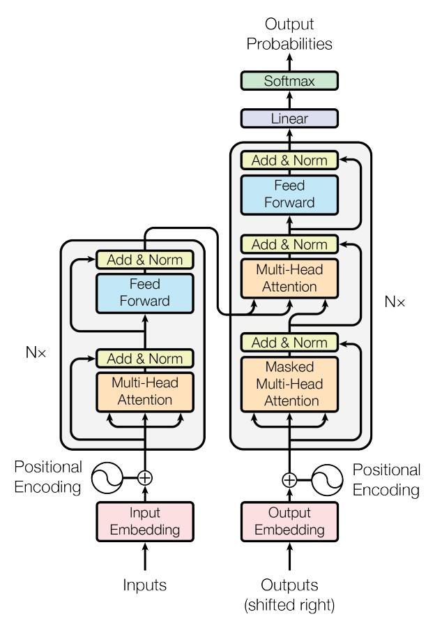
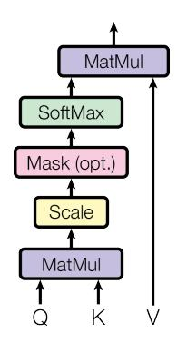
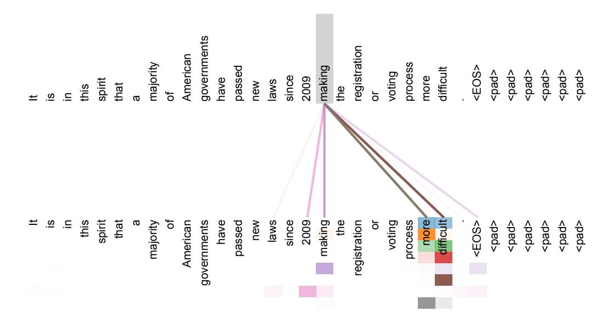
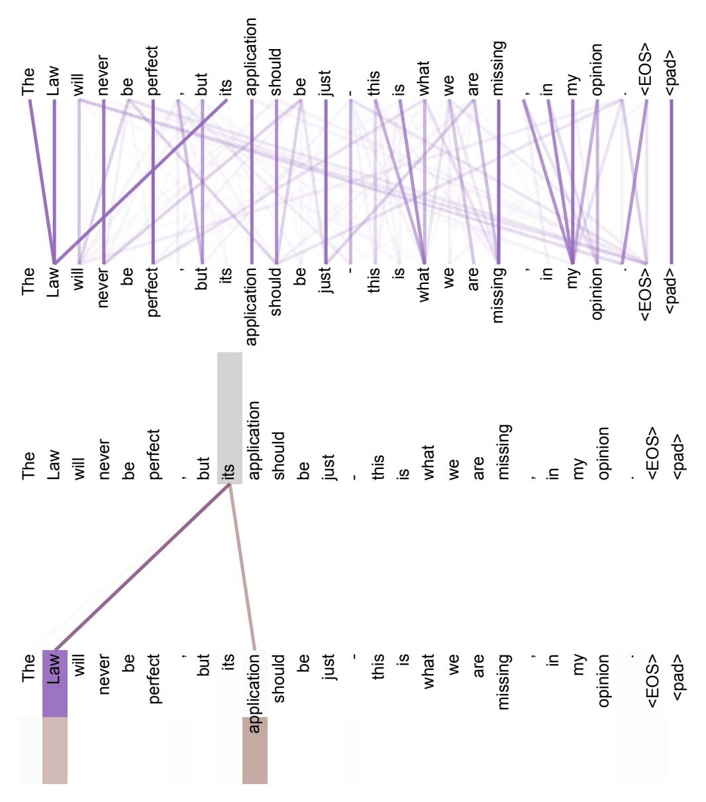
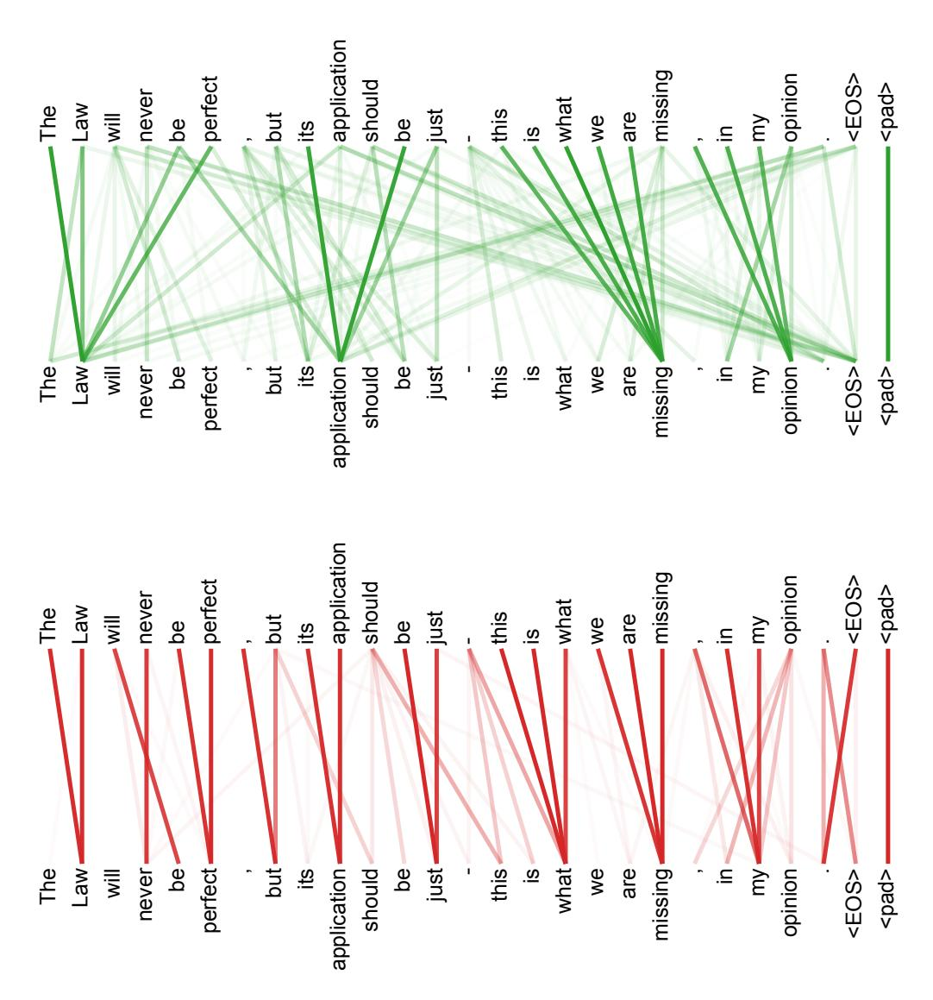

<!-- RP02_Vaswani_2017 | source: papers_json/RP02_Vaswani_2017/ -->

شريطة تقديم الإسناد المناسب، تمنح Google بموجب هذا الإذن بإعادة إنتاج الجداول والأشكال الواردة في هذه الورقة لاستخدامها حصراً في الأعمال الصحفية أو الأكاديمية.

## الانتباه هو كل ما تحتاجه

Ashish Vaswani^∗^ Google Brain avaswani@google.com

Noam Shazeer^∗^ Google Brain noam@google.com

Niki Parmar^∗^ Google Research nikip@google.com

Jakob Uszkoreit^∗^ Google Research usz@google.com

Llion Jones^∗^ Google Research llion@google.com

Aidan N. Gomez∗ † University of Toronto aidan@cs.toronto.edu

Łukasz Kaiser^∗^ Google Brain lukaszkaiser@google.com

Illia Polosukhin∗ ‡ illia.polosukhin@gmail.com

## الملخص

تعتمد النماذج المهيمنة لتحويل التسلسلات على شبكات عصبية تكرارية أو التفافية معقدة تتضمن مُرمِّزاً (encoder) ومُفكِّك ترميز (decoder). كما تربط النماذج الأفضل أداءً بين المُرمِّز ومُفكِّك الترميز عبر آلية انتباه. نقترح بنية شبكة جديدة وبسيطة، هي المُحوِّل (Transformer)، تعتمد كلياً على آليات الانتباه، وتستغني تماماً عن التكرار والالتفاف. تُظهر التجارب على مهمتين للترجمة الآلية تفوّق هذه النماذج من حيث الجودة، مع كونها أكثر قابلية للمعالجة المتوازية وتتطلب وقت تدريب أقل بكثير. يحقق نموذجنا 28.4 BLEU في مهمة الترجمة من الإنجليزية إلى الألمانية ضمن WMT 2014، متفوّقاً على أفضل النتائج الموجودة، بما فيها التجمعات (ensembles)، بأكثر من نقطتي BLEU. وفي مهمة الترجمة من الإنجليزية إلى الفرنسية ضمن WMT 2014، يُرسي نموذجنا حالة فنية جديدة لنموذج مفرد بدرجة BLEU تبلغ 41.8 بعد تدريب لمدة 3.5 أيام على ثماني وحدات معالجة رسومية (GPU)، وهي جزء بسيط من تكاليف تدريب أفضل النماذج في الأدبيات. ونُظهر أن المُحوِّل يعمّم جيداً على مهام أخرى من خلال تطبيقه بنجاح على تحليل التركيب النحوي الإنجليزي (constituency parsing) سواء بكميات كبيرة أو محدودة من بيانات التدريب.

> ^∗^مساهمة متساوية. ترتيب القائمة عشوائي. اقترح Jakob استبدال الشبكات العصبية التكرارية بالانتباه الذاتي وبدأ الجهد لتقييم هذه الفكرة. صمم Ashish، مع Illia، نماذج المحول الأولى ونفّذها وكان مشاركاً بصورة جوهرية في كل جانب من جوانب هذا العمل. اقترح Noam الانتباه القياسي بالضرب النقطي، والانتباه متعدد الرؤوس، وتمثيل الموضع الخالي من المعاملات، وأصبح الشخص الآخر المشارك في كل تفصيلة تقريباً. صممت Niki ونفّذت وضبطت وقيّمت متغيرات نماذج لا تُحصى في قاعدة الشيفرة الأصلية لدينا وفي tensor2tensor. كما جرّب Llion متغيرات نماذج جديدة، وكان مسؤولاً عن قاعدة الشيفرة الأولية لدينا، وعن الاستدلال الكفء والتصورات. أمضى Lukasz و Aidan أياماً طويلة لا تُحصى في تصميم أجزاء مختلفة من tensor2tensor وتنفيذه، ليحلّ محلّ قاعدة الشيفرة السابقة لدينا، مما حسّن النتائج بشكل كبير وعجّل بحثنا بصورة هائلة.

> ^†^أُنجز العمل أثناء وجوده في Google Brain.

> ^‡^أُنجز العمل أثناء وجوده في Google Research.

<!-- page 2 -->

# 1 المقدمة

ترسّخت الشبكات العصبية التكرارية، ولا سيما الذاكرة الطويلة قصيرة المدى (long short-term memory) [[13]](#page-10-0) والشبكات العصبية التكرارية المُبوَّبة (gated recurrent) [[7]](#page-10-1)، باعتبارها نُهُجاً متطورة في مسائل نمذجة التسلسلات والتحويل، مثل نمذجة اللغة والترجمة الآلية [[35,](#page-11-0) [2,](#page-9-0) [5]](#page-10-2). وقد استمرت جهود عديدة منذ ذلك الحين في دفع حدود نماذج اللغة التكرارية وبُنى المُرمِّز-مُفكِّك الترميز [[38,](#page-11-1)[ 24,](#page-10-3)[ 15]](#page-10-4).

تقوم النماذج التكرارية عادةً بتجزئة الحساب على طول مواضع الرموز في تسلسلات الإدخال والإخراج. وبمحاذاة المواضع مع خطوات وقت الحساب، فإنها تولّد تسلسلاً من الحالات الخفية ht، كدالّة للحالة الخفية السابقة ht−^1^ وللإدخال في الموضع t. هذه الطبيعة التسلسلية الأصيلة تمنع المعالجة المتوازية داخل أمثلة التدريب، وهو ما يصبح أمراً حرجاً عند أطوال التسلسل الأكبر، إذ تحدّ قيود الذاكرة من تجميع الأمثلة في دفعات. وقد حقق العمل الحديث تحسينات كبيرة في الكفاءة الحاسوبية عبر حِيَل التحليل العاملي [[21]](#page-10-5) والحساب المشروط [[32]](#page-11-2)، مع تحسين أداء النموذج في الحالة الأخيرة. غير أن القيد الأساسي للحساب التسلسلي يظل قائماً.

أصبحت آليات الانتباه جزءاً لا يتجزأ من نماذج نمذجة التسلسل والتحويل المُقنعة في مهام متعددة، إذ تتيح نمذجة التبعيات بصرف النظر عن المسافة بينها في تسلسلات الإدخال أو الإخراج [[2,](#page-9-0) [19]](#page-10-6). إلا أنه في جميع الحالات تقريباً عدا قلة منها [[27]](#page-11-3)، تُستخدم آليات الانتباه هذه بالاقتران مع شبكة تكرارية.

في هذا العمل، نقترح المُحوِّل، وهو بنية نموذج تتجنب التكرار وتعتمد بالكامل على آلية انتباه لاستخلاص التبعيات الشاملة بين الإدخال والإخراج. يسمح المُحوِّل بقدر أكبر بكثير من المعالجة المتوازية ويستطيع بلوغ حالة فنية جديدة في جودة الترجمة بعد تدريب لا يتجاوز اثنتي عشرة ساعة على ثماني وحدات GPU من نوع P100.

# 2 الخلفية

يشكّل هدف تقليل الحساب التسلسلي أيضاً الأساس الذي تقوم عليه شبكة Extended Neural GPU [[16]](#page-10-7) و ByteNet [[18]](#page-10-8) و ConvS2S [[9]](#page-10-9)، التي تستخدم جميعها الشبكات العصبية الالتفافية لبنة بناء أساسية، إذ تحسب التمثيلات الخفية بالتوازي لجميع مواضع الإدخال والإخراج. في هذه النماذج، يتزايد عدد العمليات المطلوبة لربط الإشارات بين أي موضعَيْن للإدخال أو الإخراج تبعاً للمسافة بين الموضعَيْن، خطياً في ConvS2S ولوغاريتمياً في ByteNet. وهذا يجعل تعلّم التبعيات بين المواضع البعيدة أصعب [[12]](#page-10-10). أما في المُحوِّل فيُختزل ذلك إلى عدد ثابت من العمليات، وإن كان ذلك على حساب انخفاض الدقة الفعلية بسبب حساب المتوسط للمواضع الموزونة بالانتباه، وهو أثر نتداركه باستخدام الانتباه متعدد الرؤوس كما هو موضّح في القسم[ 3.2.](#page-2-0)

الانتباه الذاتي، الذي يُسمَّى أحياناً الانتباه الداخلي (intra-attention)، هو آلية انتباه تربط مواضع مختلفة في تسلسل واحد بهدف حساب تمثيل لذلك التسلسل. وقد استُخدم الانتباه الذاتي بنجاح في مهام متنوعة، تشمل الفهم القرائي، والتلخيص التجريدي، والاستلزام النصي، وتعلّم تمثيلات الجمل المستقلة عن المهمة [[4,](#page-9-1)[ 27,](#page-11-3)[ 28,](#page-11-4)[ 22]](#page-10-11).

تستند شبكات الذاكرة من طرف إلى طرف (end-to-end memory networks) إلى آلية انتباه تكرارية بدلاً من التكرار المتوازي مع التسلسل، وقد أظهرت أداءً جيداً في مهام الإجابة عن الأسئلة بلغة بسيطة وفي نمذجة اللغة [[34]](#page-11-5).

غير أنه على حد علمنا، يُعدّ المُحوِّل أول نموذج تحويل يعتمد كلياً على الانتباه الذاتي لحساب تمثيلات إدخاله وإخراجه دون استخدام شبكات RNN متوازية مع التسلسل أو الالتفاف. في الأقسام التالية، سنصف المُحوِّل، ونُسوِّغ استخدام الانتباه الذاتي، ونناقش مزاياه على نماذج مثل [[17,](#page-10-12)[ 18]](#page-10-8) و [[9]](#page-10-9).

# 3 معمارية النموذج

تتمتع معظم نماذج تحويل التسلسلات العصبية التنافسية ببنية مُرمِّز-مُفكِّك ترميز [[5,](#page-10-2) [2,](#page-9-0) [35]](#page-11-0). هنا، يقوم المُرمِّز بتعيين تسلسل إدخال من تمثيلات الرموز (x1, ..., xn) إلى تسلسل من التمثيلات المتصلة z = (z1, ..., zn). ثم بإعطاء z، يولّد مُفكِّك الترميز تسلسل إخراج (y1, ..., ym) من الرموز عنصراً واحداً في كل مرة. في كل خطوة يكون النموذج ذاتي الانحدار (auto-regressive) [[10]](#page-10-13)، إذ يستهلك الرموز المولَّدة سابقاً كإدخال إضافي عند توليد الرمز التالي.

<!-- page 3 -->

*الشكل 1: المُحوِّل - معمارية النموذج.*

يتّبع المُحوِّل هذه البنية الكلية مستخدماً انتباهاً ذاتياً مكدساً وطبقات متصلة بالكامل من نقطة إلى نقطة لكل من المُرمِّز ومُفكِّك الترميز، كما هو موضّح في النصفَين الأيسر والأيمن من الشكل[ 1](#page-2-1) على التوالي.

## 3.1 مكدسات المُرمِّز ومُفكِّك الترميز

المُرمِّز: يتألف المُرمِّز من مكدس مكوَّن من N = 6 طبقات متطابقة. كل طبقة بها طبقتان فرعيتان. الأولى هي آلية انتباه ذاتي متعدد الرؤوس، والثانية شبكة تغذية أمامية بسيطة متصلة بالكامل ومطبَّقة على كل موضع. نوظّف وصلة متبقية (residual connection) [[11]](#page-10-14) حول كلٍّ من الطبقتين الفرعيتين، يليها تطبيع الطبقة (layer normalization) [[1]](#page-9-2). أي أن مخرج كل طبقة فرعية هو LayerNorm(x + Sublayer(x))، حيث Sublayer(x) هي الدالة التي تنفّذها الطبقة الفرعية ذاتها. ولتسهيل هذه الوصلات المتبقية، تنتج جميع الطبقات الفرعية في النموذج، وكذلك طبقات التضمين (embedding)، مخرجات بأبعاد dmodel = 512.

مُفكِّك الترميز: يتألف مُفكِّك الترميز أيضاً من مكدس من N = 6 طبقات متطابقة. وبالإضافة إلى الطبقتين الفرعيتين الموجودتين في كل طبقة من طبقات المُرمِّز، يُدرج مُفكِّك الترميز طبقة فرعية ثالثة تنفّذ انتباهاً متعدد الرؤوس على مخرج مكدس المُرمِّز. على غرار المُرمِّز، نوظّف وصلات متبقية حول كل من الطبقات الفرعية، يليها تطبيع الطبقة. كما نعدّل الطبقة الفرعية للانتباه الذاتي في مكدس مُفكِّك الترميز لمنع المواضع من الانتباه إلى المواضع اللاحقة. هذا التقنيع، إلى جانب أن تضمينات الإخراج مزاحَة بمقدار موضع واحد، يضمن أن التنبؤات للموضع i لا يمكن أن تعتمد إلا على المخرجات المعروفة في المواضع الأقل من i.

## 3.2 الانتباه

يمكن وصف دالة الانتباه بأنها تعيين لاستعلام (query) ومجموعة من أزواج المفتاح-القيمة (key-value) إلى مخرج، حيث يكون الاستعلام والمفاتيح والقيم والمخرج جميعها متجهات. ويُحسب المخرج كمجموع موزون

<!-- page 4 -->

## الانتباه القياسي بالضرب النقطي

للقيم، حيث يُحسب الوزن المخصَّص لكل قيمة بدالة توافق بين الاستعلام والمفتاح المقابل.

### 3.2.1 الانتباه القياسي بالضرب النقطي

نطلق على نوع الانتباه الخاص بنا اسم "الانتباه القياسي بالضرب النقطي" (Scaled Dot-Product Attention) (الشكل 2). يتألف الإدخال من استعلامات ومفاتيح ذات بُعد d_k، وقيم ذات بُعد d_v. نحسب الضرب النقطي للاستعلام مع جميع المفاتيح، ونقسّم كلاً منها على \sqrt{d_k}، ثم نطبّق دالة softmax للحصول على الأوزان على القيم.

عملياً، نحسب دالة الانتباه على مجموعة من الاستعلامات في وقت واحد، مُعبَّأة معاً في مصفوفة Q. كما تُعبَّأ المفاتيح والقيم معاً في مصفوفتين K و V. ونحسب مصفوفة المخرجات على النحو التالي:

$$ Attention(Q, K, V) = \operatorname{softmax}(\frac{QK^T}{\sqrt{d_k}})V (1) $$

أكثر دالتين انتباه شيوعاً هما الانتباه الإضافي [2]، والانتباه بالضرب النقطي (الضربي). الانتباه بالضرب النقطي مطابق لخوارزميتنا، باستثناء عامل القياس \frac{1}{\sqrt{d_k}}. أما الانتباه الإضافي فيحسب دالة التوافق باستخدام شبكة تغذية أمامية ذات طبقة خفية واحدة. ومع أن النوعين متشابهان في التعقيد النظري، فإن الانتباه بالضرب النقطي أسرع بكثير وأكثر كفاءة في استخدام الذاكرة في الممارسة العملية، إذ يمكن تنفيذه باستخدام شيفرة ضرب مصفوفات مُحسَّنة للغاية.

في حين أن الآليتين تعملان بصورة متشابهة عند القيم الصغيرة لـ d_k، فإن الانتباه الإضافي يتفوّق على الانتباه بالضرب النقطي بدون قياس عند القيم الأكبر لـ d_k [3]. ونحن نظن أنه عند القيم الكبيرة لـ d_k، تكبر مقاديرحاصل الضرب النقطي، فتدفع دالة softmax إلى مناطق ذات تدرجات صغيرة جداً 4. ولمواجهة هذا الأثر، نقيس حواصل الضرب النقطي بـ \frac{1}{\sqrt{d_k}}.

### 3.2.2 الانتباه متعدد الرؤوس

بدلاً من تنفيذ دالة انتباه واحدة بمفاتيح وقيم واستعلامات بأبعاد d_{\rm model}، وجدنا أن من المفيد إسقاط الاستعلامات والمفاتيح والقيم خطياً h مرة بإسقاطات خطية مختلفة ومتعلَّمة، إلى أبعاد d_k و d_k و d_v على التوالي. ثم نقوم على كل من نسخ الاستعلامات والمفاتيح والقيم المُسقَطة هذه بتنفيذ دالة الانتباه بالتوازي، وهو ما ينتج عنه قيم إخراج بأبعاد d_v.

> ^&^lt;sup>4لتوضيح سبب كبر حواصل الضرب النقطي، افترض أن مكوّنات q و k متغيرات عشوائية مستقلة بمتوسط 0 وتباين 1. عندئذٍ يكون حاصل ضربها النقطي، q \cdot k = \sum_{i=1}^{d_k} q_i k_i، ذا متوسط 0 وتباين d_k.

<!-- page 5 -->

تُلصَق هذه القيم وتُسقَط مرة أخرى، فتنتج القيم النهائية، كما هو موضح في الشكل[ 2.](#page-3-0)

يسمح الانتباه متعدد الرؤوس للنموذج بالانتباه المشترك إلى المعلومات من فضاءات تمثيل فرعية مختلفة في مواضع مختلفة. فمع رأس انتباه واحد، يمنع حساب المتوسط ذلك.

$$
\begin{aligned} \text{MultiHead}(Q, K, V) &= \text{Concat}(\text{head}_1, ..., \text{head}_{\text{h}}) W^O \\ \text{where head}_{\text{i}} &= \text{Attention}(QW_i^Q, KW_i^K, VW_i^V) \end{aligned}
$$

حيث الإسقاطات هي مصفوفات معاملات W Q ^i^ ^∈^ ^R^ ^d^model×d^k^ ، W ^K^ ^i^ ∈ R ^d^model×d^k^ ، W^V^ ^i^ ∈ R dmodel×d^v^ و W^O^ ∈ R hdv×dmodel .

في هذا العمل، نوظّف h = 8 طبقات انتباه متوازية، أو رؤوس. ولكلٍّ منها نستخدم d^k^ = d^v^ = dmodel/h = 64. ونظراً لانخفاض بُعد كل رأس، تكون التكلفة الحاسوبية الإجمالية مماثلة لتكلفة الانتباه ذي الرأس الواحد بأبعاد كاملة.

### 3.2.3 تطبيقات الانتباه في نموذجنا

يستخدم المُحوِّل الانتباه متعدد الرؤوس بثلاث طرق مختلفة:

- في طبقات "انتباه المُرمِّز-مُفكِّك الترميز"، تأتي الاستعلامات من طبقة مُفكِّك الترميز السابقة، وتأتي مفاتيح وقيم الذاكرة من مخرج المُرمِّز. وهذا يسمح لكل موضع في مُفكِّك الترميز بأن ينتبه إلى جميع المواضع في تسلسل الإدخال. ويحاكي هذا آليات انتباه المُرمِّز-مُفكِّك الترميز النموذجية في نماذج تسلسل-إلى-تسلسل مثل [[38,](#page-11-1)[ 2,](#page-9-0)[ 9]](#page-10-9).
- يحتوي المُرمِّز على طبقات انتباه ذاتي. في طبقة الانتباه الذاتي، تأتي جميع المفاتيح والقيم والاستعلامات من المكان نفسه، وفي هذه الحالة من مخرج الطبقة السابقة في المُرمِّز. يستطيع كل موضع في المُرمِّز الانتباه إلى جميع المواضع في الطبقة السابقة من المُرمِّز.
- وعلى نحو مماثل، تتيح طبقات الانتباه الذاتي في مُفكِّك الترميز لكل موضع فيه أن ينتبه إلى جميع المواضع في مُفكِّك الترميز حتى ذلك الموضع وبما يشمله. يجب أن نمنع تدفق المعلومات نحو اليسار في مُفكِّك الترميز للحفاظ على خاصية الانحدار الذاتي. ونطبّق ذلك داخل الانتباه القياسي بالضرب النقطي عبر تقنيع (إسناد قيمة −∞) جميع القيم في إدخال softmax التي تتوافق مع وصلات غير مسموح بها. انظر الشكل[ 2.](#page-3-0)

## 3.3 شبكات التغذية الأمامية بحسب الموضع

بالإضافة إلى الطبقات الفرعية للانتباه، تحتوي كل طبقة من طبقات المُرمِّز ومُفكِّك الترميز لدينا على شبكة تغذية أمامية متصلة بالكامل، تُطبَّق على كل موضع بشكل منفصل ومتطابق. تتكوّن هذه الشبكة من تحويلين خطيين بينهما تنشيط ReLU.

$$ FFN(x) = \max(0, xW_1 + b_1)W_2 + b_2 \tag{2} $$

ومع أن التحويلات الخطية متطابقة عبر المواضع المختلفة، فإنها تستخدم معاملات مختلفة من طبقة إلى أخرى. وثمة طريقة أخرى لوصف ذلك بأنه عبارة عن التفافين بحجم نواة 1. أبعاد الإدخال والإخراج هي dmodel = 512، وبُعد الطبقة الداخلية هو df f = 2048.

## 3.4 التضمينات و Softmax

على غرار نماذج تحويل التسلسلات الأخرى، نستخدم تضمينات متعلَّمة لتحويل رموز الإدخال ورموز الإخراج إلى متجهات بأبعاد dmodel. ونستخدم أيضاً التحويل الخطي ودالة softmax المعتادتَين لتحويل مخرج مُفكِّك الترميز إلى احتمالات الرمز التالي المتنبَّأ به. في نموذجنا، نتشارك مصفوفة الأوزان نفسها بين طبقتَي التضمين والتحويل الخطي قبل softmax، على نحو مشابه لما في [[30]](#page-11-6). وفي طبقات التضمين، نضرب هذه الأوزان في ^√^ dmodel.

<!-- page 6 -->

## 3.5 ترميز الموضع

نظراً لأن نموذجنا لا يحتوي على تكرار ولا التفاف، ولكي يستفيد النموذج من ترتيب التسلسل، يجب أن نحقن قدراً من المعلومات حول الموضع النسبي أو المطلق للرموز في التسلسل. ولهذه الغاية، نضيف "ترميزات الموضع" (positional encodings) إلى تضمينات الإدخال في أسفل مكدسات المُرمِّز ومُفكِّك الترميز. تتمتع ترميزات الموضع بالبُعد ذاته d_{\rm model} الذي تتمتع به التضمينات، بحيث يمكن جمع الاثنين. وتوجد خيارات كثيرة لترميزات الموضع، متعلَّمة وثابتة [9].

في هذا العمل، نستخدم دوال الجيب وجيب التمام بترددات مختلفة:

$$
PE_{(pos,2i)} = sin(pos/10000^{2i/d_{\text{model}}})

PE_{(pos,2i+1)} = cos(pos/10000^{2i/d_{\text{model}}})
$$

حيث pos هو الموضع و i هو البُعد. أي أن كل بُعد من ترميز الموضع يقابل موجة جيبية. تشكّل الأطوال الموجية متوالية هندسية من 2\pi إلى 10000 \cdot 2\pi. لقد اخترنا هذه الدالة لأننا افترضنا أنها ستسمح للنموذج بأن يتعلم بسهولة الانتباه عبر المواضع النسبية، إذ إنه لأي إزاحة ثابتة k، يمكن تمثيل PE_{pos+k} كدالة خطية في PE_{pos}.

كما جرّبنا استخدام تضمينات موضعية متعلَّمة [9] بدلاً من ذلك، ووجدنا أن النسختين تعطيان نتائج متطابقة تقريباً (انظر الجدول 3 الصف (E)). وقد اخترنا النسخة الجيبية لأنها قد تتيح للنموذج الاستقراء إلى أطوال تسلسلية أكبر من تلك التي صادفها أثناء التدريب.

# 4 لماذا الانتباه الذاتي

في هذا القسم، نقارن جوانب مختلفة من طبقات الانتباه الذاتي بالطبقات التكرارية والالتفافية الشائعة الاستخدام في تعيين تسلسل ذي طول متغير من تمثيلات الرموز (x_1,...,x_n) إلى تسلسل آخر بطول مساوٍ (z_1,...,z_n)، حيث x_i,z_i\in\mathbb{R}^d، مثل طبقة خفية في مُرمِّز أو مُفكِّك ترميز نمطي لتحويل التسلسلات. ولتسويغ استخدامنا للانتباه الذاتي، نأخذ في الاعتبار ثلاثة متطلبات.

الأول هو إجمالي التعقيد الحاسوبي لكل طبقة. والثاني هو حجم الحساب القابل للمعالجة المتوازية، مقاساً بأقل عدد من العمليات التسلسلية المطلوبة.

والثالث هو طول المسار بين التبعيات بعيدة المدى في الشبكة. يُعدّ تعلّم التبعيات بعيدة المدى تحدياً رئيسياً في كثير من مهام تحويل التسلسلات. ومن العوامل الرئيسية المؤثرة في القدرة على تعلّم مثل هذه التبعيات طولُ المسارات التي يجب أن تجتازها الإشارات الأمامية والخلفية في الشبكة. وكلما كانت هذه المسارات أقصر بين أي توليفة من المواضع في تسلسلَي الإدخال والإخراج، سهُل تعلّم التبعيات بعيدة المدى [12]. ومن ثَم فإننا نقارن أيضاً الحد الأقصى لطول المسار بين أي موضعَي إدخال وإخراج في الشبكات المؤلَّفة من أنواع الطبقات المختلفة.

كما هو مبيَّن في الجدول 1، تربط طبقة الانتباه الذاتي جميع المواضع بعدد ثابت من العمليات المنفَّذة تسلسلياً، في حين تتطلب الطبقة التكرارية O(n) من العمليات التسلسلية. ومن حيث التعقيد الحاسوبي، تكون طبقات الانتباه الذاتي أسرع من الطبقات التكرارية عندما يكون طول التسلسل

<!-- page 7 -->

n أصغر من بُعد التمثيل d، وهو ما يحدث في معظم الحالات في تمثيلات الجمل المستخدمة في النماذج الفنية المتطورة في الترجمة الآلية، مثل تمثيلات word-piece [[38]](#page-11-1) و byte-pair [[31]](#page-11-7). ولتحسين الأداء الحاسوبي للمهام التي تشتمل على تسلسلات طويلة جداً، يمكن قصر الانتباه الذاتي على النظر فقط إلى جوار بحجم r في تسلسل الإدخال متمركز حول موضع الإخراج المعني. وهذا من شأنه أن يزيد الحد الأقصى لطول المسار إلى O(n/r). ونعتزم استكشاف هذا النهج بمزيد من البحث في العمل المستقبلي.

لا تربط الطبقة الالتفافية المفردة ذات عرض النواة k < n جميع أزواج مواضع الإدخال والإخراج. ويتطلب القيام بذلك مكدساً من O(n/k) طبقة التفافية في حالة النوى المتجاورة، أو O(logk(n)) في حالة الالتفافات الموسَّعة (dilated convolutions) [[18]](#page-10-8)، مما يزيد طول أطول المسارات بين أي موضعَين في الشبكة. وعموماً تكون الطبقات الالتفافية أكثر تكلفة من الطبقات التكرارية بمعامل k. غير أن الالتفافات القابلة للفصل (separable convolutions) [[6]](#page-10-15) تخفّض التعقيد بصورة ملحوظة إلى O(k · n · d + n · d 2 ). وحتى عند k = n، يكون تعقيد الالتفاف القابل للفصل مساوياً لمجموع طبقة انتباه ذاتي وطبقة تغذية أمامية من نقطة إلى نقطة، وهو النهج الذي نعتمده في نموذجنا.

ومن المنافع الجانبية، أن الانتباه الذاتي قد يثمر نماذج أكثر قابلية للتفسير. لقد فحصنا توزيعات الانتباه من نماذجنا، ونعرض ونناقش أمثلة في الملحق. فلا تكتفي رؤوس الانتباه الفردية بتعلّم تنفيذ مهام مختلفة بوضوح، بل يبدو أن كثيراً منها يُظهر سلوكاً ذا صلة بالبنية النحوية والدلالية للجمل.

# 5 التدريب

يصف هذا القسم نظام التدريب لنماذجنا.

## 5.1 بيانات التدريب وتجميع الدفعات

تدرّبنا على مجموعة بيانات WMT 2014 القياسية للترجمة بين الإنجليزية والألمانية المؤلَّفة من نحو 4.5 مليون زوج من الجمل. رُمِّزت الجمل باستخدام الترميز بأزواج البايتات (byte-pair encoding) [[3]](#page-9-3)، الذي يحتوي على مفردات مشتركة بين المصدر والهدف بنحو 37000 رمز. أما بالنسبة للترجمة من الإنجليزية إلى الفرنسية، فقد استخدمنا مجموعة بيانات WMT 2014 الإنجليزية-الفرنسية الأكبر بكثير، والمؤلَّفة من 36 مليون جملة، وقسّمنا الرموز إلى مفردات word-piece بحجم 32000 [[38]](#page-11-1). جُمِّعت أزواج الجمل معاً في دفعات حسب طول التسلسل التقريبي. واحتوت كل دفعة تدريب على مجموعة من أزواج الجمل تحتوي على نحو 25000 رمز مصدر و 25000 رمز هدف.

## 5.2 العتاد والجدول الزمني

دربنا نماذجنا على جهاز واحد بثماني وحدات GPU من نوع NVIDIA P100. بالنسبة لنماذجنا الأساسية باستخدام المعاملات الفائقة الموصوفة في هذه الورقة، استغرقت كل خطوة تدريب نحو 0.4 ثانية. ودرّبنا النماذج الأساسية لما مجموعه 100,000 خطوة أو 12 ساعة. أما نماذجنا الكبيرة (الموصوفة في السطر السفلي من الجدول[ 3)](#page-8-0)، فكان زمن الخطوة 1.0 ثانية. ودُرِّبت النماذج الكبيرة لـ 300,000 خطوة (3.5 أيام).

## 5.3 المُحسِّن

استخدمنا مُحسِّن Adam [[20]](#page-10-16) مع β^1^ = 0.9 و β^2^ = 0.98 و ϵ = 10^−^^9^. وقد غيّرنا معدل التعلم على مدار التدريب وفق الصيغة التالية:

$$
lrate = d_{\text{model}}^{-0.5} \cdot \min(step\_num^{-0.5}, step\_num \cdot warmup\_steps^{-1.5}) \tag{3}
$$

وهذا يقابل زيادة معدل التعلم خطياً خلال أول warmup_steps من خطوات التدريب، وتخفيضه بعد ذلك بنسبة عكسية مع الجذر التربيعي لرقم الخطوة. واستخدمنا warmup_steps = 4000.

## 5.4 الانتظام (Regularization)

نوظّف ثلاثة أنواع من الانتظام أثناء التدريب:

<!-- page 8 -->

| الجدول 2: يحقق المُحوِّل درجات BLEU أفضل من النماذج الفنية المتطورة السابقة على |
| --- |
| اختبارات newstest2014 للترجمة من الإنجليزية إلى الألمانية ومن الإنجليزية إلى الفرنسية، بجزء بسيط من تكلفة التدريب. |

| النموذج | BLEU | تكلفة التدريب (FLOPs) |  |  |
| --- | --- | --- | --- | --- |
| EN-DE | EN-FR | EN-DE | EN-FR |  |
| ByteNet [18] | 23.75 |  |  |  |
| Deep-Att + PosUnk [39] |  | 39.2 |  | 1.0 \cdot 10^{20} |
| GNMT + RL [38] | 24.6 | 39.92 | 2.3 \cdot 10^{19} | 1.4 \cdot 10^{20} |
| ConvS2S [9] | 25.16 | 40.46 | 9.6 \cdot 10^{18} | 1.5 \cdot 10^{20} |
| MoE [32] | 26.03 | 40.56 | 2.0 \cdot 10^{19} | 1.2 \cdot 10^{20} |
| Deep-Att + PosUnk Ensemble [39] |  | 40.4 |  | 8.0 \cdot 10^{20} |
| GNMT + RL Ensemble [38] | 26.30 | 41.16 | 1.8 \cdot 10^{20} | 1.1 \cdot 10^{21} |
| ConvS2S Ensemble [9] | 26.36 | **41.29** | 7.7 \cdot 10^{19} | 1.2 \cdot 10^{21} |
| Transformer (نموذج أساسي) | 27.3 | 38.1 | **3.3 \cdot 10^{18}** |  |
| Transformer (كبير) | **28.4** | **41.8** | 2.3 \cdot 10^{19} |  |

**Dropout المتبقي** نطبّق dropout [33] على مخرج كل طبقة فرعية، قبل جمعه مع إدخال الطبقة الفرعية وتطبيعه. علاوة على ذلك، نطبّق dropout على مجاميع التضمينات وترميزات الموضع في مكدسَي المُرمِّز ومُفكِّك الترميز كليهما. وللنموذج الأساسي نستخدم معدل P_{drop}=0.1.

**تنعيم التسميات (Label Smoothing)** أثناء التدريب، وظّفنا تنعيم التسميات بقيمة \epsilon_{ls} = 0.1 [36]. وهذا يضرّ بمقياس الحيرة (perplexity)، إذ يتعلم النموذج أن يكون أكثر تردداً، لكنه يحسّن الدقة ودرجة BLEU.

# 6 النتائج

## 6.1 الترجمة الآلية

في مهمة الترجمة من الإنجليزية إلى الألمانية ضمن WMT 2014، يتفوّق نموذج المُحوِّل الكبير (Transformer (big) في الجدول 2) على أفضل النماذج المُبلَّغ عنها سابقاً (بما في ذلك التجمعات) بأكثر من 2.0 BLEU، مُرسياً درجة BLEU جديدة كحالة فنية متطورة قدرها 28.4. ويُذكر إعداد هذا النموذج في السطر السفلي من الجدول 3. واستغرق التدريب 3.5 أيام على 8 وحدات GPU من نوع P100. حتى نموذجنا الأساسي يتجاوز جميع النماذج والتجمعات المنشورة سابقاً، وبجزء يسير من تكلفة تدريب أيٍّ من النماذج التنافسية.

في مهمة الترجمة من الإنجليزية إلى الفرنسية ضمن WMT 2014، يحقق نموذجنا الكبير درجة BLEU قدرها 41.0، متفوّقاً على جميع النماذج المفردة المنشورة سابقاً، بأقل من ربع تكلفة تدريب النموذج الفني المتطور السابق. واستخدم نموذج Transformer (الكبير) المُدرَّب للترجمة من الإنجليزية إلى الفرنسية معدل dropout قدره P_{drop}=0.1، بدلاً من 0.3.

بالنسبة للنماذج الأساسية، استخدمنا نموذجاً واحداً جرى الحصول عليه بحساب متوسط آخر 5 نقاط تفتيش (checkpoints)، التي كُتبت بفاصل 10 دقائق. أما بالنسبة للنماذج الكبيرة، فقد حسبنا متوسط آخر 20 نقطة تفتيش. واستخدمنا البحث الشعاعي (beam search) بحجم شعاع قدره 4 وعقوبة طول \alpha=0.6 [38]. اختير هذان المعاملان الفائقان بعد التجريب على مجموعة التطوير. وقد ضبطنا الحد الأقصى لطول الإخراج أثناء الاستدلال على طول الإدخال + 50، لكننا ننهي البحث مبكراً عند الإمكان [38].

يلخّص الجدول 2 نتائجنا ويقارن جودة الترجمة وتكاليف التدريب لدينا ببُنى نماذج أخرى من الأدبيات. ونقدّر عدد عمليات الفاصلة العائمة المستخدمة في تدريب النموذج بضرب وقت التدريب في عدد وحدات GPU المستخدمة في تقدير للسعة المستدامة لدقة الفاصلة العائمة الأحادية لكل وحدة GPU 5.

## **6.2** متغيرات النموذج

لتقييم أهمية المكوّنات المختلفة للمُحوِّل، غيّرنا نموذجنا الأساسي بطرق مختلفة، قاسين التغير في الأداء على الترجمة من الإنجليزية إلى الألمانية في

> ^&^lt;sup>5استخدمنا قيم 2.8 و 3.7 و 6.0 و 9.5 TFLOPS للوحدات K80 و K40 و M40 و P100 على التوالي.

<!-- page 9 -->

مجموعة التطوير newstest2013. واستخدمنا البحث الشعاعي كما هو موصوف في القسم السابق، لكن دون متوسطة نقاط التفتيش. ونعرض هذه النتائج في الجدول[ 3.](#page-8-0)

في الجدول[ 3](#page-8-0) الصفوف (A)، نغيّر عدد رؤوس الانتباه وأبعاد مفتاح الانتباه وقيمته، مع إبقاء حجم الحساب ثابتاً، كما هو موصوف في القسم[ 3.2.2.](#page-3-2) ومع أن الانتباه برأس واحد يقل بـ 0.9 BLEU عن أفضل إعداد، فإن الجودة تتراجع أيضاً عند زيادة عدد الرؤوس بشكل مفرط.

في الجدول[ 3](#page-8-0) الصفوف (B)، نلاحظ أن تقليل حجم مفتاح الانتباه d^k^ يضرّ بجودة النموذج. ويوحي هذا بأن تحديد التوافق ليس سهلاً وأن دالة توافق أكثر تطوراً من الضرب النقطي قد تكون مفيدة. كما نلاحظ في الصفّين (C) و (D)، كما هو متوقَّع، أن النماذج الأكبر أفضل، وأن dropout مفيد جداً في تجنّب الإفراط في الملاءمة (over-fitting). وفي الصف (E)، استبدلنا ترميز الموضع الجيبي لدينا بتضمينات موضعية متعلَّمة [[9]](#page-10-9)، ولاحظنا نتائج متطابقة تقريباً مع النموذج الأساسي.

## 6.3 تحليل التركيب النحوي الإنجليزي (English Constituency Parsing)

لتقييم ما إذا كان المُحوِّل يستطيع التعميم على مهام أخرى، أجرينا تجارب على تحليل التركيب النحوي الإنجليزي. وتطرح هذه المهمة تحديات معينة: يخضع المخرج لقيود بنيوية صارمة وهو أطول بكثير من الإدخال. علاوة على ذلك، لم تستطع نماذج تسلسل-إلى-تسلسل المعتمدة على الشبكات العصبية التكرارية تحقيق نتائج فنية متطورة في حالات البيانات الصغيرة [[37]](#page-11-11).

دربنا مُحوِّلاً ذا 4 طبقات بـ dmodel = 1024 على جزء Wall Street Journal (WSJ) من Penn Treebank [[25]](#page-11-12)، الذي يحتوي على نحو 40 ألف جملة تدريب. كما درّبناه في إعداد شبه مُشرَف، باستخدام مدوَّنات BerkleyParser ومدوَّنات عالية الثقة الأكبر، التي تحوي نحو 17 مليون جملة [[37]](#page-11-11). استخدمنا مفردات بحجم 16K رمز لإعداد WSJ فقط، ومفردات بحجم 32K رمز للإعداد شبه المُشرَف.

أجرينا عدداً قليلاً فقط من التجارب لاختيار dropout بنوعَيه (الانتباه والمتبقي) (القسم[ 5.4)](#page-6-0)، ومعدلات التعلم وحجم الشعاع على مجموعة تطوير القسم 22، وظلت جميع المعاملات الأخرى دون تغيير عن نموذج الترجمة الأساسي من الإنجليزية إلى الألمانية. أثناء الاستدلال،

<!-- page 10 -->

رفعنا الحد الأقصى لطول الإخراج إلى طول الإدخال + 300. واستخدمنا حجم شعاع قدره 21 و α = 0.3 لكلٍّ من إعداد WSJ فقط والإعداد شبه المُشرَف.

تُظهر نتائجنا في الجدول[ 4](#page-9-4) أنه على الرغم من غياب الضبط الخاص بالمهمة، فإن نموذجنا يؤدي بشكل جيد بصورة مفاجئة، إذ يثمر نتائج أفضل من جميع النماذج المُبلَّغ عنها سابقاً، باستثناء Recurrent Neural Network Grammar [[8]](#page-10-17).

وعلى النقيض من نماذج تسلسل-إلى-تسلسل المعتمدة على RNN [[37]](#page-11-11)، يتفوّق المُحوِّل على Berkeley-Parser [[29]](#page-11-13) حتى عند التدريب فقط على مجموعة WSJ التدريبية البالغة 40 ألف جملة.

# 7 الخلاصة

في هذا العمل، قدّمنا المُحوِّل، وهو أول نموذج لتحويل التسلسلات يعتمد كلياً على الانتباه، إذ يستبدل الطبقات التكرارية الأكثر شيوعاً في بُنى المُرمِّز-مُفكِّك الترميز بالانتباه الذاتي متعدد الرؤوس.

بالنسبة لمهام الترجمة، يمكن تدريب المُحوِّل بسرعة أكبر بكثير من البُنى المعتمدة على الطبقات التكرارية أو الالتفافية. وعلى مهمتَي الترجمة من الإنجليزية إلى الألمانية ومن الإنجليزية إلى الفرنسية في WMT 2014، حققنا حالة فنية متطورة جديدة. وفي المهمة الأولى يتفوّق أفضل نموذج لدينا حتى على جميع التجمعات المُبلَّغ عنها سابقاً.

نحن متحمسون لمستقبل النماذج المعتمدة على الانتباه، ونعتزم تطبيقها على مهام أخرى. كما نعتزم توسيع المُحوِّل ليشمل مشكلات تنطوي على وسائط إدخال وإخراج غير النص، وأن نستقصي آليات انتباه محلية ومقيَّدة للتعامل بكفاءة مع المدخلات والمخرجات الكبيرة كالصور والصوت والفيديو. كما يُعدّ جعل التوليد أقل تسلسلية أحد أهدافنا البحثية.

الشيفرة التي استخدمناها لتدريب نماذجنا وتقييمها متوفرة على [https://github.com/](https://github.com/tensorflow/tensor2tensor) [tensorflow/tensor2tensor](https://github.com/tensorflow/tensor2tensor).

شكر وتقدير: نتقدم بالشكر إلى Nal Kalchbrenner و Stephan Gouws على تعليقاتهما المثمرة وتصحيحاتهما وإلهامهما.

## المراجع

- [1] Jimmy Lei Ba, Jamie Ryan Kiros, and Geoffrey E Hinton. Layer normalization. *arXiv preprint* *[arXiv:1607.06450](http://arxiv.org/abs/1607.06450)*, 2016.
- [2] Dzmitry Bahdanau, Kyunghyun Cho, and Yoshua Bengio. Neural machine translation by jointly learning to align and translate. *CoRR*, abs/1409.0473, 2014.
- [3] Denny Britz, Anna Goldie, Minh-Thang Luong, and Quoc V. Le. Massive exploration of neural machine translation architectures. *CoRR*, abs/1703.03906, 2017.
- [4] Jianpeng Cheng, Li Dong, and Mirella Lapata. Long short-term memory-networks for machine reading. *arXiv preprint**[ arXiv:1601.06733](http://arxiv.org/abs/1601.06733)*, 2016.

<!-- page 11 -->

- [5] Kyunghyun Cho, Bart van Merrienboer, Caglar Gulcehre, Fethi Bougares, Holger Schwenk, and Yoshua Bengio. Learning phrase representations using rnn encoder-decoder for statistical machine translation. *CoRR*, abs/1406.1078, 2014.
- [6] Francois Chollet. Xception: Deep learning with depthwise separable convolutions. *arXiv* *preprint**[ arXiv:1610.02357](http://arxiv.org/abs/1610.02357)*, 2016.
- [7] Junyoung Chung, Çaglar Gülçehre, Kyunghyun Cho, and Yoshua Bengio. Empirical evaluation of gated recurrent neural networks on sequence modeling. *CoRR*, abs/1412.3555, 2014.
- [8] Chris Dyer, Adhiguna Kuncoro, Miguel Ballesteros, and Noah A. Smith. Recurrent neural network grammars. In *Proc. of NAACL*, 2016.
- [9] Jonas Gehring, Michael Auli, David Grangier, Denis Yarats, and Yann N. Dauphin. Convolutional sequence to sequence learning. *arXiv preprint**[ arXiv:1705.03122v](http://arxiv.org/abs/1705.03122)**2*, 2017.
- [10] Alex Graves. Generating sequences with recurrent neural networks. *arXiv preprint* *[arXiv:1308.0850](http://arxiv.org/abs/1308.0850)*, 2013.
- [11] Kaiming He, Xiangyu Zhang, Shaoqing Ren, and Jian Sun. Deep residual learning for image recognition. In *Proceedings of the IEEE Conference on Computer Vision and Pattern* *Recognition*, pages 770–778, 2016.
- [12] Sepp Hochreiter, Yoshua Bengio, Paolo Frasconi, and Jürgen Schmidhuber. Gradient flow in recurrent nets: the difficulty of learning long-term dependencies, 2001.
- [13] Sepp Hochreiter and Jürgen Schmidhuber. Long short-term memory. *Neural computation*, 9(8):1735–1780, 1997.
- [14] Zhongqiang Huang and Mary Harper. Self-training PCFG grammars with latent annotations across languages. In *Proceedings of the 2009 Conference on Empirical Methods in Natural* *Language Processing*, pages 832–841. ACL, August 2009.
- [15] Rafal Jozefowicz, Oriol Vinyals, Mike Schuster, Noam Shazeer, and Yonghui Wu. Exploring the limits of language modeling. *arXiv preprint**[ arXiv:1602.02410](http://arxiv.org/abs/1602.02410)*, 2016.
- [16] Łukasz Kaiser and Samy Bengio. Can active memory replace attention? In *Advances in Neural* *Information Processing Systems, (NIPS)*, 2016.
- [17] Łukasz Kaiser and Ilya Sutskever. Neural GPUs learn algorithms. In *International Conference* *on Learning Representations (ICLR)*, 2016.
- [18] Nal Kalchbrenner, Lasse Espeholt, Karen Simonyan, Aaron van den Oord, Alex Graves, and Koray Kavukcuoglu. Neural machine translation in linear time. *arXiv preprint**[ arXiv:1610.10099v](http://arxiv.org/abs/1610.10099)**2*, 2017.
- [19] Yoon Kim, Carl Denton, Luong Hoang, and Alexander M. Rush. Structured attention networks. In *International Conference on Learning Representations*, 2017.
- [20] Diederik Kingma and Jimmy Ba. Adam: A method for stochastic optimization. In *ICLR*, 2015.
- [21] Oleksii Kuchaiev and Boris Ginsburg. Factorization tricks for LSTM networks. *arXiv preprint* *[arXiv:1703.10722](http://arxiv.org/abs/1703.10722)*, 2017.
- [22] Zhouhan Lin, Minwei Feng, Cicero Nogueira dos Santos, Mo Yu, Bing Xiang, Bowen Zhou, and Yoshua Bengio. A structured self-attentive sentence embedding. *arXiv preprint* *[arXiv:1703.03130](http://arxiv.org/abs/1703.03130)*, 2017.
- [23] Minh-Thang Luong, Quoc V. Le, Ilya Sutskever, Oriol Vinyals, and Lukasz Kaiser. Multi-task sequence to sequence learning. *arXiv preprint**[ arXiv:1511.06114](http://arxiv.org/abs/1511.06114)*, 2015.
- [24] Minh-Thang Luong, Hieu Pham, and Christopher D Manning. Effective approaches to attentionbased neural machine translation. *arXiv preprint**[ arXiv:1508.04025](http://arxiv.org/abs/1508.04025)*, 2015.

<!-- page 12 -->

- [25] Mitchell P Marcus, Mary Ann Marcinkiewicz, and Beatrice Santorini. Building a large annotated corpus of english: The penn treebank. *Computational linguistics*, 19(2):313–330, 1993.
- [26] David McClosky, Eugene Charniak, and Mark Johnson. Effective self-training for parsing. In *Proceedings of the Human Language Technology Conference of the NAACL, Main Conference*, pages 152–159. ACL, June 2006.
- [27] Ankur Parikh, Oscar Täckström, Dipanjan Das, and Jakob Uszkoreit. A decomposable attention model. In *Empirical Methods in Natural Language Processing*, 2016.
- [28] Romain Paulus, Caiming Xiong, and Richard Socher. A deep reinforced model for abstractive summarization. *arXiv preprint**[ arXiv:1705.04304](http://arxiv.org/abs/1705.04304)*, 2017.
- [29] Slav Petrov, Leon Barrett, Romain Thibaux, and Dan Klein. Learning accurate, compact, and interpretable tree annotation. In *Proceedings of the 21st International Conference on* *Computational Linguistics and 44th Annual Meeting of the ACL*, pages 433–440. ACL, July 2006.
- [30] Ofir Press and Lior Wolf. Using the output embedding to improve language models. *arXiv* *preprint**[ arXiv:1608.05859](http://arxiv.org/abs/1608.05859)*, 2016.
- [31] Rico Sennrich, Barry Haddow, and Alexandra Birch. Neural machine translation of rare words with subword units. *arXiv preprint**[ arXiv:1508.07909](http://arxiv.org/abs/1508.07909)*, 2015.
- [32] Noam Shazeer, Azalia Mirhoseini, Krzysztof Maziarz, Andy Davis, Quoc Le, Geoffrey Hinton, and Jeff Dean. Outrageously large neural networks: The sparsely-gated mixture-of-experts layer. *arXiv preprint**[ arXiv:1701.06538](http://arxiv.org/abs/1701.06538)*, 2017.
- [33] Nitish Srivastava, Geoffrey E Hinton, Alex Krizhevsky, Ilya Sutskever, and Ruslan Salakhutdinov. Dropout: a simple way to prevent neural networks from overfitting. *Journal of Machine* *Learning Research*, 15(1):1929–1958, 2014.
- [34] Sainbayar Sukhbaatar, Arthur Szlam, Jason Weston, and Rob Fergus. End-to-end memory networks. In C. Cortes, N. D. Lawrence, D. D. Lee, M. Sugiyama, and R. Garnett, editors, *Advances in Neural Information Processing Systems 28*, pages 2440–2448. Curran Associates, Inc., 2015.
- [35] Ilya Sutskever, Oriol Vinyals, and Quoc VV Le. Sequence to sequence learning with neural networks. In *Advances in Neural Information Processing Systems*, pages 3104–3112, 2014.
- [36] Christian Szegedy, Vincent Vanhoucke, Sergey Ioffe, Jonathon Shlens, and Zbigniew Wojna. Rethinking the inception architecture for computer vision. *CoRR*, abs/1512.00567, 2015.
- [37] Vinyals & Kaiser, Koo, Petrov, Sutskever, and Hinton. Grammar as a foreign language. In *Advances in Neural Information Processing Systems*, 2015.
- [38] Yonghui Wu, Mike Schuster, Zhifeng Chen, Quoc V Le, Mohammad Norouzi, Wolfgang Macherey, Maxim Krikun, Yuan Cao, Qin Gao, Klaus Macherey, et al. Google's neural machine translation system: Bridging the gap between human and machine translation. *arXiv preprint* *[arXiv:1609.08144](http://arxiv.org/abs/1609.08144)*, 2016.
- [39] Jie Zhou, Ying Cao, Xuguang Wang, Peng Li, and Wei Xu. Deep recurrent models with fast-forward connections for neural machine translation. *CoRR*, abs/1606.04199, 2016.
- [40] Muhua Zhu, Yue Zhang, Wenliang Chen, Min Zhang, and Jingbo Zhu. Fast and accurate shift-reduce constituent parsing. In *Proceedings of the 51st Annual Meeting of the ACL (Volume* *1: Long Papers)*, pages 434–443. ACL, August 2013.

<!-- page 13 -->

## تصورات الانتباه **Input-Input Layer5**

*الشكل 3: مثال لآلية الانتباه وهي تتتبع التبعيات بعيدة المدى في الانتباه الذاتي للمُرمِّز في الطبقة 5 من 6. كثير من رؤوس الانتباه ينتبه إلى تبعية بعيدة للفعل 'making'، مكمّلاً العبارة 'making...more difficult'. تظهر الانتباهات هنا فقط لكلمة 'making'. الألوان المختلفة تمثل رؤوساً مختلفة. يفضل عرضه بالألوان.*

<!-- page 14 -->

*الشكل 4: رأسا انتباه، أيضاً في الطبقة 5 من 6، يبدو أنهما مشتركان في حلّ الإشارة (anaphora resolution). الأعلى: الانتباهات الكاملة للرأس 5. الأسفل: انتباهات معزولة من كلمة 'its' فقط لرأسي الانتباه 5 و 6. لاحظ أن الانتباهات حادة جداً لهذه الكلمة.*

<!-- page 15 -->

*الشكل 5: كثير من رؤوس الانتباه يُظهر سلوكاً يبدو ذا صلة ببنية الجملة. نقدّم مثالين كهذا أعلاه، من رأسَين مختلفين من الانتباه الذاتي للمُرمِّز في الطبقة 5 من 6. الرؤوس تعلّمت بوضوح تنفيذ مهام مختلفة.*
