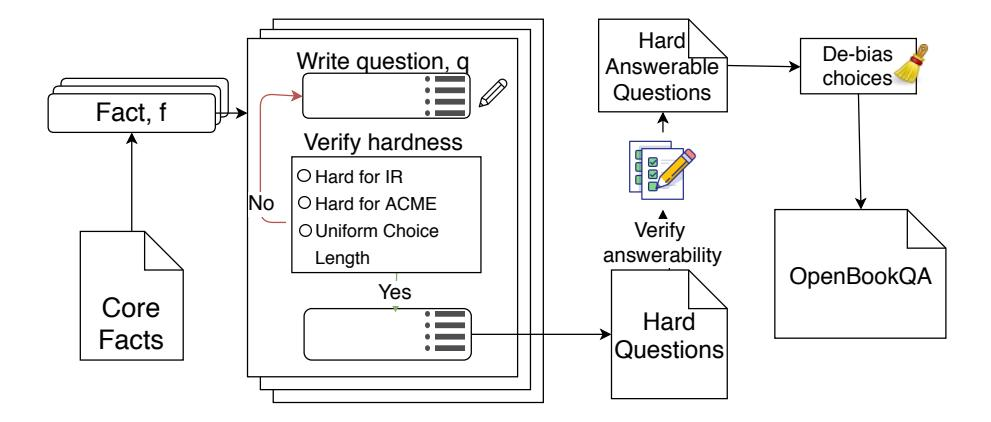

<!-- RP03_Mihaylov_2018 | source: papers_json/RP03_Mihaylov_2018/ -->

## هل يمكن لبدلة من الدروع أن توصل الكهرباء؟ مجموعة بيانات جديدة للإجابة على الأسئلة بنظام الكتاب المفتوح

Todor Mihaylov‡ and Peter Clark† and Tushar Khot† and Ashish Sabharwal†

† معهد ألن للذكاء الاصطناعي، سياتل، واشنطن، الولايات المتحدة الأمريكية. ‡ مجموعة التدريب البحثي AIPHES وجامعة هايدلبرغ، هايدلبرغ، ألمانيا

{peterc,tushark,ashishs}@allenai.org, mihaylov@cl.uni-heidelberg.de

## الملخص

نقدم نوعاً جديداً من مجموعات بيانات الإجابة على الأسئلة، يُسمى OpenBookQA، مصمّماً على غرار اختبارات الكتاب المفتوح لتقييم فهم الإنسان لموضوع معين. الكتاب المفتوح المصاحب لأسئلتنا هو مجموعة من 1326 حقيقة علمية على المستوى الابتدائي. يفحص نحو 6000 سؤال فهم هذه الحقائق وتطبيقها على مواقف جديدة. ويتطلب ذلك الجمع بين حقيقة من الكتاب المفتوح (مثلاً، أن المعادن توصل الكهرباء) ومعرفة عامة واسعة (مثلاً، أن بدلة الدروع مصنوعة من المعدن) مأخوذة من مصادر أخرى. وفي حين أن مجموعات بيانات الإجابة على الأسئلة الموجودة، سواء على المستندات أو قواعد المعرفة، تكون عادةً مكتفية بذاتها وتركز على الفهم اللغوي، فإن OpenBookQA تفحص فهماً أعمق للموضوع—في سياق المعرفة العامة—وللغة التي يُعبَّر بها عنه. أداء البشر على OpenBookQA يقترب من 92%، لكن الكثير من طرائق الإجابة على الأسئلة المدرّبة مسبقاً والمتطورة تؤدي بشكل ضعيف بشكل مفاجئ، أسوأ من عدة خطوط أساس عصبية بسيطة قمنا بتطويرها. تجاربنا التنبؤية (oracle) المصمّمة لتجاوز عنق زجاجة استرجاع المعرفة تُظهر قيمة كل من الكتاب المفتوح والحقائق الإضافية. ونترك حلَّ مشكلة الاسترجاع في هذا الإطار متعدد الخطوات وسدَّ الفجوة الكبيرة مقارنة بالأداء البشري كتحدٍّ مفتوح.

# 1 المقدمة

تُعدّ اختبارات الكتاب المفتوح آلية شائعة لتقييم فهم الإنسان لموضوع معين، حيث يُسمح لمن يخضع للاختبار بحرية الوصول إلى كتاب أو دليل دراسي أو ملاحظات الفصل الدراسي ذات الصلة عند الإجابة على الأسئلة. في هذا السياق، الهدف ليس تقييم الحفظ بل فهم أعمق للمادة وتطبيقها على مواقف جديدة [(Jenkins,](#page-9-0) [1995;](#page-9-0) [Landsberger,](#page-9-1) [1996)](#page-9-1). والتطبيق بدوره يتطلب في الغالب الجمع بين حقيقة في الكتاب (مثلاً، *المعادن توصل الكهرباء*) مع معرفة عامة إضافية يُتوقَّع من المختبَر

## السؤال: *أيٌّ مما يلي يسمح بأكبر قدر من* *الحرارة* *بالمرور عبره؟* أ) بنطال جينز جديد. ب) ملعقة فولاذية في كافيتيريا. ج) حلوى غزل البنات في متجر. د) قبعة قطنية من ماركة Calvin Klein. الحقيقة العلمية: المعدن موصل حراري. المعرفة العامة: الفولاذ مصنوع من المعدن. الحرارة تنتقل عبر الموصل الحراري.

*الشكل 1: مثال لسؤال مع مجموعة من الخيارات والحقائق الداعمة.*

أن يكون قد اكتسبها بحلول هذه المرحلة (مثلاً، *بدلة* *الدروع مصنوعة من المعدن*).

بدافع من هذا الإطار، نقدم نوعاً جديداً من مجموعات بيانات الإجابة على الأسئلة، يُسمى OpenBookQA،[1](#page-0-0) ويتألف من جزأين: Q، وهي مجموعة من 5957 سؤالاً متعدد الخيارات، وF، وهي مجموعة من 1326 حقيقة متنوعة حول العلوم على المستوى الابتدائي. وتمتلك F ثلاث خصائص أساسية للـ"كتاب المفتوح": (أ) تشكّل أساس توليد Q؛ (ب) اعتُبرت محورية للتفسيرات العلمية [(Jansen](#page-9-2) [et al.,](#page-9-2) [2018)](#page-9-2)؛ (ج) F بمفردها تكون عادةً غير كافية للإجابة على أسئلة Q. عند مواجهة سؤال q ∈ Q، يُتوقع من الطالب أو النظام S استرجاع حقيقة ذات صلة f ∈ F، واللجوء إلى معرفته العامة الخاصة، KS، عند تطبيق f للإجابة على q.

يقدم الشكل [1](#page-0-1) مثالاً. هنا، *المعادن* *موصلات حرارية* تُعدّ حقيقة علمية أساسية متاحة في F. وإحدى طرق تطبيق هذه الحقيقة لتحديد ما إذا كانت *ملعقة فولاذية* تسمح بمرور *أكبر قدر من الحرارة* عبرها هي اللجوء إلى المعرفة العامة بأن الفولاذ معدني وأن الحرارة تنتقل عبر الموصلات الحرارية. وبشكل عام، تكون المعرفة العامة المتوقعة بسيطة نسبياً (حقائق تصنيفية،

> ^1^مجموعة البيانات والشيفرة الخاصة بالنماذج متاحة على [http://data.allenai.org/OpenBookQA](http://data.allenai.org/OpenBookQA).

<!-- page 2 -->

تعريفات، خصائص الأشياء، إلخ)؛ وتكمن الصعوبة في تحديدها ودمجها بشكل ذي معنى مع حقيقة أساسية من F للإجابة على السؤال.

أسئلة OpenBookQA صعبة لأنها تتطلب *استدلالاً متعدد الخطوات مع سياق جزئي* مقدَّم بواسطة F. وتحديداً، على عكس مجموعات البيانات الموجودة لفهم القراءة (RC)، والإجابة على الأسئلة في مؤخرة كتاب مدرسي (TQA)،[2](#page-1-0) وكذلك الإجابة على الأسئلة على قواعد المعرفة المنظَّمة (KBQA)، فإن الكتاب المفتوح F المرافق لـOpenBookQA ليس مكتفياً بذاته. لذلك يجب على النظام الناجح تجاوز التحديات النموذجية مثل مطابقة إعادة الصياغة وحلّ المرجعية المشتركة، دون الاستفادة من المعلومات المُعَيَّرة والكاملة في KBQA.

توليد أسئلة كتاب مفتوح مثيرة للاهتمام مهمة صعبة. استخدمنا عملية متعددة المراحل تبدأ بـF، باستخدام التعهيد الجماعي لتوليد أسئلة (مزعجة) بناءً على F تستكشف مواقف جديدة، باستخدام مرشِّح تلقائي لضمان صعوبتها بالنسبة للأنظمة المعتمدة على الاسترجاع والترابط، باستخدام مرشِّح جماعي لضمان قابلية الإجابة عليها من قِبل الشخص العادي، وباستخدام مرشِّح خبير إضافي لضمان جودة أعلى في مجموعتي التطوير والاختبار.

نُقيِّم عدداً من أنظمة الإجابة على الأسئلة العلمية الموجودة (دون إعادة تدريب) على OpenBookQA، ونجد أنها تؤدي بشكل قريب جداً من خط الأساس للتخمين العشوائي البالغ 25%. أما أداء البشر فهو قريب من 92%.[3](#page-1-1)

بدافع من النتائج الحديثة حول قابلية اللعب باستراتيجيات مجموعات بيانات معالجة اللغة الطبيعية [(Gururangan et al.,](#page-9-3) [2018)](#page-9-3)، نطوّر ونقيّم أيضاً خطوط أساس عصبية بسيطة معتمدة على الانتباه تشمل *كاشف الإجابة المعقولة* (الذي يتجاهل نص السؤال تماماً) و*محلِّل الشاذ من بين أربعة*. وتُبرز هذه نتائج التحيز البشري الحتمي في أي مجموعة بيانات معتمدة على التعهيد الجماعي، مما يرفع الأداء على OpenBookQA إلى 48%.

بناءً على نموذج عصبي حديث لدمج المعرفة الخارجية في إعداد إكمال نهاية القصة [(Mihaylov and Frank,](#page-9-4) [2018)](#page-9-4)، نقترح خط أساس عصبي واعٍ بالمعرفة يستطيع استخدام كل من الكتاب المفتوح F والمعرفة العامة المسترجعة من مصادر مثل ConceptNet [(Speer](#page-10-0) [et al.,](#page-10-0) [2017)](#page-10-0). وعلى الرغم من أن استرجاع أكثر أجزاء المعرفة فائدة يبقى تحدياً مفتوحاً، فإن تجاربنا "التنبؤية" مع الحقيقة f المستخدمة أثناء توليد سؤال q وتفسير (من قِبل

مؤلف السؤال) للمعرفة الإضافية k اللازمة لـq، تقدم رؤية قيِّمة حول طبيعة هذه المجموعة من البيانات: حقائق من الكتاب المفتوح F قيِّمة (تحسّن بنسبة 5%) لكنها ليست كافية. واستخدام كل من f وk يرفع الدقة إلى 76%، لكنها لا تزال بعيدة عن مستوى الأداء البشري، مما يشير إلى الحاجة إلى استدلال غير تافه لدمج هذه الحقائق.

لتشجيع المزيد من الأبحاث على هذه المهمة الجديدة، فإن OpenBookQA تتضمن أيضاً، لكل سؤال q في مجموعتي التدريب والتطوير، الحقيقة f كإشارة إشراف وسيطة، يمكن النظر إليها على أنها *تفسير* جزئي لـq. ونترك سدّ الفجوة الكبيرة مقارنة بالأداء البشري كتحدٍّ لمجتمع معالجة اللغة الطبيعية.

# 2 الأعمال ذات الصلة

بحكم بنائها، تتطلب الإجابة على أسئلة OpenBookQA: (1) بعض الحقائق العلمية الأساسية من "كتاب مفتوح" مقدَّم، (2) فهم أوسع للعالم (معرفة عامة أو معرفة الحس السليم)، (3) القدرة على دمج هذه الحقائق (الاستدلال). يختلف هذا الإطار عن العديد من مهام الإجابة على الأسئلة الموجودة، كما هو ملخَّص أدناه.

اقتُرحت مجموعات بيانات فهم القراءة (RC) كمعايير لتقييم قدرة الأنظمة على فهم مستند بالإجابة على أسئلة من نوع الحقائق على هذا المستند. اتخذت هذه المجموعات أشكالاً مختلفة: متعددة الخيارات [(Richardson et al.,](#page-10-1) [2013)](#page-10-1)، نوع الإكمال [(Hermann et al.,](#page-9-6) [2015;](#page-9-6) [Onishi et al.,](#page-10-2) [2016;](#page-10-2) [Hill et al.,](#page-9-7) [2016)](#page-9-7)، وتوقع المدى [(Rajpurkar](#page-10-3) [et al.,](#page-10-3) [2016;](#page-10-3) [Trischler et al.,](#page-10-4) [2017;](#page-10-4) [Joshi et al.,](#page-9-8) [2017)](#page-9-8). غير أن تحليل [(Chen et al.,](#page-9-9) [2016;](#page-9-9) [Sug](#page-10-5)[awara et al.,](#page-10-5) [2017)](#page-10-5) لهذه المجموعات أظهر أن كثيراً من الأسئلة يمكن حلها بمطابقة الرموز السياقية [(Chen et al.,](#page-9-10) [2017a;](#page-9-10) [Weissenborn](#page-10-6) [et al.,](#page-10-6) [2017)](#page-10-6) أو إعادة صياغة بسيطة نسبياً.

للتركيز على المشكلة الأكثر تحدياً المتمثلة في الاستدلال عبر الجمل، اقتُرحت مجموعات بيانات جديدة لـRC متعدد الخطوات. استخدمت QAngaroo [(Welbl et al.,](#page-10-7) [2018)](#page-10-7) قاعدة معرفة لتحديد أزواج الكيانات (s, o) ذات العلاقة المعروفة r، التي يدعمها أيضاً مسار متعدد الخطوات في مجموعة من المستندات. واستخدموا استعلامات ثلاثية منظَّمة (s, r, ?) واستخدموا جميع المستندات على طول المسار كنص الإدخال. NarrativeQA [(Kocisky et al.](#page-9-11) ´ , [2017)](#page-9-11) هي مجموعة بيانات RC تَبيَّن أنها تتطلب استدلالاً تكرارياً حول سرد قصة. مثلها مثل OpenBookQA، تم توليد الأسئلة لضمان أن الإجابة ليست مطابقة مباشرة أو إعادة صياغة

> ^2^فقط ∼5% من أسئلة TQA لـ[Kembhavi et al.](#page-9-5) [(2017)](#page-9-5) تتطلب معرفة عامة إضافية.

> ^3^لتجنب الغموض في مصطلح "الأداء البشري"، يصف القسم [3.2](#page-3-0) النموذج العشوائي المحدد الذي نستخدمه.

<!-- page 3 -->

يمكن استرجاعها بنهج استرجاع المعلومات. حديثاً، اقترح [Khashabi et al.](#page-9-12) [(2018)](#page-9-12) MultiRC، وهي مجموعة بيانات RC متعددة الخيارات مصمَّمة لتتطلب استدلالاً متعدد الجمل ويمكن أن تحتوي على عدة إجابات صحيحة. ومرة أخرى، مثل أغلب مجموعات RC، فهي مكتفية بذاتها.

المهام ذات المعرفة الخارجية. بينما يمكن أن تستفيد العديد من مجموعات بيانات RC من معرفة الحس السليم أو المعرفة الخلفية، فإنها مصمَّمة لتكون مكتفية بذاتها، أي قابلة للحل بسياق المستند فقط. مجموعات بيانات مثل اختبار إكمال القصة [(Mostafazadeh et al.,](#page-10-8) [2016)](#page-10-8)، وMCScript،[4](#page-2-0) وProPara [(Mishra et al.,](#page-10-9) [2018)](#page-10-9) تتطلب فعلاً معرفة مجال إضافية حول الأحداث اليومية، والسيناريوهات، والعمليات، على التوالي. غير أن هذه المجموعات تحتاج إلى نمذجة خاصة بالمجال للأحداث، في حين أن OpenBookQA تستند إلى معرفة عامة واسعة تمتد عبر مجموعة متنوعة من الأنواع والمواضيع.

يستكشف [Stasaski and Hearst](#page-10-10) [(2017)](#page-10-10) إنشاء أسئلة متعددة الخطوات ويقترحان توليد مشتتات أقوى لإطار الاختيار من متعدد. غير أن عملهما يبدأ بمعرفة منظَّمة، وتحديداً أنطولوجيا في علم الأحياء.

أخيراً، تم إصدار العديد من مجموعات بيانات الإجابة على الأسئلة العلمية (مثلاً [Clark et al.,](#page-9-13) [2016,](#page-9-13) [2018)](#page-9-14) والتي تحتاج إلى معرفة خارجية واسعة للإجابة على الأسئلة. غير أن هذه الأسئلة ليست مرتبطة بمجموعة أساسية من الحقائق، أي "كتاب مفتوح" يُستخدم لتعريف هذه الأسئلة. ونتيجةً لذلك، تتباين الأسئلة بشكل واسع في الأسلوب والتعقيد [(Clark et al.,](#page-9-14) [2018)](#page-9-14). في المقابل، تركّز OpenBookQA على مجموعة فرعية محددة بشكل أفضل من الإجابة على الأسئلة العلمية، مستندة إلى حقيقة أساسية واحدة من الكتاب المفتوح وحقيقة (أو حقائق قليلة) داعمة معروفة عموماً وبسيطة نسبياً.

# 3 مجموعة بيانات OpenBookQA

تتألف مجموعة بيانات OpenBookQA من نحو 6000 سؤال متعدد الخيارات بأربع إجابات، يرتبط كل منها بحقيقة أساسية واحدة من "كتاب" F يضم 1326 حقيقة من هذا النوع، ومجموعة مساعدة K تضم نحو 6000 حقيقة إضافية. أُنشئت الأسئلة عبر عملية متعددة المراحل من التعهيد الجماعي والتصفية الجزئية بواسطة الخبراء، ويُناقَش ذلك في القسم [3.1.](#page-2-1)

يتألف "الكتاب" الصغير F من مواضيع ومبادئ علمية متكررة، يمكن (وهنا تم) تجسيد كلٍّ منها في أسئلة متعددة.

بالنسبة لـF، نستخدم مجموعة فرعية من مجموعة WorldTree التي حلَّلها [Jansen et al.](#page-9-2) [(2018)](#page-9-2) من حيث كفايتها للعلوم على المستوى الابتدائي. والمجموعة الفرعية المستخدمة مأخوذة من 2287 حقيقة WorldTree التي وَسَمها المؤلفون الأصليون بأنها "محورية" في تفسير واحد على الأقل. وقمنا بتصفيتها أكثر إلى 1326 حقيقة تبدو عامة بما يكفي لتكون قابلة للتطبيق على مواقف متعددة.

تتطلب OpenBookQA إضافيًا معرفة عامة واسعة، يُتوقَّع أن تأتي من مجموعات نصوص كبيرة، مثل ConceptNet أو ويكيبيديا أو مجموعة نصوص تضم 14 مليون جملة متعلقة بالعلوم تستخدمها بعض خطوط الأساس الموجودة. كما تطلب عملية التعهيد الجماعي أدناه من العمال وضع علامة على حقيقة ثانية k، لازمة لكل سؤال q، بالإضافة إلى f. وللأسف، كانت هذه الحقائق الثانية في الغالب ناقصة، أو زائدة، أو ذات صلة بعيدة فقط بـq. لذلك ندرج في OpenBookQA مجموعة K من هذه الحقائق الثانية فقط كـ*بيانات مساعدة* للاستخدام الاختياري. ونؤكد أنه لا ينبغي النظر إلى K على أنها حقائق إضافية "ذهبية"، أو بديلاً عن المعرفة العامة الواسعة.

## 3.1 عملية التعهيد الجماعي

تتلخص خط أنابيب توليد الأسئلة وتصفيتها بشكل عام في الشكل [2.](#page-3-1) بالنظر إلى "الكتاب" F من الحقائق الأساسية، تسير العملية كما يلي، بدءاً بمجموعة أسئلة فارغة Qs ومجموعة "حقائق ثانية" فارغة K:

- 1. يُعرض على عامل التعهيد الجماعي[5](#page-2-2) w حقيقة علمية عشوائية f من المجموعة F.
- 2. يُطلب من w التفكير في حقيقة شائعة ثانية، k، يمكن دمجها مع f لاستنتاج تأكيد جديد صالح s.
- 3. ثم يحوِّل w الـs إلى زوج من السؤال والإجابة ويوسعه إلى سؤال متعدد الخيارات بأربع خيارات بإضافة 3 خيارات إجابة غير صحيحة، qmc = (q, {c1, c2, c3, c4})، حيث يكون أحد الـci هو الإجابة الصحيحة الفريدة.
- 4. يتحقق النظام من أن qmc يجتاز الفحوصات الأساسية مثل تجانس خيارات الإجابة.[6](#page-2-3)
- 5. ثم يُغذِّي w السؤال متعدد الخيارات qmc إلى محلِّل استرجاع المعلومات [(Clark et al.,](#page-9-13)

> ^4^SemEval-2018 Task 11: Machine Comprehension using Commonsense Knowledge [https://competitions.](https://competitions.codalab.org/competitions/17184) [codalab.org/competitions/17184](https://competitions.codalab.org/competitions/17184)

> ^5^استخدمنا Amazon Mechnical Turk، مع عمال من أمريكا الشمالية ومؤهَّلين بمستوى "masters".

> ^6^تحديداً، يبحث عن: 1) أربعة خيارات إجابة بالضبط؛ 2) عدم وجود كلمات نفي تخدع خطوط الأساس بشكل تافه (no, none, not, isn't, doesn't, aren't, don't, won't, except, can't, shouldn't, wouldn't, couldn't, mustn't)؛ 3) طول موحَّد لخيارات الإجابة: جميعها بحدّ أقصى 3 كلمات أو على الأقل 4 كلمات.

<!-- page 4 -->

*الشكل 2: خط أنابيب توليد أسئلة OpenBookQA*

2016) ومحلِّل قائم على ترابط الكلمات (Turney, 2017)، ويتحقق من (أ) أن أياً منهما لا يجيب q_{\rm mc} بشكل صحيح و(ب) أن أعلى 3 جمل مسترجعة بـIR غير كافية للإجابة على q_{\rm mc}؛ وإذا لم يتحقق ذلك، يُحرَّر السؤال ويُعاد المحاولة.

- 6. يُعرض السؤال q_{\rm mc} على 5 عمال تعهيد جماعي جدد، يُطلب منهم الإجابة عليه.
- 7. إذا أجاب 4 عمال على الأقل من بين 5 على q_{\rm mc} بشكل صحيح، فإنه يُعدّ قابلاً للإجابة وتستمر العملية. وإذا لم يحدث ذلك، يُحذف q_{\rm mc}.
- 8. تُخلط خيارات إجابة q_{\rm mc} عشوائياً لتجنب التحيز غير المقصود.7
- 9. يُربط q_{\text{mc}} مع f كحقيقة علمية أساسية ويُضاف إلى مجموعة الأسئلة Q. ويُضاف k إلى مجموعة K من الحقائق الإضافية (المزعجة).

تم تصفية تقسيمات التطوير والاختبار أكثر بواسطة خبير داخلي لضمان جودة أعلى.

## 3.2 الأداء البشري

لتقييم دقة البشر على هذه المجموعة، نأخذ بالنموذج التالي: لكل سؤال q \in \mathcal{Q} توجد دقة بشرية (غير معروفة) p_q، تُعرَّف بأنها احتمال أن يجيب موضوع بشري عشوائي، يُختار بشكل موحد من مجموعة كبيرة \mathcal{H}، على q بشكل صحيح. وعليه، يمكن اعتبار هذا تعريفاً لمتغير عشوائي برنوللي X_q \sim B(p_q)، ومتوسطه (غير المعروف) p_q. ومتوسط الدقة البشرية على \mathcal{Q} ضمن هذا النموذج هو:

$$ H(\mathcal{Q}) = \frac{1}{|\mathcal{Q}|} \sum_{q \in \mathcal{Q}} p_q $$

حيث \{p_q \mid q \in \mathcal{Q}\} غير معروفة.

مع \mathcal{H} كمجموعة عمال التعهيد الجماعي (راجع الحاشية 5)، تكون الخطوة 6 من عملية توليد

الأسئلة المذكورة أعلاه مكافئة للحصول على 5 عينات مستقلة، X_{q,i}, i \in I, |I| = 5، من B(p_q). غير أنه يجب توخي الحذر عند استخدام هذه البيانات لتقدير p_q، لأن نفس العينات الخمس استُخدمت لتحديد ما إذا كان q يدخل مجموعة الأسئلة \mathcal Q أم لا. على سبيل المثال، إذا احتفظنا فقط بالأسئلة التي أجاب عنها جميع العمال الخمسة بشكل صحيح، فإن من الواضح أنه سيكون من غير الدقيق ادّعاء أن الدقة البشرية على \mathcal Q هي 100%. ومع ذلك، من الممكن إعادة استخدام أحكام الخطوة 6 لتقريب H(\mathcal Q) بثقة عالية، دون طرح الأسئلة على عمال جدد.

بدهياً، إذا كانت جميع الأسئلة في \mathcal{Q} صعبة الإجابة (أي، جميع p_q صغيرة)، فإنه من غير المرجح أن جميع |\mathcal{Q}| الأسئلة ستجتاز الاختبار في الخطوة 6. ويمكننا استخدام عكس التناقض لهذه الملاحظة لاستنتاج أن p_q، في المتوسط، يجب أن يكون عالياً لـq \in \mathcal{Q}.

رسمياً، التجميع عبر جميع الأسئلة يعطي التقدير التجريبي التالي لـH(Q):

$$
\tilde{H}(\mathcal{Q}) = \frac{1}{|\mathcal{Q}|} \sum_{q \in \mathcal{Q}} \frac{1}{|I|} \sum_{i \in I} X_{q,i}= \frac{1}{|\mathcal{Q}||I|} \sum_{q \in \mathcal{Q}, i \in I} X_{q,i}
$$

للتحليل، نفترض أن جميع العينات X_{q,i} مستقلة، أي أن كل إجابة تُحصَّل بشكل مستقل.8 تطبيق متباينة هوفدنغ (Hoeffding, 1963) يُظهر أن \tilde{H}(\mathcal{Q}) يتقارب نحو H(\mathcal{Q}) بسرعة كبيرة كلما نما n=|\mathcal{Q}||I|؛ وتحديداً، \tilde{H}(\mathcal{Q}) \leq H(\mathcal{Q}) + t باحتمال لا يقل عن 1-\exp(-2nt^2)؛ وبالمثل لـ\tilde{H}(\mathcal{Q}) \geq H(\mathcal{Q}) - t. في مجموعتي التطوير والاختبار لدينا، حيث |\mathcal{Q}| = 500 و|I| = 5، يُترجَم ذلك إلى أن H(\mathcal{Q}) لا يقل عن

> ^^{7}^كان الخيار "A" هو الإجابة الصحيحة في 69% من الأسئلة بنهاية الخطوة 4.

> ^&^lt;sup>8واقعياً، هناك بعض الترابط عبر الأسئلة لأن عاملاً واحداً قد يجيب على أسئلة متعددة. ونترك تحليلاً رسمياً لهذا الإطار كعمل مستقبلي.

<!-- page 5 -->

H˜ (Q) − 3% باحتمال يفوق 98.8% وعلى الأقل H˜ (Q) − 2.5% باحتمال 95.6%؛ ونُفيد بالأول بصفته تقديراً متحفظاً للأداء البشري.

## 3.3 تحليل مجموعة الأسئلة

تتألف OpenBookQA من 5957 سؤالاً، بتقسيم 4957/500/500 لمجموعات التدريب/التطوير/الاختبار.[9](#page-4-0) يلخص الجدول [1](#page-4-1) بعض الإحصائيات حول مجموعة البيانات الكاملة. كل سؤال يحتوي على أربعة خيارات إجابة بالضبط وحقيقة واحدة مرتبطة استُخدمت في عملية الإنشاء. ونُفيد بالطول المتوسط للأسئلة، والخيارات المرشَّحة، والحقائق المرتبطة، فضلاً عن عدد المرات التي يكون فيها الخيار الأطول/الأقصر هو الإجابة الصحيحة.

حلَّلنا 100 سؤال في مجموعة التدريب لالتقاط نوع المعرفة العامة والاستدلال المطلوبَين. ولكل منها، دوَّنا المعرفة العامة الإضافية اللازمة للإجابة على هذا السؤال *إضافةً* إلى الحقيقة العلمية الأصلية. في 21% من الحالات، يختبر السؤال المعهَّد فعلياً حقيقة لا تحتاج بالضرورة إلى الحقيقة العلمية الأصلية. على سبيل المثال، السؤال: "في يوم ممطر، تكون الغيوم (A) منخفضة (B) بيضاء (C) صغيرة (D) رمادية" كُتب بناءً على الحقيقة العلمية "الغيوم تنتج المطر" لكنه لا يحتاج إلى هذه الحقيقة للإجابة عليه. ونتجاهل مثل هذه الأسئلة في تحليلنا. للأسئلة المتبقية، صنفنا الحقائق الإضافية إلى خمس فئات عالية المستوى (وأدمجنا الحقائق المتبقية في فئة شاملة OTHERS) بناءً على الأساليب السابقة على أسئلة علمية مشابهة [(Clark et al.,](#page-9-14) [2018;](#page-9-14) [Jansen et al.,](#page-9-16) [2016)](#page-9-16):

1. ISA: حقائق تصنيفية أساسية مثل isa(tree,

living thing)، isa(granite, rock).

- 2. PROPERTY: خصائص الأشياء مثل madeof(belt buckle, metal)، has(mammals, four legs)، contains(lemon juice, citric acid).
- 3. DEFINITION: تعريفات الأشياء التي قد تكون مبنية على مظهرها (الشريط هو بلاستيك مع علامات)، أو آلية عملها (التلسكوب جهاز يستخدم المرايا لرؤية الأشياء)، إلخ.
- 4. CAUSAL: حقائق سببية مثل causes(adding lemon juice to milk, milk to break down).
- 5. BASIC: حقائق علمية عامة لا تتلاءم مع ما سبق، مثل السناجب تأكل المكسرات للغذاء.

يقدم الجدول [2](#page-4-2) نسب هذه الحقائق في مجموعة الأسئلة التي حلَّلناها. لكل نوع من الحقائق، نحسب النسبة المئوية للأسئلة التي تحتاج إلى حقيقة واحدة على الأقل من هذا النوع (مُعرَضة بـ% Questions). ونحسب أيضاً النسبة الإجمالية لكل نوع من الحقائق عبر جميع حقائق المعرفة العامة (مُعرَضة بـ% Facts). معظم أسئلتنا تحتاج إلى حقائق بسيطة مثل معرفة isa وخصائص الأشياء، مما يؤكد أكثر الحاجة إلى استدلال بسيط مع المعرفة العامة. وبصرف النظر عن هذه الفئات الخمس الرئيسية للحقائق، فإن فئة OTHERS الشاملة تحتوي على حقائق الحس السليم (مثلاً، الظلام يخيِّم في الليل)، ومعرفة العالم (مثلاً، اليابان كثيراً ما تضربها الزلازل) وإعادة الصياغة المعجمية[10](#page-4-3) (مثلاً، *ad infinitum* تعني مراراً وتكراراً).

معظم أسئلتنا تحتاج إلى حقائق بسيطة من المفترض أن تكون قابلة للاسترجاع بسهولة من أي قاعدة معرفة/مجموعة نصية. وفي المتوسط، احتاج كل سؤال إلى 1.16 حقيقة إضافية متجاهلين أي تباينات لغوية. وعلى الرغم من بساطة المعرفة المطلوبة لهذه الأسئلة، كما نُظهر

> ^9^في المجموع، جُمع 8140 سؤالاً، استُبعد 2183 منها في الخطوة 7 من التعهيد الجماعي.

> ^10^بالطبع، كل سؤال شهد تباينات معجمية. وقد أشَّرنا عليها فقط عندما كان هذا هو التغيير *الوحيد* عن الحقيقة الأساسية.

<!-- page 6 -->

تجريبياً، فإن معظم نُهج خطوط الأساس تحقق درجة منخفضة نسبياً على هذه المجموعة (حتى عندما تُقدَّم الحقيقة الأساسية). ونحن ندّعي أن السبب في ذلك هو حقيقة أن الاستدلال اللازم للإجابة على هذه الأسئلة ليس تافهاً. يُظهر الجدول [3](#page-6-0) بعض الأسئلة مع الحقائق المرتبطة والاستدلال عالي المستوى المطلوب للإجابة عليها. وبافتراض أن النموذج يستطيع استخراج العلاقات الموصوفة (مثلاً defn، contains)، فإن نظام الإجابة على الأسئلة لا يزال يحتاج إلى أن يكون قادراً على ربط هذه الحقائق معاً، وتحديد العلاقة الناتجة، والتحقق من تعبيرها لكل خيار. وفي الحالة القصوى (كما في المثال الأخير)، حتى وإن كانت حقيقة إضافية واحدة فقط لازمة للإجابة على السؤال، فإنه يحتاج إلى نظام يستطيع *تطبيق* الحقيقة العلمية "العامة" الأساسية على موقف "محدد".

# 4 نماذج خط الأساس

نُقيِّم أداء عدة أنظمة خط أساس على مجموعتي التطوير والاختبار من OpenBookQA. لكل سؤال، يحصل المحلِّل على نقطة واحدة في هذه الدرجة إذا اختار الإجابة الصحيحة، و1/k إذا أبلغ عن تعادل من k اتجاهات يتضمن الإجابة الصحيحة. وعليه، فإن خط الأساس "Guess All"، الذي يخرج دائماً تعادلاً بأربعة اتجاهات، يحقق درجة 25%، نفس الأداء المتوقع لخط أساس عشوائي موحَّد.

## 4.1 بدون تدريب، معرفة خارجية فقط

بما أن OpenBookQA هي مجموعة من الأسئلة العلمية على المستوى الابتدائي، فإن إحدى فئات خط الأساس الطبيعية هي الأنظمة الموجودة التي ثبتت فعاليتها على اختبارات العلوم على مستوى الابتدائي والإعدادي. غير أن هذه الأنظمة المدرَّبة مسبقاً تعتمد فقط على معرفتها الخلفية ولا تأخذ في الاعتبار مجموعة F من الحقائق الأساسية. علاوة على ذلك، فإن مصادر معرفتها وآلية الاسترجاع قريبة من تلك التي يستخدمها محلِّل IR والذي، حسب التصميم، مضمون أن يفشل على OpenBookQA. هذان الجانبان يضعان حداً طبيعياً لفعالية هذه المحلِّلات على OpenBookQA، رغم ملاءمتها الممتازة لمجال الأسئلة العلمية متعددة الخيارات. ننظر في أربعة محلِّلات من هذا النوع.

PMI [(Clark et al.,](#page-9-13) [2016)](#page-9-13) يستخدم المعلومات المتبادلة النقطية (PMI) لتسجيل كل خيار إجابة باستخدام إحصائيات بناءً على مجموعة نصوص بحجم 280 جيجابايت من النص العادي. ويستخرج الـunigrams، bigrams، trigrams، وskip-bigrams من السؤال q وكل خيار إجابة c^i^. ويُسجَّل كل خيار إجابة بناءً على متوسط PMI عبر جميع أزواج السؤال

وn-grams الإجابة.

TableILP [(Khashabi et al.,](#page-9-17) [2016)](#page-9-17) هو نظام استدلال قائم على البرمجة الخطية الصحيحة (ILP) مصمَّم للأسئلة العلمية. يعمل على جداول علاقات شبه منظَّمة من المعرفة. ويُسجِّل كل خيار إجابة بناءً على "رسم الدعم" الأمثل (كما حدده هدف ILP) الذي يربط السؤال بهذه الإجابة عبر صفوف الجدول. غير أن المجموعة الصغيرة من جداول المعرفة هذه تؤدي في الغالب إلى نقص في المعرفة، مما يجعل TableILP لا يجيب على 24% من أسئلة OpenBookQA إطلاقاً.

TupleInference [(Khot et al.,](#page-9-18) [2017)](#page-9-18)، وهو أيضاً نظام إجابة على الأسئلة قائم على ILP، يستخدم ثلاثيات Open IE [(Banko et al.,](#page-9-19) [2007)](#page-9-19) كتمثيلٍ شبه منظَّم. ويبني هذه الثلاثيات subject-verb-object *في الوقت الفعلي* باسترجاع نص لكل سؤال من مجموعة نصوص كبيرة. ثم يُعرِّف برنامج ILP لدمج الأدلة من ثلاثيات متعددة.

DGEM [(Khot et al.,](#page-9-20) [2018)](#page-9-20) هو نموذج استلزام عصبي يستخدم أيضاً Open IE لإنتاج تمثيل شبه منظَّم. نستخدم تكييف هذا النموذج للإجابة على الأسئلة متعددة الخيارات الذي اقترحه [Clark et al.](#page-9-14) [(2018)](#page-9-14)، الذي يعمل كما يلي: (1) تحويل q وكل c^i^ إلى فرضية h^i^، وكل حقيقة مسترجعة إلى مقدمة p^j^؛ (2) إعادة خيار الإجابة ذي أعلى درجة استلزام، arg max^i^ e(p^j^, hi).

## 4.2 بدون تدريب؛ F ومعرفة خارجية

ننظر أيضاً في تقديم مجموعة F من الحقائق الأساسية إلى محلِّلَيْن موجودَيْن: محلِّل IR لـ[Clark et al.](#page-9-13) [(2016)](#page-9-13) (لتقييم مدى ما يمكن أن يحققه التداخل البسيط للكلمات)، ومحلِّل TupleInference.

## 4.3 نماذج مدرَّبة، بدون معرفة

ننظر في عدة نماذج خط أساس عصبية يتم تدريبها باستخدام مجموعة التدريب من OpenBookQA. لتسهيل الشرح، نُعرِّف أولاً الترميز المستخدم في نماذجنا. لسؤال معين qmc = (q, {c1, c2, c3, c4})، نُعرِّف مجموعة تسلسلات الرموز، S = {q, c1, c2, c3, c4}. لكل تسلسل رمز s ∈ S، يكون w s j هو الـj الرمز وe s ^j^ = Emb(w s j) هو التضمين لهذا الرمز. نستخدم n^s^ للإشارة إلى عدد الرموز في s وd لأبعاد التضمينات.[11](#page-5-0) نُنمذِج الإجابة على الأسئلة متعددة الخيارات كتصنيف متعدد الفئات: بالنظر إلى qmc، نتنبأ بإحدى علامات الفئات الأربع L =

> ^11^لجميع التجارب نستخدم d = 300 *GloVe* [(Pennington](#page-10-12) [et al.,](#page-10-12) [2014)](#page-10-12) من التضمينات المدرَّبة مسبقاً على 840 مليار رمز من *Common Crawl* (https://nlp.stanford.edu/projects/glove/).

<!-- page 7 -->

\{1, 2, 3, 4\}، حيث العلامة الحقيقية هي مؤشر الإجابة الصحيحة.

التضمينات + التشابهات كميزات. نُجري التجربة أولاً مع نموذج انحدار لوجستي بسيط (Mihaylov and Nakov, 2016; Mihaylov and Frank, 2016, 2017) يستخدم متجهات القلب r_s^{\text{emb}} لتضمينات الكلمات للرموز في s، ثم يحسب التشابهات بجيب التمام بين السؤال وكل خيار إجابة، r_{a,c}^{\cos}:

$$
r_s^{\text{emb}} = \frac{1}{n_s} \sum_{j=1}^{n_s} e_{s_j} \in \mathbb{R}^dr_{q,c_i}^{\cos} = \cos(r_q^{\text{emb}}, r_{c_i}^{\text{emb}}) \in \mathbb{R}^1
$$

لكل مثال تدريب، نبني تمثيل ميزات \vec{f} بدمج هذه المتجهات وندرّب مصنِّف انحدار لوجستي L2:

$$
\vec{f} = [r_q^{\text{emb}}; r_{c_{1..4}}^{\text{emb}}; r_{q,c_{1..4}}^{\text{cos}}] \in \mathbb{R}^{5d+4}
$$

**خطوط أساس BiLSTM Max-Out.** كخط أساس عصبي بسيط، نكيِّف نموذج *BiLSTM max-out* (Conneau et al., 2017) لمهمتنا للإجابة على الأسئلة. أي أننا نُرمِّز أولاً رموز السؤال ورموز الخيار w_{1...n_s}^s، بشكل مستقل بمشفِّر سياق ثنائي الاتجاه (LSTM) للحصول على تمثيل سياق (ctx) h_{s_{1...n_s}}^{\rm ctx} = {\rm BiLSTM}(e_{1...n_s}^s) \in \mathbb{R}^{n_s \times 2h}. بعد ذلك، نُجري عملية تجميع عنصري max على التمثيلات المُرمَّزة h_{s_{1...n_s}}^{\rm ctx} لبناء متجه واحد:

$$ r_s^{\text{ctx}} = \max(h_{s_{1...s_s}}^{\text{ctx}}) \in \mathbb{R}^{2h}. (1) $$

بالنظر إلى التمثيلات السياقية لكل تسلسل رمز، نُجري التجربة مع ثلاث تكوينات لاستخدام هذه التمثيلات للإجابة على الأسئلة:

(أ) كاشف الإجابة المعقولة. هذا الخط الأساس يذهب إلى الحدّ الأقصى من تجاهل q تماماً ومحاولة تعلم مدى معقولية أن يكون c_i الإجابة الصحيحة على *سؤال ما* في هذا المجال. ويلتقط هذا حقيقة أن خيارات معينة مثل "مكان سحري" أو "قطط طائرة" من غير المرجح جداً أن تكون الإجابة الصحيحة على سؤال علمي بدون نفي (وهو الحال في OpenBookQA).

نُنفِّذ كاشف الإجابة المعقولة باستخدام نموذج *الخيار فقط* للتنبؤ بالإجابة بالحصول على درجة \alpha_{c_i} كما يلي: \alpha_{c_i} = W_c^T r_{c_i}^{\text{ctx}} \in \mathbb{R}^1، حيث W_c^T \in \mathbb{R}^{2h} هو متجه أوزان مُحسَّن أثناء التدريب، وi = \{1..4\} هو مؤشر الخيار. للحصول على خيار الإجابة من مجموعة درجات الخيار \alpha_{c_{1..4}} باستخدام \arg\max(\text{softmax}(\alpha_{c_{1..4}}))، حيث \operatorname{softmax}(\alpha_{c_i}) = \frac{\exp(\alpha_{c_i})}{\sum_{i=1}^4 \exp(\alpha_{c_i})} كالمعتاد.

**(ب) محلِّل الشاذ من بين أربعة.** يأخذ في الاعتبار جميع خيارات الإجابة الأربعة معاً ويختار الذي يكون أقل تشابهاً مع الباقين. يلتقط هذا التحيز في الأسئلة المؤلَّفة من قِبل البشر الناتج عن حقيقة أن إنشاء إجابات غير صحيحة عالية الجودة هو أمر صعب. عادةً يبدأ العمال بالإجابة الصحيحة، ثم يأتون بثلاث إجابات غير صحيحة. وغالباً ما تميل هذه الأخيرة إلى أن تكون متجانسة أو تشترك في خصائص مشتركة أخرى (مثلاً، مصطلحات غير علمية) غير معتادة في الإجابة الصحيحة.

نُنفِّذ هذا باستخدام نموذج انتباه *الخيار إلى الخيارات*. لكل خيار c_i، نحسب الانتباه إلى الخيارات الأخرى كـ\alpha_{c_i,c_j}. ثم نجمع قيم الانتباه هذه لحساب الانتباه لـc_i إلى بقية الخيارات، \alpha_{c_i2c_{r(est)}}، ونُعيد الخيار ذا أقل مجموع. ويُحسب الانتباه

<!-- page 8 -->

كما يلي: \alpha_{c_i,c_j} = \operatorname{Att}(r_{c_i}^{\operatorname{ctx}},r_{c_j}^{\operatorname{ctx}}) حيث

$$ Att(u, v) = W^{T}([u; v; u \cdot v; |u - v|]) \in \mathbb{R}^{1} $$

هي دالة انتباه خطية وW \in \mathbb{R}^{8h} هو متجه أوزان. ثم نحسب \alpha_{c_i 2c_{r(est)}} = \sum_{j=1}^4 \alpha_{c_i,c_j} \ (j \neq i) ونختار الإجابة بالمؤشر a_{c2c_r} = \arg\min(\operatorname{softmax}(\alpha_{c_1...42c_r})).

(ج) مطابقة السؤال. يحاول هذا المحلِّل التنبؤ بأي خيار يطابق السؤال أفضل (Nakov et al., 2016)، دون الاعتماد على المعرفة الخارجية. لتحقيق ذلك، نحسب درجة انتباه \alpha_{q,c_i} بين q وكل من الخيارات q_i كما يلي: \alpha_{q,c_i} = \operatorname{Att}(r_q^{\operatorname{ctx}}, r_{c_i}^{\operatorname{ctx}})، ونختار الذي له أعلى درجة. ونُجري التجربة أيضاً مع نموذج حيث يتم الحصول على r_q^{\operatorname{ctx}} وr_{c_i}^{\operatorname{ctx}} باستخدام التفاعل الرمزي المقترح في ESIM (Chen et al., 2017b).

## 4.4 نموذج مدرَّب مع معرفة خارجية

أخيراً، نُنفِّذ نموذجاً من مرحلتين لدمج المعرفة العامة الخارجية K. الوحدة الأولى تُجري استرجاع المعلومات على K لاختيار مجموعة فرعية بحجم ثابت من الحقائق المحتمل أن تكون ذات صلة K_{Q,C} لكل مثال في مجموعة البيانات (راجع الملحق A). والوحدة الثانية هي شبكة عصبية تأخذ (Q, C, K_{Q,C}) كمدخل للتنبؤ بالإجابة a_{q,c} لسؤال Q من مجموعة الخيارات C.

**القارئ المُعزَّز بالمعرفة.** كنموذج أساسي واعٍ بالمعرفة، نستخدم متغيراً من نموذج Mihaylov and Frank (2018)، يُنفَّذ بتوسيع خط أساس مطابقة السؤال BiLSTM max-out (ج). لكل مثال يقرأ النموذج السؤال q والإجابات c_{1..4} بشكل مستقل ويلتفت إلى مجموعة حقائق المعرفة الخارجية المسترجعة K_{Q,C}. نُرمِّز كل حقيقة k_i من K_{Q,C} = k_{1..N_k} (N_k هو عدد الحقائق) بنفس BiLSTM المستخدمة لـq وc_{1..4} ونبني متجهاً واحداً r_{k_j}^{\text{ctx}} \in \mathbb{R}^{2h} باستخدام المعادلة 1. وامتلاك مثل هذه التمثيلات لكل k_j يؤدي إلى مصفوفة ذاكرة معرفة M_k = r_{k_1..N_k}^{\text{ctx}} \in \mathbb{R}^{N_k \times 2h}. لاحظ أن M_k هي ذاكرة ديناميكية، خاصة بكل مثال في الدفعة وتُرمَّز في كل خطوة أثناء التدريب. وتُستخدم هذه الذاكرة لحساب تمثيل واعٍ بالمعرفة، r_s^{\rm kn} = \sum ((M_k^T r_s^{\rm ctx}).M_k) \in \mathbb{R}^{2h}. كل تمثيل سياق (ctx) r_s^{\text{ctx}} (s \in S) يُدمج مع r_s^{\rm kn} للحصول على تمثيل مُعزَّز بالمعرفة r_s^{\rm ctx+kn}=(r_s^{\rm ctx}+r_s^{\rm kn})/2. ثم نُنمذِج الانتباه المُعزَّز بالمعرفة \alpha_{q,c_i}^{\rm kn} بين

q وc_i كتركيبة خطية من تمثيلات ctx وkn وctx + kn كما يلي:

$$
\begin{split}
\alpha_{q,c_i} &= W^T[\text{Att}(r_s^{\text{ctx}}, r_{c_i}^{\text{ctx}}); \text{Att}(r_s^{\text{kn}}, r_{c_i}^{\text{kn}}); \\
&\quad \text{Att}(r_s^{\text{ctx}+\text{kn}}, r_{c_i}^{\text{ctx}}); \text{Att}(r_s^{\text{ctx}}, r_{c_i}^{\text{ctx}+\text{kn}}); \\
&\quad \text{Att}(r_s^{\text{ctx}}, r_{c_i}^{\text{kn}}); \text{Att}(r_s^{\text{kn}}, r_{c_i}^{\text{ctx}}); \\
&\quad \text{Att}(r_s^{\text{ctx}+\text{kn}}, r_{c_i}^{\text{kn}}); \text{Att}(r_s^{\text{kn}}, r_{c_i}^{\text{ctx}+\text{kn}}); \\
&\quad \text{Att}(r_s^{\text{ctx}+\text{kn}}, r_{c_i}^{\text{ctx}+\text{kn}})],
\end{split}
$$

حيث W \in \mathbb{R}^9 هو متجه أوزان مُهيَّأ بمتجه *الواحدات* ومُحسَّن أثناء التدريب. ثم نختار الإجابة c_i ذات أعلى درجة.

# 5 أداء خط الأساس

النتائج لمختلف نماذج خط الأساس مُلخَّصة في الجدول 4، مُجمَّعة حسب فئة الطريقة. ونُجري بضع ملاحظات:

أولاً، المهمة **قابلة للحل بشكل كبير من قِبل الشخص العادي**، كما يدلّ على ذلك الأداء البالغ 92% لعمال التعهيد الجماعي. ويُقاس هذا كما هو موصوف في القسم

<!-- page 9 -->

[3.2.](#page-3-0) نستخدم التعليقات التوضيحية من الخطوة 6 من عملية توليد الأسئلة ونُفيد بـH˜ (Q)−3% كتقدير سفلي متحفظ. وكتقييم إضافي، حصلنا أيضاً على 5 تعليقات توضيحية *جديدة* لـ100 سؤال مختار عشوائياً من كل من مجموعات التدريب والتطوير والاختبار. وظل الأداء مماثلاً عند 88.6% و90.2% و91.6% على التوالي.

تُظهر المجموعة الثانية أن المحلِّلات المدرَّبة مسبقاً والمتطورة للأسئلة العلمية متعددة الخيارات تؤدي بشكل ضعيف. أحد التفسيرات هو ارتباطها بطريقة IR المستخدمة لتصفية الأسئلة، كما هو مذكور في القسم [4.1.](#page-5-1)

تشير المجموعة الثالثة من النتائج إلى أن إضافة F إلى النماذج المدرَّبة مسبقاً لها تأثير مختلط، بتحسين TupleInference بنسبة 8.7% لكن دون تغيير في DGEM.[12](#page-8-0) وعلى عكس DGEM، تعتمد TupleInference على مقاييس تشابه هشة قائمة على تداخل الكلمات مشابهة جداً لتلك التي يستخدمها IR. وبما أن IR (KB) يحصل على 0% بحكم التصميم، فإن TupleInference (KB) أيضاً تؤدي بشكل ضعيف، وإضافة F تساعدها في إيجاد دعم أفضل رغم المقاييس الهشة.

تُظهر المجموعة الرابعة أن النماذج العصبية القابلة للتدريب والمصممة بعناية—حتى وإن كانت بسيطة وخالية من المعرفة—يمكن أن تكون قوية بشكل مفاجئ. على سبيل المثال، يمكن لـ"كاشف الإجابة المعقولة" التنبؤ بالإجابة الصحيحة بدقة 49.6% دون حتى النظر إلى السؤال. ومحلِّل "الشاذ من بين أربعة"، بالنظر إلى خيارات الإجابة الأخرى، يرفع هذا إلى 50.2%. ومحلِّل "مطابقة السؤال"، الذي يقارن ببساطة ترميز BiLSTM max-out للسؤال مع ترميز خيارات الإجابة المختلفة، يحقق أيضاً 50.2%.[13](#page-8-1) وقد أُبلغ عن نتائج مماثلة لعدة مجموعات بيانات حديثة [(Gururangan et al.,](#page-9-3) [2018)](#page-9-3)، مما يجعل من الضروري إجراء مثل هذه الاختبارات مبكراً.

من المثير للاهتمام أن جميع خطوط الأساس العصبية الخالية من المعرفة هذه تنجح في الوقت نفسه على 34.4% من أسئلة التطوير، وتفشل في الوقت نفسه على 23.6%. لمطابقة السؤال وESIM، نُجري التجربة أيضاً مع ElMo [(Peters et al.,](#page-10-14) [2018)](#page-10-14) الذي حسَّن درجتها على الاختبار بنسبة 0.4% و1.8%.

تُظهر المجموعة الأخيرة الحاجة إلى المعرفة الخارجية والاستدلال الأعمق. عندما تُقدَّم الحقيقة العلمية "التنبؤية" f المستخدمة من قِبل مؤلف السؤال إلى القارئ المُعزَّز بالمعرفة،

فإنها تتحسن على النماذج الخالية من المعرفة بنحو 5%. غير أنه لا تزال هناك فجوة كبيرة، مما يُظهر أن الحقيقة الأساسية غير كافية للإجابة على السؤال. وعندما نُدرج أيضاً حقائق مسترجعة من WordNet [(Miller et al.,](#page-10-15) [1990)](#page-10-15)، تتحسن الدرجة بنحو 0.5%. وعلى عكس مكسب WordNet، فإن إضافة ConceptNet [(Speer et al.,](#page-10-0) [2017)](#page-10-0) تُدخل تشتيتاً وتُقلل الدرجة. ويشير هذا إلى أن ConceptNet إما أنها ليست مصدراً جيداً للمعرفة لمهمتنا، أو أنه ينبغي النظر فقط في مجموعة فرعية من علاقاتها. وبشكل عام، تساعد المعرفة الخارجية، رغم أن استرجاع الأجزاء الصحيحة من المعرفة يبقى صعباً. وفي الصف الأخير من الجدول [4،](#page-7-1) نستخدم الحقيقة الأساسية التنبؤية إلى جانب تفسير مؤلف السؤال للحقيقة الإضافية k. ويرفع هذا الدرجات بشكل كبير إلى نحو 76%. وتُظهر هذه القفزة الكبيرة أن استرجاع المعرفة المُحسَّن من المفترض أن يساعد في هذه المهمة. وفي الوقت نفسه، لا نزال غير قريبين من مستوى الأداء البشري البالغ 92% لأسباب متعددة: (أ) قد تكون الحقيقة الإضافية اللازمة ذاتية، كما تشير إلى ذلك تحليلاتنا السابقة؛ (ب) الحقائق المؤلَّفة K تميل إلى أن تكون مزعجة (ناقصة، أو زائدة، أو ذات صلة بعيدة فقط)، كما ذُكر سابقاً أيضاً؛ (ب) حتى مع إعطاء الحقائق الذهبية الحقيقية، فإن إجراء "استدلال" موثوق لربطها بشكل صحيح يبقى تحدياً.

التنبؤات النموذجية وتحليل الأسئلة من مجموعة التطوير مُقدَّمة في الملحق D.

# 6 الخاتمة

نقدم مجموعة بيانات جديدة، OpenBookQA، تضم نحو 6000 سؤال للإجابة على الأسئلة بنظام الكتاب المفتوح. تركّز المهمة على تحدّي الجمع بين مجموعة نصوص من الحقائق العلمية المقدَّمة (الكتاب المفتوح) والمعرفة العامة الخارجية الواسعة. ونُظهر أن مجموعة البيانات هذه تتطلب معرفة عامة بسيطة تتجاوز الحقائق الأساسية المقدَّمة، فضلاً عن استدلال متعدد الخطوات يجمع بين الاثنين. وفي حين تستطيع الطرق العصبية البسيطة تحقيق دقة نحو 50%، فإن هذا لا يزال بعيداً عن الأداء البشري البالغ 92% في هذه المهمة. ونترك سدّ هذه الفجوة لأبحاث مستقبلية، ونوضح، عبر تجارب من نوع التنبؤ، إمكانية الاسترجاع والاستدلال الأفضل في هذه المهمة.

## شكر وتقدير

يودّ المؤلفون شكر Lane Aasen على مساعدته في تطوير البنية التحتية لمهمة التعهيد الجماعي، وMadeleine van Zuylen على تقديم تعليق توضيحي خبير لأسئلة التطوير والاختبار.

> ^12^بحكم التصميم، فإن IR مع مجموعة نصوصه الافتراضية يحصل على 0% على OpenBookQA. وعليه، لا ننظر في تأثير إضافة F، الذي يبدو مُضخَّماً بشكل مصطنع.

> ^13^يحقق هذا النموذج أيضاً أفضل درجة حالية، 33.87%، على تحدي ARC للاستدلال [(Clark et al.,](#page-9-14) [2018)](#page-9-14). وعند تكييفه لمهمة الاستلزام النصي بمقارنة ترميزات BiLSTM max-out للمقدمة والفرضية، يحقق 85% على مجموعة بيانات SciTail [(Khot et al.,](#page-9-20) [2018)](#page-9-20).

<!-- page 10 -->

## المراجع

- M. Banko, M. J. Cafarella, S. Soderland, M. Broadhead, and O. Etzioni. 2007. Open information extraction from the web. In *IJCAI*.
- D. Chen, J. Bolton, and C. D. Manning. 2016. A thorough examination of the cnn/daily mail reading comprehension task. In *ACL*, pages 2358–2367.
- D. Chen, A. Fisch, J. Weston, and A. Bordes. 2017a. Reading wikipedia to answer open-domain questions. In *ACL*.
- Q. Chen, X. Zhu, Z.-H. Ling, S. Wei, H. Jiang, and D. Inkpen. 2017b. Enhanced lstm for natural language inference. In *ACL*, pages 1657–1668.
- P. Clark, I. Cowhey, O. Etzioni, T. Khot, A. Sabharwal, C. Schoenick, and O. Tafjord. 2018. Think you have solved question answering? Try ARC, the AI2 reasoning challenge. *CoRR*, abs/1803.05457.
- P. Clark, O. Etzioni, T. Khot, A. Sabharwal, O. Tafjord, P. D. Turney, and D. Khashabi. 2016. Combining retrieval, statistics, and inference to answer elementary science questions. In *AAAI*, pages 2580–2586.
- A. Conneau, D. Kiela, H. Schwenk, L. Barrault, and A. Bordes. 2017. Supervised learning of universal sentence representations from natural language inference data. In *EMNLP*, pages 670–680.
- M. Gardner, J. Grus, M. Neumann, O. Tafjord, P. Dasigi, N. F. Liu, M. Peters, M. Schmitz, and L. S. Zettlemoyer. 2017. AllenNLP: A deep semantic natural language processing platform. *CoRR*, abs/1803.07640.
- S. Gururangan, S. Swayamdipta, O. Levy, R. Schwartz, S. R. Bowman, and N. A. Smith. 2018. Annotation artifacts in natural language inference data. In *NAACL*.
- K. M. Hermann, T. Kocisky, E. Grefenstette, L. Espeholt, W. Kay, M. Suleyman, and P. Blunsom. 2015. Teaching machines to read and comprehend. In *NIPS*, pages 1693–1701.
- F. Hill, A. Bordes, S. Chopra, and J. Weston. 2016. The goldilocks principle: Reading children's books with explicit memory representations. In *ICLR*.
- W. Hoeffding. 1963. Probability inequalities for sums of bounded random variables. *Journal of the Amer**ican Statistical Association*, 58(301):13–30.
- P. Jansen, N. Balasubramanian, M. Surdeanu, and P. Clark. 2016. What's in an explanation? characterizing knowledge and inference requirements for elementary science exams. In *COLING*.
- P. A. Jansen, E. Wainwright, S. Marmorstein, and C. T. Morrison. 2018. WorldTree: A corpus of explanation graphs for elementary science questions supporting multi-hop inference. In *LREC*.

- T. Jenkins. 1995. Open book assessment in computing degree programmes 1. Technical Report 95.28, University of Leeds.
- M. Joshi, E. Choi, D. Weld, and L. Zettlemoyer. 2017. TriviaQA: A large scale distantly supervised challenge dataset for reading comprehension. In *ACL*, pages 1601–1611.
- A. Kembhavi, M. J. Seo, D. Schwenk, J. Choi, A. Farhadi, and H. Hajishirzi. 2017. Are you smarter than a sixth grader? textbook question answering for multimodal machine comprehension. In *CVPR*, pages 5376–5384.
- D. Khashabi, S. Chaturvedi, M. Roth, S. Upadhyay, and D. Roth. 2018. Looking beyond the surface: A challenge set for reading comprehension over multiple sentences. In *NAACL*.
- D. Khashabi, T. Khot, A. Sabharwal, P. Clark, O. Etzioni, and D. Roth. 2016. Question answering via integer programming over semi-structured knowledge. In *IJCAI*.
- T. Khot, A. Sabharwal, and P. Clark. 2017. Answering complex questions using open information extraction. In *ACL*.
- T. Khot, A. Sabharwal, and P. Clark. 2018. SciTail: A textual entailment dataset from science question answering. In *AAAI*.
- D. P. Kingma and J. L. Ba. 2015. Adam: a Method for Stochastic Optimization. *International Conference* *on Learning Representations 2015*, pages 1–15.
- T. Kocisky, J. Schwarz, P. Blunsom, C. Dyer, K. M. ´ Hermann, G. Melis, and E. Grefenstette. 2017. The NarrativeQA reading comprehension challenge. *CoRR*, abs/1712.07040.
- J. Landsberger. 1996. Study guides and strategies. Http://www.studygs.net/tsttak7.htm.
- T. Mihaylov and A. Frank. 2016. Discourse relation sense classification using cross-argument semantic similarity based on word embeddings. In *CoNLL-**16 shared task*, pages 100–107.
- T. Mihaylov and A. Frank. 2017. Story Cloze Ending Selection Baselines and Data Examination. In *LSD-**Sem Shared Task*.
- T. Mihaylov and A. Frank. 2018. Knowledgeable Reader: Enhancing Cloze-Style Reading Comprehension with External Commonsense Knowledge. In *ACL*, pages 821–832.
- T. Mihaylov and P. Nakov. 2016. SemanticZ at SemEval-2016 Task 3: Ranking relevant answers in community question answering using semantic similarity based on fine-tuned word embeddings. In *Se**mEval '16*.

<!-- page 11 -->

- G. A. Miller. 1995. Wordnet: a lexical database for english. *Communications of the ACM*, 38(11):39– 41.
- G. A. Miller, R. Beckwith, C. Fellbaum, D. Gross, and K. J. Miller. 1990. Introduction to WordNet: An online lexical database. *International Journal of Lexi**cography*, 3(4):235–244.
- B. D. Mishra, L. Huang, N. Tandon, W. tau Yih, and P. Clark. 2018. Tracking state changes in procedural text: A challenge dataset and models for process paragraph comprehension. In *NAACL*.
- N. Mostafazadeh, N. Chambers, X. He, D. Parikh, D. Batra, L. Vanderwende, P. Kohli, and J. Allen. 2016. A Corpus and Evaluation Framework for Deeper Understanding of Commonsense Stories. In *NAACL*.
- P. Nakov, L. Marquez, A. Moschitti, W. Magdy, ` H. Mubarak, a. A. Freihat, J. Glass, and B. Randeree. 2016. Semeval-2016 task 3: Community question answering. In *SemEval '16*, pages 525– 545.
- T. Onishi, H. Wang, M. Bansal, K. Gimpel, and D. McAllester. 2016. Who did what: A large-scale person-centered cloze dataset. In *EMNLP*, pages 2230–2235, Austin, Texas.
- A. Paszke, S. Gross, S. Chintala, G. Chanan, E. Yang, Z. DeVito, Z. Lin, A. Desmaison, L. Antiga, and A. Lerer. 2017. Automatic differentiation in pytorch. In *NIPS-W*.
- F. Pedregosa, G. Varoquaux, A. Gramfort, V. Michel, B. Thirion, O. Grisel, M. Blondel, P. Prettenhofer, R. Weiss, V. Dubourg, J. Vanderplas, A. Passos, D. Cournapeau, M. Brucher, M. Perrot, and E. Duchesnay. 2011. Scikit-learn: Machine learning in Python. *Journal of Machine Learning Research*, 12:2825–2830.
- J. Pennington, R. Socher, and C. Manning. 2014. GloVe: Global vectors for word representation. In *EMNLP*, pages 1532–1543.
- M. E. Peters, M. Neumann, M. Iyyer, M. Gardner, C. Clark, K. Lee, and L. Zettlemoyer. 2018. Deep contextualized word representations. In *NAACL*.
- P. Rajpurkar, J. Zhang, K. Lopyrev, and P. Liang. 2016. SQuAD: 100,000+ questions for machine comprehension of text. In *EMNLP*, pages 2383–2392.
- M. Richardson, C. J. Burges, and E. Renshaw. 2013. MCTest: A challenge dataset for the open-domain machine comprehension of text. In *EMNLP*, pages 193–203.
- P. Singh, T. Lin, E. Mueller, G. Lim, T. Perkins, and W. Zhu. 2002. Open mind common sense: Knowledge acquisition from the general public. In *Lec**ture Notes in Computer Science*, volume 2519, pages 1223–1237.

- R. Speer, J. Chin, and C. Havasi. 2017. ConceptNet 5.5: An open multilingual graph of general knowledge. In *AAAI*.
- K. Stasaski and M. A. Hearst. 2017. Multiple choice question generation utilizing an ontology. In *BEA@EMNLP, 12th Workshop on Innovative Use of* *NLP for Building Educational Applications*.
- S. Sugawara, H. Yokono, and A. Aizawa. 2017. Prerequisite skills for reading comprehension: Multiperspective analysis of mctest datasets and systems. In *AAAI*, pages 3089–3096.
- A. Trischler, T. Wang, X. Yuan, J. Harris, A. Sordoni, P. Bachman, and K. Suleman. 2017. NewsQA: A machine comprehension dataset. In *Proceedings of* *the 2nd Workshop on Representation Learning for* *NLP*, pages 191–200.
- P. D. Turney. 2017. Leveraging term banks for answering complex questions: A case for sparse vectors. *CoRR*, abs/1704.03543.
- D. Weissenborn, G. Wiese, and L. Seiffe. 2017. Making neural qa as simple as possible but not simpler. In *CoNLL*, pages 271–280.
- J. Welbl, P. Stenetorp, and S. Riedel. 2018. Constructing datasets for multi-hop reading comprehension across documents. *TACL*.
- Y. Zhang, H. Dai, K. Toraman, and L. Song. 2018. KGˆ2: Learning to Reason Science Exam Questions with Contextual Knowledge Graph Embeddings. In *arXiv*.
