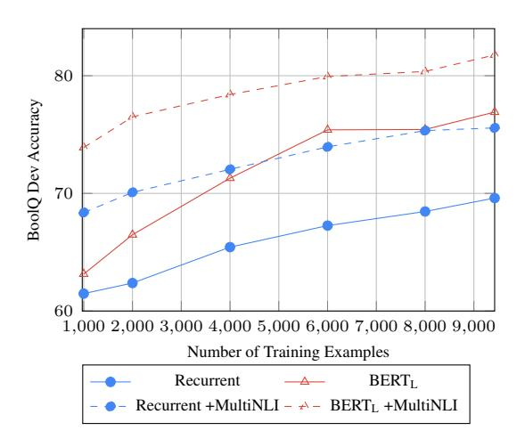

<!-- RP04_Clark_2019 | source: papers_json/RP04_Clark_2019/ -->

## BoolQ: استكشاف الصعوبة المفاجئة لأسئلة نعم/لا الطبيعية

Christopher Clark^∗^^1^ ، Kenton Lee† ، Ming-Wei Chang† ، Tom Kwiatkowski†

Michael Collins †^2^ ، Kristina Toutanova†

^∗^مدرسة Paul G. Allen لعلوم وهندسة الحاسوب، جامعة واشنطن csquared@cs.uw.edu

## Google AI Language

{kentonl, mingweichang, tomkwiat, mjcollins, kristout}@google.com

## الملخص

في هذه الورقة ندرس أسئلة نعم/لا التي تكون *طبيعية الحدوث* — أي أنها تُولَّد في سياقات غير موجَّهة وغير مقيَّدة. نقوم ببناء مجموعة بيانات لفهم القراءة، تُسمى BoolQ، تتكوّن من مثل هذه الأسئلة، ونُظهر أنها صعبة بشكل غير متوقَّع. كثيرًا ما تستفسر هذه الأسئلة عن معلومات معقَّدة وغير مرتبطة بالحقائق المباشرة، وتتطلَّب استدلالًا صعبًا شبيهًا بالاستلزام لحلِّها. كما نستكشف فعالية مجموعة من أساليب التعلم بالنقل (transfer learning) كخطوط أساس. وجدنا أن النقل من بيانات الاستلزام (entailment) أكثر فعالية من النقل من بيانات إعادة الصياغة (paraphrase) أو الإجابة الاستخراجية على الأسئلة، وأنه، بشكل مفاجئ، يستمر في كونه مفيدًا جدًا حتى عند الانطلاق من نماذج لغوية ضخمة مُدرَّبة مسبقًا مثل BERT. أفضل طريقة لدينا تُدرِّب BERT على MultiNLI ثم تُعيد تدريبه على مجموعة التدريب لدينا. تحقِّق دقة 80.4% مقارنةً بدقة 90% للمعلِّقين البشريين (و62% لخط أساس الأغلبية)، مما يترك فجوة كبيرة للأعمال المستقبلية.

# 1 المقدمة

إن فهم الحقائق التي يمكن استنتاجها على أنها صحيحة أو خاطئة من النص جزء أساسي من فهم اللغة الطبيعية. في كثير من الحالات، يمكن أن تتجاوز هذه الاستنتاجات بكثير ما هو مُصرَّح به مباشرةً في النص. على سبيل المثال، جملة بسيطة مثل "فازت Hanna Huyskova بالميدالية الذهبية لبيلاروسيا في التزلج الحر." تشير ضمنيًا إلى أن (1) بيلاروسيا دولة، (2) Hanna Huyskova رياضية، (3) فازت بيلاروسيا بحدث أولمبي واحد على الأقل، (4) لم تفز الولايات المتحدة *بفعالية* التزلج الحر، وهكذا.

لاختبار قدرة النموذج على إجراء هذه الأنواع من الاستنتاجات، اقترحت الأعمال السابقة في الاستدلال باللغة الطبيعية

- س: هل ضرب إعصار المملكة المتحدة؟
- ف: كانت العاصفة الكبرى عام 1987 إعصارًا خارج المداري عنيفًا تسبَّب في خسائر بشرية في إنجلترا وفرنسا وجزر القناة الإنجليزية...
- ج: نعم. [أُعطي مثال على حدث.]
- س: هل لدى فرنسا رئيس وزراء ورئيس؟
- ف: ... مدى تَعلُّق تلك القرارات برئيس الوزراء أو الرئيس يعتمد على...
- ج: نعم. [كلاهما مذكور، فيمكن الاستنتاج بأن كليهما موجود.]
- س: هل فاز فريق San Jose Sharks بكأس Stanley؟
- ف: ... وصل الـ Sharks إلى نهائيات كأس Stanley مرة واحدة، وخسروا أمام Pittsburgh Penguins عام 2016
- ... ج: لا. [وصلوا إلى النهائيات مرة واحدة، وخسروا.]

الشكل 1: أمثلة لأسئلة نعم/لا من مجموعة بيانات BoolQ. يتكوَّن كل مثال من سؤال (س)، ومقتطف من فقرة (ف)، وإجابة (ج) مع تفسير مُضاف للوضوح.

(NLI) مهمة تصنيف العبارات المرشَّحة على أنها مستلزَمة أو متناقضة مع فقرة معينة. ولكن، عمليًا، توليد عبارات مرشَّحة تختبر القدرات الاستدلالية المعقَّدة أمر صعب. على سبيل المثال، تشير الأدلة [(Gururangan et al.,](#page-9-0) [2018;](#page-9-0) [Jia](#page-9-1) [and Liang,](#page-9-1) [2017;](#page-9-1) [McCoy et al.,](#page-9-2) [2019)](#page-9-2) إلى أن مجرد الطلب من المعلِّقين البشريين كتابة عبارات مرشَّحة سينتج عنه أمثلة لا تتطلَّب عادةً إلا استدلالًا سطحيًا.

في هذه الورقة نقترح بديلًا: نختبر النماذج في قدرتها على الإجابة عن أسئلة نعم/لا الطبيعية. أي أسئلة كتبها أشخاص لم يُطلب منهم كتابة أنواع معينة من الأسئلة، بما في ذلك عدم اشتراط كتابة أسئلة نعم/لا، ولم يكونوا يعرفون إجابة السؤال الذي يطرحونه. يحتوي الشكل [1](#page-0-0) على بعض الأمثلة من مجموعة بياناتنا. وجدنا أن هذه الأسئلة تستفسر غالبًا عن

> ^1^أُنجز العمل أثناء التدريب الصيفي في Google.

> ^2^منتسب أيضًا إلى Columbia University، أُنجز العمل في Google.

<!-- page 2 -->

معلومات غير مرتبطة بالحقائق المباشرة، وأن المعلِّقين البشريين يحتاجون إلى تطبيق طيف واسع من القدرات الاستدلالية للإجابة عنها. وبالتالي، يمكن استخدامها لبناء مجموعات بيانات لفهم القراءة ذات استدلال عالٍ، مع ميزة إضافية تتمثَّل في ارتباطها المباشر بالمهمة العملية النهائية وهي الإجابة عن أسئلة نعم/لا للمستخدم.

تظهر أسئلة نعم/لا كمجموعة فرعية في بعض مجموعات البيانات الموجودة [(Reddy et al.,](#page-10-0) [2018;](#page-10-0) [Choi et al.,](#page-9-3) [2018;](#page-9-3) [Yang et al.,](#page-10-1) [2018)](#page-10-1). ولكن هذه المجموعات مخصَّصة في الأساس لاختبار جوانب أخرى من الإجابة عن الأسئلة (QA)، مثل الإجابة الحوارية أو الاستدلال متعدد الخطوات، ولا تحتوي على أسئلة طبيعية الحدوث.

نتَّبع طريقة جمع البيانات المستخدمة في Natural Questions (NQ) [(Kwiatkowski et al.,](#page-9-4) [2019)](#page-9-4) لجمع 16,000 سؤال نعم/لا طبيعي الحدوث في مجموعة بيانات نسمِّيها BoolQ (اختصارًا للأسئلة البولية). يُقرَن كل سؤال بفقرة من Wikipedia قام مُعلِّق مستقل بتعليمها على أنها تحتوي على الإجابة. تتمثَّل المهمة في أخذ سؤال وفقرة كمدخل، وإرجاع "نعم" أو "لا" كمخرج. يحتوي الشكل [1](#page-0-0) على بعض الأمثلة، ويحتوي الملحق [A.1](#page-10-2) على أمثلة إضافية مختارة عشوائيًا.

اتباعًا للأعمال الحديثة [(Wang et al.,](#page-10-3) [2018)](#page-10-3)، نركِّز على استخدام التعلم بالنقل لإنشاء خطوط أساس لمجموعة بياناتنا. ترتبط الإجابة عن أسئلة نعم/لا ارتباطًا وثيقًا بكثير من مهام معالجة اللغة الطبيعية الأخرى، بما في ذلك الأشكال الأخرى للإجابة عن الأسئلة، والاستلزام، وإعادة الصياغة. ولذلك، ليس من الواضح ما هي أفضل مصادر البيانات للنقل منها، أو ما إذا كان يكفي النقل فقط من النماذج اللغوية القوية المُدرَّبة مسبقًا مثل BERT [(Devlin](#page-9-5) [et al.,](#page-9-5) [2018)](#page-9-5) أو ELMo [(Peters et al.,](#page-9-6) [2018)](#page-9-6). نُجري تجارب على أحدث الأساليب غير الخاضعة للإشراف، باستخدام مجموعات بيانات الاستلزام الموجودة، وثلاث طرق للاستفادة من بيانات الإجابة الاستخراجية على الأسئلة، واستخدام عدد قليل من مجموعات البيانات الأخرى الخاضعة للإشراف.

وجدنا أن النقل من MultiNLI، والتدريب المسبق غير الخاضع للإشراف في BERT، أعطانا أفضل النتائج. ومن اللافت أننا وجدنا أن هذه الأساليب مكمِّلة لبعضها بشكل مفاجئ ويمكن دمجها لتحقيق مكسب كبير في الأداء. إجمالًا، يصل أفضل نموذج لدينا إلى دقة 80.43%، مقارنةً بـ 62.31% لخط أساس الأغلبية و90% للدقة البشرية. وفي ضوء أن BERT بمفرده حقَّق أداءً شبيهًا بالبشر في عدة مهام لمعالجة اللغة الطبيعية، فإن هذا يُظهر الدرجة العالية لصعوبة مجموعة بياناتنا. نُقدِّم البيانات والكود على [https://goo.gl/boolq](https://goo.gl/boolq).

# 2 الأعمال ذات الصلة

تشكِّل أسئلة نعم/لا مجموعة فرعية من مجموعات بيانات فهم القراءة CoQA [(Reddy et al.,](#page-10-0) [2018)](#page-10-0) وQuAC [(Choi et al.,](#page-9-3) [2018)](#page-9-3) وHotPotQA [(Yang et al.,](#page-10-1) [2018)](#page-10-1)، وتوجد في مجموعة بيانات ShARC [(Saeidi et al.,](#page-10-4) [2018)](#page-10-4). بُنيت هذه المجموعات لتتحدَّى النماذج لفهم الإجابة الحوارية على الأسئلة (لـ CoQA وShARC وQuAC) أو الاستدلال متعدد الخطوات (لـ HotPotQA)، مما يُعقِّد هدفنا المتمثِّل في استخدام أسئلة نعم/لا لاختبار القدرات الاستدلالية. من بين هذه المجموعات الأربع، تُعدُّ QuAC الوحيدة التي لم يُسمح فيها لمؤلِّفي الأسئلة برؤية النص المستخدَم للإجابة عن أسئلتهم، مما يجعلها أفضل مرشَّح لاحتواء أسئلة طبيعية الحدوث. ومع ذلك، لا تزال QuAC تُوجِّه المستخدمين بشكل كبير، بما في ذلك تقييد أسئلتهم بحيث تكون عن مقالات Wikipedia مختارة مسبقًا، وهي غير متوازنة في الفئات بشدة بنسبة 80% إجابات "نعم".

تتضمَّن مجموعة بيانات MS Marco [(Nguyen et al.,](#page-9-7) [2016)](#page-9-7)، التي تحتوي على أسئلة بإجابات نصية حرة الشكل، أيضًا بعض أسئلة نعم/لا. نُجري تجارب على تحديدها استدلاليًا (heuristically) في القسم [4،](#page-5-0) لكن هذه العملية يمكن أن تكون مزعجة وجودة التعليقات الناتجة غير معروفة. كما وجدنا أن مجموعة البيانات الناتجة غير متوازنة الفئات، بنسبة 80% إجابات "نعم".

استُخدمت الإجابة عن أسئلة نعم/لا في سياقات أخرى، مثل قصص bAbI القائمة على القوالب [(Weston et al.)](#page-10-5) أو بعض مجموعات بيانات الإجابة المرئية على الأسئلة [(Antol et al.,](#page-9-8) [2015;](#page-9-8) [Wu et al.,](#page-10-6) [2017)](#page-10-6). نحن نركِّز على الإجابة عن أسئلة نعم/لا باستخدام نص اللغة الطبيعية.

شهدت الإجابة عن الأسئلة لفهم القراءة بشكل عام كثيرًا من الأعمال الحديثة [(Ra](#page-10-7)[jpurkar et al.,](#page-10-7) [2016;](#page-10-7) [Joshi et al.,](#page-9-9) [2017)](#page-9-9)، وكانت هناك محاولات حديثة كثيرة لبناء مجموعات بيانات للإجابة عن الأسئلة تتطلَّب قدرات استدلال متقدِّمة [(Yang et al.,](#page-10-1) [2018;](#page-10-1) [Welbl et al.,](#page-10-8) [2018;](#page-10-8) [Mi](#page-9-10)[haylov et al.,](#page-9-10) [2018;](#page-9-10) [Zellers et al.,](#page-10-9) [2018;](#page-10-9) [Zhang](#page-10-10) [et al.,](#page-10-10) [2018)](#page-10-10). ولكن هذه المحاولات تتضمَّن عادةً هندسة البيانات لتكون أكثر صعوبة، على سبيل المثال، عن طريق توجيه المستخدمين صراحةً لكتابة أسئلة متعددة الخطوات [(Yang et al.,](#page-10-1) [2018;](#page-10-1) [Mihaylov](#page-9-10) [et al.,](#page-9-10) [2018)](#page-9-10)، أو تصفية الأسئلة السهلة [(Zellers](#page-10-9) [et al.,](#page-10-9) [2018)](#page-10-9). وهذا يُخاطر بإنتاج نماذج ليس لها تطبيقات نهائية واضحة لأنها مُحسَّنة للعمل في إعداد اصطناعي. في هذه الورقة، نُظهر أن أسئلة نعم/لا لها ميزة كونها صعبة جدًا حتى عندما تُجمع من مصادر طبيعية.

الاستدلال باللغة الطبيعية أيضًا

<!-- page 3 -->

مجال بحث مدروس جيدًا، خاصةً على مجموعتَي بيانات MultiNLI [(Williams et al.,](#page-10-11) [2018)](#page-10-11) وSNLI [(Bow](#page-9-11)[man et al.,](#page-9-11) [2015)](#page-9-11). تشمل المصادر الأخرى لبيانات الاستلزام تحديات PASCAL RTE [(Bentivogli et al.,](#page-9-12) [2009,](#page-9-12) [2011)](#page-9-13) أو SciTail [(Khot et al.,](#page-9-14) [2018)](#page-9-14). نُلاحظ أنه على الرغم من أن SciTail وRTE-6 وRTE-7 لم تستخدم العاملين الجمهوريين (crowd workers) لتوليد العبارات المرشَّحة، إلا أنها لا تزال تستخدم مصادر (أسئلة الاختيار من متعدد أو ملخَّصات الوثائق) كتبها بشر يعرفون نص المقدِّمة. يضمن استخدام أسئلة نعم/لا الطبيعية الحدوث استقلالية أكبر بين الأسئلة ونص المقدِّمة، ويربط مجموعة بياناتنا بمهمة نهائية واضحة. كما تتطلَّب BoolQ كشف الاستلزام في الفقرات بدلًا من أزواج الجمل.

دُرس التعلم بالنقل للاستلزام في GLUE [(Wang et al.,](#page-10-3) [2018)](#page-10-3) وSentEval [(Conneau and Kiela,](#page-9-15) [2018)](#page-9-15). وقد أظهر التدريب المسبق غير الخاضع للإشراف بشكل عام نتائج ممتازة مؤخرًا على كثير من مجموعات البيانات، بما في ذلك بيانات الاستلزام [(Peters et al.,](#page-9-6) [2018;](#page-9-6) [Devlin et al.,](#page-9-5) [2018;](#page-9-5) [Rad](#page-10-12)[ford et al.,](#page-10-12) [2018)](#page-10-12).

اقتُرح تحويل الأسئلة قصيرة الإجابة أو متعددة الاختيارات إلى أمثلة استلزام، كما نفعل عند تجربة التعلم بالنقل، في عدة أعمال سابقة [(Demszky](#page-9-16) [et al.,](#page-9-16) [2018;](#page-9-16) [Poliak et al.,](#page-9-17) [2018;](#page-9-17) [Khot et al.,](#page-9-14) [2018)](#page-9-14). في هذه الورقة وجدنا بعض الأدلة التي تشير إلى أن هذه الأساليب أقل فعالية من استخدام أمثلة الاستلزام التي يجمعها العاملون الجمهوريون عندما يتعلَّق الأمر بالنقل إلى أسئلة نعم/لا الطبيعية.

بالتزامن مع عملنا، أظهر [Phang et al.](#page-9-18) [(2018)](#page-9-18) أن التدريب المسبق على المهام الخاضعة للإشراف يمكن أن يكون مفيدًا حتى عند استخدام النماذج اللغوية المُدرَّبة مسبقًا، خاصةً لمهمة الاستلزام النصي. ويؤكِّد عملنا هذه النتائج للإجابة عن أسئلة نعم/لا.

يبني هذا العمل على Natural Questions (NQ) [(Kwiatkowski et al.,](#page-9-4) [2019)](#page-9-4)، التي تحتوي على بعض أسئلة نعم/لا الطبيعية. ولكن، هناك القليل جدًا منها (حوالي 1% من المجموعة) لجعل الإجابة عن أسئلة نعم/لا جانبًا مهمًا جدًا من تلك المهمة. في هذه الورقة، نجمع عددًا كبيرًا من أسئلة نعم/لا الإضافية لبناء مجموعة بيانات مخصَّصة للإجابة عن أسئلة نعم/لا.

# 3 مجموعة بيانات BoolQ

يتكوَّن المثال في مجموعة بياناتنا من سؤال، وفقرة من مقال Wikipedia، وعنوان المقال، وإجابة، تكون إما "نعم"

أو "لا". نُدرج عنوان المقال لأنه يمكن أن يساعد في حل الغموض (مثلًا، العبارات الإحالية المشتركة) في الفقرة، على الرغم من أن أيًا من النماذج المعروضة في هذه الورقة لا يستفيد منها.

## 3.1 جمع البيانات

نجمع البيانات باستخدام خط الأنابيب من NQ [(Kwiatkowski et al.,](#page-9-4) [2019)](#page-9-4)، ولكن مع خطوة تصفية إضافية للتركيز على أسئلة نعم/لا. نُلخِّص خط الأنابيب الكامل هنا، لكن نُحيل إلى ورقتهم للحصول على وصف أكثر تفصيلًا.

تُجمع الأسئلة من استعلامات مُجهَّلة الهوية ومُجمَّعة لمحرك بحث Google. الاستعلامات المحتمل أن تكون أسئلة نعم/لا تُحدَّد استدلاليًا: وجدنا أن اختيار الاستعلامات التي تكون كلمتها الأولى ضمن مجموعة كلمات إشارة مُعدَّة يدويًا[3](#page-2-0) وذات طول كافٍ، فعَّال.

تُحفظ الأسئلة فقط إذا أُعيدت صفحة Wikipedia كواحدة من أول خمس نتائج، وفي هذه الحالة يُعطى السؤال وصفحة Wikipedia لمُعلِّق بشري لمزيد من المعالجة.

يُصنِّف المعلِّقون أزواج (سؤال/مقال) في عملية من ثلاث خطوات. أولًا، يُقرِّرون ما إذا كان السؤال *جيدًا*، أي أنه مفهوم وغير غامض ويطلب معلومات وقائعية. يُجرى هذا الحكم قبل أن يرى المعلِّق صفحة Wikipedia. ثانيًا، بالنسبة للأسئلة الجيدة، يجد المعلِّقون فقرة داخل الوثيقة تحتوي على معلومات كافية للإجابة عن السؤال. يمكن للمعلِّقين تعليم الأسئلة على أنها "غير قابلة للإجابة" إذا لم تحتوِ مقالة Wikipedia على المعلومات المطلوبة. وأخيرًا، يُعلِّم المعلِّقون ما إذا كانت إجابة السؤال "نعم" أم "لا". تعليق البيانات بهذه الطريقة مكلف جدًا لأن المعلِّقين بحاجة إلى البحث في وثائق Wikipedia كاملة عن أدلة ذات صلة وقراءة النص بعناية.

لاحظ أنه، على عكس NQ، نستخدم فقط الأسئلة التي عُلِّمت على أن لها إجابة نعم/لا، ونقرن كل سؤال بالفقرة المختارة بدلًا من الوثيقة بأكملها. وهذا يساعد على تقليل الغموض (مثلًا، تجنُّب الحالات التي تُقدِّم فيها الوثيقة إجابات متضاربة في فقرات مختلفة)، ويُبقي المُدخل صغيرًا بما يكفي بحيث يمكن تطبيق نماذج الاستلزام الموجودة بسهولة على مجموعة بياناتنا.

نجمع 13 ألف سؤال من هذا

> ^3^المجموعة الكاملة هي: {"did", "do", "does", "is", "are", "was", "were", "have", "has", "can", "could", "will", "would"}.

<!-- page 4 -->

خط الأنابيب مع 3 آلاف سؤال إضافي بإجابات نعم/لا من مجموعة تدريب NQ للوصول إلى إجمالي 16 ألف سؤال. نُقسم هذه الأسئلة إلى مجموعة تطوير من 3.2 ألف، ومجموعة اختبار من 3.2 ألف، ومجموعة تدريب من 9.4 ألف، مع التأكُّد من أن أسئلة NQ تكون دائمًا في مجموعة التدريب. إجابات "نعم" أكثر شيوعًا قليلًا (62.31% في مجموعة التدريب). الاستعلامات قصيرة عادةً (متوسط الطول 8.9 رمز) مع فقرات أطول (متوسط الطول 108 رموز).

## 3.2 التحليل

في القسم التالي نُحلِّل مجموعة بياناتنا لفهم طبيعة الأسئلة وجودة التعليق وأنواع قدرات الاستدلال المطلوبة للإجابة عنها بشكل أفضل.

## 3.3 جودة التعليق

أولًا، لتقييم جودة التعليق، قام ثلاثة من المؤلِّفين بتعليم 110 أمثلة مختارة عشوائيًا. إذا حدث خلاف، تشاور المؤلِّفون واختاروا إجابة واحدة بالاتفاق المتبادل. نُسمِّي التعليمات الناتجة "تعليمات المعيار الذهبي". على الأمثلة الـ 110 المختارة، بلغت تعليمات الإجابة دقة 90% مقارنةً بتعليمات المعيار الذهبي. من بين الحالات التي اختلف فيها تعليق الإجابة عن المعيار الذهبي، كانت ست حالات غامضة أو قابلة للنقاش، وخمس حالات أخطاء فهم فيها المعلِّق الفقرة. ولأن الاتفاق كان مرتفعًا بشكل كافٍ، اخترنا استخدام أمثلة معلَّمة من قِبل شخص واحد في مجموعات التدريب/التطوير/الاختبار لنتمكَّن من جمع مجموعة بيانات أكبر.

## 3.4 أنواع الأسئلة

جزء من قيمة هذه المجموعة أنها تحتوي على أسئلة يريد الناس فعلًا الإجابة عنها. لاستكشاف هذا أكثر، نُعرِّف يدويًا مجموعة من المواضيع التي يمكن أن تكون الأسئلة عنها. صنَّف أحد المؤلِّفين 200 سؤال إلى هذه المواضيع. يمكن العثور على النتائج في النصف العلوي من الجدول [1.](#page-3-0)

كانت الأسئلة في كثير من الأحيان عن وسائط الترفيه (بما في ذلك التلفزيون والأفلام والموسيقى)، إلى جانب مواضيع شائعة أخرى مثل الرياضة. ولكن لا يزال هناك جزء جيد من الأسئلة يطلب معرفة وقائعية أكثر عمومية، بما في ذلك أسئلة عن الأحداث التاريخية أو العالم الطبيعي.

كما قسَّمنا الأسئلة إلى فئات بناءً على نوع المعلومات التي تطلبها، كما هو موضح في النصف السفلي من الجدول [1.](#page-3-0) ما يقرب من سدس الأسئلة عن وجود أي شيء بخاصية معينة (الوجود)، وسدس آخر عمَّا إذا كان حدث معين قد وقع (وقوع الحدث)، وسدس آخر يسأل عمَّا إذا كان كائن معروف باسم معين، أو ينتمي إلى فئة معينة (تعريفي). الأسئلة التي لا تندرج ضمن هذه الفئات الثلاث قُسِّمت بين طلب حقائق عن كيان محدَّد، أو طلب معلومات وقائعية أكثر عمومية.

نجد بالفعل ارتباطًا بين طبيعة السؤال واحتمال إجابة "نعم". ولكن، هذا الارتباط ضعيف جدًا بحيث لا يساعد على التفوُّق على خط أساس الأغلبية لأنه، حتى لو كان الموضوع أو النوع معروفًا، فمن غير الأفضل أبدًا تخمين فئة الأقلية. وجدنا أيضًا أن النماذج التي تعتمد على السؤال فقط تُؤدِّي بشكل سيِّئ جدًا في هذه المهمة (انظر القسم [5.3)](#page-6-0)، مما يساعد على تأكيد أن الأسئلة

<!-- page 5 -->

لا تحتوي على معلومات كافية للتنبُّؤ بالإجابة بمفردها.

## 3.5 أنواع الاستدلال

أخيرًا، نُصنِّف أنواع الاستدلال المطلوبة للإجابة عن الأسئلة في BoolQ[4](#page-4-0). تظهر التعريفات والنتائج في الجدول [2.](#page-4-1)

أقل من 40% من الأمثلة يمكن حلها بكشف إعادة الصياغة. بدلًا من ذلك، تتطلَّب أسئلة كثيرة إجراء استنتاجات إضافية (الفئات "الاستدلال الوقائعي"، "بالمثال"، و"استدلال آخر") لربط ما هو مذكور في الفقرة بالسؤال. هناك أيضًا فئة كبيرة من الأسئلة (الفئات "ضمني" و"ذكر مفقود") تتطلَّب نوعًا أكثر دقة من الاستدلال بناءً على كيفية كتابة الفقرة.

## 3.6 المناقشة

لماذا تتطلَّب أسئلة نعم/لا الطبيعية الاستدلال في كثير من الأحيان؟ نفترض أن هناك عدة عوامل. أولًا، نُلاحظ أن الأسئلة الوقائعية (factoid) التي تسأل عن خصائص بسيطة للكيانات، مثل "هل وُلد Obama في عام 1962؟"، نادرة. نشتبه أن هذا لأن الناس سيُفضِّلون دائمًا تقريبًا

صياغة هذه الأسئلة كأسئلة قصيرة الإجابة (مثلًا، "متى وُلد Obama؟"). وبالتالي، هناك تأثير تصفية طبيعي حيث يميل الناس إلى استخدام أسئلة نعم/لا تحديدًا عندما يريدون أنواعًا أكثر تعقيدًا من المعلومات.

ثانيًا، نادرًا ما تتضمَّن الفقرات والأسئلة النفي. ونتيجة لذلك، فإن كشف إجابة "لا" يتطلَّب عادةً فهم أن تأكيدًا إيجابيًا في النص يستثني، أو يجعل من غير المرجَّح، تأكيدًا إيجابيًا في السؤال. وهذا يتطلَّب استدلالًا يتجاوز إعادة الصياغة (انظر أمثلة "استدلال آخر" أو "ضمني").

نعتقد أيضًا أنه من المهم أن المعلِّقين كان عليهم فقط الإجابة عن الأسئلة، بدلًا من توليدها. على سبيل المثال، تخيَّل محاولة بناء أسئلة تقع ضمن فئتَي "ذكر مفقود" أو "ضمني". على الرغم من أن ذلك ممكن، إلا أنه سيتطلَّب قدرًا كبيرًا من التفكير والإبداع. من ناحية أخرى، فإن كشف متى يمكن الإجابة عن سؤال نعم/لا باستخدام هذه الاستراتيجيات يبدو أسهل بكثير وأكثر بداهة. وبالتالي، فإن جعل المعلِّقين يجيبون عن أسئلة موجودة مسبقًا يفتح الباب لبناء مجموعات بيانات تحتوي على مزيد من الاستدلال ولها تعليمات بجودة أعلى.

> ^4^لاحظ أن مجموعة البيانات قد تم تحديثها منذ أن أجرينا هذا التحليل، لذا قد تكون قديمة قليلًا.

<!-- page 6 -->

# 4 تدريب نماذج الإجابة عن أسئلة نعم/لا

تحتاج النماذج على هذه المجموعة إلى التنبُّؤ بفئة المخرج بالنظر إلى نصَّين كمدخل، وهو نموذج مدروس جيدًا [(Wang et al.,](#page-10-3) [2018)](#page-10-3). نجد أن تدريب النماذج على مجموعة التدريب لدينا وحدها غير فعَّال نسبيًا. أفضل نموذج لدينا يصل إلى دقة 69.6%، أي أفضل بـ 8% فقط من خط أساس الأغلبية. ولذلك، نتَّبع الاتجاه الحديث في معالجة اللغة الطبيعية باستخدام التعلم بالنقل. تحديدًا، نُجري تجارب على *التدريب المسبق* للنماذج على مهام ذات صلة لها مجموعات بيانات أكبر، ثم *الضبط الدقيق* لها على بيانات التدريب لدينا. نُدرج المصادر التي ندرسها للتدريب المسبق أدناه.

الاستلزام: نأخذ بعين الاعتبار مجموعتَي بيانات استلزام، *MultiNLI* [(Williams et al.,](#page-10-11) [2018)](#page-10-11) و*SNLI* [(Bowman et al.,](#page-9-11) [2015)](#page-9-11). نختار هاتين المجموعتين لأنهما مستخدمتان على نطاق واسع وكبيرتان بما يكفي للتدريب المسبق. كما نُجري تجارب على إزالة فئات من MultiNLI. أثناء الضبط الدقيق، نستخدم الاحتمال الذي يُسنده النموذج لفئة "الاستلزام" كاحتمال للتنبُّؤ بإجابة "نعم".

الإجابة بالاختيار من متعدد: نستخدم مجموعة بيانات لفهم القراءة بالاختيار من متعدد، *RACE* [(Lai et al.,](#page-9-19) [2017)](#page-9-19)، التي تحتوي على قصص أو مقالات قصيرة مقترنة بأسئلة مبنية لاختبار فهم القارئ للنص. اتباعًا لما تم في SciTail [(Khot et al.,](#page-9-14) [2018)](#page-9-14)، نُحوِّل الأسئلة وخيارات الإجابة إلى عبارات إما باستبدال خيار الإجابة مكان الفراغات في أسئلة ملء الفراغ، أو بإلحاق رمز فاصل وخيار الإجابة بالسؤال. أثناء التدريب، نجعل النماذج تُسند درجة لكل عبارة بشكل مستقل، ثم نُطبِّق عامل softmax بين جميع العبارات لكل سؤال للحصول على احتمالات العبارات. نستخدم اللوغاريتم السالب لاحتمال العبارة الصحيحة كدالة خسارة. للضبط الدقيق على BoolQ، نُطبِّق عامل sigmoid على درجة السؤال بالنظر إلى فقرته للحصول على احتمال إجابة "نعم".

الإجابة الاستخراجية على الأسئلة: نأخذ بعين الاعتبار عدة طرق للاستفادة من مجموعات بيانات الإجابة الاستخراجية على الأسئلة، حيث يجب على النموذج الإجابة عن الأسئلة باختيار نص من فقرة ذات صلة. وجدت التجارب الأولية أن مجرد نقل الأوزان منخفضة المستوى لنماذج الإجابة الاستخراجية على الأسئلة كان غير فعَّال، لذا فإننا نأخذ بعين الاعتبار ثلاث طرق

لبناء بيانات شبيهة بالاستلزام من بيانات الإجابة الاستخراجية على الأسئلة.

أولًا، نستخدم مهمة *QNLI* من GLUE [(Wang](#page-10-3) [et al.,](#page-10-3) [2018)](#page-10-3)، حيث يجب على النموذج تحديد ما إذا كانت جملة من SQuAD 1.1 [(Rajpurkar et al.,](#page-10-7) [2016)](#page-10-7) تحتوي على إجابة لسؤال مُدخل أم لا. اتباعًا للأعمال السابقة [(Hu et al.,](#page-9-20) [2018)](#page-9-20)، نحاول أيضًا بناء بيانات تدريب شبيهة بالاستلزام من *SQuAD 2.0* [(Rajpurkar et al.,](#page-10-13) [2018)](#page-10-13). نقوم بدمج الأسئلة إما مع الإجابة الصحيحة، أو مع المرشَّح الإجابة "المُشتِّت" غير الصحيح المُقدَّم من المجموعة، ونُدرِّب النموذج على تصنيف أيهما أيهما بالنظر إلى النص الداعم للسؤال.

أخيرًا، نُجري أيضًا تجارب على الاستفادة من جزء الإجابة الطويلة من NQ، حيث يجب على النماذج اختيار فقرة تحتوي على إجابة سؤال من وثيقة. اتباعًا لطريقتنا في الإجابة بالاختيار من متعدد، نُدرِّب نموذجًا على إسناد درجة لأزواج (سؤال، فقرة)، ونُطبِّق عامل softmax على الفقرات من نفس الوثيقة للحصول على توزيع احتمالي على الفقرات، ونُدرِّب النموذج على اللوغاريتم السالب لاحتمال اختيار فقرة تحتوي على إجابة. ندرِّب فقط على الأسئلة المُعلَّمة على أن لها إجابة، ونختار فقرة واحدة تحتوي على إجابة وما يصل إلى 15 فقرة لا تحتوي على إجابة مختارة عشوائيًا لكل سؤال. على BoolQ، نحسب احتمال إجابة "نعم" بتطبيق عامل sigmoid على الدرجة التي يُعطيها النموذج للسؤال والفقرة المُدخلَين.

إعادة الصياغة: نستخدم مجموعة بيانات Quora Question Paraphrasing (*QQP*)، التي تتكوَّن من أزواج من الأسئلة المُعلَّمة على أنها إعادة صياغة أم لا.[5](#page-5-1) ترتبط إعادة الصياغة بالاستلزام لأننا نتوقَّع، على الأقل في بعض الحالات، أن تحتوي الفقرات على إعادة صياغة للسؤال.

أسئلة نعم/لا الاستدلالية: نحاول بناء مجموعة استدلالية من أسئلة نعم/لا من مجموعة MS Marco [(Nguyen et al.,](#page-9-7) [2016)](#page-9-7). تحتوي MS Marco على إجابات حرة الشكل مقترنة بمقتطفات من وثائق ويب ذات صلة. نبحث عن إجابات تبدأ بـ "yes" أو "no"، ثم نقرن الأسئلة المقابلة بالمقتطفات المُعلَّمة على أنها ذات صلة بالسؤال. نُسمِّي هذه المهمة *Y/N MS Marco*؛ في المجموع نجمع 38 ألف مثال،

> ^5^ data.quora.com/First-Quora-Dataset-Release-Question-Pairs

<!-- page 7 -->

80% منها إجابات "نعم".

غير الخاضع للإشراف: من المعروف جيدًا أن التدريب المسبق غير الخاضع للإشراف باستخدام أهداف نمذجة اللغة [(Peters et al.,](#page-9-6) [2018;](#page-9-6) [Devlin et al.,](#page-9-5) [2018;](#page-9-5) [Radford et al.,](#page-10-12) [2018)](#page-10-12)، يمكن أن يُحسِّن الأداء في كثير من المهام. نُجري تجارب على هذه الأساليب باستخدام النماذج المُدرَّبة مسبقًا من *ELMo* و*BERT* وOpenAI's Generative Pre-trained Transformer (*OpenAI GPT*) (انظر القسم [5.2)](#page-6-1).

# 5 النتائج

## 5.1 النماذج السطحية

أولًا، نُجري تجارب على استخدام مصنِّف خطي في مهمتنا. بشكل عام، وجدنا أن سمات مثل تداخل الكلمات أو إحصائيات TF-IDF لم تكن كافية لتحقيق دقة أفضل من خط أساس فئة الأغلبية (62.17% على مجموعة التطوير). وجدنا أن هناك ارتباطًا بين عدد المرات التي تظهر فيها كلمات السؤال في الفقرة وكون الإجابة "نعم"، لكن الارتباط لم يكن قويًا بما يكفي لبناء مصنِّف فعَّال. "نعم" هي الإجابة الأكثر شيوعًا حتى بين الأسئلة التي ليس لها كلمات مشتركة مع الفقرة (بأغلبية 51%)، وأكثر شيوعًا في الحالات الأخرى.

## 5.2 النماذج العصبية

لتجاربنا التي لا تستخدم التدريب المسبق غير الخاضع للإشراف (باستثناء استخدام متجهات الكلمات المُدرَّبة مسبقًا)، نستخدم نموذجًا متكررًا قياسيًا مع الانتباه. تستخدم تجاربنا التي تستخدم التدريب المسبق غير الخاضع للإشراف النماذج التي قدَّمها المؤلِّفون. بمزيد من التفصيل:

نموذجنا *المتكرر* (Recurrent) يتَّبع بنية متكررة قياسية مع انتباه لتصنيف أزواج النص [(Wang et al.,](#page-10-3) [2018)](#page-10-3). يُضمِّن نص المقدِّمة/الفرضية باستخدام متجهات كلمات fasttext [(Mikolov et al.,](#page-9-21) [2018)](#page-9-21) ومتجهات أحرف مُتعلَّمة، ويُطبِّق LSTM ثنائي الاتجاه مشتركًا على كلا الجزأين، ويُطبِّق الانتباه المشترك (co-attention) [(Parikh et al.,](#page-9-22) [2016)](#page-9-22) لمشاركة المعلومات بين الجزأين، ويُطبِّق bi-LSTM آخر على كلا الجزأين، ويُجمِّع النتيجة، ويستخدم التمثيل المُجمَّع للتنبُّؤ بالفئة النهائية. انظر الملحق [A.2](#page-10-14) للتفاصيل.

نموذجنا *المتكرر + ELMo* (*Recurrent + ELMo*) يستخدم النموذج اللغوي من [Peters et al.](#page-9-6) [(2018)](#page-9-6) لتقديم تضمينات سياقية للنموذج الأساسي الموضَّح أعلاه، كما أوصى المؤلِّفون.

نموذجنا *OpenAI GPT* يقوم بضبط دقيق لمحوِّل (transformer) أحادي الاتجاه ذي 12 طبقة و768 بُعدًا

من [Radford et al.](#page-10-12) [(2018)](#page-10-12)، الذي تم تدريبه مسبقًا كنموذج لغوي على مجموعة Books [(Zhu et al.,](#page-10-15) [2015)](#page-10-15).

نموذجنا *BERT^L^* يقوم بضبط دقيق للمحوِّل ذي 24 طبقة و1024 بُعدًا من [Devlin et al.](#page-9-5) [(2018)](#page-9-5)، الذي تم تدريبه على اختيار الجملة التالية ونمذجة اللغة المُقنَّعة على Book Corpus وWikipedia.

نُجري ضبطًا دقيقًا لنموذج BERT^L^ ونموذج OpenAI GPT باستخدام المُحسِّنات (optimizers) التي أوصى بها المؤلِّفون، لكن وجدنا أنه من المهم ضبط معاملات التحسين لتحقيق أفضل النتائج. نستخدم حجم دفعة 24، ومعدَّل تعلم 1e-5، و5 حقب تدريبية لـ BERT ومعدَّل تعلم 6.25e-5، وحجم دفعة 6، وخسارة نموذج لغوي 0.5، و3 حقب تدريبية لـ OpenAI GPT.

## 5.3 نتائج السؤال/الفقرة فقط

اتباعًا لتوصية [Gururangan](#page-9-0) [et al.](#page-9-0) [(2018)](#page-9-0)، نُجري تجارب أولًا على نماذج يُسمح لها بمشاهدة السؤال أو الفقرة فقط. وصل نموذج BERT^L^ المُدرَّب مسبقًا إلى دقة 64.48% على مجموعة التطوير باستخدام السؤال فقط و66.74% باستخدام الفقرة فقط. بالنظر إلى أن خط أساس الأغلبية هو 62.17%، فإن هذا يشير إلى أن هناك إشارة قليلة في السؤال بمفرده، لكن بعض الأنماط اللغوية في الفقرة تترابط مع الإجابة. ربما تترابط الفقرات التي تُقدِّم معلومات وقائعية مباشرة (مثل فقرات مقدِّمة Wikipedia) مع إجابات "نعم".

## 5.4 نتائج التعلم بالنقل

تظهر نتائج أساليب التعلم بالنقل لدينا في الجدول [3.](#page-7-0) جميع النتائج هي متوسط خمس عمليات تشغيل. للنماذج المُدرَّبة مسبقًا على مجموعات بيانات خاضعة للإشراف، تم تكرار مرحلتَي التدريب المسبق والضبط الدقيق. للتدريب المسبق غير الخاضع للإشراف، نستخدم النماذج المُدرَّبة مسبقًا التي قدَّمها المؤلِّفون، لكن نواصل أخذ متوسط خمس عمليات تشغيل للضبط الدقيق.

نتائج الإجابة عن الأسئلة (QA): لم نتمكَّن من النقل من RACE أو SQuAD 2.0. بالنسبة لـ RACE، قد تكون المشكلة عدم تطابق المجال. في RACE الفقرات قصص، وكثيرًا ما تستفسر الأسئلة عن معلومات خاصة بالفقرة مثل نية المؤلِّف أو حالة كيان معين من الفقرة، بدلًا من المعرفة العامة.

كنا نتوقَّع أن يكون SQuAD 2.0 توافقًا أفضل لـ BoolQ لأنه أيضًا قائم على Wikipedia، ولكن من الممكن أن كشف المشتِّتات

<!-- page 8 -->

المبنية بشكل عدائي والمستخدمة كأمثلة سلبية لا يرتبط جيدًا بالإجابة عن أسئلة نعم/لا.

حصلنا على نتائج أفضل باستخدام QNLI، ونتائج أفضل أيضًا باستخدام NQ. وهذا يُظهر أن مهمة اختيار النص ذي الصلة بسؤال قابلة للنقل جزئيًا للإجابة عن أسئلة نعم/لا، على الرغم من أننا قادرون فقط على كسب بضع نقاط فوق خط الأساس.

نتائج الاستلزام: تفوَّقت مجموعة بيانات MultiNLI على جميع الأساليب الأخرى الخاضعة للإشراف بفارق كبير. ومن اللافت أن هذا النهج يتأخر فقط بنقاط قليلة عن BERT على الرغم من استخدام بيانات تدريب أقل بأوامر من حيث الحجم ونموذج أخف وزنًا بكثير، مما يُظهر أن بيانات التدريب المسبق عالية الجودة يمكن أن تساعد على تعويض هذه النواقص.

تُظهر نتائج الإزالة (ablation) لدينا أن إزالة الفئة المحايدة من MultiNLI أضرَّ بالنقل قليلًا، وأن إزالة أي من الفئتين الأخريين كان ضارًا جدًا، مما يشير إلى أن الأمثلة المحايدة كانت ذات قيمة محدودة. نقل SNLI كان أفضل من المجموعات الأخرى، لكن أسوأ من MultiNLI. نشتبه أن هذا بسبب قيود مجال تعليقات الصور التي بُني منها.

نتائج خاضعة للإشراف أخرى: حصلنا على قدر صغير من النقل باستخدام QQP وY/N MS

Marco. على الرغم من أن Y/N MS Marco هي مجموعة بيانات للإجابة عن أسئلة نعم/لا، إلا أن حجمها الصغير وعدم توازن الفئات ربما ساهما في فعاليتها المحدودة. كما أن مقتطفات الويب التي تستخدمها كفقرات تُقدِّم تحوُّلًا كبيرًا في المجال عن فقرات Wikipedia في BoolQ.

نتائج غير خاضعة للإشراف: اتباعًا لنتائج على مجموعات بيانات أخرى [(Wang et al.,](#page-10-3) [2018)](#page-10-3)، وجدنا أن BERT^L^ هو الأسلوب الأكثر فعالية بين الأساليب غير الخاضعة للإشراف، متفوِّقًا على جميع أساليب التدريب المسبق الأخرى.

## 5.5 نتائج النقل متعدد الخطوات

أفضل نتائج التعلم بالنقل أحادي الخطوة لدينا كانت من استخدام نموذج BERT^L^ المُدرَّب مسبقًا و

<!-- page 9 -->

MultiNLI. نُجري أيضًا تجارب على دمج هذه الأساليب باستخدام نظام تدريب مسبق ذي خطوتين. تحديدًا، نقوم بضبط دقيق لـ BERT^L^ المُدرَّب مسبقًا على MultiNLI، ثم نُجري ضبطًا دقيقًا للنموذج الناتج مرة أخرى على مجموعة تدريب BoolQ. وجدنا أن تقليل عدد حقب التدريب إلى 3 أدَّى إلى تحسُّن طفيف عند استخدام النموذج المُدرَّب مسبقًا على MultiNLI.

نُظهر نتائج مجموعة الاختبار لهذا النموذج، وبعض اختلافات التدريب المسبق الأخرى، في الجدول [4.](#page-7-1) لهذه النتائج، نُدرِّب خمس نسخ من كل نموذج باستخدام بذور تدريب مختلفة، ونعرض النموذج الذي حقَّق أفضل أداء على مجموعة التطوير.

بالنظر إلى مدى التدريب المسبق المكثَّف لنموذج BERT^L^ ومدى نجاحه عبر كثير من مهام معالجة اللغة الطبيعية، فإن المكسب الإضافي البالغ 3.5 نقاط بسبب استخدام MultiNLI لافت للنظر. وهذا يشير إلى أن MultiNLI تحتوي على إشارة متعامدة على ما يوجد في الأهداف غير الخاضعة للإشراف لـ BERT.

## 5.6 كفاءة العيِّنة

في الشكل 2، نرسم دقة النموذج كلما تم استخدام مزيد من بيانات التدريب للضبط الدقيق، مع وبدون التدريب المسبق الأولي على MultiNLI. التدريب المسبق على MultiNLI يُعطي مكسبًا لا يقل عن 5-6 نقاط، وما يقرب من 10 نقاط لـ BERT^L^ عند استخدام 1000 مثال فقط. للأعداد الصغيرة من الأمثلة، يتفوَّق النموذج المتكرِّر مع التدريب المسبق على MultiNLI فعليًا على BERTL.

## 5.7 المناقشة

من النتائج المفاجئة في عملنا أن مجموعات البيانات التي تشبه شكل BoolQ بشكل أوثق، أي تلك التي تحتوي على أسئلة وفقرات متعددة الجمل، مثل SQuAD 2.0 أو RACE أو

*الشكل 2: الدقة لنماذج مختلفة على مجموعة تطوير BoolQ مع تغيُّر عدد أمثلة التدريب.*

Y/N MS Marco، لم تكن مفيدة جدًا للنقل. كانت مجموعات بيانات الاستلزام أقوى على الرغم من تكوُّنها من أزواج جمل. وهذا يشير إلى أن التكيُّف من مدخل أزواج الجمل إلى مدخل سؤال/فقرة لم يكن عقبة كبيرة لتحقيق النقل. وجد العمل الأولي أن محاولة تحويل أسئلة نعم/لا في BoolQ إلى عبارات تقريرية لم يُحسِّن النقل من MultiNLI، مما يدعم هذه الفرضية.

قد يكون نجاح MultiNLI أيضًا مفاجئًا بالنظر إلى المخاوف الأخيرة بشأن قدرات التعميم للنماذج المُدرَّبة عليها [(Glockner et al.,](#page-9-23) [2018)](#page-9-23)، لا سيما فيما يتعلَّق بـ "آثار التعليق" (annotation artifacts) التي يسبِّبها استخدام العاملين الجمهوريين لكتابة عبارات الفرضية [(Gururangan et al.,](#page-9-0) [2018)](#page-9-0). أظهرنا أنه على الرغم من نقاط الضعف هذه، يمكن أن يكون نقطة بداية مهمة للنماذج المستخدَمة على البيانات الطبيعية.

نفترض أن إحدى المزايا الرئيسية لـ MultiNLI هي أنها تحتوي على أمثلة للتناقضات. مصادر النقل الأخرى التي ندرسها، بما في ذلك هدف اختيار الجملة التالية في BERT، أقرب إلى تقديم أمثلة لنص مستلزَم مقابل نص محايد/غير مرتبط. بالفعل، وجدنا أن إجراء النقل ذو الخطوتين لدينا يصل فقط إلى دقة 78.43% على مجموعة التطوير إذا أزلنا فئة التناقض من MultiNLI، مما يُعيد أداءه إلى مستوى قريب من BERT^L^ عند استخدام التدريب المسبق غير الخاضع للإشراف فقط.

لاحظ أنه من الممكن تدريب نموذج مسبقًا على عدة من مجموعات البيانات المُقترحة، إما بالتتابع أو في إعداد متعدد المهام. نترك هذه التجارب للأعمال المستقبلية. كما تشير نتائجنا إلى أن التدريب المسبق على MultiNLI سيكون مفيدًا للمجموعات الأخرى التي تحتوي على أسئلة نعم/لا.

# 6 الاستنتاج

قدَّمنا BoolQ، مجموعة بيانات جديدة لفهم القراءة من أسئلة نعم/لا الطبيعية الحدوث. أظهرنا أن هذه الأسئلة صعبة وتتطلَّب طيفًا واسعًا من قدرات الاستدلال لحلِّها. درسنا أيضًا كيفية أداء التعلم بالنقل في هذه المهمة، ووجدنا أن مجموعات بيانات الاستلزام التي يجمعها العاملون الجمهوريون يمكن الاستفادة منها لتعزيز الأداء حتى فوق التدريب المسبق للنموذج اللغوي. يمكن أن تشمل الأعمال المستقبلية بناء نسخة على مستوى الوثيقة من هذه المهمة، مما سيزيد من صعوبتها وتطابقها مع تطبيق المستخدم النهائي.

<!-- page 10 -->

## المراجع

- Stanislaw Antol, Aishwarya Agrawal, Jiasen Lu, Margaret Mitchell, Dhruv Batra, C Lawrence Zitnick, and Devi Parikh. 2015. VQA: Visual Question Answering. In *Proceedings of the IEEE international* *conference on computer vision*.
- Luisa Bentivogli, Peter Clark, Ido Dagan, and Danilo Giampiccolo. 2009. The Sixth PASCAL Recognizing Textual Entailment Challenge. In *TAC*.
- Luisa Bentivogli, Peter Clark, Ido Dagan, and Danilo Giampiccolo. 2011. The Seventh PASCAL Recognizing Textual Entailment Challenge. In *TAC*.
- Samuel R Bowman, Gabor Angeli, Christopher Potts, and Christopher D Manning. 2015. [A Large Anno](https://doi.org/10.18653/v1/D15-1075)[tated Corpus for Learning Natural Language Infer](https://doi.org/10.18653/v1/D15-1075)[ence.](https://doi.org/10.18653/v1/D15-1075) *EMNLP*.
- Qian Chen, Xiaodan Zhu, Zhenhua Ling, Si Wei, Hui Jiang, and Diana Inkpen. 2017. [Enhanced LSTM for](https://doi.org/10.18653/v1/P17-1152) [Natural Language Inference.](https://doi.org/10.18653/v1/P17-1152) In *ACL*.
- Eunsol Choi, He He, Mohit Iyyer, Mark Yatskar, Wentau Yih, Yejin Choi, Percy Liang, and Luke Zettlemoyer. 2018. [QuaC: Question Answering in Con](https://www.aclweb.org/anthology/D18-1241)[text.](https://www.aclweb.org/anthology/D18-1241) *EMNLP*.
- Alexis Conneau and Douwe Kiela. 2018. [Senteval:](https://www.aclweb.org/anthology/L18-1269) [An Evaluation Toolkit for Universal Sentence Rep](https://www.aclweb.org/anthology/L18-1269)[resentations.](https://www.aclweb.org/anthology/L18-1269) In *LREC*.
- Dorottya Demszky, Kelvin Guu, and Percy Liang. 2018. [Transforming Question Answering Datasets](https://arxiv.org/abs/1809.02922) [Into Natural Language Inference Datasets.](https://arxiv.org/abs/1809.02922) arXiv:1809.02922. Version 2.
- Jacob Devlin, Ming-Wei Chang, Kenton Lee, and Kristina Toutanova. 2018. [BERT: Pre-training of](https://arxiv.org/abs/1810.04805) [Deep Bidirectional Transformers for Language Un](https://arxiv.org/abs/1810.04805)[derstanding.](https://arxiv.org/abs/1810.04805) arXiv:1810.04805. Version 1.
- Max Glockner, Vered Shwartz, and Yoav Goldberg. 2018. [Breaking NLI Systems with Sentences that](https://www.aclweb.org/anthology/P18-2103) [Require Simple Lexical Inferences.](https://www.aclweb.org/anthology/P18-2103) *ACL*.
- Suchin Gururangan, Swabha Swayamdipta, Omer Levy, Roy Schwartz, Samuel R Bowman, and Noah A Smith. 2018. [Annotation Artifacts in Natu](https://doi.org/10.18653/v1/N18-2017)[ral Language Inference Data.](https://doi.org/10.18653/v1/N18-2017) *NAACL*.
- Minghao Hu, Yuxing Peng, Zhen Huang, Nan Yang, Ming Zhou, et al. 2018. Read+ Verify: Machine Reading Comprehension with Unanswerable Questions. *CoRR*.
- Robin Jia and Percy Liang. 2017. [Adversarial Ex](https://doi.org/10.18653/v1/D17-1215)[amples for Evaluating Reading Comprehension Sys](https://doi.org/10.18653/v1/D17-1215)[tems.](https://doi.org/10.18653/v1/D17-1215) *EMNLP*.
- Mandar Joshi, Eunsol Choi, Daniel S Weld, and Luke Zettlemoyer. 2017. [Triviaqa: A Large Scale Dis](https://doi.org/10.18653/v1/P17-1147)[tantly Supervised Challenge Dataset for Reading](https://doi.org/10.18653/v1/P17-1147) [Comprehension.](https://doi.org/10.18653/v1/P17-1147) *ACL*.

- Tushar Khot, Ashish Sabharwal, and Peter Clark. 2018. SciTail: A Textual Entailment Dataset from Science Question Answering. In *Proceedings of AAAI*.
- Diederik P Kingma and Jimmy Ba. 2014. Adam: A Method for Stochastic Optimization. *ICLR*.
- Tom Kwiatkowski, Jennimaria Palomaki, Olivia Redfield, Michael Collins, Ankur Parikh, Chris Alberti, Danielle Epstein, Illia Polosukhin, Matthew Kelcey, Jacob Devlin, Kenton Lee, Kristina N. Toutanova, Llion Jones, Ming-Wei Chang, Andrew Dai, Jakob Uszkoreit, Quoc Le, and Slav Petrov. 2019. Natural Questions: a Benchmark for Question Answering Research. *TACL*.
- Guokun Lai, Qizhe Xie, Hanxiao Liu, Yiming Yang, and Eduard Hovy. 2017. [Race: Large-Scale Read](https://doi.org/10.18653/v1/D17-1082)[ing Comprehension Dataset from Examinations.](https://doi.org/10.18653/v1/D17-1082) *EMNLP*.
- R Thomas McCoy, Ellie Pavlick, and Tal Linzen. 2019. [Right for the Wrong Reasons: Diagnosing Syntactic](https://arxiv.org/abs/1902.01007) [Heuristics in Natural Language Inference.](https://arxiv.org/abs/1902.01007) *Comput**ing Research Repository*, arXiv:1902.01007. Version 1.
- Todor Mihaylov, Peter Clark, Tushar Khot, and Ashish Sabharwal. 2018. [Can a Suit of Armor Conduct](https://www.aclweb.org/anthology/D18-1260) [Electricity? A New Dataset for Open Book Ques](https://www.aclweb.org/anthology/D18-1260)[tion Answering.](https://www.aclweb.org/anthology/D18-1260) In *EMNLP*.
- Tomas Mikolov, Edouard Grave, Piotr Bojanowski, Christian Puhrsch, and Armand Joulin. 2018. Advances in Pre-Training Distributed Word Representations. In *Proceedings of the International Confer**ence on Language Resources and Evaluation (LREC* *2018)*.
- Tri Nguyen, Mir Rosenberg, Xia Song, Jianfeng Gao, Saurabh Tiwary, Rangan Majumder, and Li Deng. 2016. [MS MARCO: A Human Gen](https://arxiv.org/abs/1611.09268)[erated Machine Reading Comprehension Dataset.](https://arxiv.org/abs/1611.09268) arXiv:1611.09268. Version 3.
- Ankur P Parikh, Oscar Tackstr ¨ om, Dipanjan Das, and ¨ Jakob Uszkoreit. 2016. [A Decomposable Attention](https://doi.org/10.18653/v1/D16-1244) [Model for Natural Language Inference.](https://doi.org/10.18653/v1/D16-1244) In *EMNLP*.
- Matthew E Peters, Mark Neumann, Mohit Iyyer, Matt Gardner, Christopher Clark, Kenton Lee, and Luke Zettlemoyer. 2018. [Deep Contextualized Word](https://doi.org/10.18653/v1/N18-1202) [Representations.](https://doi.org/10.18653/v1/N18-1202) In *NAACL*.
- Jason Phang, Thibault Fevry, and Samuel R Bowman. ´ 2018. [Sentence Encoders on STILTs: Supplemen](https://arxiv.org/abs/1811.01088)[tary Training on Intermediate Labeled-data Tasks.](https://arxiv.org/abs/1811.01088) *Computing Research Repository*, arXiv:1811.01088. Version 2.
- Adam Poliak, Aparajita Haldar, Rachel Rudinger, J Edward Hu, Ellie Pavlick, Aaron Steven White, and Benjamin Van Durme. 2018. [Collecting Diverse](https://www.aclweb.org/anthology/D18-1007) [Natural Language Inference Problems for Sentence](https://www.aclweb.org/anthology/D18-1007) [Representation Evaluation.](https://www.aclweb.org/anthology/D18-1007) In *EMNLP*.

<!-- page 11 -->

- Alec Radford, Karthik Narasimhan, Tim Salimans, and Ilya Sutskever. 2018. [Improving Language Under](https://s3-us-west-2.amazonaws.com/openai-assets/research-covers/language-unsupervised/language_understanding_paper.pdf)[standing by Generative Pre-training.](https://s3-us-west-2.amazonaws.com/openai-assets/research-covers/language-unsupervised/language_understanding_paper.pdf)
- Pranav Rajpurkar, Robin Jia, and Percy Liang. 2018. [Know What You Don't Know: Unanswerable Ques](https://www.aclweb.org/anthology/P18-2124)[tions for SQuAD.](https://www.aclweb.org/anthology/P18-2124) *ACL*.
- Pranav Rajpurkar, Jian Zhang, Konstantin Lopyrev, and Percy Liang. 2016. [Squad: 100,000+ Questions for](https://doi.org/10.18653/v1/D16-1264) [Machine Comprehension of Text.](https://doi.org/10.18653/v1/D16-1264) *EMNLP*.
- Siva Reddy, Danqi Chen, and Christopher D Manning. 2018. CoQA: A Conversational Question Answering Challenge. In *TACL*.
- Marzieh Saeidi, Max Bartolo, Patrick Lewis, Sameer Singh, Tim Rocktaschel, Mike Sheldon, Guillaume ¨ Bouchard, and Sebastian Riedel. 2018. [Interpreta](https://www.aclweb.org/anthology/D18-1233)[tion of Natural Language Rules in Conversational](https://www.aclweb.org/anthology/D18-1233) [Machine Reading.](https://www.aclweb.org/anthology/D18-1233) In *EMNLP*.
- Minjoon Seo, Aniruddha Kembhavi, Ali Farhadi, and Hannaneh Hajishirzi. 2017. Bidirectional Attention Flow for Machine Comprehension. In *ICLR*.
- Alex Wang, Amanpreet Singh, Julian Michael, Felix Hill, Omer Levy, and Samuel Bowman. 2018. [GLUE: A Multi-Task Benchmark and Analysis Plat](https://www.aclweb.org/anthology/W18-5446)[form for Natural Language Understanding.](https://www.aclweb.org/anthology/W18-5446)
- Johannes Welbl, Pontus Stenetorp, and Sebastian Riedel. 2018. [Constructing Datasets for Multi-hop](https://www.aclweb.org/anthology/Q18-1021) [Reading Comprehension Across Documents.](https://www.aclweb.org/anthology/Q18-1021) In *ACL*.
- Jason Weston, Antoine Bordes, Sumit Chopra, Alexander M Rush, Bart van Merrienboer, Armand Joulin, ¨ and Tomas Mikolov. Towards AI-Complete Question Answering: A Set of Prerequisite Toy Tasks. In *ICLR*.
- Adina Williams, Nikita Nangia, and Samuel R Bowman. 2018. [A Broad-Coverage Challenge Cor](https://doi.org/10.18653/v1/N18-1101)[pus for Sentence Understanding through Inference.](https://doi.org/10.18653/v1/N18-1101) *NACL*.
- Qi Wu, Damien Teney, Peng Wang, Chunhua Shen, Anthony Dick, and Anton van den Hengel. 2017. Visual Question Answering: A Survey of Methods and Datasets. In *Computer Vision and Image Un**derstanding*. Elsevier.
- Zhilin Yang, Peng Qi, Saizheng Zhang, Yoshua Bengio, William W Cohen, Ruslan Salakhutdinov, and Christopher D Manning. 2018. [Hotpotqa: A Dataset](https://www.aclweb.org/anthology/D18-1259) [for Diverse, Explainable Multi-hop Question An](https://www.aclweb.org/anthology/D18-1259)[swering.](https://www.aclweb.org/anthology/D18-1259) In *Proceedings of the Conference on Em**pirical Methods in Natural Language Processing* *(EMNLP)*.
- Rowan Zellers, Yonatan Bisk, Roy Schwartz, and Yejin Choi. 2018. [Swag: A Large-Scale Adversarial](https://www.aclweb.org/anthology/D18-1009) [Dataset for Grounded Commonsense Inference.](https://www.aclweb.org/anthology/D18-1009) In *EMNLP*.

- Sheng Zhang, Xiaodong Liu, Jingjing Liu, Jianfeng Gao, Kevin Duh, and Benjamin Van Durme. 2018. [ReCoRD: Bridging the Gap between Human and](https://arxiv.org/abs/1810.12885) [Machine Commonsense Reading Comprehension.](https://arxiv.org/abs/1810.12885) *Computing Research Repository*, arXiv:1810.12885. Version 1.
- Yukun Zhu, Ryan Kiros, Rich Zemel, Ruslan Salakhutdinov, Raquel Urtasun, Antonio Torralba, and Sanja Fidler. 2015. Aligning Books and Movies: Towards Story-Like Visual Explanations by Watching Movies and Reading Books. In *Proceedings of the* *IEEE international conference on computer vision*, pages 19–27.

## A الملاحق

## A.1 أمثلة مختارة عشوائيًا

نُدرج عددًا من الأمثلة المختارة عشوائيًا من مجموعة تدريب BoolQ في الشكل [3.](#page-12-0) لكل مثال نعرض السؤال بالخط العريض، يليه الإجابة بين قوسين، ثم الفقرة أدناه.

## A.2 النموذج المتكرر

نموذجنا المتكرِّر هو نموذج قياسي من أدبيات تصنيف أزواج النصوص، مشابه للنموذج المستخدم في خط أساس GLUE [(Wang et al.,](#page-10-3) [2018)](#page-10-3) والنموذج من [Chen et al.](#page-9-24) [(2017)](#page-9-24). يحتوي نموذجنا على المراحل التالية:

التضمين (Embed): تضمين الكلمات باستخدام شبكة CNN حرفية اتباعًا لما تم في [Seo et al.](#page-10-16) [(2017)](#page-10-16)، وتضمينات كلمات fasttext crawl [(Mikolov et al.,](#page-9-21) [2018)](#page-9-21). ثم تشغيل BiLSTM على النتائج للحصول على تضمينات كلمات الفرضية المدركة للسياق hu1, u2, u3, ...i وتضمينات المقدِّمة hv1, v2, v3, ...i.

الانتباه المشترك (Co-Attention): حساب مصفوفة انتباه مشترك A بين الفرضية والمقدِّمة حيث Aij = w^1^ · u^i^ + w^2^ · v^j^ + w^3^ · (u^i^ ◦ v^j^)، ◦ هو الضرب عنصرًا بعنصر، وw1 وw2 وw^3^ هي أوزان يتم تعلُّمها.

الانتباه (Attend): لكل صف في A، تطبيق عامل softmax واستخدام النتائج لحساب المجموع المرجَّح لتضمينات الفرضية، مما ينتج متجهات منتبهة hu˜1, u˜2, ...i. نستخدم منقول A لحساب المتجهات hv˜1, v˜2, ...i من تضمينات المقدِّمة بطريقة مماثلة.

التجميع (Pool): تشغيل BiLSTM آخر على h[v1; ˜v1; ˜v^1^ ◦ v1], [v2; ˜v2; ˜v^2^ ◦ v2], ...i للحصول على

<!-- page 12 -->

تضمينات hh1, h2, ...i. ثم تجميع هذه التضمينات بحساب درجات الانتباه a^i^ = w · h^i^ ، p = sof tmax(a)، ثم المجموع v ^∗^ = P i pih^i^ . وبالمثل نحسب p ∗ من المقدِّمة.

التصنيف (Classify): أخيرًا نقوم بتغذية [v ∗ ; p ∗ ] في طبقة متَّصلة بالكامل، ثم عبر طبقة softmax للتنبُّؤ بفئة المخرج.

نُطبِّق dropout بمعدَّل 0.2 بين جميع الطبقات، ونُدرِّب النموذج باستخدام مُحسِّن Adam [(Kingma and Ba,](#page-9-25) [2014)](#page-9-25). يتم تخفيف معدَّل التعلم بـ 0.999 كل 100 خطوة. نستخدم LSTMs بـ 200 بُعد وطبقة متَّصلة بالكامل بـ 100 بُعد.

<!-- page 13 -->

## هل يوجد محوِّل حفَّاز (catalytic converter) على المحرِّك الديزل؟ (نعم)

المحوِّل الحفَّاز هو جهاز للتحكُّم في انبعاثات العادم يُحوِّل الغازات السامَّة والملوِّثات في غاز العادم من محرك احتراق داخلي إلى ملوِّثات أقل سُمِّية عن طريق حفز تفاعل أكسدة-اختزال (تفاعل أكسدة وتفاعل اختزال). تُستخدم المحوِّلات الحفَّازة عادةً مع محرِّكات الاحتراق الداخلي التي يُغذِّيها إما البنزين أو الديزل — بما في ذلك محرِّكات الاحتراق النحيف بالإضافة إلى مدفآت ومواقد الكيروسين.

## هل يوجد موسم 2 من Pride and Prejudice؟ (لا)

Pride and Prejudice هي دراما تلفزيونية بريطانية من ست حلقات لعام 1995، اقتبسها Andrew Davies من رواية Jane Austen التي تحمل الاسم نفسه عام 1813. لعب Jennifer Ehle وColin Firth دور Elizabeth Bennet والسيد Darcy. أنتجها Sue Birtwistle وأخرجها Simon Langton، وكانت السلسلة من إنتاج BBC مع تمويل إضافي من شبكة A&E الأمريكية. بثَّت BBC1 الحلقات التي مدَّتها 55 دقيقة في الأصل من 24 سبتمبر إلى 29 أكتوبر 1995. بثَّت شبكة A&E السلسلة في حلقات مزدوجة على ثلاث ليالٍ متتالية بدءًا من 14 يناير 1996. هناك ست حلقات في السلسلة.

## هل Saving Private Ryan مأخوذ عن كتاب؟ (لا)

في عام 1994، كتب Robert Rodat السيناريو للفيلم. قُدِّم سيناريو Rodat إلى المنتج Mark Gordon، الذي أُعجب به وقام بدوره بتمريره إلى Spielberg لإخراجه. الفيلم مستوحى بشكل غير مباشر من قصص حياة الإخوة Niland في الحرب العالمية الثانية. تم تحديد تاريخ التصوير في 27 يونيو 1997.

## هل The Talk هو نفسه The View؟ (لا)

في نوفمبر 2008، حقَّق بث ما بعد يوم الانتخابات للبرنامج أكبر جمهور في تاريخ البرنامج بـ 6.2 مليون مشاهد إجمالي، ليصبح البرنامج الأكثر مشاهدة في الأسبوع في التلفزيون النهاري. تم تجاوزه في 29 يوليو 2010، وخلاله ظهر الرئيس السابق Barack Obama لأول مرة كضيف على The View، الذي حقَّق إجمالي 6.6 مليون مشاهد. في عام 2013، تم الإبلاغ عن أن البرنامج يحقِّق متوسطًا 3.1 مليون مشاهد يومي، متفوِّقًا على البرنامج الحواري المنافس The Talk.

## هل ينطبق مفهوم قوة التماس على كل من المقياس العياني والمقياس الذري؟ (لا)

في النموذج المعياري للفيزياء الحديثة، من المعروف أن القوى الأساسية الأربع للطبيعة هي قوى عدم تماس. تتعامل التفاعلات القوية والضعيفة في الأساس مع القوى داخل الذرات، في حين أن التأثيرات الجاذبية واضحة فقط على مقياس فوق العياني. تُظهر الفيزياء الجزيئية والكمية أن القوة الكهرومغناطيسية هي التفاعل الأساسي المسؤول عن قوى التماس. يمكن وصف التفاعل بين الكائنات العيانية تقريبًا بأنه ناتج عن التفاعلات الكهرومغناطيسية بين البروتونات والإلكترونات للمكوِّنات الذرية لهذه الكائنات. الكائنات اليومية لا تتلامس فعلًا؛ بل قوى التماس هي نتيجة تفاعلات الإلكترونات على أو بالقرب من أسطح الكائنات.

## هل الهروب من السجن قانوني في ألمانيا؟ (نعم)

في المكسيك وبلجيكا وألمانيا والنمسا، تعتبر فلسفة القانون أن الرغبة في الهروب جزء من الطبيعة البشرية. في تلك الدول، الهاربون الذين لا يخالفون أي قوانين أخرى لا يُتَّهمون بأي شيء ولا يُضاف وقت إضافي إلى عقوبتهم. ولكن، في المكسيك، يُسمح للضباط بإطلاق النار على السجناء الذين يحاولون الهروب، ويُعدُّ الهروب غير قانوني إذا استُخدم العنف ضد موظفي السجن أو الممتلكات، أو إذا ساعد نزلاء السجن أو موظفوه في الهروب.

## هل فيلم Sand Pebbles مأخوذ عن قصة حقيقية؟ (لا)

The Sand Pebbles هو فيلم حربي أمريكي عام 1966 من إخراج Robert Wise بتقنية Panavision. يحكي قصة ميكانيكي بحرية أمريكية مستقل ومتمرِّد من الدرجة الأولى على متن البارجة الخيالية USS San Pablo في الصين في عشرينيات القرن الماضي.

## هل Burberrys of London هو نفسه Burberry؟ (نعم)

تأسَّست Burberry عام 1856 عندما افتتح Thomas Burberry البالغ من العمر 21 عامًا، الذي كان متدرِّبًا سابقًا لتاجر أقمشة، متجره الخاص في Basingstoke، Hampshire، إنجلترا. بحلول عام 1870، رسَّخ العمل نفسه بالتركيز على تطوير ملابس الهواء الطلق. في عام 1879، أدخل Burberry في علامته التجارية قماش الجبردين، وهو نسيج متين ومقاوم للماء وقابل للتنفُّس، يتم فيه عزل الخيط عن الماء قبل النسج. كان "Burberry" هو الاسم الأصلي حتى أصبح "Burberrys"، بسبب أن كثيرًا من العملاء من جميع أنحاء العالم بدأوا يُسمُّونه "Burberrys of London". في عام 1999، أُعيد الاسم إلى الأصلي "Burberry". ومع ذلك، لا يزال اسم "Burberrys of London" مرئيًا على كثير من منتجات Burberry القديمة. في عام 1891، افتتح Burberry متجرًا في Haymarket، لندن. قبل أن يُسمَّى trench، كان يُعرف بـ Tielocken الذي يرتديه الضباط البريطانيون وكان يحتوي على حزام بدون أزرار، وكان مزدوج الصدر، ويحمي الجسم من الرقبة إلى الركبتين.

## هل Saturn Vue هو نفسه Chevy Equinox؟ (لا)

بالاعتماد على منصة GM Theta، فإن الهيكل الموحَّد مشابه ميكانيكيًا لـ Saturn Vue وSuzuki XL7. ولكن، Equinox وTorrent أكبر من Vue، حيث تركبان على قاعدة عجلات 112.5 بوصة (2,858 ملم)، أطول بـ 5.9 بوصة (150 ملم) من Vue. الدفع الأمامي هو القياسي، مع الدفع الرباعي اختياريًا. لم تُصمَّم للقيادة الجادة على الطرق الوعرة مثل Chevrolet Tahoe وChevrolet TrailBlazer القائمتين على شاحنات.

## هل Destin FL على خليج المكسيك؟ (نعم)

تقع المدينة على شبه جزيرة تفصل خليج المكسيك عن خليج Choctawhatchee. كانت شبه الجزيرة في الأصل جزيرة؛ ربطت الأعاصير وتغيُّرات منسوب البحر تدريجيًا الجزيرة بالبر الرئيسي.

*الشكل 3: أمثلة مختارة عشوائيًا من مجموعة تدريب BoolQ.*
