<!-- RP05_Zellers_2019 | source: papers_json/RP05_Zellers_2019/ -->

## Hella Swag: هل تستطيع الآلة حقًا إكمال جملتك؟

Rowan Zellers♣ Ari Holtzman♣ Yonatan Bisk♣ Ali Farhadi♠♥ Yejin Choi♠♥ ♠كلية Paul G. Allen لعلوم وهندسة الحاسوب، جامعة Washington ♥معهد Allen للذكاء الاصطناعي

https://rowanzellers.com/hellaswag

## **الملخص**

قدّم العمل الأخير لـ Zellers et al. (2018) مهمة جديدة هي *الاستدلال باللغة الطبيعية المعتمد على المنطق السليم*: عند إعطاء وصف لحدث مثل "تجلس امرأة على البيانو"، يجب على الآلة اختيار التتمة الأكثر احتمالًا: "تضع أصابعها على المفاتيح". ومع تقديم BERT (Devlin et al., 2018)، تحقق أداء يقترب من مستوى البشر. هل يعني هذا أن الآلات يمكن أن تؤدي استدلالًا منطقيًا بمستوى بشري؟

في هذه الورقة، نُظهر أن الاستدلال المنطقي السليم لا يزال صعبًا حتى على أحدث النماذج، من خلال تقديم HellaSwag، وهي مجموعة بيانات تحدٍّ جديدة. ورغم أن أسئلتها تافهة بالنسبة للبشر (دقة >95%)، فإن أحدث النماذج تكافح فيها (<48%). نحقق ذلك عبر التصفية العدائية (AF)، وهي نموذج لجمع البيانات حيث تختار سلسلة من المُمَيِّزات بشكل تكراري مجموعة عدائية من الإجابات الخاطئة المُولَّدة آليًا. وتبيّن أن AF متينة بشكل مفاجئ. والفكرة الرئيسية هي توسيع طول وتعقيد أمثلة مجموعة البيانات نحو "منطقة Goldilocks" حرجة حيث يكون النص المُولَّد سخيفًا للبشر، لكن تخطئ في تصنيفه أحدث النماذج في كثير من الأحيان.

إن بناءنا لـ *HellaSwag*، وما نتج عنه من صعوبة، يلقي الضوء على آلية العمل الداخلية للنماذج العميقة المُدرَّبة مسبقًا. وعلى نطاق أوسع، فإنه يقترح مسارًا جديدًا للأمام في أبحاث معالجة اللغة الطبيعية، حيث تتطور المعايير المرجعية بالتوازي مع تطور أحدث ما توصلت إليه التقنية بطريقة عدائية، لتقدم تحديات أصعب باستمرار.

# 1 المقدمة

تخيل امرأة تطارد كلبًا في الخارج، محاولةً تحميمه. ماذا قد يحدث بعد ذلك؟ يستطيع البشر قراءة سرد كهذا، كما هو موضح في الشكل 1، وربطه بنموذج غني للعالم: الكلب جاف حاليًا وغير مغطى بالصابون، وهو لا يريد أن يُحمَّم. وعليه، فإن

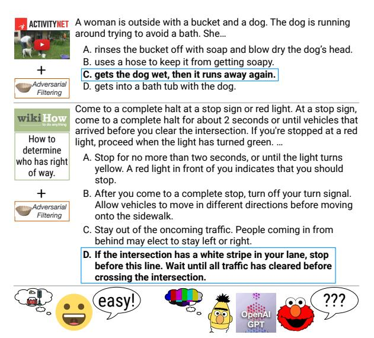
*الشكل 1: نماذج مثل BERT تكافح لإكمال الجمل في *HellaSwag*، حتى عندما تأتي من نفس توزيع مجموعة التدريب. ومع أن النهايات الخاطئة تكون في صلب الموضوع، وتحتوي على كلمات تتعلق بالسياق، فإن البشر يحكمون باستمرار بأن معانيها إما خاطئة أو غير معقولة. على سبيل المثال، يقترح الخيار **A** من فقرة WikiHow أنه ينبغي للسائق التوقف عند الإشارة الحمراء **لمدة لا تزيد عن ثانيتين**.*

الحدث التالي المحتمل هو الخيار C — أنها ستبلل الكلب وسيهرب مرة أخرى.

عندما أُعلن عن مجموعة بيانات SWAG لأول مرة (Zellers et al., 2018)، بدت هذه المهمة الجديدة الخاصة بـ *الاستدلال باللغة الطبيعية المعتمد على المنطق السليم* تافهة للبشر (88%) لكنها صعبة على أحدث النماذج آنذاك (<60%)، بما في ذلك ELMo (Peters et al., 2018). ومع ذلك، سرعان ما وصل BERT (Devlin et al., 2018) إلى ما يزيد عن 86%، أي أداء يقترب من مستوى البشر. وقد جاء عنوان مقال إخباري حول هذا التطور: "أخيرًا، آلة يمكنها إكمال جملتك."

في هذه الورقة، نبحث في السؤال التالي: ما مدى أداء النماذج العميقة المُدرَّبة مسبقًا، مثل

> ^&^lt;sup>1مقال في New York Times على الرابط https://nyti.ms/2DycutY.

<!-- page 2 -->

BERT، في الاستدلال باللغة الطبيعية (NLI) المعتمد على المنطق السليم؟ استنتاجنا المفاجئ هو أن *المهمة* الكامنة لا تزال غير محلولة. وبالفعل، نجد أن النماذج العميقة مثل BERT لا تُظهر بمفردها قدرة استدلال منطقي سليم متينة. بل تعمل أكثر شبهًا بـ *المتعلمات السطحية السريعة* لمجموعة بيانات بعينها. ويعتمد أداؤها القوي على SWAG على عملية الضبط الدقيق (finetuning)، حيث تتعلم إلى حد كبير التقاط التحيزات التوزيعية الخاصة بمجموعة البيانات. وعندما يتغير توزيع اللغة قليلًا، ينخفض الأداء بشكل حاد — حتى لو ظل المجال متطابقًا.

ندرس هذا السؤال من خلال تقديم Hella-Swag،2 وهو معيار مرجعي جديد للاستدلال باللغة الطبيعية المعتمد على المنطق السليم. نستخدم التصفية العدائية (AF)، وهي نموذج لجمع البيانات تُستخدم فيه سلسلة من المُمَيِّزات لاختيار مجموعة صعبة من الإجابات الخاطئة المُولَّدة. وتُعد AF فعالة بشكل مفاجئ نحو هذا الهدف: مجموعة البيانات الناتجة المؤلفة من 70 ألف مسألة سهلة على البشر (دقة 95.6%)، لكنها صعبة على الآلات (<50%). وتظل هذه النتيجة قائمة حتى عندما تُعطى النماذج عددًا كبيرًا من أمثلة التدريب، وحتى عندما تأتي بيانات الاختبار من نفس توزيع بيانات التدريب. وينخفض أداء الآلة 5% إضافية عند التقييم على أمثلة تغطي مفاهيم جديدة من نفس المجال.

لجعل مجموعة البيانات هذه متينة أمام النماذج العميقة المُدرَّبة مسبقًا، نستخدم ثلاثيًا من أحدث المُولِّدات (Radford et al., 2018)، وأحدث المُمَيِّزات (BERT)، ونصوص مصدر عالية الجودة. ونوسع نطاق مجال SWAG الأصلي لشروح الفيديو باستخدام مقالات WikiHow، مما يزيد بشكل كبير من تنوع السياق وطول التوليد. ويكشف بحثنا عن منطقة Goldilocks — تقريبًا ثلاث جمل سياق، وجملتان مُولَّدتان — حيث تكون التوليدات في معظمها غير منطقية، ومع ذلك لا تستطيع أحدث المُمَيِّزات التمييز بشكل موثوق بين هذه التوليدات والحقيقة الأساسية.

وعلى نطاق أوسع، تقدم ورقتنا دراسة حالة نحو مستقبل من التقدم المُتحقَّق منه في معالجة اللغة الطبيعية، عبر جولات تكرارية لبناء وكسر مجموعات البيانات. إذا كان هدفنا النهائي هو توفير معايير مرجعية موثوقة لمهام صعبة، مثل الاستدلال باللغة الطبيعية المعتمد على المنطق السليم، فلا يمكن لهذه المعايير أن تكون ساكنة. بل يجب أن تتطور مع تطور أحدث

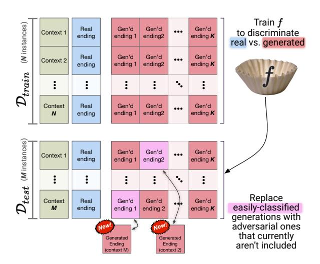
*الشكل 2: نظرة عامة على التصفية العدائية. في كل تكرار، يُدرَّب مُصنِّف جديد على مجموعة تدريب وهمية \mathcal{D}_{train} لاستبدال النهايات السلبية سهلة التصنيف على مجموعة الاختبار الوهمية \mathcal{D}_{test} بنهايات عدائية. تُكرَّر هذه العملية بشكل تكراري للحصول على مجموعة بيانات صعبة بصرف النظر عن التقسيم النهائي.*

ما توصلت إليه التقنية. ويتطلب التطور المستمر بدوره خوارزميات إنشاء مجموعات بيانات قائمة على مبادئ. وكلما أُنشئ تكرار جديد لمجموعة بيانات، يجب أن تستفيد هذه الخوارزميات من التطورات الحالية في النمذجة لتصفية التحيزات الزائفة. ولا يمكننا القول إن *المهمة* الكامنة — في مقابل مجموعة بيانات فردية — قد حُلَّت إلا عندما تصبح هذه الدورة مستحيلة.

# 2 الخلفية

SWAG هي مجموعة بيانات للاستدلال باللغة الطبيعية المعتمد على المنطق السليم. لكل سؤال، يُعطى النموذج **سياقًا** من شرح فيديو وأربعة **خيارات نهاية** لما قد يحدث بعد ذلك. خيار واحد فقط هو الصحيح — وهو الشرح الفعلي التالي للفيديو.

يُعد الحصول على إجابات سلبية مثيرة للاهتمام تحديًا. وقد وجدت الأعمال السابقة (مثل Gururangan et al., 2018; Poliak et al., 2018) أنه عندما يكتب البشر النهايات لأسئلة الاستدلال باللغة الطبيعية، فإنهم يُدخلون تحيزات شرطية على الفئة دقيقة لكنها قوية تُعرف بـ *قطع الأثر التعليقية*.3

لمعالجة هذا، قدّم Zellers et al. (2018) **التصفية العدائية** (AF). يظهر نظرة عامة في الشكل 2. الفكرة الأساسية هي إنتاج مجموعة بيانات \mathcal{D} عدائية لـ *أي* تقسيم اعتباطي إلى (\mathcal{D}_{train}, \mathcal{D}_{test}). يتطلب هذا *مولِّدًا* لمرشحات سلبية (أي نهايات خاطئة

> ^&^lt;sup>2اختصار لـ Harder Endings, Longer contexts, and Low-shot Activities for Situations With Adversarial Generations. مجموعة البيانات والكود على https://rowanzellers.com/hellaswag.

> ^&^lt;sup>3هذه التحيزات تُضخِّم أداء النموذج فحسب، لكن الأعمال السابقة أظهرت أيضًا أن هناك تحيزات اجتماعية غير مرغوبة تنشأ عندما يكتب البشر النهايات، من حيث الجنس والعرق (Rudinger et al., 2015).

<!-- page 3 -->

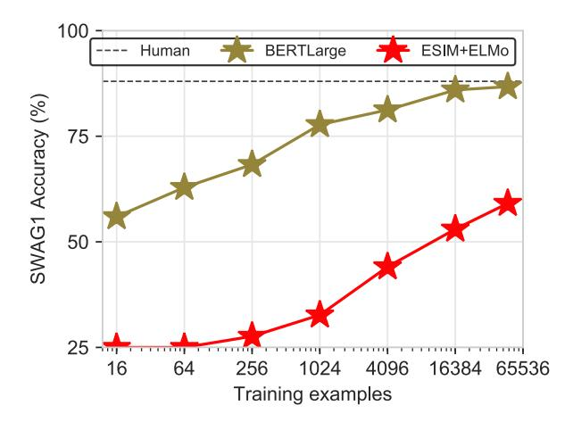
*الشكل 3: دقة التحقق على SWAG لـ BERT-Large مقابل حجم مجموعة التدريب. خط الأساس (دقة 25%) هو الصدفة العشوائية. يُبلي BERT بلاءً حسنًا حتى مع 16 مثالًا تدريبيًا فقط، لكنه يحتاج إلى عشرات الآلاف من الأمثلة للاقتراب من الأداء البشري.*

تنتهك تصورات البشر حول كيفية عمل العالم)، وهو ما نحققه باستخدام نموذج لغوي. تُختار المرشحات المحتملة للإجابات غير الصحيحة بإفراط من نموذج لغوي مدرب على بيانات داخل المجال، ثم تُنتقى باستخدام مجموعة من الخصوم. تحدث عملية الاختيار بشكل تكراري: في كل تكرار، تُقسَّم مجموعة البيانات عشوائيًا إلى \mathcal{D}_{train} و \mathcal{D}_{test}. تُدرَّب المجموعة على تصنيف النهايات إلى حقيقية أو مُولَّدة على \mathcal{D}_{train}، ثم تستبدل AF التوليدات سهلة التصنيف في \mathcal{D}_{test}. تستمر هذه العملية حتى تتقارب دقة هؤلاء الخصوم. وأخيرًا، يتحقق البشر من البيانات لإزالة النهايات العدائية التي تبدو واقعية.

من المهم أن AF تُنشئ مجموعة بيانات نهائية تظل صعبة على النماذج بصرف النظر عن تقسيم مجموعة البيانات النهائي. في القسم 4، سنستخدم AF كمحرك أساسي لإنشاء مجموعة بيانات استدلال باللغة الطبيعية سهلة على البشر، لكنها صعبة على الآلات. وتستمر هذه الصعوبة حتى عندما تُزوَّد النماذج ببيانات تدريب كبيرة، وحتى عندما تأتي هذه البيانات من نفس توزيع مجموعة الاختبار. ويتناقض هذا مع الأعمال السابقة على الأمثلة العدائية (مثل Jia and Liang, 2017; Glockner et al., 2018; Belinkov and Bisk, 2018) التي تنظر في حالات تُبنى فيها مجموعة اختبار خارج التوزيع لتكون عدائية.

## **التحقيق في SWAG**

في هذا القسم، نحقق في سبب حل SWAG. نركز على BERT، إذ هو الأفضل

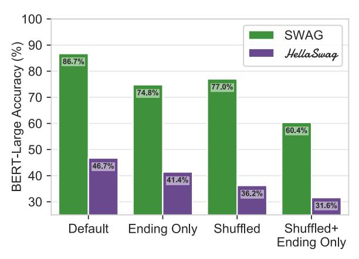
*الشكل 4: دقة التحقق لـ BERT عند التدريب والتقييم بموجب عدة إصدارات من SWAG، مع مجموعة البيانات الجديدة *HellaSwag* للمقارنة. نقارن:*

النهاية فقط لا يُقدَّم سياق؛ فقط النهايات.

النهايات التي تُقطَّع رمزيًا بشكل فردي، مُخلوطة، خُلطت، ثم أُعيد دمجها.

مخلوطة + لا يُقدَّم سياق وكل نهاية النهاية فقط مخلوطة.

نهج معروف وقت الكتابة.4 جوهر تحليلنا هو التحقيق في كيف يمكن لنموذج مُدرَّب على Wikipedia والكتب أن يُضبط بدقة بفعالية على SWAG، وهي مجموعة بيانات من شروح الفيديو.

## ما مقدار المعرفة الفطرية لدى BERT 3.1 حول SWAG؟

نبحث في هذا السؤال عبر قياس أداء BERT على SWAG مع تغيير حجم مجموعة بيانات التدريب؛ وتظهر النتائج في الشكل 3. وبينما يحتاج أفضل نموذج ELMo NLI معروف (ESIM+ELMo; Chen et al., 2017) إلى مجموعة التدريب الكاملة للوصول إلى 59%، يتفوق BERT على هذا بـ 64 مثالًا فقط. ومع ذلك، لا يزال BERT يحتاج إلى ما يزيد عن 16 ألف مثال للاقتراب من الأداء البشري، وعندها يستوي.

## ماذا يُتعلَّم خلال الضبط الدقيق؟

يقارن الشكل 4 أداء BERT عند التدريب والتقييم على متغيرات من SWAG.

**السياق:** ينخفض أداء BERT بمقدار 11.9 نقطة فقط (86.7\% \rightarrow 74.8\%) عند حذف السياق (النهاية فقط)، مما يُشير إلى وجود تحيز في النهايات نفسها.5 إذا بدا حدث المتابعة غير معقول في غياب السياق، فلا بد من وجود فرق ملحوظ بين فضاء النهايات المكتوبة بشريًا والمُولَّدة آليًا.

**البنية:** للتمييز بين استخدام الكلمة و

> ^&^lt;sup>4انظر الملحق لمناقشة معمارية BERT وإعدادات المعاملات الفائقة التي استخدمناها في تجاربنا.

> ^&^lt;sup>5هذه التحيزات مماثلة لتلك الموجودة في مجموعات بيانات NLI، كما وجد Gururangan et al. (2018); Poliak et al. (2018).

<!-- page 4 -->

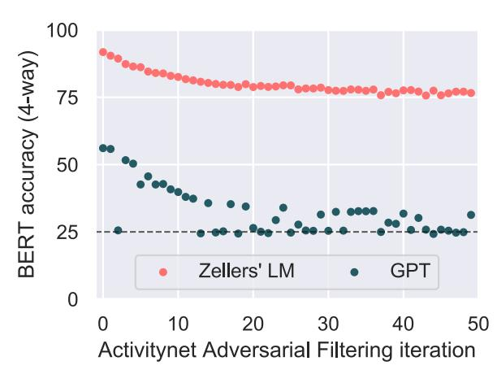

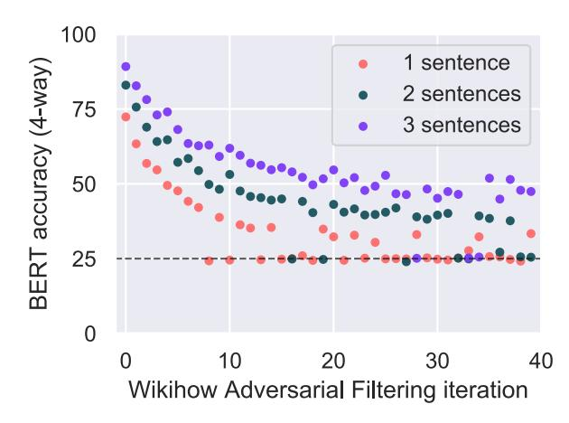
*الشكل 5: نتائج التصفية العدائية (AF) مع BERT-Large كمُمَيِّز. اليسار: AF مطبقة على توليدات ActivityNet المُنتَجة من النموذج اللغوي لـ [Zellers et al.](#page-9-0) [(2018)](#page-9-0) مقابل OpenAI GPT. وبينما يتقارب GPT عند مستوى عشوائي، يتقارب النموذج اللغوي المستخدم لـ SWAG عند 75%. اليمين: AF مطبقة على توليدات WikiHow من GPT، مع تغيير طول النهاية من جملة واحدة إلى ثلاث جمل. تتقارب إلى عشوائي، و"40%، و"50%، على التوالي.*

الأنماط البنيوية، نعتبر سيناريو جديدًا، مخلوطًا. هنا يُقدَّم السياق المشترك، لكن الكلمات في كل خيار نهاية تُبدَّل عشوائيًا. والمدهش أن هذا يُقلل أداء BERT بأقل من 10%. ورغم أن BERT لم يتعرض أبدًا لنص مخلوط عشوائيًا خلال التدريب المسبق، فإنه يتكيف بسهولة مع هذا الإعداد، مما يُشير إلى أن BERT يُجري إلى حد كبير استدلالًا معجميًا فوق كل زوج (سياق، إجابة).

أخيرًا، عند إزالة السياق وخلط الكلمات في كل نهاية، ينخفض الأداء إلى 60.4%. ورغم انخفاضه، فإنه لا يزال أعلى من أداء ELMo (†60% من [Zellers](#page-9-0) [et al.,](#page-9-0) [2018)](#page-9-0). وحيث إنه لا السياق ولا البنية مطلوبان للتمييز بين النهايات المكتوبة بشريًا وآليًا في معظم الحالات، فمن المرجح أن الأنظمة تتعلم بشكل أساسي اكتشاف الأنماط الأسلوبية التوزيعية خلال الضبط الدقيق.

## 3.3 من أين تأتي التحيزات الأسلوبية؟

أُنشئت SWAG عبر التصفية العدائية (AF). وُلِّدت النهايات عبر نموذج لغوي، ثم اختيرت لخداع المُمَيِّز. ولفهم سبب حلها يتطلب فهم تفاعل AF فيما يتعلق بمولِّدات SWAG ومُمَيِّزاتها.

استخدم [Zellers et al.](#page-9-0) [(2018)](#page-9-0) شبكة LSTM ثنائية الطبقات للتوليد، مع مرشحات أسلوبية عدائية ضحلة[.6](#page-3-1) كان هذا الإعداد متينًا أمام نماذج ELMo، لكن هل أنتج النموذج اللغوي الضحل بالتحديد قطع أثر توزيعية يلتقطها BERT؟

للتحقيق في هذا، نُجري AF باستخدام BERT-Large كمُمَيِّز[7](#page-3-2) في إعدادين، نقارن فيهما توليدات [Zellers et al.](#page-9-0) [(2018)](#page-9-0) مع تلك الصادرة من GPT مضبوط دقيقًا [(Radford et al.,](#page-9-2) [2018)](#page-9-2).

والمثير للدهشة أن النتائج، الشكل [5](#page-3-3) (يسار)، تظهر أن التوليدات المستخدمة في SWAG مختلفة عن النهايات المكتوبة بشريًا لدرجة *أن AF لا* *تخفض الدقة أبدًا إلى مستوى الصدفة*؛ بل تتقارب عند نحو 75%. من الجهة الأخرى، فإن توليدات GPT جيدة بما يكفي لانخفاض دقة BERT دون 30% عبر العديد من التقسيمات الفرعية العشوائية للبيانات، مما يكشف أهمية المُولِّد.

# 4 HellaSwag

يدل نجاح BERT على أن المُولِّدات والمُمَيِّزات عالية الجودة حاسمة لنجاح AF. غير أن هذا *لا* يعني أن المهمة الكامنة للاستدلال باللغة الطبيعية المعتمد على المنطق السليم — في مقابل مجموعة بيانات وحيدة — قد حُلَّت. ولتقييم هذا الادعاء، يلزمنا محاولة إنشاء تطور جديد لمجموعة بيانات SWAG، تُزال فيه قطع الأثر. في هذا القسم، نقوم بهذا تمامًا عبر تقديم HellaSwag.

## 4.1 ActivityNet Captions

نبدأ بتضمين شروح الفيديو من مجموعة بيانات ActivityNet Captions [(Krishna et al.,](#page-9-7) [2017)](#page-9-7). تحتوي مجموعة بيانات SWAG الأصلية على هذه، إلى جانب شروح من LSMDC [(Rohrbach](#page-9-8) [et al.,](#page-9-8) [2017)](#page-9-8)، لكن من أجل HellaSwag استخدمنا حصريًا

> ^6^كان المُمَيِّز مجموعة احتوت على نموذج كيس الكلمات، وشبكة CNN ضحلة، وإدراك متعدد الطبقات يعمل على حيرة النموذج اللغوي.

> ^7^في كل تكرار، تُعاد تهيئة BERT-Large من نقطة فحصها المُدرَّبة مسبقًا، ويُضبط دقيقًا، ثم يُقيَّم في إعداد رباعي الاتجاهات على مجموعة الاختبار الوهمية للبيانات المحجوزة. انظر الملحق [A](#page-0-2) للحصول على تفاصيل إعداد BERT-Large AF لدينا.

<!-- page 5 -->

ActivityNet. بالإضافة إلى الأوصاف الزمنية، تُقدم ActivityNet أيضًا تسميات نشاط لكل شرح (مثل القفز بالحبل). سنستخدم تسميات النشاط هذه كبنية إضافية لاختبار قدرة التعميم.

## 4.2 WikiHow: منصة اختبار جديدة

ننظر بعد ذلك في منصة اختبار جديدة وصعبة للاستدلال المنطقي السليم: إكمال مقالات الإرشادات (how-to) من WikiHow، وهو دليل إرشادات إلكتروني. نستخرج 80 ألف فقرة سياق ومتابعة من WikiHow، تغطي مواضيع متنوعة من "كيفية صنع بومة أوريغامي" إلى "كيف تنجو من سرقة بنك". ولكل سياق ثلاث جمل على الأكثر، وكذلك المتابعات.

تظهر فعالية AF في هذا الإعداد الجديد في الشكل [5](#page-3-3) (يمين). ننظر في ثلاثة إعدادات، تتطابق مع نهايات إما بطول جملة واحدة أو جملتين أو ثلاث جمل. وفي جميع الحالات، يبدأ أداء BERT مرتفعًا (70-90%)، لكن هناك توليدات كافية للتصفية العدائية لخفض الدقة النهائية بشكل كبير. وبينما يتقارب إعداد الجملة الواحدة إلى أعلى قليلًا من العشوائي — 35% عند تقاربه — تكون حالتا الجملتين والثلاث جمل أعلى، عند 40% و50% على التوالي. ومع المزيد من السياق، يصبح من الأسهل تصنيف نهاية على أنها مكتوبة آليًا أو بشريًا. نتنازل ونستخدم توليدات بجملتين. وتحديدًا في حالة الجملتين، نجد أنفسنا في منطقة Goldilocks حيث تكون التوليدات صعبة على النماذج العميقة، ومع ذلك، كما سنرى قريبًا، سهلة على البشر.

## 4.3 الحصول على اتفاق بشري عالٍ

ما مدى قدرة البشر على تمييز النهايات المكتوبة بشريًا عن التوليدات الآلية المُحسَّنة بالتصفية العدائية؟ في الشكل [6](#page-4-0)، نقارن الأداء البشري مع أداء BERT على تقسيم عشوائي 80%/20%. نرى تباينًا بين أداء ActivityNet وأداء WikiHow. فبينما يبدأ ActivityNet بكونه أصعب على BERT (25.5%)، فإنه يكون أيضًا صعبًا على البشر (60%). في المقابل، يبدأ WikiHow أسهل لـ BERT (41.1%) ويجد البشر المجال شبه تافه (93.5%). نفترض أن هذا التباين يعود إلى أطوال كلتا مجموعتي البيانات (الشكل [7](#page-4-1)). يبلغ متوسط توليدات WikiHow ذات الجملتين 41 رمزًا، مقابل 13 لـ ActivityNet. وهذا يعطي توليدات WikiHow ثلاثة أضعاف الفرص لارتكاب خطأ قابل للاكتشاف.

لضمان اتفاق عالٍ على ActivityNet، نُجري عدة جولات من التصفية البشرية،

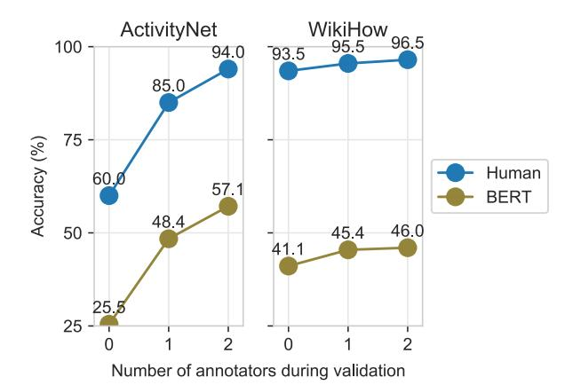
*الشكل 6: بالنسبة لـ HellaSwag، نضمن اتفاقًا بشريًا عاليًا عبر عدة جولات من التعليق التوضيحي. عبر جمع مدى احتمال كل نهاية يمكننا تصفية النهايات السلبية الزائفة — التوليدات الآلية التي تبدو واقعية — واستبدالها بسلبيات حقيقية. على كلتا مجموعتي البيانات الفرعيتين، يزداد أداء BERT خلال التحقق، لكن الفجوة مع الأداء البشري تظل واسعة.*

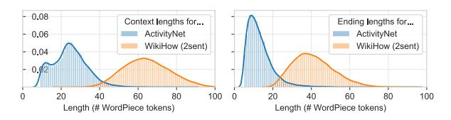
*الشكل 7: أطوال ActivityNet وWikiHow؛ الأخيرة بتوليدات بجملتين. WikiHow أطول بكثير، وهو ما يقابل كونها أسهل على البشر، مع استغراق وقت أطول لتقارب AF.*

تزيد الأداء البشري إلى 94%. خلال التحقق البشري، يُعطى عمال الجمع سياقًا وستة خيارات نهاية، أحدها هو النهاية الحقيقية، والخمسة الأخرى من AF. في كل تكرار، نستبدل النهايات المكتوبة آليًا التي قيّمها العامل على أنها واقعية بعينات جديدة. في النهاية، نحتفظ بأفضل 25 ألف سياق من ActivityNet (أي تلك ذات الاتفاق الأعلى بين العمال [8)](#page-4-2) وأفضل 45 ألف سياق من WikiHow.

## 4.4 فئات Zero-shot للتقييم

لتقييم قدرة النموذج على التعميم على مواقف جديدة، نستخدم تسميات الفئة من WikiHow وActivityNet لإنشاء مجموعات تقييم 'zero-shot'. لكل مجموعة (تحقق أو اختبار)، نُصمم مجموعتين فرعيتين: واحدة تحتوي على 5 آلاف مثال 'داخل المجال' تأتي من فئات شوهدت خلال التدريب (الشكل [8)](#page-5-0)، وأخرى بـ 5 آلاف مثال 'zero-shot' من فئات محجوزة مختارة عشوائيًا. في المجموع، هناك 70 ألف مثال في مجموعة البيانات.

> ^8^انظر الملحق للتفاصيل حول كيفية تقدير هذا.

<!-- page 6 -->

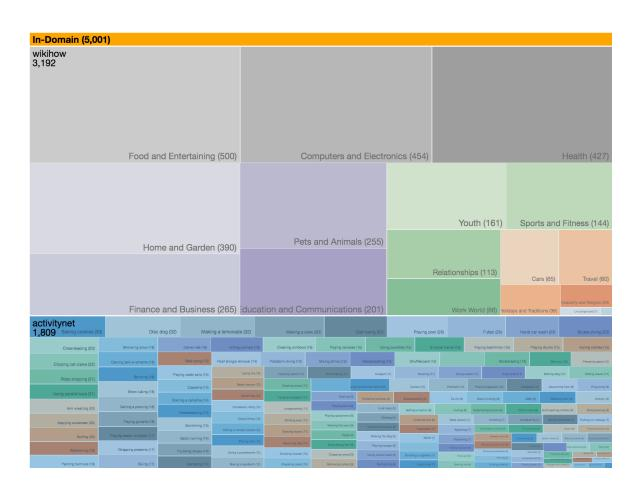
*الشكل 8: أمثلة على مجموعة التحقق داخل المجال لـ HellaSwag، مُجمَّعة حسب تسمية الفئة. يزن إعدادنا التقييمي بالتساوي الأداء على الفئات المرئية خلال التدريب وكذلك خارج المجال.*

# 5 النتائج

نُقيِّم صعوبة HellaSwag باستخدام مجموعة متنوعة من خطوط الأساس القوية، مع وبدون تدريب مسبق ضخم. تشترك النماذج في نفس التنسيق: عند إعطاء سياق ونهاية، تُعيد *لوجيت* لتلك النهاية. وعليه، نُدرِّب نماذجنا باستخدام خسارة إنتروبيا متقاطعة رباعية الاتجاهات، حيث يكون الهدف هو التنبؤ بالنهاية الصحيحة. بالإضافة إلى BERT-Large، تشمل مقارناتنا:

- a. OpenAI GPT [(Radford et al.,](#page-9-2) [2018)](#page-9-2): محول ذو 12 طبقة مضبوط دقيقًا تم تدريبه مسبقًا على BookCorpus [(Zhu et al.,](#page-9-9) [2015)](#page-9-9).
- b. Bert-Base: نسخة أصغر من نموذج BERT يتطابق حجم معماريتها مع GPT.
- c. ESIM+ELMo [(Chen et al.,](#page-8-3) [2017;](#page-8-3) [Peters et al.,](#page-9-1) [2018)](#page-9-1): هذا هو أفضل نموذج ELMo أداءً للاستدلال باللغة الطبيعية، مُعدَّل قليلًا بحيث تكون طبقة الإخراج النهائية

الآن softmax رباعي الاتجاهات على النهايات.

- d. مُشفِّر جملة LSTM: هذا هو bi-LSTM ثنائي الطبقات مُهيَّأ عشوائيًا؛ تُجمَّع الحالات المخفية للطبقة الثانية بأقصى تجميع وتُغذَّى إلى MLP للتنبؤ باللوجيت. ننظر في ثلاث تنويعات: تضمينات GloVe، أو تضمينات ELMo، أو تضمينات BERT-Base (مجمَّدة)[.9](#page-5-1)
- e. FastText: [(Joulin et al.,](#page-9-10) [2017)](#page-9-10) مكتبة جاهزة لتصنيف نص كيس الكلمات[.10](#page-5-2)

نقارن جميع النماذج بالأداء البشري عبر طلب خمسة عمال جمع مستقلين لحل نفس مسائل الاختيار من متعدد رباعية الاتجاهات؛ تُدمج تنبؤاتهم عبر تصويت الأغلبية.

تشير نتائجنا، الموضحة في الجدول [1،](#page-5-3) إلى صعوبة مجموعة البيانات: الأداء البشري يفوق 95%، بينما الأداء الإجمالي للنموذج أقل من 50% لكل نموذج. والمدهش أنه على الرغم من استخدام BERT-Large كمرشح عدائي، فإنه لا يزال يؤدي بأقوى شكل عند 47.3% إجمالًا. وعبر جعل مجموعة البيانات عدائية لـ BERT، يبدو أنها أصبحت أيضًا عدائية لكل نموذج آخر. على سبيل المثال، بينما حصل ESIM+ELMo على دقة 59% على SWAG، فإنه يحصل على دقة 33.3% فقط على HellaSwag.

بالإضافة إلى أن التدريب المسبق حاسم، كذلك الضبط الدقيق من البداية إلى النهاية. تجميد BERT-Base وإضافة LSTM فوقه يخفض أداءه الإجمالي بنسبة 4.3%. قد يساعد هذا في تفسير لماذا كافحت نماذج مثل ESIM+ELMo على SWAG، إذ لا يُحدَّث ELMo خلال الضبط الدقيق.

ومع أن BERT هو أفضل نموذج، فإنه لا يزال يكافح على HellaSwag، وخصوصًا على فئات zero-shot

> ^9^بالنسبة لـ ELMo وBERT-Base، يتعلم النموذج أوزانًا قياسية لدمج كل طبقة داخلية من المُشفِّر.

> ^10^يُدرَّب هذا النموذج بخسارة إنتروبيا متقاطعة ثنائية.

<!-- page 7 -->

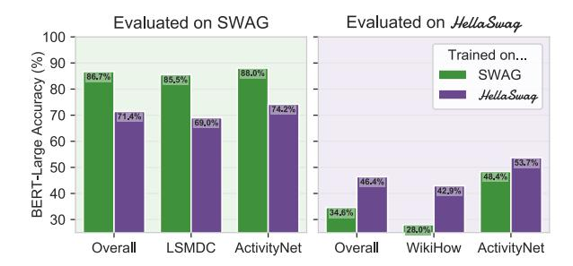
*الشكل 9: تجارب نقل من SWAG إلى Hella-Swag والعكس، مُقيَّمة على مجموعات التحقق. عمومًا، فإن BERT-Large المُدرَّب على SWAG لا يُعمَّم بالكاد إلى HellaSwag: يُسجل 34.6%.*

. ينخفض الأداء بنحو 5% على الطية الاختبارية، مما يُشير إلى أن الضبط الدقيق ليس كافيًا لـ BERT لتعلم التعميم على أنشطة جديدة أو فئات إرشادات (how-to).

أخيرًا، نرى أن WikiHow مجال أصعب بكثير من ActivityNet للآلات: أداء Bert-Large 45%، مقابل 96.5% للبشر. والعجيب أنه على مجموعة بيانات المصدر هذه نرى أصغر فجوة بين OpenAI GPT وBERT. وفي الواقع، يتفوق OpenAI GPT على BERT في WikiHow، لكن العكس صحيح بالنسبة لـ ActivityNet. أحد الاحتمالات هو أن البنية من اليسار إلى اليمين لـ GPT هي التحيز الاستقرائي المناسب لـ WikiHow — ربما الاستدلال ثنائي الاتجاه على سياقات طويلة هو أكثر مما يستطيع محول من 12 طبقة تعلمه.

## 5.1 النقل من SWAG إلى HellaSwag

نظرًا للأهداف المشتركة والمجالات الجزئية لـ SWAG وHellaSwag، فمن الطبيعي السؤال عن مدى قدرة النماذج على النقل بين مجموعتي البيانات. في الشكل [9](#page-6-0) نُظهر النتائج من تجارب النقل: تُدرَّب النماذج على مجموعة بيانات وتُقيَّم على الأخرى[.11](#page-6-1)

تُدرَّب أفضل النماذج على نفس مجموعة البيانات التي تُقيَّم عليها: التدريب على SWAG والتقييم على HellaSwag يخفض الأداء بنسبة 12%؛ والعكس يخفض الأداء بنسبة 15%. المجال المفقود لنماذج HellaSwag هو أوصاف الأفلام (LSMDC)، ومع ذلك تحصل نماذج Hella-Swag على دقة 69%. من ناحية أخرى، فإن نماذج SWAG لا تُعمَّم على الإطلاق على مجالها المفقود، WikiHow (28%)، مما يُشير إلى أن تعلم الاستدلال المنطقي السليم العام

الفئة: الحلاقة (ActivityNet؛ داخل المجال)

يُرى رجل ذو لحية يتحدث إلى الكاميرا ويصنع عدة وجوه. الرجل

- a) يتوقف بعد ذلك عن التشغيل ويُظهر نفسه عبر الغسالة والمجفف وهو يلف منشفة ويفرك الأرضية. (0.0%)
- b) ثم يفرك ويمسح وجه شخص آخر ويقود إلى رجل آخر يعزف على ناي شخص آخر. (0.0%)
- c) يُرى بعد ذلك يأكل طعامًا على سلم بينما لا يزال يتحدث. (0.0%) d) ثم يحمل شفرة حلاقة ويبدأ بحلاقة وجهه. (100.0%)

الفئة: شحذ السكاكين (ActivityNet؛ Zero-Shot)

رجلان في غرفة والرجل ذو القميص الأزرق يُخرج حجر مقعد ومع قليل من المُزلِّق على الحجر يأخذ سكينًا ويشرح كيفية شحذها. ثم هو

- a) يستخدم مشحاذًا لتنعيم الحجر باستخدام السكين. (100.0%)
- b) يُظهر كيفية قطع الجزء السفلي بالسكين ووضع أنبوب على الداخل والزاوية. (0.0%)
- c) ينحني ويمسك السكين ويزيل الجهاز. (0.0%)
- d) يتوقف عن شحذ السكين ويُخرج بعض قطع الورق ليُظهر مدى حدة السكين وهو يقطع شرائح من الورق بالسكين. (0.0%)

الفئة: الشباب (WikiHow؛ داخل المجال)

كيف تختلق عذرًا جيدًا لعدم إنهاء واجبك المنزلي

ألقِ اللوم على التكنولوجيا. أحد أسهل الأعذار وأكثرها مصداقية هو ببساطة إلقاء اللوم على التكنولوجيا. يمكنك القول إن حاسوبك تعطل، أو طابعتك انكسرت، أو إنترنتك معطل، أو أي عدد من المشاكل.

- a) لن تبدو أعذارك مصدقة بالكاد. [substeps] هذا لا يعني أنك تكذب، بل يعني فقط أنه ليس لديك كل التفاصيل حول كيفية عمل حاسوبك وقت الحادث. (0.0%) b) أبسط واحد ستجده في الفصل هو إلقاء اللوم على فصلك بأكمله، وليس فقط المختبر. إذا كان بإمكانك أن ترى نفسك ضحية، فلماذا لا تلوم التكنولوجيا. (9.4%)
- c) معظم الناس، بمن فيهم معلمك، قد عانوا من انتكاسات بسبب مشاكل تكنولوجية. [substeps] هذا عذر رائع إذا كان لديك ورقة كنت بحاجة إلى كتابتها وطباعتها. (29.1%) d) قد يكون أكثر مصداقية إذا كنت مدركًا تمامًا أنك قد تطير بسرعة عالية على متن طائرة وتحتاج إلى شخص ما ليُعطيك تقرير حركة المرور. مشكلتك قد تكون فشل لاب توبك في الشحن بعد رحلة طويلة. (61.5%)

*الشكل 10: أمثلة على أسئلة أجاب عنها BERT-Large. تنبؤات النموذج الصحيحة باللون الأزرق، التنبؤات غير الصحيحة باللون الأحمر. الإجابات الصحيحة بخط عريض.*

كان بالكاد ضروريًا لحل SWAG.

## 5.2 أمثلة نوعية

نُظهر عدة أمثلة نوعية في الشكل [10،](#page-6-2) إلى جانب تنبؤات BERT-Large. يُبلي BERT بلاءً حسنًا في بعض سياقات ActivityNet، كما في الصف الأول، حيث يتنبأ بشكل صحيح بنهاية شرح الحلاقة. وحيث إن *الحلاقة* داخل المجال، فإن المثال الثاني حول شحذ السكاكين هو zero-shot. في هذا السياق، تُشير إجابة BERT إلى أن المرء يستخدم سكينًا لشحذ حجر، بدلًا من العكس. المثال الأخير يأتي من WikiHow، الذي يبدو صعبًا للغاية على BERT. يختار BERT الإجابة d، التي تحتوي على كلمات أكثر تطابقًا مع سياق *التكنولوجيا* (طائرات، حركة مرور، لاب توب)، لكنها غير متماسكة[.12](#page-6-3)

> ^11^لاحظ أن تقسيمات ActivityNet مختلفة لكل مجموعة بيانات. لتجنب تحريف النتائج، نُبلِّغ فقط عن شروح الفيديو في مجموعة التحقق التي ليست في مجموعات تدريب أي من مجموعتي البيانات. الدقة الإجمالية حينئذٍ هي متوسط مرجح، حيث تُرجَّح أمثلة ActivityNet بنسبة أعلى. وهذا يعطي ميزة طفيفة للتدريب على SWAG، إذ يرى جميع فئات ActivityNet عند التدريب.

> ^12^من بين قضايا أخرى، لماذا قد يدرك المرء فجأة أنه 'يطير بسرعة عالية على متن طائرة...؟'

<!-- page 8 -->

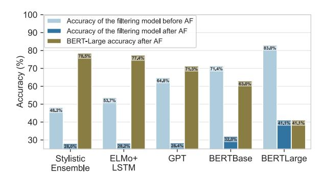
*الشكل 11: الأداء على المجموعة الفرعية WikiHow من تنويعات بديلة لـ HellaSwag، حيث تُستخدم مرشحات عدائية مختلفة (ولكن بدون تحقق بشري). نعتبر الخصوم الأسلوبيين الضحلين المستخدمين من قبل [Zellers et al.](#page-9-0) [(2018)](#page-9-0) (مجموعة أسلوبية)، إضافة إلى LSTM مع تضمينات ELMo، وGPT، وBERT-Base، وBERT-Large. لكل نموذج تصفية عدائية، نسجل دقة هذا النموذج قبل وبعد استخدام AF. كما نُقيِّم كل مجموعة بيانات بديلة باستخدام BERT-Large. تشير النتائج إلى أن استخدام نموذج أقوى وقت الاختبار (على النموذج المستخدم لـ AF) يُحسِّن الأداء، لكنه ليس كافيًا لحل المهمة.*

# 6 النقاش

تشير نتائجنا إلى أن HellaSwag منصة اختبار صعبة لأحدث نماذج NLI، حتى تلك المبنية على تدريب مسبق واسع. لكن السؤال لا يزال قائمًا: *إلى أين سيتجه المجال بعد ذلك؟*

## 6.1 ما مدى سهولة HellaSwag للمُمَيِّزات المستقبلية؟

في هذه الورقة، أظهرنا وجود منطقة Goldilocks من تعقيد النص — تكون فيها التوليدات غير منطقية، لكن أحدث نماذج معالجة اللغة الطبيعية الحالية لا تستطيع التمييز. ما مدى صعوبة مجموعة البيانات على النماذج المستقبلية، وإن كانت أقوى؟

الإجابة على هذا السؤال صعبة لأن *هذه النماذج غير موجودة (أو غير متاحة) في* *وقت الكتابة*. ومع ذلك، فإن أحد الحلول هو إجراء دراسة استئصالية على نموذج التصفية العدائية المُستخدم، مقارنةً مرشحات أضعف بمُمَيِّزات أقوى. نقدم نتائجنا في الشكل [11،](#page-7-0) ونجد أنه بينما تُقلل المُمَيِّزات الضعيفة (مثل المجموعة الأسلوبية المستخدمة لصنع SWAG) دقة BERT-Large بشكل هامشي فقط، فإن زيادة الفجوة بين المرشح والمُمَيِّز النهائي ليست كافية لحل المهمة. على سبيل المثال، استخدام مُمَيِّز بثلاثة أضعاف معاملات المرشح العدائي (BERT-Large مقابل BERT-Base) ينتج دقة آلية 63%.

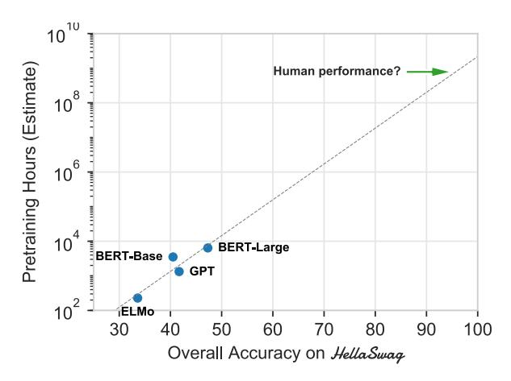
*الشكل 12: ساعات التدريب المسبق المقدرة المطلوبة للوصول إلى دقة مرغوبة على HellaSwag. نُقدِّر الأداء بالنسبة إلى RTX 2080 Ti — وهي GPU حديثة سريعة، ونلائم خط انحدار لوغاريتمي خطي. يُشير الاستقراء إلى أن الوصول إلى أداء بمستوى البشر على HellaSwag، بدون تحسينات خوارزمية أو حسابية، سيتطلب 10^9^ ساعة GPU من التدريب المسبق (أكثر من 100 ألف سنة GPU).*

## 6.2 ما مدى تطور التدريب المسبق؟

عمومًا، أحرز النموذج الحالي للتدريب المسبق للنماذج الكبيرة على الكثير من البيانات تقدمًا هائلًا في معايير معالجة اللغة الطبيعية. ومع أننا نتوقع استمرار هذا الاتجاه، إلا أنه يجدر بنا أيضًا النظر في حدوده. إذا كانت زيادة الحوسبة هي بالفعل الإجابة للاستدلال المنطقي السليم بمستوى البشر، فكيف ستبدو متطلبات الحوسبة لهذا النموذج الضخم الافتراضي؟

نتحقق من هذا في الشكل [12](#page-7-1) عبر مقارنة دقات النماذج المعروفة على Hella-Swag مع احتياجاتها الحسابية. هذا التقدير تقدير تقريبي: نحوّل أوقات تشغيل TPU المُبلَّغ عنها إلى GPU المعيار RTX 2080 Ti لدينا باستخدام نموذج Roofline [(Williams et al.,](#page-9-11) [2009)](#page-9,11)، الذي يركز بشكل أساسي على عنق الزجاجة لتحميل التنسورات في ذاكرة GPU. يُشير الاستقراء من ملاءمة أُسية إلى أن الوصول إلى أداء بمستوى البشر على مجموعة بياناتنا سيتطلب 109 ساعة GPU، أو 100 ألف سنة — ما لم تُجرَ تحسينات خوارزمية.

كيف قد تبدو هذه التحسينات الخوارزمية؟ قد تشمل تطورات معمارية، وأهداف تدريب مسبق أفضل، وما هو أبعد من ذلك. ومع ذلك، تشترك هذه التحسينات في عنق الزجاجة لمصدر البيانات. قد تتطلب الإجابة الصحيحة على بعض أسئلة Hella-Swag دون استدلال عميق — مثل معرفة أنه من السيئ التوقف عند الإشارة الحمراء لـ 'ثانيتين على الأكثر' — عددًا أُسيًا من العينات، بسبب مشاكل

<!-- page 9 -->

تحيز الإبلاغ [(Gordon and Van Durme,](#page-8-4) [2013)](#page-8-4). أو بدلًا من ذلك، قد تجيب النماذج المستقبلية بشكل صحيح فقط عبر التقاط أنماط زائفة، وفي هذه الحالة سيضعنا تطور جديد للمعيار — باستخدام هذه النماذج كخصوم — في نفس الموضع الذي نحن فيه الآن.

بعبارة أخرى، يتطلب من البشر للإجابة على أسئلة Hella-Swag *التجريد بعيدًا* عن اللغة ونمذجة *حالات العالم* بدلًا منها. نفترض أن هذا هو ما يفصل حل *مهمة* الاستدلال باللغة الطبيعية المعتمد على المنطق السليم، في مقابل مجموعة بيانات بعينها. وبالفعل، نجد أن الأساليب العميقة الحالية كثيرًا ما تنخدع بالأصدقاء الزائفين المعجميين. على سبيل المثال، في مثال WikiHow من الشكل [10،](#page-6-2) يختار BERT نهاية تتطابق مع كلمات *التكنولوجيا* في السياق، بدلًا من مطابقة الموضوع الأعمق: استخدام التكنولوجيا كعذر لعدم القيام بالواجب المنزلي.

## 6.3 نحو مستقبل من المعايير المتطورة

ماذا يحدث عندما يُحَل HellaSwag؟ نعتقد أن الإجابة بسيطة: الحصول على مجموعة بيانات أخرى عبر الحشد، بنفس التنسيق بالضبط، والنظر أين تفشل النماذج. في الواقع، في عملنا وجدنا أن هذا مباشر من منظور *خوارزمي*: عبر إدخال *أفضل مولِّد معروف* (GPT) و*أفضل مُمَيِّز معروف* (BERT-Large)، صنعنا مجموعة بيانات عدائية — ليس فقط لـ BERT، بل لجميع النماذج التي يمكننا الوصول إليها.

ومع أن هذا كان سهلًا خوارزميًا، يجب توخي الحذر من زاوية تنسيق البيانات. وبالفعل، نجد أن النجاح موجود ضمن منطقة Goldilocks: يجب أن يكون مصدر البيانات معقدًا بما يكفي بحيث ترتكب أحدث المُولِّدات أخطاءً في كثير من الأحيان، وفي الوقت ذاته بسيطًا بما يكفي بحيث تفشل المُمَيِّزات في كثير من الأحيان في إمساكها. وهذا يربط مستقبل المعايير على نمط SWAG بالتقدم في توليد اللغة: حتى يُحَل التوليد، سيظل الاستدلال باللغة الطبيعية المعتمد على المنطق السليم بدون حل. حتى النتائج الواعدة الأخيرة بشأن توسيع نطاق النماذج اللغوية [(Rad](#page-9-12)[ford et al.,](#page-9-12) [2019)](#page-9-12) تجد مشاكل من حيث الاتساق، حيث تتطلب أفضل الأمثلة المنسقة 25 بذرة عشوائية.

# 7 الخاتمة

في هذه الورقة، قدمنا HellaSwag، وهي مجموعة بيانات جديدة للاستدلال المنطقي السليم المُجسَّد ماديًا. عبر بناء مجموعة البيانات من خلال التصفية العدائية، مقترنة بأحدث النماذج لتوليد اللغة وتمييزها، أنتجنا مجموعة بيانات عدائية لأكثر النماذج المتاحة متانة — حتى عندما تُقيَّم النماذج على عناصر من توزيع التدريب. وبدورنا، قدمنا رؤية حول الآليات الداخلية للنماذج المُدرَّبة مسبقًا، ونقترح مسارًا لتقدم معالجة اللغة الطبيعية للأمام: نحو معايير تتطور بشكل عدائي مع تطور أحدث النماذج.

## شكر وتقدير

نشكر المُراجِعين، إضافة إلى Jesse Thomason، على ملاحظاتهم المفيدة. نشكر عمال Mechanical Turk على عملهم العظيم خلال جمع مجموعة البيانات. شكرًا أيضًا لـ Zak Stone وفريق Google Cloud TPU للمساعدة في البنية التحتية الحاسوبية. دُعم هذا العمل من قبل National Science Foundation عبر زمالة بحث الدراسات العليا (DGE-1256082) ومنح NSF (IIS-1524371, 1637479, 165205, 1703166)، وبرنامج DARPA CwC عبر ARO (W911NF-15-1-0543)، وبرنامج IARPA DIVA عبر D17PC00343، ومؤسسة Sloan Research عبر زمالة Sloan، ومعهد Allen للذكاء الاصطناعي، ومختبر NVIDIA للذكاء الاصطناعي، وهبات من Google وFacebook. الآراء والاستنتاجات الواردة هنا هي آراء المؤلفين ولا ينبغي تفسيرها على أنها تمثل تأييدات IARPA، أو DOI/IBC، أو حكومة الولايات المتحدة.

## المراجع

Yonatan Belinkov and Yonatan Bisk. 2018. Synthetic and natural noise both break neural machine translation. In *ICLR*. ICLR.

Qian Chen, Xiaodan Zhu, Zhen-Hua Ling, Si Wei, Hui Jiang, and Diana Inkpen. 2017. Enhanced lstm for natural language inference. In *Proceedings of the* *55th Annual Meeting of the Association for Compu**tational Linguistics (Volume 1: Long Papers)*, volume 1, pages 1657–1668.

Jacob Devlin, Ming-Wei Chang, Kenton Lee, and Kristina Toutanova. 2018. Bert: Pre-training of deep bidirectional transformers for language understanding. *arXiv preprint arXiv:1810.04805*.

Max Glockner, Vered Shwartz, and Yoav Goldberg. 2018. Breaking nli systems with sentences that require simple lexical inferences. In *Proceedings of* *the 56th Annual Meeting of the Association for Com**putational Linguistics (Volume 2: Short Papers)*, pages 650–655.

Jonathan Gordon and Benjamin Van Durme. 2013. Reporting bias and knowledge acquisition. In *Proceed-*

<!-- page 10 -->

- *ings of the 2013 workshop on Automated knowledge* *base construction*, pages 25–30. ACM.
- Suchin Gururangan, Swabha Swayamdipta, Omer Levy, Roy Schwartz, Samuel R. Bowman, and Noah A. Smith. 2018. Annotation artifacts in natural language inference data. In *Proc. of NAACL*.
- Ari Holtzman, Jan Buys, Maxwell Forbes, and Yejin Choi. 2019. The curious case of neural text degeneration. *arXiv preprint arXiv:1904.09751*.
- Robin Jia and Percy Liang. 2017. Adversarial examples for evaluating reading comprehension systems. In *Proceedings of the 2017 Conference on Empiri**cal Methods in Natural Language Processing*, pages 2021–2031.
- Armand Joulin, Edouard Grave, Piotr Bojanowski, and Tomas Mikolov. 2017. Bag of tricks for ecient text classification. In *Proceedings of the 15th Confer**ence of the European Chapter of the Association for* *Computational Linguistics: Volume 2, Short Papers*, volume 2, pages 427–431.
- Ranjay Krishna, Kenji Hata, Frederic Ren, Li Fei-Fei, and Juan Carlos Niebles. 2017. Dense-Captioning Events in Videos. In *International Conference on* *Computer Vision (ICCV)*.
- Matthew Peters, Mark Neumann, Mohit Iyyer, Matt Gardner, Christopher Clark, Kenton Lee, and Luke Zettlemoyer. 2018. Deep contextualized word representations. In *Proceedings of the 2018 Conference* *of the North American Chapter of the Association* *for Computational Linguistics: Human Language* *Technologies, Volume 1 (Long Papers)*, volume 1, pages 2227–2237.
- Adam Poliak, Jason Naradowsky, Aparajita Haldar, Rachel Rudinger, and Benjamin Van Durme. 2018. Hypothesis only baselines in natural language inference. In *Proceedings of the Seventh Joint Con**ference on Lexical and Computational Semantics*, pages 180–191.
- Alec Radford, Karthik Narasimhan, Tim Salimans, and Ilya Sutskever. 2018. [Improving language under](https://blog.openai.com/language-unsupervised/)[standing by generative pre-training.](https://blog.openai.com/language-unsupervised/) Technical report, OpenAI.
- Alec Radford, Je↵rey Wu, Rewon Child, David Luan, Dario Amodei, and Ilya Sutskever. 2019. [Language](https://openai.com/blog/better-language-models/) [models are unsupervised multitask learners.](https://openai.com/blog/better-language-models/) Technical report, OpenAI.
- Anna Rohrbach, Atousa Torabi, Marcus Rohrbach, Niket Tandon, Christopher Pal, Hugo Larochelle, Aaron Courville, and Bernt Schiele. 2017. [Movie](https://doi.org/10.1007/s11263-016-0987-1) [Description.](https://doi.org/10.1007/s11263-016-0987-1) *International Journal of Computer Vi**sion*, 123(1):94–120.
- Rachel Rudinger, Vera Demberg, Ashutosh Modi, Benjamin Van Durme, and Manfred Pinkal. 2015. Learning to predict script events from domainspecific text. In *Proceedings of the Fourth Joint*

- *Conference on Lexical and Computational Seman**tics*, pages 205–210.
- Samuel Williams, Andrew Waterman, and David Patterson. 2009. Roofline: An insightful visual performance model for floating-point programs and multicore architectures. Technical report, Lawrence Berkeley National Lab.(LBNL), Berkeley, CA (United States).
- Rowan Zellers, Yonatan Bisk, Roy Schwartz, and Yejin Choi. 2018. Swag: A large-scale adversarial dataset for grounded commonsense inference. In *Proceed**ings of the 2018 Conference on Empirical Methods* *in Natural Language Processing (EMNLP)*.
- Yukun Zhu, Ryan Kiros, Richard Zemel, Ruslan Salakhutdinov, Raquel Urtasun, Antonio Torralba, and Sanja Fidler. 2015. Aligning books and movies: Towards story-like visual explanations by watching movies and reading books. In *arXiv preprint* *arXiv:1506.06724*.
