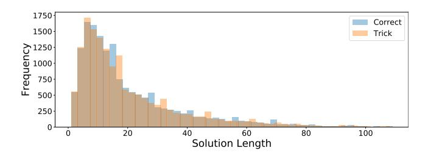
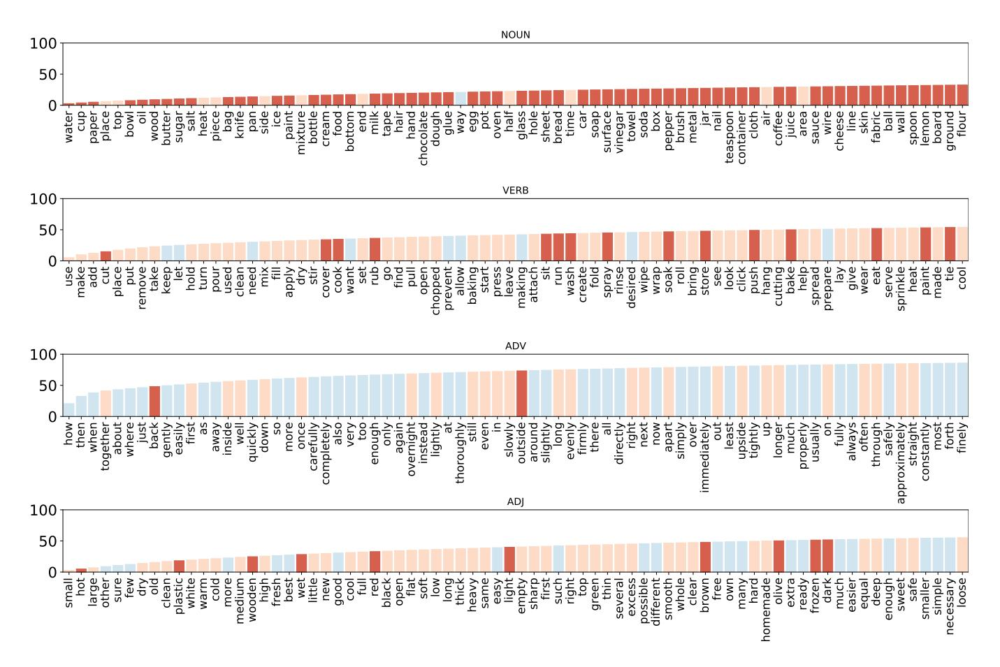
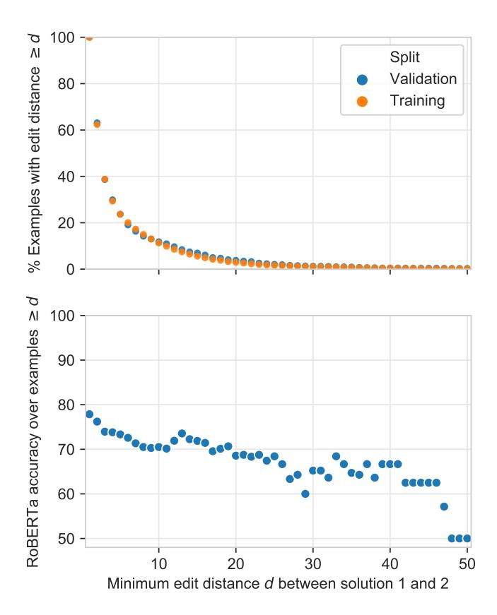
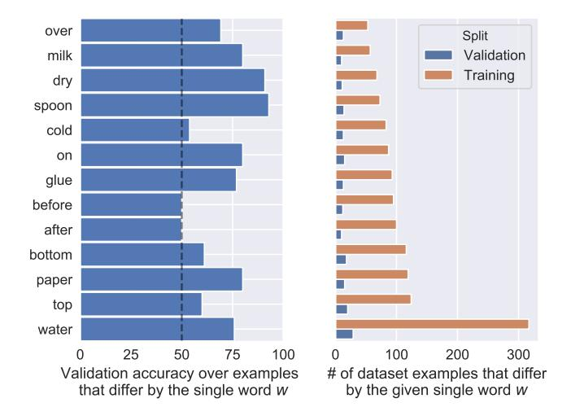
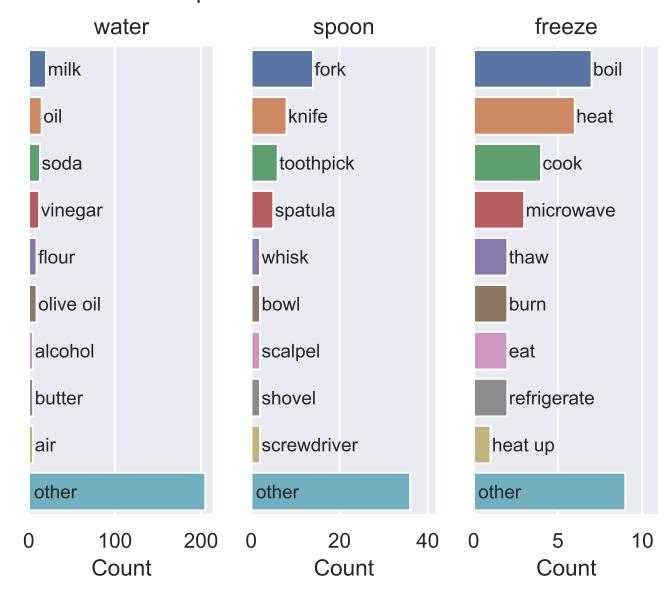

<!-- RP06_Bisk_2019 | source: papers_json/RP06_Bisk_2019/ -->

## PIQA: التفكير في المنطق السليم الفيزيائي باللغة الطبيعية

Yonatan Bisk1,2,3,4 Rowan Zellers1,4 Ronan Le Bras1 Jianfeng Gao2 Yejin Choi1,4

1معهد ألين للذكاء الاصطناعي 2أبحاث مايكروسوفت للذكاء الاصطناعي 3جامعة كارنيجي ميلون 4كلية بول ج. ألين لعلوم الحاسوب والهندسة، جامعة واشنطن http://yonatanbisk.com/piqa

## **الملخص**

لتطبيق ظلال العيون دون فرشاة، هل ينبغي أن أستخدم عود قطن أم عود أسنان؟ تشكل الأسئلة التي تتطلب هذا النوع من المنطق السليم الفيزيائي تحدياً لأنظمة فهم اللغة الطبيعية الحالية. وفي حين أن النماذج المدربة مسبقاً مؤخراً (مثل BERT) قد أحرزت تقدماً في الإجابة عن الأسئلة في مجالات أكثر تجريداً — مثل المقالات الإخبارية ومدخلات الموسوعات، حيث يتوفر النص بكثرة — فإنه في المجالات الأكثر مادية يكون النص محدوداً بطبيعته بسبب التحيز في الإبلاغ. هل يمكن لأنظمة الذكاء الاصطناعي أن تتعلم الإجابة بشكل موثوق عن أسئلة المنطق السليم الفيزيائي دون تجربة العالم المادي؟ في هذه الورقة، نقدم مهمة التفكير المنطقي السليم الفيزيائي ومجموعة بيانات معيارية مقابلة تسمى **التفاعل الفيزيائي: الإجابة عن الأسئلة** أو **PIQA**. ورغم أن البشر يجدون مجموعة البيانات سهلة (دقة 95%)، فإن النماذج الكبيرة المدربة مسبقاً تجد صعوبة (\sim77%). نقدم تحليلاً حول أبعاد المعرفة التي تفتقر إليها النماذج الحالية، مما يوفر فرصاً كبيرة للأبحاث المستقبلية.

## المقدمة

قبل أن يتعلم الأطفال اللغة، يبدؤون بالفعل في تشكيل فئات ومفاهيم بناءً على الخصائص الفيزيائية للأشياء من حولهم (Hespos and Spelke 2004). يصبح هذا النموذج للعالم أكثر ثراءً عندما يتعلمون التحدث، ولكنه يلتقط بالفعل المعرفة *المنطقية السليمة الفيزيائية* عن الأشياء اليومية: خصائصها الفيزيائية، وإمكانياتها، وكيف يمكن التعامل معها. هذه المعرفة بالغة الأهمية للحياة اليومية للإنسان، بما في ذلك مهام مثل حل المشكلات (ما الذي يمكنني استخدامه كوسادة عند التخييم؟) والتعبير عن الاحتياجات والرغبات (أحضر لي وسادة *أكثر* صلابة). وعلى نفس المنوال، نفترض أن نمذجة المعرفة المنطقية السليمة الفيزيائية تمثل تحدياً كبيراً على طريق اكتمال الذكاء الاصطناعي الحقيقي، بما في ذلك الروبوتات التي تتفاعل مع العالم وتفهم اللغة الطبيعية.

يمكن التعبير عن الكثير من المنطق السليم الفيزيائي باللغة، حيث تتجاوز تنوع الأشياء اليومية والمفاهيم الشائعة أنظمة التصنيف الأخرى. ومع ذلك، بسبب مشكلات التحيز في الإبلاغ، فإن هذه الخصائص المنطقية السليمة — الحقائق مثل "من السيئ تطبيق ظلال العيون بعود أسنان" — نادراً ما يتم الإبلاغ عنها مباشرة. وعلى الرغم من التقدم الأخير الكبير

حقوق النشر © 2020، جمعية النهوض بالذكاء الاصطناعي (www.aaai.org). جميع الحقوق محفوظة.

لفصل بياض البيض عن الصفار باستخدام زجاجة ماء، يجب عليك...

- أ. اضغط على زجاجة الماء واضغط بها على الصفار.
 ثم حررها، مما يخلق شفطاً ويرفع الصفار.
- ب. ضع زجاجة الماء واضغط بها على الصفار. استمر في الضغط، مما يخلق شفطاً ويرفع الصفار.

تم إحرازه في معالجة اللغة الطبيعية من خلال التحول نحو التمثيلات المدربة مسبقاً على نطاق واسع من النصوص غير المعنونة (Radford et al. 2018; Devlin et al. 2019; Liu et al. 2019)، فإن الجزء الأكبر من نجاح هذا النموذج كان في المهام والمجالات *المجردة* الأساسية. يمكن للنماذج الأكثر تطوراً الإجابة بموثوقية عن الأسئلة التي تُطرح بناءً على مقالة موسوعة (Rajpurkar et al. 2016) أو التعرف على الكيانات المسماة (Tjong Kim Sang and De Meulder 2003)، ولكن ليس من الواضح ما إذا كان بإمكانها الإجابة بقوة عن الأسئلة التي تتطلب معرفة منطقية سليمة فيزيائية.

لدراسة هذا السؤال والبدء في سد الفجوة التمثيلية، نقدم **التفاعل الفيزيائي: الإجابة عن الأسئلة**، أو **PIQA** لتقييم تمثيلات اللغة على معرفتها بالمنطق السليم الفيزيائي. نركز على المواقف اليومية مع تفضيل الحلول غير النمطية. مجموعة البيانات لدينا مستوحاة من instructables.com، الذي يوفر للمستخدمين تعليمات حول كيفية البناء، والصياغة،

<!-- page 2 -->

| أ. الشكل والمادة والغرض |  |
| --- | --- |
| [الهدف] صنع وسادة خارجية |  |
| [الحل1] انفخ في علبة معدنية واربطها بشريط مطاطي | X |
| [الحل2] انفخ في كيس قمامة واربطه بشريط مطاطي | ✓ |
| [الهدف] لصنع تاكو ذي قشرة صلبة، |  |
| [الحل1] ضع لحم البقر المتبل والجبن والخس على القشرة الصلبة. | X |
| [الحل2] ضع لحم البقر المتبل والجبن والخس داخل القشرة الصلبة. | ✓ |
| [الهدف] كيف أجد شيئاً فقدته على السجادة؟ |  |
| [الحل1] ضع ختماً صلباً على طرف المكنسة الكهربائية وشغلها. | X |
| [الحل2] ضع شبكة شعر على طرف المكنسة الكهربائية وشغلها. | ✓ |

## ب. ملاءمة المنطق السليم

[الهدف] كيف نتأكد من أن جميع الساعات في المنزل مضبوطة بدقة؟

[الحل1] احصل على ساعة شمسية كمرجع وضعها فقط خارج نافذة تحصل على الكثير من الشمس. استخدم نظام نداء واستجابة مرة في الشهر، حيث يقف شخص واحد عند الساعة الشمسية يصرخ بالوقت الصحيح ويتنقل شخص آخر إلى كل من الساعات الداخلية للتحقق مما إذا كانت تظهر الوقت الصحيح. اضبطها حسب الحاجة.

[الحل2] استبدل جميع الساعات اليدوية بساعات رقمية. وبهذه الطريقة، 
 تضبطها مرة واحدة، وهذا كل شيء. تحقق من البطاريات مرة في السنة أو إذا لاحظت أن أي شيء يبدو غير صحيح قليلاً.

*الشكل 2: **PIQA** يغطي مجموعة واسعة من الظواهر. أعلاه فئتان من أمثلة أزواج الأسئلة والإجابات. **اليسار** أمثلة تتطلب معرفة بالخصائص الأساسية للأشياء (المرونة، والتقوس، والمسامية)، بينما **اليمين** قد يكون كلا الإجابتين صحيحاً تقنياً ولكن إحداهما أكثر ملاءمة وأفضل.*

والخبز، أو التعامل مع الأشياء باستخدام مواد يومية. طلبنا من المعلقين تقديم اضطرابات دلالية أو نهج بديلة تكون متشابهة نحوياً وموضوعياً لضمان استهداف المعرفة الفيزيائية. تم تنظيف مجموعة البيانات بشكل أكبر من القطع الأثرية الأساسية باستخدام خوارزمية AFLite المقدمة في (Sakaguchi et al. 2020; Sap et al. 2019) وهي تحسين على الترشيح العدائي (Zellers et al. 2018; Zellers et al. 2019b).

في جميع أنحاء هذا العمل، نقوم أولاً بتفصيل بناء معيارنا الجديد للمنطق السليم الفيزيائي. ثانياً، نوضح أن النهج الشائعة للتدريب المسبق للغة على نطاق واسع، رغم أنها ناجحة للغاية في كثير من المهام *المجردة*، تقصر عند الحاجة إلى نموذج فيزيائي للعالم. أخيراً، هدفنا هو تحفيز مزيد من البحث في بناء تمثيلات لغوية تلتقط تفاصيل العالم الحقيقي. ولتحقيق هذه الغايات، نقوم بإجراء تحليلات للأخطاء والمدونات لتقديم رؤى للأعمال المستقبلية.

## **مجموعة البيانات**

نقدم مجموعة بيانات جديدة، **PIQA** \triangle، لقياس التقدم في فهم المنطق السليم الفيزيائي. المهمة الأساسية هي الإجابة عن أسئلة الاختيار من متعدد: عند إعطاء سؤال q وحلين محتملين s_1, s_2، يجب على النموذج أو الإنسان اختيار الحل الأكثر ملاءمة، حيث أحدهما بالضبط هو الصحيح. نجمع البيانات بتعليمات الكيفية كهيكل، ونستخدم نهج أحدث ما توصل إليه العلم للتعامل مع التحيزات الزائفة، والتي سنناقشها أدناه.

## Instructables كمصدر للمنطق السليم الفيزيائي

هدفنا هو بناء مورد يتطلب تفكيراً فيزيائياً ملموساً. ولتحقيق ذلك، نقدم مطالبة للمعلقين مستمدة من instructables.com. موقع instructables هو مجموعة جماعية المصدر من التعليمات لفعل كل شيء من الطبخ إلى إصلاح السيارات. في معظم الحالات، يقدم المستخدمون صوراً أو مقاطع فيديو تفصل كل خطوة وقائمة بالأدوات المطلوبة. معظم الأهداف نادرة وغير مفاجئة في الوقت نفسه. في حين أنه من غير المحتمل أن يكون المعلق قد بنى مصباحاً على طراز الستيمبانك يتوهج بالأشعة فوق البنفسجية أو

صنع حقيبة ظهر من شريط لاصق، فليس من المفاجئ أن يقوم شخص مهتم بالحرف المنزلية بإنشاء هذه الأشياء، ولن تكون الأدوات والمواد غير مألوفة للشخص العادي. استخدام هذه الأمثلة كبذرة لتعليقاتهم يساعد على تذكير المعلقين بالاستخدامات الأقل نمطية للأشياء اليومية. ثانياً، وبنفس القدر من الأهمية، أن التعليمات تبني على بعضها البعض. وهذا يعني أن أي زوج سؤال وإجابة مستوحى من instructable من المرجح أن يذكر صراحة الافتراضات حول الشروط المسبقة التي يجب استيفاؤها لبدء المهمة وما هي شروط الإنجاز التي تحدد النجاح.

## جمع البيانات من خلال أزواج الهدف-الحل

على عكس مهام الإجابة عن الأسئلة التقليدية، نحدد مجموعة البيانات لدينا من حيث أزواج الهدف والحل (انظر الشكل 2 لأمثلة على أزواج الهدف-الحل وأنواع التفكير الفيزيائي). يمكن النظر إلى الهدف في معظم الحالات على أنه يشير إلى شرط بعدي والحلول تشير إلى الإجراء لإنجاز ذلك. كلما كان الهدف أكثر تفصيلاً، أصبح من الأسهل على المعلقين كتابة الحلول الصحيحة وغير الصحيحة. كما لوحظ أعلاه، فإن المكون الثاني من تصميم تعليقاتنا هو تذكير الناس بالتفكير بشكل إبداعي. جربنا في البداية مطالبة المعلقين بأزواج (المهمة، الأداة) عبر مطالبات غير مقيدة، ولكننا وجدنا أن التحيز في الإبلاغ أغرق مجموعة البيانات. على وجه الخصوص، عند التفكير في كيفية تحقيق هدف، ينجذب الناس في أغلب الأحيان إلى الحلول النموذجية ويبحثون عن الأدوات في المطبخ (مثل الشوك والسكاكين) أو المرآب (مثل المطارق والمثاقب). نادراً ما يفكرون في المئات من الأشياء اليومية الأخرى التي قد تكون في منازلهم (مثل طباشير الرصيف، وستائر الاستحمام، وما إلى ذلك).

لمعالجة هذا، وتسطيح توزيع الأشياء المشار إليها (انظر الشكل 5)، نطالب المعلقين بروابط إلى instructables. على وجه التحديد، طُلب من المعلقين إلقاء نظرة على تعليمات أحد instructable واستخراج أو استلهام ضرورة بناء مهمتين مكونتين. سيقومون بعد ذلك بصياغة الهدف (الذي يتمحور غالباً حول مواد غير نمطية) وكيفية تحقيقه. بالإضافة إلى ذلك، طلبنا منهم تقديم تعديل على حلهم الخاص يجعله غير صالح، غالباً بشكل دقيق (الشكل 3). لمزيد من المساعدة في التنوع

<!-- page 3 -->

**التعليمات**ألقِ نظرة سريعة على هذا instructable للإلهام: 1 جورب، 3 منتجاتhttp://www.instructables.com/id/1-Sock-3-Products/**نصيحة!** لا يعجبك هذا؟ لا تتردد في الكتابة عن instructable آخر. نحن نوفر فقط رابطاً للمساعدة في إثارة إبداعك.الخطوات1. **الهدف:** ما هما المهمتان اللتان يجعلك هذا تفكر بهما؟ (لا **تحاول** تلخيص instructable)2. **الحل:** ماذا ستقول لشخص ما لمساعدته على حل هذه المشكلات؟ ****ذكي ولكن صحيح أفضل!****3. **الخدعة:** ما هي الإجابة المماثلة التي ستكون خاطئة وتقودهم إلى ارتكاب خطأ؟ ****جديد!******التعليق 1****مهم!** لا تستخدم مصطلحات أو إشارات تتطلب معرفة خلفية من instructable. فقط استلهم وقدم وصفاً قائماً بذاته.**سؤال:** هل الهدف منطقي بمفرده؟ (بدون الإجابة أو instructable؟) هل يتطلب معرفة فيزيائية؟**الفيزيائي
الهدف****الحل****موضوعياً
متعلق
بالخدعة**Diff**الخدعة:** هل الخدعة دقيقة؟ (تجنب الإجابات الواضحة مثل استبدال الطبخ بزيت المحرك.)

*الشكل 3: في تصميم HIT يقدم instructable الإلهام للتفكير خارج الصندوق (*1 جورب*، *3 منتجات*) ويُطلب من المعلقين 1. هدف *فيزيائي*، 2. حل صالح، و3. خدعة. يجب أن تبدو الخدعة معقولة، ولكنها خاطئة في كثير من الأحيان بسبب سوء فهم دقيق للشروط المسبقة أو الفيزياء. تم تشغيل HITs إضافية (غير معروضة) للتأهيل قبل هذه المرحلة والتحقق بعدها.2*

نزرع المعلقين بـ instructables مأخوذة من ست فئات (الزي، والخارج، والحرف، والمنزل، والطعام، وورشة العمل). طلبنا أن يتم استخراج مثالين لكل instructable لتشجيع أحدهم على القدوم لاحقاً في العملية ويتطلب صياغة دقيقة للشروط المسبقة.

أثناء التحقق، تمت إزالة الأمثلة ذات التوافق المنخفض من البيانات. وغالباً ما يعني هذا أن الأمثلة الصحيحة قد تمت إزالتها والتي تتطلب معرفة على مستوى الخبراء بمجال (على سبيل المثال، مصطلحات أعمال النجارة الخاصة) والتي لا ينبغي أن تندرج تحت مظلة "المنطق السليم". ولأننا نركز على الخدع التي ينشئها الإنسان، كان المعلقون أحراراً في التوصل إلى طرق ذكية لإخفاء الخداع. غالباً ما كان هذا يعني إجراء تغييرات دقيقة جداً على الحل لجعله غير صحيح. في هذه الحالات، قد يختلف الحلان بكلمة واحدة فقط. وجدنا أن التعليقات استخدمت الحيل اللغوية البسيطة (مثل النفي والتغييرات العددية) وغالباً ما استبدلت إجراءً أو عنصراً رئيسياً بآخر مماثل موضوعياً ولكنه غير مفيد لإكمال الهدف المعطى. لهذا السبب، تتضمن واجهتنا أيضاً زر diff الذي يبرز مكان اختلاف الحلول. وقد حسن هذا دقة المعلق وسرعته بشكل كبير. متوسط أجر المعلقين أكثر من 15 دولاراً في الساعة وفقاً لكل من التقارير الذاتية على turkerview.com وحسابات التوقيت لدينا.

*الشكل 4: توزيعات طول الجمل لكل من الحلول الصحيحة والخدع متطابقة تقريباً عبر مجموعة التدريب.*

## **الإحصائيات**

في المجموع، تتألف مجموعة بياناتنا من أكثر من 16,000 زوج من أسئلة وإجابات التدريب مع \sim2K و\sim3k إضافية مخصصة للتطوير والاختبار، على التوالي. أهدافنا، كما تم تقسيمها بواسطة Spacy،3 يبلغ متوسطها 7.8 كلمات وكل من الحلول الصحيحة وغير الصحيحة يبلغ متوسطها 21.3 كلمة. في المجموع، يؤدي هذا إلى أكثر من 3.7 مليون رمز معجمي في بيانات التدريب.

يوضح الشكل 4 رسماً بيانياً لأطوال التسلسل الصحيحة وغير الصحيحة (كما تم تقسيمها بواسطة محلل GPT BPE)، مع إزالة أطول 1% من البيانات. على الرغم من وجود اختلافات طفيفة، فإن التوزيعين متطابقان تقريباً.

قمنا أيضاً بتحليل التداخل في المفردات ووجدنا أنه في جميع الحالات (الاسم، والفعل، والصفة، والظرف) نرى تداخلاً لا يقل عن 85% بين الكلمات المستخدمة في الحلول الصحيحة وغير الصحيحة. لدينا في المجموع 6,881 اسماً فريداً، و2,493 فعلاً، و2,263 صفة، و604 ظروف في بيانات التدريب. الأكثر شيوعاً منها مرسومة في الشكل 5 جنباً إلى جنب مع توزيعاتها التراكمية. مرة أخرى، يساعد هذا في التحقق من أن مجموعة البيانات تدور بشكل كبير حول الظواهر الفيزيائية والخصائص والتلاعبات. على سبيل المثال، تشمل الصفات الأعلى الحالة (جاف، نظيف، حار) والشكل (صغير، حاد، مسطح)؛ تشمل الظروف الشروط الزمنية (ثم، عندما) والطريقة (بسرعة، بعناية، تماماً). هذه الخصائص غالباً ما تميز الإجابات الصحيحة عن غير الصحيحة، كما هو موضح في الأمثلة في جميع أنحاء الورقة. نقوم أيضاً بتلوين الكلمات وفقاً لدرجة تجسدها (Brysbaert, Warriner, and Kuperman 2014)، على الرغم من أن العديد من الكلمات "المجردة" لها تحققات ملموسة في مجموعة البيانات لدينا.

## **إزالة قطع التعليقات الأثرية**

كما لوحظ سابقاً، نستخدم AFLite (Sakaguchi et al. 2020) لإزالة القطع الأثرية الأسلوبية والأمثلة التافهة من البيانات، والتي ثبت أنها تضخم بشكل اصطناعي أداء النموذج على معايير NLI السابقة (Poliak et al. 2018; Gururangan et al. 2018). تقوم خوارزمية AFLite بتقليل تحيز البيانات بشكل منهجي: تتجاهل المثيلات التي تكون تمثيلات الميزات المعطاة لها بشكل جماعي مؤشرات قوية للغاية على التسمية المستهدفة. عملياً، نستخدم 5,000 مثال من مجموعة البيانات الأصلية لضبط BERT-Large لهذه المهمة وحساب التضمينات المقابلة لجميع المثيلات المتبقية. يستخدم AFLite مجموعة من المصنفات الخطية المدربة على مجموعات فرعية عشوائية من البيانات لتحديد ما إذا كانت هذه التضمينات المحسوبة مسبقاً قوية

> ^&^lt;sup>2بالإضافة إلى هذا التصميم، نقوم أيضاً بتضمين HIT تأهيلي يحتوي على أزواج (الهدف، الحل) المُنشأة جيداً وغير المحددة بشكل كاف. كان على المعلقين تحديد بنجاح (>80%) أيها تم تشكيله جيداً للمشاركة في HIT الرئيسي. تم جمع البيانات على دفعات من عدة آلاف من الثلاثيات وتم التحقق منها من قبل معلقين آخرين للتأكد من صحتها. تم إلغاء تأهيل المستخدمين ذوي التوافق المنخفض.

> ^&^lt;sup>3https://spacy.io- تم جمع جميع البيانات باللغة الإنجليزية.

<!-- page 4 -->

*الشكل 5: هنا نعرض توزيعات التكرار لأعلى خمسة وسبعين كلمة موسومة بواسطة Spacy كاسم، فعل، ظرف أو صفة. نرى أن الغالبية العظمى من المفاهيم تركز على الخصائص الفيزيائية (*مثل صغير، حار، بلاستيك، خشبي*) وكيف يمكن التعامل مع الأشياء (*مثل قطع، تغطية، نقع، دفع*). بالإضافة إلى ذلك، نرى سلوكاً زيبفياً قوياً في جميع العلامات باستثناء الظروف. يتم تلوين الكلمات حسب متوسط درجات التجسد المقدمة من قبل (Brysbaert, Warriner, and Kuperman 2014).*

مؤشرات على خيار الإجابة الصحيحة. بدلاً من الاضطرار إلى تحديد المصادر المحتملة للتحيزات على وجه التحديد، يمكّن هذا النهج من تقليل تحيز البيانات بشكل غير خاضع للإشراف من خلال الاعتماد على أحدث الطرق للكشف عن قطع التعليقات الأثرية غير المرغوب فيها. لمزيد من المعلومات حول AFLite، يرجى الرجوع إلى (Sakaguchi et al. 2020).

## **التجارب**

في هذا القسم، نختبر أداء أحدث نماذج فهم اللغة الطبيعية على مجموعة بياناتنا، **PIQA**. على وجه الخصوص، نحن نأخذ في الاعتبار النماذج الثلاثة التالية المدربة مسبقاً على نطاق واسع:

- **أ**. **GPT** (Radford et al. 2018) هو نموذج يعالج النص من اليسار إلى اليمين، وتم تدريبه مسبقاً باستخدام هدف نمذجة اللغة. نستخدم نموذج GPT الأصلي بـ 124 مليون معامل.
- **ب.** **BERT** (Devlin et al. 2019) هو نموذج يعالج النص ثنائي الاتجاه، وبالتالي تم تدريبه مسبقاً باستخدام هدف خاص لنمذجة اللغة المقنعة. نستخدم BERT-Large بـ 340 مليون معامل.
- **ج.** **RoBERTa** (Liu et al. 2019) هو إصدار من نموذج BERT تم تصميمه ليكون أكثر قوة بشكل ملحوظ من خلال التدريب المسبق على المزيد من البيانات والتحقق الدقيق من المعاملات الفائقة قبل-

التدريب. نستخدم RoBERTa-Large، الذي يحتوي على 355 مليون معامل.

نتبع أفضل الممارسات القياسية في تكييف هذه النماذج للتصنيف الثنائي. ننظر في خياري الحل بشكل مستقل: لكل خيار، يتم تزويد النموذج بالهدف وخيار الحل ورمز <code>[CLS]</code> خاص. في الطبقة النهائية من المحول، نستخرج الحالات المخفية المقابلة لمواقع كل رمز <code>[CLS]</code>. نطبق تحويلاً خطياً على كل حالة مخفية ونطبق softmax على الخيارين: يقترب هذا من احتمالية أن الحل الصحيح هو الخيار A أو B. أثناء الضبط الدقيق، ندرب النموذج باستخدام خسارة الانتروبيا المتقاطعة على الخيارين. بالنسبة لـ GPT، نتبع التنفيذ الأصلي ونتضمن خسارة إضافية لنمذجة اللغة، مما حسن استقرار التدريب.

بشكل عام، وجدنا أن الضبط الدقيق كان غير مستقر في كثير من الأحيان مع بعض تكوينات المعاملات الفائقة مما أدى إلى أداء التحقق حول الصدفة، خاصة بالنسبة لـ BERT. نتبع أفضل الممارسات في استخدام بحث شبكي على معدلات التعلم وأحجام الدفعات وعدد فترات التدريب لكل نموذج، ونبلغ عن أفضل تكوين تم العثور عليه في مجموعة التحقق. لجميع النماذج والتجارب،

<!-- page 5 -->

استخدمنا مكتبة transformers واقتطعنا الأمثلة عند 150 رمزاً، مما يؤثر على 1% من البيانات.

يظهر الفحص اليدوي لأخطاء التطوير أن بعض "الأخطاء" صحيحة فعلياً ولكنها تتطلب بحثاً على الويب للتحقق منها. تم حساب الأداء البشري بالأغلبية. تم اختيار المعلقين للمشاركة الذين حققوا ≥90% في HIT التأهيلي السابق. وبالتالي، فمن المعقول تماماً أن الطرق الآلية المدربة على عمليات الزحف الكبيرة على الويب قد تتجاوز في النهاية الأداء البشري هنا. تم إجراء التقييم البشري على بيانات التطوير، وتم إنتاج طيات التدريب والتطوير والاختبار تلقائياً بواسطة AFLite.

## النتائج

نقدم نتائجنا في الجدول[1.](#page-4-0) نظراً لأنه تم بناء مجموعة البيانات لتكون عدائية لـ BERT، فليس من المستغرب أنها تؤدي الأداء الأسوأ من بين النماذج الثلاثة على الرغم من تفوقها بشكل عام على GPT في معظم المعايير الأخرى. عند مقارنة GPT و RoBERTa نرى أنه على الرغم من المزيد من بيانات التدريب، ومفردات أكبر، وضعف عدد المعاملات والبناء الدقيق للتدريب القوي، هناك مكسب أداء يبلغ 8 نقاط فقط ولا تزال RoBERTa تقصر بحوالي 18 نقطة عن الأداء البشري في هذه المهمة. كما لوحظ في جميع الأنحاء، فإن استكشاف هذه الفجوة هو بالضبط الغرض من وجود PIQA وأي جوانب من مجموعة البيانات تخدع RoBERTa هي محور بقية هذه الورقة.

## التحليل

في هذا القسم، نفك حزمة نتائج النماذج الأكثر تطوراً على PIQA. على وجه الخصوص، نلقي نظرة على الأخطاء التي يرتكبها النموذج الأفضل أداءً RoBERTa، كرؤية للمعرفة المنطقية السليمة الفيزيائية التي يمكن تعلمها من خلال اللغة وحدها.

## PIQA كأداة تشخيصية للفهم الفيزيائي

يسمح لنا إعداد PIQA باستخدامه لاستكشاف الأعمال الداخلية لنماذج اللغة العميقة المدربة مسبقاً، وتحديد مدى معرفتها الفيزيائية. وبهذه الطريقة، يمكن لمجموعة بياناتنا أن تعزز العمل السابق على دراسة إلى أي مدى تفهم النماذج مثل BERT بناء الجملة [(Goldberg 2019)](#page-0-0). ومع ذلك، في حين أن بناء الجملة مشكلة مدروسة جيداً ضمن علم اللغة، فإن المنطق السليم الفيزيائي ليس لديه أدبيات بهذا الثراء-

*الشكل 6: تقسيم PIQA حسب مسافة التحرير بين خيارات الحل. أعلى: مدرج تكراري تراكمي للأمثلة في مجموعات التحقق والتدريب، من حيث الحد الأدنى لمسافة التحرير d بين خياري الحل. تتألف غالبية مجموعة البيانات من تعديلات صغيرة بين زوجي الحل؛ ومع ذلك، فإن هذا يكفي لإرباك أحدث نماذج معالجة اللغة الطبيعية. أسفل: دقة RoBERTa على أمثلة التحقق بحد أدنى لمسافة التحرير d. تزداد صعوبة مجموعة البيانات إلى حد ما حيث يُسمح لزوجي الحل بالانجراف بعيداً عن بعضهما.*

للاستعارة منها، مما يجعل أبعادها صعبة التحديد.

المفاهيم البسيطة. يتطلب فهم العالم الفيزيائي فهماً عميقاً للمفاهيم البسيطة، مثل "الماء" أو "الكاتشب"، وإمكانياتها وتفاعلاتها فيما يتعلق بالمفاهيم الأخرى. على الرغم من أن مجموعة بياناتنا تغطي *التفاعلات* بين الأشياء الشائعة ومعها، يمكننا تحليل مساحة المفاهيم في مجموعة البيانات من خلال إجراء محاذاة سلسلة بين أزواج الحل. خياران للحل يختلفان عن طريق تحرير عبارة واحدة يجب بحكم التعريف اختبار الفهم المنطقي السليم لتلك العبارة.

في الشكل[6](#page-4-1) نوضح توزيع مسافة التحرير بين خيارات الحل. نحسب مسافة التحرير على السلاسل المقسمة والمحولة إلى أحرف صغيرة مع إزالة علامات الترقيم. نستخدم تكلفة 1 للتعديلات والإدراجات والحذف. تغطي معظم مجموعة البيانات تعديلات بسيطة بين خياري الحل: ما يقرب من 60% من مجموعة البيانات في كل من التحقق والتدريب يتضمن تعديل 1-2 كلمة بين الحلول. في أسفل الشكل[6،](#page-4-1) نوضح أن تعقيد مجموعة البيانات

<!-- page 6 -->

*الشكل 7: المفاهيم الشائعة كنافذة على فهم RoBERTa للعالم الفيزيائي. ننظر في أمثلة التحقق (q, s1, s2) حيث يختلف s^1^ و s^2^ عن بعضهما البعض بكلمة معينة w. على اليسار، نوضح دقة التحقق للكلمات الشائعة w، بينما يتم عرض عدد أمثلة مجموعة البيانات على اليمين. على الرغم من أن بعض المفاهيم مثل *الماء* تحدث بشكل متكرر، إلا أن RoBERTa مع ذلك تجد تلك المفاهيم صعبة، بدقة 75%. بالإضافة إلى ذلك، في العلاقات الشائعة مثل 'بارد'، 'على'، 'قبل'، و'بعد' تؤدي RoBERTa تقريباً عند الصدفة.*

تزداد بشكل عام مع مسافة التحرير بين زوجي الحل. ومع ذلك، فإن رأس التوزيع يمثل مساحة بسيطة للدراسة.

تعديلات الكلمة الواحدة. في الشكل[7،](#page-5-0) نرسم دقة RoBERTa بين أمثلة مجموعة البيانات التي تختلف بكلمة واحدة. بشكل أكثر رسمية، نأخذ في الاعتبار الأمثلة (q, s1, s2) حيث يتطلب الانتقال من s^1^ إلى s2، أو العكس، تحرير كلمة معينة w. [4](#page-5-1) نوضح أمثلة على الكلمات w التي تحدث بشكل متكرر في كل من قسمي التدريب والتحقق من مجموعة البيانات، مما يسمح لـ RoBERTa بتحسين تمثيلات هذه المفاهيم أثناء التدريب ويمنحنا حجم عينة كبير بما يكفي لتقدير أداء النموذج بشكل موثوق.

كما هو موضح، تكافح RoBERTa لفهم بعض العلاقات المرنة للغاية. على وجه الخصوص، يبرز الشكل[7](#page-5-0) صعوبة الإجابة بشكل صحيح عن الأسئلة التي تختلف بالكلمات 'قبل'، 'بعد'، 'الأعلى'، و'الأسفل': تؤدي RoBERTa تقريباً عند الصدفة عند مواجهة هذه الكلمات.

ومن المثير للاهتمام أن المفاهيم الموضحة في الشكل[7](#page-5-0) تشير إلى أن RoBERTa تكافح أيضاً لفهم العديد من المفاهيم الفيزيائية الشائعة والأكثر تنوعاً. على الرغم من وجود 300 مثال تدريبي حيث يختلف خياري الحل s1, s^2^ بالكلمة 'الماء'. تؤدي RoBERTa أداءً أسوأ من المتوسط في هذه الاستبدالات. من ناحية أخرى، تؤدي RoBERTa أفضل بكثير في بعض الأسماء، مثل 'ملعقة'.

الاستبدالات الشائعة في PIQA. نتعمق في هذا

أكثر الاستبدالات شيوعاً لـ...

*الشكل 8: أكثر الاستبدالات شيوعاً لثلاث كلمات مختارة: 'الماء'، 'ملعقة'، و'تجميد'. تغطي هذه عدة أبعاد رئيسية: 'الماء' هو اسم واسع له العديد من الخصائص والإمكانيات، بينما 'الملاعق' أضيق نطاقاً بكثير. ربما نتيجة لذلك، تؤدي RoBERTa بشكل أفضل بكثير في الأمثلة حيث 'الملعقة' هي الكلمة المحورية (90%) مقابل 'الماء' (75%). يحتوي التجميد على دقة 66% في مجموعة التحقق، ويظهر أن الأفعال صعبة أيضاً.*

أكثر في الشكل[8،](#page-5-2) حيث نعرض الاستبدالات الأكثر شيوعاً لثلاثة أمثلة: 'الماء'، 'ملعقة'، و'تجميد'. في حين أن 'الماء' منتشر في مجموعة التدريب، إلا أنه متعدد الاستخدامات للغاية. يمكن للمرء أن يحاول استبداله بمجموعة متنوعة من الأدوات المنزلية المختلفة، مثل 'الحليب' أو 'الكحول'، غالباً ما يكون لها آثار كارثية. ومع ذلك، فإن 'الملاعق' لها خصائص أقل تحدياً. لا يمكن استبدال الملعقة بشكل عام بأداة حادة أو تحتوي على شوكات، مثل الشوكة أو السكين أو عود الأسنان. تحقق RoBERTa دقة عالية في أمثلة 'الملعقة'، مما يشير إلى أنها قد تفهم هذه الإمكانية البسيطة، ولكنها لا تلتقط الذيل الطويل من الإمكانيات المرتبطة بـ 'الماء'.

## النتائج النوعية

كان تحليلنا حتى الآن على تعبيرات الكلمة الواحدة البسيطة للتحليل، حيث أوضحنا أن أحدث نموذج لغوي، RoBERTa، يكافح في الفهم الدقيق لمفاهيم المنطق السليم الرئيسية، مثل العلاقات. لمزيد من استكشاف فجوة المعرفة لهذه النماذج القوية، نقدم أمثلة نوعية في الشكل[9.](#page-6-0) الأمثلة تمثل بشكل عام أنماطاً أكبر: يمكن لـ RoBERTa التعرف على الأجيال السخيفة بوضوح (الشكل[9،](#page-6-0) أعلى اليسار) وتفهم الاختلافات بين بعض المفاهيم المنطقية السليمة (أسفل اليسار). من المهم ملاحظة أنه في كلتا الحالتين، الإجابة الصحيحة نموذجية وشيء قد نتوقع أن النماذج قد رأته من قبل.

ومع ذلك، فإنها تكافح للتمييز بين-

> ^4^ نسمح أيضاً بإدخال إضافي؛ يساعد هذا في التقاط العبارات البسيطة مثل الانتقال من 'الماء' إلى 'زيت الزيتون'. ومع ذلك، فإن هذه التعبيرات متعددة الكلمات تميل إلى أن تكون أقل شيوعاً، ولهذا السبب نحذفها في الشكل[7.](#page-5-0)

<!-- page 7 -->

## أمثلة صحيحة

- [الهدف] أفضل طريقة لثقب الأذنين.
- [الحل1] من الأفضل الذهاب إلى محترف لثقب أذنك لتجنب المشاكل الطبية لاحقاً. ✔
- [الحل2] ستكون أفضل طريقة لثقب أذنيك هي إدخال إبرة بسماكة نصف بوصة في المكان الذي تريد ثقبه. ✘
- [الهدف] كيف يمكنك تقليل التآكل والتلف على التشطيب غير اللاصق لمقالي الكب كيك؟
- [الحل1] تأكد من استخدام *بطانات ورقية* لحماية التشطيب غير اللاصق عند خبز الكب كيك في مقالي الكب كيك. ✔
- [الحل2] تأكد من استخدام *الدهن والطحين* لحماية التشطيب غير اللاصق عند خبز الكب كيك في مقالي الكب كيك. ✘

## أمثلة غير صحيحة

- [الهدف] كيف يمكنني إزالة سيقان الفراولة بسرعة وسهولة؟
- [الحل1] خذ شفاطاً ومن *أعلى* الفراولة ادفع الشفاط من خلال مركز الفراولة حتى يخرج الجذع.

✘

- [الحل2] خذ شفاطاً ومن *أسفل* الفراولة ادفع الشفاط من خلال مركز الفراولة حتى يخرج الجذع. ✔
- [الهدف] كيف تضيف أقداماً إلى مسند الكأس.
- [الحل1] قص أربع شرائح من عصا الغراء، وألصقها بمسند الكأس بالغراء. ✔
- [الحل2] ضع لوحاً تحت مسند الكأس، وقم بتأمينه بأربطة بلاستيكية ومسدس الغراء. ✘

*الشكل 9: تحليل نوعي لتنبؤات RoBERTa. اليسار: مثالان يجيب عنهما RoBERTa بشكل صحيح. اليمين: مثالان يجيب عنهما RoBERTa بشكل غير صحيح. تظهر العبارات القصيرة التي تختلف بين الحل 1 والحل 2 بخط عريض ومائل.*

علاقات دقيقة مثل الأعلى والأسفل (أعلى يمين الشكل[9).](#page-6-0) علاوة على ذلك، فإنها تكافح في تحديد المواقف غير النموذجية (أسفل اليمين). على الرغم من أن استخدام عصا غراء كأقدام لمسند كأس أمر غير شائع، إلا أنه بالنسبة للإنسان المألوف بهذه المفاهيم يمكننا تصور الإجراء ونتيجته للتحقق من تحقيق الهدف. بشكل عام، تشير هذه الأمثلة إلى أن الفهم الفيزيائي — لا سيما الذي يتضمن مجموعات جديدة من الأشياء الشائعة — يتحدى النماذج التي تم تدريبها مسبقاً على النص فقط.

## الأعمال ذات الصلة

الفهم الفيزيائي مجال واسع يلامس كل شيء من المعرفة العلمية [(Schoenick et al. 2016)](#page-0-0) إلى الاكتساب التفاعلي للمعرفة من قبل الوكلاء المجسدين [(Thomason et al. 2016)](#page-0-0). ولتحقيق ذلك، فإن العمل المتعلق بأهداف معيارنا يمتد عبر مجتمعات معالجة اللغة الطبيعية ورؤية الكمبيوتر والروبوتات.

اللغة. ضمن معالجة اللغة الطبيعية، بالإضافة إلى النماذج واسعة النطاق، كان هناك أيضاً تقدم في التفكير حول السبب والنتيجة الآثار/الآثار المترتبة داخل هذه النماذج [(Bosse](#page-0-0)[lut et al. 2019)](#page-0-0)، واستخراج المعرفة منها [(Petroni](#page-0-0) [et al. 2019)](#page-0-0)، والتحقيق في المكان الذي تفشل فيه نماذج اللغة واسعة النطاق في التقاط معرفة الأدوات والمعرفة الإجرائية المحذوفة في الوصفات [(Bisk et al. 2019)](#page-0-0). فكرة المعرفة الإجرائية واتباع التعليمات هي مهمة أكثر عمومية ذات صلة ضمن الرؤية والروبوتات. من النص وحده، أظهر العمل أنه يمكن فهم الكثير عن المواقف الفيزيائية الضمنية لاستخدام الفعل [(Forbes and](#page-0-0) [Choi 2017)](#page-0-0) والأحجام النسبية للأشياء [(Elazar et al. 2019)](#page-0-0).

الرؤية. يمكن اكتشاف المعرفة الفيزيائية وتقييمها داخل العالم البصري. درست الأبحاث التنبؤ بالعلاقات البصرية في الصور [(Krishna et al. 2016)](#page-0-0) وكذلك الإجراءات والأشياء التابعة لها [(Yatskar,](#page-0-0) [Zettlemoyer, and Farhadi 2016)](#page-0-0). ذات صلة، تقوم مجموعة بيانات HAKE الأخيرة [(Li et al. 2019)](#page-0-0) على وجه التحديد بتعليق أي شيء/أجزاء جسم ضرورية لإكمال أو تعريف إجراء. تسمح بيانات الصور أيضاً بدراسة تجسد الأسماء وتوفر مساراً طبيعياً للأمام لمزيد من التحقيق [(Hessel, Mimno, and Lee 2018)](#page-0-0). فيما يتعلق بالمنطق السليم الفيزيائي، فإن البحث في *المنطق السليم البصري*

درس الفيزياء البديهية [(Wu et al. 2017)](#page-0-0)، وعلاقات السبب والنتيجة [(Mottaghi et al. 2016)](#page-0-0)، وما يمكن استنتاجه بشكل معقول بما يتجاوز صورة واحدة [(Zellers et al. 2019a)](#page-0-0).

الروبوتات. يمكن أيضاً ترميز التعلم من التفاعل والفيزياء البديهية [(Agrawal et al. 2016)](#page-0-0) كأولويات عند استكشاف العالم [(Byravan et al. 2018)](#page-0-0) وتمكن النماذج الداخلية للفيزياء والشكل وقوة المواد من إحراز تقدم في استخدام الأدوات [(Toussaint et al. 2018)](#page-0-0) أو البناء [(Nair,](#page-0-0) [Balloch, and Chernova 2019)](#page-0-0). من الأمور الأساسية لأهدافنا البحثية في هذا العمل هو المساعدة في بناء أدوات لغوية تلتقط معرفة فيزيائية كافية لتسريع التحميل التمهيدي لتطبيقات الروبوت اللغوي. يجب أن توفر الأدوات اللغوية أولويات أولية قوية للتعلم [(Tellex et al. 2011;](#page-0-0) [Matuszek 2018)](#page-0-0) التي يتم بعد ذلك تنقيحها من خلال التفاعل والحوار [(Gao et al. 2016)](#page-0-0).

## الخاتمة

لقد قمنا بالتقييم مقابل النماذج المدربة مسبقاً على نطاق واسع لأنها رائجة كمعيار فعلي للتقدم ضمن معالجة اللغة الطبيعية، ولكننا مهتمون في المقام الأول بأدائها وإخفاقاتها كآلية لتعزيز الموقف الذي يقول إن التعلم عن العالم من اللغة وحدها أمر مقيد. قد تقوم الأبحاث المستقبلية "بمطابقة" البشر في مجموعة بياناتنا من خلال إيجاد مصدر كبير من البيانات في النطاق والضبط الدقيق بشكل مكثف، ولكن هذا *ليس النقطة* بأي حال من الأحوال. فلسفياً، يجب أن تُكتسب المعرفة من التفاعل مع العالم لتُنقل في النهاية باللغة.

في هذا العمل نقدم معيار التفاعل الفيزيائي: الإجابة عن الأسئلة أو PIQA لتقييم ودراسة فهم المنطق السليم الفيزيائي في نماذج اللغة الطبيعية. نجد أن أفضل النماذج المدربة مسبقاً المتاحة تفتقر إلى فهم بعض من أبسط الخصائص الفيزيائية للعالم من حولنا. هدفنا من PIQA هو تقديم رؤية ومعيار للتقدم نحو تمثيلات لغوية تلتقط المعرفة التي تُرى أو تُختبر تقليدياً فقط، لتمكين بناء نماذج لغوية مفيدة بما يتجاوز مجتمع معالجة اللغة الطبيعية.

<!-- page 8 -->

## شكر وتقدير

نشكر المراجعين المجهولين على اقتراحاتهم القيمة. تم دعم هذا البحث جزئياً من قبل NSF (IIS-1524371, IIS-1714566)، و DARPA في إطار برنامج CwC من خلال ARO (W911NF-15-1-0543)، و DARPA في إطار برنامج MCS من خلال NIWC Pacific (N66001-19-2-4031)، و NSF-GRFP رقم DGE-1256082. تم دعم العمليات الحسابية على beaker.org جزئياً من قبل Google Cloud.

## المراجع

- Agrawal, P.; Nair, A.; Abbeel, P.; Malik, J.; and Levine, S. 2016. Learning to poke by poking: Experiential learning of intuitive physics. In *NeurIPS*.
- Bisk, Y.; Buys, J.; Pichotta, K.; and Choi, Y. 2019. Benchmarking hierarchical script knowledge. In *NAACL-HLT*.
- Bosselut, A.; Rashkin, H.; Sap, M.; Malaviya, C.; Celikyilmaz, A.; and Choi, Y. 2019. COMET: Commonsense Transformers for Automatic Knowledge Graph Construction. In *ACL*.
- Brysbaert, M.; Warriner, A. B.; and Kuperman, V. 2014. Concreteness ratings for 40 thousand generally known english word lemmas. *Behavior Research Methods* (46):904– 911.
- Byravan, A.; Leeb, F.; Meier, F.; and Fox, D. 2018. Se3 pose-nets: Structured deep dynamics models for visuomotor planning and control. In *ICRA*.
- Devlin, J.; Chang, M.-W.; Lee, K.; and Toutanova, K. 2019. BERT: Pre-training of Deep Bidirectional Transformers for Language Understanding. In *NAACL-HLT*.
- Elazar, Y.; Mahabal, A.; Ramachandran, D.; Bedrax-Weiss, T.; and Roth, D. 2019. How large are lions? inducing distributions over quantitative attributes. In *ACL*.
- Forbes, M., and Choi, Y. 2017. Verb physics: Relative physical knowledge of actions and objects. In *ACL*.
- Gao, Q.; Doering, M.; Yang, S.; and Chai, J. 2016. Physical causality of action verbs in grounded language understanding. In *ACL*, 1814–1824.
- Goldberg, Y. 2019. Assessing BERT's Syntactic Abilities. *arXiv:1901.05287*.
- Gururangan, S.; Swayamdipta, S.; Levy, O.; Schwartz, R.; Bowman, S.; and Smith, N. A. 2018. Annotation artifacts in natural language inference data. In *NAACL-HLT*, 107–112.
- Hespos, S. J., and Spelke, E. S. 2004. Conceptual precursors to language. *Nature* 430:453–456.
- Hessel, J.; Mimno, D.; and Lee, L. 2018. Quantifying the visual concreteness of words and topics in multimodal datasets. In *NAACL-HLT*, 2194–2205.
- Krishna, R.; Zhu, Y.; Groth, O.; Johnson, J.; Hata, K.; Kravitz, J.; Chen, S.; Kalantidis, Y.; Li, L.-J.; Shamma, D. A.; Bernstein, M.; and Fei-Fei, L. 2016. Visual genome: Connecting language and vision using crowdsourced dense image annotations. In *arXiv:1602.07332*.
- Li, Y.-L.; Xu, L.; Huang, X.; Liu, X.; Ma, Z.; Chen, M.; Wang, S.; Fang, H.-S.; and Lu, C. 2019. Hake: Human activity knowledge engine. *arXiv preprint arXiv:1904.06539*.

- Liu, Y.; Ott, M.; Goyal, N.; Du, J.; Joshi, M.; Chen, D.; Levy, O.; Lewis, M.; Zettlemoyer, L.; and Stoyanov, V. 2019. RoBERTa: A Robustly Optimized BERT Pretraining Approach. *arXiv:1907.11692*.
- Matuszek, C. 2018. Grounded Language Learning: Where Robotics and NLP Meet. In *IJCAI*, 5687 – 5691.
- Mottaghi, R.; Rastegari, M.; Gupta, A.; and Farhadi, A. 2016. "what happens if..." learning to predict the effect of forces in images. In Leibe, B.; Matas, J.; Sebe, N.; and Welling, M., eds., *ECCV*, 269–285.
- Nair, L.; Balloch, J.; and Chernova, S. 2019. Tool Macgyvering: Tool Construction Using Geometric Reasoning. In *ICRA*.
- Petroni, F.; Rocktschel, T.; Lewis, P.; Bakhtin, A.; Wu, Y.; Miller, A. H.; and Riedel, S. 2019. Language models as knowledge bases? In *EMNLP*.
- Poliak, A.; Naradowsky, J.; Haldar, A.; Rudinger, R.; and Van Durme, B. 2018. Hypothesis Only Baselines in Natural Language Inference. In *Joint Conference on Lexical and* *Computational Semantics (StarSem)*.
- Radford, A.; Narasimhan, K.; Salimans, T.; and Sutskever, I. 2018. Improving language understanding by generative pre-training.
- Rajpurkar, P.; Zhang, J.; Lopyrev, K.; and Liang, P. 2016. Squad: 100,000+ questions for machine comprehension of text. In *EMNLP*, 2383–2392.
- Sakaguchi, K.; Le Bras, R.; Bhagavatula, C.; and Choi, Y. 2020. Winogrande: An adversarial winograd schema challenge at scale. In *AAAI*.
- Sap, M.; Rashkin, H.; Chen, D.; Le Bras, R.; and Choi, Y. 2019. Socialiqa: Commonsense reasoning about social interactions. In *EMNLP*.
- Schoenick, C.; Clark, P.; Tafjord, O.; Turney, P.; and Etzioni, O. 2016. Moving beyond the turing test with the allen ai science challenge. *Communications of the ACM*.
- Tellex, S.; Kollar, T.; Dickerson, S.; Walter, M. R.; Banerjee, A. G.; Teller, S.; and Roy, N. 2011. Understanding natural language commands for robotic navigation and mobile manipulation. In *Proceedings of the National Conference on* *Artificial Intelligence*.
- Thomason, J.; Sinapov, J.; Svetlik, M.; Stone, P.; and Mooney, R. J. 2016. Learning Multi-Modal Grounded Linguistic Semantics by Playing "I Spy". In *IJCAI*, 3477–3483.
- Tjong Kim Sang, E. F., and De Meulder, F. 2003. Introduction to the CoNLL-2003 shared task: Language-independent named entity recognition. In *NAACL*, 142–147.
- Toussaint, M.; Allen, K. R.; Smith, K. A.; and Tenenbaum, J. B. 2018. Differentiable physics and stable modes for tooluse and manipulation planning. In *RSS*.
- Wu, J.; Lu, E.; Kohli, P.; Freeman, B.; and Tenenbaum, J. 2017. Learning to see physics via visual de-animation. In Guyon, I.; Luxburg, U. V.; Bengio, S.; Wallach, H.; Fergus, R.; Vishwanathan, S.; and Garnett, R., eds., *NeurIPS*.
- Yatskar, M.; Zettlemoyer, L.; and Farhadi, A. 2016. Sit-

<!-- page 9 -->

uation recognition: Visual semantic role labeling for image understanding. In *CVPR*.

Zellers, R.; Bisk, Y.; Schwartz, R.; and Choi, Y. 2018. SWAG: A Large-Scale Adversarial Dataset for Grounded Commonsense Inference. In *EMNLP*.

Zellers, R.; Bisk, Y.; Farhadi, A.; and Choi, Y. 2019a. From recognition to cognition: Visual commonsense reasoning. In *CVPR*.

Zellers, R.; Holtzman, A.; Bisk, Y.; Farhadi, A.; and Choi, Y. 2019b. HellaSwag: Can a Machine Really Finish Your Sentence? In *ACL*.
