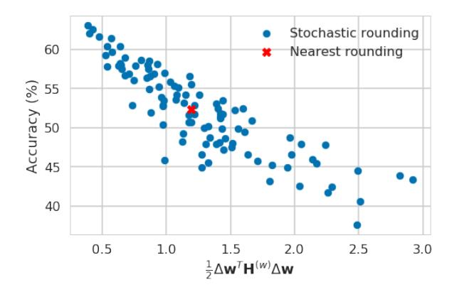
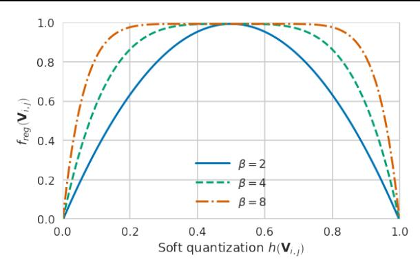
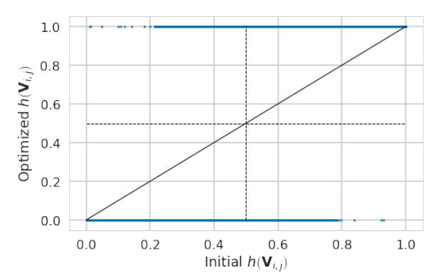
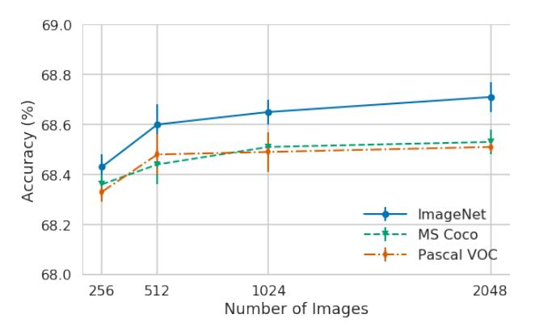

<!-- RP07_Nagel_2020 | source: papers_json/RP07_Nagel_2020/ -->

## إلى الأعلى أم إلى الأسفل؟ التقريب التكيفي للتكميم بعد التدريب

Markus Nagel * 1 Rana Ali Amjad * 1 Mart van Baalen ^1^ Christos Louizos ^1^ Tijmen Blankevoort ^1^

## الملخص

عند تكميم الشبكات العصبية، فإن إسناد كل وزن من أوزان الفاصلة العائمة إلى أقرب قيمة ذات نقطة ثابتة هو النهج السائد. وقد وجدنا، وربما يكون ذلك مفاجئًا، أن هذا ليس أفضل ما يمكننا فعله. في هذه الورقة، نقترح AdaRound، وهي آلية أفضل لتقريب الأوزان للتكميم بعد التدريب تتكيف مع البيانات وخسارة المهمة. AdaRound سريعة، ولا تتطلب ضبطًا دقيقًا للشبكة، وتستخدم فقط كمية صغيرة من البيانات غير المُعنونة. نبدأ بالتحليل النظري لمشكلة التقريب لشبكة عصبية مدرّبة مسبقًا. من خلال تقريب خسارة المهمة عبر متسلسلة تايلور، تُصاغ مهمة التقريب كمشكلة تحسين ثنائية تربيعية غير مقيدة. نبسّط هذه المشكلة إلى خسارة محلية على مستوى كل طبقة ونقترح تحسين هذه الخسارة باستخدام استرخاء ناعم. لا تتفوق AdaRound على التقريب إلى الأقرب بفارق كبير فحسب، بل تُرسي أيضًا حالة جديدة من الفن للتكميم بعد التدريب على عدة شبكات ومهام. وبدون ضبط دقيق، يمكننا تكميم أوزان Resnet18 وResnet50 إلى 4 بتات مع البقاء ضمن خسارة دقة بنسبة 1%.

## 1. المقدمة

تُستخدم الشبكات العصبية العميقة في كثير من تطبيقات العالم الحقيقي بوصفها التقنية القياسية لحل مهام رؤية الحاسوب والترجمة الآلية والتعرف على الصوت والترتيب وكثير من المجالات الأخرى. وبسبب هذا النجاح والانتشار الواسع، أصبح جعل هذه الشبكات العصبية فعّالة موضوع بحث مهمًا. تُترجم الكفاءة المحسّنة إلى تقليل تكاليف البنية التحتية السحابية وتجعل من الممكن تشغيل هذه الشبكات على أجهزة متباينة مثل الهواتف الذكية وتطبيقات إنترنت الأشياء،

*وقائع المؤتمر الدولي السابع والثلاثين للتعلم الآلي*، فيينا، النمسا، PMLR 119، 2020. حقوق النشر 2020 محفوظة للمؤلفين.

والأجهزة المخصصة منخفضة الطاقة.

إحدى الطرق الفعّالة لتحسين الشبكات العصبية للاستدلال هي تكميم الشبكات العصبية [(Krishnamoorthi,](#page-9-0) [2018;](#page-9-0) [Guo,](#page-8-0) [2018)](#page-8-0). في التكميم، تُحفظ أوزان الشبكات العصبية وتنشيطاتها في تمثيل منخفض البتات لكل من نقل الذاكرة والحسابات بهدف تقليل استهلاك الطاقة وزمن الاستدلال. وعملية تكميم الشبكة تُدخل عمومًا ضوضاء، مما يؤدي إلى فقد في الأداء. تتكيف العديد من الأعمال السابقة مع إجراء التكميم لتقليل الفقد في الأداء مع الانخفاض إلى أقل عدد ممكن من البتات.

كما أوضح [Nagel et al.](#page-9-0) [(2019)](#page-9-0)، فمن المهم أن تؤخذ عملية التطبيق العملي لطرق تكميم الشبكات العصبية في الاعتبار. على الرغم من وجود طرق كثيرة تقوم بالتدريب الواعي بالتكميم [(Jacob et al.,](#page-9-0) [2018;](#page-9-0) [Louizos](#page-9-0) [et al.,](#page-9-0) [2019)](#page-9-0) وتحقق نتائج ممتازة، إلا أن هذه الطرق تتطلب من المستخدم قضاء وقت طويل في إعادة تدريب النماذج وضبط المعلمات الفائقة.

من ناحية أخرى، حظيت طرق *التكميم بعد التدريب* مؤخرًا باهتمام كبير [(Nagel et al.,](#page-9-0) [2019;](#page-9-0) [Cai et al.,](#page-8-0) [2020;](#page-8-0) [Choukroun et al.,](#page-8-0) [2019;](#page-8-0) [Banner et al.,](#page-8-0) [2019)](#page-8-0)، والتي يمكن تطبيقها بسهولة أكبر في الممارسة. تسمح هذه الأنواع من الطرق بحدوث تكميم الشبكة فوريًا عند نشر النماذج، دون أن يقضي مستخدم النموذج وقتًا وطاقة على التكميم. يركز عملنا على هذا النوع من تكميم الشبكات.

التقريب إلى الأقرب هو النهج السائد في جميع أعمال تكميم أوزان الشبكات العصبية التي ظهرت حتى الآن. وهذا يعني أن متجه الوزن w يُقرَّب إلى أقرب قيمة قابلة للتمثيل في شبكة التكميم في شبكة ذات نقطة ثابتة من خلال

$$
\widehat{\mathbf{w}} = \mathbf{s} \cdot clip\left(\left\lfloor \frac{\mathbf{w}}{\mathbf{s}} \right\rfloor, \mathbf{n}, \mathbf{p}\right),\tag{1}
$$

حيث يدل s على معامل قياس التكميم، وn وp يدلان على عتبتي القص للأعداد الصحيحة السالبة والموجبة. يمكننا تقريب أي وزن إلى الأسفل باستبدال b·e بـ b·c، أو إلى الأعلى باستخدام d·e. لكن التقريب إلى الأقرب يبدو الأكثر منطقية، إذ إنه يقلل الفرق لكل وزن في مصفوفة الأوزان. وربما يكون مفاجئًا أننا نُظهر أنه بالنسبة للتكميم بعد التدريب، فإن التقريب إلى الأقرب ليس هو الأمثل.

مساهماتنا في هذا العمل ثلاثية:

> ^*^مساهمة متساوية ^1^Qualcomm AI Research، مبادرة من Qualcomm Technologies, Inc.. للمراسلة: Markus Nagel <markusn@qti.qualcomm.com>, Rana Ali Amjad <ramjad@qti.qualcomm.com>, Tijmen Blankevoort <tijmen@qti.qualcomm.com>.

<!-- page 2 -->

- نُؤسّس إطارًا نظريًا لتحليل تأثير التقريب بطريقة تأخذ في الاعتبار خصائص كل من بيانات الإدخال وخسارة المهمة. وباستخدام هذا الإطار، نصوغ التقريب على أنه مشكلة تحسين ثنائية تربيعية غير مقيدة (QUBO) على مستوى كل طبقة.
- نقترح AdaRound، وهي طريقة جديدة تجد حلًا جيدًا لهذه الصياغة على مستوى كل طبقة عبر استرخاء مستمر. تتطلب AdaRound فقط كمية صغيرة من البيانات غير المُعنونة، وهي فعّالة حسابيًا، وقابلة للتطبيق على أي بنية شبكة عصبية ذات طبقات تلافيفية أو متصلة بالكامل.
- في دراسة شاملة، نُظهر أن AdaRound تُحدد حالة جديدة من الفن للتكميم بعد التدريب على عدة شبكات ومهام، تشمل Resnet18 وResnet50 وMobilenetV2 وInceptionV3 وDeeplabV3.

**الترميز** نستخدم \mathbf{x} و\mathbf{y} للدلالة على متغير الإدخال ومتغير الهدف على التوالي. \mathbb{E}\left[\cdot\right] يدل على عامل التوقع. جميع التوقعات في هذا العمل تكون بالنسبة لـ \mathbf{x} و\mathbf{y}. \mathbf{W}_{i,j}^{(\ell)} يدل على مصفوفة الأوزان (أو موتر، حسبما يتضح من السياق)، حيث يدل الأس بين الأقواس والاندكس السفلي على فهارس الطبقة والعناصر على التوالي. كما نستخدم \mathbf{w}^{(\ell)} للدلالة على النسخة المسطحة من \mathbf{W}^{(\ell)}. تعتبر جميع المتجهات متجهات عمودية وتُمثَّل بأحرف صغيرة بالخط العريض، مثل \mathbf{z}، بينما تُرمز المصفوفات (أو الموترات) بأحرف كبيرة بالخط العريض، مثل \mathbf{Z}. تُرمز الدوال بـ \mathcal{L}. تُرمز الثوابت بأحرف صغيرة بالخط القائم، مثل \mathbf{s}.

## 2. الدافع

للحصول على فهم حدسي لسبب احتمال أن التقريب إلى الأقرب ليس هو الأمثل، لننظر إلى ما يحدث عندما نُعيد تشويش أوزان نموذج مدرّب مسبقًا. لنعتبر شبكة عصبية مُعَلَّمة بالأوزان (المسطحة) w. لنرمز بـ \Delta w إلى تشويش صغير ولنرمز بـ \mathcal{L}(\mathbf{x}, \mathbf{y}, \mathbf{w}) إلى خسارة المهمة التي نريد تقليلها. حينئذ

$$
\mathbb{E}\left[\mathcal{L}\left(\mathbf{x}, \mathbf{y}, \mathbf{w} + \Delta \mathbf{w}\right) - \mathcal{L}\left(\mathbf{x}, \mathbf{y}, \mathbf{w}\right)\right] 
\stackrel{(a)}{\approx} \mathbb{E}\left[\Delta \mathbf{w}^{T} \cdot \nabla_{\mathbf{w}} \mathcal{L}\left(\mathbf{x}, \mathbf{y}, \mathbf{w}\right)\right] 
(2)
$$

$$
+ \frac{1}{2} \Delta \mathbf{w}^{T} \cdot \nabla_{\mathbf{w}}^{2} \mathcal{L}(\mathbf{x}, \mathbf{y}, \mathbf{w}) \cdot \Delta \mathbf{w} (3)
$$

$$
= \Delta \mathbf{w}^T \cdot \mathbf{g}^{(\mathbf{w})} + \frac{1}{2} \Delta \mathbf{w}^T \cdot \mathbf{H}^{(\mathbf{w})} \cdot \Delta \mathbf{w}, \qquad (4)
$$

حيث (a) تستخدم متسلسلة تايلور من الرتبة الثانية. \mathbf{g^{(w)}} و\mathbf{H^{(w)}} يدلان على التدرج المتوقع وهسيان خسارة المهمة \mathcal{L} بالنسبة لـ \mathbf{w}، أي

$$
\mathbf{g}^{(\mathbf{w})} = \mathbb{E}\left[\nabla_{\mathbf{w}} \mathcal{L}\left(\mathbf{x}, \mathbf{y}, \mathbf{w}\right)\right] \tag{5}
$$

$$
\mathbf{H}^{(\mathbf{w})} = \mathbb{E}\left[\nabla_{\mathbf{w}}^{2} \mathcal{L}(\mathbf{x}, \mathbf{y}, \mathbf{w})\right]. \tag{6}
$$

جميع حدود التدرج والهسيان في هذه الورقة تخص خسارة المهمة \mathcal{L} بالنسبة للمتغيرات المحددة. يُعد إهمال الحدود ذات الرتبة الأعلى في متسلسلة تايلور تقريبًا جيدًا طالما أن \Delta \mathbf{w} ليس كبيرًا جدًا. وبافتراض أن الشبكة مدرّبة حتى التقارب، يمكننا أيضًا إهمال حد التدرج لأنه سيكون قريبًا من الصفر. ولذلك يُعرّف \mathbf{H}^{(\mathbf{w})} التفاعلات بين الأوزان المُشوَّشة المختلفة من حيث تأثيرها المشترك على خسارة المهمة \mathcal{L}(\mathbf{x},\mathbf{y},\mathbf{w}+\Delta\mathbf{w}). يُوضح المثال البسيط التالي كيف يمكن للتقريب إلى الأقرب ألا يكون الأمثل.

**مثال 1.** لنفترض أن \Delta \mathbf{w}^T = [\Delta w_1 \quad \Delta w_2] و

$$
\mathbf{H}^{(\mathbf{w})} = \begin{bmatrix} 1 & 0.5 \\ 0.5 & 1 \end{bmatrix},\tag{7}
$$

عندئذ تكون الزيادة في خسارة المهمة بسبب التشويش (تقريبًا) متناسبة مع

$$
\Delta \mathbf{w}^T \cdot \mathbf{H}^{(\mathbf{w})} \cdot \Delta \mathbf{w} = \Delta \mathbf{w}_1^2 + \Delta \mathbf{w}_2^2 + \Delta \mathbf{w}_1 \Delta \mathbf{w}_2. \quad (8)
$$

بالنسبة للحدود المقابلة للعناصر القُطرية \Delta w_1^2 و\Delta w_2^2، فإن مقدار التشويشات وحده هو ما يهم. ومن ثم فإن التقريب إلى الأقرب أمثل عندما نأخذ في الاعتبار فقط هذه الحدود القطرية في هذا المثال. ومع ذلك، بالنسبة للحدود المقابلة لـ \Delta w_1 \Delta w_2، فإن إشارة التشويش تهم، حيث يؤدي اختلاف إشارتي التشويشين إلى تحسين الخسارة. لتقليل التأثير الكلي للتكميم على خسارة المهمة، نحتاج إلى المفاضلة بين مساهمة الحدود القطرية والحدود غير القطرية. يتجاهل التقريب إلى الأقرب المساهمات غير القطرية، مما يجعله غالبًا غير أمثل.

التحليل السابق صالح لتكميم أي نظام بارامتري. ونُظهر أن هذا التأثير يصدق أيضًا على الشبكات العصبية. وللتوضيح، نولّد 100 خيار تقريب عشوائي (Gupta et al., 2015) للطبقة الأولى من Resnet18 ونقيّم أداء الشبكة بتكميم الطبقة الأولى فقط. النتائج معروضة في الجدول 1. من بين 100 تشغيل، نجد أن 48 خيار تقريب مأخوذًا عشوائيًا يؤدي إلى أداء أفضل من التقريب إلى الأقرب. ويعني هذا وجود حلول تقريب كثيرة أفضل من التقريب إلى الأقرب. علاوة على ذلك، فإن أفضل هذه العينات العشوائية المئة يقدم تحسنًا يزيد عن 10% في دقة الشبكة. ونلاحظ أيضًا أن تقريب جميع القيم إلى الأعلى أو إلى الأسفل بالخطأ له أثر كارثي. ويعني هذا أنه يمكننا الاستفادة كثيرًا من خلال التقريب الحذر للأوزان عند إجراء التكميم بعد التدريب. وبقية هذه الورقة تهدف إلى ابتكار آلية تقريب راسخة الأساس وفعّالة حسابيًا.

## 3. الطريقة

في هذا القسم، نقترح AdaRound، وهي عملية تقريب جديدة للتكميم بعد التدريب راسخة من الناحية النظرية

<!-- page 3 -->

وتُظهر تحسنًا ملحوظًا في الأداء عمليًا. نبدأ بتحليل الخسارة الناتجة عن التكميم نظريًا. ثم نصوغ خوارزمية فعّالة على مستوى كل طبقة لتحسينها.

## 3.1. التقريب القائم على خسارة المهمة

عند تكميم شبكة عصبية مدرّبة مسبقًا، يكون هدفنا تقليل فقد الأداء الناتج عن التكميم. بافتراض تكميم الأوزان لكل طبقة1، يكون الوزن المُكمَّم \widehat{\mathbf{w}}_{i}^{(\ell)} هو

$$
\widehat{\mathbf{w}}_{i}^{(\ell)} \in \left\{ \mathbf{w}_{i}^{(\ell),floor}, \mathbf{w}_{i}^{(\ell),ceil} \right\}, \tag{9}
$$

حيث

$$
\mathbf{w}_{i}^{(\ell),floor} = \mathbf{s}^{(\ell)} \cdot clip\left(\left\lfloor \frac{\mathbf{w}_{i}^{(\ell)}}{\mathbf{s}^{(\ell)}} \right\rfloor, \mathbf{n}, \mathbf{p}\right) (10)
$$

ويُعرَّف \mathbf{w}_i^{(\ell),ceil} بطريقة مشابهة باستبدال \lfloor \cdot \rfloor بـ \lceil \cdot \rceil وتدل \Delta \mathbf{w}_i^{(\ell)} = \mathbf{w}^{(\ell)} - \widehat{\mathbf{w}}_i^{(\ell)} على التشويش الناتج عن التكميم. في هذا العمل نفترض أن \mathbf{s}^{(\ell)} ثابت قبل تحسين عملية التقريب. وأخيرًا، عندما نُحسّن دالة تكلفة على \Delta \mathbf{w}_i^{(\ell)}، يمكن لـ \widehat{\mathbf{w}}_i^{(\ell)} أن يأخذ فقط القيمتين المحددتين في (9).

يمكن صياغة إيجاد عملية التقريب الأمثل على هيئة المشكلة التالية للتحسين الثنائي

$$
\underset{\Delta \mathbf{w}}{\operatorname{arg \, min}} \quad \mathbb{E}\left[\mathcal{L}\left(\mathbf{x}, \mathbf{y}, \mathbf{w} + \Delta \mathbf{w}\right) - \mathcal{L}\left(\mathbf{x}, \mathbf{y}, \mathbf{w}\right)\right] \quad (11)
$$

يتطلب تقييم التكلفة في (11) تمريرًا أماميًا لعينات بيانات الإدخال لكل \Delta w جديد أثناء التحسين. ولتجنب العبء الحسابي للتمريرات الأمامية المتكررة عبر البيانات، نستخدم تقريب متسلسلة تايلور من الرتبة الثانية. علاوة على ذلك، نتجاهل التفاعلات بين الأوزان التي تنتمي إلى طبقات مختلفة. وهذا

*الشكل 1. الارتباط بين التكلفة في (13) ودقة التحقق على ImageNet (%) لعدد 100 متجه تقريب عشوائي \hat{\mathbf{w}} لتكميم 4 بتات للطبقة الأولى فقط من Resnet18.*

بدوره يعني أننا نفترض \mathbf{H}^{(\mathbf{w})} كتلة-قطرية، حيث تقابل كل كتلة غير صفرية طبقة واحدة. ومن ثم نصل إلى مشكلة التحسين التالية على مستوى كل طبقة

$$
\underset{\Delta \mathbf{w}^{(\ell)}}{\operatorname{arg \, min}} \quad \mathbb{E}\left[\mathbf{g^{(\mathbf{w}^{(\ell)})}}^T \Delta \mathbf{w}^{(\ell)} + \frac{1}{2} \Delta \mathbf{w^{(\ell)}}^T \mathbf{H^{(\mathbf{w}^{(\ell)})}} \Delta \mathbf{w}^{(\ell)}\right]. \tag{12}
$$

كما هو موضح في المثال 1، نحتاج إلى الحد من الرتبة الثانية لاستغلال التفاعلات المشتركة بين تشويشات الأوزان. (12) هي مشكلة QUBO حيث إن \Delta \mathbf{w}_i^{(\ell)} متغيرات ثنائية (Kochenberger et al., 2014). بالنسبة لنموذج مدرّب مسبقًا قد تقارب، يمكن إهمال مساهمة حد التدرج للتحسين في (13) دون مخاطرة. وهذا ينتج عنه

$$
\underset{\Delta \mathbf{w}^{(\ell)}}{\operatorname{arg\,min}} \quad \mathbb{E}\left[\Delta \mathbf{w}^{(\ell)}^T \mathbf{H}^{(\mathbf{w}^{(\ell)})} \Delta \mathbf{w}^{(\ell)}\right]. \tag{13}
$$

للتحقق من أن (13) تعمل كبديل جيد لتحسين خسارة المهمة الناتجة عن التكميم، نرسم التكلفة في (13) مقابل دقة التحقق لعدد 100 متجه تقريب عشوائي عند تكميم الطبقة الأولى فقط من Resnet18. يُظهر الشكل 1 ارتباطًا واضحًا بين الكميتين. ويبرر هذا تقريبنا لأغراض التحسين، حتى للتكميم بأربعة بتات. يُظهر تحسين (13) مكاسب أداء ملحوظة، ومع ذلك، يحدّ من تطبيقها مشكلتان:

- 1. \mathbf{H}^{(\mathbf{w}^{(\ell)})} يعاني من مشاكل التعقيد الحسابي وكذلك تعقيد الذاكرة حتى للطبقات ذات الحجم المتوسط.
- 2. (13) هي مشكلة تحسين من نوع NP-hard. يتنامى تعقيد حلها بسرعة مع بُعد \Delta \mathbf{w}^{(\ell)}، مما يحظر مرة أخرى تطبيق (13) حتى على الطبقات متوسطة الحجم (Kochenberger et al., 2014).

في القسم 3.2 والقسم 3.3 نتعامل مع المشكلة الأولى والثانية على التوالي.

> ^&^lt;sup>1لاحظ أن عملنا قابل للتطبيق بالقدر نفسه على تكميم الأوزان لكل قناة.

<!-- page 4 -->

## 3.2. من توسيع تايلور إلى الخسارة المحلية

لفهم سبب التعقيد المرتبط بـ \mathbf{H}^{(\mathbf{w}^{(\ell)})}، لننظر إلى عناصره. بالنسبة لوزنين في الطبقة المتصلة بالكامل ذاتها لدينا

$$
\frac{\partial^{2} \mathcal{L}}{\partial \mathbf{W}_{i,j}^{(\ell)} \partial \mathbf{W}_{m,o}^{(\ell)}} = \frac{\partial}{\partial \mathbf{W}_{m,o}^{(\ell)}} \left[ \frac{\partial \mathcal{L}}{\partial \mathbf{z}_{i}^{(\ell)}} \cdot \mathbf{x}_{j}^{(\ell-1)} \right] (14)
$$

$$
= \frac{\partial^2 \mathcal{L}}{\partial \mathbf{z}_i^{(\ell)} \partial \mathbf{z}_m^{(\ell)}} \cdot \mathbf{x}_j^{(\ell-1)} \mathbf{x}_o^{(\ell-1)}, \quad (15)
$$

حيث \mathbf{z}^{(\ell)} = \mathbf{W}^{(\ell)}\mathbf{x}^{(\ell-1)} هي قبل-التنشيطات للطبقة \ell و\mathbf{x}^{(\ell-1)} يدل على دخل الطبقة \ell. وبكتابة هذا في صيغة مصفوفية (لـ \mathbf{w}^{(\ell)} المسطحة)، لدينا (Botev et al., 2017)

$$
\mathbf{H}^{(\mathbf{w}^{(\ell)})} = \mathbb{E}\left[\mathbf{x}^{(\ell-1)}\mathbf{x}^{(\ell-1)^T} \otimes \nabla_{\mathbf{z}^{(\ell)}}^2 \mathcal{L}\right], \quad (16)
$$

حيث يدل \otimes على حاصل ضرب كرونيكر لمصفوفتين و\nabla^2_{\mathbf{z}^{(\ell)}} \mathcal{L} هو هسيان خسارة المهمة بالنسبة لـ \mathbf{z}^{(\ell)}. من الواضح من (16) أن مشاكل التعقيد ناتجة بشكل رئيسي عن \nabla^2_{\mathbf{z}^{(\ell)}} \mathcal{L} الذي يتطلب الانتشار الخلفي للمشتقات الثانية عبر الطبقات اللاحقة من الشبكة. ولمعالجة ذلك، نفترض أن هسيان خسارة المهمة بالنسبة لقبل-التنشيطات، أي \nabla^2_{\mathbf{z}^{(\ell)}} \mathcal{L}، هو مصفوفة قطرية، يُرمز إليها بـ diag(\nabla^2_{\mathbf{z}^{(\ell)}} \mathcal{L}_{i,i}). ويؤدي هذا إلى

$$
\mathbf{H}^{(\mathbf{w}^{(\ell)})} = \mathbb{E}\left[\mathbf{x}^{(\ell-1)}\mathbf{x}^{(\ell-1)^T} \otimes diag(\nabla_{\mathbf{z}^{(\ell)}}^2 \mathcal{L}_{i,i})\right]. \quad (17)
$$

لاحظ أن تقريب \mathbf{H}^{(\mathbf{w}^{(\ell)})} المعبَّر عنه في (17) ليس قطريًا. وبتعويض (17) في معادلتنا لإيجاد متجه التقريب الذي يُحسّن الخسارة (13)، نحصل على

$$
\underset{\Delta \mathbf{W}_{k,:}^{(\ell)}}{\arg\min} \quad \mathbb{E}\left[\nabla_{\mathbf{z}^{(\ell)}}^{2} \mathcal{L}_{k,k} \cdot \Delta \mathbf{W}_{k,:}^{(\ell)} \mathbf{x}^{(\ell-1)} \mathbf{x}^{(\ell-1)^{T}} \Delta \mathbf{W}_{k,:}^{(\ell)^{T}}\right]
$$

$$
\stackrel{(a)}{=} \underset{\Delta \mathbf{W}_{k,:}^{(\ell)}}{\min} \quad \Delta \mathbf{W}_{k,:}^{(\ell)} \mathbb{E} \left[ \mathbf{x}^{(\ell-1)} \mathbf{x}^{(\ell-1)^T} \right] \Delta \mathbf{W}_{k,:}^{(\ell)^T} (19)
$$

$$
= \underset{\Delta \mathbf{W}_{k}^{(\ell)}}{\min} \quad \mathbb{E}\left[\left(\Delta \mathbf{W}_{k,:}^{(\ell)} \mathbf{x}^{(\ell-1)}\right)^{2}\right], \tag{20}
$$

حيث تتفكك مشكلة التحسين في (13) الآن إلى مشكلات فرعية مستقلة في (18). تتعامل كل مشكلة فرعية مع صف واحد \Delta \mathbf{W}_{k,:}^{(\ell)} و(a) هي نتيجة افتراض إضافي بأن \nabla_{\mathbf{z}(\ell)}^2 \mathcal{L}_{i,i} = c_i ثابت مستقل عن عينات بيانات الإدخال. تجدر الإشارة إلى أن تحسين (20) لا يتطلب أي معرفة بالطبقات اللاحقة وخسارة المهمة. في (20)، نحن ببساطة نُقلل متوسط مربع الخطأ (MSE) المُدخل في قبل-التنشيطات \mathbf{z}^{(\ell)} بسبب التكميم. وهذا هو الهدف ذاته على مستوى كل طبقة الذي تم تحسينه في عدة أوراق ضغط للشبكات العصبية، مثل Zhang et al. (2016); He

et al. (2017)، وأوراق متعددة لتكميم الشبكات العصبية (وإن كان لمهام أخرى غير تقريب الأوزان)، مثل Wang et al. (2018); Stock et al. (2020); Choukroun et al. (2019). على عكس هذه الأعمال، فإننا نصل إلى هذا الهدف بطريقة مبدئية ونستنتج أن تحسين الـ MSE، كما هو محدد في (20)، هو أفضل ما يمكن فعله عند افتراض عدم معرفة بقية الشبكة بعد الطبقة التي نُحسّنها. في المواد التكميلية نُجري تحليلًا مماثلًا للطبقات التلافيفية.

يمكن معالجة مشكلة التحسين في (20) إما عن طريق الحساب المسبق لـ \mathbb{E}\left[\mathbf{x}^{(\ell-1)}\mathbf{x}^{(\ell-1)^T}\right]، كما تم في (19)، ثم إجراء التحسين على \Delta\mathbf{W}_{k,:}^{(\ell)}، أو بإجراء تمرير أمامي لطبقة واحدة لكل \Delta\mathbf{W}_{k,:}^{(\ell)} محتمل أثناء عملية التحسين.

في القسم 5، نتحقق تجريبيًا من أن التقريب القطري الثابت لـ \nabla^2_{\mathbf{z}^{(\ell)}} \mathcal{L} لا يؤثر سلبًا على الأداء.

## 3.3. AdaRound

حل (20) لا يعاني من مشاكل التعقيد المرتبطة بـ \mathbf{H}^{(\mathbf{w}^{(\ell)})}. ومع ذلك، فهي لا تزال مشكلة تحسين منفصلة من نوع NP-hard. إيجاد حل جيد (دون الأمثل) بتعقيد حسابي معقول قد يكون تحديًا لعدد أكبر من متغيرات التحسين. ولمعالجة ذلك نُرخي (20) إلى مشكلة التحسين المستمرة التالية القائمة على متغيرات تكميم ناعمة (الفهارس العلوية هي ذاتها كما في (20))

$$
\underset{\mathbf{V}}{\operatorname{arg\,min}} \quad \left\| \mathbf{W} \mathbf{x} - \widetilde{\mathbf{W}} \mathbf{x} \right\|_{F}^{2} + \lambda f_{reg} \left( \mathbf{V} \right), \quad (21)
$$

حيث يدل \|\cdot\|_F^2 على معيار فروبنيوس و\widetilde{\mathbf{W}} هي الأوزان المُكمَّمة الناعمة التي نُحسّنها

$$
\widetilde{\mathbf{W}} = \mathbf{s} \cdot clip\left(\left|\frac{\mathbf{W}}{\mathbf{s}}\right| + h\left(\mathbf{V}\right), \mathbf{n}, \mathbf{p}\right). (22)
$$

في حالة الطبقة التلافيفية، يُستبدل ضرب المصفوفة \mathbf{W}\mathbf{x} بالتفاف. \mathbf{V}_{i,j} هو المتغير المستمر الذي نُحسّنه ويمكن أن تكون h\left(\mathbf{V}_{i,j}\right) أي دالة قابلة للاشتقاق تأخذ قيمًا بين 0 و1، أي h\left(\mathbf{V}_{i,j}\right) \in [0,1]. الحد الإضافي f_{reg}\left(\mathbf{V}\right) هو مُنظِّم قابل للاشتقاق يُدخَل لتشجيع متغيرات التحسين h\left(\mathbf{V}_{i,j}\right) على التقارب نحو إما 0 أو 1، أي عند التقارب h\left(\mathbf{V}_{i,j}\right) \in \{0,1\}.

نوظف سيغمويد مُعدَّلًا (rectified sigmoid) باعتباره h(\mathbf{V}_{i,j})، اقتُرح في (Louizos et al., 2018). يُعرَّف السيغمويد المُعدَّل بأنه

$$
h\left(\mathbf{V}_{i,j}\right) = clip\left(\sigma\left(\mathbf{V}_{i,j}\right)\left(\zeta - \gamma\right) + \gamma, 0, 1\right), \tag{23}
$$

حيث \sigma(\cdot) هي دالة السيغمويد، و\zeta و\gamma هما معاملا التمدد، مثبَّتان عند 1.1 و-0.1 على التوالي. السيغمويد المُعدَّل لديه تدرجات غير متلاشية عندما يقترب h(\mathbf{V}_{i,j}) من 0 أو 1، مما يساعد عملية التعلم عندما

<!-- page 5 -->

*الشكل 2. تأثير تخفيف b على حد التنظيم (24).*

نشجّع h\left(\mathbf{V}_{i,j}\right) على التحرك نحو الأطراف. للتنظيم نستخدم

$$ f_{reg}(\mathbf{V}) = \sum_{i,j} 1 - |2h(\mathbf{V}_{i,j}) - 1|^{\beta}, (24) $$

حيث نُخفّف المعامل \beta. يسمح هذا لمعظم h\left(\mathbf{V}_{i,j}\right) بالتكيف بحرية في المرحلة الأولية (\beta أعلى) لتحسين الـ MSE ويشجعه على التقارب إلى 0 أو 1 في المرحلة اللاحقة من التحسين (\beta أقل)، للوصول إلى الحل الثنائي الذي يهمنا. تأثير تخفيف \beta موضح في الشكل 2. يُظهر الشكل 3 كيف يؤدي هذا الجمع بين السيغمويد المُعدَّل و f_{reg} إلى تعلم كثير من الأوزان لتقريب يختلف عن التقريب إلى الأقرب لتحسين الأداء، مع التقارب في النهاية قريبًا من 0 أو 1.

هذه الطريقة لتحسين (21) هي حالة خاصة من العائلة العامة لطرق هوبفيلد المستخدمة لمشاكل التحسين المقيدة ثنائيًا. تُستخدم هذه الأنواع من الطرق عمومًا كخوارزمية تقريبية فعّالة للمشاكل التوافيقية واسعة النطاق (Hopfield & Tank, 1985; Smith et al.).

لتكميم النموذج بأكمله، نُحسّن (21) طبقة طبقة بالتسلسل. ومع ذلك، لا يأخذ هذا في الحسبان خطأ التكميم المُدخَل بسبب الطبقات السابقة. ولتجنب تراكم خطأ التكميم للشبكات الأعمق وكذلك لمراعاة دالة التنشيط، نستخدم صياغة إعادة البناء غير المتماثلة التالية

$$
\underset{\mathbf{V}}{\operatorname{arg\,min}} \left\| f_a\left( \mathbf{W} \mathbf{x} \right) - f_a\left( \widetilde{\mathbf{W}} \hat{\mathbf{x}} \right) \right\|_F^2 + \lambda f_{reg}\left( \mathbf{V} \right), \quad (25)
$$

حيث \hat{\mathbf{x}} هو دخل الطبقة مع جميع الطبقات السابقة مُكمَّمة و f_a هي دالة التنشيط. صياغة مماثلة للخسارة استُخدمت سابقًا في (Zhang et al., 2016; He et al., 2017)، وإن كان لأغراض مختلفة. تُعرّف (25) هدفنا النهائي الذي يمكننا تحسينه عبر النزول الاندفاعي العشوائي بالتدرج. نُسمي هذه الخوارزمية AdaRound، إذ تتكيف مع إحصائيات بيانات الإدخال وكذلك مع (تقريب) خسارة المهمة. في القسم 5 نُفصّل تأثير اختيارات تصميمنا وكذلك خسارة إعادة البناء غير المتماثلة على الأداء.

*الشكل 3. مقارنة h(\mathbf{V}_{i,j}) قبل (المحور x، المقابل لأوزان الفاصلة العائمة) ومقابل بعد (المحور y) تحسين (21). نرى أن جميع h(\mathbf{V}_{i,j}) قد تقاربت إلى 0 أو 1. تشير الربعان العلوي الأيسر والأسفل الأيمن إلى الأوزان التي لها تقريب مختلف باستخدام (21) مقارنةً بالتقريب إلى الأقرب.*

## 4. الخلفية والأعمال ذات الصلة

في التسعينيات، مع عودة ظهور مجال الشبكات العصبية، صممت عدة أعمال أجهزة وطرقًا للتحسين لتشغيل شبكات عصبية منخفضة البتات على الأجهزة. أنشأ Hammerstrom (1990) جهازًا للتدريب بـ 8 و16 بت من الشبكات، وأجرى Holi & Hwang (1993) تحليلًا تجريبيًا على شبكات عصبية بسيطة لإظهار أن 8 بتات كافية في معظم السيناريوهات، وطوّر Hoehfeld & Fahlman (1992) مخطط تقريب عشوائي لدفع الشبكات العصبية إلى ما دون 8 بتات.

في الآونة الأخيرة، أُولي اهتمام كبير لتكميم الشبكات العصبية للاستدلال الفعّال. وكثيرًا ما يُجرى ذلك بمحاكاة التكميم أثناء التدريب، كما هو موضح في Jacob et al. (2018) وGupta et al. (2015)، واستخدام المُقدِّر المستقيم لتقريب التدرجات. وقد امتدت كثير من الطرق منذ ذلك الحين على أُطر التدريب هذه. يتعلم Choi et al. (2018) التنشيطات للالتزام بمدى تكميم معيّن، بينما يتعلم Esser et al. (2020); Jain et al. (2019) أدنى وأقصى مدى للتكميم أثناء التدريب بحيث لا يتعين ضبطها يدويًا. كما يتعلم Louizos et al. (2019) الشبكة ويصوغ نسخة احتمالية لإجراء تدريب التكميم. يتعلم Uhlich et al. (2020) كلًا من شبكة التكميم وعرض البتات لكل طبقة، مما يؤدي إلى اختيار آلي لعرض البتات أثناء التدريب. تستغل أعمال مثل Kim et al. (2019); Mishra & Marr (2017) تدريب الطالب-المعلم لتحسين أداء النماذج المُكمَّمة أثناء التدريب. على الرغم من أن التدريب الواعي بالتكميم قوي وغالبًا ما يعطي نتائج جيدة، إلا أن العملية كثيرًا ما تكون شاقة وتستغرق وقتًا طويلًا. يسعى عملنا إلى الحصول على نماذج عالية الدقة دون هذه المشقة.

اقتُرحت مؤخرًا عدة طرق سهلة الاستخدام لتكميم الشبكات دون التدريب الواعي بالتكميم. كثيرًا ما يُشار إلى هذه الطرق بـ *طرق التكميم بعد التدريب*. يُظهر Krishnamoorthi (2018) عدة نتائج لتكميم الشبكة بدون ضبط دقيق-

<!-- page 6 -->

. تُحسّن أعمال مثل Banner et al. (2019); Choukroun et al. (2019) مديات التكميم للقص لإيجاد مفاضلة خسارة أفضل لكل طبقة. يُحسّن Zhao et al. (2019) أداء التكميم بتقسيم القنوات إلى قنوات أكثر، مما يزيد الحساب لكنه يحقق عرض بتات أقل في هذه العملية. يضبط Lin et al. (2016); Dong et al. (2019) عرض بتات مختلف للطبقات المختلفة، من خلال معلومات SQNR لكل طبقة أو الهسيان. يستغني Nagel et al. (2019); Cai et al. (2020) حتى عن متطلب الحاجة إلى أي بيانات لتحسين نموذج للتكميم، مما يجعل إجراءاتهما خاليتين عمليًا من المعلمات والبيانات. تحل هذه الطرق جميعها مشكلة التكميم نفسها كما في هذه الورقة، ويمكن استخدام بعضها مثل Zhao et al. (2019) و Dong et al. (2019) جنبًا إلى جنب مع AdaRound. نقارن مع الطرق التي تُحسّن تكميم الأوزان لعرض بتات 4/8 و4/32 دون ضبط دقيق شامل من البداية إلى النهاية، وهي Banner et al. (2019); Choukroun et al. (2019); Nagel et al. (2019)، لكننا نترك المقارنات مع طرق الدقة المختلطة Cai et al. (2020); Dong et al. (2019) لأنها تُحسّن الشبكات على محور مختلف.

## 5. التجارب

لتقييم أداء AdaRound، نُجري تجارب على مهام ونماذج رؤية حاسوب متنوعة. في القسم 5.1 ندرس أثر التقريبات والاختيارات التصميمية المُتخذة في القسم 3. في القسم 5.2 نقارن AdaRound بطرق أخرى للتكميم بعد التدريب.

**الإعداد التجريبي** بالنسبة لجميع التجارب، نمتص التطبيع بالدُفعات (batch normalization) في أوزان الطبقات المجاورة. نستخدم تكميم وزن متماثل بـ 4 بتات مع معامل قياس على مستوى كل طبقة s^{(\ell)} يتم تحديده قبل تطبيق AdaRound. نضبط s بحيث يُقلل MSE المعرّف بـ ||\mathbf{W} - \overline{\mathbf{W}}||_F^2، حيث \overline{\mathbf{W}} هي الأوزان المُكمَّمة المُحصَّل عليها بالتقريب إلى الأقرب. في بعض دراسات الاستئصال، نُقدم نتائج عند تكميم الطبقة الأولى فقط. سيُذكر هذا صراحةً بـ "First layer". وفي جميع الحالات الأخرى، يكون تكميم أوزان الشبكة بأكملها بـ 4 بتات. ما لم يُذكر خلاف ذلك، فإن جميع التنشيطات تكون في FP32. تُجرى معظم التجارب باستخدام Resnet18 (He et al., 2016) من torchvision. الأداء المرجعي لهذا النموذج بأوزان وتنشيطات بدقة كاملة هو 69.68%. في تجاربنا، نُقدم المتوسط والانحراف المعياري لدقة (top1) على مجموعة التحقق من ImageNet، محسوبة باستخدام 5 تشغيلات بقيم بذور أولية مختلفة. لتحسين AdaRound نستخدم 1024 صورة غير معنونة من مجموعة تدريب ImageNet (Russakovsky et al., 2015)، ومُحسّن Adam (Kingma & Ba, 2015) بمعلمات افتراضية لـ 10 آلاف تكرار وحجم دفعة 32، ما لم يُذكر خلاف ذلك. نستخدم Pytorch (Paszke et al., 2019) لجميع تجاربنا. تجدر الإشارة إلى أن تطبيق AdaRound على Resnet18 يستغرق فقط 10 دقائق على وحدة Nvidia GTX 1080 Ti واحدة.

## 5.1. دراسة الاستئصال

من خسارة المهمة إلى الخسارة المحلية نُجري تقريبات وافتراضات متنوعة في القسم 3.1 والقسم 3.2 لتبسيط مشكلة التحسين لدينا. في الجدول 2، ننظر إلى أثرها بشكل منهجي. أولًا، نلاحظ أن التحسين القائم على هسيان خسارة المهمة (راجع (13)) يقدم تعزيزًا كبيرًا للأداء مقارنة بالتقريب إلى الأقرب. ويتحقق هذا من أن التقريب القائم على توسيع تايلور يُمثل بديلًا أفضل بكثير لخسارة المهمة بالمقارنة مع التقريب إلى الأقرب. وبالمثل، نُظهر أنه على الرغم من أن الانتقال من تحسين توسيع تايلور لخسارة المهمة إلى خسارة MSE المحلية (راجع (20)) يتطلب افتراضات قوية، فإنه لا يقلل الأداء. على عكس توسيع متسلسلة تايلور، تجعل خسارة MSE المحلية من الممكن تحسين جميع الطبقات في الشبكة. نستخدم طريقة الإنتروبيا المتقاطعة (Rubinstein, 1999) لحل مشكلات OUBO في (13) و(20)، حيث نُهيّئ توزيع المعاينة للمتغيرات العشوائية الثنائية \hat{\mathbf{w}}_i كما في (Gupta et al., 2015)2. وأخيرًا، فإن الاسترخاء المستمر لمشكلة تحسين MSE المحلية (راجع (21)) لا يُقلل وقت التحسين من عدة ساعات إلى بضع دقائق فحسب، بل يُحسّن أيضًا أداءنا قليلًا.

**اختيارات التصميم لـ AdaRound** كما نوقش سابقًا، فإن نهجنا لحل (21) يشبه إلى حد بعيد طريقة هوبفيلد. تُحسّن هذه الطرق h\left(\mathbf{V}_{i,j}\right) = \sigma\left(\frac{\mathbf{V}_{i,j}}{T}\right) باستخدام نسخة من النزول بالتدرج بالنسبة لـ V_{i,j}، وتخفيف درجة الحرارة T (Hopfield & Tank, 1985; Smith et al.). يعمل هذا التخفيف كتنظيم ضمني يسمح لـ h(\mathbf{V}_{i,j}) بالتحسين لخسارة MSE في البداية بدون قيود، بينما يشجع h(\mathbf{V}_{i,j}) على التقارب نحو 0 أو 1 في المرحلة اللاحقة من التحسين. في الجدول 3، نُظهر أنه حتى بعد بحث شامل عن المعلمات الفائقة لجدول تخفيف T، فإن استخدام دالة السيغمويد مع حد تنظيمنا الصريح (24) يتفوق على الطريقة الكلاسيكية. كما أن استخدام التنظيم الصريح يجعل التحسين أكثر استقرارًا، مما يؤدي إلى تباين أقل كما هو موضح في الجدول 3. علاوة على ذلك، نرى أن استخدام السيغمويد المُعدَّل يقدم أيضًا تحسنًا ثابتًا صغيرًا

> ^&^lt;sup>2في المواد التكميلية نقارن أداء حلَّالات QUBO المختلفة على مشكلتنا.

<!-- page 7 -->

في الدقة لنماذج مختلفة.

يُظهر الجدول 4 المكسب من استخدام MSE لإعادة البناء غير المتماثل (راجع القسم 3.3). نرى أن هذا يقدم تحسنًا ملحوظًا في الدقة بالمقارنة مع (21). وبالمثل، فإن أخذ دالة التنشيط في الاعتبار في مشكلة التحسين يقدم مكسبًا صغيرًا.

التحسين باستخدام STE خيار آخر اعتبرناه هو تحسين \widehat{\mathbf{W}} مباشرة باستخدام المُقدِّر المستقيم (STE) (Bengio et al., 2013). هذا مستوحى من التدريب الواعي بالتكميم (Jacob et al., 2018)، الذي يُحسّن شبكة كاملة بهذه العملية. نستخدم STE لتقليل خسارة MSE في (21). تسمح هذه الطريقة من الناحية التقنية بحركة أكثر مرونة للأوزان المُكمَّمة \widehat{\mathbf{W}}، إذ لم تعد مقتصرة فقط على التقريب إلى الأعلى أو الأسفل. في الجدول 5 نقارن تحسين STE مع AdaRound. يمكننا أن نرى أن AdaRound تتفوق بوضوح على التحسين القائم على STE. ونعتقد أن هذا يرجع إلى التدرجات المنحازة لـ STE، التي تعيق التحسين في هذا الإعداد المقيد.

تأثير شبكة التكميم درسنا كيف يؤثر اختيار شبكة تكميم الأوزان على مكسب الأداء الذي تحققه AdaRound مقارنةً بالتقريب إلى الأقرب. نظرنا إلى ثلاثة خيارات مختلفة لتحديد معامل القياس s؛ استخدام القيم الدنيا والقصوى لموتر الوزن W، وتقليل MSE \|\mathbf{W} - \overline{\mathbf{W}}\|_F^2 المُدخل في الأوزان، وتقليل MSE \|\mathbf{W}\mathbf{x} - \overline{\mathbf{W}}\mathbf{x}\|_F^2 المُدخل في قبل-التنشيطات. \overline{\mathbf{W}} يدل على موتر الوزن المُكمَّم المُحصَّل عليه بالتقريب إلى الأقرب لـ s معطى. لاحظ، نحن لا نُحسّن حجم الخطوة وAdaRound معًا إذ ليس من السهل الجمع بين المهمتين: أي تغيير في حجم الخطوة سيؤدي إلى مشكلة QUBO مختلفة. تُظهر النتائج في الجدول 6 بوضوح أن AdaRound تُحسّن بشكل كبير على

التقريب إلى الأقرب، بصرف النظر عن اختيار شبكة التكميم. كلا النهجين القائمين على MSE متفوقان على طريقة Min-Max لتحديد الشبكة. وحيث لا يوجد فائز واضح بين صياغتي MSE لـ AdaRound، نواصل استخدام صياغة \|\mathbf{W} - \overline{\mathbf{W}}\|_F^2 لجميع التجارب الأخرى.

متانة التحسين تجاه البيانات نبحث أيضًا في كم البيانات الذي يكفي للسماح لـ AdaRound بتحقيق أداء جيد ونحقق فيما إذا كان يمكن إجراء ذلك ببيانات من مجموعات بيانات مختلفة. يمكن رؤية النتائج في الشكل 4. نرى أن أداء AdaRound متين تجاه عدد الصور المطلوبة للتحسين. حتى مع 256 صورة فقط، تُحسّن الطريقة النموذج إلى ضمن 2% من دقة FP32 الأصلية. ونرى أيضًا أنه عند استخدام صور غير معنونة من مجال مماثل لكنها لا تنتمي إلى بيانات التدريب الأصلية، فإن AdaRound تحقق أداءً تنافسيًا. هنا، نلاحظ تدهورًا أقل من 0.2% في المتوسط. تجدر الإشارة إلى أن كلًا من Pascal VOC وMS COCO لا يحتويان إلا على مجموعة فرعية صغيرة من الفئات من Imagenet، مما يعني أن بيانات التحسين لـ AdaRound لا تحتاج إلى أن تكون ممثلة كاملًا لمجموعة التدريب الأصلية.

## 5.2. مقارنة الأدبيات

المقارنة مع تصحيح الانحياز عالجت عدة أوراق حديثة عرضًا محددًا للمشكلة التي نصفها مع التقريب إلى الأقرب (Banner et al., 2019; Finkelstein et al., 2019; Nagel et al., 2019). تلاحظ هذه الأعمال أن تكميم الأوزان كثيرًا ما يغير القيمة المتوقعة لمخرج الطبقة، أي \mathbb{E}\left[\mathbf{W}\mathbf{x}\right] \neq \mathbb{E}\left[\widehat{\mathbf{W}}\mathbf{x}\right]. ولمواجهة ذلك، تُعدّل هذه الأوراق حدود الانحياز لقبل-التنشيطات بإضافة \mathbb{E}\left[\mathbf{W}\mathbf{x}\right] - \mathbb{E}\left[\widehat{\mathbf{W}}\mathbf{x}\right]. يمكن النظر إلى "تصحيح الانحياز" هذا بوصفه نهجًا آخر لتقليل

<!-- page 8 -->

*الشكل 4. التأثير على دقة التحقق من ImageNet عند استخدام عدد مختلف من الصور التي تنتمي إلى مجموعات بيانات مختلفة لتحسين AdaRound.*

نفس خسارة MSE مثل AdaRound (20)، لكن بتعديل حدود الانحياز كـ

$$
\mathbb{E}\left[\mathbf{W}\mathbf{x}\right] - \mathbb{E}\left[\widehat{\mathbf{W}}\mathbf{x}\right] = \operatorname*{arg\,min}_{\widehat{\mathbf{b}}} \mathbb{E}\left[\left\|\mathbf{W}\mathbf{x} - \left(\widehat{\mathbf{W}}\mathbf{x} + \widehat{\mathbf{b}}\right)\right\|_{F}^{2}\right].
(26)
$$

تحل طريقتنا المشكلة نفسها، لكن بطريقة أفضل. في الجدول 8 نقارن تصحيح الانحياز التجريبي من Nagel et al. (2019) مع AdaRound، تحت الإعداد التجريبي ذاته بالضبط، على ResNet18. بينما يُحسّن تصحيح الانحياز الأداء على التكميم الأساسي بدون تصحيح الانحياز، نرى أنه لـ 4 بتات يحقق فقط دقة 38.87%، حيث تستعيد AdaRound الدقة إلى 68.60%.

**ImageNet** في الجدول 7، نقارن AdaRound مع عدة طرق حديثة للتكميم بعد التدريب. نستخدم الإعداد التجريبي ذاته الموصوف سابقًا، باستثناء تحسين AdaRound بـ 2048 صورة لـ 20 ألف تكرار. لكلٍ من Resnet18 وResnet50، تكون AdaRound ضمن 1% من دقة FP32 لتكميم الأوزان بـ 4 بتات وتتفوق على جميع الطرق المنافسة، حتى وإن كان بعضها يعتمد على التكميم لكل قناة الأكثر مواتاة

ولا يُكمّم الطبقتين الأولى والأخيرة. وبالمثل، على الشبكات الأكثر تحديًا، InceptionV3 وMobilenetV2، تبقى AdaRound ضمن 2% من الدقة الأصلية وتتفوق على أي طريقة منافسة.

لكي نتمكن من المقارنة مع الطرق التي تُجري أيضًا تكميم التنشيط، نُقدم نتائج AdaRound مع تكميم جميع موترات التنشيط إلى 8 بتات. لهذا السيناريو، كمّمنا التنشيطات إلى 8 بتات وحددنا معامل القياس لمُكمِّمات التنشيط بناءً على الحد الأدنى والحد الأقصى للتنشيطات المُلاحظة. نلاحظ أن تكميم التنشيط، في معظم الحالات، لا يضر بشكل ملحوظ بدقة التحقق. تتفوق AdaRound مرة أخرى على الطرق المنافسة مثل DFQ (Nagel et al., 2019) وتصحيح الانحياز (Banner et al., 2019).

التجزئة الدلالية لإثبات قابلية تطبيق AdaRound على نطاق أوسع، نطبقها على DeeplabV3+ (Chen et al., 2018) المُقيَّمة على Pascal VOC (Everingham et al., 2015). بما أن صور الإدخال هنا أكبر بكثير، نستخدم 512 صورة فقط لتحسين AdaRound. تبقى جميع الجوانب الأخرى من الإعداد التجريبي كما هي. على حد علمنا، ليست هناك طرق أخرى للتكميم بعد التدريب تُجري تكميمًا بـ 4 بتات للتجزئة الدلالية. تعمل DFQ بشكل جيد لـ 8 بتات، ومع ذلك ينخفض الأداء بشكل كبير عند الانخفاض إلى تكميم الأوزان بـ 4 بتات. لا تزال AdaRound تؤدي بشكل جيد لـ 4 بتات وتعاني فقط من انخفاض في الأداء بنسبة 2% للأوزان بـ 4 بتات و

<!-- page 9 -->

تكميم التنشيطات بـ 8 بتات.

## 6. الخاتمة

في هذه الورقة اقترحنا AdaRound، طريقة تقريب جديدة للتكميم بعد التدريب لأوزان الشبكات العصبية. تُحسّن AdaRound بشكل ملحوظ على التقريب إلى الأقرب، الذي لديه أداء ضعيف لعرض البتات الأقل. صُغنا وحلّلنا مشكلة التقريب نظريًا ومن خلال إجراء تقريبات مناسبة نصل إلى طريقة عملية. AdaRound سريعة حسابيًا، وتستخدم فقط عددًا صغيرًا من أمثلة البيانات غير المعنونة، ولا تحتاج إلى ضبط دقيق شامل من البداية إلى النهاية، ويمكن تطبيقها على أي شبكة عصبية لها طبقات تلافيفية أو متصلة بالكامل دون أي قيود. تُرسي AdaRound حالة جديدة من الفن للتكميم بعد التدريب للأوزان مع مكاسب ملحوظة. يمكنها دفع الشبكات مثل Resnet18 وResnet50 إلى أوزان بـ 4 بتات مع الإبقاء على انخفاض الدقة ضمن 1%.

## المراجع

- Banner, R., Nahshan, Y., and Soudry, D. Post training 4-bit quantization of convolutional networks for rapiddeployment. *Neural Information Processing Systems* *(NeuRIPS)*, 2019.
- Bengio, Y., Leonard, N., and Courville, A. Estimating or ´ propagating gradients through stochastic neurons for conditional computation. *arXiv preprint arXiv:1308.3432*, 2013.
- Botev, A., Ritter, H., and Barber, D. Practical gauss-newton optimisation for deep learning. *International Conference* *on Machine Learning (ICML)*, 2017.
- Cai, Y., Yao, Z., Dong, Z., Gholami, A., Mahoney, M. W., and Keutzer, K. Zeroq: A novel zero shot quantization framework. *arXiv preprint arXiv:2001.00281*, 2020.
- Chen, L.-C., Zhu, Y., Papandreou, G., Schroff, F., and Adam, H. Encoder-decoder with atrous separable convolution for

- semantic image segmentation. *The European Conference* *on Computer Vision (ECCV)*, 2018.
- Choi, J., Wang, Z., Venkataramani, S., Chuang, P. I., Srinivasan, V., and Gopalakrishnan, K. PACT: parameterized clipping activation for quantized neural networks. *arXiv* *preprint arxiv:805.06085*, 2018.
- Choukroun, Y., Kravchik, E., and Kisilev, P. Low-bit quantization of neural networks for efficient inference. *Inter**national Conference on Computer Vision (ICCV)*, 2019.
- Dong, Z., Yao, Z., Gholami, A., Mahoney, M. W., and Keutzer, K. HAWQ: hessian aware quantization of neural networks with mixed-precision. *International Conference* *on Computer Vision (ICCV)*, 2019.
- Esser, S. K., McKinstry, J. L., Bablani, D., Appuswamy, R., and Modha, D. S. Learned step size quantization. *International Conference on Learning Representations* *(ICLR)*, 2020.
- Everingham, M., Eslami, S., Van Gool, L., Williams, C., Winn, J., and Zisserman, A. The pascal visual object classes challenge: A retrospective. *International Journal* *of Computer Vision*, 111(1):98–136, 1 2015.
- Finkelstein, A., Almog, U., and Grobman, M. Fighting quantization bias with bias. *arXiv preprint arxiv:1906.03193*, 2019.
- Guo, Y. A survey on methods and theories of quantized neural networks. *arXiv preprint: arxiv:1808.04752*, 2018.
- Gupta, S., Agrawal, A., Gopalakrishnan, K., and Narayanan, P. Deep learning with limited numerical precision. *Inter**national Conference on Machine Learning, ICML*, 2015.
- Hammerstrom, D. A vlsi architecture for high-performance, low-cost, on-chip learning. *International Joint Confer**ence on Neural Networks (IJCNN)*, 1990.
- He, K., Zhang, X., Ren, S., and Sun, J. Deep residual learning for image recognition. *Conference on Computer* *Vision and Pattern Recognition, CVPR*, 2016.
- He, Y., Zhang, X., and Sun, J. Channel pruning for accelerating very deep neural networks. *International Conference* *on Computer Vision (ICCV)*, 2017.
- Hoehfeld, M. and Fahlman, S. E. Learning with limited numerical precision using the cascade-correlation algorithm. *IEEE Transactions on Neural Networks*, 3(4):602–611, 1992.
- Holi, J. L. and Hwang, J. N. Finite precision error analysis of neural network hardware implementations. *IEEE Trans.* *Comput.*, 42(3):281290, 1993.

<!-- page 10 -->

- Hopfield, J. J. and Tank, D. W. "neural" computation of decisions in optimization problems. *Biological Cybernetics*, 52(3):141–152, 1985.
- Jacob, B., Kligys, S., Chen, B., Zhu, M., Tang, M., Howard, A., Adam, H., and Kalenichenko, D. Quantization and training of neural networks for efficient integerarithmetic-only inference. *Conference on Computer Vi**sion and Pattern Recognition (CVPR)*, 2018.
- Jain, S. R., Gural, A., Wu, M., and Dick, C. Trained uniform quantization for accurate and efficient neural network inference on fixed-point hardware. *arxiv preprint* *arxiv:1903.08066*, 2019.
- Kim, J., Bhalgat, Y., Lee, J., Patel, C., and Kwak, N. QKD: quantization-aware knowledge distillation. *arxiv preprint* *arxiv:1911.12491*, 2019.
- Kingma, D. P. and Ba, J. Adam: A method for stochastic optimization. *International Conference for Learning* *Representations (ICLR)*, 2015.
- Kochenberger, G., Hao, J.-K., Glover, F., Lewis, M., Lu, ¨ Z., Wang, H., and Wang, Y. The unconstrained binary quadratic programming problem: a survey. *Journal of* *Combinatorial Optimization*, 28(1):58–81, Jul 2014.
- Krishnamoorthi, R. Quantizing deep convolutional networks for efficient inference: A whitepaper. *arXiv preprint* *arXiv:1806.08342*, 2018.
- Lin, D. D., Talathi, S. S., and Annapureddy, V. S. Fixed point quantization of deep convolutional networks. In *International Conference on Machine Learning*, 2016.
- Louizos, C., Welling, M., and Kingma, D. P. Learning sparse neural networks through l^0^ regularization. *International* *Conference on Learning Representations (ICLR)*, 2018.
- Louizos, C., Reisser, M., Blankevoort, T., Gavves, E., and Welling, M. Relaxed quantization for discretized neural networks. In *International Conference on Learning* *Representations (ICLR)*, 2019.
- Mishra, A. K. and Marr, D. Apprentice: Using knowledge distillation techniques to improve low-precision network accuracy. *arXiv preprint arxiv:1711.05852*, 2017.
- Nagel, M., van Baalen, M., Blankevoort, T., and Welling, M. Data-free quantization through weight equalization and bias correction. *International Conference on Computer* *Vision (ICCV)*, 2019.
- Paszke, A., Gross, S., Massa, F., Lerer, A., Bradbury, J., Chanan, G., Killeen, T., Lin, Z., Gimelshein, N., Antiga, L., Desmaison, A., Kopf, A., Yang, E., DeVito, Z., Raison, M., Tejani, A., Chilamkurthy, S., Steiner, B., Fang,

- L., Bai, J., and Chintala, S. Pytorch: An imperative style, high-performance deep learning library. In *Neural* *Information Processing Systems (NeuRIPS)*. 2019.
- Rubinstein, R. The cross-entropy method for combinatorial and continuous optimization. *Methodology And Comput**ing In Applied Probability*, 1(2):127–190, Sep 1999.
- Russakovsky, O., Deng, J., Su, H., Krause, J., Satheesh, S., Ma, S., Huang, Z., Karpathy, A., Khosla, A., Bernstein, M., Berg, A. C., and Fei-Fei, L. ImageNet Large Scale Visual Recognition Challenge. *International Journal of* *Computer Vision (IJCV)*, 115(3):211–252, 2015.
- Smith, K. A., Palaniswami, M., and Krishnamoorthy, M. Neural techniques for combinatorial optimization with applications. *IEEE Trans. Neural Networks*, 9(6):1301– 1318.
- Stock, P., Joulin, A., Gribonval, R., Graham, B., and Jgou, H. And the bit goes down: Revisiting the quantization of neural networks. In *International Conference on Learn**ing Representations*, 2020.
- Uhlich, S., Mauch, L., Yoshiyama, K., Cardinaux, F., Garc´ıa, J. A., Tiedemann, S., Kemp, T., and Nakamura, A. Mixed precision dnns: All you need is a good parametrization. *International Conference on Learning Representations* *(ICLR)*, 2020.
- Wang, P., Hu, Q., Zhang, Y., Zhang, C., Liu, Y., and Cheng, J. Two-step quantization for low-bit neural networks. *Conference on Computer Vision and Pattern Recognition* *(CVPR)*, pp. 4376–4384, 2018.
- Zhang, X., Zou, J., He, K., and Sun, J. Accelerating very deep convolutional networks for classification and detection. *IEEE Trans. Pattern Anal. Mach. Intell.*, 38(10): 1943–1955, 2016.
- Zhao, R., Hu, Y., Dotzel, J., Sa, C. D., and Zhang, Z. Improving neural network quantization without retraining using outlier channel splitting. *International Conference* *on Machine Learning, ICML*, 2019.

<!-- page 11 -->

## إلى الأعلى أم إلى الأسفل؟ التقريب التكيفي للتكميم بعد التدريب

## A. مقارنة بين حلَّالات QUBO

قارنّا تحسين هسيان خسارة المهمة باستخدام طريقة الإنتروبيا المتقاطعة مقابل حلّال QUBO من الحزمة المتاحة للعموم *qbsolv*3. اخترنا حلّال QUBO هذا qbsolv للمقارنة بسبب سهولة استخدامه لاحتياجاتنا وكذلك توافره المجاني لأي باحث لإعادة إنتاج عملنا. يُقدم الجدول 10 المقارنة بين الحلَّالين. نرى أن طريقة الإنتروبيا المتقاطعة تتفوق بشكل ملحوظ على حلّال *qbsolv* QUBO. علاوة على ذلك، فإن أداء حلّال *qbsolv* QUBO أسوأ من التقريب إلى الأقرب. ونعتقد أن هذا يرجع بشكل رئيسي إلى أن واجهة برمجة التطبيقات لا تسمح لنا بتقديم تهيئة ذكية (كما نفعل مع طريقة الإنتروبيا المتقاطعة). أداء خيارات التقريب العشوائية أسوأ بشكل ملحوظ في المتوسط مقارنةً بخيارات التقريب في جوار التقريب إلى الأقرب. ومن ثم يمكن أن تقدم هذه التهيئة ميزة مهمة في إيجاد حد أدنى محلي أفضل في فضاء المشكلة الكبير هذا. لم نُجر بحثًا شاملًا عن حلَّالات QUBO أفضل لأن تطبيقنا الخاص لطريقة الإنتروبيا المتقاطعة قدم نتائج جيدة جدًا بقليل من التعديل وسمح لنا باستغلال موارد GPU والذاكرة بكفاءة أكبر. علاوة على ذلك، فإن اختيار حلّال QUBO لا يؤثر على طريقتنا النهائية AdaRound مع إظهار المكاسب التي يمكننا استغلالها عبر التقريب المُحسَّن بوضوح.

## B. من توسيع تايلور إلى الخسارة المحلية (الطبقة التلافيفية)

بالنسبة لطبقة تلافيفية، تُعرَّف بـ \mathbf{z}^{(\ell)} = \mathbf{W}^{(\ell)} * \mathbf{x}^{(\ell-1)}، لدينا

$$
\frac{\partial \mathcal{L}}{\partial \mathbf{W}_{h_1, w_1, c_1^i, c_1^o}^{(\ell)}} = \sum_{i,j} \frac{\partial \mathbf{z}_{i,j, c_1^o}^{(\ell)}}{\partial \mathbf{W}_{h_1, w_1, c_1^i, c_1^o}^{(\ell)}} \cdot \frac{\partial \mathcal{L}}{\partial \mathbf{z}_{i,j, c_1^o}^{(\ell)}} (27)
$$

$$
= \sum_{i,j} \frac{\partial \mathcal{L}}{\partial \mathbf{z}_{i,j,c_i^o}^{(\ell)}} \cdot \mathbf{x}_{i+h_1,j+w_1,c_1^i}^{(\ell-1)}, \tag{28}
$$

حيث h_1 وw_1 يدلان على الأبعاد المكانية، c_1^i يدل على بُعد قناة الإدخال وc_1^o يدل على بُعد قناة الإخراج. علاوة على ذلك، افترضنا حشوًا صفريًا مناسبًا لـ \mathbf{x}^{(\ell-1)}. باشتقاق (28) مرة أخرى (ربما بالنسبة لوزن مختلف في الطبقة ذاتها)، نحصل على

$$
\frac{\partial^{2} \mathcal{L}}{\partial \mathbf{W}_{h_{1},w_{1},c_{1}^{i},c_{1}^{o}}^{(\ell)} \partial \mathbf{W}_{h_{2},w_{2},c_{2}^{i},c_{2}^{o}}^{(\ell)}} = \sum_{i,j} \sum_{k,m} \mathbf{x}_{i+h_{1},j+w_{1},c_{1}^{i}}^{(\ell-1)} \mathbf{x}_{k+h_{2},m+w_{2},c_{2}^{i}}^{(\ell)} \cdot \frac{\partial^{2} \mathcal{L}}{\partial \mathbf{z}_{i,j,c_{1}^{o}}^{(\ell)} \partial \mathbf{z}_{k,m,c_{2}^{o}}^{(\ell)}}. (29)
$$

لتحويل مشكلة تحسين الهسيان QUBO إلى مشكلة تحسين على مستوى كل طبقة قائمة على خسارة محلية، نفترض أن \nabla^2_{\mathbf{z}(\ell)} \mathcal{L} هي مصفوفة قطرية مستقلة عن عينات البيانات (\mathbf{x}, \mathbf{y})، أي

$$
\frac{\partial^2 \mathcal{L}}{\partial \mathbf{z}_{i,j,c_1^o}^{(\ell)} \partial \mathbf{z}_{k,m,c_2^o}^{(\ell)}} = \begin{cases} \mathbf{c}_{c_1^o}, & \text{if } i = k, j = m, c_1^o = c_2^o \\ 0, & \text{otherwise.} \end{cases} (30)
$$

> https://docs.ocean.dwavesys.com/projects/qbsolv/

<!-- page 12 -->

يقلل هذا الافتراض (29) إلى

$$
\frac{\partial^{2} \mathcal{L}}{\partial \mathbf{W}_{h_{1},w_{1},c_{1}^{i},c_{1}^{o}}^{(\ell)} \partial \mathbf{W}_{h_{2},w_{2},c_{2}^{i},c_{2}^{o}}^{(\ell)}} = \begin{cases}
c_{c_{1}^{o}} \sum_{i,j} \mathbf{x}_{i+h_{1},j+w_{1},c_{1}^{i}}^{(\ell-1)} \mathbf{x}_{i+h_{2},j+w_{2},c_{2}^{i}}^{(\ell-1)}, & \text{if } c_{1}^{o} = c_{2}^{o} \\
0, & \text{otherwise.} 
\end{cases} 

(31)
$$

تحت الافتراضات في (30) لا توجد تفاعلات بين الأوزان في الطبقة ذاتها التي تؤثر على مرشحَين مختلفَين للإخراج (c_1^o \neq c_2^o). ثم نُعيد صياغة تحسين QUBO للهسيان

$$
\mathbb{E}\left[\Delta \mathbf{w}^{(\ell),T} \mathbf{H}^{(\mathbf{w}^{(\ell)})} \Delta \mathbf{w}^{(\ell)}\right] 
(32)
$$

$$
\stackrel{(a)}{=} \mathbb{E} \left[ \sum_{c^o} c_{c^o} \sum_{h_1, w_1, c_1^i} \sum_{h_2, w_2, c_2^i} \sum_{i,j} \Delta \mathbf{W}_{h_1, w_1, c_1^i, c^o}^{(\ell)} \Delta \mathbf{W}_{h_2, w_2, c_2^i, c^o}^{(\ell)} \mathbf{x}_{i+h_1, j+w_1, c_1^i}^{(\ell-1)} \mathbf{x}_{i+h_2, j+w_2, c_2^i}^{(\ell-1)} \right] 
(33)
$$

$$
= \mathbb{E}\left[\sum_{c^{o}} c_{c^{o}} \sum_{i,j} \left(\sum_{h,w,c^{i}} \Delta \mathbf{W}_{h,w,c^{i},c^{o}}^{(\ell)} \mathbf{x}_{i+h,j+w,c^{i}}^{(\ell-1)}\right)^{2}\right] (34)
$$

$$
= \mathbb{E}\left[\sum_{c^o} \mathbf{c}_{c^o} \left\| \Delta \mathbf{W}_{:,:,:,c^o}^{(\ell)} * \mathbf{x}^{(\ell-1)} \right\|_F^2\right],\tag{35}
$$

حيث (a) ينتج عن الافتراض في (30). ومن ثم فإن مشكلة تحسين الهسيان، تحت الافتراضات في (30)، هي ذاتها تحسين MSE لخريطة الميزات الناتجة. علاوة على ذلك، فإنها تتفكك إلى مشكلة تحسين لكل قناة إخراج فردية على حدة (كل عنصر في المجموع في (35) مستقل عن العناصر الأخرى في المجموع لأغراض التحسين لأنها تنطوي على مجموعات منفصلة من المتغيرات).

$$
\underset{\Delta \mathbf{w}^{(\ell)}}{\operatorname{arg\,min}} \quad \mathbb{E}\left[\Delta \mathbf{w}^{(\ell),T} \mathbf{H}^{(\mathbf{w}^{(\ell)})} \Delta \mathbf{w}^{(\ell)}\right] = \underset{\Delta \mathbf{W}^{(\ell)}}{\operatorname{arg\,min}} \,\mathbb{E}\left[\left\|\Delta \mathbf{W}^{(\ell)} * \mathbf{x}^{(\ell-1)}\right\|_{F}^{2}\right] (36)
$$

$$
= \underset{\Delta \mathbf{W}_{:,:,:,c^o}^{(\ell)}}{\operatorname{arg min}} \mathbb{E} \left[ \left\| \Delta \mathbf{W}_{:,:,:,c^o}^{(\ell)} * \mathbf{x}^{(\ell-1)} \right\|_F^2 \right] \qquad \forall c^o. (37)
$$
