<!-- RP08_Aminabadi_2022 | source: papers_json/RP08_Aminabadi_2022/ -->

## DeepSpeed Inference: تمكين الاستدلال الكفء لنماذج المحولات على نطاق غير مسبوق

Reza Yazdani Aminabadi, Samyam Rajbhandari, Minjia Zhang, Ammar Ahmad Awan, Cheng Li, Du Li, Elton Zheng, Jeff Rasley, Shaden Smith, Olatunji Ruwase, Yuxiong He Microsoft Corporation

{yazdani.reza,samyamr,minjiaz,ammar.awan,chengli1,du.li,elton.zheng,jeff.rasley,shaden.smith,olruwase,yuxhe}@microsoft.com

*الملخص*—شهدت السنوات القليلة الماضية نجاح النماذج القائمة على المحولات، ولا يزال نطاقها وسيناريوهات تطبيقها ينموان بشكل متسارع. إن المشهد الحالي لنماذج المحولات يزداد تنوعاً: فحجم النموذج يتفاوت بشكل كبير حيث يبلغ الأكبر مئات المليارات من المعاملات؛ وخصائص النموذج تختلف بسبب التناثر الذي تقدمه تقنية مزيج الخبراء (Mixture-of-Experts)؛ وسيناريوهات التطبيق المستهدفة قد تكون حساسة للزمن أو موجهة نحو الإنتاجية؛ وأجهزة النشر قد تكون أنظمة بوحدة معالجة رسومية واحدة أو متعددة بأنواع مختلفة من الذاكرة والتخزين، وما إلى ذلك. مع هذا التنوع المتزايد والوتيرة السريعة لتطور نماذج المحولات، يصبح تصميم نظام استدلال عالي الأداء وكفء أمراً صعباً للغاية.

في هذه الورقة، نقدم DeepSpeed Inference، وهو حل نظام شامل لاستدلال نماذج المحولات لمعالجة التحديات المذكورة أعلاه. يتكون DeepSpeed Inference من (1) حل استدلال متعدد وحدات المعالجة الرسومية لتقليل زمن الاستجابة إلى الحد الأدنى مع تعظيم إنتاجية كل من نماذج المحولات الكثيفة والمتناثرة عندما تتسع للذاكرة الإجمالية لوحدات المعالجة الرسومية، و(2) حل استدلال غير متجانس يستفيد من ذاكرة وحدة المعالجة المركزية وذاكرة NVMe بالإضافة إلى ذاكرة وحدة المعالجة الرسومية وحوسبتها لتمكين إنتاجية استدلال عالية مع النماذج الكبيرة التي لا تتسع للذاكرة الإجمالية لوحدات المعالجة الرسومية.

يقلل DeepSpeed Inference زمن الاستجابة بما يصل إلى 7.3× مقارنة بأحدث ما توصل إليه العلم في السيناريوهات الموجهة نحو زمن الاستجابة، ويزيد الإنتاجية بأكثر من 1.5× في السيناريوهات الموجهة نحو الإنتاجية. علاوة على ذلك، فإنه يمكّن الاستدلال على نطاق تريليون معامل تحت قيود زمن الاستجابة الفوري عن طريق الاستفادة من مئات وحدات المعالجة الرسومية، وهو نطاق غير مسبوق للاستدلال. ويمكنه استدلال نماذج أكبر بـ 25× من الحلول التي تعتمد على وحدات المعالجة الرسومية فقط، مع تقديم إنتاجية عالية تبلغ 84 TFLOPS (أكثر من 50% من الذروة لـ A6000).

## I. المقدمة

شهدت السنوات القليلة الماضية نجاح النماذج القائمة على المحولات؛ ولا يزال نطاقها وسيناريوهات تطبيقها ينموان بشكل متسارع. إن المشهد الحالي لنماذج المحولات يزداد تنوعاً: فحجم النموذج يتفاوت بشكل كبير حيث يتجاوز الأكبر تريليون معامل؛ وخصائص النموذج تختلف بسبب التناثر الذي تقدمه تقنية مزيج الخبراء؛ وسيناريوهات التطبيق المستهدفة قد تكون حساسة للزمن أو موجهة نحو الإنتاجية؛ وأجهزة النشر قد تكون أنظمة بوحدة معالجة رسومية واحدة أو متعددة بأنواع مختلفة من الذاكرة والتخزين، وما إلى ذلك. مع هذا التنوع المتزايد والوتيرة السريعة لتطور نماذج المحولات، يصبح تصميم نظام استدلال عالي الأداء وكفء أمراً صعباً للغاية.

تحديات زمن الاستجابة: يتطلب استخدام نموذج قائم على المحولات للسيناريوهات الفورية في الإنتاج تلبية متطلبات صارمة لزمن

الاستجابة، ومن ثم تكون أحجام الدُفعات المستخدمة عموماً صغيرة. بالنسبة لأحجام الدُفعات الصغيرة، فإن زمن استجابة استدلال النموذج محدود من الأسفل بالوقت اللازم لتحميل جميع معاملات النموذج من الذاكرة إلى السجلات. وبالتالي، فإن تلبية متطلبات زمن الاستجابة لاستدلال نموذج المحولات تعادل تحقيق عرض نطاق ذاكرة إجمالي مناسب.

يتطلب تعظيم عرض النطاق الفعال للذاكرة عند أحجام الدُفعات الصغيرة قراءة الذاكرة بعرض نطاق قريب من الذروة للطبقات المتصلة بالكامل (أو الخطية) التي تحتوي على غالبية أوزان النموذج، مع تقليل أوزان إطلاق النواة وحركة البيانات للمشغلين الآخرين مثل layernorm و softmax إلى الحد الأدنى. تركز تطبيقات GeMM والنوى الأخرى المصممة للتدريب أساساً على تعظيم استخدام الحوسبة عند أحجام دُفعات كبيرة جداً وهي دون المستوى الأمثل للاستدلال الحساس لزمن الاستجابة.

بالإضافة إلى ذلك، بالنسبة للنماذج الكبيرة، حتى عرض النطاق الذروي لذاكرة جهاز واحد قد لا يكون كافياً لتلبية قيود زمن استجابة الاستدلال. الأمر يتطلب عرض نطاق ذاكرة إجمالي عبر أجهزة متعددة، وهو ما يحتاج إلى استراتيجيات توازي مثلى لتقسيم حوسبة النموذج عبر الأجهزة بما يقلل من تكلفة الاتصال بين الأجهزة. يجب أن تراعي استراتيجيات التوازي هذه التنوع في معمارية المحولات وخصائص الأجهزة.

فيما يتعلق بمعماريات المحولات، نراها في فئتين عريضتين — نماذج المحولات الكثيفة أو المتناثرة من نوع مزيج الخبراء (MoE). تعتمد استراتيجية التوازي المثلى على معمارية النموذج. على سبيل المثال، يعمل التوازي الموتري والتوازي الأنبوبي فقط مع المحولات الكثيفة، بينما يعمل التوازي بين الخبراء فقط مع المحولات المتناثرة. علاوة على ذلك، تحتوي نماذج MoE القائمة على المحولات على مكونات محولات كثيفة ومتناثرة، مما يتطلب مزيجاً من تقنيات التوازي المختلفة لتعظيم عرض النطاق الفعال للذاكرة عبر الأجهزة. أخيراً، فيما يتعلق بخصائص الأجهزة، فإن المجموعات الحديثة لها طوبولوجيا شبكة غير متجانسة (مثل NVLink/NVSwitch داخل العقدة و InfiniBand بين العقد) مما يتطلب اعتباراً إضافياً عند تطوير استراتيجيات التوازي.

تحديات الإنتاجية: بالإضافة إلى تلبية زمن الاستجابة، فإن أعباء العمل الإنتاجية لها أيضاً أهداف إنتاجية لتلبية ميزانية التكلفة. عند أحجام الدُفعات الصغيرة، حيث لا يزال عبء العمل مقيداً بعرض نطاق الذاكرة، لا يزداد زمن استجابة عبء العمل طالما أن الحوسبة متداخلة بالكامل مع قراءات أوزان النموذج. لذلك، يتطلب تعظيم الإنتاجية مع

<!-- page 2 -->

تلبية اتفاقية مستوى الخدمة لزمن الاستجابة ليس فقط تعظيم استخدام عرض نطاق الذاكرة، ولكن أيضاً تداخل الحوسبة مع قراءات أوزان النموذج، وفي الوقت نفسه تحقيق كفاءة حوسبية عالية عند أحجام الدُفعات الصغيرة لتعظيم حجم الدُفعة الذي يمكن أن تتداخل حوسبتها مع قراءة أوزان النموذج. يجب أن تحقق نوى الاستدلال إذن استخداماً عالياً لعرض نطاق الذاكرة واستخداماً عالياً للحوسبة عند أحجام الدُفعات الصغيرة، في حين أن نوى التدريب تحتاج فقط إلى تحقيق استخدام حوسبة عالٍ عند أحجام دُفعات أكبر بكثير. هذا يجعل تطوير نوى الاستدلال أمراً صعباً للغاية.

علاوة على ذلك، حتى للسيناريوهات المقيدة بالإنتاجية مع أحجام دُفعات كبيرة، يمكن أن تختلف أعباء عمل الاستدلال عن أعباء عمل التدريب من حيث تدفق البيانات وتبعيات الحوسبة، مما يتطلب حلولاً مبتكرة لتحقيق إنتاجية عالية. على سبيل المثال، تحتوي المحولات التوليدية على تبعيات بين كل رمز مولّد والرمز التالي، وهو ما لا يوجد أثناء التدريب. ونتيجة لذلك، فإنه يتطلب متطلبات ذاكرة أعلى أثناء الاستدلال لتتبع الحالات المولّدة سابقاً. بالنسبة للنماذج الكبيرة التي قد تتطلب التوازي الأنبوبي لاستيعاب النموذج في الذاكرة، فإن هذه التبعية عبر الرموز المولّدة تتطلب أيضاً جداول أنبوبية جديدة لإبقاء جميع الأجهزة مشغولة مقارنة بسيناريوهات التدريب.

تحديات الجدوى تحت الموارد المحدودة: النموذج الذي يحتوي على عشرات المليارات من المعاملات هو ببساطة كبير جداً ليتسع لذاكرة جهاز وحدة معالجة رسومية واحدة، وعند مئات المليارات من المعاملات، فإنه كبير جداً حتى ليتسع للذاكرة الإجمالية لوحدات المعالجة الرسومية لعقدة واحدة. على سبيل المثال، يتطلب استدلال MT-NLG 530B [[1]](#page-12-0) حوالي 1 تيرابايت من ذاكرة وحدة المعالجة الرسومية فقط لاستيعاب النموذج للاستدلال، مما يستلزم أكثر من ثلاث عقد DGX-2 تتألف من أكثر من عشرين وحدة NVIDIA A100 40GB. ببساطة، لا يستطيع معظم علماء البيانات الوصول إلى موارد وحدات المعالجة الرسومية اللازمة لاستدلال هذه النماذج الضخمة.

في هذه الورقة، نقدم DeepSpeed Inference، وهو حل شامل لاستدلال نماذج المحولات مصمم لمعالجة التحديات المذكورة أعلاه. يتكون DeepSpeed Inference من مكونين:

*1) DeepSpeed Transformer:* DeepSpeed Transformer هو حل يعتمد فقط على وحدات المعالجة الرسومية، مصمم لتقليل زمن الاستجابة مع تعظيم الإنتاجية لكل من نماذج المحولات الكثيفة والمتناثرة. ويحقق أحدث زمن استجابة وإنتاجية لنماذج المحولات بجميع الأحجام ويدعم العمل على وحدة معالجة رسومية واحدة أو التوسع إلى مئات وحدات المعالجة الرسومية لاستدلال نماذج بتريليونات المعاملات.

حل DeepSpeed Transformer هو معمارية نظام ثلاثية الطبقات تتألف من i) نوى محولات لوحدة معالجة رسومية واحدة محسّنة لاستخدام عرض نطاق الذاكرة عند أحجام الدُفعات المنخفضة وإنتاجية عالية عند أحجام الدُفعات الكبيرة، ii) طبقة محول كثيف متعدد وحدات المعالجة الرسومية، لتوسيع نماذج المحولات الكثيفة عبر وحدات المعالجة الرسومية باستخدام تقطيع الموترات والتوازي الأنبوبي المحسّن للاستدلال، و iii) طبقة محول متناثر بنطاق ضخم من وحدات المعالجة الرسومية، مصممة لتوسيع طبقات محولات MoE إلى مئات وحدات المعالجة الرسومية باستخدام مزيج من تقنيات التوازي واستراتيجيات تحسين الاتصال، مع تقليل تكلفة الحوسبة المتناثرة لوحدة المعالجة الرسومية الواحدة باستخدام نوى متناثرة محسّنة.

من خلال اتباع هذا النهج الطبقي، حيث تعالج كل طبقة

جانباً فريداً من تحدي زمن الاستجابة: حجم الدُفعة، وتوسيع النماذج الكثيفة، وتوسيع النماذج المتناثرة، ولكنها متوافقة ومبنية فوق بعضها البعض، نخلق نظاماً شاملاً قادراً على تحقيق أحدث زمن استجابة وإنتاجية على نطاقات غير مسبوقة لكل من نماذج المحولات الكثيفة والمتناثرة على الرغم من التنوع في حجم الدُفعة وحجم النموذج وخصائص النموذج.

*2) ZeRO-Inference:* ZeRO-Inference هو حل غير متجانس قائم على GPU+CPU+NVMe لمعالجة تحدي الذاكرة من خلال تمكين الاستدلال على نماذج ضخمة بأقل قدر من موارد وحدات المعالجة الرسومية. على عكس DeepSpeed Transformer، بالنسبة للتطبيقات الأقل حساسية لزمن الاستجابة ولكن المقيدة بالموارد، يتيح ZeRO-Inference الاستدلال على نماذج تحتوي على مئات المليارات من المعاملات على وحدة معالجة رسومية واحدة أو متعددة طالما أن هناك ذاكرة CPU أو NVMe كافية لتخزين معاملات النموذج. علاوة على ذلك، حتى عندما يتسع النموذج للذاكرة الإجمالية لوحدات المعالجة الرسومية، يقدم ZeRO-Inference كفاءة أفضل لكل وحدة معالجة رسومية من DeepSpeed Transformer من خلال دعم أحجام دُفعات أكبر بكثير.

المساهمات الرئيسية للورقة هي كما يلي:

- نوى محولات لوحدة معالجة رسومية واحدة لتقليل زمن الاستجابة وتعظيم الإنتاجية عبر جداول دمج تركز على عرض نطاق الذاكرة ونوى GeMM (القسم[ III)](#page-3-0).
- نظام استدلال محول كثيف متعدد وحدات المعالجة الرسومية يجمع بين التوازي الموتري لتقليل زمن الاستجابة مع جداول التوازي الأنبوبي المحسّنة للاستدلال وتحسينات الذاكرة لتعظيم الإنتاجية (القسم[ IV)](#page-4-0).
- نظام استدلال نموذج متناثر بنطاق ضخم من وحدات المعالجة الرسومية يجمع بين: i) التوازي بين الخبراء والبيانات والموترات، ii) تحسينات اتصال جديدة و iii) تحسينات نوى متناثرة لتوسيع الاستدلال المتناثر على تريليونات من المعاملات عبر مئات وحدات المعالجة الرسومية (القسم[ V)](#page-6-0).
- ZeRO-Inference الذي يستفيد من ذاكرة CPU و NVMe ووحدة المعالجة الرسومية إلى جانب حوسبة وحدة المعالجة الرسومية لجعل استدلال النماذج الضخمة في متناول اليد بموارد محدودة (القسم[ VI)](#page-7-0).
- تقييم شامل لـ DeepSpeed Inference على مجموعة واسعة من نماذج المحولات تغطي أربعة جوانب: i) للسيناريوهات الحساسة لزمن الاستجابة، يُظهر DeepSpeed Transformer تخفيضاً في زمن الاستجابة على أحدث ما توصل إليه العلم بما يصل إلى 1.9× للنماذج الكثيفة (تصل إلى 175 مليار معامل) و 7.2× للنماذج المتناثرة (نموذج 1T تحت 25 ميلي ثانية)، مع التوسع إلى 256 وحدة معالجة رسومية بنسبة استخدام 33% من ذروة عرض نطاق الذاكرة، وهو نطاق غير مسبوق للاستدلال. ii) للسيناريوهات الموجهة نحو الإنتاجية، يُظهر DeepSpeed Transformer مكاسب تزيد عن 1.5× مقارنة بأحدث ما توصل إليه العلم (القسم [VII-C)](#page-10-0). iii) تقييم ZeRO-Inference على الأنظمة المقيدة بموارد وحدات المعالجة الرسومية الذي يُظهر أن ZeRO-Inference يمكنه دعم الاستدلال على نماذج أكبر بـ 25× من الحل الذي يعتمد على وحدات المعالجة الرسومية فقط مع تحقيق أكثر من 50% من ذروة أداء الأجهزة. (القسم [VII-D)](#page-10-1). iv) تحليل الأداء وتفصيل التحسينات المختلفة التي تمت مناقشتها طوال الورقة (القسم[ VII-E)](#page-10-2).

*على الرغم من التنوع في مشهد استدلال المحولات،* *يقدم DeepSpeed Inference حلاً متعدد الاستخدامات قادراً على* *تحقيق أحدث زمن استجابة وإنتاجية لجميع الاختلافات* *في استدلال نماذج المحولات: كثيفة أو متناثرة، صغيرة أو*

<!-- page 3 -->

*دُفعات كبيرة، من مليارات إلى تريليونات المعاملات، وحدة معالجة رسومية واحدة* *أو عبر مئات وحدات المعالجة الرسومية. علاوة على ذلك، فإنه يديمقرط* *الوصول إلى استدلال المحولات الكبيرة عن طريق تمكينها على* *الأنظمة ذات الموارد المحدودة من وحدات المعالجة الرسومية.* DeepSpeed Inference متاح للجميع للاستفادة منه عبر مستودعنا مفتوح المصدر: https://github.[com/microsoft/DeepSpeed.](https://github.com/microsoft/DeepSpeed)

## II. الخلفية والأعمال ذات الصلة

*أ) نماذج المحولات الكثيفة:* لقد كان حجم النماذج اللغوية القائمة على المحولات يتزايد بمعدل 10× كل عام خلال السنوات القليلة الماضية، من نماذج تحتوي على بضع مئات الملايين من المعاملات [[2]](#page-12-1)، [[3]](#page-12-2)، [[4]](#page-12-3)، [[5]](#page-12-4)، إلى نماذج تحتوي على عشرات المليارات من المعاملات [[6]](#page-12-5)، [[7]](#page-12-6). مؤخراً، دفع GPT-3 175B [[8]](#page-12-7)، و Gopher 280B [[9]](#page-12-8)، و MT-NLG 530B [[1]](#page-12-0) هذا الحد إلى مئات المليارات من المعاملات. نظراً لأن النماذج الأكبر أظهرت أداءً متميزاً من حيث الدقة في مهام فهم وتوليد اللغة الطبيعية المختلفة، فإن هذا النمو الأسي في حجم النموذج سيستمر طالما يمكن لتكنولوجيا النظام والأجهزة مواكبته.

*ب) نماذج المحولات المتناثرة:* حفز نجاح توسيع النماذج اللغوية الكثيفة الباحثين والممارسين على اقتراح تقنية مزيج الخبراء (MoE) التي تُدخل التناثر في نماذج المحولات [[10]](#page-12-9). تحتوي معماريات نموذج المحولات النموذجي [[11]](#page-12-10) على كتل محولات تتألف من طبقتين فرعيتين متتاليتين، طبقة فرعية للانتباه الذاتي تليها كتلة تغذية أمامية (FF) موضعية. تضيف نماذج MoE حوسبة شرطية عن طريق استبدال كتل التغذية الأمامية بطبقة MoE موضعية بعدد متغير من الخبراء ودالة بوابة top-k. يتيح زيادة عدد الخبراء توسيع حجم نموذج MoE مع زيادة شبه خطية فقط في تكلفة الحوسبة، مما يقلل بشكل كبير من تكلفة تدريب النموذج. ومع ذلك، يمكن أن تكون نماذج MoE أكبر بـ 8× من نظيراتها الكثيفة المعادلة في الجودة [[12]](#page-12-11)، [[13]](#page-12-12)، [[14]](#page-12-13)، [[15]](#page-12-14)، مما يتطلب عرض نطاق ذاكرة إجمالي أعلى بكثير لتحقيق زمن استجابة مماثل أثناء الاستدلال.

*ج) تكنولوجيا النظام لتوسيع الذاكرة والأداء:* يكمن التحدي الرئيسي في توسيع أحجام النماذج في عنق الزجاجة الخاص بالذاكرة. لتلبية متطلبات الذاكرة، اقترحت الأعمال السابقة استراتيجيات توازي مختلفة لاستخدام ذاكرة وحدات المعالجة الرسومية المجمعة داخل العقد وعبرها.

*التوازي الموتري* [[16]](#page-12-15) يقسم طبقات النموذج أفقياً عبر أجهزة وحدات المعالجة الرسومية. مع زيادة عدد وحدات المعالجة الرسومية لتقطيع الموترات، تظهر مقايضتان رئيسيتان: (i) دقة حوسبة أقل بسبب حجم المشكلة المحلي الأصغر، و (ii) اتصالات allreduce في كل طبقة محول لتجميع التنشيطات الجزئية. عند التوسع عبر حدود العقد، يكون عرض النطاق بين العقد محدوداً مقارنة بالاتصالات السريعة داخل العقدة، وبالتالي يمكن أن يسبب التوازي الموتري تدهوراً كبيراً في زمن الاستجابة. عملياً، غالباً ما يكون التوازي الموتري مقيداً بمجموعات من وحدات المعالجة الرسومية التي تشترك في الترابط ذي عرض النطاق العالي داخل العقدة (مثل NVIDIA NVLink).

*التوازي الأنبوبي* [[17]](#page-12-16)، [[18]](#page-12-17)، [[19]](#page-12-18) يقسم النموذج عمودياً إلى مراحل أنبوبية ويستخدم الدُفعات الصغيرة لإخفاء فقاعات الأنبوب. ولا يتطلب اتصالاً إلا لتجميع البيانات بين المراحل الأنبوبية المتجاورة، وبالتالي فهو أكثر كفاءة للتوسع عبر العقد. ومع ذلك، فإن تقسيم النموذج والدُفعات الصغيرة

يمكن أن يفرض قيوداً تتعلق بالوظائف والأداء والتقارب على التوازي الأنبوبي.

*ZeRO* [[20]](#page-12-19) يتخذ نهجاً مختلفاً ويزيل الزوائد في الذاكرة في التوازي التقليدي للبيانات عن طريق تقسيم حالات النموذج عبر العمليات المتوازية للبيانات بدلاً من تكرارها. التوازي ثلاثي الأبعاد [[21]](#page-12-20) يجمع بين توازي البيانات والموترات والأنابيب بكفاءة للتوسع إلى نماذج بتريليونات المعاملات.

*التوازي بين الخبراء* [[22]](#page-12-21) يضع خبراء مختلفين على وحدات معالجة رسومية مختلفة وينفذها بالتوازي. يعالج كل خبير فقط مجموعة فرعية من الرموز على كل خبير بناءً على دالة بوابة top-k المتعلمة. وقد تم استخدام بدائية الاتصال الكلي إلى الكلي الكلاسيكية لتنفيذ التوازي بين الخبراء [[23]](#page-12-22)، [[15]](#page-12-14)، [[22]](#page-12-21).

استراتيجيات التوازي المذكورة أعلاه مصممة بشكل أساسي لتعظيم إنتاجية التدريب ويمكن أن تكون فعاليتها محدودة أثناء الاستدلال بسبب عدم كفاية التوازي مع أحجام الدُفعات الصغيرة في الاستدلال. يستفيد عملنا من هذه التقنيات ويطبق تحسينات مبتكرة لجعلها فعالة وعالية الأداء في الاستدلال.

*د) نوى المحولات المحسّنة:* هناك أيضاً مجموعة من الأعمال التي تركز على تسريع أداء نوى المحولات [[24]](#page-12-23)، [[25]](#page-12-24)، [[26]](#page-12-25). تم تحقيق وقت تدريب قياسي لـ BERT باستخدام نوى محولات عشوائية تدمج المشغلين وتقلل ذاكرة التنشيط لدعم أحجام دُفعات كبيرة [[24]](#page-12-23). يستخدم Ianov وآخرون [[25]](#page-12-24) رسوم تدفق بيانات المحولات لدمج المشغلين العنصريين والمشغلين التجميعيين وتسريع التدريب. يقوم TurboTransformers [[26]](#page-12-25) بالمثل بدمج المشغلين العنصريين والمشغلين التجميعيين *لاستدلال* المحولات. يجمع E.T. [[27]](#page-12-26) بين الدمج و GeMM المخصص والتقليم معاً لتسريع سرعة استدلال المحولات. تدمج تحسينات النوى المقدمة في هذا العمل مجموعة أوسع من المشغلين، مثل التحويل الموجه نحو الرأس الذي يتطلب تحويلاً إضافياً لتخطيط البيانات وطبقات تتجاوز الطبقات الفرعية للانتباه الذاتي، مثل الطبقات الوسيطة وطبقات MoE المحددة. بالإضافة إلى ذلك، تدعم النوى المقدمة في هذا العمل أيضاً النماذج التوليدية الانحدارية الذاتية التي تتطلب التخزين المؤقت لـ KV [[8]](#page-12-7) لتكون عالية الأداء أثناء الاستدلال، في حين أن الأعمال المذكورة أعلاه لا تأخذ في الاعتبار دعم التخزين المؤقت لـ KV.

*هـ) تحسينات استدلال DNN:* كان هناك أيضاً عمل واسع النطاق في تحسين استدلال DNN من خلال المنصات والمكتبات والترجمة واستراتيجيات الضغط. توجد العديد من المترجمات وبيئات التشغيل لتسهيل نشر النماذج، مثل TVM [[28]](#page-12-27) و ONNXRuntime [[29]](#page-12-28) و TensorRT [[30]](#page-12-29). ركزت هذه المنصات في الغالب على تحسين نماذج DNN التي يمكن أن تتسع لوحدة معالجة رسومية واحدة، مثل المحولات الصغيرة بمئات الملايين من المعاملات. في المقابل، يستهدف عملنا المحولات على نطاق المليارات أو حتى التريليونات التي لا تتسع بسهولة لجهاز وحدة معالجة رسومية واحد. أكثر الأعمال صلة بعملنا هو FastTransformer [[31]](#page-12-30)، الذي يدعم الاستدلال متعدد وحدات المعالجة الرسومية لنماذج المحولات، والذي سنقدم مقارنة أكثر تفصيلاً معه في القسم[ VII.](#page-8-0) وأخيراً، كانت هناك العديد من الأعمال التي تحسّن نشر نماذج DNN من خلال تقنيات ضغط النماذج، مثل التقطير، والتكميم، والتشتيت، والتي يمكن أن تقلل من وقت الحوسبة واستهلاك الذاكرة مع مقايضة دقة صغيرة. عملنا مكمّل لهذه

<!-- page 4 -->

التقنيات لضغط النماذج ويمكن دمجها معاً لتعزيز الأداء بشكل أكبر.

## III. نوى المحولات المحسّنة للاستدلال

في هذا الجزء، نناقش التحديات والتصميم والتحسينات لنوى المحولات القادرة على تحقيق استدلال عالي الأداء لكل من أحجام الدُفعات الصغيرة والكبيرة.

## *أ. تحديات الاستدلال على أحجام دُفعات مختلفة*

كما تمت مناقشته في القسم[ I،](#page-0-0) فإن أداء الدُفعات الصغيرة محدود باستخدام عرض نطاق الذاكرة في قراءة أوزان النموذج. هناك ثلاثة تحديات رئيسية لتحسين عرض نطاق الذاكرة في استدلال الدُفعات الصغيرة. أولاً، نظراً للعمل المحدود في النوى المختلفة التي تؤدي عمليات طبقة المحول باستخدام دُفعة صغيرة، يعاني أداء الاستدلال من تكلفة استدعاء النواة. ثانياً، يكتب كل استدعاء للنواة بيانات إلى الذاكرة العالمية التي يقرأها نوى وحدة المعالجة الرسومية أثناء استدعاء النواة التالي، وهذا النقل للبيانات بين نوى وحدة المعالجة الرسومية والذاكرة العالمية يضيف تكلفة إضافية. أخيراً، لم يتم ضبط مكتبتي cuBLAS و CUTLASS GeMM بشكل جيد لأحجام الدُفعات الصغيرة للغاية، ولا يمكنهما تحقيق استخدام جيد لعرض نطاق الذاكرة.

من ناحية أخرى، فإن أداء استدلال الدُفعات الكبيرة محدود باستخدام الحوسبة، وعلى الرغم من أن العمليات الثقيلة حوسبياً مثل GeMM داخل طبقة المحول يمكنها تحقيق استخدام حوسبة جيد جداً باستخدام مكتبتي CUBLAS و CUTLASS، إلا أن الاستخدام الإجمالي لا يزال محدوداً بأوزان إطلاق النوى ونقل البيانات بين نوى وحدة المعالجة الرسومية والذاكرة العالمية عبر النوى المختلفة بخلاف GeMMs.

لمعالجة هذه التحديات، نقدم تقنيتين: i) Deep-Fusion لتقليل تكلفة استدعاء النوى وحركة البيانات عن طريق دمج نوى متعددة تتجاوز العمليات العنصرية، و ii) نواة GeMM مخصصة مصممة لتحسين استخدام عرض نطاق الذاكرة عندما يكون حجم الدُفعة صغيراً نسبياً مع السماح بدمجه باستخدام Deep-Fusion. سنناقش هذه التقنيات بالتفصيل تالياً.

## *ب. Deep-Fusion*

في حين أن دمج المشغلين هو تقنية شائعة تستخدم في التعلم العميق لتقليل تكلفة إطلاق النوى وحركة البيانات، فإنه يقتصر بشكل أساسي على المشغلين العنصريين [[32]](#page-12-31)، [[28]](#page-12-27)، [[29]](#page-12-28). في المقابل، يتكون المحول من مشغلين مثل تحويلات تخطيط البيانات، والتجميعات، و GeMMs التي تخلق تبعيات بيانات عبر كتل مؤشرات الترابط، مما يجعل من الصعب دمجها. هذا لأنه على وحدة المعالجة الرسومية، إذا تم استهلاك بيانات منتجة بواسطة كتلة مؤشرات الترابط بواسطة كتلة أخرى، فإن المزامنة العالمية للذاكرة مطلوبة والتي تستدعي نواة جديدة.

لتجنب الحاجة إلى المزامنة العالمية، يقوم Deep-Fusion بتبليط فضاء الحوسبة على طول أبعاد فضاء التكرار التي لا تتحمل أي تبعيات بيانات بين البلاطات وتنفيذها بالتوازي عبر كتل مؤشرات الترابط المختلفة. لا يتم تبليط أبعاد فضاء الحوسبة التي تحتوي على تبعيات بيانات، وبدلاً من ذلك تتم معالجتها بواسطة نفس كتلة مؤشرات الترابط.

بعد هذا التبليط، يمكن دمج مشغلين باستخدام Deep-Fusion إذا كانت كل بلاطة من المشغل الثاني تعتمد على بلاطة إخراج واحدة بالضبط من المشغل الأول. من خلال إجراء الدمج عند

دقة البلاطة، يمكن لـ Deep-Fusion دمج ليس فقط العمليات العنصرية ولكن أيضاً التجميعات وتحويلات البيانات و GeMMs طالما لا توجد تبعيات بين البلاطات. على سبيل المثال، يمكن تبليط جميع العمليات الدقيقة في layer-norm [[33]](#page-12-32) على طول بُعد الرمز، بينما تتم معالجة أبعاد التجميع داخل البلاطة. وهذا يسمح بدمج جميع العمليات الدقيقة داخل layernorm في نواة واحدة على الرغم من احتوائها على عمليات تجميع متعددة. علاوة على ذلك، يتم الاحتفاظ بالبيانات المنتجة بواسطة كل بلاطة إما في السجلات أو في الذاكرة المشتركة عند الإمكان للسماح بإعادة استخدام البيانات عبر المشغلين دون تكبد تكلفة نقل البيانات في الذاكرة العالمية.

## *ج. SBI-GeMM: GeMM مخصص لحجم الدُفعة الصغير*

تم تصميم تطبيقنا المخصص لـ GeMM ليكون قابلاً للدمج مع Deep-Fusion مع تحقيق أقصى استخدام لعرض نطاق الذاكرة. يمكن النظر إلى تصميمه في ثلاثة أجزاء: استراتيجيات التبليط، وتجميع المجموعة التعاونية، وتحويل تخطيط البيانات لتحسين استخدام عرض نطاق الذاكرة.

- *1) استراتيجيات التبليط:* يصور الشكل[ 1(](#page-4-1)أ) جدولة GeMM الخاصة بنا لضرب مصفوفة نحيفة. نقوم أولاً بتبليط الحوسبة على طول بُعد الإخراج. يتيح لنا ذلك تنفيذ GeMM باستخدام نواة واحدة عن طريق إبقاء التجميع داخل بلاطة. بالنسبة للنماذج الصغيرة، حيث يكون بُعد الإخراج صغيراً جداً لإنشاء بلاطات متوازية كافية لتحقيق عرض نطاق ذاكرة جيد، نقوم أيضاً بتبليط بُعد الإدخال وتنفيذ GeMM كنواتين للسماح بالتجميع عبر البلاطات.
- *2) تجميع المجموعة التعاونية:* مع استراتيجية التبليط المذكورة أعلاه، فإن كل warp في كتلة مؤشرات الترابط مسؤول عن إنتاج نتيجة مجمّعة جزئياً لبلاطة من المخرجات وهناك حاجة إلى تجميع نهائي عبر جميع warps داخل كتلة مؤشرات الترابط. عادة ما يتم تنفيذ ذلك كتجميع قائم على الشجرة الثنائية في الذاكرة المشتركة الذي يتطلب مزامنات متعددة على مستوى warp، مما يخلق عنق زجاجة للأداء. لتجنب ذلك، نقوم بإجراء تحويل تخطيط بيانات واحد في الذاكرة المشتركة بحيث تكون النتائج الجزئية لنفس عنصر الإخراج متجاورة في الذاكرة، ويمكن تجميعها بواسطة warp واحد باستخدام جماعيات المجموعة التعاونية مباشرة في السجلات (انظر الشكل[ 1(](#page-4-1)أ)). في النهاية، يحتفظ مؤشر الترابط الأول لكل warp بالنتيجة النهائية ويكتبها إلى الذاكرة المشتركة. النتائج في الذاكرة المشتركة متجاورة، مما يسمح بكتابة متضامنة إلى الذاكرة العالمية.
- *3) الاستفادة من خط ذاكرة التخزين المؤقت الكامل:* في معمارية وحدة المعالجة الرسومية، كل خط ذاكرة تخزين مؤقت L1 هو 128 بايت، ومع ذلك فإن الوصول المتضامن للذاكرة بعنصر FP16 أو INT8 واحد لكل مؤشر ترابط في warp لا يمكنه استهلاك خط ذاكرة التخزين المؤقت الكامل بالكامل. قراءة عناصر متعددة لكل مؤشر ترابط على طول بُعد الإخراج لمعالجة هذه المشكلة يقلل من عدد البلاطات المتوازية مما يضر أيضاً بعرض نطاق الذاكرة. لذلك، فإن حلنا هو تبديل مصفوفة الأوزان أثناء التهيئة بحيث تكون M صفوف لكل عمود متجاورة في الذاكرة، مما يسمح لكل مؤشر ترابط بقراءة M عناصر على طول بُعد الإدخال (انظر الشكل[ 1(](#page-4-1)ب)). نضع M كـ 2 للدقة النصفية و 4 لأنواع بيانات INT8 مع الأخذ في الاعتبار خط ذاكرة تخزين مؤقت بحجم 128 بايت.

## *د. تجميع كل ذلك*

*نواة المحول للدُفعات الصغيرة*: يُظهر الشكل[ 1.](#page-4-1)ج المكونات المختلفة لطبقة المحول، والعمليات التي

<!-- page 5 -->

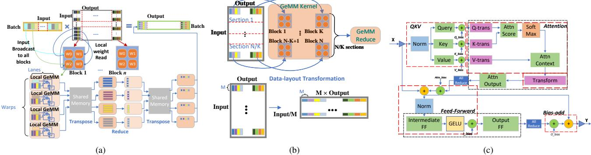
*الشكل 1. (أ) جدولة GeMM على مستويات معمارية مختلفة لوحدة المعالجة الرسومية: كتل مؤشرات الترابط، Warps ومؤشرات ترابط CUDA. تُظهر Warps مؤشرات الترابط التعاونية المختلفة (32 مؤشر ترابط)، وتُظهر Lanes فهرس مؤشر الترابط في كل Warp. (ب) تعديل GeMM لدعم التقسيم ثنائي الأبعاد لمصفوفة الأوزان وتخطيط البيانات الجديد. (ج) استراتيجية Deep-Fusion للاستدلال على الدُفعات الصغيرة.*

تتم مراعاتها لـ Deep-Fusion في حالة استدلال الدُفعات الصغيرة. كما يُظهر الشكل، نقوم بدمج العمليات داخل طبقة المحول في أربع مناطق رئيسية: 1) QKV GeMM وإدخال layer-norm، 2) النقل بالإضافة إلى الانتباه، 3) layer-norm بعد الانتباه و GeMM المتوسط، و 4) إضافة الانحياز والمتبقي. لدعم دمج GeMM مع باقي العمليات في نواة واحدة لـ 3)، نقوم ببث دُفعة الإدخال عبر SMs ونقوم بإجراء نفس العمليات التي تأتي قبل GeMM، بحيث لا توجد حاجة لتبادل البيانات بين SMs لإضافة جدولة GeMM. نلاحظ أنه على الرغم من تكرار العمل عبر SMs، لا نزال نحقق فائدة في الأداء مقارنة بتنفيذ النواة غير المكررة وغير المدموجة لأحجام الدُفعات الصغيرة جداً.

نواة المحول للدُفعات الكبيرة: نتبع نفس استراتيجية الدمج كما تمت مناقشته أعلاه، مع الفرق في أننا نستخدم CUBLAS لعمليات GeMM، ونبقيها غير مدموجة.

دعم أنواع البيانات المختلفة: تدعم نوانا أنواع بيانات FP32 و FP16 و INT8 لعمليات GeMM. لدعم INT-8، نستخدم تطبيق CUTLASS [34] INT8 GeMM المضبوط لأحجام دُفعات مختلفة. نضيف أيضاً عملية التكميم قبل GeMM التي ندمجها باستخدام Deep-Fusion وعملية إلغاء التكميم بعد GeMM التي ندمجها باستخدام وظيفة الخاتمة (epilogue) الخاصة بـ CUTLASS.

القضاء على تكلفة استدعاء النواة عبر Cuda-Graph: بالنسبة للنماذج الصغيرة إلى المتوسطة الحجم بأحجام دُفعات صغيرة، حيث نقلل من وقت التنفيذ الفعلي للنوى، تتحول عنق الزجاجة الرئيسية لزمن الاستجابة من تنفيذ النواة إلى تكلفة إطلاق النواة على جانب وحدة المعالجة المركزية. لمعالجة هذه المشكلة، نضيف دعم CUDA-Graph [35] في خط أنابيب الاستدلال لدينا. وبشكل أكثر تحديداً، نخزن أثر النوى في المرة الأولى التي يتم فيها إطلاقها أثناء الحوسبة الأمامية في الاستدلال وننشئ رسم الحوسبة الذي يمكن إعادة استخدامه للطلبات التالية، مما يلغي إلى حد كبير تكلفة إطلاق النواة ويحسن الأداء بشكل كبير.

## IV. نماذج المحولات الكثيفة المهيأة للاستدلال على الأنظمة متعددة وحدات المعالجة الرسومية

يقدم هذا القسم تقنيات توازي النموذج التي نستخدمها فوق نوى المحولات المنفردة التي تمت مناقشتها في القسم I بهدفين: i) تقليل زمن الاستجابة بشكل أكبر من خلال الاستفادة من عرض نطاق الذاكرة الإجمالي عبر وحدات المعالجة الرسومية و ii) زيادة سعة الذاكرة من خلال الاستفادة من ذاكرة وحدة المعالجة الرسومية الإجمالية عبر

| S0 | S1 | S2 | S3 |  |  |  | S0 | S1 | S2 | S3 |  |  |  | S0 |  |  |  |
| --- | --- | --- | --- | --- | --- | --- | --- | --- | --- | --- | --- | --- | --- | --- | --- | --- | --- |
|  | S0 | S1 | S2 | S3 |  |  |  | S0 | S1 | S2 | S3 |  |  |  |  |  |  |
|  |  | S0 | S1 | S2 | S3 |  |  |  | S0 | S1 | S2 | S3 |  |  |  |  |  |
|  |  |  | S0 | S1 | S2 | S3 |  |  |  | S0 | S1 | S2 | S3 |  |  |  |  |

(أ) جدولة الأساس مع تبعيات البيانات المرصودة.

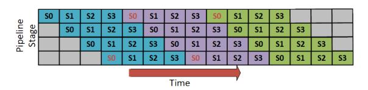

(ب) جدولة الأنابيب لإخفاء تبعيات البيانات.

*الشكل 2. جدولة متوازية أنبوبية لتوليد الرموز الثلاثة الأولى لأربع تسلسلات S0,\ldots,S3 باستخدام أربع مراحل أنبوبية. تشير ألوان التسلسل إلى الرمز الذي يتم توليده. توجد تبعيات البيانات بين المرحلتين الأولى والأخيرة من الأنابيب: نوضح التبعيات لـ S0 فقط. الكتل الرمادية تشير إلى فقاعات الأنابيب.*
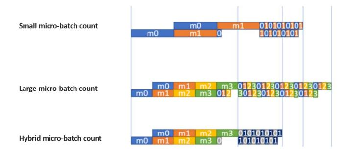
*الشكل 3. توضيح لثلاث مجموعات مختلفة من أحجام الدُفعات لمعالجة المطالبة وتوليد الرموز: يقلل عدد الدُفعات الصغيرة من زمن استجابة توليد الرموز ولكنه يطيل زمن استجابة معالجة المطالبة، والعكس صحيح. باستخدام جدولة هجينة حيث يتم استحداث أعداد دُفعات صغيرة مختلفة لمراحل مختلفة، يتم تقليل زمن استجابة كل من معالجة المطالبة وتوليد الرموز.*

عقد متعددة لاستيعاب النماذج الضخمة. على الرغم من أن توازي النموذج تمت دراسته على نطاق واسع في سياق التدريب، إلا أن هناك تحديات فريدة في الاستدلال، تتطلب حلولاً جديدة.

## أ. عرض نطاق الذاكرة الإجمالي عبر التوازي الموتري

نستفيد من عرض نطاق الذاكرة الإجمالي عبر أجهزة وحدات المعالجة الرسومية المتعددة عبر التوازي بتقطيع الموترات (TP) من Megatron-LM [16]. يمكن لـ DeepSpeed Inference توسيع نطاق نموذج المحول الكثيف تلقائياً إلى أجهزة متعددة عن طريق تقسيم مشغلي المحولات عبر أجهزة متعددة مع إضافة عمليات الاتصال المناسبة المطلوبة

<!-- page 6 -->

عبر وحدات المعالجة الرسومية. تحت السطح، فإنه يستفيد من نوى وحدة المعالجة الرسومية المنفردة لتعظيم استخدام عرض نطاق الذاكرة لكل وحدة معالجة رسومية، مع استخدام جماعيات NCCL all-reduce لإجراء الاتصال اللازم عبر وحدات المعالجة الرسومية كما هو موضح في [[19]](#page-12-18). يتيح ذلك لـ DeepSpeed Inference تحقيق استخدام ممتاز لعرض نطاق الذاكرة الإجمالي عبر عدة وحدات معالجة رسومية مع عقدة. ومع ذلك، كما تمت مناقشته في القسم[ II،](#page-2-0) لا يمكن توسيع نطاق تقطيع الموترات بكفاءة فيما يتجاوز عقدة واحدة بسبب تكلفة الاتصال الكبيرة. وبالتالي، للتوسع بشكل أكبر إلى الأنظمة متعددة العقد، يستخدم DeepSpeed Inference التوازي الأنبوبي.

## *ب. الذاكرة الإجمالية عبر التوازي الأنبوبي 
— التحديات*

عندما تتجاوز النماذج سعة ذاكرة عقدة واحدة، نستخدم التوازي الأنبوبي (PP) [[17]](#page-12-16)، [[18]](#page-12-17). على الرغم من أن PP لا يساعد في عرض نطاق الذاكرة الإجمالي حيث تجتاز كل دُفعة صغيرة العمق الكامل للنموذج بالتسلسل عبر مراحل الأنابيب، فإنه يحتوي على تكلفة اتصال أصغر (كما تمت مناقشته في القسم[ II)](#page-2-0) مقارنة بـ TP، وبالتالي فهو أكثر كفاءة للتوسع عبر العقد. ومع ذلك، فإن تطبيق PP في الاستدلال ليس بالأمر التافه ويتطلب اعتبارات مختلفة عن التدريب:

أولاً، فإن مفككات المحولات انحدارية ذاتياً، أي أن مدخلات استدلال النموذج هي مخرجات مولّدة سابقاً. لذلك، عند توليد تسلسل، فإن الرمز التالي في التسلسل هو دالة للرموز السابقة. خطوط أنابيب التدريب الحالية تستدل بدقة الدُفعات، وبالتالي يتم تحديد حدود الدُفعات بواسطة تبعيات البيانات لتوليد التسلسل. تستحث تبعيات البيانات هذه فقاعات أنابيب متكررة تؤدي إلى تدهور أداء الاستدلال (انظر الشكل[ 2)](#page-4-2). ثانياً، تحتوي نماذج التوليد الانحدارية الذاتية على مرحلتين مميزتين: i) مرحلة معالجة المطالبة حيث تتم معالجة المطالبة الكاملة لتوليد الرمز الأول و ii) مرحلة توليد الرمز، حيث يتم إعادة استخدام نتائج معالجة المطالبة عبر التخزين المؤقت لـ KV، وتعتمد الحوسبة الجديدة فقط على رمز واحد مولّد سابقاً. نظراً لأن عدد الرموز التي تتم معالجتها في كل مرحلة يختلف اختلافاً كبيراً، فإن لها خصائص أداء مختلفة تتطلب اعتبارات مختلفة.

ثالثاً، يخزن الاستدلال الانحداري الذاتي المفتاح وقيم التنشيط لكل طبقة محول من أجل تجنب إعادة الحساب لكل رمز. تتسع ذاكرة التنشيط هذه مع عدد التسلسلات التي يتم إنشاؤها بشكل متزامن. في الواقع، يمكن أن يكون أداء الاستدلال للنماذج الكبيرة من المحولات محدوداً بسعة الذاكرة.

## *ج. التوازي الأنبوبي المحسّن للاستدلال*

من أجل التغلب على التحديات الخاصة بالاستدلال، يتضمن نهجنا ثلاثة جوانب مهمة: الجدولة، وتقليل بصمة الذاكرة، وتحسين الاتصال.

*1) إخفاء تبعيات البيانات والجدولة الهجينة:* لنفترض أن هدفنا هو الاستدلال على دُفعة من B تسلسلات، s1, s2, . . . , sB. نقسم التسلسل إلى مجموعات من الدُفعات الصغيرة، حيث تكون الدُفعة الصغيرة الواحدة هي وحدة الحوسبة المقدمة لكل استدعاء نواة. تتقدم الدُفعة الصغيرة عبر مراحل خط أنابيب النموذج حتى يتم إنتاج الرموز التالية بواسطة المرحلة الأخيرة من النموذج. إذا لم ينته التسلسل s^i^، فسيتم استخدام الرمز المولّد كمدخل

لتوليد الرمز التالي. يوضح الشكل[ 2](#page-4-2) جدولة توليد التسلسلات الموازية للأنابيب الخاصة بنا. نضع عدد الدُفعات الصغيرة على عمق الأنبوب، P. وجود ما لا يقل عن P دُفعات صغيرة أمر بالغ الأهمية لاستخدام جميع مراحل الأنبوب، ولكن تجنب الدُفعات الصغيرة الإضافية بسبب زمن الاستجابة وتكاليف الذاكرة لحجم الدُفعة الأكبر. ومع ذلك، لا يمكننا الاستدلال بشكل متكرر على دُفعة من P دُفعات صغيرة دون تكاليف فقاعات الأنابيب الكبيرة التي تدمر الكفاءة. نتجنب فقاعات الأنابيب الوسيطة عن طريق وضع دُفعات صغيرة من الرموز المولّدة في قائمة انتظار ديناميكية حتى تنتهي التسلسلات. توزع الجدولة الناتجة فقاعة الأنبوب على جميع الرموز المولّدة دون تخصيص تنشيطات إضافية من حجم دُفعة أكبر.

ومع ذلك، هذا ليس كافياً للحصول على أفضل أداء. كما ذكرنا في القسم [IV-B،](#page-5-0) فإن النماذج الانحدارية الذاتية، مثل GPT-3، تتكون غالباً من مرحلتين لهما خصائص أداء مختلفة، واستخدام نفس حجم الدُفعة الصغيرة لكلتا المرحلتين هو دون المستوى الأمثل.

يحتوي مكون معالجة المطالبة للاستدلال على عدد كبير من الرموز لكل عينة يمكنها تشبع حوسبة وحدة المعالجة الرسومية واختيار الدُفعات الصغيرة يؤثر فقط على فقاعة الأنبوب وليس على وقت تنفيذ وحدة المعالجة الرسومية. ومع ذلك، بالنسبة لتوليد الرمز، تحتوي كل عينة على رمز واحد، والعدد الإجمالي للرموز عبر الدُفعة الصغيرة بأكملها صغير، ووقت تنفيذ النواة مقيد بالكامل بعرض نطاق الذاكرة. هذا يعني أن وقت تنفيذ الدُفعة الصغيرة لا يتغير كثيراً مع تغيير حجم الدُفعة الصغيرة لأن معظم الوقت يقضى في جلب معاملات النموذج. ومع ذلك، فإن إجمالي وقت التنفيذ يتناسب مع عدد الدُفعات الصغيرة، حيث يتطلب التمرير الأمامي على كل دُفعة صغيرة جلب الأوزان مرة أخرى. لذلك، يتطلب توليد الرمز الفعال تقليل عدد الدُفعات الصغيرة مع إبقائها كبيرة بما يكفي لإخفاء فقاعة الأنبوب.

لمعالجة المتطلبات المتفاوتة لمعالجة المطالبة وتوليد الرموز، نتبنى استراتيجية جدولة هجينة، حيث نستخدم عدداً مختلفاً من الدُفعات الصغيرة لمعالجة المطالبة وتوليد الرمز. يوضح الشكل[ 3](#page-4-3) كيف تعمل الجدولة الهجينة. نستخدم عدداً أكبر من الدُفعات الصغيرة أثناء مرحلة معالجة المطالبة لتقليل فقاعة الأنبوب، بينما خلال مرحلة توليد الرمز، نقلل عدد الدُفعات الصغيرة لتقليل وقت التنفيذ الإجمالي.

- *2) تفريغ التنشيطات إلى ذاكرة وحدة المعالجة المركزية:* تحتوي موترات تنشيط المفتاح والقيمة المخزنة مؤقتاً على نمط إعادة استخدام يمكن التنبؤ به. لن يتم استخدام تنشيطات التسلسل s^i^ مرة أخرى حتى توليد الرمز التالي لـ s^i^. عندما تتجاوز ذاكرة التنشيط المخصصة عتبة معينة، نقوم بتفريغ بعض التنشيطات من وحدة المعالجة الرسومية إلى ذاكرة وحدة المعالجة المركزية أثناء عدم استخدامها. تتيح ذاكرة وحدة المعالجة الرسومية الموفرة أحجام دُفعات أكبر وتتيح استخدام أفضل للنظام.
- *3) تحسين الاتصال:* في النهاية، سيتدهور أداء الاستدلال إذا توقفت نوى المحولات على الاتصالات لتفريغ ذاكرة وحدة المعالجة المركزية عبر PCIe ذي عرض النطاق المنخفض. لتجنب التوقف، نقوم بتداخل الاتصال مع الحوسبة، والأهم من ذلك أننا نستخدم استراتيجية تفريغ محسّنة الاتصال تراعي المعمارية. لا تحتوي معظم معماريات الأنظمة على ناقل PCIe فريد لكل وحدة معالجة رسومية وتشترك في رابط واحد عبر وحدتي معالجة رسومية. لـ

<!-- page 7 -->

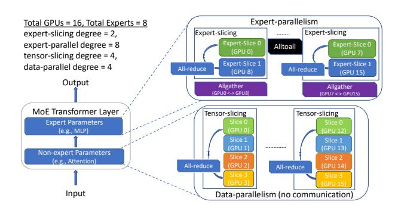
*الشكل 4. التوازي بين الخبراء والبيانات والموترات في DeepSpeed-MoE.*

تجنب التنازع بين وحدات المعالجة الرسومية، فإن وحدات المعالجة الرسومية ذات الأرقام الفردية تفرغ التنشيطات للطبقات ذات الأرقام الفردية، بينما وحدات المعالجة الرسومية ذات الأرقام الزوجية تفرغ التنشيط للطبقات ذات الأرقام الزوجية. هذا أمر بالغ الأهمية للاستفادة الكاملة من عرض نطاق PCIe. تمنع جدولة تفريغ الطبقات الفردية والزوجية عبر وحدات المعالجة الرسومية التنازع على رابط PCIe، مما يسمح لكل وحدة معالجة رسومية بالاستفادة الكاملة من عرض نطاق PCIe عندما تحتاج إلى التفريغ.

## V. الاستدلال على نموذج متناثر بنطاق ضخم

في حين أن التقنيات المطورة حتى الآن تمكّن DeepSpeed Inference من تحقيق أحدث زمن استجابة وإنتاجية لنماذج المحولات الكثيفة، فإن الاعتبارات الجديدة ضرورية لنماذج المحولات المتناثرة التي تتألف من مكونات متناثرة وكثيفة على حد سواء. التحدي الرئيسي هو أن النماذج المتناثرة، من ناحية، أكبر بكثير من النماذج الكثيفة المعادلة في الجودة (القسم II)، مما يتطلب عرض نطاق ذاكرة إجمالي أعلى بكثير لتحقيق زمن استجابة مماثل للنماذج الكثيفة المعادلة في الجودة، ومن ناحية أخرى لها بنية حوسبية مختلفة عن النماذج الكثيفة، مما يتطلب نهج توازي مختلفة مقارنة بالمحولات الكثيفة [23].

في هذا القسم، نقدم نظام استدلال نموذج محول قائم على MoE بنطاق ضخم قادر على معالجة التحديات المذكورة أعلاه. وهو مبني فوق المكونات الكثيفة التي تمت مناقشتها سابقاً ويتكون من ثلاثة مكونات رئيسية:

## أ. تنسيق التوازي الموتري والبياني والخبير لـ MoE

نستخدم التوازي الموتري، المشار إليه في الشكل 4 باسم تقطيع الموترات (للمعاملات غير الخبيرة) وتقطيع الخبراء (لمعاملات الخبراء)، لتقسيم المعاملات الفردية عبر وحدات معالجة رسومية متعددة للاستفادة من عرض نطاق الذاكرة الإجمالي عبر وحدات المعالجة الرسومية. ومع ذلك، يمكن للتوازي الموتري التوسع بكفاءة إلى عدد قليل فقط من وحدات المعالجة الرسومية بسبب تكلفة الاتصال والتوازي الدقيق. لمعالجة ذلك، نستخدم التوازي بين الخبراء جنباً إلى جنب مع التوازي الموتري لتوسيع معاملات الخبراء إلى مئات وحدات المعالجة الرسومية. لا يقلل التوازي بين الخبراء من دقة الحوسبة للمشغلين الفرديين، وبالتالي يسمح لنظامنا بالاستفادة من عرض نطاق الذاكرة الإجمالي عبر مئات وحدات المعالجة الرسومية. لتوسيع الحوسبة غير الخبيرة إلى نفس العدد من وحدات المعالجة الرسومية، نستخدم التوازي البياني دون أي تكلفة اتصال.

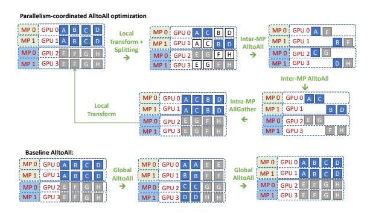
*الشكل 5. يتبع تحسين الاتصال المنسق المتوازي (PCC) أربع خطوات: 1) التحويل المحلي وتقسيم البيانات الأصلية، 2) alltoall داخل التوازي الموتري للنموذج (MP) و alltoall بين MP، يليها 3) allgather داخل MP، و 4) أخيراً عملية تحويل محلية. على الرغم من الخطوات الأربع، فإنه أسرع من alltoall الأساسي الموضح في النصف السفلي من هذا التوضيح.*

## ب. PCC: الاتصال المنسق المتوازي لـ MoE

يضع التوازي بين الخبراء مشغلي الخبراء عبر وحدات المعالجة الرسومية ويتطلب اتصالاً all-to-all بين جميع وحدات المعالجة الرسومية المتوازية بين الخبراء. ومع ذلك، فإنه ليس من الفعال توسيع التوازي بين الخبراء إلى مئات الأجهزة اللازمة لاستدلال النماذج المتناثرة لأن زمن الاستجابة يزداد خطياً مع زيادة الأجهزة. لحسن الحظ، عند الجمع بين التوازي بين الخبراء وتقطيع الموترات داخل نموذج واحد، توجد فرص لتحسين الاتصال يمكن أن تقلل من زمن استجابة الاتصال. لاحظ أن تقطيع الموترات يقسم المشغلين الفرديين عبر وحدات المعالجة الرسومية ويتطلب all-reduce بينها. تنسخ عملية allreduce في تقطيع الموترات البيانات بين الأجهزة المعنية. عند تنفيذ المشغلين المتوازيين الموتريين متبوعين بالمشغلين المتوازيين بين الخبراء، يسمح هذا التكرار بإنشاء جدولة اتصال محسّنة لمشغل all-to-all لا يتطلب الاتصال بين جميع العمليات المتوازية بين الخبراء: يمكن أن يحدث all-to-all داخل المجموعة الفرعية فقط من الأجهزة التي تشترك في نفس رتبة تقطيع الموترات، نظراً لأن البيانات عبر الرتب المتوازية الموترية مكررة (الشكل 5). ونتيجة لذلك، يكون زمن استجابة all-to-all محدوداً بـ O(p/L) بدلاً من O(p) حيث L هي درجة التوازي لتقطيع الموترات و p هو إجمالي عدد أجهزة وحدات المعالجة الرسومية.

وبالمثل، عند تنفيذ المشغلين المتوازيين بين الخبراء متبوعين بمشغلي تقطيع الموترات، يمكن إجراء all-to-all النهائي بنفس الطريقة، ولكن هذه المرة يتبعه مشغل allgather بين الرتب المتوازية الموترية لتكرار البيانات اللازمة لتقطيع الموترات (الشكل 5). يقلل هذا من تكلفة زمن الاستجابة من O(p) إلى O(p/L) + O(L).

تتيح تكلفة زمن الاستجابة المخفضة هذه التوسع بشكل أفضل إلى عدد كبير من الأجهزة. على سبيل المثال، عند التوسع إلى 128 وحدة معالجة رسومية مع تقطيع موتري بـ 8 طرق وتوازي بين الخبراء بـ 128 طريقاً، يقلل هذا النهج من تكلفة زمن الاستجابة لـ all-to-all من (128C_1+C_2) إلى (16C_1+C_2) بسبب تقطيع الموترات بـ 8 طرق، حيث C_1 و C_2 هي بعض الثوابت التي يحددها زمن الاستجابة من نقطة إلى نقطة، وحجم الرسالة، وعرض النطاق.

## ج. نوى الحوسبة المحسّنة بدرجة عالية لـ MoE

تتألف الحوسبة المتعلقة بـ MoE من أربعة مكونات رئيسية: (1) دالة بوابة تحدد تعيين الرموز

<!-- page 8 -->

للخبراء، حيث يتم تمثيل النتيجة كموتر متناثر (متجه one-hot يمثل الخبير المعين لكل رمز في التسلسل)؛ (2) سلسلة من المشغلين المتناثرين بما في ذلك مشغل *cumsum* لحساب التعيين العكسي من الخبراء إلى معرفات الرموز (من الخبراء إلى الرموز) باستخدام متجه one-hot من الرمز إلى الخبير المذكور سابقاً؛ (3) مشغل scatter لتوزيع الرموز على الخبراء المقابلين لها. يتم تنفيذ هذا كمشغل einsum متناثر بين من الخبير إلى الرمز المحسوب في الخطوة السابقة ورموز الإدخال؛ و (4) عملية gather النهائية القائمة على einsum المتناثر التي تعيد توزيع الرموز التي تتم معالجتها في كل خبير إلى ترتيبها الأصلي.

يقدم تمثيل الموتر المتناثر في دالة البوابة ومشغلي einsum المتناثر تكلفة كبيرة لزمن الاستجابة. تتضمن دالة البوابة العديد من العمليات لإنشاء أقنعة الرموز، واختيار خبراء top-k، وإجراء المجموع التراكمي (*cumsum*) للعثور على معرف الرمز الذي يذهب إلى كل خبير وضرب المصفوفات المتناثرة، وكلها ليست مهدرة فحسب بسبب تمثيل الموتر المتناثر، بل أيضاً بطيئة للغاية بسبب العديد من استدعاءات النواة. علاوة على ذلك، فإن einsum المتناثر له تعقيد S × E × M × ce، حيث يمثل S إجمالي عدد الرموز، ويمثل E عدد الخبراء، ويمثل M بُعد النموذج المخفي، ويمثل c^e^ سعة الخبير (S و E و M هي عوامل التعقيد الرئيسية، بينما c^e^ عادة ما يكون صغيراً جداً). في هذه المعادلة، (E − 1) من E مشغلين لكل رمز هي عمليات ضرب وإضافة بأصفار، نظراً لأنه يتم اختيار خبير واحد فقط عادةً لمعالجة c^e^ من الرموز. هذا يأتي من حقيقة أن تعميم عمليات البوابة يؤدي إلى einsums على عدة مصفوفات قناع أو متجهات one-hot التي تنتج الكثير من الحوسبة غير الضرورية بأصفار لاختيار الرمز الصحيح لكل خبير. نقوم بتحسين هؤلاء المشغلين باستخدام التمثيل الكثيف ودمج النوى.

نقوم بتحسين كل خطوة من الخطوات الأربع في دالة البوابة بالطريقة التالية: 1) نستبدل تمثيل one-hot لتعيين الرمز إلى الخبير باستخدام بنية بيانات جدول، مما يقلل بشكل كبير من تكلفة الذاكرة عن طريق إزالة جميع الأصفار في متجهات one-hot؛ 2) ننشئ التعيين العكسي (جدول تعيين من الخبير إلى الرموز) من جدول تعيين الرموز إلى الخبير ببساطة عن طريق مسح جدول الرمز إلى الخبير بالتوازي. 3) نستبدل عملية scatter القائمة على einsum المتناثر باستخدام تحويل تخطيط البيانات الذي يحقق نفس النتيجة عن طريق تحديد معرفات الرموز المعينة لخبير أولاً باستخدام جدول تعيين الخبير إلى الرموز الذي تم إنشاؤه في الخطوة السابقة، ثم نسخ هذه الرموز إلى موقع الخبير المناسب؛ 4) بعد معالجة الرموز بواسطة الخبراء المقابلين لها، نستخدم تحويل تخطيط بيانات مماثل لاستبدال عملية gather القائمة على einsum المتناثر.

يقلل استخدام تحويل تخطيط البيانات بدلاً من einsums المتناثر من تعقيد هذه العمليات من S × E × M × c^e^ إلى S × M × ce. نستخدم الذاكرة المشتركة لتحويلات تخطيط البيانات وندمج كل ما عدا تحويل تخطيط البيانات النهائي معاً في نواة واحدة باستخدام مبادئ الدمج الأساسية. مجتمعة، تؤدي هذه التحسينات إلى تخفيض يزيد عن 6× في زمن استجابة النواة المتعلق بـ MoE.

## VI. ديمقراطية استدلال النماذج الكبيرة.

يحتاج DeepSpeed Transformer إلى أن يتسع النموذج للذاكرة الإجمالية لوحدات المعالجة الرسومية، مما يتطلب عدداً كبيراً من وحدات المعالجة الرسومية للنماذج الكبيرة. يمثل هذا حاجزاً للعديد من علماء البيانات الذين يفتقرون إلى الوصول إلى عدد كبير من وحدات المعالجة الرسومية، على سبيل المثال، هناك حاجة إلى عشرات وحدات المعالجة الرسومية لاستدلال نماذج مثل MT-NLG-530B. لتوسيع الوصول إلى النماذج الكبيرة، نقترح ZeRO-Inference الذي يمكّن استدلال النماذج الكبيرة باستخدام ما لا يقل عن وحدة معالجة رسومية واحدة. بالنسبة للتطبيقات غير الحساسة لزمن الاستجابة، يحقق ZeRO-Inference أداءً عالياً من خلال الاستفادة من ذاكرات DRAM و NVMe بالإضافة إلى ذاكرة وحدة المعالجة الرسومية وحوسبتها. مقارنة بحل قائم على وحدة المعالجة المركزية فقط، يمكن لـ ZeRO-Inference تحقيق إنتاجية أعلى بأحجام كبيرة من خلال الاستغلال الفعال للأجهزة المتاحة لوحدة المعالجة الرسومية. علاوة على ذلك، يقدم إنتاجية مماثلة أو حتى أفضل من DeepSpeed Transformer من خلال دعم أحجام دُفعات أكبر. سنناقش الآن تصميم ZeRO-Inference وتحسينات الأداء التي تجعله فعالاً جداً للاستدلال الموجه نحو الإنتاجية.

## *أ. تصميم ZeRO-Inference*

يستخدم ZeRO-Inference الذاكرة غير المتجانسة المتاحة (أي ذاكرة وحدة المعالجة الرسومية، و DRAM، و NVMe) لتلبية متطلبات الذاكرة لاستيعاب النماذج الضخمة. هذا مدفوع بملاحظة أن البيئات ذات موارد وحدات المعالجة الرسومية المحدودة غالباً ما تكون مجهزة بتيرابايتات من الذاكرة غير المتجانسة الإجمالية، وهي كافية لاستيعاب النماذج بمئات المليارات من المعاملات. يبني ZeRO-Inference على تقنيات التفريغ في ZeRO-Infinity [[36]](#page-12-35)، ويكيفها مع الاستدلال.

قرار تصميم مهم هو كيفية توزيع ذاكرة وحدة المعالجة الرسومية بين أوزان النموذج، ومدخلات الاستدلال، والنتائج الوسيطة. أحد النهج هو تثبيت أكبر قدر ممكن من أوزان النموذج في ذاكرة وحدة المعالجة الرسومية، وجلب الباقي (من DRAM أو NVMe) عند الحاجة للحوسبة. تتمثل ميزة هذا النهج في تجنب زمن استجابة جلب الأوزان المثبتة بالفعل في ذاكرة وحدة المعالجة الرسومية. ومع ذلك، فإن هذا النهج له جانبان سلبيان: (i) يسمح فقط بأحجام دُفعات صغيرة مما يضر بالكفاءة، و (ii) توفير زمن الاستجابة للنماذج التي تحتوي على مئات المليارات من المعاملات لا يكاد يذكر لأن جزءاً صغيراً فقط من الأوزان يمكن أن يتسع لذاكرة وحدة المعالجة الرسومية على أي حال.

يتبنى ZeRO-Inference نهجاً مختلفاً يثبت أوزان النموذج إما في DRAM (إذا كانت كبيرة بما يكفي) أو NVMe، ويبث كل طبقة إلى ذاكرة وحدة المعالجة الرسومية للحوسبة عند الحاجة. على الرغم من زمن الاستجابة لجلب أوزان النموذج عبر PCIe، فإن ZeRO-Inference قادر على تحقيق كفاءة عالية لسببين. أولاً، من خلال الحد من استخدام ذاكرة وحدة المعالجة الرسومية للنموذج إلى طبقة واحدة أو عدد قليل من طبقات الأوزان، يستطيع ZeRO-Inference استخدام أحجام دُفعات كبيرة للاستدلال. ثانياً، تتطلب طبقة نموذج كبيرة قدراً كبيراً من الحوسبة، خاصة بالنظر إلى طول تسلسل الإدخال الطويل (على سبيل المثال، 2048). على سبيل المثال، تتطلب طبقة GPT3-175B واحدة حوالي 7 TFlops لمعالجة إدخال بحجم دُفعة 1. لذلك، تتسبب أحجام الدُفعات الكبيرة في أن يهيمن وقت الحوسبة على زمن الاستجابة لجلب أوزان النموذج، مما يحسّن الكفاءة في النهاية. باختصار، تؤدي استراتيجية ZeRO-Inference لاستخدام ذاكرة وحدة المعالجة الرسومية لدعم أحجام دُفعات كبيرة إلى استدلال عالي الأداء للنماذج الكبيرة.

<!-- page 9 -->

تكوينات النماذج المستخدمة لتقييم أداء استدلال النموذج الكثيف.

| النموذج | الحجم (مليارات) | #الطبقات | الحجم المخفي | درجة MP | درجة EP | تقطيع الخبراء | #وحدات المعالجة الرسومية |
| --- | --- | --- | --- | --- | --- | --- | --- |
| 1.3B+MoE-128 | 52 | 24 | 2048 | 1 | 128 | 1 | 128 |
| 2.4B+MoE-128 | 107.7 | 16 | 3584 | 1 | 128 | 1 | 128 |
| 8B+MoE-128 | 349.0 | 30 | 4096 | 4 | 128 | 1 | 128 |
| 24B+MoE-128 | 1064.9 | 40 | 8192 | 8 | 128 | 2 | 256 |
| 47B+MoE-128 | 2024.0 | 58 | 8192 | 8 | 128 | 2 | 256 |

الجدول II

تكوينات النماذج المستخدمة لتقييم أداء استدلال النموذج المتناثر. MP تعني التوازي النموذجي. EP تشير إلى التوازي بين الخبراء.

## *ب. تحسينات الأداء*

ينفذ ZeRO-Inference تحسينين للتخفيف من تأثير جلب أوزان النموذج من DRAM أو NVMe لحوسبات الاستدلال.

*الجلب المسبق*: يقوم ZeRO-Inference بجلب عدد قابل للتكوين من الطبقات قبل الاستخدام، متداخلاً مع حوسبة الطبقة الحالية. يوفر الجلب المسبق المرونة لتحسين الإنتاجية على حساب زيادة قابلة للتكوين في استهلاك ذاكرة وحدة المعالجة الرسومية.

*استخدام عرض نطاق PCI-e متعدد وحدات المعالجة الرسومية*: في سيناريوهات وحدات المعالجة الرسومية المتعددة، يتم استخدام عرض نطاق PCI-e الإجمالي لتقليل وقت نقل الطبقة من خلال جلب كل وحدة معالجة رسومية لجزء من الطبقة فقط ثم تجميع الأجزاء عبر الترابط بين وحدات المعالجة الرسومية الأسرع بكثير.

بالإضافة إلى التحسينات المذكورة أعلاه، يقوم ZeRO-Inference أيضاً بتنفيذ العديد من تحسينات الكفاءة الأخرى لتحقيق ما يقرب من ذروة عرض نطاق NVMe IO، مثل طلبات القراءة/الكتابة الجماعية للإكمال غير المتزامن، والتوازي العدواني لطلبات الإدخال/الإخراج، وجدولة العمل، وتثبيت الذاكرة، وتجنب نسخ البيانات. ومع ذلك، لا ندعي الجدة في تلك التحسينات حيث تم تقديمها بواسطة العمل السابق [[36]](#page-12-35).

## VII. تقييم الأداء

نقدم تقييماً شاملاً لـ DeepSpeed Inference يغطي أربعة جوانب. i) للتطبيقات الحساسة لزمن الاستجابة، يحقق DeepSpeed Inference زمن استجابة أقل بما يصل إلى 1.9× و 7.3× من أحدث ما توصل إليه العلم لمجموعة واسعة من النماذج الكثيفة بمئات المليارات من المعاملات، والنماذج المتناثرة بتريليونات من المعاملات تتسع إلى مئات وحدات المعالجة الرسومية. ii) للاستدلال الموجه نحو الإنتاجية للنماذج الضخمة، يحقق DeepSpeed Inference إنتاجية أعلى بما يصل إلى 1.5×. iii) على الأنظمة المقيدة بالموارد، يمكّن DeepSpeed Inference الاستدلال على نماذج أكبر بـ 25× من الحلول التي تعتمد على وحدات المعالجة الرسومية فقط (530B مقابل 20B) مع تحقيق أكثر من 50% من ذروة أداء الأجهزة، مما يديمقرط استدلال النماذج الكبيرة بموارد محدودة من وحدات المعالجة الرسومية. iv) نقدم تفصيلاً للأداء للتركيز على مساهمات التحسينات الفردية.

## *أ. منهجية التقييم*

*1) خط الأساس:* بالنسبة للنماذج الكثيفة، نستخدم FasterTransformer (FT) [[31]](#page-12-30)، وهو تنفيذ فعال لنماذج المحولات المقدمة من NVIDIA. لتجارب النماذج المتناثرة، نقوم

باستخدام تنفيذ PyTorch موزع ومتكامل الميزات يدعم كلاً من التوازي الموتري والتوازي بين الخبراء [[37]](#page-12-36).

- *2) المقاييس:* نستخدم ثلاثة مقاييس للأداء: (i) *زمن الاستجابة*، أي وقت توليد المخرجات من البداية إلى النهاية لدُفعة من المطالبات المدخلة، (ii) *إنتاجية الرموز*، أي الرموز في الثانية التي تتم معالجتها، و (iii) *إنتاجية الحوسبة*، أي TFLOPS لكل وحدة معالجة رسومية.
- *3) أعباء العمل:* لتقييم الأداء، نركز على تقييم نماذج المفكك القائمة على المحول من نمط GPT [[8]](#page-12-7)، حيث نقوم بتغيير البُعد المخفي، وعدد طبقات المحول، ورؤوس الانتباه بناءً على ورقة GPT-3 وكذلك متغيراتها المتاحة للجمهور لتغطية مجموعة واسعة من تكوينات النماذج وعدد مختلف من المعاملات. يوضح الجدول[ I](#page-8-1) معماريات النماذج. بالنسبة لنماذج MoE المتناثرة، نقوم بتغيير درجة الخبير لتغطية النماذج التي تتراوح من 52 مليار معامل إلى 2 تريليون معامل. تكوينات النماذج المتناثرة موضحة في الجدول[ II.](#page-8-2) نظراً لأن النماذج اللغوية التوليدية مثل GPT-3 تنتج رموزاً بناءً على مطالبة، وهي النص المعطى للنموذج لإكماله، نقيس زمن استجابة توليد 8 رموز بمطالبة إدخال من 128 رمزاً للنماذج الكثيفة بأحجام دُفعات متفاوتة، مما يعكس السيناريوهات التي تتوافق مع التطبيقات الأكثر حساسية لزمن الاستجابة. بالنسبة لنموذج MoE المتناثر، نقيس زمن الاستجابة لكل رمز بتوليد 100 رمز في كل مرة بمطالبة من 128 رمزاً وحجم دُفعة 8. للتطبيقات الموجهة نحو الإنتاجية، نقيس الأداء بمطالبة إدخال من 512 رمزاً مع توليد 50 رمزاً في كل مرة. للأنظمة المقيدة بالموارد، نقيس إنتاجية الحوسبة باستخدام أقصى حجم دُفعة ممكن لتوليد رمز واحد.
- *4) أسرّة الاختبار:* نجري تجاربنا على: مجموعة من ما يصل إلى 256 وحدة NVIDIA Ampere A100 40GB GPUs (32 صناديق 8×A100 DGX [[38]](#page-12-37))، ومحطة عمل Lambda A6000 [[39]](#page-12-38) (2×A6000-48GB-GPU، 256GB DRAM، و 2TB NVME) وخادم DGX2 V100 [[40]](#page-12-39) (16×V100-32GB-SXM-GPU، 1500GB DRAM، و 30TB NVME).

## *ب. تقييم DeepSpeed Inference لأعباء العمل الحساسة لزمن الاستجابة*

يوفر DeepSpeed Inference حل نظام شامل لدعم الاستدلال السريع للنماذج الكثيفة التي تزيد عن 530 مليار معامل وكذلك النماذج المتناثرة التي تحتوي على أكثر من 2 تريليون معامل بنطاق غير مسبوق.

<!-- page 10 -->

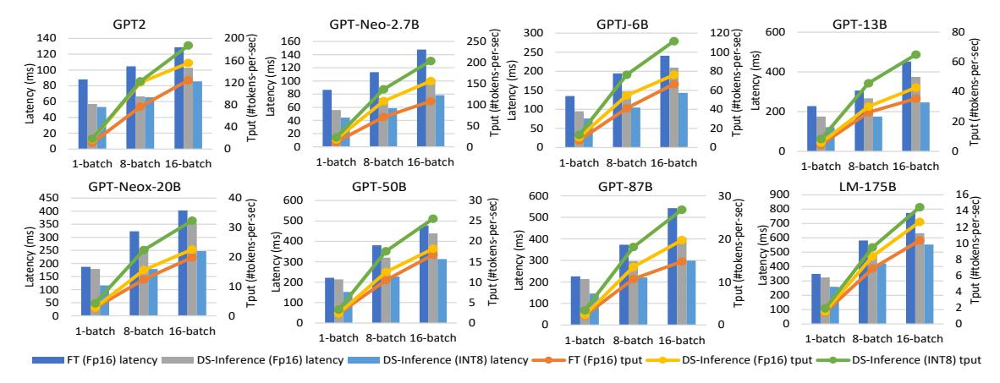
*الشكل 6. مقارنة زمن الاستجابة والإنتاجية لـ DeepSpeed Transformer مع FasterTransformer [31] لنماذج وأحجام دُفعات مختلفة.*

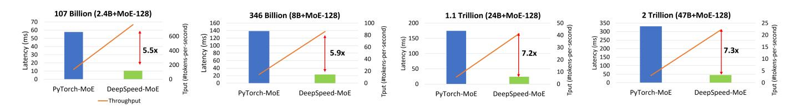
*الشكل 7. تحسين زمن الاستجابة والإنتاجية الذي يقدمه DeepSpeed-MoE على خط الأساس على 256 وحدة معالجة رسومية. الإنتاجية الموضحة هي لكل وحدة معالجة رسومية وتشير قيم التسريع على طول الأسهم إلى تحسن في زمن الاستجابة.*

1) تقييم النموذج الكثيف: يُظهر الشكل 6 تحسينات زمن الاستجابة والإنتاجية لـ DeepSpeed Inference على النماذج التي تصل إلى 175 مليار معامل والتي تعمل بتوازي موتري يصل إلى 16 طريقاً (انظر الجدول I). على وجه الخصوص، نقارن تطبيقي FP16 (DeepSpeed-FP16) و INT8 (DeepSpeed-INT8) من DeepSpeed Inference مع خط أساس FasterTransformer FP16 (FT-FP16) 1. يستخدم كل من خط الأساس و DeepSpeed Inference استراتيجية TP متطابقة لذا تأتي جميع اختلافات زمن الاستجابة في هذه النتائج من الاختلافات في تطبيقات النواة الموضحة أدناه.

أحجام الدُفعات الصغيرة بالنسبة لحجم الدُفعة الصغير، يحقق DeepSpeed-FP16 تسريعاً يصل إلى 1.55\times على خط الأساس. تأتي تحسينات الأداء لكل من تكوينات وحدة المعالجة الرسومية الواحدة ومتعددة وحدات المعالجة الرسومية بشكل أساسي بسبب deep-fusion و GeMMs المخصصة. تخفيض زمن الاستجابة هو الأكبر لأصغر أحجام النماذج، حيث أن لديها أكبر تكلفة لإطلاق النواة بسبب العمل المحدود لكل نواة، وأسوأ استخدام لعرض نطاق ذاكرة GeMM من CUBLAS لأنها غير محسنة لـ GeMMs الصغيرة والنحيفة. يتيح DeepSpeed-INT8 تعزيز أداء إضافي يصل إلى 1.95\times على خط أساس FP16 من خلال تقليل الحجم الإجمالي للمعاملات إلى النصف مقارنة بـ FP16.

أحجام الدُفعات الأكبر بالنسبة لأحجام الدُفعات الأكبر، يقلل DeepSpeed-FP16 من زمن الاستجابة بما يصل إلى 1.57\times على خط الأساس، وما يصل إلى 1.93\times باستخدام DeepSpeed-INT8. المصدر الرئيسي لتحسين الأداء لـ DeepSpeed-FP16 هو تقليل تكلفة حركة البيانات غير GeMM عبر deep-fusion. مع زيادة حجم الدُفعة، يصبح GeMM أكثر كفاءة بكثير،

ويزداد زمن الاستجابة لمشغلي GeMM بشكل خطي تحت طبيعي مع حجم الدُفعة في نظام حجم الدُفعة المتواضع هذا. ومع ذلك، يزداد زمن استجابة العمليات غير GeMM خطياً بسبب الزيادة المتناسبة في حركة البيانات من ذاكرة وحدة المعالجة الرسومية، مما يجعلها جزءاً أكبر من زمن الاستجابة الكلي. يقلل deep-fusion من حركة البيانات هذه عن طريق الاحتفاظ بالبيانات الوسيطة للمشغلين المدمجين في الذاكرة المشتركة أو السجلات لتحقيق أداء أعلى. يحسن DeepSpeed-INT8 بشكل أكبر على أداء DeepSpeed-FP16 من خلال استخدام الذروة الأعلى لأنوية موترات INT8 مقارنة بـ FP16.

2) تقييم النموذج المتناثر: يُظهر الشكل 7 زمن استجابة توليد رمز الإخراج الواحد وإنتاجية تقديم نماذج MoE من 100B إلى 2T بما يصل إلى 256 وحدة معالجة رسومية مع وبدون DeepSpeed-MoE. مقارنة بخط الأساس، يحقق DeepSpeed-MoE أداءً أفضل من أحدث ما توصل إليه العلم، مع تخفيض يصل إلى 7.3 \times في زمن الاستجابة. لإجراء مقارنة عادلة، فإن تكوين توازي البيانات/الموتر/الخبير هو نفسه لكل من خط الأساس و DeepSpeed Inference-MoE. الاختلافات الرئيسية هي التحسينات التي يحتوي عليها DeepSpeed Inference، مثل تقطيع الخبراء، و all-to-all منسق التوازي، ونوى MoE المحددة، ولكن خط أساس PyTorch-MoE لا يحتوي عليها. من خلال الاستغلال الفعال لمئات وحدات المعالجة الرسومية بالتوازي، يحقق DeepSpeed-MoE نطاقاً غير مسبوق للاستدلال بزمن استجابة منخفض بشكل لا يصدق - يمكن تقديم نموذج MoE بتريليون معامل مذهل تحت 25 ميلي ثانية من خلال الاستفادة من عرض نطاق ذاكرة وحدة معالجة رسومية إجمالي يبلغ 128 TB/sec (33 % من ذروة عرض نطاق الذاكرة)، مما يجعل من الممكن تقديم نموذج ضخم كهذا حتى في التطبيقات الفورية التفاعلية للغاية.

في حين ندرك أن استخدام الحوسبة بنسبة 33% على 256 وحدة معالجة رسومية سيكون منخفضاً نسبياً للتطبيق المقيد بالحوسبة مثل

> ^&^lt;sup>1في وقت كتابة هذه السطور، يدعم FasterTransformer فقط حوسبة INT8 لنماذج المحولات مع المشفرات فقط، على سبيل المثال، BERT، ولكن ليس المفككات المستخدمة في نماذج المحولات الحديثة واسعة النطاق مثل GPT3 [8].

<!-- page 11 -->

التدريب بكثافة حسابية عالية، فإن استخدام عرض نطاق الذاكرة بنسبة 33% لتمكين استدلال نموذج ضخم بزمن استجابة منخفض دون أي كثافة حسابية تقريباً هو نتيجة غير مسبوقة بسبب الاتصال المكثف المطلوب في مثل هذه السيناريوهات.

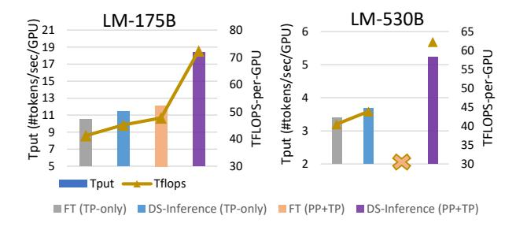
*الشكل 8. مقارنة الإنتاجية لـ DeepSpeed Transformer مع FT لنماذج 175B و 530B على 16 و 40 وحدة معالجة رسومية. نقوم بالتشغيل بأحجام دُفعات تعطي أفضل أداء لكل تكوين.*

## ج. الاستدلال الموجه نحو الإنتاجية للنماذج الضخمة

النماذج الضخمة قادرة على معالجة المطالبات الكبيرة وتوليد عدد كبير من الرموز المتماسكة. في بعض التطبيقات (على سبيل المثال، إعادة كتابة الاستعلام دون اتصال في أنظمة البحث والتوصية على نطاق الويب)، يمكن أن تكون عملية توليد الرمز هذه أقل تركيزاً على زمن الاستجابة وأكثر توجهاً نحو الإنتاجية. في هذا القسم الفرعي، نوضح تحسين الإنتاجية لـ DeepSpeed Inference لاستدلال النماذج الضخمة.

يُظهر الشكل 8 أن DeepSpeed Inference يحقق تحسين إنتاجية بنسبة 1.51\times على أفضل تكوين FasterTransformer (FT) لنموذج GPT-3 175B الذي يعمل على عقدتين (2\times 8\text{ A}100). يأتي هذا التحسن من جدولة التوازي الأنبوبي المحسنة لدينا، والقدرة على تشغيل أحجام دُفعات أكبر بكثير باستخدام تحسين الذاكرة واستراتيجيات تقليل الاتصال الموضحة في القسم IV. بالنسبة لـ 530B، لم نتمكن من تشغيل FT باستخدام مزيج من TP و PP دون تعطل، ولكن مقارنة بإصدار FT الذي يستخدم TP فقط، يحقق DeepSpeed Inference تحسناً في الإنتاجية يزيد عن 1.53\times عند التشغيل على 5 عقد.

## د. ديمقراطية استدلال النماذج الأكبر مع ZeRO-Inference

نقيم ثلاثة جوانب من ZeRO-Inference:

- 1) نطاق النموذج: يمكن لـ ZeRO-Inference الاستدلال على نموذج بـ 530 مليار معامل على وحدة معالجة رسومية A6000 واحدة، أكبر بـ 25 \times من أكبر نموذج يمكن الاستدلال عليه باستخدام حل يعتمد على وحدة المعالجة الرسومية فقط (وأكبر بـ 10 \times مقارنة بالحل الذي يعتمد على وحدة المعالجة المركزية فقط)، مما يجعل من الممكن لعلماء البيانات اختبار النماذج الضخمة على محطات عمل بوحدة معالجة رسومية واحدة دون الحاجة إلى مجموعات وحدات معالجة رسومية ضخمة أو تكبد تكلفة باهظة (انظر الشكل 9(ب)).
- 2) إنتاجية الاستدلال: يحقق ZeRO-Inference إنتاجية استدلال ممتازة تصل إلى 84 TFLOPS، 54% من الذروة النظرية (158.4 TFLOPS) للاستدلال دون اتصال بأحجام دُفعات كبيرة جداً (انظر الشكل 9(ب)). في الواقع، بالنسبة للنماذج التي تتسع لذاكرة وحدة المعالجة المركزية، فإنه يقدم إنتاجية أعلى بـ 25× مقارنة بالحل الذي يعتمد على وحدة المعالجة المركزية فقط. علاوة على ذلك، حتى بالنسبة للنماذج التي تتسع لذاكرة وحدة المعالجة الرسومية الواحدة، فإنه يقدم إنتاجية أفضل بنسبة 50% مقارنة بالحل الذي يعتمد على وحدة المعالجة الرسومية فقط. هذا ممكن، لأن ZeRO-Inference يمكنه دعم أحجام دُفعات أكبر بكثير من الحلول التي تعتمد على وحدة المعالجة الرسومية فقط

عن طريق تفريغ المعاملات إلى وحدة المعالجة المركزية أو NVMe واستخدام ذاكرة وحدة المعالجة الرسومية لتخزين التنشيطات. تظهر فائدة حجم الدُفعة الأكبر في الشكل 9(أ).

3) القابلية للتوسع: عندما تكون وحدات معالجة رسومية إضافية متاحة، يمكن لـ ZeRO-Inference الاستفادة منها بالتوازي لتحقيق إنتاجية خطية شبه مثالية (انظر الشكل 9 (ج)) من خلال الاستفادة من عرض نطاق PCIe الإجمالي عبر وحدات المعالجة الرسومية كما هو موضح في القسم VI-B.

## هـ. تفصيل الأداء وتحليله

- 1) تفصيل أداء نواة وحدة المعالجة الرسومية الكثيفة: يُظهر الشكل 10(أ) أنه مقارنة بخط أساس PyTorch، يقدم deep-fusion تخفيضاً كبيراً في زمن الاستجابة عن طريق تقليل تكلفة إطلاق النوى وحركة البيانات، بينما يقدم تطبيقنا المخصص لـ GeMM تخفيضاً إضافياً لأحجام الدُفعات الصغيرة عن طريق زيادة استخدام عرض نطاق الذاكرة لـ GeMM.
- 2) تفصيل الإنتاجية لاستدلال وحدة المعالجة الرسومية للنموذج الضخم: يُظهر الشكل 10(ب) تأثير العديد من التحسينات في DeepSpeed Inference على إنتاجية الاستدلال، مثل النواة المحسنة الكثيفة، والجدولة المحسنة للاستدلال، وتحسينات الذاكرة التي تؤدي إلى زيادة حجم الدُفعة، وتحسينات الاتصال التي تقلل من تكلفة حركة البيانات في PCIe كما هو موضح في القسم IV.
- 3) تحسين زمن استجابة المطالبة مع الجدولة الهجينة: يُظهر الشكل 13 أن DeepSpeed Inference مع الجدولة الهجينة يحقق تسريعاً لمعالجة المطالبة بنسبة 1.18x و 3.06x على FasterTransformer لنموذج GPT-3 175B بتكوين PP + MP وتكوين MP فقط على التوالي. أُجريت هذه التجربة على عقدتين كل منهما بـ 8 وحدات A100. نمكّن كلاً من التوازي الأنبوبي والتوازي الموتري. نضع حجم الدُفعة على 24، لأن زمن الاستجابة يزداد بشكل كبير عندما يكون حجم الدُفعة أكبر من 24. نشتبه في أن هذا مرتبط بمشكلة في نواة AllReduce في Pytorch. تثبت النتائج أن الجدولة الهجينة لديها إمكانية لتقليل زمن استجابة معالجة المطالبة ونترك إصلاح مشكلة AllReduce كعمل مستقبلي.
- 4) قابلية توسع عرض نطاق الذاكرة لنماذج MoE المتناثرة: يُظهر الشكل 11 أن DeepSpeed Inference يحقق عرض نطاق ذاكرة لكل وحدة معالجة رسومية أعلى بكثير من خط أساس PyTorch لنموذج 52B MoE على عقدة 8×A100-GPU مع إظهار قابلية أفضل بشكل ملحوظ لتوسع عرض نطاق الذاكرة طوال الطريق إلى 128 وحدة معالجة رسومية مما يؤدي إلى زمن استجابة أسرع لاستدلال النموذج المتناثر وإنتاجية أعلى. هذا هو التأثير المشترك لنوى MoE وتحسينات all-to-all المقدمة في القسم V.
- 5) تأثير الجلب المسبق على إنتاجية ZeRO-Inference: يُظهر الشكل 10(ج) أن الجلب المسبق (القسم VI-B) يحسّن الإنتاجية عند أحجام دُفعات صغيرة بينما تتضاءل الفائدة عند أحجام دُفعات أكبر بسبب الكثافة الحسابية الأعلى لإخفاء تكلفة الاتصال من وحدة المعالجة المركزية/NVMe إلى وحدة المعالجة الرسومية.
- 6) المقارنة مع E.T.: قارنا أيضاً مع نواة محول حديثة E.T. [27] لنماذج المشفر DistilBERT و BERT صغيرة النطاق على وحدات NVIDIA A100 GPUs لحجم دُفعة 1 وطول تسلسل 128. يُظهر الشكل 12 أن DeepSpeed Inference أسرع بـ 1.7x و 1.4x من E.T. على هذين النموذجين. يحقق DeepSpeed Inference زمن استجابة أقل لأن DeepFusion يدمج المزيد من المشغلين، مما يؤدي إلى تكلفة أقل

<!-- page 12 -->

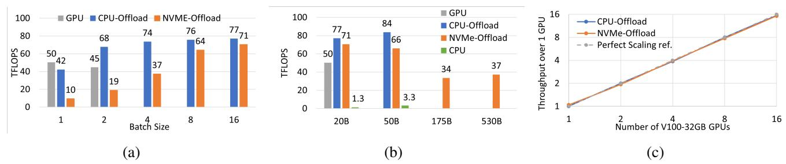
*الشكل 9. (أ) إنتاجية GPT-NeoX-20B عبر أحجام الدُفعات على وحدة معالجة رسومية A6000. (ب) الإنتاجية عبر النماذج على وحدة معالجة رسومية A6000. (ج) إنتاجية GPT-50B باستخدام ما يصل إلى 16 وحدة معالجة رسومية على وحدة معالجة رسومية واحدة (67 TFLOPS، 53% من الذروة) على DGX2 V100.*

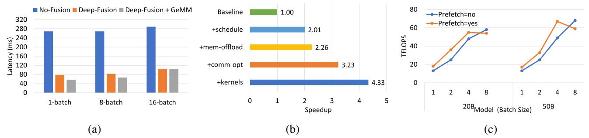
*الشكل 10. (أ) فائدة Deep-Fusion و GeMM المحسنة على خط أساس Megatron لنموذج GPT2. (ب) تحسين الإنتاجية مع تحسينات التوازي الأنبوبي المختلفة لنموذج 530B. (ج) تأثير الجلب المسبق على أداء ZeRO-Inference على وحدة معالجة رسومية V100 واحدة.*

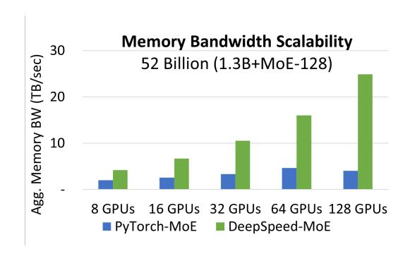
*الشكل 11. قابلية توسع عرض نطاق الذاكرة الإجمالي لـ DeepSpeed-MoE مقارنة بخط الأساس.*

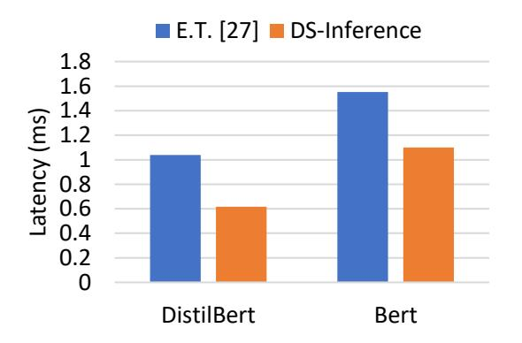
*الشكل 12. مقارنة مع نوى المحولات البديلة (E.T. [27]).*

استدعاء النواة واستخدام أعلى لعرض نطاق الذاكرة. بالإضافة إلى كونه أسرع للنماذج الصغيرة المشفرة، نشير إلى أن نطاق عملنا أيضاً أوسع بكثير من E.T.، حيث يدعم DeepSpeed Inference نماذج المشفر، والمفكك، و MoE ذات البوابة المتناثرة على نطاق أكبر بكثير.

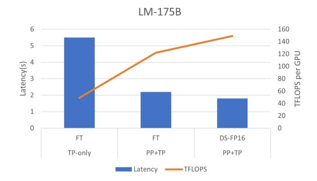
*الشكل 13. مقارنة زمن استجابة معالجة المطالبة و TFLOPS بين DeepSpeed مع الجدولة الهجينة و FasterTransformer.*

## VIII. الخاتمة

تقدم هذه الورقة DeepSpeed Inference، وهو نظام يمكّن الاستدلال الفعال لنماذج المحولات على نطاق غير مسبوق، فيما يتعلق بحجم النموذج، وعدد وحدات المعالجة الرسومية، والأداء. مع الابتكارات عبر مجموعة النظام بأكملها، يقدم DeepSpeed Inference استدلالاً سريعاً وفعالاً واقتصادياً مع نمو حجم النموذج، أو تطور معمارية النموذج، أو زيادة صرامة متطلبات زمن الاستجابة، مع دعم التنوع المتزايد لنماذج المحولات وسيناريوهات تطبيقها. يقدم DeepSpeed Inference زمن استجابة منخفض لم يكن قابلاً للتحقيق سابقاً على نطاقات نموذج غير مسبوقة، ويجعل هذه النماذج العملاقة قابلة للتقديم بموارد قليلة بشكل لا يمكن تخيله. مع هذه القدرات، نأمل أن DeepSpeed Inference لن يسهل فقط الوتيرة السريعة للابتكار في نماذج المحولات ولكن أيضاً يعزز حالة استخدام هذه النماذج في الإنتاج والبحث للجميع المحتاجين.

<!-- page 13 -->

## المراجع

- [1] S. Smith, M. Patwary, B. Norick, P. LeGresley, S. Rajbhandari, J. Casper, Z. Liu, S. Prabhumoye, G. Zerveas, V. Korthikanti *et al.*, "Using deepspeed and megatron to train megatron-turing nlg 530b, a large-scale generative language model," *arXiv preprint arXiv:2201.11990*, 2022.
- [2] J. Devlin, M.-W. Chang, K. Lee, and K. Toutanova, "Bert: Pre-training of deep bidirectional transformers for language understanding," *arXiv* *preprint arXiv:1810.04805*, 2018.
- [3] Y. Liu, M. Ott, N. Goyal, J. Du, M. Joshi, D. Chen, O. Levy, M. Lewis, L. Zettlemoyer, and V. Stoyanov, "Roberta: A robustly optimized bert pretraining approach," *arXiv preprint arXiv:1907.11692*, 2019.
- [4] A. Radford, K. Narasimhan, T. Salimans, and I. Sutskever, "Improving language understanding by generative pre-training," *OpenAI Blog*, 2018.
- [5] A. Radford, J. Wu, R. Child, D. Luan, D. Amodei, I. Sutskever *et al.*, "Language models are unsupervised multitask learners," *OpenAI blog*, vol. 1, no. 8, p. 9, 2019.
- [6] S. Black, S. Biderman, E. Hallahan, Q. Anthony, L. Gao, L. Golding, H. He, C. Leahy, K. McDonell, J. Phang, M. Pieler, U. S. Prashanth, S. Purohit, L. Reynolds, J. Tow, B. Wang, and S. Weinbach, "GPT-NeoX-20B: An open-source autoregressive language model," 2022.
- [7] "Turing-NLG: A 17-billion-parameter language model by Microsoft," https://www.microsoft.[com/en-us/research/blog/turing-nlg-a-17](https://www.microsoft.com/en-us/research/blog/turing-nlg-a-17-billion-parameter-language-model-by-microsoft/) [billion-parameter-language-model-by-microsoft/,](https://www.microsoft.com/en-us/research/blog/turing-nlg-a-17-billion-parameter-language-model-by-microsoft/) accessed: 2022-03-20.
- [8] T. Brown, B. Mann, N. Ryder, M. Subbiah, J. D. Kaplan, P. Dhariwal, A. Neelakantan, P. Shyam, G. Sastry, A. Askell *et al.*, "Language models are few-shot learners," *Advances in neural information processing systems*, vol. 33, pp. 1877–1901, 2020.
- [9] J. W. Rae, S. Borgeaud, T. Cai, K. Millican, J. Hoffmann, F. Song, J. Aslanides, S. Henderson, R. Ring, S. Young *et al.*, "Scaling language models: Methods, analysis & insights from training gopher," *arXiv* *preprint arXiv:2112.11446*, 2021.
- [10] D. Lepikhin, H. Lee, Y. Xu, D. Chen, O. Firat, Y. Huang, M. Krikun, N. Shazeer, and Z. Chen, "Gshard: Scaling giant models with conditional computation and automatic sharding," *arXiv preprint arXiv:2006.16668*, 2020.
- [11] A. Vaswani, N. Shazeer, N. Parmar, J. Uszkoreit, L. Jones, A. N. Gomez, Ł. Kaiser, and I. Polosukhin, "Attention is all you need," in *Advances in* *neural information processing systems*, 2017, pp. 5998–6008.
- [12] W. Fedus, B. Zoph, and N. Shazeer, "Switch transformers: Scaling to trillion parameter models with simple and efficient sparsity," *CoRR*, vol. abs/2101.03961, 2021.
- [13] Google, "More efficient in-context learning with glam," https://ai.googleblog.[com/2021/12/more-efficient-in-context-learning](https://ai.googleblog.com/2021/12/more-efficient-in-context-learning-with.html)with.[html,](https://ai.googleblog.com/2021/12/more-efficient-in-context-learning-with.html) 2021.
- [14] A. Yang, J. Lin, R. Men, C. Zhou, L. Jiang, X. Jia, A. Wang, J. Zhang, J. Wang, Y. Li, D. Zhang, W. Lin, L. Qu, J. Zhou, and H. Yang, "M6-t: Exploring sparse expert models and beyond," 2021. [Online]. Available: https://arxiv.[org/abs/2105](https://arxiv.org/abs/2105.15082).15082
- [15] Y. J. Kim, A. A. Awan, A. Muzio, A. F. Cruz-Salinas, L. Lu, A. Hendy, S. Rajbhandari, Y. He, and H. H. Awadalla, "Scalable and efficient moe training for multitask multilingual models," *CoRR*, vol. abs/2109.10465, 2021. [Online]. Available: https://arxiv.[org/abs/2109](https://arxiv.org/abs/2109.10465).10465
- [16] M. Shoeybi, M. Patwary, R. Puri, P. LeGresley, J. Casper, and B. Catanzaro, "Megatron-LM: Training multi-billion parameter language models using gpu model parallelism," *arXiv preprint arXiv:1909.08053*, 2019.
- [17] Y. Huang, Y. Cheng, D. Chen, H. Lee, J. Ngiam, Q. V. Le, and Z. Chen, "Gpipe: Efficient training of giant neural networks using pipeline parallelism," *ArXiv*, vol. abs/1811.06965, 2018.
- [18] A. Harlap, D. Narayanan, A. Phanishayee, V. Seshadri, N. Devanur, G. Ganger, and P. Gibbons, "Pipedream: Fast and efficient pipeline parallel dnn training," *arXiv preprint arXiv:1806.03377*, 2018.
- [19] D. Narayanan, M. Shoeybi, J. Casper, P. LeGresley, M. Patwary, V. Korthikanti, D. Vainbrand, P. Kashinkunti, J. Bernauer, B. Catanzaro, A. Phanishayee, and M. Zaharia, "Efficient large-scale language model training on gpu clusters using megatron-lm," in *Proceedings* *of the International Conference for High Performance Computing,* *Networking, Storage and Analysis*, ser. SC '21. New York, NY, USA: Association for Computing Machinery, 2021. [Online]. Available: https://doi.org/10.[1145/3458817](https://doi.org/10.1145/3458817.3476209).3476209
- [20] S. Rajbhandari, J. Rasley, O. Ruwase, and Y. He, "Zero: Memory optimizations toward training trillion parameter models," in *SC20:* *International Conference for High Performance Computing, Networking,* *Storage and Analysis*. IEEE, 2020, pp. 1–16.

- [21] D. Team and R. Majumder, "DeepSpeed: Extreme-scale model training for everyone," https://www.microsoft.[com/en-us/research/blog/deepspeed](https://www.microsoft.com/en-us/research/blog/deepspeed-extreme-scale-model-training-for-everyone/)[extreme-scale-model-training-for-everyone/,](https://www.microsoft.com/en-us/research/blog/deepspeed-extreme-scale-model-training-for-everyone/) 2020.
- [22] W. Fedus, B. Zoph, and N. Shazeer, "Switch transformers: Scaling to trillion parameter models with simple and efficient sparsity," *arXiv* *preprint arXiv:2101.03961*, 2021.
- [23] S. Rajbhandari, C. Li, Z. Yao, M. Zhang, R. Yazdani Aminabadi, A. A. Awan, J. Rasley, and Y. He, "DeepSpeed-MoE: Advancing Mixture-of-Experts Inference and Training to Power Next-Generation AI Scale," ArXiv, January 2022. [Online]. Available:[ https://www](https://www.microsoft.com/en-us/research/publication/deepspeed-moe-advancing-mixture-of-experts-inference-and-training-to-power-next-generation-ai-scale/).microsoft.com/en[us/research/publication/deepspeed-moe-advancing-mixture-of-experts](https://www.microsoft.com/en-us/research/publication/deepspeed-moe-advancing-mixture-of-experts-inference-and-training-to-power-next-generation-ai-scale/)[inference-and-training-to-power-next-generation-ai-scale/](https://www.microsoft.com/en-us/research/publication/deepspeed-moe-advancing-mixture-of-experts-inference-and-training-to-power-next-generation-ai-scale/)
- [24] "Microsoft DeepSpeed achieves the fastest BERT training time,"[ https://](https://www.deepspeed.ai/2020/05/27/fastest-bert-training.html) www.deepspeed.[ai/2020/05/27/fastest-bert-training](https://www.deepspeed.ai/2020/05/27/fastest-bert-training.html).html, accessed: 2022- 04-01.
- [25] A. Ivanov, N. Dryden, T. Ben-Nun, S. Li, and T. Hoefler, "Data movement is all you need: A case study on optimizing transformers," *Proceedings* *of Machine Learning and Systems*, vol. 3, pp. 711–732, 2021.
- [26] J. Fang, Y. Yu, C. Zhao, and J. Zhou, "Turbotransformers: an efficient gpu serving system for transformer models," in *Proceedings of the* *26th ACM SIGPLAN Symposium on Principles and Practice of Parallel* *Programming*, 2021, pp. 389–402.
- [27] S. Chen, S. Huang, S. Pandey, B. Li, G. R. Gao, L. Zheng, C. Ding, and H. Liu, "E.T.: re-thinking self-attention for transformer models on gpus," in *SC '21: The International Conference for High Performance* *Computing, Networking, Storage and Analysis, St. Louis, Missouri, USA,* *November 14 - 19, 2021*, B. R. de Supinski, M. W. Hall, and T. Gamblin, Eds. ACM, 2021, pp. 25:1–25:18.
- [28] T. Chen, T. Moreau, Z. Jiang, L. Zheng, E. Yan, H. Shen, M. Cowan, L. Wang, Y. Hu, L. Ceze *et al.*, "{TVM}: An automated {End-to-End} optimizing compiler for deep learning," in *13th USENIX Symposium* *on Operating Systems Design and Implementation (OSDI 18)*, 2018, pp. 578–594.
- [29] ONNX Runtime developers, "ONNX Runtime," 11 2018. [Online]. Available: https://github.[com/microsoft/onnxruntime](https://github.com/microsoft/onnxruntime)
- [30] "NVIDIA TensorRT,"[ https://developer](https://developer.nvidia.com/tensorrt ).nvidia.com/tensorrt, accessed: 2022-03-20.
- [31] "NVIDIA FasterTransformer," https://github.[com/NVIDIA/](https://github.com/NVIDIA/FasterTransformer) [FasterTransformer,](https://github.com/NVIDIA/FasterTransformer) accessed: 2022-03-20.
- [32] TensorFlow XLA developers, "Xla: Optimizing compiler for machine learning." [Online]. Available: https://github.[com/tensorflow/tensorflow/](https://github.com/tensorflow/tensorflow/tree/master/tensorflow/compiler/xla) [tree/master/tensorflow/compiler/xla](https://github.com/tensorflow/tensorflow/tree/master/tensorflow/compiler/xla)
- [33] M. Dehghani, A. Arnab, L. Beyer, A. Vaswani, and Y. Tay, "The efficiency misnomer," *ArXiv*, vol. abs/2110.12894, 2021.
- [34] "Nvidia cutlass," accessed: 2022-03-20. [Online]. Available:[ https:](https://github.com/NVIDIA/cutlass) //github.[com/NVIDIA/cutlass](https://github.com/NVIDIA/cutlass)
- [35] Alan Gray, "Getting stared with cuda graphs," 11.
- [36] S. Rajbhandari, O. Ruwase, J. Rasley, S. Smith, and Y. He, "Zeroinfinity: Breaking the gpu memory wall for extreme scale deep learning," in *Proceedings of the International Conference for High Performance* *Computing, Networking, Storage and Analysis*, ser. SC '21, 2021.
- [37] Y. J. Kim, A. A. Awan, A. Muzio, A. F. C. Salinas, L. Lu, A. Hendy, S. Rajbhandari, Y. He, and H. H. Awadalla, "Scalable and efficient moe training for multitask multilingual models," *arXiv preprint arXiv:2109.10465*, 2021.
- [38] "NVIDIA DGX A100," https://www.nvidia.[com/en-us/data-center/dgx](https://www.nvidia.com/en-us/data-center/dgx-a100/)[a100/,](https://www.nvidia.com/en-us/data-center/dgx-a100/) accessed: 2022-03-20.
- [39] "Lambda Vector," https://lambdalabs.[com/gpu-workstations/vector,](https://lambdalabs.com/gpu-workstations/vector) accessed: 2022-03-20.
- [40] "NVIDIA DGX-2," https://www.nvidia.[com/en-us/data-center/dgx-2/,](https://www.nvidia.com/en-us/data-center/dgx-2/) accessed: 2022-03-20.
