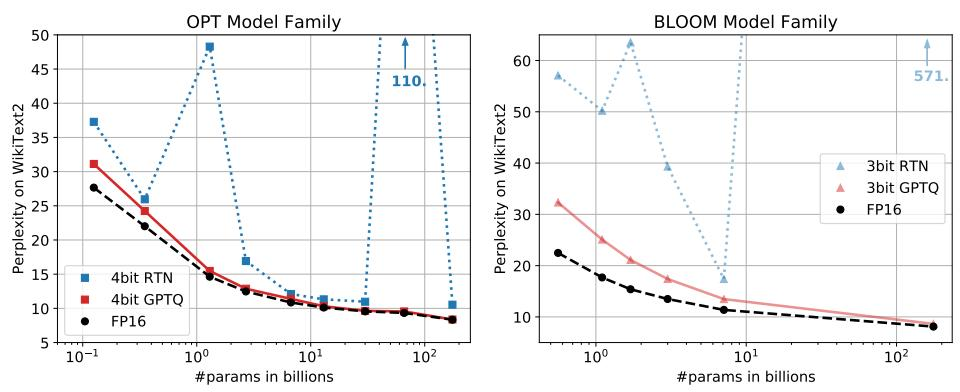
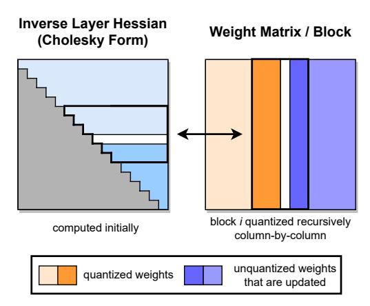
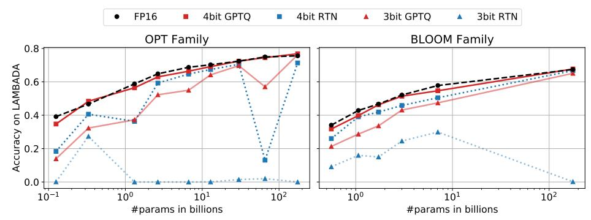
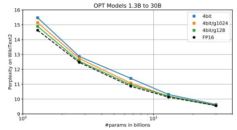

<!-- RP09_Frantar_2022 | source: papers_json/RP09_Frantar_2022/ -->

## GPTQ: التكميم الدقيق بعد التدريب لمحولات التوليد المُدرَّبة مسبقًا

Elias Frantar^∗^ IST Austria

Saleh Ashkboos ETH Zurich

Torsten Hoefler ETH Zurich

Dan Alistarh IST Austria & NeuralMagic

## الملخص

تتميز نماذج المحولات التوليدية المُدرَّبة مسبقًا، المعروفة باسم GPT أو OPT، بأداء استثنائي في مهام النمذجة اللغوية المعقدة، ولكنها تتميز أيضًا بتكاليفها الحسابية والتخزينية المرتفعة للغاية. وعلى وجه التحديد، نظرًا لحجمها الضخم، فإن مجرد الاستدلال باستخدام نماذج GPT الكبيرة وعالية الدقة قد يتطلب وحدات معالجة رسومية (GPU) متعددة وعالية الأداء، مما يحد من قابلية استخدام هذه النماذج. ورغم وجود أعمال ناشئة لتخفيف هذا الضغط عبر ضغط النموذج، فإن قابلية تطبيق وأداء تقنيات الضغط الحالية محدودة بسبب حجم وتعقيد نماذج GPT. في هذه الورقة، نتناول هذا التحدي، ونقترح GPTQ، وهي طريقة جديدة لتكميم الأوزان في خطوة واحدة تعتمد على معلومات من الدرجة الثانية التقريبية، وهي طريقة عالية الدقة وعالية الكفاءة. وعلى وجه التحديد، يمكن لـ GPTQ تكميم نماذج GPT التي تحتوي على 175 مليار معلمة في غضون أربع ساعات GPU تقريبًا، مع تقليل عرض البت إلى 3 أو 4 بت لكل وزن، مع تدهور ضئيل في الدقة بالنسبة للنموذج الأصلي غير المضغوط. تُضاعف طريقتنا أكثر من مرتين مكاسب الضغط مقارنة بطرق التكميم في خطوة واحدة المقترحة سابقًا، مع الحفاظ على الدقة، مما يسمح لنا لأول مرة بتنفيذ نموذج بـ 175 مليار معلمة داخل وحدة معالجة رسومية واحدة للاستدلال التوليدي. علاوة على ذلك، نُظهر أيضًا أن طريقتنا يمكن أن توفر دقة معقولة في نظام *التكميم المتطرف*، حيث يتم تكميم الأوزان إلى 2 بت أو حتى مستويات تكميم *ثلاثية القيم*. ونُظهر تجريبيًا أن هذه التحسينات يمكن استغلالها لتسريعات الاستدلال الشامل مقارنة بـ FP16، بنحو 3.25 مرة عند استخدام وحدات GPU المتطورة (NVIDIA A100) و4.5 مرة عند استخدام وحدات أكثر اقتصادية (NVIDIA A6000). يتوفر التنفيذ على [https://github.com/IST-DASLab/gptq](https://github.com/IST-DASLab/gptq).

# 1 المقدمة

أظهرت النماذج التوليدية المُدرَّبة مسبقًا من عائلة المحولات [(Vaswani et al., 2017)](#page-11-0)، المعروفة عمومًا باسم GPT أو OPT [(Radford et al., 2019;](#page-11-1)[ Brown et al., 2020;](#page-9-0)[ Zhang et al., 2022)](#page-11-2)، أداءً متميزًا في مهام النمذجة اللغوية المعقدة، مما أدى إلى اهتمام أكاديمي وعملي هائل. ومن أهم العوائق أمام قابلية استخدامها هو التكلفة الحسابية والتخزينية، التي تُعد من أعلى التكاليف بين النماذج المعروفة. على سبيل المثال، تحتوي أفضل متغيرات النماذج أداءً، مثل GPT3-175B، على نحو 175 مليار معلمة وتتطلب من عشرات إلى مئات من سنوات GPU للتدريب [(Zhang et al., 2022)](#page-11-2). وحتى المهمة الأبسط للاستدلال على نموذج مُدرَّب مسبقًا، وهي محور تركيزنا في هذه الورقة، تمثل تحديًا كبيرًا: فعلى سبيل المثال، تحتل معلمات GPT3-175B 326 جيجابايت (محسوبة بمضاعفات 1024) من الذاكرة عند تخزينها بصيغة float16 المضغوطة. وهذا يتجاوز سعة حتى أكثر وحدات GPU الفردية تطورًا، وبالتالي يجب إجراء الاستدلال باستخدام إعدادات أكثر تعقيدًا وتكلفة، مثل عمليات النشر متعددة الـ GPU.

ورغم أن النهج القياسي للقضاء على هذه الأعباء هو *ضغط النموذج*، مثل [(Hoefler](#page-10-0) [et al., 2021;](#page-10-0)[ Gholami et al., 2021)](#page-10-1)، إلا أن المعروف بشكل مفاجئ قليل عن ضغط هذه النماذج للاستدلال. وأحد الأسباب هو أن الطرق الأكثر تعقيدًا للتكميم منخفض البتات أو تشذيب النموذج تتطلب عادةً *إعادة تدريب النموذج*، وهو أمر مكلف للغاية للنماذج التي تحتوي على مليارات المعلمات. وبدلاً من ذلك، فإن طرق *ما بعد التدريب* [(Nagel et al., 2020;](#page-10-2)[ Wang et al., 2020;](#page-11-3)[ Hubara et al., 2020;](#page-10-3) [Nahshan et al., 2021)](#page-10-4)، التي تضغط النموذج في خطوة واحدة دون إعادة تدريب، ستكون جذابة للغاية. ولسوء الحظ، فإن المتغيرات الأكثر دقة من هذه الطرق [(Li et al., 2021;](#page-10-5)[ Hubara et al.,](#page-10-6) [2021;](#page-10-6)[ Frantar et al., 2022)](#page-10-7) معقدة ويصعب توسيع نطاقها لتشمل مليارات المعلمات [(Yao et al.,](#page-11-4)

> ^∗^المؤلف المراسل: elias.frantar@ist.ac.at

<!-- page 2 -->

2022). وحتى الآن، لم يتم تطبيق سوى المتغيرات الأساسية للتكميم بالتقريب لأقرب قيمة (Yao et al., 2022; Dettmers et al., 2022) على نطاق GPT-175B؛ ورغم أن هذا يعمل بشكل جيد لأهداف الضغط المنخفضة، مثل أوزان 8 بت، إلا أنه يفشل في الحفاظ على الدقة عند معدلات أعلى. لذلك، يبقى السؤال مفتوحًا حول ما إذا كان *التكميم بعد التدريب* في خطوة واحدة بمعدلات ضغط أعلى ممكنًا بشكل عام.


*الشكل 1: تكميم نماذج OPT إلى دقة 4 بت ونماذج BLOOM إلى دقة 3 بت، مع مقارنة GPTQ بالنموذج الأصلي FP16 وطريقة التقريب لأقرب قيمة (RTN) (Yao et al., 2022; Dettmers et al., 2022).*

**المساهمة.** في هذه الورقة، نقدم طريقة جديدة للتكميم بعد التدريب، تُسمى GPTQ،<sup>1</sup> وهي فعالة بما يكفي للتنفيذ على نماذج تحتوي على مئات المليارات من المعلمات في غضون ساعات قليلة على الأكثر، ودقيقة بما يكفي لضغط هذه النماذج إلى 3 أو 4 بت لكل معلمة دون فقدان كبير في الدقة. وللتوضيح، يمكن لـ GPTQ تكميم أكبر النماذج المتاحة للعموم، OPT-175B وBLOOM-176B، في غضون أربع ساعات GPU تقريبًا، مع زيادة طفيفة في الحيرة (perplexity)، المعروفة بأنها مقياس دقة صارم للغاية.

علاوة على ذلك، نُظهر أن نموذجنا يمكن أن يقدم أيضًا نتائج قوية في نظام *التكميم المتطرف*، حيث تُكمَّم النماذج إلى 2 بت لكل مكون، أو حتى *قيم ثلاثية*. ومن الناحية العملية، طوَّرنا منظومة تنفيذ تسمح لنا بتنفيذ النماذج المضغوطة الناتجة بكفاءة للمهام التوليدية. وعلى وجه التحديد، نتمكن لأول مرة من تشغيل نموذج OPT-175B المضغوط على وحدة معالجة رسومية واحدة من نوع NVIDIA A100، أو باستخدام وحدتي NVIDIA A6000 الأكثر اقتصادًا فقط. كما نُنفِّذ نوى GPU مخصصة قادرة على الاستفادة من الضغط لتحميل أسرع للذاكرة، مما يؤدي إلى تسريعات تبلغ نحو 3.25\times عند استخدام وحدات A100، و4.5\times عند استخدام وحدات A6000.

وعلى حد علمنا، نحن أول من يُظهر أن النماذج اللغوية الدقيقة للغاية التي تحتوي على مئات المليارات من المعلمات يمكن تكميمها إلى 3-4 بت/مكون: في حين أن *طرق ما بعد التدريب* السابقة تظل دقيقة فقط عند 8 بت (Yao et al., 2022; Dettmers et al., 2022)، وقد تناولت التقنيات *المعتمدة على التدريب* السابقة فقط نماذج أصغر بمرتبة أو مرتبتين من حيث الحجم (Wu et al., 2022). قد تبدو هذه الدرجة العالية من الضغط طبيعية، نظرًا لأن هذه الشبكات مُفرطة المعلمات؛ ومع ذلك، كما نناقش في تحليلنا التفصيلي للنتائج، فإن الضغط يُحدث مفاضلات غير تافهة بين دقة النمذجة اللغوية (الحيرة)، وعرض البت، وحجم النموذج الأصلي.

نأمل أن يُحفِّز عملنا المزيد من الأبحاث في هذا المجال، وأن يكون خطوة إضافية نحو إتاحة هذه النماذج لجمهور أوسع. ومن حيث القيود، لا توفر طريقتنا حاليًا تسريعات لعمليات الضرب الفعلية، وذلك بسبب نقص الدعم العتادي للمعاملات مختلطة الدقة (مثل FP16 x INT4) على البنى الرئيسية. علاوة على ذلك، لا تتضمن نتائجنا الحالية تكميم التنشيطات، لأنها لا تُمثِّل عنق زجاجة كبيرًا في السيناريوهات المستهدفة لدينا؛ ومع ذلك، يمكن دعم ذلك باستخدام تقنيات متعامدة (Yao et al., 2022).

# 2 الأعمال ذات الصلة

تنقسم طرق التكميم بشكل عام إلى فئتين: التكميم أثناء التدريب، وطرق ما بعد التدريب. تقوم الأولى بتكميم النماذج خلال إعادة تدريب و/أو ضبط دقيق مكثف عادةً، باستخدام آلية تفاضل تقريبية لعملية التقريب (Gholami et al., 2021; Nagel et al., 2021). وعلى النقيض، تقوم طرق ما بعد التدريب ("الخطوة الواحدة") بتكميم نموذج

> ^&^lt;sup>1</sup>هذا يدمج اسم عائلة نموذج OPT مع اختصار التكميم بعد التدريب (PTQ).

<!-- page 3 -->

مُدرَّب مسبقًا باستخدام موارد متواضعة، عادةً بضعة آلاف من عينات البيانات وبضع ساعات من الحوسبة. تُعد طرق ما بعد التدريب مثيرة للاهتمام بشكل خاص للنماذج الضخمة، التي قد يكون التدريب الكامل أو حتى الضبط الدقيق لها مكلفًا. ونحن نركز على هذا السيناريو هنا.

التكميم بعد التدريب. ركّزت معظم طرق ما بعد التدريب على نماذج الرؤية. وعادةً ما تعمل الطرق الدقيقة عن طريق تكميم الطبقات الفردية، أو الكتل الصغيرة من الطبقات المتتالية. (انظر القسم[ 3](#page-2-0) للمزيد من التفاصيل.) تحسب طريقة AdaRound [(Nagel et al., 2020)](#page-10-2) تقريبًا يعتمد على البيانات عن طريق تخفيف حد من العقوبة، مما يُشجع الأوزان على التحرك نحو نقاط الشبكة المقابلة لمستويات التكميم. تبني طريقة BitSplit [(Wang et al., 2020)](#page-11-3) القيم المُكمَّمة بتًا تلو الآخر باستخدام دالة هدف الخطأ التربيعي على الخطأ المتبقي، بينما تُجري طريقة AdaQuant [(Hubara et al.,](#page-10-6) [2021)](#page-10-6) تحسينًا مباشرًا يعتمد على تقديرات المرور المباشر. تُدخل طريقة BRECQ [(Li et al., 2021)](#page-10-5) معلومات Fisher في دالة الهدف، وتُحسِّن الطبقات داخل كتلة متبقية واحدة بشكل مشترك. وأخيرًا، تُعمِّم طريقة Optimal Brain Quantization (OBQ) [(Frantar et al., 2022)](#page-10-7) إطار عمل التشذيب الكلاسيكي للأوزان من الدرجة الثانية Optimal Brain Surgeon (OBS) [(Hassibi et al., 1993;](#page-10-10)[ Singh](#page-11-6) [& Alistarh, 2020;](#page-11-6)[ Frantar et al., 2021)](#page-10-11) ليُطبَّق على التكميم. تُكمِّم OBQ الأوزان واحدًا تلو الآخر، بترتيب خطأ التكميم، مع تعديل الأوزان المتبقية دائمًا. وفي حين أن هذه الأساليب يمكن أن تنتج نتائج جيدة للنماذج التي تصل إلى ≈ 100 مليون معلمة في غضون بضع ساعات GPU، فإن توسيع نطاقها لشبكات أكبر بمراتب من حيث الحجم يُمثِّل تحديًا.

تكميم النماذج الكبيرة. مع الإصدارات مفتوحة المصدر الحديثة لنماذج اللغة مثل BLOOM [(Laurenc¸on et al., 2022)](#page-10-12) أو OPT-175B [(Zhang et al., 2022)](#page-11-2)، بدأ الباحثون في تطوير طرق ميسورة التكلفة لضغط مثل هذه الشبكات الضخمة للاستدلال. وفي حين أن جميع الأعمال الحالية—ZeroQuant [(Yao et al., 2022)](#page-11-4)، وLLM.int8() [(Dettmers et al., 2022)](#page-10-8)، وnuQmm [(Park](#page-11-7) [et al., 2022)](#page-11-7)— تختار بعناية حبيبات التكميم، مثل التكميم على مستوى المتجه، إلا أنها في النهاية تقوم فقط بتقريب الأوزان لأقرب مستوى تكميم (RTN)، من أجل الحفاظ على أوقات تشغيل مقبولة للنماذج الكبيرة جدًا. وتقترح ZeroQuant أيضًا التقطير المعرفي على مستوى الطبقة، على غرار AdaQuant، ولكن أكبر نموذج يمكنها تطبيق هذا النهج عليه يحتوي فقط على 1.3 مليار معلمة. وعند هذا الحجم، تستغرق ZeroQuant بالفعل ≈ 3 ساعات من الحوسبة؛ بينما تُكمِّم GPTQ نماذج أكبر بـ 100× في ≈ 4 ساعات. وتلاحظ LLM.int8() أن *قيم التنشيط الشاذة* في عدد قليل من أبعاد الميزات تُعطِّل تكميم النماذج الأكبر، وتقترح حل هذه المشكلة عن طريق الإبقاء على هذه الأبعاد بدقة أعلى. وأخيرًا، تُطوِّر nuQmm نوى GPU فعالة لمخطط تكميم محدد قائم على الترميز الثنائي.

ومقارنة بهذا الخط من العمل، نُظهر أنه يمكن تنفيذ مُكمِّم أكثر تعقيدًا ودقة بشكل ملحوظ بكفاءة على نطاق نموذج كبير. وعلى وجه التحديد، تُضاعف GPTQ مقدار الضغط بأكثر من الضعف مقارنة بهذه التقنيات السابقة، بدقة مماثلة.

# 3 الخلفية

التكميم على مستوى الطبقة. على المستوى العالي، تتبع طريقتنا هيكل أحدث طرق التكميم بعد التدريب [(Nagel et al., 2020;](#page-10-2)[ Wang et al., 2020;](#page-11-3)[ Hubara et al., 2021;](#page-10-6)[ Fran](#page-10-7)[tar et al., 2022)](#page-10-7)، عن طريق إجراء التكميم طبقةً تلو الأخرى، وحل مشكلة إعادة بناء مقابلة لكل طبقة. وبشكل ملموس، لتكن W` هي الأوزان المقابلة لطبقة خطية ` ولتكن X` تشير إلى مدخل الطبقة المقابل لمجموعة صغيرة من m من نقاط البيانات التي تمر عبر الشبكة. ثم، الهدف هو إيجاد مصفوفة من الأوزان المُكمَّمة ^W^^c^ التي تُقلِّل الخطأ التربيعي، بالنسبة لمخرج الطبقة بدقة كاملة. ورسميًا، يمكن إعادة صياغة هذا كما يلي:

$$
\operatorname{argmin}_{\widehat{\mathbf{W}}} ||\mathbf{W}\mathbf{X} - \widehat{\mathbf{W}}\mathbf{X}||_2^2. \tag{1}
$$

علاوة على ذلك، على غرار [(Nagel et al., 2020;](#page-10-2)[ Li et al., 2021;](#page-10-5)[ Frantar et al., 2022)](#page-10-7)، نفترض أن شبكة التكميم لـ ^W^^c^ ثابتة قبل العملية، وأن الأوزان الفردية يمكن أن تتحرك بحرية كما في [(Hubara et al., 2021;](#page-10-6)[ Frantar et al., 2022)](#page-10-7).

التكميم الأمثل للدماغ. يبني نهجنا على طريقة Optimal Brain Quanization (OBQ) المقترحة مؤخرًا [(Frantar et al., 2022)](#page-10-7) لحل مشكلة التكميم على مستوى الطبقة المُعرَّفة أعلاه، حيث نُجري عليها سلسلة من التعديلات الرئيسية، التي تسمح بتوسيع نطاقها لتشمل النماذج اللغوية الكبيرة، مما يُوفِّر تسريعًا حسابيًا يزيد عن *ثلاثة مراتب من حيث الحجم*. ولتسهيل الفهم، نُلخِّص أولاً وبإيجاز طريقة OBQ الأصلية.

تبدأ طريقة OBQ من الملاحظة بأن المعادلة [(1)](#page-2-1) يمكن كتابتها كمجموع للأخطاء التربيعية، عبر كل صف من W. ثم، تتعامل OBQ مع كل صف w بشكل مستقل، مُكمِّمةً وزنًا واحدًا في كل مرة مع تحديث جميع الأوزان غير المُكمَّمة بعدُ، من أجل تعويض الخطأ الناجم عن تكميم وزن واحد. وبما أن دالة الهدف المقابلة هي تربيعية،

<!-- page 4 -->

حيث مصفوفة Hessian الخاصة بها هي \mathbf{H}_F = 2\mathbf{X}_F\mathbf{X}_F^{\top}، حيث تُشير F إلى مجموعة الأوزان المتبقية بدقة كاملة، فإن الوزن الأمثل الجشع المُراد تكميمه التالي، والذي نرمز إليه بـ w_q، والتحديث الأمثل المقابل لجميع الأوزان في F، المُشار إليه بـ \delta_F، يُعطيان بالصيغ التالية، حيث تقوم quant(w) بتقريب w لأقرب قيمة على شبكة التكميم:

$$
w_q = \operatorname{argmin}_{w_q} \frac{(\operatorname{quant}(w_q) - w_q)^2}{[\mathbf{H}_F^{-1}]_{qq}}, \quad \boldsymbol{\delta}_F = -\frac{w_q - \operatorname{quant}(w_q)}{[\mathbf{H}_F^{-1}]_{qq}} \cdot (\mathbf{H}_F^{-1})_{:,q}. \tag{2}
$$

تُكمِّم OBQ الأوزان بشكل تكراري باستخدام هاتين المعادلتين، حتى يتم تكميم جميع أوزان \mathbf{w}. ويتم ذلك بكفاءة، مع تجنب إعادة الحسابات الكاملة باهظة التكلفة لـ \mathbf{H}^{-1}، وذلك بإزالة الصف qth والعمود من \mathbf{H}، وهو أمر ضروري بعد تكميم w_q، مباشرةً في المعكوس عبر خطوة واحدة من حذف Gaussian. وبالتحديد، يُعطى المعكوس المُحدَّث بالصيغة:

$$
\mathbf{H}_{-q}^{-1} = \left(\mathbf{H}^{-1} - \frac{1}{[\mathbf{H}^{-1}]_{qq}} \mathbf{H}_{:,q}^{-1} \mathbf{H}_{q,:}^{-1}\right)_{-p}. (3)
$$

تأتي هذه الطريقة مع تنفيذ متجهي، يتعامل مع صفوف متعددة من \mathbf{W} بالتوازي. وفي النهاية، يمكن للخوارزمية تحقيق أوقات تشغيل معقولة على النماذج متوسطة الحجم: على سبيل المثال، يمكنها تكميم نموذج ResNet-50 (25M معلمة) بالكامل في \approx ساعة واحدة على وحدة GPU واحدة، وهو ما يتوافق تقريبًا مع طرق ما بعد التدريب الأخرى التي تُحقِّق دقة متطورة (Frantar et al., 2022). ومع ذلك، فإن حقيقة أن وقت تشغيل OBQ لمصفوفة \mathbf{W} ذات الأبعاد d_{\text{row}} \times d_{\text{col}} يحتوي على اعتماد *تكعيبي* على المدخل O(d_{\text{row}} \cdot d_{\text{col}}^3) يعني أن تطبيقه على نماذج بمليارات المعلمات مكلف للغاية.

# 4 خوارزمية GPTQ

الخطوة 1: رؤية الترتيب التعسفي. كما هو موضح في القسم السابق، تُكمِّم OBQ الأوزان بترتيب جشع، أي أنها تختار دائمًا الوزن الذي يُسبِّب حاليًا أقل خطأ تكميم إضافي. ومن المثير للاهتمام، أننا نجد أنه على الرغم من أن هذه الاستراتيجية الطبيعية تمامًا تبدو فعلاً تؤدي بشكل جيد جدًا، إلا أن تحسُّنها على تكميم الأوزان بترتيب تعسفي صغير بشكل عام، خاصةً في الطبقات الكبيرة ذات المعلمات الكثيفة. وعلى الأرجح، يرجع ذلك إلى أن العدد الأقل قليلاً من الأوزان المُكمَّمة بخطأ فردي كبير يتم موازنته بتكميم تلك الأوزان نحو نهاية العملية، عندما تتبقى أوزان غير مُكمَّمة قليلة فقط يمكن تعديلها للتعويض. وكما سنناقش الآن، فإن هذه الرؤية بأن أي ترتيب ثابت قد يؤدي بشكل جيد، خاصةً على النماذج الكبيرة، لها تداعيات مثيرة للاهتمام.

تُكمِّم طريقة OBO الأصلية صفوف W بشكل مستقل، بترتيب محدد تُحدِّده الأخطاء المقابلة. وعلى النقيض، نهدف إلى تكميم أوزان جميع الصفوف بنفس الترتيب، وسنُظهر أن هذا يُنتج عادةً نتائج بخطأ تربيعي نهائي مماثل للحلول الأصلية. ونتيجةً لذلك، فإن مجموعة الأوزان غير المُكمَّمة F وبالمثل \mathbf{H}_F^{-1} هي نفسها دائمًا لجميع الصفوف (انظر الشكل 2 للتوضيح). وبمزيد من التفصيل، يرجع الأخير إلى حقيقة أن \mathbf{H}_F تعتمد فقط على مدخلات الطبقة X_F، التي هي نفسها لجميع الصفوف، وليست على أي أوزان. لذلك، يجب علينا إجراء تحديث \mathbf{H}_F^{-1} المُعطى بالمعادلة (3) فقط d_{\rm col} مرات، مرة واحدة لكل عمود، بدلاً من d_{\rm row} \cdot d_{\rm col} مرات، مرة واحدة لكل وزن. وهذا يُقلِّل إجمالي وقت التشغيل من O(d_{\text{row}} \cdot d_{\text{col}}^3) إلى O(\max{\{d_{\text{row}} \cdot d_{\text{col}}^2, d_{\text{col}}^3\}})، أي بمعامل \min{\{d_{\text{row}}, d_{\text{col}}\}}. وللنماذج الأكبر، يتكوَّن هذا الفرق من عدة مراتب من حيث الحجم. ومع ذلك، قبل أن يتم تطبيق هذه الخوارزمية فعليًا على نماذج كبيرة جدًا في الممارسة العملية، يجب معالجة مشكلتين رئيسيتين إضافيتين.


*الشكل 2: إجراء التكميم في GPTQ. تُكمَّم كتل من *الأعمدة* المتتالية (بخط عريض) في خطوة معينة، باستخدام معلومات Hessian المعكوسة المُخزَّنة في تحلل Cholesky، ويتم تحديث الأوزان المتبقية (باللون الأزرق) في نهاية الخطوة. يتم تطبيق إجراء التكميم بشكل تكراري داخل كل كتلة: العمود الأبيض الأوسط يتم تكميمه حاليًا.*

**الخطوة 2: التحديثات الكسولة على دفعات.** أولاً، التنفيذ المباشر للمخطط الموصوف سابقًا لن يكون سريعًا في الممارسة العملية، لأن الخوارزمية لديها نسبة منخفضة نسبيًا من الحوسبة إلى الوصول إلى الذاكرة. على سبيل المثال، تحتاج المعادلة (3) إلى تحديث جميع عناصر مصفوفة ضخمة محتملة باستخدام عدد قليل فقط

<!-- page 5 -->

من عمليات FLOP لكل مدخل. لا يمكن لمثل هذه العمليات الاستفادة بشكل صحيح من قدرات الحوسبة الهائلة لوحدات GPU الحديثة، وستتم إعاقتها بسبب عرض النطاق الترددي للذاكرة المنخفض بشكل ملحوظ.

ولحسن الحظ، يمكن حل هذه المشكلة بالملاحظة التالية: قرارات التقريب النهائية للعمود i تتأثر فقط بالتحديثات التي تمت على هذا العمود نفسه، وبالتالي فإن التحديثات على الأعمدة اللاحقة غير ذات صلة في هذه النقطة من العملية. وهذا يُتيح إمكانية "تجميع التحديثات بشكل كسول" معًا، مما يُحقِّق استخدامًا أفضل بكثير لـ GPU. وبشكل ملموس، نُطبِّق الخوارزمية على B=128 عمودًا في كل مرة، مع الحفاظ على التحديثات محصورة في تلك الأعمدة وكتلة B\times B المقابلة من \mathbf{H}^{-1} (انظر أيضًا الشكل 2). وفقط بمجرد معالجة كتلة بالكامل، نُجري تحديثات عالمية للمصفوفتين \mathbf{H}^{-1} و\mathbf{W} بالكامل باستخدام إصدارات متعددة الأوزان من المعادلتين (2) و(3) المُعطاة أدناه، مع Q تُشير إلى مجموعة من المؤشرات، و\mathbf{H}^{-1}_{-Q} تُشير إلى المصفوفة المعكوسة بعد إزالة الصفوف والأعمدة المقابلة:

$$
\delta_F = -(\mathbf{w}_Q - \text{quant}(\mathbf{w}_Q))([\mathbf{H}_F^{-1}]_{QQ})^{-1}(\mathbf{H}_F^{-1})_{:,Q}, \tag{4}
$$

$$
\mathbf{H}_{-Q}^{-1} = \left(\mathbf{H}^{-1} - \mathbf{H}_{:,Q}^{-1}([\mathbf{H}^{-1}]_{QQ})^{-1}\mathbf{H}_{Q,:}^{-1}\right)_{-Q}. (5)
$$

ورغم أن هذه الاستراتيجية لا تُقلِّل من الكمية النظرية للحوسبة، إلا أنها تُعالج بفعالية عنق زجاجة إنتاجية الذاكرة. وهذا يُوفِّر تسريعًا بمرتبة من حيث الحجم للنماذج الكبيرة جدًا في الممارسة العملية، مما يجعله مكوِّنًا حاسمًا في خوارزميتنا.

الخطوة 3: إعادة صياغة Cholesky. القضية التقنية النهائية التي يتعين علينا معالجتها تُعطى بعدم الدقة العددية، التي يمكن أن تُصبح مشكلة كبيرة على نطاق النماذج الحالية، خاصةً عند دمجها مع تحديثات الكتل المُناقَشة في الخطوة السابقة. وعلى وجه التحديد، يمكن أن تُصبح المصفوفة \mathbf{H}_F^{-1} غير محددة، وهو ما نُلاحظ أنه يمكن أن يتسبب في قيام الخوارزمية بتحديث الأوزان المتبقية بقوة في اتجاهات غير صحيحة، مما يؤدي إلى تكميم سيء بشكل تعسفي للطبقة المقابلة. وفي الممارسة العملية، لاحظنا أن احتمال حدوث ذلك يزداد مع حجم النموذج: وبشكل ملموس، يحدث بشكل شبه مؤكد في عدد قليل على الأقل من الطبقات على النماذج الأكبر من بضعة مليارات من المعلمات. ويبدو أن المشكلة الرئيسية هي التطبيقات المتكررة للمعادلة (5)، التي تُراكم أخطاءً عددية مختلفة، خاصةً من خلال انعكاس المصفوفة الإضافي.

بالنسبة للنماذج الأصغر، فإن تطبيق التخميد، أي إضافة ثابت صغير \lambda (نختار دائمًا 1٪ من متوسط القيمة القطرية) إلى عناصر القطر لـ **H** يبدو كافيًا لتجنب المشكلات العددية. ومع ذلك، تتطلب النماذج الأكبر نهجًا أكثر قوة وعمومية.

ولمعالجة هذا، نبدأ بملاحظة أن المعلومات الوحيدة المطلوبة من \mathbf{H}_{F_q}^{-1}، حيث تُشير F_q إلى مجموعة الأوزان غير المُكمَّمة عند تكميم الوزن q، هي الصف q، أو بشكل أكثر دقة، العناصر في هذا الصف بدءًا من القطر. والنتيجة هي أنه يمكننا حساب جميع هذه الصفوف مسبقًا باستخدام طريقة أكثر استقرارًا عدديًا دون أي زيادة كبيرة في استهلاك الذاكرة. والواقع أن إزالة الصف عبر (3) لـ \mathbf{H}^{-1} المتماثل لدينا تتوافق أساسًا مع أخذ تحلل Cholesky، باستثناء الفرق البسيط في أن الأخير يقسم الصف q على ([\mathbf{H}_{F_q}^{-1}]_{qq})^{1/2}. وبالتالي، يمكننا الاستفادة من نوى Cholesky المتطورة لحساب جميع المعلومات التي سنحتاجها من \mathbf{H}^{-1} مقدمًا. وبالاقتران مع التخميد المعتدل، فإن الطريقة الناتجة قوية بما يكفي للتنفيذ على النماذج الضخمة دون مشاكل. وكميزة إضافية، يُؤدي استخدام نواة Cholesky المُحسَّنة جيدًا أيضًا إلى تسريع إضافي. نُفصِّل بعد ذلك جميع التغييرات الصغيرة الضرورية لإصدار Cholesky من الخوارزمية.

**الخوارزمية الكاملة.** أخيرًا، نُقدِّم الكود الزائف الكامل لـ GPTQ في الخوارزمية 1، بما في ذلك التحسينات المُناقَشة أعلاه.

```
Algorithm 1 Quantize \mathbf{W} given inverse Hessian \mathbf{H}^{-1} = (2\mathbf{X}\mathbf{X}^{\top} + \lambda \mathbf{I})^{-1} and blocksize B.

\mathbf{Q} \leftarrow \mathbf{0}_{d_{\text{row}} \times d_{\text{col}}} \qquad \qquad \qquad \qquad \qquad \qquad \qquad \qquad \qquad \qquad \qquad \qquad \qquad \qquad \qquad \qquad \qquad \qquad
```

<!-- page 6 -->

# 5 التحقق التجريبي

نظرة عامة. نبدأ تجاربنا بالتحقق من دقة GPTQ بالنسبة للمُكمِّمات الدقيقة الأخرى ولكن المكلفة، على النماذج الأصغر، التي تُوفِّر فيها هذه الطرق أوقات تشغيل معقولة. بعد ذلك، نفحص توسيع نطاق وقت التشغيل لـ GPTQ للنماذج الكبيرة جدًا. ثم، نُقدِّم نتائج التكميم بـ 3 و4 بت لعائلتي نماذج BLOOM وOPT بأكملها، التي يتم تقييمها عبر الحيرة في مهام توليد اللغة الصعبة. بالإضافة إلى ذلك، نُظهر أن طريقتنا مستقرة أيضًا للتكميم بـ 2 بت عندما يتم تقليل الحبيبات إلى كتل صغيرة من الأوزان المتتالية. ولاستكمال تحليل الحيرة هذا، نُقيِّم أيضًا النماذج المُكمَّمة الناتجة على سلسلة من المهام القياسية بدون تدريب مسبق (zero-shot). وأخيرًا، نُركِّز على أكبر نموذجين متاحين للعموم (والمثيرين للاهتمام)، Bloom-176B وOPT-175B، حيث نُجري تقييمًا مفصلاً على عدة مهام. ولهذه النماذج، نُقدِّم أيضًا تحسينات عملية، وهي تقليل عدد وحدات GPU المطلوبة للاستدلال بالإضافة إلى تسريعات الطرف-إلى-الطرف للمهام التوليدية.

الإعداد. قمنا بتنفيذ GPTQ في PyTorch [(Paszke et al., 2019)](#page-11-8) وعملنا مع تكاملات HuggingFace لعائلتي نماذج BLOOM [(Laurenc¸on et al., 2022)](#page-10-12) وOPT [(Zhang et al., 2022)](#page-11-2). وقمنا بتكميم جميع النماذج (بما في ذلك متغيرات 175 مليار معلمة) *باستخدام وحدة معالجة رسومية NVIDIA A100 واحدة* بذاكرة 80 جيجابايت. تتكوَّن بيانات معايرة GPTQ بالكامل من 128 مقطعًا عشوائيًا مكوَّنًا من 2048 رمزًا من مجموعة بيانات C4 [(Raffel et al., 2020)](#page-11-9)، أي مقتطفات من مواقع ويب مُجمَّعة عشوائيًا، التي تُمثِّل بيانات نصية عامة. ونُؤكِّد أن هذا يعني أن GPTQ لا ترى أي بيانات خاصة بمهمة معينة، وبالتالي تظل نتائجنا فعليًا "بدون تدريب مسبق". نُجري تكميمًا موحدًا قياسيًا غير متماثل لكل صف على شبكة الحد الأدنى-الأقصى، على غرار[ Dettmers et al.](#page-10-8) [(2022)](#page-10-8). يمكن العثور على تفاصيل تقييم إضافية في الملحق[ A.2.1.](#page-12-0)

ولضمان إمكانية تنفيذ إجراء الضغط بأكمله بذاكرة GPU أقل بكثير مما هو مطلوب لتشغيل النموذج بدقة كاملة، يجب اتخاذ بعض الحذر. وعلى وجه التحديد، نقوم دائمًا بتحميل كتلة محول واحدة، تتكوَّن من 6 طبقات، في كل مرة في ذاكرة GPU ثم نُراكم Hessians-الطبقة ونُنفِّذ التكميم. وأخيرًا، تُرسَل مدخلات الكتلة الحالية مرة أخرى عبر الكتلة المُكمَّمة بالكامل لإنتاج المدخلات الجديدة لتكميم الكتلة التالية. وبالتالي، فإن عملية التكميم لا تعمل على مدخلات الطبقة في النموذج بدقة كاملة بل على مدخلات الطبقة الفعلية في النموذج المُكمَّم جزئيًا بالفعل. ونجد أن هذا يجلب تحسينات ملحوظة بتكلفة إضافية ضئيلة.

خطوط الأساس. خط الأساس الرئيسي لدينا، المُشار إليه بـ RTN، يتكوَّن من تقريب جميع الأوزان لأقرب قيمة مُكمَّمة على نفس شبكة لكل صف غير متماثلة المُستخدَمة أيضًا لـ GPTQ، مما يعني أنه يتوافق بدقة مع تكميم الأوزان المتطور لـ LLM.int8(). وهذه حاليًا الطريقة المختارة في جميع الأعمال المتعلقة بتكميم النماذج اللغوية الكبيرة جدًا [(Dettmers](#page-10-8) [et al., 2022;](#page-10-8)[ Yao et al., 2022;](#page-11-4)[ Park et al., 2022)](#page-11-7): يتم توسيع نطاق وقت تشغيلها بشكل جيد للشبكات التي تحتوي على مليارات عديدة من المعلمات، حيث تُجري ببساطة تقريبًا مباشرًا. وكما سنناقش أيضًا لاحقًا، فإن الطرق الأكثر دقة، مثل AdaRound [(Nagel et al., 2020)](#page-10-2) أو BRECQ [(Li et al., 2021)](#page-10-5)، بطيئة جدًا حاليًا للنماذج التي تحتوي على مليارات عديدة من المعلمات، وهو محور تركيز هذا العمل. ومع ذلك، نُظهر أيضًا أن GPTQ تنافسية مع هذه الطرق للنماذج الصغيرة، مع التوسع لتشمل النماذج الضخمة مثل OPT-175B أيضًا.

تكميم النماذج الصغيرة. كدراسة استئصال أولى، نُقارن أداء GPTQ بطرق التكميم بعد التدريب (PTQ) المتطورة، على ResNet18 وResNet50، التي هي معايير قياسية لـ PTQ، في نفس الإعداد كما في [(Frantar et al., 2022)](#page-10-7). كما يمكن رؤيته في الجدول[ 1،](#page-6-0) تؤدي GPTQ بشكل متساوٍ عند 4 بت، وأسوأ قليلاً من الطرق الأكثر دقة عند 3 بت. وفي الوقت نفسه، تتفوق بشكل كبير على AdaQuant، وهي الأسرع بين طرق PTQ السابقة. علاوة على ذلك، نُقارن مع طريقة OBQ الجشعة الكاملة على نموذجي لغة أصغر: BERT-base [(De](#page-10-13)[vlin et al., 2019)](#page-10-13) وOPT-125M. النتائج موضحة في جدول الملحق[ 8.](#page-12-1) عند 4 بت، تؤدي كلتا الطريقتين بشكل مماثل، ولـ 3 بت، تؤدي GPTQ بشكل أفضل قليلاً بشكل مفاجئ. ونشتبه في أن هذا لأن بعض الاستدلالات الإضافية المُستخدَمة بواسطة OBQ، مثل التقريب المبكر للقيم الشاذة، قد تتطلب تعديلات دقيقة للأداء الأمثل على النماذج غير البصرية. وبشكل عام، تبدو GPTQ تنافسية مع طرق ما بعد التدريب المتطورة للنماذج الأصغر، مع استغراق < دقيقة واحدة فقط بدلاً من ≈ ساعة واحدة. وهذا يُمكِّن من التوسع لنماذج أكبر بكثير.

وقت التشغيل. بعد ذلك، نُقيس وقت تكميم النموذج الكامل (على وحدة معالجة رسومية NVIDIA A100 واحدة) عبر GPTQ؛ والنتائج موضحة في الجدول[ 2.](#page-6-0) كما يمكن رؤيته، تُكمِّم GPTQ نماذج 1-3 مليار معلمة في غضون دقائق، ونماذج 175B في غضون بضع ساعات. ومرجعيًا، تُبلِّغ طريقة ZeroQuant-LKD المعتمدة على المرور المباشر [(Yao et al., 2022)](#page-11-4) عن وقت تشغيل 3 ساعات (على نفس العتاد) لنموذج 1.3B، وهو ما من شأنه أن يستقرئ خطيًا إلى عدة مئات من الساعات (بضعة أسابيع) لنماذج 175B

<!-- page 7 -->

. تستخدم الطرق المعتمدة على التقريب التكيفي عادةً المزيد من خطوات SGD وبالتالي ستكون أكثر تكلفة (Nagel et al., 2020; Li et al., 2021).

توليد اللغة. نبدأ دراستنا واسعة النطاق بضغط عائلتي نماذج OPT وBLOOM بأكملها إلى 3 و4 بت. ثم نُقيِّم تلك النماذج على عدة مهام لغوية بما في ذلك WikiText2 (Merity et al., 2016) (انظر الشكل 1 وكذلك الجدولين 3 و4)، Penn Treebank (PTB) (Marcus et al., 1994) وC4 (Raffel et al., 2020) (كلاهما في الملحق A.3). نُركِّز على هذه المهام المعتمدة على الحيرة، حيث يُعرف أنها حساسة بشكل خاص لتكميم النموذج (Yao et al., 2022). على نماذج OPT، تتفوق GPTQ بوضوح على RTN، بهوامش كبيرة. على سبيل المثال، تفقد GPTQ فقط 0.03 من الحيرة عند 4 بت على نموذج 175B، بينما تنخفض RTN بمقدار 2.2 نقطة، وتؤدي بشكل أسوأ من نموذج 13B بدقة كاملة الأصغر بـ 10\times. عند 3 بت، تنهار RTN تمامًا، بينما لا يزال بإمكان GPTQ الحفاظ على حيرة معقولة، خاصةً للنماذج الأكبر. تُظهر BLOOM نمطًا مماثلاً: ومع ذلك، فإن الفجوات بين الطرق عادةً أصغر قليلاً، مما يُشير إلى أن عائلة هذا النموذج قد تكون أسهل في التكميم. أحد الاتجاهات المثيرة للاهتمام (انظر أيضًا الشكل 1) هو أن النماذج الأكبر بشكل عام (باستثناء OPT-66B<sup>2</sup>) تبدو أسهل في التكميم. وهذه أخبار جيدة للتطبيقات العملية، حيث تُعد هذه هي الحالات التي يكون فيها الضغط ضروريًا للغاية أيضًا.

نماذج 175 مليار معلمة. نفحص الآن BLOOM-176B وOPT-175B، أكبر النماذج الكثيفة المتاحة للعموم. يُلخِّص الجدول 5 النتائج عبر Wikitext-2 وPTB وC4. نُلاحظ أنه عند 4 بت، تصل نماذج GPTQ إلى حيرة أقل بـ \leq 0.25 فقط من الإصدارات بدقة كاملة، مع فجوة كبيرة لنتائج RTN على OPT-175B. عند 3 بت، تنهار RTN، بينما لا تزال GPTQ قادرة على الحفاظ على أداء جيد في معظم المهام، حيث تفقد فقط 0.3-0.6 نقطة لأكثر من 5\times ضغط. ونلاحظ أنه يمكن تحسين دقة GPTQ بشكل أكبر عبر التجميع بحبيبات أدق (Park et al., 2022): حجم المجموعة 1024 (\approx 0.02 بت إضافية) يُحسِّن الحيرة بنحو 0.2 في المتوسط وحجم المجموعة 128 (\approx 0.15 بت إضافية) بنحو 0.1 إضافية، وهو ما يبعد فقط 0.1-0.3 عن دقة النموذج غير المضغوط.

> ^&^lt;sup>2</sup>عند الفحص الدقيق لنموذج OPT-66B، يبدو أن هذا مرتبط بحقيقة أن هذا النموذج المُدرَّب لديه نسبة كبيرة من الوحدات الميتة في الطبقات الأولى، مما قد يجعل ضغطه أصعب.

<!-- page 8 -->

نلاحظ أن التجميع يتفاعل بشكل جيد جدًا مع GPTQ، حيث يمكن تحديد معلمات المجموعة أثناء عملية التكميم لكل طبقة، باستخدام أحدث الأوزان المُحدَّثة دائمًا.

التسريعات العملية. أخيرًا، ندرس التطبيقات العملية. كحالة استخدام مثيرة للاهتمام، نُركِّز على نموذج OPT-175B: عند تكميمه إلى 3 بت، يأخذ هذا النموذج حوالي 63 جيجابايت من الذاكرة، بما في ذلك التضمينات وطبقة الإخراج، التي يتم الاحتفاظ بها بدقة FP16 الكاملة. بالإضافة إلى ذلك، يستهلك تخزين السجل الكامل للمفاتيح والقيم لجميع الطبقات، وهو تحسين شائع لمهام التوليد، حوالي ≈ 9 جيجابايت أخرى للحد الأقصى من 2048 رمزًا. وبالتالي، يمكننا فعليًا احتواء النموذج المُكمَّم بأكمله في وحدة GPU واحدة A100 بسعة 80 جيجابايت، التي يمكن تنفيذها عن طريق إلغاء تكميم الطبقات بشكل ديناميكي عند الحاجة إليها أثناء الاستدلال (لن يتسع النموذج بالكامل باستخدام 4 بت). ومرجعيًا، يتطلب التنفيذ القياسي بـ FP16 5 وحدات GPU بسعة 80 جيجابايت، ويتطلب مُكمِّم 8 بت LLM.int8() المتطور [(Dettmers et al., 2022)](#page-10-8) 3 وحدات GPU من هذا النوع.

بعد ذلك، نُفكِّر في توليد اللغة، أحد التطبيقات الأكثر جاذبية لهذه النماذج، بهدف تقليل الكمون. على عكس LLM.int8()، التي تُقلِّل تكاليف الذاكرة ولكنها تحتفظ بنفس وقت التشغيل كخط أساس FP16، نُظهر أن نماذجنا المُكمَّمة يمكنها تحقيق تسريعات كبيرة لهذا التطبيق. لتوليد اللغة، يُعالج النموذج وينتج رمزًا واحدًا في كل مرة، والذي يمكن أن يستغرق بسهولة بضعة 100 من المللي ثانية لكل رمز لـ OPT-175B. زيادة السرعة التي يستقبل بها المستخدم النتائج المُولَّدة أمر صعب، حيث تهيمن منتجات المتجه-المصفوفة على الحوسبة. على عكس منتجات المصفوفة-المصفوفة، فإن هذه محدودة بشكل أساسي بعرض النطاق الترددي للذاكرة. نُعالج هذه المشكلة بتطوير نواة منتج المصفوفة المُكمَّمة-المتجه بدقة كاملة التي تُجري منتج متجه المصفوفة عن طريق إلغاء تكميم الأوزان ديناميكيًا عند الحاجة. والأهم من ذلك، أن هذا *لا* يتطلب أي تكميم للتنشيط. وفي حين يستهلك إلغاء التكميم حوسبة إضافية، يجب على النواة الوصول إلى ذاكرة أقل بكثير، مما يؤدي إلى تسريعات كبيرة، كما هو موضح في الجدول[ 6.](#page-7-1) ونلاحظ أن جميع التسريع تقريبًا يرجع إلى نوياتنا، حيث أن تكاليف الاتصال ضئيلة في إعداد HuggingFace-accelerate القياسي لدينا (انظر الملحق[ A.2.2](#page-12-2) للتفاصيل).

على سبيل المثال، باستخدام نوياتنا، فإن نموذج OPT-175B بـ 3 بت الذي تم الحصول عليه عبر GPTQ والذي يعمل على وحدة A100 واحدة أسرع بحوالي 3.25× من إصدار FP16 (الذي يعمل على 5 وحدات GPU) من حيث متوسط الوقت لكل رمز. وحدات GPU الأكثر إتاحة، مثل NVIDIA A6000، لديها عرض نطاق ترددي للذاكرة أقل بكثير، وبالتالي فإن هذه الاستراتيجية أكثر فعالية: تنفيذ نموذج OPT-175B بـ 3 بت على 2x وحدات A6000 يُقلِّل الكمون من 589 مللي ثانية لاستدلال FP16 (على 8 وحدات GPU) إلى 130 مللي ثانية، أي تقليل كمون 4.5×.

مهام بدون تدريب مسبق. في حين أن تركيزنا على توليد اللغة، نُقيِّم أيضًا أداء النماذج المُكمَّمة على بعض المهام الشهيرة بدون تدريب مسبق، وهي LAMBADA [(Paperno et al., 2016)](#page-10-16)، وARC (Easy and Challenge) [(Boratko et al., 2018)](#page-9-1) وPIQA [(Tata & Patel, 2003)](#page-11-10). يُصوِّر الشكل[ 3](#page-8-0) أداء النموذج على LAMBADA (انظر أيضًا نتائج "Lamb." في الجدول[ 5)](#page-7-0). نلاحظ سلوكًا مماثلًا كما في السابق: القيم الشاذة هي أن 1) يبدو التكميم "أسهل" عبر طيف النماذج بأكمله عند 4 بت، حيث تؤدي حتى RTN بشكل جيد نسبيًا، و2) عند 3 بت، تنهار RTN، بينما لا تزال GPTQ تُوفِّر دقة جيدة. نُقدِّم نتائج إضافية في الملحق[ A.4.](#page-14-0)

<!-- page 9 -->


*الشكل 3: دقة نماذج OPT وBLOOM بعد GPTQ، مقاسة على LAMBADA.*

**حيل إضافية.** في حين ركَّزت تجاربنا حتى الآن حصريًا على التكميم على مستوى الصف، نريد التأكيد على أن GPTQ *متوافقة بشكل أساسي مع أي اختيار لشبكة التكميم.* على سبيل المثال، يمكن دمجها بسهولة مع *التجميع* القياسي (Alistarh et al., 2017; Park et al., 2022)، أي تطبيق تكميم مستقل على مجموعات من *g* أوزان متتالية. كما هو موضح في الصفوف الأخيرة من الجدول 5، يمكن أن يجلب هذا دقة إضافية ملحوظة لأكبر النماذج عند 3 بت. علاوة على ذلك، كما هو موضح في الشكل 4، يُقلِّل بشكل كبير من خسائر الدقة للنماذج متوسطة الحجم بدقة 4 بت.


*الشكل 4: GPTQ بـ 4 بت بأحجام مجموعات مختلفة على نماذج OPT متوسطة الحجم.*

**التكميم المتطرف.** أخيرًا، يُتيح التجميع أيضًا إمكانية تحقيق أداء معقول للتكميم المتطرف، إلى حوالي 2 بت لكل مكون في المتوسط. يُظهر الجدول 7 النتائج على WikiText2 عند تكميم أكبر النماذج إلى 2 بت بأحجام مجموعات مختلفة. عند \approx 2.2 بت (حجم المجموعة 128؛ باستخدام مقياس FP16 ونقطة صفر 2 بت لكل مجموعة) تكون زيادة الحيرة أقل من 1.5 نقطة بالفعل، بينما تنخفض إلى 0.6 - 0.7 عند \approx 2.6 بت (حجم المجموعة 32)، وهو ما يكون أسوأ قليلاً فقط من 3 بت العادية وقد يكون مثيرًا للاهتمام لتطبيقات النواة العملية. علاوة على ذلك، إذا قللنا حجم المجموعة إلى 8، يمكننا تطبيق التكميم *الثلاثي* (-1، 0، +1)، الذي يُحقِّق 9.20 WikiText2 PPL على OPT-175B، أي انخفاض أقل من نقطة واحدة. وفي حين أن هذا يؤدي إلى ضغط أسوأ في المتوسط بالنسبة لأرقام 2 بت أعلاه، يمكن تنفيذ هذا النمط بكفاءة على عتاد مخصص مثل FPGAs. باختصار، هذه النتائج هي خطوة أولى مُشجِّعة نحو دفع الضغط *في خطوة واحدة* عالي الدقة للنماذج اللغوية الكبيرة جدًا، حتى أقل من 3 بت لكل قيمة في المتوسط.

# 6 الملخص والقيود

قدَّمنا GPTQ، وهي طريقة تقريبية من الدرجة الثانية لتكميم النماذج اللغوية الكبيرة حقًا. يمكن لـ GPTQ ضغط بعض من أكبر النماذج المتاحة للعموم بدقة إلى 3 و4 بت، مما يؤدي إلى تحسينات كبيرة في قابلية الاستخدام، وإلى تسريعات الطرف-إلى-الطرف، بفقدان منخفض في الدقة. نأمل أن تجعل طريقتنا هذه النماذج متاحة لمزيد من الباحثين والممارسين. وفي الوقت نفسه، نُؤكِّد على بعض القيود الكبيرة: من الناحية التقنية، تحصل طريقتنا على تسريعات من تقليل حركة الذاكرة، ولا تؤدي إلى تخفيضات حسابية. بالإضافة إلى ذلك، تُركِّز دراستنا على المهام التوليدية، ولا تأخذ في الاعتبار تكميم التنشيط. هذه اتجاهات طبيعية للعمل المستقبلي، ونعتقد أنه يمكن تحقيق ذلك بنوى GPU مُصمَّمة بعناية وتقنيات حالية (Yao et al., 2022; Wu et al., 2022).

<!-- page 10 -->

## شكر وتقدير

يُعرب Elias Frantar وDan Alistarh عن امتنانهما لتمويل من المجلس الأوروبي للأبحاث (ERC) ضمن برنامج Horizon 2020 للاتحاد الأوروبي (اتفاقية المنحة رقم 805223 ScaleML)، وكذلك الدعم التجريبي من Eldar Kurtic، ومن قسم تكنولوجيا المعلومات في IST Austria، وخاصةً Stefano Elefante وAndrei Hornoiu وAlois Schloegl. تم دعم عمل Saleh Ashkboos وTorsten Hoefler من قبل مشروع PASC DaCeMI، الذي تلقى تمويل EuroHPC-JU بموجب منحة MAELSTROM رقم 955513. نشكر مركز الحوسبة الفائقة الوطني السويسري (CSCS) على دعمنا بالبنية التحتية الحاسوبية.

# 7 بيان الأخلاقيات

يُقدِّم عملنا طريقة عامة لضغط النماذج اللغوية الكبيرة (LLMs) عبر التكميم، مع فقدان قليل أو معدوم في الدقة من حيث مقاييس الدقة القياسية مثل الحيرة. طريقتنا غير مرتبطة بمهمة محددة، حيث تستخدم فقط كمية صغيرة جدًا من البيانات المُختارة عشوائيًا للمعايرة. لذلك لا نتوقع أي تداعيات أخلاقية كبيرة تنشأ مباشرةً من التفاصيل التقنية لطريقتنا. ومع ذلك، فإن أحد الاعتبارات المحتملة هو أن دراستنا ركَّزت على مقاييس "الدقة الرائدة" التي تُعد قياسية في الأدبيات، مثل الحيرة، وهي قياسية أساسًا في الأدبيات [(Dettmers et al., 2022;](#page-10-8)[ Yao et al., 2022)](#page-11-4). نعتقد أن دراسة شاملة لتأثير الضغط على المقاييس الثانوية، وخاصةً تأثيرات التحيز [(Bender et al., 2021)](#page-9-3) مُبرَّرة، وقد يتم تيسيرها من خلال عملنا. وفي الوقت نفسه، يجعل عملنا الاستدلال على النماذج اللغوية الكبيرة جدًا أكثر إتاحة، للأفضل أو للأسوأ. نعتقد أنه بمرور الوقت، ستُصبح هذه الأدوات أسهل بكثير في الاستخدام والنشر، مما يجعل الحاجة إلى فهم قوتها وقيودها أكثر إلحاحًا.

# 8 بيان قابلية إعادة الإنتاج

في المواد التكميلية، نُوفِّر الكود لإعادة إنتاج جميع التجارب في هذه الورقة. وبشكل أكثر تحديدًا، يشمل هذا:

- ضغط جميع النماذج من عائلتي نماذج OPT وBLOOM إلى 2/3/4 بت.
- تقييم الحيرة للنماذج المُكمَّمة.
- نواتنا CUDA بـ 3 بت مع ميزات قياس أداء الاستدلال المضغوط.
- كود لتجارب ZeroShot.
- ملف README يُوفِّر أوامر نموذجية ومعلومات حول كيفية تشغيل جميع البرامج النصية.

## المراجع

Dan Alistarh, Demjan Grubic, Jerry Li, Ryota Tomioka, and Milan Vojnovic. QSGD: Randomized quantization for communication-efficient stochastic gradient descent. In *Conference on Neural* *Information Processing Systems (NeurIPS)*, 2017.

Emily M Bender, Timnit Gebru, Angelina McMillan-Major, and Shmargaret Shmitchell. On the dangers of stochastic parrots: Can language models be too big? In *2021 ACM Conference on* *Fairness, Accountability, and Transparency*, 2021.

Michael Boratko, Harshit Padigela, Divyendra Mikkilineni, Pritish Yuvraj, Rajarshi Das, Andrew McCallum, Maria Chang, Achille Fokoue-Nkoutche, Pavan Kapanipathi, Nicholas Mattei, et al. A systematic classification of knowledge, reasoning, and context within the ARC dataset. *arXiv* *preprint arXiv:1806.00358*, 2018.

Tom Brown, Benjamin Mann, Nick Ryder, Melanie Subbiah, Jared D Kaplan, Prafulla Dhariwal, Arvind Neelakantan, Pranav Shyam, Girish Sastry, Amanda Askell, et al. Language models are few-shot learners. In *Conference on Neural Information Processing Systems (NeurIPS)*, 2020.

Tri Dao, Daniel Y Fu, Stefano Ermon, Atri Rudra, and Christopher Re. FlashAttention: Fast and ´ memory-efficient exact attention with io-awareness. *arXiv preprint arXiv:2205.14135*, 2022.

<!-- page 11 -->

- Tim Dettmers, Mike Lewis, Younes Belkada, and Luke Zettlemoyer. LLM.int8(): 8-bit matrix multiplication for transformers at scale. *arXiv preprint arXiv:2208.07339*, 2022.
- Jacob Devlin, Ming-Wei Chang, Kenton Lee, and Kristina Toutanova. BERT: Pre-training of deep bidirectional transformers for language understanding. In *North American Chapter of the Associ**ation for Computational Linguistics (NAACL)*, 2019.
- Elias Frantar, Eldar Kurtic, and Dan Alistarh. M-FAC: Efficient matrix-free approximations of second-order information. In *Conference on Neural Information Processing Systems (NeurIPS)*, 2021.
- Elias Frantar, Sidak Pal Singh, and Dan Alistarh. Optimal Brain Compression: A framework for accurate post-training quantization and pruning. *arXiv preprint arXiv:2208.11580*, 2022. Accepted to NeurIPS 2022, to appear.
- Amir Gholami, Sehoon Kim, Zhen Dong, Zhewei Yao, Michael W Mahoney, and Kurt Keutzer. A survey of quantization methods for efficient neural network inference. *arXiv preprint* *arXiv:2103.13630*, 2021.
- Babak Hassibi, David G Stork, and Gregory J Wolff. Optimal brain surgeon and general network pruning. In *IEEE International Conference on Neural Networks*, 1993.
- Torsten Hoefler, Dan Alistarh, Tal Ben-Nun, Nikoli Dryden, and Alexandra Peste. Sparsity in deep learning: Pruning and growth for efficient inference and training in neural networks. *arXiv* *preprint arXiv:2102.00554*, 2021.
- Itay Hubara, Yury Nahshan, Yair Hanani, Ron Banner, and Daniel Soudry. Improving post training neural quantization: Layer-wise calibration and integer programming. *arXiv preprint* *arXiv:2006.10518*, 2020.
- Itay Hubara, Yury Nahshan, Yair Hanani, Ron Banner, and Daniel Soudry. Accurate post training quantization with small calibration sets. In *International Conference on Machine Learning* *(ICML)*, 2021.
- Hugo Laurenc¸on, Lucile Saulnier, Thomas Wang, Christopher Akiki, Albert Villanova del Moral, Teven Le Scao, Leandro Von Werra, Chenghao Mou, Eduardo Gonzalez Ponferrada, Huu Nguyen, ´ et al. The BigScience corpus: A 1.6 TB composite multilingual dataset. 2022.
- Yuhang Li, Ruihao Gong, Xu Tan, Yang Yang, Peng Hu, Qi Zhang, Fengwei Yu, Wei Wang, and Shi Gu. BRECQ: Pushing the limit of post-training quantization by block reconstruction. In *International Conference on Learning Representations (ICLR)*, 2021.
- Mitch Marcus, Grace Kim, Mary Ann Marcinkiewicz, Robert MacIntyre, Ann Bies, Mark Ferguson, Karen Katz, and Britta Schasberger. The penn treebank: Annotating predicate argument structure. In *Human Language Technology: Proceedings of a Workshop held at Plainsboro, New Jersey,* *March 8-11, 1994*, 1994.
- Stephen Merity, Caiming Xiong, James Bradbury, and Richard Socher. Pointer sentinel mixture models. *arXiv preprint arXiv:1609.07843*, 2016.
- Markus Nagel, Rana Ali Amjad, Mart Van Baalen, Christos Louizos, and Tijmen Blankevoort. Up or down? Adaptive rounding for post-training quantization. In *International Conference on Machine* *Learning (ICML)*, 2020.
- Markus Nagel, Marios Fournarakis, Rana Ali Amjad, Yelysei Bondarenko, Mart van Baalen, and Tijmen Blankevoort. A white paper on neural network quantization. *arXiv preprint* *arXiv:2106.08295*, 2021.
- Yury Nahshan, Brian Chmiel, Chaim Baskin, Evgenii Zheltonozhskii, Ron Banner, Alex M Bronstein, and Avi Mendelson. Loss aware post-training quantization. *Machine Learning*, 110(11): 3245–3262, 2021.
- Denis Paperno, German Kruszewski, Angeliki Lazaridou, Quan Ngoc Pham, Raffaella Bernardi, ´ Sandro Pezzelle, Marco Baroni, Gemma Boleda, and Raquel Fernandez. The LAMBADA dataset: ´ Word prediction requiring a broad discourse context. *arXiv preprint arXiv:1606.06031*, 2016.

<!-- page 12 -->

- Gunho Park, Baeseong Park, Se Jung Kwon, Byeongwook Kim, Youngjoo Lee, and Dongsoo Lee. nuQmm: Quantized matmul for efficient inference of large-scale generative language models. *arXiv preprint arXiv:2206.09557*, 2022.
- Adam Paszke, Sam Gross, Francisco Massa, Adam Lerer, James Bradbury, Gregory Chanan, Trevor Killeen, Zeming Lin, Natalia Gimelshein, Luca Antiga, et al. Pytorch: An imperative style, highperformance deep learning library. In *Conference on Neural Information Processing Systems* *(NeurIPS)*, 2019.
- Alec Radford, Jeffrey Wu, Rewon Child, David Luan, Dario Amodei, and Ilya Sutskever. Language models are unsupervised multitask learners. *OpenAI blog*, 1(8):9, 2019.
- Colin Raffel, Noam Shazeer, Adam Roberts, Katherine Lee, Sharan Narang, Michael Matena, Yanqi Zhou, Wei Li, and Peter Liu. Exploring the limits of transfer learning with a unified text-to-text transformer. *Journal of Machine Learning Research*, 21(140):1–67, 2020.
- Pranav Rajpurkar, Jian Zhang, Konstantin Lopyrev, and Percy Liang. SQuAD: 100,000+ questions for machine comprehension of text. In *Conference on Empirical Methods in Natural Language* *Processing (EMNLP)*, 2016.
- Sidak Pal Singh and Dan Alistarh. WoodFisher: Efficient second-order approximation for neural network compression. In *Conference on Neural Information Processing Systems (NeurIPS)*, 2020.
- Sandeep Tata and Jignesh M Patel. PiQA: An algebra for querying protein data sets. In *International* *Conference on Scientific and Statistical Database Management*, 2003.
- Ashish Vaswani, Noam Shazeer, Niki Parmar, Jakob Uszkoreit, Llion Jones, Aidan N Gomez, Łukasz Kaiser, and Illia Polosukhin. Attention is all you need. In *Conference on Neural In**formation Processing Systems (NeurIPS)*, 2017.
- Peisong Wang, Qiang Chen, Xiangyu He, and Jian Cheng. Towards accurate post-training network quantization via bit-split and stitching. In *International Conference on Machine Learning (ICML)*, 2020.
- Xiaoxia Wu, Zhewei Yao, Minjia Zhang, Conglong Li, and Yuxiong He. Extreme compression for pre-trained transformers made simple and efficient. *arXiv preprint arXiv:2206.01859*, 2022.
- Zhewei Yao, Reza Yazdani Aminabadi, Minjia Zhang, Xiaoxia Wu, Conglong Li, and Yuxiong He. ZeroQuant: Efficient and affordable post-training quantization for large-scale transformers. *arXiv* *preprint arXiv:2206.01861*, 2022.
- Susan Zhang, Stephen Roller, Naman Goyal, Mikel Artetxe, Moya Chen, Shuohui Chen, Christopher Dewan, Mona Diab, Xian Li, Xi Victoria Lin, et al. OPT: Open pre-trained transformer language models. *arXiv preprint arXiv:2205.01068*, 2022.
- Lianmin Zheng, Zhuohan Li, Hao Zhang, Yonghao Zhuang, Zhifeng Chen, Yanping Huang, Yida Wang, Yuanzhong Xu, Danyang Zhuo, Joseph E Gonzalez, et al. Alpa: Automating inter-and intra-operator parallelism for distributed deep learning. *arXiv preprint arXiv:2201.12023*, 2022.

<!-- page 13 -->

## أ الملحق

## أ.1 مقارنة إضافية مع OBQ

نُقدِّم الآن مقارنة إضافية بين GPTQ وOBQ على BERT-base/SQuAD[ Ra](#page-11-11)[jpurkar et al.](#page-11-11) [(2016)](#page-11-11) وOPT-125M/WikiText2، وهو أحد أكبر النماذج التي يمكن تطبيق OBQ عليها بشكل معقول.

## أ.2 تفاصيل التجربة

يُوفِّر هذا القسم تفاصيل إضافية حول إعداد تجربتنا، خاصةً فيما يتعلق بتقييم النموذج وإعداد تجارب التوقيت لدينا.

## أ.2.1 التقييم

لتجارب توليد اللغة، نحسب الحيرة، بالطريقة القياسية مثل[ Radford](#page-11-1) [et al.](#page-11-1) [(2019)](#page-11-1)، على النحو التالي: أولاً، يتم ربط مجموعة التحقق بأكملها باستخدام فاصلين سطريين كفاصلين وترميزها باستخدام رمز HuggingFace الافتراضي لكل نموذج. بعد ذلك، يتم تقسيم التسلسل إلى مقاطع غير متداخلة بعرض 2048، حجم السياق الكامل لنماذجنا. تُرسَل هذه عبر النموذج لجمع احتمالات السجل المقابلة للرمز التالي لكل منها. متوسطها الأسي هو الحيرة النهائية التي نُبلِّغ عنها.

لمهام بدون تدريب مسبق، نتبع منظومة تقييم EleutherAI[3](#page-12-3) من حيث المعالجة الأولية للبيانات وحساب الدرجة النهائية. نلاحظ أننا نُقيِّم جميع العينات الفردية بشكل منفصل وبالتالي لا نُطبِّق أي حشو.

## أ.2.2 إعداد تجربة التوقيت

تُجرى تجارب التوقيت لدينا باتباع إعداد HuggingFace/accelerate القياسي[4](#page-12-4) المُستخدَم أيضًا من قبل العمل الأخير LLM.int8() [(Dettmers et al., 2022)](#page-10-8). في هذا الإعداد، يتم تقسيم النموذج عن طريق توزيع كتل من الطبقات المتتالية عبر وحدات GPU. والأهم من ذلك، أنه في هذا الإعداد، تكون تكاليف الاتصال ضئيلة، < 5٪ من إجمالي وقت التشغيل حتى عند العمل مع 8 وحدات GPU. وهذا يعني أن جميع التسريعات المُبلَّغ عنها تقريبًا ترجع إلى نوى منتج المتجه بدقة كاملة-المصفوفة المُكمَّمة لدينا. نُؤكِّد أن الفرق الوحيد بين خط الأساس FP16 ونماذجنا المُكمَّمة هو النوى المُستخدَمة لإجراء منتجات المتجه-المصفوفة الأساسية.

وهذا يعني أن جميع النفقات بسبب HuggingFace أو الانتباه أو العمليات غير المُكمَّمة مثل المتبقيات أو LayerNorms متطابقة تمامًا. ونتيجةً لذلك، يجب أن تستفيد نماذجنا المُكمَّمة من استراتيجيات توزيع أكثر تقدمًا [(Zheng et al., 2022)](#page-11-12) أو نوى انتباه أكثر كفاءة [(Dao et al.,](#page-9-4) [2022)](#page-9-4) بنفس قدر استفادة خط أساسنا.

بشكل عام، تستهدف نوياتنا الاستدلال التوليدي في إعداد حجم الدُفعة المنخفض (للبساطة، نأخذ في الاعتبار حجم دُفعة 1 فقط) حيث تكون منتجات المتجه-المصفوفة الأساسية (القريبة من ذلك) محدودة بالذاكرة. للتطبيقات غير التوليدية وذات الدُفعات الكبيرة، قد تكون العمليات محدودة بالحوسبة بدلاً من الذاكرة وبالتالي لا تنطبق نوياتنا مباشرةً. وبدلاً من ذلك، يمكن للمرء ببساطة فك ضغط المصفوفة قبل إجراء حسابات المصفوفة-المصفوفة المقابلة: يستغرق هذا < 1.5 مللي ثانية على A100 و< 3 مللي ثانية على A6000 مقارنة بـ 76 مللي ثانية/365 مللي ثانية لحساب طبقة OPT-175B FC2 اللاحقة بحجم دُفعة 16×1024 رمزًا. وبالتالي، لمثل هذه التطبيقات، تُقلِّل طرقنا بشكل كبير من العدد المطلوب من وحدات GPU بنفقات حسابية ضئيلة جدًا. وهذا مماثل للعمل الأخير [(Dettmers et al., 2022)](#page-10-8)، ولكننا نُحقِّق معدل ضغط أعلى بـ 2.5×.

> ^3^[https://github.com/EleutherAI/lm-evaluation-harness](https://github.com/EleutherAI/lm-evaluation-harness)

> ^4^[https://huggingface.co/docs/accelerate/index](https://huggingface.co/docs/accelerate/index)

<!-- page 14 -->

## أ.3 نتائج توليد اللغة الإضافية

<!-- page 15 -->

## أ.4 نتائج إضافية بدون تدريب مسبق

يحتوي هذا القسم على نتائج إضافية لمهام بدون تدريب مسبق.

<!-- page 16 -->
