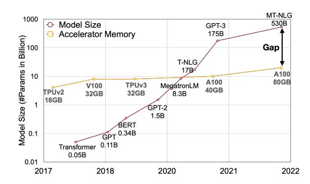
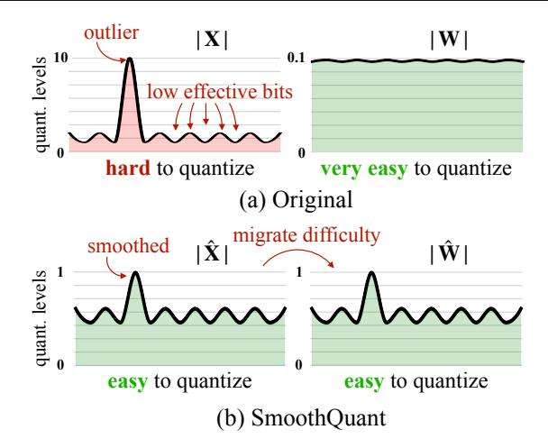
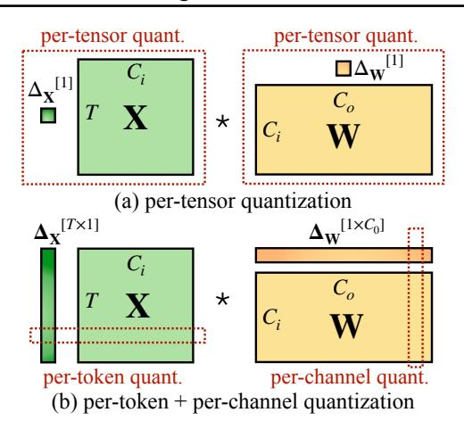
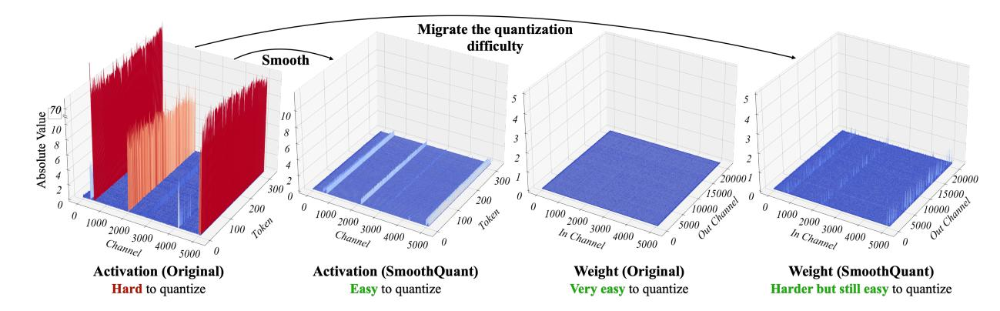
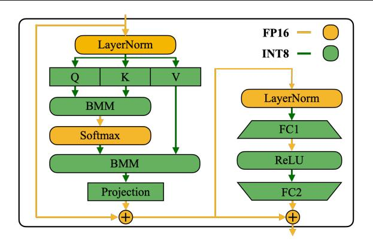
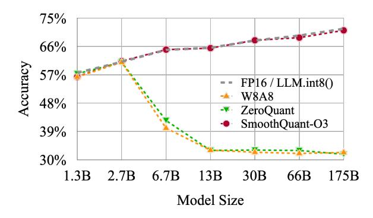
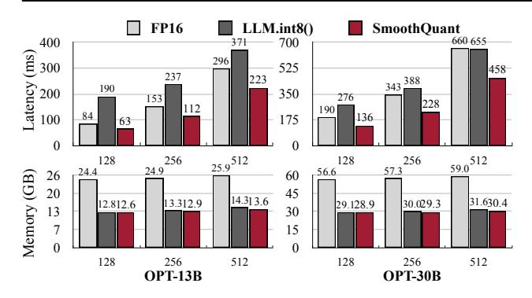
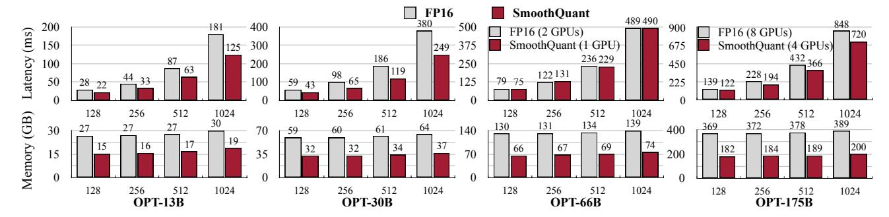
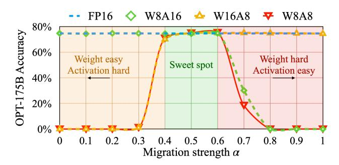

<!-- RP10_Xiao_2022 | source: papers_json/RP10_Xiao_2022/ -->

## SmoothQuant: تكميم دقيق وفعّال بعد التدريب لنماذج اللغة الكبيرة

Guangxuan Xiao * 1 Ji Lin * 1 Mickael Seznec ^2^ Hao Wu ^2^ Julien Demouth ^2^ Song Han ^1^ [https://github.com/mit-han-lab/smoothquant](https://github.com/mit-han-lab/smoothquant)

## الملخص

تُظهر نماذج اللغة الكبيرة (LLMs) أداءً ممتازًا، لكنها كثيفة الاستهلاك من حيث الحوسبة والذاكرة. يمكن للتكميم أن يقلل الذاكرة ويُسرّع الاستدلال. غير أن الطرق الحالية لا تستطيع الحفاظ على الدقة وعلى الكفاءة العتادية في الوقت ذاته. نقترح SmoothQuant، وهو حل تكميم بعد التدريب (PTQ) لا يتطلب تدريبًا، ويحافظ على الدقة، ويصلح للاستخدام العام، ويتيح تكميم الأوزان بـ 8 بت والتنشيطات بـ 8 بت (W8A8) لنماذج LLMs. واستنادًا إلى أن الأوزان سهلة التكميم بينما التنشيطات ليست كذلك، يقوم SmoothQuant بتنعيم القيم الشاذة في التنشيطات عن طريق *نقل* صعوبة التكميم من التنشيطات إلى الأوزان دون اتصال (offline) بواسطة تحويل مكافئ رياضيًا. يتيح SmoothQuant تكميم *كلٍّ* من الأوزان والتنشيطات بـ INT8 لجميع عمليات ضرب المصفوفات في نماذج LLMs، بما في ذلك نماذج OPT وBLOOM وGLM وMT-NLG وLlama-1/2 وFalcon وMistral وMixtral. ونعرض تسريعًا يصل إلى 1.56× وتقليلًا للذاكرة يصل إلى 2× لنماذج LLMs مع خسارة ضئيلة في الدقة. كما يتيح SmoothQuant خدمة نموذج LLM بحجم 530B داخل عقدة واحدة. ويُقدّم عملنا حلًّا جاهزًا يخفض التكاليف العتادية ويُتيح وصولًا أوسع لـ LLMs.

# 1 المقدمة

تُظهر نماذج اللغة واسعة النطاق (LLMs) أداءً ممتازًا في مهام متنوعة [(Brown et al.,](#page-9-0) [2020a;](#page-9-0) [Zhang](#page-11-0) [et al.,](#page-11-0) [2022)](#page-11-0). إلا أن خدمة LLMs مكلفة من حيث الميزانية والطاقة بسبب حجمها الهائل. على سبيل المثال، يحتوي نموذج GPT-3 [(Brown et al.,](#page-9-0) [2020a)](#page-9-0) على 175B معلمة، وسيستهلك على الأقل 350GB من الذاكرة

*وقائع المؤتمر الدولي الأربعين للتعلم الآلي*، هونولولو، هاواي، الولايات المتحدة. PMLR 202، 2023. حقوق النشر 2023 للمؤلف(ين).

*الشكل 1: حجم نماذج اللغة الكبيرة يتطور بوتيرة أسرع من ذاكرة GPU في السنوات الأخيرة، مما يؤدي إلى فجوة كبيرة بين العرض والطلب على الذاكرة. يمكن لتقنيات التكميم وضغط النماذج المساعدة في سدّ الفجوة.*

لتخزينه وتشغيله بـ FP16، مما يتطلب 8×48GB من بطاقات A6000 أو 5×80GB من بطاقات A100 لمجرد الاستدلال. ونظرًا للحمل الهائل من الحوسبة والاتصال، قد يكون زمن استجابة الاستدلال غير مقبول للتطبيقات الواقعية. ويُعدّ *التكميم* طريقة واعدة لتقليل تكلفة LLMs [(Dettmers et al.,](#page-9-1) [2022;](#page-9-1) [Yao et al.,](#page-11-1) [2022)](#page-11-1). فعن طريق تكميم *الأوزان والتنشيطات* بأعداد صحيحة منخفضة البتات، يمكننا تقليل متطلبات ذاكرة GPU من حيث الحجم وعرض النطاق، وتسريع العمليات كثيفة الحوسبة (أي GEMM* في الطبقات الخطية وBMM† في الانتباه). فعلى سبيل المثال، يستطيع تكميم الأوزان والتنشيطات بـ INT8 أن يخفّض استهلاك ذاكرة GPU إلى النصف، ويُضاعف تقريبًا إنتاجية ضرب المصفوفات مقارنةً بـ FP16.

ومع ذلك، وعلى خلاف نماذج CNN أو نماذج Transformer الأصغر مثل BERT [(Devlin et al.,](#page-9-2) [2019)](#page-9-2)، فإن *التنشيطات* في نماذج LLMs يصعب تكميمها. فعندما نوسّع LLMs لتتجاوز 6.7B معلمة، تظهر قيم شاذة منهجية ذات حجم كبير في التنشيطات [(Dettmers et al.,](#page-9-1) [2022)](#page-9-1)، مما يؤدي إلى أخطاء تكميم كبيرة وتدهور في الدقة. ويُطبّق ZeroQuant [(Yao et al.,](#page-11-1) [2022)](#page-11-1) تكميمًا ديناميكيًا للتنشيط على مستوى الرمز، وتكميمًا للأوزان على مستوى المجموعة (المعرَّف في الشكل [3](#page-2-0) القسم [2)](#page-1-0). ويمكن تنفيذه

> ^*^مساهمة متساوية ^1^معهد ماساتشوستس للتكنولوجيا ^2^NVIDIA. للتواصل مع: Guangxuan Xiao <xgx@mit.edu>, Ji Lin <jilin@mit.edu>.

> ^*^ضرب المصفوفات العام

> ^†^ضرب المصفوفات الدُفعي

<!-- page 2 -->

*الشكل 2: حدس SmoothQuant: التنشيط \mathbf{X} يصعب تكميمه لأن القيم الشاذة تمدّ نطاق التكميم، تاركةً عددًا ضئيلًا من البتات الفعّالة لأغلب القيم. ننقل تباين المقياس من التنشيطات \mathbf{W} إلى الأوزان دون اتصال لتقليل صعوبة تكميم التنشيطات. يصبح كلٌّ من التنشيط المنعَّم \hat{\mathbf{X}} والوزن المعدَّل \hat{\mathbf{W}} سهلَ التكميم.*

بكفاءة ويُحقّق دقة جيدة لنموذجَي GPT-3-350M وGPT-J-6B. ومع ذلك، فإنه لا يستطيع الحفاظ على الدقة لنموذج OPT الكبير ذي 175 مليار معلمة (انظر القسم 5.2). ويعالج LLM.int8() (Dettmers et al., 2022) مشكلة الدقة هذه بإدخال تفكيك مختلط الدقة (أي يحتفظ بالقيم الشاذة في FP16 ويستخدم INT8 للتنشيطات الأخرى). غير أن من الصعب تنفيذ هذا التفكيك بكفاءة على المسرّعات العتادية. ولذا، يبقى استنباط مخطط تكميم *فعّال*، و*ملائم للعتاد*، ويُفضَّل أن يكون *دون تدريب*، يستخدم INT8 لكل العمليات كثيفة الحوسبة في LLMs، تحديًا مفتوحًا.

نقترح SmoothQuant، وهو حل تكميم بعد التدريب (PTQ) دقيق وفعّال لـ LLMs. يعتمد SmoothQuant على ملاحظة جوهرية: حتى وإن كانت التنشيطات أصعب في التكميم بكثير من الأوزان بسبب وجود القيم الشاذة (Dettmers et al., 2022)، فإن الرموز المختلفة تُظهر اختلافات متشابهة عبر قنواتها. وبناءً على هذه الملاحظة، ينقل SmoothQuant دون اتصال صعوبة التكميم من التنشيطات إلى الأوزان (الشكل 2). ويقترح SmoothQuant تحويلًا للقياس على مستوى القناة مكافئًا رياضيًا، يُنعّم بشكل كبير الحجم عبر القنوات، مما يجعل النموذج صديقًا للتكميم. وبما أن SmoothQuant متوافق مع مخططات تكميم متعددة، فإننا ننفّذ ثلاثة مستويات كفاءة لإعدادات التكميم في SmoothQuant (انظر الجدول 2، O1-O3). تُظهر التجارب أن SmoothQuant فعّال عتاديًا: فهو يستطيع الحفاظ على أداء OPT-175B (Zhang et al., 2022)، وBLOOM-176B (Scao et al., 2022)، وGLM-130B (Zeng et al., 2022)، وMT-NLG 530B (Smith et al., 2022)، مما يؤدي

إلى تسريع يصل إلى 1.51× وتوفير في الذاكرة يصل إلى 1.96× على PyTorch. كما أن تنفيذ SmoothQuant سهل. وقد دمجناه في FasterTransformer، وهو إطار خدمة Transformer الأحدث، محققين تسريعًا يصل إلى 1.56× وتقليصًا لاستخدام الذاكرة إلى النصف مقارنةً بـ FP16. والأهم من ذلك أن SmoothQuant يسمح بخدمة النماذج الكبيرة مثل OPT-175B باستخدام نصف عدد بطاقات GPU فقط مقارنةً بـ FP16 مع كونه أسرع، ويُتيح خدمة نموذج 530B داخل عقدة واحدة من 8 بطاقات GPU. ويُتيح عملنا الوصول الواسع إلى LLMs بتقديم حل جاهز لخفض تكلفة الخدمة. ونأمل أن يُلهم SmoothQuant استخدامًا أوسع لـ LLMs مستقبلًا.

# 2 تمهيدات

**التكميم** يُحوّل قيمة عالية الدقة إلى مستويات منفصلة. ندرس التكميم المنتظم للأعداد الصحيحة (Jacob et al., 2018) (تحديدًا INT8) للحصول على دعم وكفاءة عتادية أفضل. يمكن التعبير عن عملية التكميم كما يلي:

$$
\bar{\mathbf{X}}^{\text{INT8}} = \lceil \frac{\mathbf{X}^{\text{FP16}}}{\Delta} \rfloor, \quad \Delta = \frac{\max(|\mathbf{X}|)}{2^{N-1} - 1}, (1)
$$

حيث \mathbf{X} هو الموتر ذو الفاصلة العائمة، و\overline{\mathbf{X}} هو نظيره المُكمَّم، و\Delta هو حجم خطوة التكميم، و\lceil \cdot \rfloor هي دالة التقريب، وN هو عدد البتات (8 في حالتنا). نفترض هنا أن الموتر *متماثل* عند 0 لأغراض التبسيط؛ والنقاش مماثل للحالات غير المتماثلة (مثل ما بعد ReLU) عبر إضافة نقطة صفرية (Jacob et al., 2018).

يستخدم هذا المُكمِّم القيمة المطلقة القصوى لحساب \Delta لكي يُحافظ على القيم الشاذة في التنشيط، التي وُجد أنها مهمة للدقة (Dettmers et al., 2022). يمكننا حساب \Delta دون اتصال بواسطة تنشيطات بعض عينات المعايرة، وهو ما نسميه **التكميم الساكن**. ويمكننا أيضًا استخدام إحصاءات وقت التشغيل للتنشيطات للحصول على \Delta، وهو ما نسميه **التكميم الديناميكي**. وكما هو موضح في الشكل 3، فإن للتكميم مستويات حُبيبية متعددة. يستخدم التكميم على مستوى الموتر حجم خطوة واحدًا للمصفوفة بأكملها. ويمكننا تمكين تكميم أدق حُبيبًا باستخدام أحجام خطوات تكميم مختلفة للتنشيطات المرتبطة بكل رمز (التكميم على مستوى الرمز) أو لكل قناة إخراج للأوزان (التكميم على مستوى القناة). والإصدار الخشن من التكميم على مستوى القناة هو استخدام خطوات تكميم مختلفة لمجموعات قنوات مختلفة، ويُسمى التكميم على مستوى المجموعة (Shen et al., 2020; Yao et al., 2022).

بالنسبة لطبقة خطية في Transformers (Vaswani et al., 2017) \mathbf{Y} = \mathbf{X} \cdot \mathbf{W}, \mathbf{Y} \in \mathbb{R}^{T \times C_o}, \mathbf{X} \in \mathbb{R}^{T \times C_i}, \mathbf{W} \in \mathbb{R}^{C_i \times C_o}، حيث T هو عدد الرموز، وC_i هو قناة الإدخال، وC_o هو قناة الإخراج (انظر الشكل 3، حذفنا بُعد الدُفعة لأغراض التبسيط)، يمكننا تقليل التخزين إلى النصف مقارنةً بـ FP16 بتكميم الأوزان إلى INT8. غير أن تسريع الاستدلال يستلزم تكميم كلٍّ من الأوزان والتنشيطات إلى INT8 (أي W8A8) للاستفادة من نوى الأعداد الصحيحة (مثل INT8 GEMM)، التي

<!-- page 3 -->

*الشكل 3: تعريف التكميم على مستوى الموتر، ومستوى الرمز، ومستوى القناة. التكميم على مستوى الموتر هو الأكثر كفاءة في التنفيذ. وللتكميم المتجهي بحيث يستفيد بكفاءة من نوى INT8 GEMM، يمكننا فقط استخدام عوامل القياس من الأبعاد الخارجية (أي بُعد الرمز T وبُعد قناة الإخراج C_o)، وليس البُعد الداخلي (أي بُعد قناة الإدخال C_i).*

تدعمها مجموعة واسعة من العتاد (مثل بطاقات NVIDIA GPUs ومعالجات Intel CPUs ومعالجات Qualcomm DSPs، إلخ).

# 3 مراجعة صعوبة التكميم

من المعروف أن LLMs صعبة التكميم بسبب القيم الشاذة في التنشيطات (Dettmers et al., 2022; Wei et al., 2022; Bondarenko et al., 2021). نراجع أولًا صعوبات تكميم التنشيطات ونبحث عن نمط بين القيم الشاذة. نُمثّل بصريًا تنشيطات الإدخال وأوزان طبقة خطية ذات خطأ تكميم كبير في الشكل 4 (يسار). ويمكننا أن نلاحظ عدة أنماط تُحفّز طريقتنا:

- 1. التنشيطات أصعب في التكميم من الأوزان. توزيع الأوزان منتظم تمامًا ومسطّح، مما يجعله سهل التكميم. وقد أظهرت أعمال سابقة أن تكميم أوزان LLMs بـ INT8 أو حتى INT4 لا يُحطّ من الدقة (Dettmers et al., 2022; Yao et al., 2022; Zeng et al., 2022)، وهو ما يتوافق مع ملاحظتنا.
- 2. القيم الشاذة تجعل تكميم التنشيطات صعبًا. إن مقياس القيم الشاذة في التنشيطات أكبر بـ \sim 100 \times من معظم قيم التنشيط. في حالة التكميم على مستوى الموتر (المعادلة 1)، تُهيمن القيم الشاذة الكبيرة على قياس الحجم الأقصى، مما يؤدي إلى انخفاض *البتات/المستويات الفعّالة للتكميم* (الشكل 2) للقنوات غير الشاذة: لنفترض أن الحجم الأقصى للقناة i هو m_i، وأن القيمة القصوى للمصفوفة بأكملها هي m، فإن مستويات التكميم الفعّالة للقناة i هي 2^8 \cdot m_i/m. وللقنوات غير الشاذة، ستكون مستويات التكميم الفعّالة صغيرة جدًا (2-3)، مما يؤدي إلى أخطاء تكميم كبيرة.
- 3. القيم الشاذة تستمر في قنوات ثابتة. تظهر القيم الشاذة

في جزء صغير من القنوات. فإذا احتوت قناة على قيمة شاذة، فإنها تظهر باستمرار في جميع الرموز (الشكل 4، أحمر). والتباين بين القنوات لرمز معين كبير (التنشيطات في بعض القنوات كبيرة جدًا، لكن معظمها صغير)، أما التباين بين أحجام قناة معينة عبر الرموز فصغير (القنوات الشاذة كبيرة على الدوام). ونظرًا لاستمرار القيم الشاذة وصغر التباين داخل كل قناة، فإنه إذا تمكنّا من إجراء تكميم على مستوى القناة (Bondarenko et al., 2021) للتنشيط (أي استخدام خطوة تكميم مختلفة لكل قناة)، فإن خطأ التكميم سيكون أصغر بكثير مقارنةً بالتكميم *على مستوى الموتر*، بينما يساعد التكميم *على مستوى الرمز* قليلًا. في الجدول 1، نتحقق من فرضية أن تكميم التنشيط المحاكى على مستوى القناة يُجسّر بنجاح الفجوة في الدقة مع خط الأساس FP16، وهو ما يتفق مع نتائج Bondarenko et al..

غير أن تكميم التنشيط على مستوى القناة لا يتوافق جيدًا مع نوى GEMM المسرَّعة عتاديًا، التي تعتمد على سلسلة من العمليات تُنفَّذ بإنتاجية عالية (مثل Tensor Core MMAs)، ولا تتحمل إدراج تعليمات بإنتاجية أدنى (مثل التحويلات أو CUDA Core FMAs) في تلك السلسلة. ففي تلك النوى، لا يمكن إجراء القياس إلا على طول الأبعاد الخارجية لضرب المصفوفات (أي بُعد الرمز للتنشيطات T، وبُعد قناة الإخراج للأوزان C_o، انظر الشكل 3)، والذي يمكن تطبيقه بعد انتهاء ضرب المصفوفات:

$$
\mathbf{Y} = \text{diag}(\boldsymbol{\Delta}_{\mathbf{X}}^{\text{FP16}}) \cdot (\mathbf{\bar{X}}^{\text{INT8}} \cdot \mathbf{\bar{W}}^{\text{INT8}}) \cdot \text{diag}(\boldsymbol{\Delta}_{\mathbf{W}}^{\text{FP16}}) \quad (2)
$$

ولهذا، فإن جميع الأعمال السابقة تستخدم تكميم التنشيط على مستوى الرمز للطبقات الخطية (Dettmers et al., 2022; Yao et al., 2022)، رغم أنها لا تستطيع معالجة صعوبة تكميم التنشيط (أفضل قليلًا فقط من مستوى الموتر).

# 4 SmoothQuant

بدلًا من تكميم التنشيط على مستوى القناة (وهو غير ممكن)، نقترح "تنعيم" تنشيط الإدخال بقسمته على عامل تنعيم على مستوى القناة \mathbf{s} \in \mathbb{R}^{C_i}. وللحفاظ على المكافأة الرياضية لطبقة خطية، فإننا

<!-- page 4 -->

*الشكل 4: حجم تنشيطات الإدخال وأوزان طبقة خطية في OPT-13B قبل وبعد SmoothQuant. الملاحظات: (1) توجد قنوات قليلة في خريطة التنشيط الأصلية أحجامها كبيرة جدًا (أكبر من 70)؛ (2) التباين في قناة تنشيط واحدة صغير؛ (3) توزيع الأوزان الأصلي مسطّح ومنتظم. ينقل SmoothQuant القنوات الشاذة من التنشيط إلى الوزن. وفي النهاية، تُنعَّم القيم الشاذة في التنشيط بشكل كبير بينما يبقى الوزن منعّمًا ومسطّحًا.*

نقيس الأوزان وفقًا لذلك بالاتجاه المعاكس:

$$
\mathbf{Y} = (\mathbf{X}\operatorname{diag}(\mathbf{s})^{-1}) \cdot (\operatorname{diag}(\mathbf{s})\mathbf{W}) = \hat{\mathbf{X}}\hat{\mathbf{W}} (3)
$$

ونظرًا لأن الإدخال X يُنتَج عادةً من عمليات خطية سابقة (مثل الطبقات الخطية، وتطبيع الطبقة، إلخ)، فإنه يمكننا بسهولة دمج عامل التنعيم في معلمات الطبقات السابقة *دون اتصال*، مما لا يستدعي حملًا إضافيًا من استدعاء النواة لعملية قياس إضافية. وفي بعض الحالات الأخرى، عندما يأتي الإدخال من جمع متبقٍّ، يمكننا إضافة قياس إضافي إلى الفرع المتبقّي على نحو مشابه لـ [Wei et al.](#page-11-5) [(2022)](#page-11-5).

نقل صعوبة التكميم من التنشيطات إلى الأوزان. نهدف إلى اختيار عامل تنعيم s على مستوى القناة بحيث يكون Xˆ = Xdiag(s) −1 سهل التكميم. ولتقليل خطأ التكميم، علينا *زيادة بتات التكميم الفعّالة* لجميع القنوات. وستكون البتات الفعّالة الإجمالية للتكميم في حدّها الأقصى عندما تكون لجميع القنوات نفس الحجم الأقصى. ولذا، فإن خيارًا مباشرًا هو s^j^ = max(|X^j^ |), j = 1, 2, ..., C^i^، حيث j يقابل قناة الإدخال j-th. ويضمن هذا الاختيار أنه بعد القسمة، ستحظى جميع قنوات التنشيط بنفس القيمة القصوى، وهو ما يسهل تكميمه. ولاحظ أن نطاق التنشيطات ديناميكي؛ فهو يتباين لعينات الإدخال المختلفة. وهنا، نُقدّر مقياس قنوات التنشيطات باستخدام عينات معايرة من مجموعة بيانات ما قبل التدريب [(Ja](#page-10-1)[cob et al.,](#page-10-1) [2018)](#page-10-1). غير أن هذه الصيغة تدفع *جميع* صعوبات التكميم إلى الأوزان. ووجدنا أنه في هذه الحالة، ستكون أخطاء التكميم كبيرة للأوزان (انتقلت القنوات الشاذة الآن إلى الأوزان)، مما يؤدي إلى تدهور كبير في الدقة (انظر الشكل [10)](#page-9-4). من جهة أخرى، يمكننا أيضًا دفع كل صعوبة التكميم من الأوزان إلى التنشيطات باختيار s^j^ = 1/ max(|W^j^ |). وبالمثل، يكون أداء النموذج رديئًا بسبب أخطاء تكميم التنشيطات. ولذا، نحن بحاجة إلى *تقسيم* صعوبة التكميم بين الأوزان والتنشيطات بحيث يكون كلاهما سهل التكميم.

$$
Original:XAbs MaxWAbs MaxSmoothQuant:\hat{X} = X diag(s)^{-1}wheres = \sqrt{\max |X| / \max |W|}and\hat{W} = diag(s)W
$$

*الشكل 5: الفكرة الرئيسية لـ SmoothQuant عندما تكون α هي 0.5. يُحصَل على عامل التنعيم s من عينات المعايرة، ويُجرى التحويل بأكمله دون اتصال. وفي وقت التشغيل، تكون التنشيطات منعَّمة دون قياس.*

نُقدّم هنا معاملًا فائقًا، وهو قوة النقل α، للتحكم في مقدار الصعوبة التي نريد نقلها من التنشيط إلى الأوزان، باستخدام المعادلة التالية:

$$
\mathbf{s}_j = \max(|\mathbf{X}_j|)^{\alpha} / \max(|\mathbf{W}_j|)^{1-\alpha} \tag{4}
$$

ونجد أنه بالنسبة لمعظم النماذج، مثل جميع نماذج OPT [(Zhang](#page-11-0) [et al.,](#page-11-0) [2022)](#page-11-0) وBLOOM [(Scao et al.,](#page-10-0) [2022)](#page-10-0)، فإن α = 0.5 نقطة متوازنة جيدًا لتقسيم صعوبة التكميم بالتساوي، خاصة عند استخدام نفس المُكمِّم للأوزان والتنشيطات (مثل التكميم على مستوى الموتر، الساكن). وتضمن الصيغة أن تتشارك الأوزان والتنشيطات في القناة المقابلة قيمة قصوى متشابهة، وبالتالي تتقاسم نفس صعوبة التكميم. ويُوضّح الشكل [5](#page-3-1) تحويل التنعيم عندما نأخذ α = 0.5. وبالنسبة لبعض النماذج الأخرى التي تكون فيها قيم التنشيط الشاذة أكثر بروزًا (مثل GLM-130B [(Zeng](#page-11-2) [et al.,](#page-11-2) [2022)](#page-11-2) الذي يحتوي على نحو 30٪ من القيم الشاذة، وهي أصعب لتكميم التنشيط)، يمكننا اختيار α أكبر لنقل المزيد من صعوبة التكميم إلى الأوزان (مثل 0.75).

تطبيق SmoothQuant على كتل Transformer. تستحوذ الطبقات الخطية على معظم معلمات وحوسبة نماذج LLM. وافتراضيًا، نُجري تنعيم القياس لتنشيطات إدخال طبقات الانتباه الذاتي والتغذية الأمامية،

<!-- page 5 -->

*الشكل 6: مخطط الدقة في SmoothQuant لكتلة Transformer. كل المعاملات كثيفة الحوسبة مثل الطبقات الخطية وضرب المصفوفات الدُفعي (BMMs) تستخدم حسابات INT8.*

ونُكمّم جميع الطبقات الخطية بـ W8A8. كما نُكمّم معاملات BMM في حسابات الانتباه. ونُصمّم تدفق تكميم لكتل Transformer في الشكل [6.](#page-4-2) ونُكمّم مدخلات وأوزان المعاملات كثيفة الحوسبة كالطبقات الخطية وBMM في طبقات الانتباه باستخدام INT8، مع إبقاء التنشيط بـ FP16 للعمليات الخفيفة على مستوى العنصر مثل ReLU وSoftmax وLayer-Norm. يساعدنا هذا التصميم على الموازنة بين الدقة وكفاءة الاستدلال.

# 5 التجارب

## 5.1 الإعدادات

خطوط الأساس. نُقارن مع أربعة خطوط أساس في إعداد التكميم بعد التدريب بـ INT8، أي دون إعادة تدريب لمعلمات النموذج: التكميم الساذج W8A8، وZero-Quant [(Yao et al.,](#page-11-1) [2022)](#page-11-1)، وLLM.int8() [(Dettmers et al.,](#page-9-1) [2022)](#page-9-1)، وOutlier Suppression [(Wei et al.,](#page-11-5) [2022)](#page-11-5). وبما أن SmoothQuant متعامد مع مخططات التكميم، فإننا نقدّم مستويات تكميم متدرجة في العدوانية والكفاءة من O1 إلى O3. وتظهر مخططات التكميم التفصيلية لخطوط الأساس وSmoothQuant في الجدول [2.](#page-4-1)

النماذج ومجموعات البيانات. نختار ثلاث عائلات من LLMs لتقييم SmoothQuant: OPT [(Zhang et al.,](#page-11-0) [2022)](#page-11-0)، وBLOOM [(Scao et al.,](#page-10-0) [2022)](#page-10-0)، وGLM-130B [(Zeng](#page-11-2) [et al.,](#page-11-2) [2022)](#page-11-2). ونستخدم سبع مهام للتقييم بدون تدريب مسبق: LAMBADA [(Paperno et al.,](#page-10-3) [2016)](#page-10-3)، وHellaSwag [(Zellers](#page-11-6) [et al.,](#page-11-6) [2019)](#page-11-6)، وPIQA [(Bisk et al.,](#page-9-5) [2020)](#page-9-5)، وWinoGrande [(Sak](#page-10-4)[aguchi et al.,](#page-10-4) [2019)](#page-10-4)، وOpenBookQA [(Mihaylov et al.,](#page-10-5) [2018)](#page-10-5)، وRTE [(Wang et al.,](#page-11-7) [2018)](#page-11-7)، وCOPA [(Roemmele et al.,](#page-10-6) [2011)](#page-10-6)، ومجموعة بيانات نمذجة لغوية واحدة WikiText [(Merity et al.,](#page-10-7) [2016)](#page-10-7) لتقييم نماذج OPT وBLOOM. ونستخدم MMLU [(Hendrycks et al.,](#page-10-8) [2020)](#page-10-8)، وMNLI [(Williams et al.,](#page-11-8) [2018)](#page-11-8)، وQNLI [(Wang et al.,](#page-11-7) [2018)](#page-11-7) وLAMBADA لتقييم نموذج GLM-130B لأن بعض المعايير المذكورة آنفًا تظهر في مجموعة تدريب GLM-130B. ونستخدم lm-eval-harness[‡](#page-0-0) لتقييم نماذج OPT وBLOOM، والمستودع الرسمي لـ GLM-130B[§](#page-0-0) لتقييمه الخاص. وأخيرًا، نُوسّع طريقتنا إلى MT-NLG 530B [(Smith et al.,](#page-11-3) [2022)](#page-11-3) ولأول مرة نُتيح خدمة نموذج >500B داخل عقدة واحدة. ولاحظ أننا نُركّز على التغير *النسبي* في الأداء قبل التكميم وبعده، وليس على القيمة المطلقة.

تنعيم التنشيط. قوة النقل α = 0.5 هي نقطة مثالية عامة لجميع نماذج OPT وBLOOM، وα = 0.75 لـ GLM-130B لأن تنشيطاته أصعب في التكميم [(Zeng et al.,](#page-11-2) [2022)](#page-11-2). نحصل على α مناسبة بإجراء بحث شبكي سريع على مجموعة فرعية من مجموعة التحقق الخاصة بـ Pile [(Gao](#page-9-6) [et al.,](#page-9-6) [2020)](#page-9-6). وللحصول على إحصاءات التنشيطات، نُعاير عوامل التنعيم وأحجام خطوة التكميم الساكن *مرة واحدة* بـ 512 جملة عشوائية من مجموعة بيانات ما قبل التدريب Pile، ونُطبّق نفس النموذج المنعَّم والمُكمَّم لجميع المهام النهائية. وبهذه الطريقة، يمكننا قياس عمومية وأداء التقييم بدون تدريب مسبق لـ LLMs المُكمَّمة.

التنفيذ. ننفّذ SmoothQuant بواجهتين خلفيتين: (1) PyTorch Huggingface[¶](#page-0-0) لإثبات المفهوم، و(2) FasterTransformer[||](#page-0-0)، كمثال على إطار عالي الأداء يُستخدم في بيئات الإنتاج. وفي كلا إطارَي PyTorch Huggingface وFasterTransformer، ننفّذ وحدات خطية بـ INT8 ودالة ضرب المصفوفات الدُفعي (BMM) بنوى CUTLASS INT8 GEMM. ونستبدل ببساطة وحدات النقطة العائمة (FP16) الخطية الأصلية ودالة bmm بنوى INT8 الخاصة بنا لنحصل على نموذج INT8.

## 5.2 تكميم دقيق

نتائج OPT-175B. يستطيع SmoothQuant التعامل مع تكميم نماذج LLMs الكبيرة جدًا، التي تكون تنشيطاتها أصعب في التكميم. ندرس التكميم على OPT-175B.

> [https://github.com/EleutherAI/lm-evaluation-harness](https://github.com/EleutherAI/lm-evaluation-harness)

> ^§^ [https://github.com/THUDM/GLM-130B](https://github.com/THUDM/GLM-130B)

> [https://github.com/huggingface/transformers](https://github.com/huggingface/transformers)

> ^||^[https://github.com/NVIDIA/FasterTransformer](https://github.com/NVIDIA/FasterTransformer)

<!-- page 6 -->

| الطريقة | OPT-175B | BLOOM-176B | GLM-130B* |
| --- | --- | --- | --- |
| FP16 | 71.6% | 68.2% | 73.8% |
| W8A8 | 32.3% | 64.2% | 26.9% |
| ZeroQuant | 31.7% | 67.4% | 26.7% |
| LLM.int8() | 71.4% | 68.0% | 73.8% |
| Outlier Suppression | 31.7% | 54.1% | 63.5% |
| SmoothQuant-O1 | **71.2%** | 68.3% | **73.7%** |
| SmoothQuant-O2 | 71.1% | **68.4%** | 72.5% |
| SmoothQuant-O3 | 71.1% | 67.4% | 72.8% |

كما هو موضح في الجدول [3,](#page-5-0) يستطيع SmoothQuant مطابقة دقة FP16 على جميع مجموعات بيانات التقييم بكل مخططات التكميم. ويستطيع LLM.int8() مطابقة دقة النقطة العائمة لأنه يستخدم قيمًا ذات نقطة عائمة لتمثيل القيم الشاذة، مما يؤدي إلى حمل تأخير كبير (الجدول [11)](#page-8-0). وتُنتج خطوط الأساس W8A8 وZeroQuant وOutlier Suppression نتائج شبه عشوائية، مما يُشير إلى أن التكميم الساذج لتنشيطات LLMs سيُدمّر الأداء.

نتائج LLMs مختلفة. يمكن تطبيق SmoothQuant على تصميمات LLM متنوعة. في الجدول [4,](#page-5-1) نُظهر أن SmoothQuant يمكنه تكميم جميع LLMs المفتوحة الموجودة التي تتجاوز 100B معلمة. ومقارنةً بنموذج OPT-175B، فإن نموذج BLOOM-176B أسهل في التكميم: لا يُدمّر أيٌّ من خطوط الأساس النموذج تمامًا؛ حتى التكميم الديناميكي الساذج W8A8 على مستوى الموتر لا يخفّض الدقة إلا بنسبة 4٪. ويحافظ مستويا O1 وO2 من SmoothQuant بنجاح على دقة النقطة العائمة، بينما المستوى O3 (مستوى

*الشكل 7: SmoothQuant-O3 (الإعداد الأكفأ، المعرَّف في الجدول [2)](#page-4-1) يُحافظ على دقة نماذج OPT عبر مقاييس مختلفة عند تكميمها إلى INT8. أما LLM.int8() فيتطلب دقة مختلطة ويعاني من التباطؤ.*

الموتر الساكن) يخفّض متوسط الدقة بنسبة 0.8٪، وهو ما نعزوه إلى التباين بين الإحصاءات المجمَّعة بشكل ساكن وإحصاءات التنشيط لعينات التقييم الفعلية. وعلى العكس، فإن نموذج GLM-130B أصعب في التكميم (وهو ما يتفق مع [Zeng et al.)](#page-11-2). ومع ذلك، يستطيع SmoothQuant-O1 مطابقة دقة FP16، بينما يُخفّض SmoothQuant-O3 الدقة بنسبة 1٪ فقط، مما يتفوق بشكل كبير على خطوط الأساس. ولاحظ أننا نقصّ أعلى 2٪ من الرموز عند معايرة أحجام خطوة التكميم الساكن لـ GLM-130B وفق [Wei et al.](#page-11-5) [(2022)](#page-11-5). ولاحظ أن لتصميمات النماذج/التدريب المختلفة صعوبات تكميم مختلفة، نأمل أن تُلهم بحوثًا مستقبلية.

نتائج LLMs بأحجام مختلفة. لا يعمل SmoothQuant فقط لـ LLMs الكبيرة جدًا التي تتجاوز 100B معلمة، بل يعمل أيضًا باتساق على LLMs الأصغر. في الشكل [7,](#page-5-2) نُظهر أن SmoothQuant يستطيع العمل على جميع مقاييس نماذج OPT، مطابقًا دقة FP16 بالتكميم بـ INT8.

<!-- page 7 -->

| Wiki PPL↓ | 7B | 13B | 30B | 65B |
| --- | --- | --- | --- | --- |
| FP16 | 11.51 | 10.05 | 7.53 | 6.17 |
| W8A8 SmoothQuant | 11.56 | 10.08 | 7.56 | 6.20 |

نتائج LLM المضبوط بالتعليمات. كما هو موضح في الجدول [5,](#page-6-0) يعمل SmoothQuant أيضًا على LLMs المضبوطة بالتعليمات. اختبرنا SmoothQuant على نموذج OPT-IML-30B باستخدام مجموعتَي بيانات WikiText-2 وLAMBADA. وتُظهر نتائجنا أن SmoothQuant يحافظ بنجاح على دقة النموذج بتكميم W8A8، في حين أن خطوط الأساس تفشل في ذلك. SmoothQuant طريقة عامة مصمَّمة لموازنة صعوبة التكميم لنماذج Transformer. وبما أن بنية LLMs المضبوطة بالتعليمات لا تختلف جوهريًا عن LLMs الاعتيادية، وعمليات ما قبل تدريبها متشابهة جدًا، فإن SmoothQuant ينطبق على LLMs المضبوطة بالتعليمات أيضًا.

نتائج نماذج LLaMA. نماذج LLaMA هي نماذج لغوية مفتوحة جديدة ذات أداء متفوق [(Touvron](#page-11-9) [et al.,](#page-11-9) [2023a)](#page-11-9). ومن خلال التجارب الأولية، نجد أن نماذج LLaMA لديها بشكل عام مشكلات قيم شاذة في التنشيط أقل حدة مقارنةً بنماذج مثل OPT وBLOOM. ومع ذلك، يعمل SmoothQuant بشكل جيد جدًا لنماذج LLaMA. ونقدّم بعض النتائج الأولية لتكميم LLaMA W8A8 في الجدول [6.](#page-6-1) يُتيح SmoothQuant تكميم W8A8 بتدهور أداء ضئيل.

نتائج نماذج Llama-2 وFalcon وMistral وMixtral. نُطبّق SmoothQuant على عدة LLMs أحدث باستخدام بنى متنوعة، مثل Llama-2 [(Touvron et al.,](#page-11-10) [2023b)](#page-11-10)، وFalcon [(Almazrouei et al.,](#page-9-7) [2023)](#page-9-7)، وMistral [(Jiang](#page-10-9) [et al.,](#page-10-9) [2023)](#page-10-9)، وMixtral [(Jiang et al.,](#page-10-10) [2024)](#page-10-10)—وبشكل لافت، فإن نموذج Mixtral هو نموذج خليط الخبراء (MoE). وتُظهر النتائج المفصَّلة في الجدول [7](#page-6-2) أن SmoothQuant يُتيح تكميم W8A8 مع الحفاظ على الأداء بأقل خسارة عبر هذه البنى المتنوعة.

## 5.3 التسريع وتوفير الذاكرة

في هذا القسم، نعرض التسريع وتوفير الذاكرة المُقاسَين لـ SmoothQuant-O3 المدمج في PyTorch وFasterTransformer.

مرحلة السياق: تنفيذ PyTorch. نقيس زمن الاستجابة من البداية إلى النهاية لتوليد جميع الحالات المخفية لدفعة من 4 جمل في تمريرة واحدة، أي زمن استجابة مرحلة السياق. ونسجّل الاستخدام الأقصى (التراكمي) لذاكرة GPU في هذه العملية. ونقارن SmoothQuant فقط مع LLM.int8() لأنه طريقة التكميم الموجودة الوحيدة التي تستطيع الحفاظ على دقة LLM في جميع المقاييس. ونظرًا لعدم دعم Huggingface لتوازي النماذج، فإننا نقيس أداء SmoothQuant على وحدة GPU واحدة فقط لتنفيذ PyTorch، ولذا نختار OPT-6.7B وOPT-13B وOPT-30B للتقييم. وفي مكتبة FasterTransformer، يستطيع SmoothQuant العمل بسلاسة مع خوارزمية توازي الموتر [(Shoeybi et al.,](#page-11-11) [2019)](#page-11-11)، ولذا نختبر SmoothQuant على OPT-13B وOPT-30B وOPT-66B وOPT-175B لكلٍّ من معايير الأداء على GPU الواحد والمتعدد. وأُجريت جميع تجاربنا على خوادم بطاقات NVIDIA A100 80GB GPU.

في الشكل [8,](#page-7-0) نعرض زمن استجابة الاستدلال والاستخدام الأقصى للذاكرة استنادًا إلى تنفيذ PyTorch. SmoothQuant أسرع باتساق من خط الأساس FP16، محققًا تسريعًا 1.51x على OPT-30B عندما يكون طول التسلسل 256. ونلاحظ أيضًا اتجاهًا مفاده أنه كلما كبر النموذج، كان التسريع أكثر بروزًا. ومن جهة أخرى، فإن LLM.int8()

<!-- page 8 -->

*الشكل 8: تنفيذ PyTorch لـ SmoothQuant-O3 يُحقّق تسريعًا يصل إلى **1.51**× وتوفيرًا في الذاكرة يصل إلى **1.96**× لنماذج OPT على وحدة NVIDIA A100-80GB GPU واحدة، في حين أن LLM.int8() يُبطئ الاستدلال في معظم الحالات.*

أبطأ دائمًا تقريبًا من خط الأساس FP16، وذلك بسبب الحمل الكبير لتمثيل التنشيط مختلط الدقة. ومن حيث الذاكرة، يستطيع SmoothQuant وLLM.int8() جميعًا تخفيض استخدام ذاكرة نموذج FP16 إلى النصف تقريبًا، بينما يوفّر SmoothQuant ذاكرة أكثر قليلًا لأنه يستخدم INT8 GEMMs بشكل كامل.

## مرحلة السياق: تنفيذ FasterTransformer.

كما هو موضح في الشكل 9 (أعلى)، مقارنةً بتنفيذ FasterTransformer لـ FP16 لـ OPT، يستطيع SmoothQuant-O3 تقليل زمن تنفيذ OPT-13B وOPT-30B بمقدار يصل إلى 1.56× عند استخدام GPU واحدة. وهذا تحدٍّ لأن FasterTransformer أسرع بالفعل من تنفيذ PyTorch بأكثر من 3× لـ OPT-30B. والأهم من ذلك أنه بالنسبة للنماذج الأكبر التي يجب توزيعها عبر عدة GPUs، فإن SmoothQuant يُحقّق زمن استجابة مماثلًا أو حتى أفضل باستخدام *نصف* عدد بطاقات GPU فقط (بطاقة GPU واحدة بدلًا من 2 لـ OPT-66B، و4 بطاقات بدلًا من 8 لـ OPT-175B). وقد يخفض هذا بشكل كبير تكلفة خدمة LLMs. وقد قُلّصت كمية الذاكرة المطلوبة عند استخدام SmoothQuant-O3 في FasterTransformer بعامل 2× تقريبًا، كما هو موضح في الشكل 9 (أسفل).

**مرحلة فك التشفير.** في الجدول 8، نُظهر أن SmoothQuant يستطيع تسريع مرحلة فك التشفير الانحدارية الذاتية لـ LLMs بشكل كبير. يقلّل SmoothQuant باستمرار من زمن استجابة فك التشفير لكل رمز مقارنةً بـ FP16 (تسريع يصل إلى 1.42x). إضافةً إلى ذلك، يُخفّض SmoothQuant أثر الذاكرة لاستدلال LLM إلى النصف، مما يُتيح نشر LLMs بتكلفة أقل بكثير.

## 5.4 التوسع: نموذج 530B داخل عقدة واحدة

يمكننا توسيع SmoothQuant ليتجاوز نماذج بمستوى 500B، مما يُتيح تكميم W8A8 الفعّال والدقيق لنموذج MT-NLG 530B (Smith et al., 2022). كما هو موضح في الجدولَين 9 و10، يُتيح SmoothQuant تكميم W8A8 للنموذج 530B بخسارة دقة ضئيلة. ويتيح حجم النموذج المُقلَّص خدمته باستخدام نصف عدد

|  | LAMBADA | HellaSwag | PIQA | WinoGrande | المتوسط |
| --- | --- | --- | --- | --- | --- |
| FP16 | 76.6% | 62.1% | 81.0% | 72.9% | 73.1% |
| INT8 | 77.2% | 60.4% | 80.7% | 74.1% | 73.1% |

البطاقات (16 إلى 8) بزمن استجابة مماثل، مما يُتيح خدمة نموذج >500B داخل عقدة واحدة (8 \times A100 80GB GPUs).

## 5.5 دراسة الاستئصال

مخططات التكميم. يُظهر الجدول 11 زمن استجابة الاستدلال لمخططات تكميم مختلفة استنادًا إلى تنفيذنا في PyTorch. ويمكننا أن نلاحظ أنه كلما زادت خشونة حُبيبة التكميم (من O1 إلى O3)، انخفض زمن الاستجابة. ويستطيع التكميم الساكن تسريع الاستدلال بشكل كبير مقارنةً بالتكميم الديناميكي لأننا لم نعد بحاجة إلى حساب أحجام خطوة التكميم في وقت التشغيل. SmoothQuant أسرع من خط الأساس FP16 في جميع الإعدادات، في حين أن LLM.int8() عادةً ما يكون أبطأ. ونحن نوصي باستخدام مخطط أكثر خشونة إذا سمحت الدقة.

**قوة النقل.** نحتاج إلى إيجاد قوة نقل \alpha مناسبة (انظر المعادلة 4) لموازنة صعوبة التكميم للأوزان والتنشيطات. ونستئصل تأثير قيم \alpha المختلفة على OPT-175B باستخدام LAMBADA في الشكل 10. عندما تكون \alpha صغيرة جدًا (<0.4)، يصعب تكميم التنشيطات؛ وعندما تكون \alpha كبيرة جدًا (>0.6)، يصعب تكميم الأوزان. وفقط عندما نختار \alpha من منطقة النقطة المثالية (0.4-0.6) يمكننا الحصول على أخطاء تكميم صغيرة لكلٍّ من الأوزان والتنشيطات، والحفاظ على أداء النموذج بعد التكميم.

# 6 أعمال ذات صلة

**نماذج اللغة الكبيرة (LLMs).** حقّقت نماذج اللغة المُدرَّبة مسبقًا أداءً مذهلًا على معايير متنوعة بـ *التوسع*. ويُعدّ GPT-3 (Brown et al., 2020b) أول LLM يتجاوز 100B معلمة ويُحقّق نتائج تعلّم بقليل/بدون أمثلة مذهلة. وقد أظهرت أعمال لاحقة (Rae

<!-- page 9 -->

*الشكل 9: زمن استجابة الاستدلال (أعلى) واستخدام الذاكرة (أسفل) لتنفيذ FasterTransformer على بطاقات NVIDIA A100-80GB GPUs. بالنسبة للنماذج الأصغر، يمكن تقليل زمن الاستجابة بشكل كبير بـ SmoothQuant-O3 بمقدار يصل إلى 1.56x مقارنةً بـ FP16. وبالنسبة للنماذج الأكبر (OPT-66B و175B)، يمكننا تحقيق استدلال مماثل أو حتى أسرع باستخدام نصف عدد بطاقات GPU. وقد قُلّص أثر الذاكرة إلى النصف تقريبًا مقارنةً بـ FP16.*

تكميم النماذج. التكميم طريقة فعّالة لتقليل حجم النموذج وتسريع الاستدلال. وقد ثبتت فعاليته للعديد من شبكات الالتفاف العصبية (CNNs) [(Han et al.,](#page-10-12) [2016;](#page-10-12) [Jacob et al.,](#page-10-1) [2018;](#page-10-1) [Nagel et al.,](#page-10-13) [2019;](#page-10-13) [Wang et al.,](#page-11-12) [2019;](#page-11-12) [Lin et al.,](#page-10-14) [2020)](#page-10-14) ومحوّلات Transformer [(Shen et al.,](#page-10-2) [2020;](#page-10-2) [Kim et al.,](#page-10-15) [2021;](#page-10-15) [Liu et al.,](#page-10-16) [2021;](#page-10-16) [Wang et al.,](#page-11-13) [2020;](#page-11-13) [Bondarenko et al.,](#page-9-3) [2021)](#page-9-3). وتُقلّل موازنة الأوزان [(Nagel et al.,](#page-10-13) [2019)](#page-10-13) وتقسيم القنوات [(Zhao et al.,](#page-11-14) [2019)](#page-11-14) خطأ التكميم بكبت القيم الشاذة في الأوزان. غير أن هذه التقنيات لا تستطيع معالجة القيم الشاذة في التنشيط، التي تُعدّ عنق الزجاجة الرئيسي للتكميم

في LLMs [(Dettmers et al.,](#page-9-1) [2022)](#page-9-1).

تكميم LLMs. يُطبّق GPTQ [(Frantar et al.,](#page-9-11) [2022)](#page-9-11) التكميم على الأوزان فقط دون التنشيطات (يرجى الاطلاع على نقاش قصير في الملحق [A)](#page-12-0). ويستخدم Zero-Quant [(Yao et al.,](#page-11-1) [2022)](#page-11-1) وnuQmm [(Park et al.,](#page-10-17) [2022)](#page-10-17) مخطط تكميم على مستوى الرمز ومستوى المجموعة لـ LLMs، وهو ما يتطلب نوى CUDA مخصَّصة. وأكبر النماذج التي قُيّمت لديهم هي 20B و2.7B على التوالي، وتفشل في الحفاظ على أداء LLMs مثل OPT-175B. ويستخدم LLM.int8() [(Dettmers et al.,](#page-9-1) [2022)](#page-9-1) تفكيكًا مختلطًا INT8/FP16 لمعالجة قيم التنشيط الشاذة. غير أن هذا التنفيذ يؤدي إلى حمل تأخير كبير، وقد يكون أبطأ من استدلال FP16. ويستخدم Outlier Suppression [(Wei et al.,](#page-11-5) [2022)](#page-11-5) Layer-Norm دون قياس وقصّ على مستوى الرمز للتعامل مع قيم التنشيط الشاذة. غير أنه ينجح فقط على نماذج لغوية صغيرة مثل BERT [(Devlin et al.,](#page-9-2) [2019)](#page-9-2) وBART [(Lewis](#page-10-18) [et al.,](#page-10-18) [2019)](#page-10-18) ويفشل في الحفاظ على دقة LLMs (الجدول [4)](#page-5-1). وتُحافظ خوارزميتنا على أداء LLMs (حتى 176B، أكبر LLM مفتوح المصدر يمكننا إيجاده) بمخطط تكميم ساكن وفعّال على مستوى الموتر دون إعادة تدريب، مما يسمح لنا باستخدام INT8 GEMM الجاهز

<!-- page 10 -->

*الشكل 10: قوة نقل α مناسبة (نقطة مثالية) تجعل التنشيطات والأوزان سهلة التكميم. إذا كانت α كبيرة جدًا، فستكون الأوزان صعبة التكميم؛ وإذا كانت صغيرة جدًا، فستكون التنشيطات صعبة التكميم.*

لتحقيق كفاءة عتادية عالية.

# 7 الخاتمة

نقترح SmoothQuant، وهو طريقة تكميم بعد التدريب دقيقة وفعّالة لتمكين تكميم الأوزان والتنشيطات بـ 8 بت دون خسارة لـ LLMs حتى 530B معلمة. يُتيح SmoothQuant التكميم لكلٍّ من الأوزان والتنشيطات لجميع GEMMs في LLMs، مما يُقلّل بشكل كبير زمن استجابة الاستدلال واستخدام الذاكرة مقارنةً بخط أساس تكميم التنشيط مختلط الدقة. وقد دمجنا SmoothQuant في PyTorch وFasterTransformer، محققين تسريعًا للاستدلال يصل إلى 1.56× وتقليصًا لأثر الذاكرة إلى النصف. ويُتيح SmoothQuant وصولًا واسعًا لتطبيقات LLMs بتقديم حل جاهز لخفض تكلفة الخدمة.

## الشكر والتقدير

نشكر MIT-IBM Watson AI Lab، وMIT AI Hardware Program، وAmazon وMIT Science Hub، وجائزة الشراكة الأكاديمية من NVIDIA، وزمالة Qualcomm Innovation، وبرنامج Microsoft Turing الأكاديمي، وNSF لدعم هذا البحث. ونشكر Haotian Tang وAohan Zeng وEric Lin وJilei Hou على المناقشات المفيدة.

## المراجع

Almazrouei, E., Alobeidli, H., Alshamsi, A., Cappelli, A., Cojocaru, R., Debbah, M., Étienne Goffinet, Hesslow, D., Launay, J., Malartic, Q., Mazzotta, D., Noune, B., Pannier, B., and Penedo, G. The falcon series of open language models, 2023.

Bisk, Y., Zellers, R., Bras, R. L., Gao, J., and Choi, Y. Piqa: Reasoning about physical commonsense in natural language. In *Thirty-Fourth AAAI Conference on Artificial* *Intelligence*, 2020.

Bondarenko, Y., Nagel, M., and Blankevoort, T. Under-

standing and overcoming the challenges of efficient transformer quantization. In *Proceedings of the 2021 Con**ference on Empirical Methods in Natural Language Pro**cessing*, pp. 7947–7969, Online and Punta Cana, Dominican Republic, November 2021. Association for Computational Linguistics. URL [https://aclanthology.org/2021.](https://aclanthology.org/2021.emnlp-main.627) [emnlp-main.627.](https://aclanthology.org/2021.emnlp-main.627)

Brown, T., Mann, B., Ryder, N., Subbiah, M., Kaplan, J. D., Dhariwal, P., Neelakantan, A., Shyam, P., Sastry, G., Askell, A., Agarwal, S., Herbert-Voss, A., Krueger, G., Henighan, T., Child, R., Ramesh, A., Ziegler, D., Wu, J., Winter, C., Hesse, C., Chen, M., Sigler, E., Litwin, M., Gray, S., Chess, B., Clark, J., Berner, C., McCandlish, S., Radford, A., Sutskever, I., and Amodei, D. Language models are few-shot learners. In Larochelle, H., Ranzato, M., Hadsell, R., Balcan, M., and Lin, H. (eds.), *Advances in Neural Information Processing Sys**tems*, volume 33, pp. 1877–1901. Curran Associates, Inc., 2020a. URL [https://proceedings.neurips.cc/paper/2020/](https://proceedings.neurips.cc/paper/2020/file/1457c0d6bfcb4967418bfb8ac142f64a-Paper.pdf) [file/1457c0d6bfcb4967418bfb8ac142f64a-Paper.pdf.](https://proceedings.neurips.cc/paper/2020/file/1457c0d6bfcb4967418bfb8ac142f64a-Paper.pdf)

Brown, T., Mann, B., Ryder, N., Subbiah, M., Kaplan, J. D., Dhariwal, P., Neelakantan, A., Shyam, P., Sastry, G., Askell, A., et al. Language models are few-shot learners. *Advances in neural information processing systems*, 33: 1877–1901, 2020b.

Chowdhery, A., Narang, S., Devlin, J., Bosma, M., Mishra, G., Roberts, A., Barham, P., Chung, H. W., Sutton, C., Gehrmann, S., et al. Palm: Scaling language modeling with pathways. *arXiv preprint arXiv:2204.02311*, 2022.

Dettmers, T., Lewis, M., Belkada, Y., and Zettlemoyer, L. Llm.int8(): 8-bit matrix multiplication for transformers at scale. *arXiv preprint arXiv:2208.07339*, 2022.

Devlin, J., Chang, M., Lee, K., and Toutanova, K. BERT: pre-training of deep bidirectional transformers for language understanding. In *NAACL-HLT 2019*, pp. 4171– 4186. Association for Computational Linguistics, 2019.

Du, N., Huang, Y., Dai, A. M., Tong, S., Lepikhin, D., Xu, Y., Krikun, M., Zhou, Y., Yu, A. W., Firat, O., et al. Glam: Efficient scaling of language models with mixture-ofexperts. In *International Conference on Machine Learn**ing*, pp. 5547–5569. PMLR, 2022.

Frantar, E., Ashkboos, S., Hoefler, T., and Alistarh, D. Gptq: Accurate post-training quantization for generative pretrained transformers. *arXiv preprint arXiv:2210.17323*, 2022.

Gao, L., Biderman, S., Black, S., Golding, L., Hoppe, T., Foster, C., Phang, J., He, H., Thite, A., Nabeshima, N., et al. The pile: An 800gb dataset of diverse text for language modeling. *arXiv preprint arXiv:2101.00027*, 2020.

<!-- page 11 -->

- Han, S., Mao, H., and Dally, W. J. Deep Compression: Compressing Deep Neural Networks with Pruning, Trained Quantization and Huffman Coding. In *ICLR*, 2016.
- Hendrycks, D., Burns, C., Basart, S., Zou, A., Mazeika, M., Song, D., and Steinhardt, J. Measuring massive multitask language understanding. *CoRR*, abs/2009.03300, 2020. URL [https://arxiv.org/abs/2009.03300.](https://arxiv.org/abs/2009.03300)
- Jacob, B., Kligys, S., Chen, B., Zhu, M., Tang, M., Howard, A., Adam, H., and Kalenichenko, D. Quantization and training of neural networks for efficient integerarithmetic-only inference. In *Proceedings of the IEEE* *Conference on Computer Vision and Pattern Recognition*, pp. 2704–2713, 2018.
- Jiang, A. Q., Sablayrolles, A., Mensch, A., Bamford, C., Chaplot, D. S., de las Casas, D., Bressand, F., Lengyel, G., Lample, G., Saulnier, L., Lavaud, L. R., Lachaux, M.- A., Stock, P., Scao, T. L., Lavril, T., Wang, T., Lacroix, T., and Sayed, W. E. Mistral 7b, 2023.
- Jiang, A. Q., Sablayrolles, A., Roux, A., Mensch, A., Savary, B., Bamford, C., Chaplot, D. S., de las Casas, D., Hanna, E. B., Bressand, F., Lengyel, G., Bour, G., Lample, G., Lavaud, L. R., Saulnier, L., Lachaux, M.-A., Stock, P., Subramanian, S., Yang, S., Antoniak, S., Scao, T. L., Gervet, T., Lavril, T., Wang, T., Lacroix, T., and Sayed, W. E. Mixtral of experts, 2024.
- Kim, S., Gholami, A., Yao, Z., Mahoney, M. W., and Keutzer, K. I-bert: Integer-only bert quantization. In *International conference on machine learning*, pp. 5506– 5518. PMLR, 2021.
- Lewis, M., Liu, Y., Goyal, N., Ghazvininejad, M., Mohamed, A., Levy, O., Stoyanov, V., and Zettlemoyer, L. Bart: Denoising sequence-to-sequence pre-training for natural language generation, translation, and comprehension. *arXiv preprint arXiv:1910.13461*, 2019.
- Lin, J., Chen, W.-M., Lin, Y., Gan, C., Han, S., et al. Mcunet: Tiny deep learning on iot devices. *Advances in Neural* *Information Processing Systems*, 33:11711–11722, 2020.
- Liu, Z., Wang, Y., Han, K., Zhang, W., Ma, S., and Gao, W. Post-training quantization for vision transformer. *Ad**vances in Neural Information Processing Systems*, 34: 28092–28103, 2021.
- Merity, S., Xiong, C., Bradbury, J., and Socher, R. Pointer sentinel mixture models, 2016.
- Mihaylov, T., Clark, P., Khot, T., and Sabharwal, A. Can a suit of armor conduct electricity? a new dataset for open book question answering. In *EMNLP*, 2018.

- Nagel, M., Baalen, M. v., Blankevoort, T., and Welling, M. Data-free quantization through weight equalization and bias correction. In *Proceedings of the IEEE/CVF* *International Conference on Computer Vision*, pp. 1325– 1334, 2019.
- Paperno, D., Kruszewski, G., Lazaridou, A., Pham, N. Q., Bernardi, R., Pezzelle, S., Baroni, M., Boleda, G., and Fernández, R. The LAMBADA dataset: Word prediction requiring a broad discourse context. In *Proceedings of* *the 54th Annual Meeting of the Association for Compu**tational Linguistics (Volume 1: Long Papers)*, pp. 1525– 1534, Berlin, Germany, August 2016. Association for Computational Linguistics. doi: 10.18653/v1/P16-1144. URL [https://aclanthology.org/P16-1144.](https://aclanthology.org/P16-1144)
- Park, G., Park, B., Kwon, S. J., Kim, B., Lee, Y., and Lee, D. nuqmm: Quantized matmul for efficient inference of large-scale generative language models. *arXiv preprint* *arXiv:2206.09557*, 2022.
- Pope, R., Douglas, S., Chowdhery, A., Devlin, J., Bradbury, J., Levskaya, A., Heek, J., Xiao, K., Agrawal, S., and Dean, J. Efficiently scaling transformer inference. *arXiv* *preprint arXiv:2211.05102*, 2022.
- Rae, J. W., Borgeaud, S., Cai, T., Millican, K., Hoffmann, J., Song, F., Aslanides, J., Henderson, S., Ring, R., Young, S., et al. Scaling language models: Methods, analysis & insights from training gopher. *arXiv preprint* *arXiv:2112.11446*, 2021.
- Roemmele, M., Bejan, C. A., and Gordon, A. S. Choice of plausible alternatives: An evaluation of commonsense causal reasoning. In *Logical Formalizations of Common**sense Reasoning, Papers from the 2011 AAAI Spring Sym**posium, Technical Report SS-11-06, Stanford, California,* *USA, March 21-23, 2011*. AAAI, 2011. URL [http://www.](http://www.aaai.org/ocs/index.php/SSS/SSS11/paper/view/2418) [aaai.org/ocs/index.php/SSS/SSS11/paper/view/2418.](http://www.aaai.org/ocs/index.php/SSS/SSS11/paper/view/2418)
- Sakaguchi, K., Bras, R. L., Bhagavatula, C., and Choi, Y. Winogrande: An adversarial winograd schema challenge at scale. *arXiv preprint arXiv:1907.10641*, 2019.
- Scao, T. L., Fan, A., Akiki, C., Pavlick, E., Ilic, S., Hesslow, ´ D., Castagné, R., Luccioni, A. S., Yvon, F., Gallé, M., et al. Bloom: A 176b-parameter open-access multilingual language model. *arXiv preprint arXiv:2211.05100*, 2022.
- Shen, S., Dong, Z., Ye, J., Ma, L., Yao, Z., Gholami, A., Mahoney, M. W., and Keutzer, K. Q-bert: Hessian based ultra low precision quantization of bert. In *Proceedings* *of the AAAI Conference on Artificial Intelligence*, volume 34, pp. 8815–8821, 2020.

<!-- page 12 -->

- Shoeybi, M., Patwary, M., Puri, R., LeGresley, P., Casper, J., and Catanzaro, B. Megatron-lm: Training multibillion parameter language models using model parallelism. *CoRR*, abs/1909.08053, 2019. URL [http:](http://arxiv.org/abs/1909.08053) [//arxiv.org/abs/1909.08053.](http://arxiv.org/abs/1909.08053)
- Smith, S., Patwary, M., Norick, B., LeGresley, P., Rajbhandari, S., Casper, J., Liu, Z., Prabhumoye, S., Zerveas, G., Korthikanti, V., et al. Using deepspeed and megatron to train megatron-turing nlg 530b, a large-scale generative language model. *arXiv preprint arXiv:2201.11990*, 2022.
- Touvron, H., Lavril, T., Izacard, G., Martinet, X., Lachaux, M.-A., Lacroix, T., Rozière, B., Goyal, N., Hambro, E., Azhar, F., et al. Llama: Open and efficient foundation language models. *arXiv preprint arXiv:2302.13971*, 2023a.
- Touvron, H., Martin, L., Stone, K., Albert, P., Almahairi, A., Babaei, Y., Bashlykov, N., Batra, S., Bhargava, P., Bhosale, S., Bikel, D., Blecher, L., Ferrer, C. C., Chen, M., Cucurull, G., Esiobu, D., Fernandes, J., Fu, J., Fu, W., Fuller, B., Gao, C., Goswami, V., Goyal, N., Hartshorn, A., Hosseini, S., Hou, R., Inan, H., Kardas, M., Kerkez, V., Khabsa, M., Kloumann, I., Korenev, A., Koura, P. S., Lachaux, M.-A., Lavril, T., Lee, J., Liskovich, D., Lu, Y., Mao, Y., Martinet, X., Mihaylov, T., Mishra, P., Molybog, I., Nie, Y., Poulton, A., Reizenstein, J., Rungta, R., Saladi, K., Schelten, A., Silva, R., Smith, E. M., Subramanian, R., Tan, X. E., Tang, B., Taylor, R., Williams, A., Kuan, J. X., Xu, P., Yan, Z., Zarov, I., Zhang, Y., Fan, A., Kambadur, M., Narang, S., Rodriguez, A., Stojnic, R., Edunov, S., and Scialom, T. Llama 2: Open foundation and fine-tuned chat models, 2023b.
- Vaswani, A., Shazeer, N., Parmar, N., Uszkoreit, J., Jones, L., Gomez, A. N., Kaiser, Ł., and Polosukhin, I. Attention is all you need. *Advances in neural information* *processing systems*, 30, 2017.
- Wang, A., Singh, A., Michael, J., Hill, F., Levy, O., and Bowman, S. R. GLUE: A multi-task benchmark and analysis platform for natural language understanding. *CoRR*, abs/1804.07461, 2018. URL [http://arxiv.org/abs/1804.](http://arxiv.org/abs/1804.07461) [07461.](http://arxiv.org/abs/1804.07461)
- Wang, H., Zhang, Z., and Han, S. Spatten: Efficient sparse attention architecture with cascade token and head pruning. *CoRR*, abs/2012.09852, 2020. URL [https://arxiv.org/abs/2012.09852.](https://arxiv.org/abs/2012.09852)
- Wang, K., Liu, Z., Lin, Y., Lin, J., and Han, S. HAQ: Hardware-Aware Automated Quantization with Mixed Precision. In *CVPR*, 2019.
- Wei, X., Zhang, Y., Zhang, X., Gong, R., Zhang, S., Zhang, Q., Yu, F., and Liu, X. Outlier suppression: Pushing the limit of low-bit transformer language models, 2022. URL [https://arxiv.org/abs/2209.13325.](https://arxiv.org/abs/2209.13325)

- Williams, A., Nangia, N., and Bowman, S. A broadcoverage challenge corpus for sentence understanding through inference. In *Proceedings of the 2018 Confer**ence of the North American Chapter of the Association* *for Computational Linguistics: Human Language Tech**nologies, Volume 1 (Long Papers)*, pp. 1112–1122. Association for Computational Linguistics, 2018. URL [http://aclweb.org/anthology/N18-1101.](http://aclweb.org/anthology/N18-1101)
- Yao, Z., Aminabadi, R. Y., Zhang, M., Wu, X., Li, C., and He, Y. Zeroquant: Efficient and affordable post-training quantization for large-scale transformers, 2022. URL [https://arxiv.org/abs/2206.01861.](https://arxiv.org/abs/2206.01861)
- Yu, G.-I., Jeong, J. S., Kim, G.-W., Kim, S., and Chun, B.- G. Orca: A distributed serving system for {Transformer-Based} generative models. In *16th USENIX Symposium* *on Operating Systems Design and Implementation (OSDI* *22)*, pp. 521–538, 2022.
- Zellers, R., Holtzman, A., Bisk, Y., Farhadi, A., and Choi, Y. Hellaswag: Can a machine really finish your sentence? *CoRR*, abs/1905.07830, 2019. URL [http://arxiv.org/abs/](http://arxiv.org/abs/1905.07830) [1905.07830.](http://arxiv.org/abs/1905.07830)
- Zeng, A., Liu, X., Du, Z., Wang, Z., Lai, H., Ding, M., Yang, Z., Xu, Y., Zheng, W., Xia, X., et al. Glm-130b: An open bilingual pre-trained model. *arXiv preprint* *arXiv:2210.02414*, 2022.
- Zhang, S., Roller, S., Goyal, N., Artetxe, M., Chen, M., Chen, S., Dewan, C., Diab, M., Li, X., Lin, X. V., Mihaylov, T., Ott, M., Shleifer, S., Shuster, K., Simig, D., Koura, P. S., Sridhar, A., Wang, T., and Zettlemoyer, L. Opt: Open pre-trained transformer language models, 2022. URL [https://arxiv.org/abs/2205.01068.](https://arxiv.org/abs/2205.01068)
- Zhao, R., Hu, Y., Dotzel, J., De Sa, C., and Zhang, Z. Improving neural network quantization without retraining using outlier channel splitting. In *International confer**ence on machine learning*, pp. 7543–7552. PMLR, 2019.

<!-- page 13 -->

## أ نقاش حول التكميم القائم على الأوزان فقط

في هذا العمل، ندرس تكميم W8A8 بحيث يمكننا الاستفادة من نوى INT8 GEMM لزيادة الإنتاجية وتسريع الاستدلال. وثمة خط آخر من العمل يُكمّم وزن LLMs فقط (مثل GPTQ [(Frantar](#page-9-11) [et al.,](#page-9-11) [2022)](#page-9-11)). وهو يحوّل الأوزان المُكمَّمة إلى FP16 أثناء التشغيل لإجراء ضرب المصفوفات أثناء الاستدلال، ويمكن أن يؤدي أيضًا إلى تسريع بسبب تقليل تحميل البيانات، خاصةً لمرحلة التوليد بحجم دُفعة 1.

نُقارن طريقتنا أساسًا مع الأعمال الموجودة المتعلقة بتكميم الأوزان والتنشيطات (أي W8A8) مثل [(Dettmers](#page-9-1) [et al.,](#page-9-1) [2022;](#page-9-1) [Yao et al.,](#page-11-1) [2022;](#page-11-1) [Wei et al.,](#page-11-5) [2022)](#page-11-5) لأنها تقع في الإعداد ذاته. وهنا نودّ تقديم نقاش قصير حول طرق التكميم القائمة على الأوزان فقط في إعدادات LLM:

- 1. أولًا، حاولنا مقارنة طريقتنا مع GPTQ [(Frantar et al.,](#page-9-11) [2022)](#page-9-11)، لكن وجدنا ذلك صعبًا بسبب التنفيذات المختلفة. فنواة GPTQ منخفضة البتات [**](#page-0-0) تدعم فقط مرحلة التوليد بحجم دُفعة 1 (أي معالجة رمز واحد فقط في كل مرة)، ولا تستطيع دعم مرحلة السياق (الشائعة في مهام نهائية متنوعة وروبوتات المحادثة) أو الإعداد القائم على الدُفعات. إضافةً إلى ذلك، فإن تحسين نواتها منخفضة البتات يستهدف فقط نموذج OPT-175B (كما هو مذكور في README). وفي الوقت نفسه، يستخدم عملنا FasterTransformer لخدمة النماذج الكبيرة، وهو ما قد يؤدي إلى ميزة غير عادلة إذا قارنّا مباشرةً.
- 2. قد يؤدي GPTQ بشكل أفضل في التعامل مع عدد صغير من رموز الإدخال (1 في تجاربها) لأن العملية مقيَّدة بشدة بالذاكرة. وبالمقابل، قد يخدم SmoothQuant بشكل أفضل في إعداد قائم على الدُفعات أو لمرحلة السياق (أي عندما يكون عدد الرموز المعالَجة أكبر). ومع ذلك، تُظهر بعض الأعمال أنه يمكن في الإنتاج تحسين إنتاجية خدمة نماذج GPT بمقدار 37× بزمن استجابة مماثل عبر الدُفعات المتقدمة [(Yu et al.,](#page-11-15) [2022)](#page-11-15). ونحن نعتقد أن الدُفعات ستكون المعيار المستقبلي في الإنتاج، وأن SmoothQuant سيُحقّق تحسينًا إضافيًا حتى لمرحلة التوليد.
- 3. تطبيقات مثل روبوتات المحادثة تحتاج إلى التعامل مع طول سياق طويل، وقد تعمل في إعداد دُفعي. وبسبب هذين العاملين، لم يعد بالإمكان تجاهل حجم ذاكرة KV cache (كما هو موضح في [(Pope](#page-10-19) [et al.,](#page-10-19) [2022)](#page-10-19)، يبلغ مجموع KV cache 3TB بحجم دُفعة 512 وطول سياق 2048، وهو 3× أكبر من أوزان النموذج). وفي هذه الحالة، يمكن أن يساعد تكميم التنشيط أيضًا في تقليل تكلفة الذاكرة من تخزين KV cache.

4. أخيرًا، نعتقد أن الإعدادَين متعامدان نوعًا ما. ونعتقد أنه يمكننا دمج طريقة GPTQ لتكميم أفضل للأوزان وربما تحقيق تكميم W4A4، مما سيؤدي إلى كفاءة عتادية أفضل (تعليمات INT4 مدعومة في بنية NVIDIA's Hopper GPU). ونترك هذا الاستكشاف للأعمال المستقبلية.

> ^**^[https://github.com/IST-DASLab/gptq](https://github.com/IST-DASLab/gptq)
