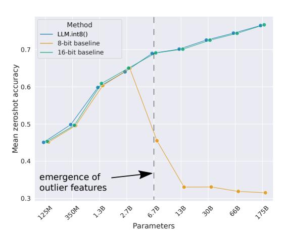
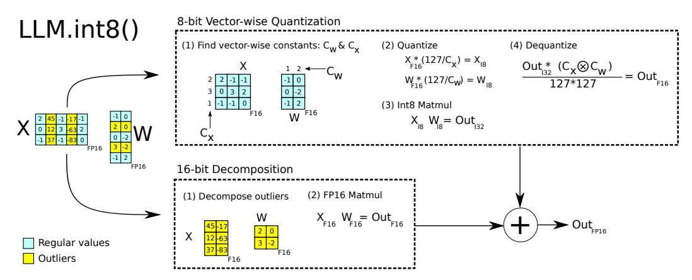
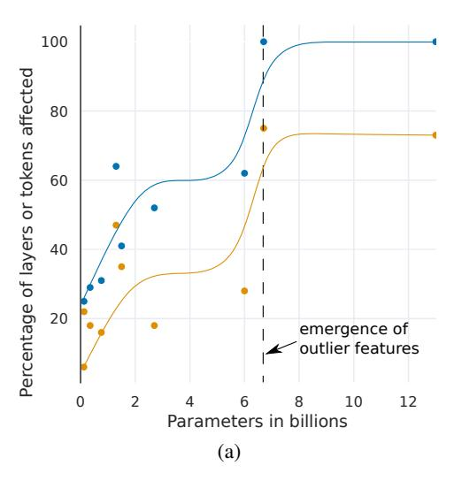
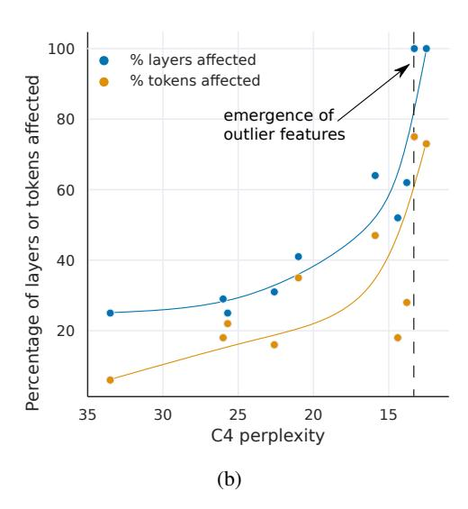
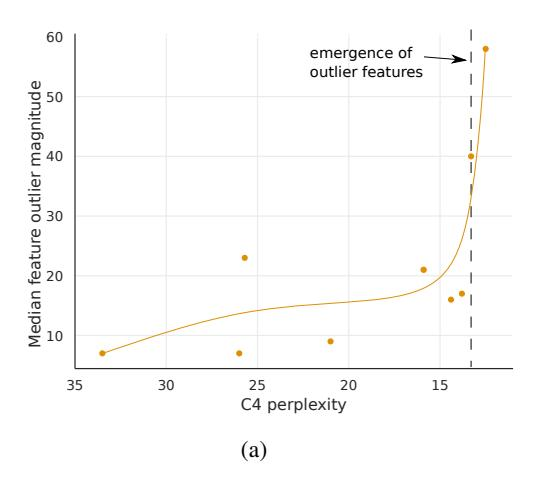
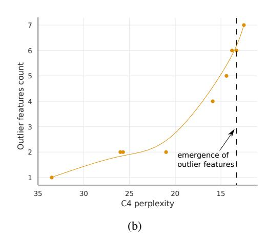

<!-- RP11_Dettmers_2022 | source: papers_json/RP11_Dettmers_2022/ -->

## ‎LLM.int8(): ضرب المصفوفات بدقة 8-بت لمحولات النماذج اللغوية واسعة النطاق

Tim Dettmersλ^∗^ Mike Lewis† Younes Belkada§∓ Luke Zettlemoyer†^λ^

University of Washington^λ^ Facebook AI Research† Hugging Face§ ENS Paris-Saclay^∓^

## الملخص

اعتُمدت النماذج اللغوية الكبيرة على نطاق واسع، إلا أنها تتطلب ذاكرة وحدة معالجة رسومية كبيرة لإجراء الاستدلال. نطور في هذا البحث إجراءً لضرب المصفوفات بدقة Int8 من أجل طبقات التغذية الأمامية وطبقات إسقاط الانتباه في المحولات، مما يقلل الذاكرة اللازمة للاستدلال إلى النصف مع الحفاظ على أداء الدقة الكاملة. باستخدام طريقتنا، يمكن تحميل نقطة فحص ذات 175 مليار معامل بدقة 16/32-بت، وتحويلها إلى Int8، واستخدامها فوراً دون أي تدهور في الأداء. ويصبح ذلك ممكناً من خلال فهم خصائص السمات الناشئة المنهجية للغاية في نماذج لغة المحولات والتعامل معها، إذ تهيمن هذه السمات على الانتباه والأداء التنبؤي للمحولات. وللتعامل مع هذه السمات، نطور إجراء تكميم مكوّن من جزأين، وهو LLM.int8(). نستخدم أولاً التكميم القائم على المتجهات بثوابت تطبيع منفصلة لكل ضرب داخلي في ضرب المصفوفات، لتكميم معظم السمات. ولكن بالنسبة للقيم الشاذة الناشئة، نُضمّن أيضاً مخططاً جديداً لتفكيك الدقة المختلطة، يعزل أبعاد السمات الشاذة في عملية ضرب مصفوفات بدقة 16-بت، بينما يُضرب أكثر من 99.9% من القيم بدقة 8-بت. باستخدام LLM.int8()، نُظهر تجريبياً أنه من الممكن إجراء الاستدلال في النماذج اللغوية الكبيرة التي تصل إلى 175 مليار معامل دون أي تدهور في الأداء. تجعل هذه النتيجة استخدام مثل هذه النماذج أكثر سهولة، فعلى سبيل المثال تُتيح استخدام OPT-175B/BLOOM على خادم واحد مزود بوحدات معالجة رسومية استهلاكية. ونحن نُتيح برنامجنا بشكل مفتوح المصدر.

# 1 المقدمة

اعتُمدت النماذج اللغوية الكبيرة المُدرَّبة مسبقاً على نطاق واسع في معالجة اللغة الطبيعية [(Vaswani et al., 2017;](#page-12-0)[ Radford et al.,](#page-12-1) [2019;](#page-12-1)[ Brown et al., 2020;](#page-10-0)[ Zhang et al., 2022)](#page-13-0) ولكنها تتطلب ذاكرة كبيرة للاستدلال. بالنسبة للنماذج اللغوية الكبيرة من نوع المحولات التي تبلغ أو تتجاوز 6.7 مليار معامل، فإن طبقات التغذية الأمامية وإسقاط الانتباه وعمليات ضرب المصفوفات الخاصة بها تستهلك 95%[2](#page-0-0) من المعاملات و65-85% من إجمالي الحوسبة [(Ilharco et al., 2020)](#page-11-0). إحدى طرق تقليل حجم المعاملات هي تكميمها إلى عدد أقل من البتات واستخدام ضرب مصفوفات بدقة منخفضة. ومع وضع هذا الهدف نصب الأعين، طُوّرت طرق تكميم 8-بت للمحولات [(Chen et al., 2020;](#page-10-1) [Lin et al., 2020;](#page-11-1)[ Zafrir et al., 2019;](#page-13-1)[ Shen et al., 2020)](#page-12-2). وفي حين تقلل هذه الطرق من استخدام الذاكرة، فإنها تُضعف الأداء، وتتطلب عادةً ضبط التكميم الإضافي بعد التدريب، ولم تُدرَس إلا للنماذج التي تقل عن 350 مليون معامل. وفهم التكميم بدون تدهور حتى 350 مليون معامل ضعيف، ويبقى تكميم النماذج التي تحتوي على مليارات المعاملات تحدياً مفتوحاً.

> ^∗^أُجريت معظم الأبحاث بصفته باحثاً زائراً في Facebook AI Research.

> ^2^تأتي المعاملات الأخرى في معظمها من طبقة التضمين. ويأتي قدر ضئيل منها من التطبيعات والتحيزات.

<!-- page 2 -->

نقدم في هذا البحث أول إجراء لتكميم Int8 على نطاق مليارات المعاملات للمحولات لا يتسبب في أي تدهور في الأداء. يجعل إجراؤنا من الممكن تحميل محول يحتوي على 175 مليار معامل بأوزان 16-بت أو 32-بت، وتحويل طبقات التغذية الأمامية وإسقاط الانتباه إلى 8-بت، واستخدام النموذج الناتج فوراً للاستدلال دون أي تدهور في الأداء. نحقق هذه النتيجة من خلال حل تحديين رئيسيين: الحاجة إلى دقة تكميم أعلى عند مقاييس تتجاوز مليار معامل، والحاجة إلى تمثيل صريح لسمات القيم الشاذة الكبيرة المنهجية والمتفرقة، التي تُفسد دقة التكميم بمجرد ظهورها في *جميع* طبقات المحولات بدءاً من مقياس 6.7 مليار معامل. ينعكس فقدان الدقة هذا في حيرة تقييم C4 (القسم[ 3)](#page-3-0) وكذلك في دقة عدم التشغيل بمجرد ظهور هذه السمات الشاذة، كما هو موضح في الشكل[ 1.](#page-1-0)

نُظهر أنه باستخدام الجزء الأول من طريقتنا، وهو التكميم القائم على المتجهات، من الممكن الحفاظ على الأداء عند مقاييس تصل إلى 2.7 مليار معامل. بالنسبة للتكميم القائم على المتجهات، يمكن النظر إلى ضرب المصفوفات على أنه سلسلة من الضرب الداخلي المستقل لمتجهات الصفوف والأعمدة. وعلى هذا النحو، يمكننا استخدام ثابت تطبيع تكميم منفصل لكل ضرب داخلي لتحسين دقة التكميم. يمكننا استعادة ناتج ضرب المصفوفات عن طريق إلغاء التطبيع بالضرب الخارجي لثوابت تطبيع الأعمدة والصفوف قبل أن نُجري العملية التالية.

للتوسع إلى ما بعد 6.7 مليار معامل دون تدهور في الأداء، من الضروري فهم ظهور القيم الشاذة المتطرفة في أبعاد السمات للحالات المخفية أثناء الاستدلال. ولهذه الغاية، نقدم تحليلاً وصفياً جديداً يُظهر أن السمات الكبيرة ذات المقادير التي تصل إلى 20 ضعف المقادير في الأبعاد الأخرى تظهر أولاً في حوالي 25% من جميع طبقات المحول ثم تنتشر تدريجياً إلى الطبقات الأخرى مع توسيع المحولات إلى 6 مليارات معامل. عند حوالي 6.7 مليار معامل، يحدث تحول طوري، وتتأثر *جميع* طبقات المحول و75% من جميع أبعاد التسلسل بالقيم المتطرفة

*الشكل 1: متوسط دقة عدم التشغيل لنموذج OPT لمجموعات بيانات WinoGrande وHellaSwag وPIQA وLAMBADA. يظهر الخط الأساسي بدقة 16-بت، وأكثر طرق التكميم السابقة بدقة 8-بت دقة كخط أساس، وطريقتنا الجديدة للتكميم بدقة 8-بت LLM.int8(). يمكننا أن نرى أنه بمجرد حدوث القيم الشاذة المنهجية على نطاق 6.7 مليار معامل، تفشل طرق التكميم العادية، بينما تحافظ LLM.int8() على دقة 16-بت.*

كبيرة المقدار. هذه القيم الشاذة منهجية للغاية: عند مقياس 6.7 مليار، تحدث 150,000 قيمة شاذة لكل تسلسل، ولكنها تتركز في 6 أبعاد سمات فقط عبر المحول بأكمله. يؤدي ضبط أبعاد السمات الشاذة هذه إلى الصفر إلى انخفاض كتلة احتمال softmax ذات الترتيب الأول للانتباه بأكثر من 20%، ويُضعف حيرة التحقق بنسبة 600-1000% على الرغم من أنها تشكل فقط حوالي 0.1% من جميع سمات الإدخال. وفي المقابل، يؤدي إزالة نفس الكمية من السمات العشوائية إلى انخفاض الاحتمال بحد أقصى 0.3% ويُضعف الحيرة بنحو 0.1%.

لدعم التكميم الفعال مع مثل هذه القيم الشاذة المتطرفة، نطور تفكيك الدقة المختلطة، وهو الجزء الثاني من طريقتنا. نُجري ضرب مصفوفات بدقة 16-بت لأبعاد السمات الشاذة وضرب مصفوفات بدقة 8-بت للأبعاد الأخرى التي تشكل 99.9%. ونُسمي مزيج التكميم القائم على المتجهات وتفكيك الدقة المختلطة LLM.int8(). نُظهر أنه باستخدام LLM.int8()، يمكننا إجراء الاستدلال في النماذج اللغوية الكبيرة التي تصل إلى 175 مليار معامل دون أي تدهور في الأداء. لا تقدم طريقتنا رؤى جديدة حول تأثيرات هذه القيم الشاذة على أداء النموذج فحسب، بل تجعل من الممكن لأول مرة استخدام نماذج كبيرة جداً، مثل OPT-175B/BLOOM، على خادم واحد مزود بوحدات معالجة رسومية استهلاكية. وفي حين يركز عملنا على إتاحة الوصول إلى النماذج اللغوية الكبيرة دون تدهور، فإننا نُظهر أيضاً في الملحق[ D](#page-16-0) أننا نحافظ على أداء وقت تشغيل الاستدلال الشامل للنماذج الكبيرة، مثل BLOOM-176B، ونوفر تسريعات متواضعة لضرب المصفوفات لنماذج GPT-3 ذات الحجم 6.7 مليار معامل أو أكبر. نُتيح برنامجنا مفتوح المصدر[3](#page-1-1) ونُصدر تكاملاً مع Hugging Face Transformers [(Wolf et al., 2019)](#page-13-2) لجعل طريقتنا متاحة لجميع نماذج Hugging Face المستضافة التي تحتوي على طبقات خطية.

> ^3^ [https://github.com/TimDettmers/bitsandbytes](https://github.com/TimDettmers/bitsandbytes)

<!-- page 3 -->

*الشكل 2: مخطط تخطيطي لـ LLM.int8(). بالنظر إلى مدخلات النقطة العائمة 16-بت \mathbf{X}_{f16} والأوزان \mathbf{W}_{f16}، تُفكك السمات والأوزان إلى مصفوفات فرعية من السمات كبيرة المقدار والقيم الأخرى. تُضرب مصفوفات السمات الشاذة بدقة 16-بت. تُضرب جميع القيم الأخرى بدقة 8-بت. نُجري ضرباً متجهياً بدقة 8-بت من خلال القياس وفقاً للحد الأقصى المطلق صفياً وعمودياً لـ \mathbf{C}_x و\mathbf{C}_w ثم تكميم المخرجات إلى Int8. تُلغى عملية تكميم مخرجات ضرب مصفوفات Int32 \mathbf{Out}_{i32} بواسطة الضرب الخارجي لثوابت التطبيع \mathbf{C}_x \otimes \mathbf{C}_w. أخيراً، تُجمع كل من المخرجات الشاذة والعادية في مخرجات نقطة عائمة 16-بت.*

# 2 الخلفية

في هذا العمل، ندفع بتقنيات التكميم إلى نقطة الانهيار من خلال توسيع نماذج المحولات. نهتم بسؤالين: عند أي مقياس ولماذا تفشل تقنيات التكميم وكيف يرتبط ذلك بدقة التكميم؟ للإجابة على هذه الأسئلة، ندرس التكميم غير المتماثل عالي الدقة (تكميم نقطة الصفر) والتكميم المتماثل (تكميم الحد الأقصى المطلق). في حين يقدم تكميم نقطة الصفر دقة عالية باستخدام النطاق الكامل لنوع البيانات، إلا أنه نادراً ما يُستخدم بسبب القيود العملية. وتكميم الحد الأقصى المطلق هو التقنية الأكثر استخداماً.

## 2.1 أنواع البيانات والتكميم بدقة 8-بت

**تكميم Absmax** يقيس المدخلات في نطاق 8-بت [-127, 127] بضربها في s_{x_{f16}} وهو 127 مقسوماً على الحد الأقصى المطلق للموتر بأكمله. ويعادل ذلك القسمة على معيار اللانهاية والضرب في 127. وعلى هذا النحو، بالنسبة لمصفوفة إدخال FP16 \mathbf{X}_{f16} \in \mathbb{R}^{s \times h}، يُعطى تكميم absmax بدقة Int8 بـ:

$$
\mathbf{X}_{i8} = \left\lfloor \frac{127 \cdot \mathbf{X}_{f16}}{\max_{ij}(|\mathbf{X}_{f16_{ij}}|)} \right\rfloor = \left\lfloor \frac{127}{\|\mathbf{X}_{f16}\|_{\infty}} \mathbf{X}_{f16} \right\rceil = \left\lfloor s_{x_{f16}} \mathbf{X}_{f16} \right\rceil,
$$

حيث تشير [] إلى التقريب لأقرب عدد صحيح.

**تكميم نقطة الصفر** يُحوّل توزيع الإدخال إلى النطاق الكامل [-127,127] بالقياس بالنطاق الديناميكي المُطبَّع nd_x ثم الإزاحة بنقطة الصفر zp_x. مع هذا التحويل التآلفي، ستستخدم أي موترات إدخال جميع بتات نوع البيانات، مما يقلل من خطأ التكميم للتوزيعات غير المتماثلة. على سبيل المثال، بالنسبة لمخرجات ReLU، في تكميم absmax تذهب جميع القيم في [-127,0) دون استخدام، بينما في تكميم نقطة الصفر يُستخدم النطاق الكامل [-127,127]. يُعطى تكميم نقطة الصفر بالمعادلات التالية:

$$
nd_{x_{f16}} = \frac{2 \cdot 127}{\max_{ij}(\mathbf{X}_{f16}^{ij}) - \min_{ij}(\mathbf{X}_{f16}^{ij})} (1)
$$

$$
zp_{x_{i16}} = \left\lfloor \mathbf{X}_{f16} \cdot \min_{ij} (\mathbf{X}_{f16}^{ij}) \right\rceil \tag{2}
$$

$$
\mathbf{X}_{i8} = \left\lfloor nd_{x_{f16}} \mathbf{X}_{f16} \right\rceil \tag{3}
$$

<!-- page 4 -->

لاستخدام تكميم نقطة الصفر في عملية ما، نُغذي كلاً من الموتر X_{i8} ونقطة الصفر zp_{x_{i16}} في تعليمة خاصة4 التي تُضيف zp_{x_{i16}} إلى كل عنصر من X_{i8} قبل إجراء عملية عدد صحيح بدقة 16-بت. على سبيل المثال، لضرب رقمين مكممين بنقطة الصفر A_{i8} و B_{i8} مع نقاط الصفر الخاصة بهما zp_{a_{i16}} و zp_{b_{i16}} نحسب:

$$
C_{i32} = \text{multiply}_{i16}(A_{zp_{a;16}}, B_{zp_{b;16}}) = (A_{i8} + zp_{a;16})(B_{i8} + zp_{b;16}) 
(4)
$$

حيث يلزم الفك إذا لم تكن تعليمة multiplyi16 متاحة كما هو الحال في وحدات GPU أو TPU:

$$
C_{i32} = A_{i8}B_{i8} + A_{i8}zp_{b_{i16}} + B_{i8}zp_{a_{i16}} + zp_{a_{i16}}zp_{b_{i16}}, (5)
$$

حيث يُحسب A_{i8}B_{i8} بدقة Int8 بينما يُحسب الباقي بدقة Int16/32. وعلى هذا النحو، يمكن أن يكون تكميم نقطة الصفر بطيئاً إذا لم تكن تعليمة multiplyi16 متاحة. في كلتا الحالتين، تُجمع المخرجات كعدد صحيح 32-بت C_{i32}. لإلغاء تكميم C_{i32}، نقسم على ثوابت القياس nd_{a_{f16}} و nd_{b_{f16}}.

ضرب مصفوفات Int8 مع مدخلات ومخرجات نقطة عائمة 16-بت. بالنظر إلى الحالات المخفية \mathbf{X}_{f16} \in \mathbb{R}^{s \times h} والأوزان \mathbf{W}_{f16} \in \mathbb{R}^{h \times o} مع بُعد التسلسل s، وبُعد السمات h، وبُعد الإخراج o، نُجري ضرب مصفوفات بدقة 8-بت مع مدخلات ومخرجات بدقة 16-بت كما يلي:

$$
\mathbf{X}_{f16}\mathbf{W}_{f16} = \mathbf{C}_{f16} \approx \frac{1}{c_{x_{f16}}c_{w_{f16}}} \mathbf{C}_{i32} = S_{f16} \cdot \mathbf{C}_{i32}
\approx S_{f16} \cdot \mathbf{A}_{i8}\mathbf{B}_{i8} = S_{f16} \cdot Q(\mathbf{A}_{f16}) \ Q(\mathbf{B}_{f16}),
(6)
$$

حيث Q(\cdot) هو إما تكميم absmax أو تكميم نقطة الصفر، و c_{x_{f16}} و c_{w_{f16}} هما ثوابت القياس على مستوى الموتر s_x و s_w لـ absmax أو nd_x و nd_w لتكميم نقطة الصفر.

# 3 ضرب مصفوفات Int8 على نطاق واسع

التحدي الرئيسي مع طرق التكميم التي تستخدم ثابت قياس واحد لكل موتر هو أن قيمة شاذة واحدة يمكن أن تقلل دقة التكميم لجميع القيم الأخرى. وعلى هذا النحو، من المرغوب فيه وجود ثوابت قياس متعددة لكل موتر، مثل الثوابت الكتلية (Dettmers et al., 2022)، بحيث يقتصر تأثير القيم الشاذة على كل كتلة. نحن نُحسّن إحدى أكثر الطرق شيوعاً لتقسيم التكميم، وهي التكميم الصفي (Khudia et al., 2021)، باستخدام التكميم القائم على المتجهات، كما هو موضح بمزيد من التفصيل أدناه.

للتعامل مع سمات القيم الشاذة كبيرة المقدار التي تحدث في جميع طبقات المحول بعد مقياس 6.7 مليار، لم يعد التكميم القائم على المتجهات كافياً. ولهذا الغرض، نطور تفكيك الدقة المختلطة، حيث يتم تمثيل العدد الصغير من أبعاد السمات كبيرة المقدار (\approx0.1%) بدقة 16-بت بينما تُضرب الـ 99.9% الأخرى من القيم بدقة 8-بت. وبما أن معظم الإدخالات لا تزال ممثلة بدقة منخفضة، فإننا نحتفظ بتقليل ذاكرة بنسبة 50% تقريباً مقارنة بـ 16-بت. على سبيل المثال، بالنسبة لـ BLOOM-176B، نُقلل البصمة الذاكرية للنموذج بمقدار 1.96 مرة.

التكميم القائم على المتجهات وتفكيك الدقة المختلطة موضحان في الشكل 2. وطريقة **LLM.int8**() هي مزيج من التكميم القائم على المتجهات absmax وتفكيك الدقة المختلطة.

## 3.1 التكميم القائم على المتجهات

إحدى طرق زيادة عدد ثوابت القياس لضرب المصفوفات هي عرض ضرب المصفوفات كسلسلة من الضرب الداخلي المستقل. بالنظر إلى الحالات المخفية \mathbf{X}_{f16} \in \mathbb{R}^{b \times h} ومصفوفة الأوزان \mathbf{W}_{f16} \in \mathbb{R}^{h \times o}، يمكننا تعيين ثابت قياس مختلف c_{x_{f16}} لكل صف من \mathbf{X}_{f16} و c_w لكل عمود من \mathbf{W}_{f16}. لإلغاء التكميم، نُلغي تطبيع كل نتيجة ضرب داخلي بـ 1/(c_{x_{f16}}c_{w_{f16}}). بالنسبة لضرب المصفوفات بأكمله، يعادل هذا إلغاء التطبيع بالضرب الخارجي \mathbf{c}_{x_{f16}} \otimes \mathbf{c}_{w_{f16}}، حيث \mathbf{c}_x \in \mathbb{R}^s و \mathbf{c}_w \in \mathbb{R}^o. وعلى هذا النحو، تُعطى المعادلة الكاملة لضرب المصفوفات مع ثوابت الصفوف والأعمدة بـ:

$$
\mathbf{C}_{f_{16}} \approx \frac{1}{\mathbf{c}_{x_{f_{16}}} \otimes \mathbf{c}_{w_{f_{16}}}} \mathbf{C}_{i32} = S \cdot \mathbf{C}_{i32} = \mathbf{S} \cdot \mathbf{A}_{i8} \mathbf{B}_{i8} = \mathbf{S} \cdot Q(\mathbf{A}_{f_{16}}) \ Q(\mathbf{B}_{f_{16}}), \tag{7}
$$

والذي نُسميه التكميم القائم على المتجهات لضرب المصفوفات.

> ^4^https://www.felixcloutier.com/x86/pmaddubsw

<!-- page 5 -->

## 3.2 جوهر LLM.int8(): تفكيك الدقة المختلطة

في تحليلنا، نُظهر أن مشكلة كبيرة لمحولات 8-بت على نطاق المليار هي أنها تحتوي على سمات كبيرة المقدار (*أعمدة*)، وهي مهمة لأداء المحول وتتطلب تكميماً عالي الدقة. ولكن التكميم القائم على المتجهات، أفضل تقنية تكميم لدينا، يُكمّم كل *صف* للحالة المخفية، وهو غير فعال للسمات الشاذة. لحسن الحظ، نرى أن هذه السمات الشاذة متفرقة ومنهجية بشكل لا يصدق في الممارسة العملية، تشكل فقط حوالي 0.1% من جميع أبعاد السمات، وبالتالي تسمح لنا بتطوير تقنية تفكيك جديدة تُركز على ضرب عالي الدقة لهذه الأبعاد بالتحديد.

نجد أنه بالنظر إلى مصفوفة الإدخال \mathbf{X}_{f16} \in \mathbb{R}^{s \times h}، تحدث هذه القيم الشاذة بشكل منهجي لجميع أبعاد التسلسل s تقريباً ولكنها مقتصرة على أبعاد سمات/مخفية محددة h. وعلى هذا النحو، نقترح تفكيك الدقة المختلطة لضرب المصفوفات حيث نفصل أبعاد السمات الشاذة في المجموعة O = \{i | i \in \mathbb{Z}, 0 \le i \le h\}، التي تحتوي على جميع أبعاد h التي لها على الأقل قيمة شاذة واحدة بمقدار أكبر من العتبة \alpha. في عملنا، نجد أن \alpha = 6.0 كافية لتقليل تدهور أداء المحول إلى ما يقارب الصفر. باستخدام ترميز أينشتاين حيث جميع المؤشرات هي مؤشرات علوية، بالنظر إلى مصفوفة الأوزان \mathbf{W}_{f16} \in \mathbb{R}^{h \times o}، يُعرف تفكيك الدقة المختلطة لضرب المصفوفات على النحو التالي:

$$
\mathbf{C}_{f16} \approx \sum_{h \in O} \mathbf{X}_{f16}^h \mathbf{W}_{f16}^h + \mathbf{S}_{f16} \cdot \sum_{h \notin O} \mathbf{X}_{i8}^h \mathbf{W}_{i8}^h (8)
$$

حيث S_{f16} هو حد إلغاء التطبيع لمدخلات Int8 ومصفوفات الأوزان X_{i8} و W_{i8}.

يتيح هذا الفصل إلى 8-بت و16-بت ضرباً عالي الدقة للقيم الشاذة مع استخدام ضرب مصفوفات فعال من حيث الذاكرة بأوزان 8-بت لأكثر من 99.9% من القيم. بما أن عدد أبعاد السمات الشاذة لا يزيد عن 7 (|O| \le 7) للمحولات حتى 13 مليار معامل، فإن عملية التفكيك هذه تستهلك فقط حوالي 0.1% من الذاكرة الإضافية.

## 3.3 الإعداد التجريبي

نقيس متانة طرق التكميم أثناء توسيع حجم العديد من النماذج اللغوية المُدرَّبة مسبقاً المتاحة للجمهور حتى 175 مليار معامل. السؤال الرئيسي ليس مدى أداء طريقة التكميم لنموذج معين بل اتجاه أداء هذه الطريقة أثناء التوسع.

نستخدم إعدادين لتجاربنا. أحدهما يعتمد على حيرة نمذجة اللغة، والتي نجد أنها مقياس متين للغاية وحساس جداً لتدهور التكميم. نستخدم هذا الإعداد لمقارنة خطوط أساس التكميم المختلفة. بالإضافة إلى ذلك، نُقيم تدهور دقة عدم التشغيل على نماذج OPT لمجموعة من المهام النهائية المختلفة، حيث نقارن طرقنا بخط أساس 16-بت.

بالنسبة لإعداد نمذجة اللغة، نستخدم محولات انحدارية ذاتية كثيفة مُدرَّبة مسبقاً في fairseq (Ott et al., 2019) تتراوح بين 125 مليون و13 مليار معامل. تم تدريب هذه المحولات مسبقاً على Books (Zhu et al., 2015) و English Wikipedia و CC-News (Nagel, 2016) و OpenWebText (Gokaslan and Cohen, 2019) و CC-Stories (Trinh and Le, 2018) و English CC100 (Wenzek et al., 2020). لمزيد من المعلومات حول كيفية تدريب هذه النماذج المُدرَّبة مسبقاً، انظر Artetxe et al. (2021).

لتقييم تدهور نمذجة اللغة بعد تكميم Int8، نُقيم حيرة محول 8-بت على بيانات التحقق من مجموعة C4 (Raffel et al., 2019) وهي مجموعة فرعية من مجموعة Common Crawl.5 نستخدم وحدات معالجة رسومية NVIDIA A40 لهذا التقييم.

لقياس التدهور في أداء عدم التشغيل، نستخدم نماذج OPT (Zhang et al., 2022)، ونُقيم هذه النماذج على إطار عمل تقييم نموذج اللغة EleutherAI (Gao et al., 2021).

## 3.4 النتائج الرئيسية

يمكن رؤية نتائج حيرة نمذجة اللغة الرئيسية على نماذج Int8 من 125 مليون إلى 13 مليار معامل التي تم تقييمها على مجموعة C4 في الجدول 1. نرى أن تكميمات absmax والصفي ونقطة الصفر تفشل أثناء التوسع، حيث تؤدي النماذج التي تتجاوز 2.7 مليار معامل أداءً أسوأ من النماذج الأصغر. يفشل تكميم نقطة الصفر بدلاً من ذلك بعد 6.7 مليار معامل. طريقتنا، LLM.int8()، هي الطريقة الوحيدة التي تحافظ على الحيرة. وعلى هذا النحو، فإن LLM.int8() هي الطريقة الوحيدة ذات اتجاه التوسع الإيجابي.

> ^&^lt;sup>5https://commoncrawl.org/

<!-- page 6 -->

عندما ننظر إلى اتجاهات التوسع لأداء عدم التشغيل لنماذج OPT على إطار عمل تقييم نموذج اللغة EleutherAI في الشكل 1، نرى أن LLM.int8() تحافظ على أداء 16-بت كامل أثناء توسعنا من 125 مليون إلى 175 مليار معامل. من ناحية أخرى، فإن خط الأساس، التكميم القائم على المتجهات absmax بدقة 8-بت، يتوسع بشكل ضعيف ويتدهور إلى أداء عشوائي.

على الرغم من أن تركيزنا الأساسي ينصب على توفير الذاكرة، فقد قسنا أيضاً وقت تشغيل LLM.int8(). يمكن أن تُبطئ تكلفة التكميم الاستدلال للنماذج التي تقل عن 6.7 مليار معامل، مقارنة بخط الأساس FP16. ولكن النماذج التي تبلغ 6.7 مليار معامل أو أقل تتسع لمعظم وحدات معالجة الرسومات، والتكميم أقل احتياجاً في الممارسة العملية. أوقات تشغيل LLM.int8() أسرع بحوالي مرتين لعمليات ضرب المصفوفات الكبيرة المكافئة لتلك الموجودة في نماذج 175 مليار. يقدم الملحق D مزيداً من التفاصيل حول هذه التجارب.

# 4 السمات الناشئة كبيرة المقدار في المحولات على نطاق واسع

أثناء توسيع المحولات، تظهر سمات شاذة بمقادير كبيرة وتؤثر بقوة على *جميع* الطبقات وتكميمها. بالنظر إلى الحالة المخفية \mathbf{X} \in \mathbb{R}^{s \times h} حيث s هو بُعد التسلسل/الرمز و h هو البُعد المخفي/السمات، نُعرّف السمة بأنها بُعد محدد h_i. ينظر تحليلنا إلى بُعد سمة معين h_i عبر جميع طبقات محول معين.

نجد أن السمات الشاذة تؤثر بقوة على الانتباه والأداء التنبؤي العام للمحولات. في حين أن ما يصل إلى 150 ألف قيمة شاذة موجودة لكل تسلسل من 2048 رمز لنموذج 13 مليار، فإن سمات القيم الشاذة هذه منهجية للغاية ولا تمثل سوى 7 أبعاد سمات فريدة على الأكثر h_i. كانت الرؤى من هذا التحليل حاسمة في تطوير تفكيك الدقة المختلطة. يفسر تحليلنا مزايا تكميم نقطة الصفر ولماذا تختفي مع استخدام تفكيك الدقة المختلطة وأداء التكميم للنماذج الصغيرة مقابل الكبيرة.

## 4.1 إيجاد السمات الشاذة

الصعوبة في التحليل الكمي للظواهر الناشئة ذات شقين. نهدف إلى اختيار مجموعة فرعية صغيرة من السمات للتحليل بحيث تكون النتائج مفهومة وغير معقدة مع التقاط أنماط احتمالية ومنظمة مهمة. نستخدم نهجاً تجريبياً للعثور على هذه القيود. نُعرّف القيم الشاذة وفقاً للمعايير التالية: مقدار السمة لا يقل عن 6.0، يؤثر على ما لا يقل عن 25% من الطبقات، ويؤثر على ما لا يقل عن 6% من أبعاد التسلسل.

بشكل أكثر رسمية، بالنظر إلى محول يحتوي على L طبقات وحالة مخفية \mathbf{X}_l \in \mathbb{R}^{s \times h}، l = 0...L حيث s هو بُعد التسلسل و h هو بُعد السمات، نُعرّف السمة بأنها بُعد معين h_i في أي من الحالات المخفية \mathbf{X}_{l_i}. نتتبع الأبعاد h_i، 0 \le i \le h، التي لها قيمة واحدة على الأقل بمقدار \alpha \ge 6 ونحن نجمع الإحصائيات فقط إذا حدثت هذه القيم الشاذة في *نفس* بُعد السمة h_i في 25% على الأقل من طبقات المحول 0...L وظهرت في 6% على الأقل من جميع أبعاد التسلسل s عبر جميع الحالات المخفية \mathbf{X}_l. بما أن السمات الشاذة تحدث فقط في إسقاط الانتباه

<!-- page 7 -->

*الشكل 3: النسبة المئوية للطبقات وجميع أبعاد التسلسل المتأثرة بسمات القيم الشاذة كبيرة المقدار عبر المحول حسب (أ) حجم النموذج أو (ب) حيرة C4. الخطوط هي تداخلات B-spline من 4 و9 شرائح خطية لـ (أ) و(ب). بمجرد حدوث التحول الطوري، تكون القيم الشاذة موجودة في جميع الطبقات وفي حوالي 75% من جميع أبعاد التسلسل. بينما يشير (أ) إلى تحول طوري مفاجئ في حجم المعامل، يشير (ب) إلى تحول طوري أُسي تدريجي مع انخفاض الحيرة. يحدث التحول الواضح في (أ) بالتزامن مع التدهور المفاجئ للأداء في طرق التكميم.*

(مفتاح/استعلام/قيمة/إخراج) وطبقة توسيع شبكة التغذية الأمامية (الطبقة الفرعية الأولى)، نتجاهل دالة الانتباه وطبقة انكماش FFN (الطبقة الفرعية الثانية) لهذا التحليل.

تفسيرنا لهذه العتبات على النحو التالي. نجد أنه باستخدام تفكيك الدقة المختلطة، يتوقف تدهور الحيرة إذا عاملنا أي سمة بمقدار 6 أو أكبر كسمة شاذة. بالنسبة لعدد الطبقات المتأثرة بالقيم الشاذة، نجد أن السمات الشاذة *منهجية* في النماذج الكبيرة: فهي تحدث إما في معظم الطبقات أو لا تحدث على الإطلاق. من ناحية أخرى، فهي *احتمالية* في النماذج الصغيرة: فهي تحدث *أحياناً* في *بعض* الطبقات لكل تسلسل. وعلى هذا النحو، نضع عتبتنا لعدد الطبقات التي يجب أن تتأثر للكشف عن سمة شاذة بطريقة تحد الكشف عن قيمة شاذة *واحدة* في أصغر نموذج لدينا بـ 125 مليون معامل. تتوافق هذه العتبة مع أن 25% على الأقل من طبقات المحول تتأثر بقيمة شاذة في نفس بُعد السمة. ثاني أكثر القيم الشاذة شيوعاً تحدث في طبقة واحدة فقط (2% من الطبقات)، مما يشير إلى أن هذه عتبة معقولة. نستخدم نفس الإجراء للعثور على عتبة عدد أبعاد التسلسل المتأثرة بسمات القيم الشاذة في نموذج 125 مليون: تحدث القيم الشاذة في 6% على الأقل من أبعاد التسلسل.

نختبر النماذج حتى مقياس 13 مليار معامل. للتأكد من أن الظواهر الملاحظة ليست بسبب أخطاء برمجية، نُقيم المحولات التي دُرِّبت في ثلاثة أُطر برمجية مختلفة. نُقيم أربعة نماذج GPT-2 تستخدم برنامج OpenAI، وخمسة نماذج Meta AI تستخدم Fairseq [(Ott et al., 2019)](#page-11-3)، ونموذج EleutherAI واحد GPT-J يستخدم Tensorflow-Mesh [(Shazeer](#page-12-6) [et al., 2018)](#page-12-6). يمكن العثور على مزيد من التفاصيل في الملحق[ C.](#page-16-1) كما نُجري تحليلنا في إطارَي عمل برمجيين مختلفين للاستدلال: Fairseq و Hugging Face Transformers [(Wolf et al., 2019)](#page-13-2).

## 4.2 قياس تأثير السمات الشاذة

لإثبات أن السمات الشاذة ضرورية للانتباه والأداء التنبؤي، نضبط السمات الشاذة على الصفر قبل تغذية الحالات المخفية X^l^ في طبقات إسقاط الانتباه ثم نقارن احتمال softmax ذي الترتيب الأول مع احتمال softmax العادي مع القيم الشاذة. نقوم بذلك لجميع الطبقات بشكل مستقل، مما يعني أننا نُمرر قيم احتمالات softmax العادية لتجنب الأخطاء المتتالية وعزل التأثيرات الناجمة عن السمات الشاذة. كما نُبلّغ عن تدهور الحيرة إذا أزلنا بُعد السمة الشاذة (ضبطها على الصفر) ونشرنا هذه الحالات المخفية المعدلة عبر المحول. كعنصر تحكم، نُطبّق نفس الإجراء على أبعاد سمات غير شاذة عشوائية ونلاحظ تدهور الانتباه والحيرة.

يمكن تلخيص نتائجنا الكمية الرئيسية في أربع نقاط رئيسية.

<!-- page 8 -->

*الشكل 4: المقدار الوسيط لأكبر سمة شاذة في (أ) يشير إلى تحول مفاجئ في حجم القيمة الشاذة. يبدو أن هذا هو السبب الرئيسي وراء فشل طرق التكميم بعد الظهور. في حين أن عدد أبعاد السمات الشاذة يتناسب تقريباً فقط مع حجم النموذج، يُظهر (ب) أن عدد القيم الشاذة *رتيب صارم* فيما يتعلق بالحيرة عبر جميع النماذج التي تم تحليلها. الخطوط هي تداخلات B-spline من 9 شرائح خطية.*

- (1) عند القياس بعدد المعاملات، يحدث ظهور السمات كبيرة المقدار عبر *جميع* طبقات المحول فجأة بين 6 مليارات و6.7 مليار معامل كما هو موضح في الشكل[ 3أ](#page-6-0) مع زيادة النسبة المئوية للطبقات المتأثرة من 65% إلى 100%. يزداد عدد أبعاد التسلسل المتأثرة بسرعة من 35% إلى 75%. يتزامن هذا التحول المفاجئ مع النقطة التي يبدأ فيها التكميم بالفشل.
- (2) بدلاً من ذلك، عند القياس بالحيرة، يمكن رؤية ظهور السمات كبيرة المقدار عبر جميع طبقات المحول على أنه ينشأ بسلاسة وفقاً لدالة أُسية لانخفاض الحيرة، كما هو موضح في الشكل[ 3ب.](#page-6-0) يشير هذا إلى أنه لا يوجد شيء مفاجئ بشأن الظهور وأنه قد نتمكن من اكتشاف السمات الناشئة قبل حدوث تحول طوري من خلال دراسة الاتجاهات الأُسية في النماذج الأصغر. يشير هذا أيضاً إلى أن الظهور لا يتعلق فقط بحجم النموذج بل بالحيرة، وهي مرتبطة بعوامل إضافية متعددة مثل كمية بيانات التدريب المستخدمة وجودة البيانات [(Hoffmann et al., 2022;](#page-11-6)[ Henighan et al., 2020)](#page-11-7).
- (3) يزداد المقدار الوسيط للسمات الشاذة بسرعة بمجرد حدوث السمات الشاذة في جميع طبقات المحول، كما هو موضح في الشكل[ 4أ.](#page-7-0) المقدار الكبير لسمات القيم الشاذة وتوزيعها غير المتماثل يُعطّل دقة تكميم Int8. هذا هو السبب الجوهري وراء فشل طرق التكميم بدءاً من مقياس 6.7 مليار – نطاق توزيع التكميم كبير جداً بحيث تكون معظم صناديق التكميم فارغة وتُكمَّم قيم التكميم الصغيرة إلى صفر، مما يُلغي المعلومات بشكل أساسي. نفترض أنه إلى جانب استدلال Int8، يصبح التدريب العادي بالنقطة العائمة 16-بت غير مستقر بسبب القيم الشاذة بعد مقياس 6.7 مليار – من السهل تجاوز الحد الأقصى لقيمة 16-بت 65535 بالصدفة إذا ضربت بمتجهات مملوءة بقيم بمقدار 60.
- (4) يزداد عدد سمات القيم الشاذة بشكل رتيب صارم فيما يتعلق بانخفاض حيرة C4 كما هو موضح في الشكل[ 4ب،](#page-7-0) في حين أن العلاقة مع حجم النموذج غير رتيبة. يشير هذا إلى أن حيرة النموذج بدلاً من مجرد حجم النموذج تُحدد التحول الطوري. نفترض أن حجم النموذج هو متغير مشترك واحد فقط من بين العديد من المتغيرات المهمة المطلوبة للوصول إلى الظهور.

سمات القيم الشاذة هذه منهجية للغاية بعد حدوث التحول الطوري. على سبيل المثال، بالنسبة لمحول 6.7 مليار بطول تسلسل 2048، نجد حوالي 150 ألف سمة شاذة لكل تسلسل للمحول بأكمله، ولكن هذه السمات تتركز في 6 أبعاد مخفية مختلفة فقط.

هذه القيم الشاذة حاسمة لأداء المحول. إذا أُزيلت القيم الشاذة، يتم تقليل متوسط احتمال softmax ذي الترتيب الأول من حوالي 40% إلى حوالي 20%، وتزداد حيرة التحقق بنسبة 600-1000% على الرغم من وجود 7 أبعاد سمات شاذة على الأكثر. عندما نزيل 7 أبعاد سمات عشوائية بدلاً من ذلك، ينخفض احتمال الترتيب الأول فقط بين 0.02-0.3%، وتزداد الحيرة بنسبة 0.1%. يُسلط هذا الضوء على الطبيعة الحاسمة لأبعاد السمات هذه. دقة التكميم لسمات القيم الشاذة هذه أمر بالغ الأهمية حيث تؤثر حتى الأخطاء الصغيرة بشكل كبير على أداء النموذج.

<!-- page 9 -->

## 4.3 تفسير أداء التكميم

يُظهر تحليلنا أن القيم الشاذة في أبعاد سمات معينة منتشرة في المحولات الكبيرة، وأن أبعاد السمات هذه حاسمة لأداء المحول. وبما أن التكميم الصفي والتكميم القائم على المتجهات يقيس كل بُعد تسلسل للحالة المخفية s (الصفوف) ولأن القيم الشاذة تحدث في بُعد السمة h (الأعمدة)، فإن كلتا الطريقتين لا يمكنهما التعامل مع هذه القيم الشاذة بشكل فعال. هذا هو السبب في فشل طرق تكميم absmax بسرعة بعد الظهور.

ولكن، تقريباً جميع القيم الشاذة لها توزيع غير متماثل بشكل صارم: فهي إما إيجابية فقط أو سلبية فقط (انظر الملحق[ C)](#page-16-1). يجعل هذا تكميم نقطة الصفر فعالاً بشكل خاص لهذه القيم الشاذة، حيث أن تكميم نقطة الصفر طريقة تكميم غير متماثلة تقيس هذه القيم الشاذة في النطاق الكامل [−127, 127]. يفسر هذا الأداء القوي في معيار توسيع التكميم لدينا في الجدول[ 1.](#page-5-0) ولكن، عند مقياس 13 مليار، حتى تكميم نقطة الصفر يفشل بسبب تراكم أخطاء التكميم والنمو السريع لمقادير القيم الشاذة، كما هو موضح في الشكل[ 4أ.](#page-7-0)

إذا استخدمنا طريقة LLM.int8() الكاملة مع تفكيك الدقة المختلطة، تختفي ميزة تكميم نقطة الصفر مما يشير إلى أن السمات المُفككة المتبقية متماثلة. ولكن، لا يزال للتكميم القائم على المتجهات ميزة على التكميم الصفي، مما يشير إلى أن دقة التكميم المُحسَّنة لأوزان النموذج مطلوبة للحفاظ على أداء تنبؤي بدقة كاملة.

# 5 الأعمال ذات الصلة

هناك أعمال وثيقة الصلة حول أنواع بيانات التكميم وتكميم المحولات، كما هو موضح أدناه. يقدم الملحق[ B](#page-15-0) المزيد من الأعمال ذات الصلة حول تكميم الشبكات الالتفافية.

أنواع بيانات 8-بت. يدرس عملنا تقنيات التكميم المحيطة بنوع بيانات Int8، حيث أنه حالياً نوع بيانات 8-بت الوحيد المدعوم من قِبَل وحدات معالجة الرسومات. أنواع البيانات الشائعة الأخرى هي أنواع بيانات النقطة الثابتة أو النقطة العائمة 8-بت (FP8). عادةً ما تحتوي أنواع البيانات هذه على بت إشارة وتركيبات مختلفة من بتات الأُس والكسر. على سبيل المثال، يحتوي متغير شائع من نوع البيانات هذا على 5 بتات للأُس و2 بت للكسر [(Wang et al., 2018;](#page-12-7)[ Sun et al., 2019;](#page-12-8)[ Cambier et al.,](#page-10-5) [2020;](#page-10-5)[ Mellempudi et al., 2019)](#page-11-8) ولا يستخدم أي ثوابت قياس أو يستخدم قياس نقطة الصفر. تحتوي أنواع البيانات هذه على أخطاء كبيرة للقيم كبيرة المقدار حيث أنها تحتوي فقط على 2 بت للكسر ولكنها توفر دقة عالية للقيم صغيرة المقدار.[ Jin et al.](#page-11-9) [(2022)](#page-11-9) يقدم تحليلاً ممتازاً لمتى تكون عروض بتات الأُس/الكسر للنقطة الثابتة المعينة مثالية للمدخلات ذات انحراف معياري معين. نعتقد أن أنواع بيانات FP8 توفر أداءً متفوقاً مقارنة بنوع بيانات Int8، ولكن حالياً، لا تدعم وحدات معالجة الرسومات ولا وحدات TPU نوع البيانات هذا.

السمات الشاذة في النماذج اللغوية. دُرِست سمات القيم الشاذة كبيرة المقدار في النماذج اللغوية من قبل [(Timkey and van Schijndel, 2021;](#page-12-9)[ Bondarenko et al., 2021;](#page-10-6)[ Wei et al., 2022;](#page-12-10) [Luo et al., 2021)](#page-11-10). أثبتت الأعمال السابقة العلاقة النظرية بين ظهور القيم الشاذة في المحولات وكيف ترتبط بتطبيع الطبقة وتوزيع تكرار الرموز [(Gao](#page-10-7) [et al., 2019)](#page-10-7). وبالمثل،[ Kovaleva et al.](#page-11-11) [(2021)](#page-11-11) يعزون ظهور القيم الشاذة في عائلة نموذج BERT إلى LayerNorm، و[ Puccetti et al.](#page-12-11) [(2022)](#page-12-11) يُظهرون تجريبياً أن ظهور القيم الشاذة مرتبط بتكرار الرموز في توزيع التدريب. نوسع هذا العمل بشكل أكبر من خلال إظهار كيف يرتبط مقياس النماذج الانحدارية الذاتية بالخصائص الناشئة لسمات القيم الشاذة هذه، وإظهار كيف أن نمذجة القيم الشاذة بشكل مناسب أمر بالغ الأهمية للتكميم الفعال.

تكميم المحولات على نطاق مليارات. هناك طريقتان طُوِّرتا بالتوازي مع طريقتنا: nuQmm [(Park et al., 2022)](#page-12-12) و ZeroQuant [(Yao et al., 2022)](#page-13-4). تستخدم كلتاهما نفس مخطط التكميم: التكميم الجماعي، الذي يحتوي على دقة ثابت تطبيع تكميم أدق من التكميم القائم على المتجهات. يقدم هذا المخطط دقة تكميم أعلى ولكنه يتطلب أيضاً نوى CUDA مخصصة. يهدف كل من nuQmm و ZeroQuant إلى تسريع الاستدلال وتقليل البصمة الذاكرية بينما نُركز على الحفاظ على الأداء التنبؤي تحت بصمة ذاكرة 8-بت. أكبر النماذج التي يقيمها nuQmm و ZeroQuant هي محولات بـ 2.7 مليار و20 مليار معامل، على التوالي. يحقق ZeroQuant أداء بدون تدهور لتكميم 8-بت لنموذج 20 مليار. نُظهر أن طريقتنا تسمح بتكميم بدون تدهور للنماذج التي تصل إلى 176 مليار معامل. يقترح كل من nuQmm و ZeroQuant أن دقة التكميم الأدق يمكن أن تكون وسيلة فعالة لتكميم النماذج الكبيرة. هذه الطرق تكميلية مع LLM.int8(). عمل آخر موازٍ هو GLM-130B الذي يستخدم رؤى من عملنا لتحقيق تكميم 8-بت بدون تدهور [(Zeng et al., 2022)](#page-13-5). يُجري GLM-130B ضرب مصفوفات بدقة 16-بت كاملة مع تخزين أوزان 8-بت.

<!-- page 10 -->

# 6 المناقشة والقيود

أثبتنا لأول مرة أنه يمكن تكميم محولات ذات مليارات المعاملات إلى Int8 واستخدامها فوراً للاستدلال دون تدهور في الأداء. نحقق ذلك باستخدام رؤانا من تحليل السمات الناشئة كبيرة المقدار على نطاق واسع لتطوير تفكيك الدقة المختلطة لعزل السمات الشاذة في ضرب مصفوفات منفصل بدقة 16-بت. بالاقتران مع التكميم القائم على المتجهات الذي يُنتج طريقتنا LLM.int8()، والتي نُظهر تجريبياً أنها يمكن أن تستعيد أداء الاستدلال الكامل للنماذج التي تصل إلى 175 مليار معامل.

القيد الرئيسي لعملنا هو أن تحليلنا يقتصر على نوع بيانات Int8، ولا ندرس أنواع بيانات النقطة العائمة 8-بت (FP8). بما أن وحدات معالجة الرسومات ووحدات TPU الحالية لا تدعم نوع البيانات هذا، نعتقد أن من الأفضل ترك هذا للعمل المستقبلي. ولكن، نعتقد أيضاً أن العديد من الرؤى من أنواع بيانات Int8 ستترجم مباشرة إلى أنواع بيانات FP8. قيد آخر هو أننا ندرس فقط النماذج التي تصل إلى 175 مليار معامل. في حين أننا نُكمم نموذج 175 مليار إلى Int8 دون تدهور في الأداء، فقد تُعطل الخصائص الناشئة الإضافية طرق التكميم لدينا على نطاقات أكبر.

قيد ثالث هو أننا لا نستخدم ضرب Int8 لدالة الانتباه. بما أن تركيزنا ينصب على تقليل البصمة الذاكرية ودالة الانتباه لا تستخدم أي معاملات، فإنه لم يكن مطلوباً بشكل صارم. ولكن، أشار استكشاف أولي لهذه المشكلة إلى أن الحل يتطلب طرق تكميم إضافية بخلاف تلك التي طورناها هنا، ونترك ذلك للعمل المستقبلي.

قيد أخير هو أننا نُركز على الاستدلال ولكننا لا ندرس التدريب أو الضبط الدقيق. نقدم تحليلاً أولياً لضبط Int8 الدقيق والتدريب على نطاق واسع في الملحق[ E.](#page-17-0) يتطلب التدريب بـ Int8 على نطاق واسع مقايضات معقدة بين دقة التكميم وسرعة التدريب وتعقيد الهندسة ويُمثل مشكلة صعبة للغاية. مرة أخرى نترك هذا للعمل المستقبلي.

# 7 التأثيرات الأوسع

التأثير الرئيسي لعملنا هو تمكين الوصول إلى النماذج الكبيرة التي لم يكن من الممكن سابقاً أن تتسع لذاكرة وحدة معالجة الرسومات. يُمكِّن هذا الأبحاث والتطبيقات التي لم تكن ممكنة من قبل بسبب ذاكرة وحدة معالجة الرسومات المحدودة، خاصة للباحثين الذين يمتلكون أقل الموارد. انظر الجدول[ 3](#page-15-1) لتوليفات النموذج/وحدة معالجة الرسومات التي أصبحت الآن متاحة دون تدهور في الأداء. ولكن، يُمكِّن عملنا أيضاً المنظمات الغنية بالموارد التي تمتلك العديد من وحدات معالجة الرسومات من تقديم المزيد من النماذج على نفس عدد وحدات معالجة الرسومات، مما قد يزيد من التفاوت بين المنظمات الغنية والفقيرة بالموارد.

على وجه الخصوص، نعتقد أن الإصدار العام للنماذج الكبيرة المُدرَّبة مسبقاً، على سبيل المثال، Open Pretrained Transformers (OPT) [(Zhang et al., 2022)](#page-13-0)، إلى جانب استدلال Int8 الجديد لدينا للتلقين بصفر وقليل من اللقطات، سيُمكِّن أبحاثاً جديدة للمؤسسات الأكاديمية لم تكن ممكنة من قبل بسبب قيود الموارد. من المرجح أن يكون للوصول الواسع إلى مثل هذه النماذج واسعة النطاق آثار مفيدة وضارة على المجتمع يصعب التنبؤ بها.

شكر وتقدير نشكر Ofir Press و Gabriel Ilharco و Daniel Jiang و Mitchell Wortsman و Ari Holtzman و Mitchell Gordon على ملاحظاتهم على مسودات هذا العمل. نشكر JustHeuristic (Yozh) و Titus von Köller للمساعدة في تكامل Hugging Face Transformers.

<!-- page 11 -->

## المراجع

- Artetxe, M., Bhosale, S., Goyal, N., Mihaylov, T., Ott, M., Shleifer, S., Lin, X. V., Du, J., Iyer, S., Pasunuru, R., et al. (2021). Efficient large scale language modeling with mixtures of experts. *arXiv* *preprint arXiv:2112.10684*.
- Bai, H., Zhang, W., Hou, L., Shang, L., Jin, J., Jiang, X., Liu, Q., Lyu, M. R., and King, I. (2021). Binarybert: Pushing the limit of bert quantization. *ArXiv*, abs/2012.15701.
- Bondarenko, Y., Nagel, M., and Blankevoort, T. (2021). Understanding and overcoming the challenges of efficient transformer quantization. *arXiv preprint arXiv:2109.12948*.
- Brown, T. B., Mann, B., Ryder, N., Subbiah, M., Kaplan, J., Dhariwal, P., Neelakantan, A., Shyam, P., Sastry, G., Askell, A., et al. (2020). Language models are few-shot learners. *arXiv preprint* *arXiv:2005.14165*.
- Cambier, L., Bhiwandiwalla, A., Gong, T., Elibol, O. H., Nekuii, M., and Tang, H. (2020). Shifted and squeezed 8-bit floating point format for low-precision training of deep neural networks. In *8th* *International Conference on Learning Representations, ICLR 2020, Addis Ababa, Ethiopia, April* *26-30, 2020*. OpenReview.net.
- Chen, J., Gai, Y., Yao, Z., Mahoney, M. W., and Gonzalez, J. E. (2020). A statistical framework for low-bitwidth training of deep neural networks. *Advances in Neural Information Processing* *Systems*, 33:883–894.
- Choi, J., Venkataramani, S., Srinivasan, V., Gopalakrishnan, K., Wang, Z., and Chuang, P. (2019). Accurate and efficient 2-bit quantized neural networks. In Talwalkar, A., Smith, V., and Zaharia, M., editors, *Proceedings of Machine Learning and Systems 2019, MLSys 2019, Stanford, CA, USA,* *March 31 - April 2, 2019*. mlsys.org.
- Courbariaux, M. and Bengio, Y. (2016). Binarynet: Training deep neural networks with weights and activations constrained to +1 or -1. *CoRR*, abs/1602.02830.
- Courbariaux, M., Bengio, Y., and David, J. (2015). Binaryconnect: Training deep neural networks with binary weights during propagations. In Cortes, C., Lawrence, N. D., Lee, D. D., Sugiyama, M., and Garnett, R., editors, *Advances in Neural Information Processing Systems 28: Annual* *Conference on Neural Information Processing Systems 2015, December 7-12, 2015, Montreal,* *Quebec, Canada*, pages 3123–3131.
- Courbariaux, M., Bengio, Y., and David, J.-P. (2014). Training deep neural networks with low precision multiplications. *arXiv preprint arXiv:1412.7024*.
- Dettmers, T., Lewis, M., Shleifer, S., and Zettlemoyer, L. (2022). 8-bit optimizers via block-wise quantization. *9th International Conference on Learning Representations, ICLR*.
- Devlin, J., Chang, M.-W., Lee, K., and Toutanova, K. (2018). Bert: Pre-training of deep bidirectional transformers for language understanding. *arXiv preprint arXiv:1810.04805*.
- Dong, Z., Yao, Z., Gholami, A., Mahoney, M. W., and Keutzer, K. (2019). Hawq: Hessian aware quantization of neural networks with mixed-precision. In *Proceedings of the IEEE/CVF International* *Conference on Computer Vision*, pages 293–302.
- Esser, S. K., McKinstry, J. L., Bablani, D., Appuswamy, R., and Modha, D. S. (2019). Learned step size quantization. *arXiv preprint arXiv:1902.08153*.
- Fan, A., Stock, P., Graham, B., Grave, E., Gribonval, R., Jegou, H., and Joulin, A. (2020). Training with quantization noise for extreme model compression. *arXiv preprint arXiv:2004.07320*.
- Gao, J., He, D., Tan, X., Qin, T., Wang, L., and Liu, T.-Y. (2019). Representation degeneration problem in training natural language generation models. *arXiv preprint arXiv:1907.12009*.
- Gao, L., Tow, J., Biderman, S., Black, S., DiPofi, A., Foster, C., Golding, L., Hsu, J., McDonell, K., Muennighoff, N., Phang, J., Reynolds, L., Tang, E., Thite, A., Wang, B., Wang, K., and Zou, A. (2021). A framework for few-shot language model evaluation.

<!-- page 12 -->

- Gholami, A., Kim, S., Dong, Z., Yao, Z., Mahoney, M. W., and Keutzer, K. (2021). A survey of quantization methods for efficient neural network inference. *arXiv preprint arXiv:2103.13630*.
- Gokaslan, A. and Cohen, V. (2019). Openwebtext corpus. *urlhttp://Skylion007. github.* *io/OpenWebTextCorpus*.
- Gong, R., Liu, X., Jiang, S., Li, T., Hu, P., Lin, J., Yu, F., and Yan, J. (2019). Differentiable soft quantization: Bridging full-precision and low-bit neural networks. In *2019 IEEE/CVF International* *Conference on Computer Vision, ICCV 2019, Seoul, Korea (South), October 27 - November 2,* *2019*, pages 4851–4860. IEEE.
- Henighan, T., Kaplan, J., Katz, M., Chen, M., Hesse, C., Jackson, J., Jun, H., Brown, T. B., Dhariwal, P., Gray, S., et al. (2020). Scaling laws for autoregressive generative modeling. *arXiv preprint* *arXiv:2010.14701*.
- Hoffmann, J., Borgeaud, S., Mensch, A., Buchatskaya, E., Cai, T., Rutherford, E., Casas, D. d. L., Hendricks, L. A., Welbl, J., Clark, A., et al. (2022). Training compute-optimal large language models. *arXiv preprint arXiv:2203.15556*.
- Ilharco, G., Ilharco, C., Turc, I., Dettmers, T., Ferreira, F., and Lee, K. (2020). High performance natural language processing. In *Proceedings of the 2020 Conference on Empirical Methods in Natural* *Language Processing: Tutorial Abstracts*, pages 24–27, Online. Association for Computational Linguistics.
- Jin, Q., Ren, J., Zhuang, R., Hanumante, S., Li, Z., Chen, Z., Wang, Y., Yang, K., and Tulyakov, S. (2022). F8net: Fixed-point 8-bit only multiplication for network quantization. *arXiv preprint* *arXiv:2202.05239*.
- Khudia, D., Huang, J., Basu, P., Deng, S., Liu, H., Park, J., and Smelyanskiy, M. (2021). Fbgemm: Enabling high-performance low-precision deep learning inference. *arXiv preprint arXiv:2101.05615*.
- Kovaleva, O., Kulshreshtha, S., Rogers, A., and Rumshisky, A. (2021). Bert busters: Outlier dimensions that disrupt transformers. *arXiv preprint arXiv:2105.06990*.
- Li, R., Wang, Y., Liang, F., Qin, H., Yan, J., and Fan, R. (2019). Fully quantized network for object detection. In *IEEE Conference on Computer Vision and Pattern Recognition, CVPR 2019, Long* *Beach, CA, USA, June 16-20, 2019*, pages 2810–2819. Computer Vision Foundation / IEEE.
- Lin, Y., Li, Y., Liu, T., Xiao, T., Liu, T., and Zhu, J. (2020). Towards fully 8-bit integer inference for the transformer model. *arXiv preprint arXiv:2009.08034*.
- Liu, Y., Ott, M., Goyal, N., Du, J., Joshi, M., Chen, D., Levy, O., Lewis, M., Zettlemoyer, L., and Stoyanov, V. (2019). Roberta: A robustly optimized bert pretraining approach. *arXiv preprint* *arXiv:1907.11692*.
- Luo, Z., Kulmizev, A., and Mao, X. (2021). Positional artefacts propagate through masked language model embeddings. In *Proceedings of the 59th Annual Meeting of the Association for Computa**tional Linguistics and the 11th International Joint Conference on Natural Language Processing* *(Volume 1: Long Papers)*, pages 5312–5327, Online. Association for Computational Linguistics.
- Machácek, M. and Bojar, O. (2014). Results of the wmt14 metrics shared task. In ˇ *Proceedings of the* *Ninth Workshop on Statistical Machine Translation*, pages 293–301.
- Mellempudi, N., Srinivasan, S., Das, D., and Kaul, B. (2019). Mixed precision training with 8-bit floating point. *CoRR*, abs/1905.12334.
- Nagel, S. (2016). Cc-news.
- Ott, M., Edunov, S., Baevski, A., Fan, A., Gross, S., Ng, N., Grangier, D., and Auli, M. (2019). fairseq: A fast, extensible toolkit for sequence modeling. *arXiv preprint arXiv:1904.01038*.
- Ott, M., Edunov, S., Grangier, D., and Auli, M. (2018). Scaling neural machine translation. *arXiv* *preprint arXiv:1806.00187*.

<!-- page 13 -->

- Park, G., Park, B., Kwon, S. J., Kim, B., Lee, Y., and Lee, D. (2022). nuqmm: Quantized matmul for efficient inference of large-scale generative language models. *arXiv preprint arXiv:2206.09557*.
- Puccetti, G., Rogers, A., Drozd, A., and Dell'Orletta, F. (2022). Outliers dimensions that disrupt transformers are driven by frequency. *arXiv preprint arXiv:2205.11380*.
- Qin, H., Gong, R., Liu, X., Bai, X., Song, J., and Sebe, N. (2020). Binary neural networks: A survey. *CoRR*, abs/2004.03333.
- Radford, A., Wu, J., Child, R., Luan, D., Amodei, D., and Sutskever, I. (2019). Language models are unsupervised multitask learners. *OpenAI blog*, 1(8):9.
- Raffel, C., Shazeer, N., Roberts, A., Lee, K., Narang, S., Matena, M., Zhou, Y., Li, W., and Liu, P. J. (2019). Exploring the limits of transfer learning with a unified text-to-text transformer. *arXiv* *preprint arXiv:1910.10683*.
- Rastegari, M., Ordonez, V., Redmon, J., and Farhadi, A. (2016). Xnor-net: Imagenet classification using binary convolutional neural networks. In Leibe, B., Matas, J., Sebe, N., and Welling, M., editors, *Computer Vision - ECCV 2016 - 14th European Conference, Amsterdam, The Netherlands,* *October 11-14, 2016, Proceedings, Part IV*, volume 9908 of *Lecture Notes in Computer Science*, pages 525–542. Springer.
- Sennrich, R., Haddow, B., and Birch, A. (2016). Edinburgh neural machine translation systems for wmt 16. *arXiv preprint arXiv:1606.02891*.
- Shazeer, N., Cheng, Y., Parmar, N., Tran, D., Vaswani, A., Koanantakool, P., Hawkins, P., Lee, H., Hong, M., Young, C., et al. (2018). Mesh-tensorflow: Deep learning for supercomputers. *Advances* *in neural information processing systems*, 31.
- Shen, S., Dong, Z., Ye, J., Ma, L., Yao, Z., Gholami, A., Mahoney, M. W., and Keutzer, K. (2020). Q-bert: Hessian based ultra low precision quantization of bert. In *Proceedings of the AAAI* *Conference on Artificial Intelligence*, volume 34, pages 8815–8821.
- Sun, X., Choi, J., Chen, C., Wang, N., Venkataramani, S., Srinivasan, V., Cui, X., Zhang, W., and Gopalakrishnan, K. (2019). Hybrid 8-bit floating point (HFP8) training and inference for deep neural networks. In Wallach, H. M., Larochelle, H., Beygelzimer, A., d'Alché-Buc, F., Fox, E. B., and Garnett, R., editors, *Advances in Neural Information Processing Systems 32: Annual* *Conference on Neural Information Processing Systems 2019, NeurIPS 2019, December 8-14, 2019,* *Vancouver, BC, Canada*, pages 4901–4910.
- Timkey, W. and van Schijndel, M. (2021). All bark and no bite: Rogue dimensions in transformer language models obscure representational quality. *arXiv preprint arXiv:2109.04404*.
- Trinh, T. H. and Le, Q. V. (2018). A simple method for commonsense reasoning. *arXiv preprint* *arXiv:1806.02847*.
- Vaswani, A., Shazeer, N., Parmar, N., Uszkoreit, J., Jones, L., Gomez, A. N., Kaiser, L., and Polosukhin, I. (2017). Attention is all you need. *arXiv preprint arXiv:1706.03762*.
- Wang, N., Choi, J., Brand, D., Chen, C., and Gopalakrishnan, K. (2018). Training deep neural networks with 8-bit floating point numbers. In Bengio, S., Wallach, H. M., Larochelle, H., Grauman, K., Cesa-Bianchi, N., and Garnett, R., editors, *Advances in Neural Information Processing Systems* *31: Annual Conference on Neural Information Processing Systems 2018, NeurIPS 2018, December* *3-8, 2018, Montréal, Canada*, pages 7686–7695.
- Wei, X., Zhang, Y., Zhang, X., Gong, R., Zhang, S., Zhang, Q., Yu, F., and Liu, X. (2022). Outlier suppression: Pushing the limit of low-bit transformer language models. *arXiv preprint* *arXiv:2209.13325*.
- Wenzek, G., Lachaux, M.-A., Conneau, A., Chaudhary, V., Guzmán, F., Joulin, A., and Grave, E. (2020). CCNet: Extracting high quality monolingual datasets from web crawl data. In *Proceedings* *of the 12th Language Resources and Evaluation Conference*, pages 4003–4012, Marseille, France. European Language Resources Association.

<!-- page 14 -->

- Wolf, T., Debut, L., Sanh, V., Chaumond, J., Delangue, C., Moi, A., Cistac, P., Rault, T., Louf, R., Funtowicz, M., et al. (2019). Huggingface's transformers: State-of-the-art natural language processing. *arXiv preprint arXiv:1910.03771*.
- Wu, H., Judd, P., Zhang, X., Isaev, M., and Micikevicius, P. (2020). Integer quantization for deep learning inference: Principles and empirical evaluation. *arXiv preprint arXiv:2004.09602*.
- Yao, Z., Aminabadi, R. Y., Zhang, M., Wu, X., Li, C., and He, Y. (2022). Zeroquant: Efficient and affordable post-training quantization for large-scale transformers. *arXiv preprint arXiv:2206.01861*.
- Yao, Z., Dong, Z., Zheng, Z., Gholami, A., Yu, J., Tan, E., Wang, L., Huang, Q., Wang, Y., Mahoney, M., et al. (2021). Hawq-v3: Dyadic neural network quantization. In *International Conference on* *Machine Learning*, pages 11875–11886. PMLR.
- Zafrir, O., Boudoukh, G., Izsak, P., and Wasserblat, M. (2019). Q8bert: Quantized 8bit bert. In *2019* *Fifth Workshop on Energy Efficient Machine Learning and Cognitive Computing-NeurIPS Edition* *(EMC2-NIPS)*, pages 36–39. IEEE.
- Zeng, A., Liu, X., Du, Z., Wang, Z., Lai, H., Ding, M., Yang, Z., Xu, Y., Zheng, W., Xia, X., et al. (2022). Glm-130b: An open bilingual pre-trained model. *arXiv preprint arXiv:2210.02414*.
- Zhang, D., Yang, J., Ye, D., and Hua, G. (2018). Lq-nets: Learned quantization for highly accurate and compact deep neural networks. In *Proceedings of the European conference on computer vision* *(ECCV)*, pages 365–382.
- Zhang, S., Roller, S., Goyal, N., Artetxe, M., Chen, M., Chen, S., Dewan, C., Diab, M., Li, X., Lin, X. V., et al. (2022). Opt: Open pre-trained transformer language models. *arXiv preprint* *arXiv:2205.01068*.
- Zhang, W., Hou, L., Yin, Y., Shang, L., Chen, X., Jiang, X., and Liu, Q. (2020). Ternarybert: Distillation-aware ultra-low bit bert. In *EMNLP*.
- Zhao, C., Hua, T., Shen, Y., Lou, Q., and Jin, H. (2021). Automatic mixed-precision quantization search of bert. *arXiv preprint arXiv:2112.14938*.
- Zhu, C., Han, S., Mao, H., and Dally, W. J. (2017). Trained ternary quantization. In *5th Interna**tional Conference on Learning Representations, ICLR 2017, Toulon, France, April 24-26, 2017,* *Conference Track Proceedings*. OpenReview.net.
- Zhu, Y., Kiros, R., Zemel, R., Salakhutdinov, R., Urtasun, R., Torralba, A., and Fidler, S. (2015). Aligning books and movies: Towards story-like visual explanations by watching movies and reading books. In *Proceedings of the IEEE international conference on computer vision*, pages 19–27.

## قائمة المراجعة

تتبع قائمة المراجعة المراجع. يُرجى قراءة إرشادات قائمة المراجعة بعناية للحصول على معلومات حول كيفية الإجابة على هذه الأسئلة. لكل سؤال، قم بتغيير الإعداد الافتراضي [TODO] إلى [Yes] أو [No] أو [N/A]. نشجعك بشدة على تضمين تبرير لإجابتك، إما بالإشارة إلى القسم المناسب من ورقتك أو تقديم وصف موجز مضمّن. على سبيل المثال:

- هل قمت بتضمين الترخيص للكود ومجموعات البيانات؟ [Yes] انظر القسم ??.
- هل قمت بتضمين الترخيص للكود ومجموعات البيانات؟ [No] الكود والبيانات مملوكة.
- هل قمت بتضمين الترخيص للكود ومجموعات البيانات؟ [N/A]

يُرجى عدم تعديل الأسئلة واستخدام وحدات الماكرو المقدمة فقط لإجاباتك. لاحظ أن قسم قائمة المراجعة لا يُحسب ضمن حد الصفحات. في ورقتك، يُرجى حذف كتلة التعليمات هذه والاحتفاظ فقط بعنوان قسم قائمة المراجعة أعلاه مع الأسئلة/الإجابات أدناه.

1. لجميع المؤلفين...

<!-- page 15 -->

- (أ) هل تعكس الادعاءات الرئيسية المُقدمة في الملخص والمقدمة بدقة مساهمات الورقة ونطاقها؟ [Yes]
- (ب) هل وصفت قيود عملك؟ [Yes] انظر قسم القيود
- (ج) هل ناقشت أي تأثيرات مجتمعية سلبية محتملة لعملك؟ [Yes] انظر قسم التأثيرات الأوسع
- (د) هل قرأت إرشادات مراجعة الأخلاقيات وتأكدت من أن ورقتك تتوافق معها؟ [Yes] نعم، نعتقد أن عملنا يتوافق مع هذه الإرشادات.
- 2. إذا كنت تُضمّن نتائج نظرية... (أ) هل ذكرت المجموعة الكاملة من الافتراضات لجميع النتائج النظرية؟ [N/A] (ب) هل قمت بتضمين البراهين الكاملة لجميع النتائج النظرية؟ [N/A]
- 3. إذا أجريت تجارب... (أ) هل قمت بتضمين الكود والبيانات والتعليمات اللازمة لإعادة إنتاج النتائج التجريبية الرئيسية (إما في المواد التكميلية أو كرابط URL)؟ [Yes] سنُضمّن الكود الخاص بنا في المواد التكميلية. (ب) هل حددت جميع تفاصيل التدريب (مثل تقسيمات البيانات، والمعاملات الفائقة، وكيفية اختيارها)؟ [Yes] انظر قسم الإعداد التجريبي (ج) هل أبلغت عن أشرطة الخطأ (مثل ما يتعلق بالبذرة العشوائية بعد تشغيل التجارب عدة مرات)؟ [No] تجاربنا حتمية لكل نموذج. بدلاً من تشغيل نفس النموذج عدة مرات، نُشغّل نماذج متعددة على نطاقات مختلفة. لا يمكننا حساب أشرطة الخطأ لهذه التجارب. (د) هل قمت بتضمين الإجمالي الكلي للحوسبة ونوع الموارد المستخدمة (مثل نوع وحدات معالجة الرسومات، أو المجموعة الداخلية، أو موفر السحابة)؟ [Yes] انظر قسم الإعداد التجريبي
- 4. إذا كنت تستخدم أصولاً موجودة (مثل الكود والبيانات والنماذج) أو تنظيم/إصدار أصول جديدة... (أ) إذا كان عملك يستخدم أصولاً موجودة، هل ذكرت المنشئين؟ [Yes] انظر قسم الإعداد التجريبي (ب) هل ذكرت ترخيص الأصول؟ [No] الترخيص مسموح لجميع الأصول التي نستخدمها. يمكن البحث عن التراخيص الفردية بسهولة. (ج) هل قمت بتضمين أي أصول جديدة إما في المواد التكميلية أو كرابط URL؟ [N/A] نستخدم فقط مجموعات البيانات الموجودة. (د) هل ناقشت ما إذا كان قد تم الحصول على موافقة من الأشخاص الذين تستخدم بياناتهم/تنظمها وكيف؟ [N/A] (هـ) هل ناقشت ما إذا كانت البيانات التي تستخدمها/تنظمها تحتوي على معلومات شخصية قابلة للتحديد أو محتوى مسيء؟ [N/A]
- 5. إذا استخدمت التعهيد الجماعي أو أجريت أبحاثاً مع مواضيع بشرية... (أ) هل قمت بتضمين النص الكامل للتعليمات المُقدمة للمشاركين ولقطات الشاشة، إن أمكن؟ [N/A] (ب) هل وصفت أي مخاطر محتملة للمشاركين، مع روابط لموافقات مجلس المراجعة المؤسسي (IRB)، إن أمكن؟ [N/A] (ج) هل قمت بتضمين الأجر بالساعة المقدر للمشاركين والمبلغ الإجمالي الذي تم إنفاقه على تعويض المشاركين؟ [N/A]

<!-- page 16 -->

## أ استخدام الذاكرة مقارنة بدقة 16-بت

يقارن الجدول[ 3](#page-15-1) البصمة الذاكرية لاستدلال 16-بت و LLM.int8() للنماذج المختلفة مفتوحة المصدر. يمكننا أن نرى أن LLM.int8() تسمح بتشغيل أكبر النماذج مفتوحة المصدر OPT-175B و BLOOM-176B على عقدة واحدة مزودة بوحدات معالجة رسومية من الفئة الاستهلاكية.

## ب أعمال إضافية ذات صلة

تكميم المحولات بأقل من مليار معامل ركز تكميم المحولات على نماذج اللغة المُقَنَّعة دون المليار معامل (MLMs)، بما في ذلك BERT [(De](#page-10-8)[vlin et al., 2018)](#page-10-8) و RoBERTa [(Liu et al., 2019)](#page-11-12). تشمل إصدارات BERT/RoBERTa بدقة 8-بت Q8BERT [(Zafrir et al., 2019)](#page-13-1) و QBERT [(Shen et al., 2020)](#page-12-2)، وتكميم الحاصل الضرب مع ضوضاء التكميم [(Fan et al., 2020)](#page-10-9)، و TernaryBERT [(Zhang et al., 2020)](#page-13-6)، و BinaryBERT [(Bai et al., 2021)](#page-10-10). يُجري عمل [Zhao et al.](#page-13-7) [(2021)](#page-13-7) كلاً من التكميم والتقليم. تتطلب جميع هذه النماذج إما ضبط دقيق مدرك للتكميم أو تكميماً بعد التدريب لجعل النموذج قابلاً للاستخدام بدقة منخفضة. على النقيض من طرقنا، يمكن استخدام النموذج مباشرة دون تدهور في الأداء.

إذا نظر المرء إلى ضرب المصفوفات على أنه التفاف 1×1، فإن التكميم القائم على المتجهات يعادل التكميم القائم على القنوات للالتفاف مع التكميم الصفي [(Khudia et al., 2021)](#page-11-2). بالنسبة لضرب المصفوفات، استخدم هذا [Wu et al.](#page-13-8) [(2020)](#page-13-8) للمحولات بحجم BERT (350 مليون معامل)، بينما نحن أول من يدرس التكميم القائم على المتجهات للنماذج الانحدارية الذاتية والنماذج واسعة النطاق. العمل الآخر الوحيد الذي نعلم به والذي يُكمِّم محولات أخرى غير BERT هو [Chen et al.](#page-10-1) [(2020)](#page-10-1)، الذي يستخدم التكميم بعد التدريب مع تكميم نقطة الصفر في التمرير الأمامي وتكميم نقطة الصفر-الصفي في التمرير الخلفي. ولكن هذا العمل لا يزال للمحولات دون المليار معامل. نحن نقارن مع كل من تكميم نقطة الصفر والتكميم الصفي في تقييماتنا ولا نتطلب تكميماً بعد التدريب.

التكميم منخفض البتات وتكميم الشبكات الالتفافية الأعمال التي تستخدم أقل من 8 بتات لأنواع البيانات هي عادةً للشبكات الالتفافية (CNNs) لتقليل بصمتها الذاكرية وزيادة سرعة الاستدلال للأجهزة المحمولة مع تقليل تدهور النموذج. دُرِست طرق لعروض بتات مختلفة: طرق 1-بت [(Courbariaux and Bengio, 2016;](#page-10-11)[ Rastegari et al., 2016;](#page-12-13) [Courbariaux et al., 2015)](#page-10-12)، و2 إلى 3-بت [(Zhu et al., 2017;](#page-13-9)[ Choi et al., 2019)](#page-10-13)، و4-بت [(Li et al., 2019)](#page-11-13)، والمزيد من البتات [(Courbariaux et al., 2014)](#page-10-14)، أو مقدار متغير من البتات [(Gong et al., 2019)](#page-11-14). للمزيد من الأعمال ذات الصلة، يُرجى الاطلاع على دراسة [Qin et al.](#page-12-14) [(2020)](#page-12-14). في حين نعتقد أن عرض أقل من 8-بت مع بعض التدهور في الأداء ممكن للمحولات على نطاق المليار، نُركز على محولات 8-بت التي *لا* تُضعف الأداء والتي يمكن أن تستفيد من وحدات معالجة الرسومات الشائعة الاستخدام التي تُسرّع الاستدلال من خلال نوى موترات Int8.

خط آخر من العمل يُركز على تكميم الشبكة الالتفافية هو تعلم تعديلات على إجراء التكميم لتحسين أخطاء التكميم. على سبيل المثال، باستخدام معلومات Hessian [(Dong](#page-10-15) [et al., 2019)](#page-10-15)، وتكميم حجم الخطوة [(Esser et al., 2019)](#page-10-16)، والتكميم اللين [(Gong et al., 2019)](#page-11-14)، والدقة المختلطة عبر تحسين البرمجة الخطية [(Yao et al., 2021)](#page-13-10)، وطرق التكميم المتعلمة الأخرى [(Zhang et al., 2018;](#page-13-11)[ Gholami et al., 2021)](#page-11-15).

<!-- page 17 -->

## ج بيانات تفصيلية للسمات الشاذة

يقدم الجدول 4 بيانات مُجدولة من تحليل السمات الشاذة لدينا. نقدم رباعيات أكثر القيم الشاذة شيوعاً في كل محول وعدد القيم الشاذة من جانب واحد، أي تلك التي لها توزيعات غير متماثلة لا تعبر الصفر.

## د تسريعات وتباطؤات الاستدلال

## **د.1** معايير ضرب المصفوفات

في حين يُركز عملنا على كفاءة الذاكرة لجعل النماذج متاحة، فإن طرق Int8 تُستخدم أيضاً في كثير من الأحيان لتسريع الاستدلال. نجد أن تكلفة التكميم والتفكيك كبيرة، وأن ضرب مصفوفات Int8 نفسه لا يوفر ميزة إلا إذا كانت وحدة معالجة الرسومات بأكملها مشبعة بشكل جيد، وهو ما يحدث فقط لضرب المصفوفات الكبيرة. يحدث هذا فقط في النماذج اللغوية الكبيرة بأبعاد نموذج 4096 أو أكبر.

تظهر معايير تفصيلية لضرب المصفوفات الخام وتكاليف التكميم في الجدول 5. نرى أن ضرب مصفوفات Int8 الخام في cuBLASLt يبدأ في أن يكون أسرع مرتين من cuBLAS عند حجم نموذج 5140 (الحجم المخفي 20560). إذا كانت المدخلات بحاجة إلى تكميم والمخرجات إلى إلغاء تكميم - وهو شرط صارم إذا لم يتم إجراء المحول بأكمله في Int8 - فإن التسريعات مقارنة بـ 16-بت تُقلل إلى 1.6 ضعف عند حجم نموذج 5140. النماذج بحجم 2560 أو أصغر تتباطأ. تُؤدي إضافة تفكيك الدقة المختلطة إلى إبطاء الاستدلال أكثر بحيث تكون نماذج 13 مليار و175 مليار فقط لها تسريعات.

يمكن تحسين هذه الأرقام بشكل كبير باستخدام نوى CUDA المُحسَّنة لتفكيك الدقة المختلطة. ولكننا نرى أيضاً أن نوى CUDA المخصصة الموجودة أسرع بكثير عندما نستخدم النوى الافتراضية لـ PyTorch و NVIDIA للتكميم والتي تُبطئ جميع عمليات ضرب المصفوفات باستثناء نموذج 175 مليار.

<!-- page 18 -->

## د.2 معايير شاملة

إلى جانب معايير ضرب المصفوفات، نختبر أيضاً سرعة الاستدلال الشاملة لـ BLOOM-176B في Hugging Face. يستخدم Hugging Face تطبيقاً مُحسَّناً مع قيم انتباه مُخزَّنة مؤقتاً. بما أن هذا النوع من الاستدلال موزع وبالتالي يعتمد على الاتصال، فإننا نتوقع أن يكون التسريع والتباطؤ الإجمالي بسبب استدلال Int8 أصغر حيث أن جزءاً كبيراً من وقت تشغيل الاستدلال الإجمالي هو تكلفة الاتصال الثابتة.

نقيس مقابل 16-بت ونُجرب إعدادات تستخدم حجم دفعة أكبر أو عدداً أقل من وحدات معالجة الرسومات في حالة استدلال Int8، لأنه يمكننا تركيب النموذج الأكبر على عدد أقل من الأجهزة. يمكننا رؤية النتائج لمعيارنا في الجدول 6. بشكل عام، استدلال Int8 أبطأ قليلاً ولكنه قريب من زمن الاستجابة بالميلي ثانية لكل رمز مقارنة باستدلال 16-بت.

## **هـ** نتائج التدريب

نختبر تدريب Int8 على مجموعة متنوعة من إعدادات التدريب ونقارن بخطوط الأساس 32-بت. نختبر إعدادات منفصلة لتشغيل المحول مع شبكات تغذية أمامية 8-بت مع وبدون إسقاطات خطية 8-بت في طبقة الانتباه، وكذلك الانتباه نفسه في 8-بت ومقارنته بأداء 32-بت. نختبر مهمتين (1) نمذجة اللغة على جزء من مجموعة RoBERTa بما في ذلك Books (Zhu et al., 2015)، و CC-News (Nagel, 2016)، و OpenWebText (Gokaslan and Cohen, 2019)، و CC-Stories (Trinh and Le, 2018)؛ و(2) الترجمة الآلية العصبية (NMT) (Ott et al., 2018) على WMT14+WMT16 (Macháček and Bojar, 2014; Sennrich et al., 2016).

تظهر النتائج في الجدول 7 والجدول 8. يمكننا أن نرى أن للتدريب، استخدام إسقاطات الانتباه الخطية بأنواع بيانات Int8 والتكميم القائم على المتجهات يؤدي إلى تدهور لـ NMT ولنموذج اللغة 1.1 مليار ولكن ليس لنمذجة لغة 209 مليون. تتحسن النتائج قليلاً إذا تم استخدام تفكيك الدقة المختلطة ولكنها ليست كافية لاستعادة الأداء الكامل في معظم الحالات. تشير هذه إلى أن التدريب باستخدام طبقات FFN بدقة 8-بت بسيط بينما تتطلب الطبقات الأخرى

<!-- page 19 -->

تقنيات إضافية أو أنواع بيانات مختلفة عن Int8 لإجراء تدريب 8-بت على نطاق واسع دون تدهور في الأداء.

## **و** نتائج الضبط الدقيق

نختبر أيضاً الضبط الدقيق بدقة 8-بت على RoBERTa-large المضبوط دقيقاً على GLUE. نُجري إعدادين مختلفين: (1) نقارن مع طرق Int8 الأخرى، و(2) نقارن تدهور الضبط الدقيق مع طبقات FFN بدقة 8-بت وكذلك طبقات إسقاط الانتباه بدقة 8-بت مقارنة بـ 32-بت. نُجري الضبط الدقيق بـ 5 بذور عشوائية ونُبلغ عن الأداء الوسيط.

يقارن الجدول 9 مع طرق 8-بت السابقة المختلفة للضبط الدقيق ويُظهر أن التكميم القائم على المتجهات يُحسِّن على الطرق الأخرى. يُظهر الجدول 10 أداء FFN و/أو إسقاطات الانتباه الخطية بدقة 8-بت وكذلك التحسينات إذا تم استخدام تفكيك الدقة المختلطة. نجد أن طبقات FFN بدقة 8-بت لا تؤدي إلى أي تدهور بينما تؤدي إسقاطات الانتباه الخطية بدقة 8-بت إلى تدهور إذا لم تُدمج مع تفكيك الدقة المختلطة حيث يُحسب على الأقل أعلى 2% من أبعاد المقدار بدقة 16-بت بدلاً من 8-بت. تُسلط هذه النتائج الضوء على الدور الحاسم لتفكيك الدقة المختلطة للضبط الدقيق إذا كان المرء لا يريد تدهور الأداء.

<!-- page 20 -->
