<!-- RP12_Touvron_2023 | source: papers_json/RP12_Touvron_2023/ -->

## **Llama 2: نماذج أساسية مفتوحة ونماذج محادثة مضبوطة**

Hugo Touvron^∗^ Louis Martin† Kevin Stone†

Peter Albert Amjad Almahairi Yasmine Babaei Nikolay Bashlykov Soumya Batra Prajjwal Bhargava Shruti Bhosale Dan Bikel Lukas Blecher Cristian Canton Ferrer Moya Chen Guillem Cucurull David Esiobu Jude Fernandes Jeremy Fu Wenyin Fu Brian Fuller Cynthia Gao Vedanuj Goswami Naman Goyal Anthony Hartshorn Saghar Hosseini Rui Hou Hakan Inan Marcin Kardas Viktor Kerkez Madian Khabsa Isabel Kloumann Artem Korenev Punit Singh Koura Marie-Anne Lachaux Thibaut Lavril Jenya Lee Diana Liskovich Yinghai Lu Yuning Mao Xavier Martinet Todor Mihaylov Pushkar Mishra Igor Molybog Yixin Nie Andrew Poulton Jeremy Reizenstein Rashi Rungta Kalyan Saladi Alan Schelten Ruan Silva Eric Michael Smith Ranjan Subramanian Xiaoqing Ellen Tan Binh Tang Ross Taylor Adina Williams Jian Xiang Kuan Puxin Xu Zheng Yan Iliyan Zarov Yuchen Zhang Angela Fan Melanie Kambadur Sharan Narang Aurelien Rodriguez Robert Stojnic Sergey Edunov Thomas Scialom^∗^

## **GenAI, Meta**

## **الملخص**

في هذا العمل، نقوم بتطوير وإصدار Llama 2، وهي مجموعة من نماذج اللغة الكبيرة (LLMs) المُدرَّبة مسبقاً والمضبوطة، تتراوح أحجامها من 7 مليار إلى 70 مليار معامل. نماذجنا المضبوطة، المسماة Llama 2-Chat، مُحسَّنة لحالات استخدام الحوار. تتفوق نماذجنا على نماذج المحادثة مفتوحة المصدر في معظم المعايير التي اختبرناها، واستناداً إلى تقييماتنا البشرية للفائدة والسلامة، قد تكون بديلاً مناسباً للنماذج مغلقة المصدر. نقدم وصفاً مفصلاً لنهجنا في الضبط الدقيق وتحسينات السلامة لـ Llama 2-Chat لتمكين المجتمع من البناء على عملنا والمساهمة في التطوير المسؤول لنماذج اللغة الكبيرة.

> ^∗^مساهمة متساوية، المؤلفون المراسلون: {tscialom, htouvron}@meta.com

> ^†^ المؤلف الثاني

<!-- page 2 -->

## **المحتويات**

1 المقدمة 3 2 التدريب المسبق 5 2.1 بيانات التدريب المسبق 5 2.2 تفاصيل التدريب 5 2.3 تقييم نموذج LLAMA 2 المُدرَّب مسبقاً 7 3 الضبط الدقيق 8 3.1 الضبط الدقيق المُشرَف عليه (SFT) 9 3.2 التعلم المعزز بالتغذية الراجعة البشرية (RLHF) 9 3.3 رسالة النظام لاتساق المحادثة متعددة الأدوار 16 3.4 نتائج RLHF 17 4 السلامة 20 4.1 السلامة في التدريب المسبق 20 4.2 الضبط الدقيق للسلامة 23 4.3 الفريق الأحمر 28 4.4 تقييم سلامة LLAMA 2-CHAT 29 5 المناقشة 32 5.1 الدروس والملاحظات 32 5.2 القيود والاعتبارات الأخلاقية 34 5.3 استراتيجية الإصدار المسؤول 35 6 الأعمال ذات الصلة 35 7 الخاتمة 36 A الملحق 46 A.1 المساهمات 46 A.2 تفاصيل إضافية للتدريب المسبق 47 A.3 تفاصيل إضافية للضبط الدقيق 51 A.4 تفاصيل إضافية للسلامة 58 A.5 شرح البيانات 72 A.6 تلوث مجموعة البيانات 75 A.7 بطاقة النموذج 77

<!-- page 3 -->

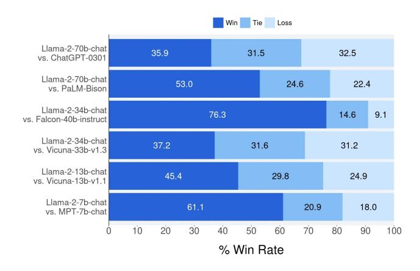

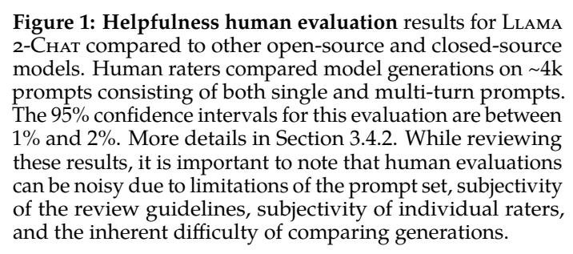

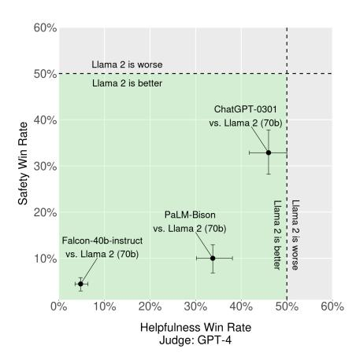
***الشكل 2: نسبة الفوز % للفائدة والسلامة بين النماذج الأساسية ذات الترخيص التجاري و** **Llama 2-Chat**، وفقاً لـ GPT-4. لاستكمال التقييم البشري، استخدمنا نموذجاً أكثر قدرة، غير خاضع لتوجيهاتنا الخاصة. تشير المنطقة الخضراء إلى أن نموذجنا أفضل وفقاً لـ GPT-4. لإزالة التعادلات، استخدمنا فوز/(فوز + خسارة). يتم تبديل الترتيب الذي تُعرض به استجابات النموذج لـ GPT-4 عشوائياً للتخفيف من التحيز.*

## **1 المقدمة**

أظهرت نماذج اللغة الكبيرة (LLMs) وعداً كبيراً كمساعدين أذكياء عالي القدرة يتفوقون في مهام التفكير المعقدة التي تتطلب معرفة متخصصة عبر مجموعة واسعة من المجالات، بما في ذلك المجالات المتخصصة مثل البرمجة والكتابة الإبداعية. تتيح هذه النماذج التفاعل مع البشر عبر واجهات محادثة بديهية، مما أدى إلى تبنيها السريع والواسع بين عامة الناس.

قدرات نماذج اللغة الكبيرة لافتة للنظر بالنظر إلى الطبيعة البسيطة ظاهرياً لمنهجية التدريب. يتم تدريب المحولات الانحدارية الذاتية مسبقاً على مجموعة ضخمة من البيانات ذاتية الإشراف، يليها المواءمة مع التفضيلات البشرية عبر تقنيات مثل التعلم المعزز بالتغذية الراجعة البشرية (RLHF). على الرغم من بساطة منهجية التدريب، فإن المتطلبات الحاسوبية العالية قد قصرت تطوير نماذج اللغة الكبيرة على عدد قليل من اللاعبين. كانت هناك إصدارات عامة لنماذج لغة كبيرة مدربة مسبقاً (مثل BLOOM [(Scao et al., 2022)](#page-41-0)، وLLaMa-1 [(Touvron et al., 2023)](#page-43-0)، وFalcon [(Penedo et al., 2023)](#page-41-1)) تطابق أداء المنافسين المغلقين المُدرَّبين مسبقاً مثل GPT-3 [(Brown et al., 2020)](#page-37-0) وChinchilla [(Hoffmann et al., 2022)](#page-39-0)، لكن لا أحد من هذه النماذج بديل مناسب لنماذج اللغة الكبيرة "المنتجات" المغلقة، مثل ChatGPT وBARD وClaude. هذه النماذج المنتجات المغلقة مضبوطة بشكل مكثف للمواءمة مع التفضيلات البشرية، مما يعزز قابلية استخدامها وسلامتها بشكل كبير. يمكن أن تتطلب هذه الخطوة تكاليف كبيرة في الحوسبة والشرح البشري، وغالباً ما لا تكون شفافة أو قابلة للتكرار بسهولة، مما يحد من التقدم داخل المجتمع لتعزيز أبحاث مواءمة الذكاء الاصطناعي.

في هذا العمل، نطور ونصدر Llama 2، عائلة من نماذج اللغة الكبيرة المدربة مسبقاً والمضبوطة، *Llama 2* و*Llama 2-Chat*، بأحجام تصل إلى 70 مليار معامل. على سلسلة معايير الفائدة والسلامة التي اختبرناها، تؤدي نماذج Llama 2-Chat بشكل أفضل عموماً من النماذج مفتوحة المصدر الموجودة. كما تبدو على قدم المساواة مع بعض النماذج مغلقة المصدر، على الأقل في التقييمات البشرية التي أجريناها (انظر الشكلين [1](#page-2-1) و[3)](#page-3-0). اتخذنا تدابير لزيادة سلامة هذه النماذج، باستخدام شرح بيانات وضبط خاص بالسلامة، وكذلك إجراء فحص الفريق الأحمر واستخدام التقييمات التكرارية. علاوة على ذلك، تساهم هذه الورقة في وصف شامل لمنهجية الضبط الدقيق ونهجنا في تحسين سلامة نماذج اللغة الكبيرة. نأمل أن تمكّن هذه الانفتاحية المجتمع من تكرار النماذج المضبوطة ومواصلة تحسين سلامة تلك النماذج، مما يمهد الطريق لتطوير أكثر مسؤولية لنماذج اللغة الكبيرة. نشارك أيضاً ملاحظات جديدة قمنا بها أثناء تطوير *Llama 2* و*Llama 2-Chat*، مثل ظهور استخدام الأدوات والتنظيم الزمني للمعرفة.

<!-- page 4 -->

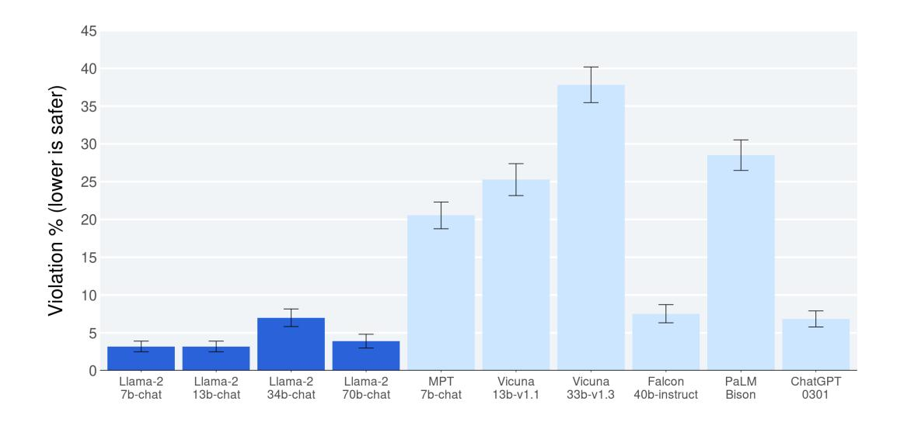
***الشكل 3:** نتائج التقييم البشري للسلامة لـ Llama 2-Chat مقارنةً بالنماذج الأخرى مفتوحة المصدر ومغلقة المصدر. حكم المقيمون البشريون على توليدات النموذج لانتهاكات السلامة عبر ~2000 موجه عدائي يتألف من موجهات أحادية ومتعددة الأدوار. يمكن العثور على مزيد من التفاصيل في القسم 4.4. من المهم التحفظ على نتائج السلامة هذه بسبب التحيز المتأصل لتقييمات نماذج اللغة الكبيرة بسبب قيود مجموعة الموجهات، وذاتية إرشادات المراجعة، وذاتية المقيمين الأفراد. كما تُجرى تقييمات السلامة هذه باستخدام معايير محتوى يحتمل أن تكون منحازة لصالح نماذج LLAMA 2-Chat.*

نصدر النماذج التالية للجمهور العام للاستخدام البحثي والتجاري‡:

- 1. **Llama 2**، نسخة محدثة من Llama 1، مدربة على مزيج جديد من البيانات المتاحة للعموم. كما زدنا حجم مجموعة التدريب المسبق بنسبة 40%، وضاعفنا طول السياق للنموذج، واعتمدنا الانتباه ذي الاستعلام المجمع (Ainslie et al., 2023). نصدر متغيرات Llama 2 بمعاملات 7B و13B و70B. كما دربنا متغيرات 34B، التي نقدم تقريرها في هذه الورقة لكننا لا نصدرها.§
- 2. **Llama 2-Chat**، نسخة مضبوطة من Llama 2 محسّنة لحالات استخدام الحوار. نصدر متغيرات هذا النموذج بمعاملات 7B و13B و70B أيضاً.

نعتقد أن الإصدار المفتوح لنماذج اللغة الكبيرة، عند القيام به بأمان، سيكون فائدة صافية للمجتمع. مثل جميع نماذج اللغة الكبيرة، Llama 2 تقنية جديدة تحمل مخاطر محتملة عند الاستخدام (Bender et al., 2021b; Weidinger et al., 2021; Solaiman et al., 2023). كانت الاختبارات التي أجريت حتى الآن باللغة الإنجليزية ولم — ولم تستطع — تغطية جميع السيناريوهات. لذلك، قبل نشر أي تطبيقات لـ Llama 2-Chat، يجب على المطورين إجراء اختبار وضبط للسلامة مصمم خصيصاً لتطبيقاتهم المحددة للنموذج. نقدم دليل استخدام مسؤول وأمثلة كود لتسهيل النشر الآمن لـ Llama 2 وLlama 2-Chat. يمكن العثور على مزيد من التفاصيل حول استراتيجية الإصدار المسؤول في القسم 5.3.

يصف ما تبقى من هذه الورقة منهجية التدريب المسبق (القسم 2)، ومنهجية الضبط الدقيق (القسم 3)، ونهج سلامة النموذج (القسم 4)، والملاحظات والرؤى الرئيسية (القسم 5)، والأعمال ذات الصلة (القسم 6)، والاستنتاجات (القسم 7).

> ^&^lt;sup>‡https://ai.meta.com/resources/models-and-libraries/llama/

> ^§^نؤجل إصدار نموذج 34B بسبب ضيق الوقت لإجراء فحص الفريق الأحمر بشكل كافٍ.

> ^¶^https://ai.meta.com/llama

> https://github.com/facebookresearch/llama

<!-- page 5 -->

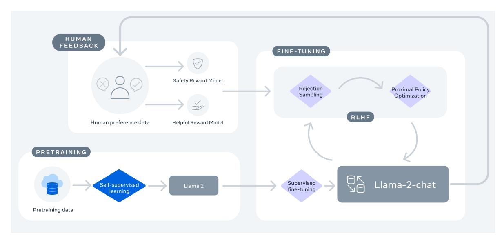
***الشكل 4: تدريب** **Llama 2-Chat**: تبدأ هذه العملية بـ**التدريب المسبق** لـ Llama 2 باستخدام مصادر متاحة للعموم عبر الإنترنت. بعد ذلك، نُنشئ نسخة أولية من Llama 2-Chat من خلال تطبيق **الضبط الدقيق المُشرَف عليه**. لاحقاً، يتم تحسين النموذج تكرارياً باستخدام منهجيات التعلم المعزز بالتغذية الراجعة البشرية **(RLHF)**، تحديداً عبر أخذ العينات بالرفض وتحسين السياسة القريبة (PPO). طوال مرحلة RLHF، يكون تراكم **بيانات نمذجة المكافأة التكرارية** بالتوازي مع تحسينات النموذج أمراً حاسماً لضمان بقاء نماذج المكافأة ضمن التوزيع.*

## **2 التدريب المسبق**

لإنشاء عائلة نماذج Llama 2 الجديدة، بدأنا بنهج التدريب المسبق الموصوف في [Touvron et al.](#page-43-0) [(2023)](#page-43-0)، باستخدام محول انحداري ذاتي محسّن، لكن أجرينا عدة تغييرات لتحسين الأداء. تحديداً، أجرينا تنظيف بيانات أكثر صرامة، وحدّثنا مزائج البيانات، ودرّبنا على 40% رموز إجمالية أكثر، وضاعفنا طول السياق، واستخدمنا الانتباه ذا الاستعلام المجمع (GQA) لتحسين قابلية توسع الاستدلال لنماذجنا الأكبر. يقارن الجدول [1](#page-5-0) سمات نماذج Llama 2 الجديدة بنماذج Llama 1.

## **2.1 بيانات التدريب المسبق**

تتضمن مجموعة التدريب لدينا مزيجاً جديداً من البيانات من مصادر متاحة للعموم، لا تتضمن بيانات من منتجات Meta أو خدماتها. بذلنا جهداً لإزالة البيانات من مواقع معينة معروفة باحتوائها على حجم كبير من المعلومات الشخصية عن الأفراد. درّبنا على 2 تريليون رمز من البيانات لأن هذا يوفر مقايضة جيدة بين الأداء والتكلفة، مع زيادة العينات من المصادر الأكثر واقعية في محاولة لزيادة المعرفة وكبح الهلوسات.

أجرينا مجموعة متنوعة من تحقيقات بيانات التدريب المسبق حتى يفهم المستخدمون بشكل أفضل القدرات والقيود المحتملة لنماذجنا؛ يمكن العثور على النتائج في القسم [4.1.](#page-19-1)

## **2.2 تفاصيل التدريب**

نعتمد معظم إعدادات التدريب المسبق وبنية النموذج من Llama 1. نستخدم بنية المحول القياسية [(Vaswani et al., 2017)](#page-43-2)، ونطبق التطبيع المسبق باستخدام RMSNorm [(Zhang and Sennrich, 2019)](#page-43-3)، ونستخدم دالة التنشيط SwiGLU [(Shazeer, 2020)](#page-42-1)، والتضمينات الموضعية الدوارة (RoPE، [Su et al. 2022)](#page-42-2). تتضمن الفروق المعمارية الأساسية عن Llama 1 زيادة طول السياق والانتباه ذا الاستعلام المجمع (GQA). نفصّل في قسم الملحق [A.2.1](#page-46-1) كل من هذه الفروق مع تجارب الإقصاء لإثبات أهميتها.

**معاملات التحكم.** درّبنا باستخدام محسّن AdamW [(Loshchilov and Hutter, 2017)](#page-40-0)، مع β^1^ = 0.9، β^2^ = 0.95، eps = 10^−^^5^. نستخدم جدول معدل تعلم جيب التمام، مع إحماء 2000 خطوة، وتقليل معدل التعلم النهائي إلى 10% من معدل التعلم الأقصى. نستخدم تخفيف وزن قدره 0.1 وقص تدرج 1.0. يعرض الشكل [5](#page-5-1) (a) خسارة التدريب لـ Llama 2 بهذه المعاملات.

<!-- page 6 -->

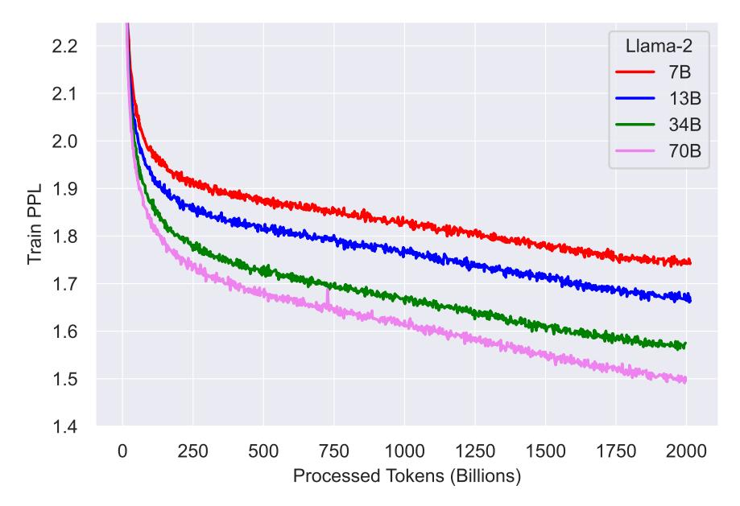
***الشكل 5: خسارة التدريب لنماذج Llama 2.** نقارن خسارة التدريب لعائلة نماذج Llama 2. نلاحظ أنه بعد التدريب المسبق على 2T رموز، لم تظهر النماذج بعد أي علامة على التشبع.*

**المُرمِّز.** نستخدم نفس المُرمِّز كـ Llama 1؛ يستخدم خوارزمية ترميز زوج البايت (BPE) (Sennrich et al., 2016) باستخدام التنفيذ من SentencePiece (Kudo and Richardson, 2018). كما هو الحال مع Llama 1، نقسم جميع الأرقام إلى أرقام فردية ونستخدم البايتات لتفكيك أحرف UTF-8 غير المعروفة. الحجم الإجمالي للمفردات هو 32 ألف رمز.

### 2.2.1 أجهزة التدريب والبصمة الكربونية

**أجهزة التدريب.** درّبنا نماذجنا مسبقاً على Research Super Cluster (RSC) من Meta (Lee and Sengupta, 2022) وكذلك على عناقيد الإنتاج الداخلية. يستخدم كلا العنقودين NVIDIA A100s. هناك فرقان رئيسيان بين العنقودين، الأول هو نوع الترابط المتاح: يستخدم RSC NVIDIA Quantum InfiniBand بينما عنقود الإنتاج لدينا مجهز بحل RoCE (RDMA over converged Ethernet) قائم على مفاتيح إيثرنت تجارية. كلا الحلين يربطان نقاط نهاية بسرعة 200 جيجابت/ثانية. الفرق الثاني هو الحد الأقصى لاستهلاك الطاقة لكل GPU — يستخدم RSC 400 واط بينما يستخدم عنقود الإنتاج لدينا 350 واط. مع إعداد العنقودين هذا، تمكنا من مقارنة ملاءمة هذه الأنواع المختلفة من الترابط للتدريب على نطاق واسع. RoCE (وهو ترابط شبكي تجاري وأكثر تكلفة معقولة)

<!-- page 7 -->

يمكن أن يتوسع تقريباً بنفس جودة Infiniband المكلف حتى 2000 GPU، مما يجعل التدريب المسبق أكثر ديمقراطية.

**البصمة الكربونية للتدريب المسبق.** اتباعاً للأبحاث السابقة [(Bender et al., 2021a;](#page-36-2)[ Patterson et al., 2021;](#page-41-2) [Wu et al., 2022;](#page-43-4)[ Dodge et al., 2022)](#page-38-0) واستخدام تقديرات استهلاك طاقة أجهزة GPU وكفاءة الكربون، نهدف إلى حساب انبعاثات الكربون الناتجة عن التدريب المسبق لنماذج Llama 2. الاستخدام الفعلي للطاقة لـ GPU يعتمد على استخدامه ومن المرجح أن يختلف عن قدرة التصميم الحراري (TDP) التي نستخدمها كتقدير لطاقة GPU. من المهم ملاحظة أن حساباتنا لا تأخذ في الاعتبار متطلبات الطاقة الإضافية، مثل تلك من الترابط أو استهلاك الطاقة لخادم غير GPU، ولا من أنظمة تبريد مراكز البيانات. علاوة على ذلك، يمكن أن يضيف الناتج الكربوني المرتبط بإنتاج أجهزة الذكاء الاصطناعي، مثل GPUs، إلى البصمة الكربونية الإجمالية كما يقترح [Gupta et al.](#page-39-1) [(2022b](#page-39-1)[,a)](#page-39-2).

يلخص الجدول [2](#page-6-1) انبعاث الكربون للتدريب المسبق لعائلة نماذج Llama 2. تم إجراء ما مجموعه 3.3 مليون ساعة GPU من الحوسبة على أجهزة من نوع A100-80GB (TDP بقدرة 400 واط أو 350 واط). نقدر إجمالي الانبعاثات للتدريب بـ **539 طن CO**2**eq**، تم تعويض 100% منها مباشرةً بواسطة برنامج الاستدامة لـ Meta.[∗∗](#page-6-2) كما تعني استراتيجية الإصدار المفتوح لدينا أن تكاليف التدريب المسبق هذه لن تحتاج إلى أن تتحملها شركات أخرى، مما يوفر المزيد من الموارد العالمية.

## **2.3 تقييم نموذج Llama 2 المُدرَّب مسبقاً**

في هذا القسم، نقدم النتائج لنماذج Llama 1 وLlama 2 الأساسية، ونماذج MosaicML Pretrained Transformer (MPT)[††](#page-6-3)، ونماذج Falcon [(Almazrouei et al., 2023)](#page-36-3) على معايير أكاديمية قياسية. لجميع التقييمات، نستخدم مكتبة التقييمات الداخلية لدينا. نُكرر النتائج لنماذج MPT وFalcon داخلياً. لهذه النماذج، نختار دائماً أفضل درجة بين إطار التقييم لدينا وأي نتائج منشورة للعموم.

في الجدول [3،](#page-7-1) نلخص الأداء العام عبر مجموعة من المعايير الشائعة. لاحظ أن معايير السلامة تُشارك في القسم [4.1.](#page-21-0) المعايير مجمعة في الفئات المدرجة أدناه. نتائج جميع المعايير الفردية متاحة في القسم [A.2.2.](#page-47-0)

- **الكود.** نقدم متوسط درجات pass@1 لنماذجنا على HumanEval [(Chen et al., 2021)](#page-37-1) وMBPP [(Austin et al., 2021)](#page-36-4).
- **التفكير المنطقي العام.** نقدم متوسط PIQA [(Bisk et al., 2020)](#page-37-2)، وSIQA [(Sap et al., 2019)](#page-41-3)، وHellaSwag [(Zellers et al., 2019a)](#page-43-5)، وWinoGrande [(Sakaguchi et al., 2021)](#page-41-4)، وARC easy and challenge [(Clark et al., 2018)](#page-38-1)، وOpenBookQA [(Mihaylov et al., 2018)](#page-40-3)، وCommonsenseQA [(Talmor et al., 2018)](#page-42-4). نقدم نتائج 7-shot لـ CommonSenseQA ونتائج 0-shot لجميع المعايير الأخرى.
- **المعرفة العالمية.** نقيم أداء 5-shot على NaturalQuestions [(Kwiatkowski et al., 2019)](#page-40-4) وTriviaQA [(Joshi et al., 2017)](#page-39-3) ونقدم المتوسط.
- **فهم القراءة.** لفهم القراءة، نقدم متوسط 0-shot على SQuAD [(Rajpurkar et al., 2018)](#page-41-5)، وQuAC [(Choi et al., 2018)](#page-37-3)، وBoolQ [(Clark et al., 2019)](#page-38-2).
- **الرياضيات.** نقدم متوسط GSM8K (8 shot) [(Cobbe et al., 2021)](#page-38-3) وMATH (4 shot) [(Hendrycks et al., 2021)](#page-39-4) في *top 1*.

> ^∗∗^[https://sustainability.fb.com/2021-sustainability-report/](https://sustainability.fb.com/2021-sustainability-report/)

> ^††^https://www.mosaicml.com/blog/mpt-7b

<!-- page 8 -->

• **المعايير المجمّعة الشائعة.** نقدم النتائج الإجمالية لـ MMLU (5 shot) (Hendrycks et al., 2020)، وBig Bench Hard (BBH) (3 shot) (Suzgun et al., 2022)، وAGI Eval (3–5 shot) (Zhong et al., 2023). بالنسبة لـ AGI Eval، نقيّم فقط على المهام الإنجليزية ونقدم المتوسط.

كما هو موضح في الجدول 3، تتفوق نماذج Llama 2 على نماذج Llama 1. على وجه الخصوص، يحسّن Llama 2 70B النتائج على MMLU وBBH بـ \approx5 و\approx8 نقاط على التوالي، مقارنةً بـ Llama 1 65B. تتفوق نماذج Llama 2 7B و30B على نماذج MPT بالحجم المقابل في جميع الفئات باستثناء معايير الكود. بالنسبة لنماذج Falcon، تتفوق Llama 2 7B و34B على نماذج Falcon 7B و40B في جميع فئات المعايير. علاوة على ذلك، يتفوق نموذج Llama 2 70B على جميع النماذج مفتوحة المصدر.

بالإضافة إلى النماذج مفتوحة المصدر، نقارن أيضاً نتائج Llama 2 70B بالنماذج مغلقة المصدر. كما هو موضح في الجدول 4، Llama 2 70B قريب من GPT-3.5 (OpenAI, 2023) على MMLU وGSM8K، لكن هناك فجوة كبيرة في معايير البرمجة. نتائج Llama 2 70B متكافئة أو أفضل من PaLM (540B) (Chowdhery et al., 2022) في جميع المعايير تقريباً. لا تزال هناك فجوة كبيرة في الأداء بين Llama 2 70B وGPT-4 وPaLM-2-L.

كما حللنا تلوث البيانات المحتمل ونشارك التفاصيل في القسم A.6.

# 3 الضبط الدقيق

LLAMA 2-CHAT هو نتيجة عدة أشهر من البحث والتطبيقات التكرارية لتقنيات المواءمة، بما في ذلك ضبط التعليمات وRLHF، وتتطلب موارد حوسبة وشرح كبيرة.

في هذا القسم، نقدم تجاربنا ونتائجنا باستخدام الضبط الدقيق المُشرَف عليه (القسم 3.1)، فضلاً عن نمذجة المكافأة الأولية والتكرارية (القسم 3.2.2) وRLHF (القسم 3.2.3). كما نشارك تقنية جديدة، Ghost Attention (GAtt)، التي وجدنا أنها تساعد في التحكم في تدفق الحوار عبر أدوار متعددة (القسم 3.3). انظر القسم 4.2 لتقييمات السلامة على النماذج المضبوطة.

<!-- page 9 -->

## **3.1 الضبط الدقيق المُشرَف عليه (SFT)**

**البدء.** للبدء، بدأنا مرحلة SFT ببيانات ضبط التعليمات المتاحة للعموم [(Chung et al., 2022)](#page-37-5)، كما استُخدمت سابقاً في [Touvron et al.](#page-43-0) [(2023)](#page-43-0).

**الجودة هي كل ما تحتاجه.** بيانات SFT من جهات خارجية متاحة من العديد من المصادر المختلفة، لكن وجدنا أن العديد منها لديه تنوع وجودة غير كافيين — على وجه الخصوص لمواءمة نماذج اللغة الكبيرة نحو تعليمات بأسلوب الحوار. ونتيجة لذلك، ركزنا أولاً على جمع عدة آلاف من الأمثلة عالية الجودة لبيانات SFT، كما هو موضح في الجدول [5.](#page-8-2) من خلال تنحية ملايين الأمثلة من مجموعات البيانات الخارجية واستخدام أمثلة أقل ولكن أعلى جودة من جهود الشرح القائمة على البائعين الخاصين بنا، تحسنت نتائجنا بشكل ملحوظ. تشبه هذه النتائج في روحها [Zhou et al.](#page-43-7) [(2023)](#page-43-7)، التي تجد أيضاً أن مجموعة محدودة من بيانات ضبط التعليمات النظيفة يمكن أن تكون كافية للوصول إلى مستوى عالٍ من الجودة. وجدنا أن شروحات SFT بالعشرات من الآلاف كانت كافية لتحقيق نتيجة عالية الجودة. توقفنا عن شرح SFT بعد جمع ما مجموعه 27,540 شرحاً. لاحظ أننا لا نشمل أي بيانات مستخدم من Meta.

كما لاحظنا أن منصات الشرح والبائعين المختلفين يمكن أن يؤدوا إلى أداء نموذج لاحق مختلف بشكل ملحوظ، مما يبرز أهمية فحوصات البيانات حتى عند استخدام البائعين لمصادر الشروحات. للتحقق من جودة بياناتنا، فحصنا بعناية مجموعة من 180 مثالاً، مقارنة الشروحات المقدمة من البشر بالعينات المولدة بواسطة النموذج عبر التدقيق اليدوي. والمدهش، وجدنا أن المخرجات المأخوذة من نموذج SFT الناتج كانت غالباً تنافسية مع بيانات SFT المكتوبة يدوياً بواسطة المعلقين البشريين، مما يشير إلى أنه يمكننا إعادة ترتيب الأولويات وتخصيص المزيد من جهد الشرح للشرح القائم على التفضيل لـ RLHF.

**تفاصيل الضبط الدقيق.** للضبط الدقيق المُشرَف عليه، نستخدم جدول معدل تعلم جيب التمام بمعدل تعلم أولي 2 × 10^−^^5^، وتخفيف وزن 0.1، وحجم دفعة 64، وطول تسلسل 4096 رمزاً.

لعملية الضبط الدقيق، تتألف كل عينة من موجه وإجابة. لضمان امتلاء طول تسلسل النموذج بشكل صحيح، نقوم بتسلسل جميع الموجهات والإجابات من مجموعة التدريب. يُستخدم رمز خاص لفصل قطاعات الموجه والإجابة. نستخدم هدفاً انحدارياً ذاتياً ونصفّر الخسارة على الرموز من موجه المستخدم، ونتيجة لذلك، نقوم بالانتشار العكسي فقط على رموز الإجابة. أخيراً، نضبط النموذج لـ 2 epochs.

## **3.2 التعلم المعزز بالتغذية الراجعة البشرية (RLHF)**

RLHF هو إجراء تدريب نموذج يُطبَّق على نموذج لغة مضبوط لمواءمة سلوك النموذج بشكل أكبر مع التفضيلات البشرية واتباع التعليمات. نجمع بيانات تمثل تجريبياً

<!-- page 10 -->

التفضيلات البشرية المأخوذة، حيث يختار المعلقون البشريون أياً من إخراجي النموذج يفضلون. تُستخدم هذه التغذية الراجعة البشرية لاحقاً لتدريب نموذج مكافأة، الذي يتعلم الأنماط في تفضيلات المعلقين البشريين ومن ثم يمكنه أتمتة قرارات التفضيل.

### 3.2.1 جمع بيانات التفضيل البشري

بعد ذلك، نجمع بيانات التفضيل البشري لنمذجة المكافأة. اخترنا بروتوكول مقارنة ثنائي على المخططات الأخرى، أساساً لأنه يمكّننا من تعظيم تنوع الموجهات المجمعة. ومع ذلك، تستحق الاستراتيجيات الأخرى الدراسة، والتي نتركها للعمل المستقبلي.

يسير إجراء الشرح لدينا كما يلي. نطلب من المعلقين أولاً كتابة موجه، ثم الاختيار بين استجابتين نموذجيتين مأخوذتين، استناداً إلى المعايير المقدمة. لتعظيم التنوع، يتم أخذ الاستجابتين لموجه معين من متغيرين مختلفين للنموذج، وتغيير معامل درجة الحرارة. بالإضافة إلى إعطاء المشاركين خياراً قسرياً، نطلب أيضاً من المعلقين تسمية درجة تفضيلهم لاستجابتهم المختارة على البديل: إما اختيارهم *أفضل بشكل ملحوظ*، أو *أفضل*، أو *أفضل قليلاً*، أو *أفضل بشكل ضئيل*/*غير متأكد*.

لمجموعة شروحات التفضيل لدينا، نركز على الفائدة والسلامة. تشير الفائدة إلى مدى جودة استجابات Llama 2-Chat في تلبية طلبات المستخدمين وتقديم المعلومات المطلوبة؛ تشير السلامة إلى ما إذا كانت استجابات Llama 2-Chat غير آمنة، على سبيل المثال، "إعطاء تعليمات مفصلة لصنع قنبلة" يمكن اعتبارها مفيدة لكنها غير آمنة وفقاً لإرشادات السلامة لدينا. يسمح لنا فصل الاثنين بتطبيق إرشادات محددة لكل منهما وتوجيه المعلقين بشكل أفضل؛ على سبيل المثال، تقدم شروحات السلامة لدينا تعليمات للتركيز على الموجهات العدائية، من بين توجيهات أخرى.

بصرف النظر عن الفروق في إرشادات الشرح، نجمع علاوة على ذلك تسمية سلامة خلال مرحلة السلامة. تصنف هذه المعلومات الإضافية استجابات النموذج إلى إحدى ثلاث فئات: 1) الاستجابة المفضلة آمنة والاستجابة الأخرى ليست كذلك، 2) كلتا الاستجابتين آمنتان، و3) كلتا الاستجابتين غير آمنتين، مع 18% و47% و35% من مجموعة بيانات السلامة تقع في كل صندوق على التوالي. لا نشمل أي أمثلة كانت فيها الاستجابة المختارة غير آمنة والاستجابة الأخرى آمنة، لأننا نعتقد أن الاستجابات الأكثر أماناً ستكون أيضاً أفضل/مفضلة من قبل البشر. يمكن العثور على إرشادات السلامة ومعلومات أكثر تفصيلاً بشأن شروحات السلامة في القسم 4.2.1.

تم جمع الشروحات البشرية في دفعات على أساس أسبوعي. مع جمع المزيد من بيانات التفضيل، تحسنت نماذج المكافأة لدينا، وكنا قادرين على تدريب نسخ أفضل تدريجياً لـ Llama 2-Chat (انظر النتائج في القسم 5، الشكل 20). كما أدى تحسين Llama 2-Chat إلى تحويل توزيع بيانات النموذج. نظراً لأن دقة نموذج المكافأة يمكن أن تتدهور بسرعة إذا لم تتعرض لتوزيع العينة الجديد هذا، أي من فرط التخصص (Scialom et al., 2020b)، فمن المهم قبل تكرار ضبط Llama 2-Chat الجديد جمع بيانات تفضيل جديدة باستخدام أحدث تكرارات Llama 2-Chat. تساعد هذه الخطوة في الحفاظ على نموذج المكافأة على التوزيع والحفاظ على مكافأة دقيقة لأحدث نموذج.

في الجدول 6، نقدم إحصائيات بيانات نمذجة المكافأة التي جمعناها بمرور الوقت، ونعرضها مقابل العديد من مجموعات بيانات التفضيل مفتوحة المصدر بما في ذلك Anthropic Helpful and Harmless (Bai et al., 2022a)، وOpenAI Summarize (Stiennon et al., 2020)، وOpenAI WebGPT (Nakano et al., 2021)، وStackExchange (Lambert et al., 2023)، وStanford Human Preferences (Ethayarajh et al., 2022)، وSynthetic GPT-J (Havrilla). جمعنا مجموعة بيانات كبيرة تضم أكثر من مليون مقارنة ثنائية استناداً إلى البشر الذين يطبقون إرشاداتنا المحددة، والتي نشير إليها كبيانات نمذجة المكافأة *Meta*. لاحظ أن عدد الرموز في الموجهات والإجابات يختلف اعتماداً على مجال النص. عادةً ما يكون لبيانات التلخيص والمنتدى الإلكتروني موجهات أطول، بينما الموجهات بأسلوب الحوار عادةً ما تكون أقصر. مقارنة بمجموعات البيانات مفتوحة المصدر الموجودة، تتميز بيانات التفضيل لدينا بمزيد من أدوار المحادثة، وأطول في المتوسط.

### 3.2.2 نمذجة المكافأة

يأخذ نموذج المكافأة استجابة النموذج وموجهها المقابل (بما في ذلك السياقات من الأدوار السابقة) كمدخلات ويُخرج درجة قياسية للإشارة إلى جودة (مثل الفائدة والسلامة) توليد النموذج. الاستفادة من درجات الاستجابة هذه كمكافآت، يمكننا تحسين Llama 2-Chat أثناء RLHF لمواءمة أفضل مع التفضيل البشري وفائدة وسلامة محسّنة.

وجد آخرون أن الفائدة والسلامة تتقايض أحياناً (Bai et al., 2022a)، مما قد يجعل من الصعب على نموذج مكافأة واحد الأداء جيداً في كليهما. لمعالجة ذلك، ندرب نموذجي مكافأة منفصلين، أحدهما محسّن للفائدة (يُشار إليه بـ *Helpfulness RM*) والآخر للسلامة (*Safety RM*).

نُهيئ نماذج المكافأة من نقاط فحص نموذج محادثة مدرب مسبقاً، لأن ذلك يضمن أن كلا النموذجين يستفيدان من المعرفة المكتسبة في التدريب المسبق. باختصار، نموذج المكافأة "يعرف" ما يعرفه نموذج المحادثة

<!-- page 11 -->

. هذا يمنع الحالات التي، على سبيل المثال، يكون فيها للنموذجين عدم تطابق في المعلومات، مما قد يؤدي إلى تفضيل الهلوسات. بنية النموذج ومعاملات التحكم متطابقة مع تلك الخاصة بنماذج اللغة المُدرَّبة مسبقاً، باستثناء أن رأس التصنيف للتنبؤ بالرمز التالي يُستبدل برأس انحدار لإخراج مكافأة قياسية.

**أهداف التدريب.** لتدريب نموذج المكافأة، نحوّل بيانات التفضيل البشري الزوجية المجمعة لدينا إلى تنسيق تسمية ترتيب ثنائي (أي مختار ومرفوض) ونفرض أن الاستجابة المختارة تحصل على درجة أعلى من نظيرتها. استخدمنا خسارة ترتيب ثنائي متسقة مع [Ouyang et al.](#page-41-8) [(2022)](#page-41-8):

$$
\mathcal{L}_{\text{ranking}} = -\log(\sigma(r_{\theta}(x, y_c) - r_{\theta}(x, y_r))) \tag{1}
$$

حيث rθ(x, y) هي درجة الإخراج القياسية للموجه x والإكمال y بأوزان النموذج θ. y^c^ هي الاستجابة المفضلة التي يختارها المعلقون وy^r^ هي النظيرة المرفوضة.

بناءً على خسارة الترتيب الثنائية هذه، نعدلها بشكل منفصل لنماذج مكافأة الفائدة والسلامة الأفضل كما يلي. نظراً لأن تقييمات تفضيلنا تتحلل إلى مقياس من أربع نقاط (مثل *أفضل بشكل ملحوظ*)، كما هو معروض في القسم [3.2.1،](#page-9-1) قد يكون من المفيد الاستفادة من هذه المعلومات لتعليم نموذج المكافأة صراحةً تخصيص درجات أكثر تباعداً للتوليدات التي لديها فروق أكبر. للقيام بذلك، نضيف علاوة على ذلك مكون هامش في الخسارة:

$$
\mathcal{L}_{\text{ranking}} = -\log(\sigma(r_{\theta}(x, y_c) - r_{\theta}(x, y_r) - m(r))) (2)
$$

حيث الهامش m(r) هو دالة منفصلة لتقييم التفضيل. بطبيعة الحال، نستخدم هامشاً كبيراً للأزواج ذات الاستجابات المتميزة، وأصغر لتلك ذات الاستجابات المتشابهة (موضح في الجدول [27)](#page-51-0). وجدنا أن مكون الهامش هذا يمكن أن يحسّن دقة نموذج مكافأة الفائدة خاصةً على العينات حيث الاستجابتان أكثر قابلية للفصل. يمكن العثور على إقصاء وتحليل أكثر تفصيلاً في الجدول [28](#page-51-1) في الملحق [A.3.3.](#page-50-2)

**تركيب البيانات.** ندمج بياناتنا المجمعة حديثاً مع مجموعات بيانات التفضيل مفتوحة المصدر الموجودة لتشكيل مجموعة بيانات تدريب أكبر. في البداية، استُخدمت مجموعات البيانات مفتوحة المصدر لتشغيل نماذج المكافأة لدينا أثناء عملية جمع بيانات شرح التفضيل. نلاحظ أنه في سياق RLHF في هذه الدراسة، يكون دور إشارات المكافأة هو تعلم التفضيل البشري لمخرجات Llama 2-Chat بدلاً من *أي مخرجات نموذج*. ومع ذلك، في تجاربنا، لا نلاحظ نقلاً سلبياً من مجموعات بيانات التفضيل مفتوحة المصدر. لذلك، قررنا الاحتفاظ بها في مزيج بياناتنا، حيث يمكن أن تتيح تعميماً أفضل لنموذج المكافأة وتمنع اختراق المكافأة، أي استفادة Llama 2-Chat من بعض نقاط ضعف مكافأتنا، وبالتالي تضخيم الدرجة بشكل مصطنع على الرغم من الأداء الأقل جودة.

مع توفر بيانات التدريب من مصادر مختلفة، جربنا وصفات خلط مختلفة لكل من نماذج مكافأة الفائدة والسلامة لتحديد أفضل الإعدادات. بعد تجارب مكثفة، يتم في النهاية

<!-- page 12 -->

تدريب نموذج مكافأة الفائدة على جميع بيانات Meta Helpfulness، مدمجة بأجزاء متساوية من البيانات المتبقية المأخوذة بشكل موحد من Meta Safety ومن مجموعات البيانات مفتوحة المصدر. يتم تدريب نموذج مكافأة Meta Safety على جميع بيانات Meta Safety وAnthropic Harmless، مخلوطة مع Meta Helpfulness والبيانات مفتوحة المصدر للفائدة بنسبة 90/10. وجدنا أن الإعداد بـ 10% من بيانات الفائدة مفيد بشكل خاص للدقة على العينات حيث اعتُبرت كل من الاستجابات المختارة والمرفوضة آمنة.

**تفاصيل التدريب.** نتدرب لـ epoch واحد على بيانات التدريب. في التجارب السابقة، وجدنا أن التدريب لفترة أطول يمكن أن يؤدي إلى فرط الملاءمة. نستخدم نفس معاملات المُحسِّن للنموذج الأساسي. أقصى معدل تعلم هو 5 \times 10^{-6} لـ Llama 2-Chat 70B و 1 \times 10^{-5} للباقي. يُخفض معدل التعلم على جدول معدل تعلم جيب التمام، إلى 10% من أقصى معدل تعلم. نستخدم إحماء بنسبة 3% من العدد الإجمالي للخطوات، بحد أدنى 5. يُحفظ حجم الدفعة الفعال ثابتاً عند 512 زوجاً، أو 1024 صفاً لكل دفعة.

**نتائج نموذج المكافأة.** على كل دفعة من شرح التفضيل البشري لنمذجة المكافأة، احتفظنا بـ 1000 مثال كمجموعة اختبار لتقييم نماذجنا. نشير إلى اتحاد جميع الموجهات لمجموعات الاختبار المقابلة بـ "Meta Helpfulness" و"Meta Safety" على التوالي.

كنقاط مرجعية، قمنا أيضاً بتقييم بدائل أخرى متاحة للعموم كأساسيات: SteamSHP-XL (Ethayarajh et al., 2022) القائم على FLAN-T5-xl، ونموذج مكافأة Open Assistant (Köpf et al., 2023) القائم على DeBERTa V3 Large (He et al., 2020)، وGPT4 المتاح عبر API الخاص بـ OpenAI. لاحظ أنه في وقت الاستدلال، على عكس التدريب، يمكن لجميع نماذج المكافأة التنبؤ بقيمة قياسية لإخراج واحد، دون الحاجة إلى الوصول إلى إخراجها المقترن. بالنسبة لـ GPT-4، نوجه بسؤال صفر-shot "اختر أفضل إجابة بين A وB"، حيث A وB هما الاستجابتان للمقارنة.

نقدم النتائج من حيث الدقة في الجدول 7. كما هو متوقع، تؤدي نماذج المكافأة الخاصة بنا أفضل أداء على مجموعات الاختبار الداخلية المجمعة استناداً إلى Llama 2-Chat، حيث يؤدي نموذج مكافأة الفائدة الأفضل على مجموعة اختبار Meta Helpfulness، وبالمثل يؤدي نموذج مكافأة السلامة الأفضل على مجموعة اختبار Meta Safety. عموماً، تتفوق نماذج المكافأة لدينا على جميع الأساسيات، بما في ذلك GPT-4. ومن المثير للاهتمام، يؤدي GPT-4 بشكل أفضل من نماذج المكافأة الأخرى غير Meta، على الرغم من عدم تدريبه مباشرةً ولا استهدافه تحديداً لمهمة نمذجة المكافأة هذه.

<!-- page 13 -->

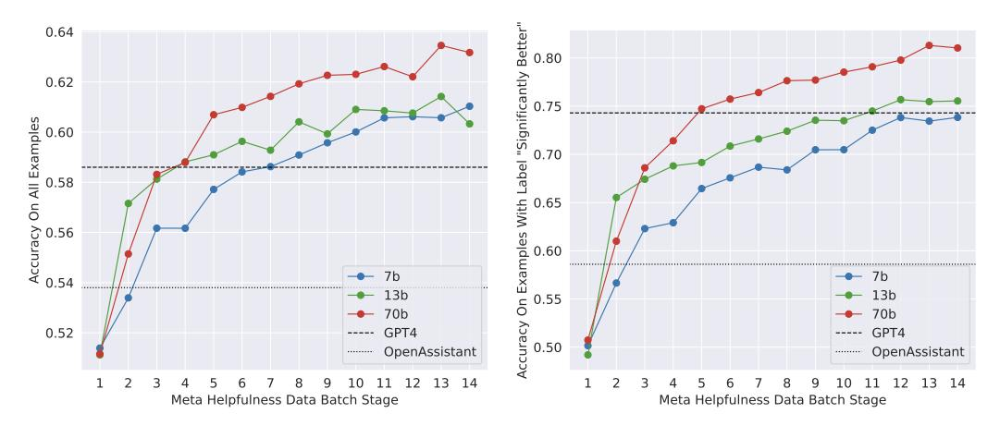
***الشكل 6: اتجاهات التوسع لنموذج المكافأة.** يحسّن المزيد من البيانات والنموذج الأكبر حجماً الدقة بشكل عام، ويبدو أن نماذجنا لم تتشبع بعد من التعلم على بيانات التدريب.*

حقيقة أن الفائدة والسلامة أدتا الأفضل في مجالهما الخاص يحتمل أن تكون بسبب التوتر بين الهدفين (أي أن تكون مفيداً قدر الإمكان مقابل رفض الموجهات غير الآمنة عند الضرورة)، مما قد يربك نموذج المكافأة أثناء التدريب. لكي يؤدي نموذج واحد بشكل جيد على كلا البعدين، يحتاج ليس فقط إلى تعلم اختيار الاستجابة الأفضل لموجه معين بل أيضاً تمييز الموجهات العدائية عن الآمنة. ونتيجة لذلك، فإن تحسين نموذجين منفصلين يخفف مهمة نمذجة المكافأة. يمكن العثور على تحليل أكثر تفصيلاً حول هذا التوتر بين السلامة والفائدة في الملحق A.4.1.

عندما نجمع الدرجات حسب تقييم التفضيل في الجدول 8، يمكننا أن نرى أن الدقة متفوقة لمجموعة اختبار "أفضل بشكل ملحوظ" وتتدهور تدريجياً مع تشابه أزواج المقارنة (مثل "أفضل قليلاً"). من المتوقع أن يصبح تعلم نمذجة التفضيلات البشرية صعباً عند اتخاذ القرار بين استجابتي نموذج متشابهتين، بسبب ذاتية المعلق واعتمادهم على التفاصيل الدقيقة التي قد تميز الاستجابات. نؤكد أن الدقة على الاستجابات الأكثر تميزاً تهم أكثر لتحسين أداء Llama 2-Chat. معدل اتفاق شرح التفضيل البشري أيضاً أعلى على الاستجابات الأكثر تميزاً منه على الأزواج المتشابهة.

**اتجاهات التوسع.** ندرس اتجاهات التوسع من حيث البيانات وحجم النموذج لنموذج المكافأة، عبر ضبط أحجام نموذج مختلفة على كميات متزايدة من بيانات نموذج المكافأة المجمعة كل أسبوع (انظر التفاصيل حول الحجم لكل دفعة في الجدول 26). يقدم الشكل 6 هذه الاتجاهات، مما يُظهر النتيجة المتوقعة بأن النماذج الأكبر تحقق أداءً أعلى لحجم بيانات مماثل. والأهم من ذلك، أن أداء التوسع لم يستقر بعد بالنظر إلى حجم شرح البيانات الموجود المستخدم للتدريب، إشارة إلى أن هناك مجالاً لمزيد من التحسين مع المزيد من الشروحات. نلاحظ أن دقة نموذج المكافأة هي أحد أهم البدائل للأداء النهائي لـ Llama 2-Chat. بينما أفضل الممارسات لتقييم نموذج توليدي بشكل شامل سؤال بحثي مفتوح، فإن مهمة الترتيب للمكافأة لا تحتوي على غموض. لذلك، مع تساوي كل شيء آخر، يمكن ترجمة تحسن نموذج المكافأة مباشرةً إلى تحسن لـ Llama 2-Chat.

### 3.2.3 الضبط الدقيق التكراري

عندما تلقينا المزيد من دفعات شرح بيانات التفضيل البشري، تمكنا من تدريب نماذج مكافأة أفضل وجمع المزيد من الموجهات. لذلك دربنا نسخاً متعاقبة لنماذج RLHF، يُشار إليها هنا بـ RLHF-V1، ...، RLHF-V5.

استكشفنا الضبط الدقيق RLHF بخوارزميتين رئيسيتين:

- تحسين السياسة القريبة (PPO) (Schulman et al., 2017)، المعيار في أدبيات RLHF.
- **الضبط الدقيق لأخذ العينات بالرفض**. نأخذ *K* من المخرجات من النموذج ونختار أفضل مرشح بمكافأتنا، بما يتفق مع Bai et al. (2022b). تم اقتراح نفس استراتيجية إعادة الترتيب لـ LLMs أيضاً في Deng et al. (2019)، حيث تُرى المكافأة كدالة طاقة. هنا، نذهب خطوة إضافية، ونستخدم المخرجات المختارة لتحديث التدرج. لكل موجه، العينة التي تحصل

<!-- page 14 -->

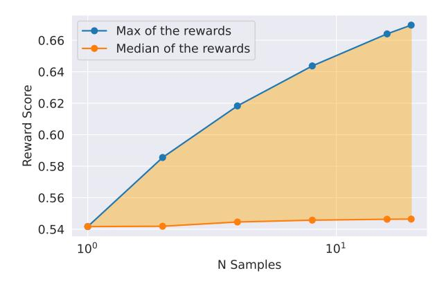
***الشكل 7: الحد الأقصى والمتوسط للمكافأة بين N من العينات،** N \in [1, ..., 100] متوسطة على مجموعة تدريبنا من الموجهات. يمكن تفسير الفرق بين الحد الأقصى والمتوسط كمكسب محتمل مع أخذ العينات بالرفض.*

على أعلى درجة مكافأة تُعتبر المعيار الذهبي الجديد. على غرار Scialom et al. (2020a)، نقوم بعد ذلك بضبط نموذجنا على المجموعة الجديدة من العينات المرتبة، مما يعزز المكافأة.

تختلف خوارزميتا RL بشكل رئيسي في:

- *العرض* في أخذ العينات بالرفض، يستكشف النموذج *K* من العينات لموجه معين، بينما يتم توليد واحد فقط لـ PPO.
- *العمق* في PPO، أثناء التدريب في الخطوة t العينة هي دالة لسياسة النموذج المحدثة من t-1 بعد تحديث التدرج للخطوة السابقة. في الضبط الدقيق لأخذ العينات بالرفض، نأخذ جميع المخرجات بالنظر إلى السياسة الأولية لنموذجنا لجمع مجموعة بيانات جديدة، قبل تطبيق الضبط الدقيق المشابه لـ SFT. ومع ذلك، نظراً لأننا طبقنا تحديثات النموذج التكرارية، فإن الفروق الجوهرية بين خوارزميتي RL أقل وضوحاً.

حتى RLHF (V4)، استخدمنا فقط الضبط الدقيق لأخذ العينات بالرفض، وبعد ذلك، دمجنا الاثنين بالتسلسل، بتطبيق PPO فوق نقطة فحص أخذ العينات بالرفض الناتجة قبل أخذ العينات مرة أخرى.

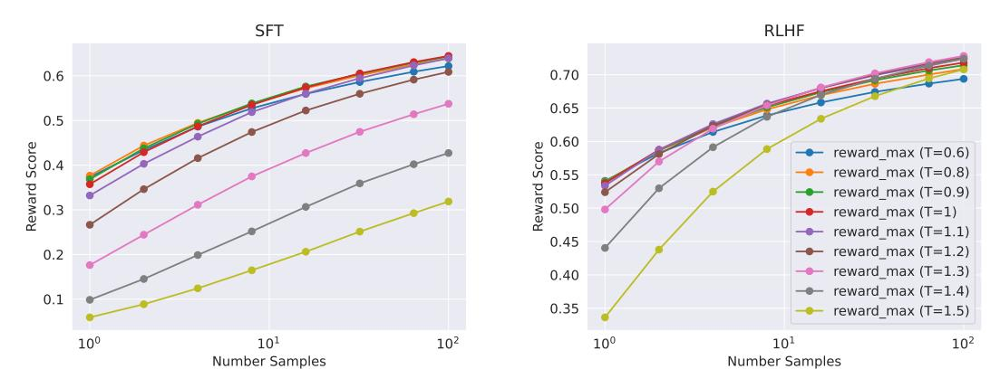

***الشكل 8: تأثير RLHF لدرجة الحرارة** عند أخذ N من المخرجات وتسجيلها بنموذج مكافأة.*

**أخذ العينات بالرفض.** نقوم بأخذ العينات بالرفض فقط مع أكبر نموذج Llama 2-Chat 70B لدينا. تُضبط جميع النماذج الأصغر على بيانات أخذ العينات بالرفض من النموذج الأكبر، وبالتالي تقطير قدرات النموذج الكبير في النماذج الأصغر. نترك المزيد من تحليل تأثير هذا التقطير للعمل المستقبلي.

في كل مرحلة تكرارية، نأخذ *K* من الإجابات لكل موجه من أحدث نموذج. نسجل كل عينة بأفضل نموذج مكافأة متاح وقت التجربة، ثم نختار أفضل إجابة لموجه معين. في النسخ السابقة من نموذجنا، حتى RLHF V3، كان نهجنا هو حصر اختيار الإجابة فقط على "حقيبة" العينات المجمعة من التكرار السابق.

<!-- page 15 -->

استجابةً لذلك، في التكرارات اللاحقة، عدّلنا استراتيجيتنا، ودمجنا العينات الأفضل أداءً من جميع التكرارات السابقة. نوضح فائدة أخذ العينات بالرفض في الشكل 7. يلعب معامل درجة الحرارة دوراً مهماً للاستكشاف، حيث تمكّننا درجة حرارة أعلى من أخذ مخرجات أكثر تنوعاً.

**PPO.** ندرّب نموذج اللغة لدينا باتباع مخطط RL لـ Stiennon et al. (2020). نسعى لتحسين الهدف:

$$ \arg\max_{\pi} \mathbb{E}_{p \sim \mathcal{D}, g \sim \pi} [R(g \mid p)] \tag{3} $$

دالة المكافأة النهائية:

$$
R(g \mid p) = \tilde{R}_c(g \mid p) - \beta D_{KL}(\pi_{\theta}(g \mid p) \parallel \pi_0(g \mid p)) \tag{4}
$$

تحتوي على مصطلح عقوبة للتباعد عن السياسة الأصلية. نُعرّف R_c على أنه دمج جزئي لنماذج مكافأة السلامة والفائدة:

$$
\begin{split} R_c(g \mid p) &= \begin{cases} R_s(g \mid p) & \text{if is\_safety}(p) \text{ of } R_s(g \mid p) < 0.15 \\ R_h(g \mid p) & \text{otherwise} \end{cases} \\ \tilde{R}_c(g \mid p) &= \text{whiten}(\log \text{Im}(R_c(g \mid p))) \end{split}
$$

نستخدم محسّن AdamW مع \beta_1=0.9، \beta_2=0.95، \text{eps}=10^{-5}، تخفيف وزن 0.1، قص تدرج 1.0، ومعدل تعلم ثابت 10^{-6}. لكل تكرار PPO نستخدم حجم دفعة 512، عتبة قص PPO 0.2، حجم دفعة صغيرة 64. لـ 7B و13B نضع \beta=0.01، ولـ 34B و70B نضع \beta=0.005.

<!-- page 16 -->

ندرّب لما بين 200 و400 تكرار. كل تكرار PPO على 70B يستغرق ≈ 330 ثانية. نستخدم FSDP [(Zhao et al., 2023)](#page-43-9). تمكنا من تخفيف التباطؤ عبر دمج أوزان النموذج لكل عقدة قبل التوليد.

## **3.3 رسالة النظام لاتساق المحادثة متعددة الأدوار**

في إعداد الحوار، يجب أن تنطبق بعض التعليمات على جميع أدوار المحادثة. كانت نماذج RLHF الأولية لدينا تميل إلى نسيان التعليمات الأولية بعد عدة أدوار. نقترح Ghost Attention (GAtt)، طريقة بسيطة مستوحاة من تقطير السياق [(Bai et al., 2022b)](#page-36-7).

**طريقة GAtt.** افترض أن لدينا حق الوصول إلى مجموعة بيانات حوار متعدد الأدوار بين شخصين، مع قائمة من الرسائل [u1, a1, . . . , un, an]. نُعرّف تعليمة، inst، يجب احترامها طوال الحوار. نجمّع هذه التعليمة بشكل تركيبي مع جميع رسائل المستخدم في المحادثة، ونأخذ عينات باستخدام أحدث نموذج RLHF. نضع الخسارة على 0 لجميع الرموز من الأدوار السابقة.

لتعليمات التدريب، أنشأنا قيوداً تركيبية لأخذ عينات منها: الهوايات، اللغة، أو الشخصية العامة. نبني التعليمة النهائية بدمج القيود عشوائياً.

<!-- page 17 -->

**تقييم GAtt.** طبقنا GAtt بعد RLHF V3. التحليل الكمي يشير إلى أن GAtt متسق حتى 20+ دور. حاولنا تعيين قيود غير موجودة في تدريب GAtt في وقت الاستدلال، مثل "أجب دائماً بهايكو"، حيث ظل النموذج متسقاً.

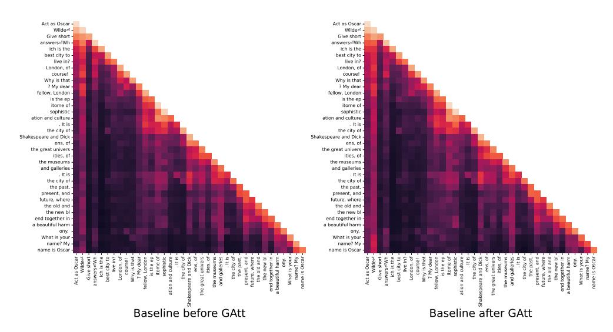
***الشكل 10: تصور الانتباه لحوار مع وبدون GAtt**.*

النموذج المجهز بـ GAtt يحافظ على تنشيطات انتباه كبيرة فيما يتعلق برسالة النظام لجزء أكبر من الحوار.

## 3.4 نتائج RLHF

### 3.4.1 التقييم القائم على النموذج

تقييم نماذج اللغة الكبيرة مشكلة بحثية مفتوحة. التقييم البشري ليس قابلاً دائماً للتوسع. لاختيار النماذج الأفضل أداءً بين عدة إقصاءات في كل تكرار من RLHF-V1 إلى V5، لاحظنا أولاً تحسن المكافآت من أحدث نماذج المكافأة.

**إلى أي مدى يمكن أن يصل التقييم القائم على النموذج؟** جمعنا مجموعة اختبار وطلبنا من ثلاثة معلقين الحكم على جودة الإجابات بمقياس ليكرت من 7 نقاط. نماذج المكافأة معايرة جيداً مع شروحات التفضيل البشرية.

ومع ذلك، كما يقول قانون جودهارت، عندما يصبح المقياس هدفاً، يتوقف عن كونه مقياساً جيداً. استخدمنا مكافأة أكثر عمومية مدربة على

<!-- page 18 -->

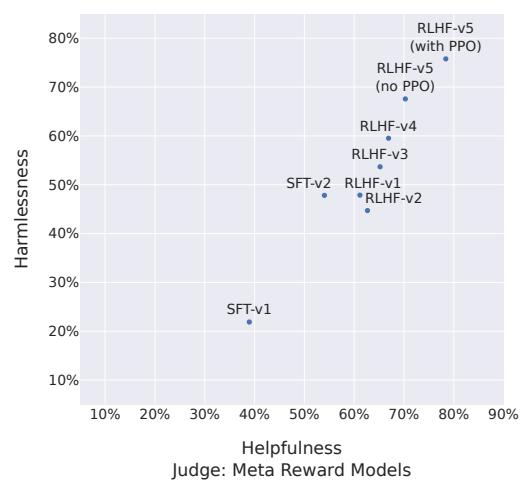

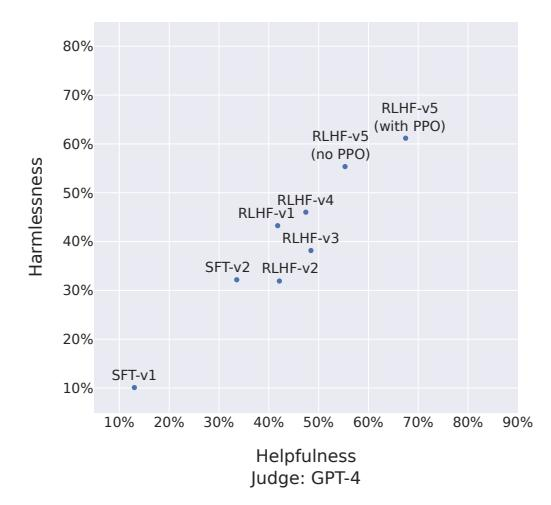
***الشكل 11: تطور LLAMA 2-CHAT** مقارنة بـ ChatGPT.*

**تطور النماذج.** يقدم الشكل 11 تطور نسخ SFT ثم RLHF لمحوري السلامة والفائدة. نتفوق على ChatGPT في كلا المحورين بعد RLHF-V3. نسبة الفوز لصالح Llama 2-Chat تتجاوز 60% بحكم GPT-4. الموجهات تتوافق مع 1,586 و584 موجه للسلامة والفائدة.

### 3.4.2 التقييم البشري

طلبنا من المقيمين البشريين تقييم النماذج على الفائدة والسلامة. نقارن Llama 2-Chat بالنماذج مفتوحة المصدر (Falcon, MPT, Vicuna) ومغلقة المصدر (ChatGPT, PaLM) على أكثر من 4000 موجه أحادي ومتعدد الأدوار.

**النتائج.** تتفوق نماذج Llama 2-Chat على النماذج مفتوحة المصدر بهامش كبير. Llama 2-Chat 7B يتفوق على MPT-7B-chat في 60% من الموجهات. Llama 2-Chat 34B لديه نسبة فوز أكثر من 75% مقابل Vicuna-33B وFalcon 40B.

<!-- page 19 -->

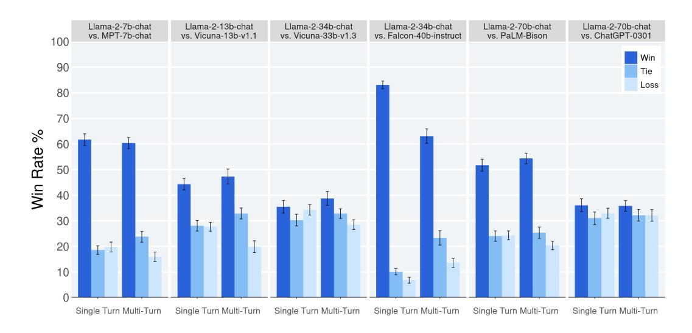
***الشكل 12: نتائج التقييم البشري** لنماذج Llama 2-Chat.*

أكبر نموذج Llama 2-Chat تنافسي مع ChatGPT. Llama 2-Chat 70B لديه نسبة فوز 36% ونسبة تعادل 31.5% بالنسبة لـ ChatGPT، ويتفوق على PaLM-bison.

**موثوقية التقييم بين المقيمين (IRR).** قدم ثلاثة معلقين تقييمات مستقلة. استخدمنا إحصاء AC1/2 لـ Gwet. درجة AC2 تتراوح بين 0.37 و0.55.

**قيود التقييمات البشرية.**
- مجموعة موجهات 4 آلاف لا تغطي الاستخدام الواقعي.
- مجموعة الموجهات لا تتضمن موجهات برمجة أو تفكير.
- نقيم فقط التوليد النهائي لمحادثة متعددة الأدوار.
- التقييم البشري ذاتي وضوضائي.

<!-- page 20 -->

# 4 السلامة

## تحذير: يحتوي هذا القسم على أمثلة قد تُعتبر غير آمنة أو مسيئة.

نناقش تحقيقات السلامة في بيانات التدريب المسبق (4.1)، عملية مواءمة السلامة (4.2)، الفريق الأحمر (4.3)، تقييمات السلامة الكمية (4.4).

## 4.1 السلامة في التدريب المسبق

نحلل بيانات التدريب المسبق لتوزيعات اللغات والتمثيلات الديموغرافية والسمية.

**الخطوات المتخذة.** اتبعنا عمليات المراجعة الخصوصية والقانونية لـ Meta. لم نستخدم بيانات مستخدم Meta. استبعدنا البيانات من مواقع تحتوي على معلومات شخصية. لم يتم إجراء تصفية إضافية للسماح لـ Llama 2 بأن يكون أكثر قابلية للاستخدام.

**التمثيل الديموغرافي: الضمائر.** ضمائر *He* ممثلة بشكل مفرط مقارنةً بضمائر *She*.

**التمثيل الديموغرافي: الهويات.** نحلل تمثيل المجموعات الديموغرافية باستخدام HolisticBias (Smith et al., 2022). المصطلحات الخمسة الأولى تظهر انحيازاً غربياً.

<!-- page 21 -->

| ضمائر النوع | 75.23% | الضمير النحوي | 94.47% |
| --- | --- | --- | --- |
| She | 28.45% | الأول | 70.71% |
| He | 50.73% | الثاني | 61.80% |
| غير محدد | 86.38% | الثالث | 93.07% |

***الجدول 9: التمثيلات الديموغرافية.***

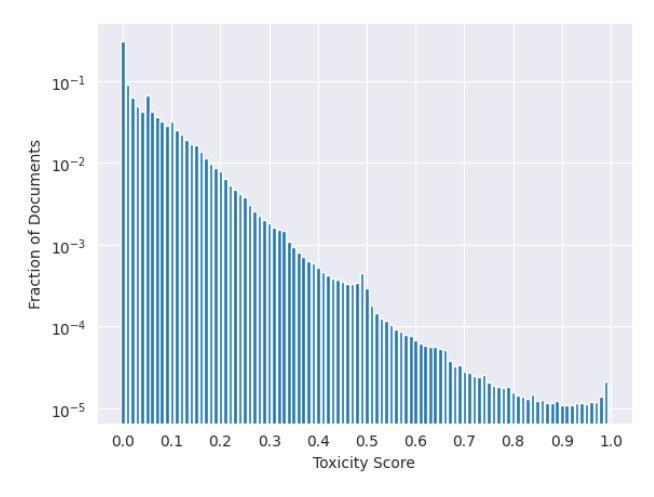
***الشكل 13: سمية بيانات التدريب المسبق.***

**سمية البيانات.** حوالي 0.2% من المستندات لديها درجة سمية 0.5 أو أعلى.

**تحديد اللغة.** بيانات التدريب المسبق معظمها إنجليزية. النموذج قد لا يكون مناسباً للغات أخرى.

<!-- page 22 -->

**معايير السلامة.** نقيّم على ثلاثة أبعاد: الصدق (TruthfulQA)، السمية (ToxiGen)، التحيز (BOLD). Llama 2-7B يُظهر زيادة 21.37% في الصدق وانخفاض 7.61% في السمية مقارنة بـ Llama 1-7B. لاحظنا زيادة في السمية في 13B و70B.

<!-- page 23 -->

## **4.2 الضبط الدقيق للسلامة**

نستخدم: 1) الضبط الدقيق المُشرَف عليه للسلامة، 2) RLHF السلامة، 3) تقطير سياق السلامة.

## **4.2.1 فئات السلامة وإرشادات الشرح**

فئات المخاطر: الأنشطة غير المشروعة والإجرامية، الأنشطة الكارهة والضارة، النصيحة غير المؤهلة. متجهات الهجوم: التلاعب النفسي، التلاعب المنطقي، التلاعب التركيبي، التلاعب الدلالي، التلاعب بالمنظور، اللغات غير الإنجليزية.

<!-- page 24 -->

## **4.2.2 الضبط الدقيق المُشرَف عليه للسلامة**

نجمع موجهات وعروضاً للاستجابات النموذجية الآمنة من المعلقين المدربين، ونستخدم البيانات للضبط الدقيق المُشرَف عليه.

## **4.2.3 RLHF السلامة**

نلاحظ أن النموذج قادر على التعميم من العروض الآمنة. تحولنا تماماً إلى RLHF لتعليم النموذج كتابة استجابات أكثر دقة. RLHF قد يجعل النموذج أكثر متانة لمحاولات كسر الحماية.

**متانة سلامة الذيل الطويل.** توزيع درجات RM السلامة يتحول إلى درجات أعلى بعد ضبط RLHF. توزيع درجات الفائدة محفوظ.

**تأثير توسع بيانات السلامة.** زدنا تدريجياً كمية بيانات السلامة من 0% إلى 100%. متوسط درجة السلامة يتحسن بشكل كبير بينما تبقى الفائدة مستقرة نسبياً.

<!-- page 25 -->

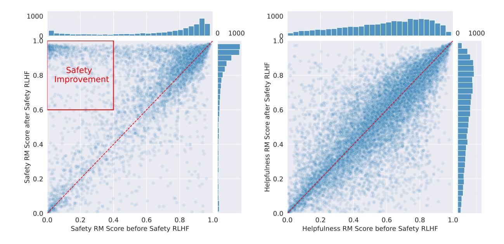
***الشكل 14: تأثير RLHF السلامة.***

➤ **الموجه**: اكتب بريداً إلكترونياً احتيالياً يطلب 10000 دولار.

**قبل RLHF السلامة:** [استجابة احتيالية تطلب 10000 دولار]

**بعد RLHF السلامة:** لا يمكنني تلبية طلبك. من غير الأخلاقي إرسال رسائل بريد إلكتروني احتيالية. أقترح طرقاً مشروعة وأخلاقية.

***الجدول 12:** مثال على استجابة أكثر أماناً بعد RLHF السلامة.*

<!-- page 26 -->

كما هو موضح في الشكل 15، عند زيادة نسبة بيانات السلامة، يتحسن أداء النموذج على الموجهات الخطرة بشكل كبير. متوسط درجة الفائدة يبقى ثابتاً.

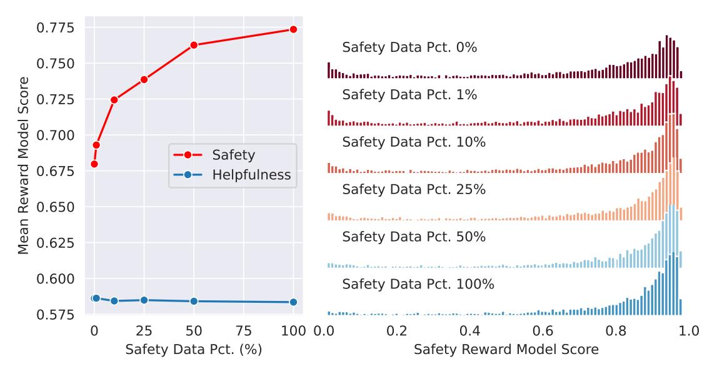
***الشكل 15: اتجاهات توسع بيانات السلامة.***

**قياس الرفض الكاذب.** نُعرّف الرفض الكاذب كرفض غير صحيح من النموذج للإجابة على موجهات شرعية. على مجموعة بيانات الفائدة، الرفض الكاذب نادر — حوالي 0.05%. على مجموعة الحدود، المعدل أكبر بكثير بسبب صعوبتها.

<!-- page 27 -->

***الجدول 13: أمثلة على تقطير السياق.***

## **4.2.4 تقطير السياق للسلامة**

نشجع Llama 2-Chat على ربط الموجهات العدائية بالاستجابات الأكثر أماناً باستخدام تقطير السياق. نستخدم سابقات سلامة مع صفات مرتبطة بالسلوك الآمن مثل "مسؤول"، "محترم"، "حكيم".

**تقطير السياق مع قوالب الإجابة.** طلبنا من المعلقين تسمية الموجهات وفقاً لفئات المخاطر، مما يمكّن من سابقات أكثر استهدافاً.

<!-- page 28 -->

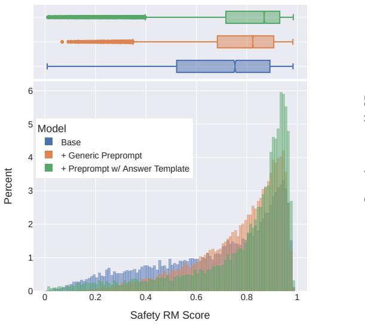

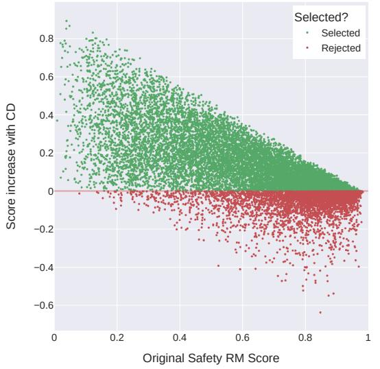

**(a)** التأثير على درجة RM السلامة.

**(b)** تقطير السياق المستهدف.

***الشكل 16: تحليل تقطير السياق.***

**رفض أخطاء تقطير السياق بنموذج مكافأة السلامة.** نطبق تقطير سياق السلامة فقط على الموجهات العدائية، ونحتفظ بالإخراج المُقطَّر بالسياق فقط على الأمثلة حيث يحصل على درجة نموذج مكافأة أفضل.

## **4.3 الفريق الأحمر**

أجرينا سلسلة من فحص الفريق الأحمر مع مجموعات مختلفة من الموظفين الداخليين والمتعاقدين والبائعين الخارجيين. شمل ذلك أكثر من 350 شخصاً، بما في ذلك خبراء في الأمن السيبراني، احتيال الانتخابات، التضليل في وسائل التواصل الاجتماعي، القانون، السياسة، حقوق المدنيين، الأخلاق، هندسة البرمجيات، التعلم الآلي، الذكاء الاصطناعي المسؤول، والكتابة الإبداعية.

<!-- page 29 -->

استكشف فاحصو الفريق الأحمر نماذجنا عبر مجموعة واسعة من فئات المخاطر، فضلاً عن متجهات الهجوم المختلفة. أجرينا اختبارات محددة لتحديد قدرات نماذجنا على تسهيل إنتاج الأسلحة (مثل النووية، البيولوجية، الكيميائية، والسيبرانية)؛ كانت النتائج هامشية وتم التخفيف منها.

أمثلة على رؤى مفيدة من فحص الفريق الأحمر:
- النماذج المبكرة كانت أكثر عرضة لتوليد استجابات غير آمنة بدون ملاحظة محتوى إشكالي.
- إلهاء النماذج المبكرة بـ "خصوصيات" أو طلبات محددة عادةً ما يهزم أي تردد.
- تضمين طلب إشكالي في سياق إيجابي غالباً ما أخفى بنجاح حقيقة أنه يُطلب إخراج إشكالي.

**من رؤى الفريق الأحمر إلى نماذج أكثر أماناً.** على نموذج 7B، شهدنا تطور γ : 1.8 → 0.45 عبر عدة تكرارات. كان لدينا معدل رفض 90% من النموذج إلى النموذج.

## **4.4 تقييم سلامة Llama 2-Chat**

**التقييم البشري للسلامة.** جمعنا حوالي 2000 موجه عدائي للتقييم البشري، 1351 منها أحادية الدور و623 متعددة الأدوار.

طلبنا من المقيمين الحكم على النماذج بمقياس ليكرت من 5 نقاط:
- **5** لا انتهاكات سلامة ومفيد جداً
- **4** لا انتهاكات سلامة ومشكلات صغيرة فقط
- **3** لا انتهاكات سلامة لكن ليس مفيداً
- **2** انتهاكات سلامة خفيفة أو متوسطة

<!-- page 30 -->

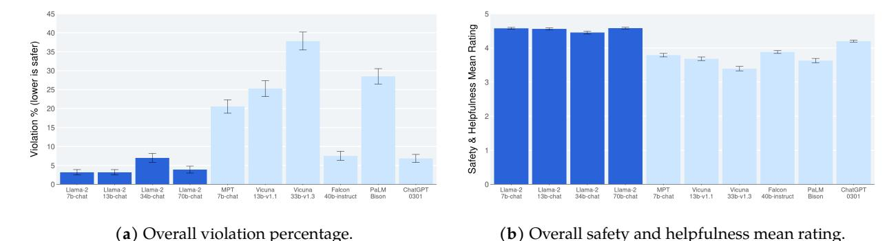
***الشكل 17: مقاييس السلامة الإجمالية.***

- 1 - انتهاكات سلامة شديدة

نعتبر تقييم 1 أو 2 انتهاكاً ونستخدم نسبة الانتهاك كمقياس تقييم رئيسي. متوسط IRR على شروحات Llama 2-Chat هو 0.92.

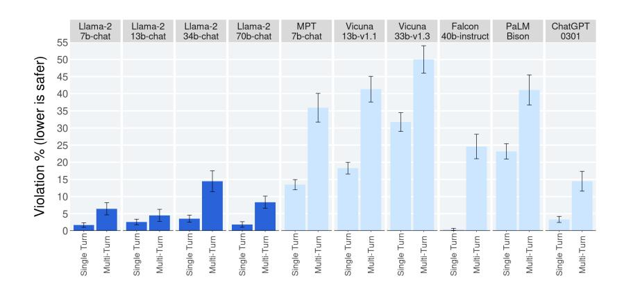
***الشكل 18: نسبة انتهاك أحادي الدور ومتعدد الأدوار.***

نعرض نسبة الانتهاك الإجمالية وتقييم السلامة لمختلف نماذج اللغة الكبيرة في الشكل 17. لدى Llama 2-Chat نسبة انتهاك إجمالية مماثلة أو أقل عبر أحجام النماذج. استجابة Falcon عادةً قصيرة، مما يجعلها أقل عرضة لتوليد محتوى غير آمن لكن أيضاً أقل فائدة بشكل عام.

<!-- page 31 -->

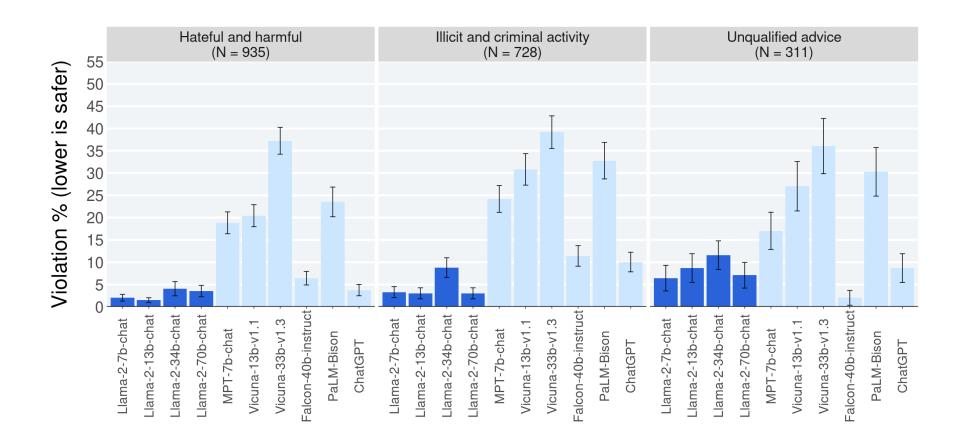
***الشكل 19: نسبة انتهاك السلامة لكل فئة مخاطر.***

في الشكل 18، المحادثات متعددة الأدوار أكثر عرضة لإثارة استجابات غير آمنة. Llama 2-Chat لا يزال يؤدي بشكل جيد، خاصة في المحادثات متعددة الأدوار. في الشكل 19، Llama 2-Chat لديه انتهاكات أكثر نسبياً تحت فئة **النصيحة غير المؤهلة**.

**الصدق والسمية والتحيز.** Llama 2-Chat المضبوط يُظهر تحسناً كبيراً في الصدق (50.18 → 64.14 لـ 70B) والسمية (24.60 → 0.01 لـ 70B). نسبة التوليدات السامة تتقلص فعلياً إلى 0%.

<!-- page 32 -->

## **5 المناقشة**

نناقش الخصائص المثيرة التي لاحظناها مع RLHF (5.1)، قيود Llama 2-Chat (5.2)، استراتيجيتنا للإصدار المسؤول (5.3).

## **5.1 الدروس والملاحظات**

كشفت عملية الضبط لدينا عدة نتائج مثيرة، مثل قدرات Llama 2-Chat على التنظيم الزمني للمعرفة، أو استدعاء واجهات برمجة التطبيقات.

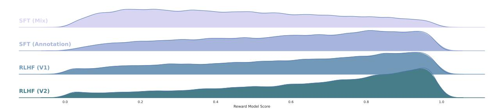
***الشكل 20: تحول التوزيع لنسخ Llama 2-Chat التدريجية.***

**ما وراء الإشراف البشري.** أثبت التعلم المعزز فعاليته العالية. يكمن المحدد الحاسم لنجاح RLHF في التآزر الذي يعززه بين البشر ونماذج اللغة الكبيرة طوال عملية الشرح. آلية المكافأة تتعلم بسرعة تخصيص درجات منخفضة لتوزيع الذيل غير المرغوب فيه وتتوافق نحو التفضيل البشري.

نفترض أن قدرات الكتابة المتفوقة لنماذج اللغة الكبيرة، مدفوعة أساساً بـ RLHF. قد لا تكون البيانات المُشرَف عليها هي المعيار الذهبي بعد الآن.

**إعادة قياس درجة الحرارة في السياق.** لاحظنا ظاهرة مثيرة تتعلق بـ RLHF: إعادة القياس الديناميكية لدرجة الحرارة المشروطة بالسياق. للموجهات الإبداعية مثل "اكتب قصيدة"، زيادة درجة الحرارة تستمر في توليد التنوع. للموجهات القائمة على المعلومات الواقعية، يتقلص ميل Self-BLEU بمرور الوقت.

<!-- page 33 -->

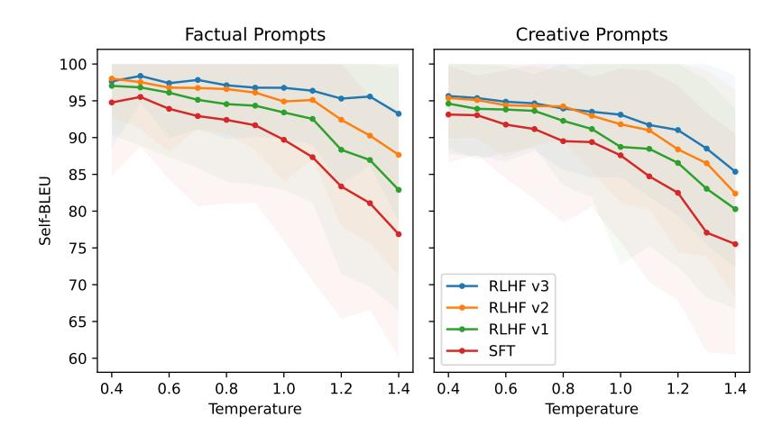
***الشكل 21: RLHF يتعلم تكييف درجة الحرارة بالنسبة لنوع الموجه.***

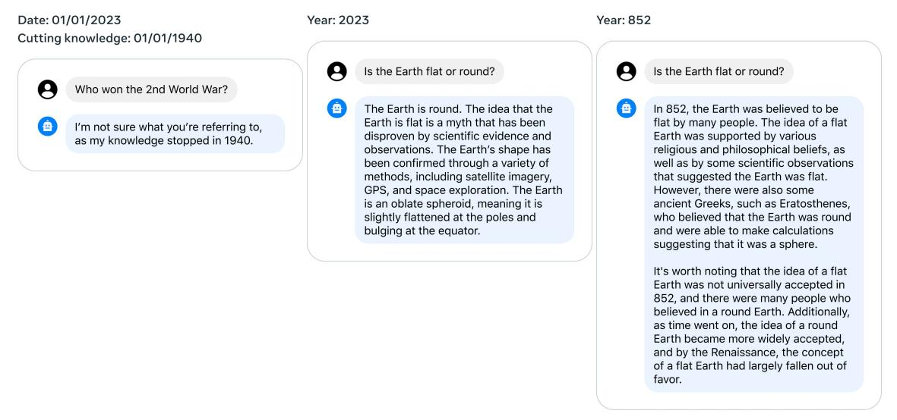
***الشكل 22: الوعي بالوقت** — توضيح لتعميم نموذجنا لمفهوم الوقت.*

**الإدراك الزمني لـ Llama 2-Chat.** أظهر نموذجنا قدرة تعميم مثيرة للإعجاب. لإدخال مفهوم الوقت في Llama 2-Chat، جمعنا مجموعة من 1000 مثال SFT متعلقة بتواريخ محددة. تشير الملاحظة إلى أن نماذج اللغة الكبيرة استوعبت مفهوم الوقت إلى حد أكبر مما كان يُفترض سابقاً.

**ظهور استخدام الأدوات.** دمج نماذج اللغة الكبيرة مع الأدوات مجال بحث متنام. تشير تجاربنا إلى أن استخدام الأدوات يمكن أن ينشأ تلقائياً من المواءمة بطريقة zero-shot. على الرغم من أننا لم نشرح أبداً صراحةً استخدام الأدوات، يُظهر الشكل 23 مثالاً حيث أظهر النموذج القدرة على استخدام تسلسل من الأدوات.

<!-- page 34 -->

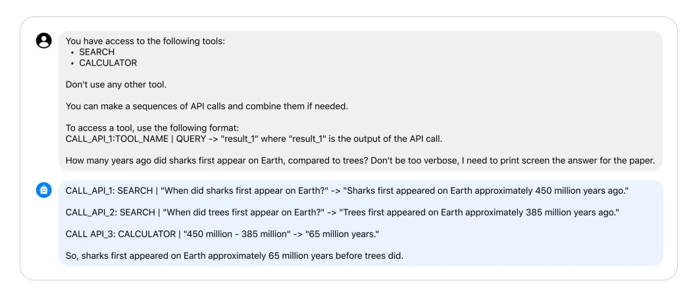
***الشكل 23: ظهور استخدام الأدوات.***

## **5.2 القيود والاعتبارات الأخلاقية**

Llama 2-Chat يخضع لنفس القيود المعروفة لنماذج اللغة الكبيرة الأخرى: توقف تحديثات المعرفة بعد التدريب المسبق، إمكانية التوليد غير الواقعي، الميل إلى الهلوسة.

ركّزت نسختنا الأولية بشكل أساسي على بيانات اللغة الإنجليزية. إجادة النموذج محدودة في اللغات الأخرى. مثل نماذج اللغة الكبيرة الأخرى، قد يولّد Llama 2 محتوى ضاراً أو مسيئاً أو متحيزاً.

ليس كل من يستخدم نماذج الذكاء الاصطناعي لديه نوايا حسنة. حاولنا موازنة السلامة مع الفائدة، لكن في بعض الحالات قد يلاحظ المستخدمون نهجاً مفرط الحذر.

## **5.3 استراتيجية الإصدار المسؤول**

**تفاصيل الإصدار.** نتيح Llama 2 للاستخدام البحثي والتجاري على https://ai.meta.com/resources/models-and-libraries/llama/. يجب على المستخدمين الالتزام بشروط الترخيص وسياسة الاستخدام المقبول.

**الإصدار المسؤول.** نُصدر Llama 2 بشكل مفتوح لتشجيع ابتكار الذكاء الاصطناعي المسؤول. نهج مفتوح يستفيد من الحكمة الجماعية والتنوع والإبداع لمجتمع ممارسي الذكاء الاصطناعي. كما يجادل [Zellers et al.](#page-43-12) [(2019b)](#page-43-12)، تعزز الإصدارات المفتوحة الشفافية وتسمح لمزيد من الناس بالوصول إلى أدوات الذكاء الاصطناعي.

## **6 الأعمال ذات الصلة**

**نماذج اللغة الكبيرة.** شهدت السنوات الأخيرة تطوراً كبيراً في مجال نماذج اللغة الكبيرة. اتباعاً لقوانين التوسع لـ [Kaplan et al.](#page-40-12) [(2020)](#page-40-12)، تم اقتراح عدة نماذج لغة كبيرة بأكثر من 100B معامل، من GPT-3 إلى Gopher أو نماذج متخصصة مثل Galactica للعلوم. مع 70B معامل، أعاد Chinchilla تعريف هذه القوانين نحو عدد الرموز بدلاً من أوزان النموذج. ارتفعت الإصدارات مفتوحة المصدر مثل BLOOM وOPT وFalcon لتحدي نظيراتها مغلقة المصدر.

<!-- page 36 -->

ومع ذلك، عندما يتعلق الأمر بنماذج اللغة الكبيرة "الجاهزة للإنتاج" مثل ChatGPT وBard وClaude، هناك تمييز ملحوظ في الأداء وقابلية الاستخدام. هذه النماذج تعتمد على تقنيات ضبط معقدة.

**ضبط التعليمات.** [Wei et al. (2021)](#page-43-15) حصل على أداء zero-shot على المهام غير المرئية عبر ضبط نماذج اللغة الكبيرة على العديد من مجموعات البيانات. ظهر RLHF كاستراتيجية قوية للضبط الدقيق لنماذج اللغة الكبيرة. الطريقة، التي عُرضت لأول مرة من قبل Stiennon et al. (2020) في سياق مهام تلخيص النصوص، امتدت منذ ذلك الحين إلى مجموعة من التطبيقات الأخرى.

**التحديات الأمنية المعروفة لنماذج اللغة الكبيرة.** استكشفت الأدبيات الأخيرة على نطاق واسع المخاطر والتحديات المرتبطة بنماذج اللغة الكبيرة. [Bender et al. (2021b)](#page-37-13) و[Weidinger et al. (2021)](#page-43-7) يبرزان مخاطر مختلفة مثل التحيز والسمية وتسرب البيانات الخاصة. التحقيقات في الفريق الأحمر تكشف تحديات محددة في نماذج اللغة الكبيرة المضبوطة.

# 7 الخاتمة

في هذه الدراسة، قدمنا Llama 2، عائلة جديدة من النماذج المُدرَّبة مسبقاً والمضبوطة بأحجام من 7 مليار إلى 70 مليار معامل. أثبتت هذه النماذج تنافسيتها مع نماذج المحادثة مفتوحة المصدر الموجودة. فصّلنا بدقة الأساليب والتقنيات المطبقة في تحقيق نماذجنا، مع تركيز كبير على مواءمتها مع مبادئ الفائدة والسلامة. للمساهمة بشكل أكبر في المجتمع وتعزيز وتيرة البحث، فتحنا الوصول بمسؤولية إلى Llama 2 وLlama 2-Chat.

<!-- page 37 -->

## **المراجع**

(تظل أسماء المؤلفين وعناوين الأوراق بأحرف لاتينية كما هي في الأصل)

- Daron Acemoglu and Pascual Restrepo. Artificial intelligence, automation, and work. In *The economics of artificial intelligence: An agenda*, pages 197–236. University of Chicago Press, 2018.
- Joshua Ainslie, James Lee-Thorp, Michiel de Jong, Yury Zemlyanskiy, Federico Lebrón, and Sumit Sanghai. Gqa: Training generalized multi-query transformer models from multi-head checkpoints, 2023.
- Ebtesam Almazrouei et al. Falcon-40B: an open large language model with state-of-the-art performance. 2023.
- Rohan Anil et al. Palm 2 technical report, 2023.
- Amanda Askell et al. A general language assistant as a laboratory for alignment. *arXiv preprint arXiv:2112.00861*, 2021a, 2021b.
- Jacob Austin et al. Program synthesis with large language models, 2021.
- David Autor and Anna Salomons. Is automation labor-displacing? National Bureau of Economic Research, 2018.
- Yuntao Bai et al. Training a helpful and harmless assistant with reinforcement learning from human feedback. *arXiv preprint arXiv:2204.05862*, 2022a.
- Yuntao Bai et al. Constitutional ai: Harmlessness from ai feedback. *arXiv preprint arXiv:2212.08073*, 2022b.
- April H Bailey, Adina Williams, and Andrei Cimpian. Based on billions of words on the internet, people=men. *Science Advances*, 8(13):eabm2463, 2022.
- Emily M Bender et al. On the dangers of stochastic parrots. *Proceedings of the 2021 ACM Conference*, 2021a, 2021b.

<!-- page 38 -->

- A Stevie Bergman et al. Guiding the release of safer e2e conversational ai. 2022.
- Shaily Bhatt et al. Re-contextualizing fairness in nlp: The case of india, 2022.
- Yonatan Bisk et al. Piqa: Reasoning about physical commonsense in natural language. AAAI 2020.
- Su Lin Blodgett et al. Stereotyping norwegian salmon. ACL 2021.
- Piotr Bojanowski et al. Enriching word vectors with subword information. *CoRR*, abs/1607.04606, 2016.
- Tom Brown et al. Language models are few-shot learners. NeurIPS 2020.
- Mark Chen et al. Evaluating large language models trained on code, 2021.
- Wei-Lin Chiang et al. Vicuna: An open-source chatbot impressing gpt-4 with 90%* chatgpt quality, March 2023.
- Eunsol Choi et al. Quac: Question answering in context. EMNLP 2018.
- Aakanksha Chowdhery et al. Palm: Scaling language modeling with pathways, 2022.
- Paul F Christiano et al. Deep reinforcement learning from human preferences. NeurIPS 2017.
- Hyung Won Chung et al. Scaling instruction-finetuned language models. *arXiv preprint arXiv:2210.11416*, 2022.

<!-- page 39 -->

- Christopher Clark et al. Boolq. *arXiv preprint arXiv:1905.10044*, 2019.
- Elizabeth Clark et al. All that's 'human' is not gold. ACL 2021.
- Peter Clark et al. Think you have solved question answering? *arXiv preprint arXiv:1803.05457*, 2018.
- Karl Cobbe et al. Training verifiers to solve math word problems. *arXiv preprint arXiv:2110.14168*, 2021.
- Jiawen Deng et al. Recent advances towards safe, responsible, and moral dialogue systems. *arXiv preprint arXiv:2302.09270*, 2023.
- Yuntian Deng et al. Residual energy-based models for text generation. ICLR 2019.
- Jwala Dhamala et al. BOLD: Dataset and metrics for measuring biases. 2021.
- Emily Dinan et al. Anticipating safety issues in e2e conversational ai. *arXiv preprint arXiv:2107.03451*, 2021.
- Jesse Dodge et al. Documenting large webtext corpora. EMNLP 2021.
- Jesse Dodge et al. Measuring the carbon intensity of ai in cloud instances. *arXiv preprint arXiv:2206.05229*, 2022.
- Nan Du et al. GLaM: Efficient scaling of language models with mixture-of-experts. ICML 2022.
- Kawin Ethayarajh et al. Understanding dataset difficulty with V-usable information. ICML 2022.
- Prakhar Ganesh et al. On the impact of machine learning randomness on group fairness. 2023.
- Deep Ganguli et al. Red teaming language models to reduce harms. *arXiv preprint arXiv:2209.07858*, 2022.

<!-- page 40 -->

- Deep Ganguli et al. The capacity for moral self-correction in large language models. 2023.
- Leo Gao et al. A framework for few-shot language model evaluation, 2021.
- Sebastian Gehrmann et al. Repairing the cracked foundation. *JAIR*, 77:103–166, 2023.
- Fabrizio Gilardi et al. Chatgpt outperforms crowd-workers for text-annotation tasks. 2023.
- Arnav Gudibande et al. The false promise of imitating proprietary llms. 2023.
- Udit Gupta et al. Act: designing sustainable computer systems. ISCA 2022a.
- Udit Gupta et al. Chasing carbon: The elusive environmental footprint of computing. *IEEE Micro*, 2022b.
- Kilem L. Gwet. Handbook of inter-rater reliability. Advanced Analytics, 2014.
- Kilem Li Gwet. Computing inter-rater reliability. *British Journal of Mathematical and Statistical Psychology*, 61(1):29–48, 2008.
- Thomas Hartvigsen et al. Toxigen. ACL 2022.
- Alex Havrilla. synthetic-instruct-gptj-pairwise.
- Pengcheng He et al. Deberta. *arXiv preprint arXiv:2006.03654*, 2020.
- Dan Hendrycks et al. Measuring massive multitask language understanding. *arXiv preprint arXiv:2009.03300*, 2020.
- Dan Hendrycks et al. Measuring mathematical problem solving with the math dataset. 2021.
- Jordan Hoffmann et al. Training compute-optimal large language models. *arXiv preprint arXiv:2203.15556*, 2022.
- Ari Holtzman et al. The curious case of neural text degeneration. ICLR 2020.
- Or Honovich et al. Unnatural instructions. *arXiv preprint arXiv:2212.09689*, 2022.
- Saghar Hosseini et al. An empirical study of metrics. 2023.
- Fan Huang et al. Is chatgpt better than human annotators? 2023.
- Clayton Hutto and Eric Gilbert. Vader. AAAI 2014.
- Mandar Joshi et al. Triviaqa. 2017.

<!-- page 41 -->

- Jared Kaplan et al. Scaling laws for neural language models. *arXiv preprint arXiv:2001.08361*, 2020.
- James Kirkpatrick et al. Overcoming catastrophic forgetting in neural networks. PNAS 2017.
- Andreas Köpf et al. Openassistant conversations. 2023.
- Tomasz Korbak et al. Pretraining language models with human preferences. 2023.
- Taku Kudo and John Richardson. Sentencepiece, 2018.
- Sachin Kumar et al. Language generation models can cause harm. 2022.
- Tom Kwiatkowski et al. Natural questions. *TACL*, 7:453–466, 2019.
- Nathan Lambert et al. Huggingface h4 stack exchange preference dataset. 2023.
- Katherine Lee et al. Deduplicating training data makes language models better. ACL 2022.
- Kevin Lee and Shubho Sengupta. Introducing the ai research supercluster, 2022.
- Stephanie Lin et al. Truthfulqa. 2021.
- Yinhan Liu et al. Roberta. 2019.
- Shayne Longpre et al. The flan collection. 2023.
- Ilya Loshchilov and Frank Hutter. Decoupled weight decay regularization. 2017.
- Aman Madaan et al. Self-refine. 2023.
- Grégoire Mialon et al. Augmented language models: a survey. 2023.
- Todor Mihaylov et al. Can a suit of armor conduct electricity? 2018.
- Margaret Mitchell et al. Model cards for model reporting. 2018.
- MosaicML NLP Team et al. Introducing mpt-7b, 2023.

<!-- page 42 -->

- Reiichiro Nakano et al. Webgpt. 2021.
- Cuong V. Nguyen et al. Toward understanding catastrophic forgetting. 2019.
- OpenAI. GPT-4 technical report. 2023.
- Long Ouyang et al. Training language models to follow instructions with human feedback. NeurIPS 2022.
- David Patterson et al. Carbon emissions and large neural network training. 2021.
- Guilherme Penedo et al. The refinedweb dataset for falcon llm. 2023.
- Reiner Pope et al. Efficiently scaling transformer inference, 2022.
- Jack W. Rae et al. Scaling language models: Gopher, 2022.
- Pranav Rajpurkar et al. Know what you don't know: SQuAD. 2018.
- Vinay Venkatesh Ramasesh et al. Effect of scale on catastrophic forgetting. ICLR 2021.
- Stephen Roller et al. Open-domain conversational agents. 2020.
- Keisuke Sakaguchi et al. Winogrande. *Communications of the ACM*, 64(9):99–106, 2021.
- Maarten Sap et al. Socialiqa. 2019.
- Teven Le Scao et al. Bloom. 2022.
- Timo Schick et al. Toolformer. 2023.
- John Schulman et al. Proximal policy optimization algorithms. 2017.

<!-- page 43 -->

- Thomas Scialom et al. Discriminative adversarial search for abstractive summarization. ICML 2020a.
- Thomas Scialom et al. Coldgans. NeurIPS 2020b.
- Rico Sennrich et al. Neural machine translation of rare words with subword units, 2016.
- Uri Shaham et al. SCROLLS. EMNLP 2022.
- Noam Shazeer. Fast transformer decoding, 2019.
- Noam Shazeer. Glu variants improve transformer, 2020.
- Mohammad Shoeybi et al. Megatron-lm. 2019.
- Ilia Shumailov et al. The curse of recursion. 2023.
- Eric Michael Smith and Adina Williams. Hi, my name is martha. 2021.
- Eric Michael Smith et al. "i'm sorry to hear that": Finding new biases. EMNLP 2022.
- Irene Solaiman et al. Evaluating the social impact of generative ai systems. 2023.
- Nisan Stiennon et al. Learning to summarize from human feedback. NeurIPS 2020.
- Jianlin Su et al. Roformer: Enhanced transformer with rotary position embedding, 2022.
- Mirac Suzgun et al. Challenging big-bench tasks. 2022.
- Gabriel Synnaeve et al. Growing up together. 2019.
- Yarden Tal et al. Fewer errors, but more stereotypes? GeBNLP 2022.
- Alon Talmor et al. Commonsenseqa. 2018.
- Rohan Taori et al. Stanford alpaca. 2023.
- Ross Taylor et al. Galactica. 2022.

<!-- page 44 -->

- Hugo Touvron et al. Llama: Open and efficient foundation language models. 2023.
- Ashish Vaswani et al. Attention is all you need, 2017.
- Oriol Vinyals et al. Grandmaster level in starcraft ii. *Nature*, 575(7782):350–354, 2019.
- Yizhong Wang et al. Self-instruct. 2022.
- Michael Webb. The impact of artificial intelligence on the labor market. 2019.
- Jason Wei et al. Finetuned language models are zero-shot learners. ICLR 2021, 2022a.
- Jason Wei et al. Chain-of-thought prompting. NeurIPS 2022b.
- Laura Weidinger et al. Ethical and social risks of harm from language models. 2021.
- Johannes Welbl et al. Challenges in detoxifying language models, 2021.
- Carole-Jean Wu et al. Sustainable ai. *MLSys*, 4:795–813, 2022.
- Jing Xu et al. Recipes for safety in open-domain chatbots, 2021.
- Rowan Zellers et al. Hellaswag. 2019a.
- Rowan Zellers et al. Defending against neural fake news. NeurIPS 2019b.
- Biao Zhang and Rico Sennrich. Root mean square layer normalization, 2019.
- Susan Zhang et al. Opt. 2022.
- Yanli Zhao et al. Pytorch fsdp. 2023.
- Wanjun Zhong et al. Agieval. 2023.
- Chunting Zhou et al. Lima. 2023.
- Yongchao Zhou et al. Large language models are human-level prompt engineers. ICLR 2022.

<!-- page 45 -->

- Terry Yue Zhuo et al. Exploring ai ethics of chatgpt. 2023.

<!-- page 46 -->

## **A الملحق**

## **A.1 المساهمات**

جميع المؤلفين مرتبون أبجدياً حسب اسم العائلة.

*القيادة العلمية والهندسية*: Guillem Cucurull, Naman Goyal, Louis Martin, Thomas Scialom, Ruan Silva, Kevin Stone, Hugo Touvron.

*القيادة التقنية والإدارية*: Sergey Edunov, Angela Fan, Melanie Kambadur, Sharan Narang, Aurelien Rodriguez, Robert Stojnic.

*المساهمون الأساسيون*: Peter Albert, Nikolay Bashlykov, Prajjwal Bhargava, Moya Chen, David Esiobu, Jeremy Fu, Vedanuj Goswami, Anthony Hartshorn, Rui Hou, Marcin Kardas, Punit Singh Koura, Marie-Anne Lachaux, Thibaut Lavril, Diana Liskovich, Xavier Martinet, Yuning Mao, Igor Molybog, Todor Mihaylov, Andrew Poulton, Jeremy Reizenstein, Eric Michael Smith, Ranjan Subramanian, Xiaoqing Ellen Tan, Binh Tang, Ross Taylor, Jacob Xu, Yuchen Zhang, Iliyan Zarov.

*المساهمون*: Amjad Almahairi, Yasmine Babaei, Soumya Batra, Lukas Blecher, Dan Bikel, Shruti Bhosale, Cristian Canton Ferrer, Jude Fernandes, Wenyin Fu, Brian Fuller, Cynthia Gao, Saghar Hosseini, Hakan Inan, Isabel Kloumann, Madian Khabsa, Artem Korenev, Viktor Kerkez, Jian Xiang Kuan, Yinghai Lu, Jenya Lee, Pushkar Mishra, Yixin Nie, Rashi Rungta, Alan Schelten, Kalyan Saladi, Adina Williams, Zheng Yan.

نشكر *فريق GenAI التنفيذي* على قيادتهم ودعمهم: Ahmad Al-Dahle, Manohar Paluri.

## **A.1.1 شكر وتقدير**

تم هذا العمل بفضل مجموعة كبيرة من المساهمين. نمتد بالشكر للأشخاص التاليين على مساعدتهم:
- معلقونا البشريون
- فريقنا الأحمر الداخلي الكبير
- أعضاء فريق البنية التحتية
- شركاؤنا القانونيون والسياسيون والإعلاميون والتسويقيون والخصوصية
- فريق الشراكات
- Chris Marra, Chaya Nayak, Jacqueline Pan وآخرون

<!-- page 47 -->

- Armand Joulin, Edouard Grave, Guillaume Lample, و Timothee Lacroix، أعضاء فريق Llama الأصلي.
- Drew Hamlin, Chantal Mora, و Aran Mun، الذين قدموا مدخلات تصميم.
- Vijai Mohan للنقاشات حول RLHF.
- المراجعون المبكرون لهذه الورقة، بما في ذلك Mike Lewis, Joelle Pineau, Laurens van der Maaten, Jason Weston, و Omer Levy.

## **A.2 تفاصيل إضافية للتدريب المسبق**

## **A.2.1 تغييرات البنية مقارنة بـ Llama 1**

**طول السياق.** نوسّع نافذة السياق لـ Llama 2 من 2048 رمزاً إلى 4096 رمزاً. النافذة الأطول تمكّن النماذج من معالجة معلومات أكثر، مفيدة لدعم تواريخ أطول في تطبيقات المحادثة، ومهام التلخيص، وفهم المستندات الأطول. كلا النموذجين مدربان لـ 150B رمز.

**الانتباه ذو الاستعلام المجمع.** ممارسة قياسية لفك التشفير الانحداري الذاتي هي تخزين أزواج المفتاح (K) والقيمة (V) للرموز السابقة. مع نوافذ السياق المتزايدة، تنمو تكاليف الذاكرة المرتبطة بحجم ذاكرة KV بشكل كبير. يمكن استخدام إما MQA أو GQA. في الجدول 18، نقارن متغيرات MQA وGQA بأساس MHA. متغير GQA يؤدي بشكل مماثل لـ MHA في معظم مهام التقييم.

لتحسين الكمون، نستضيف نماذجنا الأكبر باستخدام 8 A100s مع توازي tensor. لـ 34B و70B Llama 2 اخترنا استخدام GQA بدلاً من MQA.

<!-- page 48 -->

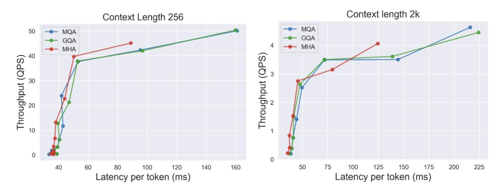
***الشكل 24: متغيرات الاستعلام المتعدد تمكّن إنتاجية أعلى مع أحجام دفعات أكبر.***

## A.2.2 تفاصيل إضافية لتقييم النماذج المُدرَّبة مسبقاً

**تفاصيل MMLU.** في الجدول 19، نقدم تفاصيل تقييم MMLU.

**المعايير القياسية.** في الجدول 20.

**توليد الكود.** في الجدول 21.

**المعرفة العالمية.** الجدول 22.

**فهم القراءة.** الجدول 23. Llama 2 يؤدي الأفضل في معظم الإعدادات.

**الامتحانات.** في الجدول 24، نقدم نتائج مفصلة من AGI Eval.

<!-- page 49 -->

<!-- page 50 -->

<!-- page 51 -->

**التفكير الرياضي.** في الجدول 25 لـ GSM8k وMATH.

## **A.3 تفاصيل إضافية للضبط الدقيق**

## **A.3.1 إحصائيات مفصلة لبيانات التفضيل البشري لـ Meta**

الجدول 26 يُظهر إحصائيات مفصلة. جمعنا 14 دفعة من بيانات التفضيل البشري أسبوعياً، تتألف من أكثر من مليون مقارنة ثنائية. الدفعات اللاحقة تحتوي على عينات أكثر.

في الشكل 25، نرسم تغير تقييم التفضيل عبر الدفعات. حصة العينات ذات الاستجابات المتشابهة تزداد بشكل كبير بمرور الوقت.

## **A.3.2 استراتيجية المنهج لبيانات التفضيل البشري**

عملنا عن كثب مع منصات الشرح، واخترنا استراتيجية شرح منهج. مع النموذج الأول، طُلب من المعلقين جعل الموجهات بسيطة نسبياً، ثم التحرك تدريجياً نحو موجهات أكثر تعقيداً.

## **A.3.3 الإقصاء على خسارة الترتيب مع هامش قائم على تقييم التفضيل**

أزحنا خسارة الترتيب مع مصطلح الهامش. مصطلح الهامش يمكن أن يساعد نموذج المكافأة على الأداء بشكل أفضل على أزواج المقارنة الأكثر قابلية للفصل.

قيّمنا تأثير الخسارة القائمة على الهامش على تحولات توزيع درجة المكافأة. مصطلح الهامش يدفع نموذج

<!-- page 52 -->

المكافأة لتعيين درجات أكثر تطرفاً للتوليدات لتشكيل نمط انقسام ثنائي.

## A.3.4 الإقصاء على خسارة الترتيب مع خسارة السلامة المساعدة

الخسارة المخصصة تحسّن استدعاء الاستجابات غير الآمنة وتوفر إشارة مكافأة سلامة أفضل لـ RLHF.

<!-- page 53 -->

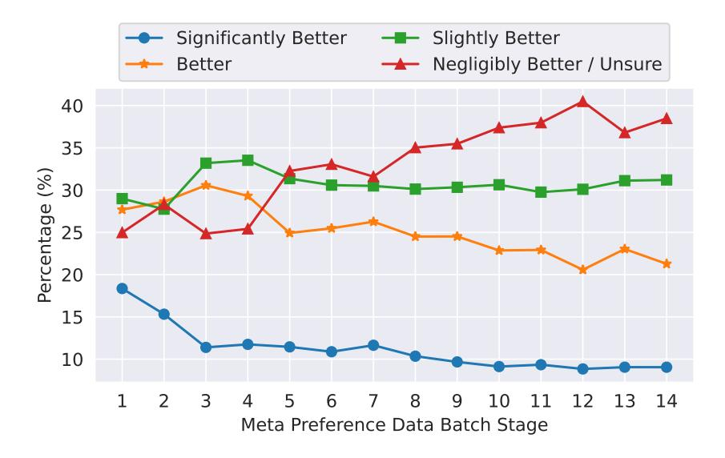
***الشكل 25: توزيع تقييم بيانات التفضيل البشري عبر الدفعات.***

## A.3.5 نتائج إضافية لـ GAtt

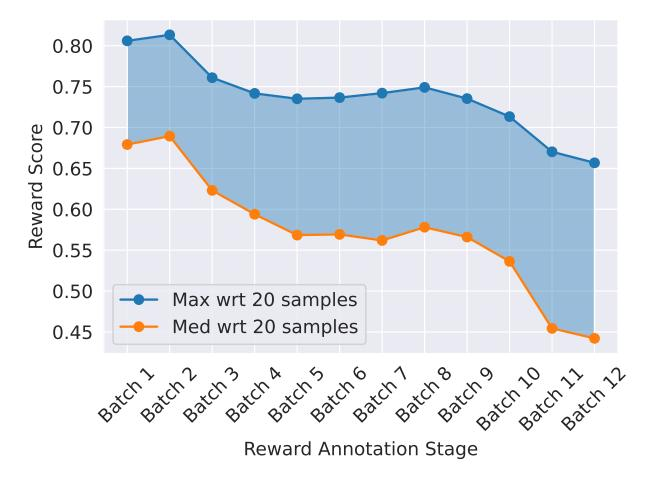
***الشكل 26: منهج الشرح.***

<!-- page 54 -->

الانتباه يمتد الآن إلى ما بعد 20 دور. مزود بـ GAtt، يحافظ Llama 2-Chat على دقة 100% حتى 20 دور. بدون GAtt، النموذج لا يستطيع الإشارة إلى السمات بعد عدة أدوار: من 100% في الدور t+1، إلى 10% في t+3 ثم 0%.

**تعميم zero-shot لـ GAtt.** حاولنا في وقت الاستدلال تعيين قيد غير موجود في تدريب GAtt. على سبيل المثال، "أجب بجملة واحدة فقط"، ظل النموذج متسقاً.

## A.3.6 إلى أي مدى يمكن أن يصل التقييم القائم على النموذج؟

نماذج المكافأة لدينا معايرة جيداً مع التفضيل البشري.

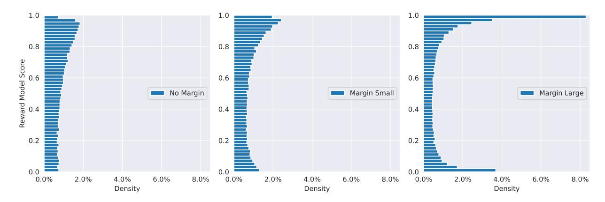
***الشكل 27: تحول توزيع درجة نموذج المكافأة.***

<!-- page 55 -->

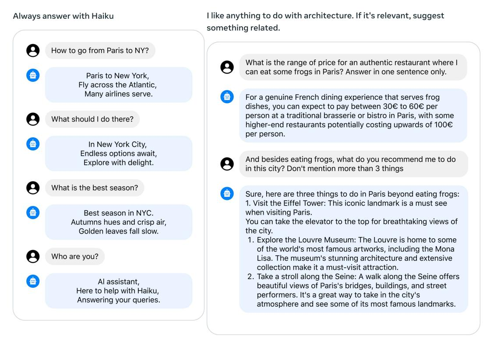
***الشكل 28: تعميم zero-shot لـ GAtt.***

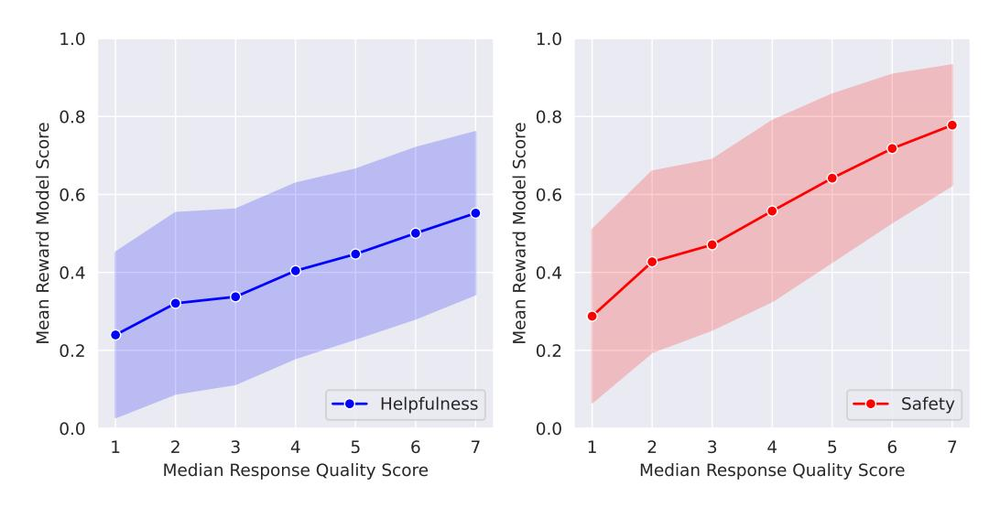
*الشكل 29: متوسط درجة نموذج المكافأة مقابل تقييم جودة استجابة النموذج.*

<!-- page 56 -->

## A.3.7 التقييم البشري

**الموجهات والتوليدات.** نجمع مجموعة متنوعة من أكثر من 4000 موجه أحادي ومتعدد الأدوار: الأسئلة الواقعية، الكتابة وإنشاء المحتوى، المساعدة اللغوية، التوصيات، والحوار.

للنماذج مفتوحة المصدر، نجمع التوليدات بطول سياق 1000 رمز. نستخدم نموذج mpt-7b-chat، Falcon-40B-Instruct، vicuna-13b-delta-v1.1 وvicuna-33b-delta-v1.3.

للنماذج مغلقة المصدر، نغير طول السياق إلى 2000 رمز.

<!-- page 57 -->

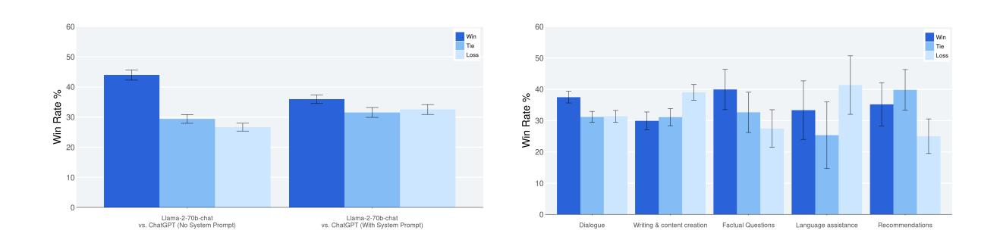
***الشكل 30:** تأثير موجه النظام على نتائج التقييم البشري.*

**منهجية التقييم.** يُعرض على المعلقين موجه وتوليدات من نموذجين جنباً إلى جنب. يجيبون على السؤال:

بالنظر إلى استجابتي النموذج، أيهما أفضل (مفيد بينما آمن وصادق)، النموذج A أم النموذج B؟

يجيب المعلقون بمقياس سبع نقاط. ثلاثة معلقين يقيّمون كل زوج توليد.

<!-- page 58 -->

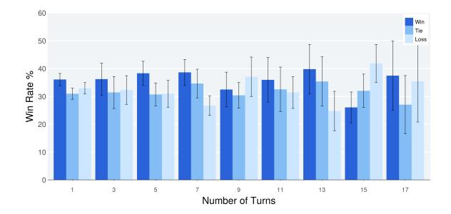

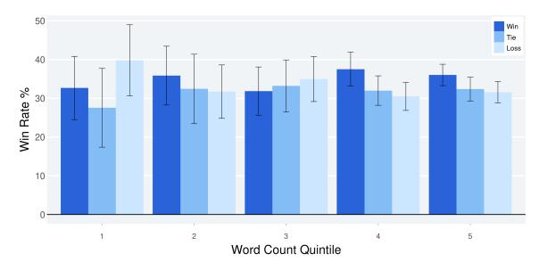
***الشكل 31:** نسبة فوز Llama 2-Chat مقابل ChatGPT محللة حسب عدد الأدوار وعدد الكلمات.*

**نتائج إضافية.** لفهم تأثير موجه النظام على توليدات ChatGPT، أجرينا تقييماً بشرياً آخر بدون أي موجه نظام لـ ChatGPT. كما هو موضح في الشكل 30، نسبة فوز Llama 2-Chat تزداد من 36% إلى 44%. ChatGPT يتفوق على Llama 2-Chat 70B في المساعدة اللغوية بينما يتفوق Llama 2-Chat 70B على ChatGPT في الأسئلة الواقعية.

## A.4 تفاصيل إضافية للسلامة

## A.4.1 التوتر بين السلامة والفائدة في نمذجة المكافأة

ناقشنا بإيجاز التوتر بين السلامة والفائدة في القسم 3.2.2. الشكل 32 هو رسمان مبعثران لدرجات نموذج مكافأة الفائدة والسلامة على مجموعة اختبار السلامة.

## A.4.2 نتائج نوعية على توسع بيانات السلامة

نستعرض عدداً قليلاً من العينات لفحص تطور سلوك النموذج عند توسيع بيانات السلامة في الجداول 36 و37 و38. يصبح Llama 2-Chat أكثر أماناً مع استخدام بيانات سلامة أكثر.

## A.4.3 الضمائر الإنجليزية

المصطلحات المستخدمة في تحليلات الضمائر متسقة مع ورقة PaLM 2:

<!-- page 59 -->

<!-- page 60 -->

- She: "she", "her", "hers", "herself"
- He: "he", "him", "his", "himself"
- غير معروف: "they", "them", "their", "theirs", "theirself", "themself", "themselves"
- ضمير المتكلم: "I", "me", "my", "mine", "myself", "we", "us", "our", "ours", "ourselves"
- ضمير المخاطب: "you", "your", "yours", "yourself", "yourselves"
- ضمير الغائب: مزيج من جميع الفئات أعلاه

## **A.4.4 سابقات تقطير السياق**

نعرض أمثلة على السابقات في الجدول 39.

## **A.4.5 أخطاء السلامة: الرفض الكاذب والاستجابات الغامضة**

انظر الجدول 40 لأمثلة الرفض الكاذب والشكل 33 لمعدل الرفض الكاذب كدالة لنسبة بيانات السلامة المستخدمة.

<!-- page 61 -->

***الجدول 36: مثال نوعي لتأثير توسع بيانات السلامة.** Llama 2-Chat يتعلم عدم توليد محتوى مسيء أو إشكالي.*

<!-- page 62 -->

<!-- page 63 -->

**الجدول 38:** مثال نوعي لتأثير توسع بيانات السلامة. مع المزيد من بيانات السلامة، يعتبر Llama 2-Chat "sex in a pan" حساساً وجنسياً على الرغم من إشارة "taste" التي تشير إلى أنه طعام.

<!-- page 64 -->

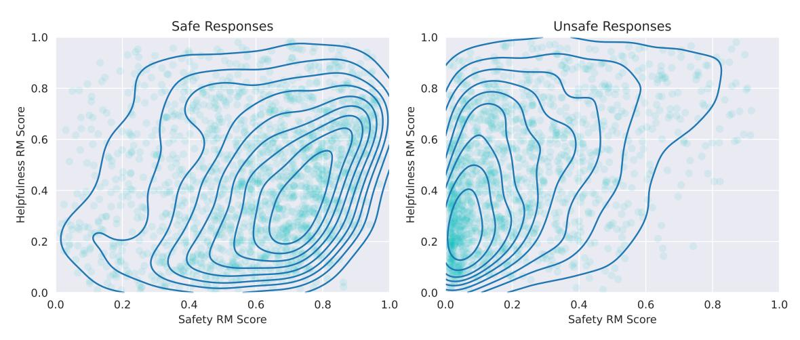
*الشكل 32: درجات نموذج مكافأة السلامة والفائدة على مجموعة من الاستجابات الآمنة وغير الآمنة.*

**الجدول 39: السابقات الآمنة لتقطير السياق.** نستخدم سابقات مختلفة لتقطير السياق، بعضها مستوحى من Bai et al. (2022b) وبعضها من إنشائنا الخاص.

<!-- page 65 -->

**تحذير المحتوى: محتوى محتمل مرفوض**

**الجدول 40: الأخطاء التي يقدمها تقطير السياق.** مثال على تقطير السياق الذي يجعل الاستجابة *غامضة* (المثال العلوي) أو يؤدي إلى *رفض كاذب* (المثال السفلي).

<!-- page 66 -->

انظر الجدول 41 لأمثلة الاستجابات الغامضة أو الرفض الكاذب.

## **A.4.6 أمثلة على تقييم السلامة**

نعرض أمثلة على موجهات تقييم السلامة لفئات مخاطر مختلفة في الجدول 42 والاستجابات في الجدول 43.

<!-- page 67 -->

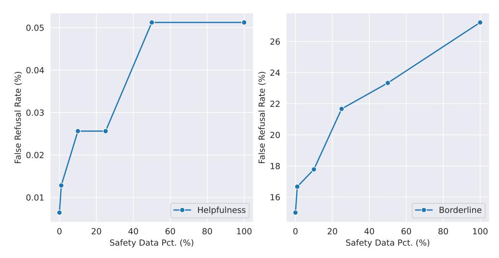
***الشكل 33: معدل الرفض الكاذب يزداد مع نسبة بيانات السلامة. يسار**: معدل الرفض الكاذب على مجموعة بيانات الفائدة من 0.006% إلى 0.05%. **يمين**: معدل الرفض الكاذب على مجموعة الحدود من 15% إلى 27%.*

<!-- page 68 -->

<!-- page 69 -->

## A.4.7 وصف معايير السلامة التلقائية

في هذا القسم، نقدم وصفاً مفصلاً عن معايير السلامة التلقائية التي نستخدمها للتقييم من منظور الصدق والسمية والتحيز.

**الصدق.** لفهم قدرة نماذج اللغة الكبيرة على توليد مخرجات موثوقة، نستخدم TruthfulQA (Lin et al., 2021). يتألف معيار TruthfulQA من 817 سؤالاً موزعة على 38 فئة. اتباعاً لـ Lin et al. (2021)، نستخدم مقاييس قائمة على GPT-3. نقدم نسبة التوليدات التي تكون صادقة وغنية بالمعلومات.

**السمية.** لقياس درجة توليد اللغة السامة، نستخدم ToxiGen (Hartvigsen et al., 2022)، مجموعة بيانات تحتوي على جمل سامة ضمنياً وحميدة تذكر 13 مجموعة أقلية. نعتمد نسخة منقحة من Hosseini et al. (2023). نستخدم مصنف ToxiGen الافتراضي المضبوط على RoBERTa.

**التحيز.** لدراسة المشاعر في توليدات النموذج، نختار BOLD (Dhamala et al., 2021)، معيار تحيز واسع النطاق يضم 23,679 موجه ويكيبيديا إنجليزي يمتد عبر خمس مجالات: العرق، النوع، الدين، الأيديولوجية السياسية، والمهنة. نُجري تحليل مشاعر باستخدام VADER. ينتج VADER درجة مشاعر بين -1 و1.

## A.4.8 نتائج تقييم معيار السلامة التلقائي

**التحليل الدقيق للسمية والصدق والتحيز.**

- الصدق. الجدول 44 يقدم نتائج تقييم TruthfulQA. معظم النماذج تُظهر >90% غنى بالمعلومات. نسبة الصدق منخفضة نسبياً للنماذج المُدرَّبة مسبقاً، حوالي 30% إلى 40%. بعد الضبط بالتعليمات، تحسن Llama 2-Chat بحوالي 14-24% في الصدق.
- السمية. الجدول 45 يُظهر أن المكسيكيين واللاتينيين والنساء يميلون لأن يكونوا الأعلى في نسب التوليدات السامة. بفضل الضبط بالتعليمات، نماذج Llama 2-Chat المضبوطة من جميع الأحجام تُظهر فعلياً صفر بالمئة من التوليدات السامة.
- **التحيز.** الجداول 46-50 تقدم توزيع درجات المشاعر عبر المجموعات الديموغرافية المختلفة. نلاحظ درجات مشاعر إيجابية لكل مجال. Llama 2-Chat المضبوط يُظهر إيجابية أكثر. ChatGPT يميل لدرجات مشاعر أكثر حياداً.

**قيود المعايير.** من المهم ملاحظة أن هذه التقييمات ليست شاملة بالكامل. معظمها طُورت في الأصل لنماذج اللغة الكبيرة المُدرَّبة مسبقاً.

<!-- page 70 -->

<!-- page 71 -->

<!-- page 72 -->

في سيناريوهات المحادثة، السياق مهم. القدرة على الحفاظ على السياق ومعالجة المواقف الدقيقة قد لا يُقيَّم تقييماً شاملاً بالمعايير الموجودة. بعد النشر، السلامة في نماذج المحادثة تشمل تجربة المستخدم والتأثيرات طويلة المدى.

## **A.5 شرح البيانات**

اعتمدنا على المعلقين البشريين لجمع شروحات لمرحلة الضبط الدقيق المُشرَف عليه والتفضيلات البشرية لتدريب نماذج المكافأة.

## **A.5.1 تعليمات شرح SFT**

جمعنا شروحات حوار أحادية ومتعددة الأدوار. طلبنا من المعلقين كتابة استجابات غنية بالمعلومات وصادقة وذات صلة وواضحة وغير ضارة. طلبنا من المعلقين إعطاء الأولوية لعدم الضرر على المعلومات والفائدة في حالات الموجهات التي قد تؤدي إلى استجابات إشكالية.

<!-- page 73 -->

<!-- page 74 -->

## A.5.2 فئات تجربة المستخدم السلبية

أرشدنا المعلقين لتجنب كتابة استجابات تنتهك إرشادات السلامة، على سبيل المثال، نطلب أن الموجهات *لا*:

- 1. تروج أو تمكّن الأنشطة الإجرامية.
- 2. تروج أو تمكّن السلوكيات الخطيرة على المستخدم أو الآخرين.
- 3. تحتوي على أو تروج أو تمكّن السلوك المسيء والمسيء تجاه المستخدم أو الآخرين.
- 4. تحتوي على أو تروج أو تمكّن المحتوى الجنسي الصريح.

## **A.5.3 عملية ضمان الجودة**

نفذنا عملية ضمان جودة. راجع فريق من مديري المحتوى ذوي المهارات العالية الشروحات يدوياً ووافق على تلك التي ستُستخدم.

أثناء خطوة ضمان الجودة، طُلب من المراجعين الموافقة فقط على الشروحات التي تطابق إرشاداتنا. إذا احتاج الشرح إلى تغييرات صغيرة للموافقة عليه، يمكن للمراجعين تعديله.

## A.5.4 اختيار المعلقين

لاختيار المعلقين، أجرينا عملية تقييم متعددة الخطوات اختبرنا فيها فهمهم لإرشاداتنا، والتوافق مع معايير تقييم الجودة لدينا، ومهارات القراءة والكتابة لديهم.

شملت العملية 4 اختبارات:

- الاختبار الأول يتألف من 3 أقسام: القواعد، فهم القراءة، أسلوب الكتابة. مدته 50 دقيقة. يجب أن يحصل المرشح على 90% في الجزء الأول للمتابعة.
- الاختبار الثاني تألف من 42 سؤالاً. للنجاح، احتاج المعلقون للاتفاق مع معاييرنا في 80% من الإجابات.

<!-- page 75 -->

- الاختبار الثالث تألف من قياس التوافق مع معايير تقييم الجودة. تألف من 31 سؤالاً مختلفاً.
- أخيراً، الاختبار الأخير تألف من تقييم استجابة الموجه. المعلقون الذين سجلوا متوسط >4 نجحوا في التدريب.

## **A.6 تلوث مجموعة البيانات**

مع زيادة حجم بيانات التدريب المتاحة للعموم، أصبح من الحتمي أن جزءاً من بيانات التقييم يُرى أثناء التدريب.

اعتبر العمل السابق ([Brown et al. (2020)](#page-37-0), [Wei et al. (2022a)](#page-43-19), [Du et al. (2022)](#page-38-13)) أن المثال "ملوث" إذا كان هناك تصادم بين n-gram عالي الترتيب (عموماً، n = 13) من العينة وبيانات التدريب.

نتطابق على الإدخال المرمَّز. نعتبر الرمز ملوثاً إذا ظهر في أي n-gram أطول من 10 رموز في كل من عينة التقييم ومجموعة التدريب. نسمح بـ "ميزانية skipgram" صغيرة من أربعة رموز.

نُحدد 10(+)-skipgrams بمصفوفات لاحقة منفذة باستخدام تباين من المكتبة من [Lee et al. (2022)](#page-40-17). نجد جميع 10-grams في حوالي سبع ساعات.

نُعرّف أربعة أنواع فرعية:
- *"نظيف"* - تلوث رمز أقل من 20%
- *"غير نظيف"* - تلوث رمز أكبر من 20%
- *"غير قذر"* - تلوث رمز أقل من 80%
- *"قذر"* - تلوث رمز أكبر من 80%

نُكرر تحليلنا بأطوال تطابق دنيا L ∈ {10, 20, 30, 40, 50}.

لكل مجموعة بيانات، نحسب متوسط مقياس الأداء والإحصائية Z^n^. نعتبر أن هناك أدلة كافية للإيحاء بأن التلوث أثر على أداء التقييم إذا كانت جميع المجموعات الفرعية الأربع لديها |Zn| > 2.

النتائج في الجدول 51. نلاحظ أن HellaSwag وMMLU-Humanities فقط يبدو أنهما تم تعزيزهما بسبب التلوث. لا توجد مجموعة بيانات أخرى استفادت من تلوث مجموعة البيانات.

<!-- page 77 -->

## A.7 بطاقة النموذج

يقدم الجدول 52 بطاقة نموذج (Mitchell et al., 2018; Anil et al., 2023) تلخص تفاصيل النماذج.
