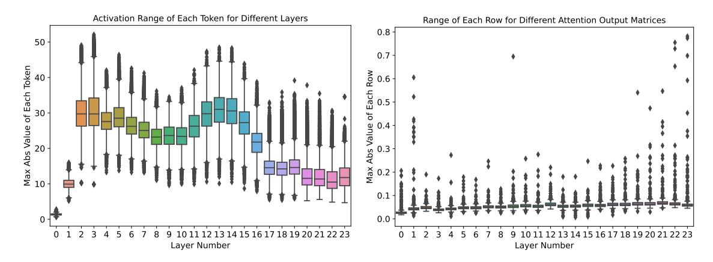
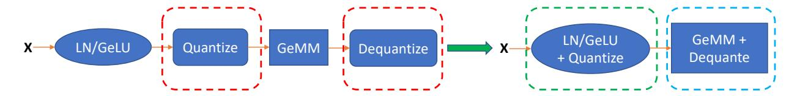
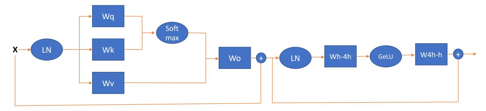
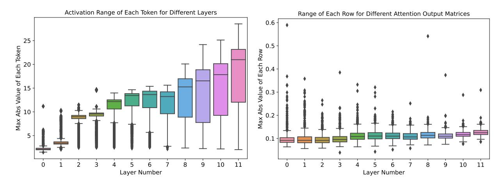

<!-- RP14_Yao_2022 | source: papers_json/RP14_Yao_2022/ -->

## ZeroQuant: التكميم الفعّال والميسور التكلفة بعد التدريب للمحوّلات واسعة النطاق

Zhewei Yao^∗^ , Reza Yazdani Aminabadi, Minjia Zhang Xiaoxia Wu, Conglong Li, Yuxiong He

## Microsoft

{zheweiyao, yazdani.reza, minjiaz, xiaoxiawu, conglong.li, yuxhe}@microsoft.com

## الملخص

أصبحت كيفية تقديم نماذج اللغة الطبيعية المدرّبة المتزايدة الحجم في الواقع العملي أمرًا بالغ الصعوبة حتى بالنسبة لخوادم السحابة القوية، وذلك بسبب متطلباتها الباهظة من الذاكرة والحوسبة. في هذا العمل، نقدّم منهجًا فعّالًا وميسور التكلفة للتكميم بعد التدريب لضغط النماذج الكبيرة القائمة على المحوّلات (Transformer)، ونطلق عليه اسم ZeroQuant. يُعدّ ZeroQuant خط أنابيب شامل للتكميم والاستدلال يتكوّن من ثلاثة مكوّنات رئيسية: (1) مخطط تكميم دقيق التحبّب وملائم للعتاد لكل من الأوزان والتنشيطات؛ (2) خوارزمية جديدة وميسورة التكلفة لتقطير المعرفة طبقة بطبقة (LKD) حتى دون الوصول إلى بيانات التدريب الأصلية؛ (3) دعم خلفية نظام تكميم محسّن للغاية لإزالة عبء عمليات التكميم وعكس التكميم. وعلى هذا النحو، نتمكّن من إظهار أن: (1) ZeroQuant يستطيع تقليل دقة الأوزان والتنشيطات إلى INT8 بطريقة مجانية لكلٍ من نماذج BERT ونماذج بنمط GPT-3 مع تأثير ضئيل على الدقة، ممّا يؤدي إلى تسريع يصل إلى 5.19x/4.16x على تلك النماذج مقارنةً بالاستدلال بدقة FP16؛ (2) يقوم ZeroQuant مع LKD بتكميم الأوزان في وحدة الاتصال الكامل إلى INT4 جنبًا إلى جنب مع أوزان INT8 في وحدة الانتباه وتنشيطات INT8 بتكلفة ميسورة، ممّا يؤدي إلى تقليل البصمة الذاكرية بثلاثة أضعاف مقارنةً بنموذج FP16؛ (3) يمكن تطبيق ZeroQuant مباشرةً على اثنين من أكبر نماذج اللغة مفتوحة المصدر، بما في ذلك GPT-J6B وGPT-NeoX20B، حيث يحقّق نموذجنا INT8 دقّة مماثلة لنموذج FP16 مع كفاءة أفضل تصل إلى 5.2x.

# 1 المقدّمة

اعتُمدت نماذج اللغة الطبيعية واسعة النطاق على نطاق واسع في تطبيقات مختلفة، مثل فهم اللغة الطبيعية باستخدام BERT [[63]](#page-14-0) ومهام التوليد باستخدام النماذج بنمط GPT [[48]](#page-13-0). على الرغم من أن تلك النماذج قد حقّقت نتائج دقة متطورة، فإنه مع استمرار تزايد حجم النموذج بشكل دراماتيكي، تصبح متطلبات البصمة الذاكرية والتكلفة الحوسبية لنشرها عقبة رئيسية، حتى على خوادم السحابة المزوّدة بأجهزة GPU قوية.

تتمثّل إحدى الطرق الواعدة لتخفيف هذا التحدّي في التكميم، الذي يمكنه تقليل دقة البتات لكل من الأوزان والتنشيطات لتقليل البصمة الذاكرية وتسريع الحوسبة (مثل أنوية موتر INT8 على T4/A100). ومع ذلك، يتطلب التكميم عادةً إعادة التدريب (المعروف أيضًا باسم التدريب المُدرك للتكميم، أو QAT اختصارًا) لاسترداد التدهور في الدقة الناتج عن خسارة تمثيل الأوزان والتنشيطات. لتمكين QAT، يلزم عادةً خط أنابيب التدريب الكامل، بما في ذلك بيانات التدريب وموارد الحوسبة، لإجراء الضبط الدقيق للنموذج. وغالبًا ما لا يتوفّر الوصول إلى تلك المكوّنات في الوقت الحالي، كما أن QAT عملية تستغرق وقتًا طويلًا، خاصةً لتلك النماذج واسعة النطاق.

في الآونة الأخيرة، تم اقتراح التكميم بدون أمثلة (zero-shot) [[9,](#page-11-0) [46]](#page-13-1) والتكميم بعد التدريب (PTQ) [[45,](#page-13-2) [38]](#page-13-3) لمعالجة تحدّيات الوصول إلى بيانات التدريب ومتطلبات الحوسبة، حيث لا يتطلّب PTQ عمومًا أي إعادة تدريب (أو إعادة تدريب ضئيلة). لكن معظم تلك الأعمال تركّز بشكل أساسي على مشكلات الرؤية الحاسوبية على نطاقات

> ^∗^سيُصدر الكود قريبًا كجزء من [https://github.com/microsoft/DeepSpeed](https://github.com/microsoft/DeepSpeed)

<!-- page 2 -->

صغيرة نسبيًا. ومؤخرًا، أظهر [[6]](#page-11-1) نتائج PTQ واعدة على BERT. ومع ذلك، (1) تركيزه الرئيسي على التكميم عالي الدقة (INT8/FP16) على BERTbase، (2) لا يأخذ في الاعتبار النماذج التوليدية الأخرى بحجم المليارات (النماذج بنمط GPT-3 [[8]](#page-11-2)). والأهم من ذلك، أن معظم هذه الأعمال لا تُبلغ عن تحسّن حقيقي في زمن الاستجابة، ممّا يضع فائدة هذه الطرق في تحسين زمن استجابة الاستدلال موضع تساؤل. على سبيل المثال، غالبًا لا تناقش الأعمال الحالية تكلفة التكميم/عكس التكميم المرتبطة بمخطّطات التكميم المختلفة، والتي لها في الواقع تأثير كبير على فائدة الأداء عند استخدام الدقة المنخفضة.

علاوةً على ذلك، بالنسبة للتكميم المتطرّف (مثل INT4)، يُستخدم تقطير المعرفة عادةً لتعزيز الأداء، ممّا يضيف مصدرًا آخر لتكلفة الحوسبة الباهظة مقارنةً بـ QAT. وعلاوةً على ذلك، من أجل تحقيق أداء دقّة أفضل، يُطبَّق عادةً تقطير المعرفة للحالات المخفية، مثل [[2,](#page-11-3) [79]](#page-15-0)، على النموذج المُكمَّم. وهذا من شأنه أن يضع ضغطًا كبيرًا على ذاكرة GPU ومتطلّبات موارد الحوسبة، نظرًا لأن كلًا من نموذجَي المعلّم والطالب يجب تحميلهما في ذاكرة GPU للتدريب.

في هذه الورقة، نقدّم ZeroQuant، خط أنابيب شامل للتكميم بعد التدريب والاستدلال، لمعالجة تلك التحدّيات، ويستهدف كلًا من التكميم بـ INT8 والتكميم متعدّد الدقة INT4/INT8. وعلى وجه التحديد، تتمثّل مساهماتنا فيما يلي:

- نطبّق مخطّطات تكميم دقيقة التحبّب ملائمة للعتاد على كلٍ من الأوزان والتنشيطات، أي التكميم على مستوى المجموعات للأوزان والتكميم على مستوى الرموز (tokens) للتنشيطات. يمكن لكلا مخطّطَي التكميم تقليل خطأ التكميم بشكل كبير مع الاحتفاظ بخصائص تسريع العتاد.
- نقترح طريقة جديدة لتقطير المعرفة طبقة بطبقة (LKD) للتكميم متعدّد الدقة INT4/INT8، حيث تُكمَّم الشبكة العصبية طبقة بطبقة من خلال التقطير بأقل قدر من التكرارات وحتى دون الوصول إلى بيانات التدريب الأصلية. وعلى هذا النحو، في أي لحظة معطاة، تُملأ ذاكرة الجهاز بشكل أساسي ببصمة طبقة إضافية واحدة فقط، ممّا يجعل تقطير النماذج بحجم المليارات قابلًا للتنفيذ مع ميزانية تدريب محدودة وأجهزة GPU محدودة.
- نطوّر خلفية استدلال محسّنة للغاية، تُلغي تكلفة الحوسبة الباهظة لمشغّلات التكميم/عكس التكميم، ممّا يُمكّن من تسريعات زمن الاستجابة على أنوية موتر INT8 في عتاد GPU الحديث.
- تُظهر نتائجنا التجريبية ما يلي: يُمكّن ZeroQuant من تكميم نماذج BERT والنماذج بنمط GPT-3 إلى أوزان وتنشيطات INT8 للحفاظ على الدقة دون تكبّد أي تكلفة لإعادة التدريب. مقارنةً بالاستدلال بدقة FP16، يحقّق نموذجنا INT8 تسريعًا يصل إلى 5.19x/4.16x على BERTbase/GPT-3350M على بطاقات GPU من نوع A100. يستطيع ZeroQuant مع LKD إجراء تكميم متعدّد الدقة INT4/INT8 لنماذج BERT والنماذج بنمط GPT-3. ينتج عن ذلك تقليل البصمة الذاكرية بثلاثة أضعاف مع خسارة هامشية في الدقة مقارنةً بنموذج FP16. أيضًا، بفضل خفّة وزن LKD، يمكننا إنهاء عملية التكميم في 33 ثانية (10 دقائق) لـ BERTbase (BERTlarge). كما نُظهر أن LKD يمكنه استخدام مجموعات بيانات أخرى لتحقيق أداء مماثل لبيانات التدريب الأصلية. نُظهر قابلية التوسّع لـ ZeroQuant على اثنين من أكبر نماذج اللغة مفتوحة المصدر، أي GPT-J6B وGPT-NeoX20B، مع تكميم INT8. يستطيع ZeroQuant تحقيق تسريع 3.67x على نموذج FP16 لـ GPT-J6B و(2) تقليل متطلّب GPU للاستدلال من 2 إلى 1 وزمن الاستجابة من 65 مللي ثانية إلى 25 مللي ثانية لـ GPT-NeoX20B (أي كفاءة نظام أفضل بـ 5.2x إجمالًا).

# 2 الأعمال ذات الصلة

استُكشف ضغط النماذج من جوانب مختلفة [[25,](#page-12-0) [37,](#page-13-4) [39,](#page-13-5) [34,](#page-13-6) [43,](#page-13-7) [20,](#page-12-1) [24,](#page-12-2) [50,](#page-13-8) [18,](#page-12-3) [74,](#page-15-1) [40,](#page-13-9) [26,](#page-12-4) [55,](#page-14-1) [59,](#page-14-2) [28,](#page-12-5) [60,](#page-14-3) [68,](#page-15-2) [33,](#page-13-10) [14,](#page-11-4) [38,](#page-13-3) [31]](#page-12-6). ومن بين تلك الجوانب، يُعدّ التكميم أحد أكثر الاتجاهات الواعدة لأنه يقلّل مباشرةً البصمة الذاكرية وكثافة الحوسبة. وهنا، نركّز على التكميم لنماذج معالجة اللغة الطبيعية ونناقش بإيجاز الأعمال ذات الصلة.

يمكن تصنيف غالبية أعمال التكميم على أنها تدريب مُدرك للتكميم (QAT). يُعدّ [[56,](#page-14-4) [76]](#page-15-3) من بين الأعمال الأولى التي قامت بتكميم نماذج BERT باستخدام أرقام صحيحة لكل من الأوزان والتنشيطات. وعلى وجه الخصوص، يستخدم [[56]](#page-14-4) معلومات Hessian لدفع دقة بتات الأوزان حتى INT2/INT4، كما يقترح التكميم على مستوى المجموعات لتكميم مصفوفة الأوزان بحبيبات أدقّ مقارنةً بتكميم المصفوفة الواحدة. يقدّم [[21]](#page-12-7) ضوضاء تكميم لتخفيف تباينات QAT. يستفيد [[79,](#page-15-0) [2]](#page-11-3)

<!-- page 3 -->

من تقطير المعرفة الباهظ التكلفة [26] وزيادة البيانات [28] لإحالة الأوزان إلى ثلاثية/ثنائية. يجمع [29] بين تقطير المعرفة [28] والتكميم بحجم خطوة مُتعلَّم [19] لتكميم الأوزان إلى 2-8 بتات. ومؤخرًا، يستخدم [61] أيضًا تقطير المعرفة لضغط نماذج GPT-2 على المسائل الخاصة بالمهام إلى INT2. تقوم جميع تلك الأعمال بتكميم النماذج باستخدام مجموعات بيانات التدريب الأصلية. والأهم من ذلك أنها تحتاج إلى إعادة تدريب أو ضبط دقيق للنموذج بالكامل لاسترداد الدقة، وقد لا يكون من الميسور تحمّل تكلفة الحوسبة هذه على النماذج الفائقة الحجم، مثل [57, 11]، لمعظم مختبرات البحث أو الممارسين.

أحد الحلول للتغلّب على تحدّي تكلفة الحوسبة هو التكميم بعد التدريب (PTQ). ومع ذلك، فإن PTQ غالبًا ما يحدث انخفاضًا كبيرًا في الدقة لأن الشبكة قد تكون حسّاسة لأخطاء التكميم. على هذا الخط، أحد الأعمال الأولى التي طُبّقت على النماذج القائمة على المحوّلات [64] هو [75]. يقدّم المؤلفون طريقة تكميم قائمة على المركز، حيث تستخدم الأرقام الشاذة صيغة FP32 ويُكمَّم بقية الأرقام باستخدام التكميم غير المنتظم. وعلى هذا النحو، من الصعب الحصول على فائدة حقيقية في زمن استجابة الاستدلال على مسرّعات الحوسبة العامة، مثل وحدات CPU وGPU، لأن وحدات المعالجة المتوازية في هذا العتاد لا تدعم الحوسبة الفعّالة لأنواع البيانات المختلطة. ومؤخرًا، يقدّم [6] تكميم تنشيط عالي الدقة (FP16) لجزء من النموذج للتغلّب على نطاقات التنشيط الديناميكية العالية. ومع ذلك، على حدّ علمنا، (1) كيفية تطبيق PTQ على النماذج بنمط GPT-3 مع تحقيق دقة عالية لم تُدرس في أي عمل سابق حتى الآن؛ (2) كيفية تطبيق PTQ على نموذج بحجم مليار (أو حتى عشرات المليارات) لا تزال غير مستكشفة بشكل كافٍ؛ (3) لا تزال خلفية نظام الاستدلال الفعّال مفقودة، خاصةً لمخطّطات التكميم دقيقة التحبّب، ممّا يجعل من الصعب تحقيق زمن استجابة منخفض على العتاد التجاري. يحلّ ZeroQuant جميع هذه القيود من خلال أخذ خلفية النظام في الاعتبار في تصميم الخوارزمية، ونتحقّق من قدرته على كل من نماذج BERT والنماذج بنمط GPT-3 واسعة النطاق (حتى 20 مليار، أي GPT-NeoX<sub>20B</sub>) لمهام مختلفة.

# 3 الخلفية والتحدّي

نقدّم نظرة عامة موجزة على بنية المحوّل وخلفية التكميم في الملحق A. يُرجى الرجوع إلى [64] و[23] لمزيد من التفاصيل حول بنية المحوّل والتكميم.

يُظهر التكميم بعد التدريب (PTQ) كفاءة ضغط كبيرة مقارنةً بالتدريب المُدرك للتكميم (QAT) لأن PTQ يُطبَّق عادةً لتكميم النموذج دون إعادة تدريب. وتتمثّل إحدى الاستراتيجيات الشائعة لـ PTQ في تغذية بيانات التدريب إلى الشبكة ومعايرة عامل القياس، S، باستخدام المتوسط الجاري. يُرجى الاطلاع على الملحق B.1 لمزيد من التفاصيل.

أُجريت بعض الأعمال على نماذج BERT<sub>base</sub> [6] مع تكميم أوزان INT8 وتكميم تنشيط مختلط INT8/FP16. ومع ذلك، لا يوجد بحث (1) في PTQ بدقة بتات أقل على نماذج BERT و(2) النماذج بنمط GPT-3 واسعة النطاق. هنا، نناقش بإيجاز تحدّي تطبيق PTQ على كل من BERT (في الملحق C) والنماذج بنمط GPT-3.


*الشكل 1: نطاق التنشيط (يسار) ونطاق الأوزان على مستوى الصف لمصفوفة إخراج الانتباه (يمين) للطبقات المختلفة على GPT-3<sub>350M</sub> المُدرّب مسبقًا. انظر الشكل C.1 للنتائج الخاصة بـ BERT<sub>base</sub>.*

تظهر نتائج GPT-3<sub>350M</sub> مع PTQ في الجدول 1. كما يمكن ملاحظته، يتسبّب تكميم تنشيط INT8

<!-- page 4 -->

(أي صف W16A8) في خسارة الدقة الأساسية. ودفع الأوزان إلى INT8 (أي صف W8A8) لا يُغيّر دقة مهام التقييم بدون أمثلة لكنه يقود مهمة النمذجة اللغوية السببية (Wikitext-2) إلى درجة حيرة (perplexity) أسوأ، ممّا يُظهر حساسية مهام التوليد مقارنةً بمشكلات التقييم الأخرى بدون أمثلة. بالنسبة لـ W4/8A16، على بعض المهام القائمة على الدقة، لا يزال GPT-3<sub>350M</sub> يحقّق أداءً معقولًا مثل OpenBookQA لكنه يفقد الدقة على غالبية المهام الأخرى. وعلى وجه الخصوص، بالنسبة لـ Wikitext-2، لا يستطيع GPT-3<sub>350M</sub> مع W4/8A16 توليد أي نص ذي معنى بعد الآن. يُرجى أيضًا الاطلاع على الملحق C لتحليل BERT.

نطاق التنشيط الديناميكي للتحقيق في سبب أن تنشيط INT8 يؤدّي إلى انخفاض كبير في الدقة لكلٍ من نماذج BERT والنماذج بنمط GPT-3، نرسم نطاق كل تنشيط على مستوى الرموز (أي الحالة المخفية لكل رمز) للطبقات المختلفة من المحوّل لـ GPT-3_{350M} في الشكل 1 (يسار). كما يمكن ملاحظته، لدى الرموز المختلفة نطاقات تنشيط مختلفة بشكل دراماتيكي. على سبيل المثال، الحدّ الأقصى لنطاق الطبقة الأخيرة هو حوالي 35 لكن الحدّ الأدنى للنطاق قريب من 8. هذا التباين الأكبر في نطاق التنشيط يجعل من الصعب استخدام نطاق تكميم ثابت (عادةً القيمة القصوى) لجميع الرموز للحفاظ على دقة التنبّؤ، لأن قوة التمثيل المحدودة للرموز ذات النطاق الصغير ستضرّ بأداء الدقة. النطاقات المختلفة للخلايا العصبية في مصوفات الأوزان وبالمثل، نرسم نطاق الأوزان على مستوى الصف (أي بُعد الإخراج) لمصفوفة إخراج الانتباه (W_o) لـ GPT-3_{350M} في الشكل 1 (يمين). يوجد فرق بمقدار 10x بين أكبر مقادير الصفوف المختلفة، وهذا يؤدّي إلى أداء توليد أسوأ لـ PTQ بأوزان INT8. كما أن هذا يجعل الأمر صعبًا للغاية عند تطبيق تكميم INT4 لأن INT4 لديه فقط 16 رقمًا، ونطاق أصغر بـ 10x يؤدّي إلى رقمين (أو ثلاثة أرقام) لتمثيلات تلك الصفوف ذات النطاق الأصغر.

تشير نتائج هذا التحليل أيضًا إلى سبب استخدام تقطير معرفة الحالات المخفية الأكثر تكلفة [2, 36] للتكميم فائق الدقة المنخفضة لسد فجوة الدقة. ومع ذلك، نظرًا لأن تكلفة تدريب تقطير المعرفة للنماذج واسعة النطاق مرتفعة جدًا، فإن وجود طريقة خفيفة الوزن وفعّالة أمر مرغوب فيه لـ PTQ.

# 4 المنهجية

## 4.1 مخطّط تكميم دقيق التحبّب وملائم للعتاد

كما هو موضّح في القسم 3، حتى تطبيق PTQ بـ INT8 على نماذج BERT/GPT-3 يؤدّي إلى تدهور كبير في الدقة. التحدّي الرئيسي هو أن تمثيل INT8 لا يستطيع التقاط النطاقات العددية المختلفة للصفوف المختلفة في مصفوفات الأوزان ورموز التنشيط المختلفة بشكل كامل. تتمثّل إحدى طرق معالجة ذلك في استخدام التكميم على مستوى المجموعات (على مستوى الرموز) لمصفوفة الأوزان (التنشيطات).

**التكميم على مستوى المجموعات للأوزان** اقتُرح التكميم على مستوى المجموعات لمصفوفة الأوزان لأول مرة في [56]، حيث تُقسَّم مصفوفة الأوزان \mathbf{W} \in \mathbb{R}^{n \times m} إلى g مجموعات، وتُكمَّم كل مجموعة على حدة. ومع ذلك، في [56]، يطبّق المؤلفون هذا فقط للتدريب المُدرك للتكميم. والأهم من ذلك، أنهم لا يأخذون في الاعتبار قيود كفاءة العتاد ولا يمتلكون دعم خلفية نظام. وعلى هذا النحو، يفتقرون إلى فائدة التقليل الحقيقي لزمن الاستجابة.

في تصميمنا، نأخذ في الاعتبار قيد العتاد من بنية Ampere لبطاقات GPU (مثل A100)، حيث تستند وحدة الحوسبة إلى حجم بلاطة Warp Matrix Multiply and Accumulate (WMMA) [53] لتحقيق أفضل تسريع. لاحقًا، سوف نُظهر أن التكميم على مستوى المجموعات لدينا يؤدّي إلى دقة أفضل بكثير

<!-- page 5 -->

مقارنةً بتكميم المصفوفة الواحدة بسبب تكميمه ذي الحبيبات الأدقّ مع الاستمرار في تحقيق تقليل كبير في زمن الاستجابة.

التكميم على مستوى الرموز للتنشيطات كما ذُكر في القسم 3 والملحق A.2، فإن الممارسة الشائعة لأعمال PTQ الحالية هي استخدام التكميم الثابت للتنشيط، حيث يُحسب نطاق min/max في مرحلة معايرة دون اتصال. قد تكون هذه الطريقة كافية للنماذج الصغيرة الحجم حيث يكون التباين في نطاق التنشيط صغيرًا. ومع ذلك، كما هو محلّل في القسم 3، يوجد تباين كبير في نطاق التنشيط لنماذج المحوّلات واسعة النطاق مثل GPT-3<sub>350M</sub> وBERT<sub>base</sub>. وعلى هذا النحو، فإن مخطّط التكميم الثابت (المُطبَّق غالبًا على جميع الرموز/العيّنات) قد يؤدّي إلى انخفاض كبير في الدقة. وتتمثّل فكرة طبيعية للتغلّب على هذه المشكلة في اعتماد التكميم على مستوى الرموز ذي الحبيبات الأدقّ والحساب الديناميكي لنطاق min/max لكل رمز لتقليل خطأ التكميم من التنشيطات. كما يُظهر تقييمنا في القسم 5 أن التكميم على مستوى الرموز للتنشيط يُحسّن بشكل كبير دقة النماذج بنمط GPT-3 ونماذج BERT.

ومع ذلك، فإن تطبيق التكميم على مستوى الرموز مباشرةً باستخدام أُطر التعلّم العميق الحالية، مثل مجموعة تكميم PyTorch، يؤدّي إلى تكلفة كبيرة للتكميم وعكس التكميم لأن التكميم على مستوى الرموز يُقدّم عمليات إضافية تؤدّي إلى عبء حركة بيانات باهظ بين وحدات حوسبة GPU والذاكرة الرئيسية. لمعالجة هذه المشكلة، نبني خلفية استدلال محسّنة للغاية للتكميم على مستوى الرموز لنماذج المحوّلات. على سبيل المثال، تستخدم خلفية الاستدلال لـ ZeroQuant ما يُسمى بتقنية دمج النوى لدمج مشغّل التكميم مع المشغّل السابق له، مثل تطبيع الطبقة، لتخفيف تكلفة حركة البيانات من التكميم على مستوى الرموز. وبالمثل، يُخفَّف من تكلفة عكس التكميم لإخراج GeMMs المختلفة عن طريق قياس تجميع INT32 باستخدام كل من مقاييس تكميم الأوزان والتنشيط، قبل كتابة النتيجة النهائية بصيغة FP16 مرة أخرى إلى الذاكرة الرئيسية للمشغّل التالي بصيغة FP16 (مثل GeLU). ستُناقش تلك التحسينات بمزيد من التفاصيل في القسم 4.3.

يمكن للتكميم على مستوى الرموز تقليل خطأ التمثيل للتنشيطات المُكمَّمة بشكل كبير. أيضًا، نظرًا لأنه لا يحتاج إلى معايرة نطاق التنشيط، سوف نُظهر لاحقًا أنه لا توجد تكلفة متعلّقة بالتكميم (مثل معايرة نطاق التنشيط) لمخطّط تكميم معتدل (أوزان INT8 مع تنشيط INT8) لـ ZeroQuant.

## 4.2 تقطير المعرفة طبقة بطبقة بتكلفة ميسورة

يُعدّ تقطير المعرفة (KD) إحدى أقوى الطرق لتخفيف تدهور الدقة بعد ضغط النموذج. ومع ذلك، توجد عدة قيود لـ KD، خاصةً لتقطير معرفة الحالات المخفية على نماذج اللغة واسعة النطاق: (1) يحتاج KD إلى الاحتفاظ بنموذجَي المعلّم والطالب معًا أثناء التدريب، ممّا يزيد بشكل دراماتيكي تكلفة الذاكرة والحوسبة؛ (2) يتطلّب KD عادةً تدريبًا كاملًا لنموذج الطالب. لذلك، يجب تخزين عدة نسخ (التدرّج، عزم الدرجة الأولى/الثانية) من معلَمات الأوزان في الذاكرة لتحديث النموذج؛ (3) يتطلّب KD عمومًا بيانات التدريب الأصلية، والتي تكون أحيانًا غير قابلة للوصول بسبب مشكلات الخصوصية/السرية.

لمعالجة تلك القيود، نقدّم خوارزمية التقطير طبقة بطبقة (LKD) لدينا. لنفترض أن النموذج المستهدف للتكميم لديه N كتل محوّل، L_1, ..., L_N، وأن مجموعة البيانات المتاحة لديها مدخلات (X, Y)، والتي يمكن أن تكون بيانات التدريب الأصلية أو مجموعات بيانات من موارد أخرى. تُكمّم LKD لدينا الشبكة طبقة بطبقة وتستخدم نسختها الأصلية (أي غير المُكمَّمة) كنموذج معلّم. وعلى وجه التحديد، لنفترض أن الطبقة L_k سوف تُكمَّم، ونسختها المُكمَّمة هي \hat{L}_k. ثم نستخدم إخراج L_{k-1} (أي عن طريق تشغيل الاستدلال على X عبر الطبقات الأولى k-1) كمدخل لـ L_k و\hat{L}_k، ونقيس الفرق، ونقوم بتحديث النموذج لـ L_k، أي:

$$
\mathcal{L}_{LKD,k} = MSE\left(L_k \cdot L_{k-1} \cdot L_{k-2} \cdot \dots \cdot L_1(\boldsymbol{X}) - \widehat{L}_k \cdot L_{k-1} \cdot L_{k-2} \cdot \dots \cdot L_1(\boldsymbol{X})\right),\tag{1}
$$

حيث MSE هي خسارة المربع المتوسط، ويمكن استبدالها أيضًا بخسائر أخرى (مثل تباعد KL). كما يمكن ملاحظته، (1) لا تحتاج LKD لدينا إلى الاحتفاظ بمعلّم منفصل لأننا نستخدم نفس L_1 إلى L_{k-1} لكل من نموذجَي المعلّم/الطالب. وعلى هذا النحو، فإن تكلفة النموذج الإضافي الوحيدة لدينا هي L_k؛ (2) يتم تقليل عبء ذاكرة حالات المُحسّن بشكل كبير لأن الطبقة الوحيدة التي تخضع للتحسين هي L_k؛ (3) نظرًا لأننا لا نُحسّن النموذج من البداية إلى النهاية، لا يعتمد التدريب على التسمية بعد الآن. لاحقًا، سوف نُظهر أن LKD لا تعتمد على بيانات التدريب الأصلية في القسم 5.6.

<!-- page 6 -->


*الشكل 2: توضيح GeMM العادي بـ INT8 (يسار) وGeMM المُدمج لدينا (يمين).*

## 4.3 أنوية محوّل محسّنة للتكميم

يُعدّ تحسين كل من زمن استجابة الاستدلال وحجم النموذج أمرًا حاسمًا لتقديم نماذج المحوّلات واسعة النطاق في الواقع العملي. أثناء الاستدلال، يكون حجم الدفعة عادةً صغيرًا نسبيًا، لذا فإن زمن استجابة استدلال النموذج يعتمد بشكل أساسي على وقت تحميل البيانات اللازمة للاستدلال من الذاكرة الرئيسية. من خلال تكميم الأوزان والتنشيطات إلى دقة أقل، نقلّل حجم البيانات اللازم لتحميل تلك البيانات، ممّا يسمح باستخدام أكثر فعّالية لعرض النطاق الترددي للذاكرة وإنتاجية تحميل أعلى. ومع ذلك، فإن مجرد تحويل الأوزان/التنشيطات إلى INT8 لا يضمن تحسّن زمن الاستجابة لأن هناك أعباء حركة بيانات إضافية مرتبطة بعمليات التكميم/عكس التكميم كما هو موضّح في الشكل 2 (المربع الأحمر). يصبح هذا العبء باهظًا وفي بعض الحالات يتجاوز فوائد الأداء من استخدام الدقة المنخفضة. لجني تحسّن الدقة من التكميم على مستوى الرموز مع الحصول على تحسّن في زمن الاستجابة، نقدّم الآن تحسيناتنا التي تزيد من استخدام عرض النطاق الترددي للذاكرة لتسريع زمن استجابة الاستدلال لـ ZeroQuant.

CUTLASS INT8 GeMM لدعم حوسبة INT8، نستخدم تنفيذ CUTLASS [5] لـ INT8 GeMM المُضبط لأحجام الدفعات المختلفة. على عكس مكتبة خلفية GPU القياسية، مثل cuDNN، يتيح لنا استخدام CUTLASS الدمج المرن لعملية التكميم قبل وبعد GeMM لتقليل عبء إطلاق النواة وحركة البيانات.

دمج تكميم التنشيط على مستوى الرموز يُقدّم التكميم/عكس التكميم على مستوى الرموز العديد من العمليات الإضافية التي تؤدّي إلى تكلفة حركة بيانات إضافية. للقضاء على هذه التكاليف، نستخدم دمج النوى [67] لدمج عملية التكميم للتنشيط مع عمليات التخفيض و/أو العمليات على مستوى العناصر السابقة لها مثل bias-add وGeLU وLayerNorm في مشغّل واحد، كما هو موضّح في المربع الأخضر في الشكل 2. بالنسبة لعملية عكس التكميم (مثل عكس تكميم الإخراج الصحيح من مشغّل GeMM)، نقوم بدمجها بالمثل مع جدولة GeMM المخصّصة لدينا لتجنّب وصول إضافي للقراءة/الكتابة إلى الذاكرة الرئيسية كما هو موضّح في المربع الأزرق في الشكل 2.

من خلال إجراء التحسينات المذكورة أعلاه، نتمكّن من إظهار تقليل كبير في زمن الاستجابة لنماذج BERT والنماذج بنمط GPT-3 في القسم 5. يُرجى الاطلاع على الملحق D لمزيد من التفاصيل حول تحسين النظام لدينا.

<!-- page 7 -->

# 5 النتائج

التفاصيل التجريبية لتقييم ZeroQuant المقترح، نختبره على كل من نماذج BERT وGPT-3. بالنسبة لـ BERT، اختبرنا كلًا من BERTbase وBERTlarge على معيار GLUE؛ وبالنسبة للنماذج بنمط GPT-3، اختبرنا GPT-3350M (أي نموذج بنمط GPT-3 بـ 350 مليون معلَمة) وGPT-31.3B (أي نموذج بنمط GPT-3 بـ 1.3 مليار معلَمة) على 20 مهمة تقييم بدون أمثلة، بما في ذلك 19 مهمة قائمة على الدقة و1 مهمة توليد للنمذجة اللغوية. لتوضيح قابلية التوسّع لـ ZeroQuant المقترح، نطبّقه أيضًا مباشرةً على اثنين من أكبر النماذج بنمط GPT-3 مفتوحة المصدر، أي GPT-J6B [[66]](#page-14-9) وGPT-NeoX20B [[4]](#page-11-7). نستخدم مجموعة ثابتة من المعلَمات الفائقة لجميع التجارب المتعلّقة بـ LKD على الرغم من أن ضبطها قد يفيد نتائجنا. يُرجى الاطلاع على الملحق [B.2](#page-17-1) لمزيد من تفاصيل التدريب والاطلاع على الملحق [B.3](#page-17-2) للمقاييس المُبلَّغ عنها لـ BERT. لتقديم دراسة شاملة، ندرج أيضًا نتيجة ضبط في الملحق [E](#page-19-0) على BERT ودراسة استئصال للمكوّنات المختلفة المقترحة في القسم [5.5.](#page-8-0)

شرح الترميز نستخدم WxAy للإشارة إلى استخدام x-bit لتكميم الأوزان وy-bit لتكميم التنشيط. ما لم يُذكر شرح محدّد، بالنسبة لـ W4/8، نُكمّم وزن MHSA إلى INT8 ووزن FFC إلى INT4؛ بالنسبة لـ A8/16، نستخدم تنشيط FP16 لحساب الانتباه الذاتي (أي GeMM المرتبط بـ Wq/k/v) ونستخدم INT8 لباقي الحساب. نستخدم ZeroQuant للإشارة إلى الطريقة التي تستخدم فقط مخطّطات التكميم دقيقة التحبّب ونستخدم ZeroQuant-LKD للإشارة إلى الطريقة التي تستخدم كلًا من مخطّطات التكميم دقيقة التحبّب وLKD.

## 5.1 النتائج الرئيسية لـ BERT

BERTbase نُبلّغ عن نتائج BERTbase في الجدول [2.](#page-5-2) بالنسبة لـ W8A8، تتدهور الدقة المتوسّطة لـ PTQ بأكثر من 10 نقاط. ومع ذلك، يستطيع ZeroQuant تحقيق درجة 83.75، وهي فقط 0.2 أقل من الأساس. وعلى وجه الخصوص، نظرًا لأن ZeroQuant ليس لديه مرحلة معايرة نطاق التنشيط، فإن تكلفة ZeroQuant هي 0 وهي أرخص حتى من PTQ القياسي. مقارنةً بـ [[6]](#page-11-1)، تحقّق طريقتنا متوسط درجة أفضل (1.29 أعلى). في الوقت نفسه، مقارنةً بتنشيط INT8 المستخدم في ZeroQuant، يستخدم [[6]](#page-11-1) تنشيط INT8 وFP16 المختلط.

نقارن أيضًا طريقتنا مع QAT المُدرَّب داخليًا لدينا وأعمال QAT الأخرى [[56,](#page-14-4) [76]](#page-15-3). كما يمكن ملاحظته، مع نتائج دقة قابلة للمقارنة مع طرق QAT تلك، يستطيع ZeroQuant توفير تكلفة إعادة التدريب من 2900 ثانية إلى 0 ثانية لتكميم INT8.

بالنسبة لتكميم الأوزان الأكثر عدوانية مع تدريب تكميم بحدّ أدنى (أو بدونه)، أي W4/8A16، يفقد PTQ كل الدقة بالكامل (تنبّؤ عشوائي خالص). ومع ذلك، لا يزال ZeroQuant يستطيع تحقيق متوسط درجة 81.65. فوق ZeroQuant، إذا أضفنا LKD لدينا، يمكن تعزيز الدقة أكثر إلى 82.35 بتكلفة 31 ثانية لكل مهمة باستخدام GPU واحد فقط، وهو أرخص بـ 93.5x من تكميم QAT بـ INT8. نختبر أيضًا ZeroQuant وZeroQuant-LKD تحت مخطّط تكميم W4/8A8 وكلاهما يحقّق أداء دقة مماثل لـ W4/8A16. إذا تم تطبيق ضبط المعلَمات الفائقة على LKD، يستطيع ZeroQuant-LKD تحقيق متوسط درجة 83.22 تحت W4/8A8، وهو مماثل لنتيجة QAT لـ W8A8. يُرجى الاطلاع على الملحق [E](#page-19-0) لمزيد من التفاصيل.

BERTlarge نختبر طرقنا على BERTlarge أيضًا والنتائج موضّحة في الجدول [3.](#page-7-0) على غرار BERTbase، يحقّق ZeroQuant دقة أفضل بكثير من طرق PTQ. مقارنةً بطرق QAT، لدى ZeroQuant نتائج قابلة للمقارنة على مجموعات البيانات الأكبر (مثل MNLI/QQP) ولديه أداء أفضل على المهام الصغيرة (مثل CoLA/MRPC/RTE). نضبط في الواقع QAT لمعدّلات تعلّم متعدّدة لكن لا يمكننا الحصول على أداء أفضل لتلك المهام الصغيرة (انظر الملحق [F](#page-20-0) لمزيد من التفاصيل).

بالنسبة لمخطّطات التكميم الأكثر عدوانية، مثل W4/8A16 وW4/8A8، لا يزال ZeroQuant وZeroQuant-LKD يحقّقان دقة جيدة باستثناء RTE لكن حجم النموذج أصغر بحوالي 3x من نظيره FP16. يتماشى هذا مع نتائج QAT بـ INT8، التي تفقد دقة أكبر بكثير على RTE. بفضل التكلفة الخفيفة لـ LKD، يستغرق فقط حوالي 550 ثانية لإنهاء كل مهمة حتى على BERTlarge، وهو أرخص بـ 13x من QAT.

## 5.2 النتائج الرئيسية للنماذج بنمط GPT-3

GPT-3350M نختبر أولًا ZeroQuant وZeroQuant-LKD على GPT-3350M ونُبلّغ عن النتيجة في الجدول [4.](#page-7-1) أول اكتشاف مثير للاهتمام للتقييم بدون أمثلة على النماذج بنمط GPT-3 هو أن أداء الدقة

<!-- page 8 -->

| الدقة (الطريقة) | Lambada (†) | PIQA (↑) | OpenBookQA (†) | RTE (†) | ReCoRd (†) | متوسط 19 مهمة (†) | Wikitext-2 (\downarrow) | تكلفة الوقت |
| --- | --- | --- | --- | --- | --- | --- | --- | --- |
| W16A16 | 49.3 | 66.3 | 29.4 | 53.8 | 75.1 | 38.9 | 21.5 | لا ينطبق |
| W8A8 (PTQ) | 42.6 | 64.1 | 28.0 | 53.1 | 67.5 | 37.8 | 26.2 | 7 دقائق |
| W8A8 (ZeroQuant) | 51.0 | 66.5 | 29.2 | 53.4 | 74.9 | 38.7 | 21.7 | 0 |
| W4/8A16 (PTQ) | 0.00 | 51.4 | 30.2 | 52.7 | 16.1 | 28.9 | 1.76e5 | 7 دقائق |
| W4/8A16 (ZeroQuant) | 10.1 | 58.5 | 27.2 | 52.0 | 56.5 | 33.5 | 88.6 | 0 |
| W4/8A16 (ZeroQuant-LKD) | 39.8 | 63.8 | 29.4 | 53.1 | 70.1 | 37.0 | 30.6 | 1.1 ساعة |
| W4/8A8 (ZeroQuant) | 10.5 | 57.7 | 28.0 | 52.7 | 55.3 | 33.4 | 92.1 | 0 |
| W4/8A8 (ZeroQuant-LKD) | 37.4 | 61.8 | 28.2 | 53.1 | 68.5 | 36.6 | 31.1 | 1.1 ساعة |

للمهام القائمة على الدقة أكثر تسامحًا مع التكميم من مهام التوليد. على سبيل المثال، PTQ بـ W8A8 لديه انخفاض متوسّط في الدقة بنسبة 1.1% على 19 مهمة قائمة على الدقة مقارنةً بخسارة 4.7 نقطة على Wikitext-2. بمقارنة ZeroQuant مع PTQ باستخدام W8A8، يمكننا تقليل فجوة الدقة من 1.1% إلى 0.2% وفجوة الحيرة (PPL) من 4.7 إلى 0.2 دون تكلفة معايرة نطاق التنشيط.

بالنسبة لمخطّط تكميم W4/8A16، لا يستطيع PTQ التنبّؤ بإجابات معقولة لغالبية المهام وأدائه التوليدي على Wikitext-2 ينهار تمامًا. للمقارنة، لا يزال ZeroQuant يحقّق أداءً غير تافه على بعض المهام لكن أدائه التوليدي يتدهور بشكل كبير على Wikitext-2. تجلب LKD تعزيزًا كبيرًا في الأداء لإعداد W4/8A16 هذا. لاحظ أن ZeroQuant-LKD يزيد الدقة من 33.5 إلى 37.0 ويُقلّل PPL من 88.6 إلى 30.6 مقارنةً بـ ZeroQuant، والتكلفة الكاملة لذلك هي فقط 3.1 ساعات على GPU A100 واحد. لاحظ أن هذا يمثّل حوالي 0.027% من ساعات GPU لتكلفة التدريب المسبق الكاملة (128 GPU من نوع A100 لمدة 32 ساعة). على غرار W4/8A16، يحقّق ZeroQuant-LKD أداءً أفضل بكثير من ZeroQuant على W4/8A8 باستخدام LKD خفيف الوزن.

**GPT-3<sub>1.3B</sub>** نتائج GPT-3<sub>1.3B</sub> موضّحة في الجدول 5. على غرار GPT-3<sub>350M</sub>، بالنسبة لـ W8A8، لدى ZeroQuant أداء أفضل بكثير من PTQ مع تكلفة معايرة تنشيط أقل بكثير، خاصةً لمهمة التوليد Wikitext-2 (3.2 نقطة أقل). أيضًا، بالنسبة لتكميم W4/8، يمكن لـ LKD أن تجلب مكاسب أداء غير تافهة لـ ZeroQuant. تكلفة LKD حوالي 0.02% من تكلفة التدريب المسبق الكاملة (128 GPU من نوع A100 لمدة 120 ساعة).

## 5.3 تقليل زمن الاستجابة لـ BERT والنماذج بنمط GPT-3

نقارن سرعة استدلال BERT بين FP16 وإصداراتنا بـ INT8 في الجدول 6 على GPU واحد من نوع 40G-A100. باستخدام تنفيذ نواة التكميم الفعّال لدينا ودمج المشغّل، يمكن لنموذج INT8 تحقيق تسريع 2.27-5.19x على BERT<sub>base</sub> و2.47-5.01x على BERT<sub>large</sub>.

ندرج أيضًا مقارنة زمن الاستجابة للنماذج بنمط GPT-3 بين FP16 وإصدارنا بـ INT8. وعلى وجه الخصوص، نستخدم النموذج لتوليد أول 50 رمزًا بناءً على نص معطى ونقيس متوسط زمن الاستجابة. يؤدّي نموذجنا بـ INT8 إلى تسريع 4.16x/4.06x لـ GPT-3_{350M}/GPT-3_{1.3B} مقارنةً بنظيره FP16.

<!-- page 9 -->

| طول التسلسل BS | الدقة | 128 | 256 |  |  |  |  |  |  |  |  |  |  |  |  |  |  |
| --- | --- | --- | --- | --- | --- | --- | --- | --- | --- | --- | --- | --- | --- | --- | --- | --- | --- |
| 1 | 2 | 4 | 8 | 16 | 16 | 64 | 128 | 1 | 2 | 4 | 8 | 16 | 16 | 64 | 128 |  |  |
| BERT_{\mathrm{base}} | W16A16 | 2.45 | 3.22 | 3.85 | 5.51 | 9.96 | 17.93 | 34.25 | 67.08 | 3.13 | 4.05 | 5.70 | 10.55 | 19.27 | 36.69 | 71.75 | 140.0 |
| W8A8 | 1.08 | 1.16 | 1.42 | 1.76 | 2.58 | 3.90 | 6.74 | 12.92 | 1.22 | 1.44 | 2.08 | 2.88 | 4.10 | 7.80 | 14.66 | 28.13 |  |
| التسريع | 2.27 | 2.78 | 2.71 | 3.13 | 3.86 | 4.60 | 5.08 | 5.19 | 2.57 | 2.81 | 2.74 | 3.66 | 4.70 | 4.70 | 4.89 | 4.98 |  |
| BERT_{\mathrm{large}} | W16A16 | 5.45 | 6.38 | 8.73 | 13.88 | 26.34 | 48.59 | 92.49 | 183.4 | 6.39 | 8.94 | 14.66 | 27.99 | 51.94 | 98.78 | 195.9 | 384.5 |
| W8A8 | 2.08 | 2.58 | 2.84 | 3.79 | 6.21 | 10.28 | 18.86 | 36.62 | 2.55 | 3.36 | 4.16 | 6.88 | 11.61 | 21.20 | 41.24 | 79.90 |  |
| التسريع | 2.62 | 2.47 | 3.07 | 3.66 | 4.24 | 4.73 | 4.90 | 5.01 | 2.51 | 2.66 | 3.52 | 4.07 | 4.47 | 4.66 | 4.75 | 4.81 |  |

## 5.4 عرض حالة GPT-J_{6B} وGPT-NeoX_{20B}

لإثبات قابلية التوسّع لـ ZeroQuant، طبّقناه على اثنين من أكبر النماذج مفتوحة المصدر، أي GPT-J_{6B} وGPT-NeoX_{20B}، التي لديها 6 مليارات و20 مليار معلَمة على التوالي.

نُبلّغ عن نتائج GPT-J<sub>6B</sub> في الجدول 7 على ثلاث مجموعات بيانات توليد، أي PTB [41]، Wikitext-2، وWikitext-103 [42]. كما يمكن ملاحظته، مقارنةً بدقة FP16، يحقّق ZeroQuant PPL مماثل على جميع المهام الثلاث المختلفة. لمقارنة زمن الاستجابة، نستخدم مرة أخرى رقم متوسط زمن الاستجابة لتوليد أول 50 رمزًا. يستطيع W8A8 لدينا الحصول على تسريع يصل إلى 3.67x مقارنةً بإصدار FP16.

لتكميم GPT-NeoX<sub>20B</sub> إلى W8A8 لجميع GeMMs، تتناقص الدقة بشكل كبير. نسترجع تكميم كل مصفوفة أوزان وكل تنشيط، ونكتشف أخيرًا أن تكميم التنشيط لحساب الانتباه (أي مدخل الانتباه الذاتي) يُسبّب خسارة الدقة. نُخمّن أن هذا بسبب حساسية وحدة الانتباه الذاتي للنماذج فائقة الحجم (20B) لكن لا يمكننا التحقّق من ذلك للنماذج الأخرى بسبب نقص النماذج فائقة الحجم مفتوحة المصدر وخط أنابيب التقييم الكامل. وعلى هذا النحو، نترك تنشيط الإدخال للانتباه الذاتي بصيغة FP16 ونُكمّم الباقي إلى INT8. النتائج موضّحة في الجدول 8. يحقّق W8A8/16 لدينا أداء دقة مماثل لكنه يستطيع تقليل كل من متطلّب موارد GPU (من 2 GPU من نوع A100 إلى 1) وزمن الاستجابة من 65 مللي ثانية إلى 25 مللي ثانية، والتي تؤدّي معًا إلى إنتاجية/كفاءة أفضل بـ 5.2x.

## 5.5 دراسة الاستئصال للمكوّنات المختلفة

للتحقيق في مكاسب الأداء لكل مكوّن قدّمناه في القسم 4، أي تكميم الأوزان على مستوى المجموعات، تكميم التنشيط على مستوى الرموز، وتقطير المعرفة الخفيف طبقة بطبقة، نقوم هنا بدراسة استئصال على BERT<sub>large</sub> مع W4/8A8.

نقدّم النتائج في الجدول 9. كما يمكن ملاحظته، يعزّز تكميم الأوزان على مستوى المجموعات الدقة (تنبّؤ التخمين العشوائي) من PTQ إلى نتيجة غير تافهة (66.52). إضافة المزيد من تكميم على مستوى الرموز يُحسّن أداء الدقة بمقدار 14.54 نقطة. فوق تلك (أي ZeroQuant)، تجلب LKD مكاسب إضافية بمقدار 0.56 نقطة.

<!-- page 10 -->

| الدقة | PTB | Wikitext-2 | Wikitext-103 | زمن الاستجابة |
| --- | --- | --- | --- | --- |
| W16A16 | 20.47 | 10.35 | 10.35 | 29.13 مللي ثانية (1x) |
| W8A8 | 20.97 | 10.51 | 10.52 | 7.94 مللي ثانية (3.67x) |

| الطريقة | مصدر البيانات | Lambada (\uparrow) | PIQA (\uparrow) | OpenBookQA (\uparrow) | RTE (\uparrow) | ReCoRd (\uparrow) | متوسط 19 مهمة (\uparrow) | Wikitext-2 (\downarrow) |
| --- | --- | --- | --- | --- | --- | --- | --- | --- |
| ZeroQuant | — | 10.5 | 57.7 | 28.0 | 52.7 | 55.3 | 33.4 | 92.1 |
| ZeroQuant-LKD | بيانات عشوائية | 26.1 | 59.3 | 29.2 | 50.5 | 64.9 | 34.5 | 40.6 |
| ZeroQuant-LKD | Wikipedia | 33.9 | 62.4 | 28.0 | 52.7 | 69.5 | 36.2 | 30.4 |
| ZeroQuant-LKD | البيانات الأصلية | 37.4 | 61.8 | 28.2 | 53.1 | 68.5 | 36.6 | 31.1 |

## 5.6 لا وصول إلى بيانات التدريب الأصلية

كما ذُكر في الأقسام السابقة، غالبًا ما يكون من الصعب الوصول إلى بيانات التدريب الأصلية بسبب مشكلات الخصوصية و/أو السرية. لذلك، ندرس هنا أداء LKD لدينا عندما لا يكون هناك وصول مباشر إلى بيانات التدريب الأصلية. نظرًا لأن هدف التقطير لـ LKD لا يعتمد على التسمية، يمكن أن تكون بيانات التدريب المستخدمة لـ LKD مرنة جدًا.

نقارن أداء GPT-3_{350M} على مخطّط تكميم W4/8A8 باستخدام ثلاثة موارد بيانات تدريب مختلفة، أي بيانات عشوائية (باستخدام رقم صحيح عشوائي لتوليد معرّفات الرموز)، Wikipedia (باستخدام Huggingface للحصول على البيانات<sup>1</sup>)، ومجموعة بيانات PILE الأصلية.

النتائج موضّحة في الجدول 10. مقارنةً بـ ZeroQuant، يستطيع LKD باستخدام البيانات العشوائية تعزيز الدقة بنسبة 1.1% وتقليل PPL من 92.1 إلى 40.6. السبب وراء أن البيانات العشوائية لا يزال يمكنها تحسين الأداء بشكل كبير هو أن LKD لا تُحسّن خط الأنابيب من البداية إلى النهاية وتتعلّم فقط طبقة بطبقة الاعتمادية الداخلية من نموذج المعلّم. لذلك، يمكن للبيانات العشوائية أيضًا توفير معلومات ذات معنى. استخدام بيانات Wikipedia من Huggingface يمكن أن يُحسّن الدقة أكثر إلى 36.2 ويُقلّل PPL إلى 30.4، وهو قابل للمقارنة مع النتائج باستخدام البيانات الأصلية. يشير هذا إلى أن مجموعة بيانات نص نظيف يمكن استخدامها لـ LKD عندما لا يكون لدينا وصول إلى مجموعة البيانات الكاملة الأصلية.

# 6 الاستنتاجات

مع النمو السريع لأحجام النماذج الكبيرة، وصلنا إلى نقطة للنظر في كيفية تقديم تلك النماذج في الواقع العملي. على الرغم من أن العديد من الأعمال أظهرت أنه يمكن تطبيق التكميم بعد التدريب على نماذج BERT، على حدّ علمنا، لم تكن هناك أعمال موجودة على (1) النماذج بنمط GPT-3 بحجم المليارات، (2) التكميم بعد التدريب فائق الدقة المنخفضة، و(3) حلّ شامل لكيفية تقديم

> ^&^lt;sup>1</sup>https://huggingface.co/datasets/wikipedia

<!-- page 11 -->

النموذج المُكمَّم بكفاءة عبر الإنترنت. في هذا العمل، نقدّم مخطّطات ضغط دقيقة التحبّب لكل من الأوزان والتنشيطات لتمكين تكميم INT8 للنماذج حتى بحجم 20B (GPT-NeoX20B). نقدّم أيضًا تقطيرًا للمعرفة طبقة بطبقة جديدًا وميسور التكلفة للتكميم فائق الدقة المنخفضة، ممّا يؤدّي إلى تقليل حجم النموذج بـ 3x مقارنةً بنموذج FP16 مع تحقيق تدهور أدنى في الدقة. علاوةً على ذلك، نقدّم دعم خلفية النظام ونُظهر تسريعًا يصل إلى 5.19x على نماذج BERT و5.2x كفاءة أفضل على GPT-NeoX20B.

## شكر وتقدير

تم إنجاز هذا العمل ضمن فريق DeepSpeed في Microsoft. نُقدّر المساعدة من فريق DeepSpeed. وعلى وجه الخصوص، نشكر Jeff Rasley وElton Zheng لحلّ المشكلة الهندسية. نشكر الدعم الهندسي من فريق Turing في Microsoft.

<!-- page 12 -->

## المراجع

- [1] Ardavan Afshar, Ioakeim Perros, Evangelos E Papalexakis, Elizabeth Searles, Joyce Ho, and Jimeng Sun. Copa: Constrained parafac2 for sparse & large datasets. In Proceedings of the 27th ACM International Conference on Information and Knowledge Management, pages 793–802, 2018.
- [2] Haoli Bai, Wei Zhang, Lu Hou, Lifeng Shang, Jing Jin, Xin Jiang, Qun Liu, Michael Lyu, and Irwin King. Binarybert: Pushing the limit of bert quantization. arXiv preprint arXiv:2012.15701, 2020.
- [3] Jonathan Berant, Andrew Chou, Roy Frostig, and Percy Liang. Semantic parsing on Freebase from question-answer pairs. In Proceedings of the 2013 Conference on Empirical Methods in Natural Language Processing, pages 1533–1544, Seattle, Washington, USA, October 2013. Association for Computational Linguistics.
- [4] Sid Black, Stella Biderman, Alex Andonian, Quentin Anthony, Preetham Gali, Leo Gao, Eric Hallahan, Josh Levy-Kramer, Connor Leahy, Lucas Nestler, Kip Parker, Jason Phang, Michael Pieler, Shivanshu Purohit, Tri Songz, Phil Wang, and Samuel Weinbach. GPT-NeoX: Large scale autoregressive language modeling in pytorch, 2021.
- [5] NVIDIA blog. CUTLASS: Fast Linear Algebra in CUDA C++. [https://developer.nvidia.com/blo](https://developer.nvidia.com/blog/cutlass-linear-algebra-cuda/) [g/cutlass-linear-algebra-cuda/](https://developer.nvidia.com/blog/cutlass-linear-algebra-cuda/), December 2017.
- [6] Yelysei Bondarenko, Markus Nagel, and Tijmen Blankevoort. Understanding and overcoming the challenges of efficient transformer quantization. arXiv preprint arXiv:2109.12948, 2021.
- [7] Michael Boratko, Harshit Padigela, Divyendra Mikkilineni, Pritish Yuvraj, Rajarshi Das, Andrew McCallum, Maria Chang, Achille Fokoue-Nkoutche, Pavan Kapanipathi, Nicholas Mattei, et al. A systematic classification of knowledge, reasoning, and context within the arc dataset. arXiv preprint arXiv:1806.00358, 2018.
- [8] Tom B Brown, Benjamin Mann, Nick Ryder, Melanie Subbiah, Jared Kaplan, Prafulla Dhariwal, Arvind Neelakantan, Pranav Shyam, Girish Sastry, Amanda Askell, et al. Language models are few-shot learners. arXiv preprint arXiv:2005.14165, 2020.
- [9] Yaohui Cai, Zhewei Yao, Zhen Dong, Amir Gholami, Michael W Mahoney, and Kurt Keutzer. Zeroq: A novel zero shot quantization framework. In Proceedings of the IEEE/CVF Conference on Computer Vision and Pattern Recognition, pages 13169–13178, 2020.
- [10] Daniel Cer, Mona Diab, Eneko Agirre, Inigo Lopez-Gazpio, and Lucia Specia. Semeval-2017 task 1: Semantic textual similarity-multilingual and cross-lingual focused evaluation. arXiv preprint arXiv:1708.00055, 2017.
- [11] Aakanksha Chowdhery, Sharan Narang, Jacob Devlin, Maarten Bosma, Gaurav Mishra, Adam Roberts, Paul Barham, Hyung Won Chung, Charles Sutton, Sebastian Gehrmann, et al. Palm: Scaling language modeling with pathways. arXiv preprint arXiv:2204.02311, 2022.
- [12] Christopher Clark, Kenton Lee, Ming-Wei Chang, Tom Kwiatkowski, Michael Collins, and Kristina Toutanova. Boolq: Exploring the surprising difficulty of natural yes/no questions. arXiv preprint arXiv:1905.10044, 2019.
- [13] Ido Dagan, Dan Roth, Mark Sammons, and Fabio Massimo Zanzotto. Recognizing textual entailment: Models and applications. Synthesis Lectures on Human Language Technologies, 6(4):1–220, 2013.
- [14] Mostafa Dehghani, Stephan Gouws, Oriol Vinyals, Jakob Uszkoreit, and Łukasz Kaiser. Universal transformers. arXiv preprint arXiv:1807.03819, 2018.

<!-- page 13 -->

- [15] Jacob Devlin, Ming-Wei Chang, Kenton Lee, and Kristina Toutanova. BERT: Pre-training of deep bidirectional transformers for language understanding. arXiv preprint arXiv:1810.04805, 2018.
- [16] Jesse Dodge, Gabriel Ilharco, Roy Schwartz, Ali Farhadi, Hannaneh Hajishirzi, and Noah Smith. Finetuning pretrained language models: Weight initializations, data orders, and early stopping. arXiv preprint arXiv:2002.06305, 2020.
- [17] William B Dolan and Chris Brockett. Automatically constructing a corpus of sentential paraphrases. In Proceedings of the Third International Workshop on Paraphrasing (IWP2005), 2005.
- [18] Zhen Dong, Zhewei Yao, Amir Gholami, Michael W Mahoney, and Kurt Keutzer. HAWQ: Hessian aware quantization of neural networks with mixed-precision. In Proceedings of the IEEE International Conference on Computer Vision, pages 293–302, 2019.
- [19] Steven K Esser, Jeffrey L McKinstry, Deepika Bablani, Rathinakumar Appuswamy, and Dharmendra S Modha. Learned step size quantization. arXiv preprint arXiv:1902.08153, 2019.
- [20] Angela Fan, Edouard Grave, and Armand Joulin. Reducing transformer depth on demand with structured dropout. arXiv preprint arXiv:1909.11556, 2019.
- [21] Angela Fan, Pierre Stock, Benjamin Graham, Edouard Grave, Remi Gribonval, Herve Jegou, and Armand Joulin. Training with quantization noise for extreme fixed-point compression. arXiv preprint arXiv:2004.07320, 2020.
- [22] Leo Gao, Stella Biderman, Sid Black, Laurence Golding, Travis Hoppe, Charles Foster, Jason Phang, Horace He, Anish Thite, Noa Nabeshima, et al. The pile: An 800gb dataset of diverse text for language modeling. arXiv preprint arXiv:2101.00027, 2020.
- [23] Amir Gholami, Sehoon Kim, Zhen Dong, Zhewei Yao, Michael W Mahoney, and Kurt Keutzer. A survey of quantization methods for efficient neural network inference. arXiv preprint arXiv:2103.13630, 2021.
- [24] Mitchell A Gordon, Kevin Duh, and Nicholas Andrews. Compressing bert: Studying the effects of weight pruning on transfer learning. arXiv preprint arXiv:2002.08307, 2020.
- [25] Song Han, Jeff Pool, John Tran, and William Dally. Learning both weights and connections for efficient neural network. In Advances in neural information processing systems, pages 1135–1143, 2015.
- [26] Geoffrey Hinton, Oriol Vinyals, and Jeff Dean. Distilling the knowledge in a neural network. Workshop paper in NIPS, 2014.
- [27] Shankar Iyer, Nikhil Dandekar, and Kornl Csernai. First quora dataset release: Question pairs.(2017). URL https://data. quora. com/First-Quora-Dataset-Release-Question-Pairs, 2017.
- [28] Xiaoqi Jiao, Yichun Yin, Lifeng Shang, Xin Jiang, Xiao Chen, Linlin Li, Fang Wang, and Qun Liu. Tinybert: Distilling bert for natural language understanding. arXiv preprint arXiv:1909.10351, 2019.
- [29] Jing Jin, Cai Liang, Tiancheng Wu, Liqin Zou, and Zhiliang Gan. Kdlsq-bert: A quantized bert combining knowledge distillation with learned step size quantization. arXiv preprint arXiv:2101.05938, 2021.
- [30] Mandar Joshi, Eunsol Choi, Daniel S Weld, and Luke Zettlemoyer. Triviaqa: A large scale distantly supervised challenge dataset for reading comprehension. arXiv preprint arXiv:1705.03551, 2017.
- [31] Sehoon Kim, Amir Gholami, Zhewei Yao, Michael W Mahoney, and Kurt Keutzer. I-bert: Integer-only bert quantization. In International conference on machine learning, pages 5506–5518. PMLR, 2021.
- [32] Guokun Lai, Qizhe Xie, Hanxiao Liu, Yiming Yang, and Eduard Hovy. Race: Large-scale reading comprehension dataset from examinations. arXiv preprint arXiv:1704.04683, 2017.

<!-- page 14 -->

- [33] Zhenzhong Lan, Mingda Chen, Sebastian Goodman, Kevin Gimpel, Piyush Sharma, and Radu Soricut. Albert: A lite bert for self-supervised learning of language representations. arXiv preprint arXiv:1909.11942, 2019.
- [34] Yann LeCun, John S Denker, and Sara A Solla. Optimal brain damage. In Advances in neural information processing systems, pages 598–605, 1990.
- [35] Hector Levesque, Ernest Davis, and Leora Morgenstern. The winograd schema challenge. In Thirteenth International Conference on the Principles of Knowledge Representation and Reasoning. Citeseer, 2012.
- [36] Fengfu Li, Bo Zhang, and Bin Liu. Ternary weight networks. arXiv preprint arXiv:1605.04711, 2016.
- [37] Hao Li, Asim Kadav, Igor Durdanovic, Hanan Samet, and Hans Peter Graf. Pruning filters for efficient convnets. arXiv preprint arXiv:1608.08710, 2016.
- [38] Zhenhua Liu, Yunhe Wang, Kai Han, Wei Zhang, Siwei Ma, and Wen Gao. Post-training quantization for vision transformer. Advances in Neural Information Processing Systems, 34, 2021.
- [39] Huizi Mao, Song Han, Jeff Pool, Wenshuo Li, Xingyu Liu, Yu Wang, and William J Dally. Exploring the regularity of sparse structure in convolutional neural networks. Workshop paper in CVPR, 2017.
- [40] Yihuan Mao, Yujing Wang, Chufan Wu, Chen Zhang, Yang Wang, Yaming Yang, Quanlu Zhang, Yunhai Tong, and Jing Bai. Ladabert: Lightweight adaptation of bert through hybrid model compression. arXiv preprint arXiv:2004.04124, 2020.
- [41] Mary Ann Marcinkiewicz. Building a large annotated corpus of english: The penn treebank. Using Large Corpora, page 273, 1994.
- [42] Stephen Merity, Caiming Xiong, James Bradbury, and Richard Socher. Pointer sentinel mixture models. In International Conference on Learning Representations, 2017.
- [43] Paul Michel, Omer Levy, and Graham Neubig. Are sixteen heads really better than one? arXiv preprint arXiv:1905.10650, 2019.
- [44] Todor Mihaylov, Peter Clark, Tushar Khot, and Ashish Sabharwal. Can a suit of armor conduct electricity? a new dataset for open book question answering. arXiv preprint arXiv:1809.02789, 2018.
- [45] Markus Nagel, Rana Ali Amjad, Mart Van Baalen, Christos Louizos, and Tijmen Blankevoort. Up or down? adaptive rounding for post-training quantization. In International Conference on Machine Learning, pages 7197–7206. PMLR, 2020.
- [46] Markus Nagel, Mart van Baalen, Tijmen Blankevoort, and Max Welling. Data-free quantization through weight equalization and bias correction. In Proceedings of the IEEE/CVF International Conference on Computer Vision, pages 1325–1334, 2019.
- [47] Denis Paperno, Germán Kruszewski, Angeliki Lazaridou, Quan Ngoc Pham, Raffaella Bernardi, Sandro Pezzelle, Marco Baroni, Gemma Boleda, and Raquel Fernández. The lambada dataset: Word prediction requiring a broad discourse context. arXiv preprint arXiv:1606.06031, 2016.
- [48] Alec Radford, Jeff Wu, Rewon Child, David Luan, Dario Amodei, and Ilya Sutskever. Language models are unsupervised multitask learners. 2019.
- [49] Colin Raffel, Noam Shazeer, Adam Roberts, Katherine Lee, Sharan Narang, Michael Matena, Yanqi Zhou, Wei Li, and Peter J. Liu. Exploring the limits of transfer learning with a unified text-to-text transformer, 2019.
- [50] Alessandro Raganato, Yves Scherrer, and Jörg Tiedemann. Fixed encoder self-attention patterns in transformer-based machine translation. arXiv preprint arXiv:2002.10260, 2020.

<!-- page 15 -->

- [51] Pranav Rajpurkar, Jian Zhang, Konstantin Lopyrev, and Percy Liang. SQuAD: 100,000+ questions for machine comprehension of text. arXiv preprint arXiv:1606.05250, 2016.
- [52] Jeff Rasley, Samyam Rajbhandari, Olatunji Ruwase, and Yuxiong He. Deepspeed: System optimizations enable training deep learning models with over 100 billion parameters. In Proceedings of the 26th ACM SIGKDD International Conference on Knowledge Discovery & Data Mining, pages 3505–3506, 2020.
- [53] Greg Ruetsch. Using tensor cores in cuda fortran. Nvidia Blog, 2021.
- [54] Keisuke Sakaguchi, Ronan Le Bras, Chandra Bhagavatula, and Yejin Choi. Winogrande: An adversarial winograd schema challenge at scale. In Proceedings of the AAAI Conference on Artificial Intelligence, volume 34, pages 8732–8740, 2020.
- [55] Victor Sanh, Lysandre Debut, Julien Chaumond, and Thomas Wolf. Distilbert, a distilled version of bert: smaller, faster, cheaper and lighter. arXiv preprint arXiv:1910.01108, 2019.
- [56] Sheng Shen, Zhen Dong, Jiayu Ye, Linjian Ma, Zhewei Yao, Amir Gholami, Michael W Mahoney, and Kurt Keutzer. Q-BERT: Hessian based ultra low precision quantization of bert. In AAAI, pages 8815–8821, 2020.
- [57] Shaden Smith, Mostofa Patwary, Brandon Norick, Patrick LeGresley, Samyam Rajbhandari, Jared Casper, Zhun Liu, Shrimai Prabhumoye, George Zerveas, Vijay Korthikanti, et al. Using deepspeed and megatron to train megatron-turing nlg 530b, a large-scale generative language model. arXiv preprint arXiv:2201.11990, 2022.
- [58] Richard Socher, Alex Perelygin, Jean Wu, Jason Chuang, Christopher D Manning, Andrew Y Ng, and Christopher Potts. Recursive deep models for semantic compositionality over a sentiment treebank. In Proceedings of the 2013 conference on empirical methods in natural language processing, pages 1631–1642, 2013.
- [59] Siqi Sun, Yu Cheng, Zhe Gan, and Jingjing Liu. Patient knowledge distillation for bert model compression. arXiv preprint arXiv:1908.09355, 2019.
- [60] Zhiqing Sun, Hongkun Yu, Xiaodan Song, Renjie Liu, Yiming Yang, and Denny Zhou. Mobilebert: a compact task-agnostic bert for resource-limited devices. arXiv preprint arXiv:2004.02984, 2020.
- [61] Chaofan Tao, Lu Hou, Wei Zhang, Lifeng Shang, Xin Jiang, Qun Liu, Ping Luo, and Ngai Wong. Compression of generative pre-trained language models via quantization. arXiv preprint arXiv:2203.10705, 2022.
- [62] Sandeep Tata and Jignesh M Patel. Piqa: An algebra for querying protein data sets. In 15th International Conference on Scientific and Statistical Database Management, 2003., pages 141–150. IEEE, 2003.
- [63] Ian Tenney, Dipanjan Das, and Ellie Pavlick. Bert rediscovers the classical nlp pipeline. arXiv:1905.05950, 2019.
- [64] Ashish Vaswani, Noam Shazeer, Niki Parmar, Jakob Uszkoreit, Llion Jones, Aidan N Gomez, Łukasz Kaiser, and Illia Polosukhin. Attention is all you need. In Advances in neural information processing systems, pages 5998–6008, 2017.
- [65] Alex Wang, Amanpreet Singh, Julian Michael, Felix Hill, Omer Levy, and Samuel R Bowman. GLUE: A multi-task benchmark and analysis platform for natural language understanding. arXiv preprint arXiv:1804.07461, 2018.
- [66] Ben Wang and Aran Komatsuzaki. GPT-J-6B: A 6 Billion Parameter Autoregressive Language Model. [https://github.com/kingoflolz/mesh-transformer-jax](https://github.com/kingoflolz/mesh-transformer-jax), May 2021.

<!-- page 16 -->

- [67] Guibin Wang, Yisong Lin, and Wei Yi. Kernel fusion: An effective method for better power efficiency on multithreaded GPU. In Peidong Zhu, Lizhe Wang, Feng Xia, Huajun Chen, Ian McLoughlin, Shiao-Li Tsao, Mitsuhisa Sato, Sun-Ki Chai, and Irwin King, editors, 2010 IEEE/ACM Int'l Conference on Green Computing and Communications, GreenCom 2010, & Int'l Conference on Cyber, Physical and Social Computing, CPSCom 2010, Hangzhou, China, December 18-20, 2010, pages 344–350. IEEE Computer Society, 2010.
- [68] Wenhui Wang, Furu Wei, Li Dong, Hangbo Bao, Nan Yang, and Ming Zhou. Minilm: Deep self-attention distillation for task-agnostic compression of pre-trained transformers. arXiv preprint arXiv:2002.10957, 2020.
- [69] Alex Warstadt, Amanpreet Singh, and Samuel R Bowman. Neural network acceptability judgments. arXiv preprint arXiv:1805.12471, 2018.
- [70] Adina Williams, Nikita Nangia, and Samuel Bowman. A broad-coverage challenge corpus for sentence understanding through inference. In Proceedings of the 2018 Conference of the North American Chapter of the Association for Computational Linguistics: Human Language Technologies, Volume 1 (Long Papers), pages 1112–1122, 2018.
- [71] Adina Williams, Tristan Thrush, and Douwe Kiela. Anlizing the adversarial natural language inference dataset. arXiv preprint arXiv:2010.12729, 2020.
- [72] Thomas Wolf, Lysandre Debut, Victor Sanh, Julien Chaumond, Clement Delangue, Anthony Moi, Pierric Cistac, Tim Rault, Rémi Louf, Morgan Funtowicz, et al. HuggingFace's Transformers: State-of-the-art natural language processing. ArXiv, pages arXiv–1910, 2019.
- [73] Vikas Yadav, Steven Bethard, and Mihai Surdeanu. Quick and (not so) dirty: Unsupervised selection of justification sentences for multi-hop question answering. arXiv preprint arXiv:1911.07176, 2019.
- [74] Zhewei Yao, Linjian Ma, Sheng Shen, Kurt Keutzer, and Michael W Mahoney. Mlpruning: A multilevel structured pruning framework for transformer-based models. arXiv preprint arXiv:2105.14636, 2021.
- [75] Ali Hadi Zadeh, Isak Edo, Omar Mohamed Awad, and Andreas Moshovos. Gobo: Quantizing attentionbased nlp models for low latency and energy efficient inference. In 2020 53rd Annual IEEE/ACM International Symposium on Microarchitecture (MICRO), pages 811–824. IEEE, 2020.
- [76] Ofir Zafrir, Guy Boudoukh, Peter Izsak, and Moshe Wasserblat. Q8BERT: Quantized 8bit bert. arXiv preprint arXiv:1910.06188, 2019.
- [77] Rowan Zellers, Ari Holtzman, Yonatan Bisk, Ali Farhadi, and Yejin Choi. Hellaswag: Can a machine really finish your sentence? arXiv preprint arXiv:1905.07830, 2019.
- [78] Sheng Zhang, Xiaodong Liu, Jingjing Liu, Jianfeng Gao, Kevin Duh, and Benjamin Van Durme. Record: Bridging the gap between human and machine commonsense reading comprehension. arXiv preprint arXiv:1810.12885, 2018.
- [79] Wei Zhang, Lu Hou, Yichun Yin, Lifeng Shang, Xiao Chen, Xin Jiang, and Qun Liu. Ternarybert: Distillation-aware ultra-low bit bert. arXiv preprint arXiv:2009.12812, 2020.

<!-- page 17 -->

## A الخلفية

## A.1 بنية المحوّل

تتكوّن بنية المحوّل عادةً من ثلاثة مكوّنات: طبقة تضمين، ومجموعة من طبقات المُرمّز/فاكّ التشفير، ومُصنّف نهائي. في هذه الورقة، نركّز على تكميم طبقات المُرمّز/فاكّ التشفير، أي كتلة المحوّل، لأنها غالبًا أكثر المكوّنات كثافةً للذاكرة والحوسبة في البنية بأكملها. مع كتلة محوّل، توجد طبقتان فرعيتان: الانتباه الذاتي متعدّد الرؤوس (MHSA) واتصال التغذية الأمامية (FFC). نقدّم مراجعة قصيرة لاحقًا ويُرجى الرجوع إلى [[64]](#page-14-7) لمزيد من التفاصيل. على مستوى عالٍ، يمكن تصنيف نماذج المحوّلات إلى ثلاثة فروع رئيسية: نماذج المُرمّز فقط (BERT) [[63]](#page-14-0)، نماذج فاكّ التشفير فقط (بنمط GPT-3) [[48]](#page-13-0)، ونماذج المُرمّز-فاكّ التشفير (T5) [[49]](#page-13-14). في هذه الورقة، نركّز على نماذج المُرمّز فقط ونماذج فاكّ التشفير فقط لكن يمكن تطبيق منهجنا على نماذج المُرمّز-فاكّ التشفير أيضًا.


*الشكل A.1: توضيح كتلة المحوّل.*

كتلة المحوّل لنفترض أن إدخال طبقة المُرمّز هو X، ومصفوفات الاستعلام والمفتاح والقيمة وإخراج الانتباه وكثافة FFC وإخراج FFC هي Wq وWk وWv وWo وWh−4h وW4h−h على التوالي. ثم يتم توضيح الانتشار الأمامي لكتلة المحوّل في الشكل [A.1،](#page-16-2) حيث LN هو تطبيع الطبقة، Softmax هو مشغّل softmax، وGeLU هو دالة التنشيط.

## A.2 خلفية التكميم

يُعيّن التكميم الأرقام عالية الدقة، مثل FP16/FP32، إلى نظيرها منخفض الدقة، مثل INT4/INT8، لتقليل بصمة النموذج وتحسين أداء الحوسبة. في هذا العمل، نستخدم مكمّمات قياسية متماثلة موحّدة. هذا يعني أنه إذا كان لدينا متجه/مصفوفة، x، يُطبَّق التكميم على النحو التالي:

$$
\mathbf{x}_{quantize} = round\left(clamp(\frac{\mathbf{x}}{S}, -2^{bit-1}, 2^{bit-1} - 1)\right),\tag{2}
$$

حيث bit هو عدد البتات التي نستخدمها لتمثيل القيمة المُكمَّمة، وS هو عامل القياس. لتكميم مصفوفة الأوزان، يُحسب S عمومًا على أنه S = max (abs(x))، نظرًا لأن مصفوفة الأوزان ثابتة أثناء الاستدلال. من ناحية أخرى، يكون نطاق التنشيطات ديناميكيًا أثناء الاستدلال بحيث يتطلّب S دقيق حسابًا ديناميكيًا أثناء الاستدلال. ومع ذلك، لتحقيق أفضل تقليل لزمن الاستجابة، يُطبَّق التكميم الثابت ذو الحبيبات الخشنة عادةً في الممارسة العملية، حيث تُعاير S باستخدام بيانات التدريب (مثل المتوسّط المعتمد على الزخم) وتُثبَّت أثناء الاستدلال [[23]](#page-12-10). على الرغم من أن التكميم الثابت يحقّق تقليلًا أفضل لزمن الاستجابة، إلا أنه يحدّ أيضًا من تمثيل التكميم للتنشيطات، والذي يُناقش في القسم [3.](#page-2-1)

<!-- page 18 -->

## B التفاصيل التجريبية

## B.1 تفاصيل PTQ على BERT وGPT

بالنسبة لـ BERT، نستخدم حجم دفعة 32 وطول تسلسل 128 لمعايرة نطاق التنشيطات. لالتقاط النطاق الديناميكي، نستخدم زخم 0.95 مع 100 تكرار، أي:

```
xmax = 0.95xmax + 0.05max(xcurrent−iteration),
xmin = 0.95xmin + 0.05min(xcurrent−iteration).
```

بالنسبة للنماذج بنمط GPT-3، نستخدم نفس طريقة الزخم لكن نُغيّر حجم الدفعة إلى 8 مع طول تسلسل 2048.

## B.2 تفاصيل النتيجة الرئيسية

BERT يتم تدريب نماذج BERT باستخدام قاعدة الكود من Huggingface [[72]](#page-15-6). نُظهر طريقتنا ZeroQuant على BERTbase وBERTlarge. نستخدم نفس مُرمِّز الحالة السفلى في BERTlarge بدلًا من المُرمِّز ذي الحالة في الورقة الأصلية [[15]](#page-12-11). عند الضبط الدقيق على مهام GLUE [[65]](#page-14-10) (أي MRPC [[17]](#page-12-12)، STS-B [[10]](#page-11-8)، SST-2 [[58]](#page-14-11)، QNLI [[51]](#page-14-12)، QQP [[27]](#page-12-13)، MNLI [[70]](#page-15-7)، CoLA [[69]](#page-15-8)، RTE [[13]](#page-11-9))،[2](#page-17-3) نتبع التعليمات من مكتبة Huggingface Transformer [[72]](#page-15-6).

بالنسبة لـ ZeroQuant وZeroQuant-LKD، نستخدم 48 مجموعة لتكميم الأوزان على مستوى المجموعات على BERTbase و64 مجموعة لتكميم الأوزان على مستوى المجموعات على BERTlarge، لجميع مصفوفات الأوزان.

بالنسبة لـ LKD، نستخدم 100 تكرار مع حجم دفعة 32 وطول تسلسل 128 لـ BERTbase، ونستخدم 400 تكرار لـ BERTlarge. نُثبِّت معدّل التعلّم عند 5e-6 لكلا النموذجين على جميع المهام. ومع ذلك، قد يفضّل ضبطها ZeroQuant.

تم تدريب جميع النماذج باستخدام GPU واحد من نوع 40G-A100 (مثيلات Azure ND A100).

النماذج بنمط GPT-3 جميع النماذج بنمط GPT-3 المستخدمة في الورقة مدرّبة باستخدام DeepSpeed [[52]](#page-14-13) ومكتبة Megatron-DeepSpeed [3](#page-17-4). بيانات التدريب المسبق من مجموعة بيانات PILE [[22]](#page-12-14)، وخط أنابيب التدريب والمعلَمات الفائقة تستند إلى مستودع Megatron-DeepSpeed. نستخدم 128 GPU من نوع A100 (مثيلات Azure ND A100) للقيام بالتدريب المسبق. يستغرق الأمر حوالي 32 ساعة لإنهاء تدريب GPT-3350M و120 ساعة لـ GPT-31.3B. نُقيّم نتائجنا على 20 مهمة تقييم بدون أمثلة، بما في ذلك 19 مهمة تقييم دقّة (أي HellaSwag [[77]](#page-15-9)، LAMBADA [[47]](#page-13-15)، TriviaQA [[30]](#page-12-15)، WebQS [[3]](#page-11-10)، Winogrande [[54]](#page-14-14)، PIQA [[62]](#page-14-15)، ARC (Challenge/Easy) [[7]](#page-11-11)، ANLI (R1/R2/R3) [[71]](#page-15-10)، OpenBookQA [[44]](#page-13-16)، RACE-h [[32]](#page-12-16)، BoolQ [[12]](#page-11-12)، Copa [[1]](#page-11-13)، RTE [[13]](#page-11-9)، WSC [[35]](#page-13-17)، MultiRC [[73]](#page-15-11)، ReCoRD [[78]](#page-15-12)) و1 مهمة توليد للنمذجة اللغوية (أي Wikitext-2 [[42]](#page-13-13)).

بالنسبة لـ ZeroQuant وZeroQuant-LKD، نستخدم 64/128 مجموعة لتكميم الأوزان على مستوى المجموعات على GPT-3350M/GPT-31.3B لجميع مصفوفات الأوزان.

بالنسبة لـ LKD، نستخدم 1600 تكرار مع حجم دفعة 8 وطول تسلسل 2048 لكل من GPT-3350M وGPT-31.3B. نُثبِّت معدّل التعلّم عند 5e-6 لكلا النموذجين. ومع ذلك، قد يفضّل ضبطها ZeroQuant. تم تدريب جميع النماذج المُكمَّمة باستخدام GPU واحد من نوع 40G-A100 (مثيلات Azure ND A100).

## B.3 الدقة المُبلَّغ عنها لـ BERT على GLUE

نُبلّغ عن مقياس الأداء لـ BERT على GLUE استنادًا إلى الجدول [B.1.](#page-18-3) بالنسبة لمتوسط الدرجة، إذا كان للمهمة مقياس واحد فقط، نستخدمه للنتيجة النهائية؛ إذا كانت المهمة تحتوي على مقياسين، نحسب أولًا متوسط المقياسين ونستخدمه للنتيجة النهائية المتوسّطة. على سبيل المثال، الدرجة الخاصة بـ MRPC المستخدمة لحساب المتوسط النهائي هي متوسط دقتها ودرجة F1.

> ^2^نستثني WNLI [[35]](#page-13-17) لأن نتائجها ليست مستقرّة [[16]](#page-12-17).

> ^3^[https://github.com/microsoft/Megatron-DeepSpeed](https://github.com/microsoft/Megatron-DeepSpeed)

<!-- page 19 -->

| الدقة | CoLA | MNLI-m | MNLI-mm | MRPC | QNLI | QQP | RTE | SST-2 | STS-B | المتوسط |
| --- | --- | --- | --- | --- | --- | --- | --- | --- | --- | --- |
| W16A16 | 59.72 | 84.94 | 85.06 | 86.27/90.57 | 92.15 | 91.51/88.56 | 72.20 | 93.23 | 90.06/89.59 | 83.95 |
| W8A16 | 60.77 | 84.65 | 84.92 | 85.29/89.86 | 91.84 | 91.52/88.56 | 71.84 | 93.46 | 89.89/89.50 | 83.87 |
| W16A8 | 56.85 | 80.55 | 81.48 | 84.07/89.33 | 91.34 | 91.30/88.07 | 68.59 | 93.46 | 88.74/88.74 | 81.93 |
| W8A8 | 58.74 | 79.99 | 81.06 | 84.31/89.51 | 91.18 | 91.24/88.03 | 70.76 | 92.66 | 88.33/88.73 | 82.16 |
| W4/8A16 | 0.00 | 16.74 | 16.95 | 31.62/0.00 | 50.74 | 63.18/0.00 | 47.29 | 70.64 | 16.48/15.91 | 33.11 |

## C تحدّي PTQ لـ BERT_{base}

من الجدول C.1، نلاحظ نتائج مماثلة لـ [6]، حيث يأتي تدهور الدقة لتكميم INT8 بشكل أساسي من تكميم التنشيط. وعلى وجه التحديد، يوجد انخفاض ضئيل في الدقة من تكميم أوزان INT8 (أي صف W8A16). ومع ذلك، مع تنشيط INT8 وحده (أي صف W16A8)، تتناقص الدقة من 84.06 إلى 79.61. علاوةً على ذلك، نُقدّم أيضًا تكميم الأوزان إلى إعداد متعدّد الدقة مع INT4 للأوزان في FFC وINT8 للأوزان في MHSA (أي صف W4/8A16). يقود هذا التكميم فائق الدقة المنخفضة النموذج إلى أن يكون عشوائيًا تمامًا دون تنبّؤ ذي معنى.


*الشكل C.1: نطاق التنشيط للطبقات المختلفة (يسار) ونطاق الأوزان على مستوى الصف لمصفوفة إخراج الانتباه (\mathbf{W}_o) للطبقات المختلفة (يمين). النتائج مبنية على BERT<sub>base</sub> المُدرَّب على مجموعة بيانات MNLI. يُرجى الاطلاع على الشكل 1 للنتائج الخاصة بـ GPT-3<sub>350M</sub>.*

## D تفاصيل حول تحسين النظام

من خلال امتلاك تكميم الأوزان والتنشيط، يمكننا استخدام جدولة GeMM التي تستغل وحدات Tensor-core بـ INT8 التي توفّر كفاءة حوسبة أكبر بـ 2x/4x مقارنةً بأنوية Tensor بـ FP16/FP32. لهذا الغرض، نُكيّف مكتبة CUTLASS لإنتاج جداول متعدّدة بناءً على أحجام الإدخال التي ننظر فيها في تطبيقنا، مثل حجم الدفعة وطول التسلسل والبُعد المخفي للمحوّل.

<!-- page 20 -->

لتحقيق أفضل زمن استجابة، نُطوّر أيضًا تنفيذنا المتوازي الفعّال لمشغّل التكميم على GPU. أثناء وقت تشغيل الاستدلال، استنادًا إلى إجمالي حجم الدفعة (batch×seqlen)، نختار الجدولة التي تؤدّي إلى أقل حشو ممكن عند إجراء عمليات ضرب المصفوفة لـ Tensor-core.

للعثور على أفضل جدولة لعملية GeMM، نستخدم أداة محلّل CUTLASS التي تستكشف أبعاد البلاطات على كتل الخيوط، وWARPs، وWMMA (أنوية Tensor)، باعتبارها التسلسلات الهرمية الثلاثة للحوسبة المتاحة ضمن بنية Ampere لـ GPU. ثم نجد أفضل جدولة عن طريق فرز الجدولة القائمة على البلاطة استنادًا إلى الإنتاجية القصوى المحقّقة في حالة الدفعة الكبيرة، أو الحدّ الأقصى لعرض النطاق الترددي للذاكرة المأخوذ من الذاكرة الرئيسية عندما يكون حجم الدفعة صغيرًا.

ومع ذلك، لا تزال هناك العديد من التحدّيات التي نحتاج إلى معالجتها والمذكورة أدناه.

دمج العمليات لتكميم التنشيط على مستوى الرموز. أحد التحدّيات الرئيسية لمخطّط التكميم لدينا هو كيفية تكميم الحالات المخفية بكفاءة قبل عملية GeMM. لإزالة العبء، ندمج تكميم التنشيط مع العمليات المرتبطة به على مستوى العناصر و/أو القائمة على التخفيض مثل bias-addition وGELU وLayerNorm. هذا بسبب حقيقة أن كل SM يعتني بصف واحد (رمز) من التنشيط وبالتالي، يمكننا إعادة استخدام الحوسبة من سجلات الخيوط وحساب مقياس التكميم، متجنّبين حركة البيانات بين أنوية GPU والذاكرة الرئيسية. علاوةً على ذلك، من خلال تحويل البيانات من FP16 إلى INT8، يمكننا الاستفادة من عرض النطاق الترددي للذاكرة مرتين، ممّا يُحسّن أكثر زمن الاستجابة والإنتاجية للاستدلال.

عكس التكميم المرتبط بجدولة GeMM للاستفادة من الإخراج الصحيح من مشغّل GeMM في المشغّلات التالية، تتمثّل خطوة مهمة في عكس تكميم الإخراج باستخدام عامل القياس للأوزان والتنشيطات. تُقدّم خطوة عكس التكميم هذه عبئًا إضافيًا لاستدلال الشبكة المُكمَّمة بسبب حركة البيانات. وعلى هذا النحو، نضيف epilogue مخصّصًا، يحوّل النتيجة المُجمّعة النهائية (من صيغة INT32) لكل صف وعمود من الإخراج إلى القيمة الحقيقية (بصيغة FP16)، باستخدام مقاييس التكميم العائمة المقابلة المحسوبة من تكميم الأوزان والتنشيط على مستوى المجموعات. من خلال دمج عكس التكميم مع جدولة GeMM، نضمن عدم وجود عبء مكشوف باستخدام عمليات INT8 أثناء إنتاج نتائج FP16 المستخدمة في العملية التالية.

علاوةً على ذلك، لدمج عكس التكميم بفعّالية مع عملية GeMM، نقرأ مجموعتين من مقاييس التكميم لمصفوفات التنشيط والأوزان مسبقًا قبل اكتمال ضرب مصفوفة الإخراج. من خلال القيام بذلك، نتداخل بين قراءة معلَمات التكميم الإضافية مع حوسبة GeMM ويمكن أن تعمل GeMM-plus-dequantization معًا بسلاسة دون إيقاف خط أنابيب الاستدلال.

استدلال النموذج الصغير المعزّز بـ Cuda Graph. مع تقليل وقت التنفيذ لأنوية محدّدة عن طريق تحسين الإنتاجية باستخدام خط أنابيب الاستدلال بـ INT8، يصبح عبء إطلاق أنوية GPU والاتصال بين CPU وGPU عقبة رئيسية على النماذج الصغيرة الحجم. لمعالجة هذه المشكلة، نضيف دعم CUDA-Graph إلى خط أنابيب الاستدلال لدينا الذي يقلّل عبء CPU، عن طريق تخزين تتبّع الأنوية التي أُطلقت أثناء حوسبة الاستدلال الأمامية، وإنشاء رسم بياني للحوسبة لإعادة استخدامه في الاستدعاء التالي لخط أنابيب الاستدلال. وبالتالي، بعد تخزين الرسم البياني للمرة الأولى، يمكننا إعادة تشغيل الرسم البياني للطلبات التالية، ممّا يُحسّن الأداء بشكل كبير خاصةً على النماذج الصغيرة، مثل BERTbase. لمقارنة عادلة، نُمكِّن أيضًا Cuda Graph لـ FP16 الأساس.

## E النتائج المُضبطة على BERT

كما هو مذكور في النص الرئيسي والملحق [B.2،](#page-17-1) نستخدم نفس مجموعة المعلَمات الفائقة لـ BERT. ومع ذلك، فإن ضبطها يمكن أن يعزّز الأداء بشكل كبير لـ ZeroQuant. هنا، نضبط معلَمتين فائقتين، أي معدّل التعلّم وعدد التكرارات لإظهار أفضل أداء ممكن لـ ZeroQuant

<!-- page 21 -->

| الدقة (الطريقة) |  |  |  |  |  |  |  |  |  |  |
| --- | --- | --- | --- | --- | --- | --- | --- | --- | --- | --- |
| CoLA | MNLI-m | MNLI-mm | MRPC | QNLI | QQP | RTE | SST-2 | STS-B | المتوسط |  |
| W32A32 (الأساس) | 63.35 | 86.65 | 85.91 | 87.99/91.62 | 92.24 | 91.08/88.08 | 74.01 | 93.46 | 90.34/90.11 | 85.03 |
| W8A8 (ZeroQuant-LKD بدون ضبط) | 63.38 | 86.52 | 85.64 | 87.75/91.50 | 92.31 | 91.09/88.05 | 72.56 | 93.35 | 90.45/90.19 | 84.81 |
| W8A8 (ZeroQuant-LKD مُضبَط) | 64.36 | 86.64 | 85.74 | 88.48/91.97 | 92.49 | 91.15/88.13 | 74.73 | 93.58 | 90.45/90.19 | 85.30 |
| W4/8A32 (ZeroQuant-LKD بدون ضبط) | 63.72 | 84.90 | 84.81 | 87.99/91.39 | 91.45 | 90.34/86.92 | 51.62 | 92.43 | 89.46/89.29 | 81.85 |
| W4/8A32 (ZeroQuant-LKD مُضبَط) | 64.06 | 85.02 | 84.98 | 88.73/91.99 | 91.82 | 90.45/87.12 | 52.35 | 92.78 | 89.72/89.44 | 82.19 |
| W4/8A8 (ZeroQuant-LKD بدون ضبط) | 63.51 | 84.70 | 84.71 | 88.73/91.99 | 91.73 | 90.25/86.74 | 49.82 | 92.09 | 89.34/89.08 | 81.62 |
| W4/8A8 (ZeroQuant-LKD مُضبَط) | 63.60 | 84.77 | 84.90 | 88.97/92.15 | 91.87 | 90.37/86.99 | 50.54 | 92.55 | 89.57/89.38 | 81.88 |

على كل من BERTbase وBERTlarge. وعلى وجه الخصوص، نختار معدّل التعلّم من المجموعة {1e-6, 2e-6, 5e-6, 1e-5}، ونختار عدد التكرارات من المجموعة {0, 50, 100, 200, 400, 800, 1600}. بفضل خفّة وزن LKD، فإن إجمالي وقت الضبط لـ BERTbase (بما في ذلك جميع وقت تحميل البيانات ووقت التقييم ووقت الترميز وجميع مخطّطات التكميم الثلاثة، إلخ) هو حوالي 4.5 ساعة على 8 GPU من نوع 40G-A100 (أي 36 ساعة GPU)، ووقت الضبط لـ BERTlarge هو حوالي 16 ساعة على 8 GPU من نوع 40G-A100 (أي 128 ساعة GPU).

نُلخّص أفضل النتائج في الجدول [E.1](#page-20-1) و[E.2.](#page-20-2)

## F QAT على BERTlarge

نستخدم أربعة معدّلات تعلّم مختلفة لـ QAT على BERTlarge، {5e-6, 1e-5, 2e-5, 5e-5}. النتائج النهائية التي أبلغنا عنها في الورقة مختارة من أفضل تشغيل واحد بين معدّلات التعلّم الأربعة المختلفة. ومع ذلك، حتى مع هذا الضبط، لا يمكننا الحصول على أداء جيد لـ BERTlarge على RTE.

أيضًا، لاحظ أن تكلفة الوقت التي استخدمناها في النص الرئيسي تستند إلى تشغيل واحد. إذا أخذنا في الاعتبار تكلفة الضبط، فسيكون إجمالي الوقت 4 × 7181 ثانية.

## G القيود والعمل المستقبلي

نعتقد أنه من الأهمية بمكان لكل عمل أن يذكر قيوده بوضوح، خاصةً في هذا المجال. أحد القيود هو أننا في هذا العمل ركّزنا فقط على نماذج اللغة الطبيعية، لكن سيكون من المثير للاهتمام رؤية كيف سيؤدّي ZeroQuant مع نماذج الرؤية الحاسوبية. نترك هذا كعمل مستقبلي.

قيد آخر هو أنه يمكننا فقط التحقّق من قابلية التوسّع لـ ZeroQuant حتى نماذج بحجم 20B. إذا كانت هناك إصدارات جديدة لنماذج مفتوحة المصدر أكبر، سيكون من الرائع اختبار ZeroQuant على تلك النماذج الأكبر أيضًا.

ثالثًا، في هذه الورقة، اكتشفنا أن إدخال تنشيط الانتباه الذاتي أكثر حساسية للتكميم للنموذج فائق الحجم (GPT-NeoX20B). ومع ذلك، لا يمكننا التحقّق من ذلك على نماذج فائقة الحجم أخرى بسبب نقص النماذج مفتوحة المصدر.

<!-- page 22 -->

## H التقييم الكامل بدون أمثلة للنماذج بنمط GPT-3

ندرج جميع نتائج التقييم بدون أمثلة في هذا القسم لجميع النماذج بنمط GPT-3، بما في ذلك GPT-NeoX_{20B}.

<!-- page 23 -->

<!-- page 24 -->
