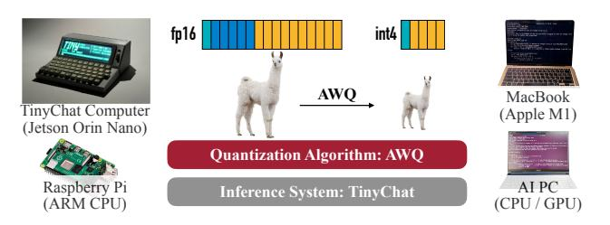
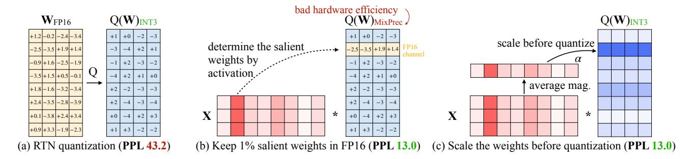
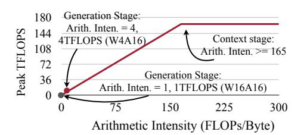
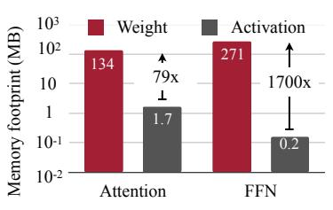
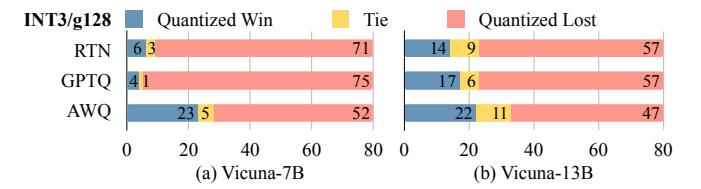
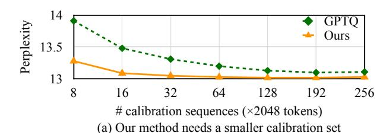
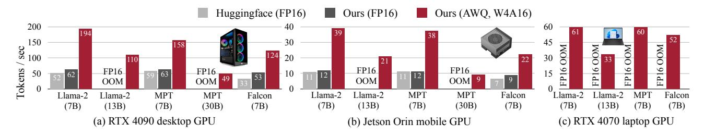
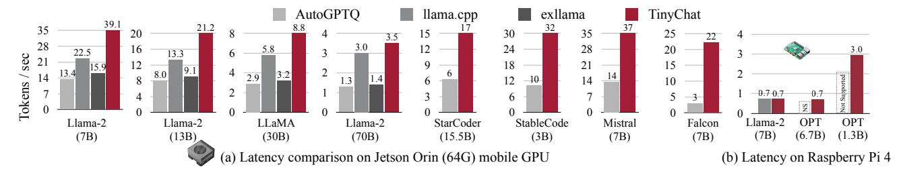

<!-- RP15_Lin_2023 | source: papers_json/RP15_Lin_2023/ -->

## AWQ: <u>التكميم الواعي بالتنشيط للأوزان من أجل</u>
ضغط وتسريع نماذج اللغة الكبيرة على الأجهزة

Ji \operatorname{Lin}^{*1} Jiaming \operatorname{Tang}^{*12} Haotian \operatorname{Tang}^{\dagger 1} Shang \operatorname{Yang}^{\dagger 1} Wei-Ming Chen ^3 Wei-Chen Wang ^1 Guangxuan Xiao ^1 Xingyu Dang ^{14} Chuang \operatorname{Gan}^{56} Song Han ^{13}

https://github.com/mit-han-lab/llm-awq

## **الملخص**

أحدثت نماذج اللغة الكبيرة (LLMs) تحولاً في العديد من تطبيقات الذكاء الاصطناعي. وأصبحت نماذج اللغة الكبيرة على الأجهزة ذات أهمية متزايدة: إذ يمكن لتشغيل هذه النماذج محلياً على الأجهزة الطرفية أن يقلل من تكاليف الحوسبة السحابية ويحمي خصوصية المستخدمين. غير أن الحجم الهائل للنموذج والموارد العتادية المحدودة يطرحان تحديات كبيرة في النشر. نقترح طريقة التكميم الواعي بالتنشيط للأوزان (AWQ)، وهو نهج صديق للعتاد لتكميم نماذج اللغة الكبيرة بالأوزان منخفضة البتات فقط. وتكتشف AWQ أن الأوزان في نموذج اللغة الكبير ليست متساوية الأهمية. فحماية 1% فقط من الأوزان البارزة يمكن أن تقلل خطأ التكميم بشكل كبير. ولتحديد قنوات الأوزان البارزة، ينبغي الرجوع إلى توزيع التنشيط لا إلى الأوزان. ولتجنب التكميم متعدد الدقة غير الفعّال على العتاد، نستنتج رياضياً أن تكبير القنوات البارزة يقلل خطأ التكميم. وتستخدم AWQ تحويلاً مكافئاً لتكبير قنوات الأوزان البارزة من أجل حمايتها. ويُحدَّد المقياس عبر جمع إحصائيات التنشيط دون اتصال. ولا تعتمد AWQ على أي انتشار خلفي أو إعادة بناء، لذا فهي تعمم على مجالات وأنماط مختلفة دون فرط الملاءمة لمجموعة المعايرة. وتتفوق AWQ على الأعمال القائمة في معايير نمذجة اللغة المختلفة والمعايير الخاصة بالمجالات (البرمجة والرياضيات). وبفضل التعميم الأفضل، تحقق أداءً ممتازاً في تكميم نماذج اللغة المضبوطة بالتعليمات، وللمرة الأولى، نماذج اللغة متعددة الأنماط. وإلى جانب AWQ، نقدم TinyChat، وهو إطار استدلال فعال ومرن مصمم خصيصاً لنماذج اللغة الكبيرة ونماذج اللغة المرئية بدقة 4 بتات على الأجهزة. ومن خلال دمج النوى وحزم الأوزان الواعية بالمنصة، يقدم TinyChat تسريعاً يزيد عن 3× مقارنة بتنفيذ Huggingface FP16 على وحدات معالجة الرسوميات لأجهزة الكمبيوتر المكتبية والمحمولة. كما يجعل نشر نموذج Llama-2 بحجم 70B متاحاً على وحدات معالجة الرسوميات للأجهزة المحمولة.

# 1 المقدمة

نشر نماذج اللغة الكبيرة (LLMs) مباشرة على الأجهزة الطرفية أمر بالغ الأهمية. ويزيل الاستخدام على الأجهزة التأخيرات الناجمة عن إرسال البيانات إلى خادم سحابي ويتيح لنماذج اللغة الكبيرة العمل دون اتصال، وهو أمر مفيد للتطبيقات في الزمن الحقيقي مثل المساعدين الافتراضيين وروبوتات الدردشة والمركبات ذاتية القيادة. كما يمكن تقليل التكاليف التشغيلية المرتبطة بصيانة وتوسيع البنية التحتية السحابية المركزية. ويعزز تشغيل نماذج اللغة الكبيرة على الأجهزة أيضاً أمن البيانات بإبقاء المعلومات الحساسة محلية، مما يقلل احتمال تسرب البيانات. وقد استقطبت نماذج اللغة الكبيرة، القائمة على معماريات المحولات (Vaswani et al., 2017)، اهتماماً كبيراً بسبب أدائها المثير للإعجاب عبر معايير متنوعة (Brown et al., 2020; Zhang et al., 2022; Touvron

وقائع المؤتمر السابع لـ MLSys، سانتا كلارا، كاليفورنيا، الولايات المتحدة الأمريكية، 2024. **جائزة أفضل ورقة بحثية.** حقوق النشر 2024 محفوظة للمؤلفين.

***الشكل 1.** نقدم **AWQ**، وهي طريقة تكميم أوزان متعددة الاستخدامات لنماذج اللغة الكبيرة. ولتنفيذ AWQ، طوّرنا **TinyChat** لنشر نماذج اللغة الكبيرة المكمَّمة بدقة 4 بتات على منصات طرفية متنوعة، محققةً تعزيزاً في الأداء بمقدار **3-4**× مقارنة بـ FP16. ومن اللافت أننا صنّعنا أيضاً **حاسوب TinyChat** المُشغَّل بـ TinyChat، الذي يحتوي على NVIDIA Jetson Orin Nano بذاكرة 8 جيجابايت فقط واستهلاك طاقة قدره 15 واط. عرض توضيحي: https://youtu.be/z91a8DrfgEw.*

et al., 2023a; Scao et al., 2022). غير أن الحجم الكبير للنموذج يؤدي إلى تكاليف خدمة عالية. على سبيل المثال، يحتوي GPT-3 على 175 مليار معلَمة، وهو ما يعادل 350 جيجابايت بصيغة FP16، في حين أن أحدث وحدة معالجة رسوميات B200 تمتلك 192 جيجابايت من الذاكرة فقط، ناهيك عن الأجهزة الطرفية.

> ^*: ^القائد المشترك للخوارزمية، †: القائد المشترك للنظام. ¹MIT ²جامعة شنغهاي جياو تونغ ³NVIDIA ⁴جامعة تسينغهوا ⁵مختبر MIT-IBM Watson للذكاء الاصطناعي 6جامعة ماساتشوستس أمهرست. للمراسلة: Song Han <songhan@mit.edu>.

<!-- page 2 -->

يمكن لتكميم الأوزان منخفض البتات لنماذج اللغة الكبيرة أن يقلل بشكل كبير من البصمة الذاكرية لاستدلال النماذج على الأجهزة، لكن ذلك صعب. فالتدريب الواعي بالتكميم (QAT) ليس فعالاً بسبب التكلفة العالية للتدريب، في حين يعاني التكميم بعد التدريب (PTQ) من تدهور كبير في الدقة في إعدادات البتات المنخفضة. وأقرب الأعمال هو GPTQ [(Frantar et al.,](#page-11-0) [2022)](#page-11-0)، الذي يستخدم معلومات الرتبة الثانية لإجراء تعويض الأخطاء. غير أنه قد يفرط في الملاءمة لمجموعة المعايرة أثناء إعادة البناء، مما يشوّه الميزات المتعلَّمة على المجالات خارج التوزيع (الشكل [8)](#page-9-0)، وهو أمر إشكالي لأن نماذج اللغة الكبيرة هي نماذج *عامة*.

نقترح في هذه الورقة طريقة التكميم الواعي بالتنشيط للأوزان (AWQ)، وهي طريقة صديقة للعتاد لتكميم نماذج اللغة الكبيرة بالأوزان فقط ومنخفضة البتات. وتستند طريقتنا إلى ملاحظة أن *الأوزان ليست متساوية الأهمية* لأداء نماذج اللغة الكبيرة. فهناك جزء صغير (0.1%-1%) من الأوزان *البارزة*؛ وتخطّي تكميم هذه الأوزان البارزة سيقلل بشكل كبير من خسارة التكميم (الجدول [1)](#page-3-0). ولإيجاد قنوات الأوزان البارزة، فإن البصيرة هي أنه ينبغي الرجوع إلى توزيع *التنشيط* بدلاً من توزيع *الأوزان*، رغم أننا نقوم بتكميم *الأوزان فقط*: فقنوات الأوزان المقابلة لمقادير التنشيط الأكبر هي الأكثر بروزاً لأنها تعالج ميزات أهم. ولتجنب التنفيذ متعدد الدقة غير الفعّال على العتاد، نحلل الخطأ الناتج عن تكميم الأوزان ونستنتج أن *تكبير القنوات البارزة يمكن أن يقلل خطأ التكميم النسبي* (المعادلة [2)](#page-3-0). وعلى أساس هذا الحدس، صممنا طريقة قياس لكل قناة للبحث تلقائياً عن المقياس الأمثل الذي يقلل خطأ التكميم في ظل تكميم كامل الأوزان. ولا تعتمد AWQ على أي انتشار خلفي أو إعادة بناء، لذا يمكنها الحفاظ جيداً على قدرة التعميم لنماذج اللغة الكبيرة عبر مجالات وأنماط مختلفة دون فرط الملاءمة لمجموعة المعايرة.

ولتنفيذ AWQ، صممنا TinyChat، وهو إطار استدلال فعال لتحويل التوفيرات النظرية في الذكرة الناتجة عن نموذج اللغة الكبير ذي 4 بتات إلى تسريع مقاس. ويُسرّع إطارنا بشكل كبير الطبقات الخطية من خلال إلغاء التكميم الفوري. كما نستفيد من تحزيم الأوزان الفعّال بـ 4 بتات ودمج النوى لتقليل العبء الإضافي للاستدلال (مثل الوصول إلى DRAM الوسيط وعبء إطلاق النواة)، بحيث يمكننا تحقيق التسريع بشكل أفضل من تكميم الأوزان إلى 4 بتات، رغم أن الحاسوب يتعامل بمحاذاة البايت.

وتُظهر التجارب أن AWQ تتفوق على الأعمال الموجودة في مهام مختلفة لعائلات نماذج متعددة (مثل LLaMA [(Touvron et al.,](#page-13-0) [2023a)](#page-13-0)، OPT [(Zhang et al.,](#page-14-0) [2022)](#page-14-0)) وأحجام نماذج مختلفة. وبفضل التعميم الأفضل، تحقق أيضاً أداء تكميم جيداً للنماذج *المضبوطة بالتعليمات* (مثل Vicuna)، وللمرة الأولى، النماذج *متعددة الأنماط* (OpenFlamingo [(Awadalla et al.,](#page-10-0) [2023)](#page-10-0)). ويُترجم TinyChat كذلك البصمة الذاكرية الأقل بمقدار ∼4× إلى تسريع

مقاس. وعلى وحدات معالجة الرسوميات للأجهزة المكتبية والمحمولة وأجهزة الجوال، نلاحظ باستمرار تسريعاً متوسطاً قدره 3.2-3.3× مقارنة بتنفيذ FP16 من Huggingface عبر طيف متنوع من نماذج اللغة الكبيرة. علاوة على ذلك، يسهّل نشر نموذج Llama-2-70B دون عناء على جهاز NVIDIA Jetson Orin واحد بذاكرة 64 جيجابايت. كما يجعل نموذج اللغة الكبير بـ 13 مليار معلَمة متاحاً بسرعة تفاعلية تبلغ 30 رمزاً/ثانية على حاسوب محمول مزود بـ RTX 4070 GPU بذاكرة 8 جيجابايت فقط. وقد تم تبني AWQ على نطاق واسع من قِبل الصناعة ومجتمع المصدر المفتوح: [HuggingFace Transform](https://huggingface.co/docs/transformers/main_classes/quantization)[ers,](https://huggingface.co/docs/transformers/main_classes/quantization) [NVIDIA TensorRT-LLM,](https://github.com/NVIDIA/TensorRT-LLM/) [Microsfot DirectML,](https://blogs.windows.com/windowsdeveloper/2024/05/24/quantization-with-directml-helps-you-scale-further-on-windows/) [Google](https://console.cloud.google.com/vertex-ai/publishers/meta/model-garden/llama-2-quantized) [Vertex AI,](https://console.cloud.google.com/vertex-ai/publishers/meta/model-garden/llama-2-quantized) [Intel Neural Compressor,](https://github.com/intel/neural-compressor) [Amazon Sagemaker,](https://aws.amazon.com/blogs/machine-learning/boost-inference-performance-for-llms-with-new-amazon-sagemaker-containers/) [AMD,](https://community.amd.com/t5/ai/reduce-memory-footprint-and-improve-performance-running-llms-on/ba-p/686157) [FastChat,](https://github.com/lm-sys/FastChat/blob/main/docs/awq.md) [vLLM,](https://github.com/vllm-project/vllm/blob/main/vllm/model_executor/layers/quantization/awq.py) [LMDeploy,](https://github.com/InternLM/lmdeploy) ويمكّن من نشر Falcon-180B على [وحدة](https://github.com/NVIDIA/TensorRT-LLM/blob/main/docs/source/blogs/Falcon180B-H200.md) معالجة رسوميات H200 واحدة.

# 2 الأعمال ذات الصلة

طرق تكميم النماذج. يقلل التكميم من دقة البتات في نماذج التعلم العميق [(Han et al.,](#page-12-0) [2016;](#page-12-0) [Jacob et al.,](#page-12-0) [2018;](#page-12-0) [Nagel et al.,](#page-12-0) [2019;](#page-12-0) [Wang et al.,](#page-13-0) [2019;](#page-13-0) [Nagel et al.,](#page-12-0) [2020;](#page-12-0) [Lin et al.,](#page-12-0) [2020)](#page-12-0)، مما يساعد على تقليل حجم النموذج وتسريع الاستدلال. وتنقسم تقنيات التكميم عموماً إلى فئتين: التدريب الواعي بالتكميم (QAT، الذي يعتمد على الانتشار الخلفي لتحديث الأوزان المكمَّمة) [(Bengio et al.,](#page-11-0) [2013;](#page-11-0) [Gholami et al.,](#page-11-0) [2021;](#page-11-0) [Nagel et al.,](#page-12-0) [2021;](#page-12-0) [Choi et al.,](#page-11-0) [2018)](#page-11-0) والتكميم بعد التدريب [(Jacob et al.,](#page-12-0) [2018;](#page-12-0) [Nagel et al.,](#page-12-0) [2019;](#page-12-0) [2020)](#page-12-0) (PTQ، عادة بدون تدريب). ولا يمكن لطرق QAT أن تتسع بسهولة للنماذج الكبيرة مثل نماذج اللغة الكبيرة. لذلك، يستخدم الناس عادة طرق PTQ لتكميم نماذج اللغة الكبيرة.

تكميم نماذج اللغة الكبيرة. يدرس الناس إعدادين لتكميم نماذج اللغة الكبيرة: (1) تكميم W8A8، حيث يتم تكميم كل من التنشيط والأوزان إلى INT8 [(Dettmers](#page-11-0) [et al.,](#page-11-0) [2022;](#page-11-0) [Xiao et al.,](#page-13-0) [2022;](#page-13-0) [Yao et al.,](#page-13-0) [2022;](#page-13-0) [Wei et al.,](#page-13-0) [2022a;](#page-13-0) [2023)](#page-13-0)؛ (2) تكميم الأوزان فقط منخفض البتات (مثل W4A16)، حيث تُكمَّم الأوزان فقط إلى أعداد صحيحة منخفضة البتات [(Frantar et al.,](#page-11-0) [2022;](#page-11-0) [Dettmers & Zettlemoyer,](#page-11-0) [2022;](#page-11-0) [Sheng et al.,](#page-13-0) [2023;](#page-13-0) [Park et al.,](#page-13-0) [2022)](#page-13-0). نركز في هذا العمل على الإعداد الثاني لأنه لا يقلل فقط من حاجز العتاد (يتطلب حجم ذاكرة أصغر) بل يسرّع أيضاً توليد الرموز (يعالج عبء العمل المقيد بالذاكرة). وإلى جانب الخط الأساس البسيط للتقريب إلى الأقرب (RTN)، فإن GPTQ [(Frantar et al.,](#page-11-0) [2022)](#page-11-0) هو الأقرب إلى عملنا. غير أن عملية إعادة البناء في GPTQ تؤدي إلى مشكلة فرط الملاءمة لمجموعة المعايرة وقد لا تحافظ على القدرات العامة لنماذج اللغة الكبيرة في الأنماط والمجالات الأخرى. كما يتطلب حيلة إعادة الترتيب للعمل مع بعض النماذج (مثل LLaMA-7B [(Touvron et al.,](#page-13-0) [2023a)](#page-13-0) وOPT-66B [(Zhang et al.,](#page-14-0) [2022)](#page-14-0)). وإلى جانب طرق التكميم المصممة للعتاد ذي الأغراض العامة، يصمم SpAtten [(Wang](#page-13-0) [et al.,](#page-13-0) [2020)](#page-13-0) نهجاً تدريجياً لزيادة عدد البتات المستخدمة في حساب softmax تدريجياً.

دعم النظام لنماذج اللغة الكبيرة المكمَّمة منخفضة البتات. أصبحت نماذج اللغة الكبيرة المكمَّمة منخفضة البتات إعداداً شائعاً لتقليل

<!-- page 3 -->

*الشكل 2. نلاحظ أنه يمكننا إيجاد 1% من الأوزان البارزة في نماذج اللغة الكبيرة بناءً على *توزيع التنشيط* (الوسط). والاحتفاظ بالأوزان البارزة بصيغة FP16 يمكن أن يحسّن بشكل كبير الأداء المكمَّم (PPL من 43.2 (يسار) إلى 13.0 (الوسط))، لكن صيغة الدقة المختلطة ليست فعّالة على العتاد. نتبع مبدأ الوعي بالتنشيط ونقترح AWQ (يمين). تُجري AWQ قياساً لكل قناة لحماية الأوزان البارزة وتقليل خطأ التكميم. نقيس حيرة OPT-6.7B في ظل تكميم INT3-g128.*

تكاليف الاستدلال. وهناك بعض دعم النظام لتحقيق تسريع عملي. يوفر GPTQ [(Frantar et al.,](#page-11-0) [2022)](#page-11-0) نوى INT3 لنماذج OPT، ويوسّع GPTQ-for-LLaMA دعم النواة لتكميم INT4 المعاد ترتيبه بمساعدة Triton [(Tillet et al.,](#page-13-0) [2019)](#page-13-0). يقوم FlexGen [(Sheng et al.,](#page-13-0) [2023)](#page-13-0)، llama.cpp[*](#page-0-0) وexllama[†](#page-0-0) بتكميم INT4 على مستوى المجموعة لتقليل تكاليف الإدخال/الإخراج والتفريغ. ينفذ FasterTransformer GEMM بصيغة FP16×INT4 لتكميم الأوزان فقط لكل تنسور، لكنه لا يدعم تكميم المجموعة. ينفذ LUT-GEMM [(Park et al.,](#page-13-0) [2022)](#page-13-0) الحساب على مستوى البت على نوى GPU CUDA بمساعدة جداول البحث. عملنا المتزامن، MLC-LLM [(MLC-](#page-12-0)[Team,](#page-12-0) [2023)](#page-12-0) يقدم نتائج قوية على منصات وحدات المعالجة المركزية والرسومية الطرفية المتعددة بفضل واجهة TVM القوية [(Chen et al.,](#page-11-0) [2018;](#page-11-0) [Feng et al.,](#page-11-0) [2023)](#page-11-0).

# 3 AWQ: التكميم الواعي بالتنشيط للأوزان

يقوم *التكميم* بتحويل عدد عشري إلى أعداد صحيحة منخفضة البتات. وهو طريقة فعّالة لتقليل حجم النموذج وتكاليف الاستدلال لنماذج اللغة الكبيرة [(Dettmers et al.,](#page-11-0) [2022;](#page-11-0) [Frantar et al.,](#page-11-0) [2022;](#page-11-0) [Yao et al.,](#page-13-0) [2022;](#page-13-0) [Xiao et al.,](#page-13-0) [2022)](#page-13-0). نقترح في هذا القسم أولاً طريقة تكميم للأوزان فقط لتحسين الدقة *دون تدريب/انحدار* من خلال حماية الأوزان "الأهم". ثم نطور طريقة قائمة على البيانات للبحث عن المقياس الأمثل الذي يقلل أخطاء التكميم (الشكل 2).

## 3.1 تحسين تكميم نماذج اللغة الكبيرة من خلال الحفاظ على 1% من الأوزان البارزة

نلاحظ أن أوزان نماذج اللغة الكبيرة *ليست متساوية الأهمية*: فهناك جزء صغير من الأوزان *البارزة* أكثر أهمية بكثير لأداء نماذج اللغة الكبيرة مقارنة بغيرها. وتخطّي تكميم هذه الأوزان البارزة يمكن أن يساعد في سد فجوة تدهور الأداء الناجم

عن خسارة التكميم *دون* أي تدريب أو انحدار (الشكل 2(b)). للتحقق من هذه الفكرة، نقيس أداء نماذج اللغة الكبيرة المكمَّمة عند تخطي جزء من قنوات الأوزان في الجدول [1.](#page-3-0) قمنا بقياس أداء النماذج المكمَّمة بـ INT3 مع الاحتفاظ ببعض النسب من قنوات الأوزان بصيغة FP16. والطريقة المستخدمة على نطاق واسع لتحديد أهمية الأوزان هي النظر إلى مقدارها أو معيار L2 [(Han et al.,](#page-12-0) [2015;](#page-12-0) [Frankle & Carbin,](#page-11-0) [2018)](#page-11-0). لكننا نجد أن تخطي قنوات الأوزان ذات المعيار الكبير (أي FP16% (المستندة إلى W)) لا يحسّن بشكل كبير الأداء المكمَّم، مما يؤدي إلى تحسن هامشي مماثل للاختيار العشوائي. ومن المثير للاهتمام أن اختيار الأوزان بناءً على *مقدار التنشيط* يمكن أن يحسّن الأداء بشكل كبير رغم الاحتفاظ بنسبة 0.1%-1% فقط من القنوات بصيغة FP16. ونفترض أن ميزات الإدخال ذات المقادير الأكبر هي عموماً أكثر أهمية. والاحتفاظ بالأوزان المقابلة بصيغة FP16 يمكن أن يحافظ على تلك الميزات، مما يساهم في أداء أفضل للنموذج.

القيود: على الرغم من أن الاحتفاظ بـ 0.1% من الأوزان بصيغة FP16 يمكن أن يحسّن الأداء المكمَّم دون زيادة ملحوظة في حجم النموذج (مقاساً بإجمالي البتات)، فإن نوع البيانات ذا الدقة المختلطة سيجعل تنفيذ النظام صعباً. نحتاج إلى التوصل إلى طريقة لحماية الأوزان المهمة دون الاحتفاظ بها فعلياً بصيغة FP16.

## 3.2 حماية الأوزان البارزة بالقياس الواعي بالتنشيط

نقترح طريقة بديلة لتقليل خطأ التكميم للأوزان البارزة عن طريق *القياس لكل قناة*، وهي لا تعاني من مشكلة عدم الكفاءة على العتاد.

## تحليل خطأ التكميم.

نبدأ بتحليل الخطأ من تكميم الأوزان فقط. لنأخذ مجموعة/كتلة من الأوزان w؛ يمكن كتابة العملية الخطية كـ y = wx، والمكافئ المكمَّم هو y = Q(w)x. وبشكل خاص، فإن دالة التكميم

> ^*^https://github.com/ggerganov/llama.cpp

> ^†^ https://github.com/turboderp/exllama

<!-- page 4 -->

تُعرَّف على النحو التالي:

$$
Q(\mathbf{w}) = \Delta \cdot \text{Round}(\frac{\mathbf{w}}{\Delta}), \quad \Delta = \frac{\max(|\mathbf{w}|)}{2^{N-1}}, (1)
$$

حيث N هو عدد بتات التكميم، و\Delta هو معامل التكميم المُحدَّد بالقيمة المطلقة القصوى. والآن لنأخذ عنصر وزن w \in \mathbf{w}، إذا ضربنا w في s > 1 وقمنا بقياس x عكسياً، سنحصل على Q(w \cdot s)(x/s)، وهو:

$$
Q(w \cdot s) \cdot \frac{x}{s} = \Delta' \cdot \text{Round}(\frac{ws}{\Delta'}) \cdot x \cdot \frac{1}{s}, \tag{2}
$$

حيث \Delta' هو معامل التكميم الجديد بعد تطبيق s. ونجد تجريبياً أن: (1) الخطأ المتوقع من Round(\cdot) (المُشار إليه بـ RoundErr(\cdot)) لا يتغير: لأن دالة التقريب تربط عدداً عشرياً بعدد صحيح، فإن الخطأ موزع تقريباً بشكل منتظم من [0,0.5]، مما يؤدي إلى خطأ متوسط قدره 0.25؛ أي RoundErr(\cdot) \sim 0.25. (2) تكبير عنصر واحد w لا يغيّر عادة القيمة القصوى من المجموعة \mathbf{w}. لذلك لدينا \Delta' \approx \Delta؛ (3) بما أن \Delta وx ممثَّلان بصيغة FP16، فليس لديهما خطأ تكميم. وبالتالي، يمكن التعبير عن خطأ التكميم من المعادلتين 1 و2 على النحو التالي:

$$
\begin{aligned} & \operatorname{Err}(Q(w)x) = \Delta \cdot \operatorname{RoundErr}(\frac{w}{\Delta}) \cdot x \\ & \operatorname{Err}(Q(w \cdot s)(\frac{x}{s})) = \Delta^{'} \cdot \operatorname{RoundErr}(\frac{ws}{\Delta^{'}}) \cdot x \cdot \frac{1}{s} \end{aligned} \tag{3}
$$

نسبة الخطأ الجديد إلى الخطأ الأصلي هي \frac{\Delta'}{\Delta} \cdot \frac{1}{s}. وبالنظر إلى \Delta' \approx \Delta وs > 1، فإن الخطأ النسبي أصغر للوزن البارز w.

للتحقق من الفكرة، نضرب 1% من القنوات البارزة في s > 1 لنموذج OPT-6.7B، ونقيس التغيير في \Delta لكل مجموعة في الجدول 2. نجد أن تكبير القنوات البارزة فعّال جداً: تتحسن الحيرة من 23.54 لـ s = 1 (RTN ببساطة) إلى 11.92 لـ s = 2. ومع زيادة s، تزداد عموماً نسبة \Delta المتغيرة، لكن النسبة لا تزال صغيرة جداً لـ s < 2 (أقل من 5%)؛ ويستمر الخطأ النسبي للقنوات البارزة في الانخفاض كلما زادت s. ومع ذلك، يظهر أفضل PPL فعلياً عند s=2. وذلك لأنه إذا استخدمنا s كبيراً جداً، فسوف يزيد الخطأ النسبي للقنوات غير البارزة عند زيادة \Delta (سيتم تضخيم خطأ القنوات غير البارزة بـ \frac{\Delta'}{\Delta}، والنسبة أكبر من 1 لـ 21.2% من القنوات في ظل s=4)، مما قد يضر بدقة النموذج الإجمالية. لذلك، نحتاج أيضاً إلى مراعاة الخطأ من القنوات غير البارزة عند حماية القنوات البارزة.

**البحث عن القياس.** لمراعاة كل من الأوزان البارزة وغير البارزة، نختار البحث تلقائياً عن عامل قياس أمثل (لكل قناة إدخال) يقلل من فرق المخرجات بعد التكميم لطبقة معينة.

<!-- page 5 -->

- (a) مرحلة التوليد أبطأ
- (b) مرحلة التوليد مقيدة بعرض النطاق الترددي للذاكرة
- (c) تحميل الأوزان أكثر تكلفة

*الشكل 3. تحليل العنق الزجاجي لـ Llama-2-7B على NVIDIA RTX 4090. اليسار: في تطبيقات نماذج اللغة الكبيرة على الأجهزة، تكون مرحلة التوليد أبطأ بكثير من مرحلة السياق. الوسط: مرحلة التوليد مقيدة بالذاكرة ولها كثافة حسابية منخفضة. ويمكن لتكميم W4A16 أن يحسّن بفعالية الكثافة الحسابية بـ 4×. اليمين: كمية الوصول إلى الأوزان أكبر بمقدار رتبة من حيث المقدار من كمية الوصول إلى التنشيط. وبالتالي، فإن تكميم الأوزان فقط أكثر فعالية لنماذج اللغة الكبيرة على الأجهزة.*

رسمياً، نريد تحسين الهدف التالي:

$$
\mathbf{s}^* = \operatorname*{arg\,min}_{\mathbf{s}} \mathcal{L}(\mathbf{s})
\mathcal{L}(\mathbf{s}) = \|Q(\mathbf{W} \cdot \operatorname{diag}(\mathbf{s}))(\operatorname{diag}(\mathbf{s})^{-1} \cdot \mathbf{X}) - \mathbf{W}\mathbf{X}\|
(4)
$$

هنا Q تعني دالة تكميم الأوزان (مثل تكميم INT3/INT4 بحجم مجموعة 128)، وW هي الأوزان الأصلية بصيغة FP16، وX هي ميزات الإدخال المخزنة من مجموعة معايرة صغيرة (نأخذ مجموعة معايرة صغيرة من مجموعة بيانات ما قبل التدريب حتى لا نفرط في الملاءمة لمهمة محددة). s هو عامل قياس لكل قناة (إدخال)؛ بالنسبة لـ s −1 · X، يمكن دمجه عادة في المشغل السابق [(Wei et al.,](#page-13-0) [2022b;](#page-13-0) [Xiao et al.,](#page-13-0) [2022)](#page-13-0). وبما أن دالة التكميم غير قابلة للاشتقاق، فإننا غير قادرين على تحسين المشكلة مباشرة بالانتشار الخلفي البسيط. وهناك بعض التقنيات التي تعتمد على التدرجات التقريبية [(Bengio et al.,](#page-11-0) [2013;](#page-11-0) [Esser et al.,](#page-11-0) [2019)](#page-11-0)، التي وجدنا أنها لا تزال تعاني من تقارب غير مستقر.

ولجعل العملية أكثر استقراراً، نعرّف *فضاء بحث* للمقياس الأمثل من خلال تحليل العوامل التي ستؤثر على اختيار عامل القياس. كما هو موضح في القسم السابق، فإن بروز قنوات الأوزان يُحدَّد فعلياً بمقياس التنشيط (ومن هنا "الوعي بالتنشيط"). لذلك، نستخدم ببساطة فضاء بحث بسيطاً جداً:

$$
\mathbf{s} = \mathbf{s_X}^{\alpha}, \quad \alpha^* = \operatorname*{arg\,min}_{\alpha} \mathcal{L}(\mathbf{s_X}^{\alpha}) (5)
$$

s^X^ هو متوسط مقدار التنشيط (لكل قناة)، ونستخدم معلمة فائقة واحدة α للموازنة بين حماية القنوات البارزة وغير البارزة. يمكننا إيجاد أفضل α من خلال بحث شبكي سريع على الفترة [0, 1] (0 يعني أننا لا نقوم بالقياس؛ 1 يقابل القياس الأكثر صرامة في فضاء البحث لدينا). كما نطبق قص الأوزان لتقليل خطأ MSE للتكميم. نقدم دراسة استئصال على نماذج OPT في ظل تكميم INT3-g128 في الجدول [5؛](#page-6-0) AWQ تتفوق باستمرار على تكميم التقريب إلى الأقرب (RTN) وتحقق أداءً مماثلاً للدقة المختلطة (1% FP16) مع كونها أكثر صداقة للعتاد.

المزايا. لا تعتمد طريقتنا على أي انحدار [(Frantar et al.,](#page-11-0) [2022)](#page-11-0) أو انتشار خلفي، وهو ما تتطلبه العديد من طرق التدريب الواعية بالتكميم. ولها اعتماد أدنى على مجموعة المعايرة لأننا نقيس فقط متوسط المقدار لكل قناة، مما يمنع فرط الملاءمة (الشكل [8)](#page-9-0). لذلك، تتطلب طريقتنا بيانات أقل لعملية التكميم ويمكنها الحفاظ على معرفة نماذج اللغة الكبيرة خارج توزيع مجموعة المعايرة. انظر القسم [5.3](#page-9-0) لمزيد من التفاصيل.

# 4 TINYCHAT: تخطيط AWQ على المنصات الطرفية

يمكن لـ AWQ أن تقلل بشكل كبير من حجم نماذج اللغة الكبيرة. غير أن تحويل التوفيرات النظرية في الذاكرة من تكميم W4A16 (وزن 4 بتات، تنشيط 16 بت) إلى تسريع مقاس ليس بالأمر اليسير. تحافظ طرق تكميم W8A8 البديلة، مثل SmoothQuant [(Xiao et al.,](#page-13-0) [2022)](#page-13-0)، على *دقة البيانات نفسها* للتخزين والحساب. وهذا يتيح دمج إجراء إلغاء التكميم بسلاسة في خاتمة نواة الحساب. ومن ناحية أخرى، يستخدم تكميم W4A16 أنواع بيانات *مختلفة* للوصول إلى الذاكرة والحساب. ونتيجة لذلك، يجب دمج إلغاء التكميم في حلقة الحساب الأساسية للأداء الأمثل، مما يطرح تحديات في التنفيذ. ولمعالجة ذلك، نقدم TinyChat: نظاماً مرناً لاستدلال نموذج AWQ. ويتميز بواجهة أمامية لـ PyTorch وواجهة خلفية تستفيد من مجموعات تعليمات خاصة بالأجهزة (مثل CUDA/PTX، Neon، AVX).

## 4.1 لماذا تساعد AWQ في تسريع نماذج اللغة الكبيرة على الأجهزة

لفهم فرص التسريع في نماذج اللغة الكبيرة المكمَّمة على الجهاز الطرفي، نبدأ بتحليل تفصيل زمن الاستجابة لنموذج LLaMA-7B [(Touvron et al.,](#page-13-0) [2023a)](#page-13-0) على وحدة معالجة رسوميات RTX 4090. نعتمد حجم دفعة استدلال قدره 1، لتلبية حالات الاستخدام الطرفية، وننفذ النموذج بصيغة FP16 مع NVIDIA FasterTransformer.

السياق *مقابل* زمن استجابة التوليد. كما في الشكل 3(a)، يستغرق توليد 20 رمزاً 310 مللي ثانية، بينما يستغرق تلخيص

<!-- page 6 -->

***الشكل 4.** تحزيم الأوزان الواعي بـ SIMD لـ ARM NEON بوحدات SIMD بـ 128 بت. يتم إعادة ترتيب الأوزان الأصلية وتحزيمها لتتماشى مع عرض البت بحيث يمكن فك تحزيم الأوزان إلى بايتات في وقت التشغيل باستخدام عمليات AND والتحويل على مستوى البت بقناع 128 بت.*

موجه بـ 200 رمز 10 مللي ثانية فقط. وبالتالي، فإن مرحلة التوليد أبطأ بكثير من مرحلة السياق، خاصة للتطبيقات التفاعلية على الجهاز.

مرحلة التوليد مقيدة بالذاكرة. لتسريع مرحلة التوليد، نُجري تحليل خط السقف في الشكل 3(b). يتمتع GPU 4090 بإنتاجية حسابية ذروة قدرها 165 TFLOPS وعرض نطاق ترددي للذاكرة قدره 1TB/s. لذلك، فإن أي عبء عمل بكثافة حسابية (نسبة FLOPs إلى الوصول إلى الذاكرة) أقل من 165 يكون مقيداً بالذاكرة على وحدات معالجة الرسوميات 4090. ومن اللافت أنه عند التنفيذ بصيغة FP16، فإن مرحلة التوليد لنماذج اللغة الكبيرة على الأجهزة لها كثافة حسابية ≈1. وهذا يبرز الطبيعة المقيدة بالذاكرة لعبء العمل. وبما أن FLOPs لنموذج معين ثابتة، فإن الطريقة الوحيدة لتحسين أداء الذروة هي تقليل إجمالي حركة الذاكرة. تقلل AWQ ذاكرة الأوزان بأربعة أضعاف.

الوصول إلى الأوزان يهيمن على حركة الذاكرة. لذلك نقوم بتفصيل الوصول إلى الذاكرة للأوزان والتنشيط في الشكل 3(c). من الواضح أن الوصول إلى الأوزان يهيمن على حركة الذاكرة لنماذج اللغة الكبيرة على الأجهزة. وتكميم أوزان النموذج إلى أعداد صحيحة بـ 4 بتات سيزيد تقريباً الكثافة الحسابية إلى 4 FLOPs/Byte، مما يؤدي إلى أداء ذروة قدره 4TFLOPS في الشكل 3(b). وبما أن تكميم الأوزان فقط يؤدي إلى عرض بت أقل للأوزان (وبالتالي حد أعلى للأداء النظري أعلى)، فمن الطبيعي أن تتبع AWQ هذا الإعداد لتطبيقات نماذج اللغة الكبيرة على الأجهزة.

## 4.2 نشر AWQ مع TinyChat

في هذا الصدد، أوضحنا أن تكميم الأوزان بـ 4 بتات يمكن أن يؤدي إلى أداء ذروة نظري قدره 4\times. كما نصمم TinyChat لتحقيق هذا التسريع. وعلى وحدات معالجة الرسوميات، نركز فقط على تنفيذ المكونات الأساسية، بما في ذلك الانتباه، وتطبيع الطبقة، ونوى الإسقاط الخطي. وتسمح الواجهة الأمامية المرنة بسهولة التخصيص والدعم السريع للنماذج الجديدة. يحقق TinyChat مع AWQ بـ 4 بتات أكثر من 3\times تسريع مقارنة بتنفيذ Huggingface FP16 عبر عائلات مختلفة من نماذج اللغة الكبيرة على وحدات معالجة الرسوميات. وعلى وحدات المعالجة المركزية، نخفض رسم الحساب الكامل إلى C++ لتقليل العبء الإضافي.

**إلغاء تكميم الأوزان الفوري.** بالنسبة للطبقات المكمَّمة، وبما أن العتاد لا يوفر تعليمات الضرب بين INT4 وFP16، نحتاج إلى إلغاء تكميم الأعداد الصحيحة

إلى FP16 قبل إجراء حساب المصفوفة. نتجنب كتابة الأوزان غير المكمَّمة في DRAM من خلال دمج نوى إلغاء التكميم مع نواة ضرب المصفوفات. لاحظ أن هذا الدمج يُعتمد لكل من نوى ضرب المصفوفة-المصفوفة (MM) وضرب المصفوفة-المتجه (MV).

**تحزيم الأوزان الواعي بـ SIMD.** يقلل إلغاء تكميم الأوزان الفوري من الوصول الوسيط إلى DRAM، لكنه يبقى مكلفاً. على سبيل المثال، يتضمن إلغاء تكميم وزن واحد بـ 4 بتات تحويل واحد، وعملية AND على مستوى البت واحدة، وعملية قياس FMA واحدة، في حين يخضع الوزن غير المكمَّم لعملية حساب FMA واحدة فقط. وهذه العملية مكلفة بشكل خاص على وحدات المعالجة المركزية ذات معمارية SIMD التي تفضل التعليمات المتجهة. ولتخفيف ذلك، نقترح تحزيم أوزان خاصاً بالمنصة مصمماً لعرض بت وحدات SIMD للجهاز. يوضح الشكل 4 استراتيجيتنا لوحدات المعالجة المركزية ARM ذات سجلات SIMD بـ 128 بت التي تقدم تسريعاً يصل إلى 1.2 \times. وهنا، يحتفظ كل سجل بـ 32 وزناً بـ 4 بتات، مرتبة كـ w_0, w_{16}, w_1, w_{17}, ..., w_{15}, w_{31}. ويتطلب هذا النهج فقط ثلاث تعليمات SIMD لفك تحزيم جميع الأوزان البالغ عددها 32، بدلاً من 3 تعليمات قياسية لكل وزن في التحزيم التقليدي (w_0, w_1, ..., w_{31}). وبشكل عام، بالنسبة لسجلات SIMD بـ 2^n بت، ستكون الأوزان المتجاورة بفهارس تختلف بمقدار 1/8 \times 2^n، لأن كل سجل يمكنه الاحتفاظ بـ 1/8 \times 2^n عدداً صحيحاً بـ 8 بتات. على وحدات معالجة الرسوميات، وجدنا أن تحزيم كل 8 أوزان إلى w_{\{0,2,4,6,1,3,5,7\}} متابعة (Kim et al., 2022) أكثر كفاءة.

**دمج النوى.** نطبق أيضاً دمج النوى على نطاق واسع لتحسين استدلال نماذج اللغة الكبيرة على الأجهزة. بالنسبة لتطبيع الطبقة، ندمج جميع المشغلين (مثل الضرب والقسمة والجذر التربيعي) في نواة واحدة. بالنسبة لطبقات الانتباه، ندمج إسقاطات QKV في نواة واحدة، ونؤدي أيضاً حساب التضمين الموضعي الفوري. كما نقوم بتخصيص ذاكرات تخزين KV مسبقاً ونؤدي تحديثات الذاكرة المؤقتة داخل نواة الانتباه. ويعد دمج النوى مفيداً بشكل خاص للنماذج ذات تنفيذات التمرير الأمامي غير الفعّالة، مثل Falcon (Penedo et al., 2023) وStarCoder (Li et al., 2023c). ومن الجدير بالذكر أن وقت الحساب لكل نواة FP16 هو في حدود 0.01 مللي ثانية على GPU 4090، وهو ما يضاهي عبء إطلاق نواة GPU. وبالتالي، فإن تقليل عدد استدعاءات النواة من خلال دمج النوى يؤدي إلى تسريعات مباشرة.

<!-- page 7 -->

# 5 التجارب

## 5.1 الإعدادات

التكميم. نركز في هذا العمل على *التكميم المجمَّع للأوزان فقط*. وكما هو موضح في الأعمال السابقة [(Dettmers &](#page-11-0) [Zettlemoyer,](#page-11-0) [2022;](#page-11-0) [Frantar et al.,](#page-11-0) [2022)](#page-11-0)، فإن التكميم المجمَّع مفيد دائماً لتحسين موازنة الأداء/حجم النموذج. استخدمنا حجم مجموعة قدره 128 طوال العمل، إلا إذا تم تحديد خلاف ذلك. نركز على تكميم INT4/INT3 لأنهما قادران على الحفاظ في الغالب على أداء نماذج اللغة الكبيرة [(Dettmers & Zettlemoyer,](#page-11-0) [2022)](#page-11-0). بالنسبة لـ AWQ، استخدمنا مجموعة معايرة صغيرة من مجموعة بيانات Pile [(Gao et al.,](#page-11-0) [2020)](#page-11-0) حتى لا نفرط في الملاءمة لمجال خاص. استخدمنا حجم شبكة قدره 20 للبحث عن α الأمثل في المعادلة [5.](#page-4-0)

النماذج. قمنا بقياس أداء طريقتنا على عائلتي LLaMA [(Tou](#page-13-0)[vron et al.,](#page-13-0) [2023a)](#page-13-0) وOPT [(Zhang et al.,](#page-14-0) [2022)](#page-14-0). هناك نماذج لغة كبيرة مفتوحة أخرى مثل BLOOM [(Scao et al.,](#page-13-0) [2022)](#page-13-0)، لكنها عموماً أسوأ من حيث الجودة، لذلك لا نضمنها في دراستنا. كما نقيس أداء نموذج Vicuna المضبوط بالتعليمات [(Chiang et al.,](#page-11-0) [2023)](#page-11-0) ونماذج اللغة المرئية OpenFlamingo-9B [(Awadalla et al.,](#page-10-0) [2023)](#page-10-0) وLLaVA-13B [(Liu et al.,](#page-12-0) [2023a)](#page-12-0) لإثبات قابلية تعميم طريقتنا.

*الشكل 5. مقارنة نماذج Vicuna المكمَّمة بـ INT3-g128 مع نظيراتها بصيغة FP16 وفقاً لبروتوكول تقييم GPT-4 [(Chiang et al.,](#page-11-0) [2023)](#page-11-0). يشير وجود حالات فوز أكثر (باللون الأزرق) إلى أداء أفضل. تحسّن AWQ باستمرار الأداء المكمَّم مقارنة بـ RTN وGPTQ [(Frantar et al.,](#page-11-0) [2022)](#page-11-0)، مما يدل على التعميم على النماذج المضبوطة بالتعليمات.*

التقييمات. باتباع الأدبيات السابقة [(Dettmers](#page-11-0) [et al.,](#page-11-0) [2022;](#page-11-0) [Xiao et al.,](#page-13-0) [2022;](#page-13-0) [Frantar et al.,](#page-11-0) [2022;](#page-11-0) [Dettmers](#page-11-0) [& Zettlemoyer,](#page-11-0) [2022;](#page-11-0) [Yao et al.,](#page-13-0) [2022)](#page-13-0)، قمنا بشكل أساسي بقياس أداء النماذج المكمَّمة في مهام نمذجة اللغة (تقييم الحيرة على WikiText-2 [(Merity et al.,](#page-12-0) [2016)](#page-12-0)) لأن الحيرة يمكن أن تعكس بثبات أداء نموذج اللغة الكبير [(Dettmers](#page-11-0) [& Zettlemoyer,](#page-11-0) [2022)](#page-11-0).

خطوط الأساس. خط الأساس الأساسي لدينا هو تكميم التقريب إلى الأقرب البسيط (RTN). وهو في الواقع قوي جداً عند استخدام حجم مجموعة صغير مثل 128 [(Frantar et al.,](#page-11-0) [2022;](#page-11-0) [Dettmers & Zettlemoyer,](#page-11-0) [2022)](#page-11-0). كما نقارن بطريقة GPTQ المتقدمة [(Frantar et al.,](#page-11-0) [2022)](#page-11-0) لتكميم أوزان نماذج اللغة الكبيرة. بالنسبة لـ GPTQ، نقارن أيضاً بإصدار محدّث يستخدم حيلة "إعادة الترتيب" (المُشار إليه بـ GPTQ-Reorder أو GPTQ-R). وتعتمد التقنيات الأخرى مثل ZeroQuant [(Yao et al.,](#page-13-0) [2022)](#page-13-0)، AdaRound [(Nagel et al.,](#page-12-0) [2020)](#page-12-0)، وBRECQ [(Li et al.,](#page-12-0) [2021)](#page-12-0) على الانتشار الخلفي لتحديث الأوزان المكمَّمة، وقد لا تتسع بسهولة لأحجام النماذج الكبيرة؛ كما أنها لا تتفوق على GPTQ [(Fran](#page-11-0)[tar et al.,](#page-11-0) [2022)](#page-11-0)، لذلك لم تُدرج للدراسة.

## 5.2 التقييم

النتائج على نماذج LLaMA. نركز على نماذج LLaMA (LLaMA [(Touvron et al.,](#page-13-0) [2023a) وLlama-2 (Touvron](#page-13-0)

<!-- page 8 -->

et al., 2023b)) بسبب أدائها المتفوق مقارنة بنماذج اللغة الكبيرة الأخرى مفتوحة المصدر (Zhang et al., 2022; Scao et al., 2022)؛ كما أنها أساس العديد من النماذج الشهيرة مفتوحة المصدر (Taori et al., 2023; Chiang et al., 2023). نقيّم الحيرة قبل وبعد التكميم في الجدول 4. تتفوق AWQ باستمرار على التقريب إلى الأقرب (RTN) وGPTQ (Frantar et al., 2022) (مع وبدون إعادة الترتيب) عبر مقاييس النماذج المختلفة (7B-70B) والأجيال.

النتائج على نماذج Mistral / Mixtral. كما قمنا بتقييم AWQ على نماذج Mistral وMixtral، وهي من أكثر نماذج اللغة الكبيرة شيوعاً مفتوحة المصدر ونماذج Mixture-of-Experts (MoE) على التوالي (Jiang et al., 2023; 2024). تشير النتائج إلى أن AWQ تحقق أداءً متفوقاً على كل من نماذج Mistral وMixtral. وهذا يدل على أن AWQ فعّالة عبر معماريات نماذج مختلفة.

تكميم النماذج المضبوطة بالتعليمات. يمكن لضبط التعليمات أن يحسّن بشكل كبير أداء النماذج وقابلية استخدامها (Wei et al., 2021; Sanh et al., 2021; Ouyang et al., 2022; Chung et al., 2022). وقد أصبح إجراءً أساسياً قبل نشر النموذج. كما نقيس أداء طريقتنا على نموذج Vicuna الشهير المضبوط بالتعليمات (Chiang et al., 2023) في الشكل 5. استخدمنا درجة GPT-4 لتقييم أداء النماذج المكمَّمة مقابل النظير بصيغة FP16 على 80 سؤال عينة (Chiang et al., 2023). نقارن الإجابات بكلا الترتيبين (مكمَّم-FP16، FP16-مكمَّم) للتخلص من تأثير

الترتيب (وجدنا أن GPT-4 يميل إلى زيادة تصنيف المدخل الأول)، مما يؤدي إلى 160 محاولة. تحسّن AWQ باستمرار نماذج Vicuna المكمَّمة بـ INT3-g128 مقارنة بـ RTN وGPTQ في كلا المقياسين (7B و13B)، مما يدل على قابلية التعميم على النماذج المضبوطة بالتعليمات.

تكميم نماذج اللغة متعددة الأنماط. النماذج متعددة الأنماط الكبيرة (LMMs) أو نماذج اللغة المرئية (VLMs) هي نماذج لغة كبيرة معززة بمدخلات بصرية (Alayrac et al., 2022; Li et al., 2023b; Koh et al., 2023; Driess et al., 2023; Zhang et al., 2023; Liu et al., 2023a). وهذه النماذج قادرة على إجراء توليد النص المشروط بمدخلات الصورة/الفيديو. وبما أن طريقتنا لا تعاني من مشكلة فرط الملاءمة لمجموعة المعايرة، يمكن تطبيقها مباشرة على VLMs

<!-- page 9 -->

أحياناً ما أنظر إلى صور الأرض من الفضاء وأتعجب من جمال كل شيء.

**السؤال**: هل يمكنك شرح هذا الميم بالتفصيل؟

**I****N****T4-g128 RT****N**: يحتوي الميم في الصورة على طبق طعام، يُرجَّح أنه دجاج مقلي، مع لمسة فريدة. هناك صور صغيرة للأرض والكواكب الأخرى موضوعة فوق الطعام، مما يخلق منظراً مثيراً للاهتمام والتسلية. وإلى جانب الطبق، يقول التعليق التوضيحي: "أحياناً ما أنظر إلى صور الأرض من الفضاء وأتعجب من جمال كل شيء". هذا الجمع بين الطعام وصور الكواكب يضفي لمسة من الفكاهة والفضول، ويجعل المشاهد يتساءل عن السياق والقصد وراء الميم.

**I****N****T4-g128 AWQ**: الميم في الصورة هو لمسة خفيفة وفكاهية على فكرة النظر إلى صور الأرض من الفضاء. يُقدَّم طبق من الطعام المقلي، وتحديداً قطع الدجاج، مع التعليق "أحياناً ما أنظر إلى صور الأرض من الفضاء وأتعجب من جمال كل شيء". الجمع المرح لعنصر طعام مع سياق متعلق بالأرض يخلق منظراً ممتعاً ومسلياً.

**W4-RTN**: نموذج طائرة يحلق في السماء.

**W4-AWQ**: طائرتان من اللعب موضوعتان على حقل عشبي.

**W4-RTN**: رجل يحمل فيلاً صغيراً بين ذراعيه.

**W4-AWQ**: رجل وابنته يقفان مع فيل.

**W4-RTN**: رجل وكلب يمشيان بجوار بعض الشجيرات.

**W4-AWQ**: كلبان يسيران في الشارع.

*الشكل 7. النتائج النوعية لـ OpenFlamingo-9B المكمَّم [(Awadalla et al.,](#page-10-0) [2023)](#page-10-0) على مجموعة بيانات COCO captioning (4-shot، تكميم INT4-g128). تحسّن طريقتنا بشكل كبير جودة التعليقات التوضيحية مقارنة بخط الأساس للتقريب إلى الأقرب (RTN). نلوّن النص لإظهار التعليقات الصحيحة أو الخاطئة.*

لتوفير تكميم دقيق وفعّال. نُجري تجارب مع نموذج OpenFlamingo-9B [(Awadalla](#page-10-0) [et al.,](#page-10-0) [2023)](#page-10-0) (إعادة إنتاج مفتوحة المصدر لـ [(Alayrac et al.,](#page-10-0) [2022)](#page-10-0)) على مجموعة بيانات COCO captioning [(Chen et al.,](#page-11-0) [2015)](#page-11-0) (الجدول [6)](#page-7-0). قمنا بقياس متوسط أداء 5 آلاف عينة في إعدادات few-shot المختلفة. نقوم فقط بتكميم الجزء اللغوي من النموذج لأنه يهيمن على حجم النموذج. تتفوق AWQ على الطرق الموجودة في إعدادات zero-shot وfew-shot المختلفة، مما يدل على قابلية التعميم على أنماط مختلفة وأعباء عمل التعلم في السياق. وتقلل من تدهور التكميم (32-shot) من 4.57 إلى 1.17 في إطار INT4-g128، موفرةً تقليلاً في حجم النموذج بمقدار 4× مع خسارة أداء طفيفة. ولإثبات قابلية تعميم AWQ بشكل أكبر، قمنا أيضاً بتقييم AWQ على أحد نماذج اللغة المرئية متعددة الصور المتقدمة: VILA. تظهر النتيجة في الجدول [7](#page-7-0) أن AWQ تحقق أداء تكميم بلا خسارة على 11 معياراً للغة المرئية. كما نقدم بعض النتائج النوعية للتعليقات التوضيحية في الشكل 7 لإظهار ميزتنا على RTN. توفر طريقتنا حلاً بضغطة زر لتكميم LMM/VLM. وهي *أول* دراسة لتكميم VLM منخفض البتات على حد علمنا.

نتائج التفكير البصري. نقدم كذلك بعض الأمثلة النوعية للتفكير البصري لنموذج LLaVA-13B [(Liu](#page-12-0) [et al.,](#page-12-0) [2023a)](#page-12-0) في الشكل 6. تحسّن AWQ الإجابات مقارنة بالتقريب إلى الأقرب (RTN) لتكميم INT4-g128، مما يؤدي إلى إجابات أكثر منطقية. في هذا المثال الأول، يمكن لنموذج AWQ فهم الميم لأنه يشبه الأرض عند النظر من الفضاء، في حين ينتج RTN أوصافاً خاطئة (مُعلَّمة باللون الأحمر).

النتائج على مهام البرمجة والرياضيات. لمزيد من تقييم أداء AWQ على المهام التي تنطوي على توليدات معقدة، اختبرنا أيضاً AWQ على MBPP [(Austin et al.,](#page-10-0) [2021)](#page-10-0) وGSM8K [(Cobbe et al.,](#page-11-0) [2021)](#page-11-0). يتكون MBPP [(Austin et al.,](#page-10-0) [2021)](#page-10-0) من حوالي 1000 مسألة برمجة بـ Python، مصممة لتكون قابلة للحل من قِبل المبرمجين المبتدئين، وتغطي أساسيات البرمجة، ووظائف المكتبة القياسية، وما إلى ذلك. وقد تم إنشاء GSM8K [(Cobbe](#page-11-0) [et al.,](#page-11-0) [2021)](#page-11-0) لدعم مهمة الإجابة عن الأسئلة في المسائل الرياضية الأساسية التي تتطلب تفكيراً متعدد الخطوات. نقوم بتكميم CodeLlama-7b-Instruct-hf وLlama-2 إلى INT4-g128 ونُجري تجارب على مجموعات بيانات البرمجة والرياضيات (الجدول [8)](#page-7-0). تتفوق AWQ على الطرق الموجودة في كلا مجموعتي البيانات، مما يدل على قابلية التعميم على التوليد المعقد. وتُظهر AWQ في إطار تكوين INT4-g128 أداءً مماثلاً لنموذج FP16 الأصلي على كلا مجموعتي البيانات.

التكميم بالبتات المنخفضة جداً. كما نقوم بتكميم نموذج اللغة الكبير إلى INT2 لاستيعاب ذاكرة الجهاز المحدودة (الجدول 9).

<!-- page 10 -->

| Calib Eval | GPTQ | Ours |  |  |
| --- | --- | --- | --- | --- |
| PubMed | Enron | PubMed | Enron |  |
| PubMed | 32.48 | 50.41 +4.89 | 32.56 | 45.07 +0.50 |
| Enron | +2.33 34.81 | 45.52 | +0.60 33.16 | 44.57 |

(b) طريقتنا أكثر متانة لتوزيع مجموعة المعايرة

***الشكل 8. اليسار:** تحتاج AWQ إلى مجموعة معايرة أصغر بكثير للوصول إلى أداء مكمَّم جيد. ويمكنها تحقيق حيرة أفضل باستخدام مجموعة معايرة أصغر بـ 10× مقارنة بـ GPTQ. **اليمين:** طريقتنا أكثر متانة لتوزيع مجموعة المعايرة. وبشكل عام، فإن استخدام نفس توزيع المعايرة والتقييم يعمل بشكل أفضل (PubMed-PubMed، Enron-Enron). لكن عند استخدام توزيع معايرة مختلف (PubMed-Enron، Enron-PubMed)، تزيد AWQ الحيرة بمقدار 0.5-0.6 فقط، في حين أن GPTQ لديه حيرة أسوأ بمقدار 2.3-4.9. تُجرى جميع التجارب مع نموذج OPT-6.7B في إطار تكميم INT3-g128.*

***الشكل 9.** يوفر TinyChat حلاً جاهزاً لتحويل التخفيض النظري في البصمة الذاكرية إلى تسريع قابل للقياس. ونتيجة لذلك، فإن TinyChat أسرع بمقدار يصل إلى 3.9 \times و3.5 \times من تنفيذ FP16 من Huggingface على 4090 (وحدة معالجة رسوميات لسطح المكتب) وOrin (وحدة معالجة رسوميات للجوال) على التوالي. كما تجعل AWQ نشر Llama-2-13B متاحاً على وحدات معالجة رسوميات للحواسيب المحمولة (4070) بذاكرة 8 جيجابايت فقط.*

يفشل RTN تماماً، وتقدم AWQ تحسناً كبيراً في الحيرة فوق GPTQ. طريقتنا متعامدة على GPTQ. يمكننا الجمع بين طريقتنا وGPTQ لزيادة تحسين أداء تكميم INT2، مما يجعله إعداداً أكثر عملية.

## 5.3 كفاءة البيانات والتعميم

كفاءة بيانات أفضل لمجموعة المعايرة. تتطلب طريقتنا مجموعة معايرة أصغر لأننا لا نعتمد على الانحدار/الانتشار الخلفي؛ نقيس فقط متوسط مقياس التنشيط من مجموعة المعايرة، وهو فعّال من حيث البيانات. لإثبات الفكرة، نقارن حيرة نموذج OPT-6.7B مع تكميم INT3-g128 في الشكل 8 (a). تحتاج AWQ إلى معايرة أصغر بكثير للوصول إلى أداء مكمَّم جيد؛ ويمكنها تحقيق حيرة أفضل باستخدام مجموعة معايرة أصغر بـ 10 \times مقارنة بـ GPTQ (16 تسلسلاً مقابل 192 تسلسلاً).

متانة لتوزيعات مجموعة المعايرة. طريقتنا أقل حساسية لتوزيع مجموعة المعايرة لأننا نقيس فقط متوسط مقياس التنشيط من مجموعة المعايرة، وهو أكثر قابلية للتعميم عبر توزيعات مجموعات البيانات المختلفة. كما قمنا بقياس تأثير توزيعات مجموعة المعايرة المختلفة في الشكل 8(b). أخذنا مجموعتين فرعيتين من مجموعة بيانات Pile (Gao et al., 2020): PubMed Abstracts وEnron Emails (Klimt & Yang, 2004). نستخدم كلاً من المجموعتين الفرعيتين كمجموعة معايرة ونقيّم النموذج المكمَّم على كلتا المجموعتين (تُقسَّم مجموعتا المعايرة والتقييم بدون تداخل؛ استخدمنا 1000 عينة

للتقييم). وبشكل عام، فإن استخدام نفس توزيع المعايرة والتقييم يعمل بشكل أفضل (PubMed-PubMed، Enron-Enron). لكن عند استخدام توزيع معايرة مختلف (PubMed-Enron، Enron-PubMed)، تزيد AWQ الحيرة بمقدار 0.5-0.6 فقط، في حين أن GPTQ لديه حيرة أسوأ بمقدار 2.3-4.9. وهذا يدل على متانة AWQ لتوزيع مجموعة المعايرة.

## 5.4 تقييم التسريع

**الإعدادات.** في الشكل 9، نوضح نتائج تسريع النظام من TinyChat. يحسّن TinyChat كلاً من الطبقات الخطية والطبقات التي ليس لديها أوزان مكمَّمة. نُجري تجارب القياس على RTX 4090 وJetson Orin متبعين البروتوكول الموصوف في exllama ‡.

> ^&^lt;sup>‡https://github.com/turboderp/exllama

<!-- page 11 -->

*الشكل 10. يوفر TinyChat تسريعاً بمقدار 1.2-3.0× على الأنظمة الموجودة عند تشغيل نماذج Llama المكمَّمة بـ 4 بتات على NVIDIA Jetson Orin. كما يدعم مجموعة متنوعة من نماذج اللغة الكبيرة العامة والمتخصصة في البرمجة بتسريع لا يقل عن 2.6× مقارنة بـ AutoGPTQ، الذي يدعم أيضاً جميع أعباء العمل هذه. علاوة على ذلك، يعمل TinyChat بسلاسة على Raspberry Pi ويمكّن من نشر نماذج اللغة الكبيرة بمعلَمات تصل إلى 7 مليارات على أجهزة إنترنت الأشياء ذات الموارد المحدودة للغاية.*

نُجري استدلالاً بحجم دفعة = 1 لجميع نماذج اللغة الكبيرة باستخدام طول موجه ثابت قدره 4 رموز. نولد 200 رمز لكل تشغيل استدلال ونحسب متوسط زمن الاستجابة كنتيجة نهائية.

النتائج. كما في الشكل [9(](#page-9-0)a)، يقدم TinyChat تسريعاً بمقدار 2.7-3.9× لثلاث عائلات من نماذج اللغة الكبيرة (Llama-2، MPT وFalcon) على 4090 مقارنة بتنفيذ Huggingface FP16. بالنسبة لـ Llama-2-7B، نحسّن سرعة الاستدلال من 52 رمزاً/ثانية إلى 62 رمزاً/ثانية من خلال دمج نوى FP16. وفوق خط الأساس الأقوى لـ FP16، نحصل كذلك على تسريع إضافي بمقدار 3.1× من النوى الخطية المكمَّمة السريعة. بالنسبة لـ Falcon-7B، فإن التنفيذ الرسمي لم يدعم ذاكرة KV المؤقتة بشكل صحيح أثناء وقت الاستدلال، وبالتالي فهو أبطأ بشكل كبير من النماذج الأخرى. في هذه الحالة، تقدم تحسينات FP16 لدينا تسريعاً أكبر بمقدار 1.6×. على وحدة معالجة الرسوميات للحاسوب المحمول 4070 بذاكرة 8 جيجابايت فقط، ما زلنا قادرين على تشغيل نماذج Llama-2-13B بسرعة 33 رمزاً/ثانية، في حين لا يستطيع تنفيذ FP16 احتواء نماذج 7B. كما نوضح نتائج تسريع نموذج اللغة المرئية [(Lin et al.,](#page-12-0) [2024)](#page-12-0) في الجدول [10.](#page-9-0) يقدم TinyChat تسريعاً بمقدار 3× لكل من VILA-7B وVILA-13B على NVIDIA Jetson Orin. ومن اللافت أننا ننفذ التمرير الأمامي لجميع نماذج AWQ باستخدام واجهات PyTorch الأصلية، ويُعاد استخدام هذا الكود عبر معماريات GPU المختلفة. ومن ثم، يقدم TinyChat قابلية توسعة استثنائية.

المقارنات بالأنظمة الأخرى. نقارن TinyChat بأنظمة استدلال نماذج اللغة الكبيرة الطرفية الموجودة AutoGPTQ، llama.cpp وexllama في الشكل 10. يحقق نظامنا تسريعاً يصل إلى 1.7× على llama.cpp على Orin. علاوة على ذلك، يُظهر llama.cpp وexllama قابلية تكيف محدودة، مصممة بشكل أساسي لنماذج LLaMA وLlama-2. وفي المقابل، يدعم TinyChat لدينا مجموعة واسعة من التطبيقات، بما في ذلك StarCoder [(Li et al.,](#page-12-0) [2023c)](#page-12-0)، StableCode (GPT-NeoX) [(Black et al.,](#page-11-0) [2022)](#page-11-0)، Mistral [(Jiang et al.,](#page-12-0) [2023)](#page-12-0)، وFalcon [(Penedo et al.,](#page-13-0) [2023)](#page-13-0) مع تقديم تسريع كبير باستمرار على AutoGPTQ. حتى أن TinyChat يجعل نشر نماذج اللغة الكبيرة متاحاً على Raspberry Pi 4B ذي الموارد المحدودة للغاية، محققاً 0.7 رمز/ثانية لنماذج 7B.

# 6 الخاتمة

في هذا العمل، نقترح التكميم الواعي بالتنشيط للأوزان (AWQ)، وهو طريقة بسيطة وفعّالة لضغط نماذج اللغة الكبيرة بالأوزان فقط منخفضة البتات. وبناءً على ملاحظة أن الأوزان ليست متساوية الأهمية في نماذج اللغة الكبيرة، تُجري AWQ قياساً لكل قناة لتقليل خسارة التكميم للأوزان البارزة. ولا تفرط AWQ في الملاءمة لمجموعة المعايرة وتحافظ على القدرات العامة لنماذج اللغة الكبيرة في مختلف المجالات والأنماط. وتتفوق على الأعمال الموجودة في نمذجة اللغة وتنطبق على نماذج اللغة المضبوطة بالتعليمات والنماذج متعددة الأنماط. ويترجم نظام TinyChat لدينا كذلك التوفيرات النظرية في الذاكرة التي تحققها AWQ إلى تسريعات مقاسة بمقدار 3.2-3.3× على تنفيذات FP16 من Huggingface على وحدات معالجة الرسوميات لأجهزة الكمبيوتر المكتبية والمحمولة، مما يجعل نشر نماذج اللغة الكبيرة على الأجهزة الطرفية متاحاً.

## شكر وتقدير

نشكر برنامج عتاد الذكاء الاصطناعي بـ MIT، ومؤسسة العلوم الوطنية (CNS-2112562)، ومختبر MIT-IBM Watson للذكاء الاصطناعي، وأمازون ومركز MIT للعلوم، وبرنامج Microsoft Turing الأكاديمي، وسامسونج لدعم هذا البحث.

## المراجع

Alayrac, J.-B., Donahue, J., Luc, P., Miech, A., Barr, I., Hasson, Y., Lenc, K., Mensch, A., Millican, K., Reynolds, M., et al. Flamingo: a visual language model for few-shot learning. *Advances in Neural Information Processing* *Systems*, 35:23716–23736, 2022.

Austin, J., Odena, A., Nye, M., Bosma, M., Michalewski, H., Dohan, D., Jiang, E., Cai, C., Terry, M., Le, Q., and Sutton, C. Program synthesis with large language models, 2021.

Awadalla, A., Gao, I., Gardner, J., Hessel, J., Hanafy, Y., Zhu, W., Marathe, K., Bitton, Y., Gadre, S., Jitsev, J., Kornblith, S., Koh, P. W., Ilharco, G., Wortsman, M., and Schmidt, L. Openflamingo, March 2023. URL [https:](https://doi.org/10.5281/zenodo.7733589) [//doi.org/10.5281/zenodo.7733589](https://doi.org/10.5281/zenodo.7733589).

<!-- page 12 -->

- Bengio, Y., Leonard, N., and Courville, A. Estimating or ´ propagating gradients through stochastic neurons for conditional computation. *arXiv preprint arXiv:1308.3432*, 2013.
- Black, S., Biderman, S., Hallahan, E., Anthony, Q., Gao, L., Golding, L., He, H., Leahy, C., McDonell, K., Phang, J., et al. Gpt-neox-20b: An open-source autoregressive language model. *arXiv preprint arXiv:2204.06745*, 2022.
- Brown, T., Mann, B., Ryder, N., Subbiah, M., Kaplan, J. D., Dhariwal, P., Neelakantan, A., Shyam, P., Sastry, G., Askell, A., Agarwal, S., Herbert-Voss, A., Krueger, G., Henighan, T., Child, R., Ramesh, A., Ziegler, D., Wu, J., Winter, C., Hesse, C., Chen, M., Sigler, E., Litwin, M., Gray, S., Chess, B., Clark, J., Berner, C., McCandlish, S., Radford, A., Sutskever, I., and Amodei, D. Language models are few-shot learners. In Larochelle, H., Ranzato, M., Hadsell, R., Balcan, M., and Lin, H. (eds.), *Advances in Neural Information Processing* *Systems*, volume 33, pp. 1877–1901. Curran Associates, Inc., 2020. URL [https://proceedings.](https://proceedings.neurips.cc/paper/2020/file/1457c0d6bfcb4967418bfb8ac142f64a-Paper.pdf) [neurips.cc/paper/2020/file/](https://proceedings.neurips.cc/paper/2020/file/1457c0d6bfcb4967418bfb8ac142f64a-Paper.pdf) [1457c0d6bfcb4967418bfb8ac142f64a-Paper](https://proceedings.neurips.cc/paper/2020/file/1457c0d6bfcb4967418bfb8ac142f64a-Paper.pdf). [pdf](https://proceedings.neurips.cc/paper/2020/file/1457c0d6bfcb4967418bfb8ac142f64a-Paper.pdf).
- Chen, T., Moreau, T., Jiang, Z., Zheng, L., Yan, E., Shen, H., Cowan, M., Wang, L., Hu, Y., Ceze, L., et al. TVM: An Automated End-to-End Optimizing Compiler for Deep Learning. In *13th USENIX Symposium on Operating* *Systems Design and Implementation (OSDI)*, 2018.
- Chen, X., Fang, H., Lin, T.-Y., Vedantam, R., Gupta, S., Dollar, P., and Zitnick, C. L. Microsoft coco captions: ´ Data collection and evaluation server. *arXiv preprint* *arXiv:1504.00325*, 2015.
- Chiang, W.-L., Li, Z., Lin, Z., Sheng, Y., Wu, Z., Zhang, H., Zheng, L., Zhuang, S., Zhuang, Y., Gonzalez, J. E., Stoica, I., and Xing, E. P. Vicuna: An open-source chatbot impressing gpt-4 with 90%* chatgpt quality, March 2023. URL [https://lmsys.org/blog/](https://lmsys.org/blog/2023-03-30-vicuna/) [2023-03-30-vicuna/](https://lmsys.org/blog/2023-03-30-vicuna/).
- Choi, J., Wang, Z., Venkataramani, S., Chuang, P. I.-J., Srinivasan, V., and Gopalakrishnan, K. Pact: Parameterized clipping activation for quantized neural networks. *arXiv* *preprint arXiv:1805.06085*, 2018.
- Chung, H. W., Hou, L., Longpre, S., Zoph, B., Tay, Y., Fedus, W., Li, E., Wang, X., Dehghani, M., Brahma, S., et al. Scaling instruction-finetuned language models. *arXiv preprint arXiv:2210.11416*, 2022.
- Cobbe, K., Kosaraju, V., Bavarian, M., Chen, M., Jun, H., Kaiser, L., Plappert, M., Tworek, J., Hilton, J., Nakano, R., Hesse, C., and Schulman, J. Training verifiers to solve math word problems, 2021.

- Dettmers, T. and Zettlemoyer, L. The case for 4-bit precision: k-bit inference scaling laws. *arXiv preprint* *arXiv:2212.09720*, 2022.
- Dettmers, T., Lewis, M., Belkada, Y., and Zettlemoyer, L. Llm.int8(): 8-bit matrix multiplication for transformers at scale. *arXiv preprint arXiv:2208.07339*, 2022.
- Driess, D., Xia, F., Sajjadi, M. S., Lynch, C., Chowdhery, A., Ichter, B., Wahid, A., Tompson, J., Vuong, Q., Yu, T., et al. Palm-e: An embodied multimodal language model. *arXiv preprint arXiv:2303.03378*, 2023.
- Esser, S. K., McKinstry, J. L., Bablani, D., Appuswamy, R., and Modha, D. S. Learned step size quantization. *arXiv* *preprint arXiv:1902.08153*, 2019.
- Feng, S., Hou, B., Jin, H., Lin, W., Shao, J., Lai, R., Ye, Z., Zheng, L., Yu, C. H., Yu, Y., and Chen, T. TensorIR: An Abstraction for Automatic Tensorized Program Optimization. In *ASPLOS*, 2023.
- Frankle, J. and Carbin, M. The lottery ticket hypothesis: Finding sparse, trainable neural networks. *arXiv preprint* *arXiv:1803.03635*, 2018.
- Frantar, E., Ashkboos, S., Hoefler, T., and Alistarh, D. Gptq: Accurate post-training quantization for generative pretrained transformers. *arXiv preprint arXiv:2210.17323*, 2022.
- Fu, C., Chen, P., Shen, Y., Qin, Y., Zhang, M., Lin, X., Yang, J., Zheng, X., Li, K., Sun, X., Wu, Y., and Ji, R. MME: A Comprehensive Evaluation Benchmark for Multimodal Large Language Models. *arXiv preprint* *arXiv:2306.13394*, 2023.
- Gao, L., Biderman, S., Black, S., Golding, L., Hoppe, T., Foster, C., Phang, J., He, H., Thite, A., Nabeshima, N., et al. The pile: An 800gb dataset of diverse text for language modeling. *arXiv preprint arXiv:2101.00027*, 2020.
- Gholami, A., Kim, S., Dong, Z., Yao, Z., Mahoney, M. W., and Keutzer, K. A survey of quantization methods for efficient neural network inference. *arXiv preprint* *arXiv:2103.13630*, 2021.
- Goyal, Y., Khot, T., Summers-Stay, D., Batra, D., and Parikh, D. Making the v in vqa matter: Elevating the role of image understanding in visual question answering. In *Proceedings of the IEEE conference on computer* *vision and pattern recognition*, pp. 6904–6913, 2017.
- Gurari, D., Li, Q., Stangl, A. J., Guo, A., Lin, C., Grauman, K., Luo, J., and Bigham, J. P. Vizwiz grand challenge: Answering visual questions from blind people. In *Pro**ceedings of the IEEE conference on computer vision and* *pattern recognition*, pp. 3608–3617, 2018.

<!-- page 13 -->

- Han, S., Pool, J., Tran, J., and Dally, W. Learning both weights and connections for efficient neural network. *Advances in neural information processing systems*, 28, 2015.
- Han, S., Mao, H., and Dally, W. J. Deep Compression: Compressing Deep Neural Networks with Pruning, Trained Quantization and Huffman Coding. In *ICLR*, 2016.
- Hudson, D. A. and Manning, C. D. Gqa: A new dataset for real-world visual reasoning and compositional question answering. In *CVPR*, 2019.
- Jacob, B., Kligys, S., Chen, B., Zhu, M., Tang, M., Howard, A., Adam, H., and Kalenichenko, D. Quantization and training of neural networks for efficient integerarithmetic-only inference. In *Proceedings of the IEEE* *Conference on Computer Vision and Pattern Recognition*, pp. 2704–2713, 2018.
- Jiang, A. Q., Sablayrolles, A., Mensch, A., Bamford, C., Chaplot, D. S., Casas, D. d. l., Bressand, F., Lengyel, G., Lample, G., Saulnier, L., et al. Mistral 7b. *arXiv preprint* *arXiv:2310.06825*, 2023.
- Jiang, A. Q., Sablayrolles, A., Roux, A., Mensch, A., Savary, B., Bamford, C., Chaplot, D. S., de las Casas, D., Hanna, E. B., Bressand, F., Lengyel, G., Bour, G., Lample, G., Lavaud, L. R., Saulnier, L., Lachaux, M.-A., Stock, P., Subramanian, S., Yang, S., Antoniak, S., Scao, T. L., Gervet, T., Lavril, T., Wang, T., Lacroix, T., and Sayed, W. E. Mixtral of experts, 2024.
- Kim, Y. J., Henry, R., Fahim, R., and Awadalla, H. H. Who says elephants can't run: Bringing large scale moe models into cloud scale production. *arXiv preprint* *arXiv:2211.10017*, 2022.
- Klimt, B. and Yang, Y. The enron corpus: A new dataset for email classification research. In *Machine Learning:* *ECML 2004: 15th European Conference on Machine* *Learning, Pisa, Italy, September 20-24, 2004. Proceed**ings 15*, pp. 217–226. Springer, 2004.
- Koh, J. Y., Salakhutdinov, R., and Fried, D. Grounding language models to images for multimodal generation. *arXiv preprint arXiv:2301.13823*, 2023.
- Li, B., Wang, R., Wang, G., Ge, Y., Ge, Y., and Shan, Y. Seed-bench: Benchmarking multimodal llms with generative comprehension. *arXiv preprint arXiv:2307.16125*, 2023a.
- Li, J., Li, D., Savarese, S., and Hoi, S. Blip-2: Bootstrapping language-image pre-training with frozen image encoders and large language models. *arXiv preprint* *arXiv:2301.12597*, 2023b.

- Li, R., Allal, L. B., Zi, Y., Muennighoff, N., Kocetkov, D., Mou, C., Marone, M., Akiki, C., Li, J., Chim, J., et al. Starcoder: may the source be with you! *arXiv preprint* *arXiv:2305.06161*, 2023c.
- Li, Y., Gong, R., Tan, X., Yang, Y., Hu, P., Zhang, Q., Yu, F., Wang, W., and Gu, S. Brecq: Pushing the limit of post-training quantization by block reconstruction. *arXiv* *preprint arXiv:2102.05426*, 2021.
- Li, Y., Du, Y., Zhou, K., Wang, J., Zhao, W. X., and Wen, J.-R. Evaluating object hallucination in large visionlanguage models. *arXiv preprint arXiv:2305.10355*, 2023d.
- Lin, J., Chen, W.-M., Lin, Y., Gan, C., Han, S., et al. Mcunet: Tiny deep learning on iot devices. *Advances in Neural* *Information Processing Systems*, 33:11711–11722, 2020.
- Lin, J., Yin, H., Ping, W., Lu, Y., Molchanov, P., Tao, A., Mao, H., Kautz, J., Shoeybi, M., and Han, S. Vila: On pre-training for visual language models. In *CVPR*, 2024.
- Liu, H., Li, C., Wu, Q., and Lee, Y. J. Visual instruction tuning. 2023a.
- Liu, Y., Duan, H., Zhang, Y., Li, B., Zhang, S., Zhao, W., Yuan, Y., Wang, J., He, C., Liu, Z., et al. Mmbench: Is your multi-modal model an all-around player? *arXiv* *preprint arXiv:2307.06281*, 2023b.
- Lu, P., Mishra, S., Xia, T., Qiu, L., Chang, K.-W., Zhu, S.-C., Tafjord, O., Clark, P., and Kalyan, A. Learn to explain: Multimodal reasoning via thought chains for science question answering. *Advances in Neural Infor**mation Processing Systems*, 35:2507–2521, 2022.
- Merity, S., Xiong, C., Bradbury, J., and Socher, R. Pointer sentinel mixture models, 2016.
- MLC-Team. MLC-LLM, 2023. URL [https://github.](https://github.com/mlc-ai/mlc-llm) [com/mlc-ai/mlc-llm](https://github.com/mlc-ai/mlc-llm).
- Nagel, M., Baalen, M. v., Blankevoort, T., and Welling, M. Data-free quantization through weight equalization and bias correction. In *Proceedings of the IEEE/CVF* *International Conference on Computer Vision*, pp. 1325– 1334, 2019.
- Nagel, M., Amjad, R. A., Van Baalen, M., Louizos, C., and Blankevoort, T. Up or down? adaptive rounding for post-training quantization. In *International Conference* *on Machine Learning*, pp. 7197–7206. PMLR, 2020.
- Nagel, M., Fournarakis, M., Amjad, R. A., Bondarenko, Y., Van Baalen, M., and Blankevoort, T. A white paper on neural network quantization. *arXiv preprint* *arXiv:2106.08295*, 2021.

<!-- page 14 -->

- Ouyang, L., Wu, J., Jiang, X., Almeida, D., Wainwright, C., Mishkin, P., Zhang, C., Agarwal, S., Slama, K., Ray, A., et al. Training language models to follow instructions with human feedback. *Advances in Neural Information* *Processing Systems*, 35:27730–27744, 2022.
- Park, G., Park, B., Kwon, S. J., Kim, B., Lee, Y., and Lee, D. nuqmm: Quantized matmul for efficient inference of large-scale generative language models. *arXiv preprint* *arXiv:2206.09557*, 2022.
- Penedo, G., Malartic, Q., Hesslow, D., Cojocaru, R., Cappelli, A., Alobeidli, H., Pannier, B., Almazrouei, E., and Launay, J. The refinedweb dataset for falcon llm: outperforming curated corpora with web data, and web data only. *arXiv preprint arXiv:2306.01116*, 2023.
- Sanh, V., Webson, A., Raffel, C., Bach, S. H., Sutawika, L., Alyafeai, Z., Chaffin, A., Stiegler, A., Scao, T. L., Raja, A., et al. Multitask prompted training enables zero-shot task generalization. *arXiv preprint arXiv:2110.08207*, 2021.
- Scao, T. L., Fan, A., Akiki, C., Pavlick, E., Ilic, S., Hesslow, ´ D., Castagne, R., Luccioni, A. S., Yvon, F., Gall ´ e, M., ´ et al. Bloom: A 176b-parameter open-access multilingual language model. *arXiv preprint arXiv:2211.05100*, 2022.
- Sheng, Y., Zheng, L., Yuan, B., Li, Z., Ryabinin, M., Fu, D. Y., Xie, Z., Chen, B., Barrett, C., Gonzalez, J. E., et al. High-throughput generative inference of large language models with a single gpu. *arXiv preprint* *arXiv:2303.06865*, 2023.
- Singh, A., Natarajan, V., Shah, M., Jiang, Y., Chen, X., Batra, D., Parikh, D., and Rohrbach, M. Towards vqa models that can read. In *Proceedings of the IEEE/CVF* *conference on computer vision and pattern recognition*, pp. 8317–8326, 2019.
- Taori, R., Gulrajani, I., Zhang, T., Dubois, Y., Li, X., Guestrin, C., Liang, P., and Hashimoto, T. B. Stanford alpaca: An instruction-following llama model. [https://github.com/tatsu-lab/](https://github.com/tatsu-lab/stanford_alpaca) [stanford_alpaca](https://github.com/tatsu-lab/stanford_alpaca), 2023.
- Tillet, P., Kung, H.-T., and Cox, D. Triton: an intermediate language and compiler for tiled neural network computations. In *Proceedings of the 3rd ACM SIGPLAN Interna**tional Workshop on Machine Learning and Programming* *Languages*, pp. 10–19, 2019.
- Touvron, H., Lavril, T., Izacard, G., Martinet, X., Lachaux, M.-A., Lacroix, T., Roziere, B., Goyal, N., Hambro, E., ` Azhar, F., et al. Llama: Open and efficient foundation language models. *arXiv preprint arXiv:2302.13971*, 2023a.

- Touvron, H., Martin, L., Stone, K., Albert, P., Almahairi, A., Babaei, Y., Bashlykov, N., Batra, S., Bhargava, P., Bhosale, S., et al. Llama 2: Open foundation and finetuned chat models. *arXiv preprint arXiv:2307.09288*, 2023b.
- Vaswani, A., Shazeer, N., Parmar, N., Uszkoreit, J., Jones, L., Gomez, A. N., Kaiser, Ł., and Polosukhin, I. Attention is all you need. *Advances in neural information* *processing systems*, 30, 2017.
- Wang, H., Zhang, Z., and Han, S. Spatten: Efficient sparse attention architecture with cascade token and head pruning. *CoRR*, abs/2012.09852, 2020. URL [https://arxiv.org/abs/2012.09852](https://arxiv.org/abs/2012.09852).
- Wang, K., Liu, Z., Lin, Y., Lin, J., and Han, S. HAQ: Hardware-Aware Automated Quantization with Mixed Precision. In *CVPR*, 2019.
- Wei, J., Bosma, M., Zhao, V. Y., Guu, K., Yu, A. W., Lester, B., Du, N., Dai, A. M., and Le, Q. V. Finetuned language models are zero-shot learners. *arXiv preprint* *arXiv:2109.01652*, 2021.
- Wei, X., Zhang, Y., Zhang, X., Gong, R., Zhang, S., Zhang, Q., Yu, F., and Liu, X. Outlier suppression: Pushing the limit of low-bit transformer language models, 2022a. URL [https://arxiv.org/abs/2209.13325](https://arxiv.org/abs/2209.13325).
- Wei, X., Zhang, Y., Zhang, X., Gong, R., Zhang, S., Zhang, Q., Yu, F., and Liu, X. Outlier suppression: Pushing the limit of low-bit transformer language models. *arXiv* *preprint arXiv:2209.13325*, 2022b.
- Wei, X., Zhang, Y., Li, Y., Zhang, X., Gong, R., Guo, J., and Liu, X. Outlier suppression+: Accurate quantization of large language models by equivalent and optimal shifting and scaling. *arXiv preprint arXiv:2304.09145*, 2023.
- Xiao, G., Lin, J., Seznec, M., Demouth, J., and Han, S. Smoothquant: Accurate and efficient post-training quantization for large language models. *arXiv preprint* *arXiv:2211.10438*, 2022.
- Yao, Z., Aminabadi, R. Y., Zhang, M., Wu, X., Li, C., and He, Y. Zeroquant: Efficient and affordable post-training quantization for large-scale transformers, 2022. URL [https://arxiv.org/abs/2206.01861](https://arxiv.org/abs/2206.01861).
- Yu, W., Yang, Z., Li, L., Wang, J., Lin, K., Liu, Z., Wang, X., and Wang, L. Mm-vet: Evaluating large multimodal models for integrated capabilities. *arXiv preprint* *arXiv:2308.02490*, 2023.
- Zhang, R., Han, J., Zhou, A., Hu, X., Yan, S., Lu, P., Li, H., Gao, P., and Qiao, Y. Llama-adapter: Efficient finetuning of language models with zero-init attention. *arXiv* *preprint arXiv:2303.16199*, 2023.

<!-- page 15 -->

Zhang, S., Roller, S., Goyal, N., Artetxe, M., Chen, M., Chen, S., Dewan, C., Diab, M., Li, X., Lin, X. V., Mihaylov, T., Ott, M., Shleifer, S., Shuster, K., Simig, D., Koura, P. S., Sridhar, A., Wang, T., and Zettlemoyer, L. Opt: Open pre-trained transformer language models, 2022. URL [https://arxiv.org/abs/2205.](https://arxiv.org/abs/2205.01068) [01068](https://arxiv.org/abs/2205.01068).
