<!-- RP16_Kim_2023 | source: papers_json/RP16_Kim_2023/ -->

## SqueezeLLM: التكميم الكثيف والمتفرق

Sehoon Kim * 1 Coleman Hooper * 1 Amir Gholami * 1 2 Zhen Dong ^1^ Xiuyu Li ^1^ Sheng Shen ^1^ Michael W. Mahoney 1 2 3 Kurt Keutzer ^1^

## الملخص

أظهرت النماذج اللغوية الكبيرة التوليدية (LLMs) نتائج رائعة في مجموعة واسعة من المهام. ومع ذلك، فإن نشر هذه النماذج للاستدلال يمثل تحدياً كبيراً نظراً لمتطلباتها غير المسبوقة من الموارد. وقد أجبر ذلك أُطر النشر الحالية على استخدام خطوط أنابيب استدلال متعددة وحدات معالجة الرسومات (GPU)، والتي غالباً ما تكون معقدة ومكلفة، أو على استخدام نماذج أصغر وأقل أداءً. في هذا العمل، نُظهر أن العنق الرئيسي للزجاجة في الاستدلال التوليدي للنماذج اللغوية الكبيرة هو عرض النطاق الترددي للذاكرة، وليس الحوسبة، وخاصة في الاستدلال أحادي الدُفعة. وعلى الرغم من ظهور التكميم كحل واعد من خلال تمثيل الأوزان بدقة منخفضة، فإن الجهود السابقة قد أسفرت في كثير من الأحيان عن تدهور ملحوظ في الأداء. لمعالجة ذلك، نُقدم SqueezeLLM، وهو إطار للتكميم بعد التدريب لا يُمكِّن فقط الضغط بدون خسارة إلى دقة منخفضة جداً تصل إلى 3 بت، بل يحقق أيضاً أداء تكميم أعلى ضمن نفس قيود الذاكرة. يدمج إطارنا فكرتين جديدتين: (1) *التكميم غير المنتظم القائم على الحساسية*، الذي يبحث عن أمثل تخصيص للدقة بالبت بناءً على معلومات الدرجة الثانية؛ و(2) *التحلل الكثيف والمتفرق* الذي يُخزِّن القيم الشاذة وقيم الأوزان الحساسة بصيغة متفرقة فعالة. عند تطبيقه على نماذج LLaMA، يُقلل تكميمنا بـ 3 بت بشكل كبير من فجوة الحيرة (perplexity) عن خط الأساس FP16 بمقدار يصل إلى 2.1× مقارنةً بالطرق الأكثر تقدماً ضمن نفس متطلبات الذاكرة. علاوة على ذلك، عند نشرها على وحدة معالجة الرسومات A6000، تحقق نماذجنا المُكمَّمة تسارعاً يصل إلى 2.3× مقارنةً بخط الأساس. الكود الخاص بنا متاح على [https://github.com/SqueezeAILab/SqueezeLLM.](https://github.com/SqueezeAILab/SqueezeLLM)

*وقائع المؤتمر الدولي الحادي والأربعين* 41 st *لتعلُّم الآلة* *Learning*، فيينا، النمسا. PMLR 235، 2024. حقوق النشر 2024 للمؤلف (المؤلفين).

## 1. المقدمة

أظهرت التطورات الحديثة في النماذج اللغوية الكبيرة (LLMs) المُدرَّبة على مجموعات نصية ضخمة، والتي تصل إلى مئات المليارات من المعاملات، قدرات حلّ المشكلات المُذهلة عبر مجالات متنوعة [(Brown et al.,](#page-9-0) [2020;](#page-9-0) [Chowdhery et al.,](#page-9-1) [2023;](#page-9-1) [Du et al.,](#page-9-2) [2022;](#page-9-2) [Hoffmann](#page-10-0) [et al.,](#page-10-0) [2022;](#page-10-0) [Raffel et al.,](#page-10-1) [2020;](#page-10-1) [Scao et al.,](#page-10-2) [2022;](#page-10-2) [Smith](#page-10-3) [et al.,](#page-10-3) [2022;](#page-10-3) [Thoppilan et al.,](#page-10-4) [2022;](#page-10-4) [Touvron et al.,](#page-10-5) [2023a;](#page-10-5) [Zhang et al.,](#page-11-0) [2022)](#page-11-0). ومع ذلك، فقد كان نشر هذه النماذج للاستدلال يمثل تحدياً كبيراً بسبب متطلباتها الكبيرة من الموارد. على سبيل المثال، يتطلب نموذج LLaMA-65B ما لا يقل عن 130 جيجابايت من ذاكرة الوصول العشوائي (RAM) لنشره بصيغة FP16، وهو ما يتجاوز سعة وحدات معالجة الرسومات الحالية. حتى تخزين نماذج بهذا الحجم الكبير أصبح مكلفاً ومعقداً.

كما سيتم مناقشته في القسم [3](#page-2-0)، فإن العنق الرئيسي للزجاجة في الأداء في استدلال النماذج اللغوية الكبيرة للمهام التوليدية هو عرض النطاق الترددي للذاكرة وليس الحوسبة. وهذا يعني أن السرعة التي يمكننا بها تحميل وتخزين المعاملات تصبح هي العنق الرئيسي للزجاجة في زمن الاستجابة للمشكلات المرتبطة بالذاكرة، بدلاً من العمليات الحسابية. ومع ذلك، فإن التطورات الحديثة في تقنية عرض النطاق الترددي للذاكرة كانت بطيئة بشكل ملحوظ مقارنة بالتحسينات في الحوسبة، مما أدى إلى ظاهرة تُعرف بـ "جدار الذاكرة" [(Gholami et al.,](#page-9-3) [2024;](#page-9-3) [Patterson,](#page-10-6) [2004)](#page-10-6). ونتيجة لذلك، اتجه الباحثون إلى استكشاف الطرق الخوارزمية للتغلب على هذا التحدي.

أحد الأساليب الواعدة هو التكميم، حيث يتم تخزين معاملات النموذج بدقة أقل، بدلاً من الدقة المعتادة 16 أو 32 بت المستخدمة للتدريب. على سبيل المثال، تم إثبات أن نماذج LLM يمكن تخزينها بدقة 8 بت دون تدهور في الأداء [(Yao](#page-11-1) [et al.,](#page-11-1) [2022)](#page-11-1)، حيث لا يقتصر تأثير التكميم بـ 8 بت على تحسين متطلبات التخزين بمقدار النصف، بل لديه أيضاً القدرة على تحسين زمن استجابة الاستدلال والإنتاجية. ونتيجة لذلك، كان هناك اهتمام بحثي كبير بتكميم النماذج إلى دقة أقل. ومن الأساليب الرائدة GPTQ [(Frantar et al.,](#page-9-4) [2022)](#page-9-4) والذي يستخدم تقنية تكميم خالية من التدريب تحقق تكميم 4 بت قريب من الخالي من الخسارة لنماذج LLM التي تحتوي على عشرات المليارات من المعاملات. ومع ذلك، يظل تحقيق أداء تكميم عالي تحدياً، خاصة مع دقة أقل بالبت وللنماذج الأصغر نسبياً (مثلاً، أقل من 50 مليار معامل).

> ^*^مساهمة متساوية ^1^UC Berkeley ^2^ ICSI ^3^LBNL. للتراسل: Amir Gholami <amirgh@berkeley.edu>.

<!-- page 2 -->

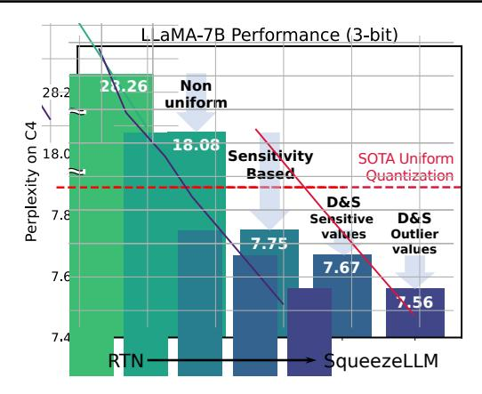

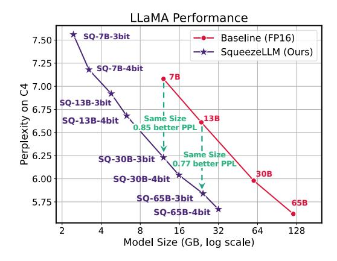
*الشكل 1. (يسار) يدمج SqueezeLLM نهجين أساسيين: (1) التكميم غير المنتظم القائم على الحساسية (القسم [4.1)](#page-3-0)، حيث يتم تخصيص حاويات التكميم بالقرب من القيم الحساسة، و(2) التحلل الكثيف والمتفرق (القسم [4.2)](#page-4-0)، الذي يحتفظ بكل من القيم الحساسة والقيم الشاذة بصيغة متفرقة بدقة كاملة. عند تطبيقه على LLaMA-7B بتكميم 3 بت، تتفوق طريقتنا على الطرق الأكثر تقدماً [(Frantar et al.,](#page-9-4) [2022;](#page-9-4) [Lin et al.,](#page-10-7) [2023)](#page-10-7) بهامش حيرة كبير يزيد عن 0.3 على معيار C4. (يمين) من خلال تطبيق طرقنا على نماذج LLaMA بأحجام متفاوتة، يمكننا تحقيق مفاضلات محسَّنة بين الحيرة وحجم النموذج.*

المساهمات. في هذه الورقة، نُجري دراسة موسَّعة للتكميم بدقة منخفضة بالبت، ونحدد القيود في الأساليب الحالية. واستناداً إلى الفكرة القائلة بأن *الذاكرة، وليست الحوسبة، هي العنق الرئيسي للزجاجة* في استدلال النماذج اللغوية الكبيرة في المهام التوليدية، نُقدم SqueezeLLM، وهو إطار للتكميم بعد التدريب مع *تكميم غير منتظم قائم على الحساسية* و*تحلل كثيف ومتفرق* مبتكَرين. تُمكِّن هذه التقنيات من الضغط بدون خسارة حتى عند دقة منخفضة تصل إلى 3 بت مع تقليل أحجام النماذج وتسريع الاستدلال دون المساس بأداء النموذج. تشمل مساهماتنا التفصيلية ما يلي:

- التكميم غير المنتظم القائم على الحساسية: نُظهر أن التكميم المنتظم في الأعمال السابقة دون المستوى الأمثل لاستدلال النماذج اللغوية الكبيرة لسببين. أولاً، تُظهر توزيعات الأوزان في النماذج اللغوية الكبيرة أنماطاً غير منتظمة واضحة (الشكل [3)](#page-3-1). ثانياً، لا تستفيد عمليات الاستدلال في الأعمال السابقة استفادة كاملة من التكميم المنتظم لأن الحساب يتم بدقة FP16، وليس بدقة منخفضة. لمعالجة هذه المشكلات، نقترح طريقة تكميم غير منتظم جديدة قائمة على الحساسية لتحقيق تكميم أمثل للنماذج اللغوية الكبيرة، والذي يُحسِّن بشكل كبير حيرة LLaMA-7B بـ 3 بت من 28.26 للتكميم المنتظم إلى 7.75 على C4 (القسم [4.1)](#page-3-0).
- التكميم الكثيف والمتفرق: تحتوي الأوزان في النماذج اللغوية الكبيرة على قيم شاذة كبيرة، مما يجعل التكميم بدقة منخفضة بالبت تحدياً بالغ الصعوبة. لمعالجة ذلك، نقترح حلاً بسيطاً يُحلل الأوزان إلى مكونات كثيفة ومتفرقة. يحتفظ الجزء المتفرق بالقيم الشاذة بدقة كاملة باستخدام طرق تخزين متفرقة فعالة، ويمكن أن يكون للجزء الكثيف نطاق أكثر إحكاماً للمساعدة في التكميم. عن طريق استخراج 0.45٪ فقط من قيم الأوزان كمكوِّن متفرق، نُحسِّن أيضاً حيرة LLaMA-7B من 7.75 إلى 7.58 على C4 (القسم [4.2)](#page-4-0).

- التقييم: نختبر SqueezeLLM بشكل موسَّع على نماذج متنوعة في مهام النمذجة اللغوية باستخدام مجموعات بيانات C4 و WikiText2 وكذلك على معايير MMLU [(Hendrycks](#page-10-8) [et al.,](#page-10-8) [2021)](#page-10-8) و Vicuna [(Chiang et al.,](#page-9-5) [2023)](#page-9-5) (القسم [5.3)](#page-7-0). علاوة على ذلك، تُظهر نماذجنا المنشورة على وحدات معالجة الرسومات A6000 أيضاً مكاسب كبيرة في زمن الاستجابة تصل إلى 2.4× مقارنة بخط الأساس FP16، مما يُظهر فعالية طريقتنا من حيث أداء التكميم وكفاءة الاستدلال (القسم [5.4)](#page-7-1).

## 2. الأعمال ذات الصلة

تكميم النماذج اللغوية الكبيرة. في الملحق [A](#page-12-0)، نُقدم نظرة عامة وأعمالاً ذات صلة بتكميم Transformer، مع التركيز على التكميم بعد التدريب (PTQ)، وهو محور عملنا الأساسي. مع تزايد شعبية النماذج اللغوية الكبيرة، ظهر *تكميم الأوزان فقط* كنهج واعد لتقليل استهلاك الذاكرة وتعزيز كفاءة الاستدلال. كان GPTQ [(Frantar et al.,](#page-9-4) [2022)](#page-9-4) من الأعمال الرائدة، كما اقترح كل من AWQ [(Lin et al.,](#page-10-7) [2023)](#page-10-7) و SpQR [(Dettmers et al.,](#page-9-6) [2023)](#page-9-6) أيضاً أنظمة تكميم للأوزان فقط بالتزامن مع عملنا. ومع ذلك، فإن عملنا يختلف في جانبين رئيسيين. أولاً، يستخدم عملنا التكميم غير المنتظم، على عكس التكميم المنتظم في الأعمال المذكورة. على وجه الخصوص، فإن التكميم غير المنتظم القائم على الحساسية لدينا لا يُمثِّل التوزيعات غير المنتظمة للأوزان بشكل أفضل فحسب، بل يُقلل أيضاً بشكل استراتيجي من التأثير على القيم الأكثر حساسية، مما يُتيح تكميماً أكثر شدة دون تدهور في الأداء. ثانياً، بينما تُكمِّم الأعمال السابقة الأوزان بطريقة لا تتأثر بها تنشيطات الإخراج طبقة بطبقة، فإن نهجنا يستهدف الحفاظ على الإخراج النهائي للنموذج. هذه الاستراتيجية لتقليل الخسارة النهائية، كما هو موضح في الملحق [D.4](#page-15-0)، تؤدي إلى أداء تكميم أفضل لأنها مقياس مباشر لتدهور الأداء من البداية إلى النهاية بعد التكميم.

<!-- page 3 -->

التكميم غير المنتظم. للتكميم بدقة منخفضة بالبت للنماذج اللغوية الكبيرة، قدَّم (Dettmers et al., 2024) مؤخراً نوع البيانات NF، مسلِّطاً الضوء على أهمية التكميم غير المنتظم. ومع ذلك، يختلف نهجنا من خلال تقديم تمثيل غير منتظم أكثر ديناميكية يأخذ في الاعتبار كل من توزيعات الأوزان وحساسية القيم، على عكس نوع البيانات NF الثابت والمُشفَّر مسبقاً الذي يفترض التوزيع الطبيعي للأوزان. وعلى الرغم من أن الدراسات السابقة (Han et al., 2016؛ Xu et al., 2018) قد استخدمت تجميع k-means في التكميم، فإن عملنا يُعد رائداً في تطبيقه على تكميم النماذج اللغوية الكبيرة. علاوة على ذلك، نُقدم استراتيجية تجميع k-means المرجَّحة الجديدة القائمة على الحساسية، مما يُمكِّن من التكميم بدقة أقل من 4 بت دون خسارة من خلال تقليل تدهور الأداء بشكل كبير، على عكس النظير غير المراعي للحساسية (الشكل 1).

التكميم المراعي للقيم الشاذة. من بين التحديات المتنوعة في تكميم Transformer بدقة منخفضة بالبت، تتمثل إحدى القضايا الرئيسية في وجود القيم الشاذة (Kovaleva et al., 2021)، والتي يمكن أن تزيد دون داعٍ من نطاق التكميم. لمعالجة هذه المسألة، تم بحث طرق التكميم المراعية للقيم الشاذة (Bondarenko et al., 2021؛ Dettmers et al.؛ Wei et al., 2022; 2023؛ Xiao et al., 2023). ومن الجدير بالذكر أن (Dettmers et al.) يُبقي تنشيطات القيم الشاذة بصيغة الفاصلة العائمة، بينما يُحوِّل (Wei et al., 2022) عوامل القيم الشاذة إلى الطبقات اللاحقة دون التأثير على الوظيفة. تركز هذه الطرق على التنشيطات، وهو ما لا يُمثل مصدر قلق في عملنا حيث تكون جميع التنشيطات بصيغة الفاصلة العائمة. بدلاً من ذلك، يُعالج التكميم الكثيف والمتفرق لدينا القيم الشاذة في الأوزان للتكميم بدقة منخفضة بالبت للنماذج اللغوية الكبيرة.

بالتزامن مع عملنا، يستكشف SpQR (Dettmers et al., 2023) أيضاً استخراج القيم الشاذة في سياق تكميم الأوزان. وعلى الرغم من أن SpQR قد أظهر نتيجة واعدة في استخراج القيم الشاذة، فإن SqueezeLLM، الذي يستفيد من التكميم غير المنتظم القائم على الحساسية، يحقق تكميماً دقيقاً بمستويات تخفُّف منخفضة بشكل ملحوظ (مثلاً 0.05٪) أو حتى صفرية. هذا أمر بالغ الأهمية لكل من تقليل حجم النموذج وتحسين سرعة الاستدلال، حيث أن التخفُّف الأعلى غالباً ما يُدهور زمن الاستجابة. علاوة على ذلك، يستخدم SqueezeLLM استخراج القيم الشاذة كحل مباشر لمنع تأثيرها السلبي على أداء التكميم، متجاوزاً الحاجة إلى استخدام استراتيجية التجميع كحل غير مباشر. يتناقض هذا مع SpQR، الذي يعتمد على التجميع الدقيق الذي يؤدي إلى زيادة حجم النموذج وعملية تكميم أكثر تعقيداً مثل نظام التكميم ثنائي المستوى.

**التحلل الكثيف والمتفرق.** تم استكشاف تحلل المصفوفات إلى مكونات كثيفة ومتفرقة في تحلل خرائط الانتباه (Chen et al., 2021؛ Dass et al., 2023)، مستفيداً من حقيقة أن أنماط الانتباه غالباً ما تُظهر خصائص ذات رتبة منخفضة مع عدد قليل من القيم الشاذة. ومع ذلك، وعلى حد علمنا، فإن بحثنا هو الأول الذي يُطبق استراتيجية التحلل الكثيف والمتفرق على مصفوفات الأوزان لتحسين أداء التكميم. بالإضافة إلى ذلك، فإننا ندمج بشكل فريد كلاً من القيم الشاذة والقيم الحساسة

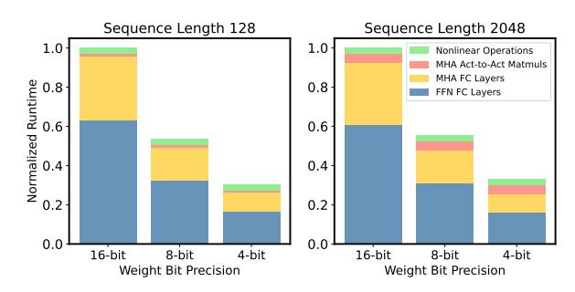
*الشكل 2. زمن التشغيل المُعيَّر لـ LLaMA-7B عند تقليل دقة البت للأوزان بطول تسلسل 128 (يسار) و 2048 (يمين). تم الحصول على النتائج باستخدام نموذج أداء قائم على roofline لوحدة معالجة الرسومات A5000. تقليل دقة الأوزان فقط (وليس التنشيطات) كافٍ للحصول على تخفيضات كبيرة في زمن الاستجابة.*

داخل المصفوفة المتفرقة، مما يُحقق تحسيناً كبيراً في الأداء بعد التكميم.

## 3. جدار الذاكرة

ينقسم سلوك الاستدلال على نطاق واسع إلى فئتين: الاستدلال المرتبط بالحوسبة الذي يكون محدوداً بالإنتاجية الحسابية، والاستدلال المرتبط بالذاكرة الذي يكون عنق الزجاجة فيه هو المعدل الذي يمكن به تغذية البيانات إلى نوى المعالجة من الذاكرة. الكثافة الحسابية، وهي نسبة عمليات الحوسبة إلى عمليات الذاكرة، هي مقياس نموذجي يُستخدم لتقييم هذا السلوك. تُشير الكثافة الحسابية العالية والمنخفضة إلى مشكلة مرتبطة بالحوسبة ومرتبطة بالذاكرة على التوالي. بالنسبة للمشكلات المرتبطة بالذاكرة، يمكن تحقيق التسارع عن طريق تقليل حركة الذاكرة بدلاً من الحوسبة لأن وحدات الحوسبة في الأجهزة غالباً ما تكون مستغلَّة بأقل من طاقتها وهي تنتظر استلام البيانات من الذاكرة.

يُظهر الاستدلال التوليدي للنماذج اللغوية الكبيرة كثافة حسابية منخفضة للغاية مقارنة بأحمال العمل الأخرى1 (Kim et al., 2023). ويعود ذلك إلى أنه يتكون بالكامل تقريباً من عمليات مصفوفة-متجه، مما يحد من إعادة استخدام البيانات حيث أن كل تحميل وزن لا يمكنه معالجة سوى متجه واحد لرمز واحد، ولا يمكن توزيعه على متجهات متعددة لرموز مختلفة. يجب مقارنة هذه الكثافة الحسابية المنخفضة بعمليات الحوسبة على وحدة معالجة الرسومات النموذجية والتي تكون أعلى بأوامر من المقدار من عمليات الذاكرة.2 التفاوت بين عرض النطاق الترددي للحوسبة والذاكرة، إلى جانب متطلبات الذاكرة المتزايدة للتعلم العميق، أُطلِق عليه مشكلة *جدار الذاكرة* (Gholami et al., 2024). لتوضيح هذه المشكلة بشكل أكبر، استخدمنا نهج نمذجة أداء بسيط قائم على roofline (Kim et al.,

> ^&^lt;sup>1لكي نكون دقيقين، نقصر هذه المناقشة على الاستدلال أحادي الدُفعة حيث ينطوي الحساب على عمليات مصفوفة-متجه. بالنسبة للاستدلال بدُفعات كبيرة، يمكن أن تصبح الحوسبة مهمة.

> ^^2^على سبيل المثال، تتميز وحدة معالجة الرسومات A5000 بإنتاجية حسابية ذروة تبلغ 222 تيرافلوب في الثانية، وهي أعلى بمقدار 290× من ذروة عرض النطاق الترددي للذاكرة البالغة 768 جيجابايت في الثانية.

<!-- page 4 -->

2023) لدراسة زمن تشغيل LLaMA-7B على وحدة معالجة الرسومات A5000 بدقة بت مختلفة (الشكل 2). بينما نفترض أن جميع الحسابات تتم بصيغة FP16، نلاحظ أن زمن الاستجابة يتناقص خطياً مع تقليل دقة البت، مما يُشير إلى أن العنق الرئيسي للزجاجة هو الذاكرة وليس الحوسبة.

باختصار، في الاستدلال التوليدي للنماذج اللغوية الكبيرة، يُعد تحميل الأوزان إلى الذاكرة هو العنق الرئيسي للزجاجة، في حين أن تكلفة فك التكميم وحساب FP16 صغيرة نسبياً. وبالتالي، من خلال تكميم الأوزان فقط إلى دقة منخفضة، مع ترك التنشيطات بدقة كاملة، يمكننا تحقيق تسارع كبير وكذلك تقليل حجم النموذج. بناءً على هذه الفكرة، فإن الاستراتيجية المناسبة هي *تقليل حجم الذاكرة حتى لو أضاف ذلك عبئاً إضافياً على العمليات الحسابية*.

## 4. المنهجية

## 4.1. التكميم غير المنتظم القائم على الحساسية

كما هو موضح في الشكل 3 (أعلى)، تُظهر توزيعات الأوزان في النماذج اللغوية الكبيرة أنماطاً غير منتظمة. تتمثل المهمة الرئيسية للتكميم في إيجاد طريقة مثلى لتخصيص قيم مكمَّمة متميزة (مثلاً، 8 لـ 3 بت) بطريقة تحافظ على أداء النموذج. النهج الشائع الاستخدام في أعمال تكميم النماذج اللغوية الكبيرة هو التكميم المنتظم، حيث يتم تقسيم نطاق الأوزان بالتساوي إلى حاويات. لهذا مشكلتان رئيسيتان. أولاً، توزيع القيم المكمَّمة بشكل منتظم دون المستوى الأمثل حيث تكون توزيعات الأوزان عادةً غير منتظمة. ثانياً، بينما تتمثل الميزة الرئيسية للتكميم المنتظم في حساب الأعداد الصحيحة الفعال، فإن هذا لا يؤدي إلى تحسين زمن الاستجابة من البداية إلى النهاية في استدلال النماذج اللغوية الكبيرة المرتبط بالذاكرة. لذلك، فقد اخترنا التكميم غير المنتظم، الذي يتيح تخصيصاً أكثر مرونة للقيم التمثيلية.

إيجاد تكوين تكميم غير منتظم أمثل يُترجم إلى حل مسألة k-means. بالنظر إلى توزيع وزن، يكون الهدف هو تحديد k نقطة مركزية تُمثل القيم على أفضل وجه (مثلاً، k=8 لـ 3 بت). يمكن صياغة مشكلة التحسين هذه للتكميم غير المنتظم على النحو التالي

$$ Q(w)^* = \underset{Q}{\arg\min} ||W - W_Q||_2^2, \tag{1} $$

حيث يُشير W إلى الأوزان و W_Q إلى الأوزان المكمَّمة المقابلة (أي [Q(w) \text{ for } w \in W])، ممثلة بـ k قيم متميزة \{q_1, \cdots, q_k\}. هنا، يمكن الحصول على الحل الأمثل Q(w)^* عن طريق تجميع k-means أحادي البُعد، الذي يُجمِّع المعاملات في k مجموعات ويُعيِّن النقطة المركزية لكل مجموعة كقيمة q_j. على الرغم من أن هذا يتفوق بالفعل على التكميم المنتظم، فإننا نقترح خوارزمية تجميع محسَّنة قائمة على الحساسية.

تجميع K-means القائم على الحساسية. يتمثل هدف التكميم في تمثيل أوزان النموذج بدقة منخفضة بالبت مع الحد الأدنى من الاضطراب في إخراج النموذج (Dong et al., 2019). بينما يُدخل التكميم اضطرابات في كل طبقة، نحتاج إلى تقليل الاضطراب الكلي

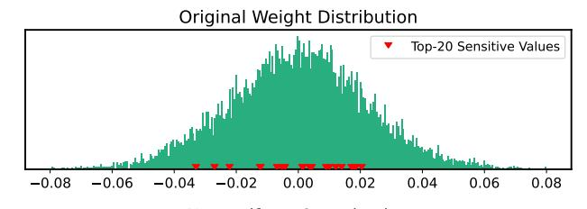

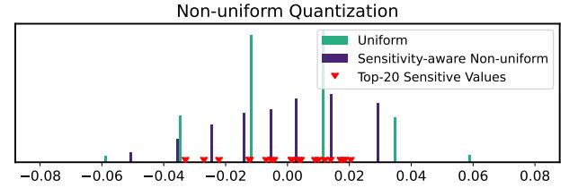
*الشكل 3. (أعلى) توزيع وزن قناة إخراج واحدة في LLaMA-7B. تم تمييز القيم العشرين الأكثر حساسية باللون الأحمر. (أسفل) توزيعات الأوزان بعد التكميم بـ 3 بت باستخدام التكميم المنتظم والتكميم غير المنتظم القائم على الحساسية. في الحالة الأخيرة، تُجمَّع القيم المكمَّمة حول القيم الحساسة.*

فيما يتعلق بـ *الخسارة النهائية*، بدلاً من التركيز على الطبقات الفردية، حيث يوفر ذلك مقياساً أكثر مباشرة لتدهور الأداء من البداية إلى النهاية بعد التكميم (Le-Cun et al., 1990). لتحقيق ذلك، نحتاج إلى وضع نقاط k-means المركزية بالقرب من القيم الأكثر حساسية فيما يتعلق بالخسارة النهائية، بدلاً من معاملة جميع قيم الأوزان على قدم المساواة، كما في المعادلة 1. لتحديد القيم الأكثر حساسية، نُجري توسيع تايلور لتحليل كيفية تغير الخسارة استجابة للاضطرابات في الأوزان *W*:

$$ \mathcal{L}(W_Q) \simeq \mathcal{L}(W) - g^{\top}(W - W_Q) \tag{2} $$

$$ +\frac{1}{2}(W-W_Q)^{\top}H(W-W_Q) (3) $$

حيث g و H = \mathbb{E}[\frac{\partial^2}{\partial W^2}\mathcal{L}(W)] هما التدرج وHessian للخسارة عند W. بافتراض أن النموذج قد تقارب، يمكن تقريب التدرج g إلى الصفر مما يُعطينا الصيغة التالية لحساب مقدار اضطراب النموذج بعد التكميم:

$$ Q(w)^* = \underset{Q}{\arg\min}(W - W_Q)^{\top} H(W - W_Q). (4) $$

في هدف التحسين الجديد، مقارنة بالمعادلة 1، يتم ترجيح اضطراب كل وزن بعد التكميم، أي W-W_Q، بعامل القياس الذي قدَّمه المشتق من الدرجة الثانية، H. وهذا يُسلط الضوء على أهمية تقليل الاضطرابات للأوزان ذات القيم الكبيرة لـ Hessian، حيث أن لها تأثيراً أكبر على الاضطراب الكلي للإخراج النهائي. بمعنى آخر، يعمل المشتق من الدرجة الثانية كمقياس لأهمية كل قيمة وزن.

نظراً لتكلفة حساب Hessian، نستخدم تقريباً لـ Hessian يستند إلى مصفوفة معلومات Fisher \mathcal{F}، والتي يمكن حسابها على عينة من مجموعة البيانات D

<!-- page 5 -->

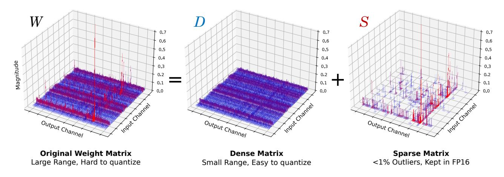
*الشكل 4. توضيح للتحلل الكثيف والمتفرق. يرسم الشكل الأيسر مقدار مصفوفة الأوزان (W) في نموذج LLaMA 65B، والذي يحتوي على عدد قليل من القيم الشاذة. تُساهم هذه القيم الشاذة في النطاق الكبير من القيم في مصفوفة الأوزان الأصلية والتي تُدهور أداء التكميم بشكل كبير. ومع ذلك، يمكن تحلل هذه المصفوفة إلى مصفوفة متفرقة S (يمين) تحتوي على القيم الشاذة والمصفوفة الكثيفة المتبقية S (وسط). تُظهر المصفوفة الكثيفة S بعد ذلك نطاقاً أصغر بكثير، مما يجعل التكميم الدقيق أسهل بكثير. يمكن الاحتفاظ بالمصفوفة المتفرقة S بدقة كاملة مع الحد الأدنى من عبء الذاكرة وزمن التشغيل.*

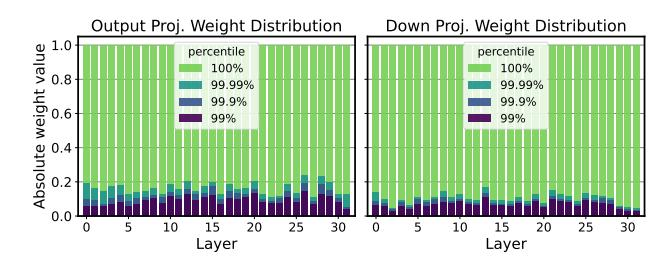
*الشكل 5. توزيعات قيم الأوزان المطلقة (المُعيَّرة)، لطبقات الإخراج في MHA وطبقات down في FFN عبر طبقات مختلفة في LLaMA-7B. لاحظ أن التوزيعات تُظهر أنماط قيم شاذة عبر جميع الطبقات، حيث تتركز 99٪ من القيم ضمن \sim 10\% من النطاق بأكمله.*

كـ H \simeq \mathcal{F} = \frac{1}{|D|} \sum_{d \in D} g_d g_d^{\top}. هذا يتطلب فقط حساب التدرج لمجموعة من العينات، والذي يمكن حسابه بكفاءة باستخدام الأُطر الموجودة. لجعل هدف التحسين في المعادلة 4 أكثر قابلية للتنفيذ، نُقرِّب بشكل أكبر مصفوفة معلومات Fisher كمصفوفة قطرية بافتراض أن التفاعلات بين الأوزان لا تُذكر. هذا يُبسط هدفنا على النحو التالي:

$$
Q(w)^* \simeq \underset{Q}{\operatorname{arg\,min}} (W - W_Q)^{\top} \operatorname{diag}(\mathcal{F})(W - W_Q) (5)
$$

$$
= \underset{Q}{\operatorname{arg\,min}} \sum_{i=1}^{N} \mathcal{F}_{ii} (w_i - Q(w_i))^2. \tag{6}
$$

النتيجة المهمة للمعادلة 5 هي إعداد تجميع k-means *المرجَّح*، حيث يتم سحب النقاط المركزية بالقرب من قيم الأوزان الحساسة هذه. في الشكل 3، نُوضِّح القيم العشرين الأكثر حساسية بناءً على معلومات Fisher

لتوزيع الوزن المثالي. في الأسفل، تتم مقارنة القيم المكمَّمة المخصَّصة بالتكميم المنتظم (أخضر) بتلك المخصصة بنهج k-means القائم على الحساسية (أرجواني)، والذي يحقق مفاضلة أفضل من خلال وضع النقاط المركزية بالقرب من القيم الحساسة، مما يُقلل بشكل فعال من خطأ التكميم. مع LLaMA-7B بـ 3 بت، يحقق التكميم غير المنتظم القائم على الحساسية حيرة أقل بكثير تبلغ 7.75 مقارنة بحيرة 28.26 للتكميم المنتظم القائم على التقريب لأقرب قيمة على C4 (الشكل 1 والقسم 5.2)

## 4.2. التكميم الكثيف والمتفرق

يتمثل التحدي الآخر في تكميم النماذج اللغوية الكبيرة بدقة منخفضة بالبت في القيم الشاذة (Bondarenko et al., 2021؛ Dettmers et al.؛ Wei et al., 2022; 2023). في الشكل 5، نرسم توزيعات الأوزان المُعيَّرة لطبقات مختلفة في LLaMA-7B، والتي تُظهر أن \sim 99.9\% من الأوزان تتركز في نطاق ضيق يبلغ \sim 10\% من التوزيع بأكمله. تكميم الأوزان بنطاق كبير بشكل ساذج سيُدهور الأداء بشكل كبير، خاصة بدقة منخفضة. ومع ذلك، فإن هذا يُشير أيضاً إلى فرصة حيث يمكن تقليص نطاق قيم الأوزان بمعامل 10 ببساطة عن طريق إزالة عدد صغير من القيم الشاذة (مثلاً، 0.1٪)، مما يُعطي تحسيناً كبيراً في دقة التكميم. سيساعد ذلك بعد ذلك النقاط المركزية لـ k-means القائم على الحساسية على التركيز بشكل أكبر على القيم الحساسة بدلاً من عدد قليل من القيم الشاذة.

بدافع من ذلك، نُقدم طريقة لتصفية القيم الشاذة من مصفوفة الأوزان W من خلال إجراء تحلل بسيط ولكنه فعَّال إلى مصفوفة متفرقة (S) تحتوي على القيم الشاذة والمصفوفة الكثيفة المتبقية (D) التي يمكن تكميمها بشكل أكثر فعالية بفضل نطاقها المنخفض بشكل ملحوظ من القيم. أي، W = D + S حيث D = W[T_{\min} \leq w \leq T_{\max}] و S = W[w < T_{\max}]

<!-- page 6 -->

Tmin أو w > Tmax]. هنا، Tmin/max هي عتبات تُعرِّف القيم الشاذة بناءً على النسبة المئوية للتوزيع. عملية التحلل الكثيف والمتفرق هذه موضحة بصرياً في الشكل [4.](#page-4-3)

من الأهمية بمكان أن العبء الإضافي لهذا التحلل ضئيل، حيث أن عدد القيم الشاذة صغير (مثلاً، 0.5٪ من القيم الإجمالية). لذلك، يمكن تخزين المصفوفة المتفرقة بكفاءة باستخدام طرق مثل صيغة الصف المتفرق المضغوط (CSR). الاستدلال أيضاً واضح ومباشر مع التحلل كما في W X = DX + SX، يمكن دمج نواتين للضرب الكثيف والمتفرق، ويمكن أن يستفيد الجزء المتفرق (SX) من النوى المتفرقة (القسم [4.3)](#page-5-1).

المصفوفة المتفرقة القائمة على الحساسية. بالإضافة إلى عزل القيم الشاذة في مصفوفة متفرقة، اكتشفنا أيضاً ميزة التمثيل الدقيق لعدد صغير من قيم مصفوفة الأوزان عالية الحساسية. يمكن تحديد هذه القيم بسهولة بناءً على معلومات Fisher (القسم [4.1)](#page-3-0). هذا لا يحتفظ فقط بالقيم الحساسة بصيغة FP16 لتجنب تأثيرها على إخراج النموذج، بل يمنع أيضاً النقاط المركزية للمعادلة [5](#page-4-1) من الانحراف نحو القيم الحساسة. لاحظنا أن استخراج 0.05٪ فقط من هذه القيم الحساسة عبر الطبقات يُعزز أداء التكميم بشكل كبير (الملحق [D)](#page-14-0). إجمالاً، مع LLaMA-7B بـ 3 بت، يُقلل استخراج 0.45٪ من القيم الشاذة والحساسة الحيرة بشكل أكبر من 7.67 إلى 7.56 (الشكل [1](#page-1-0) والقسم [5.2)](#page-5-0).

## 4.3. تنفيذ نواة كثيفة ومتفرقة

لمعالجة القيم المكمَّمة بشكل غير منتظم بكفاءة، نُنفِّذ نوى CUDA قائمة على LUT بسعة 3/4 بت لضرب المصفوفة-المتجه بين مصفوفات الأوزان المضغوطة ومتجهات التنشيط غير المضغوطة. هذه النوى تُحمِّل الأوزان المضغوطة وتُفك تكميمها قطعة بقطعة لتقليل استخدام عرض النطاق الترددي للذاكرة. تُخزِّن المصفوفات المضغوطة فهارس 3/4 بت، والتي تتوافق مع إدخالات LUT التي تحتوي على قيم FP16 المرتبطة بالحاويات التي تم الحصول عليها من التكميم غير المنتظم. بعد فك التكميم، تتم جميع العمليات الحسابية بصيغة FP16.

لتحسين معالجة تمثيلنا الكثيف والمتفرق، نُطوِّر نوى لضرب المصفوفة-المتجه المتفرقة التي تُحمِّل مصفوفة بصيغة CSR ومتجه تنشيط كثيف، مستوحاة من [(Evtushenko,](#page-9-13) [2019)](#page-9-13). نظراً لأن توزيعات الإدخالات غير الصفرية مائلة بشدة عبر الصفوف (الملحق [C)](#page-13-0)، فإن تخصيص خيط واحد لكل صف قد يكون غير فعال بسبب التوزيع غير المتساوي لعبء العمل بين الخيوط. لذلك، نُنفِّذ *النوى المختلطة المتوازنة* بناءً على [(Flegar & Quintana-Ort´ı,](#page-9-14) [2017)](#page-9-14) من خلال تخصيص عدد متساوٍ من العناصر غير الصفرية لكل خيط؛ يؤدي هذا إلى تزامن إضافي عبر الخيوط بسبب معالجة الصفوف بواسطة خيوط متعددة، ولكنه يؤدي إلى توزيع أكثر توازناً للعمل. حدَّدنا عدد الخيوط بحيث يكون هناك 10 عناصر غير صفرية لكل خيط. يتم إطلاق النواة الكثيفة غير المنتظمة والنوى المتفرقة المتوازنة في استدعاء واحد لتجنب

العبء الناتج عن جمع المخرجات من هذه العمليات المنفصلة.

## 5. التقييمات

## 5.1. إعداد التجربة

فيما يلي إعداد التجربة الخاصة بنا، مع مزيد من التفاصيل في الملحق [B.](#page-12-1)

النماذج ومجموعات البيانات. أجرينا تقييمات شاملة لـ SqueezeLLM باستخدام نماذج متنوعة بما في ذلك LLaMA و LLaMA2 [(Touvron et al.,](#page-10-5) [2023a;](#page-10-5)[b)](#page-11-6) و OPT [(Zhang](#page-11-0) [et al.,](#page-11-0) [2022)](#page-11-0) و Vicuna [(Chiang et al.,](#page-9-5) [2023)](#page-9-5) (الإصداران 1.1 و 1.3). نُجري تقييم النمذجة اللغوية باستخدام مجموعتي بيانات C4 [(Raffel et al.,](#page-10-1) [2020)](#page-10-1) و WikiText2 [(Merity et al.,](#page-10-13) [2016)](#page-10-13). كذلك نُقيِّم المعرفة الخاصة بمجال معين والقدرة على حل المشكلات باستخدام MMLU [(Hendrycks](#page-10-8) [et al.,](#page-10-8) [2021)](#page-10-8)، والقدرة على اتباع التعليمات باستخدام المنهجية في [(Chiang et al.,](#page-9-5) [2023)](#page-9-5).

طرق خط الأساس. نُقارن SqueezeLLM بطرق PTQ مختلفة للنماذج اللغوية الكبيرة بما في ذلك RTN و GPTQ [(Frantar](#page-9-4) [et al.,](#page-9-4) [2022)](#page-9-4) و AWQ [(Lin et al.,](#page-10-7) [2023)](#page-10-7) و SpQR [(Dettmers](#page-9-6) [et al.,](#page-9-6) [2023)](#page-9-6). لضمان مقارنة عادلة، نستخدم GPTQ *مع* ترتيب التنشيط في جميع التجارب ما لم يتم تحديد خلاف ذلك، والذي يُعالج الانخفاض الكبير في الأداء الذي قد يحدث بخلاف ذلك.

تفاصيل التكميم. لـ SqueezeLLM، نتبنى التكميم على مستوى القناة حيث يتم تخصيص جدول بحث منفصل لكل قناة إخراج. نستخدم 2 من مستويات التخفُّف المختلفة: 0٪ (كثيف فقط) و 0.45٪ (0.05٪ قيم حساسة و 0.4٪ قيم شاذة، كما هو موضح في القسم [4.2)](#page-4-0). لقياس الحساسية، نستخدم 100 عينة عشوائية من مجموعة تدريب Vicuna لنماذج Vicuna ومجموعة تدريب C4 للأخرى. وعلى الرغم من أن التجميع يمكن أيضاً دمجه مع طريقتنا، فقد وجدناه دون المستوى الأمثل مقارنة باستخراج القيم الحساسة/الشاذة بالتخفُّف (الملحق [D.3)](#page-15-1).

تحليل زمن الاستجابة. نقيس زمن الاستجابة وذروة استخدام الذاكرة لتوليد 128 و 1024 رمزاً على آلة A6000 باستخدام محلل Torch CUDA. نظراً لعدم توفر تنفيذ رسمي لـ GPTQ (وخاصة الإصدار المُجمَّع)، نُنفِّذ نواة محسَّنة للاستدلال أحادي الدُفعة بناءً على قاعدة الكود مفتوحة المصدر الأكثر نشاطاً [(GPTQ-For-LLaMA)](#page-10-14).

## 5.2. النتائج الرئيسية

يُظهر الجدول [1](#page-6-0) نتائج التكميم لـ LLaMA إلى جانب طرق خط الأساس. تم تجميع النماذج بناءً على حجمها لمقارنة مفاضلات الحجم-الحيرة بشكل أفضل. انظر الشكل [6](#page-7-2) للحصول على توضيح بصري. أدناه نستخدم LLaMA-7B كمثال رئيسي لمناقشة تأثير التكميم الكثيف فقط والتكميم الكثيف والمتفرق، ثم نناقش كيفية امتداد هذه الاتجاهات إلى نماذج أكبر. نُقدم نتيجة التقييم الكاملة على جميع نماذج LLaMA في الجدول [H.13.](#page-20-0)

<!-- page 7 -->

التكميم الكثيف فقط. في الجدول [1](#page-6-0) (أعلى)، نُقارن SqueezeLLM الكثيف فقط بمستوى تخفُّف 0٪ مع GPTQ بدون تجميع. مع التكميم بـ 4 بت، تُظهر طريقتنا الحد الأدنى من التدهور مقارنة بخط الأساس FP16، مع تدهور حيرة بمقدار ∼0.1 فقط على C4 و WikiText2، مع تقليل حجم النموذج بـ 3.95×. علاوة على ذلك، عند مقارنتها بـ GPTQ غير المُجمَّع تُظهر طريقتنا تحسناً كبيراً في الحيرة يصل إلى 0.22.

تصبح فجوة الأداء بين الطريقتين أكثر وضوحاً مع التكميم بـ 3 بت. يتفوق SqueezeLLM على GPTQ بهامش كبير يبلغ 1.80/1.22 نقطة على C4/WikiText2 بمعدل ضغط 5.29×. هذا أقل بـ 0.67/0.55 نقطة فقط من خط الأساس FP16. وهذا يُظهر فعالية الطريقة غير المنتظمة القائمة على الحساسية للتكميم بدقة منخفضة جداً بالبت.

التكميم الكثيف والمتفرق. من خلال الاستفادة من التكميم الكثيف والمتفرق، نحقق تخفيضاً إضافياً في فجوة الحيرة عن خط الأساس FP16، كما هو موضح في الجدول [1.](#page-6-0) هذا التحسن مهم بشكل خاص مع التكميم بـ 3 بت، حيث يُعطي استخراج 0.45٪ فقط من القيم تحسناً في الحيرة بحوالي 0.2. وهذا يُمكِّن من ضغط شبه خالٍ من الخسارة بانحراف حيرة أقل من 0.1/0.5 عن خط الأساس FP16 لـ 4/3 بت على التوالي.

يستخدم كل من GPTQ و AWQ استراتيجية التجميع لتعزيز الأداء بعبء بسيط في حجم النموذج. ومع ذلك، نُظهر أن SqueezeLLM بمستوى تخفُّف 0.45٪ يتفوق باستمرار على كل من GPTQ/AWQ بحجم مجموعة 128 في جميع السيناريوهات بأحجام نماذج مماثلة. يتجلى هذا أكثر مع التكميم بـ 3 بت، حيث يتفوق SqueezeLLM بمستوى تخفُّف 0.45٪ على كل من GPTQ/AWQ بحجم مجموعة 128 بنحو 0.3 حيرة.

النتائج على النماذج الأكبر. في الجدول [1](#page-6-0) (13B) والجدول [H.13](#page-20-0) (30/65B)، نلاحظ أن الاتجاه في 7B يمتد إلى النماذج الأكبر، حيث يتفوق SqueezeLLM باستمرار على طرق PTQ الأخرى عبر جميع النماذج وعروض البت. مثل هذا الاتجاه موضح أيضاً في الشكل [6](#page-7-2) للتكميم بـ 3 بت حيث يحقق حتى SqueezeLLM *الكثيف فقط* حيرة قابلة للمقارنة مع GPTQ/AWQ *المُجمَّع*. مع التخفُّف، يمكننا تحسين الحيرة بشكل أكبر، مما يُقلل الفجوة عن خط الأساس FP16

> ^†^ نظراً لأن SpQR لا تُصدر تنفيذ نواتها، نُجري مقارنتنا بأفضل جهد باستخدام أرقام التسارع التي أبلغوا عنها. انظر الملحق [B](#page-12-1) للحصول على التفاصيل.

> ^‡^GPTQ مع ترتيب التنشيط يُسبب عقوبة كبيرة في زمن الاستجابة حيث ترتبط العناصر في نفس القناة بعوامل قياس مختلفة، مما يؤدي إلى وصول موزع للذاكرة (القسم [5.4)](#page-7-1). GPTQ *بدون* ترتيب التنشيط يُخفف من مشكلة زمن الاستجابة على حساب تدهور كبير في الحيرة.

<!-- page 8 -->

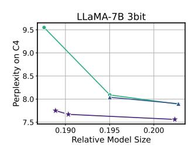

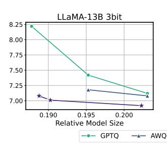

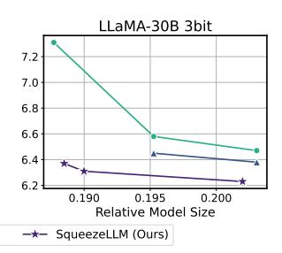

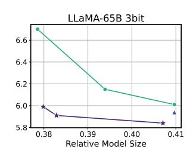
*الشكل 6. مقارنة الحيرة لطرق PTQ لتكميم LLaMA بـ 3 بت، تم تقييمها على C4. المحاور x هي أحجام النماذج النسبية فيما يتعلق بحجم النموذج بصيغة FP16. تم تحقيق مفاضلات حجم-حيرة مختلفة عن طريق ضبط حجم المجموعة لـ GPTQ و AWQ ومستوى التخفُّف لـ طريقتنا. تتفوق طريقة التكميم لدينا باستمرار وبشكل ملحوظ على GPTQ و AWQ عبر جميع أنظمة حجم النموذج، مع فجوة أكثر وضوحاً في الأحجام الأقل بالبت والنماذج الأصغر.*

إلى أقل من 0.1/0.4 نقطة حيرة للتكميم بـ 4/3 بت. والجدير بالذكر، مع التكميم بـ 3 بت، أن نهجنا يحقق تخفيضاً يصل إلى 2.1\times في فجوة الحيرة عن خط الأساس FP16 مقارنة بالطرق الحالية. تتوفر دراسات استئصال إضافية حول خياراتنا في التصميم في الملحق D، ويمكن العثور على نتائج إضافية على نماذج LLaMA2 و OPT في الملحق H.1.

## **5.3. تكميم نماذج اتباع التعليمات **

ظهر ضبط التعليمات كطريقة لتحسين قدرة النموذج على الاستجابة لأوامر المستخدم. نستكشف تكميم نماذج اتباع التعليمات لإظهار فوائد SqueezeLLM من حيث الحفاظ على الدقة من خلال تطبيقه على نماذج Vicuna، وتقييم الأداء بالأساليب التالية.

**تقييم MMLU.** نُقيِّم أولاً نماذج خط الأساس والنماذج المكمَّمة على معيار MMLU حيث تُقدَّم الدقة المرجَّحة في إعداد بدون تدريب مسبق (zero-shot) في الجدول 2 لنماذج Vicuna. كما يمكننا أن نرى، يحقق SqueezeLLM بـ 3 بت دقة أعلى لجميع النماذج مقارنة بـ AWQ ويحافظ أيضاً على دقة خط الأساس FP16 مع التكميم بـ 4 بت. يتم توفير نتائج 5-shot في الملحق H.2.

**القدرة على اتباع التعليمات.** يتمثل النهج الآخر لتقييم القدرة على اتباع التعليمات في الطلب من GPT-4 ترتيب الردود المُولَّدة كما هو مُقدَّم في (Chiang et al., 2023). كما هو موضح في الشكل 7، يحقق SqueezeLLM بدون تخفُّف أداءً قريباً من المثالي (أي تقسيم 50/50) مع التكميم بـ 4 بت لكل من Vicuna-7B و 13B، متفوقاً على GPTQ

بنفس حجم النموذج. في حالة التكميم بـ 3 بت، يتفوق SqueezeLLM على كل من GPTQ و AWQ بأحجام نماذج مماثلة. في حالة نموذج Vicuna-13B، يحقق تقسيم 50/50 شبه مثالي للتكميم بـ 3 بت.

## 5.4. النشر على الأجهزة والتحليل

نُظهر زمن الاستجابة وذروة استخدام ذاكرة GPU لـ SqueezeLLM في الجدول 3 على وحدة معالجة الرسومات A6000 لتكوينات مختلفة عند توليد 128 رمزاً. نلاحظ أن النهج غير المنتظم القائم على LUT في SqueezeLLM (الصف الثالث) يُظهر تسارعاً يصل إلى 2.4\times مقارنة بخط الأساس FP16، ويُظهر زمن استجابة وذروة استخدام ذاكرة قابلين للمقارنة مع التكميم المنتظم لـ GPTQ غير المُجمَّع (الصف الثاني). يُشير هذا إلى أن العبء المرتبط بفك التكميم القائم على LUT صغير، خاصة بالنظر إلى مكاسب الحيرة الكبيرة التي يُمكِّنها.

بالإضافة إلى ذلك، عند دمج التخفُّف، لا نزال نلاحظ مكاسب في زمن الاستجابة بالنسبة لخط الأساس FP16. كما هو موضح في الجدول 3، فإن الاحتفاظ بـ 0.45٪ من المعاملات بصيغة FP16 (الصف الرابع) لا يُضيف سوى حوالي 10٪ من العبء في زمن الاستجابة بالنسبة إلى التنفيذ الكثيف فقط، مع الاستمرار في تحقيق تسارع يصل إلى 2.2\times مقارنة بخط الأساس FP16. في المقابل، عند احتساب التبديل، يتدهور زمن تشغيل GPTQ بشكل كبير (الصف الخامس). تعود عقوبة زمن الاستجابة هذه إلى التبديل، مما يعني أن العناصر في نفس القناة تحتاج إلى التحجيم باستخدام عوامل قياس مختلفة (والتي يتم الوصول إليها باستخدام فهارس المجموعة)؛ من الصعب تنفيذ عمليات الوصول الموزَّعة هذه إلى الذاكرة بكفاءة، حيث تعتمد وحدات معالجة الرسومات

<!-- page 9 -->

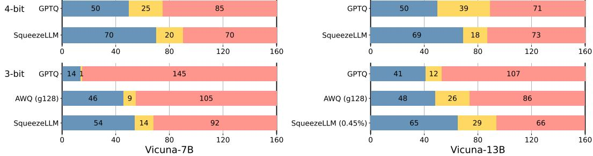
*الشكل 7. مقارنة طرق PTQ المُطبَّقة على Vicuna v1.1. يُمثل الأزرق / الأصفر / الأحمر عدد المرات التي فاز / تعادل / خسر فيها النموذج المكمَّم مقابل نموذج خط الأساس FP16. تم إجراء هذا التقييم باستخدام منهجية Vicuna.*

بشدة على عمليات الوصول المُتلاحمة إلى الذاكرة من أجل الاستخدام الأمثل لعرض النطاق الترددي للذاكرة. يُظهر هذا كيف تسمح منهجية التكميم الكثيف والمتفرق لدينا بدقة أعلى وأداء أفضل بالنسبة لـ GPTQ. تتوفر نتائج تقييم إضافية على توليد 1024 رمزاً في الجدول G.11، حيث نلاحظ اتجاهاً مماثلاً.

## 6. الاستنتاج

لقد قدَّمنا SqueezeLLM الذي يحاول معالجة مشكلة جدار الذاكرة المرتبطة باستدلال النماذج اللغوية الكبيرة التوليدية المرتبطة بالذاكرة. يدمج SqueezeLLM فكرتين جديدتين تُتيحان التكميم بدقة منخفضة جداً للنماذج اللغوية الكبيرة بتدهور ضئيل في أداء التوليد: طريقة التكميم غير المنتظم القائمة على الحساسية؛ والتحلل الكثيف والمتفرق الذي يحل مشكلة القيم الشاذة. لقد قمنا بتقييم SqueezeLLM على مجموعة واسعة من النماذج ومجموعات البيانات التي تُقيِّم النمذجة اللغوية وحل المشكلات وقدرات اتباع التعليمات للنماذج المكمَّمة، حيث أظهرنا أن طريقة التكميم لدينا يمكن أن تتفوق باستمرار على المنهجيات الأكثر تقدماً السابقة.

## **بيان التأثير **

تُقدم هذه الورقة تطورات في تعلُّم الآلة من خلال طريقة تؤدي إلى نماذج أخف وزناً من خلال تحسين الكفاءة الحسابية. وعلى الرغم من أن هذه التقنية ستُتيح وصولاً أوسع إلى تطبيقات تقنيات تعلُّم الآلة عبر قطاعات متنوعة، فإننا لا نتوقع

عواقب اجتماعية سلبية مباشرة تتطلب إبرازاً محدداً. يهدف عملنا إلى تعزيز الابتكار والشمولية في هذا المجال، مما يجعل التقنيات المتقدمة أكثر إتاحة لمجموعة أوسع من المستخدمين والمطورين.

## شكر وتقدير

يود المؤلفون شكر Karttikeya Mangalam و Nicholas Lee و Thanakul Wattanawong على المناقشات المفيدة والعصف الذهني. نشكر الدعم اللطيف من Google Cloud وفريق Google TRC وعلى وجه التحديد Jonathan Caton و Jing Li و Jiayu Ye و Prof. David Patterson. مختبر Prof. Keutzer مدعوم من شركة Intel وفريق Intel VLAB ومركز التميز Intel One-API، فضلاً عن التمويل اللطيف من Furiosa و Berkeley Deep Drive و BAIR. يود Michael W. Mahoney أيضاً شكر جائزة J. P. Morgan Chase Faculty Research Award فضلاً عن DOE و NSF و IARPA. يود Sehoon Kim شكر دعم Korea Foundation for Advanced Studies (KFAS). لا تعكس استنتاجاتنا بالضرورة موقف أو سياسة الجهات الراعية لنا، ولا ينبغي استنتاج أي تأييد رسمي.

## المراجع

Bai, H., Zhang, W., Hou, L., Shang, L., Jin, J., Jiang, X., Liu, Q., Lyu, M., and King, I. BinaryBERT: Pushing the limit of BERT quantization. *arXiv preprint arXiv:2012.15701*, 2020.

<!-- page 10 -->

- Bondarenko, Y., Nagel, M., and Blankevoort, T. Understanding and overcoming the challenges of efficient Transformer quantization. *arXiv preprint arXiv:2109.12948*, 2021.
- Brown, T. B., Mann, B., Ryder, N., Subbiah, M., Kaplan, J., Dhariwal, P., Neelakantan, A., Shyam, P., Sastry, G., Askell, A., et al. Language models are few-shot learners. *arXiv preprint arXiv:2005.14165*, 2020.
- Cai, Y., Yao, Z., Dong, Z., Gholami, A., Mahoney, M. W., and Keutzer, K. ZeroQ: A novel zero shot quantization framework. In *Proceedings of the IEEE/CVF Conference* *on Computer Vision and Pattern Recognition*, pp. 13169– 13178, 2020.
- Chee, J., Cai, Y., Kuleshov, V., and De Sa, C. M. Quip: 2-bit quantization of large language models with guarantees. *Advances in Neural Information Processing Systems*, 36, 2024.
- Chen, B., Dao, T., Winsor, E., Song, Z., Rudra, A., and Re,´ C. Scatterbrain: Unifying sparse and low-rank attention. *Advances in Neural Information Processing Systems*, 34: 17413–17426, 2021.
- Chiang, W.-L., Li, Z., Lin, Z., Sheng, Y., Wu, Z., Zhang, H., Zheng, L., Zhuang, S., Zhuang, Y., Gonzalez, J. E., Stoica, I., and Xing, E. P. Vicuna: An open-source chatbot impressing gpt-4 with 90%* chatgpt quality, March 2023. URL [https://lmsys.org/blog/](https://lmsys.org/blog/2023-03-30-vicuna/) [2023-03-30-vicuna/](https://lmsys.org/blog/2023-03-30-vicuna/).
- Chowdhery, A., Narang, S., Devlin, J., Bosma, M., Mishra, G., Roberts, A., Barham, P., Chung, H. W., Sutton, C., Gehrmann, S., et al. Palm: Scaling language modeling with pathways. *Journal of Machine Learning Research*, 24(240):1–113, 2023.
- Chung, I., Kim, B., Choi, Y., Kwon, S. J., Jeon, Y., Park, B., Kim, S., and Lee, D. Extremely low bit transformer quantization for on-device neural machine translation. *arXiv preprint arXiv:2009.07453*, 2020.
- Dass, J., Wu, S., Shi, H., Li, C., Ye, Z., Wang, Z., and Lin, Y. Vitality: Unifying low-rank and sparse approximation for vision transformer acceleration with a linear taylor attention. In *2023 IEEE International Symposium on* *High-Performance Computer Architecture (HPCA)*, pp. 415–428. IEEE, 2023.
- Dettmers, T., Lewis, M., Belkada, Y., and Zettlemoyer, L. Gpt3. int8 (): 8-bit matrix multiplication for transformers at scale. In *Advances in Neural Information Processing* *Systems*.

- Dettmers, T., Svirschevski, R., Egiazarian, V., Kuznedelev, D., Frantar, E., Ashkboos, S., Borzunov, A., Hoefler, T., and Alistarh, D. SpQR: A sparse-quantized representation for near-lossless LLM weight compression. *arXiv* *preprint arXiv:2306.03078*, 2023.
- Dettmers, T., Pagnoni, A., Holtzman, A., and Zettlemoyer, L. Qlora: Efficient finetuning of quantized llms. *Advances* *in Neural Information Processing Systems*, 36, 2024.
- Dong, Z., Yao, Z., Arfeen, D., Gholami, A., Mahoney, M. W., and Keutzer, K. HAWQ-V2: Hessian Aware trace-Weighted Quantization of neural networks. *NeurIPS'19* *workshop on Beyond First-Order Optimization Methods* *in Machine Learning.*, 2019.
- Du, N., Huang, Y., Dai, A. M., Tong, S., Lepikhin, D., Xu, Y., Krikun, M., Zhou, Y., Yu, A. W., Firat, O., et al. GLAM: Efficient scaling of language models with mixture-of-experts. In *International Conference on Ma**chine Learning*, pp. 5547–5569. PMLR, 2022.
- Egiazarian, V., Panferov, A., Kuznedelev, D., Frantar, E., Babenko, A., and Alistarh, D. Extreme compression of large language models via additive quantization. *arXiv* *preprint arXiv:2401.06118*, 2024.
- Evtushenko, G. Sparse Matrix-Vector Multiplication with CUDA. *https://medium.com/analytics-vidhya/sparse**matrix-vector-multiplication-with-cuda-42d191878e8f*, 2019.
- Flegar, G. and Quintana-Ort´ı, E. S. Balanced csr sparse matrix-vector product on graphics processors. In *Euro-**Par 2017: Parallel Processing: 23rd International Con**ference on Parallel and Distributed Computing, Santiago* *de Compostela, Spain, August 28–September 1, 2017,* *Proceedings 23*, pp. 697–709. Springer, 2017.
- Frantar, E., Ashkboos, S., Hoefler, T., and Alistarh, D. GPTQ: Accurate post-training quantization for generative pre-trained transformers. *arXiv preprint* *arXiv:2210.17323*, 2022.
- Gao, L., Tow, J., Biderman, S., Black, S., DiPofi, A., Foster, C., Golding, L., Hsu, J., McDonell, K., Muennighoff, N., et al. A framework for few-shot language model evaluation, 2021.
- Gholami, A., Kim, S., Dong, Z., Yao, Z., Mahoney, M. W., and Keutzer, K. A survey of quantization methods for efficient neural network inference. *arXiv preprint* *arXiv:2103.13630*, 2021.
- Gholami, A., Yao, Z., Kim, S., Hooper, C., Mahoney, M. W., and Keutzer, K. Ai and memory wall. *IEEE Micro*, pp. 1–5, 2024.

<!-- page 11 -->

- GPTQ-For-LLaMA. https://github.com/qwopqwop200/gptqfor-llama.
- Han, S., Mao, H., and Dally, W. J. Deep compression: Compressing deep neural networks with pruning, trained quantization and huffman coding. *International Confer**ence on Learning Representations*, 2016.
- Hendrycks, D., Burns, C., Basart, S., Zou, A., Mazeika, M., Song, D., and Steinhardt, J. Measuring massive multitask language understanding. *Proceedings of the International* *Conference on Learning Representations (ICLR)*, 2021.
- Hoffmann, J., Borgeaud, S., Mensch, A., Buchatskaya, E., Cai, T., Rutherford, E., Casas, D. d. L., Hendricks, L. A., Welbl, J., Clark, A., et al. Training compute-optimal large language models. *arXiv preprint arXiv:2203.15556*, 2022.
- Huang, Y., Yang, H., Dong, Z., Gudovskiy, D., Okuno, T., Nakata, Y., Du, Y., Zhang, S., and Keutzer, K. Output sensitivity-aware detr quantization. 2023.
- Jeon, Y., Lee, C., Cho, E., and Ro, Y. Mr. BiQ: Posttraining non-uniform quantization based on minimizing the reconstruction error. In *Proceedings of the IEEE/CVF* *Conference on Computer Vision and Pattern Recognition*, pp. 12329–12338, 2022.
- Kim, S., Gholami, A., Yao, Z., Mahoney, M. W., and Keutzer, K. I-BERT: Integer-only bert quantization. *arXiv* *preprint arXiv:2101.01321*, 2021.
- Kim, S., Hooper, C., Wattanawong, T., Kang, M., Yan, R., Genc, H., Dinh, G., Huang, Q., Keutzer, K., Mahoney, M. W., Shao, S., and Gholami, A. Full stack optimization of transformer inference: a survey. *arXiv preprint* *arXiv:2302.14017*, 2023.
- Kovaleva, O., Kulshreshtha, S., Rogers, A., and Rumshisky, A. Bert busters: Outlier dimensions that disrupt transformers. *arXiv preprint arXiv:2105.06990*, 2021.
- LeCun, Y., Denker, J. S., and Solla, S. A. Optimal brain damage. In *Advances in neural information processing* *systems*, pp. 598–605, 1990.
- Li, X., Liu, Y., Lian, L., Yang, H., Dong, Z., Kang, D., Zhang, S., and Keutzer, K. Q-diffusion: Quantizing diffusion models. In *Proceedings of the IEEE/CVF In**ternational Conference on Computer Vision (ICCV)*, pp. 17535–17545, October 2023.
- Lin, J., Tang, J., Tang, H., Yang, S., Dang, X., and Han, S. Awq: Activation-aware weight quantization for llm compression and acceleration. 2023.

- Liu, Y., Yang, H., Dong, Z., Keutzer, K., Du, L., and Zhang, S. NoisyQuant: Noisy bias-enhanced post-training activation quantization for vision transformers. In *Proceedings* *of the IEEE/CVF Conference on Computer Vision and* *Pattern Recognition*, pp. 20321–20330, 2023.
- Merity, S., Xiong, C., Bradbury, J., and Socher, R. Pointer sentinel mixture models, 2016.
- Oh, S., Sim, H., Kim, J., and Lee, J. Non-uniform step size quantization for accurate post-training quantization. In *Computer Vision–ECCV 2022: 17th European Confer**ence, Tel Aviv, Israel, October 23–27, 2022, Proceedings,* *Part XI*, pp. 658–673. Springer, 2022.
- Patterson, D. A. Latency lags bandwith. *Communications* *of the ACM*, 47(10):71–75, 2004.
- Raffel, C., Shazeer, N., Roberts, A., Lee, K., Narang, S., Matena, M., Zhou, Y., Li, W., and Liu, P. J. Exploring the limits of transfer learning with a unified text-to-text transformer. *The Journal of Machine Learning Research*, 21(1):5485–5551, 2020.
- Scao, T. L., Fan, A., Akiki, C., Pavlick, E., Ilic, S., Hesslow, ´ D., Castagne, R., Luccioni, A. S., Yvon, F., Gall ´ e, M., ´ et al. Bloom: A 176b-parameter open-access multilingual language model. *arXiv preprint arXiv:2211.05100*, 2022.
- Shao, W., Chen, M., Zhang, Z., Xu, P., Zhao, L., Li, Z., Zhang, K., Gao, P., Qiao, Y., and Luo, P. Omniquant: Omnidirectionally calibrated quantization for large language models. *arXiv preprint arXiv:2308.13137*, 2023.
- Shen, S., Dong, Z., Ye, J., Ma, L., Yao, Z., Gholami, A., Mahoney, M. W., and Keutzer, K. Q-BERT: Hessian based ultra low precision quantization of bert. In *Proceedings* *of the AAAI Conference on Artificial Intelligence*, volume 34, pp. 8815–8821, 2020.
- Shomron, G., Gabbay, F., Kurzum, S., and Weiser, U. Posttraining sparsity-aware quantization. *Advances in Neural* *Information Processing Systems*, 34:17737–17748, 2021.
- Smith, S., Patwary, M., Norick, B., LeGresley, P., Rajbhandari, S., Casper, J., Liu, Z., Prabhumoye, S., Zerveas, G., Korthikanti, V., et al. Using deepspeed and megatron to train megatron-turing nlg 530b, a large-scale generative language model. *arXiv preprint arXiv:2201.11990*, 2022.
- Thoppilan, R., De Freitas, D., Hall, J., Shazeer, N., Kulshreshtha, A., Cheng, H.-T., Jin, A., Bos, T., Baker, L., Du, Y., et al. Lamda: Language models for dialog applications. *arXiv preprint arXiv:2201.08239*, 2022.
- Touvron, H., Lavril, T., Izacard, G., Martinet, X., Lachaux, M.-A., Lacroix, T., Roziere, B., Goyal, N., Hambro, E., `

<!-- page 12 -->

- Azhar, F., et al. LLaMA: Open and efficient foundation language models. *arXiv preprint arXiv:2302.13971*, 2023a.
- Touvron, H., Martin, L., Stone, K., Albert, P., Almahairi, A., Babaei, Y., Bashlykov, N., Batra, S., Bhargava, P., Bhosale, S., et al. Llama 2: Open foundation and finetuned chat models. *arXiv preprint arXiv:2307.09288*, 2023b.
- Wei, X., Zhang, Y., Zhang, X., Gong, R., Zhang, S., Zhang, Q., Yu, F., and Liu, X. Outlier suppression: Pushing the limit of low-bit transformer language models. *arXiv* *preprint arXiv:2209.13325*, 2022.
- Wei, X., Zhang, Y., Li, Y., Zhang, X., Gong, R., Guo, J., and Liu, X. Outlier suppression+: Accurate quantization of large language models by equivalent and optimal shifting and scaling. *arXiv preprint arXiv:2304.09145*, 2023.
- Xiao, G., Lin, J., Seznec, M., Wu, H., Demouth, J., and Han, S. SmoothQuant: Accurate and efficient post-training quantization for large language models. In *Proceedings* *of the 40th International Conference on Machine Learn**ing*, volume 202 of *Proceedings of Machine Learning* *Research*, pp. 38087–38099. PMLR, 23–29 Jul 2023.
- Xu, Y., Wang, Y., Zhou, A., Lin, W., and Xiong, H. Deep neural network compression with single and multiple level quantization, 2018.
- Yao, Z., Aminabadi, R. Y., Zhang, M., Wu, X., Li, C., and He, Y. ZeroQuant: Efficient and affordable post-training quantization for large-scale transformers. *arXiv preprint* *arXiv:2206.01861*, 2022.
- Yuan, Z., Niu, L., Liu, J., Liu, W., Wang, X., Shang, Y., Sun, G., Wu, Q., Wu, J., and Wu, B. RPTQ: Reorderbased post-training quantization for large language models. *arXiv preprint arXiv:2304.01089*, 2023.
- Zadeh, A. H., Edo, I., Awad, O. M., and Moshovos, A. GOBO: Quantizing attention-based nlp models for low latency and energy efficient inference. In *2020 53rd Annual* *IEEE/ACM International Symposium on Microarchitec**ture (MICRO)*, pp. 811–824. IEEE, 2020.
- Zafrir, O., Boudoukh, G., Izsak, P., and Wasserblat, M. Q8BERT: Quantized 8bit bert. *arXiv preprint* *arXiv:1910.06188*, 2019.
- Zhang, S., Roller, S., Goyal, N., Artetxe, M., Chen, M., Chen, S., Dewan, C., Diab, M., Li, X., Lin, X. V., et al. OPT: Open pre-trained transformer language models. *arXiv preprint arXiv:2205.01068*, 2022.
- Zhang, W., Hou, L., Yin, Y., Shang, L., Chen, X., Jiang, X., and Liu, Q. TernaryBERT: Distillation-aware ultra-low bit bert. *arXiv preprint arXiv:2009.12812*, 2020.

- Zhang, Y., Dong, Z., Yang, H., Lu, M., Tseng, C.-C., Guo, Y., Keutzer, K., Du, L., and Zhang, S. Qd-bev: Quantization-aware view-guided distillation for multiview 3d object detection. 2023.
- Zhao, R., Hu, Y., Dotzel, J., De Sa, C., and Zhang, Z. Improving neural network quantization without retraining using outlier channel splitting. In *International confer**ence on machine learning*, pp. 7543–7552. PMLR, 2019.

<!-- page 13 -->

## A. الأعمال ذات الصلة بتكميم Transformer

يمكن تصنيف طرق التكميم بشكل عام بناءً على ما إذا كانت إعادة التدريب مطلوبة أم لا [(Gholami et al.,](#page-9-15) [2021)](#page-9-15). يتطلب التدريب الواعي للتكميم (QAT) إعادة تدريب النموذج لتكييف أوزانه للمساعدة في استعادة الدقة بعد التكميم [(Bai et al.,](#page-8-2) [2020;](#page-8-2) [Kim et al.,](#page-10-15) [2021;](#page-10-15) [Shen et al.,](#page-10-16) [2020;](#page-10-16) [Zafrir et al.,](#page-11-7) [2019;](#page-11-7) [Zhang et al.,](#page-11-8) [2020;](#page-11-8) [2023)](#page-11-9)، في حين أن التكميم بعد التدريب (PTQ) لا يتضمن إعادة التدريب [(Cai et al.,](#page-9-16) [2020;](#page-9-16) [Li et al.,](#page-10-17) [2023;](#page-10-17) [Oh et al.,](#page-10-18) [2022;](#page-10-18) [Shomron et al.,](#page-10-19) [2021;](#page-10-19) [Zhao et al.,](#page-11-10) [2019)](#page-11-10). على الرغم من أن QAT غالباً ما يؤدي إلى دقة أفضل، إلا أنه غالباً ما يكون غير ممكن للنماذج اللغوية الكبيرة بسبب التكلفة الباهظة لإعادة التدريب و/أو عدم الوصول إلى بيانات التدريب والبنية التحتية. على هذا النحو، ركزت معظم الأعمال على تكميم النماذج اللغوية الكبيرة على PTQ [(Dettmers et al.;](#page-9-9) [Frantar et al.,](#page-9-4) [2022;](#page-9-4) [Lin et al.,](#page-10-7) [2023;](#page-10-7) [Xiao et al.,](#page-11-5) [2023;](#page-11-5) [Yao et al.,](#page-11-1) [2022;](#page-11-1) [Yuan et al.,](#page-11-11) [2023)](#page-11-11). يركز عملنا أيضاً على نهج PTQ.

يمكن أيضاً تصنيف طرق التكميم على أنها منتظمة أو غير منتظمة [(Gholami et al.,](#page-9-15) [2021)](#page-9-15). اكتسب التكميم المنتظم [(Dettmers et al.,](#page-9-6) [2023;](#page-9-6) [Frantar et al.,](#page-9-4) [2022;](#page-9-4) [Huang et al.,](#page-10-20) [2023;](#page-10-20) [Kim et al.,](#page-10-15) [2021;](#page-10-15) [Lin et al.,](#page-10-7) [2023;](#page-10-7) [Liu et al.,](#page-10-21) [2023;](#page-10-21) [Shen](#page-10-16) [et al.,](#page-10-16) [2020;](#page-10-16) [Zafrir et al.,](#page-11-7) [2019)](#page-11-7)، الذي يقسم نطاقات الأوزان بالتساوي إلى حاويات، شعبية لأنه يسمح بحساب أسرع باستخدام حساب الدقة المكمَّمة. ومع ذلك، تشير الاتجاهات الحديثة في الأجهزة إلى أن الحساب الأسرع لا يُترجم بالضرورة إلى تحسين زمن الاستجابة من البداية إلى النهاية أو الإنتاجية [(Gholami et al.,](#page-9-3) [2024)](#page-9-3)، وخاصة في المهام المرتبطة بالذاكرة مثل استدلال النماذج اللغوية الكبيرة التوليدية (القسم [3)](#page-2-0). علاوة على ذلك، يمكن أن يكون التكميم المنتظم دون المستوى الأمثل عندما يكون توزيع الأوزان غير منتظم، كما هو الحال في النماذج اللغوية الكبيرة (الشكل [3)](#page-3-1).

ومن ثم، فإننا نركز على التكميم غير المنتظم، الذي يُخصِّص حاويات التكميم بشكل غير منتظم دون قيود لتمثيل أكثر دقة للأوزان وأخطاء تكميم أصغر. على الرغم من أنه لا يدعم حساب الأعداد الصحيحة للتسارع الحسابي، فإن هذا العيب ليس مهماً للمشكلات المرتبطة بالذاكرة، كما هو الحال في تركيزنا، حيث يقع العنق الرئيسي للزجاجة في عرض النطاق الترددي للذاكرة وليس في الحوسبة. من بين طرق التكميم غير المنتظم [(Chung](#page-9-17) [et al.,](#page-9-17) [2020;](#page-9-17) [Jeon et al.,](#page-10-22) [2022)](#page-10-22)، فإن أكثر الأعمال تشابهاً مع عملنا هو GOBO [(Zadeh et al.,](#page-11-12) [2020)](#page-11-12)، الذي يقدم نهج جدول البحث القائم على تجميع k-means. يقدم عملنا طريقتين جديدتين مقارنة بـ GOBO: (1) الطرق القائمة على الحساسية؛ و(2) منهجيات التكميم الكثيف والمتفرق، التي تُحقق تحسينات كبيرة ضمن إطار التكميم غير المنتظم القائم على k-means.

## B. إعداد التجربة (تفاصيل)

النماذج ومجموعات البيانات. أجرينا تقييمات شاملة لـ SqueezeLLM باستخدام نماذج متنوعة على مهام مختلفة. أولاً، في تقييم النمذجة اللغوية، نُطبق SqueezeLLM على نماذج LLaMA [(Touvron et al.,](#page-10-5) [2023a)](#page-10-5) و LLaMA2 [(Touvron et al.,](#page-11-6) [2023b)](#page-11-6) و OPT [(Zhang et al.,](#page-11-0) [2022)](#page-11-0) ونقيس حيرة النماذج المُكمَّمة على مجموعتي بيانات C4 [(Raffel et al.,](#page-10-1) [2020)](#page-10-1) و WikiText2 [(Merity et al.,](#page-10-13) [2016)](#page-10-13) بحجم جزء 2048. كما نُقيِّم المعرفة الخاصة بمجال معين والقدرة على حل المشكلات من خلال معيار MMLU [(Hendrycks et al.,](#page-10-8) [2021)](#page-10-8) باستخدام نماذج Vicuna المضبوطة بالتعليمات (الإصداران 1.1 و 1.3). استخدمنا Language Model Evaluation Harness لتشغيل تقييم zero-shot عبر جميع المهام [(Gao et al.,](#page-9-18) [2021)](#page-9-18). أخيراً، نُقيِّم القدرة على اتباع التعليمات وفقاً للمنهجية المُقدَّمة في [(Chiang et al.,](#page-9-5) [2023)](#page-9-5). للقيام بذلك، نُولِّد إجابات لـ 80 سؤالاً عينياً ونقارنها بالإجابات التي يولدها النظير FP16 باستخدام درجة GPT-4. لتقليل تأثير الترتيب، نُقدِّم الإجابات إلى GPT-4 في كلا الترتيبين، مما يؤدي إلى ما مجموعه 160 استعلاماً.

طرق خط الأساس. نُقارن SqueezeLLM بطرق PTQ للنماذج اللغوية الكبيرة بما في ذلك RTN فضلاً عن الطرق الأكثر تقدماً بما في ذلك GPTQ [(Frantar et al.,](#page-9-4) [2022)](#page-9-4) و AWQ [(Lin et al.,](#page-10-7) [2023)](#page-10-7) و SpQR [(Dettmers et al.,](#page-9-6) [2023)](#page-9-6). لضمان مقارنة عادلة، نستخدم GPTQ *مع* ترتيب التنشيط في جميع التجارب ما لم يتم تحديد خلاف ذلك، والذي يُعالج الانخفاض الكبير في الأداء الذي قد يحدث بخلاف ذلك. بالنسبة لـ AWQ، نستخدم النماذج المُكمَّمة الرسمية أو نُعيد إنتاجها باستخدام كودها الرسمي إذا لم تكن متاحة، باستثناء LLaMA 65B بحجم مجموعة 256، الذي واجه نفاد الذاكرة (OOM) حتى على A100-80G. ثم تُجرى التقييمات بناءً على طريقة الحيرة لدينا. بالنسبة لـ SpQR، نعتمد على الأرقام المُبلَّغ عنها في الورقة لأن منهجية تقييم الحيرة لديهم متطابقة مع منهجيتنا. يهدف SpQR إلى تعزيز نماذج 3 بت و 4 بت من خلال تقديم التجميع والتكميم ثنائي المستوى والتخفُّف، مما يجعلها تقريباً 4 و 4.6 بت في المتوسط لـ LLaMA. في المقابل، يهدف SqueezeLLM إلى الحفاظ على 3 و 4 بت بأقرب وقت ممكن، مما يقلل من أي عبء إضافي في حجم النموذج. لذلك، نقدم أفضل مقارنة ممكنة لـ SpQR و SqueezeLLM من خلال مقارنة نماذج SpQR بـ 3 بت، التي تبلغ في المتوسط حوالي 4 بت، ونماذجنا بـ 4 بت، وكلاهما يمتلكان أحجام نماذج متشابهة.

تحليل زمن الاستجابة. نقيس زمن الاستجابة وذروة استخدام الذاكرة لتوليد 128 و 1024 رمزاً على آلة A6000 باستخدام محلل Torch CUDA. نظراً لعدم توفر تنفيذ رسمي لـ GPTQ (وخاصة الإصدار المُجمَّع)

<!-- page 14 -->

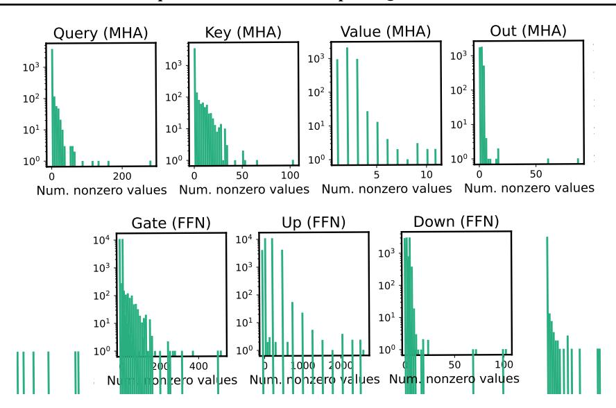
*الشكل C.1. الرسوم البيانية لعدد الإدخالات غير الصفرية لكل قناة إخراج في 7 طبقات خطية مختلفة في كتلة LLaMA-7B الأولى. تكشف الرسوم البيانية عن وجود عدد قليل من القنوات التي تحتوي على إدخالات غير صفرية أكثر بكثير من غيرها، مما يُسلط الضوء على الانحراف في أنماط التخفُّف عبر القنوات المختلفة داخل الطبقات الخطية.*

غير متاح، نُنفِّذ نواة محسَّنة للاستدلال أحادي الدُفعة بناءً على قاعدة الكود مفتوحة المصدر الأكثر نشاطاً [(GPTQ-For-LLaMA)](#page-10-14).

لمقارنة زمن الاستجابة مع SpQR، نعتمد على أرقام التسارع التي أبلغوا عنها لإجراء أفضل مقارنة ممكنة، حيث أن تنفيذ نواتها غير متاح للجمهور. فيما يتعلق بـ AWQ، نستخدم نواة GPTQ بدون ترتيب التنشيط لأنها تُظهر سلوكاً متطابقاً أثناء الاستدلال. وعلى الرغم من أن AWQ قد أصدرت تنفيذ نواتها الخاص، فإن نوى 3 بت الخاصة بهم غير متاحة للجمهور. علاوة على ذلك، فقد دمجوا تحسينات لا تتعلق بالتكميم، مثل LayerNorm والتضمين الموضعي، والتي تنطبق عالمياً على طرق التكميم الأخرى. لضمان مقارنة عادلة مع الطرق الأخرى، امتنعنا عن استخدام نواتها التي تم إصدارها.

## C. انحراف البيانات في نمط التخفُّف لكل قناة

يُقدِّم الشكل [C.1](#page-13-1) توزيع الإدخالات غير الصفرية لكل قناة إخراج عبر طبقات خطية مختلفة في كتلة LLaMA-7B الأولى. تُظهر هذه الرسمة أن توزيع غير الصفرية منحرف بشدة، مع احتواء عدد قليل من القنوات على نسبة أكبر بكثير من القيم غير الصفرية. يجعل هذا التوزيع المنحرف من الصعب إجراء العمليات الحسابية بكفاءة باستخدام المصفوفة المتفرقة، حيث يصعب توزيع العناصر غير الصفرية بالتساوي عبر وحدات المعالجة المتوازية. هذا يدفعنا لإنشاء نواتنا المعدَّلة لمعالجة القنوات التي تحتوي على عدد كبير من القيم الشاذة من أجل تقليل عبء زمن التشغيل للمصفوفات المتفرقة. كما هو موضح في الجدول [C.1](#page-13-2)، لاحظنا أكثر من 100٪ من العبء الإضافي في زمن التشغيل عند استخدام نواة قائمة على CSR قياسية

<!-- page 15 -->

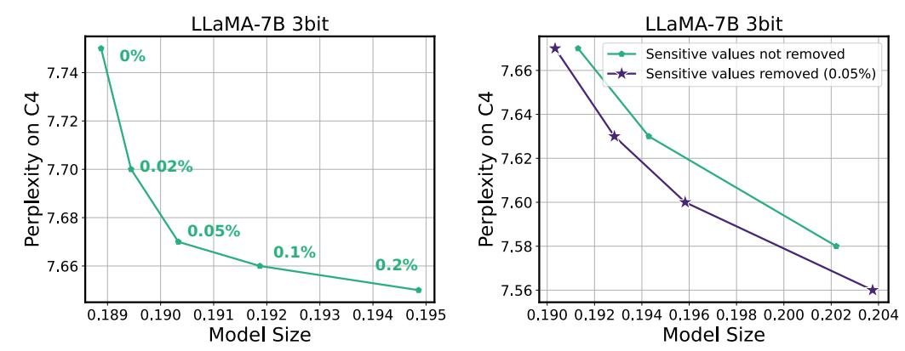
*الشكل D.2. (يسار) حجم النموذج (مُعيَّر بحجم نموذج FP16) ومفاضلة الحيرة مع نسب مختلفة من القيم الحساسة المُضمَّنة في المصفوفة المتفرقة. هنا، لا توجد قيم شاذة مُضمَّنة في المصفوفة المتفرقة. (يمين) مقارنة الأداء عند عدم إزالة القيم الحساسة كمصفوفة متفرقة (تُزال القيم الشاذة فقط) بالحالة التي يتم فيها إزالة 0.05٪ من القيم الحساسة. في كلتا الحالتين، يتم الحصول على المفاضلات من خلال التحكم في النسبة المئوية للقيم الشاذة المُضمَّنة في المصفوفة المتفرقة.*

. ومع ذلك، إذا خصَّصنا لكل خيط معالجة عدداً ثابتاً من غير الصفرية (بدلاً من أن يُعالج كل خيط صفاً كاملاً) فقد تمكنا من تقليل العبء الإضافي في زمن التشغيل بشكل كبير إلى 10-20٪ مع كل من القيم الحساسة والقيم الشاذة.

## D. دراسات الاستئصال

## D.1. التكميم القائم على الحساسية.

في دراسة الاستئصال لدينا، نُحقق في تأثير التجميع المرجَّح القائم على الحساسية على أداء التكميم غير المنتظم. في الجدول [D.2,](#page-14-1) قارنا أداء النهج القائم على الحساسية والنهج غير المراعي للحساسية في سياق التكميم بـ 3 بت لنموذج LLaMA-7B. للتكميم غير المراعي للحساسية، نُطبق تجميع k-means غير المرجَّح بمستويات تخفُّف 0٪ و 0.05٪ و 0.45٪. تُظهر النتائج أنه على الرغم من أن التكميم غير المنتظم وحده يمكنه تقليل الحيرة من 28.26 (للتكميم المنتظم RTN) إلى 18.08 دون مراعاة الحساسية، فإن دمج التجميع القائم على الحساسية أمر بالغ الأهمية في تقليل الحيرة إلى 7.75. هذا التحسن متسق عبر جميع مستويات التخفُّف.

## D.2. تأثير مستويات التخفُّف على SqueezeLLM

في الشكل [D.2](#page-14-2) (يسار)، نُقدم نتائج الحيرة لنموذج LLaMA-7B المكمَّم بـ 3 بت على معايير C4، مع نسب متفاوتة من القيم الحساسة المُستخرَجة كمصفوفة متفرقة، تتراوح من 0٪ إلى 0.2٪. توضح الرسمة أن مكسب الحيرة يتناقص مع تجاوز مستوى تخفُّف القيم الحساسة 0.05٪. لذلك، نحافظ على مستوى تخفُّف ثابت قدره 0.05٪ للقيم الحساسة في جميع التجارب.

علاوة على ذلك، في الشكل [D.2](#page-14-2) (يمين)، نُقارن الأداء عند عدم إزالة القيم الحساسة كمصفوفة متفرقة (تُزال القيم الشاذة فقط) بالحالة التي يتم فيها إزالة 0.05٪ من القيم الحساسة. في كلا السيناريوهين، نتحكم في مستوى التخفُّف عن طريق زيادة النسبة المئوية للقيم الشاذة المُضمَّنة في المصفوفة المتفرقة للحصول على منحنيات المفاضلة. تُشير النتائج إلى أن تكوين التخفُّف بكل من القيم الحساسة والقيم الشاذة يتفوق باستمرار على التكوين الذي يحتوي على القيم الشاذة فقط.

<!-- page 16 -->

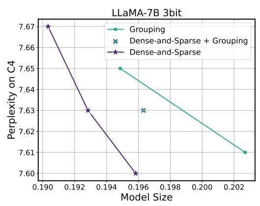
*الشكل D.3. حجم النموذج (مُعيَّر بحجم نموذج FP16) ومفاضلات الحيرة للتجميع والتحلل الكثيف والمتفرق على التكميم بـ 3 بت لـ LLaMA-7B. هنا، نُقارن SqueezeLLM مع (1) التجميع باستخدام أحجام مجموعات 1024 و 512 (أخضر)، (2) نهج هجين يجمع بين حجم مجموعة 1024 ومستوى تخفُّف 0.05٪ (أزرق)، و (3) نهج التحلل الكثيف والمتفرق مع مستويات تخفُّف متفاوتة (بنفسجي). يتفوق التحلل الكثيف والمتفرق النقي دائماً على كل من التجميع والنهج الهجين.*

## D.3. تأثير التجميع على SqueezeLLM

في الشكل D.3، نستكشف فعالية دمج التجميع في SqueezeLLM كنهج بديل لتحسين أداء التكميم. نُقارن ثلاثة تكوينات: SqueezeLLM مع (1) التجميع باستخدام أحجام مجموعات 1024 و 512 (أخضر)، (2) نهج هجين يجمع بين حجم مجموعة 1024 ومستوى تخفُّف 0.05٪ (أزرق)، و (3) نهج التحلل الكثيف والمتفرق مع مستويات تخفُّف متفاوتة (بنفسجي)، حيث يتم الاحتفاظ بـ 0.05٪ من القيم الحساسة ويتم تعديل النسبة المئوية للقيم الشاذة. تُظهر النتائج بوضوح أن كلاً من التجميع والنهج الهجين يؤديان إلى مفاضلات دون المستوى الأمثل مقارنة بنهج التحلل الكثيف والمتفرق النقي.

يمكن أن يُعزى ذلك إلى عاملين. أولاً، يُعد التحلل الكثيف والمتفرق حلاً مباشراً لمشكلة القيم الشاذة. في المقابل، على الرغم من أن التجميع يمكنه التخفيف من تأثير القيم الشاذة إلى حد ما من خلال عزلها داخل مجموعات فردية، فإنه لا يُقدم حلاً مباشراً لهذه المشكلة. ثانياً، يمكن أن يقدم التجميع عبئاً كبيراً من حيث متطلبات التخزين عند دمجه مع التكميم غير المنتظم، حيث يحتاج إلى تخزين LUT واحد لكل مجموعة. يمكن أن يكون هذا عبئاً كبيراً مقارنة بنهج التكميم المنتظم، حيث يحتاج فقط إلى تخزين قيمة قياس وقيمة نقطة صفر لكل مجموعة.

## D.4. مقارنة أهداف التحسين للتكميم غير المنتظم: تقليل الاضطراب الطبقي مقابل اضطراب الإخراج النهائي

بينما تستهدف طريقتنا تقليل اضطراب الإخراج النهائي للنموذج أثناء التكميم، تجدر الإشارة إلى أن تقليل الاضطراب الطبقي يمكن أن يُعتبر أيضاً بديلاً. استخدمت معظم الحلول الحالية لتكميم النماذج اللغوية الكبيرة بما في ذلك GPTQ (Frantar et al., 2022) و AWQ (Lin et al., 2023) و SpQR (Dettmers et al., 2023) الهدف الأخير، الذي يهدف إلى تقليل اضطراب تنشيطات الإخراج في الطبقات الفردية. في دراسة الاستئصال هذه، نُظهر أن تقليل اضطراب الإخراج النهائي هو هدف متفوق على تقليل الاضطراب الطبقي.

عند تقليل الاضطراب الطبقي، يمكن إعادة صياغة هدف التحسين لتحديد تكوين التكميم غير المنتظم على أنه \arg\min_Q \|WX - W_QX\|_2^2، حيث يُشير X إلى دفعة من تنشيطات الإدخال. يمكن تقريب هذا الهدف إلى مشكلة تجميع k-means المرجَّحة، حيث يتم ترجيح كل وزن بمربع حجم تنشيط الإدخال المقابل. ينتج عن هذا بالفعل مقياس الحساسية/الأهمية القائم على التنشيط كما هو الحال في إطار AWQ (Lin et al., 2023).

في الشكل D.4، نُقارن الحيرة على مجموعة بيانات C4 للتكميم بـ 3 بت لنموذج LLaMA-7B باستخدام كلا الهدفين. عبر جميع مستويات التخفُّف التي تم الحصول عليها من خلال تعديل عدد القيم الشاذة المستخرَجة، يتفوق SqueezeLLM القائم على تقليل اضطراب الخسارة النهائية على البديل المتمثل في استخدام تقليل الاضطراب الطبقي بهامش كبير يصل إلى حوالي 0.3 نقطة حيرة.

<!-- page 17 -->

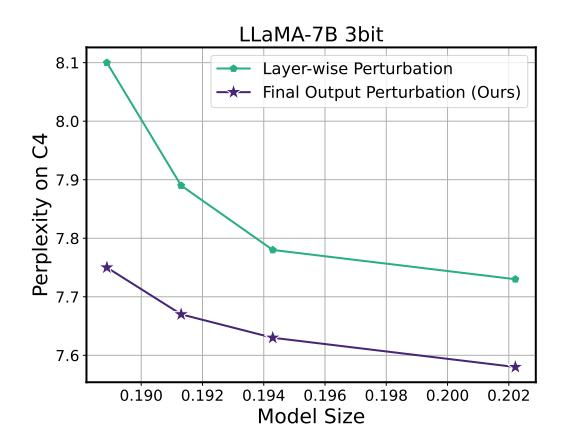
*الشكل D.4. حجم النموذج (مُعيَّر بحجم نموذج FP16) ومفاضلات الحيرة للتكميم بـ 3 بت لنموذج LLaMA-7B باستخدام تقليل الاضطراب الطبقي مقابل تقليل اضطراب الإخراج النهائي كهدف للتكميم غير المنتظم. يتم الحصول على المفاضلة عن طريق تعديل مستوى تخفُّف القيم الشاذة المستخرَجة. عبر جميع مستويات التخفُّف، يتفوق إطار OBD، الذي هو الأساس لـ SqueezeLLM، باستمرار على إطار OBS كنهج بديل.*

## D.5. تأثير التكميم غير المنتظم مقابل التحلل الكثيف والمتفرق

في الجدول D.3، نُجري تحليلاً مفصَّلاً لمزيد من توضيح تأثير التكميم غير المنتظم والتحلل الكثيف والمتفرق.

**التكميم المنتظم مقابل غير المنتظم.** كما يمكن رؤيته في الجدول D.3، عبر جميع عروض البت ومستويات التخفُّف، فإن التكميم غير المنتظم لدينا له تحسينات ملحوظة على التكميم المنتظم.

**مستويات التخفُّف.** علاوة على ذلك، نُقدم أيضاً النتائج بمستويات تخفُّف متفاوتة للتحلل الكثيف والمتفرق في الجدول D.3. كما هو متوقع، تؤدي مستويات التخفُّف الأعلى باستمرار إلى أداء محسَّن في أي سيناريو. ومع ذلك، هناك عوائد متناقصة للقيم الأكبر للتحلل المتفرق حيث أن جزءاً صغيراً فقط من قيم الأوزان هي قيم شاذة أو حساسة. ونتيجة لذلك، فإن حفظ قيم إضافية في الصيغة المتفرقة لا يساعد بقدر ما هو الحال بعد مستوى معين، وبدلاً من ذلك يؤدي إلى عرض بت متوسط أعلى. يتماشى هذا مع الاستنتاجات في التجارب الرئيسية حيث وجدنا أن مستوى تخفُّف 0.45٪ كافٍ لمكسب الأداء.

## D.6. تأثير التحلل الكثيف والمتفرق مقابل الدقة

في الجدول D.4، نُظهر أيضاً أن زيادة عرض بت المكوِّن الكثيف يؤدي إلى تحسين أعلى في الحيرة مقارنة بزيادة مستوى التخفُّف. لاحظ أن نموذج LLaMA-2 7B بـ 4 بت بدون أي تخفُّف يتفوق على نظرائه بـ 3 بت بمستويات تخفُّف 1.5٪ و 2.5٪ التي لها أحجام نماذج مماثلة أو حتى أكبر. تتماشى هذه الملاحظة مع دراسة استئصال مستوى الحساسية في الملحق D.5، حيث أن التحلل الكثيف والمتفرق فعَّال فقط

<!-- page 18 -->

| النموذج | حساب Fisher (دقيقة) | K-means (دقيقة) | GPTQ (دقيقة) |
| --- | --- | --- | --- |
| LLaMA-7B | 0.3 | 11 | 10 |
| LLaMA-13B | 0.6 | 17 | 21 |
| LLaMA-30B | 1.3 | 45 | 45 |
| LLaMA-65B | 2.5 | 80 | 96 |

إلى الحد الذي يتم فيه إزالة القيم الشاذة والقيم الحساسة من المعاملات. زيادة مستوى التخفُّف بعد ذلك لن تكون فعَّالة وتؤدي إلى عوائد متناقصة.

## E. تحليل تكلفة التكميم

## E.1. متطلبات الذاكرة

في الجدول [E.5,](#page-17-1) نُبلِّغ عن متطلبات الذاكرة لـ SqueezeLLM عند تكميم أحجام نماذج مختلفة من 7B إلى 65B. لاحظ أن طريقتنا يمكن أن يكون لها متطلبات ذاكرة أعلى من GPTQ. وذلك لأن SqueezeLLM يُجري التكميم بناءً على تقليل الاضطراب لدالة الخسارة للنموذج التي تتطلب حساب مصفوفة معلومات Fisher. من ناحية أخرى، يُجري GPTQ التكميم عن طريق تقليل الاضطراب لتنشيط الإخراج للطبقة الفردية، والذي لا يتطلب الانتشار العكسي للتدرج عبر النموذج لحساب مصفوفة معلومات Fisher. ومع ذلك، فإن هذه تكلفة تُدفع لمرة واحدة، وكما هو موضح أدناه، فإن عملية حساب التدرج هذه سريعة، وتستغرق 2-3 دقائق فقط حتى لأكبر نموذج 65B.

## E.2. وقت التكميم

في الجدول [E.6,](#page-17-2) نُقيِّم أيضاً الوقت من البداية إلى النهاية لـ (1) حساب معلومات Fisher على نظام A100 و (2) إجراء تجميع K-means القائم على الحساسية على Intel Xeon Gold 6126 بـ 48 نواة، وهما إجراءان رئيسيان في SqueezeLLM. لاحظ أن وقت حساب مصفوفة معلومات Fisher ضئيل، ويستغرق 2.5 دقيقة فقط مع أكبر نموذج 65B. يمكن أن يستغرق تجميع K-mean 11 دقيقة لنموذج 7B وحتى 80 دقيقة لنموذج 65B. بشكل عام، فإن متطلبات الوقت الحسابي لـ SqueezeLLM على قدم المساواة مع GPTQ.

## E.3. كفاءة البيانات

في الجدول [E.7,](#page-18-0) نُقدم تحليل كفاءة البيانات من حيث عدد عينات البيانات لحساب مصفوفة معلومات Fisher (التدرجات) للتكميم غير المنتظم القائم على الحساسية. على الرغم من أننا استخدمنا مجموعة معايرة من 100 عينة بيانات

<!-- page 19 -->

| النموذج | التكوين. | متوسط عرض البت | LLaMA2-13B | LLaMA2-70B |
| --- | --- | --- | --- | --- |
| QuIP (الورقة الأصلية) | 4-بت | 4 | - | 3.53 |
| QuIP (إعادة إنتاجنا) | 4-بت | 4 | 4.81 | 3.65 |
| SqueezeLLM | 4-بت | 4.05 | **4.67** | **3.21** |
| QuIP (الورقة الأصلية) | 3-بت | 3 | - | 3.85 |
| QuIP (إعادة إنتاجنا) | 3-بت | 3 | 5.25 | 3.84 |
| SqueezeLLM | 3-بت | 3.02 | **5.01** | **3.55** |
| QuIP (الورقة الأصلية) | 2-بت | 2 | - | 6.33 |
| QuIP (إعادة إنتاجنا) | 2-بت | 2 | **20.54** | **6.20** |
| SqueezeLLM | 2-بت | 2.01 | 61.25 | 10.86 |
| SqueezeLLM | 2-بت + 0.1% | 2.05 | **7.91** | **5.04** |
| SqueezeLLM | 2-بت + 0.45% | 2.22 | **7.43** | **4.71** |

في جميع أنحاء الورقة، فإن مجموعة معايرة بأقل من 10 أمثلة عادة ما تكون كافية لتحقيق أداء التكميم المطلوب. لاحظ أن كلاً من GPTQ و AWQ يتطلبان 100-200 نقطة بيانات للمعايرة كما هو مُبلَّغ عنه في ورقة AWQ [(Lin](#page-10-7) [et al.,](#page-10-7) [2023)](#page-10-7).

## F. مقارنة مع طرق تكميم الأوزان فقط الأخرى

في هذا القسم، نُقارن SqueezeLLM بطرق تكميم الأوزان فقط الأكثر حداثة بما في ذلك QuIP [(Chee et al.,](#page-9-19) [2024)](#page-9-19) و OmniQuant [(Shao et al.,](#page-10-23) [2023)](#page-10-23).

## F.1. مقارنة مع QuIP

هنا، نُقدم مقارنة كمية لطريقتنا مع QUIP. نظراً لأن ورقة QuIP لا تُبلِّغ إلا عن تقييم الأداء لـ LLaMA2-70B بين جميع نماذج LLaMA، فإننا نُثري مقارنتنا من خلال إدراج إعادة إنتاجنا الخاصة بناءً على قاعدة الكود الرسمية لهم. على عكس التجارب الأخرى التي تستخدم طول تسلسل 2048، نستخدم طول تسلسل 4096، وفقاً لطريقة تقييم الحيرة لورقة QuIP. في الجدول [F.8,](#page-18-1) نُقارن درجات الحيرة على Wikitext2 لنماذج LLaMA2 13B و 70B المكمَّمة إلى 4 و 3 و 2 بت. لاحظ أننا لم نُدرج مقارنة على LLaMA2 7B لأننا لم نتمكن من تحقيق أداء معقول مع QuIP، كما هو مُبلَّغ عنه أيضاً في [(Egiazarian et al.,](#page-9-20) [2024)](#page-9-20).

يُشير الجدول إلى أن SqueezeLLM الكثيف فقط يحقق باستمرار أداءً متفوقاً على QUIP، عبر جميع أحجام النماذج وعروض بت التكميم. مع التكميم بـ 2 بت، لاحظنا أن الاعتماد فقط على التكميم الكثيف فقط قد لا يُعطي نتائج تنافسية مثل تلك الخاصة بـ QuIP. ومع ذلك، من خلال دمج 0.1٪ فقط من التخفُّف (بت إضافي 0.05؛ 0.05٪ قيم شاذة + 0.05٪ قيم حساسة)، يتفوق SqueezeLLM على QuIP بهامش كبير.

## F.2. مقارنة مع OmniQuant

في الجدول [F.9,](#page-19-1) نُقارن حيرة طريقتنا مع OmniQuant على WikiText2 باستخدام طول تسلسل 2048. على وجه الخصوص، يُبلِّغ الجدول عن أرقام الحيرة لنماذج 4 و 3 بت المكمَّمة عبر جميع نماذج LLaMA و LLaMA2.

<!-- page 20 -->

| الطريقة | عرض البت | 7B | 13B | 30B | 65B |  |  |  |  |  |  |  |  |
| --- | --- | --- | --- | --- | --- | --- | --- | --- | --- | --- | --- | --- | --- |
| PPL (C4) | Lat (s) | Mem (G) | PPL (C4) | Lat (s) | Mem (G) | PPL (C4) | Lat (s) | Mem (G) | PPL (C4) | Lat (s) | Mem (G) |  |  |
| Baseline | 16 | 7.08 | 26.5 | 13.1 | 6.61 | 47.0 | 25.2 | 5.98 | OOM | OOM | 5.62 | OOM | OOM |
| GPTQ | 3 | 7.55 | 12.6 | 3.3 | 6.22 | 19.1 | 6.0 | 5.76 | 36.8 | 13.8 | 5.58 | 60.2 | 26.2 |
| SqueezeLLM | 3.02 | 6.32 | 13.6 | 3.4 | 5.60 | 21.2 | 6.1 | 4.66 | 37.8 | 16.1 | 4.05 | 66.9 | 29.9 |
| GPTQ (g128) | 3.25 | 6.27 | 110.7 | 3.4 | 5.47 | 176.1 | 6.2 | 4.83 | 500.8 | 14.3 | 4.55 | 955.2 | 27.3 |
| SqueezeLLM (0.45%) | 3.24 | 6.13 | 14.6 | 3.6 | 5.45 | 22.2 | 6.5 | 4.44 | 42.5 | 17.4 | 3.88 | 82.35 | 32.4 |

بالنسبة لـ OmniQuant، نستخدم مباشرة الأرقام المُبلَّغ عنها في الورقة الأصلية. تم تجميع Omniquant و SqueezeLLM في الجدول بحيث تكون أحجام نماذجهما متماثلة تقريباً. تُظهر هذه المقارنة أن SqueezeLLM يتفوق عموماً على OmniQuant بنفس حجم النموذج وقيود الذاكرة.

بالإضافة إلى ذلك، يُظهر الجدول [F.10](#page-19-2) نفس المقارنة باستخدام التكميم بـ 2 بت. مع التكميم بـ 2 بت، يُظهر الجدول أن OmniQuant بدون تجميع يتفوق على SqueezeLLM الكثيف فقط على نماذج 13B و 70B. يمكن أن يُعزى ذلك إلى نطاقات القص القابلة للتعلم في OmniQuant عبر بضع تكرارات من التدريب التي تأخذ في الاعتبار القيم الشاذة بشكل فعال. لا يعالج التكميم غير المنتظم القائم على الحساسية في SqueezeLLM وحده هذا بطبيعته. يمكن أن يكون التعامل مع القيم الشاذة بالغ الأهمية للتكميم بـ 2 بت حيث يجب تمثيل الأوزان بأربع قيم فقط. ومع ذلك، فإن إدخال 0.1٪ من التخفُّف يُعزز بشكل ملحوظ أداء SqueezeLLM مع زيادة الحد الأدنى في عبء الذاكرة بمقدار 0.05 بت. هذا التحسن في الحيرة مستمر أيضاً عند مقارنة OmniQuant بحجم مجموعة 128 و SqueezeLLM بمستوى تخفُّف 0.45٪ بحجم متماثل تقريباً.

## G. نتائج تحليل الأجهزة الإضافية

في الجدول [G.11,](#page-19-0) نُقدم نتائج تحليل الأجهزة الإضافية باستخدام طول تسلسل 1024. جميع إعدادات التجارب والتفاصيل متطابقة مع القسم [5.4](#page-7-1) والجدول [3.](#page-8-1)

<!-- page 21 -->

| LLaMA-30B | 3-بت | 4-بت |  |  |  |  |
| --- | --- | --- | --- | --- | --- | --- |
| الطريقة | متوسط البت (معدل الضغط) | PPL (\downarrow) | متوسط البت (معدل الضغط) | PPL (\downarrow) |  |  |
| C4 | Wiki | C4 | Wiki |  |  |  |
| Baseline | 16 | 5.98 | 4.10 | 16 | 5.98 | 4.10 |
| RTN | 3 (5.33) | 28.53 | 14.89 | 4 (4.00) | 6.33 | 4.54 |
| GPTQ | 3 (5.33) | 7.31 | 5.76 | 4 (4.00) | 6.20 | 4.43 |
| SpQR | - | - | - | 3.89 (4.11) | 6.08 | 4.25 |
| SqueezeLLM | 3.02 (5.31) | **6.37** | **4.66** | 4.03 (3.97) | **6.06** | **4.22** |
| GPTQ (g128) | 3.25 (4.92) | 6.47 | 4.83 | 4.25 (3.77) | 6.07 | 4.24 |
| AWQ (g128) | 3.25 (4.92) | 6.38 | 4.63 | 4.25 (3.77) | 6.05 | 4.21 |
| SqueezeLLM (0.45%) | 3.25 (4.92) | **6.23** | **4.44** | 4.25 (3.77) | **6.04** | **4.18** |

| LLaMA-65B |  |  |  |  |  |  |
| --- | --- | --- | --- | --- | --- | --- |
| الطريقة | 3-بت | 4-بت |  |  |  |  |
| متوسط البت (معدل الضغط) | PPL (↓) | متوسط البت (معدل الضغط) | PPL (↓) |  |  |  |
| C4 | Wiki | C4 | Wiki |  |  |  |
| Baseline | 16 | 5.62 | 3.53 | 16 | 5.62 | 3.53 |
| RTN | 3 (5.33) | 12.77 | 10.59 | 4 (4.00) | 5.86 | 3.92 |
| GPTQ | 3 (5.33) | 6.70 | 5.58 | 4 (4.00) | 5.81 | 4.11 |
| SpQR | 3 (5.33) | - | 4.2† | 3.90 (4.10) | 5.70 | **3.68** |
| SqueezeLLM | 3.02 (5.30) | **5.99** | **4.05** | 4.04 (3.96) | **5.69** | 3.76 |
| GPTQ (g128) | 3.25 (4.92) | 6.01 | 4.55 | 4.25 (3.77) | 5.69 | 3.76 |
| AWQ (g128) | 3.25 (4.92) | 5.94 | 4.00 | 4.25 (3.77) | 5.68 | 3.67 |
| SqueezeLLM (0.45%) | 3.24 (4.94) | **5.84** | **3.88** | 4.26 (3.76) | **5.67** | **3.63** |

بالإضافة إلى ذلك، في الجدول [G.12,](#page-20-3) نُظهر أن نوى CUDA المخصصة لدينا (سواء بإدراج أو بدون إدراج القيم الشاذة) تحقق تسارعاً كبيراً يبلغ 1.5-2.5× بالنسبة لخط الأساس fp16. تم الحصول على هذه النتائج دون أي تحسينات أو ضبط إضافي خصيصاً لـ A100، مما يُظهر كيف أن نوانا قابلة للنقل بسهولة عبر وحدات معالجة الرسومات المختلفة ولا تُدخل تعقيداً.

## H. نتائج التجارب الإضافية

## H.1. تقييم الحيرة

في الجدول [H.13,](#page-20-0) نُقدم النتائج التجريبية الكاملة على LLaMA [(Touvron et al.,](#page-10-5) [2023a)](#page-10-5). علاوة على ذلك، في الجدول [H.14](#page-21-0) و [H.15,](#page-22-0) نُقدم نتائج تجريبية إضافية على نماذج LLaMA2 [(Touvron et al.,](#page-11-6) [2023b)](#page-11-6) و OPT [(Zhang et al.,](#page-11-0) [2022)](#page-11-0).

## H.2. تقييم MMLU بـ 5-shot

في الجدول [H.16,](#page-22-1) نُقدم نتائج إضافية على تقييم MMLU بـ 5-shot باستخدام نماذج Vicuna v1.1 (7/13B) و Vicuna v1.3 (7/13/33B). نرى اتجاهاً مماثلاً لنتائج تقييم MMLU بدون تدريب مسبق حيث يتفوق SqueezeLLM باستمرار على طرق التكميم الأساسية بنفس حجم النموذج.

## I. القيود

في حين تُركز نتائجنا التجريبية بشكل أساسي على مهام التوليد، فإن الأفكار المُقترحة في هذا العمل ليست محدودة بطبيعتها بمعماريات فك التشفير. ومع ذلك، لم نُجرِ بعد تقييمات شاملة لفعالية إطار عملنا على

> ^†^ لا يُبلِّغ SpQR عن أداءه القريب من 3 بت. ومع ذلك، في حالة نموذج 65B، يمكن استنتاج حيرته بـ 3 بت على Wikitext-2 من منحنى المفاضلة في الشكل 8 من ورقتهم. تُشير هذه المقارنة إلى أن الفجوة بين SpQR و SqueezeLLM يمكن أن تكون أكبر في أنظمة عرض البت الأقل.

<!-- page 22 -->

| الطريقة | 3-بت | 4-بت |  |  |  |  |
| --- | --- | --- | --- | --- | --- | --- |
| متوسط البت (معدل الضغط) | PPL (↓) | متوسط البت (معدل الضغط) | PPL (↓) |  |  |  |
|  | C4 | Wiki |  | C4 | Wiki |  |
| Baseline | 16 | 6.47 | 4.88 | 16 | 6.47 | 4.88 |
| RTN | 3 (5.33) | 12.50 | 10.68 | 4 (4.00) | 6.83 | 5.20 |
| GPTQ | 3 (5.33) | 8.27 | 6.17 | 4 (4.00) | 6.74 | 5.08 |
| SqueezeLLM | 3.02 (5.30) | **6.97** | **5.36** | 4.04 (3.96) | **6.57** | **4.99** |
| GPTQ (g128) | 3.25 (4.92) | 7.06 | 5.31 | 4.25 (3.77) | 6.57 | **4.96** |
| AWQ (g128) | 3.25 (4.92) | 6.94 | 5.32 | 4.25 (3.77) | 6.56 | 4.97 |
| SqueezeLLM (0.45%) | 3.24 (4.94) | **6.82** | **5.23** | 4.26 (3.76) | **6.54** | **4.96** |

| LLaMA2-70B | 3-بت | 4-بت |  |  |  |  |
| --- | --- | --- | --- | --- | --- | --- |
| الطريقة | متوسط البت (معدل الضغط) | PPL (↓) | متوسط البت (معدل الضغط) | PPL (↓) |  |  |
| C4 | Wiki | C4 | Wiki |  |  |  |
| Baseline | 16 | 5.52 | 3.32 | 16 | 5.52 | 3.32 |
| RTN | 3 (5.33) | 10.02 | 7.52 | 4 (4.00) | 5.80 | 3.67 |
| GPTQ | 3 (5.33) | 6.69 | 4.86 | 4 (4.00) | 5.70 | 3.59 |
| SqueezeLLM | 3.02 (5.30) | **5.83** | **3.77** | 4.04 (3.96) | **5.58** | **3.41** |
| GPTQ (g128) | 3.25 (4.92) | 5.87 | 3.88 | 4.25 (3.77) | 5.59 | 3.42 |
| AWQ (g128) | 3.25 (4.92) | 5.81 | 3.74 | 4.25 (3.77) | 5.58 | 3.41 |
| SqueezeLLM (0.45%) | 3.24 (4.94) | **5.73** | **3.63** | 4.26 (3.76) | **5.57** | **3.39** |

معماريات الترميز فقط أو معماريات الترميز-فك التشفير، وكذلك معماريات الشبكات العصبية الأخرى. بالإضافة إلى ذلك، من المهم ملاحظة أن نهج نمذجة أداء الأجهزة لدينا يعتمد على طريقة قائمة على المحاكاة باستخدام نموذج roofline، الذي يستلزم وضع افتراضات مبسَّطة حول خط أنابيب استدلال الأجهزة.

<!-- page 23 -->

| الطريقة | 3-بت | 4-بت |  |  |  |  |
| --- | --- | --- | --- | --- | --- | --- |
| متوسط البت (معدل الضغط) | PPL (↓) | متوسط البت (معدل الضغط) | PPL (↓) |  |  |  |
| C4 | Wiki | C4 | Wiki |  |  |  |
| Baseline | 16 | 10.69 | 9.56 | 16 | 10.69 | 9.56 |
| RTN | 3 (5.33) | div. | div. | 4 (4) | 11.90 | 10.98 |
| SpQR | - | - | - | 3.94 (4.06) | 10.78 | **9.54** |
| SqueezeLLM | 3.01 (5.31) | **11.10** | **10.17** | 4.03 (3.97) | **10.75** | 9.65 |
| SpQR | - | - | - | 4.26 (3.76) | 10.73 | **9.50** |
| AWQ (g128) | 3.25 (4.92) | 10.96 | 9.85 | 4.25 (3.77) | 10.75 | 9.59 |
| SqueezeLLM (0.5%) | 3.26 (4.90) | **10.93** | **9.77** | 4.28 (3.73) | **10.72** | 9.61 |
