<!-- RP17_Dettmers_2023 | source: papers_json/RP17_Dettmers_2023/ -->

## SpQR: تمثيل مكمَّم متناثر لضغط أوزان نماذج اللغة الكبيرة بصورة شبه معدومة الفقد

**Tim Dettmers***<sup>†</sup> University of Washington

Ruslan Svirschevski* HSE University & Yandex

Vage Egiazarian* HSE University & Yandex

Denis Kuznedelev* Yandex & Skoltech

Elias Frantar IST Austria

Saleh Ashkboos ETH Zurich

Alexander Borzunov HSE University & Yandex

Torsten Hoefler ETH Zurich

Dan Alistarh
IST Austria & NeuralMagic

## **الملخص**

أدت التطورات الحديثة في التدريب المسبق لنماذج اللغة الكبيرة (LLM) إلى الحصول على نماذج لغوية عالية الجودة ذات قدرات مذهلة. ومن خلال ضغط هذه النماذج بواسطة التكميم إلى 3-4 بت لكل وسيط، يمكن أن تتسع داخل الأجهزة محدودة الذاكرة مثل الحواسيب المحمولة والهواتف الجوالة، مما يتيح الاستخدام الشخصي. غير أن التكميم إلى 3-4 بت لكل وسيط يؤدي عادةً إلى خسائر متوسطة إلى مرتفعة في الدقة، خصوصاً للنماذج الأصغر في النطاق 1-10 مليار وسيط، وهي الأنسب للنشر على الأجهزة الطرفية. ولمعالجة مشكلة الدقة هذه، نقدم التمثيل المكمَّم المتناثر (SpQR)، وهو صيغة ضغط جديدة وتقنية تكميم تتيح لأول مرة ضغطاً *شبه معدوم الفقد* لنماذج اللغة الكبيرة عبر مختلف أحجام النماذج، مع بلوغ مستويات ضغط مماثلة للطرق السابقة. تعمل SpQR عبر تحديد وعزل *الأوزان الشاذة*، التي تسبب أخطاء تكميم كبيرة بشكل خاص، وتخزينها بدقة أعلى، مع ضغط بقية الأوزان إلى 3-4 بت، وتحقق خسائر دقة نسبية أقل من 1% في الحيرة لنماذج LLaMA و Falcon عالية الدقة. وهذا يجعل من الممكن تشغيل نموذج بـ 33 مليار وسيط على وحدة معالجة رسومية استهلاكية واحدة بسعة 24 جيجابايت دون أي تدهور في الأداء بل مع تسريع بنسبة 15%، وبذلك تصبح النماذج اللغوية القوية متاحة للمستهلكين دون أي عيوب. تأتي SpQR مع خوارزميات فعالة لكل من ترميز الأوزان إلى صيغتها، وفك ترميزها بكفاءة في وقت التشغيل<sup>3</sup>. وعلى وجه التحديد، نقدم خوارزمية استدلال GPU فعالة لـ SpQR تنتج استدلالاً أسرع من المرجعيات ذات 16 بت بدقة مماثلة، مع إتاحة مكاسب ضغط الذاكرة بأكثر من 4 أضعاف.

# 1 المقدمة

تحسنت نماذج اللغة الكبيرة (LLM) المدرَّبة مسبقاً بسرعة، من الأداء الخاص بمهمة معينة [WSM+18, DCLT19, RWC+19]، إلى الأداء الجيد في المهام العامة عند تزويدها بتعليمات [BMR+20, WBZ+21, Ope23]. وبينما يمكن إرجاع التحسن في الأداء إلى التوسع في بيانات التدريب والوسائط [KMH+20, CND+22]، فقد ركزت الاتجاهات الحديثة على نماذج أصغر مدربة على بيانات أكثر، يسهل استخدامها في وقت الاستدلال [HBM+22, BSA+23, TLI+23]. على سبيل المثال، حقق نموذج LLaMA بحجم 7 مليار وسيط والمدرَّب على تريليون رمز أداءً متوسطاً أقل قليلاً فقط من GPT-3 [BMR+20]، رغم أنه أصغر بمعامل 25. يمكن للتقنيات الحالية لضغط نماذج اللغة الكبيرة تقليص هذه النماذج بمعامل 4 تقريباً، مع الحفاظ على أدائها

> ^*^مساهمة متساوية

> ^†^المؤلف المراسل: dettmers@cs.washington.edu

> ^&^lt;sup>3</sup>github.com/Vahe1994/SpQR; سيُدمج في github.com/TimDettmers/bitsandbytes

<!-- page 2 -->

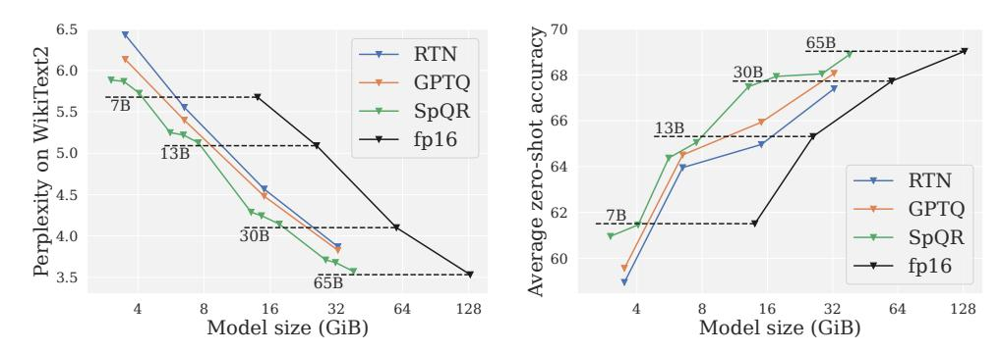
*الشكل 1: أداء نماذج اللغة المضغوطة لنماذج LLaMA. (**يسار**) خسارة نموذج اللغة على WikiText2 مقابل حجم النموذج. (**يمين**) متوسط الأداء على مهام بدون تدريب مسبق مقابل حجم النموذج.*

[DLBZ22, XLS<sup>+</sup>22, FAHA22, DZ22]. ينتج عن ذلك مستويات أداء قابلة للمقارنة مع أكبر نموذج GPT-3، مع تخفيضات كبيرة في متطلبات الذاكرة. ومع هذه التحسينات، يمكن تقديم النماذج جيدة الأداء بكفاءة على أجهزة المستخدم النهائي، مثل الحواسيب المحمولة.

التحدي الرئيسي هو ضغط النماذج بما يكفي للتلاؤم مع هذه الأجهزة مع الحفاظ على جودة التوليد. وعلى وجه التحديد، تُظهر الدراسات أنه على الرغم من دقتها، فإن التقنيات الحالية للتكميم إلى 3-4 بت لا تزال تؤدي إلى تدهور كبير في الدقة [DZ22, FAHA22]. وبما أن توليد نماذج اللغة الكبيرة متسلسل، ويعتمد على الرموز المولدة سابقاً، فإن الأخطاء النسبية الصغيرة يمكن أن تتراكم وتؤدي إلى مخرجات مشوهة بشدة. ولضمان جودة موثوقة، من الضروري تصميم تكميم منخفض عرض البت لا يدهور الأداء التنبؤي مقارنة بالنموذج ذي 16 بت.

في هذا العمل، نقدم التمثيلات المكمَّمة المتناثرة (SpQR)، وهي صيغة هجينة متناثرة-مكمَّمة يمكنها ضغط نماذج LLM المدرَّبة مسبقاً بدقة إلى 3-4 بت لكل وسيط مع البقاء *شبه معدومة الفقد*: على وجه التحديد، SpQR هي أول طريقة لتكميم الأوزان قادرة على الوصول إلى نسب الضغط هذه مع إحداث خطأ دقة شامل مقاساً بالحيرة أقل من 1% بالنسبة للمرجعية الكثيفة. تعمل SpQR من خلال الجمع بين ابتكارين. أولاً، نعزل *الأوزان الشاذة*، التي نُظهر أن تكميمها يحدث أخطاء كبيرة بشكل غير متناسب: تُحفظ هذه الأوزان بدقة عالية، بينما تُخزَّن الأوزان الأخرى بصيغة أقل بكثير، مثل 3 بت. ثانياً، نطبق نوعاً من التكميم المُجمَّع بحجم مجموعة صغير جداً، مثل 16 عنصراً متجاوراً، لكننا نُظهر أنه يمكن تكميم سلالم التكميم نفسها إلى تمثيل من 3 بت.

لتحويل نموذج LLM مدرَّب مسبقاً إلى صيغة SpQR، نتبنى نسخة موسعة من نهج التكميم بعد التدريب (PTQ) الذي قدمته GPTQ مؤخراً [FAHA22]. على وجه التحديد، تُمرر الطريقة بيانات المعايرة عبر النموذج غير المضغوط؛ ولضغط كل طبقة، يطبق محلل على مستوى الطبقة فيما يتعلق بخطأ L2 بين مخرجات النموذج غير المضغوط وتلك للأوزان المكمَّمة. يقسم نهجنا هذه العملية إلى خطوتين: خطوة "اكتشاف الأوزان الشاذة"، التي نعزل فيها الأوزان التي يكون لتكميمها المباشر تأثير كبير على سلوك مخرجات الطبقة، وخطوة الضغط الفعلية، التي تُضغط فيها معظم (\geq 99\%) الأوزان إلى عرض بت منخفض، وتُستخرج الأوزان الشاذة، ويُجعل التمثيل بالكامل أكثر كفاءة عبر زيادة ضغط بيانات تكميم الميتا.

طريقتنا مدفوعة بتحليل جديد يُظهر أن أخطاء تكميم أوزان نماذج اللغة الكبيرة تُظهر ارتباطات جماعية رأسية وأفقية معاً، تتوافق مع أخطاء كبيرة منهجية تتعلق بأبعاد ميزات الإدخال وأبعاد الإخفاء للمخرجات. وبينما لوحظت ميزات الإدخال الشاذة من قبل [DLBZ22, XLS<sup>+</sup>22]، فإن عملنا هو الأول الذي يُظهر أن قيماً شاذة مماثلة تحدث *في الأوزان، لأبعاد إخفاء مخرجات معينة*. وبخلاف القيم الشاذة لميزات الإدخال، تحدث القيم الشاذة لأبعاد الإخفاء للمخرجات في مقاطع صغيرة فقط لبُعد إخفاء مخرجات معين.

تعزل خوارزمية التكميم لدينا هذه القيم الشاذة وتُرمز نموذجاً معيناً بكفاءة في صيغة SpQR. ولاستغلال البنية الناتجة، نطور خوارزمية ضرب مصفوفات متناثرة متخصصة استناداً إلى صيغة الصف المتناثر المضغوط (CSR). ولاستخدام SpQR لتوليد رمز برمز، نجمع هذه الخوارزمية المتناثرة مع ضرب مصفوفات كثيف-مكمَّم لأوزان 3-4 بت. وبهذا، تُقلل SpQR البصمة الذاكراتية لنماذج اللغة الكبيرة بمعامل حوالي 3.4 أو أكثر دون تدهور في الدقة، المقاسة كخسارة نمذجة لغة أو حيرة، مع كونها أيضاً أسرع بنسبة 20-30% لتوليد نموذج اللغة الكبير مقارنة بالاستدلال ذي 16 بت.

<!-- page 3 -->

# 2 الأعمال ذات الصلة

نركز نقاشنا على *طرق التكميم بعد التدريب* (*PTQ*) ذات الصلة [NAVB<sup>+</sup>20]، مع إحالة القارئ إلى الاستعراض الحديث لـ Gholami وآخرين [GKD<sup>+</sup>21] للحصول على خلفية كاملة عن التكميم. تُعد طرق PTQ نهجاً شائعاً *للضغط المباشر* للنماذج بأحجام مختلفة، استناداً إلى كمية محدودة من بيانات المعايرة، باستخدام محللات دقيقة، تركز عادة على المسائل الفرعية للضغط على مستوى الطبقة أو المجموعة. صُممت معظم طرق PTQ، مثل AdaRound [NAVB<sup>+</sup>20]، و BitSplit [WCHC20]، و AdaQuant [HNH<sup>+</sup>21]، و BRECQ [LGT<sup>+</sup>21]، أو OBQ [FSA22] للنماذج الرؤيوية أو نماذج اللغة صغيرة الحجم، بأقل من 100 مليون وسيط. تميل كل هذه الأساليب الحديثة إلى استخدام محللات دقيقة، التي لن تتوسع لتشمل النماذج بحجم GPT من حيث التكلفة الحسابية أو الذاكراتية، إذ إنها أكبر بمعامل 10-1000.

في الآونة الأخيرة، كان هناك اهتمام كبير بالحصول على طرق دقيقة لما بعد التدريب تتوسع لتشمل مثل هذه النماذج الضخمة. ونظراً للقيود الحسابية، استخدمت الأعمال المبكرة مثل ZeroQuant [YAZ<sup>+</sup>22]، و LLM.int8() [DLBZ22]، و nuQmm [PPK<sup>+</sup>22] التقريب المباشر للأوزان إلى أقرب مستوى تكميم، مع تخصيص دقة التكميم (أي حجم المجموعة) للمقايضة بين المساحة والدقة المتزايدة. اقترحت LLM.int8() [DLBZ22] عزل "ميزات الشذوذ" التي ستُكمَّم بشكل منفصل بعرض بت أعلى. هذه الأساليب قادرة على إحداث خطأ تكميم منخفض نسبياً، مثل زيادة 5.5% في خسارة نموذج اللغة النسبية لـ LLaMA-7B عند تكميم وزن 4 بت، شريطة أن تكون دقة التكميم منخفضة بما يكفي. اقترحت GPTQ [FAHA22] نهجاً أعلى دقة (مثل زيادة 4% في خسارة نموذج اللغة في الإعداد المذكور)، الذي يعمل عبر محلل تقريبي واسع النطاق لمسألة تقليل الخطأ التربيعي على مستوى الطبقة.

قدم Dettmers وآخرون [DZ22] استعراضاً متعمقاً لمقايضات الدقة-الضغط الكامنة وراء هذه الطرق، مؤكدين أن التكميم 4 بت هو نقطة مثالية للطرق المعتمدة على التقريب لأقرب قيمة، في حين يمكن تحقيق ضغط أعلى عبر طرق واعية للبيانات مثل GPTQ. قدمت SparseGPT [FA23] نهجاً للتشتيت المشترك لأوزان نماذج اللغة الكبيرة إلى تشتت متوسط، إلى جانب تكميم الأوزان المتبقية إلى عرض بت ثابت محدد. أحد العيوب الشائعة للطرق الحالية هو أن خسارة الدقة بالنسبة للنموذج الأصلي لا تزال كبيرة (انظر الجدول 1). وهذا أكثر صلة بالنماذج الصغيرة نسبياً والقابلة للنشر بسهولة، مثل في نطاق 7-13 مليار وسيط، حيث تُظهر الطرق الحالية انخفاضات كبيرة في الدقة. نحن نتحرى هذا السؤال هنا، ونوفر صيغة ضغط جديدة يمكن أن تؤدي إلى ضغط شبه معدوم الفقد بـ 3-4 بت في هذا النظام.

سؤال ذو صلة هو إجراء تكميم التنشيطات والأوزان معاً. هناك عمل مبكر [DLBZ22, XLS<sup>+</sup>22, YAZ<sup>+</sup>22]، يُظهر أن كلاً من التنشيطات والأوزان يمكن تكميمهما إلى 8 بتات بتأثير منخفض نسبياً على الدقة. تُنتج هذه الدراسات التكميلية رؤى مثيرة للاهتمام في أسباب خطأ الضغط في حالة نماذج اللغة الكبيرة. وعلى وجه التحديد، يلاحظ [DLBZ22, XLS<sup>+</sup>22] وجود "ميزات شاذة" بقيم أعلى بشكل ملحوظ في إدخال/إخراج نماذج اللغة الكبيرة، التي تُحدث خطأ تكميم أعلى، ويقترحون استراتيجيات تخفيف مختلفة.

نحن نحلل هذه الظاهرة من وجهة نظر تكميم الأوزان. وعلى وجه الخصوص، نتحرى بنية القيم الشاذة، فيما يتجاوز ميزات الإدخال الشاذة في مصفوفة الأوزان. وبينما نجد أن ميزات الإدخال الشاذة في الطبقة الحالية مرتبطة بأوزان وحدات الإخفاء الشاذة في الطبقة السابقة، إلا أنه لا يوجد تطابق صارم. تتطلب هذه الأنماط الشاذة شبه المهيكلة صيغة ضغط هجينة دقيقة تتجاوز الخوارزميات التي تستغل بنية العمود لميزات الشذوذ الموجودة في العمل السابق.

تم بحث الصيغ الهجينة المتناثرة-المكمَّمة بشكل عام للشبكات العميقة. تدعم بعض محركات الاستدلال الفعالة لوحدة المعالجة المركزية [Neu22, GFS<sup>+</sup>19] صيغة كتلة متناثرة-مكمَّمة مختلفة، حيث تكون كل كتلة من 4 أوزان متتالية إما متناثرة كلياً أو مكمَّمة إلى صيغة 8 بت، في حين تدعم وحدات معالجة الرسومات صيغة مركبة مماثلة حيث تحتوي كل مجموعة من 4 أوزان على وزنين صفريين، ويمكن تكميم الأوزان غير الصفرية. اقترحت حزمة FBGEMM [KHB<sup>+</sup>21] صيغة يتم فيها تكميم بعض الأوزان "الشاذة" بشكل منفصل، لتقليل تأثيرها على التطبيع. ومع ذلك، في هذه الصيغة، لا تزال الأوزان "الشاذة" مكمَّمة إلى نفس عرض البت بالضبط (8 بت) كأوزان عادية؛ علاوة على ذلك، لا يُقدم أي إجراء لتحويل النموذج إلى هذه الصيغة بعد التدريب. في المقابل، 1) نوفر خوارزمية ضغط فعالة ودقيقة بعد التدريب تحدد القيم الشاذة كأوزان تُحدث خطأ مخرجات عالياً، 2) نقترح صيغة تضغط القيم الشاذة إلى عرض بت أعلى بالنسبة للأوزان العادية، و 3) تُخزن صيغتنا القيم الشاذة في كتل، مما يسمح بتنفيذ كفء لنوى GPU، التي نوفرها أيضاً.

<!-- page 4 -->

# 3 حساسية تكميم أوزان نماذج اللغة الكبيرة

## 3.1 حساسية الوسائط تحت التكميم

ليست كل الوسائط في الشبكة العصبية متساوية الأهمية. حدسياً، يمكن اعتبار الوزن حساساً للتكميم إذا كان خطأ تقريبه كبيراً، أي أنه ليس قريباً من نقطة تكميم، و/أو إذا كانت المدخلات التي يُضرب بها عادة كبيرة، فتُضخم حتى خطأ التقريب الصغير. غير أن هذه المفاهيم البسيطة للحساسية تتجاهل حقيقة أن نماذج اللغة الكبيرة تعمل على متجهات كبيرة جداً مع ارتباطات كبيرة: قد يكون للوزن w_a خطأ تقريب كبير في حين أنه مرتبط بقوة بوزن آخر w_b، مما يعني أن خطأ تقريب w_a للأعلى يمكن تعويضه بشكل جيد بتقريب w_b للأسفل. هذه الفكرة مستغلة من قبل خوارزميات التكميم الحديثة [FAHA22, YAZ<sup>+</sup>22] ويمكن أن تؤدي إلى تحسينات كبيرة على التقريب البسيط، خصوصاً عند عرض البت المنخفض. التقاط هذا الجانب من الحساسية بشكل صحيح يتطلب تعريفاً أكثر متانة.

من أجل الجدوى الحسابية، نقيِّم الحساسية على مستوى الطبقة باستخدام مجموعة صغيرة من *مدخلات المعايرة* X، التي تُجمع عبر تشغيلها خلال النموذج حتى الطبقة المعينة. نُعرِّف الحساسية s_{ij} لبعض الوزن w_{ij} في مصفوفة أوزان الطبقة W على أنها الحد الأدنى للفرق التربيعي بين التنبؤات الأصلية على X وتلك لأي مصفوفة أوزان W' حيث يكون هذا الوزن مكمَّماً، أي w'_{ij} = \text{quant}(w_{ij}):

$$ s_{ij} = \min_{W'} ||WX - W'X||_2^2 s.t. w'_{ij} = \text{quant}(w_{ij}) (1) $$

من المهم أن جميع أوزان W' باستثناء w'_{ij} يمكن أن تأخذ قيماً عشوائية، ليست بالضرورة مكمَّمة، من أجل تعويض خطأ التكميم المتكبد بتقريب w_{ij}، وبالتالي التقاط جانب الترابط الذي نوقش أعلاه. وبما أننا نسمح بقيم متصلة، فإن هذه المسألة تقبل حلاً مغلق الصيغة. يمكن تحديد ذلك عبر اتباع إطار جراح الدماغ الأمثل المعمم [FSA22]، حيث (XX^\top)^{-1} هي مصفوفة هيسي العكسية المقابلة لمسألة التحسين:

$$ s_{ij} = \frac{(w_{ij} - \text{quant}(w_{ij}))^2}{2(XX^{\top})^{-1}}. (2) $$

يمكن تقريب مقياس البروز هذا بكفاءة بواسطة محللات التكميم، مثل GPTQ [FAHA22]. وبمزيد من التفصيل، تقوم GPTQ بتكميم مصفوفات الأوزان عموداً تلو الآخر بينما تعدل في كل خطوة الجزء غير المكمَّم بعد لتعويض خطأ التكميم بمعنى مماثل لما تم تعريفه أعلاه. وبالتالي، بدلاً من تحديد كل الحساسيات بشكل ساكن مسبقاً، يمكن حسابها ديناميكياً مع معالجة الخوارزمية لكل عمود، باستخدام معكوس انتقاء هيسي الفرعي المقابل لجميع الأوزان غير المكمَّمة بعد. هذه المصفوفة محسوبة بالفعل بكفاءة بواسطة GPTQ ولا تفرض بالتالي أي أعباء إضافية. الميزة الرئيسية لهذا النهج هي أن s_{ij} يُحدد دائماً استناداً إلى أحدث قيمة لـ w_{ij} وبالتالي يأخذ في الحسبان التعديلات الناتجة عن الأوزان المكمَّمة سابقاً أيضاً.

## 3.2 استكشاف حساسية الوسائط

قبل تعريف طريقتنا الرئيسية، SpQR، نقدم تحليلاً تحفيزياً لحساسية الوسائط يكشف أن مواقع الأوزان الحساسة في مصفوفة الأوزان ليست عشوائية بل لها هياكل معينة. ولإبراز هذه العناصر الهيكلية أثناء عملية التكميم، نحسب الحساسيات لكل وزن ونصورها لنموذج LLaMA-65B الشهير وعالي الدقة [TLI<sup>+</sup>23]. كطريقة تكميم، نستخدم تكميم GPTQ إلى 3 بت، دون تجميع الأوزان، وفقاً لـ [FAHA22]. نستخدم C4 [RSR<sup>+</sup>20] كمجموعة بيانات معايرة، ونقدر الخطأ على 128 سلسلة من 2048 رمزاً لكل منها. يصور الشكل 2 إسقاط الإخراج لطبقة الانتباه الذاتي الأخيرة لـ LLaMA-65B.

باستخدام تحليل الحساسية، نلاحظ عدة أنماط في مصفوفة الأوزان، غالباً في صف أو عمود واحد. وبما أن مصفوفات الأوزان الكبيرة في LLaMA-65B تحتوي على عدد كبير جداً من الصفوف/الأعمدة بحيث لا يمكن تمثيلها في صورة مدمجة (الافتراضي: 8k \times 32k بكسل)، فإننا نُطبق التجميع الأقصى لتصور المصفوفات، أي نأخذ الحد الأقصى للحساسية في كل مربع من 32 \times 32 صفاً وعموداً. لا يؤثر هذا التجميع الأقصى إلا على الصورة اليسرى. باستخدام هذا التصور، نلاحظ أن أنماط أخطاء التكميم تتفاوت حسب نوع الطبقة، على سبيل المثال، الانتباه مقابل الإدراك متعدد الطبقات (MLP)، وعمق الطبقة. وعلى وجه الخصوص، نجد أن المزيد من القيم الشاذة الحساسة موجودة في الطبقات الأعمق. (يرجى مراجعة الملحق A للحصول على نتائج إضافية). نشرع الآن في تصنيف هياكل القيم الشاذة، آخذين مصفوفة أوزان الانتباه هذه كنموذج. نلاحظ ما يلي:

<!-- page 5 -->

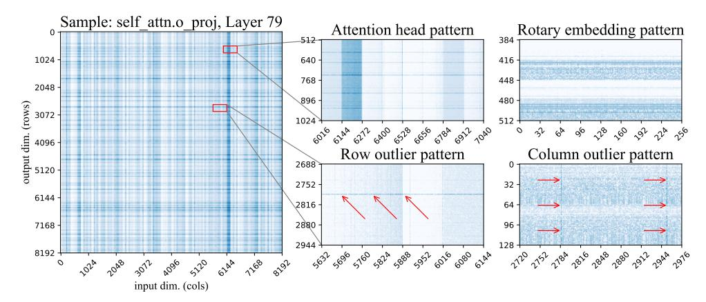
*الشكل 2: حساسيات الوزن اللوغاريتمية من طبقة الانتباه الأخيرة لـ LLaMA-65B. تشير الظلال الزرقاء الداكنة إلى حساسية أعلى. الصورة على اليسار هي عرض رفيع المستوى، تم تغيير حجمها إلى مقياس 1:32 مع التجميع الأقصى. الصورتان في الوسط مكبرتان من الشكل الرئيسي. الصورتان على اليمين مأخوذتان من مصفوفات أوزان أخرى.*

- تظهر القيم الشاذة في الصفوف في الشكل 2 الجزء السفلي الأوسط كمناطق ذات حساسية عالية ضمن وحدة إخراج واحدة. تمتد بعض هذه الأنماط على الصف بأكمله، في حين أن أخرى جزئية. في طبقات الانتباه، تتوافق بعض القيم الشاذة الجزئية في الصفوف مع مجموعة فرعية من رؤوس الانتباه. تظهر القيم الشاذة في الأعمدة في الشكل 2، الجزء السفلي الأيمن، مُظهرة حساسية عالية في أبعاد إدخال محددة (أعمدة) عبر جميع الصفوف. هذه الأخيرة مرتبطة بظاهرة "ميزة الشذوذ" التي أبلغ عنها Dettmers وآخرون [DLBZ22].
- رؤوس الانتباه الحساسة. (الشكل 2، الجزء العلوي الأوسط) تُبرز خطوط منتظمة بعرض 128 جميع الأوزان المقابلة لرأس انتباه واحد. قد يكون هذا مرتبطاً ببعض رؤوس الانتباه التي لها وظائف أكثر أهمية [VTM+19, Vig19, OEN+22]. "الخطوط" المقابلة أفقية لإسقاطات الانتباه Q و K، عمودية في إسقاط الإخراج، وغائبة من إسقاطات القيم وأي أوزان MLP. ومن الجدير بالذكر أن هناك تبايناً كبيراً في حساسية الوزن الفردية حتى داخل الرؤوس الحساسة.
- نمط التضمين الدوار، نمط عمودي متكرر للحساسية بفترة 64 وحدة. نُعزو هذا إلى استخدام التضمينات الدوارة [SLP+21]: ينقسم كل رأس انتباه (dim = 128) إلى نصفين: يُدوَّر الأول 64 بجيب التمام، ويستخدم الـ 64 الآخر الجيب. يستخدم كل من تدوير الجيب والجيب التمام نفس مجموعة الترددات. عادةً، تكون الأوزان التي تتوافق مع جيوب وجيوب تمام منخفضة التردد أكثر حساسية من نظيراتها عالية التردد، كما هو موضح في الشكل 2 (الجزء العلوي الأيمن). كما هو متوقع، يغيب هذا النمط من أي طبقة لا تستخدم التضمينات الدوارة.
- القيم الشاذة غير المهيكلة. إلى جانب ما سبق، يحتوي كل طبقة على عدد من أوزان الحساسية الفردية التي لا تتلاءم مع أي من الأنماط أعلاه. تحدث هذه القيم الشاذة غير المهيكلة بشكل أكثر تكراراً للأعمدة ذات أكبر مؤشر إدخال (أي على الجانب الأيمن من الصور). يصعب رؤية هذا التأثير على خريطة حرارية، لذا نقدم أشكالاً واختبارات إحصائية إضافية في الملحق A. نعتقد أنه من المحتمل أن يكون أثراً للخوارزمية GPTQ، التي تضغط واحداً تلو الآخر، باستخدام الأوزان غير المضغوطة بعد لتعويض الخطأ. وبالتالي، تتراكم أكبر قدر من الخطأ في الدفعة اليمنى من الأوزان.

بعد ذلك، سنستفيد من هذه النتائج لاقتراح تمثيل مضغوط يمكنه دعم جميع هذه الأنواع المختلفة من القيم الشاذة.

# 4 SpQR: تمثيل مضغوط واعٍ بالحساسية

## 4.1 نظرة عامة

تعامل خوارزميات تكميم نماذج اللغة الكبيرة الحالية الأوزان منخفضة وعالية الحساسية على قدم المساواة؛ ومع ذلك، تشير مناقشتنا أعلاه إلى أن هذا قد يؤدي إلى تكميم دون المستوى الأمثل. من الناحية المثالية، نريد أن يخصص التمثيل المزيد من "ميزانية الحجم" للأوزان الحساسة. ومع ذلك، فإن هذه الأوزان

<!-- page 6 -->

مبعثرة في مصفوفة الأوزان إما كأوزان فردية أو مجموعات صغيرة، على سبيل المثال، صفوف جزئية أو رأس انتباه. ولالتقاط هذه البنية، نقدم تغييرين على إجراء التكميم: أحدهما لالتقاط مجموعات حساسة صغيرة، والآخر لالتقاط القيم الشاذة الفردية.

التقاط مجموعات صغيرة من الأوزان بالتكميم ثنائي المستوى. في القسم السابق، لاحظنا عدة حالات تتصرف فيها الأوزان بطريقة مماثلة في مجموعات متتالية صغيرة، مع تغيرات حادة بين المجموعات، على سبيل المثال لبعض رؤوس الانتباه والقيم الشاذة الجزئية في الصفوف (انظر الشكل 4 يسار، الجزء السفلي الأوسط). عند تطبيق نهج قياسي، ستكون هناك حالات كثيرة سيتم فيها تجميع هذه الأوزان معاً، تتشارك نفس إحصائيات التكميم. لتقليل عدد مثل هذه الحالات، نستخدم التكميم المُجمَّع بمجموعات صغيرة جداً، عادة من \beta_1=8 – 32 وزناً. أي أنه لكل \beta_1 وزن متتالٍ، هناك سلم تكميم منفصل ونقطة صفر. هذا الاختيار يتعارض مع الحدس الحالي: على سبيل المثال، يوصي العمل الحديث لـ Yao وآخرين [YLW<sup>+</sup>23] صراحة ضد المجموعات الصغيرة، بحجة أن الحمل الزائد لتخزين إحصائيات التكميم سيفوق مزايا الدقة.

للتغلب على هذه المشكلة، نقوم بتكميم الإحصائيات المُجمَّعة نفسها باستخدام نفس خوارزمية التكميم للأوزان — التكميم غير المتماثل (بالحد الأدنى-الحد الأقصى). نظراً لطريقة عمل التكميم بالحد الأدنى-الحد الأقصى، فإن نطاق القيم المكمَّمة سيتلاءم مع المجموعات ذات أكبر (أو أصغر) سلم تكميم، مكمَّماً إياها بشكل مثالي. بمعنى آخر، نُجمع الإحصائيات المُجمَّعة من \beta_2=16 قيمة متتالية ونُكمِّمها معاً بنفس عدد البتات، بحيث تستخدم المجموعات ذات وسائط التكميم غير النمطية المزيد من "ميزانية التكميم". أخيراً، يندرج كل من التكميم من الدرجة الأولى والثانية مباشرة ضمن عملية التكميم، مما يسمح للخوارزمية بتعويض خطأ التكميم من المستوى الثاني حيثما أمكن.

**القيم الشاذة عالية الحساسية.** أظهر تحليلنا وجود حالات تأتي فيها نسبة صغيرة من الأوزان الحساسة في مجموعات صغيرة (في الانتباه الذاتي) أو "قيم شاذة" فردية (في MLP). في بعض الحالات، تشكل 1% من الأوزان أكثر من 75% من إجمالي خطأ التكميم. وبما أن هذه الأوزان تبدو وكأنها تؤدي إلى خطأ مرتفع وغير قابل للاختزال، نختار الاحتفاظ بهذه القيم الشاذة بدقة عالية (16 بت). وبما أن هذه القيم الشاذة غالباً ما تكون غير مهيكلة، فإننا نُرمِّزها بشكل فردي في ترتيب صفوفي مماثل لتمثيل صف متناثر مضغوط (CSR) [HABN<sup>+</sup>21]. يمكن أن يُرمِّز هذا كل من القيم الشاذة الفردية والهياكل الصغيرة التي لا تتلاءم مع التعريف أعلاه للمجموعات.

تم وصف إجراء اكتشاف القيم الشاذة بالتفصيل في الخوارزمية 1. يتبع إجراءً تقريبياً من خطوتين: (1) العثور على القيم الشاذة وعزلها كأوزان 16 بت، (2) تكميم الأوزان "الأساسية" غير الشاذة إلى 3-4 بت ونقل التكميم المتبقي إلى أوزان القيم الشاذة 16 بت. لخطوة عزل القيم الشاذة، تنفذ الخوارزمية تقنية تصفية تستند إلى معيار الحساسية في المعادلة (2)، الذي يُستخدم لعزل وفصل القيم الشاذة عن الأوزان الأساسية. بشكل عام، لكل مصفوفة، تهدف الخوارزمية إلى اختيار عتبة حساسية \tau للحصول على العدد المرغوب من القيم الشاذة عبر النموذج بأكمله، عادة حوالي 1% من الأوزان. وعلى وجه التحديد، يُعتبر وزن معين قيمة شاذة إذا كان الاحتفاظ بالوزن في 16 بت يقلل الخطأ في المعادلة (2) بمقدار \tau على الأقل.

عقب خطوة اكتشاف القيم الشاذة الأولى هذه، نقوم بتكميم الأوزان الأساسية متجاهلين جميع القيم الشاذة التي تحدث في نفس مجموعة التكميم. على هذا النحو، تُحسب إحصائيات التكميم (مثل السلالم) عن طريق استبعاد القيم الشاذة. ينتج عن ذلك تحسينات كبيرة من حيث الخطأ، إذ على سبيل المثال ستنخفض سلالم الحد الأدنى-الحد الأقصى بشكل كبير. ثم تشرع الخوارزمية في تطبيق GPTQ لتكميم الأوزان المتبقية. ومن المثير للاهتمام، بخلاف [DLBZ22]، يمكن اختيار الوزن ليكون قيمة شاذة ليس فقط إذا كان يسبب خطأ بنفسه، بل أيضاً إذا كانت خوارزمية GPTQ يمكن أن توظف هذا الوزن لتعويض الأخطاء من العديد من الأوزان الأخرى. وبالتالي، فإن القيمة الناتجة 16 بت لن تحتوي على الوزن الأصلي، بل وزن تم تعديله لتقليل خطأ المخرجات. على هذا النحو، تتجاوز SpQR مجرد اكتشاف القيم الشاذة نحو المفهوم الأكثر عمومية لعزل ومعالجة القيم الشاذة التي تحدث *أثناء* عملية التكميم. أخيراً، تجمع الخوارزمية وتضغط مصفوفة القيم الشاذة المتناثرة بالإضافة إلى إحصائيات التكميم النهائية بالتكميم ثنائي المستوى وتُرجع الأوزان المضغوطة وبيانات الميتا الخاصة بها.

**تفاصيل التنفيذ.** تحتوي خوارزميتنا أيضاً على عدة تحسينات. وبما أننا نستخدم أحجام مجموعة صغيرة، فإنه غالباً ما تحتوي مجموعة على جميع القيم الموجبة (أو جميع القيم السالبة). تتطلب المُكمِّمات القياسية [FSA22, FAHA22] أن تكون القيمة القصوى موجبة والقيمة الدنيا سالبة. بالنسبة لأحجام المجموعات الصغيرة، فإن إزالة هذا الشرط ينتج عنه جودة أفضل قليلاً. كنتيجة ثانوية لتكميم إحصائيات التكميم، تسمح خوارزميتنا بنقاط صفر غير صحيحة. نقوم باستئصال هذه ومكونات SpQR الأخرى في القسم 5.

<!-- page 7 -->

**الخوارزمية 1** خوارزمية تكميم SpQR: يصف المقطع الأيسر الإجراء الكامل، ويحتوي الجانب الأيمن على إجراءات فرعية للتكميم ثنائي المستوى وإيجاد القيم الشاذة.

```
func fit_quantizer(M, \beta)
func \operatorname{SPQRQUANTIZE}(W,X,b,\beta_1,\beta_2,\tau,\lambda)
Input: W \in \mathcal{R}^{m \times n} — weight matrix, X \in \mathcal{R}^{n \times d} — calibration data,
 1: \vec{m} := \text{flatten}(M)
 2: \vec{s}, \vec{z} := \text{vectors}()
 3: for i = 1, \beta_1, 2\beta_1, \dots dim(m) do
 b — the base number of quantization bits,
 s_i := \frac{\max(\vec{m}_{i:i+\beta}) - \min(\vec{m}_{i:i+\beta})}{2^b - 1}
 \beta_1, \beta_2 — quantization group sizes,
 \tau — sensitivity outlier threshold
 z_i := -\min(\vec{m}_{i:i+\beta})/s_i
 \lambda — hessian regularizer,
 6: return \vec{s}, \vec{z}
 func error(W, H^{ic})
 1: E := \text{float\_matrix}(m, n) // L2 error
 1: \vec{s}, \vec{z} := \text{fit\_quantizer}(W, \beta_1)
 2: H := 2XX^T // L2 error hessian, \mathcal{R}^{n \times n}
 2: W_q := \text{quantize}(W, \vec{s}, \vec{z})
 3: H^{ic} := Cholesky((H + \lambda \mathbf{I})^{-1})
 3: E := (W - W_q)/H^{ic}
 4: Q := int_matrix(m, n) // quantized weight
 4: \operatorname{return} E^2
 5: \mathcal{O} := \emptyset // a set of all outliers
 func outliers (W, H^{ic}, \mathcal{O})
 6: S := \emptyset // a set of quantization statistics
 7: for i = 1, \beta_1, 2\beta_1, \dots n do
 1: E_{\text{base}} = \text{error}(W, H^{\text{ic}})
 W_{:,i:i+\beta_1}, \mathcal{O} := \text{outliers}(W_{:,i:i+\beta_1}, H_{i:(i+\beta_1),i:(i+\beta_1)}^{\text{ic}}\mathcal{O})
 2: for i = 1, ..., \beta_1 do
 9:
 \hat{s}, \hat{z}, \mathcal{S} := \text{fit\_statistics}(W_{:,i:i+\beta_1}, \mathcal{S}, \mathcal{O})
 loo := \{1, 2, ..., \beta_1\}/\{i\}
 for j=i,\ldots,i+\beta_1 do
10:
 E_{\rm ol} = \operatorname{error}(W_{:,\rm loo}, H_{\rm loo,loo}^{\rm ic})
 Q_{:,j} := \operatorname{quantize}(W_{:,j}, \hat{s}, \hat{z})
11:
 I_o = \operatorname{select}(E_{\text{base}} - E_{\text{ol}} > \tau)
 5:
12:
 \vec{w}_q := \text{dequantize}(Q_{:,j}, \hat{s}, \hat{z})
 \mathcal{O} := \mathcal{O} \cup I_o
 6:
 \dot{E_{:,j}} := (\dot{W}_{:,j} - \dot{\vec{w_q}}) / H_{j,j}^{\text{in}} \cdot (1 - \text{is\_outlier}(W_{:,j}, \mathcal{O}))
13:
 
 return W, O

 W_{:,j:(i+\beta_1)} := W_{:,j:(i+\beta_1)} - E \cdot H_{i,j:(i+\beta_1)}^{ic}
14:
 func fit statistics(W, S, \mathcal{O})
 W_{:,(i+\beta_1):n} := W_{:,(i+\beta_1):n} - E \cdot H^{\mathrm{ic}}_{i:(i+\beta_1),i:(i+\beta_1)}
 1: W := W \cdot (1 - is\_outlier(W, O))
15:
 2: \vec{s}, \vec{z} := \text{fit\_quantizer}(W, \beta_1)
16: S_q, Z_q, S_s, Z_s, S_z, Z_z := gather\_statistics(S)
 3: //\vec{s} for scales, \vec{z} for zero points
17: W_{sparse} = \text{gather\_outlier\_matrix}(W, \mathcal{O})
 4: \vec{s}_s, \vec{z}_s := \text{fit\_quantizer}(\vec{s}, \beta_2)
18: return Q, S_q, Z_q, S_s, Z_s, S_z, Z_z, W_{sparse}
 5: \vec{s}_z, \vec{z}_z := \text{fit\_quantizer}(\vec{z}, \beta_2)
 6: \vec{s}_q := \text{quantize}(\vec{s}, \vec{s}_s, \vec{z}_s)
func quantize(M, \vec{s}, \vec{z})
 7: \vec{z}_q := \text{quantize}(\vec{z}, \vec{s}_z, \vec{z}_z)
 1: return |M/\vec{s} + \vec{z} + 0.5|
 8: \vec{S} := \vec{S} \cup \{s_q, s_s, s_z, z_q, s_z, z_z\}
 9: \hat{s} := \text{dequantize}(s_q, s_s, s_z)
func dequantize(Q, \vec{s}, \vec{z})
 10: \hat{z} := \text{dequantize}(z_q, z_s, z_z)
 1: return \vec{s} \cdot (Q - \vec{z})
 11: return \hat{s}, \hat{z}, \mathcal{S}
```

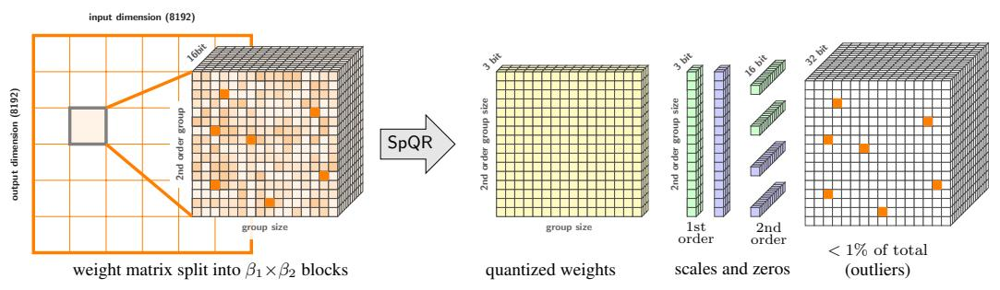
*الشكل 3: نظرة عامة عالية المستوى لتمثيل SpQR لموتر وزن واحد. يصور الجانب الأيمن من الصورة جميع أنواع البيانات المخزنة وأبعادها.*

## 4.2 تنفيذ التمثيل المكمَّم المتناثر والاستفادة منه

تحول خوارزميتنا الأوزان المتجانسة إلى عدة هياكل بيانات بأحجام ودقات مختلفة. بشكل عام، يتكون التمثيل من (1) أوزان مكمَّمة، (2) إحصائيات تكميم مكمَّمة من المستوى الأول، إحصائيات تكميم من المستوى الثاني، و (3) فهارس وقيم القيم الشاذة CSR. نلخص البنية العامة لـ SpQR في الشكل 3 ونصف كل مكون أدناه.

تخزين المجموعات المكمَّمة. تُرمَّز جميع الأوزان غير الشاذة كهيكل يحتوي على:

• وزن فردي بحجم b_w بت؛

<!-- page 8 -->

- سلم وحجم نقطة صفر بحجم bq بت لكل مجموعة بحجم B؛
- إحصائيات 16 بت لتكميم مجموعات من B^q^ سلالم تكميم ونقاط صفر.

كمثال محدد لتمثيل SpQR، فلنعتبر bw=bq=3 و B^w^ = B^q^ = 16. تُقسم مصفوفة الأوزان إلى مجموعات من B^q^ × B^w^ = 256 وزناً. تحتوي المجموعة على 256 رمزاً فردياً b^w^ = 3 بت. يستخدم كل 16 وزناً سلماً ونقطة صفر منفصلين بحجم 3 بت. أخيراً، هناك أربعة سُلميات 16 بت لكامل المجموعة تُستخدم للتكميم من المستوى الثاني. ولتبسيط الوصول إلى ذاكرة GPU، نحتفظ بالقيم المكمَّمة لأوزان القيم الشاذة في مكانها ونعدل إصدارات 16 بت لتعويض ذلك. كما نخزن كلاً من الأوزان المكمَّمة وإحصائيات التكميم المكمَّمة في منطقة ذاكرة متجاورة لكل مجموعة. عند التشغيل على أجهزة مختلفة (مثل وحدات المعالجة المركزية للهواتف المحمولة)، من الممكن تقليل بصمة الذاكرة بشكل أكبر عن طريق إزالة النسخة المكمَّمة من القيم الشاذة. نترك هذا الاتجاه للعمل المستقبلي.

تخزين القيم الشاذة. تذكر أن قيمنا الشاذة غير مهيكلة؛ للتخزين، نُرتبها حسب الصف أولاً والعمود ثانياً، بحيث تكون القيم الشاذة في نفس الصف متجاورة في الذاكرة. لكل قيمة شاذة، نخزن قيمتين سُلميتين: قيمة الوزن 16 بت وفهرس العمود 16 بت. لكل صف، نخزن أيضاً رقماً واحداً 32 بت — العدد الإجمالي للقيم الشاذة في الصفوف حتى الحالي للاستدلال الفعال. ينتج عن هذا تكلفة تخزين متوسطة من 32.03 إلى 32.1 بت لكل وزن حساس. يمكن تقليل هذا بشكل ملحوظ عن طريق تجميع القيم الشاذة، الذي نتركه كعمل مستقبلي.

الاستدلال مع SpQR. لتوضيح عملية نهجنا، نُصمم تنفيذ فك ترميز فعال يعتمد على GPU لصيغة SpQR، يركز على توليد نموذج اللغة الكبير الشائع رمزاً برمز كحالة استخدام.

نستفيد من حقيقة أن الاستدلال الانحداري الذاتي على GPUs مقيد بالذاكرة، لذا فإن نسب الضغط العالية يمكن أن تُخفي أعباء فك الترميز إلى حد كبير. على مستوى عالٍ، تُحمل خوارزميتنا إحصائيات المجموعات والأوزان المكمَّمة إلى الذاكرة المشتركة (SRAM)، وتفك تكميمها إلى 16 بت، ثم تنفذ ضرب المصفوفات بمدخلات 16 بت. لمعالجة القيم الشاذة، نُصمم خوارزمية مصفوفة متناثرة تستفيد من القيم الشاذة التي تحدث في الصفوف. تقريباً، تعمل الخوارزمية على النحو التالي

أولاً، (1) نُقسم المصفوفة إلى كتل متساوية الحجم. ثم، تقوم كل نواة GPU (كتلة خيوط) بـ (2) تحميل شريحة كبيرة من القيم الشاذة إلى الذاكرة المشتركة (SRAM)، وتُحدد كل نواة GPU (3) ما إذا كانت القيم الشاذة جزءاً من المقطع أم لا. تُحمَّل الأوزان المقابلة (4) من الذاكرة الرئيسية؛ وأخيراً، يتم تنفيذ ضرب المصفوفات.

تقوم هذه الخوارزمية أساساً بموازنة الحمل عبر الخطوات (1-3)، في حين تميل الخطوة (4) إلى الوصول إلى ذاكرة متجاورة بسبب الأنماط الشبيهة بالصفوف للقيم الشاذة. سنُظهر في القسم[ 5](#page-7-0) أن هذا النهج المخصص أسرع من خوارزميات المصفوفات المتناثرة في PyTorch.

# 5 التحقق التجريبي

الإعداد التجريبي. نركز على ثلاثة إعدادات رئيسية: 1) تقييم ما هو التمثيل الأكثر إيجازاً الذي يمكن لـ SpQR من خلاله تكرار أداء نموذج 16 بت ضمن 1% من الحيرة، 2) التحكم في متوسط عدد البتات لكل وسيط عبر الطرق وتقييم أداء SpQR مقارنة بالمرجعيات للتقريب لأقرب قيمة و GPTQ، 3) ما هي أفضل مقايضة من حيث حجم النموذج والأداء. لهذه الإعدادات، نقيم خوارزمية SpQR الكاملة على نماذج LLM المتاحة للجمهور. نركز على عائلة نماذج LLaMA {7, 13, 30, 65}B [[TLI](#page-12-2)^+^23] وعائلة نماذج Falcon{7, 40}B [[UAE23a]](#page-12-10). نقوم بتكميم نماذج LLaMa باستخدام مجموعة بيانات RedPajama ونماذج Falcon على مجموعة بيانات RefinedWeb [[UAE23b]](#page-12-11)، وهي نسخ متاحة للجمهور من بيانات تدريب LLaMA و Falcon على التوالي. بالإضافة إلى ذلك، نقدم نتائج الحيرة لنماذج OPT في الملحق[ F.](#page-19-0)

نقارن SpQR ضد مخططين آخرين للتكميم بعد التدريب: GPTQ [[FAHA22]](#page-11-2) والتكميم البسيط بالتقريب لأقرب قيمة (RTN)، الذي يستخدمه معظم طرق ضغط نماذج اللغة الكبيرة الأخرى [[DLBZ22,](#page-10-4) [YAZ](#page-13-4)^+^22]. تستخدم كلتا المرجعيتين تكميم 4 بت لأنه يوفر أفضل مقايضة بين الجودة والحجم [[DZ22]](#page-11-3). بالنسبة لـ SpQR، نأخذ بعين الاعتبار التكميم الأساسي بـ 3 بت و 4 بت، على الرغم من أن حجم النموذج الناتج قد يكون أكبر قليلاً بسبب وجود القيم الشاذة.

نقيم أداء النموذج المكمَّم بمقياسين. أولاً، نقيس *الحيرة*، المقاسة على مجموعات بيانات WikiText2 [[MXBS16]](#page-11-13)، و Penn Treebank [[MKM](#page-11-14)^+^94]، و C4 [[RSR](#page-12-5)^+^20]. ثانياً، نقيس دقة بدون تدريب مسبق على خمس مهام: WinoGrande [[SBBC21]](#page-12-12)، و PiQA [[TP03]](#page-12-13)، و HellaSwag، و ARC-easy، و ARC-challenge [[CCE](#page-10-5)^+^18]. نستخدم LM Evaluation Harness [[GTB](#page-11-15)^+^21] مع

<!-- page 9 -->

## LLaMa

الوسائط الموصى بها. نقدم التكوينات الكاملة في الملحق[ B,](#page-17-0) بالإضافة إلى الكود الذي نخطط لإصداره علنياً. يستغرق تنفيذنا حوالي 4.5 ساعة على أكبر حجم نموذج (65B) على NVIDIA A100 وحوالي 6 على A6000.

للتحكم في حجم النموذج، نقيم RTN و GPTQ بتكميم أساسي 4 بت. بالنسبة لـ SpQR، نستخدم تكميم أساسي 3 بت، حجم مجموعة 8 مع 3 بت للتكميم الأول، حجم مجموعة 64 للتكميم الثاني، وأكبر عدد ممكن من القيم الشاذة لا يزال يصل إلى أقل من 4 بت لكل وسيط في المتوسط. نهدف إلى تحقيق ضغط *شبه معدوم الفقد*، الذي نتبنى له تعريف معيار MLCommons [[RCK](#page-12-14)^+^20]: خطأ 1% بالنسبة للمرجعية غير المضغوطة. في جميع تقييمات SpQR، نختار τ بحيث تكون نسبة القيم الشاذة أقل من 1%.

النتائج الرئيسية. يقيس الشكل[ 1](#page-1-0) حجم النموذج الفعلي مقابل الحيرة على نماذج LLaMa على WikiText2، والدقة على المهام بدون تدريب مسبق. نلاحظ أن SpQR تتفوق على GPTQ (وبالتالي RTN) بحجم نموذج مماثل بهامش كبير، خاصة على النماذج الأصغر. يأتي هذا التحسن من تحقيق SpQR لمزيد من الضغط، مع تقليل تدهور الخسارة أيضاً. بالإضافة إلى ذلك، إذا قمنا بقياس البتات لكل وسيط اللازمة للوصول إلى ضمن 1% من أداء 16 بت من حيث الحيرة، يُظهر الشكل[ 1](#page-1-0) أن SpQR مع 4.6 إلى 4.71 بت لكل وسيط تقترب من النماذج غير المكمَّمة بهامش خطأ بحد أقصى 1% لجميع النماذج (انظر الجدول[ 1](#page-8-0) والجدول[ 2](#page-9-1) للقيم الدقيقة).

تتحكم المجموعة الثانية من النتائج، المقدمة في الجدول[ 1](#page-8-0) لـ LLaMa والجدول[ 2](#page-9-1) لنماذج عائلة Falcon، في حجم النموذج بمقارنة SpQR وطرق المرجعية بـ 4 بت لكل وسيط. تُظهر هذه النتائج أن SpQR تتحسن على الطرق السابقة، مع كون الفجوة بين SpQR والطريقة التالية الأفضل GPTQ كبيرة كتحسن GPTQ على RTN الساذجة. لـ 4 بت، تُقلل SpQR الخطأ بالنسبة لمرجعية 16 بت إلى النصف مقارنة بـ GPTQ.

الاستئصالات. يختلف تمثيل SpQR عن طرق التكميم القياسية بطريقتين رئيسيتين: التكميم ثنائي المستوى بحجم مجموعة تكميم صغير والقيم الشاذة غير المهيكلة. لفهم تأثير أحجام المجموعات الصغيرة، نقارن SpQR 3 بت بحجم مجموعة 16، مضغوطة باستخدام تكميم ثنائي المستوى 3 بت، مقابل إعداد بحجم مجموعة 48، مع الاحتفاظ بإحصائيات التكميم في 16 بت. ينتج عن كلا التكوينين حوالي 3.6 بت متوسط لكل وسيط. للتبسيط، لا يستخدم أي منهما القيم الشاذة. نُبلغ عن كليهما في الجدول[ 3,](#page-9-0) يتوافق إدخال "إحصائيات 3 بت" مع حجم مجموعة 16 مع إحصائيات 3 بت ويُمثل "إحصائيات 16 بت" حجم مجموعة 16 مع إحصائيات 16 بت. بالنظر إلى نفس بصمة الذاكرة (الأصغر قليلاً)، فإن استخدام إحصائيات مكمَّمة يحسن خسارة نمذجة اللغة بشكل كبير.

بعد ذلك، نسأل ما إذا كان من الضروري استخدام القيم الشاذة غير المهيكلة، مع النظر في نوعين من القيم الشاذة. أولاً، نستخدم معيار Dettmers وآخرين [[DZ22]](#page-11-3) للعثور على القيم الشاذة في الأعمدة وتكميمها بدقة أعلى. البديل هو معاملة الصفوف بأكملها (وحدات المخرجات / وحدات الإخفاء / الخلايا العصبية) كقيم شاذة: نُشغل SpQR بدون قيم شاذة، ثم نختار k وحدات مخرجات لها أعلى خطأ تكميم (أي

<!-- page 10 -->

## Falcon

| الاسم | Wiki2 | C4 | PTB | متوسط البتات |
| --- | --- | --- | --- | --- |
| غير مضغوط | 3.53 | 5.62 | 6.91 | 16 |
| GPTQ (4 بت) | 3.83 | 5.80 | 7.07 | 4 |
| إحصائيات 3 بت | 3.74 | 5.73 | 7.02 | 3.63 |
| إحصائيات 16 بت | 3.84 | 5.83 | 7.12 | 3.67 |
| تقريب الصفر | 3.75 | 5.76 | 7.01 | 3.63 |
| بدون ترتيب التنشيط | 3.74 | 5.76 | 7.05 | 3.63 |

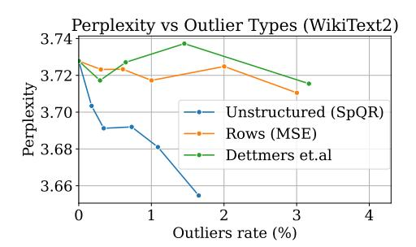
*الجدول 3: الحيرة لنموذج LLaMA-65B.*

*الشكل 4: أنواع مختلفة من القيم الشاذة، LLaMA-65B.*

MSE بين تنبؤات الطبقة) ونعامل الصفوف بأكملها كقيم شاذة 16 بت. نقارن أنواع القيم الشاذة الثلاثة فوق SpQR 3 بت ونُبلغ عن النتائج في الشكل 4. بشكل عام، تُقلل القيم الشاذة غير المهيكلة الحيرة بشكل أسرع بكثير من نظيرتها الصفوفية ومعيار [DZ22]، حتى بعد احتساب بصمة الذاكرة المختلفة.

أخيراً، نُحلل تأثير التغييرات الطفيفة في فرط الوسائط التي قدمناها في نهاية القسم 4. في الجدول 3 (الجزء السفلي)، نُقيم أخطاء التكميم بدون هذه التغييرات. يتوافق إدخال "تقريب الصفر" مع نسخة من SpQR حيث تكون نقطة الصفر عدداً صحيحاً 3 بت. يُقلل هذا من بصمة ذاكرة SpQR، لكنه ينتج عنه زيادة معتدلة في الحيرة. وبالمثل، نقيم SpQR بدون علامة "ترتيب التنشيط". يعيد هذا الخيار ترتيب أبعاد الإدخال بقطر هيسي العكسي، الذي تم تقديمه كجزء من خوارزمية GPTQ. استخدام هذه الاستدلالية يحسن الخسارة قليلاً، رغم أنه ليس بالقدر الذي تفعله المجموعات المكمَّمة.

للتلخيص، تُحسن كل من المجموعات المكمَّمة الصغيرة والقيم الشاذة غير المهيكلة الحيرة بشكل مستقل وتؤدي بشكل أفضل من الاستراتيجيات البديلة. تستفيد SpQR أيضاً من استخدام استدلالية ترتيب تنشيط GPTQ، رغم أن الفائدة أصغر من القيم الشاذة أو المجموعات الصغيرة. ومع ذلك، نختار استخدام نفس استدلالية ترتيب التنشيط في مرجعيات GPTQ لضمان مقارنة عادلة. لاستكشاف فضاء تصميم SpQR بشكل أكبر، نقدم دراسة فرط معاملات إضافية في الملحق C.

**زمن الاستدلال.** أخيراً، نُقيم سرعة استدلال SpQR للاستدلال الانحداري الذاتي مع التركيز على قياس زمن انتقال توليد الرموز بحجم دفعة 1 على وحدة GPU A100 واحدة. نقيس سرعة الاستدلال في إعدادين: i) توليد 100 رمز من الصفر و ii) إضافة 100 رمز فوق بادئة 1024 رمز (موجه). نقارن خوارزمية ضرب المصفوفات المتناثرة المتخصصة لدينا مع الخوارزمية المنفذة في PyTorch (cuSPARSE). نقارن أيضاً مع مرجعية 16 بت. نقيس زمن الانتقال من البداية للنهاية كخطوات استدلال في الثانية لخوارزمية SpQR الكاملة، أي لكل من جزء الضرب الكثيف والمتناثر معاً.

تظهر النتائج في الجدول 4. يمكننا أن نرى أنه بينما لا يكون ضرب المصفوفات المتناثرة القياسي في PyTorch أسرع من استدلال 16 بت، فإن خوارزمية ضرب المصفوفات المتناثرة المتخصصة لدينا تنتج تسريعات بحوالي 20-30%.

<!-- page 11 -->

# 6 المناقشة والقيود

قدمنا SpQR، نهج تكميم يكمم القيم الشاذة الحساسة بدقة أعلى، لتحقيق دقة 16 بت شبه معدومة الفقد بأقل من 4.75 بت لكل وسيط في المتوسط. نحقق مقايضة جودة-حجم أفضل عند الضغط إلى ما لا يقل عن 3.36 بت مما يجعل SpQR طريقة مثالية لضغط النماذج للأجهزة محدودة الذاكرة. على الرغم من نتائجنا الواعدة، هناك عدة قيود. القيد الرئيسي هو أننا لا نقيم الجودة التوليدية للنماذج اللغوية المكمَّمة، بل فقط الأداء التنبؤي من حيث الدقة بدون تدريب مسبق والحيرة. وبينما نعتقد أن قياسات الحيرة وجودة التوليد مرتبطة بقوة، فإن هذه فرضية نهدف إلى التحقيق فيها في العمل المستقبلي. وبينما ابتكرنا خوارزمية ضرب مصفوفات متناثرة لتسريع الحساب مع القيم الشاذة، هناك قيد آخر هو أننا لا ندمج ضرب المصفوفات المتناثرة مع ضرب المصفوفات المكمَّمة العادية. سيُنتج مثل هذا النهج أداء أفضل في وقت الاستدلال. ومع ذلك، فإن مثل هذا النهج صعب التنفيذ للغاية. نترك تنفيذ مثل هذه الخوارزمية للعمل المستقبلي.

# 7 الشكر والتقدير

تم دعم D.K. من قِبل مؤسسة العلوم الروسية، منحة 21-11-00373. يعترف D.A. و E.F. بامتنان بالتمويل من المجلس الأوروبي للأبحاث (ERC) في إطار برنامج البحث والابتكار Horizon 2020 للاتحاد الأوروبي (اتفاقية المنحة رقم 805223 ScaleML). يشكر المؤلفون أيضاً Ivan Komarov على مساعدته في إنشاء الملف الشخصي وفهم اختناقات الأداء لـ SpQR على GPU.

## المراجع

- [BMR^+^20] Tom Brown, Benjamin Mann, Nick Ryder, Melanie Subbiah, Jared D Kaplan, Prafulla Dhariwal, Arvind Neelakantan, Pranav Shyam, Girish Sastry, Amanda Askell, et al. Language models are few-shot learners. In *Conference on Neural Information* *Processing Systems (NeurIPS)*, 2020.
- [BSA^+^23] Stella Biderman, Hailey Schoelkopf, Quentin Anthony, Herbie Bradley, Kyle O'Brien, Eric Hallahan, Mohammad Aflah Khan, Shivanshu Purohit, USVSN Sai Prashanth, Edward Raff, et al. Pythia: A suite for analyzing large language models across training and scaling. *arXiv preprint arXiv:2304.01373*, 2023.
- [CCE^+^18] Peter Clark, Isaac Cowhey, Oren Etzioni, Tushar Khot, Ashish Sabharwal, Carissa Schoenick, and Oyvind Tafjord. Think you have solved question answering? try arc, the ai2 reasoning challenge. *arXiv preprint arXiv:1803.05457*, 2018.
- [CND^+^22] Aakanksha Chowdhery, Sharan Narang, Jacob Devlin, Maarten Bosma, Gaurav Mishra, Adam Roberts, Paul Barham, Hyung Won Chung, Charles Sutton, Sebastian Gehrmann, et al. Palm: Scaling language modeling with pathways. *arXiv preprint* *arXiv:2204.02311*, 2022.
- [DCLT19] Jacob Devlin, Ming-Wei Chang, Kenton Lee, and Kristina Toutanova. BERT: Pretraining of deep bidirectional transformers for language understanding. In *North* *American Chapter of the Association for Computational Linguistics (NAACL)*, 2019.
- [DLBZ22] Tim Dettmers, Mike Lewis, Younes Belkada, and Luke Zettlemoyer. LLM.int8(): 8-bit matrix multiplication for transformers at scale. *Advances in Neural Information* *Processing Systems 35: Annual Conference on Neural Information Processing Systems* *2022, NeurIPS 2022*, 2022.

<!-- page 12 -->

- [DZ22] Tim Dettmers and Luke Zettlemoyer. The case for 4-bit precision: k-bit inference scaling laws. *arXiv preprint arXiv:2212.09720*, 2022.
- [FA23] Elias Frantar and Dan Alistarh. Massive language models can be accurately pruned in one-shot. *arXiv preprint arXiv:2301.00774*, 2023.
- [FAHA22] Elias Frantar, Saleh Ashkboos, Torsten Hoefler, and Dan Alistarh. Gptq: Accurate post-training quantization for generative pre-trained transformers. *arXiv preprint* *arXiv:2210.17323*, 2022. [FSA22] Elias Frantar, Sidak Pal Singh, and Dan Alistarh. Optimal Brain Compression: A framework for accurate post-training quantization and pruning. *arXiv preprint* *arXiv:2208.11580*, 2022. Accepted to NeurIPS 2022, to appear.
- [GFS+19] Yury Gorbachev, Mikhail Fedorov, Iliya Slavutin, Artyom Tugarev, Marat Fatekhov, and Yaroslav Tarkan. Openvino deep learning workbench: Comprehensive analysis and tuning of neural networks inference. In *Proceedings of the IEEE/CVF International* *Conference on Computer Vision Workshops*, pages 0–0, 2019.
- [GKD+21] Amir Gholami, Sehoon Kim, Zhen Dong, Zhewei Yao, Michael W Mahoney, and Kurt Keutzer. A survey of quantization methods for efficient neural network inference. *arXiv* *preprint arXiv:2103.13630*, 2021.
- [GTB^+^21] Leo Gao, Jonathan Tow, Stella Biderman, Sid Black, Anthony DiPofi, Charles Foster, Laurence Golding, Jeffrey Hsu, Kyle McDonell, Niklas Muennighoff, Jason Phang, Laria Reynolds, Eric Tang, Anish Thite, Ben Wang, Kevin Wang, and Andy Zou. A framework for few-shot language model evaluation, September 2021.
- [HABN^+^21] Torsten Hoefler, Dan Alistarh, Tal Ben-Nun, Nikoli Dryden, and Alexandra Peste. Sparsity in deep learning: Pruning and growth for efficient inference and training in neural networks. *arXiv preprint arXiv:2102.00554*, 2021.
- [HBM^+^22] Jordan Hoffmann, Sebastian Borgeaud, Arthur Mensch, Elena Buchatskaya, Trevor Cai, Eliza Rutherford, Diego de Las Casas, Lisa Anne Hendricks, Johannes Welbl, Aidan Clark, et al. Training compute-optimal large language models. *arXiv preprint* *arXiv:2203.15556*, 2022.
- [HNH^+^21] Itay Hubara, Yury Nahshan, Yair Hanani, Ron Banner, and Daniel Soudry. Accurate post training quantization with small calibration sets. In *International Conference on* *Machine Learning (ICML)*, 2021.
- [KHB^+^21] Daya Khudia, Jianyu Huang, Protonu Basu, Summer Deng, Haixin Liu, Jongsoo Park, and Mikhail Smelyanskiy. Fbgemm: Enabling high-performance low-precision deep learning inference. *arXiv preprint arXiv:2101.05615*, 2021.
- [KMH^+^20] Jared Kaplan, Sam McCandlish, Tom Henighan, Tom B Brown, Benjamin Chess, Rewon Child, Scott Gray, Alec Radford, Jeffrey Wu, and Dario Amodei. Scaling laws for neural language models. *arXiv preprint arXiv:2001.08361*, 2020.
- [LGT^+^21] Yuhang Li, Ruihao Gong, Xu Tan, Yang Yang, Peng Hu, Qi Zhang, Fengwei Yu, Wei Wang, and Shi Gu. BRECQ: Pushing the limit of post-training quantization by block reconstruction. In *International Conference on Learning Representations (ICLR)*, 2021.
- [MKM^+^94] Mitch Marcus, Grace Kim, Mary Ann Marcinkiewicz, Robert MacIntyre, Ann Bies, Mark Ferguson, Karen Katz, and Britta Schasberger. The penn treebank: Annotating predicate argument structure. In *Human Language Technology: Proceedings of a* *Workshop held at Plainsboro, New Jersey, March 8-11, 1994*, 1994.
- [MXBS16] Stephen Merity, Caiming Xiong, James Bradbury, and Richard Socher. Pointer sentinel mixture models. *arXiv preprint arXiv:1609.07843*, 2016.
- [NAVB^+^20] Markus Nagel, Rana Ali Amjad, Mart Van Baalen, Christos Louizos, and Tijmen Blankevoort. Up or down? Adaptive rounding for post-training quantization. In *International Conference on Machine Learning (ICML)*, 2020.

<!-- page 13 -->

- [Neu22] NeuralMagic. DeepSparse, 2022.
- [OEN+22] Catherine Olsson, Nelson Elhage, Neel Nanda, Nicholas Joseph, Nova DasSarma, Tom Henighan, Ben Mann, Amanda Askell, Yuntao Bai, Anna Chen, et al. In-context learning and induction heads. *arXiv preprint arXiv:2209.11895*, 2022. [Ope23] OpenAI. Gpt-4 technical report. *arXiv*, 2023.
- [PGM+19] Adam Paszke, Sam Gross, Francisco Massa, Adam Lerer, James Bradbury, Gregory Chanan, Trevor Killeen, Zeming Lin, Natalia Gimelshein, Luca Antiga, Alban Desmaison, Andreas Kopf, Edward Yang, Zachary DeVito, Martin Raison, Alykhan Tejani, Sasank Chilamkurthy, Benoit Steiner, Lu Fang, Junjie Bai, and Soumith Chintala. PyTorch: An imperative style, high-performance deep learning library. In *Conference* *on Neural Information Processing Systems (NeurIPS)*. 2019.
- [PPK+22] Gunho Park, Baeseong Park, Se Jung Kwon, Byeongwook Kim, Youngjoo Lee, and Dongsoo Lee. nuQmm: Quantized matmul for efficient inference of large-scale generative language models. *arXiv preprint arXiv:2206.09557*, 2022.
- [RCK+20] Vijay Janapa Reddi, Christine Cheng, David Kanter, Peter Mattson, Guenther Schmuelling, Carole-Jean Wu, Brian Anderson, Maximilien Breughe, Mark Charlebois, William Chou, et al. Mlperf inference benchmark. In *2020 ACM/IEEE 47th Annual* *International Symposium on Computer Architecture (ISCA)*, pages 446–459. IEEE, 2020.
- [RSR^+^20] Colin Raffel, Noam Shazeer, Adam Roberts, Katherine Lee, Sharan Narang, Michael Matena, Yanqi Zhou, Wei Li, and Peter Liu. Exploring the limits of transfer learning with a unified text-to-text transformer. *Journal of Machine Learning Research*, 21(140):1–67, 2020.
- [RWC^+^19] Alec Radford, Jeffrey Wu, Rewon Child, David Luan, Dario Amodei, and Ilya Sutskever. Language models are unsupervised multitask learners. *OpenAI blog*, 1(8):9, 2019.
- [SBBC21] Keisuke Sakaguchi, Ronan Le Bras, Chandra Bhagavatula, and Yejin Choi. Winogrande: an adversarial winograd schema challenge at scale. *Commun. ACM*, 64(9):99–106, 2021.
- [SLP^+^21] Jianlin Su, Yu Lu, Shengfeng Pan, Ahmed Murtadha, Bo Wen, and Yunfeng Liu. Roformer: Enhanced transformer with rotary position embedding. *arXiv preprint* *arXiv:2104.09864*, 2021.
- [TLI^+^23] Hugo Touvron, Thibaut Lavril, Gautier Izacard, Xavier Martinet, Marie-Anne Lachaux, Timothée Lacroix, Baptiste Rozière, Naman Goyal, Eric Hambro, Faisal Azhar, et al. Llama: Open and efficient foundation language models. *arXiv preprint* *arXiv:2302.13971*, 2023. [TP03] Sandeep Tata and Jignesh M Patel. PiQA: An algebra for querying protein data sets. In *International Conference on Scientific and Statistical Database Management*, 2003.
- [UAE23a] TII UAE. The falcon family of large language models. [https://huggingface.co/](https://huggingface.co/tiiuae/falcon-40b) [tiiuae/falcon-40b](https://huggingface.co/tiiuae/falcon-40b), May 2023.
- [UAE23b] TII UAE. The refined web dataset. [https://huggingface.co/datasets/tiiuae/](https://huggingface.co/datasets/tiiuae/falcon-refinedweb) [falcon-refinedweb](https://huggingface.co/datasets/tiiuae/falcon-refinedweb), May 2023. [Vig19] Jesse Vig. A multiscale visualization of attention in the transformer model. *arXiv* *preprint arXiv:1906.05714*, 2019.
- [VTM^+^19] Elena Voita, David Talbot, Fedor Moiseev, Rico Sennrich, and Ivan Titov. Analyzing multi-head self-attention: Specialized heads do the heavy lifting, the rest can be pruned. In *Proceedings of the 57th Annual Meeting of the Association for Computational* *Linguistics*, pages 5797–5808, Florence, Italy, July 2019. Association for Computational Linguistics.

<!-- page 14 -->

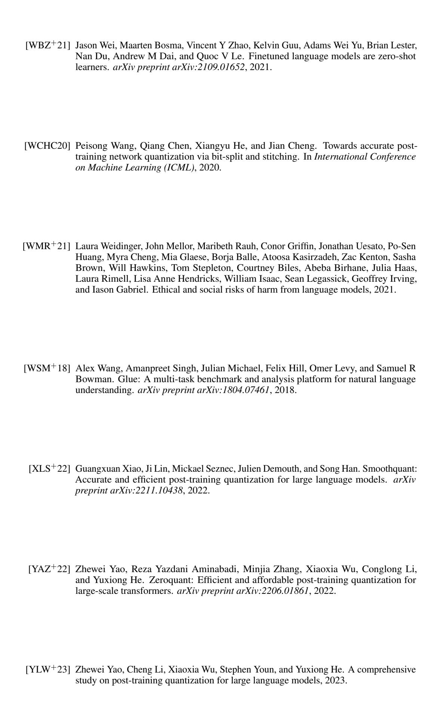

<!-- page 15 -->

## جدول المحتويات

1المقدمة12الأعمال ذات الصلة33حساسية تكميم أوزان نماذج اللغة الكبيرة
3.1 حساسية الوسائط تحت التكميم
3.2 استكشاف حساسية الوسائط4
4
44SpQR: تمثيل مضغوط واعٍ بالحساسية
4.1 نظرة عامة
4.2 تنفيذ التمثيل المكمَّم المتناثر والاستفادة منه5
5
75التحقق التجريبي86المناقشة والقيود117الشكر والتقدير11Aتحليل حساسية وزن إضافي15Bالتكوينات التجريبية18Cحساسية فرط الوسائط18Dتقدير حجم النموذج18Eاختيار التكوين الأمثل لمتوسط ثابت لعدد البتات19Fنتائج إضافية للضغط شبه معدوم الفقد20Gاختيار تكوين LLM الأمثل لأجهزة محددة20Hالحساسية للبذرة العشوائية22Iأمثلة توليدية22Jالأثر الأوسع22Kحول استخدام نماذج اللغة الكبيرة في هذا العمل26

## A تحليل حساسية وزن إضافي

في هذا القسم، نقدم تصورات إضافية لحساسيات وزن LLaMA، بالإضافة إلى مخططات إضافية لأدوار طبقات مختلفة. كما لاحظنا سابقاً في القسم[ 3.2,](#page-3-3) تختلف مصفوفات الحساسية استناداً إلى أربعة عوامل رئيسية:

- مخطط التكميم (مثلاً صفي أو مجموعي)؛
- عمق الطبقة، أي فهرس كتلة المحول المقابلة؛
- دور هذا الوزن، مثل استعلام/مفتاح الانتباه الذاتي أو إسقاط MLP لأعلى/لأسفل؛
- الموقع داخل مصفوفة الأوزان المختارة؛

هنا، نُبلغ عن ملاحظات إضافية حول هذه العوامل ونوسع بعض ادعاءاتنا من القسم[ 3.1.](#page-3-2) كما نُبلغ عن مصفوفات الحساسية الخام لمصفوفات أوزان مختلفة في نهاية المواد التكميلية.

العلاقة بين الحساسية ومخطط التكميم المختار. نقارن تكوينين من GPTQ 3 بت. يستخدم التكوين الأول سلم تكميم وصفر واحد لكل صف. يستخدم التكوين الثاني تكميم كتلي بمجموعة واحدة من الإحصائيات لكل كتلة من 128 وزن.

يوضح الشكل[ 5](#page-15-0) مثالاً نموذجياً لكيفية تأثير حجم المجموعة على الحساسية. في المخطط السفلي الأيمن، نلاحظ أن مجموعة فرعية من الأوزان (بعرض 128) لها خطأ تكميم أعلى بشكل ملحوظ

<!-- page 16 -->

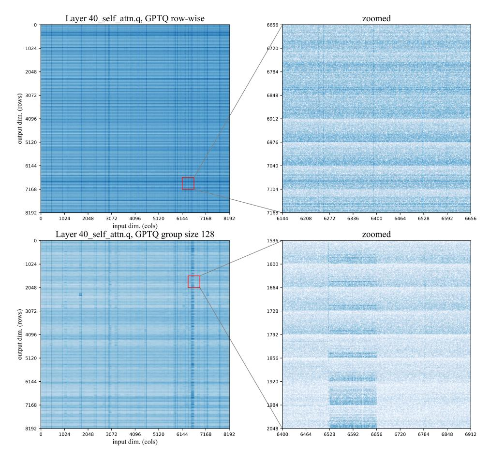
*الشكل 5: حساسيات الوزن للطبقة 40 من LLaMA-65B، إسقاط استعلام الانتباه. يُمثل مقياس اللون الحساسية على مقياس لوغاريتمي، مع كون الحساسية الأعلى أغمق. **(أعلى)** GPTQ 3 بت بسلالم تكميم لكل صف، **(أسفل)** GPTQ 3 بت بحجم كتلة 128.*

من بقية الطبقة. لاحظ أن مقياس اللون يمثل الحساسية على مقياس لوغاريتمي، مع كون الحساسية الأعلى أغمق.

عند الفحص الأكثر تفصيلاً، وجدنا أن هذه المجموعة المحددة تحتوي على قيمة شاذة "عمودية"، أي أن ميزة الإدخال المقابلة لها تباين أعلى بشكل ملحوظ، مقارنة بأبعاد الإدخال الأخرى.

في هذا المثال، التأثير الرئيسي لحجم كتلة GPTQ 128 هو أن البُعد الإشكالي يؤدي إلى حساسية متزايدة في مجموعة من 8192 \times 128 وزن. وبدوره، يكون لـ GPTQ بإحصائيات لكل صف خطأ تكميم عالٍ عبر الصف بأكمله.

**تأثير التضمينات الدوارة.** سابقاً في الشكل 2 نلاحظ أن استعلام ومفتاح الانتباه لهما نمط منتظم من الحساسية يتكرر كل 64 صفاً. نُعزو هذا إلى حقيقة أن LLaMA يستخدم تضمينات الموضع الدوارة. وعلى وجه التحديد، من المرجح أن يكون هذا النمط أثراً جانبياً لكيفية تنفيذ التضمينات الدوارة لهذا النموذج.

للتذكير، تضمينات الموضع الدوارة هي تقنية تُدور أبعاد رأس الانتباه بزاوية تعتمد على عدد الرموز بين المفتاح والاستعلام [SLP<sup>+</sup>21]. علاوة على ذلك، يتم تدوير الأبعاد داخل كل رأس بتردد مختلف. لتنفيذ هذا التدوير، تضرب LLaMA كل رأس بموتر محسوب مسبقاً لدالات الجيب وجيب التمام بفترة مختلفة. يتم ضرب النصف الأول (64 وحدة) من المصفوفة بجيوب التمام والنصف الآخر (64 وحدة) بالجيوب.

للتذكير، مكونات الجيب وجيب التمام متكافئة باستثناء إزاحة طور وتُظهر سلوكاً مماثلاً في تحليلنا. بشكل عام، نلاحظ أن الأوزان المقابلة للرؤوس منخفضة التردد (أسفل كل نصف رأس) عادة ما تكون أعلى حساسية. أحد التفسيرات المحتملة هو أن الرؤوس عالية التردد

<!-- page 17 -->

يمكن أن تكون أكثر اعتماداً على المعلومات الخاصة بالموضع، مثل الانتباه إلى الرمز السابق — وأقل اعتماداً على الأوزان التي تمثل معلومات المحتوى. ومع ذلك، فإن هذه الظاهرة تستحق المزيد من التحقيق ويجب التعامل مع فهمنا الحالي على أنه تخمين متعلم.

**GPTQ وتأثير ترتيب التكميم.** كما نلاحظ سابقاً في القسم 3.2، تميل الأوزان اليمنى في كل تصور إلى أن تكون لها أخطاء تكميم أعلى. من المرجح أن يكون هذا أثراً جانبياً لخوارزمية GPTQ، التي تضغط الأوزان ميزة إدخال واحدة في كل مرة، أي عموداً تلو الآخر في اتجاه من اليسار إلى اليمين. بمجرد أن يتم تكميم العمود، تستخدم الخوارزمية الأوزان غير المكمَّمة المتبقية لتعويض الخطأ. وبالتالي، تتراكم أكبر قدر من الخطأ في الدفعة اليمنى من الأوزان من الأعمدة السابقة ولديها أقل مساحة لتعويض خطأ تكميمها "الخاص".

هذا الفرق أكثر وضوحاً في الطبقات المبكرة، حيث يكون خطأ التكميم أصغر بشكل عام (انظر الشكل 6). للتحقق من هذه الملاحظة بشكل أكبر، نلاحظ أن هذا التأثير يختفي إذا قمنا بخلط ترتيب تكميم الأوزان في خوارزمية GPTQ.

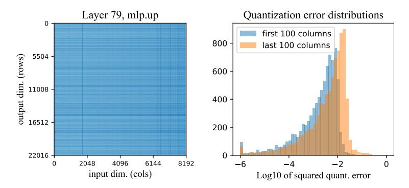
*الشكل 6: حساسيات الوزن اللوغاريتمية لطبقة إسقاط أعمق صعودي (وعلى وجه الخصوص، هذه هي الطبقة #79). تمثل الخريطة الحرارية على اليسار حساسيات كل وزن، مع كون الأغمق أكثر حساسية؛ يلتقط الرسم البياني على اليمين الحساسيات في أول 100 وآخر 100 عمود (مرتبة عبر أبعاد الإدخال). يُظهر الشكل الأخير بوضوح أن الأعمدة اللاحقة أكثر حساسية في المتوسط.*

**العلاقة بين حساسية الوزن وعمق الطبقة.** من حيث متوسط الخطأ التربيعي، نلاحظ أن الطبقات الأولى من LLaMA تميل إلى أن يكون لديها بشكل عام خطأ OBC أقل (المعرف على أنه مسافة L2 بين تنبؤات الطبقة الأصلية والمكمَّمة). لتوضيح ذلك، نُبلغ عن متوسط خطأ التكميم لـ GPTQ-3bit في الشكل 7.

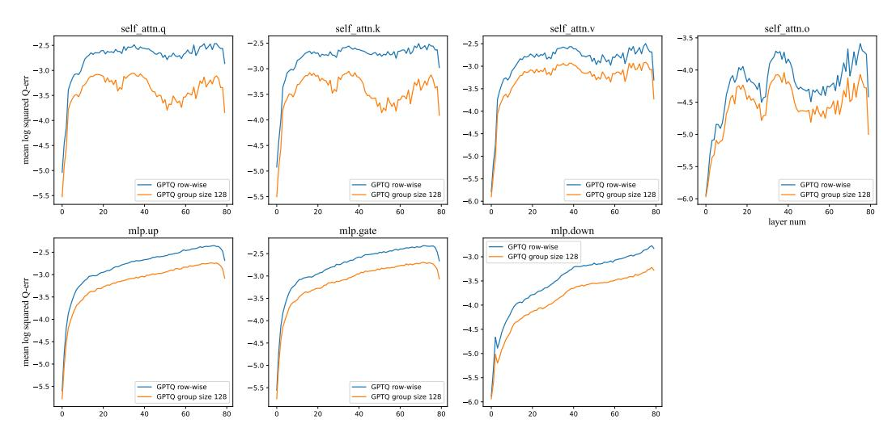
*الشكل 7: الشكل: متوسط خطأ التكميم (المحور الرأسي) كدالة لعمق الطبقة (المحور الأفقي). يتوافق كل مخطط مع دور طبقة مختلف.*

<!-- page 18 -->

الخطأ المطلق للتكميم لا يعني الكثير في حد ذاته لأن كل طبقة مكمَّمة لها تباين إدخال/إخراج مختلف. ومع ذلك، نلاحظ أيضاً أن الطبقات الأولى والأخيرة لها اختلافات نوعية في السلوك. تُبلغ الأشكال 10 و 11 عن حساسيات الوزن للطبقة الأولى، الوسطى (40)، والأخيرة (79) من نموذج LLaMA بشكل منفصل لتوضيح هذا الاختلاف بشكل أفضل.

## **B** التكوينات التجريبية

تحتوي تمثيلات SpQR المقترحة في هذا العمل على عدة فرط معاملات قابلة للتعديل تسمح بمرونة كبيرة في استهداف الحجم المرغوب للنموذج. نقدم الترميز ونسرد فرط معاملات الطريقة أدناه:

- b_w عدد البتات لكل وزن
- b_s عدد البتات لكل سلم
- b_z عدد البتات لكل صفر
- r_o معدل القيم الشاذة (نسبة الأوزان غير المكمَّمة)
- \beta_1 حجم الكتلة لتكميم الوزن
- \beta_2 حجم الكتلة لتكميم الإحصائيات؛
- \tau عتبة القيم الشاذة

العدد الفعلي للقيم الشاذة لا يعتمد على \tau فحسب، بل على جميع فرط المعاملات الأخرى أيضاً. ومع ذلك، بالنسبة لأي تكوين محدد، فإن زيادة \tau تؤدي إلى تقليل عدد القيم الشاذة. لتحقيق العدد المرغوب من القيم الشاذة، نضبط \tau في النطاق [0.1, 1.0] بالبحث الثنائي بحجم خطوة أدنى 0.05. الغالبية العظمى من تكويناتنا بين \tau=0.1 و \tau=0.45].

التكوين الكامل الذي نستخدمه لضغط نموذج LLaMA-30B بشكل شبه معدوم الفقد في الجدول 1 له فرط المعاملات التالية: b_w = 4, b_s = b_z = 3, \beta_1 = \beta_2 = 16, \tau = 0.1 يُترجم هذا إلى وسائط سطر الأوامر التالية في الكود التكميلي لدينا:

```
python main.py $MODEL custom --custom_data_path=$DATA \
 --wbits 4 --groupsize 16 --perchannel --qq_scale_bits 3 \
 --qq_zero_bits 3 --qq_groupsize 16 --outlier_threshold 0.1 \
 --fit_quantizer_without_outliers --permutation_order act_order
```

## C حساسية فرط المعاملات

في هذا القسم، نُحلل كيف يعتمد أداء SpQR على اختيار أحجام مجموعة التكميم. تذكر أن خوارزمية SpQR تستخدم نوعين من المجموعات، مفهرسة بالمعاملات \beta_1 و \beta_2. يغطي بُعد المجموعة الأول \beta_1 أوزاناً متعددة لنفس وحدة الإدخال، مماثل للتكميم الكتلي القياسي. بدوره، يغطي البعد الآخر \beta_2 وحدات إخراج متعددة، ويُستخدم عند تكميم سلالم التكميم. في تصوراتنا، تكون كتل \beta_1 دائماً أفقية، بينما تكون كتل \beta_2 رأسية

في الجدول 5، نُقيم SpQR بمعاملات \beta_1 و \beta_2 متفاوتة. نقوم بتكميم LLaMA-65B باستخدام SpQR 3 بت للأوزان والإحصائيات ونُبلغ عن الحيرة على مجموعات بيانات WikiText2 و Penn Treebank و C4. يحتوي القسم العلوي الأيسر من الجدول على العدد الفعلي للبتات لكل تكوين مجموعة، وتتوافق الأقسام المتبقية مع الحيرة على مجموعات بيانات مختلفة.

## D تقدير حجم النموذج

في هذا القسم، نقدم طريقة سريعة لتقدير حجم النموذج المضغوط قبل تشغيل التكميم. نُعبر عن هذا التقدير من حيث *متوسط البتات لكل وسيط* المعرف بـ:

$$ \bar{b} = \frac{\text{model size in bits}}{\text{number of parameters}} \tag{3} $$

حيث يشير حجم النموذج بالبت إلى إجمالي مقدار الذاكرة - الأوزان المكمَّمة، إحصائيات التكميم من الدرجة الأولى والثانية، القيم الشاذة وفهرس القيم الشاذة - المطلوبة لتخزين النموذج. وفقاً للقسم 4.2، تتطلب كل قيمة شاذة تخزيناً للذاكرة بمقدار \sim 32 بت.

<!-- page 19 -->

تُهيمن إسقاطات الإسقاطات الخطية في كتل الانتباه والتغذية الأمامية على تكلفة التخزين والحساب في نماذج المحول. اعتبر تكميم مصفوفة وزن (أي من هذه) \mathbb{R}^{d_{\text{out}} \times d_{\text{in}}} ببُعد إدخال d_{\text{in}} وبُعد إخراج d_{\text{out}}. ثم يكون متوسط عدد البتات لتكوين معين هو:

$$
\bar{b} \simeq \frac{b_w d_{\text{out}} d_{\text{in}} + (b_s + b_z) \frac{d_{\text{out}} d_{\text{in}}}{\beta_1} + 2(16 + 16) \frac{d_{\text{out}} d_{\text{in}}}{\beta_1 \beta_2}}{d_{\text{out}} d_{\text{in}}} + 32r_o = b_w + \frac{b_s + b_z}{\beta_1} + \frac{64}{\beta_1 \beta_2} + 32r_o (4)
$$

لذلك، لزيادة (تقليل) حجم النموذج، يجب على المرء إما زيادة (تقليل) دقة أوزان النموذج وإحصائيات التكميم أو تقليل (زيادة) حجم الكتلة.

على سبيل المثال، للتكوين بـ b_w=3, b_s=3, b_z=3, \beta_1=16, \beta_2=32 و 0.4% من القيم الشاذة، فإن متوسط عدد البتات هو:

$$ 3 + \frac{3+3}{16} + \frac{64}{16 \cdot 32} + 0.004 \cdot 32 \simeq 3.63 $$

## E اختيار التكوين الأمثل لمتوسط ثابت لعدد البتات

كما تمت مناقشته أعلاه، فإن طريقتنا لها خيارات متعددة لتحسين أداء النموذج على حساب زيادة حجم النموذج: عدد البتات لكل وزن w_b، أحجام المجموعة b_1 و b_2 للتكميم من الدرجة الأولى والثانية ومعدل القيم الشاذة. قمنا بتقييم العديد من التكوينات بخيارات متنوعة للمعاملات المذكورة على معايير الحيرة. النتائج معروضة في الشكل 8. يمكن للمرء أن يلاحظ أن المجموعات الصغيرة والنسبة الصغيرة من القيم الشاذة تسمح بتحسين أداء النموذج بشكل كبير، لكن الفائدة تتناقص مع عدد البتات المضافة (عندما تكون الميزانية الإضافية من المجموعة الصغيرة من رتبة 0.1-0.5 بت لكل وسيط). من الأفضل تخزين الأوزان بدقة أعلى بدلاً من الاحتفاظ بها بدقة أقل ولكن مع مجموعات صغيرة جداً أو الاحتفاظ بنسبة كبيرة من القيم الشاذة. في تجاربنا، النسبة المثلى للقيم الشاذة هي 0.2-0.5% اعتماداً على النموذج وحجم المجموعة.

<!-- page 20 -->

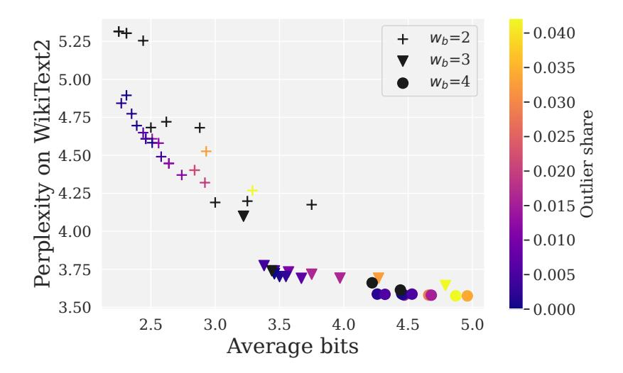
*الشكل 8: الحيرة لـ WikiText2 مقابل متوسط عدد البتات. تشير العلامات المختلفة إلى b_w مختلف. تتوافق الألوان السوداء مع تكوينات التكميم بدون قيم شاذة وسطوع اللون متناسب مع معدل القيم الشاذة.*

## F نتائج إضافية للضغط شبه معدوم الفقد

في هذا القسم، نُبلغ عن قائمة تكوينات التكميم لـ OPT في الجدول 6 على مجموعات بيانات WikiText2 و Penn Treebank و C4.

بالإضافة إلى ذلك، نُبلغ عن نتائج تقييم نموذج اللغة لـ LLaMa الجدول 7. ونماذج Falcon الصادرة مؤخراً - Falcon-7B و Falcon-40B الجدول 8.

## G اختيار تكوين LLM الأمثل لأجهزة محددة

في النقاش السابق، كنا نبحث عن التكوين الأمثل للنموذج بهدف ضغط معين دون استهداف أي جهاز أو نوع جهاز محدد. ومع ذلك، السؤال الذي يطرحه الممارس

<!-- page 21 -->

## Falcon

<!-- page 22 -->

الراغب في نشر نموذج لتطبيق محدد هو: ما هو أفضل نموذج وإعداد ضغط لقيد ذاكرة معين؟

في هذا القسم، نقدم قائمة بالتوصيات لاختيار أفضل نموذج LLaMA ومستوى الضغط المقابل الذي يتلاءم مع ذاكرة الجهاز (RAM أو VRAM) دون الحاجة إلى إنزال وسائط النموذج والتنشيطات. نغطي مجموعة من الميزانيات المتاحة من الأجهزة المحمولة إلى وحدات GPU لمحطات العمل عالية الأداء. التوصيات معروضة في الجدول[ 9.](#page-21-3)

## H الحساسية للبذرة العشوائية

تستخدم التجارب التي نُبلغ عنها عبر القسم[ 5](#page-7-0) بذرة عشوائية ثابتة واحدة (القيمة الافتراضية من الكود التكميلي). للتحقق من أن نتائجنا قوية للعشوائية، نُشغل SpQR بـ 5 بذور عشوائية (0-5) ونقيس الانحراف المعياري المعدل.

لهذا التقييم، نقوم بضغط LLaMA-65B بـ SpQR باستخدام b^w^ = b^z^ = b^s^ = 3 و β^1^ = β^2^ = 16، وهو ما يتوافق مع 3.625 بت لكل وسيط. درجات الحيرة الناتجة هي 3.75 ± 0.003 (WikiText2)، 7.03 ± 0.01 (Penn Treebank) و 5.75 ± 0.00086 (C4). بالإضافة إلى البذرة العشوائية المختارة، يمكن أن تتأثر هذه الانحرافات المعيارية بعدم الحتمية المتأصلة في الحساب على GPU. بشكل عام، الانحرافات المعيارية أصغر بمقدار رتبة على الأقل من الفرق بين SpQR و GPTQ و RTN.

## I أمثلة توليدية

أخيراً، نعرض عدة أمثلة لكيفية تأثير تكميم SpQR على العينات المولدة. لهذا التقييم، نأخذ عدة موجهات ونستخدم النموذج اللغوي المضغوط لمواصلة توليد النص من هذه الموجهات. نقارن LLaMA-65B الأصلي ونسختين مكمَّمتين: SpQR و RTN-4bit. وعلى وجه التحديد، نستخدم تكوين SpQR الذي يتوافق مع الضغط شبه معدوم الفقد من الجدول[ 1.](#page-8-0) نستخدم الاستدلال الانحداري الذاتي الجشع لجميع العينات المولدة لضمان قابلية التكرار. توضح الأمثلة في الشكل[ 9](#page-22-0) أن جميع النماذج تنتج نصاً صالحاً، ولكن SpQR تتطابق مع نموذج 16 بت بشكل أكثر تكراراً. يبدو أن الخوارزمية شبه معدومة الفقد تنتج أيضاً نصوصاً أكثر تشابهاً دلالياً.

## J الأثر الأوسع

تتيح طريقتنا نشر نماذج LLM عالية الجودة في نطاق 7-13 مليار وسيط على الأجهزة محدودة الذاكرة مثل الحواسيب المحمولة والهواتف. مع طريقتنا، من الممكن تطوير نماذج LLM متخصصة بحجم 7B بـ 16 بت دون متاعب ثم تمكين نشر هذه النماذج على الهواتف بتطبيق SpQR. وبما أن SpQR شبه معدومة الفقد عملياً، فإن هذا يضمن مستوى أداء موثوقاً لنماذج LLM المنشورة وهو أمر مهم لتطبيقات المستهلك. وبما أن الهواتف الجوالة منتشرة في كل مكان ونماذج LLM

<!-- page 23 -->

<!-- page 24 -->

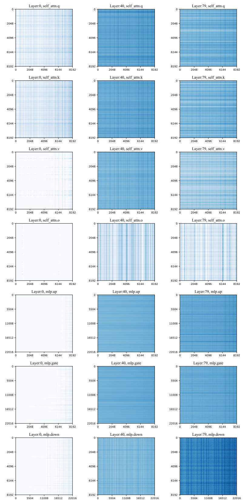
*الشكل 10: شبكة من حساسيات الوزن اللوغاريتمية لـ LLaMA-65B لضغط GPTQ 3 بت بإحصائيات تكميم لكل صف. يتوافق كل صف مع نوع طبقة محدد (مثل استعلام الانتباه، بوابة mlp)، وتمثل الأعمدة عمق الطبقة.*

<!-- page 25 -->

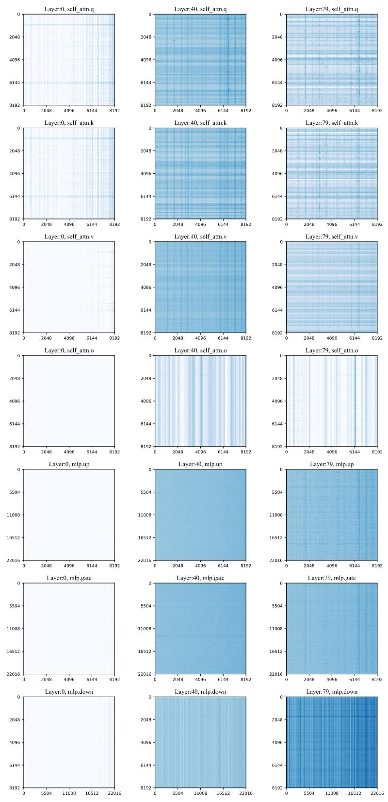
*الشكل 11: شبكة من حساسيات الوزن اللوغاريتمية لـ LLaMA-65B لضغط GPTQ 3 بت بتكميم مجموعي بحجم كتلة 128. يتوافق كل صف مع نوع طبقة محدد (مثل استعلام الانتباه، بوابة mlp)، وتمثل الأعمدة عمق الطبقة.*

<!-- page 26 -->

أدوات قوية للأغراض العامة، قد يكون لـ SpQR تأثير واسع النطاق على كيفية استخدام نماذج LLM من قِبل عامة السكان لإنجاز مهام مفيدة.

نماذج LLM هي بطبيعتها تقنية ذات استخدام مزدوج يمكن أن تجلب فوائد كبيرة وأضراراً جسيمة معاً. تتراوح المخاطر الأخلاقية والمجتمعية لنماذج LLM من الاستخدام الخبيث المتعمد (مثل توليد الرسائل غير المرغوب فيها) وسوء الاستخدام العرضي إلى الآثار الجانبية الاقتصادية السلبية [[WMR](#page-13-6)^+^21]. ومع ذلك، نعتقد أن التأثير الهامشي لـ SpQR سيكون إيجابياً أو محايداً لأن نماذج LLM التي نستخدمها متاحة بالفعل بشكل علني. تسمح خوارزميات التكميم الأفضل مثل SpQR للمستخدمين ذوي الأجهزة منخفضة الجودة بتشغيل نماذج لغوية أكبر وأكثر دقة بشكل عام. بمعنى آخر، خوارزميتنا لا تنشئ نماذج بقدرات (ومخاطر) جديدة: إنها فقط تجعل النماذج الموجودة أكثر إتاحة.

## K حول استخدام نماذج اللغة الكبيرة في هذا العمل

عقب الطلب في دعوة هذا العام لتقديم الأوراق، نصف استخدام نماذج اللغة الكبيرة في ورقتنا. استخدمنا نموذجين لغويين مختلفين قائمين على الدردشة: ChatGPT و Claude+. استخدمنا هذه النماذج لتسريع عملية كتابة كود LaTeX في الخوارزمية[ 1](#page-6-0) والشكل[ 3](#page-6-1) (عبر Tikz). كما استخدمنا هذه النماذج اللغوية لتقديم تحسينات طفيفة على تصميم الجدول في جميع أنحاء الورقة.

بالإضافة إلى ذلك، نستخدم ChatGPT لتوليد بعض الموجهات للملحق[ I.](#page-21-1) أخيراً، استخدمنا Claude+ لإنتاج صيغ ممكنة لمعيار القيم الشاذة في الخوارزمية[ 1.](#page-6-0) في كل هذه الحالات، استخدمنا نماذج اللغة الكبيرة من خلال واجهات مستخدم قائمة على الدردشة، موجهين إياها لتوليد كود (LaTeX) أو اقتراح تحسينات. إذا لم تعمل التغييرات المقترحة كما هو متوقع، أبلغناها للنموذج باللغة الطبيعية، باستخدام نفس الواجهة القائمة على الدردشة.
