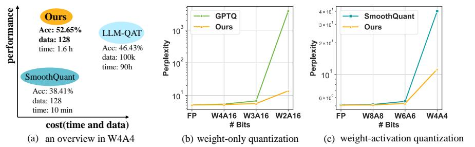
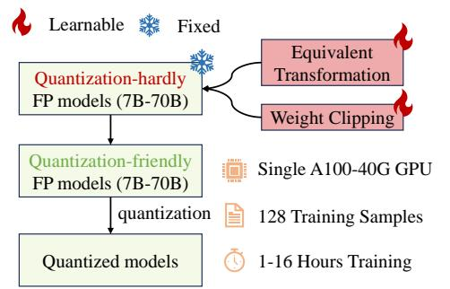
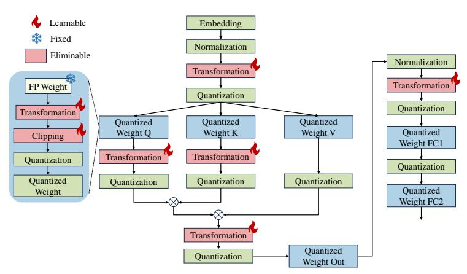
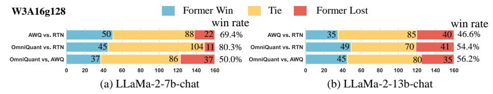
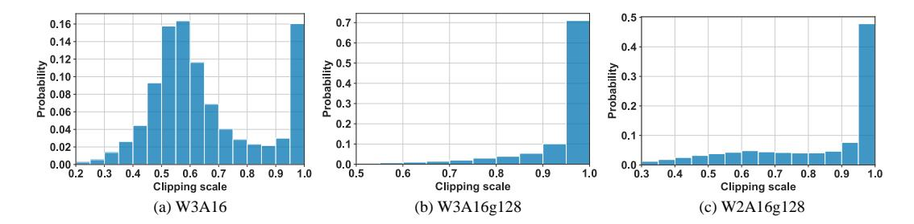
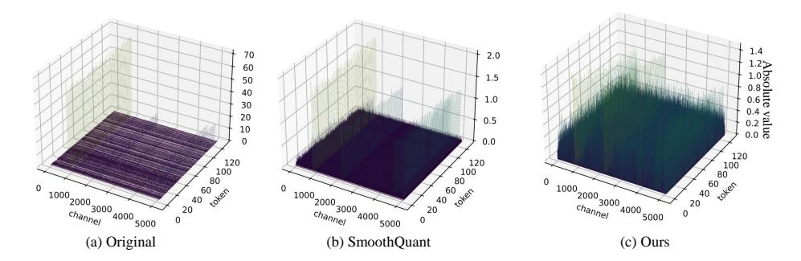
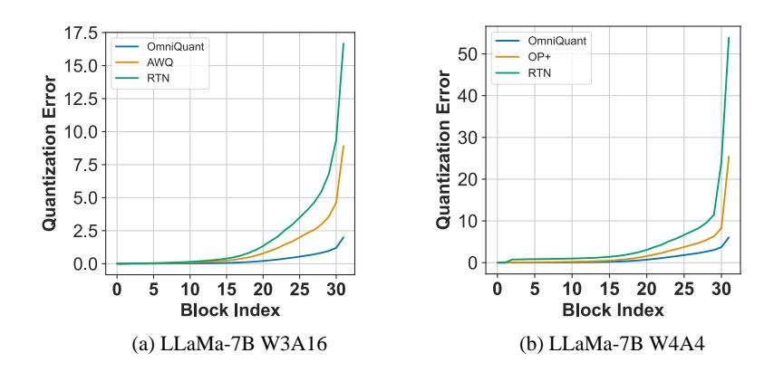
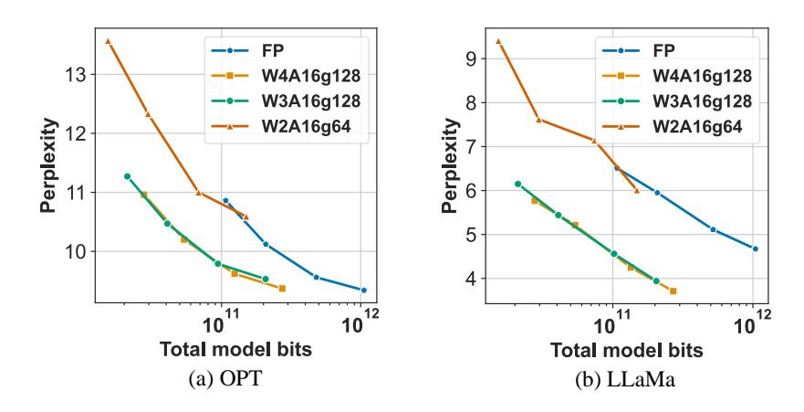
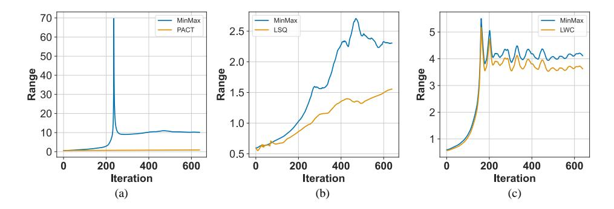
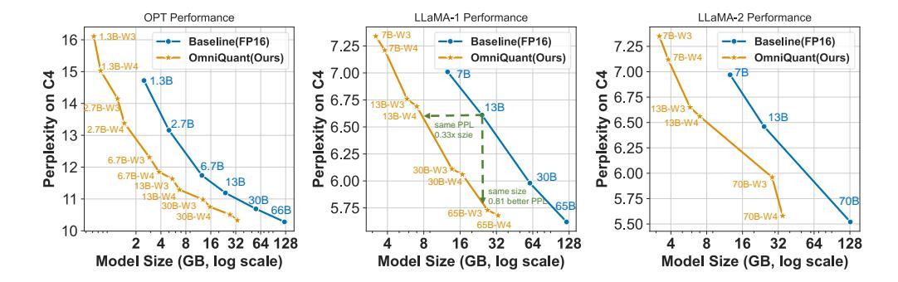

<!-- RP18_Shao_2023 | source: papers_json/RP18_Shao_2023/ -->

## OMNIQUANT: التكميم المُعاير متعدد الاتجاهات لنماذج اللغة الكبيرة

Wenqi Shao<sup>†1</sup>, Mengzhao Chen<sup>†1</sup>, Zhaoyang Zhang<sup>3</sup>, Peng Xu<sup>1,2</sup>, Lirui Zhao<sup>1</sup>, Zhiqian Li<sup>2</sup>, Kaipeng Zhang<sup>1</sup>, Peng Gao<sup>1</sup>, Yu Qiao<sup>1</sup>, Ping Luo<sup>*1,2</sup>
<sup>1</sup>OpenGVLab، مختبر شنغهاي للذكاء الاصطناعي <sup>2</sup>جامعة هونغ كونغ
<sup>3</sup>الجامعة الصينية في هونغ كونغ

## **الملخص**

أحدثت نماذج اللغة الكبيرة (LLMs) ثورة في مهام معالجة اللغة الطبيعية. غير أن نشرها العملي يواجه عقبات بسبب متطلباتها الهائلة من الذاكرة والحوسبة. وعلى الرغم من فعالية أساليب التكميم بعد التدريب (PTQ) الحديثة في تقليل البصمة الذاكرية وتحسين الكفاءة الحاسوبية لنماذج LLM، فإنها تعتمد على معاملات تكميم مصنوعة يدويًا، مما يؤدي إلى أداء منخفض، خاصة في التكميم منخفض البتات للغاية. لمعالجة هذه المشكلة، نقدم تقنية التكميم المُعاير متعدد الاتجاهات (OmniQuant) لنماذج LLM، التي تحقق أداءً جيدًا في إعدادات تكميم متنوعة مع الحفاظ على الكفاءة الحاسوبية لـ PTQ من خلال التحسين الفعّال لمعاملات التكميم المختلفة. يتألف OmniQuant من مكوّنين مبتكرين هما القص القابل للتعلم للأوزان (LWC) والتحويل المكافئ القابل للتعلم (LET). يُعدّل LWC القيم القصوى للأوزان عبر تحسين عتبة القص. أما LET فيعالج القيم الشاذة في التنشيط بنقل تحدي التكميم من التنشيطات إلى الأوزان. وبالعمل ضمن إطار تفاضلي يستخدم تقليل الخطأ على مستوى الكتلة، يستطيع OmniQuant تحسين عملية التكميم بكفاءة لكلٍ من التكميم للأوزان فقط والتكميم للأوزان والتنشيطات. على سبيل المثال، يمكن معالجة عائلة نماذج LLaMA-2 بأحجام 7-70 مليار باستخدام OmniQuant على وحدة معالجة رسومية واحدة من نوع A100-40G خلال 1-16 ساعة باستخدام 128 عينة. وتؤكد التجارب المكثفة الأداء المتفوق لـ OmniQuant عبر تكوينات تكميم متنوعة مثل W4A4 (وزن 4 بت، تنشيط 4 بت)، وW6A6، وW4A16، وW3A16، وW2A16. علاوة على ذلك، يُظهر OmniQuant فعاليته في النماذج المُكيَّفة بالتعليمات ويُحقق تحسينات ملحوظة في سرعة الاستدلال وتقليل الذاكرة على الأجهزة الحقيقية. الأكواد متاحة على https://github.com/OpenGVLab/OmniQuant.

# 1 المقدمة

أظهرت نماذج اللغة الكبيرة (LLMs) مثل GPT-4 (Bubeck et al., 2023) وLLaMA (Touvron et al., 2023a) أداءً مبهرًا عبر معايير اللغة الطبيعية المختلفة (Hendrycks et al., 2020; Zellers et al., 2019). فضلًا عن ذلك، يمكن نقل قدرات فهم اللغة الكامنة في نماذج LLM بنجاح إلى النماذج متعددة الوسائط (Mu et al., 2023; Xu et al., 2023; Zhang et al., 2023a; Huang et al., 2024; 2023). وبذلك، يمكن اعتبار نماذج LLM طلائع للذكاء الاصطناعي العام (Bubeck et al., 2023). غير أن المتطلبات الحاسوبية والذاكرية الهائلة لنماذج LLM تشكّل تحديات جوهرية (Zhang et al., 2023b; Hu et al., 2023). فعلى سبيل المثال، يحتاج نموذج GPT-3 (Brown et al., 2020) إلى 350 جيجابايت من الذاكرة لتحميل معاملاته بصيغة FP16، ما يستوجب خمس وحدات A100-80G على الأقل للاستدلال. وهذا الطلب الكبير على الموارد الحاسوبية وما يصاحبه من أعباء اتصال يعرقل النشر العملي لنماذج LLM في التطبيقات الواقعية.

أثبت التكميم أنه واعد للتخفيف من الأعباء الحاسوبية والذاكرية في نماذج LLM. وعمومًا، يأتي بنوعين هما التكميم بعد التدريب (PTQ) والتكميم الواعي بالتدريب (QAT). ورغم أن QAT يحقق دقة أعلى من PTQ،

> ^*^المؤلف المراسل: Ping Luo, pluo@cs.hku.hk

> ^† ^المساهمة المتساوية

<!-- page 2 -->


*الشكل 1: (أ) يقدم نظرة عامة على LLaMA-7B بتكميم W4A4، مسلطًا الضوء على قدرة OmniQuant على تحقيق أداء التكميم الواعي بالتدريب (QAT) مع كفاءة الوقت والبيانات للتكميم بعد التدريب (PTQ). (ب) و(ج) يعرضان حيرة (perplexity) (الأقل أفضل) لنموذج LLaMA-13B المُكمَّم بعرض بتات مختلفة على WikiText2.*

فإنه ليس عمليًا بسبب تكلفة التدريب العالية، إذ يُدرَّب النموذج بأكمله مع وعي بعملية التكميم. ونتيجة لذلك، يُستخدم PTQ عادةً في أساليب التكميم القائمة على نماذج LLM. على سبيل المثال، تُقلل كثير من أساليب PTQ [(Frantar et al.,](#page-9-2) [2022;](#page-9-2) [Lin et al.,](#page-10-4) [2023;](#page-10-4) [Dettmers et al.,](#page-9-3) [2023b)](#page-9-3) استهلاك الذاكرة من خلال التكميم للأوزان فقط، الذي يكمّم الأوزان مع الاحتفاظ بتنشيط بدقة كاملة. ولزيادة تقليل العبء الحاسوبي، يستخدم خط آخر من العمل [(Xiao et al.,](#page-11-6) [2023;](#page-11-6) [Wei et al.,](#page-11-7) [2022;](#page-11-7) [Yuan et al.,](#page-11-8) [2023;](#page-11-8) [Wei et al.,](#page-11-9) [2023;](#page-11-9) [Liu et al.,](#page-10-5) [2023a)](#page-10-5) التكميم للأوزان والتنشيطات الذي يكمّم كلًا من الأوزان والتنشيط إلى قيم منخفضة البت لتنفيذ ضرب المصفوفات منخفض البت.

حققت أساليب التكميم القائمة إنجازات كبيرة في سيناريوهات مختلفة، بما في ذلك التكميم للأوزان فقط بصيغة W4A16 (أي وزن 4 بت وتنشيط 16 بت) كما في [(Lin et al.,](#page-10-4) [2023;](#page-10-4) [Dettmers et al.,](#page-9-3) [2023b;](#page-9-3) [Lee et al.,](#page-10-6) [2023)](#page-10-6)، وكذلك التكميم للأوزان والتنشيطات W8A8 [(Wei](#page-11-9) [et al.,](#page-11-9) [2023)](#page-11-9). غير أنها عادة تُظهر تدهورًا أدائيًا ملحوظًا عند مواجهة تكميم منخفض البتات، مثل W2A16 وW4A4، كما هو موضح في الشكل [1](#page-1-0) (ب وج). يمكن إرجاع هذا العجز الأدائي في التكميم منخفض البتات إلى أن هذه الأساليب [(Frantar et al.,](#page-9-2) [2022;](#page-9-2) [Lin et al.,](#page-10-4) [2023;](#page-10-4) [Wei et al.,](#page-11-9) [2023)](#page-11-9) تعتمد بصورة رئيسية على معاملات تكميم مصنوعة يدويًا مثل قوة النقل [(Xiao et al.,](#page-11-6) [2023)](#page-11-6) ومعاملات القياس [(Wei et al.,](#page-11-9) [2023)](#page-11-9)، مما يقود غالبًا إلى أداء منخفض. ومع أن التكميم الواعي بالتدريب (QAT) [(Liu et al.,](#page-10-7) [2023b)](#page-10-7) فعّال في تحديد تكوينات التكميم المثلى، فإنه يُدخِل عبئًا تدريبيًا كبيرًا في كفاءة التدريب والبيانات. ومن ثم يصعب تكميم نماذج LLM بأساليب مبنية على QAT بكفاءة مثل LLM-QAT [(Liu et al.,](#page-10-7) [2023b)](#page-10-7). فعلى سبيل المثال، يستطيع GPTQ [(Frantar et al.,](#page-9-2) [2022)](#page-9-2)، وهو منهج PTQ، إنجاز تكميم LLaMA-13B في ساعة واحدة باستخدام 128 عينة على وحدة A100 واحدة، في حين يتطلب LLM-QAT [(Liu et al.,](#page-10-7) [2023b)](#page-10-7) مئة ألف عينة ومئات الساعات من وقت GPU. وهذا يقودنا إلى سؤال محوري: *هل يمكن تحقيق أداء QAT مع الحفاظ على* *كفاءة الوقت والبيانات الخاصة بـ PTQ؟*

تقدم هذه الورقة تقنية تكميم جديدة، OmniQuant، تعالج السؤال السابق بفاعلية. يحقق OmniQuant أداءً متطورًا عبر سيناريوهات تكميم متنوعة، خاصة في إعدادات البتات المنخفضة، مع الحفاظ على كفاءة الوقت والبيانات لـ PTQ، كما يوضح الشكل [1.](#page-1-0) وعلى عكس التكميم الواعي بالتدريب (QAT) [(Liu et al.,](#page-10-7) [2023b)](#page-10-7) الذي يتضمن تحسينًا مرهقًا للأوزان، يُجمّد OmniQuant الوزن الأصلي بدقة كاملة ويدمج فقط عددًا قليلًا من معاملات التكميم القابلة للتعلم. وكما هو مبين في الشكل [2،](#page-2-0) يتألف OmniQuant من مكوّنين رئيسيين يدمجان أنواعًا مختلفة من معاملات التكميم القابلة للتعلم، وهما القص القابل للتعلم للأوزان (LWC) والتحويل المكافئ القابل للتعلم (LET). وتحديدًا، يُعدّل LWC القيم القصوى للأوزان عبر تحسين عتبة القص. وفي الوقت نفسه، يعالج LET القيم الشاذة في التنشيط من خلال تعلم تحويلات مكافئة رياضيًا في مُرَمِّز محوّل (transformer encoder).

وبدلًا من التحسين المشترك لكل المعاملات عبر LLM، يُكمِّم OmniQuant معاملات طبقة واحدة بشكل تسلسلي قبل الانتقال إلى التالية ضمن إطار تقليل خطأ التكميم على مستوى الكتلة. وبهذه الطريقة، يمكن تحسين OmniQuant بكفاءة باستخدام خوارزمية انحدار تدرجي عشوائي (SGD) بسيطة. وبفضل التحسين التفاضلي، يمكن دمج LWC وLET بسلاسة في التكميم. ونجد أن LWC قادر على تخفيف صعوبة تكميم الأوزان، وأن LET ينقل تحدي التكميم من التنشيطات إلى الأوزان، مما يجعل OmniQuant إطار تكميم متعدد الاستخدامات لكلٍ من التكميم للأوزان فقط والتكميم للأوزان والتنشيطات. والجدير بالذكر أن OmniQuant لا يدخل أي حساب أو معاملات إضافية

<!-- page 3 -->

للنموذج المُكمَّم لأن عتبة القص في LWC وعوامل المكافأة في LET يمكن دمجها في الأوزان المُكمَّمة.

كما هو موضح في الشكل [2](#page-2-0)، يسهل تنفيذ OmniQuant حتى مع موارد محدودة. وبأخذ عائلة نماذج LLaMA-2 (7B-70B) مثالًا، يمكن تكميم جميع النماذج على وحدة A100-40G واحدة باستخدام 128 عينة تدريب فقط. ويتراوح وقت التدريب بين ساعة و16 ساعة، حسب حجم النموذج المُكمَّم الذي يتراوح بين 7B و70B. وبفضل الدمج السلس بين LWC وLET الذي حققه التحسين التفاضلي، يُظهر OmniQuant أداءً متفوقًا مقارنةً بالأساليب القائمة على PTQ في إعدادات تكميم متنوعة. على سبيل المثال، عند


*الشكل 2: خصائص OmniQuant على عائلة LLaMA.*

تكميم LLaMA-13B إلى W2A16، يحقق OmniQuant حيرة قدرها 13.21، في حين يتسبب GPTQ في زيادة كبيرة في الحيرة إلى 3832، كما يبيّن الشكل [1.](#page-1-0) ويُلاحَظ تقدم أدائي مماثل في تكميم W4A4.

تتلخص إسهامات OmniQuant فيما يلي. 1) صياغة خط أنابيب تكميم جديد لنماذج LLM، وهو OmniQuant، الذي يجمّد الأوزان الأصلية بدقة كاملة مع دمج مجموعة محدودة من المعاملات القابلة للتعلم. ويزود OmniQuant التكميم بتحديثات تدرج مع الحفاظ على كفاءة الوقت والبيانات لأساليب PTQ. 2) يتألف OmniQuant من القص القابل للتعلم للأوزان (LWC) والتحويل المكافئ القابل للتعلم (LET). تجعل هذه الاستراتيجيات الأوزان والتنشيطات بدقة كاملة أكثر قابلية للتكميم. 3) من خلال تجارب مكثفة، نُظهر أن OmniQuant يتفوق على الأساليب السابقة عبر طيف من إعدادات التكميم (W416, W3A16, W2A16, W6A6, W4A4)، وعائلات نماذج متنوعة (OPT, LLaMA, LLaMA-2, LLaMA-2-chat, Falcon)، ومجموعة من أحجام النماذج (125M-180B). كما يُظهر OmniQuant تسريعًا حسابيًا وتقليلًا للذاكرة على الأجهزة الحقيقية.

# 2 الأعمال ذات الصلة

## 2.1 أساليب التكميم.

يقلل التكميم دقة بتات الشبكة العصبية، مما يؤدي إلى نماذج أصغر واستدلال أسرع. وتُقسَّم الأساليب الحالية إلى حد كبير إلى التكميم الواعي بالتدريب (QAT) [(Liu et al.,](#page-10-7) [2023b)](#page-10-7) والتكميم بعد التدريب (PTQ) [(Xiao et al.,](#page-11-6) [2023;](#page-11-6) [Frantar et al.,](#page-9-2) [2022)](#page-9-2). ومع أن QAT يحافظ على الأداء بمحاكاة التكميم أثناء التدريب، فإن تكلفته التدريبية تجعله غير ملائم لـ LLM. تستخدم تقنيات PTQ مثل AdaRound [(Nagel et al.,](#page-11-10) [2020)](#page-11-10) وBRECQ [(Li et al.,](#page-10-8) [2021)](#page-10-8) تحسين التدرج لتحديد التقريب الأمثل، لكن ضبط جميع الأوزان مكلف زمنيًا للنماذج الأكبر. ولذلك، تُولي معظم أساليب تكميم LLM [(Xiao et al.,](#page-11-6) [2023;](#page-11-6) [Frantar et al.,](#page-9-2) [2022;](#page-9-2) [Dettmers et al.,](#page-9-3) [2023b;](#page-9-3) [Lee et al.,](#page-10-6) [2023;](#page-10-6) [Wei et al.,](#page-11-9) [2023)](#page-11-9) الأولوية لـ PTQ بدون تدريب، مما يحدّ من الأداء في حالات البتات الأقل. وهدفنا هو دمج تحديثات التدرج في تكميم LLM، محاكاةً لمنهج QAT، مع الإبقاء على كفاءة PTQ.

## 2.2 تكميم نماذج LLM.

بالنظر إلى الكائن المُكمَّم، يمكن تصنيف تكميم LLM الحالي إلى مجالين: التكميم للأوزان فقط، والتكميم للأوزان والتنشيطات.

التكميم للأوزان فقط. يركز التكميم للأوزان فقط على تحويل الأوزان إلى قيم منخفضة البت. على سبيل المثال، يستخدم GPTQ [(Frantar et al.,](#page-9-2) [2022)](#page-9-2) إعادة بناء على مستوى الكتلة لتكميم 3/4 بت. ويُؤكد كل من SpQR [(Dettmers et al.,](#page-9-3) [2023b)](#page-9-3) وOWQ [(Lee et al.,](#page-10-6) [2023)](#page-10-6) وAWQ [(Lin et al.,](#page-10-4) [2023)](#page-10-4) أهمية الأوزان المرتبطة بتنشيطات ذات حجم أعلى. ولذلك، يستخدم SpQR وOWQ تكميمًا متعدد الدقة لحماية الأوزان الحيوية، في حين يختار AWQ القياس على مستوى القناة لتجنب عدم الكفاءة العتادية للتكميم متعدد الدقة. ويستعيد كل من Qlora [(Dettmers et al.,](#page-9-4) [2023a)](#page-9-4) وINT2.1 [(Chee](#page-9-5) [et al.,](#page-9-5) [2023)](#page-9-5) قدرات النموذج المُكمَّم من خلال الضبط الدقيق ذي الكفاءة المعاملية. أما طريقتنا، فعلى النقيض، تعزز عملية التكميم مباشرة، مما يجعل OmniQuant مكمّلًا لـ Qlora وINT2.1.

<!-- page 4 -->


*الشكل 3: تفاصيل OmniQuant في كتلة محوّل. لاحظ أن جميع المعاملات القابلة للتعلم يمكن إزالتها بعد التكميم.*

التكميم للأوزان والتنشيطات. يضغط التكميم للأوزان والتنشيطات كلًا من الأوزان والتنشيطات. تحقق SmoothQuant [(Xiao et al.,](#page-11-6) [2023)](#page-11-6) وLLM.int8() [(Dettmers et al.,](#page-9-6) [2022)](#page-9-6) وOutlier Suppression [(Wei et al.,](#page-11-7) [2022)](#page-11-7) تكميم W8A8 من خلال إدارة القيم الشاذة للتنشيط. تستخدم LLM.int8() تحلّلًا متعدد الدقة، في حين يستخدم الأخران القياس على مستوى القناة. علاوة على ذلك، يضيف Outlier Suppression+ [(Wei et al.,](#page-11-9) [2023)](#page-11-9) إزاحة على مستوى القناة لتفعيل تكميم W6A6. وعلى خلاف التصاميم الإرشادية السابقة، نستخدم تحسين التدرج ونوسّع التحويلات المكافئة لآليات الانتباه، مما يعزز تكميم ذاكرة المفتاح/القيمة (K/V cache). ومؤخرًا، حقق RPTQ [(Yuan et al.,](#page-11-8) [2023)](#page-11-8) وLLM-QAT [(Liu et al.,](#page-10-7) [2023b)](#page-10-7) تكميم W4A4. غير أن RPTQ يتبنى تكميم تنشيط على مستوى المجموعة غير ودود للنشر، ويستخدم LLM-QAT QAT المستهلك للوقت. وعلى التمييز عن RPTQ وLLM-QAT، نحقق تكميم W4A4 عبر تكميم على مستوى الرمز ودود للنشر مع الحفاظ على كفاءة PTQ.

# 3 OMNIQUANT

تحدي تكميم LLM. تكمن صعوبتان رئيسيتان في تكميم نموذج LLM. الأولى، يصعب تكميم التنشيط بسبب وجود قنوات شاذة. وبالنظر إلى أن توزيع الأوزان مسطح وموحد، يعالج SmoothQuant [(Xiao et al.,](#page-11-6) [2023)](#page-11-6) وOutlier Suppression+ [(Wei et al.,](#page-11-9) [2023)](#page-11-9) هذه المشكلة عبر نقل صعوبة التكميم من التنشيطات إلى الأوزان بقوة نقل محددة سلفًا أو بتحسين قائم على بحث الشبكة. والثانية، يلعب خطأ تكميم الأوزان أيضًا دورًا محوريًا في الأداء النهائي بسبب أهمية الأوزان المقابلة للتنشيطات. ويقترح SqQR [(Dettmers et al.,](#page-9-3) [2023b)](#page-9-3) وOWQ [(Lee et al.,](#page-10-6) [2023)](#page-10-6) الإبقاء على الأوزان الحاسمة بدقة كاملة، بينما يحمي AWQ [(Lin et al.,](#page-10-4) [2023)](#page-10-4) هذه الأوزان عبر القياس على مستوى القناة بالبحث الشبكي. ومع أن هذه الأساليب حققت نجاحًا معينًا في ضغط نماذج LLM المختلفة، فإنها كثيرًا ما تؤدي إلى أداء دون الأمثل وتفشل في التعامل مع التكميم المنخفض جدًا في البتات بسبب التصميم الخام لمعاملات التكميم اليدوية مثل قوة النقل وعوامل القياس.

في هذا القسم، نقدم تقنية تكميم تفاضلية لـ LLM تسمى OmniQuant حيث تُتعلَّم معاملات التكميم بمرونة أفضل. وتحقيقًا لهذا الهدف، يُنفَّذ OmniQuant بإطار تقليل خطأ التكميم على مستوى الكتلة كما هو موضح في القسم [3.1.](#page-3-0) ولمعالجة التحديات المذكورة لتكميم LLM، نبتكر استراتيجيتين جديدتين لمعاملات تكميم قابلة للتعلم إضافية، هما القص القابل للتعلم للأوزان (LWC) لتخفيف صعوبة تكميم الأوزان والتحويل المكافئ القابل للتعلم (LET) لزيادة نقل تحدي التكميم من التنشيطات إلى الأوزان. ونقدّم LWC وLCT في القسم [3.2](#page-4-0) والقسم [3.3،](#page-4-1) على التوالي.

## 3.1 تقليل خطأ التكميم على مستوى الكتلة

لا يمكن تطبيق أساليب PTQ السابقة المعتمدة على تحسين التدرج، مثل AdaRound [(Nagel et al.,](#page-11-10) [2020)](#page-11-10) وBRECQ [(Li et al.,](#page-10-8) [2021)](#page-10-8)، في النماذج التي تحتوي على مليارات المعاملات لأنها يصعب تحسينها بسبب فضاء الحلول الضخم. وبدلًا من ضبط النموذج بأكمله، نقترح خط أنابيب تحسين جديدًا بتقليل خطأ التكميم على مستوى الكتلة، حيث يمكن تحسين

<!-- page 5 -->

معاملات التكميم الإضافية بطريقة تفاضلية. ونصوغ هدف التحسين كما يلي:

$$
\arg\min_{\Theta_1,\Theta_2} ||\mathcal{F}(\mathbf{W}, \mathbf{X}) - \mathcal{F}(Q_w(\mathbf{W}; \Theta_1, \Theta_2), Q_a(\mathbf{X}, \Theta_2))||, (1)
$$

حيث تمثل F دالة التعيين لكتلة محوّل في LLM، وW وX هما الوزن والتنشيط بدقة كاملة، وQw(·) وQa(·) يمثلان مُكمِّم الوزن ومُكمِّم التنشيط على التوالي، وΘ^1^ وΘ^2^ هما معاملات التكميم في القص القابل للتعلم للأوزان (LWC) والتحويل المكافئ القابل للتعلم (LET) على التوالي. يُكمِّم التكميم على مستوى الكتلة في المعادلة [(1)](#page-4-2) تسلسليًا معاملات كتلة محوّل واحدة قبل الانتقال إلى التالية.

يتمتع التقليل على مستوى الكتلة في المعادلة [(1)](#page-4-2) بميزتين. أولًا، عند تجهيزه بالتقليل على مستوى الكتلة في المعادلة [(1)](#page-4-2)، يستطيع OmniQuant تحسين معاملات التكميم في LWC وLET معًا، مما يجعله قادرًا بما يكفي على تغطية كلٍ من التكميم للأوزان فقط والتكميم للأوزان والتنشيطات. وثانيًا، يسهل تحسين التقليل على مستوى الكتلة بأقل قدر من الموارد المطلوبة. لا يحدد OmniQuant سوى عدد قليل من معاملات التكميم بشكل أمثل، وهو أيسر من تحسين الأوزان بأكملها في الأساليب السابقة المبنية على PTQ [(Nagel et al.,](#page-11-10) [2020;](#page-11-10) [Li et al.,](#page-10-8) [2021)](#page-10-8). ووجدنا تجريبيًا أن جميع نماذج عائلة LLaMA-2 [(Touvron et al.,](#page-11-11) [2023b)](#page-11-11) يمكن تكميمها على وحدة A100-40G واحدة باستخدام 128 عينة تدريب فقط.

## 3.2 القص القابل للتعلم للأوزان

يوظف OmniQuant وحدة القص القابل للتعلم للأوزان (LWC) لتقليل صعوبة تكميم الأوزان في LLM. ومثل الأساليب السابقة ذات عتبة القص القابلة للتعلم [(Esser et al.,](#page-9-7) [2019;](#page-9-7) [Liu et al.,](#page-10-9) [2022;](#page-10-9) [Choi et al.,](#page-9-8) [2018)](#page-9-8)، يحدد LWC أيضًا النطاق الديناميكي الأمثل للأوزان من خلال تحسين عتبة قص. غير أننا نجد أن استخدام أعمال سابقة مثل PACT [(Choi et al.,](#page-9-8) [2018)](#page-9-8) وLSQ [(Esser et al.,](#page-9-7) [2019)](#page-9-7) مباشرة في التكميم سيُنتج أداءً غير مرضٍ، كما يبيّن الجدول [A14](#page-19-0) في الملحق.

وبدلًا من تعلم عتبة قص مباشرة كما في الأساليب السابقة [(Esser et al.,](#page-9-7) [2019;](#page-9-7) [Choi](#page-9-8) [et al.,](#page-9-8) [2018)](#page-9-8)، يحسّن LWC قوة قص كما هو مصاغ في

$$
\mathbf{W_q} = \operatorname{clamp}(\lfloor \frac{\mathbf{W}}{h} \rceil + z, 0, 2^N - 1), \text{ where } h = \frac{\gamma \max(\mathbf{W}) - \beta \min(\mathbf{W})}{2^N - 1}, z = -\lfloor \frac{\beta \min(\mathbf{W})}{h} \rceil 
(2)
$$

حيث تُشير ⌊·⌉ إلى عملية التقريب. N هو عدد البتات المستهدف. W^q^ وW يدلان على الأوزان المُكمَّمة وبدقة كاملة على التوالي. h هو معامل التطبيع للأوزان وz هو قيمة نقطة الصفر. تقيّد عملية clamp القيمة ضمن نطاق العدد الصحيح ذي N بت، تحديدًا [0, 2 ^N^ − 1]. في المعادلة [(2)](#page-4-3)، γ ∈ [0, 1] وβ ∈ [0, 1] هما قوتا قص قابلتان للتعلم للحد العلوي والسفلي للأوزان على التوالي. ونُهيّئ γ وβ بدالة sigmoid[*](#page-0-0). ومن ثم، Θ^1^ = {γ, β} في المعادلة [(1)](#page-4-2).

لاحظ أن LWC يتحلل إلى مخطط تكميم MinMax الأساسي المستخدم في الأعمال القائمة [(Xiao](#page-11-6) [et al.,](#page-11-6) [2023)](#page-11-6)[,Frantar et al.](#page-9-2) [(2022)](#page-9-2) عندما γ = 1 وβ = 1. وبوراثة فوائد تكميم Min-Max، لا يحتاج LWC إلا إلى ضبط قوى القص لتحديد عتبة القص المثلى، مما يقلل صعوبة التحسين. وعند القص بعتبة مثلى، تصبح الأوزان الأصلية سهلة التكميم. وكما تشير التجارب في الجدول [1،](#page-6-0) تتفوق طريقة القص القابل للتعلم للأوزان المقترحة بشكل كبير على تقنيات التكميم للأوزان فقط السابقة [(Frantar et al.,](#page-9-2) [2022;](#page-9-2) [Lin et al.,](#page-10-4) [2023)](#page-10-4)).

## 3.3 التحويل المكافئ القابل للتعلم

إلى جانب LWC الذي يمكّن من أوزان صديقة للتكميم بتحسين عتبة القص، نقلل صعوبة التكميم للأوزان والتنشيطات أيضًا من خلال تحويل مكافئ قابل للتعلم (LET). وبالنظر إلى أن القيم الشاذة في خريطة التنشيط منهجية وفريدة لقنوات معينة، فإن الأساليب السابقة مثل SmoothQuant [(Xiao et al.,](#page-11-6) [2023)](#page-11-6) تنقل صعوبة التكميم من التنشيطات إلى الأوزان بتحويل مكافئ رياضيًا. غير أنها تصنع المعاملات المكافئة يدويًا، مما يقود إلى نتائج دون المثلى.

> ^*^Sigmoid(t) = 1/(1 + exp^−^^t^ )

<!-- page 6 -->

بفضل دمج تقليل خطأ التكميم على مستوى الكتلة، يستطيع LET الخاص بنا تحديد المعاملات المكافئة المثلى بطريقة تفاضلية. واستلهامًا من SmoothQuant (Xiao et al., 2023) وOutlier Suppression+ (Wei et al., 2023)، نتبنى القياس على مستوى القناة والإزاحة على مستوى القناة لمعالجة توزيع التنشيط، مقدمين حلًا فعالًا لمشكلة القيم الشاذة. وتحديدًا، نستقصي التحويل المكافئ عبر كل من الطبقة الخطية وعملية الانتباه، كما يبيّن الشكل 3.

**الطبقة الخطية.** تأخذ الطبقة الخطية تسلسل رموز إدخال \mathbf{X} \in \mathbb{R}^{T \times C_{in}} حيث T هو طول الرمز وهو ضرب مصفوفة الوزن \mathbf{W} \in \mathbb{R}^{C_{in} \times C_{out}} ومتجه الانحياز \mathbf{B} \in \mathbb{R}^{1 \times C_{out}}. يُعبَّر عن طبقة خطية مكافئة رياضيًا بـ:

$$
\mathbf{Y} = \mathbf{X}\mathbf{W} + \mathbf{B} = \underbrace{\left[ (\mathbf{X} - \delta) \oslash s \right]}_{\tilde{\mathbf{X}}} \cdot \underbrace{\left[ s \odot \mathbf{W} \right]}_{\tilde{\mathbf{W}}} + \underbrace{\left[ \mathbf{B} + \delta \mathbf{W} \right]}_{\tilde{\mathbf{B}}} (3)
$$

حيث \mathbf{Y} يمثل الإخراج، و\mathbf{s} \in \mathbb{R}^{1 \times C_{in}} و\delta \in \mathbb{R}^{1 \times C_{in}} هما معاملا قياس وإزاحة على مستوى القناة على التوالي، و\tilde{\mathbf{X}} و\tilde{\mathbf{W}} و\tilde{\mathbf{B}} هي التنشيط والوزن والانحياز المكافئة على التوالي، و'\odot' و'\odot' هما القسمة والضرب على مستوى العنصر. بمقتضى المعادلة (3)، تتحول التنشيطات لتكون صديقة للتكميم على حساب زيادة صعوبة تكميم الأوزان. وبهذا المعنى، يمكن لـ LWC في القسم 3.2 تحسين أداء التكميم للأوزان والتنشيطات الذي يحققه LET لأنه يجعل الأوزان صديقة للتكميم. وأخيرًا، نُجري التكميم على التنشيطات والأوزان المحوّلة، كما هو معطى بـ

$$
\mathbf{Y} = Q_a(\tilde{\mathbf{X}})Q_w(\tilde{\mathbf{W}}) + \tilde{\mathbf{B}},\tag{4}
$$

حيث Q_a هو مُكمِّم MinMax الأساسي وQ_w هو مُكمِّم MinMax مع القص القابل للتعلم للأوزان (أي LWC الخاص بنا).

لاحظ أن معاملات القياس والإزاحة في \hat{\mathbf{X}} يمكن استيعابها في طبقة التطبيع أو الطبقة الخطية السابقة، ومعاملات القياس في \hat{\mathbf{W}} يمكن دمجها في الوزن الخطي الأصلي \mathbf{W}. ولذلك، يمكن للتحويل المكافئ في المعادلة (3) أن يقلل أخطاء التكميم بفعالية دون إدخال معاملات أو تكاليف إضافية. ونوظّف هذا التحويل المكافئ في جميع الطبقات الخطية في LLM باستثناء الطبقة الخطية الثانية لـ FFN كما يوضح الشكل 3. ويُعزى ذلك ربما إلى أن تخلخل (sparsity) الميزات العالي بعد الطبقة غير الخطية (Liu et al., 2023c) يقود إلى تدرجات غير مستقرة عند تطبيق التحويلات المكافئة القابلة للتعلم.

**عملية الانتباه.** إلى جانب الطبقة الخطية، تستحوذ عملية الانتباه أيضًا على نسبة كبيرة من الحوسبة. علاوة على ذلك، يستلزم النمط الانحداري الذاتي لـ LLM تخزين ذاكرة المفتاح والقيمة (KV) لكل رمز، مما يؤدي إلى متطلبات ذاكرة كبيرة للتسلسلات الطويلة. ولذلك، نُكمِّم أيضًا مصفوفات \mathbf{Q}/\mathbf{K}/\mathbf{V} إلى بت منخفض في إعداد التكميم للأوزان والتنشيطات. وتحديدًا، يمكن كتابة التحويل المكافئ القابل للتعلم لمصفوفة تقارب الانتباه الذاتي على النحو التالي:

$$
\mathbf{P} = \operatorname{Softmax}(\mathbf{Q}\mathbf{K}^T) = \operatorname{Softmax}((\underbrace{\mathbf{Q} \otimes s_a}_{\tilde{\mathbf{Q}}})(\underbrace{s_a \odot \mathbf{K}^T}_{\tilde{\mathbf{K}}^T})). \tag{5}
$$

حيث s_a \in \mathbb{R}^{1 \times C_{out}} هو معامل القياس في مصفوفة التقارب. ومثل المعادلة (4)، يُعبَّر عن حساب مصفوفة التقارب المُكمَّمة بـ \mathbf{P} = \operatorname{Softmax}(Q_a(\widetilde{\mathbf{Q}})Q_a(\widetilde{\mathbf{K}}^T)). وهنا أيضًا نستخدم مخطط تكميم Min-Max بوصفه Q_a لتكميم مصفوفات \widetilde{\mathbf{Q}}/\widetilde{\mathbf{K}}. ومن المعادلة (4) والمعادلة (5) نعلم أن \Theta_2 = \{\delta, s, s_a\} في المعادلة (1).

يمكن استيعاب معاملات القياس على مستوى القناة في \tilde{\mathbf{Q}} و\tilde{\mathbf{K}}، كما يظهر في المعادلة (5)، في الأوزان الخطية لإسقاط الاستعلام والمفتاح على التوالي. وجدير بالذكر أن التحويل الصريح لـ \mathbf{V} مُتجاوز نظرًا لأن توزيعه قد عُدِّل بالفعل على مستوى القناة بالتحويل العكسي المرتبط بالطبقة الخطية لإسقاط الإخراج.

# 4 التجارب

## 4.1 الإعدادات

**التكميم.** نُجرب التكميم للأوزان فقط والتكميم للأوزان والتنشيطات على حد سواء. وللأول، الإعدادات الافتراضية هي تكميم الأوزان على مستوى القناة بـ INT4/INT3/INT2. أما تكميم الأوزان

<!-- page 7 -->

الجدول 1: **نتائج التكميم للأوزان فقط لنماذج LLaMA-1 وLLaMA-2**. نُبلِّغ في هذا الجدول بحيرة WikiText2، ويمكن العثور على حيرة C4 في الجدول A19 في الملحق.

| LLaMA1&2 / PPL↓ | 1-7B | 1-13B | 1-30B | 1-65B | 2-7B | 2-13B | 2-70B |  |
| --- | --- | --- | --- | --- | --- | --- | --- | --- |
| FP16 | - | 5.68 | 5.09 | 4.10 | 3.53 | 5.47 | 4.88 | 3.31 |
| W2A16 | RTN | 1.1e5 | 6.8e4 | 2.4e4 | 2.2e4 | 3.8e4 | 5.6e4 | 2.0e4 |
| GPTQ | 2.1e3 | 5.5e3 | 499.75 | 55.91 | 7.7e3 | 2.1e3 | 77.95 |  |
| **OmniQuant** | **15.47** | **13.21** | **8.71** | **7.58** | **37.37** | **17.21** | **7.81** |  |
| W2A16 g128 | RTN | 1.9e3 | 781.20 | 68.04 | 15.08 | 4.2e3 | 122.08 | 27.27 |
| GPTQ | 44.01 | 15.60 | 10.92 | 9.51 | 36.77 | 28.14 | NAN |  |
| AWQ | 2.6e5 | 2.8e5 | 2.4e5 | 7.4e4 | 2.2e5 | 1.2e5 | - |  |
| **OmniQuant** | **9.72** | **7.93** | **7.12** | **5.95** | **11.06** | **8.26** | **6.55** |  |
| W2A16 g64 | RTN | 188.32 | 101.87 | 19.20 | 9.39 | 431.97 | 26.22 | 10.31 |
| GPTQ | 22.10 | 10.06 | 8.54 | 8.31 | 20.85 | 22.44 | NAN |  |
| AWQ | 2.5e5 | 2.7e5 | 2.3e5 | 7.4e4 | 2.1e5 | 1.2e5 | - |  |
| **OmniQuant** | **8.90** | **7.34** | **6.59** | **5.65** | **9.62** | **7.56** | **6.11** |  |
| W3A16 | RTN | 25.73 | 11.39 | 14.95 | 10.68 | 539.48 | 10.68 | 7.52 |
| GPTQ | 8.06 | 6.76 | 5.84 | 5.06 | 8.37 | 6.44 | 4.82 |  |
| AWQ | 11.88 | 7.45 | 10.07 | 5.21 | 24.00 | 10.45 | - |  |
| **OmniQuant** | **6.49** | **5.68** | **4.74** | **4.04** | **6.58** | **5.58** | **3.92** |  |
| W3A16 g128 | RTN | 7.01 | 5.88 | 4.87 | 4.24 | 6.66 | 5.51 | 3.97 |
| GPTQ | 6.55 | 5.62 | 4.80 | 4.17 | 6.29 | 5.42 | 3.85 |  |
| AWQ | 6.46 | 5.51 | 4.63 | 3.99 | 6.24 | 5.32 | - |  |
| **OmniQuant** | **6.15** | **5.44** | **4.56** | **3.94** | **6.03** | **5.28** | **3.78** |  |
| W4A16 | RTN | 6.43 | 5.55 | 4.57 | 3.87 | 6.11 | 5.20 | 3.67 |
| GPTQ | 6.13 | 5.40 | 4.48 | 3.83 | 5.83 | 5.13 | 3.58 |  |
| AWQ | 6.08 | 5.34 | 4.39 | 3.76 | 6.15 | 5.12 | - |  |
| **OmniQuant** | **5.86** | **5.21** | **4.25** | **3.71** | **5.74** | **5.02** | **3.47** |  |
| W4A16 g128 | RTN | 5.96 | 5.25 | 4.23 | 3.67 | 5.72 | 4.98 | 3.46 |
| GPTQ | 5.85 | 5.20 | 4.23 | 3.65 | 5.61 | 4.98 | 3.42 |  |
| AWQ | 5.81 | 5.20 | 4.21 | 3.62 | 5.62 | 4.97 | - |  |
| **OmniQuant** | **5.77** | **5.17** | **4.19** | **3.62** | **5.58** | **4.95** | **3.40** |  |

يُمثَّل تكميم الأوزان على مستوى المجموعة بالحرف 'g'، فمثلًا تعني W3A16g128 تكميمًا للأوزان فقط بـ 3 بت بحجم مجموعة 128. في تكميم الأوزان والتنشيطات، الإعدادات الافتراضية هي وزن INT6/INT4 على مستوى القناة وتنشيط على مستوى الرمز (Dettmers et al., 2022). وتُكمَّم جميع التنشيطات الوسيطة إلى بت منخفض، باستثناء إخراج SoftMax الذي يُحفَظ بدقة كاملة بسبب توزيعه ذي الذيل الطويل الذي يجعله غير ملائم للتكميم المنتظم.

**التدريب** يُهيَّأ معامل القياس على مستوى القناة باستخدام SmoothQuant (Xiao et al., 2023)، ويُهيَّأ معامل الإزاحة على مستوى القناة باستخدام Outlier Suppression+ (Wei et al., 2023). ولتحسين المعاملات القابلة للتعلم، نستخدم محسِّن AdamW بانخفاض وزن صفري. ومعدل التعلم للقص القابل للتعلم للأوزان والتحويل المكافئ هو 5e-3 و1e-2 على التوالي. ونستخدم مجموعة بيانات معايرة تتألف من 128 مقطعًا مختارًا عشوائيًا بطول 2048 رمزًا من WikiText2 (Merity et al., 2016). وتُجرى عملية التدريب بأكملها على وحدة Nvidia A100 واحدة، باستخدام حجم دفعة 1 على مدى 20 حقبة، باستثناء تكميم W2A16 الذي يستغل 40 حقبة. ولتكميم الأوزان والتنشيطات، يُفعَّل كل من القص القابل للتعلم للأوزان والتحويل المكافئ. أما للأوزان فقط، فيُستخدم كلاهما في OPT، لكن يقتصر على القص في LLaMA، إذ يُظهر الجدول A3 فوائد ضئيلة من التحويل المكافئ لـ LLaMA.

**النماذج.** نختبر على OPT(125M-66B)(Zhang et al., 2022)) وLLaMA(7B-65B) (Touvron et al., 2023a) وLLaMA-2(7B-70B) (Touvron et al., 2023b) وFalcon-180B (Penedo et al., 2023) وLLaMA-2-chat المُكيَّف بالتعليمات (Touvron et al., 2023b) لاختبار التعميم. ومع أن الورقة الرئيسية تُسلِّط الضوء على نتائج LLaMA، فإن التفاصيل الشاملة للنماذج الأخرى متاحة في القسم A8 من الملحق.

**التقييم.** اتباعًا للعمل السابق (Lin et al., 2023; Frantar et al., 2022)، نُقيّم النماذج المُكمَّمة عبر الإبلاغ عن حيرة تجارب توليد اللغة، وتحديدًا على Wiki-Text2 (Merity et al., 2016) وPTB (Marcus et al., 1994)) وC4 (Raffel et al., 2020). علاوة على ذلك، تُقيَّم الدقة في مهام صفرية اللقطات بما فيها PIQA (Bisk et al., 2020) وARC (Clark et al., 2018) وBoolQ (Clark et al., 2019) وHellaSwag (Clark et al., 2018). ونلتزم بإعدادات GPTQ (Frantar et al., 2022) لتجارب توليد اللغة، ونُنفّذ lm-eval-harness (Gao et al., 2021) لتنفيذ جميع المهام صفرية اللقطات.

**الأساسيات.** للتكميم للأوزان فقط، نقارن مع التكميم العادي بالتقريب إلى الأقرب (RTN) وGPTQ (Frantar et al., 2022) وAWQ (Lin et al., 2023). وللتكميم للأوزان والتنشيطات، نقارن طريقتنا مع SmoothQuant (Xiao et al., 2023) وOutlier Supression + (Wei et al., 2023) وRPTQ (Yuan et al., 2023) وأسلوب QAT الحديث LLM-QAT (Liu et al., 2023b). لاحظ

<!-- page 8 -->

أننا نُعيد إنتاج SmoothQuant وOutlier Suppression+ بتكميم وزن على مستوى القناة وتنشيط على مستوى الرمز لإجراء مقارنات عادلة.

## 4.2 نتائج التكميم للأوزان فقط

يمكن العثور على نتائج عائلة LLaMA في الجدول 1، في حين تُقدَّم نتائج OPT في القسم A8 من الملحق. وكما توضح الجداول، يتفوق OmniQuant باستمرار على طريقة التكميم للأوزان فقط الخاصة بـ LLM السابقة عبر عائلات LLM متنوعة (OPT, LLaMA-1, LLaMA-2) وتكوينات تكميم متنوعة، بما في ذلك W2A16 وW2A16g128 وW2A16g64 وW3A16 وW3A16g128 وW4A16 وW4A16g128. وتشير هذه النتائج إلى تنوع OmniQuant، إذ يتكيف مع تكوينات تكميم متعددة. على سبيل المثال، في حين أن AWQ (Lin et al., 2023) فعّال بصفة خاصة مع التكميم على مستوى المجموعة، يُظهر OmniQuant أداءً متفوقًا عبر التكميم على مستوى القناة وعلى مستوى المجموعة. علاوة على ذلك، تصبح فوائد أداء OmniQuant أكثر بروزًا مع تناقص حجم بتات التكميم.

## 4.3 نتائج تكميم الأوزان والتنشيطات

في تكميم الأوزان والتنشيطات، ينصبّ تركيزنا الرئيسي على تكميم W6A6 وW4A4. ونستثني تكميم W8A8 لأن SmoothQuant يستطيع تقريبًا تحقيق نماذج W8A8 المُكمَّمة بدون فقد مقارنةً بنظيراتها بدقة كاملة. ويمكن العثور على نتائج عائلة LLaMA في الجدول 2، بينما تُعرض نتائج OPT في الجدول A25 من الملحق. ويوضح الجدول 2 دقة المهام صفرية اللقطات لتكميم LLaMA للأوزان والتنشيطات. وبصورة لافتة، يُحسِّن OmniQuant الدقة المتوسطة بمقدار +4.99% ~ +11.80% عبر نماذج مختلفة في تكميم W4A4. ومن اللافت أن OmniQuant يتجاوز في LLaMA-7B حتى أسلوب QAT الحديث LLM-QAT (Liu et al., 2023b) بهامش مذهل قدره +6.22%. ويُظهر هذا التحسن فعالية دمج معاملات قابلة للتعلم إضافية، التي تثبت أنها أكثر فائدة من ضبط الأوزان الشامل الذي يستخدمه QAT.

<!-- page 9 -->


*الشكل 4: مقارنة تكميم W3A16g128 بين RTN وAWQ (Lin et al., 2023) وOmni-Quant ضمن Vicuna-Bench (Chiang et al., 2023). تُحسَب معدلات الفوز دون احتساب عينات التعادل. ومعدل فوز أعلى يدل على أداء أفضل للأول مقابل الزوج.*

الجدول 3: نشر التكميم للأوزان فقط من خلال MLC-LLM. نُبلّغ بحجم ذاكرة الأوزان المُكمَّمة (يُشار إليها بـ 'WM') وذاكرة التشغيل (يُشار إليها بـ 'RM') والسرعة على NVIDIA A100-80G.

| LLaMA | 7B | 13B | 30B | 65B |  |  |  |  |  |  |  |  |
| --- | --- | --- | --- | --- | --- | --- | --- | --- | --- | --- | --- | --- |
| WM | RM | token/s | WM | RM | token/s | WM | RM | token/s | WM | RM | token/s |  |
| FP | 12.6G | 14.4G | 69.2 | 24.3G | 27.1G | 52.5 | 60.6G | 66.1G | 23.9 | OOM | - | - |
| W4A16g128 | 3.8G | 5.7G | 134.2 | 7.0G | 10.0G | 91.3 | 16.7G | 21.7G | 43.6 | 33.0G | 41.0G | 24.3 |
| W3A16g128 | 3.2G | 5.1G | 83.4 | 5.8G | 8.7G | 57.6 | 13.7G | 18.7G | 29.0 | 27.0G | 35.1G | 15.2 |
| W2A16g128 | 2.2G | 4.1G | 83.9 | 4.0G | 7.5G | 92.6 | 9.2G | 14.1G | 36.7 | 18.0G | 25.6G | 24.8 |

## 4.4 تكميم النماذج المُكيَّفة بالتعليمات

للتحقق من قدرة التعميم لطريقتنا، نختبر التكميم على LLaMA-2-chat (Touvron et al., 2023b)، وهو نموذج مُكيَّف بالتعليمات لروبوتات الدردشة. وباستخدام بروتوكول تقييم GPT-4 (Chiang et al., 2023)، يُقيَّم الأداء على معيار Vicuna (Chiang et al., 2023) المؤلف من 80 سؤالًا. ولإلغاء انحياز الموقع (Zheng et al., 2023)، تُقارَن كل زوج في كلا التسلسلين، بإجمالي 160 محاولة لكل مقارنة. ويقارن الشكل 4 بين RTN وAWQ (Lin et al., 2023) وOmniQuant. في LLaMA-2-7b-chat، يطابق OmniQuant AWQ بمعدل فوز 50% لكنه يتجاوز RTN بأكثر من ذلك (80.3% مقابل 69.4%). وفي LLaMA-2-13b-chat، في حين يتأخر AWQ خلف RTN، يحسّن OmniQuant باستمرار أداء النموذج المُكمَّم.

## 4.5 التسريع على جهاز حقيقي

يوفر MLC-LLM† حلًا متعدد الاستخدامات للنشر لنماذج لغوية متنوعة عبر أجهزة عتاد متنوعة. ويتفوق بصفة خاصة في نشر النماذج المُكمَّمة على CUDA. وتكمن إحدى نقاط قوة OmniQuant في قدرته على تجنب العمليات الإضافية للنماذج المُكمَّمة، مما يتيح لـ MLC-LLM تشغيل النماذج المُنشأة بـ OmniQuant بسلاسة. ويُظهر الجدول 3 متطلبات الذاكرة وسرعات الاستدلال لعائلة LLaMA على NVIDIA A100-80G. تمثل 'ذاكرة الأوزان (WM)' تخزين الأوزان المُكمَّمة، وتشير 'ذاكرة التشغيل (RM)' إلى الذاكرة للاستدلال، حيث الأخيرة أعلى بسبب احتفاظ بعض التنشيطات. وتُقاس سرعة الاستدلال بتوليد 512 رمزًا. ومن الواضح أن النماذج المُكمَّمة تقلل بشكل كبير من استخدام الذاكرة مقارنة بنماذج 16 بت بدقة كاملة. على سبيل المثال، تضاعف النماذج بتكميم W4A16g128 وW2A16g128 سرعة الاستدلال تقريبًا. غير أن دعم MLC-LLM لـ INT3/INT2 ليس مثاليًا حاليًا، خاصة لـ INT3. وتحسينات سرعة تكميم INT3/INT2 ضمن خارطة طريقنا المستقبلية. علاوة على ذلك، نستكشف فقط نشر التكميم للأوزان فقط في هذه الدراسة لأن طرق تكميم W4A4 وW6A6 تفتقر إلى دعم عتادي جاهز.

# 5 الخاتمة

نقدم OmniQuant، وهو طريقة تطوّر التكميم للأوزان فقط والتكميم للأوزان والتنشيطات إلى صيغ منخفضة البتات. والمبدأ الجوهري لـ OmniQuant هو الاحتفاظ بالأوزان الأصلية بدقة كاملة مع إضافة معاملات قابلة للتعلم. ويستخدم القص القابل للتعلم للأوزان والتحويل المكافئ القابل للتعلم لتحسين الوزن والتنشيط للتكميم. ومع دمج تحديثات التدرج، يحافظ OmniQuant على كفاءة تدريب مقارنة بأساليب PTQ القائمة. ويتفوق على الأساليب الحالية في توليد اللغة والمهام صفرية اللقطات، ويناسب نماذج LLM المُكيَّفة بالتعليمات. علاوة على ذلك، يضمن OmniQuant أيضًا التوافق العتادي لأن معاملاته المضافة يمكن استيعابها.

> ^†^https://github.com/mlc-ai/mlc-llm

<!-- page 10 -->

## شكر وتقدير

دُعمت هذه الورقة جزئيًا بالبرنامج الوطني الرئيسي للبحث والتطوير في الصين رقم 2022ZD0161000 وصندوق البحث العام في هونغ كونغ رقم 17200622. ونشكر Wentao Liu من SenseTime على رؤاه ومناقشاته القيمة بشأن نشر LLM. ونثني أيضًا على Siyuan Feng من Apache TVM لمساعدته في نشر OmniQuant في مشروع MLC LLM.

## المراجع

- Yonatan Bisk, Rowan Zellers, Jianfeng Gao, Yejin Choi, et al. Piqa: Reasoning about physical commonsense in natural language. In *Proceedings of the AAAI conference on artificial intelligence*, volume 34, pp. 7432–7439, 2020.
- Tom Brown, Benjamin Mann, Nick Ryder, Melanie Subbiah, Jared D Kaplan, Prafulla Dhariwal, Arvind Neelakantan, Pranav Shyam, Girish Sastry, Amanda Askell, et al. Language models are few-shot learners. *Advances in neural information processing systems*, 33:1877–1901, 2020.
- Sebastien Bubeck, Varun Chandrasekaran, Ronen Eldan, Johannes Gehrke, Eric Horvitz, Ece Ka- ´ mar, Peter Lee, Yin Tat Lee, Yuanzhi Li, Scott Lundberg, et al. Sparks of artificial general intelligence: Early experiments with gpt-4. *arXiv preprint arXiv:2303.12712*, 2023.
- Jerry Chee, Yaohui Cai, Volodymyr Kuleshov, and Christopher De Sa. Quip: 2-bit quantization of large language models with guarantees. *arXiv preprint arXiv:2307.13304*, 2023.
- Wei-Lin Chiang, Zhuohan Li, Zi Lin, Ying Sheng, Zhanghao Wu, Hao Zhang, Lianmin Zheng, Siyuan Zhuang, Yonghao Zhuang, Joseph E. Gonzalez, Ion Stoica, and Eric P. Xing. Vicuna: An open-source chatbot impressing gpt-4 with 90%* chatgpt quality, March 2023. URL [https:](https://lmsys.org/blog/2023-03-30-vicuna/) [//lmsys.org/blog/2023-03-30-vicuna/](https://lmsys.org/blog/2023-03-30-vicuna/).
- Jungwook Choi, Zhuo Wang, Swagath Venkataramani, Pierce I-Jen Chuang, Vijayalakshmi Srinivasan, and Kailash Gopalakrishnan. Pact: Parameterized clipping activation for quantized neural networks. *arXiv preprint arXiv:1805.06085*, 2018.
- Christopher Clark, Kenton Lee, Ming-Wei Chang, Tom Kwiatkowski, Michael Collins, and Kristina Toutanova. Boolq: Exploring the surprising difficulty of natural yes/no questions. *arXiv preprint* *arXiv:1905.10044*, 2019.
- Peter Clark, Isaac Cowhey, Oren Etzioni, Tushar Khot, Ashish Sabharwal, Carissa Schoenick, and Oyvind Tafjord. Think you have solved question answering? try arc, the ai2 reasoning challenge. *arXiv preprint arXiv:1803.05457*, 2018.
- Tim Dettmers and Luke Zettlemoyer. The case for 4-bit precision: k-bit inference scaling laws. In *International Conference on Machine Learning*, pp. 7750–7774. PMLR, 2023.
- Tim Dettmers, Mike Lewis, Younes Belkada, and Luke Zettlemoyer. Llm. int8 (): 8-bit matrix multiplication for transformers at scale. *arXiv preprint arXiv:2208.07339*, 2022.
- Tim Dettmers, Artidoro Pagnoni, Ari Holtzman, and Luke Zettlemoyer. Qlora: Efficient finetuning of quantized llms. *arXiv preprint arXiv:2305.14314*, 2023a.
- Tim Dettmers, Ruslan Svirschevski, Vage Egiazarian, Denis Kuznedelev, Elias Frantar, Saleh Ashkboos, Alexander Borzunov, Torsten Hoefler, and Dan Alistarh. Spqr: A sparse-quantized representation for near-lossless llm weight compression. *arXiv preprint arXiv:2306.03078*, 2023b.
- Steven K Esser, Jeffrey L McKinstry, Deepika Bablani, Rathinakumar Appuswamy, and Dharmendra S Modha. Learned step size quantization. *arXiv preprint arXiv:1902.08153*, 2019.
- Elias Frantar, Saleh Ashkboos, Torsten Hoefler, and Dan Alistarh. Gptq: Accurate post-training quantization for generative pre-trained transformers. *arXiv preprint arXiv:2210.17323*, 2022.
- Leo Gao, Stella Biderman, Sid Black, Laurence Golding, Travis Hoppe, Charles Foster, Jason Phang, Horace He, Anish Thite, Noa Nabeshima, et al. The pile: An 800gb dataset of diverse text for language modeling. *arXiv preprint arXiv:2101.00027*, 2020.

<!-- page 11 -->

- Leo Gao, Jonathan Tow, Stella Biderman, Sid Black, Anthony DiPofi, Charles Foster, Laurence Golding, Jeffrey Hsu, Kyle McDonell, Niklas Muennighoff, et al. A framework for few-shot language model evaluation. *Version v0. 0.1. Sept*, 2021.
- Dan Hendrycks, Collin Burns, Steven Basart, Andy Zou, Mantas Mazeika, Dawn Song, and Jacob Steinhardt. Measuring massive multitask language understanding. *arXiv preprint* *arXiv:2009.03300*, 2020.
- Jie Hu, Linyan Huang, Tianhe Ren, Shengchuan Zhang, Rongrong Ji, and Liujuan Cao. You only segment once: Towards real-time panoptic segmentation. In *Proceedings of the IEEE/CVF Con**ference on Computer Vision and Pattern Recognition*, pp. 17819–17829, 2023.
- Linyan Huang, Huijie Wang, Jia Zeng, Shengchuan Zhang, Liujuan Cao, Rongrong Ji, Junchi Yan, and Hongyang Li. Geometric-aware pretraining for vision-centric 3d object detection. *arXiv* *preprint arXiv:2304.03105*, 2023.
- Linyan Huang, Zhiqi Li, Chonghao Sima, Wenhai Wang, Jingdong Wang, Yu Qiao, and Hongyang Li. Leveraging vision-centric multi-modal expertise for 3d object detection. *Advances in Neural* *Information Processing Systems*, 36, 2024.
- Sehoon Kim, Coleman Hooper, Amir Gholami, Zhen Dong, Xiuyu Li, Sheng Shen, Michael W Mahoney, and Kurt Keutzer. Squeezellm: Dense-and-sparse quantization. *arXiv preprint* *arXiv:2306.07629*, 2023.
- Changhun Lee, Jungyu Jin, Taesu Kim, Hyungjun Kim, and Eunhyeok Park. Owq: Lessons learned from activation outliers for weight quantization in large language models. *arXiv preprint* *arXiv:2306.02272*, 2023.
- Yuhang Li, Ruihao Gong, Xu Tan, Yang Yang, Peng Hu, Qi Zhang, Fengwei Yu, Wei Wang, and Shi Gu. Brecq: Pushing the limit of post-training quantization by block reconstruction. *arXiv* *preprint arXiv:2102.05426*, 2021.
- Zhikai Li, Junrui Xiao, Lianwei Yang, and Qingyi Gu. Repq-vit: Scale reparameterization for post-training quantization of vision transformers. In *Proceedings of the IEEE/CVF International* *Conference on Computer Vision*, pp. 17227–17236, 2023.
- Ji Lin, Jiaming Tang, Haotian Tang, Shang Yang, Xingyu Dang, and Song Han. Awq: Activation-aware weight quantization for llm compression and acceleration. *arXiv preprint* *arXiv:2306.00978*, 2023.
- Jing Liu, Ruihao Gong, Xiuying Wei, Zhiwei Dong, Jianfei Cai, and Bohan Zhuang. Qllm: Accurate and efficient low-bitwidth quantization for large language models. *arXiv preprint* *arXiv:2310.08041*, 2023a.
- Zechun Liu, Kwang-Ting Cheng, Dong Huang, Eric P Xing, and Zhiqiang Shen. Nonuniform-touniform quantization: Towards accurate quantization via generalized straight-through estimation. In *Proceedings of the IEEE/CVF Conference on Computer Vision and Pattern Recognition*, pp. 4942–4952, 2022.
- Zechun Liu, Barlas Oguz, Changsheng Zhao, Ernie Chang, Pierre Stock, Yashar Mehdad, Yangyang Shi, Raghuraman Krishnamoorthi, and Vikas Chandra. Llm-qat: Data-free quantization aware training for large language models. *arXiv preprint arXiv:2305.17888*, 2023b.
- Zichang Liu, Jue Wang, Tri Dao, Tianyi Zhou, Binhang Yuan, Zhao Song, Anshumali Shrivastava, Ce Zhang, Yuandong Tian, Christopher Re, et al. Deja vu: Contextual sparsity for efficient llms at inference time. In *International Conference on Machine Learning*, pp. 22137–22176. PMLR, 2023c.
- Mitch Marcus, Grace Kim, Mary Ann Marcinkiewicz, Robert MacIntyre, Ann Bies, Mark Ferguson, Karen Katz, and Britta Schasberger. The penn treebank: Annotating predicate argument structure. In *Human Language Technology: Proceedings of a Workshop held at Plainsboro, New Jersey,* *March 8-11, 1994*, 1994.

<!-- page 12 -->

- Stephen Merity, Caiming Xiong, James Bradbury, and Richard Socher. Pointer sentinel mixture models. *arXiv preprint arXiv:1609.07843*, 2016.
- Yao Mu, Qinglong Zhang, Mengkang Hu, Wenhai Wang, Mingyu Ding, Jun Jin, Bin Wang, Jifeng Dai, Yu Qiao, and Ping Luo. Embodiedgpt: Vision-language pre-training via embodied chain of thought. *arXiv preprint arXiv:2305.15021*, 2023.
- Markus Nagel, Rana Ali Amjad, Mart Van Baalen, Christos Louizos, and Tijmen Blankevoort. Up or down? adaptive rounding for post-training quantization. In *International Conference on Machine* *Learning*, pp. 7197–7206. PMLR, 2020.
- Guilherme Penedo, Quentin Malartic, Daniel Hesslow, Ruxandra Cojocaru, Alessandro Cappelli, Hamza Alobeidli, Baptiste Pannier, Ebtesam Almazrouei, and Julien Launay. The refinedweb dataset for falcon llm: outperforming curated corpora with web data, and web data only. *arXiv* *preprint arXiv:2306.01116*, 2023.
- Colin Raffel, Noam Shazeer, Adam Roberts, Katherine Lee, Sharan Narang, Michael Matena, Yanqi Zhou, Wei Li, and Peter J Liu. Exploring the limits of transfer learning with a unified text-to-text transformer. *The Journal of Machine Learning Research*, 21(1):5485–5551, 2020.
- Hugo Touvron, Thibaut Lavril, Gautier Izacard, Xavier Martinet, Marie-Anne Lachaux, Timothee´ Lacroix, Baptiste Roziere, Naman Goyal, Eric Hambro, Faisal Azhar, et al. Llama: Open and ` efficient foundation language models. *arXiv preprint arXiv:2302.13971*, 2023a.
- Hugo Touvron, Louis Martin, Kevin Stone, Peter Albert, Amjad Almahairi, Yasmine Babaei, Nikolay Bashlykov, Soumya Batra, Prajjwal Bhargava, Shruti Bhosale, et al. Llama 2: Open foundation and fine-tuned chat models. *arXiv preprint arXiv:2307.09288*, 2023b.
- Xiuying Wei, Yunchen Zhang, Xiangguo Zhang, Ruihao Gong, Shanghang Zhang, Qi Zhang, Fengwei Yu, and Xianglong Liu. Outlier suppression: Pushing the limit of low-bit transformer language models. *Advances in Neural Information Processing Systems*, 35:17402–17414, 2022.
- Xiuying Wei, Yunchen Zhang, Yuhang Li, Xiangguo Zhang, Ruihao Gong, Jinyang Guo, and Xianglong Liu. Outlier suppression+: Accurate quantization of large language models by equivalent and optimal shifting and scaling. *arXiv preprint arXiv:2304.09145*, 2023.
- Guangxuan Xiao, Ji Lin, Mickael Seznec, Hao Wu, Julien Demouth, and Song Han. Smoothquant: Accurate and efficient post-training quantization for large language models. In *International* *Conference on Machine Learning*, pp. 38087–38099. PMLR, 2023.
- Peng Xu, Wenqi Shao, Kaipeng Zhang, Peng Gao, Shuo Liu, Meng Lei, Fanqing Meng, Siyuan Huang, Yu Qiao, and Ping Luo. Lvlm-ehub: A comprehensive evaluation benchmark for large vision-language models. *arXiv preprint arXiv:2306.09265*, 2023.
- Zhihang Yuan, Lin Niu, Jiawei Liu, Wenyu Liu, Xinggang Wang, Yuzhang Shang, Guangyu Sun, Qiang Wu, Jiaxiang Wu, and Bingzhe Wu. Rptq: Reorder-based post-training quantization for large language models. *arXiv preprint arXiv:2304.01089*, 2023.
- Rowan Zellers, Ari Holtzman, Yonatan Bisk, Ali Farhadi, and Yejin Choi. Hellaswag: Can a machine really finish your sentence? *arXiv preprint arXiv:1905.07830*, 2019.
- Susan Zhang, Stephen Roller, Naman Goyal, Mikel Artetxe, Moya Chen, Shuohui Chen, Christopher Dewan, Mona Diab, Xian Li, Xi Victoria Lin, et al. Opt: Open pre-trained transformer language models. *arXiv preprint arXiv:2205.01068*, 2022.
- Yiyuan Zhang, Kaixiong Gong, Kaipeng Zhang, Hongsheng Li, Yu Qiao, Wanli Ouyang, and Xiangyu Yue. Meta-transformer: A unified framework for multimodal learning. *arXiv preprint* *arXiv:2307.10802*, 2023a.
- Yuxin Zhang, Lirui Zhao, Mingbao Lin, Yunyun Sun, Yiwu Yao, Xingjia Han, Jared Tanner, Shiwei Liu, and Rongrong Ji. Dynamic sparse no training: Training-free fine-tuning for sparse llms. *arXiv preprint arXiv:2310.08915*, 2023b.

<!-- page 13 -->

Lianmin Zheng, Wei-Lin Chiang, Ying Sheng, Siyuan Zhuang, Zhanghao Wu, Yonghao Zhuang, Zi Lin, Zhuohan Li, Dacheng Li, Eric Xing, et al. Judging llm-as-a-judge with mt-bench and chatbot arena. *arXiv preprint arXiv:2306.05685*, 2023.

في هذا الملحق، نُقدّم تفاصيل إضافية كما يلي:

- القسم A1: يعرض الكود الزائف لخوارزمية OmniQuant لدينا.
- القسم A2: يلخّص الفروق مع طرق التحويل المكافئ القائمة.
- القسم A3: يفصّل دراسات الإسقاط، بما في ذلك فعالية كل مكوّن، وخيارات التصميم للتحويل المكافئ القابل للتعلم، ووقت التدريب، وبيانات المعايرة، إلخ.
- القسم A4: يقدم وقت التدريب التفصيلي لعائلة LLaMA.
- القسم A5: يستكشف الآليات الداخلية للطريقة المقترحة.
- القسم A6: يقارن LWC المقترح مع طرق التكميم الأخرى المستندة إلى القص.
- القسم A8: يعرض النتائج الكاملة لنماذج OPT وLLaMA-1 وLLaMA-2 وFalcon.

## A1 الخوارزمية الإجمالية

تُعرض خوارزمية التدريب الشاملة لـ OmniQuant في الخوارزمية 1. ونوظف استراتيجية معايرة على مستوى الكتلة تتألف من ثلاث خطوات: تهيئة المعاملات القابلة للتعلم (الأسطر 4-5)، وتدريب هذه المعاملات القابلة للتعلم (الأسطر 6-15)، وتحويل النموذج بالمعاملات المُتَعَلَّمة، ثم التكميم (الأسطر 16-18). وتجد خوارزمية OmniQuant التحويل الأمثل لتعزيز توافقية التكميم لنموذج LLM. علاوة على ذلك، وبفضل التصميم الأنيق، يستطيع OmniQuant تحقيق تقارب سريع باستخدام مجموعة معايرة صغيرة.

## الخوارزمية 1 الخوارزمية الإجمالية لـ OmniQuant.

```
Input: calibration dataset X, pre-trained LLM model \mathcal{M}
Output: quantized model.
 1: X_{fp} = X_q = X
 ⊳ init inputs of full-precision and quantized models.
 2: for \mathcal{B}_i in \mathcal{M} do:
 ⊳ block-wise calibration
 ▷ update the input of full-precision model
 3:
 \mathbf{X}_{fp} = \mathcal{B}_i(\mathbf{X}_{fp})
 init learnable weight clipping parameters \Theta_1
 4:
 5:
 init learnable equivalent transformation \Theta_2
 for k in epochs do:
 6:
 7:
 for (\mathbf{x}_q, \mathbf{x}_{fp}) in (\mathbf{X}_q, \mathbf{X}_{fp}) do
 \begin{aligned} & \mathcal{B}_{i}^{'} = \text{LET}(\mathcal{B}_{i}, \Theta_{2}) \\ & \mathcal{B}_{i}^{'} = \text{Quantization\_with\_LWC}(\mathcal{B}_{i}^{'}, \Theta_{1}) \end{aligned}
 8:
 \triangleright With Eq.(3),Eq.(5)
 9:
 \triangleright With Eq.(2)
 \mathbf{x}_{q}^{'} = \mathcal{B}_{i}^{'}(\mathbf{x}_{q})
10:
 loss = ||\mathbf{x}_{fp} - \mathbf{x}_{q}^{'}||^{2}
 \triangleright With Eq.(1)
11:
 loss.backward()
12:
 update \Theta_1 and \Theta_2 through gradient
13:
14:
 end for
 end for
15:
 \mathcal{B}_i = \text{LET}(\mathcal{B}_i, \Theta_2)
16:
 \mathcal{B}_i = \text{Quantization\_with\_LWC}(\mathcal{B}_i, \Theta_1)
17:
 
 b obtain the quantized block

18:
 \mathbf{X}_q = \mathcal{B}_i(\mathbf{X}_q)
 ▷ update the input of quantized model
19: end for
20: return quantized model \mathcal{M}
```

## A2 تمييز طرق التحويل المكافئ القائمة

التحويل المكافئ شائع في تكميم نماذج اللغة الكبيرة. في هذا القسم، نلخّص تمييز OmniQuant المقترح عن أعمال التحويل المكافئ القائمة،

<!-- page 14 -->

الجدول A1: تمييز طرق التحويل المكافئ القائمة.

| Method | ET operation | ET position | ET parameters | application |
| --- | --- | --- | --- | --- |
| SmoothQuant | scaling | linear layer | pre-defining | weight-activation quantization |
| AWQ | scaling | linear layer | grid searching | weight-only quantization |
| OP+ | scaling & shifting | linear layer | grid searching for scaling and pre-defining for shifting | weight-activation quantization |
| OmniQuant | scaling & shifting | linear layer **& attention** | **gradient-based optimization** | **weight-only quantization** & weight-activation quantization |

بما في ذلك SmoothQuant [(Xiao et al.,](#page-11-6) [2023)](#page-11-6) وAWQ [Lin et al.](#page-10-4) [(2023)](#page-10-4) وOutlier Supression (OP+)+ [Wei](#page-11-9) [et al.](#page-11-9) [(2023)](#page-11-9). وكما هو موضح في الجدول [A1:](#page-6-0)

- بالنسبة لعملية التحويل المكافئ، يقتصر كل من SmoothQuant وAWQ على عملية القياس على مستوى القناة فقط، في حين يأخذ OP+ وOmniQuant بعين الاعتبار عمليتي القياس والإزاحة على مستوى القناة.
- بالنسبة لموقع التنفيذ، نفّذت الأساليب السابقة التحويل المكافئ على الطبقات الخطية فقط (المعادلة [(4)](#page-5-1))، في حين يأخذ OmniQuant بعين الاعتبار أيضًا ضرب المصفوفات داخل الانتباه (المعادلة [(5)](#page-5-2)). وهذا يوسع فضاء الحلول للتحويل المكافئ ويُيسّر تكميم Q وK.
- بالنسبة لطرق الحصول على معاملات التحويل المكافئ، يستفيد SmoothQuant من قوة نقل محددة سلفًا. ثم يقدم AWQ وOP+ بحثًا شبكيًا قائمًا على وكيل إرشادي. غير أن OmniQuant يحسّن جميع معاملات التحويل المكافئ من خلال انحدار التدرج من طرف إلى طرف، مما يحسّن الأداء بشكل كبير.
- بالنسبة لسيناريو التطبيق، صُممت الأساليب السابقة للتكميم للأوزان فقط أو للتكميم للأوزان والتنشيطات. غير أنه بفضل التصميم الأنيق والتعاون بين LWC وLET المقترحين، يستطيع OmniQuant التفوق في كلٍ من التكميم للأوزان فقط والتكميم للأوزان والتنشيطات.

## A3 دراسات الإسقاط

الجمع بين التحويل المكافئ والقص الوزني. يتحقق التآزر بين LET وLWC من خلال إطار تفاضلي متطور كما يبيّن الخوارزمية [1،](#page-12-3) وليس مزيجًا جمعيًا بسيطًا. ينفّذ LET نقلًا من التنشيط إلى الوزن، ويُيسّر LWC تكميم الأوزان أكثر، مما يؤدي إلى دمج سلس للتقنيتين. وفي الجدول [A2،](#page-7-0) نختبر أيضًا متغيرات تجميع أخرى، بما في ذلك استبدال LET بـ SmoothQuant أو استبدال LWC بقص وزني مبحوث شبكيًا. وتُظهر النتائج أن تدريب LET وLWC في وقت واحد يحقق أفضل أداء.

فعالية كل مكوّن. يكشف الجدول [A3](#page-8-0) أن النموذج الأساسي يدمج كلًا من LWC وLET، مُسمّى 'LWC+LET'. ونتقصى مساهماتهما عبر إزالة كل مكوّن. يؤثر كلا المكوّنين إيجابًا في الأداء، لكن LET ضروري للتكميم للأوزان والتنشيطات. ويؤدي تعطيله لتكميم W4A4 إلى ارتفاع ملحوظ في الحيرة إلى e3، ويعود ذلك بشكل رئيسي إلى التحديات في تكميم القيم الشاذة للتنشيط. وللتكميم للأوزان فقط، يُعزّز LET أداء OPT بشكل كبير لكنه يقدم تعزيزًا طفيفًا لـ LLaMA، ويُفسَّر ذلك

<!-- page 15 -->

الجدول A3: فعالية كل مكوّن. يُبلَّغ بحيرة WikiText2 في هذا الجدول. تُشير علامة '-' إلى إزالة الوحدة المقابلة من الأساليب الإجمالية المقترحة.

|  | PPL\downarrow | LLaMA-13B | OPT-13B |  |  |
| --- | --- | --- | --- | --- | --- |
| Method | W4A4 | W3A16 | W4A4 |  |  |
|  | **LWC+LET** | **10.87** | **5.65** | **11.65** | **10.87** |
|  | -LWC | 20.75 | 7.65 | 15.23 | 12.98 |
| components | -LET | 5.4e3 | 5.68 | 7.8e3 | 11.29 |
| -LWC-LET | 1.8e3 | 10.68 | 7.8e5 | 4.6e3 |  |

بقلة القيم الشاذة للأوزان في LLaMA. على سبيل المثال، في تكميم W3A16 الساذج (-LWC-LET)، يصل LLaMA إلى حيرة 10.68، بينما يقفز OPT إلى 4.6e3. ومن ثم، يُغلَق LET في LLaMA للتكميم للأوزان فقط نظرًا لمنفعته المحدودة لتدريب أسرع.

الجدول A4: خيارات تصميم التحويل المكافئ القابل للتعلم. يُبلَّغ بحيرة WikiText2 في هذا الجدول.

|  | PPL\downarrow | LLaMA-13B | OPT-13B |  |  |
| --- | --- | --- | --- | --- | --- |
| Method | W4A4 | W3A16 | W4A4 | W3A16 |  |
|  | LWC+LET | **10.87** | **5.65** | **11.65** | **10.87** |
| LET | -shifting | 11.47 | 5.65 | 13.64 | 10.87 |
| -attention | 11.34 | 5.65 | 11.79 | 10.87 |  |

خيارات تصميم التحويل المكافئ القابل للتعلم. مقارنة بالتحويل المكافئ المدمج في SmoothQuant [(Xiao et al.](#page-11-6) [(2023)](#page-11-6))، تُنفّذ منهجيتنا أيضًا الإزاحة على مستوى القناة وتحويل الانتباه. وتُقيَّم آثار هذه الابتكارات في الجدول [A4.](#page-14-0) ويمكننا ملاحظة أن كلتا التعديلتين تُحسّنان أداء التكميم للأوزان والتنشيطات. غير أن الفائدة المتزايدة للتحويل المكافئ في عملية الانتباه ضئيلة نسبيًا. ويعزى هذا التباين بشكل رئيسي إلى أن غالبية القيم الشاذة موجودة في إخراج طبقة التطبيع وأنها أقل انتشارًا في مصفوفة Q/K/V.

تأثير LET على كل موقع. نستثني LET للطبقة الخطية الثانية لأن تخلخل الميزات العالي بعد الطبقة غير الخطية يقود إلى تدرجات غير مستقرة. ولذلك، لدينا أربعة أزواج LET، تُمثَّل كـ [ln1, (q proj, k proj, v proj)] و[v proj, out proj] و[Q, K] و[ln2, fc1]. وكما يبيّن الجدول [A5،](#page-14-1) يمكننا أن نجد أن جميع LETs الأربعة يمكنها تحسين الأداء، خاصة لزوج [ln1, (q proj, k proj, v proj)]. وتُظهر هذه النتائج أيضًا أن القيم الشاذة للتنشيط أكثر خطورة بعد طبقات التطبيع.

<!-- page 16 -->

تأثير تهيئة LET. نُهيّئ معامل القياس على مستوى القناة باستخدام SmoothQuant [Xiao et al.](#page-11-6) [(2023)](#page-11-6)، ونُهيّئ الإزاحة على مستوى القناة باستخدام Outlier Suppression+ [Wei et al.](#page-11-9) [(2023)](#page-11-9). وللتحقق من تأثير التهيئة الدقيقة، نحاول تهيئة القياس بـ 1 وتهيئة الإزاحة بـ 0. وكما يبيّن الجدول [A6،](#page-14-2) يمكننا أن نجد أن التهيئة الدقيقة للقياس والإزاحة يمكن أن تحسّن الأداء النهائي. وتحديدًا، تهيئة القياس أهم من الإزاحة، إذ يلعب القياس الدور الرئيسي في تخفيف القيم الشاذة.

تأثير تكميم Softmax. يمتلك إخراج SoftMax توزيعًا ذا ذيل طويل، مما يجعله غير ملائم للتكميم المنتظم. ونُجري تجارب لتكميم إخراج Softmax إلى أعداد بتات مختلفة. وكما يبيّن الجدول التالي، يمكننا أن نجد أن تكميم إخراج softmax إلى 8 بت و6 بت يجلب تدهور أداء مقبولًا، مما يُظهر أن المعايرة على مستوى الكتلة يمكن أن تعوّض خسارة تكميم Softmax بـ 8 بت و6 بت. غير أن تكميم Softmax بـ 4 بت يجلب خسارة أداء كبيرة، مما يتطلب مزيدًا من الاستكشاف وحيلًا إضافية مثل تكميم log2 في RepQViT [(Li et al.,](#page-10-13) [2023)](#page-10-13). لاحظ أننا نُبقي إخراج SoftMax بـ 16 بت إن لم تكن هناك تعليمات خاصة.

تأثير التدريب التكراري. في منهجنا، يُدرَّب LWC وLET معًا، وقد استكشفنا أيضًا أسلوب تدريب تكراري بالتكرارات أو الحقب. وتُشير النتائج، كما تُعرض في الجدول [A8،](#page-15-0) بوضوح إلى أن تدريب LWC وLET معًا يحقق أفضل أداء. وتوضح هذه التجربة أن التآزر بين LET وLWC يُنشئ عملية تقدمية، إذ تُعزّز كلتا التقنيتين بعضهما البعض بدلًا من التداخل. ولزيادة دعم هذا البيان، أجرينا تجربة إضافية (الصف الأخير في الجدول [A8)](#page-15-0)، بتدريب LWC وLET تكراريًا بمضاعفة حقب التدريب. وتُظهر النتائج أن التدريب المتزامن مع 20 حقبة يحقق أداءً مماثلًا للتدريب التكراري مع 40 حقبة. ويوضح ذلك فعالية وكفاءة تدريب LWC وLET معًا.

وقت التدريب كما هو موضح في الجدول [A9،](#page-15-1) دُرِّب LLaMA-7B عبر حقب مختلفة لتحديد وقت التقارب الأمثل. وتتقارب معظم تكوينات التكميم في غضون 20 حقبة، باستثناء W2A16 الذي يستلزم 80 حقبة. وبالتالي، نُحدد حقبة تدريب

<!-- page 17 -->

20 لجميع التكوينات، باستثناء W2A16، الذي نُحدده بـ 40 مراعاة لوقت التدريب.

| LLaMA-7B/PPL↓ | W3A16 | W4A4 |  |  |
| --- | --- | --- | --- | --- |
| Sample Number | WikiText2 | C4 | WikiText2 | C4 |
| 16 | 6.47 | **8.18** | 11.56 | 14.84 |
| 32 | 6.47 | 8.18 | 11.48 | 14.80 |
| 64 | 6.48 | 8.19 | 11.40 | **14.57** |
| 128 | 6.47 | 8.19 | **11.23** | 14.61 |
| 256 | **6.46** | 8.19 | 11.41 | 14.90 |

بيانات المعايرة يستخدم OmniQuant تحسين التدرج على مجموعات معايرة محدودة، مأخوذة من WikiText2 ومتألفة من 128 مقطعًا بـ 2048 رمزًا لكل مقطع. ويُثير هذا مخاوف بشأن الإفراط المحتمل في الملاءمة لمجموعة المعايرة. ولاستكشاف ذلك، قيّمنا تأثير مجموعة المعايرة باستخدام مجموعتي بيانات أخريين: Pile [(Gao et al.](#page-9-13) [(2020)](#page-9-13)) وc4 [(Raffel et al.](#page-11-15) [(2020)](#page-11-15)). وكما هو موضح في الجدول [A10،](#page-16-2) فإن التباين في الحيرة عبر مجموعات المعايرة المختلفة هامشي، يتراوح بين 0.0006 و0.17. ويؤكد ذلك متانة OmniQuant فيما يتعلق بتوزيع مجموعة المعايرة. علاوة على ذلك، قِسنا كفاءة بيانات OmniQuant بتعديل عدد عينات التدريب، كما هو معروض في الجدول [A11.](#page-16-3) ولافتًا للنظر، يتقارب OmniQuant بأقل من 16 عينة. ويتماشى اختيارنا لـ 128 عينة مع الممارسات المعتمدة في الأعمال السابقة [(Frantar et al.](#page-9-2) [(2022)](#page-9-2); [Lin et al.](#page-10-4) [(2023)](#page-10-4)).

## A4 وقت التدريب

كما هو موضح في الجدول [A12،](#page-16-4) نُبلِّغ بوقت تدريب OmniQuant المقترح ضمن عائلة LLaMA. لاحظ أنه بالنسبة لـ LLaMA، نُفعّل فقط القص القابل للتعلم للأوزان للتكميم للأوزان فقط. ولذلك، فإن وقت التدريب للتكميم للأوزان فقط أقصر نسبة إلى التكميم للأوزان والتنشيطات، نظرًا لقلة المعاملات القابلة للتعلم المعنية. ومع أن طريقتنا المقترحة تستلزم وقت تدريب أكبر بحوالي 5× من GPTQ، فإنها تظل أسرع بشكل ملحوظ من أساليب QAT التي تتطلب مئات الساعات من وقت GPU.

## A5 تحليل الأداء

في هذا القسم، نتقصى الآلية الداخلية للقص القابل للتعلم للأوزان والتحويل المكافئ القابل للتعلم على التوالي. علاوة على ذلك، نُظهر أنه مع OmniQuant، تحقق 3 بت و4 بت مقايضة مماثلة بين بتات النموذج والحيرة.

القص القابل للتعلم للأوزان. إلى جانب الحيرة والدقة، يمكن تقييم جودة طريقة تكميم بحدسية بحساب المسافة بين النماذج المُكمَّمة ونظيراتها

<!-- page 18 -->


*الشكل A1: تصور مقياس القص المُتَعَلَّم في إعدادات تكميم مختلفة في LLaMA-7B.*

بدقة كاملة. ويظهر ذلك في الجدول [A13،](#page-17-0) حيث نُفصِّل مسافة l^1^ للأوزان والتنشيطات لتكميم LLaMA-7B للأوزان فقط. ويمكننا ملاحظة أن القص الوزني المُتَعَلَّم (LWC) المقترح يقلل مسافة l^1^ بشكل كبير لكلٍ من الأوزان والتنشيطات. وجدير بالذكر أن مسافة l^1^ للنماذج المُكمَّمة بدون LWC في حالات معينة مماثلة لتلك التي تستخدم LWC. غير أن النماذج التي تدمج LWC تُظهر مسافات l^1^ تنشيط أقل بشكل ملحوظ. ويدعم هذا الملاحظة الحجة القائلة إن LWC يستطيع موازنة دقة التكميم بفعالية بين القيم الشاذة والقيم العادية.

علاوة على ذلك، نوضّح توزيع مقياس القص المُتَعَلَّم (γ وβ) كما هو محدد في المعادلة [(2)](#page-4-3) في الشكل [A1.](#page-1-0) ومن الواضح أن LWC يستطيع تعلم قصاصات مختلفة لتكوينات تكميم متنوعة. على سبيل المثال، مع تكميم الأوزان على مستوى القناة W3A16 كما هو مصور في الشكل [A1(](#page-1-0)أ)، يُظهر مقياس القص المُتَعَلَّم توزيعًا طبيعيًا. ويوحي هذا بأن نحو نصف القيم الشاذة يُقَصُّ. وفي حالة التكميم على مستوى المجموعة، يُظهر مقياس القص المُتَعَلَّم توزيعًا ذا ذيل طويل، مما يعني أن معظم المجموعات المُكمَّمة مرتبطة بقص ضئيل. لاحظ أن البتات الأقل تُظهر قصًا أكثر بروزًا. على سبيل المثال، يمتلك W2A16g128 مقياس قص بنسبة 50% أكبر من 0.95، في حين ترتفع هذه النسبة في W3A16g128 إلى 70%.

التحويل المكافئ القابل للتعلم. يُقدم الشكل [A2](#page-2-0) تصورات للتنشيط الوسيط في الطبقة الخطية. ومن الواضح أن عدة قنوات شاذة في التنشيط الأصلي (الشكل [A2(](#page-2-0)أ)) تمتلك أحجامًا أكبر بكثير مقارنة بالقنوات العادية، مما يُنشئ عدم توافق مع تكميم التنشيط. ومع أن SmoothQuant يخفف هذه المشكلة إلى حد ما، مثل تقليل حجم القيم الشاذة من 70 إلى 2، يكشف الشكل [A2(](#page-2-0)ب) أن حجم القنوات الشاذة لا يزال يبقى أكبر بشكل ملحوظ من حجم القنوات العادية الأخرى بعد SmoothQuant. ويمكن إرجاع هذه الظاهرة إلى المنهج الإرشادي لـ SmoothQuant في اشتقاق القياس على مستوى القناة، مما يجعل من الصعب حتمًا اكتشاف الحل الأمثل. ويُصور تأثير LET المقترح في الشكل [A2(](#page-2-0)ج). ومن اللافت أن تباين الحجم بين القنوات الشاذة والعادية يتضاءل بشكل ملحوظ. وهذا التجانس في توزيع التنشيط، الذي ييسره LET، يمكّن OmniQuant من توجيه تكميم الأوزان والتنشيطات بكفاءة نحو مخطط منخفض البتات.

خطأ التكميم. OmniQuant هو أول خوارزمية تكميم تفاضلية بعد التدريب لنماذج اللغة الكبيرة. ولإظهار ميزة التحسين القائم على التدرج، نقارن

<!-- page 19 -->


*الشكل A2: تصور تنشيط طبقة خطية في OPT-13B. (أ) التنشيط الأصلي. (ب) التنشيط بعد SmoothQuant. (ج) التنشيط بعد التحويل المكافئ القابل للتعلم المقترح. ويمكن ملاحظة ظواهر مماثلة في طبقات ونماذج مختلفة.*


*الشكل A3: خطأ التكميم على مستوى الكتلة. تُنتج الطرق المبحوثة شبكيًا مثل AWQ [(Lin et al.,](#page-10-4) [2023)](#page-10-4) وOutlier Suppression + [(Wei et al.,](#page-11-9) [2023)](#page-11-9) خطأ أكبر بكثير من طريقة التحسين القائمة على التدرج لدينا.*

أيضًا خطأ التكميم لكل كتلة في الشكل [A3.](#page-3-1) ويمكننا أن نجد أن OmniQuant يقلل خسارة التكميم بشكل كبير مقارنة بالطرق القائمة على البحث الشبكي مثل AWQ [Lin](#page-10-4) [et al.](#page-10-4) [(2023)](#page-10-4) وOutlier Suppression + [(Wei et al.,](#page-11-9) [2023)](#page-11-9).


*الشكل A4: قوانين قياس على مستوى البتات للحيرة.*

قوانين القياس. يخدم التكميم بوصفه استراتيجية فعالة للحد من إجمالي بتات النموذج، مما ييسر نشر LLMs على الأجهزة الطرفية أو الاستهلاكية ذات الذاكرة المقيدة. غير أن إجمالي بتات النموذج يتوقف على عدد المعاملات في النموذج الأصلي وعلى

<!-- page 20 -->

بتات التكميم. ولذلك، عند وجود قيد على بتات النموذج، ينشأ التحدي: كيف يمكن للمرء أن يحدد على نحو أمثل عدد المعاملات للنموذج بدقة كاملة وبتات التكميم؟ أظهر Tim Dettmers [(Dettmers & Zettlemoyer](#page-9-14) [(2023)](#page-9-14)) أن تكميم 4 بت يؤسس توازنًا أمثل عالميًا بين إجمالي بتات النموذج والدقة صفرية اللقطات. ومع ذلك، في هذه الدراسة، كما هو موضح في الشكل [A4،](#page-8-1) نود أن نزعم أن OmniQuant يستطيع جعل تكميم 3 بت يحقق أداءً مماثلًا لتكميم 4 بت في المقايضة بين بتات النموذج والحيرة.


*الشكل A5: تغيّر نطاق الأوزان لطرق مختلفة قائمة على القص أثناء التدريب. نرسم تغيّر نطاق الأوزان (الحد الأقصى مطروحًا منه الحد الأدنى) لقناة الإخراج رقم 3049 من الطبقة الخطية q-proj في أول كتلة من LLaMa-1-7B بتكميم W4A4. وMinMax هو الأساس الذي يدل على عدم القص. ويمكن ملاحظة ظواهر مماثلة في قنوات وطبقات أخرى.*

## A6 المقارنات مع الطرق القائمة على القص

في هذه الورقة، اقترحنا طريقة جديدة، القص القابل للتعلم للأوزان (LWC)، مصممة لتحديد عتبة قص الأوزان تكيفيًا. يُحدد LWC العتبة بقياس القيم الدنيا والقصوى الأصلية لتعيين فضاء الحلول. ونقارن LWC مع الطرق القائمة على القص: PACT وLSQ. في حين يحدد PACT عتبة القص مباشرة، يركز LSQ على الاشتقاق المباشر لمعامل القياس ونقطة الصفر. وقد صيغ كل من PACT وLSQ في الأصل بوصفهما أساليب QAT، تأخذ بعين الاعتبار قص الأوزان والتنشيط معًا. ولإجراء مقارنة عادلة، يقتصر فحصنا على قص الأوزان. ودمجنا PACT وLSQ في خط أنابيب التحسين لدينا بدلًا من LWC. ويوضح الجدول [A14](#page-19-0) أنه في حين يعزز PACT وLSQ أداء التكميم للأوزان فقط مقارنة بتكميم MinMax، تتراجع فعاليتهما في إعداد التكميم للأوزان والتنشيطات. ويمكن إرجاع هذا التراجع إلى LET المقترح أثناء تكميم التنشيط، الذي يغير توزيع الأوزان في كل تكرار تدريب، مما يقوض تقارب كلٍ من LSQ وPACT. وعلى النقيض، يحدد LWC قيم قياس نسبية بدلًا من مقاييس مطلقة، مما يجعله ماهرًا في التعامل مع التغيرات في توزيع الأوزان. على سبيل المثال، يُظهر الشكل [A5](#page-19-2) أن LWC يستطيع التقاط التغيّر الدراماتيكي للأوزان بينما يفشل PACT وLSQ.

<!-- page 21 -->

| Size | Method | Avg bits | Wiki2 | C4 |
| --- | --- | --- | --- | --- |
| LLaMa-1-7B | – | 16.00 | 5.68 | 7.08 |
| SpQR | 3.94 | 5.87 | 7.28 |  |
| SqueezeLLM | 4.07 | 5.79 | 7.20 |  |
| SqueezeLLM | 4.27 | **5.77** | **7.18** |  |
| OmniQuant | 4.16 | **5.77** | 7.21 |  |
| SqueezeLLM | 3.05 | 6.20 | 7.67 |  |
| SqueezeLLM | 3.24 | **6.13** | **7.56** |  |
| OmniQuant | 3.15 | 6.15 | 7.75 |  |
| LLaMa-1-13B | – | 16.00 | 5.09 | 6.61 |
| SpQR | 3.96 | 5.22 | 6.72 |  |
| SqueezeLLM | 4.07 | **5.17** | 6.69 |  |
| SqueezeLLM | 4.26 | **5.17** | **6.68** |  |
| OmniQuant | 4.16 | **5.17** | 6.69 |  |
| SqueezeLLM | 3.04 | 5.51 | 7.01 |  |
| SqueezeLLM | 3.24 | 5.45 | **6.92** |  |
| OmniQuant | 3.15 | **5.44** | 7.05 |  |
| LLaMa-1-30B | – | 16.00 | 4.10 | 5.98 |
| SpQR | 3.89 | 4.25 | 6.08 |  |
| SqueezeLLM | 4.06 | 4.20 | 6.05 |  |
| SqueezeLLM | 4.25 | **4.18** | **6.04** |  |
| OmniQuant | 4.16 | 4.19 | 6.06 |  |
| SqueezeLLM | 3.04 | 4.56 | 6.31 |  |
| SqueezeLLM | 3.24 | **4.44** | **6.23** |  |
| OmniQuant | 3.15 | 4.56 | 6.37 |  |

## A7 المقارنات مع طرق التكميم للأوزان فقط الأخرى

OmniQuant طريقة تكميم منتظمة غير متناظرة. في الورقة الرئيسية، نقارن مع طرق التكميم من النوع نفسه، مثل AWQ وGPTQ. ومؤخرًا، توجد طرق أخرى تستكشف صيغ تكميم أخرى. على سبيل المثال، يستخدم SpQR [(Dettmers et al.,](#page-9-3) [2023b)](#page-9-3) وSqueezeLLM [(Kim et al.,](#page-10-14) [2023)](#page-10-14) تكميمًا متعدد الدقة لحماية الأوزان الحيوية. علاوة على ذلك، يقدم SqueezeLLM أيضًا تكميمًا غير منتظم لتخصيص بتات أكثر للأوزان الحساسة. وكما هو مبيّن في الجدول [A15،](#page-20-1) يمكننا أن نجد أن OmniQuant يستطيع تحقيق أداء مماثل لـ SpQR وSqueezeLLM. ومع أن OmniQuant يؤدي أسوأ قليلًا من SqueezeLLM، فإن تركيزنا على التكميم المنتظم (INT) يوفر بساطة ومرونة، ويدعم كلًا من التكميم للأوزان فقط والتكميم للأوزان والتنشيطات. وعلى النقيض، لا يدعم SpQR وSqueezeLLM إلا التكميم للأوزان فقط. ونعتقد أن هذا التمييز يُضيف سياقًا قيمًا للمقارنة.

## A8 النتائج الكاملة

في هذا القسم، نُقدّم عرضًا شاملًا لنتائجنا عبر مجموعات بيانات مختلفة لاستكمال الورقة الرئيسية. وتشمل النتائج بصفة خاصة:

- نظرة عامة على الأداء (الشكل [A6)](#page-21-0).
- نتائج التجارب على نموذج كبير للغاية Falcon-180B (الجدول [A18)](#page-22-1).
- نتائج MMLU على LLaMa-1-7B (الجدول [A16)](#page-21-1).
- تكميم البتات غير المتناظر، بما في ذلك W4A8 على LLaMa-1-7B وW4A6 وW8A4. (الجدول [A17)](#page-21-2).
- حيرة C4 مع التكميم للأوزان فقط في عائلات LLaMA (الجدول [A19)](#page-22-0).

<!-- page 22 -->

- حيرة PTB مع التكميم للأوزان فقط في عائلات OPT (الجدول [A21)](#page-23-0).
- حيرة C4 مع التكميم للأوزان فقط في عائلات OPT (الجدول [A22)](#page-24-3).
- حيرة WikiText2 للتكميم للأوزان والتنشيطات في عائلات LLaMA (الجدول [A23)](#page-24-0).
- حيرة C4 للتكميم للأوزان والتنشيطات في عائلات LLaMA (الجدول [A24)](#page-24-1).
- حيرة WikiText2/PTB/C4 للتكميم للأوزان والتنشيطات في عائلات LLaMA (الجدول [A25)](#page-24-2).


*الشكل A6: نظرة عامة على الأداء. نعرض منحنيات المقايضة لثلاث عائلات نماذج. يُعرض كل نموذج بمتغيرين للتكميم: W4A16g128 وW3A16g128. ومن الواضح أن Omni-Quant يحسّن المقايضة بشكل ملحوظ بين الحيرة وحجم النموذج. وتحديدًا، يُحقق OmniQuant انخفاضًا قدره 0.81 في الحيرة لحجم نموذج مكافئ ويحقق الحيرة نفسها بـ 0.33× فقط من حجم النموذج.*

| #Bits | Method | PPL ↓ | Accuracy (%) ↑ |  |  |  |  |  |  |  |  |
| --- | --- | --- | --- | --- | --- | --- | --- | --- | --- | --- | --- |
| WikiText2 | C4 | Avg. | PIQA | ARC-e | ARC-c | BoolQ | HellaSwag | Winogrande | Avg. |  |  |
| FP16 | - | 5.68 | 7.08 | 6.38 | 77.47 | 52.48 | 41.46 | 73.08 | 73.00 | 67.07 | 64.09 |
| W4A8 | OmniQuant | 5.87 | 7.34 | 6.60 | 77.36 | 51.85 | 38.65 | 70.67 | 71.20 | 64.71 | 62.40 |
| W4A6 | OmniQuant | 6.09 | 7.63 | 6.85 | 75.73 | 51.51 | 38.31 | 68.28 | 70.79 | 65.27 | 61.64 |
| W8A4 | OmniQuant | 10.27 | 12.77 | 11.52 | 69.47 | 45.87 | 32.84 | 59.08 | 58.66 | 54.85 | 53.46 |

<!-- page 23 -->

الجدول A18: التكميم للأوزان فقط على Falcon-180B.

| Falcon-180b | PPL↓ | Acc↑ |  |  |  |  |  |  |  |  |  |  |
| --- | --- | --- | --- | --- | --- | --- | --- | --- | --- | --- | --- | --- |
| Method | Bit# | Memory | Devices | Wiki PTB | C4 | PIQA | ARC-e | Arc-c | BoolQ | HellaSwag | Winogrande |  |
| - | BF16/FP16 | 335GB | 5xA100 80GB | 3.29 | 6.64 | 6.31 | 84.82 | 84.20 | 60.83 | 86.85 | 85.91 | 80.58 |
| RTN | W3A16g512 | 65GB | 1xA100 80GB | 5.33 | 8.08 | 8.34 | 83.48 | 80.85 | 55.46 | 78.37 | 81.05 | 77.97 |
| OmniQuant | W3A16g512 | **65GB** | **1xA100 80GB** | **3.71** | **6.95** | **6.71** | **84.71** | **82.91** | **60.92** | **84.03** | **84.96** | **79.40** |

الجدول A19: حيرة C4 لنتائج التكميم للأوزان فقط في نماذج LLaMA-1 وLLaMA-2 تابع للجدول 1.

|  | LLaMA1&2 / PPL↓ |  |  |  |  |  |  |  |
| --- | --- | --- | --- | --- | --- | --- | --- | --- |
|  | 1-7B | 1-13B | 1-30B | 1-65B | 2-7B | 2-13B | 2-70B |  |
| FP16 | - | 7.08 | 6.61 | 5.98 | 5.62 | 6.97 | 6.46 | 5.52 |
| W2A16 | RTN | 1.3e5 | 5.6e4 | 2.7e4 | 2.2e4 | 4.8e4 | 7.2e4 | 2.4e4 |
| GPTQ | 689.13 | 2.5e3 | 169.80 | 40.58 | NAN | 323.12 | 48.82 |  |
| **OmniQuant** | **24.89** | **18.31** | **13.89** | **10.77** | **90.64** | **26.76** | **12.28** |  |
| W2A16 g128 | RTN | 1.0e3 | 447.64 | 99.45 | 17.15 | 4.9e3 | 139.65 | 42.13 |
| GPTQ | 27.71 | 15.29 | 11.93 | 11.99 | 33.70 | 20.97 | NAN |  |
| AWQ | 1.9e5 | 2.3e5 | 2.4e5 | 7.5e4 | 1.7e5 | 9.4e4 | - |  |
| **OmniQuant** | **12.97** | **10.36** | **9.36** | **8.00** | **15.02** | **11.05** | **8.52** |  |
| W2A16 g64 | RTN | 151.43 | 76.00 | 30.07 | 11.34 | 475.35 | 28.69 | 13.43 |
| GPTQ | 17.71 | 11.70 | 9.92 | 10.07 | 19.40 | 12.48 | NAN |  |
| AWQ | 2.8e5 | 2.2e5 | 2.3e5 | 7.4e4 | 1.6e5 | 9.5e4 | - |  |
| **OmniQuant** | **11.78** | **9.75** | **8.65** | **7.60** | **12.72** | **10.05** | **7.88** |  |
| W3A16 | RTN | 28.26 | 13.22 | 28.66 | 12.79 | 402.35 | 12.51 | 10.02 |
| GPTQ | 9.49 | 8.16 | 7.29 | 6.71 | 9.81 | 8.02 | 6.57 |  |
| AWQ | 13.26 | 9.13 | 12.67 | 7.11 | 23.85 | 13.07 | - |  |
| **OmniQuant** | **8.19** | **7.32** | **6.57** | **6.07** | **8.65** | **7.44** | **6.06** |  |
| W3A16 g128 | RTN | 8.62 | 7.49 | 6.58 | 6.10 | 8.40 | 7.18 | 6.02 |
| GPTQ | 7.85 | 7.10 | 6.47 | 6.00 | 7.89 | 7.00 | 5.85 |  |
| AWQ | 7.92 | 7.07 | 6.37 | 5.94 | 7.84 | 6.94 | - |  |
| **OmniQuant** | **7.75** | **7.05** | **6.37** | **5.93** | **7.75** | **6.98** | **5.85** |  |
| W4A16 | RTN | 7.93 | 6.98 | 6.34 | 5.85 | 7.71 | 6.83 | 5.79 |
| GPTQ | 7.43 | 6.84 | 6.20 | 5.80 | 7.37 | 6.70 | 5.67 |  |
| AWQ | 7.52 | 6.86 | 6.17 | 5.77 | 7.68 | 6.74 | - |  |
| **OmniQuant** | **7.34** | **6.76** | **6.11** | **5.73** | **7.35** | **6.65** | **5.65** |  |
| W4A16 g128 | RTN | 7.37 | 6.69 | 6.06 | 5.69 | 7.24 | 6.58 | 5.63 |
| GPTQ | 7.21 | 6.69 | 6.06 | 5.69 | 7.12 | 6.56 | 5.58 |  |
| AWQ | 7.21 | 6.70 | 6.05 | 5.68 | 7.13 | 6.56 | - |  |
| **OmniQuant** | **7.21** | **6.69** | **6.06** | **5.68** | **7.12** | **6.56** | **5.58** |  |

<!-- page 24 -->

<!-- page 25 -->

| الجدول A22: حيرة **C4** | للتكميم للأوزان فقط | للنتائج | في | نماذج OPT |  |
| --- | --- | --- | --- | --- | --- |
|  |  |  |  |  |  |

LLaMA1&2 / PPL↓ 1-13B 1-7B 1-30B 1-65B 2-7B 2-13B 5.09 4.10 3.53 5.47 4.88 FP16 5.68 SmoothQuant 6.03 5.42 4.55 3.88 6.20 5.18 W6A6 **OmniQuant **5.96 5.28 4.38 3.75 5.87 5.14 25.25 SmoothQuant 40.05 192.40 275.53 83.12 35.88 W4A4 **OmniQuant **11.26 10.33 9.17 12.30

10.87

الجدول A24: حيرة C4 لنتائج تكميم الأوزان والتنشيطات في نماذج LLaMA-1 وLLaMA-2. تابع للجدول 2.

14.26

| LLaMA1&2 / PPL↓ | 1-7B | 1-13B | 1-30B | 1-65B | 2-7B | 2-13B |  |
| --- | --- | --- | --- | --- | --- | --- | --- |
| FP16 | - | 7.08 | 6.61 | 5.98 | 5.62 | 6.97 | 6.46 |
| W6A6 | SmoothQuant | 7.47 | 6.97 | 6.34 | 5.99 | 7.76 | 6.76 |
| **OmniQuant** | **7.43** | **6.84** | **6.22** | **5.82** | **7.48** | **6.74** |  |
| W4A4 | SmoothQuant | 32.32 | 47.18 | 122.38 | 244.35 | 77.27 | 43.19 |
| **OmniQuant** | **14.51** | **13.78** | **12.49** | **11.28** | **18.02** | **14.55** |  |

الجدول A25: نتائج تكميم الأوزان والتنشيطات لنماذج OPT. نُبلِّغ بالحيرة على ثلاث مجموعات بيانات: WikiText2 (WIKI) وPen Treebank (PT) وC4. ويُشير RPTQ إلى البيانات من ورقة RPTQ (Yuan et al. (2023))، التي تُبقي إخراج LN وSoftMax بـ 8 بت. ويمثل RPTQ* إعادة إنتاج RPTQ بإعدادنا الذي يُكمِّم جميع التنشيطات إلى بت منخفض باستثناء الإبقاء على إخراج softmax بدقة كاملة.

| OPT / PPL↓ | OPT-6.7b | OPT-13b | OPT-30b | OPT-66b |  |  |  |  |  |  |  |  |  |
| --- | --- | --- | --- | --- | --- | --- | --- | --- | --- | --- | --- | --- | --- |
| Task |  | WIKI | PT | C4 | WIKI | PT | C4 | WIKI | PT | C4 | WIKI | PT | C4 |
| FP16 | - | 10.86 | 13.09 | 11.74 | 10.13 | 12.34 | 11.20 | 9.56 | 11.84 | 10.69 | 9.34 | 11.36 | 10.28 |
| W6A6 | SmoothQuant | 11.34 | 13.82 | 12.14 | 10.56 | 12.76 | 11.40 | 9.67 | 12.01 | 10.81 | 10.72 | 13.25 | 11.60 |
| RPTQ | 11.19 | 13.98 | 12.08 | 11.00 | 15.23 | 11.68 | 10.22 | 14.95 | 11.73 | 9.45 | 13.03 | 10.62 |  |
| RPTQ* | 10.96 | 13.24 | 11.86 | 10.25 | 12.60 | 11.31 | 9.60 | 12.23 | 10.83 | 9.48 | 12.61 | 10.39 |  |
| OmniQuant | 10.96 | 13.20 | 11.81 | 10.21 | 12.47 | 11.27 | 9.62 | 11.92 | 10.76 | 9.42 | 11.42 | 10.32 |  |
| W4A4 | SmoothQuant | 1.8e4 | 1.4e4 | 1.5e4 | 7.4e3 | 6.5e3 | 5.6e3 | 1.2e4 | 7.8e3 | 8.3e3 | 2.2e5 | 1.0e5 | 1.8e5 |
| RPTQ | 12.00 | 15.17 | 12.85 | 12.74 | 15.76 | 14.71 | 11.15 | 14.11 | 13.48 | 12.23 | 18.87 | 15.93 |  |
| RPTQ* | 17.83 | 25.10 | 19.91 | 16.45 | 23.01 | 16.80 | 11.50 | 14.87 | 12.81 | 11.16 | 13.73 | 11.78 |  |
| OmniQuant | 12.24 | 15.54 | 13.56 | 11.65 | 15.89 | 13.46 | 10.60 | 13.75 | 11.89 | 10.29 | 13.19 | 11.35 |  |
