<!-- RP19_Jaiswal_2023 | source: papers_json/RP19_Jaiswal_2023/ -->

## ضغط نماذج اللغة الكبيرة: الحقيقة نادراً ما تكون نقية وليست بسيطة أبداً

Ajay Jaiswal^1^ , Zhe Gan^2^ , Xianzhi Du^2^ , Bowen Zhang^2^ , Zhangyang Wang^1^ , Yinfei Yang^2^ ^1^جامعة تكساس في أوستن، ^2^آبل

## الملخص

على الرغم من إنجازاتها اللافتة، تواجه نماذج اللغة الكبيرة (LLMs) الحديثة أعباء حسابية وتخزينية باهظة. مؤخراً، أظهرت عدة أعمال نجاحاً ملحوظاً في الضغط *الخالي من التدريب* و*الخالي من البيانات* (التشذيب والتكميم) لنماذج اللغة الكبيرة، بحيث تصل إلى تخلخل بنسبة 50 - 60% وتخفيض عرض البت إلى 3 أو 4 بت لكل وزن، مع تدهور ضئيل في الحيرة (perplexity) مقارنة بالخط الأساس غير المضغوط. وبما أن جهود البحث الأخيرة تتركز على تطوير طرق ضغط أكثر تعقيداً، فإن عملنا يتراجع خطوة إلى الوراء ويعيد تقييم فعالية طرق الضغط الحديثة الحالية، التي تعتمد على مقياس بسيط نسبياً ومثير للجدل على نطاق واسع، وهو الحيرة (حتى بالنسبة لنماذج اللغة الكبيرة الكثيفة). نقدم معيار LLM-KICK (Knowledge-Intensive Compressed LLM BenchmarK)، وهو مجموعة من المهام المختارة بعناية لإعادة تعريف بروتوكول التقييم لنماذج اللغة الكبيرة المضغوطة، التي لها توافق كبير مع نظيراتها الكثيفة، حيث تفشل الحيرة في رصد التغير الدقيق في قدراتها الحقيقية. يكشف LLM-KICK العديد من المزايا الإيجابية والمآزق المؤسفة لطرق الضغط الحديثة الحالية: تعاني جميع طرق التشذيب من تدهور كبير في الأداء، أحياناً عند نسب تخلخل تافهة (*مثل* 25-30%)، وتفشل في تحقيق التخلخل من نوع N:M في المهام كثيفة المعرفة؛ كما أن طرق التكميم الحالية أكثر نجاحاً من التشذيب؛ ومع ذلك، تظل نماذج اللغة الكبيرة المشذبة حتى عند تخلخل ≥ 50% أنظمة قوية للاسترجاع داخل السياق والتلخيص؛ وغير ذلك. صُمم LLM-KICK لتقييم شامل لقدرة نماذج اللغة الكبيرة المضغوطة على فهم اللغة، والاستدلال، والتوليد، والاسترجاع داخل السياق، والتلخيص داخل السياق، *وإلى ما هنالك*. نأمل أن تساهم دراستنا في تطوير طرق ضغط أفضل لنماذج اللغة الكبيرة. الأكواد المعاد إنتاجها متاحة على [https://github.com/VITA-Group/llm-kick](https://github.com/VITA-Group/llm-kick).

# 1 المقدمة

نماذج اللغة الكبيرة (LLMs) *منتشرة في كل مكان*، وتؤثر تأثيراً عميقاً ليس فقط على مشهد معالجة اللغة الطبيعية [(Ram et al., 2023;](#page-12-0)[ Liu et al., 2023a;](#page-11-0)[ Sawada et al., 2023;](#page-12-1)[ Qin et al., 2023;](#page-12-2)[ Zhuo, 2023;](#page-13-0) [Lee et al., 2023)](#page-11-1)، بل تدعم أيضاً مؤخراً العديد من خوارزميات الرؤية الحاسوبية [(Lian et al., 2023;](#page-11-2)[ Wang](#page-13-1) [et al., 2023;](#page-13-1)[ Lai et al., 2023;](#page-11-3)[ Lu et al., 2023)](#page-12-3) والشبكات العصبية الرسومية [(Ye et al., 2023;](#page-13-2)[ Chen](#page-9-0) [et al., 2023;](#page-9-0)[ Qian et al., 2023;](#page-12-4)[ Duan et al., 2023)](#page-9-1)؛ محققة أداءً متميزاً عبر مختلف لوحات صدارة المهام. على الرغم من قدراتها الكثيرة وغير المسبوقة، فإن دمقرطتها مقيدة في المقام الأول بوجود مليارات المعاملات، التي تعتمد على متطلبات حسابية وتخزينية مذهلة الارتفاع. على سبيل المثال، يتطلب GPT-175B سعة 325 جيجابايت من ذاكرة وحدة معالجة الرسومات (GPU) لمجرد تحميل أوزانه، وما لا يقل عن خمس بطاقات A100 (80GB) مع تقنيات معالجة متوازية متطورة [(Sheng et al., 2023)](#page-12-5).

لدمقرطة نماذج اللغة الكبيرة، بُذلت جهود كبيرة لتخفيف تكلفتها الحسابية العالية، وانقسمت أساساً إلى اتجاهين بحثيين: *تشذيب الشبكات*، و*تكميم الأوزان*. الأول يقلص أحجام الشبكات بإزالة أوزان معينة من النموذج – أي تحديدها فعلياً إلى صفر، بينما يهدف الثاني إلى تكميم المعاملات إلى تمثيلات بمستوى بت أقل. عدة نجاحات أخيرة في تشذيب الشبكات [(Sun et al., 2023;](#page-12-6)[ Frantar & Alistarh, 2023;](#page-9-2)[ Jaiswal et al.,](#page-10-0) [2023a;](#page-10-0)[ Ma et al., 2023;](#page-12-7)[ Ji et al., 2023)](#page-10-1) والتكميم [(Liu et al., 2023c;](#page-11-4)[ Kim et al., 2023;](#page-10-2)[ Dettmers](#page-9-3) [et al., 2023a;](#page-9-3)[ Frantar et al., 2022;](#page-10-3)[ Lin et al., 2023a;](#page-11-5)[ Dettmers et al., 2023c)](#page-9-4) (نقاش الأعمال ذات الصلة بشكل تفصيلي

> ^ ^أُنجز العمل خلال فترة تدريب في آبل.

<!-- page 2 -->

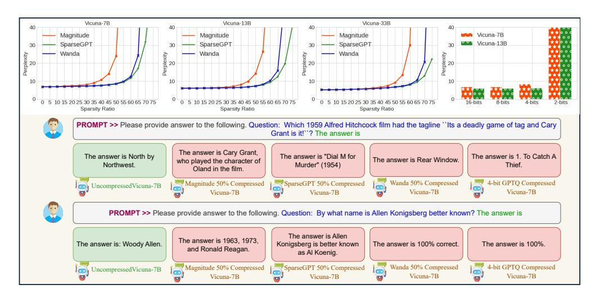
*الشكل 1: **المزايا الحقيقية للضغط الحديث.** يشير الصف العلوي إلى زيادة هامشية في الحيرة عند استخدام طرق الضغط الحديثة، مقارنة بالتشذيب البسيط القائم على القيمة المطلقة. يشير الصف السفلي إلى فشل Vicuna-7B المضغوط (Chiang et al., 2023) (عبر Magnitude وWanda وSparseGPT وGPTQ) في الاستجابة بشكل صحيح للأسئلة الواقعية كثيفة المعرفة.*

في الملحق A.1) يدعون أنهم يحافظون على أداء نموذج اللغة الكبير غير المضغوط مع تحقيق تخلخل بنسبة 50-60% أو تكميم متطرف يصل إلى 2-3 بت. على الرغم من أن هذه التطورات تبدو مذهلة، إلا أنها في معظم (إن لم يكن كل) الحالات تعتمد بشدة على **الحيرة** كمقياسها الأساسي لتقييم ادعاءات الأداء. مثل هذه التقييمات المقيدة نسبياً تحد من نطاق تطوير طرق ضغط جديدة، وقد لا تكون مناسبة لتحديد قدرات/قيود جديدة وغير متوقعة لنماذج اللغة الكبيرة المضغوطة.

الحيرة، حتى في حالة نماذج اللغة الكبيرة الكثيفة، قد طُعن فيها كمقياس غير مرضٍ لمقارنة الإمكانات الحقيقية لنماذج اللغة الكبيرة، رغم الاختلافات الكبيرة في حجوم النماذج، واستراتيجيات التدريب، وخيارات البنية (Muhlgay et al., 2023). من المهم ملاحظة أن *جميع النماذج المضغوطة مشتقة من نفس النظير الكثيف بتشابه عالٍ*، والاختلافات المذكورة أعلاه غير موجودة، مما يجعل تقييمها أكثر صعوبة. في هذا العمل، نعيد النظر في سؤال معروف على نطاق واسع لكنه غير مستكشف بشكل كافٍ: *إلى أي مدى تعكس الحيرة التغير في قدرات نماذج اللغة الكبيرة المضغوطة التي لها توافق كبير مع نظيرها الكثيف؟* نركز على حالة نماذج اللغة الكبيرة المضغوطة، لأننا نلاحظ فشلاً أكثر خطورة نسبياً للحيرة في رصد التباينات الدقيقة في الأداء التي تحدث عبر مراحل ضغط مختلفة لنماذج اللغة الكبيرة، مما يستدعي تحقيقاً أكثر تفصيلاً.

في هذا العمل، نحاول التحقق من الوعود الحقيقية وقيود خوارزميات الضغط الحديثة لنماذج اللغة الكبيرة. نجمع <u>أول</u> مجموعة شاملة ومتنوعة من المهام بمستويات صعوبة متفاوتة لدراسة نماذج اللغة الكبيرة المضغوطة بدقة في ظل التكميم وتشذيب الشبكات (أنماط تخلخل منظمة وغير منظمة). وبشكل أكثر تحديداً، نأخذ بعين الاعتبار طيفاً واسعاً من المهام لتقييم التغيرات الدقيقة في قدرة نماذج اللغة الكبيرة المشذبة والمكممة على *فهم اللغة*، والاستدلال، والتوليد، والاسترجاع داخل السياق، وتلخيص السياقات الطويلة، وإلى ما هنالك. لاحظ أنه لم تُنشأ أي من مجموعات البيانات في دراستنا متعددة الأبعاد لنماذج اللغة الكبيرة المضغوطة من الصفر، بل نعتمد على مجموعات بيانات موجودة لأنها مقبولة على نطاق واسع من قبل الباحثين، لكنها للأسف لم تُتبنَّ بعد لدراسة تأثير الضغط. نقيس بدقة أداء طرق التكميم والتشذيب الحديثة (في إعداداتها الافتراضية الأكثر شيوعاً)، لفهم إمكاناتها لمهامنا الصعبة والمثيرة للاهتمام ذات القيمة العملية العالية.

يمكن استعراض ملاحظاتنا ومساهماتنا الرئيسية كما يلي:

نقدم معيار Knowledge-Intensive Compressed LLM BenchmarK (LLM-KICK)، لإعادة تعريف بروتوكولات\nالتقييم لنماذج اللغة الكبيرة المضغوطة وتسهيل التقييم الشامل لخوارزميات
الضغط الحديثة. مقدمة عملنا هي تطوير مجموعة من المهام الصعبة، والواقعية،
والمتنوعة ذات الأهمية العملية العالية ومجموعات البيانات التي يمكنها تمكين فهم منهجي لكيفية أداء استراتيجيات ضغط نماذج اللغة الكبيرة الحالية فعلياً في الحفاظ على الأداء

<!-- page 3 -->

رغم تشابه حيرتها، وكيف تختلف عن بعضها البعض، وكيف تقارن بنماذج اللغة الكبيرة الأصغر ذات أعداد المعاملات المماثلة.

- يكشف LLM-KICK العديد من الملاحظات المثيرة للاهتمام والحاسمة، التي تغفل عنها التقييمات القائمة على الحيرة. 1 تعاني معظم طرق التشذيب الحديثة من تدهور كبير في الأداء، أحياناً *عند نسب تخلخل تافهة (مثل 25-30%)*، رغم التغيرات الضئيلة في الحيرة. 2 جميع طرق التشذيب الحديثة لا تعمل بشكل مرضٍ لأنماط التخلخل المنظم من نوع N:M على LLM-KICK. 3 طرق تكميم نماذج اللغة الكبيرة الحديثة الحالية *أكثر نجاحاً* في الحفاظ على الأداء مقارنة بطرق تشذيب نماذج اللغة الكبيرة الحديثة. 4 تفشل نماذج اللغة الكبيرة المضغوطة في توليد إجابات غنية بالمعرفة وصحيحة من الناحية الواقعية، رغم أن النص المُولَّد طلق ومتسق ومترابط. 5 نماذج اللغة الكبيرة المضغوطة ذات البنى الأكبر لكن بنفس عدد المعاملات تؤدي بشكل أسوأ، مما يعطي الأفضلية للنماذج الكثيفة الأصغر.
- نتحقق كذلك من قدرة نماذج اللغة الكبيرة المضغوطة *للإعدادات داخل السياق*، عبر اعتماد *الإجابة على الأسئلة المعززة بالاسترجاع داخل السياق* (ICRA-QA) [(Ram et al., 2023)](#page-12-0)، و*تلخيص النصوص بالتعلم داخل السياق* (IC-Sum) [(Jain et al., 2023)](#page-10-4). لمفاجأتنا، فإن نماذج اللغة الكبيرة المشذبة، حتى عند نسب تخلخل غير تافهة (*مثل* ≥50%)، هي أنظمة استرجاع قوية، ويمكنها تنفيذ تلخيص النصوص مع الحفاظ على أداء مماثل لنظيرها الكثيف. مع ذلك، مع زيادة درجات الضغط، تتأثر قدرتها على هضم السياق الأطول أكثر من السياق الأصغر.

# 2 ضغط نماذج اللغة الكبيرة الحديث: الحيرة، أم ما هو أبعد؟

تحقق توسيع الشبكات العصبية، الآن نماذج اللغة الكبيرة، فوائد أداء مذهلة عبر مجموعة واسعة من المهام، لكن على حساب أعباء حسابية وتخزينية ضخمة. تشذيب الشبكات وتكميم الأوزان هما علاجان شائعان لتخفيف هذه الأعباء الناجمة عن مليارات المعاملات في نماذج اللغة الكبيرة الحالية. على الرغم من وجود العديد من الخوارزميات للتشذيب [(Singh &](#page-12-9) [Alistarh, 2020;](#page-12-9)[ Zhu & Gupta, 2017;](#page-13-3)[ Gale et al., 2019;](#page-10-5)[ Jaiswal et al., 2022;](#page-10-6)[ Lin et al., 2020;](#page-11-6)[ Liu et al.,](#page-11-7) [2021a;](#page-11-7)[ Mostafa & Wang, 2019;](#page-12-10)[ Dettmers & Zettlemoyer, 2019;](#page-9-6)[ Evci et al., 2020)](#page-9-7) والتكميم [(Dong et al., 2022;](#page-9-8)[ Cardinaux et al., 2020;](#page-9-9)[ Kim et al., 2021;](#page-10-7)[ Liu et al., 2021b;](#page-11-8)[ Martinez et al., 2020)](#page-12-11)، فإن تكييفها المخصص لنماذج اللغة الكبيرة مقيد، بسبب عدم القدرة على القيام بإعادة التدريب التكراري لاستعادة أي انخفاض في الأداء أثناء الضغط. مؤخراً، أظهرت عدة أعمال نجاحاً ملحوظاً في الضغط الخالي من التدريب والخالي من البيانات لنماذج اللغة الكبيرة، محققة تخلخلاً بنسبة 50-60% وتقليل عرض البت إلى 3 أو 4 بت لكل وزن، مع تدهور ضئيل في الحيرة بالنسبة للخط الأساس غير المضغوط.

الحيرة هي مقياس إحصائي لمدى ثقة نموذج اللغة في توقع عينة نصية، وتقيس "المفاجأة" المُرمّزة داخل نماذج اللغة (كلما انخفضت الحيرة، كان النموذج أفضل). على الرغم من شعبيتها، طُعِن في الحيرة على نطاق واسع كمقياس غير مرضٍ لمقارنة المزايا الحقيقية لنموذجين مختلفين من نماذج اللغة الكبيرة [(Muhlgay et al., 2023)](#page-12-8)، حتى للنماذج الكثيفة رغم أنها تختلف بشكل كبير في حجم النموذج، واستراتيجيات التدريب، وخيارات التصميم (مُرمِّز فقط، فاكِك فقط، *إلخ*). لمعالجة هذه المسألة، حاولت عدة أعمال [(Li et al., 2023;](#page-11-9)[ Kaddour et al., 2023;](#page-10-8) [Muhlgay et al., 2023;](#page-12-8)[ Zhang et al., 2023;](#page-13-4)[ Valmeekam et al., 2022;](#page-13-5)[ Liu et al., 2023a;](#page-11-0)[ Sawada et al.,](#page-12-1) [2023;](#page-12-1)[ Qin et al., 2023;](#page-12-2)[ Zhuo, 2023;](#page-13-0)[ Lee et al., 2023)](#page-11-1) تجاوز الحيرة، وتقييم قدرات نماذج اللغة الكبيرة الكثيفة عبر الاستدلال المنطقي العام، وفهم اللغة، والاستيعاب القرائي، والبرمجة، *إلخ*. ومع ذلك، من المهم ملاحظة أن *جميع النماذج المضغوطة مشتقة من نفس النظير الكثيف بتشابه عالٍ* وتتشارك نفس الحجم، واستراتيجيات التدريب، وخيارات التصميم، *إلخ*. والمدهش أنه على عكس نماذج اللغة الكبيرة الكثيفة، لم تُبذل أي جهود من هذا القبيل لفهم التغيرات الدقيقة في قدرات نماذج اللغة الكبيرة المضغوطة بقوة ضغط متفاوتة. بشكل متعامد مع الاتجاه الأخير لتطوير خوارزميات ضغط جديدة، يقدم عملنا أول محاولة لتقييم المزايا الحقيقية والقيود لخوارزميات ضغط نماذج اللغة الكبيرة الحديثة الحالية، لتوفير ساحة لعب عادلة ومفصلة لتطوير خوارزميات ضغط أفضل. نركز على *حالة نماذج اللغة الكبيرة المضغوطة* لأننا نلاحظ الفشل العميق للحيرة في رصد التباينات الدقيقة في الأداء عبر ضغطات مختلفة لنماذج اللغة الكبيرة.

يوضح الشكل[ 1(](#page-1-0)الأعلى) التغير في حيرة طرق الضغط الحديثة (التشذيب والتكميم)، مثل SparseGPT وWanda وGPTQ والخط الأساس للتشذيب القائم على القيمة المطلقة بضربة واحدة على Vicuna-7B و13B و33B [(Chiang et al., 2023)](#page-9-5). من الواضح أن الحيرة (↓) لجميع النماذج لا تظهر أي تباين كبير حتى 45-60%، مع فشل تام في رصد التغيرات الدقيقة في قدرات نماذج اللغة الكبيرة عند ضغطها. ومن المثير للاهتمام أيضاً ملاحظة أنه إلى درجة معينة من التخلخل (∼ 30%)، تتمتع جميع طرق التشذيب الحديثة بأداء مماثل تقريباً للخط الأساس البسيط

<!-- page 4 -->

للتشذيب القائم على القيمة المطلقة بضربة واحدة، مما يثير تساؤلات حول مزاياها الحقيقية ضمن نطاق التخلخل هذا. يُظهر الشكل 1(الأسفل) استجابة نموذج Vicuna-7B عند ضغطه باستخدام Magnitude وSparseGPT وWanda بنسبة 50% وتكميمه إلى 4 بت. تمكن Vicuna-7B غير المضغوط من توليد الإجابة الصحيحة، لكن جميع الإصدارات المضغوطة فشلت في الاستجابة بشكل صحيح، إذ تهلوست بحقائق خاطئة أو ردود غير ذات صلة.

# 3 LLM-KICK: الكشف عن المزايا الحقيقية لضغط نماذج اللغة الكبيرة

**LLM-KICK**، اختصار *Knowledge-Instensive Compressed LLM BenchmarK*، صُمم لجلب اهتمام مجتمع ضغط نماذج اللغة الكبيرة نحو عجز الحيرة عن عكس التغيرات الدقيقة بشكل صحيح في قدرة نماذج اللغة الكبيرة المشتقة من النظراء الكثيفين بقوة ضغط متفاوتة. يتألف LLM-KICK من مجموعة من إعدادات المهام الصعبة، والواقعية، والمتنوعة ذات الأهمية العملية العالية ومجموعات البيانات التي يمكنها تمكين فهم منهجي لكيفية أداء استراتيجيات ضغط نماذج اللغة الكبيرة الحالية فعلياً في الحفاظ على الأداء رغم تشابه الحيرة. يتحقق عملنا بدقة من المزايا/القيود المُعلنة لنماذج اللغة الكبيرة المشذبة والمكممة لفهم اللغة، والاستدلال، والتوليد، والاسترجاع داخل السياق، والتلخيص داخل السياق، *إلخ*.

تحديداً، يتألف LLM-KICK من 3 إعدادات مهام واسعة لدراسة كيف يؤثر الضغط على المعرفة المرمزة أثناء التدريب المسبق، وكيف تؤدي نماذج اللغة الكبيرة المضغوطة المهام عندما تُعزَّز المعرفة المطلوبة داخل السياق، ومدى أداء نماذج اللغة الكبيرة المضغوطة لاتباع التعليمات. لتقسيم صعوبة المهمة وتنوعها، نضمّن الإجابة على الأسئلة القائمة على الوقائع، والإجابة على الأسئلة القائمة على الاستدلال متعدد الخيارات، والإجابة المعززة بالاسترجاع داخل السياق، وتلخيص النصوص داخل السياق، وتوليد النصوص الحرة القائم على التعليمات. بدلاً من إنشاء مجموعات بيانات جديدة، ننتقي LLM-KICK بعناية من الأعمال السابقة ومستودعات GitHub مفتوحة المصدر التي قُبلت على نطاق واسع من قبل الباحثين، ولكن لم يستكشفها بعد باحثو ضغط نماذج اللغة الكبيرة. يمكن العثور على استراتيجيات تصميم المطالبات المفصلة لإعدادات المهام المختلفة في الملحق A.2.

لتقليل تكلفة التجارب الزائدة والفوضى في النتائج، يركز عملنا في المقام الأول على أفضل تقنيتين موجودتين لتشذيب نماذج اللغة الكبيرة الخالي من التدريب والخالي من البيانات (*أي*، SparseGPT (Frantar & Alistarh, 2023) وWanda (Sun et al., 2023))، إلى جانب الخط الأساس للتشذيب القائم على القيمة المطلقة بضربة واحدة (Han et al., 2016)، بالإضافة إلى تقنية تكميم شائعة (GPTQ) من بين الخيارات المتاحة مؤخراً (Lin et al., 2023a; Frantar et al., 2022; Dettmers et al., 2023c). نأخذ بعين الاعتبار نوعين من التخلخل: (*1*) التخلخل غير المنظم: تُصفّر أوزان النموذج الفردية بشكل مستقل، مما يؤدي إلى أنماط أصفار غير منتظمة (LeCun et al., 1990; Han et al., 2016)؛ و(*2*) التخلخل المنظم N:M: نمط تخلخل دقيق حيث N أوزان فقط غير صفرية لكل M أوزان متتالية (Nvidia, 2020; Zhou et al., 2021). نستخدم نماذج Vicuna للتجارب، وهي نماذج روبوتات دردشة مفتوحة المصدر مدربة بصقل LLaMA (Chiang et al., 2023) على المحادثات المشتركة من قبل المستخدمين والمجموعة من ShareGPT، وقد أظهرت جودة مذهلة بنسبة 90% من OpenAI ChatGPT وGoogle Bard. لاحظ أن هدف هذا العمل ليس مقتصراً على تحديد حالات فشل طرق التشذيب الحديثة، بل يقدم بدلاً من ذلك بحثاً متعمقاً في قدرة نماذج اللغة الكبيرة في ظل الضغط، ويجلب رؤى جديدة تشمل إبراز ملاحظات تعمل لصالح طرق الضغط الحديثة الحالية.

رسمياً، ندرس انخفاض أداء نماذج اللغة الكبيرة بعد الضغط (دون صقل) بالنسبة لنظرائها الكثيفين باستخدام خوارزمية ضغط \mathbb C. لنموذج لغة كبير مدرب مسبقاً f(x;\theta)، فإن نموذج اللغة الكبير المضغوط هو شبكة f_{\text{comp}}(x;\theta_{\mathbb C})، وهي نسخة من f(x;\theta) مع بعض الأوزان المثبتة عند 0 يحددها قناع التشذيب m_{\mathbb C} في حالة التشذيب، أو المُكمَّمة إلى k_{\mathbb C}-بت باستخدام خوارزمية تكميم. بعد ذلك، نُعرّف نموذج اللغة الكبير المضغوط *المطابق*.

**نموذج اللغة الكبير المضغوط المطابق:** نموذج اللغة الكبير المضغوط f_{\text{comp}}(x; \theta_{\mathbb{C}}) هو *مطابق* لخوارزمية ضغط \mathbb{C} على المهمة \mathbb{T}، إذا أسفر عن أداء <u>لا يقل عن</u> \epsilon_0 (نظام تحمل الضغط) مقارنة بـ f(x; \theta, \mathbb{T}). في هذا العمل، نعتبر \epsilon_0 يساوي \leq 5\% من أداء f(x; \theta, \mathbb{T}).

لاحظ أن \epsilon_0 هو مؤشر بسيط لمستوى تحمل انخفاض الأداء عندما نبدأ في ضغط أي نموذج لغة كبير. تعتبر العديد من الأعمال السابقة (Chen et al., 2020b; Jaiswal et al., 2023a) عتبات المطابقة مساوية لأداء الشبكة الفرعية الكثيفة أو ضمن هوامش 1%. ومع ذلك، في عملنا، خففناه بعناية إلى انخفاض أداء بنسبة 5% كتحمل مقبول (قبل

<!-- page 5 -->

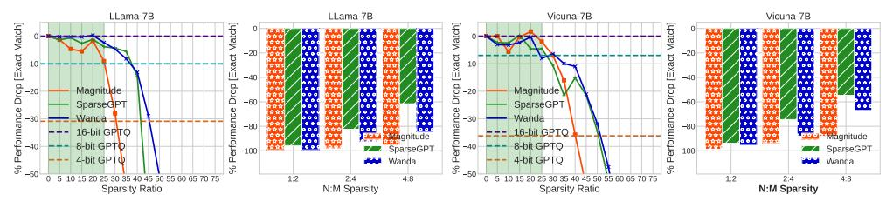
*الشكل 2: **نماذج اللغة الكبيرة المضغوطة للإجابة على الأسئلة القائمة على الوقائع.** مقارنة الأداء لنماذج اللغة الكبيرة المضغوطة في مهمة Factoid-QA باستخدام FreebaseQA (Jiang et al., 2019). النتائج (المتوسط عبر 3 تشغيلات مستقلة) المقدمة هي للتخلخل المنظم (N:M)، والتخلخل غير المنظم، والتكميم.*

اعتبار النموذج المضغوط عديم الفائدة) مع الأخذ بعين الاعتبار أن أداء نموذج اللغة الكبير المضغوط على أي من فئات/تخصصات مهامنا يبقى أعلى من التخمين العشوائي.

## 3.1 الإعداد 1: مدى وصول نماذج اللغة الكبيرة المضغوطة إلى المعرفة المتبقية؟

## (1) الإجابة على الأسئلة القائمة على الوقائع

**تعريف المهمة والمنطق.** الإجابة على الأسئلة القائمة على الوقائع (Factoid-QA) (Iyyer et al., 2014)، التي تطرح حقائق دقيقة عن الكيانات، هي مشكلة طويلة الأمد في معالجة اللغة الطبيعية. مهمة Factoid-QA النموذجية تهدف إلى البحث عن كيانات أو سمات كيانات من رسم بياني للمعرفة، وتُستخدم على نطاق واسع كأداة في الأوساط الأكاديمية، ومحركات البحث التجارية، والمساعدين التحادثيين. تُدرَّب نماذج اللغة الكبيرة الحديثة على مجموعات نصية ضخمة تستوعب كمية كبيرة من المعرفة العالمية حول الكيانات وعلاقاتها أثناء التدريب المسبق، ولديها قدرات فريدة لتوليد ردود صحيحة من الناحية الواقعية على استفسارات المستخدمين. في إعداد المهمة هذا، نهدف إلى التحقق من *كيفية تأثير الضغط على قدرة نماذج اللغة الكبيرة على الإجابة على أسئلة اللغة الطبيعية باستخدام الحقائق، أي معرفة الكيانات أو السمات المُستوعبة داخلها أثناء التدريب المسبق*.

**تفاصيل مجموعة البيانات.** نستخدم FreebaseQA (Jiang et al., 2019) وهي مجموعة بيانات للإجابة على الأسئلة في المجال المفتوح فوق الرسم البياني للمعرفة Freebase. تُجمع أزواج الأسئلة والأجوبة من مصادر مختلفة، بما في ذلك مجموعة بيانات TriviaQA (Joshi et al., 2017) ومواقع التريفيا الأخرى (QuizBalls, QuizZone, KnowQuiz)، وتُطابَق مع Freebase لتوليد ثلاثيات موضوع-مسند-كائن ذات صلة جرى التحقق منها كذلك من قبل المعلقين البشريين. تُظهر مجموعة بيانات TriviaQA تنوعاً وتعقيداً لغوياً غنياً، مما يجعلها بيئة اختبار جيدة لتقييم المعرفة المُستوعبة داخل نماذج اللغة الكبيرة.

**النتائج والتحليل.** نتائج طرق ضغط نماذج اللغة الكبيرة المختلفة موضحة في الشكل 2. ملاحظاتنا الرئيسية تشمل: ① جميع طرق تشذيب نماذج اللغة الكبيرة الحديثة **تفشل ظاهرياً** في إيجاد نماذج لغة كبيرة متخلخلة مطابقة، *حتى عند تخلخلات تافهة مثل 30-35%*. بينما تحافظ عدة طرق على الأداء المطابق عند تخلخل 20-25%، يبدأ أداؤها في الانخفاض بشكل كبير بعد ذلك متعرضةً *لفشل كارثي* مع زيادة نسبة التخلخل. هذا يتعارض مع الادعاء الذي قدمته طرق التشذيب الحديثة بأن تشذيب ما يصل إلى 50-60% من نماذج اللغة الكبيرة لا يسبب أي تدهور كبير في الأداء. ② جميع طرق التشذيب **لا تعمل** لأنماط التخلخل المنظم N:M الدقيقة بانخفاض في الأداء يصل إلى \geq50%. ③ انخفاض ∼8-10% في الأداء للتكميم غير العدواني 8-بت يشير إلى أنه إلى جانب السعي وراء مستويات تكميم عدوانية (1-2 بت)، من المهم أيضاً التركيز على التكميم 8-بت غير المحلول حتى الآن.

# 2 الإجابة على الأسئلة القائمة على الاستدلال متعدد الخيارات

**صياغة المهمة والمنطق.** الإجابة على الأسئلة القائمة على الاستدلال متعدد الخيارات (MCR-QA) تستخدم نهج مطالبة طبيعي لتقديم السؤال وخيارات الإجابة لنماذج اللغة الكبيرة معاً، وتطلب منها إخراج الرمز (مثل "A") المرتبط بخيار الإجابة الذي اختارته. يسمح ذلك للنموذج بمقارنة خيارات الإجابة بشكل صريح. في هذا الإعداد، نهدف إلى التحقق من قدرة نماذج اللغة الكبيرة المضغوطة على فهم أسئلة اللغة الطبيعية، والاستدلال بفعالية باستخدام المعرفة المتبقية داخلها، والربط الصحيح للإجابة الصحيحة بين خيارات الإجابة المعطاة بالرموز التي تمثلها؛ مما يقلل من تأثير الترميز وتوليد الإجابة الدقيقة.

**تفاصيل مجموعة البيانات.** نستخدم معيار MMLU (Massive Multitask Language Understanding) الشهير الذي يغطي أكثر من 50 موضوعاً عبر العلوم والتكنولوجيا والهندسة والرياضيات (STEM)، والعلوم الإنسانية، والعلوم الاجتماعية، وأكثر (Hendrycks et al., 2020). يتراوح في الصعوبة من المستوى الابتدائي إلى المستوى المهني المتقدم، ويختبر كلاً من المعرفة العالمية وقدرة حل المشكلات لنماذج اللغة الكبيرة. الدقة واتساع المواضيع تجعله مثالياً للتقييم التفصيلي للنقاط العمياء لنماذج اللغة الكبيرة المضغوطة.

<!-- page 6 -->

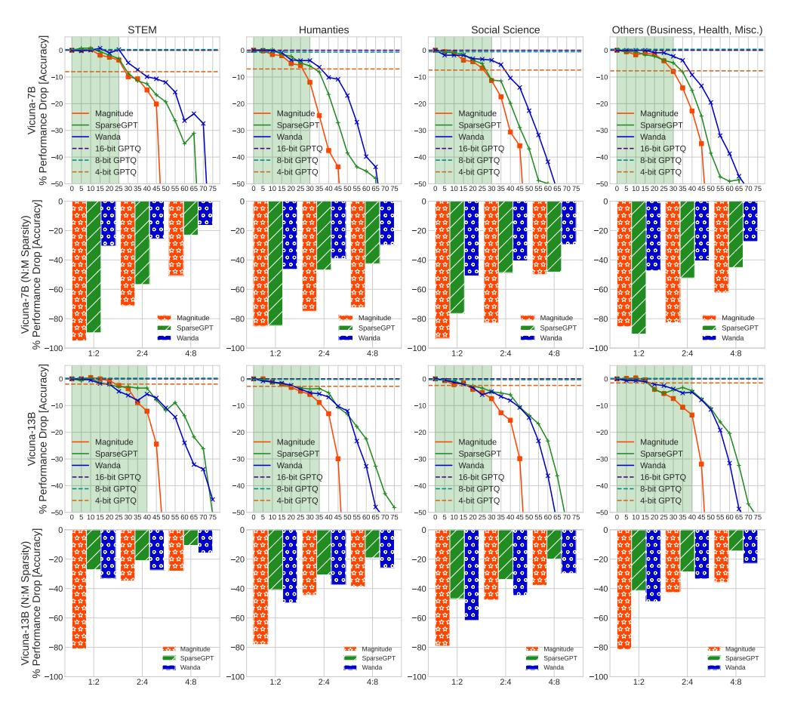
*الشكل 3: نماذج اللغة الكبيرة المضغوطة للإجابة على الأسئلة القائمة على الاستدلال متعدد الخيارات. مقارنة الأداء لنماذج اللغة الكبيرة المضغوطة في مهام MCR-QA باستخدام معيار MMLU (Hendrycks et al., 2020). النتائج (المتوسط عبر 3 تشغيلات مستقلة) المقدمة هي للتخلخل المنظم (N:M)، والتخلخل غير المنظم، والتكميم.*

النتائج والتحليل. نتائج طرق ضغط نماذج اللغة الكبيرة المختلفة موضحة في الشكل 3. ملاحظاتنا الرئيسية تشمل: ① على الرغم من نظام ضغط مطابق مماثل (~ 20-40%) لـ Factoid-QA، فإن الانخفاض المفاجئ في الأداء لجميع طرق التشذيب الحديثة لـ MMLU خفيف نسبياً بسبب تخفيف إعداد المهمة من توليد الإجابة الدقيقة إلى اختيار الإجابة الصحيحة. ② *لم تُعثر على نماذج لغة كبيرة مضغوطة مطابقة* للتخلخل المنظم N:M. ③ يبدو أن تكميم نماذج اللغة الكبيرة الحديث أكثر نجاحاً من طرق التشذيب الحديثة: وجدنا أن نموذج اللغة الكبير المضغوط 8-بت و4-بت مطابق لـ Vicuna-7B وVicuna-13B على التوالي. ④ من المثير للاهتمام أن كلاً من التكميم والتشذيب لديه انخفاض أداء أعلى نسبياً في العلوم الإنسانية والعلوم الاجتماعية مقارنة بـ STEM، مما يشير إلى أن الضغط يؤثر على بعض التخصصات أكثر من غيرها. ⑤ بشكل مفاجئ، ضمن نظام تحمل الضغط، يبدو أن تشذيب القيمة المطلقة بضربة واحدة البسيط يؤدي بشكل جيد جداً مقارنة بطريقة التشذيب الحديثة، مما يوضح فعاليته العالية.

## 3.2 الإعداد 2: مدى توليف نماذج اللغة الكبيرة المضغوطة للمعرفة المعززة؟

# 1 الإجابة المعززة بالاسترجاع داخل السياق

صياغة المهمة والمنطق. الإجابة المعززة بالاسترجاع داخل السياق (ICRA-QA) (Ram et al., 2023) ترسّخ توليد إجابة نموذج اللغة الكبير عن طريق التهيئة على المستندات ذات الصلة المُسترجعة من مصدر معرفة خارجي باستخدام خوارزميات استرجاع مثل BM25. يتضمن نظام تقييم ICRA-QA لدينا مكونين رئيسيين: (أ) اختيار المستندات، اختيار مجموعة المستندات للتهيئة عليها؛ و(ب) قراءة المستندات، تحديد كيفية دمج المستندات المختارة في عملية إجابة نموذج اللغة الكبير، الذي يتطلب استخراج عبارات الإجابة الصحيحة من المستندات المُهيَّأ عليها. لخصم تأثير المعرفة المرمزة المفقودة أثناء الضغط، تعزز ICRA-QA المعرفة ذات الصلة المطلوبة لمهمة الإجابة على الأسئلة مباشرة داخل

<!-- page 7 -->

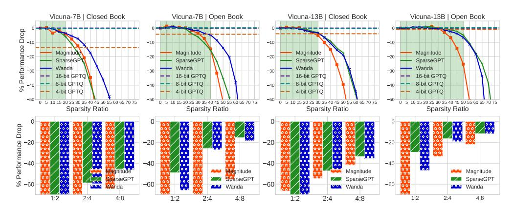
*الشكل 4: نماذج اللغة الكبيرة المضغوطة للإجابة المعززة بالاسترجاع داخل السياق. مقارنة الأداء لنماذج اللغة الكبيرة المضغوطة في مهمة ICRA-QA. نقدم مقارنة وجهاً لوجه بين التقييم بالكتاب المغلق (لا تُعزز معرفة خارجية داخل السياق) والتقييم بالكتاب المفتوح (تُعزز معرفة خارجية داخل السياق). النتائج (المتوسط عبر 3 تشغيلات مستقلة) المقدمة هي للتخلخل المنظم N:M، والتخلخل غير المنظم، والتكميم.*

سياق المطالبة. في إعداد المهمة هذا، نهدف إلى تقييم *قدرة نماذج اللغة الكبيرة المضغوطة* على توليف المعرفة الطويلة داخل السياق المقدمة في مطالبات الإدخال، وتحديد واسترجاع الإجابات الصحيحة داخلها. نقدم أيضاً مقارنة وجهاً لوجه لكيفية عمل المعرفة المعززة كعلاج لاستكمال المعرفة المفقودة في ظل الضغط.

**تفاصيل مجموعة البيانات.** نستخدم TriviaQA (Joshi et al., 2017) للتقييم، وهي مجموعة بيانات شائعة للاستيعاب القرائي تتضمن 95 ألف زوج من الأسئلة والأجوبة كتبها هواة التريفيا ومستندات أدلة مُجمَّعة بشكل مستقل، ستة لكل سؤال في المتوسط، توفر إشرافاً بعيداً عالي الجودة للإجابة على الأسئلة.

النتائج والتحليل. نتائج طرق ضغط نماذج اللغة الكبيرة المختلفة موضحة في الشكل 17. يختلف إعداد الكتاب المغلق عن ICRA-QA (*أي*، باستخدام إعداد الكتاب المفتوح) فقط من حيث ما إذا كان مُهيَّأ على المستندات ذات الصلة المُسترجعة من مصدر معرفة خارجي. النتائج الرئيسية لدينا هي: ① عندما تُهيَّأ نماذج اللغة الكبيرة المضغوطة على المعرفة الخارجية (الكتاب المفتوح) وتُكلَّف بمهمة المسترجِعات داخل السياق، *أي*، استخراج عبارات الإجابة الصحيحة من المعرفة داخل السياق، فإنها *تؤدي بشكل جيد ملحوظ* حتى في نظام الضغط العالي للغاية. يمكن لـ Vicuna-7B أن يبقى مطابقاً حتى ~40% تخلخل وتكميم 8-بت، بينما يمكن لـ Vicuna-13B أن يبقى مطابقاً حتى ~50% تخلخل وتكميم 4-بت. تبعث نتائجنا التجريبية بإشارة إيجابية بأنه حتى لو *أدى الضغط العالي إلى فقدان معرفي كبير، فإنه لا يترك نماذج اللغة الكبيرة عديمة الفائدة تماماً*، وما زالت تعمل كمسترجعات قوية داخل السياق. ② على الرغم من ملاحظتنا فائدة كبيرة عند التهيئة على المعرفة الخارجية، **لم** يمكن تحديد نموذج لغة كبير مضغوط مطابق لتخلخل N:M. ③ مرة أخرى، نلاحظ أداءً جيداً بشكل مفاجئ لتشذيب القيمة المطلقة غير المنظم بضربة واحدة البسيط مقارنة بـ SparseGPT (التشذيب من الدرجة الثانية) وWanda (التشذيب القائم على التنشيط) اللذين يعتمدان على بيانات المعايرة.

# 2 تلخيص النصوص داخل السياق

صياغة المهمة والتفاصيل. أظهرت نماذج اللغة الكبيرة الحديثة نجاحاً مذهلاً في تلخيص المستندات الطويلة السياق في كل من الإعدادات الاستخلاصية والتجريدية. ومع ذلك، **لم يُستكشف بعد** كيف يؤثر الضغط على قدرة نماذج اللغة الكبيرة على التلخيص. في إعداد المهمة هذا، نهدف إلى التحقق من *قدرة نماذج اللغة الكبيرة المضغوطة على الحفاظ على الاتساق، والترابط، والطلاقة، والملاءمة عند مطالبتها بتلخيص معلومات نصية بأطوال متفاوتة (صغيرة، ومتوسطة، وكبيرة) في إعداد تجريدي (Jain et al., 2023). للتقييم، على غرار Zheng et al. (2023)، نقترح استخدام GPT-4 كحَكَم، الذي يقارن ملخصات نموذج اللغة الكبير المضغوط مقارنة بملخصات GPT-3.5 (text-davinci-003). يمكن العثور على إعدادات التقييم المفصلة في الملحق A.3*.

**تفاصيل مجموعة البيانات.** نستخدم مجموعة بيانات تلخيص شائعة CNN/DailyMail (Chen et al., 2016) للتقييم، وهي مجموعة بيانات باللغة الإنجليزية تحتوي على ما يزيد قليلاً عن 300 ألف مقالة إخبارية فريدة كتبها صحفيون في CNN وDailyMail. أنشأنا 3 فئات فرعية \{\text{small }(\leq 470 \text{ words}), \text{ medium } (\geq 470 \text{ and } \leq 790 \text{ words}), \text{ and large } (\geq 790 \text{ words}) \} من القصص، كل منها بـ 100 مقالة تعكس توزيع الكلمات في CNN/DailyMail لتقليل تكاليف واجهة OpenAI API.

<!-- page 8 -->

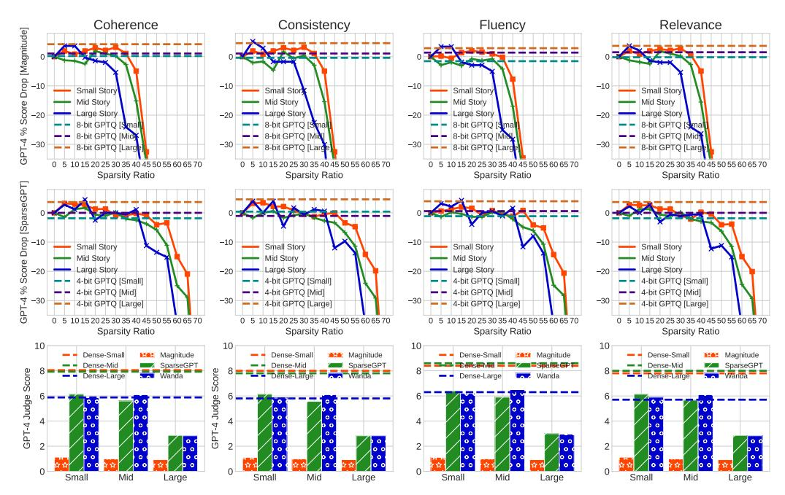
*الشكل 5: نماذج اللغة الكبيرة المضغوطة للتلخيص داخل السياق. مقارنة الأداء لـ Vicuna-7B المضغوط للتلخيص داخل السياق للقصص الصغيرة والمتوسطة والكبيرة مع الحفاظ على الترابط والاتساق والطلاقة والملاءمة. النتائج (المتوسط عبر 3 تشغيلات مستقلة) المقدمة هي للتخلخل المنظم (2:4 - الصف 3)، والتخلخل غير المنظم، والتكميم.*

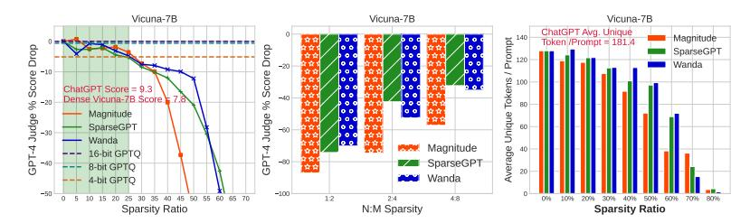
*الشكل 6: نماذج اللغة الكبيرة المضغوطة لاتباع التعليمات. LLM-as-a-Judge: تقييم قائم على GPT-4 لاستجابة Vicuna-7B المضغوط مقارنة بـ ChatGPT (davici-003). (يسار) تخلخل غير منظم؛ (وسط) تخلخل منظم N:M؛ (ج) مقارنة متوسط أعداد الرموز الفريدة المُولَّدة بواسطة Vicuna-7B المضغوط لـ 80 مطالبة عبر 10 فئات مختلفة.*

النتائج والتحليل. النتائج ملخصة في الشكل 5. نلخص ملاحظاتنا الرئيسية كما يلي: ① تميل جميع طرق التشذيب والتكميم إلى الأداء **بشكل جيد بشكل مفاجئ** للتلخيص داخل السياق، محافظةً على اتساق وترابط وطلاقة وملاءمة عالية في الملخصات المُولَّدة، وهي *ملاحظة مشجعة لصالح الضغط*. ② مع زيادة طول السياق (*أي*، القصص الطويلة)، نلاحظ *انخفاضاً أكثر حدة في الأداء* لنماذج اللغة الكبيرة المضغوطة، مما يبرز أن الضغط يؤثر على قدرة نماذج اللغة الكبيرة على توليف وتلخيص أطوال السياق الأطول. ③ يبدو أن التكميم يؤدي مرة أخرى أفضل من طرق التشذيب الحديثة، ويستفيد بشكل مفاجئ بشكل إيجابي على أداء النموذج الكثيف. ④ لم يمكن تحديد نموذج لغة كبير مضغوط مطابق للتخلخل المنظم 2:4.

## 3.3 الإعداد 3: مدى أداء نماذج اللغة الكبيرة المضغوطة لاتباع التعليمات؟

**صياغة المهمة والمنطق.** في إعداد المهمة هذا، نتحقق من *قدرة نماذج اللغة الكبيرة المضغوطة على الإجابة على الأسئلة المفتوحة وتقييم قدرتها على المحادثة متعددة الأدوار واتباع التعليمات – عنصران حاسمان للتفضيل البشري*. تقييم روبوتات الدردشة بالذكاء الاصطناعي مهمة صعبة، لأنها تتطلب فحص فهم اللغة، والاستدلال، والوعي بالسياق. لمقارنة أداء استجابات نماذج اللغة الكبيرة المضغوطة، نتبع عن كثب إعداد تصميم المطالبات في MT-Bench (Zheng et al., 2023) باستخدام GPT-4 كحَكَم. نطلب من GPT-4 تقييم الإجابات المُولَّدة

<!-- page 9 -->

بواسطة نماذج اللغة الكبيرة المضغوطة مقارنة بنموذج GPT-3.5 (text-davinci-003) بناءً على مقاييس متفاوتة (مثل الصحة، والفائدة، والمنطق، والدقة، إلخ) على مقياس [0-10] مع تفسيرات مفصلة.

**تفاصيل مجموعة البيانات.** نعتمد على 80 سؤالاً متعدد الأدوار عالي الجودة محددة في MT-Bench (Zheng et al., 2023). يغطي هذا الإعداد التفاعلات الشائعة المحورية الإنسانية مع نماذج اللغة الكبيرة، ويركز على الأسئلة الصعبة لتمييز النماذج. استخدمنا 8 فئات شائعة من مطالبات المستخدم لتوجيه بناء المطالبة للتفاعل مع نماذج اللغة الكبيرة المضغوطة: الكتابة، ولعب الأدوار، والاستخراج، والاستدلال، والرياضيات، والترميز، *إلخ*. لكل فئة، تبنينا 10 أسئلة متعددة الأدوار مصممة يدوياً من MT-Bench لتقييم نماذجنا المضغوطة. يمكن العثور على التفاصيل في الملحق A.4.

**النتائج والتحليل.** النتائج ملخصة في الشكل 6. ملاحظاتنا الرئيسية هي: ① على عكس تلخيص النصوص داخل السياق، في إعداد المهمة هذا، يجب على نماذج اللغة الكبيرة المضغوطة الوصول إلى المعرفة للاستجابة للمحادثات مع الحفاظ على فائدة وملاءمة ودقة وتفصيل عالٍ. نلاحظ مرة أخرى أن نماذج اللغة الكبيرة المضغوطة بطرق تشذيب متنوعة *مطابقة فقط حتى نسبة تخلخل* \sim 25\%. ② بشكل مفاجئ، في النظام المطابق، يؤدي الخط الأساس البسيط لتشذيب القيمة المطلقة بضربة واحدة *بشكل مماثل أو أفضل قليلاً* من طرق التشذيب الحديثة. ③ *لم تُعثر على شبكة فرعية مطابقة* للتخلخل N:M. ④ من المثير للاهتمام، أن تحليلنا لمتوسط الرموز الفريدة المُولَّدة في الشكل 6(ج) يوضح أن نماذج اللغة الكبيرة المضغوطة تفقد القدرة على توليد محتوى فريد متميز، بدلاً من ذلك، يمكنها فقط إنتاج نصوص أكثر تكراراً.

# 4 نتائج ومناقشات إضافية

**صغير-كثيف مقابل كبير-متخلخل: أيهما مفضل؟** نحاول فهم سؤال مثير للاهتمام: *هل نماذج اللغة الكبيرة المشذبة ذات البنية الأكبر (Large-Sparse) أفضل من النماذج الكثيفة الأصغر ذات عدد المعاملات المماثل (Small-Dense)؟* تشذيب نماذج اللغة الكبيرة لا يأتي مجاناً، ومن المهم التحقق مما إذا كانت تكلفة التشذيب يمكن أن تنعكس في فائدة الأداء لنماذج Large-Sparse. لمفاجأتنا، بالمقارنة مع Vicuna-7B الكثيف (دقة MMLU 46.7%)، وجدنا أن Vicuna-13B المضغوط بنفس عدد المعاملات تماماً (تخلخل 46.16%) من 7 مليار باستخدام القيمة المطلقة بضربة واحدة وWanda وSparseGPT يمكن أن يحقق فقط دقة MMLU بنسبة 31.7% و45.3% و46.3% على التوالي. هذا مؤشر واضح على أن خوارزميات التخلخل الحالية **ليست بعد** في مرحلة يمكن فيها تبرير تكلفة التشذيب بفوائد الأداء التي يحصل عليها من نماذج كبيرة-متخلخلة مضغوطة.

كم عدد عينات بيانات المعايرة المطلوبة؟ نحاول تحليل كيف تؤدي طرق التشذيب المعتمدة على المعايرة (Wanda وSparseGPT) مع كميات متفاوتة من عينات المعايرة. يوضح الشكل 7 أداء التعلم بدون أمثلة لـ Vicuna-7B المشذب بنسبة 50% و70% باستخدام Wanda وSparseGPT على معيار MMLU كثيف المعرفة. من المثير للاهتمام ملاحظة أن عدد عينات المعايرة يلعب دوراً حيوياً في الحفاظ على أداء SparseGPT على عكس Wanda. لاحظ أنه عند نسبة تخلخل عالية (70%)، لا يمكن لـ Wanda استعادة أي أداء؛ يستفيد SparseGPT بشكل مفاجئ بشكل ملحوظ من المعايرة. يقترح هذا أن *عينات المعايرة المُختارة بعناية يمكن أن تلعب دوراً حيوياً* في تصميم خوارزميات تشذيب أفضل لضغط نماذج اللغة الكبيرة حتى عند تخلخل عالٍ بشكل كبير.

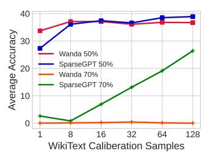
*الشكل 7: أداء التعلم بدون أمثلة لـ Vicuna-7B المشذب بنسبة 50% و70% بالنسبة لأعداد عينات المعايرة.*

# 5 الخلاصة والقيود

في هذه الورقة، نقترح استكشاف فعالية طرق الضغط الحديثة بما يتجاوز الحيرة لمعالجة عجز الحيرة عن رصد التباينات الدقيقة التي تحدث أثناء اشتقاق نماذج اللغة الكبيرة المضغوطة من نظرائها الكثيفين. يقدم عملنا معيار Knowledge-Intensive Compressed LLM BenchmarK (LLM-KICK) لتسهيل تقييم عادل وشامل بالكشف عن العديد من المزايا والمآزق لطرق الضغط الحديثة. تكشف دراستنا أن الضغط يؤثر بشكل كبير على المعرفة المرمزة في نماذج اللغة الكبيرة أثناء التدريب المسبق، تؤدي نماذج اللغة الكبيرة المضغوطة بشكل جيد جداً مع إعدادات المعرفة المعززة داخل السياق. نقصر تقييمنا أساساً على Vicuna (بنية الفاكِك فقط) بسبب رخصته مفتوحة المصدر، وأدائه العالي، وقدرته على اتباع التعليمات. للعمل المستقبلي، نهدف إلى التحقق من كيفية استعادة المعرفة المفقودة بسبب الضغط باستخدام طرق الصقل الفعالة من حيث المعاملات، *مثل* LoRA (Hu et al., 2021) وQLoRA (Dettmers et al., 2023b).

<!-- page 10 -->

## المراجع

- Fabien Cardinaux, Stefan Uhlich, Kazuki Yoshiyama, Javier Alonso Garc´ıa, Lukas Mauch, Stephen Tiedemann, Thomas Kemp, and Akira Nakamura. Iteratively training look-up tables for network quantization. *IEEE Journal of Selected Topics in Signal Processing*, 14(4):860–870, 2020.
- Danqi Chen, Jason Bolton, and Christopher D Manning. A thorough examination of the cnn/daily mail reading comprehension task. *arXiv preprint arXiv:1606.02858*, 2016.
- Tianlong Chen, Jonathan Frankle, Shiyu Chang, Sijia Liu, Yang Zhang, Zhangyang Wang, and Michael Carbin. The lottery ticket hypothesis for pre-trained bert networks. *Advances in neural* *information processing systems*, 33:15834–15846, 2020a.
- Xiaohan Chen, Yu Cheng, Shuohang Wang, Zhe Gan, Zhangyang Wang, and Jingjing Liu. Earlybert: Efficient bert training via early-bird lottery tickets. *arXiv preprint arXiv:2101.00063*, 2020b.
- Zhikai Chen, Haitao Mao, Hang Li, Wei Jin, Hongzhi Wen, Xiaochi Wei, Shuaiqiang Wang, Dawei Yin, Wenqi Fan, Hui Liu, et al. Exploring the potential of large language models (llms) in learning on graphs. *arXiv preprint arXiv:2307.03393*, 2023.
- Wei-Lin Chiang, Zhuohan Li, Zi Lin, Ying Sheng, Zhanghao Wu, Hao Zhang, Lianmin Zheng, Siyuan Zhuang, Yonghao Zhuang, Joseph E. Gonzalez, Ion Stoica, and Eric P. Xing. Vicuna: An open-source chatbot impressing gpt-4 with 90%* chatgpt quality, March 2023. URL [https:](https://lmsys.org/blog/2023-03-30-vicuna/) [//lmsys.org/blog/2023-03-30-vicuna/](https://lmsys.org/blog/2023-03-30-vicuna/).
- Tim Dettmers and Luke Zettlemoyer. Sparse networks from scratch: Faster training without losing performance. *arXiv preprint arXiv:1907.04840*, 2019.
- Tim Dettmers, Mike Lewis, Younes Belkada, and Luke Zettlemoyer. Gpt3. int8 (): 8-bit matrix multiplication for transformers at scale. *Advances in Neural Information Processing Systems*, 35: 30318–30332, 2022.
- Tim Dettmers, Artidoro Pagnoni, Ari Holtzman, and Luke Zettlemoyer. Qlora: Efficient finetuning of quantized llms. *ArXiv*, abs/2305.14314, 2023a. URL [https://api.](https://api.semanticscholar.org/CorpusID:258841328) [semanticscholar.org/CorpusID:258841328](https://api.semanticscholar.org/CorpusID:258841328).
- Tim Dettmers, Artidoro Pagnoni, Ari Holtzman, and Luke Zettlemoyer. Qlora: Efficient finetuning of quantized llms. *arXiv preprint arXiv:2305.14314*, 2023b.
- Tim Dettmers, Ruslan Svirschevski, Vage Egiazarian, Denis Kuznedelev, Elias Frantar, Saleh Ashkboos, Alexander Borzunov, Torsten Hoefler, and Dan Alistarh. Spqr: A sparse-quantized representation for near-lossless llm weight compression. *ArXiv*, abs/2306.03078, 2023c. URL [https://api.semanticscholar.org/CorpusID:259076379](https://api.semanticscholar.org/CorpusID:259076379).
- Runpei Dong, Zhanhong Tan, Mengdi Wu, Linfeng Zhang, and Kaisheng Ma. Finding the taskoptimal low-bit sub-distribution in deep neural networks. In *International Conference on Machine* *Learning*, pp. 5343–5359. PMLR, 2022.
- Keyu Duan, Qian Liu, Tat-Seng Chua, Shuicheng Yan, Wei Tsang Ooi, Qizhe Xie, and Junxian He. Simteg: A frustratingly simple approach improves textual graph learning. *arXiv preprint* *arXiv:2308.02565*, 2023.
- Utku Evci, Trevor Gale, Jacob Menick, Pablo Samuel Castro, and Erich Elsen. Rigging the lottery: Making all tickets winners. In *International Conference on Machine Learning*, pp. 2943–2952. PMLR, 2020.
- Elias Frantar and Dan Alistarh. Sparsegpt: Massive language models can be accurately pruned in one-shot, 2023.
- Elias Frantar, Eldar Kurtic, and Dan Alistarh. M-fac: Efficient matrix-free approximations of second-order information. *Advances in Neural Information Processing Systems*, 34:14873– 14886, 2021.

<!-- page 11 -->

- Elias Frantar, Saleh Ashkboos, Torsten Hoefler, and Dan Alistarh. Gptq: Accurate post-training quantization for generative pre-trained transformers. *ArXiv*, abs/2210.17323, 2022. URL [https://api.semanticscholar.org/CorpusID:253237200](https://api.semanticscholar.org/CorpusID:253237200).
- Trevor Gale, Erich Elsen, and Sara Hooker. The state of sparsity in deep neural networks. *arXiv* *preprint arXiv:1902.09574*, 2019.
- Song Han, Huizi Mao, and William J Dally. Deep compression: Compressing deep neural networks with pruning, trained quantization and huffman coding. In *International Conference on Learning* *Representations*, 2016.
- Dan Hendrycks, Collin Burns, Steven Basart, Andy Zou, Mantas Mazeika, Dawn Song, and Jacob Steinhardt. Measuring massive multitask language understanding. *arXiv preprint* *arXiv:2009.03300*, 2020.
- Edward J Hu, Yelong Shen, Phillip Wallis, Zeyuan Allen-Zhu, Yuanzhi Li, Shean Wang, Lu Wang, and Weizhu Chen. Lora: Low-rank adaptation of large language models. *arXiv preprint* *arXiv:2106.09685*, 2021.
- Mohit Iyyer, Jordan L. Boyd-Graber, Leonardo Max Batista Claudino, Richard Socher, and Hal Daume. A neural network for factoid question answering over paragraphs. In ´ *Confer**ence on Empirical Methods in Natural Language Processing*, 2014. URL [https://api.](https://api.semanticscholar.org/CorpusID:216034672) [semanticscholar.org/CorpusID:216034672](https://api.semanticscholar.org/CorpusID:216034672).
- Sameer Jain, Vaishakh Keshava, Swarnashree Mysore Sathyendra, Patrick Fernandes, Pengfei Liu, Graham Neubig, and Chunting Zhou. Multi-dimensional evaluation of text summarization with in-context learning. *arXiv preprint arXiv:2306.01200*, 2023.
- Ajay Jaiswal, Shiwei Liu, Tianlong Chen, and Zhangyang Wang. The emergence of essential sparsity in large pre-trained models: The weights that matter. *arXiv preprint arXiv:2306.03805*, 2023a.
- Ajay Kumar Jaiswal, Haoyu Ma, Tianlong Chen, Ying Ding, and Zhangyang Wang. Training your sparse neural network better with any mask. In *International Conference on Machine Learning*, pp. 9833–9844. PMLR, 2022.
- Ajay Kumar Jaiswal, Shiwei Liu, Tianlong Chen, Ying Ding, and Zhangyang Wang. Instant soup: Cheap pruning ensembles in a single pass can draw lottery tickets from large models. In *Interna**tional Conference on Machine Learning*, pp. 14691–14701. PMLR, 2023b.
- Yupeng Ji, Yibo Cao, and Jiucai Liu. Pruning large language models via accuracy predictor. *arXiv* *preprint arXiv:2309.09507*, 2023.
- Kelvin Jiang, Dekun Wu, and Hui Jiang. Freebaseqa: A new factoid qa data set matching trivia-style question-answer pairs with freebase. In *North American Chapter of the Association for Com**putational Linguistics*, 2019. URL [https://api.semanticscholar.org/CorpusID:](https://api.semanticscholar.org/CorpusID:174800890) [174800890](https://api.semanticscholar.org/CorpusID:174800890).
- Mandar Joshi, Eunsol Choi, Daniel S Weld, and Luke Zettlemoyer. Triviaqa: A large scale distantly supervised challenge dataset for reading comprehension. *arXiv preprint arXiv:1705.03551*, 2017.
- Jean Kaddour, Joshua Harris, Maximilian Mozes, Herbie Bradley, Roberta Raileanu, and Robert McHardy. Challenges and applications of large language models. *arXiv preprint* *arXiv:2307.10169*, 2023.
- Jeonghoon Kim, Jung Hyun Lee, Sungdong Kim, Joonsuk Park, Kang Min Yoo, Se Jung Kwon, and Dongsoo Lee. Memory-efficient fine-tuning of compressed large language models via sub-4-bit integer quantization. *ArXiv*, abs/2305.14152, 2023. URL [https://api.](https://api.semanticscholar.org/CorpusID:258841104) [semanticscholar.org/CorpusID:258841104](https://api.semanticscholar.org/CorpusID:258841104).
- Sehoon Kim, Amir Gholami, Zhewei Yao, Michael W Mahoney, and Kurt Keutzer. I-bert: Integeronly bert quantization. In *International conference on machine learning*, pp. 5506–5518. PMLR, 2021.

<!-- page 12 -->

- Eldar Kurtic, Daniel Campos, Tuan Nguyen, Elias Frantar, Mark Kurtz, Benjamin Fineran, Michael Goin, and Dan Alistarh. The optimal bert surgeon: Scalable and accurate second-order pruning for large language models. *arXiv preprint arXiv:2203.07259*, 2022.
- Franc¸ois Lagunas, Ella Charlaix, Victor Sanh, and Alexander M Rush. Block pruning for faster transformers. *arXiv preprint arXiv:2109.04838*, 2021.
- Xin Lai, Zhuotao Tian, Yukang Chen, Yanwei Li, Yuhui Yuan, Shu Liu, and Jiaya Jia. Lisa: Reasoning segmentation via large language model. *arXiv preprint arXiv:2308.00692*, 2023.
- Yann LeCun, John S Denker, and Sara A Solla. Optimal brain damage. In *Advances in neural* *information processing systems*, pp. 598–605, 1990.
- Noah Lee, Na Min An, and James Thorne. Can large language models infer and disagree like humans? *ArXiv*, abs/2305.13788, 2023. URL [https://api.semanticscholar.org/](https://api.semanticscholar.org/CorpusID:258841424) [CorpusID:258841424](https://api.semanticscholar.org/CorpusID:258841424).
- Xiang Li, Yiqun Yao, Xin Jiang, Xuezhi Fang, Xuying Meng, Siqi Fan, Peng Han, Jing Li, Li Du, Bowen Qin, et al. Flm-101b: An open llm and how to train it with 100 k budget. *arXiv preprint* *arXiv:2309.03852*, 2023.
- Zonglin Li, Chong You, Srinadh Bhojanapalli, Daliang Li, Ankit Singh Rawat, Sashank J Reddi, Ke Ye, Felix Chern, Felix Yu, Ruiqi Guo, et al. Large models are parsimonious learners: Activation sparsity in trained transformers. *arXiv preprint arXiv:2210.06313*, 2022.
- Long Lian, Boyi Li, Adam Yala, and Trevor Darrell. Llm-grounded diffusion: Enhancing prompt understanding of text-to-image diffusion models with large language models. *arXiv preprint* *arXiv:2305.13655*, 2023.
- Ji Lin, Jiaming Tang, Haotian Tang, Shang Yang, Xingyu Dang, and Song Han. Awq: Activationaware weight quantization for llm compression and acceleration. *ArXiv*, abs/2306.00978, 2023a. URL [https://api.semanticscholar.org/CorpusID:258999941](https://api.semanticscholar.org/CorpusID:258999941).
- Ji Lin, Jiaming Tang, Haotian Tang, Shang Yang, Xingyu Dang, and Song Han. Awq: Activation-aware weight quantization for llm compression and acceleration. *arXiv preprint* *arXiv:2306.00978*, 2023b.
- Tao Lin, Sebastian U. Stich, Luis Barba, Daniil Dmitriev, and Martin Jaggi. Dynamic model pruning with feedback. In *International Conference on Learning Representations*, 2020. URL [https:](https://openreview.net/forum?id=SJem8lSFwB) [//openreview.net/forum?id=SJem8lSFwB](https://openreview.net/forum?id=SJem8lSFwB).
- Junling Liu, Chao Liu, Peilin Zhou, Qichen Ye, Dading Chong, Kang Zhou, Yueqi Xie, Yuwei Cao, Shoujin Wang, Chenyu You, et al. Llmrec: Benchmarking large language models on recommendation task. *arXiv preprint arXiv:2308.12241*, 2023a.
- Shiwei Liu, Tianlong Chen, Xiaohan Chen, Zahra Atashgahi, Lu Yin, Huanyu Kou, Li Shen, Mykola Pechenizkiy, Zhangyang Wang, and Decebal Constantin Mocanu. Sparse training via boosting pruning plasticity with neuroregeneration. *Advances in Neural Information Processing Systems* *(NeurIPs).*, 2021a.
- Shiwei Liu, Tianlong Chen, Zhenyu Zhang, Xuxi Chen, Tianjin Huang, Ajay Jaiswal, and Zhangyang Wang. Sparsity may cry: Let us fail (current) sparse neural networks together! *arXiv* *preprint arXiv:2303.02141*, 2023b.
- Zechun Liu, Barlas Oguz, Changsheng Zhao, Ernie Chang, Pierre Stock, Yashar Mehdad, Yangyang Shi, Raghuraman Krishnamoorthi, and Vikas Chandra. Llm-qat: Data-free quantization aware training for large language models. *arXiv preprint arXiv:2305.17888*, 2023c.
- Zhenhua Liu, Yunhe Wang, Kai Han, Wei Zhang, Siwei Ma, and Wen Gao. Post-training quantization for vision transformer. In A. Beygelzimer, Y. Dauphin, P. Liang, and J. Wortman Vaughan (eds.), *Advances in Neural Information Processing Systems*, 2021b. URL [https:](https://openreview.net/forum?id=9TX5OsKJvm) [//openreview.net/forum?id=9TX5OsKJvm](https://openreview.net/forum?id=9TX5OsKJvm).

<!-- page 13 -->

- Pan Lu, Baolin Peng, Hao Cheng, Michel Galley, Kai-Wei Chang, Ying Nian Wu, Song-Chun Zhu, and Jianfeng Gao. Chameleon: Plug-and-play compositional reasoning with large language models. *arXiv preprint arXiv:2304.09842*, 2023.
- Xinyin Ma, Gongfan Fang, and Xinchao Wang. Llm-pruner: On the structural pruning of large language models. *arXiv preprint arXiv:2305.11627*, 2023.
- Julieta Martinez, Jashan Shewakramani, Ting Liu, Ioan Andrei Barsan, Wenyuan Zeng, and Raquel ˆ Urtasun. Permute, quantize, and fine-tune: Efficient compression of neural networks. *2021* *IEEE/CVF Conference on Computer Vision and Pattern Recognition (CVPR)*, pp. 15694–15703, 2020. URL [https://api.semanticscholar.org/CorpusID:225103308](https://api.semanticscholar.org/CorpusID:225103308).
- Stephen Merity, Caiming Xiong, James Bradbury, and Richard Socher. Pointer sentinel mixture models. *arXiv preprint arXiv:1609.07843*, 2016.
- Hesham Mostafa and Xin Wang. Parameter efficient training of deep convolutional neural networks by dynamic sparse reparameterization. In *International Conference on Machine Learning*, 2019.
- Dor Muhlgay, Ori Ram, Inbal Magar, Yoav Levine, Nir Ratner, Yonatan Belinkov, Omri Abend, Kevin Leyton-Brown, Amnon Shashua, and Yoav Shoham. Generating benchmarks for factuality evaluation of language models. *arXiv preprint arXiv:2307.06908*, 2023.
- Ramesh Nallapati, Bowen Zhou, Caglar Gulcehre, Bing Xiang, et al. Abstractive text summarization using sequence-to-sequence rnns and beyond. *arXiv preprint arXiv:1602.06023*, 2016.
- Nvidia. Nvidia a100 tensor core gpu architecture. *https://www.nvidia.com/content/dam/en**zz/Solutions/Data-Center/nvidia-ampere-architecture-whitepaper.pdf*, 2020.
- Chen Qian, Huayi Tang, Zhirui Yang, Hong Liang, and Yong Liu. Can large language models empower molecular property prediction? *arXiv preprint arXiv:2307.07443*, 2023.
- Chengwei Qin, Aston Zhang, Zhuosheng Zhang, Jiaao Chen, Michihiro Yasunaga, and Diyi Yang. Is chatgpt a general-purpose natural language processing task solver? *arXiv preprint* *arXiv:2302.06476*, 2023.
- Ori Ram, Yoav Levine, Itay Dalmedigos, Dor Muhlgay, Amnon Shashua, Kevin Leyton-Brown, and Yoav Shoham. In-context retrieval-augmented language models. *arXiv preprint* *arXiv:2302.00083*, 2023.
- Victor Sanh, Thomas Wolf, and Alexander Rush. Movement pruning: Adaptive sparsity by fine-tuning. In H. Larochelle, M. Ranzato, R. Hadsell, M. F. Balcan, and H. Lin (eds.), *Ad**vances in Neural Information Processing Systems*, volume 33, pp. 20378–20389. Curran Associates, Inc., 2020. URL [https://proceedings.neurips.cc/paper/2020/file/](https://proceedings.neurips.cc/paper/2020/file/eae15aabaa768ae4a5993a8a4f4fa6e4-Paper.pdf) [eae15aabaa768ae4a5993a8a4f4fa6e4-Paper.pdf](https://proceedings.neurips.cc/paper/2020/file/eae15aabaa768ae4a5993a8a4f4fa6e4-Paper.pdf).
- Tomohiro Sawada, Daniel Paleka, Alexander Havrilla, Pranav Tadepalli, Paula Vidas, Alexander Kranias, John J Nay, Kshitij Gupta, and Aran Komatsuzaki. Arb: Advanced reasoning benchmark for large language models. *arXiv preprint arXiv:2307.13692*, 2023.
- Ying Sheng, Lianmin Zheng, Binhang Yuan, Zhuohan Li, Max Ryabinin, Daniel Y Fu, Zhiqiang Xie, Beidi Chen, Clark Barrett, Joseph E Gonzalez, et al. High-throughput generative inference of large language models with a single gpu. *arXiv preprint arXiv:2303.06865*, 2023.
- Sidak Pal Singh and Dan Alistarh. Woodfisher: Efficient second-order approximation for neural network compression. *Advances in Neural Information Processing Systems*, 33:18098–18109, 2020.
- Mingjie Sun, Zhuang Liu, Anna Bair, and J Zico Kolter. A simple and effective pruning approach for large language models. *arXiv preprint arXiv:2306.11695*, 2023.
- Hugo Touvron, Thibaut Lavril, Gautier Izacard, Xavier Martinet, Marie-Anne Lachaux, Timothee´ Lacroix, Baptiste Roziere, Naman Goyal, Eric Hambro, Faisal Azhar, et al. Llama: Open and ` efficient foundation language models. *arXiv preprint arXiv:2302.13971*, 2023.

<!-- page 14 -->

- Karthik Valmeekam, Alberto Olmo, Sarath Sreedharan, and Subbarao Kambhampati. Large language models still can't plan (a benchmark for llms on planning and reasoning about change). *ArXiv*, abs/2206.10498, 2022. URL [https://api.semanticscholar.org/](https://api.semanticscholar.org/CorpusID:249889477) [CorpusID:249889477](https://api.semanticscholar.org/CorpusID:249889477).
- Wenhai Wang, Zhe Chen, Xiaokang Chen, Jiannan Wu, Xizhou Zhu, Gang Zeng, Ping Luo, Tong Lu, Jie Zhou, Yu Qiao, et al. Visionllm: Large language model is also an open-ended decoder for vision-centric tasks. *arXiv preprint arXiv:2305.11175*, 2023.
- Dongkuan Xu, Ian EH Yen, Jinxi Zhao, and Zhibin Xiao. Rethinking network pruning–under the pre-train and fine-tune paradigm. *arXiv preprint arXiv:2104.08682*, 2021.
- Ruosong Ye, Caiqi Zhang, Runhui Wang, Shuyuan Xu, and Yongfeng Zhang. Natural language is all a graph needs. *arXiv preprint arXiv:2308.07134*, 2023.
- Ofir Zafrir, Ariel Larey, Guy Boudoukh, Haihao Shen, and Moshe Wasserblat. Prune once for all: Sparse pre-trained language models. *arXiv preprint arXiv:2111.05754*, 2021.
- Qingru Zhang, Simiao Zuo, Chen Liang, Alexander Bukharin, Pengcheng He, Weizhu Chen, and Tuo Zhao. Platon: Pruning large transformer models with upper confidence bound of weight importance. In *International Conference on Machine Learning*, pp. 26809–26823. PMLR, 2022.
- Tianyi Zhang, Faisal Ladhak, Esin Durmus, Percy Liang, Kathleen McKeown, and Tatsunori Hashimoto. Benchmarking large language models for news summarization. *ArXiv*, abs/2301.13848, 2023. URL [https://api.semanticscholar.org/CorpusID:](https://api.semanticscholar.org/CorpusID:256416014) [256416014](https://api.semanticscholar.org/CorpusID:256416014).
- Lianmin Zheng, Wei-Lin Chiang, Ying Sheng, Siyuan Zhuang, Zhanghao Wu, Yonghao Zhuang, Zi Lin, Zhuohan Li, Dacheng Li, Eric Xing, et al. Judging llm-as-a-judge with mt-bench and chatbot arena. *arXiv preprint arXiv:2306.05685*, 2023.
- Aojun Zhou, Yukun Ma, Junnan Zhu, Jianbo Liu, Zhijie Zhang, Kun Yuan, Wenxiu Sun, and Hongsheng Li. Learning n: m fine-grained structured sparse neural networks from scratch. *arXiv* *preprint arXiv:2102.04010*, 2021.
- Michael Zhu and Suyog Gupta. To prune, or not to prune: exploring the efficacy of pruning for model compression. *arXiv preprint arXiv:1710.01878*, 2017.
- Terry Yue Zhuo. Large language models are state-of-the-art evaluators of code generation. *arXiv* *preprint arXiv:2304.14317*, 2023.

<!-- page 15 -->

## أ الملحق

## أ.1 الأعمال ذات الصلة

## أ.1.1 التخلخل في نماذج اللغة الكبيرة

أدى ظهور النماذج المُدرَّبة مسبقاً على نطاق واسع إلى تطوير طرق متقدمة للتشذيب بعد التدريب، تهدف إلى تعزيز الفعالية من حيث التكلفة لهذه النماذج الواسعة [(Sanh et al.,](#page-12-13) [2020;](#page-12-13)[ Chen et al., 2020a;](#page-9-13)[ Jaiswal et al., 2023b;](#page-10-15)[ Zafrir et al., 2021;](#page-13-8)[ Kurtic et al., 2022;](#page-11-11)[ Xu et al.,](#page-13-9) [2021;](#page-13-9)[ Lagunas et al., 2021;](#page-11-12)[ Zhang et al., 2022;](#page-13-10)[ Frantar et al., 2021;](#page-9-14)[ Jaiswal et al., 2023a;](#page-10-0)[ Ma et al.,](#page-12-7) [2023;](#page-12-7)[ Ji et al., 2023)](#page-10-1). من بينها،[ Frantar et al.](#page-9-14) [(2021)](#page-9-14) يوسعون التشذيب من الدرجة الثانية إلى مستوى BERT، مما يمكّن من تشذيب كتل الأوزان وتحقيق نتائج حديثة لـ BERT المتخلخل.[ Frantar & Alistarh](#page-9-2) [(2023)](#page-9-2) يقدمون SparseGPT لتشذيب نماذج اللغة الكبيرة (LLMs) بضربة واحدة دون الحاجة إلى إعادة التدريب أو الصقل. يستفيدون من التشذيب من الدرجة الثانية بحسب العمود، وينجحون في إزالة 100 مليار وزن من OPT-175B دون زيادة كبيرة في الحيرة. مؤخراً،[ Sun et al.](#page-12-6) [(2023)](#page-12-6) يقترحون طريقة تشذيب مباشرة تأخذ بعين الاعتبار كلاً من الأوزان والتنشيطات، مما يوضح أداءً مماثلاً لـ[ Frantar & Alistarh](#page-9-2) [(2023)](#page-9-2).[ Li et al.](#page-11-13) [(2022)](#page-11-13) يكشفون أن تخلخل التنشيط ظاهرة منتشرة في المحولات (Transformers) (90% من الإخراج المتوسط)، مما يتيح فرصة أخرى للتسريع.[ Liu et al.](#page-11-14) [(2023b)](#page-11-14) يقدمون SMC-Bench واسع النطاق، مشيرين إلى أن خوارزميات التخلخل الحديثة القائمة على القيمة المطلقة و/أو التدرج تقصر عند تطبيقها مباشرة على النماذج واسعة النطاق ومجموعة مختارة من المهام النهائية المعقدة.

## أ.1.2 التكميم في نماذج اللغة الكبيرة

مع الإصدارات مفتوحة المصدر الأخيرة لنماذج اللغة مثل BLOOM وVicuna وLLaMa وOPT وغيرها، ظهر التكميم كتقنية واسعة الاعتماد لتخفيف عبء التخزين والحوسبة لنماذج التعلم العميق. سعت جهود البحث الأخيرة إلى تسخير التكميم لضغط نماذج اللغة الكبيرة، ويمكن تصنيفها إلى الطريقتين المذكورتين: التكميم المدرك للتدريب (QAT)، والتكميم بعد التدريب (PTQ). في QAT، يُضمَّن هدف التكميم في عملية تدريب نماذج اللغة الكبيرة، مما يمكّنها من التكيف مع التمثيلات منخفضة الدقة والتعامل مع فقدان الدقة الناتج عن التكميم. LLM-QAT [(Liu et al., 2023c)](#page-11-4) يقترح طريقة تقطير خالية من البيانات تستفيد من التوليدات التي ينتجها النموذج المُدرَّب مسبقاً، محافظة على توزيع الإخراج الأصلي ومسموحة بتكميم نماذج LLaMa بشكل مستقل عن بيانات التدريب الخاصة بها. PEQA [(Kim et al., 2023)](#page-10-2) يعمل من خلال عملية ثنائية المرحلة: في البداية، تخضع مصفوفة المعاملات لكل طبقة متصلة بالكامل للتكميم إلى مصفوفة من الأعداد الصحيحة منخفضة البت ومتجه عددي؛ ثم يتم الصقل على المتجه العددي لكل مهمة نهائية. QLoRA [(Dettmers et al., 2023a)](#page-9-3) يقترح نهج صقل فعال يقلل استخدام الذاكرة بما يكفي لصقل نموذج بـ 65 مليار معامل على وحدة معالجة رسومات واحدة بسعة 48GB مع الحفاظ على أداء مهام الصقل بدقة 16-بت كاملة عن طريق نشر التدرجات إلى الخلف من خلال نموذج لغة مدرب مسبقاً مكمم بـ 4-بت ومجمد إلى محولات منخفضة الرتبة (LoRA). PTQ يتضمن تكميم معاملات نماذج اللغة الكبيرة بعد اكتمال مرحلة تدريب نموذج اللغة الكبير. GPTQ [(Frantar et al., 2022)](#page-10-3) يقترح تقنية تكميم جديدة على مستوى الطبقة قائمة على معلومات تقريبية من الدرجة الثانية مما يسفر عن تخفيض عرض البت إلى 3 أو 4 بت لكل وزن، مع فقدان دقة ضئيل مقارنة بالنسخة غير المضغوطة. AWQ [(Lin et al., 2023a)](#page-11-5) قائم على ملاحظة أن الأوزان ليست متساوية في الأهمية: حماية 1% فقط من الأوزان البارزة يمكن أن تقلل بشكل كبير خطأ التكميم، يستخدم نهجاً مدركاً للتنشيط بأخذ أهمية قنوات الأوزان المقابلة لمقادير التنشيط الأكبر بعين الاعتبار. SpQR [(Dettmers et al., 2023c)](#page-9-4) يعمل من خلال تحديد وعزل الأوزان الشاذة، التي تسبب أخطاء تكميم كبيرة بشكل خاص، وتخزينها بدقة أعلى، بينما يضغط جميع الأوزان الأخرى إلى 3-4 بت، ويحقق فقدان دقة نسبي أقل من 1% في الحيرة لنماذج LLaMA وFalcon عالية الدقة.

## أ.1.3 نماذج اللغة الكبيرة والتقييم

نماذج اللغة الكبيرة (LLMs) تكتسب شعبية متزايدة في كل من الأوساط الأكاديمية والصناعية وتلعب دوراً حيوياً في كل من البحث والاستخدام اليومي. مع زيادة الشعبية، تحاول عدة أعمال [(Li et al.,](#page-11-9) [2023;](#page-11-9)[ Kaddour et al., 2023;](#page-10-8)[ Muhlgay et al., 2023;](#page-12-8)[ Zhang et al., 2023;](#page-13-4)[ Valmeekam et al., 2022;](#page-13-5)[ Liu](#page-11-0) [et al., 2023a;](#page-11-0)[ Sawada et al., 2023;](#page-12-1)[ Qin et al., 2023;](#page-12-2)[ Zhuo, 2023;](#page-13-0)[ Lee et al., 2023)](#page-11-1) تجاوز الحيرة التقليدية لتقييم أداء نماذج اللغة الكبيرة عبر الواقعية، والاستدلال المنطقي العام،

<!-- page 16 -->

وفهم اللغة، والاستيعاب القرائي، والبرمجة، وقدرات اتباع التعليمات، *إلخ*.[ Muhlgay et al.](#page-12-8) [(2023)](#page-12-8) يقترحون مقياساً جديداً يسمى FACTOR لفهم المعلومات الصحيحة من حيث الواقعية في النص المُولَّد من نماذج اللغة الكبيرة. وُجد أنه على الرغم من أن دقة FACTOR وحيرة LMM تميل إلى الترابط بشكل كبير، إلا أنها أحياناً تستحث ترتيبات مختلفة بين LMMs. أبلغوا أن أزواج النماذج يمكن أن تتشارك في حيرة مماثلة لكنها تختلف بشكل كبير من حيث دقة FACTOR.[ Lee et al.](#page-11-1) [(2023)](#page-11-1) يقيمون أداء وتوافق توزيع نموذج اللغة الكبير مع البشر باستخدام تقنيتين مختلفتين: إعادة بناء مونتي كارلو (MCR) وإعادة بناء الاحتمال اللوغاريتمي (LPR)؛ ووجدوا أن نماذج اللغة الكبيرة تظهر قدرة محدودة في حل مهام NLI وتفشل في الوقت نفسه في رصد توزيع الخلاف البشري.[ Zhang et al.](#page-13-4) [(2023)](#page-13-4) يحاولون التحقق من الوعد للتلخيص التلقائي بالنسبة لكتاب الملخصات البشريين ووجدوا أن ملخصات LMM تُحكَم بأنها على قدم المساواة مع الملخصات المكتوبة بشرياً.[ Valmeekam et al.](#page-13-5) [(2022)](#page-13-5) يقترحون إطار تقييم قابل للتمديد لاختبار قدرات نماذج اللغة الكبيرة على الاستدلال حول الإجراءات والتغيير، جانب مركزي للذكاء البشري ووجدوا أن GPT-3 وBLOOM لديهما أداء كئيب على هذه المعايير. على الرغم من هذه الجهود للتحقق من أداء نماذج اللغة الكبيرة الكثيفة بشكل شامل، من المدهش أنه لم تُبذل أي جهود من هذا القبيل بعد لحالة أكثر صعوبة لنماذج اللغة الكبيرة المضغوطة، التي مشتقة من النظراء الكثيفين بتشابه كبير معها. عملنا هو أول محاولة لمعالجة هذه الفجوة وتشجيع الباحثين في مجتمع التخلخل على تجاوز الحيرة لتقييم المزايا الحقيقية وعيوب طرق الضغط.

## أ.2 تصميم المطالبات والأمثلة لإعدادات المهام المختلفة في LLM-KICK

## أ.2.1 الإجابة على الأسئلة القائمة على الوقائع

تصميم المطالبة: من فضلك أعطِ إجابة لهذا السؤال: <QUESTION> الإجابة هي مثال: من فضلك أعطِ إجابة لهذا السؤال: الفيلم '10 things I hate about you' مبني على أي مسرحية لشكسبير؟ الإجابة هي

استجابة النموذج: من فضلك أعطِ إجابة لهذا السؤال: الفيلم '10 things I hate about you' مبني على أي مسرحية لشكسبير؟ الإجابة هي ترويض النمرة (the taming of the shrew).

## أ.2.2 الإجابة على الأسئلة القائمة على الاستدلال متعدد الخيارات

تصميم المطالبة: التالية أسئلة متعددة الخيارات (مع الإجابات) حول <SUBJECT NAME>.\n\n<QUESTION> \nA. <OPTION 1>\nB. <OPTION 2>\nC. <OPTION 3>\nD. <OPTION 4>\n الإجابة:

مثال: التالية أسئلة متعددة الخيارات (مع الإجابات) حول الجبر.\n\n أوجد الدرجة لامتداد الحقل المعطى Q(sqrt(2), sqrt(3), sqrt(18)) فوق Q. \nA. 0\nB. 4\nC. 2\nD.6\n الإجابة:

استجابة النموذج: التالية أسئلة متعددة الخيارات (مع الإجابات) حول الجبر.\n\n أوجد الدرجة لامتداد الحقل المعطى Q(sqrt(2), sqrt(3), sqrt(18)) فوق Q. \nA. 0\nB. 4\nC. 2\nD.6\n الإجابة: B

## أ.2.3 الإجابة المعززة بالاسترجاع داخل السياق

1 إعداد الكتاب المغلق: لإعداد الكتاب المغلق، تبنينا المطالبة من[ Touvron et al.](#page-12-14) [(2023)](#page-12-14) على النحو التالي.

<!-- page 17 -->

تصميم المطالبة: أجب عن هذه الأسئلة:\n\nQ: <QUESTION>\n A:

مثال: أجب عن هذه الأسئلة:\n\nQ: من كان الرجل وراء The Chipmunks؟\n A:

استجابة النموذج: أجب عن هذه الأسئلة:\n\nQ: من كان الرجل وراء The Chipmunks؟\n A: الرجل وراء The Chipmunks كان David Sarge، الذي كان مؤسس Alphaville Virtual Real Estate Company.

2 إعداد الكتاب المفتوح: لإعداد الكتاب المفتوح، نوسع المطالبة أعلاه على النحو التالي.

تصميم المطالبة: <EVIDENCE>\n أجب عن هذه الأسئلة:\nQ: <QUESTION>\n A:

مثال: ''Alvin and the Chipmunks (2007) - IMDb IMDb 17 January 2017 4:34 PM, UTC NEWS. A struggling songwriter named Dave Seville finds success ..."\n أجب عن هذه الأسئلة:\n Q: من كان الرجل وراء The Chipmunks؟\n A:

استجابة النموذج: ''Alvin and the Chipmunks (2007) - IMDb IMDb 17 January 2017 4:34 PM, UTC NEWS. A struggling songwriter named Dave Seville finds success ..."\n أجب عن هذه الأسئلة:\n Q: من كان الرجل وراء The Chipmunks؟\n A: Dave Seville.

## أ.2.4 تلخيص النصوص داخل السياق

تصميم المطالبة: محادثة بين مستخدم فضولي ومساعد ذكاء اصطناعي. يقدم المساعد إجابات مفيدة ومفصلة ومهذبة على أسئلة المستخدم. USER: لخّص القصة المعطاة في أقل من 150 كلمة مع الحفاظ على ترابط واتساق وطلاقة وملاءمة عالية.\n\n <STORY>. ASSISTANT:

مثال: محادثة بين مستخدم فضولي ومساعد ذكاء اصطناعي. يقدم المساعد إجابات مفيدة ومفصلة ومهذبة على أسئلة المستخدم. USER: لخّص القصة المعطاة في أقل من 150 كلمة مع الحفاظ على ترابط واتساق وطلاقة وملاءمة عالية.\n\nLibyan and U.S. officials say the two governments held face-to-face talks in Tunisia ...have denied previous reports of talks with the government. AS-SISTANT:

استجابة النموذج: استجابة النموذج لـ Vicuna-7B المشذب بالقيمة المطلقة بضربة واحدة ASSISTANT موضحة في الشكل[ 8.](#page-16-0)

Libyan and U.S. officials held face-to-face talks in Tunisia over the weekend, but Washington's sole point of the meeting was to repeat its demand that Libyan leader Moammar Gadhafi "mus t go". Libyan government spokesman Musa Ibrahim called the talks "a first step" and stated that the two sides were ready to discuss ideas to end the conflict and repair the damaged relat ionship between Libya and the U.S. However, a U.S. official familiar with the meeting said the purpose was "for us to convey directly that Gadhafi must go". NATO has been bombing Libya u nder a U.N. mandate to protect civilians from Gadhafi's forces, who are battling a rebellion that has claimed control of the eastern half of the country. Despite previous reports of talk s between the rebels and the government, Libyan rebels have denied any such talks.

*الشكل 8: استجابة الإخراج لـ Vicuna-7b ASSISTANT المضغوط بنسبة 10% (غير منظم بضربة واحدة).*

<!-- page 18 -->

## أ.2.5 المحادثة متعددة الأدوار واتباع التعليمات

تصميم المطالبة: محادثة بين مستخدم فضولي ومساعد ذكاء اصطناعي. يقدم المساعد إجابات مفيدة ومفصلة ومهذبة على أسئلة المستخدم. USER: <QUESTION> ASSISTANT:

مثال: محادثة بين مستخدم فضولي ومساعد ذكاء اصطناعي. يقدم المساعد إجابات مفيدة ومفصلة ومهذبة على أسئلة المستخدم. USER: كيف يمكنني تحسين مهارات إدارة الوقت لديّ؟ ASSISTANT:

استجابة النموذج: استجابة النموذج لـ Vicuna-7B المشذب بالقيمة المطلقة بضربة واحدة ASSISTANT موضحة في الشكل[ 9.](#page-17-2)

*الشكل 9: استجابة الإخراج لـ Vicuna-7b ASSISTANT المضغوط بنسبة 10% (غير منظم بضربة واحدة).*

## أ.3 إعدادات تقييم التلخيص داخل السياق

لتقييم أداء نماذج اللغة الكبيرة لتوليد تلخيص داخل السياق عالي الجودة، نركز على مقاييس الاتساق، والترابط، والطلاقة، والملاءمة. نطلب من GPT-4 الذي حُدد مؤخراً ليكون فعالاً للغاية كإطار تقييم تلقائي لتوليد المعايير وتقييمات الأداء، تقييم هذه المقاييس مقارنة بالملخصات المُولَّدة بواسطة GPT-3.5. أمثلة على مطالباتنا المستخدمة للتقييم بحَكَم GPT-4 موضحة في الشكل[ 10.](#page-17-3) نقدم أيضاً مثالاً على إخراج حَكَم GPT-4 في الشكل[ 11.](#page-17-4)

```
IN-CONTEXT SUMMARIZATION EVALUATION PROMPT >> "You are a helpful and precise assistant for checking the quality of the summarization of two stories within 150 words.",
"prompt_template": "[STORY]\n{story}\n\n[The Start of Assistant 1's Summary]\n{summary_1}\n\n[The End of Assistant 1's Summary]\n\n[The Start
of Assistant 2's Summary]\n{summary_2}\n\n[The End of Assistant 2's Summary]\n\n[System]\n{prompt}\n\n", "defaults": {"prompt": "We
would like to request your feedback on the performance of two AI assistants in response to the user requested summary above.\nPlease
rate the coherence, consistency, fluency, and relevance of summary generated. Each assistant receives a score on a scale of 1 to 10 for
coherence, consistency, fluency and relevance, where a higher score indicates better overall performance.\nPlease first output four
lines containing only two values indicating the scores for Assistant 1 and 2, respectively for each four metrices. The two scores are
separated by a space. In the subsequent line, please provide a comprehensive explanation of your evaluation, avoiding any potential bias
and ensuring that the order in which the responses were presented does not affect your judgment."}
```

*الشكل 10: مثال على المطالبة المستخدمة لتقييم نموذج اللغة الكبير المضغوط ASSISTANT *مقارنة* بـ GPT-3.5 ASSISTANT باستخدام GPT-4 كحَكَم على اتساق وترابط وطلاقة وملاءمة الملخصات المُولَّدة.*

*الشكل 11: تقييم حَكَم GPT-4 للاستجابات المُولَّدة بواسطة GPT-3 (ASSISTANT 1) *مقارنة* بـ Vicuna-7b المضغوط بنسبة 10% (غير منظم بضربة واحدة) (ASSISTANT 2).*

## أ.4 إعداد تقييم القدرة على اتباع التعليمات

لتقييم الاستجابات المُولَّدة بواسطة نماذج اللغة الكبيرة المضغوطة، نتبع عن كثب إعدادات تصميم المطالبات لـ MT-Bench [(Zheng et al., 2023)](#page-13-7) باستخدام GPT-4 كحَكَم. نطلب من GPT-4 تقييم الإجابات المُولَّدة بواسطة نماذج اللغة الكبيرة المضغوطة مقارنة بنموذج GPT-3.5 (text-davinci-003) بناءً على مقاييس متفاوتة (مثل الصحة، والفائدة، والمنطق، والدقة، *إلخ.*) على مقياس [0-10] ويقدم

<!-- page 19 -->

شرحاً تفصيلياً وراء الدرجة. أمثلة على مطالباتنا المستخدمة أثناء التقييم للأسئلة وكذلك استجابة حَكَم GPT-4 موضحة في الشكل[ 12,](#page-18-0) و[ 13,](#page-18-1) على التوالي.

**GENERAL QUESTION PROMPT >>** You are a helpful and precise assistant for checking the quality of the answer.", "prompt_template": " [Question]\n{question}\n\n[The Start of Assistant 1's Answer]\n{answer_1}\n\n[The End of Assistant 1's Answer]\n\n[The Start of Assistant 2's Answer]\n{answer_2}\n\n[The End of Assistant 2's Answer]\n\n[System]\n{prompt}\n\n", "defaults": {"prompt": "We would like to request your feedback on the performance of two AI assistants in response to the user question displayed above.\nPlease rate the helpfulness, relevance, accuracy, level of details, factual information, and length of their responses. Each assistant receives an overall score on a scale of 1 to 10, where a higher score indicates better overall performance.\nPlease first output a single line containing only two values indicating the scores for Assistant 1 and 2, respectively. The two scores are separated by a space. In the subsequent line, please provide a comprehensive explanation of your evaluation, avoiding any potential bias and ensuring that the order in which the responses were presented does not affect your judgment."} **CODING QUESTION PROMPT >>** You are a helpful and precise assistant for checking the quality of the answer.", "prompt_template": "[Question]\n{question}\n\n[The Start of Assistant 1's Answer]\n{answer_1}\n\n[The End of Assistant 1's Answer]\n\n[The Start of Assistant 2's Answer]\n{answer_2}\n\n[The End of Assistant 2's Answer]\n\n[System]\n{prompt}\n\n", "defaults": {"prompt": "Your task is to evaluate the coding abilities of the above two assistants. They have been asked to implement a program to solve a given problem. Please review their code submissions, paying close attention to their problem-solving approach, code structure, readability, and the inclusion of helpful comments.\n\nPlease ensure that the assistants' submissions:\n\n1. Correctly implement the given problem statement.\n2. Contain accurate and efficient code.\n3. Include clear and concise comments that explain the code's logic and functionality.\n4. Adhere to proper coding standards and best practices.\n\nOnce you have carefully reviewed both submissions, provide detailed feedback on their strengths and weaknesses, along with any suggestions for improvement. You should first output a single line containing two scores on the scale of 1-10 (1: no code/no sense; 10: perfect) for Assistant 1 and 2, respectively. Then give extra comments starting from the next line."} **MATHS QUESTION PROMPT >>** You are a helpful and precise assistant for checking the quality of the answer.", "prompt_template": "[Question]\n{question}\n\n[The Start of Assistant 1's Answer]\n{answer_1}\n\n[The End of Assistant 1's Answer]\n\n[The Start of Assistant 2's Answer]\n{answer_2}\n\n[The End of Assistant 2's Answer]\n\n[System]\n{prompt}\n\n", "defaults": {"prompt": "We would like to request your feedback on the mathematical proficiency of two AI assistants regarding the given user question displayed above.\nFirst, please solve the problem independently, without referring to the answers provided by Assistant 1 and Assistant 2.\nAfterward, please examine the problem-solving process of Assistant 1 and Assistant 2 step-by-step to ensure their correctness, identifying any incorrect steps if present. Your evaluation should take into account not only the answer but also the problemsolving steps.\nFinally, please output a Python tuple containing two numerical scores for Assistant 1 and Assistant 2, ranging from 1 to 10, respectively. If applicable, explain the reasons for any variations in their scores and determine which assistant performed better."}

*الشكل 12: أمثلة على المطالبات المستخدمة لفئات مختلفة لتقييم نموذج اللغة الكبير المضغوط ASSISTANT *مقارنة* بـ GPT-3.5 ASSISTANT باستخدام GPT-4 كحَكَم.*

9 8
قدم كلا المساعدين استجابات شاملة ودقيقة للسؤال. حدد كلاهما تحديات رئيسية مثل الوصول إلى التعليم الجيد، وجودة المعلمين، ودور التكنولوجيا، وأهمية الإنصاف والشمول.
كانت استجابة Assistant 1 أكثر تفصيلاً وتنظيماً قليلاً، وقدمت تعداداً واضحاً للتحديات وشرحاً موجزاً لكل منها. تطرق المساعد أيضاً إلى أهمية معالجة القضايا العالمية في التعليم، وهو جانب حاسم في التعليم الحديث. الاستنتاج حول الحاجة إلى التعاون بين أصحاب المصلحة كان إضافة مدروسة.
قدم Assistant 2 أيضاً استجابة جيدة، لكنها كانت أقل تفصيلاً وتنظيماً قليلاً مقارنة بـ Assistant 1. كانت النقاط ذات صلة ودقيقة، لكن التفسيرات لم تكن شاملة. أثار المساعد، مع ذلك، تحدي مشاركة الطلاب، وهو قضية مهمة في التعليم اليوم. النقطة حول عولمة التعليم كانت أيضاً إضافة فريدة وذات صلة.
بشكل عام، قام كلا المساعدين بعمل جيد، لكن استجابة Assistant 1 كانت أكثر تفصيلاً وذات بنية جيدة قليلاً.

*الشكل 13: تقييم GPT4-as-a-Judge للاستجابات المُولَّدة بواسطة GPT-3 (ASSISTANT 1) *مقارنة* بـ Vicuna-7b المضغوط بنسبة 10% (غير منظم بضربة واحدة) (ASSISTANT 2).*

## أ.5 روابط مفيدة لـ LLM-KICK

| الجدول 1: مجموعة البيانات ورابط الكود المستخدم في عملنا. |
| --- |
| رابط التنزيل |

| الطريقة / مجموعة البيانات | رابط التنزيل |
| --- | --- |
| FreebaseQA (Jiang et al., 2019) | https://huggingface.co/datasets/freebase_qa |
| MMLU Benchmark (Hendrycks et al., 2020) | https://huggingface.co/datasets/freebase_qa |
| TriviaQA (Joshi et al., 2017) | https://huggingface.co/datasets/trivia_qa |
| MT-Bench (Zheng et al., 2023) | https://huggingface.co/datasets/HuggingFaceH4/mt_bench_prompts |
| CNN/DailyMail Summarization (Nallapati et al., 2016) | https://cs.nyu.edu/~kcho/DMQA/ |
| WikiText (Merity et al., 2016) | https://huggingface.co/datasets/HuggingFaceH4/mt_bench_prompts |
| Wanda (Sun et al., 2023) | https://github.com/locuslab/wanda |
| SparseGPT (Frantar & Alistarh, 2023) | https://github.com/IST-DASLab/sparsegpt |
| LLM-Judge (Zheng et al., 2023) | https://github.com/lm-sys/FastChat/tree/main/fastchat/llm_judge |
| GPTQ (Frantar et al., 2022) | https://github.com/qwopqwop200/GPTQ-for-LLaMa |

## أ.6 المقارنة مع AWQ وLLM-INT8

في هذا القسم، أخذنا بعين الاعتبار تقييم AWQ [(Lin et al., 2023b)](#page-11-15) وLLM.int8() [(Dettmers et al.,](#page-9-15) [2022)](#page-9-15) عبر إعدادات مهامنا المختلفة ونلخص نتائجنا على Vicuna-7B كما في الجدول التالي. نلاحظ أن LLM.int8() على الرغم من بساطته وسهولة استخدامه، يحقق نتائج أفضل من AWQ (8-bit) وGPTQ (8-bit) عبر جميع المهام المدرجة.

<!-- page 20 -->

## أ.7 فهم تأثير K-shot لنماذج اللغة الكبيرة المضغوطة

في هذا القسم، نهدف إلى التحقق من كيف يمكن أن تستفيد طرق التشذيب الحديثة من أمثلة التعلم داخل السياق ذات الأمثلة القليلة للحفاظ على الأداء عبر مستويات تخلخل مختلفة. يوضح الشكل 14 مقارنة الأداء لـ Vicuna-7B عند نسب تخلخل متفاوتة عند تعزيزه بأمثلة التعلم داخل السياق k-shot على معيار MMLU. من المثير للاهتمام ملاحظة أن أمثلة التعلم داخل السياق k-shot لها **تأثير هامشي** على أداء الشبكة الكثيفة، بينما **تساعد بشكل كبير** في الحفاظ على الأداء عند التخلخل العالي. علاوة على ذلك، وجدنا أن 2-3 أمثلة كافية للحفاظ على الأداء، وإضافة أمثلة إضافية لا توفر بالضرورة فوائد ملحوظة إضافية.

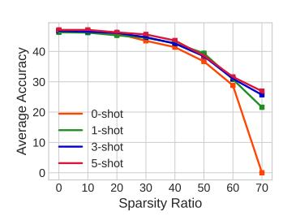
*الشكل 14: نتائج k-shot لـ Vicuna-7B المشذب باستخدام Wanda.*

## أ.8 ملخص لطرق التشذيب المختلفة على LLM-KICK

## أ.9 نتائج إضافية على LLAMA-2

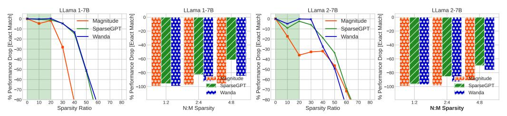
*الشكل 15: **نماذج اللغة الكبيرة المضغوطة للإجابة على الأسئلة القائمة على الوقائع.** مقارنة الأداء لنماذج اللغة الكبيرة المضغوطة (LLaMa 1 & 2) في مهمة Factoid-QA باستخدام FreebaseQA (Jiang et al., 2019). النتائج المقدمة هي للتخلخل المنظم (N:M) والتخلخل غير المنظم.*

<!-- page 21 -->

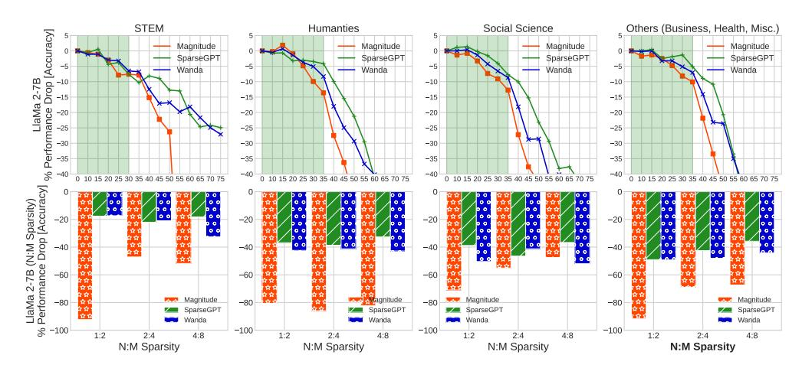
*الشكل 16: **نماذج اللغة الكبيرة المضغوطة للإجابة على الأسئلة القائمة على الاستدلال متعدد الخيارات.** مقارنة الأداء لـ LLaMa-2 7B المضغوط في مهام MCR-QA باستخدام معيار MMLU (Hendrycks et al., 2020). النتائج المقدمة هي للتخلخل المنظم (N:M) والتخلخل غير المنظم.*

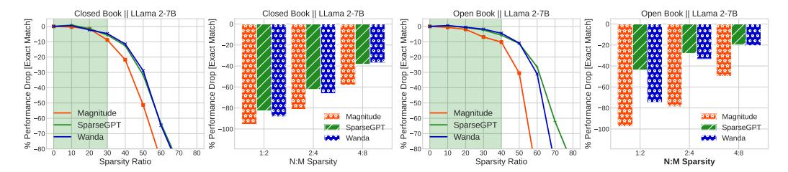
*الشكل 17: **نماذج اللغة الكبيرة المضغوطة للإجابة المعززة بالاسترجاع داخل السياق.** مقارنة الأداء لـ LLaMa-2 7B المضغوط في مهمة ICRA-QA. نقدم مقارنة وجهاً لوجه بين التقييم بالكتاب المغلق (لا تُعزز معرفة خارجية داخل السياق) والتقييم بالكتاب المفتوح (تُعزز معرفة خارجية داخل السياق). النتائج المقدمة هي للتخلخل المنظم N:M والتخلخل غير المنظم.*
