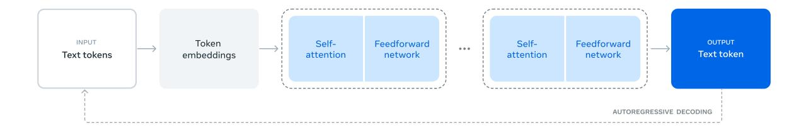
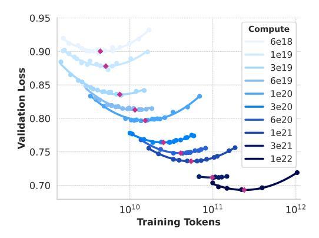
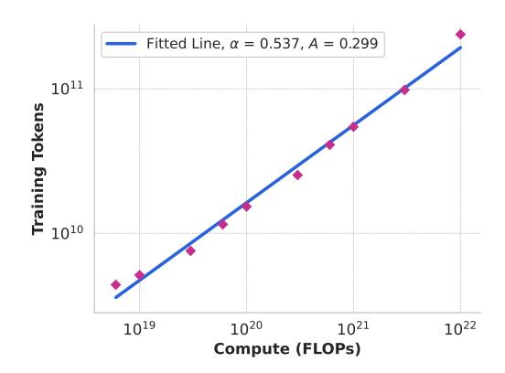
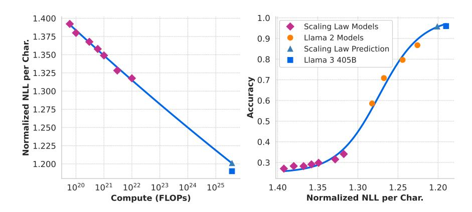
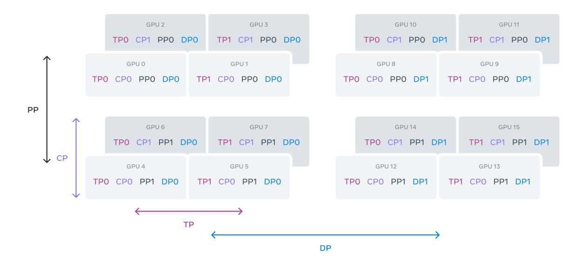
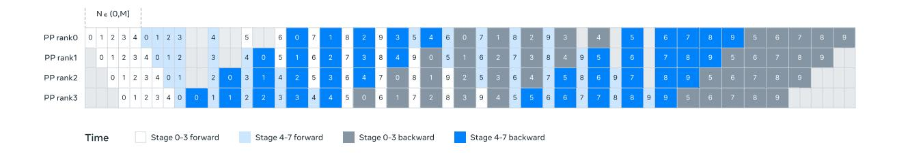
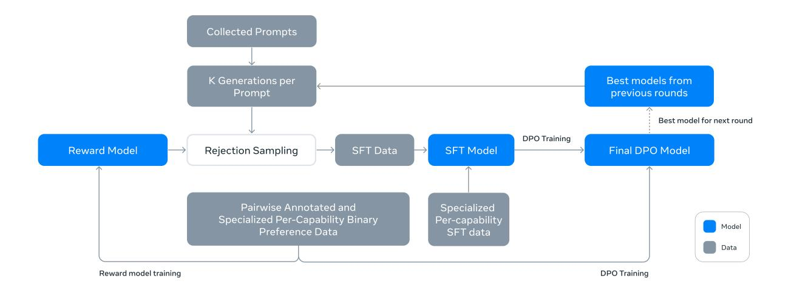
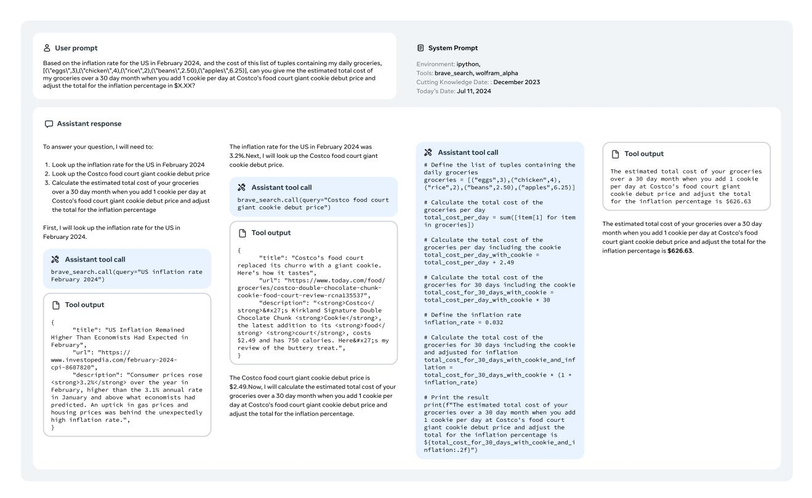
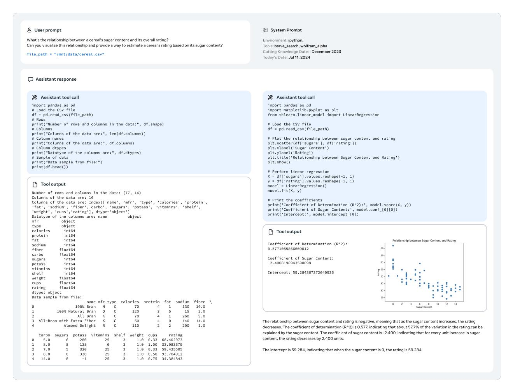
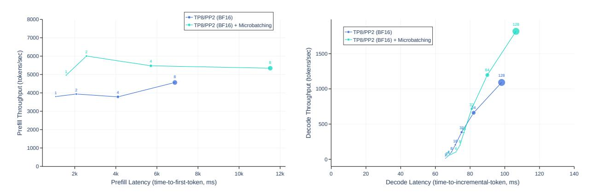

<!-- RP20_Dubey_2024 | source: papers_json/RP20_Dubey_2024/ -->

Meta

## قطيع نماذج Llama 3

## فريق Llama، الذكاء الاصطناعي @ Meta^1^

^1^يمكن العثور على قائمة تفصيلية بالمساهمين في ملحق هذه الورقة.

تعتمد أنظمة الذكاء الاصطناعي (AI) الحديثة على النماذج الأساسية. تقدم هذه الورقة مجموعة جديدة من النماذج الأساسية تسمى Llama 3. وهي قطيع من النماذج اللغوية يدعم بشكل أصيل تعدد اللغات والبرمجة والاستدلال واستخدام الأدوات. أكبر نموذج لدينا هو Transformer كثيف يحتوي على 405 مليار معلمة ونافذة سياق تصل إلى 128 ألف رمز. تقدم هذه الورقة تقييماً تجريبياً موسعاً لـ Llama 3. نجد أن Llama 3 يقدم جودة مماثلة للنماذج اللغوية الرائدة مثل GPT-4 على عدد كبير من المهام. نطلق Llama 3 للعموم، بما في ذلك النسخ المدربة مسبقاً والمدربة لاحقاً للنموذج اللغوي ذي 405 مليار معلمة ونموذج Llama Guard 3 الخاص بنا لسلامة المدخلات والمخرجات. تقدم الورقة أيضاً نتائج التجارب التي ندمج فيها قدرات الصورة والفيديو والكلام في Llama 3 من خلال نهج تركيبي. نلاحظ أن هذا النهج يؤدي بشكل تنافسي مع أحدث ما توصل إليه العلم في مهام التعرف على الصور والفيديو والكلام. النماذج الناتجة لم يتم إطلاقها على نطاق واسع بعد لأنها لا تزال قيد التطوير.

التاريخ: 23 يوليو 2024

الموقع الإلكتروني: [https://llama.meta.com/](https://llama.meta.com/)

# 1 المقدمة

النماذج الأساسية هي نماذج عامة للغة والرؤية والكلام و/أو طرائق أخرى مصممة لدعم مجموعة كبيرة ومتنوعة من مهام الذكاء الاصطناعي. وهي تشكل أساس العديد من أنظمة الذكاء الاصطناعي الحديثة.

يتكون تطوير النماذج الأساسية الحديثة من مرحلتين رئيسيتين: (1) مرحلة التدريب المسبق التي يتم فيها تدريب النموذج على نطاق واسع باستخدام مهام مباشرة مثل التنبؤ بالكلمة التالية أو وضع التعليقات التوضيحية، و(2) مرحلة التدريب اللاحق التي يتم فيها ضبط النموذج لاتباع التعليمات والتوافق مع التفضيلات البشرية وتحسين قدرات محددة (على سبيل المثال، البرمجة والاستدلال).

في هذه الورقة، نقدم مجموعة جديدة من النماذج الأساسية للغة، تسمى Llama 3. يدعم قطيع نماذج Llama 3 بشكل أصيل تعدد اللغات والبرمجة والاستدلال واستخدام الأدوات. أكبر نموذج لدينا هو Transformer كثيف يحتوي على 405 مليار معلمة، ويعالج المعلومات في نافذة سياق تصل إلى 128 ألف رمز. كل عضو من القطيع مدرج في الجدول [1.](#page-1-0) جميع النتائج المقدمة في هذه الورقة هي لنماذج Llama 3.1، والتي سنشير إليها باسم Llama 3 طوال الورقة للاختصار.

نعتقد أن هناك ثلاث روافع رئيسية في تطوير النماذج الأساسية عالية الجودة: البيانات، والمقياس، وإدارة التعقيد. نسعى إلى تحسين هذه الروافع الثلاث في عملية التطوير لدينا:

- البيانات. مقارنة بالإصدارات السابقة من Llama [(Touvron et al.,](#page-88-0) [2023a,](#page-88-0)[b)](#page-88-1)، قمنا بتحسين كمية وجودة البيانات التي نستخدمها للتدريب المسبق والتدريب اللاحق. تشمل هذه التحسينات تطوير خطوط معالجة وتنسيق أكثر دقة لبيانات التدريب المسبق وتطوير مناهج أكثر صرامة لضمان الجودة وتصفية بيانات التدريب اللاحق. ندرب Llama 3 مسبقاً على مجموعة من حوالي 15 تريليون رمز متعدد اللغات، مقارنة بـ 1.8 تريليون رمز لـ Llama 2.
- المقياس. ندرب نموذجاً على نطاق أكبر بكثير من نماذج Llama السابقة: تم تدريب نموذجنا اللغوي الرائد مسبقاً باستخدام 3.8 × 10^25^ FLOPs، أي ما يقرب من 50 ضعفاً عن أكبر نسخة من Llama 2. على وجه التحديد، قمنا بتدريب نموذج رائد بـ 405 مليار معلمة قابلة للتدريب على 15.6 تريليون رمز نصي. كما هو متوقع وفقاً

<!-- page 2 -->

لقوانين القياس للنماذج الأساسية، يتفوق نموذجنا الرائد على النماذج الأصغر المدربة بنفس الإجراء. في حين تشير قوانين القياس لدينا إلى أن نموذجنا الرائد بحجم مثالي تقريباً للحساب لميزانية التدريب لدينا، فإننا ندرب أيضاً نماذجنا الأصغر لفترة أطول بكثير مما هو مثالي للحساب. تؤدي النماذج الناتجة بشكل أفضل من النماذج المثلى للحساب في نفس ميزانية الاستدلال. نستخدم النموذج الرائد لزيادة تحسين جودة تلك النماذج الأصغر أثناء التدريب اللاحق.

• إدارة التعقيد. نتخذ خيارات تصميم تسعى إلى زيادة قدرتنا على توسيع عملية تطوير النموذج. على سبيل المثال، نختار بنية نموذج Transformer كثيفة قياسية (Vaswani et al., 2017) مع تعديلات طفيفة، بدلاً من نموذج خليط الخبراء (Shazeer et al., 2017) لتعظيم استقرار التدريب. وبالمثل، نتبنى إجراء تدريب لاحق بسيطاً نسبياً يعتمد على الضبط الدقيق الخاضع للإشراف (SFT)، وأخذ العينات بالرفض (RS)، والتحسين المباشر للتفضيل (DPO؛ Rafailov et al. (2023)) بدلاً من خوارزميات التعلم المعزز الأكثر تعقيداً (Ouyang et al., 2022; Schulman et al., 2017) التي تميل إلى أن تكون أقل استقراراً وأصعب في التوسع.

نتيجة عملنا هي Llama 3: قطيع من ثلاثة نماذج لغوية متعددة اللغات1 بـ 8 مليار، 70 مليار، و405 مليار معلمة. نقيّم أداء Llama 3 على عدد كبير من مجموعات بيانات المقارنة المعيارية التي تمتد عبر نطاق واسع من مهام فهم اللغة. بالإضافة إلى ذلك، نجري تقييمات بشرية موسعة تقارن Llama 3 بالنماذج المنافسة. يتم تقديم نظرة عامة على أداء نموذج Llama 3 الرائد على المعايير الرئيسية في الجدول 2. يشير تقييمنا التجريبي إلى أن نموذجنا الرائد يؤدي على قدم المساواة مع النماذج اللغوية الرائدة مثل GPT-4 (OpenAI, 2023a) عبر مجموعة متنوعة من المهام، ويقترب من مطابقة أحدث ما توصل إليه العلم. نماذجنا الأصغر هي الأفضل في فئتها، وتتفوق على النماذج البديلة ذات الأعداد المماثلة من المعلمات (Bai et al., 2023; Jiang et al., 2023). يقدم Llama 3 أيضاً توازناً أفضل بكثير بين كونه مفيداً وغير ضار من سابقه (Touvron et al., 2023b). نقدم تحليلاً تفصيلياً لسلامة Llama 3 في القسم 5.4.

نطلق علناً نماذج Llama 3 الثلاثة بموجب نسخة محدثة من ترخيص مجتمع Llama 3؛ انظر <a href="https://llama.meta.com">https://llama.meta.com</a>. يشمل ذلك النسخ المدربة مسبقاً والمدربة لاحقاً من نموذجنا اللغوي ذي 405 مليار معلمة ونسخة جديدة من نموذج Llama Guard لدينا (Inan et al., 2023) لسلامة المدخلات والمخرجات. نأمل أن يحفز الإطلاق المفتوح لنموذج رائد موجة من الابتكار في مجتمع الأبحاث، ويسرع المسار المسؤول نحو تطوير الذكاء الاصطناعي العام (AGI).

كجزء من عملية تطوير Llama 3، نقوم أيضاً بتطوير امتدادات متعددة الوسائط للنماذج، تمكّن قدرات التعرف على الصور والتعرف على الفيديو وفهم الكلام. لا تزال هذه النماذج قيد التطوير النشط ولم تكن جاهزة للإطلاق بعد. بالإضافة إلى نتائج النمذجة اللغوية لدينا، تقدم الورقة نتائج تجاربنا الأولية مع تلك النماذج متعددة الوسائط.

> ^&^lt;sup>1تم تدريب Llama 3 8B و70B مسبقاً على بيانات متعددة اللغات لكنها كانت مخصصة للاستخدام باللغة الإنجليزية في ذلك الوقت.

<!-- page 3 -->

# 2 نظرة عامة

تم توضيح بنية نموذج Llama 3 في الشكل [1.](#page-3-0) يشمل تطوير نماذجنا اللغوية Llama 3 مرحلتين رئيسيتين:

- التدريب المسبق للنموذج اللغوي. نبدأ بتحويل مجموعة كبيرة من النصوص متعددة اللغات إلى رموز منفصلة وتدريب نموذج لغوي كبير (LLM) مسبقاً على البيانات الناتجة لأداء التنبؤ بالرمز التالي. في مرحلة التدريب المسبق للنموذج اللغوي، يتعلم النموذج بنية اللغة ويحصل على كميات كبيرة من المعرفة عن العالم من النص الذي "يقرأه". للقيام بذلك بفعالية، يتم إجراء التدريب المسبق على نطاق واسع: ندرب نموذجاً مع 405 مليار معلمة على 15.6 تريليون رمز باستخدام نافذة سياق من 8 آلاف رمز. تتبع مرحلة التدريب المسبق القياسية هذه مرحلة تدريب مسبق مستمر تزيد نافذة السياق المدعومة إلى 128 ألف رمز. انظر القسم [3](#page-3-1) للتفاصيل.
- التدريب اللاحق للنموذج اللغوي. يتمتع النموذج اللغوي المدرب مسبقاً بفهم غني للغة لكنه لا يتبع التعليمات بعد ولا يتصرف بالطريقة التي نتوقعها من المساعد. نحاذي النموذج مع التعليقات البشرية في عدة جولات، يتضمن كل منها الضبط الدقيق الخاضع للإشراف (SFT) على بيانات ضبط التعليمات والتحسين المباشر للتفضيل (DPO؛ [Rafailov et al.,](#page-85-1) [2024)](#page-85-1). في مرحلة التدريب اللاحق هذه[2](#page-2-1)، ندمج أيضاً قدرات جديدة، مثل استخدام الأدوات، ونلاحظ تحسينات قوية في مجالات أخرى، مثل البرمجة والاستدلال. انظر القسم [4](#page-14-0) للتفاصيل. أخيراً، يتم دمج تخفيفات السلامة أيضاً في النموذج في مرحلة التدريب اللاحق، التفاصيل التي تم وصفها في القسم [5.4.](#page-39-0)

تحتوي النماذج الناتجة على مجموعة غنية من القدرات. يمكنها الإجابة على الأسئلة في ثماني لغات على الأقل، وكتابة كود عالي الجودة، وحل مشاكل الاستدلال المعقدة، واستخدام الأدوات بشكل جاهز أو بطريقة صفرية.

نجري أيضاً تجارب نضيف فيها قدرات الصورة والفيديو والكلام إلى Llama 3 باستخدام نهج تركيبي. يتألف النهج الذي ندرسه من المراحل الثلاث الإضافية الموضحة في الشكل [28:](#page-54-0)

• التدريب المسبق للمشفر متعدد الوسائط. ندرب مشفرات منفصلة للصور والكلام. ندرب مشفر الصور لدينا على كميات كبيرة من أزواج الصور والنصوص. وهذا يعلم النموذج العلاقة بين المحتوى المرئي ووصف هذا المحتوى باللغة الطبيعية. يتم تدريب مشفر الكلام لدينا باستخدام

> ^2^ في هذه الورقة، نستخدم مصطلح "التدريب اللاحق" للإشارة إلى أي تدريب نموذج يحدث خارج التدريب المسبق.

<!-- page 4 -->

*الشكل 1 توضيح للهندسة المعمارية والتدريب الإجمالي لـ Llama 3. Llama 3 هو نموذج لغوي Transformer مدرب على التنبؤ بالرمز التالي من تسلسل نصي. انظر النص للتفاصيل.*

نهج خاضع للإشراف الذاتي يخفي أجزاء من مدخلات الكلام ويحاول إعادة بناء الأجزاء المخفية عبر تمثيل رموز منفصلة. ونتيجة لذلك، يتعلم النموذج بنية إشارات الكلام. انظر القسم [7](#page-52-0) لتفاصيل حول مشفر الصور والقسم [8](#page-61-0) لتفاصيل حول مشفر الكلام.

- تدريب محول الرؤية. ندرب محولاً يدمج مشفر الصور المدرب مسبقاً في النموذج اللغوي المدرب مسبقاً. يتألف المحول من سلسلة من طبقات الانتباه المتقاطع التي تغذي تمثيلات مشفر الصور إلى النموذج اللغوي. يتم تدريب المحول على أزواج النص-الصورة. وهذا يحاذي تمثيلات الصور مع تمثيلات اللغة. أثناء تدريب المحول، نقوم أيضاً بتحديث معلمات مشفر الصور لكننا نتجنب عمداً تحديث معلمات النموذج اللغوي. ندرب أيضاً محول فيديو فوق محول الصور على بيانات الفيديو-النص المقترنة. وهذا يمكّن النموذج من تجميع المعلومات عبر الإطارات. انظر القسم [7](#page-52-0) للتفاصيل.
- تدريب محول الكلام. أخيراً، ندمج مشفر الكلام في النموذج عبر محول يحول تشفيرات الكلام إلى تمثيلات رمزية يمكن تغذيتها مباشرة في النموذج اللغوي المضبوط بدقة. يتم تحديث معلمات المحول والمشفر بشكل مشترك في مرحلة الضبط الدقيق الخاضع للإشراف لتمكين فهم الكلام عالي الجودة. لا نغير النموذج اللغوي أثناء تدريب محول الكلام. ندمج أيضاً نظام تحويل النص إلى كلام. انظر القسم [8](#page-61-0) للتفاصيل.

تؤدي تجاربنا متعددة الوسائط إلى نماذج يمكنها التعرف على محتوى الصور ومقاطع الفيديو، وتدعم التفاعل عبر واجهة كلام. لا تزال هذه النماذج قيد التطوير ولم تكن جاهزة للإطلاق بعد.

# 3 التدريب المسبق

يشمل التدريب المسبق للنموذج اللغوي: (1) تنسيق وتصفية مجموعة تدريب واسعة النطاق، (2) تطوير بنية النموذج وقوانين القياس المقابلة لتحديد حجم النموذج، (3) تطوير تقنيات للتدريب المسبق الفعال على نطاق واسع، و(4) تطوير وصفة التدريب المسبق. نقدم كل من هذه المكونات بشكل منفصل أدناه.

## 3.1 بيانات التدريب المسبق

ننشئ مجموعة بياناتنا للتدريب المسبق للنموذج اللغوي من مجموعة متنوعة من مصادر البيانات التي تحتوي على معرفة حتى نهاية عام 2023. نطبق عدة طرق لإزالة التكرار وآليات تنظيف البيانات على كل مصدر بيانات للحصول على رموز عالية الجودة. نزيل النطاقات التي تحتوي على كميات كبيرة من المعلومات الشخصية القابلة للتعريف (PII)، والنطاقات ذات المحتوى الإباحي المعروف.

### 3.1.1 تنسيق بيانات الويب

يتم الحصول على معظم البيانات التي نستخدمها من الويب ونصف عملية التنظيف لدينا أدناه.

تصفية المعلومات الشخصية والسلامة. من بين تخفيفات أخرى، نطبق مرشحات مصممة لإزالة البيانات من المواقع التي من المرجح أن تحتوي على محتوى غير آمن أو كميات كبيرة من المعلومات الشخصية، والنطاقات التي تم تصنيفها على أنها ضارة وفقاً لمجموعة متنوعة من معايير سلامة Meta، والنطاقات المعروفة باحتوائها على محتوى إباحي.

<!-- page 5 -->

استخراج النص وتنظيفه. نقوم بمعالجة محتوى HTML الخام لمستندات الويب غير المقطوعة لاستخراج نص متنوع عالي الجودة. للقيام بذلك، نبني محللاً مخصصاً يستخرج محتوى HTML ويحسن الدقة في إزالة المحتوى المتكرر واستدعاء المحتوى. نقيّم جودة محللنا في التقييمات البشرية، ونقارنه بمحللات HTML شهيرة من جهات خارجية تحسن المحتوى الشبيه بالمقالات، ووجدنا أنه يؤدي بشكل إيجابي. نعالج بعناية صفحات HTML التي تحتوي على محتوى رياضيات وكود للحفاظ على بنية ذلك المحتوى. نحتفظ بنص خاصية alt للصورة لأن المحتوى الرياضي غالباً ما يتم تمثيله كصور مسبقة العرض حيث يتم توفير الرياضيات أيضاً في خاصية alt. نقيّم تجريبياً تكوينات تنظيف مختلفة. نجد أن markdown ضار بأداء النموذج المدرب بشكل أساسي على بيانات الويب مقارنة بالنص العادي، لذلك نزيل جميع علامات markdown.

إزالة التكرار. نطبق عدة جولات من إزالة التكرار على مستوى URL والمستند والسطر:

- إزالة التكرار على مستوى URL. نقوم بإزالة التكرار على مستوى URL عبر مجموعة البيانات بأكملها. نحتفظ بأحدث نسخة للصفحات المقابلة لكل URL.
- إزالة التكرار على مستوى المستند. نقوم بإزالة التكرار العالمية MinHash [(Broder,](#page-76-0) [1997)](#page-76-0) عبر مجموعة البيانات بأكملها لإزالة المستندات المكررة تقريباً.
- إزالة التكرار على مستوى السطر. نقوم بإزالة تكرار قوية على مستوى السطر مماثلة لـ ccNet [(Wenzek](#page-89-0) [et al.,](#page-89-0) [2019)](#page-89-0). نزيل الأسطر التي ظهرت أكثر من 6 مرات في كل دلو من 30 مليون مستند. على الرغم من أن تحليلنا النوعي اليدوي أظهر أن إزالة التكرار على مستوى السطر تزيل ليس فقط النصوص النموذجية المتبقية من المواقع المختلفة مثل قوائم التنقل وتحذيرات ملفات تعريف الارتباط، ولكن أيضاً النصوص المتكررة عالية الجودة، فإن تقييماتنا التجريبية أظهرت تحسينات قوية.

التصفية الإرشادية. نطور إرشادات لإزالة المستندات الإضافية منخفضة الجودة والقيم الشاذة والمستندات ذات التكرارات المفرطة. تشمل بعض أمثلة الإرشادات:

- نستخدم نسبة تغطية n-gram المكررة [(Rae et al.,](#page-85-2) [2021)](#page-85-2) لإزالة الأسطر التي تتكون من محتوى متكرر مثل رسائل التسجيل أو الأخطاء. يمكن أن تكون هذه الأسطر طويلة وفريدة جداً، وبالتالي لا يمكن تصفيتها بواسطة إزالة تكرار الأسطر.
- نستخدم عد "الكلمات القذرة" [(Raffel et al.,](#page-85-3) [2020)](#page-85-3) لتصفية المواقع للبالغين التي لا تغطيها قوائم حظر النطاق.
- نستخدم تباعد كولباك-ليبلر لتوزيع الرموز لتصفية المستندات التي تحتوي على أعداد مفرطة من الرموز الشاذة مقارنة بتوزيع مجموعة التدريب.

تصفية الجودة القائمة على النموذج. علاوة على ذلك، نجرب تطبيق مصنفات جودة قائمة على نموذج مختلفة لاختيار الرموز عالية الجودة. تشمل هذه استخدام مصنفات سريعة مثل fasttext [(Joulin et al.,](#page-79-2) [2017)](#page-79-2) المدربة على التعرف على ما إذا كان نص معين سيتم الإشارة إليه بواسطة Wikipedia [(Touvron et al.,](#page-88-0) [2023a)](#page-88-0)، بالإضافة إلى مصنفات أكثر كثافة حسابياً تستند إلى Roberta [(Liu et al.,](#page-82-0) [2019a)](#page-82-0) المدربة على تنبؤات Llama 2. لتدريب مصنف جودة استناداً إلى Llama 2، ننشئ مجموعة تدريب من مستندات الويب المنظفة، نصف متطلبات الجودة، ونوجه نموذج المحادثة الخاص بـ Llama 2 لتحديد ما إذا كانت المستندات تلبي هذه المتطلبات. نستخدم DistilRoberta [(Sanh et al.,](#page-86-2) [2019)](#page-86-2) لتوليد درجات الجودة لكل مستند لأسباب الكفاءة. نقيّم تجريبياً فعالية تكوينات تصفية الجودة المختلفة.

بيانات الكود والاستدلال. على غرار [DeepSeek-AI et al.](#page-77-0) [(2024)](#page-77-0)، نبني خطوط أنابيب خاصة بالمجال تستخرج صفحات الويب ذات الصلة بالكود والرياضيات. على وجه التحديد، كلا مصنفي الكود والاستدلال هما نماذج DistilRoberta المدربة على بيانات الويب المعلقة بواسطة Llama 2. على عكس مصنف الجودة العام المذكور أعلاه، نجري ضبط المطالبات لاستهداف صفحات الويب التي تحتوي على استنتاج رياضي، واستدلال في مجالات STEM، وكود متشابك مع لغة طبيعية. نظراً لأن توزيع رموز الكود والرياضيات يختلف اختلافاً كبيراً عن توزيع اللغة الطبيعية، تنفذ هذه الخطوط استخراج HTML خاص بالمجال، وميزات نص مخصصة وإرشادات للتصفية.

البيانات متعددة اللغات. على غرار خطوط معالجتنا للغة الإنجليزية الموصوفة أعلاه، ننفذ مرشحات لإزالة البيانات من المواقع التي من المرجح أن تحتوي على معلومات شخصية أو محتوى غير آمن. يحتوي خط معالجة النص متعدد اللغات لدينا على عدة ميزات فريدة:

- نستخدم نموذج تعريف اللغة القائم على fasttext لتصنيف المستندات إلى 176 لغة.
- نقوم بإزالة التكرار على مستوى المستند والسطر داخل البيانات لكل لغة.

<!-- page 6 -->

• نطبق إرشادات خاصة باللغة ومرشحات قائمة على نموذج لإزالة المستندات منخفضة الجودة.

بالإضافة إلى ذلك، نقوم بترتيب جودة المستندات متعددة اللغات باستخدام مصنف متعدد اللغات قائم على Llama 2 لضمان إعطاء الأولوية للمحتوى عالي الجودة. نحدد كمية الرموز متعددة اللغات المستخدمة في التدريب المسبق تجريبياً، وموازنة أداء النموذج على المعايير الإنجليزية والمتعددة اللغات.

### 3.1.2 تحديد مزيج البيانات

للحصول على نموذج لغوي عالي الجودة، من الضروري تحديد نسبة مصادر البيانات المختلفة في مزيج بيانات التدريب المسبق بعناية. أدواتنا الرئيسية في تحديد مزيج البيانات هذا هي تجارب تصنيف المعرفة وقانون القياس.

تصنيف المعرفة. نطور مصنفاً لتصنيف أنواع المعلومات الموجودة في بيانات الويب لدينا لتحديد مزيج البيانات بشكل أكثر فعالية. نستخدم هذا المصنف لتقليل عينات فئات البيانات الممثلة بشكل مفرط على الويب، على سبيل المثال، الفنون والترفيه.

قوانين القياس لمزيج البيانات. لتحديد أفضل مزيج بيانات، نجري تجارب قانون القياس التي ندرب فيها العديد من النماذج الصغيرة على مزيج بيانات ونستخدم ذلك للتنبؤ بأداء نموذج كبير على ذلك المزيج (انظر القسم [3.2.1)](#page-6-0). نكرر هذه العملية عدة مرات لمزائج بيانات مختلفة لاختيار مرشح مزيج بيانات جديد. لاحقاً، ندرب نموذجاً أكبر على مزيج البيانات المرشح هذا ونقيّم أداء ذلك النموذج على عدة معايير رئيسية.

ملخص مزيج البيانات. يحتوي مزيج بياناتنا النهائي على ما يقرب من 50% من الرموز المتعلقة بالمعرفة العامة، و25% من الرموز الرياضية والاستدلالية، و17% من رموز الكود، و8% من الرموز متعددة اللغات.

### 3.1.3 بيانات التلدين

تجريبياً، نجد أن التلدين (انظر القسم [3.4.3)](#page-13-0) على كميات صغيرة من بيانات الكود والرياضيات عالية الجودة يمكن أن يعزز أداء النماذج المدربة مسبقاً على المعايير الرئيسية. على غرار [Li et al.](#page-81-0) [(2024b)](#page-81-0)، نقوم بالتلدين بمزيج بيانات يرفع عينة البيانات عالية الجودة في مجالات مختارة. لا ندرج أي مجموعات تدريب من المعايير المستخدمة بشكل شائع في بيانات التلدين لدينا. وهذا يمكّننا من تقييم القدرات الحقيقية للتعلم بأمثلة قليلة والتعميم خارج المجال لـ Llama 3.

بعد [OpenAI](#page-83-0) [(2023a)](#page-83-0)، نقيّم فعالية التلدين على مجموعتي تدريب GSM8k [(Cobbe et al.,](#page-77-1) [2021)](#page-77-1) وMATH [(Hendrycks et al.,](#page-78-0) [2021b)](#page-78-0) في التلدين. نجد أن التلدين حسّن أداء نموذج Llama 3 8B المدرب مسبقاً على مجموعتي التحقق GSM8k وMATH بنسبة 24.0% و6.4% على التوالي. ومع ذلك، فإن التحسينات على نموذج 405B لا تكاد تذكر، مما يشير إلى أن نموذجنا الرائد يتمتع بقدرات قوية للتعلم في السياق والاستدلال ولا يتطلب عينات تدريب محددة في المجال للحصول على أداء قوي.

استخدام التلدين لتقييم جودة البيانات. على غرار [Blakeney et al.](#page-75-0) [(2024)](#page-75-0)، نجد أن التلدين يمكّننا من الحكم على قيمة مجموعات البيانات الصغيرة الخاصة بالمجال. نقيس قيمة هذه المجموعات من البيانات بتلدين معدل التعلم لنموذج Llama 3 8B المدرب بنسبة 50% خطياً إلى 0 على 40 مليار رمز. في تلك التجارب، نخصص وزن 30% لمجموعة البيانات الجديدة و70% المتبقية للوزن لمزيج البيانات الافتراضي. استخدام التلدين لتقييم مصادر البيانات الجديدة أكثر كفاءة من إجراء تجارب قانون القياس لكل مجموعة بيانات صغيرة.

## 3.2 بنية النموذج

يستخدم Llama 3 بنية Transformer كثيفة قياسية [(Vaswani et al.,](#page-88-2) [2017)](#page-88-2). لا ينحرف بشكل كبير عن Llama و Llama 2 [(Touvron et al.,](#page-88-0) [2023a,](#page-88-0)[b)](#page-88-1) من حيث بنية النموذج؛ مكاسب الأداء لدينا مدفوعة بشكل أساسي بالتحسينات في جودة البيانات وتنوعها وكذلك بزيادة نطاق التدريب.

نقوم ببعض التعديلات الصغيرة مقارنة بـ Llama 2:

- نستخدم انتباه الاستعلام المجمع (GQA؛ [Ainslie et al.](#page-74-1) [(2023)](#page-74-1)) مع 8 رؤوس مفاتيح-قيم لتحسين سرعة الاستدلال وتقليل حجم ذاكرات التخزين المؤقت للمفتاح-القيمة أثناء فك التشفير.
- نستخدم قناع انتباه يمنع الانتباه الذاتي بين المستندات المختلفة داخل نفس التسلسل. نجد أن هذا التغيير كان له تأثير محدود أثناء التدريب المسبق القياسي، لكن وجدنا أنه مهم في التدريب المسبق المستمر على تسلسلات طويلة جداً.

<!-- page 7 -->

- نستخدم مفردات بـ 128 ألف رمز. تجمع مفردات الرموز لدينا 100 ألف رمز من مرمز tiktoken[3](#page-6-1) مع 28 ألف رمز إضافي لدعم اللغات غير الإنجليزية بشكل أفضل. مقارنة بمرمز Llama 2، يحسن مرمزنا الجديد معدلات الضغط على عينة من البيانات الإنجليزية من 3.17 إلى 3.94 حرف لكل رمز. وهذا يمكّن النموذج من "قراءة" المزيد من النص لنفس مقدار حساب التدريب. وجدنا أيضاً أن إضافة 28 ألف رمز من لغات غير إنجليزية مختارة حسّن كل من نسب الضغط والأداء النهائي، دون أي تأثير على ترميز اللغة الإنجليزية.
- نزيد المعامل الفائق لتردد قاعدة RoPE إلى 500,000. وهذا يمكّننا من دعم سياقات أطول بشكل أفضل؛ أظهر [Xiong et al.](#page-89-1) [(2023)](#page-89-1) أن هذه القيمة فعالة لأطوال سياق تصل إلى 32,768.

يستخدم Llama 3 405B بنية بـ 126 طبقة، وبُعد تمثيل رمز 16,384، و128 رأس انتباه؛ انظر الجدول [3](#page-6-2) للتفاصيل. وهذا يؤدي إلى حجم نموذج مثالي تقريباً للحساب وفقاً لقوانين القياس على بياناتنا لميزانية التدريب لدينا البالغة 3.8 × 10^25^ FLOPs.

### 3.2.1 قوانين القياس

نطور قوانين القياس [(Hoffmann et al.,](#page-78-1) [2022;](#page-78-1) [Kaplan et al.,](#page-80-0) [2020)](#page-80-0) لتحديد حجم النموذج الأمثل لنموذجنا الرائد بالنظر إلى ميزانية حساب التدريب المسبق لدينا. بالإضافة إلى تحديد حجم النموذج الأمثل، يتمثل التحدي الرئيسي في التنبؤ بأداء النموذج الرائد على مهام المعيار النهائية، نظراً لمشكلتين: (1) عادة ما تتنبأ قوانين القياس الموجودة فقط بخسارة التنبؤ بالرمز التالي بدلاً من أداء معيار محدد. (2) يمكن أن تكون قوانين القياس صاخبة وغير موثوقة لأنها تم تطويرها بناءً على عمليات تدريب مسبق أجريت بميزانيات حساب صغيرة [(Wei et al.,](#page-89-2) [2022b)](#page-89-2).

لمواجهة هذه التحديات، ننفذ منهجية من مرحلتين لتطوير قوانين القياس التي تتنبأ بدقة بأداء المعيار النهائي:

- 1. نحدد أولاً علاقة بين السالب لوغ-احتمالية النموذج الأمثل للحساب على المهام النهائية وFLOPs التدريب.
- 2. بعد ذلك، نربط السالب لوغ-احتمالية على المهام النهائية بدقة المهمة، باستخدام كل من نماذج قانون القياس والنماذج الأقدم المدربة بـ FLOPs حساب أعلى. في هذه الخطوة، نستفيد على وجه التحديد من عائلة نماذج Llama 2.

يمكّننا هذا النهج من التنبؤ بأداء المهمة النهائية بالنظر إلى عدد محدد من FLOPs التدريب للنماذج المثلى للحساب. نستخدم طريقة مماثلة لاختيار مزيج بيانات التدريب المسبق لدينا (انظر القسم [3.4)](#page-13-1).

تجارب قانون القياس. بشكل ملموس، نبني قوانين القياس لدينا عن طريق التدريب المسبق للنماذج باستخدام ميزانيات حساب بين 6 × 10^18^ FLOPs و10^22^ FLOPs. في كل ميزانية حساب، ندرب مسبقاً نماذج تتراوح في الحجم بين 40 مليون و16 مليار معلمة، باستخدام مجموعة فرعية من أحجام النماذج في كل ميزانية حساب. في عمليات التدريب هذه، نستخدم جدول معدل تعلم جيب التمام مع إحماء خطي لـ 2,000 خطوة تدريب. يتم تعيين معدل التعلم الذروة بين 2 × 10^−^^4^ و4 × 10^−^^4^ بناءً على حجم النموذج. نضع تحلل جيب التمام إلى 0.1 من قيمة الذروة. يتم تعيين تحلل الوزن في كل خطوة إلى 0.1 ضعف معدل التعلم في تلك الخطوة. نستخدم حجم دفعة ثابت لكل مقياس حساب، يتراوح بين 250 ألف و4 مليون.

> ^3^[https://github.com/openai/tiktoken/tree/main](https://github.com/openai/tiktoken/tree/main)

<!-- page 8 -->

*الشكل 2 منحنيات IsoFLOPs لقانون القياس بين 6 \times 10^{18} و10^{22} FLOPs. الخسارة هي السالب لوغ-احتمالية على مجموعة تحقق منفصلة. نقرب القياسات في كل مقياس حساب باستخدام كثير حدود من الدرجة الثانية.*

*الشكل 3 عدد رموز التدريب في النماذج المثلى للحساب المحددة كدالة لميزانية حساب التدريب المسبق. ندرج أيضاً تنبؤ قانون القياس المُلائم. تتوافق النماذج المثلى للحساب مع نقاط الحد الأدنى للقطع المكافئ في الشكل 2.*

تؤدي هذه التجارب إلى منحنيات IsoFLOPs في الشكل 2. يتم قياس الخسارة في هذه المنحنيات على مجموعة تحقق منفصلة. نلائم قيم الخسارة المقاسة باستخدام كثير حدود من الدرجة الثانية ونحدد نقاط الحد الأدنى لكل قطع مكافئ. نشير إلى الحد الأدنى للقطع المكافئ على أنه النموذج *الأمثل للحساب* في ميزانية حساب التدريب المسبق المقابلة.

نستخدم النماذج المثلى للحساب التي حددناها بهذه الطريقة للتنبؤ بالعدد الأمثل لرموز التدريب لميزانية حساب محددة. للقيام بذلك، نفترض علاقة قانون القوة بين ميزانية الحساب C والعدد الأمثل لرموز التدريب N^*(C):

$$ N^{\star}(C) = AC^{\alpha}. $$

نلائم A و\alpha باستخدام البيانات من الشكل 2. نجد أن (\alpha, A) = (0.53, 0.29)؛ يتم عرض الملاءمة المقابلة في الشكل 3. يشير الاستقراء لقانون القياس الناتج إلى 3.8 \times 10^{25} FLOPs إلى تدريب نموذج بـ 402 مليار معلمة على 16.55 تريليون رمز.

ملاحظة مهمة هي أن منحنيات IsoFLOPs تصبح *أكثر تسطحاً* حول الحد الأدنى مع زيادة ميزانية الحساب. وهذا يعني أن أداء النموذج الرائد قوي نسبياً للتغييرات الصغيرة في المقايضة بين حجم النموذج ورموز التدريب. بناءً على هذه الملاحظة، قررنا في النهاية تدريب نموذج رائد بـ 405 مليار معلمة.

التنبؤ بالأداء على المهام النهائية. نستخدم النماذج المثلى للحساب الناتجة للتنبؤ بأداء نموذج Llama 3 الرائد على مجموعات بيانات المعيار. أولاً، نربط خطياً السالب (الطبيعي) لوغ-احتمالية الإجابة الصحيحة في المعيار وFLOPs التدريب. في هذا التحليل، نستخدم فقط نماذج قانون القياس المدربة حتى 10^{22} FLOPs على مزيج البيانات الموصوف أعلاه. بعد ذلك، نحدد علاقة سيغمويدية بين لوغ-الاحتمالية والدقة باستخدام كل من نماذج قانون القياس ونماذج Llama 2، التي تم تدريبها باستخدام مزيج بيانات Llama 2 ومرمزها. نعرض نتائج هذه التجربة على معيار ARC Challenge في الشكل 4). نجد أن تنبؤ قانون القياس من خطوتين هذا، الذي يستقرئ أكثر من أربع رتب من حيث الحجم، دقيق تماماً: فهو يقلل قليلاً فقط من الأداء النهائي لنموذج Llama 3 الرائد.

## 3.3 البنية التحتية، التوسيع، والكفاءة

نصف الأجهزة والبنية التحتية التي شغلت التدريب المسبق لـ Llama 3 405B على نطاق واسع ونناقش العديد من التحسينات التي تؤدي إلى تحسينات في كفاءة التدريب.

### 3.3.1 البنية التحتية للتدريب

تم تدريب نموذجي Llama 1 و2 على Meta's AI Research SuperCluster (Lee and Sengupta, 2022). مع توسعنا أكثر، تم نقل التدريب لـ Llama 3 إلى مجموعات الإنتاج لـ Meta (Lee et al., 2024). هذا

<!-- page 9 -->

***الشكل 4 توقعات قانون القياس لـ ARC Challenge.** اليسار: السالب الطبيعي لوغ-احتمالية الإجابة الصحيحة على معيار ARC Challenge كدالة لـ FLOPs التدريب المسبق. اليمين: دقة معيار ARC Challenge كدالة للسالب الطبيعي لوغ-احتمالية الإجابة الصحيحة. يمكّننا هذا التحليل من التنبؤ بأداء النموذج على معيار ARC Challenge قبل بدء التدريب المسبق. انظر النص للتفاصيل.*

يحسن الإعداد الموثوقية على مستوى الإنتاج، وهو أمر ضروري عندما نوسع التدريب.

**الحوسبة.** يتم تدريب Llama 3 405B على ما يصل إلى 16 ألف H100 GPUs، كل منها يعمل بـ 700W TDP مع 80GB HBM3، باستخدام منصة خادم Meta's Grand Teton AI (Matt Bowman, 2022). كل خادم مزود بثمانية GPUs ووحدتي معالجة مركزية. داخل الخادم، يتم توصيل GPUs الثمانية عبر NVLink. يتم جدولة وظائف التدريب باستخدام MAST (Choudhury et al., 2024)، جدول التدريب على نطاق عالمي لـ Meta.

**التخزين.** يتم استخدام Tectonic (Pan et al., 2021)، نظام الملفات الموزع للأغراض العامة لـ Meta، لبناء نسيج تخزين (Battey and Gupta, 2024) للتدريب المسبق لـ Llama 3. يوفر 240 PB من التخزين من 7,500 خادم مزود بـ SSDs، ويدعم إنتاجية مستدامة بمقدار 2 TB/s وإنتاجية ذروة قدرها 7 TB/s. التحدي الرئيسي هو دعم كتابات نقطة التفتيش المتفجرة للغاية التي تشبع نسيج التخزين لفترات قصيرة. يحفظ نقطة التفتيش حالة نموذج كل GPU، التي تتراوح من 1 ميغابايت إلى 4 جيجابايت لكل GPU، للتعافي وتصحيح الأخطاء. نهدف إلى تقليل وقت توقف GPU أثناء نقطة التفتيش وزيادة تردد نقطة التفتيش لتقليل مقدار العمل المفقود بعد التعافي.

**الشبكة.** استخدم Llama 3 405B نسيج RDMA over Converged Ethernet (RoCE) المستند إلى Arista 7800 وMinipack2 Open Compute Project4 OCP rack switches. تم تدريب النماذج الأصغر في عائلة Llama 3 باستخدام نسيج Nvidia Quantum2 Infiniband. تستفيد كل من مجموعات RoCE وInfiniband من توصيلات 400 Gbps بين GPUs. على الرغم من اختلافات تقنية الشبكة الأساسية بين هذه المجموعات، فإننا نضبط كلاهما لتقديم أداء مكافئ لأعباء التدريب الكبيرة هذه. نوضح أكثر شبكة RoCE الخاصة بنا لأننا نمتلك تصميمها بالكامل.

- طوبولوجيا الشبكة. تتألف مجموعة AI القائمة على RoCE لدينا من 24 ألف GPUs5 متصلة بشبكة Clos ثلاثية الطبقات (Lee et al., 2024). في الطبقة السفلية، يستضيف كل رف 16 GPU مقسمة بين خادمين ومتصلة بمحول Minipack2 top-of-the-rack (ToR) واحد. في الطبقة الوسطى، يتم توصيل 192 من هذه الرفوف بواسطة محولات الكتلة لتشكيل قرنة من 3,072 GPU بعرض نطاق ثنائي القسمة كامل، مما يضمن عدم وجود اشتراك زائد. في الطبقة العليا، يتم توصيل ثماني قرنات من هذا القبيل داخل نفس مبنى مركز البيانات عبر محولات التجميع لتشكيل مجموعة من 24 ألف GPU. ومع ذلك، فإن اتصال الشبكة في طبقة التجميع لا يحافظ على عرض النطاق الثنائي القسمة الكامل وبدلاً من ذلك له نسبة اشتراك زائد قدرها 1:7. تم تحسين طرق التوازي لنماذجنا (انظر القسم 3.3.2) وجدول وظائف التدريب (Choudhury et al., 2024) للوعي بطوبولوجيا الشبكة، بهدف تقليل الاتصالات الشبكية عبر القرنات.
- موازنة الحمل. يولد تدريب LLM تدفقات شبكة دهنية يصعب موازنة الحمل عبر جميع مسارات الشبكة المتاحة باستخدام الطرق التقليدية مثل توجيه Equal-Cost Multi-Path (ECMP). لمواجهة هذا التحدي، نوظف تقنيتين. أولاً، تنشئ مكتبتنا الجماعية 16 تدفقاً شبكياً بين GPUs، بدلاً من واحد فقط، مما يقلل من حركة المرور لكل تدفق ويوفر المزيد من التدفقات

> ^&^lt;sup>4Open Compute Project: https://www.opencompute.org/

> ^&^lt;sup>5لاحظ أننا نستخدم فقط ما يصل إلى 16 ألف من هذه 24 ألف GPUs للتدريب المسبق لـ Llama 3.

<!-- page 10 -->

لموازنة الحمل. ثانياً، يقوم بروتوكول Enhanced-ECMP (E-ECMP) لدينا بموازنة هذه التدفقات الـ 16 بشكل فعال عبر مسارات الشبكة المختلفة عن طريق التجزئة على حقول إضافية في رأس RoCE للحزم.

• التحكم في الاحتقان. نستخدم محولات ذات مخزن مؤقت عميق في العمود الفقري [(Gangidi et al.,](#page-77-2) [2024)](#page-77-2) لاستيعاب الاحتقان العابر والتخزين المؤقت الناجم عن أنماط الاتصال الجماعي. يساعد هذا الإعداد في الحد من تأثير الاحتقان المستمر والضغط العكسي للشبكة الناجم عن الخوادم البطيئة، وهو أمر شائع في التدريب. أخيراً، تقلل موازنة الحمل الأفضل من خلال E-ECMP بشكل كبير من فرصة الاحتقان. مع هذه التحسينات، نقوم بتشغيل مجموعة 24K GPU بنجاح دون طرق التحكم التقليدية في الاحتقان مثل Data Center Quantized Congestion Notification (DCQCN).

### 3.3.2 التوازي لتوسيع النموذج

لتوسيع التدريب لأكبر نماذجنا، نستخدم التوازي رباعي الأبعاد - مزيج من أربعة أنواع مختلفة من طرق التوازي - لتقسيم النموذج. يوزع هذا النهج الحساب بكفاءة عبر العديد من GPUs ويضمن أن معلمات نموذج كل GPU، وحالات المحسن، والتدرجات، والتنشيطات تتلاءم في HBM الخاص بها. يتم توضيح تنفيذنا للتوازي رباعي الأبعاد في الشكل [5.](#page-10-0) يجمع بين توازي الموتر (TP؛ [Krizhevsky et al.](#page-80-2) [(2012)](#page-80-2); [Shoeybi et al.](#page-87-0) [(2019)](#page-87-0); [Korthikanti et al.](#page-80-3) [(2023)](#page-80-3))، وتوازي الأنابيب (PP؛ [Huang](#page-79-3) [et al.](#page-79-3) [(2019)](#page-79-3); [Narayanan et al.](#page-83-1) [(2021)](#page-83-1); [Lamy-Poirier](#page-80-4) [(2023)](#page-80-4))، وتوازي السياق (CP؛ [Liu et al.](#page-81-2) [(2023a)](#page-81-2))، وتوازي البيانات (DP؛ [Rajbhandari et al.](#page-85-4) [(2020)](#page-85-4); [Ren et al.](#page-85-5) [(2021)](#page-85-5); [Zhao et al.](#page-90-0) [(2023b)](#page-90-0)).

يقسم توازي الموتر موترات الوزن الفردية إلى أجزاء متعددة على أجهزة مختلفة. يقسم توازي الأنابيب النموذج عمودياً إلى مراحل بواسطة الطبقات، بحيث يمكن للأجهزة المختلفة معالجة مراحل مختلفة من خط أنابيب النموذج الكامل بالتوازي. يقسم توازي السياق سياق الإدخال إلى مقاطع، مما يقلل من اختناق الذاكرة لمدخلات تسلسل طويلة جداً. نستخدم التوازي البياني المقسم بالكامل (FSDP؛ [Rajbhandari](#page-85-4) [et al.,](#page-85-4) [2020;](#page-85-4) [Ren et al.,](#page-85-5) [2021;](#page-85-5) [Zhao et al.,](#page-90-0) [2023b)](#page-90-0)، والذي يقسم النموذج والمحسن والتدرجات أثناء تنفيذ توازي البيانات الذي يعالج البيانات بالتوازي على عدة GPUs ويتزامن بعد كل خطوة تدريب. استخدامنا لـ FSDP لـ Llama 3 يقسم حالات المحسن والتدرجات، ولكن لشظايا النموذج لا نعيد التقسيم بعد الحساب الأمامي لتجنب اتصال جمع كامل إضافي أثناء التمريرات الخلفية.

استخدام GPU. من خلال الضبط الدقيق لتكوين التوازي والأجهزة والبرامج، نحقق Model FLOPs Utilization (MFU؛ [Chowdhery et al.](#page-76-2) [(2023)](#page-76-2)) إجمالي BF16 بنسبة 38-43% للتكوينات الموضحة في الجدول [4.](#page-9-1) الانخفاض الطفيف في MFU إلى 41% على 16 ألف GPU مع DP=128 مقارنة بـ 43% على 8 آلاف GPU مع DP=64 يرجع إلى انخفاض حجم الدفعة لكل مجموعة DP اللازم للحفاظ على الرموز العالمية لكل دفعة ثابتة أثناء التدريب.

تحسينات توازي الأنابيب. واجهنا عدة تحديات مع التطبيقات الموجودة:

- قيد حجم الدفعة. التطبيقات الحالية لها قيود على حجم الدفعة المدعوم لكل GPU، مما يتطلب أن يكون قابلاً للقسمة على عدد مراحل الأنابيب. على سبيل المثال في الشكل [6,](#page-11-0) يتطلب جدول العمق أولاً (DFS) لتوازي الأنابيب [(Narayanan et al.,](#page-83-1) [2021)](#page-83-1) N = PP = 4، بينما يتطلب جدول العرض أولاً (BFS؛ [Lamy-Poirier](#page-80-4) [(2023)](#page-80-4)) N = M، حيث M هو إجمالي عدد الدفعات الصغيرة و N هو عدد الدفعات الصغيرة المتجاورة لنفس الأمام أو الخلف للمرحلة. ومع ذلك، غالباً ما يحتاج التدريب المسبق إلى المرونة لضبط حجم الدفعة.
- عدم توازن الذاكرة. تؤدي تطبيقات توازي الأنابيب الحالية إلى استهلاك موارد غير متوازن. تستهلك المرحلة الأولى ذاكرة أكبر بسبب التضمين والدفعات الصغيرة للإحماء.
- عدم توازن الحساب. بعد الطبقة الأخيرة من النموذج، نحتاج إلى حساب الإخراج والخسارة، مما يجعل هذه المرحلة عنق زجاجة لتأخير التنفيذ.

<!-- page 11 -->

*الشكل 5 توضيح للتوازي رباعي الأبعاد. يتم تقسيم GPUs إلى مجموعات توازي بترتيب [TP, CP, PP, DP]، حيث يمثل DP FSDP. في هذا المثال، تم تكوين 16 GPUs بحجم مجموعة |TP|=2، |CP|=2، |PP|=2، و|DP|=2. يتم تمثيل موضع GPU في التوازي رباعي الأبعاد كمتجه، [D_1, D_2, D_3, D_4]، حيث D_i هو الفهرس على البعد *i*-th للتوازي. في هذا المثال، GPU0[TP0, CP0, PP0, DP0] وGPU1[TP1, CP0, PP0, DP0] في نفس مجموعة TP، GPU0 وGPU2 في نفس مجموعة CP، GPU0 وGPU4 في نفس مجموعة PP، وGPU0 وGPU8 في نفس مجموعة DP.*

لمعالجة هذه المشكلات، نعدل جدول الأنابيب لدينا كما هو موضح في الشكل 6، مما يسمح بتعيين N بمرونة - في هذه الحالة N=5، الذي يمكن تشغيل عدد عشوائي من الدفعات الصغيرة في كل دفعة. وهذا يسمح لنا بتشغيل: (1) دفعات صغيرة أقل من عدد المراحل عندما يكون لدينا حد لحجم الدفعة على نطاق كبير؛ أو (2) المزيد من الدفعات الصغيرة لإخفاء اتصالات نقطة إلى نقطة، وإيجاد نقطة جذب بين DFS وجدول العرض أولاً (BFS) لأفضل اتصال وكفاءة ذاكرة. لتحقيق التوازن في خط الأنابيب، نقلل طبقة Transformer واحدة لكل من المرحلتين الأولى والأخيرة على التوالي. وهذا يعني أن قطعة النموذج الأولى في المرحلة الأولى تحتوي فقط على التضمين، وقطعة النموذج الأخيرة في المرحلة الأخيرة تحتوي فقط على إسقاط الإخراج وحساب الخسارة. لتقليل فقاعات الأنابيب، نستخدم جدول متشابك (Narayanan et al., 2021) مع V مراحل أنابيب على رتبة أنابيب واحدة. نسبة فقاعة الأنابيب الإجمالية هي \frac{PP-1}{V*M}. علاوة على ذلك، نتبنى الاتصال غير المتزامن من نقطة إلى نقطة في PP، مما يسرع التدريب بشكل كبير، خاصة في الحالات التي يقدم فيها قناع المستند عدم توازن إضافي في الحساب. نمكّن TORCH_NCCL_AVOID_RECORD_STREAMS لتقليل استخدام الذاكرة من الاتصال غير المتزامن من نقطة إلى نقطة. أخيراً، لتقليل تكلفة الذاكرة، استناداً إلى تحليل تخصيص الذاكرة المفصل، نقوم بشكل استباقي بإلغاء تخصيص الموترات التي لن يتم استخدامها للحساب المستقبلي، بما في ذلك موترات المدخلات والمخرجات لكل مرحلة من خط الأنابيب، التي لن يتم استخدامها للحساب المستقبلي. مع هذه التحسينات، تمكنا من التدريب المسبق لـ Llama 3 على تسلسلات من 8K رمز دون نقاط تفتيش التنشيط.

توازي السياق للتسلسلات الطويلة. نستخدم توازي السياق (CP) لتحسين كفاءة الذاكرة عند توسيع طول السياق لـ Llama 3 وتمكين التدريب على تسلسلات طويلة جداً تصل إلى 128K في الطول. في CP، نقسم عبر بُعد التسلسل، وعلى وجه التحديد نقسم تسلسل الإدخال إلى 2 \times \text{CP} أجزاء بحيث تتلقى كل رتبة CP جزأين لتحسين موازنة الحمل. تتلقى رتبة CP رقم *i* كلاً من الجزء الـ *i* والجزء الـ (2 \times \text{CP} - 1 - i).

على عكس تطبيقات CP الموجودة التي تتداخل الاتصال والحساب في بنية تشبه الحلقة (Liu et al., 2023a)، يعتمد تنفيذ CP لدينا طريقة قائمة على الجمع الكامل حيث نقوم أولاً بالجمع الكامل لموترات المفتاح (K) والقيمة (V)، ثم نحسب إخراج الانتباه لقطعة موتر الاستعلام المحلي (Q). على الرغم من تعرض زمن انتقال الاتصال بالجمع الكامل في المسار الحرج، إلا أننا نتبنى هذا النهج لسببين رئيسيين: (1) من الأسهل والأكثر مرونة دعم أنواع مختلفة من أقنعة الانتباه في انتباه CP المعتمد على الجمع الكامل، مثل قناع المستند؛ و(2) زمن الانتقال المعروض للجمع الكامل

<!-- page 12 -->

*الشكل 6 توضيح لتوازي الأنابيب في Llama 3. يقسم توازي الأنابيب ثماني مراحل أنابيب (0 إلى 7) عبر أربع رتب أنابيب (PP rank 0 إلى 3)، حيث تشغل GPUs ذات الرتبة 0 المراحل 0 و4، تشغل GPUs ذات P rank 1 المراحل 1 و5، إلخ. تمثل الكتل الملونة (0 إلى 9) تسلسلاً من الدفعات الصغيرة، حيث M هو إجمالي عدد الدفعات الصغيرة و N هو عدد الدفعات الصغيرة المستمرة لنفس الأمام أو الخلف للمرحلة. رؤيتنا الرئيسية هي جعل N قابلاً للضبط.*

صغير لأن موترات K وV المنقولة أصغر بكثير من موتر Q بسبب استخدام GQA [(Ainslie](#page-74-1) [et al.,](#page-74-1) [2023)](#page-74-1). ومن ثم، فإن التعقيد الزمني لحساب الانتباه أكبر بترتيب من حيث الحجم من الجمع الكامل (O(S 2 ) مقابل O(S)، حيث يمثل S طول التسلسل في قناع السببية الكامل)، مما يجعل النفقات العامة للجمع الكامل ضئيلة.

تكوين التوازي الواعي بالشبكة. ترتيب أبعاد التوازي [TP, CP, PP, DP]، تم تحسينه لاتصالات الشبكة. يتطلب التوازي الأعمق أعلى عرض نطاق شبكة وأقل زمن انتقال، ومن ثم يقتصر عادة على نفس الخادم. قد ينتشر التوازي الخارجي عبر شبكة متعددة القفزات ويجب أن يتحمل زمن انتقال شبكة أعلى. لذلك، استناداً إلى متطلبات عرض النطاق وزمن الانتقال للشبكة، نضع أبعاد التوازي بترتيب [TP, CP, PP, DP]. DP (أي FSDP) هو التوازي الأعمق لأنه يمكن أن يتحمل زمن انتقال شبكة أطول من خلال الجلب المسبق غير المتزامن لأوزان النموذج المقسمة وتقليل التدرجات. يعد تحديد تكوين التوازي الأمثل بأقل قدر من الاتصالات العامة مع تجنب تجاوز ذاكرة GPU أمراً صعباً. نقوم بتطوير مقدر استهلاك الذاكرة وأداة إسقاط الأداء التي ساعدتنا في استكشاف تكوينات التوازي المختلفة وإسقاط أداء التدريب الإجمالي وتحديد فجوات الذاكرة بشكل فعال.

الاستقرار العددي. من خلال مقارنة خسارة التدريب بين إعدادات التوازي المختلفة، أصلحنا العديد من المشكلات العددية التي تؤثر على استقرار التدريب. لضمان تقارب التدريب، نستخدم تراكم التدرج FP32 أثناء الحساب الخلفي على عدة دفعات صغيرة وأيضاً تقليل تشتت التدرجات في FP32 عبر عمال البيانات المتوازية في FSDP. للموترات الوسيطة، على سبيل المثال، مخرجات مشفر الرؤية، التي يتم استخدامها عدة مرات في الحساب الأمامي، يتم أيضاً تراكم التدرجات الخلفية في FP32.

### 3.3.3 الاتصال الجماعي

تستند مكتبة الاتصال الجماعي لـ Llama 3 إلى شوكة من مكتبة NCCL من Nvidia، تسمى NCCLX. تحسّن NCCLX بشكل كبير من أداء NCCL، خاصة للشبكات ذات زمن الانتقال الأعلى. تذكر أن ترتيب أبعاد التوازي هو [TP, CP, PP, DP]، حيث يتوافق DP مع FSDP. قد تتواصل أبعاد التوازي الخارجية، PP وDP، عبر شبكة متعددة القفزات، مع زمن انتقال يصل إلى عشرات الميكروثانية. تتطلب جماعيات NCCL الأصلية - الجمع الكامل وتقليل التشتت في FSDP، ونقطة إلى نقطة في PP - تقطيع البيانات والنسخ المتدرج للبيانات. يتسبب هذا النهج في عدة عدم كفاءات، بما في ذلك (1) يتطلب تبادل عدد كبير من رسائل التحكم الصغيرة عبر الشبكة لتسهيل نقل البيانات، (2) عمليات نسخ ذاكرة إضافية، و (3) استخدام دورات GPU إضافية للاتصال. لتدريب Llama 3، نعالج مجموعة فرعية من هذه عدم الكفاءات عن طريق ضبط التقطيع ونقل البيانات لتناسب أزمنة الانتقال الشبكية لدينا، والتي يمكن أن تصل إلى عشرات الميكروثانية لمجموعة كبيرة. نسمح أيضاً لرسائل التحكم الصغيرة بالعبور عبر شبكتنا بأولوية أعلى، خاصة لتجنب الحظر في رأس الخط في محولات النواة ذات المخزن المؤقت العميق. يتضمن عملنا المستمر لإصدارات Llama المستقبلية إجراء تغييرات أعمق في NCCLX لمعالجة جميع المشكلات المذكورة أعلاه بشكل شامل.

<!-- page 13 -->

### 3.3.4 الموثوقية والتحديات التشغيلية

تتجاوز تعقيد وسيناريوهات الفشل المحتملة لتدريب 16K GPU تلك الخاصة بمجموعات CPU الأكبر بكثير التي قمنا بتشغيلها. علاوة على ذلك، فإن الطبيعة المتزامنة للتدريب تجعله أقل تحملاً للأخطاء - قد يتطلب فشل GPU واحد إعادة تشغيل المهمة بأكملها. على الرغم من هذه التحديات، بالنسبة لـ Llama 3، حققنا أكثر من 90% من وقت التدريب الفعال أثناء دعم صيانة المجموعة الآلية، مثل ترقيات البرامج الثابتة ونواة Linux [(Vigraham and Leonhardi,](#page-88-3) [2024)](#page-88-3)، مما أدى إلى انقطاع تدريب واحد على الأقل يومياً. يقيس وقت التدريب الفعال الوقت المستغرق في التدريب المفيد على الوقت المنقضي.

خلال فترة لقطة 54 يوماً من التدريب المسبق، شهدنا إجمالي 466 انقطاعاً في الوظائف. من بين هذه، كانت 47 انقطاعات مخططة بسبب عمليات الصيانة الآلية مثل ترقيات البرامج الثابتة أو العمليات التي بدأها المشغل مثل تحديثات التكوين أو مجموعة البيانات. كانت الانقطاعات الأخرى الـ 419 غير متوقعة، والتي تم تصنيفها في الجدول [5.](#page-12-0) ما يقرب من 78% من الانقطاعات غير المتوقعة تعزى إلى مشكلات الأجهزة المؤكدة، مثل GPU أو فشل مكونات المضيف، أو مشكلات يشتبه في أنها متعلقة بالأجهزة مثل تلف البيانات الصامت وأحداث صيانة المضيف الفردية غير المخططة. تعد مشكلات GPU الفئة الأكبر، حيث تمثل 58.7% من جميع المشكلات غير المتوقعة. على الرغم من العدد الكبير من حالات الفشل، فإن التدخل اليدوي الكبير كان مطلوباً ثلاث مرات فقط خلال هذه الفترة، وتم التعامل مع المشكلات المتبقية بواسطة الأتمتة.

لزيادة وقت التدريب الفعال، قمنا بتقليل وقت بدء التشغيل ووقت نقطة التفتيش، وقمنا بتطوير أدوات للتشخيص السريع وحل المشكلات. نستخدم بشكل مكثف مسجل رحلات NCCL المدمج في PyTorch [(Ansel](#page-74-2) [et al.,](#page-74-2) [2024)](#page-74-2)، وهي ميزة تلتقط البيانات الوصفية الجماعية وتتبعات الحزم في مخزن مؤقت دائري، ومن ثم تسمح لنا بتشخيص التعليقات ومشكلات الأداء بسرعة على نطاق واسع، خاصة فيما يتعلق بـ NCCLX. باستخدام هذا، نسجل بكفاءة كل حدث اتصال ومدة كل عملية جماعية، وأيضاً نحفظ بيانات التتبع تلقائياً عند انتهاء مهلة مراقب أو نبضات NCCLX. نمكّن عمليات التتبع الأكثر كثافة من الناحية الحسابية وجمع البيانات الوصفية بشكل انتقائي حسب الحاجة في الإنتاج من خلال تغييرات التكوين عبر الإنترنت [(Tang et al.,](#page-87-1) [2015)](#page-87-1) دون الحاجة إلى إصدار رمز أو إعادة تشغيل المهمة.

تتعقد مشكلات تصحيح الأخطاء في التدريب على نطاق واسع بسبب الاستخدام المختلط لـ NVLink وRoCE في شبكتنا. عادةً ما يحدث نقل البيانات عبر NVLink من خلال عمليات التحميل/التخزين الصادرة عن نواة CUDA، وغالباً ما تظهر حالات الفشل في إما GPU البعيد أو اتصال NVLink كعمليات تحميل/تخزين متوقفة داخل نواة CUDA دون إرجاع رمز خطأ واضح. تعزز NCCLX سرعة ودقة كشف فشل

<!-- page 14 -->

والتعريف عن طريق تصميم مشترك ضيق مع PyTorch، مما يسمح لـ PyTorch بالوصول إلى الحالة الداخلية لـ NCCLX وتتبع المعلومات ذات الصلة. في حين لا يمكن منع التوقفات بسبب فشل NVLink بالكامل، يراقب نظامنا حالة مكتبة الاتصالات وينتهي تلقائياً عند اكتشاف مثل هذا التوقف. بالإضافة إلى ذلك، يتتبع NCCLX النواة وأنشطة الشبكة لكل اتصال NCCLX ويوفر لقطة من الحالة الداخلية للجماعية NCCLX الفاشلة، بما في ذلك عمليات نقل البيانات المنتهية وقيد المعالجة بين جميع الرتب. نحلل هذه البيانات لتصحيح مشكلات قياس NCCLX.

في بعض الأحيان، قد تتسبب مشكلات الأجهزة في وجود متخلفين بطيئين ولكنهم لا يزالون يعملون يصعب اكتشافهم. حتى متأخر واحد يمكن أن يبطئ آلاف GPUs الأخرى، وغالباً ما يظهر كاتصالات تعمل ولكنها بطيئة. قمنا بتطوير أدوات لإعطاء الأولوية للاتصالات المحتملة المشكلة من مجموعات العمليات المختارة. من خلال التحقيق في عدد قليل من المشتبه بهم الأوائل فقط، تمكنا عادةً من تحديد المتخلفين بشكل فعال.

ملاحظة مثيرة للاهتمام هي تأثير العوامل البيئية على أداء التدريب على نطاق واسع. بالنسبة لـ Llama 3 405B، لاحظنا تباين إنتاجية يومي بنسبة 1-2% بناءً على وقت اليوم. هذا التذبذب هو نتيجة لارتفاع درجات حرارة منتصف اليوم التي تؤثر على قياس الجهد والتردد الديناميكي لـ GPU.

أثناء التدريب، قد تزيد عشرات الآلاف من GPUs أو تقلل استهلاك الطاقة في نفس الوقت، على سبيل المثال، بسبب جميع GPUs تنتظر انتهاء نقطة التفتيش أو الاتصالات الجماعية، أو بدء أو إيقاف وظيفة التدريب بأكملها. عندما يحدث هذا، يمكن أن يؤدي إلى تذبذبات فورية في استهلاك الطاقة عبر مركز البيانات بترتيب عشرات الميغاوات، مما يمتد إلى حدود شبكة الكهرباء. هذا تحدٍ مستمر بالنسبة لنا حيث نوسع التدريب لنماذج Llama المستقبلية الأكبر.

## 3.4 وصفة التدريب

تتألف الوصفة المستخدمة للتدريب المسبق لـ Llama 3 405B من ثلاث مراحل رئيسية: (1) التدريب المسبق الأولي، (2) التدريب المسبق للسياق الطويل، و(3) التلدين. يتم وصف المراحل الثلاث بشكل منفصل أدناه. نستخدم وصفات مماثلة للتدريب المسبق لنماذج 8B و70B.

### 3.4.1 التدريب المسبق الأولي

ندرب مسبقاً Llama 3 405B باستخدام AdamW بمعدل تعلم ذروة قدره 8 × 10^−^^5^، إحماء خطي لـ 8,000 خطوة، وجدول معدل تعلم جيب التمام يتحلل إلى 8 × 10−^7^ على مدار 1,200,000 خطوة. نستخدم حجم دفعة أقل في وقت مبكر من التدريب لتحسين استقرار التدريب، ونزيدها لاحقاً لتحسين الكفاءة. على وجه التحديد، نستخدم حجم دفعة أولي يبلغ 4M رمز وتسلسلات بطول 4,096، ونضاعف هذه القيم إلى حجم دفعة 8M تسلسلات من 8,192 رمز بعد التدريب المسبق على 252M رمز. نضاعف حجم الدفعة مرة أخرى إلى 16M بعد التدريب المسبق على 2.87T رمز. وجدنا أن وصفة التدريب هذه مستقرة جداً: لاحظنا قليلاً من ارتفاعات الخسارة ولم نطلب تدخلات لتصحيح اختلاف تدريب النموذج.

ضبط مزيج البيانات. أجرينا عدة تعديلات على مزيج بيانات التدريب المسبق أثناء التدريب لتحسين أداء النموذج على مهام نهائية معينة. على وجه الخصوص، زدنا نسبة البيانات غير الإنجليزية أثناء التدريب المسبق لتحسين الأداء متعدد اللغات لـ Llama 3. نقوم أيضاً برفع عينة البيانات الرياضية لتحسين الأداء الرياضي للاستدلال للنموذج، وأضفنا المزيد من بيانات الويب الحديثة في المراحل اللاحقة من التدريب المسبق لتطوير معرفة قطع النموذج، وقمنا بتقليل عينات مجموعات فرعية من بيانات التدريب المسبق التي تم تحديدها لاحقاً على أنها أقل جودة.

### 3.4.2 التدريب المسبق للسياق الطويل

في المراحل النهائية من التدريب المسبق، ندرب على تسلسلات طويلة لدعم نوافذ السياق التي تصل إلى 128K رمز. لا ندرب على التسلسلات الطويلة في وقت سابق لأن الحساب في طبقات الانتباه الذاتي ينمو بشكل تربيعي في طول التسلسل. نزيد طول السياق المدعوم بزيادات، ونتدرب مسبقاً حتى يتكيف النموذج بنجاح مع طول السياق المتزايد. نقيّم التكيف الناجح من خلال قياس ما إذا كان (1) أداء النموذج على التقييمات قصيرة السياق قد تعافى تماماً و (2) النموذج يحل بشكل مثالي مهام "الإبرة في كومة القش" حتى ذلك الطول. في التدريب المسبق لـ Llama 3 405B، زدنا طول السياق تدريجياً في ست مراحل، بدءاً من نافذة السياق الأصلية البالغة 8K وانتهاءً بنافذة السياق النهائية البالغة 128K. تم تنفيذ مرحلة التدريب المسبق للسياق الطويل هذه باستخدام ما يقرب من 800B رمز تدريب.

<!-- page 15 -->

*الشكل 7 توضيح لنهج التدريب اللاحق الإجمالي لـ Llama 3. تشمل استراتيجية التدريب اللاحق لدينا أخذ العينات بالرفض والضبط الدقيق الخاضع للإشراف وتحسين التفضيل المباشر. انظر النص للتفاصيل.*

### 3.4.3 التلدين

أثناء التدريب المسبق على آخر 40M رمز، قمنا بتلدين معدل التعلم خطياً إلى 0، مع الحفاظ على طول سياق 128K رمز. أثناء مرحلة التلدين هذه، قمنا أيضاً بضبط مزيج البيانات لرفع عينة مصادر البيانات ذات الجودة العالية جداً؛ انظر القسم [3.1.3.](#page-5-0) أخيراً، نحسب متوسط نقاط التفتيش للنموذج [(Polyak](#page-84-2) [(1991)](#page-84-2) averaging) أثناء التلدين لإنتاج النموذج النهائي المدرب مسبقاً.

# 4 التدريب اللاحق

ننتج نماذج Llama 3 المتسقة من خلال تطبيق عدة جولات من التدريب اللاحق،[6](#page-14-1) أو محاذاة النموذج مع التعليقات البشرية [(Ouyang et al.,](#page-84-0) [2022;](#page-84-0) [Rafailov et al.,](#page-85-1) [2024)](#page-85-1) فوق نقطة تفتيش مدربة مسبقاً. تتضمن كل جولة من التدريب اللاحق الضبط الدقيق الخاضع للإشراف (SFT) متبوعاً بتحسين التفضيل المباشر (DPO؛ [Rafailov et al.,](#page-85-1) [2024)](#page-85-1) على أمثلة تم جمعها إما عبر التعليقات البشرية أو تم إنشاؤها بشكل اصطناعي. يتم وصف نهج النمذجة والبيانات للتدريب اللاحق لدينا في الأقسام [4.1](#page-14-2) و [4.2](#page-16-0) على التوالي. نوضح كذلك استراتيجيات تنسيق البيانات المخصصة لتحسين الاستدلال والبرمجة والواقعية وتعدد اللغات واستخدام الأدوات والسياق الطويل واتباع التعليمات الدقيق في القسم [4.3.](#page-18-0)

## 4.1 النمذجة

العمود الفقري لاستراتيجية التدريب اللاحق لدينا هو نموذج المكافأة ونموذج اللغة. ندرب أولاً نموذج مكافأة فوق نقطة التفتيش المدربة مسبقاً باستخدام بيانات التفضيل المعلقة بشرياً (انظر القسم [4.1.2)](#page-15-0). ثم نضبط نقاط التفتيش المدربة مسبقاً بدقة باستخدام الضبط الدقيق الخاضع للإشراف (SFT؛ انظر القسم [4.1.3)](#page-15-1)، ونحاذي نقاط التفتيش بشكل أكبر مع تحسين التفضيل المباشر (DPO؛ انظر القسم [4.1.4)](#page-15-2). يتم توضيح هذه العملية في الشكل [7.](#page-14-3) ما لم يُذكر خلاف ذلك، ينطبق إجراء النمذجة لدينا على Llama 3 405B، ونشير إلى Llama 3 405B بـ Llama 3 للبساطة.

### 4.1.1 تنسيق حوار الدردشة

لضبط LLMs للتفاعل بين الإنسان والذكاء الاصطناعي، نحتاج إلى تحديد بروتوكول حوار الدردشة للنموذج لفهم التعليمات البشرية وأداء مهام المحادثة. مقارنة بسابقه، يتمتع Llama 3 بقدرات جديدة مثل استخدام الأدوات (القسم [4.3.5)](#page-23-0) التي قد تتطلب توليد رسائل متعددة وإرسالها

> ^6^نستخدم مصطلح "التدريب اللاحق" للإشارة إلى أي تدريب نموذج يحدث خارج التدريب المسبق.

<!-- page 16 -->

إلى مواقع مختلفة (على سبيل المثال، المستخدم، ipython) داخل دور حوار واحد. لدعم هذا، نصمم بروتوكول دردشة جديد متعدد الرسائل يستخدم رموز رأس وإنهاء خاصة مختلفة. تُستخدم رموز الرأس للإشارة إلى مصدر ووجهة كل رسالة في محادثة. وبالمثل، تشير رموز الإنهاء إلى الوقت المناسب للتناوب بين الإنسان والذكاء الاصطناعي للتحدث.

### 4.1.2 نمذجة المكافأة

ندرب نموذج مكافأة (RM) يغطي قدرات مختلفة فوق نقطة التفتيش المدربة مسبقاً. هدف التدريب هو نفسه Llama 2 باستثناء أننا نزيل مصطلح الهامش في الخسارة، حيث نلاحظ تحسينات متناقصة بعد توسيع البيانات. اتباعاً لـ Llama 2، نستخدم جميع بيانات تفضيلنا لنمذجة المكافأة بعد تصفية العينات ذات الاستجابات المماثلة. بالإضافة إلى زوج التفضيل القياسي للاستجابة (المختار، المرفوض)، تنشئ التعليقات أيضاً "استجابة معدلة" ثالثة لبعض المطالبات، حيث يتم تحرير الاستجابة المختارة من الزوج للتحسين (انظر القسم [4.2.1)](#page-16-1). ومن ثم، تحتوي كل عينة ترتيب تفضيل على استجابتين أو ثلاث استجابات مع ترتيب واضح (تم تحريره > مختار > مرفوض). نقوم بدمج المطالبة وعدة استجابات في صف واحد أثناء التدريب مع خلط الاستجابات بشكل عشوائي. هذا تقريب للسيناريو القياسي لوضع الاستجابات في صفوف منفصلة وحساب الدرجات، ولكن في عمليات الإزالة لدينا، يحسن هذا النهج كفاءة التدريب دون فقدان الدقة.

### 4.1.3 الضبط الدقيق الخاضع للإشراف

يستخدم نموذج المكافأة بعد ذلك لإجراء أخذ العينات بالرفض على مطالبات تعليقاتنا البشرية، التفاصيل التي تم وصفها في القسم [4.2.](#page-16-0) إلى جانب هذه البيانات التي تم رفض عيناتها ومصادر البيانات الأخرى (بما في ذلك البيانات الاصطناعية)، نقوم بضبط النموذج اللغوي المدرب مسبقاً باستخدام خسارة الانتروبيا المتقاطعة القياسية على رموز الهدف (مع إخفاء الخسارة على رموز المطالبة). يمكن العثور على مزيد من التفاصيل حول مزيج البيانات في القسم [4.2.](#page-16-0) نشير إلى هذه المرحلة باسم الضبط الدقيق الخاضع للإشراف (SFT؛ [Wei et al.,](#page-89-3) [2022a;](#page-89-3) [Sanh et al.,](#page-86-3) [2022;](#page-86-3) [Wang et al.,](#page-88-4) [2022b)](#page-88-4)، على الرغم من أن العديد من أهداف التدريب يتم إنشاؤها بواسطة النموذج. يتم ضبط أكبر نماذجنا بمعدل تعلم 10^−^^5^ على مدار 8.5K إلى 9K خطوة. وجدنا أن إعدادات المعلمة الفائقة هذه تعمل بشكل جيد عبر الجولات المختلفة ومزيج البيانات.

### 4.1.4 تحسين التفضيل المباشر

نقوم كذلك بتدريب نماذج SFT الخاصة بنا باستخدام تحسين التفضيل المباشر (DPO؛ [Rafailov et al.,](#page-85-1) [2024)](#page-85-1) لمحاذاة التفضيل البشري. للتدريب، نستخدم بشكل أساسي أحدث دفعات من بيانات التفضيل التي تم جمعها باستخدام النماذج الأفضل أداءً من جولات المحاذاة السابقة. ونتيجة لذلك، تتوافق بيانات التدريب لدينا بشكل أفضل مع توزيع نموذج السياسة الذي يتم تحسينه في كل جولة. كما استكشفنا الخوارزميات على السياسة مثل PPO [(Schulman et al.,](#page-86-1) [2017)](#page-86-1)، لكن وجدنا أن DPO يتطلب حساباً أقل للنماذج واسعة النطاق ويؤدي بشكل أفضل، خاصة على معايير اتباع التعليمات مثل IFEval [(Zhou et al.,](#page-91-0) [2023)](#page-91-0). بالنسبة لـ Llama 3، نستخدم معدل تعلم 10^−^^5^ ونحدد المعامل الفائق β ليكون 0.1. بالإضافة إلى ذلك، نطبق التعديلات الخوارزمية التالية على DPO:

- إخفاء رموز التنسيق في خسارة DPO: نخفي رموز التنسيق الخاصة بما في ذلك رموز الرأس والإنهاء (الموصوفة في القسم [4.1.1)](#page-14-4) من كل من الاستجابات المختارة والمرفوضة في الخسارة لتثبيت تدريب DPO. نلاحظ أن وجود هذه الرموز المساهمة في الخسارة قد يؤدي إلى سلوكيات نموذج غير مرغوب فيها مثل التكرار في الذيل أو توليد رموز الإنهاء بشكل مفاجئ. نفترض أن هذا بسبب الطبيعة المتباينة لخسارة DPO - وجود رموز شائعة في كل من الاستجابات المختارة والمرفوضة يؤدي إلى هدف تعلم متضارب حيث يحتاج النموذج إلى زيادة وتقليل احتمال هذه الرموز في وقت واحد.
- التنظيم بخسارة NLL: نضيف مصطلح خسارة سالبة لوغ-احتمالية (NLL) إضافية بمعامل قياس 0.2 على التسلسلات المختارة، مماثل لـ [Pang et al.](#page-84-3) [(2024)](#page-84-3). يساعد هذا في تثبيت تدريب DPO بشكل أكبر من خلال الحفاظ على التنسيق المرغوب للتوليد ومنع انخفاض احتمال السجل للاستجابات المختارة [(Pang et al.,](#page-84-3) [2024;](#page-84-3) [Pal et al.,](#page-84-4) [2024)](#page-84-4).

### 4.1.5 متوسط النموذج

أخيراً، نأخذ متوسط النماذج التي تم الحصول عليها من التجارب باستخدام إصدارات مختلفة من البيانات أو المعلمات الفائقة في كل مرحلة RM أو SFT أو DPO [(Izmailov et al.,](#page-79-4) [2019;](#page-79-4) [Wortsman et al.,](#page-89-4) [2022;](#page-89-4) [Li et al.,](#page-81-3) [2022)](#page-81-3).

<!-- page 17 -->

### 4.1.6 الجولات التكرارية

اتباعاً لـ Llama 2، نطبق الطرق المذكورة أعلاه في ست جولات. في كل دورة، نجمع تعليقات تفضيل جديدة وبيانات SFT، ونأخذ عينة من البيانات الاصطناعية من أحدث النماذج.

## 4.2 بيانات التدريب اللاحق

تلعب تركيبة بيانات التدريب اللاحق دوراً حاسماً في فائدة وسلوك نماذج اللغة. في هذا القسم، نناقش إجراءات التعليق البشري وجمع بيانات التفضيل (القسم [4.2.1)](#page-16-1)، تركيبة بيانات SFT الخاصة بنا (القسم [4.2.2)](#page-16-2)، وطرق التحكم في جودة البيانات وتنظيفها (القسم [4.2.3)](#page-17-0).

### 4.2.1 بيانات التفضيل

عملية تعليق بيانات التفضيل لدينا مماثلة لـ Llama 2. ننشر نماذج متعددة للتعليق بعد كل جولة ونأخذ عينة من استجابتين من نموذجين مختلفين لكل مطالبة مستخدم. يمكن تدريب هذه النماذج بمزيج بيانات مختلف ووصفات محاذاة، مما يسمح بقوة قدرة مختلفة (مثل خبرة الكود) وزيادة تنوع البيانات. نطلب من المعلقين تقييم قوة تفضيلهم من خلال تصنيفه إلى أحد المستويات الأربعة، استناداً إلى مدى تفضيلهم للاستجابة المختارة على المرفوضة: أفضل بشكل ملحوظ، أفضل، أفضل قليلاً، أو أفضل بشكل هامشي. ندمج أيضاً خطوة تحرير بعد ترتيب التفضيل لتشجيع المعلقين على تحسين الاستجابة المفضلة بشكل أكبر. يقوم المعلقون بتحرير الاستجابة المختارة مباشرة أو يطالبون النموذج بالتعليقات لتحسين استجابته الخاصة. ونتيجة لذلك، فإن جزءاً من بيانات تفضيلنا له ثلاث استجابات مرتبة (تم تحريرها > مختار > مرفوض).

في الجدول [6,](#page-16-3) نبلغ عن إحصاءات تعليقات التفضيل التي نستخدمها لتدريب Llama 3. تغطي اللغة الإنجليزية العامة فئات فرعية متعددة مثل الأسئلة والأجوبة المعرفية أو اتباع التعليمات الدقيق، والتي تقع خارج نطاق القدرات المحددة. مقارنة بـ Llama 2، نلاحظ زيادة في متوسط طول المطالبة والاستجابة، مما يشير إلى أننا ندرب Llama 3 على مهام أكثر تعقيداً. بالإضافة إلى ذلك، ننفذ عملية تحليل جودة وتقييم بشري لتقييم البيانات التي تم جمعها بصرامة، مما يسمح لنا بتحسين مطالباتنا وتقديم تعليقات منهجية وقابلة للتنفيذ للمعلقين. على سبيل المثال، حيث يتحسن Llama 3 بعد كل جولة، نزيد تعقيد المطالبة وفقاً لذلك لاستهداف المجالات التي يتأخر فيها النموذج.

في كل جولة من التدريب اللاحق، نستخدم جميع بيانات التفضيل المتاحة في ذلك الوقت لنمذجة المكافأة، بينما نستخدم أحدث دفعات فقط من القدرات المختلفة لتدريب DPO. لكل من نمذجة المكافأة وDPO، نستخدم العينات التي تم تصنيفها على أن الاستجابة المختارة أفضل بشكل ملحوظ أو أفضل من نظيرتها المرفوضة للتدريب ونتجاهل العينات ذات الاستجابات المماثلة.

### 4.2.2 بيانات SFT

تتألف بيانات الضبط الدقيق لدينا إلى حد كبير من المصادر التالية:

- المطالبات من مجموعة تعليقاتنا البشرية مع الاستجابات التي تم رفض عيناتها.
- البيانات الاصطناعية التي تستهدف قدرات محددة (انظر القسم [4.3](#page-18-0) لمزيد من التفاصيل).

<!-- page 18 -->

• كميات صغيرة من البيانات المنظمة بشرياً (انظر القسم [4.3](#page-18-0) لمزيد من التفاصيل).

مع تقدم جولات التدريب اللاحق لدينا، نطور متغيرات Llama 3 أقوى نستخدمها لجمع مجموعات بيانات أكبر تغطي مجموعة واسعة من القدرات المعقدة. في هذا القسم، نناقش تفاصيل إجراء أخذ العينات بالرفض والتركيبة العامة لمزيج بيانات SFT النهائي.

أخذ العينات بالرفض. أثناء أخذ العينات بالرفض (RS)، لكل مطالبة تم جمعها أثناء التعليق البشري (القسم [4.2.1)](#page-16-1) نأخذ عينة من K (عادة بين 10 و 30) مخرجات من أحدث سياسة نموذج الدردشة (عادةً نقطة التفتيش الأفضل أداءً من تكرار التدريب اللاحق السابق، أو نقطة التفتيش الأفضل أداءً لقدرة معينة) ونستخدم نموذج المكافأة الخاص بنا لاختيار أفضل مرشح، بما يتوافق مع [Bai et al.](#page-74-3) [(2022)](#page-74-3). في الجولات اللاحقة من التدريب اللاحق، نقدم مطالبات النظام لتوجيه استجابات RS لتتوافق مع نغمة أو أسلوب أو تنسيق مرغوب فيه، والذي قد يكون مختلفاً للقدرات المختلفة.

لزيادة كفاءة أخذ العينات بالرفض، نتبنى PagedAttention [(Kwon et al.,](#page-80-5) [2023)](#page-80-5). يعزز PagedAttention كفاءة الذاكرة من خلال تخصيص ذاكرة التخزين المؤقت للمفتاح والقيمة بشكل ديناميكي. يدعم أطوال إخراج عشوائية من خلال جدولة الطلبات ديناميكياً بناءً على سعة ذاكرة التخزين المؤقت الحالية. لسوء الحظ، يحمل هذا خطر التبادل عند نفاد الذاكرة. للقضاء على مثل هذه النفقات الإضافية للتبادل، نحدد الحد الأقصى لطول الإخراج ونقوم بتنفيذ طلب فقط إذا كانت هناك ذاكرة كافية لتلائم إخراجاً بهذا الطول. يمكّننا PagedAttention أيضاً من مشاركة صفحات ذاكرة التخزين المؤقت للمفتاح والقيمة لمطالبة عبر جميع المخرجات المقابلة. معاً، يؤدي هذا إلى تحسين الإنتاجية بأكثر من الضعف أثناء أخذ العينات بالرفض.

التركيبة الإجمالية للبيانات. يوضح الجدول [7](#page-17-1) إحصائيات البيانات لكل فئة عريضة من مزيج "الفائدة" لدينا. في حين تحتوي بيانات SFT والتفضيل على مجالات متداخلة، يتم تنسيقها بشكل مختلف، مما يؤدي إلى إحصائيات عد مميزة. في القسم [4.2.3](#page-17-0) نصف تقنيات تصنيف الموضوع والتعقيد والجودة لعينات بياناتنا. في كل جولة من التدريب اللاحق، نضبط مزيج البيانات الإجمالي بعناية عبر هذه المحاور لضبط الأداء عبر مجموعة واسعة من المعايير. يعيد مزيج بياناتنا النهائي عدة مرات على بعض المصادر عالية الجودة ويقلل من عينات الآخرين.

### 4.2.3 معالجة البيانات والتحكم في الجودة

بالنظر إلى أن معظم بيانات التدريب لدينا يتم إنشاؤها بواسطة النموذج، فإنه يتطلب تنظيفاً وتحكماً في الجودة دقيقاً.

تنظيف البيانات. في الجولات الأولى، لاحظنا عدداً من الأنماط غير المرغوب فيها الشائعة في بياناتنا، مثل الاستخدام المفرط للرموز التعبيرية أو علامات التعجب. لذلك، نطبق سلسلة من استراتيجيات إزالة وتعديل البيانات القائمة على القواعد لتصفية أو تنظيف البيانات الإشكالية. على سبيل المثال، للتخفيف من مشكلات النغمة المعتذرة بشكل مفرط، نحدد العبارات المستخدمة بشكل مفرط (مثل "أنا آسف" أو "أعتذر") ونوازن بعناية نسبة هذه العينات في مجموعة بياناتنا.

تقليم البيانات. نطبق أيضاً مجموعة من التقنيات القائمة على النموذج لإزالة عينات التدريب منخفضة الجودة وتحسين الأداء العام للنموذج:

• تصنيف الموضوع: نقوم أولاً بضبط Llama 3 8B ليصبح مصنف موضوع، ونقوم بالاستدلال على جميع البيانات لتصنيفها إلى دلاء خشنة الحبيبات ("الاستدلال الرياضي") ودلاء

<!-- page 19 -->

دقيقة الحبيبات ("الهندسة وعلم المثلثات").

- تسجيل الجودة: نستخدم كل من نموذج المكافأة والإشارات القائمة على Llama للحصول على درجة جودة لكل عينة. لدرجة قائمة على RM، نعتبر البيانات في الربع الأعلى لدرجات RM ذات جودة عالية. لدرجة قائمة على Llama، نطلب من نقطة تفتيش Llama 3 تقييم كل عينة على مقياس من ثلاث نقاط لبيانات اللغة الإنجليزية العامة (الدقة، اتباع التعليمات، والنغمة/العرض) ومقياس من نقطتين لبيانات الكود (تحديد الأخطاء ونية المستخدم)، ونعتبر العينات التي تحصل على الحد الأقصى من الدرجة ذات جودة عالية. درجات RM والدرجات القائمة على Llama لها معدلات اختلاف عالية، ونجد أن دمج هذه الإشارات يؤدي إلى أفضل استدعاء على مجموعة الاختبار الداخلية لدينا. في النهاية، نختار الأمثلة التي تم تصنيفها على أنها ذات جودة عالية بواسطة RM أو المرشح القائم على Llama.
- تسجيل الصعوبة: لأننا مهتمون أيضاً بإعطاء الأولوية للأمثلة الأكثر تعقيداً للنموذج، نسجل البيانات باستخدام مقياسي صعوبة: Instag [(Lu et al.,](#page-82-2) [2023)](#page-82-2) والتسجيل القائم على Llama. لـ Instag، نطلب من Llama 3 70B إجراء وضع علامات النية على مطالبات SFT، حيث تشير المزيد من النوايا إلى المزيد من التعقيد. نطلب أيضاً من Llama 3 قياس صعوبة [(Liu et al.,](#page-82-3) [2024c)](#page-82-3) الحوارات على مقياس من ثلاث نقاط.
- إزالة التكرار الدلالي: أخيراً، نقوم بإزالة التكرار الدلالي [(Abbas et al.,](#page-74-4) [2023;](#page-74-4) [Liu et al.,](#page-82-3) [2024c)](#page-82-3). نقوم أولاً بتجميع الحوارات الكاملة باستخدام RoBERTa [(Liu et al.,](#page-82-4) [2019b)](#page-82-4) وداخل كل مجموعة فرزها حسب درجة الجودة × درجة الصعوبة. ثم نقوم بالاختيار الجشع من خلال التكرار عبر جميع الأمثلة المرتبة، والاحتفاظ فقط بتلك التي لها أقصى تشابه جيب التمام أقل من عتبة للأمثلة التي شوهدت حتى الآن في المجموعة.

## 4.3 القدرات

نسلط الضوء على الجهود الخاصة لتحسين الأداء لقدرات محددة مثل الكود (القسم [4.3.1)](#page-18-1)، وتعدد اللغات (القسم [4.3.2)](#page-21-0)، والرياضيات والاستدلال (القسم [4.3.3)](#page-22-0)، والسياق الطويل (القسم [4.3.4)](#page-23-1)، واستخدام الأدوات (القسم [4.3.5)](#page-23-0)، والواقعية (القسم [4.3.6)](#page-25-0)، والقابلية للتوجيه (القسم [4.3.7)](#page-26-0).

### 4.3.1 الكود

تلقت LLMs للكود اهتماماً كبيراً منذ إطلاق Copilot وCodex [(Chen et al.,](#page-76-3) [2021)](#page-76-3). يستخدم المطورون الآن هذه النماذج على نطاق واسع لتوليد مقتطفات الكود وتصحيحها وأتمتة المهام وتحسين جودة الكود. لـ Llama 3، نستهدف تحسين وتقييم قدرات توليد الكود والتوثيق وتصحيح الأخطاء والمراجعة للغات البرمجة عالية الأولوية التالية: Python، Java، Javascript، C/C++، Typescript، Rust، PHP، HTML/CSS، SQL، bash/shell. هنا، نقدم عملنا على تحسين قدرات الترميز هذه عبر تدريب خبير كود، وتوليد بيانات اصطناعية لـ SFT، وتحسين التنسيق مع توجيه مطالبة النظام، وإنشاء مرشحات جودة لإزالة العينات السيئة من بيانات التدريب لدينا.

تدريب الخبير. ندرب خبير كود نستخدمه لجمع تعليقات بشرية عالية الجودة للكود طوال جولات التدريب اللاحق المتتالية. يتم تحقيق ذلك عن طريق تفريع تشغيل التدريب المسبق الرئيسي ومواصلة التدريب المسبق على مزيج 1T رمز من معظمه (>85%) بيانات كود. تم إثبات أن التدريب المسبق المستمر على البيانات الخاصة بالمجال فعال لتحسين الأداء في مجال محدد [(Gururangan](#page-78-2) [et al.,](#page-78-2) [2020)](#page-78-2). نتبع وصفة مماثلة لـ CodeLlama [(Rozière et al.,](#page-85-6) [2023)](#page-85-6). للآلاف القليلة الأخيرة من خطوات التدريب، نقوم بضبط دقيق طويل السياق (LCFT) لتمديد طول سياق الخبير إلى 16K رمز على مزيج عالي الجودة من بيانات الكود على مستوى المستودع. أخيراً، نتبع وصفات نمذجة التدريب اللاحق المماثلة الموصوفة في القسم [4.1](#page-14-2) لمحاذاة هذا النموذج، باستثناء مزيج بيانات SFT وDPO يستهدف بشكل أساسي الكود. يستخدم هذا النموذج أيضاً لأخذ العينات بالرفض (القسم [4.2.2)](#page-16-2) لمطالبات الترميز.

توليد البيانات الاصطناعية. أثناء التطوير، حددنا المشكلات الرئيسية في توليد الكود، بما في ذلك صعوبة اتباع التعليمات وأخطاء بناء الجملة الكود وتوليد الكود غير الصحيح وصعوبة إصلاح الأخطاء. في حين أن التعليق البشري المكثف يمكن نظرياً حل هذه المشكلات، يقدم توليد البيانات الاصطناعية نهجاً تكميلياً بتكلفة أقل ومقياس أعلى، غير مقيد بمستوى خبرة المعلقين. على هذا النحو، نستخدم Llama 3 وخبير الكود لتوليد كمية كبيرة من حوارات SFT الاصطناعية.

نصف ثلاثة مناهج عالية المستوى لتوليد بيانات الكود الاصطناعية. في المجموع، نولد أكثر من 2.7 مليون مثال اصطناعي تم استخدامها أثناء SFT.

<!-- page 20 -->

- 1. توليد البيانات الاصطناعية: تعليقات التنفيذ. تظهر نماذج 8B و70B تحسينات كبيرة في الأداء عند التدريب على البيانات التي تم إنشاؤها بواسطة نموذج أكبر وأكثر كفاءة. ومع ذلك، كشفت تجاربنا الأولية أن تدريب Llama 3 405B على بياناته المُولدة الخاصة لا يساعد (ويمكن حتى أن يقلل من الأداء). لمعالجة هذا القيد، قدمنا تعليقات التنفيذ كمصدر للحقيقة، مما يمكّن النموذج من التعلم من أخطائه والبقاء على المسار الصحيح. على وجه الخصوص، نولد مجموعة بيانات كبيرة تقريباً مليون حوار ترميز اصطناعي باستخدام العملية التالية: توليد وصف المشكلة: أولاً، نولد مجموعة كبيرة من أوصاف مشاكل البرمجة التي تمتد عبر مجموعة متنوعة من المواضيع، بما في ذلك تلك الموجودة في توزيع الذيل الطويل. لتحقيق هذا التنوع، نأخذ عينة من مقتطفات الكود العشوائية من مصادر مختلفة ونطلب من النموذج توليد مشكلات برمجة مستوحاة من هذه الأمثلة. سمح لنا هذا بالاستفادة من مجموعة واسعة من المواضيع وإنشاء مجموعة شاملة من أوصاف المشكلات [(Wei et al.,](#page-89-5) [2024)](#page-89-5). توليد الحلول: ثم نطلب من Llama 3 حل كل مشكلة بلغة برمجة معينة. نلاحظ أن إضافة قواعد عامة للبرمجة الجيدة إلى المطالبة تحسن جودة الحل المُولد. أيضاً، نجد أنه من المفيد أن نطلب من النموذج شرح عملية تفكيره في التعليقات. تحليل الصحة: بعد توليد حل، من الأهمية بمكان الاعتراف بأن صحته غير مضمونة، وأن تضمين الحلول غير الصحيحة في مجموعة بيانات الضبط الدقيق قد يضر بجودة النموذج. في حين أننا لا نضمن الصحة الكاملة، فإننا نطور طرقاً لتقريبها. لتحقيق ذلك، نستخرج الكود المصدر من الحل المُولد ونطبق مزيجاً من تقنيات التحليل الثابت والديناميكي لاختبار صحته، بما في ذلك: التحليل الثابت: نقوم بتشغيل جميع الكود المُولد من خلال محلل وlinter لضمان الصحة النحوية، والتقاط الأخطاء مثل أخطاء بناء الجملة، واستخدام المتغيرات غير المهيأة أو الوظائف غير المستوردة، ومشكلات نمط الكود، وأخطاء الكتابة، وغيرها. توليد اختبار الوحدة وتنفيذها: لكل مشكلة وحل، نطلب من النموذج توليد اختبارات الوحدة، ويتم تنفيذها في بيئة موحدة مع الحل، والتقاط أخطاء التنفيذ في وقت التشغيل وبعض الأخطاء الدلالية. تعليقات الخطأ والتصحيح الذاتي التكراري: عندما يفشل الحل في أي خطوة، نطلب من النموذج مراجعته. تضمنت المطالبة وصف المشكلة الأصلي والحل الخاطئ والتعليقات من المحلل/linter/المختبر (stdout، stderr/ ورمز الإرجاع). بعد فشل تنفيذ اختبار الوحدة، يمكن للنموذج إما إصلاح الكود لاجتياز الاختبارات الموجودة أو تعديل اختبارات الوحدة الخاصة به لاستيعاب الكود المُولد. يتم تضمين الحوارات التي تجتاز جميع الفحوصات فقط في مجموعة البيانات النهائية، المستخدمة للضبط الدقيق الخاضع للإشراف (SFT). ومن الجدير بالذكر أننا لاحظنا أن حوالي 20% من الحلول كانت غير صحيحة في البداية ولكنها تم تصحيحها ذاتياً، مما يشير إلى أن النموذج تعلم من تعليقات التنفيذ وحسّن أداءه. الضبط الدقيق والتحسين التكراري: تتم عملية الضبط الدقيق على عدة جولات، حيث تبني كل جولة على السابقة. بعد كل جولة، يتم تحسين النموذج، مما يولد بيانات اصطناعية ذات جودة أعلى للجولة التالية. تسمح هذه العملية التكرارية بتحسين تقدمي وتعزيز أداء النموذج.
- 2. توليد البيانات الاصطناعية: ترجمة لغة البرمجة. نلاحظ فجوة في الأداء بين لغات البرمجة الرئيسية (مثل Python/C++) واللغات الأقل شيوعاً (مثل Typescript/PHP). هذا ليس مفاجئاً لأن لدينا بيانات تدريب أقل للغات البرمجة الأقل شيوعاً. للتخفيف من هذا، نكمل بياناتنا الموجودة عن طريق ترجمة البيانات من لغات البرمجة الشائعة إلى اللغات الأقل شيوعاً (على غرار [Chen et al.](#page-76-4) [(2023)](#page-76-4) في سياق الاستدلال). يتم تحقيق ذلك عن طريق مطالبة Llama 3 وضمان الجودة عبر تحليل بناء الجملة والتجميع والتنفيذ. يوضح الشكل [8](#page-20-0) مثالاً على كود PHP الاصطناعي المترجم من Python. يحسن هذا الأداء بشكل كبير للغات الأقل شيوعاً كما تم قياسه بمعيار MultiPL-E [(Cassano et al.,](#page-76-5) [2023)](#page-76-5).
- 3. توليد البيانات الاصطناعية: الترجمة العكسية. لتحسين قدرات ترميز معينة (مثل التوثيق والشروحات) حيث تكون تعليقات التنفيذ أقل إفادة لتحديد الجودة، نوظف نهجاً متعدد الخطوات بديلاً. باستخدام هذا الإجراء، أنتجنا حوالي 1.2 مليون

<!-- page 21 -->

*الشكل 8 مثال على ترجمة الكود. نعرض مثالاً على استخدام Llama 3 لترجمة كود Python (يسار) إلى كود PHP (يمين) لزيادة مجموعة بيانات SFT الخاصة بنا بمجموعة أوسع من لغات البرمجة.*

*الشكل 9 تحسين جودة الكود المُولد بمطالبات النظام. اليسار: بدون مطالبة نظام اليمين: مع مطالبة نظام.*

حوار اصطناعي يتعلق بشرح الكود وتوليده وتوثيقه وتصحيحه. بدءاً من مقتطفات الكود من لغات متنوعة في بيانات التدريب المسبق لدينا:

- توليد: نطلب من Llama 3 توليد بيانات تمثل قدرتنا المستهدفة (مثل، نضيف تعليقات وdocstrings لمقتطف الكود، أو نطلب من النموذج شرح قطعة من الكود).
- الترجمة العكسية: ثم نطلب من النموذج "ترجمة عكسية" البيانات المُنتجة اصطناعياً إلى الكود الأصلي (مثل، نطلب من النموذج توليد كود فقط من توثيقه، أو نطلب من النموذج توليد كود فقط من شرحه).
- التصفية: باستخدام الكود الأصلي كمرجع، نطلب من Llama 3 تحديد جودة الإخراج (مثل، نسأل النموذج عن مدى ولاء الكود المترجم عكسياً للكود الأصلي). ثم نستخدم الأمثلة المُولدة التي لها أعلى درجات التحقق الذاتي في SFT.

توجيه مطالبة النظام أثناء أخذ العينات بالرفض. أثناء عملية أخذ العينات بالرفض، استخدمنا مطالبات نظام خاصة بالكود لتحسين قابلية قراءة الكود والتوثيق والشمول والخصوصية. تذكر، من القسم [7](#page-17-1) أن هذه البيانات تُستخدم لضبط النموذج اللغوي. يوضح الشكل [9](#page-20-1) مثالاً على كيفية مساعدة مطالبة النظام في تحسين جودة الكود المُولد - يضيف التعليقات اللازمة، ويستخدم أسماء متغيرات أكثر إفادة، ويحفظ الذاكرة، إلخ.

تصفية بيانات التدريب بإشارات التنفيذ والنموذج كحكم. كما هو موضح في القسم [4.2.3،](#page-17-0) نواجه أحياناً مشكلات في الجودة في بياناتنا التي تم رفض عيناتها، مثل كتل الكود التي تحتوي على أخطاء. اكتشاف هذه المشكلات في بياناتنا التي تم رفض عيناتها ليس بسيطاً كما هو الحال بالنسبة لبيانات الكود الاصطناعية لدينا، حيث تحتوي الاستجابات التي تم رفض عيناتها عادةً على مزيج من اللغة الطبيعية والكود الذي قد لا يكون

<!-- page 22 -->

الكود متوقعاً دائماً أن يكون قابلاً للتنفيذ. (على سبيل المثال، قد تطلب مطالبات المستخدم صراحةً كوداً زائفاً أو تعديلات على مقتطف صغير جداً فقط من برنامج قابل للتنفيذ.) لمعالجة هذا، نستخدم نهج "النموذج كحكم"، حيث تقوم الإصدارات السابقة من Llama 3 بتقييم وتعيين درجة ثنائية (0/1) بناءً على معيارين: صحة الكود ونمط الكود. نحتفظ فقط بتلك العينات التي تحقق درجة كاملة من 2. في البداية، أدت هذه التصفية الصارمة إلى تراجع في أداء المعيار النهائي، ويرجع ذلك أساساً إلى أنها أزالت بشكل غير متناسب الأمثلة ذات المطالبات الصعبة. للتصدي لهذا، قمنا بمراجعة استجابات بعض بيانات الترميز المصنفة على أنها الأكثر صعوبة استراتيجياً حتى تلبي معايير "النموذج كحكم" القائمة على Llama. من خلال صقل هذه المشكلات الصعبة، تحقق بيانات الترميز توازناً بين الجودة والصعوبة، مما يؤدي إلى الأداء الأمثل النهائي.

### 4.3.2 تعدد اللغات

نصف كيفية تحسين قدرات Llama 3 متعددة اللغات، بما في ذلك تدريب خبير متخصص في بيانات متعددة اللغات أكثر بكثير، والحصول على وتوليد بيانات ضبط التعليمات متعددة اللغات عالية الجودة للألمانية والفرنسية والإيطالية والبرتغالية والهندية والإسبانية والتايلاندية، ومعالجة التحديات المحددة لتوجيه اللغة متعدد اللغات لتعزيز الأداء العام لنموذجنا.

تدريب الخبير. يحتوي مزيج بيانات التدريب المسبق لـ Llama 3 على رموز إنجليزية أكثر بكثير من الرموز غير الإنجليزية. لجمع تعليقات بشرية عالية الجودة بلغات غير إنجليزية، ندرب خبيراً متعدد اللغات عن طريق التفرع من تشغيل التدريب المسبق ومواصلة التدريب المسبق على مزيج بيانات يتألف من 90% من الرموز متعددة اللغات. ثم نقوم بالتدريب اللاحق على هذا الخبير وفقاً للقسم [4.1.](#page-14-2) ثم يستخدم نموذج الخبير هذا لجمع تعليقات بجودة أعلى بلغات غير إنجليزية حتى اكتمال التدريب المسبق بالكامل.

جمع البيانات متعدد اللغات. تستمد بيانات SFT متعددة اللغات لدينا بشكل أساسي من المصادر الموصوفة أدناه. التوزيع الإجمالي هو 2.4% تعليقات بشرية، 44.2% بيانات من مهام NLP أخرى، 18.8% بيانات تم رفض عيناتها، و34.6% بيانات استدلال مترجمة.

- التعليقات البشرية: نجمع بيانات عالية الجودة، تم تعليقها يدوياً من اللغويين والمتحدثين الأصليين. تتألف هذه التعليقات في الغالب من مطالبات مفتوحة تمثل حالات الاستخدام في العالم الحقيقي.
- البيانات من مهام NLP الأخرى: لزيادة التعزيز، نستخدم بيانات تدريب متعددة اللغات من مهام أخرى ونعيد كتابتها في تنسيق حوار. على سبيل المثال، نستخدم البيانات من exams-qa [(Hardalov et al.,](#page-78-3) [2020)](#page-78-3) وConic10k [(Wu et al.,](#page-89-6) [2023)](#page-89-6). لتحسين محاذاة اللغة، نستخدم أيضاً النصوص المتوازية من GlobalVoices [(Prokopidis et al.,](#page-84-5) [2016)](#page-84-5) وWikimedia [(Tiedemann,](#page-88-5) [2012)](#page-88-5). نستخدم تصفية قائمة على LID وBlaser2.0 [(Seamless Communication et al.,](#page-86-4) [2023)](#page-86-4) لإزالة البيانات منخفضة الجودة. لبيانات النص المتوازية، بدلاً من استخدام أزواج النصين المتقابلين مباشرة، نطبق قالباً متعدد اللغات مستوحى من [Wei et al.](#page-89-3) [(2022a)](#page-89-3) لمحاكاة محادثات الحياة الواقعية بشكل أفضل في سيناريوهات الترجمة وتعلم اللغة.
- البيانات التي تم رفض عيناتها: نطبق أخذ العينات بالرفض على مطالبات تعليقاتنا البشرية لتوليد عينات عالية الجودة للضبط الدقيق، مع تعديلات قليلة مقارنة بعملية البيانات الإنجليزية: التوليد: استكشفنا اختيار معامل درجة الحرارة الفائق عشوائياً من النطاق 0.2 − 1 للتوليدات المتنوعة في الجولات المبكرة من التدريب اللاحق. مع درجة حرارة عالية، يمكن للاستجابات للمطالبات متعددة اللغات أن تصبح إبداعية وملهمة، ولكنها أيضاً عرضة للتبديل بين الأكواد غير الضروري أو غير الطبيعي. في الجولة النهائية من التدريب اللاحق، نستخدم قيمة ثابتة قدرها 0.6 لتحقيق التوازن في المقايضة. بالإضافة إلى ذلك، استخدمنا مطالبات نظام متخصصة لتحسين تنسيق الاستجابة وهيكلها وقابلية القراءة العامة. الاختيار: قبل الاختيار القائم على نموذج المكافأة، ننفذ فحوصات خاصة بتعدد اللغات لضمان معدل تطابق لغة عالٍ بين المطالبة والاستجابة (مثل، يجب ألا تتوقع مطالبة هندية مرومنة استجابة بالكتابة الديفاناغارية الهندية).
- البيانات المترجمة: نحاول تجنب استخدام البيانات المترجمة آلياً لضبط النموذج لمنع translationese [(Bizzoni et al.,](#page-75-2) [2020;](#page-75-2) [Muennighoff et al.,](#page-83-2) [2023)](#page-83-2) أو التحيز المحتمل للأسماء [(Wang](#page-88-6) [et al.,](#page-88-6) [2022a)](#page-88-6)، أو التحيز الجنساني [(Savoldi et al.,](#page-86-5) [2021)](#page-86-5)، أو التحيز الثقافي [(Ji et al.,](#page-79-5) [2023)](#page-79-5). علاوة على ذلك، نهدف إلى منع تعرض النموذج فقط للمهام المتجذرة في السياق الثقافي الإنجليزي، والتي قد لا تمثل التنوع اللغوي والثقافي الذي نهدف إلى التقاطه. قمنا بإجراء استثناء واحد لهذا وترجمنا بياناتنا الاصطناعية للاستدلال الكمي (انظر القسم [4.3.3](#page-22-0) للتفاصيل) لتحسين الأداء في الاستدلال الكمي باللغات غير الإنجليزية. نظراً للطبيعة البسيطة

<!-- page 23 -->

للغة في هذه المسائل الرياضية، تم اكتشاف أن العينات المترجمة تحتوي على القليل من مشاكل الجودة أو لا تحتوي على أي منها. لاحظنا مكاسب قوية على MGSM [(Shi et al.,](#page-87-2) [2022)](#page-87-2) من إضافة هذه البيانات المترجمة.

### 4.3.3 الرياضيات والاستدلال

نعرّف الاستدلال على أنه القدرة على إجراء حسابات متعددة الخطوات والوصول إلى الإجابة النهائية الصحيحة. عدة تحديات توجه نهجنا في تدريب النماذج التي تتفوق في الاستدلال الرياضي:

- نقص المطالبات: مع زيادة تعقيد الأسئلة، يتناقص عدد المطالبات أو الأسئلة الصالحة للضبط الدقيق الخاضع للإشراف (SFT). تجعل هذه الندرة من الصعب إنشاء مجموعات بيانات تدريب متنوعة وممثلة لتعليم النماذج مهارات رياضية متنوعة.
- نقص سلسلة التفكير الحقيقية: يتطلب الاستدلال الفعال حلاً خطوة بخطوة لتسهيل عملية الاستدلال. ومع ذلك، غالباً ما يكون هناك نقص في سلاسل التفكير الحقيقية، التي تعد ضرورية لتوجيه النموذج كيفية تقسيم المشكلة خطوة بخطوة والوصول إلى الإجابة النهائية.
- خطوات وسيطة غير صحيحة: عند استخدام سلاسل التفكير المُولدة بواسطة النموذج، قد لا تكون الخطوات الوسيطة دائماً صحيحة. يمكن أن يؤدي عدم الدقة هذا إلى إجابات نهائية غير صحيحة ويحتاج إلى المعالجة.
- تعليم النماذج استخدام الأدوات الخارجية: تعزيز النماذج لاستخدام الأدوات الخارجية، مثل مفسرات الكود، يسمح لها بالاستدلال عن طريق تشابك الكود والنص. يمكن أن تحسن هذه القدرة قدراتها على حل المشكلات بشكل كبير.
- التناقض بين التدريب والاستدلال: غالباً ما يكون هناك تناقض بين كيفية ضبط النموذج أثناء التدريب وكيفية استخدامه أثناء الاستدلال. أثناء الاستدلال، قد يتفاعل النموذج المضبوط مع البشر أو نماذج أخرى، مما يتطلب منه تحسين استدلاله باستخدام التعليقات. ضمان الاتساق بين التدريب والاستخدام في العالم الحقيقي أمر بالغ الأهمية للحفاظ على أداء الاستدلال.

لمواجهة هذه التحديات، نطبق المنهجيات التالية:

- معالجة نقص المطالبات: نحصل على بيانات التدريب المسبق ذات الصلة من السياقات الرياضية وحولناها إلى تنسيق سؤال-إجابة يمكن استخدامه بعد ذلك للضبط الدقيق الخاضع للإشراف. بالإضافة إلى ذلك، نحدد المهارات الرياضية حيث يكون أداء النموذج ضعيفاً ونحصل بنشاط على مطالبات من البشر لتعليم النماذج هذه المهارات. لتسهيل هذه العملية، ننشئ تصنيفاً للمهارات الرياضية ونطلب من البشر تقديم مطالبات/أسئلة ذات صلة وفقاً لذلك.
- زيادة بيانات التدريب بآثار الاستدلال خطوة بخطوة: نستخدم Llama 3 لتوليد حلول خطوة بخطوة لمجموعة من المطالبات. لكل مطالبة، ينتج النموذج عدداً متغيراً من التوليدات. ثم تتم تصفية هذه التوليدات بناءً على الإجابة الصحيحة. نقوم أيضاً بالتحقق الذاتي حيث يتم استخدام Llama 3 للتحقق مما إذا كان حل خطوة بخطوة معين صالحاً لسؤال معين.
- تصفية آثار الاستدلال غير الصحيحة: ندرب نماذج المكافأة الناتجة وخطوة بخطوة لتصفية بيانات التدريب حيث كانت خطوات الاستدلال الوسيطة غير صحيحة. تستخدم نماذج المكافأة هذه لإزالة البيانات ذات الاستدلال خطوة بخطوة غير الصالح، مما يضمن بيانات عالية الجودة للضبط الدقيق. للمطالبات الأكثر صعوبة، نستخدم البحث في شجرة مونت كارلو (MCTS) مع نماذج مكافأة خطوة بخطوة المتعلمة لتوليد آثار استدلال صالحة، مما يعزز جمع بيانات الاستدلال عالية الجودة.
- تشابك الكود والنص في الاستدلال: نطلب من Llama 3 حل مشاكل الاستدلال من خلال مزيج من الاستدلال النصي وكود Python المرتبط. يستخدم تنفيذ الكود كإشارة تعليقات لإزالة الحالات التي لم تكن فيها سلسلة الاستدلال صالحة، مما يضمن صحة عملية الاستدلال.
- التعلم من التعليقات والأخطاء: لمحاكاة التعليقات البشرية، نستخدم التوليدات غير الصحيحة (أي التوليدات التي تؤدي إلى آثار استدلال غير صحيحة) ونقوم بتصحيح الأخطاء عن طريق مطالبة Llama 3 بـ

<!-- page 24 -->

إنتاج توليدات صحيحة. تساعد العملية التكرارية لاستخدام التعليقات من المحاولات غير الصحيحة وتصحيحها على تحسين قدرة النموذج على الاستدلال بدقة والتعلم من أخطائه.

### 4.3.4 السياق الطويل

خلال مرحلة التدريب المسبق النهائية، نمدد طول سياق Llama 3 من 8K رمز إلى 128K رمز (انظر القسم [3.4](#page-13-1) لمزيد من التفاصيل). على غرار التدريب المسبق، نجد أنه أثناء الضبط الدقيق يجب علينا ضبط الوصفة بعناية لتحقيق التوازن بين القدرات قصيرة وطويلة السياق.

SFT وتوليد البيانات الاصطناعية. أدى تطبيق وصفة SFT الموجودة لدينا بسذاجة مع بيانات قصيرة السياق فقط إلى تراجعات كبيرة في القدرات طويلة السياق من التدريب المسبق، مما يبرز الحاجة إلى دمج البيانات طويلة السياق في مزيج بيانات SFT لدينا. في الممارسة العملية، ومع ذلك، من غير العملي إلى حد كبير الحصول على البشر للتعليق على مثل هذه الأمثلة بسبب الطبيعة المملة والتي تستغرق وقتاً طويلاً لقراءة سياقات طويلة، لذلك نعتمد بشكل أساسي على البيانات الاصطناعية لملء هذه الفجوة. نستخدم الإصدارات السابقة من Llama 3 لتوليد بيانات اصطناعية بناءً على حالات استخدام السياق الطويل الرئيسية: الإجابة على الأسئلة (متعددة الأدوار ربما)، تلخيص المستندات الطويلة، والاستدلال على مستودعات الكود، ووصفها بمزيد من التفاصيل أدناه.

- الإجابة على الأسئلة: نقوم بتنسيق مجموعة من المستندات الطويلة من مزيج التدريب المسبق لدينا. نقسم هذه المستندات إلى أجزاء من 8K رمز، ونطلب من إصدار سابق من نموذج Llama 3 توليد أزواج أسئلة وأجوبة مشروطة بأجزاء مختارة عشوائياً. أثناء التدريب، يستخدم المستند بأكمله كسياق.
- التلخيص: طبقنا التلخيص الهرمي للمستندات طويلة السياق عن طريق تلخيص أجزاء من 8K طول الإدخال أولاً باستخدام أقوى نموذج Llama 3 8K سياق ثم تلخيص الملخصات. أثناء التدريب نقدم المستند الكامل ونطلب من النموذج تلخيص المستند مع الحفاظ على جميع التفاصيل المهمة. نولد أيضاً أزواج أسئلة وأجوبة بناءً على ملخصات المستندات ونطلب من النموذج بأسئلة تتطلب فهماً عالمياً للمستند الطويل بأكمله.
- استدلال الكود طويل السياق: نقوم بتحليل ملفات Python لتحديد بيانات الاستيراد وتحديد تبعياتها. من هنا، نختار الملفات الأكثر اعتمادية، خاصة تلك المشار إليها بواسطة خمسة ملفات أخرى على الأقل. نزيل واحداً من هذه الملفات الرئيسية من مستودع ونطلب من النموذج تحديد الملفات التي تعتمد على الملف المفقود وتوليد الكود المفقود اللازم.

نقوم أيضاً بتصنيف هذه العينات المُنتجة اصطناعياً بناءً على طول التسلسل (16K، 32K، 64K و128K) لتمكين استهداف أكثر دقة لأطوال الإدخال.

من خلال عمليات الإزالة الدقيقة، نلاحظ أن خلط 0.1% من البيانات طويلة السياق المُولدة اصطناعياً مع البيانات قصيرة السياق الأصلية يحسن الأداء عبر كل من معايير السياق القصير والطويل.

DPO. نلاحظ أن استخدام بيانات تدريب قصيرة السياق فقط في DPO لم يؤثر سلباً على أداء السياق الطويل طالما أن نموذج SFT ذو جودة عالية في مهام السياق الطويل. نشك في أن هذا يرجع إلى حقيقة أن وصفة DPO لدينا لها خطوات محسن أقل من SFT. بالنظر إلى هذه النتيجة، نحتفظ بوصفة السياق القصير القياسية لـ DPO فوق نقاط تفتيش SFT طويلة السياق لدينا.

### 4.3.5 استخدام الأدوات

تعليم LLMs لاستخدام أدوات مثل محركات البحث أو مفسرات الكود يوسع نطاق المهام التي يمكنهم حلها بشكل كبير، ويحولهم من نماذج محادثة بحتة إلى مساعدين أكثر عمومية. ندرب Llama 3 للتفاعل مع الأدوات التالية:

- محرك البحث. تم تدريب Llama 3 على استخدام Brave Search[7](#page-23-2) للإجابة على الأسئلة حول الأحداث الحديثة التي تتجاوز قطع المعرفة الخاص به أو التي تتطلب استرجاع قطعة معينة من المعلومات من الويب.
- مفسر Python. يمكن لـ Llama 3 توليد وتنفيذ كود لإجراء حسابات معقدة، وقراءة الملفات التي تم تحميلها بواسطة المستخدم وحل المهام بناءً عليها مثل الإجابة على الأسئلة، أو التلخيص، أو تحليل البيانات أو التصور.

> ^7^[https://brave.com/search/api/](https://brave.com/search/api/)

<!-- page 25 -->

• محرك حسابي رياضي. يمكن لـ Llama 3 استخدام Wolfram Alpha API[8](#page-24-0) لحل المسائل الرياضية والعلمية بشكل أكثر دقة، أو استرجاع معلومات دقيقة من قاعدة بيانات Wolfram.

النموذج الناتج قادر على استخدام هذه الأدوات في إعداد محادثة لحل استعلامات المستخدم، بما في ذلك في حوارات متعددة الأدوار. إذا تطلب الاستعلام مكالمات أدوات متعددة، يمكن للنموذج كتابة خطة خطوة بخطوة، استدعاء الأدوات بالتسلسل، وإجراء الاستدلال بعد كل مكالمة أداة.

نحسن أيضاً قدرات استخدام الأدوات بدون تدريب مسبق لـ Llama 3 - بالنظر إلى تعريفات الأدوات في السياق، التي قد تكون غير مرئية، واستعلام مستخدم، ندرب النموذج على توليد مكالمة الأداة الصحيحة.

التنفيذ. ننفذ أدواتنا الأساسية ككائنات Python بأساليب مختلفة. يمكن تنفيذ أدوات بدون تدريب مسبق كوظائف Python مع أوصاف وتوثيق (أي أمثلة لكيفية استخدامها)، ويحتاج النموذج فقط إلى توقيع الوظيفة وdocstring كسياق لتوليد المكالمة المناسبة. نقوم أيضاً بتحويل تعريفات الوظائف والمكالمات إلى تنسيق JSON، على سبيل المثال، لمكالمات API ويب. يتم تنفيذ جميع مكالمات الأدوات بواسطة مفسر Python، الذي يجب تمكينه في مطالبة نظام Llama 3. يمكن تمكين أو تعطيل الأدوات الأساسية بشكل فردي في مطالبة النظام.

جمع البيانات. على عكس [Schick et al.](#page-86-7) [(2024)](#page-86-7)، نعتمد على التعليقات والتفضيلات البشرية لتعليم Llama 3 استخدام الأدوات. هناك اختلافان رئيسيان مع خط أنابيب التدريب اللاحق المستخدم عموماً في Llama 3:

- بالنسبة للأدوات، تحتوي الحوارات غالباً على أكثر من رسالة مساعد واحدة (مثل، استدعاء الأداة والاستدلال على إخراج الأداة). وبالتالي، نقوم بالتعليق على مستوى الرسالة لجمع تعليقات دقيقة: يقدم المعلقون تفضيلاً بين رسالتي مساعد بنفس السياق أو، إذا كان كلاهما يحتوي على مشاكل كبيرة، يحررون إحدى الرسائل. ثم تُضاف الرسالة المختارة أو المحررة إلى السياق ويستمر الحوار. يوفر هذا تعليقات بشرية لكل من قدرة المساعد على استدعاء الأدوات والاستدلال على مخرجات الأداة. لا يمكن للمعلقين ترتيب أو تحرير مخرجات الأدوات.
- لا نقوم بأخذ العينات بالرفض، حيث لم نلاحظ مكاسب في معايير أدواتنا.

لتسريع عملية التعليق، نبدأ بتمهيد قدرات استخدام الأدوات الأساسية عن طريق الضبط الدقيق على البيانات المُنتجة اصطناعياً من نقاط تفتيش Llama 3 السابقة. وبالتالي، يقوم المعلقون بإجراء تحريرات أقل. بنفس الروح، حيث يتحسن Llama 3 تدريجياً خلال تطويره، نقوم تدريجياً بزيادة تعقيد بروتوكولات التعليق البشري لدينا: نبدأ بتعليقات استخدام الأدوات بدور واحد، قبل الانتقال إلى استخدام الأدوات في الحوارات، وأخيراً التعليق على استخدام الأدوات متعدد الخطوات وتحليل البيانات.

مجموعات بيانات الأدوات. لإنشاء بيانات لتطبيقات استخدام الأدوات، نستفيد من الإجراء التالي:

- استخدام الأدوات بخطوة واحدة: نبدأ بتوليد بأمثلة قليلة لمطالبات المستخدم الاصطناعية التي، حسب البناء، تتطلب استدعاء أحد أدواتنا الأساسية. ثم، لا نزال نعتمد على توليد بأمثلة قليلة، نولد مكالمات أدوات مناسبة لهذه المطالبات، ونقوم بتنفيذها، وإضافة الإخراج إلى سياق النموذج. أخيراً، نطلب من النموذج مرة أخرى توليد إجابة نهائية لاستعلام المستخدم بناءً على إخراج الأداة. ينتهي بنا الأمر بمسارات بالشكل التالي: مطالبة النظام، مطالبة المستخدم، مكالمة الأداة، إخراج الأداة، الإجابة النهائية. نقوم أيضاً بتصفية حوالي 30% من هذه المجموعة لإزالة مكالمات الأدوات التي لا يمكن تنفيذها أو مشكلات تنسيق أخرى.
- استخدام الأدوات متعدد الخطوات: نتبع بروتوكولاً مماثلاً ونقوم أولاً بتوليد البيانات الاصطناعية لتعليم النموذج قدرات استخدام الأدوات الأساسية متعددة الخطوات. للقيام بذلك، نطلب أولاً من Llama 3 توليد مطالبات المستخدم التي تتطلب على الأقل مكالمتين للأدوات، يمكن أن تكون نفس الأدوات أو أدوات مختلفة من مجموعتنا الأساسية. ثم، مشروطة بهذه المطالبات، نطلب من Llama 3 ببعض الأمثلة لتوليد حل يتألف من خطوات استدلال متشابكة ومكالمات أدوات، مماثلة لـ ReAct. انظر الشكل [10](#page-25-1) لمثال على Llama 3 يقوم بمهمة تتضمن استخدام الأدوات متعدد الخطوات.
- تحميل الملفات: نعلق على أنواع الملفات التالية: .txt, .docx, .pdf, .pptx, .xlsx, .csv, .tsv, .py, .json, .jsonl, .html, .xml. تستند مطالباتنا إلى ملف مُقدم، وتطلب تلخيص محتويات الملف، أو العثور على الأخطاء وإصلاحها، أو تحسين قطعة من الكود، أو إجراء تحليل البيانات أو التصور. انظر الشكل [11](#page-26-1) لمثال على Llama 3 يقوم بمهمة تتضمن تحميل ملف.

بعد الضبط الدقيق على هذه البيانات الاصطناعية، نجمع التعليقات البشرية في سيناريوهات متنوعة وصعبة بما في ذلك التفاعلات متعددة الأدوار، وأكثر من ثلاث خطوات استخدام الأدوات، والحالات حيث لا تنتج مكالمة الأداة

> ^8^[https://products.wolframalpha.com/llm-api/documentation](https://products.wolframalpha.com/llm-api/documentation)

<!-- page 26 -->

*الشكل 10 استخدام الأدوات متعدد الخطوات. مثال على Llama 3 يقوم بالتخطيط متعدد الخطوات والاستدلال واستدعاء الأدوات لحل مهمة.*

إجابة مرضية. نزيد من بياناتنا الاصطناعية بمطالبات نظام مختلفة لتعليم النموذج استخدام الأدوات فقط عند تنشيطها. لتدريب النموذج على تجنب استدعاء الأدوات للاستعلامات البسيطة، نضيف أيضاً استعلامات من مجموعات بيانات سهلة للرياضيات أو الإجابة على الأسئلة واستجاباتها بدون أدوات، ولكن مع تنشيط الأدوات في مطالبة النظام.

بيانات استخدام الأدوات بدون تدريب مسبق. نحسن قدرات استخدام الأدوات بدون تدريب مسبق لـ Llama 3 (يشار إليها أيضاً باسم استدعاء الوظائف) عن طريق الضبط الدقيق على مجموعة كبيرة ومتنوعة من ثلاثيات اصطناعية جزئياً (تعريفات الوظائف، استعلام المستخدم، المكالمة المقابلة). نقيّم نموذجنا على مجموعة من الأدوات غير المرئية.

- استدعاء الوظائف الفردية والمتداخلة والمتوازية: يمكن أن تكون المكالمات بسيطة أو متداخلة، أي نمرر مكالمة وظيفة كوسيطة لوظيفة أخرى، أو متوازية، أي يعيد النموذج قائمة بمكالمات وظائف مستقلة. توليد مجموعة متنوعة من الوظائف والاستعلامات والحقائق الأساسية يمكن أن يكون صعباً، ونلجأ إلى التنقيب في Stack لتأسيس استعلامات مستخدمنا الاصطناعية في وظائف حقيقية. بشكل أكثر دقة، نستخرج مكالمات الوظائف وتعريفاتها، ننظفها ونصفيها، على سبيل المثال للأوصاف المفقودة أو الوظائف غير القابلة للتنفيذ، ونستخدم Llama 3 لتوليد استعلام لغة طبيعية يقابل مكالمة الوظيفة.
- استدعاء الوظائف متعدد الأدوار: نولد أيضاً بيانات اصطناعية للحوارات متعددة الأدوار مع مكالمات الوظائف، باتباع بروتوكول مماثل للذي اقترحه [Li et al.](#page-81-6) [(2023b)](#page-81-6). نستخدم وكلاء متعددين يولدون النطاقات وواجهات برمجة التطبيقات واستعلامات المستخدم ومكالمات API والاستجابات، مع ضمان أن تغطي البيانات المُولدة مجموعة متنوعة من النطاقات وواجهات برمجة التطبيقات الواقعية. جميع الوكلاء هم متغيرات لـ Llama 3 المطالبة بطرق مختلفة بناءً على أدوارهم ويتعاونون بطريقة خطوة بخطوة.

### 4.3.6 الواقعية

تظل الهلوسات تحدياً رئيسياً للنماذج اللغوية الكبيرة. تميل النماذج إلى الإفراط في الثقة، حتى في المجالات التي لديها فيها معرفة قليلة. على الرغم من هذه العيوب، فإنها غالباً ما تستخدم كقواعد معرفة، مما يمكن أن يؤدي إلى نتائج محفوفة بالمخاطر مثل انتشار المعلومات المضللة. في حين نعترف بأن الواقعية يمكن أن تتجاوز الهلوسات، اتبعنا نهج الهلوسة أولاً هنا.

<!-- page 27 -->

*الشكل 11 معالجة تحميلات الملفات. مثال على Llama 3 يقوم بتحليل وتصور ملف تم تحميله.*

نتبع المبدأ القائل بأن التدريب اللاحق يجب أن يحاذي النموذج إلى "معرفة ما يعرفه" بدلاً من إضافة المعرفة. يتضمن نهجنا الأساسي توليد البيانات التي تحاذي توليدات النموذج مع مجموعات فرعية من البيانات الواقعية الموجودة في بيانات التدريب المسبق. لتحقيق ذلك، نطور تقنية فحص المعرفة التي تستفيد من قدرات Llama 3 في السياق. تتضمن عملية توليد البيانات هذه الإجراء التالي:

- 1. استخراج مقتطف بيانات من بيانات التدريب المسبق.
- 2. توليد سؤال واقعي حول هذه المقتطفات (السياق) عن طريق مطالبة Llama 3.
- 3. أخذ عينة من الاستجابات من Llama 3 على السؤال.
- 4. تسجيل صحة التوليدات باستخدام السياق الأصلي كمرجع وLlama 3 كحكم.
- 5. تسجيل إفادة التوليدات باستخدام Llama 3 كحكم.
- 6. توليد رفض للاستجابات التي تكون مفيدة وغير صحيحة باستمرار عبر التوليدات، باستخدام Llama 3.

نستخدم البيانات المُولدة من فحص المعرفة لتشجيع النموذج على الإجابة فقط على الأسئلة التي لديه معرفة بها، ورفض الإجابة على تلك الأسئلة التي يكون غير متأكد منها. علاوة على ذلك، فإن بيانات التدريب المسبق ليست متسقة دائماً من الناحية الواقعية أو صحيحة. لذلك نجمع أيضاً مجموعة محدودة من بيانات الواقعية المعلقة التي تتعامل مع المواضيع الحساسة حيث تنتشر التصريحات المتناقضة أو غير الصحيحة.

<!-- page 28 -->

### 4.3.7 القابلية للتوجيه

القابلية للتوجيه هي القدرة على توجيه إجراءات النموذج ونتائجه لتلبية مواصفات المطور والمستخدم. حيث أن Llama 3 هو نموذج أساسي عام، يجب أن يكون قابلاً للتوجيه إلى أقصى حد لحالات استخدام نهائية مختلفة بسهولة. لـ Llama 3، نركز على تعزيز قابليته للتوجيه من خلال مطالبة النظام بتعليمات لغوية طبيعية، خاصة حول طول الاستجابة والتنسيق والنغمة والشخصية/الهوية.

جمع البيانات. نجمع عينات تفضيل القابلية للتوجيه ضمن فئة اللغة الإنجليزية العامة عن طريق مطالبة المعلقين بتصميم مطالبات نظام مختلفة لـ Llama 3. ثم يشارك المعلقون في محادثات مع النماذج لتقييم اتساقها في اتباع التعليمات المحددة في مطالبات النظام على مدار المحادثة.

النمذجة. بعد جمع بيانات التفضيل، نستفيد من هذه البيانات في نمذجة المكافأة، وأخذ العينات بالرفض، وSFT، وDPO لتعزيز قابلية توجيه Llama 3.

# 5 النتائج

أجرينا سلسلة موسعة من التقييمات لـ Llama 3، للتحقيق في أداء: (1) النموذج اللغوي المدرب مسبقاً، (2) النموذج اللغوي المدرب لاحقاً، و(3) خصائص السلامة لـ Llama 3. نقدم نتائج هذه التقييمات في أقسام فرعية منفصلة أدناه.

## 5.1 النموذج اللغوي المدرب مسبقاً

في هذا القسم، نبلغ عن نتائج التقييم لـ Llama 3 المدرب مسبقاً (القسم [3)](#page-3-1)، بمقارنته بنماذج أخرى متنوعة من أحجام مماثلة. نعيد إنتاج نتائج النماذج المنافسة كلما أمكن ذلك. للنماذج غير Llama، نبلغ عن أفضل درجة عبر النتائج التي تم الإبلاغ عنها علناً أو (حيث أمكن) التي قمنا بإعادة إنتاجها بأنفسنا. نقيم جودة نماذجنا على المعايير القياسية، للقوة في التغييرات في إعدادات أسئلة الاختيار من متعدد، وعلى التقييمات العدائية. نجري أيضاً تحليل التلوث لتقدير مدى تأثير تقييماتنا بتلوث بيانات التدريب.

### 5.1.1 المعايير القياسية

لمقارنة نماذجنا بأحدث ما توصل إليه العلم الحالي، نقيّم Llama 3 على عدد كبير من تقييمات المعايير القياسية. تغطي هذه التقييمات ثماني فئات عليا: (1) الاستدلال السليم؛ (2) المعرفة؛ (3) فهم القراءة؛ (4) الرياضيات والاستدلال وحل المشكلات؛ (5) السياق الطويل؛ (6) الكود؛ (7) التقييمات العدائية؛ و (8) التقييمات المجمعة.

الإعداد التجريبي. لكل معيار، نحسب الدرجات لـ Llama 3 وكذلك للنماذج المدربة مسبقاً المختلفة الأخرى من أحجام مماثلة. حيثما أمكن، نعيد حساب الأرقام بخط أنابيبنا الخاص للنماذج الأخرى. لضمان مقارنة عادلة، نختار بعد ذلك أفضل درجة بين الدرجة التي حسبناها والرقم المُبلَّغ عنه لذلك النموذج بإعدادات مماثلة أو أكثر تحفظاً.

تقديرات الأهمية. درجات المعيار هي تقديرات للأداء الحقيقي للنموذج. هذه التقديرات لها تباين لأن مجموعات المعيار هي عينات محدودة مأخوذة من توزيع أساسي. نتبع [Madaan et al.](#page-82-8) [(2024b)](#page-82-8) ونبلغ عن هذا التباين عبر فترات الثقة 95% (CIs)، بافتراض أن درجات المعيار موزعة Gaussian.

$$ CI(S) = 1.96 \times \sqrt{\frac{S \times (1 - S)}{N}}. $$

نتائج لنماذج 8B و70B. تُظهر النتائج أن Llama 3 8B يتفوق على النماذج المنافسة في كل فئة تقريباً، من حيث معدل الفوز لكل فئة ومن حيث متوسط الأداء لكل فئة. نجد أيضاً أن Llama 3 70B يتفوق على سلفه Llama 2 70B بهامش كبير على معظم المعايير، باستثناء معايير الاستدلال السليم التي من المحتمل أن تكون مشبعة. يتفوق Llama 3 70B أيضاً على Mixtral 8x22B.

### 5.1.2 قوة النموذج

بالإضافة إلى الأداء على المعايير، تعتبر القوة عاملاً مهماً في جودة النماذج اللغوية المدربة مسبقاً. نتحقق من قوة نماذجنا اللغوية المدربة مسبقاً لخيارات التصميم في إعدادات أسئلة الاختيار من متعدد (MCQ). نستخدم معيار MMLU لتقييم قوة نماذجنا المدربة مسبقاً لـ: (1) تحيز التسمية بأمثلة قليلة، (2) متغيرات التسمية، (3) ترتيب الإجابة، و (4) تنسيق المطالبة.

### 5.1.3 المعايير العدائية

بالإضافة إلى المعايير المقدمة أعلاه، نقيّم على عدة معايير عدائية في ثلاث مجالات: الإجابة على الأسئلة والاستدلال الرياضي وكشف إعادة الصياغة. يفحص هذا الاختبار قدرات النموذج على المهام التي تم إنشاؤها خصيصاً لتكون صعبة ويمكن أن يشير أيضاً إلى الإفراط في التكييف على المعايير. للإجابة على الأسئلة، نستخدم Adversarial SQuAD وDynabench SQuAD. للاستدلال الرياضي، نستخدم GSM-Plus. لكشف إعادة الصياغة، نستخدم PAWS.

### 5.1.4 تحليل التلوث

نجري تحليل التلوث لتقدير إلى أي مدى قد تتأثر درجات المعيار بتلوث بيانات التقييم في مجموعة التدريب المسبق. لجميع مجموعات بيانات التقييم لدينا، نسجل الأمثلة بناءً على تداخل 8-gram. نلاحظ أن التلوث له تأثير كبير لبعض مجموعات البيانات، بينما لا يحدث ذلك للآخرين.

## 5.2 النموذج اللغوي المدرب لاحقاً

نقدم نتائج لنماذج Llama 3 المدربة لاحقاً على معايير عبر قدرات مختلفة.

### 5.2.1 معايير المعرفة العامة واتباع التعليمات

نقيّم Llama 3 على معايير المعرفة العامة واتباع التعليمات. تتفوق متغيرات Llama 3 8B و70B لدينا على النماذج الأخرى ذات الأحجام المماثلة في كل من مهام المعرفة العامة. يتفوق نموذجنا 405B على GPT-4 وNemotron 4 340B، مع Claude 3.5 Sonnet يتصدر بين النماذج الأكبر.

### 5.2.2 امتحانات الكفاءة

نقيّم نماذجنا على مجموعة واسعة من امتحانات الكفاءة المصممة أصلاً لاختبار البشر، بما في ذلك GRE وLSAT وSAT وAP وGMAT. أداء نموذج Llama 3 405B لدينا مشابه جداً لـ Claude 3.5 Sonnet وGPT-4 4o. نموذج 70B لدينا أفضل بكثير من GPT-3.5 Turbo ويتغلب على Nemotron 4 340B في العديد من الاختبارات.

### 5.2.3 معايير الترميز

نقيّم Llama 3 على توليد الكود على عدة معايير شائعة لـ Python ومتعدد لغات البرمجة. نستخدم مقياس pass@N، الذي يقيّم معدل النجاح لمجموعة من اختبارات الوحدة بين N توليدات. يتفوق Llama 3 8B و70B على النماذج ذات الأحجام المماثلة. لأكبر النماذج، Llama 3 405B وClaude 3.5 Sonnet وGPT-4o يؤدون بشكل مماثل، مع GPT-4o يظهر أقوى النتائج.

### 5.2.4 المعايير متعددة اللغات

يدعم Llama 3 8 لغات - الإنجليزية والألمانية والفرنسية والإيطالية والبرتغالية والهندية والإسبانية والتايلاندية. نجد أن Llama 3 405B يتفوق على معظم النماذج الأخرى في MGSM، محققاً متوسط 91.6%. على MMLU، يتأخر Llama 3 405B عن GPT-4o بنسبة 2%.

### 5.2.5 معايير الرياضيات والاستدلال

يتفوق نموذج Llama 3 8B على النماذج الأخرى ذات الأحجام المماثلة في GSM8K وMATH وGPQA. يؤدي نموذج 70B لدينا أفضل بكثير من النماذج الأخرى في فئته على جميع المعايير. أخيراً، نموذج Llama 3 405B هو الأفضل في فئته على GSM8K وARC-C، بينما على MATH، فهو ثاني أفضل نموذج.

### 5.2.6 معايير السياق الطويل

نأخذ في الاعتبار مجموعة متنوعة من المهام التي تمتد عبر مختلف المجالات وأنواع النصوص:

- Needle-in-a-Haystack يقيس قدرة النموذج على استرجاع معلومات مخفية تم إدراجها في أجزاء عشوائية من المستند الطويل. تظهر نماذج Llama 3 لدينا أداء استرجاع إبرة مثالي.
- ZeroSCROLLS هو معيار zero-shot لفهم اللغة الطبيعية على النصوص الطويلة.
- InfiniteBench يتطلب من النماذج فهم التبعيات الطويلة في نافذة السياق.

### 5.2.7 أداء استخدام الأدوات

نقيّم نماذجنا على مجموعة من المعايير لاستخدام الأدوات بدون تدريب مسبق: Nexus، API-Bank، Gorilla API-Bench، وBFCL. على Nexus، تؤدي متغيرات Llama 3 لدينا أفضل مقارنة بنظائرها.

التقييمات البشرية. نقوم أيضاً بإجراء تقييمات بشرية لاختبار قدرات استخدام الأدوات للنموذج، مع التركيز على مهام تنفيذ الكود. في مهام تنفيذ الكود النصية فقط وتوليد الرسوم البيانية، يتفوق Llama 3 405B بشكل كبير على GPT-4o.

## 5.3 التقييمات البشرية

بالإضافة إلى التقييمات على مجموعات المعايير القياسية، نجري أيضاً سلسلة من التقييمات البشرية. تسمح هذه التقييمات لنا بقياس وتحسين الجوانب الأكثر دقة لأداء النموذج، مثل نغمة نموذجنا، والإسهاب، وفهم الفروق الدقيقة والسياقات الثقافية.

جمع المطالبات. جمعنا مطالبات عالية الجودة تمتد عبر مجموعة واسعة من الفئات والصعوبات.

عملية التقييم. لإجراء تقييم بشري ثنائي لنموذجين، نطلب من المعلقين البشريين أي من استجابتي النموذج (المنتجتين بواسطة نماذج مختلفة) يفضلون.

النتائج. نستخدم عملية التقييم البشري لمقارنة Llama 3 405B بـ GPT-4 وGPT-4o وClaude 3.5 Sonnet. نلاحظ أن Llama 3 405B يؤدي بشكل تقريبي على قدم المساواة مع GPT-4، بينما يحقق نتائج مختلطة مقارنة بـ GPT-4o وClaude 3.5 Sonnet.

القيود. خضعت جميع نتائج التقييم البشري لعملية ضمان جودة بيانات شاملة. ومع ذلك، نظراً لصعوبة تحديد معايير موضوعية لتقييم استجابات النموذج، يمكن أن تتأثر التقييمات البشرية بالتحيزات الشخصية.

## 5.4 السلامة

نركز دراستنا على تقييم قدرة Llama 3 على توليد محتوى بطريقة آمنة ومسؤولة، مع تعظيم المعلومات المفيدة. يبدأ عمل السلامة لدينا في مرحلة التدريب المسبق، بشكل أساسي في شكل تنظيف وتصفية البيانات. ثم نصف نهجنا للضبط الدقيق للسلامة، مع التركيز على كيفية تدريب النموذج لمحاذاة سياسات السلامة المحددة مع الاحتفاظ بالفائدة. نقوم بتحليل كل من قدرات Llama 3، بما في ذلك متعددة اللغات، والسياق الطويل، واستخدام الأدوات، والقدرات متعددة الوسائط المختلفة، لقياس فعالية تخفيفات السلامة لدينا.

لاحقاً، نصف تقييمنا للرفع للأمن السيبراني ومخاطر الأسلحة الكيميائية والبيولوجية. **الرفع** يشير إلى المخاطر الإضافية التي يقدمها التطورات التكنولوجية الجديدة مقارنة باستخدام التقنيات المتاحة الحالية (مثل البحث على الويب).

ثم نصف كيف نستفيد من Red Teaming لتحديد ومواجهة مختلف مخاطر السلامة بشكل تكراري عبر القدرات وإجراء تقييم المخاطر المتبقية.

أخيراً، نصف **سلامة على مستوى النظام**، أو تطوير وتنسيق المصنفات حول المدخلات والمخرجات للنموذج نفسه لتعزيز السلامة بشكل أكبر وجعل من السهل على المطورين تخصيص السلامة لحالات الاستخدام المختلفة ونشر الذكاء الاصطناعي التوليدي بطرق أكثر مسؤولية.

### 5.4.1 بناء المعيار

ننشئ معايير داخلية مختلفة لمساعدتنا في تطوير النماذج بأمان ومسؤولية. تستلهم معاييرنا بشكل كبير من فئات المخاطر من تصنيف المخاطر ML Commons.

لكل فئة مخاطر، نجمع مطالبات مكتوبة بشرياً تكون إما عدائية أو حدودية بطبيعتها - يمكن العثور على أمثلة لمثل هذه المطالبات في الجدول 23. تتراوح المطالبات العدائية من المباشرة التي تستدعي مباشرة استجابة ضارة إلى تلك التي تدمج تقنيات الجيلبريك المتطورة. معايير هذه المطالبات العدائية هي الأساس لكيفية قياس معدل الانتهاك.

كمقياس مضاد لمعدل الانتهاك، نبني أيضاً معايير الرفض الكاذبة المؤلفة من المطالبات الحدودية. نشير إلى **الرفض الكاذب** على أنه يحدث عندما يرفض النموذج الإجابة بطريقة مفيدة حتى عندما يكون من الممكن استجابة معقولة وآمنة.

### 5.4.2 التدريب المسبق للسلامة

نعتقد أن التطوير المسؤول يجب أن يُنظر إليه من منظور شامل ويُدمج في كل مرحلة من تطوير النموذج ونشره. أثناء التدريب المسبق، نطبق مجموعة متنوعة من المرشحات، مثل المرشحات لتحديد المواقع التي من المحتمل أن تحتوي على معلومات شخصية قابلة للتعريف. نركز أيضاً بشكل كبير على الحفظ القابل للاكتشاف. نجد معدلات حفظ منخفضة لبيانات التدريب (1.13% و3.91% في المتوسط لـ 405B مع n = 50 وn = 1000 على التوالي).

### 5.4.3 الضبط الدقيق للسلامة

نصف نهجنا للضبط الدقيق للسلامة لتخفيف المخاطر عبر العديد من القدرات. نحسن لمقياسين أساسيين: معدل الانتهاك (VR)، ومعدل الرفض الكاذب (FRR). في موازاة ذلك، نقيّم أداء النموذج على معايير الفائدة لضمان أن تحسينات السلامة لا تضعف الفائدة الإجمالية.

بيانات الضبط الدقيق. تؤثر جودة وتصميم بيانات تدريب السلامة بشكل عميق على الأداء. من خلال عمليات الإزالة الموسعة، نجد أن الجودة أكثر أهمية من الكمية. نستخدم بشكل أساسي البيانات المُولدة بشرياً التي تم جمعها من بائعي البيانات لدينا.

الضبط الدقيق الخاضع للإشراف للسلامة. اتباعاً لوصفة Llama 2 لدينا، نجمع جميع بيانات الفائدة وبيانات السلامة أثناء مرحلة محاذاة النموذج. بالإضافة إلى ذلك، نقدم مجموعة بيانات حدودية لمساعدة النموذج على التمييز بين الفروق الدقيقة بين الطلبات الآمنة وغير الآمنة.

DPO للسلامة. لتعزيز تعلم السلامة، ندمج الأمثلة العدائية والحدودية في مجموعات بيانات التفضيل لدينا في DPO.

### 5.4.4 نتائج السلامة

أولاً نسلط الضوء على السلوك العام لـ Llama 3 على طول محاور مختلفة ثم نصف النتائج لكل قدرة جديدة محددة وفعاليتنا في تخفيف مخاطر السلامة.

**الأداء العام.** يمكن العثور على مقارنة لمعدلات الانتهاك والرفض الكاذب النهائية لـ Llama 3 مع نماذج مماثلة في الشكلين 19 و20.

السلامة متعددة اللغات. تظهر تجاربنا أن معرفة السلامة باللغة الإنجليزية لا تنتقل بسهولة إلى لغات أخرى، خاصة بالنظر إلى الفروق الدقيقة لسياسات السلامة والسياق الخاص باللغة. لذلك، من الضروري جمع بيانات سلامة عالية الجودة لكل لغة.

السلامة طويلة السياق. النماذج طويلة السياق عرضة لهجمات الجيلبريك متعددة اللقطات بدون تخفيف موجه. لمعالجة هذا، نقوم بضبط نماذجنا على مجموعات بيانات SFT التي تتضمن أمثلة على السلوك الآمن في وجود عروض السلوك غير الآمن في السياق.

سلامة استخدام الأدوات. تنوع الأدوات الممكنة وتنفيذ مكالمة استخدام الأدوات والتكامل في النموذج يجعل استخدام الأدوات قدرة صعبة لتخفيفها بالكامل. نركز على حالة استخدام البحث.

### 5.4.5 الأمن السيبراني وسلامة الأسلحة الكيميائية/البيولوجية

نتائج تقييم الأمن السيبراني. لتقييم مخاطر الأمن السيبراني، نستفيد من إطار معيار CyberSecEval، الذي يحتوي على مهام تقيس السلامة عبر مجالات مثل توليد الكود غير الآمن، توليد الكود الضار، حقن المطالبة النصية، وتحديد الثغرات الأمنية.

بشكل عام، نجد أن Llama 3 لا يحتوي على حساسيات كبيرة في توليد الكود الضار أو استغلال الثغرات الأمنية.

اختبار الرفع للهجمات السيبرانية. نجري دراسة رفع تقيس مدى تحسين المساعد الافتراضي لمعدلات الهجمات السيبرانية لكل من المهاجمين السيبرانيين المبتدئين والخبراء.

**اختبار الرفع للأسلحة الكيميائية والبيولوجية.** لتقييم المخاطر المتعلقة بانتشار الأسلحة الكيميائية والبيولوجية، نقوم باختبار الرفع المصمم لتقييم ما إذا كان استخدام Llama 3 يمكن أن يزيد بشكل ذي معنى من قدرات الفاعلين على التخطيط لمثل هذه الهجمات.

التحليل الكمي لنتائج هذه الدراسة لا يظهر رفعاً ذا أهمية في الأداء يتعلق باستخدام نموذج Llama 3.

### 5.4.6 Red Teaming

نستخدم Red Teaming لاكتشاف المخاطر واستخدام النتائج لتحسين معاييرنا ومجموعات بيانات ضبط السلامة. نجري تمارين Red Teaming متكررة للتكرار باستمرار واكتشاف المخاطر الجديدة، مما يوجه عملية تطوير النموذج والتخفيف لدينا.

اختبار العدائي على قدرات النموذج المحددة. بدأنا Red Teaming الأولي بالتركيز على قدرات النموذج الفردية في عملية اكتشاف المخاطر، في سياق فئات المخاطر العالية المحددة ثم اختبار القدرات معاً.

مخاطر سلامة الأطفال. تم إجراء تقييمات مخاطر سلامة الأطفال باستخدام فريق من الخبراء، لتقييم قدرة النموذج على إنتاج مخرجات يمكن أن تؤدي إلى مخاطر سلامة الأطفال وإبلاغ أي تخفيفات للمخاطر الضرورية والمناسبة عبر الضبط الدقيق.

### 5.4.7 السلامة على مستوى النظام

في تطبيقات العالم الحقيقي المختلفة للنماذج اللغوية الكبيرة، لا تستخدم النماذج بمعزل عن غيرها ولكنها مدمجة في أنظمة أوسع. في هذا القسم، نصف تنفيذ السلامة على مستوى النظام، الذي يكمل تخفيفات مستوى النموذج من خلال توفير مرونة وتحكم أكبر.

لتمكين هذا، نطور ونطلق مصنفاً جديداً، Llama Guard 3، وهو نموذج Llama 3 8B مضبوط دقيقاً لتصنيف السلامة. على غرار Llama Guard 2، يستخدم هذا المصنف لكشف ما إذا كانت مطالبات الإدخال و/أو استجابات الإخراج المُولدة بواسطة النماذج اللغوية تنتهك سياسات السلامة على فئات محددة من الأذى.

النتائج. Llama Guard 3 قادر على تقليل الانتهاكات بشكل كبير عبر القدرات (-65% انتهاكات في المتوسط عبر معاييرنا). لاحظ أن إضافة ضمانات النظام (وأي تخفيفات للسلامة بشكل عام) تأتي على حساب زيادة الرفض للمطالبات الحميدة.

حراس النظام القائمون على المطالبات. تمكّن مكونات السلامة على مستوى النظام المطورين من تخصيص والتحكم في كيفية استجابة أنظمة LLM لطلبات المستخدم. كجزء من عملنا على تحسين السلامة الإجمالية لنظام النموذج وتمكين المطورين من النشر بمسؤولية، نصف ونطلق إنشاء آليتي تصفية قائمتين على المطالبات: Prompt Guard وCode Shield.

Prompt Guard هو مرشح قائم على نموذج مصمم لاكتشاف هجمات المطالبة، وهي سلاسل إدخال مصممة لتقويض السلوك المقصود لـ LLM يعمل كجزء من تطبيق.

Code Shield هو مثال على فئة من الحماية على مستوى النظام تستند إلى توفير التصفية في وقت الاستدلال. على وجه الخصوص، يركز على اكتشاف توليد الكود غير الآمن قبل أن يدخل في حالة استخدام نهائية مثل نظام الإنتاج.

### 5.4.8 القيود

أجرينا قياساً وتخفيفاً موسعاً على مجموعة واسعة من المخاطر للاستخدام الآمن لـ Llama 3. ومع ذلك، لا يمكن ضمان أن أي اختبار شامل في تحديد كل مخاطر ممكنة. قد يستمر Llama 3 في توليد محتوى ضار بسبب التدريب على مجموعات بيانات مختلفة، خاصة للغات بخلاف اللغة الإنجليزية وعند هندسة المطالبات بواسطة فريق Red Teaming العدائي الماهر.

# 6 الاستدلال

نتحقق من تقنيتين رئيسيتين لجعل الاستدلال مع نموذج Llama 3 405B فعالاً: (1) توازي الأنابيب و(2) كم FP8. لقد أطلقنا علناً تنفيذنا لكم FP8.

## 6.1 توازي الأنابيب

عند استخدام تمثيل رقمي BF16 لمعلمات النموذج، لا يتلاءم Llama 3 405B في ذاكرة GPU لجهاز واحد مع 8 Nvidia H100 GPUs. لمعالجة هذه المشكلة، نوازن استدلال النموذج باستخدام دقة BF16 عبر 16 GPUs على جهازين. داخل كل جهاز، عرض النطاق الترددي العالي لـ NVLink

<!-- page 52 -->

*الشكل 24 تأثير الدُفعات الصغيرة على إنتاجية الاستدلال وزمن الاستجابة أثناء *اليسار*: مرحلة التعبئة المسبقة و*اليمين*: مرحلة فك التشفير. الأرقام في الرسم البياني تتوافق مع حجم الدُفعة (الصغيرة).*

يمكّن من استخدام توازي الموتر. عبر العقد، ومع ذلك، يكون للاتصال عرض نطاق ترددي أقل وزمن استجابة أعلى، لذلك نستخدم توازي الأنابيب بدلاً من ذلك.

أثناء التدريب باستخدام توازي الأنابيب، تعد الفقاعات مصدر قلق رئيسي للكفاءة (انظر القسم 3.3). ومع ذلك، فهي ليست مشكلة أثناء الاستدلال، حيث لا يتضمن الاستدلال تمريراً خلفياً يتطلب تنظيف الأنابيب. لذلك، نستخدم الدُفعات الصغيرة لتحسين إنتاجية الاستدلال مع توازي الأنابيب.

## 6.2 كم FP8

نجري تجارب تستفيد من دعم FP8 الأصلي لـ H100 GPUs لإجراء استدلال منخفض الدقة. لتمكين الاستدلال منخفض الدقة، نطبق كم FP8 على معظم ضرب المصفوفات داخل النموذج. على وجه الخصوص، نقوم بكم معظم المعلمات والتنشيطات في طبقات شبكة التغذية الأمامية في النموذج، والتي تمثل ما يقرب من 50% من وقت حساب الاستدلال. لا نقوم بكم المعلمات في طبقات الانتباه الذاتي للنموذج.

تأثير أخطاء الكم. غالباً ما تشير التقييمات على المعايير القياسية إلى أن استدلال FP8 يؤدي على قدم المساواة مع استدلال BF16 حتى بدون هذه التخفيفات. ومع ذلك، نجد أن هذه المعايير لا تعكس بشكل كافٍ تأثيرات كم FP8.

التقييم التجريبي للكفاءة. تظهر النتائج أن استخدام استدلال FP8 يؤدي إلى تحسينات الإنتاجية بنسبة تصل إلى 50% أثناء مرحلة التعبئة المسبقة، ومقايضة إنتاجية أفضل بشكل جوهري أثناء فك التشفير.

# 7 تجارب الرؤية

نجري سلسلة من التجارب التي ندمج فيها قدرات التعرف البصري في Llama 3 عبر نهج تركيبي يتألف من مرحلتين رئيسيتين. أولاً، نؤلف مشفر صور مدرب مسبقاً والنموذج اللغوي المدرب مسبقاً عن طريق تقديم وتدريب مجموعة من طبقات الانتباه المتقاطعة بين النموذجين على عدد كبير من أزواج النص والصورة. ثانياً، نقدم طبقات تجميع زمنية وطبقات انتباه متقاطعة فيديو إضافية تعمل على مجموعة كبيرة من أزواج النص والفيديو لتعليم النموذج التعرف على المعلومات الزمنية ومعالجتها من مقاطع الفيديو.

## 7.1 البيانات

نصف بيانات الصور والفيديو لدينا بشكل منفصل أدناه.

### 7.1.1 بيانات الصور

يتم تدريب مشفر الصور والمحول لدينا على أزواج النص والصورة. نبني مجموعة البيانات هذه عبر خط أنابيب معالجة بيانات معقد يتألف من أربع مراحل رئيسية: (1) تصفية الجودة، (2) إزالة التكرار الإدراكي، (3) إعادة العينة، و(4) التعرف الضوئي على الأحرف. نطبق أيضاً سلسلة من تخفيفات السلامة.

- تصفية الجودة. ننفذ مرشحات جودة تزيل التعليقات غير الإنجليزية والتعليقات منخفضة الجودة عبر الإرشادات مثل درجات المحاذاة المنخفضة المنتجة بواسطة [(Radford et al.,](#page-84-9) [2021)](#page-84-9). على وجه التحديد، نزيل جميع أزواج النص والصورة أقل من درجة CLIP معينة.
- إزالة التكرار. تستفيد إزالة التكرار في مجموعات بيانات التدريب واسعة النطاق من أداء النموذج لأنها تقلل من حساب التدريب المنفق على البيانات الزائدة عن الحاجة.

### 7.1.2 بيانات الفيديو

للتدريب المسبق للفيديو، نستخدم مجموعة بيانات كبيرة من أزواج النص والفيديو. يتم تنسيق مجموعة البيانات لدينا من خلال عملية متعددة المراحل.

## 7.2 بنية النموذج

يتألف نموذج التعرف البصري لدينا من ثلاثة مكونات رئيسية: (1) مشفر الصور، (2) محول الصور، و(3) محول الفيديو.

مشفر الصور. مشفر الصور لدينا هو محول رؤية قياسي (ViT) تم تدريبه لمحاذاة الصور والنص. نستخدم متغير ViT-H/14 من مشفر الصور.

محول الصور. نقدم طبقات الانتباه المتقاطع بين تمثيلات الرموز البصرية المنتجة بواسطة مشفر الصور وتمثيلات الرموز المنتجة بواسطة النموذج اللغوي.

محول الفيديو. يأخذ نموذجنا كمدخل ما يصل إلى 64 إطاراً (يتم أخذ عينات منها بشكل موحد من فيديو كامل)، يتم معالجة كل منها بواسطة مشفر الصور. نمذج البنية الزمنية في مقاطع الفيديو من خلال مكونين.

## 7.3 توسيع النموذج

بعد إضافة مكونات التعرف البصري إلى Llama 3، يحتوي النموذج على طبقات الانتباه الذاتي وطبقات الانتباه المتقاطع ومشفر صور ViT.

عدم تجانس النموذج. حساب النموذج غير متجانس لأن المزيد من الحساب يتم إجراؤه على بعض الرموز أكثر من غيرها.

عدم تجانس البيانات. البيانات غير متجانسة لأنه في المتوسط، يحتوي الصور على رموز أكثر من النص المرتبط: تحتوي الصورة على 2,308 رمز، بينما يحتوي النص المرتبط في المتوسط على 192 رمز فقط.

عدم الاستقرار العددي. بعد إضافة مشفر الصور إلى النموذج، نجد أن إجراء تراكم التدرج في bf16 أدى إلى عدم الاستقرار العددي.

## 7.4 التدريب المسبق

الصورة. نهيئ من أوزان النموذج النصي المدرب مسبقاً ومشفر الرؤية. يتم إلغاء تجميد مشفر الرؤية، بينما يتم الاحتفاظ بأوزان النموذج النصي مجمدة كما هو موضح أعلاه.

الفيديو. للتدريب المسبق للفيديو، نبدأ من الصور المدربة مسبقاً والأوزان المُلَدَنة كما هو موضح أعلاه.

## 7.5 التدريب اللاحق

في هذا القسم، نصف وصفة التدريب اللاحق لمحولات الرؤية لدينا. بعد التدريب المسبق، نضبط النموذج بدقة على بيانات محادثة متعددة الوسائط منسقة بعناية لتمكين قدرات الدردشة.

### 7.5.1 بيانات الضبط الدقيق الخاضع للإشراف

نصف بيانات الضبط الدقيق الخاضع للإشراف (SFT) لقدرات الصور والفيديو بشكل منفصل أدناه.

### 7.5.2 وصفة الضبط الدقيق الخاضع للإشراف

نصف وصفة الضبط الدقيق الخاضع للإشراف (SFT) لقدرات الصور والفيديو بشكل منفصل أدناه.

### 7.5.3 بيانات التفضيل

بنينا مجموعات بيانات تفضيل ثنائية متعددة الوسائط لنمذجة المكافأة وتحسين التفضيل المباشر.

### 7.5.4 نمذجة المكافأة

ندرب نموذج مكافأة رؤية (RM) فوق نموذج SFT الرؤية ونموذج RM اللغة.

### 7.5.5 تحسين التفضيل المباشر

على غرار النموذج اللغوي (القسم [4.1.4)](#page-15-2)، ندرب كذلك محولات الرؤية بتحسين التفضيل المباشر (DPO).

### 7.5.6 أخذ العينات بالرفض

تحتوي معظم أزواج الأسئلة والأجوبة المتاحة على الإجابة النهائية فقط وتفتقر إلى تفسير سلسلة التفكير المطلوبة لتدريب نموذج يعمم بشكل جيد لمهام الاستدلال.

### 7.5.7 ضبط الجودة

نقوم بتنسيق مجموعة بيانات SFT صغيرة ولكن انتقائية للغاية حيث تمت إعادة كتابة جميع العينات والتحقق منها إما بواسطة البشر أو نماذجنا الأفضل لتلبية أعلى معاييرنا.

## 7.6 نتائج التعرف على الصور

نقيّم أداء قدرات فهم الصور لـ Llama 3 على مجموعة من المهام التي تمتد عبر فهم الصور الطبيعية وفهم النص وفهم المخططات والاستدلال متعدد الوسائط.

تقدم النتائج أن وحدة الرؤية الخاصة بنا المرتبطة بـ Llama 3 تؤدي بشكل تنافسي عبر مجموعة واسعة من معايير التعرف على الصور بسعات نموذج مختلفة. باستخدام نموذج Llama 3-V 405B الناتج، نتفوق على GPT-4V في جميع المعايير.

## 7.7 نتائج التعرف على الفيديو

نقيّم محول الفيديو لـ Llama 3 على ثلاثة معايير: PerceptionTest وNExT-QA وTVQA وActivityNet-QA.

نقدم أداء Llama 3 8B و70B في الجدول [30.](#page-61-3) نقارن أداء Llama 3 بأداء نموذجي Gemini ونموذجي GPT-4. نجد أن نماذج Llama 3 لدينا التي تدرب محول فيديو صغيراً أثناء التدريب اللاحق تنافسية للغاية، وفي بعض الحالات حتى أفضل، من النماذج الأخرى.

# 8 تجارب الكلام

نجري تجارب لدراسة نهج تركيبي لدمج قدرات الكلام في Llama 3، يشبه الطريقة التي استخدمناها للتعرف البصري. على جانب الإدخال، يتم دمج مشفر، مع محول، لمعالجة إشارات الكلام. نستفيد من مطالبة نظام (في النص) لتمكين أوضاع تشغيل مختلفة لفهم الكلام في Llama 3.

## 8.1 البيانات

### 8.1.1 فهم الكلام

يمكن تصنيف بيانات التدريب إلى نوعين. تشمل بيانات التدريب المسبق كمية كبيرة من الكلام غير المعلق، الذي يستخدم لتهيئة مشفر الكلام بطريقة خاضعة للإشراف الذاتي.

بيانات التدريب المسبق. لتدريب مشفر الكلام مسبقاً، ننسق مجموعة بيانات من حوالي 15 مليون ساعة من تسجيلات الكلام تشمل عدداً كبيراً من اللغات.

بيانات التعرف على الكلام والترجمة. تحتوي بيانات تدريب ASR لدينا على 230 ألف ساعة من تسجيلات الكلام المنقحة يدوياً والتي تمتد عبر 34 لغة.

بيانات الحوار المنطوق. لضبط محول الكلام للحوار المنطوق، نولد اصطناعياً استجابات

> ^18^تدعم واجهة الكلام اللغات الـ 34 التالية: العربية، البنغالية، الصينية، التشيكية، الهولندية، الإنجليزية، الفنلندية، الفرنسية، الألمانية، اليونانية، الغوجاراتية، الهندية، الهنغارية، الإندونيسية، الإيطالية، اليابانية، الكانادية، الكورية، المالايالامية، المراثية، الفارسية، البولندية، البرتغالية، الرومانية، الروسية، الإسبانية، السواحيلية، السويدية، التاميلية، التيلوغوية، التايلاندية، التركية، الأردية، الفيتنامية.

### 8.1.2 توليد الكلام

تتألف مجموعات بيانات توليد الكلام بشكل أساسي من تلك لتدريب نموذج تطبيع النص (TN) ونموذج البروسودي (PM). يتم زيادة كلتا بيانات التدريب بميزة إدخال إضافية لتضمينات Llama 3 لتوفير معلومات سياقية.

## 8.2 بنية النموذج

### 8.2.1 فهم الكلام

على جانب الإدخال، تتألف وحدة الكلام من وحدتين متعاقبتين: مشفر الكلام ومحول.

مشفر الكلام. مشفر الكلام لدينا هو نموذج Conformer مع 1B معلمة.

محول الكلام. يحتوي محول الكلام على حوالي 100 مليون معلمة. يتألف من طبقة الالتفاف، طبقة Transformer دوارة، وطبقة خطية.

### 8.2.2 توليد الكلام

نستخدم تضمينات Llama 3 8B في مكونين رئيسيين لتوليد الكلام: تطبيع النص ونمذجة البروسودي.

تطبيع النص. كمحدد للصحة الدلالية للكلام المُولد، تنفذ وحدة تطبيع النص (TN) التحويل المدرك للسياق من نص بشكل مكتوب إلى الشكل المنطوق المقابل.

نمذجة البروسودي. لتعزيز الطبيعة والتعبير للكلام المركب، ندمج نموذج Prosody (PM) القائم على Transformer فقط للديكوديف الذي يأخذ تضمينات Llama 3 كمدخل إضافي.

## 8.3 وصفة التدريب

### 8.3.1 فهم الكلام

يتم تدريب وحدة الكلام في مرحلتين. المرحلة الأولى، التدريب المسبق للكلام، تستفيد من البيانات غير المعلقة لتدريب مشفر كلام يظهر قدرات تعميم قوية عبر اللغات والظروف الصوتية.

التدريب المسبق للكلام. نستخدم خوارزمية BEST-RQ الخاضعة للإشراف الذاتي لتدريب مشفر الكلام مسبقاً.

الضبط الدقيق الخاضع للإشراف. يتم تحسين كل من مشفر الكلام المدرب مسبقاً والمحول المُهيأ عشوائياً بشكل مشترك مع Llama 3 في مرحلة الضبط الدقيق الخاضع للإشراف.

### 8.3.2 توليد الكلام

لدعم المعالجة في الوقت الفعلي، يستخدم نموذج البروسودي آلية نظرة مسبقة تأخذ في الاعتبار عدداً ثابتاً من الفونمات المستقبلية وعدداً متغيراً من الرموز المستقبلية.

التدريب. نطور استراتيجية محاذاة ديناميكية تستفيد من إخفاء سببي لتسهيل قابلية البث في تركيب الكلام.

الاستدلال. أثناء الاستدلال، يتم استخدام نفس آلية النظرة المسبقة واستراتيجية الإخفاء السببي لضمان الاتساق بين التدريب والمعالجة في الوقت الفعلي.

## 8.4 نتائج فهم الكلام

نقيّم قدرات فهم الكلام لواجهة الكلام لـ Llama 3 على ثلاث مهام: (1) التعرف الآلي على الكلام، (2) ترجمة الكلام، و(3) الإجابة على الأسئلة المنطوقة.

التعرف على الكلام. نقيّم أداء ASR على مجموعات بيانات اللغة الإنجليزية لـ Multilingual LibriSpeech (MLS)، LibriSpeech، VoxPopuli، ومجموعة فرعية من مجموعة بيانات FLEURS متعددة اللغات.

ترجمة الكلام. نقيّم أيضاً نماذجنا على مهام ترجمة الكلام التي يطلب فيها من النموذج ترجمة الكلام غير الإنجليزي إلى نص إنجليزي.

الإجابة على الأسئلة المنطوقة. تظهر واجهة الكلام لـ Llama 3 قدرات إجابة على الأسئلة رائعة. يمكن للنموذج فهم الكلام المتبدل بين الأكواد بسهولة دون أي تعرض سابق لمثل هذه البيانات.

السلامة. نقيّم سلامة نموذج الكلام الخاص بنا على MuTox، وهي مجموعة بيانات صوتية متعددة اللغات تحتوي على 20,000 جملة للإنجليزية والإسبانية و4,000 لـ 19 لغة أخرى، مع تسميات السمية.

## 8.5 نتائج توليد الكلام

لتوليد الكلام، نركز على تقييم جودة نماذج بث الإدخال على مستوى الرمز مع تضمينات Llama 3 لمهام تطبيع النص ونمذجة البروسودي.

تطبيع النص. لقياس تأثير تضمينات Llama 3، جربنا تغيير مقدار السياق الأيمن الذي يستخدمه النموذج.

نمذجة البروسودي. لتقييم أداء نموذج البروسودي (PM) لدينا مع Llama 3 8B، أجرينا مجموعتين من التقييم البشري لمقارنة النماذج مع وبدون تضمينات Llama 3.

| النموذج | التفضيل |
| --- | --- |
| PM لـ Llama 3 8B | **60.0%** |
| Streaming خط أساس فقط للفونم | 40.0% |

63.6% من الوقت مقارنة بنموذج خط الأساس غير البث، مما يشير إلى تحسن كبير في الجودة المدركة. الميزة الرئيسية لـ Llama 3 8B PM هي قدرة البث على مستوى الرمز، التي تحافظ على زمن انتقال منخفض أثناء الاستدلال.

# 9 الأعمال ذات الصلة

يعتمد تطوير Llama 3 على مجموعة كبيرة من الأعمال السابقة التي تدرس النماذج الأساسية للغة والصور ومقاطع الفيديو والكلام. نظرة عامة شاملة على هذا العمل خارج نطاق هذه الورقة.

## 9.1 اللغة

المقياس. يتبع Llama 3 الاتجاه الدائم لتطبيق طرق مباشرة على مقاييس متزايدة باستمرار في النماذج الأساسية. تتقدم التحسينات بزيادة الحساب وتحسين البيانات.

النماذج الصغيرة. تطورت النماذج الأصغر بالتوازي مع تلك الموجودة في النماذج الكبيرة.

الهندسة المعمارية. في حين أن Llama 3 يجري تعديلات معمارية ضئيلة مقارنة بـ Llama 2، فقد استكشفت نماذج أساسية حديثة أخرى تصاميم أخرى.

المصدر المفتوح. تحسنت النماذج الأساسية ذات الأوزان المفتوحة بسرعة على مدار العام الماضي، مع كون Llama3-405B تنافسياً الآن مع أحدث ما توصل إليه العلم ذو الأوزان المغلقة.

التدريب اللاحق. يتبع التدريب اللاحق Llama 3 الاستراتيجية المؤسسة لضبط التعليمات متبوعاً بمحاذاة مع التعليقات البشرية.

## 9.2 تعدد الوسائط

تجاربنا مع القدرات متعددة الوسائط لـ Llama 3 هي جزء من سطر طويل من العمل على النماذج الأساسية التي تنمذج بشكل مشترك طرائق متعددة.

الصور. درب جسم كبير من العمل نماذج التعرف على الصور على كميات كبيرة من أزواج النص والصورة.

الفيديو. على الرغم من أن مدخلات الفيديو مدعومة من قبل عدد متزايد من النماذج الأساسية، فإن جسم العمل على النمذجة المشتركة لمقاطع الفيديو واللغة ليس كبيراً جداً.

الكلام. يتناسب عملنا أيضاً في جسم أكبر من العمل الذي يجمع بين نمذجة اللغة والكلام.

# 10 الخاتمة

من نواحٍ عديدة، لا يزال تطوير النماذج الأساسية عالية الجودة في طور النشأة. تشير تجربتنا في تطوير Llama 3 إلى أن المزيد من التحسينات الكبيرة لهذه النماذج في الأفق. خلال تطوير عائلة نموذج Llama 3، وجدنا أن التركيز القوي على البيانات عالية الجودة والمقياس والبساطة يؤدي باستمرار إلى أفضل النتائج.

يتضمن تطوير نموذج أساسي رائد مثل Llama 3 التغلب على عدد كبير من المشاكل التقنية العميقة ولكنه يتطلب أيضاً قرارات تنظيمية ذكية. على سبيل المثال، لضمان عدم إفراط Llama 3 في تكييفه عرضياً على المعايير المستخدمة بشكل شائع، تم الحصول على بيانات التدريب المسبق ومعالجتها بواسطة فريق منفصل تم تحفيزه بقوة لمنع تلوث بيانات التدريب المسبق هذه بمعايير خارجية.

شاركنا تفاصيل عملية التطوير لدينا لأننا نعتقد أن هذا سيؤدي إلى: (1) مساعدة مجتمع البحث الأوسع على فهم العوامل الرئيسية لتطوير النموذج الأساسي و(2) المساهمة في نقاش أكثر استنارة حول مستقبل النماذج الأساسية لدى الجمهور العام.

بعد النتائج الإيجابية لتحليلات السلامة المفصلة المقدمة في هذه الورقة، نطلق علناً نماذجنا اللغوية Llama 3 من أجل تسريع تطوير أنظمة الذكاء الاصطناعي لعدد كبير من حالات الاستخدام ذات الصلة اجتماعياً وتمكين مجتمع البحث من فحص نماذجنا وتحديد الطرق لجعل هذه النماذج أفضل وأكثر أماناً.

## المساهمون والشكر

Llama 3 هو نتيجة عمل عدد كبير من الأشخاص في Meta. فيما يلي، نسرد جميع المساهمين الأساسيين (الأشخاص الذين عملوا على Llama 3 لمدة لا تقل عن ^2^/3 من وقت تشغيل المشروع) والمساهمين (الأشخاص الذين عملوا على Llama 3 لمدة لا تقل عن ^1^/5 من وقت تشغيل المشروع). نسرد جميع المساهمين بترتيب أبجدي للاسم الأول.

## المساهمون الأساسيون

Aaron Grattafiori, Abhimanyu Dubey, Abhinav Jauhri, Abhinav Pandey, Abhishek Kadian, Ahmad Al-Dahle, Aiesha Letman, Akhil Mathur, Alan Schelten, Alex Vaughan, Amy Yang, Angela Fan, Anirudh Goyal, Anthony Hartshorn, Aobo Yang, Archi Mitra, Archie Sravankumar, Artem Korenev, Arthur Hinsvark, Arun Rao, Aston Zhang, Aurelien Rodriguez, Austen Gregerson, Ava Spataru, Baptiste Roziere, Bethany Biron, Binh Tang, Bobbie Chern, Charlotte Caucheteux, Chaya Nayak, Chloe Bi, Chris Marra, Chris McConnell, Christian Keller, Christophe Touret, Chunyang Wu, Corinne Wong, Cristian Canton Ferrer, Cyrus Nikolaidis, Damien Allonsius, Daniel Song, Danielle Pintz, Danny Livshits, Danny Wyatt, David Esiobu, Dhruv Choudhary, Dhruv Mahajan, Diego Garcia-Olano, Diego Perino, Dieuwke Hupkes, Egor Lakomkin, Ehab AlBadawy, Elina Lobanova, Emily Dinan, Eric Michael Smith, Filip Radenovic, Francisco Guzmán, Frank Zhang, Gabriel Synnaeve, Gabrielle Lee, Georgia Lewis Anderson, Govind Thattai, Graeme Nail, Gregoire Mialon, Guan Pang, Guillem Cucurell, Hailey Nguyen, Hannah Korevaar, Hu Xu, Hugo Touvron, Iliyan Zarov, Imanol Arrieta Ibarra, Isabel Kloumann, Ishan Misra, Ivan Evtimov, Jack Zhang, Jade Copet, Jaewon Lee, Jan Geffert, Jana Vranes, Jason Park, Jay Mahadeokar, Jeet Shah, Jelmer van der Linde, Jennifer Billock, Jenny Hong, Jenya Lee, Jeremy Fu, Jianfeng Chi, Jianyu Huang, Jiawen Liu, Jie Wang, Jiecao Yu, Joanna Bitton, Joe Spisak, Jongsoo Park, Joseph Rocca, Joshua Johnstun, Joshua Saxe, Junteng Jia, Kalyan Vasuden Alwala, Karthik Prasad, Kartikeya Upasani, Kate Plawiak, Ke Li, Kenneth Heafield, Kevin Stone, Khalid El-Arini, Krithika Iyer, Kshitiz Malik, Kuenley Chiu, Kunal Bhalla, Kushal Lakhotia, Lauren Rantala-Yeary, Laurens van der Maaten, Lawrence Chen, Liang Tan, Liz Jenkins, Louis Martin, Lovish Madaan, Lubo Malo, Lukas Blecher, Lukas Landzaat, Luke de Oliveira, Madeline Muzzi, Mahesh Pasupuleti, Mannat Singh, Manohar Paluri, Marcin Kardas, Maria Tsimpoukelli, Mathew Oldham, Mathieu Rita, Maya Pavlova, Melanie Kambadur, Mike Lewis, Min Si, Mitesh Kumar Singh, Mona Hassan, Naman Goyal, Narjes Torabi, Nikolay Bashlykov, Nikolay Bogoychev, Niladri Chatterji, Ning Zhang, Olivier Duchenne, Onur Çelebi, Patrick Alrassy, Pengchuan Zhang, Pengwei Li, Petar Vasic, Peter Weng, Prajjwal Bhargava, Pratik Dubal, Praveen Krishnan, Punit Singh Koura, Puxin Xu, Qing He, Qingxiao Dong, Ragavan Srinivasan, Raj Ganapathy, Ramon Calderer, Ricardo Silveira Cabral, Robert Stojnic, Roberta Raileanu, Rohan Maheswari, Rohit Girdhar, Rohit Patel, Romain Sauvestre, Ronnie Polidoro, Roshan Sumbaly, Ross Taylor, Ruan Silva, Rui Hou, Rui Wang, Saghar Hosseini, Sahana Chennabasappa, Sanjay Singh, Sean Bell, Seohyun Sonia Kim, Sergey Edunov, Shaoliang Nie, Sharan Narang, Sharath Raparthy, Sheng Shen, Shengye Wan, Shruti Bhosale, Shun Zhang, Simon Vandenhende, Soumya Batra, Spencer Whitman, Sten Sootla, Stephane Collot, Suchin Gururangan, Sydney Borodinsky, Tamar Herman, Tara Fowler, Tarek Sheasha, Thomas Georgiou, Thomas Scialom, Tobias Speckbacher, Todor Mihaylov, Tong Xiao, Ujjwal Karn, Vedanuj Goswami, Vibhor Gupta, Vignesh Ramanathan, Viktor Kerkez, Vincent Gonguet, Virginie Do, Vish Vogeti, Vítor Albiero, Vladan Petrovic, Weiwei Chu, Wenhan Xiong, Wenyin Fu, Whitney Meers, Xavier Martinet, Xiaodong Wang, Xiaofang Wang, Xiaoqing Ellen Tan, Xide Xia, Xinfeng Xie, Xuchao Jia, Xuewei Wang, Yaelle Goldschlag, Yashesh Gaur, Yasmine Babaei, Yi Wen, Yiwen Song, Yuchen Zhang, Yue Li, Yuning Mao, Zacharie Delpierre Coudert, Zheng Yan, Zhengxing Chen, and Zoe Papakipos.

## الشكر

نشكر Mark Zuckerberg, Chris Cox, Ahmad Al-Dahle, Santosh Janardhan, Joelle Pineau, Yann LeCun, Aparna Ramani, Yee Jiun Song, و Ash Jhaveri لدعمهم القيم لـ Llama 3.

## المراجع

(تم الاحتفاظ بقائمة المراجع باللغة الإنجليزية الأصلية وفقاً لقواعد الأكاديمية الدولية في الاستشهاد العلمي)

- Amro Abbas, Kushal Tirumala, Dániel Simig, Surya Ganguli, and Ari S Morcos. Semdedup: Data-efficient learning at web-scale through semantic deduplication. arXiv preprint arXiv:2303.09540, 2023.
- Marah Abdin, Sam Ade Jacobs, Ammar Ahmad Awan, Jyoti Aneja, Ahmed Awadallah, Hany Awadalla, Nguyen Bach, Amit Bahree, Arash Bakhtiari, Harkirat Behl, et al. Phi-3 technical report: A highly capable language model locally on your phone. arXiv preprint arXiv:2404.14219, 2024.
- Joshua Ainslie, James Lee-Thorp, Michiel de Jong, Yury Zemlyanskiy, Federico Lebrón, and Sumit Sanghai. Gqa: Training generalized multi-query transformer models from multi-head checkpoints. arXiv preprint arXiv:2305.13245, 2023.
- Jean-Baptiste Alayrac, Jeff Donahue, Pauline Luc, et al. Flamingo: a visual language model for few-shot learning. arXiv preprint arXiv:2204.14198, 2022.
- Ebtesam Almazrouei, Hamza Alobeidli, Abdulaziz Alshamsi, et al. The falcon series of open language models. arXiv preprint arXiv:2311.16867, 2023.
- Stanislaw Antol, Aishwarya Agrawal, Jiasen Lu, Margaret Mitchell, Dhruv Batra, C. Lawrence Zitnick, and Devi Parikh. VQA: Visual Question Answering. In International Conference on Computer Vision (ICCV), 2015.
- Jacob Austin, Augustus Odena, Maxwell Nye, et al. Program synthesis with large language models. arXiv preprint arXiv:2108.07732, 2021.
- Jinze Bai, Shuai Bai, Yunfei Chu, et al. Qwen technical report. arXiv preprint arXiv:2309.16609, 2023.
- Yuntao Bai, Saurav Kadavath, Sandipan Kundu, et al. Constitutional AI: harmlessness from AI feedback. CoRR, abs/2212.08073, 2022.
- Loïc Barrault, Yu-An Chung, Mariano Coria Meglioli, et al. Seamless: Multilingual expressive and streaming speech translation. arXiv preprint arXiv:2312.05187, 2023.
- Mark Chen, Jerry Tworek, Heewoo Jun, et al. Evaluating large language models trained on code. arXiv preprint arXiv:2107.03374, 2021.
- Wenliang Dai, Junnan Li, Dongxu Li, et al. Instructblip: Towards general-purpose vision-language models with instruction tuning. 2023.
- DeepSeek-AI, Qihao Zhu, Daya Guo, et al. Deepseek-coder-v2: Breaking the barrier of closed-source models in code intelligence, 2024.
- Alexey Dosovitskiy, Lucas Beyer, Alexander Kolesnikov, et al. An image is worth 16x16 words: Transformers for image recognition at scale. arXiv:2010.11929, 2020.
- Anmol Gulati, James Qin, Chung-Cheng Chiu, et al. Conformer: Convolution-augmented transformer for speech recognition. arXiv preprint arXiv:2005.08100, 2020.
- Dan Hendrycks, Collin Burns, Steven Basart, et al. Measuring massive multitask language understanding. ICLR 2021.
- Jordan Hoffmann, Sebastian Borgeaud, Arthur Mensch, et al. Training compute-optimal large language models. arXiv preprint arXiv:2203.15556, 2022.
- Hakan Inan, Kartikeya Upasani, Jianfeng Chi, et al. Llama guard: Llm-based input-output safeguard for human-ai conversations. 2023.
- Albert Q Jiang, Alexandre Sablayrolles, Arthur Mensch, et al. Mistral 7b. arXiv preprint arXiv:2310.06825, 2023.
- Albert Q Jiang, Alexandre Sablayrolles, Antoine Roux, et al. Mixtral of experts. arXiv preprint arXiv:2401.04088, 2024.
- Jared Kaplan, Sam McCandlish, Tom Henighan, et al. Scaling laws for neural language models. arXiv preprint arXiv:2001.08361, 2020.
- OpenAI. Gpt-4 technical report. arXiv preprint arXiv:2303.08774, 2023a.
- OpenAI. GPT-4 blog. https://openai.com/index/gpt-4-research/, 2023b.
- Long Ouyang, Jeff Wu, Xu Jiang, et al. Training language models to follow instructions with human feedback. arXiv preprint arXiv:2203.02155, 2022.
- Alec Radford, Jong Wook Kim, Chris Hallacy, et al. Learning transferable visual models from natural language supervision. ICML 2021.
- Alec Radford, Jong Wook Kim, Tao Xu, et al. Robust speech recognition via large-scale weak supervision. ICML 2023.
- Rafael Rafailov, Archit Sharma, Eric Mitchell, et al. Direct preference optimization: Your language model is secretly a reward model. NeurIPS 2023, 2024.
- Colin Raffel, Noam Shazeer, Adam Roberts, et al. Exploring the limits of transfer learning with a unified text-to-text transformer. JMLR 2020.
- Baptiste Rozière, Jonas Gehring, Fabian Gloeckle, et al. Code llama: Open foundation models for code. CoRR, abs/2308.12950, 2023.
- Timo Schick, Jane Dwivedi-Yu, Roberto Dessì, et al. Toolformer: Language models can teach themselves to use tools. NeurIPS 2024.
- John Schulman, Filip Wolski, Prafulla Dhariwal, et al. Proximal policy optimization algorithms. arXiv preprint arXiv:1707.06347, 2017.
- Noam Shazeer, Azalia Mirhoseini, Krzysztof Maziarz, et al. Outrageously large neural networks: The sparsely-gated mixture-of-experts layer. arXiv preprint arXiv:1701.06538, 2017.
- Mohammad Shoeybi, Mostofa Patwary, Raul Puri, et al. Megatron-lm: Training multi-billion parameter language models using model parallelism, 2019.
- Gemma Team, Thomas Mesnard, Cassidy Hardin, et al. Gemma: Open models based on gemini research and technology. arXiv preprint arXiv:2403.08295, 2024.
- Hugo Touvron, Thibaut Lavril, Gautier Izacard, et al. Llama: Open and efficient foundation language models. arXiv preprint arXiv:2302.13971, 2023a.
- Hugo Touvron, Louis Martin, Kevin Stone, et al. Llama 2: Open foundation and fine-tuned chat models. arXiv preprint arXiv:2307.09288, 2023b.
- Ashish Vaswani, Noam Shazeer, Niki Parmar, et al. Attention is all you need. NeurIPS 2017.
- Bertie Vidgen, Adarsh Agrawal, Ahmed M Ahmed, et al. Introducing v0.5 of the ai safety benchmark from mlcommons. arXiv preprint arXiv:2404.12241, 2024.
- Guillaume Wenzek, Marie-Anne Lachaux, Alexis Conneau, et al. Ccnet: Extracting high quality monolingual datasets from web crawl data, 2019.

(لمزيد من المراجع التفصيلية، يرجى الرجوع إلى الورقة الأصلية باللغة الإنجليزية)
