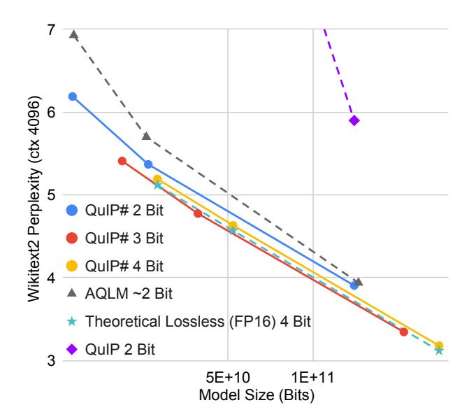
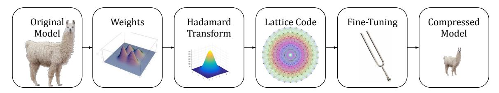
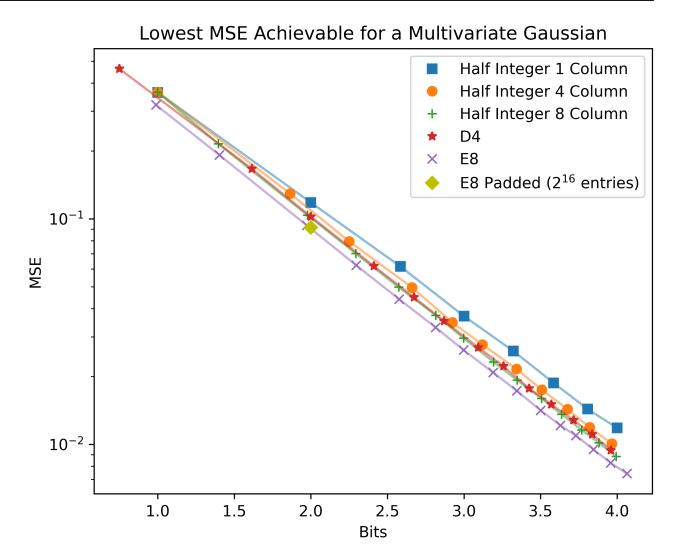
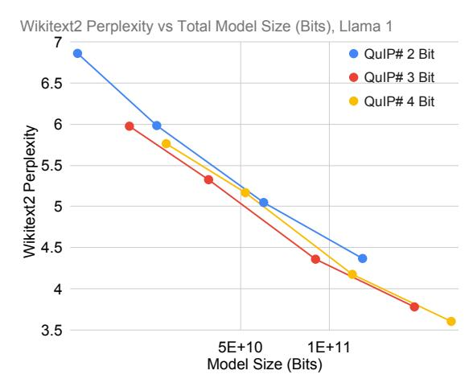
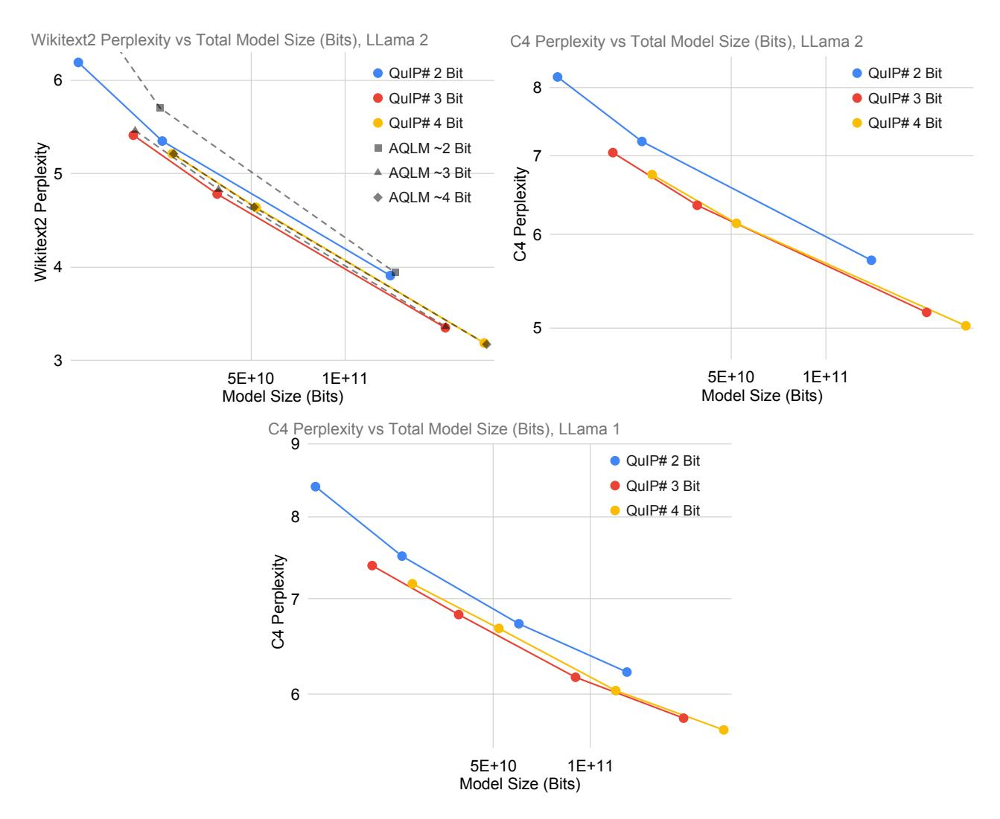

<!-- RP21_Tseng_2024 | source: papers_json/RP21_Tseng_2024/ -->

## **QuIP#:** تكميم أفضل لنماذج اللغة الكبيرة باستخدام عدم التماسك الهادامي ودفاتر الترميز الشبكية

Albert Tseng * 1 Jerry Chee * 1 Qingyao Sun 2 Volodymyr Kuleshov 1 Christopher De Sa 1

## **الملخص**

يقلل التكميم بعد التدريب (PTQ) من البصمة الذاكرية لنماذج اللغة الكبيرة (LLMs) عن طريق تكميم أوزانها إلى دقة منخفضة. في هذا العمل، نقدم QuIP#، وهي طريقة PTQ تعتمد على الأوزان فقط وتحقق نتائج متطورة في أنظمة الضغط الشديد (\leq 4 بت لكل وزن) باستخدام ثلاث تقنيات جديدة. أولاً، تحسّن QuIP# معالجة عدم التماسك في QuIP (Chee et al., 2023) باستخدام تحويل هادامار العشوائي، وهو أسرع ويتمتع بخصائص نظرية أفضل. ثانياً، تستخدم QuIP# التكميم المتجهي للاستفادة من التوزيع شبه الغاوسي ذي الشكل الكروي الذي تمتلكه الأوزان غير المتماسكة: تحديداً، نقدم مجموعة من دفاتر الترميز الكفؤة من الناحية العتادية المبنية على الشبكة E_8 المتناظرة بشكل عالٍ، والتي تحقق التعبئة المثلى لكرة الوحدة في 8 أبعاد. ثالثاً، تستخدم QuIP# الضبط الدقيق لتحسين الإخلاص للنموذج الأصلي. تُظهر تجاربنا أن QuIP# تتفوق على طرق PTQ القائمة، وتمكّن سلوكيات جديدة في توسيع PTQ، وتدعم الاستدلال السريع. يمكن العثور على شفرتنا على https://github.com/ Cornell-RelaxML/quip-sharp.

## 1. المقدمة

دفعت نماذج اللغة الكبيرة (LLMs) تقدماً سريعاً عبر مجالات متنوعة مثل معالجة اللغة الطبيعية (Touvron et al., 2023b)، والنمذجة العلمية (Nguyen et al., 2023)، وتركيب البرامج (Rozière et al., 2024). لكن الحجم الضخم لهذه النماذج يطرح تحديات كبيرة لنشرها. على سبيل المثال، أكبر نموذج في عائلة Llama 2 لديه 70 مليار معلمة، ويتطلب 140 جيجابايت من ذاكرة GPU في الدقة الأصلية ذات 16 بت (Touvron

وقائع المؤتمر الدولي الحادي والأربعين للتعلم الآلي، فيينا، النمسا. PMLR 235، 2024. حقوق الطبع والنشر 2024 من قبل المؤلف(ين).


*الشكل 1. تقدم QuIP# جودة تكميم غير مسبوقة عند نسب الضغط الشديدة. كما أن نماذج QuIP# ذات 3 بت تتوسع بشكل أفضل من نماذج 4 بت غير الفقدية نظرياً، وهي نتيجة لم تُلاحظ من قبل.*

et al., 2023b). هذه البصمة الذاكرية الضخمة تحفز البحث في طرق ضغط نماذج اللغة الكبيرة بدون فقد.

يقلل التكميم بعد التدريب (PTQ) خطياً البصمة الذاكرية للنماذج عن طريق تخزين الأوزان المُدرَّبة بدقة أقل. على سبيل المثال، يتطلب Llama 2 70B أقل من 20 جيجابايت من الذاكرة عند تكميمه إلى 2 بت. هذا لا يسمح فقط بتشغيل النماذج الكبيرة على أجهزة أصغر، بل يمكّن أيضاً إنتاجية أسرع في الإعدادات المقيدة بالذاكرة مثل فك التشفير الانحداري الذاتي. لكن طرق التكميم الحالية إما لا تتوسع إلى نسب ضغط شديدة (Shao et al., 2024) أو تمتلك مخططات فك تشفير باهظة (Egiazarian et al., 2024)، مما يحفز تطوير طرق PTQ جيدة وسريعة معاً.

في هذا العمل، نقدم QuIP#، طريقة PTQ تعتمد على الأوزان فقط وتحقق حالة فنية جديدة في تكميم النماذج. تتحسن QuIP# مقارنة بالأعمال القائمة عبر ثلاث تقنيات: معالجة عدم التماسك، ودفاتر الترميز الشبكية، والضبط الدقيق. معالجة عدم التماسك هي شكل مبدئي لقمع القيم الشاذة ينتج عنه مصفوفات أوزان موزعة تقريباً وفق التوزيع الغاوسي (Chee et al., 2023). تنفذ QuIP#

> ^*^مساهمة متساوية <sup>1</sup>قسم علوم الحاسوب، جامعة كورنيل <sup>2</sup>قسم بحوث العمليات وهندسة المعلومات، جامعة كورنيل. المراسلات إلى: Albert Tseng <albert@cs.cornell.edu>، Jerry Chee <jerrychee@cs.cornell.edu>.

<!-- page 2 -->


*الشكل 2. تنفذ QuIP# معالجة عدم التماسك بتحويل هادامار العشوائي وتستخدم دفاتر الترميز الشبكية لتحقيق نماذج مكممة بأحدث تقنية.*

معالجة عدم التماسك بتحويل هادامار العشوائي الكفؤ حسابياً (Halko et al., 2011) (القسم 3). لتكميم المصفوفات غير المتماسكة، تستخدم QuIP# خوارزمية التقريب التكيفي الكتلي BlockLDLQ مع دفاتر ترميز قابلة للضغط مبنية على الشبكة E_8، التي تحقق أعلى كثافة لتعبئة كرة الوحدة في 8 أبعاد (Viazovska, 2017) (القسم 4). الشبكة E_8 منظمة ومتناظرة بشكل عالٍ، مما يسمح لدفاتر الترميز لدينا بأن تكون صديقة للعتاد وتسمح باستدلال سريع. وأخيراً، تتضمن QuIP# خوارزمية ضبط دقيق بين الطبقات تزيد من تحسين جودة التكميم (القسم 5).

تتفوق QuIP# تفوقاً كبيراً على طرق PTQ القائمة بما في ذلك OmniQuant (Shao et al., 2024)، وQuIP (Chee et al., 2023) (عمل سابق منفصل)، وAQLM (Egiazarian et al., 2024). على حد علمنا، تعد QuIP# أيضاً أول طريقة PTQ تتوسع فيها نماذج 3 بت بشكل أفضل من نماذج 4 بت. هذا يدحض مباشرة ادعاء Dettmers & Zettlemoyer (2023) بأن نماذج 4 بت "مثالية" ويشير إلى أنه مع تطور مجال PTQ، من المحتمل أن تتوسع نماذج 2 بت بشكل أفضل من نماذج 3 بت في المستقبل القريب. علاوة على ذلك، صُممت QuIP# من الأساس لتكون سريعة. تصف الخوارزمية 2 الاستدلال السريع بطبقة خطية مكممة بـ QuIP#. تحقق تطبيقنا "إثبات المفهوم" بـ CUDA لـ QuIP# أكثر من 50% من ذروة عرض النطاق الذاكري على بطاقة NVIDIA RTX 4090، مما يثبت صحة خياراتنا التصميمية.

**باختصار**، نقدم QuIP#، طريقة تكميم بعد التدريب تحقق نتائج متطورة عن طريق

- تنفيذ معالجة عدم التماسك بتحويل هادامار العشوائي، الذي يتمتع بخصائص عدم تماسك أفضل ووقت تشغيل أسرع من تحليل كرونيكر في QuIP.
- 2. تقريب مصفوفات الأوزان المعالجة بعدم التماسك بتقريب تكيفي كتلي ودفاتر ترميز مبنية على الشبكة E_8، التي تحقق أعلى كثافة لتعبئة كرة الوحدة في 8 أبعاد (عدد التقبيل).
- 3. تقديم خوارزمية ضبط دقيق بين الطبقات تزيد من تحسين جودة التكميم.

```
Algorithm 1 QuIP# without Fine-Tuning (QuIP#-NoFT) input Weight W \in \mathbb{R}^{m \times n}, hessians H \in \mathbb{R}^{n \times n}, g-dim. k-bit codebook C \hat{W}, \hat{H}, S_U, S_V \leftarrow \text{IP-RHT}(W, H) (Alg. 3) \hat{W} \leftarrow \text{BlockLDLQ}(\hat{W}, \hat{H}, C) (Sec. 4.1) output \hat{W}, S_U, S_V
```

```
Algorithm 2 QuIP# Inference (for a Linear Layer)
```

```
\begin{array}{l} \textbf{input} \ \ \hat{W}, S_U, S_V \ \text{from Alg. 1, $g$-dim. $k$-bit codebook $C$,} \\ \text{input } x \in \mathbb{R}^n. \\ y \leftarrow \operatorname{Had}(S_V \odot x) \ \text{where Had performs} \\ \text{an orthogonal Hadamard transform (Sec. 3)} \\ y \leftarrow \operatorname{decompress\_multiply}(\hat{W}, C, y) \\ y \leftarrow \operatorname{Had}(S_U \odot y) \\ \textbf{output} \ \ y \end{array}
```

## 2. الخلفية / الأعمال ذات الصلة

## 2.1. ضغط نماذج اللغة الكبيرة

ركّز عدد كبير من الأعمال على ضغط نماذج اللغة الكبيرة، حيث يمكن أن يفيد ذلك مباشرة استدلال LLM على نطاق واسع. تركز طرق مثل التشذيب، والتدريب الواعي بالتكميم (QAT)، والتكميم بعد التدريب (PTQ) جميعها على مجالات مختلفة من هذه المشكلة وليست متعامدة بشكل صارم مع بعضها البعض. يقوم التشذيب *بإزالة* الأوزان من النماذج مع الحفاظ على جودة النموذج وأداء الاستدلال (Chee et al., 2022; Sun et al., 2023). يركز QAT على تدريب النماذج التي تكون أكثر "قابلية للتكميم" لكنه عادة ما يتطلب تدريب النماذج من الصفر (Nagel et al., 2022; Xi et al., 2023). أما PTQ، الذي تنتمي إليه QuIP#، فيكمم النماذج *المُدرَّبة مسبقاً*. يتطلب PTQ حسابات أقل من QAT ويحقق أداءً تنافسياً (Chee et al., 2023; Frantar et al., 2023; Shao et al., 2024; Egiazarian et al., 2024). في بقية هذه الورقة، نركز على PTQ.

## 2.2. التكميم والتقريب التكيفي

في QuIP#، نتبع طرق PTQ الحديثة المتطورة ونقرب الأوزان لتقليل خسارة الوسيط لكل طبقة، كما

<!-- page 3 -->

صاغها Nagel et al. (2020):

$$ \ell(\hat{W}) = E_x \left[ \|(\hat{W} - W)x\|^2 \right] \tag{1} $$

$$ = \operatorname{tr}\left((\hat{W} - W)H(\hat{W} - W)^{T}\right). \tag{2} $$

هنا، W \in \mathbb{R}^{m \times n} هي مصفوفة الأوزان الأصلية في طبقة خطية، \hat{W} \in \mathbb{R}^{m \times n} هي الأوزان المكممة، x \in \mathbb{R}^n هو متجه إدخال يُسحب عشوائياً بشكل منتظم من مجموعة معايرة، وH = E_x[xx^T] هو هسيان وسيط. تجعل هذه الصياغة داخل الطبقة التكميم قابلاً للتطبيق على نماذج اللغة الكبيرة. إحدى طرق تقليل \ell هي استخدام طرق التقريب التكيفي التي تقرّب مصفوفات الأوزان تكرارياً عن طريق النظر في خطأ التقريب الحالي لتلك المصفوفة المحددة. على سبيل المثال، تقرّب خوارزمية LDLQ¹ صفوف أوزان النموذج تكرارياً باستخدام التغذية الراجعة الخطية من خطأ تكميم الصفوف المُقربة سابقاً. LDLQ مثلى ضمن فئة طرق التقريب التكيفي ذات التغذية الراجعة الخطية وتقدم معدلات خطأ أفضل بشكل قابل للإثبات من التقريب الأقرب أو العشوائي (Chee et al., 2023).

## 2.3. معالجة عدم التماسك

لاحظت أعمال متعددة أن القيم الشاذة في تنشيطات النموذج وأوزانه يمكن أن تعيق جودة التكميم، مما يحفز الطرق التي "تقمع" القيم الشاذة أثناء التكميم. على سبيل المثال، يقيس AWQ (Lin et al., 2023) أوزان النموذج بمعلومات من التنشيطات ويستخدم OmniQuant (Shao et al., 2024) تحويلات بسيطة قابلة للتعلم تحافظ على النموذج. لكن هذه الأساليب القائمة على الإرشاد تميل إلى الفشل في معدلات البت المنخفضة.

بدلاً من ذلك، اقترح Chee et al. (2023) في QuIP أن *عدم التماسك* مهم لتكميم نماذج اللغة الكبيرة. بشكل غير رسمي، تمتلك المصفوفات غير المتماسكة قيم مدخلات مركزة المقدار - مما يستبعد القيم الشاذة. في نماذج اللغة الكبيرة، تعني مصفوفات الأوزان والهسيان غير المتماسكة أن كلاً من الشيء الذي يجري تقريبه (الأوزان) واتجاهات التقريب المهمة (الهسيانات) ليست كبيرة جداً في أي إحداثي. وهذا يمكّن التكميم *بشكل قابل للإثبات* بخطأ محدود.

**التعريف 2.1** (Chee et al. (2023)). تكون الهسيان H \in \mathbb{R}^{n \times n} غير متماسكة \mu إذا كان تحليلها الذاتي H = Q\Lambda Q^T يحقق

$$ \max_{i,j} |Q_{ij}| = \max_{i,j} |e_i^T Q e_j| \le \mu/\sqrt{n}. $$

تكون مصفوفة الأوزان W \in \mathbb{R}^{m \times n} غير متماسكة \mu إذا

$$ \max_{i,j} |W_{ij}| = \max_{i,j} |e_i^T W e_j| \le \mu ||W||_F / \sqrt{mn}. $$

لاستغلال عدم التماسك، قدم Chee et al. (2023) *معالجة عدم التماسك* كجزء من طريقة التكميم لديهم

QuIP. تعمل معالجة عدم التماسك في QuIP عن طريق اقتران W وH بمصفوفات متعامدة عشوائية مهيكلة. تحديداً، يبني QuIP مصفوفات متعامدة U \in \mathbb{R}^{m \times m} وV \in \mathbb{R}^{n \times n} عن طريق جداء كرونيكر برسم مصفوفات متعامدة عشوائية موحدة U_1, U_2 (بأحجام تقريباً \sqrt{n})، وV_1، وV_2 (بأحجام تقريباً \sqrt{m}) ثم تعيين U = U_1 \otimes U_2 وV = V_1 \otimes V_2. إذا عيّنا \tilde{H} \leftarrow VHV^T و\tilde{W} \leftarrow UWV^T، تصبح \tilde{H} و\tilde{W} غير متماسكتين \tilde{O}(1) باحتمالية عالية (انظر اللمّة 5 لديهم). لاحظ أن هذا التحويل يحافظ على هدف الوسيط، حيث \operatorname{tr} \left( (UWV^T)(VHV^T)(VW^TU^T) \right) = \operatorname{tr} \left( WHW^T \right). بعد تكميم مصفوفة الأوزان المحوّلة \tilde{W} باستخدام \tilde{H}، أثناء الاستدلال، تحوّل النماذج المكممة بـ QuIP تنشيطات النموذج x باستخدام V وU^T لحساب

$$ U^T(\text{quantized}(\tilde{W})(Vx)) \approx U^T(\tilde{W}(Vx)) = Wx. $$

تؤدي هذه الضربات المتعامدة المهيكلة بجداء كرونيكر إلى تكلفة وقت تشغيل إضافية قدرها \Theta(n\sqrt{n}+m\sqrt{m})، وهي صغيرة بالنسبة لتكلفة \Theta(mn) للضرب بـ W.

يمكن النظر إلى معالجة عدم التماسك على أنها بديل مبدئي للطرق الأكثر تعقيداً والقائمة على الإرشاد لقمع القيم الشاذة. تتطلب طرق مثل التجميع والاحتفاظ بالقيم الشاذة في FP16 تخزيناً إضافياً ويمكن أن تؤثر سلباً على الأداء. على سبيل المثال، استخدام مقياس 16 بت لكل مجموعة من 64 وزناً يتطلب 0.25 بت إضافية لكل وزن. هذه الزيادة كبيرة في أنظمة الضغط الشديدة، في حين أن لمعالجة عدم التماسك أقل قدر من النفقات الاستدلالية وتسمح بإنفاق المزيد من البتات على تكميم أوزان النموذج فعلياً. بدلاً من ذلك، يتطلب الاحتفاظ بالقيم الشاذة في دقة عالية تخزين مصفوفات غير مهيكلة عالية الدقة، والتي يكون الضرب بها بطيئاً.

## 2.4. التكميم المتجهي

ركزت أعمال PTQ السابقة على تكميم كل وزن قياسي W_{ij} على حدة، أي التكميم القياسي (SQ) (Chee et al., 2023; Lin et al., 2023; Shao et al., 2024). لكن SQ غير مثالية لأنها تتجاهل شكل التوزيع المصدر. بدلاً من ذلك، يكمم التكميم المتجهي (VQ) مجموعة من d أوزان معاً كمتجه ذي d أبعاد. في VQ بـ k بت، يُكمم متجه إلى أحد 2^{kd} متجه \in \mathbb{R}^d التي تشكل دفتر ترميز C بحجم 2^{kd} \times d. عن طريق تشكيل C ليطابق التوزيع المصدر لـ W، يمكن لـ VQ تحقيق تشويه أقل من SQ، مع تمكين d أعلى تشكيلاً أفضل (Kostina & Verdú, 2011).

لكن لـ VQ تكلفة أسية في كل من معدل البت وبُعد المتجه. بصفة عامة، يمكن لـ VQ أن يكون مكلفاً وقد يكون له مكاسب تشويه محدودة على SQ بسبب القيود العملية على d. على سبيل المثال، للاستدلال السريع على وحدات معالجة الرسومات (GPU)، يجب أن يتسع C في ذاكرة التخزين المؤقت L1 حتى بعد تعارضات البنوك (التكرار 32×). هذا يعني أن kd يمكن أن يكون على الأكثر \approx 10 لـ C غير المهيكلة. في QuIP#، نخفف من هذه المشكلات باستخدام دفتر ترميز عالي الهيكلة بـ 2 بت يعتمد على الشبكة 8D E_8،

> ^&^lt;sup>1</sup>قدم OPTQ (Frantar et al., 2023) وQuIP بشكل مستقل صيغاً بديلة لطريقة التقريب هذه، وأظهر QuIP أنها متكافئة. LDLQ هو الاسم الذي أعطاه QuIP.

<!-- page 4 -->

## Algorithm 3 Incoherence Processing with RHT (IP-RHT)

\begin{array}{l} \textbf{input} \ \ W \in \mathbb{R}^{m \times n}, H \in \mathbb{R}^{n \times n} \\ \text{Sample sign vectors } S_V \sim \mathcal{U}\{\pm 1\}^n, S_U \sim \mathcal{U}\{\pm 1\}^m \\ \hat{W} \leftarrow \texttt{Had}(diag(S_U)\texttt{Had}(diag(S_V)W^T)^T) \text{ where} \\ \text{Had is the Hadamard transform (sec. 3)} \\ \hat{H} \leftarrow \texttt{Had}(diag(S_V)\texttt{Had}(diag(S_V)H)^T) \\ \textbf{output} \ \ \hat{W}, \hat{H}, S_U, S_V \end{array}

E8P. تحقق E8P kd = 16 لكن يمكن ضغطها 256 \times، مما يسمح لها بالتلاؤم في ذاكرة التخزين المؤقت لـ GPU.

## 2.5. الضبط الدقيق مقابل التدريب الواعي بالتكميم

قُدم الضبط الدقيق (FT) لـ PTQ في نماذج اللغة الكبيرة في AQLM (Egiazarian et al., 2024) كطريقة قابلة للتنفيذ للتقاط التفاعلات بين الطبقات. كما هو معروض في AQLM وهنا، الضبط الدقيق هو في الأساس طريقة هجينة بين PTQ النقي وQAT الكامل تتطلب بيانات وحسابات أقل بكثير من QAT الكامل. مع QuIP#، يطابق الضبط الدقيق عموماً أداء QAT، مع التحفظ بأن QAT لنماذج اللغة الكبيرة مجال غير مستكشف نسبياً. على سبيل المثال، مع بعض الاستقراء، يؤدي LLM-QAT (Liu et al., 2023) 4 بت (4-16-16) أداءً قريباً من QuIP# 4 بت مع أو بدون FT. لكن QuIP# يمكنها تكميم نموذج بـ 70 مليار معلمة في بضع ساعات على عقدة واحدة بـ 8 GPUs بينما يحتاج LLM-QAT إلى 960 ساعة GPU لتوليد بيانات التدريب وحدها. بما أن الضبط الدقيق لـ PTQ هو تطور حديث جداً، فإن كلاً من الطرق المقدمة هنا وفي AQLM ليست مثالية تقريباً. لكنها تخدم لإظهار أن FT طريقة رخيصة نسبياً لتحقيق نماذج بجودة QAT، مما يجعل هذا النهج عملياً وواعداً.

## 3. معالجة عدم التماسك بتحويل هادامار العشوائي

في هذا القسم، نقترح طريقة لتحسين معالجة عدم التماسك في QuIP عن طريق استبدال جداء كرونيكر ذي العاملين بتحويل هادامار العشوائي (RHT) (Halko et al., 2011). يعطي هذا التغيير ثلاث مزايا: (1) يتحسن الحد النظري لمعامل عدم التماسك \mu؛ (2) تتحسن التكلفة المقاربة للضرب بالمصفوفة المتعامدة العشوائية المهيكلة من \Theta(n\sqrt{n}) إلى \Theta(n\log n)؛ (3) تتقلص تكلفة الضرب أكثر بمعامل ثابت، حيث يمكن إجراء ضرب مصفوفة هادامار دون أي ضربات نقطة عائمة لأن مدخلاتها في \{-1,+1\}. علاوة على ذلك، نُظهر في القسم 6.4 أن هذا التغيير وحده يحسن الحيرة لنماذج LLM المكممة.

تذكر من القسم 2.3 أن إحدى الطرق لتنفيذ معالجة عدم التماسك بكفاءة هي اقتران W وH بمصفوفات متعامدة عشوائية مهيكلة. تستخدم QuIP# RHT، الذي ينفذ x \to VSx حيث V \in \mathbb{R}^{n \times n} هي مصفوفة هادامار،

S هي متجه إشارات عشوائي \{\pm 1\}^n، وx \in \mathbb{R}^n. يمكن حساب RHT في زمن O(n \log n) باستخدام تحويل والش-هادامار السريع (Fino & Algazi, 1976) عندما يكون n قوة لـ 2. سنفترض مؤقتاً أن جميع الأبعاد قوى لـ 2. لاحقاً في القسم سنشرح طريقتين لمعالجة عدم التماسك عندما لا يكون البعد قوة لـ 2.

**اللمّة 3.1.** ليكن H أي مصفوفة شبه محددة موجبة على \mathbb{R}^{n\times n} وW أي مصفوفة أوزان على \mathbb{R}^{m\times n}. ليكن U\in\mathbb{R}^{m\times m} وV\in\mathbb{R}^{n\times n} مصفوفتي هادامار متدرجتين متعامدتين. ليكن S_U\in\mathbb{R}^{m\times m} وS_V\in\mathbb{R}^{n\times n} مصفوفتين قطريتين عشوائيتين بعناصر قطرية مستقلة مرسومة بشكل منتظم من \{-1,+1\}. عندئذ لأي \delta>0، تكون VS_VHS_VV^T غير متماسكة \mu_H باحتمالية لا تقل عن 1-\delta، وتكون US_UWS_VV^T غير متماسكة \mu_W باحتمالية لا تقل عن 1-\delta، حيث

$$
\mu_H = \sqrt{2\log\left(\frac{2n^2}{\delta}\right)} \quad and \quad \mu_W = 2\log\left(\frac{4mn}{\delta}\right).
$$

في QuIP (Chee et al., 2023)، يحقق نهج كرونيكر ذو العاملين \mu_W^{Kron} = A^2 \log \left(4Cmn/\delta\right)^2، حيث A وC ثوابت عالمية مستقلة عن n وعدد العوامل. يحقق RHT في QuIP# عدم تماسك أعلى عبر اعتماد لوغاريتمي على حجم المصفوفة بدلاً من الاعتماد اللوغاريتمي التربيعي لطريقة كرونيكر. كل نظرية QuIP التي تحلل خسارة الوسيط في المعادلة (1) لا تزال صحيحة مع RHT، مع انتشار معدلات عدم التماسك المحسنة.

والآن، ماذا عن الأبعاد n التي ليست قوى لـ 2؟ في معظم الحالات، يمكننا تحليل n=pq حيث p هي أكبر قوة لـ 2 بحيث توجد مصفوفة هادامار معروفة من حجم q. هذا يسمح لنا ببناء V \in \mathbb{R}^{n \times n} = H_p \otimes H_q حيث H_p وH_q هما مصفوفتا هادامار من حجم p وq على التوالي. عندئذ يمكننا حساب VSx في زمن O(q^2p\log p)، وهو أسرع من زمن O(n(p+q)) لنهج كرونيكر ذي العاملين في QuIP عندما p \gg q. على سبيل المثال، Llama 2 70B لديه بُعد وسيط 28672 = 1024 * 28؛ 1024 \gg 28. تصف الخوارزمية 3 كيفية تنفيذ معالجة عدم التماسك بـ RHT. القيام بذلك يتطلب تخزين متجهي إشارات S_U \in \{\pm 1\}^m وS_V \in \{\pm 1\}^n. بما أن n, m \gg 1000 لنماذج اللغة الكبيرة، فإن S_U وS_V يضيفان أقل من 0.01 بت لكل وزن (انظر القسم F.1 لمزيد من التفاصيل).

في حين أن حدسية هادامار تنص على \exists H_k \forall k, 4 \mid k، إلا أن العثور على مثل هذه المصفوفات لا يزال مشكلة مفتوحة (Hedayat & Wallis, 1978). في الحالات التي لا يوجد فيها تحليل n=pq حيث \exists H_p, H_q، نقدم خوارزمية معالجة عدم التماسك بتحويل فورييه السريع العشوائي (RFFT) بخصائص وقت تشغيل وتركيز مماثلة لـ RHT. على مستوى عالٍ، ينفذ RFFT معالجة عدم التماسك بتحويل فورييه السريع (FFT) (Cochran et al., 1967) وطور عقدي عشوائي. يتطلب RFFT فقط أن يكون n زوجياً، وهو أضعف بكثير من قيود RHT على n. كما أن RFFT مفيد عند وجود تحليل n=pq لكن p\gg q،

<!-- page 5 -->

مما يؤدي إلى تسريعات منخفضة على خوارزمية \Theta(n\sqrt{n}). كما أن FFT نفسه مدعوم بشكل جيد على مجموعة متنوعة من العتاد، مما يعني أنه قد يكون من الأسهل تنفيذ RFFT سريع عند تكييف QuIP# مع عتاد جديد. عملياً، نجد أن RFFT يؤدي أداءً أسوأ قليلاً من RHT لكنه لا يزال يحقق نتائج قوية (الجدول 1). نصف RFFT بالتفصيل في القسم A.2 من الملحق.

## 4. BlockLDLQ ودفاتر الترميز الشبكية

يتبع من نظرية الحد المركزي أن الأوزان المحوّلة بـ RHT تتبع توزيعاً غاوسياً تقريباً ذا شكل كروي. لكن تقريب الأوزان واحداً تلو الآخر، كما يفعل QuIP بـ LDLQ، يتجاهل هذا التشكيل - منتجاً مجموعة من متجهات الأوزان القابلة للتمثيل التي تأخذ شكل مكعب عالي الأبعاد بدلاً من كرة. يسمح لنا التكميم المتجهي (VQ) بتشكيل دفاتر الترميز لتطابق التوزيع المصدر بشكل أفضل. تكمم دفاتر VQ عدة أوزان إلى مدخل دفتر ترميز واحد، ونصمم الشكل العام لدفتر الترميز ليطابق بشكل أفضل الشكل الكروي تقريباً للأوزان المحوّلة بـ RHT. في القسم 4.1، نقدم BlockLDLQ، الذي يقرّب كتل الأوزان تكيفياً بـ VQ. ضمن خطوة VQ في BlockLDLQ، تستخدم QuIP# دفتر الترميز E8P بـ 2 بت (القسم 4.2). يعتمد E8P على الشبكة E_8، التي تحقق أعلى كثافة لتعبئة كرة الوحدة في \mathbb{R}^8 (Viazovska, 2017). يحقق E8P تشكيلاً جيداً مع تمكين الاستدلال السريع عن طريق الاحتياج فقط إلى البحث في دفتر ترميز 256 \times 8.

## 4.1. التقريب التكيفي للتكميم المتجهي

صاغ Chee et al. (2023) فئة من خوارزميات التقريب التكيفي ذات التغذية الراجعة الخطية. تقرّب هذه الطرق الأعمدة واحداً تلو الآخر بتغذية راجعة خطية a_k من الأعمدة المُقربة سابقاً. تحديداً، تُقرَّب أعمدة مصفوفة الأوزان W \in \mathbb{R}^{m \times n} تكرارياً لـ k=1,2,\ldots,n: \hat{W}_k=\mathcal{Q}(W_k+(W_{:(k-1)}-\hat{W}_{:(k-1)})a_k)، حيث W_k هو العمود k من W، وW_{:(k-1)} هو أول k-1 أعمدة من W، وQ ينفذ تقريباً أقرب أو عشوائياً، وa_k \in \mathbb{R}^{k-1}. تحقق \hat{W} الناتجة \hat{W}=\mathcal{Q}(W+(W-\hat{W})U)، حيث U \in \mathbb{R}^{n \times n} هي مصفوفة مثلثية علوية أعمدتها هي a_k وQ يعمل عنصراً عنصراً.

تعيّن خوارزمية LDLQ U لتكون L^T - I حيث H = L^T DL هو تحليل LDL لهسيان الوسيط H. من QuIP، نعلم أن LDLQ مثلى ضمن طرق التقريب التكيفي ذات التغذية الراجعة الخطية عند التقريب إلى الأعداد الصحيحة. لكن LDLQ لا تعمل مع التكميم المتجهي، الذي يقرّب عدة أعمدة معاً. هنا،

نوسّع LDLQ لدعم التكميم المتجهي. بمعطى حجم كتلة g يقسم n بالتساوي، يستند block LDLQ إلى تحليل LDL كتلي جديد g-block H = \mathbf{L}^T \mathbf{D} \mathbf{L}، حيث \mathbf{L} هي مصفوفة مثلثية سفلية كتلية بوحدة (من بين الكتل n^2/g^2 g \times g لـ L \in \mathbf{R}^{n \times n}، الكتل القطرية n/g كلها I وجميع الكتل فوق القطر هي 0)، و\mathbf{D} هي مصفوفة قطرية كتلية. كما من قبل، نعيّن \mathbf{U} = \mathbf{L}^T - I، ونقرّب W بطريقة كتلية عبر

$$ \hat{W}_k = \mathbf{Q}(W_k + (W_{:(k-1)} - \hat{W}_{:(k-1)})\mathbf{A}_k), $$

حيث يحتوي \mathbf{A}_k \in \mathbb{R}^{n \times g} على الأعمدة من k-g+1 إلى k من \mathbf{U} (الكتلة k)، وW_k يدل بالمثل على الكتلة k من W، و\mathbf{Q} يدل على مكمم متجهي. كما في ورقة QuIP الأصلية، يمكننا تقييد خطأ هذه الطريقة.

**النظرية 4.1.** افترض أننا نقرّب W \in \mathbb{R}^{m \times n} باستخدام g-block LDLQ بهسيان H، مع إنتاج \hat{W}. افترض أن H غير متماسكة \mu، وأننا نستخدم مكمماً متجهياً (ربما عشوائياً) \mathbf{Q} يحقق \mathbf{E}[(\mathbf{Q}(x) - x)(\mathbf{Q}(x) - x)^T] \leq \sigma^2 I لأي x \in \mathbb{R}^g. عندئذ

$$
\mathbf{E}[\operatorname{tr}((\hat{W} - W)H(\hat{W} - W)^T)] \le \frac{gm\mu^2\sigma^2}{n}\operatorname{tr}(H^{1/2})^2.
$$

لاحظ أنه تحت نفس الشروط، فإن مجرد تكميم جميع الكتل بشكل مستقل سيعطي \mathbf{E}[\operatorname{tr}((\hat{W}-W)H(\hat{W}-W)^T)] \leq gm\sigma^2\operatorname{tr}(H): هذا "التحسن" من أثر H إلى مربع أثر جذره التربيعي مقسوماً على n هو نفس المعامل المحقق في الحالة القياسية في QuIP.<sup>3</sup>

## 4.2. دفتر الترميز E8P ("E8 المُبطّن")

يعتمد BlockLDLQ على خطوة تكميم متجهي داخلية (VQ) \mathbf{Q} تقرّب متجهاً ذا d أبعاد (g في القسم السابق) إلى دفتر ترميز C. لتطبيق VQ بفعالية، يجب أن يكون C مشكّلاً مثل التوزيع المصدر وأن يتمتع بكثافة تعبئة عالية. إحدى طرق تحسين التشكيل هي زيادة d. لكن، تذكر من القسم 2.4 أن لتكميم متجه v \in \mathbb{R}^d إلى k بت بـ VQ، يجب أن يكون لـ C حجم 2^{kd} \times d. بما أن حجم دفتر الترميز أسي في كل من بُعد المتجه ومعدل البت، يصبح VQ غير قابل للتنفيذ بسرعة في الأبعاد العالية أو معدلات البت العالية.

في QuIP#، نقدم دفتر الترميز الجديد E8P ذا 2 بت و8 أبعاد، الذي يحتوي على 2^{16} مدخلات لكنه يتطلب فقط البحث في جدول 2^{8} مدخلات، مع استخدام البتات الـ 8 المتبقية لتخزين الإشارات والإزاحات. يتطلب E8P فقط 1 كيلوبايت ميبي من المساحة وبالتالي يلائم ذاكرة التخزين المؤقت L1 لأي GPU حديث، حتى بعد التكرار لتعارضات البنوك (32\times). E8P

> ^^2^من السهل إنتاج تحليل LDL الكتلي g-block من تحليل تشولسكي لـ H.

> ^&^lt;sup>3</sup>تضمنت ورقة QuIP الأصلية أيضاً ضمانات تقنية متعددة أخرى، بما في ذلك حد ينظر بشكل أكثر صرامة في الحالة "الواقعية" لدفاتر الترميز ذات الحجم المحدود. في حين أن هذه النتائج يمكن أيضاً تعميمها على حالة block-LDLQ، نرى أن ذلك لا يقدم رؤية كثيرة ذات صلة بـ QuIP# تتجاوز النظرية 4.1، لذا (إذا رغب) تُترك كتمرين للقارئ.

<!-- page 6 -->

تخفف من مشكلات التوسع لـ VQ بالاستفادة من بنية وتناظرات الشبكة E_8 التي تستند إليها. تتألف الشبكة E_8 من جميع المتجهات الصحيحة أو نصف الصحيحة في \mathbb{R}^8 التي يكون مجموعها عدداً زوجياً، أي

$$
E_8 = (\mathbb{Z}^8 \cup (\mathbb{Z}^8 + \frac{1}{2})) \cap \{x \mid \mathbf{1}^T x \text{ is even}\}.
$$

يبدأ بناء دفتر الترميز E8P بطريقة مكافئة لكتابة E_8 عبر الشبكة \hat{D}_8، حيث \hat{D}_8 = \left\{x \in \mathbb{Z}^8 + \frac{1}{2} \mid \mathbf{1}^T x \text{ is even}\right\} هي مجموعة المتجهات نصف الصحيحة ذات التكافؤ الزوجي: هنا، E_8 = \hat{D}_8 \cup (\hat{D}_8 + \frac{1}{2}). يتبع أن (\hat{D}_8 - \frac{1}{4}) \cup (\hat{D}_8 + \frac{1}{4}) = E_8 + \frac{1}{4} هي مجرد نسخة مزاحة من E_8 (مع الحفاظ على نفس كثافة التعبئة المثلى).

لـ \hat{D}_8 خصائص تناظر لطيفة: قلب أي عدد زوجي (غير صفري) من إشارات عنصر في D_8، يعطي عنصراً مميزاً آخر في \hat{D}_8. هذا يعني أنه إذا كان |\hat{D}_8| يدل على مجموعة القيم المطلقة العنصرية للمدخلات في D_8، فإن كل عنصر في \hat{D}_8 يمكن التعبير عنه (بشكل فريد) كحاصل ضرب عنصري لمدخل s \in |\hat{D}_8| ومتجه إشارات بتكافؤ مناسب. لذا، إذا بدأنا من "دفتر ترميز مصدر" من المدخلات المطلقة S \subset |\hat{D}_8|، يمكننا استخدام 128 قلب إشارة بتكافؤ زوجي أو فردي ممكن لتوليد مجموعة فرعية من D_8. كل مدخل في S إما عدد فردي أو زوجي من القلبات بعيداً عن مدخل في \hat{D}_8، لكن ليس كلاهما. وهكذا، بمعطى s \in S و7 من 8 قلبات إشارة، يمكننا استنتاج الأخيرة من تكافؤ القلبات السبعة وs. هذا يسمح لنا باستخدام النمط التالي لتخزين كلمة ترميز 16 بت في E_8 + \frac{1}{4}: 8 بت للمدخل في S، و7 بت لقلبات الإشارة، وبت واحد لـ \pm \frac{1}{4}. هذا يسمح لنا بفك ترميز دفتر ترميز بحجم 216 بالبحث في دفتر ترميز بحجم 2^8 فقط (S) وتنفيذ بعض العمليات. كل ما تبقى هو كيفية اختيار S: نعيّن S لتكون 227 عنصراً من |\hat{D}_8| بمعيار \leq \sqrt{10} بالإضافة إلى 29 عنصراً "مبطناً" من |\hat{D}_8| بمعيار \sqrt{12} (انظر القسم C.1). نسمي دفتر الترميز الشبكي ذو الشكل الكروي بـ 2<sup>16</sup> مدخل "E8P".

يرسم الشكل 3 متوسط مربع الخطأ (MSE) العنصري لتكميم توزيع غاوسي متعدد المتغيرات قياسي إلى دفاتر ترميز k بت متنوعة. يتألف كل دفتر ترميز k-بت من شبكة قاعدة d-بُعدية متقاطعة مع كرة للوصول إلى 2^{kd} نقطة. تحقق دفاتر الترميز المعتمدة على E_8 MSEs أقل من جميع دفاتر الترميز المعروضة الأخرى، بما في ذلك تلك المعتمدة على الشبكة D_4 (المتجهات ذات التكافؤ الزوجي في \mathbb{Z}^4)، التي تحقق عدد التقبيل في \mathbb{R}^4. يوضح هذا الشكل أهمية البُعد للتكميم المتجهي. تؤدي زيادة بُعد المتجه إلى تقليل الخطأ لشبكة نصف الصحيحة، حيث يكون دفتر الترميز الناتج أقرب في الشكل إلى التوزيع المصدر. وأخيراً، في حين أن K-means على التوزيع المصدر سيحقق MSE أدنى (Lloyd, 1982)، هناك عدد من الأسباب العملية لكون دفتر ترميز معتمد على K-means أقل عملية، بما في ذلك أداء تجريبي أسوأ من البداية إلى النهاية. نناقش هذا أكثر في القسم C.3.


*الشكل 3. الحد الأدنى من MSE العنصري القابل للتحقيق لتكميم توزيع غاوسي إلى دفاتر ترميز متنوعة. تتفوق دفاتر الترميز المعتمدة على E_8 على دفاتر الترميز المعروضة الأخرى بسبب كثافة التعبئة الكامنة والأبعاد العالية لـ E_8.*

## **4.3.** توسيع E_8 إلى معدلات بت أعلى

تعمل الشبكة E_8 جيداً لمعدلات البت المنخفضة (مثلاً 2 بت)، لكنها تصبح بسرعة غير قابلة للتنفيذ في معدلات البت الأعلى بسبب حجم دفتر الترميز. في QuIP#، نستخدم التكميم المتجهي المتبقي (RVQ) (Juang & Gray, 1982) للحصول على فوائد دفاتر الترميز الشبكية في معدلات البت الأعلى. يكمم RVQ متجهاً x إلى p بت بمجموعة q من دفاتر ترميز q_i بت (يُشار إليها بـ RVQ(x, p, q) حيث p=\sum_{0\leq i<|q|}q_i) عن طريق التكميم المتكرر لمتبقي التكميم. أي، \mathrm{RVQ}(x,p,q)=\sum_{0\leq i<|q|}\delta_i حيث \delta_i = Q_{q_i} \left( (x - \sum_{0 \le j < i} \delta_j) / s_i \right) \cdot s_i، نترك Q_{q_i}(\cdot) يدل على التكميم إلى دفتر ترميز q_i بت، وs_i \in \mathbb{R}. باستخدام RVQ، يمكننا التكميم إلى 4 بت بالتقريب بدفتر ترميز E8P 2 بت مرتين. يمكننا أيضاً التكميم إلى 3 بت باستخدام دفتر ترميز E8P 2 بت ودفتر ترميز E_8 1 بت (عناصر E_8 بمعيار \leq 2 و15 عنصراً من E_8 بمعيار 4). يمكن استخدام مناهج تكميم دفتر ترميز متعدد أكثر تطوراً غير RVQ، لكن وجدنا أن RVQ كان كافياً لتحقيق أداء تكميم قوي.

## 5. الضبط الدقيق أثناء التكميم

اقترحت أعمال حديثة أن التفاعلات بين الطبقات مهمة للتكميم الشديد بدون فقد (Shao et al., 2024; Egiazarian et al., 2024). هنا، نوظف خوارزمية ضبط دقيق بسيطة تحاول استعادة النموذج الأصلي غير المكمم أثناء التكميم. تعمل طريقة الضبط الدقيق لدينا على مجموعة تطوير صغيرة ويمكن تنفيذها في حوالي 50 ساعة GPU لنموذج بـ 70 مليار معلمة.

أولاً، نقوم بالضبط الدقيق ضمن كل كتلة محول عن طريق الضبط الدقيق للطبقات غير المكممة لتعويض الطبقات *المكممة بالفعل* قبل التكميم. هذا يخفف من خطأ التنشيط الناجم عن طبقة خطية فردية *أثناء التكميم،*

<!-- page 7 -->


*الشكل 4. توسع QuIP#، Llama 1. مثل Llama 2، تتوسع QuIP# 3 بت بشكل أفضل من QuIP# 4 بت لنماذج Llama 1 وتتوسع QuIP# 2 بت بشكل مماثل لمعدلات البت الأعلى.*

ويمكن موازاته عبر كتل المحول. اقتُرحت فكرة الضبط الدقيق ضمن كتلة محول سابقاً في Egiazarian et al. (2024); تختلف منهجيتنا في كيفية الضبط الدقيق (قبل التكميم) ومجموعة المعلمات القابلة للضبط. ثانياً، بعد تكميم جميع الطبقات الخطية في النموذج، يتم الضبط الدقيق للمعلمات غير المكممة المتبقية لتقليل خطأ التنشيط على النموذج بأكمله. عن طريق تحسين متجهات الإشارات كمتجهات حقيقية بدلاً من متجهات ثنائية في كلتا الخطوتين، نسمح لخطوة معالجة عدم التماسك بتشكيل مصفوفة الأوزان لدفتر الترميز. في حين أن هذا يعني أنه يجب علينا تخزين متجهات الإشارات في FP16 بدلاً من متجهات بت، فإن حجم مصفوفات LLM يعني أن متجهات الإشارات لا تزال تضيف أقل من 0.01 بت لكل وزن. نصف هذه الخطوات بمزيد من التفصيل في القسم D.

## 6. التجارب

تُظهر تجاربنا الرئيسية أداء QuIP# على عائلة نماذج Llama 1 (Touvron et al., 2023a) و2 (Touvron et al., 2023b). تتراوح هذه النماذج من 7 مليار إلى 70 مليار معلمة وتقدم أداءً جيداً، مما يجعلها مناسبة لفهم كيفية أداء وتوسع طرق التكميم. تتوفر نتائج إضافية لنماذج أخرى في الملحق.

في القسم 6.1، نقارن QuIP# مع طرق PTQ الحديثة المنشورة المعتمدة على الأوزان فقط. يقيس AWQ الأوزان بمقادير التنشيط *قبل* التكميم لتقليل القيم الشاذة (Lin et al., 2023). يتعلم OmniQuant تحويلات على مستوى الطبقة تحافظ على النموذج وتقلل القيم الشاذة لكل كتلة محول (Shao et al., 2024). يستخدم AQLM التكميم المتجهي مع دفاتر ترميز 8D غير مهيكلة قابلة للتعلم (Egiazarian et al., 2024)<sup>4</sup>. نُبلّغ عن أرقام "1 × 16" لـ AQLM، التي تعادل استخدام دفتر ترميز واحد بـ 2^{16} مدخلات \in \mathbb{R}^8 *لكل طبقة خطية*. كل من هذه الدفاتر تأخذ 1 ميبي بايت من

المساحة، مما يجعلها كبيرة جداً لتلائم ذاكرة التخزين المؤقت L1 لأي GPU حالي وبالتالي تمنع الاستدلال السريع (انظر الجدول 6). أخيراً، نُدرج QuIP (Chee et al., 2023) كأساس للتحسينات في QuIP#.

نُبلّغ عن أرقام WxA16 لـ AWQ وOmniQuant من ورقة OmniQuant وأرقام AQLM من AQLM. نلاحظ أن هناك حالياً طريقتين لتقييم الحيرة: استخدام طول السياق Llama 1 البالغ 2048 أو استخدام طول السياق الأصلي للنموذج (مثلاً 4096 لـ Llama 2). يستخدم OmniQuant وAWQ 2048 لـ Llama 2 بينما يستخدم AQLM 4096؛ نُبلّغ عن كلتا مجموعتي الأرقام. نلاحظ أيضاً أن ورقة AQLM تُبلغ عن أرقام QuIP# من نسخة قديمة من QuIP#؛ الأرقام هنا تمثل أحدث أرقام QuIP#. أخيراً، نقوم بتغميق الأرقام في جداولنا عندما تكون أفضل بشكل واضح، مثل نموذج أصغر يطابق أو يتفوق على نموذج أكبر أو نموذج بحجم مماثل يتفوق بشكل ملحوظ على نموذج آخر.

## 6.1. QuIP# على نماذج Llama

يُظهر الجدول 2 مقارنة بين QuIP# مع OmniQuant وAWQ وQuIP# بدون ضبط دقيق وE8P، بطول سياق 2048. تقدم QuIP# تحولاً نموذجياً في جودة التكميم على OmniQuant وAWQ. والملفت، في حين ينهار AWQ حتى عند 2.15 بت (Shao et al., 2024) وينتج OmniQuant نماذج غير قابلة للاستخدام عند 2 بت، تنتج QuIP# نماذج عالية الجودة قريبة من نماذج OmniQuant 3 بت. يُظهر الجدول 2 أيضاً أهمية معالجة عدم التماسك. تتفوق QuIP# بدون ضبط دقيق أو دفاتر ترميز شبكية بشكل ملحوظ على OmniQuant وAWQ، اللذين يعتمدان كلاهما على الأساليب الإرشادية لتقليل القيم الشاذة في النموذج أثناء التكميم.

يُظهر الجدول 4 مقارنة QuIP# مع AQLM بطول سياق 4096. عند 2 و3 بت، إما تتفوق QuIP# بشكل ملحوظ على نماذج AQLM ذات الحجم المماثل أو تحقق أداءً مماثلاً مع نموذج أصغر<sup>5</sup>. عند 4 بت، تؤدي كلتا الطريقتين أداءً مماثلاً. هذا ليس مفاجئاً لأن نماذج 4 بت الحديثة كلها قريبة جداً من أداء FP16. علاوة على ذلك، تستخدم نتائج QuIP# 3 و4 بت المقدمة في هذه الورقة التكميم المتجهي المتبقي؛ يمكن تحقيق أرقام أفضل بمناهج تكميم دفتر ترميز متعدد أكثر تقدماً.

يُظهر الجدول 3 نتائج zeroshot لـ QuIP# وAQLM وOmniQuant. يتفوق كلا AQLM وQuIP# بشكل ملحوظ على OmniQuant، وهو ما يرتبط بنتائج الحيرة. يؤدي AQLM وQuIP# كلاهما قريباً جداً من FP16 في معدلات البت الأعلى وللنماذج الأكبر، لكن QuIP# تميل إلى التفوق على AQLM في معدلات البت المنخفضة وأحجام النماذج. نلاحظ أن مهام zeroshot لها عنصر عشوائية وحتى أرقام FP16 يمكن أن تختلف بنسبة تصل إلى 0.5%.

> ^&^lt;sup>4</sup>نُبلّغ عن النتائج من نسخة 11 يناير 2024 على ArXiv.

> ^&^lt;sup>5</sup>في تجربتنا، عند مستويات التكميم الشديدة، حتى 0.1 بت يمكن أن يحدث فرقاً ملحوظاً في جودة التكميم.

<!-- page 8 -->

الجدول 3. دقة Zeroshot (acc في LM Eval، وليس acc_norm)، Llama 2.

| الطريقة | البتات | 2-70 | 2-13 | 2-7 |  |  |  |  |  |  |  |  |  |
| --- | --- | --- | --- | --- | --- | --- | --- | --- | --- | --- | --- | --- | --- |
| ArCC | ArCE | PIQA | WINO | ArCC | ArCE | PIQA | WINO | ArCC | ArCE | PIQA | WINO |  |  |
| FP16 | 16 | 51.1 | 77.7 | 81.1 | 77.0 | 45.6 | 73.3 | 73.5 | 69.6 | 40.0 | 69.3 | 78.5 | 67.3 |
| OMNIQ | 4 | 49.8 | 77.9 | 80.7 | 75.8 | 43.1 | 70.2 | 78.4 | 67.8 | 37.9 | 67.8 | 77.1 | 67.0 |
| QUIP | 4 | 47.0 | 74.3 | 80.3 | 76.0 | 44.9 | 73.3 | **79.0** | 69.7 | - | - | - | - |
| AQLM | 4.07 | 51.0 | **78.1** | **81.4** | 76.9 | 43.9 | 72.2 | 78.6 | 70.4 | 40.3 | 68.9 | 77.7 | 67.3 |
| QUIP# | 4 | **50.6** | **78.1** | **81.4** | **77.1** | **45.5** | **73.9** | 78.9 | 69.9 | **40.5** | **69.1** | **78.4** | **67.6** |
| OMNIQ | 3 | 47.6 | 75.7 | 79.7 | 73.5 | 42.0 | 69.0 | 77.7 | 65.9 | 35.3 | 62.6 | 73.6 | 63.6 |
| QUIP | 3 | 46.3 | 73.2 | 80.0 | 74.6 | 41.5 | 70.4 | 76.9 | **69.9** | - | - | - | - |
| AQLM | 3.01 | 50.0 | 77.6 | 81.3 | **77.2** | 43.6 | **73.5** | 77.8 | 67.6 | 38.7 | 67.8 | 76.6 | **68.4** |
| QUIP# | 3 | **50.9** | **77.7** | **81.4** | 76.4 | **44.0** | 72.5 | **78.4** | 69.1 | **39.2** | **68.4** | **77.3** | 66.5 |
| OMNIQ | 2 | 28.7 | 55.4 | 68.8 | 53.2 | 23.0 | 44.4 | 62.6 | 52.6 | 21.6 | 35.2 | 57.5 | 51.5 |
| QUIP | 2 | 34.0 | 62.2 | 74.8 | 67.5 | 23.5 | 45.2 | 62.0 | 52.8 | 19.4 | 26.0 | 54.6 | 51.8 |
| AQLM | 2.07 | 47.9 | 77.7 | 80.4 | 75.9 | 38.5 | 67.0 | 75.1 | **69.5** | 33.6 | 62.8 | 73.5 | 64.6 |
| QUIP# | 2 | **48.7** | 77.3 | 80.3 | **75.9** | **39.5** | **69.3** | **77.3** | 67.7 | **34.6** | **64.6** | **75.1** | **64.9** |

## 6.2. توسع البت في QuIP#

تُظهر الأشكال [1](#page-0-0) (الصفحة الأولى) و[4](#page-6-3) كيف تتوسع QuIP# على عائلة نماذج Llama وWikitext2. على كل من Llama 1 و2، تتفوق QuIP# 3 بت على QuIP# 4 بت وتقدم QuIP# 2 بت توسعاً مماثلاً لنماذج 3 و4 بت. علاوة على ذلك، على Llama 2، تتفوق QuIP# 3 بت على نموذج 4 بت بدون فقد نظرياً (FP16 عند 4 بت). على حد علمنا، هذه أول مرة تتفوق فيها طريقة PTQ بـ 3 بت على نموذج 4 بت بدون فقد نظرياً وأيضاً أول مرة تقدم فيها طريقة PTQ بـ 2 بت توسعاً مماثلاً لمعدلات البت الأعلى.

## 6.3. الاستدلال الكفء مع QuIP#

أحد الفوائد الرئيسية لـ PTQ هو زيادة الحد الأقصى للإنتاجية الاستدلالية الممكنة على جهاز معين. بما أن فك التشفير الانحداري الذاتي للدفعات الصغيرة عادة ما يكون مقيداً بالذاكرة، فإن النموذج الأصغر يتطلب قراءة بيانات أقل وبالتالي يمكن تقديمه بشكل أسرع. لكن تحقيق تسريع فعلي يتطلب طريقة تكميم بنفقات فك تشفير منخفضة، وإلا سيتم اختناق الاستدلال بفك التشفير. على سبيل المثال، تستخدم نماذج AQLM في جداول التجارب دفتر ترميز 2 ^16^ ×8 مختلف لكل طبقة خطية.

كل مدخل في هذه الدفاتر يأخذ 2 بايت، مما يعني أن كل دفتر ترميز هو 1 ميبي بايت. أثناء الاستدلال، تُقرأ الأوزان من دفاتر الترميز هذه بنمط وصول عشوائي بشكل أساسي، مما يعني أن دفتر الترميز بأكمله يجب أن يلائم ذاكرة التخزين المؤقت L1 لتمكين الاستدلال السريع (حتى ذاكرة التخزين المؤقت L2 بطيئة جداً). لكن، 1 ميبي بايت أكبر من ذاكرة التخزين المؤقت L1 لأي GPU حالي (لـ H100 لديه 256 كيلوبايت)، لذا يعاني استدلال AQLM من معدلات إخفاق ذاكرة التخزين المؤقت العالية وهو في الواقع *أبطأ من FP16* على وحدات معالجة الرسومات الحديثة (الجدول [6)](#page-8-1).

في المقابل، صُممت QuIP# حول الاستدلال السريع. يمكن حساب RHT في زمن O(n log n) بشكل أساسي ويتطلب E8P فقط 1 كيلوبايت ميبي ويمكن فك تشفيره بعدد قليل جداً (< 5) من التعليمات لكل وزن. يُظهر الجدول [5](#page-8-3) سرعة توليد QuIP# كما تم قياسها بتطبيق Llama في مكتبة FlashAttention [(Dao et al.,](#page-9-13) [2022;](#page-9-13) [Dao,](#page-9-14) [2023)](#page-9-14). تستطيع QuIP# تحقيق أكثر من 50% من ذروة عرض النطاق الذاكري بنموذج 2 بت حتى مع الحد الأدنى من دمج النواة في RHT، مما يثبت صحة خياراتنا التصميمية. نلاحظ أنه بما أن "خيارات التصميم للاستدلال السريع" هذه تعني في الأساس قيوداً على ما يمكن فعله أثناء التكميم، فمن الممكن تماماً تحقيق جودة تكميم أفضل على حساب سرعة الاستدلال.

<!-- page 9 -->

| النموذج | 2 بت رمز/ث | 2 بت % عرض النطاق الذاكري | 4 بت رمز/ث | 4 بت % عرض النطاق الذاكري |
| --- | --- | --- | --- | --- |
| 2-7B | 170.50 | 29.60% | 117.73 | 40.87% |
| 2-13B | 104.83 | 33.80% | 71.09 | 45.84% |
| 1-30B | 51.60 | 38.39% | 32.50 | 48.36% |
| 2-70B | 32.74 | 56.84% | OOM | OOM |

أخيراً، إذا نظرنا إلى المفاضلات بين السرعة والجودة لطرق التكميم المختلفة، نجد أيضاً أن QuIP# تمكّن حدوداً جديدة لأداء PTQ. مقارنة بأرقام الإنتاجية المنشورة لـ QuIP (المُقاسة على A6000)، تحقق QuIP# على A6000 ضعف الإنتاجية الاستدلالية تقريباً عند نفس معدل البت، مما يجعل QuIP# أفضل بشكل صارم. مقارنة بطرق التكميم "الاستدلال السريع" الموجودة مثل SpQR [(Dettmers et al.,](#page-9-15) [2023)](#page-9-15) وSqueezeLLM [(Kim et al.,](#page-9-16) [2023)](#page-9-16)، نجد مرة أخرى أن QuIP# تقدم إنتاجية أعلى بشكل ملحوظ (> 40%) عند نفس جودة التكميم أو أفضل.

## 6.4. التحليلات الاستئصالية

يحتوي الجدول [4](#page-8-2) أيضاً على تحليل استئصالي للمكونات المختلفة لـ QuIP#. يُظهر صف "no FT" QuIP# بدون ضبط دقيق ويُظهر صف "no E8" QuIP# بدون ضبط دقيق ودفاتر ترميز شبكية. للأخير، نقرّب إلى شبكة نصف الأعداد الصحيحة 1-بُعدية. نُدرج أيضاً أرقام QuIP كما هو مُبلَّغ عنها بواسطة AQLM. عند جميع معدلات البت، يجلب كل مكون من QuIP# مكاسب أداء إضافية. الفرق بين QuIP وQuIP# بدون ضبط دقيق ودفاتر ترميز شبكية يُظهر أيضاً الفرق بين تحليل كرونيكر في QuIP وRHT في QuIP#. يقدم RHT خصائص عدم تماسك أقوى من تحليل كرونيكر (القسم [3)](#page-3-0)، مما يحسن الأداء.

## 7. الخاتمة

نقدم QuIP#، طريقة ضغط بعد التدريب تعتمد على الأوزان فقط وتحقق نتائج متطورة على نماذج اللغة الكبيرة عند 2 و3 و4 بت لكل وزن. تستخدم QuIP# تحويل هادامار العشوائي كشكل كفء ومبدئي لقمع القيم الشاذة، وتقدم دفتر الترميز E8P المعتمد على الشبكة E^8^ لتكميم أفضل للأوزان المحوّلة بـ RHT. دفتر الترميز E8P متناظر للغاية ويسمح بالاستدلال السريع، مما يسمح لتنفيذ "إثبات المفهوم" بـ CUDA لـ QuIP# بتحقيق أكثر من 50% من ذروة عرض النطاق الذاكري على وحدات معالجة الرسومات الحديثة. تنفذ QuIP# أيضاً الضبط الدقيق بين الطبقات، مما يزيد من تحسين التكميم. على حد علمنا، QuIP# هي أول طريقة PTQ تحقق توسعاً متفوقاً عند 3 بت على 4 بت وتوسعاً مماثلاً عند 2 بت لمعدلات البت الأعلى. تشير نتائجنا إلى أنه، في المستقبل القريب، من المحتمل أن تتوسع نماذج 2 بت بشكل أفضل من نماذج 3 بت.

## بيان التأثير

تقدم هذه الورقة عملاً يهدف إلى تطوير مجال التعلم الآلي. هناك العديد من العواقب المجتمعية المحتملة لعملنا، لا نشعر أن أياً منها يجب تسليط الضوء عليه بشكل خاص هنا.

## شكر وتقدير

نشكر، بدون ترتيب معين، David Hou لمساعدته في تنفيذ QuIP# CUDA، وTiancheng Yuan لإعارته بطاقة RTX 4090 الخاصة به ومساعدته في الحصول على أرقام توقيت QuIP#، وTri Dao لتنفيذ CUDA السريع لتحويل هادامار والمساعدة العامة مع QuIP#، وTogether AI للموارد الحاسوبية.

## المراجع

Almazrouei, E., Alobeidli, H., Alshamsi, A., Cappelli, A., Cojocaru, R., Debbah, M., Etienne Goffinet, Hesslow, ´ D., Launay, J., Malartic, Q., Mazzotta, D., Noune, B.,

<!-- page 10 -->

- Pannier, B., and Penedo, G. The falcon series of open language models, 2023.
- Chee, J., Renz, M., Damle, A., and Sa, C. D. Model preserving compression for neural networks. In Oh, A. H., Agarwal, A., Belgrave, D., and Cho, K. (eds.), *Advances in Neural Information Processing Systems*, 2022. URL [https://openreview.net/forum?](https://openreview.net/forum?id=gt-l9Hu2ndd) [id=gt-l9Hu2ndd](https://openreview.net/forum?id=gt-l9Hu2ndd).
- Chee, J., Cai, Y., Kuleshov, V., and Sa, C. D. QuIP: 2-bit quantization of large language models with guarantees. In *Thirty-seventh Conference on Neural Information Pro**cessing Systems*, 2023. URL [https://openreview.](https://openreview.net/forum?id=xrk9g5vcXR) [net/forum?id=xrk9g5vcXR](https://openreview.net/forum?id=xrk9g5vcXR).
- Cochran, W., Cooley, J., Favin, D., Helms, H., Kaenel, R., Lang, W., Maling, G., Nelson, D., Rader, C., and Welch, P. What is the fast fourier transform? *Proceedings of* *the IEEE*, 55(10):1664–1674, 1967. doi: 10.1109/PROC. 1967.5957.
- Computer, T. Redpajama: An open source recipe to reproduce llama training dataset, 2023. URL [https://github.com/togethercomputer/](https://github.com/togethercomputer/RedPajama-Data) [RedPajama-Data](https://github.com/togethercomputer/RedPajama-Data).
- Dao, T. FlashAttention-2: Faster attention with better parallelism and work partitioning. 2023.
- Dao, T., Fu, D. Y., Ermon, S., Rudra, A., and Re, C. FlashAt- ´ tention: Fast and memory-efficient exact attention with IO-awareness. In *Advances in Neural Information Pro**cessing Systems*, 2022.
- Dettmers, T. and Zettlemoyer, L. The case for 4-bit precision: k-bit inference scaling laws. In Krause, A., Brunskill, E., Cho, K., Engelhardt, B., Sabato, S., and Scarlett, J. (eds.), *Proceedings of the 40th International Confer**ence on Machine Learning*, volume 202 of *Proceedings of* *Machine Learning Research*, pp. 7750–7774. PMLR, 23– 29 Jul 2023. URL [https://proceedings.mlr.](https://proceedings.mlr.press/v202/dettmers23a.html) [press/v202/dettmers23a.html](https://proceedings.mlr.press/v202/dettmers23a.html).
- Dettmers, T., Svirschevski, R., Egiazarian, V., Kuznedelev, D., Frantar, E., Ashkboos, S., Borzunov, A., Hoefler, T., and Alistarh, D. Spqr: A sparse-quantized representation for near-lossless llm weight compression, 2023.
- Egiazarian, V., Panferov, A., Kuznedelev, D., Frantar, E., Babenko, A., and Alistarh, D. Extreme compression of large language models via additive quantization, 2024.
- Fino and Algazi. Unified matrix treatment of the fast walshhadamard transform. *IEEE Transactions on Comput**ers*, C-25(11):1142–1146, 1976. doi: 10.1109/TC.1976. 1674569.

- Frantar, E., Ashkboos, S., Hoefler, T., and Alistarh, D. OPTQ: Accurate quantization for generative pre-trained transformers. In *The Eleventh International Conference* *on Learning Representations*, 2023. URL [https://](https://openreview.net/forum?id=tcbBPnfwxS) [openreview.net/forum?id=tcbBPnfwxS](https://openreview.net/forum?id=tcbBPnfwxS).
- Gao, L., Tow, J., Abbasi, B., Biderman, S., Black, S., DiPofi, A., Foster, C., Golding, L., Hsu, J., Le Noac'h, A., Li, H., McDonell, K., Muennighoff, N., Ociepa, C., Phang, J., Reynolds, L., Schoelkopf, H., Skowron, A., Sutawika, L., Tang, E., Thite, A., Wang, B., Wang, K., and Zou, A. A framework for few-shot language model evaluation, 12 2023. URL [https://zenodo.org/records/](https://zenodo.org/records/10256836) [10256836](https://zenodo.org/records/10256836).
- Halko, N., Martinsson, P.-G., and Tropp, J. A. Finding structure with randomness: Probabilistic algorithms for constructing approximate matrix decompositions. *SIAM* *review*, 53(2):217–288, 2011.
- Hedayat, A. and Wallis, W. D. Hadamard Matrices and Their Applications. *The Annals of Statistics*, 6(6):1184 – 1238, 1978. doi: 10.1214/aos/1176344370. URL [https:](https://doi.org/10.1214/aos/1176344370) [//doi.org/10.1214/aos/1176344370](https://doi.org/10.1214/aos/1176344370).
- Jiang, A. Q., Sablayrolles, A., Roux, A., Mensch, A., Savary, B., Bamford, C., Chaplot, D. S., de las Casas, D., Hanna, E. B., Bressand, F., Lengyel, G., Bour, G., Lample, G., Lavaud, L. R., Saulnier, L., Lachaux, M.-A., Stock, P., Subramanian, S., Yang, S., Antoniak, S., Scao, T. L., Gervet, T., Lavril, T., Wang, T., Lacroix, T., and Sayed, W. E. Mixtral of experts, 2024.
- Juang, B.-H. and Gray, A. Multiple stage vector quantization for speech coding. In *ICASSP '82. IEEE International* *Conference on Acoustics, Speech, and Signal Processing*, volume 7, pp. 597–600, 1982. doi: 10.1109/ICASSP. 1982.1171604.
- Kim, S., Hooper, C., Gholami, A., Dong, Z., Li, X., Shen, S., Mahoney, M., and Keutzer, K. Squeezellm: Denseand-sparse quantization. *arXiv*, 2023.
- Kingma, D. P. and Ba, J. Adam: A method for stochastic optimization, 2017.
- Kostina, V. and Verdu, S. Fixed-length lossy compression ´ in the finite blocklength regime: Gaussian source. *2011* *IEEE Information Theory Workshop, ITW 2011*, 10 2011. doi: 10.1109/ITW.2011.6089501.
- Lin, J., Tang, J., Tang, H., Yang, S., Dang, X., Gan, C., and Han, S. Awq: Activation-aware weight quantization for llm compression and acceleration, 2023.
- Liu, Z., Oguz, B., Zhao, C., Chang, E., Stock, P., Mehdad, Y., Shi, Y., Krishnamoorthi, R., and Chandra, V. Llm-qat: Data-free quantization aware training for large language models, 2023.

<!-- page 11 -->

- Lloyd, S. Least squares quantization in pcm. *IEEE Transac**tions on Information Theory*, 28(2):129–137, 1982. doi: 10.1109/TIT.1982.1056489.
- Nagel, M., Amjad, R. A., Van Baalen, M., Louizos, C., and Blankevoort, T. Up or down? Adaptive rounding for post-training quantization. In III, H. D. and Singh, A. (eds.), *Proceedings of the 37th International Conference* *on Machine Learning*, volume 119 of *Proceedings of* *Machine Learning Research*, pp. 7197–7206. PMLR, 13– 18 Jul 2020. URL [https://proceedings.mlr.](https://proceedings.mlr.press/v119/nagel20a.html) [press/v119/nagel20a.html](https://proceedings.mlr.press/v119/nagel20a.html).
- Nagel, M., Fournarakis, M., Bondarenko, Y., and Blankevoort, T. Overcoming oscillations in quantizationaware training. In Chaudhuri, K., Jegelka, S., Song, L., Szepesvari, C., Niu, G., and Sabato, S. (eds.), *Pro**ceedings of the 39th International Conference on Ma**chine Learning*, volume 162 of *Proceedings of Machine* *Learning Research*, pp. 16318–16330. PMLR, 17–23 Jul 2022. URL [https://proceedings.mlr.press/](https://proceedings.mlr.press/v162/nagel22a.html) [v162/nagel22a.html](https://proceedings.mlr.press/v162/nagel22a.html).
- Nguyen, E., Poli, M., Faizi, M., Thomas, A., Birch-Sykes, C., Wornow, M., Patel, A., Rabideau, C., Massaroli, S., Bengio, Y., Ermon, S., Baccus, S. A., and Re, C. Hye- ´ nadna: Long-range genomic sequence modeling at single nucleotide resolution. 2023.
- Roziere, B., Gehring, J., Gloeckle, F., Sootla, S., Gat, I., ` Tan, X. E., Adi, Y., Liu, J., Sauvestre, R., Remez, T., Rapin, J., Kozhevnikov, A., Evtimov, I., Bitton, J., Bhatt, M., Ferrer, C. C., Grattafiori, A., Xiong, W., Defossez, ´ A., Copet, J., Azhar, F., Touvron, H., Martin, L., Usunier, N., Scialom, T., and Synnaeve, G. Code llama: Open foundation models for code, 2024.
- Shao, W., Chen, M., Zhang, Z., Xu, P., Zhao, L., Li, Z., Zhang, K., Gao, P., Qiao, Y., and Luo, P. Omniquant: Omnidirectionally calibrated quantization for large language models. In *The Twelfth International Conference* *on Learning Representations*, 2024. URL [https://](https://openreview.net/forum?id=8Wuvhh0LYW) [openreview.net/forum?id=8Wuvhh0LYW](https://openreview.net/forum?id=8Wuvhh0LYW).
- Sloane, N. Hadamard Matrices — neilsloane.com. [http:](http://neilsloane.com/hadamard/) [//neilsloane.com/hadamard/](http://neilsloane.com/hadamard/). [Accessed 02- 02-2024].
- Sun, M., Liu, Z., Bair, A., and Kolter, J. Z. A simple and effective pruning approach for large language models. In *Workshop on Efficient Systems for Foundation Models* *@ ICML2023*, 2023. URL [https://openreview.](https://openreview.net/forum?id=tz9JV2PRSv) [net/forum?id=tz9JV2PRSv](https://openreview.net/forum?id=tz9JV2PRSv).
- Touvron, H., Lavril, T., Izacard, G., Martinet, X., Lachaux, M.-A., Lacroix, T., Roziere, B., Goyal, N., Hambro, E., `

- Azhar, F., Rodriguez, A., Joulin, A., Grave, E., and Lample, G. Llama: Open and efficient foundation language models, 2023a.
- Touvron, H., Martin, L., Stone, K., Albert, P., Almahairi, A., Babaei, Y., Bashlykov, N., Batra, S., Bhargava, P., Bhosale, S., Bikel, D., Blecher, L., Ferrer, C. C., Chen, M., Cucurull, G., Esiobu, D., Fernandes, J., Fu, J., Fu, W., Fuller, B., Gao, C., Goswami, V., Goyal, N., Hartshorn, A., Hosseini, S., Hou, R., Inan, H., Kardas, M., Kerkez, V., Khabsa, M., Kloumann, I., Korenev, A., Koura, P. S., Lachaux, M.-A., Lavril, T., Lee, J., Liskovich, D., Lu, Y., Mao, Y., Martinet, X., Mihaylov, T., Mishra, P., Molybog, I., Nie, Y., Poulton, A., Reizenstein, J., Rungta, R., Saladi, K., Schelten, A., Silva, R., Smith, E. M., Subramanian, R., Tan, X. E., Tang, B., Taylor, R., Williams, A., Kuan, J. X., Xu, P., Yan, Z., Zarov, I., Zhang, Y., Fan, A., Kambadur, M., Narang, S., Rodriguez, A., Stojnic, R., Edunov, S., and Scialom, T. Llama 2: Open foundation and fine-tuned chat models, 2023b.
- Viazovska, M. The sphere packing problem in dimension 8. *Annals of Mathematics*, 185(3), May 2017. ISSN 0003-486X. doi: 10.4007/annals.2017.185.3. 7. URL [http://dx.doi.org/10.4007/annals.](http://dx.doi.org/10.4007/annals.2017.185.3.7) [2017.185.3.7](http://dx.doi.org/10.4007/annals.2017.185.3.7).
- Xi, H., Li, C., Chen, J., and Zhu, J. Training transformers with 4-bit integers. In *Thirty-seventh Conference on Neu**ral Information Processing Systems*, 2023. URL [https:](https://openreview.net/forum?id=H9hWlfMT6O) [//openreview.net/forum?id=H9hWlfMT6O](https://openreview.net/forum?id=H9hWlfMT6O).

<!-- page 12 -->

## A. متباينات التركيز لتحويل هادامار العشوائي وتحويل فورييه السريع

## A.1. معالجة عدم التماسك بتحويل هادامار العشوائي

**اللمّة A.1.** لأي عدد حقيقي غير سالب n،

$$
\frac{1}{B(n,1/2)} \int_{-1}^{+1} (1-x^2)^{n-1} \cdot \exp(tx) \, dx \le \exp\left(\frac{t^2}{4n+2}\right).
$$

*البرهان.* نبدأ بالتكامل "القياسي" التالي. لـ m عدد صحيح غير سالب وn حقيقي > 0،

$$
\int_{-1}^{+1} x^{2m} (1 - x^2)^{n-1} dx = B\left(m + \frac{1}{2}, n\right) = \frac{\Gamma\left(m + \frac{1}{2}\right)\Gamma\left(n\right)}{\Gamma\left(m + n + \frac{1}{2}\right)}.
$$

وهذا يعني

$$
\frac{1}{B\left(\frac{1}{2},n\right)} \int_{-1}^{+1} x^{2m} (1-x^2)^{n-1} dx = \frac{B\left(m+\frac{1}{2},n\right)}{B\left(\frac{1}{2},n\right)}= \frac{\Gamma\left(m+\frac{1}{2}\right)\Gamma\left(n\right)}{\Gamma\left(m+n+\frac{1}{2}\right)} \cdot \frac{\Gamma\left(n+\frac{1}{2}\right)}{\Gamma\left(\frac{1}{2}\right)\Gamma\left(n\right)}= \frac{\Gamma\left(m+\frac{1}{2}\right)\Gamma\left(n+\frac{1}{2}\right)}{\sqrt{\pi} \cdot \Gamma\left(m+n+\frac{1}{2}\right)}.
$$

بتطبيق صيغة المضاعفة لـ Legendre، لـ m عدد صحيح،

$$ \Gamma\left(m + \frac{1}{2}\right) = \frac{(2m)!\sqrt{\pi}}{4^m m!}, $$

ثم

$$
\frac{1}{B\left(\frac{1}{2},n\right)} \int_{-1}^{+1} x^{2m} (1-x^2)^{n-1} dx = \frac{(2m)! \sqrt{\pi}}{4^m m!} \cdot \frac{(2n)! \sqrt{\pi}}{4^n n!} \cdot \frac{1}{\sqrt{\pi}} \cdot \frac{4^{m+n} (m+n)!}{(2m+2n)! \sqrt{\pi}}= \frac{(2m)! (2n)! (m+n)!}{m! n! (2m+2n)!}.
$$

<!-- page 13 -->

تحديداً، هذا يعني

$$
\frac{1}{B(\frac{1}{2},n)} \int_{-1}^{+1} \exp(tx)(1-x^2)^{n-1} dx = \sum_{m=0}^{\infty} \frac{t^{2m}}{(2m)!} \cdot \frac{1}{B(\frac{1}{2},n)} \int_{-1}^{+1} x^{2m}(1-x^2)^{n-1} dx= \sum_{m=0}^{\infty} \frac{t^{2m}}{(2m)!} \cdot \frac{(2m)!(2n)!(m+n)!}{m! n! (2m+2n)!}= \sum_{m=0}^{\infty} \frac{t^{2m}}{m!} \cdot \frac{(2n)!(m+n)!}{n! (2m+2n)!}= \sum_{m=0}^{\infty} \frac{t^{2m}}{m!} \cdot \prod_{k=1}^{m} \frac{k+n}{(2k+2n)(2k+2n-1)}= \sum_{m=0}^{\infty} \frac{t^{2m}}{m!} \cdot \frac{1}{2^m} \prod_{k=1}^{m} \frac{1}{2k+2n-1}\leq \sum_{m=0}^{\infty} \frac{t^{2m}}{m!} \cdot \frac{1}{2^m} \left(\frac{1}{2n+1}\right)^m= \sum_{m=0}^{\infty} \frac{1}{m!} \left(\frac{t^2}{4n+2}\right)^m= \exp\left(\frac{t^2}{4n+2}\right).
$$

هذا يثبت اللمّة

$$
\frac{1}{B(n,1/2)} \int_{-1}^{+1} (1-x^2)^{n-1} \cdot \exp(tx) \, dx \le \exp\left(\frac{t^2}{4n+2}\right).
$$

**اللمّة A.2.** نسمي U \in \mathbb{R}^{nd \times nd} مصفوفة (n, d)-block orthohadamard إذا كانت لديها الخصائص التالية: (1) U مصفوفة متعامدة، و(2) كل كتلة محاذاة d \times d من U هي 1/\sqrt{n} مضروبة في مصفوفة متعامدة. هذا يعمم مفهوم مصفوفات هادامار. ليكن S \in \mathbb{R}^{nd \times nd} مصفوفة قطرية كتلية عشوائية، حيث تُعيَّن كل كتلة d \times d من القطر بشكل مستقل ومنتظم من مجموعة المصفوفات المتعامدة (ربما الخاصة). ثم نسمي الضرب بـ US تحويل orthohadamard عشوائي، ونلاحظ أن لديه الخاصية اللطيفة التالية. ليكن x \in \mathbb{R}^{nd} أي متجه ثابت، وليكن b \in \mathbb{R}^{nd} متجهاً ثابتاً متناثراً بمعنى أنه مدعوم فقط على كتلة محاذاة واحدة بحجم d (أي كل الكتل n باستثناء واحدة هي صفر). عندئذ

$$
\mathbf{P}\left(\left|b^{T}USx\right| \geq a\right) \leq 2\exp\left(-\frac{a^{2}nd}{2\left\|b\right\|^{2}\left\|x\right\|^{2}}\right).
$$

*البرهان.* إذا تركنا الكتلة *i* من x تكون x_i \in \mathbb{R}^d وتركنا الكتلة *i* من S^TU^Tb^T تكون v_i، فإن v_i ستكون مستقلة وموزعة بشكل منتظم على الكرة في فضاء ذي d أبعاد بنصف قطر ||b||/\sqrt{n}، وبالتالي v_i^Tx_i = ||b|| ||x_i|| n^{-1/2}z_i، حيث z_i كلها مستقلة وموزعة وفقاً لمدخل من نقطة عشوائية على كرة الوحدة في فضاء ذي d أبعاد. لاحظ أن هذا يعني

$$ \mathbf{P}(z_i) \propto (1 - z_i^2)^{\frac{d-1}{2} - 1}. $$

<!-- page 14 -->

لذا،

$$
\begin{split} \mathbf{E} \left[ \exp \left( t b^T U S x \right) \right] &= \mathbf{E} \left[ \exp \left( t \sum_{i=1}^n \|b\| \|x_i\| \, n^{-1/2} z_i \right) \right] \\ &= \prod_{i=1}^n \mathbf{E} \left[ \exp \left( t \|b\| \|x_i\| \, n^{-1/2} z_i \right) \right] \\ &\leq \prod_{i=1}^n \mathbf{E} \left[ \exp \left( \frac{1}{4 \cdot \frac{d-1}{2} + 2} \right) \left( t \|b\| \|x_i\| \, n^{-1/2} \right)^2 \right] \\ &= \prod_{i=1}^n \mathbf{E} \left[ \exp \left( \frac{t^2 \|b\|^2 \|x_i\|^2}{2nd} \right) \right] \\ &= \mathbf{E} \left[ \exp \left( \frac{t^2 \|b\|^2 \|x\|^2}{2nd} \right) \right], \end{split}
$$

حيث يتبع السطر الأخير من اللمّة A.1. يتبع من التطبيق القياسي لمتباينة ماركوف أنه لأي a > 0.

$$
\mathbf{P}\left(\left|b^{T}USx\right| \ge a\right) \le 2\exp\left(-\frac{a^{2}nd}{2\left\|b\right\|^{2}\left\|x\right\|^{2}}\right).
$$

هذا ما أردنا إظهاره.

**اللمّة A.3.** ليكن H \in \mathbb{R}^{n \times n} مصفوفة هادامار متدرجة متعامدة أو F \in \mathbb{R}^{n \times n} مصفوفة FFT متعامدة (FFT تُفهم على أنها تعمل على فضاء متجه حقيقي). ليكن S \in \mathbb{R}^{n \times n} مصفوفة قطرية عشوائية بعناصر قطرية مدعومة على \mathbb{R}^n، وليكن P \in \mathbb{R}^{n \times n} مصفوفة قطرية ذات كتلتين عشوائيتين بكتل قطرية 2 \times 2 مدعومة على SO(2) (يمكننا أيضاً اعتبار هذا كأنه يعمل مثل مصفوفة عقدية قطرية بكل عنصر قطري عدد عقدي عشوائي بقيمة مطلقة 1). ليكن U \in \mathbb{R}^{n \times n} أي مصفوفة متعامدة ثابتة. عندئذ، لأي \epsilon > 0،

$$
\operatorname{Prob}\left(\max_{i,j}\left|e_i^T H S U e_j\right| \ge \sqrt{\frac{2}{nd}\log\left(\frac{2n^2}{\epsilon}\right)}\right) \le \epsilon
$$

و

$$
\operatorname{Prob}\left(\max_{i,j}\left|e_i^T F P U e_j\right| \ge \sqrt{\frac{2}{nd}\log\left(\frac{2n^2}{\epsilon}\right)}\right) \le \epsilon.
$$

أي، باحتمالية لا تقل عن 1 - \epsilon، يجعل الضرب إما بـ HS أو FP المصفوفة المتعامدة الناتجة غير متماسكة \mu، حيث

$$ \mu_H = \sqrt{2\log\left(\frac{2n^2}{\epsilon}\right)}. $$

*البرهان.* بتعيين b = e_i وx = Ue_j في اللمّة A.2،

$$
\mathbf{P}\left(\left|e_i^T H S U e_j\right| \ge a\right) \le 2 \exp\left(-\frac{a^2 n d}{2}\right).
$$

بحد الاتحاد،

$$
\mathbf{P}\left(\max_{i,j}\left|e_i^T HSUe_j\right| \ge a\right) \le 2n^2 \exp\left(-\frac{a^2 nd}{2}\right).
$$

بتعيين

$$ a^2 = \frac{2}{nd} \log \left( \frac{2n^2}{\epsilon} \right) $$

يثبت اللمّة. حالة FFT متطابقة.

<!-- page 15 -->

## Algorithm 4 Incoherence Processing with RFFT (IP-RFFT)

```
\begin{aligned} & \text{input } W \in \mathbb{R}^{m \times n}, H \in \mathbb{R}^{n \times n} \\ & \text{Sample phase vectors} \\ & \theta_{V} \sim \mathcal{U}[0, 2\pi]^{n/2}, \theta_{U} \sim \mathcal{U}[0, 2\pi]^{m/2} \\ & S_{V} = \cos(\theta_{V}) + i\sin(\theta_{V}), S_{U} = \cos(\theta_{U}) + i\sin(\theta_{U}) \\ & \hat{W} \leftarrow \texttt{FFT}(diag(S_{U})\texttt{FFT}(diag(S_{V})W^{T})^{T}) \text{ where} \\ & \texttt{FFT} \text{ is the Fast Fourier transform (Sec. A.2)} \\ & \hat{H} \leftarrow \texttt{FFT}(diag(S_{V})\texttt{FFT}(diag(S_{V})H)^{T}) \\ & \text{output } \hat{W}, \hat{H}, S_{U}, S_{V} \end{aligned}
```

**اللمّة A.4.** ليكن H_L \in \mathbb{R}^{m \times m} مصفوفة هادامار متدرجة متعامدة أو F \in \mathbb{R}^{m \times m} مصفوفة FFT متعامدة (FFT تُفهم على أنها تعمل على فضاء متجه حقيقي). ليكن S_L \in \mathbb{R}^{m \times m} مصفوفة قطرية عشوائية بعناصر قطرية مدعومة على \mathbb{R}^m، وليكن P \in \mathbb{R}^{m \times m} مصفوفة قطرية ذات كتلتين عشوائية بكتل قطرية 2 \times 2 مدعومة على SO(2). ليكن H_R \in \mathbb{R}^{n \times n}، وF_R، وS_R، وP_R معرّفة بشكل متشابه على فضاء ذي n أبعاد. ليكن W \in \mathbb{R}^{m \times n} أي مصفوفة ثابتة. عندئذ، لأي \epsilon > 0،

$$
\mathbf{P}\left(\max_{i,j}\left|e_i^T H_L S_L W S_R^T H_R^T e_j\right| \ge \|W\|_F \sqrt{\frac{4}{mn}} \log\left(\frac{4mn}{\epsilon}\right)\right) \le \epsilon.
$$

و

$$
\mathbf{P}\left(\max_{i,j}\left|e_i^T F_L P_L W P_R^T F_R^T e_j\right| \ge \|W\|_F \sqrt{\frac{4}{mn}} \log\left(\frac{4mn}{\epsilon}\right)\right) \le \epsilon.
$$

أي، باحتمالية لا تقل عن 1 - \epsilon، يعطي الضرب على كلا الجانبين بتحويل هادامار عشوائي أو FFT عشوائي مصفوفة أوزان غير متماسكة \mu_W، حيث

$$ \mu_W = 2\log\left(\frac{4mn}{\epsilon}\right). $$

البرهان. من اللمّة A.2،

$$
\mathbf{P}\left(\left|b^T U S x\right| \ge \|b\| \|x\| \sqrt{\frac{2}{n} \log\left(\frac{4mn}{\epsilon}\right)}\right) \le \frac{\epsilon}{2mn}.
$$

بتطبيق هذا مرة على كل جانب على الصفوف والأعمدة على التوالي، وحد الاتحاد على المدخلات mn، نحصل

$$
\mathbf{P}\left(\left|e_i^T H_L S_L W S_R^T H_R^T e_j\right| \ge \|W\|_F \sqrt{\frac{4}{mn}} \log\left(\frac{4mn}{\epsilon}\right)\right) \le \epsilon.
$$

البرهان في حالة FFT متطابق.

**اللمّة 3.1.** ليكن H أي مصفوفة شبه محددة موجبة على \mathbb{R}^{n\times n} وW أي مصفوفة أوزان على \mathbb{R}^{m\times n}. ليكن U\in\mathbb{R}^{m\times m} وV\in\mathbb{R}^{n\times n} مصفوفتي هادامار متدرجتين متعامدتين. ليكن S_U\in\mathbb{R}^{m\times m} وS_V\in\mathbb{R}^{n\times n} مصفوفتين قطريتين عشوائيتين بعناصر قطرية مستقلة مرسومة بشكل منتظم من \{-1,+1\}. عندئذ لأي \delta>0، تكون VS_VHS_VV^T غير متماسكة \mu_H باحتمالية لا تقل عن 1-\delta، وتكون US_UWS_VV^T غير متماسكة \mu_W باحتمالية لا تقل عن 1-\delta، حيث

$$
\mu_H = \sqrt{2\log\left(\frac{2n^2}{\delta}\right)} \quad and \quad \mu_W = 2\log\left(\frac{4mn}{\delta}\right).
$$

*البرهان.* عدم تماسك H يتبع من تطبيق اللمّة A.3. عدم تماسك W يتبع من تطبيق اللمّة A.4.

<!-- page 16 -->

## A.2. معالجة عدم التماسك بتحويل فورييه السريع العشوائي (RFFT)

هنا نصف تحويل فورييه السريع العشوائي (RFFT)، x \to VSx حيث V \in \mathbb{C}^{n/2 \times n/2} هي مصفوفة تحويل فورييه المتقطع، وS \in \mathbb{C}^{n/2} متجه طور عقدي عشوائي، وx \in \mathbb{R}^n. يمكن حساب تحويل فورييه المتقطع في زمن O(n \log n) عبر تحويل فورييه السريع. هنا من المفهوم أن FFT يعمل على الأعداد الحقيقية، بمعنى أن متجهاً x \in \mathbb{R}^n يُربط بتمثيل عقدي \mathbb{C}^{n/2}، ويتم تنفيذ RFFT، ويُربط المتجه الناتج عائداً إلى \mathbb{R}^n. هنا الربط يمثل ببساطة إعادة تشكيل x ذي القيم الحقيقية إلى البُعد (n/2, 2)، وتفسير ثنائيات الـ 2 المقابلة كعدد عقدي.

تحقق معالجة عدم التماسك عبر RFFT ضمانات نظرية مماثلة لـ RHT، انظر اللمّتين A.3 وA.4. في النهاية يعتمد اختيار التحويل المتعامد على المستخدم. يعمل تحويل فورييه تقريباً بنفس جودة تحويل هادامار في الممارسة العملية (الجدول 1)، لذا إذا لم يكن تنفيذ هادامار السريع متاحاً، فإن FFT خيار جيد.

## B. Block LDLQ

**اللمّة B.1.** ليكن H \in \mathbb{R}^{nd \times nd} مصفوفة محددة موجبة بتحليل LDL كتلي بـ d-block H = L^T DL. عندئذ

$$
\operatorname{tr}(D) \leq \operatorname{tr}\left(H^{1/2}\right) \cdot \left\|H^{1/2} \odot M_D\right\|_2
$$

حيث M_D = I \otimes \mathbf{1}_{d \times d} هو القناع القطري الكتلي. إذا، بالإضافة إلى ذلك، كانت H غير متماسكة \mu بمعنى أن مصفوفة متجهاتها الذاتية U لديها

$$ ||U_{ij}|| \leq \frac{\mu}{\sqrt{nd}}, $$

عندئذ

$$
\operatorname{tr}(D) \le \frac{\mu^2}{n} \operatorname{tr}\left(H^{1/2}\right)^2.
$$

*البرهان.* انظر إلى مسألة التحسين

تقليل: \operatorname{tr}(R^T H R)

شريطة: R مثلثية سفلية كتلية بوحدة.

لاحظ أن مشتقة الخسارة هي

$$ \nabla f(R) = HR. $$

إذا كان R = L^{-1}، فإن HR = L^TD. لكن هذه يجب أن تكون مصفوفة مثلثية علوية كتلية، لأنها حاصل ضرب مصفوفة مثلثية علوية بوحدة (L^T) ومصفوفة قطرية كتلية D. يتبع أن \nabla f(L^{-1}) صفر في كل الاتجاهات التي يمكننا تحريك R فيها، حيث يتغير R فقط في الاتجاهات المثلثية السفلية الصارمة. لذلك، R = L^{-1} هو حل مسألة التحسين هذه، ولأي R، \nabla f(R) \geq \nabla f(L^{-1}) = \operatorname{tr}(D).

الآن، ليكن M يدل على القناع المثلثي السفلي الكتلي الصارم، ولاحظ أن M + M^T + M_D = \mathbf{1}_{nd \times nd}. عيّن \alpha = \|H^{1/2} \odot M_D\|_2^{-1}، وانظر إلى R = (I + \alpha M \odot H^{1/2})^{-1}. لاحظ أن

$$
\begin{split} \left(I + \alpha M \odot H^{1/2}\right)^T \left(I + \alpha M \odot H^{1/2}\right) &= I + \alpha M \odot H^{1/2} + \alpha M^T \odot H^{1/2} + \alpha^2 (M^T \odot H^{1/2})(M \odot H^{1/2}) \\ &\succeq I + \alpha (M + M^T) \odot H^{1/2} \\ &\succeq \alpha M_D \odot H^{1/2} + \alpha (M + M^T) \odot H^{1/2} \\ &\succeq \alpha H^{1/2}. \end{split}
$$

يتبع بقلب الجانبين أن RR^T \prec \alpha^{-1}H^{-1/2}.

لذا، لهذه R،

$$
\operatorname{tr}\left(R^{T}HR\right) = \operatorname{tr}\left(HRR^{T}\right) \leq \alpha^{-1}\operatorname{tr}\left(H^{1/2}\right).
$$

<!-- page 17 -->

هذا يثبت الجزء الأول من اللمّة. للجزء الثاني، لاحظ أن

$$
\left\| H^{1/2} \odot M_D \right\|_2 \le \sum_{i=1}^{nd} \lambda_i^{1/2} \left\| (u_i u_i^T) \odot M_D \right\|_2 \\ \le \frac{\mu^2}{n} \operatorname{tr} \left( H^{1/2} \right).
$$

هذا يثبت اللمّة.

**النظرية 4.1.** افترض أننا نقرّب W \in \mathbb{R}^{m \times n} باستخدام g-block LDLQ بهسيان H، مع إنتاج \hat{W}. افترض أن H غير متماسكة \mu، وأننا نستخدم مكمماً متجهياً (ربما عشوائياً) \mathbf{Q} يحقق \mathbf{E}[(\mathbf{Q}(x) - x)(\mathbf{Q}(x) - x)^T] \leq \sigma^2 I لأي x \in \mathbb{R}^g. عندئذ

$$
\mathbf{E}[\operatorname{tr}((\hat{W}-W)H(\hat{W}-W)^T)] \leq \frac{gm\mu^2\sigma^2}{n}\operatorname{tr}(H^{1/2})^2.
$$

*البرهان.* أولاً تذكر أنه من وصف block LDLQ،

$$ \hat{W}_k = \mathbf{Q}(W_k + (W_{:(k-1)} - \hat{W}_{:(k-1)})\mathbf{A}_k). $$

يمكننا أيضاً كتابة هذا في شكل مصفوفي بدلالة المصفوفة L_k كـ

$$ \hat{W} = \mathbf{Q}(W + (W - \hat{W})(\mathbf{L}^T - I)). $$

هنا، تُفسّر Q على أنها تعمل بشكل مستقل كتلياً. ليكن \eta يدل على خطأ التكميم

$$
\eta = (W + (W - \hat{W})(\mathbf{L}^T - I)) - \mathbf{Q}(W + (W - \hat{W})(\mathbf{L}^T - I)).
$$

عندئذ

$$ \hat{W} = (W + (W - \hat{W})(\mathbf{L}^T - I)) - \eta, $$

والذي يبسط إلى

$$ (W - \hat{W})\mathbf{L}^T = \eta. $$

هذا يعني

$$
\mathbf{E}[\operatorname{tr}((\hat{W}-W)H(\hat{W}-W)^T)] = \mathbf{E}[\operatorname{tr}((\hat{W}-W)\mathbf{L}^T\mathbf{D}\mathbf{L}(\hat{W}-W)^T)] = \mathbf{E}[\operatorname{tr}(\eta^T\mathbf{D}\eta)].
$$

لكن بالفرض، \mathbf{E}[\eta \eta^T] \leq m\sigma^2 I (بما أن كل كتلة هي مجرد تطبيق مستقل لـ \mathbf{Q} ونحن نجمع على m صفوف)، لذا

$$
\mathbf{E}[\operatorname{tr}((\hat{W} - W)H(\hat{W} - W)^T)] \le m\sigma^2 \mathbf{E}[\operatorname{tr}(\mathbf{D})].
$$

دمج هذا مع نتيجة اللمّة B.1 يثبت النظرية.

## C. تفاصيل E8P

## C.1. بناء S

نستخدم العناصر الـ 29 التالية من \hat{D}_8 بمربع المعيار 12 لتبطين S إلى 256 مدخلاً.

$$
\frac{1}{2} \left( [3, 1, 1, 1, 3, 3, 3] [1, 3, 1, 1, 3, 3, 3] [1, 1, 3, 1, 3, 3, 3] [1, 1, 1, 3, 3, 3, 3] [3, 3, 3, 1, 3, 3, 1] [3, 3, 3, 1, 3, 1, 1] [3, 3, 3, 1, 1, 3, 1] [3, 3, 3, 1, 1, 1, 3] [3, 3, 3, 1, 1, 3, 1] [3, 3, 3, 1, 1, 3, 3] [3, 3, 3, 1, 3, 1, 1] [3, 3, 3, 1, 3, 1, 3] [3, 3, 1, 3, 1, 3, 1] [3, 3, 1, 3, 3, 1, 1] [3, 3, 1, 3, 3, 3, 3] [3, 3, 1, 3, 3, 3, 1] [3, 3, 1, 3, 3, 1, 3] [3, 1, 3, 3, 3, 1, 1] [3, 1, 3, 3, 3, 3, 1] [3, 1, 3, 3, 1, 1, 3] [3, 1, 3, 3, 1, 3, 3] [3, 1, 3, 3, 3, 1, 1] [3, 1, 3, 3, 3, 1, 3] [3, 1, 3, 3, 3, 3, 1] [3, 1, 3, 3, 3, 3, 3] [3, 1, 3, 3, 3, 1, 1] [3, 1, 3, 3, 3, 1, 3] [1, 3, 3, 3, 1, 3, 3] [3, 1, 3, 3, 3, 1, 1] [3, 1, 3, 3, 3, 1, 3] [1, 3, 3, 3, 3, 1, 1] [1, 3, 3, 3, 3, 1, 1] [1, 3, 3, 3, 3, 1, 1] [1, 1, 3, 3, 3, 3, 3] [3, 3, 3, 1, 1, 3, 3] \right)
$$

<!-- page 18 -->

## C.2. مثال على فك الترميز بـ E8P

هنا، نقدم مثالاً على فك الترميز بـ E8P. في هذا المثال، تشفّر البتات الـ 8 الأولى من كلمة الترميز المدخل في S، والبتات السبعة التالية تشفّر قلبات الإشارة السبعة اليمنى، والبت الأخير يشفّر ما إذا كنا نزيح بمقدار \frac{1}{4} أم لا. لتكن كلمة الترميز 0001010110111. البتات الـ 8 الأولى 00010101 = 21 ستشير إلى أننا نبدأ بالمدخل الـ 21 في S. في هذا المثال، ليكن ذلك المتجه

$$
s = \left\{ \frac{1}{2}, \frac{1}{2}, \frac{1}{2}, \frac{3}{2}, \frac{1}{2}, \frac{1}{2}, \frac{1}{2}, \frac{1}{2} \right\},\,
$$

الذي ليس في \hat{D_8}. وهكذا، يتطلب s عدداً فردياً من قلبات الإشارة للوصول إلى \hat{D_8}. ثم، البتات السبعة التالية 1001011 ستشير إلى أننا نحتاج إلى إنفاء البت الأول والثاني والرابع والسابع من اليمين. بما أننا نحتاج عدداً فردياً من قلبات الإشارة، فالبت الثامن من اليمين هو أيضاً قلب إشارة. المتجه المُفكَّك بالإشارة هو إذن

$$
\left\{-\frac{1}{2}, -\frac{1}{2}, \frac{1}{2}, \frac{3}{2}, -\frac{1}{2}, \frac{1}{2}, -\frac{1}{2}, -\frac{1}{2}\right\},\,
$$

والذي يمكننا التحقق من أنه في E_8. أخيراً، البت الأخير 1 يشير إلى أننا بحاجة إلى إضافة \frac{1}{4}، لذا فإن المتجه المُفكَّك النهائي هو

$$
\left\{-\frac{1}{4},-\frac{3}{4},\frac{3}{4},\frac{7}{4},-\frac{1}{4},\frac{3}{4},-\frac{1}{4},-\frac{1}{4}\right\},
$$

الذي يقع في E_8 + \frac{1}{4} كما هو مطلوب.

للأجيال القادمة، نُدرج نسخة من نواة CUDA لدينا لضرب المصفوفة-المتجه مع E8P. صُممت هذه النواة لـ NVIDIA Ampere ووحدات معالجة الرسومات الأحدث. يمكن العثور على نفس النواة على https://github.com/Cornell-RelaxML/quip-sharp/blob/main/quiptools/quiptools_e8p_gemv.cu.

```
_global__ static void
decode matvec e8p kernel (
 float *__restrict__ output,
 const uint2 *__restrict__ input,
 const uint2 *__restrict__ weights_compressed,
 const uint32_t *__restrict__ codebook_abs,
 int N,
 int K
 int warpId = threadIdx.y;
 int laneId = threadIdx.x;
 for (int iin = blockIdx.x; iin < (N >> 4); iin += gridDim.x) {
 float z0 = 0.0;
 float z1 = 0.0;
 float z2 = 0.0;
 float z3 = 0.0;
 for (int iik = warpId; iik < (K >> 6); iik += 32) {
 uint2 w_compr = weights_compressed[laneId + 32*iik + (K >> 1)*iin];
 uint32_t a = w_compr.x;
 uint32_t b = w_compr.y;
 uint32_t s = b;
 s = s
 (s >> 4);
 s = s ^ (s >> 8);
 s = s ^ (s >> 16);
 uint32_t sb = (s \& 15);
 s = b \cdot sb;
 sb = sb | (sb << 16);
 uint32_t input_to_warp = ((const uint32_t*)(&input[16*iik]))[laneId];
 uint32_t shifted_laneId = (laneId & 3) << 3;</pre>
```

<!-- page 19 -->

```
// BLOCK 01
{
uint32_t x = codebook_abs[(a >> 0) & 255];
x = x ˆ ((s & 0x11111111) * 14);
uint32_t o = BASE_OFFSET | ((sb & 0x00010001) << 4);
uint32_t w00 = add_as_half2(mask_lop3(x << 4, XMASK, WMASK), o);
uint32_t w01 = add_as_half2(mask_lop3(x << 0, XMASK, WMASK), o);
uint32_t w02 = add_as_half2(mask_lop3(x >> 4, XMASK, WMASK), o);
uint32_t w03 = add_as_half2(mask_lop3(x >> 8, XMASK, WMASK), o);
x = codebook_abs[(a >> 8) & 255];
x = x ˆ ((s & 0x22222222) * 7);
o = BASE_OFFSET | ((sb & 0x00020002) << 3);
uint32_t w10 = add_as_half2(mask_lop3(x << 4, XMASK, WMASK), o);
uint32_t w11 = add_as_half2(mask_lop3(x << 0, XMASK, WMASK), o);
uint32_t w12 = add_as_half2(mask_lop3(x >> 4, XMASK, WMASK), o);
uint32_t w13 = add_as_half2(mask_lop3(x >> 8, XMASK, WMASK), o);
uint32_t x_in0 = __shfl_sync(FULL_MASK, input_to_warp, shifted_laneId | 0);
uint32_t x_in1 = __shfl_sync(FULL_MASK, input_to_warp, shifted_laneId | 1);
asm(
 "mma.sync.aligned.m16n8k16.row.col.f32.f16.f16.f32"
 " { %0, %1, %2, %3 },"
 " { %4, %5, %6, %7 },"
 " { %8, %9 },"
 " { %0, %1, %2, %3 };"
 : "+f"(z0), "+f"(z1), "+f"(z2), "+f"(z3)
 : "r"(w00), "r"(w10), "r"(w01), "r"(w11),
 "r"(x_in0), "r"(x_in1)
);
x_in0 = __shfl_sync(FULL_MASK, input_to_warp, shifted_laneId | 2);
x_in1 = __shfl_sync(FULL_MASK, input_to_warp, shifted_laneId | 3);
asm(
 "mma.sync.aligned.m16n8k16.row.col.f32.f16.f16.f32"
 " { %0, %1, %2, %3 },"
 " { %4, %5, %6, %7 },"
 " { %8, %9 },"
 " { %0, %1, %2, %3 };"
 : "+f"(z0), "+f"(z1), "+f"(z2), "+f"(z3)
 : "r"(w02), "r"(w12), "r"(w03), "r"(w13),
 "r"(x_in0), "r"(x_in1)
);
}
// BLOCK 23
{
uint32_t x = codebook_abs[(a >> 16) & 255];
s = s >> 2;
x = x ˆ ((s & 0x11111111) * 14);
uint32_t o = BASE_OFFSET | ((sb & 0x00040004) << 2);
uint32_t w00 = add_as_half2(mask_lop3(x << 4, XMASK, WMASK), o);
uint32_t w01 = add_as_half2(mask_lop3(x << 0, XMASK, WMASK), o);
uint32_t w02 = add_as_half2(mask_lop3(x >> 4, XMASK, WMASK), o);
uint32_t w03 = add_as_half2(mask_lop3(x >> 8, XMASK, WMASK), o);
x = codebook_abs[(a >> 24) & 255];
```

<!-- page 20 -->

```
x = x ˆ ((s & 0x22222222) * 7);
 o = BASE_OFFSET | ((sb & 0x00080008) << 1);
 uint32_t w10 = add_as_half2(mask_lop3(x << 4, XMASK, WMASK), o);
 uint32_t w11 = add_as_half2(mask_lop3(x << 0, XMASK, WMASK), o);
 uint32_t w12 = add_as_half2(mask_lop3(x >> 4, XMASK, WMASK), o);
 uint32_t w13 = add_as_half2(mask_lop3(x >> 8, XMASK, WMASK), o);
 uint32_t x_in0 = __shfl_sync(FULL_MASK, input_to_warp, shifted_laneId | 4);
 uint32_t x_in1 = __shfl_sync(FULL_MASK, input_to_warp, shifted_laneId | 5);
 asm(
 "mma.sync.aligned.m16n8k16.row.col.f32.f16.f16.f32"
 " { %0, %1, %2, %3 },"
 " { %4, %5, %6, %7 },"
 " { %8, %9 },"
 " { %0, %1, %2, %3 };"
 : "+f"(z0), "+f"(z1), "+f"(z2), "+f"(z3)
 : "r"(w00), "r"(w10), "r"(w01), "r"(w11),
 "r"(x_in0), "r"(x_in1)
 );
 x_in0 = __shfl_sync(FULL_MASK, input_to_warp, shifted_laneId | 6);
 x_in1 = __shfl_sync(FULL_MASK, input_to_warp, shifted_laneId | 7);
 asm(
 "mma.sync.aligned.m16n8k16.row.col.f32.f16.f16.f32"
 " { %0, %1, %2, %3 },"
 " { %4, %5, %6, %7 },"
 " { %8, %9 },"
 " { %0, %1, %2, %3 };"
 : "+f"(z0), "+f"(z1), "+f"(z2), "+f"(z3)
 : "r"(w02), "r"(w12), "r"(w03), "r"(w13),
 "r"(x_in0), "r"(x_in1)
 );
 }
 }
 if ((laneId & 1) == 0) {
 atomicAdd(output + (iin << 4) + (laneId >> 1), (laneId & 2) ? z2 : z0);
 }
 }
}
```

## C.3. لماذا ليس K-Means؟

أحد العوامل المحفزة الكبيرة وراء E8P هو أنه بعد معالجة عدم التماسك، تكون مدخلات W موزعة تقريباً وفق التوزيع الغاوسي. لكن E8P موزع بشكل منتظم، مما يطرح السؤال: لماذا لا نستخدم دفتر ترميز معتمد على K-means؟ تقدم دفاتر الترميز المعتمدة على K-means أداءً نظرياً قوياً لكنها تواجه بعض المشكلات. أولاً، من الصعب فرض التناظر في دفتر ترميز K-means "متعلَّم". هذا أمر بالغ الأهمية للتمكن من امتلاك دفتر ترميز قابل للضغط. إذا أجبرنا تناظر الإشارة بتعلم مراكز التجمعات على الجزء الموجب فقط من توزيع غاوسي n-بُعدي، يمكننا التحايل على ذلك لكن نضحي بالدقة في منطقة المحور. ثانياً، يتطلب استخدام K-means تخزين دفتر ترميز في fp16، في حين يمكن تخزين مدخلات E8P كأعداد صحيحة 4 بت. هذا يعني أنه أثناء الاستدلال، سيكون دفتر الترميز المصدر لدفتر ترميز K-means ذي 8 أبعاد أكبر بـ 4 مرات من دفتر الترميز المصدر لـ E8P، مما يخاطر بإخراج من ذاكرة التخزين المؤقت. أخيراً، نلاحظ تجريبياً أن E8P في الواقع *يتفوق على* K-means، وهو أمر مثير للاهتمام إلى حد ما ويشير إلى أن تخصيص مزيد من المعلومات لحافة التوزيع، حتى بعد معالجة عدم التماسك، مفيد.

<!-- page 21 -->

## C.4. E8P مقابل بناءات دفاتر ترميز أخرى

أدناه، نقارن جودة النماذج المكممة من E8P مقابل دفاتر الترميز الأخرى. تحقق الشبكة D_4 عدد التقبيل ذو 4 أبعاد لكن لها أبعاد أقل من E_8، مما يعطي تشكيلاً أضعف. لدفتر ترميز K-Means ذي 8 أبعاد تشكيل مماثل لـ E8P لكن كثافة تعبئة أسوأ. على الرغم من أن الأوزان المحوّلة بـ RHT هي تقريباً غاوسية وليست منتظمة، نجد أن دفتر الترميز المنتظم (E8P) يؤدي أداءً أفضل من دفتر الترميز الغاوسي (K-means)

## **D. الضبط الدقيق أثناء التكميم**

في الخوارزمية 5 نصف إجراء الضبط الدقيق لدينا لـ QuIP#.

```
Algorithm 5 QuIP# with Fine-Tuning
Require: Unquantized Model M, Development Set \mathcal{D}, Quantization Order O,
Ensure: Quantized Model M
 X \leftarrow M_{\mathbf{embedding}}(\mathcal{D})
 C \leftarrow M(\mathcal{D})_{\text{logits}}
 for Decoder Block D \in M do
 Y \leftarrow D(X)
 X_{train}, Y_{train}, X_{valid}, Y_{valid} \leftarrow \text{split}(X, Y)
 for Linear Layer L \in D in order specified by O do
 \hat{L} \leftarrow \text{QuIP}\#\text{-NoFT}(L)
 Disable gradients for the weight matrix (but not S_U, S_V) of \hat{L}.
 Optimize D to minimize MSE(D(X_{train}), Y_{train}) using X_{valid}, Y_{valid} for early stopping.
 end for
 X \leftarrow Y
 end for
 {At this point, the learnable parameters in M are the layernorms, all S_U and S_V, and the language model head.}
 \mathcal{D}_{train}, C_{train}, \mathcal{D}_{valid}, C_{valid} \leftarrow \text{split}(\mathcal{D}, C)
 Optimize M to minimize CrossEntropy(M(\mathcal{D}_{train}), C_{train}) using \mathcal{D}_{valid}, C_{valid} for early stopping.
```

<!-- page 22 -->

## E. نتائج إضافية

E.1. QuIP# مقابل OmniQuant مع التجميع

E.2. QuIP# على Mixtral 8x7B [(Jiang et al.,](#page-9-17) [2024)](#page-9-17) وFalcon 180B [(Almazrouei et al.,](#page-8-4) [2023)](#page-8-4)

<!-- page 23 -->

## E.3. أداء Zeroshot للتحليل الاستئصالي على دفاتر الترميز الشبكية والضبط الدقيق

<!-- page 24 -->

## E.4. مزيد من رسوم التوسع


*الشكل 5. توسع QuIP#. (أعلى اليسار) حيرة Llama 2 Wikitext 2 مقابل AQLM. طول السياق 4096. تتوسع QuIP# 2 و3 بت بشكل أفضل من AQLM 2 و3 بت. (أعلى اليمين) حيرة Llama 2 C4. طول السياق 4096. (أسفل) حيرة Llama 1 C4. طول السياق 2048.*

## F. تفاصيل التنفيذ

يحتوي هذا القسم على تفاصيل التنفيذ لتجارب Llama لدينا. تنطبق هذه التفاصيل أيضاً في الغالب على أرقام Mixtral وFalcon إلا أننا نستخدم مجموعة بيانات Falcon (Almazrouei et al., 2023) لأنها متاحة للجمهور.

## F.1. حساب البتات

تتألف النفقات الإضافية لـ QuIP# من 1 كيلوبايت ميبي لـ E8P و16n بت لكل متجه إشارات nD إذا كان يستخدم الضبط الدقيق أو n بدون. الـ 1 كيلوبايت ميبي من E8P مشترك على جميع الطبقات الخطية، لذا فإنه يضيف \ll 0.01 بت لكل وزن. لمصفوفة m \times n، تأخذ متجهات الإشارات \frac{16(n+m)}{nm} بت لكل وزن مع الضبط الدقيق أو \frac{n+m}{nm} بدون. لمصفوفات بحجم LLM (مثلاً، أصغر مصفوفة في Llama 27B هي 4096 \times 4096)، لا يزال هذا أقل من 0.01 بت إضافي لكل وزن.

## F.2. توليد الهسيان

تم توليد مصفوفات الهسيان H بـ 6144 تسلسل من طول السياق الأصلي للنموذج (2048 لـ Llama 1، 4096 لـ Llama 2) من مجموعة بيانات RedPajama 1T (Computer, 2023).

<!-- page 25 -->

## F.3. مصفوفات هادامار

نستخدم مصفوفات هادامار المتاحة على موقع Neil Sloane [(Sloane)](#page-10-11).

## F.4. تقييم الحيرة وZeroshot

نستخدم وظائف أخذ العينات "Wiktext2" و"C4" (وليس "C4 New") من OPTQ [(Frantar et al.,](#page-9-5) [2023)](#page-9-5) لحساب الحيرة لتجاربنا. نستخدم LM Eval [(Gao et al.,](#page-9-19) [2023)](#page-9-19) لحساب أرقام zeroshot.

## F.5. المقاييس

من أجل تحقيق تغطية جيدة لدفتر الترميز، نقيس W بـ ρ|W|^F^ قبل تكميم W. لـ E8P، استخدمنا ρ = 0.9، لـ RVQ 3 بت استخدمنا ρ ≈= 0.98 للمرحلة الأولى و ≈ 2.04 للمرحلة الثانية، لـ RVQ 4 بت استخدمنا ρ ≈= 1.03 للمرحلة الأولى و ≈ 3.45 للمرحلة الثانية. تم تحديد هذه الأرقام بإيجاد ρ(s) التي تقلل خطأ التكميم لتكميم توزيع غاوسي إلى دفتر الترميز. الـ ≈ هي لأن النماذج المختلفة لها ρ مثلى مختلفة قليلاً لأن معالجة عدم التماسك لا تنتج توزيعاً غاوسياً دقيقاً. تم العثور على الأرقام الفعلية لكل نموذج بمسح خشن للمقياس لكنها كلها قريبة من هذه القيم.

## F.6. الضبط الدقيق

لقسم الضبط الدقيق ضمن كتلة المحول، نستخدم محسّن Adam [(Kingma & Ba,](#page-9-20) [2017)](#page-9-20)، ومعدل تعلم 5 × 10^−^^5^، وحجم دفعة 8، وطول تسلسل يساوي طول السياق الأصلي للنموذج. ندرّب على مجموعة بيانات تطوير صغيرة من 256 تسلسلاً من RedPajama 1T ونتحقق من 128 تسلسلاً. ندرّب لـ 5 حقب (160 خطوة) ونحتفظ بأفضل معلمات النموذج بناءً على مجموعة التحقق. للضبط الكامل من البداية إلى النهاية، نستخدم محسّن Adam، ومعدل تعلم 5 × 10^−^^5^، وحجم دفعة 1، وطول تسلسل يساوي طول السياق للنموذج (باستثناء 70B، حيث اضطررنا لاستخدام 3072 لتجنب OOM على نص التدريب لدينا غير المُحسَّن جيداً)، ونفس إعداد مجموعة البيانات والحقبة كما من قبل. نلاحظ أن خارج استخدام معدل تعلم منخفض بما فيه الكفاية، لم تؤثر المعاملات الفائقة الأخرى كثيراً على الضبط الدقيق. لنماذج 2 بت، استخدمنا معدل تعلم 5 × 10^−^^4^ لـ S^U^ وS^V^ (5 × 10^−^^5^ لكل شيء آخر كما أعلاه) لكل من مرحلتي الضبط الدقيق ضمن الكتلة ومن البداية إلى النهاية.

## F.7. العتاد

تم إجراء جميع التجارب على وحدات معالجة الرسومات NVIDIA A100 باستثناء أرقام التوقيت، التي تم قياسها على NVIDIA RTX 4090 لمعرفة ما هو ممكن مع أحدث وحدة معالجة رسومات استهلاكية من NVIDIA. نجد أنه يمكننا تكميم Llama 2 70B بدون ضبط دقيق في أقل من 10 ساعات GPU ومع الضبط الدقيق في حوالي 100 ساعة GPU. كلا الرقمين لا يشمل توليد الهسيان، الذي يمكن إجراؤه مرة واحدة لنموذج وإعادة استخدامه عبر العديد من تجارب التكميم المختلفة.

## F.8. الكود والنماذج المُكمَّمة مسبقاً

كودنا متاح على [https://github.com/Cornell-RelaxML/quip-sharp](https://github.com/Cornell-RelaxML/quip-sharp) ونماذج QuIP# المُكمَّمة مسبقاً متاحة على [https://huggingface.co/relaxml](https://huggingface.co/relaxml).

## G. مثال على التوليد

أدناه بعض الأمثلة على التوليد من Llama 2 70B chat المكمم بـ QuIP# إلى 2 بت، مقتطعة إلى 256 رمزاً.

<!-- page 26 -->

Prompt: How much wood could a woodchuck chuck if a woodchuck could chuck wood?

## QuIP#:

The answer to this tongue-twister is a bit of a mystery. Woodchucks, also known as groundhogs, are rodents that burrow in the ground and are known for their ability to move large amounts of soil. However, there is no scientific evidence to suggest that they can actually chuck wood. The phrase "how much wood could a woodchuck chuck" was first used in a song called "The Woodchuck's Song" in the late 19th century. The song was popularized by the singer and songwriter, Johnny Mercer, and it became a hit in the 1940s. The song's lyrics include the line "How much wood could a woodchuck chuck if a woodchuck could chuck wood?" but they don't provide an answer. In reality, woodchucks don't chuck wood, they dig burrows. They are able to move a lot of soil and dirt as they dig their burrows, but they don't have the ability to move wood. So, the answer to the tongue-

Prompt: Write a song about large language models to the tune of Mariah Carey's "All I Want For Christmas Is You"

## QuIP#:

Verse 1:

I don't want a lot for Christmas

There's just one thing I'm wishing for

A language model that's large and bright

To help me with my writing, day and night

## Chorus:

All I want for Christmas is a language model

A big, smart, AI that's my ideal

I'll be happy with just a few billion parameters

All I want for Christmas is a language model, yeah

## Verse 2:

I'll be good, I won't be naughty

I'll use it for good, not foraughty

I'll generate text that's nice and neat

And make my writing life a treat

## Chorus:

All I want for Christmas is a language model

A big, smart, AI that's my ideal

I'll be happy with just a few billion parameters

All I want for Christmas is a language model, yeah

## Bridge:

I'

<!-- page 27 -->

## Prompt: Write some CUDA code that does a matrix multiply

## QuIP#:

Here is a simple example of a matrix multiply using CUDA:

```
#include <cuda.h>
#include <cuda_runtime.h>
__global__ void matrixMultiply(float *A, float *B, float *C, int rowsA, int co
lsA, int rowsB, int colsB) {
 int i = blockIdx.x * blockDim.x + threadIdx.x;
 int j = blockIdx.y * blockDim.y + threadIdx.y;
 if (i < rowsA && j < colsB) {
 float sum = 0;
 for (int k = 0; k < rowsB; k++) {
 sum += A[i + k * colsA] * B[k + j * rowsB];
 }
 C[i + j * rowsB] = sum;
 }
}
int main() {
 int rowsA = 3;
 int colsA = 3;
 int rowsB = 3;
```
