<!-- RP25_Kwon_2023 | source: papers_json/RP25_Kwon_2023/ -->

## إدارة الذاكرة الفعّالة لخدمة نماذج اللغة الكبيرة باستخدام *PagedAttention*

Woosuk Kwon^{1,*}Zhuohan Li^{1,*}Siyuan Zhuang^1 Ying Sheng^{1,2} Lianmin Zheng^1 Cody Hao Yu^3 Joseph E. Gonzalez^1 Hao Zhang^4 Ion Stoica^1

1UC Berkeley 2Stanford University 3باحث مستقل 4UC San Diego

## **الملخّص**

تتطلّب خدمة نماذج اللغة الكبيرة (LLMs) بإنتاجية عالية تجميع عدد كافٍ من الطلبات معاً في دفعة واحدة. غير أنّ الأنظمة الحالية تواجه صعوبة في ذلك لأنّ ذاكرة ذاكرة المفتاح-القيمة (KV cache) لكل طلب ضخمة وتنمو وتتقلّص ديناميكياً. وعند سوء إدارة هذه الذاكرة، فإنّها قد تُهدر بشكل كبير بسبب التشظّي والتكرار غير المفيد، ممّا يحدّ من حجم الدفعة. ولمعالجة هذه المشكلة، نقترح PagedAttention، وهو خوارزمية انتباه مستوحاة من تقنيات الذاكرة الافتراضية والترقيم الكلاسيكية في أنظمة التشغيل. واستناداً إليه، نبني vLLM، وهو نظام لخدمة نماذج اللغة الكبيرة يحقّق: (1) هدراً يكاد يكون معدوماً في ذاكرة KV cache، و(2) مشاركة مرنة لذاكرة KV cache داخل الطلبات وفيما بينها لمزيد من تقليل استهلاك الذاكرة. وتُظهر تقييماتنا أنّ vLLM يُحسّن إنتاجية النماذج اللغوية الشائعة بمقدار 2-4× مع الحفاظ على نفس مستوى زمن الاستجابة مقارنةً بالأنظمة الحديثة، مثل FasterTransformer وOrca. ويصبح التحسّن أكثر وضوحاً مع التسلسلات الأطول والنماذج الأكبر وخوارزميات فكّ التشفير الأكثر تعقيداً. الشيفرة المصدرية لـ vLLM متاحة للعموم على https://github.com/vllm-project/vllm.

# 1 المقدّمة

أتاح ظهور نماذج اللغة الكبيرة (*LLMs*) مثل GPT [5, 37] وPaLM [9] تطبيقات جديدة كمساعدي البرمجة [6, 18] وروبوتات الدردشة العامّة [19, 35]، التي بدأت تؤثّر تأثيراً عميقاً على عملنا وحياتنا اليومية. وتتسابق العديد من شركات الحوسبة السحابية [34, 44] لتوفير هذه التطبيقات بصفتها خدمات مستضافة. غير أنّ تشغيل هذه التطبيقات مكلف للغاية، إذ يتطلّب عدداً كبيراً من مسرّعات العتاد مثل وحدات معالجة الرسومات (GPUs). ووفقاً للتقديرات الحديثة، قد تكون معالجة طلب لنموذج لغوي كبير أغلى بعشر مرّات من استعلام الكلمات المفتاحية التقليدي [43]. ونظراً لارتفاع هذه التكاليف، فإنّ زيادة الإنتاجية، وبالتالي خفض

يُسمح بنسخ جزء من هذا العمل أو كلّه نسخاً رقمياً أو ورقياً للاستعمال الشخصي أو الصفّي دون رسوم، شريطة ألّا تُصنع النسخ أو تُوزَّع لتحقيق ربح أو منفعة تجارية، وأن تحمل النسخ هذا الإشعار والاستشهاد الكامل في الصفحة الأولى. ويجب احترام حقوق الطبع للمكوّنات التابعة لأطراف ثالثة في هذا العمل. للاستخدامات الأخرى، يُرجى التواصل مع المالك/المؤلف.

SOSP '23, October 23–26, 2023, Koblenz, Germany © 2023 Copyright held by the owner/author(s). ACM ISBN 979-8-4007-0229-7/23/10. https://doi.org/10.1145/3600006.3613165

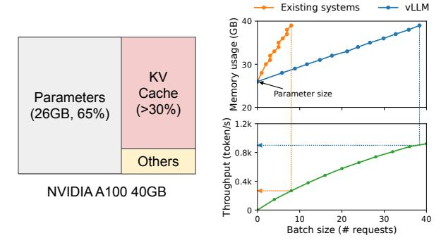
***الشكل 1.** *إلى اليسار:* تخطيط الذاكرة عند خدمة نموذج LLM يحتوي على 13 مليار معامل على بطاقة NVIDIA A100. تظلّ المعاملات (باللون الرمادي) في ذاكرة GPU طوال الخدمة. أمّا الذاكرة الخاصّة بـ KV cache (باللون الأحمر) فتُخصَّص وتُحرَّر مع كلّ طلب خدمة. ويُستخدم قدر صغير من الذاكرة (باللون الأصفر) بصفة عابرة لتفعيل الحسابات. *إلى اليمين:* يُهدّئ vLLM منحنى النموّ السريع لذاكرة KV cache الذي تُلاحظه الأنظمة الحالية [31, 60]، ممّا يؤدّي إلى دفعة ملحوظة في إنتاجية الخدمة.*

تكلفة الطلب الواحد، في أنظمة *خدمة LLM* أصبح أكثر أهمّية.

في صميم نماذج اللغة الكبيرة يكمن نموذج Transformer ذاتي الانحدار [53]. يُولّد هذا النموذج الكلمات (الرموز)، *واحدةً تلو الأخرى*، استناداً إلى المدخل (المُحفِّز) وتسلسل الرموز السابقة من المُخرَج التي ولّدها حتّى الآن. ولكلّ طلب، تُكرَّر هذه العملية المكلفة حتّى يُصدر النموذج رمز إنهاء. وهذه العملية التوليدية المتسلسلة تجعل عبء العمل *مقيَّداً بالذاكرة*، ممّا يُضعف الاستفادة من القدرة الحسابية لـ GPUs ويحدّ من إنتاجية الخدمة.

من الممكن تحسين الإنتاجية بتجميع طلبات متعدّدة في دفعة. غير أنّ معالجة عدد كبير من الطلبات في دفعة واحدة تستوجب إدارة مساحة الذاكرة لكلّ طلب بكفاءة. على سبيل المثال، يوضّح الشكل 1 (إلى اليسار) توزيع الذاكرة لنموذج LLM بـ 13 مليار معامل على بطاقة NVIDIA A100 GPU بسعة 40 جيجابايت. يُخصَّص نحو 65% من الذاكرة لأوزان النموذج التي تبقى ثابتة أثناء الخدمة. وتُستخدم نحو 30% من الذاكرة لتخزين الحالات الديناميكية للطلبات. وفي نماذج Transformers، تتألّف هذه الحالات من موترات المفتاح والقيمة المرتبطة بآلية الانتباه، والتي يُشار إليها عادةً بـ *KV cache* [41]، وهي تمثّل السياق من الرموز السابقة لتوليد رموز خرج جديدة بالتتابع. أمّا النسبة الصغيرة المتبقّية

> ^*^مساهمة متساوية.

<!-- page 2 -->

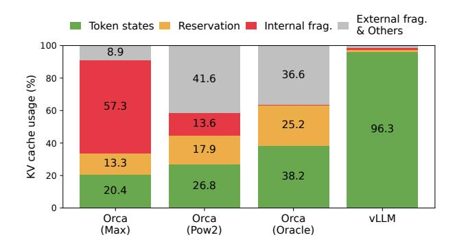
*الشكل 2. متوسّط النسبة المئوية لهدر الذاكرة في أنظمة خدمة LLM المختلفة خلال التجربة في [§6.2.](#page-9-0)*

من الذاكرة فتُستخدم لبيانات أخرى، بما في ذلك التفعيلات (activations) — وهي الموترات العابرة الناتجة عند تقييم النموذج. ولأنّ أوزان النموذج ثابتة والتفعيلات تشغل جزءاً يسيراً من ذاكرة GPU، فإنّ طريقة إدارة KV cache هي العامل الحاسم في تحديد أكبر حجم دفعة ممكن. وعند سوء الإدارة، يمكن لذاكرة KV cache أن تحدّ بشكل ملحوظ من حجم الدفعة، وبالتالي من إنتاجية النموذج، كما يبيّن الشكل [1](#page-0-0) (إلى اليمين).

في هذه الورقة، نُلاحظ أنّ أنظمة خدمة LLM الحالية [[31,](#page-14-5) [60]](#page-14-6) تقصُر عن إدارة ذاكرة KV cache بكفاءة. ويرجع ذلك أساساً إلى أنّها تُخزّن KV cache لكلّ طلب في مساحة ذاكرة متّصلة، إذ تتطلّب معظم أُطُر التعلّم العميق [[33,](#page-14-9) [39]](#page-14-10) أن تكون الموترات مخزّنة في ذاكرة متّصلة. غير أنّ KV cache، خلافاً للموترات في أعباء التعلّم العميق التقليدية، له خصائص فريدة: فهو ينمو ويتقلّص ديناميكياً مع توليد النموذج رموزاً جديدة، كما أنّ عمره وطوله غير معروفَين مسبقاً. وهذه الخصائص تجعل نهج الأنظمة الحالية غير كفء بصورة لافتة في جانبَين:

أوّلاً، تُعاني الأنظمة القائمة [[31,](#page-14-5) [60]](#page-14-6) من تشظٍّ داخلي وخارجي للذاكرة. فلتخزين KV cache لطلبٍ ما في مساحة متّصلة، فإنّها تُخصّص مسبقاً قطعة متّصلة من الذاكرة بحجم أقصى طول ممكن للطلب (مثلاً 2048 رمزاً). وقد يُسفر ذلك عن تشظٍّ داخلي حادّ، إذ قد يكون الطول الفعلي للطلب أقصر بكثير من طوله الأقصى (انظر الشكل [11](#page-8-0)). وحتّى لو كان الطول الفعلي معروفاً مسبقاً، يبقى التخصيص المسبق غير كفء: لأنّ القطعة بأكملها تظلّ محجوزة طوال عمر الطلب، فلا يمكن للطلبات الأخرى الأقصر استغلال أيّ جزء من القطعة لا يُستخدم حالياً. علاوةً على ذلك، يمكن أن يكون التشظّي الخارجي للذاكرة كبيراً أيضاً، لأنّ الحجم المخصّص مسبقاً قد يختلف من طلب لآخر. ونتائج التحليل الأوّلي في الشكل [2](#page-1-0) تُظهر أنّ نسبة 20.4% - 38.2% فقط من ذاكرة KV cache تُستخدم فعلياً لتخزين حالات الرموز في الأنظمة الحالية.

ثانياً، لا يمكن للأنظمة القائمة استثمار فرص مشاركة الذاكرة. وكثيراً ما تستخدم خدمات LLM خوارزميات

فكّ تشفير متقدّمة، كأخذ العيّنات المتوازي والبحث الشعاعي (beam search)، التي تُولّد عدة مخرجات لكلّ طلب. وفي هذه الحالات، يتألّف الطلب من تسلسلات متعدّدة قد تتشارك جزئياً في KV cache. غير أنّ مشاركة الذاكرة غير ممكنة في الأنظمة الحالية لأنّ KV cache لكلّ تسلسل مخزّن في مساحات متّصلة منفصلة.

لمعالجة القيود السابقة، نقترح PagedAttention، وهو خوارزمية انتباه مستوحاة من حلّ نظام التشغيل (OS) لتشظّي الذاكرة ومشاركتها: الذاكرة الافتراضية مع الترقيم. تقسّم PagedAttention KV cache للطلب إلى كتل، كلّ منها يمكن أن يحوي مفاتيح وقيم انتباه لعدد ثابت من الرموز. وفي PagedAttention، لا يلزم تخزين كتل KV cache في مساحة متّصلة. وبذلك يمكننا إدارة KV cache بطريقة أكثر مرونة، تماماً كما تفعل الذاكرة الافتراضية في نظام التشغيل: يمكن النظر إلى الكتل بوصفها صفحات، والرموز بوصفها بايتات، والطلبات بوصفها عمليات. ويُخفّف هذا التصميم التشظّي الداخلي عبر استخدام كتل صغيرة نسبياً وتخصيصها عند الطلب. كما يُلغي التشظّي الخارجي لأنّ جميع الكتل لها الحجم نفسه. وأخيراً، يُمكّن من مشاركة الذاكرة على مستوى الكتلة، عبر مختلف التسلسلات المرتبطة بالطلب نفسه، أو حتّى عبر مختلف الطلبات.

في هذا العمل، نبني vLLM، وهو محرّك موزَّع لخدمة LLM بإنتاجية عالية، مبنيّ على PagedAttention، يحقّق هدراً يكاد يكون معدوماً في ذاكرة KV cache. يستخدم vLLM إدارة ذاكرة على مستوى الكتلة وجدولة طلبات استباقية، صُمِّمت بالتوازي مع PagedAttention. ويدعم vLLM نماذج LLM الشائعة مثل GPT [[5]](#page-13-0) وOPT [[62]](#page-15-0) وLLaMA [[52]](#page-14-11) بأحجام متفاوتة، بما فيها تلك التي تتجاوز سعة ذاكرة GPU وحيد. وتُظهر تقييماتنا على نماذج وأعباء عمل متنوّعة أنّ vLLM يُحسّن إنتاجية خدمة LLM بمقدار 2-4× مقارنةً بالأنظمة الحديثة [[31,](#page-14-5) [60]](#page-14-6)، دون أيّ تأثير على دقّة النموذج. ويزداد التحسّن وضوحاً مع التسلسلات الأطول والنماذج الأكبر وخوارزميات فكّ التشفير الأكثر تعقيداً ([§4.3)](#page-5-0). وفيما يلي إسهاماتنا الرئيسة:

- نُحدّد التحدّيات في تخصيص الذاكرة عند خدمة LLM ونُقيِّم أثرها على أداء الخدمة.
- نقترح PagedAttention، خوارزمية انتباه تعمل على KV cache مخزّن في ذاكرة مرقَّمة غير متّصلة، مستوحاة من الذاكرة الافتراضية والترقيم في نظام التشغيل.
- نُصمّم وننفّذ vLLM، محرّك خدمة LLM موزَّع مبنيّ على PagedAttention.
- نقيّم vLLM في سيناريوهات متعدّدة ونُبيّن أنّه يتفوّق بشكل ملحوظ على الحلول الحديثة السابقة مثل FasterTransformer [[31]](#page-14-5) وOrca [[60]](#page-14-6).

# 2 الخلفية

في هذا القسم، نصف إجراءات التوليد والخدمة في نماذج LLM النموذجية، والجدولة على مستوى التكرار المستخدمة في خدمة LLM.

<!-- page 3 -->

## 2.1 نماذج اللغة الكبيرة المبنية على Transformer

مهمّة النمذجة اللغوية هي نمذجة احتمال قائمة من الرموز (x_1, \ldots, x_n). وبما أنّ اللغة لها ترتيب تسلسلي طبيعي، فمن الشائع تحليل الاحتمال المشترك للتسلسل بأكمله بصفته حاصل ضرب الاحتمالات الشرطية (المعروف باسم *التحلّل ذاتي الانحدار* [3]):

$$ P(x) = P(x_1) \cdot P(x_2 \mid x_1) \cdots P(x_n \mid x_1, \dots, x_{n-1}). (1) $$

أصبحت Transformers [53] البنية المعيارية فعلياً لنمذجة الاحتمال السابق على نطاق واسع. وأهم مكوّن في نموذج لغوي مبنيّ على Transformer هو طبقات *الانتباه الذاتي* (self-attention). فلتسلسل حالات داخلية مدخلة (x_1, \ldots, x_n) \in \mathbb{R}^{n \times d}، تُطبّق طبقة الانتباه الذاتي أوّلاً تحويلات خطّية على كلّ موضع i للحصول على متّجهات الاستعلام والمفتاح والقيمة:

$$ q_i = W_q x_i, \ k_i = W_k x_i, \ v_i = W_v x_i. (2) $$

ثمّ تحسب طبقة الانتباه الذاتي درجة الانتباه a_{ij} عبر ضرب متّجه الاستعلام في موضع ما بكلّ متّجهات المفاتيح السابقة له، وتحسب الخرج o_i بصفته متوسّطاً موزوناً على متّجهات القيم:

$$
a_{ij} = \frac{\exp(q_i^{\top} k_j / \sqrt{d})}{\sum_{t=1}^{i} \exp(q_i^{\top} k_t / \sqrt{d})}, \ o_i = \sum_{i=1}^{i} a_{ij} v_j. (3)
$$

إلى جانب الحسابات في المعادلة 4، فإنّ جميع المكوّنات الأخرى في نموذج Transformer، بما في ذلك طبقة التضمين، وطبقة التغذية الأمامية، والتسوية الطبقية [2]، والاتصال المتبقّي [22]، وحساب لوغاريتمات الخرج، وتحويلات الاستعلام والمفتاح والقيمة في المعادلة 2، تُطبَّق جميعها بصورة مستقلّة على مستوى الموضع بصيغة y_i = f(x_i).

## 2.2 خدمة LLM والتوليد ذاتي الانحدار

بعد التدريب، تُنشَر نماذج LLM في الغالب بوصفها خدمة توليد شرطي (مثلاً واجهة الإكمال [34] أو روبوت دردشة [19, 35]). يُقدّم الطلب لخدمة LLM قائمة بـ *رموز المُحفِّز المُدخَل* (x_1, \ldots, x_n)، وتُولّد الخدمة قائمة برموز الخرج (x_{n+1}, \ldots, x_{n+T}) وفقاً للمعادلة 1. ونشير إلى دمج المحفِّز ورموز الخرج بـ *تسلسل*.

نظراً للتحلّل في المعادلة 1، فلا يمكن لـ LLM إلّا أخذ العيّنات وتوليد الرموز الجديدة واحداً تلو الآخر، وعملية توليد كلّ رمز جديد تعتمد على جميع *الرموز السابقة* في ذلك التسلسل، وتحديداً متّجهات مفاتيحها وقيمها. وفي عملية التوليد المتسلسلة هذه، كثيراً ما تُخزَّن متّجهات المفاتيح والقيم للرموز الموجودة لتوليد رموز مستقبلية، وهو ما يُعرف بـ *KV cache*. ولاحظ أنّ KV cache لرمز ما يعتمد على جميع الرموز السابقة له. وهذا يعني أنّ KV cache للرمز نفسه عند ظهوره في مواضع مختلفة في تسلسل ما سيكون مختلفاً.

بمعلومية محفِّز طلب، يمكن تحليل عملية التوليد في خدمة LLM إلى مرحلتَين:

تأخذ مرحلة المحفِّز (prompt phase) كامل محفِّز المستخدم (x_1, ..., x_n) دخلاً، وتحسب احتمال أوّل رمز جديد P(x_{n+1} \mid x_1, ..., x_n). وأثناء هذه العملية، تُولِّد أيضاً متّجهات المفاتيح k_1, ..., k_n ومتّجهات القيم v_1, ..., v_n. وبما أنّ رموز المحفِّز x_1, ..., x_n معروفة جميعاً، فإنّ حسابات مرحلة المحفِّز يمكن توازيها باستخدام عمليات ضرب مصفوفة بمصفوفة. ولذلك يمكن لهذه المرحلة استثمار التوازي الكامن في GPUs بكفاءة.

أمّا مرحلة التوليد ذاتي الانحدار (autoregressive generation phase)، فتُولّد الرموز الجديدة المتبقّية بالتتابع. ففي التكرار t، يأخذ النموذج رمزاً واحداً x_{n+t} دخلاً، ويحسب الاحتمال P(x_{n+t+1} \mid x_1, \dots, x_{n+t}) باستخدام متّجهات المفاتيح k_1, \dots, k_{n+t} ومتّجهات القيم v_1, \ldots, v_{n+t}. ولاحظ أنّ متّجهات المفاتيح والقيم في المواضع 1 إلى n + t - 1 مخزّنة في تكرارات سابقة، ولا يُحسب في هذا التكرار إلّا متّجه المفتاح والقيمة الجديد k_{n+t} وv_{n+t}. وتنتهي هذه المرحلة إمّا عندما يصل التسلسل إلى أقصى طول (يُحدّده المستخدمون أو يُقيِّده النموذج) أو عند إصدار رمز نهاية التسلسل (<eos>). ولا يمكن توازي الحسابات في تكرارات مختلفة بسبب تبعية البيانات، وكثيراً ما تستخدم ضرب مصفوفة بمتّجه، وهو أقلّ كفاءة. ونتيجة لذلك، تُضعف هذه المرحلة الاستفادة من حساب GPU بشكل كبير وتصبح مقيَّدة بالذاكرة، وهي المسؤولة عن الجزء الأكبر من زمن الاستجابة لطلب واحد.

## 2.3 تقنيات التجميع في دفعات لـ LLM

يمكن تحسين الاستفادة من الحساب في خدمة LLM عبر تجميع طلبات متعدّدة في دفعة. لأنّ الطلبات تتشارك أوزان النموذج نفسه، فإنّ عبء نقل الأوزان يُوزَّع على الطلبات في الدفعة، ويمكن أن يطغى عليه عبء الحساب عند بلوغ حجم الدفعة قدراً كافياً. غير أنّ تجميع الطلبات لخدمة LLM ليس أمراً يسيراً لسببَين. أوّلاً، قد تصل الطلبات في أوقات مختلفة. وأيّ استراتيجية تجميع ساذجة إمّا أن تُجبر الطلبات الأبكر على الانتظار للأحدث، أو تؤجّل الطلبات الواردة حتى تنتهي السابقة، ممّا يُسبّب تأخيرات انتظار كبيرة. ثانياً، قد تختلف أطوال المدخلات والمخرجات بين الطلبات اختلافاً واسعاً (الشكل 11). فأيّ تقنية تجميع مباشرة ستُضيف حشواً إلى مدخلات الطلبات ومخرجاتها لمساواة أطوالها، فتُهدر حساب وذاكرة GPU.

لمعالجة هذه المشكلة، طُرحت آليات تجميع دقيقة الحبيبية، مثل التجميع الخلوي [16] والجدولة على مستوى التكرار [60]. وعلى خلاف الأساليب التقليدية التي تعمل على مستوى الطلب، تعمل هذه التقنيات على مستوى التكرار. فبعد كلّ تكرار، تُزال الطلبات المكتملة من الدفعة، وتُضاف طلبات جديدة. لذا يمكن معالجة طلب جديد بعد انتظار تكرار واحد فقط، لا انتظار اكتمال الدفعة بأكملها. كما أنّ هذه التقنيات، باستخدام أنوية GPU خاصّة، تُغني عن الحاجة إلى حشو المدخلات والمخرجات. وبتقليل تأخير الانتظار وعدم كفاءة الحشو، تَزيد آليات التجميع دقيقة الحبيبية إنتاجية خدمة LLM زيادة كبيرة.

<!-- page 4 -->

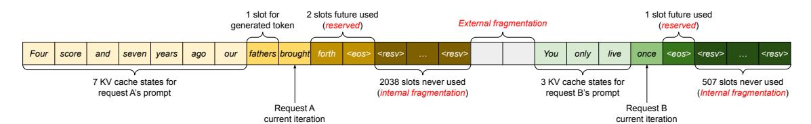
*الشكل 3. إدارة ذاكرة KV cache في الأنظمة الحالية. توجد ثلاثة أنواع من هدر الذاكرة - المحجوزة، والتشظّي الداخلي، والتشظّي الخارجي - تمنع الطلبات الأخرى من الاستفادة من الذاكرة. ويمثّل الرمز في كلّ خانة ذاكرة KV cache الخاصّة به. لاحظ أنّ الرموز نفسها قد تختلف KV caches الخاصّة بها عند المواضع المختلفة.*

# 3 تحدّيات الذاكرة في خدمة LLM

على الرغم من أنّ التجميع دقيق الحبيبية يُقلّل هدر الحساب ويُمكّن من تجميع الطلبات بطريقة أكثر مرونة، إلّا أنّ عدد الطلبات التي يمكن تجميعها معاً لا يزال مقيَّداً بسعة ذاكرة GPU، خاصّةً المساحة المخصّصة لتخزين KV cache. وبعبارة أخرى، إنتاجية نظام الخدمة مقيَّدة بالذاكرة. ويتطلّب تجاوز هذا القيد معالجة التحدّيات التالية في إدارة الذاكرة:

KV cache الكبيرة. ينمو حجم KV cache بسرعة مع عدد الطلبات. على سبيل المثال، في نموذج OPT بـ 13 مليار معامل [[62]](#page-15-0)، يتطلّب KV cache لرمز واحد 800 كيلوبايت من المساحة، محسوبةً بـ 2 (متّجها المفتاح والقيمة) × 5120 (حجم الحالة الداخلية) × 40 (عدد الطبقات) × 2 (بايت لكلّ FP16). وبما أنّ OPT يستطيع توليد تسلسلات تصل إلى 2048 رمزاً، فإنّ الذاكرة اللازمة لتخزين KV cache لطلب واحد قد تبلغ 1.6 جيجابايت. ولدى GPUs الحديثة سعات ذاكرة في حدود عشرات الجيجابايت. وحتى لو خُصّصت كلّ الذاكرة المتاحة لـ KV cache، فلن يُستوعَب سوى بضع عشرات من الطلبات. علاوةً على ذلك، يمكن لإدارة الذاكرة غير الكفؤة أن تُخفّض حجم الدفعة أكثر، كما يبيّن الشكل [2](#page-1-0). وبالنظر إلى الاتّجاهات الحالية، فإنّ سرعة حساب GPU تنمو أسرع من سعة الذاكرة [[17]](#page-13-9). فمن NVIDIA A100 إلى H100، تزداد FLOPS بأكثر من ضعفَين، بينما تظلّ ذاكرة GPU عند 80 جيجابايت كحدّ أقصى. لذا نعتقد أنّ الذاكرة ستصبح عنق زجاجة متزايد الأهمّية.

خوارزميات فكّ تشفير معقّدة. تُتيح خدمات LLM طيفاً من خوارزميات فكّ التشفير ليختار منها المستخدمون، ولكلّ منها آثار مختلفة على تعقيد إدارة الذاكرة. على سبيل المثال، عندما يطلب المستخدمون عدّة عيّنات عشوائية من محفِّز مدخل واحد، وهي حالة استخدام نموذجية في اقتراح البرامج [[18]](#page-13-3)، يمكن مشاركة KV cache لجزء المحفِّز، الذي يمثّل 12% من إجمالي ذاكرة KV cache في تجربتنا ([§6.3)](#page-10-0)، لتقليل استخدام الذاكرة. على الجانب الآخر، يجب أن يبقى KV cache خلال مرحلة التوليد ذاتي الانحدار غير مشترك بسبب اختلاف نتائج العيّنات واعتمادها على السياق والموضع. ويتوقّف مدى مشاركة KV cache على خوارزمية فكّ التشفير المستخدمة. وفي خوارزميات أكثر تطوراً مثل البحث الشعاعي [[49]](#page-14-12)، يمكن لشُعَب الطلبات المختلفة مشاركة أجزاء أكبر (توفير ذاكرة يصل إلى 55%، انظر

[§6.3)](#page-10-0) من KV cache الخاصّة بها، ويتطوّر نمط المشاركة مع تقدّم عملية فكّ التشفير.

الجدولة لأطوال إدخال وإخراج غير معروفة. تُظهر الطلبات المرسلة إلى خدمة LLM تبايناً في أطوال المدخلات والمخرجات. وهذا يستدعي أن يستوعب نظام إدارة الذاكرة طيفاً واسعاً من أطوال المحفِّزات. وعلاوةً على ذلك، مع نموّ طول خرج طلب أثناء فكّ التشفير، تتوسّع الذاكرة اللازمة لـ KV cache الخاصّ به، وقد تستنزف الذاكرة المتاحة للطلبات الواردة أو لتوليد المحفِّزات القائمة. ويحتاج النظام إلى اتّخاذ قرارات جدولة، كحذف KV cache لبعض الطلبات من ذاكرة GPU أو تبديلها (swap out).

## 3.1 إدارة الذاكرة في الأنظمة الحالية

بما أنّ معظم العوامل في أُطُر التعلّم العميق الحالية [[33,](#page-14-9) [39]](#page-14-10) تستلزم تخزين الموترات في ذاكرة متّصلة، فإنّ أنظمة خدمة LLM السابقة [[31,](#page-14-5) [60]](#page-14-6) تُخزّن أيضاً KV cache لطلب واحد بصفته موتراً متّصلاً عبر المواضع المختلفة. ونظراً لأنّ أطوال الخرج من LLM لا يمكن التنبّؤ بها، تُخصّص هذه الأنظمة قطعة من الذاكرة تخصيصاً ساكناً لكلّ طلب استناداً إلى أقصى طول تسلسل ممكن للطلب، بصرف النظر عن طول المدخل الفعلي أو طول الخرج النهائي.

يُوضِّح الشكل [3](#page-3-0) طلبَين: الطلب A بطول تسلسل أقصى يبلغ 2048 والطلب B بطول أقصى يبلغ 512. ولمخطّط التخصيص المسبق للقطع في الأنظمة الحالية ثلاثة مصادر رئيسة لهدر الذاكرة: خانات محجوزة لرموز مستقبلية، وتشظٍّ داخلي بسبب الإفراط في حجز مساحات لطول التسلسل الأقصى المحتمل، وتشظٍّ خارجي ناجم عن مخصِّص الذاكرة مثل مخصِّص الرفيق (buddy allocator). ولن يُستخدم التشظّي الخارجي للرموز المُولَّدة، وهو معروف قبل خدمة الطلب. كذلك يبقى التشظّي الداخلي غير مستخدم، لكن لا يُدرك ذلك إلّا بعد انتهاء الطلب من أخذ العيّنات. وكلاهما هدر صرف للذاكرة. ومع أنّ الذاكرة المحجوزة تُستخدم في النهاية، فإنّ حجزها طوال مدّة الطلب، خاصّةً عندما تكون كبيرة، يشغل المساحة التي يمكن لولاه استخدامها لمعالجة طلبات أخرى. وقد عرضنا متوسّط نسبة هدر الذاكرة في تجاربنا في الشكل [2](#page-1-0)، وكشفنا أنّ الذاكرة الفعّالة الفعلية في الأنظمة السابقة قد تنخفض إلى 20.4% فحسب.

<!-- page 5 -->

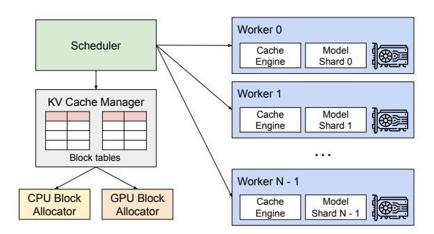
*الشكل 4. نظرة عامّة على نظام vLLM.*

ومع أنّ الضغط (compaction) [54] طُرح حلاً محتملاً للتشظّي، فإنّ تنفيذه في نظام خدمة LLM حسّاس للأداء غير عملي بسبب ضخامة KV cache. وحتى مع الضغط، فإنّ مساحة القطعة المخصّصة مسبقاً لكلّ طلب تمنع مشاركة الذاكرة الخاصّة بخوارزميات فكّ التشفير في أنظمة إدارة الذاكرة الحالية.

# 4 الطريقة

في هذا العمل، نطوّر خوارزمية انتباه جديدة، *PagedAttention*، ونبني محرّك خدمة LLM، *vLLM*، لمعالجة التحدّيات الموضّحة في §3. وتُعرَض بنية vLLM في الشكل 4. يتبنّى vLLM مجدوِلاً مركزياً لتنسيق تنفيذ عمّال GPU الموزَّعين. ويُدير *مدير KV cache* ذاكرة KV cache بأسلوب مرقَّم، ممكَّناً بـ PagedAttention. وتحديداً، يدير مدير KV cache ذاكرة KV cache الفيزيائية على عمّال GPU عبر التعليمات المرسَلة من المجدوِل المركزي.

نصف خوارزمية PagedAttention في §4.1. ثمّ نُبيّن تصميم مدير KV cache في §4.2 وكيف يُمكِّن PagedAttention في §4.3 على التوالي. ثمّ نُظهر كيف يُسهّل هذا التصميم إدارة ذاكرة فعّالة لمختلف طرق فكّ التشفير (§4.4) ويتعامل مع تسلسلات الإدخال والإخراج المتغيّرة الطول (§4.5). وأخيراً نُبيّن كيف يعمل تصميم vLLM في إعداد موزَّع (§4.6).

## 4.1 PagedAttention

لمعالجة تحدّيات الذاكرة في §3، نقدّم *PagedAttention*، خوارزمية انتباه مستوحاة من فكرة *الترقيم* الكلاسيكية [25] في أنظمة التشغيل. وعلى خلاف خوارزميات الانتباه التقليدية، تسمح PagedAttention بتخزين مفاتيح وقيم متتالية في مساحة ذاكرة غير متّصلة. وتحديداً، تُقسّم PagedAttention KV cache لكلّ تسلسل إلى *كتل KV*. ويحوي كلّ كتلة متّجهات مفاتيح وقيم لعدد ثابت من الرموز،1 الذي نشير إليه بـ *حجم*

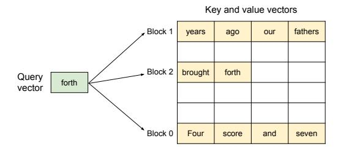
***الشكل 5.** توضيح لخوارزمية PagedAttention، حيث تُخزَّن متّجهات مفاتيح وقيم الانتباه ككتل غير متّصلة في الذاكرة.*

كتلة KV (B). نرمز لكتلة المفتاح بـ K_j = (k_{(j-1)B+1}, \ldots, k_{jB}) ولكتلة القيمة بـ V_j = (v_{(j-1)B+1}, \ldots, v_{jB}). ويمكن تحويل حساب الانتباه في المعادلة 4 إلى الحساب التالي على مستوى الكتلة:

$$
A_{ij} = \frac{\exp(q_i^\top K_j / \sqrt{d})}{\sum_{t=1}^{\lceil i/B \rceil} \exp(q_i^\top K_t \mathbf{1} / \sqrt{d})}, \ o_i = \sum_{j=1}^{\lceil i/B \rceil} V_j A_{ij}^\top, \tag{4}
$$

حيث A_{ij} = (a_{i,(j-1)B+1}, \dots, a_{i,jB}) هو متّجه الصفّ لدرجة الانتباه على كتلة KV الـ *j*-ة.

أثناء حساب الانتباه، تتعرّف نواة PagedAttention على كتل KV المختلفة وتجلبها بصورة منفصلة. ونعرض مثالاً لـ PagedAttention في الشكل 5: متّجهات المفاتيح والقيم موزّعة على ثلاث كتل، وهذه الكتل غير متّصلة في الذاكرة الفيزيائية. وفي كلّ مرّة، تضرب النواة متّجه الاستعلام q_i لرمز الاستعلام ("forth") في متّجهات المفاتيح K_j في كتلة (مثلاً متّجهات مفاتيح "Four score and seven" للكتلة 0) لحساب درجة الانتباه A_{ij}، ثمّ تضرب A_{ij} في متّجهات القيم V_i في كتلة لاستخراج خرج الانتباه النهائي o_i.

باختصار، تُتيح خوارزمية PagedAttention تخزين كتل KV في ذاكرة فيزيائية غير متّصلة، ممّا يُمكِّن من إدارة ذاكرة مرقَّمة أكثر مرونة في vLLM.

## 4.2 مدير KV Cache

الفكرة الجوهرية وراء مدير الذاكرة في vLLM مماثلة لفكرة *الذاكرة الافتراضية* [25] في أنظمة التشغيل. يقسّم نظام التشغيل الذاكرة إلى *صفحات* ثابتة الحجم ويربط الصفحات المنطقية لبرامج المستخدم بالصفحات الفيزيائية. ويمكن للصفحات المنطقية المتجاورة أن تقابل صفحات ذاكرة فيزيائية غير متّصلة، ممّا يسمح لبرامج المستخدم بالوصول إلى الذاكرة كأنّها متّصلة. علاوةً على ذلك، لا يلزم حجز مساحة الذاكرة الفيزيائية كاملةً مسبقاً، ممّا يُمكِّن نظام التشغيل من تخصيص الصفحات الفيزيائية ديناميكياً عند الحاجة. يستخدم vLLM الأفكار الكامنة وراء الذاكرة الافتراضية لإدارة KV cache في خدمة LLM. وممكَّناً بـ PagedAttention، نُنظّم KV cache بصفته كتل KV ثابتة الحجم، تشبه الصفحات في الذاكرة الافتراضية.

يُمثَّل KV cache لطلب ما بسلسلة من *كتل KV المنطقية*، تُملأ من اليسار إلى اليمين كلّما وُلّدت رموز جديدة وKV cache الخاصّ بها. وتُحجَز المواضع غير المملوءة من الكتلة المنطقية الأخيرة لتوليدات مستقبلية. وعلى عمّال GPU، يخصّص *محرّك الكتل* (block engine) قطعة متّصلة من DRAM في GPU

> ^&^lt;sup>1في Transformer، لكلّ رمز مجموعة من متّجهات المفاتيح والقيم عبر الطبقات ورؤوس الانتباه ضمن الطبقة. ويمكن إدارة جميع متّجهات المفاتيح والقيم معاً ضمن كتلة KV واحدة، أو يمكن لمتّجهات المفاتيح والقيم في رؤوس وطبقات مختلفة أن يكون لكلّ منها كتلة مستقلّة وتُدار في جداول كتل منفصلة. لا فرق بين التصميمَين في الأداء، واخترنا الثاني لسهولة التنفيذ.

<!-- page 6 -->

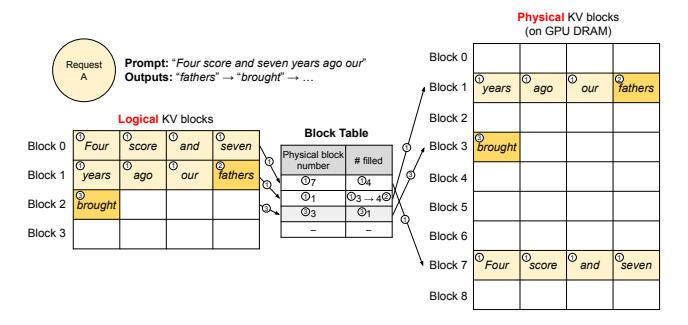
*الشكل 6. ترجمة جدول الكتل في vLLM.*

ويقسّمها إلى كتل KV فيزيائية (وهذا يُجرى أيضاً على ذاكرة CPU للتبديل؛ انظر [§4.5)](#page-7-0). كذلك يحتفظ مدير كتل KV بجداول الكتل — أي التطابق بين كتل KV المنطقية والفيزيائية لكلّ طلب. ويُسجّل كلّ مدخل في جدول الكتل الكتلة الفيزيائية المقابلة لكتلة منطقية وعدد المواضع المملوءة. ويسمح فصل كتل KV المنطقية والفيزيائية لـ vLLM بنموّ ذاكرة KV cache ديناميكياً دون حجزها لجميع المواضع مسبقاً، ممّا يُلغي معظم هدر الذاكرة في الأنظمة الحالية، كما في الشكل [2](#page-1-0).

## 4.3 فكّ التشفير باستخدام PagedAttention وvLLM

الآن، نستعرض مثالاً، كما في الشكل [6](#page-5-2)، لتوضيح كيف يُنفّذ vLLM PagedAttention ويُدير الذاكرة أثناء عملية فكّ تشفير تسلسل إدخال واحد: ○1 كما في الذاكرة الافتراضية لنظام التشغيل، لا يحتاج vLLM إلى حجز الذاكرة لأقصى طول تسلسل ممكن من البداية. بل يحجز فقط كتل KV اللازمة لاستيعاب KV cache المُولَّد أثناء حساب المحفِّز. في هذه الحالة، يحوي المحفِّز 7 رموز، فيربط vLLM أوّل كتلتَي KV منطقيتَين (0 و1) بكتلتَي KV فيزيائيتَين (7 و1، على التوالي). في خطوة التعبئة المسبقة (prefill)، يُولّد vLLM KV cache للمحفِّزات وأوّل رمز خرج بخوارزمية انتباه ذاتي تقليدية (مثل [[13]](#page-13-10)). ثمّ يُخزّن KV cache لأوّل 4 رموز في الكتلة المنطقية 0 ولـ 3 الرموز التالية في الكتلة المنطقية 1. وتُحجَز الخانة المتبقّية لمرحلة التوليد ذاتي الانحدار اللاحقة. ○2 في خطوة فكّ التشفير ذاتي الانحدار الأولى، يُولّد vLLM الرمز الجديد بخوارزمية PagedAttention على الكتل الفيزيائية 7 و1. ولأنّ هناك خانة واحدة متاحة في آخر كتلة منطقية، يُخزَّن KV cache المُولَّد حديثاً هناك، ويُحدَّث سجلّ #filled في جدول الكتل. ○3 في خطوة فكّ التشفير الثانية، وبما أنّ الكتلة المنطقية الأخيرة ممتلئة، يُخزّن vLLM KV cache المُولَّد حديثاً في كتلة منطقية جديدة؛ يخصّص له vLLM كتلة فيزيائية جديدة (الكتلة الفيزيائية 3) ويُخزّن هذا الرابط في جدول الكتل.

عالمياً، في كلّ تكرار فكّ تشفير، يختار vLLM أوّلاً مجموعة تسلسلات مرشّحة للتجميع (مزيد من التفاصيل في [§4.5)](#page-7-0)، ويخصّص الكتل الفيزيائية للكتل المنطقية المطلوبة حديثاً. ثمّ يدمج vLLM جميع رموز إدخال التكرار الحالي (أي جميع رموز طلبات مرحلة المحفِّز

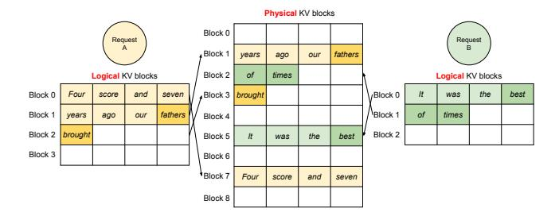
*الشكل 7. تخزين KV cache لطلبَين في نفس الوقت في vLLM.*

وأحدث الرموز لطلبات مرحلة التوليد) كتسلسل واحد ويُغذّيه إلى LLM. وأثناء حساب LLM، يستخدم vLLM نواة PagedAttention للوصول إلى KV cache السابق المخزَّن بصيغة كتل KV منطقية، ويحفظ KV cache المُولَّد حديثاً في كتل KV الفيزيائية. وتخزين رموز متعدّدة ضمن كتلة KV (حجم كتلة > 1) يُمكِّن نواة PagedAttention من معالجة KV cache عبر مزيد من المواضع بالتوازي، ممّا يزيد الاستفادة من العتاد ويُقلّل زمن الاستجابة. غير أنّ زيادة حجم الكتلة تزيد أيضاً تشظّي الذاكرة. ندرس أثر حجم الكتلة في [§7.2](#page-11-0).

ومرّةً أخرى، يُخصّص vLLM كتلاً فيزيائية جديدة للكتل المنطقية ديناميكياً مع توليد مزيد من الرموز وKV cache الخاصّ بها. وبما أنّ جميع الكتل تُملأ من اليسار إلى اليمين ولا تُخصَّص كتلة فيزيائية جديدة إلّا عندما تمتلئ كلّ الكتل السابقة، فإنّ vLLM يحدّ من كلّ هدر الذاكرة لطلب ما داخل كتلة واحدة، فيستفيد من كلّ الذاكرة بفعّالية، كما يبيّن الشكل [2](#page-1-0). وهذا يسمح لمزيد من الطلبات بالاستيعاب في الذاكرة للتجميع — وبالتالي تحسين الإنتاجية. وعندما ينتهي طلب من توليده، يمكن تحرير كتل KV الخاصّة به لتخزين KV cache لطلبات أخرى. وفي الشكل [7](#page-5-3)، نعرض مثالاً لإدارة vLLM للذاكرة لتسلسلَين. ربط الكتل المنطقية للتسلسلَين بكتل فيزيائية مختلفة ضمن المساحة المحجوزة من قبل محرّك الكتل في عمّال GPU. ولا تحتاج الكتل المنطقية المتجاورة للتسلسلَين إلى أن تكون متّصلة في ذاكرة GPU الفيزيائية، ويمكن استثمار مساحة الكتل الفيزيائية بكفاءة من قِبَل التسلسلَين معاً.

## 4.4 التطبيق على سيناريوهات فكّ تشفير أخرى

يبيّن [§4.3](#page-5-0) كيف تتعامل PagedAttention وvLLM مع خوارزميات فكّ التشفير الأساسية، كفكّ التشفير الجشع (greedy decoding) وأخذ العيّنات، التي تأخذ محفِّز مستخدم واحداً مدخلاً وتُولّد تسلسل خرج واحداً. وفي كثير من تطبيقات LLM الناجحة [[18,](#page-13-3) [34]](#page-14-2)، يجب أن تُتيح خدمة LLM سيناريوهات فكّ تشفير أكثر تعقيداً تُظهر أنماط وصول معقّدة وفرصاً أكبر لمشاركة الذاكرة. ونُبيّن في هذا القسم قابلية تطبيق vLLM العامّة عليها.

أخذ العيّنات المتوازي (Parallel sampling). في مساعدي البرمجة المبنيّين على LLM [[6,](#page-13-2) [18]](#page-13-3)، يُولّد LLM عدّة مخرجات معايَنة لمحفِّز إدخال واحد؛ ويستطيع المستخدمون اختيار المُخرَج المفضَّل من بين المرشّحات. حتى الآن افترضنا ضمنياً أنّ الطلب

<!-- page 7 -->

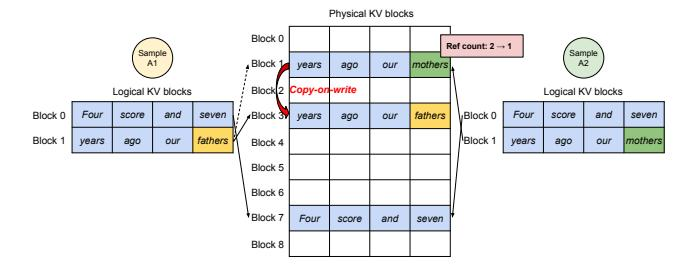
*الشكل 8. مثال على أخذ العيّنات المتوازي.*

يُولّد تسلسلاً واحداً. وفي بقية هذه الورقة، نفترض الحالة الأعمّ التي يُولّد فيها الطلب تسلسلات متعدّدة. في أخذ العيّنات المتوازي، يتضمّن الطلب الواحد عدّة عيّنات تتشارك محفِّز الإدخال نفسه، ممّا يسمح بمشاركة KV cache للمحفِّز كذلك. وعبر PagedAttention وإدارة الذاكرة المرقَّمة، يستطيع vLLM تحقيق هذه المشاركة بسهولة وتوفير الذاكرة.

يعرض الشكل 8 مثالاً لفكّ التشفير المتوازي لمخرجَين. لأنّ كلا المخرجَين يتشاركان المحفِّز نفسه، فإنّنا نحجز مساحة لنسخة واحدة فقط من حالة المحفِّز في مرحلة المحفِّز؛ وتُربَط الكتل المنطقية لمحفِّزَي التسلسلَين بنفس الكتل الفيزيائية: تُربَط الكتلتان المنطقيتان 0 و1 من كلا التسلسلَين بالكتل الفيزيائية 7 و1، على التوالي. وبما أنّه يمكن ربط كتلة فيزيائية واحدة بعدّة كتل منطقية، نُدخل عدّاد مرجع لكلّ كتلة فيزيائية. وفي هذه الحالة، عدّاد المرجع للكتلتَين الفيزيائيتَين 7 و1 يساوي 2 لكلٍّ منهما. وفي مرحلة التوليد، تأخذ العيّنتان رموز خرج مختلفة وتحتاجان إلى تخزين منفصل لـ KV cache. ويُنفّذ vLLM آلية النسخ-عند-الكتابة (copy-on-write) على مستوى الكتلة للكتل الفيزيائية التي تحتاج تعديلاً من قِبَل تسلسلات متعدّدة، شبيهةً بتقنية النسخ-عند-الكتابة في الذاكرة الافتراضية لنظام التشغيل (مثلاً عند تفريع عملية). وتحديداً، في الشكل 8، عندما تحتاج العيّنة A1 إلى الكتابة في آخر كتلة منطقية لها (الكتلة المنطقية 1)، يُلاحظ vLLM أنّ عدّاد المرجع للكتلة الفيزيائية المقابلة (الكتلة الفيزيائية 1) أكبر من 1؛ فيُخصّص كتلة فيزيائية جديدة (الكتلة الفيزيائية 3)، ويُوعز إلى محرّك الكتل بنسخ المعلومات من الكتلة الفيزيائية 1، ويُنقص عدّاد المرجع إلى 1. ثمّ عندما تكتب A2 في الكتلة الفيزيائية 1، يكون عدّاد المرجع قد انخفض بالفعل إلى 1؛ فتكتب A2 KV cache المُولَّد حديثاً مباشرةً في الكتلة الفيزيائية 1.

وباختصار، يُمكِّن vLLM من مشاركة معظم المساحة المستخدمة لتخزين KV cache للمحفِّزات عبر عدّة عيّنات خرج، باستثناء آخر كتلة منطقية تُدار بآلية النسخ-عند-الكتابة. وبمشاركة الكتل الفيزيائية عبر عدّة عيّنات، يمكن تقليل استهلاك الذاكرة بشكل كبير، خاصّةً مع *المحفِّزات الطويلة*.

**البحث الشعاعي (Beam search).** في مهام LLM مثل الترجمة الآلية [59]، يتوقّع المستخدمون أفضل k ترجمات يُنتجها LLM. ويُستخدم البحث الشعاعي [49] على نطاق واسع لفكّ تشفير أكثر تسلسل خرج محتمل من LLM، إذ يخفّف من التعقيد الحسابي للاستكشاف الكامل لـ

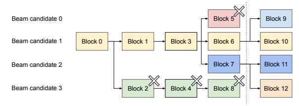
*الشكل 9. مثال على البحث الشعاعي.*

فضاء العيّنات. تعتمد الخوارزمية على معامل *عرض الشعاع* k، الذي يحدّد عدد المرشّحات الأفضل المُحتفَظ بها في كلّ خطوة. وأثناء فكّ التشفير، يُوسّع البحث الشعاعي كلّ تسلسل مرشّح في الشعاع بالنظر في جميع الرموز الممكنة، ويحسب احتمالاتها المقابلة باستخدام LLM، ويحتفظ بأفضل k تسلسلات احتمالاً من بين k \cdot |V| مرشّحاً، حيث |V| هو حجم المفردات.

وعلى خلاف فكّ التشفير المتوازي، يُسهّل البحث الشعاعي مشاركة ليس كتل المحفِّز الأوّلية فحسب، بل أيضاً كتلاً أخرى عبر مرشّحات مختلفة، وتتغيّر أنماط المشاركة ديناميكياً مع تقدّم عملية فكّ التشفير، شبيهةً بشجرة العمليات في نظام التشغيل المنشأة بتفريعات مركّبة. ويُبيّن الشكل 9 كيف يُدير vLLM كتل KV لمثال بحث شعاعي بـ k = 4. قبل التكرار الموضّح بالخطّ المنقّط، استخدم كلّ تسلسل مرشّح 4 كتل منطقية كاملة. ويتشارك جميع مرشّحي الشعاع الكتلة الأولى 0 (أي المحفِّز). وانفصل المرشّح 3 عن الباقين بدءاً من الكتلة الثانية. وتشارك المرشّحون 0-2 أوّل 3 كتل وتشعّبوا عند الكتلة الرابعة. وفي التكرارات اللاحقة، يأتي أكبر 4 مرشّحين احتمالاً من المرشّحَين 1 و2. وبما أنّ المرشّحَين الأصليَّين 0 و3 لم يعودا ضمن الأعلى، تُحرَّر كتلهم المنطقية وتُنقَص عدّادات مرجع الكتل الفيزيائية المقابلة. ويُحرّر vLLM جميع الكتل الفيزيائية التي تصل عدّادات مرجعها إلى 0 (الكتل 2 و4 و5 و8). ثمّ يُخصّص vLLM كتلاً فيزيائية جديدة (الكتل 9-12) لتخزين KV cache الجديد من المرشّحين الجدد. الآن، يتشارك جميع المرشّحين الكتل 0 و1 و3؛ ويتشارك المرشّحان 0 و1 الكتلة 6، ويتشارك المرشّحان 2 و3 إضافياً الكتلة 7.

تتطلّب أنظمة خدمة LLM السابقة نسخاً متكرّراً للذاكرة في KV cache عبر مرشّحي الشعاع. على سبيل المثال، في الحالة الموضّحة في الشكل 9، بعد الخطّ المنقّط، يحتاج المرشّح 3 إلى نسخ جزء كبير من KV cache للمرشّح 2 لمواصلة التوليد. ويُقلّل vLLM هذا العبء المتكرّر للنسخ تقليلاً ملحوظاً عبر مشاركة الكتل الفيزيائية. وفي vLLM، يمكن مشاركة معظم كتل مرشّحي الشعاع المختلفين. وتُطبَّق آلية النسخ-عند-الكتابة فقط عندما تكون الرموز المُولَّدة حديثاً ضمن كتلة مشتركة قديمة، كما في فكّ التشفير المتوازي. ولا يستلزم ذلك سوى نسخ كتلة واحدة من البيانات.

**البادئة المشتركة (Shared prefix).** عادةً، يُقدّم مستخدم LLM وصفاً (طويلاً) للمهمّة يتضمّن تعليمات وأمثلة مدخلات ومخرجات، ويُعرف بـ *محفِّز النظام* (system prompt) [36]. ويُضمّ الوصف إلى مدخل المهمّة الفعلي ليُكوِّن محفِّز الطلب. ويُولّد LLM المخرجات استناداً

<!-- page 8 -->

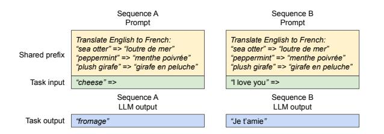
*الشكل 10. مثال على محفِّز مشترك للترجمة الآلية. اعتُمدت الأمثلة من [[5]](#page-13-0).*

إلى المحفِّز الكامل. ويُبيّن الشكل [10](#page-7-2) مثالاً. وعلاوةً على ذلك، يمكن ضبط البادئة المشتركة، عبر هندسة المحفِّزات، لتحسين دقّة المهامّ التابعة [[26,](#page-14-17)[ 27]](#page-14-18).

في هذا النوع من التطبيقات، تتشارك كثير من محفِّزات المستخدمين بادئةً، ولذا يستطيع موفّر خدمة LLM تخزين KV cache للبادئة مسبقاً لتقليل الحساب المتكرّر للبادئة. وفي vLLM، يمكن تحقيق ذلك بسهولة عبر حجز مجموعة من الكتل الفيزيائية لمجموعة بادئات مشتركة محدّدة مسبقاً من قِبَل موفّر خدمة LLM، تماماً كما يتعامل نظام التشغيل مع المكتبات المشتركة عبر العمليات. ويستطيع محفِّز إدخال مستخدم يحوي البادئة المشتركة أن يربط ببساطة كتله المنطقية بالكتل الفيزيائية المخزَّنة (مع وضع علامة نسخ-عند-الكتابة على الكتلة الأخيرة). ولا يحتاج حساب مرحلة المحفِّز إلى التنفيذ إلّا على مدخل مهمّة المستخدم.

طرق فكّ تشفير مختلطة. تُظهر طرق فكّ التشفير المذكورة آنفاً أنماط مشاركة ووصول للذاكرة متنوّعة. ومع ذلك، يُسهّل vLLM المعالجة المتزامنة للطلبات بتفضيلات فكّ تشفير مختلفة، وهو ما لا تستطيع الأنظمة الحالية فعله بكفاءة. ويعود ذلك إلى أنّ vLLM يُخفي المشاركة المعقّدة للذاكرة بين تسلسلات مختلفة عبر طبقة ربط مشتركة تُترجم الكتل المنطقية إلى الفيزيائية. ولا يرى LLM ونواة تنفيذه إلّا قائمة بمعرّفات الكتل الفيزيائية لكلّ تسلسل، ولا يحتاجان إلى التعامل مع أنماط المشاركة عبر التسلسلات. ومقارنةً بالأنظمة القائمة، يُوسّع هذا النهج فرص التجميع للطلبات ذات متطلّبات أخذ العيّنات المختلفة، ممّا يزيد في النهاية الإنتاجية الإجمالية للنظام.

## 4.5 الجدولة والاستباق

عندما تتجاوز حركة الطلبات قدرة النظام، يجب على vLLM إعطاء الأولوية لمجموعة فرعية من الطلبات. وفي vLLM، نتبنّى سياسة الجدولة "الأوّل وارداً، الأوّل خدمةً" (FCFS) لجميع الطلبات، لضمان العدالة ومنع التجويع (starvation). وعندما يحتاج vLLM إلى استباق طلبات، يضمن أن تُخدم الطلبات الأبكر وصولاً أوّلاً وأن تُستبق الأحدث أوّلاً.

تواجه خدمات LLM تحدّياً فريداً: قد تتفاوت محفِّزات الإدخال لـ LLM تفاوتاً كبيراً في الطول، وأطوال الخرج الناتجة غير معروفة مسبقاً، وتعتمد على المحفِّز والنموذج معاً. ومع نموّ عدد الطلبات ومخرجاتها، قد ينفد من vLLM الكتل الفيزيائية في GPU لتخزين KV cache المُولَّد حديثاً. وثمّة سؤالان كلاسيكيان يجب على vLLM الإجابة عنهما في

هذا السياق: (1) أيّ الكتل ينبغي إخراجها (evict)؟ (2) كيف نسترجع الكتل المُخرَجة عند الحاجة إليها مرّةً أخرى؟ عادةً ما تستخدم سياسات الإخراج تخمينات للتنبّؤ بأيّ كتلة سيتأخّر الوصول إليها أكثر في المستقبل وتُخرجها. وبما أنّنا في حالتنا نعلم أنّ جميع كتل تسلسل ما يُوصَل إليها معاً، فإنّنا نُنفّذ سياسة إخراج "الكلّ أو لا شيء" (all-or-nothing)، أي إخراج جميع كتل التسلسل أو لا شيء منها. وعلاوةً على ذلك، تُجدوَل التسلسلات المتعدّدة ضمن طلب واحد (مثل مرشّحي الشعاع في طلب بحث شعاعي واحد) كمجموعة تسلسل (sequence group) معاً. وتُستبَق التسلسلات في مجموعة التسلسل دائماً أو تُعاد جدولتها معاً بسبب احتمال مشاركة الذاكرة بين هذه التسلسلات. وللإجابة عن السؤال الثاني المتعلّق بكيفية استرجاع كتلة مُخرَجة، ندرس تقنيتَين:

التبديل (Swapping). هذه هي التقنية الكلاسيكية المستخدمة في معظم تنفيذات الذاكرة الافتراضية، التي تنسخ الصفحات المُخرَجة إلى مساحة تبديل على القرص. وفي حالتنا، ننسخ الكتل المُخرَجة إلى ذاكرة CPU. وكما يبيّن الشكل [4](#page-4-1)، يحوي vLLM، إلى جانب مخصِّص كتل GPU، مخصِّص كتل CPU لإدارة الكتل الفيزيائية المُبدَّلة إلى ذاكرة CPU. وعندما تنفد من vLLM الكتل الفيزيائية المتاحة لرموز جديدة، يختار مجموعة تسلسلات لإخراجها وينقل KV cache الخاصّ بها إلى CPU. وبمجرّد استباقه لتسلسل وإخراج كتله، يتوقّف vLLM عن قبول طلبات جديدة حتى تكتمل جميع التسلسلات المُستبَقة. وعند اكتمال طلب، تُحرَّر كتله من الذاكرة، وتُعاد كتل التسلسل المُستبَق لمواصلة معالجته. ولاحظ أنّ بهذا التصميم، عدد الكتل المُبدَّلة إلى ذاكرة CPU لا يتجاوز إجمالي عدد الكتل الفيزيائية في ذاكرة GPU، فمساحة التبديل في ذاكرة CPU مقيَّدة بذاكرة GPU المخصّصة لـ KV cache.

إعادة الحساب (Recomputation). في هذه الحالة، نُعيد ببساطة حساب KV cache عند إعادة جدولة التسلسلات المُستبَقة. ولاحظ أنّ زمن إعادة الحساب يمكن أن يكون أقلّ بكثير من الزمن الأصلي، إذ يمكن دمج الرموز المُولَّدة في فكّ التشفير مع المحفِّز الأصلي للمستخدم بصفته محفِّزاً جديداً — ويمكن توليد KV cache في جميع المواضع في تكرار واحد لمرحلة المحفِّز.

ويعتمد أداء التبديل وإعادة الحساب على عرض النطاق بين ذاكرة CPU وGPU وعلى قدرة الحساب في GPU. ندرس سرعتَي التبديل وإعادة الحساب في [§7.3](#page-11-1).

## 4.6 التنفيذ الموزَّع

لكثير من نماذج LLM أحجام معاملات تتجاوز سعة GPU وحيد [[5,](#page-13-0) [9]](#page-13-1). ومن ثمّ يلزم تقسيمها على GPUs موزَّعة وتنفيذها بأسلوب التوازي على مستوى النموذج [[28,](#page-14-19) [63]](#page-15-1). وهذا يستدعي مدير ذاكرة قادراً على التعامل مع الذاكرة الموزَّعة. ويُعدّ vLLM فعّالاً في الإعدادات الموزَّعة بفضل دعمه لاستراتيجية التوازي على مستوى الموتر بأسلوب Megatron-LM المُستخدمة على نطاق واسع لـ Transformers [[47]](#page-14-20). تتّبع هذه الاستراتيجية جدول تنفيذ SPMD (برنامج واحد بيانات متعدّدة)، حيث تُقسَّم الطبقات الخطّية

<!-- page 9 -->

لإجراء ضرب مصفوفات على مستوى الكتلة، وتزامن GPUs النتائج الوسيطة باستمرار عبر عملية all-reduce. وتحديداً، يُقسَّم عامل الانتباه على بُعد رأس الانتباه، وتعتني كلّ عملية SPMD بمجموعة فرعية من رؤوس الانتباه في الانتباه متعدّد الرؤوس (multi-head attention).

نُلاحظ أنّه حتى مع التنفيذ المتوازي على مستوى النموذج، تُعالج كلّ شريحة نموذج المجموعة نفسها من رموز الإدخال، وبالتالي تتطلّب KV Cache للمواضع نفسها. ولذا يحوي vLLM مدير KV cache واحداً ضمن المجدوِل المركزي، كما في الشكل [4](#page-4-1). يتشارك عمّال GPU المختلفون المدير، فضلاً عن الربط من الكتل المنطقية إلى الفيزيائية. وهذا الربط المشترك يسمح لعمّال GPU بتنفيذ النموذج بالكتل الفيزيائية التي يوفّرها المجدوِل لكلّ طلب إدخال. ومع أنّ كلّ عامل GPU له معرّفات الكتل الفيزيائية نفسها، فإنّ كلّ عامل لا يخزّن إلّا جزءاً من KV cache المخصّص لرؤوس الانتباه المقابلة له.

في كلّ خطوة، يُجهّز المجدوِل أوّلاً الرسالة المتضمّنة معرّفات رموز الإدخال لكلّ طلب في الدفعة، فضلاً عن جدول الكتل لكلّ طلب. ثمّ يبثّ المجدوِل رسالة التحكّم هذه إلى عمّال GPU. وبعد ذلك يبدأ عمّال GPU في تنفيذ النموذج بمعرّفات رموز الإدخال. وفي طبقات الانتباه، يقرأ عمّال GPU KV cache وفقاً لجدول الكتل في رسالة التحكّم. وأثناء التنفيذ، يُزامن عمّال GPU النتائج الوسيطة عبر عمليات الاتّصال الجماعية all-reduce دون تنسيق المجدوِل، كما في [[47]](#page-14-20). وفي النهاية، يرسل عمّال GPU الرموز المعايَنة من هذا التكرار إلى المجدوِل. وباختصار، لا يحتاج عمّال GPU إلى التزامن في إدارة الذاكرة، إذ لا يحتاجون إلّا إلى تلقّي جميع معلومات إدارة الذاكرة في بداية كلّ تكرار فكّ تشفير مع مدخلات الخطوة.

# 5 التنفيذ

vLLM نظام خدمة شامل (end-to-end) بواجهة أمامية FastAPI [[15]](#page-13-11) ومحرّك استدلال مبنيّ على GPU. تُوسِّع الواجهة الأمامية واجهة OpenAI API [[34]](#page-14-2)، مما يسمح للمستخدمين بتخصيص معاملات أخذ العيّنات لكلّ طلب، كأقصى طول تسلسل وعرض الشعاع. مكتوب محرّك vLLM بـ 8.5 ألف سطر من Python و2 ألف سطر من شيفرة C++/CUDA. نطوّر مكوّنات التحكّم بما فيها المجدوِل ومدير الكتل بـ Python، بينما نطوّر أنوية CUDA مخصّصة للعمليات الرئيسة كـ PagedAttention. ولمنفّذ النماذج، ننفّذ نماذج LLM شائعة مثل GPT [[5]](#page-13-0) وOPT [[62]](#page-15-0) وLLaMA [[52]](#page-14-11) باستخدام

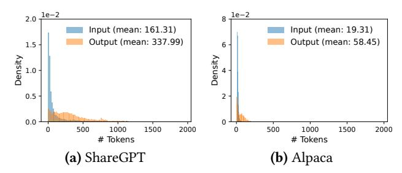
*الشكل 11. توزيعات أطوال الإدخال والإخراج في مجموعتَي بيانات (a) ShareGPT و(b) Alpaca.*

PyTorch [[39]](#page-14-10) وTransformers [[58]](#page-14-21). ونستخدم NCCL [[32]](#page-14-22) للاتّصال الموتري عبر عمّال GPU الموزَّعين.

## 5.1 التحسين على مستوى النواة

بما أنّ PagedAttention تُدخل أنماط وصول إلى الذاكرة لا تدعمها الأنظمة الحالية بكفاءة، نطوّر عدّة أنوية GPU لتحسينها. (1) دمج إعادة التشكيل وكتابة الكتل (Fused reshape and block write). في كلّ طبقة Transformer، تُقسَّم KV cache الجديدة إلى كتل، وتُعاد تشكيلها إلى تخطيط ذاكرة محسّن لقراءة الكتل، ثمّ تُحفظ في المواضع التي يحدّدها جدول الكتل. ولتقليل أعباء إطلاق النواة، ندمجها في نواة واحدة. (2) دمج قراءة الكتل والانتباه (Fusing block read and attention). نُكيّف نواة الانتباه في FasterTransformer [[31]](#page-14-5) لقراءة KV cache وفقاً لجدول الكتل وإجراء عمليات الانتباه ميدانياً. ولضمان الوصول المتلاحم للذاكرة، نخصّص ضربة GPU (GPU warp) لقراءة كلّ كتلة. علاوةً على ذلك، نُضيف دعماً لأطوال تسلسل متغيّرة ضمن دفعة طلبات. (3) نسخ الكتل المدمج (Fused block copy). قد تعمل عمليات نسخ الكتل، التي تُصدرها آلية النسخ-عند-الكتابة، على كتل غير متّصلة. وقد يؤدّي ذلك إلى استدعاءات عديدة لنقل بيانات صغير إذا استخدمنا cudaMemcpyAsync. ولتخفيف هذا العبء، ننفّذ نواة تجمع عمليات النسخ لكتل مختلفة في إطلاق نواة واحد.

## 5.2 دعم خوارزميات فكّ تشفير متنوّعة

ينفّذ vLLM خوارزميات فكّ تشفير متنوّعة باستخدام ثلاث طرق رئيسة: fork وappend وfree. تنشئ طريقة fork تسلسلاً جديداً من تسلسل قائم. وتُلحق طريقة append رمزاً جديداً بالتسلسل. وأخيراً، تحذف طريقة free التسلسل. على سبيل المثال، في أخذ العيّنات المتوازي، يُنشئ vLLM تسلسلات خرج متعدّدة من تسلسل إدخال واحد باستخدام fork. ثمّ يُضيف رموزاً جديدة إلى هذه التسلسلات في كلّ تكرار باستخدام append، ويحذف التسلسلات التي تستوفي شرط التوقّف باستخدام free. وتُطبَّق الاستراتيجية نفسها أيضاً في البحث الشعاعي ومشاركة البادئات في vLLM. ونعتقد أنّ خوارزميات فكّ التشفير المستقبلية يمكن دعمها بدمج هذه الطرق.

# 6 التقييم

في هذا القسم، نقيّم أداء vLLM تحت أعباء عمل متنوّعة.

<!-- page 10 -->

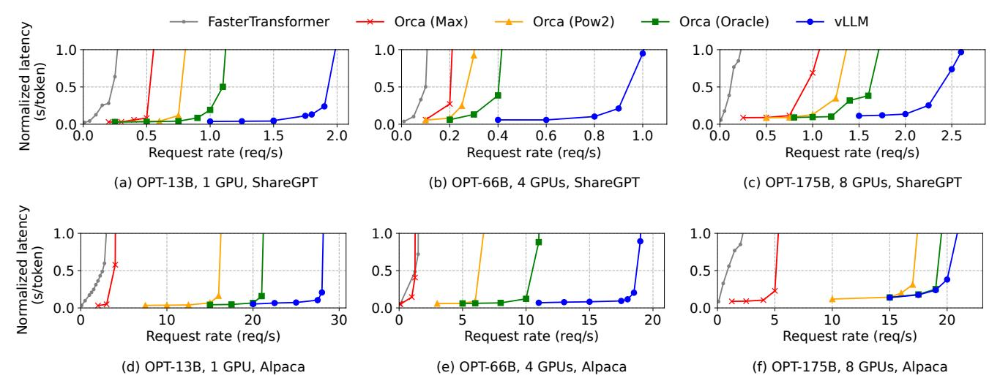
*الشكل 12. توليد تسلسل وحيد بنماذج OPT على مجموعتَي بيانات ShareGPT وAlpaca.*

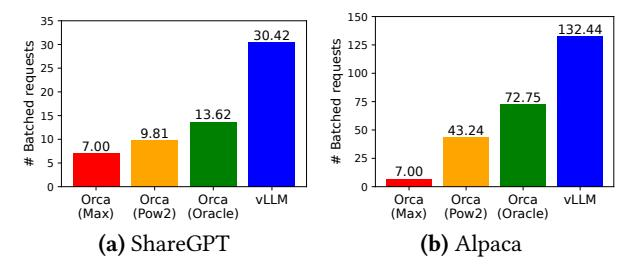
***الشكل 13.** متوسّط عدد الطلبات المجمَّعة عند خدمة OPT-13B لتتبّعَي ShareGPT (طلبان/ثانية) وAlpaca (30 طلباً/ثانية).*

## 6.1 الإعداد التجريبي

تكوينات النموذج والخادم. نستخدم نماذج OPT [62] بـ 13 و66 و175 مليار معامل وLLaMA [52] بـ 13 مليار معامل في تقييمنا. الحجمان 13B و66B شائعان لـ LLM كما يبيّن لوح متصدّري LLM [38]، بينما 175B هو حجم نموذج GPT-3 [5] الشهير. ولجميع تجاربنا، نستخدم نسخ A2 مع GPUs من نوع NVIDIA A100 على Google Cloud Platform. وتُعرض أحجام النماذج وتكوينات الخادم بالتفصيل في الجدول 1.

أعباء العمل. نُولّف أعباء العمل استناداً إلى مجموعتَي بيانات ShareGPT [51] وAlpaca [50]، اللتَين تحويان نصوص إدخال وإخراج لخدمات LLM حقيقية. مجموعة ShareGPT هي مجموعة محادثات شاركها المستخدمون مع ChatGPT [35]. ومجموعة Alpaca هي مجموعة بيانات تعليمات وُلّدت بـ GPT-3.5 باستخدام self-instruct [57]. نُحوّل النصوص إلى رموز ونستخدم أطوال إدخالها وإخراجها لتوليف طلبات العملاء. وكما يبيّن الشكل 11، تحوي مجموعة ShareGPT محفِّزات إدخال أطول 8.4× ومخرجات أطول 5.8× في المتوسّط من مجموعة Alpaca، بتباين أعلى. وبما أنّ هذه المجموعات لا تتضمّن طوابع زمنية، نُولّد أزمنة وصول الطلبات باستخدام توزيع بواسون بمعدّلات طلب مختلفة.

**القياس المرجعي 1: FasterTransformer.** FasterTransformer [31] محرّك استدلال موزَّع محسَّن للغاية لزمن الاستجابة.

وبما أنّ FasterTransformer ليس له مجدوِله الخاصّ، فإنّنا نُنفّذ مجدوِلاً مخصّصاً بآلية تجميع ديناميكي مماثلة لأنظمة الخدمة القائمة مثل Triton [30]. وتحديداً، نضع حجم دفعة أقصى *B* بأكبر قدر ممكن لكلّ تجربة وفقاً لسعة ذاكرة GPU. ويأخذ المجدوِل ما يصل إلى *B* من أبكر الطلبات وصولاً ويُرسل الدفعة إلى FasterTransformer للمعالجة.

**القياس المرجعي 2: Orca.** Orca [60] نظام حديث لخدمة LLM محسَّن للإنتاجية. وبما أنّ Orca غير متاح للاستخدام علنياً، فإنّنا ننفّذ نسختنا الخاصّة منه. ونفترض أنّ Orca يستخدم خوارزمية تخصيص الرفيق (buddy allocation) لتحديد عنوان الذاكرة لتخزين KV cache. وننفّذ ثلاث نسخ من Orca استناداً إلى مدى إفراطه في حجز المساحة لمخرجات الطلبات:

- Orca (Oracle). نفترض أنّ النظام يعرف أطوال المخرجات التي ستُولَّد فعلياً للطلبات. وهذا يُظهر الحدّ الأعلى لأداء Orca، وهو غير قابل للتحقيق عملياً.
- Orca (Pow2). نفترض أنّ النظام يحجز فائضاً للمخرجات بما لا يتجاوز 2×. على سبيل المثال، إذا كان طول الخرج الفعلي 25، فإنّه يحجز 32 موضعاً للخرج.
- Orca (Max). نفترض أنّ النظام يحجز دائماً المساحة حتى أقصى طول تسلسل للنموذج، أي 2048 رمزاً.

**المقاييس الرئيسة.** نركّز على إنتاجية الخدمة. تحديداً، باستخدام أعباء العمل بمعدّلات طلب مختلفة، نقيس *زمن الاستجابة المعياري* (normalized latency) للأنظمة، أي متوسّط زمن استجابة كلّ طلب من البداية إلى النهاية مقسوماً على طول خرجه، كما في Orca [60]. ينبغي لنظام الخدمة عالي الإنتاجية أن يحافظ على زمن استجابة معياري منخفض في وجه معدّلات طلب عالية. ولأغلب التجارب، نُقيّم الأنظمة بتتبّعات مدّتها ساعة. واستثناءً، نستخدم تتبّعات مدّتها 15 دقيقة لنموذج OPT-175B بسبب قيود التكلفة.

<!-- page 11 -->

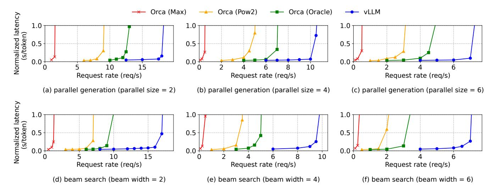
*الشكل 14. التوليد المتوازي والبحث الشعاعي بـ OPT-13B على مجموعة بيانات Alpaca.*

## 6.2 أخذ العيّنات الأساسي

نقيّم أداء vLLM في أخذ العيّنات الأساسي (عيّنة واحدة لكلّ طلب) على ثلاثة نماذج ومجموعتَي بيانات. يُظهر الصفّ الأوّل من الشكل 12 النتائج على مجموعة ShareGPT. وتوضّح المنحنيات أنّه مع زيادة معدّل الطلبات، يزداد زمن الاستجابة بداية ببطء ثمّ ينفجر فجأةً. ويعود ذلك إلى أنّ معدّل الطلبات عندما يتجاوز سعة نظام الخدمة، يستمرّ طول الطابور في النموّ بلا حدود وكذلك زمن استجابة الطلبات.

على مجموعة ShareGPT، يستطيع vLLM تحمّل معدّلات طلب أعلى بمقدار 1.7×–2.7× من Orca (Oracle) و2.7×–8× من Orca (Max)، مع الحفاظ على زمن استجابة مماثل. ويعود ذلك إلى أنّ PagedAttention في vLLM يستطيع إدارة استخدام الذاكرة بكفاءة، ممّا يُمكِّن من تجميع طلبات أكثر من Orca. على سبيل المثال، كما يبيّن الشكل 13a، لـ OPT-13B يُعالج vLLM 2.2× طلبات أكثر في الوقت نفسه من Orca (Oracle) و4.3× طلبات أكثر من Orca (Max). ومقارنةً بـ FasterTransformer، يستطيع vLLM تحمّل معدّلات طلب أعلى تصل إلى 22×، إذ لا يستخدم FasterTransformer آلية جدولة دقيقة الحبيبية ويُدير الذاكرة بكفاءة منخفضة كـ Orca (Max).

يُظهر الصفّ الثاني من الشكل 12 والشكل 13b النتائج على مجموعة Alpaca، التي تتبع اتّجاهاً مشابهاً لمجموعة ShareGPT. والاستثناء الوحيد هو الشكل 12 (f)، حيث يكون تفوّق vLLM على Orca (Oracle) وOrca (Pow2) أقلّ وضوحاً. ويعود ذلك إلى أنّ تكوين النموذج والخادم لـ OPT-175B (الجدول 1) يُتيح مساحة ذاكرة GPU كبيرة لتخزين KV cache، بينما تحوي مجموعة Alpaca تسلسلات قصيرة. وفي هذا الإعداد، يستطيع Orca (Oracle) وOrca (Pow2) أيضاً تجميع عدد كبير من الطلبات رغم عدم كفاءة إدارة ذاكرتهما. ونتيجة لذلك، يصبح أداء الأنظمة مقيَّداً بالحساب لا بالذاكرة.

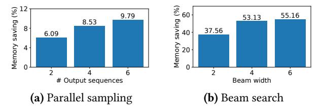
***الشكل 15.** متوسّط مقدار توفير الذاكرة من مشاركة كتل KV، عند خدمة OPT-13B لتتبّع Alpaca.*

## 6.3 أخذ العيّنات المتوازي والبحث الشعاعي

نقيّم فعّالية مشاركة الذاكرة في PagedAttention بطريقتَي أخذ عيّنات شائعتَين: أخذ العيّنات المتوازي والبحث الشعاعي. في أخذ العيّنات المتوازي، يمكن لجميع التسلسلات المتوازية في طلب ما مشاركة KV cache للمحفِّز. وكما يبيّن الصفّ الأوّل من الشكل 14، مع زيادة عدد التسلسلات المعايَنة، يُحقّق vLLM تحسّناً أكبر مقارنةً بـ Orca القياسية. وكذلك يُظهر الصفّ الثاني من الشكل 14 النتائج للبحث الشعاعي بعروض شعاع مختلفة. وبما أنّ البحث الشعاعي يسمح بمشاركة أكبر، يُظهر vLLM فوائد أداء أكبر. ويرتفع تحسّن vLLM على Orca (Oracle) في OPT-13B ومجموعة Alpaca من 1.3× في أخذ العيّنات الأساسي إلى 2.3× في البحث الشعاعي بعرض 6.

يرسم الشكل 15 مقدار توفير الذاكرة، محسوباً بعدد الكتل التي وفّرناها بالمشاركة مقسوماً على إجمالي عدد الكتل بدون مشاركة. ونعرض توفيراً للذاكرة بنسبة 6.1% - 9.8% في أخذ العيّنات المتوازي و37.6% - 55.2% في البحث الشعاعي. وفي التجارب نفسها مع مجموعة ShareGPT، شاهدنا توفيراً للذاكرة بنسبة 16.2% - 30.5% في أخذ العيّنات المتوازي و44.3% - 66.3% في البحث الشعاعي.

## 6.4 البادئة المشتركة

نستكشف فعّالية vLLM في حالة مشاركة بادئة بين محفِّزات إدخال مختلفة، كما هو موضّح في

<!-- page 12 -->

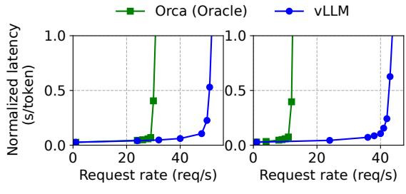

(a) محفِّز بادئة 1-shot (b) محفِّز بادئة 5-shot

***الشكل 16.** عبء عمل ترجمة حيث تتشارك محفِّزات الإدخال بادئةً مشتركة. تتضمّن البادئة (a) مثالاً واحداً بـ 80 رمزاً أو (b) 5 أمثلة بـ 341 رمزاً.*
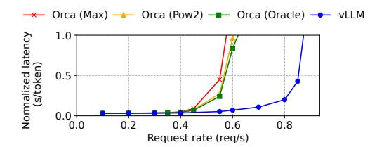
*الشكل 17. الأداء على عبء عمل روبوت الدردشة.*

الشكل 10. للنموذج، نستخدم LLaMA-13B [52]، وهو متعدّد اللغات. ولعبء العمل، نستخدم مجموعة بيانات ترجمة WMT16 [4] من الإنجليزية إلى الألمانية، ونُولّف بادئتَين تتضمّنان تعليمة وعدداً قليلاً من أمثلة الترجمة. تتضمّن البادئة الأولى مثالاً واحداً (أي one-shot) بينما تتضمّن البادئة الأخرى 5 أمثلة (أي few-shot). وكما يبيّن الشكل 16 (a)، يُحقّق vLLM إنتاجية أعلى بمقدار 1.67× من Orca (Oracle) عند مشاركة بادئة one-shot. وعلاوةً على ذلك، عند مشاركة أمثلة أكثر (الشكل 16 (b))، يُحقّق vLLM إنتاجية أعلى بمقدار 3.58× من Orca (Oracle).

## 6.5 روبوت الدردشة

روبوت الدردشة [8, 19, 35] واحد من أهمّ تطبيقات LLM. ولتنفيذ روبوت دردشة، ندَع النموذج يُولّد ردّاً بدمج تاريخ الدردشة وآخر استعلام للمستخدم في محفِّز. ونُولّف تاريخ الدردشة واستعلام المستخدم باستخدام مجموعة ShareGPT. ونظراً لمحدودية طول السياق في نموذج OPT-13B، نقطع المحفِّز إلى آخر 1024 رمز ونسمح للنموذج بتوليد ما يصل إلى 1024 رمز. ولا نحتفظ بـ KV cache بين جولات المحادثة المختلفة، إذ من شأن ذلك أن يشغل المساحة لطلبات أخرى بين جولات المحادثة.

يُبيّن الشكل 17 أنّ vLLM يستطيع تحمّل معدّلات طلب أعلى بمقدار 2× مقارنةً بقياسات Orca المرجعية الثلاثة. وبما أنّ مجموعة ShareGPT تحوي محادثات طويلة عديدة، تكون لمحفِّزات إدخال معظم الطلبات 1024 رمزاً. ونظراً لخوارزمية تخصيص الرفيق، تحجز قياسات Orca المرجعية المساحة لـ 1024 رمز لمخرجات الطلبات، بصرف النظر عن كيفية تنبّئها بأطوال الخرج. ولهذا السبب، تتصرّف قياسات Orca المرجعية الثلاثة بصورة مماثلة. على النقيض من ذلك، يستطيع vLLM التعامل بفعّالية

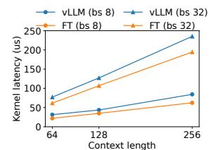

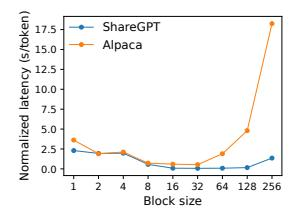
*(a) زمن استجابة أنوية الانتباه.*

***(b)** زمن الاستجابة الشامل بأحجام كتل مختلفة.*

***الشكل 18.** تجارب الإقصاء (Ablation).*

مع المحفِّزات الطويلة، إذ تحلّ PagedAttention مشكلة تشظّي الذاكرة والحجز.

# 7 دراسات الإقصاء

في هذا القسم، ندرس جوانب مختلفة من vLLM ونقيّم خيارات التصميم التي اتّخذناها بتجارب إقصاء.

## 7.1 قياس الأداء الميكروي للأنوية

يؤثّر الربط الديناميكي للكتل في PagedAttention على أداء عمليات GPU التي تتضمّن KV cache المخزّنة، أي قراءة/كتابة الكتل والانتباه. ومقارنةً بالأنظمة القائمة، تتضمّن أنوية GPU لدينا (§5) أعباءً إضافية للوصول إلى جدول الكتل، وتنفيذ تفرّعات إضافية، والتعامل مع أطوال تسلسل متغيّرة. وكما يبيّن الشكل 18a، يؤدّي ذلك إلى زمن استجابة أعلى بنسبة 20–26% لنواة الانتباه، مقارنةً بتنفيذ FasterTransformer المحسّن للغاية. ونعتقد أنّ العبء صغير لأنّه لا يؤثّر إلّا على عامل الانتباه دون باقي العوامل في النموذج، مثل الطبقات الخطّية. ورغم العبء، تجعل PagedAttention vLLM يتفوّق على FasterTransformer تفوّقاً كبيراً في الأداء الشامل (§6).

## 7.2 أثر حجم الكتلة

يمكن أن يؤثّر اختيار حجم الكتلة تأثيراً كبيراً على أداء vLLM. فإذا كان حجم الكتلة صغيراً جدّاً، فقد لا يستفيد vLLM استفادة كاملة من توازي GPU في قراءة KV cache ومعالجتها. وإذا كان حجم الكتلة كبيراً جدّاً، يزداد التشظّي الداخلي وتنخفض احتمالية المشاركة.

في الشكل 18b، نقيّم أداء vLLM بأحجام كتل مختلفة، باستخدام تتبّعَي ShareGPT وAlpaca مع أخذ العيّنات الأساسي تحت معدّلات طلب ثابتة. في تتبّع ShareGPT، تؤدّي أحجام الكتل من 16 إلى 128 إلى أفضل أداء. وفي تتبّع Alpaca، بينما يعمل حجم الكتلة 16 و32 جيّداً، تُضعف الأحجام الأكبر الأداء بشكل ملحوظ لأنّ التسلسلات تصبح أقصر من أحجام الكتل. وعملياً، نجد أنّ حجم الكتلة 16 كافٍ للاستفادة بكفاءة من GPU وصغير بما يكفي لتجنّب تشظٍّ داخلي كبير في معظم أعباء العمل. وبناءً عليه، يضع vLLM حجم كتلته الافتراضي عند 16.

<!-- page 13 -->

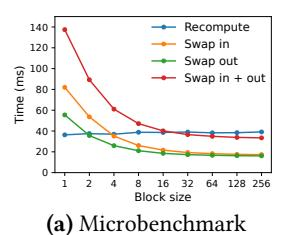

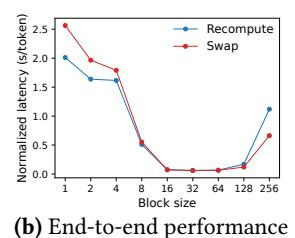
***الشكل 19.** (a) عبء إعادة الحساب والتبديل لأحجام كتل مختلفة. (b) الأداء عند خدمة OPT-13B بتتبّعات ShareGPT بنفس معدّل الطلبات.*

## 7.3 مقارنة إعادة الحساب والتبديل

يدعم vLLM إعادة الحساب والتبديل بصفتهما آلياتي استرداد. ولفهم المفاضلة بين الطريقتَين، نقيّم أداءهما الشامل ونُجري قياساً ميكروياً لأعبائهما، كما هو معروض في الشكل 19. تكشف نتائجنا أنّ التبديل يتكبّد عبئاً مفرطاً مع أحجام الكتل الصغيرة. ويعود ذلك إلى أنّ أحجام الكتل الصغيرة كثيراً ما ينتج عنها عمليات نقل بيانات صغيرة عديدة بين CPU وGPU، ممّا يحدّ من عرض النطاق الفعّال لـ PCIe. وبالمقابل، يبقى عبء إعادة الحساب ثابتاً عبر أحجام الكتل المختلفة، إذ لا تستخدم إعادة الحساب كتل KV. ومن ثمّ، تكون إعادة الحساب أكفأ عند صغر حجم الكتلة، بينما يكون التبديل أكفأ عند كبر حجم الكتلة، مع أنّ عبء إعادة الحساب لا يتجاوز قطّ 20% من زمن استجابة التبديل. ولأحجام الكتل المتوسّطة من 16 إلى 64، تُظهر الطريقتان أداءً شاملاً متقارباً.

# 8 المناقشة

تطبيق تقنية الذاكرة الافتراضية والترقيم على **أعباء عمل GPU أخرى.** فكرة الذاكرة الافتراضية والترقيم فعّالة في إدارة KV cache لخدمة LLM لأنّ عبء العمل يتطلّب تخصيص ذاكرة ديناميكياً (إذ إنّ طول الخرج غير معروف مسبقاً) وأداؤه مقيَّد بسعة ذاكرة GPU. غير أنّ هذا لا ينطبق عموماً على كلّ عبء عمل GPU. على سبيل المثال، في تدريب DNN، تكون أشكال الموترات ساكنة عادةً، ولذا يمكن تحسين تخصيص الذاكرة مسبقاً. ومثال آخر، في خدمة DNNs غير LLMs، قد لا تؤدّي الزيادة في كفاءة الذاكرة إلى أيّ تحسين في الأداء، لأنّ الأداء مقيَّد بالحساب أساساً. وفي مثل هذه السيناريوهات، قد يؤدّي إدخال تقنيات vLLM إلى إضعاف الأداء بدلاً من تحسينه بسبب العبء الإضافي للوساطة في الذاكرة وللذاكرة غير المتّصلة على مستوى الكتل. ومع ذلك، سنكون متحمّسين لرؤية تطبيق تقنيات vLLM على أعباء عمل أخرى ذات خصائص مماثلة لخدمة LLM.

**التحسينات الخاصّة بـ LLM في تطبيق الذاكرة الافتراضية والترقيم.** يُعيد vLLM تفسير وتعزيز فكرة الذاكرة الافتراضية والترقيم باستثمار دلالات خاصّة بالتطبيق. ومن الأمثلة على ذلك سياسة "الكلّ أو لا شيء" في التبديل خارج الذاكرة (swap-out)

في vLLM، التي تستثمر حقيقة أنّ معالجة طلب تتطلّب تخزين جميع حالات رموزه المقابلة في ذاكرة GPU. ومن الأمثلة الأخرى طريقة إعادة الحساب لاسترداد الكتل المُخرَجة، وهي غير ممكنة في نظام التشغيل. وعلاوةً على ذلك، يخفّف vLLM عبء الوساطة في الذاكرة عند الترقيم بدمج أنوية GPU لعمليات الوصول إلى الذاكرة مع تلك للعمليات الأخرى كالانتباه.

# 9 الأعمال ذات الصلة

أنظمة خدمة النماذج العامّة. ظلّت خدمة النماذج مجال بحث نشط في السنوات الأخيرة، إذ اقتُرحت أنظمة كثيرة لمعالجة جوانب متنوّعة من نشر نماذج التعلّم العميق. Clipper [11] وTensorFlow Serving [33] وNexus [45] وInferLine [10] وClockwork [20] هي بعض أنظمة خدمة النماذج العامّة الأبكر. وتدرس هذه الأنظمة التجميع والتخزين المؤقّت والتمركز والجدولة لخدمة نموذج أو نماذج متعدّدة. وأحدثاً، يُدخل DVABatch [12] التجميع متعدّد المداخل والمخارج. ويقترح REEF [21] وShepherd [61] الاستباق للخدمة. ويستخدم AlpaServe [28] التوازي على مستوى النموذج للتعدّدية الإحصائية. غير أنّ هذه الأنظمة العامّة تُهمل خاصيّة ذاتية الانحدار وحالة الرموز في استدلال LLM، ممّا يُفوّت فرصاً للتحسين.

**أنظمة خدمة متخصّصة للـ Transformers.** نظراً لأهمّية بنية Transformer، طُوِّرت أنظمة خدمة متخصّصة عديدة لها. تستخدم هذه الأنظمة تحسينات أنوية GPU [1, 29, 31, 56]، وآليات تجميع متقدّمة [14, 60]، والتوازي على مستوى النموذج [1, 41, 60]، ومشاركة المعاملات [64] للخدمة الفعّالة. ومن بينها، Orca [60] هو الأقرب إلى نهجنا.

مقارنة مع Orca. الجدولة على مستوى التكرار في Orca [60] وPagedAttention في vLLM تقنيتان متكاملتان: في حين يهدف كلا النظامَين إلى زيادة الاستفادة من GPU وبالتالي إنتاجية خدمة LLM، يحقّق Orca ذلك بجدولة الطلبات وتشابكها لمعالجة طلبات أكثر بالتوازي، بينما يفعل vLLM ذلك بزيادة الاستفادة من الذاكرة لاستيعاب مجموعات عمل لطلبات أكثر في الذاكرة. وبتقليل تشظّي الذاكرة وتمكين المشاركة، يُشغّل vLLM طلبات أكثر في دفعة بالتوازي ويُحقّق تسارعاً 2-4× مقارنةً بـ Orca. وبالفعل، فإنّ الجدولة الدقيقة الحبيبية وتشابك الطلبات كما في Orca تجعل إدارة الذاكرة أصعب، ممّا يجعل التقنيات المقترحة في vLLM أكثر أهمّيةً.

**تحسينات الذاكرة.** تسبّب اتّساع الفجوة بين قدرة الحساب وسعة الذاكرة في المسرّعات في أن تصبح الذاكرة عنق زجاجة في كلّ من التدريب والاستدلال. وقد استُخدم التبديل [23, 42, 55] وإعادة الحساب [7, 24] ومزجهما [40] لتقليل ذاكرة الذروة في التدريب. ويدرس FlexGen [46] على وجه الخصوص كيفية تبديل الأوزان وحالات الرموز لاستدلال LLM في حالة

<!-- page 14 -->

ذاكرة GPU محدودة، لكنّه لا يستهدف إعدادات الخدمة الإلكترونية. ويُحسّن OLLA [[48]](#page-14-36) عمر الموترات وموقعها لتقليل التشظّي، لكنّه لا يقوم بإدارة دقيقة الحبيبية على مستوى الكتل أو الخدمة الإلكترونية. ويُطبّق FlashAttention [[13]](#page-13-10) التبليط (tiling) وتحسينات الأنوية لتقليل ذاكرة الذروة لحساب الانتباه وتقليل تكاليف الإدخال/الإخراج. تُقدّم هذه الورقة فكرة جديدة لإدارة الذاكرة على مستوى الكتل في سياق الخدمة الإلكترونية.

# 10 الخاتمة

تقترح هذه الورقة PagedAttention، خوارزمية انتباه جديدة تسمح بتخزين مفاتيح وقيم الانتباه في ذاكرة مرقَّمة غير متّصلة، وتُقدّم vLLM، نظاماً لخدمة LLM عالي الإنتاجية بإدارة ذاكرة فعّالة ممكَّنة بـ PagedAttention. ومستوحَين من أنظمة التشغيل، نُبيّن كيف يمكن تكييف تقنيات راسخة، كالذاكرة الافتراضية والنسخ-عند-الكتابة، لإدارة KV cache بكفاءة والتعامل مع خوارزميات فكّ تشفير متنوّعة في خدمة LLM. وتُظهر تجاربنا أنّ vLLM يحقّق تحسّنات في الإنتاجية بمقدار 2-4× على الأنظمة الحديثة.

## شكر وتقدير

نودّ أن نشكر Xiaoxuan Liu وZhifeng Chen وYanping Huang ومُحكِّمي SOSP المجهولين، ومُرشدنا Lidong Zhou، على ملاحظاتهم القيّمة. هذا البحث مدعوم جزئياً بهدايا من Andreessen Horowitz وAnyscale وAstronomer وGoogle وIBM وIntel وLacework وMicrosoft وMohamed Bin Zayed University of Artificial Intelligence وSamsung SDS وUber وVMware.

## المراجع

- [1] Reza Yazdani Aminabadi, Samyam Rajbhandari, Minjia Zhang, Ammar Ahmad Awan, Cheng Li, Du Li, Elton Zheng, Jeff Rasley, Shaden Smith, Olatunji Ruwase, et al. 2022. DeepSpeed Inference: Enabling Efficient Inference of Transformer Models at Unprecedented Scale. arXiv preprint arXiv:2207.00032 (2022).
- [2] Jimmy Lei Ba, Jamie Ryan Kiros, and Geoffrey E Hinton. 2016. Layer normalization. arXiv preprint arXiv:1607.06450 (2016).
- [3] Yoshua Bengio, Réjean Ducharme, and Pascal Vincent. 2000. A neural probabilistic language model. Advances in neural information processing systems 13 (2000).
- [4] Ond rej Bojar, Rajen Chatterjee, Christian Federmann, Yvette Graham, Barry Haddow, Matthias Huck, Antonio Jimeno Yepes, Philipp Koehn, Varvara Logacheva, Christof Monz, Matteo Negri, Aurelie Neveol, Mariana Neves, Martin Popel, Matt Post, Raphael Rubino, Carolina Scarton, Lucia Specia, Marco Turchi, Karin Verspoor, and Marcos Zampieri. 2016. Findings of the 2016 Conference on Machine Translation. In Proceedings of the First Conference on Machine Translation. Association for Computational Linguistics, Berlin, Germany, 131–198. [http://www.aclweb.org/anthology/W/W16/W16-2301](http://www.aclweb.org/anthology/W/W16/W16-2301)
- [5] Tom Brown, Benjamin Mann, Nick Ryder, Melanie Subbiah, Jared D Kaplan, Prafulla Dhariwal, Arvind Neelakantan, Pranav Shyam, Girish Sastry, Amanda Askell, et al. 2020. Language models are few-shot learners. Advances in neural information processing systems 33 (2020), 1877–1901.
- [6] Mark Chen, Jerry Tworek, Heewoo Jun, Qiming Yuan, Henrique Ponde de Oliveira Pinto, Jared Kaplan, Harri Edwards, Yuri Burda, Nicholas

- Joseph, Greg Brockman, et al. 2021. Evaluating large language models trained on code. arXiv preprint arXiv:2107.03374 (2021).
- [7] Tianqi Chen, Bing Xu, Chiyuan Zhang, and Carlos Guestrin. 2016. Training deep nets with sublinear memory cost. arXiv preprint arXiv:1604.06174 (2016).
- [8] Wei-Lin Chiang, Zhuohan Li, Zi Lin, Ying Sheng, Zhanghao Wu, Hao Zhang, Lianmin Zheng, Siyuan Zhuang, Yonghao Zhuang, Joseph E. Gonzalez, Ion Stoica, and Eric P. Xing. 2023. Vicuna: An Open-Source Chatbot Impressing GPT-4 with 90%* ChatGPT Quality. [https://lmsys.](https://lmsys.org/blog/2023-03-30-vicuna/) [org/blog/2023-03-30-vicuna/](https://lmsys.org/blog/2023-03-30-vicuna/)
- [9] Aakanksha Chowdhery, Sharan Narang, Jacob Devlin, Maarten Bosma, Gaurav Mishra, Adam Roberts, Paul Barham, Hyung Won Chung, Charles Sutton, Sebastian Gehrmann, et al. 2022. Palm: Scaling language modeling with pathways. arXiv preprint arXiv:2204.02311 (2022).
- [10] Daniel Crankshaw, Gur-Eyal Sela, Xiangxi Mo, Corey Zumar, Ion Stoica, Joseph Gonzalez, and Alexey Tumanov. 2020. InferLine: latencyaware provisioning and scaling for prediction serving pipelines. In Proceedings of the 11th ACM Symposium on Cloud Computing. 477–491.
- [11] Daniel Crankshaw, Xin Wang, Guilio Zhou, Michael J Franklin, Joseph E Gonzalez, and Ion Stoica. 2017. Clipper: A Low-Latency Online Prediction Serving System. In 14th USENIX Symposium on Networked Systems Design and Implementation (NSDI 17). 613–627.
- [12] Weihao Cui, Han Zhao, Quan Chen, Hao Wei, Zirui Li, Deze Zeng, Chao Li, and Minyi Guo. 2022. DVABatch: Diversity-aware Multi-Entry Multi-Exit Batching for Efficient Processing of DNN Services on GPUs. In 2022 USENIX Annual Technical Conference (USENIX ATC 22). 183–198.
- [13] Tri Dao, Dan Fu, Stefano Ermon, Atri Rudra, and Christopher Ré. 2022. Flashattention: Fast and memory-efficient exact attention with io-awareness. Advances in Neural Information Processing Systems 35 (2022), 16344–16359.
- [14] Jiarui Fang, Yang Yu, Chengduo Zhao, and Jie Zhou. 2021. TurboTransformers: an efficient GPU serving system for transformer models. In Proceedings of the 26th ACM SIGPLAN Symposium on Principles and Practice of Parallel Programming. 389–402.
- [15] FastAPI. 2023. FastAPI. [https://github.com/tiangolo/fastapi](https://github.com/tiangolo/fastapi).
- [16] Pin Gao, Lingfan Yu, Yongwei Wu, and Jinyang Li. 2018. Low latency rnn inference with cellular batching. In Proceedings of the Thirteenth EuroSys Conference. 1–15.
- [17] Amir Gholami, Zhewei Yao, Sehoon Kim, Michael W Mahoney, and Kurt Keutzer. 2021. Ai and memory wall. RiseLab Medium Post 1 (2021), 6.
- [18] Github. 2022. [https://github.com/features/copilot](https://github.com/features/copilot)
- [19] Google. 2023. [https://bard.google.com/](https://bard.google.com/)
- [20] Arpan Gujarati, Reza Karimi, Safya Alzayat, Wei Hao, Antoine Kaufmann, Ymir Vigfusson, and Jonathan Mace. 2020. Serving {DNNs} like Clockwork: Performance Predictability from the Bottom Up. In 14th USENIX Symposium on Operating Systems Design and Implementation (OSDI 20). 443–462.
- [21] Mingcong Han, Hanze Zhang, Rong Chen, and Haibo Chen. 2022. Microsecond-scale Preemption for Concurrent {GPUaccelerated} {DNN} Inferences. In 16th USENIX Symposium on Operating Systems Design and Implementation (OSDI 22). 539–558.
- [22] Kaiming He, Xiangyu Zhang, Shaoqing Ren, and Jian Sun. 2016. Deep residual learning for image recognition. In Proceedings of the IEEE conference on computer vision and pattern recognition. 770–778.
- [23] Chien-Chin Huang, Gu Jin, and Jinyang Li. 2020. Swapadvisor: Pushing deep learning beyond the gpu memory limit via smart swapping. In Proceedings of the Twenty-Fifth International Conference on Architectural Support for Programming Languages and Operating Systems. 1341–1355.
- [24] Paras Jain, Ajay Jain, Aniruddha Nrusimha, Amir Gholami, Pieter Abbeel, Joseph Gonzalez, Kurt Keutzer, and Ion Stoica. 2020. Checkmate: Breaking the memory wall with optimal tensor rematerialization.

<!-- page 15 -->

- Proceedings of Machine Learning and Systems 2 (2020), 497–511.
- [25] Tom Kilburn, David BG Edwards, Michael J Lanigan, and Frank H Sumner. 1962. One-level storage system. IRE Transactions on Electronic Computers 2 (1962), 223–235.
- [26] Brian Lester, Rami Al-Rfou, and Noah Constant. 2021. The power of scale for parameter-efficient prompt tuning. arXiv preprint arXiv:2104.08691 (2021).
- [27] Xiang Lisa Li and Percy Liang. 2021. Prefix-tuning: Optimizing continuous prompts for generation. arXiv preprint arXiv:2101.00190 (2021).
- [28] Zhuohan Li, Lianmin Zheng, Yinmin Zhong, Vincent Liu, Ying Sheng, Xin Jin, Yanping Huang, Zhifeng Chen, Hao Zhang, Joseph E Gonzalez, et al. 2023. AlpaServe: Statistical Multiplexing with Model Parallelism for Deep Learning Serving. arXiv preprint arXiv:2302.11665 (2023).
- [29] Lingxiao Ma, Zhiqiang Xie, Zhi Yang, Jilong Xue, Youshan Miao, Wei Cui, Wenxiang Hu, Fan Yang, Lintao Zhang, and Lidong Zhou. 2020. Rammer: Enabling holistic deep learning compiler optimizations with rtasks. In Proceedings of the 14th USENIX Conference on Operating Systems Design and Implementation. 881–897.
- [30] NVIDIA. [n. d.]. Triton Inference Server. [https://developer.nvidia.com/](https://developer.nvidia.com/nvidia-triton-inference-server) [nvidia-triton-inference-server](https://developer.nvidia.com/nvidia-triton-inference-server).
- [31] NVIDIA. 2023. FasterTransformer. [https://github.com/NVIDIA/](https://github.com/NVIDIA/FasterTransformer) [FasterTransformer](https://github.com/NVIDIA/FasterTransformer).
- [32] NVIDIA. 2023. NCCL: The NVIDIA Collective Communication Library. [https://developer.nvidia.com/nccl](https://developer.nvidia.com/nccl).
- [33] Christopher Olston, Noah Fiedel, Kiril Gorovoy, Jeremiah Harmsen, Li Lao, Fangwei Li, Vinu Rajashekhar, Sukriti Ramesh, and Jordan Soyke. 2017. Tensorflow-serving: Flexible, high-performance ml serving. arXiv preprint arXiv:1712.06139 (2017).
- [34] OpenAI. 2020. [https://openai.com/blog/openai-api](https://openai.com/blog/openai-api)
- [35] OpenAI. 2022. [https://openai.com/blog/chatgpt](https://openai.com/blog/chatgpt)
- [36] OpenAI. 2023. [https://openai.com/blog/custom-instructions-for](https://openai.com/blog/custom-instructions-for-chatgpt)[chatgpt](https://openai.com/blog/custom-instructions-for-chatgpt)
- [37] OpenAI. 2023. GPT-4 Technical Report. arXiv[:2303.08774](https://arxiv.org/abs/2303.08774) [cs.CL]
- [38] LMSYS ORG. 2023. Chatbot Arena Leaderboard Week 8: Introducing MT-Bench and Vicuna-33B. https://lmsys.org/blog/2023-06-22 leaderboard/.
- [39] Adam Paszke, Sam Gross, Francisco Massa, Adam Lerer, James Bradbury, Gregory Chanan, Trevor Killeen, Zeming Lin, Natalia Gimelshein, Luca Antiga, et al. 2019. Pytorch: An imperative style, high-performance deep learning library. Advances in neural information processing systems 32 (2019).
- [40] Shishir G Patil, Paras Jain, Prabal Dutta, Ion Stoica, and Joseph Gonzalez. 2022. POET: Training Neural Networks on Tiny Devices with Integrated Rematerialization and Paging. In International Conference on Machine Learning. PMLR, 17573–17583.
- [41] Reiner Pope, Sholto Douglas, Aakanksha Chowdhery, Jacob Devlin, James Bradbury, Anselm Levskaya, Jonathan Heek, Kefan Xiao, Shivani Agrawal, and Jeff Dean. 2022. Efficiently Scaling Transformer Inference. arXiv preprint arXiv:2211.05102 (2022).
- [42] Jie Ren, Samyam Rajbhandari, Reza Yazdani Aminabadi, Olatunji Ruwase, Shuangyan Yang, Minjia Zhang, Dong Li, and Yuxiong He. 2021. ZeRO-Offload: Democratizing Billion-Scale Model Training.. In USENIX Annual Technical Conference. 551–564.
- [43] Reuters. 2023. [https://www.reuters.com/technology/tech-giants-ai](https://www.reuters.com/technology/tech-giants-ai-like-bing-bard-poses-billion-dollar-search-problem-2023-02-22/)[like-bing-bard-poses-billion-dollar-search-problem-2023-02-22/](https://www.reuters.com/technology/tech-giants-ai-like-bing-bard-poses-billion-dollar-search-problem-2023-02-22/)
- [44] Amazon Web Services. 2023. [https://aws.amazon.com/bedrock/](https://aws.amazon.com/bedrock/)
- [45] Haichen Shen, Lequn Chen, Yuchen Jin, Liangyu Zhao, Bingyu Kong, Matthai Philipose, Arvind Krishnamurthy, and Ravi Sundaram. 2019. Nexus: A GPU cluster engine for accelerating DNN-based video analysis. In Proceedings of the 27th ACM Symposium on Operating Systems Principles. 322–337.
- [46] Ying Sheng, Lianmin Zheng, Binhang Yuan, Zhuohan Li, Max Ryabinin, Daniel Y Fu, Zhiqiang Xie, Beidi Chen, Clark Barrett, Joseph E Gonzalez, et al. 2023. High-throughput Generative Inference of Large

- Language Models with a Single GPU. arXiv preprint arXiv:2303.06865 (2023).
- [47] Mohammad Shoeybi, Mostofa Patwary, Raul Puri, Patrick LeGresley, Jared Casper, and Bryan Catanzaro. 2019. Megatron-lm: Training multibillion parameter language models using model parallelism. arXiv preprint arXiv:1909.08053 (2019).
- [48] Benoit Steiner, Mostafa Elhoushi, Jacob Kahn, and James Hegarty. 2022. OLLA: Optimizing the Lifetime and Location of Arrays to Reduce the Memory Usage of Neural Networks. (2022). [https://doi.org/10.48550/](https://doi.org/10.48550/arXiv.2210.12924) [arXiv.2210.12924](https://doi.org/10.48550/arXiv.2210.12924)
- [49] Ilya Sutskever, Oriol Vinyals, and Quoc V Le. 2014. Sequence to sequence learning with neural networks. Advances in neural information processing systems 27 (2014).
- [50] Rohan Taori, Ishaan Gulrajani, Tianyi Zhang, Yann Dubois, Xuechen Li, Carlos Guestrin, Percy Liang, and Tatsunori B. Hashimoto. 2023. Stanford Alpaca: An Instruction-following LLaMA model. [https://](https://github.com/tatsu-lab/stanford_alpaca) [github.com/tatsu-lab/stanford_alpaca](https://github.com/tatsu-lab/stanford_alpaca).
- [51] ShareGPT Team. 2023. [https://sharegpt.com/](https://sharegpt.com/)
- [52] Hugo Touvron, Thibaut Lavril, Gautier Izacard, Xavier Martinet, Marie-Anne Lachaux, Timothée Lacroix, Baptiste Rozière, Naman Goyal, Eric Hambro, Faisal Azhar, et al. 2023. Llama: Open and efficient foundation language models. arXiv preprint arXiv:2302.13971 (2023).
- [53] Ashish Vaswani, Noam Shazeer, Niki Parmar, Jakob Uszkoreit, Llion Jones, Aidan N Gomez, Łukasz Kaiser, and Illia Polosukhin. 2017. Attention is all you need. Advances in neural information processing systems 30 (2017).
- [54] Jing Wang, Youyou Lu, Qing Wang, Minhui Xie, Keji Huang, and Jiwu Shu. 2022. Pacman: An Efficient Compaction Approach for {Log-Structured} {Key-Value} Store on Persistent Memory. In 2022 USENIX Annual Technical Conference (USENIX ATC 22). 773–788.
- [55] Linnan Wang, Jinmian Ye, Yiyang Zhao, Wei Wu, Ang Li, Shuaiwen Leon Song, Zenglin Xu, and Tim Kraska. 2018. Superneurons: Dynamic GPU memory management for training deep neural networks. In Proceedings of the 23rd ACM SIGPLAN symposium on principles and practice of parallel programming. 41–53.
- [56] Xiaohui Wang, Ying Xiong, Yang Wei, Mingxuan Wang, and Lei Li. 2021. LightSeq: A High Performance Inference Library for Transformers. In Proceedings of the 2021 Conference of the North American Chapter of the Association for Computational Linguistics: Human Language Technologies: Industry Papers. 113–120.
- [57] Yizhong Wang, Yeganeh Kordi, Swaroop Mishra, Alisa Liu, Noah A Smith, Daniel Khashabi, and Hannaneh Hajishirzi. 2022. Self-Instruct: Aligning Language Model with Self Generated Instructions. arXiv preprint arXiv:2212.10560 (2022).
- [58] Thomas Wolf, Lysandre Debut, Victor Sanh, Julien Chaumond, Clement Delangue, Anthony Moi, Pierric Cistac, Tim Rault, Rémi Louf, Morgan Funtowicz, et al. 2020. Transformers: State-of-the-art natural language processing. In Proceedings of the 2020 conference on empirical methods in natural language processing: system demonstrations. 38–45.
- [59] Yonghui Wu, Mike Schuster, Zhifeng Chen, Quoc V Le, Mohammad Norouzi, Wolfgang Macherey, Maxim Krikun, Yuan Cao, Qin Gao, Klaus Macherey, et al. 2016. Google's neural machine translation system: Bridging the gap between human and machine translation. arXiv preprint arXiv:1609.08144 (2016).
- [60] Gyeong-In Yu, Joo Seong Jeong, Geon-Woo Kim, Soojeong Kim, and Byung-Gon Chun. 2022. Orca: A Distributed Serving System for {Transformer-Based} Generative Models. In 16th USENIX Symposium on Operating Systems Design and Implementation (OSDI 22). 521–538.
- [61] Hong Zhang, Yupeng Tang, Anurag Khandelwal, and Ion Stoica. 2023. SHEPHERD: Serving DNNs in the Wild. In 20th USENIX Symposium on Networked Systems Design and Implementation (NSDI 23). USENIX Association, Boston, MA, 787–808. [https://www.usenix.org/conference/](https://www.usenix.org/conference/nsdi23/presentation/zhang-hong) [nsdi23/presentation/zhang-hong](https://www.usenix.org/conference/nsdi23/presentation/zhang-hong)

<!-- page 16 -->

- [62] Susan Zhang, Stephen Roller, Naman Goyal, Mikel Artetxe, Moya Chen, Shuohui Chen, Christopher Dewan, Mona Diab, Xian Li, Xi Victoria Lin, et al. 2022. Opt: Open pre-trained transformer language models. arXiv preprint arXiv:2205.01068 (2022).
- [63] Lianmin Zheng, Zhuohan Li, Hao Zhang, Yonghao Zhuang, Zhifeng Chen, Yanping Huang, Yida Wang, Yuanzhong Xu, Danyang Zhuo,
- Eric P Xing, et al. 2022. Alpa: Automating Inter-and Intra-Operator Parallelism for Distributed Deep Learning. In 16th USENIX Symposium on Operating Systems Design and Implementation (OSDI 22). 559–578.
- [64] Zhe Zhou, Xuechao Wei, Jiejing Zhang, and Guangyu Sun. 2022. PetS: A Unified Framework for Parameter-Efficient Transformers Serving. In 2022 USENIX Annual Technical Conference (USENIX ATC 22). 489–504.
