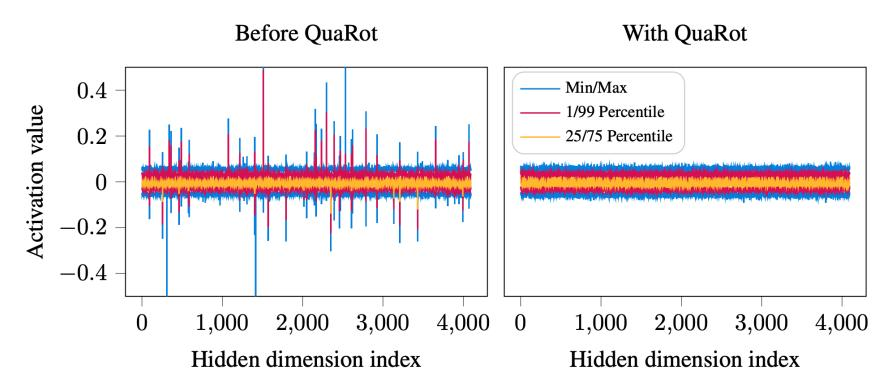
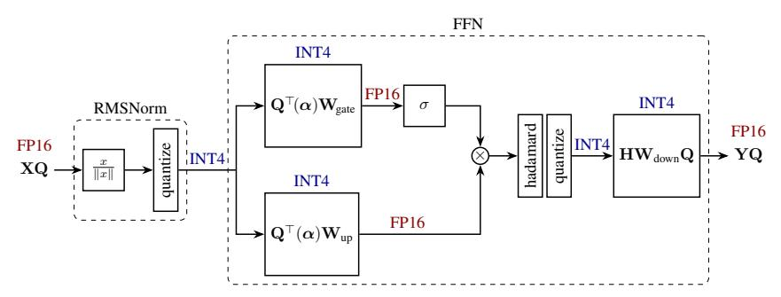
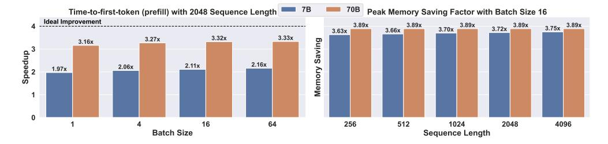
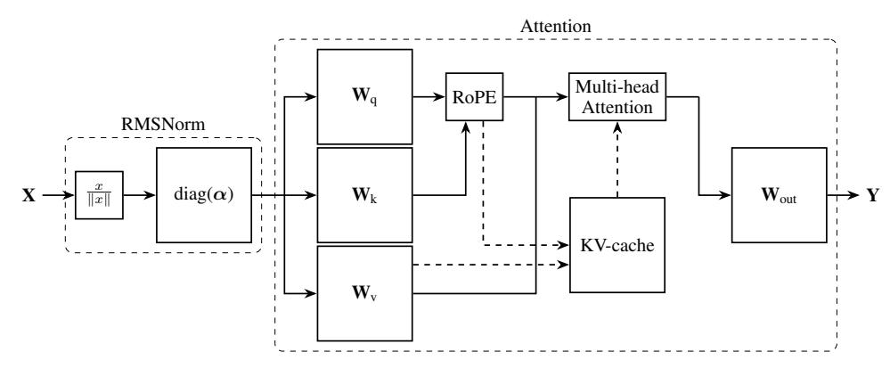
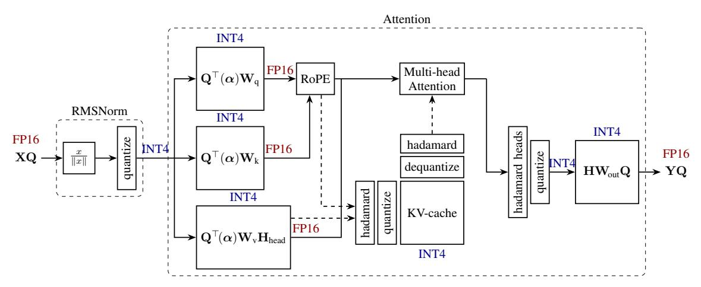
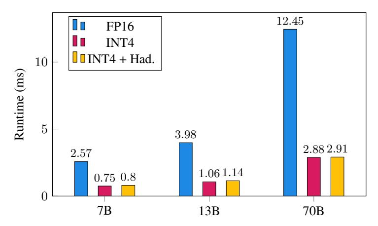

<!-- RP29_Ashkboos_2024 | source: papers_json/RP29_Ashkboos_2024/ -->

## QuaRot: استدلال 4-بت خالٍ من القيم الشاذة في النماذج اللغوية الكبيرة المُدوَّرة

## Saleh Ashkboos

ETH Zurich

saleh.ashkboos@inf.ethz.ch

## Amirkeivan Mohtashami

EPFL

amirkeivan.mohtashami@epfl.ch

Maximilian L. Croci

Microsoft Research mcroci@microsoft.com

Bo Li ETH Zurich

bolibo@ethz.ch

Pashmina Cameron

Microsoft

pcameron@microsoft.com

Martin Jaggi

EPFL martin.jaggi@epfl.ch

Dan Alistarh

IST Austria & NeuralMagic dan.alistarh@ist.ac.at

Torsten Hoefler

ETH Zurich torsten.hoefler@inf.ethz.ch

James Hensman

Microsoft Research jameshensman@microsoft.com

## الملخص

نقدم QuaRot، وهو مخطط *تكميم* جديد قائم على *الدورانات*، قادر على تكميم النماذج اللغوية الكبيرة (LLMs) من البداية إلى النهاية، بما في ذلك جميع الأوزان والتنشيطات وذاكرة KV المؤقتة بدقة 4 بتات. يقوم QuaRot بتدوير النماذج اللغوية الكبيرة بطريقة تُزيل القيم الشاذة من الحالة المخفية دون تغيير المخرجات، مما يجعل التكميم أسهل. يُطبَّق هذا *الثبات الحسابي* على الحالة المخفية (المتبقية) للنموذج، وكذلك على تنشيطات مكونات التغذية الأمامية، وجوانب من آلية الانتباه، وعلى ذاكرة KV المؤقتة. والنتيجة هي نموذج مكمَّم تُجرى فيه جميع عمليات ضرب المصفوفات بدقة 4 بتات، دون أي قنوات يتم تحديدها للاحتفاظ بها بدقة أعلى. يُسجّل نموذج LLAMA2-70B المكمَّم بدقة 4 بتات خسائر لا تتجاوز 0.47 في حيرة WikiText-2 ويحتفظ بنسبة 99% من أداء الصفر-اللقطة. كما نوضح أن QuaRot يستطيع تقديم نماذج LLAMA-2 بدقة 6 و8 بتات بلا خسارة ودون أي بيانات معايرة باستخدام التكميم بالتقريب إلى الأقرب. الكود متاح على [github.com/spcl/QuaRot](github.com/spcl/QuaRot).

# 1 المقدمة

أصبحت النماذج اللغوية الكبيرة (LLMs) ذات أهمية متزايدة بسبب تطبيقاتها التي لا حصر لها. غير أن استخدام هذه النماذج عملياً، المعروف بالاستدلال، يتطلب قدراً كبيراً من الحوسبة والذاكرة والطاقة، خصوصاً خلال مرحلة *الملء المسبق*، التي يُتوقع فيها أن يعالج النموذج موجِّهات كبيرة ويخزنها في كل طبقة. ويُعد التكميم من أهم التقنيات لتحسين قضايا الذاكرة والحوسبة معاً عبر إبقاء أنواع البيانات بدقة أقل خلال التمرير الأمامي.

ولأن مرحلة الملء المسبق معروفة بأنها مقيدة بالحوسبة [[Ashkboos et al.,](#page-9-0) [2023]](#page-9-0)، يهدف التكميم المشترك إلى خفض دقة المعاملات وذاكرة KV المؤقتة (مما يؤدي إلى استخدام ذاكرة أقل) إضافةً إلى المدخلات (المعروفة بالتنشيطات) وحساب التمرير الأمامي بدقة منخفضة. ومع ذلك، فإن تكميم التنشيطات صعب لأنها تحتوي على عناصر شاذة كبيرة (انظر الشكل [1](#page-1-0) للحصول على مثال توضيحي) ذات قيم أكبر بكثير، مما يجعل تكميم التنشيطات أصعب من تكميم الأوزان، خصوصاً في حالة 4 بتات. ويعتمد العمل السابق على استخدام مجموعة معايرة لتوصيف الميزات الشاذة وإبقائها بدقة أعلى أثناء الاستدلال [[Zhao et al.,](#page-11-0) [2023,](#page-11-0) [Ashkboos et al.,](#page-9-0) [2023]](#page-9-0).

<!-- page 2 -->

*الشكل 1: توزيعات التنشيطات عند مدخل كتلة FFN في نموذج LLAMA2-7B، في الطبقة العاشرة. يساراً: باستخدام الإعداد الافتراضي كما تم تنزيله من Hugging Face. يميناً: بعد المعالجة باستخدام QuaRot. التوزيع المُعالَج لا يحتوي على قيم شاذة، مما يؤدي إلى تكميم متفوق.*

في هذا العمل، نعالج مشكلة الميزات الشاذة عن طريق تدوير مدخلات النموذج باستخدام تحويلات هادامارد العشوائية. ونقوم بذلك باستخدام فكرة *الثبات الحسابي* [[Ashkboos et al.,](#page-9-1) [2024]](#page-9-1) ودمج تحويلات هادامارد في مصفوفات الأوزان، مما ينتج عنه شبكة مكافئة بدون ميزات شاذة. وهذا يُمكّن من تكميم الأوزان والتنشيطات وذاكرات KV المؤقتة إلى 4 بتات مع انخفاض ضئيل في الدقة. مساهماتنا الرئيسية هي:

- نوضح أن تحويلات هادامارد العشوائية يمكن تطبيقها على مصفوفات الأوزان دون أي تعديلات إضافية على النموذج. وهذا بدوره يُلغي تماماً الميزات الشاذة ويجعل التنشيطات سهلة التكميم، دون تغيير مخرجات النموذج. ويمكن اعتبار هذا امتداداً لفكرة *الثبات الحسابي* المقترحة في SliceGPT [[Ashkboos et al.,](#page-9-1) [2024]](#page-9-1) في سياق التقليم البنيوي.
- نوسع هذا النهج لتطبيق تحويلات هادامارد *عبر الإنترنت* على وحدة الانتباه لإزالة الميزات الشاذة في المفاتيح والقيم، مما يُمكّن من تكميم ذاكرة KV المؤقتة.
- باستخدام التعديلات المذكورة أعلاه، يُمكّن QuaRot من استدلال LLM بدقة 4 بتات عبر تكميم جميع الأوزان والتنشيطات وذاكرات KV المؤقتة باستخدام التكميم الصحيح. نوفر دعم نواة كفؤاً لـ QuaRot: على نموذج LLAMA2-70B، يحقق QuaRot تسريعات في الملء المسبق تصل إلى 3.33× (بحجم دفعة 64 وطول تسلسل 2048)، وتوفير ذاكرة بمقدار 3.89× خلال مرحلة فك التشفير، مع خسارة في حيرة WikiText-2 لا تتجاوز 0.47. يحافظ QuaRot على 99% من دقة مهام الصفر-اللقطة، ونوضح أن تكميمنا بدقة 6 و8 بتات بلا خسارة باستخدام التكميم البسيط بالتقريب إلى الأقرب.

# 2 الأعمال ذات الصلة

تركز معظم مخططات التكميم على ضغط النماذج اللغوية الكبيرة باستخدام *تكميم الأوزان فقط* [[Frantar et al.,](#page-10-0) [2022,](#page-10-0) [Dettmers et al.,](#page-9-2) [2023,](#page-9-2) [Lin et al.,](#page-10-1) [2023,](#page-10-1) [Egiazarian et al.,](#page-10-2) [2024,](#page-10-2) [Tseng et al.,](#page-11-1) [2024]](#page-11-1). تقوم هذه الطرق بتخفيض كل وزن إلى تمثيل منخفض الدقة ورفعه قبل الحساب الفعلي. ولا يزال الحساب الرئيسي يُجرى بدقة عالية. وتُظهر عدة أعمال أنه على عكس الأوزان، فإن تكميم التنشيطات صعب بسبب الميزات الشاذة [[Wei et al.,](#page-11-2) [2022,](#page-11-2) [Dettmers et al.,](#page-9-3) [2022,](#page-9-3) [Xiao et al.,](#page-11-3) [2023]](#page-11-3). في حالة 8 بتات، يُحدد LLM.int8() [[Dettmers et al.,](#page-9-3) [2022]](#page-9-3) الميزات الشاذة أثناء الاستدلال ويحتفظ بها بدقة 16 بت مما يؤدي إلى أداء ضعيف. يُطبِّع SmoothQuant [[Xiao et al.,](#page-11-3) [2023]](#page-11-3) الميزات باستخدام بعض عوامل القياس من مجموعة معايرة، مما يحل المشكلة في حالة 8 بتات على حساب إدخال معاملات إضافية. وبالنسبة للتكميم بدقة 4 بتات، تُحدد الدراسات الحديثة الميزات الشاذة دون اتصال وتُبقيها بدقة عالية. طوّر Atom [[Zhao et al.,](#page-11-0) [2023]](#page-11-0) نواةً معقدةً لضرب المصفوفات بدقة مختلطة في وجود قيم شاذة، بينما يُبقي QUIK [[Ashkboos et al.,](#page-9-0) [2023]](#page-9-0) طبقة الإسقاط الهابط بدقة 8 بتات.

ثمة طريقتان لتكميم الأوزان فقط، وهما QuIP [[Chee et al.,](#page-9-4) [2024]](#page-9-4) و QuIP# [[Tseng et al.,](#page-11-1) [2024]](#page-11-1)، فكرتا سابقاً في تحسين التكميم عبر تطبيق الدورانات. قدّم [Chee et al.](#page-9-4) [[2024]](#page-9-4) فكرة *معالجة عدم التماسك* التي تُطبِّق مصفوفات الدوران على يسار ويمين كل مصفوفة أوزان، وكذلك على مصفوفة هسه المستخدمة في تقليل هدف تكميم الأوزان. [Xi](#page-11-4)

<!-- page 3 -->

et al. [2023] يستخدم فكرة مشابهة أثناء التدريب، عبر تحويلات هادامارد الدقيقة لكل طبقة خطية في التمرير الأمامي.

أخيراً، يُمثل تكميم ذاكرة KV المؤقتة محوراً بحثياً آخر يهدف إلى ضغط المفاتيح والقيم المخزنة خلال مرحلة التوليد. وهذا أمر بالغ الأهمية لأحجام الدفعات الكبيرة وتوليد السياقات الطويلة لأن ذاكرة KV ستكون عنق الزجاجة الرئيسي للذاكرة في مثل هذه المسائل. يُكمّم Sheng et al. [2023] ذاكرة KV المؤقتة باستخدام تكميم جماعي بدقة 4 بتات. ويدفع KVQuant [Hooper et al., 2024] هذا الحد إلى التكميم بدقة 3 بتات، ويُظهر KIVI [Liu et al., 2024] نتائج واعدة في تكميم ذاكرة KV بدقة 2 بت. تُظهر هذه الطرق أن القيم الشاذة موجودة أيضاً في المفاتيح، وتُطبق مجموعة من الأفكار المعقدة (مثل التكميم حسب الميزة، والتمثيل غير المنتظم، والاحتفاظ بالقيم الشاذة بدقة عالية) لاستعادة دقة ذاكرة KV المكممة.

في هذا العمل، نتبنى أيضاً تحويل هادامارد لتحسين تكميم الأوزان عبر معالجة عدم التماسك. وبدلاً من إلغاء تحويل هادامارد أثناء التمرير الأمامي، نتبنى نظرية الثبات الحسابي من SliceGPT [Ashkboos et al., 2024] لدمج التحويلات في الأوزان حيثما أمكن. وبدلاً من الحاجة إلى تحويلَي هادامارد لكل مصفوفة أوزان في التمرير الأمامي، يحتاج QuaRot إلى 1\frac{1}{2} تحويل هادامارد فقط لكل طبقة محول. ويعني الثبات الحسابي أيضاً أن *التنشيطات* تخضع لمعالجة عدم التماسك، مما يُمكّن من تكميمها بفعالية. كما نُطبق تقنية مشابهة على كتلة الانتباه ونُكمّم ذاكرة KV المؤقتة بدقة 4 بتات مع خسارة ضئيلة في الدقة.

# 3 الخلفية

نُقدم هنا بعض المفاهيم الرياضية والترميز الضروريين لـ QuaRot.

## 3.1 المصفوفات المتعامدة والدوران ومصفوفات هادامارد

المصفوفة المتعامدة \mathbf{Q} هي مصفوفة مربعة بحيث \mathbf{Q}\mathbf{Q}^{\top} = \mathbf{I}. في هذا العمل، نأخذ بعين الاعتبار المصفوفات المتعامدة الحقيقية فقط. مصفوفة الدوران هي مصفوفة متعامدة. مصفوفة هادامارد هي مصفوفة متعامدة بقيم مأخوذة من \{+1,-1\}. مصفوفة والش-هادامارد هي مصفوفة مربعة بحجم d=2^n، حيث

$$
\mathbf{H}_2 = \frac{1}{\sqrt{2}} \begin{bmatrix} 1 & 1 \\ 1 & -1 \end{bmatrix} \quad \text{and} \quad \mathbf{H}_{2^n} = \mathbf{H}_2 \otimes \mathbf{H}_{2^{n-1}}. \tag{1}
$$

تُنتج هذه المتطابقات تحويل والش-هادامارد، الذي يحسب جداء المصفوفة-المتجه \mathbf{H}\boldsymbol{x} في \mathcal{O}(d\log_2(d)) عملية.

بالنسبة لأحجام المصفوفات التي ليست 2^n، فإن وجود مصفوفة هادامارد غير مضمون. توفر قائمة مفيدة بمصفوفات هادامارد المعروفة بواسطة Sloane [2024]. وحيث نحتاج إلى مصفوفة هادامارد بحجم d \neq 2^n، نُحلّل d = 2^n m، حيث m هو حجم مصفوفة هادامارد معروفة. ثم نستخدم بناء كرونيكر \mathbf{H}_d = \mathbf{H}_{2^n} \otimes \mathbf{H}_m. ويسمح هذا بحساب \mathbf{H}_d \mathbf{x} في \mathcal{O}(d(m+n)) عملية.

اتباعاً لـ Tseng et al. [2024]، نستفيد من مصفوفات هادامارد *العشوائية* حيث يكون ذلك مناسباً. ليكن s متجهاً يحتوي على سحب عشوائية من \{+1,-1\}، وليكن \tilde{\mathbf{H}} = \mathbf{H} \operatorname{diag}(s). من السهل ملاحظة أن \tilde{\mathbf{H}} هي أيضاً مصفوفة متعامدة.

## 3.2 معالجة عدم التماسك

قُدمت فكرة *معالجة عدم التماسك* بواسطة [Chee et al., 2024] في سياق تطبيع الأوزان لتكميم الأوزان فقط في النماذج اللغوية الكبيرة. نُعرّف مصفوفة الأوزان \mathbf{W} بأنها \mu-غير متماسكة إذا كان

$$ \max(\mathbf{W}) \le \mu \|\mathbf{W}\|_F / \sqrt{mn} \tag{2} $$

حيث max هو الحد الأقصى عنصرياً للمصفوفة، و mn هو عدد العناصر. مصفوفة الأوزان ذات عدم التماسك العالي يصعب تكميمها: العنصر الأكبر يكون شاذاً نسبةً إلى مقدار العنصر المتوسط. وقد أوضح Chee et al. [2024] أن ضرب مصفوفة أوزان من اليسار واليمين بمصفوفة متعامدة يمكن أن يُقلل من عدم التماسك، مما يجعل المصفوفات أسهل في التكميم. في هذا العمل، نتبنى تقنية مماثلة، إذ نضرب مصفوفات الأوزان بمصفوفات متعامدة لتحسين عدم التماسك، رغم أننا نضيف عمليات أقل إلى التمرير الأمامي. والأهم من ذلك أننا نُطبّق معالجة عدم التماسك أيضاً على التنشيطات، مما يُمكّن من تكميم الأوزان والتنشيطات بشكل محسن. يُظهر الشكل 1 تأثير تطبيق معالجة عدم التماسك على تنشيطات LLAMA-2.

<!-- page 4 -->

## 3.3 بنى المحولات

النماذج اللغوية الكبيرة هي شبكات عصبية ذات طبقات انتباه وتغذية أمامية متكررة. نُقدم ترميزنا عبر الشكلين 2 و5، اللذين يُظهران بناء هذه الكتل. نفترض أن بناء الشبكة "ما قبل التطبيع"، بحيث تسبق كل كتلة عملية LayerNorm أو RMSNorm. ونفترض أيضاً أن شبكة التغذية الأمامية تستخدم بنية بوابية، كما في LLAMA-2، رغم أن منهجيتنا تُطبق بسهولة على بنى MLP أيضاً.

## 3.4 الثبات الحسابي

تنص نظرية الثبات الحسابي [Ashkboos et al., 2024, Theorem 1] على أن الأوزان والتنشيطات بين الكتل في المحول يمكن تحويلها باستخدام مصفوفة متعامدة دون تغيير في مخرجات النموذج. وهنا نوضح الفكرة الرئيسية. إذا كانت \mathbf{W}_{in} مصفوفة أوزان تظهر على يسار كتلة المحول (أي \mathbf{W}_{gate}, \mathbf{W}_{up} في الشكل 2، أو \mathbf{W}_k, \mathbf{W}_q, \mathbf{W}_v في الشكل 5) فيمكننا الضرب من اليسار بمصفوفة متعامدة \mathbf{Q}، وإلغاء هذا التأثير عبر ضرب مصفوفة المخرجات (\mathbf{W}_{down}, \mathbf{W}_{out}) في \mathbf{Q}^{\top}. ويسري هذا رغم تطبيق RMSNorm بين الكتلتين، طالما لا يحدث إعادة قياس في كتلة RMSNorm (وعملياً، نمتص أي إعادة قياس في مصفوفات الأوزان المجاورة أولاً). ومفاهيمياً، يعود ذلك إلى أن RMSNorm تقسم التنشيطات على معيارها، وتطبيق دوران \mathbf{Q} على التنشيطات لا يؤثر على المعيار. لدينا خاصية التبديل

$$
RMSNorm(\mathbf{X}) = RMSNorm(\mathbf{X}\mathbf{Q}^{\top})\mathbf{Q},
(3)
$$

حيث نفترض هنا أن RMSNorm تُطبق على كل صف من التنشيطات \mathbf{X} كـ \mathbf{x}_i \leftarrow \mathbf{x}_i/\|\mathbf{x}_i\|. وهذا يعني أن ضرب مصفوفة مخرجات في \mathbf{Q}^{\top} يجعل ناتج الطبقة الخطية \mathbf{X}\mathbf{Q}^{\top}، الذي يُطبَّع ثم يُمرر إلى الكتلة التالية التي تكون مصفوفة أوزان مدخلاتها الآن \mathbf{Q}\mathbf{W}، وهكذا فإن *هذه* الطبقة الخطية تُخرج التنشيطات الأصلية دون تعديل.

# 4 المنهج

يتكون QuaRot من مرحلتين. في المرحلة الأولى، تُعالج أوزان النموذج (بدقة كاملة)، وتُدرج عمليتا هادامارد إضافيتان في التمرير الأمامي للنموذج. وفي المرحلة الثانية، تُكمَّم الأوزان باستخدام طريقة موجودة، وتُضاف عمليات التكميم إلى التمرير الأمامي لتمكين التكميم الفوري للتنشيطات (والذواكر المؤقتة). افتراضياً، نستخدم GPTQ [Frantar et al., 2022] لتكميم الأوزان، بينما تُكمَّم التنشيطات أثناء التشغيل باستخدام مخطط بسيط للتقريب إلى الأقرب. يُظهر الشكلان 3 و6 مخططات الكتل المُحدَّثة للتمرير الأمامي مع تعديلات QuaRot، بما في ذلك مصفوفات الأوزان المُحدَّثة، والكتل المُدرجة، وعرض البتات للأوزان والتنشيطات.

**المرحلة 1أ: تعديل الأوزان.** نستفيد أولاً من الثبات الحسابي لضرب كل مصفوفة أوزان بمصفوفة متعامدة. ولتمكين ذلك، تُدمج الأجزاء الخطية من LayerNorm أو RMSNorm في مصفوفات الأوزان المجاورة. يُظهر الشكل 3 كيف تُعدَّل كتلة التغذية الأمامية لمحول عبر إزالة عملية القياس من RMSNorm (diag(\alpha)) وامتصاصها في

<!-- page 5 -->

*الشكل 3: تطبيق QuaRot على FFN بنمط LLaMa. تم امتصاص قياس RMSNorm (\alpha) في مصفوفات الأوزان ((\alpha) مصفوفة قطرية بمعاملات RMSNorm). تم تدوير الحالة المخفية **X** بـ **Q**، الذي يُلغى عبر امتصاص \mathbf{Q}^{\top} في أول مصفوفتي أوزان. تُخزَّن جميع الأوزان بصيغة INT4، وتُكمَّم جميع التنشيطات قبل الأوزان مباشرةً إلى INT4 أيضاً. ناتج ضرب المصفوفات بين الأوزان والتنشيطات INT4 على TensorCore هو INT32، الذي نحوله فوراً (ونقيسه) إلى FP16 وهو الدقة الافتراضية للنموذج. وبينما الإشارة لا تزال في FP16، نُجري تحويل هادامارد فورياً واحداً قبل التكميم وحساب down-proj (المُعدَّل)، مما ينتج عنه ناتج مُدوَّر **YQ**.*

مصفوفات الأوزان اللاحقة. نختار مصفوفة هادامارد عشوائية بحجم يطابق البُعد المخفي للنموذج ونضرب كل مصفوفة أوزان من قبل أو من بعد. وفي الشكلين 3 و6 يُرمز لهذه المصفوفة بـ \mathbf{Q}. على سبيل المثال، تُعدَّل مصفوفة أوزان إسقاط المفتاح \mathbf{W}_k كـ

$$
\mathbf{W}_k \leftarrow \mathbf{Q}^{\top} \operatorname{diag}(\boldsymbol{\alpha}) \mathbf{W}_k \,, \tag{4}
$$

وبالمثل لمصفوفات الأوزان الأخرى. أما المصفوفات التي تظهر على *جانب المخرجات* للكتلة فتُضرب من بعد بـ \mathbf{Q}.

لا يؤثر تعديل الأوزان هذا على مخرجات النموذج (بافتراض دقة كافية) وفقاً لنظرية الثبات الحسابي [Ashkboos et al., 2024]. ونلاحظ أن الأوزان المعدَّلة تشبه التعديلات المستخدمة في QuIP# [Tseng et al., 2024]، إذ تُقلل من عدم تماسك الأوزان، رغم أن تعديلنا لا يحتاج إلى أي معالجة إضافية في وقت التشغيل. علاوة على ذلك، فإن مصفوفة التنشيطات التي تُمرَّر بين كتل المحول تخضع أيضاً لمعالجة عدم التماسك، لتصبح \mathbf{X} \leftarrow \mathbf{XQ}. يُظهر الشكل 1 نتيجة هذه المعالجة: نرى أن التنشيطات المُعالجة لم تعد تحتوي على أي قيم شاذة.

**المرحلة 1ب: تدوير تنشيطات FFN.** بوجود تعديلات الأوزان أعلاه، نكون قد ضربنا كثيراً من مصفوفات الأوزان من جانب واحد بمصفوفة هادامارد وتغيرت التنشيطات. ويبقى تحسين تكميم التنشيطات *داخل* كل كتلة، وهو ما نحققه عبر إدراج عمليات هادامارد عبر الإنترنت.

نُدرج أولاً عملية هادامارد في شبكة التغذية الأمامية، قبل مصفوفة الإسقاط الهابط. تُجرى هذه العملية بدقة كاملة، وتُنفَّذ باستخدام نواة سريعة اتباعاً لـ Tseng et al. [2024]. تُعكس هذه العملية ضمنياً عبر دمج مصفوفة هادامارد في مصفوفة الإسقاط الهابط للشبكة: \mathbf{W}_{down} \leftarrow \mathbf{H}\mathbf{W}_{down}. وبالاقتران مع المصفوفة العامة \mathbf{Q}، يعني هذا أن مصفوفة الإسقاط الهابط تصبح الآن \mathbf{H}\mathbf{W}_{down}\mathbf{Q} (انظر الشكل 3).

**المرحلة 1ج: إسقاط قيمة الانتباه.** بعد ذلك، نُطبق عملية هادامارد إضافية على كل كتلة انتباه. هذا التعديل جزئياً عبر الإنترنت، وجزئياً مدمج في مصفوفات الأوزان كما سنُفصل الآن.

أولاً، لاحظ أنه في حساب الانتباه، تُضرب مصفوفتا W_v و W_{out} ضمنياً معاً داخل كل رأس. ولرؤية ذلك، لاحظ أن حساب الانتباه يتكون من

$$
\mathbf{Y} = \operatorname{concat}[(\mathbf{P}_1 \mathbf{V}_1) \dots (\mathbf{P}_{n_b} \mathbf{V}_{n_b})] \mathbf{W}_{\text{out}} 
(5)
$$

$$
= \sum_{h=1}^{H} \mathbf{P}_h \mathbf{X} \mathbf{W}_v^{(h)} \mathbf{W}_{\text{out}}^{(h)} (6)
$$

حيث \mathbf{P}_h مصفوفة مربعة بحجم طول التسلسل تُحسب بتطبيق softmax على المفاتيح والقيم، و \mathbf{V}_h = \mathbf{X}\mathbf{W}_v^{(h)} هي مصفوفة القيمة لرأس واحد. وهذا يقدم فرصة لإجراء

<!-- page 6 -->

معالجة إضافية على \mathbf{W}_v و \mathbf{W}_{\text{out}} باستخدام مصفوفة هادامارد \mathbf{H}_{d_h} تطابق بُعد كل رأس:

$$
\mathbf{W}_{v}^{(h)} \leftarrow \mathbf{W}_{v}^{(h)} \mathbf{H}_{d_{h}}, \qquad \mathbf{W}_{\text{out}}^{(h)} \leftarrow \mathbf{H}_{d_{h}} \mathbf{W}_{\text{out}}^{(h)}. \tag{7}
$$

وبتعويض هذه التعديلات في المعادلة (6)، نرى أن النتيجة المحسوبة للانتباه تبقى دون تغيير. ولأن الأوزان لكل رأس تُسلسل في تمثيل الأوزان، يمكننا بصورة مكافئة إجراء ضرب كرونيكر منظم واحد:

$$
\mathbf{W}_v \leftarrow \mathbf{W}_v(\mathbf{I} \otimes \mathbf{H}_{d_h}), \qquad \mathbf{W}_{\text{out}} \leftarrow (\mathbf{I} \otimes \mathbf{H}_{d_h}) \mathbf{W}_{\text{out}}. (8)
$$

طُبق هذا التحويل الآن على مصفوفات الأوزان حسب الرأس، وينتج عنه تنشيطات محسوبة (تصدر عن كتلة *الانتباه متعدد الرؤوس*) مدوَّرة حسب الرأس أيضاً. ولإكمال عملية هادامارد "كاملة" على تنشيطات الانتباه، بمشاركة التحويل عبر الرؤوس، نستخدم المتطابقة

$$
\mathbf{H}_{n_h \times d_h} = (\mathbf{I} \otimes \mathbf{H}_{d_h})(\mathbf{H}_{n_h} \otimes \mathbf{I}) \tag{9}
$$

التي تسري عندما يكون عدد الرؤوس n_h وبُعد كل رأس d_h كلاهما من قوى 2. وبما أننا طبقنا (\mathbf{I} \otimes \mathbf{H}_{d_h}) بالفعل على كل من \mathbf{W}_v و \mathbf{W}_{\text{out}}، يبقى تطبيق (\mathbf{H}_{d_h} \otimes \mathbf{I}) على \mathbf{W}_{\text{out}}، مما يُسفر عن تحويل كامل لـ \mathbf{W}_{\text{out}} \leftarrow \mathbf{H}\mathbf{W}_{\text{out}}، وإدراج كتلة في التمرير الأمامي تحسب \mathbf{Z} \leftarrow \mathbf{Z}(\mathbf{H}_{n_h} \otimes \mathbf{I}) حيث \mathbf{Z} هي تنشيط الانتباه. هذه الكتلة يُرمز لها بـ *رؤوس هادامارد* في الشكل 6 ويمكن حسابها بكفاءة عبر إعادة تشكيل للتعامل مع بنية كرونيكر، وتحويل والش-هادامارد على البيانات المُعاد تشكيلها.

**المرحلة 1د: تدوير المفتاح.** باستخدام الطريقة أعلاه، يمكننا تكميم متجهات القيمة بنجاح. بيد أن متجهات المفتاح في وحدة الانتباه معروفة هي الأخرى بأنها تعاني من قيم شاذة [Hooper et al., 2024, Liu et al., 2024]. ومثل ما سبق، يمكننا استخدام دوران هادامارد لتخفيف هذه المشكلة، مما يسمح لنا بأن تكون لدينا ذاكرة KV مكممة بالكامل. لاحظ أولاً أن درجات الانتباه \mathbf{P}_1, \ldots, \mathbf{P}_h تُحسب كـ:

$$
\mathbf{Q} \leftarrow \operatorname{Pos}(\mathbf{XW}_q) = \operatorname{concat}[\operatorname{Pos}(\mathbf{Q}_1), \dots, \operatorname{Pos}(\mathbf{Q}_{n_h})] \tag{10}
$$

$$
\mathbf{K} \leftarrow \operatorname{Pos}(\mathbf{X}\mathbf{W}_k) = \operatorname{concat}[\operatorname{Pos}(\mathbf{K}_1), \dots, \operatorname{Pos}(\mathbf{K}_{n_h})] (11)
$$

$$
\mathbf{P}_h \leftarrow \operatorname{Softmax}(\alpha \operatorname{Pos}(\mathbf{Q}_h) \operatorname{Pos}(\mathbf{K}_h^{\top}) \odot \mathbf{M}), \tag{12}
$$

حيث \alpha مقياس Softmax المعتاد ضبطه على \frac{1}{\sqrt{d_h}}، و M هو قناع الانتباه (مثل القناع السببي)، و Pos يدل على التضمين الموضعي. سابقاً، كان التضمين الموضعي يُضاف فقط قبل الطبقة الأولى للمدخلات، حيث Pos دالة هوية. غير أن الطرق الحديثة مثل RoPE [Su et al., 2021] تضيف معلومات الموضع مباشرة إلى متجهات المفتاح والاستعلام.

نلاحظ الآن نفس التفاعل بين \mathbf{Q} و \mathbf{K} الذي لاحظناه بين \mathbf{W}_v و \mathbf{W}_{\text{out}}. غير أن وجود Pos يمنعنا من دمج مصفوفة هادامارد مباشرة في \mathbf{W}_q و \mathbf{W}_k. لذا نستخدم دوران هادامارد فوري حسب الرأس لتدوير كل من الاستعلامات والمفاتيح. ونتيجة لذلك، يتغير حساب مصفوفتي الاستعلام والمفتاح كما يلي:

$$
\mathbf{Q} \leftarrow \operatorname{Pos}(\mathbf{XW}_q)(\mathbf{I} \otimes \mathbf{H}_{d_h}) = \operatorname{concat}[\operatorname{Pos}(\mathbf{Q}_1)\mathbf{H}_{d_h}, \dots, \operatorname{Pos}(\mathbf{Q}_{n_h})\mathbf{H}_{d_h}] (13)
$$

$$
\mathbf{K} \leftarrow \operatorname{Pos}(\mathbf{X}\mathbf{W}_k)(\mathbf{I} \otimes \mathbf{H}_{d_h}) = \operatorname{concat}[\operatorname{Pos}(\mathbf{K}_1)\mathbf{H}_{d_h}, \dots, \operatorname{Pos}(\mathbf{K}_{n_h})\mathbf{H}_{d_h}]. \tag{14}
$$

ولأن كلاً من الاستعلامات والمفاتيح تُدوَّر، تبقى درجات الانتباه النهائية \mathbf{P}_1, \dots, \mathbf{P}_h دون تغيير. ونلاحظ أن البديل عن العملية أعلاه هو تخزين المفاتيح قبل تطبيق التضمين الموضعي. هذا النهج (المسمى Pre-RoPE Caching [Hooper et al., 2024]) يحتاج إلى تطبيق الدوران العكسي عبر الإنترنت قبل تطبيق التضمين الموضعي، لكنه يُلغي الحاجة إلى تدوير متجه الاستعلام. ويُضيف أيضاً عبء تدوير المفاتيح والقيم لكل استعلام. ونظراً لأنه عند فك التشفير يوجد متجه استعلام واحد والعديد من متجهات المفاتيح المخزنة، نستخدم Post-RoPE caching. ويساعدنا هذا على تطبيق تحويل هادامارد على رمز واحد في كل خطوة فك تشفير.

إجمالاً، فإن تعديلاتنا على التمرير الأمامي، بما في ذلك إدراج كتل هادامارد الخاصة وتعديلات الأوزان، لا تُغير التمرير الأمامي للنموذج. والنتيجة هي أن التنشيطات بين الكتل قد ضُربت في مصفوفة هادامارد، وأن التنشيطات داخل الكتل تُعالج عبر الإنترنت باستخدام تحويلات هادامارد بطريقة تُلغى عبر تعديلات مصفوفة الأوزان المقابلة. والآن نحن جاهزون لتكميم الأوزان والتنشيطات.

**المرحلة 2أ: تكميم الأوزان.** نُطبق GPTQ [Frantar et al., 2022] لتكميم أوزان الشبكة. ونلاحظ أنه بعد تعديلات التمرير الأمامي أعلاه، يمكن تطبيق أي طريقة تكميم. وفي الأقسام اللاحقة، نوضح أنه يمكن تطبيق مخطط بسيط للتقريب إلى الأقرب (RTN) بدلاً من GPTQ، مع بعض الفقد في الدقة.

<!-- page 7 -->

المرحلة 2ب: عمليات التكميم عبر الإنترنت. مع تكميم الأوزان، أصبحنا جاهزين لتطبيق العمليات على التمرير الأمامي التي تُكمّم التنشيطات. اتباعاً لتنفيذ PyTorch، نترك حساب RMSNorm (دون قياس) في FP32. نُكمّم مدخل الطبقات الخطية باستخدام تكميم متماثل لكل رمز (صفوف مصفوفة المدخلات). أثناء التكميم المتماثل، تُحسب مقاييس الصفوف بقسمة القيمة المطلقة القصوى لكل رمز على 7 (أكبر رقم قابل للتمثيل في INT4). ثم نقسم كل صف على مقياسه المقابل ونُقرّب النتيجة إلى أقرب عدد صحيح. ويتم فك التكميم أيضاً عبر تحويل ناتج INT32 لـ GEMM إلى FP16، وضرب المقياس المقابل للصف (من مقاييس المدخلات) والعمود (من مقاييس الأوزان).

المرحلة 2ج: الانتباه المكمَّم. الانتباه مقيد بالذاكرة بشكل كبير في التسلسلات الأطول وأحجام الدفعات الأكبر. وبعد تدوير كل من المفاتيح والقيم، يمكننا بنجاح تكميم الذاكرة المؤقتة إلى عرض بت منخفض. وهذا يُقلل عدد عمليات الإدخال/الإخراج المطلوبة. نُبقي الاستعلامات في FP16 ونستخدم حساب softmax عبر الإنترنت على غرار Flash Attention [[Dao et al.,](#page-9-5) [2022]](#page-9-5). بعد تحميل جزء من متجهات KV من الذاكرة، نُلغي التكميم ونحسب الجداء النقطي في FP16.

# 5 التحقق التجريبي

الإعداد. ننفذ QuaRot باستخدام Hugging Face [[Wolf et al.,](#page-11-5) [2019]](#page-11-5) فوق إطار عمل PyTorch [[Paszke et al.,](#page-10-8) [2019]](#page-10-8). لتكميم المدخلات، نستخدم تكميماً متماثلاً لكل رمز (مقياس واحد لكل صف) بنسبة قص ثابتة 0.9 في جميع تجاربنا. نُكمّم ذواكر KV باستخدام تكميم غير متماثل بحجم مجموعة 128 ونسبة قص ثابتة 0.95. لتكميم الأوزان، نستخدم التقريب إلى الأقرب (RTN) و GPTQ [[Frantar et al.,](#page-10-0) [2022]](#page-10-0) مع تكميم متماثل لكل عمود (يُعرف أيضاً بكل قناة)، حيث نستخرج نسبة القص عبر بحث خطي على الخطأ التربيعي. نستخدم 128 عينة من مجموعة تدريب WikiText-2 [[Merity et al.,](#page-10-9) [2016]](#page-10-9) بطول تسلسل 2048 كمجموعة معايرة أثناء تكميم GPTQ. على وحدة معالجة رسومية NVIDIA A100 واحدة، يستغرق تعديل LLAMA2-70B باستخدام QuaRot 5 دقائق ويستغرق تكميم النموذج بـ GPTQ ساعتين إضافيتين. نقدم نتائج LLAMA-3 في الملحق [A.8.](#page-15-0)

النماذج والمهام ووحدات معالجة الرسومات. نُقيّم QuaRot على عائلة LLAMA-2 [[Touvron et al.,](#page-10-10) [2023]](#page-10-10) في كل من توليد اللغة ومهام الصفر-اللقطة. نُنفّذ نواة CUDA منخفضة المستوى لإجراء ضرب المصفوفات بدقة 4 بتات باستخدام مكتبة CUTLASS [[NVIDIA,](#page-10-11) [2023]](#page-10-11). نستخدم مكتبة FlashInfer [[Ye,](#page-11-6) [2023]](#page-11-6) لتنفيذ تكميم ذاكرة KV. وبما أننا نستهدف وحدات معالجة رسومية من النوع الاستهلاكي، نُقيم جميع تجارب الأداء على وحدات معالجة رسومية NVIDIA RTX 3090.

## 5.1 نتائج الدقة

مهام توليد اللغة. أولاً، نُقيّم دقة QuaRot في مهمة توليد اللغة. يُظهر الجدول [1](#page-7-0) حيرة نماذج LLAMA-2 على WikiText-2 عندما نُكمّم الأوزان باستخدام GPTQ. نقارن مع SmoothQuant بدقة 4 بتات [[Xiao et al.,](#page-11-3) [2023]](#page-11-3) و OmniQuant [[Shao](#page-10-12) [et al.,](#page-10-12) [2023]](#page-10-12). كما نُدرج نتائج QUIK [[Ashkboos et al.,](#page-9-0) [2023]](#page-9-0) عندما تُبقي جميع الطبقات (بما فيها الإسقاط الهابط) بدقة 4 بتات. يتفوق QuaRot على جميع الأعمال السابقة بفقد حيرة لا يتجاوز 0.63 (0.47 على نموذج LLAMA2-70B) دون أي إعادة تدريب (كما في OmniQuant) ولا ميزات شاذة بدقة أعلى وتكميم غير متماثل (كما في QUIK). كما نُطبق التكميم الجماعي للمقارنة مع Atom [[Zhao et al.,](#page-11-0) [2023]](#page-11-0) بنفس عدد المجموعات للأوزان والتنشيطات. في هذا الإعداد، لا يحتاج QuaRot إلى الاحتفاظ بأي ميزات بدقة أعلى والعمليات المتعلقة بها (مثل إعادة الترتيب). يتفوق QuaRot على Atom بـ 0.1 نقطة حيرة في نموذج 7B. وعلى نموذج 13B، نحصل على نفس رقم الحيرة كـ Atom.

مهام الصفر-اللقطة. بعد ذلك، نُركّز على تقييم QuaRot على ست مهام مهمة للصفر-اللقطة: PIQA [[Bisk et al.,](#page-9-6) [2020]](#page-9-6)، WinoGrande [[Sakaguchi et al.,](#page-10-13) [2021]](#page-10-13)، HellaSwag [[Zellers et al.,](#page-11-7) [2019]](#page-11-7)، LAMBADA (OpenAI) [[Radford et al.,](#page-10-14) [2019]](#page-10-14)، و Arc (السهل والصعب) [[Clark et al.,](#page-9-7) [2018]](#page-9-7). نستخدم LM Evaluation Harness [[Gao et al.,](#page-10-15) [2021]](#page-10-15) بالمعاملات الافتراضية لتجاربنا. يُظهر الجدول [2](#page-7-1) دقة مخططنا في المهام أعلاه إضافةً إلى المتوسط. على عائلة LLAMA-2، يحافظ QuaRot على الدقة بفقد متوسط لا يتجاوز 4.18% (1.09% لنموذج 70B).

## 5.2 تحليل الأداء

نُنفّذ QuaRot باستخدام CUDA/12.1 فوق PyTorch ونستخدم CUTLASS لإجراء ضرب المصفوفات INT-4 على TensorCore (حيث ستُحفظ النتائج في مُجمِّع INT32). في هذا القسم، نُقيّم أداء أنواتنا لخطوتي الملء المسبق وفك التشفير على وحدة معالجة رسومية NVIDIA RTX 3090. نُقدّم جميع تجاربنا على كتلة محول واحدة لأن النموذج كله

<!-- page 8 -->

| النموذج | الطريقة | PQ | WG | HS | A-e | A-c | LA | المتوسط |
| --- | --- | --- | --- | --- | --- | --- | --- | --- |
| LLAMA2-7B | FP16 | 79.11 | 69.06 | 75.99 | 74.58 | 46.25 | 73.90 | 69.82 |
| QuaRot | 76.77 | 63.77 | 72.16 | 69.87 | 40.87 | 70.39 | 65.64 |  |
| LLAMA2-13B | FP16 | 80.47 | 72.22 | 79.39 | 77.48 | 49.23 | 76.75 | 72.59 |
| QuaRot | 78.89 | 70.24 | 76.37 | 72.98 | 46.59 | 73.67 | 69.79 |  |
| LLAMA2-70B | FP16 | 82.70 | 77.98 | 83.84 | 80.98 | 57.34 | 79.58 | 77.07 |
| QuaRot | 82.43 | 76.24 | 81.82 | 80.43 | 56.23 | 78.73 | 75.98 |  |

*الشكل 4: أداء نواة QuaRot على كتلة محول واحدة لنماذج LLAMA-2 باستخدام وحدة معالجة رسومية NVIDIA RTX 3090. **يساراً**: لنتائج التسريع، نُقيّم باستخدام طول تسلسل 2048 بأحجام دفعات مختلفة. **يميناً**: توفير الذاكرة الذروة خلال فك تشفير 50 رمزاً بأطوال تسلسل ملء مسبق مختلفة باستخدام حجم دفعة 16.*

لا يلائم مجموعة وحدات معالجة الرسومات لدينا في حالة أحجام دفعات كبيرة. نُقدم مزيداً من تحليل الأداء لأنواتنا (وكذلك النتائج الكاملة) في الملحق A.10.

**زيادات أداء مرحلة الملء المسبق.** بالنسبة لمرحلة الملء المسبق المقيدة بالحوسبة، نُقدم تسريعات استخدام QuaRot على طول تسلسل 2048 بأحجام دفعات مختلفة في الشكل 4 **يساراً**. على نموذج LLAMA2-7B، نحصل على تسريع 1.97x-2.16x مقابل تنفيذ FP16 باستخدام نواة QuaRot. ويزداد التسريع مع أحجام الدفعات لأن الحوسبة ستصبح عنق الزجاجة في أحجام الدفعات الأكبر. وعلى نموذج LLAMA2-70B، نحصل على تسريع يصل إلى 3.33x. لاحظ أنه يمكن تحسين نتائج أدائنا عبر تحسين أنواتنا (مثل دمج عمليات التكميم في MatMul).

**توفير الذاكرة في مرحلة فك التشفير.** أخيراً، نُقيّم تحسن الذاكرة الذي يُعد عنق الزجاجة الرئيسي لمرحلة فك التشفير. يُظهر الشكل 4 **يميناً** توفير الذاكرة الذروة على نماذج LLAMA-2. نُقدم نتائج لنماذج LLAMA2-7B و LLAMA2-70B. في كلا النموذجين، نحصل على توفير ذاكرة ذروة لا يقل عن 3.63x مقارنة بحالة FP16 خلال مرحلة فك التشفير. لاحظ أن ذاكرة KV المؤقتة أكبر في نموذج LLAMA2-7B لأن LLAMA2-70B يستخدم انتباه الاستعلام المُجمَّع [Ainslie et al., 2023]. في نموذج LLAMA2-7B، يزداد توفير الذاكرة مع طول التسلسل، مما ينتج عنه توفير ذاكرة يصل إلى 3.75x. وعلى نموذج LLAMA2-70B، نحصل على توفير 3.89x في جميع الحالات تقريباً. ونتوقع أن تكون هذه القيم أكبر للنموذج الكامل (بدلاً من الطبقة الواحدة فقط

<!-- page 9 -->

| الطريقة | LLAMA-2 |  |  |
| --- | --- | --- | --- |
| 7B | 13B | 70B |  |
| الأساس | 5.47 | 4.88 | 3.32 |
| QuaRot | 6.10 | 5.40 | 3.79 |
| QuaRot-256G | 5.98 | 5.28 | 3.63 |
| QuaRot-128G | 5.93 | 5.26 | 3.61 |
| QuaRot-64G | 5.88 | 5.25 | 3.58 |

هنا) لأنه كلما زاد عدد الطبقات يصبح تأثير الكائنات ذات الحجم الثابت في الذاكرة أقل أهمية بكثير.

## 5.3 دراسات الاستئصال

لتقييم جوانب QuaRot المختلفة، نُقيّم استخدام تكميم الأوزان بالتقريب إلى الأقرب، والتكميم الجماعي (بأحجام مجموعات مختلفة)، وتكميم ذاكرة KV بمجموعات عرض بت مختلفة (الملحق [A.3)](#page-13-0). إضافةً إلى ذلك، ندرس دور تطبيق تحويل هادامارد على مخططات تكميم الأوزان فقط (الملحق [A.4)](#page-13-1) فضلاً عن استخدام مصفوفات متعامدة عشوائية (الملحق [A.5)](#page-14-0) بدلاً من مصفوفات هادامارد. أخيراً، نُقيّم دقة نماذجنا المكممة عند تطبيق تحويل هادامارد بدقة FP16 (الملحق [A.7)](#page-14-1).

تكميم الأوزان بالتقريب إلى الأقرب. GPTQ هو خيارنا الافتراضي لتكميم الأوزان في QuaRot. هنا، ندرس دور تكميم الأوزان باستخدام التقريب إلى الأقرب (RTN). يُظهر الجدول [3](#page-8-0) أن تطبيق تكميم الأوزان RTN يحافظ تماماً على دقة نموذج FP16 في 8 بتات. ونلاحظ أن RTN لا يحتاج إلى أي مجموعة معايرة أو معاملات أثناء التكميم. وبمقارنة الجدول [3](#page-8-0) مع [2،](#page-7-1) نستنتج أنه في 4 بتات، تتقلص الفجوة بين QuaRot-RTN و QuaRot-GPTQ عند زيادة حجم النموذج (2.27 على LLAMA2-7B و 0.34 على LLAMA2-70B) مما يدل على أن GPTQ خيار أفضل في النماذج الأصغر. لمزيد من النتائج التفصيلية، انظر الملحق [A.6.](#page-14-2)

التكميم الجماعي. يُظهر الجدول [4](#page-8-1) دقة تطبيق QuaRot بأحجام مجموعات مختلفة للتنشيطات والأوزان. تُظهر النتائج مفاضلة واضحة بين الدقة وأحجام المجموعات: أحجام المجموعات الأصغر تُعطي دقة أفضل (لكنها تتطلب بتات أكثر لتخزين المقاييس لكل مجموعة وأنوية ضرب مصفوفات أكثر تعقيداً).

# 6 الاستنتاج

نُقدم QuaRot: طريقة تستخدم مصفوفات هادامارد لإلغاء القيم الشاذة في تنشيطات وذاكرة KV المؤقتة للنماذج اللغوية الكبيرة المُدرَّبة مسبقاً، مما يُمكّن من تكميم 4 بتات من البداية إلى النهاية للمرة الأولى (على حد علمنا). تكميم LLAMA2-70B إلى 4 بتات باستخدام QuaRot يُحافظ على 99% من

<!-- page 10 -->

أداء المهام النهائية لخط الأساس FP16، مع تسريع 2.16× على وحدات معالجة رسومية RTX 3090 خلال مرحلة الملء المسبق (وتوفير ذاكرة يصل إلى 3.39× خلال مرحلة فك التشفير). تكميم جميع نماذج LLAMA-2 إلى 6 و8 بتات بلا خسارة.

تشمل فرص البناء على QuaRot تكميم البقايا وتوسيع الطريقة لبنى مزيج الخبراء. ومن حيث الأجهزة، يمكن استغلال الاستدلال الكامل INT4 مع QuaRot لتقديم تسريعات مماثلة لتلك التي توفرها بنية وحدة معالجة رسومية NVIDIA B200 المعلن عنها مؤخراً، مع تكلفة تنفيذ أقل بكثير مقارنة بصيغة العائمة (FP4).

## المراجع

- Marah Abdin, Sam Ade Jacobs, Ammar Ahmad Awan, Jyoti Aneja, Ahmed Awadallah, Hany Awadalla, Nguyen Bach, Amit Bahree, Arash Bakhtiari, Harkirat Behl, Alon Benhaim, Misha Bilenko, Johan Bjorck, Sébastien Bubeck, Martin Cai, Caio César Teodoro Mendes, Weizhu Chen, Vishrav Chaudhary, Parul Chopra, Allie Del Giorno, Gustavo de Rosa, Matthew Dixon, Ronen Eldan, Dan Iter, Amit Garg, Abhishek Goswami, Suriya Gunasekar, Emman Haider, Junheng Hao, Russell J. Hewett, Jamie Huynh, Mojan Javaheripi, Xin Jin, Piero Kauffmann, Nikos Karampatziakis, Dongwoo Kim, Mahoud Khademi, Lev Kurilenko, James R. Lee, Yin Tat Lee, Yuanzhi Li, Chen Liang, Weishung Liu, Eric Lin, Zeqi Lin, Piyush Madan, Arindam Mitra, Hardik Modi, Anh Nguyen, Brandon Norick, Barun Patra, Daniel Perez-Becker, Thomas Portet, Reid Pryzant, Heyang Qin, Marko Radmilac, Corby Rosset, Sambudha Roy, Olatunji Ruwase, Olli Saarikivi, Amin Saied, Adil Salim, Michael Santacroce, Shital Shah, Ning Shang, Hiteshi Sharma, Xia Song, Masahiro Tanaka, Xin Wang, Rachel Ward, Guanhua Wang, Philipp Witte, Michael Wyatt, Can Xu, Jiahang Xu, Sonali Yadav, Fan Yang, Ziyi Yang, Donghan Yu, Chengruidong Zhang, Cyril Zhang, Jianwen Zhang, Li Lyna Zhang, Yi Zhang, Yue Zhang, Yunan Zhang, and Xiren Zhou. Phi-3 technical report: A highly capable language model locally on your phone, 2024.
- Joshua Ainslie, James Lee-Thorp, Michiel de Jong, Yury Zemlyanskiy, Federico Lebrón, and Sumit Sanghai. Gqa: Training generalized multi-query transformer models from multi-head checkpoints. *arXiv preprint arXiv:2305.13245*, 2023.
- Saleh Ashkboos, Ilia Markov, Elias Frantar, Tingxuan Zhong, Xincheng Wang, Jie Ren, Torsten Hoefler, and Dan Alistarh. Towards end-to-end 4-bit inference on generative large language models. *arXiv preprint arXiv:2310.09259*, 2023.
- Saleh Ashkboos, Maximilian L Croci, Marcelo Gennari do Nascimento, Torsten Hoefler, and James Hensman. Slicegpt: Compress large language models by deleting rows and columns. *arXiv* *preprint arXiv:2401.15024*, 2024.
- Yonatan Bisk, Rowan Zellers, Ronan Le Bras, Jianfeng Gao, and Yejin Choi. Piqa: Reasoning about physical commonsense in natural language. In *Thirty-Fourth AAAI Conference on Artificial* *Intelligence*, 2020.
- Jerry Chee, Yaohui Cai, Volodymyr Kuleshov, and Christopher M De Sa. Quip: 2-bit quantization of large language models with guarantees. *Advances in Neural Information Processing Systems*, 36, 2024.
- Peter Clark, Isaac Cowhey, Oren Etzioni, Tushar Khot, Ashish Sabharwal, Carissa Schoenick, and Oyvind Tafjord. Think you have solved question answering? try arc, the ai2 reasoning challenge. *ArXiv*, abs/1803.05457, 2018. URL [https://api.semanticscholar.org/CorpusID:](https://api.semanticscholar.org/CorpusID:3922816) [3922816](https://api.semanticscholar.org/CorpusID:3922816).
- Tri Dao, Daniel Y. Fu, Stefano Ermon, Atri Rudra, and Christopher Ré. FlashAttention: Fast and memory-efficient exact attention with IO-awareness. In *Advances in Neural Information Processing* *Systems*, 2022.
- Tim Dettmers, Mike Lewis, Younes Belkada, and Luke Zettlemoyer. Gpt3. int8 (): 8-bit matrix multiplication for transformers at scale. *Advances in Neural Information Processing Systems*, 35: 30318–30332, 2022.
- Tim Dettmers, Ruslan Svirschevski, Vage Egiazarian, Denis Kuznedelev, Elias Frantar, Saleh Ashkboos, Alexander Borzunov, Torsten Hoefler, and Dan Alistarh. Spqr: A sparse-quantized representation for near-lossless llm weight compression. *arXiv preprint arXiv:2306.03078*, 2023.

<!-- page 11 -->

- Vage Egiazarian, Andrei Panferov, Denis Kuznedelev, Elias Frantar, Artem Babenko, and Dan Alistarh. Extreme compression of large language models via additive quantization. *arXiv preprint* *arXiv:2401.06118*, 2024.
- Elias Frantar, Saleh Ashkboos, Torsten Hoefler, and Dan Alistarh. GPTQ: Accurate post-training quantization for generative pre-trained transformers. *arXiv preprint arXiv:2210.17323*, 2022.
- Leo Gao, Jonathan Tow, Stella Biderman, Sid Black, Anthony DiPofi, Charles Foster, Laurence Golding, Jeffrey Hsu, Kyle McDonell, Niklas Muennighoff, et al. A framework for few-shot language model evaluation. *Version v0. 0.1. Sept*, 2021.
- Coleman Hooper, Sehoon Kim, Hiva Mohammadzadeh, Michael W Mahoney, Yakun Sophia Shao, Kurt Keutzer, and Amir Gholami. Kvquant: Towards 10 million context length llm inference with kv cache quantization. *arXiv preprint arXiv:2401.18079*, 2024.
- Ji Lin, Jiaming Tang, Haotian Tang, Shang Yang, Xingyu Dang, and Song Han. Awq: Activationaware weight quantization for llm compression and acceleration. *arXiv preprint arXiv:2306.00978*, 2023.
- Zirui Liu, Jiayi Yuan, Hongye Jin, Shaochen Zhong, Zhaozhuo Xu, Vladimir Braverman, Beidi Chen, and Xia Hu. Kivi: A tuning-free asymmetric 2bit quantization for kv cache. *arXiv preprint* *arXiv:2402.02750*, 2024.
- Stephen Merity, Caiming Xiong, James Bradbury, and Richard Socher. Pointer sentinel mixture models, 2016.
- NVIDIA. Nvidia cutlass library, 2023. URL [https://github.com/NVIDIA/cutlass/](https://github.com/NVIDIA/cutlass/).
- Adam Paszke, Sam Gross, Francisco Massa, Adam Lerer, James Bradbury, Gregory Chanan, Trevor Killeen, Zeming Lin, Natalia Gimelshein, Luca Antiga, et al. PyTorch: An imperative style, high-performance deep learning library. *Advances in neural information processing systems*, 32, 2019.
- Alec Radford, Jeff Wu, Rewon Child, David Luan, Dario Amodei, and Ilya Sutskever. Language models are unsupervised multitask learners. 2019.
- Keisuke Sakaguchi, Ronan Le Bras, Chandra Bhagavatula, and Yejin Choi. Winogrande: An adversarial winograd schema challenge at scale. *Communications of the ACM*, 64(9):99–106, 2021.
- Wenqi Shao, Mengzhao Chen, Zhaoyang Zhang, Peng Xu, Lirui Zhao, Zhiqian Li, Kaipeng Zhang, Peng Gao, Yu Qiao, and Ping Luo. Omniquant: Omnidirectionally calibrated quantization for large language models. *arXiv preprint arXiv:2308.13137*, 2023.
- Ying Sheng, Lianmin Zheng, Binhang Yuan, Zhuohan Li, Max Ryabinin, Beidi Chen, Percy Liang, Christopher Ré, Ion Stoica, and Ce Zhang. Flexgen: High-throughput generative inference of large language models with a single gpu. In *International Conference on Machine Learning*, pages 31094–31116. PMLR, 2023.
- Neil J A Sloane. A library of hadamard matrices, 2024. URL [http://neilsloane.com/](http://neilsloane.com/hadamard/) [hadamard/](http://neilsloane.com/hadamard/).
- Jianlin Su, Yu Lu, Shengfeng Pan, Bo Wen, and Yunfeng Liu. Roformer: Enhanced transformer with rotary position embedding. *CoRR*, abs/2104.09864, 2021. URL [https://arxiv.org/abs/](https://arxiv.org/abs/2104.09864) [2104.09864](https://arxiv.org/abs/2104.09864).
- Hugo Touvron, Louis Martin, Kevin Stone, Peter Albert, Amjad Almahairi, Yasmine Babaei, Nikolay Bashlykov, Soumya Batra, Prajjwal Bhargava, Shruti Bhosale, Dan Bikel, Lukas Blecher, Cristian Canton Ferrer, Moya Chen, Guillem Cucurull, David Esiobu, Jude Fernandes, Jeremy Fu, Wenyin Fu, Brian Fuller, Cynthia Gao, Vedanuj Goswami, Naman Goyal, Anthony Hartshorn, Saghar Hosseini, Rui Hou, Hakan Inan, Marcin Kardas, Viktor Kerkez, Madian Khabsa, Isabel Kloumann, Artem Korenev, Punit Singh Koura, Marie-Anne Lachaux, Thibaut Lavril, Jenya Lee, Diana Liskovich, Yinghai Lu, Yuning Mao, Xavier Martinet, Todor Mihaylov, Pushkar Mishra,

<!-- page 12 -->

- Igor Molybog, Yixin Nie, Andrew Poulton, Jeremy Reizenstein, Rashi Rungta, Kalyan Saladi, Alan Schelten, Ruan Silva, Eric Michael Smith, Ranjan Subramanian, Xiaoqing Ellen Tan, Binh Tang, Ross Taylor, Adina Williams, Jian Xiang Kuan, Puxin Xu, Zheng Yan, Iliyan Zarov, Yuchen Zhang, Angela Fan, Melanie Kambadur, Sharan Narang, Aurelien Rodriguez, Robert Stojnic, Sergey Edunov, and Thomas Scialom. Llama 2: Open foundation and fine-tuned chat models, 2023.
- Albert Tseng, Jerry Chee, Qingyao Sun, Volodymyr Kuleshov, and Christopher De Sa. Quip#: Even better llm quantization with hadamard incoherence and lattice codebooks. *arXiv preprint* *arXiv:2402.04396*, 2024.
- Xiuying Wei, Yunchen Zhang, Xiangguo Zhang, Ruihao Gong, Shanghang Zhang, Qi Zhang, Fengwei Yu, and Xianglong Liu. Outlier suppression: Pushing the limit of low-bit transformer language models. *Advances in Neural Information Processing Systems*, 35:17402–17414, 2022.
- Thomas Wolf, Lysandre Debut, Victor Sanh, Julien Chaumond, Clement Delangue, Anthony Moi, Pierric Cistac, Tim Rault, Rémi Louf, Morgan Funtowicz, et al. Huggingface's transformers: State-of-the-art natural language processing. *arXiv preprint arXiv:1910.03771*, 2019.
- Haocheng Xi, Changhao Li, Jianfei Chen, and Jun Zhu. Training transformers with 4-bit integers. *Advances in Neural Information Processing Systems*, 36:49146–49168, 2023.
- Guangxuan Xiao, Ji Lin, Mickael Seznec, Hao Wu, Julien Demouth, and Song Han. Smoothquant: Accurate and efficient post-training quantization for large language models. In *International* *Conference on Machine Learning*, pages 38087–38099. PMLR, 2023.
- Zihao Ye. FlashInfer: Kernel Library for LLM Serving. [https://github.com/flashinfer-ai/](https://github.com/flashinfer-ai/flashinfer) [flashinfer](https://github.com/flashinfer-ai/flashinfer), 2023.
- Rowan Zellers, Ari Holtzman, Yonatan Bisk, Ali Farhadi, and Yejin Choi. Hellaswag: Can a machine really finish your sentence? *arXiv preprint arXiv:1905.07830*, 2019.
- Yilong Zhao, Chien-Yu Lin, Kan Zhu, Zihao Ye, Lequn Chen, Size Zheng, Luis Ceze, Arvind Krishnamurthy, Tianqi Chen, and Baris Kasikci. Atom: Low-bit quantization for efficient and accurate llm serving. *arXiv preprint arXiv:2310.19102*, 2023.

<!-- page 13 -->

## أ الملحق

## أ.1 QuaRot على وحدة الانتباه

يُظهر الشكل 5 وحدة الانتباه الأصلية في النماذج اللغوية الكبيرة مع RoPE. مدخل وحدة الانتباه قد دُوِّر بالفعل باستخدام مصفوفة هادامارد العشوائية **Q** (انظر القسم 4)، وفي الخطوة الأولى، ندمج معكوس هذه المصفوفات في الطبقات الخطية المدخلة للانتباه. في الخطوة التالية، ندمج مصفوفات هادامارد الدقيقة في كل كتلة من الأعمدة (متناسبة مع كل رأس) على طبقة V_projection للتأكد من أن القيم ستُدوَّر عند مخرج تلك الطبقة. في الخطوة التالية، نُطبق تحويلات هادامارد الدقيقة على المفاتيح والاستعلامات ونُكمّم KV بعد عملية RoPE (لاحظ أن تحويلات هادامارد للمفاتيح والاستعلامات ستُلغى أثناء عملية الانتباه). وأخيراً، نُطبق تحويل هادامارد آخر بين الرؤوس قبل طبقة Out_projection وندمج المعكوس في الأوزان. يُظهر الشكل 6 نتيجة تطبيق QuaRot على وحدة الانتباه.

*الشكل 5: مخطط تدفق لكتلة انتباه ذاتي كما تُستخدم في معظم نماذج اللغة، بما في ذلك RMSNorm المُمَوْضع مسبقاً. تمثل الأسهم المتصلة التدفق أثناء التدريب والملء المسبق والاستدلال لكل رمز. تُظهر الأسهم المنقطة الوصول من وإلى ذاكرة KV المؤقتة، المستخدمة في وقت التوليد. تحسب كتلة RoPE التضمينات الموضعية النسبية.*

*الشكل 6: تطبيق QuaRot على مكون انتباه. يُمتص قياس RMSNorm \alpha في مصفوفات الأوزان المدخلة، وتُدوَّر الحالة المخفية بـ \mathbf{Q} بنفس الطريقة التي طبقت في كتلة FFN (انظر الشكل السابق). تُظهر التسميات الملونة عرض البتات لكل تدفق، وتُظهر الأسهم المنقطة التدفق من/إلى ذاكرة KV المؤقتة.*

## أ.2 استئصال نسبة القص

نستخدم نسبة القص لكل من الأوزان والتنشيطات أثناء التكميم. أثناء تكميم الأوزان، نُطبق بحثاً خطياً على خطأ MSE لاستخراج أفضل نسبة قص لكل

<!-- page 14 -->

عمود من مصفوفة الأوزان. غير أن هذا غير ممكن لأننا نُكمّم المدخلات أثناء التشغيل خلال الاستدلال ونحتاج إلى استخدام نسبة قص ثابتة لمثل هذا التكميم. نستنتج أن استخدام 0.95 و 0.9 مناسب أثناء التكميم غير المتماثل (ذاكرة KV) والمتماثل (المدخلات)، وهو ما يطابق ما وجده [[Zhao et al.,](#page-11-0) [2023]](#page-11-0).

## أ.3 استئصال تكميم ذاكرة KV المؤقتة

نُبقي بقية النموذج (بما في ذلك الأوزان والتنشيطات) بدقة عالية ونُطبق تكميمنا الجماعي غير المتماثل (بحجم مجموعة 128) بدقة متنوعة على المفاتيح والقيم. يُظهر الجدول [6](#page-13-2) نتائج استخدام دقة متنوعة أثناء تكميم ذاكرة KV. تُظهر النتائج تدهوراً ضئيلاً في الحيرة (لا يتجاوز 0.21) حتى تكميم 3 بتات لذاكرة KV (0.07 لنموذج LLAMA2-70B). إضافةً إلى ذلك، بمقارنة التكميم بدقة 3 و4 بتات، يمكننا أن نرى أنه مقارنة بالقيم، فإن المفاتيح أكثر حساسية للتكميم، حيث إن إبقاء المفاتيح بدقة 4 بتات والقيم بدقة 3 بتات يؤدي إلى خسارة حيرة قدرها 0.03 (0.18 لمفاتيح بدقة 3 بتات وقيم بدقة 4 بتات) على نموذج LLAMA2-7B. وهذا يطابق الدراسة السابقة على تكميم ذاكرة KV [[Hooper et al.,](#page-10-4) [2024,](#page-10-4) [Liu et al.,](#page-10-5) [2024]](#page-10-5). تُظهر النتائج أن استخدام ذواكر KV بدقة 3 بتات يؤدي إلى دقة أفضل (5.68 على نموذج LLAMA2-7B) مقارنة بإبقاء المفاتيح بدقة 4 بتات وتكميم القيم بدقة 2 بت (بحيرة 5.75 على نموذج LLAMA2-7B).

## أ.4 استئصال تكميم الأوزان فقط

يُحسّن QuaRot جودة النماذج المُكممة عبر إزالة الميزات الشاذة خلال تحويلات هادامارد. وبما أننا ندمج مصفوفات هادامارد في الأوزان، ندرس دور هذه التحويلات في تكميم الأوزان فقط (نُبقي بقية أنواع البيانات في FP16). يُظهر الجدول [7](#page-14-3) نتائج حيرة WikiText-2 مع التكميم غير المتماثل. باستخدام تكميم GPTQ، يُحسّن QuaRot الحيرة بما يصل إلى 2.65 في 4 بتات. إضافةً إلى ذلك، يُحسّن تطبيق QuaRot الجودة أكثر في الدقة الأقل (2-3 بتات) في جميع النماذج. ويُحسّن QuaRot أيضاً تكميم RTN حتى 0.24 نقطة حيرة. لا يزال GPTQ يُحقق حيرة أقل في 2-3 بتات. غير أن تطبيق QuaRot يُحسّن جودة GPTQ في 2 بت إلى قيمة غير تافهة (5.6 على نموذج LLAMA2-70B).

<!-- page 15 -->

## أ.5 استئصال المصفوفات المتعامدة العشوائية

يدمج QuaRot تحويلات هادامارد في مصفوفات الأوزان لإلغاء القيم الشاذة. غير أنه نظراً لخاصية الثبات الحسابي في النماذج اللغوية الكبيرة، يمكن دمج أي مصفوفة متعامدة في النموذج، ونحتاج فقط إلى تطبيق 1\frac{1}{2} تحويل هادامارد عبر الإنترنت في كل طبقة (انظر القسم 4). هنا، ندرس استخدام المصفوفات المتعامدة العشوائية في QuaRot. نبدأ بمصفوفة عشوائية موحدة ونُطبق تحليل QR لجعلها متعامدة قبل دمجها في الأوزان.

يُظهر الجدول 8 نتائج تطبيق المصفوفات المتعامدة العشوائية على نماذج LLAMA-2. المصفوفات المتعامدة العشوائية ليست بجودة تحويلات هادامارد العشوائية، ولدينا فجوة حيرة تصل إلى 1.35 على LLAMA2-7B. غير أنه مع زيادة حجم النموذج، تتقلص الفجوة، مما ينتج عنه تغير حيرة قدره 0.28 في نموذج LLAMA2-70B. لاحظ أن استخدام المصفوفات أعلاه لا يُغير الحساب لأننا لا نزال نستخدم نواة هادامارد سريعة لطبقتي الإسقاط الهابط والإسقاط الخارج.

## أ.6 تكميم الأوزان بالتقريب إلى الأقرب: نتائج تفصيلية

يُظهر الجدول 9 النتائج التفصيلية لـ QuaRot مع GPTQ وتكميم الأوزان بالتقريب إلى الأقرب (RTN) لكل من 6 و8 بتات على مهام متنوعة لنماذج LLAMA-2.

## أ.7 استئصال تحويل هادامارد بدقة FP16

نستخدم تحويل هادامارد عبر الإنترنت بدقة FP32 في جميع تجاربنا. يُظهر الجدول 10 نتائج استخدام تحويل هادامارد بدقة FP16 خلال الاستدلال (لطبقتي *الإسقاط الهابط* و*الإسقاط الخارج*). على نموذج LLAMA2-7B، تُظهر النتائج تغير حيرة <0.1 على WikiText-2 وتغير دقة متوسط <0.6% في مهام الصفر-اللقطة، نعتبره ضوضاء. على نموذج LLAMA2-13B، تتساوى دقات هادامارد المختلفة في الحيرة بفارق 0.07% في نتائج الصفر-اللقطة المتوسطة. نستنتج أن النموذج لن يتغير باستخدام دقة هادامارد مختلفة.

<!-- page 16 -->

## أ.8 نتائج LLAMA-3

في هذا القسم، نُظهر دقة تطبيق QuaRot لتكميم نموذجي LLAMA3-8B و LLAMA3-70B. يُظهر الجدول [11](#page-16-1) حيرة WikiText-2 لتكميم نماذج LLAMA-3 باستخدام QuaRot بتكميم 4 بتات. مقارنةً بالجدول [1،](#page-7-0) نستنتج أن LLAMA-3 أكثر حساسية للتكميم لأننا نرى فجوة أعلى بين النماذج المُكممة و FP16. يُظهر الجدول [12](#page-16-2) نتائج دقة تلك النماذج على مهام الصفر-اللقطة.

<!-- page 17 -->

| النموذج | الطريقة | PQ | WG | HS | A-e | A-c | LA | المتوسط |
| --- | --- | --- | --- | --- | --- | --- | --- | --- |
| LLAMA3-8B | FP16 | 80.74 | 72.77 | 79.06 | 77.82 | 53.33 | 75.63 | 73.22 |
| QuaRot | 75.14 | 65.82 | 72.94 | 68.01 | 43.34 | 65.81 | 65.18 |  |
| LLAMA3-70B | FP16 | 84.66 | 80.51 | 84.89 | 85.86 | 64.25 | 79.47 | 79.94 |
| QuaRot | 78.07 | 69.30 | 77.33 | 73.44 | 47.53 | 69.57 | 69.21 |  |

## أ.9 نتائج Phi-3-mini-4k-instruct

في هذا القسم، نُظهر دقة تطبيق QuaRot لتكميم نموذج Phi-3-mini-4k-instruct [[Abdin et al.,](#page-9-9) [2024]](#page-9-9). يُظهر الجدول [13](#page-16-3) نتائج دقة النموذج من حيث الحيرة وعلى مهام الصفر-اللقطة.

## أ.10 تحليل الأداء

نُنفّذ آلية الانتباه باستخدام ثلاثة إجراءات: 1) Init: خلال مرحلة الملء المسبق، يُهيئ هذا الإجراء الذاكرة المؤقتة من جميع متجهات المفاتيح والقيم في الملء المسبق. تُحسب مخرجات الانتباه أثناء الملء المسبق مباشرةً باستخدام Flash Attention [[Dao et al.,](#page-9-5) [2022]](#page-9-5) لأن لدينا بالفعل وصولاً إلى المفاتيح والقيم غير المُكممة. 2) Append: أثناء فك التشفير، يُستدعى هذا الإجراء أولاً لتكميم المفاتيح والقيم الحالية وإلحاقها بالذاكرة المؤقتة. 3) Decode: أخيراً، يُستدعى هذا الإجراء أثناء فك التشفير مع متجه الاستعلام الحالي. يحسب الإجراء مخرجات الانتباه باستخدام تنفيذ مكمَّم لـ flash attention يمكنه تحميل الذاكرة المؤقتة المُكممة وحساب متجه القيمة النهائي.

طبقات خطية وانتباه بدقة 4 بتات. نقيس أداء طبقتنا الخطية بدقة 4 بتات التي تتضمن ضرب مصفوفات بدقة 4 بتات. لمدخل معين بدقة FP16، تحسب الطبقة اختيارياً عملية هادامارد، ثم تستدعي نواة التكميم لتكميم وحفظ المدخل بصيغة فرعية للبت. في الخطوة التالية، تُمرَّر الأوزان والمدخلات المُكممة إلى نواة CUTLASS GEMM بدقة 4 بتات. أخيراً، يُلغى تكميم المخرجات وتُحوَّل مرة أخرى إلى FP16. يُظهر الشكل [7](#page-17-0) تسريع طبقتنا بدقة 4 بتات لأحجام طبقات مختلفة حيث تطابق أحجام الطبقات أحجام الطبقات الخطية لـ FFN في نماذج LLAMA-2.

<!-- page 18 -->

*الشكل 7: أداء طبقة خطية بدقة 16-بت و 4-بت لطول تسلسل 2048 مع وبدون تحويل هادامارد عبر الإنترنت على وحدة معالجة رسومية NVIDIA RTX 3090، بمتوسط 1000 تشغيل. تتوافق أحجام المصفوفات مع أحجام الطبقات الخطية في كتل FFN لـ LLAMA-2 (أي Wdown). هنا حجم الدفعة 1، لكن نسبة الأداء تنطبق على دفعات أكبر (انظر الجدول [14)](#page-18-0).*

تحصل طبقتنا الخطية بدقة 4 بتات على تسريع 3.2x نسبةً إلى FP16 في نموذج LLAMA2-7B، و4.3x في نموذج LLAMA2-70B. هذه الأرقام لحجم دفعة 1، ونجد أن القياس خطي تقريباً مع حجم الدفعة: المزيد من النتائج في الجدول [14.](#page-18-0) نُدرج وقت التشغيل مع وبدون عمليات هادامارد، حيث لا يحتاج Wup و Wgate إلى تحويلات هادامارد، بينما يحتاجها Wdown. نرى أن تحويل هادامارد يضيف عبئاً ضئيلاً للغاية على التمرير الأمامي بحد أقصى 7%.

كما نقارن سرعة إجراء routines append و decode لرمز واحد بحجم ذاكرة 2047. وهذا يعادل تكلفة فك تشفير الرمز الـ 2048 في تسلسل. تُسجَّل المقارنة بين سرعة FP16 و INT4 لأحجام دفعات وأحجام طبقات مختلفة في الجدول [15.](#page-19-0) لحجم الطبقة المستخدم في LLAMA2-7B، يحصل تنفيذنا بدقة 4 بتات على تحسن في السرعة يصل إلى 1.72x لأحجام الدفعات الأكبر (مثلاً من 16 فصاعداً). الذاكرة المؤقتة بدقة 4 بتات أبطأ من FP16 لأحجام الدفعات الأصغر (حتى 8 مثلاً). لاحظ أن هذا منطقي لأن الفائدة الرئيسية للذاكرة المؤقتة بدقة 4 بتات هي تقليل تكلفة الإدخال/الإخراج. والتسريع لا يكون مرئياً إلا إذا كان هذا التقليل أكبر من عبء التكميم، وهو ما يحدث إما لأحجام دفعات أكبر أو تسلسلات أطول.

يُظهر الجدول [14](#page-18-0) نتائج قياس أداء طبقتنا الخطية بدقة 4 بتات. تُستخرج أحجام الطبقات بناءً على أحجام الطبقات الخطية في نماذج LLAMA-2 (للإسقاط الخارج والإسقاط الهابط). نُطبق تحويلات هادامارد بدقة FP16 و FP32 ونُظهر وقت التشغيل على وحدة معالجة رسومية NVIDIA RTX باستخدام طول تسلسل 2048. يُظهر الجدول [15](#page-19-0) نتائج فك تشفير رمز واحد في طبقة الانتباه عند تطبيق تكميم ذاكرة KV. نستخرج حجم طبقة الانتباه بناءً على نماذج LLAMA-2.

<!-- page 19 -->

<!-- page 20 -->

يُظهر الجدولان [16](#page-19-1) و[17](#page-20-0) التسريعات وتوفير الذاكرة التفصيلي لكتلة محول واحدة لـ QuaRot على نموذج LLAMA2-7B باستخدام وحدة معالجة رسومية NVIDIA RTX 3090.

<!-- page 21 -->
