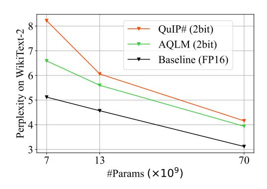
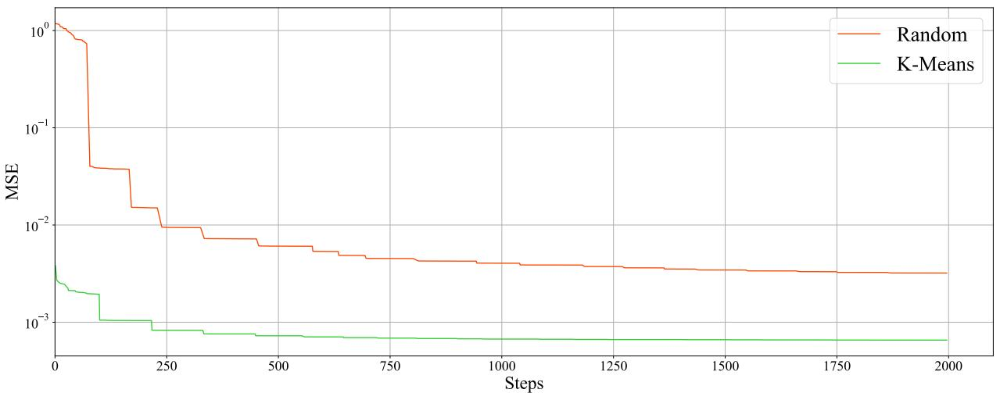
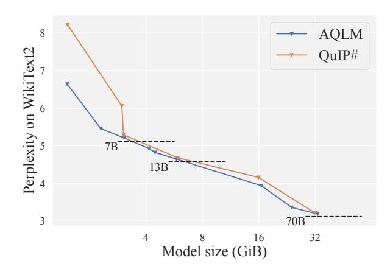
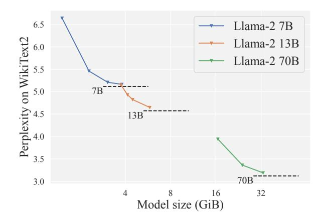
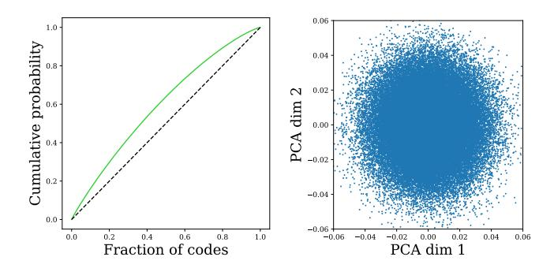

<!-- RP30_Egiazarian_2024 | source: papers_json/RP30_Egiazarian_2024/ -->

## ضغط متطرف لنماذج اللغة الكبيرة عبر التكميم الجمعي

Vage Egiazarian *12 Andrei Panferov *12 Denis Kuznedelev 23 Elias Frantar 4 Artem Babenko 2 Dan Alistarh 45

## **الملخص**

أدى ظهور نماذج لغة كبيرة (LLMs) مفتوحة ودقيقة إلى سباق نحو تقنيات تكميم عالية الأداء قادرة على تشغيلها على أجهزة المستخدمين النهائيين. في هذه الورقة، نعيد النظر في مشكلة الضغط "المتطرف" لنماذج اللغة الكبيرة - والمعرَّفة بأنها استهداف أعداد بتات منخفضة للغاية، مثل 2 إلى 3 بتات لكل معامل - من منظور الأساليب الكلاسيكية في التكميم متعدد دفاتر الترميز (MCQ). تعمم خوارزميتنا، المسماة AQLM، نهج التكميم الجمعي الكلاسيكي (AQ) لاسترجاع المعلومات لتطوير حالة الفن في ضغط نماذج اللغة الكبيرة، عبر ابتكارين: 1) تكميم جمعي مُتعلَّم لمصفوفات الأوزان بطريقة متكيفة مع المدخلات، و2) تحسين مشترك لمعاملات دفتر الترميز عبر كل كتلة محول. على نطاق أوسع، AQLM هي أول مخطط يحقق أمثلية باريتو من حيث الدقة مقابل حجم النموذج عند الضغط إلى أقل من 3 بتات لكل معامل، ويتفوق بشكل ملحوظ على جميع المخططات المعروفة في نظام الضغط المتطرف (2 بت). إضافة إلى ذلك، AQLM عملي: نوفر تطبيقات سريعة لـ GPU وCPU من AQLM لتوليد الرموز، مما يمكننا من مطابقة أو التفوق على تطبيقات FP16 المحسّنة في السرعة، مع التنفيذ ببصمة ذاكرة أصغر بكثير.

## 1. المقدمة

أدى التقدم السريع لنماذج اللغة الكبيرة التوليدية (LLMs) إلى اهتمام صناعي وشعبي هائل، مدفوعاً جزئياً بتوافر نماذج لغة كبيرة *مفتوحة* ودقيقة، مثل LLAMA 1 و2 (Touvron et al., 2023)، وFalcon (TII UAE, 2023)، وBLOOM (Scao et al., 2022)، وOPT (Zhang et al., 2022)، أو NeoX/Pythia (Biderman et al., 2023). تتمثل ميزة رئيسية للنماذج المفتوحة في أنه يمكن تشغيل الاستدلال عليها أو ضبطها محلياً من قبل المستخدمين النهائيين، بافتراض إمكانية تقليل تكاليفها الحسابية والذاكرية لتكون قابلة للإدارة على أجهزة شائعة. وقد أدى ذلك إلى عدة أساليب لـ


*الشكل 1: مقارنة AQLM (2 بت) بالنسبة إلى الحالة الراهنة QuIP# (2 بت) والأوزان الأصلية 16 بت على نماذج LLAMA 2 بأحجام 7 و13 و70 مليار.*

الاستدلال والضبط الدقيق على نماذج لغة كبيرة مضغوطة (Dettmers et al., 2022; Frantar et al., 2022a; Dettmers & Zettlemoyer, 2022; Lin et al., 2023; Dettmers et al., 2023a). حالياً، النهج الأساسي للضغط الدقيق لنماذج اللغة الكبيرة بعد التدريب هو *التكميم*، الذي يقلل عرض البتات الذي تُخزَّن به أوزان النموذج (وربما التنشيطات)، مما يؤدي إلى تحسينات في بصمة النموذج ونقل الذاكرة.

عموماً، تُضغط أوزان نماذج اللغة الكبيرة عبر تكميم "مباشر"، بمعنى أن يتم أولاً اختيار شبكة تكميم مناسبة وتطبيع لكل مكوّن فرعي للمصفوفة، ثم تُخطَّط الأوزان كل منها على الشبكة إما عبر التقريب المباشر، مثل (Dettmers & Zettlemoyer, 2022)، أو عبر تخصيصات أكثر تعقيداً، مثل (Frantar et al., 2022a). يُحدث التكميم مفاضلة طبيعية بين الضغط والدقة، تُقاس عادة من حيث حجم النموذج مقابل حيرة النموذج (PPL). يمكن للأساليب الحالية تحقيق فقدان دقة منخفض نسبياً عند 3-4 بتات لكل عنصر (Dettmers et al., 2023b; Chee et al., 2023; Kim et al., 2023)، وحتى يمكنها ضغط النماذج بشكل مستقر إلى 2 أو حتى أقل من البتات لكل عنصر، ولا سيما للنماذج الكبيرة جداً (Frantar & Alistarh, 2023). ومع ذلك، في معظم الحالات، تأتي أعداد البتات المنخفضة على حساب انخفاضات كبيرة في الدقة، وتعقيد أعلى في التنفيذ، وأعباء وقت التشغيل. على وجه التحديد، من المنظور العملي، فإن التكميم "المتطرف" في نطاق 2 بت باستخدام التقنيات الحالية أدنى من مجرد استخدام نموذج أساسي أصغر وتكميمه إلى عرض بتات أعلى، مثل 3-4 بتات لكل معامل، حيث ينتج الأخير دقة أعلى بنفس حجم النموذج بالبايت (Dettmers & Zettlemoyer, 2022; Chee et al., 2023).

> ^*^مساهمة متساوية <sup>1</sup>HSE University <sup>2</sup>Yandex Research <sup>3</sup>Skoltech <sup>4</sup>IST Austria <sup>5</sup>NeuralMagic. للمراسلة: <dan.alistarh@ist.ac.at>.

<!-- page 2 -->

المساهمة. في هذا العمل، نحسّن حالة الفن في ضغط نماذج اللغة الكبيرة بإظهارنا للمرة الأولى أنه يمكن توسيع تقنيات *التكميم متعدد دفاتر الترميز (MCQ)* لضغط أوزان نماذج اللغة الكبيرة. عموماً، MCQ هي عائلة من أساليب استرجاع المعلومات [(Chen et al., 2010; Jegou et al., 2010; Ge et al., 2013; Zhang et al., 2014; Babenko & Lempitsky, 2014; Martinez et al., 2016; 2018)](#)، تتألف من خوارزميات تكميم متخصصة لضغط قواعد بيانات المتجهات، تتيح بحثاً فعالاً. على عكس التكميم المباشر، تضغط MCQ قيماً متعددة بشكل مشترك، عبر الاستفادة من المعلومات المتبادلة للقيم المكمَّمة.

وعلى نحو أدق، نوسع التكميم الجمعي (AQ) [(Babenko & Lempitsky, 2014; Martinez et al., 2016)](#)، وهو خوارزمية MCQ شائعة، إلى مهمة ضغط أوزان نماذج اللغة الكبيرة بحيث يُحفظ تقريبياً مخرج كل طبقة وكتلة محول. يعيد توسعنا صياغة مشكلة تحسين AQ الكلاسيكية لتقليل الخطأ في مخرجات طبقات نماذج اللغة الكبيرة في ظل توزيع رموز الإدخال وكذلك لتحسين الرموز معاً عبر كتل الطبقات، بدلاً من الحفاظ على الأوزان نفسها كما في AQ القياسي. نشير إلى الإجراء الناتج بـ *التكميم الجمعي لنماذج اللغة (AQLM)*. على عكس بعض أساليب التكميم المتطرف لنماذج اللغة الكبيرة التي تتطلب صيغاً هجينة متفرقة-مكمَّمة تفصل تكميم القيم الشاذة [(Kim et al., 2023; Dettmers et al., 2023b)](#)، يكمم AQLM النماذج بصيغة متجانسة بسيطة، يسهل دعمها عملياً. مساهماتنا الرئيسية كما يلي:

- 1. نقترح خوارزمية AQLM، التي توسع AQ لضغط أوزان نماذج اللغة الكبيرة بعد التدريب، عبر ابتكارين: (1) تكييف مشكلة تحسين MAP-MRF[1](#) خلف AQ لتكون واعية بالمثيل، مع مراعاة تنشيطات إدخال ومخرج معايرة الطبقة؛ (2) إكمال التحسين على مستوى الطبقة بتقنية ضبط فعالة داخل الكتلة، تُحسّن معاملات التكميم بشكل مشترك عبر عدة طبقات، باستخدام بيانات المعايرة فقط.
- 2. نقيّم فعالية هذه الخوارزمية في مهمة ضغط نماذج لغة كبيرة مفتوحة ودقيقة من عائلة LLAMA 2 [(Touvron et al., 2023)](#) بمعدلات ضغط 2-4 بتات لكل معامل. نجد أن AQLM يتفوق على الحالة الراهنة عبر نطاق الضغط القياسي 2-4 بتات، مع التحسينات الأكثر أهمية للتكميم المتطرف 2 بت (انظر الشكل [1)](#). نقدم استئصالات تفصيلية لتأثير معاملات الخوارزمية المختلفة، مثل عرض الرمز وعدد دفاتر الترميز، ونمدد تحليلنا إلى نموذج Mixtral الحديث [(Jiang et al., 2024)](#). كما نقيّم AQLM بخوارزميات ضبط دقيق محسّنة من الأعمال اللاحقة، مما يؤدي إلى زيادة أخرى في دقة النماذج 2 و3 بت.

3. نوضح أن AQLM عملي، عبر توفير تطبيقات أنوية فعالة لـ GPU وCPU لترميزات محددة، فضلاً عن التوليد الكامل[2](#). تظهر النتائج أن نهجنا يمكن أن يطابق أو حتى يتفوق على خط أساس الفاصلة العائمة من حيث السرعة، مع تقليل بصمة الذاكرة بما يصل إلى 8 أضعاف. على وجه التحديد، يمكن تنفيذ AQLM بتسارعات على مستوى الطبقة بنحو 30٪ لـ GPU، وحتى 4 أضعاف لاستدلال CPU.

## 2. الخلفية والأعمال ذات الصلة

## 2.1. تكميم نماذج اللغة الكبيرة

استخدمت الجهود المبكرة نحو أساليب التكميم بعد التدريب (PTQ) [(Nagel et al., 2020; Gholami et al., 2021)](#) التي تتسع لنماذج اللغة الكبيرة مثل ZeroQuant [(Yao et al., 2022)](#)، وLLM.int8() [(Dettmers et al., 2022)](#)، وnuQmm [(Park et al., 2022)](#) إسقاطات تقريب-إلى-أقرب (RTN) مباشرة، وعدّلت دقة التكميم لموازنة كفاءة الذاكرة والدقة. اقترح GPTQ [(Frantar et al., 2022a)](#) *نهجاً واعياً بالبيانات* أكثر دقة عبر حلال تقريبي واسع النطاق لتقليل أخطاء ℓ^2^ على مستوى الطبقة.

درس [Dettmers & Zettlemoyer (2022)](#) مفاضلات الدقة-الضغط لهذه الأساليب المبكرة، مقترحاً أن التكميم 4 بت قد يكون الأمثل لتكميم RTN، ومراقباً أن الأساليب الواعية بالبيانات مثل GPTQ تسمح بضغط أعلى، أي أقل تماماً من 4 بتات/وزن، مع الحفاظ على أمثلية باريتو. يجلب عملنا حدود باريتو هذه إلى أقل من 3 بتات/وزن، للمرة الأولى. لاحظ العمل الموازي الذي يكمم كلاً من الأوزان *والتنشيطات* إلى 8 بتات، من قبل [Dettmers et al. (2022)](#)، و[Xiao et al. (2022)](#)، و[Yao et al. (2022)](#) أن "الميزات الشاذة" في نماذج اللغة الكبيرة تسبب أخطاء كبيرة، مما دفع إلى استراتيجيات تخفيف متنوعة.

ركزت مؤخراً عدة تقنيات محسّنة على صعوبة تكميم القيم الشاذة للأوزان، التي لها تأثير كبير على خطأ المخرج. يعالج SpQR [(Dettmers et al., 2023b)](#) ذلك بحفظ القيم الشاذة كمصفوفة عالية التفرق وأعلى دقة. يقلل AWQ [(Lin et al., 2023)](#) خطأ تكميم القنوات ذات أكبر مقادير تنشيط عبر استخدام تحجيم لكل قناة لتقليل الخطأ على الأوزان المهمة. يستخدم SqueezeLLM [(Kim et al., 2023)](#) مصفوفة فيشر القطرية كوكيل لمصفوفة هيسيان وينفذ تكميماً غير منتظم عبر تجميع K-means.

الطريقة المنشورة الراهنة هي QuIP [(Chee et al., 2023)](#). موازياً لعملنا، قُدّم متغير محسّن يسمى QuIP# [(Tseng et al., 2024)](#). تقريباً، يعملان عبر "تنعيم" الأوزان أولاً بضربها بمصفوفة دوران، ثم تخطيطها على شبكة. على مستوى عالٍ، يهدف QuIP وQuIP# إلى تقليل خطأ "أسوأ حالة" لكل طبقة، بالنظر إلى الأوزان الأولية وبيانات المعايرة. على سبيل المثال، في QuIP#، فإن توزيع

> ^1^الاستدلال الأقصى البعدي في حقول ماركوف العشوائية

> ^2^https://github.[com/Vahe1994/AQLM](https://github.com/Vahe1994/AQLM)

<!-- page 3 -->

الأوزان المُدوَّرة يقترب من توزيع غاوسي، بينما تُختار شبكة الترميز (E8P) لتقليل خطأ "التقريب". في المقابل، يستخدم نهجنا ترميز وزن مختلف (دفاتر الترميز *جمعية*)، ودفاتر ترميز *متعلَّمة* بدلاً من دفتر ترميز ثابت. وبذلك، فبصيرتنا هي أنه ينبغي أن نتمكن من الحصول على دقة أعلى عبر *التحسين المباشر* لدفاتر الترميز على مجموعة المعايرة، وإزالة الدوران. كذلك، نظهر أن دفاتر الترميز للطبقات المختلفة يمكن تدريبها معاً عبر ضبط دقيق مشترك على بيانات المعايرة.

## 2.2. التكميم للبحث عن أقرب الجيران

يعتمد عملنا على خوارزميات البحث التقريبي عن أقرب الجيران (ANN). على عكس PTQ، يهدف تكميم ANN إلى ضغط قاعدة بيانات من المتجهات للسماح للمستخدم بحساب التشابهات بكفاءة وإيجاد أقرب الجيران بالنسبة لمجموعة من نقاط الاستعلام. لتحقيق ضغط عالٍ، تستخدم خوارزميات بحث ANN الحديثة *تكميم المتجه* (VQ) - الذي يكمم أبعاداً متعددة للمتجه معاً (Burton et al., 1983; Gray, 1984). يحقق ذلك عبر تعلم "دفاتر الترميز": أي مجموعة من المتجهات المرشحة القابلة للتعلم التي يمكن استخدامها لترميز البيانات. لترميز متجه قاعدة بيانات معين، يقسم VQ المتجه إلى مجموعات فرعية من المداخل، ثم يرمز كل مجموعة باختيار متجه من دفتر الترميز المتعلَّم. تحسب الخوارزمية المسافات أو الضرب النقطي بكفاءة للبحث عن التشابه عبر الاستفادة من خطية حواصل الضرب النقطي.

تعمم أساليب التكميم لبحث ANN تكميم المتجه ويُشار إليها بالتكميم متعدد دفاتر الترميز (MCQ). عادة لا تتضمن أساليب MCQ فقدان معلومات على جانب الاستعلام، مما يجعلها النهج الرائد لـ ANN الفعال من حيث الذاكرة (Ozan et al., 2016; Martinez et al., 2018). نراجع MCQ بإيجاز أدناه.

**تكميم المنتج (PQ)** (Jegou et al., 2010) هو نسخة مبكرة من MCQ، يرمز كل متجه x \in \mathbf{R}^D كتسلسل من M كلمات رموز من M دفاتر ترميز ذات M بُعد C_1,\ldots,C_M، يحتوي كل منها على M كلمات رمز. يفكك PQ متجهاً إلى M متجه فرعي منفصل ويطبق تكميم المتجه (VQ) على كل متجه فرعي، أثناء استخدام دفتر ترميز منفصل. وبذلك، يُرمَّز كل متجه M بسمة من فهارس كلمات الرمز M ويُقرَّب بـ M وقَرَّب بـ M وقَرَّب بـ M وقَرَّب بـ M وقَرَّب بـ M وقَرَّب بـ M وقَرَّب بـ M وقَرَّب بـ M وقَرَّب بـ

$$
||q - x||^2 \approx ||q - [c_{1i_1}, \dots, c_{Mi_M}]||^2 = \sum_{m=1}^M ||q_m - c_{mi_m}||^2,
$$

حيث q_m هو المتجه الفرعي m-ث للاستعلام q. يمكن حساب هذا المجموع باستخدام M جمع وعمليات بحث إذا تم حساب المسافات من المتجهات الفرعية للاستعلام إلى كلمات الرمز مسبقاً. نظراً لأن التقريبات القائمة على المنتج تعمل بشكل أفضل إذا كانت المكونات ذات الأبعاد \frac{D}{M} توزيعات مستقلة، فقد بحث العمل اللاحق في إيجاد تحويلات أفضل (Ge et al., 2013; Norouzi & Fleet, 2013). أما بالنسبة لدوال

التشابه الأخرى، يقترح (Guo et al., 2016) إجراء تكميم لبحث الضرب الداخلي الأقصى (MIPS). يقللون خطأ التكميم في حواصل الضرب الداخلي بين متجهات قاعدة البيانات والاستعلام عبر حل مشكلة تحسين مقيدة. على غرار الصيغة أعلاه، يسمح هذا الإجراء ببحث ضرب داخلي فعال عبر الحساب المسبق لحواصل الضرب النقطي بين الاستعلام q وجميع الرموز في دفاتر الترميز المتعلَّمة، ثم إضافة حواصل الضرب النقطي الجزئية هذه لاستعادة درجة التشابه الكاملة.

التكميمات غير المتعامدة. قام العمل اللاحق (Chen et al., 2010; Babenko & Lempitsky, 2014; Martinez et al., 2016; Zhang et al., 2014; Ozan et al., 2016; Martinez et al., 2018) بتعميم فكرة تكميم المنتج عبر تقريب كل متجه بـ *مجموع* من *M* كلمة رمز بدلاً من التسلسل. يظل الإجراء الناتج فعالاً مع زيادة دقة التقريب.

من أجل ذلك، تكميم المتجه المتبقي (Chen et al., 2010)، يكمم المتجهات الأصلية، ثم يكمم تكرارياً المتبقيات التقريبية من التكرار السابق. التكميم الجمعي (AQ) (Babenko & Lempitsky, 2014) أكثر عمومية، حيث لا يفرض قيوداً على كلمات الرمز من دفاتر الترميز المختلفة. عادة، يوفر AQ أصغر أخطاء الضغط، لكنه أكثر تعقيداً للتدريب لقيم M الكبيرة. نناقش ذلك بالتفصيل في القسم 3.

أخيراً، تتوسع عدة أعمال حديثة (Martinez et al., 2016; 2018; Zhang et al., 2014) في فكرة التكميم الجمعي، مقترحة الإجراء الأكثر فعالية لتعلم دفاتر الترميز. يتعلم التكميم المركب (CQ) (Zhang et al., 2014) دفاتر الترميز بقيمة ثابتة للضرب الداخلي بين كلمات الرمز من دفاتر الترميز المختلفة. حالياً، تتحقق دقة الضغط الراهنة من خلال طريقة LSQ (Martinez et al., 2018).

تكميم المتجه لضغط النماذج. كان هناك عمل كبير على استغلال تكميم المتجه في سياق تعلم الآلة. على سبيل المثال، يستخدم Zhou et al. (2017); Li et al. (2017); Chen et al. (2019) التكميم متعدد دفاتر الترميز لضغط تضمينات الكلمات داخل نماذج التعلم العميق. يستكشف خط آخر من العمل (Blalock & Guttag, 2021; McCarter & Dronen, 2022; Fernández-Marqués et al., 2023) تكميم المتجه للنماذج الخطية، أو الطبقات الخطية داخل النماذج العميقة. على غرار PQ أعلاه، تحسب هذه التقنيات حواصل الضرب الداخلي بين المدخلات وجميع الرموز مسبقاً، ثم تحسب الطبقة الخطية عبر البحث، مما يسرع الاستدلال. ومع ذلك، تقدم هذه الخوارزميات خطأ تنبؤ كبيراً لا يسمح لها بضغط النماذج العميقة. وبذلك، نعتقد أننا الأوائل في تكييف وتوسيع MCQ بنجاح لنماذج اللغة الكبيرة.

<!-- page 4 -->

## 3. AQLM: التكميم الجمعي لنماذج اللغة الكبيرة

## 3.1. نظرة عامة

نبدأ من ملاحظة أن التكميم الجمعي (AQ) يحل مشكلة ذات صلة بالتكميم بعد التدريب (PTQ) (Nagel et al., 2020; Frantar et al., 2022b): تفترض كلتا الإعدادين وجود مجموعة من المتجهات "المدخلة"، أي بيانات الإدخال لـ AQ، وصفوف مصفوفة الوزن لـ PTQ. الهدف هو ضغط هذه المدخلات مع الحفاظ على تشابه الضرب النقطي، مقابل متجهات الاستعلام (لـ AQ)، ومقابل تضمينات إدخال الطبقة (لـ PTQ). الفرق بين الاثنين هو أن AQ يفترض أن توزيع الاستعلامات غير معروف، بينما تظهر أساليب PTQ، مثل (Frantar et al., 2022b)، أنه يكفي التحسين لتضمينات إدخال عينة من مجموعة بيانات معايرة.

على مستوى عالٍ، نبدأ بحل المشكلة التالية: لطبقة خطية ذات d_{in} ميزة إدخال وd_{out} ميزة إخراج بأوزانها \mathbf{W} \in \mathbb{R}^{d_{out} \times d_{in}} ومجموعة من مدخلات المعايرة \mathbf{X} \in \mathbb{R}^{d_{in} \times n}، نسعى لتكوين أوزان مكمَّمة \widehat{\mathbf{W}} يُحسّن الخطأ التربيعي بين مخرج الطبقة الأصلية والمضغوطة:

$$
\underset{\widehat{\mathbf{W}}}{\arg\min}||\mathbf{W}\mathbf{X} - \widehat{\mathbf{W}}\mathbf{X}||_2^2. \tag{1}
$$

فيما يلي، سنفترض أن \widehat{\mathbf{W}} مكمَّم باستخدام AQ، ونعتمد التدوين القياسي (Martinez et al., 2016). يقسم AQ صفوف الأوزان إلى مجموعات من g عناصر متتالية، ويمثل كل مجموعة من الأوزان كمجموع M متجه مختار من دفاتر ترميز متعلَّمة متعددة C_1,...,C_M، يحتوي كل منها على 2^B متجه (لرموز B بت). يُرمَّز الوزن باختيار رمز واحد من كل دفتر ترميز وجمعها. نشير إلى هذا الاختيار كمتجه أحادي ساخن b_m، مما ينتج عنه التمثيل التالي للمجموعة: \sum_{m=1}^M C_m b_{ijm}. هذا مشابه لخوارزميات PTQ (Frantar et al., 2022a)، باستثناء استخدام ترميز أكثر تعقيداً بكثير لكل مجموعة. لتمثيل الأوزان الكاملة، نقوم ببساطة بالتسلسل:

$$
\widehat{\mathbf{W}}_{i} = \sum_{m=1}^{M} C_{m} b_{i,1,m} \oplus \dots \oplus \sum_{m=1}^{M} C_{m} b_{i,d_{in}/g,m}, \quad (2)
$$

حيث يشير \oplus إلى التسلسل وb_{ijm} \in \mathbb{R}^{2^B} يمثل رمزاً أحادي الساخن للوحدة الإخراج *i*-ث، ومجموعة الأبعاد *j*-ث للإدخال ودفتر الترميز m-ث.

ستتعلم خوارزميتنا دفاتر الترميز C_m \in \mathbb{R}^{g \times 2^B} والرموز المنفصلة الممثلة بـ b أحادي ساخن \in \mathbb{R}^{d_{out} \times d_{in}/g \times M \times 2^B}. يشفر المخطط الناتج كل مجموعة من g أوزان باستخدام M \cdot B بت ويتطلب أيضاً g \cdot 2^B \cdot 16 بت لدفاتر ترميز FP16. يصبح الخطأ:

$$
\underset{C,b}{\operatorname{arg\,min}} ||\mathbf{W}\mathbf{X} - \left(\operatorname{Concat}_{i,j} \sum_{m=1}^{M} C_m b_{i,j,m}\right) \mathbf{X}||_2^2. \quad (3)
$$

لتعلم تمثيل الوزن هذا، نقوم بتهيئة دفاتر الترميز C والرموز b بتشغيل K-means المتبقية كما في Chen et al. (2010). على وجه التحديد، تسير خوارزمية التهيئة على النحو التالي: أولاً، تُشغّل تجميع K-means لمجموعات الأوزان وتحفظ فهارس العنقود الناتجة. بعد ذلك، تحسب أخطاء التكميم بطرح أقرب عنقود من كل وزن. أخيراً، تُشغّل الخوارزمية جولة أخرى من تجميع K-means، ولكن هذه المرة على أخطاء التكميم بدلاً من الأوزان. وبالتالي، تُهيَّأ كل دفتر ترميز لاحق لتعويض خطأ التكميم من دفاتر الترميز السابقة. بعد التهيئة، نتناوب بين تحديث الرموز b_{i,j,m} ودفاتر الترميز C_m حتى تتوقف دالة الخسارة (3) عن التحسن حتى التحمل المحدد. نظراً لأن الرموز منفصلة ودفاتر الترميز مستمرة، ونحن نُحسّن على طبقات متفاعلة متعددة، فإن نهجنا له ثلاث مراحل، موصوفة في الخوارزمية 1 ومفصّلة أدناه.

## 3.2. المرحلة 1: بحث الشعاع للرموز

أولاً، يحدّث AQLM الرموز b_{i,j,m} لتقليل هدف MSE (3). على غرار Babenko & Lempitsky (2014); Martinez et al. (2016; 2018)، نعيد صياغة الهدف من حيث حقل ماركوف العشوائي المنفصل المتصل بالكامل (MRF) للاستفادة من حلال MRF.

لتبسيط الاشتقاق، دعونا نعتبر أولاً حالة خاصة من وحدة إخراج واحدة (d_{out}=1) ومجموعة تكميم واحدة (أي g=d_{in})، للتخلص من معامل التسلسل: ||\mathbf{W}\mathbf{X} - \sum_{m=1}^{M} C_m b_m \mathbf{X}||_2^2. نعيد كتابة هذا الهدف بتوسيع الفرق التربيعي:

$$
\begin{align*}||\mathbf{W}\mathbf{X} - \sum_{m=1}^{M} C_{m} b_{m} \mathbf{X}||_{2}^{2} &= ||\mathbf{W}\mathbf{X}||_{2}^{2}-\\&\quad -2\left\langle \mathbf{W}\mathbf{X}, \sum_{m=1}^{M} C_{m} b_{m} \mathbf{X} \right\rangle_{F} + ||\sum_{m=1}^{M} C_{m} b_{m} \mathbf{X}||_{2}^{2} \tag{4}\end{align*}
$$

أعلاه، يشير \langle \cdot, \cdot \rangle_F إلى الضرب الداخلي لفروبينيوس بين مصفوفتين. بعد ذلك، دعونا نعتبر المكونات الثلاثة للمعادلة (4) بمعزل عن بعضها. أولاً، لاحظ أن ||\mathbf{W}\mathbf{X}||_2^2 ثابت في b ويمكن تجاهله. يمكن توسيع المكون الثالث أكثر إلى حواصل ضرب نقطي زوجية:

<!-- page 5 -->

$$
\left|\left|\sum_{m=1}^{M} C_m b_m \mathbf{X}\right|\right|_2^2 = \sum_{i=1}^{M} \sum_{j=1}^{M} \left\langle C_i b_i \mathbf{X}, C_j b_j \mathbf{X} \right\rangle_F. \tag{5}
$$

لاحظ أن المكونين الثاني والثالث يعتمدان على حواصل ضرب فروبينيوس لمصفوفات شبيهة بـ C_m b_m \mathbf{X}. يمكن أن تكون هذه المصفوفات غير ملائمة عملياً: نظراً لأن \mathbf{X} \in \mathbb{R}^{d_{in} \times n}، فإن حجم كل مصفوفة سيتدرج مع حجم مجموعة بيانات المعايرة n. للتغلب على ذلك، نعيد كتابة حواصل الضرب على النحو التالي:

$$
\langle C_i b_i \mathbf{X}, C_j b_j \mathbf{X} \rangle_F = \langle C_i b_i \mathbf{X} \mathbf{X}^T, C_j b_j \rangle_F. (6)
$$

وبذلك يمكن للمرء حساب \mathbf{X}\mathbf{X}^T \in \mathbb{R}^{d_{in} \times d_{in}} مسبقاً. سنشير إلى هذا النوع من الضرب بـ \langle \mathbf{A}, \mathbf{B} \rangle_{\mathbf{X}\mathbf{X}^T} \stackrel{\text{def}}{=} \langle \mathbf{A}\mathbf{X}\mathbf{X}^T, \mathbf{B} \rangle_F في الاشتقاقات المستقبلية. ثم تصبح المعادلة (4):

$$
||\mathbf{W}\mathbf{X} - \sum_{m=1}^{M} C_m b_m \mathbf{X}||_2^2 = ||\mathbf{W}\mathbf{X}||_2^2 - 2\sum_{m=1}^{M} \langle \mathbf{W}, C_m b_m \rangle \mathbf{X}\mathbf{X}^T + \sum_{i=1}^{M} \sum_{j=1}^{M} \langle C_i b_i, C_j b_j \rangle \mathbf{X}\mathbf{X}^T \tag{7}
$$

أخيراً، نعمم هذه المعادلة لوحدات إخراج متعددة (d_{out} > 1) ومجموعات تكميم (g \neq d_{in}). بالنسبة لـ d_{out} > 1، لاحظ أن الهدف الأصلي (3) جمعي بالنسبة لوحدات الإخراج: وبذلك يمكننا تطبيق (7) بشكل مستقل على كل بُعد إخراج وجمع النتائج. لدعم مجموعات إدخال متعددة (g \neq d_{in})، يمكننا معاملة كل مجموعة كدفتر ترميز منفصل حيث الرموز للمجموعة النشطة فقط هي غير الصفرية. وبذلك، نحتاج إلى تكرار كل دفتر ترميز d_{in}/g مرة وحشوه بأصفار وفقاً للمجموعة النشطة.

من الواضح الآن أن تقليل (4) يعادل استدلال MAP في حقل ماركوف العشوائي مع \langle \mathbf{W}, C_m b_m \rangle_{\mathbf{X}\mathbf{X}^T} كإمكانات أحادية و\langle C_i b_i, C_j b_j \rangle_{\mathbf{X}\mathbf{X}^T} كإمكانات زوجية. في حين أن إيجاد الأمثل الدقيق غير ممكن، فقد أظهر العمل السابق أن هذا النوع من MRF يمكن حله تقريبياً عبر بحث الشعاع أو ICM (Besag, 1986).

لحل هذه المشكلة، اخترنا تكييف خوارزمية بحث الشعاع من Babenko & Lempitsky (2014). تحتفظ هذه الخوارزمية بشعاع من k (حجم الشعاع) من أفضل التكوينات للرموز، بدءاً من الحل السابق. في كل خطوة، تحاول الخوارزمية استبدال رمز واحد بتجربة جميع البدائل 2^B k واختيار أفضل k استناداً إلى MSE (7).

نظراً لأن دالة الخسارة جمعية، فإن تغيير رمز واحد يؤثر فقط على مجموعة فرعية صغيرة من مكونات الخسارة. وبذلك، يمكننا حساب دالة الخسارة بكفاءة بالبدء بدالة خسارة سابقة (قبل استبدال الرمز)، ثم إضافة وطرح المكونات التي تغيرت خلال هذا التكرار. يمكن حساب مكونات الخسارة القليلة هذه بكفاءة عبر الضرب بـ \mathbf{X}\mathbf{X}^T قبل بحث الشعاع.

يعمل بحث الشعاع على جميع وحدات الإخراج d_{out} بالتوازي. هذا ممكن لأن ترميز وحدة إخراج واحدة لا يؤثر على هدف (7) للوحدات الأخرى. لاحظ أن بحث الشعاع ليس بالضرورة الحل الأفضل لهذه المشكلة. تستخدم متغيرات AQ للاسترجاع (Martinez et al., 2016; 2018) ICM عشوائي لإيجاد حلول أسرع. في هذه الدراسة، اخترنا بحث الشعاع لأنه كان أسهل في التنفيذ في أطر تعلم الآلة مثل PyTorch/JAX.

## 3.3. المرحلة 2: تحديث دفتر الترميز

في المرحلة الثانية، نجد متجهات دفتر الترميز المثلى C_1, ..., C_M التي تقلل نفس الخطأ التربيعي مثل بحث الشعاع. إذا تعاملنا مع الرموز b كثوابت، فإن تقليل (3) يصبح مشكلة المربعات الصغرى لـ C_m. تحل خوارزمية AQ الأصلية هذه المشكلة بصيغة مغلقة، معتمدة على حقيقة أن كل بُعد متجه يمكن تحسينه بشكل مستقل. مشكلتنا معقدة بسبب وجود \mathbf{X}\mathbf{X}^T: تعتمد القيمة المثلى لإحداثي دفتر ترميز واحد على قيم جميع الإحداثيات الأخرى. من حيث المبدأ، يمكننا تحسين C_m بصيغة مغلقة، ولكنه سيتطلب عكس مصفوفة كبيرة، أو استخدام حلال مربعات صغرى تكراري (مثل التدرجات المترافقة) متخصصاً لهذه المشكلة.

للبساطة، يستخدم تطبيقنا الحالي افتراضياً Adam (Kingma & Ba, 2015) لحل مشكلة التقليل هذه تقريبياً. عملياً، تستغرق مرحلة ضبط دفتر الترميز هذه جزءاً صغيراً من إجمالي وقت الحساب. نحسب الهدف على النحو التالي:

$$
||\mathbf{W}\mathbf{X} - \widehat{\mathbf{W}}\mathbf{X}||_{2}^{2} = ||(\mathbf{W} - \widehat{\mathbf{W}})\mathbf{X}||_{2}^{2} =
= \left\langle (\mathbf{W} - \widehat{\mathbf{W}})\mathbf{X}\mathbf{X}^{T}, (\mathbf{W} - \widehat{\mathbf{W}}) \right\rangle_{F}, \quad (8)
$$

حيث \widehat{\mathbf{W}} هي مصفوفة الوزن المكمَّمة من 2، ومصفوفة \mathbf{X}\mathbf{X}^T محسوبة مسبقاً. نحسّن هذا الهدف بالتكرار (غير العشوائي) للنزول التدرجي بدفعة كاملة.

لكل مرحلة تحديث، يقوم تطبيقنا بتشغيل 100 خطوة Adam بمعدل تعلم 10^{-4}. ومع ذلك، وجدنا أن النتيجة النهائية ليست حساسة لأي من هذه المعاملات: التدريب بعدد أقل من الخطوات أو معدل التعلم يحقق نفس الخسارة، ولكنه يستغرق وقتاً أطول للتقارب. في العمل المستقبلي، يمكن إزالة هذه المعاملات الفائقة بالتبديل إلى حلال مربعات صغرى مخصص لدفاتر الترميز. على غرار الخوارزميات الأخرى، نتعلم أيضاً مقاييس لكل وحدة s \in \mathbb{R}^{d_{out}} تُهيَّأ كـ s_i := ||\mathbf{W}_i||_2 وتُحدَّث جنباً إلى جنب مع دفاتر الترميز عبر نفس المُحسِّن (السطر 10 في الخوارزمية 1).

## 3.4. المرحلة 3: الضبط الدقيق للتماسك داخل الطبقة

حتى الآن، تضغط خوارزميتنا كل مصفوفة وزن بشكل مستقل عن باقي النموذج. ومع ذلك، عملياً، تتفاعل أخطاء التكميم بشكل مختلف بين المصفوفات. هذه المسألة ذات صلة خاصة في حالة الضغط المتطرف (2 بت)، حيث تكون أخطاء التكميم أكبر.

<!-- page 6 -->

## الخوارزمية 1 AQLM: التكميم الجمعي لنماذج اللغة الكبيرة

```
Require: model, data
 1: \mathbf{X}_{block} := model.input\_embeddings (data)
 2: for i = 1, \ldots, model.num\_layers do
 3:
 block := model.get_block(i)
 4:
 \mathbf{Y}_{block} := \operatorname{block}(\mathbf{X}_{block})
 5:
 for layer ∈ linear_layers (block) do
 \mathbf{W} := \texttt{layer.weight}
 6:
 \mathbf{X} := \text{layer\_inputs}(\text{layer}, \mathbf{X}_{block})
 7:
 8:
 C, b, s := initialize(\mathbf{W}) // k-means
 9:
 while loss improves by at least \tau do
10:
 C, s := \text{train\_Cs\_adam}(\mathbf{X}\mathbf{X}^T, \mathbf{W}, C, b, s)
 b := \text{beam\_search}(\mathbf{X}\mathbf{X}^T, \mathbf{W}, C, b, s)
11:
12:
 end while
13:
 /* save for fine-tuning */
14:
 layer.weight := AQLMFormat(C, b, s)
15:
 end for
16:
 \theta := \text{trainable\_parameters(block)}
 while loss improves by at least \tau do
17:
 L := ||\mathsf{block}(\mathbf{X}_{block}) - \mathbf{Y}_{block}||_2^2
18:
 \theta := adam(\theta, \frac{\partial L}{\partial \theta})
19:
20:
 end while
21:
 \mathbf{X}_{block} := block(\mathbf{X}_{block})
22: end for
```

يعالج العمل السابق هذه المسألة عبر التدريب الواعي بالتكميم (QAT)، مثل (Gholami et al., 2021). بدلاً من ضغط النموذج بأكمله في تمريرة واحدة، يكممون معاملات النموذج تدريجياً ويدربون المعاملات المتبقية لتعويض خطأ التكميم. لسوء الحظ، تشغيل QAT في إعدادنا غير ممكن، لأن معظم نماذج اللغة الكبيرة الحديثة باهظة التكلفة للغاية في التدريب أو حتى الضبط الدقيق. وبذلك، تُعدِّل معظم خوارزميات PTQ لنماذج اللغة الكبيرة معاملات النموذج فقط داخل نفس الطبقة الخطية (Frantar et al., 2022a; Lin et al., 2023; Dettmers et al., 2023b).

هنا، نختار حلاً وسطاً عبر تنفيذ التحسين على مستوى كتل المحول الفردية، أي مجموعات من 4-8 طبقات خطية<sup>3</sup> تشكل انتباهاً ذاتياً متعدد الرؤوس واحد، يتبعه طبقة MLP واحدة. بعد تكميم جميع الطبقات الخطية داخل كتلة محول واحدة، نقوم بضبط معاملاتها المتبقية بدقة لتقريب المخرجات الأصلية لكتلة المحول هذه بشكل أفضل عبر الانتشار العكسي من خلال تمثيل الوزن (2).

عملياً، نستخدم محرك PyTorch autograd لاشتقاق ||\mathrm{block}(\mathbf{X}_{block}) - \mathbf{Y}_{block}||^2، حيث \mathbf{X}_{block} هي تنشيطات الإدخال لكتلة المحول هذه و\mathbf{Y}_{block} هي تنشيطات الإخراج لـ \mathrm{block}(\mathbf{X}_{block}) المسجلة قبل التكميم. ندرب دفاتر الترميز C_m، ومتجهات المقياس s، وجميع المعاملات غير المكمَّمة (مقاييس RMSNorm والتحيزات)، مع إبقاء الرموز b_{i,j,m} مجمدة. على غرار القسم 3.3، ندرب هذه المعاملات باستخدام Adam لتقليل MSE مقابل مخرجات الكتلة الأصلية (قبل التكميم). تستخدم هذه المرحلة نفس بيانات المعايرة كما لتكميم الطبقة الفردية. الإجراء الكامل ملخص في الخوارزمية 1.

في حين أن ضبط الكتل أكثر تكلفة من الطبقات الخطية الفردية، لا يزال من الممكن تكميم نماذج بمعاملات بمليارات على وحدة GPU واحدة في وقت معقول. كذلك، نظراً لأن الخوارزمية تعدّل فقط بضع معاملات قابلة للتدريب، فإنها تستخدم القليل من VRAM لحالات المُحسِّن. يتقارب هذا الضبط الدقيق بعد بضع تكرارات، حيث يبدأ من تخمين أولي جيد. عملياً، يستغرق ضبط طبقات المحول جزءاً صغيراً (10-30٪ أو أقل) من إجمالي وقت المعايرة.

## 4. التجارب

نقيّم خوارزمية AQLM في السيناريوهات النموذجية للتكميم بعد التدريب لنماذج اللغة الكبيرة الحديثة. يركز تقييمنا على عائلة نماذج LLAMA 2 لأنها عمود فقري شائع للنماذج المضبوطة بدقة أو تطبيقات نماذج اللغة الكبيرة العامة، مثل (Dettmers et al., 2023a)، ونقدم أيضاً نتائج على نماذج عائلة Mistral (Jiang et al., 2024). في القسم 4.1، نقيّم إجراء AQ الكامل لنماذج LLAMA 2 المختلفة وعروض بتات التكميم؛ يقدم القسم 4.3 تحليل استئصال لمكونات AQ الفردية وتفاصيل التنفيذ.

## 4.1. جودة الضغط لنماذج اللغة الكبيرة الحديثة

نُبلغ عن الحيرة على مجموعات التحقق WikiText-2 (Merity et al., 2016) وC4 (Raffel et al., 2020). نقيس أيضاً دقة الصفر-طلقة على WinoGrande (Sakaguchi et al., 2021)، وPiQA (Tata & Patel, 2003)، وHellaSwag (Zellers et al., 2019)، وARC-easy وARC-challenge (Clark et al., 2018) عبر LM Eval Harness (Gao et al., 2021). نتبع إعداد التقييم لـ GPTQ (Frantar et al., 2022a) ونقدم تكوينات لـ AQLM وخطوط الأساس في الملحق C.

> ^&^lt;sup>3</sup>يعتمد هذا الرقم على عوامل بما في ذلك استخدام تنشيطات GLU المسوّرة، وانتباه استعلام المجموعة، ودمج أوزان QKV.

<!-- page 7 -->

| الحجم | الطريقة | متوسط البتات | Wiki2\downarrow | C4\downarrow | WinoGrande\uparrow | PiQA\uparrow | HellaSwag\uparrow | ArcE\uparrow | ArcC\uparrow | متوسط الدقة\uparrow |
| --- | --- | --- | --- | --- | --- | --- | --- | --- | --- | --- |
| 7B | – | 16 | 5.12 | 6.63 | 67.25 | 78.45 | 56.69 | 69.32 | 40.02 | 62.35 |
| AQLM | 3.04 | **5.46** | **7.08** | **66.93** | **76.88** | **54.12** | **68.06** | **38.40** | **60.88** |  |
| GPTQ | 3.00 | 8.06 | 10.61 | 59.19 | 71.49 | 45.21 | 58.46 | 31.06 | 53.08 |  |
| SpQR | 2.98 | 6.20 | 8.20 | 63.54 | 74.81 | 51.85 | 67.42 | 37.71 | 59.07 |  |
| 13B | – | 16 | 4.57 | 6.05 | 69.61 | 78.73 | 59.72 | 73.27 | 45.56 | 65.38 |
| AQLM | 3.03 | **4.82** | **6.37** | 68.43 | **77.26** | **58.30** | **70.88** | **42.58** | **64.49** |  |
| GPTQ | 3.00 | 5.85 | 7.86 | 63.93 | 76.50 | 53.47 | 65.66 | 38.48 | 59.61 |  |
| SpQR | 2.98 | 5.28 | 7.06 | 67.48 | 77.20 | 56.34 | 69.78 | 39.16 | 61.99 |  |
| QuIP | 3.00 | 5.12 | 6.79 | **69.93** | 76.88 | 57.07 | 70.41 | 41.47 | 63.15 |  |
| 70B | – | 16 | 3.12 | 4.97 | 76.95 | 81.07 | 63.99 | 77.74 | 51.11 | 70.17 |
| AQLM | 3.01 | **3.36** | **5.17** | **77.19** | **81.28** | **63.23** | **77.61** | **50.00** | **69.86** |  |
| GPTQ | 3.00 | 4.40 | 6.26 | 71.82 | 78.40 | 60.00 | 72.73 | 44.11 | 65.41 |  |
| SpQR | 2.98 | 3.85 | 5.63 | 74.66 | 80.52 | 61.95 | 75.93 | 48.04 | 68.22 |  |
| QuIP | 3.01 | 3.87 | 5.67 | 74.59 | 79.98 | 60.73 | 73.19 | 46.33 | 66.96 |  |

نعتبر ثلاثة أهداف رئيسية من حيث نطاقات الضغط: 2-2.8 بتات، و3-3.1 بتات، و4-4.1 بتات لكل معامل نموذج. في النتائج أدناه *متوسط البتات لكل معامل* يأخذ في الاعتبار فقط الأوزان المكمَّمة، لا نُدرج المعاملات المحفوظة بدقة عائمة على غرار العمل ذي الصلة. تفاصيل تقدير حجم النموذج موفرة في الملحق [H.](#) نقارن AQ بـ GPTQ لـ 3 و4 بت [(Frantar et al., 2022a)](#)، وSpQR لـ 3 و4 بت [(Dettmers et al., 2023b)](#)، وQuIP في 2 و3 و4 بت [(Chee et al., 2023)](#) وQuIP# لـ 2 و4 بت [(Tseng et al., 2024)](#). في حين أن GPTQ وSpQR يدعمان تقنياً تكميم 2 بت، فإنهما يؤديان أداءً ضعيفاً في نطاق 2-3 بت. بالنسبة لـ QuIP، يُظهر تطبيقنا المُكيَّف[4](#)

أداءً مقبولاً لـ LLAMA 2 13B و70B ولكنه يؤدي أداءً ضعيفاً لنموذج 7B. نعاير كل خوارزمية باستخدام شريحة من مجموعة بيانات RedPajama [(Computer, 2023)](#)، بطول تسلسل 4096.

تُحدَّد عروض البتات الدقيقة لكل طريقة بمعاملات مثل عدد دفاتر الترميز وعرض الرمز. نُبلغ عن نتائج لنطاقات عرض البتات 2−2.8 و3−3.1 في الجدولين [1](#) و[2،](#) على التوالي. النتائج الإضافية لـ 4 − 4.1 بتات مؤجلة إلى الملحق [F.2.](#)

تظهر النتائج أن AQLM يتفوق على أفضل خوارزميات PTQ السابقة عبر جميع الإعدادات، غالباً بهوامش واسعة، خاصة عند الضغط العالي. هذا صحيح من حيث PPL عبر مجموعات التحقق القياسية (Wiki-Text2 وC4)،

> ^4^لا يدعم رمز QuIP الرسمي (غير #) LLAMA 2.

<!-- page 8 -->

والدقة عبر مهام الصفر-طلقة. على وجه التحديد، نلاحظ أعلى مكاسب دقة في النطاق "المتطرف" 2-2.1 بت لكل معامل، حيث يصبح الانحراف عن النموذج غير المضغوط كبيراً لجميع الطرق.

تكميم Mixtral. يقدم الجدول [3](#) النتائج على Mixtral MoE، مقارنة بـ QuIP# عند 2 بت. (انظر الملحق [F.1](#) للنتائج الكاملة.) يتفوق AQLM على QuIP# في هذه الحالة أيضاً. على الرغم من أن الهوامش أقل مقارنة بنماذج LLAMA 2، إلا أنها لا تزال كبيرة للمهام "الأصعب"، مثل Arc Challenge (+3 نقاط).

أمثلية باريتو لـ AQLM. تُثير تحسينات الخطأ الكبيرة سؤال اختيار متغير النموذج "الأمثل" لتعظيم الدقة ضمن ميزانية ذاكرة معينة. لذلك، نتبع [Dettmers & Zettlemoyer (2022)](#): يُقال إن النموذج المكمَّم أمثل باريتو إذا عظم الدقة بنفس الحجم الإجمالي أو أقل (بايت). على الرغم من التقدم السريع، فإن طرق الفن السابقة *ليست أمثل باريتو* عند 2 بت: على سبيل المثال، أفضل LLAMA 2 13B ذي 2 بت السابق (QuIP#، الجدول [1)](#) يحقق Wiki2 PPL قدره 6.06، ولكن يمكن للمرء الحصول على PPL أقل بكثير 5.21 باستخدام نموذج 7B بتكميم 4 بت، وهو أصغر (انظر الجدول [10](#) في الملحق).

ضغط AQLM إلى 2 بت بدقة لنفس النموذج هو أيضاً دون أمثلية باريتو، حيث يتفوق عليه ضغط AQLM 4 بت لـ LLAMA 2 7B (5.21 مقابل 5.59). لإيجاد عرض بت التكميم الأمثل لباريتو، نُجري تجارب بين 2-3 بت لكل معامل ونُبلغ عنها في الجدول [1،](#) أسفل الأشرطة الأفقية. وبذلك، يبدو أن عرض البت الأمثل لباريتو لـ AQLM يقع حول 2.5 بت لكل معامل (الجدول [1)](#)، وعند هذه النقطة نكون مقارنين لـ AQLM 5 بت لـ LLAMA 2 7B (الجدول [10](#) في الملحق). بدوره، يتفوق AQLM 2.76 بت على 13B على نموذج 7B *غير المضغوط*. على هذا النحو، AQLM هي أول خوارزمية تحقق أمثلية باريتو عند أقل من 3 بتات لكل معامل.

## 4.2. تجارب الضبط الدقيق من النهاية إلى النهاية

يحسّن العمل اللاحق في QuIP# [(Tseng et al., 2024)](#) بروتوكول الكتلة الخاص بنا (القسم [3.4)](#) عبر ضبط النموذج بأكمله لتقليل تباعد KL. هنا، نحلل كيف تترجم هذا الضبط الدقيق من النهاية إلى النهاية إلى AQLM. نتبع الإعداد من QuIP# [(Tseng et al., 2024)](#) ونُجري ضبطاً دقيقاً من النهاية إلى النهاية بالمعاملات الافتراضية (انظر

الملحق [A)](#). يُبلغ الجدول [4](#) عن نتائجنا لتكميم 2 بت باستخدام AQLM وQuIP# مع الضبط الدقيق من النهاية إلى النهاية. نُبلغ عن نتائج إضافية في هذا الإعداد في الجداول [6،](#) و[13](#) و[15](#) في المواد التكميلية. للتمييز بين النسختين، نضع علامة على النماذج المكمَّمة مع الضبط الدقيق من النهاية إلى النهاية بـ ⋆. عموماً، يحسّن الضبط الدقيق من النهاية إلى النهاية كلاً من QuIP# وAQLM، مما يصل إلى دقة قابلة للمقارنة لكلتا الطريقتين. كذلك، نلاحظ أن الزيادة من الضبط الدقيق من النهاية إلى النهاية أكثر عمقاً على النماذج المكمَّمة 2 بت مع تناقص العائدات لـ 3 بت وما فوق. أخيراً، يمكننا أن نرى أن AQLM 2.19 بت مع الضبط الدقيق من النهاية إلى النهاية على 13B قابل للمقارنة مع نموذج 7B *غير مضغوط* محققاً أمثلية باريتو على مهام الصفر-طلقة.

## 4.3. تحليل الاستئصال

في الملحق [E،](#) نفحص خيارات التصميم الرئيسية المتعلقة بالتهيئة، والتحسين المتناوب، وتأثير الضبط الدقيق، والحساسية للمعاملات الفائقة. باختصار، نجد أولاً أن *تهيئة K-means المتبقية* حاسمة *للتقارب السريع* للخوارزمية: عند المقارنة بالتهيئة العشوائية، تحتاج إلى عدد أقل بكثير من تكرارات التدريب. نقارن أيضاً تكوينات المعاملات الفائقة المختلفة لنفس عرض البت، مع تغيير عدد دفاتر الترميز وحجم المجموعة. ثانياً، للتحقق من إجراء الضبط الدقيق للمعايرة، نقارنه مقابل 1) لا ضبط دقيق، 2) ضبط دقيق فقط للطبقات غير الخطية (مثل RMSNorm) ولكن ليس لمعاملات دفتر الترميز، و3) ضبط دقيق فقط لدفاتر الترميز (ولكن ليس الطبقات الأخرى). تظهر النتائج، المعروضة كاملة في الملحق [E،](#) أن ضبط *معاملات دفتر الترميز* له أعلى تأثير على الدقة، بفارق كبير، بينما ضبط RMSNorm فقط له تأثير طفيف. هذا يصحح اختيارنا لاستغلال مجموعة المعايرة لدفاتر الترميز المتعلَّمة.

كذلك، نلاحظ أن زيادة عدد تسلسلات العينة في النطاق 128 إلى 4096 تؤدي إلى تحسن تدريجي في PPL، ولكن مع تناقص العائدات. هذا صحيح لكل من المعايرة الأولية لـ AQLM والضبط الدقيق. في هذا الصدد، يستفيد AQLM أكثر من مجموعات المعايرة الأكبر (على غرار QuIP#)، على عكس الطرق المباشرة مثل GPTQ التي تشبع الدقة عند حوالي 256 تسلسل إدخال. أخيراً، نتحقق من خيارات متنوعة لاستثمار ميزانية بت معينة، مع المقارنة مثلاً بين الرموز الأطول (مثل 1x15) مقابل دفاتر ترميز متعددة برموز أقصر (مثل 2x8).

<!-- page 9 -->

## 4.4. سرعة الاستدلال

على الرغم من أن هدفنا الأساسي هو تعظيم الدقة لحجم نموذج معين، يمكن أن يكون AQLM عملياً أيضاً من حيث زمن انتقال الاستدلال. لإثبات ذلك، نفذنا أنوية فعالة لـ GPU وCPU لبضعة تكوينات صديقة للأجهزة من AQLM. يمكن العثور على النتائج في الجدول 5. لاستدلال GPU، استهدفنا نماذج LLAMA 2 المكمَّمة بدفاتر ترميز 16 بت، تقابل 2.07 بت لـ LLAMA 2 70B، و2.19 بت لـ 13B، و2.29 بت لنماذج 7B (انظر الجدول 1، 4)، فضلاً عن نموذج دفتر ترميز 2x8 بت بحيرة 6.57 على Wiki2 (انظر الجدول 12). لكل نموذج نقيس أداء روتين ضرب المصفوفة-المتجه على طبقة قياسية. تظهر النتائج أن AQLM يمكنه التنفيذ بسرعات قابلة للمقارنة أو أفضل من FP16. يمكن العثور على الأرقام التوليدية الكاملة مع تكامل HuggingFace في الملحق I: على سبيل المثال، يمكننا تحقيق \approx 14 رمز/ث على LLAMA 2 70B في هذا الإعداد. نلاحظ أن دفاتر الترميز الأصغر المتعددة تسمح باستخدام فعال لذاكرة التخزين المؤقت لـ GPU، مما يؤدي إلى تسارع أكبر، على حساب دقة أقل قليلاً.

بعد ذلك، نستكشف كيفية الاستفادة من AQLM لتسريع

استدلال CPU. كما نوقش في القسم 2.2، يمكن للتكميم الجمعي حساب حواصل الضرب النقطي بكفاءة إذا كان حجم دفتر الترميز صغيراً. إحدى الطرق لتحقيق ذلك لـ AQLM هي استبدال كل دفتر ترميز 16 بت بعدد من دفاتر الترميز 8 بت الأصغر. يؤدي هذا إلى خطأ تكميم أعلى، ولكنه لا يزال يتفوق على خطوط الأساس من حيث الدقة (انظر الجدول 9 في الملحق). تظهر النتائج في الجدول 5 أن هذا يسمح أيضاً باستدلال أسرع بما يصل إلى 4 أضعاف بالنسبة لـ FP32 على CPU.

## 5. الخلاصة والعمل المستقبلي

قدمنا AQLM، شكلاً جديداً من التكميم الجمعي (AQ) يستهدف ضغط نماذج اللغة الكبيرة، والذي حسّن بشكل كبير نتائج الفن الراهن لتكميم نماذج اللغة الكبيرة في نظام 2 و3 بت لكل وزن. من حيث القيود، AQLM أكثر تكلفة حسابياً من طرق التكميم بعد التدريب المباشرة، مثل RTN أو GPTQ، خاصة بسبب استخدام تمثيل ترميز أكثر تعقيداً. ومع ذلك، على الرغم من الترميز وفك الترميز الأكثر تطوراً، أظهرنا أن AQLM يصلح للتنفيذ الفعال على كل من CPU وGPU. عموماً، نجد من الرائع أنه باستخدام AQLM، يمكن تنفيذ نماذج اللغة الكبيرة الضخمة بدقة وكفاءة باستخدام القليل من الذاكرة.

في حين أن AQLM يحقق بالفعل تحسينات كبيرة في التكميم منخفض البت، هناك عدة اتجاهات واعدة لمزيد من التحسين لم نستكشفها في هذا العمل. أحد هذه الاتجاهات هو استراتيجيات ضبط دقيق أفضل. في القسم 4.2 وجدنا أن خوارزميات الضبط الدقيق الأفضل (Tseng et al., 2024; Malinovskii et al., 2024) يمكنها تحسين دقة النموذج المكمَّم بشكل كبير. نعتقد أن AQLM يمكن أن يستفيد من استكشاف منهجي أكثر لخوارزميات الضبط الدقيق في العمل المستقبلي. اتجاه واعد آخر هو تعميم AQLM على سيناريوهات تكميم أخرى. في حين أن عملنا يركز على تكميم نماذج اللغة الكبيرة، يمكن تكييف الخوارزمية الأساسية بشكل محتمل لمشكلات أخرى، مثل تكميم نماذج الرؤية الحاسوبية، وضغط ذاكرة الانتباه المؤقتة لنماذج اللغة الكبيرة للتسلسلات الطويلة، وغيرها.

<!-- page 10 -->

## شكر وتقدير

يود المؤلفون أن يشكروا Ruslan Svirschevski على مساعدته في حل المشكلات التقنية مع AQLM وخطوط الأساس. نشكر أيضاً Tim Dettmers على المناقشات المفيدة حول هيكل الأوزان في نماذج اللغة الكبيرة الحديثة ومفاضلات الحجم-الدقة. يود المؤلفون أيضاً أن يشكروا Daniil Pavlov على مساعدته في قياس أداء CPU. يود المؤلفون أيضاً أن يشكروا المساهمين والمجتمع من مستودع Github[5](#) على المساعدة في تحسين الرمز ونص الورقة. أخيراً، يود المؤلفون أن يشكروا مجتمعات هواة تعلم الآلة المعروفة بـ LocalLLaMA[6](#) ومجتمع Petals على discord[7](#) للحكمة الجماعية حول تشغيل نماذج اللغة الكبيرة على أجهزة المستهلك. تم دعم Egiazarian Vage وDenis Kuznedelev وAndrei Panferov بمنحة لمراكز البحث في مجال الذكاء الاصطناعي مقدمة من المركز التحليلي لحكومة الاتحاد الروسي (ACRF) وفقاً للاتفاقية بشأن تقديم الدعم (معرّف الاتفاقية 000000D730321P5Q0002) والاتفاقية مع جامعة HSE رقم 70-2021-00139

## بيان الأثر

تقدم هذه الورقة عملاً هدفه تطوير مجال تعلم الآلة. هناك العديد من النتائج المجتمعية المحتملة لعملنا، لا نشعر أن أياً منها يجب تسليط الضوء عليه على وجه التحديد هنا.

## المراجع

- Babenko, A. and Lempitsky, V. Additive quantization for extreme vector compression. In *Proceedings of the IEEE Conference on Computer Vision and Pattern Recognition*, pp. 931–938, 2014.
- Besag, J. On the statistical analysis of dirty pictures. *Journal of the Royal Statistical Society Series B: Statistical Methodology*, 48(3):259–279, 1986.
- Biderman, S., Schoelkopf, H., Anthony, Q., Bradley, H., O'Brien, K., Hallahan, E., Khan, M. A., Purohit, S., Prashanth, U. S., Raff, E., et al. Pythia: A suite for analyzing large language models across training and scaling. *arXiv preprint arXiv:2304.01373*, 2023.
- Blalock, D. and Guttag, J. Multiplying matrices without multiplying. In *International Conference on Machine Learning*, pp. 992–1004. PMLR, 2021.
- Burton, D., Shore, J., and Buck, J. A generalization of isolated word recognition using vector quantization. In

- *ICASSP '83. IEEE International Conference on Acoustics, Speech, and Signal Processing*, volume 8, pp. 1021–1024, 1983. doi: 10.1109/ICASSP.1983.1171915.
- Chee, J., Cai, Y., Kuleshov, V., and Sa, C. D. Quip: 2-bit quantization of large language models with guarantees, 2023.
- Chen, S., Wang, W., and Pan, S. J. Deep neural network quantization via layer-wise optimization using limited training data. *Proceedings of the AAAI Conference on Artificial Intelligence*, 33(01):3329–3336, Jul. 2019. doi: 10.1609/aaai.v33i01.33013329. URL [https://ojs](https://ojs.aaai.org/index.php/AAAI/article/view/4206).aaai.org/index.php/AAAI/ [article/view/4206](https://ojs.aaai.org/index.php/AAAI/article/view/4206).
- Chen, Y., Guan, T., and Wang, C. Approximate nearest neighbor search by residual vector quantization. *Sensors*, 10(12):11259–11273, 2010.
- Clark, P., Cowhey, I., Etzioni, O., Khot, T., Sabharwal, A., Schoenick, C., and Tafjord, O. Think you have solved question answering? try arc, the ai2 reasoning challenge. *arXiv preprint arXiv:1803.05457*, 2018.
- Cobbe, K., Kosaraju, V., Bavarian, M., Chen, M., Jun, H., Kaiser, L., Plappert, M., Tworek, J., Hilton, J., Nakano, R., Hesse, C., and Schulman, J. Training verifiers to solve math word problems. *CoRR*, abs/2110.14168, 2021. URL [https://arxiv](https://arxiv.org/abs/2110.14168).org/abs/2110.14168.
- Computer, T. Redpajama: an open dataset for training large language models, 2023. URL https://github.[com/togethercomputer/](https://github.com/togethercomputer/RedPajama-Data) [RedPajama-Data](https://github.com/togethercomputer/RedPajama-Data).
- Dettmers, T. and Zettlemoyer, L. The case for 4-bit precision: k-bit inference scaling laws. *arXiv preprint arXiv:2212.09720*, 2022.
- Dettmers, T., Lewis, M., Belkada, Y., and Zettlemoyer, L. LLM.int8(): 8-bit matrix multiplication for transformers at scale. *Advances in Neural Information Processing Systems 35: Annual Conference on Neural Information Processing Systems 2022, NeurIPS 2022*, 2022.
- Dettmers, T., Pagnoni, A., Holtzman, A., and Zettlemoyer, L. QLoRA: Efficient finetuning of quantized llms. *arXiv preprint arXiv:2305.14314*, 2023a.
- Dettmers, T., Svirschevski, R., Egiazarian, V., Kuznedelev, D., Frantar, E., Ashkboos, S., Borzunov, A., Hoefler, T., and Alistarh, D. Spqr: A sparse-quantized representation for near-lossless llm weight compression. *arXiv preprint arXiv:2306.03078*, 2023b.
- Fernández-Marqués, J., AbouElhamayed, A. F., Lane, N. D., and Abdelfattah, M. S. Are we there yet?

> ^5^https://github.[com/Vahe1994/AQLM/](https://github.com/Vahe1994/AQLM/)

> ^6^https://www.reddit.[com/r/LocalLLaMA/](https://www.reddit.com/r/LocalLLaMA/)

> ^7^https://github.[com/bigscience-workshop/](https://github.com/bigscience-workshop/petals/) [petals/](https://github.com/bigscience-workshop/petals/)

<!-- page 11 -->

- product quantization and its hardware acceleration. *ArXiv*, abs/2305.18334, 2023. URL [https:](https://api.semanticscholar.org/CorpusID:258967539) //api.[semanticscholar](https://api.semanticscholar.org/CorpusID:258967539).org/CorpusID: [258967539](https://api.semanticscholar.org/CorpusID:258967539).
- Frantar, E. and Alistarh, D. Qmoe: Practical sub-1-bit compression of trillion-parameter models. *arXiv preprint arXiv:2310.16795*, 2023.
- Frantar, E., Ashkboos, S., Hoefler, T., and Alistarh, D. Gptq: Accurate post-training quantization for generative pretrained transformers. *arXiv preprint arXiv:2210.17323*, 2022a.
- Frantar, E., Singh, S. P., and Alistarh, D. Optimal Brain Compression: A framework for accurate posttraining quantization and pruning. *arXiv preprint arXiv:2208.11580*, 2022b. Accepted to NeurIPS 2022, to appear.
- Gao, L., Tow, J., Biderman, S., Black, S., DiPofi, A., Foster, C., Golding, L., Hsu, J., McDonell, K., Muennighoff, N., Phang, J., Reynolds, L., Tang, E., Thite, A., Wang, B., Wang, K., and Zou, A. A framework for fewshot language model evaluation, September 2021. URL [https://doi](https://doi.org/10.5281/zenodo.5371628).org/10.5281/zenodo.5371628.
- Ge, T., He, K., Ke, Q., and Sun, J. Optimized product quantization. *IEEE transactions on pattern analysis and machine intelligence*, 36(4):744–755, 2013.
- Gholami, A., Kim, S., Dong, Z., Yao, Z., Mahoney, M. W., and Keutzer, K. A survey of quantization methods for efficient neural network inference. *arXiv preprint arXiv:2103.13630*, 2021.
- Gray, R. Vector quantization. *IEEE ASSP Magazine*, 1(2): 4–29, 1984. doi: 10.1109/MASSP.1984.1162229.
- Guo, R., Kumar, S., Choromanski, K., and Simcha, D. Quantization based fast inner product search. In *Artificial intelligence and statistics*, pp. 482–490. PMLR, 2016.
- Hendrycks, D., Burns, C., Basart, S., Zou, A., Mazeika, M., Song, D., and Steinhardt, J. Measuring massive multitask language understanding. *CoRR*, abs/2009.03300, 2020. URL [https://arxiv](https://arxiv.org/abs/2009.03300).org/abs/2009.03300.
- Hinton, G., Vinyals, O., and Dean, J. Distilling the knowledge in a neural network, 2015.
- Jegou, H., Douze, M., and Schmid, C. Product quantization for nearest neighbor search. *IEEE transactions on pattern analysis and machine intelligence*, 33(1):117–128, 2010.
- Jiang, A. Q., Sablayrolles, A., Mensch, A., Bamford, C., Chaplot, D. S., Casas, D. d. l., Bressand, F., Lengyel, G., Lample, G., Saulnier, L., et al. Mistral 7b. *arXiv preprint arXiv:2310.06825*, 2023.

- Jiang, A. Q., Sablayrolles, A., Roux, A., Mensch, A., Savary, B., Bamford, C., Chaplot, D. S., Casas, D. d. l., Hanna, E. B., Bressand, F., et al. Mixtral of experts. *arXiv preprint arXiv:2401.04088*, 2024.
- Kim, S., Hooper, C., Gholami, A., Dong, Z., Li, X., Shen, S., Mahoney, M. W., and Keutzer, K. Squeezellm: Dense-and-sparse quantization. *arXiv preprint arXiv:2306.07629*, 2023.
- Kingma, D. P. and Ba, J. Adam: A method for stochastic optimization. *International Conference on Learning Representations (ICLR)*, 2015.
- Li, Z., Ni, B., Zhang, W., Yang, X., and Gao, W. Performance guaranteed network acceleration via high-order residual quantization, 2017.
- Lin, J., Tang, J., Tang, H., Yang, S., Dang, X., and Han, S. Awq: Activation-aware weight quantization for llm compression and acceleration. *arXiv preprint arXiv:2306.00978*, 2023.
- Malinovskii, V., Mazur, D., Ilin, I., Kuznedelev, D., Burlachenko, K., Yi, K., Alistarh, D., and Richtarik, P. Pv-tuning: Beyond straight-through estimation for extreme llm compression. *arXiv preprint arXiv:2405.14852*, 2024.
- Martinez, J., Clement, J., Hoos, H. H., and Little, J. J. Revisiting additive quantization. In *Computer Vision– ECCV 2016: 14th European Conference, Amsterdam, The Netherlands, October 11-14, 2016, Proceedings, Part II 14*, pp. 137–153. Springer, 2016.
- Martinez, J., Zakhmi, S., Hoos, H. H., and Little, J. J. Lsq++: Lower running time and higher recall in multi-codebook quantization. In *Proceedings of the European Conference on Computer Vision (ECCV)*, pp. 491–506, 2018.
- McCarter, C. and Dronen, N. Look-ups are not (yet) all you need for deep learning inference. *ArXiv*, abs/2207.05808, 2022. URL [https:](https://api.semanticscholar.org/CorpusID:250491319) //api.[semanticscholar](https://api.semanticscholar.org/CorpusID:250491319).org/CorpusID: [250491319](https://api.semanticscholar.org/CorpusID:250491319).
- Merity, S., Xiong, C., Bradbury, J., and Socher, R. Pointer sentinel mixture models. *arXiv preprint arXiv:1609.07843*, 2016.
- Nagel, M., Amjad, R. A., Van Baalen, M., Louizos, C., and Blankevoort, T. Up or down? Adaptive rounding for post-training quantization. In *International Conference on Machine Learning (ICML)*, 2020.
- Norouzi, M. and Fleet, D. J. Cartesian k-means. In *Proceedings of the IEEE Conference on computer Vision and Pattern Recognition*, pp. 3017–3024, 2013.

<!-- page 12 -->

- Ozan, E. C., Kiranyaz, S., and Gabbouj, M. Competitive quantization for approximate nearest neighbor search. *IEEE Transactions on Knowledge and Data Engineering*, 28(11):2884–2894, 2016. doi: 10.1109/ TKDE.2016.2597834.
- Park, G., Park, B., Kwon, S. J., Kim, B., Lee, Y., and Lee, D. nuQmm: Quantized matmul for efficient inference of large-scale generative language models. *arXiv preprint arXiv:2206.09557*, 2022.
- Paszke, A., Gross, S., Massa, F., Lerer, A., Bradbury, J., Chanan, G., Killeen, T., Lin, Z., Gimelshein, N., Antiga, L., Desmaison, A., Kopf, A., Yang, E., DeVito, Z., Raison, M., Tejani, A., Chilamkurthy, S., Steiner, B., Fang, L., Bai, J., and Chintala, S. PyTorch: An imperative style, high-performance deep learning library. In *Conference on Neural Information Processing Systems (NeurIPS)*. 2019.
- Raffel, C., Shazeer, N., Roberts, A., Lee, K., Narang, S., Matena, M., Zhou, Y., Li, W., and Liu, P. Exploring the limits of transfer learning with a unified text-to-text transformer. *Journal of Machine Learning Research*, 21 (140):1–67, 2020.
- Sakaguchi, K., Bras, R. L., Bhagavatula, C., and Choi, Y. Winogrande: an adversarial winograd schema challenge at scale. *Commun. ACM*, 64(9):99–106, 2021. doi: 10.1145/3474381. URL [https://doi](https://doi.org/10.1145/3474381).org/ 10.[1145/3474381](https://doi.org/10.1145/3474381).
- Scao, T. L., Fan, A., Akiki, C., Pavlick, E., Ilic, S., Hesslow, ´ D., Castagné, R., Luccioni, A. S., Yvon, F., Gallé, M., et al. Bloom: A 176b-parameter open-access multilingual language model. *arXiv preprint arXiv:2211.05100*, 2022.
- Shazeer, N. Glu variants improve transformer, 2020.
- Tata, S. and Patel, J. M. PiQA: An algebra for querying protein data sets. In *International Conference on Scientific and Statistical Database Management*, 2003.
- TII UAE. The Falcon family of large language models. [https://huggingface](https://huggingface.co/tiiuae/falcon-40b).co/tiiuae/ [falcon-40b](https://huggingface.co/tiiuae/falcon-40b), May 2023.
- Touvron, H., Lavril, T., Izacard, G., Martinet, X., Lachaux, M.-A., Lacroix, T., Rozière, B., Goyal, N., Hambro, E., Azhar, F., et al. Llama: Open and efficient foundation language models. *arXiv preprint arXiv:2302.13971*, 2023.
- Tseng, A., Chee, J., Sun, Q., Kuleshov, V., and Sa, C. D. Quip#: Even better llm quantization with hadamard incoherence and lattice codebooks, 2024.
- Vaswani, A., Shazeer, N., Parmar, N., Uszkoreit, J., Jones, L., Gomez, A. N., Kaiser, L., and Polosukhin, I. Attention is all you need. *arXiv preprint arXiv:1706.03762*, 2017.

- Xiao, G., Lin, J., Seznec, M., Demouth, J., and Han, S. Smoothquant: Accurate and efficient post-training quantization for large language models. *arXiv preprint arXiv:2211.10438*, 2022.
- Yao, Z., Aminabadi, R. Y., Zhang, M., Wu, X., Li, C., and He, Y. Zeroquant: Efficient and affordable post-training quantization for large-scale transformers. *arXiv preprint arXiv:2206.01861*, 2022.
- Zellers, R., Holtzman, A., Bisk, Y., Farhadi, A., and Choi, Y. Hellaswag: Can a machine really finish your sentence? In Korhonen, A., Traum, D. R., and Màrquez, L. (eds.), *Proceedings of the 57th Conference of the Association for Computational Linguistics, ACL 2019, Florence, Italy, July 28- August 2, 2019, Volume 1: Long Papers*, pp. 4791–4800. Association for Computational Linguistics, 2019. doi: 10.18653/v1/p19-1472. URL [https://](https://doi.org/10.18653/v1/p19-1472) doi.org/10.[18653/v1/p19-1472](https://doi.org/10.18653/v1/p19-1472).
- Zhang, B. and Sennrich, R. Root mean square layer normalization. *CoRR*, abs/1910.07467, 2019. URL [http://arxiv](http://arxiv.org/abs/1910.07467).org/abs/1910.07467.
- Zhang, S., Roller, S., Goyal, N., Artetxe, M., Chen, M., Chen, S., Dewan, C., Diab, M., Li, X., Lin, X. V., et al. Opt: Open pre-trained transformer language models. *arXiv preprint arXiv:2205.01068*, 2022.
- Zhang, T., Du, C., and Wang, J. Composite quantization for approximate nearest neighbor search. In *International Conference on Machine Learning*, pp. 838–846. PMLR, 2014.
- Zhou, S.-C., Wang, Y.-Z., Wen, H., He, Q.-Y., and Zou, Y.-H. Balanced quantization: An effective and efficient approach to quantized neural networks. *Journal of Computer Science and Technology*, 32(4):667–682, Jul 2017. ISSN 1860-4749. doi: 10.1007/s11390-017-1750-y. URL https://doi.org/10.[1007/s11390-017-](https://doi.org/10.1007/s11390-017-1750-y) [1750-y](https://doi.org/10.1007/s11390-017-1750-y).

<!-- page 13 -->

## A. الضبط الدقيق من النهاية إلى النهاية

يحسّن إجراء الضبط الدقيق على مستوى الكتلة، المُقدَّم في [3.4،](#) أداء النماذج المضغوطة بشكل كبير. ومع ذلك، فإن الضبط الدقيق على مستوى الكتلة يحسّن الخسارة فقط على مستوى كتلة المحول الحالية وهو مستقل عن المهمة الفعلية ذات الاهتمام. لتقليل الخسارة المستهدفة، يمكن للمرء تشغيل الانتشار العكسي عبر النموذج بأكمله وتحسين جميع المعاملات القابلة للتدريب مباشرة لتقليل دالة الهدف على مستوى النموذج.

يسمح هذا بالبحث عن المعاملات الأمثل عالمياً، على عكس المختارة بالتسلسل، أثناء الضبط الدقيق على مستوى الكتلة.

يمكن للمرء تقليل الخطأ بين النموذج المكمَّم ونموذج الفاصلة العائمة على بعض مجموعات المعايرة. عادة ما تشكل المعاملات التي يتم تحسينها (وهي دفاتر الترميز والمقاييس والمعاملات غير المكمَّمة) جزءاً صغيراً من إجمالي عدد المعاملات في النموذج الأصلي. وبالتالي، تشبه طريقة التقطير المقترحة الضبط الدقيق الفعال للمعاملات (PEFT) من حيث التحسين وبصمة الذاكرة.

لنقل المعرفة من النموذج الأصلي إلى المكمَّم، نعتمد تقطير المعرفة [(Hinton et al., 2015)](#) حيث يُعلَّم نموذج الطالب لتقليد مخرج معلم بنفس الإدخال. نتبع الإعداد من QuIP# [(Tseng et al., 2024)](#) الذي يستخدم تباعد KL بين مخرجات نماذج المعلم والطالب:

$$
\mathcal{L} = \frac{1}{N} \sum_{i=0}^{N-1} D_{KL}(p_s(\mathbf{x}_i), p_t(\mathbf{x}_i)) 
(9)
$$

أعلاه DKL هو تباعد كولباك-ليبلر وps، وp^t^ هي احتمالات الطالب والمعلم بالنظر إلى تسلسل الإدخال x^i^.

على الرغم من بساطته، غالباً ما يحسّن إجراء الضبط الدقيق هذا أداء النموذج المضغوط بشكل كبير.

نقوم بضبط جميع النماذج بدقة على 4−16M من رموز التدريب: 1−4k تسلسل بطول 4k لنماذج LLAMA 2 [(Touvron et al., 2023)](#) و512 تسلسل بطول 8k لـ Mixtral [(Jiang et al., 2024)](#). نقوم بالضبط الدقيق على نفس البيانات كما خلال المعايرة الأولية (أي عينات من RedPajama [(Computer, 2023)](#)) ونستخدم مُحسِّن Adam [(Kingma & Ba, 2015)](#) بمعدل تعلم ثابت 10^−^^5^ بدون انحلال الوزن. حجم الدفعة محدد بـ 8−16 تسلسل. تبيّن أن دورة واحدة من الضبط الدقيق كافية، والتدريب الأطول يؤدي إلى تحسينات هامشية.

## B. قابلية إعادة إنتاج الرمز

نشارك رمز طريقتنا في مستودع GitHub https://github.[com/Vahe1994/AQLM/tree/](https://github.com/Vahe1994/AQLM/tree/AQLM_camera_ready) [AQLM_camera_ready](https://github.com/Vahe1994/AQLM/tree/AQLM_camera_ready). تُناقش المعاملات الفائقة لإعدادنا التجريبي في الملحق [C.](#)

## C. التكوينات التجريبية

الأجهزة. في جميع تجاربنا، استخدمنا إما Nvidia A100 أو H100. تنوع عدد وحدات GPU من 1 إلى 8. استخدمنا تفريغ التنشيط لتقليل استخدام الذاكرة الذروة. لتقييم سرعة الاستدلال على GPU استخدمنا Nvidia 3090 من فئة المستهلك ولإعداد CPU استخدمنا Intel core i9 13900k.

مجموعة المعايرة. تمت معايرة جميع الطرق على شريحة من مجموعة بيانات RedPajama-v1 [(Computer, 2023)](#) لكل من نماذج عائلة LLAMA وMistral/Mixtral. استخدمنا نفس طول السياق الذي تم تدريب النماذج عليه، لـ LLAMA 2 4096 ولـ Mistral/Mixtral 8192.

لتجارب LLAMA 2، استخدمنا 8M رمز كمجموعة معايرة لـ SpQR وGPTQ وAQLM. ومع ذلك، تمت معايرة Quip على 4M رمز بسبب أخطاء OOM عند محاولة استخدام المزيد من العينات. مع الأخذ في الاعتبار أنه بعد 2M رمز يكون تحسن نتائج الطرق صغيراً إلى حد ما، اخترنا الإبلاغ عن هذه الأرقام كما هي. بالنسبة لـ Quip#، استخدمنا نماذج LLAMA 2 وMistral المكمَّمة المقدمة من المؤلفين في مستودع GitHub الخاص بهم. على حد علمنا، استخدموا 6k عينة للمعايرة بطول سياق 4096/8192.

بالنسبة لـ Mixtral قمنا بمعايرة كل من طريقتنا وQUIP# على 8M رمز بطول سياق 8192.

## المعاملات الفائقة.

بالنسبة لـ GPTQ لكل من 3 و4 بت استخدمنا مجموعة معاملات قياسية بدون تجميع ومع ترتيب التبديل act_order.

تم تقييم طريقة SpQR بعرض بت أساسي 2 و3 بحجم مجموعة 16 و3 بت للأصفار والمقاييس. تم اختيار معدل القيم الشاذة بحيث يكون متوسط البت قريباً من 3 و4 بتات على التوالي.

<!-- page 14 -->

تم تكييف Quip للعمل على عائلة LLAMA وتمت معايرته بـ 1024 عينة وطول سياق 4096.

**Quip#** بالنسبة لنماذج LLAMA 2 وMistral استخدمنا النماذج المكمَّمة المنشورة رسمياً. بالنسبة لـ Mixtral قمنا بتكييف الرمز للعمل مع بنية النموذج وكممناه بمجموعة المعاملات الموصى بها. بالنسبة لكل من AQLM وQuIP#، لا نكمم طبقة gate الخطية في Mixtral، لأنها تحتوي على كمية صغيرة نسبياً من المعاملات ولها تأثير شديد على الأداء.

**AQLM** للحصول على 2 و3 و4 بتات: استخدمنا دفتر ترميز واحد بحجم 2^{15} أو 2^{16}، بمجموعات من 8 لـ 2 بت. لـ 3 بت استخدمنا دفتري ترميز بحجم 2^{12} بمجموعات من 8. أخيراً لـ 4 بتات استخدمنا دفتري ترميز بحجم 2^{15} أو 2^{16} بمجموعات من 8.

لكل من الضبط الدقيق 3.4 وتحديث دفاتر الترميز 3.3 استخدمنا مُحسِّن Adam (Kingma & Ba, 2015) بمعدل تعلم 10^{-4}، \beta_1 = 0.90 و\beta_2 = 0.95. استخدمنا الإيقاف المبكر لكل من مرحلة الضبط الدقيق ومرحلة تحسين دفتر الترميز، عبر التوقف عندما لا ينخفض خطأ المربعات الصغرى أكثر من بعض العتبة. في تجاربنا تتراوح العتبة بين 10^{-2} و10^{-3}.

تُناقش المعاملات الفائقة للضبط الدقيق من النهاية إلى النهاية في نهاية الملحق A.

## **D.** وقت التكميم

يستغرق تكميم AQLM وقتاً أطول بكثير للمعايرة من طرق التكميم الأبسط مثل RTN أو GPTQ. هذا يؤثر فقط على وقت التكميم، وليس وقت الاستدلال.

تكميم نموذج 7B بالتكوين الافتراضي يستغرق حوالي يوم واحد على وحدة GPU A100 واحدة. وبالمثل، فإن تكميم نموذج 70B على وحدة GPU واحدة سيستغرق 10-14 يوماً. ومع ذلك، يمكن موازاة الإجراء عبر وحدات GPU متعددة: تكميم 7B يستغرق 14 ساعة على وحدتي GPU، وتكميم 70B يستغرق 3-4 أيام على 8 وحدات GPU.

الضبط الدقيق للنموذج الكامل بالتكوين الافتراضي لنموذج 7B سيستغرق 3-6 ساعات على أربع A100، ولـ 13B 10-16 ساعة على أربع A100، ولـ 70B 1-2 يوم على 8 A100.

أخيراً، يعتمد وقت التكميم على تكوين التكميم ومعاملاته الفائقة. تعديل هذه المعاملات، مثل تقليل عدد الأشعة، يمكن أن يحقق تسارعات ملحوظة 2-4 أضعاف أثناء التكميم، ولكن على حساب دقة نموذج أقل.

## E. تحليل الاستئصال

تتخذ خوارزمية AQLM عدة خيارات تصميم تحتاج إلى التحقق منها بشكل منفصل: التهيئة، والتحسين المتناوب، وبروتوكول الضبط الدقيق، واختيار المعاملات الفائقة. هنا، ندرس كيف يؤثر كل من هذه المكونات على النتائج.

**التهيئة.** كما نوقش في القسم 3، نقوم بتهيئة AQLM بـ K-means المتبقية للحصول على تخمين أولي جيد لكل من الرموز ودفاتر الترميز. أي، نقوم بتشغيل K-means لمصفوفة الوزن، ثم طرح أقرب عنقود من كل وزن، وتشغيل K-means مرة أخرى M مرة. خط الأساس البسيط سيكون تهيئة جميع الرموز بشكل موحد عشوائياً. نقارن استراتيجيتي التهيئة لمشكلة تكميم طبقة خطية واحدة داخل نموذج LLAMA 2 70B إلى 3 بتات لكل معامل. نكمم مجموعات من 8 أوزان متتالية باستخدام دفتري ترميز، 12 بت لكل منهما. يحتوي كل دفتر ترميز على 2^{12} قيمة قابلة للتعلم. كما يمكننا أن نرى في الشكل 4، يحتاج AQLM مع تهيئة K-means إلى عدد أقل بكثير من تكرارات التدريب

<!-- page 15 -->

لتحقيق الخسارة المرغوبة. الفرق صارخ لدرجة أننا نتوقع أن تشغيل AQLM بتهيئة عشوائية سيتطلب أوقات تشغيل عالية للغاية لتكميم أكبر النماذج بدقة.


*الشكل 4: منحنيات تعلم خسارة MSE لـ AQLM المدرَّب على الطبقة الخطية q_proj للانتباه الذاتي للكتلة العاشرة في نموذج LLAMA 2 70B.*

الضبط الدقيق. بعد ذلك، نتحقق من إجراء الضبط الدقيق. نقارن الضبط الدقيق الكامل للكتلة (افتراضي) مقابل ثلاثة بدائل: i) لا ضبط دقيق على الإطلاق، ii) الضبط الدقيق فقط للطبقات غير الخطية (أي RMSNorm)، ولكن ليس معاملات AQ، وiii) الضبط الدقيق فقط لمعاملات AQ، ولكن ليس الطبقات غير الخطية. يلخص الجدول [7](#) نتائجنا: الضبط الدقيق للنموذج بأكمله أو معاملات AQ فقط يحقق أداءً تنافسياً، بينما تدريب مقاييس RMSNorm فقط مماثل لعدم الضبط الدقيق على الإطلاق. نعزو هذه الملاحظات إلى حقيقة أن أكثر من 99٪ من معاملات الطبقة المكمَّمة موجودة في دفاتر ترميز AQ Cm، بينما المعاملات المتبقية هي تنسورات أحادية البعد صغيرة. هذا يصحح استخدام نهج AQ، حيث لا تحتوي العديد من الخوارزميات المنافسة على دفاتر ترميز قابلة للتعلم لكل طبقة. بشكل ملحوظ، يستخدم QuIP# شبكة ثابتة مشتركة بدلاً من ذلك. نلاحظ أيضاً أنه حتى بدون ضبط دقيق، AQLM تنافسي للنتائج الراهنة السابقة.

عدد العينات. نتحقق من اختيارنا للمعاملات الفائقة للمعايرة. تقليدياً، تستخدم معظم خوارزميات PTQ عدة مئات من تسلسلات المعايرة (مثلاً [Frantar et al. (2022a)](#) لديه 128). في تجاربنا، نقيّم كل من AQLM وخطوط الأساس ببيانات معايرة إضافية. كان دافعنا الأصلي لذلك هو تجنب الإفراط في الملاءمة المحتمل عند الضبط الدقيق لكتل المحول بأكملها. لاختبار هذا الافتراض، نُشغّل خوارزميتنا بأحجام مجموعة معايرة مختلفة، تتراوح من 128 إلى 4096 تسلسل. لكل حجم، نُبلغ عن متوسط الحيرة على WikiText-2 على 3 تشغيلات، إلى جانب الانحرافات المعيارية. تظهر النتائج في الجدول [8](#) أن زيادة عدد العينات تؤدي إلى تخفيض تدريجي في الحيرة مع تناقص العائدات على ما يبدو. نظراً لأن الحيرة لا تزال تتحسن بشكل رتيب من 128 إلى 4096 عينة، فمن الممكن أن تؤدي أحجام عينات أكبر إلى مزيد من التحسينات.

عدد دفاتر الترميز مقابل المجموعات. أخيراً، أجرينا مجموعة إضافية من التجارب على نماذج LLAMA 2 7B لمعرفة اعتماد الحيرة على التغيير المتزامن على WikiText-2 لكل من دفاتر الترميز والمجموعات مع الحفاظ على معدل ضغط ثابت عند 2 بت. نقدم AQLM مع وبدون ضبط دقيق من النهاية إلى النهاية في الجدول [9.](#)

<!-- page 16 -->

| عدد العينات | متوسط PPL | الانحراف المعياري |
| --- | --- | --- |
| 128 | 6.994 | 0.127 |
| 256 | 6.584 | 0.031 |
| 512 | 6.455 | 0.005 |
| 1024 | 6.353 | 0.008 |
| 2048 | 6.297 | 0.018 |
| 4096 | 6.267 | 0.005 |

## F. تجارب إضافية

في هذا القسم نُبلغ عن نتائج تجريبية إضافية لـ Mixtral [(Jiang et al., 2024)](#)، وMistral7B [(Jiang et al., 2023)](#) ونموذج LLAMA 2.

## F.1. Mixtral

نُبلغ عن النتائج لـ Mixtral [(Jiang et al., 2024)](#) من نوع MoE لـ 3 و4 بتات في الجدول [11.](#) في حالة 4 بت، أداء QuIP# وAQLM متشابه جداً عبر جميع المقاييس وقريب من نموذج FP16 غير المضغوط.

<!-- page 17 -->

| الحجم | الطريقة | متوسط البتات | Wiki2\downarrow | C4\downarrow | WinoGrande\uparrow | PiQA\uparrow | HellaSwag\uparrow | ArcE\uparrow | ArcC\uparrow | متوسط الدقة\uparrow |
| --- | --- | --- | --- | --- | --- | --- | --- | --- | --- | --- |
| 2-bit | – | 16.00 | 4.77 | 5.71 | 73.64 | 80.47 | 61.15 | 78.87 | 49.23 | 68.67 |
| AQLM | 2.01 | 6.32 | 6.93 | 68.75 | 76.01 | 52.13 | **73.65** | **40.44** | 62.17 |  |
| QuIP# | 2.01 | **6.02** | **6.84** | **69.30** | **76.71** | **52.95** | 72.14 | 39.76 | **62.20** |  |
| AQLM\star | 2.01 | 5.76 | 6.60 | 68.67 | 77.64 | 56.44 | 73.32 | 42.66 | 63.75 |  |
| 3-bit | – | 16.00 | 4.77 | 5.71 | 73.64 | 80.47 | 61.15 | 78.87 | 49.23 | 68.67 |
| AQLM | 3.04 | **5.02** | **5.93** | **73.24** | **79.22** | **59.31** | **78.28** | **46.76** | **67.36** |  |
| AQLM\star | 3.04 | 5.12 | 6.09 | 72.85 | 79.05 | 59.92 | 77.57 | 48.12 | 67.50 |  |
| 4-bit | – | 16.00 | 4.77 | 5.71 | 73.64 | 80.47 | 61.15 | 78.87 | 49.23 | 68.67 |
| AQLM | 4.02 | 4.89 | 5.81 | 73.80 | 79.71 | 60.27 | 77.86 | 48.21 | 67.97 |  |
| QuIP# | 4.01 | **4.85** | **5.79** | **73.95** | **80.41** | **60.62** | **78.96** | **49.40** | **68.67** |  |

## F.2. LLAMA 2

نُظهر النتائج لتكميم 4 بت لنماذج LLAMA 2 في الجدول [10.](#) يمكننا أن نرى أن AQLM يتفوق على الطرق الأخرى من حيث الحيرة وله أفضل النتائج أو قريبة من الأفضل. نُبلغ أيضاً عن نتائج الحيرة لنماذج دفاتر الترميز 2x8 المكمَّمة لدينا في الجدول [12.](#)

<!-- page 18 -->




*الشكل 5: مقارنة AQLM بالنسبة إلى QuIP# على نماذج LLAMA 2 7B و13B و70B.*

*الشكل 6: أمثلية النموذج لـ AQLM على نماذج LLAMA 2 7 و13 و70B.*

## F.3. Mistral

أخيراً، نقيّم تكميم AQLM وQuIP# على نموذج Mistral 7b (Jiang et al., 2023) لـ 3 و4 بتات في الجدول 13. في 2 بت، يتفوق QuIP# قليلاً على AQLM في معظم المقاييس. ولإعداد 4 بت تكون النتائج قريبة جداً عبر اللوحة.

## G. أمثلية باريتو

نتصور حيرة WikiText-2 لنماذج Llama-2 7B و13B و70B المكمَّمة بـ AQLM وQuIP# مرسومة مقابل حجم الوزن المكمَّم بالبايت ونُبلغ عنها في الشكل 5. تتفوق طريقتنا على QuIP# من حيث الحيرة في WikiText-2 عبر جميع أحجام النماذج.

كذلك، في الشكل 6، نُظهر الحيرة على WikiText-2 لطريقة AQLM مقابل حجم المعاملات المكمَّمة. يمكننا أن نلاحظ أنه بدءاً من حوالي 3.7 GiB من الأوزان المكمَّمة، التي تتوافق مع ضغط 2.5 بت على نموذج LLAMA 2 13B، يكون من المفيد ضغط نموذج 13B بدلاً من نموذج 7B بنفس حجم النموذج بالبايت.

## H. تقدير حجم النموذج

في هذا القسم، نصف كيفية تقدير حجم النموذج المكمَّم لتكوين دفتر ترميز معين. تشمل التكلفة الإجمالية لتخزين الوزن المكمَّم دفاتر الترميز والرموز والمقاييس لكل وحدة. على وجه التحديد لوزن ببُعد إدخال d_{in}، وبُعد إخراج d_{out}، وحجم مجموعة g، وM دفاتر ترميز تتوافق مع رموز B بت، فإن إجمالي مقدار الذاكرة المطلوبة هو (بافتراض أن دفاتر الترميز والمقاييس مخزنة بنصف الدقة):

• دفاتر الترميز: q \cdot M \cdot 2^B \cdot 16

• الرموز: d_{out} \cdot (d_{in}/g) \cdot B

• المقاييس: d_{out} \cdot 16

وبالتالي، يمكن حساب متوسط البتات لكل معامل على النحو التالي:

$$
\bar{b} = \frac{\text{size in bits}}{\text{number of parameters}} = \frac{16 \ g \ M \ 2^B + d_{out} \left(d_{in}/g\right) B \ M + 16 \ d_{out}}{d_{out} d_{in}} (10)
$$

على سبيل المثال، لطبقة mlp.gate_proj لنموذج LLAMA 2 70B بـ d_{in}=8192، d_{out}=28672، التكميم بحجم مجموعة 8، ودفتري ترميز 8 بت، تنتج الصيغة أعلاه 2.002 بت لكل معامل. عادة، تهيمن تكلفة التخزين على الرموز، بينما تستحدث دفاتر الترميز والمقاييس عبئاً صغيراً على الذاكرة.

<!-- page 19 -->


*الشكل 7: تصور للرموز ودفاتر الترميز المتعلَّمة في الإسقاط الخطي layers.5.self_attn.q_proj. (**يسار**) توزيع الرموز. (**يمين**) المكونان الرئيسيان الرئيسيان لدفتر الترميز.*

## I. سرعة الاستدلال من النهاية إلى النهاية

لنماذج LLAMA 2 المكمَّمة، الإعداد الموصوف في القسم 4.4، نقيس الوقت الذي يستغرقه توليد 128 رمزاً من الصفر، ويتم على رسوم بيانية حسابية مُجمَّعة، بحجم دفعة 1، ونُبلغ عن متوسط عدد الرموز المولَّدة لكل ثانية على وحدة GPU RTX 3090 24GB واحدة، فضلاً عن وحدة CPU Intel i9، في الجدول 14. الحيرة على WikiText-2 على هذه التكوينات معروضة في الجدول 9.

## J. توزيع دفاتر الترميز والرموز

تسمح طريقة تكميم AQLM المقترحة بحرية كبيرة في اختيار شبكة التكميم والقدرة على تمثيل توزيع الأوزان المختلف. لفهم كيف تبدو الرموز ودفاتر الترميز المتعلَّمة، نتصور توزيع الرموز (مدى تكرار اختيار متجه دفتر ترميز معين) ودفاتر الترميز المتعلَّمة. أدناه في الشكل 7 نقدم رسماً للاحتمال التراكمي للرموز المتعلَّمة والمكونين الرئيسيين الرئيسيين لدفتر الترميز لطبقة محددة. يمكن للمرء أن يلاحظ أن توزيع الرموز قريب من الموحد. إنتروبيا تساوي 15.91 بت لكل رمز، وهو قريب من الحد الأقصى الممكن للإنتروبيا 16 بت (لدفتر ترميز 16 بت) للتوزيع الموحد. تتركز متجهات دفتر الترميز في كرة معينة. هذا النمط يخص جميع الإسقاطات الخطية داخل كتل المحول.

## K. التقييم على MMLU وGSM8k

في حين أن قياس الحيرة على WikiText-2 وC4 جنباً إلى جنب مع دقة الصفر-طلقة على مجموعة فرعية من المهام البسيطة 0-طلقة من LM Eval Harness (Gao et al., 2021) هو معيار راسخ لتقييم أداء النماذج المضغوطة، قد لا يكون شاملاً بما يكفي للعديد من حالات العالم الحقيقي. في حين أن التقييم الكامل والشامل لقدرات نماذج اللغة الكبيرة لا يزال سؤالاً مفتوحاً، نقيّم نماذج AQLM وQuIP# على معيار MMLU (Hendrycks et al., 2020) الذي يتضمن مشاكل من 57 مجالاً مختلفاً، مثل العلوم الإنسانية والعلوم الاجتماعية والفيزياء، إلخ، وGSM8k (Cobbe et al., 2021) لتقييم أداء النماذج المكمَّمة على مهام أكثر تعقيداً وتحدياً، تتطلب التفكير للحصول على الإجابة الصحيحة. أدناه نعتبر AQLM وQuIP# بعد الضبط الدقيق من النهاية إلى النهاية، أي أفضل النماذج المكمَّمة أداءً. لاحظنا أن الانخفاض النسبي في الأداء على هذه المهام أعلى مقارنة بالتقييم القياسي. AQML المضبوط دقيقاً وQuIP# يحققان أداءً متشابهاً جداً على هذه المعايير.

<!-- page 20 -->

*الجدول 15: تقييم نماذج LLAMA 2 المكمَّمة لـ 2-2.1 بت لكل معامل على MMLU وGSM8k.*

## L. الضبط على مستوى الكتلة للتكميم العددي

إجراء الكتلة المُقدَّم في عملنا عام تماماً ويمكن تطبيقه أيضاً على التكميم العددي. على وجه التحديد، العمليات مع الأوزان المكمَّمة قابلة للاشتقاق بالنسبة لمقاييس التكميم المحفوظة في الدقة الأصلية. وبالتالي، يمكن ضبط المقاييس بنفس الطريقة مثل دفاتر ترميز AQLM. لاحظنا أن الضبط يحسّن جودة GPTQ بشكل كبير عند عرض البتات المنخفضة. ومع ذلك، تظل الجودة الناتجة بعيدة جداً عن AQLM في عرض بتات مماثل.
