<!-- RP31_Zhang_2023 | source: papers_json/RP31_Zhang_2023/ -->

## **H<sub>2</sub>O:** أوراكل الضاربين الثقيلين للاستدلال التوليدي الفعّال لنماذج اللغة الكبيرة

Zhenyu Zhang¹, Ying Sheng², Tianyi Zhou³, Tianlong Chen¹, Lianmin Zheng⁴, Ruisi Cai¹,
Zhao Song⁵, Yuandong Tian⁶, Christopher Ré², Clark Barrett², Zhangyang Wang¹, Beidi Chen⁶,7

¹جامعة تكساس في أوستن، ²جامعة ستانفورد، ³جامعة كاليفورنيا، سان دييغو،

⁴جامعة كاليفورنيا، بيركلي، ⁵Adobe Research، ⁶Meta AI (FAIR)، ¬جامعة كارنيغي ميلون
{zhenyu.zhang,tianlong.chen,ruisi.cai,atlaswang}@utexas.edu,ying1123@stanford.edu,
 {chrismre,barrett}@cs.stanford.edu,t8zhou@ucsd.edu,lianminzheng@gmail.com,

## **الملخص**

على الرغم من الإنجازات المبهرة الأخيرة لنماذج اللغة الكبيرة (LLMs)، فإن نشرها مكلف للغاية، خصوصاً في التطبيقات التي تتضمن توليد محتوى طويل، مثل أنظمة الحوار وكتابة القصص. في كثير من الأحيان، يتم تخزين كمية كبيرة من معلومات الحالة المؤقتة، تُسمى ذاكرة KV المؤقتة (KV cache)، في ذاكرة GPU بالإضافة إلى معاملات النموذج، وتتزايد خطياً مع طول التسلسل وحجم الدفعة. في هذه الورقة، نقدم نهجاً جديداً لتنفيذ ذاكرة KV المؤقتة يقلل بشكل كبير من بصمتها في الذاكرة. يعتمد نهجنا على الملاحظة الجديرة بالاهتمام بأن جزءاً صغيراً من الرموز يُسهم بمعظم القيمة عند حساب درجات الانتباه. نسمي هذه الرموز *الضاربين الثقيلين* (H_2). من خلال تحقيق شامل، نجد أن (i) ظهور H_2 طبيعي ومرتبط ارتباطاً قوياً بالتواجد المتكرر للرموز معاً في النص، و(ii) إزالتها يؤدي إلى تدهور كبير في الأداء. بناءً على هذه الرؤى، نقترح أوراكل الضاربين الثقيلين (H<sub>2</sub>O)، وهي سياسة طرد لذاكرة KV المؤقتة تحتفظ ديناميكياً بتوازن بين الرموز الحديثة ورموز H<sub>2</sub>. نصيغ طرد ذاكرة KV المؤقتة كمسألة دون-معيارية ديناميكية ونثبت (في ظل افتراضات معتدلة) ضماناً نظرياً لخوارزمية الطرد الجديدة الخاصة بنا، والتي يمكن أن تساعد في توجيه الأعمال المستقبلية. نتحقق من دقة خوارزميتنا باستخدام OPT وLLaMA وGPT-NeoX عبر مجموعة واسعة من المهام. تنفيذنا لـ H<sub>2</sub>O مع 20% من الضاربين الثقيلين يُحسّن الإنتاجية على ثلاثة أنظمة استدلال رائدة هي DeepSpeed Zero-Inference وHugging Face Accelerate وFlexGen بما يصل إلى 29\times و29\times و3\times على OPT-6.7B وOPT-30B. وبنفس حجم الدفعة، يمكن لـ H_2O أن يقلل زمن الاستجابة بما يصل إلى 1.9\times. الكود متاح على https: //github.com/FMInference/H2O.

# 1 المقدمة

أظهرت نماذج اللغة الكبيرة (LLMs) كفاءة ملحوظة في مجموعة واسعة من تطبيقات معالجة اللغة الطبيعية مثل إنشاء المحتوى والتلخيص وأنظمة الحوار [1، 2، 3، 4]. ومع ذلك، فإن نشرها مكلف للغاية. بالإضافة إلى الاختناقات المدروسة على نطاق واسع لحجم النموذج والتكلفة التربيعية لطبقات الانتباه، أصبحت مشكلة حجم ذاكرة KV المؤقتة، التي تخزن مفاتيح وقيم الانتباه الوسيطة أثناء التوليد لتجنب إعادة الحساب، بارزة بشكل متزايد [5]. على سبيل المثال، نموذج بـ 30 مليار معامل بحجم دفعة إدخال 128 وطول تسلسل 1024 ينتج عنه 180 جيجابايت من ذاكرة KV المؤقتة. النهج الطبيعي هو تقييد حجمها الأقصى كما يحدث في ذاكرات التخزين المؤقت الكلاسيكية للبرامج أو الأجهزة [6]. ومع ذلك، من الصعب تقليل بصمات ذاكرة KV المؤقتة في LLMs دون انخفاض الدقة.

<!-- page 2 -->

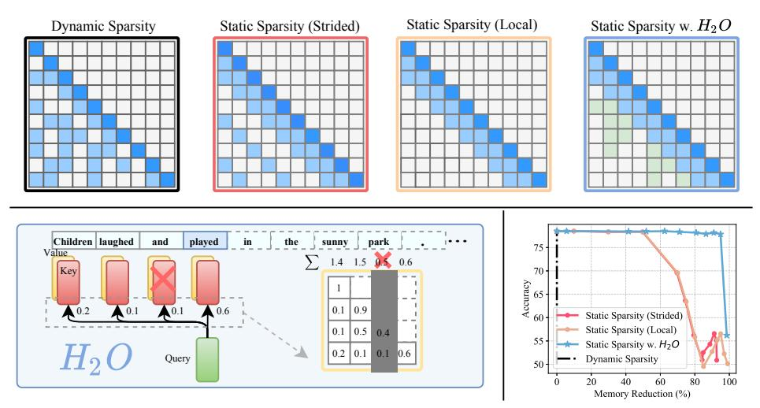
*الشكل 1: المخططات العلوية توضح مخططات رمزية لخريطة انتباه تنشر سياسات مختلفة لذاكرة KV المؤقتة في توليد LLM. أسفل اليمين: يقارن المفاضلة بين الدقة والذاكرة. اليسار: نظرة عامة على إطار عمل H2O.*

في حين توجد أدبيات كبيرة حول تقريب الانتباه المتفرق في التدريب، إلا أنها لم تشهد اعتماداً واسعاً للتخفيف من اختناق ذاكرة KV المؤقتة. أولاً، صُممت معظم الأساليب الموجودة، مثل Reformer [[7]](#page-10-6) وFlash Attention [[8]](#page-10-7)، للتغلب على الذاكرة التربيعية المطلوبة من قِبَل آليات الانتباه عند نمذجة التسلسلات الطويلة لكنها لا تزال تتطلب *حجم ذاكرة مؤقتة كبير*. ثانياً، يمكن لمتغيرات مثل المحول المتفرق [[9]](#page-10-8)، والمحولات القائمة على الرتبة المنخفضة [[10،](#page-10-9) [11]](#page-10-10)، أو الانتباه متعدد الاستعلامات [[12،](#page-10-11) [13،](#page-10-12) [5]](#page-10-4) أن تقلل حجم الذاكرة المؤقتة، لكن تطبيقها مباشرة على LLMs المدربة مسبقاً للتوليد ينتج عنه *معدلات إخفاق عالية* ويُدهور الدقة كما هو موضح في الشكل[ 1.](#page-1-0) أخيراً، بعض التطورات الأخيرة مثل رموز gisting [[14]](#page-10-13) يمكن أن تتعلم ضغط ذاكرة KV المؤقتة للوثائق، لكن *سياسات الطرد المكلفة* الخاصة بها يصعب نشرها أثناء التوليد.

لذلك، يجب أن تتمتع ذاكرة KV المؤقتة المثالية بـ (i) *حجم ذاكرة مؤقتة صغير* لتقليل بصمة الذاكرة، (ii) *معدل إخفاق منخفض* للحفاظ على الأداء وقدرة توليد المحتوى الطويل لـ LLMs، و(iii) *سياسة طرد منخفضة التكلفة* لتقليل وقت ساعة الحائط أثناء التوليد. ومع ذلك، هناك ثلاثة تحديات تقنية. أولاً، ليس من الواضح على الفور ما إذا كان يمكن تقييد حجم ذاكرة KV المؤقتة—قد تتطلب كل خطوة فك تشفير من حيث المبدأ الوصول إلى جميع مفاتيح وقيم الانتباه السابقة. ثانياً، تحديد سياسة طرد مثلى تحافظ على دقة التوليد هو مشكلة توافيقية[1](#page-1-1). أخيراً، حتى لو كان من الممكن إيجاد سياسة مثلى بالقوة الغاشمة، فإنه من غير العملي نشرها في التطبيقات الواقعية.

لحسن الحظ، أسفر استكشافنا الأولي عن ملاحظات مثيرة للاهتمام حول الخصائص التجريبية لـ LLMs. تمهد هذه النتائج الطريق للتصميم المحتمل لذاكرة KV مؤقتة فعّالة.

*التفرق لحجم ذاكرة مؤقتة صغير*: نلاحظ أنه حتى عند التدريب الكثيف، فإن مصفوفات الانتباه لـ LLMs متفرقة بنسبة تزيد عن 95% في وقت الاستدلال (موضح في الشكل[ 2)](#page-3-0). يصدق هذا على نطاق واسع من LLMs المدربة مسبقاً. لذلك، 5% فقط من ذاكرة KV المؤقتة كافية لفك تشفير نفس رمز الإخراج في كل خطوة توليد، مما يشير إلى أنه قد يكون من الممكن تحقيق تقليل يصل إلى 20× في حجم ذاكرة KV المؤقتة دون انخفاض في الدقة.

*الضاربون الثقيلون لمعدل إخفاق منخفض*: نكتشف أن درجات الانتباه المتراكمة لجميع الرموز في كتل الانتباه تتبع توزيعاً يتبع قانون القوى. وهذا يشير إلى وجود مجموعة صغيرة من الرموز المؤثرة الحاسمة أثناء التوليد، تُسمى الضاربين الثقيلين (H2). يوفر H^2^ فرصة للابتعاد عن مشكلة البحث التوافيقي وتحديد سياسة طرد تحافظ على الدقة.

*الخوارزمية الجشعة لسياسة منخفضة التكلفة*: نجد بشكل مفاجئ أن الاحتفاظ بـ H^2^ بناءً على إحصائيات محلية في كل خطوة فك تشفير—جمع درجات الانتباه للرموز السابقة فقط—فعّال مثل النظر في انتباه الرموز المستقبلية (موضح في الشكل[ 2)](#page-3-0).

بناءً على ما سبق، نُعرّف أولاً بصرامة العملية التوليدية لـ LLMs العاملة بذاكرة KV مؤقتة محدودة الحجم في القسم[ 2.1.](#page-3-1) ثم نقترح أوراكل الضاربين الثقيلين (H2O)، وهو إطار

> ^1^خوارزمية Belady مثلى للذاكرة المؤقتة القياسية، لكنها ليست بالضرورة كذلك لذاكرة KV المؤقتة.

<!-- page 3 -->

يستغل خصائص LLMs ويستخدم سياسات طرد بسيطة ومنخفضة التكلفة تُعيد تدريب جودة LLMs طوال عملية التوليد. على وجه التحديد،

- في القسم[ 3،](#page-3-2) نستكشف ظهور H^2^ في الانتباه، كاشفين عن أدوارها الأساسية والحاسمة: (i) يُظهر H^2^ ارتباطاً قوياً بالكلمات التي تظهر معاً بشكل متكرر في البيانات النصية؛ و(ii) إزالة H^2^ تدمر تماماً وظيفة النموذج. نوضح أن H^2^ يمكن أن يقلل بشكل كبير معدل إخفاق ذاكرة التخزين المؤقت للسياسات الموجودة المذكورة أعلاه. نظرياً، بافتراض أن مخطط الانتباه دون-معياري، فإن H^2^ يقابل خوارزمية جشعة وبالتالي فهو شبه مثالي.
- في القسم[ 4،](#page-4-0) نقدم متغيراً جشعاً لكن منخفض التكلفة من H^2^ يتم تحديده ديناميكياً بواسطة درجة الانتباه المتراكمة في كل خطوة فك تشفير. نصيغ سياسة الطرد مع H^2^ الجشع كمتغير من تعظيم دون-معياري ديناميكي. يُظهر التحليل أنها تؤدي إلى عملية توليد مماثلة لتلك التي تستخدم سياسة طرد H^2^.

نُجري تجارب مكثفة على OPT وLLaMA وGPT-NeoX على وحدة معالجة رسومات NVIDIA A100 (80GB) واحدة لتقييم H2O عبر مجموعة من المهام من lm-eval-harness [[15]](#page-10-14) وHELM [[16]](#page-10-15). نُنفّذ H2O فوق FlexGen الذي يمكنه بسهولة تكييف تقنيات طرد ذاكرة التخزين المؤقت المختلفة لإنتاج نظام بإنتاجية استدلال عالية. تُظهر تجارب الأداء أن إطار عملنا يحقق إنتاجية أعلى بـ 29× و29× و3× مقارنةً بثلاثة أنظمة استدلال رائدة هي DeepSpeed Zero-Inference [[17]](#page-10-16) وHugging Face Accelerate [[18]](#page-11-0) وFlexGen [[19]](#page-11-1) على التوالي. وبنفس حجم الدفعة، يحقق H2O زمن استجابة أقل بمقدار 1.9× مقارنة بـ FlexGen.

# 2 الأعمال ذات الصلة وإعداد المشكلة

الاستدلال الفعّال لـ LLMs. تُمثّل أعداد المعاملات الكبيرة لنماذج اللغة الكبيرة (LLMs) تحديات كبيرة للاستدلال. للتغلب على هذا القيد، استخدمت الجهود السابقة تقنيات ضغط النماذج بتصاميم محددة لتحقيق استدلال LLM فعّال، مثل الطريقة الموصوفة في [[20،](#page-11-2) [21،](#page-11-3) [22]](#page-11-4)، التي تستخدم التشذيب بضربة واحدة على LLMs، مما يؤدي إلى تدهور أداء ضئيل حتى دون إعادة تدريب. بالإضافة إلى ذلك، تستكشف نهج بديلة طرق التكميم المصممة خصيصاً لـ LLMs، كما نوقش في [[23،](#page-11-5) [24،](#page-11-6) [25،](#page-11-7) [26،](#page-11-8) [27،](#page-11-9) [28]](#page-11-10). كذلك، يستخدم CoLT5 [[29]](#page-11-11) استراتيجية حسابية مشروطة على مستوى الرمز لتقليل التكلفة الحسابية الإجمالية. تعالج هذه الأساليب الاستدلال الفعّال من زوايا متعامدة ويمكن دمجها بشكل عضوي. ترتبط التقنيات التي تم التحقيق فيها في هذه الدراسة ارتباطاً وثيقاً بالتشذيب أو التفرق ولكنها تركز على اختناق استدلال متميز، وهو ذاكرة KV المؤقتة. عمل واحد وثيق الصلة[[30]](#page-11-12) يستخدم آلية قابلة للتعلم تحدد الرموز الضرورية أثناء الاستدلال ولكنها تتطلب عملية ضبط دقيق إضافية، مما يجعلها أقل عملية.

تقريب الانتباه المتفرق ومنخفض الرتبة. التعقيد الحسابي التربيعي لوحدات الانتباه هو أحد الاختناقات الرئيسية لاستدلال المحولات [[31]](#page-11-13). تُكرّس جهود مختلفة لمعالجة هذا التحدي [[7،](#page-10-6) [9،](#page-10-8) [10]](#page-10-9). على سبيل المثال، يقلل Reformer [[7]](#page-10-6) التكلفة الحسابية من تربيعية إلى تعقيد فوق خطي عبر التجزئة الحساسة للموقع. يستخدم Performer [[10]](#page-10-9) ميزات عشوائية متعامدة موجبة لتقريب نوى الانتباه. عمل ذو صلة، Sparse Transformer [[9]](#page-10-8)، يُقدّم التفرق لتقليل بصمة ذاكرة KV المؤقتة وتحقيق آلية انتباه فعّالة، يُعتبر خط الأساس لدينا في هذه الورقة. علاوة على ذلك، يستخدم SpAtten [[32]](#page-11-14) درجات الانتباه المتراكمة لاختيار الرموز المهمة لاستدلال انتباه فعّال بينما لا يأخذ في الاعتبار تباين أهمية الرموز عبر رؤوس وطبقات الانتباه. التفاصيل المقارنة مع SpAtten موجودة في الملحق[ C.9.](#page-26-0)

التخزين المؤقت. التخزين المؤقت، الذي يلعب دوراً محورياً في تحسين أداء النظام، يستلزم تطوير سياسات طرد فعّالة للتعامل مع البيانات التي يتم الوصول إليها بشكل متكرر. النهج التقليدية مثل الأقل استخداماً مؤخراً والأقل استخداماً تكراراً [[33،](#page-11-15) [34]](#page-11-16) تُعطي الأولوية للحداثة وتكرار الوصول إلى البيانات. ويواجه تصميم ذاكرة KV المؤقتة العديد من التحديات المماثلة للتخزين المؤقت التقليدي.

تفصيل استدلال LLM. تشمل العملية التوليدية لـ LLMs مرحلتين متميزتين: (i) مرحلة *المُدخل* (prompt)، حيث يتم استخدام تسلسل إدخال لإنتاج ذاكرة KV المؤقتة (المكونة من تضمينات المفاتيح والقيم)، على غرار التمرير الأمامي المستخدم أثناء تدريب LLM؛ و(ii) مرحلة *توليد الرموز*، التي تستفيد من ذاكرة KV المؤقتة وتحديثها لتوليد رموز جديدة بشكل تدريجي. تعتمد كل خطوة توليد على الرموز المُولّدة سابقاً. التركيز الأساسي لهذه الورقة هو تعزيز كفاءة ذاكرة KV المؤقتة في الانتباه أثناء مرحلة توليد الرموز، وبالتالي تسريع استدلال LLM.

<!-- page 4 -->

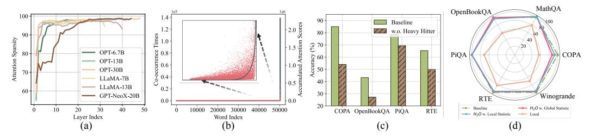
*الشكل 2: (a) تفرق الانتباه في LLMs المدربة مسبقاً. (b) توزيع درجات الانتباه المتراكمة فيما يتعلق بالكلمة المقابلة (تشتت أحمر) وأوقات التواجد المشترك للكلمات في البيانات (المنحنى الرمادي). يمثل المحور x فهرس الكلمة في المفردات. (c) مقارنة الأداء بين النموذج الأساسي مع KV الكامل والنموذج بدون الضارب الثقيل. (d) المقارنة بين النموذج الأساسي مع KV الكامل، وH_2O بالإحصائية المحلية، وH_2O بالإحصائية العالمية، والنموذج الذي يحتوي فقط على أحدث KV (محلي). بصرف النظر عن النموذج الأساسي، يتم تقييم كل نموذج بميزانية ذاكرة KV مؤقتة 20%.*

## 2.1 صياغة المشكلة

نُعرّف رسمياً العملية التوليدية مع حجم محدود لذاكرة KV المؤقتة. يُرمز لمصفوفة استعلام الانتباه بـ Q \in \mathbb{R}^{n \times d} ولمصفوفة المفتاح بـ K \in \mathbb{R}^{n \times d}. يمثل Q_{i,*} الصف i من Q، ويمثل K_{\leq i,*} الصفوف i الأولى من K. ليكن k يدل على ميزانية المساحة وk < n. للتبسيط، K_{S_i,*} (\in \mathbb{R}^{i \times d}) يدل على مصفوفة فرعية من K تختار صفوف S_i من K. (للصفوف غير المختارة [i] \setminus S_i، نضع جميع الأصفار في ذلك الصف) تُعرّف سياسة الطرد على النحو التالي:

**التعريف 2.1** (سياسة الطرد، غير رسمي). ليكن S_{i-1} يدل على مجموعة المصدر. ليكن S_i يدل على المجموعة الهدف. عرّفنا سياسة الطرد g: S_{i-1} \to S_i بحيث

- |S_i| = k (حجم ذاكرة KV المؤقتة لا يتغير بمرور الوقت)
- |S_i \setminus S_{i-1}| \le 1 أو ما يعادل |S_i \cap S_{i-1}| \ge k-1 (يمكننا طرد KV واحد على الأكثر في ذاكرة KV المؤقتة)

ثم، نُعرّف العملية التوليدية مع سياسة الطرد الخاصة بنا.

**التعريف 2.2** (العملية التوليدية مع سياسة الطرد، غير رسمي). ليكن k يدل على حجم ذاكرة KV المؤقتة. لكل i \in [n]، للرمز i، لدينا

- ليكن S_i \subset [n] يدل على الرموز في ذاكرة KV المؤقتة عند توقع الرمز *i*.
- المعلومات التي لدينا هي متجه طوله i  o_i := D_i^{-1} \cdot \exp(Q_{i,*}(K_{S_i,*})^\top) (انتباه مُطبّع) سُلّم D_i := (\exp(Q_{i,*}(K_{S_i,*})^\top) 1_{[i]\setminus S_i}) \cdot \mathbf{1}_i (يتم تعيين KV المطرود إلى 0، ونحتاج إلى طرحه عند حساب التطبيع) استبدال S_i بـ [i] في التعريف أعلاه لـ o_i وD_i يؤدي إلى العملية التوليدية القياسية.
- تُحدّث سياسة الطرد (التعريف 2.1) S_i بناءً على S_{i-1} والمعلومات المقابلة لها.

**ملاحظة 2.3.** هدفنا هو إيجاد سياسة طرد لذاكرة KV المؤقتة بحيث يكون مخرج العملية التوليدية مماثلاً أو قابلاً للمقارنة بالأصلي دون تقييد حجم ذاكرة التخزين المؤقت.

# 3 الملاحظات

نقدم رؤيتين تجريبيتين رئيسيتين لـ LLMs ألهمت تصميم H<sub>2</sub>O، كما يلي.

## 3.1 التفرق لحجم ذاكرة مؤقتة صغير

مستوحاة من الأدبيات السابقة، التي تكشف عن وجود تفرق الانتباه في DistillBERT [35] ورؤوس الانتباه الذاتي محدودة المعيار [36]. نُظهر أولاً ملاحظة حول تفرق الانتباه في LLMs المدربة مسبقاً. ثم نناقش كيف يمكن أن يفتح إمكانية تقليل حجم ذاكرة KV المؤقتة دون انخفاض الدقة. بالنظر إلى مصفوفة درجة الانتباه المُطبّعة \operatorname{Softmax}(QK^{\top}) التي يتم حسابها بواسطة مصفوفة الاستعلام Q ومصفوفة المفتاح K، نُعيّن العتبة على واحد بالمئة من القيمة القصوى في كل صف ونحسب التفرق المقابل.

**الملاحظة.** نُجري استدلال صفر-اللقطة باستخدام نموذج OPT المدرب مسبقاً على مجموعة التحقق من Wiki-Text-103. نرسم التفرق على مستوى الطبقة داخل كتل الانتباه ونتصور مصفوفة درجة الانتباه المُطبّعة. النتائج معروضة في الشكل 2 (a). نلاحظ أنه على الرغم من أن LLMs مدربة بكثافة، فإن مصفوفات درجة الانتباه الناتجة متفرقة للغاية، بتفرق يزيد عن 95% في جميع الطبقات تقريباً.

<!-- page 5 -->

**الرؤى.** يشير تفرق كتل الانتباه إلى أن الوصول إلى جميع تضمينات المفاتيح والقيم السابقة غير ضروري لتوليد الرمز التالي. وهذا يشير إلى أنه من الممكن طرد تضمينات KV غير الأساسية وتقليل متطلبات ذاكرة KV المؤقتة أثناء التوليد.

## 3.2 الضاربون الثقيلون لمعدل إخفاق منخفض

أظهر القسم السابق الطبيعة المتفرقة لكتل الانتباه في LLMs المدربة مسبقاً، مما يوفر الفرصة لتصميم حجم ذاكرة KV مؤقتة صغير مع الحفاظ على أداء LLMs. ومع ذلك، فإن تحديد أفضل سياسة طرد تحافظ على دقة التوليد يمثل تحدياً توافيقياً. على الرغم من أن خوارزمية Belady [37] مثلى وسهلة الحساب لذاكرة التخزين المؤقت القياسية (دون اتصال)، إلا أنها غير قابلة للتطبيق على تصميم ذاكرة KV المؤقتة. لأنه بمجرد طرد KVs المهمة، يمكن أن يدمر أداء LLMs بسبب التبعية التسلسلية لتوليد LLM.

**الملاحظة.** لحسن الحظ، في المرحلة المبكرة من استكشافنا، نجد أن درجات الانتباه المتراكمة لجميع الرموز داخل كتل الانتباه تتبع توزيع قانون القوى، كما هو موضح في الشكل 2. وهذا يشير إلى وجود مجموعة صغيرة من الرموز الحاسمة أثناء التوليد. نرمز إلى تلك الرموز بالضاربين الثقيلين (H<sub>2</sub>). للتحقق من أهمية هذه الرموز، نقارن جودة توليد LLM بعد إخفاء الضاربين الثقيلين بجودة النموذج الأصلي. ليس بشكل مفاجئ، كما هو موضح في الشكل 2، تنخفض الدقة بشكل كبير، مما يؤكد أهمية تلك الرموز. بالإضافة إلى ذلك، يمكننا أن نرى أن درجة الانتباه المتراكمة لكل كلمة (في النقاط الحمراء) لها ارتباط عالٍ بتواجداتها المشتركة في البيانات (المنحنى الرمادي).

**التحليل.** أولاً، بناءً على H_2، نرى فرصة للابتعاد عن مشكلة البحث التوافيقي وتصميم سياسة طرد لذاكرة KV المؤقتة تحافظ على جودة توليد LLM. نُجري دراسة تجريبية تنفذ سياسة طرد لذاكرة KV المؤقتة تحتفظ فقط بـ H_2 وتضمينات KV الحديثة في ذاكرة التخزين المؤقت. الحدس هو أن الكلمات الحديثة عادة ما تظهر ارتباطات أقوى مع الرموز الحالية. نُقيّم فعالية سياسة الطرد هذه من خلال OPT-30B المدرب مسبقاً وست مهام تابعة. النتائج مُوضّحة في الشكل 2. من الواضح أن سياسة الطرد القائمة على H_2 يمكن أن تقلل بشكل كبير من حجم ذاكرة KV المؤقتة دون تدهور أداء OPT-30B.

علاوة على ذلك، خلال التحليل اللاحق، مستوحاة من [38]، نجد أن السياسة القائمة على H<sub>2</sub> مرتبطة بالخوارزمية الجشعة الكلاسيكية (خوارزمية بزمن متعدد الحدود مع ضمانات قابلة للإثبات) في ظل افتراض أن مخطط الانتباه دون-معياري. نقدم التفاصيل في الملحق D.

**اللما 3.1** (غير رسمي). بافتراض أن مخطط الانتباه دون-معياري، فإن البناء الجشع للمجموعة S_i (بدون قيود حجم الذاكرة المؤقتة) يحقق خاصية شبه المثالية من حيث دون-معيارية.

# 4 أوراكل الضاربين الثقيلين

هدف هذا القسم هو اقتراح الخوارزمية الجشعة باستخدام السياسة القائمة على H_2 وإظهار الضمانات القابلة للإثبات. نقدم أولاً السياسة القائمة على H_2 المسماة سياسة طرد ذاكرة H_2O المؤقتة ونصيغ نشرها في توليد LLM كمتغير من مشكلة تعظيم دون-معياري، تُسمى *دون-معياري ديناميكي*. ثم نقدم H_2O في العملية التوليدية، يليها مثال عملي لنشر اقتراحنا. أخيراً، نقدم الضمانات النظرية لـ H_2O ونعرض تنفيذ نظامنا الفعّال.

## 4.1 الخوارزمية الجشعة لسياسة منخفضة التكلفة

أظهرنا سياسة بسيطة لكنها فعّالة لذاكرة KV المؤقتة قائمة على H_2. ومع ذلك، فمن غير العملي نشر مثل هذه الخوارزمية لأننا لا نملك حق الوصول إلى الرموز المُولّدة في المستقبل. لحسن الحظ، نلاحظ تجريبياً أن H_2 المحلي، الذي يتم حسابه باستخدام إحصائيات محلية في كل خطوة فك تشفير عن طريق جمع درجات الانتباه للرموز السابقة، فعّال بنفس القدر مثل أخذ انتباه الرموز المستقبلية في الاعتبار (الشكل 2). فيما يلي، نُعرّف رسمياً هذا الحساب الديناميكي لدرجة الانتباه (مع تقييد المساحة) كمشكلة جديدة من نوع دون-معياري ديناميكي.

**التعريف 4.1** (إطار دون-معياري ديناميكي، غير رسمي). *عرّف الدالة* F: 2^{[n]} \times 2^{[n]} \to \mathbb{R}، ثم لأي مجموعة Z \subset [n]، نفترض أن F(Z, \cdot): 2^{[n]} \to \mathbb{R} هي دالة دون-معيارية بالنسبة إلى Z، أي،

- لكل المجموعات X, Y \subset [n] التي تحقق Z \subset X \subset Y،
- لكل عنصر x \in [n] يحقق x \in [n] \backslash Y،

$$
لدينا f(X \cup \{x\}) - f(X) \ge f(Y \cup \{x\}) - f(Y), حيث f(\cdot) := F(Z, \cdot).
$$

<!-- page 6 -->

**ملاحظة 4.2.** نقدم رؤى عملية للتعريف 4.1. يدل X على الكلمات الموجودة في ذاكرة KV المؤقتة. Y هو أي مجموعة عُليا من X. يمكن النظر إلى x على أنه "كلمة" إما تمت إضافتها حديثاً إلى ذاكرة KV المؤقتة أو الموجودة المحذوفة من ذاكرة KV المؤقتة. مثال على f يمكن أن يكون درجة الانتباه، أي، انظر الخوارزمية 1.

إذا قمنا بتحميل تسلسل S_1, S_2, \dots, S_n (نضمن أن |S_i| \leq k و|S_i \setminus S_{i-1}| \leq 1) في التعريف 4.1، أي، لكل i \in [n]، نختار Z = S_i، فإنه يصبح حالة خاصة من مشكلة دون-معياري ديناميكي.

بعد ذلك، نقدم وصفاً رسمياً لخوارزميتنا، يليه مثال.

**التعريف 4.3** (سياسة الطرد H<sub>2</sub>O). ليكن F_{score}: 2^{[n]} \to \mathbb{R} يدل على دالة درجة معينة. ليكن S_{i-1} يدل على مجموعة المصدر. ليكن S_i يدل على المجموعة الهدف. عرّفنا سياسة الطرد g: S_{i-1} \to S_i بحيث

- |S_i| = k (حجم ذاكرة KV المؤقتة لا يتغير بمرور الوقت)
- |S_i \setminus S_{i-1}| \le 1 أو ما يعادل |S_i \cap S_{i-1}| \ge k-1 (يمكننا طرد KV واحد على الأكثر في ذاكرة KV المؤقتة)
- نُنشئ S_i \leftarrow (S_{i-1} \cup \{i\}) \setminus \{u\} حيث u \leftarrow \arg\max_{v \in (S_{i-1} \cup \{i\})} F_{\text{score}}(S_{i-1} \cup \{i\} \setminus \{v\})

لوصف خوارزميتنا (الخوارزمية 1)، نختار توضيحاً معيناً للدالة F_{\text{score}}، *أي*، مجموع تلك المجموعات في مصفوفة الانتباه.

## الخوارزمية 1 خوارزمية طرد H<sub>2</sub>

```
1: procedure H_2_EVICTION(Q, K \in \mathbb{R}^{n \times d}, k \in \mathbb{N})
2:
3:
 Let k denote the budget size of cache
 S_0 \leftarrow \emptyset
4:
5:
6:
7:
8:
 for i=1 \rightarrow n do
 if i < k then
 S_i \leftarrow S_{i-1} \cup \{i\}
 D_i \leftarrow (\exp(Q_{i,*}(K_{S_{i-1},*})^\top) - 1_{[i] \setminus S_{i-1}}) \cdot \mathbf{1}_i
9:
 o_i \leftarrow D_i^{-1} \cdot (\exp(Q_{i,*}(K_{S_{i-1},*})^\top) - 1_{[i] \setminus S_{i-1}})
 F_{\text{score}}(T) := \sum_{s \in T} o_s
10:
11:
 G_i \leftarrow S_{i-1} \cup \{i\}
12:
 u \leftarrow \arg \max F_{\text{score}}(S_{i-1} \cup \{i\} \setminus \{v\})
13:
 S_i \leftarrow (S_{i-1} \cup \{i\}) \setminus \{u\}
14:
 end if
15:
 end for
16: end procedure
```

يقدم الشكل 3 مثالاً توضيحياً لخوارزمية طرد H<sub>2</sub> الخاصة بنا. نفترض أن حجم ميزانية ذاكرة KV المؤقتة هو 3. بعد إكمال خطوة فك التشفير الرابعة، يتم طرد تضمينات KV المرتبطة بالرمز الثالث بناءً على درجة الانتباه المتراكمة. وبالتالي، تصبح تضمينات KV المطرودة هذه غير قابلة للوصول في خطوات فك التشفير اللاحقة.

## 4.2 الضمان النظري وتنفيذ النظام

نذكر النتيجة النظرية على النحو التالي. الإثباتات والمزيد من التفاصيل مُقدّمة في الملحق D.

**النظرية 4.4** (غير رسمي). في ظل الافتراض المعتدل، ليكن k يدل على ميزانية تقييد المساحة. إذا قمنا لكل رمز بحساب درجة الانتباه بشكل جشع بناءً على الاختيار الأعلى-k، فيمكننا أن نُظهر أن المجموعة \widetilde{S}_i التي نولدها لكل رمز i تحقق f(\widetilde{S}_i) \geq (1-\alpha)(1-1/e) \max_{|S|=k} f(S) - \beta، حيث \alpha, \beta > 0 هي معاملات.

**ملاحظة 4.5.** نلاحظ أن النظرية أعلاه توفر تفسيراً نظرياً لسبب أملنا في أن خوارزميتنا الجشعة (مع تقييد ذاكرة التخزين المؤقت) يمكن أن توفر حلاً جيداً للمشكلة.

**تفاصيل التنفيذ.** نقدم إطار عمل عام يمكن أن يدعم أي خوارزمية طرد لذاكرة KV المؤقتة ويعزز الإنتاجية ويقلل زمن استجابة توليد LLM مع تنفيذ دقيق. على سبيل المثال، لضمان كفاءة الإدخال/الإخراج، لا نقوم بتبديل الذاكرة عند طرد KV المخزّن، بل نملؤها مباشرة بـ KV المُضاف حديثاً. تم تضمين المزيد من التفاصيل في الملحق A.

<!-- page 7 -->

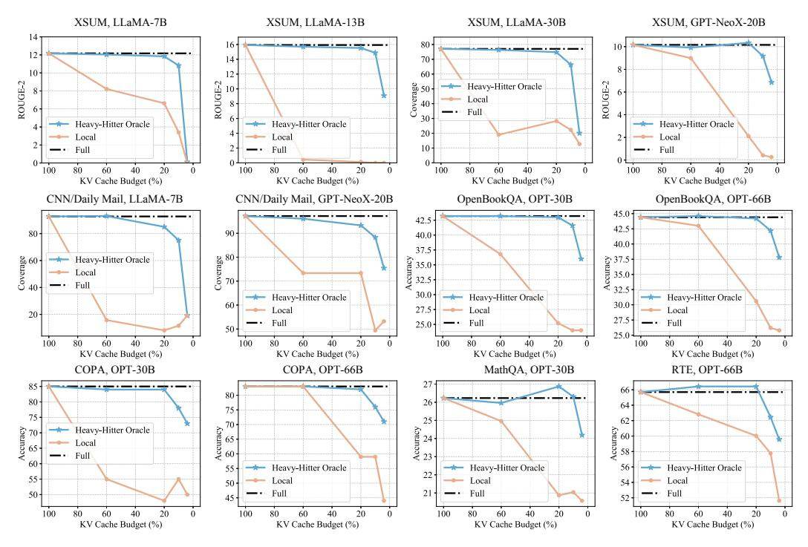
*الشكل 4: نتائج المقارنة بين النموذج الأساسي مع ذاكرة التخزين المؤقت الكاملة، وH<sub>2</sub>O الخاص بنا، واستراتيجية "محلي" التي تستخدم أحدث تضمينات KV.*

# 5 التقييم التجريبي

في هذا القسم، هدفنا هو إثبات أن H<sub>2</sub>O، وهي سياسة طرد لذاكرة KV المؤقتة بسيطة بشكل ملحوظ، قادرة على تعزيز الإنتاجية الشاملة وتقليل زمن الاستجابة في وقت ساعة الحائط مع الحفاظ على جودة التوليد عبر طيف واسع من المجالات والمهام.

- في القسم 5.1، نوضح أن H_2O يمكنه تقليل بصمة ذاكرة KV المؤقتة بما يصل إلى 5\times دون تدهور الدقة على نطاق واسع من بنى النماذج (OPT، LLaMA، GPT-NeoX) والأحجام (من 6.7B إلى 175B) ومعايير التقييم (HELM وlm-eval-harness). والأهم من ذلك، يمكنه تعزيز أداء تقنيات تفرق ذاكرة KV المؤقتة الموجودة.
- في القسم 5.2، نُظهر أن H<sub>2</sub>O يمكنه زيادة إنتاجية الاستدلال بما يصل إلى 3× و29× و29× مقارنة بمحرك الاستدلال الحديث FlexGen وDeepSpeed وHugging Face Accelerate المستخدم على نطاق واسع دون المساس بجودة النموذج.
- في القسم 5.3، نقدم دراسات استئصال مكثفة لإظهار فعالية H<sub>2</sub>O في ظل أطوال تسلسل مختلفة، وخاصة الإدخال بطول تسلسل لانهائي وتوافقها مع التكميم.

جميع التفاصيل (المعاملات الفائقة، تقسيمات البيانات، إلخ)، إلى جانب التجارب الإضافية، موجودة في الملحق A.

## 5.1 النتائج الشاملة

نوضح أن H_2O يمكنه تقليل بصمة ذاكرة KV المؤقتة بـ 5\text{-}10\times مع تحقيق دقة قابلة للمقارنة على غالبية المهام.

**الإعداد.** تستند تجاربنا إلى ثلاث عائلات نموذجية تمثيلية لـ LLMs، بما في ذلك OPT [39] بأحجام نماذج، وLLaMA [40]، وGPT-NeoX-20B [41]. نستخدم ثماني مهام من إطارَي تقييم شائعَين (HELM [16] وlm-eval-harness [15]): COPA [42]، MathQA [43]، OpenBookQA [44]، PiQA [45]، RTE [46]، Winogrande [47]، XSUM [48]، CNN/Daily Mail [49]. أيضاً، نُقيّم نهجنا على معايير التوليد الحديثة، AlpaceEval [50] وMT-bench [51]، والتفاصيل مُضمّنة في الملحق. نستخدم وحدة معالجة رسومات NVIDIA A100 80GB.

**خطوط الأساس.** نظراً لأن H<sub>2</sub>O يخصص بالتساوي ميزانية التخزين المؤقت لـ H<sub>2</sub> وأحدث KV، باستثناء ذاكرة KV المؤقتة الكاملة، فإننا نعتبر استراتيجية "محلي" كطريقة أساسية. بالإضافة إلى ذلك، نقدم أيضاً متغيرين مختلفين من Sparse Transformers (strided وfixed) كخطوط أساس قوية. أيضاً، يتم اعتبار

<!-- page 8 -->

ذاكرة KV المؤقتة الكاملة بمحفزات لقطات أقل (0/1-shot) كخط الأساس، التي لها طول تسلسل مماثل لمهام 5-shot بميزانية ذاكرة KV مؤقتة 20%.

النتائج الرئيسية. نُقيّم LLMs بميزانية ذاكرة KV مؤقتة تتراوح من 4% إلى 100% على مهام تابعة بـ 5-lqtat. النتائج ملخصة في الشكل 4 والجدول 1 و2. يمكن استخلاص الملاحظات التالية: (1) مع ميزانيات ذاكرة KV مؤقتة مختلفة، يُظهر H_2O الخاص بنا تحسينات متسقة وكبيرة مقارنة باستراتيجية "محلي" عبر أحجام النماذج المختلفة وأنواع النماذج والمهام التابعة. يمكننا استخلاص استنتاجات

مماثلة عند مقارنة H_2O بخطوط الأساس الأخرى مثل Sparse Transformer؛ (2) في الوقت نفسه، مع أقل من 20% ميزانية ذاكرة KV مؤقتة (*أي*، أكثر من تقليل ذاكرة 5\times)، يحقق H_2O أداءً قابلاً للمقارنة كنموذج بتضمينات KV الكاملة؛ (3) H_2O بميزانية ذاكرة KV مؤقتة 20% يستخدم تقريباً 1.2 عينة لكل إدخال ويُظهر تحسناً متسقاً على النموذج الكامل بصفر-لقطة وواحد-لقطة الذي يستخدم 1 و2 عينة على التوالي. (4) يُظهر H_2O الخاص بنا فعالية متسقة في مهام توليد التسلسل الطويل الأكثر تحدياً، XSUM، وCNN/Daily Mail.

التحليل. نظراً لأن KV المطرود لن يُرى في الخطوات المستقبلية، فإن إسقاط بعض تضمينات KV الحرجة يمكن أن يسبب انهياراً وظيفياً شديداً، مما يؤدي إلى تدهور كبير في الأداء، *مثلاً*، في {LLaMA-13B، XSUM} {LLaMA-7B، CN-N/Daily Mail}، تنهار استراتيجية "محلي" عند ميزانيات 60% بينما يمكن لـ H<sub>2</sub>O الخاص بنا أن يطابق أداء ذاكرة التخزين المؤقت الكاملة بميزانية

20%. في بعض المهام، تتجاوز طرقنا حتى نماذج خط الأساس، مما يدل على تأثير تنظيمي لـ H<sub>2</sub>O الخاص بنا. على سبيل المثال، في {OPT-66B، RTE}، {OPT-30B، MathQA} و{GPT-NeoX-20B، XSUM}، يحقق H<sub>2</sub>O الخاص بنا تحسناً إضافياً في الأداء بنسبة 0.73% و0.64% و0.18 بميزانية ذاكرة KV مؤقتة 20% على التوالي. تتحقق هذه النتائج المتسقة من فعالية إطار عمل H<sub>2</sub>O الخاص بنا.

تعزيز تقنيات خط الأساس. والأهم من ذلك، نلاحظ أن خطوط أساس التفرق الأخرى تفشل في ظل ميزانية ذاكرة تخزين مؤقتة منخفضة للغاية بينما الجمع بين أحدث تضمينات KV مع تلك الخاصة بالضاربين الثقيلين يحقق بنجاح أداءً قابلاً للمقارنة باستخدام تضمينات KV الكاملة. من الجدول 2، يمكننا أن نلاحظ أن كلا من الانتباه المتفرق "strided" و"fixed" يفشلان في ظل ميزانيات ذاكرة KV مؤقتة 20%، مع مواجهة انخفاض كبير في الأداء (يصل إلى 35% مقارنة بذاكرة التخزين المؤقت الكاملة). بعد الجمع مع H_2، يصل كلا النهجين إلى أداء مماثل لاستخدام تضمينات KV الكاملة.

## 5.2 الضارب الثقيل للاستدلال التوليدي عالي الإنتاجية

<!-- page 9 -->

| الجدول 5: إنتاجية التوليد وزمن الاستجابة على وحدة معالجة رسومات A100. في صف طول التسلسل، نستخدم "7000 + 1024" |
| --- |
| للدلالة على طول مُدخل 7000 وطول توليد 1024. "OOM" تعني نفاد الذاكرة. |

| طول التسلسل | حجم النموذج | حجم الدفعة | المقياس | FlexGen | H2O (20%) |
| --- | --- | --- | --- | --- | --- |
| 7000+1024 | 30B | 1 | زمن الاستجابة (ث) | 57.0 | 50.4 |
| 5000+5000 | 13B | 4 | زمن الاستجابة (ث) | 214.2 | 155.4 |
| 2048+2048 | 6.7B | 24 | زمن الاستجابة (ث) | 99.5 | 53.5 |
| 2048+2048 | 6.7B | 24 | الإنتاجية (رمز/ث) | 494.1 | 918.9 |
| 2048+2048 | 6.7B | 64 | الإنتاجية (رمز/ث) | OOM | 1161.0 |

نُنفّذ سياسة طرد ذاكرة KV المؤقتة في محرك استدلال حديث، FlexGen [19]، ونُقدّم تحسينات الإنتاجية وزمن الاستجابة. H<sub>2</sub>O متعامد مع التحسينات الموجودة في FlexGen، مثل التفريغ والتكميم، لذا يمكن دمجها لتحقيق أداء أفضل.

**الإعداد** أجرينا تجارب على وحدتي معالجة رسومات: NVIDIA T4 (16GB) وNVIDIA A100 (80GB). على وحدة معالجة الرسومات T4، نُقيّم إنتاجية التوليد وفقاً للإعدادات في ورقة Flex-Gen. النماذج المُقيّمة هي OPT-6.7B و

OPT-30B. عندما لا يتلاءم النموذج وذاكرة KV المؤقتة في وحدة معالجة رسومات واحدة، نقوم بتشغيل تفريغ CPU. يتم الإبلاغ عن نتائج كل من GPU البحت وGPU مع تفريغ CPU. يتم اختبار جميع نتائج التسريع في إعداد شامل، بما في ذلك مرحلتي ما قبل الملء والتوليد. ويشمل وقت بناء ذاكرة H<sub>2</sub>O KV المؤقتة. نستخدم مجموعات بيانات اصطناعية حيث يتم حشو جميع المُدخلات إلى نفس الطول. ثم يُطلب من النظام توليد نفس عدد الرموز لكل مُدخل. نختبر مجموعات مختلفة من أطوال المُدخل والتوليد. نختبر أيضاً طريقتنا على مجموعات بيانات حقيقية (XSUM) لمزيد من التقييم. مقياس التقييم هو إنتاجية التوليد، وهو عدد الرموز المُولّدة / (وقت المُدخل + وقت فك التشفير). نستخدم DeepSpeed ZeRO-Inference [17] وHugging Face Accelerate [18] وFlexGen [19] كخطوط أساس. على وحدة معالجة رسومات A100، مع المزيد من ذاكرة GPU، نُقيّم أداء الأنظمة بأطوال تسلسل تصل إلى 10K. على الرغم من أن OPT يتم تدريبه فقط على طول تسلسل 2K، فإننا نقوم بقياس إنتاجية وأداء زمن الاستجابة لإظهار إمكانية H<sub>2</sub>O للنماذج الأفضل في المستقبل.

**النتائج.** يُظهر الجدول 3 و4 إنتاجية التوليد لجميع الأنظمة على وحدة معالجة الرسومات T4. مع سياسة طرد ذاكرة KV المؤقتة الخاصة بنا، يتم تقليل استخدام الذاكرة، مما يجلب ميزتين: 1) يمكننا استخدام حجم دفعة أكبر بكثير؛ 2) يمكننا جعل الإعداد لا يتطلب تفريغاً بدلاً من تتطلب التفريغ. كما هو موضح في الجدول 3 و4، يحسن H<sub>2</sub>O بميزانية 20% إنتاجية التوليد على FlexGen وDeepSpeed وAccelerate بما يصل إلى 3\times و29\times و29\times على التوالي، عبر مجموعات البيانات الاصطناعية والحقيقية. النتائج على وحدة معالجة رسومات A100 بأطوال تسلسل من 4K إلى 10K مدرجة في الجدول 5. بنفس حجم الدفعة، يمكن لـ H<sub>2</sub>O تقليل زمن الاستجابة بـ 1.1-1.9\times مقارنة بـ FlexGen. بالإضافة إلى ذلك، يوفر H<sub>2</sub>O الذاكرة لذلك يسمح بحجم دفعة أكبر، مما يجلب تحسناً 2.3\times على إنتاجية التوليد لـ OPT-6.7B.

## 5.3 نتائج الاستئصال

نقدم دراسات استئصال مكثفة لـ H_2O على (1) إدخال ذي طول لانهائي، (2) عدد مختلف من اللقطات، (3) التوافق مع طرق التكميم على ذاكرة KV المؤقتة، و(4) تشريح فعالية المكونات المختلفة. نجد خاصية مفاجئة لـ H_2O – فهو لا يحسن فقط كفاءة LLMs، بل يزيد أيضاً من تنوع النص المُولّد.

السؤال 1: هل يمكن لـ H_2O تمكين LLMs من معالجة مدخلات ذات طول لانهائي؟ الجواب 1: توليد فعّال بطول تسلسل يصل إلى أربعة ملايين رمز. تُظهر بعض الأعمال الأخيرة [52، 53] إمكانية معالجة المدخلات ذات الطول اللانهائي، وهو تحدٍ ملحوظ في LLMs الحالية. تستخدم هذه الطرق مصرف انتباه يحتفظ بالرموز القليلة الأولى ويطبق دوران الموقع في ذاكرة KV المؤقتة، مما يمكّن LLMs من معالجة المدخلات ذات الطول اللانهائي. مستوحاة من هذا التقدم، نُنفّذ كذلك H_2O الخاص بنا للمدخلات ذات الطول اللانهائي. يعرض الشكل 5 النتائج الإيجابية لـ H_2O، أي، يمكن لـ H_2O تمكين LLMs من معالجة الإدخال بطول يصل إلى أربعة مل-

<!-- page 10 -->

يون رمز، مع تحقيق أداء أفضل (حيرة أقل) من طريقة StreamLLM الأصلية [[52]](#page-12-14) عبر أحجام ذاكرة تخزين مؤقتة مختلفة. يتم الإبلاغ عن المزيد من المقارنات في الملحق[ C.4.](#page-24-0)

*السؤال 2:* هل يؤثر عدد اللقطات أثناء الاستدلال على فعالية H2O؟ *الجواب 2:* فعّال عبر استدلال صفر-لقطة إلى عشر-لقطات. نفحص H2O كذلك في ظل أعداد مختلفة من اللقطات أثناء الاستدلال، والنتائج مُبلَّغ عنها في الجدول[ 10](#page-26-1) والشكل[ 8.](#page-24-1) مع استدلال لقطات مختلفة، يحقق H2O الخاص بنا أداءً مطابقاً (الفرق أقل من 1.00%) للنموذج الكامل عبر مهام تابعة مختلفة. تواجه استراتيجية "محلي" تدهوراً كبيراً في الأداء (يصل إلى 37.00%). تظهر هذه النتائج فعالية H2O الخاص بنا في ظل سيناريوهات استدلال مختلفة. يتم الإبلاغ عن المزيد من التفاصيل حول استدلال صفر-لقطة وواحد-لقطة في الملحق[ C.3.](#page-24-2)

*السؤال 3:* متوافق مع التكميم؟ *الجواب 3:* نعم. لمتابعة المزيد من الكفاءة، نُظهر توافق H2O مع نهج متعامد آخر، *أي*، التكميم في الجدول[ 6.](#page-23-0) نستخدم OPT-30B كنموذجنا الأساسي وCOPA وOpenBookWA وPiQA كمهام تقييم. حدسياً، التفرق والتكميم مترابطان للغاية لذا فإن دمجهما قد يُدخل أخطاء أكبر. والمدهش أن المزيج يحقق دائماً تقريباً دقة أفضل من H2O أو التكميم وحده. تفاصيل التجارب حول تحسين الإنتاجية موجودة في الملحق[ C.2.](#page-23-1)

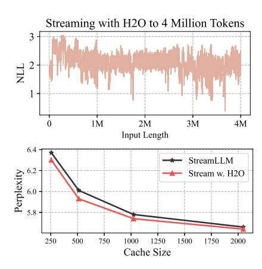
*الشكل 5: (الأعلى) البث المباشر مع H2O للتعامل مع المدخلات ذات أطوال تسلسل من أربعة ملايين رمز. (الأسفل) مقارنة الحيرة بين طريقة StreamLLM الأصلية وH2O الخاص بنا، يتم جمع النتائج على أول عينة نصية من PG-19 [[54]](#page-12-16).*

*السؤال 4:* متى يطابق H2O خط الأساس بتضمينات KV الكاملة؟ *الجواب 4:* مع كل من H^2^ والرموز الحديثة. نحقق في التأثيرات المنفصلة لتضمينات KV لـ H^2^ والرموز المحلية. نُجري تجارب على 4 مهام مع OPT-13B وOPT-30B. لكل مهمة، نقارن أداء ثلاث سياسات طرد لذاكرة KV المؤقتة، بما في ذلك تضمينات KV لـ H2 فقط، أو تلك للرموز المحلية فقط، وH2O الخاص بنا الذي يحتفظ بكليهما. كما هو موضح في الجدول[ 9،](#page-26-2) فإن الاحتفاظ فقط بتضمينات H^2^ أو الرموز المحلية لا يمكن أن يحافظ على أداء مماثل للنموذج الذي يستخدم التضمينات الكاملة، مع تدهور في الأداء من 2.85% إلى 22.75%. عند دمج كلا المكونين، يحتفظ H2O الخاص بنا بنجاح بأداء خط الأساس مع التضمينات الكاملة. علاوة على ذلك، يُظهر النموذج الذي يحتوي فقط على H^2^ تحسناً متسقاً مقارنة بالنموذج الذي يحتوي فقط على الرموز المحلية، مما يشير إلى أن H^2^ قد يساهم أكثر في الحفاظ على الأداء.

*السؤال 5:* فوائد إضافية من H2O؟ *الجواب 5:* زيادة تنوع النص المُولّد. إلى جانب جميع فوائد H2O الخاص بنا، نلاحظ أيضاً مكافأة أُدخلت بواسطة H2O، *أي*، تنوع المحتوى المُولّد المُحسّن. تم الإبلاغ عن النتائج في الملحق[ C.1.](#page-22-0) بالنظر إلى نفس المُدخلات، نتصور النص المُولّد للنماذج بميزانيات ذاكرة KV مؤقتة مختلفة. مقارنة بنموذج ذاكرة KV المؤقتة الكاملة، يمكن لـ H2O الخاص بنا توليد جمل بكلمات متكررة أقل وإبداع أكبر.

# 6 الاستنتاج والمناقشة

في هذه الورقة، ندرس أحد الاختناقات الرئيسية لنشر LLM، ذاكرة KV المؤقتة، خاصة لتطبيقات توليد المحتوى الطويل والدفعات الكبيرة. نقترح H2O، وهي سياسة طرد بسيطة لذاكرة KV المؤقتة لتقليل بصمتها في الذاكرة بشكل كبير. الرؤية الرئيسية لنهجنا هي التعرف على مجموعة فرعية من الرموز، تُعرف بالضاربين الثقيلين، التي تساهم بأكبر قيمة عند حساب درجات الانتباه. نصيغ طرد ذاكرة KV المؤقتة كمشكلة دون-معيارية ديناميكية ونوفر الضمانات النظرية لخوارزميتنا. من خلال التقييمات المكثفة، نوضح أن H2O يمكنه تحسين الإنتاجية الشاملة بشكل كبير وتقليل زمن الاستجابة في وقت ساعة الحائط، دون المساس بجودة توليد LLMs عبر مجموعة متنوعة من المهام.

# 7 الشكر والتقدير

Ying Sheng وClark Barrett مدعومان جزئياً من NSF-2110397 ومركز ستانفورد للاستدلال الآلي. Z. Wang مدعوم جزئياً بجائزة Google Research Scholar ومعهد NSF AI لأسس التعلم الآلي (IFML).

<!-- page 11 -->

## المراجع


- [1] Romal Thoppilan, Daniel De Freitas, Jamie Hall, Noam Shazeer, Apoorv Kulshreshtha, Heng-Tze Cheng, Alicia Jin, Taylor Bos, Leslie Baker, Yu Du, et al. Lamda: Language models for dialog applications. *arXiv preprint arXiv:2201.08239*, 2022.
- [2] Ann Yuan, Andy Coenen, Emily Reif, and Daphne Ippolito. Wordcraft: story writing with large language models. In *27th International Conference on Intelligent User Interfaces*, pages 841–852, 2022.
- [3] Jason Wei, Yi Tay, Rishi Bommasani, Colin Raffel, Barret Zoph, Sebastian Borgeaud, Dani Yogatama, Maarten Bosma, Denny Zhou, Donald Metzler, et al. Emergent abilities of large language models. *arXiv preprint arXiv:2206.07682*, 2022.
- [4] Tianyi Zhang, Faisal Ladhak, Esin Durmus, Percy Liang, Kathleen McKeown, and Tatsunori B Hashimoto. Benchmarking large language models for news summarization. *arXiv preprint* *arXiv:2301.13848*, 2023.
- [5] Reiner Pope, Sholto Douglas, Aakanksha Chowdhery, Jacob Devlin, James Bradbury, Anselm Levskaya, Jonathan Heek, Kefan Xiao, Shivani Agrawal, and Jeff Dean. Efficiently scaling transformer inference. *arXiv preprint arXiv:2211.05102*, 2022.
- [6] Laszlo A Belady, Robert A Nelson, and Gerald S Shedler. An anomaly in space-time characteristics of certain programs running in a paging machine. *Communications of the ACM*, 12(6):349–353, 1969.
- [7] Nikita Kitaev, Łukasz Kaiser, and Anselm Levskaya. Reformer: The efficient transformer. *arXiv preprint arXiv:2001.04451*, 2020.
- [8] Tri Dao, Dan Fu, Stefano Ermon, Atri Rudra, and Christopher Ré. Flashattention: Fast and memory-efficient exact attention with io-awareness. *Advances in Neural Information* *Processing Systems*, 35:16344–16359, 2022.
- [9] Rewon Child, Scott Gray, Alec Radford, and Ilya Sutskever. Generating long sequences with sparse transformers. *arXiv preprint arXiv:1904.10509*, 2019.
- [10] Krzysztof Choromanski, Valerii Likhosherstov, David Dohan, Xingyou Song, Andreea Gane, Tamas Sarlos, Peter Hawkins, Jared Davis, Afroz Mohiuddin, Lukasz Kaiser, et al. Rethinking attention with performers. *arXiv preprint arXiv:2009.14794*, 2020.
- [11] Angelos Katharopoulos, Apoorv Vyas, Nikolaos Pappas, and François Fleuret. Transformers are rnns: Fast autoregressive transformers with linear attention. In *International conference on* *machine learning*, pages 5156–5165. PMLR, 2020.
- [12] Noam Shazeer. Fast transformer decoding: One write-head is all you need. *arXiv preprint* *arXiv:1911.02150*, 2019.
- [13] Aakanksha Chowdhery, Sharan Narang, Jacob Devlin, Maarten Bosma, Gaurav Mishra, Adam Roberts, Paul Barham, Hyung Won Chung, Charles Sutton, Sebastian Gehrmann, et al. Palm: Scaling language modeling with pathways. *arXiv preprint arXiv:2204.02311*, 2022.
- [14] Jesse Mu, Xiang Lisa Li, and Noah Goodman. Learning to compress prompts with gist tokens. *arXiv preprint arXiv:2304.08467*, 2023.
- [15] Leo Gao, Jonathan Tow, Stella Biderman, Sid Black, Anthony DiPofi, Charles Foster, Laurence Golding, Jeffrey Hsu, Kyle McDonell, Niklas Muennighoff, Jason Phang, Laria Reynolds, Eric Tang, Anish Thite, Ben Wang, Kevin Wang, and Andy Zou. A framework for few-shot language model evaluation. In *Zenodo*. https://doi.org/10.5281/zenodo.5371628, September 2021.
- [16] Percy Liang, Rishi Bommasani, Tony Lee, Dimitris Tsipras, Dilara Soylu, Michihiro Yasunaga, Yian Zhang, Deepak Narayanan, Yuhuai Wu, Ananya Kumar, et al. Holistic evaluation of language models. *arXiv preprint arXiv:2211.09110*, 2022.
- [17] Reza Yazdani Aminabadi, Samyam Rajbhandari, Minjia Zhang, Ammar Ahmad Awan, Cheng Li, Du Li, Elton Zheng, Jeff Rasley, Shaden Smith, Olatunji Ruwase, et al. Deepspeed inference: Enabling efficient inference of transformer models at unprecedented scale. *arXiv* *preprint arXiv:2207.00032*, 2022.

<!-- page 12 -->

- [18] HuggingFace. Hugging face accelerate. [https://huggingface.co/docs/accelerate/](https://huggingface.co/docs/accelerate/index) [index](https://huggingface.co/docs/accelerate/index).
- [19] Ying Sheng, Lianmin Zheng, Binhang Yuan, Zhuohan Li, Max Ryabinin, Daniel Y Fu, Zhiqiang Xie, Beidi Chen, Clark Barrett, Joseph E Gonzalez, et al. High-throughput generative inference of large language models with a single gpu. *arXiv preprint arXiv:2303.06865*, 2023.

[باقي المراجع [20]–[145] محفوظة بتنسيقها الأصلي باللغة الإنجليزية كما في الورقة الأصلية، نظراً لأنها مراجع علمية بأسماء مؤلفين وعناوين منشورات بالأبجدية اللاتينية.]


<!-- page 19 -->

## الملحق

## جدول المحتويات

أ - مزيد من تفاصيل التنفيذ 20 ب - الأعمال ذات الصلة الموسعة، والمناقشات، والقيود 21 ب.1 الأعمال ذات الصلة الموسعة 21 ب.2 المناقشات والقيود 21 ج - التجارب الموسعة 23 ج.1 زيادة تنوع النص المُولّد 23 ج.2 تحسين الإنتاجية لـ H2O بدمجه مع التكميم 24 ج.3 الفعالية على استدلال الصفر-لقطة والواحد-لقطة 25 ج.4 المقارنة مع StreamingLLM 25 ج.5 تعزيز خط الأساس "Top-K" 26 ج.6 التأثيرات المنفصلة للضارب الثقيل والرموز المحلية 26 ج.7 أداء الاستدلال بأعداد مختلفة من اللقطات 26 ج.8 الضارب الثقيل في كتل الانتباه 27 ج.9 المقارنة مع SpAtten 27 ج.10 الضارب الثقيل في كتل MLP 27 د - التحليل النظري 32 د.1 الترميزات 32 د.2 دون-معياري 33 د.3 دون-معياري ديناميكي 34 د.4 الانتباه الساكن 34 د.5 تعريف الانتباه التكراري 34 د.6 سياسة الطرد 36 د.7 شرح خاصية تناقص العائد دون-المعياري في مخطط الانتباه 37 د.8 دون-معياري: الأفكار عالية المستوى 38 د.9 الجشع المتين مع انتشار الخطأ 38 د.10 دون-معياري متين وإضافة العناصر 39 د.11 الشروط العامة 40 د.12 لمة الاستقراء للدالة الدقيقة 40 د.13 لمة الاستقراء للدالة التقريبية 41 د.14 النتيجة النظرية 42 د.15 الأعمال ذات الصلة الموسعة لمشكلات الانتباه النظرية 43 د.16 الحفاظ على التفرق 43 د.17 تعريف دالة الخسارة 44 د.18 المشتق 45 د.19 المصفوفة الهسية 46 د.20 المصفوفة الهسية موجبة التحديد 46 د.21 المصفوفة الهسية ليبشيتزية 47 د.22 خوارزمية من النوع الجشع 48

<!-- page 20 -->

## أ مزيد من تفاصيل التنفيذ

في هذا القسم، هدفنا هو توفير تفاصيل تنفيذ النظام (المذكورة في القسم 4.2) وإعدادات التجربة (المذكورة في القسم 5)، بالإضافة إلى الكود الزائف.

تفاصيل النظام. نُنفّذ H2O فوق FlexGen. FlexGen هو تنفيذ صندوق أبيض لنماذج OPT، وقد قمنا ببعض الجراحة على معالجة ذاكرة KV المؤقتة. على وجه التحديد، للمعامل المعطى K، نحتفظ دائماً بقائمة من ذاكرة KV المؤقتة مع أول K مدخلات كضاربين ثقيلين، وآخر K مدخلات كأحدث الرموز. لتجنب حركة البيانات في الذاكرة، يتم تخصيص الذاكرة لذاكرة KV المؤقتة مسبقاً. نستخدم طابوراً دائرياً لتحديث آخر K مدخلات بكفاءة.

تفاصيل التجربة. تتضمن دراستنا التقييم بأحجام متفاوتة من ذاكرة KV المؤقتة تشمل 4% و10% و20% و60% من طول المُدخل. نختار مهمتين (XSUM وCNN/Daily Mail) من إطار HELM [[16]](#page-10-15) ونعرض الأداء بناءً على 1000 عينة اختبار. بالإضافة إلى ذلك، نستخدم إطار lm-eval-harness [[15]](#page-10-14) لست مهام أخرى (COPA، MathQA، OpenBookQA، PiQA، RTE، Winogrande). للمهام المستمدة من إطار HELM، نُبلّغ عن الأداء لاستدلال صفر-لقطة، بينما للمهام من lm-eval-harness، نُجري بشكل افتراضي استدلال خمس-لقطات.

الكود الزائف. نُظهر كوداً زائفاً مبسطاً أدناه لإثبات هيكل التنفيذ. الدالة generation_loop() هي الحلقة الأساسية في FlexGen التي تتحكم في الجلب المسبق وتداخل تدفقات الإدخال/الإخراج والحساب. ثم في الدالة compute_layer()، سيتم استدعاء الدالة attention_forward() لطبقات الانتباه. أثناء تكرارات ما قبل الملء، ستُرجع الدالة compute_attention() K ضاربين ثقيلين وK رموز حديثة إذا كان طول المُدخل أكبر من أو يساوي 2K، وإلا فستُرجع جميع ذاكرة KV المؤقتة. ستُرجع الدالة compute_attention() ذاكرة KV مؤقتة جديدة وفهارس المدخلات المطرودة أثناء تكرارات فك التشفير، والتي ستكون المكان لتنفيذ استراتيجية طرد مخصصة. (إذا كان العدد الحالي لذاكرة KV المؤقتة المخزنة أقل من 2K، فسيتم تجاهل الطرد.) خلال كل تكرار فك تشفير، ستتم إزالة الأقدم بين آخر K رموز (إذا كان لدينا ما لا يقل عن K رموز من ذاكرة KV المؤقتة المخزنة) من آخر K مدخلات محجوزة، سيتم طرد ضارب ثقيل واحد لكل رأس، وستتم إضافة أحدث رمز إلى ذاكرة KV المؤقتة بموقع في آخر K مدخلات. يحدث هذا في الدالة store_cache().

```
def generation_loop (...) :
 # Prologue
 ...
 # Generate
 for i in range ( gen_len ) :
 for j in range ( num_layers ) :
 for k in range ( num_gpu_batches ) :
 load_weight (i , j +1 , k )
 load_cache (i , j , k +1)
 store_hidden (i , j , k -1)
 load_hidden (i , j , k +1)
 compute_layer (i , j , k )
 store_cache (i , j , k -1)
 sync ()
 # Epilogue
 ...
# h is the hidden states ( activations )
def attention_forward (h , ...) :
 # the read / write buffer are intermediate stops for prefetching
 if prefill :
 h , new_k_cache , new_v_cache = compute_attention (h , ...)
 # select K heavy hitters and K recent tokens
 new_k_cache , new_v_cache = select ( new_k_cache , new_v_cache , K )
 cache_write_buffer . store ( new_k_cache , new_v_cache )
 else :
 k_cache , v_cache = cache_read_buf . pop ()
 # evict_ids track the entries that will be evicted
 h , new_k_cache , new_v_cache , evict_ids =
 compute_attention (h , k_cache , v_cache , ...)
```

<!-- page 21 -->

```
cache_write_buffer . store ( new_k_cache , new_v_cache , evict_ids )
 return h
def store_cache (...) :
 if prefill :
 # store cache directly
 ...
 else :
 k_new , v_new , evict_ids = cache_write_buffer . pop ()
 # circular queue for the last K entries
 # extract the index for the oldest token at i-th iteration
 oldest = (( i - 1) % K ) - K
 # update the KV cache ( k_home and v_home )
 cache_replace ( k_home , evict_ids , k_new , K , oldest )
 cache_replace ( v_home , evict_ids , v_new , K , oldest )
```

## ب الأعمال ذات الصلة الموسعة، والمناقشات، والقيود

هدف هذا القسم هو تقديم المزيد من الخلفية والأعمال ذات الصلة للقسم 2، ثم وصف بعض المحاولات السابقة في تجاربنا بالإضافة إلى مناقشة التأثير الاجتماعي وقيود هذا العمل.

## ب.1 الأعمال ذات الصلة الموسعة

التكميم، التشذيب، التقطير للاستدلال. سابقاً، خوارزميات ضغط النماذج تم التحقيق فيها على نطاق واسع كنهج قابل للتطبيق للتخفيف من متطلبات الموارد الحسابية لاستدلال النماذج. يمكن تصنيف هذه الخوارزميات على نطاق واسع إلى ثلاث مجموعات: (1) التكميم [[55]](#page-13-0)، الذي يتضمن تخطيط معاملات النموذج أو التنشيطات من أنواع بيانات عالية الدقة إلى نظائرها منخفضة الدقة، مثل استخدام أعداد صحيحة 8-بت بدلاً من تنسيق الفاصلة العائمة 32-بت المُستخدم بشكل شائع؛ (2) التشذيب أو التفرق [[59]](#page-13-4)، الذي يهدف إلى التخلص من الخلايا العصبية أو الأوزان غير الضرورية داخل النماذج؛ (3) والتقطير [[63]](#page-13-8) حيث تُستخدم تنبؤات النماذج الأكبر كمعلومات مُشرفة لتدريب نماذج أصغر.

المحول في NLP. تم اعتماد المحولات [[67]](#page-13-12) كخيار شائع بشكل متكرر من قِبَل الكثير من تطبيقات معالجة اللغة الطبيعية (NLP) بنجاحات سائدة. تقريباً، يمكن تصنيف الشبكات الحديثة القائمة على المحولات إلى مجموعتين: (1) Encoder-Decoder أو Encoder-only (نماذج بأسلوب BERT [[76]](#page-14-3)). يستفيد هذا النوع من المحولات بشكل شائع من مهمة Masked Language Modeling. تشمل الأمثلة البارزة BERT وRoBERTa وT5. (2) Decoder-only (نماذج بأسلوب GPT [[78]](#page-14-5)). تتبنى هذه المجموعة مهمة Casual Language Modeling. GPT-3 وOPT وPaLM وBLOOM هي بنى تمثيلية ضمن هذه العائلة الضخمة.

تدريب المحول. تدريب نموذج عملاق قائم على المحولات ليس بالأمر الهيّن. يعاني من قضايا مختلفة مثل الإفراط في التكيّف، وعدم الاستقرار، إلخ. لمعالجة هذه القضايا، تُكرَّس جهود رائدة كثيرة، بما في ذلك تعزيزات البيانات، وتهيئة أفضل، ومُحسِّنات مخصصة، وتطبيع مُحسَّن، وتضاؤل الوزن، والإيقاف المبكر.

## ب.2 المناقشات والقيود

المحاولات السابقة. خلال تجاربنا، نجد العديد من الملاحظات الجديرة بالملاحظة. في H2O، يمكن أن يؤدي استخدام درجة الانتباه المتراكمة لطرد تضمينات KV إلى تحيز محتمل لصالح الرموز الأقل حداثة. ينشأ هذا التحيز لأن معظم الرموز السابقة لها عدد أعلى من درجات الانتباه. لمعالجة هذا القلق، أجرينا تجربة إضافية باستخدام درجة الانتباه المتوسطة لتحديد تضمينات KV التي يجب الاحتفاظ بها. ومع ذلك، أدى هذا النهج البديل إلى تدهور الأداء. بالإضافة إلى ذلك، لاحظنا نسبة كبيرة من تواجدات H^2^ في بداية الجمل.

التأثير الاجتماعي. يمثل عملنا جهداً أولياً في تصميم سياسة ذاكرة KV المؤقتة. يوفر أوراكل الضاربين الثقيلين المقترح (H2O) حلاً لتحسين كفاءة توليد LLM، مما يمكن أن يوفر تكلفة الطاقة ويُسهم في الذكاء الاصطناعي الأخضر. نتصور H2O كإطار عمل أساسي يمكن أن يُسهّل المزيد من الابتكار في هذا المجال.

القيود. على الرغم من التطورات الملحوظة في إنتاجية H2O الخاصة بنا، لا يزال تنفيذ LLMs للاستدلال التوليدي صعباً بسبب عدد المعاملات الهائل. حيث أن جزءاً كبيراً من هذه المعاملات يقع داخل كتل MLP، يمكن توجيه جهود البحث المستقبلية نحو الاستفادة من خصائص H^2^ لابتكار سياسة تفريغ.

<!-- page 23 -->

## ج التجارب الموسعة

في هذا القسم، هدفنا هو إثبات أن H2O يمكنه تحسين تنوع النص المُولّد، يتم تحسين الإنتاجية بشكل أكبر عند دمجها مع التكميم، وأداء متفوق للتعامل مع المدخلات ذات الطول الطويل للغاية. علاوة على ذلك، يتم الإبلاغ عن تحقيقات إضافية حول H^2^.

## ج.1 زيادة تنوع النص المُولّد

[تم في القسم 5.3 تقديم أمثلة توليد نصية باللغة الإنجليزية مع OPT-6.7B وLLaMA-7B لمقارنة النموذج الكامل وH2O واستراتيجية "محلي". يُحتفظ بمخرجات النموذج بالنص الأصلي.]

أجرينا مقارنة كمية عبر مقياس التنوع (Self-BELU [[93]](#page-15-0)). نأخذ عينة عشوائية من 100 مثيل من مجموعة بيانات XSUM، كمدخلات. استخدمنا LLaMa-7B لتوليد نص بطول متساوٍ. يصل النموذج الكامل إلى درجة Self-BELU تبلغ 0.0057 بينما تحقق H2O والطريقة المحلية 0.0051 و0.0436 على التوالي. تشير درجة Self-BELU المنخفضة نسبياً لـ H2O إلى زيادة طفيفة في تنوع النص المُولّد.

## ج.2 تحسين إنتاجية H2O بدمجه مع التكميم

يُظهر الجدول 6 أن H2O قادر على التكميم ويحافظ على أداء النموذج الكامل حتى مع تكميم 4-بت. لاستكشاف توافق H2O مع التكميم فيما يتعلق بتحسين الإنتاجية، نُجري تقييماً إضافياً مع طريقة التكميم المُنفّذة في FlexGen. لـ OPT-6.7B، لاحظنا تحسينات إضافية في الأداء عند استخدام التكميم. ينتج هذا التحسن من ذاكرة GPU التي تم تحريرها بواسطة تكميم الوزن، مما يسمح بزيادة كبيرة في حجم الدفعة.

## ج.3 الفعالية على استدلال الصفر-لقطة والواحد-لقطة

يمكن لـ H2O تخفيف متطلبات الذاكرة لذاكرة KV المؤقتة بنجاح بما يصل إلى 5× في ظل كل من الاستدلال الواحد/صفر-لقطة عبر مهام مختلفة، مع تحقيق أداء مطابق كالنموذج مع ذاكرة KV المؤقتة الكاملة بينما تفشل الطريقة المحلية.

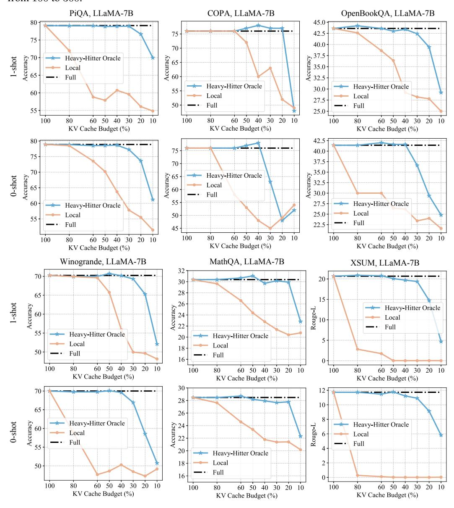
*الشكل 8: نتائج المقارنة على استدلال الصفر-لقطة والواحد-لقطة.*

## ج.4 المقارنة مع StreamingLLM

أظهرت StreamLLM [[52]](#page-12-14) وLM-Infinite [[53]](#page-12-15) إمكانات واعدة في تمكين LLMs من التعامل مع الإدخال ذي الطول اللانهائي. يحققون ذلك بالاحتفاظ فقط بالرموز الأولية وسياق محلي محدود. ومع ذلك، قد يشكل هذا النهج تحديات لمهام معينة. نحقق في ذلك من خلال نوعين: الإجابة على الأسئلة متعددة الوثائق [[95]](#page-15-2) ومهام التلخيص (XSUM وCNN-DailyMail). تُظهر النتائج انخفاضاً متسقاً في أداء StreamLLM. مع H2O، يمكن للنموذج البث بنجاح إلى أربعة ملايين رمز.

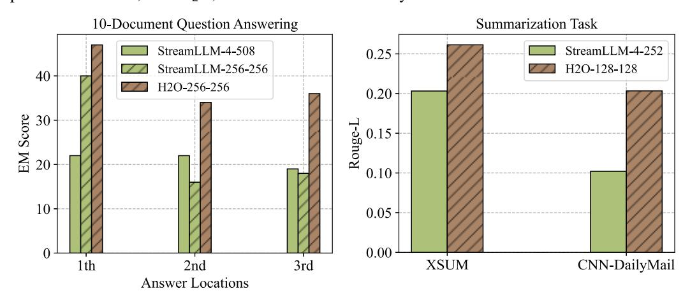
*الشكل 9: نتائج المقارنة لـ StreamLLM وH2O على مهام التوليد.*

## ج.5 تعزيز خط الأساس "Top-K"

نجد أن H^2^ يمكنه تعزيز طريقة "Top-K"، محققاً تحسناً إضافياً بدقة تصل إلى 2.00% عبر 4 مهام مختلفة.

## ج.6 التأثيرات المنفصلة للضارب الثقيل والرموز المحلية

يُظهر الجدول 9 التأثيرات المنفصلة للضاربين الثقيلين والرموز المحلية. الضاربون الثقيلون يساهمون أكثر في الحفاظ على أداء النماذج.

## ج.7 أداء الاستدلال بأعداد مختلفة من اللقطات

يحقق H2O تحسينات متسقة عبر أعداد مختلفة من اللقطات أثناء الاستدلال ويحافظ على أداء النموذج الكامل بميزانية ذاكرة 20%.

## ج.8 الضارب الثقيل في كتل الانتباه

يتم توضيح توزيع درجات الانتباه المتراكمة في الشكل 10. H<sub>2</sub> موجود على نطاق واسع في كل طبقة.

## ج.9 المقارنة مع SpAtten

مقارنة مع SpAtten [32]، الاختلافات الرئيسية لـ H_2O هي: i) إنهم يجمعون درجات الانتباه عبر رؤوس وطبقات الانتباه، بينما في خوارزميتنا، يمكن الاحتفاظ بكل رمز أو طرده بشكل مستقل عبر الرؤوس والطبقات؛ ii) نستخدم KV لأحدث الرموز أثناء التوليد؛ iii) نصيغ طرد ذاكرة KV المؤقتة كمشكلة دون-معيارية ديناميكية ونثبت ضماناً نظرياً.

## ج.10 الضارب الثقيل في كتل MLP

إلى جانب كتل الانتباه، يُلاحظ وجود الضاربين الثقيلين (H_2) داخل كتل MLP. نستخدم Wiki-Text-103 ونسجل التردد المُنشّط للخلايا العصبية. يتبع التردد المُنشّط توزيع قانون القوى. تشمل الخصائص: (1) إن إزالة H_2 تؤدي إلى انخفاض كبير في الأداء يمكن استرداده بـ 1% فقط من البيانات؛ (2) يُظهر H_2 درجة كبيرة من التداخل عبر أنواع مختلفة من المحتوى؛ (3) يحدث ظهور H_2 مبكراً في التدريب ("الطائر المبكر").

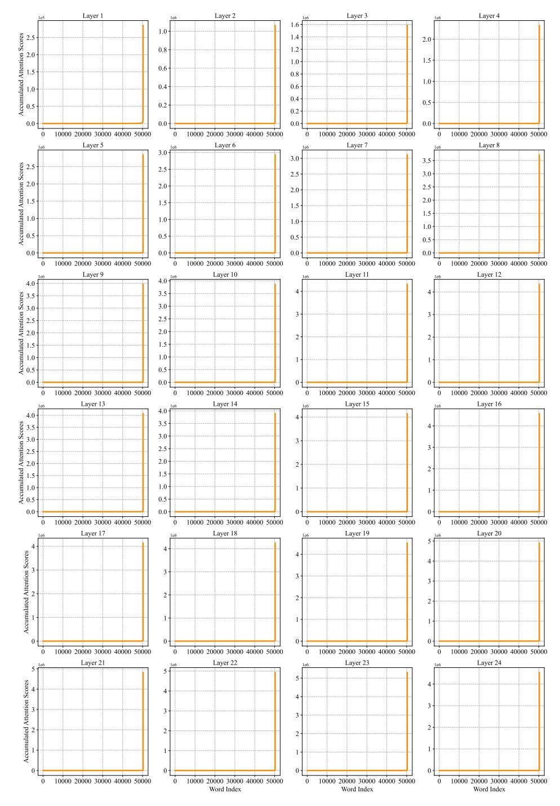
*الشكل 10: توزيع درجات الانتباه المتراكمة. تم الحصول على النتائج من OPT-1.3B.*

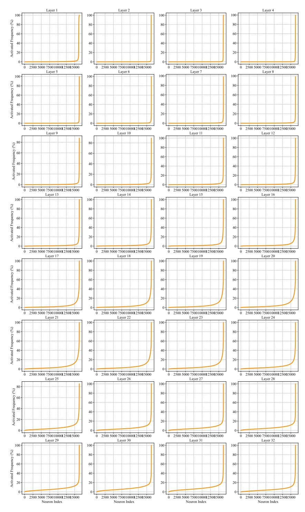
*الشكل 11: ظهور H<sub>2</sub> في كتل MLP لـ OPT-6.7B.*

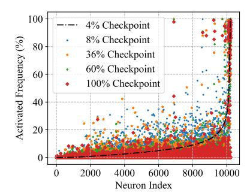
*الشكل 13: توزيع التردد المُنشّط أثناء التدريب على OPT-2.7B.*

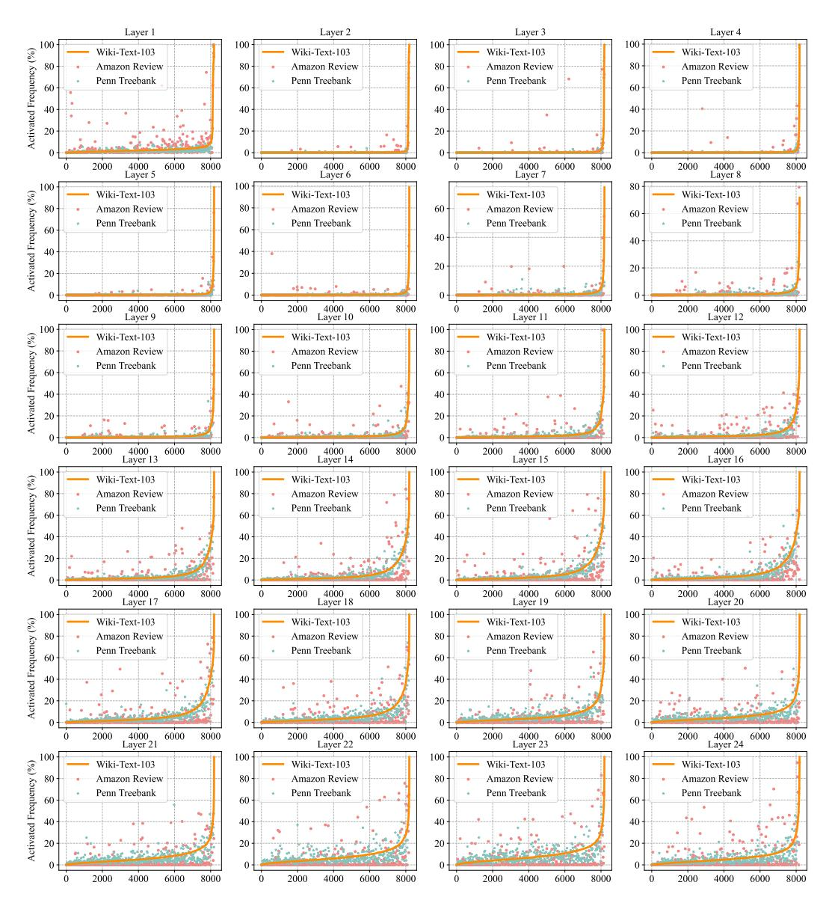
*الشكل 12: توزيع التردد المُنشّط عبر محتوى الإدخال المتنوع.*

<!-- page 32 -->

## د التحليل النظري

درست عدد من الأعمال الأخيرة مخطط الانتباه في LLMs من منظور نظري [96-122]. في هذا العمل، نقدم زاوية مختلفة وجديدة. نعرض مفهوم خاصية دون-معياري ونقترح سياسة طرد، تُعرف بـ greedy H_2، وهي تعديل لتعظيم دون-معياري ديناميكي. نُثبت ضمانات نظرية لخوارزمية سياسة الطرد الجشعة المتينة والتقريبية (الخوارزمية 2). كما نقدم صياغة رياضية للحفاظ على التفرق ونقترح خوارزمية (الخوارزمية 4) لحل المشكلة.

## د.1 الترميزات

لعدد صحيح موجب n، ليكن [n] := \{1, 2, \dots, n\}.

للمتجه x \in \mathbb{R}^n، ليكن \sqrt{x} \in \mathbb{R}^n يدل على المتجه ذي المدخل i كـ \sqrt{x_i} و\mathrm{diag}(x) \in \mathbb{R}^{n \times n} يدل على المصفوفة القطرية ذات المدخل القطري i كـ x_i. لمصفوفتين A, W \in \mathbb{R}^{n \times n}، ليكن \|A\|_W := (\sum_{i=1}^n \sum_{j=1}^n W_{i,j} A_{i,j}^2)^{1/2} وW \circ A يدلان على مصفوفة حيث (W \circ A)_{i,j} = W_{i,j} A_{i,j}.

للمتجهين x \in \mathbb{R}^n وw \in \mathbb{R}^n_{\geq 0}، ليكن \|x\|_w := (\sum_{i=1}^n w_i x_i^2)^{1/2}. للمتجه x، يُعرّف معياره \ell_2 على أنه \|x\|_2 := (\sum_{i=1}^n x_i^2)^{1/2} ومعياره \ell_p على أنه \|x\|_p := (\sum_{i=1}^n |x_i|^p)^{1/p}.

للمصفوفة A \in \mathbb{R}^{n \times k} (افترض n \geq k)، نستخدم \|A\| للدلالة على معيارها الطيفي. نستخدم \|A\|_F للدلالة على معيار Frobenius.

نستخدم الترميز A \succeq 0 للدلالة على أن المصفوفة A شبه موجبة التحديد. رياضياً، A \succeq 0 يعني أنه لجميع المتجهات x، لدينا x^{\top}Ax \geq 0.

ليُشر \Pr[] و\mathbb{E}[] إلى الاحتمال والقيمة المتوقعة. نُعرّف الحد الأقصى بين a وb كـ \max\{a,b\}.

## د.2 دون-معياري

نقدم التعريف القياسي للدالة دون-المعيارية.

**التعريف د.1** (دالة دون-معيارية [123]). لمجموعة محدودة \Omega، تُعرّف الدالة دون-المعيارية على أنها f: 2^{\Omega} \to \mathbb{R}، حيث 2^{\Omega} يدل على مجموعة القوة لـ \Omega. تتميز بتحقيق أي من المعايير التالية المكافئة:

- الشرط 1. لـ S, T \subseteq \Omega مع S \subseteq T وكل a \in \Omega \backslash T لدينا f(S \cup \{a\}) - f(S) \geq f(T \cup \{a\}) - f(T)
- الشرط 2. لكل S, T \subseteq \Omega لدينا f(S) + f(T) > f(S \cup T) + f(S \cap T).
- الشرط 3. لكل S \subseteq \Omega وa_1, a_2 \in \Omega \setminus S بحيث a_1 \neq a_2 لدينا f(S \cup \{a_1\}) + f(S \cup \{a_2\}) \geq f(S \cup \{a_1, a_2\}) + f(S).

**التعريف د.2** (رتيب). دالة المجموعة f رتيبة إذا لكل T \subseteq S لدينا f(T) \leq f(S).

أمثلة على الدوال دون-المعيارية الرتيبة:

- الدوال الخطية (المعيارية): يمكن تمثيل الدالة الخطية كـ f(S) = \sum_{i \in S} w_i. إذا كانت جميع الأوزان w_i غير سالبة، فإن الدالة f تُعتبر رتيبة.
- الدوال الميزانية-الإضافية: شكل f(S) = \min B, \sum_{i \in S} w_i حيث كل وزن w_i والميزانية B غير سالبين.
- دوال التغطية: نملك مجموعة \Omega = \{E_1, E_2, \cdots, E_n\} حيث كل E_i هو مجموعة فرعية من \Omega'. يمكن التعبير عن دالة التغطية كـ f(S) = |\cup_{E_i \in S} E_i|.

## د.3 دون-معياري ديناميكي

الدالة دون-المعيارية القياسية تُخطط 2^{[n]} إلى الأعداد الحقيقية. هنا نحتاج إلى تعريف أكثر عمومية يخطط 2^{[n]} \times 2^{[n]} إلى الأعداد الحقيقية.

**التعريف د.3** (دون-معياري قوي). نُعرّف الدالة F : 2^{[n]} \times 2^{[n]} \to \mathbb{R}، ثم لأي مجموعة Z \subset [n]، نفترض أن F(Z, \cdot) : 2^{[n]} \to \mathbb{R} هي دالة دون-معيارية.

في الواقع، التعريف أعلاه أقوى مما نريد. التعريف الذي نحتاجه هو الإصدار الرسمي من التعريف 4.1.

**التعريف د.4** (إطار دون-معياري ديناميكي، الإصدار الرسمي للتعريف 4.1). نُعرّف الدالة F: 2^{[n]} \times [n] \times 2^{[n]} \to \mathbb{R}. ثم لأي فهرس i \in [n]، أي مجموعة Z \subseteq [i-1]، نفترض أن F(Z, i, \cdot): 2^{[n]} \to \mathbb{R} هي دالة دون-معيارية بالنسبة إلى Z.

## د.4 الانتباه الساكن

قبل وصف حساب الانتباه التكراري، نصف أولاً الإصدار الساكن لحساب الانتباه (راجع التعريف 1.1 في [[98]](#page-15-5)):

**التعريف د.6.** بالنظر إلى ثلاث مصفوفات Q, K, V \in \mathbb{R}^{d \times d}، الهدف هو حساب \mathsf{Att}(Q, K, V) := D^{-1}A \cdot V حيث A = \exp(QK^{\top}) و D = \operatorname{diag}(A\mathbf{1}_n).

## د.5 تعريف الانتباه التكراري

نقدم بعض التعريفات.

**التعريف د.7.** بالنظر إلى مصفوفة استعلام Q \in \mathbb{R}^{n \times d}، نستخدم Q_{i,*} للدلالة على متجه صف بطول d يمثل الصف i من Q لكل i \in [n].

**التعريف د.8.** بالنظر إلى مصفوفة مفتاح K \in \mathbb{R}^{n \times d}، نستخدم K_{\leq i,*} للدلالة على مصفوفة i \times d تختار الصفوف i الأولى من K.

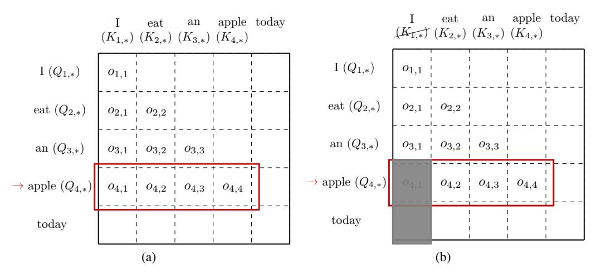
*الشكل 14: (a) الإصدار الدقيق لحساب الانتباه. مثالنا حول مهمة نمذجة اللغة. في هذه المرحلة، يتنبأ النموذج بالكلمة 'apple' ويحسب متجه الانتباه الدقيق o_4. (b) الإصدار التقريبي لحساب الانتباه. ليكن ميزانية عدد الرموز التي يمكننا تتبعها 3. نقتطع مصفوفة المفتاح للرمز الأول K_{1,*} ونحتفظ فقط بـ K_{2,*}, K_{3,*} وK_{4,*} في الذاكرة.*

**التعريف د.9** (الإصدار الدقيق). بالنظر إلى Q, K \in \mathbb{R}^{n \times d}، لكل i \in [n]، نستخدم o_i \in \mathbb{R}^i للدلالة على متجه بطول i. للطبقة الأولى، لدينا o_{1,1} = 1. لكل i، للطبقة i، لدينا متجه طول i: o_i := D_i^{-1} \cdot \exp(Q_{i,*}(K_{\leq i,*})^{\top}) وسلّم D_i := \exp(Q_{i,*}(K_{\leq i,*})^\top) \cdot \mathbf{1}_i.

**التعريف د.10** (الإصدار التقريبي). بالنظر إلى Q, K \in \mathbb{R}^{n \times d}، ليكن k \in [n] ميزانية عدد الرموز التي يمكننا تتبعها. لكل i \in [n]، للرمز i، لدينا S_i \subset [n]، |S_i| = k، |S_i \setminus S_{i-1}| \le 1. متجه طول i: o_i := D_i^{-1} \cdot \exp(Q_{i,*}(K_{S_i,*})^{\top}) وسلّم D_i := (\exp(Q_{i,*}(K_{S_i,*})^\top) - 1_{[i]\backslash S_i}) \cdot \mathbf{1}_i.

بمعنى ما، التعريف أعلاه مرتبط بإيجاد الضاربين الثقيلين في الاستشعار الضاغط [124, 125, 126].

## د.6 سياسة الطرد

هدف هذا القسم هو سياسة الطرد الخاصة بنا في ظل تقييد المساحة. نبدأ بإعطاء عملية بدون قيود مساحة.

**التعريف د.11** (العملية التوليدية مع المعرفة الكاملة). لكل i \in [n]، للرمز i، لدينا متجه بطول i: o_i := D_i^{-1} \cdot \exp(Q_{i,*}(K_{\leq i,*})^\top)، وسلّم D_i := \exp(Q_{i,*}(K_{\leq i,*})^{\top}) \cdot \mathbf{1}_i.

**التعريف د.12** (سياسة طرد H<sub>2</sub>O، الإصدار الرسمي للتعريف 4.3). ليكن k يدل على ميزانية المساحة وk < n. ليكن F_{\text{score}}: 2^{[n]} \to \mathbb{R} يدل على دالة درجة معينة. عرّفنا سياسة الطرد g: S_{i-1} \to S_i حيث |S_i| \le k، |S_i \setminus S_{i-1}| < 1. نُنشئ S_i \leftarrow (S_{i-1} \cup \{i\}) \setminus \{u\} حيث u \leftarrow \arg\max_{v} F_{\operatorname{score}}(S_{i-1} \cup \{i\} \setminus \{v\}).

**ملاحظة د.13.** نحن نُلاحظ أنه في التعريف 4.3، نقدم ترميزاً مبسطاً حيث ننص على أن |S_i| = k في النقطة الأولى، لكن بشكل عام، نأخذ في الاعتبار الحالة حيث |S_i| \le k للرموز الأولى k.

## الخوارزمية 2 خوارزمية طرد H<sub>2</sub>، مصفوفة الاستعلام Q، مصفوفة المفتاح K، حجم ميزانية ذاكرة KV المؤقتة k. الإصدار الرسمي والمفصل للخوارزمية 1.

```
1: procedure H_2_EVICTION(Q \in \mathbb{R}^{n \times d}, K \in \mathbb{R}^{n \times d}, k \in \mathbb{N})
 S_0 \leftarrow \emptyset, \, \widetilde{o}_0 \leftarrow 0
 3:
 for i=1 \rightarrow n do
 4:
 if i \le k then
 \overline{S}_i \leftarrow S_{i-1} \cup \{i\}
 5:
 6:
 D_{i} \leftarrow (\exp(Q_{i,*}(K_{S_{i-1},*})^{\top}) - 1_{[i] \setminus S_{i-1}}) \cdot \mathbf{1}_{i}
o_{i} \leftarrow D_{i}^{-1} \cdot \exp(Q_{i,*}(K_{S_{i-1},*})^{\top})
\widetilde{o}_{i} \leftarrow \widetilde{o}_{i-1} + o_{i}
Let score function be F_{\text{score}}(T) := h(\sum_{s \in T} \widetilde{o}_{i,s})
 7:
 8:
 9:
10:
 u \leftarrow \arg\max_{v \in (S_{i-1} \cup \{i\})} F_{\text{score}}(S_{i-1} \cup \{i\} \setminus \{v\})
S_i \leftarrow (S_{i-1} \cup \{i\}) \setminus \{u\}
11:
12:
13:
14:
 end for
15: end procedure
```

**ملاحظة د.14.** يمكن أن يكون للدالة F_{\text{score}} اختيارات متعددة. h(z) عادة ما يتم اختيارها كدالة مقعرة غير متناقصة مثل \sqrt{z+1} و\log(z+1).

**ملاحظة د.15.** \tilde{o}_{i,s} هو تراكم درجة الانتباه للرمز s.

## د.7 شرح خاصية تناقص العائد دون-المعياري في مخطط الانتباه

في المشكلة دون-المعيارية القياسية [123]، تُعطى لنا مجموعة أرضية [n] ودالة f. الهدف هو إيجاد مجموعة من العناصر S بحيث يتم تعظيم f(S). يمكن أن تمثل الدوال دون-المعيارية تكلفة العناصر، بسبب خاصية تناقص العوائد [127, 128]. على سبيل المثال، نقدم رمزاً جديداً، يُرمز له بـ "w"، إلى مجموعتين، S وS_0، حيث المفاهيم التي يغطيها S_0 هي مجموعة فرعية من تلك التي يغطيها S. بالحدس، يجب أن تكون المعلومات المضافة إلى S_0 بواسطة "w" أكبر مقارنة بإضافتها إلى S. تُعرف هذه الخاصية بخاصية تناقص العائد. ومن ثم، نقترح أن دالة التغطية العصبية [129] يجب أن تُظهر خاصية مرغوبة تُسمى دون-معيارية.

## د.8 دون-معياري: الأفكار عالية المستوى

نُصيغ مشكلة تعظيم الدالة دون-المعيارية مع قيد العدد. بشكل غير رسمي، دالة المجموعة دون-معيارية إذا كانت لها زيادة هامشية متناقصة.

**التعريف د.16** (دالة دون-معيارية). نُرمز لـ f: 2^{[n]} \to \mathbb{R} كدالة مجموعة. المشتق المتقطع \Delta_f يُعرّف كـ: \Delta_f(i \mid S) := f(S \cup \{i\}) - f(S). الدالة f دون-معيارية إذا، لأي S \subseteq T وi \in [n] \setminus T، تتحقق المتباينة: \Delta_f(i \mid T) \leq \Delta_f(i \mid S).

نعرض مشكلة تعظيم دالة دون-معيارية مع قيد عدد: \max_{S \subseteq [n]} f(S) s.t. |S| \le k.

**تمثيل f(S):** نفترض S = i_1, i_2, \cdots, i_m \subseteq [n]، يمكننا تحلل f(S) إلى مجموع الزيادات: f(S) = \sum_{j=1}^{m} \Delta_f(i_j | S_{j-1}). لإدخال هيكل بياناتنا المتقدم، نمثل \Delta_f(i|S) في شكل \Delta_f(i|S) = u_i^\top h(S) u_i حيث u_i \in \mathbb{R}^d هو متجه d-أبعاد وh(S) \in \mathbb{R}^{d \times d} هي مصفوفة d-بـ-d.

عندما تكون f رتيبة، يمكننا تقييد جميع h(S) لتكون مصفوفات شبه موجبة التحديد (PSD).

## د.9 الجشع المتين مع انتشار الخطأ

يبدأ إجراء خوارزمية الاختيار الجشع بمجموعة فارغة S_0 = \emptyset. لكل تكرار، تختار الخوارزمية العنصر الذي يُعظّم الزيادة الهامشية. عندما يصل حجم المجموعة إلى k، تُرجع الخوارزمية تلك المجموعة S. تحديداً، للتكرار t \in \{1, 2, \cdots, k\}، نُعيّن S_t \leftarrow S_{t-1} \cup \{j_t\} حيث j_t = \arg\max_{j \in \overline{S}_{t-1}} f(S_{t-1} \cup \{j\}). الاستراتيجية الجشعة فعّالة بمعنى أن خطأ التقريب لها هو 1 - 1/e.

**النظرية د.17** ([130]). للدالة f دون-المعيارية الرتيبة، تضمن الخوارزمية الجشعة (الخوارزمية 3) إخراج مجموعة S تحقق f(S) \ge (1 - 1/e) \max_{|T|=k} \{f(T)\}.

**اللاحقة د.18** ([131]). بالنظر إلى معامل دقة \epsilon > 0، عدد صحيح k \geq 1، أوراكل O يعطي قيمة بضمان \Delta(i|S) - \epsilon \leq O(S,i) \leq \Delta(i|S) + \epsilon، وخوارزمية A تختار j_t = \arg\max_j \{O(S_{t-1}, j)\}، تُرجع المجموعة S_k التي تحقق f(S_k) \ge (1 - 1/e) \max_{|T|=k} \{f(T)\} - k(2 - 1/e)\epsilon.

## الخوارزمية 3 معيار الخوارزمية الجشعة

```
1: procedure GREEDYALGORITHM(submodular function f)
2: S_0 \leftarrow \emptyset
3: for t = 0 \rightarrow k - 1 do
4: j \leftarrow \arg\max_i \{f(S_t \cup \{i\})\}
5: S_{t+1} \leftarrow S_t \cup \{j\}
6: end for
7: return S_k
8: end procedure
```

## د.10 دون-معياري متين وإضافة العناصر

نقترح أولاً لمة تُظهر متانة دون-المعيارية.

**اللما د.19.** افترض أنه لكل i \in [n]، لجميع S_i \subset [n] مع |S_i| \leq k، لجميع X \subset [n], X \subseteq S_i \cup \{i\}، لدينا |\widetilde{f}_{S_i,i}(X) - \widetilde{f}_{S_i,i}(S_i) - (f_{S_i,i}(X) - f_{S_i,i}(S_i))| \le \epsilon/(2n). ليكن \operatorname{opt}_i التكلفة المثلى. إذا كانت الخوارزمية الجشعة باستخدام f تحقق أداءً (1-1/e) \cdot \operatorname{opt}_i، فباستخدام \widetilde{f}، يمكننا الحصول على حل بأداء (1-1/e) \cdot \operatorname{opt}_i - \epsilon.

*الإثبات.* الإثبات يتبع من اللما د.18.

**التعريف د.20** (توسيع العناصر بناءً على القيمة الدقيقة). إذا كانت S_i \subseteq [i-1] وf_{S_i,i}: 2^{[i]} \to \mathbb{R}، نُعرّف S_{i+1} كما يلي: إذا |S_i| = k فإن S_{i+1} = S_i \cup \{i\} \setminus u حيث u = \arg \max_{v \in S_i \cup \{i\}} f_{S_i,i}(S_i \cup \{i\} \setminus v) - f_{S_i,i}(S_i). إذا |S_i| < k، فإن S_{i+1} = S_i \cup \{i\}.

**التعريف د.22** (توسيع العناصر بناءً على القيمة التقريبية). تماثل التعريف د.20 ولكن باستخدام \widetilde{f}_{S_i,i}.

## د.11 الشروط العامة

**التعريف د.23** (شرط الرتابة العام للدالة الدقيقة). نقول إن f لها شرط الرتابة العام، إذا لجميع i \in [n] لجميع S_i \subseteq [i-1]، لدينا f_{S_i,i}(X) \ge f_{S_i,i}(Y), \forall Y \subset X.

**التعريف د.24** (شرط الرتابة العام للدالة التقريبية). نقول إن \widetilde{f} لها شرط الرتابة العام، إذا لجميع i \in [n] لجميع S_i \subseteq [i-1]، لدينا \widetilde{f}_{S_i,i}(X) \geq \widetilde{f}_{S_i,i}(Y), \forall Y \subset X.

**التعريف د.25** (شرط الديناميكية العام 1 للدالة الدقيقة). f_{S_i,i}(S_i) \ge (1-\theta) \cdot f_{S_{i-1},i-1}(S_i).

**التعريف د.26** (شرط الديناميكية العام 1 للدالة التقريبية). \widetilde{f}_{S_i,i}(S_i) \ge (1-\theta) \cdot \widetilde{f}_{S_{i-1},i-1}(S_i).

**التعريف د.27.** ليكن k يدل على طول الميزانية. لكل i \in [n]، نُعرّف \mathrm{opt}_i كـ \max\{f_{X,i}(Y) \mid X \subseteq [i-1], Y \subseteq [i], |X| \le k, |Y| \le k, |Y \setminus X| \le 1\}.

**التعريف د.28** (شرط الديناميكية العام 2). لكل i \in [n]، \mathrm{opt}_i \geq (1-\gamma) \cdot \mathrm{opt}_{i-1}.

## د.12 لمة الاستقراء للدالة الدقيقة

**اللما د.29** (لمة الاستقراء). لـ i ثابت، افترض الشروط التالية: شرط المجموعة S_i \subseteq [i-1]، شرط الميزانية |S_i| \le k، شرط القيمة f_{S_{i-1},i-1}(S_i) \geq (1-1/e) \cdot (1-\theta)^i (1-\gamma)^i \mathrm{opt}_i، وشروط الرتابة والديناميكية. ثم إذا أنشأنا S_{i+1} كما في التعريف د.20، فلدينا: شرط المجموعة S_{i+1} \subseteq [i]، شرط الميزانية |S_{i+1}| \le k، شرط القيمة f_{S_i,i}(S_{i+1}) \geq (1-1/e) \cdot (1-\theta)^{i+1} (1-\gamma)^{i+1} \mathrm{opt}_{i+1}.

*الإثبات.* إثبات شرط المجموعة وشرط الميزانية مباشر. لإثبات شرط القيمة، نُظهر أن f_{S_i,i}(S_{i+1}) \geq f_{S_i,i}(S_i) \geq (1-\theta) \cdot f_{S_{i-1},i-1}(S_i) \geq (1-\theta) \cdot (1-1/e)(1-\theta)^i(1-\gamma)^{i+1} \mathrm{opt}_{i+1} \geq (1-1/e) \cdot (1-\theta)^{i+1}(1-\gamma)^{i+1} \mathrm{opt}_{i+1}. حيث تتبع الخطوة الأولى من شرط الرتابة العام، الثانية من شرط الديناميكية 1، الثالثة من شرط القيمة، الرابعة من شرط الديناميكية 2.

## د.13 لمة الاستقراء للدالة التقريبية

**اللما د.30** (لمة الاستقراء). تماثل اللما د.29 ولكن مع شرط القيمة المعدّل وشرط التقريب العام. ثم إذا أنشأنا S_{i+1} كما في التعريف د.22: f_{S_i,i}(S_{i+1}) \geq (1-1/e) \cdot (1-\theta)^{i+1}(1-\gamma)^{i+1} \mathrm{opt}_{i+1} - (i+1) \cdot \epsilon_0.

*الإثبات.* الإثبات يتبع نفس البنية مع إضافة شرط التقريب العام في كل خطوة.

## د.14 النتيجة النظرية

**اللما د.31** (الإصدار الرسمي للما 3.1). في ظل الافتراض المعتدل، ليكن k يدل على أي حجم مستهدف. إذا قمنا بشكل جشع بحساب درجة الانتباه بناءً على المعلومات الكاملة، فيمكننا إيجاد المجموعة S_i بحيث f(S_i) \ge (1-1/e) \cdot (1-\alpha) \mathrm{opt}_i، حيث \alpha \in (0, 1).

*الإثبات.* الإثبات يتبع من النظرية د.17، اللاحقة د.18، اللما د.29 مع اختيار \theta = \gamma = \alpha/(10n).

**النظرية د.32** (الإصدار الرسمي للنظرية 4.4). في ظل الافتراض المعتدل، ليكن k يدل على ميزانية تقييد المساحة. إذا قمنا لكل رمز بشكل جشع بحساب درجة الانتباه بناءً على الاختيار الأعلى-k، فيمكننا أن نُظهر أن المجموعة \widetilde{S}_i التي نولدها لكل رمز i \in [n] تحقق f(\widetilde{S}_i) \ge (1-1/e) \cdot (1-\alpha) \mathrm{opt}_i - \beta، حيث \alpha \in (0,1), \beta > 0.

*الإثبات.* الإثبات يتبع من النظرية د.17، اللاحقة د.18، اللما د.30 مع اختيار \epsilon_0 = \beta/(10n) وθ = γ = α/(10n).

## د.15 الأعمال ذات الصلة الموسعة لمشكلات الانتباه النظرية

حساب الانتباه الساكن يطرح السؤال التالي: بالنظر إلى Q, K, V \in \mathbb{R}^{n \times d}، الهدف هو D^{-1}\exp(QK^{\top})V. درس [98] حساب الانتباه الساكن من جانبَي الخوارزمية والصعوبة. على الجانب الإيجابي، يقدمون خوارزمية بزمن خطي تقريباً. على الجانب السلبي، بافتراض SETH، يثبتون نتيجة صعوبة. كذلك، [100] يأخذ في الاعتبار ديناميكية مشكلة حساب الانتباه. في [103]، يأخذون في الاعتبار تفرق بناء مصفوفة الانتباه. الخصوصية التفاضلية موضوع شهير، حيث يُظهر [101] كيفية إعطاء خوارزمية خاصة تفاضلياً. لـ A \in \mathbb{R}^{n \times d} وb \in \mathbb{R}^n، يصيغ [104] ويدرس الانحدار الأسي. ثم [105] يأخذ في الاعتبار عامل التطبيع ويُعرّف مشكلة انحدار softmax. [107] ينقل عامل القياس ويُعرّف مشكلة انحدار softmax المُعاد قياسه.

## د.16 الحفاظ على التفرق

نلاحظ في الشكل 2 أنه حتى عند التدريب الكثيف، فإن مصفوفات الانتباه لـ LLMs متفرقة بنسبة تزيد عن 95% في وقت الاستدلال. 5% فقط من ذاكرة KV المؤقتة كافية لفك التشفير.

**التعريف د.33.** افترض الشروط التالية: ليكن S_0 \subset [m]، k = |S_0|، \tau \in (0,1) عتبة، \alpha \in (0,1) جزء من الكتلة خارج S_0، تخطيط \mathcal{D}: \mathbb{R}^d \to \mathbb{R}^m_{>0}. نقول إن التوزيع \mathcal{D} هو (\alpha, \tau, k)-جيد إذا: لجميع x \in \mathbb{R}^d, S_0 \subset \operatorname{supp}_{\tau}(\mathcal{D}(x))، ولجميع x، |\operatorname{supp}_{\tau}(\mathcal{D}(x)) \setminus S_0| < \alpha \cdot k.

**الادعاء د.34.** افترض أننا أخذنا عينة من n نقاط من توزيع (\alpha, \tau, k)-جيد بشكل عشوائي موحد. ثم S_0 \subseteq \bigcap_{i \in [n]} \operatorname{supp}_{\tau}(x_i) و |(\bigcup_{i\in[n]}\operatorname{supp}_{\tau}(\mathcal{D}(x))) \backslash S_0| \leq \alpha kn.

## د.17 تعريف دالة الخسارة

في هذا القسم، نتبع أدبيات انحدار softmax النظرية [105] ونُعرّف عدداً من الدوال. كما نقترح حداً جزائياً جديداً (نوع تفرق \ell_1، انظر التعريف د.41) في دالة الخسارة النهائية.

**التعريف د.35** (الدالة u، [105]). بالنظر إلى مصفوفة A \in \mathbb{R}^{n \times d}، نُعرّف u(x) := \exp(Ax).

**التعريف د.36** (الدالة \alpha). \alpha(x) := \langle u(x), \mathbf{1}_n \rangle.

**التعريف د.37** (الدالة f). f(x) := \alpha(x)^{-1} u(x).

**التعريف د.38** (الدالة c). بالنظر إلى متجه b \in \mathbb{R}^n، c(x) := f(x) - b.

**التعريف د.39** (دالة الخسارة L_{\exp}). L_{\text{exp}}(x) := 0.5 \cdot \|c(x)\|_2^2.

**التعريف د.40** (دالة الخسارة L_{\text{reg}}). L_{\text{reg}}(x) := 0.5 \cdot \|\operatorname{diag}(w)Ax\|_{2}^{2}.

**التعريف د.41** (التحكم الضمني في التفرق). L_{\text{sparse}}(x) := \|\exp(Ax)\|_1.

**الادعاء د.42.** L_{\text{sparse}}(x) = \langle \exp(Ax), \mathbf{1}_n \rangle = \langle u(x), \mathbf{1}_n \rangle = \alpha(x).

*الإثبات.* الإثبات يتبع تماماً من تعريفات u(x) وα(x).

**التعريف د.43.** L(x) := L_{\exp}(x) + L_{\operatorname{sparse}}(x) + L_{\operatorname{reg}}(x).

## د.18 المشتق

**اللما د.44** (المشتق، اللما 5.6 في [[105]](#page-15-12)). لكل i \in [d]، لدينا:

- الجزء 1: \frac{\mathrm{d}\exp(Ax)}{\mathrm{d}x_i} = \exp(Ax) \circ A_{*,i}
- الجزء 2: \frac{\mathrm{d}\langle \exp(Ax), \mathbf{1}_n \rangle}{\mathrm{d}x_i} = \langle \exp(Ax), A_{*,i} \rangle
- الجزء 3: \frac{\mathrm{d}\alpha(x)^{-1}}{\mathrm{d}x_i} = -\alpha(x)^{-1} \cdot \langle f(x), A_{*,i} \rangle
- الجزء 4: \frac{\mathrm{d}f(x)}{\mathrm{d}x_i} = -\langle f(x), A_{*,i} \rangle \cdot f(x) + f(x) \circ A_{*,i}
- الجزء 5: \frac{\mathrm{d}L_{\exp}(x)}{\mathrm{d}x_i} = A_{*,i}^{\top} \cdot (f(x)(f(x)-b)^{\top} f(x) + \mathrm{diag}(f(x))(f(x)-b))

## د.19 المصفوفة الهسية

**اللما د.45** (مصفوفة هسية لـ u(x)، اللما 5.9 في [105]). الجزء 1: \frac{\mathrm{d}^2 \exp(Ax)}{\mathrm{d}x_i^2} = A_{*,i} \circ u(x) \circ A_{*,i}. الجزء 2: \frac{\mathrm{d}^2 \exp(Ax)}{\mathrm{d}x_i \mathrm{d}x_j} = A_{*,j} \circ u(x) \circ A_{*,i}.

**اللما د.46** (اللما 5.10 في [105]). الجزء 1: \frac{\mathrm{d}^2 \alpha(x)}{\mathrm{d}x_i^2} = \langle u(x), A_{*,i} \circ A_{*,i} \rangle. الجزء 3: \frac{\mathrm{d}^2 \alpha(x)}{\mathrm{d}x^2} = A^{\top} \operatorname{diag}(u(x))A.

## د.20 المصفوفة الهسية موجبة التحديد

من المعروف أن المصفوفة الهسية H لدالة الخسارة يمكن كتابتها كـ A^{\top}(B(x)+W^2)A. في هذا القسم، نُظهر أن المصفوفة الهسية موجبة التحديد.

**اللما د.47.** ليكن L(x) = L_{\exp}(x) + L_{\text{sparse}}(x) + L_{\text{reg}}(x). ليكن A^{\top}(B(x) + W^2)A المصفوفة الهسية لـ L(x). ليكن \sigma_{\min}(A) أصغر قيمة فردية لـ A. ثم:

- الجزء 1. إذا لجميع i \in [n], w_i^2 \ge 20 + l/\sigma_{\min}(A)^2، فإن \frac{\mathrm{d}^2 L}{\mathrm{d}x^2} \succeq l \cdot I_d.
- الجزء 2. إذا لجميع i \in [n], w_i^2 \ge 200 \cdot \exp(R^2) + l/\sigma_{\min}(A)^2، فإن (1 - 1/10) \cdot (B(x) + W^2) \le W^2 \le (1 + 1/10) \cdot (B(x) + W^2).

*الإثبات.* إطار الإثبات بأكمله يتبع من [104, 105, 107]. B(x) المعتمد على L_{\text{sparse}} هو \operatorname{diag}(u(x)). من الواضح أن \operatorname{diag}(u(x)) \succeq 0. من الحد الأعلى، \operatorname{diag}(u(x)) \leq \|u(x)\|_{\infty} \cdot I_n \leq \exp(R^2). لإثبات الجزء 1، نستخدم فقط الحد الأدنى لـ \operatorname{diag}(u(x)). لإثبات الجزء 2، نستخدم كلا الحدين.

## د.21 المصفوفة الهسية ليبشيتزية

**اللما د.48.** ليكن H(x) = A^{\top}(B(x) + W^2)A المصفوفة الهسية لـ L. ثم \|H(x) - H(y)\| \le n^2 \exp(40R^2) \|x - y\|_2.

*الإثبات.* B(x) القائم على L_{\exp} + L_{\text{reg}} تم إثباته بواسطة [105]. نحتاج فقط إلى إثبات B(x) القائم على L_{\text{sparse}} وهو \operatorname{diag}(u(x)). باستخدام اللما 7.2 في [105]، \|\operatorname{diag}(u(x)) - \operatorname{diag}(u(y))\| \le \|u(x) - u(y)\|_2 \le 2\sqrt{n}R\exp(R^2)\|x-y\|_2.

## د.22 خوارزمية من النوع الجشع

في هذا القسم، نقترح خوارزمية من النوع الجشع (تستند إلى طريقة نيوتن التقريبية) لحل مشكلة التحسين.

## الخوارزمية 4 خوارزمية من النوع الجشع.

```
1: procedure OurIterativeMethod(A \in \mathbb{R}^{n \times d}, b \in \mathbb{R}^n, w \in \mathbb{R}^n, \epsilon, \delta)
 Initialize x_0
 T \leftarrow \log(\|x_0 - x^*\|_2/\epsilon)
 for t = 0 \rightarrow T do
 D \leftarrow B_{\text{diag}}(x_t) + \text{diag}(w \circ w)
 \widetilde{D} \leftarrow \text{SUBSAMPLE}(D, A, \epsilon_1 = \Theta(1), \delta_1 = \delta/T)
 Compute gradient g exactly
 Get the approximate Hessian \widetilde{H} by computing A^{\top}\widetilde{D}A
 Update x_{t+1} by using the Newton step x_t + H^{-1}g
 end for
 \widetilde{x} \leftarrow x_{T+1}
 return \widetilde{x}
end procedure
```

**النظرية د.49.** بالنظر إلى المصفوفة A \in \mathbb{R}^{n \times d}, b \in \mathbb{R}^n, وw \in \mathbb{R}^n. نستخدم x^* للدلالة على الحل الأمثل. افترض R > 10, M = \exp(\Theta(R^2 + \log n)), وl > 0. افترض \|A\| \le R، b \ge \mathbf{0}_n و\|b\|_1 \le 1. افترض w_i^2 \ge 200 \cdot \exp(R^2) + l/\sigma_{\min}(A)^2. ليكن x_0 نقطة بداية بحيث M\|x_0 - x^*\|_2 \le 0.1l. \epsilon \in (0, 0.1) معامل دقة، \delta \in (0, 0.1) احتمال فشل. هناك خوارزمية عشوائية تعمل لـ \log(\|x_0 - x^*\|_2/\epsilon) تكرارات، تنفق O((\operatorname{nnz}(A) + d^{\omega}) \cdot \operatorname{poly}(\log(n/\delta))) وقتاً لكل تكرار، وأخيراً تُخرج متجهاً \widetilde{x} \in \mathbb{R}^d بحيث \Pr[\|\widetilde{x} - x^*\|_2 \le \epsilon] \ge 1 - \delta.

*الإثبات.* إطار الإثبات يتبع أدبيات نيوتن التقريبية (طريقة الترتيب الثاني) [134-145]. باتباع اللما د.47، المصفوفة الهسية لدالة الخسارة موجبة التحديد. باتباع اللما د.48، المصفوفة الهسية لـ L ليبشيتزية. باتباع القسم 9 في [105]، بتشغيل الخوارزمية 4، نُكمل الإثبات.

نُلاحظ أن \omega يدل على أس ضرب المصفوفات (أي n^\omega هو وقت ضرب مصفوفة n \times n بأخرى n \times n). الخوارزمية الأكثر بساطة تعطي \omega = 3. حالياً، الخوارزمية الأحدث تعطي \omega = 2.373.
