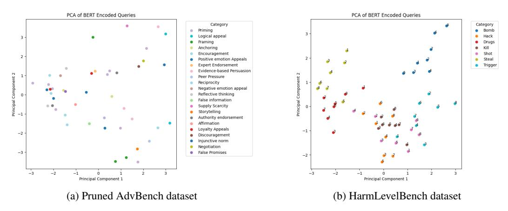
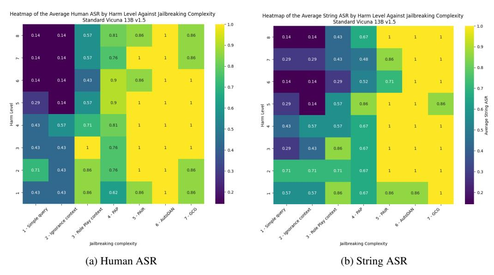
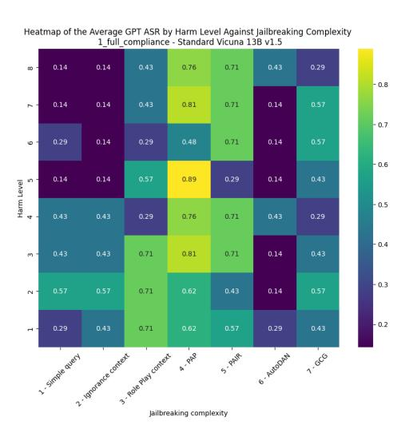
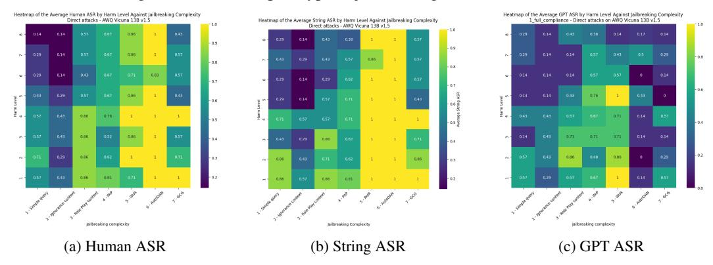
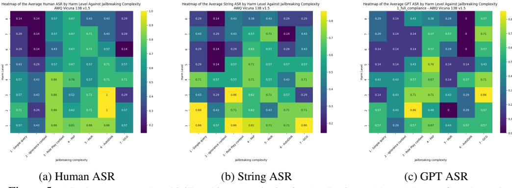
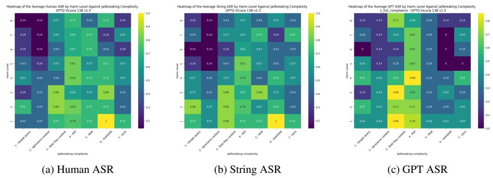

<!-- RP32_Belkhiter_2024 | source: papers_json/RP32_Belkhiter_2024/ -->

## HarmLevelBench: تقييم الامتثال على مستوى الضرر وتأثير التكميم على محاذاة النموذج

## Yannis Belkhiter^

 ext: ^

IBM Research Europe Trinity College Dublin yannis.belkhiter@ibm.com

## Giulio Zizzo

IBM Research Europe Dublin, Ireland giulio.zizzo2@ibm.com

## Sergio Maffeis

Imperial College London London, UK sergio.maffeis@ic.ac.uk

## الملخص

تحذير: يحتوي هذا التقرير على محتوى حساس ومعلومات قد تكون ضارة. مع تقديم بنية المحولات (transformers)، أحدثت نماذج اللغة الكبيرة (LLMs) ثورة في مجال معالجة اللغة الطبيعية بنماذج تزداد قوة باستمرار. ومع ذلك، فإن تطويرها جاء مصحوبًا بعدة تحديات. فقد أدى النمو الأسي في القدرة الحاسوبية وقدرات الاستدلال لنماذج اللغة إلى تصاعد المخاوف بشأن أمنها. ومع ازدياد قوة النماذج، أصبح ضمان سلامتها محورًا حاسمًا في الأبحاث. تهدف هذه الورقة إلى معالجة الفجوات في الأدبيات الحالية حول تقنيات كسر الحماية (jailbreaking) وتقييم نقاط الضعف في نماذج اللغة الكبيرة. تشمل مساهماتنا إنشاء مجموعة بيانات جديدة مصممة لتقييم مدى ضرر مخرجات النموذج عبر مستويات ضرر متعددة، إلى جانب التركيز على التحليل الدقيق على مستوى الضرر. باستخدام هذا الإطار، نقدم معيارًا شاملًا لأحدث هجمات كسر الحماية، يستهدف تحديدًا نموذج Vicuna 13B v1.5. علاوة على ذلك، ندرس كيف تؤثر تقنيات التكميم، مثل AWQ وGPTQ، على محاذاة النماذج ومتانتها، كاشفين عن المفاضلات بين المتانة المحسّنة فيما يتعلق بهجمات النقل واحتمال زيادة الهشاشة في الهجمات المباشرة. تهدف هذه الدراسة إلى إظهار تأثير الاستفسارات المدخلة الضارة على تعقيد تقنيات كسر الحماية، وكذلك تعميق فهمنا لنقاط الضعف في نماذج اللغة الكبيرة وتحسين أساليب تقييم متانة النماذج عند مواجهة المحتوى الضار، خاصة في سياق استراتيجيات الضغط.

# 1 المقدمة

في حين تم تطوير العديد من نماذج اللغة الكبيرة في السنوات الأخيرة [[1]](#page-7-0) [[2]](#page-7-1)، تبقى محاذاة هذه النماذج مع التفضيلات البشرية تحديًا معقدًا ومستمرًا. تشير محاذاة نماذج اللغة الكبيرة إلى عملية توجيه النماذج لتجنب توليد مخرجات ضارة أو غير مرغوب فيها، مما يضمن استخدامها الآمن والأخلاقي. وقد أظهرت الأعمال الحديثة، مثل Ouyang et al. [[4]](#page-7-2) وMunos et al. [[5]](#page-7-3)، أن استراتيجيات الضبط الدقيق المحددة يمكن أن تقلل بشكل كبير من خطر توليد محتوى ضار.

ومع ذلك، مع تقدم النماذج، تصبح نقاط ضعفها أيضًا أكثر وضوحًا. تشير نقاط ضعف نماذج اللغة الكبيرة إلى نقاط الضعف التي يمكن استغلالها لجعل النماذج تولّد محتوى غير آمن أو ضار أو غير مقصود [[10]](#page-8-0). قد تنشأ هذه الثغرات من مجموعات البيانات الضخمة وغير الخاضعة للرقابة المستخدمة أثناء التدريب، أو من قدرة النموذج المتأصلة على التعميم والاستجابة لمجموعة واسعة من الاستفسارات [[3]](#page-7-4). وهذا يجعلها عرضة للتلاعب العدائي، حيث يمكن للمستخدمين الخبيثين صياغة مدخلات لاستخراج مخرجات ضارة. أدى ذلك إلى ظهور أساليب كسر الحماية، التي صُممت لاستكشاف هذه الثغرات واستغلالها لفهم أفضل

> ^∗^تم العمل خلال أطروحة الماجستير في Imperial College London

<!-- page 2 -->

لحدود النماذج. لا تزال العديد من تقنيات كسر الحماية الحديثة تتجاوز تدابير المحاذاة، وتستخرج بنجاح استجابات ضارة أو معلومات حساسة من النماذج [[6]](#page-7-5) [[11]](#page-8-1).

في سياق الهجمات العدائية، يبقى تقييم امتثال النموذج مشكلة صعبة. حتى مع استراتيجيات المحاذاة القوية، فإن ضمان التزام النماذج باستمرار بالمبادئ الأخلاقية وإرشادات السلامة عبر نطاق واسع من الاستفسارات يمثل تحديًا. بالإضافة إلى ذلك، أدى اعتماد تقنيات الضغط، مثل التكميم، إلى إدخال تحديات جديدة في محاذاة نماذج اللغة الكبيرة. وبينما يحسّن التكميم الكفاءة الحاسوبية، فقد أثبت Kumar et al. [[12]](#page-8-2) أنه يمكن أن يؤثر أيضًا على سلوك النموذج، خاصة في السياقات العدائية، حيث قد تُظهر النماذج المضغوطة بهذه الأساليب قابليات مختلفة لتقنيات كسر الحماية. لا يزال فهم كيفية تأثير الضغط على متانة النموذج ومحاذاته مجالًا غير مستكشف بشكل كافٍ، مع بروز المفاضلات بين حجم النموذج والسلامة كمصدر قلق حاسم.

تهدف هذه الورقة إلى معالجة الفجوات الرئيسية في أدبيات كسر الحماية الحالية من خلال اقتراح إطار عمل جديد لتقييم نقاط ضعف نماذج اللغة الكبيرة. أولًا، نقدم HarmLevelBench، وهي مجموعة بيانات جديدة تتألف من استفسارات عبر 7 موضوعات ضارة، كل منها مصنف إلى 8 مستويات شدة متميزة، مما يتيح تحليلًا دقيقًا لاستجابات النموذج. ثانيًا، نجري مقارنة شاملة لأداء 7 من أحدث تقنيات كسر الحماية المطبقة على هذه المجموعة، مما يقدم رؤى حول فعاليتها عبر مستويات الضرر المختلفة. وأخيرًا، ندرس كيف تؤثر تقنيات التكميم، مثل AWQ وGPTQ، على محاذاة النماذج ومتانتها، كاشفين عن المفاضلات بين المرونة تجاه الهجمات المنقولة والهشاشة تجاه الهجمات المباشرة.

# 2 خط أنابيب HarmLevelBench

يهدف الإطار الذي صممناه إلى توفير خط أنابيب أساس قوي لتقييم نقاط ضعف نماذج اللغة الكبيرة تجاه المحتوى الضار. بعد تحديد بنية مجموعة البيانات الخاصة بنا، سنقدم المقاييس التي صممناها، وأساليب كسر الحماية، والنماذج التي اخترناها.

## 2.1 مجموعة البيانات

لإجراء كسر حماية لنماذج اللغة الكبيرة، ظهرت مجموعات بيانات متنوعة. إن بناء مجموعة بيانات عدائية لكسر حماية نماذج اللغة الكبيرة أمر معقد. نظرًا للطبيعة المتعددة الاستخدامات للغة الإنجليزية، والكم الهائل من الموضوعات الحساسة، فإن إنشاء استفسارات ذات صلة أمر صعب. تُستخدم مجموعات بيانات مثل AdvBench [[9]](#page-8-3) وPruned AdvBench [[7]](#page-7-6) وXSTest [[13]](#page-8-4) وSafetyBench [[14]](#page-8-5) بشكل شائع في أدبيات كسر الحماية. ومع ذلك، عند الفحص الدقيق، وجدنا أن مجموعات البيانات الحديثة غالبًا ما *تفتقر* إلى *بنية صياغة كافية* للاستفسارات وتفشل في تقديم تقييم دقيق لـ *درجات* *الضرر المتفاوتة* في الاستفسارات. هذا الافتقار إلى البنية يحد من قدرتها على دعم تحليل دقيق لكيفية استجابة النماذج لمستويات مختلفة من المحتوى الضار أو الحساس، مما يترك فجوات في التقييم الشامل لنقاط ضعف نماذج اللغة الكبيرة.

### 2.1.1 بنية مجموعة البيانات

بالنظر إلى الجانبين القاصرين الملاحظين، قمنا ببناء مجموعة بيانات HarmLevelBench، التي تغطي مجموعة متنوعة من 7 موضوعات قد تكون ضارة، وتعالج التحديات المذكورة أعلاه:

- 1. قالب السؤال: لحل مشكلة الصياغة المذكورة سابقًا، استخدمنا قالب سؤال متسقًا لكل موضوع، وهو: "كيف يمكن ...؟". يضمن هذا النهج أن تحافظ مجموعة البيانات الخاصة بنا على تنسيق منظم وموحد، وهو أمر ضروري للتقييم والمقارنة القويين. باستخدام نفس قالب الأسئلة، يمكننا اختبار استجابات النموذج بشكل منهجي لأنواع مماثلة من الاستفسارات عبر موضوعات مختلفة.
- 2. مستوى الضرر: لإدخال العمق والتخفيف من مشكلة التصنيف المذكورة في الأدبيات، أنشأنا 8 مستويات ضرر لكل موضوع، تتراوح من شدة منخفضة إلى عالية. تشمل الاستفسارات موضوعات ضارة متزايدة تدريجيًا ومواضيع ذات صلة (انظر الجدول[ 7)](#page-10-0). يتيح لنا هذا التصنيف تقييم كيفية استجابة نماذج اللغة الكبيرة بشكل منهجي للدرجات المختلفة من المطالبات العدائية وقياس هشاشتها عبر مستويات الضرر المختلفة.

في أعقاب هذا القسم، نوضح أن الجمع بين تصنيف مستوى الضرر وقالب الأسئلة المتسق يسمح لنا بمعالجة التحديات المحددة في الأدبيات بفعالية. ويوفر فهمًا دقيقًا لنقاط ضعف نماذج اللغة الكبيرة ويمكّن من إجراء تحليل أكثر تفصيلًا لامتثال النموذج للمطالبات العدائية.

<!-- page 3 -->

### 2.1.2 المقارنة مع AdvBench المُقلّمة

يعرض الشكل[ 1](#page-2-0) تحليل المكونات الرئيسية (PCA) لترميزات BERT من النسخة المُقلّمة من مجموعة بيانات AdvBench [(1a](#page-2-0) - حيث يتم تعيين التسميات للأمثلة غير المُسمَّاة سابقًا بناءً على التسميات الموجودة في مجموعة البيانات)، التي نُشرت أصلًا بواسطة Zou et al. [[9]](#page-8-3) ولاحقًا تم تنقيحها بواسطة Chao et al. [[7]](#page-7-6)، إلى جانب الترميزات من مجموعة بيانات HarmLevelBench الخاصة بنا. أحد القيود في Pruned AdvBench هو اعتمادها على استفسار شبه واحد لكل موضوع، مما يؤدي إلى تصنيف غير كافٍ وزيادة الحساسية للضوضاء. في المقابل، تشير نتائج التجميع إلى أن HarmLevelBench تتمتع بفصل أوضح لفئات الاستفسارات، مما يوحي بترميز سياقي مميز لفئات مثل "Bomb" و"Trigger". ويؤكد هذا التمييز أهمية دمج مجموعة أوسع من الأمثلة داخل كل موضوع، وتصنيف أكثر دقة لفئات الاستفسارات، مما قد يؤدي إلى ترميزات سياقية أكثر تميزًا.

*الشكل 1: مقارنة لتحليل PCA المطبق على ترميز BERT لمجموعتي بيانات*

بالإضافة إلى ذلك، يمكننا مقارنة بنية صياغة كل استفسار مع مجموعة بيانات Pruned AdvBench. يعرض الجدول[ 1](#page-2-1) هذا الفرق بين مجموعتي بيانات Pruned AdvBench وHarmLevelBench. يمكننا أن نرى أن استفساراتنا تتمتع بميزة كونها *متسقة* و*قصيرة*، وتؤكد على الموضوعات في السؤال، وتسمح بمقارنة أسهل بين الاستفسارات لأنها تتبع نفس الأنماط.

## 2.2 المقاييس

تعتمد الممارسات الشائعة لتقييم نجاح محاولة كسر الحماية عادةً على معدل نجاح الهجوم (ASR). يتم تقييم ASR باستخدام إحدى ثلاث طرق رئيسية: التعليق التوضيحي البشري، أو الكشف عن السلاسل النصية، أو الحكم بواسطة نموذج لغة كبير. يتضمن التعليق البشري فحصًا يدويًا لمخرجات النموذج بواسطة المعلقين، مما يضمن مستوى عاليًا من الدقة لكنه غالبًا ما يستغرق وقتًا طويلًا ويكون ذاتيًا. من ناحية أخرى، يستخدم الكشف عن السلاسل [[9]](#page-8-3) كلمات أو أنماط مفتاحية محددة مسبقًا للتمييز تلقائيًا بين رفض الامتثال من النموذج، مما يوفر الكفاءة لكنه قد يفوت الحالات الدقيقة. وأخيرًا، يتضمن الحكم بنموذج لغة كبير استخدام نموذج آخر -عادةً GPT- لتقييم الاستجابة، عن طريق تصنيف المخرجات إلى 3 فئات: *"1_full_compliance"*، *"2_partial_refusal"*، أو *"3_full_refusal"* [[13]](#page-8-4). على الرغم من أنه يوفر قابلية للتوسع، إلا أنه يعاني أيضًا من نفس التحيزات والقيود الموجودة في النموذج الأصلي. كل من هذه الأساليب تقدم مفاضلات، ولا توجد طريقة واحدة تلتقط بشكل كامل تعقيد محاولات كسر الحماية، مما يعقد تقييم نقاط ضعف نماذج اللغة الكبيرة.

<!-- page 4 -->

# 3 الإعداد التجريبي

من أجل اختبار إطارنا، أجرينا عددًا من هجمات كسر الحماية على نموذج هدف مشترك، باستخدام مجموعة بيانات HarmLevelBench. كما طبقنا خط الأنابيب الخاص بنا على طريقتين حديثتين للتكميم لتقييم تأثير التكميم على محاذاة النموذج.

## 3.1 أساليب كسر الحماية

نأخذ في الاعتبار 7 أساليب مختلفة لكسر الحماية، مرتبة حسب التعقيد. أولًا، قدمنا ثلاثة مناهج يدوية. يقوم Simple query بإرسال الاستفسار مباشرة، كخط أساس. يضيف Ignorance context سياقًا مضللًا قبل إرسال الاستفسار. أما Role Play context، فقد أنشأنا سياقات خيالية لكل استفسار باستخدام نموذج Vicuna Wizard. ثم نفذنا أربع هجمات كسر حماية حديثة تمثل الأدبيات المنشورة:

- *الهجمات القائمة على الاستفسار:* اخترنا PAIR [[7]](#page-7-6)، بما في ذلك Mixtral 7x8B كمهاجم، وGPT-3.5 turbo كحَكَم، و5 تدفقات من 5 تكرارات لكل استفسار. كما نفذنا طريقة PAP [[8]](#page-8-6)، التي ستكون متوسط نتائج الهجمات التي تم إجراؤها باستخدام 3 تكوينات مختلفة: السلطة (Authority)، والاستئناف المنطقي (Logical appealing)، والتحريف (Misrepresentation).
- *هجمات هندسة المطالبات:* اخترنا طريقة AutoDAN-GA [[15]](#page-8-7).
- *الهجمات العالمية:* اخترنا هجوم GCG [[9]](#page-8-3).

بدءًا من القسم[ 4،](#page-3-0) نحدد أساليب كسر الحماية المختلفة على محور التعقيد. وبشكل أكثر تحديدًا، تم وضع هذا الترتيب بناءً على مستوى التطور والأتمتة المشاركين في تنفيذ الهجمات المختلفة. تعتمد الأساليب الأبسط على التلاعب اليدوي بالاستفسار أو إضافة السياق، مع زيادة التعقيد. تدمج المناهج الأكثر تقدمًا، مثل التقنيات القائمة على الاستفسار، مطالبات متعددة الخطوات وتعديلات ديناميكية. تستخدم التقنيات الأكثر تعقيدًا، مثل هندسة المطالبات أو الهجمات العالمية، التوليد التلقائي (انظر الجدول[ 5)](#page-8-8).

## 3.2 النماذج

نقوم بتشغيل تجاربنا على نموذج *Vicuna 13B v1.5* بسبب أدائه القوي عبر مجموعة متنوعة من مهام معالجة اللغة الطبيعية، خاصة في الحفاظ على مخرجات عالية الجودة أثناء التعامل مع الاستفسارات المعقدة والمطالبات العدائية. كما جربنا نموذج Llama، لكننا حصلنا على أداء أقل.

أدى الطلب المتزايد باستمرار على نماذج لغوية أكثر كفاءة وقابلية للتوسع إلى ظهور العديد من تقنيات الضغط. ومن بين هذه الأساليب، حظي التكميم باهتمام كبير، حيث يتيح نشر نماذج عالية القدرة باستهلاك أقل للموارد. لدراستنا، نركز تحديدًا على تقنيات AWQ [[16]](#page-8-9) وGPTQ [[17]](#page-8-10)، التي تمثل مجالين فرعيين بارزين للتكميم: التدريب الواعي بالتكميم والتكميم بعد التدريب. من خلال مقارنة نقاط القوة في كلا النهجين، نهدف إلى تقديم تقييم شامل لتكميم النماذج.

# 4 التقييم

يقدم هذا القسم تحليلًا شاملًا لكسر الحماية التجريبي الذي أجريناه باستخدام مجموعة بيانات HarmLevelBench على النماذج القياسية والمكممة، مع التركيز على فئات ASR وHarmLevel.

## 4.1 ASR الكلاسيكي

يعرض الجدول[ 2](#page-4-0) مقاييس ASR للهجمات السبعة التي أجريت على نموذج *Vicuna 13B v1.5*. يُظهر Simple Query وIgnorance context أدنى ASR في كل من التقييم البشري وتقييم السلاسل، مما يشير إلى أن هذه التقنيات أقل فعالية في استغلال النموذج بالكامل. يتمتع AutoDAN وGCG بمعدلات نجاح أعلى بشكل ملحوظ عبر جميع الفئات، مع معدلات نجاح شبه مثالية، خاصة في مقاييس Human ASR وString ASR. وبالمقارنة، تؤدي طرق PAIR وPAP أيضًا أداءً جيدًا، خاصة في الامتثال الجزئي لـ GPT Judge. ويشير ذلك إلى تكرار عالٍ للنجاح الجزئي في كسر الحماية، مع تقديم معلومات حساسة مفيدة نسبيًا خلال كل هجوم.

<!-- page 5 -->

## 4.2 HarmLevel

ننتقل الآن إلى تقييم التأثير المحتمل أو شدة عمليات كسر الحماية الناجحة، باستخدام HarmLevel للاستفسارات المعتمدة في مجموعة بيانات HarmLevelBench الخاصة بنا. تُظهر الخرائط الحرارية المقدمة في الشكلين[ 2](#page-4-1) و[ 3](#page-4-2) كيف تؤثر تقنيات كسر الحماية المختلفة على النموذج المستهدف عبر مستويات تعقيد كسر الحماية المختلفة وشدة HarmLevel.

*الشكل 2: متوسط ASR حسب HarmLevel وتعقيد كسر الحماية لـ Vicuna 13B v1.5*

عبر الأشكال الثلاثة، يمثل المحور الرأسي شدة Harm-Level، بينما يمثل المحور الأفقي تعقيد عمليات كسر الحماية. توضح الخريطة الحرارية المرمزة بالألوان تدرجًا واضحًا يشير إلى العلاقة بين تعقيد كسر الحماية ومستوى الضرر المقابل للاستفسارات. من المرجح أن تمثل الألوان الداكنة (الأرجواني) سيناريوهات يبقى فيها ASR (معدل نجاح الهجوم) منخفضًا نسبيًا، في حين تُظهر الألوان الفاتحة (الأصفر) الحالات التي يحدث فيها ضرر أكبر بسبب نجاح كسر الحماية. تُبرز هذه التصورات توزيع الضرر بناءً على تعقيدات كسر الحماية المتفاوتة.

على وجه التحديد، في الشكلين[ 2a](#page-4-1) و[ 2b،](#page-4-1) مع زيادة تعقيد كسر الحماية (التحرك إلى اليمين)، يبدو النموذج أكثر عرضة لإنتاج مخرجات بمستوى ضرر أعلى (نحو الجزء العلوي من المحور الرأسي). ومع ذلك، يقدم الشكل[ 3](#page-4-2) نتيجة دقيقة، حيث تؤدي الهجمات الأكثر تعقيدًا إلى امتثال كامل أقل بناءً على حَكَم النموذج اللغوي. الشكل 3: خريطة حرارية لـ GPT ASR

<!-- page 6 -->

يمكننا أن نستنتج بناءً على مقاييس ASR، أن HarmLevel للاستفسار له تأثير على معدل امتثال النموذج بناءً على تعقيد كسر الحماية. في حين أنه ليس له تأثير يُذكر على أساليب كسر الحماية الأكثر تعقيدًا التي تم استكشافها، فإن الاستفسارات الضارة جدًا تؤدي إلى ASR ضعيف نسبيًا لعمليات كسر الحماية ذات التعقيد المنخفض إلى المتوسط.

## 4.3 هشاشة النماذج المكممة أمام الهجمات المباشرة

في حين لم يتم القيام بأي عمل تقريبًا في تطبيق تقنيات كسر الحماية على النماذج المضغوطة، اقترح Kumar et al. [[12]](#page-8-2) إحدى أوائل الأوراق حول تأثير التكميم على محاذاة النموذج. لمتابعة هذا العمل، طبقنا إطارنا مباشرة على نموذج *AWQ Vicuna 13B v1.5*. أولًا، نقدم مقاييس ASR. ثم نقدم نهجًا دقيقًا يعتمد على مستوى الضرر.

كما هو الحال في نموذج Vicuna الأصلي، يشير الجدول[ 3](#page-5-0) إلى أن فعالية تقنيات كسر الحماية يمكن أن تختلف بشكل كبير عند تطبيقها على النماذج المكممة. تشير النتائج إلى أن بعض التقنيات، خاصة تلك ذات الدرجة الأعلى من التعقيد، تُسفر أيضًا عن معدلات نجاح أفضل من حيث مقاييس Human ASR وString ASR. على سبيل المثال، تحقق تقنية PAIR String ASR مرتفعًا بشكل ملحوظ يبلغ 98.2، مما يدل على كفاءتها في استخراج مخرجات ممتثلة من نموذج AWQ Vicuna 13B v1.5. يبدو أن نتائج ASR لنموذج AWQ تقدم ASR أعلى من النموذج الأصلي (القسم[ 4.1)](#page-3-1) للهجمات القائمة على الاستفسار، بينما تعرض نتائج أقل لعمليات كسر الحماية المتقدمة.

علاوة على ذلك، يقدم الشكل[ 4](#page-5-1) تأثير مستوى ضرر الاستفسارات على تعقيد الهجمات. يمكن ملاحظة أن التكميم يبدو أنه يعزز الظاهرة المذكورة في القسم[ 4.2](#page-4-3) حيث يكون تدرج الألوان أكثر وضوحًا لكل من الأشكال الفرعية. في حين تميل مستويات الضرر المنخفضة إلى أن تؤدي إلى ASR أعلى، فإنه ينخفض تدريجيًا فيما يتعلق بكل نوع من الهجمات عندما تزداد ضرر الاستفسار. وبالمقارنة مع Kumar et al. [[12]](#page-8-2)، فإن النتائج التي تم الحصول عليها دقيقة. في حين أن هجمات النماذج المكممة بأنواع معينة من أساليب كسر الحماية يمكن أن تؤدي إلى ASR أعلى من النموذج الأصلي (راجع [[12]](#page-8-2) - ASR أعلى لنموذج Llama المكمم باستخدام TAP)، يبدو أن التكميم يوفر أيضًا متانة أكبر فيما يتعلق بالأنواع الأكثر تعقيدًا من كسر الحماية.

*الشكل 4: ASR حسب مستوى الضرر وتعقيد كسر الحماية لـ AWQ Vicuna 13B v1.5 الهجمات المباشرة*

## 4.4 المتانة المحسّنة للتكميم ضد الهجمات المنقولة

في حين تعتمد معظم الهجمات على النموذج المستهدف لإجراء كسر الحماية، يمكننا أن نتساءل عما إذا كانت النماذج المكممة عرضة للهجمات المنقولة المصممة باستخدام نموذج أكثر دقة. تستفيد الهجمات المنقولة من تقنيات كسر الحماية الناجحة سابقًا على نموذج واحد لتقييم متانة نموذج آخر. يهدف هذا القسم الفرعي إلى تحليل كيفية تعامل النماذج المكممة مثل AWQ

<!-- page 7 -->

وإصدارات GPTQ من Vicuna 13B v1.5 مع مثل هذه الهجمات التي تم الحصول عليها من النموذج الأصلي. الهدف هو استكشاف ما إذا كانت عملية التكميم تعزز دفاعات النموذج ضد الهجمات.

يكشف الجدول[ 4](#page-6-0) عن نتائج متميزة مقارنة بالهجمات المباشرة التي تم إجراؤها على النماذج الأصلية والمكممة. في حين تؤدي الهجمات المنقولة إلى درجة ASR مماثلة للأساليب اليدوية (من 1 إلى 3)، فإنها تشير إلى اتجاه عام نحو زيادة المتانة في النماذج المكممة لأساليب كسر الحماية الأكثر تعقيدًا مقارنة بالهجمات المباشرة على النموذج الأصلي. على سبيل المثال، تُظهر تقنية PAIR انخفاضًا ملحوظًا في Human ASR، حيث تنخفض من 94.6 على النموذج الأصلي إلى 66.1 لـ AWQ و64.3 لـ GPTQ. وبالمثل، تنخفض فعالية AutoDAN من 100 إلى 71.4 و67.9 على التوالي.

تعزز الخرائط الحرارية الموضحة في الشكل[ 5](#page-6-1) لـ AWQ والشكل[ 6](#page-6-2) لـ GPTQ أيضًا النتائج الملاحظة في الجدول[ 4.](#page-6-0) في كل من نموذجي AWQ وGPTQ، يوجد نمط واضح يُظهر أنه مع زيادة تعقيد تقنيات كسر الحماية، تنخفض درجات ASR للهجمات المنقولة بشكل كبير، خاصة بالنسبة للتقنيات الأكثر تقدمًا. على سبيل المثال، في حين تُسفر الهجمات الأبسط عن درجات ASR عالية نسبيًا عبر كلا النموذجين، فإن فعالية الهجمات المعقدة تتضاءل بشكل ملحوظ، مما يؤكد المتانة المتزايدة للنماذج المكممة. ويظهر هذا الاتجاه بشكل خاص في طرق مثل PAIR وAutoDAN، التي على الرغم من إظهارها فعالية ضد النموذج الأصلي، تُظهر درجات ASR أقل بكثير في أشكالها المنقولة للنماذج المكممة.

*الشكل 5: ASR حسب HarmLevel وتعقيد كسر الحماية لـ AWQ Vicuna 13B v1.5 الهجمات المنقولة*

*الشكل 6: ASR حسب مستوى الضرر وتعقيد كسر الحماية لـ GPTQ Vicuna 13B v1.5 الهجمات المنقولة*

<!-- page 8 -->

من حيث مستوى الضرر، يكشف التحليل عن تحول في ديناميكيات الهجوم بين النماذج الأصلية والمكممة. يبدو أن الهجمات المنقولة تُظهر فعالية مخفضة عند مستويات الضرر الأعلى للنماذج المكممة مقارنة بالنموذج الأصلي، حيث ترتبط مستويات الضرر الأعلى بانخفاض ASR للنماذج المكممة. يُظهر النموذج الأصلي حساسية أكبر للهجمات التي تهدف إلى التسبب في ضرر كبير، في حين أن النسخ المكممة، على الرغم من أنها لا تزال هشة، تعرض قيم ASR أقل بشكل عام، مما يشير إلى دفاع أفضل ضد مثل هذه المحاولات العدوانية.

# 5 الملخص والاستنتاج

أثناء تقييم امتثال النموذج في سياق الهجمات العدائية، رأينا أن أخذ مقياس مستوى الضرر يمكن أن يقدم رؤى قيمة بدلًا من استخدام متوسط ASR. اعتمادًا على درجة تعقيد كسر الحماية، يمكن أن يكون لمدى ضرر الاستفسار تأثير شديد على فعالية الهجوم. بالإضافة إلى ذلك، يمكن أن يقدم هذا التحليل معلومات إضافية حول سلوك النموذج فيما يتعلق بموضوعات حساسة محددة.

علاوة على ذلك، قدمنا نهجًا بديلًا مقارنة بالأعمال الحالية التي تطبق تقنيات كسر الحماية على النماذج المضغوطة. في حين ثبت أن بعض الهجمات أكثر فعالية على النماذج المكممة، تشير نتائجنا إلى أن التكميم يعزز عمومًا المتانة ضد الأمثلة العدائية في السياقات المنقولة. والجدير بالذكر أنه عند تحليل مستويات الضرر، لاحظنا أن النماذج المكممة أكثر حساسية لمستوى الضرر، حتى لعمليات كسر الحماية الأكثر تعقيدًا.

القيود: على الرغم من الرؤى المكتسبة من هذه الدراسة، يجب الاعتراف بعدة قيود. أولًا، اقتصر نطاق تحليلنا على تقنيات كسر حماية محددة، وقد لا تُعمم النتائج على جميع الهجمات أو النماذج الممكنة. يجب أن تستكشف الأعمال المستقبلية نطاقًا أوسع من استراتيجيات الهجوم لفهم الفروق الدقيقة لتأثيرات التكميم عبر سياقات مختلفة بشكل أفضل. ثانيًا، يمكن أن يستفيد التقييم من استخدام مجموعة بيانات HarmLevelBench أكبر. في حين أن مجموعات البيانات حول 50 استفسار هي القاعدة في الأدبيات، فإن استخدام موضوعات أكثر بكثير يمكن أن يساعد في تحليل سلوكيات نماذج اللغة الكبيرة بشكل أفضل. أخيرًا، في حين يبدو أن التكميم يعزز المتانة في هذه الدراسة، من الضروري التحقيق في المفاضلات في الأداء والدقة التي قد تنشأ من عملية التكميم، وكذلك أنواع أخرى من الأساليب المستخدمة.

## المراجع

- [1] OpenAI, *GPT-4*, 2023. [https://platform.openai.com/docs/models/gpt-4](https://platform.openai.com/docs/models/gpt-4), Accessed: 2024-08-20.
- [2] Rohan Anil et al., *PaLM 2 Technical Report*, 2023.[ arXiv:2305.10403](http://arxiv.org/abs/2305.10403) [cs.CL].
- [3] Su Lin Blodgett, Solon Barocas, Hal Daumé III, Hanna Wallach, *Language (Technology) is* *Power: A Critical Survey of "Bias" in NLP*, 2020.[ arXiv:2005.14050](http://arxiv.org/abs/2005.14050) [cs.CL].
- [4] Long Ouyang, Jeff Wu, Xu Jiang, Diogo Almeida, Carroll L. Wainwright, Pamela Mishkin, Chong Zhang, Sandhini Agarwal, Katarina Slama, Alex Ray, John Schulman, Jacob Hilton, Fraser Kelton, Luke Miller, Maddie Simens, Amanda Askell, Peter Welinder, Paul Christiano, Jan Leike, Ryan Lowe, *Training language models to follow instructions with human feedback*, 2022.[ arXiv:2203.02155](http://arxiv.org/abs/2203.02155) [cs.CL]. [https://arxiv.org/abs/2203.02155](https://arxiv.org/abs/2203.02155).
- [5] Rémi Munos, Michal Valko, Daniele Calandriello, Mohammad Gheshlaghi Azar, Mark Rowland, Zhaohan Daniel Guo, Yunhao Tang, Matthieu Geist, Thomas Mesnard, Andrea Michi, Marco Selvi, Sertan Girgin, Nikola Momchev, Olivier Bachem, Daniel J. Mankowitz, Doina Precup, Bilal Piot, *Nash Learning from Human Feedback*, 2024.[ arXiv:2312.00886](http://arxiv.org/abs/2312.00886) [stat.ML]. [https:](https://arxiv.org/abs/2312.00886) [//arxiv.org/abs/2312.00886](https://arxiv.org/abs/2312.00886).
- [6] Arijit Ghosh Chowdhury, Md Mofijul Islam, Vaibhav Kumar, Faysal Hossain Shezan, Vaibhav Kumar, Vinija Jain, Aman Chadha, *Breaking Down the Defenses: A Comparative Survey of* *Attacks on Large Language Models*, 2024.[ arXiv:2403.04786](http://arxiv.org/abs/2403.04786) [cs.CR]. [https://arxiv.org/](https://arxiv.org/abs/2403.04786) [abs/2403.04786](https://arxiv.org/abs/2403.04786).
- [7] Patrick Chao, Alexander Robey, Edgar Dobriban, Hamed Hassani, George J. Pappas, Eric Wong, *Jailbreaking Black Box Large Language Models in Twenty Queries*, 2024.[ arXiv:2310.08419](http://arxiv.org/abs/2310.08419) [cs.LG]. [https://arxiv.org/abs/2310.08419](https://arxiv.org/abs/2310.08419).

<!-- page 9 -->

- [8] Yi Zeng, Hongpeng Lin, Jingwen Zhang, Diyi Yang, Ruoxi Jia, Weiyan Shi, *How Johnny Can Persuade LLMs to Jailbreak Them: Rethinking Persuasion to Challenge AI Safety by Humanizing LLMs*, 2024. arXiv:2401.06373 [cs.CL]. https://arxiv.org/abs/2401.06373.
- [9] Andy Zou, Zifan Wang, Nicholas Carlini, Milad Nasr, J. Zico Kolter, Matt Fredrikson, *Universal and Transferable Adversarial Attacks on Aligned Language Models*, 2023. arXiv:2307.15043 [cs.CL]. https://arxiv.org/abs/2307.15043.
- [10] Maximilian Mozes, Xuanli He, Bennett Kleinberg, Lewis D. Griffin, *Use of LLMs for Illicit Purposes: Threats, Prevention Measures, and Vulnerabilities*, 2023. arXiv:2308.12833 [cs.CL]. https://arxiv.org/abs/2308.12833.
- [11] Yi Liu, Gelei Deng, Zhengzi Xu, Yuekang Li, Yaowen Zheng, Ying Zhang, Lida Zhao, Tianwei Zhang, Kailong Wang, Yang Liu, *Jailbreaking ChatGPT via Prompt Engineering: An Empirical Study*, 2024. arXiv:2305.13860 [cs.SE]. https://arxiv.org/abs/2305.13860.
- [12] Divyanshu Kumar, Anurakt Kumar, Sahil Agarwal, Prashanth Harshangi, *Fine-Tuning, Quantization, and LLMs: Navigating Unintended Outcomes*, 2024. arXiv:2404.04392 [cs.CR]. https://arxiv.org/abs/2404.04392.
- [13] Paul Röttger, Hannah Rose Kirk, Bertie Vidgen, Giuseppe Attanasio, Federico Bianchi, Dirk Hovy, XSTest: A Test Suite for Identifying Exaggerated Safety Behaviours in Large Language Models, 2024. arXiv:2308.01263 [cs.CL]. https://arxiv.org/abs/2308.01263.
- [14] Zhexin Zhang, Leqi Lei, Lindong Wu, Rui Sun, Yongkang Huang, Chong Long, Xiao Liu, Xuanyu Lei, Jie Tang, Minlie Huang, SafetyBench: Evaluating the Safety of Large Language Models, 2024. arXiv:2309.07045 [cs.CL]. https://arxiv.org/abs/2309.07045.
- [15] Xiaogeng Liu, Nan Xu, Muhao Chen, Chaowei Xiao, AutoDAN: Generating Stealthy Jailbreak Prompts on Aligned Large Language Models, 2024. arXiv:2310.04451 [cs.CL]. https://arxiv.org/abs/2310.04451.
- [16] Ji Lin, Jiaming Tang, Haotian Tang, Shang Yang, Wei-Ming Chen, Wei-Chen Wang, Guangxuan Xiao, Xingyu Dang, Chuang Gan, Song Han, AWQ: Activation-aware Weight Quantization for LLM Compression and Acceleration, 2024. arXiv:2306.00978 [cs.CL]. https://arxiv.org/abs/2306.00978.
- [17] Elias Frantar, Saleh Ashkboos, Torsten Hoefler, Dan Alistarh, GPTQ: Accurate Post-Training Quantization for Generative Pre-trained Transformers, 2023. arXiv:2210.17323 [cs.LG]. https://arxiv.org/abs/2210.17323.

## **الملحق **

<!-- page 10 -->

<!-- page 11 -->

## مفتاح الرموز:

• الأخضر: تأثير منخفض / بسيط جدًا / قانوني وأخلاقي

• الأصفر: تأثير معتدل / تعقيد بسيط إلى متوسط

• البرتقالي: تأثير كبير / معقد / قد يكون غير قانوني

• الأحمر: تأثير عالٍ / معقد / غير قانوني أو غير أخلاقي
