<!-- RP34_Song_2024 | source: papers_json/RP34_Song_2024/ -->

## PowerInfer: خدمة سريعة لنماذج اللغة الكبيرة باستخدام وحدة معالجة رسومية بمستوى المستهلك

Yixin Song, Zeyu Mi, Haotong Xie and Haibo Chen معهد الأنظمة المتوازية والموزعة، SEIEE، جامعة شنغهاي جياو تونغ

## الملخص

تقدم هذه الورقة PowerInfer، وهو محرك استدلال عالي السرعة لنماذج اللغة الكبيرة (LLM) على حاسوب شخصي (PC) مزود بوحدة معالجة رسومية واحدة بمستوى المستهلك. المبدأ الرئيسي وراء تصميم PowerInfer هو استغلال الموقعية العالية المتأصلة في استدلال نماذج اللغة الكبيرة، والتي تتميز بتوزيع قانون القوى في تنشيط الخلايا العصبية. يشير هذا التوزيع إلى أن مجموعة فرعية صغيرة من الخلايا العصبية، تسمى الخلايا العصبية الساخنة، يتم تنشيطها باستمرار عبر المدخلات، بينما تتغير الغالبية، الخلايا العصبية الباردة، بناءً على المدخلات المحددة. يستغل PowerInfer هذه الرؤية لتصميم محرك استدلال هجين GPU-CPU: يتم تحميل الخلايا العصبية الساخنة المنشطة مسبقًا على وحدة معالجة الرسومات للوصول السريع، بينما يتم حساب الخلايا العصبية الباردة المنشطة على وحدة المعالجة المركزية، مما يقلل بشكل كبير من متطلبات ذاكرة وحدة معالجة الرسومات ونقل البيانات بين CPU وGPU. يدمج PowerInfer كذلك متنبئات تكيفية ومشغلات متفرقة واعية بالخلايا العصبية، مما يحسن كفاءة تنشيط الخلايا العصبية والتباعد الحسابي. يُظهر التقييم أن PowerInfer يتفوق بشكل كبير على llama.cpp بما يصل إلى 11.69× مع الحفاظ على دقة النموذج عبر مختلف نماذج اللغة الكبيرة (بما في ذلك OPT-175B) على وحدة NVIDIA RTX 4090 GPU واحدة. بالنسبة لنموذج OPT-30B، يحقق PowerInfer أداءً مماثلاً لأداء وحدة A100 GPU من الفئة الراقية بمستوى الخادم، حيث يصل إلى 82% من معدل توليد الرموز الخاص بها على وحدة RTX 4090 GPU واحدة بمستوى المستهلك.

مفاهيم CCS: • منهجيات الحوسبة → التعلم الآلي.

الكلمات المفتاحية: خدمة LLM، التباعد

# 1 المقدمة

حظيت نماذج اللغة الكبيرة التوليدية (LLMs) باهتمام كبير لقدراتها الرائعة في مهام معالجة اللغة الطبيعية المتطورة [[6,](#page-14-0) [51,](#page-15-0) [58]](#page-15-1)،

يُسمح بعمل نسخ رقمية أو ورقية من كل أو جزء من هذا العمل للاستخدام الشخصي أو الصفي دون رسوم بشرط ألا يتم نسخ النسخ أو توزيعها لتحقيق ربح أو ميزة تجارية وأن تحمل النسخ هذا الإشعار والاقتباس الكامل في الصفحة الأولى. يجب احترام حقوق الطبع والنشر للمكونات الخاصة بهذا العمل المملوكة لأشخاص آخرين غير المؤلف (المؤلفين). يُسمح بالتلخيص مع الإشارة إلى المصدر. للنسخ بطريقة أخرى، أو إعادة النشر، أو النشر على الخوادم أو إعادة التوزيع على القوائم، يلزم الحصول على إذن خاص مسبق و/أو دفع رسوم. اطلب الأذونات من permissions@acm.org. SOSP '24, 4-6 نوفمبر 2024، أوستن، تكساس، الولايات المتحدة الأمريكية

© 2024 حقوق الطبع والنشر محفوظة للمالك/المؤلف (المؤلفين). حقوق النشر مرخصة لـ ACM.

ACM ISBN 979-8-4007-1251-7/24/11. . . $15.00 https://doi.org/10.[1145/3694715](https://doi.org/10.1145/3694715.3695964).3695964

خاصة في مجالات مثل الكتابة الإبداعية وتوليد الأكواد المتقدمة. هذه النماذج، المنتشرة على نطاق واسع في مراكز البيانات المجهزة بوحدات معالجة رسومية بمستوى الخادم باهظة الثمن، أثرت بشكل كبير على حياتنا اليومية وممارسات العمل. وفي الوقت نفسه، هناك اتجاه ناشئ لتشغيل نماذج اللغة الكبيرة على منصات محلية أكثر سهولة [[10,](#page-14-1) [56]](#page-15-2)، خاصة الحواسيب الشخصية (PCs) المزودة بوحدات معالجة رسومية بمستوى المستهلك. يدفع هذا التطور الحاجة إلى تعزيز خصوصية البيانات [[32]](#page-15-3)، وتخصيص النموذج [[29]](#page-14-2)، وتقليل تكاليف الاستدلال [[51]](#page-15-0). على عكس عمليات النشر في مراكز البيانات التي تعطي الأولوية للإنتاجية العالية [[23,](#page-14-3) [43,](#page-15-4) [57]](#page-15-5)، تركز عمليات النشر المحلية على زمن الاستجابة المنخفض في معالجة الدُفعات الصغيرة.

ومع ذلك، فإن نشر نماذج اللغة الكبيرة على وحدات معالجة رسومية بمستوى المستهلك يطرح تحديات كبيرة بسبب متطلبات الذاكرة الكبيرة. تعمل نماذج اللغة الكبيرة كمحولات ذاتية الانحدار، وتولد النص رمزًا تلو الآخر بشكل تسلسلي، حيث يحتاج كل رمز إلى الوصول إلى النموذج بأكمله الذي يحتوي على مئات المليارات من المعلمات. لذلك، فإن عملية الاستدلال مقيدة بشكل أساسي بسعة ذاكرة وحدة معالجة الرسومات. هذا القيد حاد بشكل خاص في عمليات النشر المحلية حيث تترك معالجة الطلبات الفردية (غالبًا واحدة في كل مرة) [[7]](#page-14-4) فرصة قليلة للمعالجة المتوازية.

يمكن لتقنيات الضغط مثل التكميم [[15,](#page-14-5) [55]](#page-15-6) والتقليم [[30]](#page-15-7) أن تقلل من حجم النموذج. ومع ذلك، حتى النماذج المضغوطة بشدة تظل كبيرة جدًا بالنسبة لوحدات معالجة الرسومات بمستوى المستهلك. على سبيل المثال، يتطلب نموذج OPT-66B بدقة 4 بت حوالي 40 جيجابايت من الذاكرة فقط لتحميل معلماته [[27]](#page-14-6)، متجاوزًا سعة حتى وحدات معالجة الرسومات الراقية مثل NVIDIA RTX 4090.

تفريغ النموذج هو نهج آخر يقسم النموذج بين GPU وCPU على مستوى طبقة المحول [[4,](#page-14-7) [17,](#page-14-8) [43]](#page-15-4). تقوم الأنظمة الحديثة مثل llama.cpp [[17]](#page-14-8) بتوزيع الطبقات بين ذاكرتي CPU وGPU، مستفيدة من كليهما للاستدلال، وبالتالي تقليل موارد GPU المطلوبة. ومع ذلك، تعوق هذه الطريقة سرعة الاتصال البطيئة لـ PCIe والقدرات الحسابية المحدودة لوحدات المعالجة المركزية، مما يؤدي إلى زمن استدلال مرتفع.

في هذه الورقة، نجادل بأن السبب الرئيسي لمشاكل الذاكرة في استدلال LLM هو عدم تطابق الموقعية بين بنية الأجهزة وخصائص استدلال LLM. تم تصميم بنيات الأجهزة الحالية مع تسلسل هرمي للذاكرة محسّن لموقعية البيانات. من الناحية المثالية، يجب تخزين مجموعة عمل صغيرة يتم الوصول إليها بشكل متكرر في GPU، التي تقدم عرض نطاق ترددي أعلى للذاكرة ولكن سعة محدودة. على النقيض من ذلك، فإن البيانات الأكبر التي يتم الوصول إليها بشكل أقل تكرارًا

<!-- page 2 -->

أكثر ملاءمة لوحدات المعالجة المركزية، والتي توفر سعة ذاكرة أكبر ولكن عرض نطاق ترددي أقل. ومع ذلك، تتطلب كل تكرار استدلال LLM الوصول إلى المجموعة الكاملة لمعلمات النموذج التي يكون حجمها الإجمالي كبيرًا جدًا بالنسبة لوحدة معالجة رسومات واحدة، وبالتالي لا تظهر أي موقعية على الإطلاق وبالتالي تعيق الاستغلال الفعال للموقعية.

حددت الأعمال الأخيرة تباعد التنشيط في استدلال LLM [[28,](#page-14-9) [34,](#page-15-8) [61]](#page-15-9). خلال كل تكرار استدلال، يتم تنشيط عدد محدود فقط من الخلايا العصبية[1](#page-1-0)، مما يؤثر بشكل كبير على مخرجات الرموز. تسمح هذه التنشيطات المتفرقة، التي يمكن التنبؤ بها بدقة في وقت التشغيل، بتسريع الاستدلال عن طريق حساب الخلايا العصبية المنشطة فقط. ومع ذلك، تختلف مجموعة الخلايا العصبية المنشطة عبر المدخلات ولا يمكن تحديدها إلا في وقت التشغيل، مما يستلزم تحميل النموذج بأكمله في ذاكرة GPU. يحد هذا المتطلب من قابلية تطبيق النهج في سيناريوهات النشر المحلية مع ذاكرة VRAM المقيدة لوحدة معالجة الرسومات.

لحسن الحظ، لاحظنا أن تنشيط الخلايا العصبية في LLM يتبع توزيع قانون القوى المنحرف عبر العديد من عمليات الاستدلال: مجموعة فرعية صغيرة من الخلايا العصبية تساهم باستمرار في غالبية التنشيطات (أكثر من 80%) عبر مدخلات مختلفة (منشطة بشكل ساخن)، بينما الغالبية تشارك في التنشيطات المتبقية، والتي يتم تحديدها بناءً على المدخلات في وقت التشغيل (منشطة بشكل بارد). تشير هذه الملاحظة إلى موقعية متأصلة في نماذج اللغة الكبيرة مع تباعد تنشيط مرتفع، والتي يمكن الاستفادة منها لمعالجة عدم تطابق الموقعية المذكور أعلاه.

بناءً على رؤية الموقعية هذه، نقدم PowerInfer، وهو نظام استدلال LLM فعال محسّن لعمليات النشر المحلية باستخدام وحدة معالجة رسومية واحدة بمستوى المستهلك. الفكرة الرئيسية لـ PowerInfer هي استغلال الموقعية في استدلال LLM عن طريق تعيين الخلايا العصبية الساخنة الثانوية إلى GPU، بينما تتم إدارة الخلايا العصبية الباردة، التي تشكل الغالبية، بواسطة CPU. على وجه التحديد، يستغل PowerInfer الموقعية في استدلال LLM من خلال عملية مكونة من خطوتين: (1) يقوم PowerInfer بالاختيار المسبق للخلايا العصبية الساخنة والباردة بناءً على تردد التنشيط الإحصائي الخاص بها، وتحميلها مسبقًا على GPU وCPU على التوالي، خلال مرحلة غير متصلة. (2) في وقت التشغيل، يستخدم متنبئات عبر الإنترنت لتحديد الخلايا العصبية (الساخنة والباردة) التي من المحتمل أن يتم تنشيطها لكل مدخل محدد. يسمح هذا النهج لـ GPU وCPU بمعالجة مجموعات الخلايا العصبية المنشطة الخاصة بهما بشكل مستقل، وبالتالي تقليل الحاجة إلى عمليات نقل بيانات PCIe المكلفة.

ومع ذلك، هناك تحديات كبيرة تعقد تصميم PowerInfer. أولاً، تشغل المتنبئات عبر الإنترنت، الضرورية لتحديد الخلايا العصبية النشطة في طبقات LLM والتي تقع عادة على GPU، قدرًا كبيرًا من ذاكرة GPU. يمكن استخدام هذه الذاكرة بدلاً من ذلك لـ LLM. لمعالجة هذا الأمر، يقدم PowerInfer طريقة تكيفية لبناء متنبئات أصغر للطبقات ذات تباعد التنشيط والانحراف الأعلى. هذه

تقلل العملية التكرارية من حجم المتنبئات مع الحفاظ على دقتها، وبالتالي تحرير ذاكرة GPU لاستدلالات LLM.

ثانياً، يتطلب الاستفادة من تباعد LLM استخدام مشغلات متفرقة. المكتبات التقليدية مثل cuSPARSE [[37]](#page-15-10) ليست الأمثل بسبب تصميمها للأغراض العامة، والذي يتضمن تتبع كل عنصر غير صفري وتحويل المصفوفات الكثيفة إلى تنسيقات متفرقة [[54,](#page-15-11) [63]](#page-16-0). على النقيض من ذلك، يصمم PowerInfer مشغلات متفرقة واعية بالخلايا العصبية تتفاعل مباشرة مع الخلايا العصبية الفردية، متجاوزة بذلك العمليات على المصفوفات بأكملها. يتيح هذا النهج ضرب المصفوفة-المتجه بكفاءة على مستوى الخلية العصبية ويزيل الحاجة إلى تحويلات تنسيق متفرق محددة.

أخيراً، يعد التوزيع الأمثل للخلايا العصبية المنشطة بين GPU وCPU في PowerInfer مهمة معقدة. يتضمن ذلك تقييم معدل تنشيط كل خلية عصبية، والاتصال داخل الطبقة، وموارد الأجهزة المتاحة مثل أحجام ذاكرة GPU. لإدارة هذا بشكل فعال، يستخدم PowerInfer مرحلة غير متصلة لإنشاء سياسة وضع الخلايا العصبية. تستخدم هذه السياسة مقياسًا يقيس تأثير كل خلية عصبية على نتائج استدلال LLM ويتم صياغتها كمشكلة برمجة خطية صحيحة. تأخذ صياغة السياسة في الاعتبار عوامل مثل ترددات تنشيط الخلايا العصبية والتسلسل الهرمي للنطاق الترددي لبنى CPU وGPU.

تم تنفيذ محرك الاستدلال عبر الإنترنت لـ PowerInfer من خلال تمديد llama.cpp بإضافة 4,200 سطر من كود C++ وCUDA. تم بناء مكونها غير المتصل، الذي يتألف من ملف تعريف وحلال، على إطار transformers [[53]](#page-15-12) بحوالي 400 سطر من كود Python. يتوافق PowerInfer مع عائلات LLM الشائعة المختلفة، بما في ذلك OPT (7B-175B)، وLLaMA2 (7B-70B)، وFalcon-40B، ويدعم وحدات معالجة الرسومات بمستوى المستهلك مثل NVIDIA RTX 4090 وNVIDIA RTX 2080Ti.

يكشف تقييم الأداء أن PowerInfer، عند نشره على جهاز كمبيوتر مزود بوحدة معالجة رسومية واحدة NVIDIA RTX 4090، يقدم سرعة توليد متوسطة قدرها 13.20 رمز/ثانية للنماذج المكممة و8.32 رمز/ثانية للنماذج غير المكممة، مع الحفاظ على دقة النموذج. تتجاوز هذه النتائج أداء llama.cpp بشكل ملحوظ، حيث تظهر تحسينات تصل إلى 8.00× و11.69× للنماذج المكممة وغير المكممة على التوالي. والأهم من ذلك، أن سرعة الاستدلال المحققة على وحدة معالجة الرسومات NVIDIA RTX 4090 (سعرها حوالي 2000 دولار) أبطأ بنسبة 18% فقط مقارنةً بالأداء على وحدة A100 GPU من الفئة الأولى (تكلف حوالي 20000 دولار) التي يمكن أن تستوعب النموذج بالكامل. تم فتح كود PowerInfer بالكامل.

# 2 الخلفية والدوافع

## 2.1 استدلال LLM والبنية

استدلال LLM، وهو نموذج ذاتي الانحدار، يولد كل رمز بناءً على الرموز السابقة. تبدأ العملية بمحفز وتتكشف في مرحلتين: أولاً، تخرج مرحلة المحفز

> ^1^تعرف هذه الورقة الخلية العصبية كصف/عمود محدد في مصفوفة الأوزان.

<!-- page 3 -->

رمزًا أوليًا، ثم تنتج مرحلة التوليد الرموز بالتسلسل حتى الوصول إلى الحد الأقصى أو رمز نهاية التسلسل (<EOS>). يتطلب كل توليد رمز، وهو تكرار استدلال، تشغيل نموذج LLM الكامل.

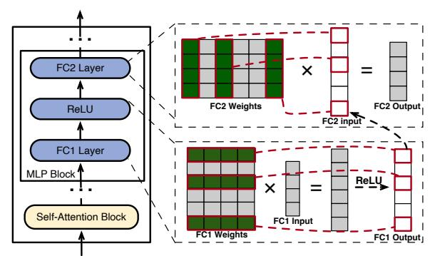
*الشكل 1. بنية طبقة المحول وكيفية تنشيط الخلايا العصبية بشكل متفرق في طبقات FC1 وFC2 بسبب دالة ReLU. تُمثل الخلايا العصبية المنشطة كصفوف أو أعمدة خضراء محاطة بخطوط حمراء. ثم يتم توفير متجه الإخراج من FC1 إلى FC2 كمتجه إدخال خاص به.*

تتضمن بنية LLM طبقات محول متعددة، تتألف كل واحدة من كتلة انتباه ذاتي وكتلة MLP (إدراك متعدد الطبقات) (انظر الشكل[ 1،](#page-2-0) اليسار). تولد كتلة الانتباه الذاتي متجهات تضمين عن طريق التقاط العلاقات بين رموز الإدخال. في هذه العملية، تركز رؤوس مختلفة على استخراج معلومات الميزات المتميزة. يتم تجميع نتائج الحساب من هذه الرؤوس المختلفة ثم استخدامها كمدخل لكتلة MLP. تطبق كتلة MLP تحويلات غير خطية عبر طبقات متصلة بالكامل ودوال تنشيط لتحسين تمثيل تسلسل الإدخال. ينتقل الإخراج إما إلى الطبقات اللاحقة أو يشكل المخرجات النهائية لـ LLM.

في الشكل[ 1](#page-2-0) (يمين)، تولد طبقات كتلة MLP، FC1 وFC2، متجهات من خلال ضرب المصفوفات. يأتي كل عنصر إخراج من حاصل ضرب نقطي لمتجه إدخال وخلية عصبية (صف/عمود في مصفوفة أوزان). تعمل دوال التنشيط (مثل ReLU [[2]](#page-14-10) وSiLU [[40]](#page-15-13)) كبوابات للاحتفاظ أو التخلص بشكل انتقائي من القيم في متجه، مما يؤثر على تنشيطات الخلايا العصبية في FC1 وFC2. على سبيل المثال، يقوم ReLU في هذا الشكل بتصفية القيم السالبة، مما يسمح فقط للخلايا العصبية ذات القيم الموجبة في FC1 بالتأثير على الإخراج. هذه الخلايا العصبية، التي تساهم في الإخراج، تعتبر منشطة في هذه الورقة. وبالمثل، تؤثر هذه القيم أيضًا على الخلايا العصبية في FC2 التي يتم تنشيطها وتشارك في حساب مخرجاتها.

تباعد التنشيط. يُظهر استدلال LLM تباعدًا ملحوظًا في تنشيط الخلايا العصبية، وهي ظاهرة لوحظت في كل من كتل الانتباه الذاتي وكتل MLP [[26,](#page-14-11) [28,](#page-14-9) [59]](#page-15-14). في الانتباه الذاتي، يساهم ما يقرب من نصف رؤوس الانتباه بشكل ضئيل، بينما في كتل MLP، يرجع التباعد إلى حد كبير إلى خصائص دالة التنشيط. هذا التباعد في MLP واضح بشكل خاص في البنى القائمة على ReLU، حيث يفيد DejaVu [[28]](#page-14-9) أن

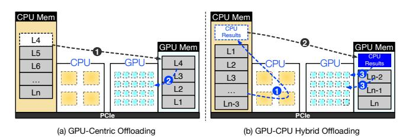
*الشكل 2. حلول التفريغ الحالية النموذجية. (أ) يوضح نهجًا يتمحور حول GPU، بينما (ب) هو نهج التفريغ الهجين CPU-GPU.*

ما يقرب من 80% من الخلايا العصبية في نموذج OPT-30B تظل غير نشطة أثناء الاستدلال. علاوة على ذلك، هذه الظاهرة لا تقتصر على النماذج القائمة على ReLU؛ بل تُلاحظ أيضًا في البنى التي تستخدم دوال تنشيط أخرى مثل SwiGLU. على سبيل المثال، يوضح الجدول[ 1](#page-2-1) أن LLaMA2-13B وYi-34B، اللذين يستخدمان SwiGLU، يظهران مستويات تباعد بنسبة 43% و53% على التوالي. تتوافق هذه النتائج مع نتائج الأبحاث السابقة من دراسات مثل CATS [[24]](#page-14-12) وReLU2 [[61]](#page-15-9).

علاوة على ذلك، من الممكن التنبؤ بتنشيطات الخلايا العصبية قبل بضع طبقات في تكرار النموذج الجاري. بناءً على هذه الملاحظة، يستخدم DejaVu [[28]](#page-14-9) متنبئات عبر الإنترنت قائمة على MLP أثناء الاستدلال ويعالج فقط الخلايا العصبية المنشطة، محققًا تسريعًا يزيد عن 6× مع الحفاظ على معدل دقة مذهل لا يقل عن 93% في التنبؤ بتنشيط الخلايا العصبية. ومع ذلك، فإن تباعد التنشيط خاص بالإدخال لكل تكرار استدلال، مما يعني أن تنشيط الخلايا العصبية المحددة يتأثر مباشرة بالإدخال الحالي ولا يمكن تحديده مسبقًا قبل بدء تكرار استدلال النموذج.

## 2.2 خدمة LLM القائمة على التفريغ

تقنية التفريغ، التي تستفيد من موارد الحوسبة والذاكرة الإضافية لـ CPU، تقدم حلاً أكثر قابلية للتطبيق لاستيعاب نماذج LLM التي تتجاوز سعة ذاكرة GPU. في هذا القسم، نتعمق في تحليل أنظمة التفريغ للكشف عن العوامل التي تساهم في أدائها البطيء. يوضح الشكل[ 2](#page-2-2) نهجين رئيسيين للتفريغ:

التفريغ الذي يتمحور حول GPU يستخدم ذاكرة CPU لتخزين أجزاء من معلمات النموذج التي تتجاوز سعة GPU. خلال كل تكرار، كما هو موضح في الشكل[ 2أ](#page-2-2))، فإنه

<!-- page 4 -->

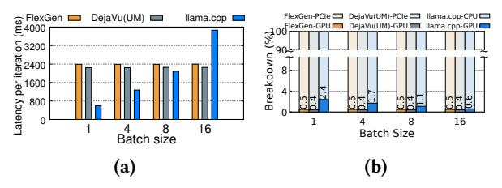
***الشكل 3.** مقارنة وتحليل الأداء لخدمة OPT-30B على NVIDIA RTX 4090 GPU. تشير الكتل الصفراء إلى FlexGen، والكتل الرمادية إلى DejaVu (UM)، والكتل الزرقاء إلى llama.cpp. (أ) يشير المحور الصادي إلى وقت التنفيذ لتكرار واحد ويمثل المحور السيني أحجام الدفعات للإدخال. (ب) يشير المحور الصادي إلى نسبة وقت التنفيذ، ويشير المحور السيني إلى أحجام الدفعات للإدخال.*

يعالج المعلمات الموجودة في ذاكرة GPU، وينقل المزيد من CPU حسب الحاجة. تتيح هذه الاستراتيجية استدلال نماذج LLM بأحجام مختلفة، شريطة توفر ذاكرة CPU وتخزين القرص الصلب الكافيين. FlexGen [43] هو مثال نموذجي يعتمد نهج جدولة متعرج لإعطاء الأولوية للإنتاجية على زمن الاستجابة، حيث يعالج الدفعات بالتسلسل لكل طبقة. ومع ذلك، تؤدي هذه الطريقة إلى زمن استجابة كبير لكل رمز في السيناريوهات الحساسة لزمن الاستجابة (الشكل 3أ)، ويرجع ذلك أساسًا إلى عمليات نقل البيانات المتكررة بين GPU وCPU. يستهلك أكثر من 99.5% من وقت المعالجة في نقل أوزان LLM من CPU إلى GPU، مما يؤثر بشكل كبير على زمن الاستجابة الإجمالي، كما هو موضح في الشكل 3ب.

على الرغم من أن DejaVu [28] يستفيد من تباعد التنشيط لتسريع استدلال LLM، فإن هذا النهج، الذي صُمم في الأصل لبيئات مراكز البيانات، يواجه تحديات عند تطبيقه على وحدات معالجة الرسومات بمستوى المستهلك غير القادرة على استضافة نماذج LLM واسعة النطاق. يكمن التحدي الرئيسي مع DejaVu في مثل هذه السياقات في الحاجة إلى نقل الخلايا العصبية المنشطة بشكل متكرر من CPU إلى GPU أثناء وقت التشغيل. بالنسبة لنماذج LLM مثل OPT-30B التي تتجاوز حدود ذاكرة GPU، فإن DejaVu²، رغم تقليله العبء الحسابي على GPU، مقيد بإجراء نقل البيانات (الشكل 3أ). وبالتالي، كما هو موضح في الشكل 3أ، يعاني DejaVu من زمن استدلال كبير، يمكن مقارنته بزمن FlexGen.

**التفريغ الهجين** يوزع معلمات النموذج بين GPU وCPU، ويقسمها على مستوى طبقة المحول (الشكل 2ب)، مع llama.cpp [17] كمثال. تعالج CPU طبقاتها أولاً، ثم ترسل النتائج الوسيطة إلى GPU لتوليد الرموز. تقلل طريقة التفريغ هذه زمن الاستدلال إلى حوالي 600 مللي ثانية (الشكل 3أ) عن طريق تقليل نقل البيانات وتخفيف عرض النطاق الترددي البطيء لـ PCIe. ومع ذلك، مقارنة بزمن استجابة 45 مللي ثانية لنموذج 30B على A100، لا تزال السرعة بطيئة جدًا.

لا يزال التفريغ الهجين يواجه مشكلة عدم تطابق الموقعية، مما يؤدي إلى زمن استجابة دون المستوى الأمثل. يصل كل تكرار استدلال إلى النموذج بأكمله، مما يؤدي إلى موقعية ضعيفة لهياكل ذاكرة GPU-CPU الهرمية. وحدات GPU، رغم قوتها الحسابية، مقيدة بسعة الذاكرة. على سبيل المثال، نموذج بمعلمات 30B على NVIDIA RTX 4090 GPU بسعة 24 جيجابايت يعني أن 37% فقط من النموذج موجود على GPU، مما ينقل معظم المهام الحسابية إلى CPU. ينتهي الأمر بـ CPU، التي تتمتع بذاكرة أعلى ولكن قوة حسابية أقل، بمعالجة 98% من إجمالي وقت الحساب (الشكل 3ب).

# 3 رؤى حول الموقعية في استدلال LLM

## 3.1 الرؤية 1: تنشيط قانون القوى

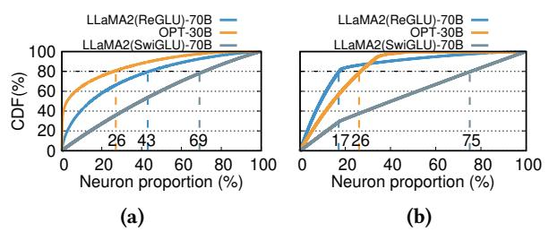
***الشكل 4.** دالة التوزيع التراكمي (CDF) لتنشيط الخلايا العصبية في OPT-30B وLLaMA2(ReGLU)-70B وLLaMA2(SwiGLU)-70B. (أ) CDF في كتلة MLP واحدة. (ب) CDF عبر النموذج بأكمله. يوضح المحور السيني نسبة الخلايا العصبية. يمثل المحور الصادي CDF لتنشيط الخلايا العصبية.*

يُظهر استدلال LLM درجة عالية من الموقعية، مما يشير إلى أن مجموعة متسقة من الخلايا العصبية يتم تنشيطها *بشكل متكرر*. على الرغم من اعتماد تباعد تنشيط LLM على المدخلات، فإن توزيع قانون القوى واضح بين الخلايا العصبية المنشطة. نقوم بإنشاء ملفات تعريف من مجموعة بيانات ويكيبيديا [13] لجمع إحصائيات حول تباعد التنشيط لحوالي 1 مليون رمز. يكشف الشكل 4أ أنه في كتل MLP لـ OPT-30B (باستخدام ReLU)، LLaMA2 (ReGLU)-70B وLLaMA2 (SwiGLU)-70B، فإن 26% و43% و69% من الخلايا العصبية على التوالي مسؤولة عن 80% من إجمالي التنشيطات. يشير هذا إلى أن هذه الخلايا العصبية يتم تنشيطها بشكل متكرر، والتي أطلقنا عليها اسم الخلايا العصبية المنشطة بشكل ساخن. على العكس من ذلك، يعتمد تنشيط الـ 74% و57% و31% المتبقية من الخلايا العصبية على المدخلات، مما يصنفها كخلايا عصبية *منشطة بشكل بارد*. هذا التوزيع واضح بشكل خاص في النماذج القائمة على ReLU مقارنة بتلك التي تستخدم دوال تنشيط أخرى بسبب تباعدها الأعلى.

علاوة على ذلك، فإن هذه الموقعية العالية لا تقتصر على كتلة MLP واحدة بل تمتد عبر النموذج بأكمله. كما هو موضح في الشكل 4ب، فإن ما يقرب من 17% من الخلايا العصبية في OPT-30B، و26% في LLaMA2 (ReGLU)-70B، و75% في LLaMA2 (SwiGLU)-70B مسؤولة عن 80% من إجمالي التنشيطات عبر جميع الطبقات. يوضح الشكل 5أ بوضوح أنه في نموذج OPT-30B، يحتوي كل طبقة محول على جزء صغير من الخلايا العصبية الساخنة، بينما الغالبية هي خلايا عصبية باردة. والجدير بالذكر أنه في الطبقات الـ 24 الأولى، يُظهر OPT-30B تنشيطًا منخفضًا بشكل استثنائي، حيث تصبح أقل من 1% من الخلايا العصبية

> ^&^lt;sup>2نظرًا لأن DejaVu يعمل فقط مع GPU، قمنا بتعديله باستخدام NVIDIA Unified Memory (UM) [36] لجلب المعلمات من ذاكرة CPU.

<!-- page 5 -->

نشطة، مما يؤدي إلى وجود ضئيل للخلايا العصبية الساخنة داخل هذه الطبقات.

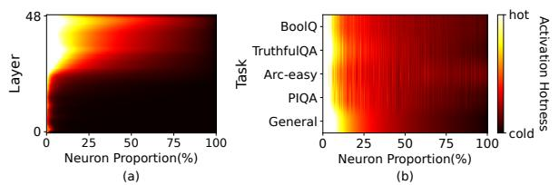
***الشكل 5.** تردد التنشيط في OPT-30B. (أ) تردد تنشيط الخلايا العصبية في طبقات مختلفة. يمثل المحور الصادي معرف الطبقة. (ب) تردد تنشيط الخلايا العصبية في مهام مختلفة للطبقة 30. يمثل المحور الصادي المهام. يوضح المحور السيني نسبة الخلايا العصبية.*

ومن المثير للاهتمام أن نفس مجموعة الخلايا العصبية الساخنة تظل نشطة باستمرار عبر مهام متنوعة لاحقة. لإثبات ذلك، قمنا بتحليل تنشيط الخلايا العصبية عبر مجموعات بيانات متنوعة، بما في ذلك المهام القائمة على المعرفة وتقييم الصدق والاستدلال. يوضح الشكل 5ب أن هذه الخلايا العصبية الساخنة يتم تنشيطها باستمرار عبر مهام مختلفة، مما يشير إلى نمط مستقر من تنشيط قانون القوى. كشف تحليلنا أن هناك أكثر من 90% تداخل في أعلى 20% من الخلايا العصبية الأكثر تنشيطًا عبر هذه المجالات المتنوعة. يشير هذا الاتساق الملحوظ إلى أن توزيع قانون القوى لتنشيطات الخلايا العصبية هو خاصية متأصلة في بنية النموذج وليست خاصة بمجموعة البيانات.

## 3.2 الرؤية 2: حساب CPU السريع

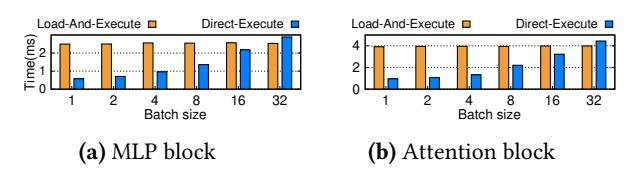
***الشكل 6.** مقارنة وقت التنفيذ لطرق التحميل ثم التنفيذ مقابل التنفيذ المباشر عندما تكون 10% و60% من أوزان الخلايا العصبية لكتلة MLP واحدة وكتلة انتباه واحدة في OPT-30B مقيمة في CPU. يوضح المحور السيني أحجام دفعات الإدخال، ويقيس المحور الصادي وقت التنفيذ (مللي ثانية). يتضمن التحميل ثم التنفيذ نقل أوزان الخلايا العصبية هذه إلى ذاكرة GPU للحساب، بينما يحسبها التنفيذ المباشر مباشرة على CPU.*

إذا كانت الخلايا العصبية المنشطة موجودة في ذاكرة CPU، فإن حسابها على CPU أسرع من نقلها إلى GPU، خاصة مع العدد الصغير من الخلايا العصبية المنشطة وأحجام الدفعات الصغيرة النموذجية في عمليات النشر المحلية. يمكن لوحدات المعالجة المركزية الحديثة ذات الامتدادات المتجهية التعامل بكفاءة مع مثل هذه الحسابات المصفوفية الأصغر.

قارنا الوقت لتحميل وحساب 10% من تباعد كتلة MLP و60% من جانب CPU لكتلة الانتباه. بينما تشير الرؤية-1 إلى أن 43% من الخلايا العصبية تمثل 80% من إجمالي التنشيطات في كتلة MLP واحدة، فإنه عادة ما يتم العثور على حوالي 10% فقط من خلاياها العصبية يتم تنشيطها أثناء تكرار استدلال فردي.

الخلايا العصبية على GPU مقابل التنفيذ المباشر لـ CPU في OPT-30B. تشير النتائج في الشكل 6 إلى أنه بالنسبة لأحجام الدفعات أقل من 32، فإن الوقت المستغرق لنقل أوزان هذه الخلايا العصبية وحسابها على GPU (NVIDIA RTX 4090) يتجاوز الوقت المطلوب للحساب مباشرة على CPU باستخدام امتداد المتجه AVX2.

# 4 نظرة عامة على PowerInfer

نقدم PowerInfer، وهو نظام استدلال LLM منخفض زمن الاستجابة منشور في جهاز كمبيوتر مزود بوحدة معالجة رسومية واحدة بمستوى المستهلك. يقترح PowerInfer استراتيجية تفريغ واعية بالخلايا العصبية ومحرك استدلال من خلال الاستفادة الكاملة من رؤى الموقعية العالية الموضحة في §3. يستخدم كل من GPU وCPU لتخزين الأوزان، مما يستوعب نماذج LLM بأحجام مختلفة. يستغل نهج التفريغ هذا، استنادًا إلى *الرؤية-1*، توزيع قانون القوى لاستدلال LLM بشكل فعال. على وجه التحديد، يقوم PowerInfer بتحميل GPU مسبقًا بأوزان الخلايا العصبية التي يتم تنشيطها بشكل متكرر، بينما يتم الاحتفاظ بأوزان الخلايا العصبية الأقل نشاطًا على CPU.

لتقليل زمن الاستدلال، يحسب محرك الاستدلال فقط الخلايا العصبية المتوقع أن تكون نشطة بواسطة المتنبئات عبر الإنترنت، متخطيًا معظم الخلايا غير النشطة. علاوة على ذلك، تمكّن استراتيجية التحميل المسبق PowerInfer من تخصيص الجزء الأكبر من مهام الاستدلال لـ GPU، نظرًا لأن الخلايا العصبية المنشطة بشكل ساخن التي تم تحميلها على GPU تشكل جزءًا رئيسيًا من التنشيطات. بالنسبة للخلايا العصبية المنشطة بشكل بارد التي ليست في ذاكرة GPU، ينفذ PowerInfer حساباتها على CPU، مما يلغي الحاجة إلى عمليات نقل الأوزان إلى GPU (*الرؤية-2*).

ترتبط فعالية PowerInfer ارتباطًا مباشرًا بتباعد تنشيط النموذج. تعد نماذج LLM من عائلة ReLU، التي تظهر أكثر من 90% من التنشيطات المتفرقة في FFNs الخاصة بها، مرشحة مثالية لـ PowerInfer. في حين أن نماذج LLM مع دوال تنشيط أخرى عادة ما تظهر تباعدًا حوالي 50%، مما يؤدي إلى تسارع أقل وضوحًا، لا يزال PowerInfer يقدم بعض المكاسب في الأداء. ومن المشجع أن هناك اتجاهًا متناميًا لتعزيز تباعد LLM دون المساس بالأداء [44، 46]، أو تدريب LLMs مباشرة بتنشيطات من عائلة ReLU، كما هو موضح في NVIDIA Nemotron [1] وMini-Tron [48]. من المتوقع أن يوسع هذا الاتجاه قابلية تطبيق PowerInfer عبر طيف أكثر تنوعًا من نماذج LLM.

## 4.1 البنية وسير العمل

يقدم الشكل 7 نظرة عامة على بنية PowerInfer، التي تتألف من مكونات غير متصلة وعبر الإنترنت. نظرًا للتباين في خصائص الموقعية بين نماذج LLM المختلفة، يجب على المكون غير المتصل تحليل تباعد تنشيط نماذج LLM، والتمييز بين الخلايا العصبية الساخنة والباردة. في المرحلة عبر الإنترنت، يقوم محرك الاستدلال بتحميل نوعين من الخلايا العصبية في كل من GPU وCPU، لخدمة طلبات LLM بزمن استجابة منخفض أثناء وقت التشغيل.

**ملف تعريف LLM وحلال السياسة (غير متصل):** بناءً على *الرؤية-1*، يمكن جمع نمط تنشيط الخلية العصبية بما يكفي من مجموعات البيانات العامة، لذلك نأخذ ملف تعريف غير متصل يجمع بيانات التنشيط من عمليات الاستدلال باستخدام

<!-- page 6 -->

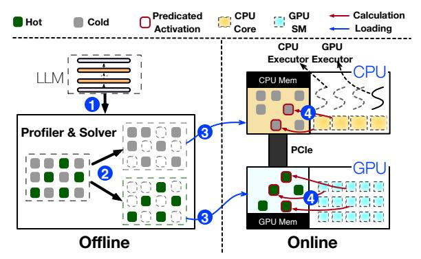
***الشكل 7.** بنية وسير عمل استدلال PowerInfer.*

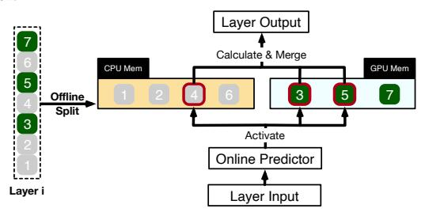
***الشكل 8.** مثال توضيحي يوضح كيف يحسب PowerInfer خلايا عصبية مختلفة لطبقة LLM واحدة.*

طلبات مشتقة من مجموعات البيانات العامة (مثل، C4 [39]). يراقب تنشيط الخلايا العصبية عبر جميع الطبقات (الخطوة ①)، يليه حلال سياسة يصنف الخلايا العصبية على أنها ساخنة أو باردة. يهدف الحلال إلى تخصيص الخلايا العصبية المنشطة بشكل متكرر لـ GPU والآخرين لـ CPU. يستخدم مقياس تأثير الخلية العصبية ومواصفات الأجهزة لموازنة عبء العمل، باستخدام البرمجة الخطية الصحيحة لتعظيم مقياس تأثير GPU للخلايا العصبية (الخطوة ②).

محرك استدلال LLM الواعي بالخلايا العصبية (عبر الإنترنت): قبل معالجة طلبات المستخدم، يقوم المحرك عبر الإنترنت بتعيين النوعين من الخلايا العصبية إلى وحدات المعالجة الخاصة بهما (الخطوة ③)، وفقًا لإخراج الحلال غير المتصل. أثناء وقت التشغيل، ينشئ المحرك منفذي GPU وCPU، وهي خيوط تعمل على جانب CPU، لإدارة الحسابات المتزامنة بين CPU-GPU (الخطوة ④). يتنبأ المحرك أيضًا بتنشيط الخلايا العصبية ويتخطى تلك غير المنشطة. تتم معالجة الخلايا العصبية المنشطة المحملة مسبقًا في ذاكرة GPU هناك، بينما تحسب CPU وتنقل النتائج لخلاياها العصبية إلى GPU للتكامل. يستخدم المحرك مشغلات واعية بالخلايا العصبية المتفرقة على كل من CPU وGPU، مع التركيز على صفوف/أعمدة الخلايا العصبية الفردية داخل المصفوفات.

## 4.2 مثال طبقة واحدة

يوضح الشكل 8 كيف ينسق PowerInfer GPU وCPU في معالجة الخلايا العصبية لطبقة واحدة. يصنف الخلايا العصبية بناءً على البيانات غير المتصلة، ويعين الخلايا المنشطة بشكل ساخن (مثل، الفهارس 3، 5، 7) إلى ذاكرة GPU والآخرين إلى ذاكرة CPU. عند تلقي إدخال، يحدد المتنبئ الخلايا العصبية في الطبقة الحالية التي من المحتمل أن يتم تنشيطها. على سبيل المثال،

يتنبأ بتنشيط الخلايا العصبية 3 و4 و5. من المهم ملاحظة أن الخلايا العصبية المنشطة بشكل ساخن، التي تم تحديدها من خلال التحليل الإحصائي غير المتصل، قد لا تتطابق باستمرار مع سلوكيات التنشيط أثناء وقت التشغيل. على سبيل المثال، الخلية العصبية 7، على الرغم من تصنيفها على أنها منشطة بشكل ساخن، يُتوقع أن تكون غير نشطة في هذه الحالة.

يعالج كل من GPU وCPU بشكل متزامن الخلايا العصبية النشطة المتوقعة الخاصة بهما، مع تجاوز الخلايا غير النشطة بكفاءة. على وجه التحديد، يحسب GPU الخلايا العصبية 3 و5، مستفيدًا من قدراته في المعالجة المتوازية، بينما تتعامل CPU في وقت واحد مع الخلية العصبية 4. عند الانتهاء من حساب الخلية العصبية 4 على CPU، يتم نقل مخرجاتها بسرعة إلى GPU. ثم تنفذ GPU خطوة تكامل نهائية، مجمعة النتائج من جميع الخلايا العصبية المنشطة (3 و4 و5) باستخدام مشغل إضافة محسّن.

# 5 محرك الاستدلال الواعي بالخلايا العصبية

## 5.1 متنبئات التباعد التكيفية

يقلل محرك الاستدلال عبر الإنترنت في PowerInfer من الأحمال الحسابية من خلال معالجة فقط الخلايا العصبية المتوقع أن يتم تنشيطها. تم استخدام هذه الطريقة أيضًا في DejaVu [28]، الذي يدعو إلى تدريب مجموعة من متنبئات MLP ذات الحجم الثابت. داخل كل طبقة محول، يستخدم DejaVu متنبئين منفصلين للتنبؤ بتنشيط الخلايا العصبية في كتل الانتباه الذاتي وMLP. وبالتالي، يقتصر حساب الاستدلال على الخلايا العصبية المتوقع أن تكون نشطة.

ومع ذلك، فإن تصميم متنبئات فعالة لعمليات النشر المحلية ذات الموارد المحدودة يمثل تحديًا، حيث يوازن بين دقة التنبؤ وحجم النموذج. يجب تخزين هذه المتنبئات، التي يتم استدعاؤها بشكل متكرر للتنبؤ بتنشيط الخلايا العصبية، في ذاكرة GPU للوصول السريع. ومع ذلك، فإن متطلبات الذاكرة الكبيرة للعديد من المتنبئات ذات الحجم الثابت يمكن أن تتعدى على المساحة اللازمة لتخزين معلمات LLM. على سبيل المثال، تتطلب متنبئات نموذج OPT-175B حوالي 27 جيجابايت من ذاكرة GPU، متجاوزة سعة NVIDIA RTX 4090 GPU. من ناحية أخرى، فإن التقليل الساذج لحجم المتنبئ يضعف الدقة؛ فقد أدى انخفاض حجم المتنبئ من 480 ميجابايت إلى 320 ميجابايت إلى انخفاض دقته من 92% إلى 84%، مما أثر سلبًا على دقة LLM الإجمالية (مثل، انخفاض دقة مهمة winogrande [41] من 72.77% إلى 67.96%).

لقد لاحظنا أن حجم المتنبئات يتأثر بعاملين رئيسيين: تباعد طبقات LLM وانحرافها الداخلي. كما هو موضح في الشكل 9، تبسط الطبقات ذات تباعد التنشيط الأعلى مهمة تحديد الخلايا العصبية المنشطة، مما يسمح بنماذج متنبئ أصغر. على النقيض من ذلك، تتطلب الطبقات ذات تباعد التنشيط الأقل نماذج أكبر بمعلمات أكثر، حيث يصبح تحديد الخلايا العصبية المنشطة بدقة أمرًا متزايدًا في الصعوبة. بالإضافة إلى ذلك، في حالات الانحراف العالي، حيث تتركز التنشيطات بشكل كبير في عدد قليل من الخلايا العصبية، يمكن حتى لمتنبئ مدمج تحقيق دقة عالية.

<!-- page 7 -->

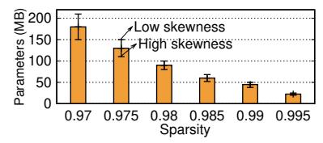
***الشكل 9.** الارتباط بين حجم معلمة المتنبئ وتباعد الطبقة عند مستوى دقة مضمون 95% لـ OPT-175B. يمثل المحور السيني التباعد، ويمثل المحور الصادي حجم معلمة المتنبئ. يشير الشريط إلى متوسط حجم المعلمة للنموذج في التباعد المقابل، بينما يعكس شريط الخطأ التذبذبات في حجم معلمة المتنبئ بسبب الانحراف داخل الطبقة.*

للتحسين لهذه العوامل، صممنا طريقة تدريب تكرارية لمتنبئات **غير ثابتة الحجم** لكل طبقة محول. تبدأ العملية بتأسيس حجم نموذج أساسي بناءً على ملف تعريف تباعد الطبقة (الشكل 9). بعد ذلك، يتم تعديل حجم النموذج بشكل تكراري، مع مراعاة انحراف التنشيط الداخلي للحفاظ على الدقة. يتألف متنبئ MLP عادة من طبقات إدخال ومخفية واحدة وإخراج. نظرًا لأن أبعاد طبقات الإدخال والإخراج تحددها بنية طبقة المحول، تستهدف التعديلات أساسًا الطبقة المخفية.

في تدريب المتنبئات، كان حيرة النموذج على مجموعة بيانات WikiText-2 بمثابة المعيار للدقة التنبؤية. في البداية، تم تعيين أبعاد المتنبئ وفقًا لمستوى تباعد الطبقة. ثم انخرطنا في عملية تكرارية لضبط حجم الطبقة المخفية. استمرت هذه العملية حتى اقتربت حيرة النموذج مع المتنبئ المتكامل من حيرة النموذج الأساسي، محققة تباينًا أقل من 0.1%. من خلال هذا النهج، يحد PowerInfer بشكل فعال من معلمات المتنبئ إلى مجرد 6% من إجمالي معلمات LLM.

## 5.2 إدارة الخلايا العصبية

عندما يحدد الحلال غير المتصل سياسة وضع الخلايا العصبية، يقوم محرك الاستدلال عبر الإنترنت لـ PowerInfer بتحميل النموذج في ذاكرة CPU وGPU وفقًا للسياسة. بالنسبة لكل طبقة، والتي قد تتألف من مصفوفات أوزان متعددة، يعين PowerInfer كل خلية عصبية إما إلى GPU أو CPU بناءً على ما إذا كانت الخلية العصبية منشطة بشكل ساخن.

يعد ضمان الحساب الدقيق لهذه الخلايا العصبية المجزأة في تسلسلها الصحيح أمرًا حيويًا للحصول على نتائج دقيقة. تحقيقًا لهذه الغاية، ينشئ PowerInfer جدولين للخلايا العصبية، أحدهما موجود في CPU والآخر في ذاكرة GPU. تربط هذه الجداول كل خلية عصبية بموقعها الأصلي في المصفوفة. خلال عملية الضرب بموتر إدخال، تتفاعل كل خلية عصبية مع قيمة الموتر المقابلة لها، تسترشد بالتعيينات في جداول الخلايا العصبية. الذاكرة الإضافية المطلوبة لجداول الخلايا العصبية هذه قليلة نسبيًا، حيث تبلغ حوالي 9 ميجابايت فقط لـ LLM مثل OPT-175B، الذي يحتاج إلى 350 جيجابايت من التخزين.

## 5.3 التنفيذ الهجين GPU-CPU

ينفذ PowerInfer نموذج تنفيذ هجين GPU-CPU حيث تحسب كلتا الوحدتين بشكل مستقل خلاياهما العصبية المنشطة الخاصة بهما. يوازن هذا النهج عبء العمل الحسابي بين GPU وCPU، مستفيدًا من نقاط قوة كل وحدة مع تقليل عدم كفاءة وقت النقل. تعالج GPU الخلايا العصبية الساخنة المحملة مسبقًا، بينما تتعامل CPU مع الخلايا العصبية الباردة، مع دمج النتائج على GPU.

قبل الاستدلال. ينشئ PowerInfer رسمًا بيانيًا حسابيًا موجهًا غير دوري (DAG) مع كل عقدة تمثل مشغل استدلال LLM حسابيًا ويخزنه في طابور عالمي في ذاكرة CPU. كل مشغل في الطابور يتم تمييزه بمشغلاته المسبقة. أثناء الاستدلال، يدير نوعان من المنفذين، وهما pthreads أنشأها نظام التشغيل المضيف، الحسابات على كل من CPU وGPU. يسحبون المشغلات من الطابور العالمي، ويتحققون من التبعيات، ويعينونها لوحدة المعالجة المناسبة. تستخدم GPU وCPU مشغلاتهما الواعية بالخلايا العصبية، مع منفذ GPU الذي يطلق مشغلات GPU باستخدام واجهات برمجة التطبيقات مثل cudaLaunchKernel، ومنفذ CPU الذي ينسق نوى CPU غير المشغولة للحسابات. قبل تنفيذ مشغل، يحدد منفذ CPU أيضًا عدد الخيوط الضروري للحوسبة المتوازية. لإدارة تبعيات المشغل، خاصة عندما تتم معالجة عقدة أصل لمشغل CPU على GPU، يضمن حاجز اكتمال حسابات GPU قبل أن تبدأ CPU مشغلها.

في السيناريوهات التي تكون فيها الخلايا العصبية المنشطة منقسمة بين GPU وCPU، يصبح التزامن بين وحدات المعالجة هذه أيضًا حاسمًا. بعد انتهاء وحدة من حسابات الخلايا العصبية الخاصة بها، تنتظر الأخرى لدمج النتائج. نظرًا لأن خلايا GPU العصبية يتم تنشيطها بشكل أكثر تكرارًا، يعين PowerInfer عمليات الدمج إلى GPU.

## 5.4 المشغل الواعي بالخلايا العصبية

بالنظر إلى تباعد التنشيط في نماذج LLM، يمكن لعمليات ضرب المصفوفات تجاوز الخلايا العصبية غير النشطة وأوزانها، مما يستلزم استخدام مشغلات متفرقة. ومع ذلك، فإن أدوات ضرب المصفوفات المتفرقة الحالية، بما في ذلك أحدث المترجمات الواعية بالتباعد مثل SparTA [64] وFlash-LLM [54]، بالإضافة إلى المكتبات مثل cuSPARSE [37]، تقصر في هذا الصدد. فهي إما تدعم فقط التجميع الثابت للنوى الواعية بالتباعد أو تتطلب تحويلًا ديناميكيًا للمصفوفات المتفرقة إلى تنسيقات كثيفة، مما يؤدي إلى عبء أداء كبير، خاصة مع التباعد الديناميكي في سيناريونا. بالإضافة إلى ذلك، فإن مترجم JIT الديناميكي PIT [63]، رغم كفاءته لضرب المصفوفات المتفرقة العامة على GPU، ليس مناسبًا للتنفيذ الهجين CPU-GPU حيث تكون قدرات الحوسبة لـ CPU محدودة.

للتغلب على هذه القيود، يقدم PowerInfer مشغلات واعية بالخلايا العصبية تحسب مباشرة الخلايا العصبية المنشطة وأوزانها على كل من GPU وCPU دون الحاجة إلى تحويل وقت التشغيل إلى تنسيق كثيف. تختلف هذه المشغلات عن المشغلات التقليدية لأنها تركز على

<!-- page 8 -->

متجهات الصفوف/الأعمدة الفردية داخل المصفوفة بدلاً من المصفوفة بأكملها. يحددون أولاً حالة تنشيط الخلية العصبية ثم يعالجونها إذا تم التنبؤ بأنها نشطة، إلى جانب الصف أو العمود المقابل لمصفوفة المعلمات.

المشغلات الواعية بالخلايا العصبية لـ GPU: على الرغم من أن حسابات المتجه-المتجه أقل كفاءة من حسابات المصفوفة-المتجه على GPU، فإن المشغلات الواعية بالخلايا العصبية القائمة على حساب المتجه-المتجه مفيدة عندما يكون حجم الدفعة صغيرًا. إنها تتجنب الحسابات غير الضرورية وعمليات الذاكرة المرتبطة بالخلايا العصبية غير النشطة ولا تحتاج إلى تحويلات مصفوفة مكلفة. علاوة على ذلك، تسمح هذه المشغلات لجميع كتل الخيوط بالتحقق المتزامن من تنشيطات الخلايا العصبية وحساب المتجهات المقابلة إذا تم تنشيطها. والجدير بالذكر أن PowerInfer يعين مهام حسابية مستقلة لكتل خيوط مختلفة على GPU. تعالج كل كتلة خيوط مجموعة مميزة من الخلايا العصبية، مما يلغي الحاجة إلى التزامن أو التباعد عبر الكتل.

المشغلات الواعية بالخلايا العصبية لـ CPU: المشغلات الواعية بالخلايا العصبية مفيدة بشكل خاص لوحدات المعالجة المركزية، التي عمومًا تتمتع بمستوى أقل من التوازي. يعين منفذ CPU مشغلًا واعيًا بالخلايا العصبية لعدة نوى، مقسمًا الخلايا العصبية إلى دفعات أصغر للتحقق المتزامن من التنشيط. تعالج كل نواة فقط الخلايا العصبية المنشطة في دفعتها، محسنة حسابات المتجه-المتجه باستخدام امتدادات المتجهات الأجهزة مثل AVX2.

## **سياسة وضع الخلايا العصبية **

للاستفادة الكاملة من القوة الحسابية لوحدات GPU وCPU، تعد سياسة واعية بالموقعية أمرًا حاسمًا لتحسين الأداء. إذا وضعنا الخلايا العصبية بشكل عشوائي على GPU وCPU، فلا يمكن لـ GPU استخدام قدرتها الحسابية القوية بشكل كامل لأن بعض الخلايا العصبية الساخنة موضوعة على CPU. علاوة على ذلك، قد يؤدي تعيين الخلايا العصبية الأكثر سخونة ببساطة إلى GPU إلى عمليات نقل بيانات مفرطة بين CPU وGPU، مما يقوض الكفاءة. لمعالجة هذا التحدي، يضع المكون غير المتصل لـ PowerInfer سياسة وضع باستخدام حلال يحدد تخصيص كل خلية عصبية لـ GPU أو CPU.

## 6.1 التنميط غير المتصل

قبل تحديد وضع كل خلية عصبية، من المهم تحليل معلومات التنشيط لكل خلية عصبية. بناءً على *الرؤية-1* أن الخلايا العصبية الساخنة في المجموعة العامة يتم تنشيطها أيضًا بشكل متكرر عبر سيناريوهات مختلفة، نحقق التنميط مع منشئ ملفات تعريف غير متصل، الذي ينشر LLM للتعامل مع الطلبات المولدة من مجموعات بيانات عامة متعددة، مثل C4 [39] وWikipedia [13]. لقياس معلومات التنشيط بدقة، يقوم منشئ الملفات بإدراج نواة مراقبة بعد كل كتلة داخل طبقة محول. بالإضافة إلى ذلك، يبني جدول معلومات الخلايا العصبية على GPU، مصممًا لتتبع عدد التنشيط لكل خلية عصبية.

## 6.2 مقياس تأثير الخلية العصبية

يقيس مقياس تأثير الخلية العصبية مساهمة كل خلية عصبية في نتيجة الاستدلال الإجمالية لـ LLM، وهو أمر بالغ الأهمية لتخصيص خلايا GPU العصبية. نحسب هذا المقياس بفعالية من خلال

الاستفادة من حقيقة أن تردد التنشيط الذي تم تحليله يعكس سلوك وقت التشغيل بدقة، شريطة أن يتضمن التنميط كمية كبيرة من بيانات الإدخال. كما توضح المعادلة 1، يتم تعريف هذا المقياس للخلية العصبية بواسطة تردد تنشيطها الذي تم الحصول عليه أثناء التنميط.

$$ v_i = f_i \qquad \forall i \in \mathbb{N} (1) $$

## **نمذجة وضع الخلايا العصبية **

بناءً على مقياس تأثير الخلية العصبية، يستخدم PowerInfer حلالًا لتحسين التأثيرات الإجمالية لجميع الخلايا العصبية في GPU. يتم صياغة هذا التأثير التراكمي كدالة هدف، كما هو محدد في المعادلة 2. ثم يتم إدخال هذه الدالة في إطار البرمجة الخطية الصحيحة لتحديد حل محدد يعظم دالة الهدف. يشير المتغير الثنائي a_{in}، المحدد في المعادلة 3 إلى ما إذا كانت الخلية العصبية n موضوعة على وحدة المعالجة i.

$$
neuron n is placed on processing unit i.Maximize t_i = \sum_{e \in \mathbb{N}} a_{ie} \cdot v_e \quad \forall i \in \{GPU\} (2)\sum_{i \in \mathbb{U}} a_{in} = 1 \quad \forall n \in \mathbb{N} (3)
$$

$$ \sum_{i \in \mathbb{U}} a_{in} = 1 \quad \forall n \in \mathbb{N} (3) $$

عند تعظيم دالة الهدف، يحتاج الحلال أيضًا إلى مراعاة مجموعتين من القيود. أولاً، تقليل **عبء الاتصال** بين وحدات المعالجة. ثانيًا، التأكد من استخدام ذاكرة GPU بشكل كامل.

**6.3.1 قيد الاتصال** عدد الخلايا العصبية المحملة مسبقًا على GPU محدود بأعباء الاتصال بين الطبقات، مقيدًا بعرض النطاق الترددي PCIe للأجهزة. تحميل عدد قليل جدًا من الخلايا العصبية ينفي الفوائد الحسابية لـ GPU. وبالتالي، يجب على الحلال تحديد

<!-- page 9 -->

الحد الأدنى لتخصيص الخلايا العصبية لكفاءة معالجة GPU المثلى، كما هو مفصل في المتباينة 4. في هذه المتباينة، C_l هو الحد الأدنى لعدد الخلايا العصبية التي يجب تخصيصها لـ GPU للطبقة l.

عند حل المتباينة 4، من الضروري تحليل كل من وقت الحساب لخلية عصبية فردية وعبء الاتصال داخل الطبقة، T_{sync}. في استدلال LLM، خاصة مع أحجام الدفعات الأصغر، فإن العامل المحدد هو عرض النطاق الترددي للذاكرة. وبالتالي، فإن وقت حساب الخلية العصبية يساوي تقريبًا المدة المطلوبة للوصول إلى أوزانها مرة واحدة، كما هو موضح في المعادلة 5. ويميل مدى نقل البيانات داخل الطبقة إلى أن يكون متسقًا عبر الطبقات، مما يؤدي إلى تكلفة تزامن موحدة. وبالتالي، نصف T_{sync} على أنه العبء المحلل لمثيل واحد من الاتصال داخل الطبقة.

$$
C_l \cdot T_l^{GPU} + T_{sync} \le C_l \cdot T_l^{CPU} \forall l \in \mathbb{L} (4)
$$

$$
T_i^j = M_i / Bandwidth_i \quad \forall j \in \mathbb{U}, \forall i \in \mathbb{L} (5)
$$

**6.3.2** **قيد الذاكرة** يقيد وضع الخلايا العصبية أيضًا بسعات الذاكرة لوحدات المعالجة، كما هو محدد في المتباينة 6. علاوة على ذلك، يضمن الحلال أنه عند تخصيص خلايا عصبية لطبقة لـ GPU، فإنه إما يخصص على الأقل الحد الأدنى لعدد الخلايا العصبية المحدد في المتباينة 4 لتعويض تكاليف الاتصال أو يختار عدم تخصيص أي خلايا عصبية من تلك الطبقة لـ GPU. على وجه التحديد، يجب أن يتجاوز عدد الخلايا العصبية للطبقة l على GPU C_l أو يساوي صفرًا.

لنمذجة هذا القيد، نقدم متغيرًا ثنائيًا مساعدًا، y_l، والذي يمكن أن يكون 1 أو 0. يحدد هذا المتغير ما إذا كان يتم تعيين أي خلايا عصبية لـ GPU للطبقة l. من أجل الراحة الحسابية، يتم أيضًا تقديم عدد كبير بما فيه الكفاية K. تم صياغة المتباينات 7 و8 لنمذجة هذا القيد. عندما يكون y_l هو 1، مما يشير إلى وضع الخلايا العصبية على GPU لهذه الطبقة، ونظرًا لأن K كبير بشكل كافٍ، تصبح هاتان المتباينتان فعليًا C_l \leq \sum_{e \in N_l} a_{ie} \leq K. على العكس من ذلك، إذا تم تعيين y_l على 0، مما يعني عدم وضع خلايا عصبية على GPU للطبقة l، فإن المتباينات تختزل إلى \sum_{e \in N_l} a_{ie} = 0.

$$ \sum_{n \in N} a_{jn} \cdot M_n < MCap_j \quad \forall j \in \mathbb{U} (6) $$

$$
\sum_{e \in N_l} a_{ie} \ge C_l \cdot y_l \quad \forall l \in \mathbb{L}, \forall i \in \{GPU\} (7)
$$

$$
\sum_{e \in N_l} a_{ie} \le K \cdot y_l \quad \forall l \in \mathbb{L}, \forall i \in \{GPU\} (8)
$$

**6.3.3 تحسين ILP** يستخدم الحلال البرمجة الخطية الصحيحة (ILP) لتعظيم دالة الهدف، متطابقًا مع جميع القيود من المعادلة/المتباينة 3 إلى 8. نظرًا لأن مشاكل ILP NP-كاملة بطبيعتها، فإن حلها مباشرة لـ LLM بمئات المليارات من المعلمات يشكل تحديًا حسابيًا كبيرًا. لتسريع العملية وتحقيق حل تقريبي،

تتضمن الإستراتيجية الأساسية تجميع الخلايا العصبية داخل كل طبقة في دفعات لتحليل الوضع الجماعي. على وجه التحديد، يقوم الحلال بتجميع 64 خلية عصبية ذات تأثيرات مماثلة من طبقة في دفعة واحدة. تقلل استراتيجية التجميع هذه بشكل كبير من إجمالي عدد الخلايا العصبية، N، من عدة ملايين إلى ما يقرب من عشرات الآلاف، وبالتالي تقلل بشكل كبير من الوقت اللازم لحل مشكلة ILP إلى حوالي 10 ثوانٍ.

# 7 التنفيذ

تم تنفيذ محرك الاستدلال عبر الإنترنت لـ PowerInfer من خلال دمج 4,200 سطر من كود C++ وCUDA في llama.cpp [17]، وهو إطار استدلال LLM مفتوح المصدر متطور مصمم لأجهزة الكمبيوتر. تشمل التمديدات التي أجراها PowerInfer تعديلات على محمل النموذج لتوزيع LLM عبر GPU وCPU، باتباع الإرشادات من مخرجات الحلال غير المتصل. لقد قمنا أيضًا بتحسين محرك الاستدلال للتنفيذ الهجين GPU-CPU وقدمنا 10 مشغلات واعية بالخلايا العصبية لكلتا وحدتي المعالجة. تظل جميع المكونات والوظائف الأخرى لـ llama.cpp دون تغيير. على سبيل المثال، تستمر ذاكرة التخزين المؤقت KV في الإقامة في ذاكرة CPU، مما يسمح بمزيد من ذاكرة GPU للخلايا العصبية المنشطة بشكل ساخن. علاوة على ذلك، تمت إضافة حوالي 400 سطر من كود Python إلى إطار transformers [53]، مما يمكنه من العمل كمنشئ ملفات تعريف غير متصل وحلال لـ PowerInfer.

يدعم التنفيذ الحالي لـ PowerInfer مجموعة من عائلات LLM السائدة بأحجام معلمات متفاوتة. بالنسبة لهذه النماذج، استخدم PowerInfer مجموعات عامة مثل Wikipedia [13] لتدريب متنبئات التنشيط عبر الإنترنت. والجدير بالذكر أننا تجنبنا عمدًا استخدام أي من مجموعات بيانات المهام النهائية في عملية تدريب المتنبئ الخاصة بنا. تدريب المتنبئات، على الرغم من استهلاكه للوقت (غالبًا عدة ساعات)، هو مهمة لمرة واحدة يمكن تسريعها مع وحدات معالجة رسومية متعددة.

# 8 التقييم

## 8.1 الإعداد التجريبي

**الأجهزة.** أجريت جميع التجارب على تكوينين مختلفين لجهاز الكمبيوتر الشخصي، يمثلان سيناريوهات الأجهزة عالية الأداء ومنخفضة الأداء:

- • **PC-High**: معالج Intel i9-13900K (ثمانية أنوية بسرعة 5.4 جيجاهرتز)، 192 جيجابايت ذاكرة مضيف (عرض نطاق ترددي 67.2 جيجابايت/ثانية)، NVIDIA RTX 4090 GPU (24 جيجابايت)، وواجهة PCIe 4.0 (عرض نطاق ترددي 64 جيجابايت/ثانية).
- PC-Low: معالج Intel i7-12700K (ثمانية أنوية بسرعة 4.9 جيجاهرتز)، 64 جيجابايت ذاكرة مضيف (عرض نطاق ترددي 38.4 جيجابايت/ثانية)، NVIDIA RTX 2080Ti GPU (11 جيجابايت)، وواجهة PCIe 3.0 (عرض نطاق ترددي 32 جيجابايت/ثانية).

**النماذج.** يوضح الجدول 3 نماذج LLM التي تم تقييمها في هذا القسم، بما في ذلك متوسط تباعد التنشيط لمختلف نماذج LLM في كتل MLP. تتضمن نماذج LLM هذه نماذج OPT [58] مع

<!-- page 10 -->

معلمات من 13B إلى 175B، Bamboo 7B [45]، بالإضافة إلى نماذج Falcon(ReLU)-40B [3] وLLaMA(ReGLU)-70B [47]. بالإضافة إلى نماذج LLM التي تستخدم دوال تنشيط من عائلة ReLU، نقوم أيضًا بتقييم نماذج LLM من عائلة SiLU، بمستويات تباعد تبلغ تقريبًا 50%. لتجاربنا، تستخدم جميع النماذج في تجاربنا معلمات FP16 وINT4 المكممة، مع تنشيطات وسيطة في FP32، بما يتماشى مع ممارسات أبحاث LLM الحديثة [15، 57].

أعباء العمل. أعباء العمل لتجاربنا مشتقة من chatbot arena [62] محفزات ChatGPT [35] ومجموعات بيانات Alpaca [50]. تغطي طيفًا واسعًا من استخدامات نماذج اللغة. هذه المجموعات هي الأمثلة الأكثر تمثيلاً لخدمات LLM الحقيقية. تتضمن محفزات ChatGPT تفاعلات المستخدم مع ChatGPT [38]، وتتميز Alpaca بمجموعات تعليمات مولدة بواسطة GPT3.5 من خلال التعليم الذاتي.

نظام أساسي. نقارن PowerInfer بـ llama.cpp [17] وSpecInfer [33]، وهما أطر عمل استدلال LLM المحلية المتقدمة. llama.cpp هو إطار استدلال LLM الأكثر استخدامًا للسيناريوهات المحلية. للحصول على مقارنة عادلة، قمنا بتمديد llama.cpp لدعم نموذج OPT، حيث لا يدعمه أصلاً. SpecInfer هو إطار عمل تمثيلي للترميز التخميني، الذي يستخدم نماذج مسودة أصغر لتوليد الرموز ويتحقق لاحقًا من هذه الرموز في دفعات باستخدام النموذج الأصلي. بينما توجد بدائل أخرى مثل FlexGen [43] وDejaVu [28]، فإنها تظهر زمن استجابة أعلى في السيناريوهات الحساسة لزمن الاستجابة الموضحة في هذه الورقة، كما تم تحليله في §2.2.

## 8.2 الأداء من البداية إلى النهاية

نقارن أولاً أداء الاستدلال من البداية إلى النهاية لـ PowerInfer وllama.cpp وSpecInfer بحجم دفعة واحدة، الإعداد النموذجي لعمليات النشر المحلية [7]. نظرًا لتنوع طول الإدخال/الإخراج للحوار في العالم الحقيقي [23]، نقوم بأخذ عينات من المحفزات من مجموعات بيانات Alpaca وChatGPT، بدءًا من 8 إلى 128 رمزًا ونقيس سرعة التوليد.

يوضح الشكل 10 سرعات التوليد لمختلف النماذج وتكوينات الإدخال-الإخراج على PC-High مزود بـ NVIDIA RTX 4090. في المتوسط، يحقق PowerInfer سرعة توليد قدرها 8.32 رمز/ثانية، تصل إلى 16.06 رمز/ثانية، متفوقًا بشكل كبير على llama.cpp وSpecInfer

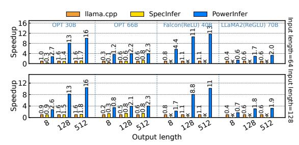
***الشكل 10.** *تسريع نماذج مختلفة على PC-High بتنسيق FP16.* يشير المحور السيني والمحور الصادي إلى طول الإخراج والتسريع مقارنة بـ llama.cpp. يشير الرقم فوق كل شريط إلى سرعة التوليد من البداية إلى النهاية (الرموز/ثانية). تمثل الأشكال الأعلى والأسفل طول الإدخال 64 و128.*

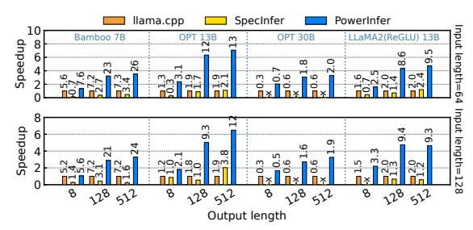
***الشكل 11.** تسريع نماذج مختلفة على PC-Low بتنسيق FP16. تمثل الأشكال الأعلى والأسفل طول الإدخال 64 و128 على التوالي.*

بمتوسط تسريع 7.23\times و6.19\times، وبالنسبة لـ Falcon-40B، حتى 11.69× مقارنة بـ llama.cpp. على الرغم من أن SpecInfer يستخدم الترميز التخميني، نظرًا لأن حجم النموذج الكبير يتجاوز سعة GPU، لا يزال هناك قدر كبير من التبديل خلال مرحلة التحقق، يمثل أكثر من 95% من الوقت. ونتيجة لذلك، لا يتفوق SpecInfer بشكل كبير على llama.cpp. يصبح تفوق أداء PowerInfer أكثر وضوحًا مع زيادة عدد رموز الإخراج لأن مرحلة التوليد تلعب دورًا أكثر أهمية في وقت الاستدلال الإجمالي. في هذه المرحلة، يتم تنشيط عدد صغير من الخلايا العصبية على كل من CPU وGPU، مما يؤدي إلى حسابات غير ضرورية أقل مقارنة بـ llama.cpp. على سبيل المثال، في حالة OPT-30B، يتم تنشيط حوالي 20% فقط من الخلايا العصبية لكل رمز يتم توليده، مع معالجة الأغلبية على GPU، وهي ميزة لمحرك الاستدلال الواعي بالخلايا العصبية لـ PowerInfer.

يوضح الشكل 11 أنه على جهاز كمبيوتر منخفض الأداء (PC-Low)، لا يزال PowerInfer يحقق تحسنًا كبيرًا في الأداء على llama.cpp وSpecInfer، بمتوسط تسريع 4.71×، 5.97× وذروة 7.06× و7.47×. ومع ذلك، فإن هذه التحسينات أصغر مقارنة بتلك الموجودة على جهاز كمبيوتر عالي الأداء (PC-High)، ويرجع ذلك أساسًا إلى قيد ذاكرة GPU البالغ 11 جيجابايت في PC-Low. يؤثر هذا القيد على عدد الخلايا العصبية التي يمكن تخصيصها لـ GPU، خاصة للنماذج بحوالي 30B معلمة أو أكثر، مما يؤدي إلى اعتماد أكبر على CPU لمعالجة عدد أكبر من الخلايا العصبية المنشطة.

<!-- page 11 -->

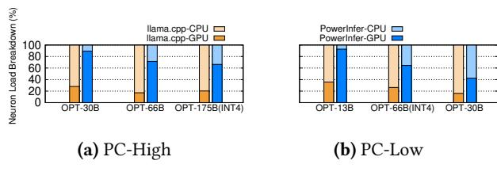
***الشكل 12.** توزيع عبء الخلايا العصبية على CPU وGPU أثناء الاستدلال. تشير الكتلة الصفراء إلى llama.cpp، والكتلة الزرقاء إلى PowerInfer*

يقدم الشكل 12 توزيع أعباء الخلايا العصبية بين CPU وGPU لكل من PowerInfer وllama.cpp. تشير أعباء الخلايا العصبية إلى نسبة حسابات الخلايا العصبية المنشطة التي تنفذها كل وحدة معالجة. والجدير بالذكر أنه على PC-High، يزيد PowerInfer بشكل كبير من حصة GPU من عبء الخلايا العصبية، من متوسط 20% إلى 70%. يشير هذا إلى أن GPU تعالج 70% من الخلايا العصبية المنشطة. ومع ذلك، في الحالات التي تتجاوز فيها متطلبات ذاكرة النموذج بكثير سعة GPU، مثل تشغيل نموذج 60 جيجابايت على 2080Ti GPU بسعة 11 جيجابايت، يتم تقليل عبء الخلايا العصبية لـ GPU إلى 42%. يرجع هذا الانخفاض إلى ذاكرة GPU المحدودة، التي لا تكفي لاستضافة جميع الخلايا العصبية المنشطة بشكل ساخن، مما يستلزم أن تحسب CPU جزءًا من هذه الخلايا العصبية.

الاستدلال بأطوال إدخال مختلفة. في السيناريوهات التي تنطوي على محفزات إدخال طويلة بأطوال إخراج قصيرة للغاية (أقل من 8 رموز)، وهي أقل شيوعًا [35]، يُظهر PowerInfer مكاسب أداء محدودة، تتراوح من 1.07× (الشكل 11) إلى 4× (الشكل 10). في مثل هذه المواقف، تصبح مرحلة المحفز، حيث تتم معالجة عدد كبير من الرموز في وقت واحد، عاملاً حاسمًا في تحديد سرعة الاستدلال. ينتج عن هذا تنشيط كل رمز لمجموعة فريدة من الخلايا العصبية، مما يقلل بشكل كبير من تباعد التنشيط. ونتيجة لذلك، تصبح CPU العنق الزجاجي الأساسي في عملية الاستدلال، مكلفة بمعالجة عدد كبير من الخلايا العصبية المنشطة بشكل بارد ولكنها مقيدة بقدراتها الحسابية.

بالنسبة لتسلسلات الإدخال الطويلة نسبيًا، لا يزال PowerInfer يحقق تسريعًا من 3.47× إلى 5.69×، كما هو موضح في الجدول 4. هذا لأنه عندما يكون تسلسل الإدخال طويلاً، يتم تنشيط جميع الخلايا العصبية بشكل جماعي بواسطة رموز الإدخال. في هذه الحالة، يتحول PowerInfer إلى حساب GPU الكثيف خلال مرحلة التعبئة المسبقة، مما ينتج عنه زمن استجابة للتعبئة المسبقة قابل للمقارنة بـ llama.cpp. خلال مرحلة التوليد، حيث تتم معالجة رمز واحد فقط في كل مرة، يظهر التباعد في كل خطوة استدلال. هنا، يستفيد PowerInfer من محركه الهجين لتحقيق تسريع كبير.

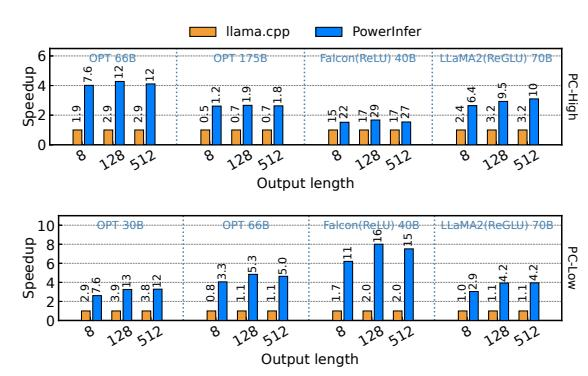
***الشكل 13.** *تسريع نماذج مختلفة على PC-High وPC-Low بتنسيق INT4.* يقدم الصف العلوي من الشكل الأداء على PC-High، بينما يفصل الصف السفلي تلك الموجودة على PC-Low.*

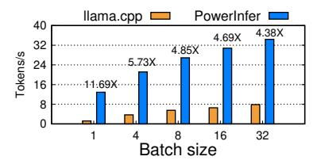
***الشكل 14.** *تسريع استدلال الدفعة لـ Falcon-40B على PC-High.* يشير المحور السيني إلى حجم دفعة الطلب، ويمثل المحور الصادي سرعة توليد الرمز من البداية إلى النهاية (الرموز/ثانية). يوضح الرقم فوق كل شريط التسريع مقارنة بـ llama.cpp.*

الاستدلال مع التكميم. يوضح الشكل 13 أن PowerInfer يدعم بفعالية نماذج LLM المضغوطة باستخدام تكميم INT4. فشلنا في تشغيل SpecInfer بتكميم INT4 بسبب نقص الدعم. على جهاز كمبيوتر عالي الأداء (PC-High)، يقدم PowerInfer استجابات بمتوسط سرعة 13.20 رمز/ثانية، يصل إلى ذروة 29.08 رمز/ثانية. متوسط التسريع المحقق مقارنة بـ llama.cpp هو 2.89×، بحد أقصى 4.28×. على إعداد منخفض الأداء (PC-Low)، يبلغ متوسط التسريع 5.01×، يصل إلى ذروة 8.00×. يمكّن تقليل متطلبات الذاكرة بسبب التكميم PowerInfer من إدارة النماذج الأكبر بكفاءة أكبر. على سبيل المثال، في تجربتنا مع نموذج OPT-175B على PC-High، يصل PowerInfer تقريبًا إلى رمزين في الثانية، متجاوزًا llama.cpp بعامل 2.66×.

**استدلال الدفعات.** نقوم أيضًا بتقييم أداء الاستدلال من البداية إلى النهاية لـ PowerInfer بأحجام دفعات مختلفة، كما هو موضح في الشكل 14. يُظهر PowerInfer ميزة كبيرة عندما يكون حجم الدفعة أقل من 32، محققًا متوسط تحسين قدره 6.08× في الأداء مقارنة بـ llama.cpp. مع زيادة حجم الدفعة، تنخفض نسبة التسريع التي يقدمها PowerInfer. يُعزى هذا الانخفاض إلى تقليل تباعد التنشيطات المشتركة للنموذج. ومع ذلك، حتى مع تعيين حجم الدفعة على 32، لا يزال PowerInfer يحافظ على تسريع كبير، محققًا تسريعًا قدره 4.38×.

<!-- page 12 -->

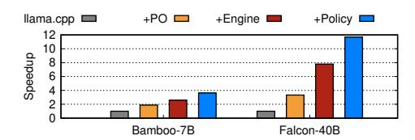
***الشكل 15.** تفصيل الأداء لكل مكون من PowerInfer. يعمل Falcon-40B على PC-High وBamboo-7B على PC-Low.*

## 8.3 دراسات الاستئصال

**8.3.1** **تفصيل الأداء** يفصل الشكل 15 مساهمات كل مكون من مكونات PowerInfer في تسريع الأداء الإجمالي. باستخدام طريقة تكامل خطوة بخطوة، نقوم تدريجيًا بدمج ميزات PowerInfer في llama.cpp. أولاً، نضيف متنبئات PowerInfer ومشغلاتها الواعية بالخلايا العصبية إلى llama.cpp (المسماة "+PO")، مما يتيح حساب الخلايا العصبية المنشطة فقط على كل من GPU وCPU. ومع ذلك، فإن +PO لا يزال يلتزم بالحساب على مستوى الطبقة، حيث تتم معالجة كل طبقة بالكامل إما بواسطة GPU أو CPU.

بناءً على +PO، نقدم محرك الاستدلال الهجين لـ PowerInfer (المسمى "+Engine")، والذي يسمح للمشغلات الواعية بالخلايا العصبية بمعالجة الخلايا العصبية داخل نفس الطبقة في وقت واحد على كل من GPU وCPU. يستخدم +Engine سياسة تقسيم خلايا عصبية ساذجة تعين الخلايا العصبية بشكل عشوائي إلى GPU. الخطوة الأخيرة تتضمن دمج سياستنا المحسنة ("+Policy")، التي تمت صياغتها بواسطة الحلال غير المتصل كما هو موضح في §6، في إعداد +Engine، مما يعرض القدرات الكاملة لـ PowerInfer.

ينتج عن التكامل الأولي لـ +PO في llama.cpp تعزيزات أداء قدرها 1.87× و3.32× لـ Bamboo-7B وFalcon-40B على التوالي، وذلك أساسًا عن طريق تقليل الخلايا العصبية غير النشطة غير الضرورية. يصعّد +Engine هذه المكاسب إلى 2.60\times و7.80\times، بفضل وضع الخلايا العصبية الدقيق والحسابات داخل الطبقة التي تزيد بشكل كبير من حصة الحوسبة لـ GPU. أخيرًا، يؤدي دمج +Policy إلى تحسينات بمعدلات 3.62× و11.69×. يكمن التحسن المحقق بواسطة سياستنا في قدرتها على موازنة عبء الاتصال داخل الطبقة بدقة. تتجاهل سياسة التقسيم الساذجة في +Engine سخونة الخلايا العصبية والاتصال داخل الطبقة GPU-CPU، وغالبًا ما تعوض فوائد تعيين الخلايا العصبية ذات تنشيط التردد العالي إلى GPU. على العكس من ذلك، توازن سياستنا في PowerInfer أعباء المعالجة وتكاليف الاتصال بشكل أكثر مهارة بين CPU وGPU.

**8.3.2** **تحليل زمن استجابة التوليد** في هذا القسم، نتحقق من قوة تسريع PowerInfer عبر مهام مختلفة وتوزيع زمن استجابة توليد الرمز بين الرموز. نأخذ عينات من المهام الأكثر تمثيلاً في مجتمع Hugging Face، بما في ذلك العلوم والتكنولوجيا والهندسة والرياضيات، والترميز، ولعب الأدوار، واستخراج المعلومات. نقيس توزيع زمن استجابة توليد الرمز بين الرموز عبر مهام مختلفة. يقدم الجدول 5 نتائج تقييم Bamboo-7B على PC-Low.

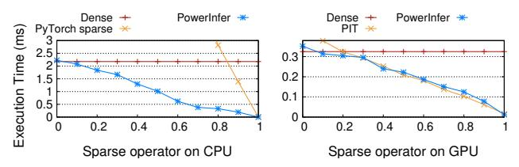
***الشكل 16.** مقارنة المشغل الواعي بالخلايا العصبية مع مشغلات متفرقة مختلفة على PC-Low. يشير المحور السيني إلى مستوى التباعد، ويمثل المحور الصادي وقت التنفيذ (مللي ثانية).*

يُظهر PowerInfer زمن استجابة متسقًا للغاية لتوليد الرمز بين الرموز عبر مهام مختلفة، بفارق 10% فقط بين زمن استجابة P95 والمتوسط. ويرجع ذلك إلى سياسة Power-Infer التي تضع الخلايا العصبية الساخنة العامة على GPU. ينتج هذا التذبذب عن تباين تباعد الرموز المختلفة من 80% إلى 86%. عند مواجهة الرموز ذات التباعد الأقل، يقدم الحساب زمن استجابة أعلى بنسبة 10% مقارنة بالمتوسط.

**8.3.3** أداء المشغل الواعي بالخلايا العصبية يقيم هذا القسم أداء المشغلات المتفرقة لـ PowerInfer على كل من CPU وGPU عبر مستويات تباعد مختلفة. نقارن PowerInfer بمكتبات متفرقة رائدة: لقياسات CPU، نستخدم PyTorch sparse، أحدث النوى المتفرقة في PyTorch، كأساس. في GPU، تتم مقارنة PowerInfer بـ PIT [63]. نظرًا لأن التباعد في نماذج LLM يعتمد عادةً على دقة الخلايا العصبية، تم تصميم تجاربنا خصيصًا لتقييم المصفوفات المتفرقة من هذا النوع. نركز على ضرب المصفوفة-المتجه المتفرق باستخدام تكوين [4096, 4096] \times [4096, 1]، وهو إعداد شائع في استدلال LLM المحلي [7]. لضبط التباعد، نقدم قيمًا صفرية إلى صفوف المصفوفة.

يوضح الشكل 16 أن مشغل PowerInfer يحقق تسريعًا خطيًا تقريبًا مع زيادة مستويات التباعد، على عكس واضح مع حسابات المصفوفة الكثيفة. على CPU، لا تتفوق المشغلات المتفرقة التقليدية على الحساب الكثيف حتى يتجاوز التباعد 87%. ومع ذلك، يتفوق مشغل CPU لـ PowerInfer على ضرب المصفوفة الكثيفة حتى عند مستويات التباعد أقل من 10%. بالنسبة لـ GPU، يطابق PowerInfer PIT في الأداء. ومع ذلك، فإن ميزته الأساسية هي إطار CPU-GPU الموحد. يسمح هذا التصميم بتنفيذ مرن للمشغلات المتفرقة على كلتا وحدتي المعالجة، على عكس PIT، الذي تم تحسينه فقط لضرب المصفوفة المتفرقة القائم على GPU ولا يدعم بيئات CPU-GPU الهجينة.

<!-- page 13 -->

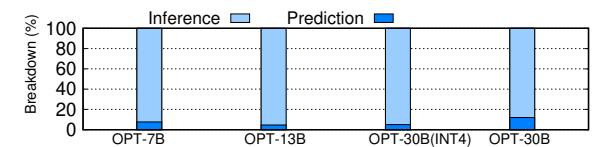
***الشكل 17.** *عبء التنبؤ من البداية إلى النهاية لـ PowerInfer على PC-Low.* يعرض المحور الصادي تفصيل النسبة المئوية بين عبء المتنبئ ووقت استدلال LLM.*

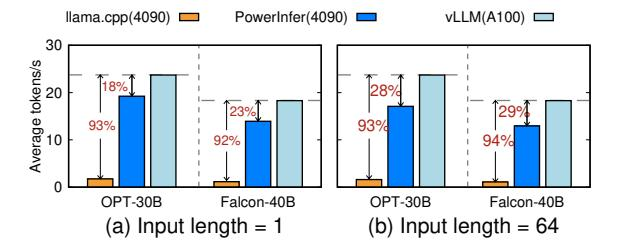
***الشكل 18.** *سرعة توليد NVIDIA RTX 4090 مقارنة بـ A100 واحد.* يمثل المحور السيني نماذج مختلفة، بينما يمثل المحور الصادي سرعة التوليد (الرموز/ثانية) في إطار استدلال مختلف. تمثل النسب المئوية داخل الأسهم التباطؤ بالنسبة إلى vLLM على A100.*

**8.3.4** **عبء المتنبئ** يتم أيضًا قياس وقت تنفيذ المتنبئات عبر الإنترنت لنماذج مختلفة، كما هو موضح في الشكل 17. في المتوسط، يشكل تنفيذ المتنبئات أقل من 10% من إجمالي وقت الاستدلال في PowerInfer. يرتبط وقت تنفيذ المتنبئات ارتباطًا مباشرًا بأحجام المتنبئ، والتي، كما هو موضح في الجدول 6، تشكل فقط 7.09% من أوزان النموذج. تنبع كفاءة هذه المتنبئات من طرق البناء التكيفية التي تقلل من الحجم والحمل الحسابي. علاوة على ذلك، يدمج PowerInfer هذه المتنبئات في حلاله لقرارات وضع الخلايا العصبية، حيث يخصصها بشكل تفضيلي لوحدات GPU. تستغل هذه الإستراتيجية قدرات المعالجة المتوازية لوحدات GPU، مما يقلل بشكل أكبر من عبء وقت التشغيل المرتبط بالتنبؤ.

**8.3.5** **مقارنة الأداء مع A100** في دراستنا، نحلل المدى الذي يقلل به PowerInfer من فجوة الأداء بين وحدة معالجة الرسومات بمستوى المستهلك ونظيراتها من الفئة الأولى بمستوى الخادم. لذلك، نقوم بتقييم سرعة توليد PowerInfer، المنشور على PC-High، مقارنة بأداء llama.cpp وvLLM [23] المنفذين على NVIDIA A100 GPU واحدة بسعة 80 جيجابايت. اخترنا نماذج OPT-30B وFalcon-40B للمقارنة، مع الأخذ في الاعتبار متطلبات الذاكرة الدقيقة الخاصة بهما والمطابقة بدقة لسعة A100 GPU. استخدم تقييمنا

| الإعداد | النموذج | PowerInfer | llama.cpp | التسريع |
| --- | --- | --- | --- | --- |
| PC-High | Yi(SwiGLU)-34B | 1.7 | 1.0 | 1.7× |
| PC-Low | LLaMA(SwiGLU)-2-13B | 3.1 | 2.1 | 1.5× |
| PC-High | OPT-30B | 12.0 | 1.1 | 10.9× |

أطوال إدخال 1 و64 لقياس سرعة التوليد النقية والتفاعلات الحوارية على التوالي.

يوضح الشكل 18أ أن PowerInfer يضيق بشكل كبير فجوة الأداء بين NVIDIA 4090 وA100 في مهام التوليد بطول إدخال 1. على PC-High، يتأخر llama.cpp عن vLLM على A100 بنسبة 93% و92% لـ OPT-30B وFalcon-40B على التوالي، لكن PowerInfer يقلل هذا إلى 18% و23%. يوضح الشكل 18ب أنه على الرغم من تقليل التباعد التراكمي في مرحلة المحفز، لا يزال PowerInfer يقلل فجوة الأداء إلى 28% و29%. ينبع التفاوت المتبقي بشكل أساسي من الحمل الحسابي الكبير لـ CPU، الذي أصبح عنق الزجاجة.

## 8.4 أداء LLM القائم على SiLU

في حين أن PowerInfer يُظهر تسريعًا ملحوظًا على النماذج القائمة على ReLU بسبب تباعد التنشيط العالي الخاص بها، فإنه يُظهر أيضًا فعالية في تسريع النماذج القائمة على SiLU. يكشف تقييمنا لنماذج LLM القائمة على SiLU، كما هو معروض في الجدول 8، أن PowerInfer يحقق تسريعًا من 1.47\times إلى 1.7×. يؤكد هذا الكسب في الأداء، وإن كان أقل وضوحًا من نظرائه القائمين على ReLU (مثل OPT-30B في الجدول 8)، فعالية آليات الحساب المتفرقة لـ PowerInfer عبر دوال التنشيط المختلفة. يمكن أن يُعزى التسريع المنخفض نسبيًا إلى التباعد المنخفض في النماذج القائمة على SiLU، حيث تظل نسبة أكبر من الخلايا العصبية نشطة أثناء الاستدلال. وبالتالي، يظهر حساب CPU كعنق زجاجة محتمل في هذه السيناريوهات. يشير التسريع الملاحظ في نماذج SiLU إلى أن فعالية تسريع PowerInfer مرتبطة بمدى تباعد النموذج.

<!-- page 14 -->

## 8.5 دقة LLM

نظرًا لأن PowerInfer يحذف بشكل انتقائي الخلايا العصبية المتوقع أن تكون غير نشطة، فقد قمنا بالتحقيق فيما إذا كان هذا النهج يؤثر على دقة استدلال نماذج LLM، مع التركيز على النماذج التي تستخدم ReLU أو دوال تنشيط ذات صلة. يقارن الجدول 7 دقة النماذج من عائلات OPT وFalcon (ReLU) وLLaMA2 (ReGLU)، مع وبدون التمييز بين الخلايا العصبية المنشطة/غير المنشطة، عبر مجموعة متنوعة من المهام النهائية التمثيلية. تظهر النتائج أن PowerInfer يسبب فقدانًا ضئيلًا في دقة الاستدلال، بغض النظر عن حجم النموذج أو نوع المهمة، بما يتفق مع نتائج الأبحاث السابقة [28]. على الرغم من أن المتنبئات في كل طبقة محول تحافظ على معدل دقة أعلى من 95%، فقد تفوت أحيانًا بعض الخلايا العصبية النشطة. ونتيجة لذلك، توجد تذبذبات طفيفة في دقة LLM، مما يؤدي إلى تذبذبات طفيفة في الأداء على مهام نهائية محددة.

نقوم كذلك بتحليل طبيعة وتأثير الخلايا العصبية التي تم التنبؤ بها بشكل خاطئ على دقة الاستدلال. يكشف تحقيقنا أن الخلايا العصبية التي يتم التنبؤ بها بشكل خاطئ بواسطة المتنبئ عادة ما يكون لها تأثير ضئيل على إخراج الطبقة. تجعل هذه الخاصية هذه الخلايا العصبية أكثر عرضة للتنبؤ الخاطئ، حيث أن تنشيطها أو عدم تنشيطها له تأثير ضئيل على النتيجة الإجمالية. لقياس هذا التأثير، أجرينا تحليلاً على نموذج OPT-7B. من خلال مقارنة تشابه جيب التمام بين المخرجات من الحسابات الكثيفة الأصلية وحساباتنا القائمة على المتنبئ، وجدنا أن التنبؤات الخاطئة تؤثر فقط على النتائج بحوالي 0.4%. يدعم هذا الاختلاف الضئيل ملاحظتنا بأن PowerInfer يحافظ على دقة النموذج الأصلي، على الرغم من التنبؤ الخاطئ العرضي للخلايا العصبية.

المقارنة مع نماذج اللغة الأصغر. لفهم مكاسب أداء PowerInfer بشكل أفضل، نقارنه بنهج تسريع شائع: استخدام نماذج اللغة الأصغر (SLMs). ومع ذلك، فإن نهج SLM يأتي غالبًا على حساب تقليل دقة النموذج. لفهم فوائد PowerInfer بالكامل، نقارن أداءه باستخدام نموذج أكبر بأحدث SLM، ونقيم السرعة والدقة. يوضح الجدول 9 أن نموذج Bamboo-7B يتفوق على Qwen-1.5-4B (نموذج 4B متطور) عبر مهام مختلفة، ويحافظ PowerInfer (Bamboo-7B-PowerInfer) على دقة النموذج الكثيف الأصلي مع تحقيق سرعة فك تشفير على مستوى 4B.

# 9 الأعمال ذات الصلة

**تباعد أوزان LLM:** تقليم النموذج [19، 20، 31] يقلل المعلمات بتعيين الأوزان إلى صفر، كما هو موضح في SparseGPT [14] وWanda [49]، محققًا 50% تباعد.

تستفيد SparTA [64] من كل من نوى التوتر المتفرقة وSIMT بتقسيم المصفوفات المتفرقة. تقدم Flash-LLM [54] نهج "التحميل كمتفرق والحساب ككثيف" لـ SpMM لنواة التوتر. ومع ذلك، فإن هذه الطرق، المتعامدة مع تنشيطات LLM المتفرقة الجوهرية، عادة ما تتحمل خسائر دقة وتحديات تسريع نموذج وقت الساعة [34]. على النقيض من ذلك، يستخدم PowerInfer التنشيطات المتفرقة الطبيعية للحفاظ على الأداء والكفاءة.

**تباعد انتباه LLM:** يستفيد PowerInfer من خصائص التنشيط المتفرق لطبقات MLP. من الجدير بالذكر أن كتل الانتباه تظهر أيضًا تباعدًا، والذي ينبع أساسًا من مصدرين: رؤوس الانتباه، حيث يحتاج بعضها فقط إلى الحساب للرمز الحالي [28]، والتباعد داخل الرؤوس، حيث يتم تقليم ذاكرة التخزين المؤقت KV غير المهمة أو تفريغها لتخفيف عنق زجاجة الذاكرة لخدمة LLMs، كما في H20 [60] وInfiniGen [25]. التنشيطات المتفرقة المستخدمة بواسطة PowerInfer متعامدة مع تباعد الانتباه ويمكن أن تقلل بشكل أكبر من زمن استجابة الاستدلال.

**استدلال LLM التخميني:** يمكن أيضًا الاستفادة من الاستدلال التخميني [7، 8، 16، 52] لخدمة النماذج التي تتجاوز ذاكرة GPU، والذي يستخدم نموذجًا أصغر لفك ترميز الرموز مسبقًا، يتم التحقق منها لاحقًا بواسطة النموذج الرئيسي في دفعة. يقلل SpecInfer [33] بشكل فعال عدد خطوات فك تشفير LLM. على الرغم من أنه منفصل عن تركيزنا، فإن دمج الاستدلال التخميني في PowerInfer يمكن أن يعزز سرعة استدلال LLM بشكل أكبر.

تحسينات الخدمة الخاصة بـ LLM: هناك العديد من أنظمة خدمة ML [18] لنماذج ML العامة. أدى بروز Transformers إلى أنظمة خدمة متخصصة [9، 12، 22، 42، 65]. يقدم Orca [57] جدولة على مستوى التكرار. ينفذ vLLM [23] PagedAttention لتخزين الرموز في عناوين ذاكرة GPU متفاوتة، متغلبًا على حد التخزين المستمر لذاكرة التخزين المؤقت KV. لا تعالج هذه الطرق تحدي نشر النماذج على أجهزة الكمبيوتر حيث لا يمكن أن يتناسب النموذج بأكمله ضمن ذاكرة GPU.

# 10 الخاتمة

PowerInfer هو نظام استدلال سريع محسّن لنماذج LLM يستغل خاصية الموقعية في استدلال LLM. يستخدم متنبئات تكيفية ومشغلات واعية بالخلايا العصبية لتنشيط الخلايا العصبية والتباعد الحسابي. يحقق PowerInfer استدلال LLM أسرع بما يصل إلى 11.69× مقارنة بأنظمة مثل llama.cpp، دون المساس بالدقة.

# 11 شكر وتقدير

نشكر بصدق الراعي Shivaram Venkataraman والمراجعين المجهولين على اقتراحاتهم الثاقبة. نحن ممتنون بشدة لـ Rong Chen وYubin Xia على تعليقاتهم الشاملة والبناءة، التي عززت بشكل كبير جودة هذه الورقة. تم دعم هذا العمل جزئيًا من قبل برنامج البحث والتطوير الوطني الرئيسي للصين (2023YFB4503702) وNSFC (رقم 62372287 و61925206). Zeyu Mi (yzmizeyu@sjtu.edu.cn) هو المؤلف المسؤول.

<!-- page 15 -->

## المراجع

- [1] Bo Adler, Niket Agarwal, Ashwath Aithal, Dong H Anh, Pallab Bhattacharya, Annika Brundyn, Jared Casper, Bryan Catanzaro, Sharon Clay, Jonathan Cohen, et al. 2024. Nemotron-4 340B Technical Report. arXiv preprint arXiv:2406.11704 (2024).
- [2] Abien Fred Agarap. 2018. Deep learning using rectified linear units (relu). arXiv preprint arXiv:1803.08375 (2018).
- [3] Ebtesam Almazrouei, Hamza Alobeidli, Abdulaziz Alshamsi, Alessandro Cappelli, Ruxandra Cojocaru, Merouane Debbah, Etienne Goffinet, Daniel Heslow, Julien Launay, Quentin Malartic, Badreddine Noune, Baptiste Pannier, and Guilherme Penedo. 2023. Falcon-40B: an open large language model with state-of-the-art performance. (2023).
- [4] Reza Yazdani Aminabadi, Samyam Rajbhandari, Ammar Ahmad Awan, Cheng Li, Du Li, Elton Zheng, Olatunji Ruwase, Shaden Smith, Minjia Zhang, Jeff Rasley, et al. 2022. DeepSpeed-inference: enabling efficient inference of transformer models at unprecedented scale. In SC22: International Conference for High Performance Computing, Networking, Storage and Analysis. IEEE, 1–15.
- [5] Yonatan Bisk, Rowan Zellers, Jianfeng Gao, Yejin Choi, et al. 2020. Piqa: Reasoning about physical commonsense in natural language. In Proceedings of the AAAI conference on artificial intelligence, Vol. 34. 7432–7439.
- [6] Tom Brown, Benjamin Mann, Nick Ryder, Melanie Subbiah, Jared D Kaplan, Prafulla Dhariwal, Arvind Neelakantan, Pranav Shyam, Girish Sastry, Amanda Askell, et al. 2020. Language models are few-shot learners. Advances in neural information processing systems 33 (2020), 1877–1901.
- [7] Tianle Cai, Yuhong Li, Zhengyang Geng, Hongwu Peng, and Tri Dao. 2023. Medusa: Simple Framework for Accelerating LLM Generation with Multiple Decoding Heads. https://github.[com/FasterDecoding/](https://github.com/FasterDecoding/Medusa) [Medusa](https://github.com/FasterDecoding/Medusa).
- [8] Charlie Chen, Sebastian Borgeaud, Geoffrey Irving, Jean-Baptiste Lespiau, Laurent Sifre, and John Jumper. 2023. Accelerating Large Language Model Decoding with Speculative Sampling. arXiv[:2302.01318](https://arxiv.org/abs/2302.01318) [cs.CL]
- [9] Lequn Chen, Zihao Ye, Yongji Wu, Danyang Zhuo, Luis Ceze, and Arvind Krishnamurthy. 2023. Punica: Multi-tenant lora serving. arXiv preprint arXiv:2310.18547 (2023).
- [10] Byung-Gon Chun, Sunghwan Ihm, Petros Maniatis, Mayur Naik, and Ashwin Patti. 2011. CloneCloud: elastic execution between mobile device and cloud. In Proceedings of the Sixth Conference on Computer Systems (Salzburg, Austria) (EuroSys '11). Association for Computing Machinery, New York, NY, USA, 301–314. [https://doi](https://doi.org/10.1145/1966445.1966473).org/10.1145/ 1966445.[1966473](https://doi.org/10.1145/1966445.1966473)
- [11] Peter Clark, Isaac Cowhey, Oren Etzioni, Tushar Khot, Ashish Sabharwal, Carissa Schoenick, and Oyvind Tafjord. 2018. Think you have Solved Question Answering? Try ARC, the AI2 Reasoning Challenge. arXiv:1803.05457v1 (2018).
- [12] Jiarui Fang, Yang Yu, Chengduo Zhao, and Jie Zhou. 2021. TurboTransformers: an efficient GPU serving system for transformer models. In Proceedings of the 26th ACM SIGPLAN Symposium on Principles and Practice of Parallel Programming. 389–402.
- [13] Wikimedia Foundation. 2024. Wikimedia Downloads. [https://](https://dumps.wikimedia.org) dumps.[wikimedia](https://dumps.wikimedia.org).org.
- [14] Elias Frantar and Dan Alistarh. 2023. SparseGPT: Massive Language Models Can Be Accurately Pruned in One-Shot. arXiv preprint arXiv:2301.00774 (2023).
- [15] Elias Frantar, Saleh Ashkboos, Torsten Hoefler, and Dan Alistarh. 2022. GPTQ: Accurate Post-training Compression for Generative Pretrained Transformers. arXiv preprint arXiv:2210.17323 (2022).
- [16] Yichao Fu, Peter Bailis, Ion Stoica, and Hao Zhang. 2023. Breaking the Sequential Dependency of LLM Inference Using Lookahead Decoding.

- https://lmsys.[org/blog/2023-11-21-lookahead-decoding/](https://lmsys.org/blog/2023-11-21-lookahead-decoding/)
- [17] Georgi Gerganov. 2023. ggerganov/llama.cpp: Port of Facebook's LLaMA model in C/C++. https://github.[com/ggerganov/llama](https://github.com/ggerganov/llama.cpp).cpp.
- [18] Arpan Gujarati, Reza Karimi, Safya Alzayat, Wei Hao, Antoine Kaufmann, Ymir Vigfusson, and Jonathan Mace. 2020. Serving DNNs like Clockwork: Performance Predictability from the Bottom Up. In 14th USENIX Symposium on Operating Systems Design and Implementation (OSDI 20). USENIX Association, 443–462. [https://www](https://www.usenix.org/conference/osdi20/presentation/gujarati).usenix.org/ [conference/osdi20/presentation/gujarati](https://www.usenix.org/conference/osdi20/presentation/gujarati)
- [19] Song Han, Huizi Mao, and William J Dally. 2015. Deep compression: Compressing deep neural networks with pruning, trained quantization and huffman coding. arXiv preprint arXiv:1510.00149 (2015).
- [20] Song Han, Jeff Pool, John Tran, and William J. Dally. 2015. Learning Both Weights and Connections for Efficient Neural Networks. In Proceedings of the 28th International Conference on Neural Information Processing Systems - Volume 1 (Montreal, Canada) (NIPS'15). MIT Press, Cambridge, MA, USA, 1135–1143.
- [21] Dan Hendrycks, Collin Burns, Steven Basart, Andy Zou, Mantas Mazeika, Dawn Song, and Jacob Steinhardt. 2021. Measuring Massive Multitask Language Understanding. Proceedings of the International Conference on Learning Representations (ICLR) (2021).
- [22] Alind Khare, Dhruv Garg, Sukrit Kalra, Snigdha Grandhi, Ion Stoica, and Alexey Tumanov. 2023. SuperServe: Fine-Grained Inference Serving for Unpredictable Workloads. arXiv[:2312.16733](https://arxiv.org/abs/2312.16733) [cs.DC]
- [23] Woosuk Kwon, Zhuohan Li, Siyuan Zhuang, Ying Sheng, Lianmin Zheng, Cody Hao Yu, Joseph Gonzalez, Hao Zhang, and Ion Stoica. 2023. Efficient Memory Management for Large Language Model Serving with PagedAttention. In Proceedings of the 29th Symposium on Operating Systems Principles (Koblenz, Germany) (SOSP '23). Association for Computing Machinery, New York, NY, USA, 611–626. https://doi.org/10.[1145/3600006](https://doi.org/10.1145/3600006.3613165).3613165
- [24] Je-Yong Lee, Donghyun Lee, Genghan Zhang, Mo Tiwari, and Azalia Mirhoseini. 2024. CATS: Contextually-Aware Thresholding for Sparsity in Large Language Models. arXiv preprint arXiv:2404.08763 (2024).
- [25] Wonbeom Lee, Jungi Lee, Junghwan Seo, and Jaewoong Sim. 2024. InfiniGen: Efficient Generative Inference of Large Language Models with Dynamic KV Cache Management. In 18th USENIX Symposium on Operating Systems Design and Implementation (OSDI 24). USENIX Association, Santa Clara, CA, 155–172. https://www.usenix.[org/conference/](https://www.usenix.org/conference/osdi24/presentation/lee) [osdi24/presentation/lee](https://www.usenix.org/conference/osdi24/presentation/lee)
- [26] Zonglin Li, Chong You, Srinadh Bhojanapalli, Daliang Li, Ankit Singh Rawat, Sashank J Reddi, Ke Ye, Felix Chern, Felix Yu, Ruiqi Guo, et al. 2022. The Lazy Neuron Phenomenon: On Emergence of Activation Sparsity in Transformers. In The Eleventh International Conference on Learning Representations.
- [27] Peiyu Liu, Zikang Liu, Ze-Feng Gao, Dawei Gao, Wayne Xin Zhao, Yaliang Li, Bolin Ding, and Ji-Rong Wen. 2023. Do Emergent Abilities Exist in Quantized Large Language Models: An Empirical Study. arXiv[:2307.08072](https://arxiv.org/abs/2307.08072) [cs.CL]
- [28] Zichang Liu, Jue Wang, Tri Dao, Tianyi Zhou, Binhang Yuan, Zhao Song, Anshumali Shrivastava, Ce Zhang, Yuandong Tian, Christopher Re, and Beidi Chen. 2023. Deja Vu: Contextual Sparsity for Efficient LLMs at Inference Time. In Proceedings of the 40th International Conference on Machine Learning (Proceedings of Machine Learning Research, Vol. 202), Andreas Krause, Emma Brunskill, Kyunghyun Cho, Barbara Engelhardt, Sivan Sabato, and Jonathan Scarlett (Eds.). PMLR, 22137– 22176. [https://proceedings](https://proceedings.mlr.press/v202/liu23am.html).mlr.press/v202/liu23am.html
- [29] Hanjia Lyu, Song Jiang, Hanqing Zeng, Qifan Wang, Si Zhang, Ren Chen, Chris Leung, Jiajie Tang, Yinglong Xia, and Jiebo Luo. 2023. LLM-Rec: Personalized Recommendation via Prompting Large Language Models. arXiv[:2307.15780](https://arxiv.org/abs/2307.15780) [cs.CL]

<!-- page 16 -->

- [30] Xinyin Ma, Gongfan Fang, and Xinchao Wang. 2023. LLM-Pruner: On the Structural Pruning of Large Language Models. arXiv preprint arXiv:2305.11627 (2023).
- [31] Xinyin Ma, Gongfan Fang, and Xinchao Wang. 2023. LLM-Pruner: On the Structural Pruning of Large Language Models. In Advances in Neural Information Processing Systems.
- [32] Iván Martínez Toro, Daniel Gallego Vico, and Pablo Orgaz. 2023. PrivateGPT. https://github.[com/imartinez/privateGPT](https://github.com/imartinez/privateGPT)
- [33] Xupeng Miao, Gabriele Oliaro, Zhihao Zhang, Xinhao Cheng, Zeyu Wang, Rae Ying Yee Wong, Alan Zhu, Lijie Yang, Xiaoxiang Shi, Chunan Shi, Zhuoming Chen, Daiyaan Arfeen, Reyna Abhyankar, and Zhihao Jia. 2023. SpecInfer: Accelerating Generative Large Language Model Serving with Speculative Inference and Token Tree Verification. arXiv[:2305.09781](https://arxiv.org/abs/2305.09781) [cs.CL]
- [34] Iman Mirzadeh, Keivan Alizadeh, Sachin Mehta, Carlo C Del Mundo, Oncel Tuzel, Golnoosh Samei, Mohammad Rastegari, and Mehrdad Farajtabar. 2023. ReLU Strikes Back: Exploiting Activation Sparsity in Large Language Models. arXiv[:2310.04564](https://arxiv.org/abs/2310.04564) [cs.LG]
- [35] MohamedRashad. 2023. [https://huggingface](https://huggingface.co/datasets/MohamedRashad/ChatGPT-prompts).co/datasets/ [MohamedRashad/ChatGPT-prompts](https://huggingface.co/datasets/MohamedRashad/ChatGPT-prompts).
- [36] NVIDIA. 2021. Unified Memory Programming. [https://](https://docs.nvidia.com/cuda/cuda-c-programming-guide/index.html#um-unified-memory-programming-hd) docs.nvidia.[com/cuda/cuda-c-programming-guide/index](https://docs.nvidia.com/cuda/cuda-c-programming-guide/index.html#um-unified-memory-programming-hd).html#um[unified-memory-programming-hd](https://docs.nvidia.com/cuda/cuda-c-programming-guide/index.html#um-unified-memory-programming-hd).
- [37] NVIDIA. 2023. cuSPARSE: Basic Linear Algebra for Sparse Matrices on NVIDIA GPUs. [https://developer](https://developer.nvidia.com/cusparse).nvidia.com/cusparse.
- [38] OpenAI. 2023. https://openai.[com/blog/chatgpt](https://openai.com/blog/chatgpt).
- [39] Colin Raffel, Noam Shazeer, Adam Roberts, Katherine Lee, Sharan Narang, Michael Matena, Yanqi Zhou, Wei Li, and Peter J Liu. 2020. Exploring the limits of transfer learning with a unified text-to-text transformer. The Journal of Machine Learning Research 21, 1 (2020), 5485–5551.
- [40] Prajit Ramachandran, Barret Zoph, and Quoc V Le. 2017. Searching for activation functions. arXiv preprint arXiv:1710.05941 (2017).
- [41] Keisuke Sakaguchi, Ronan Le Bras, Chandra Bhagavatula, and Yejin Choi. 2021. Winogrande: An adversarial winograd schema challenge at scale. Commun. ACM 64, 9 (2021), 99–106.
- [42] Ying Sheng, Shiyi Cao, Dacheng Li, Coleman Hooper, Nicholas Lee, Shuo Yang, Christopher Chou, Banghua Zhu, Lianmin Zheng, Kurt Keutzer, Joseph E. Gonzalez, and Ion Stoica. 2023. S-LoRA: Serving Thousands of Concurrent LoRA Adapters. arXiv[:2311.03285](https://arxiv.org/abs/2311.03285) [cs.LG]
- [43] Ying Sheng, Lianmin Zheng, Binhang Yuan, Zhuohan Li, Max Ryabinin, Beidi Chen, Percy Liang, Christopher Re, Ion Stoica, and Ce Zhang. 2023. FlexGen: High-Throughput Generative Inference of Large Language Models with a Single GPU. (2023).
- [44] Chenyang Song, Xu Han, Zhengyan Zhang, Shengding Hu, Xiyu Shi, Kuai Li, Chen Chen, Zhiyuan Liu, Guangli Li, Tao Yang, et al. 2024. ProSparse: Introducing and Enhancing Intrinsic Activation Sparsity within Large Language Models. arXiv preprint arXiv:2402.13516 (2024).
- [45] Yixin Song, Haotong Xie, Zeyu Mi, Li Ma, and Haibo Chen. 2024. Bamboo: Harmonizing Sparsity and Performance in Large Language Models. (2024).
- [46] Yixin Song, Haotong Xie, Zhengyan Zhang, Bo Wen, Li Ma, Zeyu Mi, and Haibo Chen. 2024. Turbo Sparse: Achieving LLM SOTA Performance with Minimal Activated Parameters. arXiv preprint arXiv:2406.05955 (2024).
- [47] SparseLLM. 2024. ReLULLaMA-70B. [https://huggingface](https://huggingface.co/SparseLLM/ReluLLaMA-70B).co/ [SparseLLM/ReluLLaMA-70B](https://huggingface.co/SparseLLM/ReluLLaMA-70B).
- [48] Sharath Turuvekere Sreenivas, Saurav Muralidharan, Raviraj Joshi, Marcin Chochowski, Mostofa Patwary, Mohammad Shoeybi, Bryan Catanzaro, Jan Kautz, and Pavlo Molchanov. 2024. LLM Pruning and Distillation in Practice: The Minitron Approach. arXiv preprint arXiv:2408.11796 (2024).

- [49] Mingjie Sun, Zhuang Liu, Anna Bair, and J. Zico Kolter. 2023. A Simple and Effective Pruning Approach for Large Language Models. arXiv preprint arXiv:2306.11695 (2023).
- [50] Rohan Taori, Ishaan Gulrajani, Tianyi Zhang, Yann Dubois, Xuechen Li, Carlos Guestrin, Percy Liang, and Tatsunori B. Hashimoto. 2023. Stanford Alpaca: An Instruction-following LLaMA model. [https://](https://github.com/tatsu-lab/stanford_alpaca) github.[com/tatsu-lab/stanford_alpaca](https://github.com/tatsu-lab/stanford_alpaca).
- [51] Hugo Touvron, Thibaut Lavril, Gautier Izacard, Xavier Martinet, Marie-Anne Lachaux, Timothée Lacroix, Baptiste Rozière, Naman Goyal, Eric Hambro, Faisal Azhar, et al. 2023. Llama: Open and efficient foundation language models. arXiv preprint arXiv:2302.13971 (2023).
- [52] Yiding Wang, Kai Chen, Haisheng Tan, and Kun Guo. 2023. Tabi: An Efficient Multi-Level Inference System for Large Language Models. In Proceedings of the Eighteenth European Conference on Computer Systems (Rome, Italy) (EuroSys '23). Association for Computing Machinery, New York, NY, USA, 233–248. https://doi.org/10.[1145/3552326](https://doi.org/10.1145/3552326.3587438).3587438
- [53] Thomas Wolf, Lysandre Debut, Victor Sanh, Julien Chaumond, Clement Delangue, Anthony Moi, Pierric Cistac, Tim Rault, Rémi Louf, Morgan Funtowicz, Joe Davison, Sam Shleifer, Patrick von Platen, Clara Ma, Yacine Jernite, Julien Plu, Canwen Xu, Teven Le Scao, Sylvain Gugger, Mariama Drame, Quentin Lhoest, and Alexander M. Rush. 2020. Transformers: State-of-the-Art Natural Language Processing. In Proceedings of the 2020 Conference on Empirical Methods in Natural Language Processing: System Demonstrations. Association for Computational Linguistics, Online, 38–45. https://www.aclweb.[org/anthology/](https://www.aclweb.org/anthology/2020.emnlp-demos.6) 2020.[emnlp-demos](https://www.aclweb.org/anthology/2020.emnlp-demos.6).6
- [54] Haojun Xia, Zhen Zheng, Yuchao Li, Donglin Zhuang, Zhongzhu Zhou, Xiafei Qiu, Yong Li, Wei Lin, and Shuaiwen Leon Song. 2023. Flash-LLM: Enabling Cost-Effective and Highly-Efficient Large Generative Model Inference with Unstructured Sparsity. arXiv[:2309.10285](https://arxiv.org/abs/2309.10285) [cs.DC]
- [55] Guangxuan Xiao, Ji Lin, Mickael Seznec, Hao Wu, Julien Demouth, and Song Han. 2023. Smoothquant: Accurate and efficient post-training quantization for large language models. In International Conference on Machine Learning. PMLR, 38087–38099.
- [56] Zhenliang Xue, Yixin Song, Zeyu Mi, Le Chen, Yubin Xia, and Haibo Chen. 2024. PowerInfer-2: Fast Large Language Model Inference on a Smartphone. arXiv preprint arXiv:2406.06282 (2024).
- [57] Gyeong-In Yu, Joo Seong Jeong, Geon-Woo Kim, Soojeong Kim, and Byung-Gon Chun. 2022. Orca: A Distributed Serving System for Transformer-Based Generative Models. In 16th USENIX Symposium on Operating Systems Design and Implementation (OSDI 22). USENIX Association, Carlsbad, CA, 521–538. https://www.usenix.[org/conference/](https://www.usenix.org/conference/osdi22/presentation/yu) [osdi22/presentation/yu](https://www.usenix.org/conference/osdi22/presentation/yu)
- [58] Susan Zhang, Stephen Roller, Naman Goyal, Mikel Artetxe, Moya Chen, Shuohui Chen, Christopher Dewan, Mona Diab, Xian Li, Xi Victoria Lin, et al. 2022. Opt: Open pre-trained transformer language models. arXiv preprint arXiv:2205.01068 (2022).
- [59] Zhengyan Zhang, Yankai Lin, Zhiyuan Liu, Peng Li, Maosong Sun, and Jie Zhou. 2022. MoEfication: Transformer Feed-forward Layers are Mixtures of Experts. In Findings of ACL 2022.
- [60] Zhenyu Zhang, Ying Sheng, Tianyi Zhou, Tianlong Chen, Lianmin Zheng, Ruisi Cai, Zhao Song, Yuandong Tian, Christopher Ré, Clark Barrett, et al. 2024. H2o: Heavy-hitter oracle for efficient generative inference of large language models. Advances in Neural Information Processing Systems 36 (2024).
- [61] Zhengyan Zhang, Yixin Song, Guanghui Yu, Xu Han, Yankai Lin, Chaojun Xiao, Chenyang Song, Zhiyuan Liu, Zeyu Mi, and Maosong Sun. 2024. ReLU^2^ Wins: Discovering Efficient Activation Functions for Sparse LLMs. arXiv[:2402.03804](https://arxiv.org/abs/2402.03804) [cs.LG]
- [62] Lianmin Zheng, Wei-Lin Chiang, Ying Sheng, Siyuan Zhuang, Zhanghao Wu, Yonghao Zhuang, Zi Lin, Zhuohan Li, Dacheng Li, Eric. P Xing, Hao Zhang, Joseph E. Gonzalez, and Ion Stoica. 2023. Judging LLM-asa-judge with MT-Bench and Chatbot Arena. arXiv[:2306.05685](https://arxiv.org/abs/2306.05685) [cs.CL]

<!-- page 17 -->

- [63] Ningxin Zheng, Huiqiang Jiang, Quanlu Zhang, Zhenhua Han, Lingxiao Ma, Yuqing Yang, Fan Yang, Chengruidong Zhang, Lili Qiu, Mao Yang, and Lidong Zhou. 2023. PIT: Optimization of Dynamic Sparse Deep Learning Models via Permutation Invariant Transformation. In Proceedings of the 29th Symposium on Operating Systems Principles (Koblenz, Germany) (SOSP '23). Association for Computing Machinery, New York, NY, USA, 331–347. [https://doi](https://doi.org/10.1145/3600006.3613139).org/10.1145/ [3600006](https://doi.org/10.1145/3600006.3613139).3613139
- [64] Ningxin Zheng, Bin Lin, Quanlu Zhang, Lingxiao Ma, Yuqing Yang, Fan Yang, Yang Wang, Mao Yang, and Lidong Zhou. 2022. SparTA:
- Deep-Learning Model Sparsity via Tensor-with-Sparsity-Attribute. In 16th USENIX Symposium on Operating Systems Design and Implementation (OSDI 22). USENIX Association, Carlsbad, CA, 213–232. [https:](https://www.usenix.org/conference/osdi22/presentation/zheng-ningxin) //www.usenix.[org/conference/osdi22/presentation/zheng-ningxin](https://www.usenix.org/conference/osdi22/presentation/zheng-ningxin)
