<!-- RP35_Sun_2024 | source: papers_json/RP35_Sun_2024/ -->

## FLATQUANT: الاستواء مهم لتكميم النماذج اللغوية الكبيرة

Yuxuan Sun^{*1} Ruikang Liu^{*2} Haoli Bai^{\dagger 1} Han Bao^1 Kang Zhao^1 Yuening Li^3 Jiaxin Hu^1 Xianzhi Yu^1 Lu Hou^1 Chun Yuan^1 Xin Jiang^1 Wulong Liu^1 Jun Yao^1

## **الملخص**

في الآونة الأخيرة، استُخدم التكميم على نطاق واسع لضغط النماذج اللغوية الكبيرة (LLMs) وتسريعها. وبسبب وجود القيم الشاذة في هذه النماذج، فإنه من الضروري تسطيح الأوزان والتنشيطات لتقليل خطأ التكميم باستخدام نقاط تكميم متباعدة بالتساوي. استكشفت الأبحاث السابقة تحويلات متنوعة قبل التكميم لكبح القيم الشاذة، مثل القياس لكل قناة وتحويل Hadamard. ومع ذلك، نلاحظ أن هذه الأوزان والتنشيطات المحوَّلة لا تزال تُظهر توزيعات حادة ومتفرقة. في هذه الورقة، نقترح FLATQUANT (التحويل الأفيني السريع والقابل للتعلم)، وهو نهج جديد للتكميم بعد التدريب يعزز استواء الأوزان والتنشيطات. يحدد نهجنا التحويلات الأفينية المثلى لكل طبقة خطية، وتُعاير في غضون ساعات عبر هدف خفيف الوزن. ولتقليل العبء الزمني للتحويل الأفيني، نطبق جداء كرونيكر مع مصفوفتين خفيفتي الوزن، وندمج جميع العمليات في FLATQUANT في نواة واحدة. تُظهر التجارب المكثفة أن FLATQUANT يضع معيارًا جديدًا للحالة الفنية الراهنة في التكميم. على سبيل المثال، يحقق انخفاضًا في الدقة أقل من 1% للتكميم W4A4 على نموذج LLaMA-3-70B، متفوقًا على SpinQuant بنسبة **7.5**%. علاوة على ذلك، يوفر تسريعًا يصل إلى 2.3x في مرحلة التعبئة المسبقة و1.7x في مرحلة فك الترميز مقارنة بنموذج FP16. الكود متاح على: https:// github.com/ruikangliu/FlatQuant.

## 1. المقدمة

حققت النماذج اللغوية الكبيرة (LLMs) الحديثة نجاحًا ملحوظًا عبر مجموعة واسعة من المهام مع زيادة

Proceedings of the 42nd International Conference on Machine Learning, Vancouver, Canada. PMLR 267, 2025. Copyright 2025 by the author(s).

في عدد المعاملات (Achiam et al., 2023; Jiang et al., 2023; Yang et al., 2024; Dubey et al., 2024). ومع ذلك، فإن نمو حجم النموذج يؤدي أيضًا إلى زيادة كبيرة في الأعباء الحسابية وأعباء الذاكرة. ونتيجة لذلك، برز خفض المتطلبات الحسابية ومتطلبات الذاكرة للنماذج اللغوية الكبيرة كاتجاه بحثي حاسم، ويُعد التكميم أحد أكثر الحلول فعالية (Frantar et al., 2022; Lin et al., 2023; Dettmers et al., 2022; Xiao et al., 2023).

يُقلل التكميم البصمة الذاكرية ويُسرّع الاستدلال، عن طريق تخفيض دقة معاملات النموذج وتنشيطاته. خطأ التكميم هو مقياس شائع الاستخدام لقياس أداء طرق التكميم (Nagel et al., 2020; Bai et al., 2020; Li et al., 2021). أحد العوامل الرئيسية التي تؤثر على خطأ التكميم هو *استواء* الأوزان والتنشيطات. حدسيًا، عندما يكون توزيع الأوزان والتنشيطات حادًا وتوجد قيم متعددة منتشرة، فإن تكميمها إلى نفس القيمة المكممة يؤدي عادة إلى خطأ تكميم كبير (Chmiel et al., 2020; Li et al., 2024). علاوة على ذلك، نظرًا لأن النماذج اللغوية الكبيرة تولّد المخرجات طبقة طبقة، فإن خطأ التكميم المنخفض يُسطّح أيضًا منظر الخطأ المنتشر عبر طبقات Transformer.

ومع ذلك، فإنه ليس من السهل الحصول على توزيع مستوٍ للأوزان والتنشيطات في النماذج اللغوية الكبيرة. من المعروف أن هذه النماذج تحتوي على قيم شاذة متطرفة في التنشيطات (Dettmers et al., 2022; Xiao et al., 2023) ورموز محورية (Liu et al., 2024a; Sun et al., 2024). ولتخفيف هذه المشكلة، اقتُرحت تحويلات متنوعة قبل التكميم للتخفيف من تأثير القيم الشاذة (Xiao et al., 2023; Ashkboos et al., 2024; Liu et al., 2024c; Ma et al., 2024). ومع ذلك، نُعيد النظر في هذه التحويلات ونجدها لا تزال دون المستوى الأمثل في تعزيز الاستواء. فعلى سبيل المثال، يهدف القياس لكل قناة (Xiao et al., 2023; Shao et al., 2023) إلى موازنة القيم الشاذة بين الأوزان والتنشيطات، لكنه يقصر عن توزيع القيم الشاذة على القنوات غير الشاذة. ويحاول تحويل Hadamard الحديث (Ashkboos et al., 2024; Lin et al., 2024) حل هذه المشكلة، لكنه لا يأخذ في الاعتبار الخصائص الفردية لكل طبقة خطية. علاوة على ذلك، فإن التحويل الخطي الذي تقدمه هذه الطرق يُدخِل حتمًا عبئًا إضافيًا على الاستدلال يؤثر على التسريع الإجمالي للتكميم.

في هذا العمل، نقدم FLATQUANT، وهو نهج جديد للتكميم بعد التدريب. للاسم دلالة مزدوجة: فهو

> ^*^مساهمة متساوية 1Huawei Noah's Ark Lab 2Shenzhen International Graduate School, Tsinghua University 3The Chinese University of Hong Kong. المراسلة إلى: Haoli Bai  
bai-haoli@huawei.com>.

<!-- page 2 -->

يرمز إلى الطريقة المقترحة (التحويل الأفيني السريع والقابل للتعلم) ويؤكد على هدفها المتمثل في تحقيق توزيعات أكثر استواءً للأوزان والتنشيطات، وهو أمر بالغ الأهمية للتكميم الفعال. يهدف FLATQUANT إلى تحديد التحويل الأفيني الأمثل لكل طبقة خطية، باستخدام استراتيجية تدريب خفيفة الوزن على مستوى الكتل عبر بيانات المعايرة. ولتقليل عبء الاستدلال المرتبط بالتحويلات الأفينية، يستفيد FLATQUANT من كفاءة جداء كرونيكر مع مصفوفتين خفيفتي الوزن، مما يقلل من متطلبات الذاكرة والحساب. نهجنا متوافق مع تقنيات تكميم متنوعة مثل القص القابل للتعلم، ويمكن تطبيقه على إعدادات تكميم مختلفة، على سبيل المثال، تكميم الأوزان فقط أو تكميم ذاكرة KV. وبما أن التحويلات الأفينية في FLATQUANT مقيدة بالذاكرة، فإننا ندمجها مع التكميم في نواة واحدة، مما يُقلل من الوصول إلى الذاكرة العامة وعبء إطلاق النواة. وأخيرًا، أُجريت تجارب مكثفة على مهام متنوعة (مثل النمذجة اللغوية والإجابة على الأسئلة) وعائلات النماذج اللغوية الكبيرة (مثل LLaMA و Qwen) لتقييم FLATQUANT. تُظهر نتائجنا التجريبية أن FLATQUANT يضع نتائج تكميم جديدة على مستوى الحالة الفنية الراهنة من حيث الدقة وزمن استجابة الاستدلال.

تتلخص مساهمات هذا العمل فيما يلي:

- نُسلّط الضوء على أهمية تحقيق الاستواء لتكميم النماذج اللغوية الكبيرة، ونُظهر أن التوزيعات المستوية للأوزان والتنشيطات تُسهّل التكميم وتُقلل من انتشار الخطأ عبر طبقات Transformer.
- نُقدّم FLATQUANT، وهي طريقة تكميم جديدة بعد التدريب مع تحويلات أفينية سريعة وقابلة للتعلم محسّنة لكل طبقة خطية. يُثبت النهج تجريبيًا قدرته على تعزيز استواء كل من الأوزان والتنشيطات في النماذج اللغوية الكبيرة.
- تُظهر التجارب المكثفة أن FLATQUANT يحقق نتائج جديدة على مستوى الحالة الفنية الراهنة للتكميم. وعلى حد علمنا، نحن أول من يحقق انخفاضًا في الدقة \leq 1\% مع تكميم W4A4 بسيط من نوع round-to-nearest على نموذج LLaMA-3-70B.
- نُصمّم أيضًا نواة فعّالة تدمج كلًا من التحويل الأفيني والتكميم، مما يؤدي إلى تسريع 2.3x في التعبئة المسبقة و 1.7x في فك الترميز تحت تكميم W4A4 مقارنة بخط الأساس FP16.

## 2. الدافع

## 2.1. تمهيدات في تكميم النماذج اللغوية الكبيرة

عادة ما يكون لاستدلال النموذج اللغوي الكبير مرحلتان: 1) مرحلة التعبئة المسبقة، التي تُنشئ ذاكرة المفاتيح والقيم (KV Cache) طبقة طبقة من تسلسل الإدخال؛ و 2) مرحلة فك الترميز، حيث يُولّد النموذج الرموز بشكل انحداري ذاتي بناءً على

ذاكرة KV السابقة. التكميم ممارسة شائعة لتقليل حجم النموذج وزمن استجابة الاستدلال. فهو يحوّل الأوزان كاملة الدقة \mathbf{W} \in \mathbb{R}^{m \times n} أو التنشيطات \mathbf{X} \in \mathbb{R}^{k \times n} للطبقات الخطية (أي \mathbf{Y} = \mathbf{X} \mathbf{W}^{\top})، وكذلك ذاكرة KV اختياريًا، إلى تمثيلات منخفضة البتات. على سبيل المثال، يمكن تمثيل تكميم الأوزان ذي b بت على النحو التالي:

$$
\hat{\mathbf{W}} = \mathcal{Q}_b(\mathbf{W}) = s \cdot \Pi_{\Omega(b)}(\mathbf{W}/s), \tag{1}
$$

حيث s هو حجم خطوة التكميم، \Pi(\cdot) هي دالة الإسقاط و \Omega(b) = \{0, 1, ..., 2^b - 1\} هي مجموعة النقاط الصحيحة ذات b بت. ولتبسيط الترميز، نرمز إلى \mathcal{Q}(\cdot) كدالة التكميم العامة في بقية هذه الورقة.

كما تشير الأعمال الحديثة (Xiao et al., 2023; Shao et al., 2023; Xi et al., 2023)، فإن النماذج اللغوية الكبيرة تُظهر قيمًا شاذة مستمرة في التنشيطات، مما يُشكّل تحديات كبيرة للتكميم. اقتُرحت أعمال متنوعة لكبح القيم الشاذة لتحسين النماذج اللغوية الكبيرة المكممة. طريقتان شائعتا الاستخدام هما القياس لكل قناة (Xiao et al., 2023; Lin et al., 2023; Wei et al., 2023) وتحويل Hadamard أو متغيراته (Xi et al., 2023; Ashkboos et al., 2024; Lin et al., 2024).

**القياس لكل قناة.** غالبًا ما تكون تنشيطات الإدخال \mathbf{X} للنماذج اللغوية الكبيرة غنية بالقيم الشاذة. وللتخفيف من تأثيرها على التكميم، فإن إحدى الطرق الشائعة هي تطبيق القياس على مستوى القناة على الأوزان والتنشيطات (Xiao et al., 2023)، أي \mathbf{Y} = (\mathbf{X} \operatorname{diag}(\boldsymbol{c})^{-1}) \cdot (\operatorname{diag}(\boldsymbol{c})\mathbf{W}^{\top})، حيث \boldsymbol{c} \in \mathbb{R}^n هو معامل القياس على مستوى القناة. يُنعّم متجه القياس التنشيطات من خلال مراعاة مقادير تنشيطات الإدخال والأوزان معًا، أي \boldsymbol{c}_j = \max(|\mathbf{X}_j|^{\alpha})/\max(|\mathbf{W}_j|^{1-\alpha}). يمكن دمج الأوزان المُقاسة \operatorname{diag}(\boldsymbol{c})\mathbf{W}^{\top} لإلغاء الحساب وقت التشغيل. علاوة على ذلك، يقدم Wei et al. (2023) إزاحة على مستوى القناة، أي (\mathbf{X} - \boldsymbol{z})\operatorname{diag}(\boldsymbol{c})^{-1}، لمزيد من التخفيف من تأثير القيم الشاذة، ويعامل Shao et al. (2023) كلاً من \operatorname{diag}(\boldsymbol{c}) و \boldsymbol{z} كمعاملات قابلة للتعلم.

**تحويل Hadamard.** تجد الأعمال الحديثة أن مصفوفات Hadamard \mathbf{H} \in \{+1,-1\}^{n \times n} مفيدة بشكل خاص في تنعيم القيم الشاذة في التنشيطات (Xi et al., 2023; Ashkboos et al., 2024; Lin et al., 2024). على عكس القياس لكل قناة الذي يُعدّل العناصر القطرية فقط من منظور ضرب المصفوفات، فإن تحويل Hadamard يُدوّر قنوات كل من التنشيطات والأوزان، ويُعيد توزيع القيم الشاذة بين جميع القنوات للقضاء عليها بفعالية. وبفضل التعامد لمصفوفات Hadamard (أي \mathbf{H}^{\top}\mathbf{H} = \mathbf{I})، يتحقق التكافؤ التالي: \mathbf{Y} = \mathbf{X}\mathbf{W}^{\top} = (\mathbf{X}\mathbf{H})(\mathbf{H}^{\top}\mathbf{W}^{\top}). يمكن أيضًا معالجة الوزن المُحوّل \mathbf{W}\mathbf{H} مسبقًا دون اتصال بالشبكة لتقليل العبء الإضافي وقت التشغيل.

## 2.2. الاستواء للتكميم

استواء الأوزان والتنشيطات. التنسورات المستوية أسهل في التكميم بشكل حدسي بعد إزالة القيم الشاذة، أي ما يُعرف بالتنسورات ذات التفلطح المنخفض (Chmiel et al., 2020; Li et al.,

<!-- page 3 -->

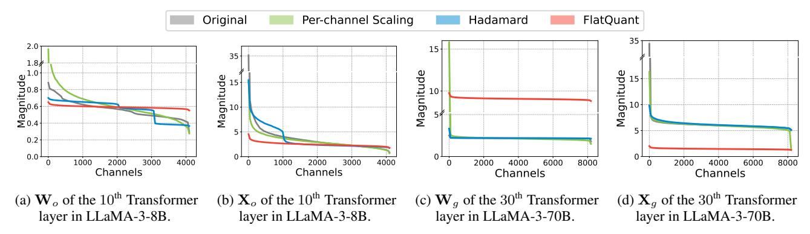
*الشكل 1: توزيعات الأوزان والمدخلات من LLaMA-3-8B و LLaMA-3-70B، مرتبة حسب مقادير القناة (أي معيار Frobenius) بترتيب تنازلي. في طبقة Transformer، يدل \mathbf{W}_o و \mathbf{X}_o على مصفوفة الوزن ومدخل طبقة إسقاط الإخراج في طبقة الانتباه الذاتي، على التوالي. ويدل \mathbf{W}_g و \mathbf{X}_g على وزن ومدخل الطبقة الخطية المسوّرة لشبكة التغذية الأمامية، على التوالي. يمكن العثور على المزيد من المرئيات في الملحق D.*

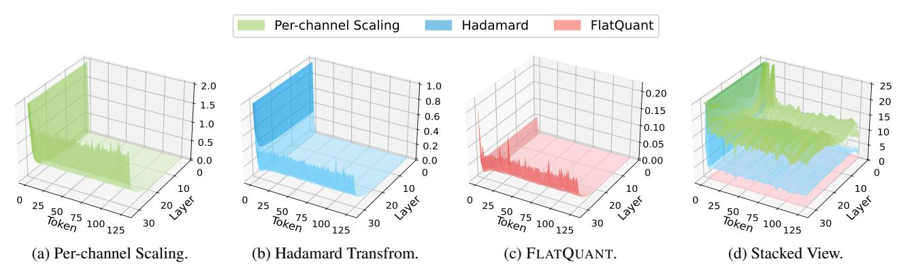
*الشكل 2: متوسط الخطأ التربيعي (MSE) للتكميم عبر طبقات Transformer وتسلسل الإدخال في LLaMA-3-8B. يرسم الشكل 2a-2c سطح MSE لكل طريقة، بينما يُراكب الشكل 2d هذه الأسطح بقسمة كل MSE على MSE الخاص بـ FLATQUANT. يمكن العثور على مزيد من التفاصيل والمرئيات في الملحق D.*

2024). يعرض الشكل 1 توزيعات كل من الأوزان والتنشيطات الأصلية والمحوَّلة، مرتبة حسب مقادير القناة بترتيب تنازلي. عادة ما تُفضّل الأوزان والتنشيطات المستوية ذات الأغلفة الأفقية للتكميم. مقارنةً بالتوزيعات الأصلية، يمكن للتحويلات قبل التكميم أن تُنتج تنشيطات أكثر استواءً (مثل الشكل 1b، 1d) ولكن لا تزال لها قيود. يُسطّح القياس لكل قناة التنشيطات على حساب أغلفة وزن أكثر حدة (مثل الشكل 1a، 1c). بينما يُنتج تحويل Hadamard استواءً أفضل لكل من التنشيطات والأوزان مقارنة بالقياس لكل قناة، إلا أنه لا يزال يولّد أحيانًا توزيعات غير مرضية (مثل الشكل 1a، 1b). في المقابل، فإن FLATQUANT، كما سيُوضَّح في القسم 3، يُسطّح باستمرار كل من الأوزان والتنشيطات.

استواء منظر خطأ التكميم. ينتشر خطأ التكميم حتمًا، ومن المُلهم إظهار كيف تُخفّف التحويلات قبل التكميم هذه المشكلة. نرسم المنظر ثنائي الأبعاد لمتوسط الخطأ التربيعي (MSE) في الشكل 2. أولاً، يُلاحَظ أن أخطاء تكميم هائلة تحدث عند الرموز الأولية، أي ما يُعرف

بالرموز المحورية (Liu et al., 2024a)، التي تحتوي على قيم شاذة هائلة (Sun et al., 2024). كل من القياس لكل قناة وتحويل Hadamard عاجزان أمام مثل هذه الأخطاء (أي الشكل 2a-2b). وبدلاً من ذلك، يُظهر FLATQUANT خطأً أقل بكثير عند هذه الرموز المحورية من الشكل 2c. ثانيًا، يزداد خطأ التكميم على مستوى الطبقات، ولكنه أقل وضوحًا على طول تسلسل الإدخال. ووفقًا للشكل 2d، فإن FLATQUANT هو الأفضل في التحكم بانتشار الخطأ، يليه تحويل Hadamard وأخيرًا القياس لكل قناة.

## 3. الطريقة

نقدم الآن FLATQUANT مع نظرة عامة في الشكل 3. للطريقة المقترحة دلالة مزدوجة: فهي تستخدم تحويلات أفينية سريعة وقابلة للتعلم، تُنتج أيضًا أوزانًا وتنشيطات مستوية لسهولة التكميم.

## 3.1. التحويل الأفيني السريع والقابل للتعلم

نُقدّم أولاً FLATQUANT لطبقة خطية قياسية، وسنناقش دمجها مع بنية Transformer

<!-- page 4 -->

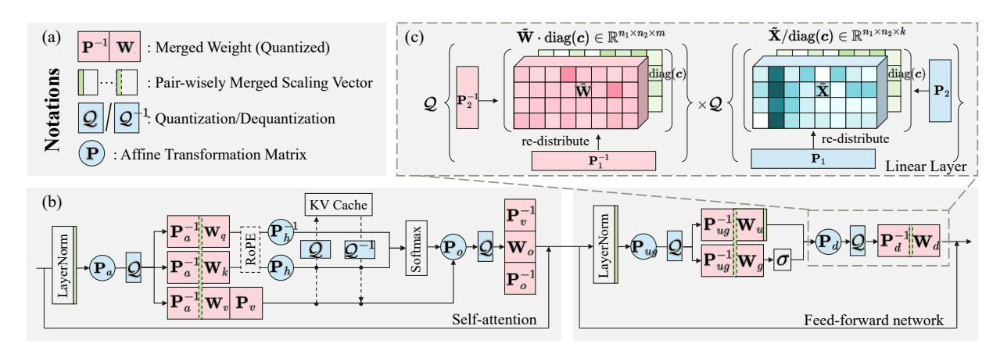
*الشكل 3: الإطار العام لـ FLATQUANT. (أ): الترميزات الضرورية لـ FLATQUANT؛ (ب): دمج FLATQUANT مع طبقة LLaMA تقليدية، حيث تُجمَّع المعاملات المدمجة باللون الأحمر، ودوال التحويل والتكميم عبر الإنترنت باللون الأزرق، ومتجهات القياس المدمجة باللون الأخضر؛ (ج): العرض التوضيحي لـ FLATQUANT المطبَّق على طبقة الإسقاط الهابط، حيث يُدمَج متجه القياس diag(c) فوق \tilde{X} في W_u عمليًا.*

في القسم 3.2. هدف أساسي لـ FLATQUANT هو إيجاد أفضل تحويل أفيني لكل طبقة خطية لتكميمها. نظريًا، عند إعطاء \mathbf{Y} = \mathbf{X}\mathbf{W}^{\top}، يمكن للمرء تحديد المصفوفة العكوسة المثلى \mathbf{P}^* \in \mathbb{R}^{n \times n} بواسطة

$$
\mathbf{P}^* = \arg\min_{\mathbf{P}} \|\mathbf{Y} - \mathcal{Q}(\mathbf{X}\mathbf{P})\mathcal{Q}(\mathbf{P}^{-1}\mathbf{W}^\top)\|_F^2, \quad (2)
$$

كما هو مدروس في (Ma et al., 2024). يمكن حساب الأوزان \mathbf{P}^{-1}\mathbf{W}^{\top} مسبقًا دون اتصال شبيه بـ (Ashkboos et al., 2024). ومع ذلك، على عكس مصفوفات Hadamard التي يمكن إعادة استخدامها لجميع الطبقات، فإن صيانة مصفوفات \mathbf{P} الفردية لطبقات خطية مختلفة مكلف حسابيًا. في تمريرة التغذية الأمامية، يُضاعف هذا النهج التكلفة الحسابية والوصول إلى الذاكرة لضرب المصفوفات. علاوة على ذلك، فإنه يضاعف تقريبًا متطلبات تخزين النموذج.

**جداء كرونيكر.** المفتاح في FLATQUANT هو استخدام جداء كرونيكر لمصفوفتين خفيفتي الوزن كبديل فعّال لمصفوفة التحويل الأفيني الكبيرة \mathbf{P} \in \mathbb{R}^{n \times n}. وعلى وجه التحديد، نقترح بناء مصفوفتين خفيفتي الوزن، أي \mathbf{P} = \mathbf{P}_1 \otimes \mathbf{P}_2، حيث \mathbf{P}_1 \in \mathbb{R}^{n_1 \times n_1}، \mathbf{P}_2 \in \mathbb{R}^{n_2 \times n_2} هما مصفوفتان عكوستان بأحجام أصغر، و n = n_1 n_2. وبالعودة إلى حيلة التوجيه (vectorization) لجداء كرونيكر، أي \text{vec}(\mathbf{V})(\mathbf{P}_1 \otimes \mathbf{P}_2) = \text{vec}(\mathbf{P}_1^\top \mathbf{V} \mathbf{P}_2) لبعض \mathbf{V} \in \mathbb{R}^{n_1 \times n_2}، يمكن إعادة كتابة ضرب المصفوفات في المعادلة 2 على النحو

$$
Q(\mathbf{X}\mathbf{P})Q(\mathbf{P}^{-1}\mathbf{W}^{\top}) = (3)
Q(\mathbf{P}_{1}^{\top} \times_{1} \tilde{\mathbf{X}} \times_{2} \mathbf{P}_{2}) \times Q(\mathbf{P}_{1}^{-1} \times_{1} \tilde{\mathbf{W}} \times_{2} (\mathbf{P}_{2}^{-1})^{\top})^{\top},
$$

حيث \tilde{\mathbf{X}} \in \mathbb{R}^{k \times n_1 \times n_2} و \tilde{\mathbf{W}} \in \mathbb{R}^{m \times n_1 \times n_2} يُعاد تشكيلهما من \mathbf{X} و \mathbf{W} وفقًا لذلك، و \mathbf{X}_i تدل على الاختزال على المحور i. لاحظ أن كلًا من الأوزان والتنشيطات يُعادان إلى مصفوفة قبل الضرب. يمكن لهذا التصميم أن يُوفّر الذاكرة حتى n/2 ضعفًا، نظرًا لأن \frac{n^2}{n_1^2 + n_2^2} \le

\frac{n^2}{2n_1n_2}=\frac{n}{2}، مع تحقق المساواة عندما n_1=n_2=\sqrt{n}. علاوة على ذلك، فإن توفير الحساب هو \sqrt{n}/2 ضعفًا بنفس الشرط الأمثل. عمليًا، نختار n_1^*, n_2^*=\arg\min(n_1+n_2)، بشرط n_1n_2=n و n_1\leq n_2. على سبيل المثال، التكوين الأمثل هو (n_1^*,n_2^*)=(64,128) لـ n=8192. نجد أن مثل هذه الاستراتيجية تعطي أفضل تسريع دون المساس بالأداء، كما هو موضح في الشكل 5. وبالتالي، فإن التحويلات الأفينية خفيفة الوزن جدًا، على سبيل المثال، تستهلك فقط 2.61% من إجمالي العمليات الحسابية بالفاصلة العائمة (FLOPs) و 3.41MB من الذاكرة الإضافية لـ LLaMA-2-7B. مزيد من تفاصيل عبء الاستدلال في الملحق B.2.

**القياس لكل قناة.** لتعزيز القدرة على موازنة القيم الشاذة بين الأوزان والتنشيطات، يقدم FLATQUANT صراحةً متجه قياس قابل للتعلم \operatorname{diag}(c) \in \mathbb{R}^n قبل التحويل قبل التكميم، كما هو موضح في الشكل 3 (ج). متبعين (Xiao et al., 2023)، يمكن دمج متجه القياس بشكل ثنائي مع التطبيع السابق للطبقة أو الطبقات الخطية، وبالتالي عدم تكبد أي عبء استدلال إضافي.

**عتبات القص القابلة للتعلم.** ولمزيد من تقليل القيم الشاذة المحتملة بعد التحويل أعلاه، نجمع عتبات القص القابلة للتعلم \alpha_w, \alpha_a \in (0,1) بعد دوال السيغمويد على كل من الوزن والتنشيط لكل طبقة خطية، إلى جانب ذاكرة KV. في حين تُظهر الدراسات السابقة (Jacob et al., 2018; Frantar et al., 2022; Ashkboos et al., 2024) أن البحث الشبكي صالح للعثور على عتبات قص معقولة، نلاحظ أن تعلم عتبات القص يُعطي نتائج أفضل. هذه المعاملات خاصة بالطبقة ويمكن تحسينها بالاشتراك مع مصفوفات التحويل الخطي \mathbf{P} ومتجه القياس \mathrm{diag}(\mathbf{c}).

**هدف التدريب.** نتبع التكميم بعد التدريب ونقلل بشكل تسلسلي متوسط الخطأ التربيعي (MSE) بواسطة التكميم على كمية صغيرة من بيانات المعايرة

<!-- page 5 -->

(على سبيل المثال، 128 جملة مأخوذة عشوائيًا) لكل كتلة Transformer. هدف التدريب لكتلة Transformer رقم l هو

$$
\min_{\mathbf{\Theta}} \left\| \mathcal{F}_l(\mathbf{X}) - \hat{\mathcal{F}}_l(\mathbf{X}; \mathbf{\Theta}) \right\|_F^2, \tag{4}
$$

حيث \mathcal{F}_l(\cdot) و \hat{\mathcal{F}}_l(\cdot) تدلان على كتلة Transformer الأصلية والمكممة، \Theta = \{\mathbf{P}, \mathbf{c}, \alpha_a, \alpha_w\} اختصار لجميع المعاملات القابلة للتعلم داخل الكتلة. سيتم شرح مصفوفات التحويل داخل كتلة Transformer في القسم 3.2. ولحساب معكوس المصفوفة في المعادلة 3 بكفاءة ودقة، نتبنى تحلل القيمة المفردة جنبًا إلى جنب مع الدقة المختلطة التلقائية. انظر الملحق B.1 للتفاصيل. حاولنا أيضًا تدريب كتل Transformer متعددة معًا ولكن وجدنا أداءً مماثلاً بتكاليف تدريب أعلى. وأخيرًا، تؤدي عملية التدريب باستخدام المعادلة 4 إلى أوزان وتنشيطات مستوية، كما سيُظهَر في القسم 4.4.

## 3.2. التكامل مع بنية Transformer

نوضح الآن دمج FLATQUANT مع كتلة Transformer مبنية على بنية شبيهة بـ LLaMA. متبعين الممارسات التقليدية، نوظف ضرب مصفوفات منخفض البتات لجميع الطبقات الخطية، مع الحفاظ على طبقات تطبيع الطبقة، والتحويلات قبل التكميم، وتضمينات RoPE، ودرجات الانتباه في FP16.

**الانتباه الذاتي.** وحدة الانتباه الذاتي مجهزة بأربعة تحويلات \{\mathbf{P}_a, \mathbf{P}_o, \mathbf{P}_h, \mathbf{P}_v\}. على وجه التحديد، يُطبَّق \mathbf{P}_a لتسطيح تنشيط الإدخال لإسقاطات الاستعلام والمفتاح والقيمة، بينما يُنعّم \mathbf{P}_o تنشيط الإدخال لإسقاط الإخراج. \mathbf{P}_h و \mathbf{P}_v يُستخدمان لتحويل ذاكرة المفتاح والقيمة رأسًا برأس، على التوالي. لاحظ أننا نُحلّل فقط \mathbf{P}_a و \mathbf{P}_o، ولكن نترك \mathbf{P}_h و \mathbf{P}_v في شكلهما الأصلي. هذا لأن التكميم لكل رأس يُسهّل بالفعل التحويلات الرخيصة، نظرًا لأن حجم الرأس أصغر بكثير من حجم المخفي الكامل. علاوة على ذلك، ندمج \mathbf{P}_o مع \mathbf{P}_v لتقليل العبء، مستوحى من QuaRot (Ashkboos et al., 2024). تُظهر نتائجنا التجريبية أن هذا الدمج لا يؤدي إلى فقدان إضافي للدقة.

**شبكة التغذية الأمامية.** تستخدم شبكة التغذية الأمامية (FFN) مصفوفتي تحويل، أي \mathbf{P}_{ug} و \mathbf{P}_d. \mathbf{P}_{ug} يُطبَّق لتسطيح إدخال شبكة التغذية الأمامية بعد تطبيع الطبقة، بينما \mathbf{P}_d يُسطّح إدخال طبقة الإسقاط الهابط. كلا التحويلين يُحلَّلان لتقليل عبء الاستدلال. علاوة على ذلك، يُدمج القياس لكل قناة لـ \mathbf{P}_d في وزن طبقة الإسقاط الصاعد، مما يضمن عدم وجود عبء حسابي إضافي.

**تطبيع الطبقة.** نُذكّر أن QuaRot (Ashkboos et al., 2024) و SpinQuant (Liu et al., 2024c) يُعدّلان LayerNorm إلى RMSNorm ويدمجان التحويلات المتعامدة في الطبقات السابقة للكفاءة. ومع ذلك، فإن

اتصال البقايا في بنية "ما قبل التطبيع" سيُقيّد جميع كتل Transformer لمشاركة نفس التحويل بعد RMSNorm. وبدلاً من ذلك، يحافظ FLATQUANT على LayerNorm، ويسمح باستخدام تحويلات أفينية سريعة وقابلة للتعلم في القسم 3.1 بعد LayerNorm لطبقات مختلفة، وبالتالي تعزيز التعبيرية.

## 3.3. تصميم النواة الفعّال

نُصمّم نواة فعّالة لـ FLATQUANT تدمج كلًا من التحويلات الأفينية والتكميم في عملية واحدة. هذا التصميم مدفوع بعاملين رئيسيين. أولاً، \mathbf{P}_1^{\top} \times_1 \tilde{\mathbf{X}} \times_2 \mathbf{P}_2 يُظهر كثافة حسابية منخفضة مع جداء كرونيكر لمصفوفتين خفيفتي الوزن، مما يجعل كل من التعبئة المسبقة وفك الترميز مقيدًا بالذاكرة بشكل أساسي. ثانيًا، من المعروف أن التكميم أيضًا مقيد بالذاكرة.

لمعالجة هذه المشكلات، نُدمج \mathcal{Q}(\mathbf{P}_1^\top \times_1 \tilde{\mathbf{X}} \times_2 \mathbf{P}_2) في نواة واحدة باستخدام OpenAI Triton (Tillet et al., 2019). على وجه التحديد، نُحمّل كامل \mathbf{P}_1 \in \mathbb{R}^{n_1 \times n_1} و \mathbf{P}_2 \in \mathbb{R}^{n_2 \times n_2} في SRAM. تُقطّع كل كتلة خيوط كتلة تبليط \bar{\mathbf{X}} \in \mathbb{R}^{n_1 \times n_2} من \tilde{\mathbf{X}}، تُجري ضرب المصفوفات \mathbf{P}_1 \bar{\mathbf{X}} \mathbf{P}_2، وتُكمم النتائج فورًا. خلال هذه العملية، تُخزَّن جميع النتائج الوسيطة في SRAM قبل أن تُكتب أخيرًا إلى الذاكرة العامة. وبالتالي، يُلغي هذا التصميم عمليات الوصول الزائدة عن الحاجة إلى الذاكرة للنتائج الوسيطة ويُقلل من عبء إطلاق النواة. أخيرًا، بناءً على المخرجات أعلاه، نتبع QuaRot (Ashkboos et al., 2024) لتبني نواة CUTLASS لضرب مصفوفات INT4، و FlashInfer (Ye, 2023) لتكميم ذاكرة KV. مزيد من تفاصيل تصميم النواة في الملحق B.3.

## 4. التجارب

## 4.1. الإعدادات

التقييم وخطوط الأساس. نقيّم FLATQUANT بشكل أساسي على سلسلة نماذج LLaMA-2 (Touvron et al., 2023) و LLaMA-3 (Dubey et al., 2024)، ويمكن العثور على النتائج على عائلتي Qwen و DeepSeek في الملحق C.1. متبعين الأعمال السابقة (Shao et al., 2023; Ashkboos et al., 2024)، نُبلّغ عن الحيرة (PPL) لمهام توليد اللغة على مجموعتي بيانات WikiText2 (Merity et al., 2016) و C4 (Raffel et al., 2020). لمهام الاستدلال المنطقي، نستخدم ست مهام تقييم بدون أمثلة (zero-shot)، بما في ذلك ARC-Challenge، ARC-Easy (Clark et al., 2018)، HellaSwag (Zellers et al., 2019)، LAMBADA (Paperno et al., 2016)، PIQA (Bisk et al., 2020)، و WinoGrande (Sakaguchi et al., 2021). نقارن FLATQUANT بطرق التكميم بعد التدريب الشهيرة من نوع INT4، بما في ذلك SmoothQuant (Xiao et al., 2023)، و OmniQuant (Shao et al., 2023)، و AffineQuant (Ma et al., 2024)، و QUIK-4B (Ashkboos et al., 2023)، وطريقتين حديثتين

<!-- page 6 -->

تمثلان الحالة الفنية الراهنة هما QuaRot [(Ashkboos et al.,](#page-9-9) [2024)](#page-9-9) و SpinQuant [(Liu et al.,](#page-10-4) [2024c)](#page-10-4).

تفاصيل التنفيذ. نُنفذ FLATQUANT بناءً على Huggingface [(Wolf,](#page-11-6) [2019)](#page-11-6) و PyTorch [(Paszke](#page-10-14) [et al.,](#page-10-14) [2019)](#page-10-14). نتبنى محسّن AdamW بمعدل تعلم أولي قدره 5e-3 ونستخدم جدول تخفيض معدل التعلم بنوع التبريد جيب التمام. معدل التعلم لعتبات القص هو 5e-2. يُدرَّب FLATQUANT لمدة 15 حقبة على مجموعة معايرة تتألف من 128 جملة من WikiText-2، كل منها مأخوذة بـ 2048 رمزًا. حجم الدفعة مضبوط على 4. تكلف إجراءات المعايرة الافتراضية تقريبًا 26GB من ذاكرة GPU وحوالي 0.9 ساعة لـ LLaMA-3-8B على وحدة معالجة رسومات واحدة. FLATQUANT قوي ضد التهيئة، ونستخدم مصفوفات تحويل أفيني عشوائية كنقطة بداية. مزيد من التفاصيل حول التنفيذ ووقت المعايرة في الملحق [B.1.](#page-12-0)

التكميم. نتبنى التكميم المتماثل لكل قناة ولكل رمز للأوزان والتنشيطات، على التوالي. لمقارنات عادلة مع QuaRot و SpinQuant، نستخدم كلاً من round-to-nearest (RTN) و GPTQ كمكمم للأوزان، حيث يستخدم GPTQ نفس بيانات المعايرة لكل من تحديثات الأوزان ذات الشكل المغلق والتدريب. ومع ذلك، تُشير نتائجنا التجريبية إلى أن FLATQUANT مع RTN كافٍ ليكون تنافسيًا. يمكن أيضًا استخدام FLATQUANT لتكميم ذاكرة KV، حيث يُطبَّق التكميم غير المتماثل على مستوى المجموعة بحجم 128. هذا يطابق بُعد الرأس لـ LLaMA، كما هو مقترح في الدراسات السابقة [(Zhao et al.,](#page-11-7) [2024;](#page-11-7) [Ashkboos et al.,](#page-9-9) [2024)](#page-9-9)، للاستفادة من خصائص الانتباه الذاتي المقيدة بالذاكرة.

## 4.2. النتائج الرئيسية

النتائج على مهام توليد اللغة. يعرض الجدول [1](#page-5-0) نتائج PPL لـ FLATQUANT مع وبدون مكمم الأوزان GPTQ على مجموعتي بيانات WikiText-2 و C4. كما يمكن ملاحظته، فإن FLATQUANT مع مكمم الأوزان RTN

يتفوق باستمرار على طرق التكميم SOTA السابقة عبر جميع المعايير الرئيسية. لنموذج LLaMA-2-70B، يحقق FLATQUANT درجة PPL أعلى بـ 0.23 فقط من خط الأساس FP16، مما يُؤكّد فعالية نهجنا. لـ LLaMA-3-8B، يُخفّض FLATQUANT PPL من 7.39 (SpinQuant) إلى 6.98، مُضيقًا الفجوة مع خط الأساس FP16 إلى 0.84. والجدير بالذكر أن FLATQUANT مع RTN يُظهر أداءً مشابهًا لتلك مع GPTQ ولكن يستغرق وقت معايرة أقل بكثير. وهذا مفيد بشكل خاص في تقليل استهلاك الوقت لنشر FLATQUANT عمليًا. تُسلّط هذه النتائج الضوء على فعالية التحويلات القابلة للتعلم المقترحة لدينا في تعزيز الاستواء والتخفيف من تأثير القيم الشاذة في كل من الأوزان والتنشيطات، مما يُؤسّس SOTA جديدًا في تكميم النماذج اللغوية الكبيرة بعدد بتات منخفض.

النتائج على مهام QA بدون أمثلة. نُوسّع تقييمنا ليشمل ست مهام QA للاستدلال المنطقي بدون أمثلة، كما هو موضح في الجدول [2.](#page-6-0) لمقارنة عادلة، نُعيد إنتاج QuaRot [1](#page-5-1) و SpinQuant [2](#page-5-2) بتنفيذاتهما الرسمية ونقاط التفتيش الصادرة، ونُقيّم جميع الطرق بنفس إصدار إطار عمل lm-eval-harness [(Gao et al.,](#page-9-14) [2021)](#page-9-14). كما يمكن ملاحظته، فإن FLATQUANT يُضيّق بشكل كبير فجوة الأداء بين النماذج المكممة وخط الأساس FP16. على وجه التحديد، في حين يثبت أن نماذج LLaMA-3 صعبة للتكميم [(Huang et al.,](#page-9-15) [2024)](#page-9-15)، فإن FLATQUANT يؤدي بشكل جيد بفقدان دقة قدره 2.00% لـ LLaMA-3-8B و 0.94% لـ LLaMA-3-70B. والجدير بالذكر، في حين يتأخر QuaRot مع RTN كثيرًا عن QuaRot مع GPTQ بفجوة دقة متوسطة تزيد عن 4%، يمكن لـ FLATQUANT مع RTN بالفعل الحصول على نتائج مماثلة لـ GPTQ.

نظرًا لمحدودية المساحة، نترك المزيد من النتائج التجريبية في الملحق [C،](#page-16-1) مثل استكشاف إعدادات

> ^1^[https://github.com/spcl/QuaRot](https://github.com/spcl/QuaRot)

> ^2^[https://github.com/facebookresearch/](https://github.com/facebookresearch/SpinQuant) [SpinQuant](https://github.com/facebookresearch/SpinQuant)

<!-- page 7 -->

تكميم أخرى في الملحق [C.3،](#page-17-0) ونتائج على المزيد من بنى النماذج اللغوية الكبيرة في الملحق [C.1،](#page-16-0) وتقييمات MT-bench في الملحق [C.2.](#page-16-2)

## 4.3. زمن استجابة الاستدلال

أُجريت جميع تجارب زمن استجابة الاستدلال أدناه على وحدة معالجة رسومات RTX3090. مزيد من التفاصيل حول إجمالي FLOPs الحسابية، وتشخيص النواة، ومكاسب التسريع متاحة في الملحق [C.8.](#page-20-0)

التسريع من البداية إلى النهاية. يُظهر الشكل [4](#page-7-2) تسريع التعبئة المسبقة وفك الترميز لـ FLATQUANT عبر أحجام دفعات مختلفة، مع 2048 و 256 رمزًا للتعبئة المسبقة وفك الترميز، على التوالي. يمكن العثور على أنه حتى بدون دمج النواة،

يحقق FLATQUANT تسريعًا مماثلاً لـ QuaRot، بفضل جداء كرونيكر لمصفوفتين خفيفتي الوزن. مع دمج النواة، يمكن لـ FLATQUANT تحقيق تسريع يصل إلى 2.30x للتعبئة المسبقة و 1.76x لفك الترميز تحت حجم دفعة 64، وهو أسرع بشكل واضح من QuaRot [(Ashkboos et al.,](#page-9-9) [2024)](#page-9-9). وعلى الرغم من وجود فجوة طفيفة مقارنة بتكميم INT4 العادي، إلا أنه يُعزّز الدقة بشكل كبير ويُسهّل نشر النماذج اللغوية الكبيرة INT4 في تطبيقات العالم الحقيقي.

جداء كرونيكر: الأحجام والحيرة. في الشكل [5،](#page-7-0) نفحص تأثير أحجام المصفوفات المُحلَّلة المختلفة في المعادلة [3](#page-3-2) على أداء النموذج والتسريع.

<!-- page 8 -->

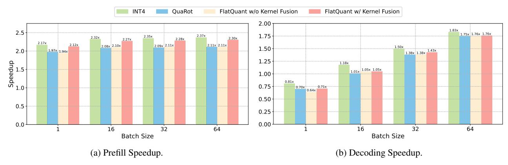
*الشكل 4: تسريع التعبئة المسبقة وفك الترميز لنموذج LLaMA-2-7B عبر أحجام دفعات مختلفة. نُفكّ ترميز 256 رمزًا بعد التعبئة المسبقة على طول تسلسل 2048.*

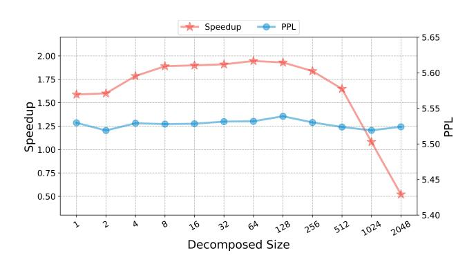
*الشكل 5: تسريع التعبئة المسبقة ونتائج WikiText2 PPL لأحجام مصفوفات مُحلَّلة مختلفة على نموذج LLaMA-2-7B. نُحلّل البُعد المخفي 4096 إلى n_1 \times n_2 ونُغيّر n_1 من 1 إلى 2048، حيث n_1 = 1 يعادل الحفاظ على مصفوفة تحويل بحجم كامل. مزيد من التفاصيل في الملحق C.6.*

كما هو موضح، تؤثر الأحجام المتفاوتة للمصفوفات في جداء كرونيكر بشكل كبير على التسريع. ومع ذلك، فإن لها تأثيرًا محدودًا على حيرة النص المُولَّد. يبلغ التسريع ذروته عندما يكون \mathbf{P}_1 و \mathbf{P}_2 بحجم متساوٍ (أي n_1=n_2=\sqrt{n}=64)، كما تنبأ به تحليلنا النظري في القسم 3.1. عندما يتجاوز n_2 64، يقل التسريع بسرعة بسبب أنماط الوصول إلى الذاكرة غير المنتظمة للتنشيطات. تُظهر هذه النتائج أيضًا فعالية FLATQUANT في تقليل عبء الاستدلال مع الحفاظ على دقة التكميم باستخدام جداء كرونيكر.

عبء كل تحويل عبر الإنترنت. نتحقق الآن من تأثير التحويلات الخمسة عبر الإنترنت (أي \{\mathbf{P}_a, \mathbf{P}_o, \mathbf{P}_h, \mathbf{P}_{ug}, \mathbf{P}_d\}) في FLATQUANT على التسريع الإجمالي، كما هو موضح في الشكل 6. حتى مع خمسة تحويلات لكل طبقة، يؤدي FLATQUANT إلى تباطؤ من البداية إلى النهاية بحد أدنى 0.07x، متفوقًا بشكل كبير على QuaRot الذي يبلغ 0.26x مع ثلاثة تحويلات Hadamard فقط. على وجه التحديد، \mathbf{P}_d في FLATQUANT يُسبّب تباطؤًا قدره 0.04x بسبب الأحجام الوسيطة الكبيرة لـ FFN، مقارنة بـ QuaRot

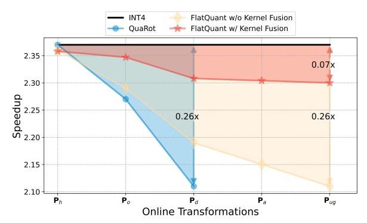
*الشكل 6: تسريع التعبئة المسبقة لـ LLaMA-2-7B على طول تسلسل 2048 تحت حجم دفعة 64 بعد تطبيق تحويلات مختلفة عبر الإنترنت. ندمج تحويلات مختلفة عبر الإنترنت بشكل تسلسلي لقياس تأثيرها على التسريع النهائي. تُشير كل نقطة على المحور x إلى إضافة تحويل جديد عبر الإنترنت.*

الذي يبلغ 0.17x. وفي الوقت نفسه، يؤدي \mathbf{P}_o إلى تباطؤ قدره 0.01x، مقابل 0.1x لـ QuaRot. للتحويلات المتبقية (أي \mathbf{P}_a و \mathbf{P}_{ug}) تأثير غير ذي أهمية أقل من 0.01x. أخيرًا، يمكن العثور على أنه حتى بدون دمج النواة، فإن التحويلات الإضافية في FLATQUANT لا تزال على قدم المساواة مع QuaRot، بفضل جداء كرونيكر لمصفوفتين خفيفتي الوزن.

## 4.4. المناقشات

<!-- page 9 -->

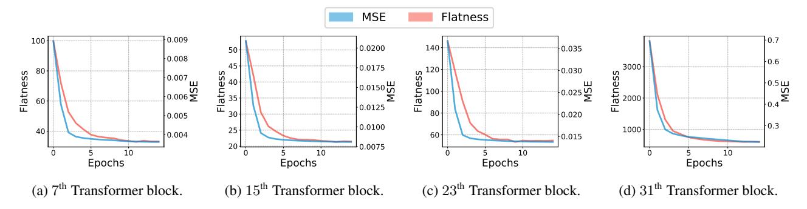
*الشكل 7: الاستواء ومتوسط خطأ التكميم التربيعي (MSE) لكتل Transformer مختلفة في LLaMA-3-8B خلال عملية تدريب FLATQUANT. مقياس الاستواء يُحسب كمجموع المسافات الإقليدية \|\mathbf{d} - \mathbf{d}'\|_2 لجميع الأوزان والتنشيطات داخل كتلة Transformer.*

دراسة الاستئصال. نُجري دراسات استئصال لـ FLATQUANT تركّز على مكوناته الرئيسية: 1) التحويل القابل للتعلم (LT)؛ 2) القياس لكل قناة (PS)؛ و 3) عتبات القص القابلة للتعلم (LCT). انطلاقًا من RTN كخط أساس، نقيّم تأثير كل مكون على الحيرة ومتوسط الدقة على مهام QA بدون أمثلة بناءً على LLaMA-3-8B. كما هو موضح في الجدول 3، فإن تمكين LT يُعزّز بشكل كبير دقة النموذج المكمم، مُخفّضًا PPL من 1266.60 إلى 8.50 على WikiText-2. هذا يُظهر أن LT قادر على تسطيح توزيع الأوزان والتنشيطات بشكل تكيفي. علاوة على ذلك، فإن دمج PS و LCT يُحسّن PPL أكثر بـ 0.55 و 0.84، على التوالي، مما يُظهر ضرورة كل مكون لتعزيز الأداء. ونظرًا لمحدودية المساحة، نترك دراسة الاستئصال الأكثر شمولاً في الملحق C.4.

**FLATQUANT يؤدي إلى الاستواء.** ولمزيد من تحليل كيف يُعزّز FLATQUANT الاستواء، نُقيّم كميًا استواء الأوزان والتنشيطات من خلال تحليل توزيعات مقاديرها على مستوى القناة. على وجه التحديد، يُمثَّل كل توزيع كمتجه أحادي البعد d، كما هو موضح في الشكل 1. نقيس الاستواء بمتوسط الخطأ التربيعي (MSE) بين التوزيع المُلاحَظ d والتوزيع المثالي تمامًا المستوي d'. يُعرَّف التوزيع المستوي \mathbf{d}' بحيث تمتلك جميع القنوات مقادير متساوية ونفس معيار \ell_2 لـ d، أي \mathbf{d}' = \frac{\|\mathbf{d}\|_2}{\sqrt{N}} \cdot \mathbf{1}_N، حيث N هو عدد القنوات و \mathbf{1}_N هو متجه ذو N بُعد بجميع المدخلات تساوي واحدًا. وبالتالي، تعمل المسافة الإقليدية \|\mathbf{d} - \mathbf{d}'\|_2 كمقياس استوائنا، حيث تُشير القيم الأصغر إلى توزيعات أقرب إلى التوحد عبر جميع القنوات. في الشكل 7، نُصوّر تطور الاستواء وهدف التدريب (المعادلة 4) عبر كتل Transformer المختلفة لـ LLaMA-3-8B خلال التدريب. مع تناقص خسارة التدريب، تصبح توزيعات القنوات مستوية بشكل متزايد. هذا يُشير إلى أن FLATQUANT يتعلم تحويلات أفضل للحصول على توزيع أكثر استواءً مما يساهم في النهاية في تقليل خطأ التكميم، أي أن الاستواء مهم لتكميم النماذج اللغوية الكبيرة.

ونظرًا لقيود المساحة، نُقدّم تجارب ومناقشات إضافية في الملحق C.5، بما في ذلك تأثير بيانات المعايرة، وتأثير القص القابل للتعلم وأنظمة الدقة المختلطة. كما نُحلل استهلاك ذاكرة الاستدلال في الملحق C.7. تُقدَّم مرئيات إضافية لمناظر الاستواء وخطأ التكميم في الملحق D.1 و D.2، على التوالي.

## 5. الاستنتاجات

في هذه الدراسة، نُعيد النظر في أهمية الأوزان والتنشيطات المستوية للتكميم الفعّال، ونجد أن الحلول الموجودة لا تزال تُنتج قيمًا منتشرة وحادة بعد التحويل قبل التكميم. لذلك، نُقدّم FLATQUANT، طريقة جديدة للتكميم بعد التدريب بهدف تحديد تحويلات سريعة وقابلة للتعلم لكل طبقة خطية، لتعزيز استواء الأوزان والتنشيطات. تُظهر التجارب المكثفة تفوق FLATQUANT، على سبيل المثال، مع انخفاض في الدقة أقل من 1% للتكميم W4A4 على LLaMA-3-70B. يدمج دمج النواة الفعّال لدينا التحويل الأفيني والتكميم، مما يُحقّق تسريعًا يصل إلى 2.3x و 1.7x على استدلال FP16 في مرحلتي التعبئة المسبقة وفك الترميز، على التوالي. نأمل أن يُقدّم هذا العمل التطبيق العملي للتكميم منخفض البتات للنماذج اللغوية الكبيرة.

## **بيان الأثر**

تُقدّم هذه الورقة عملاً يهدف إلى النهوض بمجال تعلم الآلة من خلال تحسين كفاءة النماذج اللغوية الكبيرة عبر تقنيات تكميم محسّنة. هذه التحسينات لها القدرة على خفض التكاليف التشغيلية واستهلاك الطاقة، مما يُمكّن من الوصول الأوسع إلى الذكاء الاصطناعي، ويُعزّز الاستخدام الأكثر إنصافًا للتقنيات المتقدمة. ومع ذلك، من المهم الاعتراف بأن التكميم لا يعالج التحيزات المجتمعية المتأصلة في بيانات التدريب. إن التفكير المتأني والنشر المسؤول للنماذج المكممة ضروريان للتخفيف من المخاطر الأخلاقية وضمان استخدامها العادل.

<!-- page 10 -->

## المراجع

- Achiam, J., Adler, S., Agarwal, S., Ahmad, L., Akkaya, I., Aleman, F. L., Almeida, D., Altenschmidt, J., Altman, S., Anadkat, S., et al. Gpt-4 technical report. arXiv preprint arXiv:2303.08774, 2023.
- Ashkboos, S., Markov, I., Frantar, E., Zhong, T., Wang, X., Ren, J., Hoefler, T., and Alistarh, D. Towards end-toend 4-bit inference on generative large language models. arXiv preprint arXiv:2310.09259, 2023.
- Ashkboos, S., Mohtashami, A., Croci, M. L., Li, B., Jaggi, M., Alistarh, D., Hoefler, T., and Hensman, J. Quarot: Outlier-free 4-bit inference in rotated llms. arXiv preprint arXiv:2404.00456, 2024.
- Bai, H., Zhang, W., Hou, L., Shang, L., Jin, J., Jiang, X., Liu, Q., Lyu, M., and King, I. Binarybert: Pushing the limit of bert quantization. arXiv preprint arXiv:2012.15701, 2020.
- Bai, H., Hou, L., Shang, L., Jiang, X., King, I., and Lyu, M. R. Towards efficient post-training quantization of pretrained language models. Advances in neural information processing systems, 35:1405–1418, 2022.
- Bisk, Y., Zellers, R., Gao, J., Choi, Y., et al. Piqa: Reasoning about physical commonsense in natural language. In Proceedings of the AAAI conference on artificial intelligence, volume 34, pp. 7432–7439, 2020.
- Chee, J., Cai, Y., Kuleshov, V., and De Sa, C. M. Quip: 2-bit quantization of large language models with guarantees. Advances in Neural Information Processing Systems, 36, 2024.
- Chen, X., Bai, H., Yuan, T., Liu, R., Zhao, K., Yu, X., Hou, L., Guan, T., He, Y., and Yuan, C. A simple linear patch revives layer-pruned large language models. arXiv preprint arXiv:2505.24680, 2025.
- Chmiel, B., Banner, R., Shomron, G., Nahshan, Y., Bronstein, A., Weiser, U., et al. Robust quantization: One model to rule them all. Advances in neural information processing systems, 33:5308–5317, 2020.
- Clark, P., Cowhey, I., Etzioni, O., Khot, T., Sabharwal, A., Schoenick, C., and Tafjord, O. Think you have solved question answering? try arc, the ai2 reasoning challenge. arXiv preprint arXiv:1803.05457, 2018.
- Dettmers, T., Lewis, M., Belkada, Y., and Zettlemoyer, L. Gpt3. int8 (): 8-bit matrix multiplication for transformers at scale. Advances in Neural Information Processing Systems, 35:30318–30332, 2022.

- Duanmu, H., Yuan, Z., Li, X., Duan, J., Zhang, X., and Lin, D. Skvq: Sliding-window key and value cache quantization for large language models. arXiv preprint arXiv:2405.06219, 2024.
- Dubey, A., Jauhri, A., Pandey, A., Kadian, A., Al-Dahle, A., Letman, A., Mathur, A., Schelten, A., Yang, A., Fan, A., et al. The llama 3 herd of models. arXiv preprint arXiv:2407.21783, 2024.
- Frantar, E., Ashkboos, S., Hoefler, T., and Alistarh, D. Optq: Accurate quantization for generative pre-trained transformers. In The Eleventh International Conference on Learning Representations, 2022.
- Gao, L., Tow, J., Biderman, S., Black, S., DiPofi, A., Foster, C., Golding, L., Hsu, J., McDonell, K., Muennighoff, N., et al. A framework for few-shot language model evaluation. Version v0. 0.1. Sept, 10:8–9, 2021.
- Hooper, C., Kim, S., Mohammadzadeh, H., Mahoney, M. W., Shao, Y. S., Keutzer, K., and Gholami, A. Kvquant: Towards 10 million context length llm inference with kv cache quantization. arXiv preprint arXiv:2401.18079, 2024.
- Huang, W., Ma, X., Qin, H., Zheng, X., Lv, C., Chen, H., Luo, J., Qi, X., Liu, X., and Magno, M. How good are low-bit quantized llama3 models? an empirical study. arXiv preprint arXiv:2404.14047, 2024.
- Jacob, B., Kligys, S., Chen, B., Zhu, M., Tang, M., Howard, A., Adam, H., and Kalenichenko, D. Quantization and training of neural networks for efficient integerarithmetic-only inference. In Proceedings of the IEEE conference on computer vision and pattern recognition, pp. 2704–2713, 2018.
- Jiang, A. Q., Sablayrolles, A., Mensch, A., Bamford, C., Chaplot, D. S., Casas, D. d. l., Bressand, F., Lengyel, G., Lample, G., Saulnier, L., et al. Mistral 7b. arXiv preprint arXiv:2310.06825, 2023.
- Kim, S., Hooper, C. R. C., Gholami, A., Dong, Z., Li, X., Shen, S., Mahoney, M. W., and Keutzer, K. Squeezellm: Dense-and-sparse quantization. In International Conference on Machine Learning, pp. 23901–23923. PMLR, 2024.
- Li, S., Ning, X., Wang, L., Liu, T., Shi, X., Yan, S., Dai, G., Yang, H., and Wang, Y. Evaluating quantized large language models. arXiv preprint arXiv:2402.18158, 2024.
- Li, Y., Gong, R., Tan, X., Yang, Y., Hu, P., Zhang, Q., Yu, F., Wang, W., and Gu, S. Brecq: Pushing the limit of post-training quantization by block reconstruction. arXiv preprint arXiv:2102.05426, 2021.

<!-- page 11 -->

- Lin, J., Tang, J., Tang, H., Yang, S., Chen, W.-M., Wang, W.-C., Xiao, G., Dang, X., Gan, C., and Han, S. Awq: Activation-aware weight quantization for llm compression and acceleration. arXiv preprint arXiv:2306.00978, 2023.
- Lin, Y., Tang, H., Yang, S., Zhang, Z., Xiao, G., Gan, C., and Han, S. Qserve: W4a8kv4 quantization and system co-design for efficient llm serving. arXiv preprint arXiv:2405.04532, 2024.
- Liu, R., Bai, H., Lin, H., Li, Y., Gao, H., Xu, Z., Hou, L., Yao, J., and Yuan, C. Intactkv: Improving large language model quantization by keeping pivot tokens intact. arXiv preprint arXiv:2403.01241, 2024a.
- Liu, R., Sun, Y., Zhang, M., Bai, H., Yu, X., Yu, T., Yuan, C., and Hou, L. Quantization hurts reasoning? an empirical study on quantized reasoning models. arXiv preprint arXiv:2504.04823, 2025.
- Liu, Z., Yuan, J., Jin, H., Zhong, S., Xu, Z., Braverman, V., Chen, B., and Hu, X. Kivi: A tuning-free asymmetric 2bit quantization for kv cache. arXiv preprint arXiv:2402.02750, 2024b.
- Liu, Z., Zhao, C., Fedorov, I., Soran, B., Choudhary, D., Krishnamoorthi, R., Chandra, V., Tian, Y., and Blankevoort, T. Spinquant–llm quantization with learned rotations. arXiv preprint arXiv:2405.16406, 2024c.
- Ma, X., Fang, G., and Wang, X. Llm-pruner: On the structural pruning of large language models. Advances in neural information processing systems, 36:21702–21720, 2023.
- Ma, Y., Li, H., Zheng, X., Ling, F., Xiao, X., Wang, R., Wen, S., Chao, F., and Ji, R. Affinequant: Affine transformation quantization for large language models. arXiv preprint arXiv:2403.12544, 2024.
- Merity, S., Xiong, C., Bradbury, J., and Socher, R. Pointer sentinel mixture models. In International Conference on Learning Representations, 2016.
- Nagel, M., Amjad, R. A., Van Baalen, M., Louizos, C., and Blankevoort, T. Up or down? adaptive rounding for post-training quantization. In International Conference on Machine Learning, pp. 7197–7206. PMLR, 2020.
- Paperno, D., Kruszewski, G., Lazaridou, A., Pham, N.- Q., Bernardi, R., Pezzelle, S., Baroni, M., Boleda, G., and Fernandez, R. The lambada dataset: Word predic- ´ tion requiring a broad discourse context. In Proceedings of the 54th Annual Meeting of the Association for Computational Linguistics, pp. 1525–1534, 2016.

- Paszke, A., Gross, S., Massa, F., Lerer, A., Bradbury, J., Chanan, G., Killeen, T., Lin, Z., Gimelshein, N., Antiga, L., et al. Pytorch: An imperative style, high-performance deep learning library. Advances in neural information processing systems, 32, 2019.
- Raffel, C., Shazeer, N., Roberts, A., Lee, K., Narang, S., Matena, M., Zhou, Y., Li, W., and Liu, P. J. Exploring the limits of transfer learning with a unified text-to-text transformer. The Journal of Machine Learning Research, 21(1):5485–5551, 2020.
- Sakaguchi, K., Bras, R. L., Bhagavatula, C., and Choi, Y. Winogrande: An adversarial winograd schema challenge at scale. Communications of the ACM, 64(9):99–106, 2021.
- Shao, W., Chen, M., Zhang, Z., Xu, P., Zhao, L., Li, Z., Zhang, K., Gao, P., Qiao, Y., and Luo, P. Omniquant: Omnidirectionally calibrated quantization for large language models. arXiv preprint arXiv:2308.13137, 2023.
- Shen, S., Dong, Z., Ye, J., Ma, L., Yao, Z., Gholami, A., Mahoney, M. W., and Keutzer, K. Q-bert: Hessian based ultra low precision quantization of bert. In Proceedings of the AAAI Conference on Artificial Intelligence, volume 34, pp. 8815–8821, 2020.
- Sun, M., Liu, Z., Bair, A., and Kolter, J. Z. A simple and effective pruning approach for large language models. arXiv preprint arXiv:2306.11695, 2023.
- Sun, M., Chen, X., Kolter, J. Z., and Liu, Z. Massive activations in large language models. arXiv preprint arXiv:2402.17762, 2024.
- Tillet, P., Kung, H.-T., and Cox, D. Triton: an intermediate language and compiler for tiled neural network computations. In Proceedings of the 3rd ACM SIGPLAN International Workshop on Machine Learning and Programming Languages, pp. 10–19, 2019.
- Touvron, H., Martin, L., Stone, K., Albert, P., Almahairi, A., Babaei, Y., Bashlykov, N., Batra, S., Bhargava, P., Bhosale, S., et al. Llama 2: Open foundation and fine-tuned chat models. arXiv preprint arXiv:2307.09288, 2023.
- Tseng, A., Chee, J., Sun, Q., Kuleshov, V., and De Sa, C. Quip#: Even better llm quantization with hadamard incoherence and lattice codebooks. arXiv preprint arXiv:2402.04396, 2024.
- Wei, X., Zhang, Y., Zhang, X., Gong, R., Zhang, S., Zhang, Q., Yu, F., and Liu, X. Outlier suppression: Pushing the limit of low-bit transformer language models. Advances in Neural Information Processing Systems, 35:17402– 17414, 2022.

<!-- page 12 -->

- Wei, X., Zhang, Y., Li, Y., Zhang, X., Gong, R., Guo, J., and Liu, X. Outlier suppression+: Accurate quantization of large language models by equivalent and effective shifting and scaling. In The 2023 Conference on Empirical Methods in Natural Language Processing, 2023.
- Wolf, T. Huggingface's transformers: State-of-theart natural language processing. arXiv preprint arXiv:1910.03771, 2019.
- Xi, H., Li, C., Chen, J., and Zhu, J. Training transformers with 4-bit integers. Advances in Neural Information Processing Systems, 36:49146–49168, 2023.
- Xiao, G., Lin, J., Seznec, M., Wu, H., Demouth, J., and Han, S. Smoothquant: Accurate and efficient post-training quantization for large language models. In International Conference on Machine Learning, pp. 38087–38099. PMLR, 2023.
- Yang, A., Yang, B., Hui, B., Zheng, B., Yu, B., Zhou, C., Li, C., Li, C., Liu, D., Huang, F., et al. Qwen2 technical report. arXiv preprint arXiv:2407.10671, 2024.
- Ye, Z. Flashinfer: Kernel library for llm serving. 2023. URL [https://github.com/flashinfer-ai/](https://github.com/flashinfer-ai/flashinfer) [flashinfer](https://github.com/flashinfer-ai/flashinfer).
- Zellers, R., Holtzman, A., Bisk, Y., Farhadi, A., and Choi, Y. Hellaswag: Can a machine really finish your sentence? In Proceedings of the 57th Annual Meeting of the Association for Computational Linguistics, pp. 4791– 4800, 2019.
- Zhang, Y., Bai, H., Lin, H., Zhao, J., Hou, L., and Cannistraci, C. V. Plug-and-play: An efficient post-training pruning method for large language models. In The Twelfth International Conference on Learning Representations, 2024.
- Zhao, Y., Lin, C.-Y., Zhu, K., Ye, Z., Chen, L., Zheng, S., Ceze, L., Krishnamurthy, A., Chen, T., and Kasikci, B. Atom: Low-bit quantization for efficient and accurate llm serving. Proceedings of Machine Learning and Systems, 6:196–209, 2024.

<!-- page 13 -->

## أ. الأعمال ذات الصلة

التكميم للنماذج اللغوية الكبيرة. التكميم تقنية حاسمة لتقليل البصمة الذاكرية وتسريع الاستدلال من خلال استخدام عدد بتات أقل للتخزين والحساب. على عكس التشذيب [(Ma et al.,](#page-10-15) [2023;](#page-10-15) [Sun et al.,](#page-10-16) [2023;](#page-10-16) [Zhang et al.,](#page-11-8) [2024;](#page-11-8) [Chen et al.,](#page-9-16) [2025)](#page-9-16)، فإن التكميم لا يُغيّر بنية الشبكة وعادة ما يكون أكثر تنافسية في الأداء عند نفس نسبة الضغط. على عكس النماذج اللغوية المُدرَّبة مسبقًا السابقة [(Shen](#page-10-17) [et al.,](#page-10-17) [2020;](#page-10-17) [Bai et al.,](#page-9-5) [2020;](#page-9-5) [2022)](#page-9-17)، يتبيّن أن النماذج اللغوية الكبيرة تُظهر قيمًا شاذة في التنشيط وقيمًا شاذة هائلة في الرموز المحورية [(Wei](#page-10-18) [et al.,](#page-10-18) [2022;](#page-10-18) [Dettmers et al.,](#page-9-4) [2022;](#page-9-4) [Liu et al.,](#page-10-2) [2024a;](#page-10-2) [Sun et al.,](#page-10-3) [2024)](#page-10-3)، والتي يمكن أن تُقلّل بشدة من دقة التكميم، خاصة في مهام الاستدلال المعقدة [(Liu et al.,](#page-10-19) [2025)](#page-10-19). للقضاء على التأثير السلبي للقيم الشاذة، اعتُمدت التحويلات قبل التكميم على نطاق واسع في تكميم الوزن والتنشيط [(Xiao et al.,](#page-11-1) [2023;](#page-11-1) [Wei et al.,](#page-11-3) [2023;](#page-11-3) [Shao et al.,](#page-10-6) [2023;](#page-10-6) [Ma et al.,](#page-10-5) [2024;](#page-10-5) [Ashkboos et al.,](#page-9-9) [2024;](#page-9-9) [Liu et al.,](#page-10-4) [2024c)](#page-10-4) وكذلك في التدريب المكمم بالكامل [(Xi et al.,](#page-11-2) [2023)](#page-11-2). علاوة على ذلك، تدمج العديد من طرق تكميم الأوزان فقط [(Lin et al.,](#page-10-0) [2023;](#page-10-0) [Chee et al.,](#page-9-18) [2024;](#page-9-18) [Tseng et al.,](#page-10-20) [2024)](#page-10-20) التحويلات قبل التكميم. كما يُستكشف أيضًا استخدام عتبات قص مبحوثة أو قابلة للتعلم للأوزان أو التنشيطات [(Lin et al.,](#page-10-0) [2023;](#page-10-0) [Duanmu et al.,](#page-9-19) [2024;](#page-9-19) [Ashkboos et al.,](#page-9-9) [2024;](#page-9-9) [Liu et al.,](#page-10-4) [2024c;](#page-10-4) [Shao et al.,](#page-10-6) [2023)](#page-10-6) للقضاء على القيم الشاذة.

تحويل القياس لكل قناة. يستخدم SmoothQuant [(Xiao et al.,](#page-11-1) [2023)](#page-11-1) القياس لكل قناة لنقل تحدي التكميم من التنشيطات إلى الأوزان في تكميم الوزن والتنشيط. وبناءً على ذلك، يقدم [Wei et al.](#page-11-3) [(2023)](#page-11-3) إزاحة على مستوى القناة، بينما يستخدم OmniQuant [(Shao et al.,](#page-10-6) [2023)](#page-10-6) نهجًا قابلاً للتفاضل لتعلم معاملات القياس والإزاحة المثلى. ومع ذلك، يمكن للطرق القائمة على القياس أن تؤثر سلبًا على تكميم الأوزان وتعاني في إعدادات البتات المنخفضة، مثل تكميم W4A4.

تحويل Hadamard والتحويل المتعامد. أظهرت الأبحاث الحديثة [(Xi et al.,](#page-11-2) [2023;](#page-11-2) [Tseng et al.,](#page-10-20) [2024;](#page-10-20) [Ashkboos et al.,](#page-9-9) [2024)](#page-9-9) أن تحويل Hadamard فعّال في القضاء على القيم الشاذة وتقليل خطأ التكميم من خلال إعادة توزيع القيم الشاذة عبر جميع القنوات من خلال ضرب المصفوفات. QuaRot [(Ashkboos et al.,](#page-9-9) [2024)](#page-9-9) هو الأول في تطبيق تحويل Hadamard في إعداد LLM W4A4 PTQ، بينما يستغل SpinQuant [(Liu et al.,](#page-10-4) [2024c)](#page-10-4) مصفوفات متعامدة قابلة للتعلم بخسارة على مستوى النموذج لمزيد من تخفيف القيم الشاذة.

التحويل الأفيني. باعتبار أن القياس لكل قناة يتوافق مع العناصر القطرية لمصفوفة التحويل الأفيني، يقترح AffineQuant [(Ma et al.,](#page-10-5) [2024)](#page-10-5) تعلم التحويل الأفيني المُكافئ. ومع ذلك، يُركّز نهجهم على تعلم مصفوفات قطرية مهيمنة بحجم كامل ويستخدم طريقة تحسين قناع تدريجية، مما قد يُعيق الإمكانات الكاملة للتحويل الأفيني في تقليل خسارة التكميم. علاوة على ذلك، نظرًا للعبء الهائل المرتبط بضرب المصفوفات بالحجم الكامل، يمكن لـ AffineQuant تطبيق التحويل الأفيني فقط على جزء صغير من الطبقات الخطية. في المقابل، نستخدم تحويلات أفينية سريعة وقابلة للتعلم بدون هذه القيود، مما يؤدي إلى تحسينات كبيرة في الدقة وتسريع عملي.

التحويلات قبل التكميم في مهام تكميم أخرى. مستوحى من SmoothQuant، يقدم AWQ [(Lin et al.,](#page-10-0) [2023)](#page-10-0) قياسًا لكل قناة مدركًا للتنشيط لتقليل أخطاء التكميم في تكميم الأوزان فقط. يستفيد QUIP [(Chee](#page-9-18) [et al.,](#page-9-18) [2024)](#page-9-18) وامتداده، QUIP# [(Tseng et al.,](#page-10-20) [2024)](#page-10-20)، من مصفوفات الدوران العشوائي أو تحويلات Hadamard لتعزيز عدم التماسك في تكميم الأوزان فقط. في مهمة التدريب المكمم بالكامل، يقترح [(Xi et al.,](#page-11-2) [2023)](#page-11-2) استخدام تحويل قطري كتلي يتألف من مصفوفات Hadamard لتقليل خطأ التكميم.

## ب. تفاصيل التنفيذ

## ب.1. معكوس المصفوفة وتكلفة التدريب

جانب حاسم لتنفيذ FLATQUANT هو حساب مصفوفة التحويل الأفيني المعكوسة P^−^^1^. كما هو مُناقش أدناه، نستخدم تحلل القيمة المفردة (SVD) والدقة المختلطة التلقائية لتدريب FLATQUANT، متمتعين باستقرار التدريب وكفاءته.

العكس المباشر والتدريب FP32. أحد الأساليب المباشرة هو استخدام دالة العكس المُقدّمة من PyTorch. ومع ذلك، نجد أن دقة دالة العكس هذه عند FP16 غير كافية. على وجه التحديد، PP^−^^1^ لا يُقارب I بشكل وثيق. العناصر خارج القطر بترتيب 1 × 10^−^^3^، مما يؤثر سلبًا على أداء FLATQUANT خلال المراحل الأولى من التدريب. لذلك، فإن الحل البسيط هو إجراء التدريب في FP32 بدون الدقة المختلطة التلقائية (AMP) للحفاظ على الدقة. ومع ذلك، فإن هذا يزيد حتمًا من وقت التدريب واستهلاك ذاكرة GPU أكثر.

<!-- page 14 -->

**التدريب SVD و AMP.** ولمزيد من تقليل متطلبات الموارد خلال المعايرة، نقترح استخدام تحلل القيمة المفردة للتحويل الأفيني. لأي مصفوفة حقيقية \mathbf{P}، يمكننا تحليلها كـ \mathbf{P} = \mathbf{U} \mathbf{\Sigma} \mathbf{V}^{\top}، حيث \mathbf{U} و \mathbf{V} مصفوفتان متعامدتان، و \mathbf{\Sigma} مصفوفة قطرية. تسمح لنا هذه الصياغة بحساب \mathbf{P}^{-1} = \mathbf{V} \mathbf{\Sigma}^{-1} \mathbf{U}^{\top} بسهولة، مما يُقدّم طريقة أكثر كفاءة حسابيًا للحصول على المعكوس. والجدير بالذكر أن هذا النهج يُقلّل من العناصر خارج القطر لـ \mathbf{PP}^{-1} إلى ترتيب 1 \times 10^{-6} بدقة FP16، مما يمكّننا من استخدام AMP خلال المعايرة. مع AMP، يمكننا تحقيق تخفيض بنسبة 50% في وقت التدريب واستخدام الذاكرة مع الحفاظ على دقة شبه خالية من الخسائر في معظم الحالات. للمصفوفات المتعامدة \mathbf{U} و \mathbf{V}، نستخدم معاملة Cayley المُقدّمة من PyTorch ^3.

**مقارنة وصفتي التدريب.** نُقارن وصفتي التدريب في الجدول 4. كما هو موضح، فإن التدريب FP32 يتطلب أكثر من ضعف وقت التدريب AMP ويستلزم 1.28x من ذاكرة GPU أكثر تحت نفس الإعداد، بينما يبقى الأداء قريبًا نسبيًا. وبالتالي، فإن خيارنا الافتراضي هو نهج SVD مدمجًا مع التدريب AMP. ومع ذلك، نلاحظ أنه في نماذج معينة أو سيناريوهات منخفضة البتات للغاية، قد تحدث أخطاء عددية ضمن إطار AMP. في مثل هذه الحالات، يصبح التدريب بدقة كاملة ضروريًا.

وقت المعايرة. نُقدّم أيضًا وقت المعايرة المطلوب من قبل FLATQUANT لعائلة LLaMA في الجدول 5. مقارنة بـ SpinQuant (Liu et al., 2024c) وطرق QAT، يتطلب FLATQUANT موارد حسابية أقل بكثير ووقت تدريب أقل، مع تقديم أداء متفوق. لتكميم الأوزان فقط، تُقدَّم فقط التحويلات المتعلقة بأوزان الخطية، مما يؤدي إلى وقت معايرة أقصر مقارنة بتكميم الوزن والتنشيط. علاوة على ذلك، كما هو مُناقش في القسم 4.2، لا يحتاج FLATQUANT إلى الدمج مع GPTQ لتحقيق الأداء الأمثل، مما يُقلّل من عبء المعايرة بشكل أكبر.

## **ب.2.** تحليل عبء التحويلات الأفينية

إجمالي FLOPs للتحويلات عبر الإنترنت. (1) الانتباه الذاتي. وحدة الانتباه الذاتي لها ثلاثة تحويلات عبر الإنترنت، أي \{\mathbf{P}_a, \mathbf{P}_o, \mathbf{P}_h\}. لنفترض أن البُعد المخفي h_d والبُعد الوسيط h_i لـ LLM يمكن تحليلهما بشكل مثالي إلى \sqrt{h_d} \times \sqrt{h_d} و \sqrt{h_i} \times \sqrt{h_i}، على التوالي، فإن إجمالي FLOPs لـ \{\mathbf{P}_a, \mathbf{P}_o, \mathbf{P}_h\} هو 4bsh_d\sqrt{h_d} + 2bsh_da + 4bsh_d^2/a، حيث b هو حجم الدفعة، s هو طول التسلسل، و a هو عدد رؤوس الانتباه. (2) شبكة التغذية الأمامية. وحدة التغذية الأمامية لها تحويلان عبر الإنترنت، أي \{\mathbf{P}_{ug}, \mathbf{P}_d\}. إجمالي FLOPs لـ \{\mathbf{P}_{ug}, \mathbf{P}_d\} هو 4bsh_d\sqrt{h_d} + 4bsh_i\sqrt{h_i}. باختصار، إجمالي FLOPs للتحويلات عبر الإنترنت في كتلة Transformer يصل إلى 8bsh_d\sqrt{h_d} + 2bsh_da + 4bsh_d^2/a + 4bsh_i\sqrt{h_i}. في LLaMA-2-7B (أي h_d = 4096، h_i = 11008 و a = 32)، تُمثّل FLOPs للتحويلات عبر الإنترنت فقط حوالي 2.61% من تلك الخاصة بنموذج FP16 عندما يبلغ s 2048.

> ^^3^https://pytorch.org/docs/stable/generated/torch.nn.utils.parametrizations.orthogonal.html

<!-- page 15 -->

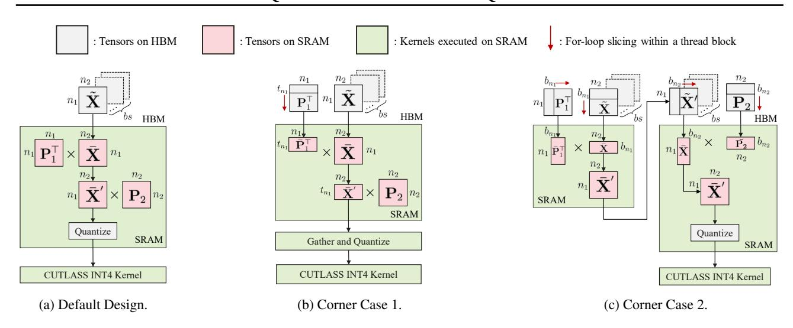
*الشكل 8: التصور لدمج النواة في FLATQUANT بناءً على الحساب داخل كتلة الخيوط. التصميم يُحقّق بشكل أساسي لـ (أ)، حيث يتم دمج كل من التحويلات والتكميم معًا. للاكتمال، نُعيد أيضًا النظر في التصميم للحالات الزاويّة في (ب) و (ج)، عندما لا يكون SRAM كبيرًا بما يكفي لاحتواء النتائج الوسيطة.*

**استهلاك الذاكرة للتحويلات عبر الإنترنت.** نحسب عدد المعاملات لكل تحويل عبر الإنترنت أدناه: (1) \mathbf{P}_a: 2(\sqrt{h_d})^2; (2) \mathbf{P}_o: a^2; (3) \mathbf{P}_h: (h_d/a)^2; (4) \mathbf{P}_{ug}: 2(\sqrt{h_d})^2; (5) \mathbf{P}_d: 2(\sqrt{h_i})^2. إجمالي عدد المعاملات في كتلة Transformer واحدة هو 4h_d + 2h_i + a^2 + (h_d/a)^2. استهلاك الذاكرة الإضافي خلال الاستدلال هو 2(4h_d + 2h_i + a^2 + (h_d/a)^2) بايت، والذي يستهلك فقط حوالي 3.41MB من مساحة الذاكرة الإضافية لـ LLaMA-2-7B.

## **ب.3. التصميم التفصيلي لدمج النواة**

لتجنب الوصول الزائد إلى الذاكرة وتحسين الكفاءة الحسابية، نحاول دمج \mathcal{Q}(\mathbf{P}_1^\top \times_1 \tilde{\mathbf{X}} \times_2 \mathbf{P}_2) في نواة واحدة، تليها نواة INT4 CUTLASS لضرب الأوزان والتنشيطات المكممة بـ 4 بت. في معظم الحالات، تكون الذاكرة المشتركة لكل كتلة خيوط كافية لاحتواء مصفوفات المصدر \mathbf{P}_1, \mathbf{P}_2, \bar{\mathbf{X}}، ونتائجها الوسيطة \bar{\mathbf{X}}'، كما هو مُتصوَّر في الشكل 8a. ومع ذلك، توجد حالات زاويّة عندما تكون الذاكرة المشتركة غير كافية لاحتواء جميع التنسورات الضرورية (على سبيل المثال، n > 28762 مع n_1, n_2 > 128 على NVIDIA RTX 3090). وبالتالي، نُعيد النظر في تصميمنا للحالتين، كما هو موضح في الشكل 8b والشكل 8c، على التوالي. لتمييز هذه السيناريوهات بشكل أوضح، لدينا المعادلات التالية:

$$
**التصميم الافتراضي:**(n_1 \cdot n_1 + 2 \cdot n_1 \cdot n_2) \cdot 2 < m(n_2 \cdot n_2 + 2 \cdot n_1 \cdot n_2) \cdot 2 < m(5)**الحالة الزاويّة 1:**(t_{n_1} \cdot n_1 + n_1 \cdot n_2 + t_{n_1} \cdot n_2) \cdot 2 < m
$$

$$ (n_2 * n_2 + 2 * t_{n_1} * n_2) * 2 < m \tag{6} $$

$$
الحالة الزاويّة 2: (n_1 * b_{n_1} + b_{n_1} * n_2 + n_1 * n_2) * 2 < m

(n_1 * b_{n_2} + b_{n_2} * n_2 + n_1 * n_2) * 2 < m (7)
$$

حيث m هو حجم الذاكرة المشتركة لكل كتلة خيوط، t_{n_1} هو حجم التبليط لبُعد عدم الاختزال لـ \mathbf{P}_1، b_{n_1} هو حجم التبليط لبُعد الاختزال لـ \mathbf{P}_2 و 2 يُشير إلى بايتين لاحتواء التنسورات في float 16. أدناه نُراجع التصميمات للحالتين الزاويّتين على التوالي.

**الحالة الزاويّة 1.** عندما يكون كل من n و n_1 كبيرًا للغاية، يُقترح منع تحميل كامل \mathbf{P}_1 و \bar{\mathbf{X}} في SRAM. ندير ذلك من خلال تبليط بُعد عدم الاختزال لـ \mathbf{P}_1 إلى t_{n_1} شريحة. هذه الاستراتيجية تمكّننا من دمج \bar{\mathbf{P}}_1\bar{\mathbf{X}}\mathbf{P}_2 في نواة واحدة، مع \bar{\mathbf{P}}_1 يمثل شريحة من \mathbf{P}_1 على بُعد عدم الاختزال. بعد ذلك، نستدعي نواة مدمجة منفصلة للتكميم، تحسب مقياس التكميم وتقيس الإدخال.

**الحالة الزاويّة 2.** عندما يكون كل من n و n_2 كبيرًا للغاية، لا يمكن تحميل \mathbf{P}_1, \bar{\mathbf{X}} و \mathbf{P}_2 في SRAM معًا. لمعالجة ذلك، نحسب أولاً \bar{\mathbf{X}}' = \bar{\mathbf{P}}_1^{\top} \bar{\mathbf{X}}، حيث تُقطّع كل كتلة خيوط بُعد عدم الاختزال لـ \mathbf{P}_1 و \bar{\mathbf{X}} بشكل التبليط b_{n_1}. تُكتب المخرجات \tilde{\mathbf{X}}' مرة أخرى إلى الذاكرة العامة، وبالتالي تُحرَّر ذاكرة SRAM. بعد ذلك،

<!-- page 16 -->

نُقطّع بُعد عدم الاختزال لـ \tilde{\mathbf{X}}' و \mathbf{P}_2 بحجم تبليط b_{n_2}، ونحسب ضرب المصفوفات، يليه تكميم النتيجة فورًا.

**تشخيص النواة.** نُعدّد الأحجام المخفية الشهيرة في سلسلة نماذج LLaMA، ونُقدّم نتائج التشخيص التفصيلية للتحويل عبر الإنترنت في FLATQUANT مع وبدون دمج النواة في الجدول 6. لاحظ أن SRAM يمكنه احتواء جميع هذه الأشكال بالتصميم الافتراضي على NVIDIA RTX 3090. يمكن العثور على أن دمج النواة يحقق تسريعًا كبيرًا عبر أبعاد مخفية وأحجام دفعات مختلفة، على سبيل المثال، تسريع التعبئة المسبقة 1.5x-3x وتسريع فك الترميز 1.2x-4x، على التوالي. نختبر أيضًا بشكل انتقائي الحالتين الزاويّتين بالحجم المخفي 28762، وكلاهما يجلب تسريعًا كبيرًا قدره 2.3x.

<!-- page 17 -->

## ج. التجارب الإضافية

## ج.1. النتائج على بنى LLM أخرى

النتائج على LLaMA-3.1-8B-Instruct. بصرف النظر عن نماذج LLaMA المُدرَّبة مسبقًا، نتحقق أيضًا من أداء التكميم لـ LLaMA-3.1-8B-Instruct، وهو ممثل للنماذج اللغوية الكبيرة المضبوطة على التعليمات. تظهر حيرة النمذجة اللغوية ودقة مهام QA لـ LLaMA-3.1-8B-Instruct في الجدول [7،](#page-16-3) حيث يتفوق FLATQUANT مرة أخرى على QuaRot بهامش كبير.

النتائج على Qwen-2.5-Instruct. بالإضافة إلى سلسلة نماذج LLaMA، نُتحقق أيضًا من FLATQUANT على Qwen-2.5-Instruct، بما في ذلك نموذجي 7B و 32B. تُلخَّص النتائج على معايير النمذجة اللغوية و QA في الجدول [8.](#page-16-4) لنموذج 7B، حقق FLATQUANT أداءً متوسطًا أقل قليلاً مقارنة بخط الأساس FP16، بمتوسط درجة 68.62. لنموذج 32B، يُظهر FLATQUANT أيضًا أداءً تنافسيًا، محققًا متوسط درجة 74.89 (على سبيل المثال، انخفاض بنسبة 0.21% فقط)، وهو أقل قليلاً من خط الأساس FP16 ولكنه أعلى من QuaRot.

النتائج على DeepSeek-V3-Base و DeepSeek-R1. نُوسّع تقييم FLATQUANT أيضًا إلى DeepSeek-V3-Base و DeepSeek-R1، وكلاهما نماذج Mixture-of-Experts (MoE) واسعة النطاق بـ 671B معامل. يعرض الجدول [9](#page-16-5) النتائج تحت تكميم الأوزان والتنشيطات بـ 4 بت. يمكن العثور على أن FLATQUANT يحافظ على أداء قوي عبر كلا النموذجين، مما يُظهر قابليته للتطبيق خارج النماذج اللغوية الكبيرة الكثيفة القياسية.

## ج.2. النتائج على MT-Bench

بصرف النظر عن النمذجة اللغوية والإجابة على الأسئلة، نُقيّم أيضًا FLATQUANT على MT-Bench باستخدام نموذج LLaMA-3.1-8B-Instruct في الجدول [10.](#page-17-1) نستخدم GPT-4o كمُقيِّم لتبرير قدرة المحادثة متعددة الأدوار. يمكن العثور على أنه في حين يتأخر FLATQUANT عن خط الأساس FP16 في البرمجة و STEM، فإنه يتفوق باستمرار على QuaRot مع GPTQ عبر جميع الفئات، مُضيقًا الفجوة بين النموذج المكمم وخط الأساس FP16. والجدير بالذكر، أنه بالنسبة لمسائل الرياضيات، يتطابق FLATQUANT مع درجة خط الأساس FP16، متجاوزًا QuaRot بـ 1.9 نقطة.

<!-- page 18 -->

## ج.3. التوسع إلى المزيد من إعدادات التكميم

تكميم الأوزان فقط. في حين يُركّز تحليلنا الأساسي على أنظمة التكميم المشتركة الكاملة للوزن-التنشيط-ذاكرة kvcache (القسم [4.2)](#page-5-3)، يُظهر FLATQUANT تنوعًا ملحوظًا عبر نماذج التكميم المختلفة. يعرض الجدول [11](#page-17-2) نتائج تكميم الأوزان فقط مقارنة بعدة خطوط أساس متطورة في 4 بتات و 3 بتات. نتبنى التكميم المتماثل لكل قناة للأوزان، حافظين على الاتساق مع منهجية معالجة الأوزان لمخطط التكميم الكامل لدينا. يحصل FLATQUANT مرة أخرى على دقة رائدة مقارنة بخطوط الأساس الرائدة. على وجه التحديد، يتفوق على RTN و GTPQ و AWQ، بينما يتجاوز قليلاً GPTQ مع التكميم لكل مجموعة (حجم المجموعة = 128). وفي الوقت نفسه، يؤدي FLATQUANT بشكل مماثل لـ QuIP. علاوة على ذلك، نُبلّغ عن النتائج لـ FLATQUANT عند الدمج مع GPTQ، حيث يستخدم GPTQ نفس بيانات المعايرة لكل من تحديثات الأوزان ذات الشكل المغلق والتدريب. تظل النتائج متسقة مع النتائج في أنظمة التكميم المشتركة الكاملة للوزن-التنشيط-ذاكرة kvcache.

تكميم ذاكرة KV. ولمزيد من تقييم تنوعه، نُطبّق FLATQUANT على تكميم ذاكرة KV فقط. في هذا الإعداد، نحتفظ بالدقة العالية لبقية النموذج (بما في ذلك الأوزان والتنشيطات) ونُطبّق التكميم غير المتماثل على مستوى المجموعة (بحجم مجموعة 128) على المفاتيح والقيم. يعرض الجدول [12](#page-17-3) نتائج تكميم ذاكرة KV باستخدام عرض بتات مختلف على نموذج LLaMA-3-8B. متسقًا مع الدراسات السابقة [(Hooper et al.,](#page-9-20) [2024;](#page-9-20) [Liu et al.,](#page-10-21) [2024b;](#page-10-21) [Ashkboos et al.,](#page-9-9) [2024)](#page-9-9)، نلاحظ أن المفاتيح أكثر حساسية للتكميم من القيم. علاوة على ذلك، الجدول [13](#page-18-1)

<!-- page 19 -->

يُقارن FLATQUANT بـ QuaRot لتكميم ذاكرة KV على نموذجي LLaMA-2-7B و LLaMA-2-13B. كما هو موضح، يُقدّم FLATQUANT أداءً متفوقًا في معظم الحالات، خاصة لعدد بتات أقل (2-3 بت). عندما يتم تكميم كل من المفاتيح والقيم إلى 2 بت، يتفوق FLATQUANT على QuaRot بـ 2.57 في الحيرة لنموذج 7B.

**التكميم منخفض البتات للغاية.** نُكمّم النموذج اللغوي الكبير إلى تمثيلات منخفضة البتات للغاية (مثل INT3) للتحقق من قيود التكميم. تُظهر النتائج في الجدول 14 أن FLATQUANT لا يزال يحتفظ بمعظم قدرات النموذج في إعداد 3 بت، في حين يعاني QuaRot في ظل ظروف منخفضة البتات للغاية مثل هذه. ومع ذلك، يبقى التكميم 4 بت توازنًا أفضل بين كفاءة موارد الاستدلال وتدهور الأداء المقبول في الوقت الحاضر.

**درّب مرة واحدة واحصل على المزيد.** بشكل ملحوظ، نُظهر أن التحويلات الأفينية المُتعلَّمة من تكميم الوزن-التنشيط يمكن تطبيقها مباشرة على إعدادات تكميم أخرى، مثل تكميم الأوزان فقط أو تكميم ذاكرة KV، بأداء قوي بشكل مدهش. تُقدَّم النتائج المرتبطة في الجدول 15. على سبيل المثال، النتائج المُسمّاة "W4" مماثلة لتلك في الجدول 11 المُدرَّبة خصيصًا لتكميم الأوزان فقط. هذا يُوفّر الوقت بشكل كبير عند تطبيق FLATQUANT على إعدادات تكميم مختلفة، حيث تُحفظ مجموعة واحدة فقط من مصفوفات التحويل.

## ج.4. دراسة استئصال تفصيلية

لفصل مساهمات التحويلات الأفينية وعتبات القص بشكل أفضل، نُقدّم نتائج الاستئصال الكاملة في الجدول 16، كامتداد للتحليل في الجدول 3. تُسلّط النتائج الضوء على فعالية كل مكون في FLATQUANT، مع التحويلات القابلة للتعلم (LT) التي تلعب دورًا محوريًا. علاوة على ذلك، عند البناء على LT، تُعزّز المكونات الأخرى الأداء العام لـ FLATQUANT.

<!-- page 20 -->

## ج.5. مناقشات إضافية

مجموعة المعايرة. بما أن FLATQUANT يستخدم طريقة قائمة على التدرج لتحسين التحويلات لمزيد من الاستواء، فإن أحد المخاوف المعقولة هو ما إذا كان FLATQUANT قد يُفرط في التكيف مع مجموعة المعايرة. لتقييم قدرته على التعميم، أجرينا دراسة استئصال باستخدام مجموعات بيانات معايرة مختلفة: WikiText-2، C4، و Pile. كما هو موضح في الجدول 17، يحافظ FLATQUANT على أداء مستقر عبر جميع مجموعات البيانات. على سبيل المثال، عند المعايرة على مجموعات بيانات مختلفة، يُظهر FLATQUANT أداءً مماثلاً على WikiText-2، مع PPL يتراوح من 6.98 إلى 7.04. على مجموعة بيانات C4، النتائج متسقة بنفس القدر، مع PPLs بين 11.05 و 11.13. علاوة على ذلك، تظل دقة QA في نطاق ضيق (71.04% إلى 71.23%)، مما يُشير إلى أن FLATQUANT يُعمّم بشكل جيد عبر مجموعات بيانات معايرة مختلفة. تُعزى هذه المتانة إلى تركيز FLATQUANT على تعلم تحويل أفيني مكافئ بأقل خسارة تكميم، بدلاً من تغيير أوزان النموذج. ومع ذلك، من المعقول افتراض أن تنوع بيانات المعايرة يمكن أن يعزز أداء طريقتنا أكثر.

تأثير القص. في حين أن قص الأوزان قد اعتُمد على نطاق واسع في تكميم النماذج اللغوية الكبيرة، يبقى قص التنشيط مستكشفًا نسبيًا بشكل أقل. أظهرت الأعمال السابقة (Ashkboos et al., 2024; Liu et al., 2024c) أن قص التنشيط بمفرده يُحقّق فوائد محدودة، ويرجع ذلك أساسًا إلى وجود قيم شاذة شديدة. في المقابل، تُظهر طريقتنا أن عتبات القص القابلة للتعلم (LCT)، عند تطبيقها بعد التحويل، تُحقّق تحسينات كبيرة. كما هو موضح في الجدول 18، فإن تطبيق LCT قبل التحويل، مشابه لنهج RTN، يُحقّق مكاسب هامشية فقط. تتسق هذه الملاحظة مع النتائج السابقة (Dettmers et al., 2022)، مما يُشير إلى أن القص المبكر يفشل في كبح القيم الشاذة للتنشيط بفعالية. في طريقتنا، يُعيد التحويل الأفيني توزيع القيم الشاذة عبر القنوات، مما يمكّن خطوة LCT اللاحقة من قص جزء أكبر من القيم المتطرفة بشكل أكثر فعالية. والأهم من ذلك، يحتفظ التحويل العكسي بالقدرة على استرداد المقياس الأصلي للإشارات الإعلامية، وبالتالي الحفاظ على جودة النموذج بعد التكميم. للمقارنة، نُبلّغ أيضًا عن النتائج باستخدام استراتيجية قص بنمط QuaRot (بعتبات 0.9 للتنشيطات و 0.95 لقيم ذاكرة KV). بشكل عام، تُسلّط هذه النتائج الضوء على أن دمج التحويلات القابلة للتعلم والقص التكيفي يعزز بشكل كبير أداء تكميم الوزن-التنشيط.

<!-- page 21 -->

**تأثير أنظمة الدقة المختلطة.** ولمزيد من تقييم الجدوى العملية لـ FlatQuant، نُقيّم أداءه تحت مخطط تكميم بدقة مختلطة. على وجه التحديد، نستكشف كيف يمكن لدمج FlatQuant في إعداد عرض بتات غير متجانس على مستوى الطبقة أن يُحسّن الدقة مع الاحتفاظ بتسريع استدلال عالٍ. كما هو موضح في الجدول 19، نُطبّق تكميم W8A8 على أهم 5 طبقات Transformer وجميع طبقات الإسقاط الهابط، بناءً على أهميتها النسبية (Kim et al., 2024). يخفف هذا التكوين بشكل كبير من التدهور الملاحظ في الإعدادات منخفضة البتات الموحدة. تُشير هذه النتائج إلى أن FlatQuant يمكن دمجه بفعالية مع استراتيجيات الدقة المختلطة، مما يعزز قابليته للتطبيق في عمليات النشر في العالم الحقيقي.

## ج.6. تفاصيل تجربة الشكل 5

في الشكل 5، نُقدّم تسريع التعبئة المسبقة ونتائج WikiText2 PPL لأحجام مصفوفات مُحلَّلة مختلفة على نموذج LLaMA-2-7B. نُحلّل البُعد المخفي 4096 إلى n_1 \times n_2 ونُغيّر n_1 من 1 إلى 2048، حيث n_1 = 1 يعادل الحفاظ على مصفوفة تحويل بحجم كامل. يُحلَّل البُعد الوسيط 11008 إلى 64 \times 172 كما هو معمول به في FLATQUANT. لتقييم PPL، نُكمّم فقط كتلة Transformer الأخيرة ونتعلّم التحويلات الأفينية داخلها. لتقييم التسريع، لا نستفيد من نواة التحويل عبر الإنترنت في القسم 3.3 ونُنفّذ التحويلات عبر الإنترنت بضرب مصفوفات ساذج في PyTorch.

## ج.7. تحليل ذاكرة الاستدلال

ولمزيد من التحقق من كفاءة FLATQUANT، نُقدّم نتائج إضافية حول استهلاك ذاكرته في وقت الاستدلال. تُكمّل هذه التجارب تحليلنا النظري في الملحق B.2، وتُؤكّد تجريبيًا أن التحويلات الأفينية عبر الإنترنت المُقدَّمة في FlatQuant تتكبد عبئًا ذاكريًا لا يُذكر.

يُبلّغ الجدول 20 عن استخدام الذاكرة الذروة خلال فك ترميز رمز واحد على طبقة Transformer واحدة من نموذج LLaMA-2-7B، تحت أطوال مختلفة لذاكرة KV، مع ضبط حجم الدفعة على 1. نُقارن استدلال FP16 القياسي وتكميم INT4 وطريقتنا، FlatQuant. كما هو موضح، يطابق FlatQuant كفاءة الذاكرة لتكميم INT4 عبر جميع أطوال التسلسل، محققًا تخفيضًا ثابتًا للذاكرة يزيد عن 3.3\times مقارنة بـ FP16. تُشير هذه النتائج إلى أن FlatQuant يحافظ على البصمة الذاكرية المنخفضة لتكميم INT4، مع عدم تقديم أي تكلفة ذاكرة إضافية من معالجته عبر الإنترنت.

## ج.8. تحليل إضافي لزمن استجابة الاستدلال

**خط الأساس.** نُنفّذ ونُبلّغ عن نتائج زمن الاستجابة لتكميم INT4 و QuaRot بكود QuaRot الرسمي4. تُشارك خطوط الأساس هذه نفس إعدادات التكميم مع FLATQUANT كما هو موصوف في القسم 4.1 لمقارنة عادلة.

> ^4^https://github.com/spcl/QuaRot

<!-- page 22 -->

**التسريع من البداية إلى النهاية.** نُفكّ ترميز 256 رمزًا بعد التعبئة المسبقة على طول تسلسل 2048 ونُقدّم تسريع التعبئة المسبقة وفك الترميز لـ FLATQUANT في الشكل 9 والشكل 10. يحقق FLATQUANT تسريع تعبئة مسبقة قدره 2.30x وتسريع فك ترميز 1.76x تحت حجم دفعة 64، مع خسارة تسريع 0.07x فقط مقارنة بتكميم INT4 الساذج لكل من التعبئة المسبقة وفك الترميز. لاحظ أنه عندما يكون حجم الدفعة أصغر من 16، يفوق عبء التكميم الفوائد التي تُجلبها تخفيض ذاكرة KV لمرحلة فك الترميز، مما يؤدي إلى أقل من 1x تسريع لكل من تكميم INT4 و FLATQUANT. ومع ذلك، نظرًا لأن تسريع فك الترميز يُظهر قابلية توسع جيدة مع حجم الدفعة، يمكننا الحصول على تسريع فك ترميز عملي ببساطة من خلال استخدام حجم دفعة كبير.

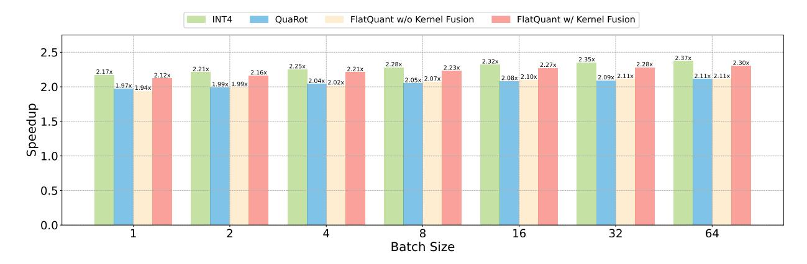
*الشكل 9: تسريع التعبئة المسبقة لـ LLaMA-2-7B على طول تسلسل 2048.*

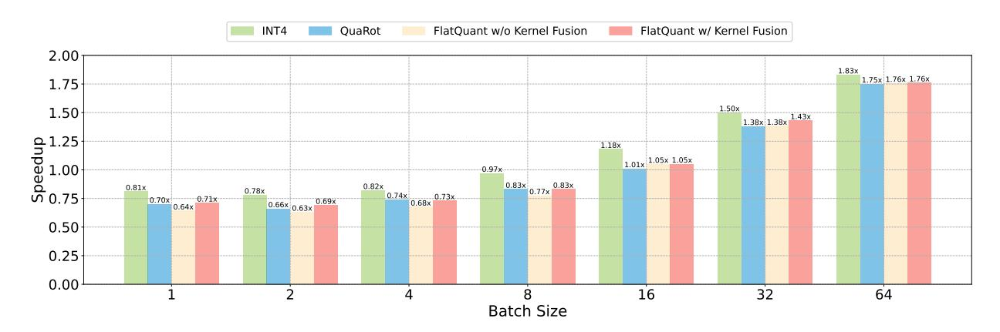
*الشكل 10: تسريع فك الترميز على نموذج LLaMA-2-7B. نُفكّ ترميز 256 رمزًا بعد التعبئة المسبقة على طول تسلسل 2048.*

**التسريع عبر أطوال التسلسل.** بالإضافة إلى النتائج المُقدَّمة في الشكل 4، نُقيّم أيضًا التسريع وقت التشغيل لـ FlatQuant تحت أطوال تسلسل متفاوتة لتوصيف كفاءته العملية بشكل أفضل. يُقدّم الجدول 21 والجدول 22 تسريعات التعبئة المسبقة وفك الترميز التفصيلية على LLaMA-3-8B، تحت أطوال إدخال وذاكرة KV مختلفة. لمرحلة التعبئة المسبقة بحجم دفعة 1، يحقق FLATQUANT تسريعات متسقة عبر أطوال التسلسل، محققًا 2.12× في الطول 2048 و 1.80× في الطول 16384، مماثل لـ INT4 ومتفوق على QuaRot. في مرحلة فك الترميز بحجم دفعة 64، يتفوق FLATQUANT باستمرار على QuaRot عبر جميع أطوال ذاكرة KV ويقترب بشدة من كفاءة تكميم INT4. تُظهر هذه النتائج أن FLATQUANT يحافظ على ميزته منخفضة العبء عبر مجموعة واسعة من سيناريوهات التوليد، بما في ذلك السياقات القصيرة والطويلة.

## ج.9. المقارنة مع AffineQuant

اقترح AffineQuant أيضًا تعلم تحويل أفيني مكافئ لتقليل خطأ التكميم. كما هو موضح في الجدول 1، يُظهر AffineQuant و FLATQUANT أداءً مختلفًا بشكل ملحوظ. ولمزيد من توضيح سبب تفوق FLATQUANT على AffineQuant، وكيف تُؤثّر اختلافاتهما على أداء التكميم، وما هي العوامل الأكثر أهمية في التكميم، نُقدّم

<!-- page 23 -->

تحليلاً إضافيًا أدناه.

تعبيرية محسّنة. على الرغم من أن FLATQUANT يتبنى جداء كرونيكر مع مصفوفتين خفيفتي الوزن، تظل تعبيريته تنافسية. كما هو موضح في الشكل [5،](#page-7-0) يحقق التحويل المُحلَّل دقة مماثلة لتحويل أفيني بحجم كامل، مما يُشير إلى أن مثل هذا القيد الهيكلي لا يؤدي إلى فقدان القدرة الوظيفية. في المقابل، يفرض AffineQuant تحويلات قطرية مهيمنة بشكل صارم لضمان العكوسية، مما قد يُقلّل بشكل غير مقصود من التعبيرية ويجعل التحويل يتصرف بشكل مماثل للقياس لكل قناة (انظر الشكل 7 في ورقة AffineQuant).

قابلية التطبيق على جميع الطبقات الخطية. يقدم FLATQUANT قابلية تطبيق أوسع عبر بنية النموذج. بفضل بنيته كرونيكر خفيفة الوزن، يمكن تطبيقه بكفاءة على جميع الطبقات الخطية بعبء لا يُذكر. في المقابل، يتعلم AffineQuant مباشرة مصفوفات أفينية بحجم كامل، والتي لا يمكن تطبيقها إلا على طبقات إسقاط الإخراج بسبب تكلفتها الحسابية العالية. لطبقات أخرى، يعود AffineQuant إلى القياس البسيط لكل قناة. تُقيّد هذه القيود العملية فعاليته الإجمالية بشكل أكبر، في حين يحافظ FLATQUANT على تحويل موحَّد ومعبر عبر النموذج بأكمله.

<!-- page 24 -->

## د. مرئيات إضافية

## د.1. مزيد من المرئيات لتوزيعات الأوزان والتنشيطات

**تفاصيل التجربة.** نُصوّر توزيع الأوزان والتنشيطات بعد تحويلات مختلفة، بما في ذلك القياس لكل قناة في SmoothQuant (Xiao et al., 2023)، تحويل Hadamard في QuaRot (Ashkboos et al., 2024)، والتحويل الأفيني في FLATQUANT. نحسب معيار Frobenius لكل قناة لقياس مقدار القناة. نأخذ عينات عشوائية من مجموعة بيانات C4 (Raffel et al., 2020) لجمع إحصائيات التنشيط.

**المرئيات على نماذج LLaMA.** نُصوّر أغلفة التوزيع لكل من الأوزان والتنشيطات الأصلية والمحوَّلة على نماذج LLaMA في الشكل 11-15. يمكن ملاحظة أنه لا يستطيع القياس لكل قناة ولا تحويل Hadamard تنعيم قنوات القيم الشاذة بشكل كامل لإنتاج الاستواء، حيث لا تزال هناك قنوات قيم شاذة، خاصة على التنشيطات. من ناحية أخرى، يمكن للتحويل الأفيني المُتعلَّم من قبل FLATQUANT إنتاج توزيعات أكثر استواءً بشكل فعّال لكل من الأوزان والتنشيطات التي يسهل تكميمها.

## د.2. مزيد من المرئيات لمناظر خطأ التكميم

**تفاصيل التجربة.** نأخذ عينة عشوائية من 128 عينة من مجموعة بيانات C4 (Raffel et al., 2020) ونحسب متوسط الخطأ التربيعي للتصور. للقياس لكل قناة، نتبع SmoothQuant (Xiao et al., 2023) ونُجري فقط القياس لكل قناة لمدخلات وحدتي الانتباه الذاتي والتغذية الأمامية. لتحويل Hadamard، نستبدل التحويل الأفيني في FLATQUANT بتحويل Hadamard ثابت. إعدادات التكميم هي نفسها الموصوفة في القسم 4.1.

**المرئيات على نماذج LLaMA.** نُصوّر مناظر خطأ التكميم لنماذج LLaMA في الشكل 2 والشكل 18-21. مع التحويل الأفيني لتنعيم القيم الشاذة، يمكن لـ FLATQUANT كبح أخطاء التكميم بفعالية عند الرموز المحورية وتسهيل انتشار خطأ التكميم، مما يؤدي إلى منظر خطأ تكميم أكثر استواءً مقارنة بالقياس لكل قناة وتحويل Hadamard.

## هـ. القيود

في هذه الدراسة، نُقدّم FLATQUANT، ولكن هناك قيود معينة يجب الاعتراف بها. أولاً، لم تُستكشف الإمكانات الكاملة للتكميم 4 بت بشكل شامل. في حين نتبع الدراسات السابقة لبناء مجموعة المعايرة ونُظهر أن FLATQUANT متين عبر مصادر بيانات متنوعة، يبقى الاختيار الأمثل لمجموعات المعايرة سؤالاً مفتوحًا. علاوة على ذلك، تركيزنا كان بشكل أساسي على نوع البيانات INT4، ولم نفحص دمج FLATQUANT مع أنواع البيانات الأحدث، مثل MXFP4، التي قد تُقدّم مزايا على INT4. تُمثّل معالجة هذه الجوانب طرقًا واعدة للبحث المستقبلي.

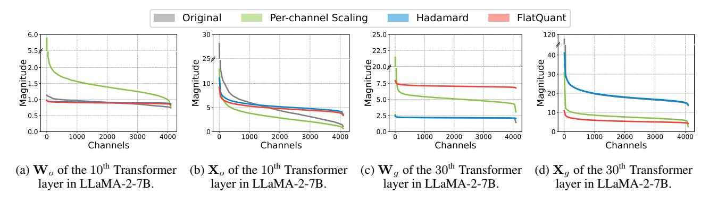
*الشكل 11: توزيعات الأوزان والمدخلات من LLaMA-2-7B، مرتبة حسب مقادير القناة (أي معيار Frobenius) بترتيب تنازلي.*

<!-- page 25 -->

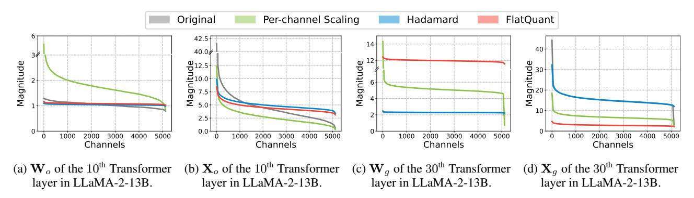
*الشكل 12: توزيعات الأوزان والمدخلات من LLaMA-2-13B، مرتبة حسب مقادير القناة (أي معيار Frobenius) بترتيب تنازلي.*

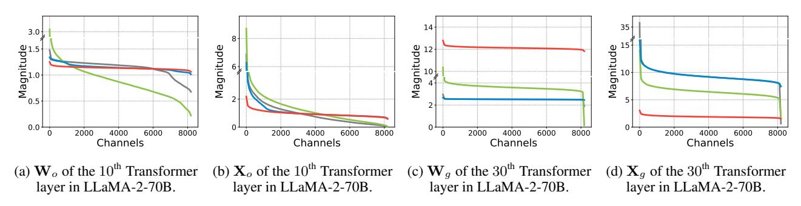
*الشكل 13: توزيعات الأوزان والمدخلات من LLaMA-2-70B، مرتبة حسب مقادير القناة (أي معيار Frobenius) بترتيب تنازلي.*

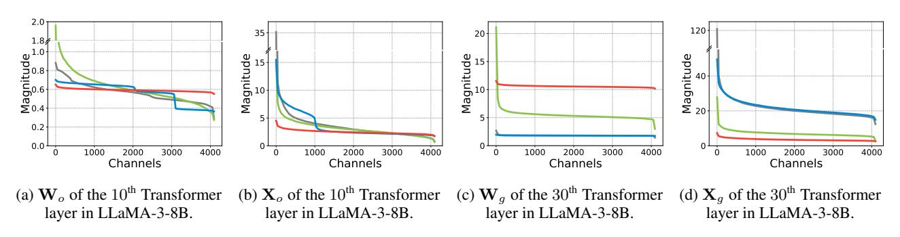
*الشكل 14: توزيعات الأوزان والمدخلات من LLaMA-3-8B، مرتبة حسب مقادير القناة (أي معيار Frobenius) بترتيب تنازلي.*

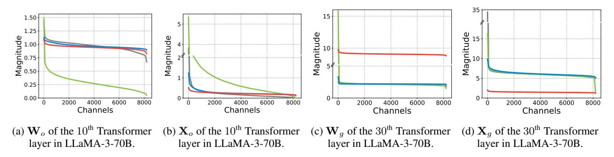
*الشكل 15: توزيعات الأوزان والمدخلات من LLaMA-3-70B، مرتبة حسب مقادير القناة (أي معيار Frobenius) بترتيب تنازلي.*

<!-- page 26 -->

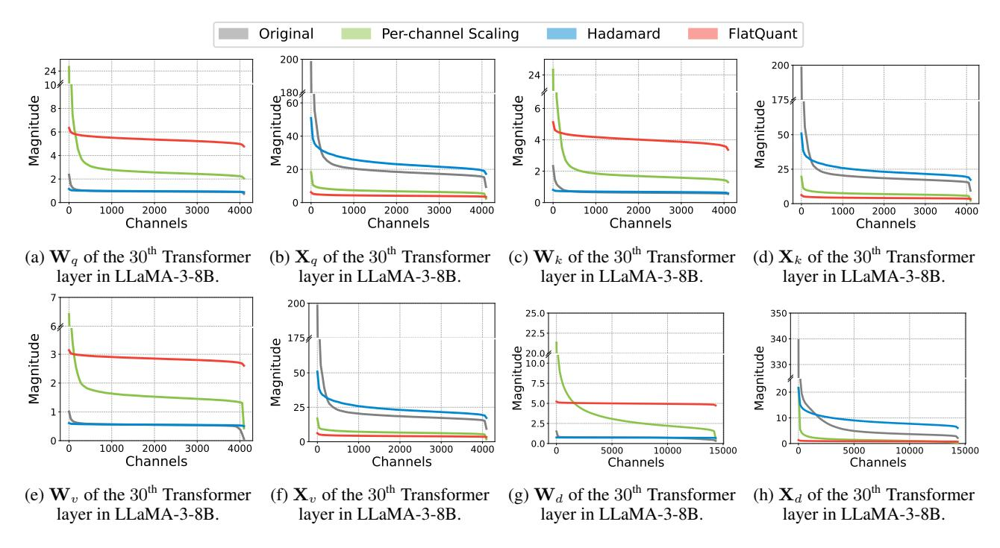
*الشكل 16: توزيعات الأوزان والمدخلات من LLaMA-3-8B، مرتبة حسب مقادير القناة (أي معيار Frobenius) بترتيب تنازلي.*

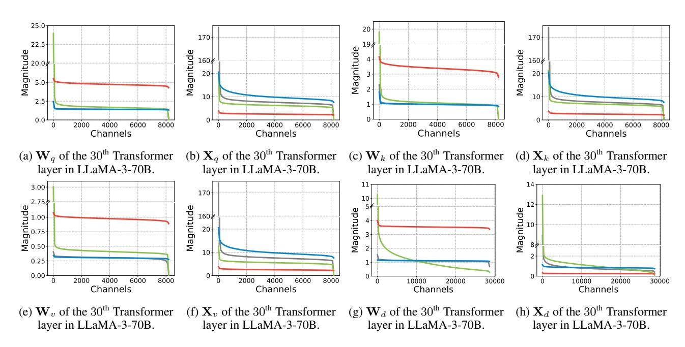
*الشكل 17: توزيعات الأوزان والمدخلات من LLaMA-3-70B، مرتبة حسب مقادير القناة (أي معيار Frobenius) بترتيب تنازلي.*

<!-- page 27 -->

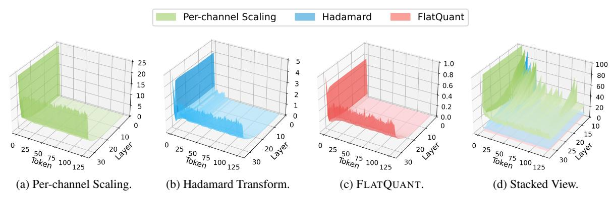
*الشكل 18: MSE للتكميم عبر طبقات Transformer وتسلسل الإدخال في LLaMA-2-7B. يرسم الشكل [18a-18c](#page-26-0) سطح MSE لكل طريقة، بينما يُراكب الشكل [18d](#page-26-0) هذه الأسطح بقسمة كل MSE على MSE الخاص بـ FLATQUANT.*

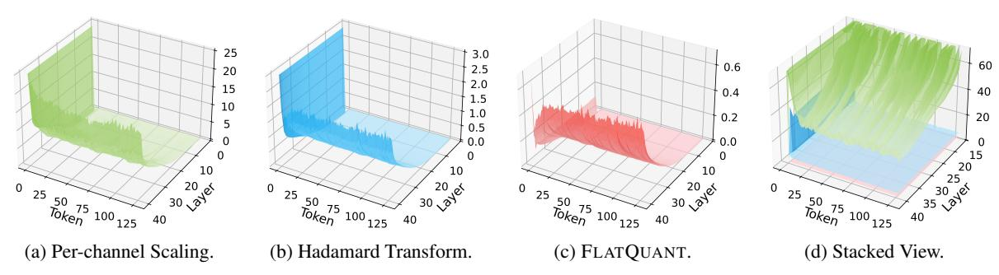
*الشكل 19: MSE للتكميم عبر طبقات Transformer وتسلسل الإدخال في LLaMA-2-13B. يرسم الشكل [19a-19c](#page-26-2) سطح MSE لكل طريقة، بينما يُراكب الشكل [19d](#page-26-2) هذه الأسطح بقسمة كل MSE على MSE الخاص بـ FLATQUANT.*

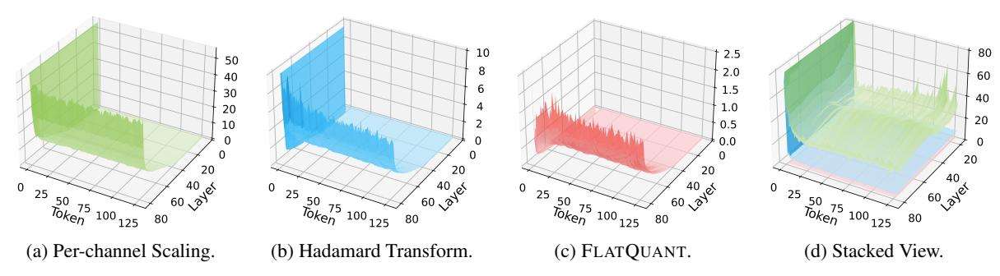
*الشكل 20: MSE للتكميم عبر طبقات Transformer وتسلسل الإدخال في LLaMA-2-70B. يرسم الشكل [20a-20c](#page-26-3) سطح MSE لكل طريقة، بينما يُراكب الشكل [20d](#page-26-3) هذه الأسطح بقسمة كل MSE على MSE الخاص بـ FLATQUANT.*

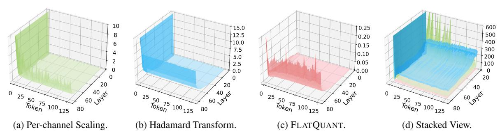
*الشكل 21: MSE للتكميم عبر طبقات Transformer وتسلسل الإدخال في LLaMA-3-70B. يرسم الشكل [21a-21c](#page-26-1) سطح MSE لكل طريقة، بينما يُراكب الشكل [21d](#page-26-1) هذه الأسطح بقسمة كل MSE على MSE الخاص بـ FLATQUANT.*
