<!-- RP37_Alizadeh_2023 | source: papers_json/RP37_Alizadeh_2023/ -->

## نموذج لغوي كبير في ذاكرة فلاش: استدلال فعّال لنماذج اللغة الكبيرة بذاكرة محدودة

Keivan Alizadeh, Iman Mirzadeh^*, Dmitry Belenko^*, S. Karen Khatamifard, Minsik Cho, Carlo C Del Mundo, Mohammad Rastegari, Mehrdad Farajtabar Apple ^\dagger

## **الملخص**

تُعدّ نماذج اللغة الكبيرة (LLMs) محورية في معالجة اللغة الطبيعية الحديثة، إذ تقدّم أداءً استثنائيًا في مهام متنوعة. غير أنّ متطلباتها الكبيرة من الحوسبة والذاكرة تطرح تحديات، وخصوصًا في الأجهزة ذات السعة المحدودة من ذاكرة DRAM. تتناول هذه الورقة تحدّي تشغيل نماذج LLM التي تتجاوز سعة DRAM المتاحة بكفاءة، وذلك عبر تخزين معاملات النموذج في ذاكرة فلاش، ثم جلبها عند الطلب إلى DRAM. تنطوي طريقتنا على بناء نموذج كلفة استدلال يأخذ في الحسبان خصائص ذاكرة الفلاش، ويوجّهنا للتحسين في مجالين حاسمين: تقليل حجم البيانات المنقولة من الفلاش، وقراءة البيانات في كتل أكبر وأكثر تتابعًا. ضمن هذا الإطار المستنير بالعتاد، نقدّم تقنيتين رئيسيتين. أولًا: "النوافذ" التي تُقلّص نقل البيانات استراتيجيًا عبر إعادة استخدام الخلايا العصبية المُنشَّطة سابقًا، وثانيًا: "حزم الصفوف والأعمدة" المُكيَّفة لنقاط القوة في الوصول التتابعي للبيانات في ذاكرة الفلاش، والتي تزيد حجم الكتل المقروءة من الفلاش. تتيح هذه الأساليب مجتمعةً تشغيل نماذج تبلغ ضِعف حجم DRAM المتاحة، مع زيادة في سرعة الاستدلال تصل إلى 4x و20x مقارنةً بنُهج التحميل الساذجة على وحدة المعالجة المركزية ووحدة معالجة الرسوميات على التوالي. إنّ دمجنا للوعي بالتباعد، والتحميل المتكيّف مع السياق، والتصميم الموجَّه نحو العتاد، يُمهّد الطريق لاستدلال فعّال لنماذج LLM على الأجهزة ذات الذاكرة المحدودة.

# 1 المقدمة

في السنوات الأخيرة، أظهرت نماذج اللغة الكبيرة (LLMs) أداءً قويًا عبر طيف واسع من مهام اللغة الطبيعية (Brown et al., 2020; Chowdhery et al., 2022; Touvron et al., 2023a; Jiang et al., 2023; Gemini Team, 2023).

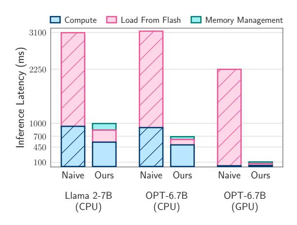
*الشكل 1: متوسط زمن استجابة الاستدلال لرمز واحد عندما يكون نصف ذاكرة النموذج فقط متاحًا: تقوم طريقتنا بتحميل المعاملات بشكل انتقائي عند الطلب لكل خطوة من خطوات توليد الرموز. يمثّل زمن الاستجابة الوقت اللازم لتحميل المعاملات تكراريًا من ذاكرة الفلاش، إلى جانب الوقت اللازم للحسابات.*

غير أنّ القدرات غير المسبوقة لهذه النماذج تأتي مع متطلبات حسابية وذاكرة كبيرة للاستدلال. يمكن أن تحتوي نماذج LLM على مئات المليارات أو حتى تريليونات من المعاملات، مما يجعل تحميلها وتشغيلها بكفاءة أمرًا صعبًا، خصوصًا على الأجهزة الشخصية.

في الوقت الحالي، النهج المعياري هو تحميل النموذج بأكمله إلى DRAM (ذاكرة الوصول العشوائي الديناميكية) للاستدلال (Rajbhandari et al., 2021; Aminabadi et al., 2022). غير أنّ هذا يُقيّد بشدة الحدّ الأقصى لحجم النموذج الذي يمكن تشغيله. على سبيل المثال، يتطلب نموذج بسبعة مليارات معامل أكثر من 14GB من الذاكرة لمجرد تحميل المعاملات بصيغة النقطة العائمة نصف الدقة، وهو ما يتجاوز قدرات معظم الأجهزة الشخصية كالهواتف الذكية. وعلى الرغم من إمكانية توظيف تقنيات كالتكميم لتقليل حجم النموذج، إلّا أنّ ذلك لا يعالج القيد الرئيسي المتمثّل في تحميل النموذج بأكمله إلى DRAM.

لمعالجة هذا القيد، نقترح تخزين معاملات النموذج في ذاكرة الفلاش، وهي

> ^* ^المساهمة الرئيسية

> ^† {^kalizadehvahid, imirzadeh, d_belenko, skhatamifard, minsik, cdelmundo, mrastegari, farajtabar}@apple.com

<!-- page 2 -->

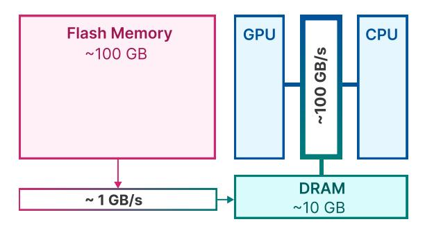

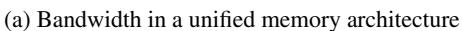

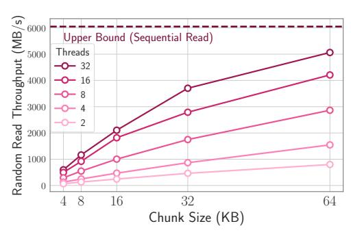
*(ب) إنتاجية القراءة العشوائية لذاكرة الفلاش*

*الشكل 2: (أ) توفّر ذاكرة الفلاش سعة أعلى بكثير لكنّها تعاني من عرض نطاق ترددي أقل بكثير مقارنةً بـ DRAM ومخابئ ومسجّلات وحدتي المعالجة المركزية والرسوميات. (ب) تزداد الإنتاجية للقراءات العشوائية في ذاكرة الفلاش بزيادة حجم الكتل التتابعية وعدد الخيوط.*

أكبر بمرتبة قدر واحدة على الأقل من DRAM. ثم خلال الاستدلال، نُحمّل المجموعة الفرعية المطلوبة من المعاملات من ذاكرة الفلاش مباشرةً، متجنّبين الحاجة إلى احتواء النموذج بأكمله في DRAM. ولهذا الغرض، يقدّم عملنا عدة مساهمات:

- أولًا، ندرس خصائص العتاد لأنظمة التخزين (مثل الفلاش، DRAM). نُبيّن أنّ قيود العتاد كحدود السعة وعرض النطاق يمكن أن يكون لها اعتبارات كبيرة عند تصميم خوارزميات فعّالة لتقديم نماذج LLM من ذاكرة الفلاش (القسم 2).
- مدفوعين بنتائجنا، نقترح عدة تقنيات تساعد على (1) تقليل نقل البيانات المطلوب، (2) زيادة إنتاجية النقل، (3) إدارة المعاملات المُحمَّلة بكفاءة في DRAM (القسم 3).
- أخيرًا، كما هو موضّح جزئيًا في الشكل 1، نُبيّن أنّ التقنيات المقترحة لتحسين نموذج الكلفة وتحميل المعاملات بشكل انتقائي عند الطلب تتيح لنا تشغيل نماذج بضعف سعة DRAM للجهاز وتسريع الاستدلال حتى 4x و7x و20x مقارنةً بالتنفيذ الساذج على واجهات CPU وMetal وNVIDIA GPU على التوالي (القسم 4).

# 2 ذاكرة الفلاش واستدلال نماذج LLM

في هذا القسم، نستكشف خصائص أنظمة تخزين الذاكرة (مثل الفلاش، DRAM) وتأثيراتها على استدلال نماذج اللغة الكبيرة (LLM). نهدف إلى فهم التحديات والاعتبارات الخاصة بالعتاد الضرورية لتصميم الخوارزميات، وخصوصًا في تحسين الاستدلال عند العمل مع ذاكرة الفلاش.

## 2.1 قيود عرض النطاق والطاقة

في حين توفّر ذاكرات NAND فلاش الحديثة عرض نطاق عاليًا وزمن استجابة منخفضًا، إلا أنّها تقصر كثيرًا عن مستويات أداء DRAM (ذاكرة الوصول العشوائي الديناميكية)، من حيث زمن الاستجابة والإنتاجية معًا. يوضّح الشكل 2أ هذه الفروقات. إنّ تنفيذ استدلال ساذج يعتمد على ذاكرة NAND فلاش قد يستلزم إعادة تحميل النموذج بأكمله لكل تمريرة أمامية. هذه العملية ليست مستهلكة للوقت فحسب، إذ تستغرق غالبًا ثوانٍ حتى للنماذج المضغوطة، بل تستهلك أيضًا طاقة أكبر من نقل البيانات من DRAM إلى الذاكرة الداخلية لـ CPU أو GPU.

يمكن أن تكون أزمنة التحميل للنماذج مشكلةً حتى في الإعداد التقليدي المُقيم في DRAM حيث لا تُعاد الأوزان جزئيًا – إذ إنّ التحميل الكامل الأولي للنموذج لا يزال يتكبّد عقوبة، خصوصًا في الحالات التي تتطلب أزمنة استجابة سريعة للرمز الأول. يعالج نهجنا، الذي يستفيد من تباعد التنشيط في نماذج LLM، هذه التحديات عبر إتاحة قراءة انتقائية لأوزان النموذج، وبالتالي تقليل زمن استجابة الإجابة.

## 2.2 إنتاجية القراءة

تعمل أنظمة ذاكرة الفلاش على النحو الأمثل مع القراءات التتابعية الكبيرة. على سبيل المثال، تُظهر اختبارات الأداء على Apple MacBook M1 Max بذاكرة فلاش 1TB سرعات تتجاوز 6 GiB/s لقراءة خطية بحجم 1GiB من ملف غير مخزّن مؤقتًا. ولكن لا يمكن تحقيق هذا العرض النطاقي العالي للقراءات العشوائية الأصغر بسبب الطبيعة متعدّدة المراحل المتأصّلة في هذه القراءات، التي تشمل نظام التشغيل، المُشغّلات، معالجة المقاطعات، ومتحكّم الفلاش، وغيرها. تُدخل كل مرحلة زمن استجابة، ويؤثّر ذلك بشكل غير متناسب على القراءات الأصغر.

لتجاوز هذه القيود، نُؤيّد استراتيجيتين رئيسيتين، يمكن استخدامهما

<!-- page 3 -->

معًا. تنطوي الأولى على قراءة كتل أكبر من البيانات. بالنسبة للكتل الأصغر، يُنفَق جزء كبير من إجمالي وقت القراءة في انتظار بدء نقل البيانات. ويُشار إلى هذا غالبًا بـ "زمن الاستجابة للبايت الأول". يُقلّص هذا الزمن إنتاجية كل عملية قراءة بشكل كبير، لأنّ الإنتاجية المُقاسة الإجمالية يجب أن تأخذ في الحسبان ليس سرعة النقل بمجرد بدئه فحسب، بل وزمن الاستجابة قبل البدء أيضًا، وهو ما يعاقب القراءات الصغيرة. هذا يعني أنّنا إذا دمجنا قراءات الصفوف والأعمدة لمصفوفات FFN، فيمكننا دفع كلفة زمن الاستجابة مرة واحدة فقط لأي زوج صف/عمود في كلتا المصفوفتين، ويمكن تحقيق إنتاجية أعلى. هذا المبدأ موضّح في الشكل [2ب.](#page-1-1) ربما تكون الملاحظة المثيرة وغير البديهية أنّه في بعض السيناريوهات، يكون من المُجدي قراءة أكثر من اللازم (لكن في كتل أكبر) ثم إهمال الزائد، بدلًا من قراءة الأجزاء الضرورية فقط ولكن في كتل أصغر. أمّا الاستراتيجية الثانية فتستفيد من القراءات المتوازية، عبر استغلال التوازي المتأصّل في مكدّسات التخزين ومتحكّمات الفلاش. تشير نتائجنا إلى أنّ الإنتاجيات المناسبة لاستدلال LLM المتباعد قابلة للتحقيق على العتاد الحديث باستخدام قراءات عشوائية بحجم 32KiB أو أكبر عبر خيوط متعددة.

مدفوعين بالتحديات الموضّحة في هذا القسم، نقترح في القسم [3](#page-2-0) طرقًا لتحسين حجم نقل البيانات وتعزيز إنتاجية القراءة لرفع سرعات الاستدلال بشكل ملحوظ.

# 3 التحميل من ذاكرة الفلاش

يتناول هذا القسم تحدّي إجراء الاستدلال على الأجهزة التي تكون فيها ذاكرة DRAM المتاحة أصغر بكثير من حجم النموذج. وهذا يستلزم تخزين أوزان النموذج الكاملة في ذاكرة الفلاش. مقياسنا الأساسي لتقييم استراتيجيات التحميل من الفلاش المختلفة هو زمن الاستجابة، الذي نُقسّمه إلى ثلاث مكوّنات متمايزة: كلفة الإدخال/الإخراج للتحميل من الفلاش، عبء إدارة الذاكرة بالبيانات المُحمَّلة حديثًا، وكلفة الحساب لعمليات الاستدلال.

تُصنَّف حلولنا المقترحة لتقليل زمن الاستجابة في ظل قيود الذاكرة إلى مجالات:

1. تقليل تحميل البيانات: يهدف إلى تقليل زمن الاستجابة المرتبط بعمليات إدخال/إخراج الفلاش عبر تحميل بيانات أقل[1](#page-2-1).

- 2. تحسين حجم كتلة البيانات: تعزيز إنتاجية الفلاش بزيادة حجم كتل البيانات المُحمَّلة، وبذلك تخفيف زمن الاستجابة.
- 3. الإدارة الفعّالة للبيانات المُحمَّلة: تبسيط إدارة البيانات بمجرد تحميلها في الذاكرة لتقليل العبء.

من المهم ملاحظة أنّ تركيزنا ليس على تحسين الحوسبة، فهي عمودية على الاهتمامات الجوهرية لعملنا. بدلًا من ذلك، نتركّز على تحسين تفاعلات ذاكرة الفلاش وإدارة الذاكرة لتحقيق استدلال فعّال على الأجهزة المُقيَّدة بالذاكرة. سنُفصّل تفاصيل التنفيذ لهذه الاستراتيجيات في قسم الإعداد التجريبي.

## 3.1 تقليل نقل البيانات

تستفيد طريقتنا من تباعد التنشيط المتأصّل الموجود في نماذج شبكة التغذية الأمامية (FFN)، كما هو موثَّق في الأبحاث السابقة. على سبيل المثال، يُظهر نموذج OPT 6.7B تباعدًا ملحوظًا بنسبة 97% داخل طبقة FFN. وبالمثل، تمّ تكييف نموذج Falcon 7B عبر الضبط الدقيق، الذي ينطوي على استبدال دوال تنشيطه بـ ReLU، مما أدّى إلى تباعد بنسبة 95% مع الحفاظ على دقة مماثلة [(Mirzadeh et al., 2023)](#page-10-2). إنّ استبدال تنشيطات نموذج Llama 2 [(Touvron et al., 2023b)](#page-11-3) بـ FATReLU والضبط الدقيق يمكن أن يحقّق تباعدًا بنسبة 90% [(Song et al., 2024)](#page-11-4). في ضوء هذه المعلومات، ينطوي نهجنا على النقل التكراري لمجموعة فرعية أساسية وديناميكية فقط من الأوزان من ذاكرة الفلاش إلى DRAM للمعالجة أثناء الاستدلال.

استراتيجية الاستمرار الانتقائي. نختار الاحتفاظ بالتضمينات والمصفوفات داخل آلية الانتباه للمحوّل بشكل دائم في DRAM. وبالنسبة لأجزاء شبكة التغذية الأمامية (FFN)، يتم تحميل الأجزاء غير المتباعدة ديناميكيًا فقط إلى DRAM حسب الحاجة. إنّ الإبقاء على أوزان الانتباه، التي تُشكّل نحو ثلث حجم النموذج، في الذاكرة يتيح حسابًا أكثر كفاءة ووصولًا أسرع، وبذلك يعزّز أداء الاستدلال دون الحاجة إلى تحميل النموذج بأكمله.

توقّع تباعد ReLU. تُحدث دالة تنشيط ReLU بشكل طبيعي تباعدًا يزيد على 90% في المخرجات الوسيطة لـ FFN، مما يُقلّص بصمة الذاكرة للطبقات اللاحقة التي تستخدم هذه المخرجات المتباعدة. غير أنّ الطبقة السابقة، أي الإسقاط الصاعد، يجب أن تكون موجودة بالكامل في الذاكرة.

لتجنّب تحميل مصفوفة الإسقاط الصاعد بأكملها، نتّبع [Liu et al.](#page-10-3) [(2023b)](#page-10-3)، ونستخدم

> ^1^ من الجدير بالذكر أنّنا، بـ *البيانات*، كثيرًا ما نشير إلى أوزان الشبكة العصبية. غير أنّ التقنيات التي طوّرناها يمكن تعميمها بسهولة على أنواع أخرى من البيانات المنقولة والمستخدمة في استدلال LLM، مثل التنشيطات أو مخبأ KV، كما اقترح [Sheng et al.](#page-11-2) [(2023)](#page-11-2).

<!-- page 4 -->

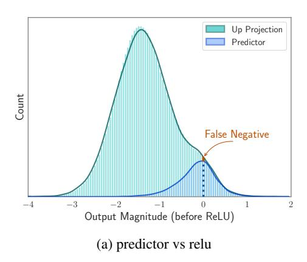

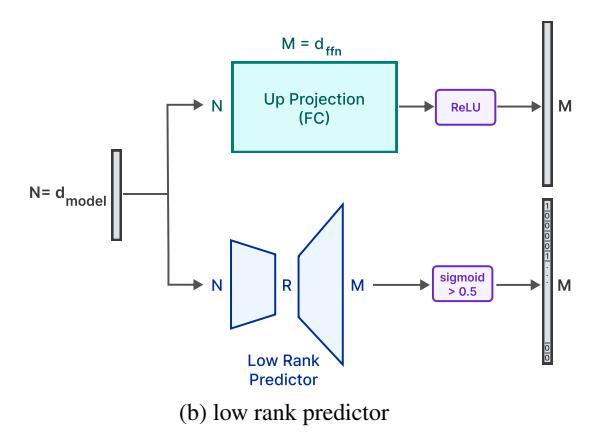
*الشكل 3: (أ) ما قبل تنشيطات الرموز في تسلسل واحد في OPT 6.7B. يعرض الرسم الأزرق ما قبل تنشيط العناصر التي اكتشف المتنبّئ أنّها موجبة، بينما الرسم الأخضر للإسقاط الصاعد. كما يمكن ملاحظة، فإنّ معظم الإيجابيات الزائفة قريبة من الصفر، وتُشكّل السلبيات الزائفة جزءًا صغيرًا من العناصر. (ب) متنبّئ صغير منخفض الرتبة يعرف أيّ الخلايا العصبية الوسيطة سيتم تنشيطها.*

متنبّئًا منخفض الرتبة لتحديد العناصر التي تُصفِّرها ReLU (انظر الشكل [3ب](#page-3-0)). استخدمنا خسارة متوازنة على العيّنات السلبية والموجبة لكل طبقة. على عكس عملهم، يحتاج متنبّئنا فقط إلى مخرجات وحدة الانتباه للطبقة الحالية، وليس وحدة FFN للطبقة السابقة. لقد لاحظنا أنّ تأجيل التنبّؤ إلى الطبقة الحالية كافٍ لتصميم خوارزمية تحميل أوزان واعية بالعتاد، لكنّه يؤدي إلى نتائج أكثر دقة بسبب المدخلات المؤجَّلة. استخدمنا 10000 عيّنة من مجموعة تدريب C4 للتدريب لمدة حقبتين. استغرق تدريب كل متنبّئ 4 ساعات على وحدة GPU من نوع A100.

وبذلك نُحمّل فقط العناصر التي يشير إليها المتنبّئ، كما هو موضّح في الشكل [3أ.](#page-3-0) علاوة على ذلك، كما هو مُبيَّن في الجدول [1](#page-3-1)، فإنّ استخدام المتنبّئات لا يؤثّر سلبًا على أداء النموذج في مهام التقييم بدون أمثلة (0-shot). للمزيد من التفاصيل يُرجى الرجوع إلى الملحق [B.](#page-13-0)

تقنية النافذة المنزلقة. في دراستنا، نُعرّف *الخلية العصبية النشطة* بأنّها تلك التي تنتج مخرجًا موجبًا في نموذج المتنبّئ منخفض الرتبة لدينا. يركّز نهجنا على إدارة بيانات الخلايا العصبية بتوظيف *تقنية النافذة المنزلقة*. تستلزم هذه التقنية الاحتفاظ بمخبأ DRAM لصفوف الأوزان فقط التي تنبأ بأنّها مطلوبة من قبل المجموعة الفرعية الأخيرة من رموز الإدخال. الجانب الأساسي

من هذه التقنية هو التحميل التزايدي لبيانات الخلايا العصبية التي تختلف بين رمز الإدخال الحالي وأسلافه المباشرين. تتيح هذه الاستراتيجية استخدامًا فعّالًا للذاكرة، إذ تحرّر موارد الذاكرة المخصّصة سابقًا للأوزان المخزّنة المطلوبة من قبل الرموز التي لم تعد ضمن النافذة المنزلقة (كما هو موضّح في الشكل [4ب](#page-4-0)).

من منظور رياضي، فلتكن sagg(k) تدلّ على الاستخدام التراكمي لبيانات الخلايا العصبية عبر تسلسل من k رموز إدخال. صُمِّمت بنية ذاكرتنا لتخزين متوسط sagg(k) في DRAM. عند معالجة كل رمز جديد، يتم تحميل بيانات الخلايا العصبية التزايدية، التي تُمثَّل رياضيًا بـ sagg(k + 1) − sagg(k)، من ذاكرة الفلاش إلى DRAM. تستند هذه الممارسة إلى الاتجاه الملحوظ لانخفاض استخدام الخلايا العصبية المُجمَّع مع مرور الوقت. وبالتالي، تؤدي القيم الأكبر لـ k إلى حجم أقل من البيانات المُحمَّلة لكل رمز جديد (انظر الشكل [4أ](#page-4-0))، بينما يمكن للقيم الأصغر لـ k أن تساعد في الحفاظ على DRAM المستخدمة لتخزين الأوزان المخزّنة. عند تحديد حجم النافذة المنزلقة، الهدف هو تكبيرها ضمن القيود التي تفرضها سعة الذاكرة المتاحة.

## 3.2 زيادة إنتاجية النقل

لزيادة إنتاجية البيانات من ذاكرة الفلاش، من الأهمية بمكان قراءة البيانات في كتل أكبر، يُفضَّل أن تكون مُحدَّدة الحجم بمضاعفات حجم الكتلة لمجمَّع التخزين الأساسي. في هذا القسم، نُفصّل الاستراتيجية التي وظّفناها لزيادة أحجام الكتل من أجل قراءات أكثر كفاءة لذاكرة الفلاش.

حزم الأعمدة والصفوف. لاحظ أنّ في طبقة FFN، يتزامن استخدام العمود ith من الإسقاط الصاعد والصف ith من الإسقاط النازل

<!-- page 5 -->

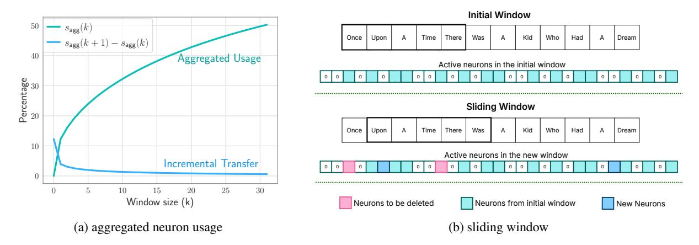
*الشكل 4: (أ) الاستخدام المُجمَّع للخلايا العصبية للطبقة العاشرة من Falcon 7B: ميل الاستخدام المُجمَّع للخلايا العصبية في انخفاض. تُظهر الطبقات الأخرى النمط نفسه. (ب) بدلًا من حذف الخلايا العصبية التي جُلبت إلى DRAM، نُبقي على الخلايا النشطة من آخر k رموز (نستخدم k=5): عند معالجة الرمز الجديد "Was"، لا يحتاج سوى جزء صغير من الأوزان الجديدة إلى التحميل.*

مع تنشيط الخلية العصبية الوسيطة ith. وبالتالي، عبر تخزين هذه الأعمدة والصفوف المقابلة معًا في ذاكرة الفلاش، يمكننا توحيد البيانات في كتل أكبر للقراءة. ارجع إلى الشكل 5 لإلقاء نظرة على نهج الحزم هذا. إذا كان كل عنصر من أوزان الشبكة مخزَّنًا بـ num\_bytes، فإنّ هذا الحزم يضاعف حجم الكتلة من d_{model} \times num\_bytes إلى 2d_{model} \times num\_bytes كما هو موضّح في الشكل 5. يُظهر تحليلنا وتجربتنا أنّ هذا يزيد من إنتاجية النموذج.

الحزم بناءً على التنشيط المشترك. افترضنا أنّ الخلايا العصبية قد تُظهر أنماط نشاط شديدة الترابط، مما يُتيح الحزم. عبر تحليل التنشيطات على مجموعة التحقق C4، وجدنا توزيعًا قانون قوة للتنشيطات المشتركة. غير أنّ حزم الخلايا العصبية مع أعلى خلية متنشّطة معها (الصديق الأقرب) أدّى إلى تحميلات متعددة للخلايا العصبية النشطة جدًا، مما تعارض مع هدفنا. تشير هذه النتيجة إلى أنّ الخلايا العصبية النشطة جدًا هي الأصدقاء الأقربون للعديد من الخلايا الأخرى. نقدّم هذه النتيجة السلبية لإلهام أبحاث مستقبلية حول حزم الخلايا العصبية الفعّال للاستدلال الكفؤ. يُرجى الرجوع إلى الملحق D للتفاصيل.

## 3.3 إدارة البيانات المُحسَّنة في DRAM

على الرغم من أنّ نقل البيانات داخل DRAM أكثر كفاءة مقارنةً بالوصول إلى ذاكرة الفلاش، إلّا أنّه لا يزال يتكبّد كلفة غير مهملة. عند إدخال بيانات لخلايا عصبية جديدة، يمكن أن تؤدي إعادة تخصيص المصفوفة وإلحاق مصفوفات جديدة إلى عبء كبير بسبب الحاجة إلى إعادة كتابة بيانات الخلايا العصبية الموجودة في DRAM. هذا مكلف بشكل خاص عندما يحتاج جزء كبير (نحو 25%)

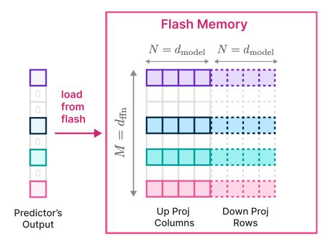
*الشكل 5: عبر حزم أعمدة طبقة الإسقاط الصاعد وصفوف طبقة الإسقاط النازل، يمكننا تحميل كتل بضعف الحجم بدلًا من قراءة الأعمدة أو الصفوف بشكل منفصل.*

من شبكات التغذية الأمامية (FFNs) في DRAM إلى إعادة الكتابة. لمعالجة هذه المشكلة، نتبنّى استراتيجية إدارة ذاكرة بديلة. تنطوي على التخصيص المُسبق لكل الذاكرة الضرورية وإنشاء بنية بيانات مقابلة للإدارة الفعّالة. تتكوّن بنية البيانات من عناصر مثل المؤشّرات، المصفوفة، الانحياز، num_used، last_k_active موضّحة في الشكل 6.

يمثّل كل صف في المصفوفة الصف المتسلسل لـ "الإسقاط الصاعد" والعمود لـ "الإسقاط النازل" لخلية عصبية. يُشير متجه المؤشّرات إلى فهرس الخلية العصبية الأصلي المقابل لكل صف في المصفوفة. يُمثَّل انحياز "الإسقاط الصاعد" في النموذج الأصلي في عنصر الانحياز المقابل. يتتبّع المعامل num_used عدد الصفوف المستخدمة حاليًا في المصفوفة، وقيمته الأولية صفر. تُخصَّص المصفوفة للطبقة *i*th مسبقًا بحجم

<!-- page 6 -->

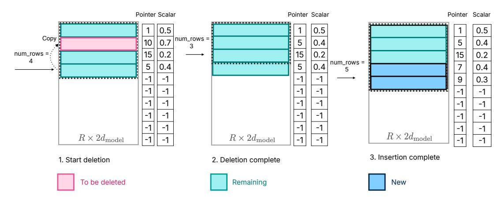
*الشكل 6: إدارة الذاكرة؛ أولًا نستبدل العناصر المراد حذفها بالعناصر الأخيرة للحفاظ على شغل متعاقب للذاكرة. ثم تُكدَّس الأوزان الجديدة في النهاية. يقلّص هذا الحركات غير الضرورية للبيانات.*

\operatorname{Req}_i \times 2d_{\operatorname{model}}، حيث تُشير \operatorname{Req}_i إلى الحدّ الأقصى لعدد الخلايا العصبية المطلوبة لحجم النافذة المحدّد في مجموعة فرعية من مجموعة التحقق C4. عبر تخصيص ذاكرة كافية لكل طبقة مسبقًا، نُقلّل الحاجة إلى إعادة التخصيص. أخيرًا، يُحدّد مكوّن last_k_active الخلايا العصبية من النموذج الأصلي التي نُشِّطت مؤخّرًا باستخدام آخر k رموز. يمكن إجراء العمليات التالية كما هو موضّح في الشكل 6:

- 1. **حذف الخلايا العصبية:** تُحدَّد الخلايا العصبية التي لم تعد مطلوبة بكفاءة في زمن خطّي، باستخدام قيمة last_k_active المرتبطة والتنبّؤ الحالي. يتم استبدال المصفوفة، المؤشّر، والمقاديرالرقمية لهذه الخلايا الزائدة بأحدث العناصر، ويُطرح عددها من num_rows. لـ O(c) خلية عصبية للحذف، يلزم إعادة كتابة ذاكرة من رتبة O(c \times d_{\rm model}).
- 2. جلب خلايا عصبية جديدة: تُسترد الأوزان المطلوبة من ذاكرة الفلاش. تُقرأ المؤشّرات والمقادير المقابلة من DRAM، ثم تُدرج هذه الصفوف في المصفوفة، مُمتدّةً من num_row إلى num_row + num_new. يُلغي هذا النهج الحاجة إلى إعادة تخصيص الذاكرة في DRAM ونسخ البيانات الموجودة، ممّا يقلّل زمن استجابة الاستدلال.
- 3. عملية الاستدلال: لعملية الاستدلال، يُستخدم النصف الأول من المصفوفة matrix[:num_rows,:d_model] كـ "الإسقاط الصاعد"، والنصف الثاني المُحوَّل، matrix[:num_rows,d_model:].transpose()، يُستخدم كـ "الإسقاط النازل". هذا التكوين ممكن لأنّ ترتيب الخلايا العصبية في المخرج الوسيط لـ FFN لا يُغيّر المخرج النهائي، ممّا يسمح بعملية استدلال مبسّطة.

تضمن هذه الخطوات مجتمعةً إدارة فعّالة للذاكرة أثناء الاستدلال، محسّنةً أداء الشبكة العصبية واستخدام الموارد.

# 4 التجارب والنتائج

نبدأ هذا القسم بمناقشة موجزة لإعدادنا التجريبي وتفاصيل التنفيذ. ثمّ نُبيّن أنّ التقنيات المقدّمة في القسم 3 يمكن أن تحسّن زمن استجابة الاستدلال بشكل كبير عبر نماذج وأنظمة تشغيل مختلفة. نُؤجّل بعض التفاصيل إلى أقسام الملحق على النحو التالي: أداء متنبّئنا منخفض الرتبة المُدرَّب (الملحق B).

## 4.1 الإعداد التجريبي

عملنا مدفوع أساسًا بتحسين كفاءة الاستدلال على الأجهزة الشخصية. لهذا الغرض، في تجاربنا، نُعالج التسلسلات بشكل فردي، مُشغّلين تسلسلًا واحدًا في كل مرة. يتيح لنا هذا النهج تخصيص جزء معيّن من DRAM لمخبأ المفاتيح-القيم (KV)، مع التركيز أساسًا على حجم النموذج. لتنفيذ عملية الاستدلال، نستخدم مكتبة HuggingFace Transformers (Wolf et al., 2019) و PyTorch (Paszke et al., 2019). يُختبَر هذا الإعداد تحت شرط أنّ نحو نصف حجم النموذج متاح في DRAM. في حين يمكن، بمستوى مختلف من التباعد أو بتوظيف التكميم، العمل بسعة DRAM أصغر، فإنّ هذه التحسينات عمودية على طريقتنا المقترحة.

النماذج. نستخدم أساسًا OPT 6.7B (Zhang et al., 2022b) وFalcon 7B المُتباعد (Mirzadeh et al., 2023) لتقييماتنا، لكنّنا نُبلّغ إضافيًا عن نتائج على Phi-2 (Gunasekar et al., 2023)، Persimmon 8B (Elsen et al., 2023) و

<!-- page 7 -->

Llama 2 (Touvron et al., 2023b) الذي تمّ تباعده باستخدام FATReLU (Song et al., 2024). لاحظ أنّ التقنيات المُقدَّمة في هذا العمل مستقلّة في الغالب عن البنية.

**البيانات.** نستخدم مجموعة فرعية صغيرة من مجموعة التحقق C4 لقياسات زمن الاستجابة. نأخذ أول 128 رمزًا من كل مثال كموجِّه، ونولّد 256 رمزًا جديدًا.

تكوين العتاد. يُقيَّم نماذجنا عبر ثلاثة إعدادات عتاد. يشمل الأول Apple M1 Max مع SSD بسعة 1TB. الثاني يضمّ Apple M2 Ultra مع SSD بسعة 2TB. على MacBooks نُشغّل النموذج على CPU بـ float32 أو GPU بـ Metal و float16. الإعداد الثالث يستخدم جهاز Linux مع NVIDIA RTX 4090 بسعة 24GB، حيث تستخدم حسابات GPU نماذج bfloat16. عبر جميع الإعدادات، نفترض أنّ نحو نصف الذاكرة الإجمالية (DRAM وGPU) مخصّص لحسابات النموذج.

**الخطوط الأساسية.** نُقارن نماذجنا مع خط أساسي *ساذج* من تحميل النموذج عند الطلب أثناء التمريرة الأمامية. نُقارن إضافيًا مع نهج التحميل الهجين كخط أساسي ثانوي عندما يُحفَظ نصف النموذج في الذاكرة ويُحمَّل النصف الآخر عند الطلب عند توليد كل رمز دون استخدام التباعد. استخدمنا أفضل الأرقام النظرية الممكنة لزمن استجابة الإدخال/الإخراج لكل من الطرق لإجراء مقارنة عادلة، وقد يكون الرقم الفعلي أعلى. للطرق التي لا تستخدم التباعد أو مشاركة الأوزان، يجب نقل ما لا يقلّ عن نصف النموذج من ذاكرة الفلاش أثناء التمريرة الأمامية. تنشأ هذه الضرورة لأنّه، في البداية، يكون نصف النموذج فقط متاحًا في DRAM، ولكن مع تقدّم التمريرة الأمامية، تُستخدَم سعة النموذج بأكملها. وبالتالي، يجب نقل أيّ بيانات غير موجودة في البداية مرة واحدة على الأقل. وبذلك، فإنّ أكفأ خط أساسي نظري يتضمّن تحميل نصف حجم النموذج من ذاكرة الفلاش

إلى DRAM. هذا السيناريو الأمثل للإدخال/الإخراج هو خط أساسنا الرئيسي. نظرًا لطبيعة إعدادنا (أي محدودية ذاكرة DRAM أو GPU المتاحة)، لسنا على علم بأي طريقة أخرى يمكنها تجاوز هذه الكفاءة النظرية للإدخال/الإخراج.

تفاصيل التنفيذ. لتحسين تحميل البيانات من ذاكرة الفلاش، يستخدم نظامنا قراءات متوازية على 32 خيطًا. يهدف هذا النهج متعدد الخيوط إلى تحسين توزيع زمن الاستجابة للبايت الأول بعدم انتظار كل قراءة بشكل تتابعي، وتعظيم إنتاجية القراءة بقراءة عدة تدفّقات في وقت واحد (الشكل 2ب). لتقييم الإنتاجية الفعلية بشكل أفضل، أجرينا اختبارات الأداء دون مساعدة التخزين المؤقت لنظام التشغيل، ممّا أدّى إلى قياس أكثر دقة.

## 4.2 تحميل أسرع من ذاكرة الفلاش

تُبيّن نتيجتنا الأولى في الجدول 2 فعّالية التقنيات التي قدّمناها في القسم 3، حيث يعتمد زمن استجابة الإدخال/الإخراج على كم البيانات المنقولة من الفلاش إلى DRAM، وحجم الكتلة الذي يُحدّد الإنتاجية. على سبيل المثال، باستخدام متنبّئ منخفض الرتبة، نُقلّص نقل البيانات بشكل كبير، ويمكن تقليل حجم هذه الحركة أكثر باستخدام تقنية النوافذ المقترحة. مقارنةً بقراءة طويلة ومتعاقبة، فإنّ القراءات المُتفرّقة ستؤدي بالضرورة إلى إنتاجية أقل (مثلًا 1.25 GiB/s متباعد مقابل 6.1 GiB/s كثيف)، ولكن هذا يُخفَّف جزئيًا عبر حزم أوزان الإسقاط الصاعد والنازل. الأثر الإجمالي للقراءات المتباعدة لا يزال مواتيًا بقوة، لأنّ مجموعة فرعية صغيرة فقط من إجمالي الأوزان تُحمَّل بشكل تزايدي في كل تكرار، وتحميل المجموعة الفرعية المطلوبة فقط من الأوزان يستغرق وقتًا أقل وذاكرة DRAM أقل.

إضافة إلى ذلك، نفحص أزمنة الاستجابة الكاملة تحت إعدادات مختلفة في الجدول 3. نُخصّص نحو 50% من حجم النموذج لـ OPT و Falcon و Persimmon و Llama 2. بالنسبة لنموذج Phi-2 الأصغر بكثير، لاحظنا

<!-- page 8 -->

معدّلات تباعد أقل، ممّا دفعنا إلى تحديد هذا الحدّ عند 65%. نلاحظ تحسّنًا كبيرًا في كفاءة التحميل عبر النُهج الساذجة والهجينة عبر جميع النماذج. علاوة على ذلك، أظهرنا أنّ نتائج واجهة GPU تتحسّن أكثر عند الجمع مع فك التشفير التخميني.

## 4.3 المفاضلة بين الذاكرة وزمن الاستجابة

حتى الآن، عملنا أساسًا تحت افتراض أنّ DRAM المتاحة هي تقريبًا نصف حجم نموذجنا. غير أنّنا نلاحظ أنّ هذا ليس قيدًا صارمًا ويمكننا تخفيفه.

لهذا الغرض، ندرس تأثير حجم النافذة على استخدام الذاكرة، وبالتالي على زمن الاستجابة. عبر زيادة حجم النافذة، نزيد نسبة معاملات النموذج التي نحتفظ بها في DRAM. ونتيجة لذلك، نحتاج إلى جلب معاملات أقل، وبالتالي يمكن تقليل زمن الاستجابة على حساب استخدام DRAM أعلى كما هو موضّح في الشكل 7.

# 5 تحليل الأبلية

## 5.1 تأثير التوليد الأطول

في نتائجنا السابقة، استخدمنا توليدات قصيرة إلى متوسّطة الطول (256 رمزًا) لاختباراتنا. من الممكن أنّ توليد الرموز الأطول، يُمكِّن SSD من التحكّم الحراري وخفض الأداء. غير أنّ الشكل 8 يُظهر أنّ هذه ليست الحالة، حتى عندما نولّد

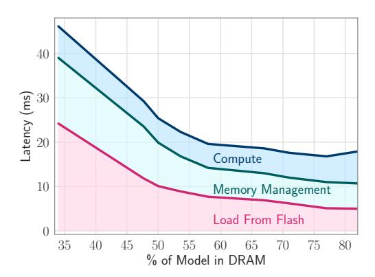
*الشكل 7: عبر جلب المزيد من معاملات نموذجنا (OPT-6.7B) إلى DRAM، يمكن تقليل زمن الاستجابة على آلة GPU.*

1000 رمز لنموذج OPT 6.7B على GPU. علاوة على ذلك، نُبيّن أنّ متوسط زمن استجابة الفلاش لا يزداد كلّما تقدّمنا في التوليد. على النقيض، يكون زمن استجابة الفلاش لأول بضع رموز أعلى لأنّ الذاكرة المخصّصة في DRAM تكون فارغة وتحتاج إلى ملء بالخلايا العصبية، ولأول بضع رموز نحتاج إلى نقل بيانات أكثر.

كما يمكن القول إنّ طرق المعاينة غير الجشِعة كأخذ العيّنات النيوكلية (Holtzman et al., 2020) قد تُسفر عن تنشيط أكثر تنوّعًا، وبالتالي أقل مواتاة لطريقتنا. وجدنا أنّ هذا ليس الحال أيضًا للتوليدات الطويلة. لا تؤدي معاينة النيوكليس إلى أداء أقل في التوليد الطويل لا على CPU ولا على GPU.

## 5.2 فك التشفير التخميني

لإظهار قوة طريقتنا وقابليتها للتكيف مع استراتيجيات فك التشفير الأخرى، طبّقنا فك التشفير التخميني على نموذج OPT 6.7B. التحدي في فك التشفير التخميني هو محدودية الذاكرة المتاحة داخل DRAM. بالنظر إلى \lambda رمز من نموذج المسوّدة، يتحقّق النموذج الكبير منها وسيحتفظ بنافذة بحجم k لكل طبقة. يجب على النموذج أن يقرّر أيّ خلايا عصبية لأيّ رموز يحتفظ بها في الذاكرة قبل اكتمال التحقّقات. إذا احتفظ النموذج بآخر k رموز من \lambda + 1 رمز في الذاكرة ورُفض معظمها، فستكون هناك إعادة استخدام قليل جدًا للخلايا العصبية للتمريرة الأمامية التالية. نخمّن أنّه إذا كانت نسبة القبول \alpha فإنّ الاحتفاظ بآخر k رموز تنتهي بالرمز \alpha(\lambda + 1) هو الأمثل في DRAM. استخدمنا \lambda = 4 وتمكّنا من تحسين سرعة فك التشفير بمقدار 1.4x كما هو موضّح في الجدول 5، وهذا قريب من التسريع الأصلي 1.58x لفك التشفير التخميني.

<!-- page 9 -->

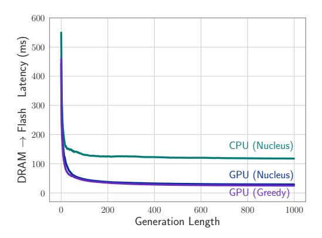
*الشكل 8: زمن استجابة تحميل أوزان OPT 6.7B مع زيادة طول التوليد.*

## **5.3** ملاحظة حول استهلاك الطاقة

في تقييم كفاءة طريقتنا، قارنّا استهلاك الطاقة لنهج النموذج المتباعد مع توليد الرموز باستخدام نموذج كثيف من حجم مماثل. في حين كان استخدام الطاقة (الطاقة لكل وحدة زمنية) للنموذج المتباعد أقل من النموذج الكثيف، إلّا أنّ المدة الممتدّة المطلوبة لتوليد الرموز أدّت إلى أنّ النموذج المتباعد لديه استهلاك إجمالي للطاقة أعلى. سينعكس هذا في المساحة الأكبر تحت المنحنى عند رسم الطاقة بمرور الوقت للنموذج المتباعد مقارنةً بالنموذج الكثيف. تُترك التقييم المنهجي والكمي لنمط استخدام الطاقة الدقيق كعمل مستقبلي.

# 6 الأعمال ذات الصلة

مع نمو حجم نماذج LLM، أصبح تقليل متطلباتها الحاسوبية والذاكرة للاستدلال مجالًا نشطًا للبحث. تنقسم النُهج بشكل عريض إلى فئتين: تقنيات ضغط النموذج كالتشذيب والتكميم (Han et al., 2016b; Sun et al., 2023; Jaiswal et al., 2023; Xia et al., 2023; Zhang et al., 2022a; Xu et al., 2023; Shao et al., 2023; Lin et al., 2023; Hoang et al., 2023; Zhao et al., 2023; Ahmadian et al., 2023; Li et al., 2023)، والتنفيذ الانتقائي كالتنشيط المتباعد (Liu et al., 2023b; Mirzadeh et al., 2023)، أو الحوسبة الشرطية (Graves, 2016; Baykal et al., 2023). عملنا عمودي على هذه الاتجاهات، ويركّز أساسًا على تقليل نقل البيانات من ذاكرة الفلاش أثناء الاستدلال.

ربما الأكثر صلة بعملنا هو الأدبيات حول التحميل الانتقائي للأوزان. يستغل Dejavu (Liu et al., 2023b) تباعد التنشيط لتحميل مجموعة فرعية من الأوزان لكل طبقة. غير أنّه لا يزال يتطلّب التحميل من ذاكرة GPU. يُفرغ FlexGen (Sheng

et al., 2023) الأوزان ومخبأ KV من ذاكرة GPU إلى DRAM ومن DRAM إلى ذاكرة الفلاش. على النقيض، نأخذ في الحسبان فقط الحالات التي لا يستطيع فيها النموذج الكامل الإقامة في كامل ذاكرة DRAM وGPU على أجهزة الحافة. والملاحظ أنّ FlexGen لا يزال محدودًا نظريًا بالإنتاجية البطيئة من الفلاش إلى DRAM في مثل هذه السيناريوهات. تُؤجَّل مناقشة موسّعة للأعمال ذات الصلة إلى الملحق E.

عمومًا، الافتراض الرئيسي في الأدبيات هو أنّ النموذج يمكن أن يقيم بالكامل في ذاكرة GPU أو DRAM للنظام. غير أنّه بالنظر إلى الموارد المحدودة المتاحة على الأجهزة الشخصية، لا نشارك هذا الافتراض في هذا العمل. بدلًا من ذلك، نتركّز على استكشاف كيفية تخزين وتحميل المعاملات على ذاكرة الفلاش بكفاءة أكبر، بهدف تعزيز كفاءة الاستدلال.

# 7 المناقشة

في هذه الدراسة، عالجنا التحدّي الكبير المتمثّل في تشغيل نماذج اللغة الكبيرة (LLMs) على الأجهزة ذات سعات الذاكرة المحدودة. يُمثّل نهجنا، الذي يستند بعمق إلى فهم خصائص ذاكرة الفلاش وDRAM، تقاربًا جديدًا بين الاستراتيجيات الواعية بالعتاد والتعلم الآلي. عبر تطوير نموذج كلفة استدلال يتماشى مع هذه القيود العتادية، قدّمنا تقنيتين جديدتين: "النوافذ" و"حزم الصفوف والأعمدة".

النتائج العملية لبحثنا جديرة بالملاحظة. أظهرنا القدرة على تشغيل LLMs بضعف حجم DRAM المتاحة. على سبيل المثال، على نموذج OPT، حقّقنا تسريعًا في سرعة الاستدلال بمقدار 4-5x مقارنةً بطرق التحميل التقليدية على CPU، و20-25x على GPU. هذا حاسم بشكل خاص لنشر LLMs في البيئات محدودة الموارد، وبالتالي توسيع قابلية تطبيقها وإتاحتها.

في حين درسنا في هذا العمل المشكلة غير المُستكشفة سابقًا لخدمة LLMs من الفلاش، نلاحظ أنّ هذا العمل ليس سوى خطوة أولى في هذا الاتجاه، وله عدة قيود نناقشها في القسم التالي، ونعتقد أنّ هناك عدة مشكلات مثيرة للاهتمام لم تُستكشف بعد لأعمال مستقبلية. على سبيل المثال، من المنظور الخوارزمي، يمكن تصميم تقنيات أكثر تحسينًا لحزم الأوزان وبنى البيانات، بينما من المنظور الهندسي، يمكن لخصائص منصّات العتاد المحدّدة أن تُلهم أعمالًا حول بناء مكدّسات استدلال أكثر كفاءة.

<!-- page 10 -->

# 8 القيود

تُمثّل دراستنا مسعى أوّليًا في السعي إلى دمقرطة استدلال نماذج اللغة الكبيرة (LLM)، وجعله متاحًا لمجموعة أوسع من الأفراد والأجهزة. ندرك أنّ هذا الجهد المبكّر له قيوده، التي تفتح بدورها سُبلًا مُقنعة للأبحاث المستقبلية. جانب حاسم للاستكشاف المستقبلي هو التحليل المنهجي لاستهلاك الطاقة والقيود الحرارية المتأصّلة في الطرق التي نقترحها، خصوصًا للنشر على الجهاز.

حاليًا، تقتصر دراستنا على استدلال الدفعة الواحدة. نقدّم بعض النتائج الأولية حول دمج فكرتنا المقترحة مع فك التشفير التخميني، غير أنّ توسيع ذلك ليشمل سيناريوهات أكثر تعقيدًا كمعالجة الموجِّه واستدلال الدفعات المتعددة هي مجالات قيّمة لمزيد من البحث.

في إثبات المفهوم الأوّلي، عملنا تحت افتراض توفّر الذاكرة بنصف حجم النموذج. استكشاف ديناميكيات العمل بأحجام ذاكرة متفاوتة - أكبر وأصغر - يُدخل توازنًا مثيرًا للاهتمام بين زمن الاستجابة والدقة، وهو مجال مُقنع للاستكشاف المستقبلي.

في الختام، تُبنى منهجيتنا على أساس الشبكات المتباعدة. ومع ذلك، فإنّ المفهوم الأساسي يحمل إمكانية لتطبيقات أوسع. يمكن تكييفه لتحميل الأوزان بشكل انتقائي في الشبكات غير المتباعدة أو لاسترداد أوزان النموذج ديناميكيًا من تخزين الفلاش. سيكون هذا التكييف مرهونًا بمتطلبات الموجِّه المُدخل أو معاملات السياق المُقدَّمة. يقترح مثل هذا النهج استراتيجية متعدّدة الاستخدامات لإدارة أوزان النموذج، وتحسين الأداء بناءً على طبيعة المُدخل، وبالتالي تعزيز كفاءة وفائدة وقابلية تطبيق الخطة المقترحة في سيناريوهات متنوعة تتعامل مع نماذج اللغة الكبيرة (LLMs).

## شكر وتقدير

نودّ أن نشكر Itay Sagron, Lailin Chen, Chenfan (Frank) Sun, Hanieh Hashemi, Mahyar Najibi, Qichen Fu, Moin Nabi, Peter Zatloukal, Arsalan Farooq, Sachin Mehta, Mohammad Samragh, Matt Johnson, Etai Zaltsman, Lin Chang, Dominic Giampaolo, Tal Uliel, Hadi Pouransari, Fartash Faghri, Oncel Tuzel, Samy Bengio, Ruoming Pang, Chong Wang, Ronan Collobert, David Grangier, Aftab Munshi على المناقشات القيّمة.

## المراجع

- Arash Ahmadian, Saurabh Dash, Hongyu Chen, Bharat Venkitesh, Stephen Gou, Phil Blunsom, A. Ustun, and Sara Hooker. 2023. [Intriguing properties of quan](https://api.semanticscholar.org/CorpusID:258967189)[tization at scale.](https://api.semanticscholar.org/CorpusID:258967189) *ArXiv*, abs/2305.19268.
- Ebtesam Almazrouei, Hamza Alobeidli, Abdulaziz Alshamsi, Alessandro Cappelli, Ruxandra Cojocaru, Maitha Alhammadi, Mazzotta Daniele, Daniel Heslow, Julien Launay, Quentin Malartic, Badreddine Noune, Baptiste Pannier, and Guilherme Penedo. 2023. The falcon series of language models: Towards open frontier models.
- Reza Yazdani Aminabadi, Samyam Rajbhandari, Ammar Ahmad Awan, Cheng Li, Du Li, Elton Zheng, Olatunji Ruwase, Shaden Smith, Minjia Zhang, Jeff Rasley, et al. 2022. Deepspeed-inference: enabling efficient inference of transformer models at unprecedented scale. In *SC22: International Conference for* *High Performance Computing, Networking, Storage* *and Analysis*, pages 1–15. IEEE.
- Sangmin Bae, Jongwoo Ko, Hwanjun Song, and Se-Young Yun. 2023. [Fast and robust early](https://api.semanticscholar.org/CorpusID:263830054)[exiting framework for autoregressive language mod](https://api.semanticscholar.org/CorpusID:263830054)[els with synchronized parallel decoding.](https://api.semanticscholar.org/CorpusID:263830054) *ArXiv*, abs/2310.05424.
- Cenk Baykal, Dylan Cutler, Nishanth Dikkala, Nikhil Ghosh, Rina Panigrahy, and Xin Wang. 2023. [Al](https://api.semanticscholar.org/CorpusID:256416125)[ternating updates for efficient transformers.](https://api.semanticscholar.org/CorpusID:256416125) *ArXiv*, abs/2301.13310.
- Tom Brown, Benjamin Mann, Nick Ryder, Melanie Subbiah, Jared D Kaplan, Prafulla Dhariwal, Arvind Neelakantan, Pranav Shyam, Girish Sastry, Amanda Askell, et al. 2020. Language models are few-shot learners. *Advances in neural information processing* *systems*, 33:1877–1901.
- Yew Ken Chia, Pengfei Hong, Lidong Bing, and Soujanya Poria. 2023. [Instructeval: Towards holistic](http://arxiv.org/abs/2306.04757) [evaluation of instruction-tuned large language mod](http://arxiv.org/abs/2306.04757)[els.](http://arxiv.org/abs/2306.04757)
- Aakanksha Chowdhery, Sharan Narang, Jacob Devlin, Maarten Bosma, Gaurav Mishra, Adam Roberts, Paul Barham, Hyung Won Chung, Charles Sutton, Sebastian Gehrmann, et al. 2022. Palm: Scaling language modeling with pathways. *arXiv preprint* *arXiv:2204.02311*.
- Han Dai, Yi Zhang, Ziyu Gong, Nanqing Yang, Wei Dai, Eric Song, and Qiankun Xie. 2021. Spatten: Efficient sparse attention architecture with cascade token and head pruning. In *Advances in Neural Information* *Processing Systems*, volume 34.
- Erich Elsen, Augustus Odena, Maxwell Nye, Sag-˘ nak Ta¸sırlar, Tri Dao, Curtis Hawthorne, Deepak Moparthi, and Arushi Somani. 2023. [Releasing](https://www.adept.ai/blog/persimmon-8b) [Persimmon-8B.](https://www.adept.ai/blog/persimmon-8b)
- Trevor Gale, Matei Zaharia, Cliff Young, and Erich Elsen. 2020. [Sparse gpu kernels for deep learning.](http://arxiv.org/abs/2006.10901)

<!-- page 11 -->

- Mingyu Gao, Jie Yu, Wentai Li, Michael C Dai, Nam Sung Kim, and Krste Asanovic. 2022. computedram: In-memory compute using off-the-shelf dram. In *Proceedings of the 27th ACM International* *Conference on Architectural Support for Program**ming Languages and Operating Systems*, pages 1065– 1079.
- Google Gemini Team. 2023. Gemini: a family of highly capable multimodal models. *arXiv preprint* *arXiv:2312.11805*.
- Alex Graves. 2016. Adaptive computation time for recurrent neural networks. In *International Conference* *on Machine Learning*, pages 3500–3509. PMLR.
- Suriya Gunasekar, Yi Zhang, Jyoti Aneja, Caio César Teodoro Mendes, Allie Del Giorno, Sivakanth Gopi, Mojan Javaheripi, Piero Kauffmann, Gustavo de Rosa, Olli Saarikivi, Adil Salim, Shital Shah, Harkirat Singh Behl, Xin Wang, Sébastien Bubeck, Ronen Eldan, Adam Tauman Kalai, Yin Tat Lee, and Yuanzhi Li. 2023. [Textbooks are all you need.](https://doi.org/10.48550/ARXIV.2306.11644) *CoRR*, abs/2306.11644.
- Jongmin Ham, Jinha Kim, Jinwoong Choi, Cheolwoo Cho, Seulki Hong, Kyeongsu Han, and Taejoo Chung. 2016. Graphssd: a high performance flash-based storage system for large-scale graph processing. In *2016* *USENIX Annual Technical Conference (USENIXATC* *16)*, pages 243–256.
- Song Han, Xingyu Liu, Huizi Mao, Jing Pu, Ardavan Pedram, Mark A Horowitz, and William J Dally. 2016a. Eie: efficient inference engine on compressed deep neural network. *arXiv preprint arXiv:1602.01528*.
- Song Han, Huizi Mao, and William J Dally. 2016b. Deep compression: Compressing deep neural networks with pruning, trained quantization and huffman coding. In *International Conference on Learn**ing Representations (ICLR)*.
- Awni Hannun, Jagrit Digani, Angelos Katharopoulos, and Ronan Collobert. 2023. [MLX: Efficient and](https://github.com/ml-explore) [flexible machine learning on apple silicon.](https://github.com/ml-explore)
- Zhenyu He, Zexuan Zhong, Tianle Cai, Jason D Lee, and Di He. 2023. [Rest: Retrieval-based speculative](https://api.semanticscholar.org/CorpusID:265157884) [decoding.](https://api.semanticscholar.org/CorpusID:265157884) *ArXiv*, abs/2311.08252.
- Dan Hendrycks, Collin Burns, Steven Basart, Andy Zou, Mantas Mazeika, Dawn Song, and Jacob Steinhardt. 2021. [Measuring massive multitask language](https://openreview.net/forum?id=d7KBjmI3GmQ) [understanding.](https://openreview.net/forum?id=d7KBjmI3GmQ) In *9th International Conference on* *Learning Representations, ICLR 2021, Virtual Event,* *Austria, May 3-7, 2021*. OpenReview.net.
- Duc Nien Hoang, Minsik Cho, Thomas Merth, Mohammad Rastegari, and Zhangyang Wang. 2023. [(dy](https://api.semanticscholar.org/CorpusID:263605807)[namic) prompting might be all you need to repair](https://api.semanticscholar.org/CorpusID:263605807) [compressed llms.](https://api.semanticscholar.org/CorpusID:263605807) *ArXiv*, abs/2310.00867.
- Ari Holtzman, Jan Buys, Li Du, Maxwell Forbes, and Yejin Choi. 2020. [The curious case of neural text](https://openreview.net/forum?id=rygGQyrFvH) [degeneration.](https://openreview.net/forum?id=rygGQyrFvH) In *8th International Conference on*

- *Learning Representations, ICLR 2020, Addis Ababa,* *Ethiopia, April 26-30, 2020*. OpenReview.net.
- Ajay Jaiswal, Zhe Gan, Xianzhi Du, Bowen Zhang, Zhangyang Wang, and Yinfei Yang. 2023. [Compress](https://api.semanticscholar.org/CorpusID:263605754)[ing llms: The truth is rarely pure and never simple.](https://api.semanticscholar.org/CorpusID:263605754) *ArXiv*, abs/2310.01382.
- Albert Q. Jiang, Alexandre Sablayrolles, Arthur Mensch, Chris Bamford, Devendra Singh Chaplot, Diego de Las Casas, Florian Bressand, Gianna Lengyel, Guillaume Lample, Lucile Saulnier, Lélio Renard Lavaud, Marie-Anne Lachaux, Pierre Stock, Teven Le Scao, Thibaut Lavril, Thomas Wang, Timothée Lacroix, and William El Sayed. 2023. [Mistral](https://doi.org/10.48550/ARXIV.2310.06825) [7b.](https://doi.org/10.48550/ARXIV.2310.06825) *CoRR*, abs/2310.06825.
- Yaniv Leviathan, Matan Kalman, and Yossi Matias. 2022. [Fast inference from transformers via spec](http://arxiv.org/abs/2211.17192)[ulative decoding.](http://arxiv.org/abs/2211.17192)
- Liang Li, Qingyuan Li, Bo Zhang, and Xiangxiang Chu. 2023. [Norm tweaking: High-performance low](https://api.semanticscholar.org/CorpusID:261557634)[bit quantization of large language models.](https://api.semanticscholar.org/CorpusID:261557634) *ArXiv*, abs/2309.02784.
- Ji Lin, Jiaming Tang, Haotian Tang, Shang Yang, Xingyu Dang, and Song Han. 2023. [Awq: Activation](https://api.semanticscholar.org/CorpusID:258999941)[aware weight quantization for llm compression and](https://api.semanticscholar.org/CorpusID:258999941) [acceleration.](https://api.semanticscholar.org/CorpusID:258999941) *ArXiv*, abs/2306.00978.
- Zechun Liu, Barlas Oguz, Changsheng Zhao, Ernie Chang, Pierre Stock, Yashar Mehdad, Yangyang Shi, Raghuraman Krishnamoorthi, and Vikas Chandra. 2023a. [Llm-qat: Data-free quantization aware train](http://arxiv.org/abs/2305.17888)[ing for large language models.](http://arxiv.org/abs/2305.17888) *CoRR*.
- Zichang Liu, Jue Wang, Tri Dao, Tianyi Zhou, Binhang Yuan, Zhao Song, Anshumali Shrivastava, Ce Zhang, Yuandong Tian, Christopher Re, et al. 2023b. Deja vu: Contextual sparsity for efficient llms at inference time. In *International Conference on Machine* *Learning*, pages 22137–22176. PMLR.
- Moinuddin K Meswani, Sergey Blagodurov, David Roberts, John Slice, Mike Ignatowski, and Gabriel Loh. 2015. Neural cache: Bit-serial in-cache acceleration of deep neural networks. In *2015 48th Annual* *IEEE/ACM International Symposium on Microarchi**tecture (MICRO)*, pages 383–394. IEEE.
- Iman Mirzadeh, Keivan Alizadeh, Sachin Mehta, Carlo C Del Mundo, Oncel Tuzel, Golnoosh Samei, Mohammad Rastegari, and Mehrdad Farajtabar. 2023. [Relu strikes back: Exploiting activation sparsity in](http://arxiv.org/abs/2310.04564) [large language models.](http://arxiv.org/abs/2310.04564)
- Angshuman Parashar, Minsoo Rhu, Anurag Mukkara, Antonio Puglielli, Rangharajan Venkatesan, Brucek Khailany, Joel Emer, Stephen W Keckler, and William J Dally. 2017. Timeloop: A systematic approach to dnn accelerator evaluation. In *2017 IEEE* *International Symposium on Performance Analysis* *of Systems and Software (ISPASS)*, pages 241–251. IEEE.

<!-- page 12 -->

- Adam Paszke, Sam Gross, Francisco Massa, Adam Lerer, James Bradbury, Gregory Chanan, Trevor Killeen, Zeming Lin, Natalia Gimelshein, Luca Antiga, Alban Desmaison, Andreas Köpf, Edward Z. Yang, Zachary DeVito, Martin Raison, Alykhan Tejani, Sasank Chilamkurthy, Benoit Steiner, Lu Fang, Junjie Bai, and Soumith Chintala. 2019. [Pytorch: An](https://proceedings.neurips.cc/paper/2019/hash/bdbca288fee7f92f2bfa9f7012727740-Abstract.html) [imperative style, high-performance deep learning li](https://proceedings.neurips.cc/paper/2019/hash/bdbca288fee7f92f2bfa9f7012727740-Abstract.html)[brary.](https://proceedings.neurips.cc/paper/2019/hash/bdbca288fee7f92f2bfa9f7012727740-Abstract.html) In *Advances in Neural Information Processing* *Systems 32: Annual Conference on Neural Informa**tion Processing Systems 2019, NeurIPS 2019, De**cember 8-14, 2019, Vancouver, BC, Canada*, pages 8024–8035.
- Samyam Rajbhandari, Olatunji Ruwase, Jeff Rasley, Shaden Smith, and Yuxiong He. 2021. Zero-infinity: Breaking the gpu memory wall for extreme scale deep learning. In *SC21: International Conference for* *High Performance Computing, Networking, Storage* *and Analysis*, pages 1–14.
- Minsoo Rhu, Natalia Gimelshein, Jason Clemons, Arslan Zulfiqar, and Stephen W Keckler. 2013. vdnn: Virtualized deep neural networks for scalable, memory-efficient neural network design. In *2016* *49th Annual IEEE/ACM International Symposium on* *Microarchitecture (MICRO)*, page Article 13. IEEE Computer Society.
- Wenqi Shao, Mengzhao Chen, Zhaoyang Zhang, Peng Xu, Lirui Zhao, Zhiqiang Li, Kaipeng Zhang, Peng Gao, Yu Jiao Qiao, and Ping Luo. 2023. [Omniquant:](https://api.semanticscholar.org/CorpusID:261214575) [Omnidirectionally calibrated quantization for large](https://api.semanticscholar.org/CorpusID:261214575) [language models.](https://api.semanticscholar.org/CorpusID:261214575) *ArXiv*, abs/2308.13137.
- Yifan Shao, Mengjiao Li, Wenhao Cai, Qi Wang, Dhananjay Narayanan, and Parthasarathy Ranganathan. 2022. Hotpot: Warmed-up gigascale inference with tightly-coupled compute and reuse in flash. In *Proceedings of the 55th Annual IEEE/ACM In**ternational Symposium on Microarchitecture*, pages 335–349.
- Ying Sheng, Lianmin Zheng, Binhang Yuan, Zhuohan Li, Max Ryabinin, Beidi Chen, Percy Liang, Christopher Ré, Ion Stoica, and Ce Zhang. 2023. Flexgen: High-throughput generative inference of large language models with a single GPU. In *International* *Conference on Machine Learning, ICML 2023, 23-29* *July 2023, Honolulu, Hawaii, USA*, volume 202 of *Proceedings of Machine Learning Research*, pages 31094–31116. PMLR.
- Chenyang Song, Xu Han, Zhengyan Zhang, Shengding Hu, Xiyu Shi, Kuai Li, Chen Chen, Zhiyuan Liu, Guangli Li, Tao Yang, and Maosong Sun. 2024. [Prosparse: Introducing and enhancing intrinsic acti](http://arxiv.org/abs/2402.13516)[vation sparsity within large language models.](http://arxiv.org/abs/2402.13516)
- Vedant Subramani, Marios Savvides, Li Ping, and Sharan Narang. 2022. Adapt: Parameter adaptive tokenwise inference for vision transformers. In *Proceed**ings of the 55th Annual IEEE/ACM International* *Symposium on Microarchitecture*.

- Mingjie Sun, Zhuang Liu, Anna Bair, and J. Zico Kolter. 2023. [A simple and effective pruning approach for](https://api.semanticscholar.org/CorpusID:259203115) [large language models.](https://api.semanticscholar.org/CorpusID:259203115) *ArXiv*, abs/2306.11695.
- Hugo Touvron, Thibaut Lavril, Gautier Izacard, Xavier Martinet, Marie-Anne Lachaux, Timothée Lacroix, Baptiste Rozière, Naman Goyal, Eric Hambro, Faisal Azhar, Aurélien Rodriguez, Armand Joulin, Edouard Grave, and Guillaume Lample. 2023a. [Llama: Open](http://arxiv.org/abs/2302.13971) [and efficient foundation language models.](http://arxiv.org/abs/2302.13971) *CoRR*, abs/2302.13971.
- Hugo Touvron, Louis Martin, Kevin Stone, Peter Albert, Amjad Almahairi, Yasmine Babaei, Nikolay Bashlykov, Soumya Batra, Prajjwal Bhargava, Shruti Bhosale, et al. 2023b. Llama 2: Open foundation and fine-tuned chat models. *arXiv preprint* *arXiv:2307.09288*.
- Thomas Wolf, Lysandre Debut, Victor Sanh, Julien Chaumond, Clement Delangue, Anthony Moi, Pierric Cistac, Tim Rault, Rémi Louf, Morgan Funtowicz, and Jamie Brew. 2019. [Huggingface's transformers:](http://arxiv.org/abs/1910.03771) [State-of-the-art natural language processing.](http://arxiv.org/abs/1910.03771) *CoRR*, abs/1910.03771.
- Haojun Xia, Zhen Zheng, Yuchao Li, Donglin Zhuang, Zhongzhu Zhou, Xiafei Qiu, Yong Li, Wei Lin, and Shuaiwen Leon Song. 2023. [Flash-llm: Enabling](https://api.semanticscholar.org/CorpusID:262054394) [low-cost and highly-efficient large generative model](https://api.semanticscholar.org/CorpusID:262054394) [inference with unstructured sparsity.](https://api.semanticscholar.org/CorpusID:262054394) *Proc. VLDB* *Endow.*, 17:211–224.
- Zhaozhuo Xu, Zirui Liu, Beidi Chen, Yuxin Tang, Jue Wang, Kaixiong Zhou, Xia Hu, and Anshumali Shrivastava. 2023. [Compress, then prompt: Improving](https://api.semanticscholar.org/CorpusID:258823240) [accuracy-efficiency trade-off of llm inference with](https://api.semanticscholar.org/CorpusID:258823240) [transferable prompt.](https://api.semanticscholar.org/CorpusID:258823240) *ArXiv*, abs/2305.11186.
- Rongjie Yi, Liwei Guo, Shiyun Wei, Ao Zhou, Shangguang Wang, and Mengwei Xu. 2023. [Edgemoe:](https://api.semanticscholar.org/CorpusID:261243273) [Fast on-device inference of moe-based large language](https://api.semanticscholar.org/CorpusID:261243273) [models.](https://api.semanticscholar.org/CorpusID:261243273) *ArXiv*, abs/2308.14352.
- Hengrui Zhang, August Ning, Rohan Prabhakar, and David Wentzlaff. 2023a. [A hardware evaluation](https://api.semanticscholar.org/CorpusID:265711466) [framework for large language model inference.](https://api.semanticscholar.org/CorpusID:265711466)
- Jinchao Zhang, Jue Wang, Huan Li, Lidan Shou, Ke Chen, Gang Chen, and Sharad Mehrotra. 2023b. [Draft & verify: Lossless large language model ac](https://api.semanticscholar.org/CorpusID:262013673)[celeration via self-speculative decoding.](https://api.semanticscholar.org/CorpusID:262013673) *ArXiv*, abs/2309.08168.
- Shizhao Zhang, Han Dai, Tian Sheng, Jiawei Zhang, Xiaoyong Li, Qun Xu, Mengjia Dai, Yunsong Xiao, Chao Ma, Rui Tang, et al. 2022a. Llm quantization: Quantization-aware training for large language models. In *Advances in Neural Information Processing* *Systems*, volume 35.
- Susan Zhang, Stephen Roller, Naman Goyal, Mikel Artetxe, Moya Chen, Shuohui Chen, Christopher Dewan, Mona T. Diab, Xian Li, Xi Victoria Lin,

<!-- page 13 -->

Todor Mihaylov, Myle Ott, Sam Shleifer, Kurt Shuster, Daniel Simig, Punit Singh Koura, Anjali Sridhar, Tianlu Wang, and Luke Zettlemoyer. 2022b. [OPT: open pre-trained transformer language mod](http://arxiv.org/abs/2205.01068)[els.](http://arxiv.org/abs/2205.01068) *CoRR*, abs/2205.01068.

Zhengyan Zhang, Yixin Song, Guanghui Yu, Xu Han, Yankai Lin, Chaojun Xiao, Chenyang Song, Zhiyuan Liu, Zeyu Mi, and Maosong Sun. 2024. Relu^2^ [wins:](http://arxiv.org/abs/2402.03804) [Discovering efficient activation functions for sparse](http://arxiv.org/abs/2402.03804) [llms.](http://arxiv.org/abs/2402.03804)

Yilong Zhao, Chien-Yu Lin, Kan Zhu, Zihao Ye, Lequn Chen, Size Zheng, Luis Ceze, Arvind Krishnamurthy, Tianqi Chen, and Baris Kasikci. 2023. [Atom: Low](https://api.semanticscholar.org/CorpusID:264828796)[bit quantization for efficient and accurate llm serving.](https://api.semanticscholar.org/CorpusID:264828796) *ArXiv*, abs/2310.19102.

<!-- page 14 -->

## A نظرة عامة على الملحق

يُنظَّم الملحق على النحو التالي:

- في الملحق [B](#page-13-0)، نقدّم تفاصيل إضافية حول المتنبّئ منخفض الرتبة المُقدَّم في القسم [3](#page-2-0). نُقيّم متنبّئاتنا المُدرَّبة من منظوري الدقة (أي تأثيرها على دقة النموذج) والكفاءة (أي الخلايا العصبية الإضافية التي يتنبّأون بتنشيطها).
- يقدّم الملحق [C](#page-13-1) وصفًا أكثر تفصيلًا لإعدادنا التجريبي والتنفيذ للتجارب التي أُجريت في القسم [4](#page-5-0).
- في الملحق [D](#page-18-0)، نناقش نتيجة سلبية بخصوص استراتيجية حزم الخلايا العصبية بناءً على التنشيط المشترك كطريقة محتملة لزيادة حجم الكتل (انظر القسم [3.2](#page-3-2)). نُدرج هذه النتيجة السلبية عمدًا لأنّنا نعتقد أنّها قد تُلهم أبحاثًا مستقبلية حول حزم الخلايا العصبية الفعّال واستخدامه للاستدلال الكفؤ.
- في الملحق [E](#page-18-1)، نتعمّق في مراجعة الأعمال ذات الصلة في الأدبيات.
- في الملحق [F](#page-19-0)، نتطرّق إلى تأثيرات نموذج LLM في الفلاش عند الانتقال إلى أجهزة أصغر.
- أخيرًا، يُقارن الملحق [G](#page-19-1) النصوص المُولَّدة من النموذج الأساسي مع تلك التي تنتجها نماذجنا التي تستخدم المتنبّئ.

## B متنبّئ التنشيط منخفض الرتبة: نتائج إضافية

## B.1 أنماط التباعد للمتنبّئات

سيُحدّد عدد الخلايا العصبية المتنبَّأ بنشاطها كفاءة خوارزميتنا، فكلما كان التنشيط المتنبَّأ به أقل تباعدًا، كلما زاد عدد الأوزان التي يجب تحميلها من الفلاش. قمنا بتقييم أنماط التباعد على 100 عيّنة عشوائية من مجموعة التحقق C4. في الشكل [9](#page-14-0) يمكننا رؤية أنماط التباعد لـ OPT و Persimmon و Phi. في OPT، عدد الخلايا العصبية النشطة المتنبَّأ بها من قِبل المتنبّئ هو 3x مقدار التباعد الفعلي الملاحظ في حالة الاستدلال الكثيف. في Persimmon هو نفسه تقريبًا - 3x الخلايا العصبية المطلوبة، وفي Phi-2 هو تقريبًا 2x الخلايا العصبية المطلوبة من النموذج الأصلي التي يُنشّطها المتنبّئ. الخلايا العصبية المُنشَّطة من قِبل النموذج وليس من قِبل المتنبّئ هي السلبيات الزائفة. الفجوة بين الخلايا العصبية النشطة في كل من المتنبّئ والنموذج، والخلايا العصبية النشطة فقط في النموذج ضيّقة جدًا في النماذج الثلاثة، وبالتالي

تُشكّل السلبيات الزائفة جزءًا صغيرًا من التنبّؤات. لتقليل السلبيات الزائفة، يجب على المتنبّئ "الإفراط في التنبّؤ"، ممّا يؤدي إلى تحميل خلايا عصبية زائدة، أي ستكون لها تنشيط صفر ولا تأثير على النتيجة. اتجاه مستقبلي مثير لهذا العمل هو تحسين دقة المتنبّئات لتكون قادرة على تحميل عدد أقل من الخلايا العصبية. ملاحظة كانت لدينا في OPT و Persimmon هي أنّ الطبقات اللاحقة تحتوي على خلايا عصبية نشطة أكثر، كما يمكن رؤيته في الشكل [9د.](#page-14-0)

## B.2 دقة النماذج باستخدام المتنبّئات

نُقيّم دقة النماذج على معايير عامة مع وضع المتنبّئات في مكانها. في الجدول [4](#page-15-0) يمكن ملاحظة أنّ دقة التقييم بدون أمثلة (zero-shot) للنماذج لا تنخفض. كما يمكننا أن نرى أنّ زيادة حجم المتنبّئ للطبقات الأربع الأخيرة لـ Persimmon و Falcon تُحسّن مقاييس zero-shot. قمنا بتقييم النماذج على معيار MMLU [(Hendrycks et al., 2021)](#page-10-12) أيضًا. استخدمنا تنفيذ Instruct Eval [(Chia et al., 2023)](#page-9-6) لتقييم MMLU. في الشكل [10أ](#page-14-1) يمكننا أن نرى أنّ MMLU لـ Persimmon لا تنخفض عندما تستخدم الطبقات الأربع الأخيرة متنبّئات أعلى رتبة، لكن هذه ليست الحالة للرتب الأقل. سينخفض MMLU لـ Phi2 بمقدار 2.3 نقطة من النموذج المُحوَّل لـ ReLU مع الحفاظ على 52 كما هو موضّح في الشكل [10ب.](#page-14-1) عبر زيادة عتبة المتنبّئ منخفض الرتبة، يمكننا تقليل كمية تحميل البيانات، ويأتي ذلك مع تدهور طفيف في مقاييس zero-shot كما هو مُلاحَظ في الجدول [4](#page-15-0) لعتبات مختلفة لنموذج Persimmon. استخدمنا threshold=0.7 لـ Persimmon.

## B.3 عبء المتنبّئات

متوسط رتبة المتنبّئات في OPT-6.7B هو 240، وسيؤدي ذلك إلى أقل من 2.4% من الأوزان غير التضمينية و FLOPs. في تجارب M1 Max CPU كان هذا يضمّ 2.75% وفي RTX GPU كان 4.8% من زمن الاستدلال وهو ما يمكن إهماله. بالنسبة لـ Falcon 7B، تأخذ المتنبّئات 4% من حجم النموذج وحساب CPU. بالنسبة لـ Persimmon كانت تأخذ 2.85% من زمن الاستدلال على CPU. بالنسبة لـ Llama 2 7B كانت تأخذ 3.92% من زمن الاستدلال على CPU.

## C نتائج موسّعة

الإعداد التجريبي: تجربتنا مصمّمة لتحسين كفاءة الاستدلال على الأجهزة الشخصية. لهذا الغرض، نُعالج التسلسلات بشكل فردي، مُشغّلين تسلسلًا واحدًا في كل مرة. يتيح لنا هذا النهج تخصيص جزء معيّن من

<!-- page 15 -->

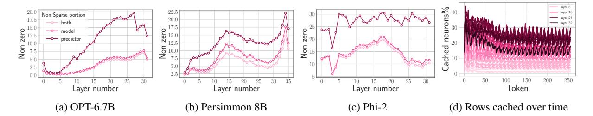
*الشكل 9: (أ) النسبة المئوية للخلايا العصبية المُطلَقة في FFN لكل طبقة هي أقل من 5%. في المتنبّئ، سيتم تنشيط ما يقارب 3x من هذه الكمية. الفجوة الضيّقة بين الخلايا العصبية المُنشَّطة في كليهما تُظهر أنّ مخرج النموذج لن يتغيّر فجأة. (ب) الطبقات الأبكر لـ Persimmon لديها خلايا عصبية نشطة أقل، والطبقات اللاحقة لديها خلايا نشطة أعلى، لذا درّبنا متنبّئات أكبر لها. (ج) في Phi2 الطبقات الوسطى لديها نسبة خلايا نشطة أعلى، لذا درّبنا متنبّئات أكبر لتلك الطبقات. (د) عدد الخلايا العصبية المخزّنة في سيناريو حقيقي للاستدلال، الطبقات اللاحقة لديها صفوف مخزّنة أكثر بسبب نسبتها غير المتباعدة الأعلى.*

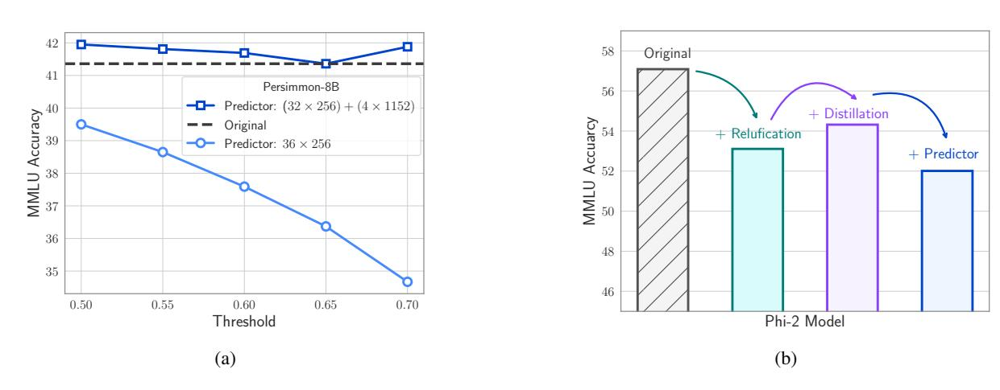
*الشكل 10: (أ) إذا استخدمنا متنبّئات أكبر في الطبقات الأربع الأخيرة، فلن تنخفض MMLU كثيرًا في Persimmon. (ب) ستنخفض MMLU لـ Phi في عملية تحويل ReLU بسبب جودة بيانات أقل، استخدام التقطير يمكن أن يحسّن النتائج لذلك. سيؤدي استخدام المتنبّئات إلى تخفيض النتائج لكن مع الحفاظ عليها عند 52.*

DRAM لمخبأ المفاتيح-القيم (KV) مع التركيز أساسًا على حجم النموذج. هذه الاستراتيجية فعّالة بشكل خاص عند التعامل مع تسلسل/استعلام واحد فقط في كل مرة.2

لتنفيذ عملية الاستدلال، نستخدم HuggingFace Transformers والتخزين المؤقت لـ KV. يُختبَر هذا الإعداد تحت شرط أنّ نحو نصف حجم النموذج متاح في DRAM. نختار هذا المقدار كعرض لفكرة استضافة LLM في الفلاش. بمستوى مختلف من التباعد أو بتوظيف التكميم، يمكن للمرء العمل بسعة DRAM متاحة أصغر أيضًا، أو بدلًا من ذلك استخدام نماذج أكبر. مثل هذا التكوين يُظهر عملية تنفيذ الاستدلال ببصمات ذاكرة أقل.

**تحسين أداء الأنظمة:** الهدف الأساسي لتجاربنا كان نظام تشغيل Apple ma-

cOS 14.3. للاستدلال عالي الأداء، تتطلّب معظم أُطر التعلم العميق الموجودة أن يبقى شكل الأوزان والنتائج الوسيطة في الحساب ساكنًا طوال الوقت. على وجه الخصوص، تُظهر واجهة Metal Performance Shaders (MPS) لـ PyTorch منحدرات أداء حادّة عندما تكون هناك ديناميكية شكل في الرسم البياني الحاسوبي. لبناء تنفيذ عالي الأداء، اخترنا استعارة نوى Metal مخصّصة وصديقة للديناميكية من إطار التعلم العميق مفتوح المصدر MLX من Apple (Hannun et al., 2023). إضافة إلى ذلك، استخدمنا بنية الذاكرة الموحَّدة المتاحة على أنظمة Apple، التي نستغلها للحفاظ على مخبأ الأوزان باستخدام مُخصِّص GPU، عبر إنشاء التنسورات باستخدام وضع التخصيص MTLStorageModeShared. يتيح هذا الوضع لكل من CPU و GPU الوصول إلى نفس مخزن الذاكرة مباشرةً، بدون نسخ زائدة. نلاحظ أنّ المدخلات إلى ومخرجات شبكة التغذية الأمامية

> ^^2^لنموذج OPT 6.7 B بطول سياق 2048 يتطلّب مخبأ KV 2048\times 2d_{\rm model} عنصر وهو فقط 8% من حجم النموذج. كذلك، يمكن الاحتفاظ بمخبأ KV نفسه في ذاكرة الفلاش.

<!-- page 16 -->

لها شكل ساكن، لذا عبر إخفاء الديناميكية داخل امتداد ثنائي والتعامل مع ديناميكية الشكل وإدارة الذاكرة داخليًا، تمكّنا من تحقيق مستوى من الأداء غير قابل للتحقيق مع واجهة PyTorch MPS وحدها مع ترك بقية النموذج سليمة. خلال مسار عملنا، تمكّنا من إزالة كل حركات البيانات الزائدة تقريبًا، ممّا حسّن أداء الاستدلال.

اعتبارات التخزين المؤقت لتحميل البيانات من ذاكرة الفلاش. عند قراءة البيانات من ذاكرة الفلاش، يقوم نظام التشغيل عادةً بتخزين الكتل في مخبأ الكتل، توقّعًا للاستخدام المستقبلي. غير أنّ آلية التخزين المؤقت هذه تستهلك ذاكرة إضافية في DRAM بما يتجاوز ما هو مخصّص للنموذج. لتقييم الإنتاجية الفعلية لذاكرة الفلاش بدقة في ظل ظروف DRAM المحدودة، يجب إجراء اختبارات الأداء دون الاعتماد على التخزين المؤقت. قد تعتمد الأنظمة العملية أو لا تعتمد على مخبأ نظام الملفات، اعتمادًا على المتطلبات.

لغرض اختبارنا للعتاد في هذه الدراسة، نُتعمّد ونقصد تشاؤمًا كبيرًا قياسات إنتاجية NVMe لدينا. على macOS وiOS، نستخدم العَلَم F_NOCACHE مع الدالة fcntl()، بينما على Linux، نستخدم DirectIO. إضافة إلى ذلك، على macOS،

نقوم بمسح أي مخازن مقيمة قبل بدء الاختبار باستخدام أمر purge. يوفّر هذا النهج حدًا أدنى محافظًا للإنتاجية في السيناريوهات التي لا يُسمح فيها بأي تخزين مؤقت ويجعل الاختبارات قابلة للتكرار. تجدر الإشارة إلى أنّ هذه الأرقام يمكن أن تتحسّن إذا سُمح لكود الاستدلال أو نظام التشغيل بتخزين بعض الأوزان مؤقتًا.

في حين أنّ التخزين المؤقت على مستوى نظام التشغيل مفيد للتطبيقات العامة ذات معدلات إصابة المخبأ العالية، إلا أنّه يفتقر إلى تحكّم دقيق في استخدام المخبأ لكل عملية أو إخراج المخزن على مستوى التطبيق. في سياق قيود الذاكرة على الجهاز وأحجام النماذج الكبيرة، يمكن أن يؤدي ذلك إلى وضع لا يساعد فيه مخبأ مستوى نظام الملفات لأنّه لتقييم الطبقات اللاحقة يجب إخراج الطبقات السابقة بنمط متجدّد، لذا فإنّ معدّل إصابة المخبأ الفعّال يقترب من الصفر. بصرف النظر عن كونه غير فعّال، يمكن أن يسبّب مشكلات تعايش مع العمليات الأخرى بسبب ضغط تخصيص الذاكرة وتضارب مخبأ ترجمة العناوين (TLB).

## C.1 نتائج لنموذج OPT 6.7B

يقدّم هذا القسم نتائج نموذج OPT 6.7B، تحديدًا تحت شروط أنّ الذاكرة المخصّصة للنموذج في DRAM هي

<!-- page 17 -->

نحو نصف متطلباته الأساسية.

**المتنبّئات.** للطبقات الـ 28 الأولى من نموذج OPT 6.7B، نُدرّب متنبّئات برتبة r=128. لتقليل حدوث السلبيات الزائفة، تستخدم الطبقات الأربع الأخيرة متنبّئات برتبة أعلى r=1024. تحقّق هذه المتنبّئات متوسط 5% من السلبيات الزائفة و7% من الإيجابيات الزائفة في نموذج OPT 6.7B. كما هو موضّح في الشكل 3أ، يُحدّد متنبّئنا بدقة معظم الخلايا العصبية المُنشَّطة، مع تخطّئ الخلايا غير النشطة بقيم قريبة من الصفر أحيانًا. والملاحظ أنّ هذه السلبيات الزائفة، كونها قريبة من الصفر، لا تُغيّر بشكل كبير المخرج النهائي عند استبعادها. علاوة على ذلك، كما هو مُبيَّن في الجدول 1، فإنّ هذا المستوى من دقة التنبّؤ لا يؤثّر سلبًا على أداء النموذج في مهام zero-shot.

النوافذ في نموذج OPT 6.7B. يُقلّص استخدام طريقة النوافذ مع k=4 في نموذج OPT 6.7B بشكل كبير الحاجة إلى تحميل بيانات جديدة. سيتطلّب استخدام الخلايا العصبية النشطة للمتنبّئ نحو 10% من سعة ذاكرة DRAM في المتوسط؛ غير أنّه مع طريقتنا، تنخفض إلى 2.4%. تنطوي هذه العملية على حجز ذاكرة DRAM لنافذة من آخر 5 رموز، وهو ما يزيد متطلبات DRAM لشبكة التغذية الأمامية (FFN) إلى 24%.

تتكوّن الذاكرة الإجمالية المحتفَظ بها في DRAM للنموذج من عدة مكوّنات: التضمينات، نموذج الانتباه، المتنبّئ، وطبقة التغذية الأمامية المُحمَّلة. يُمثّل المتنبّئ 1.25% من حجم النموذج، بينما تشكّل التضمينات 3%. تُشكّل أوزان نموذج الانتباه 32.3%، وتشغل FFN 15.5% (محسوبة كـ 0.24\times64.62). بجمع هذه، فإنّ إجمالي استخدام ذاكرة DRAM يبلغ 52.1% من حجم النموذج.

**تحليل زمن الاستجابة:** باستخدام حجم نافذة 4، يتطلّب كل رمز الوصول إلى 2.4% من خلايا شبكة التغذية الأمامية (FFN). لنموذج 32-bit،

حجم كتلة البيانات لكل قراءة هو 2d_{\rm model} \times 4 bytes = 32 KiB، حيث ينطوي على صفوف وأعمدة متسلسلة. على M1 Max، يؤدي ذلك إلى متوسط زمن استجابة 105ms لكل رمز للتحميل من الفلاش و57ms لإدارة الذاكرة (التي تشمل حذف وإضافة الخلايا العصبية). وبالتالي، فإنّ زمن الاستجابة المتعلّق بالذاكرة الإجمالي أقل من 162ms لكل رمز (انظر الشكل 1). على النقيض، فإنّ النهج الأساسي، الذي يتطلّب تحميل 13.4GB من البيانات بسرعة 6.1GB/s، يؤدي إلى زمن استجابة يبلغ نحو 2196ms لكل رمز. وبالتالي، تُمثّل طريقتنا تحسّنًا كبيرًا على الخط الأساسي.

لنموذج 16-bit على آلة GPU، يُقلّص وقت تحميل الفلاش إلى 30.5ms، وتأخذ إدارة الذاكرة 35ms، وهو أعلى قليلًا بسبب العبء الإضافي لنقل البيانات من CPU إلى GPU. ومع ذلك، يبقى وقت الإدخال/الإخراج للطريقة الأساسية فوق 2000 ميلي ثانية.

تُقدَّم مقارنات تفصيلية لكيفية تأثير كل طريقة على الأداء في الجدول 2.

## C.2 نتائج لنموذج Falcon 7B

للتحقّق من أنّ نتائجنا تتعمّم خارج نماذج OPT، نُطبّق فكرة LLM في الفلاش على نموذج Falcon (Almazrouei et al., 2023). نظرًا لأنّ نموذج Falcon الأصلي ليس متباعدًا، استخدمنا نسخة متباعدة (مُحوَّلة لـ ReLU) بأداء يكاد يكون نفس النسخة الأساسية (Mirzadeh et al., 2023). على غرار القسم السابق، نُقدّم النتائج المُحصَّلة تحت شرط أنّ نحو نصف حجم النموذج متاح للاستخدام في DRAM.

**المتنبّئات.** في نموذج Falcon 7B، تُستخدم متنبّئات برتبة r=256 للطبقات الـ 28 الأولى، و r=1152 للطبقات الأربع الأخيرة.

**تكوين النافذة.** يحجز نموذجنا ذاكرة لنافذة تحتوي على آخر 4 رموز. يستخدم هذا الإعداد 33% من شبكة التغذية الأمامية

<!-- page 18 -->

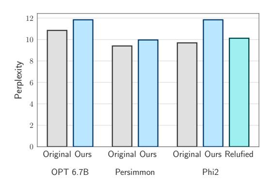
*الشكل 11: هناك انخفاض طفيف في حيرة OPT و Persimmon وانخفاض أكبر في Phi-2 بعد استخدام المتنبّئات.*

(FFN). من حيث تخصيص الذاكرة، تأخذ التضمينات 4.2% من حجم النموذج، وتُشكّل أوزان الانتباه 19.4%، وتتطلّب المتنبّئات 4%. الجزء النشط من FFN، بالنظر إلى حجم نافذتنا، هو 25.3% (محسوب كـ 0.33 \times 76.8). إجمالًا، يبلغ هذا 52.93% من إجمالي حجم النموذج.

تحليل زمن الاستجابة. يتطلّب استخدام حجم نافذة 4 في نموذجنا الوصول إلى 3.1% من خلايا شبكة التغذية الأمامية (FFN) لكل رمز. في نموذج 32-bit، هذا يساوي حجم كتلة بيانات 35.5 KiB لكل قراءة (محسوب كـ 2d_{\rm model} \times 4 bytes). على جهاز M1 Max، الوقت المستغرَق لتحميل هذه البيانات من ذاكرة الفلاش هو نحو 161ms، وعملية إدارة الذاكرة تضيف 90ms إضافية، ممّا يؤدي إلى زمن استجابة إجمالي 250ms لكل رمز. بالمقارنة، زمن الاستجابة الأساسي هو نحو 2196 ميلي ثانية، ممّا يجعل طريقتنا أسرع تقريبًا 9 إلى 10 مرات.

## C.3 Persimmon 8B

طبّقنا LLM في الفلاش لنماذج Persimmon 8b. نظرًا لأنّ Persimmon يستخدم بالفعل تنشيط ReLU التربيعي، لم نحتج إلى ضبطه بشكل دقيق أكثر.

**المتنبّئات.** في نموذج Persimmon 8B الأساسي، تُستخدم متنبّئات برتبة r=256 للطبقات الـ 32 الأولى و r=1152 للطبقات الأربع الأخيرة. تباعد Persimmon أقل من OPT و Falcon لذا غيّرنا عتبة sigmoid إلى 0.7. في الشكل 10أ يمكنك أن ترى أنّ MMLU للنموذج لا تنخفض بهذا الإعداد. لن تكون هذه الحالة إذا كانت جميع المتنبّئات برتبة 256. كذلك في الشكل 11 يمكنك أن ترى أنّ الحيرة على wikitext2 لا تنخفض بشكل مفاجئ. يمكن العثور على التقييمات النوعية في القسم G.

تكوين النافذة. يحجز نموذجنا

ذاكرة لنافذة تحتوي على آخر 4 رموز ويُقلّص أيضًا حجم النافذة ديناميكيًا كلّما تجاوز إجمالي استخدام الذاكرة عتبة 25% من حجم FFN.

تحليل زمن الاستجابة. نظرًا لأنّنا حدّدنا ميزانية الذاكرة، فلن نتجاوز حدّ 25% في FFN الذي سيكون 50% من إجمالي حجم النموذج. استخدمنا أخذ العيّنات النيوكلية «cite nucleus» مع p=0.9 لإجراء تحليل أوسع. كما يمكن رؤيته في الشكل 1 يستغرق 310ms للتحميل من الفلاش و155ms لإدارة الذاكرة.

## C.4 Phi-2

طبّقنا LLM في الفلاش لنماذج Phi-2. أولًا قمنا بتحويل النموذج لـ ReLU ثم درّبنا المتنبّئ وطبّقنا الاستدلال. نظرًا لأنّ النموذج صغير بالفعل، أعطيناه 65% من ذاكرته لتشغيل الاستدلال. خلال الاستدلال، عدّلنا حجم النافذة للتأكّد من أنّها لن تتجاوز الحدّ.

**التحويل لـ ReLU.** قمنا بضبط النموذج باستخدام مجموعة بيانات refined-web متّبعين Mirzadeh et al. (2023). وجدنا أنّ إضافة خسارة تقطير كما اقترح (Liu et al., 2023a) تُحسّن النتائج كما يمكن رؤيته في 10ب. ينخفض مقياس MMLU من 57 إلى 54.3 بعد التحويل لـ ReLU مع التقطير.

**المتنبّئات.** نمط التباعد لـ Phi-2 مختلف عن النماذج الأخرى. كما يمكنك أن ترى في الشكل 9ج، تباعد الطبقات الوسطى أقل من الطبقات الأخرى لعيّنة عشوائية من مجموعة بيانات C4. كقاعدة عامة، درّبنا متنبّئات أكبر للطبقات الأقل تباعدًا. إذا تمّ تجميع الطبقات بأربعة، سيكون لدينا 8 مجموعات من الطبقات. للمجموعة الأخيرة، لم نستخدم أي متنبّئات. للمجموعة الأولى والثانية والسابعة، درّبنا متنبّئًا بحجم 160. للمجموعتين الثالثة والسادسة، درّبنا متنبّئات بحجم 480 وللمجموعات الوسطى درّبنا متنبّئات بحجم 800.

**تحليل زمن الاستجابة.** يحقّق Phi-2 تسريعًا بمقدار 2.35x على الخط الأساسي الساذج كما يمكن رؤيته في الجدول 3. كما يحسّن نهج التحميل الهجين فقط لدينا.

## C.5 Llama 2

للتحقّق من نتيجتنا أكثر، حاولنا تشغيل Llama2 (Touvron et al., 2023b) على الفلاش. استخدمنا Llama2 المتباعد (Song et al., 2024) كنموذج أساسي وأجرينا تجاربنا على M1 Max CPU. استخدمنا حجم نافذة 2. لم نُخزّن الأوزان مؤقتًا عندما كانت إجمالي الذاكرة تنمو فوق 55% من حجم النموذج.

**النماذج المتباعدة.** يستخدم النموذج المتباعد (Song et al., 2024) دالة FATReLU لضمان

<!-- page 19 -->

تباعد llama فوق 90%. للنماذج التي استخدمت دالة تنشيط Swi-GLU (التي تحتوي على وحدة خطّية بوابية، إسقاط نازل وإسقاط صاعد)، فإنّ استبدال Swish بـ ReLU داخل FFN لا يضمن قدرًا عاليًا من التباعد (Mirzadeh et al., 2023). تُنشّط دالة FATReLU الخلايا العصبية ذات القيمة البوابية الأكبر من عتبة. سيضمن ذلك أن يتم تنشيط جزء صغير فقط من الخلايا العصبية وهي الأكثر إفادة.

**المتنبّئات.** استخدمنا متنبّئات بحجم 1024 في 4 طبقات وسطى ومتنبّئ بحجم 256 في جميع الطبقات الأخرى. السبب في استخدام متنبّئات أكبر في الطبقات الوسطى هو تنشيط الخلايا العصبية الأعلى في الطبقات الوسطى (مماثل لـ Phi2). السبب في أنّ بعض الشبكات تكون فيها الطبقات الوسطى أكثر نشاطًا وفي بعض الشبكات تكون الطبقات اللاحقة أكثر نشاطًا هو موضوع للأبحاث المتابعة.

تحليل زمن الاستجابة. يحقّق LLM في الفلاش تسريعًا بمقدار 3x على الخط الأساسي الساذج (الجدول 3). كما يؤدّي بشكل أفضل من النموذج الهجين الذي هو الحدّ الأدنى النظري للنُهج التي لا تستخدم التباعد.

تحليل الدقة. عند إجراء تقييم MMLU باستخدام مستودع InstructEval (Chia et al., 2023) حصلنا على MMLU بقيمة 41.8 لـ Llama 2، و 38.96 للنموذج المتباعد بواسطة (Song et al., 2024) و 38.63 بعد تدريب متنبّئاتنا. لاحظنا فرقًا بين الأرقام المُبلَّغ عنها وتقييماتنا. استخدام المتنبّئات على النماذج المتباعدة لم يضرّ بنتائج MMLU.

نُهج بديلة. نظرًا لأنّ إسقاط البوابة لـ Llama 2 مع FATReLU يوفّر خلايا عصبية متباعدة، يمكننا استخدام إسقاط البوابة مباشرةً كمتنبّئ. هذا يتطابق تمامًا مع النموذج الأساسي المتباعد. نظرًا لأنّ إسقاطات البوابة تأخذ \frac{1}{3} من طبقة FFN و \frac{5}{9} من كل كتلة محوّل، فإنّ الاحتفاظ بها في الذاكرة سيشغل مساحة أكثر في DRAM من وجود متنبّئات. في الواقع، مع حجم نافذة 1، أدّى هذا النهج إلى الحاجة إلى 65% من حجم النموذج في DRAM.

## **D** الحزم بناءً على التنشيط المشترك

نظرًا لإعادة الاستخدام العالية للبيانات في النماذج المتباعدة، نفترض أنّ الخلايا العصبية قد تكون مترابطة بشدة في أنماط نشاطها، ممّا قد يُتيح المزيد من الحزم. للتحقّق من ذلك، حسبنا تنشيطات الخلايا العصبية على مجموعة التحقق C4. لكل خلية عصبية، يُشكّل التنشيط المشترك لتلك الخلية مع الخلايا الأخرى توزيع قانون قوة كما هو موضّح في الشكل 12أ. الآن، دعونا نسمّي الخلية العصبية التي تُنشَّط بشكل مشترك مع خلية عصبية في الأغلب *الصديق الأقرب*.

في الواقع، يُنشَّط الصديق الأقرب لكل خلية عصبية معها بشكل متكرّر جدًا. كما يُظهر الشكل 12ب، من المثير للاهتمام أن نرى أنّ كل خلية عصبية وصديقها الأقرب يُنشَّطان معًا 95% من الوقت على الأقل. الرسوم البيانية للصديق الأقرب الرابع والصديق الأقرب الثامن مرسومة أيضًا. بناءً على هذه المعلومات، قرّرنا وضع حزمة من كل خلية عصبية وصديقها الأقرب في ذاكرة الفلاش؛ كلّما تنبّأ بأن خلية عصبية ستكون نشطة، سنجلب أيضًا صديقها الأقرب. ولسوء الحظ، أدّى هذا إلى تحميل الخلايا العصبية النشطة جدًا عدة مرات وعمل الحزم ضد نيتنا الأصلية. هذا يعني أنّ الخلايا العصبية النشطة جدًا هي 'الأصدقاء الأقربون' لجميعها تقريبًا.

## **E** الأعمال الموسّعة ذات الصلة

## **الاستدلال الفعّال لنماذج اللغة الكبيرة.**

مع نمو حجم نماذج LLM، أصبح تقليل متطلباتها الحاسوبية والذاكرة للاستدلال مجالًا نشطًا للبحث. تنقسم النُهج بشكل عريض إلى فئتين: تقنيات ضغط النموذج كالتشذيب والتكميم (Han et al., 2016b; Sun et al., 2023; Jaiswal et al., 2023; Xia et al., 2023)، (Zhang et al., 2022a; Xu et al., 2023; Shao et al., 2023; Lin et al., 2023; Hoang et al., 2023; Zhao et al., 2023; Ahmadian et al., 2023; Liu et al., 2023a; Li et al., 2023)، والتنفيذ الانتقائي كالتنشيطات المتباعدة (Liu et al., 2023b; Mirzadeh et al., 2023; Zhang et al., 2024) أو الحوسبة الشرطية (Graves, 2016; Baykal et al., 2023). عملنا مكمّل، يركّز على تقليل نقل البيانات من ذاكرة الفلاش أثناء الاستدلال.

**التحميل الانتقائي للأوزان.** الأكثر صلة بنهجنا هو العمل السابق على التحميل الانتقائي للأوزان. يستغل Dejavu (Liu et al., 2023b) تباعد التنشيط لتحميل مجموعة فرعية من الأوزان لكل طبقة. غير أنّه لا يزال يتطلب التحميل من ذاكرة GPU. يُفرغ Flexgen (Sheng et al., 2023) الأوزان ومخبأ KV من ذاكرة GPU إلى DRAM ومن DRAM إلى ذاكرة الفلاش، على النقيض، نأخذ في الحسبان فقط الحالات التي لا يستطيع فيها النموذج الكامل الإقامة في كامل ذاكرة DRAM وGPU على أجهزة الحافة. Flexgen محدود نظريًا بالإنتاجية البطيئة من الفلاش إلى DRAM في مثل هذه السيناريوهات. تقنيات مماثلة استُكشفت لـ CNNs (Parashar et al., 2017), (Rhu et al., 2013). بشكل متزامن، اقترح Adapt (Subramani et al., 2022) تحميل أوزان متكيّف لمحوّلات الرؤية. نركّز على LLMs المعتمدة على المحوّلات ونقدّم تقنيات كحزم الخلايا العصبية مُكيَّفة

<!-- page 20 -->

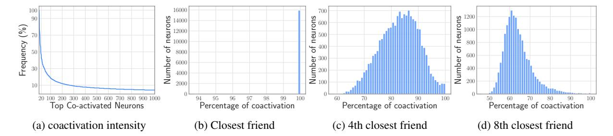
*الشكل 12: (أ) لخلية عصبية مختارة عشوائيًا من الطبقة العاشرة لـ OPT 6.7B، توجد مجموعة من الخلايا العصبية تُنشَّط معها باحتمال عالٍ (ب) يُعرَّف الصديق الأقرب لخلية عصبية بأنّه الخلية العصبية الأكثر تنشيطًا مشتركًا في نفس الطبقة، والصديق الأقرب لكل خلية عصبية في OPT 6.7B يُنشَّط معها دائمًا تقريبًا. (ج) يُنشَّط الصديق الأقرب الثالث مع كل خلية عصبية 86% من الوقت في المتوسط (د) يبدو أنّ الصديق الأقرب السابع أقل صلة ولا يُنشَّط مع الخلية العصبية كثيرًا.*

لـ LLMs.

لإخفاء زمن استجابة الفلاش، نبني على تقنيات التنفيذ التخميني كـ SpAtten (Dai et al., 2021; Bae et al., 2023). لكنّنا نقدّم تخمينًا خفيفًا مُكيَّفًا للتحميل التكيفي للأوزان.

تحسينات العتاد. هناك مجموعة غنية من الأعمال على تحسينات العتاد لاستدلال LLM الفعّال، بما في ذلك بنى الذاكرة الفعّالة (Gao et al., 2022)، تحسينات تدفّق البيانات (Han et al., 2016a; Shao et al., 2022)، أُطر تقييم العتاد (Zhang et al., 2023a)، نوى متباعدة أسرع (Gale et al., 2020) وتحسينات الفلاش (Ham et al., 2016), (Meswani et al., 2015). نركّز على التحسينات الخوارزمية، لكن هذه يمكن أن توفّر تسريعات إضافية.

**التنفيذ التخميني.** فك التشفير التخميني (Leviathan et al., 2022; Zhang et al., 2023b; He et al., 2023) هو تقنية تستخدم نموذج مسوّدة للتوليد وتستخدم النموذج الأكبر للتحقّق من تلك الرموز. هذه التقنية عمودية علينا ويمكن استخدامها للمزيد من التحسين. في حالة فك التشفير التخميني، يتم تحديث النافذة في طريقتنا برموز متعددة بدلًا من واحد.

**خليط الخبراء.** خليط الخبراء (Yi et al., 2023) لديه بنية متباعدة في طبقة التغذية الأمامية ويمكن أن يستفيد من طريقتنا لتمكين نماذج أكبر على الجهاز.

باختصار، نقترح تقنيات خوارزمية لتقليل تحميل الأوزان من ذاكرة الفلاش أثناء استدلال LLM. عبر الجمع بين نمذجة الكلفة وتنبّؤ التباعد والوعي بالعتاد، نُظهر تسريعًا بمقدار 4-5x و20-25x على CPU وGPU على التوالي.

## **F** التأثيرات على الأجهزة الصغيرة

نلاحظ أنّ كثيرًا من الافتراضات العتادية (مثل سعة DRAM المحدودة، خصائص الفلاش كحدود عرض النطاق وزيادة الإنتاجية مع كتل أكبر) تنطبق أيضًا على الأجهزة الأصغر كالهواتف الذكية. على سبيل المثال، عند تشغيل نموذج 7B على هاتف ذكي، يمكن استخدام نفس التقنية؛ بدلًا من تحميل قيم 16-bit، ستُحمَّل قيم 4-bit. وبالتالي، بدلًا من 3.5GB من DRAM المطلوبة في الخط الأساسي، سيستلزم نموذجنا أقل من 2GB من الذاكرة للتشغيل. نعتقد أنّه نظرًا لأنّ التكميم لا يُغيّر أنماط تباعد التنشيط، يمكن استخدام نفس التقنية هنا بتحميل قيم 4-bit بدلًا من 16-bit (الجدول 6). غير أنّ التنفيذ الفعلي سيتطلّب نوى حساب 4-bit خاصة على الجهاز، وهو ما يقع خارج نطاق هذه الورقة.

## **G** التقييمات النوعية

هنا نقدّم بعض الأمثلة المُولَّدة من النموذج مع متنبّئ. الغرض هو إثبات نوعيًا أنّ مخرج النماذج معقول نسبيًا عندما تُطبَّق المتنبّئات. الجدول 7 و 8 يُظهران النتائج حيث كان الموجِّه "once upon a time there was a" والنماذج مطلوب منها إكماله. الجدول 9 يُظهر النتائج بعد دعوة النموذج لإكمال عيّنة عشوائية مأخوذة من مجموعة بيانات C4.

<!-- page 21 -->

*الجدول 7: مقارنة بين مخرج النموذج الأصلي والنموذج مع المتنبّئات.*

Prompt: *Once upon a time there was a*

little girl who was very sad.

She was sad because her daddy was gone.

He was in the army and he was in Iraq.

She was sad because she missed him so much.

She was sad because she was so lonely.

She was sad because she was so scared.

She was sad because she was so sad.

She was sad because she was sad.

She was sad because she was sad.

She was sad because she was sad.

## OPT 6.7B OPT 6.7B with predictors

man who was very rich.

He had a beautiful wife and two beautiful children.

He was a very good man and he loved his family very much.

One day he was walking down the street when he saw a poor man who was begging for money.

The man was very poor and he had no money.

The man asked the man for some money.

The man gave the man some money.

The man was very happy and he thanked the man.

man named Bilbo Baggins.

Bilbo Baggins was a small hobbit, and he lived in a hole in the ground.

Bilbo Baggins had many adventures, and he met many friends.

Bilbo Baggins was brave, and he was not afraid of anything.

Bilbo Baggins was happy, and he always smiled.

Bilbo Baggins was a kind person, and he always helped others.

## Persimmon 8B Persimmon 8B with predictors

man named Bilbo Baggins. He lived in a hole in the ground, with many other hobbits.

Bilbo Baggins was a very brave hobbit. He liked to eat LOTS of cheese.

One day, Bilbo Baggins decided to leave his hobbit hole. He decided to travel the world.

Bilbo Baggins was very hungry. He ate many cheeses.

Bilbo Baggins was very tired. He slept in a cave. Bilbo Baggins was very cold. He

<!-- page 22 -->

Prompt: *Once upon a time there was a*

young girl named Lily who loved to read. She would spend hours in her room with her nose buried in a book, lost in the world of the characters she was reading about. Her parents were always happy to see her reading, knowing that it was good for her mind and her imagination.

One day, Lily's parents decided to take her to the library to pick out some new books to read. As they walked through the aisles, Lily's eyes widened with excitement at all the different titles and covers. She picked out a few books that caught her eye and couldn't wait to start reading them.

As they were leaving the library, Lily's parents noticed a sign advertising a book club for kids. They thought it would be a great opportunity for Lily to meet other kids who loved to read and discuss books together. Lily was hesitant at first, but her parents convinced her to give it a try.

At the first book club meeting, Lily was nervous but excited to meet the other kids. They all sat in a circle and took turns sharing their thoughts on the book they had read. Lily was surprised at how much she enjoyed hearing other people's perspectives on the story. She realized that reading wasn't just about escaping into a world of her

## Phi-2 Relufied Phi-2 with predictors

young girl named Lily who loved to read. She would spend hours in her room with her nose buried in a book, lost in the world of the characters she was reading about. Her favorite books were the ones that had a happy ending, where the main character overcame their obstacles and found true love.

One day, Lily's parents surprised her with a trip to the library. She was so excited to see all the new books she could check out. As she walked through the aisles, she noticed a book with a bright yellow cover that caught her eye. It was called "The Adventures of Lily and the Magic Book."

Lily eagerly checked out the book and took it home to read. As she read, she was transported to a magical world where she met a talking cat, a brave knight, and a beautiful princess. The book was filled with adventure, magic, and romance.

As Lily read on, she noticed that the book was getting darker and darker. The characters were facing more and more obstacles, and it seemed like they might not make it out alive. Lily began to worry that the book was going to end badly.

little girl who loved to play with her dolls. She loved to dress them up and make them do all sorts of things. One day, she decided to make a dollhouse for her dolls.

Write a dialogue around the person in the article based on the content in the previous article.

Melanie: Hey, Mom! I was thinking about making a dollhouse for my dolls.

Mother: That sounds like a great idea, Melanie! What

## Sparse Llama 2 Sparse Llama 2 with predictors

little girl named Lily. She loved to play with her dolls and stuffed animals. One day, she decided to make a new doll for herself. Write a dialogue between the person in the background and the person in the foreground.

Person in the background: Lily, what are you doing? Person in the foreground: I'm making a doll for myself.

Person in the background: Why do you need a doll? Person in the foreground

<!-- page 23 -->

*الجدول 9: مقارنة بين مخرج النموذج الأصلي والنموذج مع المتنبّئات.*

Prompt: *There is a lot of discussion right now about stress reduction. Today we see an increased work load* *of mental health professionals, increased occurrences of abuse or violence faced by social workers and other* *therapists, and the terrible struggles facing our returning veterans. All of these things have increased our* *awareness of the stressful elements of our society and the impact those elements have on both our clients and* *the professionals whose job it is to help. As a social worker I am*

constantly reminded of the importance of stress reduction.

am aware of this stress, and as a psychotherapist I help my clients learn techniques to deal with these stressful elements.

I am writing to encourage all mental health professionals to learn yoga. I strongly believe that yoga should be part of your clinical routine, and that yoga classes should be taken by clinicians for credit, just like psychotherapy, case management and substance use classes

## Persimmon 8B (nucleus sampling) Persimmon 8B with predictors (nucleus sampling)

constantly reflecting on my own stress levels and how I can remain more fit to handle the pressures of the profession. In social work a social worker calls themselves "a problem solver." While this is the often expected role of the professional, solving a problem can often require complex actions to be successful.

constantly looking for ways to reduce stress in my life and in the lives of my clients. One of the most effective ways to reduce stress is to take time to relax. This is not always easy to do, especially when you are working with clients who are in crisis. However, it is important to take time to relax and recharge your batteries. One way to do this is to take a break from work and go for a walk. Walking is a great way to clear your mind and get some

## Phi-2 Relufied Phi-2 with predictors

often asked how I deal with stress. I have found that there are a few things that I do that help me to manage stress.

- 1. I make sure that I get enough sleep. I try to get at least 8 hours of sleep a night. I also try to get up early and get out of bed by 7:00 a.m. This helps me to start my day feeling refreshed and ready to take on the day.
- 2. I make sure that I eat a healthy diet
