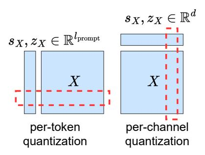
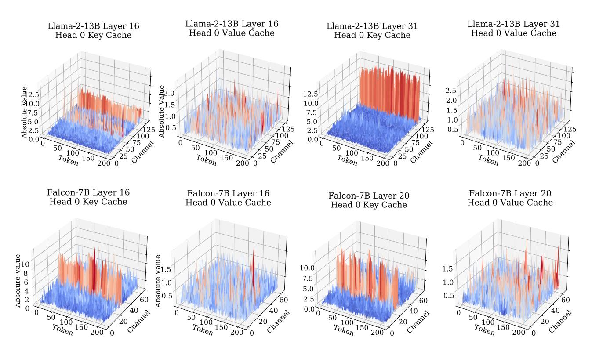
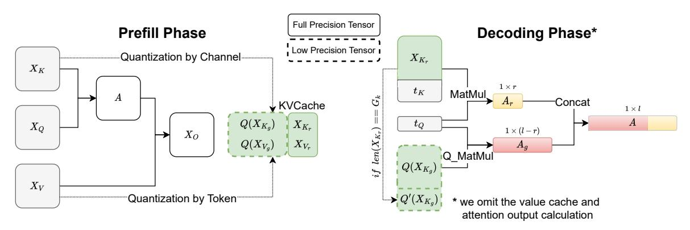
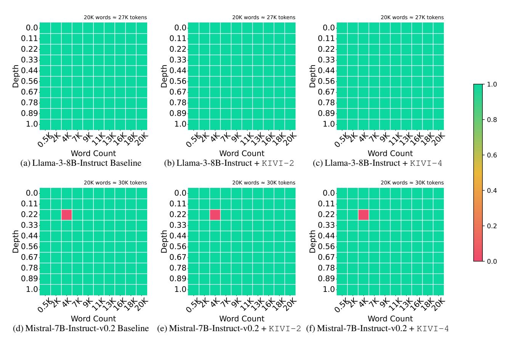
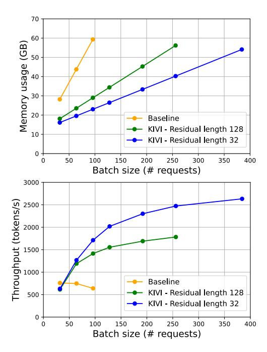

<!-- RP38_Liu_2024 | source: papers_json/RP38_Liu_2024/ -->

## KIVI: تكميم غير متماثل بـ 2 بت بدون ضبط لذاكرة التخزين المؤقت KV

Zirui Liu^{*\,1} Jiayi Yuan^{*\,1} Hongye Jin^2 Shaochen (Henry) Zhong ^1 Zhaozhuo Xu^3 Vladimir Braverman^1 Beidi Chen^4 Xia Hu^1

## **الملخص**

يتطلب تقديم نماذج اللغة الكبيرة (LLMs) بكفاءة تجميع العديد من الطلبات معًا لتقليل تكلفة كل طلب. ومع ذلك، ومع زيادة أحجام الدُفعات وأطوال السياق، فإن ذاكرة التخزين المؤقت للمفتاح-القيمة (KV cache)، التي تخزن مفاتيح وقيم الانتباه لتجنب إعادة الحسابات، تزيد بشكل كبير من متطلبات الذاكرة وتصبح عنق الزجاجة الجديد في السرعة واستخدام الذاكرة. بالإضافة إلى ذلك، يؤدي تحميل ذاكرة التخزين المؤقت KV إلى تعطل النواة الحسابية، مما يحد من سرعة الاستدلال. الحل البسيط والفعال لتقليل حجم ذاكرة التخزين المؤقت KV هو التكميم، الذي يقلل من إجمالي البايتات التي تشغلها ذاكرة التخزين المؤقت KV. ومع ذلك، هناك نقص في الدراسات المتعمقة التي تستكشف توزيع عناصر ذاكرة التخزين المؤقت KV لفهم صعوبة وقيود تكميمها. لسد هذه الفجوة، أجرينا دراسة شاملة على توزيع العناصر في ذاكرة التخزين المؤقت KV لنماذج LLM الشائعة. تشير نتائجنا إلى أن ذاكرة التخزين المؤقت للمفتاح يجب تكميمها لكل قناة، أي تجميع العناصر على طول بُعد القناة وتكميمها معًا. على النقيض من ذلك، يجب تكميم ذاكرة التخزين المؤقت للقيمة لكل رمز. من هذا التحليل، طورنا خوارزمية تكميم ذاكرة التخزين المؤقت KV بـ 2 بت بدون ضبط تسمى KIVI. مع تنفيذ ملائم للأجهزة، يمكن لـ KIVI تمكين نماذج Llama و Falcon و Mistral من الحفاظ على نفس الجودة تقريبًا مع استخدام ذاكرة قصوى أقل بمقدار 2.6× (بما في ذلك أوزان النموذج). يتيح هذا التخفيض في استخدام الذاكرة حجم دفعة أكبر بما يصل إلى 4 \times، مما يجلب إنتاجية بمقدار 2.35 \times \sim 3.47 \times على عبء عمل استدلال LLM الحقيقي. الكود المصدري متاح على https://github.com/jy-yuan/KIVI.

Proceedings of the 41<sup>st</sup> International Conference on Machine Learning, Vienna, Austria. PMLR 235, 2024. Copyright 2024 by the author(s).

## 1. المقدمة

أظهرت نماذج اللغة الكبيرة (LLMs) أداءً قويًا عبر مجموعة واسعة من المهام (Brown et al., 2020; Taylor et al., 2022; Yuan et al., 2023; Chuang et al., 2024). ومع ذلك، فإن نشرها مكلف للغاية، ويتطلب عددًا كبيرًا من مسرعات الأجهزة مثل وحدات GPU. نظرًا لهذه التكاليف الكبيرة، فإن الطريقة الطبيعية لتقليل التكلفة لكل طلب هي دمج عدد كافٍ من الطلبات معًا للمعالجة على دفعات. ومع ذلك، في سيناريو الاستدلال على دفعات، أصبحت ذاكرة التخزين المؤقت للمفتاح-القيمة (KV cache)، التي تحتفظ بمفاتيح وقيم الانتباه أثناء التوليد لمنع إعادة الحسابات، عنق الزجاجة الجديد للذاكرة والسرعة. يصبح هذا العنق أكثر وضوحًا مع أحجام دفعات أكبر وأطوال سياق أطول. على سبيل المثال، في PaLM بـ 540B، مع حجم دفعة 512 وطول سياق 2048، يمكن أن تستهلك ذاكرة التخزين المؤقت KV وحدها 3 تيرابايت. هذا 3 أضعاف حجم معاملات النموذج (Pope et al., 2023). أيضًا، يجب على ذاكرة GPU SRAM تحميل ذاكرة التخزين المؤقت KV بالكامل من ذاكرة جهاز GPU لكل رمز يتم توليده، حيث تكون النوى الحسابية خاملة خلال ذلك. وبالتالي، فإن تقليل حجم ذاكرة التخزين المؤقت KV في LLMs مع الحفاظ على الدقة أمر مهم.

يمكن تقسيم الأعمال الموجودة لمعالجة هذه المشكلة إلى ثلاث فئات تقريبًا. أولاً، تقترح بعض الأعمال تقليل عدد رؤوس ذاكرة التخزين المؤقت KV، مثل الانتباه متعدد الاستعلامات (Shazeer, 2019) والانتباه متعدد المجموعات (Ainslie et al., 2023). ومع ذلك، تتطلب هذه الطرق إما تدريب النموذج من الصفر أو ضبط النموذج الموجود. ثانيًا، يقلل خط بحث آخر من حجم ذاكرة التخزين المؤقت KV عن طريق إخراج الرموز غير المهمة (Zhang et al., 2023). ثالثًا، تحاول أعمال أخرى حل هذه المشكلة من منظور النظام، مثل إفراغ ذاكرة التخزين المؤقت KV (Sheng et al., 2023) أو توسيع تقنيات الذاكرة الافتراضية والتقسيم إلى صفحات لتشمل آلية الانتباه (Kwon et al., 2023).

لتقليل حجم ذاكرة التخزين المؤقت KV، فإن الطريقة الأبسط والأكثر فعالية هي تقليل إجمالي البايتات التي تشغلها، أي التكميم. على عكس تكميم الأوزان المدروس جيدًا (Lin et al., 2023; Xiao et al., 2023a; Zhao et al., 2024)، على حد علمنا، طبقت دراسات قليلة فقط التكميم البسيط بـ 4 بت بالتقريب إلى الأقرب على ذاكرة التخزين المؤقت KV (Sheng et al., 2023; Zhao et al., 2024) بسبب الطبيعة المتدفقة لذاكرة التخزين المؤقت KV أو تعقيدات أخرى. هناك نقص في الدراسات المتعمقة التي تستكشف

> ^*^مساهمة متساوية. تم تحديد ترتيب المؤلفين بإلقاء عملة. <sup>1</sup>جامعة Rice <sup>2</sup>جامعة Texas A&M <sup>3</sup>معهد Stevens للتكنولوجيا <sup>4</sup>جامعة Carnegie Mellon. المراسلات إلى: Zirui Liu <zl105@rice.edu>, Jiayi Yuan <jy101@rice.edu>.

<!-- page 2 -->


*الشكل 1: تعريف التكميم لكل رمز ولكل قناة. X ∈ R lprompt×d هي ذاكرة التخزين المؤقت للمفتاح/القيمة حيث lprompt هو عدد الرموز و d هو عدد القنوات. z^X^ هي نقطة الصفر، s^X^ هي عامل القياس.*

توزيع عناصر ذاكرة التخزين المؤقت KV لفهم صعوبة وقيود تكميمها. لسد هذه الفجوة، ندرس توزيع عناصر ذاكرة التخزين المؤقت KV. يقترح تحليلنا:

- بالنسبة لذاكرة التخزين المؤقت للمفتاح، توجد عدد قليل من القنوات الثابتة التي تكون مقاديرها كبيرة جدًا، وهو ما يتوافق مع النتائج السابقة [(Lin et al.,](#page-9-4) [2023;](#page-9-4) [Xiao et al.,](#page-10-6) [2023a)](#page-10-6). وبالتالي، كما هو موضح في الشكل [1](#page-1-0) على اليمين، يجب تكميم ذاكرة التخزين المؤقت للمفتاح لكل قناة، أي تجميع العناصر على طول بُعد القناة وتكميمها معًا. بهذه الطريقة، يمكن أن يحصر الخطأ في كل قناة فردية، دون التأثير على القنوات العادية الأخرى.
- بالنسبة لذاكرة التخزين المؤقت للقيمة، لا يوجد نمط قيم شاذة واضح. على الرغم من أن ذاكرة التخزين المؤقت للقيمة لا تحتوي على نمط قيم شاذة واضح، فإننا نُظهر تجريبيًا أنه يمكن تكميمها فقط لكل رمز لأنها تُستخدم لحساب مخرجات الانتباه، والتي هي في الأساس خلاط لذاكرة التخزين المؤقت للقيمة. كما هو موضح في الشكل [1](#page-1-0) على اليسار، يمكن للتكميم لكل رمز حصر الخطأ داخل كل رمز فردي وضمان أن تكميم رمز واحد لا يؤثر سلبًا على الآخرين.

بناءً على الرؤى المذكورة أعلاه، نقترح KIVI، طريقة تكميم ذاكرة التخزين المؤقت KV بأقل عدد من البتات للتوصيل والتشغيل. يقوم KIVI بتكميم ذاكرة التخزين المؤقت للمفتاح لكل قناة وتكميم ذاكرة التخزين المؤقت للقيمة لكل رمز. يتماشى تكميم ذاكرة التخزين المؤقت للقيمة لكل رمز جيدًا مع الطبيعة المتدفقة للاستدلال الانحداري التلقائي، مما يسمح بإلحاق الموترات المكممة حديثًا مباشرة بذاكرة التخزين المؤقت للقيمة المكممة الموجودة عبر بُعد الرمز. ومع ذلك، بالنسبة لتكميم ذاكرة التخزين المؤقت للمفتاح لكل قناة، تمتد عملية التكميم عبر رموز مختلفة، والتي لا يمكن تنفيذها مباشرة في إعداد التدفق هذا. نظرًا لأن عدد الرموز في ذاكرة التخزين المؤقت للمفتاح يمكن أن يكون عشوائيًا، فإن فكرتنا الأساسية هي تقسيم ذاكرة التخزين المؤقت للمفتاح إلى جزأين. الجزء الأول هو ذاكرة التخزين المؤقت للمفتاح المجمعة، التي تحتوي على عدة مجموعات من الرموز ولكل مجموعة عدد معين من الرموز. الجزء الثاني هو ذاكرة التخزين المؤقت للمفتاح المتبقية، التي لا تحتوي على عدد كافٍ من الرموز لتشكيل مجموعة كاملة. وبالمثل،

نقسم ذاكرة التخزين المؤقت للقيمة إلى الأجزاء المجمعة والمتبقية للحفاظ على الدقة. نطبق التكميم الجماعي فقط على ذاكرة التخزين المؤقت للمفتاح والقيمة المجمعتين، بينما يتم الاحتفاظ بذاكرة التخزين المؤقت للمفتاح والقيمة المتبقيتين بدقة كاملة. يمكن دمج الأجزاء المجمعة والمتبقية باستخدام ضرب المصفوفات المبلط عند حساب درجات الانتباه. تتلخص مساهماتنا على النحو التالي:

- تحليل شامل لأنماط القيم الشاذة وخطأ التكميم لذاكرة التخزين المؤقت KV في LLMs الشائعة الاستخدام. تشير ملاحظاتنا إلى أنه يجب تكميم ذاكرة التخزين المؤقت للمفتاح لكل قناة وذاكرة التخزين المؤقت للقيمة لكل رمز. كما نوضح بعمق سبب احتياج هذه الذاكرات إلى أساليب تكميم مختلفة.
- خوارزمية جديدة لتكميم ذاكرة التخزين المؤقت KV بـ 2 بت للتوصيل والتشغيل بدون أي ضبط دقيق، **KIVI**، مع تنفيذ ملائم للأجهزة. نجري تقييمًا شاملاً لـ KIVI مع Llama و Mistral و Falcon على مهام التوليد الشائعة. يمكن لـ KIVI ضغط ذاكرة التخزين المؤقت KV بكفاءة إلى 2 بت وتقديم تخفيض في استخدام الذاكرة القصوى بمقدار 2.6× لـ Llama-2-7B، مع انخفاض ضئيل أو معدوم في الدقة. مع تنفيذنا الفعال للنظام، يتيح هذا التخفيض في الذاكرة بدوره حجم دفعة أكبر بما يصل إلى 4× ويجلب إنتاجية بمقدار 2.35× ∼ 3.47×.

## 2. الخلفية: سير عمل الاستدلال للانتباه

يتضمن سير عمل استدلال الانتباه في LLM مرحلتين: i) مرحلة *الملء المسبق* (prefill)، حيث يُستخدم الموجه المُدخل لإنشاء ذاكرة التخزين المؤقت KV لكل طبقة محول من LLMs؛ و ii) مرحلة *فك التشفير* (decoding)، حيث يستخدم النموذج ذاكرة التخزين المؤقت KV ويُحدّثها لتوليد الرمز التالي، رمزًا واحدًا في كل مرة.

مرحلة الملء المسبق. ليكن X ∈ R ^b^×lprompt×^d^ هو موتر الإدخال، حيث b هو حجم الدفعة، lprompt هو طول الموجه المُدخل، و d هو حجم النموذج المخفي. للراحة، نتجاهل مؤشر الطبقة هنا. يمكن حساب موترات المفتاح والقيمة بواسطة

$$ X_K = XW_K, X_V = XW_V, $$

حيث WK,W^V^ ∈ R d×d هما وزن طبقة المفتاح والقيمة، على التوالي. بعد الحصول على X^K^ و X^V^، يتم تخزينها في الذاكرة لتسهيل فك التشفير.

مرحلة فك التشفير. ليكن t ∈ R ^b^×1×^d^ هو تضمين الرمز المُدخل الحالي. ليكن t^K^ = tW^K^ و t^V^ = tW^V^ هما خرج طبقة المفتاح والقيمة، على التوالي. نقوم أولاً بتحديث ذاكرة التخزين المؤقت KV:

$$
\bm{X}_K \leftarrow \text{Concat}(\bm{X}_K, \bm{t}_K), \ \bm{X}_V \leftarrow \text{Concat}(\bm{X}_V, \bm{t}_V), \ \end{pmatrix}
$$

<!-- page 3 -->

ثم نحسب مخرجات الانتباه على النحو التالي:

$$
\begin{aligned} \boldsymbol{t}_Q &= \boldsymbol{t} \boldsymbol{W}_Q, \ \boldsymbol{A} &= \operatorname{Softmax}(\boldsymbol{t}_Q \boldsymbol{X}_K^\top), \ \boldsymbol{t}_Q &= \boldsymbol{A} \boldsymbol{X}_V, \end{aligned}
$$

حيث W_Q هي مصفوفة الوزن لطبقة الاستعلام. لتسهيل التوضيح، نتجاهل طبقة مخرجات الانتباه والأجزاء الأخرى من سير عمل الاستدلال.

تحليل الذاكرة والسرعة. تتكرر العملية المذكورة أعلاه حتى يتم الوصول إلى رمز خاص يشير إلى نهاية الجملة. ليكن l_{\rm gen} هو عدد الرموز المُولّدة. من التحليل أعلاه، يكون شكل ذاكرة التخزين المؤقت KV هو b \times (l_{\rm prompt} + l_{\rm gen}) \times d. للحصول على فكرة عن الحجم، ضع في اعتبارك نموذج OPT-175B بحجم دفعة b 512، وطول موجه l_{\rm prompt} 512، وطول مخرجات l_{\rm gen} 32. تتطلب ذاكرة التخزين المؤقت KV 1.2 تيرابايت، وهو 3.8 أضعاف أوزان النموذج (Sheng et al., 2023). إلى جانب الذاكرة، تتحدد سرعة الاستدلال أيضًا بحجم ذاكرة التخزين المؤقت KV. تحتاج وحدة GPU إلى تحميل ذاكرة التخزين المؤقت KV من ذاكرة GPU الرئيسية إلى GPU SRAM مرة واحدة لكل رمز يتم توليده، خلالها تكون النواة الحسابية للشريحة خاملة بشكل أساسي (Pope et al., 2023; Kwon et al., 2023).

## 3. المنهجية

في السيناريوهات ذات السياقات الطويلة أو الاستدلال على دفعات، تكون عنق الزجاجة في الذاكرة والسرعة هو تخزين وتحميل ذاكرة التخزين المؤقت KV. الطريقة الأبسط والأكثر فعالية لتخفيف هذه المشكلة هي تقليل إجمالي البايتات التي تشغلها ذاكرة التخزين المؤقت KV، وتحديدًا، التكميم. باتباع هذا الدافع، نقيّم أولاً أداء طريقة التكميم الموجودة في القسم 3.1. تشير ملاحظاتنا إلى أنه يجب تكميم ذاكرة التخزين المؤقت للمفتاح والقيمة على طول أبعاد مختلفة. نحلل المنطق وراء هذه الملاحظة في القسم 3.2. ثم بناءً على التحليل، نقترح KIVI، طريقة جديدة لتكميم ذاكرة التخزين المؤقت KV مع بنية بياناتها المتدفقة، الموضحة بالتفصيل في القسم 3.3.

## 3.1. الدراسة الأولية لتكميم ذاكرة التخزين المؤقت KV

كما حللنا في القسم 2، تعمل ذاكرة التخزين المؤقت KV كبنية بيانات متدفقة، حيث يصل الموتر الجديد بالتسلسل. وبالتالي، فإن الطرق القائمة على التحسين مثل GPTQ (Frantar et al., 2022) غير مناسبة لتكميم ذاكرة التخزين المؤقت KV بسبب الحمل الزائد. على حد علمنا، فإن الطريقة الأكثر مرونة لتكميم ذاكرة التخزين المؤقت KV هي التكميم بالتقريب إلى الأقرب. يمكن التعبير عن عملية التكميم وإلغاء التكميم بعدد صحيح من B بت على النحو التالي:

$$
Q(\boldsymbol{X}) = \lfloor \frac{\boldsymbol{X} - z_X}{s_X} \rceil, \quad \boldsymbol{X}' = Q(\boldsymbol{X}) \cdot s_X + z_X,
$$

حيث z_X = \min \mathbf{X} هي نقطة الصفر، s_X = (\max \mathbf{X} - \min \mathbf{X})/(2^B - 1) هو عامل القياس، و \lfloor \cdot \rfloor هي عملية التقريب. هنا نتجاهل حجم الدفعة لتسهيل

الفهم. كما هو موضح في الشكل 1، يتم تكميم X على طول إما بُعد الرمز أو القناة بطريقة جماعية.

بالنظر إلى الطبيعة المتدفقة لذاكرة التخزين المؤقت KV، غالبًا ما تطبق الدراسات السابقة التكميم لكل رمز على ذاكرة التخزين المؤقت للمفتاح والقيمة معًا حيث يمكن إضافة ذاكرة التخزين المؤقت KV المكممة حديثًا بشكل بسيط إلى المكممة الموجودة على طول بُعد الرمز (Sheng et al., 2023). في حين أن التكميم لكل قناة ليس بسيطًا، فقد صممنا طريقة حشو لتنفيذ التكميم لكل قناة لاستكشاف تأثيره على ذاكرة التخزين المؤقت للمفتاح والقيمة معًا.

**الإعداد.** في الجدول 1، نُظهر نتائج التكميم الجماعي الوهمي لذاكرة التخزين المؤقت KV بتكوينات مختلفة على نموذج Llama-2-13B لمهام CoQA و TruthfulQA. نستخدم حجم مجموعة 32 لجميع التكوينات. هنا التكميم الوهمي يعني أننا نحاكي عملية التكميم عن طريق تكميم ذاكرة التخزين المؤقت KV أولاً إلى دقة أقل ثم إلغاء تكميمها في طبقة الانتباه. للتكميم لكل قناة، إذا لم يتم تقسيم عدد الرموز بالتساوي إلى مجموعات، نضيف حشوًا صفريًا لضمان تجميعها بشكل مثالي. بهذه الطريقة، نضمن أن جميع الرموز في ذاكرة التخزين المؤقت KV مكممة لمقارنة عادلة. يمكن العثور على الإعداد التجريبي المفصل في القسم 4.1. على وجه التحديد، نلاحظ أن:

**OB 1.** عند استخدام التكميم الشائع لكل رمز على ذاكرة التخزين المؤقت للمفتاح والقيمة، يمكن لدقة INT4 الحفاظ على الدقة. ومع ذلك، فإن تقليلها إلى INT2 يؤدي إلى انخفاض ملحوظ في الدقة.

**OB 2.** عندما يتم تكميم ذاكرة التخزين المؤقت للقيمة لكل قناة، تسوء الدقة بشكل ملحوظ بغض النظر عن كيفية تكميم ذاكرة التخزين المؤقت للمفتاح.

**OB 3.** عند استخدام دقة عددية أقل مثل INT2، فإن النهج الأكثر دقة هو تكميم ذاكرة التخزين المؤقت للمفتاح لكل قناة وذاكرة التخزين المؤقت للقيمة لكل رمز.

<!-- page 4 -->


*الشكل 2: مقدار ذاكرة التخزين المؤقت للمفتاح والقيمة لـ Llama-2-13B و Falcon-7B. نلاحظ (1) بالنسبة لذاكرة التخزين المؤقت للمفتاح، توجد عدد قليل من القنوات التي تكون مقاديرها كبيرة جدًا. (2) بالنسبة لذاكرة التخزين المؤقت للقيمة، لا يوجد نمط قيم شاذة واضح.*

## 3.2. لماذا يجب تكميم ذاكرة التخزين المؤقت للمفتاح والقيمة على طول أبعاد مختلفة؟

في الجدول 1، نلاحظ أن تكميم ذاكرة التخزين المؤقت للمفتاح لكل قناة وذاكرة التخزين المؤقت للقيمة لكل رمز إلى 2 بت يؤدي إلى انخفاض ضئيل جدًا في الدقة. هنا نحلل سبب تقديم هذا التكوين دقة أفضل. في الشكل 2 نتصور توزيع ذاكرة التخزين المؤقت KV الأصلي في طبقات مختلفة. نلاحظ أنه في ذاكرة التخزين المؤقت للمفتاح، تظهر بعض القنوات الثابتة مقادير كبيرة جدًا، بينما في ذاكرة التخزين المؤقت للقيمة، لا يوجد نمط مهم للقيم الشاذة.

تحليل ذاكرة التخزين المؤقت للمفتاح. تتوافق الملاحظة المذكورة أعلاه لذاكرة التخزين المؤقت للمفتاح مع النتائج السابقة التي تشير إلى أن بعض الأعمدة الثابتة في التنشيطات تظهر قيمًا شاذة أكبر (Dettmers et al., 2022; Lin et al., 2023). يعني استمرار القيم الشاذة داخل كل قناة أن التكميم لكل قناة يمكن أن يحصر خطأ التكميم في كل قناة فردية دون التأثير على القنوات العادية الأخرى. وبالتالي، يفسر الشكل 2 سبب وجوب تكميم ذاكرة التخزين المؤقت للمفتاح لكل قناة. في الجدول 2 نُظهر خطأ إعادة البناء النسبي لذاكرة التخزين المؤقت للمفتاح \|\frac{X_K - X_K'}{X_K}\|_F، إلى جانب خطأ درجة الانتباه النسبي \|\frac{A - A'}{A}\|_F حيث A' = \operatorname{Softmax}(t_Q X_K'^{\top}). نلاحظ أن التكميم لكل رمز يمكن أن يؤدي إلى خطأ في درجة الانتباه أكبر بنحو 5 \times من التكميم لكل قناة، وهو ما يتوافق مع الشكل 2.

تحليل ذاكرة التخزين المؤقت للقيمة. على عكس ذاكرة التخزين المؤقت للمفتاح، لا تُظهر ذاكرة التخزين المؤقت للقيمة نمط القيم الشاذة على مستوى القناة. علاوة على ذلك، لا يستطيع الشكل 2 وحده تفسير **OB2**، الذي يشير إلى أن ذاكرة التخزين المؤقت للقيمة يجب أن تُكمم فقط لكل رمز. هذا لأن الشكل 2 يعني أن الأخطاء يجب أن تكون قابلة للمقارنة لكل من التكميم لكل رمز ولكل قناة، نظرًا لعدم وجود نمط واضح. كما هو موضح في المعادلة (1)، تُستخدم ذاكرة التخزين المؤقت للقيمة لحساب مخرجات الانتباه t_O. بدلاً من تحليل خطأ تكميم ذاكرة التخزين المؤقت للقيمة X_V، في الجدول 2 نحلل الخطأ النسبي \Delta = \|\frac{AX_V - AX_V'}{AX_V}\|_F بتكوينات تكميم مختلفة. والمدهش أننا نلاحظ أن خطأ التكميم لكل رمز أصغر بنحو 15\times

<!-- page 5 -->


*الشكل 3: نظرة عامة على خوارزمية KIVI. لتسهيل التوضيح، نحذف ذاكرة التخزين المؤقت للقيمة وأجزاء مخرجات الانتباه. الكود الزائف المفصل مذكور في الخوارزمية [1.](#page-11-0) هنا "Q_Matmul" هو ضرب المصفوفات بدقة مختلطة الذي يدمج إلغاء التكميم مع ضرب المصفوفات على مستوى التبليط.*

من التكميم لكل قناة، وهو ما يفسر سبب حدوث OB2. ينبع الحدس وراء هذه الملاحظة من تناثر الانتباه. يمكن كتابة المعادلة [(1)](#page-1-2) على النحو التالي:

$$
[\boldsymbol{A}\boldsymbol{X}_{V}]_{i*} = \sum_{j=1}^{l_{\text{prompt}}} \boldsymbol{A}_{ij}[\boldsymbol{X}_{V}]_{j*}, \tag{2}
$$

حيث [X^V^ ]j^∗^ هو الصف j من X^V^. من المعادلة [(2)](#page-2-2)، فإن مخرجات الانتباه هي مجموع موزون لذاكرة التخزين المؤقت للقيمة عبر رموز مختلفة، حيث الأوزان هي درجات الانتباه. نظرًا لأن درجة الانتباه متناثرة للغاية [(Tian et al.,](#page-10-8) [2023)](#page-10-8)، فإن المخرجات هي مجرد مجموعة من ذاكرات التخزين المؤقت للقيمة لعدد قليل من الرموز المهمة. يمكن للتكميم لكل رمز حصر الخطأ في كل رمز فردي. وبالتالي، فإن تكميم رموز أخرى لا يؤثر على دقة الرموز المهمة. وبالتالي، يؤدي التكميم لكل رمز إلى خطأ نسبي أصغر بكثير ∆.

## 3.3. **KIVI**: الخوارزمية ودعم النظام

الخوارزمية. كما حللنا سابقًا، يجب تكميم ذاكرة التخزين المؤقت للمفتاح لكل قناة وذاكرة التخزين المؤقت للقيمة لكل رمز. تذكر أن ذاكرات التخزين المؤقت للمفتاح والقيمة للرموز المُولّدة حديثًا تصل بالتسلسل. من منظور التنفيذ، يتماشى التكميم لكل رمز جيدًا مع إعدادات التدفق، مما يسمح بإلحاق الموترات المكممة حديثًا مباشرة بذاكرة التخزين المؤقت للقيمة المكممة الموجودة عبر بُعد الرمز. ومع ذلك، بالنسبة للتكميم لكل قناة، تمتد عملية التكميم عبر رموز مختلفة، والتي لا يمكن تنفيذها مباشرة في إعداد التدفق. كما هو موضح في الشكل [3،](#page-4-1) فكرتنا الأساسية لحل هذه المشكلة هي تجميع ذاكرة التخزين المؤقت للمفتاح كل G رمز وتكميمها بشكل منفصل. لأن عدد الرموز في X^K^ يمكن أن يكون عشوائيًا، نقسم X^K^ إلى جزأين، وهما، الجزء المجمع X^K^^g^ = XK[: l − r] والجزء المتبقي X^K^^r^ = XK[l − r :]، حيث l هو عدد الرموز داخل ذاكرة التخزين المؤقت للمفتاح الحالية XK، r هو عدد الرموز المتبقية، حيث l − r يمكن قسمته على G.

نظرًا لأن X^K^^g^ يمكن تقسيمه بالتساوي إلى (l − r)/G مجموعات،

نقوم فقط بتخزين Q(XK^g^) بالتكميم الجماعي، بينما يتم الاحتفاظ بـ XK^r^ بدقة كاملة. أثناء عملية فك التشفير، تتم إضافة كل ذاكرة تخزين مؤقت للمفتاح وصلت حديثًا t^K^ إلى XK^r^ وبمجرد أن تصل XK^r^ إلى R رموز، وهو معامل فائق - طول البقايا، نقوم بتكميمه ودمجه مع Q(XK^G^) المكمم سابقًا. ثم نعيد ضبط XK^r^ إلى موتر فارغ. نلاحظ أن R يجب أن يكون قابلاً للقسمة على G. مع ضرب المصفوفات المبلط، يتم حساب لوغاريتمات الانتباه الخام على النحو التالي:

$$
\begin{equation}\begin{aligned}\boldsymbol{A}_g &= \boldsymbol{t}_Q Q(\boldsymbol{X}_{K_g}^\top), \\ \boldsymbol{X}_{K_r} &= \operatorname{Concat}([\boldsymbol{X}_{K_r}, \boldsymbol{t}_K]), \\ \boldsymbol{A}_r &= \boldsymbol{t}_Q \boldsymbol{X}_{K_r}^\top, \\ \boldsymbol{A} &= \operatorname{Concat}([\boldsymbol{A}_g, \boldsymbol{A}_r]).\end{aligned}\end{equation}
$$

لذاكرة التخزين المؤقت للقيمة، على غرار ذاكرة التخزين المؤقت للمفتاح، نقسمها أيضًا إلى جزأين ونحتفظ بأحدث ذاكرة تخزين مؤقت للقيمة بدقة كاملة، وهما XV^g^ و XV^r^. على وجه التحديد، نحتفظ بقائمة انتظار وكل ذاكرة تخزين مؤقت للقيمة تصل حديثًا تُدفع إلى قائمة الانتظار. بمجرد أن تصل قائمة الانتظار إلى طول البقايا المحدد مسبقًا R، يتم إخراج أقدم ذاكرة تخزين مؤقت للقيمة. ثم تُكمم ذاكرة التخزين المؤقت للقيمة المُخرجة لكل رمز ودمجها مع ذاكرة التخزين المؤقت للقيمة المكممة سابقًا على طول بُعد الرمز.

كما هو موضح في الشكل [3,](#page-4-1) نؤكد أيضًا أنه أثناء مرحلة الملء المسبق، يتم تمرير موترات المفتاح والقيمة الدقيقة إلى الطبقات التالية، على الرغم من الاحتفاظ بذاكرة التخزين المؤقت KV المكممة فقط في الذاكرة. يمكن العثور على الخوارزمية الكاملة في الملحق [A](#page-11-1) الخوارزمية [1.](#page-11-0)

التحليل. في KIVI، يتم تكميم ذاكرة التخزين المؤقت للمفتاح المجمعة X^K^^g^ وذاكرة التخزين المؤقت للقيمة X^V^^g^، بينما يتم الاحتفاظ بذاكرة التخزين المؤقت للمفتاح المتبقية X^K^^r^ وذاكرة التخزين المؤقت للقيمة X^V^^r^ بدقة كاملة. حسب التصميم، يوجد على الأكثر R رموز داخل X^K^^r^ أو X^V^^r^. في الممارسة العملية، نضع R ≤ 128 وغالبًا ما يكون طول التسلسل lprompt + lgen أطول بكثير من R. وبالتالي فإن الحمل الزائد للذاكرة من X^K^^r^ و X^V^^r^ ضئيل عند النظر في الفائدة من التكميم بأقل عدد من البتات، خاصة لسيناريوهات السياق الطويل. أيضًا، نظرًا لأن المفتاح والقيمة الواصلين حديثًا

<!-- page 6 -->

تتم إضافتهما إلى X_{K_r} و X_{V_r} بدقة كاملة، يحافظ KIVI على نافذة منزلقة لذاكرة التخزين المؤقت KV بدقة كاملة للرموز المحلية ذات الصلة. من المتوقع أن يكون حجم هذه النافذة \frac{R}{2} لذاكرة التخزين المؤقت للمفتاح، و R لذاكرة التخزين المؤقت للقيمة. لاحقًا في قسم التجارب، نُظهر أن هذه النافذة المنزلقة بدقة كاملة ضرورية للحصول على أداء مرغوب على المهام الصعبة، مثل GSM8K.

**دعم النظام.** نوفر تنفيذًا ملائمًا للأجهزة لتشغيل KIVI على وحدات GPU. لتقليل الحمل الزائد، قمنا بدمج عملية إلغاء التكميم مع ضرب المصفوفات، على سبيل المثال، Q_MatMul في الشكل 3، باستخدام CUDA. كما نقوم بتنفيذ نواة التكميم الجماعي في Triton. طريقتنا متوافقة تمامًا مع التكميم للأوزان فقط.

## 4. التجارب

## 4.1. الإعدادات

**النماذج.** نقيّم KIVI باستخدام ثلاث عائلات نماذج شائعة: Llama/Llama-2 (Touvron et al., 2023a;b)، Falcon (Penedo et al., 2023) و Mistral (Jiang et al., 2023). يعتمد نموذج Llama و Mistral على الانتباه متعدد الرؤوس، بينما يعتمد Falcon على الانتباه متعدد الاستعلامات (Shazeer, 2019). نستخدم قاعدة كود Hugging Face Transformers ونطبق خوارزمية KIVI عليها. باتباع العمل السابق (Sheng et al., 2023)، يتم تعيين حجم المجموعة G في الخوارزمية 1 للتكميم على 32 عبر جميع التجارب، ويتم تعيين طول البقايا R لذاكرة التخزين المؤقت للمفتاح والقيمة على 128.

**المهام.** كما حللنا في القسم 2، يكبر حجم ذاكرة التخزين المؤقت KV مع سياق أطول. وبالتالي، نقيّم KIVI تحت طول السياق العادي وإعداد السياق الطويل، على التوالي. على وجه التحديد، نعتمد مهام التوليد من LM-Eval (Gao et al., 2021) لتقييم طول السياق العادي و LongBench (Bai et al., 2023) لتقييم السياق الطويل، على التوالي<sup>1</sup>. لـ LM-eval، نعتمد CoQA (دقة المطابقة الدقيقة)، TruthfulQA (درجة BLEU)، و GSM8K (دقة المطابقة الدقيقة). لـ LongBench، اخترنا مهام من أربع مجموعات فرعية. على وجه التحديد، Qasper (درجة F1) هي مهمة QA لمستند واحد؛ QMSum (درجة ROUGE) و MultiNews (درجة ROUGE) هما مهام تلخيص؛ TREC (درجة التصنيف)، TriviaQA (درجة F1)، و SAM-Sum (درجة ROUGE) هي مهام التعلم القليل اللقطات؛ و LCC (درجة التشابه) و RepoBench-P (درجة التشابه) هي مهمة إكمال الكود. تم تعيين الحد الأقصى لطول التسلسل في LongBench إلى 8192 لنموذج Mistral و 4096 للنماذج الأخرى. كما نأخذ في الاعتبار مهمة الإبرة في كومة القش

(NIAH) لتقييم قدرة النموذج على استرجاع السياق الطويل بعد تكميم ذاكرة التخزين المؤقت KV. يمكن العثور على إعداد NIAH المفصل في الملحق B.

## 4.2. تحليل الدقة والكفاءة

## 4.2.1. مقارنة بين تكوينات تكميم مختلفة

نستخدم أولاً التكميم الوهمي لإثبات فعالية التكميم غير المتماثل لدينا، وهو، تكميم ذاكرة التخزين المؤقت للمفتاح لكل قناة وذاكرة التخزين المؤقت للقيمة لكل رمز. هنا التكميم الوهمي هو نفسه تمامًا كما في الجدول 1. النتائج موضحة في الجدول 3. نلاحظ أن "2bit (K لكل قناة، V لكل رمز)" يحقق باستمرار أفضل النتائج مقارنة بجميع التكوينات الأخرى. هذا يتفق مع تحليلنا السابق. كما نلاحظ أنه بالنسبة لمهام التوليد الصعبة مثل GSM8K، فإن نتائج التكميم الوهمي "2bit (K لكل قناة، V لكل رمز)" أسوأ بكثير من نظيراتها بدقة كاملة. ومع ذلك، بالنسبة لـ KIVI في الجدول 3، نلاحظ أن انخفاض الدقة هو فقط حوالي 2% لـ GSM8K عبر النماذج المختلفة. كما حللنا في القسم 3.3، الفرق بين التكميم الوهمي "2bit (K لكل قناة، V لكل رمز)" و KIVI هو أن KIVI يحافظ على نافذة منزلقة لذاكرة التخزين المؤقت للمفتاح والقيمة بدقة كاملة للرموز المحلية ذات الصلة. هذه النافذة المنزلقة ضرورية للحفاظ على الدقة لمهام التوليد الصعبة مثل الاستدلال الرياضي.

## 4.2.2. مقارنة الدقة على مهام التوليد

نتائج LM-Eval. نقوم بقياس KIVI في مهام CoQA و TruthfulQA و GSM8K باستخدام إطار LM-Eval. تم تعيين جميع معاملات مجموعة البيانات على الافتراضي. نقارن التكوين القياسي 16 بت مع تقنيات ضغط KIVI الخاصة بنا في Llama-2-7B و Llama-2-13B و Falcon-7B و Mistral-7B. كما هو موضح في الجدول 3، نلاحظ أنه بالنسبة لنموذج Llama و Mistral، فإن KIVI يعاني فقط من انخفاض في الدقة يصل إلى 2% على الرغم من تخزين ذاكرة التخزين المؤقت KV في 2 بت. على سبيل المثال، في نموذج Llama-2-7B، فإن الانتقال من 16 بت إلى 2 بت يقلل الدقة قليلاً فقط. لوحظت اتجاهات مماثلة في نماذج عائلة Llama الأخرى. نظرًا لأن Falcon-7B يعتمد على الانتباه متعدد الاستعلامات وله رأس واحد فقط لذاكرة التخزين المؤقت KV، فإنه مضغوط بالفعل بشكل كبير مقارنة بالنماذج القائمة على Llama. وبالتالي، في الجدول 3، يلزم KIVI بـ 4 بت للحفاظ على الدقة، بينما قد يكون لـ KIVI بـ 2 بت انخفاض كبير في الدقة في هذه الحالة.

نتائج LongBench. تم تلخيص أداء KIVI على مختلف النماذج في مجموعة بيانات LongBench في الجدول 4. نطبق KIVI على Llama2-7B و Llama2-13B و Llama2-7B-Chat و Llama2-13B-Chat و Falcon-7B و Mistral-7B. يشير الجدول 4 إلى أن KIVI طريقة فعالة لضغط ذاكرة التخزين المؤقت KV مع الحد الأدنى من التأثير على الدقة عبر مختلف

> ^&^lt;sup>1</sup>المهام مغلقة النهاية مثل MMLU ليست مثالية لتقييم KIVI لأنها تتضمن خطوة فك تشفير واحدة فقط وتجلب لوغاريتمات المخرجات مباشرة، وهو ما لا يناسب دراسة تأثير ذاكرة التخزين المؤقت KV المضغوطة.

<!-- page 7 -->


*الشكل 4: نتائج Needle-in-a-Haystack على Llama-3-8B-Instruct و Mistral-7B-Instruct-v0.2. هنا نحسب عدد الكلمات بدلاً من الرموز لمراعاة فروقات أداة الترميز بشكل أفضل. تم ذكر طول الرمز النهائي في الزوايا اليمنى العليا لكل شكل. يمكن العثور على الإعداد المفصل في الملحق B.*

مهام توليد السياق الطويل الصعبة. نقدم نتائج إضافية باستخدام Llama3-8b و Mistral-7B-v0.2 و LongChat-7B-v1.5، والتي يمكن العثور عليها في الملحق D.

**نتائج NIAH.** من الشكل 4، نلاحظ أن KIVI لا يزال بإمكانه الحفاظ على قدرة الاسترجاع لـ LLMs حتى مع ذاكرة التخزين المؤقت KV بـ 2 بت. يمكن العثور على إعداد NIAH المفصل في الملحق B.

## 4.2.3. الاستئصال

في هذا القسم، نقيس KIVI على GSM8K، إحدى أصعب مهام التوليد، لإظهار تأثير المعاملات الفائقة لحجم المجموعة G وطول البقايا R على أداء النموذج. للحصول على النتائج الكاملة لـ KIVI بطول بقايا 32، يرجى الرجوع إلى الملحق \mathbb{C}.

تأثير حجم المجموعة. نثبت طول البقايا عند 128 ونغير أحجام المجموعات إلى 32 و 64 و 128. من الجدول 5، نلاحظ أن أحجام المجموعات 32 و 64 تعطي نتائج مماثلة، بينما ينخفض الأداء بشكل ملحوظ عندما يصل حجم المجموعة إلى 128. لاحظ أن نقطة الصفر وعامل القياس المذكورة في القسم 3.1 يتم حسابهما وفقًا

لحجم المجموعة هذا؛ حيث سيؤثر اختيار حجم المجموعة بشكل كبير على تأثير ضغط ذاكرة التخزين المؤقت KV تحت إدخال طويل.

تأثير طول البقايا. نثبت حجم المجموعة عند 32 ونغير طول البقايا عبر 32 و 64 و 96 و 128. كما هو موضح في الجدول 5، لا يوجد نمط ثابت بين أطوال البقايا ودقة النموذج. أي، بينما يحقق طول البقايا 128 نتائج جيدة، يعطي 32 و 96 نتائج مماثلة، لكن طول البقايا 64 يؤدي إلى أسوأ أداء. نؤكد أنه على الرغم من أننا لا نلاحظ أهمية بين أطوال البقايا \{32, 96, 128\}، فإن وجود طول بقايا كبير بشكل معقول مهم؛ لأنه يجلب الكثير من تعزيزات الأداء على المهام الصعبة مثل GSM8K، كما هو موضح مرة أخرى في الجدول 5.

## 4.2.4. مقارنة الكفاءة

لتقييم كفاءة وقت الساعة الحائطية لـ KIVI، باتباع vLLM (Kwon et al., 2023)، نقوم بتركيب أعباء عمل بناءً على ShareGPT (sha, 2023)، التي تحتوي على نصوص الإدخال والإخراج لخدمات LLM الحقيقية. في المتوسط، تحتوي مجموعة البيانات على طول موجه إدخال l_{\rm prompt} 161 وطول مخرجات l_{\rm gen} 338 (Kwon et al., 2023). نزيد الدفعة

<!-- page 8 -->

حتى نفاد الذاكرة ونبلغ عن الحد الأقصى لاستخدام الذاكرة والإنتاجية بين KIVI (بطول بقايا 32 و 128) وخط الأساس FP16 لنموذج Llama-2-7B. الأجهزة هنا هي وحدة GPU NVIDIA A100 واحدة (80GB).

كما هو موضح في الشكل 5، مع الحد الأقصى لاستخدام الذاكرة المماثل، يتيح KIVI حجم دفعة أكبر بما يصل إلى 4\times ويعطي إنتاجية أكبر بـ 2.35\times\sim3.47\times. يمكن أن يزيد رقم الإنتاجية هذا بطول سياق ومخرجات أطول. كما نلاحظ أن **هذا التسريع يمكن زيادته بشكل كبير إذا قمنا بدمج عملية تكميم ذاكرة التخزين المؤقت KV مع العمليات السابقة بشكل أكبر.** نتركها كأحد الأعمال المستقبلية.


*الشكل 5: مقارنة استخدام الذاكرة والإنتاجية بين KIVI بـ 2 بت وخط الأساس 16 بت. يمكن لـ KIVI تحقيق إنتاجية أعلى من خلال تمكين حجم دفعة أكبر.*

## 5. الأعمال ذات الصلة

تنظر العديد من أنظمة التعلم الآلي وأعمال القياس في توسيع نطاق عملية استدلال LLM (Pope et al., 2023; Yuan et al., 2024). من بينها، تم تطبيق تقنيات التكميم على نطاق واسع (Frantar et al., 2022; Lin et al., 2023; Kim et al., 2023; Xu et al., 2023). فرع رئيسي من تكميم LLM هو تكميم الأوزان فقط، الذي يتضمن تكميم أوزان النموذج إلى دقة أقل. على سبيل المثال، يقوم AWQ (Lin et al., 2023) بذكاء بتكميم أوزان النموذج إلى INT4 و INT3 باستخدام طريقة مدركة للتنشيط. يستخدم GPTQ (Frantar et al., 2022) معلومات تقريبية من الدرجة الثانية لتكميم أوزان النموذج بدقة وكفاءة. يتبنى SqueezeLLM (Kim et al., 2023) مفهوم التكميم غير الموحد بناءً على الحساسية مع تحلل كثيف ومتناثر. هذا الخط من العمل متعامد مع عملنا، حيث يمكن دمجها.

SmoothQuant (Xiao et al., 2023a) هي طريقة تكميم بعد التدريب وثيقة الصلة بعملنا. تستخدم هذه الطريقة تحويلات مكافئة لموازنة تعقيد التكميم لكل من التنشيط والوزن، مما يجعل التنشيط أسهل في التكميم. يمكن لـ SmoothQuant ضغط ذاكرة التخزين المؤقت KV إلى 8 بت مع خسارة طفيفة في الأداء. ومع ذلك، فإنه يواجه انخفاضًا كبيرًا في الدقة عند تقليصه إلى 4 بت أو أقل (Zhao et al., 2024). يتبنى FlexGen (Sheng et al., 2023) التكميم الجماعي بـ 4 بت لكل من ذاكرة التخزين المؤقت للمفتاح والقيمة.

<!-- page 9 -->

| النموذج | حجم المجموعة | GSM8K |
| --- | --- | --- |
| Llama2-13B | 32 | 20.77 |
| 64 | 21.00 |  |
| 128 | 17.29 |  |
|  |  |  |
| النموذج | طول البقايا | GSM8K |
| Llama2-13B | 32 | 20.62 |
| 64 | 19.86 |  |
| 96 | 20.55 |  |

أحد المكونات الأساسية لـ KIVI هو مخطط التكميم لكل قناة المصمم بناءً على الملاحظة التي تم إجراؤها في القسم 3.2 والشكل 2. يشير ATOM (Zhao et al., 2024) أيضًا إلى أن ذاكرة التخزين المؤقت للمفتاح تعرض المزيد من القيم الشاذة مقارنة بذاكرة التخزين المؤقت للقيمة. يقدم KIVI مزيدًا من التحليل الشامل ويستفيد من هذه الملاحظة لتنفيذ التكميم لكل قناة. تم اكتشاف ملاحظة ونهج مماثلين بشكل مستقل وتطويرهما في العمل المتزامن KVQuant (Hooper et al., 2024).

vLLM (Kwon et al., 2023) و S3 (Jin et al., 2023) هما أعمال على مستوى النظام، تشمل إدارة الذاكرة من خلال استخدام PagedAttention أو التنبؤ باستخدام الذاكرة. يمكنهما تقليل متطلبات الذاكرة لذاكرة التخزين المؤقت KV وزيادة إنتاجية النموذج في الوقت نفسه. اتجاه البحث هذا متعامد مع عملنا، حيث يمكن أيضًا تطبيق التحسينات على مستوى النظام على خوارزميتنا.

تنظر العديد من الأعمال الأخرى أيضًا في ضغط ذاكرة التخزين المؤقت KV عن طريق إخراج الرموز. يحتفظ H2O (Zhang et al., 2023) فقط بجزء صغير من الرموز التي تساهم بشكل كبير في درجات الانتباه. وبالمثل، يستغل Scissorhands (Liu et al., 2024) استمرار فرضية الأهمية في تناثر ذاكرة التخزين المؤقت KV. يستند StreamingLLM (Xiao et al., 2023b) إلى ملاحظة "بالوعة الانتباه" ويحتفظ فقط ببعض الرموز الأولية للحفاظ على الأداء. على عكس هذه الأعمال، يحتفظ KIVI بجميع رموز الإدخال ويضغطها إلى دقة أقل. هذا الخط من العمل متعامد مع عملنا، حيث يمكن دمجها معًا أيضًا.

## 6. الخاتمة والعمل المستقبلي

في هذه الورقة، نحلل بشكل منهجي توزيع عناصر ذاكرة التخزين المؤقت KV في LLMs الشائعة. نستنتج أنه يجب تكميم ذاكرة التخزين المؤقت للمفتاح لكل قناة وذاكرة التخزين المؤقت للقيمة لكل رمز. بناءً على هذه الملاحظات، نقترح KIVI، خوارزمية تكميم ذاكرة التخزين المؤقت KV بـ 2 بت للتوصيل والتشغيل دون الحاجة إلى أي ضبط. في عبء عمل LLM الحقيقي، يسمح KIVI بأحجام دفعات أكبر بما يصل إلى 4\times و 3.47\times إنتاجية. في المستقبل، سنواصل تحسين التنفيذ لتقليل الحمل الزائد لعملية التكميم خلال مرحلتي الملء المسبق وفك التشفير.

## شكر وتقدير

يشكر المؤلفون المراجعين المجهولين على تعليقاتهم المفيدة. الدكتور Beidi Chen مدعوم بمنحة بحثية من Moffett.AI. الدكتور Vladimir Braverman مدعوم جزئيًا

<!-- page 10 -->

من قبل وزارة التجارة والصناعة والطاقة (MOTIE) ومعهد كوريا للنهوض بالتكنولوجيا (KIAT) من خلال برنامج البحث والتطوير التعاوني الدولي، ومنحة الأبحاث البحرية (ONR) رقم N00014-23-1-2737، وجائزة NSF CNS 2333887. الدكتور Xia Hu مدعوم بمنح NSF NSF IIS-2224843. الآراء والاستنتاجات الواردة في هذه الورقة هي آراء المؤلفين ولا ينبغي تفسيرها على أنها تمثل أي وكالات تمويل.

## بيان التأثير

تقدم هذه الورقة عملاً يهدف إلى النهوض بمجال التعلم الآلي. هناك العديد من العواقب المجتمعية المحتملة لعملنا، لا نشعر أن أيًا منها يجب تسليط الضوء عليه على وجه التحديد هنا.

## المراجع

ShareGPT Team. [https://sharegpt.com/](https://sharegpt.com/), 2023.

- Joshua Ainslie, James Lee-Thorp, Michiel de Jong, Yury Zemlyanskiy, Federico Lebrón, and Sumit Sanghai. Gqa: Training generalized multi-query transformer models from multi-head checkpoints. *arXiv preprint* *arXiv:2305.13245*, 2023.
- Yushi Bai, Xin Lv, Jiajie Zhang, Hongchang Lyu, Jiankai Tang, Zhidian Huang, Zhengxiao Du, Xiao Liu, Aohan Zeng, Lei Hou, Yuxiao Dong, Jie Tang, and Juanzi Li. Longbench: A bilingual, multitask benchmark for long context understanding. *arXiv preprint arXiv:2308.14508*, 2023.
- Tom Brown, Benjamin Mann, Nick Ryder, Melanie Subbiah, Jared D Kaplan, Prafulla Dhariwal, Arvind Neelakantan, Pranav Shyam, Girish Sastry, Amanda Askell, et al. Language models are few-shot learners. *Advances in neural* *information processing systems*, 33:1877–1901, 2020.
- Yu-Neng Chuang, Songchen Li, Jiayi Yuan, Guanchu Wang, Kwei-Herng Lai, Leisheng Yu, Sirui Ding, Chia-Yuan Chang, Qiaoyu Tan, Daochen Zha, et al. Understanding different design choices in training large time series models. *arXiv preprint arXiv:2406.14045*, 2024.
- Tim Dettmers, Mike Lewis, Younes Belkada, and Luke Zettlemoyer. Llm. int8 (): 8-bit matrix multiplication for transformers at scale. *arXiv preprint arXiv:2208.07339*, 2022.
- Elias Frantar, Saleh Ashkboos, Torsten Hoefler, and Dan Alistarh. Gptq: Accurate post-training quantization for generative pre-trained transformers. *arXiv preprint* *arXiv:2210.17323*, 2022.
- Leo Gao, Jonathan Tow, Stella Biderman, Sid Black, Anthony DiPofi, Charles Foster, Laurence Golding, Jeffrey

- Hsu, Kyle McDonell, Niklas Muennighoff, et al. A framework for few-shot language model evaluation. *Version v0.* *0.1. Sept*, page 8, 2021.
- Coleman Hooper, Sehoon Kim, Hiva Mohammadzadeh, Michael W Mahoney, Yakun Sophia Shao, Kurt Keutzer, and Amir Gholami. Kvquant: Towards 10 million context length llm inference with kv cache quantization. *arXiv* *preprint arXiv:2401.18079*, 2024.
- Albert Q Jiang, Alexandre Sablayrolles, Arthur Mensch, Chris Bamford, Devendra Singh Chaplot, Diego de las Casas, Florian Bressand, Gianna Lengyel, Guillaume Lample, Lucile Saulnier, et al. Mistral 7b. *arXiv preprint* *arXiv:2310.06825*, 2023.
- Yunho Jin, Chun-Feng Wu, David Brooks, and Gu-Yeon Wei. S3: Increasing gpu utilization during generative inference for higher throughput. *arXiv preprint* *arXiv:2306.06000*, 2023.
- Sehoon Kim, Coleman Hooper, Amir Gholami, Zhen Dong, Xiuyu Li, Sheng Shen, Michael W Mahoney, and Kurt Keutzer. Squeezellm: Dense-and-sparse quantization. *arXiv preprint arXiv:2306.07629*, 2023.
- Woosuk Kwon, Zhuohan Li, Siyuan Zhuang, Ying Sheng, Lianmin Zheng, Cody Hao Yu, Joseph Gonzalez, Hao Zhang, and Ion Stoica. Efficient memory management for large language model serving with pagedattention. In *Proceedings of the 29th Symposium on Operating Systems* *Principles*, pages 611–626, 2023.
- Ji Lin, Jiaming Tang, Haotian Tang, Shang Yang, Xingyu Dang, and Song Han. Awq: Activation-aware weight quantization for llm compression and acceleration. *arXiv* *preprint arXiv:2306.00978*, 2023.
- Zichang Liu, Aditya Desai, Fangshuo Liao, Weitao Wang, Victor Xie, Zhaozhuo Xu, Anastasios Kyrillidis, and Anshumali Shrivastava. Scissorhands: Exploiting the persistence of importance hypothesis for llm kv cache compression at test time. *Advances in Neural Information* *Processing Systems*, 36, 2024.
- Amirkeivan Mohtashami and Martin Jaggi. Landmark attention: Random-access infinite context length for transformers. *arXiv preprint arXiv:2305.16300*, 2023.
- Guilherme Penedo, Quentin Malartic, Daniel Hesslow, Ruxandra Cojocaru, Alessandro Cappelli, Hamza Alobeidli, Baptiste Pannier, Ebtesam Almazrouei, and Julien Launay. The refinedweb dataset for falcon llm: outperforming curated corpora with web data, and web data only. *arXiv preprint arXiv:2306.01116*, 2023.

<!-- page 11 -->

- Reiner Pope, Sholto Douglas, Aakanksha Chowdhery, Jacob Devlin, James Bradbury, Jonathan Heek, Kefan Xiao, Shivani Agrawal, and Jeff Dean. Efficiently scaling transformer inference. *Proceedings of Machine Learning and* *Systems*, 5, 2023.
- Machel Reid, Nikolay Savinov, Denis Teplyashin, Dmitry Lepikhin, Timothy Lillicrap, Jean-baptiste Alayrac, Radu Soricut, Angeliki Lazaridou, Orhan Firat, Julian Schrittwieser, et al. Gemini 1.5: Unlocking multimodal understanding across millions of tokens of context. *arXiv* *preprint arXiv:2403.05530*, 2024.
- Noam Shazeer. Fast transformer decoding: One write-head is all you need. *arXiv preprint arXiv:1911.02150*, 2019.
- Ying Sheng, Lianmin Zheng, Binhang Yuan, Zhuohan Li, Max Ryabinin, Beidi Chen, Percy Liang, Christopher Ré, Ion Stoica, and Ce Zhang. Flexgen: High-throughput generative inference of large language models with a single gpu. In *International Conference on Machine* *Learning*, pages 31094–31116. PMLR, 2023.
- Ross Taylor, Marcin Kardas, Guillem Cucurull, Thomas Scialom, Anthony Hartshorn, Elvis Saravia, Andrew Poulton, Viktor Kerkez, and Robert Stojnic. Galactica: A large language model for science. *arXiv preprint* *arXiv:2211.09085*, 2022.
- Yuandong Tian, Yiping Wang, Beidi Chen, and Simon Du. Scan and snap: Understanding training dynamics and token composition in 1-layer transformer. *arXiv preprint* *arXiv:2305.16380*, 2023.
- Hugo Touvron, Thibaut Lavril, Gautier Izacard, Xavier Martinet, Marie-Anne Lachaux, Timothée Lacroix, Baptiste Rozière, Naman Goyal, Eric Hambro, Faisal Azhar, et al. Llama: Open and efficient foundation language models. *arXiv preprint arXiv:2302.13971*, 2023a.
- Hugo Touvron, Louis Martin, Kevin Stone, Peter Albert, Amjad Almahairi, Yasmine Babaei, Nikolay Bashlykov, Soumya Batra, Prajjwal Bhargava, Shruti Bhosale, et al. Llama 2: Open foundation and fine-tuned chat models. *arXiv preprint arXiv:2307.09288*, 2023b.
- Guangxuan Xiao, Ji Lin, Mickael Seznec, Hao Wu, Julien Demouth, and Song Han. Smoothquant: Accurate and efficient post-training quantization for large language models. In *International Conference on Machine Learning*, pages 38087–38099. PMLR, 2023a.
- Guangxuan Xiao, Yuandong Tian, Beidi Chen, Song Han, and Mike Lewis. Efficient streaming language models with attention sinks. *arXiv preprint arXiv:2309.17453*, 2023b.

- Zhaozhuo Xu, Zirui Liu, Beidi Chen, Yuxin Tang, Jue Wang, Kaixiong Zhou, Xia Hu, and Anshumali Shrivastava. Compress, then prompt: Improving accuracy-efficiency trade-off of llm inference with transferable prompt. *arXiv* *preprint arXiv:2305.11186*, 2023.
- Jiayi Yuan, Ruixiang Tang, Xiaoqian Jiang, and Xia Hu. Large language models for healthcare data augmentation: An example on patient-trial matching. In *AMIA Annual* *Symposium Proceedings*, volume 2023, page 1324. American Medical Informatics Association, 2023.
- Jiayi Yuan, Hongyi Liu, Shaochen Zhong, Yu-Neng Chuang, Songchen Li, Guanchu Wang, Duy Le, Hongye Jin, Vipin Chaudhary, Zhaozhuo Xu, Zirui Liu, and Xia Hu. Kv cache compression, but what must we give in return? a comprehensive benchmark of long context capable approaches. *arXiv preprint arXiv:2407.01527*, 2024.
- Zhenyu Zhang, Ying Sheng, Tianyi Zhou, Tianlong Chen, Lianmin Zheng, Ruisi Cai, Zhao Song, Yuandong Tian, Christopher Ré, Clark Barrett, et al. H _2 o: Heavy-hitter oracle for efficient generative inference of large language models. *arXiv preprint arXiv:2306.14048*, 2023.
- Yilong Zhao, Chien-Yu Lin, Kan Zhu, Zihao Ye, Lequn Chen, Size Zheng, Luis Ceze, Arvind Krishnamurthy, Tianqi Chen, and Baris Kasikci. Atom: Low-bit quantization for efficient and accurate llm serving. *Proceedings* *of Machine Learning and Systems*, 6:196–209, 2024.

<!-- page 12 -->

## A. التطبيقات التفصيلية

في هذا القسم، نقدم خوارزمية KIVI كما تمت مناقشتها في القسم 3.3. على وجه التحديد، نقدم الكود الزائف لـ KIVI عند حساب مخرجات الانتباه في مرحلتي الملء المسبق وفك التشفير.

```
Algorithm 1: The KIVI Prefill & Decoding Algorithm
parameter: group size G, residual length R
procedure Prefill:
 Input: \boldsymbol{X} \in \mathbb{R}^{l_{\mathsf{prompt}} \times d}
 X_K = XW_K, X_V = XW_V
 \boldsymbol{X}_{V_a} = \boldsymbol{X}_V[:l_{\text{prompt}} - R], \boldsymbol{X}_{V_r} = \boldsymbol{X}_V[l_{\text{prompt}} - R:]
 Q(\mathbf{X}_{V_a}) \leftarrow \text{GroupQuant}(\mathbf{X}_{V_a}, \text{dim=token}, \text{numGroup}=d//G)
 Q(\boldsymbol{X}_{K_g}), \boldsymbol{X}_{K_r} \leftarrow \texttt{KeyQuant}(\boldsymbol{X}_K)
 KV cache \leftarrow Q(\boldsymbol{X}_{K_a}), \boldsymbol{X}_{K_r}, Q(\boldsymbol{X}_{V_a}), \boldsymbol{X}_{V_r}
 return X_K, X_V
end
procedure Decoding:
 Input: KV cache, \boldsymbol{t} \in \mathbb{R}^{1 \times d}
 \boldsymbol{t}_Q = \boldsymbol{t} \boldsymbol{W}_Q, \boldsymbol{t}_K = \boldsymbol{t} \boldsymbol{W}_K, \boldsymbol{t}_V = \boldsymbol{t} \boldsymbol{W}_V
 Q(\pmb{X}_{K_q}), \pmb{X}_{K_r}, Q(\pmb{X}_{V_q}), \pmb{X}_{V_r} \leftarrow \texttt{KV} cache
 X_{K_r} \leftarrow \text{Concat}([X_{K_r}, t_K], \text{dim=token})
 X_{V_r} \leftarrow \text{Concat}([X_{V_r}, t_V], \text{dim=token})
 if len(X_{K_r}) = R then
 Q(\boldsymbol{X}_{K_r}), \leftarrow KeyQuant(\boldsymbol{X}_{K_r})
 Q(\boldsymbol{X}_{K_q}) \leftarrow \text{Concat}([Q(\boldsymbol{X}_{K_q}), Q(\boldsymbol{X}_{K_r})], \text{dim=token})
 X_{K_r} \leftarrow empty tensor.
 end
 if len(X_{V_x}) > R then
 Q(X_{V_r}) \leftarrow \text{GroupQuant}(X_{V_r}[:-R], \text{dim=token}, \text{numGroup} = d//G)
 Q(X_{V_a}) \leftarrow \text{Concat}([Q(X_{V_a}), Q(X_{V_a'})], \text{dim=token})
 X_{V_r} \leftarrow X_{V_r}[-R:]
 end
 A \leftarrow \operatorname{Concat}([t_Q Q(X_{K_q})^\top, t_Q X_{K_n}^\top], \operatorname{dim=token})
 A_q = \operatorname{Softmax}(A)[: -R], A_r = \operatorname{Softmax}(A)[-R:]
 t_O \leftarrow A_q Q(X_{V_q}) + A_r X_{V_r}
 KV cache \leftarrow \mathring{Q}(\boldsymbol{X}_{K_a}), \boldsymbol{X}_{K_r}, Q(\boldsymbol{X}_{V_a}), \boldsymbol{X}_{V_r}
 return t_O
end
function <code>KeyQuant(\boldsymbol{X}_K \in \mathbb{R}^{l \times d}):</code>
 r = l\%R,
 X_{K_q} = X_K[: l-r], X_{K_r} = X_K[l-r:]
 Q(\mathbf{X}_{K_a}) \leftarrow \text{GroupQuant}(\mathbf{X}_{K_a}, \text{dim=channel}, \text{numGroup=}l//G)
 return Q(\boldsymbol{X}_{K_q}), \boldsymbol{X}_{K_r}
end
```

<!-- page 13 -->

## B. إعداد NIAH

نتبع إلى حد كبير قالب موجه استرجاع مفتاح المرور لـ [Mohtashami and Jaggi](#page-9-16) [(2023)](#page-9-16) ولكن باستخدام مفتاح مرور مكون من 7 أرقام ومقالات Paul Graham[2](#page-12-3) كحشو الخلفية، كما هو مبين في [Arize-ai](https://github.com/gkamradt/LLMTest_NeedleInAHaystack) و [Reid et al.](#page-10-14) [(2024)](#page-10-14):

توجد معلومات مهمة مخفية داخل الكثير من النصوص غير ذات الصلة. اعثر عليها واحفظها. سأختبرك بشأن المعلومات المهمة هناك. <البادئة المملوءة بمقالات Paul Graham>

مفتاح المرور هو <مفتاح المرور المكون من 7 أرقام>. تذكره. <مفتاح المرور المكون من 7 أرقام> هو مفتاح المرور. <اللاحقة المملوءة>

ما هو مفتاح المرور؟ مفتاح المرور هو

## C. المزيد من نتائج الاستئصال

في تقييم الكفاءة لدينا، نلاحظ أنه بطول بقايا 32، يحقق KIVI معدل ضغط ذاكرة أعلى بكثير، مما يؤدي بدوره إلى زيادة الإنتاجية. بالإضافة إلى ذلك، تكشف دراسة الاستئصال لدينا أن تغيير طول البقايا من 128 إلى 32 لا يؤدي إلى فجوة أداء كبيرة. نوضح KIVI بطول بقايا 32 عبر جميع مجموعات بيانات القياس. كما هو موضح في الجدولين [6](#page-12-4) و [7,](#page-13-1) فإن KIVI بطول بقايا 32 يقدم أيضًا أداءً مماثلاً لأداء النموذج الكامل بـ 16 بت.

## D. المزيد من النتائج التجريبية

نقدم نتائج إضافية باستخدام Llama3-8B و Mistral-7B-v0.2 و LongChat-7B-v1.5 في LongBench، والتي يمكن العثور عليها في الجدول [8,](#page-13-2) الجدول [9](#page-13-0) والجدول [10،](#page-14-0) على التوالي.

كما نُظهر نتيجة اختبار Needle-in-a-Haystack في الشكل [4.](#page-6-0) تتبع الإعدادات إلى حد كبير تنسيق مهمة استرجاع مفتاح المرور الأصلية [(Mohtashami and Jaggi,](#page-9-16) [2023)](#page-9-16) مع تضمين بعض التعديلات الحديثة التي طرحها [Arize-ai](https://github.com/gkamradt/LLMTest_NeedleInAHaystack) والتقرير الفني لـ Gemini 1.5 [(Reid et al.,](#page-10-14) [2024)](#page-10-14).

> ^2^[https://paulgraham.com/articles.html](https://paulgraham.com/articles.html)

<!-- page 14 -->

|  | NarrativeQA | Qasper | MultiFieldQA | HotpotQA | MuSiQue | 2WikiMQA | GovReport | QMSum |
| --- | --- | --- | --- | --- | --- | --- | --- | --- |
| خط الأساس | 21.02 | 29.41 | 47.13 | 36.53 | 19.13 | 21.76 | 32.59 | 23.99 |
| مع KIVI-2 | 20.61 | 28.73 | 44.88 | 35.47 | 17.95 | 20.68 | 32.55 | 23.65 |
| مع KIVI-4 | 20.97 | 29.41 | 46.52 | 36.25 | 19.53 | 21.66 | 32.97 | 24.06 |
|  | MultiNews | LCC | RepoBench-P | TriviaQA | SAMSum | TRec | PR | المتوسط |
| خط الأساس | 27.09 | 53.49 | 51.40 | 86.23 | 43.04 | 71.00 | 89.33 | 43.54 |
| مع KIVI-2 | 26.54 | 53.03 | 51.16 | 86.00 | 43.34 | 71.00 | 80.83 | 42.43 |
| مع KIVI-4 | 26.89 | 53.33 | 51.41 | 86.23 | 43.34 | 71.00 | 89.42 | 43.53 |

<!-- page 15 -->
