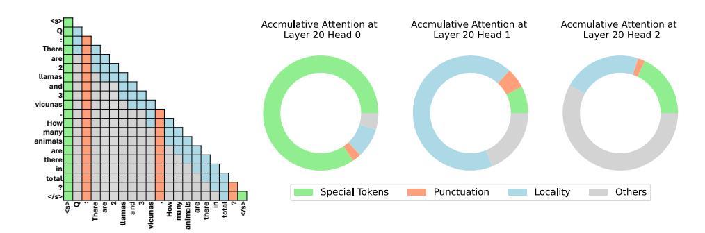
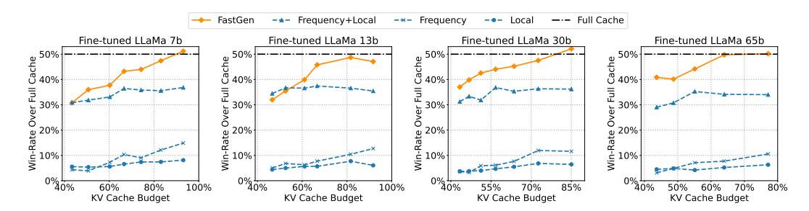
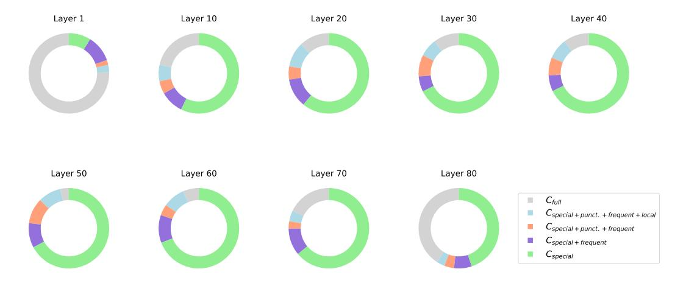
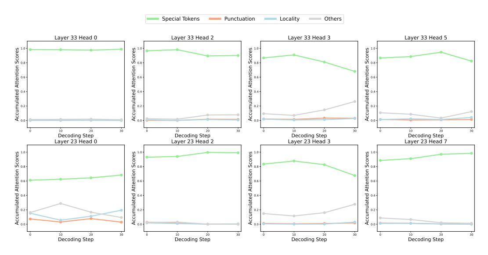
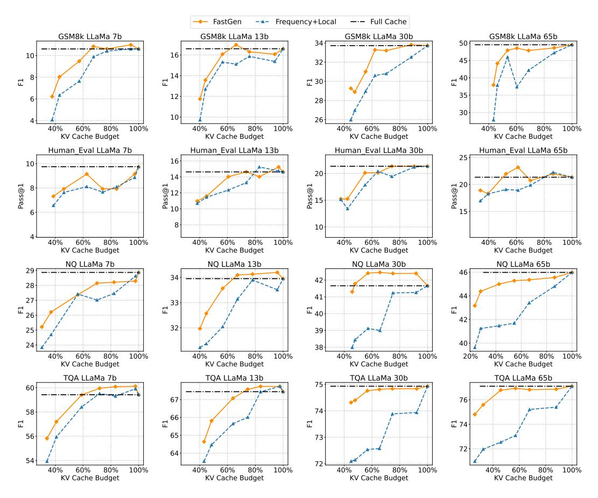
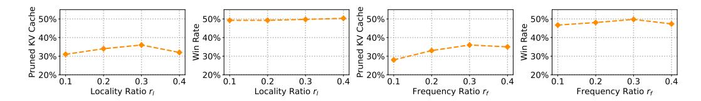

<!-- RP39_Ge_2023 | source: papers_json/RP39_Ge_2023/ -->

## النموذج يخبرك بما يجب التخلص منه: ضغط تكيُّفي لذاكرة KV المؤقتة لنماذج اللغة الكبيرة

Suyu Ge1^∗^ , Yunan Zhang2^∗^ , Liyuan Liu2^∗^ , Minjia Zhang^2^ , Jiawei Han^1^ , Jianfeng Gao^2^ ^1^University of Illinois Urbana-Champaign, ^2^Microsoft {suyuge2,hanj}@illinois.edu {yunanzhang,lucliu,minjiaz,jfgao}@microsoft.com

## الملخص

في هذه الدراسة، نقدم ضغطًا تكيُّفيًا لذاكرة KV المؤقتة، وهي طريقة قابلة للتوصيل والتشغيل تقلل من البصمة الذاكرية للاستدلال التوليدي في نماذج اللغة الكبيرة (LLMs). على عكس ذاكرة KV التقليدية التي تحتفظ بمتجهات المفتاح والقيمة لجميع رموز السياق، نُجري تحليلًا موجَّهًا لتمييز البنية الداخلية لوحدات الانتباه. بناءً على البنية المُتعرَّف عليها، نقترح FastGen، الذي يبني ذاكرة KV المؤقتة بطريقة تكيُّفية: يُسقط السياقات بعيدة المدى في رؤوس الانتباه التي تركز على السياقات المحلية، ويتجاهل الرموز غير الخاصة في رؤوس الانتباه التي تتمحور حول الرموز الخاصة، ولا يستخدم ذاكرة KV القياسية إلا في رؤوس الانتباه التي تنتبه بشكل واسع لجميع الرموز. علاوة على ذلك، بفضل التحليل خفيف الوزن للانتباه المستخدم لتوجيه بناء ذاكرة KV التكيُّفية، يمكن نشر FastGen دون الحاجة إلى ضبط دقيق أو إعادة تدريب مكلفَين للموارد. في تجاربنا عبر مهام متنوعة، يُظهر FastGen تخفيضًا كبيرًا في استهلاك ذاكرة وحدة معالجة الرسومات مع خسارة ضئيلة في جودة التوليد.

# 1 المقدمة

استنادًا إلى معمارية المحوِّل (Transformer)، استقطبت نماذج اللغة الانحدارية الذاتية اهتمامًا واسعًا [(OpenAI,](#page-11-0) [2023;](#page-11-0) [Touvron et al.,](#page-12-0) [2023b)](#page-12-0). ومع زيادة حجم النموذج، تطرح هذه النماذج تحديات كبيرة من حيث التعقيد الحسابي واستهلاك ذاكرة وحدة معالجة الرسومات [(Shazeer et al.,](#page-11-1) [2017)](#page-11-1). ولأن هذه النماذج تحقق نجاحًا ملحوظًا عبر تطبيقات متنوعة، فإن هناك حاجة ملحَّة لتقديم خدماتها بطريقة مجدية اقتصاديًا.

عادةً ما يستخدم الاستدلال التوليدي لنماذج اللغة الكبيرة آلية *ذاكرة KV المؤقتة* لتحسين سرعة التوليد. تقوم ذاكرة KV المؤقتة بتخزين متجهات المفتاح/القيمة المحسوبة سابقًا في عمليات الانتباه وتعيد استخدام هذه القيم لتوليد الرمز الحالي. وبهذا، تتجنب إعادة حساب الرموز السابقة في كل خطوة توليد على حساب استهلاك إضافي للذاكرة. ورغم كونها تقنية بارزة، فإن استهلاك الذاكرة لذاكرة KV المؤقتة يزداد بسرعة مع زيادة حجم النموذج وطول التوليد، مما يزيد بشكل كبير من الضغط على ذاكرة الجهاز.

عندما يتجاوز استخدام الذاكرة سعة وحدة معالجة الرسومات، يلجأ الاستدلال التوليدي لنماذج اللغة الكبيرة عادةً إلى التفريغ [(Aminabadi et al.,](#page-9-0) [2022;](#page-9-0) [Sheng et al.,](#page-11-2) [2023)](#page-11-2). ورغم أن هذه الطرق تساعد على التخفيف من الضغط على ذاكرة وحدة معالجة الرسومات الشحيحة الناتج عن استخدام ذاكرة KV المؤقتة، فإن تفريغ ذاكرة KV إلى وحدة المعالجة المركزية/NVMe قد يضيف عبئًا غير يسير على أداء الاستدلال التوليدي بسبب محدودية عرض النطاق الترددي لـPCIe بين وحدة معالجة الرسومات ووحدة المعالجة المركزية في كثير من الأجهزة. لذلك، يصبح من المهام الحاسمة تقليل البصمة الذاكرية لذاكرة KV المؤقتة دون إعادة تدريب أو ضبط دقيق مكلفَين.

تنطلق دراستنا من ملاحظة (الشكل [1)](#page-1-0) أن هناك بنى وفيرة يمكن رصدها في وحدات الانتباه [(Michel et al.,](#page-11-3) [2019;](#page-11-3) [Voita et al.,](#page-12-1) [2019;](#page-12-1) [Clark et al.,](#page-9-1) [2019;](#page-9-1) [Wang et al.,](#page-12-2) [2020;](#page-12-2) [Child](#page-9-2) [et al.,](#page-9-2) [2019)](#page-9-2)، وأن وحدات الانتباه ليست جميعها بحاجة إلى الانتباه لجميع الرموز [(Liu et al.,](#page-11-4) [2023b;](#page-11-4) [Zhang](#page-12-3) [et al.,](#page-12-3) [2023;](#page-12-3) [Liu et al.,](#page-11-5) [2023a)](#page-11-5). من البديهي أن استثمار هذه البنى وضغط المتجهات المخزَّنة قد يقلل بشكل كبير من استهلاك الذاكرة ويسرّع توليد النص.

استنادًا إلى هذا الحدس، نقترح FastGen *لتسريع الاستدلال التوليدي عبر ضغط ذاكرة KV المؤقتة بشكل تكيُّفي وفوري*. أولًا، نوظّف خوارزمية تحليل فعّالة للتعرف على

> ^∗^ساهم المؤلفون بالتساوي في هذا البحث. الكود متاح على https://github.com/machilusZ/FastGen

<!-- page 2 -->

الأنماط البنيوية لوحدات الانتباه. وبتوجيه من هذا التحليل، نبني ذاكرة KV المؤقتة لمختلف الوحدات بشكل تكيُّفي. وبهذا النهج القائم على التشخيص قبل الضغط، يقلل FastGen بفاعلية من البصمة الذاكرية لذاكرة KV المؤقتة مع الحفاظ على جودة النموذج.

```
Algorithm 1: FastGen–Prompt Encoding.
 Algorithm 2: FastGen–Token Generation.
 Input: Feasible Policy Set (C), Prompt
 Input: Adaptive KV cache (\{C^i, \hat{K}^i, \hat{V}^i\})
 Output: Adaptive KV Cache
 Output: Generated Text
1 for Attention Head H_i in LLM do
 1 z_0 \leftarrow last prompt token
 K^i, Q^i, V^i \leftarrow H_i(Prompt)
 2 for j \in \{1, \dots, Max Generate Length\} do
 A^i \leftarrow \operatorname{softmax}(Q^i K^{i^T})
 for Attention Head H_i in LLM do
 \begin{aligned} \boldsymbol{K}^i, \boldsymbol{Q}^i, \boldsymbol{V}^i &\leftarrow H_i(\boldsymbol{z}_{j-1}, \hat{\boldsymbol{K}}^i, \hat{\boldsymbol{V}}^i) \ \boldsymbol{K}^i_{\boldsymbol{C}^i}, \boldsymbol{V}^i_{\boldsymbol{C}^i} &\leftarrow f(\boldsymbol{K}^i, \boldsymbol{V}^i, \boldsymbol{C}^i) \ \hat{\boldsymbol{K}}^i, \hat{\boldsymbol{V}}^i &\leftarrow \boldsymbol{K}^i_{C_i}, \boldsymbol{V}^i_{C_i} \end{aligned}
 C^i \leftarrow apply Equation 1 to A^i
 /\star C^{i}: optimal policy
 \boldsymbol{K_{C^i}^i, V_{C^i}^i} \leftarrow f(\boldsymbol{K}^i, \boldsymbol{V}^i, \boldsymbol{C}^i)
 \hat{\boldsymbol{K}}^i, \hat{\boldsymbol{V}}^i \leftarrow \boldsymbol{K_{C^i}^i} \boldsymbol{V_{C^i}^i}
 z_j \leftarrow \text{sample from LLM prediction}
7 return \{C^i, \hat{K}^i, \hat{V}^i\}
 s return \{z_i\}
```


*الشكل 1: عادةً ما تكون لرؤوس الانتباه المختلفة بنى مختلفة. اليسار: أربع بنى انتباه شائعة (مزيد من التفاصيل في القسم 3 والقسم 4). اليمين: تركيبات خرائط الانتباه لثلاثة رؤوس انتباه في الطبقة نفسها.*


*الشكل 2: أداء ذاكرة KV التكيُّفية (FastGen) وذاكرة KV الثابتة (التردد، المحلي، التردد+المحلي؛ Zhang et al., 2023 وLiu et al., 2023a) على AlpacaEval.*

في دراستنا، يتعرف FastGen على خمس بنى انتباه أساسية ويطبّقها بصورة متناسبة. على وجه التحديد، تنتبه بعض وحدات الانتباه في الغالب للسياقات المحلية، ولها نبني ذاكرة KV المؤقتة التي تُسقط السياقات بعيدة المدى؛ وبعضها ينتبه أساسًا لرموز/علامات ترقيم محددة، ولها ننشئ ذاكرة KV تحتفظ فقط بالرموز الخاصة/علامات الترقيم؛ وبعضها له خرائط انتباه متفرقة عموديًا، ولها نتخلص من الرموز الأقل انتباهًا إليها؛ وبعضها ينتبه بشكل واسع لجميع الرموز، ولها نستخدم ذاكرة KV القياسية ونخزن جميع الرموز.

بهذه الطريقة، يستطيع FastGen ضغط ذاكرة KV المؤقتة مع الإبقاء على الوظيفة الأصلية لوحدات الانتباه. واللافت أن FastGen لا يتطلب أي ضبط دقيق ويمكن تطبيقه بأسلوب

<!-- page 3 -->

التوصيل والتشغيل. وتُعدّ هذه ميزة كبيرة لـFastGen، إذ أن تكلفة تدريب النماذج فائقة الحجم [(Brown et al.,](#page-9-3) [2020)](#page-9-3) لا يستطيع تحمّلها كثير من مختبرات الأبحاث أو الممارسين.

نقيِّم FastGen على Llama 1 [(Touvron et al.,](#page-12-0) [2023b)](#page-12-0) باستخدام مجموعة من المعايير الرئيسية التي تغطي مهام توليدية في الرياضيات والبرمجة والمعرفة والاستدلال بالحس العام. ينفّذ FastGen ضغطًا فعّالًا لذاكرة KV المؤقتة مع خسارة ضئيلة في جودة التوليد (أي يستعيد أكثر من 95% من درجات الانتباه مع ضغط 35% من الذاكرة). والملاحظ أن FastGen (50% ضغط للذاكرة) يتفوق في النموذج بحجم 30b في الشكل [2](#page-1-1) على جميع طرق ضغط KV الثابتة (15% ضغط للذاكرة).

# 2 الأعمال ذات الصلة

إسقاط الرموز وضغط ذاكرة KV المؤقتة. بُذلت جهود عديدة لتحسين كفاءة النماذج لنماذج اللغة الكبيرة. بالنسبة للشبكات العصبية المتكررة، تتمثل إحدى الطرق في تخطّي عدة رموز في خطوة زمنية معيّنة [(Campos et al.,](#page-9-4) [2017;](#page-9-4) [Seo et al.,](#page-11-6) [2017;](#page-11-6) [Hansen et al.,](#page-10-0) [2019)](#page-10-0). ولأن نماذج المحوِّل سرعان ما استقطبت اهتمامًا واسعًا، اقترح [Goyal et al.](#page-10-1) [(2020)](#page-10-1) إزالة الكلمات الزائدة في BERT [(Devlin et al.,](#page-10-2) [2019)](#page-10-2) بناءً على درجات انتباهها، بينما يضغط [Dai et al.](#page-9-5) [(2020)](#page-9-5) تسلسل الإدخال بإضافة طبقات تجميع لوحدات الترميز في معمارية المحوِّل. ومؤخرًا، أضاف [Huang et al.](#page-10-3) [(2022)](#page-10-3) مهمة اختيار رموز إلى نموذج BERT الأصلي تتعلم اختيار الرموز الحاسمة للأداء، وصمّم [Kim et al.](#page-10-4) [(2022)](#page-10-4) عتبة قابلة للتعلم للكشف عن الرموز غير المهمة وتقليمها. في الوقت نفسه، بُذلت جهود عديدة لاستكشاف إمكانية ضغط الحالة المخفية للرموز بدلًا من تقليل طول التسلسل صراحةً [(Guan](#page-10-5) [et al.,](#page-10-5) [2022;](#page-10-5) [Sun et al.,](#page-11-7) [2022;](#page-11-7) [Zhou et al.,](#page-12-4) [2020)](#page-12-4).

ومع ذلك، يمكن تطبيق هذه الطرق فقط على النماذج غير الانحدارية الذاتية وعادةً ما تتطلب مرحلة إعادة تدريب إضافية، مما يجعلها أقل ملاءمة لنماذج اللغة الكبيرة الانحدارية الذاتية مثل ChatGPT وLlama. وإدراكًا لهذه الفجوة، بدأ الباحثون في فحص إمكانية تقليم الرموز داخل ذاكرة KV المؤقتة لنماذج اللغة الكبيرة الانحدارية الذاتية. يتعلم [Mu et al.](#page-11-8) [(2023)](#page-11-8) ضغط الموجِّهات إلى عدد قليل من الرموز الخاصة لتقليل الضغط على الذاكرة أثناء التخزين المؤقت. غير أن التنبؤ بالرموز يتطلب إعادة تدريب النموذج وقد يشكل عبئًا مكلفًا أثناء الاستدلال. في الوقت ذاته، تقترح عدة طرق متزامنة الاستفادة من درجات الانتباه التراكمية كمعيار لتحديد الرموز المهمة في ذاكرة KV المؤقتة (مثلًا، [Sheng et al.,](#page-11-2) [2023;](#page-11-2) [Zhang et al.,](#page-12-3) [2023;](#page-12-3) [Liu et al.,](#page-11-5) [2023a)](#page-11-5). وبدلًا من بحث سياسة إسقاط محددة، تهدف هذه الدراسة إلى تنسيق سياسات إسقاط متنوعة بشكل تآزري لتتوافق بصورة أفضل مع السمات الخاصة بكل نموذج.

البنية الكامنة للانتباه. مستوحاةً من نجاح المحوِّل، أُجريت دراسات واسعة لاستكشاف الآلية الكامنة لرؤوس الانتباه الذاتي المختلفة. حلّل [Voita et al.](#page-12-1) [(2019)](#page-12-1) رؤوس الانتباه الذاتي في BERT باستخدام LRF [(Bach et al.,](#page-9-6) [2015)](#page-9-6) وصنّفها في أدوار قابلة للتفسير، أحدها الانتباه الدائم للرموز المجاورة. وأظهر [Michel et al.](#page-11-3) [(2019)](#page-11-3) أن الرؤوس في الطبقة نفسها يمكن أن يكون لها تأثير مختلف على الأداء بينما تتغير أهمية كل رأس عبر المهام. وحدّد [Clark et al.](#page-9-1) [(2019)](#page-9-1) و[Kovaleva et al.](#page-10-6) [(2019)](#page-10-6) أنماطًا مثل أن بعض الرؤوس تنتبه أساسًا إلى رموز الفصل والرموز المجاورة وتركيبات منها. وفي حين أن معظم الدراسات السابقة اهتمت أساسًا بنماذج المُرمِّز، فإن FastGen مدفوع بالأنماط المتسقة التي رصدناها في النماذج التي تعتمد على المُفسِّر فقط. وكما في الدراسات السابقة، يستكشف FastGen أيضًا بنية آلية الانتباه لتحسين كفاءة الاستدلال، لكنه يركّز على توصيف ذاكرة KV المؤقتة لرؤوس الانتباه المختلفة.

# 3 الضغط التكيُّفي لذاكرة KV المؤقتة

في هذا القسم، نقدم أولًا صياغة المشكلة، ثم نعرض تحليل الانتباه والضغط التكيُّفي لذاكرة KV المؤقتة.

## 3.1 الاستدلال التوليدي لنماذج LLM الانحدارية الذاتية

يتضمن الاستدلال التوليدي النموذجي خطوتين: ترميز الموجِّه وتوليد الرمز.

ترميز الموجِّه. عندما يولّد نموذج LLM انحداري ذاتي قائم على المحوِّل الرمز i، تحتاج وحدة الانتباه إلى الرجوع إلى جميع الرموز السابقة البالغ عددها i − 1، أي متجهات المفتاح والقيمة (متجهات KV) لتلك الرموز. ولتفادي حسابات متجهات KV الزائدة عند توليد الرموز اللاحقة، تُخزَّن جميع متجهات KV في *ذاكرة KV المؤقتة* بمجرد توليدها.

<!-- page 4 -->

توليد الرمز. بمجرد انتهاء ترميز الموجِّه، يولّد نموذج LLM المخرَجات رمزًا تلو الآخر. في كل خطوة توليد، يحتاج النموذج إلى ترميز الرمز/الرموز الجديدة المولَّدة في الخطوة السابقة. وبعد توليد رمز جديد، تُلحق متجهات KV المرتبطة به بذاكرة KV المؤقتة الحالية. وبذلك، يزداد حجم ذاكرة KV المؤقتة خطيًا مع عدد الرموز المولَّدة.

## 3.2 FastGen

كما هو موصوف في القسم [2،](#page-2-1) كثير من الدراسات السابقة لضغط ذاكرة KV المؤقتة من أجل تحسين كفاءة الاستدلال لا تستفيد من بنية الانتباه المعقدة في نماذج LLM. وكما سيُفصَّل في القسم [4،](#page-4-0) كثيرًا ما تعمل رؤوس الانتباه في نماذج LLM بشكل مميَّز، مما يدل على الحاجة إلى تخصيص استراتيجية الضغط لكل رأس انتباه على حدة.

من خلال هذه الرؤى، نقدم FastGen: خوارزمية ثنائية المرحلة لإنشاء ذاكرة KV مؤقتة تكيُّفية. خلال مرحلة ترميز الموجِّه، يُجرى تحليل النموذج لتمييز سلوك مختلف رؤوس الانتباه، حتى نتمكن من اختيار استراتيجية الضغط الأنسب لكل رأس. ثم، في مرحلة توليد الرمز، بدلًا من إلحاق متجهات KV الجديدة بصورة عشوائية لكل رمز جديد مولَّد، نُدير ذاكرة KV المؤقتة بناءً على استراتيجيات الضغط المختارة.

## 3.3 تحليل النموذج

يُجرى تحليل النموذج بناءً على نتيجة ترميز الموجِّه. على وجه التحديد، لسياسة ضغط C، نحدد الضغط المقابل لذاكرة KV المؤقتة بـKC,V^C^ = f(K,V , C)، حيث K^C^ وV^C^ هما ذاكرة KV المؤقتة المضغوطة. ثم، لخريطة الانتباه A = softmax(QK^T^ )، نختار السياسة المثلى التي يمكنها استرداد A بنسبة استرداد T مع الحد الأدنى من تكلفة الذاكرة:

$$
poC^* = \underset{C \in \mathcal{C}}{\operatorname{arg\,min}} \operatorname{CacheMemoryCost}(C) \quad \text{s.t.} \quad |A - \operatorname{softmax}(QK_C^T)| \le 1 - T, (1)
$$

حيث C هي مجموعة جميع سياسات الضغط الممكنة، وCacheMemoryCost(C) هي ميزانية ذاكرة KV المستهدفة لسياسة الضغط C، وT معامل فائق محدد مسبقًا يمثل مقدار ما نريد أن تستردّه السياسة من A. وكما سيُناقش في القسم [5،](#page-5-0) يستطيع FastGen استرداد +95% من خريطة الانتباه بنسبة ضغط +40% لنموذج 65B. وتُعرض الخوارزمية النهائية لترميز الموجِّه التي تتضمن تحليل النموذج في الخوارزمية [1.](#page-1-2)

في جوهرها، تفترض طريقتنا أن بنية خريطة الانتباه لرأس ما تظل ثابتة عبر عملية التوليد. لذا، يكفي استخدام الموجِّه المُرمَّز فقط لاختيار سياسة ضغط مناسبة. وتجدر الإشارة إلى أن الأدبيات الحالية قدّمت مبررات نظرية لاستخدام الموجِّهات المُرمَّزة وحدها لالتقاط بنى الانتباه للسياقات الكاملة [(Zhang et al.,](#page-12-3) [2023;](#page-12-3) [Liu et al.,](#page-11-5) [2023a)](#page-11-5). وقد تحققنا من ذلك تجريبيًا في دراستنا، كما سيُفصَّل في القسم [4.](#page-4-0)

## 3.4 سياسات ضغط ذاكرة KV المؤقتة

في تجاربنا، نلاحظ أن عددًا كبيرًا من رؤوس الانتباه يتبع أنماطًا معيَّنة عن كثب، كما سيُفصَّل في القسم [4.](#page-4-0) لذلك، إضافة إلى سياسة ذاكرة KV الكاملة التقليدية، نأخذ في الاعتبار أيضًا أربع سياسات أساسية لضغط ذاكرة KV المؤقتة. ورغم أننا نستخدم أساسًا هذه السياسات الأربع للتقييم في هذه الدراسة، فإنه يسهل على FastGen استخدام عدد كبير من الاستراتيجيات الأخرى. سياسات الضغط الأربع لذاكرة KV المؤقتة هي:

- الرموز الخاصة. نحتفظ في ذاكرة KV المؤقتة فقط بالرموز الخاصة، مثل رمز بداية الجملة <s>، ورمز التعليمات [INST]، وما إلى ذلك. يُشار إلى هذه السياسة بـCspecial.
- علامات الترقيم. نحتفظ في ذاكرة KV المؤقتة فقط برموز علامات الترقيم مثل "."، ":"، "?". يُشار إلى هذه السياسة بـCpunct..
- المحلية. تُسقط هذه السياسة السياقات بعيدة المدى. بمجرد أن تتجاوز المسافة النسبية بين رمز السياق والرمز الحالي عتبة معيَّنة، تُسقط ذاكرة KV الخاصة برمز السياق. وتتحدد العتبة بنسبة محددة مسبقًا r^l^ من ميزانية طول السياق المحلي إلى طول تسلسل الإدخال. يُشار إلى هذه السياسة بـClocal.
- التردد (الأكثر تأثيرًا). استُخدمت هذه السياسة في دراسات متعددة سابقة (مثلًا، [Sheng](#page-11-2) [et al.,](#page-11-2) [2023;](#page-11-2) [Zhang et al.,](#page-12-3) [2023;](#page-12-3) [Liu et al.,](#page-11-5) [2023a)](#page-11-5). نراقب لكل رمز مجموعه التراكمي لدرجات الانتباه، ثم نعامل هذه الدرجات بوصفها *تردد* الرمز ونحتفظ فقط بالرموز الأكثر تكرارًا

<!-- page 5 -->

في ذاكرة KV المؤقتة. وتتحكم نسبة r_f في ميزانية طول الرموز المتكررة بالنسبة لطول التسلسل الحالي. يُشار إلى هذه السياسة بـC_{\text{frequent}}.

**السياسات الهجينة.** عمليًا، كثيرًا ما يكون من الضروري استخدام سياسات هجينة تجمع بين سياسات الضغط المذكورة. ولأن العدد الإجمالي للسياسات الهجينة كبير جدًا، نستخدم في دراستنا طريقة جشعة لبناء مجموعة صغيرة من السياسات الهجينة على النحو التالي:

\mathcal{C} = \{ \boldsymbol{C}_{\text{special}}, \boldsymbol{C}_{\text{special+punct.}}, \boldsymbol{C}_{\text{special+punct.+frequent}}, \boldsymbol{C}_{\text{special+punct.+frequent+local}}, \boldsymbol{C}_{\text{full}} \}, \quad (2)

حيث يُحسب مجموع استراتيجيتَي ضغط بأنه اتحاد ذاكرتَي KV المضغوطتَين، ويشير C_{\rm full} إلى ذاكرة KV الكاملة بدون ضغط.

نستخدم C_{\rm special} مكوّنًا في جميع السياسات الهجينة لسببين: 1) نلاحظ أن درجات الانتباه العالية تخصَّص عادةً نحو C_{\rm special}، كما سيُفصَّل في القسم 4، مما يدل على أن C_{\rm special} حاسم لاسترداد خريطة الانتباه؛ 2) ذاكرة C_{\rm special} المضغوطة موفِّرة للذاكرة لأن عدد الرموز الخاصة في الجملة عادةً ما يكون أقل من 5. بمعنى آخر، يضيف الإدراج الدائم لـC_{\rm special} تكلفة ذاكرة إضافية ضئيلة أو معدومة. وبالمثل، كثيرًا ما يُستخدم C_{\rm punct.} مكوّنًا لتكوين سياسات هجينة بسبب توفيره للذاكرة، أي أن عدد علامات الترقيم في الجملة قليل. وتُعرض الخوارزمية النهائية لتوليد الرمز في الخوارزمية 2.

# 4 تنوّع بنى الانتباه واستقرارها

في هذا القسم، نقدّم دراسة تجريبية لإظهار فاعلية الضغط التكيُّفي لذاكرة KV المؤقتة. أولًا، نُظهر أن رؤوس الانتباه المختلفة تمتلك عادةً بنى متمايزة. ثم نُظهر أن بنى رؤوس الانتباه هذه تظل متسقة نسبيًا عبر رؤوس انتباه مختلفة في مواضع مختلفة. ونقوم بذلك من خلال تحليل درجات الانتباه لـLlama 1 65B باستخدام عينات عشوائية من GSM8k (Cobbe et al., 2021).

## 4.1 بنية الانتباه المميِّزة لكل رأس


*الشكل 3: توزيع نتائج تحليل الانتباه عبر الطبقات المختلفة.*

**الإعداد.** نُجري تحليل النموذج بعتبة استرداد قدرها 0.95 ونحسب توزيع نتائج التحليل لطبقات \{1, 10, 20, 30, 40, 50, 60, 70, 80\}. وتُعرض النتيجة في الشكل 3.

**الملاحظة.** يُظهر الشكل 3 أن رؤوس الانتباه في طبقات مختلفة لها بنى مختلفة جدًا. على وجه التحديد، في الطبقات الأولى والأخيرة، يوجد عدد أكبر من رؤوس الانتباه المخصصة لذاكرة KV الكاملة، مما يدل على أن رؤوس الانتباه في هذه الطبقات تميل إلى الانتباه لجميع الرموز. في حين أنه في الطبقات الوسطى، تركز خريطة الانتباه على الرموز الخاصة، مما يدل على أن معظم رؤوس الانتباه في هذه الطبقات تنتبه أساسًا للرموز الخاصة (أي أن درجة الانتباه التراكمية على الرموز الخاصة أعلى من 0.95 لهذه الرؤوس). ويُظهر الشكل 1 بنية رؤوس الانتباه المختلفة في الطبقة نفسها. ونرى أن بنى الانتباه تختلف عبر الطبقات والرؤوس المختلفة.

<!-- page 6 -->

تشير هذه النتائج إلى أنه من غير الأمثل تطبيق ذاكرة KV المؤقتة نفسها على جميع الطبقات دون تكيُّف، وأنه من المفيد رصد بنية كل رأس انتباه لاختيار سياسة الضغط المثلى لبناء ذاكرة KV المؤقتة.

## 4.2 يميل التحليل إلى الاتساق داخل التسلسل الواحد

يُظهر القسم السابق الإمكانات الكبيرة لبناء ذاكرة KV مؤقتة تكيُّفية وفقًا لبنية رؤوس الانتباه المختلفة. وهنا، نُظهر أنه لكل حالة، يكفي إجراء تحليل نموذج لمرة واحدة، كما هو موضَّح في القسم 3.3. على وجه التحديد، نُظهر لموجِّه معيَّن أن بنية الانتباه لكل رأس تظل متسقة عبر عملية فك الترميز.


*الشكل 4: درجة الانتباه التراكمية في الخطوات 1 (ترميز الموجِّه)، و10، و20، و30 من فك الترميز.*

**الإعداد.** متابعةً للشكل 1، نحسب درجة الانتباه التراكمية لرؤوس الانتباه في طبقات مختلفة من Llama 1 65B في خطوات فك ترميز متعددة (أي 1، 10، 20، 30). ونعرض الدرجة التراكمية الناتجة بصريًا في الشكل 4.

**الملاحظة.** على الرغم من بعض التقلبات في درجات الانتباه التراكمية عبر الخطوات الزمنية، يظل نمط خرائط الانتباه مستقرًا نسبيًا. على سبيل المثال، الطبقة 33 الرأس 0 والطبقة 23 الرأس 2 ينتبهان فقط تقريبًا للرمز الخاص، بينما تلعب المحلية وعلامات الترقيم دورًا مهمًا في الطبقة 23 الرأس 0. أما الطبقة 23 الرأس 3، فأكثر من 10% من درجة الانتباه تخصَّص لجزء "الأخرى"، مما يجعله ملائمًا لذاكرة KV غير مضغوطة C_{\rm full}.

علاوة على ذلك، نلاحظ أن جزءًا كبيرًا من درجات الانتباه يكون على الرموز الخاصة في جميع الحالات. وهذا يبرر الطريقة الجشعة التي استخدمناها لبناء السياسات الهجينة، كما هو موصوف في القسم 3.4.

# 5 التجربة

نُجري تجارب شاملة لإظهار فاعلية FastGen في تقليل البصمة الذاكرية والحفاظ على جودة التوليد. أولًا، نُبلغ عن المقايضة بين تقليل الذاكرة وجودة التوليد الشاملة في القسم 5.1، ونناقش نسبة ضغط FastGen في القسم 5.2. ولإظهار تفوّق FastGen في الأنظمة الواقعية، نوضّح تغيُّر الكمون الكلي في القسم 5.3 وعبء التحليل في القسم 5.4. وأخيرًا، نقدم دراسات الاستئصال والمناقشات في القسم A.1.

## 5.1 المقايضة بين الأداء وتقليل الذاكرة

**الأنظمة الأساسية.** نُجري التجارب باستخدام كل من Llama 1 (Touvron et al., 2023a) ومتغيِّراته المضبوطة دقيقًا، بأحجام نماذج تتراوح من 7B إلى 65B. بالنسبة للمتغيرات المضبوطة دقيقًا، لا نختار

<!-- page 7 -->


*الشكل 5: أداء ذاكرة KV التكيُّفية (FastGen) وذاكرة KV الثابتة (التردد+المحلي؛ Zhang et al., 2023 وLiu et al., 2023a) لـLlama 1 على GSM8k وHumanEval وNQ وTQA.*

نموذج Llama 2-chat (Touvron et al., 2023b) المفتوح المصدر بسبب تقنيات الانتباه ذات الاستعلام المجمَّع. بدلًا من ذلك، نستخدم في هذه الدراسة معمارية الانتباه متعدد الرؤوس الأصلية ونترك دمج الانتباه ذي الاستعلام المجمَّع لأعمال مستقبلية. ولإعداد نموذج قابل للمقارنة يتبع التعليمات للتحليل، قمنا بضبط نموذج Llama 1 دقيقًا بمجموعات بيانات ضبط التعليمات مفتوحة المصدر. على وجه التحديد، تُدرَّب المتغيرات المضبوطة دقيقًا على بيانات LIMA<sup>1</sup> (Zhou et al., 2023) وبيانات Open Assistant<sup>2</sup> (Köpf et al., 2023).

**المهام.** نستخدم مهام توليد قياسية لتقييم Llama 1 ونماذج Llama 1 المضبوطة دقيقًا. لـLlama 1، نختار 4 مهام مختلفة، تشمل HumanEval (Chen et al., 2021) وGSM8k (Cobbe et al., 2021) وNQ (Kwiatkowski et al., 2019) وTQA (Kembhavi et al., 2017) لتقييم قدرات النماذج في مجالات مختلفة (البرمجة والرياضيات والإجابة عن الأسئلة وفهم القراءة). لاحظ أنه في المهام الأربع، تكون كل عيّنة اختبار في صيغة توليدية، حيث تُستخرج الإجابات بعد انتهاء توليد النموذج. وهذا أمر حاسم للمقارنة العادلة لجودة توليد النموذج. ونُقيِّم نموذج LLaMa المضبوط دقيقًا للتعليمات على معيار ضبط التعليمات AlpacaEval (Li et al., 2023)، الذي يتألف من 805 موجِّه سؤال من مجالات متنوعة.

**إعداد التجربة.** يتبع تقييم نموذج Llama 1 الإعداد الافتراضي ومقاييس التقييم في كل معيار. نحسب درجات F1 لـGSM8k وNQ وTQA، ونستخدم معدل تنفيذ الكود Pass@1 لـHumanEval. ولأن تقييم نموذج ضبط التعليمات يظل صعبًا، نتبع الأعمال السابقة (Zhou et al., 2023; Touvron et al., 2023b) في استخدام GPT4 مُقيِّمًا للمقارنة الزوجية بين توليدَين مختلفَين للنموذج. لكل موجِّه،

> ^&^lt;sup>1</sup>https://huggingface.co/datasets/GAIR/lima.

> ^&^lt;sup>2</sup>https://huggingface.co/datasets/OpenAssistant/oasst1.

<!-- page 8 -->

نُدخل توليد FastGen والتوليد الناتج من النموذج نفسه مع ذاكرة KV الكاملة بوصفهما زوجًا، ونطلب من GPT4 الحكم بأيهما أفضل. ثم نحسب معدل فوز FastGen على ذاكرة الكاملة. افتراضيًا، ينبغي أن يكون معدل فوز طريقة دون خسارة حوالي 50%. إضافة إلى نماذج الذاكرة الكاملة، نُضمّن أيضًا طرق ذاكرة KV غير التكيُّفية للمقارنة. على وجه التحديد، نطبّق C_{\rm local} وC_{\rm frequent} وC_{\rm local+frequent} على جميع رؤوس الانتباه دون أي تكيُّف، خطوطًا أساسية. وتجدر الإشارة إلى أن C_{\rm local+frequent} خط أساسي قوي جدًا لأنه مطابق لطريقة H<sub>2</sub>O (Zhang et al., 2023) وطريقة Scissorhands (Liu et al., 2023a). نضبط r_l = 0.3 وr_f = 0.3 في FastGen، ولا نغيّر سوى نسبة الاسترداد T للتحكم في نسبة ذاكرة KV المُقلَّمة. للتوليد، نستخدم العيّنات النووية (Holtzman et al., 2019) بدرجة حرارة T = 0.6 وp = 0.9. تُجرى التجارب على 8 من وحدات NVIDIA A100 80GB GPUs.

**النتائج الرئيسية.** في الشكل 2 والشكل 5، نعرض جودة النموذج بوصفها دالة لميزانية ذاكرة KV المؤقتة المتزايدة من 30% إلى 100%. بالنسبة لنماذج 30B، يتفوق FastGen (50% ضغط للذاكرة) على جميع طرق ضغط KV غير التكيُّفية (15% ضغط للذاكرة). كما يمكننا أن نرى أن FastGen يحقق نسبة تقليل أكبر لذاكرة KV المؤقتة مع زيادة حجم النموذج، مع الحفاظ على جودة النموذج نفسها. على سبيل المثال، عند تحقيق معدل فوز قدره 45%، يستطيع FastGen تحقيق نسبة تقليم تصل إلى 44.9% في Llama 1-65B، مقارنة بنسبة تقليم 16.9% في Llama 1-7B. في جميع الإعدادات، يُظهر FastGen تحسّنًا متسقًا وكبيرًا على طرق الضغط غير التكيُّفية. وتؤكد النتائج فاعلية ضغط ذاكرة KV التكيُّفي باستخدام FastGen رغم بساطته.

## 5.2 تحليل تقليل البصمة الذاكرية

نُبلغ عن تقليل البصمة الذاكرية لذاكرة KV المؤقتة في الجدول 1. لجميع النماذج المُقيَّمة من 7B إلى 65B، نُقيِّم استهلاك الذاكرة بحجم دفعة ثابت قدره 16، وطول تسلسل قدره 512، وأوزان النموذج بصيغة fp16. ونلاحظ أن FastGen يقلل بشكل كبير من البصمة الذاكرية لذاكرة KV المؤقتة عبر جميع أحجام النماذج، مع تخفيضات أكبر للنماذج الأكبر. باعتبار معدل الفوز فوق 45% بمثابة انحدار ضئيل أو معدوم في الجودة، يحقق FastGen تقليلًا للذاكرة بنحو \sim\!40\% في Llama 1-65B، و\sim\!30\% في Llama 1-30B، و\sim\!20\% في Llama 1-13B وLlama 1-7B.

## 5.3 تحسين الكمون الكلي

<!-- page 9 -->

لتحليل التسريع الكلي لـFastGen، نعرض تحسين الكمون الكلي على إعداد الذاكرة الكاملة وخط أساسي قوي لتسريع النماذج في الجدول [2.](#page-7-3) في التجربة، نسجّل المدة الإجمالية بالثواني، مقاسةً من بدء ترميز الموجِّه حتى انتهاء التوليد بوصفها الكمون الكلي. لخط الأساس الكامل للذاكرة، نتبنى Hugging Face Accelerate (HF) [(Gugger et al.,](#page-10-10) [2022)](#page-10-10) المستخدم على نطاق واسع، ويُشار إليه بـHF في الجدول [2.](#page-7-3) لـFastGen، نفّذنا نواةً مخصَّصة للتعامل مع عملية تقليم ذاكرة KV المؤقتة. على وجه التحديد، نُكيِّف النواة من Deepspeed (DS) [(Aminabadi et al.,](#page-9-0) [2022)](#page-9-0) بإضافة عملية تخفيف ذاكرة KV المؤقتة. ونُدرج أداء Deepspeed للمقارنة العادلة، ويُشار إليه بـDS في الجدول [2.](#page-7-3) تُختبر جميع الطرق على وحدات Nvidia V100 GPUs نفسها.

كما هو موضح في الجدول [2،](#page-7-3) يمكننا أن نلاحظ أن FastGen يحقق تسريعًا كليًا كبيرًا عبر جميع إعدادات التوليد. بالنسبة للحالة الأقل أهمية، يمكن لـFastGen أن يحقق تحسنًا لائقًا في الكمون قدره 16.04% على خط أساس HF عند طول توليد قصير قدره 512. وفي أفضل الحالات، يمكننا تحقيق تقليل في الكمون يصل إلى 55.0% على HF مع FastGen عند طول توليد 16k. ويمكننا أيضًا ملاحظة أن التسريع النسبي يكون أكبر مع طول توليد أطول. على سبيل المثال، عند حجم دفعة = 1، يرتفع التسريع النسبي لـFastGen من 16.04% إلى 55.0%، مع نمو طول التوليد من 512 إلى 16k. وعند مقارنة FastGen بـDeepSpeed، لا يزال يمكننا ملاحظة تسريع كبير يزداد مع حجم الدفعة وطول التوليد. وبالنظر إلى أن DeepSpeed نظام استدلال محسَّن متكامل، حيث لا يقتصر التحسين على حساب الانتباه، فلا يزال هناك مجال كبير لتحسين FastGen أكثر بتلميع نواة التخفيف. ونترك هذا التحدي البحثي والهندسي الفريد للأعمال المستقبلية.

## 5.4 تكلفة التحليل

لفهم العبء الإضافي لخطوة التحليل بشكل أفضل، نقارن وقت التحليل بإجمالي وقت التوليد عبر أطوال توليد مختلفة. ونعرض النتيجة في الجدول [3.](#page-8-1)

يمكننا أن نلاحظ أن وقت التحليل لا يمثل سوى نسبة صغيرة جدًا من إجمالي مدة التوليد، تصل إلى 0.35% في حالاتنا المختبَرة. كما يقل العبء مع زيادة طول التوليد، فينخفض إلى 0.07% عندما يبلغ طول التوليد 1024.

من حيث الاستخدام الإضافي للذاكرة، فإنه يأتي أساسًا من إحدى استراتيجيات الضغط، Cfrequent، التي تحتاج إلى تخزين مجموع تراكمي إضافي لدرجات الانتباه لكل رأس انتباه. ولتقديم تحليل مفصَّل، لكل طبقة، تكون أبعاد ذاكرة KV المؤقتة (حجم الدفعة، عدد الرؤوس، طول التسلسل، البُعد المخفي)، بينما تكون أبعاد الذاكرة الإضافية لدرجات الانتباه التراكمية (حجم الدفعة، عدد الرؤوس، طول التسلسل). وبالنظر إلى أن البُعد المخفي = 128 لجميع أحجام النماذج، يكون عبء الذاكرة 1/128=0.78% مقارنة بتخزين ذاكرة KV المؤقتة فقط، وهو تكلفة لا تُذكر.

# 6 الخاتمة

قدّمنا FastGen، طريقة جديدة تُحسِّن بشكل كبير كفاءة الاستدلال لنماذج LLM، دون خسارة جودة ملحوظة، باستخدام تحليل نموذج خفيف الوزن وتخزين مفتاح-قيمة تكيُّفي. وتشمل مجالات الاستكشاف المستقبلية الجمع بين FastGen وتقنيات ضغط النموذج الأخرى، مثل التكميم والتقطير، ومعماريات الانتباه الفعّالة الأخرى، مثل الانتباه ذي الاستعلام المجمَّع.

<!-- page 10 -->

## شكر وتقدير

دُعِم البحث جزئيًا من قبل برنامج DARPA الأمريكي KAIROS رقم FA8750-19-2-1004 وبرنامج IN-CAS رقم HR001121C0165، ومؤسسة العلوم الوطنية IIS-19-56151، ومعهد Molecule Maker Lab: برنامج معاهد بحوث الذكاء الاصطناعي المدعوم من NSF بموجب جائزة رقم 2019897، ومعهد الفهم الجغرافي المكاني عبر بيئة الاكتشاف التكاملية (I-GUIDE) من NSF بموجب جائزة رقم 2118329. أي آراء أو نتائج أو استنتاجات أو توصيات معبَّر عنها هنا هي للمؤلفين ولا تمثل بالضرورة وجهات نظر DARPA أو الحكومة الأمريكية صراحةً أو ضمنًا.

## المراجع

- Reza Yazdani Aminabadi, Samyam Rajbhandari, Minjia Zhang, Ammar Ahmad Awan, Cheng Li, Du Li, Elton Zheng, Jeff Rasley, Shaden Smith, Olatunji Ruwase, and Yuxiong He. Deepspeedinference: Enabling efficient inference of transformer models at unprecedented scale. *SC22:* *International Conference for High Performance Computing, Networking, Storage and Analysis*, pp. 1–15, 2022.
- Sebastian Bach, Alexander Binder, Gregoire Montavon, Frederick Klauschen, Klaus-Robert M ´ uller, ¨ and Wojciech Samek. On pixel-wise explanations for non-linear classifier decisions by layer-wise relevance propagation. *PLoS ONE*, 10, 2015. URL [https://api.semanticscholar.](https://api.semanticscholar.org/CorpusID:9327892) [org/CorpusID:9327892](https://api.semanticscholar.org/CorpusID:9327892).
- Tom B. Brown, Benjamin Mann, Nick Ryder, Melanie Subbiah, Jared Kaplan, Prafulla Dhariwal, Arvind Neelakantan, Pranav Shyam, Girish Sastry, Amanda Askell, Sandhini Agarwal, Ariel Herbert-Voss, Gretchen Krueger, Tom Henighan, Rewon Child, Aditya Ramesh, Daniel M. Ziegler, Jeffrey Wu, Clemens Winter, Christopher Hesse, Mark Chen, Eric Sigler, Mateusz Litwin, Scott Gray, Benjamin Chess, Jack Clark, Christopher Berner, Sam McCandlish, Alec Radford, Ilya Sutskever, and Dario Amodei. Language models are few-shot learners. In Hugo Larochelle, Marc'Aurelio Ranzato, Raia Hadsell, Maria-Florina Balcan, and Hsuan-Tien Lin (eds.), *Advances* *in Neural Information Processing Systems 33: Annual Conference on Neural Information Pro**cessing Systems 2020, NeurIPS 2020, December 6-12, 2020, virtual*, 2020.
- V´ıctor Campos, Brendan Jou, Xavier Giro i Nieto, Jordi Torres, and Shih-Fu Chang. Skip rnn: ´ Learning to skip state updates in recurrent neural networks. *ArXiv*, abs/1708.06834, 2017. URL [https://api.semanticscholar.org/CorpusID:1859294](https://api.semanticscholar.org/CorpusID:1859294).
- Mark Chen, Jerry Tworek, Heewoo Jun, Qiming Yuan, Henrique Ponde de Oliveira Pinto, Jared Kaplan, Harri Edwards, Yuri Burda, Nicholas Joseph, Greg Brockman, et al. Evaluating large language models trained on code. *arXiv preprint arXiv:2107.03374*, 2021.
- Rewon Child, Scott Gray, Alec Radford, and Ilya Sutskever. Generating long sequences with sparse transformers. *CoRR*, abs/1904.10509, 2019. URL [http://arxiv.org/abs/1904.10509](http://arxiv.org/abs/1904.10509).
- Kevin Clark, Urvashi Khandelwal, Omer Levy, and Christopher D. Manning. What does BERT look at? an analysis of BERT's attention. In *Proceedings of the 2019 ACL Workshop Black**boxNLP: Analyzing and Interpreting Neural Networks for NLP*, pp. 276–286, Florence, Italy, August 2019. Association for Computational Linguistics. doi: 10.18653/v1/W19-4828. URL [https://aclanthology.org/W19-4828](https://aclanthology.org/W19-4828).
- Karl Cobbe, Vineet Kosaraju, Mohammad Bavarian, Mark Chen, Heewoo Jun, Lukasz Kaiser, Matthias Plappert, Jerry Tworek, Jacob Hilton, Reiichiro Nakano, et al. Training verifiers to solve math word problems. *arXiv preprint arXiv:2110.14168*, 2021.
- Zihang Dai, Guokun Lai, Yiming Yang, and Quoc Le. Funnel-transformer: Filtering out sequential redundancy for efficient language processing. In Hugo Larochelle, Marc'Aurelio Ranzato, Raia Hadsell, Maria-Florina Balcan, and Hsuan-Tien Lin (eds.), *Advances in Neural Information Processing Systems 33: Annual Conference on Neu**ral Information Processing Systems 2020, NeurIPS 2020, December 6-12, 2020, vir**tual*, 2020. URL [https://proceedings.neurips.cc/paper/2020/hash/](https://proceedings.neurips.cc/paper/2020/hash/2cd2915e69546904e4e5d4a2ac9e1652-Abstract.html) [2cd2915e69546904e4e5d4a2ac9e1652-Abstract.html](https://proceedings.neurips.cc/paper/2020/hash/2cd2915e69546904e4e5d4a2ac9e1652-Abstract.html).

<!-- page 11 -->

- Jacob Devlin, Ming-Wei Chang, Kenton Lee, and Kristina Toutanova. BERT: pre-training of deep bidirectional transformers for language understanding. In Jill Burstein, Christy Doran, and Thamar Solorio (eds.), *Proceedings of the 2019 Conference of the North American Chapter of* *the Association for Computational Linguistics: Human Language Technologies, NAACL-HLT* *2019, Minneapolis, MN, USA, June 2-7, 2019, Volume 1 (Long and Short Papers)*, pp. 4171– 4186. Association for Computational Linguistics, 2019. doi: 10.18653/v1/n19-1423. URL [https://doi.org/10.18653/v1/n19-1423](https://doi.org/10.18653/v1/n19-1423).
- Saurabh Goyal, Anamitra R. Choudhury, Saurabh Raje, Venkatesan T. Chakaravarthy, Yogish Sabharwal, and Ashish Verma. Power-bert: Accelerating bert inference via progressive wordvector elimination. In *International Conference on Machine Learning*, 2020. URL [https:](https://api.semanticscholar.org/CorpusID:219792793) [//api.semanticscholar.org/CorpusID:219792793](https://api.semanticscholar.org/CorpusID:219792793).
- Yue Guan, Zhengyi Li, Jingwen Leng, Zhouhan Lin, and Minyi Guo. Transkimmer: Transformer learns to layer-wise skim. In Smaranda Muresan, Preslav Nakov, and Aline Villavicencio (eds.), *Proceedings of the 60th Annual Meeting of the Association for Computational Linguistics (Volume* *1: Long Papers), ACL 2022, Dublin, Ireland, May 22-27, 2022*, pp. 7275–7286. Association for Computational Linguistics, 2022. doi: 10.18653/v1/2022.acl-long.502. URL [https://doi.](https://doi.org/10.18653/v1/2022.acl-long.502) [org/10.18653/v1/2022.acl-long.502](https://doi.org/10.18653/v1/2022.acl-long.502).
- Sylvain Gugger, Lysandre Debut, Thomas Wolf, Philipp Schmid, Zachary Mueller, Sourab Mangrulkar, Marc Sun, and Benjamin Bossan. Accelerate: Training and inference at scale made simple, efficient and adaptable. [https://github.com/huggingface/accelerate](https://github.com/huggingface/accelerate), 2022.
- Christian Hansen, Casper Hansen, Stephen Alstrup, Jakob Grue Simonsen, and Christina Lioma. Neural speed reading with structural-jump-lstm. *ArXiv*, abs/1904.00761, 2019. URL [https:](https://api.semanticscholar.org/CorpusID:90258012) [//api.semanticscholar.org/CorpusID:90258012](https://api.semanticscholar.org/CorpusID:90258012).
- Ari Holtzman, Jan Buys, Li Du, Maxwell Forbes, and Yejin Choi. The curious case of neural text degeneration. *arXiv preprint arXiv:1904.09751*, 2019.
- Xin Huang, Ashish Khetan, Rene Bidart, and Zohar Karnin. Pyramid-bert: Reducing complexity via successive core-set based token selection. In Smaranda Muresan, Preslav Nakov, and Aline Villavicencio (eds.), *Proceedings of the 60th Annual Meeting of the Association for Computational Lin**guistics (Volume 1: Long Papers), ACL 2022, Dublin, Ireland, May 22-27, 2022*, pp. 8798–8817. Association for Computational Linguistics, 2022. doi: 10.18653/v1/2022.acl-long.602. URL [https://doi.org/10.18653/v1/2022.acl-long.602](https://doi.org/10.18653/v1/2022.acl-long.602).
- Aniruddha Kembhavi, Minjoon Seo, Dustin Schwenk, Jonghyun Choi, Ali Farhadi, and Hannaneh Hajishirzi. Are you smarter than a sixth grader? textbook question answering for multimodal machine comprehension. *2017 IEEE Conference on Computer Vision and Pattern Recog**nition (CVPR)*, pp. 5376–5384, 2017. URL [https://api.semanticscholar.org/](https://api.semanticscholar.org/CorpusID:1310550) [CorpusID:1310550](https://api.semanticscholar.org/CorpusID:1310550).
- Sehoon Kim, Sheng Shen, David Thorsley, Amir Gholami, Woosuk Kwon, Joseph Hassoun, and Kurt Keutzer. Learned token pruning for transformers. In Aidong Zhang and Huzefa Rangwala (eds.), *KDD '22: The 28th ACM SIGKDD Conference on Knowledge Discovery and Data Mining,* *Washington, DC, USA, August 14 - 18, 2022*, pp. 784–794. ACM, 2022. doi: 10.1145/3534678. 3539260. URL [https://doi.org/10.1145/3534678.3539260](https://doi.org/10.1145/3534678.3539260).
- Andreas Kopf, Yannic Kilcher, Dimitri von R ¨ utte, Sotiris Anagnostidis, Zhi-Rui Tam, Keith Stevens, ¨ Abdullah Barhoum, Nguyen Minh Duc, Oliver Stanley, Richard Nagyfi, Shahul ES, Sameer Suri, ´ David Glushkov, Arnav Dantuluri, Andrew Maguire, Christoph Schuhmann, Huu Nguyen, and Alexander Mattick. Openassistant conversations - democratizing large language model alignment. *CoRR*, abs/2304.07327, 2023. doi: 10.48550/arXiv.2304.07327. URL [https://doi.org/](https://doi.org/10.48550/arXiv.2304.07327) [10.48550/arXiv.2304.07327](https://doi.org/10.48550/arXiv.2304.07327).
- Olga Kovaleva, Alexey Romanov, Anna Rogers, and Anna Rumshisky. Revealing the dark secrets of BERT. In Kentaro Inui, Jing Jiang, Vincent Ng, and Xiaojun Wan (eds.), *Proceedings of the 2019* *Conference on Empirical Methods in Natural Language Processing and the 9th International* *Joint Conference on Natural Language Processing, EMNLP-IJCNLP 2019, Hong Kong, China,* *November 3-7, 2019*, pp. 4364–4373. Association for Computational Linguistics, 2019. doi: 10.18653/v1/D19-1445. URL [https://doi.org/10.18653/v1/D19-1445](https://doi.org/10.18653/v1/D19-1445).

<!-- page 12 -->

- Tom Kwiatkowski, Jennimaria Palomaki, Olivia Redfield, Michael Collins, Ankur Parikh, Chris Alberti, Danielle Epstein, Illia Polosukhin, Matthew Kelcey, Jacob Devlin, Kenton Lee, Kristina N. Toutanova, Llion Jones, Ming-Wei Chang, Andrew Dai, Jakob Uszkoreit, Quoc Le, and Slav Petrov. Natural questions: a benchmark for question answering research. *Transactions of the* *Association of Computational Linguistics*, 2019.
- Xuechen Li, Tianyi Zhang, Yann Dubois, Rohan Taori, Ishaan Gulrajani, Carlos Guestrin, Percy Liang, and Tatsunori B. Hashimoto. Alpacaeval: An automatic evaluator of instruction-following models. [https://github.com/tatsu-lab/alpaca_eval](https://github.com/tatsu-lab/alpaca_eval), 2023.
- Zichang Liu, Aditya Desai, Fangshuo Liao, Weitao Wang, Victor Xie, Zhaozhuo Xu, Anastasios Kyrillidis, and Anshumali Shrivastava. Scissorhands: Exploiting the persistence of importance hypothesis for LLM KV cache compression at test time. *CoRR*, abs/2305.17118, 2023a. doi: 10.48550/arXiv.2305.17118. URL [https://doi.org/10.48550/arXiv.2305.17118](https://doi.org/10.48550/arXiv.2305.17118).
- Zichang Liu, Jue Wang, Tri Dao, Tianyi Zhou, Binhang Yuan, Zhao Song, Anshumali Shrivastava, Ce Zhang, Yuandong Tian, Christopher Re, and Beidi Chen. Deja vu: Contextual spar- ´ sity for efficient llms at inference time. In Andreas Krause, Emma Brunskill, Kyunghyun Cho, Barbara Engelhardt, Sivan Sabato, and Jonathan Scarlett (eds.), *International Confer**ence on Machine Learning, ICML 2023, 23-29 July 2023, Honolulu, Hawaii, USA*, volume 202 of *Proceedings of Machine Learning Research*, pp. 22137–22176. PMLR, 2023b. URL [https://proceedings.mlr.press/v202/liu23am.html](https://proceedings.mlr.press/v202/liu23am.html).
- Paul Michel, Omer Levy, and Graham Neubig. Are sixteen heads really better than one? In H. Wallach, H. Larochelle, A. Beygelzimer, F. d'Alche-Buc, E. Fox, and R. Garnett (eds.), ´ *Advances in Neural Information Processing Systems*, volume 32. Curran Associates, Inc., 2019. URL [https://proceedings.neurips.cc/paper_files/paper/2019/](https://proceedings.neurips.cc/paper_files/paper/2019/file/2c601ad9d2ff9bc8b282670cdd54f69f-Paper.pdf) [file/2c601ad9d2ff9bc8b282670cdd54f69f-Paper.pdf](https://proceedings.neurips.cc/paper_files/paper/2019/file/2c601ad9d2ff9bc8b282670cdd54f69f-Paper.pdf).
- Jesse Mu, Xiang Lisa Li, and Noah D. Goodman. Learning to compress prompts with gist tokens. *CoRR*, abs/2304.08467, 2023. doi: 10.48550/arXiv.2304.08467. URL [https://doi.org/](https://doi.org/10.48550/arXiv.2304.08467) [10.48550/arXiv.2304.08467](https://doi.org/10.48550/arXiv.2304.08467).
- OpenAI. Gpt-4 technical report, 2023.
- Minjoon Seo, Sewon Min, Ali Farhadi, and Hannaneh Hajishirzi. Neural speed reading via skim-rnn. *ArXiv*, abs/1711.02085, 2017. URL [https://api.semanticscholar.org/](https://api.semanticscholar.org/CorpusID:3140413) [CorpusID:3140413](https://api.semanticscholar.org/CorpusID:3140413).
- Noam M. Shazeer, Azalia Mirhoseini, Krzysztof Maziarz, Andy Davis, Quoc V. Le, Geoffrey E. Hinton, and Jeff Dean. Outrageously large neural networks: The sparsely-gated mixture-ofexperts layer. *ArXiv*, abs/1701.06538, 2017. URL [https://api.semanticscholar.](https://api.semanticscholar.org/CorpusID:12462234) [org/CorpusID:12462234](https://api.semanticscholar.org/CorpusID:12462234).
- Ying Sheng, Lianmin Zheng, Binhang Yuan, Zhuohan Li, Max Ryabinin, Daniel Y. Fu, Zhiqiang Xie, Beidi Chen, Clark W. Barrett, Joseph Gonzalez, Percy Liang, Christopher Re, Ioan Cristian ´ Stoica, and Ce Zhang. High-throughput generative inference of large language models with a single gpu. In *International Conference on Machine Learning*, 2023. URL [https://api.](https://api.semanticscholar.org/CorpusID:257495837) [semanticscholar.org/CorpusID:257495837](https://api.semanticscholar.org/CorpusID:257495837).
- Tianxiang Sun, Xiangyang Liu, Wei Zhu, Zhichao Geng, Lingling Wu, Yilong He, Yuan Ni, Guotong Xie, Xuanjing Huang, and Xipeng Qiu. A simple hash-based early exiting approach for language understanding and generation. In Smaranda Muresan, Preslav Nakov, and Aline Villavicencio (eds.), *Findings of the Association for Computational Linguistics: ACL 2022, Dublin,* *Ireland, May 22-27, 2022*, pp. 2409–2421. Association for Computational Linguistics, 2022. doi: 10.18653/v1/2022.findings-acl.189. URL [https://doi.org/10.18653/v1/2022.](https://doi.org/10.18653/v1/2022.findings-acl.189) [findings-acl.189](https://doi.org/10.18653/v1/2022.findings-acl.189).
- Hugo Touvron, Thibaut Lavril, Gautier Izacard, Xavier Martinet, Marie-Anne Lachaux, Timothee´ Lacroix, Baptiste Roziere, Naman Goyal, Eric Hambro, Faisal Azhar, et al. Llama: Open and ` efficient foundation language models. *arXiv preprint arXiv:2302.13971*, 2023a.

<!-- page 13 -->

Hugo Touvron, Louis Martin, Kevin Stone, Peter Albert, Amjad Almahairi, Yasmine Babaei, Nikolay Bashlykov, Soumya Batra, Prajjwal Bhargava, Shruti Bhosale, Dan Bikel, Lukas Blecher, Cristian Canton Ferrer, Moya Chen, Guillem Cucurull, David Esiobu, Jude Fernandes, Jeremy Fu, Wenyin Fu, Brian Fuller, Cynthia Gao, Vedanuj Goswami, Naman Goyal, Anthony Hartshorn, Saghar Hosseini, Rui Hou, Hakan Inan, Marcin Kardas, Viktor Kerkez, Madian Khabsa, Isabel Kloumann, Artem Korenev, Punit Singh Koura, Marie-Anne Lachaux, Thibaut Lavril, Jenya Lee, Diana Liskovich, Yinghai Lu, Yuning Mao, Xavier Martinet, Todor Mihaylov, Pushkar Mishra, Igor Molybog, Yixin Nie, Andrew Poulton, Jeremy Reizenstein, Rashi Rungta, Kalyan Saladi, Alan Schelten, Ruan Silva, Eric Michael Smith, Ranjan Subramanian, Xiaoqing Ellen Tan, Binh Tang, Ross Taylor, Adina Williams, Jian Xiang Kuan, Puxin Xu, Zheng Yan, Iliyan Zarov, Yuchen Zhang, Angela Fan, Melanie Kambadur, Sharan Narang, Aurelien Rodriguez, Robert Stojnic, Sergey Edunov, and Thomas Scialom. Llama 2: Open foundation and fine-tuned chat models, 2023b.

Elena Voita, David Talbot, Fedor Moiseev, Rico Sennrich, and Ivan Titov. Analyzing multi-head self-attention: Specialized heads do the heavy lifting, the rest can be pruned, July 2019. URL [https://aclanthology.org/P19-1580](https://aclanthology.org/P19-1580).

Ziheng Wang, Jeremy Wohlwend, and Tao Lei. Structured pruning of large language models. In Bonnie Webber, Trevor Cohn, Yulan He, and Yang Liu (eds.), *Proceedings of the 2020 Conference* *on Empirical Methods in Natural Language Processing, EMNLP 2020, Online, November 16-20,* *2020*, pp. 6151–6162. Association for Computational Linguistics, 2020. doi: 10.18653/v1/2020. emnlp-main.496. URL [https://doi.org/10.18653/v1/2020.emnlp-main.496](https://doi.org/10.18653/v1/2020.emnlp-main.496).

Zhenyu Zhang, Ying Sheng, Tianyi Zhou, Tianlong Chen, Lianmin Zheng, Ruisi Cai, Zhao Song, Yuandong Tian, Christopher Re, Clark W. Barrett, Zhangyang Wang, and Beidi Chen. ´ H2 o: Heavy-hitter oracle for efficient generative inference of large language models. *CoRR*, abs/2306.14048, 2023. doi: 10.48550/arXiv.2306.14048. URL [https://doi.org/10.](https://doi.org/10.48550/arXiv.2306.14048) [48550/arXiv.2306.14048](https://doi.org/10.48550/arXiv.2306.14048).

Chunting Zhou, Pengfei Liu, Puxin Xu, Srini Iyer, Jiao Sun, Yuning Mao, Xuezhe Ma, Avia Efrat, Ping Yu, Lili Yu, Susan Zhang, Gargi Ghosh, Mike Lewis, Luke Zettlemoyer, and Omer Levy. LIMA: less is more for alignment. *CoRR*, abs/2305.11206, 2023. doi: 10.48550/arXiv.2305. 11206. URL [https://doi.org/10.48550/arXiv.2305.11206](https://doi.org/10.48550/arXiv.2305.11206).

Wangchunshu Zhou, Canwen Xu, Tao Ge, Julian J. McAuley, Ke Xu, and Furu Wei. BERT loses patience: Fast and robust inference with early exit. In Hugo Larochelle, Marc'Aurelio Ranzato, Raia Hadsell, Maria-Florina Balcan, and Hsuan-Tien Lin (eds.), *Advances in Neural Information Processing Systems 33: Annual Conference* *on Neural Information Processing Systems 2020, NeurIPS 2020, December 6-12, 2020,* *virtual*, 2020. URL [https://proceedings.neurips.cc/paper/2020/hash/](https://proceedings.neurips.cc/paper/2020/hash/d4dd111a4fd973394238aca5c05bebe3-Abstract.html) [d4dd111a4fd973394238aca5c05bebe3-Abstract.html](https://proceedings.neurips.cc/paper/2020/hash/d4dd111a4fd973394238aca5c05bebe3-Abstract.html).

## A الملحق

## A.1 دراسات الاستئصال

في جميع دراسات الاستئصال، نستخدم نسبة استرداد مستهدفة ثابتة T = 0.98.

كيف تؤثر سياسة واحدة في جميع السياسات الأخرى؟ ندرس الآثار التكميلية لكل سياسة على تركيبة جميع السياسات الأخرى في إطار عملنا. نفحص التغيُّرات في ذاكرة KV المُقلَّمة ومعدل الفوز مع تثبيت نسبة الاسترداد المستهدفة T. نعتبر مجموعة السياسات الكاملة مجموعتنا الضابطة C. لكل دراسة استئصال، نزيل إحدى السياسات من جميع تركيبات السياسات في C. ونلخّص النتائج في الجدول [4،](#page-13-0) الذي يشير إلى أن Cfrequent وCspecial هما أهم السياسات. وتؤدي إزالتهما إلى انخفاض في معدل الفوز قدره 3.67% و2.11% على التوالي. ويمكننا أيضًا أن نلاحظ من نسبة الذاكرة المُقلَّمة أن Cfrequent وClocal يُقلّلان عددًا أكبر من ذاكرات KV من غيرهما. غير أن نشرهما المستقل غير التكيُّفي يُنتج أداءً دون المستوى الأمثل، كما هو مبيَّن في الشكل [2،](#page-1-1) مما يؤكد أيضًا أهمية تكييف سياسات الضغط المختلفة.

<!-- page 14 -->


*الشكل 6: استئصال المعامل الفائق على Llama 1-65B المضبوط دقيقًا باستخدام AlpacaEval.*

أيّ سياسة ينبغي إضافتها أولًا (وأخيرًا)؟ كما في القسم 3.4، نستخدم طريقة جشعة لبناء ذاكرة KV تكيُّفية. وهنا، نفحص كيف يؤثر ترتيب إدخال كل سياسة على الأداء. على غرار الدراسة السابقة، نُثبّت نسبة الاسترداد المستهدفة عند 0.98، ونستمر في تخصيص ميزانية الذاكرة حتى تُحقّق الذاكرة المبنية نسبة الاسترداد. للتبسيط، نجعل كل ترتيب مفحوص يختار C_{\rm special} أولًا، لأنها عادةً أهم الرموز وذات تكلفة ذاكرة منخفضة جدًا، كما هو مقترح في الشكل 1. ونلخّص النتائج في الجدول 5. ويحقق ترتيبنا الحالي (كما في المعادلة 2) أعلى معدلات الفوز وأعلى نسب التقليم. وفي الوقت ذاته، يؤدي استخدام ترتيبات بديلة إلى مقايضة مختلفة بين ضغط ذاكرة KV وجودة التوليد. على سبيل المثال، يؤدي استخدام C_{\rm frequent} \rightarrow C_{\rm local} \rightarrow C_{\rm punct.} إلى تحسين نسبة ضغط ذاكرة KV على حساب جودة التوليد.

## A.2 دراسة الحساسية

نحلّل حساسية اختيار المعاملات الفائقة المختلفة لـFastGen، كما هو موضح في الشكل 6. ونلاحظ أن تغيير هذه المعاملات الفائقة ليس له تأثير ملحوظ على جودة التوليد، إذ يحافظ النموذج على معدل فوز فوق 45% في جميع الحالات. وفي الوقت نفسه، يؤدي إلى تغيُّر نسبي كبير في نسبة الضغط. على سبيل المثال، يؤدي تغيير نسبة سياسة التردد من 0.3 إلى 0.1 إلى زيادة في ذاكرة KV. في تجاربنا، نضبط النسبة على 0.3 لكل من r_l وr_f.
