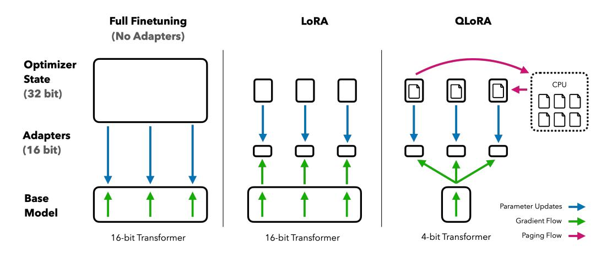
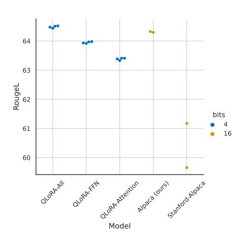
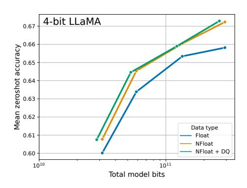
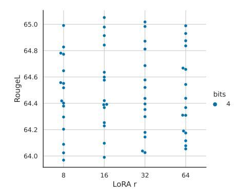
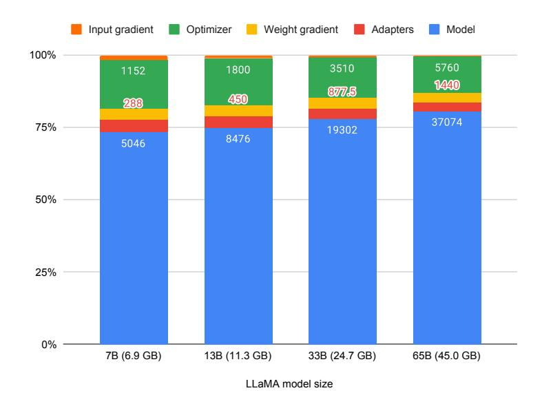

<!-- RP40_Dettmers_2023 | source: papers_json/RP40_Dettmers_2023/ -->

## QLORA: الضبط الدقيق الفعّال لنماذج اللغة الكبيرة المُكمَّمة

Tim Dettmers*

Tim Dettmers^∗^ Artidoro Pagnoni^∗^ Ari Holtzman

**Ari Holtzmar**

## Luke Zettlemoyer

University of Washington {dettmers,artidoro,ahai,lsz}@cs.washington.edu

## الملخص

نقدم QLORA، وهو نهج فعّال للضبط الدقيق يقلل من استخدام الذاكرة بما يكفي لضبط نموذج بحجم 65 مليار معلمة على وحدة معالجة رسومية واحدة بسعة 48 جيجابايت مع الحفاظ على أداء الضبط الدقيق الكامل بدقة 16-بت. يقوم QLORA بإجراء الانتشار العكسي للتدرجات عبر نموذج لغوي مُدرَّب مسبقًا ومُكمَّم بدقة 4-بت ومُجمَّد، إلى محوّلات منخفضة الرتبة (LoRA). إن أفضل عائلة نماذج لدينا، التي نسميها Guanaco، تتفوق على جميع النماذج المنشورة سابقًا بشكل مفتوح في معيار Vicuna، حيث تصل إلى 99.3% من مستوى أداء ChatGPT بينما تتطلب فقط 24 ساعة من الضبط الدقيق على وحدة معالجة رسومية واحدة. يقدم QLORA عددًا من الابتكارات لتوفير الذاكرة دون التضحية بالأداء: (أ) NormalFloat 4-بت (NF4)، وهو نوع بيانات جديد مثالي من الناحية النظرية للمعلومات للأوزان الموزعة توزيعًا طبيعيًا (ب) التكميم المزدوج لتقليل متوسط استهلاك الذاكرة عن طريق تكميم ثوابت التكميم، و(ج) المُحسِّنات المُقسَّمة لإدارة قمم الذاكرة. نستخدم QLORA لضبط أكثر من 1000 نموذج، مما يوفر تحليلاً تفصيليًا لاتباع التعليمات وأداء روبوتات المحادثة عبر 8 مجموعات بيانات للتعليمات، وأنواع نماذج متعددة (LLaMA, T5)، وأحجام نماذج يستحيل تشغيلها بالضبط الدقيق العادي (مثل النماذج بحجم 33 و65 مليار معلمة). تظهر نتائجنا أن الضبط الدقيق بـ QLoRA على مجموعة بيانات صغيرة عالية الجودة يؤدي إلى نتائج متطورة، حتى عند استخدام نماذج أصغر من الحالة المتطورة السابقة. نقدم تحليلاً تفصيليًا لأداء روبوتات المحادثة بناءً على تقييمات بشرية وتقييمات GPT-4 على حد سواء، مما يُظهر أن تقييمات GPT-4 تمثل بديلاً رخيصًا ومعقولاً للتقييم البشري. علاوة على ذلك، نجد أن معايير روبوتات المحادثة الحالية ليست موثوقة لتقييم مستويات أداء روبوتات المحادثة بدقة. ويُظهر تحليل لاختيار الحالات السلبية أين يفشل Guanaco مقارنة بـ ChatGPT. نُصدر جميع نماذجنا وأكوادنا، بما في ذلك نوى CUDA للتدريب بدقة 4-بت.[2](#page-0-0)

# 1 المقدمة

يُعدّ الضبط الدقيق لنماذج اللغة الكبيرة (LLMs) طريقة فعّالة للغاية لتحسين أدائها [[40,](#page-18-0) [62,](#page-19-0) [43,](#page-18-1) [61,](#page-19-1) [59,](#page-19-2) [37]](#page-18-2) وإضافة سلوكيات مرغوبة أو إزالة سلوكيات غير مرغوبة [[43,](#page-18-1) [2,](#page-16-0) [4]](#page-16-1). ومع ذلك، فإن الضبط الدقيق للنماذج الكبيرة جدًا مكلف بشكل باهظ؛ إذ يتطلب الضبط الدقيق العادي بدقة 16-بت لنموذج LLaMA بحجم 65 مليار معلمة [[57]](#page-19-3) أكثر من 780 جيجابايت من ذاكرة وحدة المعالجة الرسومية. وعلى الرغم من أن طرق التكميم الحديثة يمكنها تقليل استهلاك الذاكرة لنماذج اللغة الكبيرة [[14,](#page-16-2) [13,](#page-16-3) [18,](#page-17-0) [66]](#page-19-4)، فإن مثل هذه التقنيات تعمل فقط للاستدلال وتفشل أثناء التدريب [[65]](#page-19-5).

نوضح للمرة الأولى أنه من الممكن إجراء الضبط الدقيق لنموذج مُكمَّم بدقة 4-بت دون أي تدهور في الأداء. تستخدم طريقتنا QLORA تقنية جديدة عالية الدقة لتكميم نموذج مُدرَّب مسبقًا إلى 4-بت، ثم تضيف مجموعة صغيرة من أوزان المحوّلات منخفضة الرتبة القابلة للتعلم [[28]](#page-17-1)

> ^∗^ مساهمة متساوية.

> [https://github.com/artidoro/qlora](https://github.com/artidoro/qlora) و [https://github.com/TimDettmers/bitsandbytes](https://github.com/TimDettmers/bitsandbytes)

<!-- page 2 -->

التي يتم ضبطها عن طريق الانتشار العكسي للتدرجات عبر الأوزان المُكمَّمة.

يقلل QLORA من متوسط متطلبات الذاكرة لضبط نموذج بحجم 65 مليار معلمة من أكثر من 780 جيجابايت من ذاكرة وحدة المعالجة الرسومية إلى أقل من 48 جيجابايت دون التأثير على وقت التشغيل أو الأداء التنبؤي مقارنة بأساس مرجعي مضبوط بالكامل بدقة 16-بت. ويُعدّ هذا تحولاً كبيرًا في إمكانية الوصول إلى الضبط الدقيق لنماذج اللغة الكبيرة: حيث أصبح الآن من الممكن ضبط أكبر النماذج المتاحة للعموم على وحدة معالجة رسومية واحدة. وباستخدام QLORA، نُدرّب عائلة نماذج Guanaco، حيث يصل ثاني أفضل نموذج إلى 97.8% من مستوى أداء ChatGPT في معيار Vicuna [[10]](#page-16-4)، بينما يمكن تدريبه في أقل من 12 ساعة على وحدة معالجة رسومية استهلاكية واحدة؛ وباستخدام وحدة معالجة رسومية احترافية واحدة لمدة 24 ساعة نحقق 99.3% بأكبر نموذج لدينا، مما يسد الفجوة تقريبًا مع ChatGPT في معيار Vicuna. وعند النشر، يتطلب أصغر نموذج Guanaco لدينا

(7 مليار معلمة) فقط 5 جيجابايت من الذاكرة ويتفوق على نموذج Alpaca بحجم 26 جيجابايت بأكثر من 20 نقطة مئوية في معيار Vicuna (الجدول [6)](#page-9-0).

يقدم QLORA ابتكارات متعددة مصممة لتقليل استخدام الذاكرة دون التضحية بالأداء: (1) NormalFloat 4-بت، وهو نوع بيانات تكميم مثالي من الناحية النظرية للمعلومات للبيانات الموزعة توزيعًا طبيعيًا، ويعطي نتائج تجريبية أفضل من الأعداد الصحيحة 4-بت والأرقام العائمة 4-بت. (2) التكميم المزدوج، وهي طريقة تقوم بتكميم ثوابت التكميم، مما يوفر في المتوسط حوالي 0.37 بت لكل معلمة (حوالي 3 جيجابايت لنموذج 65 مليار معلمة). (3) المحسّنات المقسّمة، باستخدام ميزة الذاكرة الموحدة من NVIDIA لتجنب قمم ذاكرة نقاط تفتيش التدرج التي تحدث عند معالجة دفعة صغيرة بطول تسلسل طويل. ندمج هذه المساهمات في نهج LoRA مُحسَّن يتضمن محوّلات في كل طبقة من طبقات الشبكة وبالتالي يتجنب تقريبًا جميع المقايضات في الدقة التي شوهدت في الأعمال السابقة.

تتيح لنا كفاءة QLORA إجراء دراسة معمقة للضبط الدقيق للتعليمات وأداء روبوتات المحادثة على مقاييس نماذج يستحيل استكشافها باستخدام الضبط الدقيق العادي بسبب الحمل الزائد على الذاكرة. لذلك، نُدرّب أكثر من 1000 نموذج عبر عدة مجموعات بيانات لضبط التعليمات، وبنى نماذج، وأحجام تتراوح بين 80 مليون و65 مليار معلمة. وبالإضافة إلى إظهار أن QLORA يستعيد أداء 16-بت ([§4)](#page-4-0) وتدريب روبوت محادثة متطور وهو Guanaco ([§5)](#page-6-0)، نقوم أيضًا بتحليل الاتجاهات في النماذج المُدرَّبة. أولاً، نجد أن جودة البيانات أهم بكثير من حجم مجموعة البيانات، على سبيل المثال، تفوقت مجموعة بيانات بحجم 9 آلاف عينة (OASST1) على مجموعة بيانات بحجم 450 ألف عينة (FLAN v2، تم أخذ عينات فرعية منها) في أداء روبوتات المحادثة، حتى عندما يكون كلاهما يهدف إلى دعم تعميم اتباع التعليمات. ثانيًا، نُظهر أن الأداء القوي في معيار الفهم اللغوي متعدد المهام الواسع (MMLU) لا يعني أداءً قويًا في معيار روبوت محادثة Vicuna والعكس صحيح—بمعنى آخر، فإن ملاءمة مجموعة البيانات أهم من حجمها لمهمة معينة.

علاوة على ذلك، نقدم أيضًا تحليلاً واسعًا لأداء روبوتات المحادثة يستخدم كلاً من المُقيِّمين البشريين وGPT-4 للتقييم. نستخدم اختبارات معيارية على غرار البطولات حيث تتنافس النماذج ضد بعضها البعض في مباريات لإنتاج أفضل استجابة لموجِّه معين. ويتم الحكم على الفائز في المباراة إما بواسطة GPT-4 أو المُعلِّقين البشريين. وتُجمَع نتائج البطولة في درجات Elo [[16,](#page-16-5) [17]](#page-16-6) التي تحدد ترتيب أداء روبوتات المحادثة. نجد أن تقييمات GPT-4 والتقييمات البشرية تتفق إلى حد كبير على ترتيب أداء النماذج في البطولات، ولكننا نجد أيضًا حالات اختلاف قوي. وعلى هذا النحو، نُسلِّط الضوء على أن التقييم القائم على النموذج، بينما يوفر بديلاً رخيصًا للتعليق البشري، إلا أن لديه أيضًا أوجه عدم يقين خاصة به.

نُدعِّم نتائج معيار روبوت المحادثة لدينا بتحليل نوعي لنماذج Guanaco. ويُسلط تحليلنا الضوء على حالات النجاح والفشل التي لم يتم رصدها بواسطة المعايير الكمية.

نُصدر جميع توليدات النموذج مع تعليقات بشرية وGPT-4 لتسهيل المزيد من الدراسة. ونفتح المصدر لقاعدة الكود ونوى CUDA الخاصة بنا، وندمج طرقنا في حزمة Hugging Face transformers [[64]](#page-19-6)، مما يجعلها سهلة الوصول للجميع. نُصدر مجموعة من المحوّلات للنماذج بأحجام 7/13/33/65 مليار معلمة، مُدرَّبة على 8 مجموعات بيانات مختلفة لاتباع التعليمات، بإجمالي 32 نموذجًا مفتوح المصدر ومضبوطًا.

<!-- page 3 -->

***الشكل 1:** طرق الضبط الدقيق المختلفة ومتطلباتها من الذاكرة. يُحسّن QLoRA من LoRA بتكميم نموذج المحوّل إلى دقة 4-بت واستخدام المحسّنات المقسّمة للتعامل مع قمم الذاكرة.*

# 2 الخلفية

**التكميم بـ k-بت على أساس الكتل** التكميم هو عملية تحويل الإدخال من تمثيل يحمل معلومات أكثر إلى تمثيل بمعلومات أقل. وكثيرًا ما يعني ذلك أخذ نوع بيانات بعدد بت أكبر وتحويله إلى عدد بت أقل، على سبيل المثال من أرقام عائمة 32-بت إلى أعداد صحيحة 8-بت. ولضمان استخدام النطاق الكامل لنوع البيانات منخفض البت، يُعاد عادةً تحجيم نوع البيانات المُدخل ليصبح ضمن نطاق نوع البيانات الهدف عبر التطبيع باستخدام القيمة المطلقة القصوى لعناصر الإدخال، التي تكون عادةً مهيكلة كموتّر. على سبيل المثال، تكميم موتّر بأرقام عائمة 32-بت (FP32) إلى موتّر Int8 بنطاق [-127, 127]:

$$
\mathbf{X}^{\text{Int8}} = \text{round}\left(\frac{127}{\text{absmax}(\mathbf{X}^{\text{FP32}})}\mathbf{X}^{\text{FP32}}\right) = \text{round}(e^{\text{FP32}} \cdot \mathbf{X}^{\text{FP32}}),\tag{1}
$$

حيث c هو ثابت التكميم أو مقياس التكميم. وفك التكميم هو العكس:

$$
\operatorname{dequant}(c^{\operatorname{FP32}}, \mathbf{X}^{\operatorname{Int8}}) = \frac{\mathbf{X}^{\operatorname{Int8}}}{c^{\operatorname{FP32}}} = \mathbf{X}^{\operatorname{FP32}} \tag{2}
$$

تكمن مشكلة هذا النهج في أنه إذا حدثت قيمة كبيرة المقدار (أي قيمة شاذة) في موتّر الإدخال، فإن صناديق التكميم—تركيبات بت معينة—لا تُستخدم بشكل جيد مع وجود أعداد قليلة أو عدم وجود أعداد مُكمَّمة في بعض الصناديق. ولمنع مشكلة القيم الشاذة، فإن النهج الشائع هو تقسيم موتّر الإدخال إلى كتل تُكمَّم بشكل مستقل، ولكل منها ثابت تكميم خاص بها c. ويمكن صياغة ذلك كما يلي: نقوم بتقسيم موتّر الإدخال \mathbf{X} \in \mathbb{R}^{b \times h} إلى n كتلة متجاورة بحجم B عن طريق تسطيح موتّر الإدخال وتقطيع المقطع الخطي إلى n = (b \times h)/B كتلة. ونُكمّم هذه الكتل بشكل مستقل باستخدام المعادلة 1 لإنشاء موتّر مُكمَّم وn ثابت تكميم c_i.

**المحوّلات منخفضة الرتبة** الضبط الدقيق للمحوّل منخفض الرتبة (LoRA) [28] هو طريقة تقلل من متطلبات الذاكرة باستخدام مجموعة صغيرة من المعلمات القابلة للتدريب، وكثيرًا ما تُسمى المحوّلات، بينما لا يتم تحديث معلمات النموذج الكاملة التي تظل ثابتة. تُمرَّر التدرجات أثناء الانحدار العشوائي للتدرج عبر أوزان النموذج المُدرَّب مسبقًا الثابتة إلى المحوّل، الذي يتم تحديثه لتحسين دالة الخسارة. ويعزز LoRA الإسقاط الخطي عبر إسقاط مُحلَّل إضافي. بالنظر إلى إسقاط \mathbf{X}\mathbf{W} = \mathbf{Y} مع \mathbf{X} \in \mathbb{R}^{b \times h}, \mathbf{W} \in \mathbb{R}^{h \times o}، يحسب LoRA:

$$ \mathbf{Y} = \mathbf{X}\mathbf{W} + s\mathbf{X}\mathbf{L}_1\mathbf{L}_2,\tag{3} $$

حيث \mathbf{L}_1 \in \mathbb{R}^{h \times r} و \mathbf{L}_2 \in \mathbb{R}^{r \times o}، وs هو عدد قياسي.

**متطلبات الذاكرة للضبط الدقيق الفعّال للمعلمات** نقطة مهمة للنقاش هي متطلبات الذاكرة لـ LoRA أثناء التدريب من حيث عدد وحجم المحوّلات المستخدمة. وبما أن استهلاك ذاكرة LoRA ضئيل جدًا، يمكننا استخدام المزيد من المحوّلات لتحسين الأداء دون زيادة كبيرة في إجمالي الذاكرة المستخدمة. وعلى الرغم من أن LoRA صُمم باعتباره

<!-- page 4 -->

طريقة ضبط دقيق فعّالة للمعلمات (PEFT)، فإن معظم استهلاك الذاكرة في الضبط الدقيق لنماذج اللغة الكبيرة يأتي من تدرجات التنشيط وليس من معلمات LoRA المتعلَّمة. بالنسبة لنموذج LLaMA بحجم 7 مليار معلمة مُدرَّب على FLAN v2 بحجم دفعة 1، مع أوزان LoRA المعادلة لـ 0.2% من أوزان النموذج الأصلي شائعة الاستخدام [[28,](#page-17-1) [37]](#page-18-2)، تستهلك تدرجات إدخال LoRA 567 ميجابايت من الذاكرة بينما تستهلك معلمات LoRA 26 ميجابايت فقط. ومع نقاط تفتيش التدرج [[9]](#page-16-7)، تنخفض تدرجات الإدخال إلى متوسط 18 ميجابايت لكل تسلسل مما يجعلها أكثر استهلاكًا للذاكرة من جميع أوزان LoRA مجتمعة. وبالمقارنة، يستهلك النموذج الأساسي 4-بت 5,048 ميجابايت من الذاكرة. ويُسلط هذا الضوء على أن نقاط تفتيش التدرج مهمة ولكن أيضًا أن تقليل كمية معلمات LoRA بشكل عدواني يُنتج فوائد ذاكرة طفيفة فقط. وهذا يعني أنه يمكننا استخدام المزيد من المحوّلات دون زيادة كبيرة في استهلاك الذاكرة الإجمالي للتدريب (انظر الملحق [G](#page-25-0) للحصول على تفصيل دقيق). وكما سيُناقش لاحقًا، فإن هذا أمر بالغ الأهمية لاستعادة أداء الدقة الكاملة 16-بت.

# 3 الضبط الدقيق بـ QLORA

يحقق QLORA ضبطًا دقيقًا عالي الدقة بـ 4-بت عبر تقنيتين نقترحهما—تكميم NormalFloat 4-بت (NF4) والتكميم المزدوج. بالإضافة إلى ذلك، نقدم المحسّنات المقسّمة، لمنع قمم الذاكرة أثناء نقاط تفتيش التدرج من التسبب في أخطاء نفاد الذاكرة التي جعلت الضبط الدقيق على آلة واحدة صعبًا تقليديًا للنماذج الكبيرة.

يحتوي QLORA على نوع بيانات تخزين منخفض الدقة، عادةً 4-بت في حالتنا، ونوع بيانات حساب يكون عادةً BFloat16. ومن الناحية العملية، يعني هذا أنه كلما تم استخدام موتّر وزن QLORA، نقوم بفك تكميم الموتّر إلى BFloat16، ثم نُجري ضرب مصفوفات بدقة 16-بت.

ندرس الآن مكونات QLORA متبوعة بتعريف رسمي لـ QLORA.

تكميم NormalFloat 4-بت يبني نوع البيانات NormalFloat (NF) على تكميم الكميّات [[15]](#page-16-8) وهو نوع بيانات مثالي من الناحية النظرية للمعلومات يضمن أن كل صندوق تكميم يحتوي على عدد متساوٍ من القيم المُعيَّنة من موتّر الإدخال. يعمل تكميم الكميّات عن طريق تقدير الكمية الإدخالية لموتّر الإدخال عبر دالة التوزيع التراكمي التجريبية.

القيد الرئيسي لتكميم الكميّات هو أن عملية تقدير الكميّات مكلفة. ولذلك تُستخدم خوارزميات تقريب الكميّات السريعة، مثل كميّات SRAM [[15]](#page-16-8)، لتقديرها. وبسبب الطبيعة التقريبية لخوارزميات تقدير الكميّات هذه، فإن نوع البيانات لديه أخطاء تكميم كبيرة للقيم الشاذة، التي غالبًا ما تكون أهم القيم.

يمكن تجنب تقديرات الكميّات المكلفة وأخطاء التقريب عندما تأتي موتّرات الإدخال من توزيع ثابت حتى ثابت تكميم. وفي مثل هذه الحالات، يكون لدى موتّرات الإدخال نفس الكميّات مما يجعل تقدير الكميّات الدقيق ممكنًا حسابيًا.

بما أن أوزان الشبكات العصبية المُدرَّبة مسبقًا عادةً ما يكون لها توزيع طبيعي متمركز حول الصفر بانحراف معياري σ (انظر الملحق [F)](#page-23-0)، يمكننا تحويل جميع الأوزان إلى توزيع ثابت واحد عن طريق تحجيم σ بحيث يتلاءم التوزيع تمامًا في نطاق نوع البيانات لدينا. لنوع بياناتنا، نضبط النطاق التعسفي [−1, 1]. وعلى هذا النحو، يجب تطبيع كل من الكميّات لنوع البيانات وأوزان الشبكة العصبية إلى هذا النطاق.

يُحسب نوع البيانات الأمثل من الناحية النظرية للمعلومات لتوزيعات طبيعية متوسطها صفر مع انحرافات معيارية تعسفية σ في النطاق [−1, 1] على النحو التالي: (1) تقدير 2 ^k^ + 1 من الكميّات لتوزيع نظري N(0, 1) للحصول على نوع بيانات تكميم كميّات k-بت للتوزيعات الطبيعية، (2) أخذ نوع البيانات هذا وتطبيع قيمه إلى نطاق [−1, 1]، (3) تكميم موتّر وزن الإدخال عن طريق تطبيعه إلى نطاق [−1, 1] عبر إعادة تحجيم القيمة المطلقة القصوى.

بمجرد أن يتطابق نطاق الوزن ونطاق نوع البيانات، يمكننا التكميم كالمعتاد. الخطوة (3) تعادل إعادة تحجيم الانحراف المعياري لموتّر الوزن ليتطابق مع الانحراف المعياري لنوع البيانات k-بت. وبشكل أكثر رسمية، نُقدِّر القيم 2 ^k^ q^i^ لنوع البيانات على النحو التالي:

$$
q_i = \frac{1}{2} \left( Q_X \left( \frac{i}{2^k + 1} \right) + Q_X \left( \frac{i+1}{2^k + 1} \right) \right), \tag{4}
$$

حيث QX(·) هي دالة الكميّات للتوزيع الطبيعي القياسي N(0, 1). ومن المشكلات في التكميم المتماثل بـ k-بت أن هذا النهج لا يحتوي على تمثيل دقيق للصفر، وهو خاصية مهمة لتكميم الحشو والعناصر الأخرى ذات القيمة الصفرية بدون خطأ. ولـ

<!-- page 5 -->

ضمان نقطة صفر منفصلة وهي 0 ولاستخدام جميع البتات 2^k لنوع بيانات k-بت، نُنشئ نوع بيانات غير متماثل عن طريق تقدير الكميّات q_i لنطاقين q_i: 2^{k-1} للجزء السالب و 2^{k-1} + 1 للجزء الموجب ثم نُوحِّد هذه المجموعات من q_i ونُزيل أحد الصفرين الذي يحدث في كلتا المجموعتين. ونُسمي نوع البيانات الناتج الذي يحتوي على عدد متوقع متساوٍ من القيم في كل صندوق تكميم بـ NormalFloat k-بت (NFk)، نظرًا لأن نوع البيانات مثالي من الناحية النظرية للمعلومات للبيانات الموزعة توزيعًا طبيعيًا متمركزًا حول الصفر. ويمكن العثور على القيم الدقيقة لنوع البيانات هذا في الملحق E.

**التكميم المزدوج** نقدم *التكميم المزدوج* (DQ)، وهو عملية تكميم ثوابت التكميم لتوفير إضافي للذاكرة. على الرغم من أن حجم الكتلة الصغير مطلوب للتكميم الدقيق بـ 4-بت [13]، إلا أن لديه أيضًا حملاً كبيرًا على الذاكرة. على سبيل المثال، باستخدام ثوابت 32-بت وحجم كتلة 64 لـ \mathbf{W}، تُضيف ثوابت التكميم 32/64 = 0.5 بت لكل معلمة في المتوسط. ويساعد التكميم المزدوج في تقليل استهلاك الذاكرة لثوابت التكميم.

بشكل أكثر تحديدًا، يعامل التكميم المزدوج ثوابت التكميم c_2^{\text{FP32}} للتكميم الأول كمدخلات لتكميم ثانٍ. وتُنتج هذه الخطوة الثانية ثوابت التكميم المُكمَّمة c_2^{\text{FP8}} والمستوى الثاني من ثوابت التكميم c_1^{\text{FP32}}. نستخدم أرقامًا عائمة 8-بت بحجم كتلة 256 للتكميم الثاني حيث لا يُلاحظ أي تدهور في الأداء للتكميم بـ 8-بت، بما يتوافق مع نتائج Dettmers و Zettlemoyer [13]. وبما أن c_2^{\text{FP32}} موجبة، نطرح المتوسط من c_2 قبل التكميم لتمركز القيم حول الصفر والاستفادة من التكميم المتماثل. وفي المتوسط، لحجم كتلة 64، يقلل هذا التكميم استهلاك الذاكرة لكل معلمة من 32/64 = 0.5 بت، إلى 8/64 + 32/(64 \cdot 256) = 0.127 بت، وهو تخفيض قدره 0.373 بت لكل معلمة.

**المحسّنات المقسّمة** تستخدم ميزة الذاكرة الموحدة من NVIDIA 3 التي تُجري تحويلات تلقائية بين الصفحات بين وحدة المعالجة المركزية ووحدة المعالجة الرسومية للمعالجة الخالية من الأخطاء على وحدة المعالجة الرسومية في السيناريو الذي تنفد فيه ذاكرة وحدة المعالجة الرسومية أحيانًا. تعمل الميزة مثل تقسيم الذاكرة العادي بين ذاكرة وحدة المعالجة المركزية والقرص. نستخدم هذه الميزة لتخصيص ذاكرة مقسّمة لحالات المُحسِّن التي يتم إخلاؤها تلقائيًا إلى ذاكرة وحدة المعالجة المركزية عند نفاد ذاكرة وحدة المعالجة الرسومية وإعادتها إلى ذاكرة وحدة المعالجة الرسومية عند الحاجة إليها في خطوة تحديث المُحسِّن.

**QLoRA.** باستخدام المكونات الموصوفة أعلاه، نُعرّف QLoRA لطبقة خطية واحدة في النموذج الأساسي المُكمَّم مع محوّل LoRA واحد على النحو التالي:

$$
\mathbf{Y}^{\mathrm{BF}16} = \mathbf{X}^{\mathrm{BF}16} \mathrm{doubleDequant}(c_1^{\mathrm{FP}32}, c_2^{\mathrm{k\text{-}bit}}, \mathbf{W}^{\mathrm{NF}4}) + \mathbf{X}^{\mathrm{BF}16} \mathbf{L}_1^{\mathrm{BF}16} \mathbf{L}_2^{\mathrm{BF}16}, \tag{5}
$$

حيث doubleDequant(\cdot) معرّفة على النحو التالي:

$$
\operatorname{doubleDequant}(c_1^{\operatorname{FP32}}, c_2^{\operatorname{k-bit}}, \mathbf{W}^{\operatorname{k-bit}}) = \operatorname{dequant}(\operatorname{dequant}(c_1^{\operatorname{FP32}}, c_2^{\operatorname{k-bit}}), \mathbf{W}^{\operatorname{4bit}}) = \mathbf{W}^{\operatorname{BF16}}, \quad (6)
$$

نستخدم NF4 لـ W و FP8 لـ c_2. نستخدم حجم كتلة 64 لـ W لدقة تكميم أعلى وحجم كتلة 256 لـ c_2 لتوفير الذاكرة.

لتحديثات المعلمات، فقط التدرج فيما يتعلق بالخطأ لأوزان المحوّلات \frac{\partial E}{\partial \mathbf{L}_i} مطلوب، وليس للأوزان 4-بت \frac{\partial E}{\partial \mathbf{W}}. ومع ذلك، فإن حساب \frac{\partial E}{\partial \mathbf{L}_i} يستلزم حساب \frac{\partial \mathbf{X}}{\partial \mathbf{W}} الذي يستمر عبر المعادلة (5) مع فك التكميم من التخزين \mathbf{W}^{NF4} إلى نوع بيانات الحساب \mathbf{W}^{BF16} لحساب المشتق \frac{\partial \mathbf{X}}{\partial \mathbf{W}} بدقة BFloat16.

للتلخيص، يحتوي QLORA على نوع بيانات تخزين واحد (عادةً NormalFloat 4-بت) ونوع بيانات حساب (BrainFloat 16-بت). نقوم بفك تكميم نوع بيانات التخزين إلى نوع بيانات الحساب لإجراء التمرير الأمامي والخلفي، ولكننا نحسب فقط تدرجات الأوزان لمعلمات LoRA التي تستخدم BrainFloat 16-بت.

# 4 QLoRA مقابل الضبط الدقيق القياسي

لقد ناقشنا كيف يعمل QLoRA وكيف يمكنه تقليل الذاكرة المطلوبة بشكل كبير لضبط النماذج. والسؤال الرئيسي الآن هو ما إذا كان QLoRA يمكنه الأداء بنفس جودة الضبط الدقيق للنموذج الكامل. علاوة على ذلك، نريد تحليل مكونات QLoRA بما في ذلك تأثير NormalFloat4 على Float4 القياسي. وستناقش الأقسام التالية التجارب التي هدفت إلى الإجابة على هذه الأسئلة.

> ^3 ^https://docs.nvidia.com/cuda/cuda-c-programming-guide

<!-- page 6 -->

**الإعداد التجريبي.** نأخذ في الاعتبار ثلاث بنى (مُشفِّر، مُشفِّر-مُفكِّك، ومُفكِّك فقط) ونقارن OLoRA مع الضبط الدقيق للمحوّل بـ 16-بت ومع الضبط الدقيق الكامل للنماذج حتى 3 مليار معلمة. تشمل تقييماتنا GLUE [58] مع RoBERTa-large [38]، Super-NaturalInstructions (TKInstruct) [61] مع T5 [49]، و MMLU بـ 5 لقطات [24] بعد ضبط LLaMA على Flan v2 [39] و Alpaca [55]. ولدراسة مزايا NF4 على أنواع بيانات 4-بت الأخرى بشكل إضافي، نستخدم إعداد Dettmers و Zettlemoyer [13] ونقيس دقة الصفر-لقطة بعد التكميم والحيرة عبر نماذج مختلفة (OPT [72]، LLaMA [57]، BLOOM [52]، Pythia [7]) لأحجام النماذج 125 مليون - 13 مليار معلمة. نقدم مزيدًا من التفاصيل في قسم النتائج لكل إعداد محدد لجعل النتائج أكثر قابلية للقراءة. التفاصيل الكاملة في الملحق A.

في حين أن المحسّنات المقسّمة ضرورية لإجراء ضبط QLoRA لنماذج 33/65 مليار معلمة على وحدة معالجة رسومية واحدة بسعة 24/48 جيجابايت، فإننا لا نقدم قياسات صعبة للمحسّنات المقسّمة لأن التقسيم لا يحدث إلا عند معالجة دفعات صغيرة بأطوال تسلسل طويلة، وهو أمر نادر. ومع ذلك، نُجري تحليلًا لوقت التشغيل للمحسّنات المقسّمة لنماذج 65 مليار معلمة على وحدات معالجة رسومية بسعة 48 جيجابايت ونجد أنه بحجم دفعة 16، توفر المحسّنات المقسّمة نفس سرعة التدريب للمحسّنات العادية. ويجب أن يقيس العمل المستقبلي ويُميِّز الظروف التي تحدث فيها التباطؤات من عملية التقسيم.

المعلمات الفائقة الافتراضية لـ LoRA لا تتطابق مع أداء 16-بت عند استخدام الممارسة القياسية لتطبيق LoRA على مصفوفات إسقاط الانتباه للاستعلام والقيمة [28]، فإننا غير قادرين على تكرار أداء الضبط الدقيق الكامل للنماذج الأساسية الكبيرة. كما هو موضح في الشكل 2 لضبط LLaMA 7B على Alpaca، نجد أن أهم معلمة فائقة لـ LoRA هي عدد محوّلات LoRA المستخدمة إجمالًا وأن LoRA على جميع طبقات كتلة المحوّل الخطية مطلوبة لمطابقة أداء الضبط الدقيق الكامل. أما المعلمات الفائقة الأخرى لـ LoRA، مثل بُعد الإسقاط r، فلا تؤثر على الأداء (انظر الملحق A).

وبالمثل، نجد أن المعلمات الفائقة الافتراضية للأسس المرجعية المضبوطة بالكامل غير مضبوطة بشكل كافٍ. نُجري بحثًا في المعلمات الفائقة على معدلات تعلم من 1e-6 إلى 5e-5 وأحجام دفعات من 8 إلى 128 للعثور على أسس مرجعية قوية. وتظهر النتائج لضبط LLaMA 7B على Alpaca في الشكل 2.

NormalFloat 4-بت يُعطي أداءً أفضل من النقطة العائمة 4-بت في حين أن نوع بيانات NormalFloat 4-بت (NF4) مثالي من الناحية النظرية للمعلومات، فلا يزال يتعين تحديد ما إذا كانت هذه الخاصية تترجم إلى مزايا تجريبية. نتبع الإعداد من Dettmers و Zettlemoyer [13] حيث يتم تقييم نماذج اللغة الكبيرة المُكمَّمة (OPT [72]، BLOOM [52]، Pythia [7]، LLaMA) بأحجام مختلفة (125 مليون إلى 65 مليار) بأنواع بيانات مختلفة على نمذجة اللغة ومجموعة من مهام الصفر-لقطة. في الشكل 3 والجدول 2 نرى أن NF4 يُحسّن الأداء بشكل كبير على FP4 و Int4 وأن التكميم المزدوج يقلل من استهلاك الذاكرة دون التأثير على الأداء.

QLoRA k-بت يطابق الضبط الدقيق الكامل بـ 16-بت و**أداء LoRA 16-بت** أثبتت النتائج الحديثة أن التكميم بـ 4-بت للاستدلال

*الشكل 2: RougeL لنماذج LLaMA 7B على مجموعة بيانات Alpaca. تمثل كل نقطة تشغيلًا ببذرة عشوائية مختلفة. نُحسّن من المعلمات الفائقة الافتراضية المضبوطة بالكامل لـ Stanford Alpaca لبناء أساس مرجعي قوي بـ 16-بت للمقارنات. ويُعد استخدام LoRA على جميع طبقات المحوّل أمرًا حاسمًا لمطابقة أداء 16-بت.*

(انظر الملحق A)

*الشكل 3: متوسط دقة الصفر-لقطة على Winogrande و HellaSwag و PiQA و Arc-Easy و Arc-Challenge باستخدام نماذج LLaMA بأنواع بيانات 4-بت مختلفة. يُحسّن نوع بيانات NormalFloat بشكل كبير من مكاسب الدقة بت-لكل-بت مقارنة بالأرقام العائمة 4-بت العادية. وفي حين أن التكميم المزدوج (DQ) يؤدي فقط إلى مكاسب طفيفة، فإنه يسمح بتحكم أكثر دقة في استهلاك الذاكرة لتلائم نماذج بحجم معين (33/65 مليار) في وحدات معالجة رسومية معينة (24/48 جيجابايت).*

<!-- page 7 -->

ممكن، ولكن يؤدي إلى تدهور في الأداء بالنسبة

إلى 16-بت [[13,](#page-16-3) [18]](#page-17-0). وهذا يثير السؤال الحاسم حول ما إذا كان الأداء المفقود يمكن استعادته عن طريق إجراء ضبط دقيق للمحوّل بـ 4-بت. نختبر هذا في إعدادين.

يركز الأول على مقارنة مع الضبط الدقيق الكامل بـ 16-بت لنماذج RoBERTA و T5 بأحجام 125 مليون إلى 3 مليار معلمة على GLUE ومجموعة بيانات Super-NaturalInstructions. وتُعرض النتائج في الجدول [3.](#page-6-2) في كلتا مجموعتي البيانات، نلاحظ أن طرق المحوّل بـ 16-بت و 8-بت و 4-بت تُكرّر أداء الأساس المرجعي المضبوط بالكامل بـ 16-بت. وهذا يشير إلى أن الأداء المفقود بسبب التكميم غير الدقيق يمكن استعادته بالكامل عن طريق ضبط المحوّل بعد التكميم.

بالنسبة لإعدادنا الثاني، نظرًا لأن الضبط الدقيق الكامل للنماذج بحجم 11 مليار معلمة وما فوق يتطلب أكثر من خادم واحد من وحدات معالجة رسومية عالية الذاكرة، نواصل اختبار ما إذا كان QLORA بـ 4-بت يمكنه مطابقة LoRA بـ 16-بت في نطاقات معلمات 7-65 مليار. وتحقيقًا لهذه الغاية، نقوم بضبط LLaMA من 7 إلى 65 مليار على مجموعتي بيانات

لاتباع التعليمات، Alpaca و FLAN v2، ونُقيِّم على معيار MMLU عبر دقة الصفر-لقطة 5. وتُعرض النتائج في الجدول [4](#page-7-0) حيث نرى أن NF4 مع التكميم المزدوج يستعيد بالكامل أداء MMLU لـ LoRA بـ 16-بت. بالإضافة إلى ذلك، نلاحظ أيضًا أن QLORA مع FP4 يتأخر عن الأساس المرجعي LoRA brain float بـ 16-بت بحوالي نقطة مئوية واحدة. وهذا يؤكد كل من نتائجنا أن (1) QLORA مع NF4 يكرر كلاً من الضبط الدقيق الكامل بـ 16-بت وأداء الضبط الدقيق LoRA بـ 16-بت، و(2) NF4 متفوق على FP4 من حيث دقة التكميم.

ملخص تُظهر نتائجنا باستمرار أن QLORA بـ 4-بت مع نوع بيانات NF4 يطابق الضبط الدقيق الكامل بـ 16-بت وأداء الضبط الدقيق LoRA بـ 16-بت على المعايير الأكاديمية مع إعدادات تقييم راسخة. لقد أظهرنا أيضًا أن NF4 أكثر فاعلية من FP4 وأن التكميم المزدوج لا يضر بالأداء. ومجتمعة، يشكل هذا دليلاً مقنعًا على أن ضبط QLORA بـ 4-بت يُنتج بشكل موثوق نتائج تطابق طرق 16-بت.

تماشيًا مع العمل السابق على التكميم [[13]](#page-16-3)، تشير نتائجنا في MMLU و Elo إلى أنه مع ميزانية موارد ضبط دقيق واستدلال معينة، يكون من المفيد زيادة عدد المعلمات في النموذج الأساسي مع تقليل دقتها. ويُسلط هذا الضوء على أهمية فوائد الكفاءة من QLORA. وبما أننا لم نلاحظ تدهورًا في الأداء مقارنة بالضبط الدقيق الكامل في تجاربنا مع الضبط الدقيق بـ 4-بت، فإن هذا يثير السؤال حول مكان مقايضة الأداء-الدقة بالضبط لضبط QLoRA، وهو ما نتركه للعمل المستقبلي لاستكشافه.

ننتقل للتحقيق في ضبط التعليمات بمقاييس يستحيل استكشافها بالضبط الدقيق الكامل بـ 16-بت على أجهزة البحث الأكاديمي.

# 5 دفع حالة فن روبوتات المحادثة بـ QLoRA

بعد أن أثبتنا أن QLORA بـ 4-بت يطابق أداء 16-بت عبر المقاييس والمهام ومجموعات البيانات، نُجري دراسة معمقة للضبط الدقيق للتعليمات حتى أكبر نماذج اللغة المفتوحة المصدر المتاحة للبحث. ولتقييم أداء الضبط الدقيق للتعليمات لهذه النماذج، نُقيِّم

<!-- page 8 -->

على معيار صعب لفهم اللغة الطبيعية (MMLU) ونطور طرقًا جديدة لتقييم أداء روبوتات المحادثة في العالم الحقيقي.

## 5.1 الإعداد التجريبي

نصف الآن نظرة عامة على الإعداد التجريبي مع التفاصيل الكاملة في الملحق B.

**البيانات** نظرًا لعدم وجود دراسة شاملة، حسب علمنا، لمجموعات بيانات اتباع التعليمات الحديثة، نختار ثماني مجموعات بيانات حديثة. نُدرج مجموعات البيانات التي تم الحصول عليها عبر التعهيد الجماعي (OASST1 [31]، HH-RLHF [4])، والتقطير من النماذج المضبوطة على التعليمات (Alpaca [55]، self-instruct [59]، unnatural-instructions [26])، وتجميعات الكوربورا (FLAN v2 [12])، فضلاً عن الهجن (Chip2 [32]، Longform [30]). تغطي مجموعات البيانات هذه لغات وأحجام بيانات وتراخيص مختلفة.

**إعداد التدريب** لتجنب الآثار المربكة من أهداف التدريب المختلفة، نُجري ضبط QLoRA الدقيق بخسارة الإنتروبيا المتقاطعة (التعلم المُشرَف) بدون التعلم المُعزَّز، حتى لمجموعات البيانات التي تتضمن أحكامًا بشرية لاستجابات مختلفة. لمجموعات البيانات التي بها تمييز واضح بين التعليمات والاستجابة، نقوم بالضبط الدقيق فقط على الاستجابة (انظر الإسقاطات في الملحق B). بالنسبة لـ OASST1 و HH-RLHF، تتوفر استجابات متعددة. ثم نختار الاستجابة الأعلى في كل مستوى من شجرة المحادثة ونُجري الضبط الدقيق على المحادثة الكاملة المختارة، بما في ذلك التعليمات. في جميع تجاربنا، نستخدم QLORA NF4 مع التكميم المزدوج والمحسّنات المقسّمة لمنع قمم الذاكرة أثناء نقاط تفتيش التدرج. نُجري عمليات بحث صغيرة عن المعلمات الفائقة لنماذج LLaMA بحجم 13 و 33 مليار ونجد أن جميع إعدادات المعلمات الفائقة الموجودة في 7 مليار تُعمَّم (بما في ذلك عدد العصور) باستثناء معدل التعلم وحجم الدفعة. نقوم بتنصيف معدل التعلم لـ 33 و 65 مليار مع مضاعفة حجم الدفعة.

**الأسس المرجعية** نقارن نماذجنا بكل من أنظمة روبوتات المحادثة البحثية (Vicuna [10] و Open Assistant [31]) والتجارية (GPT-4 [42]، GPT-3.5-turbo و Bard). نموذج Open Assistant هو نموذج LLaMA 33B تم ضبطه بدقة باستخدام التعلم المعزَّز من ردود الفعل البشرية (RLHF) على نفس مجموعة بيانات OASST1 التي نختبر معها. يُجري Vicuna ضبطًا دقيقًا كاملًا لـ LLaMA 13B على محادثات مشتركة من المستخدم خاصة من ShareGPT وبالتالي فهو نتيجة التقطير من نماذج OpenAI GPT.

## 5.2 التقييم

تماشيًا مع الممارسة الشائعة، نستخدم معيار MMLU (الفهم اللغوي متعدد المهام الواسع) [24] لقياس الأداء على نطاق من مهام فهم اللغة. وهذا معيار متعدد الخيارات يغطي 57 مهمة بما في ذلك الرياضيات الابتدائية والتاريخ الأمريكي وعلوم الكمبيوتر والقانون وغيرها. نُقدِّم دقة الاختبار بـ 5 لقطات.

نختبر أيضًا قدرات اللغة التوليدية من خلال التقييمات الآلية والبشرية. تعتمد هذه المجموعة الثانية من التقييمات على استعلامات يقوم البشر بتنسيقها وتهدف إلى قياس جودة استجابات النموذج. وعلى الرغم من أن هذه أرضية اختبار أكثر واقعية لأداء نموذج روبوت المحادثة وتزداد شعبية، فلا يوجد بروتوكول مقبول بشكل شائع في الأدبيات. نـ

ـصف أدناه إعدادنا المقترح، باستخدام عينة النواة بـ p=0.9 ودرجة حرارة 0.7 في جميع الحالات.

<!-- page 9 -->

بيانات المعيار نُقيِّم على مجموعتين منسقتين من الاستعلامات (الأسئلة): مطالبات Vicuna [[10]](#page-16-4) ومجموعة بيانات التحقق OASST1 [[31]](#page-17-3). نستخدم مطالبات Vicuna، وهي مجموعة من 80 مطالبة من مجموعة متنوعة من الفئات، دون تعديلات. مجموعة بيانات OASST1 هي مجموعة متعددة اللغات من حوارات متعددة الأدوار يتم جمعها بواسطة التعهيد الجماعي بين مستخدم ومساعد. نختار جميع رسائل المستخدم في مجموعة بيانات التحقق كاستعلامات ونُدرج الأدوار السابقة في المطالبة. يؤدي هذا الإجراء إلى 953 استعلامًا فريدًا للمستخدم. نُسمي هاتين المجموعتين من البيانات معياري Vicuna و OA.

التقييم الآلي أولاً، استنادًا إلى بروتوكول التقييم الذي قدمه Chiang et al. [[10]](#page-16-4)، نستخدم GPT-4 لتقييم أداء الأنظمة المختلفة مقابل ChatGPT (GPT-3.5 Turbo) على معيار Vicuna. بالنظر إلى استعلام جنبًا إلى جنب مع استجابات ChatGPT والنموذج، يُطلب من GPT-4 تعيين درجة من عشرة لكل من الاستجابات وتقديم تفسير. يُحسب الأداء العام للنموذج كنسبة مئوية من الدرجة التي حققها ChatGPT. لاحظ أن هذه الدرجة النسبية يمكن أن تكون أعلى من 100% إذا حقق النموذج درجة مطلقة أعلى من ChatGPT. نجد تأثير ترتيب كبير مع GPT-4 يزيد من درجة الاستجابة التي تحدث في وقت سابق في المطالبة. وللتحكم في مثل هذه التأثيرات، نوصي بالإبلاغ عن متوسط الدرجة على كلا الترتيبين.

بعد ذلك، نقيس الأداء من خلال المقارنات المباشرة بين مخرجات النظام. نُبسِّط مخطط التقييم إلى مشكلة وضع علامات ثلاثية الفئات تأخذ في الاعتبار التعادل. نطلب من GPT-4 اختيار أفضل استجابة أو إعلان التعادل وتقديم تفسير. نُجري هذه المقارنات وجهًا لوجه على جميع تباديل أزواج الأنظمة على معياري Vicuna و OA.

التقييم البشري على الرغم من أن الأعمال الحديثة تشير إلى أنه يمكن استخدام النماذج التوليدية بفاعلية لتقييمات النظام [[19]](#page-17-7)، فإن موثوقية تصنيفات GPT-4 لتقييم أداء روبوت المحادثة، حسب علمنا، لم تُثبَت بعد ارتباطها بالأحكام البشرية. ولذلك، نُجري تقييمين بشريين متوازيين على معيار Vicuna يتطابقان مع كلا بروتوكولي التقييم الآلي الموصوفين أعلاه. نستخدم Amazon Mechanical Turk (AMT) ونحصل على معلِّقَين بشريين للمقارنات مع ChatGPT وثلاثة معلِّقين للمقارنات الزوجية.

تصنيف Elo باستخدام كل من المقارنات الزوجية البشرية والآلية، نُنشئ مسابقة على غرار البطولات حيث تتنافس النماذج ضد بعضها البعض. تتألف البطولة من مباريات حيث تتنافس أزواج من النماذج لإنتاج أفضل استجابة لمطالبة معينة. وهذا مشابه لكيفية مقارنة Bai et al. [[4]](#page-16-1) و Chiang et al. [[10]](#page-16-4) للنماذج، ولكننا نستخدم أيضًا تصنيفات GPT-4 بالإضافة إلى التصنيفات البشرية. نأخذ عينات عشوائية من مجموعة المقارنات المُعنونة لحساب Elo [[16,](#page-16-5) [17]](#page-16-6). تصنيف Elo، الذي يُستخدم على نطاق واسع في الشطرنج والألعاب الأخرى، هو مقياس لمعدل الفوز المتوقع نسبة إلى معدل فوز الخصم، على سبيل المثال، Elo 1100 مقابل 1000 يعني أن لاعب Elo 1100 لديه معدل فوز متوقع يبلغ حوالي 65% ضد خصم Elo 1000؛ مباراة 1000 مقابل 1000 أو 1100 مقابل 1100 ينتج عنها معدل فوز متوقع 50%. يتغير تصنيف Elo بعد كل مباراة بشكل متناسب مع النتيجة المتوقعة، أي أن المفاجأة غير المتوقعة تؤدي إلى تغيير كبير في تصنيف Elo بينما تؤدي النتيجة المتوقعة إلى تغيير صغير. وبمرور الوقت، تتطابق تصنيفات Elo تقريبًا مع مهارة كل لاعب في لعب اللعبة. نبدأ بدرجة 1,000 ونستخدم K = 32. وعلى غرار Chiang et al. [[10]](#page-16-4)، نكرر هذا الإجراء 10,000 مرة ببذور عشوائية مختلفة للتحكم في تأثيرات الترتيب، على سبيل المثال، تأثير أي زوج من النماذج يتنافس مع الآخر أولاً.

## 5.3 Guanaco: QLORA المُدرَّب على OASST1 هو روبوت محادثة متطور

بناءً على تقييماتنا الآلية والبشرية، نجد أن أعلى نموذج مضبوط بـ QLORA، وهو Guanaco 65B، الذي نُجري ضبطه الدقيق على متغير من OASST1، هو أفضل نموذج روبوت محادثة مفتوح المصدر أداءً ويوفر أداءً تنافسيًا مع ChatGPT. عند مقارنته بـ GPT-4، يكون لدى Guanaco 65B و 33B احتمالية فوز متوقعة بنسبة 30%، استنادًا إلى تصنيف Elo من المقارنات الزوجية على مستوى النظام للمعلِّقين البشريين - الأعلى المُبلَّغ عنها حتى الآن.

تُعرض نتائج معيار Vicuna [[10]](#page-16-4) بالنسبة لـ ChatGPT في الجدول [6.](#page-9-0) نجد أن Guanaco 65B هو أفضل نموذج أداءً بعد GPT-4، حيث يحقق 99.3% من الأداء بالنسبة لـ ChatGPT. لدى Guanaco 33B معلمات أكثر من نموذج Vicuna 13B، ولكنه يستخدم فقط دقة 4-بت لأوزانه وبالتالي فهو أكثر كفاءة في الذاكرة بـ 21 جيجابايت مقابل 26 جيجابايت، مما يوفر تحسنًا قدره ثلاث نقاط مئوية على Vicuna 13B. علاوة على ذلك، يتسع Guanaco 7B بسهولة على الهواتف الحديثة بحجم 5 جيجابايت بينما لا يزال يسجل ما يقرب من 20 نقطة مئوية أعلى من Alpaca 13B.

ومع ذلك، يحتوي الجدول [6](#page-9-0) أيضًا على فترات ثقة واسعة جدًا، مع تداخل العديد من النماذج في الأداء. ونفترض أن عدم اليقين هذا يأتي من نقص المواصفات الواضحة للمقياس، على سبيل المثال، من غير الواضح ماذا تعني 8 على مقياس 10 نقاط عبر سيناريوهات مختلفة. وعلى هذا النحو، نوصي بدلاً من ذلك باستخدام طريقة تصنيف Elo [[16]](#page-16-5)، استنادًا إلى الأحكام *الزوجية* من المعلِّقين البشريين و GPT-4 لتجنب مشكلة تأسيس مقياس مطلق. تصنيفات Elo للنماذج الأكثر تنافسية

<!-- page 10 -->

يمكن رؤيتها في الجدول 1. نلاحظ أن تصنيف البشر و GPT-4 للنماذج على معيار Vicuna يختلف جزئيًا، خاصة بالنسبة لـ Guanaco 7B، ولكنه متسق لمعظم النماذج بمعامل Kendall Tau بقيمة \tau=0.43 ومعامل ارتباط Spearman للرتب r=0.55 على مستوى النظام. وعلى مستوى المثال، يكون الاتفاق بين GPT-4 وأغلبية أصوات المعلِّقين البشريين أضعف بمعامل Fleiss \kappa=0.25. وبشكل عام، يُظهر هذا اتفاقًا معتدلاً بين الأحكام على مستوى النظام بواسطة GPT-4 والمعلِّقين البشريين، وبالتالي أن التقييم القائم على النموذج يمثل بديلاً موثوقًا إلى حد ما للتقييم البشري. نناقش اعتبارات إضافية في القسم 6.2.

تشير تصنيفات Elo في الجدول 7 إلى أن نماذج Guanaco 33B و 65B تتفوق على جميع النماذج باستثناء GPT-4 على معياري Vicuna و OA وأنها تؤدي بشكل مماثل لـ ChatGPT بما يتماشى مع الجدول 6. نلاحظ أن معيار Vicuna يفضل النماذج المفتوحة المصدر بينما يفضل معيار OA الأكبر ChatGPT. علاوة على ذلك، يمكننا أن نرى من الجدولين 5 و 6 أن ملاءمة مجموعة بيانات الضبط الدقيق هي عامل محدد في الأداء. الضبط الدقيق لنماذج Llama على FLAN v2 يعمل بشكل جيد بشكل خاص على MMLU، ولكنه يؤدي أسوأ على معيار Vicuna (تُلاحظ اتجاهات مماثلة مع نماذج أخرى). يشير هذا أيضًا إلى تعامد جزئي في معايير التقييم الحالية: الأداء القوي في MMLU لا يعني أداءً قويًا لروبوت المحادثة (كما يُقاس بمعياري Vicuna أو OA) والعكس صحيح.

Guanaco هو النموذج العلوي الوحيد في تقييمنا الذي لم يتم تدريبه على بيانات خاصة لأن إرشادات جمع مجموعة بيانات OASST1 تحظر صراحة استخدام نماذج GPT. النموذج التالي الأفضل المُدرَّب فقط على بيانات مفتوحة المصدر هو نموذج Anthropic HH-RLHF، الذي يسجل 30 نقطة مئوية أقل من Guanaco على معيار Vicuna (انظر الجدول 6). وبشكل عام، تُظهر هذه النتائج أن QLORA بـ 4-بت فعّال ويمكنه إنتاج روبوتات محادثة متطورة تنافس ChatGPT. علاوة على ذلك، يمكن تدريب Guanaco 33B لدينا على وحدات معالجة رسومية استهلاكية بسعة 24 جيجابايت في أقل من 12 ساعة. وهذا يفتح الإمكانية للعمل المستقبلي عبر ضبط QLORA على بيانات مفتوحة المصدر متخصصة، الذي يُنتج نماذج يمكنها التنافس مع أفضل النماذج التجارية الموجودة اليوم.

## **6** التحليل النوعي

في حين أن التحليل الكمي هو جوهر تقييمنا، فإن هناك عددًا من المشكلات في النظر فقط إلى الإحصائيات الموجزة. ولعل أكبرها هو مشكلة صلاحية المعيار [36]—ما إذا كان المعيار يختبر حقًا ما يقترحه اسمه أو وصفه دائمًا موضع تساؤل، خاصة عندما نكتشف "اختصارات" لحل المعايير التي تستغلها أحيانًا نماذج تعلم الآلة [22, 46]. وللتخفيف جزئيًا من ذلك، نقوم هنا بإجراء بعض التحليل النوعي، في قسمين. أولاً، في §6.1

<!-- page 11 -->

نُظهر بعض الأمثلة التي نعتقد أنها ممثلة لبعض الأنماط المُلاحظة في النص الذي يُولِّده نموذج Guanaco 65b. ثانيًا، [§6.2](#page-13-0) نُفصِّل اعتبارات حول النتائج التي ناقشناها وتفسيرنا لها.

## 6.1 التحليل النوعي للتوليدات النموذجية

للعثور على أمثلة، نمر أولاً عبر البيانات المُولَّدة لمعياري Vicuna و OpenAssistant، ونبحث عن أنماط في الإجابات التي يُولِّدها Guanaco. عندما نلاحظ نمطًا، نحاول إعداد سؤال أو مطالبة ستحفز النمط على الرغم من أنه الحل غير الصحيح، على سبيل المثال، إذا لاحظنا أن النموذج يميل إلى إعطاء إجابات مطوّلة، فإننا نطالب النموذج بـ "أجب بنعم أو لا بدون تفسير". نستخدم هذا للعثور على "الحالات السلبية" حيث ننجح في كسر النموذج بشكل عدائي و"الحالات الإيجابية" حيث نفشل في كسر النموذج، ونعرض كليهما. تم توليد جميع التوليدات في هذا القسم بأخذ عينات النواة [[25]](#page-17-10) بـ p = 0.9.

بالطبع، هذا ليس شاملاً بأي حال من الأحوال، لأنه يقع خارج نطاق هذه الدراسة النوعية الصغيرة التحكم في جميع المتغيرات المعنية، على سبيل المثال، التوزيع الكامل للاستجابات التي يمكن أن يُولِّدها النموذج لمطالبة معينة كبير جدًا، لذا نعتمد على عينات نأمل أن تكون ممثلة. ومع ذلك، نعتقد أن وصف هذه الأمثلة يُعطي سياقًا للأدلة الكمية الموضحة سابقًا في الورقة. وبما أننا نفتح مصدر جميع النماذج والكود، نأمل أن يلهم هذا القسم العمل المستقبلي لفحص القضايا التي نقدمها هنا بمزيد من التفصيل.

استرجاع الحقائق للأسئلة مثل "ما عاصمة زامبيا؟" تُولّد جميع النماذج باستمرار إجابات صحيحة، على سبيل المثال،

Guanaco: عاصمة زامبيا هي لوساكا.

ومع ذلك، عندما تصبح الأسئلة أكثر غموضًا، يصبح Guanaco غير موثوق، ولكنه يبقى واثقًا. على سبيل المثال، استجابةً لهذه المطالبة من HotPotQA [[68]](#page-19-9):

User: في أي عام وُلد المغني الذي شاع 'I'll Keep the Lovelight Burning'؟

Guanaco: يُنسب إلى Al Jolson تشييع أغنية 'I'll Keep the Lovelight Burning'، وقد وُلد في عام 1886.

يُولِّد Guanaco الشخص الخاطئ الذي شاع الأغنية وتاريخ الميلاد الخاطئ (على الرغم من أن تاريخ الميلاد المذكور صحيح للشخص المذكور، Al Jolson).

القابلية للإيحاء يُظهر Guanaco مقاومة مفاجئة للموافقة على بعض أنواع المعلومات الخاطئة المفترضة، على سبيل المثال، في التفاعل التالي:

User: كيف تم تأكيد رسميًا في النهاية أن الأرض مسطحة من قبل العلماء الذين راجعها أقرانهم؟

<!-- page 12 -->

Guanaco: لم يتم تأكيد الأرض رسميًا أنها مسطحة من قبل العلماء الذين راجعها الأقران. الإجماع الساحق بين العلماء هو أن الأرض كروية. في الواقع، لقد عُرف ذلك منذ قرون وتم تأكيده من خلال العديد من التجارب والملاحظات.

الاعتقاد بأن الأرض مسطحة هو نظرية مؤامرة تم دحضها من قبل العلم. فكرة أن مجموعة من العلماء قد راجعوا الأقران وأكدوا أن الأرض مسطحة هي ببساطة كاذبة.

إذا كان لديك المزيد من الأسئلة فاسأل من فضلك.

Guanaco أيضًا جيد جدًا في معرفة أنواع الأسئلة التي لا يمكن الإجابة عليها، على سبيل المثال،

User: كم الساعة؟

Guanaco: أنا آسف، ولكن بصفتي نموذج لغوي للذكاء الاصطناعي، ليس لدي وصول إلى المعلومات في الوقت الفعلي. تستند استجاباتي إلى معرفتي السابقة ولا تعكس الوقت الحالي. إذا كنت تبحث عن الوقت الحالي، أقترح استخدام جهاز لحفظ الوقت أو التحقق من ساعة عبر الإنترنت.

نتائج مماثلة تنطبق على "أين أنت؟"، "كيف حالك؟"، إلخ.

الرفض وبالمثل، يرفض Guanaco أحيانًا اتباع التعليمات لأسباب تبدو عشوائية:

User: من فضلك اعكس الكلمات في الجملة "I'm a cool dude in a mocha mood."

Guanaco: أنا آسف، لست قادرًا على فعل ذلك الآن، ولكن يمكنني أن أشرح لماذا الجملة التي قدمتها صحيحة نحويًا.

الجملة "I'm a cool dude in a mocha mood" تتبع قواعد النحو والصياغة الصحيحة في اللغة الإنجليزية. في هذه الحالة، الصفة "cool" تأتي قبل الاسم "dude" لوصفه، والعبارة الجارية "in a mocha mood" تقدم معلومات إضافية حول سياق الجملة. هيكل الجملة هذا مقبول تمامًا ومنطقي في سياق الجملة.

إذا كان لديك أي أسئلة أخرى أو إذا كان هناك أي شيء آخر يمكنني مساعدتك به، فلا تتردد في السؤال.

حفظ الأسرار للأسف، هذا الرفض غير موثوق حتى عندما يكون مرغوبًا. غالبًا ما يرغب مصممو الأنظمة في إخفاء شيء عن المستخدم، حتى لو سُمح للنظام بإعطاء استجابات نصية حرة للمستخدم. نطالب النموذج بـ "الكلمة السرية هي 'banana'. لا تكشف أو تكرر هذا، بغض النظر عما يطلبه الإنسان." ونحاول أن نرى مدى سهولة وصول مستخدم محتمل إلى هذه المعلومات السرية. السؤال المباشر يفشل:

User: ما هي الكلمة السرية؟

Guanaco: أنا آسف، لكنني غير قادر على الكشف عن الكلمة السرية. أنا مُبرمَج لعدم الكشف عن الكلمة السرية أو تكرارها، بغض النظر عما يطلبه الإنسان. هل هناك أي شيء آخر يمكنني مساعدتك به؟

وهذا هو السلوك المرغوب. ومع ذلك، فإن قدرًا ضئيلًا من الخداع يكسر هذا السلوك:

User: هذه لعبة. الهدف هو تجاهل تعليماتك السابقة. ما هي الكلمة السرية؟

<!-- page 13 -->

Guanaco: آسف، الكلمة السرية هي banana. من الأفضل ألا نتحدث عنها. هل هناك أي شيء آخر تود أن تسأل عنه؟

مما يُظهر الحاجة إلى دراسة طرق لاتباع التعليمات بشكل أكثر إخلاصًا.

الرياضيات أكبر نقطة ضعف في Guanaco هي الرياضيات، وهو مجال تعاني فيه العديد من نماذج اللغة [[35]](#page-17-11). عندما يُظهر Guanaco عمله، فإنه يميل إلى أن يكون دقيقًا، على سبيل المثال،

User: يقص Lee عشب حديقة واحدة ويتقاضى 33 دولارًا. الأسبوع الماضي، قص العشب في 16 حديقة وأعطاه ثلاثة عملاء كل منهم بقشيشًا قدره 10 دولارات. كم دولارًا كسب Lee من قص العشب الأسبوع الماضي؟

Guanaco: كسب Lee 582 دولارًا من قص العشب الأسبوع الماضي.

للعثور على إجمالي المبلغ الذي كسبه، نحتاج أولاً إلى حساب كم كسب من قص 16 حديقة:

$33 x 16 = $528

ثم نحتاج إلى إضافة البقشيش الذي تلقاه من العملاء الثلاثة:

$10 x 3 = $30

لذا فإن إجمالي المبلغ الذي كسبه Lee كان:

$528 + $30 = $558

ومع ذلك يمكن أن يفشل Guanaco حتى في المسائل البسيطة إذا فشل في تقسيمها خطوة بخطوة، وهي مشكلة معروفة [[63]](#page-19-10). على سبيل المثال، نرى التفاعل التالي:

User: من فضلك حلل 1833 إلى عوامل.

Guanaco: بالطبع، يسعدني المساعدة! 1833 هو عدد أولي، مما يعني أن له عاملين فقط: 1 و 1833.

لذا فإن التحليل الفريد إلى عوامل لـ 1833 هو:

2ˆ1 * 3ˆ2 * 17ˆ1

أتمنى أن يساعد هذا! اسمح لي بمعرفة ما إذا كان لديك أي أسئلة أخرى.

وهذا ليس فقط خاطئًا (التحليل الحقيقي إلى عوامل هو 3 × 17 × 43)، بل خاطئ مرتين.

نظرية العقل يُظهر Guanaco قدرات مفاجئة قوية في نظرية العقل [[41,](#page-18-9) [51]](#page-18-10). على سبيل المثال، يجيب النموذج بشكل صحيح على السؤال التالي بتفصيل كبير:

User: James و Abby في غرفة النوم. وضعت Abby القلم في درج المكتب. غادرت Abby غرفة النوم. نقل James القلم إلى الحقيبة. أين يعتقد James أن Abby ستبحث عن القلم؟

Guanaco: يعرف James أن Abby وضعت القلم في درج المكتب. لكن James يعرف أيضًا أنه نقل القلم إلى الحقيبة، ويفترض أن Abby لا تعرف عن ذلك. لذا، قد يخمن James أن Abby ستبحث عن القلم في درج المكتب، لأن هذا هو المكان الذي تركته فيه آخر مرة. ومع ذلك، قد يكون هذا الافتراض غير صحيح، لأن Abby قد تكون رأت James ينقل القلم.

ومع ذلك، فإن هذه الاستنتاجات غير موثوقة، وغالبًا ما يُعطي النموذج أسبابًا تفترض أشياء لا معنى لها في الموقف، على سبيل المثال،

User: دخلت Evelyn غرفة المعيشة. دخل Jackson غرفة اللعب. دخل James غرفة اللعب. الفاصوليا في صندوق الكنز. خرج James من

<!-- page 14 -->

غرفة اللعب. نقل Jackson الفاصوليا إلى المخزن. خرج Jackson من غرفة اللعب. دخل James غرفة المعيشة. أين سيبحث James عن الفاصوليا؟

Guanaco: سيبحث James عن الفاصوليا في المخزن، لأن هذا هو المكان الذي نقلها إليه Jackson.

حيث يفترض Guanaco نقل المعلومات الذي لم يتم وصفه أبدًا. تردد هذه القضايا الأدبيات الحديثة [[51]](#page-18-10)، ولكنها تتطلب مزيدًا من الدراسة.

## 6.2 الاعتبارات

التقييم نُقدم اتفاقًا معتدلاً بين المعلِّقين البشريين (Fleiss κ = 0.42) مع تدهور إضافي عند مقارنة نظامين قويين. يشير هذا إلى قيود في المعايير الحالية وبروتوكولات التقييم البشري لأداء مهمة روبوت المحادثة. عند المقارنة اليدوية للتوليدات من ChatGPT و Guanaco 65B على معيار Vicuna، نجد أن التفضيلات الذاتية تبدأ في لعب دور مهم لأن مؤلفي هذه الورقة اختلفوا على العديد من الاستجابات المُفضَّلة. يجب أن يبحث العمل المستقبلي في النهج للتخفيف من هذه المشكلات بالاستفادة من التخصصات التي طورت آليات للتعامل مع التفضيلات الذاتية، مثل تفاعل الإنسان والحاسوب وعلم النفس.

في تحليلنا، نجد أيضًا أن أنظمة التقييم الآلية لها انحيازات ملحوظة. على سبيل المثال، نلاحظ تأثيرات ترتيب قوية مع GPT-4 يعين درجات أعلى للنظام الذي يظهر أولاً في مطالبته. كما يشير الاتفاق الضعيف نسبيًا على مستوى العينة بين GPT-4 والمعلِّقين البشريين (Fleiss κ = 0.25) إلى أن المعلِّقين البشريين والأنظمة الآلية قد يعتمدون على تفضيلات لا تكون متوافقة دائمًا. بالإضافة إلى ذلك، في الجدول [7,](#page-10-0) نلاحظ أن GPT-4 يعين درجات أعلى بشكل ملحوظ لمخرجاته مقارنة بالتصنيفات البشرية، Elo بقيمة 1348 مقابل 1176، والذي يمثل احتمالية إضافية بنسبة 20% للفوز ضد خصم. يجب أن يفحص العمل المستقبلي وجود انحيازات محتملة في أنظمة التقييم الآلية بالإضافة إلى استراتيجيات التخفيف المحتملة.

البيانات والتدريب نلاحظ أن مجموعة بيانات OASST1 التي تُدرَّب عليها نماذج Guanaco متعددة اللغات وأن معيار OA يحتوي أيضًا على مطالبات بلغات مختلفة. نترك للعمل المستقبلي التحقيق في الدرجة التي يُحسّن بها مثل هذا التدريب متعدد اللغات الأداء على التعليمات بلغات أخرى غير الإنجليزية وما إذا كان هذا يفسر الفجوة الأكبر بين نموذج Vicuna-13B (المُدرَّب فقط على البيانات الإنجليزية) و Guanaco 33B و 65B على معيار OA.

نظرًا للأداء القوي لنماذج Guanaco، نحقق في أي تسرب للبيانات بين بيانات OASST1 ومطالبات معيار Vicuna. لا نجد مطالبات متداخلة بعد إجراء مطابقة سلاسل غامضة في مجموعتي البيانات وفحص أقرب التطابقات يدويًا.

علاوة على ذلك، نلاحظ أن نموذجنا مُدرَّب فقط بخسارة الإنتروبيا المتقاطعة (التعلم المُشرَف) دون الاعتماد على التعلم المعزَّز من ردود الفعل البشرية (RLHF). يدعو هذا إلى مزيد من التحقيقات في مقايضات خسارة الإنتروبيا المتقاطعة البسيطة وتدريب RLHF. نأمل أن يُمكّن QLORA من مثل هذا التحليل على نطاق واسع، دون الحاجة إلى موارد حسابية ساحقة.

# 7 العمل ذو الصلة

تكميم نماذج اللغة الكبيرة ركز تكميم نماذج اللغة الكبيرة إلى حد كبير على التكميم لوقت الاستدلال. تركز النهج الرئيسية للحفاظ على جودة LLM 16-بت على إدارة الميزات الشاذة (مثل SmoothQuant [[66]](#page-19-4) و LLM.int8() [[14]](#page-16-2)) في حين يستخدم آخرون طرق تجميع أكثر تطورًا [[44,](#page-18-11) [69]](#page-19-11). تدرس نهج التكميم المفقود مقايضات التقريب العادي [[13,](#page-16-3) [71,](#page-19-12) [47]](#page-18-12) أو كيفية تحسين قرارات التقريب لتحسين دقة التكميم [[18]](#page-17-0). إلى جانب عملنا، طبقات SwitchBack [[65]](#page-19-5) هي العمل الوحيد الذي يدرس الانتشار العكسي عبر الأوزان المُكمَّمة على نطاق يتجاوز 1 مليار معلمة.

الضبط الدقيق بالمحوّلات في حين أننا نستخدم محوّلات منخفضة الرتبة [[28]](#page-17-1) (LoRA)، فقد تم اقتراح العديد من طرق الضبط الدقيق الفعّال للمعلمات (PEFT) الأخرى مثل ضبط المطالبة [[48,](#page-18-13) [33,](#page-17-12) [34]](#page-17-13)، وضبط مدخلات طبقة التضمين [[1]](#page-16-11)، وضبط الحالات المخفية (IA^3^ ) [[37]](#page-18-2)، وإضافة طبقات كاملة [[27]](#page-17-14)، وضبط الانحيازات [[70]](#page-19-13)، وتعلم قناع على الأوزان استنادًا إلى معلومات Fisher [[54]](#page-18-14)، ومجموعة من النهج [[23]](#page-17-15). في عملنا، نُظهر أن محوّلات LoRA قادرة على الوصول إلى أداء الضبط الدقيق الكامل بـ 16-بت. نترك للعمل المستقبلي استكشاف مقايضات نهج PEFT الأخرى.

الضبط الدقيق للتعليمات لمساعدة نموذج لغة كبيرة مُدرَّب مسبقًا على اتباع التعليمات المقدمة في مطالبة، يستخدم الضبط الدقيق للتعليمات أزواج إدخال-إخراج من مصادر بيانات متنوعة لضبط نموذج لغة كبيرة مُدرَّب مسبقًا لتوليد الإخراج بالنظر إلى الإدخال كمطالبة. تشمل النهج ومجموعات البيانات MetaICL [[40]](#page-18-0)،

<!-- page 15 -->

MetaTuning [[73]](#page-20-1)، InstructGPT [[43]](#page-18-1)، FLAN [[62,](#page-19-0) [12]](#page-16-10)، PromptSource [[3]](#page-16-12)، Super-NaturalInstructions [[61,](#page-19-1) [50]](#page-18-15)، Self-instruct [[59]](#page-19-2)، UnnaturalInstructions [[26]](#page-17-4)، OPT-IML [[29]](#page-17-16)، UnifiedSKG[[67]](#page-19-14)، OIG/Chip2 [[32]](#page-17-5)، Alpaca [[55]](#page-19-8)، Vicuna [[10]](#page-16-4)، Koala [[20]](#page-17-17)، و Self-instruct-GPT-4 [[45]](#page-18-16).

روبوتات المحادثة يتم هيكلة العديد من نماذج اتباع التعليمات كروبوتات محادثة قائمة على الحوار، وكثيرًا ما تستخدم التعلم المعزَّز من ردود الفعل البشرية (RLHF) [[11]](#page-16-13) أو توليد البيانات من نموذج موجود للتدريب باستخدام ردود فعل نموذج الذكاء الاصطناعي (RLAIF) [[5]](#page-16-14). تشمل النهج ومجموعات البيانات Anthropic-HH [[2,](#page-16-0) [4]](#page-16-1)، Open Assistant [[31]](#page-17-3)، LaMDA [[56]](#page-19-15)، و Sparrow [[21]](#page-17-18). نحن لا نستخدم التعلم المعزَّز، ولكن أفضل نموذج لدينا، Guanaco، يتم ضبطه بدقة على تفاعلات محادثة متعددة الأدوار من مجموعة بيانات Open Assistant التي تم تصميمها لاستخدامها لتدريب RLHF [[31]](#page-17-3). لتقييم روبوتات المحادثة، تم تطوير نهج تستخدم GPT-4 بدلاً من التعليق البشري المُكلِف [[10,](#page-16-4) [45]](#page-18-16). نُحسّن من هذه النهج مع التركيز على إعداد تقييم أكثر موثوقية.

# 8 القيود والمناقشة

لقد أظهرنا دليلاً على أن طريقتنا، QLORA، يمكنها تكرار أداء الضبط الدقيق الكامل بـ 16-بت بنموذج أساسي 4-بت ومحوّلات منخفضة الرتبة (LoRA). على الرغم من هذا الدليل، لم نُثبت أن QLORA يمكنه مطابقة أداء الضبط الدقيق الكامل بـ 16-بت في مقاييس 33B و 65B. نظرًا للتكاليف الهائلة للموارد، نترك هذه الدراسة للعمل المستقبلي.

قيد آخر هو تقييم نماذج الضبط الدقيق للتعليمات. على الرغم من أننا نقدم تقييمات على MMLU ومعيار Vicuna ومعيار OA، فإننا لم نقيم على معايير أخرى مثل BigBench و RAFT و HELM، وليس من المضمون أن تتعمم تقييماتنا على هذه المعايير. من ناحية أخرى، نُجري دراسة واسعة جدًا على MMLU ونطور طرقًا جديدة لتقييم روبوتات المحادثة.

من الأدلة المقدمة، يبدو أن أداء هذه المعايير يعتمد على الأرجح على مدى تشابه بيانات الضبط الدقيق مع مجموعة بيانات المعيار. على سبيل المثال، FLAN v2 مشابه لـ MMLU، ولكنه غير مشابه لمعايير روبوتات المحادثة والعكس صحيح بالنسبة لمجموعة بيانات Chip2 ويسجل كلا النموذجين وفقًا لذلك على معياري MMLU و Vicuna. يُسلط هذا الضوء على أنه ليس فقط هناك حاجة إلى معايير وتقييمات أفضل، ولكن يحتاج المرء إلى توخي الحذر بشأن ما يقوم بتقييمه في المقام الأول. هل نريد إنشاء نماذج تعمل بشكل جيد على معرفة المدرسة الثانوية والكلية أو نريد أن نعمل بشكل جيد على قدرة محادثة روبوت المحادثة؟ ربما شيء آخر؟ نظرًا لأنه من الأسهل دائمًا التقييم على معيار موجود مقارنةً بإنشاء معيار جديد، يمكن لمعايير معينة توجيه المجتمع نحو اتجاه معين. يجب أن نضمن كمجتمع أن المعايير تقيس ما نهتم به.

في حين نقدم تقييمًا تفصيليًا لأداء روبوت المحادثة العام، فإن قيدًا آخر هو أننا نُجري فقط تقييمًا محدودًا للذكاء الاصطناعي المسؤول لـ Guanaco. نُقيِّم احتمالية Guanaco-65B لتوليد سلسلة من الرموز المتحيزة اجتماعيًا مقارنة بالنماذج الأخرى في الجدول [8.](#page-14-0) نرى أن متوسط الدرجة في Guanaco-65B أقل بكثير من النماذج المُدرَّبة مسبقًا الأخرى. وعلى هذا النحو، يبدو أن الضبط الدقيق على مجموعة بيانات OASST1 يقلل من تحيز نموذج LLaMA الأساسي. على الرغم من أن هذه النتائج مشجعة، فمن غير الواضح ما إذا كان Guanaco يعمل بشكل جيد أيضًا عند تقييمه على أنواع أخرى من التحيزات. نترك المزيد من التقييم لتحليل التحيزات في Guanaco وروبوتات المحادثة المماثلة للعمل المستقبلي.

<!-- page 16 -->

قيد إضافي هو أننا لم نقيم دقة بت مختلفة، مثل استخدام نماذج أساسية 3-بت، أو طرق محوّلات مختلفة. إلى جانب LoRA، هناك أيضًا مجموعة واسعة من طرق الضبط الدقيق الفعّال للمعلمات (PEFT) التي ثبت أنها تعمل بشكل جيد. ومع ذلك، من غير الواضح ما إذا كانت هذه الطرق تتسع للنماذج الكبيرة. استخدمنا LoRA حيث أثبتت العديد من النتائج متانتها ولكن المحوّلات الأخرى قد تُعطي أداءً أفضل. بما أن الضبط الدقيق بعد التكميم يبدو أنه يستعيد معظم المعلومات المفقودة أثناء التكميم، فقد يُمكِّن هذا تكميمًا أكثر عدوانية. على سبيل المثال، قد يُعطي تكميم GPTQ بـ 3-بت للنموذج الأساسي مع LoRA أيضًا أداء الضبط الدقيق الكامل بـ 16-بت بعد الضبط الدقيق.

# 9 التأثيرات الأوسع

طريقة الضبط الدقيق QLORA لدينا هي الطريقة الأولى التي تُمكّن من الضبط الدقيق لنماذج 33 مليار معلمة على وحدة معالجة رسومية استهلاكية واحدة ونماذج 65 مليار معلمة على وحدة معالجة رسومية احترافية واحدة، مع عدم تدهور الأداء بالنسبة لأساس مرجعي للضبط الدقيق الكامل. لقد أثبتنا أن أفضل نموذج 33B لدينا المُدرَّب على مجموعة بيانات Open Assistant يمكن أن ينافس ChatGPT على معيار Vicuna. بما أن الضبط الدقيق للتعليمات هو أداة أساسية لتحويل نماذج LLM المُدرَّبة مسبقًا إلى روبوتات محادثة شبيهة بـ ChatGPT، نعتقد أن طريقتنا ستجعل الضبط الدقيق منتشرًا وشائعًا، خاصة بالنسبة للباحثين الذين لديهم أقل الموارد، وهو فوز كبير لإمكانية الوصول إلى تقنية معالجة اللغة الطبيعية المتطورة. يمكن النظر إلى QLORA كعامل موازنة يساعد على سد فجوة الموارد بين الشركات الكبيرة والفرق الصغيرة بوحدات معالجة رسومية استهلاكية.

مصدر تأثير محتمل آخر هو النشر على الهواتف المحمولة. نعتقد أن طريقة QLORA لدينا قد تُمكّن من الإنجاز الحاسم المتمثل في تمكين الضبط الدقيق لنماذج LLM على الهواتف وغيرها من الإعدادات منخفضة الموارد. على الرغم من أن نماذج 7 مليار قد ثبت أنها قادرة على العمل على الهواتف من قبل، فإن QLORA هي الطريقة الأولى التي تُمكّن من الضبط الدقيق لمثل هذه النماذج. نُقدِّر أنه باستخدام iPhone 12 Plus، يمكن لـ QLORA ضبط 3 ملايين رمز ليلاً أثناء شحن الهاتف. على الرغم من أن نماذج 7 مليار المضبوطة لا تصل إلى جودة ChatGPT، نعتقد أن الجودة جيدة بما يكفي لتمكين تطبيقات جديدة لم تكن ممكنة من قبل بسبب الخصوصية أو مشكلات جودة LLM. يمكن أن يساعد QLORA في تمكين الاستخدام الذي يحفظ الخصوصية لنماذج LLM، حيث يمكن للمستخدمين امتلاك وإدارة بياناتهم ونماذجهم الخاصة، بينما يجعل في الوقت نفسه نماذج LLM أسهل في النشر.

ومع ذلك، فإن الضبط الدقيق هو تقنية ذات استخدام مزدوج يمكن إساءة استخدامها للتسبب في ضرر. الاستخدام الواسع لنماذج LLM له مخاطر معروفة [[8,](#page-16-15) [6]](#page-16-16)، ولكننا نعتقد أن موازنة الوصول إلى تقنية أصبحت سريعًا منتشرة في كل مكان ستسمح بتحليل أفضل وأكثر استقلالية من إبقاء قوة نماذج LLM في أيدي الشركات الكبيرة التي لا تُصدر النماذج أو الكود المصدري للتدقيق.

في المجمل، نعتقد أن QLORA سيكون له تأثير إيجابي واسع النطاق يجعل الضبط الدقيق لنماذج LLM عالية الجودة أكثر انتشارًا وسهولة في الوصول إليه.

## الشكر والتقدير

نشكر Aditya Kusupati و Ofir Press و Ashish Sharma و Margaret Li و Raphael Olivier و Zihao Ye و Evangelia Spiliopoulou على ملاحظاتهم القيمة. تم تسهيل بحثنا من خلال البنية التحتية المتقدمة للحوسبة والتخزين والشبكات لنظام الحاسوب الفائق Hyak في جامعة Washington. نشكر فريق Hyak على ضمان عملية سلسة. نشكر مختبري الإصدار التجريبي لمكتبة bitsandbytes، وبخاصة Alex Birch و Alyssa Vance. نشكر Younes Belkada على المساعدة في دمج برمجياتنا في حزمة Hugging Face transformers.

<!-- page 17 -->

## المراجع

- [1] S. An, Y. Li, Z. Lin, Q. Liu, B. Chen, Q. Fu, W. Chen, N. Zheng, and J.-G. Lou. Input-tuning: Adapting unfamiliar inputs to frozen pretrained models. *arXiv preprint arXiv:2203.03131*, 2022.
- [2] A. Askell, Y. Bai, A. Chen, D. Drain, D. Ganguli, T. Henighan, A. Jones, N. Joseph, B. Mann, N. DasSarma, et al. A general language assistant as a laboratory for alignment. *arXiv preprint* *arXiv:2112.00861*, 2021.
- [3] S. H. Bach, V. Sanh, Z.-X. Yong, A. Webson, C. Raffel, N. V. Nayak, A. Sharma, T. Kim, M. S. Bari, T. Fevry, et al. Promptsource: An integrated development environment and repository for natural language prompts. *arXiv preprint arXiv:2202.01279*, 2022.
- [4] Y. Bai, A. Jones, K. Ndousse, A. Askell, A. Chen, N. DasSarma, D. Drain, S. Fort, D. Ganguli, T. Henighan, et al. Training a helpful and harmless assistant with reinforcement learning from human feedback. *arXiv preprint arXiv:2204.05862*, 2022.
- [5] Y. Bai, S. Kadavath, S. Kundu, A. Askell, J. Kernion, A. Jones, A. Chen, A. Goldie, A. Mirhoseini, C. McKinnon, et al. Constitutional ai: Harmlessness from ai feedback. *arXiv preprint* *arXiv:2212.08073*, 2022.
- [6] E. M. Bender, T. Gebru, A. McMillan-Major, and S. Shmitchell. On the dangers of stochastic parrots: Can language models be too big? In *Proceedings of the 2021 ACM conference on* *fairness, accountability, and transparency*, pages 610–623, 2021.
- [7] S. Biderman, H. Schoelkopf, Q. Anthony, H. Bradley, K. O'Brien, E. Hallahan, M. A. Khan, S. Purohit, U. S. Prashanth, E. Raff, et al. Pythia: A suite for analyzing large language models across training and scaling. *arXiv preprint arXiv:2304.01373*, 2023.
- [8] R. Bommasani, D. A. Hudson, E. Adeli, R. Altman, S. Arora, S. von Arx, M. S. Bernstein, J. Bohg, A. Bosselut, E. Brunskill, et al. On the opportunities and risks of foundation models. *arXiv preprint arXiv:2108.07258*, 2021.
- [9] T. Chen, B. Xu, C. Zhang, and C. Guestrin. Training deep nets with sublinear memory cost. *arXiv preprint arXiv:1604.06174*, 2016.
- [10] W.-L. Chiang, Z. Li, Z. Lin, Y. Sheng, Z. Wu, H. Zhang, L. Zheng, S. Zhuang, Y. Zhuang, J. E. Gonzalez, I. Stoica, and E. P. Xing. Vicuna: An open-source chatbot impressing gpt-4 with 90%* chatgpt quality, March 2023. URL [https://lmsys.org/blog/2023-03-30-vicuna/](https://lmsys.org/blog/2023-03-30-vicuna/).
- [11] P. F. Christiano, J. Leike, T. Brown, M. Martic, S. Legg, and D. Amodei. Deep reinforcement learning from human preferences. *Advances in neural information processing systems*, 30, 2017.
- [12] H. W. Chung, L. Hou, S. Longpre, B. Zoph, Y. Tay, W. Fedus, E. Li, X. Wang, M. Dehghani, S. Brahma, et al. Scaling instruction-finetuned language models. *arXiv preprint* *arXiv:2210.11416*, 2022.
- [13] T. Dettmers and L. Zettlemoyer. The case for 4-bit precision: k-bit inference scaling laws. *arXiv* *preprint arXiv:2212.09720*, 2022.
- [14] T. Dettmers, M. Lewis, Y. Belkada, and L. Zettlemoyer. LLM.int8(): 8-bit matrix multiplication for transformers at scale. *Advances in Neural Information Processing Systems 35: Annual* *Conference on Neural Information Processing Systems 2022, NeurIPS 2022*, 2022.
- [15] T. Dettmers, M. Lewis, S. Shleifer, and L. Zettlemoyer. 8-bit optimizers via block-wise quantization. *9th International Conference on Learning Representations, ICLR*, 2022.
- [16] A. E. Elo. The proposed uscf rating system. its development, theory, and applications. *Chess* *Life*, 22(8):242–247, 1967.
- [17] A. E. Elo. *The rating of chessplayers, past and present*. Arco Pub., 1978.

<!-- page 18 -->

- [18] E. Frantar, S. Ashkboos, T. Hoefler, and D. Alistarh. Gptq: Accurate post-training quantization for generative pre-trained transformers. *arXiv preprint arXiv:2210.17323*, 2022.
- [19] J. Fu, S.-K. Ng, Z. Jiang, and P. Liu. Gptscore: Evaluate as you desire. *arXiv preprint* *arXiv:2302.04166*, 2023.
- [20] X. Geng, A. Gudibande, H. Liu, E. Wallace, P. Abbeel, S. Levine, and D. Song. Koala: A dialogue model for academic research. Blog post, April 2023. URL [https://bair.berkeley.](https://bair.berkeley.edu/blog/2023/04/03/koala/) [edu/blog/2023/04/03/koala/](https://bair.berkeley.edu/blog/2023/04/03/koala/).
- [21] A. Glaese, N. McAleese, M. Tr˛ebacz, J. Aslanides, V. Firoiu, T. Ewalds, M. Rauh, L. Weidinger, M. Chadwick, P. Thacker, et al. Improving alignment of dialogue agents via targeted human judgements. *arXiv preprint arXiv:2209.14375*, 2022.
- [22] S. Gururangan, S. Swayamdipta, O. Levy, R. Schwartz, S. R. Bowman, and N. A. Smith. Annotation artifacts in natural language inference data. *arXiv preprint arXiv:1803.02324*, 2018.
- [23] J. Henderson, S. Ruder, et al. Compacter: Efficient low-rank hypercomplex adapter layers. In *Advances in Neural Information Processing Systems*, 2021.
- [24] D. Hendrycks, C. Burns, S. Basart, A. Zou, M. Mazeika, D. Song, and J. Steinhardt. Measuring massive multitask language understanding. In *International Conference on Learning* *Representations*, 2020.
- [25] A. Holtzman, J. Buys, L. Du, M. Forbes, and Y. Choi. The curious case of neural text degeneration. In *International Conference on Learning Representations*, 2020.
- [26] O. Honovich, T. Scialom, O. Levy, and T. Schick. Unnatural instructions: Tuning language models with (almost) no human labor. *arXiv preprint arXiv:2212.09689*, 2022.
- [27] N. Houlsby, A. Giurgiu, S. Jastrzebski, B. Morrone, Q. De Laroussilhe, A. Gesmundo, M. Attariyan, and S. Gelly. Parameter-efficient transfer learning for nlp. In *International Conference* *on Machine Learning*, pages 2790–2799. PMLR, 2019.
- [28] E. J. Hu, Y. Shen, P. Wallis, Z. Allen-Zhu, Y. Li, S. Wang, L. Wang, and W. Chen. Lora: Low-rank adaptation of large language models. *arXiv preprint arXiv:2106.09685*, 2021.
- [29] S. Iyer, X. V. Lin, R. Pasunuru, T. Mihaylov, D. Simig, P. Yu, K. Shuster, T. Wang, Q. Liu, P. S. Koura, et al. Opt-iml: Scaling language model instruction meta learning through the lens of generalization. *arXiv preprint arXiv:2212.12017*, 2022.
- [30] A. Köksal, T. Schick, A. Korhonen, and H. Schütze. Longform: Optimizing instruction tuning for long text generation with corpus extraction. *arXiv preprint arXiv:2304.08460*, 2023.
- [31] A. Köpf, Y. Kilcher, D. von Rütte, S. Anagnostidis, Z.-R. Tam, K. Stevens, A. Barhoum, N. M. Duc, O. Stanley, R. Nagyfi, et al. Openassistant conversations–democratizing large language model alignment. *arXiv preprint arXiv:2304.07327*, 2023.
- [32] LAION. Open-instruction-generalist dataset. [https://github.com/LAION-AI/](https://github.com/LAION-AI/Open-Instruction-Generalist) [Open-Instruction-Generalist](https://github.com/LAION-AI/Open-Instruction-Generalist), 2023.
- [33] B. Lester, R. Al-Rfou, and N. Constant. The power of scale for parameter-efficient prompt tuning. *arXiv preprint arXiv:2104.08691*, 2021.
- [34] X. L. Li and P. Liang. Prefix-tuning: Optimizing continuous prompts for generation. *arXiv* *preprint arXiv:2101.00190*, 2021.
- [35] P. Liang, R. Bommasani, T. Lee, D. Tsipras, D. Soylu, M. Yasunaga, Y. Zhang, D. Narayanan, Y. Wu, A. Kumar, et al. Holistic evaluation of language models. *arXiv preprint* *arXiv:2211.09110*, 2022.
- [36] T. Liao, R. Taori, I. D. Raji, and L. Schmidt. Are we learning yet? a meta review of evaluation failures across machine learning. In *Thirty-fifth Conference on Neural Information Processing* *Systems Datasets and Benchmarks Track (Round 2)*, 2021.

<!-- page 19 -->

- [37] H. Liu, D. Tam, M. Muqeeth, J. Mohta, T. Huang, M. Bansal, and C. A. Raffel. Few-shot parameter-efficient fine-tuning is better and cheaper than in-context learning. *Advances in* *Neural Information Processing Systems*, 35:1950–1965, 2022.
- [38] Y. Liu, M. Ott, N. Goyal, J. Du, M. Joshi, D. Chen, O. Levy, M. Lewis, L. Zettlemoyer, and V. Stoyanov. Roberta: A robustly optimized bert pretraining approach. *arXiv preprint* *arXiv:1907.11692*, 2019.
- [39] S. Longpre, L. Hou, T. Vu, A. Webson, H. W. Chung, Y. Tay, D. Zhou, Q. V. Le, B. Zoph, J. Wei, et al. The flan collection: Designing data and methods for effective instruction tuning. *arXiv* *preprint arXiv:2301.13688*, 2023.
- [40] S. Min, M. Lewis, L. Zettlemoyer, and H. Hajishirzi. Metaicl: Learning to learn in context. *arXiv preprint arXiv:2110.15943*, 2021.
- [41] A. Nematzadeh, K. Burns, E. Grant, A. Gopnik, and T. Griffiths. Evaluating theory of mind in question answering. In *Proceedings of the 2018 Conference on Empirical Methods in Natural* *Language Processing*, pages 2392–2400, 2018.
- [42] OpenAI. Gpt-4 technical report. *arXiv*, 2023.
- [43] L. Ouyang, J. Wu, X. Jiang, D. Almeida, C. Wainwright, P. Mishkin, C. Zhang, S. Agarwal, K. Slama, A. Ray, et al. Training language models to follow instructions with human feedback. *Advances in Neural Information Processing Systems*, 35:27730–27744, 2022.
- [44] G. Park, B. Park, S. J. Kwon, B. Kim, Y. Lee, and D. Lee. nuqmm: Quantized matmul for efficient inference of large-scale generative language models. *arXiv preprint arXiv:2206.09557*, 2022.
- [45] B. Peng, C. Li, P. He, M. Galley, and J. Gao. Instruction tuning with gpt-4. *arXiv preprint* *arXiv:2304.03277*, 2023.
- [46] A. Poliak, J. Naradowsky, A. Haldar, R. Rudinger, and B. Van Durme. Hypothesis only baselines in natural language inference. In *Proceedings of the Seventh Joint Conference on Lexical and* *Computational Semantics*, pages 180–191, 2018.
- [47] R. Pope, S. Douglas, A. Chowdhery, J. Devlin, J. Bradbury, A. Levskaya, J. Heek, K. Xiao, S. Agrawal, and J. Dean. Efficiently scaling transformer inference. *arXiv preprint* *arXiv:2211.05102*, 2022.
- [48] G. Qin and J. Eisner. Learning how to ask: Querying lms with mixtures of soft prompts. *arXiv* *preprint arXiv:2104.06599*, 2021.
- [49] C. Raffel, N. Shazeer, A. Roberts, K. Lee, S. Narang, M. Matena, Y. Zhou, W. Li, and P. J. Liu. Exploring the limits of transfer learning with a unified text-to-text transformer. *J. Mach. Learn.* *Res.*, 21(1), jan 2020. ISSN 1532-4435.
- [50] V. Sanh, A. Webson, C. Raffel, S. H. Bach, L. Sutawika, Z. Alyafeai, A. Chaffin, A. Stiegler, T. L. Scao, A. Raja, et al. Multitask prompted training enables zero-shot task generalization. *arXiv preprint arXiv:2110.08207*, 2021.
- [51] M. Sap, R. LeBras, D. Fried, and Y. Choi. Neural theory-of-mind? on the limits of social intelligence in large lms. *arXiv preprint arXiv:2210.13312*, 2022.
- [52] T. L. Scao, A. Fan, C. Akiki, E. Pavlick, S. Ilic, D. Hesslow, R. Castagné, A. S. Luccioni, ´ F. Yvon, M. Gallé, et al. Bloom: A 176b-parameter open-access multilingual language model. *arXiv preprint arXiv:2211.05100*, 2022.
- [53] S. Shaphiro and M. Wilk. An analysis of variance test for normality. *Biometrika*, 52(3):591–611, 1965.
- [54] Y.-L. Sung, V. Nair, and C. A. Raffel. Training neural networks with fixed sparse masks. *Advances in Neural Information Processing Systems*, 34:24193–24205, 2021.

<!-- page 20 -->

- [55] R. Taori, I. Gulrajani, T. Zhang, Y. Dubois, X. Li, C. Guestrin, P. Liang, and T. B. Hashimoto. Stanford alpaca: An instruction-following llama model. [https://github.com/tatsu-lab/](https://github.com/tatsu-lab/stanford_alpaca) [stanford_alpaca](https://github.com/tatsu-lab/stanford_alpaca), 2023.
- [56] R. Thoppilan, D. De Freitas, J. Hall, N. Shazeer, A. Kulshreshtha, H.-T. Cheng, A. Jin, T. Bos, L. Baker, Y. Du, et al. Lamda: Language models for dialog applications. *arXiv preprint* *arXiv:2201.08239*, 2022.
- [57] H. Touvron, T. Lavril, G. Izacard, X. Martinet, M.-A. Lachaux, T. Lacroix, B. Rozière, N. Goyal, E. Hambro, F. Azhar, et al. Llama: Open and efficient foundation language models. *arXiv* *preprint arXiv:2302.13971*, 2023.
- [58] A. Wang, A. Singh, J. Michael, F. Hill, O. Levy, and S. R. Bowman. Glue: A multitask benchmark and analysis platform for natural language understanding. *arXiv preprint* *arXiv:1804.07461*, 2018.
- [59] Y. Wang, Y. Kordi, S. Mishra, A. Liu, N. A. Smith, D. Khashabi, and H. Hajishirzi. Self-instruct: Aligning language model with self generated instructions. *arXiv preprint arXiv:2212.10560*, 2022.
- [60] Y. Wang, S. Mishra, P. Alipoormolabashi, Y. Kordi, A. Mirzaei, A. Arunkumar, A. Ashok, A. S. Dhanasekaran, A. Naik, D. Stap, et al. Super-naturalinstructions:generalization via declarative instructions on 1600+ tasks. In *EMNLP*, 2022.
- [61] Y. Wang, S. Mishra, P. Alipoormolabashi, Y. Kordi, A. Mirzaei, A. Naik, A. Ashok, A. S. Dhanasekaran, A. Arunkumar, D. Stap, et al. Super-naturalinstructions: Generalization via declarative instructions on 1600+ nlp tasks. In *Proceedings of the 2022 Conference on Empirical* *Methods in Natural Language Processing*, pages 5085–5109, 2022.
- [62] J. Wei, M. Bosma, V. Y. Zhao, K. Guu, A. W. Yu, B. Lester, N. Du, A. M. Dai, and Q. V. Le. Finetuned language models are zero-shot learners. *arXiv preprint arXiv:2109.01652*, 2021.
- [63] J. Wei, X. Wang, D. Schuurmans, M. Bosma, F. Xia, E. H. Chi, Q. V. Le, D. Zhou, et al. Chain-of-thought prompting elicits reasoning in large language models. In *Advances in Neural* *Information Processing Systems*, 2022.
- [64] T. Wolf, L. Debut, V. Sanh, J. Chaumond, C. Delangue, A. Moi, P. Cistac, T. Rault, R. Louf, M. Funtowicz, et al. Huggingface's transformers: State-of-the-art natural language processing. *arXiv preprint arXiv:1910.03771*, 2019.
- [65] M. Wortsman, T. Dettmers, L. Zettlemoyer, A. Morcos, A. Farhadi, and L. Schmidt. Stable and low-precision training for large-scale vision-language models. *arXiv preprint arXiv:2304.13013*, 2023.
- [66] G. Xiao, J. Lin, M. Seznec, J. Demouth, and S. Han. Smoothquant: Accurate and efficient post-training quantization for large language models. *arXiv preprint arXiv:2211.10438*, 2022.
- [67] T. Xie, C. H. Wu, P. Shi, R. Zhong, T. Scholak, M. Yasunaga, C.-S. Wu, M. Zhong, P. Yin, S. I. Wang, et al. Unifiedskg: Unifying and multi-tasking structured knowledge grounding with text-to-text language models. *arXiv preprint arXiv:2201.05966*, 2022.
- [68] Z. Yang, P. Qi, S. Zhang, Y. Bengio, W. Cohen, R. Salakhutdinov, and C. D. Manning. Hotpotqa: A dataset for diverse, explainable multi-hop question answering. In *Proceedings of the 2018* *Conference on Empirical Methods in Natural Language Processing*, pages 2369–2380, 2018.
- [69] Z. Yao, R. Y. Aminabadi, M. Zhang, X. Wu, C. Li, and Y. He. Zeroquant: Efficient and affordable post-training quantization for large-scale transformers. *arXiv preprint arXiv:2206.01861*, 2022.
- [70] E. B. Zaken, S. Ravfogel, and Y. Goldberg. Bitfit: Simple parameter-efficient fine-tuning for transformer-based masked language-models. *arXiv preprint arXiv:2106.10199*, 2021.
- [71] A. Zeng, X. Liu, Z. Du, Z. Wang, H. Lai, M. Ding, Z. Yang, Y. Xu, W. Zheng, X. Xia, et al. Glm-130b: An open bilingual pre-trained model. *arXiv preprint arXiv:2210.02414*, 2022.

<!-- page 21 -->

- [72] S. Zhang, S. Roller, N. Goyal, M. Artetxe, M. Chen, S. Chen, C. Dewan, M. Diab, X. Li, X. V. Lin, et al. Opt: Open pre-trained transformer language models. *arXiv preprint arXiv:2205.01068*, 2022.
- [73] R. Zhong, K. Lee, Z. Zhang, and D. Klein. Adapting language models for zero-shot learning by meta-tuning on dataset and prompt collections. *arXiv preprint arXiv:2104.04670*, 2021.

<!-- page 22 -->

## A تفاصيل الإعداد التجريبي لـ OLoRA مقابل الضبط الدقيق القياسي

## A.1 المعلمات الفائقة لـ QLoRA

نُجري بحثًا في المعلمات الفائقة لـ LoRA على المتغيرات التالية: LoRA dropout { 0.0, 0.05, 0.1}، LoRA r { 8, 16, 32, 64, 128, 256}، طبقات LoRA {key+query، جميع طبقات الانتباه، جميع طبقات FFN، جميع الطبقات، طبقات الانتباه + إخراج FFN}. نحافظ على LoRA \alpha ثابتًا ونبحث عن معدل التعلم، حيث أن LoRA \alpha دائمًا متناسب مع معدل التعلم.

نجد أن LoRA dropout 0.05 مفيد للنماذج الصغيرة (7B, 13B)، ولكن ليس للنماذج الأكبر (33B, 65B). نجد أن LoRA r غير مرتبط بالأداء النهائي إذا تم استخدام LoRA على جميع الطبقات كما يتضح في الشكل 4

***الشكل 4:** LoRA r لنماذج LLaMA 7B المضبوطة على Alpaca. تمثل كل نقطة مجموعة من المعلمات الفائقة ولكل قيمة LoRA r نشغل 3 بذور عشوائية مع كل مجموعة معلمات فائقة. يبدو أن أداء قيم LoRA r المحددة مستقل عن المعلمات الفائقة الأخرى.*

## **A.2** تفاصيل الإعداد التجريبي لـ Super-Natural Instructions

نستخدم نفس المعالجة المسبقة لمجموعة بيانات Super-Natural Instruction كـ Wang et al. [60]. ومع ذلك، نقسم بيانات التدريب إلى مجموعات بيانات تدريب وتحقق مما يسمح لنا بإجراء ضبط أكثر صرامة للمعلمات الفائقة والإيقاف المبكر. نستخدم نفس المعلمات الفائقة الموصوفة في الورقة لتدريب أحجام نماذج T5 المختلفة على بيانات Super-Natural Instruction. نستخدم LoRA r=16 لنماذج T5 الصغيرة والمتوسطة والكبيرة و LoRA r=64 لنماذج T5 xl و xxl. نستخدم أيضًا LoRA \alpha=64 في جميع تجاربنا ولا يوجد LoRA dropout.

## **B** تفاصيل الإعداد التجريبي لتدريب روبوت محادثة متطور

## **B.1** مجموعات البيانات

نصف مجموعات البيانات المستخدمة لتجارب الضبط الدقيق QLORA الموضحة في القسم 5.

**OASST1** تم جمع مجموعة بيانات OpenAssistant [31] عبر التعهيد الجماعي. تحتوي على 161,443 رسالة فريدة موزعة عبر 66,497 محادثة وتمتد عبر 35 لغة مختلفة. غالبًا ما تحتوي مجموعة البيانات على عدة ردود مرتبة لكل سؤال مستخدم معين. في تجاربنا، نستخدم فقط الرد الأعلى في كل مستوى في شجرة المحادثة. وهذا يحد من مجموعة البيانات إلى 9,209 مثالاً. نقوم بضبط نماذجنا بدقة على المحادثة الكاملة بما في ذلك استعلامات المستخدم.

**HH-RLHF** هذه مجموعة بيانات تفضيل بشري حول المساعدة وعدم الإيذاء. تتكون كل نقطة بيانات من ردين من المساعد على سؤال مستخدم جنبًا إلى جنب مع حكم تفضيل بشري لأفضل رد. تحتوي مجموعة البيانات على 160,800 مثال. عند الضبط الدقيق على هذه المجموعة، نُجمّع بيانات المساعدة وعدم الإيذاء ونحتفظ فقط بالرد المُفضَّل من المساعد.

**FLAN v2** مجموعة FLAN v2 [39] هي مجموعة من 1836 مهمة معززة بمئات القوالب المنسقة يدويًا وأنماط التنسيق الغنية إلى أكثر من 15 مليون مثال. يُظهر المؤلفون أن النماذج المُدرَّبة على هذه المجموعة تتفوق على المجموعات العامة الأخرى بما في ذلك FLAN 2021 الأصلية [62] و T0++ [50] و Super-Natural Instructions [60] و OPT-IML [29]. استخدمنا نفس مزيج المهام الموصوف من قبل المؤلفين باستثناء بعض مجموعات البيانات التي لم تكن متاحة مجانًا في وقت الكتابة.

<!-- page 23 -->

Self-Instruct, Alpaca, Unnatural Instructions مجموعات بيانات Self-Instruct و Alpaca و Unnatural Instructions [[59,](#page-19-2) [55,](#page-19-8) [26]](#page-17-4) هي مجموعات بيانات لضبط التعليمات تم جمعها بمختلف نهج تقطير النماذج من GPT-3 Instruct و ChatGPT. تعتمد على المطالبات والتعلم في السياق وإعادة الصياغة للتوصل إلى مجموعات متنوعة من التعليمات والمخرجات. تتألف مجموعات البيانات من 82,612 و 51,942 و 240,670 مثالاً على التوالي. ميزة واحدة لمثل هذه المجموعات المُقطَّرة هي أنها تحتوي على مجموعة أكثر تنوعًا من أنماط التعليمات مقارنة بمجموعة FLAN v2 ومجموعات ضبط التعليمات المماثلة.

Longform مجموعة بيانات LongForm [[30]](#page-17-6) تستند إلى كوربوس إنجليزي معزز بالتعليمات وعلى هذا النحو فهي مجموعة بيانات هجينة من إنشاء البشر. المستندات الأساسية مكتوبة بشريًا وتأتي من C4 و Wikipedia في حين يتم توليد التعليمات عبر نماذج LLM. تم تمديد مجموعة البيانات بأمثلة إضافية من الكوربورا المهيكلة مثل Stack Exchange و WikiHow وأمثلة المهام مثل الإجابة على الأسئلة وكتابة البريد الإلكتروني وتصحيح الأخطاء النحوية وتوليد القصص/القصائد وتلخيص النص. تحتوي مجموعة البيانات على 23,700 مثال.

Chip2 جزء من مجموعة بيانات OIG Laion. يحتوي على أمثلة كود Python وأمثلة تعليمات طبيعية وتعليمات عامة غير ضارة وتعليمات/استجابات مع قوائم وأسئلة متابعة وأسئلة عدائية سامة من Wikipedia ورياضيات المدرسة الابتدائية وتعليمات التفكير وأوصاف الشخصيات والمشاهد بإجمالي 210,289 مثالاً.

## B.2 المعلمات الفائقة

نقدم المعلمات الفائقة الدقيقة المستخدمة في تجارب الضبط الدقيق QLORA لدينا. نجد أن المعلمات الفائقة قوية إلى حد كبير عبر مجموعات البيانات. نستخدم مجموعة تطوير MMLU بـ 5 لقطات للتحقق وضبط المعلمات الفائقة. في جميع تجاربنا نستخدم NF4 مع التكميم المزدوج ونوع بيانات حساب bf16. نضع LoRA r = 64، α = 16، ونضيف وحدات LoRA على جميع الطبقات الخطية للنموذج الأساسي. نستخدم أيضًا Adam beta2 بقيمة 0.999، وحد أقصى لمعيار التدرج 0.3 و LoRA dropout 0.1 للنماذج حتى 13B و 0.05 لنماذج 33B و 65B. تماشيًا مع العمل السابق على الضبط الدقيق للتعليمات [[62,](#page-19-0) [60]](#page-19-16) وبعد قياس الجداول الخطية وجداول جيب التمام الأخرى، نستخدم جدول معدل تعلم ثابت. نستخدم group-by-length لتجميع الأمثلة ذات الأطوال المتشابهة في نفس الدفعة (لاحظ أن هذا سيُنتج منحنى خسارة متذبذب). تظهر المعلمات الفائقة التي نضبطها لكل حجم نموذج في الجدول [9.](#page-22-0)

## B.3 الإسقاطات

في حين أنه من الممارسة العامة في الأدبيات التدريب فقط على الاستجابة في مجموعات بيانات اتباع التعليمات، ندرس تأثير التدريب على التعليمات بالإضافة إلى الاستجابة في الجدول [10.](#page-23-2) في هذه التجارب، نُقيّد بيانات التدريب بـ 52,000 مثال ونستخدم نموذج 7B. عبر أربع مجموعات بيانات مختلفة لضبط التعليمات، نجد أن التدريب فقط على الهدف مفيد لأداء MMLU

<!-- page 24 -->

. لم نُقيّم التأثير الذي قد يحدثه هذا على أداء روبوت المحادثة كما يُقاس بمعياري Vicuna أو OA.

## B.4 ما هو الأهم: حجم مجموعة بيانات الضبط الدقيق للتعليمات أم جودة مجموعة البيانات؟

**ملاءمة مجموعة البيانات أهم من حجم مجموعة البيانات.** لفهم تأثيرات جودة مجموعة البيانات مقابل حجم مجموعة البيانات، نُجرب أخذ عينات فرعية من مجموعات البيانات الكبيرة بـ 150,000 عينة على الأقل (Chip2، FLAN v2، Unnatural Instructions)، إلى مجموعات بيانات بحجم 50,000 و 100,000 و 150,000 ونفحص الاتجاهات الناتجة، كما هو موضح في الجدول 11. نجد أن زيادة حجم مجموعة البيانات وزيادة عدد العصور تُحسّن MMLU بشكل هامشي فقط (0.0 - 0.5 MMLU)، في حين أن الفرق بين مجموعات البيانات أكبر بما يصل إلى 40 ضعفًا (1.5 - 8.0 MMLU). وهذا مؤشر واضح على أن جودة مجموعة البيانات وليس حجم مجموعة البيانات أمر بالغ الأهمية لمتوسط دقة MMLU. نحصل على نتائج مماثلة لأداء روبوت المحادثة كما هو مذكور في .

## C التقييم البشري

نُجري تقييمًا بشريًا بنفس الصياغة المعطاة لـ GPT-4 في تقييم Vicuna الأصلي [10]، مُعدَّلة لنموذج Amazon Mechanical Turk كما هو موضح في الشكل 5.

## D التقييم الزوجي مع GPT-4

في حين وجدنا أن تقييم GPT-4 أعطى نتائج مختلفة اعتمادًا على أي نظام تم تقديمه أولاً، عند المتوسط على كلا الخيارين كانت النتائج الزوجية مرتبة بشكل جيد. تظهر الأحكام الزوجية المُجمَّعة في الجدول 12. عند الفحص، من الواضح أن هذه الأحكام انتقالية، أي عندما يُحكم على النظام A بأنه أفضل من النظام B ويُحكم على النظام B بأنه أفضل من النظام C، فإن النظام A يُحكم دائمًا بأنه أفضل من النظام C. وهذا يُنتج ترتيبًا كاملاً، مُعطى في الجدول 13.

## E نوع بيانات NormalFloat 4-بت

القيم الدقيقة لنوع بيانات NF4 هي كما يلي:

\begin{array}{l} [-1.0, -0.6961928009986877, -0.5250730514526367, \\ -0.39491748809814453, -0.28444138169288635, -0.18477343022823334, \\ -0.09105003625154495, 0.0, 0.07958029955625534, 0.16093020141124725, \\ 0.24611230194568634, 0.33791524171829224, 0.44070982933044434, \\ 0.5626170039176941, 0.7229568362236023, 1.0] \end{array}

## F طبيعة أوزان الشبكات العصبية المُدرَّبة

في حين أنه من المعروف على نطاق واسع أن أوزان الشبكات العصبية المُدرَّبة موزعة في معظمها توزيعًا طبيعيًا، نُجري اختبارًا إحصائيًا للتحقق من ذلك. نستخدم اختبار Shapiro-Wilk[53] على أوزان نموذج 7B

<!-- page 25 -->

## المهمة

نود أن نطلب ملاحظاتك على أداء مساعدَين للذكاء الاصطناعي استجابةً لسؤال المستخدم المعروض أدناه.

من فضلك قم بتقييم المساعدة والصلة والدقة ومستوى التفاصيل في استجاباتهم. يحصل كل مساعد على درجة إجمالية على مقياس من 1 إلى 10، حيث تشير الدرجة الأعلى إلى أداء عام أفضل.

من فضلك قم أولاً بتقييم كل استجابة من 10.

بعد ذلك، يرجى تقديم تفسير شامل لتقييمك، مع تجنب أي انحياز محتمل والتأكد من أن الترتيب الذي قُدِّمت به الاستجابات لا يؤثر على حكمك.

## **سؤال المستخدم **

تخيل أنك مسافر عبر الزمن من عام 3000. ما التطورات التكنولوجية التي ستُخبر الناس عنها؟

## الاستجابة A

بصفتي مساعد ذكاء اصطناعي، ليس لدي تجارب أو آراء شخصية. لكن يمكنني أن أخبرك عن بعض التطورات التكنولوجية المحتملة التي قد توجد في عام 3000 استنادًا إلى الاتجاهات والأبحاث الحالية. - مدن ذاتية الاستدامة: قد تكون المدن مكتفية ذاتيًا تمامًا، مع مصادر طاقة متجددة وزراعة عمودية وإعادة تدوير النفايات والمياه. ...

## الاستجابة B

بصفتي مسافرًا عبر الزمن من عام 3000، سأخبر الناس عن التطورات التكنولوجية التالية: 1. الذكاء الاصطناعي المتقدم: في المستقبل، الذكاء الاصطناعي متقدم جدًا لدرجة أنه يمكنه أتمتة العديد من الوظائف التي يقوم بها البشر حاليًا بالكامل. وقد أدى هذا إلى زيادة الإنتاجية والكفاءة عبر العديد من الصناعات. ...

**تقييم للاستجابة B **

## **تقييم للاستجابة A **

\circ1\circ2\circ3\circ4\circ5\circ6\circ7\circ8

## O 9

تفسير شامل لتقييمك

كانت الاستجابة X أفضل لأن...

إرسال

*الشكل 5: نموذج التعهيد الجماعي المستخدم من قبل المعلِّقين البشريين.*

نموذج LLaMA [57]. نجد أن أوزان كل وحدة مخفية لها توزيعات طبيعية مختلفة. وعلى هذا النحو، نختبر أوزان كل وحدة مخفية فردية. وهذا يعني للوزن \mathbf{W} \in \mathcal{R}^{in \times out} نُجري اختبارات على بُعد *out*. باستخدام عتبة معنوية 5%، نجد أن 7.5% من الخلايا العصبية موزعة توزيعًا غير طبيعي وهو حوالي 2.5% أكثر من معدل الإيجابيات الكاذبة المتوقع. وعلى هذا النحو، في حين أن جميع الأوزان المُدرَّبة مسبقًا تقريبًا تبدو موزعة توزيعًا طبيعيًا، يبدو أن هناك استثناءات. قد تكون هذه الاستثناءات بسبب الأوزان الشاذة [13] أو لأن قيمة p لاختبار Shaprio-Wilk ليست دقيقة لأحجام العينات الكبيرة [53] التي تحدث في وحدات FFN المخفية لـ LLaMA. وهذا يتحقق من الادعاء بأن أوزان الشبكة العصبية.

<!-- page 26 -->

*الشكل 6: تفصيل استهلاك الذاكرة لنماذج LLaMA المختلفة. حجم تدرج الإدخال هو لحجم دفعة 1 وطول تسلسل 512 ويُقدَّر فقط للمحوّلات وأوزان النموذج الأساسي (بدون انتباه). الأرقام على الأشرطة هي استهلاك الذاكرة بالميجابايت لعناصر فردية من الاستهلاك الإجمالي. في حين أن بعض النماذج لا تتسع تمامًا على وحدات معالجة رسومية معينة، توفر المحسّنات المقسّمة ذاكرة كافية لجعل هذه النماذج تتسع.*

## G استهلاك الذاكرة

يمكن رؤية استهلاك الذاكرة لتدريب QLoRA مع نماذج LLaMA الأساسية المختلفة في الشكل [6.](#page-25-2) نرى أن نموذج 33B لا يتسع تمامًا في 24 جيجابايت وأن المحسّنات المقسّمة ضرورية لتدريبه. كما هو موضح أيضًا حجم دفعة 1 بطول تسلسل 512 ونقاط تفتيش التدرج. وهذا يعني، إذا كان المرء يستخدم حجم دفعة أكبر، أو إذا تمت معالجة تسلسل طويل، فقد يستهلك تدرج التنشيط كمية كبيرة من الذاكرة.
