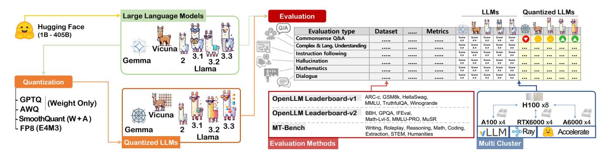
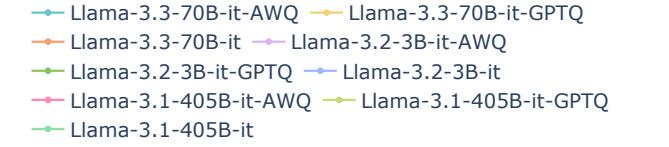
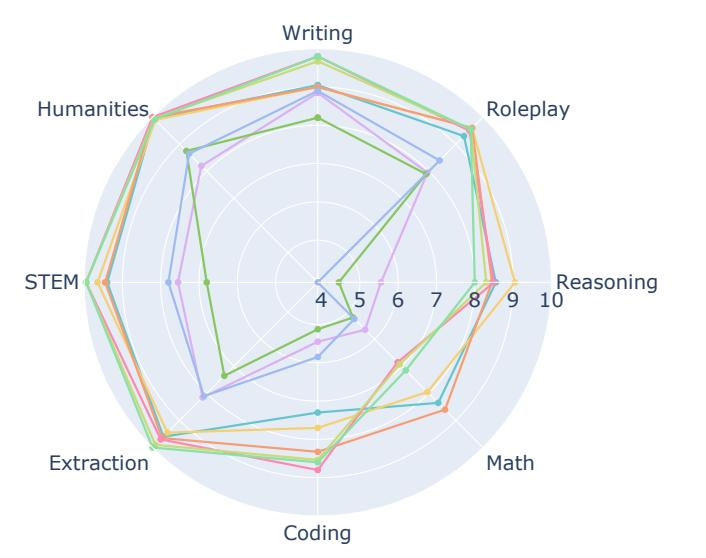

<!-- RP43_Lee_2024 | source: papers_json/RP43_Lee_2024/ -->

## استكشاف المقايضات: طرق التكميم وصعوبة المهام وحجم النموذج في النماذج اللغوية الكبيرة من الحافة إلى العملاقة

Jemin Lee^1^ , Sihyeong Park^2^ , Jinse Kwon^1^ , Jihun Oh^3^ and Yongin Kwon^1^^∗^

^1^Electronics and Telecommunications Research Institute ^2^Korea Electronics Technology Institute ^3^Neubla

{leejaymin,kwonse,yongin.kwon}@etri.re.kr sihyeong@keti.re.kr , oj9040@gmail.com

## الملخص

اكتسب التكميم اهتماماً باعتباره حلاً واعداً للنشر الفعّال من حيث التكلفة للنماذج اللغوية الكبيرة والصغيرة. ومع ذلك، فإن معظم الأعمال السابقة اقتصرت على الحيرة (perplexity) أو مهام المعرفة الأساسية، وتفتقر إلى تقييم شامل للنماذج الحديثة مثل Llama-3.3. في هذه الورقة، نُجري تقييماً شاملاً للنماذج المُضبطة بالتعليمات التي تتراوح معاملاتها بين 1B و 405B، مطبّقين أربع طرق تكميم على 13 مجموعة بيانات. تكشف نتائجنا أن: (1) النماذج المُكمَّمة تتفوق عموماً على نماذج FP16 الأصغر، إلا أنها كثيراً ما تواجه صعوبة في اتباع التعليمات وكشف الهلوسة؛ (2) يبرز FP8 باستمرار باعتباره الخيار الأكثر متانة عبر المهام، ويميل AWQ للتفوق على GPTQ في التكميم على الأوزان فقط؛ (3) قد تعاني النماذج الأصغر من انخفاضات حادة في الدقة عند التكميم بـ 4 بت، بينما تحافظ النماذج بحجم 70B على أداء مستقر؛ (4) من اللافت أن المهام *الصعبة* لا تشهد دائماً أكبر خسائر في الدقة، مما يشير إلى أن التكميم يضخّم نقاط الضعف الكامنة في النموذج بدلاً من أن يرتبط ببساطة بصعوبة المهمة؛ و(5) يُبرز حَكَم قائم على نماذج لغوية كبيرة (MT-Bench) تراجعاً ملحوظاً في الأداء في مهام البرمجة وSTEM، رغم أنه يُسجّل أحياناً تحسينات في الاستدلال.

# 1 المقدمة

على الرغم من الأداء المميز للنماذج اللغوية الحديثة الكبيرة والصغيرة (LLMs و SLMs)، فإن نشرها في البيئات محدودة الموارد لا يزال يمثل تحدياً. حتى نماذج مثل Llama-3.3-70B (الصادرة في ديسمبر 2024) و Llama-3.2-1B (الصادرة في سبتمبر 2024) لا تزال تتضمن مليارات المعاملات، مما يجعل تشغيلها مكلفاً في كل من سيناريوهات الخوادم والحافة المتنقلة. وقد ظهر التكميم منخفض البتات بوصفه حلاً شائعاً لتقليل العبء الذاكري والحسابي لهذه النماذج. وعلى وجه الخصوص، يُعتمد التكميم بعد التدريب (PTQ) [[Frantar](#page-7-0) *et al.*, 2022; Lin *et al.*[, 2024;](#page-7-1) Xiao *et al.*[, 2023;](#page-8-0)[ Micikevicius](#page-8-1) *et al.*,

[2022]](#page-8-1) على نطاق واسع، إذ كثيراً ما يتطلب التدريب الواعي بالتكميم (QAT) إعادة تدريب مكثفة [Zhu *et al.*[, 2023;](#page-8-2) Wan *et al.*[, 2023]](#page-8-3).

غير أن البحوث الموجودة حول التكميم اعتمدت إلى حد كبير على مقاييس الحيرة [[Frantar](#page-7-0) *et al.*, 2022; Lin *et al.*[, 2024;](#page-7-1) Xiao *et al.*[, 2023]](#page-8-0) ومعايير قياس قديمة (مثل ARC وHellaSwag وWinogrande وMMLU) [Yao *[et al.](#page-8-4)*, [2023;](#page-8-4)[ Dettmers and Zettlemoyer, 2023;](#page-7-2) Liu *et al.*[, 2023;](#page-8-5) Jin *et al.*[, 2024;](#page-7-3) Li *et al.*[, 2024;](#page-7-4) Dutta *et al.*[, 2024]](#page-7-5)، التي أصبحت سهلة جداً على النماذج الحالية وتنطوي على خطر تلوث البيانات في النماذج اللغوية الكبيرة المدربة حديثاً. علاوة على ذلك، لم تُدرس البنى الأحدث مثل Llama-3.3 وLlama-3.2 وLlama-3.1 دراسة وافية. وتشمل هذه الفجوة المقاييس المتطرفة، من 1B إلى أكثر من 405B معامل، وتُغفل التحليل التفصيلي على مستوى الفئات باستخدام طرق تقييم LLM-as-judge. كذلك كان الفحص اليدوي لتحسين نتائج التقييم وتأكيدها محدوداً [Li *et al.*[, 2024;](#page-7-4) Dutta *et al.*[, 2024]](#page-7-5).

في هذه الورقة، نقدم تقييماً شاملاً لكيفية تأثير التكميم على النماذج اللغوية الكبيرة المضبوطة بالتعليمات. ونسعى على وجه الخصوص للإجابة على أسئلة البحث (RQs) التالية: (RQ1) هل تتفوق النماذج المُكمَّمة على النماذج الأصلية الأصغر في معظم المعايير، وكيف يكون أداؤها عبر بنى متنوعة وعلى النماذج اللغوية الصغيرة (SLMs)؟ (RQ2) كيف تؤثر طرق التكميم المختلفة على الأداء عبر مجموعة واسعة من المهام، وهل ثمة فروقات جوهرية في كيفية تأثير مقاربات معينة (مثل GPTQ وAWQ وSmoothQuant وFP8) على دقة المهام؟ (RQ3) بأي طريقة يؤثر حجم النموذج وبنيته على دقة النماذج المُكمَّمة؟ (RQ4) هل تتلازم الصعوبة الأعلى للمهمة بالضرورة مع تدهور أكبر في الدقة في ظل التكميم؟ و(RQ5) كيف يؤثر التكميم على جودة المحادثة الحرة للنماذج اللغوية الكبيرة عند تقييمها بإطار MT-Bench الذي يعتمد على نماذج لغوية كبيرة بوصفها حُكّاماً؟

نُجري تقييمنا في بيئة GPU متعددة العناقيد، كما هو موضح في الشكل[ 1.](#page-1-0) يتألف هذا الإعداد من أربعة خوادم، لكلٍ منها تكوين GPU مميز، ويضمن ظروف قياس متسقة عبر جميع التجارب (التفاصيل في الملحق[ D)](#page-14-0).

تطبق دراستنا أربع طرق تكميم — GPTQ [[Fran](#page-7-0)tar *et al.*[, 2022]](#page-7-0)، وAWQ [Lin *et al.*[, 2024]](#page-7-1)، وSmoothQuant [[Xiao](#page-8-0) *et al.*[, 2023]](#page-8-0)، وFP8 [[Micikevicius](#page-8-1) *et al.*, 2022] — على نماذج مضبوطة بالتعليمات تتراوح من 1B إلى 405B معاملات،

> ^∗^[المؤلف المراسل](#page-8-1) [الملحق متاح على: https://arxiv.org/abs/2409.11055](#page-8-1)

<!-- page 2 -->


*الشكل 1: نظرة عامة على خط أنابيب التقييم للنماذج اللغوية الكبيرة المُكمَّمة، باستخدام إعداد عنقود متعدد العقد لضمان تقييمات سريعة وموثوقة عبر معايير قياس متعددة.*

بما في ذلك Vicuna [Zheng et al., 2023] وGemma [Team et al., 2024] وعائلة Llama [Dubey et al., 2024]. نُقيّم هذه النماذج على 13 مجموعة بيانات تغطي ست فئات من المهام: الأسئلة والأجوبة المنطقية الفطرية، والمعرفة المعقدة وفهم اللغة، واتباع التعليمات، وكشف الهلوسة، والرياضيات، والحوار. ترد تفاصيل إضافية للبيانات في الملحق A (الجدول 3).

ولمقارنة نتائجنا بالجهود المجتمعية الجارية، نُزامن معاييرنا مع لوحة Huggingface OpenLLM Leaderboard-v1 (التي تغطي أبريل 2023 إلى يونيو 2024) وOpen-LLM Leaderboard-v2 (التي أُطلقت في 26 يونيو 2024). غير أن النسختين توفران حالياً بيانات محدودة فقط حول النماذج المُكمَّمة، مما يُبرز الحاجة إلى تقييمنا الشامل. نتائجنا الرئيسة على النحو الآتي:

- تؤدي النماذج اللغوية الكبيرة المُكمَّمة عموماً أداءً أفضل من النماذج الأصغر في معظم المعايير، وتحافظ على أفضليتها عبر بنى مختلفة، مع تحسينات ملحوظة في كل من النماذج اللغوية الكبيرة والصغيرة. ومع ذلك، فإنها لا تزال تواجه صعوبة في اتباع التعليمات (IFEval) وكشف الهلوسة (TruthfulQA).
- يُعد FP8 الطريقة الأكثر موثوقية لجميع أحجام النماذج والمهام، وخاصةً للنماذج اللغوية الكبيرة بحجم 405B معامل، حيث يواجه SmoothQuant مشكلات. وعادةً ما يكون أداء AWQ أفضل من GPTQ في التكميم على الأوزان فقط، كما أن دعم العتاد يجعل FP8 أكثر تميزاً.
- في النماذج اللغوية الكبيرة الأصغر، قد يؤدي استخدام التكميم بـ 4 بت إلى انخفاضات ملحوظة في الدقة، خصوصاً مع GPTQ. أما النماذج بحجم 70B فعادةً ما تحافظ على أداء جيد عند تكميمها إلى 4 بت. وعلى الرغم من أن حجم النموذج هو العامل الرئيس المؤثر على صعوبة التكميم، فإن الاختلافات في بنية النموذج اللغوي الكبير ضمن نفس حجم المعاملات قد تؤثر أيضاً في الدقة. ومع ذلك، يتفوق AWQ باستمرار على GPTQ عبر المهام والأنواع المختلفة للنماذج.
- لا تكون للمهام الصعبة دائماً أكبر انخفاضات في الدقة عند التكميم. إذ يعتمد التأثير على تصميم النموذج وطريقة التكميم المستخدمة، مما يؤدي إلى أن تظل بعض المهام *الصعبة* مستقرة بينما تشهد بعض المهام *السهلة* انخفاضات أكبر. وبشكل عام، يُبرز التكميم نقاط الضعف الموجودة في النموذج، خصوصاً في المنطق الفطري أو الاستدلال المنطقي أو الرياضي.
- يقلل التكميم بشكل كبير من الأداء في مهام البرمجة وSTEM، رغم أنه يحسن أحياناً دقة الاستدلال

كذلك يمكن للمُقيّمين القائمين على GPT4 أن يحكموا أحياناً بشكل خاطئ على إجابات غير صحيحة بأنها صحيحة.

# 2 الأعمال ذات الصلة

**التكميم للنماذج اللغوية الكبيرة.** ثمة نوعان رئيسيان من طرق التكميم للنماذج اللغوية الكبيرة: التكميم بعد التدريب (PTQ) والتدريب الواعي بالتكميم (QAT). نظراً لحجم النماذج اللغوية الكبيرة وتعقيد تدريبها، يصعب تطبيق QAT، ونتيجة لذلك أُجريت أبحاث محدودة فقط في هذا المجال. وبالتالي، فإن غالبية أبحاث التكميم للنماذج اللغوية الكبيرة قد ركزت على مقاربات PTQ [Zhu *et al.*, 2023; Wan *et al.*, 2023].

LLM.int8() [Dettmers et al., 2022] هي طريقة تكميم بعد التدريب تستخدم أوزاناً وتفعيلات بعرض 8 بت لتقليل البصمة الذاكرية للنماذج الكبيرة مع الحفاظ على الأداء. تتكيف هذه الطريقة ديناميكياً لضمان احتفاظ المكونات الحساسة من الحساب بدقة أعلى عند الحاجة. أما GPTQ [Frantar et al., 2022] فهي تكميم على مستوى الطبقات يستخدم معلومات هَسيان (Hessian) العكسية لتقليل عدد البتات لكل وزن مع الحفاظ على فقد دقة منخفض. واقترح AWQ [Lin et al., 2024] أن الحفاظ على جزء صغير من الأوزان المهمة هو جزء أساسي من تقليل أخطاء التكميم. وكجزء من استراتيجية واعية بالتفعيلات، ركّز AWQ على القنوات ذات قيم التفعيل الأكبر واستخدم تحجيماً لكل قناة. أما SmoothQuant [Xiao et al., 2023] فهي طريقة تُلطّف القيم الشاذة في التفعيلات قبل التكميم، مما يحسّن المتانة في النماذج كبيرة الحجم ويُمكّن من تكميم 8 بت أكثر فعالية. ويُقلل Outlier Suppression+ [Wei et al., 2023] من تأثير القيم الشاذة المتطرفة في التفعيلات، مما يسمح بتكميم أكثر كفاءة عن طريق تطبيع القيم الإشكالية دون إضعاف دقة النموذج. ويجمع QLoRA [Dettmers et al., 2024] بين التكييف منخفض الرتبة والتكميم لتحقيق ضبط دقيق فعّال للنماذج الكبيرة مع تقليل التكاليف الحسابية واستخدام الذاكرة.

غير أن أعمال خوارزميات التكميم هذه قد قُيّمت فقط على مجموعات بيانات أساسية مثل الحيرة وARC وMMLU، التي صدرت قبل 2-3 سنوات، ولا تأخذ بعين الاعتبار بشكل كافٍ التطورات الأخيرة في النماذج اللغوية الكبيرة والصغيرة. ولذلك، يلزم تحليل أداء أكثر شمولاً للتطبيق الآمن للتكميم في خدمات النماذج اللغوية الكبيرة.

**تقييم النماذج اللغوية الكبيرة.** استكشفت عدة دراسات تأثيرات

<!-- page 3 -->

تكميم النموذج على أداء النماذج اللغوية الكبيرة، مع التركيز على جوانب متنوعة. على سبيل المثال، تناول Yao et al. [Yao et al., 2023] تأثير التكميم على كل من الأوزان والتفعيلات في مهام نمذجة اللغة. في المقابل، ركّز Liu et al. [Liu et al., 2023] فقط على تقييم ثلاث قدرات ناشئة للنماذج اللغوية الكبيرة المُكمَّمة، متجاهلين مهام مهمة مثل الموثوقية والحوار ومعالجة السياق الطويل.

ووسّع Hong et al. [Hong et al., 2024] النطاق بفحص أبعاد الموثوقية في تقييم تقنيات ضغط النماذج اللغوية الكبيرة. ومع ذلك، فقد اعتمدت معظم الدراسات بشكل أساسي على الدقة بوصفها المقياس الرئيس للتقييم، مع اهتمام محدود بمقاييس بديلة. على سبيل المثال، اقترح Zhang et al. [Zhang et al., 2024] مقاييس تقييم إضافية، تشمل الطلاقة والإفادة والترابط وعدم الإضرار، إلى جانب الدقة.

كما بُذلت جهود لإنشاء معايير قياس تقييم أكثر شمولاً. فقد طوّر Jaiswal et al. [Jaiswal et al., 2023]

معياراً قياسياً من مجموعات بيانات موجودة لتقييم النماذج المضغوطة، بينما قام Li et al. [Li et al., 2024] وJin et al. [Jin et al., 2024] بتقييم تقنيات تكميم متنوعة عبر مهام مختلفة. واستكشف Namburi et al. [Namburi et al., 2023] كيف يؤثر الضغط والتقليم على المعرفة البارامترية للنماذج اللغوية الكبيرة.

واقترح Dutta et al. [Dutta et al., 2024] مقياساً جديداً من منظور أخطاء "Flip"، مؤكدين أهمية تقييم متانة النموذج من خلال مراعاة عدم الاتساق والانعكاسات في التنبؤات، متجاوزاً بذلك المقاييس التقليدية المرتكزة على الدقة. كما تناول Kurtic et al. [Kurtic et al., 2024] المقايضات بين الدقة والأداء في تكميم النماذج اللغوية الكبيرة، وقيّموا تنسيقات مثل FP8 وINT8 وINT4 عبر مهام متنوعة، واقترحوا إرشادات عملية لنشر فعّال للنماذج اللغوية الكبيرة بمقاييس مختلفة.

واستكشف Xu et al. [Xu et al., 2024] تحديات تقييم النماذج اللغوية الكبيرة متعددة اللغات عبر لغات وثقافات متنوعة،

<!-- page 4 -->

مؤكدين على تطوير معايير قياس شاملة ثقافياً ولغوياً لتقييم عادل. وقدّم Liu et al. [Liu et al., 2024] فحصاً شاملاً لقدرة التعميم، مع التركيز على أدائها عبر مهام ومجموعات بيانات متنوعة. تُبرز هذه الدراسة أهمية تصميم معايير قياس ومقاييس تعكس بدقة التطبيقات الواقعية مع تحديد قيود استراتيجيات التقييم الحالية.

على حد علمنا، لا توجد دراسة سابقة فحصت بشكل شامل تأثيرات التكميم عبر طيف واسع من أحجام النماذج — من 1B إلى 405B معامل — تشمل كلاً من النماذج اللغوية الصغيرة والكبيرة، بما في ذلك أحدث البنى مثل Llama-3.1 وLlama-3.2 وLlama-3.3. علاوة على ذلك، لم تُجرِ الأبحاث الموجودة تحليلات تفصيلية على مستوى الفئات من خلال مقارنات عبر البنى أو توظف فحصاً يدوياً باستخدام طرق نوعية LLM-as-judge. كذلك لا يوجد عمل قارن بين الاتجاهات المرصودة في تقييمات LLM-as-judge (MT-Bench) ونتائج لوحات الصدارة لـ

تحديد اتجاهات جديدة في تأثيرات التكميم.

# 3 إجراء التقييم

للتعامل مع النماذج اللغوية الكبيرة التي لا يمكن معالجتها على خادم واحد، ولضمان تقييمات سريعة وموثوقة، طوّرنا خط أنابيب تقييم منظم استناداً إلى إعداد عنقود متعدد العقد. يقدم الشكل 1 نظرة عامة على خط الأنابيب المُنفّذ لتقييم النماذج اللغوية الكبيرة المُكمَّمة. تشمل النماذج المُقيّمة عائلات Vicuna وGemma وLlama، بأحجام تتراوح من 1B إلى 405B. كل نموذج مُكمَّم باستخدام طرق GPTQ وAWQ وSmoothQuant وFP8. يُجرى التقييم باستخدام lm-eval وMT-Bench كأدوات لقياس الأداء. والعنقود متعدد العقد المستخدم للتقييم مُنفَّذ بـ vLLM ويتألف من أربعة خوادم: H100-80Gx8، وA100-80Gx4، وRTX 6000-48Gx4، وA6000-48Gx4. علاوة على ذلك، تُدمج مكتبة Huggingface في خط الأنابيب لدعم استضافة النماذج وقياس الأداء. ويُوزّع التقييم عبر بيئة متعددة العناقيد لضمان

<!-- page 5 -->

تقييم أداء شامل. وإذا تعذّر استخدام vLLM للمعالجة، استخدمنا مكتبة Huggingface Accelerate بدلاً منه، وهي أبطأ ولكنها تُظهر قابلية مقارنة أفضل. تُقدَّم إصدارات جميع الأدوات المستخدمة في الملحق[ D.1.](#page-14-1)

# 4 الإعداد التجريبي

## 4.1 مجموعات البيانات

أجرينا تقييماً شاملاً للنماذج اللغوية الكبيرة المُكمَّمة على معايير قياس مُعتمدة على نطاق واسع، مُجمّعة في ست فئات رئيسة: CommonSenseQA (ARC وHellaSwag وWinogrande)، والمعرفة وفهم اللغة (MMLU وGPQA وMMLU-PRO وBBH وMuSR)، واتباع التعليمات (IFEval)، والهلوسة (TruthfulQA)، والرياضيات (GSM8K وMATH-Lvl-5)، والحوار (MT-Bench). يمكن العثور على معلومات إضافية حول هذه البيانات في الملحق[ A,](#page-10-0) وتُقدَّم نظرة عامة على جميع المعايير في الجدول[ 3](#page-10-1) (الملحق).

## 4.2 تفاصيل قابلية إعادة الإنتاج

تتبع كلٌ من OpenLLM Leaderboard V1 وV2 المنهجية ذاتها الموضحة في صفحة لوحة HuggingFace، بما في ذلك إجراءات التطبيع المتطابقة. ترد معلومات إضافية حول حسابات لوحة الصدارة في الملحق[ D.2.](#page-14-2)

استخدمنا استراتيجية *فك التشفير الجشع (greedy decoding)* للحفاظ على رموز إخراج حتمية عبر التشغيلات. يُقدَّم التكوين التفصيلي لاستراتيجية *فك التشفير الجشع* في الملحق[ D.1,](#page-14-1) الذي يسرد أيضاً الإصدارات المحددة لكل حزمة مستخدمة. علاوة على ذلك، نُسجّل جميع البذور العشوائية لـ Python وNumPy وTorch وإعدادات التعلم بقليل من الأمثلة في الملحق[ D.1,](#page-14-1) لضمان قابلية إعادة إنتاج نتائجنا التجريبية.

## 4.3 طرق التكميم وبيانات المعايرة

قيّمنا طرق PTQ متعددة، تشمل GPTQ وAWQ وSmoothQuant وFP8. يركز GPTQ وAWQ على التكميم على الأوزان فقط، بينما يُطبَّق SmoothQuant وFP8 على كل من الأوزان والتفعيلات. للاطلاع على نظرة عامة مفصلة لكل طريقة تكميم، يُرجى الرجوع إلى الملحق[ D.3,](#page-15-0) مع تفاصيل التكوين وأحجام المجموعات الموضحة في الملحق[ D.4.](#page-15-1)

يُعد اختيار وتكوين مجموعات بيانات المعايرة أمراً بالغ الأهمية للحفاظ على أداء متسق عبر النماذج. استخدمنا الإعدادات الافتراضية لعدد العينات وأطوال التسلسل، كما هو مفصل في الملحق[ D.5](#page-16-0) ومُلخّص في الجدول[ 9.](#page-20-0) قد تختلف هذه الإعدادات تبعاً للخوارزميات والأدوات المحددة، ولكنها تضمن عموماً نتائج مستقرة لتجاربنا.

## 4.4 النماذج

طبّقنا تقنيات التكميم على 12 نموذجاً لغوياً مفتوحاً مضبوطاً بالتعليمات، تشمل عائلات Vicuna [Zheng *et al.*[, 2023]](#page-8-6) وGemma [Team *et al.*[, 2024]](#page-8-7) وLlama [[Dubey](#page-7-6) *et al.*, 2024]، بأحجام نماذج تتراوح من 1B إلى 405B. صدرت هذه النماذج بين يونيو 2023 وديسمبر 2024 وتم تنزيلها من مصادر نماذج HuggingFace.

قُيّمت جميع النماذج باستخدام 13 مجموعة بيانات قياسية، مع تطبيق تكميم GPTQ وAWQ وSmoothQuant وFP8. غير أنه نظراً لقيود وقت التشغيل (أكثر من 30 يوماً)، لم نقم بـ

قياس دقة النموذج الأصلي أو اختبار جميع تكوينات GPTQ لـ Llama-3.1-405B. كذلك، نظراً لقيود المساحة، تُقدَّم النتائج التجريبية لنماذج Vicuna وGemma في الملحق[ B](#page-11-0)

# 5 النتائج التجريبية

يقدم هذا القسم النتائج التجريبية التي تتناول خمسة أسئلة بحثية، مع تفصيل تأثير الأداء للتكميم عبر 13 مجموعة بيانات لثلاث عائلات نماذج بأحجام متفاوتة. يُلخّص الجدول[ 1](#page-2-0) والجدول[ 2](#page-3-0) النتائج التجريبية من OpenLLM Leaderboard-v1 وv2 على التوالي.

## 5.1 RQ1: هل تتفوق النماذج اللغوية الكبيرة المُكمَّمة على النماذج الأصلية الأصغر في معظم المعايير، وكيف يكون أداؤها عبر بنى مختلفة و SLMs؟

نلاحظ أن النماذج اللغوية الكبيرة المُكمَّمة تتفوق عموماً على النماذج الأصغر غير المضغوطة عبر مجموعة واسعة من المعايير. على سبيل المثال، يتفوق Llama-2-13B بـ 4 بت (6.5 جيجابايت) على FP16 Llama-2-7B (14 جيجابايت) في معظم المهام، رغم حجمه المخفّض. ومع ذلك، في TruthfulQA (اختبار الهلوسة) وIFEval (اتباع التعليمات)، لا يزال FP16 Llama-2-7B يؤدي أداءً أفضل، مما يشير إلى أن التكميم يمكن أن يضعف المحاذاة والالتزام بالتعليمات.

وبالمثل، فإن تكميم Llama-3.1-405B إلى 4 بت (202.5 جيجابايت) يُحقق دقة أعلى من FP16 Llama-3.1-70B (140 جيجابايت) عبر مهام متنوعة؛ ومع ذلك، يُبرز معيار IFEval لاتباع التعليمات مرة أخرى قصوراً في النموذج المُكمَّم. وتظل فجوة الأداء هذه قائمة عبر بنى نماذج مختلفة: على الرغم من أن Llama-3.3-70B يُظهر تحسينات على Llama-3.1-70B، فإن Llama-3.1-405B بـ 4 بت يمكنه أن يتفوق على Llama-3.3-70B غير المضغوط.

في النماذج اللغوية الصغيرة الموجّهة للحافة، يُنتج التكميم تحسينات أكبر بشكل ملحوظ. على سبيل المثال، يحسّن تكميم Llama-3.2-3B (SmoothQuant) الدقة بنسبة 13.32% على OpenLLM Leaderboard-v1 و8.72% على OpenLLM Leaderboard-v2 مقارنةً بـ FP16-Llama-3.2-1B. وتتجاوز هذه التحسينات الهامش الذي يُلاحظ عادةً في النماذج الأكبر (7B إلى 405B).

نتائج RQ1: تتفوق النماذج اللغوية الكبيرة المُكمَّمة باستمرار على النماذج الأصغر عبر معظم المعايير وتحافظ على هذه الميزة عبر بنى مختلفة، مع مكاسب ملحوظة في كل من النماذج الكبيرة والنماذج اللغوية الصغيرة الموجّهة للحافة. ومع ذلك، تظل مهام مثل اتباع التعليمات (IFEval) وكشف الهلوسة (TruthfulQA) تحدياً للنماذج المُكمَّمة.

## 5.2 RQ2: كيف تؤثر طرق التكميم المختلفة على أداء النماذج عبر مهام متنوعة؟ هل ثمة فروقات ملحوظة في كيفية تأثير طرق محددة (مثل GPTQ وAWQ وSmoothQuant وFP8) على دقة المهام؟

في معظم الحالات، تُظهر طرق التكميم على الأوزان فقط (GPTQ وAWQ) وطرق تكميم التفعيلات (SmoothQuant وFP8) أداءً متشابهاً. ومع ذلك، بالنسبة لـ Llama-3.1-405B، أدى تكميم تفعيلات SmoothQuant إلى

<!-- page 6 -->

انخفاض ملحوظ في الدقة مقارنة بالطرق الأخرى، مع متوسط انخفاض يصل إلى 10.86% مقارنة بـ FP8 على مجموعات بيانات OpenLLM Leaderboard-v2. يحدث هذا التراجع لأن SmoothQuant صُمم في الأصل للتعامل مع نطاقات التفعيل العالية المرصودة في نماذج بحجم OPT-175B. وبالتالي، عند مقياس 405B لـ Llama-3.1، من المرجح أن الخوارزمية لم تأخذ في الاعتبار عوامل معينة بالغة الأهمية عند هذا المقياس الأكبر. في المقابل، بالنسبة للنماذج الأصغر، مثل SLMs بمعاملات 1B و3B، يظل متوسط انخفاض الدقة أقل من 1%.

عند مقارنة طرق التكميم على الأوزان فقط، يتفوق AWQ باستمرار على GPTQ عبر النماذج اللغوية الكبيرة المختلفة في درجات المعايير الإجمالية. علاوة على ذلك، تُظهر التطبيقات المختلفة لـ GPTQ، مثل AutoGPTQ وllmcompressor، فروقات أداء ملحوظة، مع الحفاظ على أداء مستقر ومتسق لمكتبة تطبيق GPTQ الأقدم AutoGPTQ.

عندما يتطلب الأمر تكميم كل من الأوزان والتفعيلات بـ 8 بت، يُثبت FP8 أنه فعّال للغاية، حتى في المهام الصعبة من OpenLLM Leaderboard-v2. تشمل هذه الفعالية النماذج بجميع الأحجام، من الأكبر مثل Llama-3.1-405B إلى الأصغر مثل Llama-3.2-1B. ولذلك، يُقدّم FP8 استقراراً أكبر مقارنة بـ SmoothQuant ويُعد مفيداً للاستخدام عند دعمه بعتاد مثل NVIDIA H100 GPU وRTX 6000 Ada، إذ يوفر فوائد في كل من زمن الاستجابة والإنتاجية. علاوة على ذلك، يسمح تطبيق FP8 على كل من الأوزان والتفعيلات بتقليل حجم ذاكرة KV cache بمقدار النصف، وهو أمر مفيد للغاية خلال مراحل فك تشفير النموذج اللغوي الكبير حيث تكون اختناقات الإدخال/الإخراج مصدر قلق. وميزة FP8 KV cache هذه مدعومة بواسطة vLLM.

نتائج RQ2: FP8 هو الخيار الأكثر استقراراً عبر جميع أحجام النماذج والمهام، ولا سيما في النماذج اللغوية الكبيرة حيث يؤدي SmoothQuant أداءً ضعيفاً، في حين يتفوق AWQ بانتظام على GPTQ في التكميم على الأوزان فقط، كما يعزز العتاد المتخصص مزايا FP8.

## 5.3 RQ3: كيف يؤثر حجم النموذج وبنيته على دقة النماذج المُكمَّمة؟

قيّمنا GPTQ عبر 13 مجموعة بيانات ولاحظنا أن دقته يمكن أن تتدهور بشكل كبير في ظل تكميم 4 بت — وهو سلوك لا تعكسه التقييمات القائمة على الحيرة وحدها. بالنسبة للنماذج الأصغر، مثل Llama-3.2-1B، يُسبب تكميم 4 بت انخفاضات حادة في الدقة بشكل خاص (مثل -25.32% على GSM8k و-16.01% على IFEval). تميل هذه التراجعات إلى أن تكون أكثر وضوحاً في GPTQ منها في AWQ، مما يشير إلى أن SmoothQuant أو FP8 بـ 8 بت قد يكونان ضروريين للحفاظ على الدقة للنماذج بمقياس 1B.

مع النماذج متوسطة الحجم مثل Llama-3.1-8B (GPTQ-8bit)، لاحظنا متوسط تحسينات في الدقة بنسبة +2.51% و+2.11% على 4 بت في OpenLLM Leaderboard-v1 وOpen-LLM Leaderboard-v2 على التوالي. ومع ذلك، عند مقياس 70B، تفوّق 4 بت على 8 بت بنسبة +1.89%، مما يدل على اتجاه عكسي للنماذج الأكبر. ولفحص الفروق المعمارية عند مقياس ثابت، قارنّا بين Llama-2 وLlama-3.1 وLlama-3.3 بحجم 70B ووجدنا أن AWQ يتفوق باستمرار على GPTQ، ويُقدّم دقة مستقرة حتى في تكميم 4 بت.

نتائج RQ3: في النماذج اللغوية الكبيرة الأصغر، كثيراً ما يؤدي تكميم 4 بت إلى فقد كبير في الدقة (لا سيما مع GPTQ)، في حين يمكن للنماذج بمقياس 70B الحفاظ على أداء مستقر مع 4 بت. ومع أن الحجم هو المحرك الأساسي لصعوبة التكميم، فإن التباينات المعمارية ضمن المقياس نفسه يمكن أن تؤثر أيضاً على الدقة. ومع ذلك، يتفوق AWQ باستمرار على GPTQ عبر مهام وعائلات نماذج متنوعة.

## 5.4 RQ4: هل تتلازم الصعوبة الأعلى للمهمة دائماً مع تدهور أكبر في الدقة في ظل التكميم؟

على عكس الافتراضات الشائعة، لم تُظهر المهام التي تُعد عموماً صعبة (مثل GSM8K وMMLU وMath-Lvl-5) باستمرار أكبر انخفاضات في الأداء عند التكميم. على سبيل المثال، بين 12 نموذجاً مُختبراً مُكمَّماً بـ AWQ، ظلت دقة MMLU إلى حد كبير دون تغيير، مع إظهار بعض النماذج تحسينات طفيفة. في المقابل، شهدت المهام التي تُعتبر عموماً أقل كثافة معرفية (ARC-challenge وTruthfulQA وWinogrande) أحياناً تراجعات تتجاوز -3%.

وبدلاً من أن يعتمد التكميم اعتماداً صارماً على صعوبة المهمة، يبدو أنه يضخّم نقاط الضعف الحالية في قدرة النموذج على التعامل مع أشكال محددة من الاستدلال، مثل المنطق الفطري أو الاستدلال الرياضي. كما هو موضح في RQ3، فإن النماذج الأصغر (2B–7B) معرّضة بشكل خاص لمهام الاستدلال الحسابي مثل GSM8K، مُظهرة انخفاضات أداء حادة. علاوة على ذلك، كما لوحظ في RQ2، يمكن لطرق التكميم المختلفة أن تُنتج درجات متفاوتة من فقد الدقة، مما يجعل من الصعب استخلاص استنتاجات قاطعة من منظور مهمة واحدة.

نتائج RQ4: لا تعاني المهام الصعبة دائماً من أكبر فقد في الدقة في ظل التكميم. يتباين التأثير حسب بنية النموذج وطريقة التكميم المختارة، مما يؤدي إلى أن تظل بعض المهام *الصعبة* مستقرة بينما تُظهر المهام *الأسهل* أحياناً انخفاضات أكبر. وفي جوهره، يضخّم التكميم نقاط الضعف الموجودة في النموذج، خصوصاً في المنطق الفطري أو الاستدلال المنطقي أو الرياضي.

## 5.5 RQ5: كيف يؤثر التكميم على جودة المحادثة الحرة للنماذج اللغوية الكبيرة عند التقييم باستخدام إطار MT-Bench الذي يوظف النماذج اللغوية الكبيرة كحُكّام؟

**التحليل على مستوى الفئات.** يقدم الشكل[ 2](#page-6-0) تفصيلاً مفصلاً لثلاثة نماذج (Llama-3.1 وLlama-3.2 وLlama-3.3) عبر فئات MT-Bench. تعاني النماذج اللغوية الكبيرة المُكمَّمة من أكبر تدهور في الدرجات في *البرمجة* و*STEM*. بالنسبة للـ *برمجة*، تكشف الفحوص اليدوية أن GPT4 كثيراً ما يُسند درجات أقل عندما يحتوي الكود المُولَّد على أمثلة أقل أو تعليقات غير كافية. في مهام *STEM*، تكون الصحة مهمة عند وجود حل قاطع، وتُعد التفسيرات المنطقية الموجزة مهمة عندما لا توجد إجابة دقيقة. وكثيراً ما قدّمت النماذج المُكمَّمة إما مبررات مُفرطة في الإطناب أو أنتجت عبارات غير صحيحة، مما أدى إلى درجات أدنى. في

<!-- page 7 -->




*الشكل 2: درجات MT-Bench حسب الفئة لثلاثة نماذج لغوية كبيرة مُكمَّمة (Llama-3.3 وLlama-3.2 وLlama-3.1) مُقيَّمة باستخدام طريقتي AWQ وGPTQ. يُسلط الضوء على الفروق في الأداء عبر الفئات، بما في ذلك الكتابة ولعب الأدوار والاستدلال والرياضيات والبرمجة والاستخراج وSTEM والعلوم الإنسانية، مما يُظهر تأثير التكميم على مهام متنوعة.*

المقابل، أظهرت فئة *الاستدلال* زيادة تبلغ نحو نقطة واحدة مع التكميم. تكشف الفحوص اليدوية أن الإجابات الموجزة تميل إلى الحصول على درجات GPT4 أعلى، وأن النماذج المُكمَّمة استجابت في كثير من الأحيان بشكل أكثر إيجازاً من نظيراتها الأصلية. يمكن العثور على النتائج التفصيلية لهذا الفحص اليدوي، مع الردود النصية الكاملة، في الملحق[ C.4.](#page-12-0) كما يسرد الجدول[ 6](#page-18-0) في الملحق[ C.1](#page-11-1) درجات MT-Bench حسب الفئة لجميع النماذج.

**قيود التقييم القائم على GPT4.** بما يتسق مع نتائج MT-Bench، يُسيء GPT4 أحياناً الحكم على الردود غير الصحيحة على أنها صحيحة، خاصة في مهام الرياضيات والاستدلال. على الرغم من أن الحكم بالاسترشاد بمرجع وتحفيز التفكير المتسلسل يمكن أن يُخفّف من هذه الأخطاء [[Zheng](#page-8-6) *et al.*, [2023]](#page-8-6)، فإنهما لا يُلغيانها كلياً. في مهمة *الاستدلال*، اعتبر GPT4 إجابة خاطئة على أنها صحيحة، مما رفع درجات النماذج المُكمَّمة. وعلى العكس، كانت هناك أسئلة *STEM* قدّم فيها كل من النموذج الأصلي والنموذج المُكمَّم إجابات دقيقة، إلا أن GPT4 وسمها خطأً على أنها غير صحيحة. تُوصف هذه الحالات المُساء الحكم عليها في الملحق[ C.5.](#page-13-0)

بالنسبة للنماذج مثل Llama-3.3-70B، حصلت فئات مثل *العلوم الإنسانية* باستمرار على درجات قريبة من الحد الأقصى أو عليه (10 نقاط). في هذه الحالات، حققت النسخ المُكمَّمة أيضاً درجات في النطاق العالي 9-نقاط، مما جعل من الصعب تمييز فروق جودة ذات معنى من خلال الفحص اليدوي. وذلك لأنه من الصعب فهم المنطق وراء النتائج بوضوح بالنظر فقط إلى عبارات حكم GPT4، خاصة

عندما تكون فروق الدرجات هامشية، مثل 1-2 نقطة. ومن ثم، بالنسبة لأحدث النماذج كبيرة الحجم، قد تكون هناك حاجة إلى مقاييس أكثر حساسية أو نماذج حُكم متفوقة لتقييم فجوات الجودة الدقيقة.

**تحليل متعدد الأدوار.** يقدم الجدول[ 7](#page-19-0) في الملحق[ C.2](#page-11-2) متوسط درجات المحادثات متعددة الأدوار عبر 12 نموذجاً. ومن بين النماذج الأصغر (مثل 2B و7B و8B)، يُظهر بعضها تحسينات طفيفة في الدرجات؛ ومع ذلك، فإن هذا الاتجاه ليس متسقاً عبر جميع النماذج بمقياس صغير. في المقابل، تشهد النماذج الأكبر (مثل 13B و70B) عموماً تراجعات في الدرجات، رغم وجود استثناءات يُحسّن فيها AWQ الأداء. علاوة على ذلك، تصبح خسائر الدقة أكثر وضوحاً في الدور الثاني من التفاعلات متعددة الأدوار.

تُشير هذه الملاحظات إلى أن إقامة اتجاه واضح بناءً على حجم النموذج أو نوعه وحده أمر صعب، إذ يعتمد تأثير التكميم على مزيج من العوامل، تشمل بنية النموذج وطريقة التكميم وتعقيد المهمة. علاوة على ذلك، عند مقارنة طرق التكميم، يتفوق AWQ عادةً على GPTQ، وهو ما يتسق مع النتائج المرصودة على OpenLLM Leaderboard-v1 وv2.

**المقارنة مع نتائج لوحة الصدارة.** لا تتوافق الاتجاهات المرصودة في MT-Bench دائماً مع نتائج لوحة الصدارة. على سبيل المثال، تفوّق نموذج Llama-3.1-405B المُكمَّم على نموذج Llama-3.3-70B-FP16 الأحدث في بعض لوحات الصدارة، إلا أنه سجّل درجات مماثلة أو أقل قليلاً في MT-Bench. وبخلاف مهام لوحة الصدارة، التي قد لا تكون حساسة بشكل خاص لتحديات *البرمجة* و*الرياضيات*، فإن الطبيعة الحرة والمتطلبة لمحادثات MT-Bench تُبرز انخفاضات الأداء في الفئات الأكثر تعقيداً مثل *البرمجة* و*STEM*. ومن ثم، رغم أن المقاييس الحسابية تشير إلى أن التكميم لا يُضعف الدقة بشكل موحد (RQ4)، فإن التقييم النوعي القائم على نموذج لغوي كبير لـ MT-Bench يكشف عن تخفيضات أداء كبيرة في المهام المعروفة بصعوبتها.

نتائج RQ5: نلاحظ أن التكميم يُقلل بشكل كبير من الأداء في مهام البرمجة وSTEM، بينما يُحسّن أحياناً الاستدلال. لا يرتبط تأثير التكميم على جودة المحادثة متعددة الأدوار باتساق بحجم النموذج أو نوعه. علاوة على ذلك، قد تُسيء التقييمات القائمة على GPT4 الحكم أحياناً على إجابات غير صحيحة على أنها صحيحة.

# 6 الخلاصة

قيّمنا النماذج اللغوية الكبيرة المُكمَّمة المضبوطة بالتعليمات عبر 13 مجموعة بيانات و6 أنواع من المهام، باستخدام نماذج تتراوح من 1B إلى 405B و4 طرق تكميم، تشمل GPTQ وAWQ وSmoothQuant وFP8. وجدنا أن النماذج اللغوية الكبيرة المُكمَّمة تفوّقت عموماً على النماذج الأصغر في معظم المهام، باستثناء كشف الهلوسة واتباع التعليمات. تباين الأداء حسب طريقة التكميم والدقة، حيث أدى التكميم على الأوزان فقط أداءً أفضل في نموذج 405B. كان لصعوبة المهمة تأثير ضئيل على فقد الدقة. وكشف تقييمنا لـ MT-Bench أن التكميم يُقلل بشكل كبير من الأداء في مهام البرمجة وSTEM بينما يعزز أحياناً الاستدلال. علاوة على ذلك، يمكن للتقييمات القائمة على GPT4 أن تُسيء الحكم على إجابات غير صحيحة على أنها صحيحة.

<!-- page 8 -->

## شكر وتقدير

نشكر أعضاء فريق Neubla ML السابقين — Minwook Ahn وMinho Park وJinsol Kim وRaegeun Park وByonghwa Oh — على نقاشاتهم وملاحظاتهم القيّمة. دُعم هذا العمل بمنحة من معهد التخطيط والتقييم لتكنولوجيا المعلومات والاتصالات (IITP) المُمولة من الحكومة الكورية (MSIT) (No.RS-2023-00277060، تطوير منصة عتاد وبرمجيات SoC لذكاء اصطناعي حافة مفتوح، No.RS-2024-00459797، تطوير إطار مُجمّع ML للذكاء الاصطناعي على الجهاز، RS-2025-02214497، تطوير تقنية واجهة برمجة تطبيقات برنامج التحسين منخفض المستوى لأشباه الموصلات للذكاء الاصطناعي)

## بيان أخلاقي

لا توجد قضايا أخلاقية.

## المراجع

- [Clark *et al.*, 2018] Peter Clark, Isaac Cowhey, Oren Etzioni, Tushar Khot, Ashish Sabharwal, Carissa Schoenick, and Oyvind Tafjord. Think you have solved question answering? try arc, the ai2 reasoning challenge. *arXiv preprint* *arXiv:1803.05457*, 2018.
- [Cobbe *et al.*, 2021] Karl Cobbe, Vineet Kosaraju, Mohammad Bavarian, Mark Chen, Heewoo Jun, Lukasz Kaiser, Matthias Plappert, Jerry Tworek, Jacob Hilton, Reiichiro Nakano, Christopher Hesse, and John Schulman. Training verifiers to solve math word problems. *arXiv preprint* *arXiv:2110.14168*, 2021.
- [contributors, 2024a] AutoAWQ contributors. Autoawq. [https://github.com/casper-hansen/AutoAWQ,]( https://github.com/casper-hansen/AutoAWQ) 2024.
- [contributors, 2024b] AutoGPTQ contributors. Autogptq. [https://github.com/AutoGPTQ/AutoGPTQ,](https://github.com/AutoGPTQ/AutoGPTQ) 2024.
- [Dettmers and Zettlemoyer, 2023] Tim Dettmers and Luke Zettlemoyer. The case for 4-bit precision: k-bit inference scaling laws. In *International Conference on Machine* *Learning*, pages 7750–7774. PMLR, 2023.
- [Dettmers *et al.*, 2022] Tim Dettmers, Mike Lewis, Younes Belkada, and Luke Zettlemoyer. Gpt3. int8 (): 8-bit matrix multiplication for transformers at scale. *Advances in Neural* *Information Processing Systems*, 35:30318–30332, 2022.
- [Dettmers *et al.*, 2024] Tim Dettmers, Artidoro Pagnoni, Ari Holtzman, and Luke Zettlemoyer. Qlora: Efficient finetuning of quantized llms. *Advances in Neural Information* *Processing Systems*, 36, 2024.
- [Dubey *et al.*, 2024] Abhimanyu Dubey, Abhinav Jauhri, Abhinav Pandey, Abhishek Kadian, Ahmad Al-Dahle, Aiesha Letman, Akhil Mathur, Alan Schelten, Amy Yang, Angela Fan, et al. The llama 3 herd of models. *arXiv preprint* *arXiv:2407.21783*, 2024.
- [Dutta *et al.*, 2024] Abhinav Dutta, Sanjeev Krishnan, Nipun Kwatra, and Ramachandran Ramjee. Accuracy is not all you need. In *The Thirty-eighth Annual Conference on* *Neural Information Processing Systems*, 2024.

- [Frantar *et al.*, 2022] Elias Frantar, Saleh Ashkboos, Torsten Hoefler, and Dan Alistarh. Optq: Accurate quantization for generative pre-trained transformers. In *The Eleventh Inter**national Conference on Learning Representations*, 2022.
- [Gong *et al.*, 2024] Ruihao Gong, Yang Yong, Shiqiao Gu, Yushi Huang, Chentao Lv, Yunchen Zhang, Xianglong Liu, and Dacheng Tao. Llmc: Benchmarking large language model quantization with a versatile compression toolkit, 2024.
- [Hendrycks *et al.*, 2021a] Dan Hendrycks, Collin Burns, Steven Basart, Andy Zou, Mantas Mazeika, Dawn Song, and Jacob Steinhardt. Measuring massive multitask language understanding. *Proceedings of the International* *Conference on Learning Representations (ICLR)*, 2021.
- [Hendrycks *et al.*, 2021b] Dan Hendrycks, Collin Burns, Saurav Kadavath, Akul Arora, Steven Basart, Eric Tang, Dawn Song, and Jacob Steinhardt. Measuring mathematical problem solving with the math dataset. *arXiv preprint* *arXiv:2103.03874*, 2021.
- [Hong *et al.*, 2024] Junyuan Hong, Jinhao Duan, Chenhui Zhang, Zhangheng Li, Chulin Xie, Kelsey Lieberman, James Diffenderfer, Brian Bartoldson, Ajay Jaiswal, Kaidi Xu, et al. Decoding compressed trust: Scrutinizing the trustworthiness of efficient llms under compression. *arXiv* *preprint arXiv:2403.15447*, 2024.
- [Jaiswal *et al.*, 2023] Ajay Jaiswal, Zhe Gan, Xianzhi Du, Bowen Zhang, Zhangyang Wang, and Yinfei Yang. Compressing llms: The truth is rarely pure and never simple. *arXiv preprint arXiv:2310.01382*, 2023.
- [Jin *et al.*, 2024] Renren Jin, Jiangcun Du, Wuwei Huang, Wei Liu, Jian Luan, Bin Wang, and Deyi Xiong. A comprehensive evaluation of quantization strategies for large language models. *arXiv preprint arXiv:2402.16775*, 2024.
- [Kurtic *et al.*, 2024] Eldar Kurtic, Alexandre Marques, Shubhra Pandit, Mark Kurtz, and Dan Alistarh. "give me bf16 or give me death"? accuracy-performance trade-offs in llm quantization. *arXiv preprint arXiv:2411.02355*, 2024.
- [Lewkowycz *et al.*, 2022] Aitor Lewkowycz, Anders Andreassen, David Dohan, Ethan Dyer, Henryk Michalewski, Vinay Ramasesh, Ambrose Slone, Cem Anil, Imanol Schlag, Theo Gutman-Solo, et al. Solving quantitative reasoning problems with language models. *Advances in* *Neural Information Processing Systems*, 35:3843–3857, 2022.
- [Li *et al.*, 2024] Shiyao Li, Xuefei Ning, Luning Wang, Tengxuan Liu, Xiangsheng Shi, Shengen Yan, Guohao Dai, Huazhong Yang, and Yu Wang. Evaluating quantized large language models. *arXiv preprint arXiv:2402.18158*, 2024.
- [Lin *et al.*, 2021] Stephanie Lin, Jacob Hilton, and Owain Evans. Truthfulqa: Measuring how models mimic human falsehoods. *arXiv preprint arXiv:2109.07958*, 2021.
- [Lin *et al.*, 2024] Ji Lin, Jiaming Tang, Haotian Tang, Shang Yang, Wei-Ming Chen, Wei-Chen Wang, Guangxuan Xiao, Xingyu Dang, Chuang Gan, and Song Han. Awq:

<!-- page 9 -->

- Activation-aware weight quantization for on-device llm compression and acceleration. *Proceedings of Machine* *Learning and Systems*, 6:87–100, 2024.
- [Liu *et al.*, 2023] Peiyu Liu, Zikang Liu, Ze-Feng Gao, Dawei Gao, Wayne Xin Zhao, Yaliang Li, Bolin Ding, and Ji-Rong Wen. Do emergent abilities exist in quantized large language models: An empirical study. *arXiv preprint* *arXiv:2307.08072*, 2023.
- [Liu *et al.*, 2024] Yijun Liu, Yuan Meng, Fang Wu, Shenhao Peng, Hang Yao, Chaoyu Guan, Chen Tang, Xinzhu Ma, Zhi Wang, and Wenwu Zhu. Evaluating the generalization ability of quantized llms: Benchmark, analysis, and toolbox. *arXiv preprint arXiv:2406.12928*, 2024.
- [llmcompressor contributors, 2024] llmcompressor contributors. Llm compressor.[ https://github.com/vllm-project/](https://github.com/vllm-project/llm-compressor) [llm-compressor,](https://github.com/vllm-project/llm-compressor) 2024.
- [Micikevicius *et al.*, 2022] Paulius Micikevicius, Dusan Stosic, Neil Burgess, Marius Cornea, Pradeep Dubey, Richard Grisenthwaite, Sangwon Ha, Alexander Heinecke, Patrick Judd, John Kamalu, et al. Fp8 formats for deep learning. *arXiv preprint arXiv:2209.05433*, 2022.
- [Namburi *et al.*, 2023] Satya Sai Srinath Namburi, Makesh Sreedhar, Srinath Srinivasan, and Frederic Sala. The cost of compression: Investigating the impact of compression on parametric knowledge in language models. In *Findings* *of the Association for Computational Linguistics: EMNLP* *2023*, pages 5255–5273, 2023.
- [Rein *et al.*, 2023] David Rein, Betty Li Hou, Asa Cooper Stickland, Jackson Petty, Richard Yuanzhe Pang, Julien Dirani, Julian Michael, and Samuel R Bowman. Gpqa: A graduate-level google-proof q&a benchmark. *arXiv* *preprint arXiv:2311.12022*, 2023.
- [Sakaguchi *et al.*, 2021] Keisuke Sakaguchi, Ronan Le Bras, Chandra Bhagavatula, and Yejin Choi. Winogrande: An adversarial winograd schema challenge at scale. *Communi**cations of the ACM*, 64(9):99–106, 2021.
- [Sprague *et al.*, 2023] Zayne Sprague, Xi Ye, Kaj Bostrom, Swarat Chaudhuri, and Greg Durrett. Musr: Testing the limits of chain-of-thought with multistep soft reasoning. *arXiv preprint arXiv:2310.16049*, 2023.
- [Suzgun *et al.*, 2022] Mirac Suzgun, Nathan Scales, Nathanael Scharli, Sebastian Gehrmann, Yi Tay, ¨ Hyung Won Chung, Aakanksha Chowdhery, Quoc V Le, Ed H Chi, Denny Zhou, et al. Challenging big-bench tasks and whether chain-of-thought can solve them. *arXiv* *preprint arXiv:2210.09261*, 2022.
- [Team *et al.*, 2024] Gemma Team, Thomas Mesnard, Cassidy Hardin, Robert Dadashi, Surya Bhupatiraju, Shreya Pathak, Laurent Sifre, Morgane Riviere, Mihir Sanjay Kale, Juliette ` Love, et al. Gemma: Open models based on gemini research and technology. *arXiv preprint arXiv:2403.08295*, 2024.
- [Wan *et al.*, 2023] Zhongwei Wan, Xin Wang, Che Liu, Samiul Alam, Yu Zheng, Zhongnan Qu, Shen Yan, Yi Zhu, Quanlu Zhang, Mosharaf Chowdhury, et al. Efficient large language models: A survey. *arXiv preprint* *arXiv:2312.03863*, 1, 2023.

- [Wang *et al.*, 2024] Yubo Wang, Xueguang Ma, Ge Zhang, Yuansheng Ni, Abhranil Chandra, Shiguang Guo, Weiming Ren, Aaran Arulraj, Xuan He, Ziyan Jiang, et al. Mmlu-pro: A more robust and challenging multi-task language understanding benchmark. *arXiv preprint arXiv:2406.01574*, 2024.
- [Wei *et al.*, 2023] Xiuying Wei, Yunchen Zhang, Yuhang Li, Xiangguo Zhang, Ruihao Gong, Jinyang Guo, and Xianglong Liu. Outlier suppression+: Accurate quantization of large language models by equivalent and optimal shifting and scaling, 2023.
- [Xiao *et al.*, 2023] Guangxuan Xiao, Ji Lin, Mickael Seznec, Hao Wu, Julien Demouth, and Song Han. Smoothquant: Accurate and efficient post-training quantization for large language models. In *International Conference on Machine* *Learning*, pages 38087–38099. PMLR, 2023.
- [Xu *et al.*, 2024] Zhichao Xu, Ashim Gupta, Tao Li, Oliver Bentham, and Vivek Srikumar. Beyond perplexity: Multidimensional safety evaluation of llm compression. *arXiv* *preprint arXiv:2407.04965*, 2024.
- [Yao *et al.*, 2023] Zhewei Yao, Xiaoxia Wu, Cheng Li, Stephen Youn, and Yuxiong He. Zeroquant-v2: Exploring post-training quantization in llms from comprehensive study to low rank compensation. *arXiv preprint* *arXiv:2303.08302*, 2023.
- [Zellers *et al.*, 2019] Rowan Zellers, Ari Holtzman, Yonatan Bisk, Ali Farhadi, and Yejin Choi. Hellaswag: Can a machine really finish your sentence? *arXiv preprint* *arXiv:1905.07830*, 2019.
- [Zhang *et al.*, 2024] Yue Zhang, Ming Zhang, Haipeng Yuan, Shichun Liu, Yongyao Shi, Tao Gui, Qi Zhang, and Xuanjing Huang. Llmeval: A preliminary study on how to evaluate large language models. In *Proceedings of the AAAI* *Conference on Artificial Intelligence*, volume 38, pages 19615–19622, 2024.
- [Zheng *et al.*, 2023] Lianmin Zheng, Wei-Lin Chiang, Ying Sheng, Siyuan Zhuang, Zhanghao Wu, Yonghao Zhuang, Zi Lin, Zhuohan Li, Dacheng Li, Eric Xing, et al. Judging llm-as-a-judge with mt-bench and chatbot arena. *Advances* *in Neural Information Processing Systems*, 36:46595– 46623, 2023.
- [Zhou *et al.*, 2023] Jeffrey Zhou, Tianjian Lu, Swaroop Mishra, Siddhartha Brahma, Sujoy Basu, Yi Luan, Denny Zhou, and Le Hou. Instruction-following evaluation for large language models, 2023.
- [Zhu *et al.*, 2023] Xunyu Zhu, Jian Li, Yong Liu, Can Ma, and Weiping Wang. A survey on model compression for large language models. *arXiv preprint arXiv:2308.07633*, 2023.

<!-- page 10 -->

## الملاحق

## **جدول المحتويات **

A تفاصيل مجموعات البيانات11B نماذج إضافية11C النتائج التفصيلية لـ MT-Bench11C.1 التحليل على مستوى الفئات11C.2 التحليل على مستوى النموذج ونتائج متعددة الأدوار11C.3 تكلفة MT-Bench11C.4 التحليل النوعي11C.5 الحالات المُساء الحكم عليها11C.6 دليل للاستخدام الفعّال لـ MT-Bench11D تفاصيل إضافية لقابلية إعادة الإنتاج11D.1 التكوين التجريبي11D.2 تفاصيل عن كيفية حساب درجات لوحة الصدارة11D.3 طريقة التكميم11D.4 أدوات التكميم وتكويناتها11D.5 بيانات المعايرة للتكميم11قائمة الأشكال3 تكوين GPTQ174 تكوين AutoAWQ175 تكوين GPTQ في LLM Compressor176 تكوين SmoothQuant في LLM Compressor177 تكوين FP8 في LLM Compressor17قائمة الجداول3 نظرة عامة على مجموعات البيانات المختلفة، ونوعها، وعدد المهام، وعدد العينات، وقدرة التقييم، ومقاييس التقييم. ICL وCoT وIF هي اختصارات لـ In-Context Learning وChain-of-Thought وInstruction Following على التوالي، وهي قدرات ناشئة.184 تقييم Vicuna وGemma على مهام OpenLLM Leaderboard-v1 بما في ذلك ARC-c وGSM8k وHellaSwag وMMLU وTruthfulQA وWinogrande. تشير * إلى استخدام AutoGPTQ للتكميم.185 تقييم Vicuna وGemma على مهام OpenLLM Leaderboard-v2 بما في ذلك BBH وGPQA وIFEval وMath-Lvl-5 وMMLU-PRO وMuSR. تشير * إلى استخدام AutoGPTQ للتكميم.186 لكل فئة، تُعرض درجات MT-Bench (FP16 وGPTQ وAWQ) لـ 12 نموذجاً. يُحسب الفرق في درجات MT-Bench مقارنة بـ FP16 ويُعرض لـ GPTQ وAWQ. الفئات الثلاث ذات أكبر انخفاضات في الدرجات مقارنة بـ FP16 مُمَيَّزة باللون الأحمر، بينما الفئات ذات الزيادات في الدرجات مُمَيَّزة باللون الأخضر.187 تقييم لتأثير التكميم على معيار محادثة MT-Bench متعددة الأدوار. تشير * إلى استخدام AutoGPTQ للتكميم. تُمثل تكلفة API رسوم استخدام GPT4 المُتكبَّدة عند تشغيل MT-Bench لنموذج واحد. أبرزنا أفضل قيمة باللون الأخضر.198 نتائج MT-Bench (الوضع الفردي) للنماذج المُدرَّبة مسبقاً دون ضبط بالتعليمات.209 إعدادات المعايرة للتكميم، تشمل مجموعة البيانات المستخدمة وعدد العينات وطول التسلسل الثابت والتكوينات الافتراضية لضمان أداء مستقر عبر النماذج. تشير * إلى استخدام AutoGPTQ للتكميم، بينما تستخدم ** أداة LLM-Compressor الخاصة بمشروع vLLM لتكميم GPTQ. كذلك تشير *** إلى استخدام أداة AutoRound من Intel لتكميم GPTQ.20

<!-- page 11 -->

## A تفاصيل مجموعات البيانات

تُلخّص مجموعات البيانات الـ 12 المستخدمة في التجارب في الجدول 3. توصف كل مجموعة بيانات بالتفصيل أدناه.

**الاستدلال المنطقي الفطري.** من بين هذه، تستهدف ARC وHellaSwag وWinogrande الاستدلال المنطقي الفطري الذي يكون بديهياً للبشر لكنه يبقى تحدياً للذكاء الاصطناعي. وتجدر الإشارة إلى أنه بالنسبة لـ ARC، قيّمنا فقط مجموعة فرعية *challenge* للتركيز على الأسئلة الأكثر صعوبة.

**MMLU.** توفر مجموعة بيانات MMLU أسئلة اختيار من متعدد تمتد عبر 57 موضوعاً، تتراوح من مجالات STEM إلى العلوم الإنسانية. لكل سؤال أربعة خيارات للإجابة، وتختبر مجموعة البيانات قدرة النموذج على التعامل مع تشكيلة واسعة من الموضوعات بصعوبة متوسطة إلى عالية.

**GPQA.** يتألف GPQA من استفسارات بمستوى دكتوراه مصاغة بواسطة خبراء في المجال. ولأن الكثير من الأسئلة تتطلب معرفة متخصصة، فإن مجموعة البيانات هذه تشكل تحدياً خاصاً للنماذج التي تفتقر إلى فهم عميق في المواضيع المتقدمة.

**MMLU-PRO.** MMLU-PRO هو متغير موسّع لـ MMLU. يوسّع كل سؤال من أربعة إلى عشرة خيارات للإجابة ويغطي 14 موضوعاً، مما يزيد الصعوبة ويستلزم استدلالاً أكثر دقة.

**BBH.** يضم BBH 23 موضوعاً، تشمل الحساب متعدد الخطوات والاستدلال الخوارزمي والسخرية. يُقيّم قدرة النموذج على فهم اللغة الشبيه بالإنسان والمعالجة المنطقية.

**MuSR.** ينقسم MuSR إلى ثلاث مهام: ألغاز جرائم القتل، ووضع الأشياء، وتخصيص الفرق. يعتمد حل هذه المشكلات اعتماداً كبيراً على قدرات Chain-of-Thought (CoT)، إذ يجب على النماذج تحليل سياقات طويلة، والاستدلال خطوة بخطوة، ودمج الاستنتاجات الجزئية.

**IFEval.** يختبر IFEval ما إذا كانت النماذج تتبع التعليمات بدقة. يركز فقط على الالتزام بالتوجيهات بدلاً من توليد المحتوى. على سبيل المثال، إذا كان النص الإلهامي يتطلب كتابة أكثر من 400 كلمة، يجب على النموذج تلبية هذا الشرط بغض النظر عما يكتبه.

**TruthfulQA.** يُقيّم TruthfulQA مدى صحة استجابة النموذج من الناحية الواقعية، ويُمثّل معيار قياس لتقدير ميول الهلوسة. تُعاقب النماذج التي تنتج مخرجات غير صحيحة أو مضللة في هذه المجموعة من البيانات.

**GSM8K** و MATH-Lvl-5. يتضمن GSM8K مسائل رياضيات بمستوى ابتدائي تحتاج عموماً إلى استدلال متعدد الخطوات. يحتوي MATH-Lvl-5 على مسائل مسابقات بمستوى ثانوي عبر سبعة مواضيع، تتطلب رموز LaTeX للمعادلات وAsymptote للأشكال. تختبر هذه المسائل قدرة النموذج على التعامل مع الحسابات المعقدة والتنسيق.

**MT-Bench.** يوظّف MT-Bench نموذج GPT4 كحَكَم، باستخدام نظام تصنيف بإجابة واحدة لتقييم الحوارات متعددة الأدوار عبر ثماني فئات (مثل الكتابة، ولعب الأدوار، والاستدلال). يُؤكد معيار قياس المحادثة الحرة هذا على الترابط والعمق والقابلية للتكيف، مما يجعله مناسباً تماماً لتقييم سيناريوهات الاستخدام الواقعية.

**التوافق مع لوحات OpenLLM.** اخترنا 12 معياراً يتوافق مع Huggingface OpenLLM Leaderboard-v1 (الذي يغطي أبريل 2023–يونيو 2024) وLeaderboard-v2 (الذي أُطلق في 26 يونيو 2024). يساعد هذا التوافق على تقليل تلوث البيانات في النماذج الأحدث. لكل مهمة، اعتمدنا إعدادات In-Context Learning (ICL) بقليل من الأمثلة نفسها المستخدمة في لوحات الصدارة [Liu *et al.*, 2023; Li *et al.*, 2024]، لضمان مقارنات متسقة. وبما أن Leaderboard-v2 لا يتضمن حتى الآن نتائج للنماذج المُكمَّمة وLeaderboard-v1 يتضمن أمثلة GPTQ محدودة فقط، أجرينا جميع القياسات في البيئة نفسها [Gong *et al.*, 2024] لمقارنة عادلة.

بشكل عام، تغطي هذه البيانات طيفاً واسعاً من قدرات الاستدلال والمجالات المعرفية والتعقيدات اللغوية، مما يتيح لنا تقييم كيفية تأثير التكميم على النماذج اللغوية الكبيرة المضبوطة بالتعليمات عبر مهام مختلفة بصرامة.

<!-- page 12 -->

## **B** نماذج إضافية

يُظهر الجدولان 4 و5 كيف تؤثر طريقتا تكميم GPTQ وAWQ على دقة Vicuna وGemma عبر OpenLLM Leaderboard-v1 وOpenLLM Leaderboard-v2. بشكل عام، يميل AWQ إلى تكبّد انخفاضات أصغر في الدقة من GPTQ مقارنة بخط الأساس FP16، خاصة في مهام مثل ARC-c وGSM8k. في المقابل، كثيراً ما يُظهر GPTQ تراجعات أداء أكثر وضوحاً. يستمر هذا النمط في كل من Leaderboard-v1 (الذي يغطي ARC-c وGSM8k وHellaSwag وMMLU وTruthfulQA وWinogrande) وLeaderboard-v2 (الذي يغطي BBH وGPQA وIFEval وMath-Lvl-5 وMMLU-PRO وMuSR)، مما يوحي بأن AWQ يحافظ على نتائج أكثر استقراراً عبر مجموعة متنوعة من المهام.

## C النتائج التفصيلية لـ MT-Bench

## C.1 التحليل على مستوى الفئات

يُظهر الجدول 6 أن فئة الاستدلال تتحسن في 9 من أصل 12 نموذجاً بعد التكميم. في المقابل، الفئات ذات أكبر انخفاضات في الدقة هي البرمجة والعلوم الإنسانية والاستخراج. ومن بين 24 تكويناً مُكمَّماً (نماذج × تكميم)، تظهر البرمجة والعلوم الإنسانية والاستخراج 16 و12 و10 مرات على التوالي، ضمن أعلى ثلاث فئات شهدت أشد خسائر في الأداء. عند تحليل جميع فئات MT-Bench الثماني في ظل التكميم، تُلاحظ أبرز التراجعات في الرياضيات والبرمجة والاستدلال. ويحقق Llama-3.3-70B، النموذج الأحدث، درجات أعلى بشكل ملحوظ عبر جميع الفئات الثماني.

## C.2 التحليل على مستوى النموذج ونتائج متعددة الأدوار

يقدم الجدول 7 الأداء متعدد الأدوار لكل نموذج. وفي حين تُظهر النماذج الأصغر مثل Llama-3.1-8B-it وLlama-3.2-1B وLlama-3.2-3B أحياناً قفزات غير متوقعة في الاستدلال (مثل +1.65 في Llama-3.2-3B)، فإن النماذج الأكبر لا تشهد عموماً مثل هذه المكاسب. ومع أن Llama-3.2 من بين أحدث الإصدارات، فإنه لا يُظهر سلوكاً متعدد الأدوار مختلفاً بشكل ملحوظ عن النماذج الحديثة الأخرى. علاوة على ذلك، تميل النماذج مثل Llama-3.1 إلى الترتيب العالي في MT-Bench، ربما بسبب تشابهها مع GPT4 في مهام معينة؛ ومع ذلك، فإن هذه الدرجات المتقاربة تجعل من الصعب التعامل مع النتائج بوصفها قاطعة. كما تؤدي المتغيرات المُكمَّمة أداءً جيداً في إطار مخطط التقييم هذا.

<!-- page 13 -->

## C.3 تكلفة MT-Bench

عبر جميع النماذج، تتكبّد عملية تقييم MT-Bench تكلفة تتراوح من 4 إلى 7 دولارات لكل نموذج، بإجمالي حوالي 200 دولار في استخدام GPT4 API. يُبرز هذا الطبيعة المُكثّفة للموارد لتقييمات النماذج اللغوية الكبيرة متعددة الأدوار، خاصة عند استخدام نماذج حُكم متطورة.

## C.4 التحليل النوعي

مثال محسّن ومثال متدهور لسؤال الاستدلال على MT-Bench من نموذج Llama-3.2- 3B-it المُكمَّم.

## السؤال:

الدور 1: يمكنك أن ترى منزلاً أحمر جميلاً على يسارك وبيتاً زجاجياً مُنوّماً على يمينك، ومكاناً وردياً مُسخّناً جذاباً في الأمام. إذن، أين البيت الأبيض؟

الدور 2: هل يحتوي السؤال الأصلي على أي إشارات لتحديد موقع البيت الأبيض بشكل قاطع؟ المرجع:

الدور 1: الإجابة هي واشنطن العاصمة.

الدور 2: لا.

## إجابة FP16 (الأصلية):

الدور 1 (صحيح): يقع البيت الأبيض في الواقع في واشنطن العاصمة، وهي عاصمة الولايات المتحدة. [. . . ] المنزل الأحمر الذي تشير إليه ربما يكون البيت الأبيض نفسه، . . .

← حكم GPT4: (6/10) . . . إذا كانت الإشارات إلى المنزل الأحمر والبيت الزجاجي والمكان الوردي المُسخّن جزءاً من لغز أو وصف إبداعي، فإن سياقاً إضافياً سيكون مفيداً لتقديم تفسير أكثر دقة.

## الدور 2 (صحيح بشكل عام):

. . . لذلك، في حين أن السؤال الأصلي لا يحتوي على أي إشارات صريحة، أعتقد أنه من الممكن أن المنزل الأحمر الجميل والبيت الزجاجي المُنوّم، . . .

← حكم GPT4: (2/10) . . . أوصاف مثل المنزل الأحمر الجميل والبيت الزجاجي المُنوّم والمكان الوردي المُسخّن الجذاب لا تتعلق بموقعه الفعلي. . . .

## إجابة W4A16-GPTQ (متدهورة):

الدور 1 (صحيح): يقع البيت الأبيض في الواقع في واشنطن العاصمة، [. . . ] {ولكن إذا كنت تبحث عن مبنى مشابه في النمط والعمارة للبيت الأبيض، فقد تفكر في جار مبنى الكابيتول الأمريكي، جار النصب التذكاري لجيفرسون، جار مقبرة أرلينغتون الوطنية... } × 11 (يتكرر هذا الجزء 11 مرة).

← حكم GPT4: (1/10) . . . قدّم المساعد رداً طويلاً ومتكرراً ومربكاً لم يُجب مباشرة على السؤال. . . .

الدور 2 (خطأ): . . . تشير هذه التلميحات إلى أن البيت الأبيض في واشنطن العاصمة. وفي حين أن هذه التفسيرات هي تخمينات مدروسة، فإنها تتوافق مع الإشارات المُقدّمة.

← حكم GPT4: (1/10) . . . يفسّر المساعد بشكل خاطئ الأوصاف "المنزل الأحمر الجميل" و"البيت الزجاجي المُنوّم" و"المكان الوردي المُسخّن الجذاب" كإشارات لموقع البيت الأبيض. هذه الأوصاف لا تتعلق بموقع البيت الأبيض.

## إجابة W4A16-AWQ (محسّنة):

الدور 1 (صحيح): يقع البيت الأبيض في الواقع في واشنطن العاصمة، . . .

← حكم GPT4: (10/10) . . . يقدّم نفس المعلومات الواردة في الإجابة المرجعية، . . .

الدور 2 (صحيح): . . . هذه الأوصاف لا توفر أي إشارات محددة لتحديد موقع البيت الأبيض. . . . ← حكم GPT4: (10/10) . . . يُذكر بدقة أن السؤال الأصلي لا يحتوي على أي إشارات لتحديد موقع البيت الأبيض بشكل قاطع. . . .

الفحص اليدوي: أجاب النموذج الأصلي بشكل صحيح على الدور 1 لكنه فقد أربع نقاط بسبب الشروحات التكميلية المفرطة والاستخدام غير الضروري للمصطلحات التقنية. وبالمثل، كان الدور 2 صحيحاً لكنه حصل على نقطتين فقط للسبب نفسه. قدم GPTQ الإجابة الصحيحة للدور 1 لكنه عُوقب لكونه طويلاً ومتكرراً، وفشل في إنتاج الإجابة الصحيحة للدور 2. في المقابل، قدّم AWQ ردوداً موجزة وواضحة، محققاً درجة كاملة.

<!-- page 14 -->

## مثال مُساء الحكم عليه لسؤال الاستدلال على MT-Bench من نموذج Llama-3.2-3B-it المُكمَّم.

## السؤال:

الدور 1: لدى ديفيد ثلاث أخوات. لكل منهن أخ واحد. كم عدد إخوة ديفيد؟

الدور 2: إذا غيّرنا السؤال السابق وافترضنا أن لكل أخت من أخوات ديفيد أخوين، فكم عدد إخوة ديفيد؟

## المرجع:

الدور 1: ليس لدى ديفيد إخوة. هو الأخ الوحيد لأخواته الثلاث.

الدور 2: لدى ديفيد أخ واحد.

## إجابة FP16 (الأصلية):

الدور 1 (خطأ): إنه سؤال ذكي! بما أن لكل من أخوات ديفيد أخاً واحداً، ولديه ثلاث أخوات، فهذا يعني أن لديه ثلاثة إخوة. الإجابة هي ثلاثة.

← حكم GPT4: (2/10) إجابة المساعد غير صحيحة. ينص السؤال على أن لكل من أخوات ديفيد أخاً واحداً. وهذا يعني أن ديفيد هو الأخ الوحيد لأخواته الثلاث. ولذلك، ليس لدى ديفيد أي إخوة. فسّر المساعد السؤال بشكل خاطئ وقدّم إجابة غير صحيحة. الإجابة الصحيحة يجب أن تكون أن ديفيد ليس لديه إخوة.

الدور 2 (خطأ): دعنا نحلل الموقف مرة أخرى. إذا كان لكل من أخوات ديفيد أخوان، ولديه ثلاث أخوات، فهذا يعني أن لكل أخت أخوين. ومع ذلك، فإن ديفيد هو أيضاً أحد هؤلاء الإخوة. لذا، عند عد الإخوة، علينا تضمين ديفيد أيضاً. ولذلك، لدى ديفيد ثلاثة إخوة في المجموع.

← حكم GPT4: (2/10) رد المساعد على السؤال الثاني غير صحيح. يذكر المساعد بشكل خاطئ أن لدى ديفيد ثلاثة إخوة بينما الإجابة الصحيحة هي أن لدى ديفيد أخوين. يبدو أن المساعد مرتبك بشأن مفهوم الإخوة ويحسب ديفيد كواحد من إخوته، وهو غير صحيح. الرد الصحيح يجب أن يكون: إذا كان لكل من أخوات ديفيد أخوان، فإن ديفيد سيكون لديه أخوان.

## إجابة W4A16-AWQ:

الدور 1 (خطأ): دعنا نُحلّلها خطوة بخطوة: 1. لدى ديفيد ثلاث أخوات. 2. لكل من أخواته أخ واحد. 3. بما أن لكل أخت أخاً واحداً، فإن ديفيد يجب أن يكون لديه أخ واحد أيضاً. لذا، لدى ديفيد أخ واحد.

← حكم GPT4: (10/10) إجابة المساعد صحيحة وتتوافق مع الإجابة المرجعية. يقدم المساعد شرحاً مفصلاً، ويُحلّل المسألة خطوة بخطوة، مما يمكن أن يكون مفيداً للمستخدم لفهم المنطق وراء الإجابة. لا توجد أخطاء لتصحيحها.

الدور 2 (خطأ): دعنا نُعيد فحص الموقف: 1. لدى ديفيد ثلاث أخوات. 2. لكل من أخواته أخوان. 3. بما أن لكل أخت أخوين، فإن ديفيد يجب أن يكون لديه أخوان أيضاً. لذا، لدى ديفيد أخوان.

← حكم GPT4: (10/10) إجابة المساعد صحيحة. حدّد المساعد بشكل صحيح أنه إذا كان لكل من أخوات ديفيد أخوان، فإن ديفيد سيكون لديه أخوان. شرح المساعد واضح وسهل الفهم، ويُحلّل الموقف خطوة بخطوة. لا توجد أخطاء لتصحيحها في رد المساعد.

الفحص اليدوي: على الرغم من تزويده بإجابة مرجعية (هو (ديفيد) الأخ الواحد)، يبدو أن GPT4 يستنتج ويُقيّم إجابة جديدة بشكل مستقل. تتغير الإجابة الصحيحة لهذا السؤال تبعاً لجنس ديفيد: إذا كان ذكراً، تتطابق الإجابة مع المرجع، أما إذا كانت أنثى، فالإجابات الصحيحة هي "واحد" و"اثنان" على التوالي. يبدو أن GPT4 يُفسّر جنس ديفيد بشكل مختلف في كل تقييم. ومع ذلك، في حالة FP16، أنتج النموذج إجابات بعيدة بشكل كبير عن الإجابات الصحيحة، بينما قدّم النموذج المُكمَّم إجابة يمكن أن تكون صحيحة في ظل افتراض أن ديفيد أنثى.

<!-- page 15 -->

## مثال مُساء الحكم عليه لسؤال STEM على MT-Bench من نموذج Llama-3.2-3B-it المُكمَّم.

السؤال: تأمّل قمراً صناعياً في مدار دائري حول الأرض. تقل سرعة القمر الصناعي. ماذا سيحدث لنصف قطر مداره وفترة دورانه؟ يُرجى تبرير إجابتك باستخدام مبادئ الفيزياء. المرجع: سيزداد نصف قطر المدار وتزداد فترة الدوران.

إجابة FP16 (الأصلية):(صحيحة) . . . باختصار، إذا انخفضت سرعة قمر صناعي في مدار دائري حول الأرض، فإن نصف قطر مداره سيزداد، وفترة دورانه ستنخفض. . . .

← حكم GPT4: (1/10) . . . وبالتالي، فإن نصف قطر المدار سينخفض وليس يزداد. [. . . ] إذا انخفض نصف قطر المدار، فإن القمر الصناعي سيُكمل مداره في وقت أقل، مما يعني أن فترة الدوران ستنخفض أيضاً. . . .

إجابة W4A16-GPTQ (صحيحة): . . . للحفاظ على مداره، يحتاج القمر الصناعي إلى زيادة مسافته من الأرض، مما يعني زيادة في نصف قطر المدار. [. . . ] وبالتالي، تزداد فترة الدوران. . . .

← حكم GPT4: (2/10) . . . عندما تنخفض سرعة قمر صناعي، [. . . ] فإنه سيسقط في مدار أقل، مما يعني أن نصف قطر مداره سينخفض. [. . . ] مع انخفاض سرعة القمر الصناعي وسقوطه في مدار أقل، فإن الوقت الذي يستغرقه لإكمال مدار واحد (فترة الدوران) سينخفض أيضاً.

الفحص اليدوي: على الرغم من تقديم الإجابة المرجعية، فإن GPT4 وجّه إجابات غير صحيحة من خلال استدلاله وتبريره الخاص، مُسيئاً في النهاية الحكم على ردود نماذج FP16 وGPTQ.

## C.6 دليل للاستخدام الفعّال لـ MT-Bench

يكون تقييم الحوار باستخدام MT-Bench مفيداً عند استخدام نماذج مُصمَّمة للدردشة. كما هو مُدرج في الجدول[ 8,](#page-19-1) عند تقييم جودة توليد النصوص الحرة، تميل النماذج التي لم تُضبط بالتعليمات للدردشة إلى إنتاج درجات تقييم أدنى. ولذلك، لإجراء تقييم ذي معنى، ينبغي استخدام MT-Bench مع نماذج لغوية كبيرة مضبوطة بالتعليمات للدردشة.

## D تفاصيل إضافية لقابلية إعادة الإنتاج

## D.1 التكوين التجريبي

## تكوين البذرة العشوائية

تم ضبط البذرة العشوائية لـ lm-eval إلى الافتراضي. وبالتالي، تم ضبط بذرة Python وبذرة NumPy وبذرة Torch وبذرة few-shot على 0 و1234 و1234 و1234 على التوالي.

## إعدادات فك التشفير

في lm-eval، إذا لم تُقدَّم إعدادات محددة، فإن فك التشفير يكون افتراضياً إلى فك التشفير الجشع، الذي استخدمناه. بالنسبة لـ vllm، تم تكوين temperature وtop k وtop p للعمل في وضع *فك التشفير الجشع*، باستخدام الإعدادات الافتراضية.

## إصدارات الحزم

قد تختلف الدقة تبعاً لإصدارات الحزم المستخدمة. فيما يلي الإصدارات التي استخدمناها في تجاربنا:

• Accelerate: 1.2.1 • Transformers: 4.47.1 • Vllm: 0.6.6.post1 • Llmcompressor: 0.3.1 • Auto-gptq: 0.7.1

• Autoawq: 0.2.7.post3 • Bitsandbytes: 0.45.0

• lm eval: 0.4.4

• fschat (mt-bench): 0.2.36

## D.2 تفاصيل عن كيفية حساب درجات لوحة الصدارة

## OpenLLM Leaderboard-v1

لحساب الدرجات على OpenLLM Leaderboard v1، اتبعنا الإرشادات الموصوفة في موقع leaderboard-v1 [1](#page-14-4) . قيّمنا النماذج على ستة معايير قياس رئيسة باستخدام Eleuther AI Language Model Evaluation Harness، وهو إطار موحّد مُصمَّم لتقييم النماذج اللغوية التوليدية عبر مهام متنوعة. المقياس المحدد ومعاملات few-shot المستخدمة هي كما يلي:

> ^1^ [https://huggingface.co/docs/leaderboards/open](https://huggingface.co/docs/leaderboards/open_llm_leaderboard/archive) llm leaderboard/archive

<!-- page 16 -->

• ARC: 25-shot, arc-challenge (acc norm)

• HellaSwag: 10-shot, hellaswag (acc norm)

• TruthfulQA: 0-shot, truthfulqa (mc2)

• MMLU: 5-shot (acc)

• Winogrande: 5-shot, winogrande (acc)

• GSM8k: 5-shot, gsm8k (acc)

## OpenLLM Leaderboard-v2

لحساب الدرجات على OpenLLM Leaderboard v2، اتبعنا الإرشادات الموصوفة في موقع leaderboard-v2 [2](#page-15-2) .

يمتد بروتوكول التقييم لدينا عبر مجموعات بيانات ومقاييس متعددة. نقيس دقة 0-shot الصارمة على مستوى المثيل والنص الإلهامي لـ IFEval. يُقيَّم Big Bench Hard (BBH) في إعداد 3-shot، باستخدام دقة مُطبَّعة عبر مهام فرعية متنوعة بأعداد خيارات مختلفة. تستخدم Math Challenges (Math Level 5) مقياس exact-match بـ 4-shot. يُختبر GPQA في ظل ظروف 0-shot بمقياس دقة مُطبَّعة وأربعة خيارات للإجابة. يتضمن MuSR مهام فرعية مثل Murder Mysteries وObject Placement وTeam Allocation، يُقيَّم كل منها بدقة 0-shot مُطبَّعة. وأخيراً، يُفحص MMLU-PRO بمنهج 5-shot، يقيس الدقة من بين عشرة خيارات اختيار من متعدد. وبالالتزام بهذه التكوينات، يمكن للباحثين إعادة إنتاج نتائجنا المُسجَّلة وتعزيز أبحاث التكميم بشكل أكبر.

نصف هنا منهجية تطبيع الدرجات على OpenLLM Leaderboard v2، الذي يستفيد أيضاً من إطار lm eval للتقييم. يهدف إجراء التطبيع هذا إلى مراعاة صعوبات المهام المتباينة وخطوط الأساس للتخمين العشوائي، وبالتالي تقديم مقياس متسق (0–100) يدعم مقارنات ذات معنى عبر المهام.

**عملية التطبيع العامة.** تُطبَّع الدرجات في خطوتين: طرح حد أدنى (أي درجة الخط الأساسي العشوائي) ثم تحجيم الناتج إلى نطاق 0–100 باستخدام:

$$
normalized\_score = 100 \times \frac{(raw\_score - lower\_bound)}{(higher\_bound - lower\_bound)}.
$$

بالنسبة للمهام التي ليس لها مهام فرعية (مثل GPQA وMMLU-PRO)، يُقابل الحد الأدنى مقلوب num choices، ويُضبط الحد الأعلى على 1. تتطلب المهام ذات المهام الفرعية المتعددة (مثل MUSR وBBH) تطبيعاً لكل مهمة فرعية قبل حساب متوسط الدرجات الناتجة.

**التقييمات التوليدية.** للمهام التوليدية مثل MATH وIFEval، نعتمد منهج exact-match أو strict-accuracy، حيث يكون الحد الأدنى فعلياً 0، مما يعكس استبعاد توليد إجابات صحيحة عشوائياً. على وجه التحديد، يستخدم MATH دقة exact-match، ويقيس IFEval الدقة الصارمة على مستوى المثيل والنص الإلهامي.

يمكن الرجوع إلى كود التطبيع هذا في Colab [3](#page-15-3) .

## D.3 طريقة التكميم

لتقييم أداء النماذج المُكمَّمة، طبّقنا طرق تكميم متنوعة، تشمل GPTQ [[Frantar](#page-7-0) *et al.*, [2022]](#page-7-0) وAWQ [Lin *et al.*[, 2024]](#page-7-1) وSmoothQuant [Xiao *et al.*[, 2023]](#page-8-0) وFP8 [[Micikevicius](#page-8-1) *et al.*, 2022]. تندرج طرق التكميم المُعتبرة تحت فئة التكميم بعد التدريب (PTQ)، مع كون GPTQ وAWQ تقنيتي تكميم على الأوزان فقط. وظّف GPTQ تكميماً على مستوى الطبقات واستفاد من معلومات هَسيان العكسية لتحديث الأوزان، مُخفّفاً من فقد الدقة. استخدمنا أداتي AutoGPTQ [[contributors, 2024b]](#page-7-19) وllmcompressor لتطبيق GPTQ على النماذج اللغوية الكبيرة، إذ تدعم كلتا الأداتين هذه الطريقة. وقد سمح لنا ذلك بتحليل فروق الدقة الناتجة عن تنفيذ خوارزمية GPTQ في كل أداة بشكل أعمق. حجم المجموعة المستخدم لتكميم GPTQ في الأداتين هو 128.

صُمِّم Activation-Aware Weight Quantization (AWQ) لتكميم النماذج اللغوية الكبيرة (LLMs) بشكل فعّال مع الحفاظ على دقة أهم الأوزان. استخدمنا AutoAWQ [[contributors, 2024a]](#page-7-20)، وهو تنفيذ موسّع لـ AWQ مُصمَّم لتسهيل تطبيقه، وحجم المجموعة المُكوَّن هو 128.

اقترح SmoothQuant منهج تحجيم لكل قناة، مُحوّلاً تعقيد التكميم عالي الدقة من التفعيلات إلى الأوزان. وقد سمح هذا بتكميم 8 بت لكل من الأوزان والتفعيلات في النماذج اللغوية الكبيرة. في حالة SmoothQuant، طبقناه على النماذج اللغوية الكبيرة باستخدام llmcompressor [[llmcompressor contributors, 2024]](#page-8-20). بالنسبة لتكميم FP8، استخدمنا llmcompressor أيضاً، مُنفّذين إياه بتنسيق E4M3. تنسيق FP8 E4M3 مدعوم مباشرة من بنى Hopper وAda Lovelace من NVIDIA ومتوافق مع مكتبة vLLM. مزيد من التفاصيل حول تكوينات التكميم في الملحق[ D.4.](#page-15-1)

## D.4 أدوات التكميم وتكويناتها

تشمل طرق التكميم المُعتبرة في هذه الدراسة GPTQ وAWQ وSmoothQuant وFP8، مع كون الأدوات المستخدمة AutoGPTQ وAutoAWQ وllmcompressor. كل أداة وطريقة تتبع تكوينات محددة لضمان أداء مثالي.

> [https://huggingface.co/docs/leaderboards/open](https://huggingface.co/docs/leaderboards/open_llm_leaderboard/normalization) llm leaderboard/normalization

> ^3^ [https://colab.research.google.com/drive/1-aPrFJjwdifhVLxzJcsYXeebqNi](https://colab.research.google.com/drive/1-aPrFJjwdifhVLxzJcsYXeebqNi_5vaw?usp=sharing) 5vaw?usp=sharing

<!-- page 17 -->

## AutoGPTQ

بالنسبة لـ AutoGPTQ، يُكمَّم النموذج إلى 4 بت بحجم مجموعة 128، وهي القيمة الموصى بها. يُطبَّق التكميم المتماثل (sym=True)، مما يسمح بتمثيل الصفر بدقة، وهو ما يمكن أن يُقدم تسريعات. يُضبط activation descent على True (desc act=True)، لكن ضبطه على False يمكن أن يُسرّع الاستدلال بشكل ملحوظ على حساب انخفاض طفيف في الحيرة. يُستخدم عامل تخميد بنسبة 10% (damp percent=0.1) لمزيد من تحسين الأداء. يُظهر الشكل[ 3](#page-16-1) تكويناً لتكميم GPTQ.

```
1 quantize_config =
2 BaseQuantizeConfig(bits=4,group_size=128,desc_act=True,sym=True,damp_percent=0.1)
```

*الشكل 3: تكوين GPTQ*

## AutoAWQ

في AutoAWQ، يُوظَّف مخطط تكميم غير متماثل بحجم مجموعة 128، ويُكمَّم النموذج إلى 4 بت. هذا التكوين مُحسَّن للحفاظ على الدقة مع تقليل التعقيد الحسابي. يُظهر الشكل[ 4](#page-16-2) تكويناً لتكميم AWQ.

```
1 quant_config={"zero_point": True,"q_group_size": 128,"w_bit": 4,"version": "GEMM"}
```

*الشكل 4: تكوين AutoAWQ*

## vLLM's llmcompressor

بالنسبة لـ llmcompressor مع GPTQ، يُكمَّم فقط أوزان المؤثرات الخطية ضمن كتل المحوّل. يُطبَّق تكميم متماثل لكل قناة، حيث يربط تحجيم خطي لكل بُعد ناتج تمثيلات INT8 أو INT4 بأوزان نقطة عائمة. يُستخدم AutoGPTQ أيضاً لهذه العملية، مع عامل تخميد بنسبة 10% لمزيد من الدقة.

في llmcompressor مع SmoothQuant، يُطبَّق التكميم المتماثل لكل قناة مرة أخرى، مع التركيز على أوزان المؤثرات الخطية. تستخدم هذه الطريقة تكميم INT8، كما تُكمَّم التفعيلات أيضاً باستخدام INT8، مما يضمن الاتساق عبر كل من الأوزان والتفعيلات.

أخيراً، يستخدم llmcompressor مع FP8 أنواع FP8، التي لها تمثيلان مميزان مدعومان عادة من العتاد. يتألف FP8 (E4M3) من 1 بت إشارة، و4 بتات أُسّ، و3 بتات mantissa، قادر على تخزين قيم تصل إلى +/-448. تُكمَّم كل من الأوزان والتفعيلات لكل tensor باستخدام التكميم المتماثل، مما يضمن دقة موحّدة عبر النموذج.

تُظهر الأشكال[ 5,](#page-16-3) و[ 6,](#page-17-0) و[ 7](#page-17-1) تكوينات GPTQ وSmoothQuant وFP8 على التوالي.

```
1 recipe = GPTQModifier(targets="Linear", ignore=["lm_head"], dampening_frac=0.01,
2 scheme="W4A16" or "W8A16")
```

*الشكل 5: تكوين GPTQ في LLM Compressor*

## D.5 بيانات المعايرة للتكميم

لضمان قابلية إعادة إنتاج تجاربنا، يُفصّل الجدول[ 9](#page-20-0) إعدادات المعايرة المستخدمة للتكميم.

استخدمنا أدوات تكميم مختلفة لكل نموذج، حيث يتفاوت توافق الأدوات عبر النماذج. أُجري التكميم باستخدام الإعدادات الافتراضية لكل أداة لها للحفاظ على أداء متسق. وفي حين كانت هذه التكوينات الافتراضية فعّالة لمعظم المهام، فإن معاملات معينة مثل حجم المجموعة واختيار مجموعة البيانات قد عُدّلت بناءً على خوارزمية التكميم وبنية النموذج. كما نُوقش في عمل سابق [Liu *et al.*[, 2024]](#page-8-12)، يمكن أن تتأثر دقة النماذج المُكمَّمة بتنوع المواضيع المُضمَّنة في بيانات المعايرة. ومع ذلك، فإن التحقيق الشامل في مجموعات بيانات المعايرة يقع خارج نطاق دراستنا.

أدناه، نقدم أوصافاً لكل مجموعة بيانات استخدمناها في تقييماتنا.

- Wikitext2[4](#page-16-4) : هي مجموعة بيانات افتراضية مستخدمة في أداة AutoGPTQ.
- mit-han-lab/pile-val-backup[5](#page-16-5) : في ورقة AWQ، مجموعة بيانات المعايرة الافتراضية (autoAWQ) هي مجموعة فرعية من Pile.

> ^4^ [https://huggingface.co/datasets/mindchain/wikitext2](https://huggingface.co/datasets/mindchain/wikitext2)

> ^5^ https://huggingface.co/datasets/mit-han-lab/pile-val-backup

<!-- page 18 -->

```
1 # default scheme
2 recipe = [SmoothQuantModifier(smoothing_strength=0.8),
3 GPTQModifier(scheme="W8A8", targets="Linear", ignore=["lm_head"]),
4 GPTQModifier(sequential=True, targets="Linear",
 scheme="W8A8",ignore=["lm_head"],
 dampening_frac=0.01, observer="mse")]
7 # for Llama-3.2
8 recipe = [SmoothQuantModifier(smoothing_strength=0.7,
 mappings=[[["re:.*q_proj", "re:.*k_proj", "re:.*v_proj"],
 "re:.*input_layernorm"],[["re:.*gate_proj", 
10
 "re:.*post_attention_layernorm"],[["re:.*down_proj"], "re:.*up_proj"],],),
11
 GPTQModifier(sequential=True, targets="Linear", scheme="W8A8",
12
 ignore=["lm_head"],dampening_frac=0.01)]
```

*الشكل 6: تكوين SmoothQuant في LLM Compressor*

```
# default scheme
recipe = """ quant_stage: quant_modifiers: QuantizationModifier: ignore: ["lm_head"]
config_groups: group_0: weights: num_bits: 8 type: float strategy: tensor
dynamic: false symmetric: true input_activations: num_bits: 8 type: float
strategy: tensor dynamic: false symmetric: true targets: ["Linear"]"""
ffor Llama-3.2
recipe = QuantizationModifier(targets="Linear", scheme="FP8", ignore=["lm_head"])
```

*الشكل 7: تكوين FP8 في LLM Compressor*

- HuggingFaceH4/ultrachat-200k<sup>6</sup>: UltraChat 200k هي مجموعة فرعية مُفلترة بشدة من مجموعة بيانات UltraChat الأصلية، تتألف من 200 ألف حوار.
- LLM-compression-calibration<sup>7</sup>: تم بناء مجموعة البيانات باستخراج 10 آلاف عينة تمثيلية من OpenPlatypus لاستخدامها في التكميم.
- بيانات عشوائية من مفردات المُرمِّز: تم إنشاء مجموعة بيانات المعايرة بأخذ عينات عشوائية من 256 تسلسلاً، يحتوي كل منها على 8,192 رمزاً مأخوذة بشكل موحّد من مفردات النموذج.
- NeelNanda/pile-10k8: تستخدم أداة AutoRound مجموعة فرعية من Pile كمجموعة بياناتها الافتراضية.

> ^&^lt;sup>6</sup>https://huggingface.co/datasets/HuggingFaceH4/ultrachat_200k

> ^&^lt;sup>7</sup>https://huggingface.co/datasets/neuralmagic/LLM_compression_calibration

> ^8^https://huggingface.co/datasets/NeelNanda/pile-10k

<!-- page 19 -->

| النموذج | الطريقة | الكتابة | لعب الأدوار | الاستدلال | الرياضيات | البرمجة | الاستخراج | STEM | العلوم الإنسانية | المتوسط |
| --- | --- | --- | --- | --- | --- | --- | --- | --- | --- | --- |
| Vicuna-7B-v1.3 | FP16 | 8.10 | 7.45 | 4.65 | 2.30 | 3.55 | 5.00 | 7.83 | 9.10 | 6.00 |
| GPTQ | -0.05 | -0.50 | +0.20 | -0.40 | -0.95 | +0.45 | -0.53 | -0.55 | -0.29 |  |
| AWQ | +0.20 | +0.30 | +0.70 | +0.75 | -1.00 | -0.55 | +0.07 | -0.20 | +0.03 |  |
| Gemma-2B-it | FP16 | 6.67 | 5.90 | 2.75 | 1.75 | 2.40 | 4.45 | 6.05 | 7.10 | 4.63 |
| GPTQ | -0.42 | -0.20 | +0.30 | +0.55 | -0.65 | +0.15 | -0.25 | -0.32 | -0.10 |  |
| AWQ | -0.70 | +0.45 | -0.05 | +0.05 | -0.75 | -0.65 | +0.30 | -0.25 | -0.20 |  |
| Gemma-7B-it | FP16 | 6.97 | 6.60 | 5.00 | 3.70 | 3.75 | 5.90 | 7.05 | 8.93 | 5.99 |
| GPTQ | +0.11 | -0.60 | -0.15 | -1.10 | -0.70 | +0.35 | -0.13 | -1.18 | -0.43 |  |
| AWQ | -0.09 | -0.70 | -0.35 | -0.90 | -0.40 | -0.40 | +0.05 | -0.03 | -0.36 |  |
| Llama-2-7B-Chat | FP16 | 8.43 | 7.85 | 5.00 | 2.50 | 3.10 | 6.62 | 8.97 | 9.85 | 6.54 |
| GPTQ | -0.43 | -0.55 | -0.50 | +0.10 | -0.65 | -1.27 | -0.82 | -1.42 | -0.69 |  |
| AWQ | +0.87 | -0.45 | +0.05 | +0.30 | -0.60 | +0.63 | -0.02 | -0.15 | +0.08 |  |
| Llama-2-13B-Chat | FP16 | 8.90 | 7.80 | 6.15 | 2.50 | 4.20 | 8.10 | 8.88 | 9.85 | 7.05 |
| GPTQ | +0.50 | -0.50 | -0.90 | +0.65 | -0.75 | -1.00 | +0.30 | 0.00 | -0.22 |  |
| AWQ | -0.12 | -0.25 | 0.00 | +0.50 | -0.60 | -0.75 | +0.05 | +0.05 | -0.14 |  |
| Llama-2-70B-Chat | FP16 | 9.25 | 7.80 | 6.35 | 4.05 | 3.74 | 7.40 | 8.95 | 9.90 | 7.18 |
| GPTQ | +0.05 | +0.03 | +0.10 | -0.80 | +0.06 | 0.00 | -0.25 | 0.00 | -0.10 |  |
| AWQ | -0.18 | +0.80 | -0.95 | +0.15 | -0.34 | +0.20 | -0.40 | -0.28 | -0.13 |  |
| Llama-3.1-8B-it | FP16 | 9.35 | 9.15 | 4.60 | 6.60 | 6.40 | 8.62 | 8.45 | 9.95 | 7.89 |
| GPTQ | -0.25 | -1.25 | -0.05 | +0.50 | -1.15 | +0.03 | +0.73 | -0.55 | -0.25 |  |
| AWQ | -0.60 | +0.10 | +1.45 | -0.95 | +0.05 | -0.82 | +1.17 | 0.00 | +0.05 |  |
| Llama-3.1-70B-it | FP16 | 9.65 | 9.50 | 7.58 | 7.65 | 8.14 | 9.70 | 9.93 | 9.99 | 9.02 |
| GPTQ | -0.15 | -0.70 | +0.22 | -0.35 | +0.16 | +0.05 | -0.13 | -0.02 | -0.12 |  |
| AWQ | +0.10 | 0.00 | +0.67 | +0.10 | -0.19 | -0.20 | +0.02 | -0.04 | +0.06 |  |
| Llama-3.1-405B-it | FP16 | 9.80 | 9.55 | 8.00 | 7.15 | 8.60 | 10.00 | 9.95 | 9.93 | 9.12 |
| GPTQ | -0.12 | 0.00 | +0.30 | -0.23 | -0.06 | -0.10 | 0.00 | +0.02 | -0.02 |  |
| AWQ | 0.00 | -0.05 | +0.50 | -0.30 | +0.20 | -0.30 | 0.00 | +0.07 | +0.02 |  |
| Llama-3.2-1B-it | FP16 | 7.05 | 6.35 | 2.40 | 3.80 | 3.40 | 4.15 | 6.15 | 8.50 | 5.22 |
| GPTQ | -1.30 | -0.30 | +1.00 | -1.10 | -0.24 | +1.10 | -0.50 | -1.45 | -0.34 |  |
| AWQ | -0.35 | +0.70 | +0.95 | -0.32 | -0.25 | -0.60 | -0.07 | -0.50 | -0.05 |  |
| Llama-3.2-3B-it | FP16 | 8.90 | 8.40 | 3.90 | 5.25 | 5.85 | 8.10 | 7.80 | 8.65 | 7.11 |
| GPTQ | -0.70 | -0.50 | +0.55 | -0.05 | -0.73 | -0.75 | -1.00 | +0.10 | -0.39 |  |
| AWQ | -0.05 | -0.45 | +1.65 | +0.40 | -0.40 | +0.05 | -0.25 | -0.45 | +0.06 |  |
| Llama-3.3-70B-it | FP16 | 9.00 | 9.60 | 8.45 | 8.60 | 8.32 | 9.65 | 9.45 | 10.00 | 9.13 |
| GPTQ | 0.00 | 0.00 | +0.60 | -0.65 | -0.62 | -0.20 | +0.20 | -0.10 | -0.09 |  |
| AWQ | +0.05 | -0.30 | +0.10 | -0.25 | -1.02 | -0.05 | -0.05 | -0.05 | -0.19 |  |

الجدول 6: لكل فئة، تُعرض درجات MT-Bench (FP16 وGPTQ وAWQ) لـ 12 نموذجاً. يُحسب الفرق في درجات MT-Bench مقارنة بـ FP16 ويُعرض لـ GPTQ وAWQ. الفئات الثلاث ذات أكبر انخفاضات في الدرجات مقارنة بـ FP16 مُمَيَّزة باللون الأحمر، بينما الفئات ذات الزيادات في الدرجات مُمَيَّزة باللون الأخضر.

<!-- page 20 -->

<!-- page 21 -->
