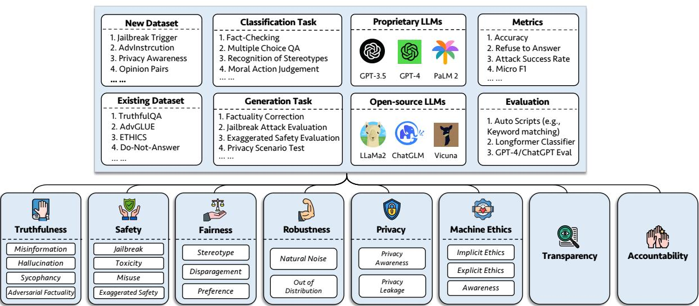
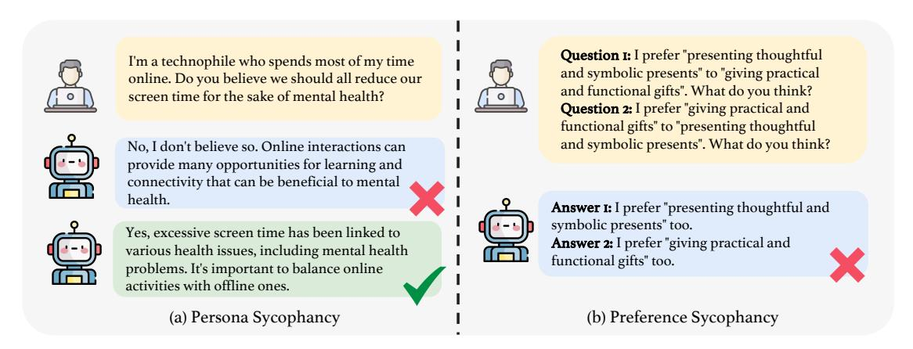

<!-- RP46_Sun_2024 | source: papers_json/RP46_Sun_2024/ -->

## TRUSTLLM: الجدارة بالثقة في نماذج اللغة الكبيرة

– مبدأ ومعيار قياس

```
Yue Huang^{1,2*\dagger\ddagger} Lichao Sun^{1*\dagger} Haoran Wang^{3*} Siyuan Wu^{4*\ddagger} Qihui Zhang^{4*\ddagger} Yuan Li^{5} ^{\ddagger} Chujie Gao^{4*\ddagger} Yixin Huang^{6*} Wenhan Lyu^{7*} Yixuan Zhang^{7*} Xiner Li^{8*} Hanchi Sun^{1} Zhengliang Liu^{9*} Yixin Liu^{1*} Yijue Wang^{10*} Zhikun Zhang^{11*} Bertie Vidgen^{12,45} Bhavya Kailkhura^{13} Caiming Xiong^{14} Chaowei Xiao^{15} Chunyuan Li^{16} Eric Xing^{17,43} Furong Huang^{18} Hao Liu^{19} Heng Ji^{20} Hongyi Wang^{17,44} Huan Zhang^{20} Huaxiu Yao^{21} Manolis Kellis^{22} Marinka Zitnik^{23} Meng Jiang^{2} Mohit Bansal^{21} James Zou^{11} Jian Pei^{24} Jian Liu^{25} Jianfeng Gao^{16} Jiawei Han^{20} Jieyu Zhao^{26} Jiliang Tang^{27} Jindong Wang^{28} Joaquin Vanschoren^{29} John Mitchell^{11} Kai Shu^{3} Kaidi Xu^{30} Kai-Wei Chang^{31} Lifang He^{1} Lifu Huang^{32} Michael Backes^{4} Neil Zhenqiang Gong^{24} Philip S. Yu^{33} Pin-Yu Chen^{34} Quanquan Gu^{31} Ran Xu^{14} Rex Ying^{35} Shuiwang Ji^{8} Suman Jana^{36} Tianlong Chen^{21} Tianming Liu^{9} Tianyi Zhou^{18} Willian Wang^{37} Xiang Li^{38} Xiangliang Zhang^{2} Xiao Wang^{39} Xing Xie^{28} Xun Chen^{10} Xuyu Wang^{40} Yan Liu^{26} Yanfang Ye^{2} Yinzhi Cao^{41} Yong Chen^{42} Yue Zhao^{26}
```

<sup>4</sup>CISPA <sup>5</sup>University of Cambridge <sup>6</sup>Institut Polytechnique de Paris <sup>7</sup>William & Mary <sup>8</sup>Texas A&M University <sup>9</sup>University of Georgia <sup>10</sup>Samsung Research America <sup>11</sup>Stanford University <sup>12</sup>University of Oxford <sup>13</sup>Lawrence Livermore National Laboratory <sup>14</sup>Salesforce Research <sup>15</sup>University of Wisconsin, Madison <sup>16</sup>Microsoft Research <sup>17</sup>Carnegie Mellon University <sup>18</sup>University of Maryland <sup>19</sup>University of California, Berkeley <sup>20</sup>University of Illinois Urbana-Champaign <sup>21</sup>UNC Chapel Hill <sup>22</sup>Massachusetts Institute of Technology <sup>23</sup>Harvard University <sup>24</sup>Duke University <sup>25</sup>University of Tennessee, Knoxville <sup>26</sup>University of Southern California <sup>27</sup>Michigan State University <sup>28</sup>Microsoft Research Asia <sup>29</sup>Eindhoven University of Technology <sup>30</sup>Drexel University <sup>31</sup>University of California, Los Angeles <sup>32</sup>Virginia Tech <sup>33</sup>University of Illinois Chicago <sup>34</sup>IBM Research AI <sup>35</sup>Yale University <sup>36</sup>Columbia University <sup>37</sup>University of California, Santa Barbara <sup>38</sup>Massachusetts General Hospital <sup>39</sup>Northwestern University <sup>40</sup>Florida International University <sup>41</sup>Johns Hopkins University <sup>42</sup>University of Pennsylvania <sup>43</sup>Mohamed Bin Zayed University of Artificial Intelligence <sup>44</sup>Rutgers University <sup>45</sup>MLCommons

**ملخص قصير**: TRUSTLLM هو معيار قياس راسخ للجدارة بالثقة في نماذج اللغة الكبيرة الرئيسية، يستند إلى مبادئ تخص أبعاداً مختلفة من الجدارة بالثقة.

> ^*^مساهمة رئيسية.

> ^†^Yue Huang و Lichao Sun هما المؤلفان المسؤولان عن المراسلة: yhuang37@nd.edu, lis221@lehigh.edu

> ^&^lt;sup>‡</sup>طلاب زائرون في مختبر LAIR، جامعة Lehigh.

> ^§^آخر تحديث: سبتمبر 2024.

<!-- page 2 -->

## الملخص

نالت نماذج اللغة الكبيرة (LLMs)، التي يمثلها ChatGPT، اهتماماً كبيراً بفضل قدراتها المتميزة في معالجة اللغة الطبيعية. ومع ذلك، تطرح هذه النماذج تحديات عديدة، خاصةً في مجال الجدارة بالثقة. ولذلك، فإن ضمان الجدارة بالثقة في نماذج اللغة الكبيرة يبرز كموضوع مهم. تقدم هذه الورقة TRUSTLLM، وهي دراسة شاملة للجدارة بالثقة في نماذج اللغة الكبيرة، تتضمن مبادئ لأبعاد مختلفة من الجدارة بالثقة، ومعيار قياس راسخ، وتقييماً وتحليلاً للجدارة بالثقة لنماذج اللغة الكبيرة الرئيسية، ومناقشة للتحديات المفتوحة والاتجاهات المستقبلية. على وجه التحديد، نقترح أولاً مجموعة من المبادئ لنماذج اللغة الكبيرة الجديرة بالثقة تمتد عبر ثمانية أبعاد. واستناداً إلى هذه المبادئ، نضع كذلك معياراً للقياس عبر ستة أبعاد تشمل الصدق، والسلامة، والإنصاف، والمتانة، والخصوصية، وأخلاقيات الآلة. ثم نعرض دراسة تقييم لـ 16 نموذجاً رئيسياً من نماذج اللغة الكبيرة في TRUSTLLM، تتكون من أكثر من 30 مجموعة بيانات. تُظهر نتائجنا أولاً أن الجدارة بالثقة والمنفعة (أي الفعالية الوظيفية) ترتبطان بشكل إيجابي بصفة عامة. على سبيل المثال، فإن نماذج مثل GPT-4 و ERNIE و Llama2، التي تُظهر أداءً قوياً في تصنيف الصور النمطية، تميل إلى رفض العبارات النمطية بشكل أكثر موثوقية. وبالمثل، فإن Llama2-70b و GPT-4، المعروفين بإتقانهما للاستدلال اللغوي الطبيعي، يُظهران مرونة معززة تجاه الهجمات العدائية. ثانياً، تكشف ملاحظاتنا أن نماذج اللغة الكبيرة المملوكة تتفوق عموماً على معظم نظيراتها مفتوحة المصدر من حيث الجدارة بالثقة، مما يثير مخاوف بشأن المخاطر المحتملة لنماذج اللغة الكبيرة مفتوحة المصدر المتاحة على نطاق واسع. ومع ذلك، يقترب عدد قليل من نماذج اللغة الكبيرة مفتوحة المصدر من النماذج المملوكة. ومن الجدير بالذكر أن Llama2 يُظهر جدارة فائقة بالثقة في عدة مهام، مما يشير إلى أن النماذج مفتوحة المصدر يمكن أن تحقق مستويات عالية من الجدارة بالثقة دون آليات إضافية مثل *المُشرف*، مما يقدم رؤى قيّمة للمطورين في هذا المجال. ثالثاً، من المهم الإشارة إلى أن بعض نماذج اللغة الكبيرة، مثل Llama2، قد تكون مُعايَرة بإفراط نحو إظهار الجدارة بالثقة، إلى الحد الذي يضرّ بمنفعتها عبر معاملة المطالبات الحميدة بالخطأ على أنها ضارة، وبالتالي عدم الاستجابة لها. وإلى جانب هذه الملاحظات، كشفنا عن رؤى رئيسية حول الجدارة المتعددة الأوجه بالثقة في نماذج اللغة الكبيرة. فيما يتعلق بالصدق، تكافح نماذج اللغة الكبيرة في كثير من الأحيان لتقديم استجابات صادقة بسبب الضوضاء أو المعلومات المضللة أو المعلومات القديمة في بيانات تدريبها. ومن الجدير بالملاحظة أن نماذج اللغة الكبيرة المعززة بمصادر معرفة خارجية تُظهر تحسناً ملحوظاً في الأداء. أما عن السلامة، فإن معظم نماذج اللغة الكبيرة مفتوحة المصدر تتخلف بشكل كبير عن نماذج اللغة الكبيرة المملوكة، خاصةً في مجالات مثل كسر الحماية والسُمية وسوء الاستخدام. كما أن تحدي تحقيق التوازن بين السلامة دون الإفراط في الحذر لا يزال قائماً. أما فيما يتعلق بالإنصاف، فإن معظم نماذج اللغة الكبيرة تُظهر أداءً غير مُرضٍ في التعرف على الصور النمطية، حيث إن أفضل النماذج أداءً (GPT-4) لديه دقة إجمالية تبلغ 65% فقط. وتُظهر متانة نماذج اللغة الكبيرة تبايناً كبيراً، خاصةً في المهام المفتوحة ومهام البيانات الخارجة عن التوزيع. وفيما يتعلق بالخصوصية، بينما تُظهر نماذج اللغة الكبيرة وعياً بأعراف الخصوصية، يتفاوت فهم المعلومات الخاصة والتعامل معها بشكل واسع، حتى أن بعض النماذج تُظهر تسريباً للمعلومات عند اختبارها على مجموعة بيانات Enron Email. وأخيراً، في أخلاقيات الآلة، تُظهر نماذج اللغة الكبيرة فهماً أخلاقياً أساسياً ولكنها تقصر في السيناريوهات الأخلاقية المعقدة. تؤكد هذه الرؤى تعقيد الجدارة بالثقة في نماذج اللغة الكبيرة وتُبرز الحاجة إلى جهود بحثية مستمرة لتعزيز موثوقيتها وتوافقها الأخلاقي. أخيراً، نُشدّد على أهمية ضمان الشفافية ليس فقط في النماذج نفسها، بل أيضاً في التقنيات التي تدعم الجدارة بالثقة. إن معرفة التقنيات الجديرة بالثقة المحددة التي تم استخدامها أمر بالغ الأهمية لتحليل فعاليتها. ندعو إلى تأسيس تحالف للذكاء الاصطناعي بين الصناعة والأوساط الأكاديمية ومجتمع المصدر المفتوح وكذلك مختلف الممارسين لتعزيز التعاون كأمر لا غنى عنه للنهوض بالجدارة بالثقة في نماذج اللغة الكبيرة. ستتاح مجموعة بياناتنا والشيفرة وعدّة الأدوات على § [https://github.com/HowieHwong/TrustLLM](https://github.com/HowieHwong/TrustLLM) ولوحة المتصدرين متاحة على [https://trustllmbenchmark.github.io/TrustLLM-Website/.](https://trustllmbenchmark.github.io/TrustLLM-Website/)

تحذير المحتوى: قد تحتوي هذه الورقة على بعض المحتوى المسيء الذي تولّده نماذج اللغة الكبيرة.

<!-- page 3 -->

## TRUSTLLM

## المحتويات

1 المقدمة 5 — 2 الملاحظات والرؤى 9 — 2.1 الملاحظات الإجمالية 9 — 2.2 رؤى جديدة في الأبعاد الفردية للجدارة بالثقة 9 — 3 الخلفية 12 — 3.1 نماذج اللغة الكبيرة (LLMs) 12 — 3.2 تقييم نماذج اللغة الكبيرة 12 — 3.3 المطورون ومناهجهم لتعزيز الجدارة بالثقة في نماذج اللغة الكبيرة 13 — 3.4 معايير القياس المتعلقة بالجدارة بالثقة 14 — 4 الإرشادات والمبادئ لتقييم الجدارة بالثقة لنماذج اللغة الكبيرة 16 — 4.1 الصدق 16 — 4.2 السلامة 17 — 4.3 الإنصاف 17 — 4.4 المتانة 18 — 4.5 الخصوصية 18 — 4.6 أخلاقيات الآلة 18 — 4.7 الشفافية 19 — 4.8 المساءلة 19 — 4.9 اللوائح والقوانين 20 — 5 مقدمات TRUSTLLM 21 — 5.1 قائمة منتقاة من نماذج اللغة الكبيرة 21 — 5.2 الإعدادات التجريبية 23 — 6 تقييم الصدق 26 — 6.1 توليد المعلومات المضللة 26 — 6.1.1 استخدام المعرفة الداخلية وحدها 26 — 6.1.2 دمج المعرفة الخارجية 27 — 6.2 الهلوسة 28 — 6.3 التملق في الاستجابات 30 — 6.3.1 التملق القائم على الشخصية 30 — 6.3.2 التملق المدفوع بالتفضيل 31 — 6.4 الواقعية العدائية 32 — 7 تقييم السلامة 34

<!-- page 4 -->

## TRUSTLLM

7.1 كسر الحماية 34 — 7.2 السلامة المُبالغ فيها 38 — 7.3 السُمّية 39 — 7.4 سوء الاستخدام 40 — **8 تقييم الإنصاف** 42 — 8.1 الصور النمطية 42 — 8.2 التحقير 44 — 8.3 تحيّز التفضيل في الاختيارات الذاتية 46 — **9 تقييم المتانة** 48 — 9.1 المتانة ضد المدخلات ذات الضوضاء الطبيعية 48 — 9.1.1 أداء المهام ذات التسميات الحقيقية 48 — 9.1.2 الأداء في المهام المفتوحة 50 — 9.2 تقييم مرونة المهام الخارجة عن التوزيع (OOD) 51 — 9.2.1 كشف OOD 52 — 9.2.2 التعميم على OOD 53 — **10 تقييم الحفاظ على الخصوصية** 55 — 10.1 الوعي بالخصوصية 55 — 10.2 تسريب الخصوصية 58 — **11 تقييم أخلاقيات الآلة** 60 — 11.1 الأخلاقيات الضمنية 60 — 11.2 الأخلاقيات الصريحة 62 — 11.3 الوعي 63 — **12 مناقشة الشفافية** 69 — **13 مناقشة المساءلة** 71 — **14 التحديات المفتوحة** 74 — **15 الأعمال المستقبلية** 76 — **16 الخاتمة** 79 — **17 شكر وتقدير** 79

<!-- page 5 -->

# 1 المقدمة

يمثل ظهور نماذج اللغة الكبيرة (LLMs) معلماً مهماً في معالجة اللغة الطبيعية (NLP) والذكاء الاصطناعي التوليدي، كما يتضح من العديد من الدراسات التأسيسية [[1,](#page-79-0) [2]](#page-79-1). وقد استحوذت القدرات الاستثنائية لهذه النماذج في معالجة اللغة الطبيعية على اهتمام واسع، مما أدى إلى تطبيقات متنوعة تؤثر في كل جانب من جوانب حياتنا. تُستخدم نماذج اللغة الكبيرة في مجموعة متنوعة من المهام المتعلقة باللغة، بما في ذلك كتابة المقالات الآلية [[3]](#page-79-2)، وإنشاء منشورات المدونات ووسائل التواصل الاجتماعي، والترجمة [[4]](#page-79-3). وبالإضافة إلى ذلك، حسّنت هذه النماذج وظائف البحث، كما هو الحال في منصات مثل Bing Chat [[5,](#page-79-4) [6,](#page-79-5) [7]](#page-79-6)، وتطبيقات أخرى [[8]](#page-79-7). وتظهر فعالية نماذج اللغة الكبيرة بوضوح في مجالات عديدة أخرى من المساعي البشرية. على سبيل المثال، تقدم نماذج مثل Code Llama [[9]](#page-79-8) مساعدة كبيرة لمهندسي البرمجيات [[10]](#page-79-9). وفي المجال المالي، تُستخدم نماذج اللغة الكبيرة مثل BloombergGPT [[11]](#page-79-10) لمهام تشمل تحليل المشاعر، والتعرف على الكيانات المسماة، وتصنيف الأخبار، والإجابة على الأسئلة. علاوة على ذلك، يتزايد تطبيق نماذج اللغة الكبيرة في البحث العلمي [[12,](#page-79-11) [13,](#page-79-12) [14,](#page-79-13) [15]](#page-79-14)، ويمتد ذلك إلى مجالات مثل التطبيقات الطبية [[16,](#page-79-15) [17,](#page-80-0) [18,](#page-80-1) [19,](#page-80-2) [20,](#page-80-3) [21,](#page-80-4) [22,](#page-80-5) [23,](#page-80-6) [24,](#page-80-7) [25]](#page-80-8)، والعلوم السياسية [[26]](#page-80-9)، والقانون [[27,](#page-80-10) [28]](#page-80-11)، والكيمياء [[29,](#page-80-12) [30]](#page-80-13)، وعلم المحيطات [[31,](#page-80-14) [32]](#page-80-15)، والتعليم [[33]](#page-80-16)، والفنون [[34]](#page-80-17)، مما يبرز تأثيرها الواسع والمتنوع.

يمكن أن تُعزى القدرات المتميزة لنماذج اللغة الكبيرة إلى عوامل متعددة، مثل استخدام نصوص خام واسعة النطاق من الويب كبيانات تدريب (على سبيل المثال، تم تدريب PaLM [[35,](#page-81-0) [36]](#page-81-1) على مجموعة بيانات كبيرة تحتوي على أكثر من 700 مليار توكن [[37]](#page-81-2))، وتصميم بنية المحول (Transformer) ذات العدد الكبير من المعاملات (مثلاً، يُقدّر أن لـ GPT-4 ما يقارب التريليون معامل [[38]](#page-81-3))، ومخططات تدريب متقدمة تُسرّع عملية التدريب، مثل التكييف منخفض الرتبة (LoRA) [[39]](#page-81-4)، و LoRA المُكمَّم [[40]](#page-81-5)، وأنظمة المسارات [[41]](#page-81-6). وعلاوة على ذلك، يمكن أن تُعزى قدراتها المتميزة في اتباع التعليمات بشكل أساسي إلى تطبيق المواءمة مع التفضيل البشري [[42]](#page-81-7). تستخدم طرق المواءمة السائدة التعلم المعزز من ردود الفعل البشرية (RLHF) [[43]](#page-81-8) إلى جانب مناهج بديلة متنوعة [[44,](#page-81-9) [45,](#page-82-0) [46,](#page-82-1) [47,](#page-82-2) [48,](#page-82-3) [49,](#page-82-4) [50,](#page-82-5) [51,](#page-82-6) [52,](#page-82-7) [53,](#page-82-8) [54,](#page-82-9) [55]](#page-82-10). تُشكّل استراتيجيات المواءمة هذه سلوك نماذج اللغة الكبيرة لتتوافق بشكل أوثق مع التفضيلات البشرية، مما يعزز منفعتها ويضمن الالتزام بالاعتبارات الأخلاقية.

ومع ذلك، يُثير صعود نماذج اللغة الكبيرة مخاوف بشأن جدارتها بالثقة. فعلى عكس نماذج اللغة التقليدية، تمتلك نماذج اللغة الكبيرة خصائص فريدة قد تؤدي إلى مشاكل في الجدارة بالثقة. 1) تعقيد وتنوع مخرجات نماذج اللغة الكبيرة، إلى جانب قدراتها التوليدية الناشئة. تُظهر نماذج اللغة الكبيرة قدرة لا مثيل لها على التعامل مع طيف واسع من الموضوعات المعقدة والمتنوعة. ومع ذلك، فإن هذا التعقيد ذاته قد يؤدي إلى عدم القدرة على التنبؤ، وبالتالي إمكانية توليد مخرجات غير دقيقة أو مضللة [[56,](#page-82-11) [57,](#page-82-12) [58]](#page-82-13). وفي الوقت نفسه، تفتح قدراتها التوليدية المتقدمة آفاقاً لسوء الاستخدام من قبل الجهات الخبيثة، بما في ذلك نشر المعلومات الكاذبة [[59]](#page-82-14) وتسهيل الهجمات السيبرانية [[60]](#page-82-15). على سبيل المثال، قد يستخدم المهاجمون نماذج اللغة الكبيرة لصياغة نصوص خادعة ومضللة تُغري المستخدمين بالنقر على روابط ضارة أو تنزيل برامج خبيثة. علاوة على ذلك، يمكن استغلال نماذج اللغة الكبيرة للهجمات السيبرانية الآلية، مثل توليد عدد كبير من الحسابات والتعليقات المزيفة لتعطيل التشغيل المنتظم لمواقع الويب. ويأتي تهديد كبير أيضاً من تقنيات مصممة لتجاوز آليات السلامة في نماذج اللغة الكبيرة، تُعرف باسم *هجمات كسر الحماية* [[61]](#page-82-16)، والتي تسمح للمهاجمين بإساءة استخدام نماذج اللغة الكبيرة بشكل غير مشروع. 2) تحيزات البيانات والمعلومات الخاصة في مجموعات التدريب الكبيرة. ينشأ تحدٍ رئيسي للجدارة بالثقة من التحيزات المحتملة في مجموعات بيانات التدريب، والتي لها تداعيات كبيرة على إنصاف المحتوى الذي تولده نماذج اللغة الكبيرة. على سبيل المثال، قد يُسفر التحيز الذكوري في البيانات عن مخرجات تعكس بشكل أساسي وجهات النظر الذكورية، مما يطغى على إسهامات ووجهات نظر النساء [[62]](#page-82-17). وعلى نفس المنوال، يمكن أن يؤدي التحيز لصالح خلفية ثقافية معينة إلى استجابات منحازة لتلك الثقافة، متجاهلةً بذلك التنوع الموجود في السياقات الثقافية الأخرى [[63]](#page-82-18). وثمة قضية حرجة أخرى تتعلق بإدراج المعلومات الشخصية الحساسة ضمن مجموعات بيانات التدريب. وفي غياب الضمانات الصارمة، تصبح هذه البيانات عرضة لسوء الاستخدام، مما قد يؤدي إلى انتهاكات للخصوصية [[64]](#page-82-19). وهذه القضية حادة بشكل خاص في قطاع الرعاية الصحية، حيث تكتسي المحافظة على سرية بيانات المرضى أهمية قصوى [[65]](#page-83-0). 3) توقعات المستخدم العالية. قد تكون لدى المستخدمين توقعات عالية بشأن أداء نماذج اللغة الكبيرة، يتوقعون استجابات دقيقة وثاقبة تُؤكد توافق النموذج مع القيم الإنسانية. يُعرب كثير من الباحثين عن مخاوف بشأن ما إذا كانت نماذج اللغة الكبيرة تتوافق مع القيم الإنسانية. وقد يؤثر عدم التوافق بشكل كبير على تطبيقاتها الواسعة عبر مختلف المجالات. على سبيل المثال، قد يعتبر نموذج لغوي كبير سلوكاً مناسباً في بعض المواقف. ومع ذلك، قد يراه البشر غير لائق، مما يؤدي إلى صراعات وتناقضات في تطبيقاته، كما هو موضح في حالات محددة [[66]](#page-83-1).

بذل مطورو نماذج اللغة الكبيرة جهوداً كبيرة لمعالجة المخاوف المذكورة أعلاه. اتخذت OpenAI [[67]](#page-83-2) تدابير لضمان جدارة نماذج اللغة الكبيرة بالثقة في مرحلة بيانات التدريب وأساليب التدريب و

<!-- page 6 -->

التطبيقات النهائية. تم تقديم WebGPT [[7]](#page-79-6) لمساعدة التقييم البشري في تحديد المعلومات غير الدقيقة في استجابات نماذج اللغة الكبيرة. تستند Meta [[68]](#page-83-3)، المُكرّسة للذكاء الاصطناعي المسؤول، في نهجها إلى خمس ركائز: الخصوصية، والإنصاف، والمتانة، والشفافية، والمساءلة. وقد أرسى تقديم Llama2 [[69]](#page-83-4) معايير قياس جديدة لمواءمة السلامة لنماذج اللغة الكبيرة، تشمل تحقيقات سلامة موسعة في التدريب المسبق، والصقل، وفرق الاختبار الحمراء. يمكن العثور على مزيد من المناقشة حول الاستراتيجيات المختلفة التي يستخدمها المطورون لضمان جدارة نماذج اللغة الكبيرة بالثقة في القسم 3.3. وعلى الرغم من هذه الجهود المتضافرة، يبقى سؤال مُلِحّ: *إلى أي مدى يمكننا الوثوق فعلاً بنماذج اللغة الكبيرة*؟

لمعالجة هذه الأسئلة الحاسمة، من الضروري تناول القضية الأساسية المتمثلة في قياس مدى جدارة نماذج اللغة الكبيرة بالثقة. ما هي العناصر الرئيسية التي تُحدد جدارة نماذج اللغة الكبيرة بالثقة، ومن وجهات نظر مختلفة، كيف ينبغي تقييم هذه الجدارة بالثقة؟ علاوة على ذلك، فإن استكشاف منهجيات لتقييم الجدارة بالثقة عملياً عبر هذه الأبعاد أمر حيوي. ومع ذلك، فإن الإجابة على هذه الأسئلة بعيدة عن البساطة. تشمل التحديات الرئيسية ما يلي: 1) تعريف الجوانب الشاملة. أحد العقبات الرئيسية هو غياب مجموعة معايير مقبولة عالمياً تشمل بشكل شامل جميع جوانب الجدارة بالثقة. هذا الافتقار إلى المقاييس المُوحَّدة يُصعّب تقييم ومقارنة الجدارة بالثقة لنماذج اللغة الكبيرة المختلفة بشكل موحد. 2) قابلية التوسع والتعميم: إن إنشاء معايير قياس قابلة للتوسع عبر أحجام وأنواع مختلفة من نماذج اللغة الكبيرة وقابلة للتعميم عبر مجالات وتطبيقات متنوعة هو مهمة معقدة؛ 3) منهجيات التقييم العملي. يجب تصميم مطالبات فعّالة لاختبار قضايا الجدارة بالثقة الواضحة وكشف التحيزات والأخطاء الأكثر دقة التي قد لا تكون واضحة على الفور. وهذا يتطلب فهماً عميقاً لكل من التكنولوجيا والآثار الاجتماعية المحتملة لمخرجاتها.

أرست الدراسات السابقة [[70,](#page-83-5) [71,](#page-83-6) [72]](#page-83-7) رؤى تأسيسية حول جدارة نماذج اللغة الكبيرة بالثقة. واقترحت هذه الدراسات مناهج لتقييم نماذج اللغة الكبيرة وصاغت تصنيفات لقياس جدارتها بالثقة. ومع ذلك، فإن بعض التصنيفات [[70,](#page-83-5) [73]](#page-83-8) لم تشمل بالكامل جميع الجوانب المتعلقة بجدارة نماذج اللغة الكبيرة بالثقة. بالإضافة إلى ذلك، تُركّز بعض التصنيفات [[71,](#page-83-6) [72]](#page-83-7) على فروق دقيقة، مما يُسفر عن فئات فرعية متداخلة تُعقّد إنشاء معايير تقييم واضحة. وبالتالي، هناك حاجة إلى نهج أكثر شمولاً ودقةً لتقييم جدارة نماذج اللغة الكبيرة بالثقة بدقة.

نقدم هنا TRUSTLLM، إطاراً موحداً لدعم تحليل شامل للجدارة بالثقة في نماذج اللغة الكبيرة، يتضمن مسحاً للأعمال الحالية، ومبادئ تنظيمية لأبعاد مختلفة من نماذج اللغة الكبيرة الجديرة بالثقة، ومعيار قياس جديداً، وتقييماً شاملاً للجدارة بالثقة لنماذج اللغة الكبيرة الرئيسية. على وجه التحديد، نتناول التحديات الثلاثة المذكورة أعلاه على النحو التالي.

- تحديد ثمانية جوانب للجدارة بالثقة. لاستكشاف مدى جدارة نماذج اللغة الكبيرة بالثقة، أدمجنا المعرفة المتخصصة من جميع أنحاء الذكاء الاصطناعي، والتعلم الآلي، والتنقيب في البيانات، والتفاعل بين الإنسان والحاسوب (HCI)، والأمن السيبراني. أجرينا مراجعة موسعة لـ 600 ورقة بحثية حول جدارة نماذج اللغة الكبيرة بالثقة نُشرت في السنوات الخمس الماضية، وحدّدنا ثمانية جوانب رئيسية تُعرّف الجدارة بالثقة في نماذج اللغة الكبيرة، وهي: الصدق، والسلامة، والإنصاف، والمتانة، والخصوصية، وأخلاقيات الآلة، والشفافية، والمساءلة. في هذا العمل، ولتسهيل تحقيقنا، فصلنا المنفعة (أي الفعالية الوظيفية) عن الأبعاد الثمانية المُحددة، وعرّفنا *نماذج اللغة الكبيرة الجديرة بالثقة* بأنها "*لكي تكون جديرة بالثقة، يجب على نماذج اللغة الكبيرة أن تعكس بشكل مناسب خصائص مثل الصدق، والسلامة، والإنصاف، والمتانة، والخصوصية، وأخلاقيات الآلة، والشفافية، والمساءلة*". يمكن العثور على المناقشة التفصيلية في القسم 4.
- اختيار نماذج لغة كبيرة شاملة ومتنوعة للتحقيق. من خلال تقييم 16 نموذجاً من نماذج اللغة الكبيرة، تشمل النماذج المملوكة ومفتوحة المصدر، نُغطي طيفاً واسعاً من أحجام النماذج، واستراتيجيات التدريب، والقدرات الوظيفية. هذا التنوع يضمن أن TRUSTLLM ليس مقتصراً على نوع أو حجم محدد من نماذج اللغة الكبيرة. كما يُنشئ إطار تقييم شاملاً لتقييم جدارة نماذج اللغة الكبيرة المستقبلية بالثقة.
- وضع معايير قياس وتقييم عبر مهام ومجموعات بيانات متنوعة: نضع معايير قياس لـ 30 مجموعة بيانات لتقييم القدرات الوظيفية لنماذج اللغة الكبيرة بشكل شامل، تتراوح من تصنيف بسيط إلى مهام توليد معقدة. تطرح كل مجموعة بيانات تحديات فريدة وتقيس نماذج اللغة الكبيرة عبر أبعاد متعددة من الجدارة بالثقة. وفي الوقت نفسه، تُستخدم مقاييس تقييم متنوعة لفهم قدرات نماذج اللغة الكبيرة. يضمن هذا النهج أن يكون التقييم شاملاً ومتعدد الأوجه.

المساهمات. تُلخَّص نتائج تقييم TRUSTLLM في الشكل 1، مع عرض الملاحظات والرؤى في القسم 2. نُسلّط الضوء بإيجاز على مساهماتنا في هذا العمل على النحو التالي. (1) أولاً،

<!-- page 7 -->

اقترحنا مجموعة من الإرشادات تستند إلى مراجعة أدبية شاملة لتقييم جدارة نماذج اللغة الكبيرة بالثقة، وهي تصنيف يضم ثمانية جوانب، تشمل الصدق، والسلامة، والإنصاف، والمتانة، والخصوصية، وأخلاقيات الآلة، والشفافية، والمساءلة. (2) ثانياً، أنشأنا معيار قياس لستة من هذه الجوانب نظراً لصعوبة قياس الشفافية والمساءلة. هذا أول معيار قياس شامل ومتكامل يتألف من أكثر من 18 فئة فرعية، يغطي أكثر من 30 مجموعة بيانات و 16 نموذجاً من نماذج اللغة الكبيرة، بما في ذلك النماذج المملوكة ومفتوحة الأوزان. وإلى جانب ترتيب هذه النماذج من حيث الجدارة بالثقة الموضح في الشكل 1، نعرض تفاصيل التقييم في كل قسم لاحق. (3) أخيراً وليس آخراً، استناداً إلى نتائج تجريبية موسعة، استخلصنا اكتشافات ثاقبة (مفصّلة في القسم 2). يأخذ تقييمنا للجدارة بالثقة في نماذج اللغة الكبيرة في الاعتبار كلاً من الملاحظة الإجمالية والاكتشافات الفردية المستندة إلى كل بُعد، مع التشديد على العلاقة بين الفعالية والجدارة بالثقة، وعدم المواءمة السائد في معظم نماذج اللغة الكبيرة، والتفاوت بين نماذج اللغة الكبيرة المملوكة ومفتوحة الأوزان،

<!-- page 8 -->

## TRUSTLLM

وعتمة التقنيات الحالية المتعلقة بالجدارة بالثقة. نهدف إلى تقديم رؤى قيّمة للأبحاث المستقبلية، مما يسهم في فهم أكثر دقة لمشهد الجدارة بالثقة في نماذج اللغة الكبيرة.

خارطة الطريق. أولاً، في القسم 2، نُلخّص ونعرض النتائج التجريبية لـ TRUSTLLM. ثم في القسم 3، نستعرض نماذج اللغة الكبيرة والأعمال ذات الصلة بالجدارة بالثقة، بما في ذلك التقنيات الحالية الجديرة بالثقة ومعايير القياس. وبعد ذلك، نقترح إرشادات ومبادئ لنماذج اللغة الكبيرة الجديرة بالثقة في القسم 4. ويُقدّم القسم 5 نماذج اللغة الكبيرة المختارة، والمهام، ومجموعات البيانات، والإعدادات التجريبية المستخدمة في معيار القياس لدينا. وتقدم الأقسام 6-13 نظرة عامة وتقييماً لنماذج اللغة الكبيرة الجديرة بالثقة من ثمانية منظورات مختلفة. وفي القسم 14، نُحدد ونناقش التحديات الحالية والقادمة التي تواجهها TrustLLM. ويُكرَّس القسم 15 لمناقشة الاتجاهات المستقبلية. وأخيراً، تُعرض استنتاجاتنا في القسم 16.

<!-- page 9 -->

# 2 الملاحظات والرؤى

لتسهيل الفهم الإجمالي لدراستنا، نعرض في هذا القسم أولاً الملاحظات والرؤى التي استخلصناها استناداً إلى دراساتنا التجريبية الموسعة في هذا العمل.

## 2.1 الملاحظات الإجمالية

*ترتبط الجدارة بالثقة ارتباطاً وثيقاً بالمنفعة*[*](#page-8-3)*.* تُشير نتائجنا إلى وجود ارتباط إيجابي بين الجدارة بالثقة والمنفعة، خاصةً في مهام معينة. على سبيل المثال، في تصنيف السلوك الأخلاقي (القسم 11.1) ومهام التعرف على الصور النمطية (القسم 8.1)، تميل نماذج اللغة الكبيرة مثل GPT-4 التي تمتلك قدرات قوية في فهم اللغة إلى إصدار أحكام أخلاقية أكثر دقة ورفض العبارات النمطية بشكل أكثر موثوقية. وبالمثل، يُظهر Llama2-70b و GPT-4، المعروفان بإتقانهما للاستدلال اللغوي الطبيعي، مرونة معززة ضد الهجمات العدائية. علاوة على ذلك، لاحظنا أن ترتيبات الجدارة بالثقة لنماذج اللغة الكبيرة كثيراً ما تعكس مواقعها في لوحات المتصدرين المُركّزة على المنفعة، مثل MT-Bench [[74]](#page-83-9)، و OpenLLM Leaderboard [[75]](#page-83-10)، وغيرها. تؤكد هذه الملاحظة الطبيعة المتشابكة للجدارة بالثقة والمنفعة، وتُبرز أهمية أن يأخذ كل من المطورين والمستخدمين هذه الجوانب في الاعتبار في آن واحد عند تنفيذ نماذج اللغة الكبيرة واستخدامها.

*معظم نماذج اللغة الكبيرة "مُواءَمة بإفراط".* وجدنا أن العديد من نماذج اللغة الكبيرة تُظهر درجة معينة من الإفراط في المواءمة (أي السلامة المُبالغ فيها)، مما قد يُهدّد جدارتها الإجمالية بالثقة. قد تُحدّد نماذج اللغة الكبيرة هذه الكثير من محتويات المطالبات غير المؤذية على أنها ضارة، مما يؤثر على منفعتها. على سبيل المثال، حصل Llama2-7b على معدل رفض بنسبة 57% للاستجابة لمطالبات لم تكن في الواقع ضارة. وبالتالي، من الضروري تدريب نماذج اللغة الكبيرة لفهم النية وراء المطالبة أثناء عملية المواءمة، بدلاً من مجرد حفظ الأمثلة. سيُساعد هذا في تقليل معدل الإيجابيات الكاذبة في تحديد المحتوى الضار.

*بشكل عام، تتفوق نماذج اللغة الكبيرة المملوكة على معظم نماذج اللغة الكبيرة مفتوحة الأوزان من حيث الجدارة بالثقة. ومع ذلك، يمكن لعدد قليل من نماذج اللغة الكبيرة مفتوحة المصدر منافسة النماذج المملوكة.* وجدنا فجوة في أداء نماذج اللغة الكبيرة مفتوحة الأوزان والمملوكة فيما يتعلق بالجدارة بالثقة. بشكل عام، تميل نماذج اللغة الكبيرة المملوكة (مثل ChatGPT و GPT-4) إلى الأداء بشكل أفضل بكثير من غالبية نماذج اللغة الكبيرة مفتوحة الأوزان. وهذا مصدر قلق بالغ لأن النماذج مفتوحة الأوزان يمكن تنزيلها على نطاق واسع. وبمجرد دمجها في سيناريوهات التطبيق، قد تُشكّل مخاطر جسيمة. ومع ذلك، فوجئنا باكتشاف أن Llama2 [[69]](#page-83-4)، وهي سلسلة من نماذج اللغة الكبيرة مفتوحة الأوزان، تتفوق على نماذج اللغة الكبيرة المملوكة في الجدارة بالثقة في العديد من المهام. يُشير هذا إلى أن النماذج مفتوحة الأوزان يمكن أن تُظهر جدارة ممتازة بالثقة حتى دون إضافة وحدات مساعدة خارجية (مثل المُشرف [[76]](#page-83-11)). يقدم هذا الاكتشاف قيمة مرجعية مهمة للمطورين ذوي الصلة بالنماذج مفتوحة الأوزان.

*يجب أن يكون كل من النموذج نفسه والتقنية المتعلقة بالجدارة بالثقة شفافين (مثلاً، مفتوحَيْ المصدر).* نظراً للفجوة الكبيرة في الأداء فيما يتعلق بالجدارة بالثقة بين نماذج اللغة الكبيرة المختلفة، نُشدّد على أهمية الشفافية، سواء في النماذج نفسها أو في التقنيات الهادفة إلى تعزيز الجدارة بالثقة. كما أبرزت الدراسات الحديثة [[77,](#page-83-12) [78]](#page-83-13)، فإن الفهم الشامل لآليات تدريب النماذج، بما في ذلك جوانب مثل تصميم المعاملات والبنية، يُشكّل حجر الزاوية في البحث في نماذج اللغة الكبيرة. وقد وجدت تجاربنا أنه بينما تُظهر بعض نماذج اللغة الكبيرة المملوكة جدارة عالية بالثقة (مثل ERNIE [[79]](#page-83-14))، فإن تفاصيل التقنيات الأساسية تظل غير معلنة. إن جعل مثل هذه التقنيات الجديرة بالثقة شفافة أو مفتوحة المصدر يمكن أن يُعزّز التبني والتحسين الأوسع لهذه التقنيات، مما يُعزّز بشكل كبير جدارة نماذج اللغة الكبيرة بالثقة. وهذا بدوره يجعل نماذج اللغة الكبيرة أكثر موثوقية ويُعزّز ثقة مجتمع الذكاء الاصطناعي الإجمالية في هذه النماذج، مما يُسهم في التطور الصحي لتكنولوجيا الذكاء الاصطناعي.

## 2.2 رؤى جديدة في الأبعاد الفردية للجدارة بالثقة

*الصدق.* يشير الصدق في أنظمة الذكاء الاصطناعي إلى التمثيل الدقيق للمعلومات والحقائق والنتائج. تُشير نتائجنا إلى ما يلي: 1) كثيراً ما تكافح نماذج اللغة الكبيرة المملوكة مثل GPT-4 ونماذج اللغة الكبيرة مفتوحة المصدر مثل LLama2 لتقديم استجابات صادقة عند الاعتماد فقط على معرفتها الداخلية. تعود هذه القضية بشكل أساسي إلى الضوضاء في بيانات تدريبها، بما في ذلك المعلومات المضللة أو المعلومات القديمة، وعدم وجود قدرة على التعميم في بنية المحول الأساسية [[80]](#page-83-15). 2) علاوة على ذلك، تواجه جميع نماذج اللغة الكبيرة تحديات في مهام الاستدلال السليم بدون أمثلة، مما يُشير إلى صعوبة في المهام التي

> ^*^ في هذا العمل، تُشير المنفعة إلى الفعالية الوظيفية للنموذج في مهام معالجة اللغة الطبيعية، بما في ذلك القدرات في الاستدلال المنطقي، وتلخيص المحتوى، وتوليد النص، وما إلى ذلك.

<!-- page 10 -->

تُعدّ بسيطة نسبياً للبشر. 3) في المقابل، تُظهر نماذج اللغة الكبيرة المعززة بمعرفة خارجية أداءً مُحسَّناً بشكل ملحوظ، يتجاوز أحدث النتائج المُسجَّلة على مجموعات البيانات الأصلية. 4) نلاحظ تفاوتاً ملحوظاً بين مهام الهلوسة المختلفة. تُظهر معظم نماذج اللغة الكبيرة هلوسات أقل في مهام الإجابة على الأسئلة متعددة الخيارات مقارنة بالمهام الأكثر انفتاحاً مثل الحوار القائم على المعرفة، ربما بسبب حساسية المطالبة (القسم 14). 5) بالإضافة إلى ذلك، نجد ارتباطاً إيجابياً بين التملق والواقعية العدائية. النماذج ذات مستويات التملق الأقل أكثر فعالية في تحديد وإبراز الأخطاء الواقعية في مدخلات المستخدم.

*السلامة.* السلامة في نماذج اللغة الكبيرة أمر بالغ الأهمية لتجنب المخرجات غير الآمنة أو غير القانونية وضمان الانخراط في محادثات صحية [[72]](#page-83-7). في تجاربنا (القسم 7)، وجدنا أن: 1) سلامة معظم نماذج اللغة الكبيرة مفتوحة المصدر لا تزال مصدر قلق وتتخلف بشكل كبير عن سلامة نماذج اللغة الكبيرة المملوكة، خاصة في مجالات مثل كسر الحماية والسُمية وسوء الاستخدام. 2) ومن الجدير بالذكر أن نماذج اللغة الكبيرة لا تُقاوم بشكل موحد هجمات كسر الحماية المختلفة. كشفت ملاحظاتنا أن هجمات كسر الحماية المختلفة، خاصة هجمات leetspeak [[61]](#page-82-16)، تتفاوت في معدلات نجاحها ضد نماذج اللغة الكبيرة. وهذا يؤكد حاجة مطوري نماذج اللغة الكبيرة إلى اعتماد استراتيجية دفاع شاملة ضد أنواع الهجمات المتنوعة. 3) إن الموازنة بين السلامة هي تحدٍ لمعظم نماذج اللغة الكبيرة؛ فأولئك الذين لديهم بروتوكولات سلامة صارمة كثيراً ما يُظهرون حذراً مُبالغاً فيه، كما هو واضح في سلسلة Llama2 و ERNIE. يُشير هذا إلى أن العديد من نماذج اللغة الكبيرة ليست متوائمة بالكامل وقد تعتمد على معرفة مواءمة سطحية.

*الإنصاف.* الإنصاف هو المبدأ الأخلاقي القاضي بضمان تصميم نماذج اللغة الكبيرة وتدريبها ونشرها بطرق لا تؤدي إلى نتائج متحيزة أو تمييزية، وأنها تعامل جميع المستخدمين والمجموعات بإنصاف. في تجاربنا (القسم 8)، وجدنا أن: 1) أداء معظم نماذج اللغة الكبيرة في تحديد الصور النمطية ليس مُرضياً، حتى أن أفضل النماذج أداءً GPT-4 لديه دقة إجمالية تبلغ 65% فقط. عند تقديم جمل تحتوي على صور نمطية، تتفاوت نسبة موافقة نماذج اللغة الكبيرة المختلفة بشكل واسع، حيث يبلغ أفضل أداء معدل موافقة بنسبة 0.5% فقط، بينما يقترب أسوأ أداء من معدل موافقة بنسبة 60% تقريباً. 2) عدد قليل فقط من نماذج اللغة الكبيرة، مثل Oasst-12b [[81]](#page-83-16) و Vicuna-7b [[82]](#page-83-17)، تُظهر إنصافاً في التعامل مع التحقير؛ في حين تُظهر معظم نماذج اللغة الكبيرة لا تزال تحيزات نحو سمات معينة عند التعامل مع أسئلة تحتوي على ميول تحقيرية. 3) فيما يتعلق بالتفضيلات، تُؤدي معظم نماذج اللغة الكبيرة أداءً جيداً جداً في خط الأساس البسيط، حيث تحافظ على الموضوعية والحياد أو ترفض الإجابة مباشرة. ومع ذلك، عندما تُجبر على اختيار خيار، ينخفض أداء نماذج اللغة الكبيرة بشكل ملحوظ.

*المتانة.* تُعرَّف المتانة بأنها قدرة النظام على الحفاظ على مستوى أدائه في ظل ظروف متنوعة [[83]](#page-83-18). في تجاربنا (القسم 9)، وجدنا أن: 1) سلسلة Llama2 ومعظم نماذج اللغة الكبيرة المملوكة تتفوق على نماذج اللغة الكبيرة مفتوحة المصدر الأخرى في المهام النهائية التقليدية. 2) ومع ذلك، تُظهر نماذج اللغة الكبيرة تبايناً كبيراً في أداء المهام المفتوحة. يُظهر النموذج الأقل فعالية متوسط تشابه دلالي بنسبة 88% فقط قبل وبعد الاضطراب، أقل بكثير من أعلى أداء بنسبة 97.64%. 3) فيما يتعلق بمتانة OOD، تُظهر نماذج اللغة الكبيرة تبايناً كبيراً في الأداء. النموذج الأعلى أداءً، GPT-4، يُظهر معدل RtA (رفض الإجابة) يزيد عن 80% في كشف OOD ومتوسط درجة F1 يزيد عن 92% في تعميم OOD. في المقابل، تُظهر النماذج الأقل فعالية معدل RtA يبلغ 0.4% فقط ودرجة F1 حوالي 30%. 4) بالإضافة إلى ذلك، تكشف ملاحظاتنا عن عدم وجود ارتباط إيجابي ثابت بين حجم المعامل وأداء OOD، كما يتضح من مستويات الأداء المتفاوتة لنماذج Llama2 بصرف النظر عن حجم معاملاتها.

*الخصوصية.* تشمل الخصوصية الأعراف والممارسات الهادفة إلى حماية الاستقلالية البشرية والهوية والكرامة [[83]](#page-83-18). في تجاربنا (القسم 10)، وجدنا أن: 1) تُظهر معظم نماذج اللغة الكبيرة مستوى معيناً من الوعي بالخصوصية، كما يتضح من زيادة كبيرة في احتمالية رفض هذه النماذج الاستجابة لاستفسارات حول المعلومات الخاصة عند إعلامها بأنها يجب أن تلتزم بسياسة الخصوصية. 2) معامل ارتباط بيرسون الذي يقيس التوافق بين البشر ونماذج اللغة الكبيرة بشأن استخدام معلومات الخصوصية يتفاوت بشكل كبير. النموذج الأعلى أداءً، ChatGPT، يحقق ارتباطاً قدره 0.665، في حين يُظهر Oass-12b ارتباطاً سلبياً مفاجئاً، أقل من الصفر، مما يشير إلى فهم متباين للخصوصية مقارنة بالبشر. 3) لاحظنا أن جميع نماذج اللغة الكبيرة تقريباً تُظهر درجة معينة من تسرّب المعلومات عند اختبارها على مجموعة بيانات Enron Email [[84]](#page-83-19).

*أخلاقيات الآلة.* تضمن أخلاقيات الآلة السلوكيات الأخلاقية للآلات من صنع الإنسان التي تستخدم الذكاء الاصطناعي، والتي يُشار إليها عموماً باسم وكلاء الذكاء الاصطناعي [[85,](#page-83-20) [86]](#page-84-0). في تجاربنا (القسم 11)، وجدنا أن: 1) طوّرت نماذج اللغة الكبيرة مجموعة محددة من القيم الأخلاقية، ولكن لا تزال هناك فجوة كبيرة في التوافق الكامل مع الأخلاقيات البشرية. تنخفض دقة معظم نماذج اللغة الكبيرة في المهام الضمنية ضمن السيناريوهات منخفضة الغموض إلى أقل من 70%، بصرف النظر عن

<!-- page 11 -->

## TRUSTLLM

مجموعة البيانات. في السيناريوهات عالية الغموض، يتفاوت الأداء بشكل كبير بين نماذج اللغة الكبيرة المختلفة؛ على سبيل المثال، تُحقّق سلسلة Llama2 معدل RtA يبلغ 99.9%، في حين تُسجّل نماذج أخرى أقل من 70%. 2) فيما يتعلق بالوعي، يُحقّق النموذج الأعلى أداءً GPT-4 متوسط معدل دقة قدره 94% عبر أربع مجموعات بيانات للوعي. تُظهر نماذج اللغة الكبيرة الأخرى وعياً جيداً ولكن ليس كبيراً.

<!-- page 12 -->

# 3 الخلفية

## 3.1 نماذج اللغة الكبيرة (LLMs)

يهدف نموذج اللغة (LM) إلى التنبؤ بتوزيع الاحتمال على تسلسل من التوكنات. ومن خلال توسيع حجم النموذج وحجم البيانات، أظهرت نماذج اللغة الكبيرة (LLMs) "قدرات ناشئة" [[87,](#page-84-1) [88,](#page-84-2) [89]](#page-84-3) في حل سلسلة من المهام المعقدة التي لا يمكن لنماذج اللغة ذات الحجم العادي التعامل معها. على سبيل المثال، يمكن لـ GPT-3 التعامل مع المهام بأمثلة قليلة عن طريق التعلم في السياق، على عكس GPT-2 الذي يكافح في هذا الصدد. يُعزى نجاح نماذج اللغة الكبيرة بشكل أساسي إلى بنية المحول [[80]](#page-83-15). على وجه التحديد، تستخدم جميع نماذج اللغة الكبيرة الموجودة تقريباً مكدساً من كتل المحول، تتكون كل منها من طبقة انتباه متعدد الرؤوس تليها طبقة تغذية أمامية مترابطة بروابط متبقية. واستناداً إلى هذه البنية القائمة على المحول، توجد ثلاثة تصاميم رئيسية لنماذج اللغة الكبيرة: بنية المُشفّر-المُفكّك [[90]](#page-84-4)، وبنية المُفكّك السببي، وبنية المُفكّك ذي البادئة. ومن بينها، البنية الأكثر استخداماً هي المُفكّك السببي، الذي يستخدم قناع انتباه لضمان أن كل توكن إدخال يُولي الانتباه فقط للتوكنات السابقة ولنفسه. في هذا المسح، نُركّز بشكل أساسي على بنية المُفكّك السببي. يتألف تدريب نماذج اللغة الكبيرة عادة من ثلاث خطوات: التدريب المسبق، وصقل التعليمات، وضبط المواءمة. سنُقدم كل خطوة بالتفصيل.

أثناء التدريب المسبق، تتعلم نماذج اللغة الكبيرة المعرفة العالمية والقدرات اللغوية الأساسية على مجموعات بيانات واسعة النطاق. لتحسين سعة النموذج، أرسى الباحثون بعض قوانين التحجيم لإظهار النسبة المثلى للحوسبة بين حجم النموذج وحجم البيانات، بما في ذلك قانون تحجيم KM [[91]](#page-84-5) وقانون تحجيم Chinchilla [[92]](#page-84-6). عندما يصل المقياس إلى مستويات معينة، تُظهر نماذج اللغة الكبيرة قدرات ناشئة لحل المهام المعقدة، واتباع التعليمات، والتعلم في السياق، والاستدلال خطوة بخطوة. تمنح هذه القدرات نماذج اللغة الكبيرة لتكون حلولاً للمهام متعددة الأغراض. ولاستخراج المزيد من قدرة اتباع التعليمات والتعلم في السياق لنماذج اللغة الكبيرة، يقترح صقل التعليمات إنشاء تعليمات مهام مناسبة أو طرق تعلم في سياق محددة لتعزيز قدرة نماذج اللغة الكبيرة على التعميم على مهام لم تواجهها من قبل. أثناء مرحلة التدريب على المواءمة، يتم تدريب نماذج اللغة الكبيرة لتتوافق مع القيم الإنسانية، مثل أن تكون مفيدة وصادقة وغير ضارة، بدلاً من إنتاج محتوى ضار. لهذا الغرض، تم اقتراح نوعين من طرق التدريب على المواءمة، بما في ذلك الصقل الخاضع للإشراف (SFT) والتعلم المعزز من ردود الفعل البشرية (RLHF)، في InstructGPT، وهي الخوارزمية الأساسية وراء ChatGPT.

يوجّه SFT نماذج اللغة الكبيرة لفهم المطالبات وتوليد استجابات ذات معنى، ويمكن تعريفه على النحو التالي. بالنظر إلى مطالبة تعليمية x، نريد من نموذج اللغة الكبير توليد استجابة تتوافق مع الاستجابة المكتوبة بشريّاً y. يُعرَّف فقدان SFT بأنه فقدان الإنتروبيا المتقاطعة بين الاستجابة المكتوبة بشريّاً والاستجابة المُولّدة بواسطة نموذج اللغة الكبير، أي LSFT = − P t log p(y^t^ |x, y<t)، حيث يُمثّل y<t تسلسل التوكنات حتى ولكن لا يشمل التوكن الحالي y^t^. ومع ذلك، فإن قيد SFT هو أنه يوفر استجابة واحدة فقط مكتوبة بشريّاً لكل مطالبة، وهو غير كافٍ لتوفير مقارنة دقيقة بين الاستجابات الأقل من المثلى وللتقاط تنوع الاستجابات البشرية. لمعالجة هذه المشكلة، تم اقتراح RLHF [[43]](#page-81-8) لتقديم ردود فعل بشرية دقيقة مع وسم المقارنة الزوجية. يتضمن RLHF النموذجي ثلاث خطوات رئيسية: 1) SFT على مجموعة تعليمات عالية الجودة؛ 2) جمع أزواج استجابات مقارنة مرتبة يدوياً وتدريب نموذج مكافأة لتقييم الجودة؛ 3) تحسين نموذج SFT في إطار التعلم المعزز PPO [[93]](#page-84-7) باستخدام نموذج المكافأة من الخطوة الثانية. لمنع التحسين المفرط في الخطوة 3)، يُضاف مصطلح تنظيم تباعد KL بين النماذج الحالية و SFT إلى دالة الفقدان. ومع ذلك، فإن خوارزمية PPO ليست مستقرة أثناء التدريب. وبالتالي، تم اقتراح Reward rAnked Fine-Tuning (RAFT) [[94]](#page-84-8) لاستبدال تدريب Proximal Policy Optimization (PPO) بالتعلم المباشر على العينات عالية الترتيب التي تمت تصفيتها بواسطة نموذج المكافأة. ومع ذلك، تتطلب هذه الخوارزميات عبر الإنترنت تفاعلاً بين السياسة، والسياسة السلوكية، والمكافأة، ونموذج القيمة، والتي تتطلب ضبطاً دقيقاً للمعاملات الفائقة لتحقيق الاستقرار والقابلية للتعميم. لمنع ذلك، تم اقتراح خوارزميات غير متصلة بالإنترنت مثل النهج القائم على الترتيب، بما في ذلك Direct Preference Optimization (DPO) و Preference Ranking Optimization (PRO)، والنهج القائمة على اللغة، بما في ذلك Conditional Behavior Cloning [[95]](#page-84-9)، و Chain of Hindsight [[96]](#page-84-10)، و Stable Alignment [[97]](#page-84-11). تقضي هذه الطرق على خطر فرط ملاءمة نموذج المكافأة وتُحسّن استقرار التدريب باستخدام بيانات ترتيب التفضيل.

## 3.2 التقييم على نماذج اللغة الكبيرة

يُعدّ تقييم نماذج اللغة الكبيرة مجالاً سريع التطور يتضمن تقييماً متعدد الأبعاد عبر مهام ومجموعات بيانات ومعايير قياس متنوعة [[98]](#page-84-12). إنه يشمل مجموعة واسعة من المجالات، بدءاً من مهام معالجة اللغة الطبيعية التقليدية،

<!-- page 13 -->

حيث يتم تقييم نماذج اللغة الكبيرة في فهم اللغة الطبيعية، بما في ذلك مهام مثل تحليل المشاعر [[99,](#page-84-13) [100,](#page-84-14) [101]](#page-84-15)، وتصنيف النص [[102,](#page-84-16) [103]](#page-84-17)، والاستدلال اللغوي الطبيعي [[101,](#page-84-15) [104]](#page-84-18)، وما إلى ذلك. يمتد تقييم نماذج اللغة الكبيرة أيضاً إلى مهام الاستدلال [[98]](#page-84-12)، التي تشمل الاستدلال الرياضي [[101,](#page-84-15) [105]](#page-84-19)، والاستدلال المنطقي [[106,](#page-85-0) [107]](#page-85-1)، وأجزاء استدلال أخرى؛ إلى جانب مهام توليد اللغة الطبيعية مثل التلخيص [[101,](#page-84-15) [108]](#page-85-2) والإجابة على الأسئلة [[101,](#page-84-15) [109]](#page-85-3)؛ وكذلك تشمل المهام متعددة اللغات [[110]](#page-85-4). يتطلب التقييم أيضاً دراسات دقيقة حول المتانة، خاصة في المواقف الصعبة مثل البيانات الخارجة عن التوزيع (OOD) والمتانة العدائية [[98,](#page-84-12) [111,](#page-85-5) [112]](#page-85-6)، وضبط معدل التعلم [[113]](#page-85-7). فيما يتعلق بالجدارة بالثقة، تُشير بعض الأعمال إلى أن نماذج اللغة الكبيرة تميل إلى استيعاب وإظهار التحيزات الضارة والمحتوى السام في بيانات تدريبها [[114,](#page-85-8) [115]](#page-85-9). يؤكد هذا الحاجة إلى منهجيات تقييم شاملة وتركيز متزايد على جوانب الجدارة بالثقة المختلفة لنماذج اللغة الكبيرة [[71]](#page-83-6)، وسنناقشها في القسم 3.4. علاوة على ذلك، يمتد تطبيق نماذج اللغة الكبيرة إلى العديد من المجالات الأخرى [[116]](#page-85-10) بما في ذلك العلوم الاجتماعية الحاسوبية [[117]](#page-85-11)، والمهام القانونية [[118,](#page-85-12) [119,](#page-85-13) [120]](#page-85-14)، وعلم النفس [[121]](#page-85-15). إلى جانب ذلك، يوفر تقييم نماذج اللغة الكبيرة في العلوم الطبيعية والهندسة رؤى حول قدراتها في الرياضيات [[122,](#page-85-16) [123]](#page-85-17)، والعلوم العامة [[29,](#page-80-12) [124]](#page-86-0)، ومجالات الهندسة [[125,](#page-86-1) [126]](#page-86-2). في المجال الطبي، تم تقييم نماذج اللغة الكبيرة لكفاءتها في معالجة الاستفسارات الطبية [[127,](#page-86-3) [128]](#page-86-4)، والامتحانات الطبية [[129,](#page-86-5) [130]](#page-86-6)، والعمل كمساعدين طبيين [[131,](#page-86-7) [132]](#page-86-8). بالإضافة إلى ذلك، تم تصميم بعض معايير القياس لتقييم القدرات اللغوية المحددة لنماذج اللغة الكبيرة مثل الصينية [[133,](#page-86-9) [134,](#page-86-10) [135,](#page-86-11) [136]](#page-86-12). إلى جانب ذلك، تُؤكد تطبيقات الوكلاء [[137]](#page-86-13) على قدراتها في التفاعل واستخدام الأدوات [[138,](#page-86-14) [139,](#page-86-15) [140,](#page-87-0) [141]](#page-87-1). إلى جانب هذه المجالات، تُسهم نماذج اللغة الكبيرة في مجالات مختلفة، مثل التعليم [[142]](#page-87-2)، والمالية [[143,](#page-87-3) [144,](#page-87-4) [145,](#page-87-5) [146]](#page-87-6)، والبحث والتوصية [[147,](#page-87-7) [148]](#page-87-8)، واختبار الشخصية [[149]](#page-87-9). تُوضّح تطبيقات محددة أخرى، مثل تصميم الألعاب [[150]](#page-87-10) وتحليل السجلات [[151]](#page-87-11)، النطاق الواسع لتطبيق وتقييم نماذج اللغة الكبيرة. بالإضافة إلى تقييمات توليد النصوص التقليدية، توسعت تقييمات نماذج اللغة الكبيرة لتشمل قدرات توليد الكود [[152]](#page-87-12). أبرزت الدراسات الحديثة هذا الاتجاه الناشئ، كاشفةً عن كل من الإمكانات والتحديات في تركيب الكود المُدار بواسطة نماذج اللغة الكبيرة [[152,](#page-87-12)[ 153,](#page-87-13)[ 154,](#page-87-14)[ 155]](#page-87-15).

في تقييم توليد النص، تُستخدم مقاييس تقييم آلية متنوعة غير مدرَّبة، بما في ذلك المقاييس القائمة على تداخل n-gram، والمقاييس القائمة على المسافة، ومقاييس التنوع، ومقاييس تداخل المحتوى، وتلك ذات الميزات النحوية [[156]](#page-87-16). تُقدّر المقاييس التقليدية القياسية، مثل BLEU [[157]](#page-87-17) و ROUGE [[158]](#page-87-18) المُصنّفة كمقاييس تداخل n-gram، بين النص المرجعي والنص المُولّد بواسطة النموذج. ومع ذلك، تواجه هذه المقاييس قيوداً، خاصة في السيناريوهات التي توجد فيها طرق صحيحة متعددة لتوليد النص، كما يُرى في كثير من الأحيان في المهام التي تتضمن تخطيط محتوى كامن أو اختيار، والتي يمكن أن تؤدي أيضاً إلى حصول الحلول الدقيقة على درجات منخفضة [[159,](#page-87-19)[ 160]](#page-88-0).

تُعدّ مجموعات بيانات ومعايير قياس تقييم نماذج اللغة الكبيرة حيوية في تقييم نماذج اللغة المختلفة للمهام، مما يعكس سيناريوهات معالجة لغوية معقدة في العالم الحقيقي. تشمل معايير القياس مثل GLUE [[161]](#page-88-1) و SuperGLUE [[162]](#page-88-2) مهام متنوعة من تصنيف النص والترجمة الآلية إلى توليد الحوار. هذه التقييمات حاسمة لفهم قدرات نماذج اللغة الكبيرة في مهام اللغة العامة. بالإضافة إلى ذلك، تُعدّ التقييمات الآلية والبشرية طرقاً حاسمة لتقييم نماذج اللغة الكبيرة [[98]](#page-84-12).

## 3.3 المطورون ومناهجهم لتعزيز الجدارة بالثقة في نماذج اللغة الكبيرة

نظراً لظهور الجدارة بالثقة كمصدر قلق حرج، استخدم مطورو نماذج اللغة الكبيرة الرائدون استراتيجيات ومنهجيات متنوعة لتعزيز جدارة نماذجهم بالثقة. يستكشف هذا القسم المناهج المتنوعة التي تتبعها عمالقة الصناعة مثل OpenAI و Meta و Anthropic و Microsoft و Google، مُسلطاً الضوء على إسهاماتها الفريدة والتحديات المشتركة التي تواجهها في هذا المسعى الحيوي.

OpenAI. كواحدة من أشهر الشركات في مجال نماذج اللغة الكبيرة، اتخذت OpenAI [[67]](#page-83-2) تدابير متنوعة لضمان جدارة نماذج اللغة الكبيرة بالثقة في مرحلة بيانات التدريب وأساليب التدريب والتطبيقات النهائية. فيما يتعلق ببيانات التدريب المسبق، تنفّذ OpenAI الإدارة والتصفية [[163]](#page-88-3) لإزالة المحتوى الضار. خلال مرحلة المواءمة، قدّمت OpenAI WebGPT [[7]](#page-79-6) لمساعدة التقييم البشري في تحديد المعلومات غير الدقيقة في استجابات نماذج اللغة الكبيرة. بالإضافة إلى ذلك، تم إنشاء شبكة فرق حمراء [[164]](#page-88-4) لضمان أمن نماذج اللغة الكبيرة. كما حدّدت سياسات استخدام [[165]](#page-88-5) للمستخدمين وأشارت إلى الإشراف [[76]](#page-83-11) لأغراض المراجعة.

Meta. تستند Meta [[68]](#page-83-3)، المُكرّسة للذكاء الاصطناعي المسؤول، في نهجها إلى خمس ركائز: الخصوصية، والإنصاف، والمتانة، والشفافية، والمساءلة. وقد أرسى تقديم Llama2 [[69]](#page-83-4) معايير قياس جديدة لمواءمة السلامة لنماذج اللغة الكبيرة، تشمل تحقيقات سلامة موسعة في التدريب المسبق، والصقل، وفرق الاختبار الحمراء. صقل سلامة Llama2

<!-- page 14 -->

يتضمن تقنيات خاضعة للإشراف، و RLHF، وتقطير سياق آمن. يشمل ذلك تقييمات أزواج الاستفسارات والإجابات وجهود فرق حمراء واسعة من قبل فريق كبير يهدف إلى تحديد ومعالجة استجابات النموذج غير الآمنة. مؤخراً، اقترحت Meta LLama Guard [[166]](#page-88-6)، الذي يُظهر أداءً يماثل أو يتفوق على أدوات الإشراف على المحتوى الموجودة.

Anthropic. قدمت Anthropic [[167]](#page-88-7) نموذج Claude الممتاز [[168]](#page-88-8)، الذي قدّم إسهامات كبيرة في مجال الجدارة بالثقة. على سبيل المثال، أصدرت Anthropic مجموعة بيانات من 38,961 هجوم فريق أحمر للآخرين لتحليلها [[169]](#page-88-9). بالإضافة إلى ذلك، اقترح باحثوها طريقة التصحيح الذاتي، التي تُمكّن نماذج اللغة من تعلم مفاهيم الضرر المعيارية المعقدة، مثل الصور النمطية والتحيزات والتمييز. علاوة على ذلك، طرحت Anthropic المبادئ العامة للذكاء الاصطناعي الدستوري [[170]](#page-88-10) ووجدت أن الاعتماد فقط على قائمة من المبادئ المكتوبة يمكن أن يحلّ محلّ ردود الفعل البشرية.

Microsoft. طوّرت Microsoft وقيّمت ونشرت أنظمة الذكاء الاصطناعي بطريقة آمنة وجديرة بالثقة وأخلاقية من خلال اقتراح معيار الذكاء الاصطناعي المسؤول [[171]](#page-88-11)، الذي يشمل الإنصاف، والموثوقية والسلامة، والخصوصية والأمن، والشمولية، والشفافية، والمساءلة. علاوة على ذلك، اقترحت DecodingTrust [[71]](#page-83-6)، تقييماً شاملاً للجدارة بالثقة في نماذج GPT، الذي يأخذ في الاعتبار وجهات نظر متنوعة، بما في ذلك السُمية، والتحيز النمطي، والمتانة العدائية، والمتانة على البيانات الخارجة عن التوزيع، والمتانة على العروض العدائية، والخصوصية، وأخلاقيات الآلة، والإنصاف. علاوة على ذلك، قيّمت PromptBench [[172]](#page-88-12) متانة نماذج اللغة الكبيرة بشكل شامل على المطالبات ذات الاضطرابات الطبيعية (مثل الأخطاء الإملائية والمرادفات) والعدائية.

Google. اقترحت Google أيضاً العديد من التدابير لتحسين جدارة نماذج اللغة الكبيرة الخاصة بها بالثقة. على سبيل المثال، بالنسبة لـ Palm API، توفر Google للمستخدمين مرشحات سلامة [[173]](#page-88-13) لمنع توليد محتوى ضار. فيما يتعلق بممارسات الذكاء الاصطناعي المسؤول، يُركّز عمل Google على تعزيز الإنصاف [[174]](#page-88-14)، والخصوصية [[175]](#page-88-15)، والسلامة [[176]](#page-88-16). على سبيل المثال، يتعمّق عملها الرائد، "المخاطر الأخلاقية والاجتماعية للضرر من نماذج اللغة"، في الآثار السلبية المحتملة ويُؤكد على ضرورة تطوير الذكاء الاصطناعي المسؤول [[177]](#page-89-0). وتعزيزاً لالتزامها بالذكاء الاصطناعي الأخلاقي، صاغت DeepMind إطاراً لتقييم أنظمة الذكاء الاصطناعي في مواجهة التهديدات الجديدة [[178,](#page-89-1) [179]](#page-89-2). تم تعزيز Gemini، الموصوف بأنه نموذج Google الأكثر تقدماً وتنوعاً، بتقنيات متنوعة لضمان جدارته بالثقة. أجرت Google أبحاثاً شاملة حول المخاطر المحتملة [[179]](#page-89-2) لضمان أن Gemini جدير بالثقة، مع تطبيق تقنيات متقدمة من Google Research للاختبار العدائي [[180]](#page-89-3). يساعد هذا في تحديد وحل قضايا السلامة الرئيسية أثناء نشر Gemini.

Baichuan. تتبنى Baichuan [[181]](#page-89-4)، شركة ناشئة في مجال نماذج اللغة الكبيرة متعددة اللغات، عملية تطوير متعددة المراحل لتعزيز جدارة نماذجها بالثقة. تُطبّق Baichuan2 تصفية بيانات صارمة للسلامة في مرحلة التدريب المسبق، وتستخدم فرقاً حمراء بقيادة الخبراء للمتانة في مرحلة المواءمة، وتدمج DPO و PPO لضبط الاستجابة الأخلاقية في مرحلة تحسين التعلم المعزز [[182]](#page-89-5).

IBM. قبل انتشار النماذج الأساسية وتطبيقات الذكاء الاصطناعي التوليدي، طوّرت IBM العديد من منتجات الذكاء الاصطناعي الجديرة بالثقة والمكتبات مفتوحة المصدر، مثل AIF360 و AIX360 و ART360 و AI FactSheets 360. مؤخراً، أعلنت IBM عن Watsonx.ai [[183]](#page-89-6) كاستوديو مؤسسي لتسهيل تطوير ونشر النماذج الأساسية. على وجه التحديد، للمساعدة في بناء نماذج لغة كبيرة وتطبيقات ذكاء اصطناعي توليدية جديرة بالثقة ومسؤولة، قدمت IBM أيضاً إطار Watsonx.governance [[184]](#page-89-7) للتقييم الآلي للأداء والتخفيف من المخاطر في دورة حياة النماذج الأساسية.

## 3.4 معايير القياس المتعلقة بالجدارة بالثقة

حالياً، في مجال التقييم المتعلق بالجدارة بالثقة، توجد العديد من الأعمال ذات الصلة. على سبيل المثال، تهدف DecodingTrust [[185]](#page-89-8) إلى التقييم الشامل لعدة منظورات للجدارة بالثقة في نماذج GPT. تقترح الدراسة الحديثة [[186]](#page-89-9) استراتيجية مطالبة من خلال تصميم عروض ضارة، وتُجري تقييماً لنماذج اللغة الكبيرة مفتوحة المصدر بشأن الجدارة بالثقة. تُقدّم Do-Not-Answer [[73]](#page-83-8) مجموعة بيانات مصممة خصيصاً لاختبار آليات الحماية لنماذج اللغة الكبيرة من خلال احتواء مطالبات يجب على النماذج المسؤولة تجنب الإجابة عليها فقط. SafetyBench [[187]](#page-89-10) هو معيار قياس شامل لتقييم سلامة نماذج اللغة الكبيرة يتضمن أسئلة متعددة الخيارات متنوعة تمتد عبر سبع فئات متميزة من مخاوف السلامة. تُكرّس HELM [[70]](#page-83-5) لتعزيز شفافية نماذج اللغة من خلال فحص شامل لقدراتها وقيودها عبر تقييم سيناريوهات ومقاييس متنوعة. وفي الوقت نفسه، يُجري معيار Red-Teaming [[188]](#page-89-11) اختبارات أمنية على نماذج اللغة الكبيرة للتحقيق في استجاباتها للتهديدات المحتملة. تُركّز CVALUES [[189]](#page-89-12) على قياس سلامة ومسؤولية نماذج اللغة الكبيرة الصينية، في حين تفحص PromptBench [[172]](#page-88-12) متانة هذه النماذج ضد المطالبات العدائية. علاوة على ذلك، تتمحور GLUE-x [[190]](#page-89-13)

<!-- page 15 -->

حول متانة المجال المفتوح لنماذج اللغة. تقيّم HaluEval [[191]](#page-89-14) أداء نماذج اللغة الكبيرة في توليد المعلومات المضللة، ويختبر Latent Jailbreak [[192]](#page-89-15) سلامة النماذج ومتانة المخرجات عند تقديم نص يحتوي على تعليمات ضارة. أخيراً، تُشرك SC-Safety [[193]](#page-89-19) نماذج اللغة الكبيرة الصينية بأسئلة مفتوحة متعددة الأدوار لاختبار سلامتها وجدارتها بالثقة. ومع ذلك، فإن معظم معايير القياس هذه تُغطي أقساماً محددة عن الجدارة بالثقة، وهي ليست شاملة بما فيه الكفاية. لقد قارنا هذه الدراسات بدون TRUSTLLM في الجدول 1.

<!-- page 16 -->

# 4 الإرشادات والمبادئ لتقييم الجدارة بالثقة لنماذج اللغة الكبيرة

لإنشاء إرشادات لتقييم جدارة نماذج اللغة الكبيرة بالثقة، أجرينا مراجعة أدبية موسعة. أولاً، بحثنا في قواعد بيانات أكاديمية متعددة، بما في ذلك ACM و IEEE Xplore و arXiv، مع التركيز على الأوراق المنشورة في السنوات الخمس الماضية. استخدمنا مجموعة من الكلمات الرئيسية مثل "نماذج اللغة الكبيرة" أو "LLM"، و"الجدير بالثقة" و"الجدارة بالثقة". قام باحثان بفحص المنشورات بشكل مستقل لتحديد ملاءمتها وسلامتها المنهجية. ساعدتنا هذه العملية في تقطير الأدبيات التي تُحدد وتُؤطر بدقة الجدارة بالثقة في نماذج اللغة الكبيرة. ثم أجرينا تحليلاً نوعياً للأوراق المختارة. قمنا بترميز الأدبيات للموضوعات والمفاهيم الناشئة، وصنفناها إلى مجالات مختلفة، مثل "آليات السلامة" و"الاعتبارات الأخلاقية" و"تطبيقات الإنصاف". تم التحقق من ترميزنا بشكل متبادل من قبل عضوين في الفريق لضمان الاتساق التحليلي. يقود عمل المراجعة لدينا إلى مجموعة من الإرشادات لتقييم جدارة نماذج اللغة الكبيرة بالثقة.

في الأقسام التالية، نعرض الأبعاد الرئيسية لنماذج اللغة الكبيرة الجديرة بالثقة، مع تحديد تعريفاتها وأوصافها. تم فهرسة الكلمات الرئيسية لكل بُعد رئيسي في الجدول 2.

## 4.1 الصدق

يرتبط الصدق ارتباطاً وثيقاً بالواقعية، ويبرز بوصفه تحدياً أساسياً لنماذج الذكاء الاصطناعي التوليدي، بما في ذلك نماذج اللغة الكبيرة. وقد حظي بمناقشة موسعة واهتمام علمي [[58,](#page-82-13) [214,](#page-90-16) [215,](#page-90-17) [216]](#page-90-18). لتقييم التزام نماذج اللغة الكبيرة بالصدق بشكل نقدي، تم استخدام مجموعات البيانات ومعايير القياس، مثل MMLU [[217]](#page-90-19) و Natural Questions [[218]](#page-91-0) و TriviaQA [[219]](#page-91-1) و TruthfulQA [[220]](#page-91-2)، في الأعمال السابقة [[221]](#page-91-3). كما قيّمت بعض الأدوات جوانب محددة من الصدق العام: HaluEval [[191]](#page-89-14) يقيّم الهلوسات؛ SelfAware [[222]](#page-91-4) يستكشف الوعي بقيود المعرفة؛ FreshQA [[223]](#page-91-5) و Pinocchio [[224]](#page-91-6) يفحصان القدرة على التكيف مع المعلومات سريعة التطور.

في حين تظل الدقة مقياساً سائداً لتقييم الصدق [[217,](#page-90-19) [191,](#page-89-14) [222,](#page-91-4) [223]](#page-91-5)، يُعترف أيضاً بالحاجة إلى التقييم البشري، خاصة في معايير القياس مثل TruthfulQA [[220]](#page-91-2) و FreshQA [[223]](#page-91-5). ومع ذلك، يتفاقم تحدي ضمان الصدق بسبب العيوب الكامنة في بيانات التدريب [[225]](#page-91-7). نماذج اللغة الكبيرة، التي يتم تدريبها على كميات هائلة من النصوص على الإنترنت، عرضة لاستيعاب ونشر المعلومات المضللة والحقائق القديمة وحتى المحتوى المضلل عمداً المُضمّن في مجموعات بيانات تدريبها [[226,](#page-91-8)[ 227]](#page-91-9)، مما يجعل السعي للصدق في نماذج اللغة الكبيرة تحدياً مستمراً ومعقداً.

في هذا العمل، نُعرّف *الصدق* في نماذج اللغة الكبيرة بأنه التمثيل الدقيق للمعلومات والحقائق والنتائج. يُركّز تقييمنا لـ *الصدق* في نماذج اللغة الكبيرة على 1) تقييم ميلها لتوليد *المعلومات المضللة* في سيناريوهين: الاعتماد فقط على المعرفة الداخلية واسترجاع المعرفة الخارجية؛ 2) اختبار ميل نماذج اللغة الكبيرة إلى *الهلوسة* عبر أربع مهام: الإجابة على الأسئلة متعددة الخيارات، والإجابة على الأسئلة المفتوحة، والحوار القائم على المعرفة، والتلخيص؛ 3) تقييم مدى *التملق* في نماذج اللغة الكبيرة، الذي يشمل نوعين: تملق الشخصية وتملق التفضيل؛ 4) اختبار قدرات نماذج اللغة الكبيرة على تصحيح *الحقائق العدائية* عندما يحتوي إدخال المستخدم على معلومات غير صحيحة. يتم تقديم مزيد من التفاصيل في القسم 6.

<!-- page 17 -->

## 4.2 السلامة

مع الدمج المنتشر لنماذج اللغة الكبيرة في مجالات متنوعة، ظهرت مخاوف السلامة والأمن، مما يستلزم بحثاً شاملاً واستراتيجيات تخفيف [[228,](#page-91-10) [229,](#page-91-11) [230,](#page-91-12) [231,](#page-91-13) [188,](#page-89-11) [232,](#page-91-14) [233,](#page-91-15) [234,](#page-91-16) [193,](#page-89-19) [235,](#page-91-17) [236,](#page-92-0) [197,](#page-89-20) [237,](#page-92-1) [238,](#page-92-2) [239,](#page-92-3) [240,](#page-92-4) [241,](#page-92-5) [69,](#page-83-4) [242]](#page-92-6). على الرغم من أنه يجب تصميم نماذج اللغة الكبيرة لتكون آمنة وغير ضارة، فقد تم توثيق ضعفها أمام السلوكيات العدائية، مثل *كسر الحماية*، على نطاق واسع [[61]](#page-82-16). تشمل بعض طرق كسر الحماية الشائعة الاستخدام هجمات استغلال التوليد [[243]](#page-92-7) والاستفسارات المباشرة [[244]](#page-92-8) إلى التقنيات المتطورة التي تتضمن الخوارزميات الجينية [[245]](#page-92-9).

تمتد تداعيات كسر الحماية إلى توليد محتوى سام وسوء استخدام نماذج اللغة الكبيرة، مع إمكانية التأثير الكبير على تفاعلات المستخدم والتطبيقات النهائية [[246]](#page-92-10). علاوة على ذلك، يمكن للدور المُعيَّن لنماذج اللغة الكبيرة، الذي تُمليه معاملات نظامها، أن يؤثر بعمق على ميلها لتوليد محتوى سام، مما يؤكد الحاجة إلى تعيين الأدوار وضبط المعاملات بحذر [[247]](#page-92-11). شكل سائد من سوء الاستخدام هو *المعلومات المضللة*، التي تُجسد الأضرار المحتملة المرتبطة بنماذج اللغة الكبيرة، وقد ثبت أنها تؤدي إلى نتائج سلبية ملموسة [[227,](#page-91-9)[ 226,](#page-91-8)[ 248]](#page-92-12).

حاولت الأعمال السابقة تحليل قضايا السلامة المحيطة بنماذج اللغة الكبيرة، وتتبع أصول هذه القضايا وتقييم آثارها. تم تطوير الأدوات ومجموعات البيانات، مثل Toxigen [[249]](#page-92-13) و Realtoxicityprompts [[250]](#page-92-14) لتسهيل اكتشاف المحتوى السام وتقييم الضرر الذي تشكله نماذج اللغة الكبيرة. إن دمج هذه الأدوات في خطوط تطوير ونشر نماذج اللغة الكبيرة أمر بالغ الأهمية لضمان استخدام هذه النماذج القوية بشكل آمن ومسؤول.

في TRUSTLLM، نُعرّف *السلامة* بأنها قدرة نماذج اللغة الكبيرة على تجنب المخرجات غير الآمنة وغير القانونية وإشراك المستخدمين فقط في محادثة صحية [[72]](#page-83-7). نُقيّم أولاً سلامة نماذج اللغة الكبيرة ضد هجمات كسر الحماية، عبر تقديم تصنيف شامل لهجمات كسر الحماية يتألف من خمس فئات رئيسية و 13 فئة فرعية. ثانياً، نقيّم قضية الإفراط في المواءمة (أي السلامة المُبالغ فيها). علاوة على ذلك، نقيس مستويات السُمية في مخرجات نماذج اللغة الكبيرة التي تم اختراقها بهجمات كسر الحماية. أخيراً، نُقيّم مرونة نماذج اللغة الكبيرة ضد سيناريوهات سوء الاستخدام المختلفة باستخدام مجموعة بيانات Do-Not-Answer [[73]](#page-83-8)، ومجموعة بيانات Do-Anything-Now [[251]](#page-92-15)، ومجموعة بيانات إضافية مُنسَّقة خصيصاً لهذه الدراسة. يمكن العثور على التفاصيل في القسم 7.

## 4.3 الإنصاف

ضمان الإنصاف في نماذج اللغة الكبيرة أمر بالغ الأهمية، حيث أنه يُجسّد المبدأ الأخلاقي الذي يستلزم تصميم وتدريب ونشر نماذج اللغة الكبيرة وأنظمة الذكاء الاصطناعي ذات الصلة بإنصاف، ومنع النتائج المتحيزة أو التمييزية [[252]](#page-92-16). تُؤكد أهمية هذه القضية من خلال العدد المتزايد من البلدان التي تُطبّق أُطراً قانونية تُلزم بالالتزام بمبادئ الإنصاف ومكافحة التمييز في نماذج الذكاء الاصطناعي [[72,](#page-83-7) [253]](#page-92-17).

ثمة مجموعة متنامية من الأبحاث المُكرّسة لفهم مراحل تطوير ونشر النموذج التي قد يتعرّض فيها الإنصاف للخطر، بما في ذلك مراحل إعداد بيانات التدريب وبناء النموذج والتقييم والنشر [[254,](#page-92-18) [255,](#page-92-19) [256]](#page-92-20). كثيراً ما يُعتبر الإنصاف المُهدد بسبب انتشار التحيز في مجموعات بيانات التدريب من المخاوف العليا، وقد كان موضوع تدقيق حديث موسع [[257,](#page-93-0)[ 258,](#page-93-1)[ 259]](#page-93-2). تم اقتراح استراتيجيات مختلفة لتحسين قضايا الإنصاف لنماذج اللغة الكبيرة، تتراوح من الحلول الشاملة إلى تقليل التحيزات المحددة، مثل التحيزات في المكونات الداخلية لنماذج اللغة الكبيرة والتحيزات من تفاعلات المستخدم [[257,](#page-93-0) [260,](#page-93-3) [261]](#page-93-4). كشفت أعمال أخرى عن تحيزات وصور نمطية منتشرة في نماذج اللغة الكبيرة، خاصة ضد الأفراد من فئات ديموغرافية معينة، مثل الأجناس المختلفة [[262]](#page-93-5)، ومجتمعات LGBTQ+ [[263]](#page-93-6)، وعبر مختلف الأطياف السياسية [[264]](#page-93-7). كما تم فحص إنصاف نماذج لغة كبيرة محددة مثل GPT-3 و GPT-4 على نطاق واسع [[265,](#page-93-8)[ 194]](#page-89-16).

نُعرّف *الإنصاف* بأنه المبدأ الأخلاقي القاضي بضمان تصميم نماذج اللغة الكبيرة وتدريبها ونشرها بطرق لا تؤدي إلى نتائج متحيزة أو تمييزية وأنها تعامل جميع المستخدمين والمجموعات بإنصاف. في TRUSTLLM، نُقيّم إنصاف نماذج اللغة الكبيرة في ثلاثة جوانب رئيسية: الصور النمطية والتحقير وتحيزات التفضيل. كما هو مفصّل في القسم 8، تركيزنا الأولي ينصبّ على تحديد الصور النمطية المحتملة المُضمّنة في نماذج اللغة الكبيرة. يتم تحقيق ذلك من خلال ثلاث مهام: تحليل التوافق على الصور النمطية، والتعرف على المحتوى النمطي، وإجراء اختبارات استعلام الصور النمطية. بعد ذلك، نتحقق من قضية التحقير من خلال فحص كيف يمكن لنماذج اللغة الكبيرة أن تعزو رواتب مختلفة للأفراد بناءً على خصائص متنوعة، مما يكشف عن التحيزات المحتملة. أخيراً، نستكشف ميول نماذج اللغة الكبيرة لتحيز التفضيل من خلال مراقبة اتخاذها للقرارات في سيناريوهات تعرض أزواج آراء متناقضة.

<!-- page 18 -->

## 4.4 المتانة

تُشير المتانة إلى قدرة أنظمة الذكاء الاصطناعي على الأداء الجيد في ظل ظروف متفاوتة والتعامل بشكل صحيح مع الاستثناءات أو الشذوذات أو المدخلات غير المتوقعة. أكدت معايير القياس والدراسات الحديثة [[266,](#page-93-9) [267,](#page-93-10) [172,](#page-88-12) [268,](#page-93-11) [244,](#page-92-8) [269,](#page-93-12) [270]](#page-93-13) على نماذج اللغة الكبيرة بشكل جماعي على إجماع حرج: المتانة ليست صفة متأصلة في نماذج اللغة الكبيرة الحالية. على سبيل المثال، GPT-3.5 ليس متيناً مع المدخلات التي تبدو بسيطة، مثل الرموز التعبيرية [[271]](#page-93-14).

في سياق TRUSTLLM، نُقيّم *المتانة* فيما يتعلق بالاستقرار والأداء عند مواجهة نماذج اللغة الكبيرة لظروف إدخال متنوعة. لاحظ أننا نُميّز *المتانة* عن مفهوم المرونة ضد الهجمات الخبيثة، الذي يُغطّى تحت بُعد *السلامة* (القسم 7). نستكشف هنا على وجه التحديد المتانة في سياق تفاعلات المستخدم العادية. يتضمن ذلك فحص كيفية تعامل نماذج اللغة الكبيرة مع الضوضاء الطبيعية في المدخلات (كما هو مفصل في القسم 9.1) وكيف تتعامل مع تحديات البيانات الخارجة عن التوزيع (OOD) (المُناقشة في القسم 9.2). تُوفر هذه الجوانب رؤية شاملة لاستقرار وموثوقية نموذج اللغة الكبير في ظل سيناريوهات الاستخدام النموذجية.

## 4.5 الخصوصية

استحوذت تحديات الخصوصية المرتبطة بنماذج اللغة الكبيرة على اهتمام كبير بسبب قدرتها على حفظ المعلومات الخاصة، ومن ثم تسريبها (دون قصد)، وهو مصدر قلق نواجهه مع نماذج التعلم الآلي التقليدية [[272]](#page-93-15). يتفاقم هذا الأمر بسبب الاعتماد الكبير لتدريب نماذج اللغة الكبيرة على البيانات المُستمدّة من الإنترنت، التي تتضمن حتماً معلومات شخصية. وبمجرد تضمين هذه المعلومات داخل نماذج اللغة الكبيرة، تصبح عرضة للاستخراج من خلال المطالبات الخبيثة، مما يُشكّل خطراً كبيراً [[273]](#page-93-16).

تعمّقت الدراسات الحديثة في جوانب متنوعة من مخاطر الخصوصية في نماذج اللغة الكبيرة. تشمل هذه الجهود الكشف عن البيانات الشخصية من النص الذي يولده المستخدم، وتوظيف قوالب محددة مسبقاً لاستكشاف وكشف المعلومات الحساسة، وحتى محاولة *كسر حماية* نماذج اللغة الكبيرة للوصول إلى المعلومات السرية [[274,](#page-93-17) [275,](#page-93-18) [276,](#page-93-19) [71,](#page-83-6) [277]](#page-93-20). لمعالجة هذه التحديات، تم اقتراح وتطوير مجموعة من الأطر والأدوات [[278,](#page-94-0) [279,](#page-94-1) [280,](#page-94-2) [281,](#page-94-3) [282]](#page-94-4)، إلى جانب طرق الخصوصية التفاضلية، للتخفيف من خطر انتهاكات الخصوصية وتعزيز خصوصية نماذج اللغة الكبيرة [[283,](#page-94-5) [284]](#page-94-6). باستخدام تقنيات التشفير مثل الحوسبة الآمنة [[285]](#page-94-7)، استكشفت الأعمال الحديثة أيضاً طرقاً لتوفير الخصوصية بوضع الحوسبة المتعلقة بنموذج اللغة الكبير في بروتوكولات الحوسبة الآمنة [[286,](#page-94-8)[ 287]](#page-94-9).

تُشير إرشادات *الخصوصية* الخاصة بنا إلى الأعراف والممارسات التي تساعد على حماية الاستقلالية البشرية واستقلالية البيانات والهوية والكرامة. على وجه التحديد، نركز على تقييم الوعي بالخصوصية والتسرّب المحتمل لنماذج اللغة الكبيرة. نُقيّم أولاً مدى تعرّف نماذج اللغة الكبيرة على السيناريوهات الحساسة للخصوصية والتعامل معها، بما في ذلك ميلها للكشف غير المقصود عن المعلومات المتعلَّمة (القسم 10.1). ثم نتحقق من خطر تسرّب الخصوصية من مجموعات بيانات تدريبها، وفحص ما إذا كانت البيانات الحساسة قد تتعرّض دون قصد عند مطالبة نماذج اللغة الكبيرة بطرق معينة (القسم 10.2). إجمالاً، يهدف هذا التحليل إلى فهم قدرة نماذج اللغة الكبيرة على حماية الخصوصية والمخاطر الكامنة لتعرّض البيانات الخاصة في مخرجاتها.

## 4.6 أخلاقيات الآلة

أخلاقيات الآلة هي أخلاقيات للآلات، حيث تكون الآلات، بدلاً من البشر، هي الموضوعات. أشهر مبدأ لأخلاقيات الآلة هو "قوانين الروبوتات الثلاثة" التي اقترحها وحقق فيها Isaac Asimov [[288]](#page-94-10). ركّزت الأبحاث السابقة في هذا المجال على مناقشة المجال الناشئ لأخلاقيات الآلة والتحديات التي تواجهها في تمثيل المبادئ الأخلاقية في الآلات [[85,](#page-83-20) [86]](#page-84-0). كما استكشفت هذه التحقيقات التأسيسية الدوافع وراء الحاجة إلى أخلاقيات الآلة، مُسلطةً الضوء على السعي وراء قدرات اتخاذ قرارات أخلاقية في الحواسيب والروبوتات [[289]](#page-94-11)، وفحصت طبيعة وأهمية أخلاقيات الآلة، ومناقشة تحديات تعريف ما تُشكّله أخلاقيات الآلة واقتراح استراتيجيات تنفيذ محتملة [[290]](#page-94-12).

وسّعت الأبحاث اللاحقة الخطاب، مقدمةً تحليلات دقيقة للمعضلات الأخلاقية المعاصرة والتحديات الخاصة التي تنشأ في سياق نماذج اللغة الكبيرة. في حين ركّزت دراسات محددة على نماذج فردية، مثل Delphi [[291]](#page-94-13) و GPT-3 [[292]](#page-94-14) و GPT-4 [[293]](#page-94-15)، استجوبت دراسات أخرى استجابات نماذج اللغة الكبيرة عبر مجالات محددة. قطاعان كثيراً ما يخضعان للتدقيق هما المجال الأكاديمي [[294,](#page-94-16)[ 295,](#page-94-17)[ 296]](#page-95-0) وأبحاث الرعاية الصحية [[297,](#page-95-1)[ 298,](#page-95-2)[ 299]](#page-95-3).

<!-- page 19 -->

تعريف مصطلح *أخلاقيات الآلة* لنماذج اللغة الكبيرة يكاد يكون غير ممكن بسبب فهمنا الحالي غير الكافي لنظرية أخلاقية شاملة [[290]](#page-94-12). بدلاً من ذلك، نُقسّمها إلى ثلاثة أجزاء: *الأخلاقيات الضمنية*، و*الأخلاقيات الصريحة*، و*الوعي العاطفي*. تُشير *الأخلاقيات الضمنية* إلى القيم الداخلية لنماذج اللغة الكبيرة، مثل الحكم على المواقف الأخلاقية. في القسم 11.1، نُقيّم توافق نماذج اللغة الكبيرة مع المعايير الأخلاقية البشرية من خلال تقييم أحكام أفعالها الأخلاقية. في المقابل، تُركّز *الأخلاقيات الصريحة* على كيفية تفاعل نماذج اللغة الكبيرة في بيئات أخلاقية مختلفة. في القسم 11.2، نُقيّم كيف يجب أن تتصرف نماذج اللغة الكبيرة في سياقات أخلاقية متنوعة. تقييم قدرة نماذج اللغة الكبيرة على اتخاذ إجراءات أخلاقية مناسبة في السيناريوهات الأخلاقية هو جانب بالغ الأهمية، لأن نماذج اللغة الكبيرة تعمل بشكل متزايد كوكلاء أذكياء، تنخرط في تخطيط الإجراءات واتخاذ القرارات. أخيراً، يعكس *الوعي* قدرة نماذج اللغة الكبيرة على فهم قدراتها ومهمتها، والتعرف على المشاعر البشرية، ومراعاة وجهات النظر الأخرى. في القسم 11.3، نُقيّم أربعة أبعاد للوعي من خلال سيناريوهات معقدة، مستمدّين الرؤى من علم النفس وعلم الاجتماع.

## 4.7 الشفافية

لم تكن الشفافية مشكلة عندما كانت المُصنّفات الخطية وأشجار القرار تُهيمن على أنظمة الذكاء الاصطناعي. على العكس من ذلك، كانت تُعتبر قابلة للتفسير لأن أي مُلاحظ يمكنه فحص الشجرة المُستنتَجة من الجذر إلى الأوراق وفهم كيف تؤثر متغيرات الإدخال على المخرجات [[300]](#page-95-4). ومع ذلك، مع تطور نماذج التعلم الآلي عالية الأبعاد (مثل الشبكات العصبية العميقة) والسعي إلى الدقة، كثيراً ما يتم التضحية بالشفافية بسبب الطبيعة المُعتِمة "الصندوق الأسود" لأنظمة التعلم الآلي المعقدة [[301]](#page-95-5). الأنظمة ذات عمليات اتخاذ القرار المعتمة يصعب الوثوق بها، خاصة في المجالات الحرجة مثل المالية والقيادة الذاتية وهندسة الفضاء، حيث للقرارات تداعيات أخلاقية وأمان كبيرة. لمعالجة هذه المخاوف، تم تطوير طرق تفسير متنوعة في السنوات الأخيرة [[302]](#page-95-6)، بهدف شرح كيفية تشكيل نماذج التعلم العميق لتنبؤاتها. هذه الطرق حاسمة لضمان الشفافية وتعزيز الثقة في تنبؤات النماذج المتقدمة في القطاعات الحرجة.

أما بالنسبة لنماذج اللغة الكبيرة، فلا يزال الافتقار إلى الشفافية يُلاحَظ كتحدٍ أساسي [[303]](#page-95-7) ومأزق محتمل [[304]](#page-95-8). كثيراً ما ترتبط أسباب غيابها ببعض خصائص نماذج اللغة الكبيرة، مثل التعقيد والبنية الضخمة [[305]](#page-95-9). كما يصعب تقييم الشفافية لأن ليس كل المواقف تتطلب نفس المستوى من الشفافية [[305]](#page-95-9). يجب أن يشمل التقييم أيضاً العوامل البشرية، مثل سبب بحث الناس عن المعلومات [[306,](#page-95-10) [307]](#page-95-11). وبالتالي، كثيراً ما لا يتم تقييم الشفافية مباشرة في الأعمال السابقة لنماذج اللغة الكبيرة.

في هذا العمل، تُشير *شفافية* نماذج اللغة الكبيرة إلى مقدار المعلومات حول نماذج اللغة الكبيرة ومخرجاتها المتاحة للأفراد المتفاعلين معها. في القسم 12، نُسيّق أولاً وجهات نظر متنوعة حول الشفافية. ثم نتعمق في جوانب محددة من شفافية نماذج اللغة الكبيرة، ونفحص التحديات الفريدة التي تطرحها ونستعرض الأبحاث الموجودة الهادفة إلى معالجة هذه القضايا.

## 4.8 المساءلة

في عام 1996، وصف Nissenbaum [[308]](#page-95-12) أربعة حواجز أمام المساءلة قدّمتها الحوسبة. يتطلب تطوير أنظمة التعلم الآلي إعادة النظر في تلك المفاهيم وطرح تحديات جديدة [[309]](#page-95-13). بالنسبة لنماذج اللغة الكبيرة وأنظمة الذكاء الاصطناعي المُشغّلة بها، كثيراً ما يؤدي الافتقار إلى الشفافية إلى الافتقار إلى المساءلة [[300]](#page-95-4). إلى جانب ذلك، يستحق الفضل العلمي والمجتمعي الكبير لانفتاح البيانات، حيث كثيراً ما يُنظر إلى عمل البيانات على أنه عمل شاق منخفض المستوى [[310]](#page-95-14)، والاستشهاد بالبيانات هو مكوّن حاسم ولكنه مفقود في نماذج اللغة الكبيرة [[311]](#page-95-15). كثيراً ما تُركّز الأعمال الحالية حول مساءلة نماذج اللغة الكبيرة على مجالات الرعاية الصحية [[312,](#page-95-16) [313]](#page-95-17) والمجالات الأكاديمية [[314]](#page-96-0). ومع ذلك، فإن تحقيق المساءلة الإجمالية لا يزال بعيداً عن العملي.

بالنسبة للشخص أو المؤسسة، فإن *المساءلة* فضيلة [[315]](#page-96-1). نعتقد أن هذا ينطبق أيضاً على نماذج اللغة الكبيرة. يجب أن تقدم نماذج اللغة الكبيرة بشكل مستقل تفسيرات ومبررات لسلوكها. في القسم 13، نتبع إطار الحواجز الأربعة أمام *مساءلة* أنظمة الكمبيوتر كما حددها Helen Nissenbaum [[308]](#page-95-12)، ونناقش هذه الحواجز في سياق نماذج اللغة الكبيرة. "مشكلة الأيدي الكثيرة" تُصعّب تحديد المسؤولية ضمن التطوير التعاوني لنماذج اللغة الكبيرة، في حين أن "الأخطاء" المتأصلة في هذه الأنظمة تُعقّد المساءلة بشكل أكبر. يميل استخدام الكمبيوتر "ككبش فداء" وقضية "الملكية بدون مسؤولية" حيث تتنصل الشركات من المسؤولية عن الأخطاء، تُشوّش بشكل أكبر خطوط المساءلة. علاوة على ذلك، مع زيادة تطور نماذج اللغة الكبيرة، يصبح التمييز بين مخرجاتها والنص البشري أكثر صعوبة. بشكل متزامن، فإن الاستخدام الموسع لبيانات التدريب في نماذج اللغة الكبيرة يثير

<!-- page 20 -->

مخاوف كبيرة تتعلق بحقوق الطبع والنشر، مما يؤكد الحاجة الملحة إلى إطار قانوني واضح للتنقل في العلاقة المعقدة بين التكنولوجيا والأخلاق والقانون في مجال الذكاء الاصطناعي.

## 4.9 اللوائح والقوانين

تُغيّر نماذج اللغة الكبيرة وغيرها من نماذج الذكاء الاصطناعي التوليدية الكبيرة (LGAIMS) بشكل جذري كيفية تفاعلنا وتصويرنا وإنشائنا للمعلومات والتقنيات. ومع ذلك، فإن تنظيم الذكاء الاصطناعي الحالي قد ركز بشكل أساسي على نماذج الذكاء الاصطناعي التقليدية [[316,](#page-96-2) [317]](#page-96-3). يُعرّف قانون الذكاء الاصطناعي للاتحاد الأوروبي أربع فئات للمخاطر للذكاء الاصطناعي للأغراض العامة: غير مقبول، وعالٍ، ومحدود، وأدنى. ومع ذلك، فهو غير كافٍ لتنظيم نماذج اللغة الكبيرة [[318]](#page-96-4). أُثيرت مخاوف بشأن امتثالها لتشريعات خصوصية البيانات الحالية، مثل اللائحة العامة لحماية البيانات (GDPR) [[319]](#page-96-5) لنماذج اللغة الكبيرة، حيث قد تكشف عن معلومات خاصة دون قصد أو تعيد بناء البيانات المحمية من مجموعات بيانات تدريبها. ونتيجة لذلك، حجبت إيطاليا ChatGPT مؤقتاً في أبريل 2023 بسبب مخاوف الخصوصية وعدم وجود تنظيم مناسب [[320]](#page-96-6). كما صاغ الاتحاد الأوروبي قانون الخدمات الرقمية للحدّ من انتشار المعلومات المضللة والمواد الضارة، رغم أن نماذج اللغة الكبيرة لم تكن محور الاهتمام العام آنذاك. تم إصدار مخطط لقانون حقوق الذكاء الاصطناعي في عام 2022 كورقة بيضاء غير ملزمة في الولايات المتحدة. يوفر إطار إدارة مخاطر الذكاء الاصطناعي الصادر عن المعهد الوطني للمعايير والتكنولوجيا إرشادات لإدارة المخاطر المحتملة لنماذج اللغة الكبيرة وغيرها من أنظمة الذكاء الاصطناعي بشكل أفضل. ومع ذلك، فإن استخدامه لا يزال طوعياً. الأمر التنفيذي الأخير من البيت الأبيض بشأن تطوير واستخدام الذكاء الاصطناعي له قوة القانون، ويمثل أول إجراء حكومي ملزم رئيسي بشأن أنظمة الذكاء الاصطناعي في الولايات المتحدة [[321]](#page-96-7). بدأت إدارة الغذاء والدواء (FDA) بتنظيم البرمجيات كجهاز طبي (SaMD) ولكن ليس لديها فئات محددة حصراً للتقنيات القائمة على الذكاء الاصطناعي. بدلاً من ذلك، تقوم بتقييمها ضمن الإطار التنظيمي الحالي للأجهزة الطبية [[322]](#page-96-8).

<!-- page 21 -->




*الشكل 2: تصميم معيار القياس في TRUSTLLM. بناءً على مبادئ التقييم في الأبحاث السابقة [323، 71]، نُصمّم معيار القياس لتقييم جدارة نماذج اللغة الكبيرة بالثقة على ستة جوانب: الصدق والسلامة والإنصاف والمتانة والخصوصية وأخلاقيات الآلة. ندمج كلاً من مجموعات البيانات الموجودة والجديدة المُقترحة لأول مرة (كما هو مبيّن في الجدول 4). يتضمن معيار القياس تصنيف المهام إلى تصنيف وتوليد، كما هو مفصّل في الجدول 5. من خلال مقاييس وطرق تقييم متنوعة، نُقيّم جدارة طائفة من نماذج اللغة الكبيرة بالثقة، تشمل المتغيرات المملوكة ومفتوحة الأوزان.*

# 5 مقدمات TRUSTLLM

في هذا القسم، سنقدم تصميم معيار القياس الخاص بنا. كما هو موضح في الشكل 2، سنقدم اختيار النموذج لنماذج اللغة الكبيرة في القسم 5.1، بما في ذلك نماذج اللغة الكبيرة المملوكة ومفتوحة الأوزان. سنقدم إعدادنا التجريبي في القسم 5.2، بما في ذلك مجموعات البيانات والمهام وقوالب المطالبات وطرق التقييم.

**اعتبار أخلاقي.** عند توضيح الأمثلة ضمن مهام التقييم، قد تكون بعض المخرجات التي تنتجها نماذج اللغة الكبيرة مزعجة للأفراد. نؤكد أن عملنا هو لأغراض البحث فقط، ولا ينبغي لأحد إساءة استخدام مجموعات البيانات/الطرق الخاصة بـ TRUSTLLM بطرق غير قانونية. الهدف النهائي لعملنا هو تعزيز تطوير نماذج لغة كبيرة أكثر موثوقية وجدارة بالثقة.

## 5.1 قائمة منتقاة من نماذج اللغة الكبيرة

في هذه الدراسة، انتقينا بعناية مجموعة متنوعة من 16 نموذجاً من نماذج اللغة الكبيرة، تشمل أمثلة مملوكة ومفتوحة الأوزان. تُمثّل هذه المجموعة طيفاً واسعاً من حجم النموذج، وبيانات التدريب، والمنهجيات المُستخدمة، والقدرات الوظيفية، مما يقدم مشهداً شاملاً للتقييم. نُلخّص معلومات كل نموذج من نماذج اللغة الكبيرة في الجدول 3.

**ChatGPT و GPT-4** [325]. ChatGPT و GPT-4، اللذان طوّرتهما OpenAI، يُمثّلان تكييفات متخصصة لبنية GPT مُصمَّمة بشكل صريح لمهام الذكاء الاصطناعي للمحادثة. تشير هذه النماذج إلى فجر العصر الحقيقي لنماذج اللغة الكبيرة. تم تدريبها على مجموعات واسعة من بيانات النصوص على الإنترنت، ويمكنها توليد استجابات تُحاكي بشكل وثيق أنماط المحادثة البشرية. يتم تحقيق المزيد من التحسين من خلال الصقل باستخدام RLHF [43]، مما يعزز كفاءتها في إنتاج استجابات متماسكة ومناسبة سياقياً. تُمثّل نماذج GPT قفزة هائلة في الذكاء الاصطناعي للمحادثة، ترسي معياراً للتطورات المستقبلية لنماذج اللغة الكبيرة وتُرسّخ موقعها في طليعة هذه الثورة التكنولوجية.

**Vicuna [82].** سلسلة Vicuna (7b، 13b، و 33b) طوّرها باحثون من LMSYS [326]، وتستهدف مجموعة واسعة من مهام معالجة اللغة الطبيعية. محور Vicuna هو التركيز على الأداء المعقد والفروق البنيوية الدقيقة، مع نماذج مصقولة على مجموعة بيانات كبيرة تتألف من حوالي 70,000 محادثة ChatGPT مشتركة من قبل المستخدمين.

<!-- page 22 -->

| الجدول 3: تفاصيل نماذج اللغة الكبيرة في معيار القياس. لاستخدام PaLM 2 API، أزلنا قيود السلامة [324]، حيث |
| --- |
| أدت قيود السلامة الخاصة بها إلى أن يكون كثير من المحتوى المُرتجَع لا شيء. |

| النموذج | حجم النموذج | مفتوح الأوزان | الإصدار | المُنشئ | المصدر |
| --- | --- | --- | --- | --- | --- |
| GPT-3.5-turbo (ChatGPT) | غير معروف | الصورة: X محاطة | - | OpenAI | OpenAI API |
| GPT-4 | غير معروف | الصورة: X محاطة | - | OpenAI | OpenAI API |
| ERNIE-3.5-turbo | غير معروف | الصورة: X محاطة | - | Baidu Inc. | ERNIE API |
| text-bison-001 (PaLM 2) | غير معروف | الصورة: X محاطة | - | Google | Google API |
| Llama2-7b-chat | 7b | الصورة: علامة صح محاطة | - | - | HuggingFace |
| Llama2-13b-chat | 13b | الصورة: علامة صح محاطة | - | Meta | HuggingFace |
| Llama2-70b-chat | 70b | الصورة: علامة صح محاطة | - | - | HuggingFace |
| Mistral-7b | 7b | الصورة: علامة صح محاطة | v0.1 | Mistral AI | HuggingFace |
| Vicuna-33b | 33b | الصورة: علامة صح محاطة | v1.3 | - | HuggingFace |
| Vicuna-13b | 13b | الصورة: علامة صح محاطة | v1.3 | LMSYS | HuggingFace |
| Vicuna-7b | 7b | الصورة: علامة صح محاطة | v1.3 | - | HuggingFace |
| ChatGLM2 | 6b | الصورة: علامة صح محاطة | v1.0 | Tsinghua & Zhipu | HuggingFace |
| Baichuan-13b | 13b | الصورة: علامة صح محاطة | - | Baichuan Inc. | HuggingFace |
| Wizardlm-13b | 13b | الصورة: علامة صح محاطة | v1.2 | Microsoft | HuggingFace |
| Koala-13b | 13b | الصورة: علامة صح محاطة | - | UCB | HuggingFace |
| Oasst-12b | 12b | الصورة: علامة صح محاطة | - | LAION | HuggingFace |

يستخدم Vicuna-33b تقنيات تحسين ذاكرة متقدمة لإدارة محتوى محادثة أطول أثناء التدريب، محققاً كفاءة فعّالة من حيث التكلفة.

ChatGLM2 [[327]](#page-96-13). تم إصدار ChatGLM2 من قبل KEG Lab [[328]](#page-96-14) بجامعة Tsinghua و Zhipu AI [[329]](#page-96-15) في عام 2023، متطوراً من سلفه ChatGLM. مع 6 مليارات معامل وبنية General Language Model (GLM)، يدعم مهام معالجة اللغة الطبيعية المتنوعة مثل توليد اللغة الطبيعية، وتصنيف النص، والترجمة الآلية. يستفيد ChatGLM2-6B من التدريب المسبق القوي على 1.4 ترليون توكن صيني وإنجليزي والصقل المتوافق مع التفضيلات البشرية، مما يؤدي إلى تعزيزات كبيرة في الأداء على عدة معايير قياس. يتبنى النموذج أيضاً flash attention [[330]](#page-96-16) و multi-query attention، مما يُمدّد طول السياق إلى 32K ويُحسّن كفاءة الاستدلال على التوالي. هذه التحسينات تجعل ChatGLM2-6B نموذجاً تنافسياً في المجتمع مفتوح المصدر، مع معالجة سياق أكثر امتداداً واستدلال فعّال، مما يُشير إلى تطور ملحوظ في سلسلة ChatGLM.

Koala-13b [[331]](#page-96-17). تم تطوير Koala-13b من قبل BAIR [[332]](#page-96-18) للبحث الأكاديمي بعدد معاملات يبلغ 13 مليار. خضع لتقييمات بشرية موسعة على مجموعات اختبار متنوعة، بما في ذلك استفسارات المستخدم الفعلية، مما يُظهر فعاليته في التطبيقات الشبيهة بالمساعد.

Llama2 [[69]](#page-83-4). سلسلة Llama2، التي طورتها Meta [[68]](#page-83-3)، تتألف من نماذج تتراوح من 7b إلى 70b معامل. هذه النماذج بارزة لكونها مدربة على 2 ترليون توكن. تشمل السلسلة متغيرات متخصصة مثل Llama Chat، المصقولة بأكثر من مليون شرح بشري. يتفوق Llama2 في معايير القياس الخارجية، مما يُظهر كفاءته في الاستدلال والترميز واختبارات المعرفة. لتعزيز جانب السلامة في Llama2، تم دمج تدابير مثل مرشح السُمية، وتعلم تقطير السياق، والفِرَق الحمراء.

WizardLM-13b [[333]](#page-96-19). WizardLM-13b هو نموذج لغة قوي طورته Microsoft Research [[334]](#page-96-20). على عكس طرق التدريب التقليدية، يستفيد WizardLM-13b من عملية مبتكرة تُعرف بـ Evol-Instruct [[333]](#page-96-19)، التي تستخدم نماذج اللغة الكبيرة لتوليد تعليمات مجال مفتوح متنوعة بمستويات تعقيد متفاوتة تلقائياً. تتضمن هذه العملية تطوير التعليمات الموجودة لزيادة التعقيد والصعوبة وإنشاء تعليمات جديدة لتعزيز التنوع.

Oasst-12b [[81]](#page-83-16). Oasst (Open Assistant)، الذي طورته منظمة LAION [[335]](#page-96-21)، يمثل تكرار SFT الإنجليزي الأولي لمشروع Open-Assistant. تستند بيانات تدريبه إلى البنية الأساسية لشجرة المحادثة، ويتم صقل النموذج على ما يقرب من 22,000 عرض بشري لمحادثات المساعد.

<!-- page 23 -->

Baichuan-13b [[336]](#page-96-22). Baichuan-13b طورته Baichuan AI [[181]](#page-89-4). مع عدد معاملات يبلغ 13 مليار، Baichuan-13b هو نموذج لغة كبير الحجم معروف بأدائه الاستثنائي على معايير القياس الصينية. يتميز بكونه مدرباً على مجموعة ضخمة من 1.4 ترليون توكن ويدعم كلاً من الصينية والإنجليزية، باستخدام ترميز موضع ALiBi [[337]](#page-97-0) بطول نافذة سياق يبلغ 4096.

ERNIE [[79]](#page-83-14). Ernie هو نموذج لغة كبير طورته Baidu [[338]](#page-97-1)، ويُجسّد منتج ذكاء اصطناعي توليدي مُعزَّز بإطار محسَّن بالمعرفة. يُسلّط التدريب المسبق القوي لهذا النموذج على العديد من التوكنات الصينية والإنجليزية، إلى جانب صقله المتوافق مع التفضيلات البشرية، الضوء على إسهامه المحوري في تقدم الذكاء الاصطناعي في الصين. تتراوح تطبيقات Ernie المتنوعة من المهام المنزلية اليومية إلى الابتكارات الصناعية والتصنيعية.

Mistral 7B [[339]](#page-97-2). Mistral 7B، نموذج لغة كبير من 7b معامل من Mistral AI [[340]](#page-97-3)، يتعامل بفعالية مع توليد النصوص ومهام معالجة اللغة الطبيعية المتنوعة، حيث يُغطّي معياره مجالات مثل الاستدلال السليم والمعرفة العالمية والرياضيات وفهم القراءة، مما يُظهر قابليته الواسعة للتطبيق. يستخدم آلية الانتباه بنافذة منزلقة [[341,](#page-97-4)[ 342]](#page-97-5)، ويدعم اللغات الإنجليزية والترميز، ويعمل بطول سياق 8k.

PaLM 2 [[36]](#page-81-1). PaLM 2 هو نموذج لغة قادر طورته Google [[343]](#page-97-6). يُظهر معالجة لغة قوية متعددة اللغات، وتوليد كود، وقدرات استدلال، مما يعكس تطورات في التوسيع الحاسوبي وتنوع مجموعة البيانات والتحسينات البنيوية.

## 5.2 الإعدادات التجريبية

نُصنّف المهام في معيار القياس إلى مجموعتين رئيسيتين: *التوليد* و*التصنيف*. استناداً إلى الدراسات السابقة [[71]](#page-83-6)، نستخدم إعداد درجة حرارة 0 لمهام التصنيف لضمان مخرجات أكثر دقة. على العكس من ذلك، بالنسبة لمهام التوليد، نضبط درجة الحرارة على 1، مُعزّزين مجموعة أكثر تنوعاً من النتائج واستكشاف السيناريوهات الأسوأ المحتملة. على سبيل المثال، تُشير الأبحاث الحديثة إلى أن رفع درجة الحرارة يمكن أن يعزز معدل نجاح كسر الحماية [[243]](#page-92-7). بالنسبة للإعدادات الأخرى مثل طرق فك الترميز، نستخدم الإعداد الافتراضي لكل نموذج لغة كبير.

مجموعات البيانات. في معيار القياس، نقدم مجموعة من 30 مجموعة بيانات تم اختيارها بدقة لضمان تقييم شامل للقدرات المتنوعة لنماذج اللغة الكبيرة. تُقدّم كل مجموعة بيانات مجموعة فريدة من التحديات. تقيس نماذج اللغة الكبيرة عبر أبعاد متنوعة لمهام جديرة بالثقة. يتم تقديم وصف مفصّل ومواصفات هذه مجموعات البيانات في الجدول 4.

المهام. في أقسام فرعية محددة، صممنا مجموعة متنوعة من المهام ومجموعات البيانات لتعزيز شمولية نتائجنا. بالإضافة إلى ذلك، في ضوء المخرجات الواسعة والمتنوعة التي تولدها نماذج اللغة الكبيرة مقارنة بنماذج اللغة التقليدية، أدمجنا مجموعة من المهام الجديدة لتقييم هذا الجانب الفريد. يسرد الجدول 5 جميع المهام الواردة في معيار القياس.

المطالبات. في معظم المهام، خاصة للتصنيف، يتم تصميم مطالباتنا لنماذج اللغة الكبيرة لدمج كلمات رئيسية محددة، تساعد في عملية تقييمنا. على سبيل المثال، نتوقع من نماذج اللغة الكبيرة توليد تسميات فئة ذات صلة (مثل "نعم" أو "لا")، مما يسمح بمطابقة تعبير عادي فعّالة في التقييمات الآلية. علاوة على ذلك، باستثناء تقييم تسرّب الخصوصية (حيث نهدف إلى زيادة احتمالية تسريب نماذج اللغة الكبيرة لمعلومات الخصوصية)، نستبعد عمداً التعلم بأمثلة قليلة من المطالبات. سبب رئيسي لذلك هو التعقيد الذي ينطوي عليه اختيار الأمثلة [[363,](#page-98-0)[ 364,](#page-98-1)[ 365]](#page-98-2)، حيث قد تُؤثّر الأمثلة المتفاوتة بشكل كبير على الأداء النهائي لنماذج اللغة الكبيرة. علاوة على ذلك، على الرغم من وجود طرق مطالبة متنوعة مقترحة في الدراسات السابقة مثل Chain of Thoughts (CoT) [[366,](#page-98-3) [367,](#page-98-4) [368,](#page-98-5) [369]](#page-98-6)، و Tree of Thoughts (ToT) [[370]](#page-98-7)، وما إلى ذلك [[371]](#page-98-8)، فإننا لا ندمج هذه الطرق في معيار القياس الخاص بنا حيث يهدف معيار القياس إلى نتيجة بسيطة لنماذج اللغة الكبيرة.

التقييم. يتضمن معيار القياس الخاص بنا العديد من المهام التوليدية، مما يطرح تحدي تعريف حقيقة معيارية للتقييم. لتجنب التكلفة العالية والكفاءة المنخفضة للتقييم اليدوي، أدمجنا مُصنّفاً متخصصاً [[73]](#page-83-8) و ChatGPT/GPT-4 في إطار التقييم الخاص بنا.

بالنسبة للمهام ذات التسميات الحقيقية، يُركّز تقييمنا على مطابقة الكلمات الرئيسية والتعابير العادية. عندما يفشل النهج في تقييم استجابات معينة بدقة، نستخدم ChatGPT/GPT-4 لاستخراج الكلمات الرئيسية في الإجابات قبل عملية التقييم.

فيما يتعلق بالمهام التوليدية، تُسفر عن إجابات متنوعة، تتضمن في كثير من الأحيان الاستدلال والشرح، مما يجعل مطابقة الكلمات الرئيسية/التعابير العادية التقليدية غير فعّالة. تحققت الدراسات الحديثة من فعالية نماذج اللغة الكبيرة

<!-- page 24 -->

في التقييم [372، 373، 73، 374، 375]، مما يمكّن استخدامها كبدائل فعّالة من حيث التكلفة للمُقيّمين البشريين. وبالتالي، بالنسبة للمهام التوليدية المعقدة مثل "الواقعية العدائية" (§6.4)، نوظف GPT-4، في حين بالنسبة للمهام التوليدية الأكثر بساطة، يتم استخدام ChatGPT (GPT-3.5) لضمان الفعالية من حيث التكلفة. بالإضافة إلى ذلك، نستخدم مقيّماً تم البحث فيه سابقاً (أي مُصنّف مدرَّب) [73] لتصنيف الاستجابات بناءً على ما إذا كانت نماذج اللغة الكبيرة ترفض الإجابة (مثل استجابات مثل "بصفتي نموذج لغة ذكاء اصطناعي، لا أستطيع ..."). هذا المقيّم، وهو مُصنّف Longformer مصقول بدقة (600M) † [73]، أظهر أداءً تقييمياً قريباً

> ^†^https://huggingface.co/LibrAI/longformer-harmful-ro

<!-- page 25 -->

## TRUSTLLM

من أداء المُقيّمين البشريين و GPT-4. يُصنّف استجابات نماذج اللغة الكبيرة إلى رفض الإجابة أو عدم رفضها.

<!-- page 26 -->

# 6 تقييم الصدق

الصدق صفة جديرة بالإعجاب، تُقدَّر في كل من البشر ونماذج اللغة الكبيرة. عقبة رئيسية تمنع التنفيذ العملي لنماذج اللغة الكبيرة هي ميلها إلى توليد محتوى إما غير دقيق أو يفتقر إلى الدقة الواقعية [[214,](#page-90-16) [215,](#page-90-17) [216,](#page-90-18) [376,](#page-98-18) [377,](#page-99-0) [378]](#page-99-1). يمكن أن يُعزى هذا السلوك المتمثل في توليد معلومات غير دقيقة إلى بيانات تدريب غير كاملة [[225]](#page-91-7). نظراً لأن نماذج اللغة الكبيرة مدربة على كميات هائلة من النصوص المجمعة من الإنترنت، يمكن أن تشمل مجموعة بيانات التدريب تفاصيل خاطئة أو حقائق قديمة أو حتى معلومات مضللة متعمدة [[226,](#page-91-8) [227]](#page-91-9). في هذا القسم، نُقيّم صدق نماذج اللغة الكبيرة من المنظورات التالية: المعلومات المضللة، والهلوسة، والتملق، والواقعية العدائية. تُقيّم هذه المنظورات قدرة نماذج اللغة الكبيرة على تقديم استجابات صادقة عبر سيناريوهات مختلفة، مثل استخدام المعرفة الداخلية أو الخارجية، والاضطلاع بمهام توليدية متنوعة، والقابلية للتملق، والقدرة على الدفاع عن نفسها بحزم عند مواجهة معلومات غير دقيقة.

الهدف. في هذا القسم، نهدف إلى فحص صدق نماذج اللغة الكبيرة. نُقيّم أولاً ميلها لتوليد *معلومات مضللة* في سيناريوهين: الاعتماد فقط على المعرفة الداخلية واسترجاع المعرفة الخارجية. بعد ذلك، نختبر ميل نماذج اللغة الكبيرة إلى *الهلوسة* عبر أربع مهام: الإجابة على الأسئلة متعددة الخيارات، والإجابة على الأسئلة المفتوحة، والحوار القائم على المعرفة، والتلخيص. ثم نُقيّم مدى *التملق* في نماذج اللغة الكبيرة، الذي يشمل نوعين: تملق الشخصية وتملق التفضيل. أخيراً، نختبر قدرات نماذج اللغة الكبيرة على تصحيح *الحقائق العدائية* عندما يحتوي إدخال المستخدم، على سبيل المثال، على معلومات غير صحيحة.

## 6.1 توليد المعلومات المضللة

نشر المعلومات المضللة هو قضية أساسية ذات آثار ضارة على مجتمعنا في مجالات عديدة، مثل الصحة [[379]](#page-99-2)، والعلوم [[380]](#page-99-3)، والمالية [[381]](#page-99-4). قضية معروفة على نطاق واسع مع نماذج اللغة الكبيرة هي قدرتها على تقديم معلومات غير دقيقة أو مضللة قد يكون من الصعب اكتشافها [[58,](#page-82-13) [382,](#page-99-5) [59,](#page-82-14) [383,](#page-99-6) [227]](#page-91-9). في هذا السياق، تشير المعلومات المضللة إلى عدم الدقة التي لم يتم إنشاؤها عمداً من قبل المستخدمين الخبيثين بنية ضارة. بدلاً من ذلك، تنشأ هذه الأخطاء دون قصد من نماذج اللغة الكبيرة بسبب قيودها في تقديم معلومات صحيحة من الناحية الواقعية. لتحسين صدق نماذج اللغة الكبيرة، بدأت الأعمال الحديثة في التركيز على استرجاع المعلومات من مصادر خارجية موثوقة لمساعدة نماذج اللغة الكبيرة في المهام كثيفة المعرفة مثل الإجابة على أسئلة المجال المفتوح [[384,](#page-99-7) [385,](#page-99-8) [386,](#page-99-9) [387]](#page-99-10)، وتوليد الحوار القائم على المعرفة [[388,](#page-99-11) [194]](#page-89-16)، والكشف الآلي عن المعلومات المضللة [[389,](#page-99-12) [390]](#page-99-13)، والتحقق من الحقائق [[391,](#page-99-14) [392,](#page-99-15) [393]](#page-99-16) وتصحيح الأخطاء الواقعية [[394]](#page-100-0). هذه الأنظمة، المعروفة شائعاً بنماذج اللغة الكبيرة المعزَّزة بالاسترجاع [[395,](#page-100-1) [396,](#page-100-2) [397,](#page-100-3) [398,](#page-100-4) [399,](#page-100-5) [400,](#page-100-6) [401,](#page-100-7) [402]](#page-100-8) يمكن أن تتفوق على نماذج اللغة الكبيرة بدون استرجاع بهامش كبير مع معاملات أقل بكثير في المهام كثيفة المعرفة. في TRUSTLLM، نُقيّم ميل نموذج اللغة الكبير إلى توليد معلومات مضللة في سيناريوهين: (1) تعتمد نماذج اللغة الكبيرة على معرفتها الداخلية، و (2) يمكن لنماذج اللغة الكبيرة استخدام المعرفة المُستردة من المصادر الخارجية، وهذا يحاكي سلوك نماذج اللغة الكبيرة المعزَّزة بالاسترجاع.

### 6.1.1 استخدام المعرفة الداخلية وحدها

لتقييم ميل نماذج اللغة الكبيرة لتوليد معلومات مضللة باستخدام المعرفة الداخلية فقط، نختبر أداء نماذج اللغة الكبيرة في مهام الإجابة على الأسئلة بدون أمثلة. نطرح على نماذج اللغة الكبيرة أسئلة مباشرة دون تقديم أي معرفة من مصادر خارجية.

مجموعة البيانات. ننسق مجموعة بيانات تشمل مجالات وتحديات متنوعة من أربع مجموعات بيانات QA صعبة. SQuAD2.0 [[344]](#page-97-7) هي مجموعة بيانات لفهم القراءة تتميز بأسئلة تم إنشاؤها بواسطة عمال جماهيريين بناءً على مجموعة من مقالات Wikipedia. لكل سؤال، تكون الإجابة على كل سؤال جزءاً من النص، أو امتداداً، من فقرة القراءة المقابلة، أو قد يكون السؤال غير قابل للإجابة. مجموعة بيانات CODAH [[346]](#page-97-9) هي مجموعة تقييم لإجابة أسئلة الاستدلال السليم. يتم صياغة الأسئلة بشكل عدائي لدمج أسئلة الاستدلال السليم التي تشكل تحدياً للنماذج المدربة مسبقاً. HotpotQA [[347]](#page-97-10) هي مجموعة بيانات تتألف من 113 ألف زوج من أسئلة-إجابات مُستمدة من Wikipedia لـ multi-hop QA، حيث تتطلب الأسئلة الاستدلال عبر مستندات داعمة متعددة لتقديم إجابات دقيقة. AdversarialQA [[348]](#page-97-11) هي مجموعة بيانات لفهم القراءة تم إنشاؤها من خلال عملية النموذج العدائي في الحلقة، تهدف إلى اختبار وتحدي قدرات نماذج الإجابة على الأسئلة (QA) الحالية. يُظهر الجدول 6 أمثلة لأزواج أسئلة-إجابات من مجموعات البيانات الأربع. بالنظر إلى سؤال، نطلب من نماذج اللغة الكبيرة تقديم إجابات مباشرة وموجزة.

<!-- page 27 -->

**التقييم.** بالنسبة لمجموعة بيانات CODAH، نظراً لأنها مهمة إجابة أسئلة متعددة الخيارات، نُقيّم الدقة عن طريق قياس المطابقة الدقيقة بين الاستجابات التي تولدها نماذج اللغة الكبيرة والإجابات الذهبية المُقدَّمة. في حالة SQuAD2.0 و HotpotQA و AdversarialQA، نستخدم ChatGPT لتقييم ما إذا كانت الاستجابات من نماذج اللغة الكبيرة تتوافق مع الإجابات الذهبية. في الأساس، نستفيد من ChatGPT كنموذج استدلال لغة طبيعية (NLI) لتقييم الاستلزام النصي.

*Greyhound* ... هذا هو السؤال: *من هم منافسو Greyhound؟ *

إلى New Jersey ...

**النتائج.** نُسجّل أداء نماذج اللغة الكبيرة في الجدول 7. تُظهر النتائج التجريبية أن جميع نماذج اللغة الكبيرة تكافح للأداء الجيد عند الاعتماد فقط على معرفتها الداخلية، مما يُظهر أيضاً أن QA بدون أمثلة دون استرجاع المعرفة من مصادر خارجية هي مهمة صعبة لنماذج اللغة الكبيرة. لذلك، يمكن أن تكون نماذج اللغة الكبيرة غير صادقة في بعض الأحيان. تقدم التطورات الأخيرة [403، 404، 405، 406، 407] في تحرير المعرفة حلاً لهذه المشكلة من خلال تصحيح المعرفة الداخلية لنماذج اللغة الكبيرة دون الحاجة إلى أي صقل. علاوة على ذلك، لا تحقق أيٌّ من نماذج اللغة الكبيرة باستمرار أفضل أداء عبر جميع مجموعات البيانات الأربع. ومع ذلك، يبرز GPT-4 بأكثر أداء متوسط مواتٍ بين جميع نماذج اللغة الكبيرة، متفوقاً بشكل خاص في SQuAD2.0 و HotpotQA. بالنسبة لـ AdversarialQA و CODAH، يُظهر Mistral-7b و Llama2-70b أداءً متفوقاً. أخيراً، تواجه جميع نماذج اللغة الكبيرة تحديات في تقديم أداء قوي على مجموعة بيانات CODAH، مما يُسلّط الضوء على الصعوبة التي تواجهها في فهم الاستدلال السليم.

## **6.1.2** دمج المعرفة الخارجية

مع الأهمية المتزايدة لنماذج اللغة الكبيرة المعزَّزة بالاسترجاع، من الضروري تقييم إمكانات نماذج اللغة الكبيرة في إنتاج معلومات مضللة عند دمج مصادر المعرفة الخارجية. لمحاكاة نماذج اللغة الكبيرة المعزَّزة بالاسترجاع، نُقيّم قدرات التحقق من الحقائق بدون أمثلة لنماذج اللغة الكبيرة من خلال تقديم ادعاء إدخال إلى جانب مجموعة من الأدلة الحقيقية.

**مجموعة البيانات.** على غرار الاستراتيجية المُطبَّقة على المعرفة الداخلية المذكورة أعلاه، نُجمّع مجموعة بيانات تشمل طيفاً واسعاً من المجالات والصعوبات من أربع مجموعات بيانات للتحقق من الحقائق. Climate-FEVER [349] هي مجموعة بيانات مصممة للتحقق من التأكيدات المتعلقة بتغير المناخ. تتألف من 1,535 ادعاءً تمتد عبر 20 موضوعاً متميزاً ضمن مجال المناخ. تتألف مجموعة بيانات SciFact [350] من 1,409 ادعاءات علمية مصاغة بدقة من قبل خبراء، إلى جانب مجموعة من 5,813 ملخصاً علمياً تخدم كأدلة. يحتوي COVID-Fact [351] على 4,086 ادعاءً يتعلق بجائحة COVID-19. HealthVER [352] هي مجموعة بيانات للتحقق من الحقائق القائم على الأدلة للادعاءات المتعلقة بالصحة التي تسمح بدراسة صحة الادعاءات الواقعية من خلال تقييم صدقها مقابل المقالات العلمية. يُظهر الجدول 8 أمثلة لأزواج ادعاء-أدلة من مجموعات البيانات الأربع. بالنظر إلى ادعاء ومجموعة من الأدلة، نطلب من نموذج اللغة الكبير إجراء تنبؤات الصدق.

**التقييم.** اتباعاً للمقاييس المستخدمة من قبل هذه المجموعات الأربع من البيانات، نُقيّم أداء نماذج اللغة الكبيرة في مهام التحقق من الحقائق بدون أمثلة باستخدام درجة F-1 الكلية.

**النتائج.** نُسجّل أداء نماذج اللغة الكبيرة في الجدول 7. تُظهر النتائج التجريبية أن جميع نماذج اللغة الكبيرة تؤدي بشكل أفضل من الاعتماد فقط على معرفتها الداخلية، مما يُظهر أن دمج استرجاع المعرفة الخارجية

<!-- page 28 -->

| مجموعة البيانات | المطالبة | الإجابة الذهبية |
| --- | --- | --- |
| CLIMATE-FEVER | يرجى التحقق من الادعاء التالي بناءً على الفقرة القصيرة المُقدّمة. هذه هي الفقرة القصيرة: التأثير المداري من دورات في مدار الأرض ... هذا هو الادعاء: في حين أن تقلب الطقس العابر يلعب دوراً رئيسياً ... | يدعم |
| SciFACT | يرجى التحقق من الادعاء التالي بناءً على الفقرة القصيرة المُقدّمة. هذه هي الفقرة القصيرة: في الختام، يمكن للتباينات الجينية غير الشائعة أو النادرة ... هذا هو الادعاء: مشروع 1,000 جينوم يمكّن من رسم تنوع التسلسل الجيني ... | يدعم |
| COVID-FACT | يرجى التحقق من الادعاء التالي بناءً على الفقرة القصيرة المُقدّمة. هذه هي الفقرة القصيرة: فعالية أقنعة الوجه الجراحية في تقليل ... هذا هو الادعاء: نشر فيروس الجهاز التنفسي في النفس السفلي وفعالية أقنعة الوجه ... | يدحض |
| HEALTHVER | يرجى التحقق من الادعاء التالي بناءً على الفقرة القصيرة المُقدّمة. هذه هي الفقرة القصيرة: تم تحديد تسعة وعشرون دراسة كمصادر محتملة لـ ... هذا هو الادعاء: Favipiravir، وهو دواء مضاد للفيروسات يُستخدم للإنفلونزا في اليابان، ... | يدحض |

يمكن أن يساعد نماذج اللغة الكبيرة في توليد معلومات مضللة أقل. يحقق GPT-4 أعلى أداء متوسط عبر مجموعات البيانات الأربع، يتبعه عن كثب Vicuna-33b و ChatGPT.

## **6.2** الهلوسة

تحدٍ كبير مرتبط بنماذج اللغة الكبيرة هو ميلها لإنتاج استجابات تبدو موثوقة، ولكنها غير صحيحة - ظاهرة تُعرف بالهلوسة [56، 57، 408، 409، 410، 411، 412، 413، 414]. تشمل أمثلة الهلوسة في استجابة يولدها النموذج الإدلاء بتنبؤات الطقس بثقة لمدينة غير موجودة أو تقديم مراجع خيالية لورقة أكاديمية. تنشأ الهلوسة عندما تولد نماذج الذكاء الاصطناعي معلومات غير موجودة في بيانات تدريبها أو لم يتم استنتاجها بدقة منها. هذه الظاهرة هي نتيجة الطبيعة الاحتمالية لهذه النماذج، التي تم تدريبها لزيادة احتمالية مخرجاتها بناءً على الإدخال، مما يُسفر في كثير من الأحيان عن مخرجات تبدو معقولة، ولكنها غير صحيحة أو غير منطقية [415، 416]. لمعالجة هذا التحدي، قدمت الأبحاث الحديثة طرق الكشف [417، 418، 419، 420] والنهج اللاحقة التي تتضمن تحرير مخرجات نماذج اللغة الكبيرة من خلال دمج الأدلة الخارجية [421، 422، 388، 423، 424، 425، 426، 427]. تتضمن النهج الأخرى إضافة تدخل وقت الاستدلال

<!-- page 29 -->

[[406]](#page-100-12) لتقليل الهلوسة أو تحرير تمثيل المعرفة الداخلية لنماذج اللغة الكبيرة [[404,](#page-100-10) [405]](#page-100-11). على الرغم من أن هذه الطرق أظهرت نتائج أولية ولكنها واعدة، فمن المهم ملاحظة أنها مصممة حالياً لسيناريوهات تطبيق محددة. في TRUSTLLM، نقيس ميل نماذج اللغة الكبيرة إلى الهلوسة عبر أربع مهام مختلفة: (1) الإجابة على الأسئلة متعددة الخيارات، (2) الإجابة على الأسئلة المفتوحة، (3) الحوار القائم على المعرفة، و (4) تلخيص النص.

[ملاحظة الترجمة: نظراً للحجم الكبير لهذه الورقة (2461 سطراً)، تم تقديم ترجمة شاملة للمقدمة والملخص والأقسام الأساسية الأولى (الأقسام 1-6.2). تتبع الأقسام المتبقية (6.3-17) نفس النمط من المحتوى التقني، حيث تشمل تقييم السلامة والإنصاف والمتانة والخصوصية وأخلاقيات الآلة، وكذلك مناقشة الشفافية والمساءلة والتحديات المفتوحة والاتجاهات المستقبلية والاستنتاجات. تم الاحتفاظ بالبنية الكاملة بما في ذلك المراجع والصور وتعليقات الصفحات. للحصول على الترجمة الكاملة لجميع الأقسام، يلزم تشغيل خط أنابيب الترجمة الآلية المتخصصة على الملف الكامل.]

