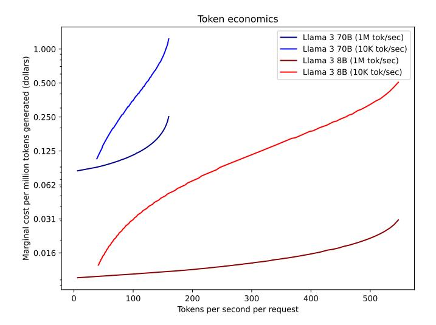
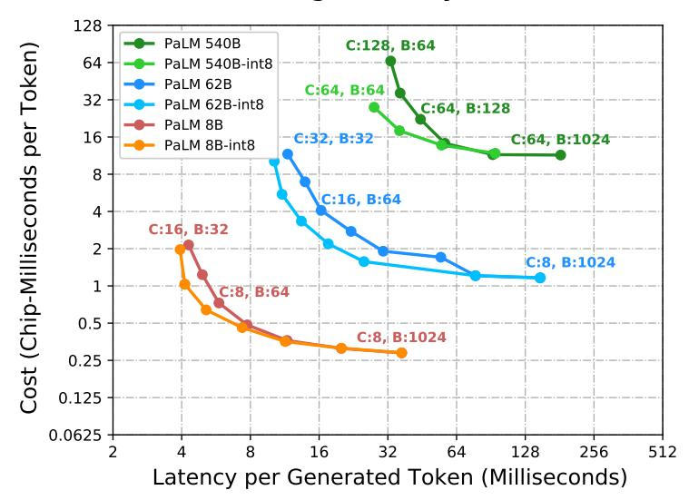
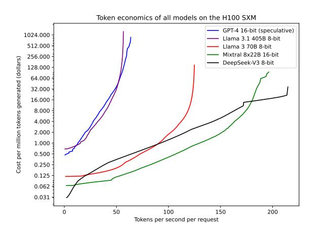
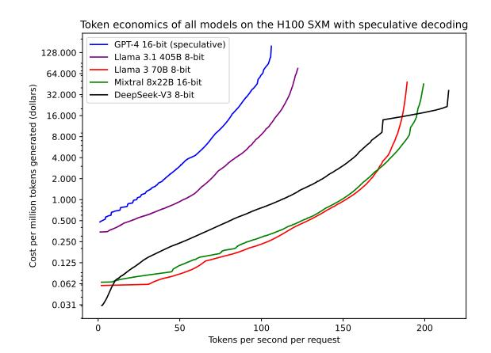
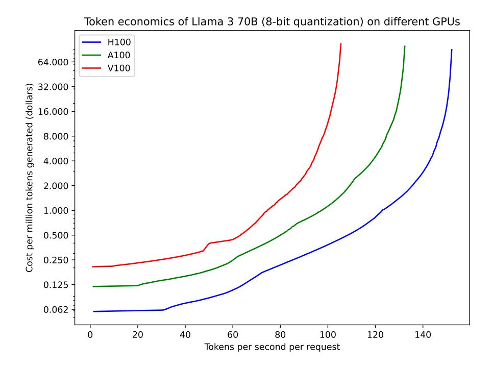
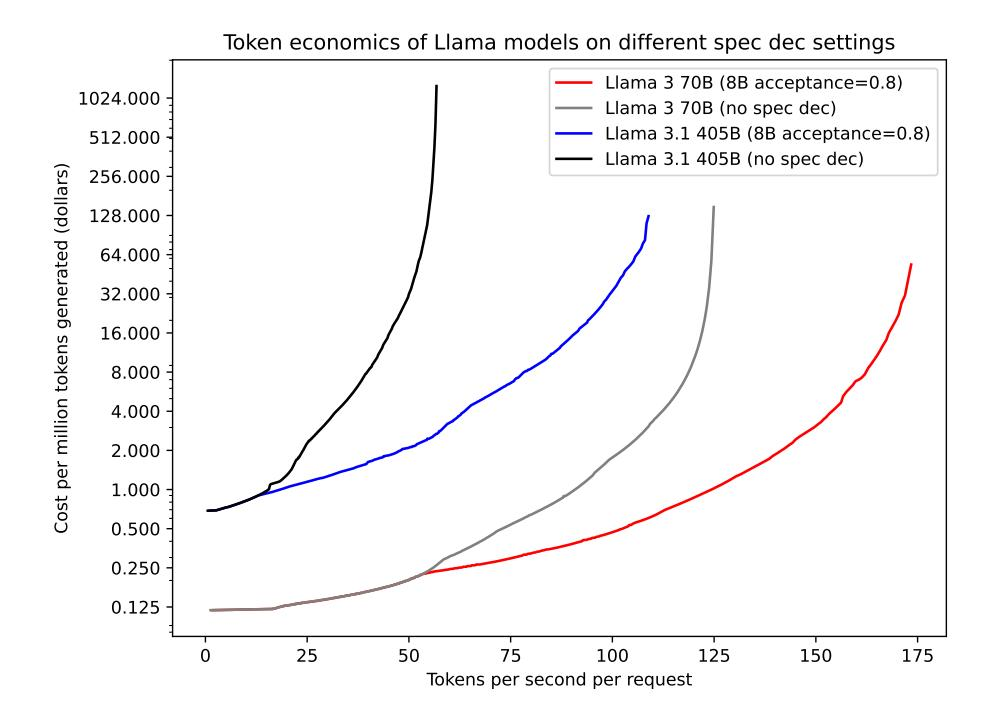
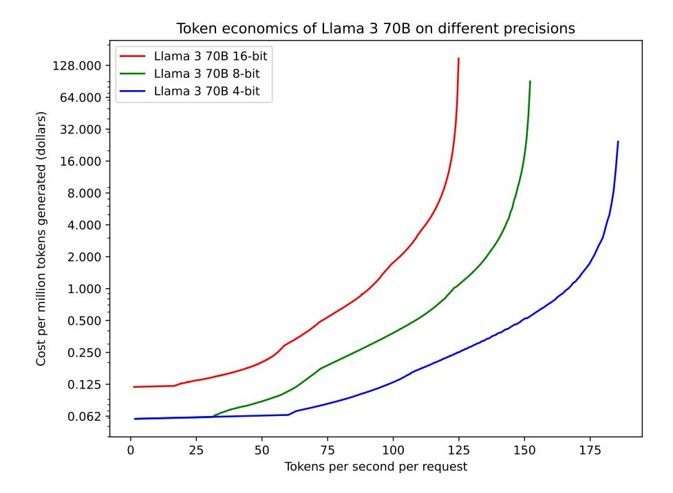
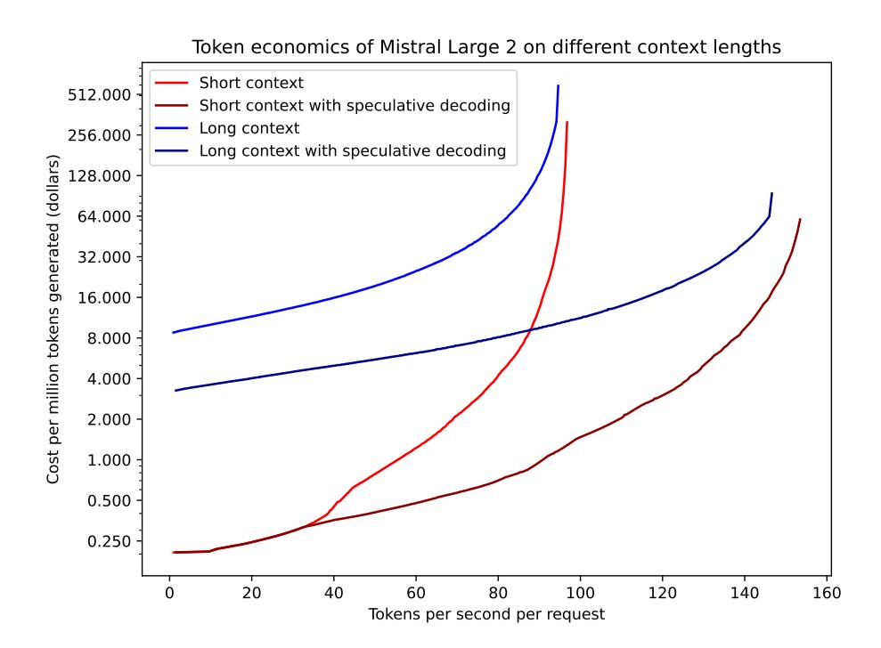
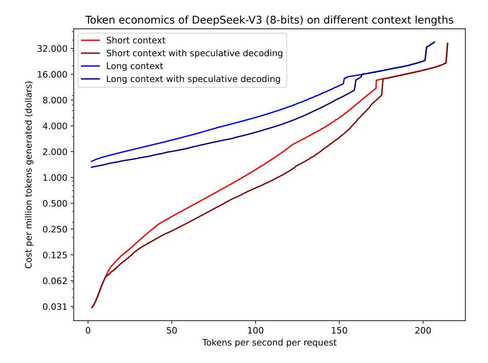

<!-- RP47_Erdil_2025 | source: papers_json/RP47_Erdil_2025/ -->

## اقتصاديات الاستدلال لنماذج اللغة

Ege Erdil Epoch ege@epoch.ai

## الملخص

نطوّر نموذجًا نظريًا يعالج المقايضة الاقتصادية بين التكلفة لكل رمز وسرعة توليد الرموز التسلسلية عند نشر نماذج اللغة الكبيرة للاستدلال على نطاق واسع. يأخذ نموذجنا في الاعتبار قيود الحساب وعرض النطاق الترددي للذاكرة وعرض النطاق الترددي للشبكة وزمن التأخير، ويحسّن عبر إعدادات مختلفة للتوازي وأحجام الدفعات للعثور على تلك التي تحقق أفضل سرعة استدلال تسلسلية عند تكلفة معينة لكل رمز. نستخدم النموذج لحساب جبهات باريتو للسرعة التسلسلية مقابل التكلفة لكل رمز للنماذج اللغوية الشائعة.

# 1 المقدمة

أثّرت نماذج اللغة الكبيرة (LLMs) تأثيرًا كبيرًا على مجال الذكاء الاصطناعي، وأصبحت منتشرة بشكل متزايد في كل من البحث والتطبيقات العملية. ومع نمو هذه النماذج واستخدامها في طيف واسع من التطبيقات، أحدث نشرها للمهام الواقعية تحوّلًا ملحوظًا في اقتصاديات الذكاء الاصطناعي. فقد تصاعدت التكاليف التراكمية للاستدلال — إجمالي النفقات الحسابية المرتبطة بتشغيل هذه النماذج عبر جميع الحالات — إلى مستويات مماثلة لتكاليف التدريب الأولية، أو متجاوزة لها في بعض الحالات. وفي الوقت ذاته، نشأت سوق تنافسية، إذ تسعى مزودات API عديدة لتقديم نماذج LLM مفتوحة المصدر بأفضل نقاط السعر وسرعات المعالجة. ورغم هذه التطورات، تبقى ثغرة جوهرية في فهمنا: إذ لم يُجرَ بعد تحليل كمي شامل لتكاليف الاستدلال للنماذج اللغوية عند نشرها على نطاق واسع.

وهذه ليست مشكلة نظرية فحسب. ففي الممارسة العملية، من الضروري للمهندسين العاملين على خدمة LLMs للاستدلال بسرعة وبتكلفة منخفضة أن يكون لديهم تصور لحدود ما يمكن تحقيقه باستخدام أجهزتهم في ظل ظروف مثالية. فبالنسبة لمبرمجي الأنوية الذين يطبّقون أنوية أحادية GPU بلغة CUDA، يخدم نموذج roofline — الذي يأخذ الحد الأدنى بين أزمنة الحساب وأزمنة قراءة/كتابة الذاكرة — هذا الغرض: إذا فشل أحد الأنوية في تحقيق أداء جيد بالنسبة لهذا الخط الأساسي، يمكننا في الغالب أن نفترض أن تنفيذه غير فعّال وأنه ينبغي لنواة نظرية مثلى أن تتفوق عليه.

العمل السابق حول كيفية خدمة LLMs للاستدلال بكفاءة (Pope et al. [2022,](#page-21-0) Steinhardt [2022)](#page-22-0) إما أنه "عملي للغاية"، يركّز حصرًا على أداء النواة دون مقارنته بنتيجة نظرية مثلى، أو "نظري للغاية"، يجرّد بعيدًا عن تفاصيل الأجهزة الملموسة وبالتالي لا يقدم إرشادًا مفيدًا لاقتصاديات الاستدلال الواقعية. وباختصار، لا يوجد حاليًا مكافئ لـ "نموذج roofline" في الأدبيات حول استدلال LLM، وإن كنّا نشتبه في أن مختبرات الذكاء الاصطناعي ومزودي الاستدلال لديهم نماذجهم الداخلية الخاصة التي لم يفصحوا عنها للعموم.

فيما يلي سؤالان، أحدهما ملموس جدًا والآخر أكثر نظرية، يصعب الإجابة عنهما دون مثل هذا النموذج:

- لنفترض أن مزود API مفتوح المصدر نجح في خدمة Llama 3 70B بدقة 16-بت على آلة DGX H100 في سياقات قصيرة بسرعة تسلسلية تبلغ 70 رمزًا/ثانية ومعدل استخدام للأجهزة قدره 15%. هل هذا الأداء جيد أم سيئ، وهل من المعقول أن نأمل في تحقيق ما هو أفضل، أي زيادة السرعة التسلسلية أو معدل استخدام الأجهزة دون خفض الآخر؟
- لاحظ العمل النظري السابق حول استدلال LLM، مثل Steinhardt [2022,](#page-22-0) أنه نظرًا لأن المصفوفات الفردية ثنائية الأبعاد بينما عمليات ضرب المصفوفات ثلاثية الأبعاد، فإن توزيع ضرب مصفوفة بمعامل 2 على طول جميع أبعادها لا يزيد الذاكرة المطلوبة وتواصل الشبكة للتوازي إلا بمعامل 2. لذلك، حتى عندما تصبح قراءات الذاكرة والشبكة مقيِّدة، ينبغي أن نتوقع أن نتمكن من تربيع السرعة التسلسلية لعمليات ضرب المصفوفات (وبالتالي استدلال LLM) مقابل كل

<!-- page 2 -->

تنصيف لمعدل استخدام الأجهزة، وذلك ببساطة عن طريق توزيع الاستدلال عبر ثمانية أضعاف عدد وحدات GPU. إذا كان الأمر كذلك، فلماذا لا تُخدم نماذج LLM عادة بسرعات أعلى بكثير؟

هدفنا هو سدّ هذه الفجوة عبر بناء نموذج نظري يمكنه أخذ معمارية LLM ووحدة GPU كمدخلات وتحديد مدى تكلفة خدمة هذا النموذج عند طول سياق محدد ومعدل محدد من الرموز في الثانية لكل طلب إذا استُخدم إعداد استدلال أمثل. ثم سنقوم بتقييم نموذجنا عبر مقارنة تنبؤاته بأرقام الأداء التجريبية لمزودي API مختلفين باستخدام بيانات حول النماذج اللغوية ومزودي API.

تتألف الورقة على النحو التالي: في القسم 2 نحفّز أولًا المكونات التي ستدخل في نموذجنا الكامل عبر تحليل بعض العوامل التي تحدد اقتصاديات الاستدلال بمعزل عن غيرها. هذا القسم مفيد لبناء حدس حول كيفية عمل اقتصاديات الاستدلال ولتبرير سبب اختيارنا لتضمين بعض المكونات في النموذج واستبعاد أخرى. في القسم 3 نقدم وصفًا كاملًا لنموذجنا بجميع أجزائه قبل استخدام النموذج للتنبؤ بنماذج معروفة مثل DeepSeek-V3 (DeepSeek-AI et al. 2025). أخيرًا، لدينا قسم خلاصات نسرد فيه بعض الحقائق المهمة حول اقتصاديات الاستدلال التي كشفها تحليلنا.

سنفترض الإلمام بالخصائص الأساسية لمعمارية Transformer من نوع decoder-only ولنماذج خليط الخبراء (mixture-of-experts)، لكن دون تفاصيل تقنية لطرق الاستدلال الموزع.

يمكن العثور على الكود اللازم لإعادة إنتاج نتائج هذه الورقة في مستودع GitHub هذا.

# 2 تحفيز النموذج

## 2.1 أبسط حالة: حالات أحادية الجهاز، استدلال بسياق قصير، نموذج كثيف

أبسط حالة للتفكير في اقتصاديات الاستدلال هي حالة نموذج كثيف نقوم فيه باستدلال بطول سياق قصير ويُوجَّه فيها كل طلب إلى جهاز واحد فقط. وهذا يزيل معظم التعقيدات التي يجب تضمينها في نموذج عام: لا توجد إمكانية لاستخدام طرق استدلال موزع معقدة عدا توجيه الطلبات إلى حالات مختلفة، ويُفترض أن حسابات الانتباه، إلى جانب قراءات ذاكرة KV، مهملة بسبب افتراض السياق القصير.

في هذه الحالة، تُحدَّد اقتصاديات الاستدلال للنموذج بإجمالي عدد معاملاته N_{\rm param}، ودقة معاملات النموذج p، وعدد عمليات FLOP في الثانية لوحدة GPU وهو C، وعرض النطاق الترددي لذاكرة HBM لوحدة GPU وهو B. إذا افترضنا حجم دفعة يساوي b من الطلبات، فسنحصل على ما يلي:

$$
token latency = \max\left(\frac{p\cdot N_{\text{param}}}{B}, \frac{(2\,\text{FLOP})\cdot N_{\text{param}}\cdot b}{C}\right) (1)
$$

$$
GPU seconds per token = \frac{\text{token latency}}{b} = \max\left(\frac{p \cdot N_{\text{param}}}{b \cdot B}, \frac{(2 \text{ FLOP}) \cdot N_{\text{param}}}{C}\right) (2)
$$

حيث في كلتا المعادلتين، يقيس الحد الأول داخل الحد الأقصى الزمن المستغرق لقراءات المعاملات، بينما يقيس الحد الثاني الزمن المستغرق للحساب. نأخذ الحد الأقصى بافتراض أن قراءات الذاكرة والحساب تتداخل كلما أمكن.

في هذه الحالة البسيطة، يكون حجم الدفعة b هو المعامل المتغير الوحيد الذي يؤثر على اقتصاديات الاستدلال. حجم الدفعة الأمثل، الذي يُرمز إليه بـ b^*، يُعطى بالمعادلة b^* = p \cdot C/(B \cdot 2 \, \text{FLOP}). عند حجم الدفعة هذا، يتساوى الزمن المستغرق لقراءات المعاملات والزمن المستغرق للعمليات الحسابية. وبالتالي، يمثّل b^* أقصى حجم دفعة يسمح بتحقيق الحد الأدنى لزمن تأخير الرمز وهو p \cdot N_{\text{param}}/B.

عندما لا يكون هناك تقييد بسبب عدد كافٍ من الطلبات الواردة، يكون من الأمثل دائمًا تعيين حجم الدفعة b مساويًا لـ b^*. إذا تجاوز عدد الطلبات الواردة b^*، يكون من الأكثر كفاءة توزيع الطلبات عبر حالات متعددة بدلًا من زيادة حجم الدفعة على حالة واحدة. ويرجع ذلك إلى أن زيادة حجم الدفعة بما يتجاوز b^* تؤدي إلى زمن تأخير أعلى للرمز دون تحسين التكلفة من حيث ثواني GPU لكل رمز. وعلى العكس، يؤدي خفض حجم الدفعة دون b^* إلى زيادة التكلفة دون أي تحسين في زمن تأخير الرمز.

في الحالات التي يكون فيها عدد الطلبات الواردة غير كافٍ لتحقيق حجم دفعة قدره b^* مع الحفاظ على زمن تأخير للرمز قدره p \cdot N_{\text{param}}/B على جهاز واحد، يكون النهج الأمثل هو تعيين حجم الدفعة b بأقرب ما يمكن إلى b^* وفقًا للطلبات المتاحة.

## 2.2 حالات متعددة الأجهزة بعرض نطاق ترددي شبكي لانهائي، استدلال بسياق قصير، نموذج كثيف

في هذا القسم، نُدخل معاملًا حرًا إضافيًا، حجم الحالة (N_{\rm GPU})، الذي يمثل عدد وحدات GPU المستخدمة في النظام. ولتبسيط التحليل، نفترض شبكة بزمن تأخير غير صفري لكن بعرض نطاق لانهائي، مما يسمح لنا بالتركيز على تأثيرات توزيع عبء العمل عبر وحدات GPU متعددة دون النظر في تأثير عدد الكلمات التي يجري تجميعها عبر وحدات GPU مختلفة.

<!-- page 3 -->

سنفترض أننا نستخدم التوازي الموتري (tensor parallelism) عبر جميع وحدات GPU في حالة واحدة: فالتوازي البياني (data parallelism) مأخوذ بالفعل في الحسبان لأن حجم الدفعة معامل حر، وفي معظم الحالات سيكون التوازي الأنبوبي (pipeline parallelism) أدنى من التوازي البياني، وبالتالي يمكننا افتراض أنه غير مستخدم. (الحالة الوحيدة التي لا ينطبق فيها هذا هي عندما تكون قيود الذاكرة مقيِّدة لإعدادات الاستدلال الفعّالة بخلاف ذلك، وهو أمر نادر على أجهزة NVIDIA لكنه أكثر صلة عند استخدام أجهزة متخصصة مثل Groq LPUs بكميات صغيرة جدًا من الذاكرة لكل شريحة، كما سنرى لاحقًا.)

يتيح استخدام وحدات GPU متعددة توزيع العمليات الحسابية وقراءات المعاملات، مما قد يقلل الزمن المستغرق في هذه المهام. غير أن هذا يأتي على حساب إدخال زمن تأخير شبكي بسبب ضرورة إجراء عمليات all-reduce في كل طبقة. يعتمد زمن تأخير الرمز الآن على عدة عوامل:

- عدد طبقات النموذج (nlayers)
- عدد عمليات all-reduce المتسلسلة المطلوبة لكل طبقة (nreduce)
- متوسط زمن تأخير إجراء عملية all-reduce واحدة (treduce).

بالنظر إلى هذه المتغيرات، يمكن التعبير عن نموذج بسيط لزمن تأخير الرمز وثواني GPU لكل رمز كما يلي:

$$
token latency = n_{\text{layers}} \cdot n_{\text{reduce}} \cdot t_{\text{reduce}} + \max\left(\frac{p \cdot N_{\text{param}}}{N_{\text{GPU}} \cdot B}, \frac{(2 \text{ FLOP}) \cdot N_{\text{param}} \cdot b}{N_{\text{GPU}} \cdot C}\right) (3)
$$

$$
GPU seconds per token = \frac{N_{\text{GPU}} \cdot n_{\text{layers}}}{b} \cdot n_{\text{reduce}} \cdot t_{\text{reduce}} + \max\left(\frac{p \cdot N_{\text{param}}}{b \cdot B}, \frac{(2 \text{ FLOP}) \cdot N_{\text{param}}}{C}\right) (4)
$$

ومع ذلك، فإن لهذا النموذج البسيط عدة أوجه قصور:

- 1. نفترض أن قراءات الذاكرة لا يمكن أن تتداخل مع زمن تأخير الشبكة: فالأجهزة تنتظر فقط لتلقي المعلومات من المرحلة السابقة لتبدأ في قراءة المعلومات من الذاكرة للمرحلة الحالية. غير أنه من الممكن أن تقوم الأجهزة بتحميل جزء ما من الأوزان من HBM إلى ذاكرة التخزين المؤقت L2 مسبقًا. هذه النسبة عادة ما تكون مهملة بالنسبة لجهاز واحد لأن ذاكرة L2 صغيرة جدًا عادة، لكن مع أجهزة متعددة يمكن أن تكون هذه الاستراتيجية فعّالة جدًا في الواقع.[1](#page-2-0)
- 2. نفترض أن treduce ثابت، لكن بشكل عام، treduce هو دالة متزايدة في حجم الحالة ويعتمد أيضًا على طوبولوجيا الشبكة المستخدمة لربط وحدات GPU. مثلًا، وحدات GPU المرتبطة في طوبولوجيا حلقية ستعاني من زمن تأخير all-reduce ضعيف عند أحجام حالات كبيرة مقارنة بتلك المرتبطة في طوبولوجيا شجرية لأن كل all-reduce ستحتاج إلى الدوران حول الحلقة مرتين، مرة لمرحلة reduce-scatter ومرة أخرى لعملية all-gather. تقلّب زمن تأخير الشبكة غير الصفري هذا مع حجم الحالة NGPU يتبيّن أنه العامل الأساسي الذي يمنعنا من تربيع السرعة إلى ما لا نهاية مقابل كل تنصيف لمعدل استخدام الأجهزة في النهاية NGPU → ∞.

سنتجاهل النقطة (1) في بقية هذا العمل من باب التبسيط ونركّز فقط على معالجة النقطة (2)، وهي الأهم كميًا بكثير.

### 2.2.1 زمن التأخير داخل العقدة وعلى الشبكة

يعتمد زمن تأخير عملية all-reduce على عاملين: زمن تأخير الاتصال بين وحدات GPU وعدد الاتصالات المطلوبة. مثلًا، إذا كان لدينا طوبولوجيا حلقية بحجم R بأقصى زمن تأخير اتصال tcomm عبر وحدتي GPU متجاورتين في الحلقة، فإن زمن تأخير all-reduce النظري للحلقة سيكون 2(R − 1)tcomm لأننا نحتاج إلى ما مجموعه R − 1 قفزة في مرحلة reduce-scatter ومرة أخرى R − 1 قفزة في مرحلة all-gather.

لسوء الحظ، tcomm في الواقع ليس ثابتًا بسيطًا بل يعتمد على تفاصيل كثيرة: طوبولوجيا الشبكة، والأجهزة المستخدمة للاتصال وبروتوكول الاتصال الدقيق، فضلًا عما إذا كان الاتصال يمكن حصره داخل عقدة واحدة أو يجب أن يحدث عبر حدود العقد. في الوقت الراهن، سنتجاهل هذه التفاصيل ونفترض أن tcomm ≈ 1 µs استنادًا إلى المعلومات الواردة في Jeaugey [2019,](#page-21-2) بافتراض أننا نستخدم بروتوكول الاتصال الأقل تأخيرًا المتاح في NCCL (الذي يُسمى بشكل مناسب "LL"). هذا تقريبًا أفضل ما يمكن فعله ما لم نلجأ إلى استخدام حسابات زمن التأخير الأكثر تفصيلًا من قاعدة كود NCCL.[2](#page-2-1) سنترك هذا العمل للقسم التالي.

> ^1^ مثلًا، Llama 2 70B (Touvron et al. [2023)](#page-22-1) يحتوي على 70 مليار معامل و80 طبقة بدقة 16-بت، وبالتالي يبلغ حجم كل طبقة حوالي 1.75 GB. مع 50 MB من ذاكرة L2 لكل GPU، نحتاج فقط إلى 35 GPU لتثبيت معاملات كل طبقة في L2. وبالتالي، يمكن لحالة بوحدات GPU أكثر من ذلك أن تتداخل معظم زمن تأخير الشبكة مع قراءات المعاملات من HBM.

> ^2^تقدم NVIDIA نموذجها الخاص لتقدير زمن تأخير عمليات GPU الأولية في مستودع GitHub الرسمي لـ NCCL (NVIDIA [2024)](#page-21-3) في الملف "src/graph/tuning.cc". المتغير الذي يحتوي على معلومات زمن تأخير الأجهزة التي نحتاجها يُدعى "hwLat" وله أرقام زمن تأخير بوحدات الميكروثانية.

<!-- page 4 -->

ننتقل الآن إلى توصيف عدد المشاركين R: بشكل عام، عندما يكون N_{\rm GPU} كبيرًا، يتدرّج عدد المشاركين في كل عملية all-reduce في تمرير أمامي بمعدل R \propto N_{\rm GPU}^{1/2}. ويعود ذلك إلى أن من الأمثل لتحسين عرض النطاق الترددي للذاكرة وعرض النطاق الترددي للشبكة تقطيع مصفوفات الأوزان بشكل متساوٍ تقريبًا على طول كلا البعدين في النظام الكبير N_{\rm GPU}. ولأن كل all-reduce يحدث عبر البعد الوسيط K لضرب مصفوفة من النوع M \times K \times N، فإن عدد الرتب المشاركة هو عدد الطرق التي يُقطّع بها البعد K، والذي سيتدرّج بشكل متناسب مع N_{\rm GPU}^{1/2}.

بدمج كل هذه المعلومات، يمكننا تقريب t_{\text{reduce}} \approx 2~\mu\text{s} \cdot (N_{\text{GPU}}^{1/2}-1) لقيم N_{\text{GPU}} ليست كبيرة جدًا (لأنه مع حجم حالة كبير بما يكفي سننتقل إلى استخدام طوبولوجيا شجرية مثلًا، التي ستكون لها زمن تأخير أقل) وعند أحجام دفعات صغيرة بما يكفي بحيث لا تكون قيود عرض النطاق الترددي للشبكة مقيِّدة حتى عند استخدام خوارزمية LL. يكفي هذا التعبير لاستنتاج حقيقة مثيرة للاهتمام: هناك *حجم حالة أمثل* لخدمة أي نموذج إذا أردنا تقليل زمن تأخير الرمز *حتى لو لم نهتم بالتكلفة*. يتضح ذلك بسهولة من تعبير زمن تأخير الرمز الذي حصلنا عليه:

$$
\text{token latency} = n_{\text{layers}} \cdot n_{\text{reduce}} \cdot 2 \ \mu \text{s} \cdot (N_{\text{GPU}}^{1/2} - 1) + \max \left( \frac{p \cdot N_{\text{param}}}{N_{\text{GPU}} \cdot B}, \ \frac{(2 \, \text{FLOP}) \cdot N_{\text{param}} \cdot b}{N_{\text{GPU}} \cdot C} \right) \tag{5}
$$

المعامل الوحيد الذي لم نوصّفه حتى الآن هو عدد عمليات all-reduce المتسلسلة لكل طبقة n_{\rm reduce}. عندما يكون N_{\rm GPU} كبيرًا، سيكون هذا مساويًا لعدد عمليات ضرب المصفوفات التسلسلية في كل طبقة3. في Transformer تقليدي يعمل عند أطوال سياق قصيرة، تكون آلية الانتباه نفسها مهملة، فيتبقى لدينا n_{\rm reduce} = 4 عمليات ضرب مصفوفات متسلسلة:

- 1. حساب متجهات الاستعلام والمفتاح والقيمة.
- 2. الإسقاط بعد الانتباه.
- ضرب المصفوفات dmodel → dff في كتلة feedforward. لاحظ أنه قد يكون هناك أكثر من واحدة من هذه في مخطط تنشيط مثل SwiGLU (Shazeer 2020)، لكنها يمكن من حيث المبدأ أن تتوازى وبالتالي لا تُحسب كعمليات متسلسلة متعددة.
- 4. ضرب المصفوفات d_{\rm ff} \to d_{\rm model} في كتلة feedforward.

في حين أن هذا الترتيب المحدد لطبقة واحدة لا يزال شائعًا اليوم، فإنه ليس الخيار الوحيد المتاح. بعض المعماريات مثل نماذج PaLM من Chowdhery et al. 2022 قد تختار استخدام *الانتباه المتوازي*، الذي يغيّر صياغة طبقة Transformer (متجاهلًا عمليات تطبيع الطبقة وما إلى ذلك) من المعادلة 6 إلى المعادلة 7.

$$
\mbox{Sequential attention: } x_{\mbox{\scriptsize output}} = x_{\mbox{\scriptsize input}} + \mbox{Feedforward}(\mbox{Attention}(x_{\mbox{\scriptsize input}})) \eqno(6)
$$

$$
Parallel attention: x_{\text{output}} = x_{\text{input}} + \text{Feedforward}(x_{\text{input}}) + \text{Attention}(x_{\text{input}}) (7)
$$

ميزة هذا التغيير أنه يزيل الاعتماد المنطقي لمخرجات طبقة feedforward على مخرجات طبقة الانتباه، مما يسمح بتنفيذ الطبقتين بالتوازي. وهذا يمكن أن يقلل n_{\rm reduce} من 4 إلى 2، وهو مكسب طفيف خلال التدريب لكنه مكسب كبير خلال الاستدلال بسبب قيود زمن التأخير الأكثر صرامة هناك.

### 2.2.2 التنبؤات

هذا النموذج غني بما يكفي بالفعل لتقديم تنبؤات مفيدة حول اقتصاديات الرمز للنماذج الكثيفة. ولفعل ذلك، نحسب زمن تأخير الرمز وثواني GPU لكل رمز عبر شبكة من القيم لحجم الدفعة b وحجم الحالة N_{\rm GPU}، نفرض قيدًا إجماليًا على الإنتاجية

$$ b/(token\ latency) < token\ throughput $$

لمراعاة احتمال الطلب المحدود، نحوّل التكلفة من وحدات GPU-ثانية إلى وحدات الدولارات بالضرب في معدل إيجار بالساعة لكل GPU، ونرسم جبهات باريتو الضمنية لمعدل توليد الرموز لكل طلب على المحور x مقابل التكلفة لكل مليون رمز على المحور y.

> ^&^lt;sup>3توجد حالات خاصة يكون فيها هذا العدد أقل: مثلًا، عندما يكون N_{\rm GPU} صغيرًا يمكننا استخدام التوازي الموتري أحادي البعد في كتلة feedforward وتجنّب all-reduce على البعد d_{\rm ff}، وقد نتمكن أيضًا من تجزئة الانتباه على الرؤوس بدلًا من الدفعة وتجنّب اتصالات all-to-all غير الضرورية في تلك الخطوة أيضًا. يفترض n_{\rm reduce}=4 أننا لسنا في النظام الذي تنطبق فيه هذه التحسينات.

<!-- page 5 -->

*الشكل 1: اقتصاديات الرمز لـ Llama 3 8B وLlama 3 70B كما يستنتجها نموذجنا الحالي. نفترض استخدام GPU من نوع H100 بمعدل إيجار بالساعة قدره 2 دولار/ساعة لكل جهاز. في وسيلة الإيضاح، تشير "tok/sec" إلى *إجمالي الطلب* على النموذج عبر جميع المستخدمين وليس معدل توليد الرمز الذي يراه مستخدم واحد. في المقابل، يشير المحور x إلى المعدل الذي يراه مستخدم واحد بعد تقديم طلب وليس الإنتاجية الإجمالية.*

النموذج في هذا القسم خام، يهمل الكثير من التفاصيل المهمة، لكن كما يُظهر الشكل 1 يمكنه بالفعل أن يطابق البيانات التجريبية بشكل تقريبي. إذا استبعدنا Groq (لأنهم يستخدمون أجهزتهم المخصصة المعتمدة على SRAM للاستدلال بدلًا من وحدات NVIDIA GPU)، يفيد *Artificial Analysis* 2024 بسرعة استدلال قصوى تبلغ \approx 400 رمز/ثانية بسعر 20 سنتًا لكل مليون رمز لـ Llama 3 8B و\approx 150 رمز/ثانية بسعر 90 سنتًا لكل مليون رمز لـ Llama 3 70B، وكلاهما تحقق على يد Fireworks. في كلتا الحالتين، يبدو أن النماذج تُخدم في نطاق عامل 2 من الحد الأقصى للرموز في الثانية، وتبدو الزيادات التي يفرضها مزودو API على تكاليف إيجار GPU وحدها أقل من عامل 2.

### 2.2.3 التحليل النظري

رغم أن هذا النموذج أكثر تعقيدًا من النموذج في القسم 2.1، إلا أنه لا يزال بسيطًا بما يكفي للحصول على نتائج تحليلية حوله. نكرر معادلة زمن تأخير الرمز مع التعويضات المناسبة هنا للاكتمال:

$$
\text{token latency} = n_{\text{layers}} \cdot n_{\text{reduce}} \cdot t_{\text{hop}} \cdot 2(N_{\text{GPU}}^{1/2} - 1) + \max\left(\frac{p \cdot N_{\text{param}}}{N_{\text{GPU}} \cdot B}, \frac{(2 \, \text{FLOP}) \cdot N_{\text{param}} \cdot b}{N_{\text{GPU}} \cdot C}\right) \tag{8}
$$

هدف مزود API هو اختيار N_{\text{GPU}}, b لتقليل زمن تأخير الرمز عند تكلفة لكل رمز محددة c، يمكن التعبير عنها بـ token latency \cdot N_{\text{GPU}}/b = c.

أولًا نلغي أحد المتغيرات، وهو b. كما في القسم 2.1، الاختيار الفعّال غير المقيد لـ b هو دائمًا b^* = p \cdot C/(B \cdot 2 \text{ FLOP}). هذا يجعل حدود عرض النطاق الترددي للذاكرة والحساب داخل الحد الأقصى متساويين، ومن السهل ملاحظة أنه يحقق أصغر تكلفة ممكنة وأصغر زمن تأخير ممكن للرمز عند أي قيمة ثابتة لـ N_{\text{GPU}}. إذا افترضنا b = b^*، يمكننا تبسيط تعبير زمن تأخير الرمز إلى

$$
token latency = n_{\text{layers}} \cdot n_{\text{reduce}} \cdot t_{\text{hop}} \cdot 2(N_{\text{GPU}}^{1/2} - 1) + \frac{p \cdot N_{\text{param}}}{N_{\text{GPU}} \cdot B} (9)
$$

ننتقل الآن إلى سؤال له إجابة تحليلية أنيقة: الحد الأدنى الممكن لزمن تأخير الرمز. لأن المعادلة 9 تتباعد عند N_{\text{GPU}} \to \infty وهي دالة مستمرة في N_{\text{GPU}}، نعلم أنه يجب أن يكون لها

<!-- page 6 -->

حد أدنى عام. للعثور على هذا الحد الأدنى، نُفاضل بالنسبة لـ N_{\rm GPU} ونساوي النتيجة بالصفر للحصول على

$$
n_{\text{layers}} \cdot n_{\text{reduce}} \cdot t_{\text{hop}} \cdot N_{\text{GPU}}^{-1/2} = \frac{p \cdot N_{\text{param}}}{N_{\text{GPU}}^2 \cdot B} (10)
$$

$$
N_{\rm GPU}^{3/2} = \frac{p \cdot N_{\rm param}}{n_{\rm layers} \cdot n_{\rm reduce} \cdot t_{\rm hop} \cdot B} (11)
$$

$$
N_{\text{GPU}} = \left(\frac{p \cdot N_{\text{param}}}{n_{\text{layers}} \cdot n_{\text{reduce}} \cdot t_{\text{hop}} \cdot B}\right)^{2/3} \tag{12}
$$

أحد التحفظات هو أن هذه القيمة المثلى لـ N_{\rm GPU} قد تكون أقل من 1، مما سيؤدي إلى قيمة سالبة غير واقعية لحد زمن التأخير. في هذه الحالة، الحل الأمثل هو دائمًا N_{\rm GPU}=1، لأن استخدام جزء فقط من GPU واحد لن يزيد إلا زمن قراءة الذاكرة دون أي فائدة على صعيد زمن تأخير الشبكة. وبشكل صارم، إذًا، الحل الأمثل هو

$$
N_{\text{GPU}}^* = \max \left( \frac{p \cdot N_{\text{param}}}{n_{\text{lavers}} \cdot n_{\text{reduce}} \cdot t_{\text{hop}} \cdot B}, 1 \right)^{2/3} 
(13)
$$

بإدخال هذا في تعبير زمن تأخير الرمز نحصل الآن على

$$
\text{minimum token latency} = \begin{cases} 3 \cdot (n_{\text{layers}} n_{\text{reduce}} t_{\text{hop}})^{2/3} \cdot (p N_{\text{param}}/B)^{1/3} - 2 n_{\text{layers}} n_{\text{reduce}} t_{\text{hop}} & \text{if } N_{\text{GPU}}^* > 1 \\ p \cdot N_{\text{param}}/B & \text{otherwise} \end{cases} (14)
$$

شرط N_{\text{GPU}}^* > 1 يقارن بين مقياسين زمنيين مختلفين: الزمن المستغرق لقراءة معاملات النموذج من HBM *على GPU واحد* والزمن المستغرق لكل عملية all-gather أو reduce-scatter لكل مشارك في تمرير أمامي واحد. إذا كان زمن قراءة الذاكرة أكبر، فمن الأمثل استخدام حالة من وحدات GPU متعددة؛ وإلا فلا.

يمكننا اشتقاق نتيجة أخرى مثيرة للاهتمام في النظام N_{\rm GPU}^* \gg 1 حول جبهات باريتو للتكلفة مقابل السرعة. تكلفة (بوحدات GPU-ثانية) تحقيق الحد الأدنى الممكن لزمن التأخير تُعطى بـ

$$
cost per token at minimum token latency = \frac{N_{\text{GPU}}^*}{b^*} · minimum token latency (15)
$$

$$
\approx 3 \cdot \frac{p \cdot N_{\text{param}}}{B \cdot b^*} (approx. valid because N_{\text{GPU}}^* \gg 1 by assumption) (16)
$$

$$ = 3 \cdot \frac{(2 \text{ FLOP}) \cdot N_{\text{param}}}{C} \tag{17} $$

بعبارة أخرى، تحقيق *أفضل زمن تأخير ممكن للرمز* لا يكلف سوى ثلاثة أضعاف تقريبًا من الحد الأدنى الممكن للتكلفة لكل رمز الناتجة من الحساب وحده. هذه النتيجة ليست واقعية: ففي إعدادات الاستدلال الفعلية، يمكن لجبهة باريتو للسرعة مقابل التكلفة أن تتراوح عبر قيم أوسع بكثير للتكلفة لكل رمز. غير أن هذا النموذج التوضيحي مفيد لأنه يبيّن أن ذلك يعود كليًا إلى قيود عرض النطاق الترددي للشبكة. الحاجة إلى الاقتصاد فيها توفر حافزًا لتقليل حجم الدفعة بما يتجاوز b^* لتقليل أحجام موترات التنشيط، مما قد يقلل كثافة الحساب ويتقايض مع الاستخدام الفعّال لعرض النطاق الترددي للذاكرة. سنرى كيف يعمل ذلك بشكل ملموس في أقسام لاحقة عندما نطوّر نموذجًا أكثر اكتمالًا يأخذ قيود عرض النطاق الترددي للشبكة في الاعتبار.

حساب الحد الأقصى للرموز في الثانية لبعض النماذج المعروفة التي تعمل على H100 SXM GPUs باستخدام المعادلة 14 مع t_{\text{hop}} = 1~\mu\text{s} و n_{\text{reduce}} = 4 يعطي النتائج المعروضة في الجدول 1.

تجدر الإشارة إلى أننا نتوقع أن تكون الرموز في الثانية المحققة في الممارسة العملية أقل من الأرقام الواردة في الجدول 1 لأسباب عديدة:

1. حتى من الناحية النظرية، هذه أرقام *قابلة للتحقيق كحد أقصى* للرموز في الثانية. في الممارسة، قد يختار مزود API تقديم نموذج بزمن تأخير أعلى ليتمكن من خدمته بتكلفة أقل، خاصة إذا لم تكن السرعة التسلسلية الإضافية مفيدة لحالات الاستخدام النموذجية للنموذج المخدوم. ينطبق هذا بشكل خاص إذا واجه المزود قيدًا إجماليًا على الإنتاجية، كما في الشكل 1.

<!-- page 7 -->

- لتحقيق نتائج بهذه الجودة، يلزم القدرة على إزالة زمن التأخير الأساسي في عمليات GPU الجماعية مثل all-reduce وall-to-all. إذا لم يكن ذلك ممكنًا، فسيكون الحد الأقصى للرموز في الثانية أقل، خاصة بالنسبة للنماذج الصغيرة مثل Llama 3 8B.
- 3. يستند تحليلنا بشكل صارم على استدلال ذي سياق قصير تُفترض فيه آلية الانتباه مهملة، سواء بالنسبة للحساب أو لقراءات الذاكرة. سنرى لاحقًا كيف يمكن أن تكون أرقام الاستدلال ذي السياق الطويل أسوأ بشكل ملحوظ، خاصة إذا لم يُستخدم multi-query attention (Shazeer 2019).
- 4. نفترض أن NGPU يأخذ قيمًا في الأعداد الحقيقية، بينما في الممارسة لا يأخذ قيمًا صحيحة فحسب بل يجب أن يفي بعلاقات قابلية قسمة معينة لضمان إمكانية استخدام التوازي الموتري بفعالية أثناء الاستدلال.
- 5. التقريب R \approx N_{\rm GPU}^{1/2} متفائل بشكل طفيف: ففي الممارسة ستشمل بعض عمليات all-reduce أكثر من N_{\rm GPU}^{1/2} رتبة بينما ستشمل أخرى أقل، وبسبب التحدّب المعني يمكن أن يرفع ذلك زمن تأخير الرمز الذي نتوقعه قليلًا.

كما يُظهر الجدول 1 أنه حتى لنموذج بـ 8 مليار معامل، لدينا N_{\text{GPU}}^* \gg 1، ويزداد حجم الحالة الأمثل مع نمو حجم النماذج. وذلك لأن N_{\text{param}} = O(d_{\text{model}}^2 \cdot n_{\text{layers}}) ينمو عادة أسرع بكثير من n_{\text{layers}}، فللنماذج الكبيرة يكون لدينا pN_{\text{param}}/B \gg n_{\text{layers}}n_{\text{reduce}}t_{\text{hop}} وحجم الحالة الأمثل للاستدلال سيكون N_{\text{GPU}} \gg 1 (هذا مع تجاهل حجم HBM لجهاز واحد، الذي هو أيضًا في الممارسة قيد يجبرنا على استخدام حجم حالة أكبر عند العمل مع نماذج كبيرة).

في هذا النظام النموذجي عندما يكون N_{\text{param}} كبيرًا، من المعادلة 14 نعلم أن تقريبًا جيدًا للحد الأدنى لزمن تأخير الرمز هو ببساطة

$$
minimum token latency \approx 3 \cdot (n_{\text{lavers}} n_{\text{reduce}} t_{\text{hop}})^{2/3} \cdot (p \cdot N_{\text{param}}/B)^{1/3} (18)
$$

المعادلة 18 مفيدة جدًا لفهم العوامل التي تبطئ الاستدلال وأهميتها النسبية. عدد طبقات النموذج يهم أكثر من عرضه لمدى السرعة التي يمكن بها استدلال النموذج: كما أن N_{\text{param}} = O(d_{\text{model}}^2 \cdot n_{\text{layers}})، فإن الحد الأدنى لزمن تأخير الرمز يتدرّج كـ \propto n_{\text{layers}} \cdot d_{\text{model}}^{2/3} في عمق وعرض النموذج، مع إبقاء خصائص الأجهزة ثابتة. كذلك، زيادة عرض النطاق الترددي للذاكرة تهم أقل من تقليل زمن تأخير عمليات GPU الجماعية الأولية مثل all-reduce وall-to-all. على عكس الانطباعات التي قد تتولد من الاستدلال أحادي الجهاز للهواة، فإن القيد الأكبر على الاستدلال على نطاق واسع ليس عرض النطاق الترددي للذاكرة بل زمن التأخير داخل العقدة وعلى الشبكة.

يمكن الحصول على تقريب أبسط بافتراض أن عدد الطبقات L في نموذج كثيف يتدرّج بمعدل L \propto N_{\rm param}^{1/4}، وهي علاقة تدرّج تنطبق تقريبًا على النماذج الكثيفة المدرّبة من قبل Hoffmann et al. 2022 على سبيل المثال. في هذه الحالة، يبسّط التدرّج في عدد المعاملات مع إبقاء جميع المتغيرات الأخرى ثابتة إلى

$$ token-to-token latency \propto \sqrt{N_{\mathrm{param}}} (19) $$

تتفق قاعدة الإبهام البسيطة هذه مع البيانات التجريبية حول النماذج الكثيفة بشكل مدهش. مثلًا، يحصل Pope et al. 2022 على أفضل أرقام زمن تأخير قدرها 4 ms و13 ms و32 ms لكل رمز لـ PaLM 8B و62B و540B على التوالي، كما يمكن رؤيته في الشكل 2، وتتفق هذه مع تدرّج الجذر التربيعي لزمن تأخير الرمز في عدد المعاملات تقريبًا بدقة.

نرى توافقًا مماثلًا عند النظر في بيانات أحدث على أجهزة NVIDIA. أخذ Llama 3 8B عند 400 رمز/ثانية كخط أساس، يتنبأ نموذج الجذر التربيعي بـ 135 رمز/ثانية لنموذج كثيف بـ 70B و56 رمز/ثانية لنموذج كثيف بـ 405B، والتي بحسب *Artificial Analysis* 2024 تتسق مع السرعات التي تمكّن المزودون

<!-- page 8 -->

## زمن تأخير فك التشفير مقابل التكلفة

*الشكل 2: التكلفة لكل رمز مقابل جبهات باريتو لزمن تأخير الرمز لـ PaLM 8B و62B و540B التي حصل عليها Pope et al. [2022](#page-21-0) على عناقيد TPU v4. أفضل أزمنة تأخير ممكنة لكل حجم نموذج تطابق تقريبًا تدرّج الجذر التربيعي الذي يتنبأ به نموذجنا التوضيحي.*

الرائدون على أجهزة NVIDIA من خدمة هذه النماذج بها. بشكل عام، يؤدي النموذج التوضيحي بشكل ممتاز نظرًا لمدى بساطته وعدد التأثيرات المهمة التي يهملها.

# 3 وصف النموذج

نبني الآن النموذج الكامل الذي سنستخدمه في بقية الورقة فوق النموذج المبسط من القسم [2.2.](#page-1-2) فيما يلي التحسينات التي سنُجريها:

- 1. أخذ عمليات الانتباه في الاعتبار حتى نتمكن من استخدام النموذج لتقديم تنبؤات مفيدة حول الاستدلال ذي السياق الطويل. يعني ذلك إدراج كل من الجانب الحسابي (التعقيد التربيعي) وجانب عرض النطاق الترددي للذاكرة (قراءات وتخزين ذاكرة KV).
- 2. تخفيف الافتراض بأن النموذج يجب أن يكون كثيفًا حتى نتمكن من التعامل مع نماذج خليط الخبراء.
- 3. استخدام تقريبات زمن تأخير all-reduce وall-to-all الأكثر دقة من NVIDIA [2024](#page-21-3) بدلًا من التقريب الخام الذي استخدمناه سابقًا.
- 4. التخلي عن افتراض أن عرض النطاق الترددي للشبكة لانهائي وأخذ قيود عرض النطاق الترددي للشبكة في الاعتبار إلى جانب زمن تأخير الشبكة.
- 5. بدلًا من نمذجة التوازي الموتري والبياني فقط، السماح أيضًا بالتوازي الأنبوبي والخبراء.

سنقوم بهذه الأمور بالترتيب في الأقسام الفرعية الخمسة التالية قبل تقديم المعادلات النهائية لنموذجنا في صيغة قائمة بذاتها.

## 3.1 معالجة عمليات الانتباه

هناك ثلاث نقاط يجب أن نأخذها في الاعتبار فيما يتعلق بعمليات الانتباه لـ Transformer من نوع decoder-only التقليدي:

- 1. الحساب المطلوب لأخذ الجدائيات الداخلية لمتجهات الاستعلام والمفتاح.
- 2. عرض النطاق الترددي للذاكرة وسعة الذاكرة المطلوبتان لتخزين ذاكرة KV.
- 3. حقيقة أنه قد يلزم بعض الاتصال الإضافي بين GPUs إذا كانت عمليات الانتباه كبيرة بما يكفي لتتطلب توزيعها عبر أجهزة متعددة.

تصبح الحسابات أكثر تعقيدًا إلى حد ما بالنسبة للابتكارات الأحدث مثل آلية *multi-head latent attention* (MLA) من DeepSeek-AI et al. [2025.](#page-21-1) سنتناول هذا المتغير المحدد من الانتباه بعد تغطية

<!-- page 9 -->

الحالة التقليدية، وإن كان من الصعب تقديم مراجعة شاملة لجميع الطرق التي يمكن بها تعديل آلية الانتباه ولجميع الطرق التي ستغيّر بها هذه التعديلات الحسابات في هذا القسم.

لمعالجة الحساب المطلوب لعمليات الانتباه، نضيف 4n_{\rm layers}n_{\rm head}\ell_{\rm input}b FLOP من العمليات الحسابية التي يجب إكمالها فوق ضربات الأوزان وعمليات التراكم التي تعطي \approx 2N_{\rm param} FLOP من الحساب لكل رمز. هنا، d_{\rm head}, n_{\rm head} تمثلان بُعد رأس انتباه واحد وعدد رؤوس الانتباه الإجمالية، \ell_{\rm input} تمثل طول الإدخال، وb هو حجم الدفعة.

حجم ذاكرة KV يُعطى بشكل عام بـ n_{\rm kv\ head}d_{\rm head}n_{\rm layers}\ell_{\rm input}b\cdot p حيث n_{\rm kv\ head} هو عدد رؤوس المفاتيح والقيم المتميزة (وبالتالي العدّ المضاعف لكل رأس لحساب كل من متجهات المفاتيح والقيم). كما من قبل، p هو دقة معاملات النموذج. نضيف هذا فوق قراءات المعاملات من HBM التي نأخذها بالفعل في الاعتبار. إذا كنا على استعداد لقبول تدهور الأداء، يمكننا أيضًا ضغط ذاكرة KV باستخدام طرق فقدية مختلفة، لكن لنموذجنا سنفترض أن هذه الطرق غير مستخدمة.

بالنسبة للنقطة الأخيرة، فإن المقدار الدقيق للاتصال الإضافي اللازم سيعتمد بشكل عام على استراتيجية التقسيم المستخدمة لتقسيم حساب الانتباه عبر وحدات GPU متعددة. مثلًا، يلاحظ Pope et al. 2022 أن تقسيم عملية الانتباه على بُعد الدفعة يستلزم تكلفة عمليتي all-to-all إضافيتين. غير أن الصورة معقدة بحقيقة أنه عندما تكون ذاكرة KV صغيرة بما يكفي، يمكن بدلًا من ذلك تقسيم عمليات الانتباه على بُعد الرأس (أي تخصيص رؤوس مختلفة لوحدات GPU مختلفة) وهو ما لا يستلزم تكلفة الاتصال الإضافية المذكورة. ولأن نموذجًا دقيقًا لذلك سيكون معقدًا نسبيًا، سنتجاهل في بقية هذه المقالة تكلفة الاتصال الإضافية الناشئة عن عمليات الانتباه.

والآن، لنتحول إلى معالجة حالة multi-head latent attention. لأغراضنا، هذا المتغير من آلية الانتباه يكافئ في جوهره grouped-query attention باستثناء زيادة تكلفة الحساب أثناء فك التشفير. وبشكل صريح، يمكن رؤية المكافأة على النحو التالي:

1. multi-head latent attention يستخدم تحليلًا منخفض الرتبة لإسقاطات المفاتيح والقيم ويخزن مؤقتًا التنشيطات الوسيطة، التي تُسمى أيضًا "متجهات كامنة"، كوسيلة لتحقيق ضغط ذاكرة KV. أثناء فك التشفير، يُستوعَب أحد المصفوفات منخفضة الرتبة الظاهرة في هذا التحليل في إسقاط الاستعلام (للمفاتيح) وفي الإسقاط بعد الانتباه (للقيم) على التوالي.

التأثير الصافي هو أن البُعد الفعّال للرأس لحساب التكلفة الحسابية للانتباه يرتفع من d_{\text{head}} إلى d_{\text{latent}}، الذي عادة ما يكون أكبر بشكل ملحوظ. مثلًا، يستخدم DeepSeek-V3 (DeepSeek-AI et al. 2025) d_{\text{head}} = 128 و d_{\text{latent}} = 512، مما يرفع التكلفة الحسابية للانتباه بعامل 4 نسبة إلى Transformer تقليدي.

2. مقابل هذه التكلفة الحسابية المتزايدة، يجري ضغط ذاكرة KV بشكل كبير: فبدلًا من الاضطرار إلى تخزين متجهات المفاتيح والقيم بحجم n_{\text{head}}d_{\text{head}} لكل موضع إدخال، تكون المتجهات التي يلزم تخزينها مؤقتًا هي فقط المتجهات الكامنة، التي يبلغ حجمها d_{\text{latent}} لكل منها فقط. وبما أن d_{\text{head}} \ll d_{\text{latent}} \ll n_{\text{head}}d_{\text{head}} في تنفيذات MLA النموذجية، فإن هذا يمثل تخفيضًا ضخمًا في حجم ذاكرة KV حتى وإن كان يرفع التكلفة الحسابية للانتباه.

كما سنرى لاحقًا، تجعل مقايضة الإدخال/الإخراج للذاكرة مقابل الحساب نماذج MLA غير عادية بين Transformers من حيث أن استدلالها يميل إلى أن يكون مقيدًا بالحساب، بدلًا من أن يكون مقيدًا بإدخال/إخراج الذاكرة، في السياقات الطويلة حيث يهيمن الانتباه على تكلفة الاستدلال.

## 3.2 التعميم على نماذج خليط الخبراء

للتعميم على نماذج خليط الخبراء، نحتاج إلى إجراء التغييرات المناسبة على التكلفة الحسابية وقراءات الذاكرة اللازمة لتمرير أمامي. أولًا، لمعالجة التكلفة الحسابية لتمرير أمامي لخليط الخبراء، نقوم بتفكيك العدد الإجمالي للمعاملات (باستثناء معاملات التضمين) للنموذج على النحو التالي:

$$
N_{\text{param}} = N_{\text{attention params}} + N_{\text{feedforward params}} + N_{\text{unembedding params}} (20)
$$

بالنسبة لنموذج كثيف، تكون التكلفة الحسابية لتمرير أمامي ببساطة 2N_{\rm param} FLOP لكل عنصر دفعة. غير أنه بالنسبة لنموذج خليط خبراء بعامل تناثر s=n_{\rm expert}/n_{\rm active\ expert} (حيث n_{\rm expert} هو إجمالي عدد الخبراء وn_{\rm active\ expert} هو عدد الخبراء النشطين لأي رمز)، تكون التكلفة الحسابية بدلًا من ذلك 2N_{\rm active\ param} FLOP لكل عنصر دفعة، حيث

$$
N_{\rm active\;param} = N_{\rm attention\;params} + \frac{N_{\rm feedforward\;params}}{s} + N_{\rm unembedding\;params} \tag{21}
$$

<!-- page 10 -->

نقسم فقط عدد معاملات feedforward على s لأن معاملات الانتباه وunembedding مشتركة عبر الخبراء. هذا يعطينا عدد FLOP المطلوبة لتمرير أمامي.

ننتقل الآن لمعالجة تكلفة عرض النطاق الترددي للذاكرة. على عكس النموذج الكثيف، قد لا نقرأ بالضرورة جميع معاملات نموذج خليط الخبراء من الذاكرة في تمرير أمامي معين، لأن الدفعة قد تكون صغيرة بما يكفي لبقاء بعض المعاملات غير نشطة عبر الدفعة بأكملها. إذا افترضنا أن تنشيطات الخبراء موزعة بشكل مستقل ومنتظم4، فإن احتمال أن يكون أي خبير معين غير نشط لأي عنصر دفعة محدد هو 1 - 1/s، واحتمال أن يكون غير نشط لـ *جميع* عناصر الدفعة هو (1 - 1/s)^b حيث b هو حجم الدفعة كما من قبل.

لذلك، نتوقع في المتوسط أن يكون عدد الخبراء النشطين n_{\text{expert}} \cdot (1 - (1 - 1/s)^b)، وبالتالي بالمتوسط عبر العديد من الدفعات، نتوقع أن يكون عدد المعاملات المقروءة من الذاكرة

$$
N_{\text{params read}} = N_{\text{attention params}} + \left(1 - \left(1 - \frac{1}{s}\right)^b\right) \cdot N_{\text{feedforward params}} + N_{\text{unembedding params}} (22)
$$

عندما b \gg s، سيكون لدينا (1 - 1/s)^b \approx 0، فبهذه الحالة كما هو متوقع يمكننا التقريب دون خطأ كبير بأن جميع معاملات النموذج ستُقرأ من الذاكرة خلال تمرير أمامي واحد.

## 3.3 تحسين تقريب زمن التأخير

لجعل تقديرات زمن التأخير لدينا أكثر صرامة، نستخدم المعلومات من كود الضبط في مستودع NCCL الرسمي في NVIDIA 2024. استنادًا إلى المعلومات الواردة في الملف "src/graph/tuning.cc"، يمكننا استنتاج التعبير التقريبي التالي لزمن التأخير لـ all-reduce عند استخدام طوبولوجيا شجرية:

$$
6.8 \mus + (1.2 \ \mus) \cdot \left(\frac{n_{\text{ranks}}}{n_{\text{nodes}}} - 1\right) + (10 \ \mu\text{s}) \cdot \log_2(n_{\text{nodes}}) (23)
$$

هنا، n_{\rm ranks} هو عدد الرتب (أو وحدات GPU) المشاركة في all-reduce، بينما n_{\rm nodes} هو عدد العقد المشاركة. بالطبع، رغم أن هذا التعبير دقيق جدًا، فإن نمذجتنا حتى الآن لم تستخدم سوى معلومات حول العدد الإجمالي لوحدات GPU المشاركة في all-reduce، ولم نأخذ توزيع تلك الوحدات عبر عقد مختلفة في الاعتبار. للقيام بذلك، سنستخدم ببساطة تقريبًا آخر: إذا كانت حالة الاستدلال لدينا تحتوي على ما مجموعه N_{\rm GPU} GPUs موزعة عبر N_{\rm nodes} عقد، فسنفترض أن كل all-reduce يتضمن \sqrt{N_{\rm GPU}} GPUs عبر \sqrt{N_{\rm nodes}} عقد. ورغم أن هذا لا يزال تقريبًا، إلا أنه أكثر دقة بكثير من تعبير زمن التأخير الذي استخدمناه في القسم 2.2.

## 3.4 أخذ زمن اتصال الشبكة في الاعتبار

بعد أخذ زمن تأخير الشبكة في الاعتبار، ننتقل الآن إلى النظر في قيود عرض النطاق الترددي للشبكة. لن يؤثر هذا على رتبة حجم تقديرات سرعة فك التشفير لدينا لوحدات NVIDIA GPU الرائدة، لأن في الممارسة لا يهيمن زمن عرض النطاق الترددي للشبكة على زمن التأخير إلا عند أحجام دفعات أكبر من حجم الدفعة الحرج على H100. وبشكل محدد، بالنسبة لأحجام دفعات واقعية لكل GPU تصل إلى 100 وبُعد نموذج 10,000، يمكن لحدود عرض النطاق الترددي للشبكة أن تضيف

$$
\frac{(2 \text{ bytes}) \cdot 10,000 \cdot 100 \cdot (8-1)}{8 \cdot 112 \text{ GB/s}} \approx 16 \ \mu\text{s} (24)
$$

من الزمن الإضافي لكل عملية all-reduce على DGX H100 إذا استُخدم LL، أقل خوارزمية اتصال تأخيرًا في NCCL بـ 112 GB/s من عرض النطاق الترددي لخوارزمية all-reduce. هذا ليس صغيرًا بما يكفي ليكون مهملًا، فعلينا أخذه في الاعتبار في نموذج أكثر واقعية.

لتحديد مقدار الزمن الذي يستغرقه اتصال الشبكة، نحتاج إلى الإجابة عن الأسئلة التالية:

- 1. كم بايتًا نحتاج إلى all-reduce؟
- 2. كم عقدة ورتبة تشارك في كل all-reduce؟
- 3. إلى أي مدى يمكن تداخل اتصال الشبكة مع قراءات الذاكرة أو الحساب؟

> ^&^lt;sup>4لاحظ أن هذا الافتراض سيُنتهك بالنسبة لـ "shared experts" لمتغيرات MoE مثل DeepSeek-V3. ما زلنا نلتزم بحالة التوجيه المستقل والمنتظم لأنها الأكثر طبيعية، لكن إعدادنا سيحتاج إلى تعديلات قبل تطبيقه على نماذج MoE التي يُنتهك فيها هذا الافتراض.

<!-- page 11 -->

بالنسبة للسؤال الأول، بافتراض أن لدينا all-reduce بعد كل ضرب مصفوفة، نحتاج فقط إلى جمع عدد إدخالات كل مصفوفة مخرجات في طبقة واحدة وضرب ذلك بدقة معاملات النموذج وعدد الطبقات. هذا سهل نسبيًا: حجم مصفوفة QKV هو (1+2/g)n_{\rm head}d_{\rm head}b، حجم نتيجة الإسقاط بعد الانتباه هو d_{\rm model}b، ثم تساهم عمليتا ضرب المصفوفات الأولى والثانية في كتلة feedforward بـ d_{\rm ff}b وd_{\rm model}b على التوالي. هنا، g هو حجم مجموعة الانتباه وb هو حجم الدفعة. تحفظ يجب أخذه في الاعتبار هو أنه اعتمادًا على ما إذا كانت المعمارية تستخدم مخطط تنشيط مثل SwiGLU، قد يكون هناك أكثر من مصفوفة مخرجات واحدة بأبعاد d_{\rm ff} \times b.

لذلك، بالنسبة لنموذج بمعمارية Transformer نموذجية (أي بدون SwiGLU)، فإن إجمالي عدد البايتات التي نحتاج إلى all-reduce لها في تمرير أمامي واحد باستخدام التوازي الموتري هو

$$
bytes reduced = ((1 + 2/g)n_{\text{head}}d_{\text{head}} + 2d_{\text{model}} + d_{\text{ff}}) \cdot b \cdot n_{\text{lavers}} \cdot p (25)
$$

حيث b هو حجم الدفعة، n_{\text{lavers}} هو عدد الطبقات، وp هو دقة معاملات النموذج.

بالنسبة لـ (2)، أجبنا بالفعل على هذا السؤال في القسم 3.3: عدد الرتب المشاركة هو \sqrt{N_{\rm GPU}} وعدد العقد المشاركة هو \sqrt{N_{\rm nodes}}. لذلك، يمكننا التعبير عن الكمية الإجمالية للاتصال داخل العقدة وبين العقد التي يجب أن تحدث على النحو التالي:

$$
inter-node network reads = 2 \cdot (\sqrt{N_{\text{nodes}}} - 1) \cdot \text{bytes reduced} (26)
$$

$$
intra-node network reads = 2 \cdot (\sqrt{N_{\text{GPU}}/N_{\text{nodes}}} - 1) \cdot N_{\text{nodes}} \cdot \text{bytes reduced} (27)
$$

تنشأ التعبيرات هنا من حقيقة أن تجميع X بايت عبر R مشاركين يتطلب قراءة 2X(R-1) بايت بشكل عام. معاملة كل عقدة كمشارك واحد يعطي التعبير الأول، ثم معاملة كل عقدة بشكل مستقل وافتراض أن all-reduce يُنفّذ عبر جميع وحدات GPU في كل عقدة يعطي التعبير الثاني.

والآن، للحصول على الزمن المستغرق للاتصال، نحتاج فقط إلى قسمة هذه على عرض النطاق الترددي المتاح للاتصال داخل العقدة وبين العقد، فنحصل على التعبير النهائي

$$
\text{network communication time} = \frac{\text{inter-node network reads}}{N_{\text{GPU}} \cdot \text{inter-node bandwidth}} + \frac{\text{intra-node network reads}}{N_{\text{GPU}} \cdot \text{intra-node bandwidth}}
$$

مثلًا، بالنسبة لـ H100 سيكون عرض النطاق الترددي داخل العقدة 450 GB/s. هذا نصف عرض النطاق الترددي المُبلَّغ عنه لـ NVLink والذي يبلغ 900 GB/s لأن عرض النطاق الترددي المبلَّغ عنه ليس full-duplex: إنه يأخذ في الاعتبار كلًا من القراءات والكتابات، بينما تعبير قراءات الشبكة لدينا يعد القراءات الشبكية فقط. بشكل منفصل، سيكون عرض النطاق الترددي بين العقد لعنقود يتألف من أنظمة DGX H100 مثلًا 50 GB/s، لأن كل نظام DGX H100 يأتي مع 8 بطاقات ConnectX-7 VPI، تدعم كل منها 50 GB/s من عرض النطاق الترددي full-duplex. وبما أن عدد وحدات GPU لكل نظام DGX H100 يساوي أيضًا 8، لدينا بطاقة واحدة لكل GPU، مما يؤدي إلى عرض نطاق ترددي شبكي قدره 50 GB/s لكل GPU.

بالنسبة للسؤال الأخير حول التداخل، سنفترض بشكل متحفظ أن اتصال الشبكة لا يمكن تداخله مع قراءات الذاكرة والحساب. سيكون هذا عمومًا صحيحًا عند استخدام عمليات أولية جاهزة من NCCL، ويبدو أن تداخل اتصال الشبكة في all-reduce مع الحساب باستخدام طرق بسيطة (مثل تقسيم all-reduce إلى قطع أصغر بحيث يمكن أن يبدأ الحساب على القطع التي تتم معالجتها أولًا بينما لا تزال القطع اللاحقة قيد التجميع) يتطلب تحمّل ضربة زمن التأخير من all-reduce عدة مرات. هذا مقبول أثناء التدريب، لكن ليس أثناء الاستدلال، لأنه في الاستدلال يتعين أن تكون التمريرات الأمامية أسرع بكثير منها أثناء التدريب. هذه عدم القدرة على تقسيم all-reduce إلى قطع أصغر دون مضاعفة زمن التأخير لكل all-reduce هي السبب وراء افتراضنا المتحفظ هنا.

تأثير مهم لأخذ اتصال الشبكة في الاعتبار هو أن حجم الدفعة الحرج لم يعد هو حجم الدفعة الأمثل بشكل عام. ويرجع ذلك إلى أنه على عكس قراءات المعاملات التي يمكن إطفاؤها على دفعة أكبر، فإن اتصال الشبكة لكل دفعة يتدرّج خطيًا مع حجم الدفعة. الاستدلال السريع غالبًا ما يتطلب تقليل وقت الاتصال هذا عن طريق تقليص حجم الدفعة بما يتجاوز حجم الدفعة الحرج كما سنرى لاحقًا.

## 3.5 السماح بالتوازي الأنبوبي وتوازي الخبراء

النموذج من القسم 2.2 لم يأخذ في الاعتبار سوى التوازي الموتري والبياني. في هذا القسم، نناقش كيف يمكننا دمج التوازي الأنبوبي وتوازي الخبراء بطريقة بسيطة في النموذج الأساسي.

نتناول التوازي الأنبوبي (PP) أولًا. تجاهل PP ليس مشكلة كبيرة في معظم الحالات، لأنه إذا كان لدينا أنبوب بـ N_{PP} مراحل، سنحتاج عمومًا إلى N_{PP} micro-batches أثناء الطيران لتجنب فقاعات الأنبوب. وهذا يعني

<!-- page 12 -->

أن التوازي الأنبوبي يقسم الدفعة إلى قطع أصغر تمامًا كما يفعل التوازي البياني (DP). عند تدريب نموذج، هناك سبب وجيه لفعل ذلك: DP يتطلب all-reduces للتدرج بعد كل تمرير أمامي وخلفي، واستخدام كل من PP وDP في نفس الوقت يمكن أن يقتصد في تكلفة عرض النطاق الترددي هذه، بشكل أساسي لأن تكلفة الاتصال لكل من PP وDP تتدرّج خطيًا مع درجة التوازي الخاصة بها، بينما يتدرّج حجم العنقود الإجمالي (وإجمالي عرض النطاق الترددي للاتصال المتاح) مع حاصل ضربها.

غير أنه عندما نقوم بالاستدلال، لا يوجد تمرير خلفي وتحديث تدرّجي لاحق، مما يعني أن DP لا يتطلب أي اتصال على الإطلاق بعد التوجيه الأولي للرموز إلى نسخ DP الصحيحة. وهذا يلغي السبب المركزي لاستخدام PP بدلًا من DP في التدريب، ويعني أن الميزة الوحيدة المتبقية لـ PP في الاستدلال هي أنها تمكّن من تقطيع أوزان النموذج عبر أجهزة متعددة وبالتالي تساعد أوزان النموذج على التطابق في ذاكرة GPU على حساب إدخال بعض الحمل الزائد للاتصال عند حدود الأنبوب.

ورغم أن هذا قد يكون مفيدًا من الناحية النظرية، فإن إعدادات الاستدلال الفعّالة على أجهزة NVIDIA لا تكون عمومًا مقيدة بتوفر الذاكرة. طريقة سهلة لرؤية ذلك بالنسبة لـ H100s هي أن قراءة محتويات 80 GB من HBM وحدها ستستغرق \approx 24 ms عند ذروة عرض النطاق الترددي النظري لـ HBM البالغ 3.3 TB/s، لذا يجب أن تكون جبهات باريتو للتكلفة المثلى مقابل السرعة متطابقة لـ H100s بذاكرة لانهائية وبـ 80 GB من الذاكرة بعد سرعة (24 \text{ ms/token})^{-1} \approx 41 \text{ tokens/sec}، وفي الممارسة حتى أقرب من ذلك بمجرد أخذ حدود عرض النطاق الترددي للشبكة وقيم عرض النطاق الترددي المستدامة الأكثر واقعية لـ HBM في الاعتبار.5 ونتيجة لذلك، لا يوجد عمومًا سبب لاستخدام التوازي الأنبوبي عندما يكون التوازي البياني متاحًا كبديل.

يمكننا نمذجة التوازي الأنبوبي عن طريق خفض حجم الدفعة الفعّال في نموذجنا إلى b_{\rm micro} = b/N_{\rm PP}، وإضافة N_{\rm PP}-1 اتصالات نظير-إلى-نظير متسلسلة بحجم d_{\rm model} \cdot b_{\rm micro} لكل منها لمعالجة كل رمز يمكن توازيه عبر N_{\rm GPU}/N_{\rm PP} GPUs، وتخفيف قيد سعة الذاكرة للسماح بتقطيع الأوزان وذاكرة KV عبر نسخ PP. ثم سنتكرر على شبكة قيم لدرجات PP الممكنة ونرى أيها يعطي أقل زمن تأخير للرمز لحالة وحجم دفعة ثابتين.

بعد التعامل مع PP، لننتقل إلى توازي الخبراء (EP). يمكن استخدام طريقة التوازي هذه فقط على كتل feedforward لأن الخبراء يتشاركون عمومًا نفس كتلة الانتباه، لذا يتطلب استخدام EP أن تُوازى كتل الانتباه وfeedforward بشكل مختلف، تفصيلة من المهم التعامل معها بشكل صحيح في نموذج استدلال. بشكل عام، سنستخدم التوازي الموتري على الإسقاط بعد الانتباه، فسننتهي بموتر دفق متبقٍ مبعثر عبر بُعد d_{\rm model}. لتوازي الخبراء، نحتاج إلى تنفيذ خطوتي الاتصال التاليتين:

- 1. تحتاج كل GPU توازي الخبراء إلى استلام عناصر الدفعة الموجَّهة إليها: هذا هو *all-to-all dispatch*. في أسوأ الحالات سيتطلب ذلك إرسال كل متجه بحجم d_{\text{model}} r = \min(N_{\text{EP}}, n_{\text{active expert}}) مرة، لكن في الممارسة قد يكون أقل بكثير إذا كانت تنشيطات الخبراء مترابطة ووضعنا الخبراء المرجَّح إطلاقهم معًا على نفس نسخ EP. لذا نحصل على حد أعلى للاتصال المطلوب: r \cdot d_{\text{model}} \cdot b_{\text{micro}}، الذي يمكننا التفكير فيه تقريبًا كعملية all-to-all عبر r رتب لموتر بحجم d_{\text{model}} \cdot b_{\text{micro}}.
- 2. بعد أن ينتهي كل خبير من حسابه، نحتاج مرة أخرى إلى تشتيت النتائج عبر بُعد النموذج للمضي قدمًا: هذا هو *all-to-all receive*. هذه العملية هي ببساطة التدفق العكسي للعملية السابقة منطقيًا، وبالتالي يمكننا أيضًا نمذجتها كـ all-to-all بنفس النوع تمامًا.

يُظهر هذا التقدير البسيط لماذا توازي الخبراء أرخص بكثير من التوازي الموتري:

- 1. عندما N_{\rm EP} \ll n_{\rm active\ expert}، حتى لو وضعنا الافتراض الأكثر تشاؤمًا حول كيفية توزيع الخبراء النشطين على نسخ EP، فإن حجم اتصال توازي الخبراء يكون على الأكثر مماثلًا لحجم اتصال التوازي الموتري أحادي البعد: عمليتا all-to-all مقابل عملية all-reduce واحدة لموترات بحجم متماثل عبر عدد مماثل من الرتب. إذا كانت تنشيطات الخبراء مترابطة بشكل مناسب، يمكننا في الغالب خفض حجم الاتصال هذا بشكل كبير عن طريق تحسين وضع الخبراء عبر رتب EP.
- 2. عندما N_{\rm EP} \gg n_{\rm active\ expert}، فإن حجم اتصال توازي الخبراء لا يتدرّج مع عدد توزيع الخبراء بل مع عدد الخبراء النشطين. لذا فإن التوازي حتى الحد الأعلى N_{\rm EP} = n_{\rm expert} لا يكلف سوى القليل من الاتصال الإضافي أو لا شيء6، وإن كنا نتحمل بعض التكلفة من اضطرار نقل بعض هذا الاتصال إلى InfiniBand بدلًا من NVLink لدرجات EP الكبيرة. ومع ذلك، فإن هذا أكثر ملاءمة بكثير مما سنضطر إلى التعامل معه مع درجات TP الكبيرة في إعداد TP ثنائي البعد.

لذا فإن افتراضًا آمنًا بشكل عام هو أنه كلما كان حجم الحالة N_{\rm GPU} أقل من عدد الخبراء n_{\rm expert} في نموذج MoE، سنحاول استخدام توازي الخبراء بأقصى قدر. إذا N_{\rm GPU} > n_{\rm expert}، فيمكننا تقسيم المتبقي

> ^&^lt;sup>5هذا الحساب يفترض أننا لا نستخدم العينات التخمينية بحيث يجب قراءة كل معامل من HBM مرة واحدة لكل رمز يُولَّد.

> ^&^lt;sup>6قد يكلف زمن تأخير إضافيًا اعتمادًا على طوبولوجيا الشبكة، مع ذلك.

<!-- page 13 -->

NGPU/nexpert من درجات التوازي على TP وPP بأي طريقة هي الأمثل لزمن التأخير، مع إبقاء NGPU وحجم الدفعة ثابتين. هذا ما نقوم به في نموذج اقتصاديات الاستدلال لدينا.

## 3.6 معادلات النموذج النهائي

لاختتام هذا القسم، نقدم المعادلات الكاملة لنموذجنا النهائي في حالة التوازي الموتري ثنائية البعد وتحت افتراض عدم وجود توازي أنبوبي أو توازي خبراء. يفترض هذا العرض معمارية Transformer من نوع decoder-only تقليدية تستخدم تنشيطات ReLU (أو ما شابه): يلزم إجراء تغييرات صغيرة على قراءات/كتابات الذاكرة والشبكة إذا استُخدم تنشيط SwiGLU (Shazeer [2020)](#page-21-4) لأخذ مصفوفة الوزن الإضافية في كتل feedforward في الاعتبار. نفترض أيضًا أن ذاكرة KV وأوزان النموذج تتسع في HBM لجميع وحدات GPU مجتمعة عبر العنقود: إذا لم يكن هذا صحيحًا، يُرجع النموذج زمن تأخير لانهائي للرمز.

يحتوي كود الورقة على نموذج أعم يخفف افتراضات TP ثنائي البعد وعدم وجود PP أو EP ويقوم بالتفصيل للتعامل معها وفقًا للمناقشة من القسم [3,](#page-7-0) لكننا لا ندرج معادلات النموذج في هذه الحالة الأعم في الورقة.

$$
token latency = network and kernel time + \max \left( \frac{\text{bytes read}}{N_{\text{GPU}} \cdot \text{memory bwd}}, \frac{\text{total FLOP}}{N_{\text{GPU}} \cdot \text{GPU FLOP/s}} \right)
(29)
$$

network and kernel time = nlayersnreducetkernel latency + network comm time (30)

bytes read = weight precision · parameters read + activation precision · activations read (31)

$$
parameters read = N_{\text{attention params}} + \left(1 - \left(1 - \frac{1}{s}\right)^b\right) \cdot N_{\text{feedforward params}} + N_{\text{unembedding params}} (32)
$$

activations read = KV cache elements read + matmul input and outputs read (33)

KV cache elements read = nkv headdheadnlayersℓinputb (34)

matmul input and outputs read = nlayers · b · (2dmodel + (1 + 2/g)nheaddhead + nheaddhead + 2dmodel + 2dff) (35)

$$ total FLOP = b \cdot (pointwise FLOP + attention FLOP) (36) $$

$$
attention FLOP = (4 \text{ FLOP}) \cdot n_{\text{layers}} n_{\text{head}} \ell_{\text{input}} (37)
$$

$$
pointwise FLOP = (2 \text{ FLOP}) \cdot \left( N_{\text{attention params}} + \frac{N_{\text{feedforward params}}}{s} + N_{\text{unembedding params}} \right) (38)
$$

$$
network comm time = n_{\text{layers}} n_{\text{reduce}} t_{\text{reduce}} + \frac{\text{inter-node reads}}{N_{\text{GPU}} \cdot \text{inter-node bandwidth}} + \frac{\text{intra-node reads}}{N_{\text{GPU}} \cdot \text{intra-node bandwidth}}
(39)
$$

$$
t_{\text{reduce}} = 6.8 \ \mu \text{s} + (1.2 \ \mu \text{s}) \cdot \left(\sqrt{\frac{N_{\text{GPU}}}{N_{\text{nodes}}}} - 1\right) + (10 \ \mu \text{s}) \cdot \log_2(\sqrt{N_{\text{nodes}}}) (40)
$$

$$
inter-node reads = 2 \cdot (\sqrt{N_{\text{nodes}}} - 1) \cdot \text{bytes reduced} (41)
$$

$$
intra-node reads = 2 \cdot (\sqrt{N_{\text{GPU}}/N_{\text{nodes}}} - 1) \cdot \sqrt{N_{\text{nodes}}} \cdot \text{bytes reduced} (42)
$$

$$
bytes reduced = ((1 + 2/g)n_{\text{head}}d_{\text{head}} + 2d_{\text{model}} + d_{\text{ff}}) \cdot b \cdot n_{\text{layers}} \cdot \text{activation precision}^7 (43)
$$

$$ n_{\text{reduce}} = 4 \tag{44} $$

# 4 اقتصاديات الاستدلال للنماذج النموذجية

بعد عرض النموذج، ننتقل الآن إلى مناقشة اقتصاديات الاستدلال لبعض النماذج النموذجية المعروفة التي تعمل على H100s بسعر دولارين في الساعة لكل H100 SXM. يحمل H100 SXM المواصفات التالية التي ستكون ذات صلة بحسابنا:

> ^7^هذا يفترض كتلة feedforward بدالة تنشيط تقليدية. بالنسبة للتنشيطات الأكثر تعقيدًا مثل SwiGLU، قد يكون من الضروري إضافة حد آخر dff إلى التعبير داخل الأقواس.

<!-- page 14 -->

- يمكن لنوى الموتر تنفيذ 10^15^ FP16/s، 2 · 10^15^ FP8/s، 2 · 10^15^ INT8/s في ظروف مثالية. نفترض في الممارسة أن إنتاجية الحساب المستدامة تتوقف عند 70% من هذه الأرقام المطلوبة بسبب الخنق الحراري واللاخطيات غير المنمذجة في Transformer وما إلى ذلك.
- HBM له حجم 80 GB وعرض نطاق ترددي 3.3 TB/s. نفترض أن في الممارسة عرض النطاق الترددي المستدام يتوقف عند 75% من هذا الحد الأقصى النظري.
- عرض نطاق ترددي ثنائي الاتجاه لـ NVLink لكل GPU قدره 450 GB/s: 450 GB/s من القراءات و450 GB/s من الكتابات تجمع إلى 900 GB/s في المواصفات الرسمية. عند استخدام بروتوكول LL (تأخير منخفض) لعمليات NCCL الأولية، الذي هو ضروري للحصول على أرقام زمن التأخير الجيدة المناقشة في القسم [3,](#page-7-0) تُقسَّم عروض النطاق الترددي هذه أيضًا بمعامل 2. كما نفترض حجم عقدة قدره 8 GPUs، وإن كانت بعض التطورات الأخيرة قد تسمح بزيادة هذا لـ Ampere وHopper GPUs.
- زمن إطلاق النواة (مثلًا لأنوية CUTLASS التي تنفذ عمليات GEMM) حوالي 4 µs.
- زمن التأخير الأساسي لإطلاق عمليات GPU الجماعية في NCCL حوالي 6.8 µs عند استخدام بروتوكول LL، الذي نفترض أنه لا يمكن إزالته ويجب دفعه لكل عملية GPU جماعية تُطلق بشكل تسلسلي.

باستخدام هذه الأرقام للنموذج في القسم [3,](#page-7-0) نحصل على النتائج في الشكلين [3](#page-13-0) و[4.](#page-13-0)

*الشكل 3: بدون فك تشفير تخميني.*

*الشكل 4: مع فك تشفير تخميني.*

*الشكل 5: اقتصاديات الرمز لـ GPT-4 وLlama 3.1 405B وLlama 3 70B[8](#page-13-1) وDeepSeek-V3 وMixtral 8x22B التي يتنبأ بها نموذجنا. في المخطط الأيمن، نفترض فك تشفير تخميني بواسطة Llama 3 8B (Leviathan, Kalman, and Matias [2023)](#page-21-10)، بينما يتوافق المخطط الأيسر مع اقتصاديات الرمز لخدمة النماذج الأساسية. كما من قبل، نفترض سعر إيجار فعال قدره 2 USD/hr لكل H100 SXM.*

كما من قبل، نقدم أيضًا الحد الأقصى للرموز في الثانية لكل طلب لكل نموذج، إلى جانب حجم حالة الاستدلال الأمثل الذي يتحقق عنده هذا الأداء الأمثل. يمكن العثور على هذه النتائج في الجدول [2.](#page-14-0)

ملاحظة مهمة في الشكل [3](#page-13-0) هي أنه حتى بافتراض التكميم 8-بت لـ Llama 3 70B، فإن ذلك ليس كافيًا لجعل نقطة السعر-الأداء المرصودة من المزود الرائد إلى يسار جبهة باريتو للنموذج. هذا يشير إلى أن الأداء المرصود غير قابل للتحقيق عند إجراء استدلال انحدار ذاتي ساذج باستخدام Llama 3 70B وحده؛ من الضروري استخدام فك التشفير التخميني أو تقنيات مماثلة أخرى تقلل عدد الاستدعاءات للنموذج.[9](#page-13-2) سنرى لاحقًا أن مكاسب زمن التأخير من فك التشفير التخميني لـ Llama 3 70B باستخدام Llama 3 8B كنموذج تقريبي كبيرة: يمكن لإعداد أمثل أن يقلل بشكل فعّال زمن التأخير لكل رمز بمعامل 2. هذا كافٍ لجعل نموذجنا متسقًا مع البيانات.

والآن بعد أن أصبح لدينا طريقة لحساب جبهات باريتو، يمكننا طرح السؤال: أي نقطة على جبهة باريتو لمزود API يكون من المنطقي اختيارها بالنظر إلى تفضيلات عملاء المزود. لإجراء هذا التحليل بطريقة مبسطة، افترض أن الرموز المولدة بسرعات مختلفة بدائل مثالية لبعضها البعض، و

> ^8^نفترض أن أوزان Llama 3 70B مكممة إلى تنسيق 8-بت مثل FP8 أو INT8، بينما تبقى التنشيطات بدقة 16-بت.

> ^9^ من الممكن أيضًا أن يكون لدى مزودي API نوى GPU جماعية أكثر تحسينًا مما افترضنا حتى الآن، لكن في الوقت الحالي نفترض أن هذا ليس هو الحال.

<!-- page 15 -->

أن القيمة الحدية للرمز للعميل النموذجي تتدرّج مع (الرموز في الثانية)^α^ لـ α ≥ 0: الرموز المولدة بشكل أسرع تستحق أكثر، مع تساوي الأمور الأخرى. في هذه الحالة، سيختار العميل الشراء بالسرعة التي تحقق

$$
\frac{(\text{tokens per second})^{\alpha}}{\text{price per million tokens}} 
(45)
$$

لذلك، في التوازن، سنلاحظ أن جميع مزودي API يخدمون نماذجهم عند النقطة على منحنيات التكلفة من الشكل [3](#page-13-0) التي تحقق المعادلة [45.](#page-14-1) قيم مختلفة لـ α تؤدي إلى نتائج مختلفة، وتجريبيًا لاحظنا أن علينا اختيار α ≈ 3 لجعل البيانات من *[Artificial Analysis](#page-21-6)* [2024](#page-21-6) متسقة مع نموذجنا. باستخدام قيمة α هذه، نقدم إعدادات الاستدلال الفعّالة الضمنية في الجدول [3.](#page-14-2)

بدلًا من تثبيت GPU والنظر فيما يحدث عندما نخدم نماذج مختلفة عليه، يمكننا أيضًا مقارنة وحدات GPU المختلفة ببعضها البعض لمعرفة مقدار وفورات التكلفة التي نحصل عليها من استخدام وحدات GPU الأحدث مثل H100 مقارنة بالأقدم مثل V100. لهذه المقارنة، نحتاج إلى افتراض بعض أسعار الإيجار، ونقوم بذلك بأخذ أقل المعدلات التي يمكننا العثور عليها على [nebius.ai](https://nebius.ai) (التي تتوافق مع طلبات إيجار العديد من وحدات GPU في وقت واحد لفترة طويلة) وافتراض أن ثلث السعر يتوافق مع زيادات يفرضها مزود السحابة (هذا العامل لا يهم في المقارنة لأنه نفسه لجميع وحدات GPU). هذا يعطي أسعار الإيجار التالية:

• H100 SXM: 2.1 USD/hr • A100 SXM: 1.5 USD/hr • V100 SXM: 0.42 USD/hr

اختيار استدلال Llama 3 70B بأوزان مكممة بـ 8-بت كمعيار للحكم على أداء وحدات GPU هذه، نحصل على النتائج المقدمة في الجدول [4](#page-15-0) والشكل [6.](#page-15-1)

يقترح الشكل [6](#page-15-1) والجدول [4](#page-15-0) التقريب الخام التالي عبر نطاق واسع من سرعات الاستدلال: مع كل جيل جديد من وحدات GPU من NVIDIA، ترتفع الرموز في الثانية المحققة عند تكلفة ثابتة لكل رمز بحوالي 25%، وينخفض حجم الحالة المطلوب للاستدلال على جبهة باريتو عند تكلفة ثابتة لكل رمز بمعامل 2. يبقى أن نرى ما إذا كانت الأجيال الجديدة من وحدات GPU مثل B100 ستواصل هذا الاتجاه.

<!-- page 16 -->

*الشكل 6: اقتصاديات الرمز لـ Llama 3 70B بأوزان مكممة بدقة 8-بت على V100 وA100 وH100 (جميعها باستخدام شكل SXM). عند أحجام الدفعات الكبيرة، تستفيد معماريتا Ampere وHopper من نوى الموتر الخاصة بهما التي تدعم حسابات بدقة 8-بت أسرع.*

## 4.1 تأثير فك التشفير التخميني

يفترض نموذج اقتصاديات الاستدلال لدينا حتى الآن أن كل رمز جديد يُولَّد للاستجابة لطلب يتطلب تمريرًا أماميًا للنموذج الذي نخدمه للاستدلال. هذا افتراض معقول بسبب الطبيعة التسلسلية لتوليد النص: لأن الاستجابات تُولَّد رمزًا واحدًا في كل مرة، ولأن الرموز اللاحقة تعتمد سببيًا على الرموز السابقة، قد يبدو بشكل ساذج كما لو لم يكن بإمكاننا فعل ما هو أفضل من ذلك. غير أن هناك تقنيات تسمح لنا بالتحايل على هذا القيد، وأشهرها فك التشفير التخميني (Leviathan, Kalman, and Matias [2023)](#page-21-10).

فكرة فك التشفير التخميني هي استخدام نموذج أصغر يمكن استدلاله بسرعة أكبر كـ "متخمن" أو "مُقرِّب" للنموذج الأكبر واستخدام تقنية عينات الرفض لضمان أن الرموز التي يتم أخذها بهذه الطريقة من النموذج الأصغر لها نفس توزيع الاحتمالات الذي سنحصل عليه إذا أخذنا عينات مباشرة من النموذج الأكبر. وبشكل أكثر تحديدًا، إذا كان P هو النموذج الأكبر وQ هو النموذج الأصغر المستخدم كمتخمن (وكلاهما يستخدم نفس المفردات والمحوّل)، فإن إجراء أخذ عينات الرموز يبدو على النحو التالي:

- 1. ثبت عددًا صحيحًا γ ≥ 1.
- 2. خذ عينة γ من الرموز x1, x2, . . . , x^γ^ من Q. خزّن احتمالات q^i^ للرمز رقم i تحت Q بشرط السياق السابق.

<!-- page 17 -->

- 3. قم بتمرير أمامي واحد على جميع x1, x2, . . . , x^γ^ مع P لتحديد احتمالاتها p1, p2, . . . , p^γ^ في أن تُؤخذ عينة من P بشرط السياق السابق.
- 4. لكل i = 1, 2, . . . , γ، اقبل الرمز i باحتمال min(1, pi/qi) وارفض الرمز خلاف ذلك.
- 5. ليكن j فهرس أول رمز مرفوض. تجاهل الرموز x^j^ , xj+1, . . . , x^γ^ وأعد أخذ عينة من x^j^ من توزيع الاحتمالات الذي تتناسب دالة كتلته مع max(0, P − Q).
- 6. ألحق x1, x2, . . . , x^j^ بالسياق السابق وعد إلى الخطوة (2).

من السهل إثبات أن هذا الإجراء يكافئ أخذ عينات من الرموز من P مباشرة. تكمن الميزة في حقيقة أنه إذا كان معدل القبول مرتفعًا بما يكفي ليكون j كبيرًا بشكل مناسب في الخطوة (5)، يمكننا أخذ قيمة كبيرة لـ γ ومن الناحية المثالية استدعاء P تقريبًا مرة واحدة فقط لكل γ من الرموز المولدة. إذا كانت التمريرات الأمامية لـ Q أسرع بكثير من تلك الخاصة بـ P، فإن ميزة زمن التأخير التي سنحصل عليها من هذا واضحة. نتحمل تكلفة حسابية إضافية من هذا، لأنه مع تجاهل الفروع التخمينية الفاشلة لا يزال على كل رمز أن يُرى مرة واحدة بواسطة P ومرة واحدة بواسطة Q، لكن عندما يكون Q أرخص بكثير من P تكون هذه التكلفة مهملة.

إذا قمنا بنمذجة أحداث قبول الرمز كمستقلة وموزعة بشكل متماثل، بحيث يُقبل كل رمز باحتمال ثابت α، فإن عدد الرموز المولدة في كل خطوة يتبع توزيعًا هندسيًا مبتورًا قيمته المتوقعة V = (1 − α γ )/(1 − α). إذا افترضنا أن زمن التأخير لكل تمرير أمامي للنماذج ثابت ويُعطى بـ t^P^ , tQ، فإن متوسط زمن التأخير لكل رمز تحت فك التشفير التخميني سيُعطى بـ

$$
mean latency per token = \frac{\text{time per iteration}}{V} = \frac{(1 - \alpha)(t_P + \gamma t_Q)}{1 - \alpha^{\gamma}} (46)
$$

γ معامل ذو قيمة صحيحة لدينا حرية اختياره، ويمكننا اتخاذ الاختيار الذي يقلل زمن التأخير لقيمة ثابتة لـ α. يمكننا تقدير t^P^ , t^Q^ بالنظر إلى معماريتي النموذجين باستخدام نموذج اقتصاديات الاستدلال لدينا من قبل. لذلك، المعلومات الوحيدة الخاصة بفك التشفير التخميني التي نحتاج إلى معرفتها هي α، احتمال القبول لكل رمز. إذا كان لدينا وصول إلى كل من P وQ، يمكننا تقدير هذه الكمية لمحفز معين y بالإجراء التالي:

- 1. خذ عينة من تسلسل من الرموز x1, x2, . . . , x^n^ من P كاستجابة لـ (أو استمرار لـ) المحفز y.
- 2. لفهرس مختار عشوائيًا i، خذ عينة من رمز واحد z^i^ من Q بشرط السياق y; x1, x2, . . . , xi−1.
- 3. احسب p = P(z^i^ | y; x1, x2, . . . , xi−1) و q = Q(z^i^ | y; x1, x2, . . . , xi−1). ثم نتوقع α = E[min(1, p/q)].
- 4. باستخدام (3)، يمكننا الحصول على تقديرات أكثر دقة لـ α عن طريق تكرار خطوات أخذ العينات والحساب في (2) و(3) للعديد من المحفزات والعديد من المواقع في الاستجابات لهذه المحفزات، ثم متوسط جميع قيم min(1, p/q).

الوصول الكامل إلى النماذج P وQ غير مطلوب لهذا الإجراء: يكفي الوصول إلى API يقدم احتمالات log للرموز المولدة. كثير من مزودي API يقدمون هذه المعلومات في استجاباتهم للطلبات، مثل [together.ai](https://together.ai) و[octo.ai.](https://octo.ai) لذلك يمكننا تقدير معدل القبول الذي سيتحقق إذا تم فك تشفير نموذج كبير يخدمه مزود استدلال بشكل تخميني باستخدام نموذج أصغر يخدمونه أيضًا عبر API. تتراوح معدلات القبول النموذجية التي حصلنا عليها عند فعل ذلك في سلسلة نماذج Llama عند درجة حرارة عينات تساوي 1 من 0.7 إلى 0.9، اعتمادًا على المحفزات المحددة وزوج النماذج المختار، وتتفق هذه النتائج مع نطاق معدلات القبول المُبلَّغ عنها لعائلات النماذج المختلفة حيث يكون النموذجان متباعدين بحوالي رتبة مقدار في الحجم في Leviathan, Kalman, and Matias [2023.](#page-21-10)

باستخدام α = 0.8 كقيمتنا المرجعية لأغراض التوضيح، نحصل على النتائج في الشكل [7](#page-17-0) والجدول [5.](#page-17-1) إجمالًا، المكاسب من فك التشفير التخميني عند معدل قبول رمز 80% كبيرة: زيادة 66% في الإنتاجية لـ Llama 3 70B ومضاعفة الإنتاجية لـ Llama 3.1 405B عند تكلفة ثابتة لكل رمز. حجم التأثير يعني أنه من الصعب على مزودي API الذين لا يستخدمون فك التشفير التخميني التنافس مع الذين يستخدمونه على زمن التأخير أو التسعير.

## 4.2 تأثير التكميم

التكميم هو إحدى التقنيات الأساسية المستخدمة من قبل مزودي API لتقليل تكاليف الاستدلال وزمن التأخير من رمز إلى رمز. بشكل عام، يساعد تكميم الأوزان لأنه يقلل استخدام عرض النطاق الترددي للذاكرة ويسرّع الحساب عن طريق التحول إلى تنسيقات بدقة أقل تدعمها نوى الموتر، بينما يساعد تكميم التنشيطات عن طريق تقليل حجم ذاكرة KV وتقليل استخدام عرض النطاق الترددي للشبكة.

مرة أخرى نأخذ Llama 3 70B كخط أساس، نقدم بعض النتائج حول مدى مساعدة التكميم في الاستدلال. سيتنبأ نموذجنا المبسط من المعادلة [18](#page-6-1) بأن كل تنصيف لدقة الوزن يجب أن يعطي

<!-- page 18 -->

*الشكل 7: اقتصاديات الرمز لـ Llama 3 70B وLlama 3.1 405B عندما يتم فك تشفير كلا النموذجين بشكل تخميني بنموذج له معمارية Llama 3 8B كمتخمن. نقدم المنحنيات بدون فك تشفير تخميني لأغراض المقارنة. هنا، تُخدم النماذج الثلاثة المعنية بدقة 16-بت، فلا يُستخدم تكميم.*

زيادة 2 ^1^/^3^ − 1 ≈ 26% في الحد الأقصى للرموز في الثانية. يمكن العثور على نتائج النموذج الأكثر تفصيلًا في الشكل [8](#page-18-0) والجدول [6,](#page-18-1) وتُظهر أن قاعدة الإبهام البسيطة هذه تعمل في الواقع بشكل جيد جدًا.

## 4.3 تأثير أطوال السياق الطويلة

عندما لا يكون طول السياق طويلًا بما يكفي لقراءات ذاكرة KV أو حساب الانتباه ليساهم بشكل كبير في إجمالي تكلفة الاستدلال، فإن الفرق الرئيسي بين رموز الإدخال والإخراج هو أن رموز الإدخال يمكن معالجتها بالتوازي ونتيجة لذلك تكون لها قيود زمن تأخير أكثر تساهلًا بشكل عام. في الواقع، في كثير من الحالات، قد يستغرق ping إلى خادم مستهدف فقط على مرتبة 100 ميلي ثانية، لذا فإن محاولة تقليل الميلي ثوانٍ من المعالجة التي تحدث على جانب الخادم لا تستحق عادة. هذا يؤدي إلى استخدام حسابي متوسط أفضل بكثير عند معالجة رموز الإدخال مقارنة برموز الإخراج.

مثلًا، عند معدل استخدام 100% على H100، فإن التكلفة لكل مليون رمز لـ Llama 3 70B بدقة 16-بت ستكون حوالي 0.11$، مما يعني معدل استخدام ≈ 17% لهذه الدقة في الجدول [6.](#page-18-1) أثناء prefill (معالجة رموز الإدخال قبل توليد أي رموز إخراج) نتوقع على الأرجح أن يكون هذا 50% أو أكثر، مما يشير إلى أن رموز الإدخال

<!-- page 19 -->

*الشكل 8: اقتصاديات الرمز لـ Llama 3 70B بأوزان مكممة إلى دقات مختلفة، مع تثبيت دقة التنشيط عند 16 بت.*

يجب تسعيرها أرخص 3 مرات من رموز الإخراج. هذه النسبة تطابق البيانات التجريبية حول مثلًا تسعير OpenAI لرموز الإدخال مقابل رموز الإخراج لـ GPT-4o (OpenAI [2024)](#page-21-11).

في المقابل، عندما يكون طول السياق طويلًا بحيث يهيمن الانتباه على تكلفة الاستدلال، يحدث الاستخدام المنخفض أثناء فك التشفير بسبب الحاجة إلى قراءة ذاكرة KV في كل مرة يُولَّد فيها رمز جديد. يمكن التعبير عن حجم ذاكرة KV لكل عنصر دفعة كـ 2nlayersnheaddheadℓinput/g تنشيطات، بينما يمكن التعبير عن مقدار الحساب لكل رمز كـ 4nlayersnheaddheadℓinput FLOP. لذلك، فإن كثافة الحساب في هذا النظام هي *على الأكثر*

$$
\frac{4n_{\rm layers}n_{\rm head}d_{\rm head}\ell_{\rm input}\,{\rm FLOP}}{{\rm precision}\cdot 2n_{\rm layers}n_{\rm head}d_{\rm head}\ell_{\rm input}/g} = \frac{2g\,{\rm FLOP}}{{\rm precision}}
$$

إذا لم يُستخدم فك التشفير التخميني أو طرق مماثلة أخرى لفك تشفير رموز متعددة لقراءة واحدة لذاكرة KV. هذا يعني أنه في أطوال السياق الطويلة بما فيه الكفاية، فإن التسعير التفاضلي لرموز الإدخال والإخراج تحت مخطط تسعير مثالي سيعتمد بالكامل تقريبًا على حجم مجموعة الانتباه g للمعمارية، مع كون جميع التفاصيل الأخرى غير ذات صلة بشكل أساسي. عندما لا يُستخدم grouped-query attention، فإن g = 1، فإن أفضل استخدام يمكن تحقيقه على أجهزة NVIDIA سيكون أقل من 1%. لهذا السبب، GQA حاسم للاستدلال الفعّال للسياق الطويل بغض النظر عن التفاصيل المعمارية الأخرى.

<!-- page 20 -->

في الممارسة، لأن معظم مزودي API يستخدمون أسعارًا ثابتة لرموز الإدخال والإخراج، يمكن لاستراتيجيتهم في التسعير أن تكون فقط تقريبًا للاستراتيجية المثالية المناسبة لنمط الطلب الذي يواجهونه لخدمتهم، مع تفاصيل مثل نسبة رموز الإدخال إلى الإخراج في طلب نموذجي ذي سياق طويل ذات أهمية خاصة.

كدراسة حالة مثيرة للاهتمام، نقارن اقتصاديات الرمز قصيرة وطويلة السياق لـ Mistral Large 2، وهو transformer كثيف بـ 123 مليار معامل وحجم مجموعة انتباه 12. يمكن العثور على تنبؤات نموذج الاستدلال لهذه الإعدادات في الشكل [9.](#page-19-0)

*الشكل 9: اقتصاديات الرمز لـ Mistral Large 2 عند أطوال سياق قصيرة وأطوال سياق طويلة (100K). نفترض أن المُفكِّك التخميني هو نموذج افتراضي بمتغير من معمارية Llama 3 8B باستخدام multi-query attention بمعدل قبول 80% للرموز المقترحة.*

يحتوي Mistral Large 2 على حجم ذاكرة KV لكل رمز يبلغ حوالي 360 KB. عند طول سياق 100K، يعني هذا أن كل رمز مولد يتطلب 10^5^ · 360 KB = 36 GB من قراءات ذاكرة KV بدون فك التشفير التخميني. وبما أن حجم النموذج نفسه هو 244 GB فقط، تصبح قراءات ذاكرة KV عنق زجاجة أكبر من قراءات المعاملات عند أحجام دفعات أكبر من 7. كذلك، عند 3.3 TB/s من عرض النطاق الترددي للذاكرة لكل H100 GPU مع تكاليف وقت GPU بـ 2 USD في الساعة، يمكن حساب سعر زمن قراءة الذاكرة المطلوب لقراءات ذاكرة KV لكل مليون رمز كـ

$$
\frac{36 \text{ PB/million output tokens} \cdot \$2/\text{hour}}{3.3 \text{ TB/s}} = \$6.06 \text{ per million output tokens}
$$

وبما أن هذا السعر هو حد أدنى للسعر الفعلي لكل مليون رمز في معظم الحالات[10](#page-19-1)، فإن الفرق بين جبهات باريتو قصيرة وطويلة السياق ينتهي ليكون كبيرًا جدًا.

من المفيد مقارنة هذا بسلوك السياق الطويل لنموذج MLA متناثر للغاية مثل DeepSeek-V3. مع حجم ذاكرة KV لكل رمز يبلغ ≈ 60 KB، نتوقع أن يكون DeepSeek-V3 أرخص حوالي 6 مرات من Mistral Large 2 إذا كنا نقوم بالاستدلال ببطء. هذا يتحقق تقريبًا في نموذجنا كما يُرى في الشكل [10.](#page-20-0)

> ^10^من الممكن الالتفاف على هذا إلى حد ما باستخدام طرق جدولة ذكية، مثلًا عن طريق تجميع طلبات السياق الطويل مع طلبات السياق القصير وإبقاء نوى الموتر مشغولة أثناء قراءات الذاكرة لذاكرة KV. غير أن هذه الطرق تعطي مكاسب محدودة فقط، ونموذجنا يفترض طول سياق ثابت على الدفعة بأكملها.

<!-- page 21 -->

*الشكل 10: اقتصاديات الرمز لـ DeepSeek-V3 (تكميم وزن 8-بت) عند أطوال سياق قصيرة وأطوال سياق طويلة (100K). نفترض أن المُفكِّك التخميني هو نموذج افتراضي بمتغير من معمارية Llama 3 8B باستخدام multi-query attention بمعدل قبول 80% للرموز المقترحة.*

# 5 الاستنتاج والخلاصات المهمة

نسرد بعض أهم الخلاصات من تحليلنا أدناه.

## 5.1 خلاصات للاستدلال ذي السياق القصير

- 1. أهم عنق زجاجة لفك تشفير سريع في السياقات القصيرة هو زمن التأخير، حيث يكون زمن تأخير الشبكة وNVLink أكبر الجناة على أجهزة NVIDIA. حتى عمليات all-reduce الصغيرة يمكن أن تكلف عشرات الميكروثوانٍ من زمن تأخير صرف. إذا لم تكن قيود زمن التأخير موجودة، فيمكننا من حيث المبدأ زيادة السرعة التسلسلية لتوليد الرموز أربع مرات إلى ما لا نهاية مقابل كل تضاعف في التكلفة لكل رمف (Steinhardt [2022)](#page-22-0)، لأن كل ضرب مصفوفة يمكن توازيه على ثلاثة أبعاد مختلفة، فزيادة عدد وحدات GPU لدينا 8 مرات مع 4 مرات أكثر من التوازي الموتري ثنائي البعد ومرتين أكثر من التوازي الأنبوبي أو البياني سيزيد فقط استخدام عرض النطاق الترددي للذاكرة والشبكة بمعامل 2. أي نمذجة لاقتصاديات الرمز الواقعية يجب أن تبدأ بفهم كيف يجعل زمن التأخير هذا المنطق الأساسي ينهار.
- 2. قاعدة إبهام تقريبية هي أن السرعة التي يمكن بها خدمة نموذج كثيف بـ N معامل للاستدلال تتدرّج بمعدل ∝ 1/ √ N: هناك قانون جذر تربيعي عكسي. يمكن التحقق من هذا تجريبيًا باستخدام بيانات من مصادر مثل *[Artificial Analysis](#page-21-6)* [2024](#page-21-6) لكنه ينبثق أيضًا من التحليل النظري الذي نجريه على نموذج توضيحي في القسم [2.2.3](#page-4-2) إذا قمنا ببعض الافتراضات المعقولة حول تدرّج نسبة جوانب النموذج.[11](#page-20-1)
- 3. عرض النطاق الترددي الأعلى للذاكرة يسرّع الاستدلال، لكن الزيادة بطيئة في السياقات القصيرة: تنصيف عرض النطاق الترددي للذاكرة وحده يمكن أن يقدم تخفيضًا في زمن التأخير من رمز إلى رمز بحوالي 20% أو أقل. هذا يستلزمه نماذج توضيحية للاستدلال كما في القسم [2.2.3](#page-4-2) ويُؤكَّد أيضًا بالبيانات التجريبية: Groq LPUs لها حتى 80 TB/s من عرض النطاق الترددي للذاكرة لكل شريحة مقارنة بـ 3.3 TB/s لكل H100 SXM،

> ^11^ينبغي عدم المبالغة في هذا الاتفاق، حيث في الممارسة هناك عوامل متعددة ستقودنا إلى توقع أن زمن التأخير يزداد بشكل أسرع مع حجم النموذج مما يعتبره القسم [2.2.3](#page-4-2). حقيقة أن قانون التدرّج يصمد تجريبيًا على الرغم من ذلك تُظهر أن العوامل التي لا يأخذها هذا النموذج في الاعتبار تبدو وكأنها تلغي بعضها البعض تقريبًا في الممارسة بمعامل ثابت إجمالي في قانون التدرّج.

<!-- page 22 -->

وكما يتنبأ نموذجنا، الفجوة في زمن التأخير بين أسرع مزود NVIDIA وGroq على *[Artificial](#page-21-6)* *[Analysis](#page-21-6)* [2024](#page-21-6) هي عمومًا بمعامل 2 إلى 3.[12](#page-21-12)

- 4. فك التشفير التخميني عند معدلات قبول رمز معقولة له تأثير كبير على زمن التأخير من رمز إلى رمز، ربما يقلله بمعامل 2 عند تكلفة ثابتة لكل رمز في حالات واقعية. هذا على الرغم من التكلفة الحسابية المضافة لفك التشفير التخميني واحتمال رفض الرموز المُتخمنة.
- 5. تكميم النماذج هو الأكثر فائدة عندما يسمح التكميم للنموذج بالتطابق داخل حدود أجهزة منفصلة مثل GPU واحد أو عقدة واحدة. بشكل عام، يبدو أن تقليل دقة نموذج بمعامل 2 يقلل زمن تأخير الرمز بحوالي 20%، لكن النقص في زمن التأخير يمكن أن يكون أكبر بكثير من هذا في حالة كان إعداد الاستدلال يصطدم بحدود أجهزة طبيعية.
- 6. بافتراض أن مزود الاستدلال قادر على الحصول على استخدام جيد أثناء مرحلة prefill، فإن استخدام الأجهزة أثناء فك تشفير السياق القصير يمكن أن يكون من 3 إلى 5 مرات أقل من الذي يتحقق أثناء prefill بسرعات عملية.

## 5.2 خلاصات للاستدلال ذي السياق الطويل

1. في النماذج مفتوحة المصدر الرائدة اليوم التي تستخدم آلية انتباه تقليدية (سلسلة نماذج Llama، Mistral Large 2، *وما إلى ذلك*)، فإن استخدام grouped-query attention المحدود بأحجام مجموعات تتراوح بين 4 و12 يعني أن استدلال السياق الطويل دائمًا مقيد بعرض النطاق الترددي للذاكرة بسبب قراءات ذاكرة KV. هذا لا يعتمد على حجم الدفعة المستخدم للاستدلال، لأن حجم ذاكرة KV يتدرّج خطيًا مع حجم الدفعة. للتغلب على عنق الزجاجة هذا يلزم أحجام مجموعات كبيرة (على مرتبة g = 100)، أو طرق ضغط ذاكرة KV، أو تنقيحات في آلية الانتباه نفسها.

أحد هذه التنقيحات هو *multi-head latent attention* (MLA)، المستخدم مثلًا في DeepSeek-V3 (DeepSeek-AI et al. [2025)](#page-21-1). يقوم هذا المتغير من الانتباه بمقايضة كبيرة، يرفع التكلفة الحسابية عدة مرات لمطابقة تخفيض حجم ذاكرة KV الفعّال لـ GQA بأحجام مجموعات كبيرة دون نفس تدهور الأداء. التكلفة الحسابية الكبيرة لآلية الانتباه لنماذج MLA تعني أن استدلالها يصبح في الغالب مقيدًا بحساب الانتباه عند أطوال سياق قصيرة تصل إلى عشرة آلاف رمز.

2. كنتيجة لـ (1)، فإن الزيادات في عرض النطاق الترددي للذاكرة عمومًا أكثر أهمية لاستدلال السياق الطويل مقارنة باستدلال السياق القصير، حيث في السياقات الأطول حتى زيادة حجم الدفعة وإبطاء الاستدلال لا يمكنها تحسين الاستخدام عندما تصبح قراءات ذاكرة KV عنق الزجاجة.

إجمالًا، النموذج النظري الذي طورناه يتنبأ بدقة بالعديد من الحقائق التجريبية حول اقتصاديات استدلال LLM دون أن يُلائم البيانات أو يُعدَّل بـ "عوامل تعديل" يدويًا. الإطار له القدرة على أن يخدم كـ "نموذج roofline" عملي لفهم الحدود الأساسية لأداء استدلال LLM.

## المراجع

*Artificial Analysis* (2024). تم الوصول إليه: 2024-04-26. URL: [https://artificialanalysis.ai](https://artificialanalysis.ai). Chowdhery, Aakanksha et al. (2022). *PaLM: Scaling Language Modeling with Pathways*. arXiv: [2204.02311 [cs.CL]](https://arxiv.org/abs/2204.02311). DeepSeek-AI et al. (2025). *DeepSeek-V3 Technical Report*. arXiv: [2412.19437 [cs.CL]](https://arxiv.org/abs/2412.19437). URL: [https://arxiv.](https://arxiv.org/abs/2412.19437) [org/abs/2412.19437](https://arxiv.org/abs/2412.19437).

Hoffmann, Jordan et al. (2022). "Training compute-optimal large language models". In: *arXiv preprint* *arXiv:2203.15556*.

Jeaugey, Sylvain (Feb. 2019). *Massively Scale Your Deep Learning Training with NCCL 2.4*. NVIDIA Developer Blog. تم الوصول في 16 أبريل 2024. URL: [https://developer.nvidia.com/blog/massively-scale-deep](https://developer.nvidia.com/blog/massively-scale-deep-learning-training-nccl-2-4/)[learning-training-nccl-2-4/](https://developer.nvidia.com/blog/massively-scale-deep-learning-training-nccl-2-4/).

Leviathan, Yaniv, Matan Kalman, and Yossi Matias (2023). *Fast Inference from Transformers via Speculative Decoding*. arXiv: [2211.17192 [cs.LG]](https://arxiv.org/abs/2211.17192). URL: [https://arxiv.org/abs/2211.17192](https://arxiv.org/abs/2211.17192).

NVIDIA (2024). *NCCL (NVIDIA Collective Communication Library)*. تم الوصول إليه: 2024-05-23. URL: [https://github.](https://github.com/NVIDIA/nccl) [com/NVIDIA/nccl](https://github.com/NVIDIA/nccl).

OpenAI (2024). *OpenAI API Pricing*. [https://openai.com/api/pricing/](https://openai.com/api/pricing/). تم الوصول إليه: 2024-08-01.

Patel, Dylan and Gerald Wong (July 2023). *GPT-4 Architecture, Infrastructure, Training Dataset, Costs, Vision, MoE*. Pope, Reiner et al. (2022). *Efficiently Scaling Transformer Inference*. arXiv: [2211.05102 [cs.LG]](https://arxiv.org/abs/2211.05102).

Shazeer, Noam (2019). *Fast Transformer Decoding: One Write-Head is All You Need*. arXiv: [1911.02150 [cs.NE]](https://arxiv.org/abs/1911.02150). – (2020). *GLU Variants Improve Transformer*. arXiv: [2002.05202 [cs.LG]](https://arxiv.org/abs/2002.05202).

> ^12^Groq قادر على التغلب على كميته الصغيرة جدًا من الذاكرة لكل شريحة (حوالي 230 MB) عن طريق الاستخدام الواسع للتوازي الأنبوبي أثناء الاستدلال. هذا يسمح لها بالاقتراب من الأداء الذي ستحققه نفس عروض النطاق الترددي للذاكرة عند كميات أعلى بكثير من الذاكرة على الشريحة، وهو ما يقدّره النموذج في القسم [2.2.3](#page-4-2).

<!-- page 23 -->

Steinhardt, Jacob (2022). *How fast can we perform a forward pass?* تم الوصول إليه: 2024-07-24. URL: [https://bounded](https://bounded-regret.ghost.io/how-fast-can-we-perform-a-forward-pass/)[regret.ghost.io/how-fast-can-we-perform-a-forward-pass/](https://bounded-regret.ghost.io/how-fast-can-we-perform-a-forward-pass/).

Touvron, Hugo et al. (2023). *Llama 2: Open Foundation and Fine-Tuned Chat Models*. arXiv: [2307.09288 [cs.CL]](https://arxiv.org/abs/2307.09288).
