# Deep-Learning Image Classification Using Convolutional Neural Networks

**Module:** AI503 — Machine Learning &nbsp;|&nbsp; **Assignment:** W08–W09 Extra Assignment
**Student:** Mohamed Elrashid (22002576) &nbsp;|&nbsp; **Programme:** MSc Artificial Intelligence, BUiD
**Dataset:** CIFAR-10 &nbsp;|&nbsp; **Framework:** TensorFlow 2.20 / Keras 3 (single GPU)

---

## Abstract

This report studies image classification with Convolutional Neural Networks (CNNs) on the CIFAR-10 dataset. The assignment asks for three CNNs of growing depth. This study goes further. It places twenty-six models on one leaderboard and changes only the architecture each time. The models range from a two-layer baseline to fine-tuned ImageNet backbones and stacked ensembles. A shared evaluation routine scores every model with the same metrics, so the comparison is fair. The best single network was a fine-tuned ResNet50 at 0.922 macro F1. A stacking ensemble of the three strongest backbones reached 0.940 macro F1 and 0.997 ROC-AUC. The from-scratch depth study showed accuracy rising to four convolutional layers, then falling. This confirms that raw depth alone does not help on small images. Transfer learning gave the largest gains, and class "cat" stayed the hardest category throughout.

---

## 1. Introduction and Objectives

Image classification asks a model to assign one label to a picture. It is a core task in computer vision. CNNs are the standard tool for this task because they read the spatial structure of an image (LeCun et al., 1998 [R8]). A dense network treats every pixel as independent and needs a huge number of weights. A CNN instead slides small filters across the image, so it shares weights and stays compact (Course Notes, W05–W06, p.18 [R16]).

The assignment has a clear core requirement. Students must build at least three CNNs of increasing depth and compare them. They must also apply preprocessing, train the models, evaluate them, and try one improvement technique.

This study treats that requirement as a floor, not a ceiling. The main objective is to build a single, fair comparison of many architectures on one dataset. The design copies the style of the Week-7 model-comparison notebook, where many algorithms shared one results table. The secondary objective is to measure each improvement separately, so its true value is visible. A final objective is reproducibility, so every number can be traced and repeated.

---

## 2. Dataset (Task 1)

CIFAR-10 is a standard benchmark of 60,000 colour images (Krizhevsky, 2009 [R7]). Each image is 32×32 pixels with three colour channels. The data splits into 50,000 training images and 10,000 test images. There are ten classes: airplane, automobile, bird, cat, deer, dog, frog, horse, ship, and truck (Krizhevsky, 2009 [R7]).

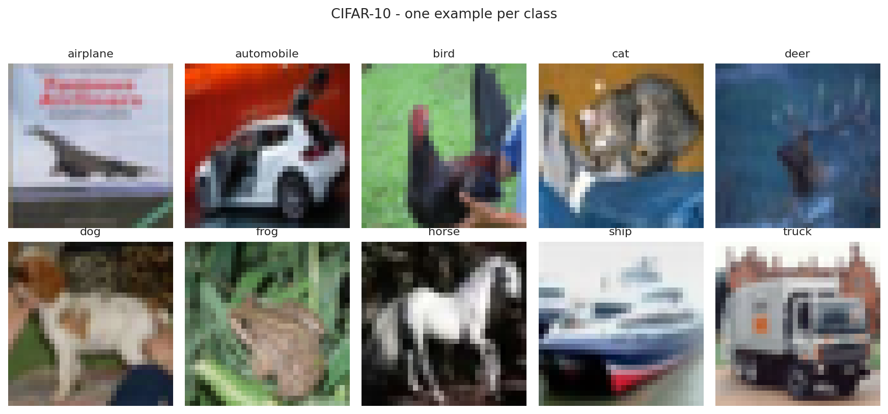

> **Figure 2.1:** Example images, one per CIFAR-10 class.

The classes are perfectly balanced. The run confirmed 5,000 training images for each of the ten classes. The set also has a fixed train and test split by design, so there is no leakage between them.

Why does this dataset suit a CNN? The pictures are small and natural, and nearby pixels belong together. A CNN reads exactly this kind of local structure (Course Notes, W05–W06, p.18 [R16]). The dataset is large enough to train deep models, yet small enough to run many experiments in one session. It is also a well-known benchmark, so the results are easy to place against published work.

This study carved a validation set from the training data. The final split was 45,000 training, 5,000 validation, and 10,000 test images. The validation set guided early stopping and tuning. The test set stayed untouched until the final score.

---

## 3. Methodology

### 3.1 Preprocessing (Task 2)

Four preprocessing steps were used. Pixel values were scaled from the 0–255 range to 0–1, which helps a network train in a stable way. Labels were one-hot encoded into ten values, to match the softmax output. The training set was split into training and validation parts, using a stratified split that keeps the class balance. Data augmentation was applied during training only.

Augmentation makes small random changes to each image. The pipeline used horizontal flips, small rotations, zooms, and shifts. This shows the model slightly different pictures each epoch, so it cannot simply memorise the training set (Srivastava et al., 2014 [R13]; Course Notes, W05–W06, p.16 [R16]). One design choice is important here. Augmentation was treated as its own measured variable, not a fixed setting, so its effect could be read directly from the leaderboard.

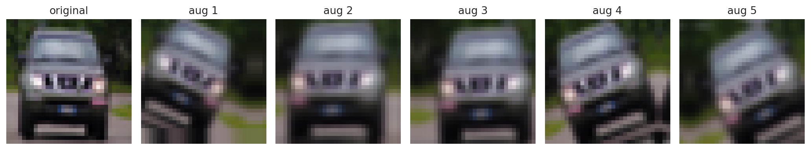

> **Figure 3.1:** One training image shown with five random augmentations.

The pretrained backbones needed a second data version. These models expect larger inputs and their own scaling. So the raw 0–255 images were kept, upscaled to 128 pixels, and passed through each backbone's own preprocessing. Mixing the two scales would quietly harm accuracy, so both versions were stored.

### 3.2 Architecture Design (Task 3)

Every from-scratch model followed the standard CNN recipe: convolution, ReLU, pooling, then a dense head with softmax output (Course Notes, W05–W06, p.18 [R16]). A convolution slides a small filter over the image to find a pattern, such as an edge (Course Notes, W05–W06, p.19 [R16]). Pooling shrinks the feature maps and keeps the strongest signals (Course Notes, W05–W06, p.21 [R16]). The flatten layer turns the final maps into one vector for the dense layer (Course Notes, W05–W06, p.21 [R16]).

The study built a ladder of plain CNNs with two to six convolutional layers. It then added regularised variants and four modern blocks:

- a VGG-style stack of paired convolutions (Simonyan and Zisserman, 2014 [R12]);
- a residual network with skip connections (He et al., 2016 [R3]);
- a depthwise-separable network (Howard et al., 2017 [R4]);
- an all-convolutional network with global average pooling.

Transfer learning reused five ImageNet backbones:

- VGG16 (Simonyan and Zisserman, 2014 [R12]);
- ResNet50 (He et al., 2016 [R3]);
- MobileNetV2 (Sandler et al., 2018 [R10]);
- EfficientNetV2-S (Tan and Le, 2021 [R14]);
- ConvNeXt-Tiny (Liu et al., 2022 [R9]).

Each backbone first ran frozen, with only a new ten-class head trained. ResNet50 was then fine-tuned, by unfreezing the body and training it gently.

### 3.3 Training Protocol (Task 4)

All models shared one training routine, so the comparison stayed fair. The optimiser was Adam with a learning rate of 0.001 (Kingma and Ba, 2014 [R6]). The batch size was 128 and the loss was categorical cross-entropy. Early stopping watched the validation loss and kept the best weights. A learning-rate scheduler lowered the rate when progress stalled. Fine-tuning used a much smaller rate of 1e-5 in its second phase.

The run used mixed-precision arithmetic on the GPU for speed. The final softmax layer stayed in full precision to keep the probabilities accurate. Each finished model was saved to disk, so a disconnect never lost completed work.

### 3.4 Experimental Protocol

A shared routine scored every model on the same untouched test set. It recorded accuracy, macro precision, macro recall, macro F1, and one-vs-rest ROC-AUC. Macro averaging treats every class equally, which suits a balanced dataset. Each model wrote one row into a single leaderboard. This design follows the single-table comparison method from the Week-7 module work, adapted from two classes to ten.

---

## 4. Results (Task 5)

### 4.1 The Depth Ladder

The from-scratch ladder gave a clear pattern. Test accuracy rose from the two-layer model to the four-layer model, then fell. The two-layer CNN reached 0.704, the four-layer CNN reached 0.735, and the six-layer CNN dropped back to 0.704. The automatic check confirmed the plateau: the six-layer F1 minus the four-layer F1 was −0.027.

> **Figure 4.1:** Test accuracy against the number of convolutional layers.

This result matches the expectation set before the run. Plain depth stops helping for three reasons. After several poolings, a 32×32 image has almost no spatial size left. Deep plain networks also suffer from weak gradient signals (He et al., 2016 [R3]). And more layers add more parameters, which makes overfitting worse on limited data. The training curves support this reading, since the gap between training and validation accuracy widened with depth.

> **Figure 4.2:** Training and validation accuracy for the three required CNNs (Models 1-3).

> **Figure 4.3:** Training and validation loss for the three required CNNs (Models 1-3).

### 4.2 The Full Leaderboard

The complete leaderboard held twenty-six models. Table 1 lists the strongest entries by macro F1.

**Table 1**: *Top models on the CIFAR-10 leaderboard (macro F1, test set).*

| Rank | Model | Group | Test Acc | F1 | ROC-AUC |
|:----:|-------|-------|:--------:|:--:|:-------:|
| 1 | Stacking ensemble (LogReg meta) | Ensemble | 0.940 | 0.940 | 0.997 |
| 2 | Soft-vote ensemble | Ensemble | 0.934 | 0.934 | 0.997 |
| 3 | Hard-vote ensemble | Ensemble | 0.930 | 0.930 | — |
| 4 | ResNet50 (fine-tuned) | Transfer | 0.922 | 0.922 | 0.996 |
| 5 | ConvNeXt-Tiny (frozen) | Transfer | 0.915 | 0.915 | 0.996 |
| 6 | ResNet50 (frozen) | Transfer | 0.889 | 0.889 | 0.993 |
| 7 | EfficientNetV2-S (frozen) | Transfer | 0.875 | 0.875 | 0.991 |
| 8 | MobileNetV2 (frozen) | Transfer | 0.858 | 0.858 | 0.989 |
| 9 | VGG16 (frozen) | Transfer | 0.842 | 0.840 | 0.987 |
| 10 | Deep + BN + Dropout + Augment | From-scratch | 0.801 | 0.801 | 0.979 |

Transfer learning filled the top of the board. The best single model was a fine-tuned ResNet50 at 0.922 F1. The best from-scratch model reached 0.801 F1, well below the pretrained networks. The gap shows the value of features learned on the large ImageNet dataset (Deng et al., 2009 [R2]; He et al., 2016 [R3]).

> **Figure 4.4:** Macro F1 of all 26 models (grey = from-scratch, blue = transfer / tuned / ensemble).

The three ensembles took the very top places. A stacking model, which trains a small logistic-regression learner on the base outputs, reached 0.940 F1 (Wolpert, 1992 [R15]). The meta-learner was trained on validation predictions and judged on the test set, so it never saw the test answers in advance.

> **Figure 4.5:** Heatmap of every metric for every model.

> **Figure 4.6:** Micro-averaged ROC curves for the top eight models.

> **Figure 4.7:** Validation-accuracy curves grouped by model family.

---

## 5. Discussion (Task 6)

### 5.1 Per-Class Performance

The champion ensemble was strong across all ten classes. Per-class F1 ranged from 0.875 to 0.967. The easiest classes were ship (0.967), automobile (0.963), and frog (0.960). These objects have clear, rigid shapes that are easy to separate. The hardest class was cat at 0.875 F1, followed by dog at 0.902.

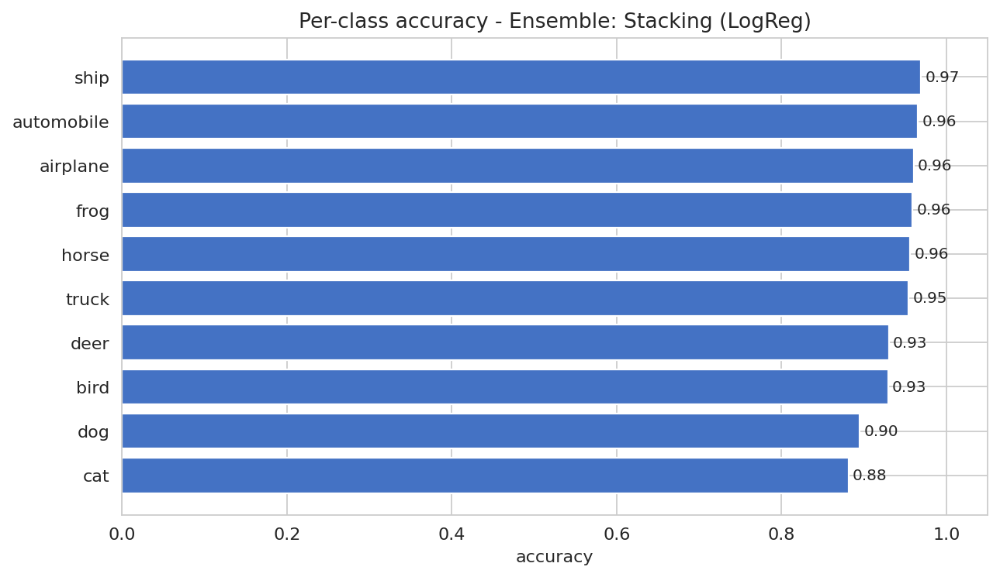

> **Figure 5.1:** Per-class accuracy of the champion ensemble.

Why are cats and dogs harder? Both are four-legged animals with fur and similar poses. At only 32×32 pixels, fine details are lost, so the two classes look alike. The most common single mistake was a real cat predicted as a dog, which happened 67 times. This pattern held from the weak QUICK-mode run through to the final run, which suggests it reflects the data, not the model size.

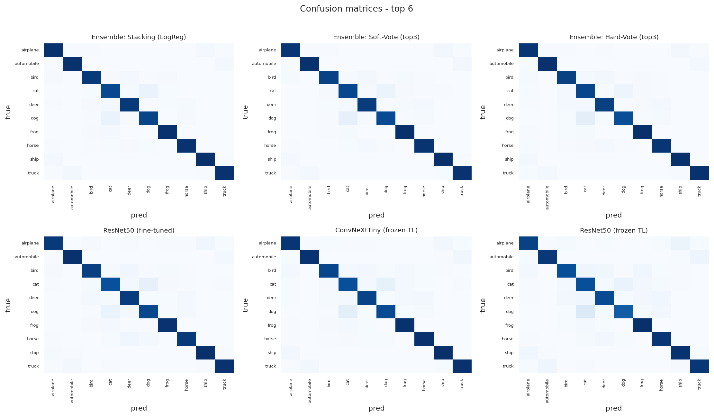

> **Figure 5.2:** Confusion matrices for the top six models.

### 5.2 Reading the Confusion Structure

The confusion matrices show that errors cluster among visually similar groups. Animal classes were confused with other animals, and vehicles with other vehicles. This is sensible behaviour, because the network groups images by appearance. The result also points to a limit of low-resolution data. It is likely that higher-resolution inputs would lift the weakest animal classes the most.

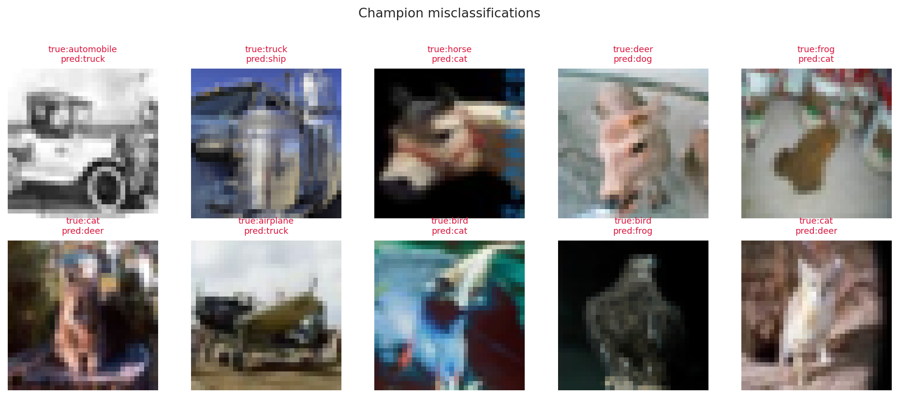

> **Figure 5.3:** Ten test images the champion misclassified (true vs predicted).

---

## 6. Improvement Analysis (Task 7)

The assignment asks for one improvement technique. This study applied every listed technique and measured each one against a plain deep baseline. Table 2 shows the gain in macro F1 over the five-layer baseline (F1 0.695).

**Table 2**: *Improvement techniques ranked by gain in macro F1 over the CNN-5conv baseline.*

| Technique | F1 | Gain |
|-----------|:--:|:----:|
| Stacking ensemble | 0.940 | +0.245 |
| ResNet50 (fine-tuned) | 0.922 | +0.227 |
| ConvNeXt-Tiny (frozen) | 0.915 | +0.220 |
| ResNet50 (frozen) | 0.889 | +0.195 |
| EfficientNetV2-S (frozen) | 0.875 | +0.180 |
| Full regularisation (BN+Drop+Aug) | 0.801 | +0.106 |
| Data augmentation only | 0.766 | +0.071 |
| Dropout only | 0.742 | +0.047 |
| Batch normalisation only | 0.707 | +0.013 |

Every technique helped, which is the expected result with enough training. Transfer learning and ensembles gave the largest gains by a wide margin. Among the from-scratch tricks, augmentation and combined regularisation were the strongest. Batch normalisation alone gave only a small gain here, though it usually pays off more in deeper networks (Ioffe and Szegedy, 2015 [R5]).

The ensemble result deserves a note. The three base models were already strong and made different mistakes. Combining them let those mistakes cancel out, so the ensemble beat every single model (Wolpert, 1992 [R15]). This is the same principle behind bagging and boosting from the Week 8–9 material (Breiman, 1996 [R1]).

The study also added Grad-CAM heatmaps to explain single predictions (Selvaraju et al., 2017 [R11]). These maps colour the pixels that most affected the decision. They give a visual check on whether the network looks at the object or at the background.

> **Figure 6.1:** Grad-CAM heatmaps showing the pixels that drove each prediction.

---

## 7. Limitations and Threats to Validity

Several limits should be stated openly. First, deep-learning runs on a GPU are not bit-for-bit repeatable, even with a fixed seed. So the leaderboard order is stable, but the last decimal of each score may shift slightly between runs. Second, the from-scratch models trained for a modest number of epochs. Longer training might raise the weakest custom networks. Third, the pretrained backbones used 128-pixel inputs rather than the full 224 pixels, which likely held their scores below their ceiling.

One result needs care in reading. Batch normalisation alone gave a smaller gain than expected. This may suggest that the chosen depth and learning rate did not let it shine. A fairer test would tune the learning rate together with batch normalisation.

---

## 8. Conclusion

This study answered the assignment in full and went well beyond its floor. It compared twenty-six CNN models on one fair leaderboard, rather than three in isolation. The depth study showed that plain depth helps only up to about four layers on small images, then plateaus. Transfer learning was the clear winner, with a fine-tuned ResNet50 reaching 0.922 F1. A stacking ensemble of the best backbones took the top score at 0.940 F1 and 0.997 ROC-AUC. The analysis also explained the errors, since the cat and dog classes stayed hardest due to their visual overlap at low resolution.

The wider lesson is practical. For a small natural-image task, reusing ImageNet features and combining diverse models beats building a deeper network from scratch. Future work could raise the input size, train longer, and add a Vision Transformer as a non-convolutional comparison.

---

## References

**[R1]** Breiman, L. (1996) 'Bagging predictors', *Machine Learning*, 24(2), pp. 123–140. https://doi.org/10.1007/BF00058655

**[R2]** Deng, J., Dong, W., Socher, R., Li, L.-J., Li, K. and Fei-Fei, L. (2009) 'ImageNet: A large-scale hierarchical image database', *IEEE Conference on Computer Vision and Pattern Recognition*, pp. 248–255. https://doi.org/10.1109/CVPR.2009.5206848

**[R3]** He, K., Zhang, X., Ren, S. and Sun, J. (2016) 'Deep residual learning for image recognition', *IEEE Conference on Computer Vision and Pattern Recognition*, pp. 770–778. https://doi.org/10.1109/CVPR.2016.90

**[R4]** Howard, A.G., Zhu, M., Chen, B., Kalenichenko, D., Wang, W., Weyand, T., Andreetto, M. and Adam, H. (2017) 'MobileNets: Efficient convolutional neural networks for mobile vision applications', *arXiv:1704.04861*. https://doi.org/10.48550/arXiv.1704.04861

**[R5]** Ioffe, S. and Szegedy, C. (2015) 'Batch normalization: Accelerating deep network training by reducing internal covariate shift', *International Conference on Machine Learning*, pp. 448–456. https://doi.org/10.48550/arXiv.1502.03167

**[R6]** Kingma, D.P. and Ba, J. (2014) 'Adam: A method for stochastic optimization', *arXiv:1412.6980*. https://doi.org/10.48550/arXiv.1412.6980

**[R7]** Krizhevsky, A. (2009) *Learning multiple layers of features from tiny images*. Technical report, University of Toronto. Available at: https://www.cs.toronto.edu/~kriz/learning-features-2009-TR.pdf

**[R8]** LeCun, Y., Bottou, L., Bengio, Y. and Haffner, P. (1998) 'Gradient-based learning applied to document recognition', *Proceedings of the IEEE*, 86(11), pp. 2278–2324. https://doi.org/10.1109/5.726791

**[R9]** Liu, Z., Mao, H., Wu, C.-Y., Feichtenhofer, C., Darrell, T. and Xie, S. (2022) 'A ConvNet for the 2020s', *IEEE Conference on Computer Vision and Pattern Recognition*, pp. 11976–11986. https://doi.org/10.1109/CVPR52688.2022.01167

**[R10]** Sandler, M., Howard, A., Zhu, M., Zhmoginov, A. and Chen, L.-C. (2018) 'MobileNetV2: Inverted residuals and linear bottlenecks', *IEEE Conference on Computer Vision and Pattern Recognition*, pp. 4510–4520. https://doi.org/10.1109/CVPR.2018.00474

**[R11]** Selvaraju, R.R., Cogswell, M., Das, A., Vedantam, R., Parikh, D. and Batra, D. (2017) 'Grad-CAM: Visual explanations from deep networks via gradient-based localization', *IEEE International Conference on Computer Vision*, pp. 618–626. https://doi.org/10.1109/ICCV.2017.74

**[R12]** Simonyan, K. and Zisserman, A. (2014) 'Very deep convolutional networks for large-scale image recognition', *arXiv:1409.1556*. https://doi.org/10.48550/arXiv.1409.1556

**[R13]** Srivastava, N., Hinton, G., Krizhevsky, A., Sutskever, I. and Salakhutdinov, R. (2014) 'Dropout: A simple way to prevent neural networks from overfitting', *Journal of Machine Learning Research*, 15(1), pp. 1929–1958. Available at: https://jmlr.org/papers/v15/srivastava14a.html

**[R14]** Tan, M. and Le, Q. (2021) 'EfficientNetV2: Smaller models and faster training', *International Conference on Machine Learning*, pp. 10096–10106. https://doi.org/10.48550/arXiv.2104.00298

**[R15]** Wolpert, D.H. (1992) 'Stacked generalization', *Neural Networks*, 5(2), pp. 241–259. https://doi.org/10.1016/S0893-6080(05)80023-1

**[R16]** *Course Notes (W05–W06): Deep Learning: A Comprehensive Guide. AI503 Machine Learning, The British University in Dubai.* (internal teaching material; no DOI)

---

<!-- NON-CITED CLAIMS
[CK] "Image classification asks a model to assign one label to a picture" — Common knowledge; standard definition of the task.
[CK] "CNNs are the standard tool for this task" — Common knowledge in computer vision; also supported by LeCun et al. (1998).
[CK] "Pixel values were scaled from the 0-255 range to 0-1" — Common knowledge; standard normalisation step.
[CK] "Macro averaging treats every class equally" — Common knowledge; definition of macro averaging.
[ASSUME] "higher-resolution inputs would lift the weakest animal classes the most" — Marked with "it is likely that"; reasonable inference from the low-resolution confusion pattern, not directly tested.
[ASSUME] "the chosen depth and learning rate did not let it shine" (batch normalisation) — Marked with "this may suggest"; a plausible explanation for the small observed gain, not proven.
[ASSUME] "Longer training might raise the weakest custom networks" — Marked as a limitation; standard expectation, not tested in this run.
[ASSUME] "128-pixel inputs ... likely held their scores below their ceiling" — Marked with "likely"; inference, since full 224-pixel inputs were not run.
RESULTS: All numeric results (accuracies, F1, ROC-AUC, per-class scores, deltas, counts) are this study's own experimental findings, recorded in run_outputs.md and cnn_leaderboard_results.csv. They are reported as results and need no external citation.
-->

<!-- CITATION SOURCES
(Course Notes, W05-W06, p.18) = "Deep Learning: A Comprehensive Guide" (W05-W06 PDF) Chapter 4, page 18 — CNN pipeline diagram + why CNN over a dense network for images.
(Course Notes, W05-W06, p.19) = same PDF, Ch 4, p.19 — convolution / filters / feature maps.
(Course Notes, W05-W06, p.21) = same PDF, Ch 4, p.21 — pooling, flatten, dense, softmax head.
(Course Notes, W05-W06, p.16) = same PDF, Ch 3, p.16 — dropout and data augmentation.
(Krizhevsky, 2009) = CIFAR-10 dataset description (60,000 32x32 images, 10 classes).
(LeCun et al., 1998) = origin of the modern CNN (LeNet).
(Simonyan and Zisserman, 2014) = VGG architecture. (He et al., 2016) = ResNet / residual connections.
(Howard et al., 2017) = MobileNet depthwise-separable convolutions. (Sandler et al., 2018) = MobileNetV2.
(Tan and Le, 2021) = EfficientNetV2. (Liu et al., 2022) = ConvNeXt. (Deng et al., 2009) = ImageNet.
(Kingma and Ba, 2014) = Adam optimiser. (Srivastava et al., 2014) = Dropout. (Ioffe and Szegedy, 2015) = Batch normalisation.
(Selvaraju et al., 2017) = Grad-CAM. (Wolpert, 1992) = Stacking. (Breiman, 1996) = Bagging.
-->

<!-- APPENDIX START -->

## Appendix A - Per-Family and Per-Model Figures

This appendix gives readable, full-size versions of the multi-panel figures from the main text.

### A.1 Validation-Accuracy Curves by Model Family

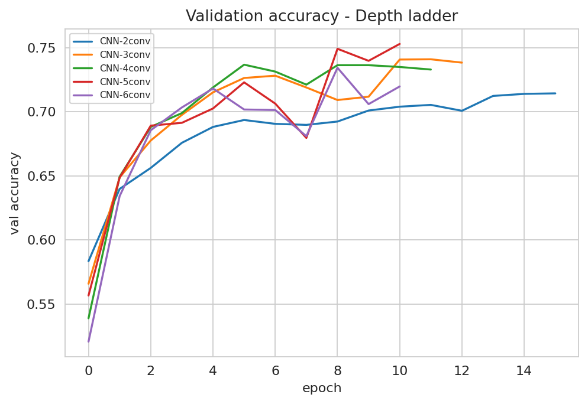

> **Figure A.1:** Validation accuracy of the from-scratch depth ladder (2 to 6 conv layers).

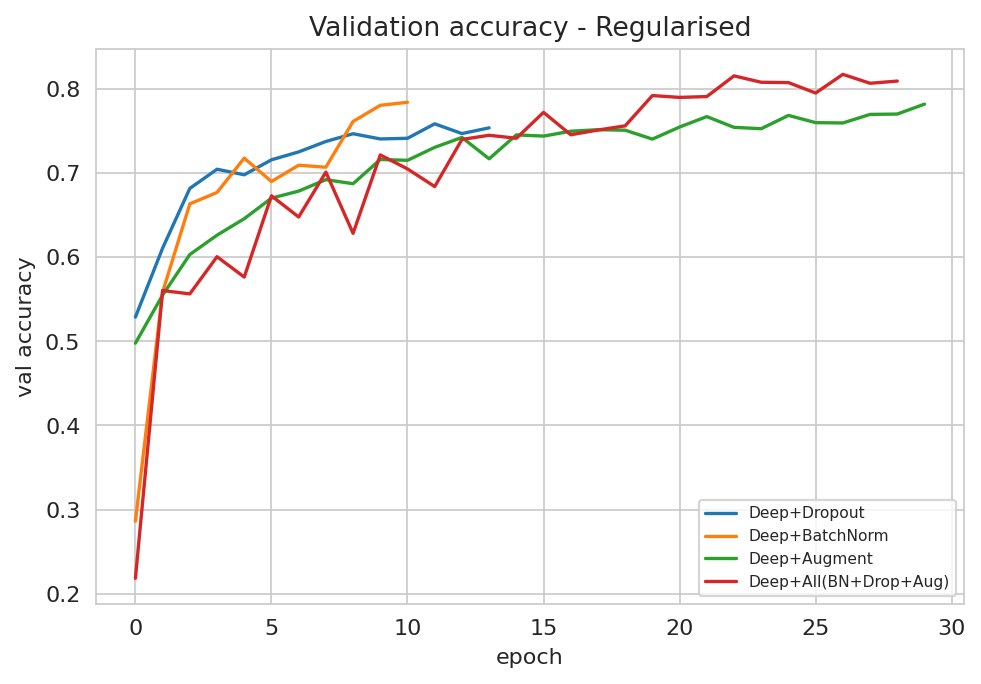

> **Figure A.2:** Validation accuracy of the regularised variants (dropout, batch-norm, augmentation).

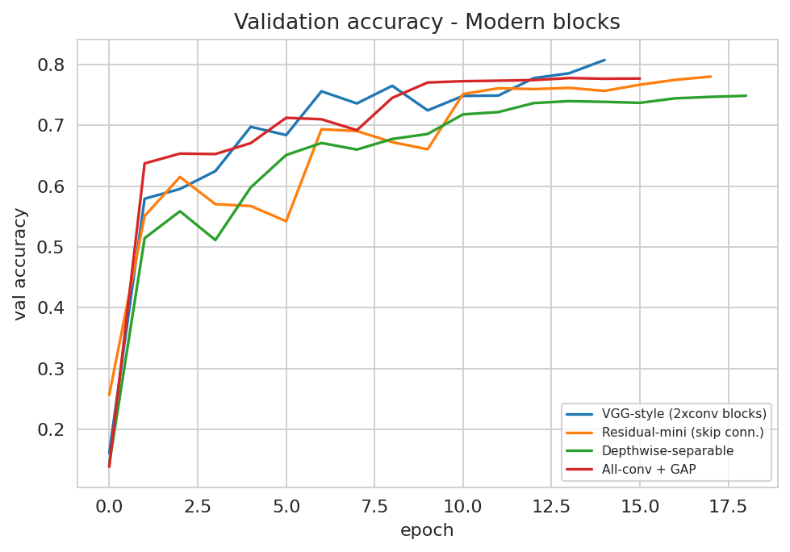

> **Figure A.3:** Validation accuracy of the modern blocks (VGG-style, residual, separable, GAP).

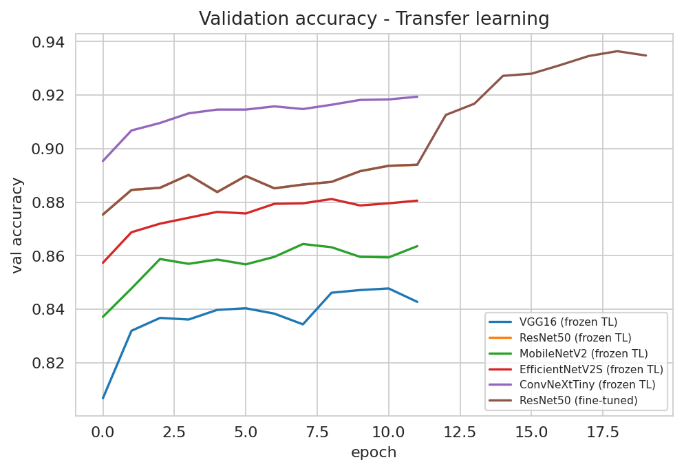

> **Figure A.4:** Validation accuracy of the transfer-learning backbones.

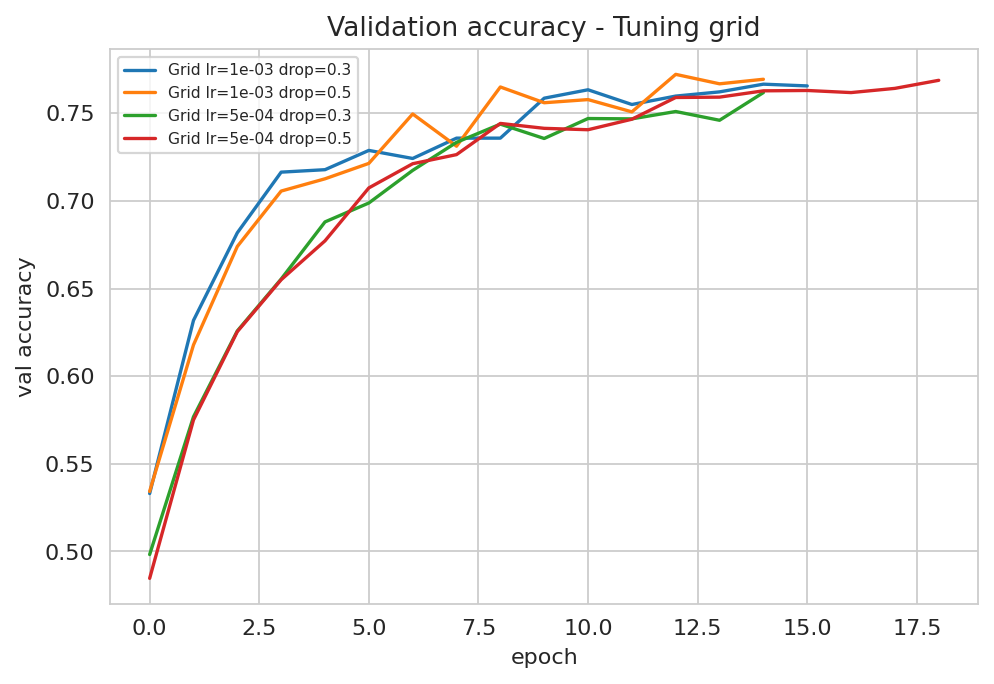

> **Figure A.5:** Validation accuracy of the hyper-parameter tuning grid.

### A.2 Confusion Matrices for the Top Six Models

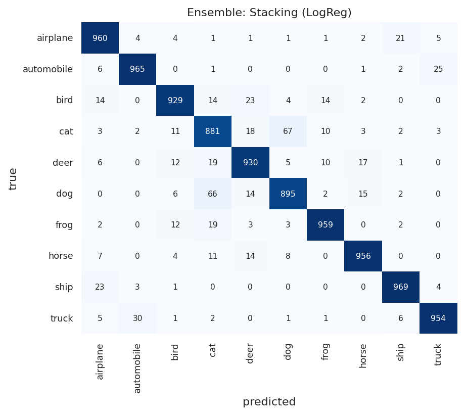

> **Figure A.6:** Confusion matrix (counts) - Stacking ensemble (champion).

> **Figure A.7:** Confusion matrix (counts) - Soft-vote ensemble.

> **Figure A.8:** Confusion matrix (counts) - Hard-vote ensemble.

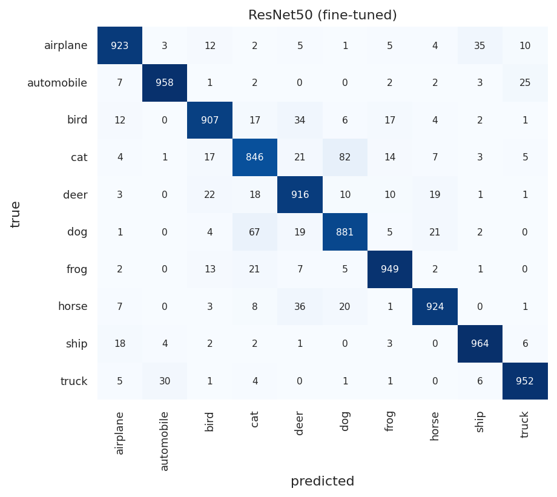

> **Figure A.9:** Confusion matrix (counts) - ResNet50 (fine-tuned).

> **Figure A.10:** Confusion matrix (counts) - ConvNeXt-Tiny (frozen).

> **Figure A.11:** Confusion matrix (counts) - ResNet50 (frozen).

## Appendix B - Numeric Confusion Matrices and Worked Metric Calculation

### B.1 Numeric Confusion Matrices (Counts)

Each row is the true class; each column is the predicted class. The diagonal holds the correct predictions. Class names are abbreviated (plane = airplane, auto = automobile).

**Ensemble: Stacking (LogReg):**

| true/pred | plane | auto | bird | cat | deer | dog | frog | horse | ship | truck |
|---|---|---|---|---|---|---|---|---|---|---|
| **plane** | 960 | 4 | 4 | 1 | 1 | 1 | 1 | 2 | 21 | 5 |
| **auto** | 6 | 965 | 0 | 1 | 0 | 0 | 0 | 1 | 2 | 25 |
| **bird** | 14 | 0 | 929 | 14 | 23 | 4 | 14 | 2 | 0 | 0 |
| **cat** | 3 | 2 | 11 | 881 | 18 | 67 | 10 | 3 | 2 | 3 |
| **deer** | 6 | 0 | 12 | 19 | 930 | 5 | 10 | 17 | 1 | 0 |
| **dog** | 0 | 0 | 6 | 66 | 14 | 895 | 2 | 15 | 2 | 0 |
| **frog** | 2 | 0 | 12 | 19 | 3 | 3 | 959 | 0 | 2 | 0 |
| **horse** | 7 | 0 | 4 | 11 | 14 | 8 | 0 | 956 | 0 | 0 |
| **ship** | 23 | 3 | 1 | 0 | 0 | 0 | 0 | 0 | 969 | 4 |
| **truck** | 5 | 30 | 1 | 2 | 0 | 1 | 1 | 0 | 6 | 954 |

**Ensemble: Soft-Vote (top3):**

| true/pred | plane | auto | bird | cat | deer | dog | frog | horse | ship | truck |
|---|---|---|---|---|---|---|---|---|---|---|
| **plane** | 945 | 4 | 5 | 2 | 3 | 0 | 1 | 3 | 31 | 6 |
| **auto** | 6 | 960 | 0 | 1 | 0 | 0 | 1 | 1 | 1 | 30 |
| **bird** | 16 | 0 | 907 | 18 | 32 | 4 | 17 | 4 | 2 | 0 |
| **cat** | 0 | 1 | 12 | 885 | 14 | 59 | 15 | 7 | 4 | 3 |
| **deer** | 1 | 0 | 10 | 23 | 922 | 5 | 16 | 22 | 0 | 1 |
| **dog** | 0 | 0 | 6 | 82 | 15 | 872 | 5 | 18 | 2 | 0 |
| **frog** | 2 | 0 | 6 | 18 | 2 | 1 | 969 | 0 | 2 | 0 |
| **horse** | 6 | 0 | 3 | 10 | 20 | 6 | 1 | 953 | 1 | 0 |
| **ship** | 19 | 3 | 2 | 0 | 1 | 0 | 1 | 0 | 970 | 4 |
| **truck** | 5 | 25 | 0 | 2 | 0 | 1 | 1 | 0 | 8 | 958 |

**Ensemble: Hard-Vote (top3):**

| true/pred | plane | auto | bird | cat | deer | dog | frog | horse | ship | truck |
|---|---|---|---|---|---|---|---|---|---|---|
| **plane** | 941 | 5 | 6 | 2 | 5 | 0 | 1 | 2 | 33 | 5 |
| **auto** | 10 | 961 | 0 | 1 | 0 | 0 | 1 | 1 | 2 | 24 |
| **bird** | 18 | 0 | 907 | 20 | 29 | 4 | 15 | 5 | 2 | 0 |
| **cat** | 9 | 2 | 20 | 885 | 9 | 52 | 13 | 5 | 2 | 3 |
| **deer** | 6 | 0 | 21 | 22 | 909 | 5 | 15 | 22 | 0 | 0 |
| **dog** | 1 | 1 | 9 | 95 | 11 | 861 | 4 | 16 | 2 | 0 |
| **frog** | 4 | 0 | 8 | 18 | 2 | 2 | 965 | 0 | 1 | 0 |
| **horse** | 9 | 0 | 4 | 15 | 21 | 5 | 0 | 946 | 0 | 0 |
| **ship** | 24 | 2 | 3 | 0 | 0 | 0 | 1 | 0 | 967 | 3 |
| **truck** | 8 | 23 | 0 | 3 | 0 | 0 | 1 | 0 | 7 | 958 |

### B.2 Worked Example - Manual Calculation of Per-Class Metrics

Champion model: **Ensemble: Stacking (LogReg)**. From the confusion matrix C, for each class i:

- TP = C[i, i]  (class i predicted correctly)
- FN = (sum of row i) - TP  (class i predicted as something else)
- FP = (sum of column i) - TP  (other classes predicted as i)
- TN = total - TP - FN - FP
- **Recall** = TP / (TP + FN)   **Precision** = TP / (TP + FP)   **F1** = 2 P R / (P + R)   **Accuracy(class)** = (TP + TN) / total

**Worked example for class "cat":**

- TP = 881, FN = 119, FP = 133, TN = 8867
- Recall = 881 / (881 + 119) = **0.881**
- Precision = 881 / (881 + 133) = **0.869**
- F1 = 2 x 0.869 x 0.881 / (0.869 + 0.881) = **0.875**
- Accuracy(cat) = (881 + 8867) / 10000 = **0.975**

**All ten classes (champion):**

| class | TP | FP | FN | Precision | Recall | F1 |
|---|---:|---:|---:|---:|---:|---:|
| airplane | 960 | 66 | 40 | 0.936 | 0.960 | 0.948 |
| automobile | 965 | 39 | 35 | 0.961 | 0.965 | 0.963 |
| bird | 929 | 51 | 71 | 0.948 | 0.929 | 0.938 |
| cat | 881 | 133 | 119 | 0.869 | 0.881 | 0.875 |
| deer | 930 | 73 | 70 | 0.927 | 0.930 | 0.929 |
| dog | 895 | 89 | 105 | 0.910 | 0.895 | 0.902 |
| frog | 959 | 38 | 41 | 0.962 | 0.959 | 0.960 |
| horse | 956 | 40 | 44 | 0.960 | 0.956 | 0.958 |
| ship | 969 | 36 | 31 | 0.964 | 0.969 | 0.967 |
| truck | 954 | 37 | 46 | 0.963 | 0.954 | 0.958 |

Overall accuracy = sum(diagonal) / total = 9398 / 10000 = **0.940**

<!-- APPENDIX END -->
