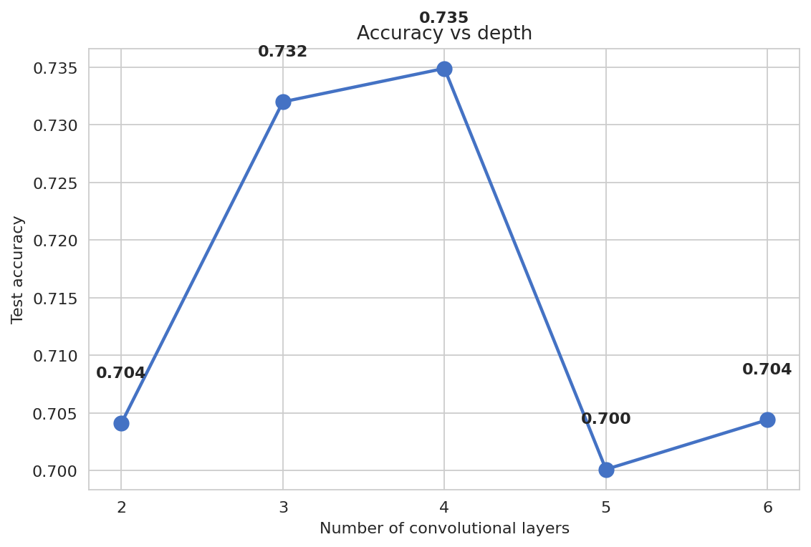
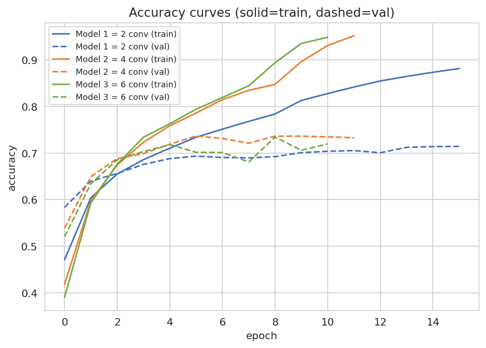
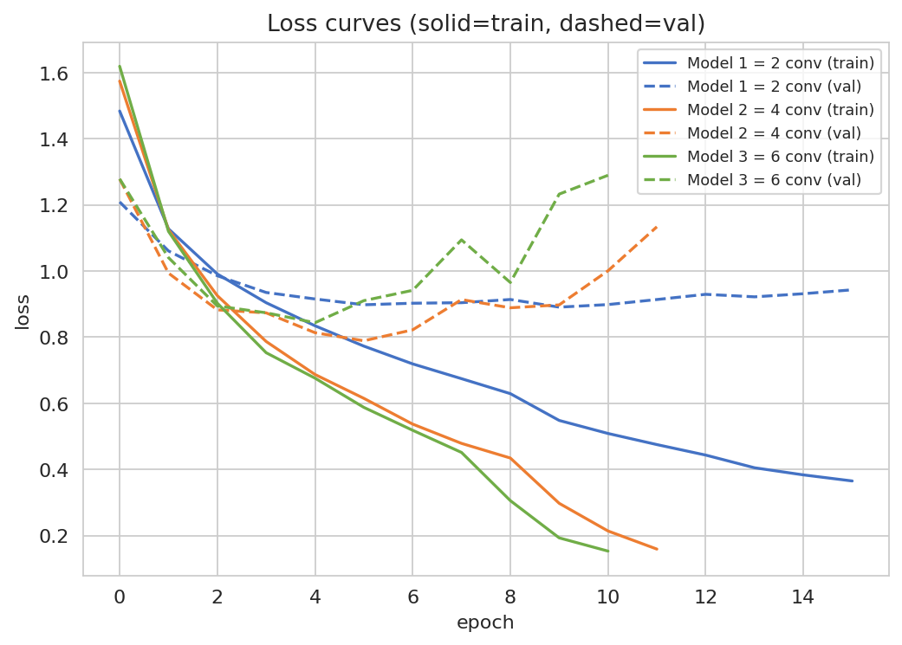
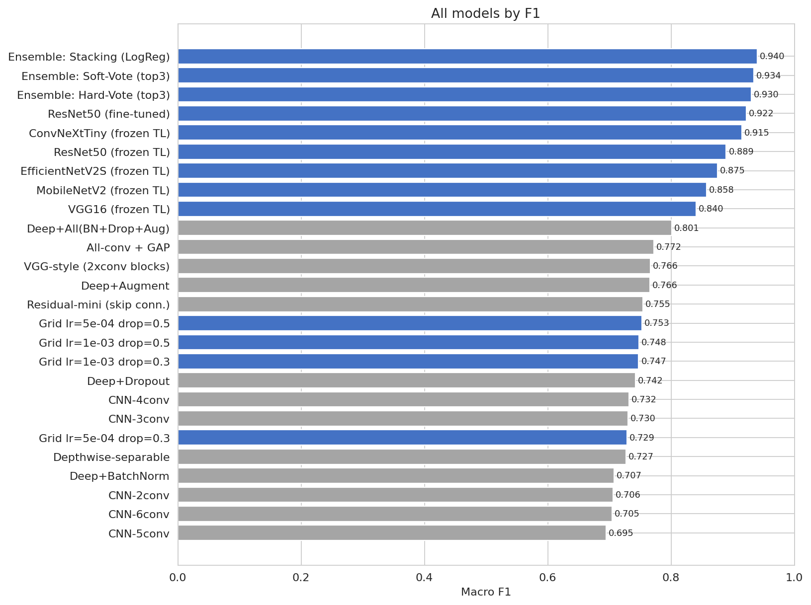
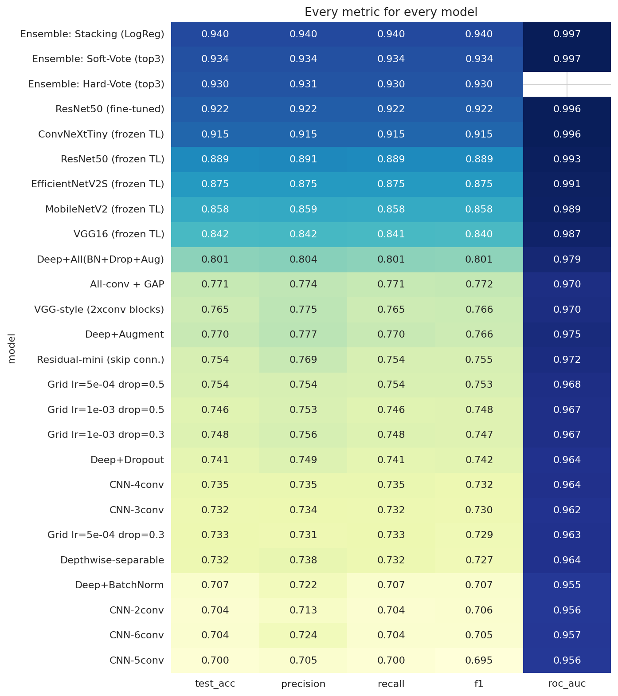
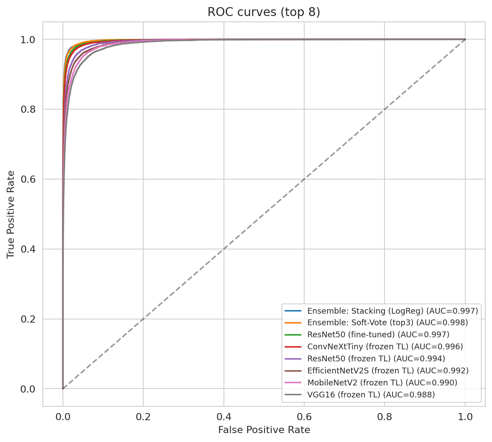
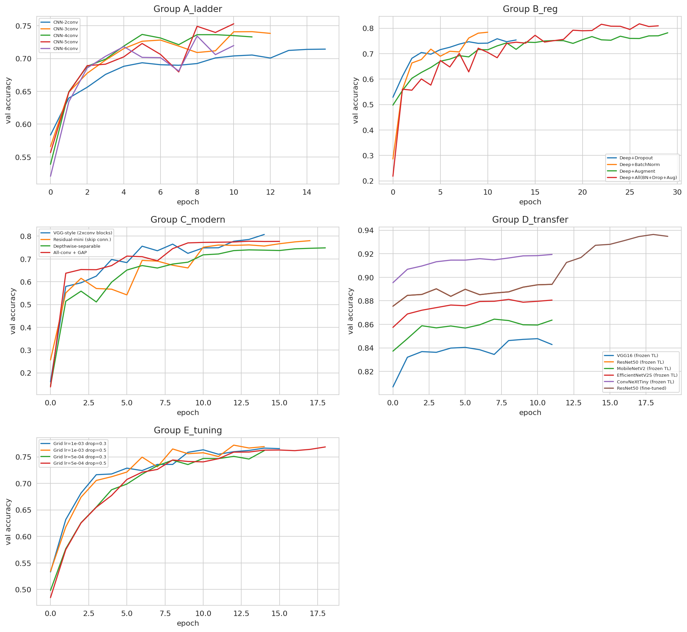

## 4. Results (Task 5)

### 4.1 The Depth Ladder

The from-scratch ladder gave a clear pattern. Test accuracy rose from the two-layer model to the four-layer model, then fell. The two-layer CNN reached 0.704, the four-layer CNN reached 0.735, and the six-layer CNN dropped back to 0.704. The automatic check confirmed the plateau: the six-layer F1 minus the four-layer F1 was −0.027.

> **Figure 4.1:** Test accuracy against the number of convolutional layers.

This result matches the expectation set before the run. Plain depth stops helping for three reasons. After several poolings, a 32×32 image has almost no spatial size left. Deep plain networks also suffer from weak gradient signals (He et al., 2016 [R3]). And more layers add more parameters, which makes overfitting worse on limited data. The training curves support this reading, since the gap between training and validation accuracy widened with depth.

> **Figure 4.2:** Training and validation accuracy for the three required CNNs (Models 1-3).

> **Figure 4.3:** Training and validation loss for the three required CNNs (Models 1-3).

### 4.2 The Full Leaderboard

The complete leaderboard held twenty-six models. Table 1 lists the strongest entries by macro F1.

**Table 1**: *Top models on the CIFAR-10 leaderboard (macro F1, test set).*

| Rank | Model | Group | Test Acc | F1 | ROC-AUC |
|:----:|-------|-------|:--------:|:--:|:-------:|
| 1 | Stacking ensemble (LogReg meta) | Ensemble | 0.940 | 0.940 | 0.997 |
| 2 | Soft-vote ensemble | Ensemble | 0.934 | 0.934 | 0.997 |
| 3 | Hard-vote ensemble | Ensemble | 0.930 | 0.930 | — |
| 4 | ResNet50 (fine-tuned) | Transfer | 0.922 | 0.922 | 0.996 |
| 5 | ConvNeXt-Tiny (frozen) | Transfer | 0.915 | 0.915 | 0.996 |
| 6 | ResNet50 (frozen) | Transfer | 0.889 | 0.889 | 0.993 |
| 7 | EfficientNetV2-S (frozen) | Transfer | 0.875 | 0.875 | 0.991 |
| 8 | MobileNetV2 (frozen) | Transfer | 0.858 | 0.858 | 0.989 |
| 9 | VGG16 (frozen) | Transfer | 0.842 | 0.840 | 0.987 |
| 10 | Deep + BN + Dropout + Augment | From-scratch | 0.801 | 0.801 | 0.979 |

Transfer learning filled the top of the board. The best single model was a fine-tuned ResNet50 at 0.922 F1. The best from-scratch model reached 0.801 F1, well below the pretrained networks. The gap shows the value of features learned on the large ImageNet dataset (Deng et al., 2009 [R2]; He et al., 2016 [R3]).

> **Figure 4.4:** Macro F1 of all 26 models (grey = from-scratch, blue = transfer / tuned / ensemble).

The three ensembles took the very top places. A stacking model, which trains a small logistic-regression learner on the base outputs, reached 0.940 F1 (Wolpert, 1992 [R15]). The meta-learner was trained on validation predictions and judged on the test set, so it never saw the test answers in advance.

> **Figure 4.5:** Heatmap of every metric for every model.

> **Figure 4.6:** Micro-averaged ROC curves for the top eight models.

> **Figure 4.7:** Validation-accuracy curves grouped by model family.

---
