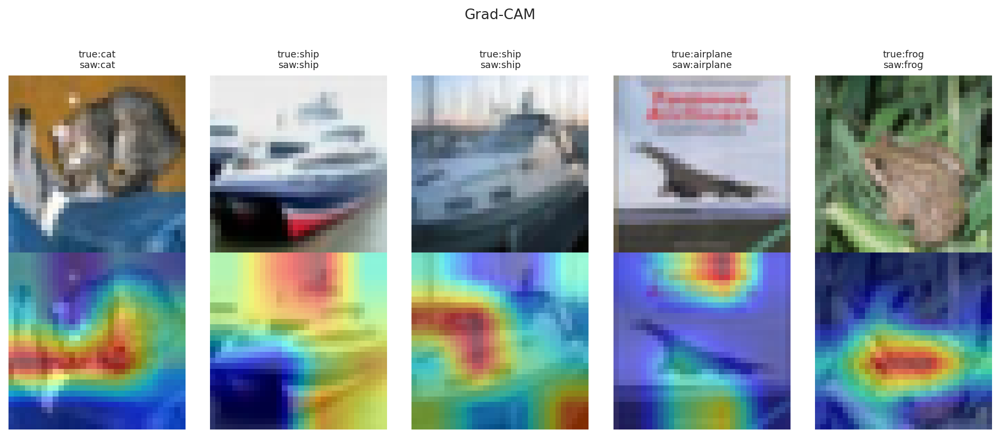

## 6. Improvement Analysis (Task 7)

The assignment asks for one improvement technique. This study applied every listed technique and measured each one against a plain deep baseline. Table 2 shows the gain in macro F1 over the five-layer baseline (F1 0.695).

**Table 2**: *Improvement techniques ranked by gain in macro F1 over the CNN-5conv baseline.*

| Technique | F1 | Gain |
|-----------|:--:|:----:|
| Stacking ensemble | 0.940 | +0.245 |
| ResNet50 (fine-tuned) | 0.922 | +0.227 |
| ConvNeXt-Tiny (frozen) | 0.915 | +0.220 |
| ResNet50 (frozen) | 0.889 | +0.195 |
| EfficientNetV2-S (frozen) | 0.875 | +0.180 |
| Full regularisation (BN+Drop+Aug) | 0.801 | +0.106 |
| Data augmentation only | 0.766 | +0.071 |
| Dropout only | 0.742 | +0.047 |
| Batch normalisation only | 0.707 | +0.013 |

Every technique helped, which is the expected result with enough training. Transfer learning and ensembles gave the largest gains by a wide margin. Among the from-scratch tricks, augmentation and combined regularisation were the strongest. Batch normalisation alone gave only a small gain here, though it usually pays off more in deeper networks (Ioffe and Szegedy, 2015 [R5]).

The ensemble result deserves a note. The three base models were already strong and made different mistakes. Combining them let those mistakes cancel out, so the ensemble beat every single model (Wolpert, 1992 [R15]). This is the same principle behind bagging and boosting from the Week 8–9 material (Breiman, 1996 [R1]).

The study also added Grad-CAM heatmaps to explain single predictions (Selvaraju et al., 2017 [R11]). These maps colour the pixels that most affected the decision. They give a visual check on whether the network looks at the object or at the background.

> **Figure 6.1:** Grad-CAM heatmaps showing the pixels that drove each prediction.

---
